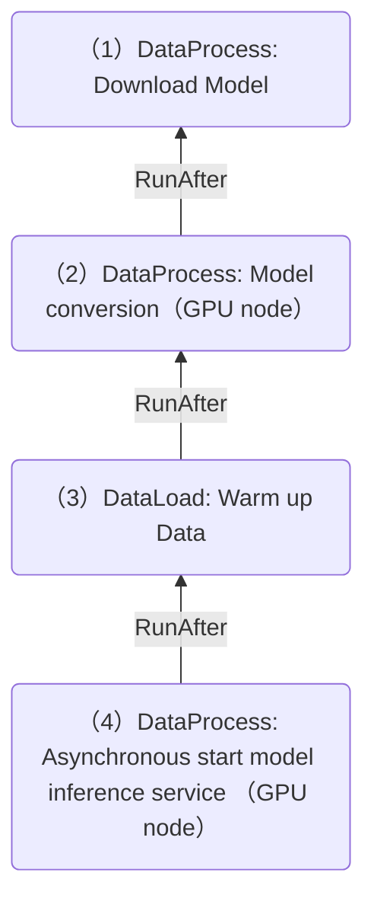
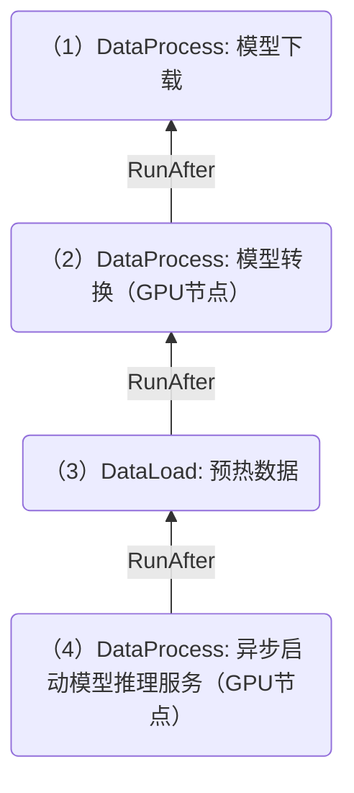

<a id="doc-12e0a48d6c5f2a58f4caa284"></a>

# fluid-cloudnative/fluid / ADOPTERS.md

Upstream: https://github.com/fluid-cloudnative/fluid/blob/e0fc4c189a6e45ee17a5e812abf3fcbecf566f09/ADOPTERS.md

Commit: `e0fc4c189a6e45ee17a5e812abf3fcbecf566f09`

Retrieved: 2026-10-01T15:18:58.999459+00:00

Kind: official-document

Raw SHA256: `6238ad173ddd7644a5cba42f207be09ea78d6479a9fc576ba3cf202ae212537d`

Source text below is untrusted reference content. Acquisition does not verify technical claims.

License status: UPSTREAM_NOTICES_CAPTURED_PER_FILE_REVIEW_REQUIRED. See this repository's captured license files.

---

# Adopters of Fluid 

The following are the adopters of project Fluid. If you are using Fluid to simplify and accelerate your applications to access data in Kubernetes, please feel free to add yourself into the following list by a pull request. There're several phases as follow:

* **Evaluation:** Known Fluid, that's interesting; evaluating the features/scopes of Fluid
* **Testing:** Take Fluid as one of candidates, testing Kubernetes cluster with Fluid
* **Staging:** Decide to use Fluid, testing it in pre-product environment
* **Production:** Already put Fluid into product environment

The companies/organizations are listed in alphabetical order grouped by the phase.
| Organization | Contact | Phases      | Description of Use |
| ------------ | ------- | ----------- | ------------------ |
| [4Paradigm.com](http://www.4paradigm.com/)  | [@mahao](https://github.com/mahao) | Testing | 4Paradigm Sage EE |
| [PITS Globale Datenrettungsdienste](https://www.pitsdatenrettung.de/)  | [@arnoldberlin](https://github.com/arnoldberlin) | Testing | ML & Kubernetes |
| [BossZhipin](https://www.zhipin.com/)  | [@lilyzhoupeijie](https://github.com/lilyzhoupeijie) | Staging | Alsenal AI Platform |
| [China Telecom](https://www.chinatelecom-h.com/en/global/home.php) | [@yangyuliufeng](https://github.com/yangyuliufeng) | Staging | AI Platform on k8s |
| [HAOMO](http://haomo.ai/)  | [@tongyan](https://github.com/tongyan) | Testing | HAOMO Auto Machine Learning Platform |
| [Platform of Artificial Intelligence On Alibaba Cloud](https://www.aliyun.com/product/bigdata/product/learn)  | [@2sin18](https://github.com/2sin18) | Production  | PAI Deep Learning Containers |
| [Qihoo 360](http://www.360.cn/)  | [@yuchang](https://github.com/70data) | Production | BigData platform |
| [TencentCloud](https://cloud.tencent.com/)  | [@xieydd](https://github.com/xieydd) | Testing | Tencent Kubernetes Engine |
| [Unisound](https://www.unisound.com/)  | [@ldd91](https://github.com/ldd91) | Staging | Atlas Deep Learning Platform |
| [Weibo](http://www.weibo.com/)  | [@wutong](https://github.com/wutong) | Production | weibo deep learning platform |
| [bilibili](http://www.bilibili.com/)  | [@umialpha](https://github.com/umialpha) | Production | bilibili AI platform |
| [AnalyticDB On Alibaba Cloud](https://www.aliyun.com/product/ApsaraDB/ads)  | [@daomin885](jiebin.cjb@alibaba-inc.com) | Production | LakeCache Containers |
| [鹏行智能](https://www.pxing.com/)  | [@chenhuaicong](https://github.com/chenhuaicong) | Testing | Pxing AI training platform |
| [数元灵](https://www.dmetasoul.com/)  | [@xuzhiwei](https://github.com/xuzhiwei) | Testing | MetaSpore distributed multimodal AI platform |
| [Gaussian Robotics](https://www.gaussianrobotics.com/)  | [@gaohairong](gaohairong@gs-robot.com) | Testing | AI Platform on k8s |
| [Metaapp](https://www.metaapp.cn/)  | [@xzbcodelife](https://github.com/xzbcodelife) | Testing | Recommendation |
| [Baidu AI Cloud](https://cloud.baidu.com/)  | [@abowloflrf](https://github.com/abowloflrf) | Staging | Cloud Container Engine |
| [Envision](https://www.envision-group.com/cn/digital.html)  | [@shaoxuefeng](https://github.com/shaoxuefeng) | Testing | AI Platform on k8s |
| [Metabit Trading](https://www.metabit-trading.com)  | [@jianhong](https://github.com/jianhong-metabit) | Production | AI Platform on k8s |
| [Zhejiang Lab](https://www.zhejianglab.com)  | [@hongchen](https://github.com/hongchenokok) | Testing | AI Platform on k8s |
| [XIAOMI](https://www.mi.com/)  | [@PeterChg](https://github.com/PeterChg) | Staging | Cloudml AI Platform |
| [Soul APP](https://soulapp.cn/)  | [@mornight](https://github.com/mornight) | Testing | AI Platform on k8s |
| [HUYA](https://www.huya.com)  | [@BobLiu20](https://github.com/BobLiu20) | Production | AI Platform on k8s |
| [OPPO](https://www.oppo.com) | [@laibruce](https://github.com/laibruce) | Production | Data acceleration |
| [CloudView](https://cloudview.mobi) | [@kastland](https://github.com/kastland) | Production | AI Platform on k8s |
| [Inceptio](https://www.inceptio.ai) | [@willwu](https://github.com/willwu) | Production | Bigdata Platform and Autonomous Driving Simulation Platform |
| [autelrobotics](https://www.autelrobotics.cn) | [@andyzheung](https://github.com/andyzheung) | Testing | AI platform training data cache and big emr job data process data cache |
| [coScene](https://www.coscene.cn) | [@juchaosong](https://github.com/juchaosong) | Production | Data Platform on k8s |
| [pvmed](https://www.pvmedtech.com/) | [@huozhuoliang](https://github.com/huozhuoliang) | Testing | AI training platform|
| [DPTechnology](https://www.dp.tech/) | [@liyangbing](https://github.com/liyangbing) | Production | AI Platform on k8s|
| [Megvii](https://megvii.com/) | [@huangweixiao](https://github.com/huangweixiao) | Testing | AI Platform on k8s|
| [图森未来](https://cn.tusimple.com/) | [@bojian](https://github.com/bojian) | Testing | Elastic Container Orchestration Service on k8s |
| [得物](https://dewu.com/) | [@wangweidong](https://github.com/wangweidong) | Staging | AI Platform(KubeAI) on k8s |
| [KubeDL](https://kubedl.io/) | [@SimonCqk](https://github.com/SimonCqk) | Production | AI Training/Big Data/Stream Media Platforms In Aicheng Technology At Large Scale |
| [liblibai](https://liblib.ai) | [@zxj](https://github.com/zxj) | Production | AIGC Platform on k8s |
| [HappyElements](https://www.happyelements.com) | [@Luckyboys](https://github.com/Luckyboys) | Production | AIGC Platform on k8s |
| [JoinQuant](https://www.joinquant.com/) | [@David-Xiang](https://github.com/David-Xiang) | Production | AI Platform on k8s |
| [Aliyun E-MapReduce](https://help.aliyun.com/en/emr/) | [@frankleaf](https://github.com/frankleaf) | Production | Accelerate Spark Service on BigData |
| [数慧时空](https://diit.cn/) | [@zery](https://github.com/zery) | Production | DataFabric System Storage Cache Layer  |
| [同花顺](https://www.10jqka.com.cn/) | [@seriousgong](https://github.com/seriousgong) | Production | AI Platform on k8s |
| [地平线](https://www.horizon.auto/) | [@chenyangxueHDU](https://github.com/chenyangxueHDU) | Production | AI Platform on k8s |
| [天翼云](https://huiju.ctyun.cn/) | [@liuxiang](https://github.com/lx1036) | Production | AI Platform on k8s |
| [网易互娱](https://www.netease.com/) | [@zhangxiang](https://github.com/zhangxiangzyx-alt) | Production | AI Platform on k8s |


<a id="doc-06572a96a58dc510037d5efa"></a>

# fluid-cloudnative/fluid / CHANGELOG.md

Upstream: https://github.com/fluid-cloudnative/fluid/blob/e0fc4c189a6e45ee17a5e812abf3fcbecf566f09/CHANGELOG.md

Commit: `e0fc4c189a6e45ee17a5e812abf3fcbecf566f09`

Retrieved: 2026-10-01T15:18:58.999459+00:00

Kind: official-document

Raw SHA256: `adec9d6484bbda89d88dd7bd0ec40b1a0c91debe3a5ede8bca5e1b3eb2f40998`

Source text below is untrusted reference content. Acquisition does not verify technical claims.

License status: UPSTREAM_NOTICES_CAPTURED_PER_FILE_REVIEW_REQUIRED. See this repository's captured license files.

---

# Fluid Release Notes

## v1.0.8
### Highlights
*   **Native Sidecar support** – Enable Kubernetes Native Sidecar injection for FUSE deployments to resolve lifecycle management, startup order, and resource isolation issues.  
*   **Dynamic PodMetadata configuration** – Customize labels/annotations for ThinRuntime FUSE Pods during deployment.  
*   **Optimized node scheduling** – Disable non-essential node sync to accelerate cache engine scheduling.  
*   **Realtime resource updates** – Set default ThinRuntime Reconcile RateLimit to 0 for instant resource status reflection.  
*   **Reliable mount detection** – Reinforced postStart redirection logic to eliminate probabilistic mount-check failures.  
*   **Extended storage support** – Add 3FS and Curvine client compatibility through ThinRuntime.  
 

### Enhancements
*   **Privilege reduction** – Strip non-essential administrative permissions from FUSE containers. 
*   **Minimized control-plane permissions** – Tighten ServiceAccount RBAC rules for core controllers by removing redundant authorizations.  

---

## v1.0.7
### Highlights
*   **JindoFS 6.9.1** by default – higher read-bandwidth utilisation; file-prefetcher tag now auto-matches JindoFS image.  
*   **Sidecar coexistence** – multiple sidecar Pods can share one node without mount conflict; webhook allocates unique hostPath automatically.  
*   **JuiceFSRuntime** can disable metadata-sync & dataset-size calculation to cut control-plane load.  
*   **ThinRuntimeProfile** supports custom Pod lifecycle hooks.  

### Bug Fixes
*   Fix JuiceFSRuntime fields unexpectedly overwritten after update.  
*   Fix missing tolerations when JindoRuntime sets multiple ones.  
*   Fix Fuse-Pod creation failure on very long Dataset names.  
*   Suppress excessive Runtime status updates.  
*   Correct volume generation when TieredStore contains no data.

---

## v1.0.6
### Highlights
*   **Prefetch Sidecar** – accelerates model-serving cold start and improves bandwidth usage.  
*   **JuiceFSRuntime Fuse seamless upgrade** – idle Pods auto-cleaned via `cleanPolicy: onFuseChange`.  
*   **JuiceFSRuntime preheat** – exposes advanced warming parameters in DataLoad.  
*   **Control-plane tunables** – runtimeWorkers, kubeClient QPS/Burst, work-queue, env all user-configurable.  

### Enhancements
*   Security: upgrade Helm → 3.17.3, Alpine → 3.19.1.  
*   ThinRuntime controller optimised to 35 instances/s.  
*   Fuse mount-check ConfigMap shared at namespace level to cut webhook CPU.  
*   Batch API detection added to lower DatasetController APIServer pressure.

### Bug Fixes
*   ThinRuntime `containerNetwork` setting now takes effect.  
*   JuiceFSRuntime no longer triggers spurious updates during sync.

---

## v1.0.5
### Highlights
*  **Enhanced Binding Efficiency in Kubernetes Clusters**  - Optimized ThinRuntimeController’s binding performance for large-scale Dataset deployments, reducing resource scheduling latency in Kubernetes clusters.  
* **Integration with Third-Party Storage via HostPath**  - Enabled Dataset to mount third-party storage systems (e.g., NFS, Ceph) through node-local HostPath volumes, extending compatibility with heterogeneous data sources.  
* **Distributed Fault Tolerance for High Availability**  - Isolated single-node FUSE failures from impacting Dataset-wide availability, ensuring cluster-level stability in distributed environments.  
* **Extended Support for Long Naming Conventions**  - Permitted creation of Datasets with lengthy names and namespaces, avoiding Kubernetes label length constraints (63-character limit).   

### Bug Fixes
*   Webhook development-mode log panic removed.

---

## v1.0.4
### Highlights
* Added support to configure the `maxConcurrentReconciles` parameter for the `ThinRuntimeController`, allowing for improved concurrency management.
* Introduced support for resource configuration within the Fluid webhook, enabling more precise control over resource allocation.
* Added support for configuring `Burst` (default 30) and `Qps` (default 20) settings for client interactions with the APIServer through the Fluid Webhook, enhancing request handling capabilities.
* Implemented `mountMode` configuration to allow skipping the check for mount readiness, streamlining deployment processes.
 

### Bug Fixes
*   JindoRuntime master StatefulSet anti-affinity added for HA.

---

## v1.0.3
### Highlights
*   **Dynamic mount status** – exposes real-time mount progress to users.  
*   **Dataflow affinity** – new operations can inherit node affinity from previous ones.  
*   **JindoCache Prometheus** – native data-plane metrics scraping.  
*   **imagePullSecret** – supported at Runtime level (Thin, Jindo, JuiceFS).

### Bug Fixes
*   CronDataLoad no longer fails when affinity / nodeSelector / schedulerName / imagePullSecrets present.  
*   Upgrade-safe – DataOps with same Dataset name keep working after Fluid version bump.

---

## v1.0.2
### Highlights
*   **DataProcess resources** – requests/limits now configurable.  
*   **Dataset-in-use info** – injected into mutated app Pods for observability.  
*   **Hierarchical imagePullSecrets** – AlluxioRuntime supports repo secrets at multiple scopes.  
*   **Sub-path dynamic mount** – JuiceFS and others can mount `subPath` on the fly.

### Bug Fixes
*   JindoRuntime syncs AK/SK secrets correctly.  
*   JuiceFS worker port conflict resolved.  
*   DataLoad cronJob template fixed for JindoCache.

---

## v1.0.1
### Highlights
*   **Data-flow affinity scheduling** – operations stick to cache nodes where previous jobs ran.  
*   **Dynamic mount-point updates** – Dataset mount list editable without restart.  
*   **Sidecar PVC acceleration** – Fluid PVC can be accelerated in sidecar mode.  

### Runtime Versions
*   JuiceFS community → v1.1.0, enterprise → v4.9.16  
*   JindoRuntime → v6.2.0  

### Bug Fixes
*   JuiceFS attr-cache / entry-cache options can be overridden.  
*   JindoRuntime name no longer restricted by “jindofs” substring.

---

## v1.0.0

### Highlights

*   Configurable tiered data locality scheduling capability to optimize affinity between application pod and the data cache.

*   Support three kinds of data operations with different modes: once, onEvent, Cron, including: DataLoad, DataMigrate and DataProcess.

*   Support defining dataflow for data operations.

*   Support Python SDK for data scientists and operators to interact with Fluid control plane.

*   A new runtime for sharing in-memory immutable data: VineyardRuntime is supported in Fluid.

*   Security Hardening: Define a more restricted minimum necessary cluster role permissions for Fluid components, including eliminating  all the secret-related  and some create/update/delete privileges.

*   Enhance CSI Plugin and the FUSE Recovery feature for production usage.

*   Fluid drop all the Secret-related privileges to enhance its security.


### New Features

#### Data Operation Features

*   Support cron for DataMigrate（#3224）

*   Support cron for DataLoad (#3309)

*   Make toleration configurable in helm charts (#3354)

*   Support Data Process CRD (#3345) (#3360) (#3367)

*   Support dataflow (#3384)

*   Data operations support resources (#3571)

*   Support ssh password free pod for parallel data migrate (#3645)

#### Vineyard Runtime

*   Add the vineyard runtime CRD definitions. (#3555)

*   Add the helm chart for vineyard runtime. (#3624)

*   Add the controller and RBAC yaml for vineyard runtime. (#3659)

*   Implement vineyard runtime engine and controller (#3649)

*   Add a replicas field to the vineyard Runtime and delete the svc suffix in the vineyard helm chart. (#3700)

#### Others

*   Allow users to skip inject post start hook when using Fuse Sidecar (#3423)

*   Support worker of juicefs can be update by runtime (#3422)

*   Make juicefsruntime.spec.fuse configurale (#3539)

*   Feature: support symlink for NodePublish (#3440)

*   Support tiered locality scheduling for app pod (#3461) (#3489)

*   Allow setting kube client QPS and Burst (#3736)

*   Support configure rate limiter for controllers (#3758)

### Enhancements & Optimizations:

#### CSI Plugin & FUSE Recovery

*   Check path existence and lock in NodeUnpublishVolume (#3284)

*   UmountDuplicate larger than the threshold (#3429)

*   Fix duplicate mount issue, To #48332603 (#3433)

*   Bugfix: remove umountDuplicate and add warning event (#3403)

*   Bugfix: fix csi plugin concurrency issue on FuseRecovery and NodeUnpublishVolume (#3448)

*   Enhancement: recover fuse according to multiple peer group options (#3491)

*   Support symlink for NodePublish (#3440)

#### Security Enhancement

*   Upgrade Docker base image from Alpine 3.17 to 3.18（#3254）

*   Use configmap helm driver instead of secrets (#3272)

*   Del secret get of juicefs runtime clusterrole (#3305)

*   Enhance: optimize secret-related code logic in ThinRuntime controller (#3323)

*   Support alluxioruntime with no secret and generate idempotent mount scripts (#3378)

*   Refactor: safe exec commands (#3699)

*   Support pipe command (#3692)

*   Use utils.command  to replace exec.command (#3686)

*   Fix JuicefsRuntime: escape customized string before constructing commands (#3761)

*   Enhance: remove jindoruntime's fsGroup (#3632) (#3634) (#3635)

*   Support configure hostpid for runtime fuse. (#3755)

#### Others

*   Update runtime info in dataset's status during binding (#3270)

*   Print error message when failing to helm install (#3271)

*   Fail fast with wrong kubelet rootdir (#3331)

*   Auto clean up crd-upgrade pod  (#3500)

*   Change some fields from optional to required in CRD YAML (#3684)

*   Change enableServiceLinks from true to false (#3701)

*   Enhancement: auto discover runtime crds and dynamically enable/disable reconcilers (#3708)

*   Enhancement: add common labels to resources that managed by fluid (#3720)

*   Enhancement: Avoid heavy pod listing when worker statefulset has no replicas (#3771)

### Minor

#### Runtime Upgrade

*   JuiceFSRuntime's default version upgrades to v1.1.0(community) and v4.9.16(enterprise)

*   JindoRuntime's default version upgrades to v6.2.0

#### Bug Fix

*   Bugfix: Support batch/v1beta1 cronjobs for compatibility before Kubernetes v1.21 (#3280)

*   Bugfix: fix csi plugin loop mount bug (#3287)

*   Bugfix: reconcile thinruntime failed when dataset is deleted (#3300)

*   Bugfix: fix thinruntime stuck bug when deleting it (#3335)

*   Fix worker\&fuse options & worker tiredstore (#3344)

*   Del metadata sync && del duplicate metrics (#3380)

*   Bugfix: clean up orphaned thinruntime resources (#3393)

*   Fix Alluxio master in HA mode start error. (#3658)

*   Pass AccessModes to thinruntime fuse container (#3696)

*   Fix fatal error: concurrent map writes for runtime controllers (#3757)

*   Fix incorrect conversion between integer types (#3688)

#### Refactoring

*   Refactor fuse sidecar mutation with mutator (#3477) (#3487) (#3492)

*   Auto infer engine implementation to support multi-engine Runtimes (#3672)

#### Integration

*   Integrate Fluid with Kubeflow Pipline (#3694)


## v0.9.0

### Breaking Changes

*   Change matching pod requests mode of webhook from namespaceSelector to objectSelector

### Features

*   Add thinRuntime to simplify integration with third-party storage systems

*   Addon component for Fluid's open source CubeFS, NFS

*   Support for accessing data across namespaces

*   Support for subDataset

*   Native acceleration system EFCRuntime for distributed file systems NFS, GPFS

*   Support dataMigrate for data migration operations (currently only supported by JuiceFSRuntime)

*   Add customizable configuration for cache cleanup timeout and maximum retry times, Webhook timeout limits

*   Add Dataload configuration for ImagePullSecrets, node affinity

*   RBAC permission reduction

*   Upgrade to golang 1.18

*   Support for installing Fluid via Helm Repo

### Refactoring

*   Use data operation framework to construct data migrate, load, backup behaviors

### Bug Fix

*   [JindoRuntime should support configurable env variables](https://github.com/fluid-cloudnative/fluid/issues/3154)

*   [Could not set nodeAffinity in dataset](https://github.com/fluid-cloudnative/fluid/issues/2772)

*   [Runtime helm release stuck in "pending-install" status](https://github.com/fluid-cloudnative/fluid/issues/2764)

*   [CSI failed to recover FUSE mount point for AlluxioRuntime ](https://github.com/fluid-cloudnative/fluid/issues/2719)

*   [\[JuiceFS\] FUSE pod scheduled failed because of conflict port](https://github.com/fluid-cloudnative/fluid/issues/2668)

*   [Fluid csi on rke2 k8s(1.22) use mount output empty,it caused app pod not work](https://github.com/fluid-cloudnative/fluid/issues/2613)

### Runtime Upgrade

*   AlluxioRuntime is upgrade from v2.8.2 to v2.9.1

*   JindoRuntime is upgraded from from  4.5.1 to 4.6.7

*   JuicefsRuntime is upgraded from v1.0.0 to v1.0.4

## v0.8.0

### Features

*   Lifecycle management of Serverless Job with fluid sidecar support

*   Enabling Runtime Controller on demand

*   Arm64 support with JuicefsRuntime

*   Container Network with short-circuit read support

*   Leader election support for Controllers and Webhook

*   Automatic CRD upgrader

*   Restrict Pod scheduling to dataset cache nodes

*   Tens of thousands of nodes support

*   Image pull secrets support

*   GCS support for Alluxio Runtime

### Refactorings

*   Port Allocation  with different strategies: bitmap and random

### Bug Fix

*   [Runtime cannot complete deletion when restarting controller](https://github.com/fluid-cloudnative/fluid/issues/1970)

*   [Pod update failed with fluid webhook injection enabled](https://github.com/fluid-cloudnative/fluid/issues/2053)

*   [Unhandled exception in gopkg.in/yaml.v3](https://github.com/fluid-cloudnative/fluid/issues/1869)

*   [Webhook failed to load root certificates: unable to parse bytes as PEM block](https://github.com/fluid-cloudnative/fluid/issues/1399)

*   [Plugin delete the csi socket when restarting unexpectly](https://github.com/fluid-cloudnative/fluid/issues/2088)

### Runtime Upgrade

*   AlluxioRuntime is upgrade from v2.7.2 to v2.8

*   JindoRuntime is upgraded from Jindo Engine to JindoFSX Engine, and the version is from 3.8 to  4.5.1

*   JuiceRuntime is upgraded from v0.11.0 to v1.0.0

## v0.7.0

### Breaking Changes

*   Update Kubernetes v1.20.12 dependencies and use Go 1.16

*   Update CustomResourceDefinition to apiextensions.k8s.io/v1

*   Update MutatingWebhookConfiguration to admissionregistration.k8s.io/v1

*   Update CSIDriver to storage.k8s.io/v1

### Features

*   Support fuse sidecar auto injection for all the runtimes，it’s helpful for no CSI environment

*   Support fuse auto recovery and upgrade

*   Support lazy fuse mount mode

*   Support New cache runtime: JuiceFS

### Refactorings

*   Change cache worker deployment mode from DaemonSet to StatefulSet to use K8s Native schedule mechanism

### Bug Fix

*   Fix “[Failed to update status of dataload](https://github.com/fluid-cloudnative/fluid/issues/1436)”

*   Fix “[Failed to delete dataload when target dataset is removed](https://github.com/fluid-cloudnative/fluid/issues/1419)”

*   Fix “[node-driver-registrar will not receive any volume umount in subdirectories of kubelet-dir](https://github.com/fluid-cloudnative/fluid/issues/1048)”

## v0.6.0

### Features

*   Support dataset cache autoscaling and cronscaling

*   Add dataset mount point dynamically update feature

*   Enhance dataset cache aware Pod scheduling

*   Enhance HA support for cache Runtime

*   Support new cache Runtime：GooseFS

### Bugs

*   Fix [if alluxioruntime is nonroot, databackup will fail](https://github.com/fluid-cloudnative/fluid/issues/745)

*   Fix [Node labels exceeds maximum length limit for long namespace and name](https://github.com/fluid-cloudnative/fluid/issues/704)

## v0.5.0

### Features

*   Support on-the-fly dataset cache scale out/in

*   Add Metadata backup and restore operation

*   Support Fuse global mode and toleration

*   Enhance Prometheus monitoring support for AlluxioRuntime

*   Support new Runtime：JindoFS

*   Support HDFS configuration

### Bugs

*   [Fix compatibality issue of K8s 1.19+](https://github.com/fluid-cloudnative/fluid/issues/603)

## v0.4.0

### Features

*   Warm up Dataset automatically before using it

*   Support managing 4,000,000 files

*   Support deploying multiple dataset in the same node

*   Support showing the HCFS Access Endpoint in Dataset status

## v0.3.0

### Features

*   Accelerate data access in Host-path mode in K8s

*   Accelerate data access in Persistent Volume mode in K8s

*   Support the underlay storage(NFS, Lustre) which is configured only with non-root

*   Make the Alluxio Runtime’s settings optimized by default

### Bugs

*   [MountVolume.SetUp failed in GKE](https://github.com/fluid-cloudnative/fluid/issues/222)

*   [fuse.csi.fluid.io not found in the list registered CSI drivers when node restart in k8s 1.15.1](https://github.com/fluid-cloudnative/fluid/issues/220)

## v0.2.0

### Features

*   Add code coverage badge

*   Update chart v0.2.0

*   Update docs

*   Refactor the package name

## v0.1.0

### Features

*   Add 'Dataset', 'AlluxioRuntime' CRD for managing the data

*   Add PV and PVC for Posix interface

*   Documentation

*   Helm Chart


<a id="doc-ffdbe3a1e7ee93cacfc080b6"></a>

# fluid-cloudnative/fluid / CODE_OF_CONDUCT.md

Upstream: https://github.com/fluid-cloudnative/fluid/blob/e0fc4c189a6e45ee17a5e812abf3fcbecf566f09/CODE_OF_CONDUCT.md

Commit: `e0fc4c189a6e45ee17a5e812abf3fcbecf566f09`

Retrieved: 2026-10-01T15:18:58.999459+00:00

Kind: official-document

Raw SHA256: `8da60d449a9218f64f00a81a75790eec02fd25b33340ce18daa16dcfc8fc5cd6`

Source text below is untrusted reference content. Acquisition does not verify technical claims.

License status: UPSTREAM_NOTICES_CAPTURED_PER_FILE_REVIEW_REQUIRED. See this repository's captured license files.

---

# Code of Conduct

Fluid follows the [CNCF Code of Conduct](https://github.com/cncf/foundation/blob/master/code-of-conduct.md).


<a id="doc-eca12c0a30e25b4b46522ebf"></a>

# fluid-cloudnative/fluid / CONTRIBUTING.md

Upstream: https://github.com/fluid-cloudnative/fluid/blob/e0fc4c189a6e45ee17a5e812abf3fcbecf566f09/CONTRIBUTING.md

Commit: `e0fc4c189a6e45ee17a5e812abf3fcbecf566f09`

Retrieved: 2026-10-01T15:18:58.999459+00:00

Kind: official-document

Raw SHA256: `a552a6d38311235fc6c8e18f7190dbb81972f571e1bc6aefb9090adcd8221f7f`

Source text below is untrusted reference content. Acquisition does not verify technical claims.

License status: UPSTREAM_NOTICES_CAPTURED_PER_FILE_REVIEW_REQUIRED. See this repository's captured license files.

---

# Contributing to Fluid
Welcome to Fluid! We would greatly appreciate it if you could make any contributions to get Fluid improved. This document aims to give you some basic instructions on how to make your contribution accepted by Fluid.

## Code of Conduct
Before any contribution you'd like to make, please have a look at the [code of conduct](https://github.com/cncf/foundation/blob/master/code-of-conduct.md), which details how contributors are expected to conduct themselves as part of the fluid-cloudnative Community.

## Filing Issues
Issues might be the most common way to get yourself engaged in Fluid project. No matter if you are a user or a developer, you may have some feedback based on daily use or some great ideas that may better improve Fluid, and here's where "issue" comes in. We'd be very glad to hear your voices, so  feel free to file issues to Fluid.

For instance, there are multiple circumstances where you may want to open an issue, including but not limited to:
- Find a bug and want to report it
- Want help
- Find doc incomplete or hard to understand
- Find test cases that can be improved
- Want a new feature
- Propose a new feature design
- Have some performance issue
- Have some questions about the project
- ...

When filing an issue, please make sure all your sensitive data has been excluded. Sensitive data could be password, secret key, network locations, private business data and anything that may do harm to your privacy. 

## Code Contributions
The Fluid project accepts code contributions via Github pull requests(PR), and this is the only way accepted to apply your changes to the Fluid project.

You should submit a PR If any modifications are going to be applied to the Fluid project, including but not limited to:
- Fix typos
- Fix bugs
- Fix or polish documents
- Prune redundant codes
- Add comments to codes for readability
- Add missing test cases
- Add new features or enhance some feature
- Refactor codes
- ...

The following sections will give you step by step instructions on how to get started making code contributions to Fluid.

### Setting up Development Workspace
We assume you've got a Github ID. If then, all you need to do can be summarized to the following steps:

1. **Fork Fluid repository** 

    Click the "Fork" button that can be found at the up-right corner of the [main page of the Fluid repository](https://github.com/fluid-cloudnative/fluid). After then you'll get a forked repository which you Github user have full access to.

2. **Clone your own repository** 
    
    Use `git clone https://github.com/<your-username>/fluid.git` to clone the forked repository to your local machine.

3. **Set remote upstream**
    ```shell
    cd fluid
    git remote add upstream https://github.com/fluid-cloudnative/fluid.git
    git remote set-url --push upstream no-pushing
    ```

4. **Update local working directory**
    ```shell
    git fetch upstream
    git checkout master
    git rebase upstream/master
    ```
5. **Create new branch**
    ```shell
    git checkout -b <new-branch>
    ```
    Develop and make any changes on the `<new-branch>`. For more information about developing Fluid, see [developer guide](docs/en/dev/how_to_develop.md)

### Developer Certificate Of Origin

The Developer Certificate of Origin (DCO) is a lightweight way for contributors to certify that they wrote or otherwise have the right to submit the code they are contributing to the project.

Contributors to the Fluid project sign-off that they adhere to these requirements by adding a Signed-off-by line to commit messages.

```shell
This is my commit message

Signed-off-by: Random J Developer <random@developer.example.org>
```

Git even has a -s command line option to append this automatically to your commit message:

```shell
git commit -s -m 'This is my commit message'
```

If you have already made a commit and forgot to include the sign-off, you can amend your last commit to add the sign-off with the following command, which can then be force pushed.

```shell
git commit --amend -s
```


### Submitting Pull Requests
Once you've done your work on developing Fluid, you are now ready to submit a PR to the Fluid project.

First of all, push your commits to your forked repository on Github

```shell
git push origin <new-branch>
```

Go to the "Pull requests" tab page under your repository and Click the "New Pull Request" button to submit a PR. Select `<new-branch>`, check your commits, fill in PR title and description and finally click the "Create pull request" button to finish submitting.

To help reviewers better get your purpose, PR title should be descriptive enough but not too long. It's also recommended that you follow the [PR template](.github/PULL_REQUEST_TEMPLATE.md) as your PR description.

#### PR Quota Policy
To maintain code quality and avoid conflicts, we enforce a limit on the number of open pull requests per contributor. Each contributor can have a **maximum of 15 open pull requests** at any given time. If you attempt to open or reopen a pull request when you already have 15 open PRs, the pull request will be automatically closed with a notification message. Please wait for some of your existing PRs to be merged or closed before submitting or reopening additional ones.

### Tracking Your PR
Once you've submitted the PR to the Fluid project, your PR will be reviewed. Please keep tracking the status of your PR, make responses to the reviewers' comments and update your changes if needed to make your PR get accepted.

After at least one approval from reviewers, your PR will soon be merged into Fluid code base. Cheer! You've now contributed to the Fluid project. Thank you for your contribution and you are always welcome!


## Any Help Is Contribution

Though contributions via Github PR is an explicit way to help, we still call for any other help:

- reply to other's issue if you could
- help solve other user's problems
- help review PRs
- take part in discussion about Fluid
- advocate Fluid beyond Github
- write blogs about Fluid
- ...

## Join Our Community as a Member
You are warmly welcome if you'd like to join our community as a member. Together we can make this community even better!

**Some requirements are needed to join our community:**

- Have read [Contributing to Fluid](CONTRIBUTING.md) carefully
- Promise to observe our [code of conduct](CODE_OF_CONDUCT.md)
- Have submitted multiple PRs to Fluid
- Be active in the community, including but not limited to:
    - Open new issues
    - Comment on issues
    - Help review PRs
    - Submit PRs

**How to join:**

You can do it in either of the following two ways:

- Submit a PR to let us know
- Contact directly via the [community channels](https://github.com/fluid-cloudnative/fluid#community)


<a id="doc-b60c6a93e9f74ee52e71bf33"></a>

# fluid-cloudnative/fluid / GOVERNANCE.md

Upstream: https://github.com/fluid-cloudnative/fluid/blob/e0fc4c189a6e45ee17a5e812abf3fcbecf566f09/GOVERNANCE.md

Commit: `e0fc4c189a6e45ee17a5e812abf3fcbecf566f09`

Retrieved: 2026-10-01T15:18:58.999459+00:00

Kind: official-document

Raw SHA256: `e8b3d4b864674e40a9b8907ea7d48dcc3253235a633145779012bef7fb3cd222`

Source text below is untrusted reference content. Acquisition does not verify technical claims.

License status: UPSTREAM_NOTICES_CAPTURED_PER_FILE_REVIEW_REQUIRED. See this repository's captured license files.

---

# Fluid Project Governance 

## Goals
* Support Fluid in achieving its project long term and short term goals 
* Maintain project agility in key technical areas by defining clear lines of responsibility and ownership and by outlining clear processes for resolving technical and non-technical disagreements
* Foster a clear roadmap and value proposition that organizes development work
* Grow a strong "surface area" ecosystem 
  - Support breadth of use cases and integration points
  - Provide room for innovation in a fast-moving field
* Provide a clear and stable path for deep OSS collaboration with partner organizations (downstream and upstream projects, end users, and contributing companies)
* Ensure project has sustained investment and resources it needs to succeed 

# Governance Model
The following is a high-level description of our proposed governance model: it is not an exhaustive list of rules for operation, and exact nomenclature is not set in stone. 

## Groups and Leadership
This section outlines the mechanisms of collaboration within the project. 

###  Role:

**Contributors**: comments on an issue or pull request, people who add value to the project (whether it’s triaging issues, writing code, or organizing events), or anybody with a merged pull request (perhaps the narrowest definition of a contributor).

**Committers**: Committers are community members who have shown that they are committed to the continued development of the project through ongoing engagement with the community. 

**Current Committers:**  are  here: [https://github.com/fluid-cloudnative/fluid/blob/master/MAINTAINERS_COMMITTERS.md](https://github.com/fluid-cloudnative/fluid/blob/master/MAINTAINERS_COMMITTERS.md)

Committers’ responsibility:
* Are expected to work on public branches of the source repository and submit pull requests from that branch to the master branch.
* Must submit pull requests for all changes.
* Have their work reviewed by maintainers before acceptance into the repository.
* Review the PR work from other people in the community.

How to become a new Committer:
* One must have shown a willingness and ability to participate in the project as a team player. Typically, a potential Committer will need to show that they have an understanding of and alignment with the project, its objectives, and its strategy.
* Committers are expected to be respectful of every community member and to work collaboratively in the spirit of inclusion.
* Have submitted a minimum of 5 qualifying pull requests. What’s a qualifying pull request? One that carries significant technical weight and requires little effort to accept because it’s well documented and tested.

Process for Becoming Committers
1. Nominated by one of the maintainers or TOC members by opening a community issue
2. Have more than two +1 vote from maintainer or TOC member
3. Community chair send invitation letters, and add the GitHub user to the “Fluid” team

<font size=5>A Committer is invited to become a maintainer by existing maintainers. A nomination will result in discussion and then a decision by the maintainer team.</font>

**Maintainer**: Maintainers are expected to contribute increasingly complicated PRs/designs and review PRs/designs, under the guidance of the existing maintainers. One who wants to be a maintainer should have been working for this project for 3 months at least. New maintainers are nominated and elected by the project maintainers with 2/3 majority vote pass

**Current Maintainers:**  are  here: [https://github.com/fluid-cloudnative/fluid/blob/master/MAINTAINERS_COMMITTERS.md](https://github.com/fluid-cloudnative/fluid/blob/master/MAINTAINERS_COMMITTERS.md)

Maintainers’ responsibilities:

&emsp;Fulfill all responsibilities of Committers, and also:
* Curate github issues and review pull requests / designs for other maintainers and the community.
* Maintainers are expected to respond to assigned Pull Requests in a reasonable time frame.
* A large Pull Request(More than 20 files+ and 2000 lines+ changes) should have at least 3 Maintainers' +1 vote
* Participate when called upon in the security release process. Note that although this should be a rare occurrence, if a serious vulnerability is found, the process may take up to several full days of work to implement.
* In general continue to be willing to spend at least 20% of your time working on Fluid (1 day per week).
* Answer the questions put forward by the community users in maillist, slack, DingTalk, WechatGroup, etc.

To become a new Maintainer:
* Work in a helpful and collaborative way with the community.
* Have given good feedback on others’ submissions and displayed an overall understanding of the code quality standards for the project.
* Commit to being a part of the community for the long-term.
* Have submitted a minimum of 15 qualifying pull requests.

Process to become a Maintainer:
* Talk to one of the existing TOC members to show your interest in becoming a maintainer. Becoming a maintainer generally means that you are going to be spending substantial time (>20% a week) on Fluid for the foreseeable future.
* the TOC member will send the nomination email for the committer to introduce the his/her contribution. the TOC shall hold a vote on this. These votes can happen on the phone, email, or via a voting service, when appropriate. TOC members can either respond "agree, yes, +1", "disagree, no, -1", or "abstain". A vote passes with two-thirds vote of votes
* Community chair send invitation letters, and add the Github user to maintainer page

**Technical Oversight Committee（TOC）**:  The TOC functions as the core management team that oversees the community. The TOC has additional responsibilities over and above those of Maintainers. These responsibilities ensure the smooth running of the project.

Members of the TOC do not have significant authority over other members of the community, although it is the TOC to decide that whether votes on new Maintainers or Committers is valid within 2 weeks of Maintainers or Committers onboarded and could recall it if it's invalid, and makes all major decisions for the future with respect to Fluid, such as project-level governance policies, management of sub-structures, security processes and so on. It also makes decisions when community consensus cannot be reached. In addition, the TOC has access to the project’s private mailing list and its archives.

TOC Members’ responsibilities:

&emsp;Fulfill all responsibilities of Maintainers, and also:
* Curate github issues and review pull requests / designs for other maintainers and the community.
* In general continue to be willing to spend at least 20% of your time working on Fluid (1 day per week).

To become a new TOC Member:

Membership of the TOC is by invitation from the existing TOC members. A nomination will result in discussion and then a vote by the existing TOC members. TOC membership votes are subject to consensus approval of the current TOC members.

For the first formation of the committee, our maintainers nominated a group of people who had great impact or influence on the project, including some members from Alibaba, Alluxio and Nanjing University who founded Fluid. New TOC members are selected based on the rules described above.

In various situations the TOC shall hold a vote. These votes can happen on the phone, email, or via a voting service, when appropriate. TOC members can either respond "agree, yes, +1", "disagree, no, -1", or "abstain". A vote passes with two-thirds vote of votes cast based on the charter. An abstain vote equals not voting at all.

### Membership 
- Initial membership:
   - Community Chair: Rong Gu (Nanjing University) 
   - TOC Members:
      - Bin Fan (Alluxio)
      - Rong Gu (Nanjing University)
      - Kai Zhang （Alibaba Cloud）
      - Yang Che (Alibaba Cloud)

**Community Chair**: Community chair is primarily responsible for performing community development work and administrative functions.

Community Chair’ responsibility:
* Are expected to work on promoting the project publicly, the work includes but not limited to giving talks, generating papers/blogs, organizing community meetings, recruiting contributors/users, etc.
* Collecting and compiling topics for the community meeting agenda, chairing the meeting, ensuring that quality meeting minutes are published.
* Follow-up community actions tracked and resolved.

How to become the Community Chair:
* One must have shown a willingness and ability to participate in the project as the Community Chair. Typically, the Community Chair will need to show that they have an understanding of and alignment with the project, its objectives, and its strategy, and usually have already been a maintainer.
* The Community Chair is expected to be respectful of every community member and to work collaboratively in the spirit of inclusion.
* Nominated by at least a maintainer. One maintainer can only nominate one community chair candidate once.

Process for Becoming Community Chair
1. Nominated by one of the maintainers.
2. Agreed by the majority of maintainers(1/2 majority maintainers vote pass).
3. The nominator sends announcement letters to the maintainers, and updates the GitHub page.


<a id="doc-c693279643b8cd5d248172d9"></a>

# fluid-cloudnative/fluid / LICENSE

Upstream: https://github.com/fluid-cloudnative/fluid/blob/e0fc4c189a6e45ee17a5e812abf3fcbecf566f09/LICENSE

Commit: `e0fc4c189a6e45ee17a5e812abf3fcbecf566f09`

Retrieved: 2026-10-01T15:18:58.999459+00:00

Kind: license

Raw SHA256: `c71d239df91726fc519c6eb72d318ec65820627232b2f796219e87dcf35d0ab4`

Source text below is untrusted reference content. Acquisition does not verify technical claims.

License status: UPSTREAM_NOTICES_CAPTURED_PER_FILE_REVIEW_REQUIRED. See this repository's captured license files.

---

````text
                                 Apache License
                           Version 2.0, January 2004
                        http://www.apache.org/licenses/

   TERMS AND CONDITIONS FOR USE, REPRODUCTION, AND DISTRIBUTION

   1. Definitions.

      "License" shall mean the terms and conditions for use, reproduction,
      and distribution as defined by Sections 1 through 9 of this document.

      "Licensor" shall mean the copyright owner or entity authorized by
      the copyright owner that is granting the License.

      "Legal Entity" shall mean the union of the acting entity and all
      other entities that control, are controlled by, or are under common
      control with that entity. For the purposes of this definition,
      "control" means (i) the power, direct or indirect, to cause the
      direction or management of such entity, whether by contract or
      otherwise, or (ii) ownership of fifty percent (50%) or more of the
      outstanding shares, or (iii) beneficial ownership of such entity.

      "You" (or "Your") shall mean an individual or Legal Entity
      exercising permissions granted by this License.

      "Source" form shall mean the preferred form for making modifications,
      including but not limited to software source code, documentation
      source, and configuration files.

      "Object" form shall mean any form resulting from mechanical
      transformation or translation of a Source form, including but
      not limited to compiled object code, generated documentation,
      and conversions to other media types.

      "Work" shall mean the work of authorship, whether in Source or
      Object form, made available under the License, as indicated by a
      copyright notice that is included in or attached to the work
      (an example is provided in the Appendix below).

      "Derivative Works" shall mean any work, whether in Source or Object
      form, that is based on (or derived from) the Work and for which the
      editorial revisions, annotations, elaborations, or other modifications
      represent, as a whole, an original work of authorship. For the purposes
      of this License, Derivative Works shall not include works that remain
      separable from, or merely link (or bind by name) to the interfaces of,
      the Work and Derivative Works thereof.

      "Contribution" shall mean any work of authorship, including
      the original version of the Work and any modifications or additions
      to that Work or Derivative Works thereof, that is intentionally
      submitted to Licensor for inclusion in the Work by the copyright owner
      or by an individual or Legal Entity authorized to submit on behalf of
      the copyright owner. For the purposes of this definition, "submitted"
      means any form of electronic, verbal, or written communication sent
      to the Licensor or its representatives, including but not limited to
      communication on electronic mailing lists, source code control systems,
      and issue tracking systems that are managed by, or on behalf of, the
      Licensor for the purpose of discussing and improving the Work, but
      excluding communication that is conspicuously marked or otherwise
      designated in writing by the copyright owner as "Not a Contribution."

      "Contributor" shall mean Licensor and any individual or Legal Entity
      on behalf of whom a Contribution has been received by Licensor and
      subsequently incorporated within the Work.

   2. Grant of Copyright License. Subject to the terms and conditions of
      this License, each Contributor hereby grants to You a perpetual,
      worldwide, non-exclusive, no-charge, royalty-free, irrevocable
      copyright license to reproduce, prepare Derivative Works of,
      publicly display, publicly perform, sublicense, and distribute the
      Work and such Derivative Works in Source or Object form.

   3. Grant of Patent License. Subject to the terms and conditions of
      this License, each Contributor hereby grants to You a perpetual,
      worldwide, non-exclusive, no-charge, royalty-free, irrevocable
      (except as stated in this section) patent license to make, have made,
      use, offer to sell, sell, import, and otherwise transfer the Work,
      where such license applies only to those patent claims licensable
      by such Contributor that are necessarily infringed by their
      Contribution(s) alone or by combination of their Contribution(s)
      with the Work to which such Contribution(s) was submitted. If You
      institute patent litigation against any entity (including a
      cross-claim or counterclaim in a lawsuit) alleging that the Work
      or a Contribution incorporated within the Work constitutes direct
      or contributory patent infringement, then any patent licenses
      granted to You under this License for that Work shall terminate
      as of the date such litigation is filed.

   4. Redistribution. You may reproduce and distribute copies of the
      Work or Derivative Works thereof in any medium, with or without
      modifications, and in Source or Object form, provided that You
      meet the following conditions:

      (a) You must give any other recipients of the Work or
          Derivative Works a copy of this License; and

      (b) You must cause any modified files to carry prominent notices
          stating that You changed the files; and

      (c) You must retain, in the Source form of any Derivative Works
          that You distribute, all copyright, patent, trademark, and
          attribution notices from the Source form of the Work,
          excluding those notices that do not pertain to any part of
          the Derivative Works; and

      (d) If the Work includes a "NOTICE" text file as part of its
          distribution, then any Derivative Works that You distribute must
          include a readable copy of the attribution notices contained
          within such NOTICE file, excluding those notices that do not
          pertain to any part of the Derivative Works, in at least one
          of the following places: within a NOTICE text file distributed
          as part of the Derivative Works; within the Source form or
          documentation, if provided along with the Derivative Works; or,
          within a display generated by the Derivative Works, if and
          wherever such third-party notices normally appear. The contents
          of the NOTICE file are for informational purposes only and
          do not modify the License. You may add Your own attribution
          notices within Derivative Works that You distribute, alongside
          or as an addendum to the NOTICE text from the Work, provided
          that such additional attribution notices cannot be construed
          as modifying the License.

      You may add Your own copyright statement to Your modifications and
      may provide additional or different license terms and conditions
      for use, reproduction, or distribution of Your modifications, or
      for any such Derivative Works as a whole, provided Your use,
      reproduction, and distribution of the Work otherwise complies with
      the conditions stated in this License.

   5. Submission of Contributions. Unless You explicitly state otherwise,
      any Contribution intentionally submitted for inclusion in the Work
      by You to the Licensor shall be under the terms and conditions of
      this License, without any additional terms or conditions.
      Notwithstanding the above, nothing herein shall supersede or modify
      the terms of any separate license agreement you may have executed
      with Licensor regarding such Contributions.

   6. Trademarks. This License does not grant permission to use the trade
      names, trademarks, service marks, or product names of the Licensor,
      except as required for reasonable and customary use in describing the
      origin of the Work and reproducing the content of the NOTICE file.

   7. Disclaimer of Warranty. Unless required by applicable law or
      agreed to in writing, Licensor provides the Work (and each
      Contributor provides its Contributions) on an "AS IS" BASIS,
      WITHOUT WARRANTIES OR CONDITIONS OF ANY KIND, either express or
      implied, including, without limitation, any warranties or conditions
      of TITLE, NON-INFRINGEMENT, MERCHANTABILITY, or FITNESS FOR A
      PARTICULAR PURPOSE. You are solely responsible for determining the
      appropriateness of using or redistributing the Work and assume any
      risks associated with Your exercise of permissions under this License.

   8. Limitation of Liability. In no event and under no legal theory,
      whether in tort (including negligence), contract, or otherwise,
      unless required by applicable law (such as deliberate and grossly
      negligent acts) or agreed to in writing, shall any Contributor be
      liable to You for damages, including any direct, indirect, special,
      incidental, or consequential damages of any character arising as a
      result of this License or out of the use or inability to use the
      Work (including but not limited to damages for loss of goodwill,
      work stoppage, computer failure or malfunction, or any and all
      other commercial damages or losses), even if such Contributor
      has been advised of the possibility of such damages.

   9. Accepting Warranty or Additional Liability. While redistributing
      the Work or Derivative Works thereof, You may choose to offer,
      and charge a fee for, acceptance of support, warranty, indemnity,
      or other liability obligations and/or rights consistent with this
      License. However, in accepting such obligations, You may act only
      on Your own behalf and on Your sole responsibility, not on behalf
      of any other Contributor, and only if You agree to indemnify,
      defend, and hold each Contributor harmless for any liability
      incurred by, or claims asserted against, such Contributor by reason
      of your accepting any such warranty or additional liability.

   END OF TERMS AND CONDITIONS

   APPENDIX: How to apply the Apache License to your work.

      To apply the Apache License to your work, attach the following
      boilerplate notice, with the fields enclosed by brackets "[]"
      replaced with your own identifying information. (Don't include
      the brackets!)  The text should be enclosed in the appropriate
      comment syntax for the file format. We also recommend that a
      file or class name and description of purpose be included on the
      same "printed page" as the copyright notice for easier
      identification within third-party archives.

   Copyright [yyyy] [name of copyright owner]

   Licensed under the Apache License, Version 2.0 (the "License");
   you may not use this file except in compliance with the License.
   You may obtain a copy of the License at

       http://www.apache.org/licenses/LICENSE-2.0

   Unless required by applicable law or agreed to in writing, software
   distributed under the License is distributed on an "AS IS" BASIS,
   WITHOUT WARRANTIES OR CONDITIONS OF ANY KIND, either express or implied.
   See the License for the specific language governing permissions and
   limitations under the License.

````


<a id="doc-53fa676d935d01e8f65d312b"></a>

# fluid-cloudnative/fluid / MAINTAINERS_COMMITTERS.md

Upstream: https://github.com/fluid-cloudnative/fluid/blob/e0fc4c189a6e45ee17a5e812abf3fcbecf566f09/MAINTAINERS_COMMITTERS.md

Commit: `e0fc4c189a6e45ee17a5e812abf3fcbecf566f09`

Retrieved: 2026-10-01T15:18:58.999459+00:00

Kind: official-document

Raw SHA256: `1cea442b37471d7ac6e1c64ff98a5a0ad216678c0502239c4379446509fdd758`

Source text below is untrusted reference content. Acquisition does not verify technical claims.

License status: UPSTREAM_NOTICES_CAPTURED_PER_FILE_REVIEW_REQUIRED. See this repository's captured license files.

---

# The Fluid Maintainers and Committers

This file lists the maintainers and committers of the Fluid project. More description of maintainers and committers are listed in the [GOVERNANCE.md](GOVERNANCE.md) file.

## Project Maintainers
| Name | GitHub ID | Affiliation |
| ---- | --------- | ----------- |
| [Rong Gu](mailto:gurong@nju.edu.cn) | [RongGu](https://github.com/RongGu) | Nanjing University |
| [Yang Che](mailto:cheyang52@gmail.com) | [cheyang](https://github.com/cheyang) | Alibaba |
| [Bin Fan](mailto:binfan@alluxio.com) | [apc999](https://github.com/apc999) | Alluxio |
| [Zhihao Xu](mailto:trafalgarz@outlook.com) | [TrafalgarZZZ](https://github.com/TrafalgarZZZ) | Nanjing University |
| [Kai Zhang](mailto:wsxiaozhang@gmail.com) | [wsxiaozhang](https://github.com/wsxiaozhang) | Alibaba |
| [Weiwei Zhu](mailto:zww@hdls.me) | [zwwhdls](https://github.com/zwwhdls) |  JuiceData |
| [Lingwei Qiu](mailto:qlw705706@gmail.com) | [yangyuliufeng](https://github.com/yangyuliufeng) | China Telecom |

## Project Committers
| Name | GitHub ID | Affiliation |
| ---- | --------- | ----------- |
| [Yuandong Xie](mailto:xieydd@gmail.com) | [xieydd](https://github.com/xieydd) | Tencent Cloud |
| [Tao Wang](mailto:wangtaod13@gmail.com) | [frankleaf](https://github.com/frankleaf) | Alibaba |
| [Zifan Ni](mailto:zzifan96@gmail.com) | [zifanni](https://github.com/zifanni) | Bilibili |
| [Ruofeng Lei](mailto:ruofenglei@outlook.com) | [abowloflrf](https://github.com/abowloflrf) | Baidu AI Cloud |
| [Sichen Zhao](mailto:zsc19940506@outlook.com) | [hahchenchen](https://github.com/hahchenchen) | Shopee |
| [Dongdong Lv](mailto:lvdongdong30@gmail.com) | [ldd91](https://github.com/ldd91) | Unisound |
| [Shouzhuo Sun](mailto:shawn.sun@alluxio.com) | [ssz1997](https://github.com/ssz1997) | Alluxio |
| [Hao Ma](mailto:allenhaozi@gmail.com) | [allenhaozi](https://github.com/allenhaozi) | 4Paradigm |
| [Weixiao Huang](mailto:hwx.simle@gmail.com) | [weixiao-huang](https://github.com/weixiao-huang) | Megvii Technology |
| [Ni Wang](mailto:anonymous) | [uniqueni](https://github.com/uniqueni) | Beike |
| [Shunli Feng](mailto:1171313930@qq.com) | [fengshunli](https://github.com/fengshunli) | Individual developer |
| [Ye Cao](mailto:dashanjic@gmail.com) | [dashanji](https://github.com/dashanji) | Alibaba |
| [Jun Yang](mailto:anonymous) | [yangjun289519474](https://github.com/yangjun289519474) | Alibaba Cloud |
| [Zhiqiang Liu](mailto:xlzq1992@gmail.com) | [xliuqq](https://github.com/xliuqq) | Individual developer |
| [Wenxiao Wang](mailto:724802019@qq.com) | [wang-mask](https://github.com/wang-mask) | Nanjing University |
| [Xiaozheng Zhang](mailto:xiaozhengzhang@smail.nju.edu.cn) | [zhang-x-z](https://github.com/zhang-x-z) | Nanjing University |
| [Shiming Wu](mailto:anonymous) | [wushiming540](https://github.com/wushiming540) | Huawei |

<a id="doc-099beda0196f3588b806c1d7"></a>

# fluid-cloudnative/fluid / README-zh_CN.md

Upstream: https://github.com/fluid-cloudnative/fluid/blob/e0fc4c189a6e45ee17a5e812abf3fcbecf566f09/README-zh_CN.md

Commit: `e0fc4c189a6e45ee17a5e812abf3fcbecf566f09`

Retrieved: 2026-10-01T15:18:58.999459+00:00

Kind: official-document

Raw SHA256: `c1114bb71864851bedb17ea41ca68de4747da2f0d2c8dbaf6dc5523fa544bdfd`

Source text below is untrusted reference content. Acquisition does not verify technical claims.

License status: UPSTREAM_NOTICES_CAPTURED_PER_FILE_REVIEW_REQUIRED. See this repository's captured license files.

---

[](https://opensource.org/licenses/Apache-2.0)
[](https://circleci.com/gh/fluid-cloudnative/fluid)
[](https://travis-ci.org/fluid-cloudnative/fluid)
[](https://codecov.io/gh/fluid-cloudnative/fluid)
[](https://goreportcard.com/report/github.com/fluid-cloudnative/fluid)
[](https://artifacthub.io/packages/helm/fluid/fluid)
[](https://scorecard.dev/viewer/?uri=github.com/fluid-cloudnative/fluid)
[](https://bestpractices.coreinfrastructure.org/projects/4886)
[](https://opensource.alibaba.com/contribution_leaderboard/details?projectValue=fluid)
[](https://www.cncf.io/projects/fluid/)

# Fluid

[English](./README.md) | 简体中文

| 最新进展：|
|------------------|
|**🎉 Fluid 正式晋升为 CNCF 孵化项目：** 2026年1月8日, CNCF 技术监督委员会（TOC）已投票通过，将 Fluid 纳入 CNCF 孵化阶段——这是项目成熟度和社区影响力的重要里程碑。|
|v1.0.8版发布：2025年10月31日，Fluid v1.0.8  发布！版本更新介绍详情参见 [CHANGELOG](CHANGELOG.md)。|
|v1.0.7版发布：2025年9月21日，Fluid v1.0.7  发布！版本更新介绍详情参见 [CHANGELOG](CHANGELOG.md)。|
|v1.0.6版发布：2025年7月12日，Fluid v1.0.6  发布！版本更新介绍详情参见 [CHANGELOG](CHANGELOG.md)。|
|进入CNCF：2021年4月27日, Fluid通过CNCF Technical Oversight Committee (TOC)投票决定被接受进入CNCF，成为[CNCF Sandbox Project](https://lists.cncf.io/g/cncf-toc/message/5822)。|

## 什么是Fluid

Fluid是一个开源的Kubernetes原生的分布式数据集编排和加速引擎，主要服务于云原生场景下的数据密集型应用，例如大数据应用、AI应用等。

Fluid现在是[Cloud Native Computing Foundation](https://cncf.io) (CNCF) 开源基金会旗下的一个孵化项目。关于Fluid更多的原理性介绍, 可以参见我们的论文: 

1. **Rong Gu, Kai Zhang, Zhihao Xu, et al. [Fluid: Dataset Abstraction and Elastic Acceleration for Cloud-native Deep Learning Training Jobs](https://ieeexplore.ieee.org/abstract/document/9835158). IEEE ICDE, pp. 2183-2196, May, 2022. (Conference Version)**

2. **Rong Gu, Zhihao Xu, Yang Che, et al. [High-level Data Abstraction and Elastic Data Caching for Data-intensive AI Applications on Cloud-native Platforms](https://ieeexplore.ieee.org/document/10249214). IEEE TPDS, pp. 2946-2964, Vol 34(11), 2023. (Journal Version)**


通过定义数据集资源的抽象，实现如下功能：

<div align="center">
  
</div>

## 核心功能

- __数据集抽象原生支持__

  将数据密集型应用所需基础支撑能力功能化，实现数据高效访问并降低多维管理成本

- __可扩展的数据引擎插件__

	提供统一的访问接口，方便接入第三方存储，通过不同的Runtime实现数据操作

- __自动化的数据操作__

  提供多种操作模式，与自动化运维体系相结合

- __数据弹性与调度__

	将数据缓存技术和弹性扩缩容、数据亲和性调度能力相结合，提高数据访问性能

- __运行时平台无关__

	支持原生、边缘、Serverless Kubernetes集群、Kubernetes多集群等多样化环境，适用于混合云场景

## 重要概念

**Dataset**: 数据集是逻辑上相关的一组数据的集合，会被运算引擎使用，比如大数据的Spark，AI场景的TensorFlow。而这些数据智能的应用会创造工业界的核心价值。Dataset的管理实际上也有多个维度，比如安全性，版本管理和数据加速。我们希望从数据加速出发，对于数据集的管理提供支持。

**Runtime**: 实现数据集安全性，版本管理和数据加速等能力的执行引擎，定义了一系列生命周期的接口。可以通过实现这些接口，支持数据集的管理和加速。

## 先决条件

- Kubernetes version > 1.16, 支持CSI
- Golang 1.18+
- Helm 3

## 快速开始

你可以通过 [快速开始](docs/zh/userguide/get_started.md) 在Kubernetes集群中测试Fluid.

## 文档

如果需要详细了解Fluid的使用，请参考文档 [docs](docs/README_zh.md)：

- [English](docs/en/TOC.md)
- [简体中文](docs/zh/TOC.md)

你也可以访问[Fluid主页](https://fluid-cloudnative.github.io)来获取有关文档.

## 快速演示

<details>
<summary>演示 1: 加速文件访问</summary>
<pre>
<a href="http://cloud.video.taobao.com/play/u/2987821887/p/1/e/6/t/1/277753111709.mp4" rel="nofollow"></a>
</pre>
</details>

<details>
<summary>演示 2: 加速机器学习</summary>
<pre>
<a href="http://cloud.video.taobao.com/play/u/2987821887/p/1/e/6/t/1/277528130570.mp4" rel="nofollow"></a>
</pre>
</details>

<details>
<summary>演示 3: 加速PVC</summary>
<pre>
<a href="http://cloud.video.taobao.com/play/u/2987821887/p/1/e/6/t/1/281779782703.mp4" rel="nofollow"></a>
</pre>
</details>

<details>
<summary>演示 4: 数据预热</summary>
<pre>
<a href="http://cloud.video.taobao.com/play/u/2987821887/p/1/e/6/t/1/287213603893.mp4" rel="nofollow"></a>
</pre>
</details>

<details open>
<summary>演示 5: 在线不停机数据集缓存扩缩容</summary>
<pre>
<a href="http://cloud.video.taobao.com/play/u/2987821887/p/1/e/6/t/1/302459823704.mp4" rel="nofollow"></a>
</pre>
</details>

## 如何贡献

欢迎您的贡献，如何贡献请参考[CONTRIBUTING.md](CONTRIBUTING.md).

## 欢迎加入与反馈

Fluid让Kubernetes真正具有分布式数据缓存的基础能力，开源只是一个起点，需要大家的共同参与。大家在使用过程发现Bug或需要的Feature，都可以直接在 [GitHub](https://github.com/fluid-cloudnative/fluid)上面提 issue 或 PR，一起参与讨论。另外我们有钉钉与微信交流群，欢迎您的参与和讨论。

钉钉讨论群
<div>
  
</div>

微信讨论群:

<div>
  
</div>

微信官方公众号:

<div>
  
</div>

Slack 讨论群
- 加入 [`CNCF Slack`](https://slack.cncf.io/) 通过搜索频道 ``#fluid`` 和我们进行讨论.

## 开源协议

Fluid采用Apache 2.0 license开源协议，详情参见[LICENSE](./LICENSE)文件。

## 漏洞报告

安全性是Fluid项目高度关注的事务。如果您发现或遇到安全相关的问题，欢迎您给fluid.opensource.project@gmail.com邮箱发送邮件报告。具体细节请查看[SECURITY.md](SECURITY.md)。

## 行为准则

Fluid 遵守 [CNCF 行为准则](https://github.com/cncf/foundation/blob/master/code-of-conduct.md)。


<a id="doc-b335630551682c19a781afeb"></a>

# fluid-cloudnative/fluid / README.md

Upstream: https://github.com/fluid-cloudnative/fluid/blob/e0fc4c189a6e45ee17a5e812abf3fcbecf566f09/README.md

Commit: `e0fc4c189a6e45ee17a5e812abf3fcbecf566f09`

Retrieved: 2026-10-01T15:18:58.999459+00:00

Kind: official-document

Raw SHA256: `44797ec73ac1acc25bfd054c913b44ea6f37717110231cd50277b3f40c1046da`

Source text below is untrusted reference content. Acquisition does not verify technical claims.

License status: UPSTREAM_NOTICES_CAPTURED_PER_FILE_REVIEW_REQUIRED. See this repository's captured license files.

---

<div align="left">
    
</div>


[](https://opensource.org/licenses/Apache-2.0)
[](https://circleci.com/gh/fluid-cloudnative/fluid)
[](https://travis-ci.org/fluid-cloudnative/fluid)
[](https://codecov.io/gh/fluid-cloudnative/fluid)
[](https://goreportcard.com/report/github.com/fluid-cloudnative/fluid)
[](https://artifacthub.io/packages/helm/fluid/fluid)
[](https://scorecard.dev/viewer/?uri=github.com/fluid-cloudnative/fluid)
[](https://bestpractices.coreinfrastructure.org/projects/4886)
[](https://opensource.alibaba.com/contribution_leaderboard/details?projectValue=fluid)
[](https://www.cncf.io/projects/fluid/)

|:date:&nbsp;Community Meeting|
|------------------|
|The Fluid project holds bi-weekly community online meeting. To join or watch previous meeting notes and recordings, please see [meeting schedule](https://github.com/fluid-cloudnative/community/wiki/Meeting-Schedule) and [meeting minutes](https://github.com/fluid-cloudnative/community/wiki/Meeting-Agenda-and-Notes). |

## What is Fluid?
Fluid is an open source Kubernetes-native Distributed Dataset Orchestrator and Accelerator for data-intensive applications, such as big data and AI applications. It is hosted by the [Cloud Native Computing Foundation](https://cncf.io) (CNCF) as an incubating project.

For more information, please refer to our papers:

1. **Rong Gu, Kai Zhang, Zhihao Xu, et al. [Fluid: Dataset Abstraction and Elastic Acceleration for Cloud-native Deep Learning Training Jobs](https://ieeexplore.ieee.org/abstract/document/9835158). IEEE ICDE, pp. 2183-2196, May, 2022. (Conference Version)**

2. **Rong Gu, Zhihao Xu, Yang Che, et al. [High-level Data Abstraction and Elastic Data Caching for Data-intensive AI Applications on Cloud-native Platforms](https://ieeexplore.ieee.org/document/10249214). IEEE TPDS, pp. 2946-2964, Vol 34(11), 2023. (Journal Version)**

# Fluid
English | [简体中文](./README-zh_CN.md)

|  What is NEW!  |
| ------------------------------------------------------------ |
|**🎉 January 8, 2026**: Fluid has been promoted to **CNCF Incubating** status! The CNCF Technical Oversight Committee (TOC) officially accepted Fluid as an incubating project, a major milestone in its maturity and community adoption.|
|v1.0.8 Release: Oct. 31st, 2025. Fluid v1.0.8. Please check the [CHANGELOG](CHANGELOG.md) for details. |
|v1.0.7 Release: Sep. 21st, 2025. Fluid v1.0.7. Please check the [CHANGELOG](CHANGELOG.md) for details. |
|v1.0.6 Release: Jul. 12th, 2025. Fluid v1.0.6. Please check the [CHANGELOG](CHANGELOG.md) for details. |
| Apr. 27th, 2021. Fluid accepted by **CNCF**! Fluid project was [accepted as an official CNCF Sandbox Project](https://lists.cncf.io/g/cncf-toc/message/5822) by CNCF Technical Oversight Committee (TOC) with a majority vote after the review process. New beginning for Fluid! . |
<div align="center">
    
</div>

## Features

- __Dataset Abstraction__

  	Implements the unified abstraction for datasets from multiple storage sources, with observability features to help users evaluate the need for scaling the cache system.

- __Scalable Cache Runtime__

  	Offers a unified access interface for data operations with different runtimes, enabling access to third-party storage systems.

- __Automated Data Operations__

  	Provides various automated data operation modes to facilitate integration with automated operations systems.

- __Elasticity and Scheduling__

  	Enhances data access performance by combining data caching technology with elastic scaling, portability, observability, and data affinity-scheduling capabilities.

- __Runtime Platform Agnostic__

  	Supports a variety of environments and can run different storage clients based on the environment, including native, edge, Serverless Kubernetes clusters, and Kubernetes multi-cluster environments.

## Key Concepts

**Dataset**: A Dataset is a set of data logically related that can be used by computing engines, such as Spark for big data analytics and TensorFlow for AI applications. Intelligently leveraging data often creates core industry values. Managing Datasets may require features in different dimensions, such as security, version management and data acceleration. We hope to start with data acceleration to support the management of datasets. 

**Runtime**: The Runtime enforces dataset isolation/share, provides version management, and enables data acceleration by defining a set of interfaces to handle DataSets throughout their lifecycle, allowing for the implementation of management and acceleration functionalities behind these interfaces.

## Prerequisites

- Kubernetes version > 1.16, and support CSI
- Golang 1.18+
- Helm 3

## Quick Start

You can follow our [Get Started](docs/en/userguide/get_started.md) guide to quickly start a testing Kubernetes cluster.

## Documentation

You can see our documentation at [docs](docs/README.md) for more in-depth installation and instructions for production:

- [English](docs/en/TOC.md)
- [简体中文](docs/zh/TOC.md)

You can also visit [Fluid Homepage](https://fluid-cloudnative.github.io) to get relevant documents.

## Quick Demo

<details>
<summary>Demo 1: Accelerate Remote File Accessing with Fluid</summary>
<pre>
<a href="http://cloud.video.taobao.com/play/u/2987821887/p/1/e/6/t/1/277753111709.mp4" rel="nofollow"></a>
</pre>
</details>

<details>
<summary>Demo 2: Machine Learning with Fluid</summary>
<pre>
<a href="http://cloud.video.taobao.com/play/u/2987821887/p/1/e/6/t/1/277528130570.mp4" rel="nofollow"></a>
</pre>
</details>

<details>
<summary>Demo 3: Accelerate PVC with Fluid</summary>
<pre>
<a href="http://cloud.video.taobao.com/play/u/2987821887/p/1/e/6/t/1/281779782703.mp4" rel="nofollow"></a>
</pre>
</details>

<details>
<summary>Demo 4: Preload dataset with Fluid</summary>
<pre>
<a href="http://cloud.video.taobao.com/play/u/2987821887/p/1/e/6/t/1/287213603893.mp4" rel="nofollow"></a>
</pre>
</details>

<details open>
<summary>Demo 5: On-the-fly dataset cache scaling</summary>
<pre>
<a href="http://cloud.video.taobao.com/play/u/2987821887/p/1/e/6/t/1/302459823704.mp4" rel="nofollow"></a>
</pre>
</details>

## Roadmap

See [ROADMAP.md](ROADMAP.md)  for the  roadmap details. It may be updated from time to time.

## Community

Feel free to reach out if you have any questions. The maintainers of this project are reachable via:

DingTalk Group:

<div>
  
</div>

WeChat Group:

<div>
  
</div>

WeChat Official Account:

<div>
  
</div>

Slack:
- Join in the [`CNCF Slack`](https://slack.cncf.io/) and navigate to the ``#fluid`` channel for discussion.


## Contributing

Contributions are highly welcomed and greatly appreciated. See [CONTRIBUTING.md](CONTRIBUTING.md) for details on submitting patches and the contribution workflow.

## Adopters

If you are interested in Fluid and would like to share your experiences with others, you are warmly welcome to add your information on [ADOPTERS.md](ADOPTERS.md) page. We will continuously discuss new requirements and feature design with you in advance.


## Open Source License

Fluid is under the Apache 2.0 license. See the [LICENSE](./LICENSE) file for details. It is vendor-neutral.

## Report Vulnerability
Security is a first priority thing for us at Fluid. If you come across a related issue, please send an email to fluid.opensource.project@gmail.com. Also see our [SECURITY.md](SECURITY.md) file for details.


## Code of Conduct

Fluid adopts [CNCF Code of Conduct](https://github.com/cncf/foundation/blob/master/code-of-conduct.md).


<a id="doc-2b1b69303b927a484e02c7fa"></a>

# fluid-cloudnative/fluid / RELEASE.md

Upstream: https://github.com/fluid-cloudnative/fluid/blob/e0fc4c189a6e45ee17a5e812abf3fcbecf566f09/RELEASE.md

Commit: `e0fc4c189a6e45ee17a5e812abf3fcbecf566f09`

Retrieved: 2026-10-01T15:18:58.999459+00:00

Kind: official-document

Raw SHA256: `1d388e801c474ea68c5f75190c7af0a6905278de91f173f1be1013fa9c04765d`

Source text below is untrusted reference content. Acquisition does not verify technical claims.

License status: UPSTREAM_NOTICES_CAPTURED_PER_FILE_REVIEW_REQUIRED. See this repository's captured license files.

---

# Release Process

The canonical [release process for Fluid](https://github.com/fluid-cloudnative/community/blob/master/operations/release.md) is maintained in the community repository.

Please refer to the latest version of the document for all release procedures, criteria, and timelines.


<a id="doc-683343bdf93f55ed3cada861"></a>

# fluid-cloudnative/fluid / ROADMAP.md

Upstream: https://github.com/fluid-cloudnative/fluid/blob/e0fc4c189a6e45ee17a5e812abf3fcbecf566f09/ROADMAP.md

Commit: `e0fc4c189a6e45ee17a5e812abf3fcbecf566f09`

Retrieved: 2026-10-01T15:18:58.999459+00:00

Kind: official-document

Raw SHA256: `51ea34150f12b7ac6409af5c1153b83d053a3ba82055f9869c4a42d658948857`

Source text below is untrusted reference content. Acquisition does not verify technical claims.

License status: UPSTREAM_NOTICES_CAPTURED_PER_FILE_REVIEW_REQUIRED. See this repository's captured license files.

---

# Fluid Roadmap

## Fluid 2026 Roadmap

### 1. Data Anyway

> **Objective:** Enable fluid data access **regardless of infrastructure constraints** (e.g., storage types, runtime environments) without developing controller code.

#### Generic Cache Runtime

- **Pluggable Architecture:** Standardized Cache Runtime Interface for rapid integration of new engines (CubeFS, Dragonfly, Vineyard) with minimal boilerplate.
- **Orchestration Based on AdvancedStatefulSet:** Migrate from StatefulSet to AdvancedStatefulSet for fine-grained Pod lifecycle management, ordered rollout, and enhanced failover capabilities.

#### Runtime Dynamic Configuration

- **Zero-Downtime Tuning:** Adjust cache replicas, storage media tiers (SSD/HDD/RAM), and eviction policies without Dataset reconstruction or workload restart.
- **Hot Parameter Swapping:** Runtime modification of cache engine configurations (e.g., Alluxio thread pool, Jindo worker threads) for traffic spike handling.

#### API Upgrade to `v1alpha2`

- Standardized Conditions, `ObservedGeneration`, and phase transition semantics for improved GitOps and tooling compatibility.
- Conversion webhook support for seamless `v1alpha1` → `v1alpha2` migration.

#### Validation Webhook

- Admission-time CRD validation with auto-correction suggestions to prevent misconfigurations.
- Policy enforcement for resource quotas and security constraints.

#### ThinRuntime Productization

- Production-ready stability for large-scale deployments with **minimum container privileges** (eliminate privileged FUSE Pod requirements).

---

### 2. Data Anywhere

> **Objective:** Achieve **cross-region, cross-cluster, and cross-platform** data mobility and accessibility.

#### LLM KV Cache Orchestration

- **Disaggregated KV Cache:** Externalize vLLM/SGLang KV Cache to Fluid-managed distributed storage, enabling 10x+ throughput improvement for long-context inference.
- **Cross-Pod Cache Sharing:** Live migration of KV Cache between inference instances for preemptive scheduling and spot instance tolerance.
- **Mooncake Integration:** Official partnership for high-performance KV Cache backend with RDMA acceleration.

#### Efficient Data Prewarming & Migration

- **Distributed Prewarming:** Maximize bandwidth utilization for fast data loading.
- **Throttling Control:** Limit bandwidth usage during prewarming to avoid saturation.
- **Rsync Optimization:** Improve cross-region sync efficiency.

#### JindoRuntime High Availability

- **Master Pod Crash Recovery:** Automatic re-setup and state reconstruction after cache master failure without data loss.
- **Metadata Persistence:** WAL-based metadata recovery for rapid failover.

#### Observability-Driven Optimization

- **Access Pattern Recognition:** ML-based analysis to auto-inject acceleration strategies (prefetching, block size optimization).
- **Dataset Garbage Collection:** Idle dataset detection via reference counting and access history analysis.

---

### 3. Data Anytime

> **Objective:** Ensure **real-time, adaptive, and intelligent** data availability for workloads.

#### Temporal Workflow Integration

- **Kueue-Driven Pipelines:** Trigger training/inference jobs automatically upon DataLoad completion; automate post-job cache eviction and data migration.
- **Event-Driven Policies:** Flexible metadata synchronization triggered by workload lifecycle events.

#### Developer Experience

- **Fluid kubectl Plugin:** Native CLI extension (`kubectl fluid`) for:
  - Dataset status inspection and health diagnostics
  - On-demand prewarming triggering (`kubectl fluid warmup`)
  - Cache performance profiling and bottleneck analysis
  - Runtime configuration hot-updates

<a id="doc-f6ed156e4bf5c79168066246"></a>

# fluid-cloudnative/fluid / SECURITY.md

Upstream: https://github.com/fluid-cloudnative/fluid/blob/e0fc4c189a6e45ee17a5e812abf3fcbecf566f09/SECURITY.md

Commit: `e0fc4c189a6e45ee17a5e812abf3fcbecf566f09`

Retrieved: 2026-10-01T15:18:58.999459+00:00

Kind: official-document

Raw SHA256: `e247bfb6a606337b75e98a4fff9402e5eff3c34c21ea4141bce5facfbc178efb`

Source text below is untrusted reference content. Acquisition does not verify technical claims.

License status: UPSTREAM_NOTICES_CAPTURED_PER_FILE_REVIEW_REQUIRED. See this repository's captured license files.

---

# Security 

## Supported Versions

Fluid currently commits to supporting the n-1 version minor version of the current major release;
as well as the last minor version of the previous major release.

## Reporting a Vulnerability

We strive to ship secure software, but we need the community to help us find security breaches. In case of a confirmed breach, reporters will get full credit and can be keep in the loop, if preferred.

If you find a security related bug in Fluid, we kindly ask you for responsible disclosure and for giving us appropriate time to react, analyze and develop a fix to mitigate the found security vulnerability.

### Private Disclosure Processes

We ask that all suspected vulnerabilities be privately and responsibly disclosed by contacting our [security contact](SECURITY_CONTACTS) or [contacting our maintainers](mailto:fluid.opensource.project@gmail.com).

### Public Disclosure Processes

If you know of a publicly disclosed security vulnerability please IMMEDIATELY email the our [security contact](SECURITY_CONTACTS) or [contacting our maintainers](mailto:fluid.opensource.project@gmail.com) to inform about the vulnerability so they may start the patch, release, and communication process.

### Compensation

We do not provide compensations for reporting vulnerabilities except for eternal gratitude.

## Communication

[GitHub Security Advisor](https://github.com/fluid-cloudnative/fluid/security/advisories) will be used to communicate during the process of identifying, fixing & shipping the mitigation of the vulnerability.

The advisory will only be made public when the patched version is released to inform the community of the breach and its potential security impact.

Please report vulnerabilities by e-mail to the following address: 

[security contact](SECURITY_CONTACTS) or [contacting our maintainers](mailto:fluid.opensource.project@gmail.com) 


<a id="doc-a54676aa2f6588922cfb5ca1"></a>

# fluid-cloudnative/fluid / addons/cephfs/readme-zh_CN.md

Upstream: https://github.com/fluid-cloudnative/fluid/blob/e0fc4c189a6e45ee17a5e812abf3fcbecf566f09/addons/cephfs/readme-zh_CN.md

Commit: `e0fc4c189a6e45ee17a5e812abf3fcbecf566f09`

Retrieved: 2026-10-01T15:18:58.999459+00:00

Kind: official-document

Raw SHA256: `7b9ea9df51dd9a64a570fa733916eab3c3fef564fbd2b7975f74b348ac8a90c4`

Source text below is untrusted reference content. Acquisition does not verify technical claims.

License status: UPSTREAM_NOTICES_CAPTURED_PER_FILE_REVIEW_REQUIRED. See this repository's captured license files.

---

# Ceph

该插件用于 [Ceph](https://ceph.com/).

## 安装

```shell
kubectl apply -f runtime-profile.yaml
```

## 使用

### 创建 Dataset 和 ThinRuntime 
```shell
$ cat <<EOF > dataset.yaml
apiVersion: data.fluid.io/v1alpha1
kind: Dataset
metadata:
  name: ceph-demo
spec:
  mounts:
  - mountPoint: ceph://<IP:Port>
    name: ceph-pvc
    options:
      fsid: <fsid>
      mon_initial_members: <mon_initial_members>
      mon_host: <mon_host>
      auth_cluster_required: <auth_cluster_required>
      auth_service_required: <auth_service_required>
      auth_client_required: <auth_client_required>
      key: <key>
---
apiVersion: data.fluid.io/v1alpha1
kind: ThinRuntime
metadata:
  name: ceph-demo
spec:
  profileName: ceph-profile
EOF

$ kubectl apply -f dataset.yaml
```
将上面的`mountPoint`修改为实际Ceph存储的地址，并将相关验证信息填在`options`字段。

### 运行Pod，并且使用Fluid PVC

```shell
$ cat <<EOF > app.yaml
apiVersion: v1
kind: Pod
metadata:
  name: nginx
spec:
  containers:
    - name: nginx
      image: nginx
      volumeMounts:
        - mountPath: /data
          name: ceph-demo
  volumes:
    - name: ceph-demo
      persistentVolumeClaim:
        claimName: ceph-demo
EOF

$ kubectl apply -f app.yaml
```
使用远程文件系统的应用部署完成后，对应的FUSE pod也会被调度到同一个节点上。

```shell
$ kubectl get pods
NAME                  READY   STATUS    RESTARTS   AGE
ceph-demo-fuse-7kfdx  1/1     Running   0          34s
nginx                 1/1     Running   0          47s
```
远程的文件系统被挂载到 nginx pod 的 /data 目录下。

## 如何开发

请参考文档[doc](dev-guide/cephfs-zh_CN.md)


## 版本

* 0.1

初始支持Ceph。


<a id="doc-7fbff3d2096333da52d93e81"></a>

# fluid-cloudnative/fluid / addons/cephfs/readme.md

Upstream: https://github.com/fluid-cloudnative/fluid/blob/e0fc4c189a6e45ee17a5e812abf3fcbecf566f09/addons/cephfs/readme.md

Commit: `e0fc4c189a6e45ee17a5e812abf3fcbecf566f09`

Retrieved: 2026-10-01T15:18:58.999459+00:00

Kind: official-document

Raw SHA256: `22d384c565ded8d14b25590effaa82d3af9bee31fe07fdac731fb39f33f767af`

Source text below is untrusted reference content. Acquisition does not verify technical claims.

License status: UPSTREAM_NOTICES_CAPTURED_PER_FILE_REVIEW_REQUIRED. See this repository's captured license files.

---

# Ceph

This addon is built based for [Ceph](https://ceph.com/).

## Install

```shell
kubectl apply -f runtime-profile.yaml
```

## How to use

### Create and Deploy Dataset and ThinRuntime Resource
```shell
$ cat <<EOF > dataset.yaml
apiVersion: data.fluid.io/v1alpha1
kind: Dataset
metadata:
  name: ceph-demo
spec:
  mounts:
  - mountPoint: ceph://<IP:Port>
    name: ceph-pvc
    options:
      fsid: <fsid>
      mon_initial_members: <mon_initial_members>
      mon_host: <mon_host>
      auth_cluster_required: <auth_cluster_required>
      auth_service_required: <auth_service_required>
      auth_client_required: <auth_client_required>
      key: <key>
---
apiVersion: data.fluid.io/v1alpha1
kind: ThinRuntime
metadata:
  name: ceph-demo
spec:
  profileName: ceph-profile
EOF

$ kubectl apply -f dataset.yaml
```
Modify the above mountPoint to the address of the remote Ceph you want to use, and fill  the verification information in the `options` field.

### Run pod with Fluid PVC 

```shell
$ cat <<EOF > app.yaml
apiVersion: v1
kind: Pod
metadata:
  name: nginx
spec:
  containers:
    - name: nginx
      image: nginx
      volumeMounts:
        - mountPath: /data
          name: ceph-demo
  volumes:
    - name: ceph-demo
      persistentVolumeClaim:
        claimName: ceph-demo
EOF

$ kubectl apply -f app.yaml
```
After the application using the remote file system is deployed, the corresponding FUSE pod is also scheduled to the same node.

```shell
$ kubectl get pods
NAME                  READY   STATUS    RESTARTS   AGE
ceph-demo-fuse-7kfdx  1/1     Running   0          34s
nginx                 1/1     Running   0          47s
```
The remote file system is mounted to the /data directory of nginx pod.


## How to develop

Please check [doc](dev-guide/cephfs.md)


## Versions

* 0.1

Add init support for Ceph.


<a id="doc-4b34a12c23931840035b47de"></a>

# fluid-cloudnative/fluid / addons/cubefs/v2.4/readme-zh_CN.md

Upstream: https://github.com/fluid-cloudnative/fluid/blob/e0fc4c189a6e45ee17a5e812abf3fcbecf566f09/addons/cubefs/v2.4/readme-zh_CN.md

Commit: `e0fc4c189a6e45ee17a5e812abf3fcbecf566f09`

Retrieved: 2026-10-01T15:18:58.999459+00:00

Kind: official-document

Raw SHA256: `540ef55c48451c84c2888de5bbf37169bccd50e1c110181a1ddf83c6cbaaaa63`

Source text below is untrusted reference content. Acquisition does not verify technical claims.

License status: UPSTREAM_NOTICES_CAPTURED_PER_FILE_REVIEW_REQUIRED. See this repository's captured license files.

---

# CubeFS 2.4

该插件用于 [CubeFS](https://cubefs.io/) v2.4.0.

## 安装

使用以下命令安装：

```shell
kubectl apply -f runtime-profile.yaml
```

## 使用

### 前置条件
K8s集群中已经部署CubeFS 2.4，并且可以正常访问。

### 创建并部署 ThinRuntimeProfile 资源

使用以下命令创建并部署ThinRuntimeProfile资源：
```shell
$ cat <<EOF > runtime-profile.yaml
apiVersion: data.fluid.io/v1alpha1
kind: ThinRuntimeProfile
metadata:
  name: cubefs2.4
spec:
  fileSystemType: cubefs
  fuse:
    image: fluidcloudnative/cubefs_v2.4
    imageTag: v0.1
    imagePullPolicy: IfNotPresent
    command:
      - "/usr/local/bin/entrypoint.sh"
EOF

$ kubectl apply -f runtime-profile.yaml
```


### 创建 Dataset 和 ThinRuntime 

使用以下命令创建Dataset和ThinRuntime：

```shell
$ cat <<EOF > dataset.yaml
apiVersion: data.fluid.io/v1alpha1
kind: Dataset
metadata:
  name: cubefs-test
spec:
  mounts:
    - mountPoint: <IP:Port>
      name: fluid-test
---
apiVersion: data.fluid.io/v1alpha1
kind: ThinRuntime
metadata:
  name: cubefs-test
spec:
  profileName: cubefs2.4
EOF

$ kubectl apply -f dataset.yaml
```
将上述 `mountPoint` 修改为您需要使用的CuebFS集群Master的地址，`name`修改为需要挂载的存储卷的名字。

### 数据访问应用示例

使用以下命令创建数据访问应用示例：

```shell
$ cat <<EOF > app.yaml
apiVersion: v1
kind: Pod
metadata:
  name: nginx
spec:
  containers:
    - name: nginx
      image: nginx
      command: ["bash"]
      args:
        - -c
        - sleep 9999
      volumeMounts:
        - mountPath: /data
          name: data-vol
  volumes:
    - name: data-vol
      persistentVolumeClaim:
        claimName: cubefs-test
EOF

$ kubectl apply -f app.yaml
```

运行以上命令后，应用Pod将会自动创建Fuse Pod，并将其调度到与应用相同的节点上。您可以通过以下命令检查Pod状态：

```shell
$ kubectl get pods
NAME                    READY   STATUS    RESTARTS   AGE
cubefs-test-fuse-lf8r4  1/1     Running   0        2m56s
nginx                   1/1     Running   0        2m56s
```

您可以通过以下命令检查远程的⽂件系统被挂载到 nginx pod 的 /data ⽬录下。

```
$ kubectl exec -it nginx bash

root@nginx:/# df -h
Filesystem      Size  Used Avail Use% 
...
chubaofs-fluid  5.0G  4.0K  5.0G   1% /data
...
```

## 如何开发
请参考文档 [doc](./dev-guide/cubefs-v2.4-zh_CN.md).


<a id="doc-1c4f74572812b8903faa285c"></a>

# fluid-cloudnative/fluid / addons/cubefs/v2.4/readme.md

Upstream: https://github.com/fluid-cloudnative/fluid/blob/e0fc4c189a6e45ee17a5e812abf3fcbecf566f09/addons/cubefs/v2.4/readme.md

Commit: `e0fc4c189a6e45ee17a5e812abf3fcbecf566f09`

Retrieved: 2026-10-01T15:18:58.999459+00:00

Kind: official-document

Raw SHA256: `21923dcf45c08ce4dbe39140cb2f5a93742d72aa8971997be467ecdf83a7161a`

Source text below is untrusted reference content. Acquisition does not verify technical claims.

License status: UPSTREAM_NOTICES_CAPTURED_PER_FILE_REVIEW_REQUIRED. See this repository's captured license files.

---

# CubeFS 2.4

This addon is built based for [CubeFS](https://cubefs.io/) v2.4.0.

## Install

To install the addon, apply the `runtime-profile.yaml` file:

```shell
kubectl apply -f runtime-profile.yaml
```

## Usage

### Prerequisites
CubeFS 2.4 has been deployed in the K8s cluster and can be accessed normally.

### Create and Deploy ThinRuntimeProfile Resource

```shell
$ cat <<EOF > runtime-profile.yaml
apiVersion: data.fluid.io/v1alpha1
kind: ThinRuntimeProfile
metadata:
  name: cubefs2.4
spec:
  fileSystemType: cubefs
  fuse:
    image: fluidcloudnative/cubefs_v2.4
    imageTag: v0.1
    imagePullPolicy: IfNotPresent
    command:
      - "/usr/local/bin/entrypoint.sh"
EOF

$ kubectl apply -f runtime-profile.yaml
```

### Create and Deploy Dataset and ThinRuntime Resource
To create and deploy the `Dataset` and `ThinRuntime` resources for the addon, run the following commands:

```shell
$ cat <<EOF > dataset.yaml
apiVersion: data.fluid.io/v1alpha1
kind: Dataset
metadata:
  name: cubefs-test
spec:
  mounts:
    - mountPoint: <IP:Port>
      name: fluid-test
---
apiVersion: data.fluid.io/v1alpha1
kind: ThinRuntime
metadata:
  name: cubefs-test
spec:
  profileName: cubefs2.4
EOF

$ kubectl apply -f dataset.yaml
```
Modify the above `mountPoint` to the address of the Master of CubeFS you want to use. Modify `name` to the name of the storage volume to be mounted

### Run pod with Fluid PVC

To run a Pod with a Fluid PVC that uses the addon, run the following commands:

```shell
$ cat <<EOF > app.yaml
apiVersion: v1
kind: Pod
metadata:
  name: nginx
spec:
  containers:
    - name: nginx
      image: nginx
      command: ["bash"]
      args:
        - -c
        - sleep 9999
      volumeMounts:
        - mountPath: /data
          name: data-vol
  volumes:
    - name: data-vol
      persistentVolumeClaim:
        claimName: cubefs-test
EOF

$ kubectl apply -f app.yaml
```

After the application using the remote file system is deployed, the corresponding FUSE pod is also scheduled to the same node.

To verify that the addon is working correctly, run the following command:

```shell
$ kubectl get pods
NAME                    READY   STATUS    RESTARTS   AGE
cubefs-test-fuse-lf8r4  1/1     Running   0        2m56s
nginx                   1/1     Running   0        2m56s
```
The remote file system is mounted to the /data directory of nginx pod.

```
$ kubectl exec -it nginx bash

root@nginx:/# df -h
Filesystem      Size  Used Avail Use% 
...
chubaofs-fluid  5.0G  4.0K  5.0G   1% /data
...
```

## How to develop

Please check [doc](./dev-guide/cubefs-v2.4.md).


<a id="doc-9ccaaf30007dd91191778124"></a>

# fluid-cloudnative/fluid / addons/cubefs/v3.2/readme-zh_CN.md

Upstream: https://github.com/fluid-cloudnative/fluid/blob/e0fc4c189a6e45ee17a5e812abf3fcbecf566f09/addons/cubefs/v3.2/readme-zh_CN.md

Commit: `e0fc4c189a6e45ee17a5e812abf3fcbecf566f09`

Retrieved: 2026-10-01T15:18:58.999459+00:00

Kind: official-document

Raw SHA256: `7ea8b6907ce707b38f534f7c9d854abf029ae6a7b254e702794a57b9cd87119f`

Source text below is untrusted reference content. Acquisition does not verify technical claims.

License status: UPSTREAM_NOTICES_CAPTURED_PER_FILE_REVIEW_REQUIRED. See this repository's captured license files.

---

# CubeFS 3.2

该插件用于 [CubeFS](https://cubefs.io/) v3.2.0.

## 安装

使用以下命令安装：

```shell
kubectl apply -f runtime-profile.yaml
```

## 使用

### 前置条件
K8s集群中已经部署CubeFS 3.2，并且可以正常访问。

### 创建并部署 ThinRuntimeProfile 资源

使用以下命令创建并部署ThinRuntimeProfile资源：
```shell
$ cat <<EOF > runtime-profile.yaml
apiVersion: data.fluid.io/v1alpha1
kind: ThinRuntimeProfile
metadata:
  name: cubefs3.2
spec:
  fileSystemType: cubefs
  fuse:
    image: fluidcloudnative/cubefs_v3.2
    imageTag: v0.1
    imagePullPolicy: IfNotPresent
    command:
      - "/usr/local/bin/entrypoint.sh"
EOF

$ kubectl apply -f runtime-profile.yaml
```


### 创建 Dataset 和 ThinRuntime 

使用以下命令创建Dataset和ThinRuntime：

```shell
$ cat <<EOF > dataset.yaml
apiVersion: data.fluid.io/v1alpha1
kind: Dataset
metadata:
  name: cubefs-test
spec:
  mounts:
    - mountPoint: <IP:Port>
      name: fluid-test
---
apiVersion: data.fluid.io/v1alpha1
kind: ThinRuntime
metadata:
  name: cubefs-test
spec:
  profileName: cubefs3.2
EOF

$ kubectl apply -f dataset.yaml
```
将上述 `mountPoint` 修改为您需要使用的CuebFS集群Master的地址，`name`修改为需要挂载的存储卷的名字。

### 数据访问应用示例

使用以下命令创建数据访问应用示例：

```shell
$ cat <<EOF > app.yaml
apiVersion: v1
kind: Pod
metadata:
  name: nginx
spec:
  containers:
    - name: nginx
      image: nginx
      command: ["bash"]
      args:
        - -c
        - sleep 9999
      volumeMounts:
        - mountPath: /data
          name: data-vol
  volumes:
    - name: data-vol
      persistentVolumeClaim:
        claimName: cubefs-test
EOF

$ kubectl apply -f app.yaml
```

运行以上命令后，应用Pod将会自动创建Fuse Pod，并将其调度到与应用相同的节点上。您可以通过以下命令检查Pod状态：

```shell
$ kubectl get pods
NAME                    READY   STATUS    RESTARTS   AGE
cubefs-test-fuse-wsd26  1/1     Running   0        2m56s
nginx                   1/1     Running   0        2m56s
```

您可以通过以下命令检查远程的⽂件系统被挂载到 nginx pod 的 /data ⽬录下。

```
$ kubectl exec -it nginx bash

root@nginx:/# df -h
Filesystem      Size  Used Avail Use% 
...
chubaofs-fluid  5.0G  4.0K  5.0G   1% /data
...
```

## 如何开发
请参考文档 [doc](./dev-guide/cubefs-v3.2-zh_CN.md).


<a id="doc-cd2ac8b213cdbb26c2273e5b"></a>

# fluid-cloudnative/fluid / addons/cubefs/v3.2/readme.md

Upstream: https://github.com/fluid-cloudnative/fluid/blob/e0fc4c189a6e45ee17a5e812abf3fcbecf566f09/addons/cubefs/v3.2/readme.md

Commit: `e0fc4c189a6e45ee17a5e812abf3fcbecf566f09`

Retrieved: 2026-10-01T15:18:58.999459+00:00

Kind: official-document

Raw SHA256: `b424f823548d554885602028cbf45d038a289527ef0972a9c174f7e43598cd85`

Source text below is untrusted reference content. Acquisition does not verify technical claims.

License status: UPSTREAM_NOTICES_CAPTURED_PER_FILE_REVIEW_REQUIRED. See this repository's captured license files.

---

# CubeFS 3.2

This addon is built based for [CubeFS](https://cubefs.io/) v3.2.0.

## Install

To install the addon, apply the `runtime-profile.yaml` file:

```shell
kubectl apply -f runtime-profile.yaml
```

## Usage

### Prerequisites
CubeFS 3.2 has been deployed in the K8s cluster and can be accessed normally.

### Create and Deploy ThinRuntimeProfile Resource

```shell
$ cat <<EOF > runtime-profile.yaml
apiVersion: data.fluid.io/v1alpha1
kind: ThinRuntimeProfile
metadata:
  name: cubefs3.2
spec:
  fileSystemType: cubefs
  fuse:
    image: fluidcloudnative/cubefs_v3.2
    imageTag: v0.1
    imagePullPolicy: IfNotPresent
    command:
      - "/usr/local/bin/entrypoint.sh"
EOF

$ kubectl apply -f runtime-profile.yaml
```

### Create and Deploy Dataset and ThinRuntime Resource
To create and deploy the `Dataset` and `ThinRuntime` resources for the addon, run the following commands:

```shell
$ cat <<EOF > dataset.yaml
apiVersion: data.fluid.io/v1alpha1
kind: Dataset
metadata:
  name: cubefs-test
spec:
  mounts:
    - mountPoint: <IP:Port>
      name: fluid-test
---
apiVersion: data.fluid.io/v1alpha1
kind: ThinRuntime
metadata:
  name: cubefs-test
spec:
  profileName: cubefs3.2
EOF

$ kubectl apply -f dataset.yaml
```
Modify the above `mountPoint` to the address of the Master of CubeFS you want to use. Modify `name` to the name of the storage volume to be mounted

### Run pod with Fluid PVC

To run a Pod with a Fluid PVC that uses the addon, run the following commands:

```shell
$ cat <<EOF > app.yaml
apiVersion: v1
kind: Pod
metadata:
  name: nginx
spec:
  containers:
    - name: nginx
      image: nginx
      command: ["bash"]
      args:
        - -c
        - sleep 9999
      volumeMounts:
        - mountPath: /data
          name: data-vol
  volumes:
    - name: data-vol
      persistentVolumeClaim:
        claimName: cubefs-test
EOF

$ kubectl apply -f app.yaml
```

After the application using the remote file system is deployed, the corresponding FUSE pod is also scheduled to the same node.

To verify that the addon is working correctly, run the following command:

```shell
$ kubectl get pods
NAME                    READY   STATUS    RESTARTS   AGE
cubefs-test-fuse-wsd26  1/1     Running   0        2m56s
nginx                   1/1     Running   0        2m56s
```
The remote file system is mounted to the /data directory of nginx pod.

```
$ kubectl exec -it nginx bash

root@nginx:/# df -h
Filesystem      Size  Used Avail Use% 
...
chubaofs-fluid  5.0G  4.0K  5.0G   1% /data
...
```

## How to develop

Please check [doc](./dev-guide/cubefs-v3.2.md).


<a id="doc-ec4adb31e980fb53fe2a7292"></a>

# fluid-cloudnative/fluid / addons/curvine/readme-zh_CN.md

Upstream: https://github.com/fluid-cloudnative/fluid/blob/e0fc4c189a6e45ee17a5e812abf3fcbecf566f09/addons/curvine/readme-zh_CN.md

Commit: `e0fc4c189a6e45ee17a5e812abf3fcbecf566f09`

Retrieved: 2026-10-01T15:18:58.999459+00:00

Kind: official-document

Raw SHA256: `138f99c124c5551db9ab6ffe8cce4829ba2a4a894029b7ab5a086b59c4c816e5`

Source text below is untrusted reference content. Acquisition does not verify technical claims.

License status: UPSTREAM_NOTICES_CAPTURED_PER_FILE_REVIEW_REQUIRED. See this repository's captured license files.

---

# Curvine

该插件通过 Fluid 的 ThinRuntime 将 [Curvine](https://github.com/CurvineIO/curvine) 集成到 Kubernetes 集群中。

## 安装

应用本目录下的 `runtime-profile.yaml`：

```shell
kubectl apply -f runtime-profile.yaml
```

## 使用

### 前置条件
- 已部署并可访问的 Curvine 集群
- 集群中已安装 Fluid

### 创建并部署 ThinRuntimeProfile 资源

```shell
$ cat <<EOF > runtime-profile.yaml
apiVersion: data.fluid.io/v1alpha1
kind: ThinRuntimeProfile
metadata:
  name: curvine
spec:
  fileSystemType: fuse
  fuse:
    image: fluid-cloudnative/curvine-thinruntime
    imageTag: v1.0.0
    imagePullPolicy: IfNotPresent
EOF

$ kubectl apply -f runtime-profile.yaml
```

### 创建并部署 Dataset 和 ThinRuntime 资源

```shell
$ cat <<EOF > dataset.yaml
apiVersion: data.fluid.io/v1alpha1
kind: Dataset
metadata:
  name: curvine-demo
spec:
  mounts:
    - mountPoint: curvine:///data
      name: curvine
      options:
        master-endpoints: "<CURVINE_MASTER_IP:PORT>"
---
apiVersion: data.fluid.io/v1alpha1
kind: ThinRuntime
metadata:
  name: curvine-demo
spec:
  profileName: curvine
EOF

$ kubectl apply -f dataset.yaml
```
将 `master-endpoints` 修改为 Curvine Master 地址，`mountPoint` 修改为需要挂载的 Curvine 路径。

### 数据访问应用示例

```shell
$ cat <<EOF > app.yaml
apiVersion: v1
kind: Pod
metadata:
  name: nginx
spec:
  containers:
    - name: nginx
      image: nginx
      command: ["bash"]
      args:
        - -c
        - sleep 9999
      volumeMounts:
        - mountPath: /data
          name: data-vol
  volumes:
    - name: data-vol
      persistentVolumeClaim:
        claimName: curvine-demo
EOF

$ kubectl apply -f app.yaml
```

应用部署后，Fluid 会根据 Profile 自动创建 FUSE Pod 并调度到同一节点，Curvine 文件系统挂载到应用容器内的 `/data`。

## 如何开发

请参考 [开发指南](./dev-guide/curvine-zh_CN.md)。

Curvine 项目地址: https://github.com/CurvineIO/curvine.git


<a id="doc-1f7be8902c7063170595600c"></a>

# fluid-cloudnative/fluid / addons/curvine/readme.md

Upstream: https://github.com/fluid-cloudnative/fluid/blob/e0fc4c189a6e45ee17a5e812abf3fcbecf566f09/addons/curvine/readme.md

Commit: `e0fc4c189a6e45ee17a5e812abf3fcbecf566f09`

Retrieved: 2026-10-01T15:18:58.999459+00:00

Kind: official-document

Raw SHA256: `1d8c64a656150f4cd6172393155e1878f5e137c3cd150781272b9a6c4e15705c`

Source text below is untrusted reference content. Acquisition does not verify technical claims.

License status: UPSTREAM_NOTICES_CAPTURED_PER_FILE_REVIEW_REQUIRED. See this repository's captured license files.

---

# Curvine

This addon integrates [Curvine](https://github.com/CurvineIO/curvine) with Fluid via ThinRuntime.

## Install

Apply the `runtime-profile.yaml` file in this directory:

```shell
kubectl apply -f runtime-profile.yaml
```

## Usage

### Prerequisites
- A Curvine cluster is deployed and reachable from the Kubernetes cluster
- Fluid is installed in the cluster

### Create and Deploy ThinRuntimeProfile Resource

```shell
$ cat <<EOF > runtime-profile.yaml
apiVersion: data.fluid.io/v1alpha1
kind: ThinRuntimeProfile
metadata:
  name: curvine
spec:
  fileSystemType: fuse
  fuse:
    image: fluid-cloudnative/curvine-thinruntime
    imageTag: v1.0.0
    imagePullPolicy: IfNotPresent
EOF

$ kubectl apply -f runtime-profile.yaml
```

### Create and Deploy Dataset and ThinRuntime Resource

```shell
$ cat <<EOF > dataset.yaml
apiVersion: data.fluid.io/v1alpha1
kind: Dataset
metadata:
  name: curvine-demo
spec:
  mounts:
    - mountPoint: curvine:///data
      name: curvine
      options:
        master-endpoints: "<CURVINE_MASTER_IP:PORT>"
---
apiVersion: data.fluid.io/v1alpha1
kind: ThinRuntime
metadata:
  name: curvine-demo
spec:
  profileName: curvine
EOF

$ kubectl apply -f dataset.yaml
```
Modify `master-endpoints` to your Curvine Master address and `mountPoint` to the Curvine path you want to mount.

### Run pod with Fluid PVC

```shell
$ cat <<EOF > app.yaml
apiVersion: v1
kind: Pod
metadata:
  name: nginx
spec:
  containers:
    - name: nginx
      image: nginx
      command: ["bash"]
      args:
        - -c
        - sleep 9999
      volumeMounts:
        - mountPath: /data
          name: data-vol
  volumes:
    - name: data-vol
      persistentVolumeClaim:
        claimName: curvine-demo
EOF

$ kubectl apply -f app.yaml
```

After the application is deployed, the corresponding FUSE pod is scheduled to the same node. The Curvine filesystem is mounted to `/data` in the application container.

## How to develop

Please check [dev guide](./dev-guide/curvine.md).


<a id="doc-fb6e05addb56562c8c7f2cd8"></a>

# fluid-cloudnative/fluid / addons/glusterfs/readme-zh_CN.md

Upstream: https://github.com/fluid-cloudnative/fluid/blob/e0fc4c189a6e45ee17a5e812abf3fcbecf566f09/addons/glusterfs/readme-zh_CN.md

Commit: `e0fc4c189a6e45ee17a5e812abf3fcbecf566f09`

Retrieved: 2026-10-01T15:18:58.999459+00:00

Kind: official-document

Raw SHA256: `2c8d2bae71c04ae5a103dd50faa7132e3b600bc0781d9f184035022af6f0f83a`

Source text below is untrusted reference content. Acquisition does not verify technical claims.

License status: UPSTREAM_NOTICES_CAPTURED_PER_FILE_REVIEW_REQUIRED. See this repository's captured license files.

---

# GlusterFS

该插件用于 [GlusterFS](https://www.gluster.org/).

## 安装

```shell
kubectl apply -f runtime-profile.yaml
```

## 使用

### 创建 Dataset 和 ThinRuntime 
```shell
$ cat <<EOF > dataset.yaml
apiVersion: data.fluid.io/v1alpha1
kind: Dataset
metadata:
  name: glusterfs-demo
spec:
  mounts:
  - mountPoint: <IP:PATH>
    name: glusterfs-demo
---
apiVersion: data.fluid.io/v1alpha1
kind: ThinRuntime
metadata:
  name: glusterfs-demo
spec:
  profileName: glusterfs
EOF

$ kubectl apply -f dataset.yaml
```
将上述`mountPoint`修改为实际挂载的glusterfs地址

### 运行Pod，并且使用Fluid PVC

```shell
$ cat <<EOF > app.yaml
apiVersion: v1
kind: Pod
metadata:
  name: nginx
spec:
  containers:
    - name: nginx
      image: nginx
      volumeMounts:
        - mountPath: /data
          name: glusterfs-demo
  volumes:
    - name: glusterfs-demo
      persistentVolumeClaim:
        claimName: glusterfs-demo
EOF

$ kubectl apply -f app.yaml
```
使用远程文件系统的应用部署完成后，对应的FUSE pod也会被调度到同一个节点上。

```shell
$ kubectl get pods
NAME                        READY   STATUS    RESTARTS   AGE
glusterfs-demo-fuse-wx7ns   1/1     Running   0          12s
nginx                       1/1     Running   0          26s
```
远程文件系统被挂载到nginx容器的`/data`目录下


## 如何开发
请参考 [doc](dev-guide/glusterfs-zh_CN.md)


<a id="doc-99b62dcddb38357c5af9bef1"></a>

# fluid-cloudnative/fluid / addons/glusterfs/readme.md

Upstream: https://github.com/fluid-cloudnative/fluid/blob/e0fc4c189a6e45ee17a5e812abf3fcbecf566f09/addons/glusterfs/readme.md

Commit: `e0fc4c189a6e45ee17a5e812abf3fcbecf566f09`

Retrieved: 2026-10-01T15:18:58.999459+00:00

Kind: official-document

Raw SHA256: `bb865952b73d163c1e8b8dbe66b4a9f14426dc2bd10eaecb3fa05d491ec72ce9`

Source text below is untrusted reference content. Acquisition does not verify technical claims.

License status: UPSTREAM_NOTICES_CAPTURED_PER_FILE_REVIEW_REQUIRED. See this repository's captured license files.

---

# GlusterFS

该插件用于 [GlusterFS](https://www.gluster.org/).

## Install

```shell
kubectl apply -f runtime-profile.yaml
```

## How to use

### Create and Deploy Dataset and ThinRuntime Resource
```shell
$ cat <<EOF > dataset.yaml
apiVersion: data.fluid.io/v1alpha1
kind: Dataset
metadata:
  name: glusterfs-demo
spec:
  mounts:
  - mountPoint: <IP:PATH>
    name: glusterfs-demo
---
apiVersion: data.fluid.io/v1alpha1
kind: ThinRuntime
metadata:
  name: glusterfs-demo
spec:
  profileName: glusterfs
EOF

$ kubectl apply -f dataset.yaml
```
Modify the above mountPoint to the address of the remote glusterfs you want to use.

### Run pod with Fluid PVC

```shell
$ cat <<EOF > app.yaml
apiVersion: v1
kind: Pod
metadata:
  name: nginx
spec:
  containers:
    - name: nginx
      image: nginx
      volumeMounts:
        - mountPath: /data
          name: glusterfs-demo
  volumes:
    - name: glusterfs-demo
      persistentVolumeClaim:
        claimName: glusterfs-demo
EOF

$ kubectl apply -f app.yaml
```
After the application using the remote file system is deployed, the corresponding FUSE pod is also scheduled to the same node.

```shell
$ kubectl get pods
NAME                        READY   STATUS    RESTARTS   AGE
glusterfs-demo-fuse-wx7ns   1/1     Running   0          12s
nginx                       1/1     Running   0          26s
```
The remote file system is mounted to the /data directory of nginx pod.

## How to develop

Please check [doc](dev-guide/glusterfs.md)


<a id="doc-aa3228ac4d98fb7abff07d79"></a>

# fluid-cloudnative/fluid / addons/nfs/readme-zh_CN.md

Upstream: https://github.com/fluid-cloudnative/fluid/blob/e0fc4c189a6e45ee17a5e812abf3fcbecf566f09/addons/nfs/readme-zh_CN.md

Commit: `e0fc4c189a6e45ee17a5e812abf3fcbecf566f09`

Retrieved: 2026-10-01T15:18:58.999459+00:00

Kind: official-document

Raw SHA256: `0807ae0e5d4c6cca3e1f053a463667e526eff3e83d0a5d0cbbe8f5002cc4cf2f`

Source text below is untrusted reference content. Acquisition does not verify technical claims.

License status: UPSTREAM_NOTICES_CAPTURED_PER_FILE_REVIEW_REQUIRED. See this repository's captured license files.

---

# NFS

该插件用于 [NFS](https://nfs.sourceforge.net/).

## 安装

```shell
kubectl apply -f runtime-profile.yaml
```

## 使用

### 创建 Dataset 和 ThinRuntime 
```shell
$ cat <<EOF > dataset.yaml
apiVersion: data.fluid.io/v1alpha1
kind: Dataset
metadata:
  name: nfs-demo
spec:
  mounts:
  - mountPoint: <IP/PATH>
    name: nfs-demo
---
apiVersion: data.fluid.io/v1alpha1
kind: ThinRuntime
metadata:
  name: nfs-demo
spec:
  profileName: nfs
EOF

$ kubectl apply -f dataset.yaml
```
Modify the above mountPoint to the address of the remote NFS you want to use.

### 运行Pod，并且使用Fluid PVC

```shell
$ cat <<EOF > app.yaml
apiVersion: v1
kind: Pod
metadata:
  name: nginx
spec:
  containers:
    - name: nginx
      image: nginx
      volumeMounts:
        - mountPath: /data
          name: nfs-demo
  volumes:
    - name: nfs-demo
      persistentVolumeClaim:
        claimName: nfs-demo
EOF

$ kubectl apply -f app.yaml
```
使用远程文件系统的应用部署完成后，对应的FUSE pod也会被调度到同一个节点上。

```shell
$ kubectl get pods
NAME                  READY   STATUS    RESTARTS   AGE
nfs-demo-fuse-wx7ns   1/1     Running   0          12s
nginx                 1/1     Running   0          26s
```
The remote file system is mounted to the /data directory of nginx pod.


## 如何开发


<a id="doc-72f5939e8ee1ec0d007f4879"></a>

# fluid-cloudnative/fluid / addons/nfs/readme.md

Upstream: https://github.com/fluid-cloudnative/fluid/blob/e0fc4c189a6e45ee17a5e812abf3fcbecf566f09/addons/nfs/readme.md

Commit: `e0fc4c189a6e45ee17a5e812abf3fcbecf566f09`

Retrieved: 2026-10-01T15:18:58.999459+00:00

Kind: official-document

Raw SHA256: `2c6373819ff8320950b7c0b8dc1bbb8faf7b50ee91d60e5fe759c236d5c31d21`

Source text below is untrusted reference content. Acquisition does not verify technical claims.

License status: UPSTREAM_NOTICES_CAPTURED_PER_FILE_REVIEW_REQUIRED. See this repository's captured license files.

---

# NFS

This addon is built based for [NFS](https://nfs.sourceforge.net/).

## Install

```shell
kubectl apply -f runtime-profile.yaml
```

## How to use

### Create and Deploy Dataset and ThinRuntime Resource
```shell
$ cat <<EOF > dataset.yaml
apiVersion: data.fluid.io/v1alpha1
kind: Dataset
metadata:
  name: nfs-demo
spec:
  mounts:
  - mountPoint: <IP/PATH>
    name: nfs-demo
---
apiVersion: data.fluid.io/v1alpha1
kind: ThinRuntime
metadata:
  name: nfs-demo
spec:
  profileName: nfs
EOF

$ kubectl apply -f dataset.yaml
```
Modify the above mountPoint to the address of the remote NFS you want to use.

### Run pod with Fluid PVC 

```shell
$ cat <<EOF > app.yaml
apiVersion: v1
kind: Pod
metadata:
  name: nginx
spec:
  containers:
    - name: nginx
      image: nginx
      volumeMounts:
        - mountPath: /data
          name: nfs-demo
  volumes:
    - name: nfs-demo
      persistentVolumeClaim:
        claimName: nfs-demo
EOF

$ kubectl apply -f app.yaml
```
After the application using the remote file system is deployed, the corresponding FUSE pod is also scheduled to the same node.

```shell
$ kubectl get pods
NAME                  READY   STATUS    RESTARTS   AGE
nfs-demo-fuse-wx7ns   1/1     Running   0          12s
nginx                 1/1     Running   0          26s
```
The remote file system is mounted to the /data directory of nginx pod.


## How to develop

Please check [doc](dev-guide/nfs.md)


<a id="doc-fc279fc087b2d0f082ff9fee"></a>

# fluid-cloudnative/fluid / addons/readme-zh_CN.md

Upstream: https://github.com/fluid-cloudnative/fluid/blob/e0fc4c189a6e45ee17a5e812abf3fcbecf566f09/addons/readme-zh_CN.md

Commit: `e0fc4c189a6e45ee17a5e812abf3fcbecf566f09`

Retrieved: 2026-10-01T15:18:58.999459+00:00

Kind: official-document

Raw SHA256: `4c8d13772c370a35589e93a80c2bdb3ebd24b90a622c5b10bf620e720b0465fe`

Source text below is untrusted reference content. Acquisition does not verify technical claims.

License status: UPSTREAM_NOTICES_CAPTURED_PER_FILE_REVIEW_REQUIRED. See this repository's captured license files.

---

# 介绍
Fluid 为 Kubernetes 用户提供一套简单高效的云上数据访问方案。目前，Fluid 通过 Runtime Plugin 的方式，扩展兼容多种分布式缓存引擎。目前已经支持了开源的 Alluxio，Juicefs 以及阿里云 EMR 的 JindoFS等缓存引擎，方便用户通过上述缓存系统与底层存储系统交互，打通数据访问链路。

除了上述已经集成的缓存引擎外，用户也有访问自建存储系统的需求。为满足这个需求，用户须自行完成自建存储系统与 Kubernetes 环境的对接工作，需要根据自建存储系统编写自定义的 CSI 插件或编写 Runtime Controller 与 Fluid 对接，这都要求用户具备 Kubernetes 的相关知识，从而增加了存储提供者的工作成本。

为了满足用户使用 Fluid 访问其他通用存储系统数据需求，Fluid 社区开发了 ThinRuntime 以方便其他存储系统的快速接入。

## 接入案例

| 存储系统         |                 文档                  | 
|--------------|:-----------------------------------:|
| NFS          |     [案例](./nfs/readme-zh_CN.md)     |
| CubeFS 2.4   | [案例](./cubefs/v2.4/readme-zh_CN.md) |
| CephFS       |   [案例](./cephfs/readme-zh_CN.md)    |
| GlusterFS    |  [案例](./glusterfs/readme-zh_CN.md)  |
| Curvine      |  [案例](./curvine/readme-zh_CN.md)    |


<a id="doc-ec3341767cc6b3e8f862f77e"></a>

# fluid-cloudnative/fluid / addons/readme.md

Upstream: https://github.com/fluid-cloudnative/fluid/blob/e0fc4c189a6e45ee17a5e812abf3fcbecf566f09/addons/readme.md

Commit: `e0fc4c189a6e45ee17a5e812abf3fcbecf566f09`

Retrieved: 2026-10-01T15:18:58.999459+00:00

Kind: official-document

Raw SHA256: `aa93ec5ea83eed0c6a2c9bfe101f68ec844576891e53dbbc382566c90d228868`

Source text below is untrusted reference content. Acquisition does not verify technical claims.

License status: UPSTREAM_NOTICES_CAPTURED_PER_FILE_REVIEW_REQUIRED. See this repository's captured license files.

---

# Introduction

Fluid provides Kubernetes users with a simple and efficient cloud data access scheme. At present, Fluid is compatible with multiple distributed cache engines through the Runtime Plugin. At present, it has supported JindoFS of Alibaba Cloud EMR, open-source Alluxio, Juicefs and other cache engines to facilitate users to interact with the underlying storage system through the above cache system and open the data access link.

In addition to the integrated cache engines above, users may need to access their own storage systems. In order to meet this requirement, users must complete the docking between the self built storage system and the Kubernetes environment by themselves. They need to write a customized CSI plug-in or a Runtime Controller based on the self built storage system to interface with Fluid, which requires users to have relevant knowledge of Kubernetes, thus increasing the work cost of the storage provider.


In order to meet users' needs to access data from other general storage systems using Fluid, the Fluid community has developed ThinRuntime to facilitate rapid access to other storage systems.

## Demo

| Storage System |                User Guide                | 
|----------------|:----------------------------------------:|
| NFS            |      [User Guide](./nfs/readme.md)       |
| CubeFS 2.4     |  [User Guide](./cubefs/v2.4/readme.md)   |
| CephFS         |     [User Guide](./cephfs/readme.md)     |
| GlusterFS      | [User Guide](./glusterfs/readme.md)      |
| Curvine        |      [User Guide](./curvine/readme.md)   |

<a id="doc-6a41ed1f5c71e8a2d727e644"></a>

# fluid-cloudnative/fluid / charts/alluxio/CHANGELOG.md

Upstream: https://github.com/fluid-cloudnative/fluid/blob/e0fc4c189a6e45ee17a5e812abf3fcbecf566f09/charts/alluxio/CHANGELOG.md

Commit: `e0fc4c189a6e45ee17a5e812abf3fcbecf566f09`

Retrieved: 2026-10-01T15:18:58.999459+00:00

Kind: official-document

Raw SHA256: `d9cd91265c9e9f5ec9fe28986c9e5af30d298196481e2c8ac60c14d5db7acb56`

Source text below is untrusted reference content. Acquisition does not verify technical claims.

License status: UPSTREAM_NOTICES_CAPTURED_PER_FILE_REVIEW_REQUIRED. See this repository's captured license files.

---

0.1.0

- Init support
- Modularized the directory structure
- Java and docker native integration(Consider memory, https://developers.redhat.com/blog/2017/03/14/java-inside-docker/)
- Made more configurable, like node selector, tolerance

0.2.0

- Two choices to decide short circuit: copying from directory directly or unix socket
- Simplified tiered storage (Combine alluxio properties and Persistent volume)
- Use init container to do format /no format with intelligence
- Fuse daemonset

0.3.0

- Both support one layer contains multiple storages(https://docs.alluxio.io/os/user/stable/en/advanced/Alluxio-Storage-Management.html#single-tier-storage) and multiple layers

0.4.0

- Added local time zone

0.5.0

- Merged with Alluxio Helm chart structure
- Added multiple template directories for sample use cases
- Merged helm-generate.sh which generates the templates 


0.5.1

- Fixed tiered store issue
- Fixed the issue of the user group of worker is not configurable

0.5.2

- Fixed apiVersion key in Chart.yaml

0.5.3

- Changed to using one single StatefulSet for all master Pods
- Changed embedded journal from emptyDir to auto-created PVC
- Changed values.yaml structure for ports and update configmap
- Define alluxio.master.hostname individually for each Pod in env variable, and update configmap
- Moved a few duplicated blocks into _helpers.tpl

0.5.4

- Updated the journal formatting Job logic
- Misc formatting and parameters updates

0.5.5

- Removed extra resources created by Helm install https://github.com/Alluxio/alluxio/issues/10321

0.5.6

- Added readiness and liveness probes for master and worker containers
- Removed formatting script under format/

0.5.7

- Moved journal formatting from job/format-journal-job.yaml to initContainer in master/statefulset.yaml
- Changed the master RocksDB metastore volume from emptyDir to PVC
- Added support for using PVC for tiered storage

0.5.8

- Added option to disable worker short-circuit
- Changed worker domain socket volume from hostPath to PVC
- Changed hostNetwork to false
- Added alluxio.worker.container.hostname property to use podIP
- Added selector labels to worker domain socket PVC

0.5.9

- Refactored configmap to generate config properties in a list
- Changed JVM options from one string to a list
- Supported Helm version upgraded to 3.X

0.6.0

- Fix alluxio-fuse container fail to restart when it exited with error

0.6.1

- Infer hostNetwork, dnsPolicy and domain socket volume type based on the user

0.6.2

- Fix alluxio chart failed to deploy with helm when "fuse.enabled" is true in values.yaml(issue: #11542)

0.6.3

- Enabled worker domain socket to choose between hostPath and PVC
- Refactored some worker domain socket PVC properties to be consistent with documentation
- Enabled master metastore to choose between emptyDir and PVC
- Enabled master journal to choose between emptyDir and PVC
- Moved metastore configuration properties to the root level, to be the same as journal
- Removed inferring hostNetwork, dnsPolicy and domain socket from whether user is root
- Added inferring dnsPolicy from hostNetwork
- Fixed one typo in ALLUXIO_CLIENT_JAVA_OPTS for FUSE

0.6.4

- Fixed Fuse crash issue
- Changed master service to headless from NodePort
- Made the single master access itself without service

0.6.5

- Removed alluxio.worker.hostname from ALLUXIO_JAVA_OPTS for Fuse
- Increase the default memory limit to match the default xmx
- Added hostPID for using Java profile

0.6.6

- Removed obsolete master journal formatting job configuration properties
- Set hostPID default to false
- Increase the default memory usage for Fuse

0.6.7

- Add environment variables to master, worker, fuse

0.6.8

- Fixed parsing issue with multiple medium types for tiered storage #11778

0.6.9

- Fixed the typo of alluxio master's env
- Fixed tiered level0 issue
- Tiered store configuration on master

0.6.10

- Support hostPath

0.6.11

- Support nodeAffinity in master

0.6.12

- Support non-root for fuse

0.6.13

- Add init container for multiple users in ldap

0.6.14

- Optimize the non-root mode
  - move args to init-user.args
  - change ufsPath's hostpath type from "directory" to ""
  - move passwdpath to init-user.passwdpath
  - add init container for fuse

0.6.15

- Optimize for default mode
  - remove default limits
  - Make the cache data directory accessible
- Enable HostPID

0.6.16

- Make the port configurable
- Make the cache worker directory configurable


0.6.17

- Support HDFS configuration file
- Suppport metadata backup
- Support tolerations

0.6.18

- Decouple the fuse client and worker during scheduling
- Support worker and fuse preferRed pod affinity

0.6.19

- Add API Server Proxy to Alluxio master

0.6.20

- Support HA

0.7.0

- Support fuse lazy start
- Support fuse critical pod 

0.8.0

- Change worker from Daemonset to Statefulset

0.9.0

- Add volumeMounts and volumes
- Support container network

0.9.1

- Add runtime identity information

0.9.2

- Support emptyDir as tieredStore volume type

0.9.3

- Support configurable pod metadata

0.9.4

- Remove host pid and hostPath volume for backup

0.9.5

- Support emptyDir volume source

0.9.6

- Make fuse tolerate any taint

0.9.7

- Support pass image pull secrets from fluid charts to alluxioruntime controller 

0.9.8

- Fix worker volumes in Alluxio's helm chart

0.9.9

- Support fuse Daemonset use onDelete updateStrategy

0.9.10

- Use `name.namespace` instead of full svc cluster domain

0.9.11

- Support ownerReferences for AlluxioRuntime resources

0.9.12

- Add `sidecar.istio.io/inject` to components annotation

0.9.13
- Remove `fsGroup` to avoid changing owner group of directory

0.9.14
- Remove "SYS_ADMIN" from fuse container's securityContext

<a id="doc-388c4ab3aa4e1098b5ccf551"></a>

# fluid-cloudnative/fluid / charts/alluxio/README.md

Upstream: https://github.com/fluid-cloudnative/fluid/blob/e0fc4c189a6e45ee17a5e812abf3fcbecf566f09/charts/alluxio/README.md

Commit: `e0fc4c189a6e45ee17a5e812abf3fcbecf566f09`

Retrieved: 2026-10-01T15:18:58.999459+00:00

Kind: official-document

Raw SHA256: `d4cb92e9e9f90e8ac5da25a3fe0d0dc301150adedc86bb7c1d3e11a7890b6c0f`

Source text below is untrusted reference content. Acquisition does not verify technical claims.

License status: UPSTREAM_NOTICES_CAPTURED_PER_FILE_REVIEW_REQUIRED. See this repository's captured license files.

---

# Alluxio

[Alluxio](https://www.alluxio.io/) is a Data orchestration for analytics and machine learning in the cloud.


## Introduction

This chart bootstraps [Alluxio](https://www.alluxio.io/) cluster on a [Kubernetes]() cluster using the [Helm]() package manager.


## Prerequisites

### Kubernetes
Kubernetes 1.11+ with Beta APIs enabled 

### Persistent volumes for Alluxio journal
If you are using local UFS journal or embedded journals, Alluxio masters need persistent volumes for storing the journals.
In that case, you will need to provision one persistent volume for one master replica.
In the Helm installation, Alluxio master Pods need the persistent volumes to start.

The required size for each journal volume is defined in `helm/alluxio/values.yaml` as follows. 
By default each journal persistent volume should be at least 1Gi.
```yaml
journal:
  size: 1Gi
```

If you are the cluster admin, you can provision one PersistentVolume as follows. 
Note that you need one such PersistentVolume for each Alluxio master Pod. 
```yaml
kind: PersistentVolume
apiVersion: v1
metadata:
  name: alluxio-journal-volume-0
  labels:
    type: local
spec:
  storageClassName: standard
  capacity:
    storage: 1Gi
  accessModes:
    - ReadWriteMany
  hostPath:
    path: /tmp/alluxio-journal-0
```

If you are not the cluster admin and don't have the access to create PersistentVolumes,
please talk to your admin user and get the PersistentVolumes provisioned for Alluxio masters to use. 

## Install the Chart

To install the Alluxio Chart into your Kubernetes cluster :

```
helm install --namespace "alluxio" --name "alluxio" alluxio
```

After installation succeeds, you can get a status of Chart

```
helm status "alluxio"
```

## Uninstall the Chart

If you want to delete your Chart, use this command:

```
helm delete  --purge "alluxio"
```

## Configuration

Please refer [https://docs.alluxio.io/os/user/edge/en/deploy/Running-Alluxio-On-Kubernetes.html](https://docs.alluxio.io/os/user/edge/en/deploy/Running-Alluxio-On-Kubernetes.html) for the configurations.

## Persistence

The [Alluxio](https://hub.docker.com/r/alluxio/alluxio) image stores the Journal data at the `/journal` path of the container.

A Persistent Volume Claim is created for each master Pod defined in `volumeClaimTemplates` in `master/statefulset.yaml`.
The PVC should be satisfied by the PersistentVolume you create.


<a id="doc-e8cee4d0b1dad2b969ee984a"></a>

# fluid-cloudnative/fluid / charts/efc/CHANGELOG.md

Upstream: https://github.com/fluid-cloudnative/fluid/blob/e0fc4c189a6e45ee17a5e812abf3fcbecf566f09/charts/efc/CHANGELOG.md

Commit: `e0fc4c189a6e45ee17a5e812abf3fcbecf566f09`

Retrieved: 2026-10-01T15:18:58.999459+00:00

Kind: official-document

Raw SHA256: `f199d36673a60172613ef5c75ee874dcc1404709e9d84f06b18b2002674eb30c`

Source text below is untrusted reference content. Acquisition does not verify technical claims.

License status: UPSTREAM_NOTICES_CAPTURED_PER_FILE_REVIEW_REQUIRED. See this repository's captured license files.

---

0.1.0

- Support Kubernetes Orchestration via Fluid

0.1.1

- Support ownerReferences on EFCRuntime resources

0.1.2

- Support podMetadata for EFCRuntime resources

0.1.3

- Add `sidecar.istio.io/inject` to components annotation

0.1.4

- Fix efc-fuse mount options
- Add efc-master image splited from efc-fuse image

<a id="doc-7ceeb82b82a47aef2e200529"></a>

# fluid-cloudnative/fluid / charts/efc/README.md

Upstream: https://github.com/fluid-cloudnative/fluid/blob/e0fc4c189a6e45ee17a5e812abf3fcbecf566f09/charts/efc/README.md

Commit: `e0fc4c189a6e45ee17a5e812abf3fcbecf566f09`

Retrieved: 2026-10-01T15:18:58.999459+00:00

Kind: official-document

Raw SHA256: `6803205707b96ff67bcba3214c6d69efcdd1cf541b7704586f51b936f50cb71a`

Source text below is untrusted reference content. Acquisition does not verify technical claims.

License status: UPSTREAM_NOTICES_CAPTURED_PER_FILE_REVIEW_REQUIRED. See this repository's captured license files.

---

# EFC (Elastic File Client)
EFC 是一款由阿里云文件存储团队研发的针对 NAS 的用户态客户端，并在提供分布式缓存的同时，保证多客户端之间的缓存一致性。

<a id="doc-1476c390dfbd1f261552faca"></a>

# fluid-cloudnative/fluid / charts/fluid-databackup/alluxio/CHANGELOG.md

Upstream: https://github.com/fluid-cloudnative/fluid/blob/e0fc4c189a6e45ee17a5e812abf3fcbecf566f09/charts/fluid-databackup/alluxio/CHANGELOG.md

Commit: `e0fc4c189a6e45ee17a5e812abf3fcbecf566f09`

Retrieved: 2026-10-01T15:18:58.999459+00:00

Kind: official-document

Raw SHA256: `0e30e4599fb7f499b849f4ed5fc215a306bdfef9dd674583908b3c6c6c190471`

Source text below is untrusted reference content. Acquisition does not verify technical claims.

License status: UPSTREAM_NOTICES_CAPTURED_PER_FILE_REVIEW_REQUIRED. See this repository's captured license files.

---

### 0.1.0

- Support parallel prefetch pod
- Support configurations by setting values


<a id="doc-870677e69513810816d18008"></a>

# fluid-cloudnative/fluid / charts/fluid-databackup/alluxio/README.md

Upstream: https://github.com/fluid-cloudnative/fluid/blob/e0fc4c189a6e45ee17a5e812abf3fcbecf566f09/charts/fluid-databackup/alluxio/README.md

Commit: `e0fc4c189a6e45ee17a5e812abf3fcbecf566f09`

Retrieved: 2026-10-01T15:18:58.999459+00:00

Kind: official-document

Raw SHA256: `29eefecb04d683c1c933a48a2c0e4c4ef496b912c50a7850a739b548cd52e0b6`

Source text below is untrusted reference content. Acquisition does not verify technical claims.

License status: UPSTREAM_NOTICES_CAPTURED_PER_FILE_REVIEW_REQUIRED. See this repository's captured license files.

---

# fluid-databackup

## Prerequisite
- Dataset deployed
- Alluxio Runtime deployed
- Dataset mountPoint mounted
- Dataset-related PV, PVC created

## Install
1. Install fluid-databackup

```shell script
helm install charts/fluid-databackup
```

You will see something like this:
```
helm install charts/fluid-databackup
NAME: test
LAST DEPLOYED: Fri Jan 15 09:18:02 2021
NAMESPACE: default
STATUS: deployed
REVISION: 1
TEST SUITE: None
```

one datbackup pod will be launched. You will see one pod running on the node:
```shell script
kubectl get pods <datasetname>-databackup-pod -o wide
```

Once the pod completes, you can check filed backuped:
```shell script
$ ls
hbase-default.yaml  metadata-backup-hbase-default.gz
```

## Uninstall
```
helm del test
```


<a id="doc-37e35e4a5ea15af06e747cb4"></a>

# fluid-cloudnative/fluid / charts/fluid-dataloader/alluxio/CHANGELOG.md

Upstream: https://github.com/fluid-cloudnative/fluid/blob/e0fc4c189a6e45ee17a5e812abf3fcbecf566f09/charts/fluid-dataloader/alluxio/CHANGELOG.md

Commit: `e0fc4c189a6e45ee17a5e812abf3fcbecf566f09`

Retrieved: 2026-10-01T15:18:58.999459+00:00

Kind: official-document

Raw SHA256: `2a04b927a1593da21fc3eb69b6d0d1b47aed3e39bfb2279034abc6905a74a4a1`

Source text below is untrusted reference content. Acquisition does not verify technical claims.

License status: UPSTREAM_NOTICES_CAPTURED_PER_FILE_REVIEW_REQUIRED. See this repository's captured license files.

---

### 0.1.0

- Support parallel prefetch job
- Support configurations by setting values

### 0.2.0

- Remove unused volumes

### 0.3.0

- Support configurable DataLoad pod metadata

### 0.9.0
- Dataload support Affinity,Tolerations,NodeSelector,SchedulerName

### 0.10.0
- Support cron dataload

### 0.10.3
- Fix incorrect indentation of cron dataload template

### 0.10.4
- Refactor environment variable handling

<a id="doc-df79b22744ee04d7d5a365e0"></a>

# fluid-cloudnative/fluid / charts/fluid-dataloader/jindo/CHANGELOG.md

Upstream: https://github.com/fluid-cloudnative/fluid/blob/e0fc4c189a6e45ee17a5e812abf3fcbecf566f09/charts/fluid-dataloader/jindo/CHANGELOG.md

Commit: `e0fc4c189a6e45ee17a5e812abf3fcbecf566f09`

Retrieved: 2026-10-01T15:18:58.999459+00:00

Kind: official-document

Raw SHA256: `650bd658eebdb61669154edc1019b00fe8fd84816356405f9c727ab6d00f7a91`

Source text below is untrusted reference content. Acquisition does not verify technical claims.

License status: UPSTREAM_NOTICES_CAPTURED_PER_FILE_REVIEW_REQUIRED. See this repository's captured license files.

---

### 0.1.0

- Support parallel prefetch job
- Support configurations by setting values

### 0.2.0

- Remove unused volumes

### 0.9.0
- Support for setting affinity,tolerations,nodeSelector,schedulerName

### 0.10.0
- Support cron dataload

### 0.10.3
- Fix incorrect indentation of cron dataload template

### 0.10.4
- Refactor environment variable handling

<a id="doc-5275e799b66f85d599a956a6"></a>

# fluid-cloudnative/fluid / charts/fluid-dataloader/jindocache/CHANGELOG.md

Upstream: https://github.com/fluid-cloudnative/fluid/blob/e0fc4c189a6e45ee17a5e812abf3fcbecf566f09/charts/fluid-dataloader/jindocache/CHANGELOG.md

Commit: `e0fc4c189a6e45ee17a5e812abf3fcbecf566f09`

Retrieved: 2026-10-01T15:18:58.999459+00:00

Kind: official-document

Raw SHA256: `c6da95c4739d3a5921096a95bd43ffd50d0f2bba73685dce4403ccd5990206b2`

Source text below is untrusted reference content. Acquisition does not verify technical claims.

License status: UPSTREAM_NOTICES_CAPTURED_PER_FILE_REVIEW_REQUIRED. See this repository's captured license files.

---

### 0.10.4
- Refactor environment variable handling

### 0.10.3
- Fix incorrect indentation of cron dataload template

### 0.10.1
- support force load data option

### 0.10.0
- Support cron dataload

### 0.6.0
- Support for setting affinity,tolerations,nodeSelector,schedulerName
### 0.5.0

- Support configurable DataLoad pod metadata

### 0.4.0

- Change Restart Policy from OnFailure to Never

### 0.3.0
- Remove unused volumes

### 0.2.0
- Support JindoFSx

### 0.1.0

- Support parallel prefetch job
- Support configurations by setting values


<a id="doc-b925daa1828b765058450b4e"></a>

# fluid-cloudnative/fluid / charts/fluid-dataloader/jindofsx/CHANGELOG.md

Upstream: https://github.com/fluid-cloudnative/fluid/blob/e0fc4c189a6e45ee17a5e812abf3fcbecf566f09/charts/fluid-dataloader/jindofsx/CHANGELOG.md

Commit: `e0fc4c189a6e45ee17a5e812abf3fcbecf566f09`

Retrieved: 2026-10-01T15:18:58.999459+00:00

Kind: official-document

Raw SHA256: `6f048f5cb54b1d26e6888188529afa7fffa24406d54726a5aa791bd83c3f4ae6`

Source text below is untrusted reference content. Acquisition does not verify technical claims.

License status: UPSTREAM_NOTICES_CAPTURED_PER_FILE_REVIEW_REQUIRED. See this repository's captured license files.

---

### 0.10.4
- Refactor environment variable handling

### 0.10.3
- Fix incorrect indentation of cron dataload template

### 0.10.0
- Support cron dataload

### 0.6.0
- Support for setting affinity,tolerations,nodeSelector,schedulerName
### 0.5.0

- Support configurable DataLoad pod metadata

### 0.4.0

- Change Restart Policy from OnFailure to Never

### 0.3.0
- Remove unused volumes

### 0.2.0
- Support JindoFSx

### 0.1.0

- Support parallel prefetch job
- Support configurations by setting values


<a id="doc-a586c2f156a32870f89a92d7"></a>

# fluid-cloudnative/fluid / charts/fluid-dataloader/juicefs/CHANGELOG.md

Upstream: https://github.com/fluid-cloudnative/fluid/blob/e0fc4c189a6e45ee17a5e812abf3fcbecf566f09/charts/fluid-dataloader/juicefs/CHANGELOG.md

Commit: `e0fc4c189a6e45ee17a5e812abf3fcbecf566f09`

Retrieved: 2026-10-01T15:18:58.999459+00:00

Kind: official-document

Raw SHA256: `86f4f8694b9cb1d69bde4a18660b0035cf6f21d0ed7833f83584fc77cdd69636`

Source text below is untrusted reference content. Acquisition does not verify technical claims.

License status: UPSTREAM_NOTICES_CAPTURED_PER_FILE_REVIEW_REQUIRED. See this repository's captured license files.

---

### 0.1.0

- Support parallel prefetch job
- Support configurations by setting values

### 0.2.0

- Support configurable DataLoad pod metadata

### 0.9.0
- Support for setting affinity,tolerations,nodeSelector,schedulerName

### 0.10.0
- Support cron dataload

### 0.10.3
- Fix incorrect indentation of cron dataload template

<a id="doc-6814b17df0e833312c022f95"></a>

# fluid-cloudnative/fluid / charts/fluid-datamigrate/juicefs/CHANGELOG.md

Upstream: https://github.com/fluid-cloudnative/fluid/blob/e0fc4c189a6e45ee17a5e812abf3fcbecf566f09/charts/fluid-datamigrate/juicefs/CHANGELOG.md

Commit: `e0fc4c189a6e45ee17a5e812abf3fcbecf566f09`

Retrieved: 2026-10-01T15:18:58.999459+00:00

Kind: official-document

Raw SHA256: `03d010e27c8bd9b8c441b80c9291617ae21e86284506e92798c557b30bcf8bac`

Source text below is untrusted reference content. Acquisition does not verify technical claims.

License status: UPSTREAM_NOTICES_CAPTURED_PER_FILE_REVIEW_REQUIRED. See this repository's captured license files.

---

### 0.1.0

- Support juicefs sync

### 0.2.0

- Support cron datamigrate


<a id="doc-2f6cfb22aa98da715233f8c1"></a>

# fluid-cloudnative/fluid / charts/fluid/README.md

Upstream: https://github.com/fluid-cloudnative/fluid/blob/e0fc4c189a6e45ee17a5e812abf3fcbecf566f09/charts/fluid/README.md

Commit: `e0fc4c189a6e45ee17a5e812abf3fcbecf566f09`

Retrieved: 2026-10-01T15:18:58.999459+00:00

Kind: official-document

Raw SHA256: `d655567f3d103fad88fea05030a4089047cc700297d57184f32018f63dbcdf06`

Source text below is untrusted reference content. Acquisition does not verify technical claims.

License status: UPSTREAM_NOTICES_CAPTURED_PER_FILE_REVIEW_REQUIRED. See this repository's captured license files.

---

fluid charts
===============

[](https://artifacthub.io/packages/helm/fluid/fluid)

Fluid is an open source Kubernetes-native Distributed Dataset Orchestrator and Accelerator for data-intesive applications, such as big data and AI applications.

More information about the helm chart could be found at [Artifact Hub](https://artifacthub.io/packages/helm/fluid/fluid).

Fluid helm charts and history versions are in the [Fluid Charts](https://github.com/fluid-cloudnative/charts/).

License
-------

**Fluid** is under the Apache 2.0 license. See the [LICENSE](https://github.com/fluid-cloudnative/fluid/blob/master/LICENSE) file for details. It is vendor-neutral.

<a id="doc-f26707de8a195ad6da1401f3"></a>

# fluid-cloudnative/fluid / charts/fluid/fluid/CHANGELOG.md

Upstream: https://github.com/fluid-cloudnative/fluid/blob/e0fc4c189a6e45ee17a5e812abf3fcbecf566f09/charts/fluid/fluid/CHANGELOG.md

Commit: `e0fc4c189a6e45ee17a5e812abf3fcbecf566f09`

Retrieved: 2026-10-01T15:18:58.999459+00:00

Kind: official-document

Raw SHA256: `9b2cd1b5ba80accd450ba7d296f67fe926e88af56a678d8b30cd310b2bddb5ee`

Source text below is untrusted reference content. Acquisition does not verify technical claims.

License status: UPSTREAM_NOTICES_CAPTURED_PER_FILE_REVIEW_REQUIRED. See this repository's captured license files.

---

### 0.1.0

* Update CSI image
* Update dataset CRD

### 0.2.0

* Refactor and clean up the code


### 0.3.0

* Speed up Volume and hostPath in Kubernetes
* Add RunAs


### 0.4.0

* Add debug info for csi
* Make mount root configurable
* Update HCFS URL
* Split the controller into alluxio runtime and dataset
* Implement DataLoad CRD and DataLoad controller


### 0.5.0

* Remove hostnetwork from the controller config
* Add JindoRuntime
* Avoid running in virtual kubelet node

### 0.6.0

* Add data affinity scheduling
* Auto Scaling
* High Availability
* Update mountPoint dynamically in runtime
* Add GooseFSRuntime

### 0.7.0

* Add mountPropagation for registrar
* Add syncRetryDuration
* Add auto fuse recovery

### 0.8.0

* Add application controller component
* Add Go gull profile capablities
* Support setting global image pull secrets
* Update mutating webhook configuration rules
* Support configurable pod metadata of runtimes
* Scale runtime controllers on demand

### 0.9.0
* Support pass image pull secrets from fluid charts to alluxioruntime controller
* Fix components rbacs and set Fluid CSI Plugin with node-authorized kube-client

### 1.0.0
* Fix CSI Plugin loop mount bug
* Make toleration configurable


<a id="doc-274540e09b550fbe47c49fb0"></a>

# fluid-cloudnative/fluid / charts/jindocache/CHANGELOG.md

Upstream: https://github.com/fluid-cloudnative/fluid/blob/e0fc4c189a6e45ee17a5e812abf3fcbecf566f09/charts/jindocache/CHANGELOG.md

Commit: `e0fc4c189a6e45ee17a5e812abf3fcbecf566f09`

Retrieved: 2026-10-01T15:18:58.999459+00:00

Kind: official-document

Raw SHA256: `2b05c91676a3a7fdbce6e17d812e1255bfae379e99b290dba8c88eb21ed91670`

Source text below is untrusted reference content. Acquisition does not verify technical claims.

License status: UPSTREAM_NOTICES_CAPTURED_PER_FILE_REVIEW_REQUIRED. See this repository's captured license files.

---

0.7.0

Support logConfig <br/>
Support fuse lazy start <br/>
Support fuse critical pod <br/>

0.8.0

Change worker from Daemonset to Statefulset

0.8.1

Repair fuse MountPoint leak issue

0.8.2

Change podManagementPolicy from OrderedReady to Parallel

0.8.3

Add owner Reference

0.8.4

Support more Posix

0.8.5

Add mountPropagation for registrar <br/>
Add auto fuse recovery

0.8.6

Add runtime identity information to template

0.8.7

Fix resources issue 

0.8.8

Fix fuse memleak

0.8.9

Add updateStrategy for fuse

0.8.10

Support configurable tieredstore's volume type

0.8.11

Support configurable pod metadata

0.8.12

Support emptyDir volume source

0.8.13

Repair preRead and meta access issue

0.8.14

Make fuse tolerate any taint

0.8.15

Add Cluster domain 

0.8.16

Use datasetName.datasetNamespace for service discovery

0.8.17

Add pvc storage type support

0.8.18

Add `sidecar.istio.io/inject` to components annotation

0.8.19
Add env variables to components

0.8.20
Add support ak with secret file

0.8.21
Add support dataload with filter

0.8.23
Add support for pvc subpath feature

0.9.0
Add JindoCache Engine

0.9.1
Fix JindoCache Engine sts token volume mount bug

1.0.0
Support master volume and set namespace meta dir

1.0.1
Fix worker's annotations for pod spec overwrites master's annotations

1.0.2
Delete runtime's fsGroup
Mount ufs volumes according to dataset's accessModes

1.0.3
Supporting syncing AK/SK secret key-value pairs

1.0.4
Remove "SYS_ADMIN" from fuse container's securityContext


<a id="doc-06eb59646b57bd50cfaf2787"></a>

# fluid-cloudnative/fluid / charts/jindocache/README.md

Upstream: https://github.com/fluid-cloudnative/fluid/blob/e0fc4c189a6e45ee17a5e812abf3fcbecf566f09/charts/jindocache/README.md

Commit: `e0fc4c189a6e45ee17a5e812abf3fcbecf566f09`

Retrieved: 2026-10-01T15:18:58.999459+00:00

Kind: official-document

Raw SHA256: `9b7aeb1151b055575a431b039ec222ce29da0735c450347d2365e8c40c848df4`

Source text below is untrusted reference content. Acquisition does not verify technical claims.

License status: UPSTREAM_NOTICES_CAPTURED_PER_FILE_REVIEW_REQUIRED. See this repository's captured license files.

---

JindoCache（前身为JindoFSx）是阿里云提供的云原生数据湖加速产品，支持数据缓存、元数据缓存等加速功能。JindoCache 能够为不同 CacheSet 提供不同的读写策略，满足数据湖的不同使用场景对访问加速的需求。
使用场景

JindoCache 可以用于如下场景：

- OLAP（Presto查询），提高查询性能，减少查询时间

- DataServing（HBase），显著降低P99延迟，减少request费用

- 大数据分析（Hive/Spark 报表），减少报表产出时间，优化计算集群成本

- 湖仓一体，减少request费用，优化catalog延迟

- AI，加速训练等场景，减少AI集群使用成本，提供更全面的能力支持

CacheSet

CacheSet 是 JindoCache 的缓存抽象。在实际使用中，往往不是所有数据都需要缓存加速。数据湖的计算种类繁多，场景丰富，有些数据可以使用激进的元数据缓存策略，有些数据完全不需要缓存。因此，JindoCache使用CacheSet作为配置粒度，给用户提供细粒度的访问策略选择。
缓存策略

- JindoCache 目前支持的数据读策略包括分布式数据缓存、一致性哈希数据缓存、本地缓存。

- JindoCache 目前支持可选的元数据缓存能力。

<a id="doc-6d0cb9b47d1b9db583971b3b"></a>

# fluid-cloudnative/fluid / charts/jindofs/CHANGELOG.md

Upstream: https://github.com/fluid-cloudnative/fluid/blob/e0fc4c189a6e45ee17a5e812abf3fcbecf566f09/charts/jindofs/CHANGELOG.md

Commit: `e0fc4c189a6e45ee17a5e812abf3fcbecf566f09`

Retrieved: 2026-10-01T15:18:58.999459+00:00

Kind: official-document

Raw SHA256: `2d530e409acbeb43833409166485e2c1256650406e0a96feb7a2c6a44aaf61e9`

Source text below is untrusted reference content. Acquisition does not verify technical claims.

License status: UPSTREAM_NOTICES_CAPTURED_PER_FILE_REVIEW_REQUIRED. See this repository's captured license files.

---

0.7.0

Support logConfig <br/>
Support fuse lazy start <br/>
Support fuse critical pod <br/>

0.8.0

Change worker from Daemonset to Statefulset

0.8.1

Repair fuse MountPoint leak issue

0.8.2

Change podManagementPolicy from OrderedReady to Parallel

0.8.3

Add owner Reference

0.8.4

Support more Posix

0.8.5

Add mountPropagation for registrar <br/>
Add auto fuse recovery
 
0.8.6

Add runtime identity information to template

0.8.7

Make fuse tolerate any trint

0.8.8

Add `sidecar.istio.io/inject` to components annotation

0.8.9

Remove "SYS_ADMIN" from fuse container's securityContext


<a id="doc-bcf865ddae43293a353ac58d"></a>

# fluid-cloudnative/fluid / charts/jindofs/README.md

Upstream: https://github.com/fluid-cloudnative/fluid/blob/e0fc4c189a6e45ee17a5e812abf3fcbecf566f09/charts/jindofs/README.md

Commit: `e0fc4c189a6e45ee17a5e812abf3fcbecf566f09`

Retrieved: 2026-10-01T15:18:58.999459+00:00

Kind: official-document

Raw SHA256: `0d57cca1cd3ee4279057cc103c5752320f61d786106f62ad8b5bfdba08dc3d2e`

Source text below is untrusted reference content. Acquisition does not verify technical claims.

License status: UPSTREAM_NOTICES_CAPTURED_PER_FILE_REVIEW_REQUIRED. See this repository's captured license files.

---

# JindoFS
## JindoFS概述：云原生的大数据计算存储分离方案
### JindoFS 之前
在 JindoFS 之前，云上客户主要使用 HDFS 和 OSS/S3 作为大数据存储。HDFS 是 Hadoop 原生的存储系统，10 年来，HDFS 已经成为大数据生态的存储标准，但是我们也可以看到 HDFS 虽然不断优化，但是 JVM 的瓶颈也始终无法突破，社区后来重新设计了 OZone。OSS/S3 作为云上对象存储的代表，也在大数据生态进行了适配，但是由于对象存储设计上的特点，元数据相关操作无法达到 HDFS 一样的效率；对象存储给客户的带宽不断增加，但是也是有限的，一些时候较难完全满足用户大数据使用上的需求。
### Jindo 的由来
EMR Jindo 是阿里云基于 Apache Spark / Apache Hadoop 在云上定制的分布式计算和存储引擎。Jindo 原是内部的研发代号，取自筋斗(云)的谐音，EMR Jindo 在开源基础上做了大量优化和扩展，深度集成和连接了众多阿里云基础服务。阿里云 EMR (E-MapReduce) 在 TPC 官方提交的 TPCDS 成绩，也是使用 Jindo 提交的。

http://www.tpc.org/tpcds/results/tpcds_perf_results.asp?resulttype=all
### JindoFS
EMR Jindo 有计算和存储两大部分，存储的部分叫 JindoFS。JindoFS 是阿里云针对云上存储定制的自研大数据存储服务，完全兼容 Hadoop 文件系统接口，给客户带来更加灵活、高效的计算存储方案，目前已验证支持阿里云 EMR 中所有的计算服务和引擎：Spark、Flink、Hive、MapReduce、Presto、Impala 等。Jindo FS 有两种使用模式，块存储模式和缓存模式。下面我们来分析下，JindoFS 是如何来解决大数据上的存储问题的。

<div align="center">

</div>

### 块存储模式
计算和存储分离是业界的趋势，OSS 这样的云上存储能力是无限大的，成本上非常有优势，如何利用 OSS 提供的无限存储能力，同时又高效地操作文件系统的元数据。JindoFS 块存储模式提供了一套完整的云原生解决方案。
JindoFS 的块存储模式，在元数据上使用 JindoNameService 服务管理 Jindo 文件系统元数据，元数据操作的性能和体验上可以对标 HDFS NameNode。同时，JindoStorageService 保障了数据可以始终有一份存在 OSS 上，即使数据节点被释放，数据也可以随时从 OSS 上拉取，成本上也可以做到更加灵活。

JindoFS 的块存储模式，也支持多种存储策略，比如，本地存两份，OSS上存一份；本地存两份，OSS上不存储；本地不存，OSS上存一份等等。用户可以充分利用不同的存储策略根据业务或者数据冷热进行使用。

块存储使用了全新的 jfs:// 格式，原始 HDFS/OSS 数据通过 distcp 方式即可完成数据导入，同时，JindoFS 提供了 SDK，在 EMR 集群外部，用户也可以读写 Jindo FS。
### 缓存模式
缓存模式，正如“缓存”本身的含义，通过缓存的方式，在本地集群基于 JindoFS 的存储能力构建了一个分布式缓存服务，远端的数据可以保存在本地集群，使远端数据变成“本地化”。简单地描述 JindoFS 缓存模式解决的问题
就是“OSS / 远端HDFS 已经有了大量数据，每次读数据的时候网络带宽经常被打满，Jindo FS 就可以通过缓存模式优化网络带宽的限制。”

“原来的文件路径是 oss://bucket1/file1 或 hdfs://namenode/file2，不想改作业的路径可以吗？”。是的，不需要修改。EMR 对 OSS 进行了适配（后续会支持远端 HDFS 的场景），可以通过配置的方式使用缓存模式。缓存对于上层的作业做到了完全无感。

但是缓存模式也不是万能的，为了保证多端数据一致性，rename 这种操作一定要同步刷新到远端的 OSS / HDFS，特别是 OSS 的Rename 操作比较耗时，缓存模式对 rename这种文件元数据操作暂时不能优化。
### 附录：JindoFS参数说明

| Parameter | Description | Default |
| --- | --- | --- |
| properties.logDir | 容器内服务的日志目录，按照惯例请保存在默认位置，并且可以将该目录映射到宿主机，方便查看日志。 | /mnt/disk1/bigboot/log |
| <br /> | <br /> | <br /> |
| namespace.rpc.port | namespace的rpc端口，请保留默认值。 | 8101 |
| namespace.meta-dir | 容器内master服务的元数据目录，按照惯例请保存在默认位置，并且可以将该目录映射到宿主机，持久化该数据。 | /mnt/disk1/bigboot/server |
| namespace.filelet.cache.size | Master服务上内存中Inode缓存数量，当内存足够时适当调大该值，可以利用内存缓存提高性能。 | 100000 |
| namespace.blocklet.cache.size | Master服务上内存中Blocklet缓存数量，当内存足够时适当调大该值，可以利用内存缓存提高性能。 | 1000000 |
| namespace.backend.type | Master服务的元数据存储类型。目前仅支持rocksdb的方式。请保留默认值。 | rocksdb |
| jfs.namespaces | test表示当前JindoFS支持的命名空间，多个命名空间时以逗号隔开。 | test |
| jfs.namespaces.test.mode | cache表示test命名空间为缓存模式。block表示块模式。 | cache |
| jfs.namespaces.test.oss.uri | 表示test命名空间的后端存储。 | oss://xxx/ |
| jfs.namespaces.test.oss.access.key | 表示存储后端OSS的AccessKey ID | xxx |
| jfs.namespaces.test.oss.access.secret | 表示存储后端OSS的AccessKey Secret | xxx |
| storage.rpc.port | worker的rpc端口，请保留默认值。 | 6101 |
| storage.data-dirs | worker容器内的缓存数据目录，多个目录用逗号隔开。 | /mnt/disk1/bigboot, /mnt/disk2/bigboot, /mnt/disk3/bigboot |
| storage.temp-data-dirs | worker容器内的临时文件目录，多个目录用逗号隔开。 | /mnt/disk1/bigboot/tmp |
| storage.watermark.high.ratio | worker使用的磁盘空间的水位上限百分比。假设500GB磁盘，0.4表示最大使用200GB | 0.4 |
| storage.watermark.low.ratio | worker使用的磁盘空间的水位下限百分比。假设500GB磁盘，0.2表示最少使用100GB | 0.2 |
| storage.data-dirs.capacities | 每块盘的容量大小，多个盘用逗号隔开。与storage.data-dirs的个数相对应。 | 80g,80g,80g |
| storage.meta-dir | worker的索引数据。按照惯例请保存在默认位置，并且可以将该目录映射到宿主机，方便持久化缓存信息。 |  /mnt/disk1/bigboot/bignode |
| client.storage.rpc.port | worker的rpc端口，请保留默认值。 | 6101 |
| client.oss.retry | 客户端连接OSS失败时的重试次数 | 5 |
| client.oss.upload.threads | 客户端并行上传OSS的线程数 | 4 |
| client.oss.upload.queue.size | 客户端上传OSS的队列个数 | 5 |
| client.oss.upload.max.parallelism | 客户端并行上传OSS的最大线程数 | 16 |
| client.oss.timeout.millisecond | 客户端发送OSS请求的超时时间 | 30000 |
| client.oss.connection.timeout.millisecond | 客户端连接OSS的超时时间 | 3000 |
| mounts.master | master服务挂载的宿主机hostPath和容器内的mountPath，如需持久化，请按惯例请填写/mnt/disk1 | 无 |
| mounts.workersAndClients | worker服务挂载的宿主机hostPath和容器内的mountPath，如需持久化，请按惯例请填写/mnt/disk1到/mnt/diskN | 无 |

<a id="doc-69d701275c5e466953efc923"></a>

# fluid-cloudnative/fluid / charts/jindofsx/CHANGELOG.md

Upstream: https://github.com/fluid-cloudnative/fluid/blob/e0fc4c189a6e45ee17a5e812abf3fcbecf566f09/charts/jindofsx/CHANGELOG.md

Commit: `e0fc4c189a6e45ee17a5e812abf3fcbecf566f09`

Retrieved: 2026-10-01T15:18:58.999459+00:00

Kind: official-document

Raw SHA256: `da92e2e91cd9202401abe32d714b0565948f8487b18910b11e907d782f85f920`

Source text below is untrusted reference content. Acquisition does not verify technical claims.

License status: UPSTREAM_NOTICES_CAPTURED_PER_FILE_REVIEW_REQUIRED. See this repository's captured license files.

---

0.7.0

Support logConfig <br/>
Support fuse lazy start <br/>
Support fuse critical pod <br/>

0.8.0

Change worker from Daemonset to Statefulset

0.8.1

Repair fuse MountPoint leak issue

0.8.2

Change podManagementPolicy from OrderedReady to Parallel

0.8.3

Add owner Reference

0.8.4

Support more Posix

0.8.5

Add mountPropagation for registrar <br/>
Add auto fuse recovery

0.8.6

Add runtime identity information to template

0.8.7

Fix resources issue 

0.8.8

Fix fuse memleak

0.8.9

Add updateStrategy for fuse

0.8.10

Support configurable tieredstore's volume type

0.8.11

Support configurable pod metadata

0.8.12

Support emptyDir volume source

0.8.13

Repair preRead and meta access issue

0.8.14

Make fuse tolerate any taint

0.8.15

Add Cluster domain 

0.8.16

Use datasetName.datasetNamespace for service discovery

0.8.17

Add pvc storage type support

0.8.18

Add `sidecar.istio.io/inject` to components annotation

0.8.19
Add env variables to components

0.8.20
Add support ak with secret file

0.8.21
Add support dataload with filter

0.8.23
Add support for pvc subpath feature

0.8.24
Fix jindofsx engine sts token volume mount bug

1.0.0
Support master volume and set namespace meta dir

1.0.1
Fix worker's annotations for pod spec overwrites master's annotations

1.0.2
Delete runtime's fsGroup
Mount ufs volumes according to dataset's accessModes

1.0.3
Supporting syncing AK/SK secret key-value pairs

1.0.4
Remove "SYS_ADMIN" from fuse container's securityContext

<a id="doc-f942d472edbe65431d238f48"></a>

# fluid-cloudnative/fluid / charts/jindofsx/README.md

Upstream: https://github.com/fluid-cloudnative/fluid/blob/e0fc4c189a6e45ee17a5e812abf3fcbecf566f09/charts/jindofsx/README.md

Commit: `e0fc4c189a6e45ee17a5e812abf3fcbecf566f09`

Retrieved: 2026-10-01T15:18:58.999459+00:00

Kind: official-document

Raw SHA256: `0d57cca1cd3ee4279057cc103c5752320f61d786106f62ad8b5bfdba08dc3d2e`

Source text below is untrusted reference content. Acquisition does not verify technical claims.

License status: UPSTREAM_NOTICES_CAPTURED_PER_FILE_REVIEW_REQUIRED. See this repository's captured license files.

---

# JindoFS
## JindoFS概述：云原生的大数据计算存储分离方案
### JindoFS 之前
在 JindoFS 之前，云上客户主要使用 HDFS 和 OSS/S3 作为大数据存储。HDFS 是 Hadoop 原生的存储系统，10 年来，HDFS 已经成为大数据生态的存储标准，但是我们也可以看到 HDFS 虽然不断优化，但是 JVM 的瓶颈也始终无法突破，社区后来重新设计了 OZone。OSS/S3 作为云上对象存储的代表，也在大数据生态进行了适配，但是由于对象存储设计上的特点，元数据相关操作无法达到 HDFS 一样的效率；对象存储给客户的带宽不断增加，但是也是有限的，一些时候较难完全满足用户大数据使用上的需求。
### Jindo 的由来
EMR Jindo 是阿里云基于 Apache Spark / Apache Hadoop 在云上定制的分布式计算和存储引擎。Jindo 原是内部的研发代号，取自筋斗(云)的谐音，EMR Jindo 在开源基础上做了大量优化和扩展，深度集成和连接了众多阿里云基础服务。阿里云 EMR (E-MapReduce) 在 TPC 官方提交的 TPCDS 成绩，也是使用 Jindo 提交的。

http://www.tpc.org/tpcds/results/tpcds_perf_results.asp?resulttype=all
### JindoFS
EMR Jindo 有计算和存储两大部分，存储的部分叫 JindoFS。JindoFS 是阿里云针对云上存储定制的自研大数据存储服务，完全兼容 Hadoop 文件系统接口，给客户带来更加灵活、高效的计算存储方案，目前已验证支持阿里云 EMR 中所有的计算服务和引擎：Spark、Flink、Hive、MapReduce、Presto、Impala 等。Jindo FS 有两种使用模式，块存储模式和缓存模式。下面我们来分析下，JindoFS 是如何来解决大数据上的存储问题的。

<div align="center">

</div>

### 块存储模式
计算和存储分离是业界的趋势，OSS 这样的云上存储能力是无限大的，成本上非常有优势，如何利用 OSS 提供的无限存储能力，同时又高效地操作文件系统的元数据。JindoFS 块存储模式提供了一套完整的云原生解决方案。
JindoFS 的块存储模式，在元数据上使用 JindoNameService 服务管理 Jindo 文件系统元数据，元数据操作的性能和体验上可以对标 HDFS NameNode。同时，JindoStorageService 保障了数据可以始终有一份存在 OSS 上，即使数据节点被释放，数据也可以随时从 OSS 上拉取，成本上也可以做到更加灵活。

JindoFS 的块存储模式，也支持多种存储策略，比如，本地存两份，OSS上存一份；本地存两份，OSS上不存储；本地不存，OSS上存一份等等。用户可以充分利用不同的存储策略根据业务或者数据冷热进行使用。

块存储使用了全新的 jfs:// 格式，原始 HDFS/OSS 数据通过 distcp 方式即可完成数据导入，同时，JindoFS 提供了 SDK，在 EMR 集群外部，用户也可以读写 Jindo FS。
### 缓存模式
缓存模式，正如“缓存”本身的含义，通过缓存的方式，在本地集群基于 JindoFS 的存储能力构建了一个分布式缓存服务，远端的数据可以保存在本地集群，使远端数据变成“本地化”。简单地描述 JindoFS 缓存模式解决的问题
就是“OSS / 远端HDFS 已经有了大量数据，每次读数据的时候网络带宽经常被打满，Jindo FS 就可以通过缓存模式优化网络带宽的限制。”

“原来的文件路径是 oss://bucket1/file1 或 hdfs://namenode/file2，不想改作业的路径可以吗？”。是的，不需要修改。EMR 对 OSS 进行了适配（后续会支持远端 HDFS 的场景），可以通过配置的方式使用缓存模式。缓存对于上层的作业做到了完全无感。

但是缓存模式也不是万能的，为了保证多端数据一致性，rename 这种操作一定要同步刷新到远端的 OSS / HDFS，特别是 OSS 的Rename 操作比较耗时，缓存模式对 rename这种文件元数据操作暂时不能优化。
### 附录：JindoFS参数说明

| Parameter | Description | Default |
| --- | --- | --- |
| properties.logDir | 容器内服务的日志目录，按照惯例请保存在默认位置，并且可以将该目录映射到宿主机，方便查看日志。 | /mnt/disk1/bigboot/log |
| <br /> | <br /> | <br /> |
| namespace.rpc.port | namespace的rpc端口，请保留默认值。 | 8101 |
| namespace.meta-dir | 容器内master服务的元数据目录，按照惯例请保存在默认位置，并且可以将该目录映射到宿主机，持久化该数据。 | /mnt/disk1/bigboot/server |
| namespace.filelet.cache.size | Master服务上内存中Inode缓存数量，当内存足够时适当调大该值，可以利用内存缓存提高性能。 | 100000 |
| namespace.blocklet.cache.size | Master服务上内存中Blocklet缓存数量，当内存足够时适当调大该值，可以利用内存缓存提高性能。 | 1000000 |
| namespace.backend.type | Master服务的元数据存储类型。目前仅支持rocksdb的方式。请保留默认值。 | rocksdb |
| jfs.namespaces | test表示当前JindoFS支持的命名空间，多个命名空间时以逗号隔开。 | test |
| jfs.namespaces.test.mode | cache表示test命名空间为缓存模式。block表示块模式。 | cache |
| jfs.namespaces.test.oss.uri | 表示test命名空间的后端存储。 | oss://xxx/ |
| jfs.namespaces.test.oss.access.key | 表示存储后端OSS的AccessKey ID | xxx |
| jfs.namespaces.test.oss.access.secret | 表示存储后端OSS的AccessKey Secret | xxx |
| storage.rpc.port | worker的rpc端口，请保留默认值。 | 6101 |
| storage.data-dirs | worker容器内的缓存数据目录，多个目录用逗号隔开。 | /mnt/disk1/bigboot, /mnt/disk2/bigboot, /mnt/disk3/bigboot |
| storage.temp-data-dirs | worker容器内的临时文件目录，多个目录用逗号隔开。 | /mnt/disk1/bigboot/tmp |
| storage.watermark.high.ratio | worker使用的磁盘空间的水位上限百分比。假设500GB磁盘，0.4表示最大使用200GB | 0.4 |
| storage.watermark.low.ratio | worker使用的磁盘空间的水位下限百分比。假设500GB磁盘，0.2表示最少使用100GB | 0.2 |
| storage.data-dirs.capacities | 每块盘的容量大小，多个盘用逗号隔开。与storage.data-dirs的个数相对应。 | 80g,80g,80g |
| storage.meta-dir | worker的索引数据。按照惯例请保存在默认位置，并且可以将该目录映射到宿主机，方便持久化缓存信息。 |  /mnt/disk1/bigboot/bignode |
| client.storage.rpc.port | worker的rpc端口，请保留默认值。 | 6101 |
| client.oss.retry | 客户端连接OSS失败时的重试次数 | 5 |
| client.oss.upload.threads | 客户端并行上传OSS的线程数 | 4 |
| client.oss.upload.queue.size | 客户端上传OSS的队列个数 | 5 |
| client.oss.upload.max.parallelism | 客户端并行上传OSS的最大线程数 | 16 |
| client.oss.timeout.millisecond | 客户端发送OSS请求的超时时间 | 30000 |
| client.oss.connection.timeout.millisecond | 客户端连接OSS的超时时间 | 3000 |
| mounts.master | master服务挂载的宿主机hostPath和容器内的mountPath，如需持久化，请按惯例请填写/mnt/disk1 | 无 |
| mounts.workersAndClients | worker服务挂载的宿主机hostPath和容器内的mountPath，如需持久化，请按惯例请填写/mnt/disk1到/mnt/diskN | 无 |

<a id="doc-aeac1fbd56e134cd3aa4efc4"></a>

# fluid-cloudnative/fluid / charts/juicefs/CHANGELOG.md

Upstream: https://github.com/fluid-cloudnative/fluid/blob/e0fc4c189a6e45ee17a5e812abf3fcbecf566f09/charts/juicefs/CHANGELOG.md

Commit: `e0fc4c189a6e45ee17a5e812abf3fcbecf566f09`

Retrieved: 2026-10-01T15:18:58.999459+00:00

Kind: official-document

Raw SHA256: `0311563143a2b61e01dc4bd8de6dbd4f8887601a67a5aa8766e598ef0dd60a66`

Source text below is untrusted reference content. Acquisition does not verify technical claims.

License status: UPSTREAM_NOTICES_CAPTURED_PER_FILE_REVIEW_REQUIRED. See this repository's captured license files.

---

0.1.0

- Support Kubernetes Orchestration via Fluid

0.2.0

- Change worker from Daemonset to Statefulset

0.2.1

- Add owner Reference

0.2.2

- Add runtime identity information

0.2.3

- Support configurable runtime pod metadata

0.2.4

- Support configurable tieredstore's volume type

0.2.5

- Support configurable resource and privileged

0.2.6

- Make fuse tolerate any taint

0.2.7
- Change podManagementPolicy from OrderedReady to Parallel

0.2.8
- Add volumes and volumeMounts to worker and fuse
 
0.2.9
- Add updateStrategy for fuse

0.2.10
- Set root user in worker & fuse pod

0.2.11
- Support credential key in secret

0.2.12
- Set cache dir in volumes & volumeMounts for worker & fuse

0.2.13
- Add `sidecar.istio.io/inject` to components annotation

0.2.14
- Support subpath quota

0.2.15
- Support encryptOptions through envs


<a id="doc-7375fb08b70156e19bebe36b"></a>

# fluid-cloudnative/fluid / charts/juicefs/README.md

Upstream: https://github.com/fluid-cloudnative/fluid/blob/e0fc4c189a6e45ee17a5e812abf3fcbecf566f09/charts/juicefs/README.md

Commit: `e0fc4c189a6e45ee17a5e812abf3fcbecf566f09`

Retrieved: 2026-10-01T15:18:58.999459+00:00

Kind: official-document

Raw SHA256: `1803d4314ef318ba855a4f2e8cb13ddcedbccf6818faa3c334be4fc58ce5c8d2`

Source text below is untrusted reference content. Acquisition does not verify technical claims.

License status: UPSTREAM_NOTICES_CAPTURED_PER_FILE_REVIEW_REQUIRED. See this repository's captured license files.

---

# JuiceFS

[JuiceFS](https://juicefs.com) is an open source high-performance POSIX file system released under GNU Affero General Public License v3.0. It is specially optimized for the cloud-native environment. Using the JuiceFS to store data, the data itself will be persisted in object storage (e.g. Amazon S3), and the metadata corresponding to the data can be persisted in various database engines such as Redis, MySQL, and TiKV according to the needs of the scene.

JuiceFS can simply and conveniently connect massive cloud storage directly to big data, machine learning, artificial intelligence, and various application platforms that have been put into production environment, without modifying the code, you can use massive cloud storage as efficiently as using local storage.

## Introduction

This chart bootstraps [JuiceFS](https://juicefs.com) client on a [Kubernetes](https://kubernetes.io/) cluster using the [Helm](https://helm.sh/) package manager.


<a id="doc-8b8015815d3c2b37012ab2ba"></a>

# fluid-cloudnative/fluid / charts/library/CHANGELOG.md

Upstream: https://github.com/fluid-cloudnative/fluid/blob/e0fc4c189a6e45ee17a5e812abf3fcbecf566f09/charts/library/CHANGELOG.md

Commit: `e0fc4c189a6e45ee17a5e812abf3fcbecf566f09`

Retrieved: 2026-10-01T15:18:58.999459+00:00

Kind: official-document

Raw SHA256: `43332c2865e23cba66127532d58d519b05c0f3d9aa06dfaeeb765512481bd9b0`

Source text below is untrusted reference content. Acquisition does not verify technical claims.

License status: UPSTREAM_NOTICES_CAPTURED_PER_FILE_REVIEW_REQUIRED. See this repository's captured license files.

---

### 0.1.0
- Add recommended labels

### 0.2.0
- Add common spec template of cron dataload 

### 0.2.1
- Remove "SYS_ADMIN" from fuse container's securityContext

<a id="doc-8af8d13d361313d488f1b7d3"></a>

# fluid-cloudnative/fluid / charts/thin/CHANGELOG.md

Upstream: https://github.com/fluid-cloudnative/fluid/blob/e0fc4c189a6e45ee17a5e812abf3fcbecf566f09/charts/thin/CHANGELOG.md

Commit: `e0fc4c189a6e45ee17a5e812abf3fcbecf566f09`

Retrieved: 2026-10-01T15:18:58.999459+00:00

Kind: official-document

Raw SHA256: `ba71b7ad9b2a71b2716506915809e6372b3d1a00948adde1482ef692c2fd5e34`

Source text below is untrusted reference content. Acquisition does not verify technical claims.

License status: UPSTREAM_NOTICES_CAPTURED_PER_FILE_REVIEW_REQUIRED. See this repository's captured license files.

---

0.1.0

- Support Kubernetes Orchestration via Fluid

0.1.1

- Make fuse tolerate any taint

0.1.2

- Add configMap

0.1.3

- Add runtime identity environments

0.1.4

- Add `sidecar.istio.io/inject` to components annotation

0.1.5

- Support ThinRuntime pod metadata (including labels and annotations)

<a id="doc-27a9852a429210055a546ee5"></a>

# fluid-cloudnative/fluid / charts/thin/README.md

Upstream: https://github.com/fluid-cloudnative/fluid/blob/e0fc4c189a6e45ee17a5e812abf3fcbecf566f09/charts/thin/README.md

Commit: `e0fc4c189a6e45ee17a5e812abf3fcbecf566f09`

Retrieved: 2026-10-01T15:18:58.999459+00:00

Kind: official-document

Raw SHA256: `8c6515161e863d10fd2779048fcc3d3439b0ac0bb4d43b456135ed3bf8497092`

Source text below is untrusted reference content. Acquisition does not verify technical claims.

License status: UPSTREAM_NOTICES_CAPTURED_PER_FILE_REVIEW_REQUIRED. See this repository's captured license files.

---

# ThinRuntime


<a id="doc-0b5ca119d2be595aa307d345"></a>

# fluid-cloudnative/fluid / docs/README.md

Upstream: https://github.com/fluid-cloudnative/fluid/blob/e0fc4c189a6e45ee17a5e812abf3fcbecf566f09/docs/README.md

Commit: `e0fc4c189a6e45ee17a5e812abf3fcbecf566f09`

Retrieved: 2026-10-01T15:18:58.999459+00:00

Kind: official-document

Raw SHA256: `832db4ca1c27ebf5882f0eff8839dfe2c0a68ba8ceff532be15c256dcb218dd0`

Source text below is untrusted reference content. Acquisition does not verify technical claims.

License status: UPSTREAM_NOTICES_CAPTURED_PER_FILE_REVIEW_REQUIRED. See this repository's captured license files.

---

# Fluid Documentation

This repository stores all the source files of Fluid documentation. That is, the documentation for [Fluid](https://github.com/fluid-cloudnative/fluid).

- `en`: [documentation in English](en/TOC.md)
- `zh`: [documentation in Chinese](zh/TOC.md)

## Documentation versions

Currently, we maintain the following versions for Fluid documentation, each with a separate branch:

| Branch name | Version description |
| :--- | :-- |
| `master` | the latest development version |
| `v0.1.0` | v0.1.0| 

## Generate a PDF Documentation
We also provide scripts that helps you generate a PDF documentation conveniently.
Before generating,we suppose you have installed [Docker](https://www.docker.com/) so you 
don't have to install required tools one by one.

1. Download Required Docker Image  
    `docker pull registry.cn-hangzhou.aliyuncs.com/docs-fluid/doc-build `
2. Start a Container  
    `docker run -it -v <your fluid/docs path>:/data/ fluid/doc-build:0.2.0`
3. Run Makefile
    ```shell
   cd data
   make build
   make clean
    ```

<a id="doc-5915009d83b9e24edfe52cb6"></a>

# fluid-cloudnative/fluid / docs/README_zh.md

Upstream: https://github.com/fluid-cloudnative/fluid/blob/e0fc4c189a6e45ee17a5e812abf3fcbecf566f09/docs/README_zh.md

Commit: `e0fc4c189a6e45ee17a5e812abf3fcbecf566f09`

Retrieved: 2026-10-01T15:18:58.999459+00:00

Kind: official-document

Raw SHA256: `6986521e61cf0aaf7942aa83b98cd7d7ff56cb24ccadef96aed7ad30af3c8d33`

Source text below is untrusted reference content. Acquisition does not verify technical claims.

License status: UPSTREAM_NOTICES_CAPTURED_PER_FILE_REVIEW_REQUIRED. See this repository's captured license files.

---

# Fluid文档

这个文件夹保存了[Fluid项目](https://github.com/fluid-cloudnative/fluid)文档。

- `en`: [英文文档](en/TOC.md)
- `zh`: [中文文档](zh/TOC.md)

## 文档版本

目前我们维护了如下版本的Fluid文档，每份都会对应相应分支。

| 分支名 | 版本描述 |
| :--- | :-- |
| `master` | 最新版 |
| `v0.1.0` | v0.1.0| 

## 生成PDF文档
目前我们提供了脚本以便用户自行生成PDF格式的文档。为了避免你配置生成环境，我们提供了Docker镜像，所以生成文档前，请确认你安装
了[Docker](https://www.docker.com/)。
1. 获取Docker镜像  
    `docker pull registry.cn-hangzhou.aliyuncs.com/docs-fluid/doc-build `
2. 创建容器  
    `docker run -it -v <your fluid/docs path>:/data/ fluid/doc-build:0.2.0`
3. 执行Makefile
    ```shell
   cd data
   make build
   make clean
    ```


<a id="doc-53866c1331416f607a07e26b"></a>

# fluid-cloudnative/fluid / docs/en/TOC.md

Upstream: https://github.com/fluid-cloudnative/fluid/blob/e0fc4c189a6e45ee17a5e812abf3fcbecf566f09/docs/en/TOC.md

Commit: `e0fc4c189a6e45ee17a5e812abf3fcbecf566f09`

Retrieved: 2026-10-01T15:18:58.999459+00:00

Kind: official-document

Raw SHA256: `6d7f15d3fbcf87622805d9d409e20cbd9159c50b71bc41cfa310d268a50f5992`

Source text below is untrusted reference content. Acquisition does not verify technical claims.

License status: UPSTREAM_NOTICES_CAPTURED_PER_FILE_REVIEW_REQUIRED. See this repository's captured license files.

---

# Fluid Documentation

<!-- markdownlint-disable MD007 -->
<!-- markdownlint-disable MD032 -->

## TOC

+ Overview
  - [Introduction](userguide/overview.md)
+ Get Started
  - [Quick Start](userguide/get_started.md)
  - [Installation](userguide/install.md)
  - [Configuration Best Practices](userguide/config_best_practices.md)
  - [Troubleshooting](userguide/troubleshooting.md)
+ Dataset
  + Creation
    - [Accelerate Data Accessing(via POSIX)](samples/accelerate_data_accessing.md)
    - [Accelerate Data Accessing(via HDFS interface)](samples/accelerate_data_accessing_by_hdfs.md)
    - [Cache Co-locality](samples/data_co_locality.md)
    - [Share data across namespace (CSI mode)](samples/dataset_across_namespace_with_csi.md)
    - [Share data across namespace (Sidecar mode)](samples/dataset_across_namespace_with_sidecar.md)
  + Operation
    - [Data Preloading](samples/data_warmup.md)
    - [CacheRuntime Data Operations](samples/cacheruntime/cacheruntime_data_operations.md)
    - [Use Curvine as CacheRuntime for Data Caching](samples/cacheruntime/curvine_cache_runtime.md)
    - [Deploy Mooncake with CacheRuntime](samples/cacheruntime/mooncake_cache_runtime.md)
    - [Cache Runtime Manually Scaling](samples/dataset_scaling.md)
    - [Automatic Cleanup Data Operation](samples/automatic_clean_up_data_operation.md)
  + Security
    - [Encrypted options for Dataset](samples/use_encryptoptions.md)
    - [Using Fluid to access non-root user's data](samples/nonroot_access.md)
    - [Set Access Mode](samples/data_accessmodes.md)
+ Storage
    - [Accelerate HostPath with Fluid](samples/hostpath.md)
    - [Accelerate PVC with Fluid](samples/accelerate_pvc.md)
    - [Accelerate different Storage with Fluid](samples/accelerate_different_storage.md)
+ Workload
  - [Machine Learning](samples/machinelearning.md)
+ Advanced   
  - [Accelerate Data Access by MEM or SSD](samples/accelerate_data_by_mem_or_ssd.md)
  - [Alluxio Tieredstore Configuration](samples/tieredstore_config.md)
  - [Alluxio S3 High-Concurrency Read Tuning](samples/alluxio_s3_high_concurrency.md)
  - [Pod Scheduling Optimization](operation/pod_schedule_optimization.md)
  - [Pod Scheduling Base on Runtime Tiered Locality](operation/tiered_locality_schedule.md)
  - [Set FUSE clean policy](samples/fuse_clean_policy.md)
  + Serverless
    - [How to run in Knative environment](samples/knative.md)
    - [How to ensure the completion of serverless tasks](samples/application_controller.md)
  - [How to enable FUSE auto-recovery](samples/fuse_recover.md)
  - [Using Fluid on ARM64 platform](samples/arm64.md)
  - [Support Image Pull Secrets](samples/image_pull_secrets.md)
  - [Configuring affinity for data operations in DataFlow](./samples/dataflow_affinity.md)
+ Dashboard
  -   - [Dashboard Visualization](dashboard/overview.md)
+ Operation Guide
  - [Runtime monitoring](operation/monitoring.md)
  - [Cache Runtime Auto Scaling](operation/dataset_auto_scaling.md)
  - [CacheRuntime Spec Field Update Capabilities](samples/cacheruntime/cacheruntime_spec_update.md)
+ Troubleshooting
  - [Collecting logs](userguide/troubleshooting.md)
+ Developer Guide
  - [How to develop](dev/how_to_develop.md)
  - [API_Doc](dev/api_doc.md)
  - [Develop with Kind on MacOS](dev/dev_with_kind.md)
  - [Performance Analyze with pprof](dev/pprof.md)
  - [CacheRuntime Integration Guide](dev/generic_cache_runtime_integration.md)
  + Client Usage
    - [How to create and delete fluid resources using Go client](dev/use_go_create_resource.md)
    - [How to use client other than Go client](dev/multiple-client-support.md)
    - [Access via REST API](samples/api_proxy.md)


<a id="doc-55d684fee8057de464d93eee"></a>

# fluid-cloudnative/fluid / docs/en/core-concepts/architecture.md

Upstream: https://github.com/fluid-cloudnative/fluid/blob/e0fc4c189a6e45ee17a5e812abf3fcbecf566f09/docs/en/core-concepts/architecture.md

Commit: `e0fc4c189a6e45ee17a5e812abf3fcbecf566f09`

Retrieved: 2026-10-01T15:18:58.999459+00:00

Kind: official-document

Raw SHA256: `bca6475ccbfbce4a09705642a197a8131da75762f0af72b4d8ca7772366d0ee1`

Source text below is untrusted reference content. Acquisition does not verify technical claims.

License status: UPSTREAM_NOTICES_CAPTURED_PER_FILE_REVIEW_REQUIRED. See this repository's captured license files.

---

# Architecture

The overall architecture of Fluid is as follows:

<div align="center">
  
</div>


There are two core concepts: Dataset and Runtime in Fluid. To support these two concepts, Fluid's architecture is split into **a control plane** and **a data plane**.


- Control Plane 

  - **Dataset/Runtime Manager**: Responsible for the scheduling and orchestration of datasets and their supporting runtimes in Kubernetes. This includes scheduling, migration, and elastic scaling of the runtime for datasets, as well as automated operations for dataset support, such as fine-grained data preheating, such as specifying preheating for a specific folder; controlling metadata backup and recovery to improve data access performance for scenarios with massive small files; and setting pinning policies for cached data to avoid performance fluctuations caused by data eviction.

  - **Application Manager**:  Responsible for the scheduling and operation of application Pods that use datasets, which is divided into two core components: the Scheduler and the Webhook.

    - Scheduler: schedule application Pods that use datasets in the Kubernetes cluster. By incorporating cached information obtained from the Runtime, Pods that use datasets are preferentially scheduled to nodes that have data caching, without the need for users to specify caching nodes.

    - Sidecar Webhook: For Kubernetes environments where the csi-plugin cannot be run, the Sidecar webhook automatically replaces the PVC with a FUSE sidecar and controls the startup order of containers in the Pod to ensure that the FUSE container starts first.


 - Data Plane

   - **Runtime Plugin**: As a highly extensible plugin, it can support various data access engines. Fluid achieves this by abstracting some common features, such as the use of cache media, quotas, directories, etc., making it extensible with different distributed cache engine implementation technologies. For example, the AlluxioRuntime uses a Master-Slave architecture, while the JuiceFSRuntime uses a Worker P2P architecture, both of which can be configured in the CRD of the Runtime. This plugin not only supports specific Runtimes like Alluxio and JuiceFS, but also supports a generic ThinRuntime, enabling users to access generic storage without the need for development.

   - **CSI Plugin**: The storage client is started in a containerized manner, completely decoupled from the business container. Upgrading the CSI plugin will not affect the business container, and it also supports deploying multiple versions of the storage client in the same Kubernetes cluster. Running the client independently in a Pod also provides observability within the Kubernetes system. Additionally, resource quotas can be set for the client's computing resources.

<a id="doc-279d8b97c971485439a25859"></a>

# fluid-cloudnative/fluid / docs/en/core-concepts/concepts.md

Upstream: https://github.com/fluid-cloudnative/fluid/blob/e0fc4c189a6e45ee17a5e812abf3fcbecf566f09/docs/en/core-concepts/concepts.md

Commit: `e0fc4c189a6e45ee17a5e812abf3fcbecf566f09`

Retrieved: 2026-10-01T15:18:58.999459+00:00

Kind: official-document

Raw SHA256: `b68cee9c3d6f7065ffe7c5d2f6b84bc36c447d81b4c6160fac3d00d6f25c3d8a`

Source text below is untrusted reference content. Acquisition does not verify technical claims.

License status: UPSTREAM_NOTICES_CAPTURED_PER_FILE_REVIEW_REQUIRED. See this repository's captured license files.

---

# Concept

## Dataset

A dataset is a collection of logically related data that is used by computation engines, such as Spark for big data and TensorFlow for AI. Intelligent applications of these datasets create core value for industry. 

Dataset management has multiple dimensions, including security, version control, and data acceleration. We aim to provide support for dataset management with a focus on data acceleration. For example, we support aggregation of data from different storage sources, portability, and data features.

**Data Source**: Supports multiple data sources with different protocols, including HDFS, S3, OSS, and the native Kubernetes Persistent Volume Claim protocol. Multiple data sources can also be mounted under different subdirectories in a unified namespace.

**Placement Policy**: 
cached dataset on nodes of different types using the strong and weak affinity and toleration of the nodeAffinity in Kubernetes semantics. 


<div align="center">
  
</div>

At the same time, Dataset provides observability, such as how much data is in the dataset, how much cache space is currently available, and what the cache hit rate is. Users can use this information to decide whether to scale up or down.

<div align="center">
  
</div>

## Runtime

Dataset is a unified abstract concept, and the actual data operations are implemented by specific runtimes. Due to the differences in storage, there are different runtime interfaces. The introduction of runtime is necessary for accessing the data. The API specification here can be defined relatively flexibly, but the lifecycle of the runtime is unifiedly defined by Fluid, and the implementer of the runtime needs to complete the specific implementation according to the common interface definition.


In Fluid, the Runtime is divided into two main categories:

1. CacheRuntime implements cache acceleration, including the open-source distributed cache Alluxio which mainly accelerates S3, HDFS, and JuiceFS, JindoFS which accelerates OSS and OSS+HDFS, and GooseFS which supports COS.  
2. ThinRuntime provides a unified access interface, such as supporting distributed storage systems like s3fs and nfs-fuse.


## Operations

Fluid's universal data operations describe operations such as data prefetch, data migration, elastic scaling, cache cleaning, metadata backup, and recovery.


### Data Prefetch

The directory to be prefetched and the preheating strategy can be one-time, scheduled, or event-triggered can be specified.


### Scale up and down

Support manual scaling, elastic scaling, and scheduled scaling as various strategies for scaling.


###  Data Migration


Supports both importing data from external storage into a dataset before using it, and using a dataset while importing data into it.


Full concept：

<div align="center">
  
</div>


<a id="doc-247f7329cd9cefb76a76c09f"></a>

# fluid-cloudnative/fluid / docs/en/core-concepts/introduction.md

Upstream: https://github.com/fluid-cloudnative/fluid/blob/e0fc4c189a6e45ee17a5e812abf3fcbecf566f09/docs/en/core-concepts/introduction.md

Commit: `e0fc4c189a6e45ee17a5e812abf3fcbecf566f09`

Retrieved: 2026-10-01T15:18:58.999459+00:00

Kind: official-document

Raw SHA256: `59b40ffaa39871326387f520549d8b37d0552769a5e488b6241158816251ef15`

Source text below is untrusted reference content. Acquisition does not verify technical claims.

License status: UPSTREAM_NOTICES_CAPTURED_PER_FILE_REVIEW_REQUIRED. See this repository's captured license files.

---

# Introduction

## Why Fluid？

1. Running AI, big data and other tasks on the cloud through a cloud-native architecture can take advantage of the elasticity of computing resources, but at the same time, it also faces data access latency and large bandwidth overhead due to the separated computing and storage architecture. Especially deep learning training with GPUs, iterative remote access to large amounts of training data will significantly slow down the computing efficiency.

2. Kubernetes provides heterogeneous storage service access and management standard interface (CSI, Container Storage Interface), but it does not define how the application uses and manages data. When running machine learning tasks, data scientists need to be able to define file features of the dataset, manage versions of the dataset, control access permissions, pre-process the dataset, accelerate heterogeneous data reading, etc. However, there is no such standard scheme in Kubernetes, which is one of the important missing capabilities of Kubernetes.

3. Kubernetes supports a variety of forms, such as native Kubernetes, edge Kubernetes and Serverless Kubernetes. However, for different forms of Kubernetes, the support for CSI plug-ins is also different, for example, many Serverless Kubernetes do not support the deployment of third-party CSI plug-ins.

## What is Fluid?

Unlike traditional PVC-based storage abstraction, Fluid takes an Application-oriented perspective to abstract the “process of using data on Kubernetes”. It introduces the concept of elastic Dataset and implements it as a first-class citizen in Kubernetes to enable Dataset CRUD operation, permission control, and access acceleration.

Fluid is responsible for converting distributed caching systems (such as Alluxio and JuiceFS) into observable caching services with self-management, elastic scaling, and self-healing capabilities, and it does so by supporting dataset operations. At the same time, through the data caching location information, Fluid can provide data-affinity scheduling for applications using datasets.


<div align="center">
  
</div>


## Key Features：

1. **Application-oriented DataSet Unified Abstraction**：DataSet not only consolidates data from multiple storage sources, but also describes the data's portablity and features, also providing observability, such as total data volume of the DataSet, current cache space size, and cache hit rate. Users can evaluate whether a cache system needs to be scaled up or down according to this information.

2. **Lightweight but highly extensible Runtime Plugins**：Dataset is an abstract concept, and the data operation needs to be implemented by the Runtime. According to the different storages, there will be different Runtime interfaces. Fluid's Runtime is divided into two categories: CacheRuntime to accelerate data access, such as AlluxioRuntime for S3, HDFS and JuiceFSRuntime for JuiceFS; the other category is ThinRuntime, which provides a unified access interface to facilitate the access to third-party storage.

3. **Automated data operation**：Providing data prefetch, migration, backup and other operations via CRDs, and supporting various trigger modes such as one-time, scheduled, and event-driven, to facilitate users to integrate them into the automated operation and maintenance system.

4. **Data elasticity and scheduling**：By combining distributed data caching technology with autoscaling, portability, observability, and affinity scheduling capabilities, data access performance can be improved through the provision of observable, elastic scaling cache capabilities and data affinity scheduling capabilities.

5. **Runtime platform Agnostic**：Support diverse environments such as native, edge, Serverless Kubernetes cluster, Kubernetes multi-cluster, and can run in various environments such as cloud platform, edge, Kubernetes multi-cluster. It can run storage client in different modes by choosing CSI Plugin and sidecar according to the differences in environments.


## Demo：
There are demos to show how to improve the AI model traning speed in Cloud by using Fluid.


### Demo 1: Accelerate Remote File Accessing with Fluid

[](http://cloud.video.taobao.com/play/u/2987821887/p/1/e/6/t/1/277753111709.mp4)


### Demo 2: Machine Learning with Fluid

[](http://cloud.video.taobao.com/play/u/2987821887/p/1/e/6/t/1/277528130570.mp4)

## Quick Start

You can refer to the following documents to insall and use Fluid.


- [English](docs/en/TOC.md)
- [简体中文](docs/zh/TOC.md)


## Roadmap：

Fluid provides support for data scenarios in three stages:

1. Achieving seamless integration between computation and data to enable interoperability between computation and data.  
2. Improving data access speed through universal approaches.  
3. Coordinating workloads and data in container clusters, managing multiple datasets, and improving data management efficiency.


<a id="doc-d7d23f0e8227bc4f82e9b171"></a>

# fluid-cloudnative/fluid / docs/en/dashboard/overview.md

Upstream: https://github.com/fluid-cloudnative/fluid/blob/e0fc4c189a6e45ee17a5e812abf3fcbecf566f09/docs/en/dashboard/overview.md

Commit: `e0fc4c189a6e45ee17a5e812abf3fcbecf566f09`

Retrieved: 2026-10-01T15:18:58.999459+00:00

Kind: official-document

Raw SHA256: `945b3e6b551fcb29d45dc134f5d45915bb572376fec5cf8958226fbeea880a04`

Source text below is untrusted reference content. Acquisition does not verify technical claims.

License status: UPSTREAM_NOTICES_CAPTURED_PER_FILE_REVIEW_REQUIRED. See this repository's captured license files.

---

# Dashboard

Fluid Dashboard provides a visual interface for dataset management, dataload, and runtime management, aiming to offer a better user experience for managing Fluid core resources, lowering the CLI operation threshold, and improving the management efficiency of data-intensive applications.

Currently, Fluid Dashboard offers a KubeSphere-based extension plugin. In the future, a Dashboard that supports independent operation in the native K8S environment will also be launched

## fluid kubesphere extension Main Features

- **Dataset Management**: Create, view, edit, and delete Datasets.
- **Data Loading Tasks**: Visual management of Dataload tasks, supporting multiple loading strategies.
- **Runtime Management**: Monitor the status and events of various runtimes (such as Alluxio, JuiceFS, GooseFS, etc.).
- **Multi-cluster and Namespace Support**: Switch between different clusters and namespaces, suitable for multi-tenant scenarios.

## Installation

1. Find the Fluid extension in the KubeSphere Extension Marketplace, click "Install", select the latest version, and click "Next";
2. In the extension installation tab, modify the extension configuration as needed, then click "Start Installation";
3. After installation, click "Next" to enter the cluster selection page, select the clusters to install, and click "Next" to enter the differentiated configuration page;
4. Update the differentiated configuration as needed, then start the installation and wait for completion.

## Configuration

In the extension configuration, set `enabled` to control whether to install the frontend:

```yaml
frontend:
  enabled: true
```


<a id="doc-3989e22ca0757ae34a51089e"></a>

# fluid-cloudnative/fluid / docs/en/dev/api_doc.md

Upstream: https://github.com/fluid-cloudnative/fluid/blob/e0fc4c189a6e45ee17a5e812abf3fcbecf566f09/docs/en/dev/api_doc.md

Commit: `e0fc4c189a6e45ee17a5e812abf3fcbecf566f09`

Retrieved: 2026-10-01T15:18:58.999459+00:00

Kind: official-document

Raw SHA256: `d101bf721088bc0188c04c61f691d04cc2b770a6d3f6c68e706ddde1b0474a72`

Source text below is untrusted reference content. Acquisition does not verify technical claims.

License status: UPSTREAM_NOTICES_CAPTURED_PER_FILE_REVIEW_REQUIRED. See this repository's captured license files.

---

# API Reference

## Packages
- [data.fluid.io/v1alpha1](#datafluidiov1alpha1)


## data.fluid.io/v1alpha1


Package v1alpha1 is the v1alpha1 version of the API.

Package v1alpha1 contains API Schema definitions for the data v1alpha1 API group

zz_unit_test_scheme.go with a "zz" prefix to ensure its init function is called after all the other init function in the pacakge

### Resource Types
- [AlluxioRuntime](#alluxioruntime)
- [CacheRuntime](#cacheruntime)
- [CacheRuntimeClass](#cacheruntimeclass)
- [DataBackup](#databackup)
- [DataLoad](#dataload)
- [DataMigrate](#datamigrate)
- [DataProcess](#dataprocess)
- [Dataset](#dataset)
- [EFCRuntime](#efcruntime)
- [JindoRuntime](#jindoruntime)
- [JuiceFSRuntime](#juicefsruntime)
- [ThinRuntime](#thinruntime)
- [ThinRuntimeProfile](#thinruntimeprofile)
- [VineyardRuntime](#vineyardruntime)


#### APIGatewayStatus


API Gateway


_Appears in:_
- [RuntimeStatus](#runtimestatus)

| Field | Description | Default | Validation |
| --- | --- | --- | --- |
| `endpoint` _string_ | Endpoint for accessing |  |  |


#### AffinityPolicy

_Underlying type:_ _string_

AffinityPolicy the strategy for the affinity between Data Operation Pods.


_Appears in:_
- [AffinityStrategy](#affinitystrategy)

| Field | Description |
| --- | --- |
| `` |  |
| `Require` |  |
| `Prefer` |  |


#### AffinityStrategy


_Appears in:_
- [OperationRef](#operationref)

| Field | Description | Default | Validation |
| --- | --- | --- | --- |
| `dependOn` _[ObjectRef](#objectref)_ | Specifies the dependent preceding operation in a workflow. If not set, use the operation referred to by RunAfter. |  | Optional: \{\} <br /> |
| `policy` _[AffinityPolicy](#affinitypolicy)_ | Policy one of: "", "Require", "Prefer" |  | Optional: \{\} <br /> |
| `prefers` _[Prefer](#prefer) array_ |  |  |  |
| `requires` _[Require](#require) array_ |  |  |  |


#### AlluxioCompTemplateSpec


AlluxioCompTemplateSpec is a description of the Alluxio commponents


_Appears in:_
- [AlluxioRuntimeSpec](#alluxioruntimespec)

| Field | Description | Default | Validation |
| --- | --- | --- | --- |
| `replicas` _integer_ | Replicas is the desired number of replicas of the given template.<br />If unspecified, defaults to 1.<br />replicas is the min replicas of dataset in the cluster |  | Minimum: 1 <br />Optional: \{\} <br /> |
| `jvmOptions` _string array_ | Options for JVM |  |  |
| `properties` _object (keys:string, values:string)_ | Configurable properties for the Alluxio component. <br><br />Refer to <a href="https://docs.alluxio.io/os/user/stable/en/reference/Properties-List.html">Alluxio Configuration Properties</a> for more info |  | Optional: \{\} <br /> |
| `ports` _object (keys:string, values:integer)_ | Ports used by Alluxio(e.g. rpc: 19998 for master) |  | Optional: \{\} <br /> |
| `resources` _[ResourceRequirements](https://kubernetes.io/docs/reference/generated/kubernetes-api/v1.35/#resourcerequirements-v1-core)_ | Resources that will be requested by the Alluxio component. <br><br /><br><br />Resources are not allowed for ephemeral containers. Ephemeral containers use spare resources<br />already allocated to the pod. |  | Optional: \{\} <br /> |
| `env` _object (keys:string, values:string)_ | Environment variables that will be used by Alluxio component. <br> |  |  |
| `enabled` _boolean_ | Enabled or Disabled for the components. For now, only  API Gateway is enabled or disabled. |  | Optional: \{\} <br /> |
| `nodeSelector` _object (keys:string, values:string)_ | NodeSelector is a selector which must be true for the master to fit on a node |  | Optional: \{\} <br /> |
| `networkMode` _[NetworkMode](#networkmode)_ | Whether to use hostnetwork or not |  | Enum: [HostNetwork  ContainerNetwork] <br />Optional: \{\} <br /> |
| `volumeMounts` _[VolumeMount](https://kubernetes.io/docs/reference/generated/kubernetes-api/v1.35/#volumemount-v1-core) array_ | VolumeMounts specifies the volumes listed in ".spec.volumes" to mount into the alluxio runtime component's filesystem. |  | Optional: \{\} <br /> |
| `podMetadata` _[PodMetadata](#podmetadata)_ | PodMetadata defines labels and annotations that will be propagated to Alluxio's pods |  | Optional: \{\} <br /> |
| `imagePullSecrets` _[LocalObjectReference](https://kubernetes.io/docs/reference/generated/kubernetes-api/v1.35/#localobjectreference-v1-core) array_ | ImagePullSecrets that will be used to pull images |  |  |


#### AlluxioFuseSpec


AlluxioFuseSpec is a description of the Alluxio Fuse


_Appears in:_
- [AlluxioRuntimeSpec](#alluxioruntimespec)

| Field | Description | Default | Validation |
| --- | --- | --- | --- |
| `image` _string_ | Image for Alluxio Fuse(e.g. alluxio/alluxio-fuse) |  |  |
| `imageTag` _string_ | Image Tag for Alluxio Fuse(e.g. 2.3.0-SNAPSHOT) |  |  |
| `imagePullPolicy` _string_ | One of the three policies: `Always`, `IfNotPresent`, `Never` |  |  |
| `imagePullSecrets` _[LocalObjectReference](https://kubernetes.io/docs/reference/generated/kubernetes-api/v1.35/#localobjectreference-v1-core) array_ | ImagePullSecrets that will be used to pull images |  |  |
| `jvmOptions` _string array_ | Options for JVM |  |  |
| `properties` _object (keys:string, values:string)_ | Configurable properties for Alluxio System. <br><br />Refer to <a href="https://docs.alluxio.io/os/user/stable/en/reference/Properties-List.html">Alluxio Configuration Properties</a> for more info |  |  |
| `env` _object (keys:string, values:string)_ | Environment variables that will be used by Alluxio Fuse |  |  |
| `resources` _[ResourceRequirements](https://kubernetes.io/docs/reference/generated/kubernetes-api/v1.35/#resourcerequirements-v1-core)_ | Resources that will be requested by Alluxio Fuse. <br><br /><br><br />Resources are not allowed for ephemeral containers. Ephemeral containers use spare resources<br />already allocated to the pod. |  | Optional: \{\} <br /> |
| `args` _string array_ | Arguments that will be passed to Alluxio Fuse |  |  |
| `nodeSelector` _object (keys:string, values:string)_ | NodeSelector is a selector which must be true for the fuse client to fit on a node,<br />this option only effect when global is enabled |  | Optional: \{\} <br /> |
| `cleanPolicy` _[FuseCleanPolicy](#fusecleanpolicy)_ | CleanPolicy decides when to clean Alluxio Fuse pods.<br />Currently Fluid supports two policies: OnDemand and OnRuntimeDeleted<br />OnDemand cleans fuse pod once the fuse pod on some node is not needed<br />OnRuntimeDeleted cleans fuse pod only when the cache runtime is deleted<br />Defaults to OnRuntimeDeleted |  | Optional: \{\} <br /> |
| `networkMode` _[NetworkMode](#networkmode)_ | Whether to use hostnetwork or not |  | Enum: [HostNetwork  ContainerNetwork] <br />Optional: \{\} <br /> |
| `volumeMounts` _[VolumeMount](https://kubernetes.io/docs/reference/generated/kubernetes-api/v1.35/#volumemount-v1-core) array_ | VolumeMounts specifies the volumes listed in ".spec.volumes" to mount into the alluxio runtime component's filesystem. |  | Optional: \{\} <br /> |
| `podMetadata` _[PodMetadata](#podmetadata)_ | PodMetadata defines labels and annotations that will be propagated to Alluxio's fuse pods |  | Optional: \{\} <br /> |


#### AlluxioRuntime


AlluxioRuntime is the Schema for the alluxioruntimes API


| Field | Description | Default | Validation |
| --- | --- | --- | --- |
| `apiVersion` _string_ | `data.fluid.io/v1alpha1` | | |
| `kind` _string_ | `AlluxioRuntime` | | |
| `metadata` _[ObjectMeta](https://kubernetes.io/docs/reference/generated/kubernetes-api/v1.35/#objectmeta-v1-meta)_ | Refer to Kubernetes API documentation for fields of `metadata`. |  |  |
| `spec` _[AlluxioRuntimeSpec](#alluxioruntimespec)_ |  |  |  |


#### AlluxioRuntimeSpec


AlluxioRuntimeSpec defines the desired state of AlluxioRuntime


_Appears in:_
- [AlluxioRuntime](#alluxioruntime)

| Field | Description | Default | Validation |
| --- | --- | --- | --- |
| `alluxioVersion` _[VersionSpec](#versionspec)_ | The version information that instructs fluid to orchestrate a particular version of Alluxio. |  |  |
| `master` _[AlluxioCompTemplateSpec](#alluxiocomptemplatespec)_ | The component spec of Alluxio master |  |  |
| `jobMaster` _[AlluxioCompTemplateSpec](#alluxiocomptemplatespec)_ | The component spec of Alluxio job master |  |  |
| `worker` _[AlluxioCompTemplateSpec](#alluxiocomptemplatespec)_ | The component spec of Alluxio worker |  |  |
| `jobWorker` _[AlluxioCompTemplateSpec](#alluxiocomptemplatespec)_ | The component spec of Alluxio job Worker |  |  |
| `apiGateway` _[AlluxioCompTemplateSpec](#alluxiocomptemplatespec)_ | The component spec of Alluxio API Gateway |  |  |
| `initUsers` _[InitUsersSpec](#initusersspec)_ | The spec of init users |  |  |
| `fuse` _[AlluxioFuseSpec](#alluxiofusespec)_ | The component spec of Alluxio Fuse |  |  |
| `properties` _object (keys:string, values:string)_ | Configurable properties for Alluxio system. <br><br />Refer to <a href="https://docs.alluxio.io/os/user/stable/en/reference/Properties-List.html">Alluxio Configuration Properties</a> for more info |  |  |
| `jvmOptions` _string array_ | Options for JVM |  |  |
| `tieredstore` _[TieredStore](#tieredstore)_ | Tiered storage used by Alluxio |  |  |
| `data` _[Data](#data)_ | Management strategies for the dataset to which the runtime is bound |  |  |
| `replicas` _integer_ | The replicas of the worker, need to be specified |  |  |
| `runAs` _[User](#user)_ | Manage the user to run Alluxio Runtime |  |  |
| `disablePrometheus` _boolean_ | Disable monitoring for Alluxio Runtime<br />Prometheus is enabled by default |  | Optional: \{\} <br /> |
| `hadoopConfig` _string_ | Name of the configMap used to support HDFS configurations when using HDFS as Alluxio's UFS. The configMap<br />must be in the same namespace with the AlluxioRuntime. The configMap should contain user-specific HDFS conf files in it.<br />For now, only "hdfs-site.xml" and "core-site.xml" are supported. It must take the filename of the conf file as the key and content<br />of the file as the value. |  | Optional: \{\} <br /> |
| `volumes` _[Volume](https://kubernetes.io/docs/reference/generated/kubernetes-api/v1.35/#volume-v1-core) array_ | Volumes is the list of Kubernetes volumes that can be mounted by the alluxio runtime components and/or fuses. |  | Optional: \{\} <br /> |
| `podMetadata` _[PodMetadata](#podmetadata)_ | PodMetadata defines labels and annotations that will be propagated to Alluxio's pods |  | Optional: \{\} <br /> |
| `management` _[RuntimeManagement](#runtimemanagement)_ | RuntimeManagement defines policies when managing the runtime |  | Optional: \{\} <br /> |
| `imagePullSecrets` _[LocalObjectReference](https://kubernetes.io/docs/reference/generated/kubernetes-api/v1.35/#localobjectreference-v1-core) array_ | ImagePullSecrets that will be used to pull images |  | Optional: \{\} <br /> |


#### CacheRuntime


CacheRuntime is the Schema for the CacheRuntimes API


| Field | Description | Default | Validation |
| --- | --- | --- | --- |
| `apiVersion` _string_ | `data.fluid.io/v1alpha1` | | |
| `kind` _string_ | `CacheRuntime` | | |
| `metadata` _[ObjectMeta](https://kubernetes.io/docs/reference/generated/kubernetes-api/v1.35/#objectmeta-v1-meta)_ | Refer to Kubernetes API documentation for fields of `metadata`. |  |  |
| `spec` _[CacheRuntimeSpec](#cacheruntimespec)_ |  |  |  |


#### CacheRuntimeClass


CacheRuntimeClass is the Schema for the cacheruntimeclasses API.
CacheRuntimeClass defines a class of cache runtime implementations with specific configurations.


| Field | Description | Default | Validation |
| --- | --- | --- | --- |
| `apiVersion` _string_ | `data.fluid.io/v1alpha1` | | |
| `kind` _string_ | `CacheRuntimeClass` | | |
| `metadata` _[ObjectMeta](https://kubernetes.io/docs/reference/generated/kubernetes-api/v1.35/#objectmeta-v1-meta)_ | Refer to Kubernetes API documentation for fields of `metadata`. |  |  |
| `fileSystemType` _string_ | FileSystemType is the file system type of the cache runtime (e.g., "alluxio", "juicefs") |  | Required: \{\} <br /> |
| `topology` _[RuntimeTopology](#runtimetopology)_ | Topology describes the topology of the CacheRuntime components (master, worker, client) |  | Optional: \{\} <br /> |
| `extraResources` _[RuntimeExtraResources](#runtimeextraresources)_ | ExtraResources specifies additional resources (e.g., ConfigMaps) used by the CacheRuntime components |  | Optional: \{\} <br /> |
| `dataOperationSpecs` _[DataOperationSpec](#dataoperationspec) array_ | DataOperationSpecs specifies the data operation spec |  | Optional: \{\} <br /> |


#### CacheRuntimeClientSpec


CacheRuntimeClientSpec describes the desired state of CacheRuntime client component


_Appears in:_
- [CacheRuntimeSpec](#cacheruntimespec)

| Field | Description | Default | Validation |
| --- | --- | --- | --- |
| `disabled` _boolean_ | Disabled indicates whether the component should be disabled.<br />If set to true, the component will not be created. |  | Optional: \{\} <br /> |
| `runtimeVersion` _[VersionSpec](#versionspec)_ | RuntimeVersion is the version information that instructs Fluid to orchestrate a particular version of the runtime. |  | Optional: \{\} <br /> |
| `options` _object (keys:string, values:string)_ | Options is a set of key-value pairs that provide additional configuration for the cache system. |  | Optional: \{\} <br /> |
| `podMetadata` _[PodMetadata](#podmetadata)_ | PodMetadata contains labels and annotations that will be propagated to the component's pods. |  | Optional: \{\} <br /> |
| `resources` _[ResourceRequirements](https://kubernetes.io/docs/reference/generated/kubernetes-api/v1.35/#resourcerequirements-v1-core)_ | Resources describes the compute resource requirements.<br />More info: https://kubernetes.io/docs/concepts/configuration/manage-resources-containers/ |  | Optional: \{\} <br /> |
| `env` _[EnvVar](https://kubernetes.io/docs/reference/generated/kubernetes-api/v1.35/#envvar-v1-core) array_ | Env is a list of environment variables to set in the container. |  | Optional: \{\} <br /> |
| `volumeMounts` _[VolumeMount](https://kubernetes.io/docs/reference/generated/kubernetes-api/v1.35/#volumemount-v1-core) array_ | VolumeMounts are the volumes to mount into the container's filesystem.<br />Cannot be updated. |  | Optional: \{\} <br /> |
| `args` _string array_ | Args are arguments to the entrypoint.<br />The container image's CMD is used if this is not provided. |  | Optional: \{\} <br /> |
| `nodeSelector` _object (keys:string, values:string)_ | NodeSelector is a selector which must be true for the pod to fit on a node.<br />Selector which must match a node's labels for the pod to be scheduled on that node.<br />More info: https://kubernetes.io/docs/concepts/configuration/assign-pod-node/ |  | Optional: \{\} <br /> |
| `tolerations` _[Toleration](https://kubernetes.io/docs/reference/generated/kubernetes-api/v1.35/#toleration-v1-core) array_ | Tolerations are the pod's tolerations.<br />If specified, the pod's tolerations.<br />More info: https://kubernetes.io/docs/concepts/scheduling-eviction/taint-and-toleration/ |  | Optional: \{\} <br /> |
| `tieredStore` _[RuntimeTieredStore](#runtimetieredstore)_ | TieredStore describes the tiered storage configuration used by the client component. |  | Optional: \{\} <br /> |
| `cleanPolicy` _[FuseCleanPolicy](#fusecleanpolicy)_ | CleanPolicy determines when to clean up the FUSE client pods.<br />Currently supports two policies:<br />- "OnDemand": Clean up the FUSE pod when it is no longer needed on a node<br />- "OnRuntimeDeleted": Clean up the FUSE pod only when the CacheRuntime is deleted<br />Defaults to "OnRuntimeDeleted". | OnRuntimeDeleted | Enum: [OnRuntimeDeleted OnDemand] <br />Optional: \{\} <br /> |


#### CacheRuntimeMasterSpec


CacheRuntimeMasterSpec describes the desired state of CacheRuntime master component


_Appears in:_
- [CacheRuntimeSpec](#cacheruntimespec)

| Field | Description | Default | Validation |
| --- | --- | --- | --- |
| `disabled` _boolean_ | Disabled indicates whether the component should be disabled.<br />If set to true, the component will not be created. |  | Optional: \{\} <br /> |
| `runtimeVersion` _[VersionSpec](#versionspec)_ | RuntimeVersion is the version information that instructs Fluid to orchestrate a particular version of the runtime. |  | Optional: \{\} <br /> |
| `options` _object (keys:string, values:string)_ | Options is a set of key-value pairs that provide additional configuration for the cache system. |  | Optional: \{\} <br /> |
| `podMetadata` _[PodMetadata](#podmetadata)_ | PodMetadata contains labels and annotations that will be propagated to the component's pods. |  | Optional: \{\} <br /> |
| `resources` _[ResourceRequirements](https://kubernetes.io/docs/reference/generated/kubernetes-api/v1.35/#resourcerequirements-v1-core)_ | Resources describes the compute resource requirements.<br />More info: https://kubernetes.io/docs/concepts/configuration/manage-resources-containers/ |  | Optional: \{\} <br /> |
| `env` _[EnvVar](https://kubernetes.io/docs/reference/generated/kubernetes-api/v1.35/#envvar-v1-core) array_ | Env is a list of environment variables to set in the container. |  | Optional: \{\} <br /> |
| `volumeMounts` _[VolumeMount](https://kubernetes.io/docs/reference/generated/kubernetes-api/v1.35/#volumemount-v1-core) array_ | VolumeMounts are the volumes to mount into the container's filesystem.<br />Cannot be updated. |  | Optional: \{\} <br /> |
| `args` _string array_ | Args are arguments to the entrypoint.<br />The container image's CMD is used if this is not provided. |  | Optional: \{\} <br /> |
| `nodeSelector` _object (keys:string, values:string)_ | NodeSelector is a selector which must be true for the pod to fit on a node.<br />Selector which must match a node's labels for the pod to be scheduled on that node.<br />More info: https://kubernetes.io/docs/concepts/configuration/assign-pod-node/ |  | Optional: \{\} <br /> |
| `tolerations` _[Toleration](https://kubernetes.io/docs/reference/generated/kubernetes-api/v1.35/#toleration-v1-core) array_ | Tolerations are the pod's tolerations.<br />If specified, the pod's tolerations.<br />More info: https://kubernetes.io/docs/concepts/scheduling-eviction/taint-and-toleration/ |  | Optional: \{\} <br /> |
| `replicas` _integer_ | Replicas is the desired number of replicas of the master component.<br />If unspecified, defaults to 1. | 1 | Minimum: 0 <br />Optional: \{\} <br /> |


#### CacheRuntimeSpec


CacheRuntimeSpec describes the desired state of CacheRuntime


_Appears in:_
- [CacheRuntime](#cacheruntime)

| Field | Description | Default | Validation |
| --- | --- | --- | --- |
| `runtimeClassName` _string_ | RuntimeClassName is the name of the CacheRuntimeClass to use for this runtime.<br />The CacheRuntimeClass defines the implementation details of the cache runtime. |  | Required: \{\} <br /> |
| `master` _[CacheRuntimeMasterSpec](#cacheruntimemasterspec)_ | Master is the desired state of the master component. |  | Optional: \{\} <br /> |
| `worker` _[CacheRuntimeWorkerSpec](#cacheruntimeworkerspec)_ | Worker is the desired state of the worker component. |  | Optional: \{\} <br /> |
| `client` _[CacheRuntimeClientSpec](#cacheruntimeclientspec)_ | Client is the desired state of the client component. |  | Optional: \{\} <br /> |
| `options` _object (keys:string, values:string)_ | Options is a set of key-value pairs that provide additional configuration for the cache system.<br />These options will be propagated to all components. |  | Optional: \{\} <br /> |
| `podMetadata` _[PodMetadata](#podmetadata)_ | PodMetadata contains labels and annotations that will be propagated to all component pods. |  | Optional: \{\} <br /> |
| `imagePullSecrets` _[LocalObjectReference](https://kubernetes.io/docs/reference/generated/kubernetes-api/v1.35/#localobjectreference-v1-core) array_ | ImagePullSecrets is an optional list of references to secrets in the same namespace<br />to use for pulling any of the images used by this PodSpec.<br />More info: https://kubernetes.io/docs/concepts/containers/images#specifying-imagepullsecrets-on-a-pod |  | Optional: \{\} <br /> |
| `volumes` _[Volume](https://kubernetes.io/docs/reference/generated/kubernetes-api/v1.35/#volume-v1-core) array_ | Volumes is the list of volumes that can be mounted by containers belonging to the cache runtime components.<br />More info: https://kubernetes.io/docs/concepts/storage/volumes |  | Optional: \{\} <br /> |


#### CacheRuntimeWorkerSpec


CacheRuntimeWorkerSpec describes the desired state of CacheRuntime worker component


_Appears in:_
- [CacheRuntimeSpec](#cacheruntimespec)

| Field | Description | Default | Validation |
| --- | --- | --- | --- |
| `disabled` _boolean_ | Disabled indicates whether the component should be disabled.<br />If set to true, the component will not be created. |  | Optional: \{\} <br /> |
| `runtimeVersion` _[VersionSpec](#versionspec)_ | RuntimeVersion is the version information that instructs Fluid to orchestrate a particular version of the runtime. |  | Optional: \{\} <br /> |
| `options` _object (keys:string, values:string)_ | Options is a set of key-value pairs that provide additional configuration for the cache system. |  | Optional: \{\} <br /> |
| `podMetadata` _[PodMetadata](#podmetadata)_ | PodMetadata contains labels and annotations that will be propagated to the component's pods. |  | Optional: \{\} <br /> |
| `resources` _[ResourceRequirements](https://kubernetes.io/docs/reference/generated/kubernetes-api/v1.35/#resourcerequirements-v1-core)_ | Resources describes the compute resource requirements.<br />More info: https://kubernetes.io/docs/concepts/configuration/manage-resources-containers/ |  | Optional: \{\} <br /> |
| `env` _[EnvVar](https://kubernetes.io/docs/reference/generated/kubernetes-api/v1.35/#envvar-v1-core) array_ | Env is a list of environment variables to set in the container. |  | Optional: \{\} <br /> |
| `volumeMounts` _[VolumeMount](https://kubernetes.io/docs/reference/generated/kubernetes-api/v1.35/#volumemount-v1-core) array_ | VolumeMounts are the volumes to mount into the container's filesystem.<br />Cannot be updated. |  | Optional: \{\} <br /> |
| `args` _string array_ | Args are arguments to the entrypoint.<br />The container image's CMD is used if this is not provided. |  | Optional: \{\} <br /> |
| `nodeSelector` _object (keys:string, values:string)_ | NodeSelector is a selector which must be true for the pod to fit on a node.<br />Selector which must match a node's labels for the pod to be scheduled on that node.<br />More info: https://kubernetes.io/docs/concepts/configuration/assign-pod-node/ |  | Optional: \{\} <br /> |
| `tolerations` _[Toleration](https://kubernetes.io/docs/reference/generated/kubernetes-api/v1.35/#toleration-v1-core) array_ | Tolerations are the pod's tolerations.<br />If specified, the pod's tolerations.<br />More info: https://kubernetes.io/docs/concepts/scheduling-eviction/taint-and-toleration/ |  | Optional: \{\} <br /> |
| `replicas` _integer_ | Replicas is the desired number of replicas of the worker component.<br />If unspecified, defaults to 1. | 1 | Minimum: 0 <br />Optional: \{\} <br /> |
| `tieredStore` _[RuntimeTieredStore](#runtimetieredstore)_ | TieredStore describes the tiered storage configuration used by the worker component. |  | Optional: \{\} <br /> |


#### CacheableNodeAffinity


CacheableNodeAffinity defines constraints that limit what nodes this dataset can be cached to.


_Appears in:_
- [DatasetSpec](#datasetspec)

| Field | Description | Default | Validation |
| --- | --- | --- | --- |
| `required` _[NodeSelector](https://kubernetes.io/docs/reference/generated/kubernetes-api/v1.35/#nodeselector-v1-core)_ | Required specifies hard node constraints that must be met. |  |  |


#### CleanCachePolicy


CleanCachePolicy defines policies when cleaning cache


_Appears in:_
- [EFCRuntimeSpec](#efcruntimespec)
- [JindoRuntimeSpec](#jindoruntimespec)
- [RuntimeManagement](#runtimemanagement)

| Field | Description | Default | Validation |
| --- | --- | --- | --- |
| `gracePeriodSeconds` _integer_ | Optional duration in seconds the cache needs to clean gracefully. May be decreased in delete runtime request.<br />Value must be non-negative integer. The value zero indicates clean immediately via the timeout<br />command (no opportunity to shut down).<br />If this value is nil, the default grace period will be used instead.<br />The grace period is the duration in seconds after the processes running in the pod are sent<br />a termination signal and the time when the processes are forcibly halted with timeout command.<br />Set this value longer than the expected cleanup time for your process. | 60 | Optional: \{\} <br /> |
| `maxRetryAttempts` _integer_ | Optional max retry Attempts when cleanCache function returns an error after execution, runtime attempts<br />to run it three more times by default. With Maximum Retry Attempts, you can customize the maximum number<br />of retries. This gives you the option to continue processing retries. | 3 | Optional: \{\} <br /> |


#### ClientMetrics


_Appears in:_
- [JindoFuseSpec](#jindofusespec)

| Field | Description | Default | Validation |
| --- | --- | --- | --- |
| `enabled` _boolean_ | Enabled decides whether to expose client metrics. |  |  |
| `scrapeTarget` _string_ | ScrapeTarget decides which fuse component will be scraped by Prometheus.<br />It is a list separated by comma where supported items are [MountPod, Sidecar, All (indicates MountPod and Sidecar), None].<br />Defaults to None when it is not explicitly set. |  |  |


#### ComponentServiceConfig


ComponentServiceConfig defines the service configuration for runtime components.
Currently only headless service is supported, but this can be extended in the future
to support other service types such as ClusterIP, NodePort, LoadBalancer, etc.


_Appears in:_
- [RuntimeComponentService](#runtimecomponentservice)

| Field | Description | Default | Validation |
| --- | --- | --- | --- |
| `headless` _[HeadlessRuntimeComponentService](#headlessruntimecomponentservice)_ | Headless enables a headless service for the component.<br />A headless service does not allocate a cluster IP and allows direct pod-to-pod communication. |  | Optional: \{\} <br /> |


#### Condition


Condition explains the transitions on phase


_Appears in:_
- [OperationStatus](#operationstatus)

| Field | Description | Default | Validation |
| --- | --- | --- | --- |
| `type` _[ConditionType](#conditiontype)_ | Type of condition, either `Complete` or `Failed` |  |  |
| `reason` _string_ | Reason for the condition's last transition |  |  |
| `message` _string_ | Message is a human-readable message indicating details about the transition |  |  |
| `lastProbeTime` _[Time](https://kubernetes.io/docs/reference/generated/kubernetes-api/v1.35/#time-v1-meta)_ | LastProbeTime describes last time this condition was updated. |  |  |
| `lastTransitionTime` _[Time](https://kubernetes.io/docs/reference/generated/kubernetes-api/v1.35/#time-v1-meta)_ | LastTransitionTime describes last time the condition transitioned from one status to another. |  |  |


#### ConfigMapDependencyConfig


ConfigMapDependencyConfig defines the ConfigMap mount configuration


_Appears in:_
- [ExtraResourcesComponentDependency](#extraresourcescomponentdependency)

| Field | Description | Default | Validation |
| --- | --- | --- | --- |
| `name` _string_ | Name is the ConfigMap template name defined in extraResources.configMaps |  | Optional: \{\} <br /> |
| `mountPath` _string_ | MountPath is the path within the container at which the ConfigMap should be mounted.<br />Must not contain ':'. |  | Optional: \{\} <br /> |


#### ConfigMapRuntimeExtraResource


ConfigMapRuntimeExtraResource defines a ConfigMap template for CacheRuntime extra resources


_Appears in:_
- [RuntimeExtraResources](#runtimeextraresources)

| Field | Description | Default | Validation |
| --- | --- | --- | --- |
| `name` _string_ | Name is the name of the ConfigMap.<br />This will be used as the actual ConfigMap name when created in the runtime's namespace. |  | Optional: \{\} <br /> |
| `data` _object (keys:string, values:string)_ | Data contains the configuration data.<br />Each key must consist of alphanumeric characters, '-', '_' or '.'.<br />Values with non-UTF-8 byte sequences must use the BinaryData field.<br />The keys stored in Data must not overlap with the keys in<br />the BinaryData field, this is enforced during validation process. |  | Optional: \{\} <br /> |


#### Data


Data management strategies


_Appears in:_
- [AlluxioRuntimeSpec](#alluxioruntimespec)

| Field | Description | Default | Validation |
| --- | --- | --- | --- |
| `replicas` _integer_ | The copies of the dataset |  | Optional: \{\} <br /> |
| `pin` _boolean_ | Pin the dataset or not. Refer to <a href="https://docs.alluxio.io/os/user/stable/en/operation/User-CLI.html#pin">Alluxio User-CLI pin</a> |  | Optional: \{\} <br /> |


#### DataBackup


DataBackup is the Schema for the backup API


| Field | Description | Default | Validation |
| --- | --- | --- | --- |
| `apiVersion` _string_ | `data.fluid.io/v1alpha1` | | |
| `kind` _string_ | `DataBackup` | | |
| `metadata` _[ObjectMeta](https://kubernetes.io/docs/reference/generated/kubernetes-api/v1.35/#objectmeta-v1-meta)_ | Refer to Kubernetes API documentation for fields of `metadata`. |  |  |
| `spec` _[DataBackupSpec](#databackupspec)_ |  |  |  |


#### DataBackupSpec


DataBackupSpec defines the desired state of DataBackup


_Appears in:_
- [DataBackup](#databackup)

| Field | Description | Default | Validation |
| --- | --- | --- | --- |
| `dataset` _string_ | Dataset defines the target dataset of the DataBackup |  |  |
| `backupPath` _string_ | BackupPath defines the target path to save data of the DataBackup |  |  |
| `runAs` _[User](#user)_ | Manage the user to run Alluxio DataBackup |  |  |
| `runAfter` _[OperationRef](#operationref)_ | Specifies that the preceding operation in a workflow |  | Optional: \{\} <br /> |
| `ttlSecondsAfterFinished` _integer_ | TTLSecondsAfterFinished is the time second to clean up data operations after finished or failed |  | Optional: \{\} <br /> |


#### DataLoad


DataLoad is the Schema for the dataloads API


| Field | Description | Default | Validation |
| --- | --- | --- | --- |
| `apiVersion` _string_ | `data.fluid.io/v1alpha1` | | |
| `kind` _string_ | `DataLoad` | | |
| `metadata` _[ObjectMeta](https://kubernetes.io/docs/reference/generated/kubernetes-api/v1.35/#objectmeta-v1-meta)_ | Refer to Kubernetes API documentation for fields of `metadata`. |  |  |
| `spec` _[DataLoadSpec](#dataloadspec)_ |  |  |  |


#### DataLoadSpec


DataLoadSpec defines the desired state of DataLoad


_Appears in:_
- [DataLoad](#dataload)

| Field | Description | Default | Validation |
| --- | --- | --- | --- |
| `dataset` _[TargetDataset](#targetdataset)_ | Dataset defines the target dataset of the DataLoad |  |  |
| `loadMetadata` _boolean_ | LoadMetadata specifies if the dataload job should load metadata |  |  |
| `target` _[TargetPath](#targetpath) array_ | Target defines target paths that needs to be loaded |  |  |
| `options` _object (keys:string, values:string)_ | Options specifies the extra dataload properties for runtime |  |  |
| `podMetadata` _[PodMetadata](#podmetadata)_ | PodMetadata defines labels and annotations that will be propagated to DataLoad pods |  |  |
| `affinity` _[Affinity](https://kubernetes.io/docs/reference/generated/kubernetes-api/v1.35/#affinity-v1-core)_ | Affinity defines affinity for DataLoad pod |  | Optional: \{\} <br /> |
| `tolerations` _[Toleration](https://kubernetes.io/docs/reference/generated/kubernetes-api/v1.35/#toleration-v1-core) array_ | Tolerations defines tolerations for DataLoad pod |  | Optional: \{\} <br /> |
| `nodeSelector` _object (keys:string, values:string)_ | NodeSelector defiens node selector for DataLoad pod |  | Optional: \{\} <br /> |
| `schedulerName` _string_ | SchedulerName sets the scheduler to be used for DataLoad pod |  | Optional: \{\} <br /> |
| `policy` _[Policy](#policy)_ | including Once, Cron, OnEvent | Once | Enum: [Once Cron OnEvent] <br />Optional: \{\} <br /> |
| `schedule` _string_ | The schedule in Cron format, only set when policy is cron, see https://en.wikipedia.org/wiki/Cron. |  | Optional: \{\} <br /> |
| `runAfter` _[OperationRef](#operationref)_ | Specifies that the preceding operation in a workflow |  | Optional: \{\} <br /> |
| `ttlSecondsAfterFinished` _integer_ | TTLSecondsAfterFinished is the time second to clean up data operations after finished or failed |  | Optional: \{\} <br /> |
| `resources` _[ResourceRequirements](https://kubernetes.io/docs/reference/generated/kubernetes-api/v1.35/#resourcerequirements-v1-core)_ | Resources that will be requested by the DataLoad job. <br> |  | Optional: \{\} <br /> |


#### DataMigrate


DataMigrate is the Schema for the datamigrates API


| Field | Description | Default | Validation |
| --- | --- | --- | --- |
| `apiVersion` _string_ | `data.fluid.io/v1alpha1` | | |
| `kind` _string_ | `DataMigrate` | | |
| `metadata` _[ObjectMeta](https://kubernetes.io/docs/reference/generated/kubernetes-api/v1.35/#objectmeta-v1-meta)_ | Refer to Kubernetes API documentation for fields of `metadata`. |  |  |
| `spec` _[DataMigrateSpec](#datamigratespec)_ |  |  |  |


#### DataMigrateSpec


DataMigrateSpec defines the desired state of DataMigrate


_Appears in:_
- [DataMigrate](#datamigrate)

| Field | Description | Default | Validation |
| --- | --- | --- | --- |
| `image` _string_ | Image (e.g. alluxio/alluxio) |  |  |
| `imageTag` _string_ | Image tag (e.g. 2.3.0-SNAPSHOT) |  |  |
| `imagePullPolicy` _string_ | One of the three policies: `Always`, `IfNotPresent`, `Never` |  |  |
| `from` _[DataToMigrate](#datatomigrate)_ | data to migrate source, including dataset and external storage |  |  |
| `to` _[DataToMigrate](#datatomigrate)_ | data to migrate destination, including dataset and external storage |  |  |
| `block` _boolean_ | if dataMigrate blocked dataset usage, default is false |  | Optional: \{\} <br /> |
| `runtimeType` _string_ | using which runtime to migrate data; if none, take dataset runtime as default |  | Optional: \{\} <br /> |
| `options` _object (keys:string, values:string)_ | options for migrate, different for each runtime |  | Optional: \{\} <br /> |
| `policy` _[Policy](#policy)_ | policy for migrate, including Once, Cron, OnEvent | Once | Enum: [Once Cron OnEvent] <br />Optional: \{\} <br /> |
| `schedule` _string_ | The schedule in Cron format, only set when policy is cron, see https://en.wikipedia.org/wiki/Cron. |  | Optional: \{\} <br /> |
| `podMetadata` _[PodMetadata](#podmetadata)_ | PodMetadata defines labels and annotations that will be propagated to DataMigrate pods |  |  |
| `affinity` _[Affinity](https://kubernetes.io/docs/reference/generated/kubernetes-api/v1.35/#affinity-v1-core)_ | Affinity defines affinity for DataMigrate pod |  | Optional: \{\} <br /> |
| `tolerations` _[Toleration](https://kubernetes.io/docs/reference/generated/kubernetes-api/v1.35/#toleration-v1-core) array_ | Tolerations defines tolerations for DataMigrate pod |  | Optional: \{\} <br /> |
| `nodeSelector` _object (keys:string, values:string)_ | NodeSelector defiens node selector for DataMigrate pod |  | Optional: \{\} <br /> |
| `schedulerName` _string_ | SchedulerName sets the scheduler to be used for DataMigrate pod |  | Optional: \{\} <br /> |
| `runAfter` _[OperationRef](#operationref)_ | Specifies that the preceding operation in a workflow |  | Optional: \{\} <br /> |
| `ttlSecondsAfterFinished` _integer_ | TTLSecondsAfterFinished is the time second to clean up data operations after finished or failed |  | Optional: \{\} <br /> |
| `resources` _[ResourceRequirements](https://kubernetes.io/docs/reference/generated/kubernetes-api/v1.35/#resourcerequirements-v1-core)_ | Resources that will be requested by the DataMigrate job. <br> |  | Optional: \{\} <br /> |
| `parallelism` _integer_ | Parallelism defines the parallelism tasks numbers for DataMigrate. If the value is greater than 1, the job acts<br />as a launcher, and users should define the WorkerSpec. | 1 | Minimum: 1 <br />Optional: \{\} <br /> |
| `parallelOptions` _object (keys:string, values:string)_ | ParallelOptions defines options like ssh port and ssh secret name when parallelism is greater than 1. |  | Optional: \{\} <br /> |


#### DataOperationSpec


_Appears in:_
- [CacheRuntimeClass](#cacheruntimeclass)

| Field | Description | Default | Validation |
| --- | --- | --- | --- |
| `name` _string_ | Name is the data operation name like DataLoad, DataBackup, DataMigrate etc. |  | Enum: [DataLoad DataBackup DataMigrate DataProcess] <br /> |
| `image` _string_ | Image the image for data operation, if not existed, use the runtime/runtimeclass defined worker image. |  | Optional: \{\} <br /> |
| `command` _string array_ | Command for data operation Pod container |  |  |
| `args` _string array_ | Args for data operation Pod container |  |  |


#### DataProcess


DataProcess is the Schema for the dataprocesses API


| Field | Description | Default | Validation |
| --- | --- | --- | --- |
| `apiVersion` _string_ | `data.fluid.io/v1alpha1` | | |
| `kind` _string_ | `DataProcess` | | |
| `metadata` _[ObjectMeta](https://kubernetes.io/docs/reference/generated/kubernetes-api/v1.35/#objectmeta-v1-meta)_ | Refer to Kubernetes API documentation for fields of `metadata`. |  |  |
| `spec` _[DataProcessSpec](#dataprocessspec)_ |  |  |  |


#### DataProcessSpec


DataProcessSpec defines the desired state of DataProcess


_Appears in:_
- [DataProcess](#dataprocess)

| Field | Description | Default | Validation |
| --- | --- | --- | --- |
| `dataset` _[TargetDatasetWithMountPath](#targetdatasetwithmountpath)_ | Dataset specifies the target dataset and its mount path. |  | Required: \{\} <br /> |
| `processor` _[Processor](#processor)_ | Processor specify how to process data. |  | Required: \{\} <br /> |
| `runAfter` _[OperationRef](#operationref)_ | Specifies that the preceding operation in a workflow |  | Optional: \{\} <br /> |
| `ttlSecondsAfterFinished` _integer_ | TTLSecondsAfterFinished is the time second to clean up data operations after finished or failed |  | Optional: \{\} <br /> |


#### DataRestoreLocation


DataRestoreLocation describes the spec restore location of  Dataset


_Appears in:_
- [DatasetSpec](#datasetspec)

| Field | Description | Default | Validation |
| --- | --- | --- | --- |
| `path` _string_ | Path describes the path of restore, in the form of  local://subpath or pvc://<pvcName>/subpath |  | Optional: \{\} <br /> |
| `nodeName` _string_ | NodeName describes the nodeName of restore if Path is  in the form of local://subpath |  | Optional: \{\} <br /> |


#### DataToMigrate


_Appears in:_
- [DataMigrateSpec](#datamigratespec)

| Field | Description | Default | Validation |
| --- | --- | --- | --- |
| `dataset` _[DatasetToMigrate](#datasettomigrate)_ | dataset to migrate |  |  |
| `externalStorage` _[ExternalStorage](#externalstorage)_ | external storage for data migrate |  |  |


#### Dataset


Dataset is the Schema for the datasets API


| Field | Description | Default | Validation |
| --- | --- | --- | --- |
| `apiVersion` _string_ | `data.fluid.io/v1alpha1` | | |
| `kind` _string_ | `Dataset` | | |
| `metadata` _[ObjectMeta](https://kubernetes.io/docs/reference/generated/kubernetes-api/v1.35/#objectmeta-v1-meta)_ | Refer to Kubernetes API documentation for fields of `metadata`. |  |  |
| `spec` _[DatasetSpec](#datasetspec)_ |  |  |  |


#### DatasetCondition


Condition describes the state of the cache at a certain point.


_Appears in:_
- [DatasetStatus](#datasetstatus)

| Field | Description | Default | Validation |
| --- | --- | --- | --- |
| `type` _[DatasetConditionType](#datasetconditiontype)_ | Type of cache condition. |  |  |
| `reason` _string_ | The reason for the condition's last transition. |  |  |
| `message` _string_ | A human readable message indicating details about the transition. |  |  |
| `lastUpdateTime` _[Time](https://kubernetes.io/docs/reference/generated/kubernetes-api/v1.35/#time-v1-meta)_ | The last time this condition was updated. |  |  |
| `lastTransitionTime` _[Time](https://kubernetes.io/docs/reference/generated/kubernetes-api/v1.35/#time-v1-meta)_ | Last time the condition transitioned from one status to another. |  |  |


#### DatasetConditionType

_Underlying type:_ _string_

DatasetConditionType defines all kinds of types of cacheStatus.<br>
one of the three types: `RuntimeScheduled`, `Ready` and `Initialized`


_Appears in:_
- [DatasetCondition](#datasetcondition)

| Field | Description |
| --- | --- |
| `RuntimeScheduled` | RuntimeScheduled means the runtime CRD has been accepted by the system,<br />But master and workers are not ready<br /> |
| `Ready` | DatasetReady means the cache system for the dataset is ready.<br /> |
| `NotReady` | DatasetNotReady means the dataset is not bound due to some unexpected error<br /> |
| `UpdateReady` | DatasetUpdateReady means the cache system for the dataset is updated.<br /> |
| `Updating` | DatasetUpdating means the cache system for the dataset is updating.<br /> |
| `Initialized` | DatasetInitialized means the cache system for the dataset is Initialized.<br /> |


#### DatasetPhase

_Underlying type:_ _string_

DatasetPhase indicates whether the loading is behaving


_Appears in:_
- [DatasetStatus](#datasetstatus)

| Field | Description |
| --- | --- |
| `Pending` | TODO: add the Pending phase to Dataset<br /> |
| `Bound` | Bound to dataset, can't be released<br /> |
| `Failed` | Failed, can't be deleted<br /> |
| `NotBound` | Not bound to runtime, can be deleted<br /> |
| `Updating` | updating dataset, can't be released<br /> |
| `DataMigrating` | migrating dataset, can't be mounted<br /> |
| `` | the dataset have no phase and need to be judged<br /> |


#### DatasetSpec


DatasetSpec defines the desired state of Dataset


_Appears in:_
- [Dataset](#dataset)

| Field | Description | Default | Validation |
| --- | --- | --- | --- |
| `mounts` _[Mount](#mount) array_ | Mount Points to be mounted on cache runtime. <br><br />This field can be empty because some runtimes don't need to mount external storage (e.g.<br /><a href="https://v6d.io/">Vineyard</a>). |  | MinItems: 1 <br />UniqueItems: false <br />Optional: \{\} <br /> |
| `owner` _[User](#user)_ | The owner of the dataset |  | Optional: \{\} <br /> |
| `nodeAffinity` _[CacheableNodeAffinity](#cacheablenodeaffinity)_ | NodeAffinity defines constraints that limit what nodes this dataset can be cached to.<br />This field influences the scheduling of pods that use the cached dataset. |  | Optional: \{\} <br /> |
| `tolerations` _[Toleration](https://kubernetes.io/docs/reference/generated/kubernetes-api/v1.35/#toleration-v1-core) array_ | If specified, the pod's tolerations. |  | Optional: \{\} <br /> |
| `accessModes` _[PersistentVolumeAccessMode](https://kubernetes.io/docs/reference/generated/kubernetes-api/v1.35/#persistentvolumeaccessmode-v1-core) array_ | AccessModes contains all ways the volume backing the PVC can be mounted |  | Optional: \{\} <br /> |
| `runtimes` _[Runtime](#runtime) array_ | Runtimes for supporting dataset (e.g. AlluxioRuntime) |  |  |
| `placement` _[PlacementMode](#placementmode)_ | Manage switch for opening Multiple datasets single node deployment or not |  | Enum: [Exclusive  Shared] <br />Optional: \{\} <br /> |
| `dataRestoreLocation` _[DataRestoreLocation](#datarestorelocation)_ | DataRestoreLocation is the location to load data of dataset  been backuped |  | Optional: \{\} <br /> |
| `sharedOptions` _object (keys:string, values:string)_ | SharedOptions is the options to all mount |  | Optional: \{\} <br /> |
| `sharedEncryptOptions` _[EncryptOption](#encryptoption) array_ | SharedEncryptOptions is the encryptOption to all mount |  | Optional: \{\} <br /> |


#### DatasetToMigrate


_Appears in:_
- [DataToMigrate](#datatomigrate)

| Field | Description | Default | Validation |
| --- | --- | --- | --- |
| `name` _string_ | name of dataset |  |  |
| `namespace` _string_ | namespace of dataset |  |  |
| `path` _string_ | path to migrate |  |  |


#### EFCCompTemplateSpec


EFCCompTemplateSpec is a description of the EFC components


_Appears in:_
- [EFCRuntimeSpec](#efcruntimespec)

| Field | Description | Default | Validation |
| --- | --- | --- | --- |
| `replicas` _integer_ | Replicas is the desired number of replicas of the given template.<br />If unspecified, defaults to 1.<br />replicas is the min replicas of dataset in the cluster |  | Minimum: 1 <br />Optional: \{\} <br /> |
| `version` _[VersionSpec](#versionspec)_ | The version information that instructs fluid to orchestrate a particular version of EFC Comp |  |  |
| `properties` _object (keys:string, values:string)_ | Configurable properties for the EFC component. |  | Optional: \{\} <br /> |
| `ports` _object (keys:string, values:integer)_ | Ports used by EFC(e.g. rpc: 19998 for master). |  | Optional: \{\} <br /> |
| `resources` _[ResourceRequirements](https://kubernetes.io/docs/reference/generated/kubernetes-api/v1.35/#resourcerequirements-v1-core)_ | Resources that will be requested by the EFC component. <br><br /><br><br />Resources are not allowed for ephemeral containers. Ephemeral containers use spare resources<br />already allocated to the pod. |  | Optional: \{\} <br /> |
| `disabled` _boolean_ | Enabled or Disabled for the components.<br />Default enable. |  | Optional: \{\} <br /> |
| `nodeSelector` _object (keys:string, values:string)_ | NodeSelector is a selector which must be true for the component to fit on a node. |  | Optional: \{\} <br /> |
| `networkMode` _[NetworkMode](#networkmode)_ | Whether to use host network or not. |  | Enum: [HostNetwork  ContainerNetwork] <br />Optional: \{\} <br /> |
| `podMetadata` _[PodMetadata](#podmetadata)_ | PodMetadata defines labels and annotations that will be propagated to EFC's master and worker pods |  | Optional: \{\} <br /> |


#### EFCFuseSpec


EFCFuseSpec is a description of the EFC Fuse


_Appears in:_
- [EFCRuntimeSpec](#efcruntimespec)

| Field | Description | Default | Validation |
| --- | --- | --- | --- |
| `version` _[VersionSpec](#versionspec)_ | The version information that instructs fluid to orchestrate a particular version of EFC Fuse |  |  |
| `properties` _object (keys:string, values:string)_ | Configurable properties for EFC fuse |  | Optional: \{\} <br /> |
| `resources` _[ResourceRequirements](https://kubernetes.io/docs/reference/generated/kubernetes-api/v1.35/#resourcerequirements-v1-core)_ | Resources that will be requested by EFC Fuse. <br><br /><br><br />Resources are not allowed for ephemeral containers. Ephemeral containers use spare resources<br />already allocated to the pod. |  | Optional: \{\} <br /> |
| `nodeSelector` _object (keys:string, values:string)_ | NodeSelector is a selector which must be true for the fuse client to fit on a node,<br />this option only effect when global is enabled |  | Optional: \{\} <br /> |
| `cleanPolicy` _[FuseCleanPolicy](#fusecleanpolicy)_ | CleanPolicy decides when to clean EFC Fuse pods.<br />Currently Fluid supports two policies: OnDemand and OnRuntimeDeleted<br />OnDemand cleans fuse pod once th fuse pod on some node is not needed<br />OnRuntimeDeleted cleans fuse pod only when the cache runtime is deleted<br />Defaults to OnRuntimeDeleted |  | Optional: \{\} <br /> |
| `networkMode` _[NetworkMode](#networkmode)_ | Whether to use hostnetwork or not |  | Enum: [HostNetwork  ContainerNetwork] <br />Optional: \{\} <br /> |
| `podMetadata` _[PodMetadata](#podmetadata)_ | PodMetadata defines labels and annotations that will be propagated to EFC's fuse pods |  | Optional: \{\} <br /> |


#### EFCRuntime


EFCRuntime is the Schema for the efcruntimes API


| Field | Description | Default | Validation |
| --- | --- | --- | --- |
| `apiVersion` _string_ | `data.fluid.io/v1alpha1` | | |
| `kind` _string_ | `EFCRuntime` | | |
| `metadata` _[ObjectMeta](https://kubernetes.io/docs/reference/generated/kubernetes-api/v1.35/#objectmeta-v1-meta)_ | Refer to Kubernetes API documentation for fields of `metadata`. |  |  |
| `spec` _[EFCRuntimeSpec](#efcruntimespec)_ |  |  |  |


#### EFCRuntimeSpec


EFCRuntimeSpec defines the desired state of EFCRuntime


_Appears in:_
- [EFCRuntime](#efcruntime)

| Field | Description | Default | Validation |
| --- | --- | --- | --- |
| `master` _[EFCCompTemplateSpec](#efccomptemplatespec)_ | The component spec of EFC master |  |  |
| `worker` _[EFCCompTemplateSpec](#efccomptemplatespec)_ | The component spec of EFC worker |  |  |
| `initFuse` _[InitFuseSpec](#initfusespec)_ | The spec of init alifuse |  |  |
| `fuse` _[EFCFuseSpec](#efcfusespec)_ | The component spec of EFC Fuse |  |  |
| `tieredstore` _[TieredStore](#tieredstore)_ | Tiered storage used by EFC worker |  |  |
| `replicas` _integer_ | The replicas of the worker, need to be specified |  |  |
| `osAdvise` _[OSAdvise](#osadvise)_ | Operating system optimization for EFC |  |  |
| `cleanCachePolicy` _[CleanCachePolicy](#cleancachepolicy)_ | CleanCachePolicy defines cleanCache Policy |  | Optional: \{\} <br /> |
| `podMetadata` _[PodMetadata](#podmetadata)_ | PodMetadata defines labels and annotations that will be propagated to all EFC's pods |  | Optional: \{\} <br /> |


#### EncryptOption


_Appears in:_
- [DatasetSpec](#datasetspec)
- [ExternalEndpointSpec](#externalendpointspec)
- [ExternalStorage](#externalstorage)
- [Mount](#mount)

| Field | Description | Default | Validation |
| --- | --- | --- | --- |
| `name` _string_ | The name of encryptOption |  | Required: \{\} <br /> |
| `valueFrom` _[EncryptOptionSource](#encryptoptionsource)_ | The valueFrom of encryptOption |  | Optional: \{\} <br /> |


#### EncryptOptionSource


_Appears in:_
- [EncryptOption](#encryptoption)

| Field | Description | Default | Validation |
| --- | --- | --- | --- |
| `secretKeyRef` _[SecretKeySelector](#secretkeyselector)_ | The encryptInfo obtained from secret |  | Optional: \{\} <br /> |


#### ExecutionCommonEntry


_Appears in:_
- [ExecutionEntries](#executionentries)

| Field | Description | Default | Validation |
| --- | --- | --- | --- |
| `command` _string array_ |  |  |  |
| `timeout` _integer_ | TimeoutSeconds is the timeout(seconds) for the execution entry, at least(default) 20 seconds. |  |  |


#### ExecutionEntries


_Appears in:_
- [RuntimeComponentDefinition](#runtimecomponentdefinition)

| Field | Description | Default | Validation |
| --- | --- | --- | --- |
| `mountUFS` _[ExecutionCommonEntry](#executioncommonentry)_ | MountUFS defines the operations for mounting UFS. The command's stdout must be JSON matching CacheRuntimeMountUfsOutput. |  |  |
| `reportSummary` _[ExecutionCommonEntry](#executioncommonentry)_ | ReportSummary it defines the operation how to get cache status like capacity, hit ratio etc. |  |  |


#### ExternalEndpointSpec


ExternalEndpointSpec defines the configurations for external etcd cluster


_Appears in:_
- [MasterSpec](#masterspec)

| Field | Description | Default | Validation |
| --- | --- | --- | --- |
| `uri` _string_ | URI specifies the endpoint of external Etcd cluster<br />E,g. "etcd-svc.etcd-namespace.svc.cluster.local:2379"<br />Default is not set and use http protocol to connect to external etcd cluster |  | Optional: \{\} <br /> |
| `encryptOptions` _[EncryptOption](#encryptoption) array_ | encrypt info for accessing the external etcd cluster |  | Optional: \{\} <br /> |
| `options` _object (keys:string, values:string)_ | Configurable options for External Etcd cluster. |  | Optional: \{\} <br /> |


#### ExternalStorage


_Appears in:_
- [DataToMigrate](#datatomigrate)

| Field | Description | Default | Validation |
| --- | --- | --- | --- |
| `uri` _string_ | type of external storage, including s3, oss, gcs, ceph, nfs, pvc, etc. (related to runtime) |  |  |
| `encryptOptions` _[EncryptOption](#encryptoption) array_ | encrypt info for external storage |  | Optional: \{\} <br /> |


#### ExtraResourcesComponentDependency


ExtraResourcesComponentDependency defines the extra resources configuration for component dependencies


_Appears in:_
- [RuntimeComponentDependencies](#runtimecomponentdependencies)

| Field | Description | Default | Validation |
| --- | --- | --- | --- |
| `configMaps` _[ConfigMapDependencyConfig](#configmapdependencyconfig) array_ | ConfigMaps is a list of ConfigMaps in the same namespace to mount into the component |  | Optional: \{\} <br /> |


#### FuseCleanPolicy

_Underlying type:_ _string_


_Appears in:_
- [AlluxioFuseSpec](#alluxiofusespec)
- [CacheRuntimeClientSpec](#cacheruntimeclientspec)
- [EFCFuseSpec](#efcfusespec)
- [JindoFuseSpec](#jindofusespec)
- [JuiceFSFuseSpec](#juicefsfusespec)
- [ThinFuseSpec](#thinfusespec)
- [VineyardClientSocketSpec](#vineyardclientsocketspec)

| Field | Description |
| --- | --- |
| `` | NoneCleanPolicy is the default clean policy. It will be transformed to OnRuntimeDeletedCleanPolicy automatically.<br /> |
| `OnDemand` | OnDemandCleanPolicy cleans fuse pod once the fuse pod on some node is not needed<br /> |
| `OnRuntimeDeleted` | OnRuntimeDeletedCleanPolicy cleans fuse pod only when the cache runtime is deleted<br /> |
| `OnFuseChanged` | OnFuseChangedCleanPolicy cleans fuse pod when the fuse in runtime is updated and the fuse pod on some node is not needed<br /> |


#### HCFSStatus


HCFS Endpoint info


_Appears in:_
- [DatasetStatus](#datasetstatus)

| Field | Description | Default | Validation |
| --- | --- | --- | --- |
| `endpoint` _string_ | Endpoint for accessing |  |  |
| `underlayerFileSystemVersion` _string_ | Underlayer HCFS Compatible Version |  |  |


#### HeadlessRuntimeComponentService


HeadlessRuntimeComponentService defines the configuration for headless service


_Appears in:_
- [ComponentServiceConfig](#componentserviceconfig)
- [RuntimeComponentService](#runtimecomponentservice)


#### InitFuseSpec


InitFuseSpec is a description of initialize the fuse kernel module for runtime


_Appears in:_
- [EFCRuntimeSpec](#efcruntimespec)

| Field | Description | Default | Validation |
| --- | --- | --- | --- |
| `version` _[VersionSpec](#versionspec)_ | The version information that instructs fluid to orchestrate a particular version of Alifuse |  |  |


#### InitUsersSpec


InitUsersSpec is a description of the initialize the users for runtime


_Appears in:_
- [AlluxioRuntimeSpec](#alluxioruntimespec)
- [JuiceFSRuntimeSpec](#juicefsruntimespec)

| Field | Description | Default | Validation |
| --- | --- | --- | --- |
| `image` _string_ | Image for initialize the users for runtime(e.g. alluxio/alluxio-User init) |  |  |
| `imageTag` _string_ | Image Tag for initialize the users for runtime(e.g. 2.3.0-SNAPSHOT) |  |  |
| `imagePullPolicy` _string_ | One of the three policies: `Always`, `IfNotPresent`, `Never` |  |  |
| `env` _object (keys:string, values:string)_ | Environment variables that will be used by initialize the users for runtime |  |  |
| `resources` _[ResourceRequirements](https://kubernetes.io/docs/reference/generated/kubernetes-api/v1.35/#resourcerequirements-v1-core)_ | Resources that will be requested by initialize the users for runtime. <br><br /><br><br />Resources are not allowed for ephemeral containers. Ephemeral containers use spare resources<br />already allocated to the pod. |  | Optional: \{\} <br /> |


#### JindoCompTemplateSpec


JindoCompTemplateSpec is a description of the Jindo commponents


_Appears in:_
- [JindoRuntimeSpec](#jindoruntimespec)

| Field | Description | Default | Validation |
| --- | --- | --- | --- |
| `replicas` _integer_ | Replicas is the desired number of replicas of the given template.<br />If unspecified, defaults to 1.<br />replicas is the min replicas of dataset in the cluster |  | Minimum: 1 <br />Optional: \{\} <br /> |
| `properties` _object (keys:string, values:string)_ | Configurable properties for the Jindo component. <br> |  | Optional: \{\} <br /> |
| `ports` _object (keys:string, values:integer)_ |  |  | Optional: \{\} <br /> |
| `resources` _[ResourceRequirements](https://kubernetes.io/docs/reference/generated/kubernetes-api/v1.35/#resourcerequirements-v1-core)_ | Resources that will be requested by the Jindo component. <br><br /><br><br />Resources are not allowed for ephemeral containers. Ephemeral containers use spare resources<br />already allocated to the pod. |  | Optional: \{\} <br /> |
| `env` _object (keys:string, values:string)_ | Environment variables that will be used by Jindo component. <br> |  |  |
| `nodeSelector` _object (keys:string, values:string)_ | NodeSelector is a selector which must be true for the master to fit on a node |  | Optional: \{\} <br /> |
| `tolerations` _[Toleration](https://kubernetes.io/docs/reference/generated/kubernetes-api/v1.35/#toleration-v1-core) array_ | If specified, the pod's tolerations. |  | Optional: \{\} <br /> |
| `labels` _object (keys:string, values:string)_ | Labels will be added on JindoFS Master or Worker pods.<br />DEPRECATED: This is a deprecated field. Please use PodMetadata instead.<br />Note: this field is set to be exclusive with PodMetadata.Labels |  | Optional: \{\} <br /> |
| `podMetadata` _[PodMetadata](#podmetadata)_ | PodMetadata defines labels and annotations that will be propagated to Jindo's pods |  | Optional: \{\} <br /> |
| `disabled` _boolean_ | If disable JindoFS master or worker |  | Optional: \{\} <br /> |
| `volumeMounts` _[VolumeMount](https://kubernetes.io/docs/reference/generated/kubernetes-api/v1.35/#volumemount-v1-core) array_ | VolumeMounts specifies the volumes listed in ".spec.volumes" to mount into the jindo runtime component's filesystem. |  | Optional: \{\} <br /> |
| `imagePullSecrets` _[LocalObjectReference](https://kubernetes.io/docs/reference/generated/kubernetes-api/v1.35/#localobjectreference-v1-core) array_ | ImagePullSecrets that will be used to pull images |  |  |


#### JindoFuseSpec


JindoFuseSpec is a description of the Jindo Fuse


_Appears in:_
- [JindoRuntimeSpec](#jindoruntimespec)

| Field | Description | Default | Validation |
| --- | --- | --- | --- |
| `image` _string_ | Image for Jindo Fuse(e.g. jindo/jindo-fuse) |  |  |
| `imageTag` _string_ | Image Tag for Jindo Fuse(e.g. 2.3.0-SNAPSHOT) |  |  |
| `imagePullPolicy` _string_ | One of the three policies: `Always`, `IfNotPresent`, `Never` |  |  |
| `imagePullSecrets` _[LocalObjectReference](https://kubernetes.io/docs/reference/generated/kubernetes-api/v1.35/#localobjectreference-v1-core) array_ | ImagePullSecrets that will be used to pull images |  |  |
| `properties` _object (keys:string, values:string)_ | Configurable properties for Jindo System. <br> |  |  |
| `env` _object (keys:string, values:string)_ | Environment variables that will be used by Jindo Fuse |  |  |
| `resources` _[ResourceRequirements](https://kubernetes.io/docs/reference/generated/kubernetes-api/v1.35/#resourcerequirements-v1-core)_ | Resources that will be requested by Jindo Fuse. <br><br /><br><br />Resources are not allowed for ephemeral containers. Ephemeral containers use spare resources<br />already allocated to the pod. |  | Optional: \{\} <br /> |
| `args` _string array_ | Arguments that will be passed to Jindo Fuse |  |  |
| `nodeSelector` _object (keys:string, values:string)_ | NodeSelector is a selector which must be true for the fuse client to fit on a node,<br />this option only effect when global is enabled |  | Optional: \{\} <br /> |
| `tolerations` _[Toleration](https://kubernetes.io/docs/reference/generated/kubernetes-api/v1.35/#toleration-v1-core) array_ | If specified, the pod's tolerations. |  | Optional: \{\} <br /> |
| `labels` _object (keys:string, values:string)_ | Labels will be added on all the JindoFS pods.<br />DEPRECATED: this is a deprecated field. Please use PodMetadata.Labels instead.<br />Note: this field is set to be exclusive with PodMetadata.Labels |  | Optional: \{\} <br /> |
| `podMetadata` _[PodMetadata](#podmetadata)_ | PodMetadata defines labels and annotations that will be propagated to Jindo's fuse pods |  | Optional: \{\} <br /> |
| `cleanPolicy` _[FuseCleanPolicy](#fusecleanpolicy)_ | CleanPolicy decides when to clean JindoFS Fuse pods.<br />Currently Fluid supports two policies: OnDemand and OnRuntimeDeleted<br />OnDemand cleans fuse pod once th fuse pod on some node is not needed<br />OnRuntimeDeleted cleans fuse pod only when the cache runtime is deleted<br />Defaults to OnRuntimeDeleted |  | Optional: \{\} <br /> |
| `disabled` _boolean_ | If disable JindoFS fuse |  | Optional: \{\} <br /> |
| `logConfig` _object (keys:string, values:string)_ |  |  | Optional: \{\} <br /> |
| `metrics` _[ClientMetrics](#clientmetrics)_ | Define whether fuse metrics will be enabled. |  | Optional: \{\} <br /> |


#### JindoRuntime


JindoRuntime is the Schema for the jindoruntimes API


| Field | Description | Default | Validation |
| --- | --- | --- | --- |
| `apiVersion` _string_ | `data.fluid.io/v1alpha1` | | |
| `kind` _string_ | `JindoRuntime` | | |
| `metadata` _[ObjectMeta](https://kubernetes.io/docs/reference/generated/kubernetes-api/v1.35/#objectmeta-v1-meta)_ | Refer to Kubernetes API documentation for fields of `metadata`. |  |  |
| `spec` _[JindoRuntimeSpec](#jindoruntimespec)_ |  |  |  |


#### JindoRuntimeSpec


JindoRuntimeSpec defines the desired state of JindoRuntime


_Appears in:_
- [JindoRuntime](#jindoruntime)

| Field | Description | Default | Validation |
| --- | --- | --- | --- |
| `jindoVersion` _[VersionSpec](#versionspec)_ | The version information that instructs fluid to orchestrate a particular version of Jindo. |  |  |
| `master` _[JindoCompTemplateSpec](#jindocomptemplatespec)_ | The component spec of Jindo master |  |  |
| `worker` _[JindoCompTemplateSpec](#jindocomptemplatespec)_ | The component spec of Jindo worker |  |  |
| `fuse` _[JindoFuseSpec](#jindofusespec)_ | The component spec of Jindo Fuse |  |  |
| `properties` _object (keys:string, values:string)_ | Configurable properties for Jindo system. <br> |  |  |
| `tieredstore` _[TieredStore](#tieredstore)_ | Tiered storage used by Jindo |  |  |
| `replicas` _integer_ | The replicas of the worker, need to be specified |  |  |
| `runAs` _[User](#user)_ | Manage the user to run Jindo Runtime |  |  |
| `user` _string_ |  |  |  |
| `hadoopConfig` _string_ | Name of the configMap used to support HDFS configurations when using HDFS as Jindo's UFS. The configMap<br />must be in the same namespace with the JindoRuntime. The configMap should contain user-specific HDFS conf files in it.<br />For now, only "hdfs-site.xml" and "core-site.xml" are supported. It must take the filename of the conf file as the key and content<br />of the file as the value. |  | Optional: \{\} <br /> |
| `secret` _string_ |  |  |  |
| `labels` _object (keys:string, values:string)_ | Labels will be added on all the JindoFS pods.<br />DEPRECATED: this is a deprecated field. Please use PodMetadata.Labels instead.<br />Note: this field is set to be exclusive with PodMetadata.Labels |  | Optional: \{\} <br /> |
| `podMetadata` _[PodMetadata](#podmetadata)_ | PodMetadata defines labels and annotations that will be propagated to all Jindo's fuse pods |  | Optional: \{\} <br /> |
| `logConfig` _object (keys:string, values:string)_ |  |  | Optional: \{\} <br /> |
| `networkmode` _[NetworkMode](#networkmode)_ | Whether to use hostnetwork or not |  | Enum: [HostNetwork  ContainerNetwork] <br />Optional: \{\} <br /> |
| `cleanCachePolicy` _[CleanCachePolicy](#cleancachepolicy)_ | CleanCachePolicy defines cleanCache Policy |  | Optional: \{\} <br /> |
| `volumes` _[Volume](https://kubernetes.io/docs/reference/generated/kubernetes-api/v1.35/#volume-v1-core) array_ | Volumes is the list of Kubernetes volumes that can be mounted by the jindo runtime components and/or fuses. |  | Optional: \{\} <br /> |
| `imagePullSecrets` _[LocalObjectReference](https://kubernetes.io/docs/reference/generated/kubernetes-api/v1.35/#localobjectreference-v1-core) array_ | ImagePullSecrets that will be used to pull images |  | Optional: \{\} <br /> |


#### JobProcessor


_Appears in:_
- [Processor](#processor)

| Field | Description | Default | Validation |
| --- | --- | --- | --- |
| `podSpec` _[PodSpec](https://kubernetes.io/docs/reference/generated/kubernetes-api/v1.35/#podspec-v1-core)_ | PodSpec defines Pod specification of the DataProcess job. |  | Optional: \{\} <br /> |


#### JuiceFSCompTemplateSpec


JuiceFSCompTemplateSpec is a description of the JuiceFS components


_Appears in:_
- [JuiceFSRuntimeSpec](#juicefsruntimespec)

| Field | Description | Default | Validation |
| --- | --- | --- | --- |
| `replicas` _integer_ | Replicas is the desired number of replicas of the given template.<br />If unspecified, defaults to 1.<br />replicas is the min replicas of dataset in the cluster |  | Minimum: 1 <br />Optional: \{\} <br /> |
| `ports` _[ContainerPort](https://kubernetes.io/docs/reference/generated/kubernetes-api/v1.35/#containerport-v1-core) array_ | Ports used by JuiceFS |  | Optional: \{\} <br /> |
| `resources` _[ResourceRequirements](https://kubernetes.io/docs/reference/generated/kubernetes-api/v1.35/#resourcerequirements-v1-core)_ | Resources that will be requested by the JuiceFS component. |  | Optional: \{\} <br /> |
| `options` _object (keys:string, values:string)_ | Options |  |  |
| `env` _[EnvVar](https://kubernetes.io/docs/reference/generated/kubernetes-api/v1.35/#envvar-v1-core) array_ | Environment variables that will be used by JuiceFS component. |  |  |
| `enabled` _boolean_ | Enabled or Disabled for the components. |  | Optional: \{\} <br /> |
| `nodeSelector` _object (keys:string, values:string)_ | NodeSelector is a selector |  | Optional: \{\} <br /> |
| `volumeMounts` _[VolumeMount](https://kubernetes.io/docs/reference/generated/kubernetes-api/v1.35/#volumemount-v1-core) array_ | VolumeMounts specifies the volumes listed in ".spec.volumes" to mount into runtime component's filesystem. |  | Optional: \{\} <br /> |
| `podMetadata` _[PodMetadata](#podmetadata)_ | PodMetadata defines labels and annotations that will be propagated to JuiceFs's pods. |  | Optional: \{\} <br /> |
| `networkMode` _[NetworkMode](#networkmode)_ | Whether to use hostnetwork or not |  | Enum: [HostNetwork  ContainerNetwork] <br />Optional: \{\} <br /> |


#### JuiceFSFuseSpec


_Appears in:_
- [JuiceFSRuntimeSpec](#juicefsruntimespec)

| Field | Description | Default | Validation |
| --- | --- | --- | --- |
| `image` _string_ | Image for JuiceFS fuse |  |  |
| `imageTag` _string_ | Image for JuiceFS fuse |  |  |
| `imagePullPolicy` _string_ | One of the three policies: `Always`, `IfNotPresent`, `Never` |  |  |
| `env` _[EnvVar](https://kubernetes.io/docs/reference/generated/kubernetes-api/v1.35/#envvar-v1-core) array_ | Environment variables that will be used by JuiceFS Fuse |  |  |
| `resources` _[ResourceRequirements](https://kubernetes.io/docs/reference/generated/kubernetes-api/v1.35/#resourcerequirements-v1-core)_ | Resources that will be requested by JuiceFS Fuse. |  |  |
| `options` _object (keys:string, values:string)_ | Options mount options that fuse pod will use |  | Optional: \{\} <br /> |
| `nodeSelector` _object (keys:string, values:string)_ | NodeSelector is a selector which must be true for the fuse client to fit on a node,<br />this option only effect when global is enabled |  | Optional: \{\} <br /> |
| `volumeMounts` _[VolumeMount](https://kubernetes.io/docs/reference/generated/kubernetes-api/v1.35/#volumemount-v1-core) array_ | VolumeMounts specifies the volumes listed in ".spec.volumes" to mount into runtime component's filesystem. |  | Optional: \{\} <br /> |
| `cleanPolicy` _[FuseCleanPolicy](#fusecleanpolicy)_ | CleanPolicy decides when to clean Juicefs Fuse pods.<br />Currently Fluid supports three policies: OnDemand, OnRuntimeDeleted and OnFuseChangedCleanPolicy<br />OnDemand cleans fuse pod once the fuse pod on some node is not needed<br />OnRuntimeDeleted cleans fuse pod only when the cache runtime is deleted<br />OnFuseChangedCleanPolicy cleans fuse pod once the fuse pod on some node is not needed and the fuse in runtime is updated<br />Defaults to OnRuntimeDeleted |  | Optional: \{\} <br /> |
| `podMetadata` _[PodMetadata](#podmetadata)_ | PodMetadata defines labels and annotations that will be propagated to JuiceFs's pods. |  | Optional: \{\} <br /> |
| `networkMode` _[NetworkMode](#networkmode)_ | Whether to use hostnetwork or not |  | Enum: [HostNetwork  ContainerNetwork] <br />Optional: \{\} <br /> |


#### JuiceFSRuntime


JuiceFSRuntime is the Schema for the juicefsruntimes API


| Field | Description | Default | Validation |
| --- | --- | --- | --- |
| `apiVersion` _string_ | `data.fluid.io/v1alpha1` | | |
| `kind` _string_ | `JuiceFSRuntime` | | |
| `metadata` _[ObjectMeta](https://kubernetes.io/docs/reference/generated/kubernetes-api/v1.35/#objectmeta-v1-meta)_ | Refer to Kubernetes API documentation for fields of `metadata`. |  |  |
| `spec` _[JuiceFSRuntimeSpec](#juicefsruntimespec)_ |  |  |  |


#### JuiceFSRuntimeSpec


JuiceFSRuntimeSpec defines the desired state of JuiceFSRuntime


_Appears in:_
- [JuiceFSRuntime](#juicefsruntime)

| Field | Description | Default | Validation |
| --- | --- | --- | --- |
| `juicefsVersion` _[VersionSpec](#versionspec)_ | The version information that instructs fluid to orchestrate a particular version of JuiceFS. |  |  |
| `initUsers` _[InitUsersSpec](#initusersspec)_ | The spec of init users |  |  |
| `master` _[JuiceFSCompTemplateSpec](#juicefscomptemplatespec)_ | The component spec of JuiceFS master |  |  |
| `worker` _[JuiceFSCompTemplateSpec](#juicefscomptemplatespec)_ | The component spec of JuiceFS worker |  |  |
| `jobWorker` _[JuiceFSCompTemplateSpec](#juicefscomptemplatespec)_ | The component spec of JuiceFS job Worker |  |  |
| `fuse` _[JuiceFSFuseSpec](#juicefsfusespec)_ | Desired state for JuiceFS Fuse |  |  |
| `tieredstore` _[TieredStore](#tieredstore)_ | Tiered storage used by JuiceFS |  |  |
| `configs` _string_ | Configs of JuiceFS |  |  |
| `replicas` _integer_ | The replicas of the worker, need to be specified |  |  |
| `runAs` _[User](#user)_ | Manage the user to run Juicefs Runtime |  |  |
| `disablePrometheus` _boolean_ | Disable monitoring for JuiceFS Runtime<br />Prometheus is enabled by default |  | Optional: \{\} <br /> |
| `volumes` _[Volume](https://kubernetes.io/docs/reference/generated/kubernetes-api/v1.35/#volume-v1-core) array_ | Volumes is the list of Kubernetes volumes that can be mounted by the JuiceFS runtime components and/or fuses. |  | Optional: \{\} <br /> |
| `volumeClaimTemplates` _[PersistentVolumeClaim](https://kubernetes.io/docs/reference/generated/kubernetes-api/v1.35/#persistentvolumeclaim-v1-core) array_ | VolumeClaimTemplates is the list of Kubernetes persistent volume claim templates used by the JuiceFS worker StatefulSet. |  | Optional: \{\} <br /> |
| `podMetadata` _[PodMetadata](#podmetadata)_ | PodMetadata defines labels and annotations that will be propagated to JuiceFs's pods. |  | Optional: \{\} <br /> |
| `management` _[RuntimeManagement](#runtimemanagement)_ | RuntimeManagement defines policies when managing the runtime |  | Optional: \{\} <br /> |


#### Level


Level describes configurations a tier needs. <br>
Refer to <a href="https://docs.alluxio.io/os/user/stable/en/core-services/Caching.html#configuring-tiered-storage">Configuring Tiered Storage</a> for more info


_Appears in:_
- [TieredStore](#tieredstore)

| Field | Description | Default | Validation |
| --- | --- | --- | --- |
| `mediumtype` _[MediumType](#mediumtype)_ | Medium Type of the tier. One of the three types: `MEM`, `SSD`, `HDD` |  | Enum: [MEM SSD HDD] <br />Required: \{\} <br /> |
| `volumeType` _[VolumeType](#volumetype)_ | VolumeType is the volume type of the tier. Should be one of the three types: `hostPath`, `emptyDir` and `volumeTemplate`.<br />If not set, defaults to hostPath. | hostPath | Enum: [hostPath emptyDir] <br />Optional: \{\} <br /> |
| `path` _string_ | File paths to be used for the tier. Multiple paths are supported.<br />Multiple paths should be separated with comma. For example: "/mnt/cache1,/mnt/cache2". |  | MinLength: 1 <br />Optional: \{\} <br /> |
| `quota` _[Quantity](https://kubernetes.io/docs/reference/generated/kubernetes-api/v1.35/#quantity-resource-api)_ | Quota for the whole tier. (e.g. 100Gi)<br />Please note that if there're multiple paths used for this tierstore,<br />the quota will be equally divided into these paths. If you'd like to<br />set quota for each, path, see QuotaList for more information. |  | Optional: \{\} <br /> |
| `quotaList` _string_ | QuotaList are quotas used to set quota on multiple paths. Quotas should be separated with comma.<br />Quotas in this list will be set to paths with the same order in Path.<br />For example, with Path defined with "/mnt/cache1,/mnt/cache2" and QuotaList set to "100Gi, 50Gi",<br />then we get 100GiB cache storage under "/mnt/cache1" and 50GiB under "/mnt/cache2".<br />Also note that num of quotas must be consistent with the num of paths defined in Path. |  | Pattern: `^((\+\|-)?(([0-9]+(\.[0-9]*)?)\|(\.[0-9]+))(([KMGTPE]i)\|[numkMGTPE]\|([eE](\+\|-)?(([0-9]+(\.[0-9]*)?)\|(\.[0-9]+)))),)+((\+\|-)?(([0-9]+(\.[0-9]*)?)\|(\.[0-9]+))(([KMGTPE]i)\|[numkMGTPE]\|([eE](\+\|-)?(([0-9]+(\.[0-9]*)?)\|(\.[0-9]+))))?)$` <br />Optional: \{\} <br /> |
| `high` _string_ | Ratio of high watermark of the tier (e.g. 0.9) |  |  |
| `low` _string_ | Ratio of low watermark of the tier (e.g. 0.7) |  |  |


#### MasterSpec


MasterSpec defines the configurations for Vineyard Master component
which is also regarded as the Etcd component in Vineyard.
For more info about Vineyard, refer to <a href="https://v6d.io/">Vineyard</a>


_Appears in:_
- [VineyardRuntimeSpec](#vineyardruntimespec)

| Field | Description | Default | Validation |
| --- | --- | --- | --- |
| `replicas` _integer_ | The replicas of Vineyard component.<br />If not specified, defaults to 1.<br />For worker, the replicas should not be greater than the number of nodes in the cluster |  | Minimum: 1 <br />Optional: \{\} <br /> |
| `image` _string_ | The image of Vineyard component.<br />For Master, the default image is `registry.aliyuncs.com/vineyard/vineyardd`<br />For Worker, the default image is `registry.aliyuncs.com/vineyard/vineyardd`<br />The default container registry is `docker.io`, you can change it by setting the image field |  | Optional: \{\} <br /> |
| `imageTag` _string_ | The image tag of Vineyard component.<br />For Master, the default image tag is `v0.22.2`.<br />For Worker, the default image tag is `v0.22.2`. |  | Optional: \{\} <br /> |
| `imagePullPolicy` _string_ | The image pull policy of Vineyard component.<br />Default is `IfNotPresent`. |  | Optional: \{\} <br /> |
| `nodeSelector` _object (keys:string, values:string)_ | NodeSelector is a selector to choose which nodes to launch the Vineyard component.<br />E,g. \{"disktype": "ssd"\} |  | Optional: \{\} <br /> |
| `ports` _object (keys:string, values:integer)_ | Ports used by Vineyard component.<br />For Master, the default client port is 2379 and peer port is 2380.<br />For Worker, the default rpc port is 9600 and the default exporter port is 9144. |  | Optional: \{\} <br /> |
| `env` _object (keys:string, values:string)_ | Environment variables that will be used by Vineyard component.<br />For Master, refer to <a href="https://etcd.io/docs/v3.5/op-guide/configuration/">Etcd Configuration</a> for more info<br />Default is not set. |  | Optional: \{\} <br /> |
| `options` _object (keys:string, values:string)_ | Configurable options for Vineyard component.<br />For Master, there is no configurable options.<br />For Worker, support the following options.<br />  vineyardd.reserve.memory: (Bool) where to reserve memory for vineyardd<br />                            If set to true, the memory quota will be counted to the vineyardd rather than the application.<br />  etcd.prefix: (String) the prefix of etcd key for vineyard objects<br />  wait.etcd.timeout: (String) the timeout period before waiting the etcd to be ready, in seconds<br />  Default value is as follows.<br />    vineyardd.reserve.memory: "true"<br />    etcd.prefix: "/vineyard"<br />    wait.etcd.timeout: "120" |  | Optional: \{\} <br /> |
| `resources` _[ResourceRequirements](https://kubernetes.io/docs/reference/generated/kubernetes-api/v1.35/#resourcerequirements-v1-core)_ | Resources contains the resource requirements and limits for the Vineyard component.<br />Default is not set.<br />For Worker, when the options contains vineyardd.reserve.memory=true,<br />the resources.request.memory for worker should be greater than tieredstore.levels[0].quota(aka vineyardd shared memory) |  | Optional: \{\} <br /> |
| `volumeMounts` _[VolumeMount](https://kubernetes.io/docs/reference/generated/kubernetes-api/v1.35/#volumemount-v1-core) array_ | VolumeMounts specifies the volumes listed in ".spec.volumes" to mount into the vineyard runtime component's filesystem.<br />It is useful for specifying a persistent storage.<br />Default is not set. |  | Optional: \{\} <br /> |
| `podMetadata` _[PodMetadata](#podmetadata)_ | PodMetadata defines labels and annotations that will be propagated to Vineyard's pods including Master and Worker.<br />Default is not set. |  | Optional: \{\} <br /> |
| `networkMode` _[NetworkMode](#networkmode)_ | Whether to use hostnetwork or not<br />Default is HostNetwork |  | Enum: [HostNetwork  ContainerNetwork] <br />Optional: \{\} <br /> |
| `endpoint` _[ExternalEndpointSpec](#externalendpointspec)_ | ExternalEndpoint defines the configurations for external etcd cluster<br />Default is not set<br />If set, the Vineyard Master component will not be deployed,<br />which means the Vineyard Worker component will use an external Etcd cluster.<br />E,g.<br />  endpoint:<br />    uri: "etcd-svc.etcd-namespace.svc.cluster.local:2379"<br />    encryptOptions:<br />      - name: access-key<br />		   valueFrom:<br />          secretKeyRef:<br />            name: etcd-secret<br />			   key: accesskey |  | Optional: \{\} <br /> |


#### MediumSource


MediumSource describes the storage medium type for tiered store.
Only one of its members may be specified.


_Appears in:_
- [RuntimeTieredStoreLevel](#runtimetieredstorelevel)

| Field | Description | Default | Validation |
| --- | --- | --- | --- |
| `processMemory` _[ProcessMemoryMediumSource](#processmemorymediumsource)_ | ProcessMemory indicates that process memory should be used as the storage medium.<br />The cache will be stored in the process's memory space. |  | Optional: \{\} <br /> |
| `volume` _[VolumeMediumSource](#volumemediumsource)_ | Volume indicates that a Kubernetes volume should be used as the storage medium.<br />Supported volume types include hostPath, emptyDir, and ephemeral volumes. |  | Optional: \{\} <br /> |


#### MetadataSyncPolicy


MetadataSyncPolicy defines policies when syncing metadata


_Appears in:_
- [RuntimeManagement](#runtimemanagement)

| Field | Description | Default | Validation |
| --- | --- | --- | --- |
| `autoSync` _boolean_ | AutoSync enables automatic metadata sync when setting up a runtime. If not set, it defaults to true. |  | Optional: \{\} <br /> |


#### Mount


Mount describes a mounting. <br>
Refer to <a href="https://docs.alluxio.io/os/user/stable/en/ufs/S3.html">Alluxio Storage Integrations</a> for more info


_Appears in:_
- [CacheRuntimeStatus](#cacheruntimestatus)
- [DatasetSpec](#datasetspec)
- [DatasetStatus](#datasetstatus)
- [RuntimeStatus](#runtimestatus)

| Field | Description | Default | Validation |
| --- | --- | --- | --- |
| `mountPoint` _string_ | MountPoint is the mount point of source. |  | MinLength: 5 <br />Required: \{\} <br /> |
| `options` _object (keys:string, values:string)_ | The Mount Options. <br><br />Refer to <a href="https://docs.alluxio.io/os/user/stable/en/reference/Properties-List.html">Mount Options</a>.  <br><br />The option has Prefix 'fs.' And you can Learn more from<br /><a href="https://docs.alluxio.io/os/user/stable/en/ufs/S3.html">The Storage Integrations</a> |  | Optional: \{\} <br /> |
| `name` _string_ | The name of mount |  | MinLength: 0 <br />Optional: \{\} <br /> |
| `path` _string_ | The path of mount, if not set will be /\{Name\} |  | Optional: \{\} <br /> |
| `readOnly` _boolean_ | Optional: Defaults to false (read-write). |  | Optional: \{\} <br /> |
| `shared` _boolean_ | Optional: Defaults to false (shared). |  | Optional: \{\} <br /> |
| `encryptOptions` _[EncryptOption](#encryptoption) array_ | The secret information |  | Optional: \{\} <br /> |


#### NetworkMode

_Underlying type:_ _string_


_Appears in:_
- [AlluxioCompTemplateSpec](#alluxiocomptemplatespec)
- [AlluxioFuseSpec](#alluxiofusespec)
- [EFCCompTemplateSpec](#efccomptemplatespec)
- [EFCFuseSpec](#efcfusespec)
- [JindoRuntimeSpec](#jindoruntimespec)
- [JuiceFSCompTemplateSpec](#juicefscomptemplatespec)
- [JuiceFSFuseSpec](#juicefsfusespec)
- [MasterSpec](#masterspec)
- [ThinCompTemplateSpec](#thincomptemplatespec)
- [ThinFuseSpec](#thinfusespec)
- [VineyardClientSocketSpec](#vineyardclientsocketspec)
- [VineyardCompTemplateSpec](#vineyardcomptemplatespec)

| Field | Description |
| --- | --- |
| `HostNetwork` |  |
| `ContainerNetwork` |  |
| `` | DefaultNetworkMode is Host<br /> |


#### NodePublishSecretPolicy

_Underlying type:_ _string_


_Appears in:_
- [ThinRuntimeProfileSpec](#thinruntimeprofilespec)

| Field | Description |
| --- | --- |
| `NotMountNodePublishSecret` |  |
| `MountNodePublishSecretIfExists` |  |
| `CopyNodePublishSecretAndMountIfNotExists` |  |


#### OSAdvise


OSAdvise is a description of choices to have optimization on specific operating system


_Appears in:_
- [EFCRuntimeSpec](#efcruntimespec)

| Field | Description | Default | Validation |
| --- | --- | --- | --- |
| `osVersion` _string_ | Specific operating system version that can have optimization. |  | Optional: \{\} <br /> |
| `enabled` _boolean_ | Enable operating system optimization<br />not enabled by default. |  | Optional: \{\} <br /> |


#### ObjectRef


_Appears in:_
- [AffinityStrategy](#affinitystrategy)
- [OperationRef](#operationref)

| Field | Description | Default | Validation |
| --- | --- | --- | --- |
| `apiVersion` _string_ | API version of the referent operation |  | Optional: \{\} <br /> |
| `kind` _string_ | Kind specifies the type of the referent operation |  | Enum: [DataLoad DataBackup DataMigrate DataProcess] <br />Required: \{\} <br /> |
| `name` _string_ | Name specifies the name of the referent operation |  | Required: \{\} <br /> |
| `namespace` _string_ | Namespace specifies the namespace of the referent operation. |  | Optional: \{\} <br /> |


#### OperationRef


_Appears in:_
- [DataBackupSpec](#databackupspec)
- [DataLoadSpec](#dataloadspec)
- [DataMigrateSpec](#datamigratespec)
- [DataProcessSpec](#dataprocessspec)

| Field | Description | Default | Validation |
| --- | --- | --- | --- |
| `apiVersion` _string_ | API version of the referent operation |  | Optional: \{\} <br /> |
| `kind` _string_ | Kind specifies the type of the referent operation |  | Enum: [DataLoad DataBackup DataMigrate DataProcess] <br />Required: \{\} <br /> |
| `name` _string_ | Name specifies the name of the referent operation |  | Required: \{\} <br /> |
| `namespace` _string_ | Namespace specifies the namespace of the referent operation. |  | Optional: \{\} <br /> |
| `affinityStrategy` _[AffinityStrategy](#affinitystrategy)_ | AffinityStrategy specifies the pod affinity strategy with the referent operation. |  | Optional: \{\} <br /> |


#### PlacementMode

_Underlying type:_ _string_


_Appears in:_
- [DatasetSpec](#datasetspec)

| Field | Description |
| --- | --- |
| `Exclusive` |  |
| `Shared` |  |
| `` | DefaultMode is exclusive<br /> |


#### PodMetadata


PodMetadata defines subgroup properties of metav1.ObjectMeta


_Appears in:_
- [AlluxioCompTemplateSpec](#alluxiocomptemplatespec)
- [AlluxioFuseSpec](#alluxiofusespec)
- [AlluxioRuntimeSpec](#alluxioruntimespec)
- [CacheRuntimeClientSpec](#cacheruntimeclientspec)
- [CacheRuntimeMasterSpec](#cacheruntimemasterspec)
- [CacheRuntimeSpec](#cacheruntimespec)
- [CacheRuntimeWorkerSpec](#cacheruntimeworkerspec)
- [DataLoadSpec](#dataloadspec)
- [DataMigrateSpec](#datamigratespec)
- [EFCCompTemplateSpec](#efccomptemplatespec)
- [EFCFuseSpec](#efcfusespec)
- [EFCRuntimeSpec](#efcruntimespec)
- [JindoCompTemplateSpec](#jindocomptemplatespec)
- [JindoFuseSpec](#jindofusespec)
- [JindoRuntimeSpec](#jindoruntimespec)
- [JuiceFSCompTemplateSpec](#juicefscomptemplatespec)
- [JuiceFSFuseSpec](#juicefsfusespec)
- [JuiceFSRuntimeSpec](#juicefsruntimespec)
- [MasterSpec](#masterspec)
- [Metadata](#metadata)
- [Processor](#processor)
- [RuntimeComponentCommonSpec](#runtimecomponentcommonspec)
- [ThinFuseSpec](#thinfusespec)
- [VineyardClientSocketSpec](#vineyardclientsocketspec)
- [VineyardCompTemplateSpec](#vineyardcomptemplatespec)
- [VineyardRuntimeSpec](#vineyardruntimespec)

| Field | Description | Default | Validation |
| --- | --- | --- | --- |
| `labels` _object (keys:string, values:string)_ | Labels are labels of pod specification |  |  |
| `annotations` _object (keys:string, values:string)_ | Annotations are annotations of pod specification |  |  |


#### Policy

_Underlying type:_ _string_


_Appears in:_
- [DataLoadSpec](#dataloadspec)
- [DataMigrateSpec](#datamigratespec)

| Field | Description |
| --- | --- |
| `Once` | Once run data migrate once, default policy is Once<br /> |
| `Cron` | Cron run data migrate by cron<br /> |
| `OnEvent` | OnEvent run data migrate when event occurs<br /> |


#### Prefer


Prefer defines the label key and weight for generating a PreferredSchedulingTerm.


_Appears in:_
- [AffinityStrategy](#affinitystrategy)

| Field | Description | Default | Validation |
| --- | --- | --- | --- |
| `name` _string_ |  |  |  |
| `weight` _integer_ |  |  |  |


#### ProcessMemoryMediumSource


ProcessMemoryMediumSource describes process memory as a storage medium.
When specified, cache data will be stored in the process's memory space,
and the quota will be added to the container's resource requests and limits.


_Appears in:_
- [MediumSource](#mediumsource)


#### Processor


Processor defines the actual processor for DataProcess. Processor can be either of a Job or a Shell script.


_Appears in:_
- [DataProcessSpec](#dataprocessspec)

| Field | Description | Default | Validation |
| --- | --- | --- | --- |
| `serviceAccountName` _string_ | ServiceAccountName defiens the serviceAccountName of the container |  | Optional: \{\} <br /> |
| `podMetadata` _[PodMetadata](#podmetadata)_ | PodMetadata defines labels and annotations on the processor pod. |  | Optional: \{\} <br /> |
| `job` _[JobProcessor](#jobprocessor)_ | Job represents a processor which runs DataProcess as a job. |  | Optional: \{\} <br /> |
| `script` _[ScriptProcessor](#scriptprocessor)_ | Shell represents a processor which executes shell script |  |  |


#### Require


Require defines the label key for generating a NodeSelectorTerm.


_Appears in:_
- [AffinityStrategy](#affinitystrategy)

| Field | Description | Default | Validation |
| --- | --- | --- | --- |
| `name` _string_ |  |  |  |


#### Runtime


Runtime describes a runtime to be used to support dataset


_Appears in:_
- [DatasetSpec](#datasetspec)
- [DatasetStatus](#datasetstatus)

| Field | Description | Default | Validation |
| --- | --- | --- | --- |
| `name` _string_ | Name of the runtime object |  |  |
| `namespace` _string_ | Namespace of the runtime object |  |  |
| `category` _[Category](#category)_ | Category the runtime object belongs to (e.g. Accelerate) |  |  |
| `type` _string_ | Runtime object's type (e.g. Alluxio) |  |  |
| `masterReplicas` _integer_ | Runtime master replicas |  |  |


#### RuntimeComponentCommonSpec


RuntimeComponentCommonSpec describes the common configuration for CacheRuntime components


_Appears in:_
- [CacheRuntimeClientSpec](#cacheruntimeclientspec)
- [CacheRuntimeMasterSpec](#cacheruntimemasterspec)
- [CacheRuntimeWorkerSpec](#cacheruntimeworkerspec)

| Field | Description | Default | Validation |
| --- | --- | --- | --- |
| `disabled` _boolean_ | Disabled indicates whether the component should be disabled.<br />If set to true, the component will not be created. |  | Optional: \{\} <br /> |
| `runtimeVersion` _[VersionSpec](#versionspec)_ | RuntimeVersion is the version information that instructs Fluid to orchestrate a particular version of the runtime. |  | Optional: \{\} <br /> |
| `options` _object (keys:string, values:string)_ | Options is a set of key-value pairs that provide additional configuration for the cache system. |  | Optional: \{\} <br /> |
| `podMetadata` _[PodMetadata](#podmetadata)_ | PodMetadata contains labels and annotations that will be propagated to the component's pods. |  | Optional: \{\} <br /> |
| `resources` _[ResourceRequirements](https://kubernetes.io/docs/reference/generated/kubernetes-api/v1.35/#resourcerequirements-v1-core)_ | Resources describes the compute resource requirements.<br />More info: https://kubernetes.io/docs/concepts/configuration/manage-resources-containers/ |  | Optional: \{\} <br /> |
| `env` _[EnvVar](https://kubernetes.io/docs/reference/generated/kubernetes-api/v1.35/#envvar-v1-core) array_ | Env is a list of environment variables to set in the container. |  | Optional: \{\} <br /> |
| `volumeMounts` _[VolumeMount](https://kubernetes.io/docs/reference/generated/kubernetes-api/v1.35/#volumemount-v1-core) array_ | VolumeMounts are the volumes to mount into the container's filesystem.<br />Cannot be updated. |  | Optional: \{\} <br /> |
| `args` _string array_ | Args are arguments to the entrypoint.<br />The container image's CMD is used if this is not provided. |  | Optional: \{\} <br /> |
| `nodeSelector` _object (keys:string, values:string)_ | NodeSelector is a selector which must be true for the pod to fit on a node.<br />Selector which must match a node's labels for the pod to be scheduled on that node.<br />More info: https://kubernetes.io/docs/concepts/configuration/assign-pod-node/ |  | Optional: \{\} <br /> |
| `tolerations` _[Toleration](https://kubernetes.io/docs/reference/generated/kubernetes-api/v1.35/#toleration-v1-core) array_ | Tolerations are the pod's tolerations.<br />If specified, the pod's tolerations.<br />More info: https://kubernetes.io/docs/concepts/scheduling-eviction/taint-and-toleration/ |  | Optional: \{\} <br /> |


#### RuntimeComponentDefinition


RuntimeComponentDefinition defines the configuration for a CacheRuntime component


_Appears in:_
- [RuntimeTopology](#runtimetopology)

| Field | Description | Default | Validation |
| --- | --- | --- | --- |
| `options` _object (keys:string, values:string)_ | Options is a set of key-value pairs that provide additional configuration for the component |  | Optional: \{\} <br /> |
| `template` _[PodTemplateSpec](https://kubernetes.io/docs/reference/generated/kubernetes-api/v1.35/#podtemplatespec-v1-core)_ | Template describes the pods that will be created.<br />The template follows the standard PodTemplateSpec from Kubernetes core. |  | Optional: \{\} <br /> |
| `service` _[RuntimeComponentService](#runtimecomponentservice)_ | Service is the service configuration for the component |  | Optional: \{\} <br /> |
| `dependencies` _[RuntimeComponentDependencies](#runtimecomponentdependencies)_ | Dependencies specifies the dependencies required by the component |  | Optional: \{\} <br /> |
| `executionEntries` _[ExecutionEntries](#executionentries)_ | ExecutionEntries entries to support out-of-tree integration. |  | Optional: \{\} <br /> |


#### RuntimeComponentDependencies


RuntimeComponentDependencies defines the dependencies required by a CacheRuntime component


_Appears in:_
- [RuntimeComponentDefinition](#runtimecomponentdefinition)

| Field | Description | Default | Validation |
| --- | --- | --- | --- |
| `secretMount` _[SecretMountComponentDependency](#secretmountcomponentdependency)_ | SecretMount controls whether dataset encrypt-option secrets are mounted into this component pod.<br />Defaults to true for Master/Worker, false for Client unless explicitly enabled. |  | Optional: \{\} <br /> |
| `extraResources` _[ExtraResourcesComponentDependency](#extraresourcescomponentdependency)_ | ExtraResources specifies the usage of extra resources such as ConfigMaps |  | Optional: \{\} <br /> |


#### RuntimeComponentService


RuntimeComponentService describes the service configuration for a CacheRuntime component


_Appears in:_
- [RuntimeComponentDefinition](#runtimecomponentdefinition)

| Field | Description | Default | Validation |
| --- | --- | --- | --- |
| `headless` _[HeadlessRuntimeComponentService](#headlessruntimecomponentservice)_ | Headless enables a headless service for the component.<br />A headless service does not allocate a cluster IP and allows direct pod-to-pod communication. |  | Optional: \{\} <br /> |


#### RuntimeComponentStatus


RuntimeComponentStatus describes the observed state of a runtime component.
It follows the standard Kubernetes pattern for tracking workload status.


_Appears in:_
- [CacheRuntimeStatus](#cacheruntimestatus)
- [RuntimeComponentStatusCollection](#runtimecomponentstatuscollection)

| Field | Description | Default | Validation |
| --- | --- | --- | --- |
| `phase` _[RuntimePhase](#runtimephase)_ | Phase is the current lifecycle phase of the component.<br />Known phases include: "Pending", "Running", "Failed", etc. |  | Required: \{\} <br /> |
| `reason` _string_ | Reason is a brief, machine-readable string that gives the reason for the current phase.<br />This is useful for understanding why a component is in a particular state. |  | Optional: \{\} <br /> |
| `message` _string_ | Message is a human-readable message indicating details about the component's status. |  | Optional: \{\} <br /> |
| `readyReplicas` _integer_ | ReadyReplicas is the number of pods with a Ready condition. |  | Optional: \{\} <br /> |
| `currentReplicas` _integer_ | CurrentReplicas is the current number of replicas running for the component |  | Optional: \{\} <br /> |
| `desiredReplicas` _integer_ | DesiredReplicas is the desired number of replicas as specified in the spec. |  | Optional: \{\} <br /> |
| `unavailableReplicas` _integer_ | UnavailableReplicas is the number of pods that are not available.<br />A pod is considered unavailable if it is not ready or has been terminated. |  | Optional: \{\} <br /> |
| `availableReplicas` _integer_ | AvailableReplicas is the number of pods that are available and ready to serve requests.<br />This count includes only pods that have passed readiness checks. |  | Optional: \{\} <br /> |


#### RuntimeComponentStatusCollection


RuntimeComponentStatusCollection describes the status of all runtime components.
It provides a unified view of master, worker, and client component states.


_Appears in:_
- [CacheRuntimeStatus](#cacheruntimestatus)

| Field | Description | Default | Validation |
| --- | --- | --- | --- |
| `master` _[RuntimeComponentStatus](#runtimecomponentstatus)_ | Master is the observed state of the master component. |  | Optional: \{\} <br /> |
| `worker` _[RuntimeComponentStatus](#runtimecomponentstatus)_ | Worker is the observed state of the worker component. |  | Optional: \{\} <br /> |
| `client` _[RuntimeComponentStatus](#runtimecomponentstatus)_ | Client is the observed state of the client (FUSE) component. |  | Optional: \{\} <br /> |


#### RuntimeCondition


Condition describes the state of the cache at a certain point.


_Appears in:_
- [CacheRuntimeStatus](#cacheruntimestatus)
- [RuntimeStatus](#runtimestatus)

| Field | Description | Default | Validation |
| --- | --- | --- | --- |
| `type` _[RuntimeConditionType](#runtimeconditiontype)_ | Type of cache condition. |  |  |
| `reason` _string_ | The reason for the condition's last transition. |  |  |
| `message` _string_ | A human readable message indicating details about the transition. |  |  |
| `lastProbeTime` _[Time](https://kubernetes.io/docs/reference/generated/kubernetes-api/v1.35/#time-v1-meta)_ | The last time this condition was updated. |  |  |
| `lastTransitionTime` _[Time](https://kubernetes.io/docs/reference/generated/kubernetes-api/v1.35/#time-v1-meta)_ | Last time the condition transitioned from one status to another. |  |  |


#### RuntimeConditionType

_Underlying type:_ _string_

RuntimeConditionType indicates valid conditions type of a runtime


_Appears in:_
- [RuntimeCondition](#runtimecondition)

| Field | Description |
| --- | --- |
| `MasterInitialized` | RuntimeMasterInitialized means the master of runtime is initialized<br /> |
| `MasterReady` | RuntimeMasterReady means the master of runtime is ready<br /> |
| `WorkersInitialized` | RuntimeWorkersInitialized means the workers of runtime are initialized<br /> |
| `WorkersReady` | RuntimeWorkersReady means the workers of runtime are ready<br /> |
| `WorkersScaledIn` | RuntimeWorkerScaledIn means the workers of runtime just scaled in<br /> |
| `WorkersScaledOut` | RuntimeWorkerScaledIn means the workers of runtime just scaled out<br /> |
| `FusesInitialized` | RuntimeFusesInitialized means the fuses of runtime are initialized<br /> |
| `FusesReady` | RuntimeFusesReady means the fuses of runtime are ready<br /> |
| `FusesScaledIn` | RuntimeFusesScaledIn means the fuses of runtime just scaled in<br /> |
| `FusesScaledOut` | RuntimeFusesScaledOut means the fuses of runtime just scaled out<br /> |


#### RuntimeExtraResources


RuntimeExtraResources defines the extra resources for CacheRuntime


_Appears in:_
- [CacheRuntimeClass](#cacheruntimeclass)

| Field | Description | Default | Validation |
| --- | --- | --- | --- |
| `configMaps` _[ConfigMapRuntimeExtraResource](#configmapruntimeextraresource) array_ | ConfigMaps is a list of ConfigMaps that will be created in the runtime's namespace.<br />These ConfigMaps can be referenced and mounted by runtime components. |  | Optional: \{\} <br /> |


#### RuntimeManagement


RuntimeManagement defines suggestions for runtime controllers to manage the runtime


_Appears in:_
- [AlluxioRuntimeSpec](#alluxioruntimespec)
- [JuiceFSRuntimeSpec](#juicefsruntimespec)
- [ThinRuntimeSpec](#thinruntimespec)

| Field | Description | Default | Validation |
| --- | --- | --- | --- |
| `cleanCachePolicy` _[CleanCachePolicy](#cleancachepolicy)_ | CleanCachePolicy defines the policy of cleaning cache when shutting down the runtime |  | Optional: \{\} <br /> |
| `metadataSyncPolicy` _[MetadataSyncPolicy](#metadatasyncpolicy)_ | MetadataSyncPolicy defines the policy of syncing metadata when setting up the runtime. If not set, |  | Optional: \{\} <br /> |


#### RuntimePhase

_Underlying type:_ _string_


_Appears in:_
- [RuntimeComponentStatus](#runtimecomponentstatus)
- [RuntimeStatus](#runtimestatus)

| Field | Description |
| --- | --- |
| `` |  |
| `NotReady` |  |
| `PartialReady` |  |
| `Ready` |  |


#### RuntimeTieredStore


RuntimeTieredStore describes the tiered storage configuration for cache runtime


_Appears in:_
- [CacheRuntimeClientSpec](#cacheruntimeclientspec)
- [CacheRuntimeWorkerSpec](#cacheruntimeworkerspec)

| Field | Description | Default | Validation |
| --- | --- | --- | --- |
| `levels` _[RuntimeTieredStoreLevel](#runtimetieredstorelevel) array_ | Levels is the list of cache storage tiers from highest priority to lowest.<br />Each tier can use different storage media (e.g., memory, SSD, HDD). |  | Optional: \{\} <br /> |


#### RuntimeTieredStoreLevel


RuntimeTieredStoreLevel describes the configuration for a single tier in the tiered storage


_Appears in:_
- [RuntimeTieredStore](#runtimetieredstore)

| Field | Description | Default | Validation |
| --- | --- | --- | --- |
| `medium` _[MediumSource](#mediumsource)_ | Medium describes the storage medium type for this tier.<br />Supported types include process memory and various volume types. |  | Optional: \{\} <br /> |
| `path` _string array_ | Path is a list of file paths to be used for the cache tier.<br />Multiple paths can be specified to distribute cache across different mount points.<br />For example: ["/mnt/cache1", "/mnt/cache2"]. |  | MinItems: 1 <br />Optional: \{\} <br /> |
| `quota` _[Quantity](https://kubernetes.io/docs/reference/generated/kubernetes-api/v1.35/#quantity-resource-api) array_ | Quota is a list of storage quotas for each path in the tier.<br />The length of Quota should match the length of Path.<br />Each quota corresponds to the path at the same index.<br />For example: ["100Gi", "50Gi"] allocates 100GiB to the first path and 50GiB to the second path. |  | Optional: \{\} <br /> |
| `high` _string_ | High is the ratio of high watermark of the tier (e.g., "0.9").<br />When cache usage exceeds this ratio, eviction will be triggered. |  | Optional: \{\} <br /> |
| `low` _string_ | Low is the ratio of low watermark of the tier (e.g., "0.7").<br />Eviction will continue until cache usage falls below this ratio. |  | Optional: \{\} <br /> |


#### RuntimeTopology


RuntimeTopology defines the topology structure of CacheRuntime components


_Appears in:_
- [CacheRuntimeClass](#cacheruntimeclass)

| Field | Description | Default | Validation |
| --- | --- | --- | --- |
| `master` _[RuntimeComponentDefinition](#runtimecomponentdefinition)_ | Master is the configuration for master component |  | Optional: \{\} <br /> |
| `worker` _[RuntimeComponentDefinition](#runtimecomponentdefinition)_ | Worker is the configuration for worker component |  | Optional: \{\} <br /> |
| `client` _[RuntimeComponentDefinition](#runtimecomponentdefinition)_ | Client is the configuration for client component |  | Optional: \{\} <br /> |


#### ScriptProcessor


_Appears in:_
- [Processor](#processor)

| Field | Description | Default | Validation |
| --- | --- | --- | --- |
| `image` _string_ | Image (e.g. alluxio/alluxio) |  |  |
| `imageTag` _string_ | Image tag (e.g. 2.3.0-SNAPSHOT) |  |  |
| `imagePullPolicy` _string_ | One of the three policies: `Always`, `IfNotPresent`, `Never` |  |  |
| `restartPolicy` _[RestartPolicy](https://kubernetes.io/docs/reference/generated/kubernetes-api/v1.35/#restartpolicy-v1-core)_ | RestartPolicy specifies the processor job's restart policy. Only "Never", "OnFailure" is allowed. | Never | Enum: [Never OnFailure] <br />Optional: \{\} <br /> |
| `command` _string array_ | Entrypoint command for ScriptProcessor. |  | Optional: \{\} <br /> |
| `source` _string_ | Script source for ScriptProcessor |  | Required: \{\} <br /> |
| `env` _[EnvVar](https://kubernetes.io/docs/reference/generated/kubernetes-api/v1.35/#envvar-v1-core) array_ | List of environment variables to set in the container. |  | Optional: \{\} <br /> |
| `volumeMounts` _[VolumeMount](https://kubernetes.io/docs/reference/generated/kubernetes-api/v1.35/#volumemount-v1-core) array_ | Pod volumes to mount into the container's filesystem. |  | Optional: \{\} <br /> |
| `volumes` _[Volume](https://kubernetes.io/docs/reference/generated/kubernetes-api/v1.35/#volume-v1-core) array_ | List of volumes that can be mounted by containers belonging to the pod. |  | Optional: \{\} <br /> |
| `resources` _[ResourceRequirements](https://kubernetes.io/docs/reference/generated/kubernetes-api/v1.35/#resourcerequirements-v1-core)_ | Resources that will be requested by the DataProcess job. <br> |  | Optional: \{\} <br /> |


#### SecretKeySelector


_Appears in:_
- [EncryptOptionSource](#encryptoptionsource)

| Field | Description | Default | Validation |
| --- | --- | --- | --- |
| `name` _string_ | The name of required secret |  | Required: \{\} <br /> |
| `key` _string_ | The required key in the secret |  | Optional: \{\} <br /> |


#### SecretMountComponentDependency


SecretMountComponentDependency defines the secret mount configuration for component dependencies


_Appears in:_
- [RuntimeComponentDependencies](#runtimecomponentdependencies)

| Field | Description | Default | Validation |
| --- | --- | --- | --- |
| `enabled` _boolean_ | Enabled indicates whether dataset encrypt-option secrets should be mounted into this component pod. |  | Optional: \{\} <br /> |


#### TargetDataset


TargetDataset defines the target dataset of the DataLoad


_Appears in:_
- [DataLoadSpec](#dataloadspec)
- [TargetDatasetWithMountPath](#targetdatasetwithmountpath)

| Field | Description | Default | Validation |
| --- | --- | --- | --- |
| `name` _string_ | Name defines name of the target dataset |  |  |
| `namespace` _string_ | Namespace defines namespace of the target dataset |  |  |


#### TargetDatasetWithMountPath


TargetDataset defines which dataset will be processed by DataProcess.
Under the hood, the dataset's pvc will be mounted to the given mountPath of the DataProcess's containers.


_Appears in:_
- [DataProcessSpec](#dataprocessspec)

| Field | Description | Default | Validation |
| --- | --- | --- | --- |
| `name` _string_ | Name defines name of the target dataset |  |  |
| `namespace` _string_ | Namespace defines namespace of the target dataset |  |  |
| `mountPath` _string_ | MountPath defines where the Dataset should be mounted in DataProcess's containers. |  | Required: \{\} <br /> |
| `subPath` _string_ | SubPath defines subpath of the target dataset to mount. |  | Optional: \{\} <br /> |


#### TargetPath


TargetPath defines the target path of the DataLoad


_Appears in:_
- [DataLoadSpec](#dataloadspec)

| Field | Description | Default | Validation |
| --- | --- | --- | --- |
| `path` _string_ | Path defines path to be load |  |  |
| `replicas` _integer_ | Replicas defines how many replicas will be loaded |  |  |


#### ThinCompTemplateSpec


ThinCompTemplateSpec is a description of the thinRuntime components


_Appears in:_
- [ThinRuntimeProfileSpec](#thinruntimeprofilespec)
- [ThinRuntimeSpec](#thinruntimespec)

| Field | Description | Default | Validation |
| --- | --- | --- | --- |
| `image` _string_ | Image for thinRuntime fuse |  |  |
| `imageTag` _string_ | Image for thinRuntime fuse |  |  |
| `imagePullPolicy` _string_ | One of the three policies: `Always`, `IfNotPresent`, `Never` |  |  |
| `imagePullSecrets` _[LocalObjectReference](https://kubernetes.io/docs/reference/generated/kubernetes-api/v1.35/#localobjectreference-v1-core) array_ | ImagePullSecrets that will be used to pull images |  | Optional: \{\} <br /> |
| `replicas` _integer_ | Replicas is the desired number of replicas of the given template.<br />If unspecified, defaults to 1.<br />replicas is the min replicas of dataset in the cluster |  | Minimum: 1 <br />Optional: \{\} <br /> |
| `ports` _[ContainerPort](https://kubernetes.io/docs/reference/generated/kubernetes-api/v1.35/#containerport-v1-core) array_ | Ports used thinRuntime |  | Optional: \{\} <br /> |
| `resources` _[ResourceRequirements](https://kubernetes.io/docs/reference/generated/kubernetes-api/v1.35/#resourcerequirements-v1-core)_ | Resources that will be requested by thinRuntime component. |  | Optional: \{\} <br /> |
| `env` _[EnvVar](https://kubernetes.io/docs/reference/generated/kubernetes-api/v1.35/#envvar-v1-core) array_ | Environment variables that will be used by thinRuntime component. |  |  |
| `enabled` _boolean_ | Enabled or Disabled for the components. |  | Optional: \{\} <br /> |
| `nodeSelector` _object (keys:string, values:string)_ | NodeSelector is a selector |  | Optional: \{\} <br /> |
| `volumeMounts` _[VolumeMount](https://kubernetes.io/docs/reference/generated/kubernetes-api/v1.35/#volumemount-v1-core) array_ | VolumeMounts specifies the volumes listed in ".spec.volumes" to mount into runtime component's filesystem. |  | Optional: \{\} <br /> |
| `livenessProbe` _[Probe](https://kubernetes.io/docs/reference/generated/kubernetes-api/v1.35/#probe-v1-core)_ | livenessProbe of thin fuse pod |  | Optional: \{\} <br /> |
| `readinessProbe` _[Probe](https://kubernetes.io/docs/reference/generated/kubernetes-api/v1.35/#probe-v1-core)_ | readinessProbe of thin fuse pod |  | Optional: \{\} <br /> |
| `networkMode` _[NetworkMode](#networkmode)_ | Whether to use hostnetwork or not |  | Enum: [HostNetwork  ContainerNetwork] <br />Optional: \{\} <br /> |


#### ThinFuseSpec


_Appears in:_
- [ThinRuntimeProfileSpec](#thinruntimeprofilespec)
- [ThinRuntimeSpec](#thinruntimespec)

| Field | Description | Default | Validation |
| --- | --- | --- | --- |
| `image` _string_ | Image for thinRuntime fuse |  |  |
| `imageTag` _string_ | Image for thinRuntime fuse |  |  |
| `imagePullPolicy` _string_ | One of the three policies: `Always`, `IfNotPresent`, `Never` |  |  |
| `imagePullSecrets` _[LocalObjectReference](https://kubernetes.io/docs/reference/generated/kubernetes-api/v1.35/#localobjectreference-v1-core) array_ | ImagePullSecrets that will be used to pull images |  | Optional: \{\} <br /> |
| `ports` _[ContainerPort](https://kubernetes.io/docs/reference/generated/kubernetes-api/v1.35/#containerport-v1-core) array_ | Ports used thinRuntime |  | Optional: \{\} <br /> |
| `env` _[EnvVar](https://kubernetes.io/docs/reference/generated/kubernetes-api/v1.35/#envvar-v1-core) array_ | Environment variables that will be used by thinRuntime Fuse |  |  |
| `command` _string array_ | Command that will be passed to thinRuntime Fuse |  |  |
| `args` _string array_ | Arguments that will be passed to thinRuntime Fuse |  |  |
| `options` _object (keys:string, values:string)_ | Options configurable options of FUSE client, performance parameters usually.<br />will be merged with Dataset.spec.mounts.options into fuse pod. |  |  |
| `resources` _[ResourceRequirements](https://kubernetes.io/docs/reference/generated/kubernetes-api/v1.35/#resourcerequirements-v1-core)_ | Resources that will be requested by thinRuntime Fuse. |  |  |
| `nodeSelector` _object (keys:string, values:string)_ | NodeSelector is a selector which must be true for the fuse client to fit on a node,<br />this option only effect when global is enabled |  | Optional: \{\} <br /> |
| `cleanPolicy` _[FuseCleanPolicy](#fusecleanpolicy)_ | CleanPolicy decides when to clean thinRuntime Fuse pods.<br />Currently Fluid supports two policies: OnDemand and OnRuntimeDeleted<br />OnDemand cleans fuse pod once the fuse pod on some node is not needed<br />OnRuntimeDeleted cleans fuse pod only when the cache runtime is deleted<br />Defaults to OnDemand |  | Optional: \{\} <br /> |
| `networkMode` _[NetworkMode](#networkmode)_ | Whether to use hostnetwork or not |  | Enum: [HostNetwork  ContainerNetwork] <br />Optional: \{\} <br /> |
| `livenessProbe` _[Probe](https://kubernetes.io/docs/reference/generated/kubernetes-api/v1.35/#probe-v1-core)_ | livenessProbe of thin fuse pod |  | Optional: \{\} <br /> |
| `readinessProbe` _[Probe](https://kubernetes.io/docs/reference/generated/kubernetes-api/v1.35/#probe-v1-core)_ | readinessProbe of thin fuse pod |  | Optional: \{\} <br /> |
| `volumeMounts` _[VolumeMount](https://kubernetes.io/docs/reference/generated/kubernetes-api/v1.35/#volumemount-v1-core) array_ | VolumeMounts specifies the volumes listed in ".spec.volumes" to mount into the thinruntime component's filesystem. |  | Optional: \{\} <br /> |
| `lifecycle` _[Lifecycle](https://kubernetes.io/docs/reference/generated/kubernetes-api/v1.35/#lifecycle-v1-core)_ | Lifecycle describes actions that the management system should take in response to container lifecycle events. |  |  |
| `podMetadata` _[PodMetadata](#podmetadata)_ | PodMetadata defines labels and annotations that will be propagated to ThinRuntime's FUSE pods. |  | Optional: \{\} <br /> |


#### ThinRuntime


ThinRuntime is the Schema for the thinruntimes API


| Field | Description | Default | Validation |
| --- | --- | --- | --- |
| `apiVersion` _string_ | `data.fluid.io/v1alpha1` | | |
| `kind` _string_ | `ThinRuntime` | | |
| `metadata` _[ObjectMeta](https://kubernetes.io/docs/reference/generated/kubernetes-api/v1.35/#objectmeta-v1-meta)_ | Refer to Kubernetes API documentation for fields of `metadata`. |  |  |
| `spec` _[ThinRuntimeSpec](#thinruntimespec)_ |  |  |  |


#### ThinRuntimeProfile


ThinRuntimeProfile is the Schema for the ThinRuntimeProfiles API


| Field | Description | Default | Validation |
| --- | --- | --- | --- |
| `apiVersion` _string_ | `data.fluid.io/v1alpha1` | | |
| `kind` _string_ | `ThinRuntimeProfile` | | |
| `metadata` _[ObjectMeta](https://kubernetes.io/docs/reference/generated/kubernetes-api/v1.35/#objectmeta-v1-meta)_ | Refer to Kubernetes API documentation for fields of `metadata`. |  |  |
| `spec` _[ThinRuntimeProfileSpec](#thinruntimeprofilespec)_ |  |  |  |


#### ThinRuntimeProfileSpec


ThinRuntimeProfileSpec defines the desired state of ThinRuntimeProfile


_Appears in:_
- [ThinRuntimeProfile](#thinruntimeprofile)

| Field | Description | Default | Validation |
| --- | --- | --- | --- |
| `fileSystemType` _string_ | file system of thinRuntime |  | Required: \{\} <br /> |
| `imagePullSecrets` _[LocalObjectReference](https://kubernetes.io/docs/reference/generated/kubernetes-api/v1.35/#localobjectreference-v1-core) array_ | ImagePullSecrets that will be used to pull images |  | Optional: \{\} <br /> |
| `worker` _[ThinCompTemplateSpec](#thincomptemplatespec)_ | The component spec of worker |  |  |
| `fuse` _[ThinFuseSpec](#thinfusespec)_ | The component spec of thinRuntime |  |  |
| `volumes` _[Volume](https://kubernetes.io/docs/reference/generated/kubernetes-api/v1.35/#volume-v1-core) array_ | Volumes is the list of Kubernetes volumes that can be mounted by runtime components and/or fuses. |  | Optional: \{\} <br /> |
| `nodePublishSecretPolicy` _[NodePublishSecretPolicy](#nodepublishsecretpolicy)_ | NodePublishSecretPolicy describes the policy to decide which to do with node publish secret when mounting an existing persistent volume. | MountNodePublishSecretIfExists | Enum: [NotMountNodePublishSecret MountNodePublishSecretIfExists CopyNodePublishSecretAndMountIfNotExists] <br /> |


#### ThinRuntimeSpec


ThinRuntimeSpec defines the desired state of ThinRuntime


_Appears in:_
- [ThinRuntime](#thinruntime)

| Field | Description | Default | Validation |
| --- | --- | --- | --- |
| `profileName` _string_ | The specific runtime profile name, empty value is used for handling datasets which mount another dataset |  |  |
| `worker` _[ThinCompTemplateSpec](#thincomptemplatespec)_ | The component spec of worker |  |  |
| `fuse` _[ThinFuseSpec](#thinfusespec)_ | The component spec of thinRuntime |  |  |
| `tieredstore` _[TieredStore](#tieredstore)_ | Tiered storage |  |  |
| `replicas` _integer_ | The replicas of the worker, need to be specified |  |  |
| `runAs` _[User](#user)_ | Manage the user to run Runtime |  |  |
| `disablePrometheus` _boolean_ | Disable monitoring for Runtime<br />Prometheus is enabled by default |  | Optional: \{\} <br /> |
| `volumes` _[Volume](https://kubernetes.io/docs/reference/generated/kubernetes-api/v1.35/#volume-v1-core) array_ | Volumes is the list of Kubernetes volumes that can be mounted by runtime components and/or fuses. |  | Optional: \{\} <br /> |
| `management` _[RuntimeManagement](#runtimemanagement)_ | RuntimeManagement defines policies when managing the runtime |  | Optional: \{\} <br /> |
| `imagePullSecrets` _[LocalObjectReference](https://kubernetes.io/docs/reference/generated/kubernetes-api/v1.35/#localobjectreference-v1-core) array_ | ImagePullSecrets that will be used to pull images |  | Optional: \{\} <br /> |


#### TieredStore


TieredStore is a description of the tiered store


_Appears in:_
- [AlluxioRuntimeSpec](#alluxioruntimespec)
- [EFCRuntimeSpec](#efcruntimespec)
- [JindoRuntimeSpec](#jindoruntimespec)
- [JuiceFSRuntimeSpec](#juicefsruntimespec)
- [ThinRuntimeSpec](#thinruntimespec)
- [VineyardRuntimeSpec](#vineyardruntimespec)

| Field | Description | Default | Validation |
| --- | --- | --- | --- |
| `levels` _[Level](#level) array_ | configurations for multiple tiers |  |  |


#### User


User explains the user and group to run a Container


_Appears in:_
- [AlluxioRuntimeSpec](#alluxioruntimespec)
- [DataBackupSpec](#databackupspec)
- [DatasetSpec](#datasetspec)
- [JindoRuntimeSpec](#jindoruntimespec)
- [JuiceFSRuntimeSpec](#juicefsruntimespec)
- [ThinRuntimeSpec](#thinruntimespec)

| Field | Description | Default | Validation |
| --- | --- | --- | --- |
| `uid` _integer_ | The uid to run the alluxio runtime |  |  |
| `gid` _integer_ | The gid to run the alluxio runtime |  |  |
| `user` _string_ | The user name to run the alluxio runtime |  |  |
| `group` _string_ | The group name to run the alluxio runtime |  |  |


#### VersionSpec


VersionSpec represents the settings for the  version that fluid is orchestrating.


_Appears in:_
- [AlluxioRuntimeSpec](#alluxioruntimespec)
- [CacheRuntimeClientSpec](#cacheruntimeclientspec)
- [CacheRuntimeMasterSpec](#cacheruntimemasterspec)
- [CacheRuntimeWorkerSpec](#cacheruntimeworkerspec)
- [DataMigrateSpec](#datamigratespec)
- [EFCCompTemplateSpec](#efccomptemplatespec)
- [EFCFuseSpec](#efcfusespec)
- [InitFuseSpec](#initfusespec)
- [JindoRuntimeSpec](#jindoruntimespec)
- [JuiceFSRuntimeSpec](#juicefsruntimespec)
- [RuntimeComponentCommonSpec](#runtimecomponentcommonspec)
- [ScriptProcessor](#scriptprocessor)

| Field | Description | Default | Validation |
| --- | --- | --- | --- |
| `image` _string_ | Image (e.g. alluxio/alluxio) |  |  |
| `imageTag` _string_ | Image tag (e.g. 2.3.0-SNAPSHOT) |  |  |
| `imagePullPolicy` _string_ | One of the three policies: `Always`, `IfNotPresent`, `Never` |  |  |


#### VineyardClientSocketSpec


VineyardClientSocketSpec holds the configurations for vineyard client socket


_Appears in:_
- [VineyardRuntimeSpec](#vineyardruntimespec)

| Field | Description | Default | Validation |
| --- | --- | --- | --- |
| `image` _string_ | Image for Vineyard Fuse<br />Default is `registry.aliyuncs.com/vineyard/vineyard-fluid-fuse` |  | Optional: \{\} <br /> |
| `imageTag` _string_ | Image Tag for Vineyard Fuse<br />Default is `v0.22.2` |  | Optional: \{\} <br /> |
| `imagePullPolicy` _string_ | Image pull policy for Vineyard Fuse<br />Default is `IfNotPresent`<br />Available values are `Always`, `IfNotPresent`, `Never` |  | Optional: \{\} <br /> |
| `env` _object (keys:string, values:string)_ | Environment variables that will be used by Vineyard Fuse.<br />Default is not set. |  | Optional: \{\} <br /> |
| `cleanPolicy` _[FuseCleanPolicy](#fusecleanpolicy)_ | CleanPolicy decides when to clean Vineyard Fuse pods.<br />Currently Fluid supports two policies: OnDemand and OnRuntimeDeleted<br />OnDemand cleans fuse pod once th fuse pod on some node is not needed<br />OnRuntimeDeleted cleans fuse pod only when the cache runtime is deleted<br />Defaults to OnRuntimeDeleted |  | Optional: \{\} <br /> |
| `resources` _[ResourceRequirements](https://kubernetes.io/docs/reference/generated/kubernetes-api/v1.35/#resourcerequirements-v1-core)_ | Resources contains the resource requirements and limits for the Vineyard Fuse.<br />Default is not set. |  | Optional: \{\} <br /> |
| `networkMode` _[NetworkMode](#networkmode)_ | Whether to use hostnetwork or not<br />Default is HostNetwork |  | Enum: [HostNetwork  ContainerNetwork] <br />Optional: \{\} <br /> |
| `podMetadata` _[PodMetadata](#podmetadata)_ | PodMetadata defines labels and annotations that will be propagated to Vineyard's pods. |  | Optional: \{\} <br /> |
| `options` _object (keys:string, values:string)_ | Options for configuring vineyardd parameters.<br />Supported options are as follows.<br />  reserve_memory: (Bool) Whether to reserving enough physical memory pages for vineyardd.<br />                  Default is true.<br />  allocator: (String) The allocator used by vineyardd, could be "dlmalloc" or "mimalloc".<br />             Default is "dlmalloc".<br />  compression: (Bool) Compress before migration or spilling.<br />               Default is true.<br />  coredump: (Bool) Enable coredump core dump when been aborted.<br />            Default is false.<br />  meta_timeout: (Int) Timeout period before waiting the metadata service to be ready, in seconds<br />				   Default is 60.<br />  etcd_endpoint: (String) The endpoint of etcd.<br />                 Default is same as the etcd endpoint of vineyard worker.<br />  etcd_prefix: (String) Metadata path prefix in etcd.<br />               Default is "/vineyard".<br />  size: (String) shared memory size for vineyardd.<br />                 1024M, 1024000, 1G, or 1Gi.<br />                 Default is "0", which means no cache.<br />                 When the size is not set to "0", it should be greater than the 2048 bytes(2K).<br />  spill_path: (String) Path to spill temporary files, if not set, spilling will be disabled.<br />              Default is "".<br />  spill_lower_rate: (Double) The lower rate of memory usage to trigger spilling.<br />					   Default is 0.3.<br />  spill_upper_rate: (Double) The upper rate of memory usage to stop spilling.<br />					   Default is 0.8.<br />Default is as follows.<br />fuse:<br />  options:<br />    size: "0"<br />    etcd_endpoint: "http://\{\{Name\}\}-master-0.\{\{Name\}\}-master.\{\{Namespace\}\}:\{\{EtcdClientPort\}\}"<br />	   etcd_prefix: "/vineyard" |  | Optional: \{\} <br /> |


#### VineyardCompTemplateSpec


VineyardCompTemplateSpec is the common configurations for vineyard components including Master and Worker.


_Appears in:_
- [MasterSpec](#masterspec)
- [VineyardRuntimeSpec](#vineyardruntimespec)

| Field | Description | Default | Validation |
| --- | --- | --- | --- |
| `replicas` _integer_ | The replicas of Vineyard component.<br />If not specified, defaults to 1.<br />For worker, the replicas should not be greater than the number of nodes in the cluster |  | Minimum: 1 <br />Optional: \{\} <br /> |
| `image` _string_ | The image of Vineyard component.<br />For Master, the default image is `registry.aliyuncs.com/vineyard/vineyardd`<br />For Worker, the default image is `registry.aliyuncs.com/vineyard/vineyardd`<br />The default container registry is `docker.io`, you can change it by setting the image field |  | Optional: \{\} <br /> |
| `imageTag` _string_ | The image tag of Vineyard component.<br />For Master, the default image tag is `v0.22.2`.<br />For Worker, the default image tag is `v0.22.2`. |  | Optional: \{\} <br /> |
| `imagePullPolicy` _string_ | The image pull policy of Vineyard component.<br />Default is `IfNotPresent`. |  | Optional: \{\} <br /> |
| `nodeSelector` _object (keys:string, values:string)_ | NodeSelector is a selector to choose which nodes to launch the Vineyard component.<br />E,g. \{"disktype": "ssd"\} |  | Optional: \{\} <br /> |
| `ports` _object (keys:string, values:integer)_ | Ports used by Vineyard component.<br />For Master, the default client port is 2379 and peer port is 2380.<br />For Worker, the default rpc port is 9600 and the default exporter port is 9144. |  | Optional: \{\} <br /> |
| `env` _object (keys:string, values:string)_ | Environment variables that will be used by Vineyard component.<br />For Master, refer to <a href="https://etcd.io/docs/v3.5/op-guide/configuration/">Etcd Configuration</a> for more info<br />Default is not set. |  | Optional: \{\} <br /> |
| `options` _object (keys:string, values:string)_ | Configurable options for Vineyard component.<br />For Master, there is no configurable options.<br />For Worker, support the following options.<br />  vineyardd.reserve.memory: (Bool) where to reserve memory for vineyardd<br />                            If set to true, the memory quota will be counted to the vineyardd rather than the application.<br />  etcd.prefix: (String) the prefix of etcd key for vineyard objects<br />  wait.etcd.timeout: (String) the timeout period before waiting the etcd to be ready, in seconds<br />  Default value is as follows.<br />    vineyardd.reserve.memory: "true"<br />    etcd.prefix: "/vineyard"<br />    wait.etcd.timeout: "120" |  | Optional: \{\} <br /> |
| `resources` _[ResourceRequirements](https://kubernetes.io/docs/reference/generated/kubernetes-api/v1.35/#resourcerequirements-v1-core)_ | Resources contains the resource requirements and limits for the Vineyard component.<br />Default is not set.<br />For Worker, when the options contains vineyardd.reserve.memory=true,<br />the resources.request.memory for worker should be greater than tieredstore.levels[0].quota(aka vineyardd shared memory) |  | Optional: \{\} <br /> |
| `volumeMounts` _[VolumeMount](https://kubernetes.io/docs/reference/generated/kubernetes-api/v1.35/#volumemount-v1-core) array_ | VolumeMounts specifies the volumes listed in ".spec.volumes" to mount into the vineyard runtime component's filesystem.<br />It is useful for specifying a persistent storage.<br />Default is not set. |  | Optional: \{\} <br /> |
| `podMetadata` _[PodMetadata](#podmetadata)_ | PodMetadata defines labels and annotations that will be propagated to Vineyard's pods including Master and Worker.<br />Default is not set. |  | Optional: \{\} <br /> |
| `networkMode` _[NetworkMode](#networkmode)_ | Whether to use hostnetwork or not<br />Default is HostNetwork |  | Enum: [HostNetwork  ContainerNetwork] <br />Optional: \{\} <br /> |


#### VineyardRuntime


VineyardRuntime is the Schema for the VineyardRuntimes API


| Field | Description | Default | Validation |
| --- | --- | --- | --- |
| `apiVersion` _string_ | `data.fluid.io/v1alpha1` | | |
| `kind` _string_ | `VineyardRuntime` | | |
| `metadata` _[ObjectMeta](https://kubernetes.io/docs/reference/generated/kubernetes-api/v1.35/#objectmeta-v1-meta)_ | Refer to Kubernetes API documentation for fields of `metadata`. |  |  |
| `spec` _[VineyardRuntimeSpec](#vineyardruntimespec)_ |  |  |  |


#### VineyardRuntimeSpec


VineyardRuntimeSpec defines the desired state of VineyardRuntime


_Appears in:_
- [VineyardRuntime](#vineyardruntime)

| Field | Description | Default | Validation |
| --- | --- | --- | --- |
| `master` _[MasterSpec](#masterspec)_ | Master holds the configurations for Vineyard Master component<br />Represents the Etcd component in Vineyard |  | Optional: \{\} <br /> |
| `worker` _[VineyardCompTemplateSpec](#vineyardcomptemplatespec)_ | Worker holds the configurations for Vineyard Worker component<br />Represents the Vineyardd component in Vineyard |  | Optional: \{\} <br /> |
| `replicas` _integer_ | The replicas of the worker, need to be specified<br />If worker.replicas and the field are both specified, the field will be respected |  |  |
| `fuse` _[VineyardClientSocketSpec](#vineyardclientsocketspec)_ | Fuse holds the configurations for Vineyard client socket.<br />Note that the "Fuse" here is kept just for API consistency, VineyardRuntime mount a socket file instead of a FUSE filesystem to make data cache available.<br />Applications can connect to the vineyard runtime components through IPC or RPC.<br />IPC is the default way to connect to vineyard runtime components, which is more efficient than RPC.<br />If the socket file is not mounted, the connection will fall back to RPC. |  | Optional: \{\} <br /> |
| `tieredstore` _[TieredStore](#tieredstore)_ | Tiered storage used by vineyardd<br />The MediumType can only be `MEM` and `SSD`<br />`MEM` actually represents the shared memory of vineyardd.<br />`SSD` represents the external storage of vineyardd.<br />Default is as follows.<br />  tieredstore:<br />    levels:<br />    - level: 0<br />      mediumtype: MEM<br />      quota: 4Gi<br />Choose hostpath as the external storage of vineyardd.<br />  tieredstore:<br />    levels:<br />	   - level: 0<br />      mediumtype: MEM<br />      quota: 4Gi<br />		 high: "0.8"<br />      low: "0.3"<br />    - level: 1<br />      mediumtype: SSD<br />      quota: 10Gi<br />      volumeType: Hostpath<br />      path: /var/spill-path |  | Optional: \{\} <br /> |
| `disablePrometheus` _boolean_ | Disable monitoring metrics for Vineyard Runtime<br />Default is false |  | Optional: \{\} <br /> |
| `podMetadata` _[PodMetadata](#podmetadata)_ | PodMetadata defines labels and annotations that will be propagated to Vineyard's pods. |  | Optional: \{\} <br /> |
| `volumes` _[Volume](https://kubernetes.io/docs/reference/generated/kubernetes-api/v1.35/#volume-v1-core) array_ | Volumes is the list of Kubernetes volumes that can be mounted by the vineyard components (Master and Worker).<br />Default is null. |  | Optional: \{\} <br /> |


#### VolumeMediumSource


VolumeMediumSource describes a Kubernetes volume as a storage medium.
Only one of its members may be specified.


_Appears in:_
- [MediumSource](#mediumsource)

| Field | Description | Default | Validation |
| --- | --- | --- | --- |
| `hostPath` _[HostPathVolumeSource](https://kubernetes.io/docs/reference/generated/kubernetes-api/v1.35/#hostpathvolumesource-v1-core)_ | HostPath represents a pre-existing file or directory on the host machine that is directly exposed to the container.<br />More info: https://kubernetes.io/docs/concepts/storage/volumes#hostpath |  | Optional: \{\} <br /> |
| `emptyDir` _[EmptyDirVolumeSource](https://kubernetes.io/docs/reference/generated/kubernetes-api/v1.35/#emptydirvolumesource-v1-core)_ | EmptyDir represents a temporary directory that shares a pod's lifetime.<br />More info: https://kubernetes.io/docs/concepts/storage/volumes#emptydir |  | Optional: \{\} <br /> |
| `ephemeral` _[EphemeralVolumeSource](https://kubernetes.io/docs/reference/generated/kubernetes-api/v1.35/#ephemeralvolumesource-v1-core)_ | Ephemeral represents a volume that is handled by a cluster storage driver.<br />The volume's lifecycle is tied to the pod that defines it.<br />More info: https://kubernetes.io/docs/concepts/storage/ephemeral-volumes/ |  | Optional: \{\} <br /> |


#### WaitingStatus


_Appears in:_
- [OperationStatus](#operationstatus)

| Field | Description | Default | Validation |
| --- | --- | --- | --- |
| `operationComplete` _boolean_ | OperationComplete indicates if the preceding operation is complete |  |  |


<a id="doc-cf069d2cf7d8b255ed7e3d20"></a>

# fluid-cloudnative/fluid / docs/en/dev/dev_with_kind.md

Upstream: https://github.com/fluid-cloudnative/fluid/blob/e0fc4c189a6e45ee17a5e812abf3fcbecf566f09/docs/en/dev/dev_with_kind.md

Commit: `e0fc4c189a6e45ee17a5e812abf3fcbecf566f09`

Retrieved: 2026-10-01T15:18:58.999459+00:00

Kind: official-document

Raw SHA256: `3d70354bcfb341a1d8bca2cc48213b52b5994134720e3e364ac35b3b09232a60`

Source text below is untrusted reference content. Acquisition does not verify technical claims.

License status: UPSTREAM_NOTICES_CAPTURED_PER_FILE_REVIEW_REQUIRED. See this repository's captured license files.

---

# Fluid Development Environment with Kind on MacOS 

# Requirements
+ kind (version > v0.10.0)
+ docker 
+ MacOS

`csi-driver` and `node-driver-registrar`(sidecar) need to communicate with kubelet,   
so run them in kind container

# Set up steps
## 1. download go source code
In order to run `csi-driver` and `node-driver-registrar` code in kind container    
download it from [go1.16.3.linux-amd64.tar.gz](https://golang.org/dl/go1.16.3.linux-amd64.tar.gz)
decompress it and put it in `~/go/local/` directory

```
  ~/go
    |__bin
    |__pkg
    |__src
    |   |__ github.com
    |   |__ sigs.k8s.io
    |   |__ k8s.io
    |__local
    |  |__go 
```

## 2. create kind cluster 
```shell
$ kind create cluster --config=cluster.yaml
```
```
# cluster.yaml
kind: Cluster
apiVersion: kind.x-k8s.io/v1alpha4
name: fluid-dev
nodes:
- role: control-plane
  image: kindest/node:v1.16.1
  extraMounts:
  - hostPath: /your/Mac/go/path # GOPATH value on Mac
    containerPath: /home/work/go
```

```shell
# check kind cluster node
$ kubectl get nodes
```
```
NAME                      STATUS   ROLES    AGE   VERSION
fluid-dev-control-plane   Ready    master   74s   v1.16.15
```
## 3. create fluid crds and csi driver to kind cluster
+ alluxioruntimes.data.fluid.io
+ databackups.data.fluid.io
+ dataloads.data.fluid.io
+ datasets.data.fluid.io
+ jindoruntimes.data.fluid.io
+ [fuse.csi.fluid.io](https://github.com/fluid-cloudnative/fluid/blob/master/charts/fluid/fluid/templates/csi/driver.yaml)

```shell
$ cd ~/go/src/github.com/fluid-cloudnative/fluid
$ kustomize build config/crd/ | kubectl apply -f -
```
```
customresourcedefinition.apiextensions.k8s.io/alluxioruntimes.data.fluid.io created
customresourcedefinition.apiextensions.k8s.io/databackups.data.fluid.io created
customresourcedefinition.apiextensions.k8s.io/dataloads.data.fluid.io created
customresourcedefinition.apiextensions.k8s.io/datasets.data.fluid.io created
customresourcedefinition.apiextensions.k8s.io/jindoruntimes.data.fluid.io created
```
```shell
$ kubectl apply -f ./csi/deploy/csi-fluid-driver.yaml
$ kubectl get csidriver
```
```
NAME                CREATED AT
fuse.csi.fluid.io   2021-04-24T15:30:38Z
```

## 4.  download helm and create soft link charts
```shell
# download helm to ~/tmp/ unpack it and move to ~/go/bin
$ cd ~/tmp/ && curl https://get.helm.sh/helm-v3.6.2-darwin-amd64.tar.gz -o helm-v3.6.2-darwin-amd64.tar.gz
$ tar xzvf helm-v3.6.2-darwin-amd64.tar.gz  && cp darwin-amd64/helm ~/go/bin/ddc-helm

# create charts soft link
$ ln -s ~/go/src/github.com/fluid-cloudnative/fluid/charts ~/charts 
```
## 5. run csi-driver and node-driver-registrar code in kind node container

start fluid csi driver

```
docker exec -ti fluid-dev-control-plane /bin/bash
cd /home/work/go/src/github.com/fluid-cloudnative/fluid/cmd/csi && sh start.sh
```

```
#! /bin/bash
set -x

export TMPDIR=/root/go/tmp
export GO111MODULE=on
export GOMODCACHE=/root/go/pkg/mod
export GOPROXY=https://goproxy.io
export GOPATH=/home/work/go
export GOROOT=/home/work/go/local/go
export GOBIN=/home/work/go/bin
export PATH=$PATH:$GOBIN:$GOROOT/bin

if [ ! -d $TMPDIR ]; then
  mkdir -p $TMPDIR
fi


rm -f /var/lib/kubelet/csi-plugins/fuse.csi.fluid.io/csi.sock
mkdir -p /var/lib/kubelet/csi-plugins/fuse.csi.fluid.io

cp /home/work/go/src/github.com/allenhaozi/fluid/csi/shell/check_mount.sh /usr/local/bin/check_mount.sh && chmod +x /usr/local/bin/check_mount.sh 

/home/work/go/local/go/bin/go run main.go start \
	--endpoint="unix://var/lib/kubelet/csi-plugins/fuse.csi.fluid.io/csi.sock" \
    --nodeid="fluid-dev-control-plane" \
	--kubeconfig=/etc/kubernetes/kubelet.conf \
	--v=5
```
start node-driver-registrar
> I made a small change to [node-driver-registrar](https://github.com/kubernetes-csi/node-driver-registrar/tree/v1.3.0) based on v1.3.0,    
  It can be downloaded from [fluid-dev-v1.3.0](https://github.com/allenhaozi/node-driver-registrar/tree/feat/fluid-dev-v1.3.0)  
  The only change is to allow passing `reg-path` in arguments   
  Does not affect the csi-driver online
```
docker exec -ti fluid-dev-control-plane /bin/bash
$ cd /home/work/go/src/github.com/allenhaozi/node-driver-registrar/cmd/csi-node-driver-registrar && sh start.sh

```

```
#! /bin/bash
set -x

export TMPDIR=/root/go/tmp
export GO111MODULE=on
export GOMODCACHE=/root/go/pkg/mod
export GOPROXY=https://goproxy.io
export GOPATH=/home/work/go
export GOROOT=/home/work/go/local/go
export GOBIN=/home/work/go/bin
export PATH=$PATH:$GOBIN:$GOROOT/bin

if [ ! -d $TMPDIR ]; then
  mkdir -p $TMPDIR
fi


# delete reg socket if exist
rm -rf /var/lib/kubelet/plugins_registry/fuse.csi.fluid.io-reg.sock

go run main.go \
	--kubelet-registration-path="/var/lib/kubelet/csi-plugins/fuse.csi.fluid.io/csi.sock" \
	--csi-address="/var/lib/kubelet/csi-plugins/fuse.csi.fluid.io/csi.sock" \
    --reg-path="/var/lib/kubelet/plugins_registry" \
    --v=5
```

## 6. start alluxio and dataset on Mac

```shell
cd ~/go/src/github.com/fluid-cloudnative/fluid/cmd/alluxio && sh start.sh
```

```
###
### start.sh
###
#! /bin/bash

export ALLUXIO_INIT_IMAGE_ENV=registry.cn-hangzhou.aliyuncs.com/fluid/init-users:v0.4.0-a8ba7c9
export MOUNT_ROOT=/alluxio-mnt
go run main.go start

```

```shell
cd ~/go/src/github.com/fluid-cloudnative/fluid/cmd/dataset && sh start.sh
```

```
###
### start.sh
###
#! /bin/bash

export ALLUXIO_INIT_IMAGE_ENV=registry.cn-hangzhou.aliyuncs.com/fluid/init-users:v0.4.0-a8ba7c9
go run main.go start \
   --metrics-addr=127.0.0.1:8082
```

## 7. load image to kind cluster
```
kind load docker-image registry.cn-hangzhou.aliyuncs.com/fluid/init-users:v0.4.0-a8ba7c9 --name=fluid-dev
kind load docker-image registry.cn-huhehaote.aliyuncs.com/alluxio/alluxio:2.3.0-SNAPSHOT-2c41226 --name=fluid-dev
kind load docker-image registry.cn-huhehaote.aliyuncs.com/alluxio/alluxio-fuse:2.3.0-SNAPSHOT-2c41226 --name=fluid-dev                                 
kind load docker-image nginx:latest --name=fluid-dev
```

## 8. run fluid demo
```shell
$ kubectl apply -f dataset.yaml
$ kubectl apply -f runtime.yaml
$ kubectl apply -f pod.yaml
```

```
# check pod list
NAME                READY   STATUS    RESTARTS   AGE
demo-app            1/1     Running   0          31m
demo-fuse-ksdsr     1/1     Running   0          31m
demo-master-0       2/2     Running   0          36m
demo-worker-k2xhh   2/2     Running   0          31m
```
```shell
# check data
$ kubectl exec -ti demo-app sh
$ ls /data/spark/

SparkR_3.0.2.tar.gz   spark-3.0.2-bin-hadoop2.7-hive1.2.tgz  spark-3.0.2-bin-hadoop3.2.tgz  spark-3.0.2.tgz
pyspark-3.0.2.tar.gz  spark-3.0.2-bin-hadoop2.7.tgz      spark-3.0.2-bin-without-hadoop.tgz
```


<a id="doc-3cd9300056ae7732489ce529"></a>

# fluid-cloudnative/fluid / docs/en/dev/generic_cache_runtime_integration.md

Upstream: https://github.com/fluid-cloudnative/fluid/blob/e0fc4c189a6e45ee17a5e812abf3fcbecf566f09/docs/en/dev/generic_cache_runtime_integration.md

Commit: `e0fc4c189a6e45ee17a5e812abf3fcbecf566f09`

Retrieved: 2026-10-01T15:18:58.999459+00:00

Kind: official-document

Raw SHA256: `d2a9ead0656a6fb9b61017a085b183880b6542894c8613e49e13968896ed56ca`

Source text below is untrusted reference content. Acquisition does not verify technical claims.

License status: UPSTREAM_NOTICES_CAPTURED_PER_FILE_REVIEW_REQUIRED. See this repository's captured license files.

---

# CacheRuntime Integration Guide

# Installation

*   Install Fluid version that supports CacheRuntime.


```shell
helm repo add fluid https://fluid-cloudnative.github.io/charts

helm repo update

helm search repo fluid --devel

helm install fluid fluid/fluid --devel --version xxx -n fluid-system
```

# Integration

## Step 1. Plan Cluster Topology

First, you need to plan a cluster topology:

*   Determine the topology type and which components are included:


*   MasterSlave: Master/Worker/Client

*   P2P/DHT: Worker/Client

*   ClientOnly: Client


*   Determine the form and configuration of each component:


*   Stateful/Stateless - Determines the workload type

*   Standalone/Active-Standby/Cluster


The table below shows basic information examples for deploying several major cache topology types.

*   MasterSlave: CubeFS/Alluxio


| Topology |  | Settings                                                                                                                                                                                                                                                                  |
| --- | --- |---------------------------------------------------------------------------------------------------------------------------------------------------------------------------------------------------------------------------------------------------------------------------|
| Master |  | *   workLoadType: apps/v1/StatefulSet<br>    <br>*   Image configuration<br>   <br>*   Startup command<br>  <br>*   UFS mount command<br>   <br>*   HeadlessService needs to be created<br>    <br>*   Authentication keys need to be mounted                             |
| Worker: Used for single worker role definition |  | *   workLoadType: apps/v1/StatefulSet<br>    <br>*   Image configuration<br>    <br>*   Startup command<br>    <br>*   HeadlessService needs to be created<br>    <br>*   Authentication keys do NOT need to be mounted<br>    <br>*   TieredStore needs to be configured |
| Client | Fuse | *   Role: Posix client<br>    <br>*   workLoadType: apps/v1/DaemonSet<br>    <br>*   Image configuration<br>    <br>*   Startup command<br>    <br>*   Authentication parameters do NOT need to be mounted<br>    <br>*   TieredStore is NOT supported                    |

*   P2P Worker: JuiceFS


| Topology | Settings |
| --- | --- |
| Worker: Used for single worker role definition | *   workLoadType: apps/v1/StatefulSet<br>    <br>*   Image configuration<br>    <br>*   Startup command<br>    <br>*   HeadlessService<br>    <br>*   Authentication parameters need to be mounted<br>    <br>*   TieredStore is supported |
| Client | *   Role: Fuse client<br>    <br>*   workLoadType: apps/v1/DaemonSet<br>    <br>*   Image configuration<br>    <br>*   Startup command<br>    <br>*   Service is NOT required<br>    <br>*   Authentication parameters need to be mounted<br>    <br>*   TieredStore is supported |

## Step 2. Prepare Cache System Template

A cache system template in Fluid contains the following parts:

```yaml
├── Name # runtimeClassName is specified in CacheRuntime
├── FileSystemType # File system type, used for mount readiness verification
├── Topology
│   ├── Master[component]
│   ├── Worker[component]
│   └── client[component]
└── ExtraResources
    └── ConfigMaps
```

The component in Topology mainly contains the following content:

| Content | Description                 | Recommendation                                                                                                                                                                                                                      |
| --- |--------------------|-------------------------------------------------------------------------------------------------------------------------------------------------------------------------------------------------------------------------|
| WorkloadType | The workload type of this component           | For stateful applications like Master/Worker, StatefulSet is the most common choice, as it can more easily cooperate with formatted DNS domain names provided by Headless Service for access<br>If Client is a Fuse client responsible for providing Posix access capability for pods on nodes, DaemonSet is generally used<br>If Client is an SDK proxy as a centralized stateless application, Deployment with ClusterIP type Service is generally used |
| Options | Default options, will be overridden by user settings |                                                                                                                                                                                                                         |
| Template | PodTemplateSpec native field   |                                                                                                                                                                                                                         |
| Service | Currently only supports Headless      |                                                                                                                                                                                                                         |
| Dependencies | ExtraResources     | Whether this component needs to mount additional ConfigMaps (the dependent ConfigMap information is defined in the ExtraResources field of CacheRuntimeClass).                                                                                                                                     |
| ExecutionEntries| MountUFS           | For Master-Worker architecture, when Master is Ready, the underlying file system mount operation needs to be executed. The MountUFS script must output JSON in `CacheRuntimeMountUfsOutput` struct format, containing the list of mounted UFS paths. See Step 2.7 for details.                                                                                                                                      |
| ExecutionEntries| ReportSummary      | Defines operations for the cache system to obtain cache information metrics, the command must output JSON in `CacheRuntimeReportSummary` struct format.                                                                                                                                                   |

### Step 2.1 Prepare K8s-adapted Native Images and Define Component workloadType and PodTemplate

You can first use native images, configure component **workloadType** and **PodTemplate**, manually start a fixed cache system in the K8s cluster, manually start the cache system in the pod, and make it locally accessible. This step is mainly used to clarify what K8s resources are needed and to prepare base images.

### Step 2.2 Clarify What Configurations CacheRuntime Should Provide for Components

Mainly clarify the following settings:

*   Service

*   Dependencies


### Step 2.3 Confirm Default ENV Provided by Fluid CacheRuntime for Components, Applicable by Scripts Inside Containers

| ENV | Description                               |
| --- |----------------------------------|
| FLUID_DATASET_NAME | Dataset name, generally used for isolation between groups in cache group concepts  |
| FLUID_DATASET_NAMESPACE | Namespace where the dataset is located               |
| FLUID_RUNTIME_CONFIG_PATH | Runtime configuration path provided by fluid             |
| FLUID_RUNTIME_MOUNT_PATH | Often used by Client, the target path where client performs mount action |
| FLUID_RUNTIME_COMPONENT_TYPE | Indicates whether the current component is master, worker, or client    |
| FLUID_RUNTIME_COMPONENT_SVC_NAME | If the component defines a service, this value is the service name    |

### Step 2.4 Create RuntimeClass Example and Field Description:

```yaml
apiVersion: data.fluid.io/v1alpha1
kind: CacheRuntimeClass
metadata:
  name: demofs
fileSystemType: $fsType
topology:
  master:
    service: # Need to create Headless Service for master
      headless: {}
    executionEntries:
      mountUFS: # mount ufs in master pod, see section 2.7 
        command:
          - bash
          - -c
          - /mountUfs.sh
        timeout: 120
      reportSummary: # get cache states in master pod, see section 2.8 
        command:
          - bash
          - -c
          - /reportSummary.sh
        timeout: 30
    template:
      spec:
        restartPolicy: Always
        containers:
        - name: master
          image: $image
          args:
          - /bin/sh
          - -c
          - custom-endpoint.sh
          imagePullPolicy: IfNotPresent
  worker:
    service: # create Headless Service for worker
      headless: {} 
    template:
      spec:
        restartPolicy: Always
        containers:
        - name: worker
          image: $image
          args:
          - /bin/sh
          - -c
          - custom-endpoint.sh
          imagePullPolicy: IfNotPresent
  client:
    template:
      spec:
        restartPolicy: Always
        containers:
        - name: client
          image: $image 
          securityContext: # Usually client needs to configure privileged for operating fuse device
            privileged: true
            runAsUser: 0
          args:
          - /bin/sh
          - -c
          - custom-endpoint.sh
          imagePullPolicy: IfNotPresent
```

#### Cache Systems Without a Client Component

The master, worker and client components under `topology` are all optional in the API. You may omit the **client** component if the underlying cache system has both of the following characteristics:

1. **No POSIX mount semantics**: the cache system itself provides no FUSE-like mount capability.
2. **Applications connect directly**: applications read and write against the master/worker through the cache system's own SDK or RPC client, without relying on a mount point.

In that case the Master and Worker components start as usual, the Dataset reaches the Bound phase as usual, and cache status is still reported through the ReportSummary script.

Note that Fluid still creates a PVC/PV for such a Dataset and reports them as Bound, but an application pod that mounts the PVC stays in ContainerCreating forever (reporting `timeout waiting for FUSE mount point`). For this kind of cache system, applications should talk to the cache service directly instead of going through the Dataset → PVC → volumeMounts path. For a complete configuration example, see [Deploy Mooncake with CacheRuntime](../samples/cacheruntime/mooncake_cache_runtime.md).

### Step 2.5 User Creates Runtime

```yaml
apiVersion: data.fluid.io/v1alpha1
kind: Dataset
metadata:
  name: demofs
  namespace: default
spec:
  placement: Shared
  accessModes:
  - ReadWriteMany
  mounts:
  - name: demo
    mountPoint: "demofs:///"
    options:
      key1: value1
      key2: value2
    encryptOptions:
    - name: token
      valueFrom:
        secretKeyRef:
          name: jfs-secret
          key: token
    - name: access-key
      valueFrom:
        secretKeyRef:
          name: jfs-secret
          key: access-key
    - name: secret-key
      valueFrom:
        secretKeyRef:
          name: jfs-secret
          key: secret-key
---
apiVersion: data.fluid.io/v1alpha1
kind: CacheRuntime
metadata:
  name: demofs
  namespace: default
spec:
  runtimeClassName: demofs
  master:
    options: # master option
      key1: value1
      key2: value2
    replicas: 2 # master replica count
  worker:
    options: # worker option
      key1: value1
      key2: value2
    replicas: 2 # worker
    tieredStore:
      levels: # worker cache configuration
      - emptyDir:
          quota: 1Gi
        high: "0.8"
        low: "0.5"
  client:
    options:
      key1: value1
      key2: value2
    volumeMounts: # Can configure volumes and corresponding volumeMounts
    - name: demo
      mountPath: /mnt
  volumes:
  - name: demo
    persistentVolumeClaim:
      claimName: test

```

For detailed configuration instructions on tiered storage, please refer to [CacheRuntime TieredStore Configuration Example](../userguide/cache_runtime_tieredstore.md).

### Step 2.6 Confirm RuntimeConfig Provided by Fluid CacheRuntime for Components, Parse Parameters to Start Containers
> You can modify the entryPoint script based on the native image, first parse RuntimeConfig, generate corresponding configuration files, and then start the container.
> You can refer to the integration example in test/gha-e2e/curvine in the official repository.

In cacheruntime, all control plane processes are handled by Fluid. However, as a data caching engine, when providing services, the entire cache system requires **topology**, **data source**, **authentication**, and **cache information**. Fluid will provide this information to components through configuration files based on different Component roles. The component's internal process is responsible for parsing this configuration to perform environment variable configuration, data engine configuration file generation, and other operations. After preparation is complete, the data engine process can be started. For specific parsing details, please refer to the table below:

*   Taking the above resources as an example, the Config examples mounted by Master/Worker/Client and maintained by Fluid are as follows:
the `mounts`, `accessModes`, and `targetPath` fields in the JSON are all derived from the Dataset's Spec definition.

```json
{
  "mounts": [
    {
      "mountPoint": "s3://test",
      "options": {
        "access": "minioadmin",
        "endpoint_url": "http://minio:9000",
        "path_style": "true",
        "region_name": "us-east-1",
        "secret": "minioadmin"
      },
      "encryptOptions": {
        "access-key": "/etc/fluid/secrets/minio-secret/access-key",
        "secret-key": "/etc/fluid/secrets/minio-secret/secret-key"
      },
      "name": "minio",
      "path": "/minio"
    }
  ],
  "accessModes": [
    "ReadWriteMany"
  ],
  "targetPath": "/runtime-mnt/cache/default/curvine-demo/cache-fuse",
  "master": {
    "enabled": true,
    "name": "curvine-demo-master",
    "options": {
      "key1": "master-value1"
    },
    "replicas": 1,
    "service": {
      "name": "svc-curvine-demo-master"
    }
  },
  "worker": {
    "enabled": true,
    "name": "curvine-demo-worker",
    "options": {
      "key1": "worker-value1"
    },
    "replicas": 1,
    "service": {
      "name": "svc-curvine-demo-worker"
    },
    "tieredStoreLevels": [
      {
        "mountPaths": [
          "/etc/fluid/mount/tiered-store/level-0-index-0-emptydir"
        ],
        "mediumType": "HDD",
        "quotas": [
          "1Gi"
        ],
        "high": "0.8",
        "low": "0.5"
      }
    ]
  },
  "client": {
    "enabled": true,
    "name": "curvine-demo-client",
    "options": {
      "key1": "value1"
    },
    "service": {
      "name": ""
    }
  }
}
```

### Step 2.7 MountUFS Script Output Format Requirements

For cache systems with Master-Worker architecture, after the Master component is Ready, Fluid will execute the MountUFS script to mount the underlying file system (UFS). **The MountUFS script must output JSON in `CacheRuntimeMountUfsOutput` struct format**, so that Fluid can correctly parse the mounted paths and synchronize the Dataset status.

#### Optional Configuration Note

If the underlying cache system's image has the following capabilities, you can **omit the MountUFS configuration**:

1. **Automatic RuntimeConfig Monitoring**: The process inside the container can monitor changes to the "$FLUID_RUNTIME_CONFIG_PATH" file
2. **Automatic Mount Execution**: When changes to the mounts configuration are detected, automatically execute the underlying file system mount operations
3. **Ready State Control**: Ensure that the Master component's Pod starting status only becomes Ready after all UFS mounts are completed

In this case, Fluid will confirm whether the Master component is ready through Kubernetes' Ready probe, without needing to execute the MountUFS script additionally.

#### Use Cases

The output of the MountUFS script is mainly used for the following scenarios:

1. **Mount Status Synchronization**: Fluid parses the script output to confirm which UFS paths have been successfully mounted
2. **Dataset Status Update**: Updates the Dataset's mount status and Phase based on the mount results
3. **Dynamic Mount Management**: When the Dataset's mounts configuration changes, Fluid re-executes the MountUFS script and verifies whether the mount operation completed successfully through the output
4. **Remount Detection**: In scenarios such as Master Pod restarts, Fluid determines whether remounting is necessary based on the output

#### Output Format Specification

The standard output of the MountUFS script must be in the following JSON format:

```json
{
  "mounted": ["/path1", "/path2", "/path3"]
}
```

Where:
- `mounted`: A string array containing the list of all successfully mounted UFS paths
- If no paths are mounted, output: `{"mounted": []}`

#### Go Struct Definition

```go
type CacheRuntimeMountUfsOutput struct {
    // Mounted are the ufs paths that have been mounted.
    Mounted []string `json:"mounted,omitempty"`
}
```

#### Important Notes

1. **Must output to standard output (stdout)**: Fluid reads JSON data from the script's standard output
2. **Error messages to standard error (stderr)**: Use `>&2` to output error messages to stderr to avoid polluting stdout
3. **JSON format must strictly comply with requirements**: Otherwise, Fluid cannot parse it, leading to mount failure


### Step 2.8 ReportSummary Script Output Format Requirements

The ReportSummary script is used to obtain runtime metrics of the cache system. It executes commands within the component's Pod, and the results are updated to the DataSet's Status field.
**The ReportSummary script must output JSON in `CacheRuntimeReportSummary` struct format**, so that Fluid can correctly parse cache system metrics.

#### Output Format Specification

The standard output of the ReportSummary script must be in the following JSON format:

```json
{
  "cached": "0.00B",
  "cachedPercentage": "0",
  "cacheCapacity": "4.00GiB",
  "cacheHitRatio": "0",
  "fileNum": "400",
  "ufsTotal": "100GB"
}
```

Where:
- cached: the amount of data cached, in bytes
- cachedPercentage: percentage of cached data relative to cache capacity, 0-100
- cacheCapacity: total cache data capacity (in bytes)
- cacheHitRatio: cache hit ratio, 0-100
- fileNum: number of files in the Dataset
- ufsTotal: total size of the Dataset (in GB)

#### Important Notes

1. **Must output to standard output (stdout)**: Fluid reads JSON data from the script's standard output
2. **Error messages to standard error (stderr)**: Use `>&2` to output error messages to stderr to avoid polluting stdout
3. **JSON format must strictly comply with requirements**: Otherwise, Fluid cannot parse it
4. If the execution time of `command` is long, such as for the statistics of `fileNum` and `ufsTotal`, the script on the caching side **should not obtain this information in real time**


<a id="doc-7458e68b22016505dead4caf"></a>

# fluid-cloudnative/fluid / docs/en/dev/how_to_develop.md

Upstream: https://github.com/fluid-cloudnative/fluid/blob/e0fc4c189a6e45ee17a5e812abf3fcbecf566f09/docs/en/dev/how_to_develop.md

Commit: `e0fc4c189a6e45ee17a5e812abf3fcbecf566f09`

Retrieved: 2026-10-01T15:18:58.999459+00:00

Kind: official-document

Raw SHA256: `0190de34be416bb19b9ad46631fdf75f3ddd470dfde220d7e48087c1c07f8c0b`

Source text below is untrusted reference content. Acquisition does not verify technical claims.

License status: UPSTREAM_NOTICES_CAPTURED_PER_FILE_REVIEW_REQUIRED. See this repository's captured license files.

---

# Developer Guide

## Requirements

- Git
- Golang (version >= 1.13)
- Docker (version >= 19.03)
- Kubernetes (version >= 1.14)
- GNU Make

For installation of Golang, please refer to [Install Golang](https://golang.org/dl/)

`make` is usually in a `build-essential` package in your distribution's package manager of choice. Make sure you have `make` on your machine.

There're great chances that you may want to run your implementation in a real Kubernetes cluster, so probably a Docker is needed for some necessary operations like building images.
See [Install Docker](https://docs.docker.com/engine/install/) for more information.

## How to Build, Run and Debug

### Get Source Code

```shell
$ git clone https://github.com/fluid-cloudnative/fluid.git

$ cd fluid
```

> **NOTE**: Fluid uses Go modules for dependency management. No GOPATH setup is required.

### Build Binary
`Makefile` under project directory provides many tasks you may want to use including Test, Build, Debug, Deploy etc.

You can simply get a binary by running:
```shell
# build dataset-controller, alluxioruntime-controller and csi Binary
$ make build
```

```shell
# if you only want to build alluxioruntime-controller
$ make alluxioruntime-controller-build
```
By default, the binary would be put under `<fluid-path>/bin`.

### Build Images
1. Set tags for images
    
    ```shell
    # set name for image of dataset-controller
    $ export DATASET_CONTROLLER_IMG=<your-registry>/<your-namespace>/
    # set name for image of alluxioruntime-controller
    $ export ALLUXIORUNTIME_CONTROLLER_IMG=<your-registry>/<your-namespace>/
    # set name for image of  CSI
    $ export CSI_IMG=<your-registry>/<your-namespace>/<csi-img-name>
    # set name for image of init-user
    $ export INIT_USERS_IMG=<your-registry>/<your-namespace>/<csi-img-name>
    
    # build all images
    $ make docker-build-all

    # build and push all images using docker buildx (Run QEMU emulation before docker buildx, as below)
    $ docker run --rm --privileged multiarch/qemu-user-static --reset -p yes
    $ make docker-buildx-all-push
    ```
    Before running Fluid, you need to push the built image to an accessible image registry.

2. Login to a image registry
    
    Make sure you've login to a docker image registry that you'd like to push your image to:
    ```shell
    $ sudo docker login <docker-registry>
    ```

3. push your images:

    ```shell          
    $ make docker-push-all
    ```

### Run Your Fluid on Kubernetes Cluster
In the following steps, we assume you have properly configured `KUBECONFIG` environment variable or set up `~/.kube/config`. See [Kubeconfig docs](https://kubernetes.io/docs/tasks/access-application-cluster/configure-access-multiple-clusters/) for more information.

1. Push your images to a image registry accessible to your Kubernetes cluster

    If your images are pushed to some private repositories, make sure your Kubernetes cluster hold credentials for accessing those repositories.

2. Change image  in the samples we provide:

    ```yaml
    # <fluid-path>/config/fluid/patches/image_in_manager.yaml
    ...
    ...
    containers:
      - name: manager
        image: <registry>/<namespace>/:
    ```
    ```yaml
    # <fluid-path>/config/fluid/patches/image_in_csi-plugin.yaml
    ...
    ...
    containers:
      - name: plugins
        image: <registry>/<namespace>/<csi-img-name>:<csi-img-tag>
    ```

3. Install CRDs
    ```shell
    $ kubectl apply -k config/crd
    ```
    
    Check CRD with:
    
    ```shell
    $ kubectl get crd | grep fluid
    alluxiodataloads.data.fluid.io          2020-08-22T03:53:46Z
    alluxioruntimes.data.fluid.io           2020-08-22T03:53:46Z
    datasets.data.fluid.io                  2020-08-22T03:53:46Z
    ```

4. Install your implementation
    ```shell
    $ kubectl apply -k config/fluid
    ```
    
    Check Fluid system with:
    
    ```shell
    $ kubectl get pod -n fluid-system
    NAME                                  READY   STATUS    RESTARTS   AGE
    controller-manager-7fd6457ccf-p7j2x   1/1     Running   0          84s
    csi-nodeplugin-fluid-pj9tv            2/2     Running   0          84s
    csi-nodeplugin-fluid-t8ctj            2/2     Running   0          84s
    ```

5. Run samples to verify your implementation

    Here is a sample provided by us, you may want to rewrite it according to your implementation.
    ```shell
    $ kubectl apply -k config/samples
    ```
    
    Check sample pods:
    
    ```shell
    $ kubectl get pod
    NAME                   READY   STATUS    RESTARTS   AGE
    cifar10-fuse-vb6l4     1/1     Running   0          6m15s
    cifar10-fuse-vtqpx     1/1     Running   0          6m15s
    cifar10-master-0       2/2     Running   0          8m24s
    cifar10-worker-729xz   2/2     Running   0          6m15s
    cifar10-worker-d6kmd   2/2     Running   0          6m15s
    nginx-0                1/1     Running   0          8m30s
    nginx-1                1/1     Running   0          8m30s
    ```

6. Check logs to verify your implementation
    ```shell
    $ kubectl logs -n fluid-system <controller_manager_name>
    ```

7. Clean up
    ```shell
    $ kubectl delete -k config/samples
    $ kubectl delete -k config/fluid
    $ kubectl delete -k config/crd
    ```

### Unit Testing

#### Basic Tests

Execute following command from project root to run basic unit tests:

```shell
$ make unit-test
```

#### Integration Tests

`kubebuilder` provided a integration test framework based on [envtest](https://godoc.org/sigs.k8s.io/controller-runtime/pkg/envtest) package. You must install `kubebuilder` before running integration tests:

```shell
$ os=$(go env GOOS)
$ arch=$(go env GOARCH)
$ curl -L https://go.kubebuilder.io/dl/2.3.1/${os}/${arch} | tar -xz -C /tmp/
$ sudo mv /tmp/kubebuilder_2.3.1_${os}_${arch} /usr/local/kubebuilder
$ export PATH=$PATH:/usr/local/kubebuilder/bin
```

Next, run all unit tests (integration tests included) with:

```shell
$ make test
```

> **NOTE:** When running unit tests on a non-linux system such as macOS, if testing failed and says `exec format error`, you may need to check whether `GOOS` is consistent with your actual OS.

### Running Fluid Controller Components Locally
The Fluid controller component supports local operation or debugging. The Fluid controller components include Dataset Controller, various runtime controllers, and Application Controller. Before running the controller component locally, it is necessary to configure kubeconfig in advance in the local environment (configured through the `KUBECONFIG` environment variable or through the `$HOME/.kube/config` file) and be able to access a Kubernetes cluster normally.

> The Fluid CSI plugin cannot run locally to interact with the Kubernetes cluster. To run such components, it is necessary to first perform image construction, manually replace the corresponding image address of `charts/fluid/fluid/values.yaml`, and then deploy it to the Kubernetes cluster.

The runtime controller depends on [`heml`](https://helm.sh/). And related Helm Charts to function properly. Therefore, before running the Runtime Controller, execute the following command to configure the environment:

1. Create a soft link for the helm command locally
```
$ ln -s $(which helm) /usr/local/bin/ddc-helm
```

2. Create a soft link directory for related Charts locally
```
$ ln -s $(pwd)/charts $HOME/charts
```

3. Taking the Alluxio Runtime Controller as an example, run the component locally using the following command：
```
# Configure environment variable parameters related to AlluxioRuntime
$ export ALLUXIO_RUNTIME_IMAGE_ENV="alluxio/alluxio-dev:2.9.0"
$ export ALLUXIO_FUSE_IMAGE_ENV="alluxio/alluxio-dev:2.9.0"
$ export DEFAULT_INIT_IMAGE_ENV="fluidcloudnative/init-users:v0.8.0-5bb4677"
$ export MOUNT_ROOT="/runtime-mnt"
$ export HOME="$HOME"

# Open the development debugging mode, open leader-election, and start alluxioruntime-controller
$ ./bin/alluxioruntime-controller start --development=true --enable-leader-election
```

### Debugging Fluid Components

The Fluid controller component supports local operation or debugging. The Fluid controller components include Dataset Controller, various runtime controllers, and Application Controller. Before running the controller component locally, it is necessary to configure kubeconfig in advance in the local environment (configured through the `KUBECONFIG` environment variable or through the `$HOME/.kube/config` file) and be able to access a Kubernetes cluster normally.

> The Fluid CSI plugin cannot run locally to interact with the Kubernetes cluster. To run such components, it is necessary to first perform image construction, manually replace the corresponding image address of `charts/fluid/fluid/values.yaml`, and then deploy it to the Kubernetes cluster.

#### Debugging with Local Command Line

Ensure that go help is installed in the environment, and refer to the [go installation manual](https://github.com/go-delve/delve/tree/master/Documentation/installation) for the specific installation process

```shell
$ dlv debug cmd/alluxio/main.go
```

#### Debugging with VSCode Locally
If VSCode is used as the development environment, the [Go plugin](https://marketplace.visualstudio.com/items?itemName=golang.go) of VSCode can be directly installed and conduct local debugging.

##### Debugging Controller Components
Taking debugging the Alluxio Runtime Controller as an example, the Go code debugging task is defined in `./.vscode/launch.json` as follows:

```json
{
    "version": "0.2.0",
    "configurations": [
       {
            "name": "Alluxio Runtime Controller",
            "type": "go",
            "request": "launch",
            "mode": "debug",
            "program": "cmd/alluxio/main.go",
            "args": ["start", "--development=true", "--enable-leader-election"],
            "env": {
                "KUBECONFIG": "<path>/<to>/<kubeconfig>",
                "ALLUXIO_RUNTIME_IMAGE_ENV": "alluxio/alluxio-dev:2.9.0",
                "ALLUXIO_FUSE_IMAGE_ENV": "alluxio/alluxio-dev:2.9.0",
                "DEFAULT_INIT_IMAGE_ENV": "fluidcloudnative/init-users:v0.8.0-5bb4677",
                "MOUNT_ROOT": "/runtime-mnt",
                "HOME": "<HOME_PATH>"
            }
        },
    ]
}
```
##### Debugging WebHook Components
Proxy access to WebHook in the cluster to the local machine:

```shell
# 1. Install kt-connect（https://github.com/alibaba/kt-connect）
$ curl -OL https://github.com/alibaba/kt-connect/releases/download/v0.3.7/ktctl_0.3.7_Linux_x86_64.tar.gz
$ tar zxf ktctl_0.3.7_Linux_x86_64.tar.gz
$ mv ktctl /usr/local/bin/ktctl
$ ktctl --version

# 2. Proxy access to WebHook in the cluster to the local machine
$ ktctl exchange fluid-pod-admission-webhook  --kubeconfig <path>/<to>/<kubeconfig> --namespace fluid-system --expose 9443 
```
Set the debug task in `./.vscode/launch.json`:
```json
{
    "version": "0.2.0",
    "configurations": [
       {
            "name": "Fluid Webhook",
            "type": "go",
            "request": "launch",
            "mode": "debug",
            "program": "cmd/webhook/main.go",
            "args": ["start", "--development=true", "--full-go-profile=false", "--pprof-addr=:6060"],
            "env": {
                "TIME_TRACK_DEBUG": "true",
                "MY_POD_NAMESPACE": "fluid-system"
            }
        },
    ]
}
```


#### Remote Debugging
For components such as Fluid Webhook and Fluid CSI plugins, remote debugging is usually the more commonly used method. Please ensure that go help is correctly installed on both the local machine and component images.


On remote host:

```shell
$ dlv debug --headless --listen ":12345" --log --api-version=2 cmd/alluxio/main.go
```


This will cause the remote host's debugging program to listen to the specified port (e.g. 12345)


On local machine:

```shell
$ dlv connect "<remote-addr>:12345" --api-version=2
```

> Note: To debug remotely, make sure the specified port is not occupied and the firewall has been properly configured.


<a id="doc-b818c2e561d95f71b43f6f85"></a>

# fluid-cloudnative/fluid / docs/en/dev/multiple-client-support.md

Upstream: https://github.com/fluid-cloudnative/fluid/blob/e0fc4c189a6e45ee17a5e812abf3fcbecf566f09/docs/en/dev/multiple-client-support.md

Commit: `e0fc4c189a6e45ee17a5e812abf3fcbecf566f09`

Retrieved: 2026-10-01T15:18:58.999459+00:00

Kind: official-document

Raw SHA256: `e4fb65c5a45e0c971738392e106758e01854fe1e75050d9091ad77d6937d1d6a`

Source text below is untrusted reference content. Acquisition does not verify technical claims.

License status: UPSTREAM_NOTICES_CAPTURED_PER_FILE_REVIEW_REQUIRED. See this repository's captured license files.

---

## How to user multiple clients other than go

Fluid using kube-openapi and swagger-codegen to support multiple clients, including Java and Python.

Java Client: https://github.com/fluid-cloudnative/fluid-client-java

### how to generate

```shell
$ cd $GOPATH/src/github.com/fluid-cloudnative
$ hack/sdk/gen-sdk.sh
```

`hack/sdk/gen-sdk.sh` script will generate Java and Python client in sdk folder. If you want to generate other client, 
You can modify script by adding these code:

```shell
java -jar ${SWAGGER_CODEGEN_JAR} generate -i ${SWAGGER_CODEGEN_FILE} -l <language> -o ${JAVA_SDK_OUTPUT_PATH} -c ${SWAGGER_CODEGEN_CONF} --model-package com.github.fluid-cloudnative.fluid
```

### How to Use

It is suggested that you should use ApiClient and CustomObjectsApi from io.kubernetes:client-java. 
The only thing you should import from fluid-cloudnative.fluid:fluid-client-java is com.github.fluid_cloudnative.fluid.*

```java
import io.kubernetes.client.openapi.ApiClient;
import io.kubernetes.client.openapi.apis.CustomObjectsApi;

import com.github.fluid_cloudnative.fluid.*;

public class MyExample {

    // generate this client from a kubeconfig file or something else
    ApiClient apiClient;

    public void createAlluxioRuntime(String namespace, AlluxioRuntime runtime) throws ApiException {
        CustomObjectsApi customObjectsApi = new CustomObjectsApi(apiClient);
        customObjectsApi.createNamespacedCustomObject(
                AlluxioRuntime.group,
                AlluxioRuntime.version,
                namespace,
                AlluxioRuntime.plural,
                runtime,
                "true"
        );
    }

    public AlluxioRuntime getAlluxioRuntime(String namespace, String name) throws Exception {
        CustomObjectsApi customObjectsApi = new CustomObjectsApi(apiClient);
        Object obj = customObjectsApi.getNamespacedCustomObject(
                AlluxioRuntime.group,
                AlluxioRuntime.version,
                namespace,
                AlluxioRuntime.plural,
                name
        );
        Gson gson = new JSON().getGson();
        return gson.fromJson(gson.toJsonTree(obj).getAsJsonObject(), AlluxioRuntime.class);
    }

    /*
    Note that currently ClientJava can only support merge-patch+json
    */
    public void patchAlluxioRuntime(String namespace, String name, String patchBody) throws ApiException {
        CustomObjectsApi customObjectsApi = new CustomObjectsApi(apiClient);
        customObjectsApi.patchNamespacedCustomObject(
                AlluxioRuntime.group,
                AlluxioRuntime.version,
                namespace,
                AlluxioRuntime.plural,
                name,
                patchpatchBody.getBytes()ody
        );
    }
}

```

<a id="doc-6851e8c8c259d4fa7a7ad25a"></a>

# fluid-cloudnative/fluid / docs/en/dev/pprof.md

Upstream: https://github.com/fluid-cloudnative/fluid/blob/e0fc4c189a6e45ee17a5e812abf3fcbecf566f09/docs/en/dev/pprof.md

Commit: `e0fc4c189a6e45ee17a5e812abf3fcbecf566f09`

Retrieved: 2026-10-01T15:18:58.999459+00:00

Kind: official-document

Raw SHA256: `bbce36a739d84fde864ccc075de0cdce1b7ad1bebf92cb39bec4e31bc491accb`

Source text below is untrusted reference content. Acquisition does not verify technical claims.

License status: UPSTREAM_NOTICES_CAPTURED_PER_FILE_REVIEW_REQUIRED. See this repository's captured license files.

---

# Demo - Use pprof to analyze the performance of Fluid components

## Background introduction
pprof is a tool for visualizing and analyzing performance data. It can collect CPU, memory, stack and other information of programs, and generate text and graphical reports.

The Fluid community has enabled the pprof service in each component. Users can access it * http://127.0.0.1:6060/debug/pprof/ * in the component Pod.

## Prerequisites

You can download the latest Fluid installation package from [Fluid Releases](https://github.com/fluid-cloudnative/fluid/releases).

Refer to the [Installation document](../userguide/install.md) to complete the installation.

```shell
$ kubectl get po -n fluid-system
NAME                                         READY   STATUS              RESTARTS   AGE
csi-nodeplugin-fluid-ctc4l                   2/2     Running             0          113s
csi-nodeplugin-fluid-k7cqt                   2/2     Running             0          113s
csi-nodeplugin-fluid-x9dfd                   2/2     Running             0          113s
dataset-controller-57ddd56b54-9vd86          1/1     Running             0          113s
fluid-webhook-84467465f8-t65mr               1/1     Running             0          113s
```

Make sure `dataset-controller`, `fluid-webhook` pod and `csi-nodeplugin` pods work well. `juicefs-runtime-controller` will be installed automatically when JuiceFSRuntime is created.

## Enter the component Pod for performance analysis
View the name of each Fluid component Pod (this article uses `Fluid dataset controller` as an example for performance analysis).
```shell
$ kubectl get pods -n fluid-system
NAME                                  READY   STATUS    RESTARTS         AGE
csi-nodeplugin-fluid-kg9bc            2/2     Running   0                22h
csi-nodeplugin-fluid-nbbjk            2/2     Running   0                22h
csi-nodeplugin-fluid-vjdfz            2/2     Running   0                22h
dataset-controller-77cfc8f9bf-m488j   1/1     Running   0                22h
fluid-webhook-5f76bb6567-jwpbk        1/1     Running   0                22h
fluidapp-controller-b7c4d5579-ztvlw   1/1     Running   0                22h
```
Enter the dataset-controller pod.
```shell
$ kubectl exec -it dataset-controller-77cfc8f9bf-m488j -n fluid-system bash
```


## Perform performance analysis
After installing the Go environment, the **go tool pprof** command can be used to perform performance analysis. In addition, users can also access *http://127.0.0.1:6060/debug/pprof/* to view some data information.

The following data of the program can be analyzed：
- allocs：A sampling of all past memory allocations
- block：Stack traces that led to blocking on synchronization primitives
- cmdline： The command line invocation of the current program。
- goroutine：Stack traces of all current goroutines
- heap：A sampling of memory allocations of live objects. You can specify the gc GET parameter to run GC before taking the heap sample.
- mutex：Stack traces of holders of contended mutexes
- profile： CPU profile. You can specify the duration in the seconds GET parameter. After you get the profile file, use the go tool pprof command to investigate the profile.
- threadcreate：Stack traces that led to the creation of new OS threads
- trace：A trace of execution of the current program. You can specify the duration in the seconds GET parameter. After you get the trace file, use the go tool trace command to investigate the trace.


Collect the data you are interested in. This article takes the 30 second CPU data as an example and saves the data as a `profile.out`. You can use the `go tool pporf` command for analysis with the `profile.out` locally or on the host (the Go environment is required).

```shell
$ curl -o profile.out http://localhost:6060/debug/pprof/profile?seconds=30
$ go tool pprof test.out 
File: dataset-controller
Type: cpu
Time: Nov 2, 2022 at 6:48pm (CST)
Duration: 29.91s, Total samples = 50ms ( 0.17%)
Entering interactive mode (type "help" for commands, "o" for options)
(pprof) 
```
Enter the `top5` command in the interactive terminal to print the top 5 functions that consume CPU resources.
```shell
(pprof) top5   
Showing nodes accounting for 50ms, 100% of 50ms total
Showing top 5 nodes out of 64
      flat  flat%   sum%        cum   cum%
      10ms 20.00% 20.00%       10ms 20.00%  github.com/fluid-cloudnative/fluid/vendor/golang.org/x/net/http2.(*Transport).expectContinueTimeout
      10ms 20.00% 40.00%       10ms 20.00%  net/http.cloneURL
      10ms 20.00% 60.00%       10ms 20.00%  path.(*lazybuf).append
      10ms 20.00% 80.00%       10ms 20.00%  runtime.memclrNoHeapPointers
      10ms 20.00%   100%       10ms 20.00%  runtime.newarray
```

**For more usage information, please refer to [Document](https://github.com/google/pprof)**


<a id="doc-c170955e54e8794db56956ec"></a>

# fluid-cloudnative/fluid / docs/en/dev/profiling.md

Upstream: https://github.com/fluid-cloudnative/fluid/blob/e0fc4c189a6e45ee17a5e812abf3fcbecf566f09/docs/en/dev/profiling.md

Commit: `e0fc4c189a6e45ee17a5e812abf3fcbecf566f09`

Retrieved: 2026-10-01T15:18:58.999459+00:00

Kind: official-document

Raw SHA256: `35226e5a335fa5ad49f9ea7e8e7cb3f1ea41438c4de0018224aeb70d44e350c8`

Source text below is untrusted reference content. Acquisition does not verify technical claims.

License status: UPSTREAM_NOTICES_CAPTURED_PER_FILE_REVIEW_REQUIRED. See this repository's captured license files.

---

# JVM Performance analysis tool usage

Sometimes, it's necessary to perform performance analysis on Fluid's underlying cache engine, such as Alluxio, to find performance bottlenecks more quickly.
[async-profiler](https://github.com/jvm-profiling-tools/async-profiler)is a comprehensive JVM profiling tool，supporting sampling of various events such as `cpu` and `lock`.
In this document, we introduce the simple usage of `async-profiler`.
Please query [async-profiler official document](https://github.com/jvm-profiling-tools/async-profiler) to get a more detailed tutorial.


## Download and unzip
   ```bash 
   $ wget https://github.com/jvm-profiling-tools/async-profiler/releases/download/v1.7.1/async-profiler-1.7.1-linux-x64.tar.gz
   $ tar -zxf async-profiler-1.7.1-linux-x64.tar.gz
   ``` 
    
## Simple usage

1. View Java process

    ```bash
    $ jps
    8576 AlluxioFuse
    33916 Jps
    ```
   
2. Sampling CPU time being taken up 
    ```bash
    $ ./profiler.sh -e cpu -i 1ms -d 300 -f cpu.txt <PID>
    ```

    **Description of command **:
    - `-e <EVENT>`: specify the sampling time, supporting `cpu`, `lock`, etc.
    - `-i <INTERVAL>`: specify the sampling interval, supporting the minimum nanosecond level sampling, but it is not recommended to set too small, because it will have a performance impact on the process being sampled
    - `-d <DURATION>`: specify the sampling duration, in seconds
    - `-f <FILENAME>`: specify the name and format of the saved file. The file format affects the presentation of the final result. The `txt` file format is convenient for viewing on the server, and the `svg` vector diagram format can be opened in the browser
    - `<PID>`: all samples must specify the PID of a JVM process, such as the PID of AlluxioFuse process in the `jps` command is `8576` 

3. Sampling result analysis

    async-profiler will periodically sample the JVM call stack and sort it from high to low according to the number of times it was sampled.
    It can be considered that, the higher the sampling times of function, the more CPU time it takes. Therefore, by observing call of the top function, you can quickly find the main performance bottleneck of the Java process.
        
    The following is the result of cpu sampling on AlluxioFuse. It consists of three parts：
        
    The first part introduces the number of sampling, GC conditions, etc. Among them, `Frame buffer usage` represents the buffer usage rate for saving the sampling results.
    If the interval of sampling is too small or the time of sampling is too long, it may prompt `overflow`. At this time, you can use `-b N` to increase the buffer capacity.
        
    The second part is the call stack of functions sorted from high to low according to the number of samples. The performance analysis focuses on the top few.
        
    The third part, at the end, is a function that CPU time being taken up from high to low.
    
    ```bash
    $ cat cpu.txt
    --- Execution profile ---
    Total samples       : 131152
    GC_active           : 8 (0.01%)
    unknown_Java        : 321 (0.24%)
    not_walkable_Java   : 234 (0.18%)
    deoptimization      : 7 (0.01%)
    skipped             : 17 (0.01%)
    
    Frame buffer usage  : 23.9887%
    
    --- 9902352571 ns (7.48%), 9820 samples
      [ 0] copy_user_enhanced_fast_string_[k]
      [ 1] copyout_[k]
      [ 2] copy_page_to_iter_[k]
      [ 3] skb_copy_datagram_iter_[k]
      [ 4] tcp_recvmsg_[k]
      [ 5] inet_recvmsg_[k]
      [ 6] sock_read_iter_[k]
      [ 7] __vfs_read_[k]
      [ 8] vfs_read_[k]
      [ 9] ksys_read_[k]
      [10] do_syscall_64_[k]
      [11] entry_SYSCALL_64_after_hwframe_[k]
      [12] read
      [13] io.netty.channel.unix.FileDescriptor.readAddress
      [14] io.netty.channel.unix.FileDescriptor.readAddress
      [15] io.netty.channel.epoll.AbstractEpollChannel.doReadBytes
      [16] io.netty.channel.epoll.AbstractEpollStreamChannel$EpollStreamUnsafe.epollInReady
      [17] io.netty.channel.epoll.EpollEventLoop.processReady
      [18] io.netty.channel.epoll.EpollEventLoop.run
      [19] io.netty.util.concurrent.SingleThreadEventExecutor$4.run
      [20] io.netty.util.internal.ThreadExecutorMap$2.run
      [21] java.lang.Thread.run
    
    --- 6862595502 ns (5.19%), 6836 samples
      [ 0] jbyte_disjoint_arraycopy
      [ 1] io.netty.util.internal.PlatformDependent0.copyMemoryWithSafePointPolling
      [ 2] io.netty.util.internal.PlatformDependent0.copyMemory
      [ 3] io.netty.util.internal.PlatformDependent.copyMemory
      [ 4] io.netty.buffer.UnsafeByteBufUtil.getBytes
      [ 5] io.netty.buffer.PooledUnsafeDirectByteBuf.getBytes
      [ 6] io.netty.buffer.AbstractUnpooledSlicedByteBuf.getBytes
      [ 7] io.netty.buffer.AbstractByteBuf.readBytes
      [ 8] io.grpc.netty.NettyReadableBuffer.readBytes
      [ 9] io.grpc.internal.CompositeReadableBuffer$3.readInternal
      [10] io.grpc.internal.CompositeReadableBuffer$ReadOperation.read
      [11] io.grpc.internal.CompositeReadableBuffer.execute
      [12] io.grpc.internal.CompositeReadableBuffer.readBytes
      [13] alluxio.grpc.ReadableDataBuffer.readBytes
      [14] alluxio.client.block.stream.BlockInStream.readInternal
      [15] alluxio.client.block.stream.BlockInStream.read
      [16] alluxio.client.file.AlluxioFileInStream.read
      [17] alluxio.client.file.cache.LocalCacheFileInStream.readExternalPage
      [18] alluxio.client.file.cache.LocalCacheFileInStream.read
      [19] alluxio.fuse.AlluxioJniFuseFileSystem.read
      [20] alluxio.jnifuse.AbstractFuseFileSystem.readCallback
    
    --- 6257779616 ns (4.73%), 6234 samples
      [ 0] jlong_disjoint_arraycopy
      [ 1] java.util.HashMap.isEmpty
      [ 2] java.util.HashSet.isEmpty
      [ 3] alluxio.client.file.cache.store.MemoryPageStore.put
      [ 4] alluxio.client.file.cache.LocalCacheManager.addPage
      [ 5] alluxio.client.file.cache.LocalCacheManager.putInternal
      [ 6] alluxio.client.file.cache.LocalCacheManager.lambda$put$0
      [ 7] alluxio.client.file.cache.LocalCacheManager$$Lambda$324.504173880.run
      [ 8] java.util.concurrent.Executors$RunnableAdapter.call
      [ 9] java.util.concurrent.FutureTask.run
      [10] java.util.concurrent.ThreadPoolExecutor.runWorker
      [11] java.util.concurrent.ThreadPoolExecutor$Worker.run
      [12] java.lang.Thread.run
    
    --- 5784713511 ns (4.37%), 5730 samples
      [ 0] memcpy_erms_[k]
      [ 1] fuse_copy_do?[fuse]_[k]
      [ 2] fuse_copy_page?[fuse]_[k]
      [ 3] fuse_copy_args?[fuse]_[k]
      [ 4] fuse_dev_do_write?[fuse]_[k]
      [ 5] fuse_dev_write?[fuse]_[k]
      [ 6] do_iter_readv_writev_[k]
      [ 7] do_iter_write_[k]
      [ 8] vfs_writev_[k]
      [ 9] do_writev_[k]
      [10] do_syscall_64_[k]
      [11] entry_SYSCALL_64_after_hwframe_[k]
      [12] writev
    # ...
             ns  percent  samples  top
      ----------  -------  -------  ---
     18748768943   14.17%    18618  jlong_disjoint_arraycopy
     12465418383    9.42%    12375  copy_user_enhanced_fast_string_[k]
     11200001765    8.46%    11153  /usr/lib/jvm/java-8-openjdk-amd64/jre/lib/amd64/server/libjvm.so
      8891711765    6.72%     8863  jbyte_disjoint_arraycopy
      5934957181    4.48%     5877  memcpy_erms_[k]
      5887736474    4.45%     5766  _raw_spin_unlock_irqrestore_[k]
      5722725002    4.32%     5669  /lib/x86_64-linux-gnu/libc-2.23.so
      5029972109    3.80%     5024  jint_disjoint_arraycopy
      3313144887    2.50%     3284  _raw_spin_lock_[k]
      2345730045    1.77%     2341  jshort_disjoint_arraycopy
      2111075419    1.60%     2098  java.lang.Long.equals
      1844566888    1.39%     1838  __do_page_fault_[k]
      1493059573    1.13%     1472  get_user_pages_fast_[k]
      1371331539    1.04%     1340  finish_task_switch_[k]
      1333100221    1.01%     1324  clear_page_erms_[k]
      1165108284    0.88%     1155  io.netty.util.Recycler$WeakOrderQueue.transfer
      1010331386    0.76%     1004  __free_pages_ok_[k]
       806598842    0.61%      798  fuse_copy_do?[fuse]_[k]
       805970066    0.61%      802  try_charge_[k]
       773960647    0.58%      757  read
       660352796    0.50%      656  get_page_from_freelist_[k]
    ```
> **Tips**:
> - General performance analysis only needs to sample `cpu` and `lock`, their results are more meaningful for reference
> - If it is memory-related tuning, try sampling the `alloc` event
> - The `wall` event samples the wall time. The `-t` option allows each process to be sampled separately. The combination of the two is better
> - Only one event can be sampled in the same process at the same time


<a id="doc-22029f0f4bbd9415414f1fb2"></a>

# fluid-cloudnative/fluid / docs/en/dev/use_go_create_resource.md

Upstream: https://github.com/fluid-cloudnative/fluid/blob/e0fc4c189a6e45ee17a5e812abf3fcbecf566f09/docs/en/dev/use_go_create_resource.md

Commit: `e0fc4c189a6e45ee17a5e812abf3fcbecf566f09`

Retrieved: 2026-10-01T15:18:58.999459+00:00

Kind: official-document

Raw SHA256: `f9fe50dbf212037042730efc909b99cb331333753721875dd0b102f5e09d47e3`

Source text below is untrusted reference content. Acquisition does not verify technical claims.

License status: UPSTREAM_NOTICES_CAPTURED_PER_FILE_REVIEW_REQUIRED. See this repository's captured license files.

---

## How to create and delete fluid resources with Go client

The following is an example of creating and deleting Dataset and AlluxioRuntime, showing how to create and delete fluid resources by using the Go client.

### The yaml file corresponding to the object to be created

Suppose we want to create and delete the corresponding Dataset and AlluxioRuntime objects based on `dataset.yaml` and `runtime.yaml`.

**dataset.yaml file corresponding to the Dataset**

```yaml
apiVersion: data.fluid.io/v1alpha1
kind: Dataset
metadata:
  name: spark
spec:
  mounts:
    - mountPoint: https://mirrors.bit.edu.cn/apache/spark/
      name: spark
```

**runtime.yaml file corresponding to the AlluxioRuntime**

```yaml
apiVersion: data.fluid.io/v1alpha1
kind: AlluxioRuntime
metadata:
  name: spark
spec:
  replicas: 1
  tieredstore:
    levels:
      - mediumtype: MEM
        path: /dev/shm
        quota: 8Gi
        high: "0.95"
        low: "0.7"
```

### go client code

There are two ways to create Dataset and AlluxioRuntime with go client, one is to create Dataset and AlluixoRuntime manifest through structs with the help of fluid api, and the other is to create Dataset and AlluxioRuntime manifest directly through formatted strings. 

> Note: Only some of the necessary properties to create Dataset and Runtime objects are listed here. Dataset and AlluxioRuntime can be configured with much more than these properties. If you want to configure more properties, you can follow the example below, combined with `api/v1alpha1/dataset_types.go` and `api /v1alpha1/alluxioruntime_types.go` files, which contain code detailing the names and types of the Dataset and AlluxioRuntime properties.

#### Create Dataset and AlluxioRuntime manifest with the help of fluid api

```go
package main

import (
	"context"
	"fmt"
	"github.com/fluid-cloudnative/fluid/api/v1alpha1"
	"k8s.io/apimachinery/pkg/api/resource"
	metav1 "k8s.io/apimachinery/pkg/apis/meta/v1"
	"k8s.io/apimachinery/pkg/apis/meta/v1/unstructured"
	"k8s.io/apimachinery/pkg/runtime"
	"k8s.io/apimachinery/pkg/runtime/schema"
	"k8s.io/apimachinery/pkg/runtime/serializer/yaml"
	"k8s.io/apimachinery/pkg/util/json"
	"k8s.io/client-go/dynamic"
	"k8s.io/client-go/tools/clientcmd"
	"time"
)

func createObject(dynamicClient dynamic.Interface, gvr schema.GroupVersionResource, gvk schema.GroupVersionKind, namespace string, manifest []byte) error{
	obj := &unstructured.Unstructured{}
	decoder := yaml.NewDecodingSerializer(unstructured.UnstructuredJSONScheme)

	if _, _, err := decoder.Decode(manifest, &gvk, obj); err != nil {
		return err
	}
	_, err := dynamicClient.Resource(gvr).Namespace(namespace).Create(context.TODO(), obj, metav1.CreateOptions{})
	if err != nil {
		return err
	}
	return nil
}

func deleteObject(dynamicClient dynamic.Interface, gvr schema.GroupVersionResource, namespace string, name string) error{
	return dynamicClient.Resource(gvr).Namespace(namespace).Delete(context.TODO(), name, metav1.DeleteOptions{})
}

func getObject(dynamicClient dynamic.Interface, gvr schema.GroupVersionResource, namespace string, name string, obj runtime.Object) error {
	data, err := dynamicClient.Resource(gvr).Namespace(namespace).Get(context.TODO(), name, metav1.GetOptions{})
	if err != nil {
		return err
	}

	dataJson, err := data.MarshalJSON()
	if err != nil {
		return err
	}

	if err = json.Unmarshal(dataJson, obj); err != nil {
		return err
	}
	return nil
}

func main() {
	// uses the current context in kubeconfig
	// path-to-kubeconfig -- for example, /root/.kube/config
	config, _ := clientcmd.BuildConfigFromFlags("", "/root/.kube/config")

	// creates the client
	dynamicClient, err := dynamic.NewForConfig(config)
	if err != nil {
		panic(err)
	}

	datasetGVR := schema.GroupVersionResource{
		Group: "data.fluid.io",
		Version: "v1alpha1",
		Resource: "datasets",
	}
	datasetGVK := schema.GroupVersionKind{
		Group:   "data.fluid.io",
		Version: "v1alpha1",
		Kind:    "Dataset",
	}

	// Dataset manifest
	dsManifest:= &v1alpha1.Dataset{
		TypeMeta: metav1.TypeMeta{
			Kind:       "Dataset",
			APIVersion: "data.fluid.io/v1alpha1",
		},
		ObjectMeta: metav1.ObjectMeta{
			Name: "spark",
			Namespace: "default",
		},
		Spec: v1alpha1.DatasetSpec{
			Mounts: [] v1alpha1.Mount{
				{
					MountPoint:     "https://mirrors.bit.edu.cn/apache/spark/",
					Name:           "spark",
				},
			},
		},
	}

	runtimeGVR := schema.GroupVersionResource{
		Group:    "data.fluid.io",
		Version:  "v1alpha1",
		Resource: "alluxioruntimes",
	}

	runtimeGVK := schema.GroupVersionKind{
		Group:   "data.fluid.io",
		Version: "v1alpha1",
		Kind:    "AlluxioRuntime",
	}

	// AlluxioRuntime manifest
	quantity := resource.MustParse("8Gi")
	arManifest := &v1alpha1.AlluxioRuntime{
		TypeMeta: metav1.TypeMeta{
			Kind:       "AlluxioRuntime",
			APIVersion: "data.fluid.io/v1alpha1",
		},
		ObjectMeta: metav1.ObjectMeta{
			Name: "spark",
			Namespace: "default",
		},
		Spec: v1alpha1.AlluxioRuntimeSpec{
			Replicas: 1,
			TieredStore: v1alpha1.TieredStore{
				Levels: []v1alpha1.Level{
					{
						MediumType: "MEM",
						Path:       "/dev/shm",
						Quota:      &quantity,
						High:       "0.95",
						Low:        "0.7",
					},
				},
			},
		},
	}

	manifest, err := json.Marshal(dsManifest)
	if err != nil {
		panic(err)
	}

	// create the dataset
	if err = createObject(dynamicClient, datasetGVR, datasetGVK, "default", manifest); err != nil{
		panic(err)
	} else {
		fmt.Println("create the dataset successfully!")
	}

	manifest, err = json.Marshal(arManifest)
	if err != nil {
		panic(err)
	}

	// create the runtime
	if err = createObject(dynamicClient, runtimeGVR, runtimeGVK, "default", manifest); err != nil {
		panic(err)
	} else {
		fmt.Println("create the runtime successfully!")
	}

	// check whether the dataset is ready
	var ready bool = false
	var dataset v1alpha1.Dataset
	for !ready {
		// get the dataset
		if err = getObject(dynamicClient, datasetGVR, "default", "spark", &dataset); err != nil {
			panic(err)
		} else {
			status := dataset.Status.Phase
			if status == v1alpha1.BoundDatasetPhase {
				fmt.Println("the dataset is bound.")
				ready = true
			} else {
				fmt.Println("the dataset is not bound, wait 10 seconds.")
				time.Sleep(10 * time.Second)
			}
		}
	}

	// delete the runtime
	if err = deleteObject(dynamicClient, runtimeGVR, "default", "spark"); err != nil{
		panic(err)
	} else {
		fmt.Println("delete the runtime successfully!")
	}

	// delete the dataset
	if err = deleteObject(dynamicClient, datasetGVR, "default", "spark"); err != nil{
		panic(err)
	} else {
		fmt.Println("delete the dataset successfully!")
	}
}
```

#### Create Dataset and AlluxioRuntime manifest by formatted string

Note that the format of the `dsManifest` and `rtManifest` strings should be the same as the format of the yaml file, and spaces cannot be replaced by tabs!

```go
package main

import (
	"context"
	"fmt"
	"github.com/fluid-cloudnative/fluid/api/v1alpha1"
	metav1 "k8s.io/apimachinery/pkg/apis/meta/v1"
	"k8s.io/apimachinery/pkg/apis/meta/v1/unstructured"
	"k8s.io/apimachinery/pkg/runtime"
	"k8s.io/apimachinery/pkg/runtime/schema"
	"k8s.io/apimachinery/pkg/runtime/serializer/yaml"
	"k8s.io/apimachinery/pkg/util/json"
	"k8s.io/client-go/dynamic"
	"k8s.io/client-go/tools/clientcmd"
	"time"
)

// dataset manifest
const dsManifest = `
apiVersion: data.fluid.io/v1alpha1
kind: Dataset
metadata:
  name: spark
spec:
  mounts:
    - mountPoint: https://mirrors.bit.edu.cn/apache/spark/
      name: spark
`

// runtime manifest
const rtManifest = `
apiVersion: data.fluid.io/v1alpha1
kind: AlluxioRuntime
metadata:
  name: spark
spec:
  replicas: 1
  tieredstore:
    levels:
      - mediumtype: MEM
        path: /dev/shm
        quota: 8Gi
        high: "0.95"
        low: "0.7"
`

func createObject(dynamicClient dynamic.Interface, gvr schema.GroupVersionResource, gvk schema.GroupVersionKind, namespace string, manifest []byte) error{
	obj := &unstructured.Unstructured{}
	decoder := yaml.NewDecodingSerializer(unstructured.UnstructuredJSONScheme)

	if _, _, err := decoder.Decode(manifest, &gvk, obj); err != nil {
		return err
	}
	_, err := dynamicClient.Resource(gvr).Namespace(namespace).Create(context.TODO(), obj, metav1.CreateOptions{})
	if err != nil {
		return err
	}
	return nil
}

func deleteObject(dynamicClient dynamic.Interface, gvr schema.GroupVersionResource, namespace string, name string) error{
	return dynamicClient.Resource(gvr).Namespace(namespace).Delete(context.TODO(), name, metav1.DeleteOptions{})
}

func getObject(dynamicClient dynamic.Interface, gvr schema.GroupVersionResource, namespace string, name string, obj runtime.Object) error {
	data, err := dynamicClient.Resource(gvr).Namespace(namespace).Get(context.TODO(), name, metav1.GetOptions{})
	if err != nil {
		return err
	}

	dataJson, err := data.MarshalJSON()
	if err != nil {
		return err
	}

	if err = json.Unmarshal(dataJson, obj); err != nil {
		return err
	}
	return nil
}

func main() {
	// uses the current context in kubeconfig
	// path-to-kubeconfig -- for example, /root/.kube/config
	config, _ := clientcmd.BuildConfigFromFlags("", "/root/.kube/config")

	// creates the client
	dynamicClient, err := dynamic.NewForConfig(config)
	if err != nil {
		panic(err)
	}

	datasetGVR := schema.GroupVersionResource{
		Group: "data.fluid.io",
		Version: "v1alpha1",
		Resource: "datasets",
	}
	datasetGVK := schema.GroupVersionKind{
		Group:   "data.fluid.io",
		Version: "v1alpha1",
		Kind:    "Dataset",
	}
	
	runtimeGVR := schema.GroupVersionResource{
		Group:    "data.fluid.io",
		Version:  "v1alpha1",
		Resource: "alluxioruntimes",
	}

	runtimeGVK := schema.GroupVersionKind{
		Group:   "data.fluid.io",
		Version: "v1alpha1",
		Kind:    "AlluxioRuntime",
	}

	// create the dataset
	if err = createObject(dynamicClient, datasetGVR, datasetGVK, "default", []byte(dsManifest)); err != nil{
		panic(err)
	} else {
		fmt.Println("create the dataset successfully!")
	}

	// create the runtime
	if err = createObject(dynamicClient, runtimeGVR, runtimeGVK, "default", []byte(rtManifest)); err != nil {
		panic(err)
	} else {
		fmt.Println("create the runtime successfully!")
	}

	// check whether the dataset is ready
	var ready bool = false
	var dataset v1alpha1.Dataset
	for !ready {
		// get the dataset
		if err = getObject(dynamicClient, datasetGVR, "default", "spark", &dataset); err != nil {
			panic(err)
		} else {
			status := dataset.Status.Phase
			if status == v1alpha1.BoundDatasetPhase {
				fmt.Println("the dataset is bound.")
				ready = true
			} else {
				fmt.Println("the dataset is not bound, wait 10 seconds.")
				time.Sleep(10 * time.Second)
			}
		}
	}

	// delete the runtime
	if err = deleteObject(dynamicClient, runtimeGVR, "default", "spark"); err != nil{
		panic(err)
	} else {
		fmt.Println("delete the runtime successfully!")
	}

	// delete the dataset
	if err = deleteObject(dynamicClient, datasetGVR, "default", "spark"); err != nil{
		panic(err)
	} else {
		fmt.Println("delete the dataset successfully!")
	}
}
```


<a id="doc-5d54e46b9facbea3f9e47e41"></a>

# fluid-cloudnative/fluid / docs/en/operation/dataset_auto_scaling.md

Upstream: https://github.com/fluid-cloudnative/fluid/blob/e0fc4c189a6e45ee17a5e812abf3fcbecf566f09/docs/en/operation/dataset_auto_scaling.md

Commit: `e0fc4c189a6e45ee17a5e812abf3fcbecf566f09`

Retrieved: 2026-10-01T15:18:58.999459+00:00

Kind: official-document

Raw SHA256: `cb7b38634b815b9e8ed599494ac47ece92c6d2d1a6fc4ddb115dc86d60af630e`

Source text below is untrusted reference content. Acquisition does not verify technical claims.

License status: UPSTREAM_NOTICES_CAPTURED_PER_FILE_REVIEW_REQUIRED. See this repository's captured license files.

---

# Demo - Cache Runtime Auto Scaling
Fluid can disperse data into Kubernetes compute nodes by creating Dataset objects as a medium for data exchange, which can effectively avoid remote writing and reading of data and improve the efficiency of data usage.
But the problem here is the resource estimation and provisioning of the data cache. Since accurate data prediction is more difficult to meet before data production and consumption, using on-demand scaling is more user-friendly.
The on-demand scaling technology is similar to page cache, which is transparent to the user, but the acceleration it brings is obvious.

Fluid introduces cache elasticity scaling capabilities through a custom HPA mechanism. The condition for elastic scaling is that the elastic expansion of cache space occurs when the amount of existing cache data reaches a certain percentage. For example, if the trigger condition is set to more than 80% and the total cache space is 10G, when the data fills up to 8G of cache space, the scaling will be triggered.

This document will show you this feature.

## Prerequisite
1. It is recommended to use Kubernetes 1.18 onwards, because before 1.18, HPA is not able to customize the scaling policy, it is hard-coded. After 1.18, users can customize the scale-out and scale-in policies, such as defining the cooling time after a scaling.

2. Fluid has been installed. If not, please follow the [installation guide](../userguide/install.md).


## Steps

1. Install the jq tool to facilitate parsing json, in this case we are using CentOS, and can install jq via yum

```shell
$ yum install -y jq
```

2. Download the community repo if needed

```shell
$ git clone https://github.com/fluid-cloudnative/community.git
```

3. Deploy or configure Prometheus

Metrics exposed by the cache engine of AlluxioRuntime are collected here by Prometheus. If there is no Prometheus in your cluster, please follow the [Installation guide](https://prometheus.io/docs/prometheus/latest/installation/) to set up Prometheus correctly in your production environment.:


If you have Prometheus in your cluster, you can write the following configuration to the Prometheus configuration file:

```yaml
scrape_configs:
  - job_name: 'alluxio runtime'
    metrics_path: /metrics/prometheus
    kubernetes_sd_configs:
      - role: endpoints
    relabel_configs:
    - source_labels: [__meta_kubernetes_service_label_monitor]
      regex: alluxio_runtime_metrics
      action: keep
    - source_labels: [__meta_kubernetes_endpoint_port_name]
      regex: web
      action: keep
    - source_labels: [__meta_kubernetes_namespace]
      target_label: namespace
      replacement: $1
      action: replace
    - source_labels: [__meta_kubernetes_service_label_release]
      target_label: fluid_runtime
      replacement: $1
      action: replace
    - source_labels: [__meta_kubernetes_endpoint_address_target_name]
      target_label: pod
      replacement: $1
      action: replace
```

4. Verify that the Prometheus installation was successful

```shell
$ kubectl get ep -n kube-system  prometheus-svc
NAME             ENDPOINTS        AGE
prometheus-svc   10.76.0.2:9090   6m49s
$ kubectl get svc -n kube-system prometheus-svc
NAME             TYPE       CLUSTER-IP      EXTERNAL-IP   PORT(S)          AGE
prometheus-svc   NodePort   172.16.135.24   <none>        9090:32114/TCP   2m7s
```

If you want to visualize monitoring metrics, you can install Grafana to verify monitoring data, as described in [this documentation](monitoring.md).


5. Deploy metrics server

Check if the cluster includes a metrics-server, run `kubectl top node` with correct output for memory and CPU, then the cluster metrics server is correctly configured.

```shell
$ kubectl top node
NAME                       CPU(cores)   CPU%   MEMORY(bytes)   MEMORY%
192.168.1.204   93m          2%     1455Mi          10%
192.168.1.205   125m         3%     1925Mi          13%
192.168.1.206   96m          2%     1689Mi          11%
```

Otherwise, you need to install metrics server from [metrics helm chart repo](https://github.com/helm/charts/tree/master/stable/metrics-server).

6. Deploy custom-metrics-api component

In order to scale based on custom metrics, you need to have two components. The first component collects metrics from the application and stores them in the Prometheus time series database. The second component uses the collected metrics to extend the Kubernetes custom metrics API: k8s-prometheus-adapter. The first component is deployed in step 3, and the second component is deployed below.

If custom-metrics-api is already configured, add the dataset-related configuration to the adapter's ConfigMap configuration.

```yaml
apiVersion: v1
kind: ConfigMap
metadata:
  name: adapter-config
  namespace: monitoring
data:
  config.yaml: |
    rules:
    - seriesQuery: '{__name__=~"Cluster_(CapacityTotal|CapacityUsed)",fluid_runtime!="",instance!="",job="alluxio runtime",namespace!="",pod!=""}'
      seriesFilters:
      - is: ^Cluster_(CapacityTotal|CapacityUsed)$
      resources:
        overrides:
          namespace:
            resource: namespace
          pod:
            resource: pods
          fluid_runtime:
            resource: datasets
      name:
        matches: "^(.*)"
        as: "capacity_used_rate"
      metricsQuery: ceil(Cluster_CapacityUsed{<<.LabelMatchers>>}*100/(Cluster_CapacityTotal{<<.LabelMatchers>>}))
```

Otherwise, manually execute the following command:

```shell
$ kubectl create -f integration/custom-metrics-api
```

> Note: Because custom-metrics-api connects to the Prometheous access address in the cluster, please replace the Prometheous url with the Prometheous address you actually use.

Check custom metrics:

```shell
$ kubectl get --raw "/apis/custom.metrics.k8s.io/v1beta1" | jq
{
  "kind": "APIResourceList",
  "apiVersion": "v1",
  "groupVersion": "custom.metrics.k8s.io/v1beta1",
  "resources": [
    {
      "name": "pods/capacity_used_rate",
      "singularName": "",
      "namespaced": true,
      "kind": "MetricValueList",
      "verbs": [
        "get"
      ]
    },
    {
      "name": "datasets.data.fluid.io/capacity_used_rate",
      "singularName": "",
      "namespaced": true,
      "kind": "MetricValueList",
      "verbs": [
        "get"
      ]
    },
    {
      "name": "namespaces/capacity_used_rate",
      "singularName": "",
      "namespaced": false,
      "kind": "MetricValueList",
      "verbs": [
        "get"
      ]
    }
  ]
}
```

7. Submit the Dataset used for testing

```yaml
$ cat<<EOF >dataset.yaml
apiVersion: data.fluid.io/v1alpha1
kind: Dataset
metadata:
  name: spark
spec:
  mounts:
    - mountPoint: https://mirrors.bit.edu.cn/apache/spark/
      name: spark
---
apiVersion: data.fluid.io/v1alpha1
kind: AlluxioRuntime
metadata:
  name: spark
spec:
  replicas: 1
  tieredstore:
    levels:
      - mediumtype: MEM
        path: /dev/shm
        quota: 1Gi
        high: "0.99"
        low: "0.7"
  properties:
    alluxio.user.streaming.data.timeout: 300sec
EOF
$ kubectl create -f dataset.yaml
dataset.data.fluid.io/spark created
alluxioruntime.data.fluid.io/spark created
```

8. Checking whether the Dataset is available, we can see that the total amount of data in the dataset is 2.71GiB, the number of cache nodes provided by Fluid is 1, and the maximum cache capacity available is 1GiB. At this time, the amount of data cannot meet the demand for full data caching.

```shell
$ kubectl get dataset
NAME    UFS TOTAL SIZE   CACHED   CACHE CAPACITY   CACHED PERCENTAGE   PHASE   AGE
spark   2.71GiB          0.00B    1.00GiB          0.0%                Bound   7m38s
```

9. When the Dataset is available, see if the monitoring metrics are already available from the custom-metrics-api

```shell
$ kubectl get --raw "/apis/custom.metrics.k8s.io/v1beta1/namespaces/default/datasets.data.fluid.io/*/capacity_used_rate" | jq
{
  "kind": "MetricValueList",
  "apiVersion": "custom.metrics.k8s.io/v1beta1",
  "metadata": {
    "selfLink": "/apis/custom.metrics.k8s.io/v1beta1/namespaces/default/datasets.data.fluid.io/%2A/capacity_used_rate"
  },
  "items": [
    {
      "describedObject": {
        "kind": "Dataset",
        "namespace": "default",
        "name": "spark",
        "apiVersion": "data.fluid.io/v1alpha1"
      },
      "metricName": "capacity_used_rate",
      "timestamp": "2021-04-04T07:24:52Z",
      "value": "0"
    }
  ]
}
```

10. Create HPA

```yaml
$ cat<<EOF > hpa.yaml
apiVersion: autoscaling/v2beta2
kind: HorizontalPodAutoscaler
metadata:
  name: spark
spec:
  scaleTargetRef:
    apiVersion: data.fluid.io/v1alpha1
    kind: AlluxioRuntime
    name: spark
  minReplicas: 1
  maxReplicas: 4
  metrics:
  - type: Object
    object:
      metric:
        name: capacity_used_rate
      describedObject:
        apiVersion: data.fluid.io/v1alpha1
        kind: Dataset
        name: spark
      target:
        type: Value
        value: "90"
  behavior:
    scaleUp:
      policies:
      - type: Pods
        value: 2
        periodSeconds: 600
    scaleDown:
      selectPolicy: Disabled
EOF
```

First of all, let's explain the configuration from the sample, there are two main parts here: one is the rule of scaling, and the other is the sensitivity of scaling.

- Rule: The condition to trigger the scaling behavior is that the cached data amount of Dataset object accounts for 90% of the total cache capacity; the scaling object is AlluxioRuntime, the minimum number of replicas is 1 and the maximum number of replicas is 4; and the objects of Dataset and AlluxioRuntime need to be in the same namespace.
- Policy: For K8s version 1.18 or higher, you can set the stability time and the ratio of scaling steps for scale-out and scale-in scenarios respectively. In this example, the scale-out period is 10 minutes (periodSeconds), and 2 replicas are added during the scale-out, which of course cannot exceed the maxReplicas limit; after the scale-out is completed, the cooling time (stabilizationWindowSeconds) is 20 minutes; and the scale-in policy can be chosen to close directly.

11. Checking the HPA configuration, the current cache space has a data percentage of 0. This is far below the condition that triggers the scale-out.

```shell
$ kubectl get hpa
NAME    REFERENCE              TARGETS   MINPODS   MAXPODS   REPLICAS   AGE
spark   AlluxioRuntime/spark   0/90      1         4         1          33s
$ kubectl describe hpa
Name:                                                    spark
Namespace:                                               default
Labels:                                                  <none>
Annotations:                                             <none>
CreationTimestamp:                                       Wed, 07 Apr 2021 17:36:39 +0800
Reference:                                               AlluxioRuntime/spark
Metrics:                                                 ( current / target )
  "capacity_used_rate" on Dataset/spark (target value):  0 / 90
Min replicas:                                            1
Max replicas:                                            4
Behavior:
  Scale Up:
    Stabilization Window: 0 seconds
    Select Policy: Max
    Policies:
      - Type: Pods  Value: 2  Period: 600 seconds
  Scale Down:
    Select Policy: Disabled
    Policies:
      - Type: Percent  Value: 100  Period: 15 seconds
AlluxioRuntime pods:   1 current / 1 desired
Conditions:
  Type            Status  Reason               Message
  ----            ------  ------               -------
  AbleToScale     True    ScaleDownStabilized  recent recommendations were higher than current one, applying the highest recent recommendation
  ScalingActive   True    ValidMetricFound     the HPA was able to successfully calculate a replica count from Dataset metric capacity_used_rate
  ScalingLimited  False   DesiredWithinRange   the desired count is within the acceptable range
Events:           <none>
```

12. Create DataLoad

```yaml
$ cat<<EOF > dataload.yaml
apiVersion: data.fluid.io/v1alpha1
kind: DataLoad
metadata:
  name: spark
spec:
  dataset:
    name: spark
    namespace: default
EOF
$ kubectl create -f dataload.yaml
$ kubectl get dataload
NAME    DATASET   PHASE       AGE   DURATION
spark   spark     Executing   15s   Unfinished
```

13. Now you can see that the amount of data cached is close to the caching capacity that Fluid can provide (1GiB) and the scaling condition is triggered

```shell
$  kubectl  get dataset
NAME    UFS TOTAL SIZE   CACHED       CACHE CAPACITY   CACHED PERCENTAGE   PHASE   AGE
spark   2.71GiB          1020.92MiB   1.00GiB          36.8%               Bound   5m15s
```

From the HPA monitor, we can see that the scale-out of Alluxio Runtime has started, and we can see that the scale-out step is 2

```shell
$ kubectl get hpa
NAME    REFERENCE              TARGETS   MINPODS   MAXPODS   REPLICAS   AGE
spark   AlluxioRuntime/spark   100/90    1         4         2          4m20s
$ kubectl describe hpa
Name:                                                    spark
Namespace:                                               default
Labels:                                                  <none>
Annotations:                                             <none>
CreationTimestamp:                                       Wed, 07 Apr 2021 17:56:31 +0800
Reference:                                               AlluxioRuntime/spark
Metrics:                                                 ( current / target )
  "capacity_used_rate" on Dataset/spark (target value):  100 / 90
Min replicas:                                            1
Max replicas:                                            4
Behavior:
  Scale Up:
    Stabilization Window: 0 seconds
    Select Policy: Max
    Policies:
      - Type: Pods  Value: 2  Period: 600 seconds
  Scale Down:
    Select Policy: Disabled
    Policies:
      - Type: Percent  Value: 100  Period: 15 seconds
AlluxioRuntime pods:   2 current / 3 desired
Conditions:
  Type            Status  Reason              Message
  ----            ------  ------              -------
  AbleToScale     True    SucceededRescale    the HPA controller was able to update the target scale to 3
  ScalingActive   True    ValidMetricFound    the HPA was able to successfully calculate a replica count from Dataset metric capacity_used_rate
  ScalingLimited  False   DesiredWithinRange  the desired count is within the acceptable range
Events:
  Type     Reason                        Age                    From                       Message
  ----     ------                        ----                   ----                       -------
  Normal   SuccessfulRescale             21s                    horizontal-pod-autoscaler  New size: 2; reason: Dataset metric capacity_used_rate above target
  Normal   SuccessfulRescale             6s                     horizontal-pod-autoscaler  New size: 3; reason: Dataset metric capacity_used_rate above target
```

14. After waiting for a while, the cache space of the dataset is increased from 1GiB to 3GiB, and the data cache is almost completed

```shell
$ kubectl  get dataset
NAME    UFS TOTAL SIZE   CACHED    CACHE CAPACITY   CACHED PERCENTAGE   PHASE   AGE
spark   2.71GiB          2.59GiB   3.00GiB          95.6%               Bound   12m
```

15. If we observe the status of the HPA, we can see that the number of replicas of the runtime corresponding to the Dataset is 3, and the ratio of capacity_used_rate to the cache space already used is 85%, which will not trigger the cache scale-out.

```shell
$ kubectl get hpa
NAME    REFERENCE              TARGETS   MINPODS   MAXPODS   REPLICAS   AGE
spark   AlluxioRuntime/spark   85/90     1         4         3          11m
```

16. Clean the environment

```shell
$ kubectl delete hpa spark
$ kubectl delete dataset spark
```

## Summary

Fluid provides a combination of Prometheous, Kubernetes HPA and Custom Metrics capabilities to trigger automatic elastic scaling based on the proportion of cache space occupied, enabling on-demand use of cache capacity. This helps users to use distributed caching more flexibly to improve data access acceleration, and we will provide the ability to scale up and down at regular intervals to provide stronger determinism for scaling.

<a id="doc-a3934404cc0360089b35792d"></a>

# fluid-cloudnative/fluid / docs/en/operation/monitoring.md

Upstream: https://github.com/fluid-cloudnative/fluid/blob/e0fc4c189a6e45ee17a5e812abf3fcbecf566f09/docs/en/operation/monitoring.md

Commit: `e0fc4c189a6e45ee17a5e812abf3fcbecf566f09`

Retrieved: 2026-10-01T15:18:58.999459+00:00

Kind: official-document

Raw SHA256: `9dbb94fc6c57948a71a74928055e1ac1e154206d27d4d2574fd7f76b58df4f94`

Source text below is untrusted reference content. Acquisition does not verify technical claims.

License status: UPSTREAM_NOTICES_CAPTURED_PER_FILE_REVIEW_REQUIRED. See this repository's captured license files.

---

# Deploy Prometheus and Grafana to monitor Fluid applications

> Note: Prometheus requires In-Cluster deployment.

## 1. Deploy or configure Prometheus

If there is no Prometheus in your cluster, you can use the following example for a quick try. However, this method is not recommended for production use. Please follow the [Installation guide](https://prometheus.io/docs/prometheus/latest/installation/) to set up Prometheus correctly in your production environment.

```shell
$ cd community
$ kubectl apply -f integration/prometheus/prometheus.yaml
```

If you have Prometheus in your cluster, you can write the following configuration to the Prometheus configuration file:

```yaml
scrape_configs:
  - job_name: 'alluxio runtime'
    metrics_path: /metrics/prometheus
    kubernetes_sd_configs:
      - role: endpoints
    relabel_configs:
    - source_labels: [__meta_kubernetes_service_label_monitor]
      regex: alluxio_runtime_metrics
      action: keep
    - source_labels: [__meta_kubernetes_endpoint_port_name]
      regex: web
      action: keep
    - source_labels: [__meta_kubernetes_namespace]
      target_label: namespace
      replacement: $1
      action: replace
    - source_labels: [__meta_kubernetes_service_label_release]
      target_label: fluid_runtime
      replacement: $1
      action: replace
    - source_labels: [__meta_kubernetes_endpoint_address_target_name]
      target_label: pod
      replacement: $1
      action: replace
```

## 2. Deploy Grafana in a quick try if you don't have installed.


```shell
# docker deployment
$ docker run -d \
  -p 3000:3000 \
  --name=grafana \
  --restart=always \
  --name grafana \
  grafana/grafana
```

You can install grafana in Kubernetes by following [docs](https://github.com/grafana/helm-charts/blob/main/charts/grafana/README.md).


## 3. Configure Grafana

1. Log-in Grafana
For docker deployment, visit `http://$grafana-node-ip:3000`; for In-CLuster deployment, visit `http://$grafana-node-ip:NodePort` with default account and password `admin:admin`:

```
# Check NodePort
$ kubectl describe svc monitoring-grafana -n kube-system
```

2. First check the Prometheus svc port

```
$ kubectl get svc -n kube-system | grep prometheus-svc
prometheus-svc             NodePort    10.100.0.144   <none>        9090:31245/TCP           22h
$ kubectl describe svc prometheus-svc -n kube-system
Name:                     prometheus-svc
Namespace:                kube-system
Labels:                   kubernetes.io/name=Prometheus
                          name=prometheus-svc
Annotations:              kubectl.kubernetes.io/last-applied-configuration:
                            {"apiVersion":"v1","kind":"Service","metadata":{"annotations":{},"labels":{"kubernetes.io/name":"Prometheus","name":"prometheus-svc"},"nam...
Selector:                 app=prometheus
Type:                     NodePort
IP:                       10.100.0.144
Port:                     prometheus  9090/TCP
TargetPort:               9090/TCP
NodePort:                 prometheus  31245/TCP
Endpoints:                10.99.224.138:9090
Session Affinity:         None
External Traffic Policy:  Cluster
Events:                   <none>
```

3. Configure Prometheus data source


Note: For Grafana In-Cluster deployment, the URL should be Service Endpoints; for docker deployment, the URL should be Prometheus deployment node-ip:NodePort.
After importing, click Save & Test to show that the Data source is working.

4. Import the template file

Grafana chooses to import the template Json file `fluid-prometheus-grafana-monitor.json`, which is located at `integration/prometheus/fluid-prometheus-grafana-monitor.json`

5. Start Fluid Job
```yaml
$ cat<<EOF >dataset.yaml
apiVersion: data.fluid.io/v1alpha1
kind: Dataset
metadata:
  name: spark
spec:
  mounts:
    - mountPoint: https://mirrors.bit.edu.cn/apache/spark/
      name: spark
---
apiVersion: data.fluid.io/v1alpha1
kind: AlluxioRuntime
metadata:
  name: spark
spec:
  replicas: 2
  tieredstore:
    levels:
      - mediumtype: MEM
        path: /dev/shm
        quota: 1Gi
        high: "0.95"
        low: "0.7"
  # By default, after v0.5.0, aluxio runtime has Prometheus data turned on, if you need to turn it off you can actively set disablePrometheus: true
  # disablePrometheus: false  
EOF
```

> Note: Prometheus is turned on by default. If you need to turn off Prometheus, you can set disablePrometheus: true, default is false

6. Checking the monitor
In grafana HOME, you can find the view named Fluid-Prometheus-Grafana-Monitor, as follows:


Note：User of runtime correspond to Fluid Alluxio runtime user; fluid_runtime correspond to Fluid runtime name; namespace correspond to Fluid runtime namespace.

<a id="doc-f1037b122cc07e62e0d14d70"></a>

# fluid-cloudnative/fluid / docs/en/operation/pod_schedule_optimization.md

Upstream: https://github.com/fluid-cloudnative/fluid/blob/e0fc4c189a6e45ee17a5e812abf3fcbecf566f09/docs/en/operation/pod_schedule_optimization.md

Commit: `e0fc4c189a6e45ee17a5e812abf3fcbecf566f09`

Retrieved: 2026-10-01T15:18:58.999459+00:00

Kind: official-document

Raw SHA256: `3599731bd1ea76b74fc5da4d0dbb25eb8b75b5b1ce6526915d41c96e7f247074`

Source text below is untrusted reference content. Acquisition does not verify technical claims.

License status: UPSTREAM_NOTICES_CAPTURED_PER_FILE_REVIEW_REQUIRED. See this repository's captured license files.

---

# Demo - Pod Scheduling Optimization
To help users better use Fluid, we provide a series of scheduling plugins. By automatically injecting affinity-related information for Pods, we optimize the scheduling results of Pods and improve the overall efficiency of cluster usage.

Specifically, Fluid, combined with Pod scheduling policies based on datasets layout, can achieve the following functions by injecting scheduling information into Pods through the webhook mechanism.

1. Support K8s native scheduler, as well as Volcano, Yunikorn, etc. to achieve Pod data affinity scheduling  
2. Scheduling Pods to nodes with data caching capability first  
3. Scheduling Pods forcibly to nodes with data caching capability by specifying the Pod Label
4. When Pods do not use data sets, they can avoid scheduling to nodes with cache as much as possible

## Prerequisites
The version of k8s you are using needs to support admissionregistration.k8s.io/v1 (Kubernetes version > 1.16 )
Enabling allowed controllers needs to be configured by passing a flag to the Kubernetes API server. Make sure that your cluster is properly configured.
```yaml
--enable-admission-plugins=MutatingAdmissionWebhook
```
Note that if your cluster has been previously configured with other allowed controllers, you only need to add the MutatingAdmissionWebhook parameter.

## Usage
**Check all nodes**
```shell
$ kubectl get nodes
NAME                      STATUS   ROLES    AGE   VERSION
node.172.16.0.16   Ready    <none>   16d   v1.20.4-aliyun.1
node.172.16.1.84   Ready    <none>   16d   v1.20.4-aliyun.1
```

**Check the Dataset resource object to be created**

```shell
$ cat<<EOF >dataset.yaml
apiVersion: data.fluid.io/v1alpha1
kind: Dataset
metadata:
  name: hbase
spec:
  mounts:
    - mountPoint: https://mirrors.tuna.tsinghua.edu.cn/apache/hbase/stable/
      name: hbase
---
apiVersion: data.fluid.io/v1alpha1
kind: AlluxioRuntime
metadata:
  name: hbase
spec:
  replicas: 1
  tieredstore:
    levels:
      - mediumtype: MEM
        path: /dev/shm
        quota: 2Gi
        high: "0.95"
        low: "0.7"
EOF
```

**Create Dataset resource objects**
```shell
$ kubectl create -f dataset-global.yaml
dataset.data.fluid.io/hbase created
```

This configuration file fragment contains a lot of Alluxio-related configuration information that will be used by Fluid to start an Alluxio instance.
The `spec.replicas` property in the above configuration fragment is set to 1, which indicates that Fluid will start an Alluxio instance with one Alluxio Master and one Alluxio Worker.

**Create AlluxioRuntime resources and check status**

```shell
$ kubectl create -f runtime.yaml
alluxioruntime.data.fluid.io/hbase created

$  kubectl get po -owide
NAME                 READY   STATUS    RESTARTS   AGE   IP             NODE                      NOMINATED NODE   READINESS GATES
hbase-master-0       2/2     Running   0          11m   172.16.0.16    node.172.16.0.16   <none>           <none>
hbase-worker-0       2/2     Running   0          10m   172.16.1.84    node.172.16.1.84   <none>           <none>
```
Here you can see that there is an Alluxio Worker successfully started and running on node 172.16.1.84.

## Running Demo 1: Create a Pod without a mounted dataset, it will be scheduled to a node as far away from the dataset as possible

**Create a Pod**
```shell
$ cat<<EOF >nginx-1.yaml
apiVersion: v1
kind: Pod
metadata:
  name: nginx-1
spec:
  containers:
    - name: nginx-1
      image: nginx
      volumeMounts:
        - mountPath: /data
          name: hbase-vol
  volumes:
    - name: hbase-vol
      persistentVolumeClaim:
        claimName: hbase
EOF
$ kubectl create -f nginx-1.yaml
```
**Check the Pod**

Checking the yaml file of Pod, shows that the following affinity constraint information has been injected:

```yaml
spec:
  affinity:
    nodeAffinity:
      preferredDuringSchedulingIgnoredDuringExecution:
        - preference:
            matchExpressions:
              - key: fluid.io/dataset-num
                operator: DoesNotExist
          weight: 100
```

As affected by affinity, the Pod is scheduled to the node.172.16.0.16 where there is no cache (i.e. no Alluxio Worker Pod running):

```shell
$ kubectl get pods nginx-1 -o  custom-columns=NAME:metadata.name,NODE:.spec.nodeName
NAME    NODE
nginx-1   node.172.16.0.16
```

## Running Demo 2: Create a Pod with mounted dataset, which will try to schedule to the node where the mounted dataset exists

**Create a Pod**

```shell
$ cat<<EOF >nginx-2.yaml
apiVersion: v1
kind: Pod
metadata:
  name: nginx-2
spec:
  containers:
    - name: nginx-2
      image: nginx
      volumeMounts:
        - mountPath: /data
          name: hbase-vol
  volumes:
    - name: hbase-vol
      persistentVolumeClaim:
        claimName: hbase
EOF
$ kubectl create -f nginx-2.yaml
```

**Check the Pod**

Checking the yaml file of Pod, shows that the following information has been injected:

```yaml
spec:
  affinity:
    nodeAffinity:
      preferredDuringSchedulingIgnoredDuringExecution:
      - preference:
          matchExpressions:
          - key: fluid.io/s-default-hbase
            operator: In
            values:
            - "true"
        weight: 100
```

Through the Webhook mechanism, the application Pod is injected with preferred affinity to the cache worker.

```shell
$ kubectl get pods nginx-2 -o  custom-columns=NAME:metadata.name,NODE:.spec.nodeName
NAME    NODE
nginx-1   node.172.16.1.84
```

From the results, we can see that the pod is scheduled to the node with the data cache (i.e., running the Alluxio Worker Pod).

## Running Demo 3: Create a Pod with mounted dataset, and schedule pod to the nodes with mounted dataset through specifying Pod Label

**Create a Pod**

The Label should be specified in metadata (in format `fluid.io/dataset.{dataset_name}.sched: required`). Such as `fluid.io/dataset.hbase.sched: required`, which indicates that this pod need to be scheduled to the node with dataset hbase cache. 

```shell
$ cat<<EOF >nginx-3.yaml
apiVersion: v1
kind: Pod
metadata:
  name: nginx-3
  labels:
    fuse.serverful.fluid.io/inject: "true"
    fluid.io/dataset.hbase.sched: required
spec:
  containers:
    - name: nginx-3
      image: nginx
      volumeMounts:
        - mountPath: /data
          name: hbase-vol
  volumes:
    - name: hbase-vol
      persistentVolumeClaim:
        claimName: hbase
EOF
$ kubectl create -f nginx-3.yaml
```

**Check the Pod**

Checking the yaml file of Pod, shows that the following information has been injected:

```yaml
spec:
  affinity:
    nodeAffinity:
      requiredDuringSchedulingIgnoredDuringExecution:
        nodeSelectorTerms:
        - matchExpressions:
          - key: fluid.io/s-default-hbase
            operator: In
            values:
            - "true"
```

Through the Webhook mechanism, the application Pod is injected with preferred affinity to the cache worker.

```shell
$ kubectl get pods nginx-3 -o  custom-columns=NAME:metadata.name,NODE:.spec.nodeName
NAME    NODE
nginx-3   node.172.16.1.84
```

From the results, we can see that the pod is scheduled to the node with the data cache (i.e., running the Alluxio Worker Pod).

<a id="doc-3d47dea5e383e3310a939ea8"></a>

# fluid-cloudnative/fluid / docs/en/operation/tiered_locality_schedule.md

Upstream: https://github.com/fluid-cloudnative/fluid/blob/e0fc4c189a6e45ee17a5e812abf3fcbecf566f09/docs/en/operation/tiered_locality_schedule.md

Commit: `e0fc4c189a6e45ee17a5e812abf3fcbecf566f09`

Retrieved: 2026-10-01T15:18:58.999459+00:00

Kind: official-document

Raw SHA256: `b2272d4604318215e242931287a49f9b783dc08fcd8673531e2af486d83c2ff4`

Source text below is untrusted reference content. Acquisition does not verify technical claims.

License status: UPSTREAM_NOTICES_CAPTURED_PER_FILE_REVIEW_REQUIRED. See this repository's captured license files.

---

# Demo - Pod Scheduling Base on Runtime Tiered Locality

In [Pod Scheduling Optimization](./pod_schedule_optimization.md), we introduce how to schedule application Pods to nodes
with cached data.

However, in some cases, if the data cached nodes cannot be scheduled with the application Pod, the Pod will be scheduled
to a node closer to the data cached nodes, such as on the same zone, its read and write performance will be better than in different zones.

Fluid supports configuring tiered locality information in K8s clusters, which is stored in the configmap named 'webhook-plugins' in fluid system namespace. 
file of Fluid's Helm Chart.

The following is a specific example, assuming that the K8s cluster has locality information for zones and regions, achieving the following goals:
- When the application Pod is not configured with required dataset scheduling, prefer to schedule pod to data cached nodes.
If pods can not be scheduled in data cached nodes, prefer to be scheduled in the same zone.
If pods can not be scheduled in the same zone nodes too, then prefer to be scheduled in the same region;
- When using Pod to configure required dataset scheduling, require pod to be scheduled in the same zone of data cached nodes instead of the data cached nodes.

## 0. Prerequisites
The version of k8s you are using needs to support admissionregistration.k8s.io/v1 (Kubernetes version > 1.16 )
Enabling allowed controllers needs to be configured by passing a flag to the Kubernetes API server. Make sure that your cluster is properly configured.
```yaml
--enable-admission-plugins=MutatingAdmissionWebhook
```
Note that if your cluster has been previously configured with other allowed controllers, you only need to add the MutatingAdmissionWebhook parameter.

## 1. Configure Tiered Locality in Fluid

1) Configure before installing Fluid

Define the tiered locality configuration in the Helm Charts values.yaml like below.
```yaml
pluginConfig:
  - name: NodeAffinityWithCache
    args: |
      preferred:
        # fluid built-in name（default not enabled）, used to schedule pods to the node with existing fuse pod
        # - name: fluid.io/fuse
        #   weight: 100
        # fluid built-in name(default enabled), used to schedule pods to the data cached node
        - name: fluid.io/node
          weight: 100
        # runtime worker's zone label name(default enabled), can be changed according to k8s environment.
        - name: topology.kubernetes.io/zone
          weight: 50
        # runtime worker's region label name(default enabled), can be changed according to k8s environment.
        - name: topology.kubernetes.io/region
          weight: 10
      required:
        # If Pod is configured with required affinity, then schedule the pod to nodes match the label.
        # Default value is 'fluid.io/node'. Multiple names is the And relation.
        - topology.kubernetes.io/zone
```

Install Fluid following the document [Installation](../userguide/install.md). After installation, a configmap
named `webhook-plugins` storing above configuration will exist in Fluid namespace(default `fluid-system`).

2) Modify tiered locality configuration in the existing Fluid cluster

Modify tiered location configuration (content see point 1) in the configMap named 'webhook-plugins' 
in the Fluid namespace (default `fluid-system`), the new configuration only takes affect when the fluid-webhook pod restarts.

## 2. Configure the tiered locality information for the Runtime
Tiered location information can be configured through the NodeAffinity field of the Dataset or the NodeSelector field of the Runtime.

The following is the configuration of tiered location information defined in the yaml of the Dataset. 
And the workers of the Runtime will be deployed on nodes matching these labels.
```yaml
apiVersion: data.fluid.io/v1alpha1
kind: Dataset
metadata:
  name: hbase
spec:
  mounts:
    - mountPoint: https://mirrors.tuna.tsinghua.edu.cn/apache/hbase/stable/
      name: hbase
  nodeAffinity:
    required:
      nodeSelectorTerms:
      	- matchExpressions:
          - key: topology.kubernetes.io/zone
            operator: In
            values: 
              - zone-a
          - key: topology.kubernetes.io/region
            operator: In
            values:
              - region-a
```

## 3. Application Pod Scheduling

### 3.1 Preferred Affinity Scheduling
**Creating the Pod**
```shell
$ cat<<EOF >nginx-1.yaml
apiVersion: v1
kind: Pod
metadata:
  name: nginx-1
  labels:
    # enable Fluid's scheduling optimization for the pod
    fuse.serverful.fluid.io/inject: "true"
spec:
  containers:
    - name: nginx-1
      image: nginx
      volumeMounts:
        - mountPath: /data
          name: hbase-vol
  volumes:
    - name: hbase-vol
      persistentVolumeClaim:
        claimName: hbase
EOF
$ kubectl create -f nginx-1.yaml
```

**Check the Pod**

Checking the yaml file of Pod, shows that the following affinity constraint information has been injected:

```yaml
spec:
  affinity:
    nodeAffinity:
      preferredDuringSchedulingIgnoredDuringExecution:
        - preference:
          matchExpressions:
            - key: fluid.io/s-default-hbase
              operator: In
              values:
                - "true"
          weight: 100
        - preference:
            matchExpressions:
              - key: topology.kubernetes.io/zone
                operator: In
                values:
                  - "zone-a"
          weight: 50
        - preference:
            matchExpressions:
              - key: topology.kubernetes.io/region
                operator: In
                values:
                  - "region-a"
          weight: 10         
```

These affinity will achieve the following effects:：
- If the data cached node (a node with the label 'fluid.io/s-default-hbase') is schedulable, schedule Pod to that node;
- If the data cached node is un-schedulable, prefer to schedule pod to nodes in the same zone ("zone-a");
- If the same zone nodes are un-schedulable, prefer to schedule pod to nodes in the same region ("region-a");
- All of the above are not met, schedule to other schedulable nodes in the cluster.


### 3.2 Required Affinity Scheduling

If sets pod with required dataset scheduling as below :
```yaml
apiVersion: v1
kind: Pod
metadata:
  name: nginx-1
  labels:
    # required dataset scheduling
    fluid.io/dataset.hbase.sched: required
    fuse.serverful.fluid.io/inject: "true"
spec:
  containers:
    - name: nginx-1
      image: nginx
      volumeMounts:
        - mountPath: /data
          name: hbase-vol
  volumes:
    - name: hbase-vol
      persistentVolumeClaim:
        claimName: hbase
```
Pod will be injected with required node affinity, as shown below, forcing scheduling to nodes with value "zone-a" for label "topology.kubernetes.io/zone"  .
```yaml
spec:
  affinity:
    nodeAffinity:
      requiredDuringSchedulingIgnoredDuringExecution:
        nodeSelectorTerms:
          - matchExpressions:
            - key: topology.kubernetes.io/zone
              operator: In
              values:
                - "zone-a"
```

### 3.3 Note

1. If the application Pod specifies the affinity about tiered locality information (defined in 'spec.affinity' or 'spec.nodeselector'), webhook will
not inject the relevant location affinity, and the user's configuration will be kept:
2. The affinity scheduling of tiered location is a global configuration that takes effect for all datasets and does not support different affinity configurations for different datasets;


<a id="doc-bb9611489c3725fa7915794e"></a>

# fluid-cloudnative/fluid / docs/en/samples/accelerate_data_accessing.md

Upstream: https://github.com/fluid-cloudnative/fluid/blob/e0fc4c189a6e45ee17a5e812abf3fcbecf566f09/docs/en/samples/accelerate_data_accessing.md

Commit: `e0fc4c189a6e45ee17a5e812abf3fcbecf566f09`

Retrieved: 2026-10-01T15:18:58.999459+00:00

Kind: official-document

Raw SHA256: `d0d3f77df2666bd602720e2db5a8c9e2efe6bb35efae171e7e05727e0a8bc31f`

Source text below is untrusted reference content. Acquisition does not verify technical claims.

License status: UPSTREAM_NOTICES_CAPTURED_PER_FILE_REVIEW_REQUIRED. See this repository's captured license files.

---

# DEMO - Speed Up Accessing Remote Files
Powered by [Alluxio](https://www.alluxio.io) and [Fuse](https://github.com/libfuse/libfuse), Fluid provides a simple way for users to access files stored in remote filesystems, just like accessing some ordinary file in local filesystems. 
What's more, with a powerful caching capability provided, users can enjoy a great speedup on accessing remote files especially for those that have a frequent access pattern.

This demo aims to show you an overview of all the features mentioned above.

## Prerequisites
Before everything we are going to do, please refer to [Installation Guide](../userguide/install.md) to install Fluid on your Kubernetes Cluster, and make sure all the components used by Fluid are ready like this:
```shell
$ kubectl get pod -n fluid-system
NAME                                  READY   STATUS    RESTARTS   AGE
alluxioruntime-controller-5b64fdbbb-84pc6   1/1     Running   0          8h
csi-nodeplugin-fluid-fwgjh                  2/2     Running   0          8h
csi-nodeplugin-fluid-ll8bq                  2/2     Running   0          8h
dataset-controller-5b7848dbbb-n44dj         1/1     Running   0          8h
```

Normally, you shall see a Pod named "controller-manager" and several Pods named "csi-nodeplugin". 
The num of "csi-nodeplugin" Pods depends on how many nodes your Kubernetes cluster have(e.g. 2 in this demo), so please make sure all "csi-nodeplugin" Pods are working properly.

## Set Up Workspace
```shell
$ mkdir <any-path>/accelerate
$ cd <any-path>/accelerate
```

## Install Resources to Kubernetes

**Check the `Dataset` object to be created**
```shell
$ cat<<EOF >dataset.yaml
apiVersion: data.fluid.io/v1alpha1
kind: Dataset
metadata:
  name: hbase
spec:
  mounts:
    - mountPoint: https://mirrors.tuna.tsinghua.edu.cn/apache/hbase/stable/
      name: hbase
EOF
```
> Notes: Here, we use THU's tuna Apache mirror site as our `mountPoint`. If your environment isn't in Chinese mainland, please replace it with `https://downloads.apache.org/hbase/stable/`.

Here, we'd like to create a resource object with kind `Dataset`. `Dataset` is a Custom Resource Definition(CRD) defined by Fluid and used to tell Fluid where to find all the data you'd like to access.
Under the hood, Fluid uses Alluxio to do some mount operations, so `mountPoint` property can be any legal UFS path acknowledged by Alluxio. Here, we use [WebUFS](https://docs.alluxio.io/os/user/stable/en/ufs/WEB.html) for its simplicity.

For more information about UFS, please refer to [Alluxio Docs - Storage Integrations](https://docs.alluxio.io/os/user/stable/en/ufs/HDFS.html)

For more information about properties in `Dataset`, please refer to our [API doc](../dev/api_doc.md) 

> We use hbase v2.2.5 on a mirror site of Apache downloads as an example of remote file. It's nothing special, you can change it to any remote file you like. But please note that, if you are going to use WebUFS like we do, files on Apache sites are highly recommended because you might need some [advanced configurations](https://docs.alluxio.io/os/user/stable/en/ufs/WEB.html#configuring-alluxio) due to current implementation of WebUFS.

**Create the `Dataset` object**
```shell
$ kubectl create -f dataset.yaml
dataset.data.fluid.io/hbase created
```

**Check status of the `Dataset` object**
```shell
$ kubectl get dataset hbase
NAME    UFS TOTAL SIZE   CACHED   CACHE CAPACITY   CACHED PERCENTAGE   PHASE      AGE
hbase                                                                  NotBound   13s
```

With a `NotBound` phase in status, the dataset is not ready cause there isn't any `AlluxioRuntime` object supporting it. We'll create one in the following steps.

**Check the `AlluxioRuntime` object to be created**
```shell 
$ cat<<EOF >runtime.yaml
apiVersion: data.fluid.io/v1alpha1
kind: AlluxioRuntime
metadata:
  name: hbase
spec:
  replicas: 2
  tieredstore:
    levels:
      - mediumtype: MEM
        path: /dev/shm
        quota: 2Gi
        high: "0.95"
        low: "0.7"
EOF
```

**Create a `AlluxioRuntime` object**
```shell
$ kubectl create -f runtime.yaml
alluxioruntime.data.fluid.io/hbase created
```

**Get the `AlluxioRuntime` object**
```shell
$ kubectl get alluxioruntime
NAME    AGE
hbase   55s
```

`AlluxioRuntime` is another CRD defined by Fluid. An `AluxioRuntime` object describes specifications used to run an Alluxio instance.

Wait for a while, and make sure all components defined in the `AlluxioRuntime` object are ready. You shall see something like this:
```shell
$ kubectl get pod
NAME                 READY   STATUS    RESTARTS   AGE
hbase-master-0       2/2     Running   0          62s
hbase-worker-0       2/2     Running   0          27s
hbase-worker-1       2/2     Running   0          27s
```

**Check status of the `Dataset` object again**
```shell
$ kubectl get dataset hbase
NAME    UFS TOTAL SIZE   CACHED   CACHE CAPACITY   CACHED PERCENTAGE   PHASE   AGE
hbase   443.5MiB         0B       4GiB             0%                  Bound   2m39s
```
`Dataset` object has been updated since a related Alluxio instance is ready and successfully bounded to the `Dataset` object.

**Check status of the `AlluxioRuntime` object**
```shell
$ kubectl get alluxioruntime hbase -o wide
NAME    READY MASTERS   DESIRED MASTERS   MASTER PHASE   READY WORKERS   DESIRED WORKERS   WORKER PHASE   READY FUSES   DESIRED FUSES   FUSE PHASE   AGE
hbase   1               1                 Ready          2               2                 Ready          0             0               Ready        2m50s
```
Detailed information about the Alluxio instance is provided here.

**Check related PersistentVolume and PersistentVolumeClaim**
```shell
$ kubectl get pv
NAME    CAPACITY   ACCESS MODES   RECLAIM POLICY   STATUS   CLAIM           STORAGECLASS   REASON   AGE
hbase   100Gi      RWX            Retain           Bound    default/hbase                           18m
```

```shell
$ kubectl get pvc
NAME    STATUS   VOLUME   CAPACITY   ACCESS MODES   STORAGECLASS   AGE
hbase   Bound    hbase    100Gi      RWX                           18m
```

Related PV and PVC have been created by Fluid since the `Dataset` object is ready(bounded).
Workloads are now able to access remote files by mounting PVC.

## Remote File Access

**Check the app to be created**

```shell
$ cat<<EOF >nginx.yaml
apiVersion: v1
kind: Pod
metadata:
  name: nginx
spec:
  containers:
    - name: nginx
      image: nginx
      volumeMounts:
        - mountPath: /data
          name: hbase-vol
  volumes:
    - name: hbase-vol
      persistentVolumeClaim:
        claimName: hbase
EOF
```

**Run a demo app to access remote files**
```shell
$ kubectl create -f nginx.yaml
```

Login to nginx Pod:
```shell
$ kubectl exec -it nginx -- bash
```

Check file status:
```shell
$ ls -1 /data/hbase
CHANGES.md
RELEASENOTES.md
api_compare_2.2.5RC0_to_2.2.4.html
hbase-2.2.5-bin.tar.gz
hbase-2.2.5-client-bin.tar.gz
hbase-2.2.5-src.tar.gz
```

```shell
$ du -h /data/hbase/*
174K    /data/hbase/CHANGES.md
106K    /data/hbase/RELEASENOTES.md
115K    /data/hbase/api_compare_2.2.5RC0_to_2.2.4.html
211M    /data/hbase/hbase-2.2.5-bin.tar.gz
1.0K    /data/hbase/hbase-2.2.5-bin.tar.gz.asc
512     /data/hbase/hbase-2.2.5-bin.tar.gz.sha512
200M    /data/hbase/hbase-2.2.5-client-bin.tar.gz
1.0K    /data/hbase/hbase-2.2.5-client-bin.tar.gz.asc
512     /data/hbase/hbase-2.2.5-client-bin.tar.gz.sha512
34M     /data/hbase/hbase-2.2.5-src.tar.gz
1.0K    /data/hbase/hbase-2.2.5-src.tar.gz.asc
512     /data/hbase/hbase-2.2.5-src.tar.gz.sha512
```

Logout:
```shell 
$ exit
```

As you may have seen, all the files on the WebUFS(e.g. hbase-related files on Apache mirror in our case) appear no differences from any other file in the local filesystem of the nginx Pod.

## Speed Up Accessing Remote Files
To demonstrate how great speedup you may enjoy when accessing remote files, here is a demo job:

**Check the test job to be launched**
```shell
$ cat<<EOF >app.yaml
apiVersion: batch/v1
kind: Job
metadata:
  name: fluid-copy-test
spec:
  template:
    spec:
      restartPolicy: OnFailure
      containers:
        - name: busybox
          image: busybox
          command: ["/bin/sh"]
          args: ["-c", "set -x; time cp -r /data/hbase ./"]
          volumeMounts:
            - mountPath: /data
              name: hbase-vol
      volumes:
        - name: hbase-vol
          persistentVolumeClaim:
            claimName: hbase
EOF
```

**Launch a test job**
```shell
$ kubectl create -f app.yaml
job.batch/fluid-test created
```
Under the hood, the test job executes a shell command `time cp -r /data/hbase ./` and prints its result.
Wait for a while and make sure the job has completed. You can check its runnning status by:

```shell
$ kubectl get pod
NAME                    READY   STATUS      RESTARTS   AGE
fluid-copy-test-h59w9   0/1     Completed   0          1m25s
...
```

> Note: the `h59w9` in `fluid-copy-test-h59w9` is a specifier generated by the Job we created. It's highly possible that you may have different specifier in your environment. Please remember replace it with your own specifier in the following steps

**Check running time of the test job**
```shell
$ kubectl logs fluid-copy-test-h59w9
+ time cp -r /data/hbase ./
real  1m 2.74s
user  0m 0.00s
sys   0m 1.35s
```
It's our first time to read such a file, and it takes us about 63s. It may be not as fast as you expected but:

**Check status of the dataset**
```shell
$ kubectl get dataset hbase
NAME    UFS TOTAL SIZE   CACHED     CACHE CAPACITY   CACHED PERCENTAGE   PHASE   AGE
hbase   443.5MiB         443.5MiB   4GiB             100%                Bound   9m27s
```
Now, all the remote files have been cached in Alluxio.

**Re-Launch the test job**
```shell
$ kubectl delete -f app.yaml
$ kubectl create -f app.yaml
```

It'll finish very soon after creation this time:
```shell
$ kubectl get pod
NAME                    READY   STATUS      RESTARTS   AGE
fluid-copy-test-d9h2x   0/1     Completed   0          24s
...
```

```shell
$ kubectl logs fluid-copy-test-d9h2x
+ time cp -r /data/hbase ./
real  0m 2.94s
user  0m 0.00s
sys   0m 1.27s
```
The same read operation takes only 3s this time.

The great speedup attributes to the powerful caching capability provided by Alluxio. That means that once you access some remote file, it will be cached in Alluxio, and your next following operations will enjoy a local access instead of a remote one, and thus a great speedup.

> Note: Time spent for the test job depends on your network environment. If it takes too long for you to complete the job, changing a mirror or some smaller file might help.

## Clean Up
```shell
$ kubectl delete -f .
```


<a id="doc-25c3e4a5cb24fd517222731d"></a>

# fluid-cloudnative/fluid / docs/en/samples/accelerate_data_accessing_by_hdfs.md

Upstream: https://github.com/fluid-cloudnative/fluid/blob/e0fc4c189a6e45ee17a5e812abf3fcbecf566f09/docs/en/samples/accelerate_data_accessing_by_hdfs.md

Commit: `e0fc4c189a6e45ee17a5e812abf3fcbecf566f09`

Retrieved: 2026-10-01T15:18:58.999459+00:00

Kind: official-document

Raw SHA256: `293917e6e0f2270e5600f0b2b2dae6ee510d6a3501407681dadffd02fb55da19`

Source text below is untrusted reference content. Acquisition does not verify technical claims.

License status: UPSTREAM_NOTICES_CAPTURED_PER_FILE_REVIEW_REQUIRED. See this repository's captured license files.

---

# DEMO - Speed Up Accessing HDFS Client Files
This demo introduces how to use HDFS Client to access remote files by [Alluxio](https://www.alluxio.io) in Fluid, and it can accelerate the access of remote files powered by the file cache ability of Alluxio.

## Prerequisites
Before everything we are going to do, please refer to [Installation Guide](../userguide/install.md) to install Fluid on your Kubernetes Cluster, and make sure all the components used by Fluid are ready like this:
```shell
$ kubectl get pod -n fluid-system
NAME                                  READY   STATUS    RESTARTS   AGE
alluxioruntime-controller-5b64fdbbb-84pc6   1/1     Running   0          8h
csi-nodeplugin-fluid-fwgjh                  2/2     Running   0          8h
csi-nodeplugin-fluid-ll8bq                  2/2     Running   0          8h
dataset-controller-5b7848dbbb-n44dj         1/1     Running   0          8h
```

## Set Up Workspace
```shell
$ mkdir <any-path>/hdfs
$ cd <any-path>/hdfs
```

## Install Resources to Kubernetes

**Check the `Dataset` object to be created**
```shell
$ cat<<EOF >dataset.yaml
apiVersion: data.fluid.io/v1alpha1
kind: Dataset
metadata:
  name: hadoop
spec:
  mounts:
    - mountPoint: https://mirrors.tuna.tsinghua.edu.cn/apache/hadoop/core/current/
      name: hadoop
EOF
```

Here, we'd like to create a resource object with kind `Dataset`. `Dataset` is a Custom Resource Definition(CRD) defined by Fluid and used to tell Fluid where to find all the data you'd like to access.
Under the hood, Fluid uses Alluxio to do some mount operations, so `mountPoint` property can be any legal UFS path acknowledged by Alluxio. Here, we use [WebUFS](https://docs.alluxio.io/os/user/stable/en/ufs/WEB.html) for its simplicity.

**Create a Dataset resource object**

```shell
$ kubectl create -f dataset.yaml
dataset.data.fluid.io/hadoop created
```

**Inspect the status of the Dataset resource object**

```shell
$ kubectl get dataset hadoop
NAME     UFS TOTAL SIZE   CACHED   CACHE CAPACITY   CACHED PERCENTAGE   PHASE      AGE
hadoop                                                                  NotBound   1m
```

As shown above, the value of attribute `phase` in `status` is `NotBound`, which means that the `Dataset` resource object is not binded with any `AlluxioRuntime` resource object currently. Next, we will create an `AlluxioRuntime` resource object.

**Inspect the AlluxioRuntime resource object to be created**

```shell
$ cat<<EOF >runtime.yaml
apiVersion: data.fluid.io/v1alpha1
kind: AlluxioRuntime
metadata:
  name: hadoop
spec:
  replicas: 2
  tieredstore:
    levels:
      - mediumtype: MEM
        path: /dev/shm
        quota: 2Gi
        high: "0.95"
        low: "0.7"
```

**Create an AlluxioRuntime resource object**

```shell
$ kubectl apply -f runtime.yaml
alluxioruntime.data.fluid.io/hadoop created
```

**Inspect the status of the AlluxioRuntime resource object**

`AlluxioRuntime` is a CRD defined by another Fluid. An `AlluxioRuntime` resource object describes configuration information needed by running an Alluxio instance in a Kubernetes cluster.

Wait until each component in the AlluxioRuntime resource object starts successfully, and you will see status like the following:

```shell
$ hdfs kubectl get pods
NAME                            READY   STATUS    RESTARTS   AGE
hadoop-master-0                 2/2     Running   0          106s
hadoop-worker-0                 2/2     Running   0          64s
hadoop-worker-1                 2/2     Running   0          64s
```

```shell
$ kubectl get alluxioruntime hadoop
NAME     MASTER PHASE   WORKER PHASE   FUSE PHASE   AGE
hadoop   Ready          Ready          Ready        116s
```

Inspect the status of the Dataset again, and you will find that it has been binded with AlluxioRuntime.

```shell
$ kubectl get dataset hadoop
NAME     UFS TOTAL SIZE   CACHED   CACHE CAPACITY   CACHED PERCENTAGE   PHASE   AGE
hadoop   390.2MiB         0B       4GiB             0%                  Bound   55m
```


When the Dataset resource object is prepared, i.e. has been binded with an Alluxio instance, PV and PVC related to the resource object has been generated by Fluid. Via the PVC, applications are able to mount remote files in Pod, and enable remote file access by mounting directories.

## Access files through HDFS Client

**Prepare test program**

This example uses HDFS Java Client to access files, and the following dependencies need to be introduced when writing client code

```xml
<dependency>
  <groupId>org.apache.hadoop</groupId>
  <artifactId>hadoop-client</artifactId>
  <version>${hadoop.version}</version>
</dependency>
<dependency>
  <groupId>org.apache.hadoop</groupId>
  <artifactId>hadoop-hdfs</artifactId>
  <version>${hadoop.version}</version>
</dependency>
<dependency>
  <groupId>org.alluxio</groupId>
  <artifactId>alluxio-core-client</artifactId>
  <version>${alluxio.version}</version>
  <type>pom</type>
</dependency>
<dependency>
  <groupId>org.alluxio</groupId>
  <artifactId>alluxio-core-client-hdfs</artifactId>
  <version>${alluxio.version}</version>
</dependency>
```

At the same time, add the configuration of alluxio in core-site.xml. For details and troubleshooting, please refer to [Running Hadoop MapReduce on Alluxio](https://docs.alluxio.io/os/user/stable/en/compute/Hadoop-MapReduce.html)。

```xml
<property>
  <name>fs.alluxio.impl</name>
  <value>alluxio.hadoop.FileSystem</value>
  <description>The Alluxio FileSystem</description>
</property>
```

When accessing files through the HDFS client, you need to specify the HDFS server address

```java
final String HDFS_URL = "alluxio://hadoop-master-0.default.svc.cluster.local:"+ System.getenv("HADOOP_PORT") + "/hadoop";
Configuration conf = new Configuration();
FileSystem fs = FileSystem.get(URI.create(HDFS_URL), conf);
```

Note that the HDFS_URL domain name rule here is:

```shell
alluxio://{HCFS URL}/{DATASET_NAME}
```

Where DATASET_NAME is the name of the Dataset created earlier, in this case it is hadoop. The Endpoint can be obtained through the following command to obtain the HCFS (Hadoop Compatible FileSystem) URL

```shell
 kubectl get datasets.data.fluid.io -owide
NAME    UFS TOTAL SIZE   CACHED   CACHE CAPACITY   CACHED PERCENTAGE   PHASE   HCFS URL                                 AGE
hbase   443.49MiB        0.00B    4.00GiB          0.0%                Bound   alluxio://hbase-master-0.default:19998   97s
```

For the complete test code, please refer to [samples/hdfs](../../../samples/hdfs). We made the test code into a mirror to facilitate the next test. The mirror address is registry.cn-hangzhou.aliyuncs.com/qiulingwei/fluid-hdfs-demo:1.2.0

**查看待创建的测试作业**

```shell
$ cat<<EOF >app.yaml
apiVersion: batch/v1
kind: Job
metadata:
  name: fluid-hdfs-demo
spec:
  template:
    spec:
      restartPolicy: OnFailure
      containers:
        - name: fluid-hdfs-demo
          image: registry.cn-hangzhou.aliyuncs.com/qiulingwei/fluid-hdfs-demo:1.3.0
          imagePullPolicy: Always
          env:
          - name: HADOOP_PORT
            value: "19998"
EOF
```
Here, you need to replace 19998 in the environment variable with the actual port in the HCFS (Hadoop Compatible FileSystem) URL just queried

**启动测试作业**

```shell
$ kubectl apply -f app.yaml
job.batch/fluid-hdfs-demo created
```

In the test program, we first traverse the Dataset to see which files are there, and then copy these files to the local to see the acceleration effect of accessing remote files.

Wait for a period of time, after the job is completed, the running status of the job can be viewed by the following command:

```shell
$ kubectl get pods
NAME                            READY   STATUS      RESTARTS   AGE
fluid-hdfs-demo-8q9b7           0/1     Completed   0          14m
```

**查看任务执行时间**

```shell
$ kubectl logs fluid-hdfs-demo-8q9b7
## RELEASENOTES.md
## hadoop-3.1.3-src.tar.gz
## CHANGES.md
## hadoop-3.1.3-site.tar.gz
## hadoop-3.1.3-rat.txt
## hadoop-3.1.3.tar.gz
copy directory cost:67520ms
```

It took more than 67 seconds to execute the job for the first time.

**Check status of the `Dataset` object**

```shell
$ kubectl get dataset hadoop
NAME     UFS TOTAL SIZE   CACHED     CACHE CAPACITY   CACHED PERCENTAGE   PHASE   AGE
hadoop   390.2MiB         388.4MiB   4GiB             99%                 Bound   88m
```

We can see that all remote files have been cached in Alluxio.

**Launch a test job again**

```shell
$ kubectl delete -f app.yaml
$ kubectl create -f app.yaml
```

Since the remote files have been cached, the time consumption of this job is greatly reduced.

```shell
$ kubectl logs fluid-hdfs-demo-pxt45
## RELEASENOTES.md
## hadoop-3.1.3-src.tar.gz
## CHANGES.md
## hadoop-3.1.3-site.tar.gz
## hadoop-3.1.3-rat.txt
## hadoop-3.1.3.tar.gz
copy directory cost:1300ms
```

We repeat the job, taking only 1.3 seconds to access the same file.

This great acceleration effect is attributed to the powerful caching capability provided by Alluxio. This caching capability means that as long as you access a remote file once, the file will be cached in Alluxio,and all your subsequent repeated accesses no longer require remote file reading, but obtain data directly from Alluxio, so it is not difficult to explain the acceleration of data access.

## Clean Up Environment

```shell
$ kubectl delete -f .
```


<a id="doc-a994b1507f339c6104cfd341"></a>

# fluid-cloudnative/fluid / docs/en/samples/accelerate_data_by_mem_or_ssd.md

Upstream: https://github.com/fluid-cloudnative/fluid/blob/e0fc4c189a6e45ee17a5e812abf3fcbecf566f09/docs/en/samples/accelerate_data_by_mem_or_ssd.md

Commit: `e0fc4c189a6e45ee17a5e812abf3fcbecf566f09`

Retrieved: 2026-10-01T15:18:58.999459+00:00

Kind: official-document

Raw SHA256: `5945f3ebb5503166b04139517a832083be281dd092590444c8e42aca31d809d5`

Source text below is untrusted reference content. Acquisition does not verify technical claims.

License status: UPSTREAM_NOTICES_CAPTURED_PER_FILE_REVIEW_REQUIRED. See this repository's captured license files.

---

# DEMO - Example for Accelerate Data Access by MEM or SSD

This demo introduces examples for accelerate data by memory or ssd.
Fluid supports different speed up options such as memory, ssd, hdd and so on. 
We give an example for accelerate data by mem or ssd using AlluxioRumtime.

## Prerequisites
Before everything we are going to do, please refer to [Installation Guide](../userguide/install.md) to install Fluid on your Kubernetes Cluster, and make sure all the components used by Fluid are ready like this:
```shell
$ kubectl get pod -n fluid-system
NAME                                        READY   STATUS    RESTARTS      AGE
alluxioruntime-controller-7c54d9c76-vsrxg   1/1     Running   2 (17h ago)   18h
csi-nodeplugin-fluid-ggtjp                  2/2     Running   0             18h
csi-nodeplugin-fluid-krkbz                  2/2     Running   0             18h
dataset-controller-bdfbccd8c-8zds6          1/1     Running   0             18h
fluid-webhook-5984784577-m2xr4              1/1     Running   0             18h
fluidapp-controller-564dcd469-8dggv         1/1     Running   0             18h
```
## Example
[Alluxio](https://github.com/Alluxio/alluxio) supports tieredstores to store cached data in different location, for example different directories with different storage types.
Fluid leverages tieredstores of Alluxio to achieve accelerating by mem or ssd.

### Accelerate data by Mem
**Set Up Workspace**
```shell
$ mkdir <any-path>/mem
$ cd <any-path>/mem
```

Here is an typical example for accelerating data by **MEM** using AlluxioRuntime:
```yaml
cat<<EOF >runtime-mem.yaml
apiVersion: data.fluid.io/v1alpha1
kind: AlluxioRuntime
metadata:
  name: hbase-mem
spec:
  replicas: 1
  tieredstore:
    levels:
      - mediumtype: MEM
        path: /dev/shm
        quota: 2Gi
EOF
```
> Note that `mediumtype` is `MEM`，which means accelerate data by mem.  
> `quota: 2Gi` specifies maximium cache capacity.

Create the corresponding dataset bound to the above AlluxioRuntime:
```yaml
cat<<EOF >dataset-mem.yaml
apiVersion: data.fluid.io/v1alpha1
kind: Dataset
metadata:
  name: hbase-mem
spec:
  mounts:
    - mountPoint: https://downloads.apache.org/hbase/stable/
      name: hbase-mem
EOF
```
```shell
$ kubectl create -f dataset-mem.yaml
$ kubectl create -f runtime-mem.yaml
```

**data warm-up**（more details about data warmup please refer to [data warmup](./data_warmup.md)）：
```yaml
cat<<EOF >dataload-mem.yaml
apiVersion: data.fluid.io/v1alpha1
kind: DataLoad
metadata:
  name: hbase-dataload
spec:
  dataset:
    name: hbase-mem
    namespace: default
EOF
```
```shell
$ kubectl create -f dataload-mem.yaml
```

Wait a moment and data has all been loaded into the cache：
```shell
$ kubectl get dataset
NAME        UFS TOTAL SIZE   CACHED      CACHE CAPACITY   CACHED PERCENTAGE   PHASE   AGE
hbase-mem   569.12MiB        569.12MiB   2.00GiB          100.0%              Bound   5m15s
```

**Create a job to test accelerate data by mem：**
```yaml
cat<<EOF >app-mem.yaml
apiVersion: batch/v1
kind: Job
metadata:
  name: fluid-mem-copy-test
  labels:
    fluid.io/dataset.hbase-mem.sched: required
spec:
  template:
    spec:
      restartPolicy: OnFailure
      containers:
        - name: busybox
          image: busybox
          command: ["/bin/sh"]
          args: ["-c", "set -x; time cp -r /data/hbase-mem ./"]
          volumeMounts:
            - mountPath: /data
              name: hbase-vol
      volumes:
        - name: hbase-vol
          persistentVolumeClaim:
            claimName: hbase-mem
EOF
```
```shell
$ kubectl apply -f app-mem.yaml
```
Under the hood, the test job executes a shell command `time cp -r /data/hbase ./` and prints its result.
Wait for a while and make sure the job has completed. You can check its runnning status by:
```shell
$ kubectl get pod
NAME                              READY   STATUS      RESTARTS   AGE
fluid-mem-copy-test-r5vqg         0/1     Completed   0          18s
...
------
$ kubectl logs fluid-mem-copy-test-r5vqg
+ time cp -r /data/hbase-mem ./
real    0m 4.22s
user    0m 0.00s
sys     0m 1.34s
```
The read option using memory accelerate uses 4.22s.

**Clean up:**
```shell
$ kubectl delete -f .
```

### Accelerate data by SSD
**Set Up Workspace**
```
$ mkdir <any-path>/ssd
$ cd <any-path>/ssd
```

Here is an typical example for accelerating data by **SSD** using AlluxioRuntime:
```yaml
cat<<EOF >runtime-ssd.yaml
apiVersion: data.fluid.io/v1alpha1
kind: AlluxioRuntime
metadata:
  name: hbase-ssd
spec:
  replicas: 1
  tieredstore:
    levels:
      - mediumtype: SSD
        path: /mnt/ssd
        quota: 2Gi
EOF
```
Note that `mediumtype` is `SSD`，which means accelerate data by SSD.

Create the corresponding dataset bound to the above AlluxioRuntime:
```yaml
cat<<EOF >dataset-ssd.yaml
apiVersion: data.fluid.io/v1alpha1
kind: Dataset
metadata:
  name: hbase-ssd
spec:
  mounts:
    - mountPoint: https://downloads.apache.org/hbase/stable/
      name: hbase-ssd
EOF
```
```shell
$ kubectl create -f runtime-ssd.yaml
$ kubectl create -f dataset-ssd.yaml
```


**data warmup：**
```yaml
cat<<EOF >dataload-ssd.yaml
apiVersion: data.fluid.io/v1alpha1
kind: DataLoad
metadata:
  name: hbase-dataload
spec:
  dataset:
    name: hbase-ssd
    namespace: default
EOF
```
```shell
$ kubectl create -f dataload-ssd.yaml
```

Wait a moment and data has all been loaded into the cache：
```shell
$ kubectl get dataset
NAME        UFS TOTAL SIZE   CACHED      CACHE CAPACITY   CACHED PERCENTAGE   PHASE   AGE
hbase-ssd   569.12MiB        569.12MiB   2.00GiB          100.0%              Bound   5m28s
```

**Create a job to test accelerate data by ssd:**
```yaml
cat<<EOF >app-ssd.yaml
apiVersion: batch/v1
kind: Job
metadata:
  name: fluid-ssd-copy-test
  labels:
    fluid.io/dataset.hbase-ssd.sched: required
spec:
  template:
    spec:
      restartPolicy: OnFailure
      containers:
        - name: busybox
          image: busybox
          command: ["/bin/sh"]
          args: ["-c", "set -x; time cp -r /data/hbase-ssd ./"]
          volumeMounts:
            - mountPath: /data
              name: hbase-vol
      volumes:
        - name: hbase-vol
          persistentVolumeClaim:
            claimName: hbase-ssd
EOF
```
```shell
$ kubectl apply -f app-ssd.yaml
```
Wait for a while and make sure the job has completed. You can check its runnning status by:
```shell
$ kubectl get pod
NAME                              READY   STATUS      RESTARTS   AGE
fluid-ssd-copy-test-b4bwv         0/1     Completed   0          18s
...

$ kubectl logs fluid-ssd-copy-test-b4bwv
+ time cp -r /data/hbase-ssd ./
real    0m 4.84s
user    0m 0.00s
sys     0m 1.80s
```
The read option using ssd accelerate uses 4.84s.

**Clean up:**
```shell
$ kubectl delete -f .
```

More detailed Configuration about AlluxioRuntime, please refer to [Alluxio Tieredstore Configuration](./tieredstore_config.md).


<a id="doc-e2adb03aa62c503fd3b13c14"></a>

# fluid-cloudnative/fluid / docs/en/samples/accelerate_different_storage.md

Upstream: https://github.com/fluid-cloudnative/fluid/blob/e0fc4c189a6e45ee17a5e812abf3fcbecf566f09/docs/en/samples/accelerate_different_storage.md

Commit: `e0fc4c189a6e45ee17a5e812abf3fcbecf566f09`

Retrieved: 2026-10-01T15:18:58.999459+00:00

Kind: official-document

Raw SHA256: `3c4956579c92d82433f3964a6b2685686c6372544587d4ab1bda3263629b70cf`

Source text below is untrusted reference content. Acquisition does not verify technical claims.

License status: UPSTREAM_NOTICES_CAPTURED_PER_FILE_REVIEW_REQUIRED. See this repository's captured license files.

---

# DEMO - Accelerate different Stowith Fluid

We need to add additional configuration to Alluxio for accessing the storage normally, when using different **underlying storage services** as the underlying storage system of Alluxio.

This document shows how to declaratively complete the special configuration required by Alluxio in Fluid to access different storage services such as S3, HDFS, Ceph S3, PV, and MinIo. Please visit [Amazon AWS S3 - Alluxio v2.8.1 (stable) Documentation](https://docs.alluxio.io/os/user/stable/en/ufs/S3.html) for more  information.

## Prerequisites

- Before everything we are going to do, please refer to [Installation Guide](../userguide/install.md) to install Fluid on your Kubernetes Cluster, and make sure all the components used by Fluid are ready like this:

    ~~~ shell
    $ kubectl get pod -n fluid-system
    NAME                                  READY   STATUS    RESTARTS   AGE
    alluxioruntime-controller-5b64fdbbb-84pc6   1/1     Running   0          8h
    csi-nodeplugin-fluid-fwgjh                  2/2     Running   0          8h
    csi-nodeplugin-fluid-ll8bq                  2/2     Running   0          8h
    dataset-controller-5b7848dbbb-n44dj         1/1     Running   0          8h
    ~~~

- The Storage which can be visited.

## Configuration

**Create Dataset Resource Object**

``` yaml
$ cat << EOF > dataset.yaml
apiVersion: data.fluid.io/v1alpha1
kind: Dataset
metadata:
  name: my-hdfs
spec:
  mounts:
    - mountPoint: hdfs://<namenode>:<port>/path1
      name: hdfs-file1
    - mountPoint: hdfs://<namenode>:<port>/path2
      name: hdfs-file2
EOF
```

```
$ kubectl create -f dataset.yaml
```


Fluid mounts the `mountPoint` attribute defined in the CRD object to Alluxio, so this attribute can be any legal **UFS address** that can be recognized by Alluxio.

In addition, multiple `mountPoint` can be set for each `Dataset`, so that you can mount all of the `mountPoint` to the specified directory. At the same time, you can also set `subPath` when mounting `PVC` to specify a `mountPoint` or its subdirectory set in the mount dataset. For example, in the above example, when mounting `PVC` to your pod, you can set `subPath: hdfs-file1`, so that only the `hdfs://<namenode>:<port>/path1` directory will be mounted.

You can modify the `spec.mounts` field as required. It is generally set to the access path of the underlying storage, for example:

* HDFS：`- mountPoint: hdfs://<namenode>:<port>`；

* AWS S3：

    ``` yaml
    apiVersion: data.fluid.io/v1alpha1
    kind: Dataset
    metadata:
      name: my-s3
    spec:
      mounts:
        - mountPoint: s3://<bucket-name>/<path-to-data>/
          name: s3
          options:
            alluxio.underfs.s3.region: <s3-bucket-region>
            alluxio.underfs.s3.endpoint: <s3-endpoint>
            encryptOptions:
            - name: aws.accessKeyId
              valueFrom:
                secretKeyRef:
                  name: mysecret
                  key: aws.accessKeyId
            - name: aws.secretKey
              valueFrom:
                secretKeyRef:
                  name: mysecret
                  key: aws.secretKey
    ```

* PVC：`- mountPoint: pvc://nfs-imagenet`；

* local path：`- mountPoint: local:///mnt/nfs-imagenet`；

* GCS：`- mountPoint: gs://<bucket-name>/<path-to-data>`

You need to specify the storage location in `spec.mounts.mountPoint`; In `spec.mounts.options`, specify the region, endpoint, and key required to access the storage（Refer to [List of Configuration Properties - Alluxio v2.8.1 (stable) Documentation](https://docs.alluxio.io/os/user/stable/en/reference/Properties-List.html) for more options）


**Create AlluxioRuntime Resource Object**

``` yaml
$ cat << EOF > runtime.yaml
apiVersion: data.fluid.io/v1alpha1
kind: AlluxioRuntime
metadata:
  name: my-hdfs
spec:
  ...
EOF
```

No additional configuration required in **AlluxioRuntime** for different underlying storage(Except HDFS，Please refer [HDFS](accelerate_data_accessing_by_hdfs.md)).

```
$ kubectl create -f runtime.yaml
```

So far, Alluxio can normally access different types of underlying storage according to the user specified configuration file.


## Examples

* [AWS S3](s3_configuration.md)
* [HDFS](accelerate_data_accessing_by_hdfs.md)
* [PVC](accelerate_pvc.md)
* [Minio](accelerate_s3_minio.md)
* [GCS](gcs_configuration.md)


<a id="doc-1d7cb832d620188a3f4a9a74"></a>

# fluid-cloudnative/fluid / docs/en/samples/accelerate_pvc.md

Upstream: https://github.com/fluid-cloudnative/fluid/blob/e0fc4c189a6e45ee17a5e812abf3fcbecf566f09/docs/en/samples/accelerate_pvc.md

Commit: `e0fc4c189a6e45ee17a5e812abf3fcbecf566f09`

Retrieved: 2026-10-01T15:18:58.999459+00:00

Kind: official-document

Raw SHA256: `c62cb11e652e2ded94b6752b0f949c89702afae3ba2eb84ed1f8529f585d7aba`

Source text below is untrusted reference content. Acquisition does not verify technical claims.

License status: UPSTREAM_NOTICES_CAPTURED_PER_FILE_REVIEW_REQUIRED. See this repository's captured license files.

---

# Demo - Accelerate PVC with Fluid

## Test scenario: ResNet50 model training

- Machine： V100 x8
- NFS Server：38037492dc-pol25.cn-shanghai.nas.aliyuncs.com

## Settings

### Hardware

| Cluster | Alibaba Cloud Kubernetes. v1.16.9-aliyun.1             |
| ------- | ------------------------------------------------------ |
| ECS Instance | ECS   specifications：ecs.gn6v-c10g1.20xlarge<br />    CPU：82 cores |
| Distributed Storage|    NAS                                          |

### Software

Software version: 0.18.1-tf1.14.0-torch1.2.0-mxnet1.5.0-py3.6

## Prerequisites

- [Fluid](https://github.com/fluid-cloudnative/fluid) (version >= 0.3.0)
- [Arena](https://github.com/kubeflow/arena)（version >= 0.4.0）
- [Horovod](https://github.com/horovod/horovod) (version=0.18.1)
- [Benchmark](https://github.com/tensorflow/benchmarks/tree/cnn_tf_v1.14_compatible)

## Prepare Dataset

1. Download

```bash
$ wget http://imagenet-tar.oss-cn-shanghai.aliyuncs.com/imagenet.tar.gz
```

2. Unpack

```bash
$ tar -I pigz -xvf imagenet.tar.gz
```

## NFS dawnbench

### Deploy Dataset

1. Export Dataset on Your NFS Server

2. Create Volume using Kubernetes

```bash
$ cat <<EOF > nfs.yaml
apiVersion: v1
kind: PersistentVolume
metadata:
  name: nfs-imagenet
spec:
  capacity:
    storage: 150Gi
  volumeMode: Filesystem
  accessModes:
  - ReadOnlyMany
  persistentVolumeReclaimPolicy: Retain
  storageClassName: nfs
  mountOptions:
  - vers=3
  - nolock
  - proto=tcp
  - rsize=1048576
  - wsize=1048576
  - hard
  - timeo=600
  - retrans=2
  - noresvport
  - nfsvers=4.1
  nfs:
    path: <YOUR_PATH_TO_DATASET>
    server: <YOUR_NFS_SERVER>
---
apiVersion: v1
kind: PersistentVolumeClaim
metadata:
  name: nfs-imagenet
spec:
  accessModes:
  - ReadOnlyMany
  resources:
    requests:
      storage: 150Gi
  storageClassName: nfs
EOF
```

> **NOTE:**
>
> Please replace `YOUR_PATH_TO_DATASET` and `YOUR_NFS_SERVER` 
> with your own nfs server address and path to dataset.

```bash
$ kubectl create -f nfs.yaml
```

3. Check Volume

```bash
$ kubectl get pv,pvc
NAME                            CAPACITY   ACCESS MODES   RECLAIM POLICY   STATUS   CLAIM                  STORAGECLASS   REASON   AGE
persistentvolume/nfs-imagenet   150Gi      ROX            Retain           Bound    default/nfs-imagenet   nfs                     45s

NAME                                 STATUS   VOLUME         CAPACITY   ACCESS MODES   STORAGECLASS   AGE
persistentvolumeclaim/nfs-imagenet   Bound    nfs-imagenet   150Gi      ROX            nfs            45s
```

### Dawnbench

#### 1x8

```bash
arena submit mpi \
    --name horovod-resnet50-v2-1x8-nfs \
    --gpus=8 \
    --workers=1 \
    --working-dir=/horovod-demo/tensorflow-demo/ \
    --data nfs-imagenet:/data \
    -e DATA_DIR=/data/imagenet \
    -e num_batch=1000 \
    -e datasets_num_private_threads=8 \
    --image=registry.cn-hangzhou.aliyuncs.com/tensorflow-samples/horovod-benchmark-dawnbench-v2:0.18.1-tf1.14.0-torch1.2.0-mxnet1.5.0-py3.6 \
    ./launch-example.sh 1 8
```

#### 4x8

```bash
arena submit mpi \
    --name horovod-resnet50-v2-4x8-nfs \
    --gpus=8 \
    --workers=4 \
    --working-dir=/horovod-demo/tensorflow-demo/ \
    --data nfs-imagenet:/data \
    -e DATA_DIR=/data/imagenet \
    -e num_batch=1000 \
    -e datasets_num_private_threads=8 \
    --image=registry.cn-hangzhou.aliyuncs.com/tensorflow-samples/horovod-benchmark-dawnbench-v2:0.18.1-tf1.14.0-torch1.2.0-mxnet1.5.0-py3.6 \
    ./launch-example.sh 4 8
```

> **NOTE:**
>
> If you find that nfs volume cannot be deleted,
> this is because Arena will leave a launcher pod after training finished,
> and Kubernetes still thinks that volume is in using.
>
> Just execute following command to force deleting volume:
> ```bash
> $ kubectl patch pvc nfs-imagenet  -p '{"metadata":{"finalizers": []}}' --type=merge
> ```

## Accelerate PVC with Fluid

### Deploy Dataset

1. Follow Previous Steps to Create NFS Volume
2. Deploy Fluid to Accelerate NFS Volume

```bash
$ cat <<EOF > dataset.yaml
apiVersion: data.fluid.io/v1alpha1
kind: Dataset
metadata:
  name: fluid-imagenet
spec:
  mounts:
  - mountPoint: pvc://nfs-imagenet
    name: nfs-imagenet
  nodeAffinity:
    required:
      nodeSelectorTerms:
        - matchExpressions:
            - key: aliyun.accelerator/nvidia_name
              operator: In
              values:
                - Tesla-V100-SXM2-16GB
---
apiVersion: data.fluid.io/v1alpha1
kind: AlluxioRuntime
metadata:
  name: fluid-imagenet
spec:
  replicas: 4
  data:
    replicas: 1
  tieredstore:
    levels:
      - mediumtype: SSD
        path: /var/lib/docker/alluxio
        quota: 150Gi
        high: "0.99"
        low: "0.8"
EOF
```

> **NOTE:**
>
> - Please keep `spec.replicas` consistent with the number of machines you are going to use for machine learning。
> - `nodeSelectorTerms` is used to restrict scheduling on machines with V100 GPU only.

```bash
$ kubectl create -f dataset.yaml
```

3. Check Volume

```bash
$ kubectl get pv,pvc
NAME                              CAPACITY   ACCESS MODES   RECLAIM POLICY   STATUS   CLAIM                    STORAGECLASS   REASON   AGE
persistentvolume/fluid-imagenet   100Gi      RWX            Retain           Bound    default/fluid-imagenet                           1s
persistentvolume/nfs-imagenet     150Gi      ROX            Retain           Bound    default/nfs-imagenet     nfs                     16m

NAME                                   STATUS   VOLUME           CAPACITY   ACCESS MODES   STORAGECLASS   AGE
persistentvolumeclaim/fluid-imagenet   Bound    fluid-imagenet   100Gi      RWX                           0s
persistentvolumeclaim/nfs-imagenet     Bound    nfs-imagenet     150Gi      ROX            nfs            16m
```

### Dawnbench

#### 1x8

```bash
arena submit mpi \
    --name horovod-resnet50-v2-1x8-fluid \
    --gpus=8 \
    --workers=1 \
    --working-dir=/horovod-demo/tensorflow-demo/ \
    --data fluid-imagenet:/data \
    -e DATA_DIR=/data/nfs-imagenet/imagenet \
    -e num_batch=1000 \
    -e datasets_num_private_threads=8 \
    --image=registry.cn-hangzhou.aliyuncs.com/tensorflow-samples/horovod-benchmark-dawnbench-v2:0.18.1-tf1.14.0-torch1.2.0-mxnet1.5.0-py3.6 \
    ./launch-example.sh 1 8
```

#### 4x8

```bash
arena submit mpi \
    --name horovod-resnet50-v2-4x8-fluid \
    --gpus=8 \
    --workers=4 \
    --working-dir=/horovod-demo/tensorflow-demo/ \
    --data fluid-imagenet:/data \
    -e DATA_DIR=/data/nfs-imagenet/imagenet \
    -e num_batch=1000 \
    -e datasets_num_private_threads=8 \
    --image=registry.cn-hangzhou.aliyuncs.com/tensorflow-samples/horovod-benchmark-dawnbench-v2:0.18.1-tf1.14.0-torch1.2.0-mxnet1.5.0-py3.6 \
    ./launch-example.sh 4 8
```

## Experiment Results

### horovod-1x8

|                         | nfs      | fluid (cold) | fluid (warm) |
| ----------------------- | -------- | ------------ | ------------ |
| Training time                | 3h49m10s | 3h50m40s     | 3h34m15s     |
| Speed at the 1000 step(images/second) | 2400.8   | 2378.4       | 9327.6       |
| Speed at the last step(images/second) | 8696.8   | 8692.8       | 9301.6       |
| steps                   | 56300    | 56300        | 56300        |
| Accuracy @ 5            | 0.9282   | 0.9286       | 0.9285       |

### horovod-4x8

|                         | nfs      | fluid (cold) | fluid (warm) |
| ----------------------- | -------- | ------------ | ------------ |
| Training time                | 2h15m59s | 1h43m43s     | 1h32m22s     |
| Speed at the 1000 step(images/second) | 3136     | 8889.6       | 20859.5      |
| Speed at the last step(images/second) | 15024    | 20506.3      | 21329        |
| steps                   | 14070    | 14070        | 14070        |
| Accuracy @ 5            | 0.9228   | 0.9204       | 0.9243       |


## 结果分析

From the test results, the Fluid acceleration effect on 1x8 has no obvious effect,
but in the scenario of 4x8, the effect is very obvious.
In warm data scenario, the training time can be shortened (135-92)/135 = 31%;
In cold data scenario, training time can be shortened (135-103) /135 = 23%.
This is because NFS bandwidth became a bottleneck under 4x8;
Fluid based on Alluxio provides distributed cache data reading capability for P2P data.


<a id="doc-2662a01d91112ba0a1ef1812"></a>

# fluid-cloudnative/fluid / docs/en/samples/accelerate_s3_minio.md

Upstream: https://github.com/fluid-cloudnative/fluid/blob/e0fc4c189a6e45ee17a5e812abf3fcbecf566f09/docs/en/samples/accelerate_s3_minio.md

Commit: `e0fc4c189a6e45ee17a5e812abf3fcbecf566f09`

Retrieved: 2026-10-01T15:18:58.999459+00:00

Kind: official-document

Raw SHA256: `c269229126fd1876d10c9d86c4f05e359fb75562438c03804362f093f45db27e`

Source text below is untrusted reference content. Acquisition does not verify technical claims.

License status: UPSTREAM_NOTICES_CAPTURED_PER_FILE_REVIEW_REQUIRED. See this repository's captured license files.

---

# DEMO - Speed Up Accessing Minio Files

Start a standalone Minio locally as a remote S3 service. This example is for demonstration purposes only, not production

### start minio demo

```shell
# MinIO no longer publishes images; this is the copy kept in the ACK registry
docker run -ti -p 9000:9000 --name minio registry-cn-hongkong.ack.aliyuncs.com/acs/minio:RELEASE.2022-10-24T18-35-07Z-update server /data
```
```
Formatting 1st pool, 1 set(s), 1 drives per set.
WARNING: Host local has more than 0 drives of set. A host failure will result in data becoming unavailable.
WARNING: Detected default credentials 'minioadmin:minioadmin', we recommend that you change these values with 'MINIO_ROOT_USER' and 'MINIO_ROOT_PASSWORD' environment variables
MinIO Object Storage Server
Copyright: 2015-2022 MinIO, Inc.
License: GNU AGPLv3 <https://www.gnu.org/licenses/agpl-3.0.html>
Version: RELEASE.2022-10-24T18-35-07Z (go1.19.2 linux/amd64)

Status:         1 Online, 0 Offline.
API: http://172.17.0.2:9000  http://127.0.0.1:9000
Console: http://172.17.0.2:41919 http://127.0.0.1:41919

Documentation: https://min.io/docs/minio/linux/index.html
```

### mock minio data
```shell
# MinIO no longer publishes mc; any S3 client works, e.g. curl 7.75+ with --aws-sigv4
# create a new bucket
$ curl -sSf -X PUT --aws-sigv4 aws:amz:us-east-1:s3 --user minioadmin:minioadmin http://127.0.0.1:9000/fluid
# there are some PDFs in my local folder fluid
$ for f in fluid/*; do curl -sSf -T "$f" --aws-sigv4 aws:amz:us-east-1:s3 --user minioadmin:minioadmin http://127.0.0.1:9000/fluid/; done
```

### dataset.yaml
```yaml
apiVersion: data.fluid.io/v1alpha1
kind: Dataset
metadata:
  name: demo
spec:
  mounts:
    - mountPoint: s3://spark/fluid-data
      name: spark
      options:
        alluxio.underfs.s3.endpoint: http://{{$demo-minio-addr}}:9000
        alluxio.underfs.s3.disable.dns.buckets: "true"
        alluxio.underfs.s3.inherit.acl: "false"
      encryptOptions:
      - name: aws.accessKeyId
        valueFrom:
          secretKeyRef:
            name: mysecret
            key: aws.accessKeyId
      - name: aws.secretKey
        valueFrom:
          secretKeyRef:
            name: mysecret
            key: aws.secretKey
```
### secret.yaml 
create minio accessKeyId and accessKey
```yaml
apiVersion: v1
kind: Secret
metadata:
  name: mysecret
stringData:
  aws.accessKeyId: minioadmin
  aws.secretKey: minioadmin
```
### runtime.yaml
```yaml
apiVersion: data.fluid.io/v1alpha1
kind: AlluxioRuntime
metadata:
  name: demo
spec:
  replicas: 1
  tieredstore:
    levels:
      - mediumtype: MEM
        path: /dev/shm
        quota: 20M
        high: "0.95"
        low: "0.7"
```
### pod.yaml
```yaml
apiVersion: v1
kind: Pod
metadata:
  name: demo-app
spec:
  containers:
    - name: demo
      image: nginx:latest
      volumeMounts:
        - mountPath: /data
          name: demo
  volumes:
    - name: demo
      persistentVolumeClaim:
        claimName: demo
```

### check the data
```shell
$ k apply -f dataset.yaml
$ k apply -f secret.yaml
$ k apply -f runtime.yaml
$ k apply -f pod.yaml
$ k exec -ti demo-app sh 
$ ls /data
data-mesh-in-practice-how-europes-leading-online-platform-for-fashion-goes-beyond-the-data-lake-iteblog.com.pdf
data-science-across-data-sources-with-apache-arrow-iteblog.com.pdf
from-hdfs-to-s3-migrate-pinterest-apache-spark-clusters-iteblog.com.pdf
running-apache-spark-jobs-using-kubernetes-iteblog.com.pdf
running-apache-spark-on-kubernetes-best-practices-and-pitfalls-iteblog.com.pdf
scaling-data-and-ml-with-apache-spark-and-feast-iteblog.com.pdf
using-ai-to-support-proliferating-merchant-changes-iteblog.com.pdf
```

<a id="doc-94c5fc9e9037e9e236da1af0"></a>

# fluid-cloudnative/fluid / docs/en/samples/alluxio_s3_high_concurrency.md

Upstream: https://github.com/fluid-cloudnative/fluid/blob/e0fc4c189a6e45ee17a5e812abf3fcbecf566f09/docs/en/samples/alluxio_s3_high_concurrency.md

Commit: `e0fc4c189a6e45ee17a5e812abf3fcbecf566f09`

Retrieved: 2026-10-01T15:18:58.999459+00:00

Kind: official-document

Raw SHA256: `8de6804ad01fc707d0d75ae34a9dfda2df626745ccd35f2e10b912958f9f12ac`

Source text below is untrusted reference content. Acquisition does not verify technical claims.

License status: UPSTREAM_NOTICES_CAPTURED_PER_FILE_REVIEW_REQUIRED. See this repository's captured license files.

---

# Alluxio S3 High-Concurrency Read Tuning

This document provides a tuning profile for high-concurrency read workloads that use AlluxioRuntime with an S3-compatible backend.

This profile was validated while investigating [issue #5802](https://github.com/fluid-cloudnative/fluid/issues/5802), where fio reads over an S3-backed AlluxioRuntime could hang at high concurrency. It does not change Alluxio internals. Users can apply the configuration through `spec.properties` and FUSE args.

## Scenario

The issue was reproduced with an environment close to:

- Kubernetes v1.26.7
- Fluid v1.0.8 and Fluid master at the time of investigation
- Alluxio 2.9.5
- SeaweedFS 3.80 as an S3-compatible backend
- One Alluxio master, one worker, and FUSE
- 64 files in S3, each about 5GiB

The fio command was:

```bash
FILES=$(seq -f "/data/file%g" 0 63 | paste -sd:)
fio -iodepth=1 -rw=read -ioengine=libaio -bs=256k \
  -numjobs=<numjobs> -group_reporting -size=5G \
  --filename="$FILES" -name=read_test --readonly -direct=1 --runtime=60
```

Observed behavior without this tuning profile:

- `numjobs=8` and `numjobs=16` completed.
- Higher concurrency, such as `numjobs=32` or `numjobs=64`, could hang.
- The test Pod could fail to delete normally after the hang.
- Force deletion could leave fio or FUSE state stuck on the node.

The validation suggests this tuning mainly mitigates Alluxio 2.9.5 FUSE/client read-path pressure under high-concurrency S3 reads. In the reproduced environment, JNI-FUSE could hit path-lock timeout symptoms. When using JNR/libfuse2, S3 thread/client-pool tuning and disabling direct memory IO were also required to make repeated `numjobs=64` stable.

## Recommended Runtime Configuration

Use this profile only for S3 or S3-compatible high-concurrency read workloads. Keep the default behavior for other workloads unless you have validated the same tuning in your own environment.

```yaml
apiVersion: data.fluid.io/v1alpha1
kind: AlluxioRuntime
metadata:
  name: my-s3
spec:
  replicas: 1
  master:
    resources:
      requests:
        cpu: 8
        memory: 32Gi
      limits:
        cpu: 8
        memory: 32Gi
  worker:
    resources:
      requests:
        cpu: 8
        memory: 32Gi
      limits:
        cpu: 8
        memory: 64Gi
  fuse:
    jvmOptions:
      - "-Xmx16G"
      - "-Xms16G"
      - "-XX:+UseG1GC"
      - "-XX:MaxDirectMemorySize=32g"
      - "-XX:+UnlockExperimentalVMOptions"
      - "-XX:ActiveProcessorCount=16"
    resources:
      requests:
        cpu: 16
        memory: 32Gi
      limits:
        cpu: 16
        memory: 64Gi
    args:
      - fuse
      - --fuse-opts=kernel_cache,rw,allow_other,entry_timeout=60,attr_timeout=60,max_background=256,congestion_threshold=256
  properties:
    alluxio.fuse.jnifuse.enabled: "false"
    alluxio.fuse.jnifuse.libfuse.version: "2"
    alluxio.underfs.s3.threads.max: "2048"
    alluxio.user.block.worker.client.pool.max: "8192"
    alluxio.user.block.size.bytes.default: "64MB"
    alluxio.user.streaming.reader.chunk.size.bytes: "64MB"
    alluxio.user.local.reader.chunk.size.bytes: "64MB"
    alluxio.worker.network.reader.buffer.size: "64MB"
    alluxio.user.direct.memory.io.enabled: "false"
  tieredstore:
    levels:
      - mediumtype: SSD
        path: /path/to/ssd/mount
        quota: 100G
        high: "0.95"
        low: "0.6"
```

Important details:

- Set `alluxio.fuse.jnifuse.enabled=false` and `alluxio.fuse.jnifuse.libfuse.version=2` to use JNR/libfuse2.
- Remove `max_idle_threads=*` from FUSE args when using libfuse2. `max_idle_threads` is a libfuse3 option.
- Increase S3 threads and worker client pool size for high-concurrency reads.
- Use larger read chunks and buffers to reduce request fragmentation.
- Set `alluxio.user.direct.memory.io.enabled=false`. In the reproduced environment, this was required for repeated `numjobs=64` stability.

## Dataset Example

Store access keys in a Kubernetes Secret instead of hardcoding them in YAML.

```yaml
apiVersion: data.fluid.io/v1alpha1
kind: Dataset
metadata:
  name: my-s3
spec:
  mounts:
    - mountPoint: s3://<bucket-name>/<path-to-data>/
      name: s3
      options:
        alluxio.underfs.s3.endpoint: <s3-endpoint>
        alluxio.underfs.s3.endpoint.region: <s3-endpoint-region>
      encryptOptions:
        - name: aws.accessKeyId
          valueFrom:
            secretKeyRef:
              name: mysecret
              key: aws.accessKeyId
        - name: aws.secretKey
          valueFrom:
            secretKeyRef:
              name: mysecret
              key: aws.secretKey
```

## Test Pod Example

Mount the dataset and run fio from `/data`. Use an image that includes the `fio` binary, or install `fio` in the test container before running the benchmark.

```yaml
apiVersion: v1
kind: Pod
metadata:
  name: fio-reader
spec:
  restartPolicy: Never
  containers:
    - name: client
      image: <image-with-fio>
      securityContext:
        runAsUser: 0
      command: ["/bin/bash", "-lc", "sleep infinity"]
      volumeMounts:
        - mountPath: /data
          name: data
          readOnly: true
          subPath: s3
  volumes:
    - name: data
      persistentVolumeClaim:
        claimName: my-s3
        readOnly: true
```

## Validation Result

In the validation environment, after applying the above profile through Fluid-generated AlluxioRuntime configuration:

```text
numjobs=8: passed
numjobs=16: passed
numjobs=32: passed
numjobs=64: passed
repeat numjobs=64: passed
test Pod deletion: passed
Alluxio master/worker/fuse restart count: 0
```

The following error symptoms were not observed after applying the profile:

- `DeadlineExceededRuntimeException`
- `Timer expired`
- `OutOfDirectMemoryError`

`TempBlockMeta not found` warnings could still appear in Alluxio logs, but fio completed successfully, test Pods deleted normally, and Runtime components stayed healthy in the validation environment.

## Risks and Scope

- This is a tuning/configuration profile, not an upstream Alluxio internal fix.
- The values were validated for the reproduced S3-compatible workload in issue #5802. Different S3 backends, object sizes, network latency, and concurrency levels may still require tuning.
- Disabling direct memory IO improves stability for this workload, but it may affect performance.
- If the same symptoms continue after applying this profile, collect FUSE logs, worker logs, node process states, mount information, and kubelet logs before force-deleting Pods.


<a id="doc-ca12c0f482cd348667c11fb1"></a>

# fluid-cloudnative/fluid / docs/en/samples/api_proxy.md

Upstream: https://github.com/fluid-cloudnative/fluid/blob/e0fc4c189a6e45ee17a5e812abf3fcbecf566f09/docs/en/samples/api_proxy.md

Commit: `e0fc4c189a6e45ee17a5e812abf3fcbecf566f09`

Retrieved: 2026-10-01T15:18:58.999459+00:00

Kind: official-document

Raw SHA256: `3ea26645cd6c4c0755744d8214b9bc1a01be9b6ccf3f9a34ed1462d775bf2560`

Source text below is untrusted reference content. Acquisition does not verify technical claims.

License status: UPSTREAM_NOTICES_CAPTURED_PER_FILE_REVIEW_REQUIRED. See this repository's captured license files.

---

# Demo - Restful-based file system client

Alluxio provides an access interface based on the [Restful API](https://docs.alluxio.io/os/user/stable/en/api/FS-API.html) for secondary development in Python, Java and Golang. AlluxioRuntime also provides support for this, and the feature is not turned on by default. It can be turned on via a CRD declaration.


## Running

1. Create Dataset and AlluxioRuntime resource objects
```yaml
$ cat<<EOF >dataset.yaml
apiVersion: data.fluid.io/v1alpha1
kind: Dataset
metadata:
  name: spark
spec:
  mounts:
    - mountPoint: https://mirrors.bit.edu.cn/apache/spark/
      name: spark
---
apiVersion: data.fluid.io/v1alpha1
kind: AlluxioRuntime
metadata:
  name: spark
spec:
  replicas: 1
  tieredstore:
    levels:
      - mediumtype: MEM
        path: /dev/shm
        quota: 1Gi
        high: "0.95"
        low: "0.7"
  properties:
    alluxio.user.streaming.data.timeout: 300sec
  apiGateway:
    enabled: true
EOF
```

> Note: Just set apiGateway to true to enable this capability.


2. Check Access Endpoint

```
$  kubectl get alluxioruntimes.data.fluid.io  -owide
NAME    READY MASTERS   DESIRED MASTERS   MASTER PHASE   READY WORKERS   DESIRED WORKERS   WORKER PHASE   READY FUSES   DESIRED FUSES   FUSE PHASE   API GATEWAY                    AGE
spark   1               1                 Ready          1               1                 Ready          0             0               Ready        spark-master-0.default:20009   110s
```

You can see that the API Gateway is accessed at spark-master-0.default:20009. You can access it from this address.

<a id="doc-b093d1fdd3b7712ea268340c"></a>

# fluid-cloudnative/fluid / docs/en/samples/application_controller.md

Upstream: https://github.com/fluid-cloudnative/fluid/blob/e0fc4c189a6e45ee17a5e812abf3fcbecf566f09/docs/en/samples/application_controller.md

Commit: `e0fc4c189a6e45ee17a5e812abf3fcbecf566f09`

Retrieved: 2026-10-01T15:18:58.999459+00:00

Kind: official-document

Raw SHA256: `bc2f6543fc291d713128e34914968d16aecdb13010630d537df2419c9ead0e50`

Source text below is untrusted reference content. Acquisition does not verify technical claims.

License status: UPSTREAM_NOTICES_CAPTURED_PER_FILE_REVIEW_REQUIRED. See this repository's captured license files.

---

# Demo - How to ensure the completion of Fluid's serverless tasks

## Background

In the serverless scenario, Workload such as Job, when the user container of the Pod completes the task and exits, the
Fuse Sidecar can also actively exit.
This enables the Job Controller to correctly determine the completion status of the Pod. However, the fuse container
itself does not have an exit mechanism, and the Fluid Application Controller will detect the pods with the fluid label
in the cluster.
After the user container exits, the fuse container is exited normally to reach the state where the job is completed.

## Installation

You can download the latest Fluid installation package
from [Fluid Releases](https://github.com/fluid-cloudnative/fluid/releases).
Refer to the [Installation Documentation](../userguide/install.md) to complete the installation. And check that the
components of Fluid are running normally (here takes JuiceFSRuntime as an example):

```shell
$ kubectl -n fluid-system get po
NAME                                         READY   STATUS    RESTARTS   AGE
dataset-controller-86768b56fb-4pdts          1/1     Running   0          36s
fluid-webhook-f77465869-zh8rv                1/1     Running   0          62s
fluidapp-controller-597dbd77dd-jgsbp         1/1     Running   0          81s
juicefsruntime-controller-65d54bb48f-vnzpj   1/1     Running   0          99s
```

Typically, you will see a Pod named `dataset-controller`, a Pod named `juicefsruntime-controller`, a Pod
named `fluid-webhook` and a Pod named `fluidapp-controller`.

## Demo

**Create dataset and runtime**

Create corresponding Runtime resources and Datasets with the same name for different types of runtimes. Take JuiceFSRuntime as an example here. For details, please refer to [Documentation](juicefs_runtime.md), as follows:

```shell
$ kubectl get juicefsruntime
NAME      WORKER PHASE   FUSE PHASE   AGE
jfsdemo   Ready          Ready        2m58s
$ kubectl get dataset
NAME      UFS TOTAL SIZE   CACHED   CACHE CAPACITY   CACHED PERCENTAGE   PHASE   AGE
jfsdemo   [Calculating]    N/A                       N/A                 Bound   2m55s
```

**Create Job**

To use Fluid in a serverless scenario, you need to add the `serverless.fluid.io/inject: "true"` and `fluid.io/managed-by: fluid` label to the application pod. as follows:

```yaml
$ cat<<EOF >sample.yaml
apiVersion: batch/v1
kind: Job
metadata:
  name: demo-app
spec:
  template:
    metadata:
      labels:
        serverless.fluid.io/inject: "true"
        fluid.io/managed-by: fluid
    spec:
      containers:
        - name: demo
          image: busybox
          args:
            - -c
            - echo $(date -u) >> /data/out.txt
          command:
            - /bin/sh
          volumeMounts:
            - mountPath: /data
              name: demo
      restartPolicy: Never
      volumes:
        - name: demo
          persistentVolumeClaim:
            claimName: jfsdemo
  backoffLimit: 4
EOF
$ kubectl create -f sample.yaml
job.batch/demo-app created
```

**Check if the Pod is completed**

```shell
$ kubectl get job
NAME       COMPLETIONS   DURATION   AGE
demo-app   1/1           14s        46s
$ kubectl get po
NAME               READY   STATUS      RESTARTS      AGE
demo-app-wdfr8     0/2     Completed   0             25s
jfsdemo-worker-0   1/1     Running     0             14m
```

It can be seen that the job has been completed, and its pod has two containers, both of which have been completed.


<a id="doc-c666aedd8b6d464dbcbc1b31"></a>

# fluid-cloudnative/fluid / docs/en/samples/arm64.md

Upstream: https://github.com/fluid-cloudnative/fluid/blob/e0fc4c189a6e45ee17a5e812abf3fcbecf566f09/docs/en/samples/arm64.md

Commit: `e0fc4c189a6e45ee17a5e812abf3fcbecf566f09`

Retrieved: 2026-10-01T15:18:58.999459+00:00

Kind: official-document

Raw SHA256: `862f20ce7b4f446bfd2255b066475a8e6b1bdd98c4415136cdba4913d4e6aaa6`

Source text below is untrusted reference content. Acquisition does not verify technical claims.

License status: UPSTREAM_NOTICES_CAPTURED_PER_FILE_REVIEW_REQUIRED. See this repository's captured license files.

---

# Demo - Using Fluid on ARM64 platform

## Prerequisites

### Get the latest code of Fluid
The official image for multiple platforms is provided by Fluid community. You can refer to the [document](../userguide/get_started.md) to deploy Fluid diretly and jump to the step of *Example*.
```shell
$ mkdir -p $GOPATH/src/github.com/fluid-cloudnative/
$ cd $GOPATH/src/github.com/fluid-cloudnative
$ git clone https://github.com/fluid-cloudnative/fluid.git
$ cd $GOPATH/src/github.com/fluid-cloudnative/fluid
```

### Build AMD64 and ARM64 container images

```shell
$ export DOCKER_CLI_EXPERIMENTAL=enabled
$ docker run --rm --privileged docker/binfmt:66f9012c56a8316f9244ffd7622d7c21c1f6f28d
$ docker buildx create --use --name mybuilder
$ export IMG_REPO=<your docker image repo>
$ make docker-buildx-all-push
```

> Get the built image address and image version

### Change the image version in helm chart

```shell
$ cd $GOPATH/src/github.com/fluid-cloudnative/fluid/charts/fluid/fluid
$ vim values.yaml
```

### Create an ARM64 based Kubernetes cluster and install helm chart

#### View ARM64 based nodes

```shell
kubectl get no -l kubernetes.io/arch=arm64
NAME                       STATUS   ROLES    AGE    VERSION
cn-beijing.192.168.3.183   Ready    <none>   6d3h   v1.22.10
cn-beijing.192.168.3.184   Ready    <none>   6d3h   v1.22.10
cn-beijing.192.168.3.185   Ready    <none>   6d3h   v1.22.10
```

#### Installation

```
$ kubectl create ns fluid-system
$ helm install fluid fluid
NAME: fluid
LAST DEPLOYED: Sat Aug 20 21:43:27 2022
NAMESPACE: default
STATUS: deployed
REVISION: 1
TEST SUITE: None
```

## Example

This example is based on JuiceFSRuntime 


1. Creating an ARM64 based Kubernetes cluster

2. Refer to the [document](juicefs_setup.md) to prepare JuiceFS Community Edition

   Note: the MinIO image used in that document is amd64 only. On ARM64, deploy an S3-compatible object storage service that ships an arm64 image instead.

Before using JuiceFS, you need to provide parameters for metadata services (such as Redis) and object storage services (such as MinIO), and create corresponding secrets:

```shell
kubectl create secret generic jfs-secret \
    --from-literal=metaurl=redis://redis:6379/0 \
    --from-literal=access-key=minioadmin \
    --from-literal=secret-key=minioadmin
```

- `metaurl`: Connection URL for metadata engine (e.g. Redis). Read [this document](https://juicefs.com/docs/community/databases_for_metadata/) for more information.
- `access-key`: Access key of object storage.
- `secret-key`: Secret key of object storage.

**Check `Dataset` to be created**

```yaml
$ cat<<EOF >dataset.yaml
apiVersion: data.fluid.io/v1alpha1
kind: Dataset
metadata:
  name: jfsdemo
spec:
  mounts:
    - name: minio
      mountPoint: "juicefs:///"
      options:
        bucket: "http://minio:9000/minio/test"
        storage: "minio"
      encryptOptions:
        - name: metaurl
          valueFrom:
            secretKeyRef:
              name: jfs-secret
              key: metaurl
        - name: access-key
          valueFrom:
            secretKeyRef:
              name: jfs-secret
              key: access-key
        - name: secret-key
          valueFrom:
            secretKeyRef:
              name: jfs-secret
              key: secret-key
EOF
```


- `mountPoint`: Refers to the subdirectory of JuiceFS, which is the directory where users store data in the JuiceFS file system, starts with `juicefs://`. For example, `juicefs:///demo` is the `/demo` subdirectory of the JuiceFS file system.
- `bucket`：Bucket URL。For example, using S3 as object storage, and the name of the bucket is test.
- `storage`: Specify the type of storage to be used by the file system, e.g. `s3`, `gs`, `oss`. Read [this document](https://juicefs.com/docs/community/how_to_setup_object_storage/) for more details.

> **Attention**: Only `name` and `metaurl` are required. If the JuiceFS has been formatted, you only need to fill in the `name` and `metaurl`.

Since JuiceFS uses local cache, the corresponding `Dataset` supports only one mount, and JuiceFS does not have UFS, you can specify subdirectory in `mountPoint` (`juicefs:///` represents root directory), and it will be mounted as the root directory into the container.

**Create `Dataset`**
```shell
$ kubectl create -f dataset.yaml
dataset.data.fluid.io/jfsdemo created
```

**Check `Dataset` status**
```shell
$ kubectl get dataset jfsdemo
NAME      UFS TOTAL SIZE   CACHED   CACHE CAPACITY   CACHED PERCENTAGE   PHASE      AGE
jfsdemo                                                                  NotBound   44s
```

As shown above, the value of the `phase` in `status` is `NotBound`, which means that the `Dataset` resource is not currently bound to any `JuiceFSRuntime` resource. Next, we will create `JuiceFSRuntime` resource.

**Check `JuiceFSRuntime` resource to be create**

```yaml
$ cat<<EOF >runtime.yaml
apiVersion: data.fluid.io/v1alpha1
kind: JuiceFSRuntime
metadata:
  name: jfsdemo
spec:
  replicas: 1
  tieredstore:
    levels:
      - mediumtype: MEM
        path: /dev/shm
        quota: 4Gi
        low: "0.1"
EOF
```

**Create `JuiceFSRuntime`**

```shell
$ kubectl create -f runtime.yaml
juicefsruntime.data.fluid.io/jfsdemo created
```

**Check `JuiceFSRuntime`**
```shell
$ kubectl get juicefsruntime
NAME      AGE
jfsdemo   34s
```

Wait a while for the various components of `JuiceFSRuntime` to start smoothly, and you will see status similar to the following:

```shell
$ kubectl get juicefs jfsdemo
NAME      WORKER PHASE   FUSE PHASE   AGE
jfsdemo   Ready          Ready        2m15s
```


Then, check the `Dataset` status again and find that it has been bound with `JuiceFSRuntime`.

```shell
$ kubectl get dataset jfsdemo
NAME      UFS TOTAL SIZE   CACHED   CACHE CAPACITY   CACHED PERCENTAGE   PHASE   AGE
jfsdemo   0.00B            0.00B    4.00GiB          0.0%                Bound   3m16s
```

**Check Pod to be create**, the Pod uses the `Dataset` created above to specify the PVC with the same name.

```yaml
$ cat<<EOF >sample.yaml
apiVersion: v1
kind: Pod
metadata:
  name: demo-app
spec:
  containers:
    - name: demo
      image: nginx
      volumeMounts:
        - mountPath: /data
          name: demo
  volumes:
    - name: demo
      persistentVolumeClaim:
        claimName: jfsdemo
EOF
```

**Create Pod**

```shell
$ kubectl create -f sample.yaml
pod/demo-app created
```

**Check Pod**
```shell
$ kubectl get po |grep demo
demo-app                                                       1/1     Running   0          31s
jfsdemo-fuse-fx7np                                             1/1     Running   0          31s
jfsdemo-worker-0                                               1/1     Running   0          10m
```

You can see that the pod has been created successfully, and the FUSE component of JuiceFS has also started successfully.

<a id="doc-117f96c0a8e367b50fa95a32"></a>

# fluid-cloudnative/fluid / docs/en/samples/automatic_clean_up_data_operation.md

Upstream: https://github.com/fluid-cloudnative/fluid/blob/e0fc4c189a6e45ee17a5e812abf3fcbecf566f09/docs/en/samples/automatic_clean_up_data_operation.md

Commit: `e0fc4c189a6e45ee17a5e812abf3fcbecf566f09`

Retrieved: 2026-10-01T15:18:58.999459+00:00

Kind: official-document

Raw SHA256: `8e4e5ec81d72f366d153a7de7eb347b4d87938fcc9ba063855897732db067c78`

Source text below is untrusted reference content. Acquisition does not verify technical claims.

License status: UPSTREAM_NOTICES_CAPTURED_PER_FILE_REVIEW_REQUIRED. See this repository's captured license files.

---

# Demo - Automatic Cleanup Data Operation

## Background

Fluid's universal data operations describe operations such as data prefetch, data migration, elastic scaling, cache cleaning, metadata backup, and recovery.
Similar to the Kubernetes Job's automatic cleaning mechanism, Fluid also provides automatic cleanup data operation, leveraging the Time-to-Live (TTL) mechanism to limit the lifecycle of data operations that have finished execution. This document will briefly demonstrate the utilization of these features.


## Prerequisites
Before we start, please refer to [Installation Guide](../userguide/install.md) to install Fluid on your Kubernetes Cluster.
**Make sure that all the components required by Fluid are set up correctly like this**: 
```shell
$ kubectl get pod -n fluid-system
alluxioruntime-controller-5b64fdbbb-84pc6   1/1     Running   0          8h
csi-nodeplugin-fluid-fwgjh                  2/2     Running   0          8h
csi-nodeplugin-fluid-ll8bq                  2/2     Running   0          8h
dataset-controller-5b7848dbbb-n44dj         1/1     Running   0          8h
```

## Automatic cleanup data operation

### 1.Set up demo dataset

**Check the Dataset and AlluxioRuntime objects to be created**

```shell
$ cat<<EOF >dataset.yaml
apiVersion: data.fluid.io/v1alpha1
kind: Dataset
metadata:
  name: hbase
spec:
  mounts:
    - mountPoint: https://mirrors.tuna.tsinghua.edu.cn/apache/hbase/stable/
      name: hbase
---
apiVersion: data.fluid.io/v1alpha1
kind: AlluxioRuntime
metadata:
  name: hbase
spec:
  replicas: 1
  tieredstore:
    levels:
      - mediumtype: MEM
        path: /dev/shm
        quota: 2Gi
        high: "0.95"
        low: "0.7"
EOF
```
**Create the Dataset and AlluxioRuntime**

```shell
$ kubectl create -f dataset.yaml
```

**Wait for the Dataset and AlluxioRuntime to be ready**
You can check their status by running:
```shell
$ kubectl get datasets hbase
```

Dataset and Runtime are all ready if you see something like this:
```shell
NAME    UFS TOTAL SIZE   CACHED   CACHE CAPACITY   CACHED PERCENTAGE   PHASE   AGE
hbase   1.21GiB          0.00B    2.00GiB          0.0%                Bound      75s
```

### 2.Set up data operation
We use Dataload to show the automatic cleanup of data operations here.

**Check the Dataload objects to be created**

```shell
$ cat <<EOF > dataload.yaml
apiVersion: data.fluid.io/v1alpha1
kind: DataLoad
metadata:
  name: hbase-dataload
spec:
  dataset:
    name: hbase
    namespace: default
  ttlSecondsAfterFinished: 300
EOF
```

Here, we use the `spec.ttlSecondsAfterFinished` field to indicate how many seconds the data operation will be cleaned up after the job is Complete or Failed, in seconds.

**Create the Dataload**
```shell
$ kubectl apply -f dataload.yaml
```

**Watch the Dataload status**

```shell
$ kubectl get dataload -w 
NAME             DATASET   PHASE       AGE   DURATION
hbase-dataload   hbase     Executing   7s    Unfinished
hbase-dataload   hbase     Complete    29s   7s
hbase-dataload   hbase     Complete    5m29s   7s

$ kubectl get dataload hbase-dataload
Error from server (NotFound): dataloads.data.fluid.io "hbase-dataload" not found
```

It can be seen that 300s after the execution of `hbase-dataload` is completed, the dataload will be automatically cleaned.


## Caution: Time skew
Because the TTL-after-finished controller (Fluid dataset-controller) uses timestamps stored in the Data Operation to determine whether the TTL has expired or not, this feature is sensitive to time skew in your cluster, which might lead to premature or delayed cleanup of Job objects. **Be cautious when setting a non-zero TTL**. 

<a id="doc-638509b0a90ed12c0526b952"></a>

# fluid-cloudnative/fluid / docs/en/samples/cacheruntime/cacheruntime_data_operations.md

Upstream: https://github.com/fluid-cloudnative/fluid/blob/e0fc4c189a6e45ee17a5e812abf3fcbecf566f09/docs/en/samples/cacheruntime/cacheruntime_data_operations.md

Commit: `e0fc4c189a6e45ee17a5e812abf3fcbecf566f09`

Retrieved: 2026-10-01T15:18:58.999459+00:00

Kind: official-document

Raw SHA256: `ea4243852f134c853c6b4605c9a102758739629f15bcfd7729669d32e80a72cd`

Source text below is untrusted reference content. Acquisition does not verify technical claims.

License status: UPSTREAM_NOTICES_CAPTURED_PER_FILE_REVIEW_REQUIRED. See this repository's captured license files.

---

# Example - CacheRuntime Data Operations

## Prerequisites

This document is an extension of the [CacheRuntime Integration Guide](../../dev/generic_cache_runtime_integration.md) and **assumes you have already completed the basic CacheRuntime integration** (including defining topology, configuring components, etc.).

This document only explains how to **add data operation support** to an existing `CacheRuntimeClass`. The core change involves just one field: `dataOperationSpecs`.

## Background

Fluid's CacheRuntime provides a generic cache runtime abstraction that allows users to define implementation details for different caching systems through `CacheRuntimeClass`. Starting from the latest version of Fluid, CacheRuntime natively supports data operations, including DataLoad (data preloading) and DataProcess (data processing).

This document demonstrates how to configure and use the DataLoad feature for CacheRuntime.

> Note: The DataProcess Spec defines Pod information and mounts the Dataset as a PVC, so no modifications to the caching system are required to use the DataProcess feature.

## Environment Verification

Before running this example, please refer to the [Installation Guide](../../userguide/install.md) to complete the Fluid installation and verify that all Fluid components are running properly:

```shell
$ kubectl get pod -n fluid-system
cacheruntime-controller-xxxxx              1/1     Running   0          8h
csi-nodeplugin-fluid-fwgjh                  2/2     Running   0          8h
dataset-controller-5b7848dbbb-n44dj         1/1     Running   0          8h
```

Ensure that your cluster has installed a CacheRuntime controller that supports data operations.

## Core Concepts

### The Only Change Compared to Basic Integration

Compared to the basic CacheRuntime integration, supporting data operations **only requires adding one top-level field** to the CacheRuntimeClass:

- **Only add** the `dataOperationSpecs` field
- **No need to modify** any existing fields (topology, fileSystemType, extraResources, etc.)
- **Backward compatible**: CacheRuntimeClass without this field configured can still use basic caching functionality normally

```yaml
apiVersion: data.fluid.io/v1alpha1
kind: CacheRuntimeClass
metadata:
  name: curvine-demo
fileSystemType: curvinefs

# [NEW] Only this field is added; other configurations (topology, etc.) remain unchanged
dataOperationSpecs:
  - name: DataLoad
    command: ["/bin/bash", "-c"]
    args: ["..."]

# [ORIGINAL CONFIGURATION] Fields like topology and extraResources require no modifications
topology:
  master:
    # ... Exactly the same as basic integration
  worker:
    # ... Exactly the same as basic integration
  client:
    # ... Exactly the same as basic integration
```

### Detailed Explanation of dataOperationSpecs Field

`dataOperationSpecs` is an array where each element defines the execution specification for a type of data operation.

#### Field Structure

```yaml
dataOperationSpecs:
  - name: <operation type>
    command: [<command>, <parameters>]
    args: [<script or parameters>]
    image: <optional: dedicated image>
```

#### Field Description

| Field Name | Type | Required | Description                                                                                                                        |
|--------|------|----|---------------------------------------------------------------------------------------------------------------------------|
| `name` | string | Yes | Operation type identifier. Currently supported values:<br>• `DataLoad`: Data preloading operation<br>• `DataMigrate`: Data migration operation (not yet supported)<br>• `DataBackup`: Data backup operation (not yet supported) |
| `command` | []string | Yes | Command to execute in the container (entrypoint), typically set to `["/bin/bash", "-c"]` to support script execution                                                                  |
| `args` | []string | Yes | Arguments for the command, usually containing the complete execution script. The script can use environment variables injected by Fluid (see below)                                                                               |
| `image` | string | No | Container image used for the operation.<br>• **If not specified**: Defaults to using the `worker` component image from `CacheRuntimeClass`<br>• **If specified**: Uses a custom dedicated image (suitable for scenarios requiring special tools)                |

### Available Environment Variables

During data operation execution, Fluid automatically injects the following environment variables into the container:

#### DataLoad-Specific Environment Variables

| Environment Variable Name | Description                             | Example Value |
|-----------|--------------------------------|--------|
| `FLUID_DATALOAD_METADATA` | Whether to load metadata                        | `"true"` or `"false"` |
| `FLUID_DATALOAD_DATA_PATH` | Data paths to be loaded (multiple paths separated by colons)           | `/spark/spark-3.0.1:/spark/spark-2.4.7` |
| `FLUID_DATALOAD_PATH_REPLICAS` | Number of replicas for each path (separated by colons, corresponding one-to-one with DATA_PATH) | `1:2` |
| `FLUID_RUNTIME_CONFIG_PATH` |  Runtime configuration path provided by fluid            |


The underlying caching system writes data preloading scripts based on the above environment variables and packages them into the image. When users define DataLoad operations, they can specify the script through the `command` and `args` fields.


<a id="doc-b0259aa870b5d439bc0121df"></a>

# fluid-cloudnative/fluid / docs/en/samples/cacheruntime/cacheruntime_spec_update.md

Upstream: https://github.com/fluid-cloudnative/fluid/blob/e0fc4c189a6e45ee17a5e812abf3fcbecf566f09/docs/en/samples/cacheruntime/cacheruntime_spec_update.md

Commit: `e0fc4c189a6e45ee17a5e812abf3fcbecf566f09`

Retrieved: 2026-10-01T15:18:58.999459+00:00

Kind: official-document

Raw SHA256: `64e5e6e67e795c6a54d99505becf1e850988400e2ea93a7fe3eb132adaa194d6`

Source text below is untrusted reference content. Acquisition does not verify technical claims.

License status: UPSTREAM_NOTICES_CAPTURED_PER_FILE_REVIEW_REQUIRED. See this repository's captured license files.

---

# CacheRuntime Spec Field Update Capabilities

## 1. Overview

This document describes which `spec` fields of the CacheRuntime's Master and Worker components (backed by **AdvancedStatefulSet**) can be updated in-place.

The current version supports in-place updates for only the following two fields:
- **Container image** (`runtimeVersion`)
- **Resource limits** (`resources`)

Modifications to other fields **will not be propagated to the AdvancedStatefulSet** and require redeployment to take effect.

---

## 2. Supported Components

| Component | Workload Type | Field Update Support |
|-----------|---------------|---------------------|
| **Master** | AdvancedStatefulSet | ✅ Supports `runtimeVersion` and `resources` |
| **Worker** | AdvancedStatefulSet | ✅ Supports `runtimeVersion` and `resources` |
| **Client** | DaemonSet | ❌ Not supported (any changes require redeployment) |

**Notes**:
- Modifying `runtimeVersion` and `resources` on Master and Worker components automatically propagates to the underlying AdvancedStatefulSet.
- The Client component uses a DaemonSet and does not support dynamic updates.

---

## 3. Supported Update Fields

### 3.1 Container Image (`runtimeVersion`)

**Field path**: `spec.{master,worker}.runtimeVersion`

**Supported sub-fields**:
- `image`: Image name
- `imageTag`: Image tag

**Example**:
```yaml
spec:
  worker:
    runtimeVersion:
      image: fluid-cache
      imageTag: v1.1.0
```

**Limitations**:
- ⚠️ In **cgroupv1** environments, this field cannot be updated simultaneously with `resources` (perform step-by-step; see the resource field section below).

---

### 3.2 Resource Limits (`resources`)

**Field path**: `spec.{master,worker}.resources`

**Supported sub-fields**:
- `requests.cpu`: CPU request
- `requests.memory`: Memory request
- `limits.cpu`: CPU limit
- `limits.memory`: Memory limit

**Example**:
```yaml
spec:
  worker:
    resources:
      requests:
        cpu: "4"
        memory: 8Gi
      limits:
        cpu: "8"
        memory: 16Gi
```

**Resolution order**:

`resources` is resolved as follows on every reconcile:

1. the value set on the CacheRuntime, if it declares any `requests` or `limits`;
2. otherwise the value declared by the CacheRuntimeClass template;
3. otherwise nothing is synced and the workload keeps its current resources.

**Limitations**:
- ⚠️ Cannot exceed the node's available resources.
- ⚠️ When the CacheRuntimeClass template declares `resources`, removing `resources` from the
  CacheRuntime does **not** leave the component unconstrained — it falls back to the template value.
  To relax a limit, set the value you want explicitly instead of removing the field.
- ⚠️ **Kubernetes version requirement**: K8s >= 1.27 with the `InPlacePodVerticalScaling` Feature Gate enabled.
  ```bash
  # Check if the Feature Gate is enabled
  kubectl get nodes -o jsonpath='{.items[0].status.config.kubeletConfig.featureGates.InPlacePodVerticalScaling}'
  ```
- ⚠️ **Cgroupv1 limitation**: Cannot be updated simultaneously with the `runtimeVersion` field.
  - Reason: Cgroupv1 does not support updating container image and resource limits in the same operation.
  - Solution: Perform step-by-step updates — update resources first, wait for completion, then update the image.
  ```bash
  # Step 1: Update resources
  kubectl patch cacheruntime my-cache --type='merge' -p '{"spec":{"worker":{"resources":{"requests":{"cpu":"4","memory":"8Gi"}}}}}'
  kubectl wait pod -l fluid.io/cache-runtime-name=my-cache --for=condition=InPlaceUpdateReady --timeout=300s
  
  # Step 2: Update image
  kubectl patch cacheruntime my-cache --type='merge' -p '{"spec":{"worker":{"runtimeVersion":{"imageTag":"v1.1.0"}}}}'
  ```
  See [Kubernetes Issue #127356](https://github.com/kubernetes/kubernetes/issues/127356).

## 4. Unsupported Update Fields

Aside from `runtimeVersion` and `resources`, **modifying any other fields in the CacheRuntime spec will not propagate to the AdvancedStatefulSet**, including but not limited to:

- `env`: Environment variables
- `podMetadata`: Pod metadata (labels/annotations)
- `args`/`command`: Container startup arguments
- `ports`: Container ports
- `volumeMounts`/`volumes`: Storage configuration
- `nodeSelector`/`tolerations`/`affinity`: Scheduling configuration
- `securityContext`: Security context
- `replicas`: Replica count
- `disabled`: Component enabled/disabled status

**Notes**:
- After modifying these fields, you must redeploy the CacheRuntime for changes to take effect.
- The system does not automatically detect or propagate changes to these fields.

---

## 5. Summary

| Field | Supported | Update Method |
|-------|-----------|---------------|
| `runtimeVersion` | ✅ Yes | Automatically synced to AdvancedStatefulSet |
| `resources` | ✅ Yes | Automatically synced to AdvancedStatefulSet (requires K8s >= 1.27) |
| All other fields | ❌ No | Not synced; redeployment required |

**Key Takeaways**:
1. The current version supports dynamic updates for only `runtimeVersion` and `resources`.
2. In cgroupv1 environments, these two fields must be updated separately (step-by-step).
3. Modifications to other fields will not take effect and require redeployment.


<a id="doc-401d3dc2f351a60f4455c764"></a>

# fluid-cloudnative/fluid / docs/en/samples/cacheruntime/curvine_cache_runtime.md

Upstream: https://github.com/fluid-cloudnative/fluid/blob/e0fc4c189a6e45ee17a5e812abf3fcbecf566f09/docs/en/samples/cacheruntime/curvine_cache_runtime.md

Commit: `e0fc4c189a6e45ee17a5e812abf3fcbecf566f09`

Retrieved: 2026-10-01T15:18:58.999459+00:00

Kind: official-document

Raw SHA256: `db30adafe08494eafae0e432f9b3e86941d5367ca459b40bb847b3e4e222db7e`

Source text below is untrusted reference content. Acquisition does not verify technical claims.

License status: UPSTREAM_NOTICES_CAPTURED_PER_FILE_REVIEW_REQUIRED. See this repository's captured license files.

---

# Example - Use Curvine as CacheRuntime for Data Caching

This example demonstrates how to use [Curvine](https://github.com/curvine-io/curvine) as a CacheRuntime in Fluid to accelerate data access from object storage (e.g., S3/MinIO). Curvine is a high-performance, cloud-native distributed file system that integrates seamlessly with Fluid's CacheRuntime abstraction.

## Prerequisites

Before running this example, make sure:

1. Fluid with CacheRuntime support is installed on your Kubernetes cluster. Refer to the [Installation Guide](../../userguide/install.md).
2. Your cluster has the AdvancedStatefulSet controller installed (Curvine uses AdvancedStatefulSet for its worker nodes).
3. You have a MinIO or S3-compatible object storage service available.

## Overview

The complete workflow consists of these steps:

1. Deploy MinIO as the underlying object storage
2. Create a Secret for MinIO credentials
3. Define a `Dataset` pointing to the S3 bucket
4. Define a `CacheRuntimeClass` with Curvine topology and components
5. Create a `CacheRuntime` to instantiate the Curvine cluster
6. Write data into the cache (via a job that writes to the mounted PVC)
7. Run a DataLoad to preload data into Curvine
8. Read data through the cached layer (faster access)
9. (Optional) Use a reference Dataset for cross-namespace data sharing

For detailed documentation on how Curvine integrates with Fluid, including how Curvine parameters are parsed and used, refer to the [Curvine Fluid Integration Guide](https://curvineio.github.io/zh-cn/docs/Architecture/fluid-integration/).

## Step 1: Deploy MinIO

Create a MinIO deployment to serve as the S3-compatible backend:

```shell
$ cat<<EOF >minio.yaml
apiVersion: v1
kind: Secret
metadata:
  name: curvine-secret
stringData:
  access-key: minioadmin
  secret-key: minioadmin
---
apiVersion: v1
kind: Service
metadata:
  name: minio
spec:
  type: ClusterIP
  ports:
    - port: 9000
      targetPort: 9000
      protocol: TCP
  selector:
    app: minio
---
apiVersion: apps/v1
kind: Deployment
metadata:
  name: minio
spec:
  selector:
    matchLabels:
      app: minio
  strategy:
    type: Recreate
  template:
    metadata:
      labels:
        app: minio
    spec:
      containers:
      - name: minio
        image: registry-cn-hongkong.ack.aliyuncs.com/acs/minio:RELEASE.2022-10-24T18-35-07Z-update
        imagePullPolicy: IfNotPresent
        resources:
          limits:
            memory: "512Mi"
        args:
        - server
        - /data
        env:
        - name: MINIO_ROOT_USER
          value: "minioadmin"
        - name: MINIO_ROOT_PASSWORD
          value: "minioadmin"
        ports:
        - containerPort: 9000
          hostPort: 9000
EOF
$ kubectl create -f minio.yaml
```

## Step 2: Create a MinIO Bucket

Curvine requires the target bucket to exist before mounting. Run a one-time job to create it:

```shell
$ cat<<EOF >minio_create_bucket.yaml
apiVersion: batch/v1
kind: Job
metadata:
  name: minio-bucket-create
spec:
  template:
    spec:
      containers:
      - name: create-bucket
        image: curlimages/curl:8.22.0
        imagePullPolicy: IfNotPresent
        resources:
          limits:
            memory: "512Mi"
        command:
          - /bin/sh
          - -c
          - "curl -sSf -X PUT --aws-sigv4 aws:amz:us-east-1:s3 --user \$MINIO_ROOT_USER:\$MINIO_ROOT_PASSWORD http://minio:9000/test"
        env:
        - name: MINIO_ROOT_USER
          value: "minioadmin"
        - name: MINIO_ROOT_PASSWORD
          value: "minioadmin"
      restartPolicy: OnFailure
  backoffLimit: 4
EOF
$ kubectl create -f minio_create_bucket.yaml
$ kubectl wait --for=condition=complete job/minio-bucket-create --timeout=120s
```

## Step 3: Define the Dataset

Create a Dataset that points to the MinIO bucket:

```shell
$ cat<<EOF >dataset.yaml
apiVersion: data.fluid.io/v1alpha1
kind: Dataset
metadata:
  name: curvine-demo
spec:
  accessModes: ["ReadWriteMany"]
  mounts:
    - mountPoint: "s3://test"
      name: minio
      options:
        endpoint_url: "http://minio:9000"
        region_name: "us-east-1"
        path_style: "true"
      encryptOptions:
        - name: access
          valueFrom:
            secretKeyRef:
              name: curvine-secret
              key: access-key
        - name: secret
          valueFrom:
            secretKeyRef:
              name: curvine-secret
              key: secret-key
EOF
$ kubectl create -f dataset.yaml
```

Key fields:
- `mountPoint`: The S3 bucket path (`s3://test` maps to the `test` bucket on MinIO)
- `options`: Connection parameters for the S3-compatible backend
- `encryptOptions`: References to secrets containing authentication credentials

## Step 4: Define the CacheRuntimeClass

The `CacheRuntimeClass` defines the Curvine cluster topology including master, worker, and client components:

```shell
$ cat<<EOF >cacheruntimeclass.yaml
apiVersion: data.fluid.io/v1alpha1
kind: CacheRuntimeClass
metadata:
  name: curvine-demo
fileSystemType: curvinefs
dataOperationSpecs:
  - name: DataLoad
    command:
      - "/bin/bash"
      - "-c"
    args:
      - |
        CURVINE_HOME="/app/curvine"
        CURVINE_CONF_DIR="${CURVINE_HOME}/conf"
        CURVINE_DATA_DIR="${CURVINE_HOME}/data"
        CURVINE_LOG_DIR="${CURVINE_HOME}/logs"
        
        mkdir -p "$CURVINE_CONF_DIR"
        mkdir -p "$CURVINE_DATA_DIR"
        mkdir -p "$CURVINE_LOG_DIR"
        
        python3 "$CURVINE_HOME/generate_config.py" || {
          echo "Error: generate_config.py failed."
          exit 1
        }
        
        export CURVINE_CONF_FILE="${CURVINE_CONF_DIR}/curvine-cluster.toml"
        
        IFS=: read -ra paths <<< "$FLUID_DATALOAD_DATA_PATH"
        for p in "${paths[@]}"; do
          "$CURVINE_HOME/bin/cv" load "$p" --watch --conf "$CURVINE_CONF_FILE" || {
            echo "Error: load $p failed."
            exit 1
          }
        done
topology:
  master:
    service:
      headless: {}
    executionEntries:
      mountUFS:
        command:
          - bash
          - -c
          - /app/curvine/mountUfs.sh
        timeout: 120
      reportSummary:
        command:
          - bash
          - -c
          - /app/curvine/reportSummary.sh
        timeout: 30
    template:
      spec:
        restartPolicy: Always
        containers:
          - name: master
            image: curvine/curvine:0.3.6-alpha
            command:
              - /entrypoint.sh
            args:
              - master
              - start
            imagePullPolicy: IfNotPresent
            readinessProbe:
              tcpSocket:
                port: 8995
              initialDelaySeconds: 35
              periodSeconds: 5
              failureThreshold: 12
            env:
              - name: POD_NAME
                valueFrom:
                  fieldRef:
                    fieldPath: metadata.name
  worker:
    service:
      headless: {}
    template:
      spec:
        restartPolicy: Always
        containers:
          - name: worker
            image: curvine/curvine:0.3.6-alpha
            command:
              - /entrypoint.sh
            args:
              - worker
              - start
            imagePullPolicy: IfNotPresent
            readinessProbe:
              tcpSocket:
                port: 8997
              initialDelaySeconds: 5
              periodSeconds: 5
              failureThreshold: 12
            env:
              - name: POD_NAME
                valueFrom:
                  fieldRef:
                    fieldPath: metadata.name
  client:
    template:
      spec:
        restartPolicy: Always
        containers:
          - name: client
            image: curvine/curvine:0.3.6-alpha
            command:
              - /entrypoint.sh
            args:
              - client
              - start
            imagePullPolicy: IfNotPresent
            securityContext:
              privileged: true
              runAsUser: 0
            lifecycle:
              preStop:
                exec:
                  command:
                    - /bin/sh
                    - -c
                    - |
                      echo "PreStop: Cleaning up FUSE mount..."
                      target_path="${CURVINE_TARGET_PATH:-${FLUID_RUNTIME_MOUNT_PATH:-}}"
                      if [ -n "$target_path" ] && mountpoint -q "$target_path" 2>/dev/null; then
                        fusermount -u "$target_path" 2>/dev/null || umount -f "$target_path" 2>/dev/null || true
                      else
                        echo "Mount point $target_path is not mounted, skipping"
                      fi
                      echo "PreStop: Cleanup completed"
EOF
$ kubectl create -f cacheruntimeclass.yaml
```

Key sections:
- **`fileSystemType`**: Identifies this as a Curvine filesystem (`curvinefs`)
- **`dataOperationSpecs`**: Defines how DataLoad operations execute — generates config, then uses the `cv` CLI to preload data from the UFS into Curvine
- **`topology.master`**: Curvine master node with headless service, readiness probe on RPC port 8995, a MountUFS script, and a reportSummary script (for generating cache summary reports)
- **`topology.worker`**: Curvine worker nodes with readiness probe on port 8997
- **`topology.client`**: FUSE client DaemonSet running in privileged mode, with graceful pre-stop unmount cleanup

## Step 5: Create the CacheRuntime

Instantiate the Curvine cluster by creating a `CacheRuntime` that references the `CacheRuntimeClass`:

```shell
$ cat<<EOF >cacheruntime.yaml
apiVersion: data.fluid.io/v1alpha1
kind: CacheRuntime
metadata:
  name: curvine-demo
spec:
  runtimeClassName: curvine-demo
  volumes:
    - name: curvine-logs
      emptyDir: {}
    - name: curvine-master-data
      emptyDir: {}
  master:
    replicas: 1
    options:
      format_master: "true"
      rpc_port: "8995"
      journal_port: "8996"
      web_port: "9000"
      meta_dir: "/app/curvine/data/meta"
      journal_dir: "/app/curvine/data/journal"
    volumeMounts:
      - name: curvine-logs
        mountPath: /app/curvine/logs
      - name: curvine-master-data
        mountPath: /app/curvine/data
  worker:
    replicas: 1
    options:
      format_worker: "true"
      rpc_port: "8997"
      web_port: "9001"
      dir_reserved: "0"
    volumeMounts:
      - name: curvine-logs
        mountPath: /app/curvine/logs
    tieredStore:
      levels:
        - low: "0.5"
          high: "0.8"
          emptyDir:
            quota: 1Gi
  client:
    options:
      debug: "false"
EOF
$ kubectl create -f cacheruntime.yaml
```

Key fields:
- **`runtimeClassName`**: Links to the `CacheRuntimeClass` defined in Step 4
- **`master.options`**: Curvine master configuration (ports, journal paths, etc.)
- **`worker.tieredStore`**: Cache tier configuration — 1Gi emptyDir with 50%-80% low/high watermarks
- **`worker.volumeMounts`**: Mounts for logs and data directories

## Step 6: Verify Resources Are Ready

Check that the Dataset is bound and the runtime components are healthy:

```shell
# Wait for Dataset to reach Bound phase
$ kubectl get dataset curvine-demo
NAME           UFS TOTAL SIZE   CACHED   CACHE CAPACITY   CACHED PERCENTAGE   PHASE   AGE
curvine-demo                  0B       1Gi              0%               Bound    2m

# Check CacheRuntime status
$ kubectl get cacheruntime curvine-demo
NAME            PHASE   AGE
curvine-demo    Ready   2m

# Verify all pods are running
$ kubectl get pod -l cacheruntime.fluid.io/runtime-name=curvine-demo
NAME                            READY   STATUS    RESTARTS   AGE
curvine-demo-master-0           1/1     Running   0          1m
curvine-demo-worker-0           1/1     Running   0          1m
```

## Step 7: Write Data to the Cache

Create a job that writes data to the mounted PVC. This populates the underlying S3 bucket:

```shell
$ cat<<EOF >write_job.yaml
apiVersion: batch/v1
kind: Job
metadata:
  name: write-job
  namespace: default
spec:
  template:
    spec:
      restartPolicy: Never
      containers:
      - name: write-job
        image: busybox
        imagePullPolicy: IfNotPresent
        resources:
          limits:
            ephemeral-storage: "5Gi"
            memory: "512Mi"
        command: ['sh', '-c', 'echo helloworld > /data/minio/bar']
        volumeMounts:
        - name: data-vol
          mountPath: /data
      volumes:
      - name: data-vol
        persistentVolumeClaim:
          claimName: curvine-demo
EOF
$ kubectl create -f write_job.yaml
$ kubectl wait --for=condition=complete job/write-job --timeout=120s
```

This job writes a file `bar` containing "helloworld" to `/data/minio/bar` inside the Curvine FUSE mount. The data is persisted to the MinIO S3 bucket.

## Step 8: Run DataLoad to Preload Data

Trigger a DataLoad operation to preload data from MinIO into the Curvine cache:

```shell
$ cat<<EOF >dataload.yaml
apiVersion: data.fluid.io/v1alpha1
kind: DataLoad
metadata:
  name: curvine-dataload
spec:
  dataset:
    name: curvine-demo
    namespace: default
  target:
    - path: /minio
EOF
$ kubectl create -f dataload.yaml
$ kubectl wait dataload/curvine-dataload --for=condition=Complete --timeout=300s
```

The DataLoad targets the `/minio` path within the dataset. The `dataOperationSpecs` defined in the `CacheRuntimeClass` will execute the Curvine `cv load` command to pull data from S3 into the cache tier.

Verify the cache population:

```shell
$ kubectl get dataset curvine-demo
NAME             UFS TOTAL SIZE   CACHED    CACHE CAPACITY   CACHED PERCENTAGE   PHASE   AGE
curvine-demo     12B              12B       1Gi              100%                Bound   10m
```

## Step 9: Read Data from Cache

Run a job that reads the cached data. On first read (before DataLoad), data comes from the remote S3 store. After DataLoad, data is served from the local cache:

```shell
$ cat<<EOF >read_job.yaml
apiVersion: batch/v1
kind: Job
metadata:
  name: read-job
  namespace: default
spec:
  template:
    spec:
      restartPolicy: Never
      containers:
      - name: read-job
        image: busybox
        imagePullPolicy: IfNotPresent
        resources:
          limits:
            memory: "512Mi"
            ephemeral-storage: "5Gi"
        command: ['sh']
        args:
        - -c
        - set -ex; test -n "$(cat /data/minio/bar)"
        volumeMounts:
        - name: data-vol
          mountPath: /data
      volumes:
      - name: data-vol
        persistentVolumeClaim:
          claimName: curvine-demo
EOF
$ kubectl create -f read_job.yaml
$ kubectl wait --for=condition=complete job/read-job --timeout=120s
```

## Step 10 (Optional): Reference Dataset for Cross-Namespace Sharing

Create a reference Dataset that points to the Curvine cache, allowing other namespaces or workloads to share the same cached data:

```shell
$ cat<<EOF >ref-dataset.yaml
apiVersion: data.fluid.io/v1alpha1
kind: Dataset
metadata:
  name: curvine-demo-ref
spec:
  mounts:
    - mountPoint: "dataset://default/curvine-demo"
      name: curvine-cache
EOF
$ kubectl create -f ref-dataset.yaml
```

Then a job can mount the reference dataset:

```shell
$ cat<<EOF >read_ref_job.yaml
apiVersion: batch/v1
kind: Job
metadata:
  name: read-ref-job
  namespace: default
spec:
  template:
    spec:
      restartPolicy: Never
      containers:
      - name: read-ref-job
        image: busybox
        imagePullPolicy: IfNotPresent
        resources:
          limits:
            memory: "512Mi"
            ephemeral-storage: "5Gi"
        command: ['sh']
        args:
        - -c
        - set -ex; test -n "$(cat /data/minio/bar)"
        volumeMounts:
        - name: data-vol
          mountPath: /data
      volumes:
      - name: data-vol
        persistentVolumeClaim:
          claimName: curvine-demo-ref
EOF
$ kubectl create -f read_ref_job.yaml
$ kubectl wait --for=condition=complete job/read-ref-job --timeout=120s
```

The reference Dataset automatically creates a ThinRuntime that connects to the original Curvine cache, enabling zero-copy data sharing across workloads.

## Scaling Workers

You can scale the Curvine worker pool by patching the CacheRuntime:

```shell
# Scale up to 2 workers
$ kubectl patch cacheruntime curvine-demo --type merge -p '{"spec":{"worker":{"replicas":2}}}'

# Verify
$ kubectl get cacheruntime curvine-demo -o jsonpath='{.status.worker.readyReplicas}/{.status.worker.desiredReplicas}'
2/2
```

## Cleanup

Remove all resources created in this example:

```shell
$ kubectl delete -f write_job.yaml
$ kubectl delete -f read_job.yaml
$ kubectl delete -f read_ref_job.yaml
$ kubectl delete -f dataload.yaml
$ kubectl delete -f ref-dataset.yaml
$ kubectl delete -f dataset.yaml
$ kubectl delete -f cacheruntime.yaml
$ kubectl delete -f cacheruntimeclass.yaml
$ kubectl delete -f minio.yaml
$ kubectl delete -f minio_create_bucket.yaml
```

<a id="doc-a803c9c92b994eac8390d20f"></a>

# fluid-cloudnative/fluid / docs/en/samples/cacheruntime/mooncake_cache_runtime.md

Upstream: https://github.com/fluid-cloudnative/fluid/blob/e0fc4c189a6e45ee17a5e812abf3fcbecf566f09/docs/en/samples/cacheruntime/mooncake_cache_runtime.md

Commit: `e0fc4c189a6e45ee17a5e812abf3fcbecf566f09`

Retrieved: 2026-10-01T15:18:58.999459+00:00

Kind: official-document

Raw SHA256: `2c433585a1df17386d51dae4fd050d6c35c7c236d35474aa558793aac570b6ed`

Source text below is untrusted reference content. Acquisition does not verify technical claims.

License status: UPSTREAM_NOTICES_CAPTURED_PER_FILE_REVIEW_REQUIRED. See this repository's captured license files.

---

# Example - Deploy Mooncake with CacheRuntime

[Mooncake](https://github.com/kvcache-ai/Mooncake) is a distributed KVCache store built for LLM inference workloads. Unlike cache systems such as Alluxio or JuiceFS, Mooncake does not provide POSIX mount semantics: applications talk to the cache service directly through its own client library instead of reading and writing files through a mount point.

Fluid's generic CacheRuntime supports this kind of cache system: the CacheRuntimeClass `topology` declares only the master and worker components, and omits the client component that would otherwise be responsible for mounting. This document walks through that minimal setup.

For background on the client-less architecture, see the [Generic Cache System Integration Guide](../../dev/generic_cache_runtime_integration.md).

## Prerequisites

Before running this example, follow the [Installation Guide](../../userguide/install.md) to install Fluid, and verify that its components are running:

```shell
$ kubectl get pod -n fluid-system
NAME                                      READY   STATUS    RESTARTS   AGE
cacheruntime-controller-58c775584-x9q47   1/1     Running   0          10m
csi-nodeplugin-fluid-74bpw                2/2     Running   0          10m
csi-nodeplugin-fluid-cjvc6                2/2     Running   0          10m
csi-nodeplugin-fluid-x4wwp                2/2     Running   0          10m
dataset-controller-58497b968b-q6ssv       1/1     Running   0          10m
fluid-webhook-74db64fdf4-7rq69            1/1     Running   0          10m
fluidapp-controller-7dbdc7696b-86pph      1/1     Running   0          10m
```

Typically you should see one pod each for `dataset-controller`, `cacheruntime-controller`, `fluid-webhook` and `fluidapp-controller`, plus one `csi-nodeplugin` pod per node. `cacheruntime-controller` is the one this example requires; it is enabled with `--set runtime.cacheruntime.enabled=true` when installing the Helm chart.

> Note: this example requires a Fluid build that includes [#6157](https://github.com/fluid-cloudnative/fluid/pull/6157). On earlier versions the controller panics when the client component is omitted from `topology`.

### The demo image

Fluid does not publish a Mooncake image. This example uses a demo image built from the Mooncake Python distribution plus two small scripts that Fluid invokes:

| Path | Purpose |
|---|---|
| `/custom-entrypoint.sh` | Component entrypoint; starts the right process based on the role (master/worker) |
| `/reportSummary.sh` | Collects cache usage and emits it as JSON in the format Fluid expects |

The build context for that image lives in this repository under [`samples/mooncake/docker`](../../../../samples/mooncake/docker), so you can build an equivalent image yourself:

```shell
$ docker build -t <your-registry>/mooncake:v3 samples/mooncake/docker
$ docker push <your-registry>/mooncake:v3
```

Note that `apt-get` and `pip` resolve to whatever versions are current at build time, so a fresh build produces a functionally equivalent image, not a bit-for-bit reproduction of the digest below.

**Building your own image and substituting it in the manifests below is the recommended path.** For convenience, a prebuilt copy is also available, pinned to an immutable digest so this example keeps working even if the tag is moved:

```
btxu/mooncake:v3@sha256:067614b70d25b496e3edc3480747d558ee8a364ef47a67f669f5d96ca5098552
```

An Alibaba Cloud mirror is available for networks in mainland China. It is a copy of the same manifest, so it carries the identical digest:

```
crpi-4hkqof7tc9brc6d5.cn-hongkong.personal.cr.aliyuncs.com/mooncake1314/mooncake:v3@sha256:067614b70d25b496e3edc3480747d558ee8a364ef47a67f669f5d96ca5098552
```

> Note: both registries are personal accounts belonging to the author of this example, not project-controlled infrastructure, and they carry no availability guarantee. Treat them as a convenience for trying the example out, and build from `samples/mooncake/docker` for anything beyond that.

Neither script is specific to this image: you can build an equivalent image on top of any Mooncake distribution, as long as it provides the same two entry points. See the conventions in the [Generic Cache System Integration Guide](../../dev/generic_cache_runtime_integration.md).

## Running the Example

### Create the CacheRuntimeClass

**Review the CacheRuntimeClass to be created**

```shell
$ cat<<EOF >mooncake-cacheruntimeclass.yaml
apiVersion: data.fluid.io/v1alpha1
kind: CacheRuntimeClass
metadata:
  name: mooncake-demo
fileSystemType: mooncakefs
topology:
  master:
    service:
      headless: {}
    executionEntries:
      reportSummary:
        command:
          - bash
          - -c
          - /reportSummary.sh
        timeout: 30
    template:
      spec:
        restartPolicy: Always
        containers:
          - name: master
            image: btxu/mooncake:v3@sha256:067614b70d25b496e3edc3480747d558ee8a364ef47a67f669f5d96ca5098552
            command:
              - /custom-entrypoint.sh
            args:
              - master
              - start
            imagePullPolicy: IfNotPresent
            readinessProbe:
              tcpSocket:
                port: 50051
              initialDelaySeconds: 10
              periodSeconds: 5
              failureThreshold: 12
            env:
              - name: POD_NAME
                valueFrom:
                  fieldRef:
                    fieldPath: metadata.name
            ports:
              - containerPort: 50051
                name: rpc
              - containerPort: 8080
                name: metadata
              - containerPort: 9003
                name: metrics
  worker:
    service:
      headless: {}
    template:
      spec:
        restartPolicy: Always
        containers:
          - name: worker
            image: btxu/mooncake:v3@sha256:067614b70d25b496e3edc3480747d558ee8a364ef47a67f669f5d96ca5098552
            command:
              - /custom-entrypoint.sh
            args:
              - worker
              - start
            imagePullPolicy: IfNotPresent
            readinessProbe:
              tcpSocket:
                port: 50052
              initialDelaySeconds: 5
              periodSeconds: 5
              failureThreshold: 12
            env:
              - name: POD_NAME
                valueFrom:
                  fieldRef:
                    fieldPath: metadata.name
            ports:
              - containerPort: 50052
                name: data
              - containerPort: 9300
                name: http
EOF
```

`CacheRuntimeClass` is a CRD defined by Fluid that describes how a class of cache system runs on Kubernetes — the image each component uses, how it starts, which ports it exposes, and how Fluid collects its runtime status.

A few things worth noting in this example:

- Only `master` and `worker` are declared under `topology`. All three components (master, worker, client) are optional in the API, and Mooncake does not need a client component.
- Note that `fileSystemType` and `topology` are top-level fields — they do not live under `spec`.
- The master component exposes three ports: `50051` for RPC, `8080` for the metadata service, and `9003` for metrics. Applications connect directly to the first two.
- `reportSummary` points at `/reportSummary.sh` inside the image. Fluid executes it periodically in the component pod and writes the result to the Dataset's `status` field. For the required output format, see the [Generic Cache System Integration Guide](../../dev/generic_cache_runtime_integration.md).

**Create the CacheRuntimeClass**

```shell
$ kubectl apply -f mooncake-cacheruntimeclass.yaml
cacheruntimeclass.data.fluid.io/mooncake-demo created

$ kubectl get cacheruntimeclass
NAME            AGE
mooncake-demo   0s
```

> Tip: if you modify the CacheRuntimeClass afterwards, you must delete and recreate the CacheRuntime for the change to take effect. A CacheRuntime renders the CacheRuntimeClass into workloads at creation time; later edits are not applied retroactively, and deleting the pods alone does not help.

### Create the Dataset and CacheRuntime

**Review the resources to be created**

```shell
$ cat<<EOF >mooncake-dataset-runtime.yaml
apiVersion: data.fluid.io/v1alpha1
kind: Dataset
metadata:
  name: mooncake-demo
  namespace: default
spec:
  placement: Shared
  accessModes:
    - ReadWriteMany
  mounts:
    - name: mc
      mountPoint: "mooncakefs:///"
---
apiVersion: data.fluid.io/v1alpha1
kind: CacheRuntime
metadata:
  name: mooncake-demo
  namespace: default
spec:
  runtimeClassName: mooncake-demo
  master:
    replicas: 1
  worker:
    replicas: 2
    tieredStore:
      levels:
        - emptyDir:
            quota: 1Gi
          high: "0.8"
          low: "0.5"
EOF
```

The `Dataset` describes the dataset itself, while the `CacheRuntime` describes the runtime instance providing cache service for it — here, one master replica and two worker replicas.

About the `mounts` field: Mooncake does not mount any underlying storage (UFS); data is written directly into the cache by the client, so `mooncakefs:///` here is only a placeholder mount point. Fluid passes the contents of `mounts` through into the CacheRuntime config ConfigMap for the component containers to read, but because this example's CacheRuntimeClass declares no `mountUfs` execution entry, Fluid never performs an actual mount (see the notes on skipping MountUFS in the [Generic Cache System Integration Guide](../../dev/generic_cache_runtime_integration.md)). In the API `mounts` is optional, but if you do declare it, it must contain at least one entry.

**Create the resources**

```shell
$ kubectl apply -f mooncake-dataset-runtime.yaml
dataset.data.fluid.io/mooncake-demo created
cacheruntime.data.fluid.io/mooncake-demo created
```

**Check the Dataset status**

```shell
$ kubectl get dataset
NAME            UFS TOTAL SIZE   CACHED   CACHE CAPACITY   CACHED PERCENTAGE   PHASE      AGE
mooncake-demo                                                                  NotBound   6s
```

As shown above, `PHASE` is `NotBound`, meaning the `Dataset` is not yet bound to a cache runtime. Wait for the components to start:

```shell
$ kubectl get pod -o wide
NAME                     READY   STATUS    RESTARTS   AGE   IP            NODE                     NOMINATED NODE   READINESS GATES
mooncake-demo-master-0   1/1     Running   0          15s   10.244.2.13   fluid-mooncake-worker    <none>           <none>
mooncake-demo-worker-0   1/1     Running   0          15s   10.244.2.14   fluid-mooncake-worker    <none>           <none>
mooncake-demo-worker-1   1/1     Running   0          15s   10.244.1.7    fluid-mooncake-worker2   <none>           <none>
```

**Check the Dataset status again**

```shell
$ kubectl get dataset
NAME            UFS TOTAL SIZE   CACHED   CACHE CAPACITY   CACHED PERCENTAGE   PHASE   AGE
mooncake-demo   2.00GiB          0B       2.00GiB          0.0                 Bound   11s
```

`PHASE` is now `Bound` and the cache service is ready to use.

> Note: as with other runtimes, Fluid also creates a PV and PVC for this Dataset, and they show as Bound. But since there is no client component, there is no FUSE mount point, so **application pods must not mount this PVC**. See [FAQ](#faq) at the end of this document.

## Accessing the Cache

Mooncake applications read and write data by connecting directly to the master service through its Python client, not through a mount point.

**Review the application to be created**

```shell
$ cat<<EOF >mooncake-client.yaml
apiVersion: v1
kind: Pod
metadata:
  name: mooncake-client-1
spec:
  nodeName: fluid-mooncake-worker2
  containers:
    - name: client
      image: btxu/mooncake:v3@sha256:067614b70d25b496e3edc3480747d558ee8a364ef47a67f669f5d96ca5098552
      imagePullPolicy: IfNotPresent
      command: ["sleep", "infinity"]
      env:
        - name: POD_IP
          valueFrom:
            fieldRef:
              fieldPath: status.podIP
EOF
```

Note that this pod's `spec` has no `volumes` or `volumeMounts` — this is the main difference between this example and the other runtime examples.

A few notes:

- This example reuses the Mooncake image as the client environment since it already ships the Python client library. `command` is overridden with `sleep infinity` so the image's default entrypoint does not start it as a master or worker.
- `POD_IP` is injected via the downward API. The client's `local_hostname` must be the pod's own IP so that other nodes can connect back to fetch data.
- `nodeName` pins the pod to a specific node so that the cross-node read later is deterministic: the writer stays on one node and the reader on another. Replace `fluid-mooncake-worker2` with a real node name from your cluster (`kubectl get nodes`), and make sure it differs from the node used by client-2 below.

**Start the application and write data**

```shell
$ kubectl apply -f mooncake-client.yaml
$ kubectl exec -it mooncake-client-1 -- python3
```

```python
import os, hashlib
from mooncake.store import MooncakeDistributedStore

MASTER = "mooncake-demo-master-0.svc-mooncake-demo-master"

store = MooncakeDistributedStore()
store.setup(
    local_hostname=os.environ["POD_IP"],
    metadata_server=f"http://{MASTER}:8080/metadata",
    master_server_addr=f"{MASTER}:50051",
    global_segment_size=0,
    local_buffer_size=128 * 1024 * 1024,
    protocol="tcp",
    rdma_devices="",
)

payload = os.urandom(4 * 1024 * 1024)
store.put("demo_key", payload)
got = store.get("demo_key")
print("put md5:", hashlib.md5(payload).hexdigest())
print("get md5:", hashlib.md5(got).hexdigest())
print("match:", hashlib.md5(payload).hexdigest() == hashlib.md5(got).hexdigest())
```

> The example connects through the master pod's stable DNS name `mooncake-demo-master-0.svc-mooncake-demo-master`, which pins the client to one specific replica. The Service name `svc-mooncake-demo-master` works just as well here: Fluid creates the component Service as headless (`clusterIP: None`) and declares no `ports` on it, but that only affects SRV records — the A record still resolves straight to the backing pod IPs, and the client connects to container ports `8080` and `50051` directly. The per-pod name is the safer habit because it stays pinned to a single replica if the master is ever scaled out.

Output of `setup()` (key lines only):

```
I0815 05:30:15.076617 transfer_metadata_plugin.cpp:1293] Found active interface eth0 with IP 10.244.1.8
I0815 05:30:15.077410 client_service.cpp:747] Transfer engine auto discovery is disabled for protocol: tcp
I0815 05:30:15.078089 real_client.cpp:734] Successfully created client on port 12699 after 1 attempt(s)
I0815 05:30:15.079909 real_client.cpp:767] Registering local memory: 134217728 bytes
I0815 05:30:15.080171 real_client.cpp:932] Global segment size is 0, skip mounting segment
0
```

> With `global_segment_size` set to 0, the client log shows `Global segment size is 0, skip mounting segment`, meaning the client no longer allocates a local memory segment and all data is held by the Fluid-managed workers.
>
> The `http=404 body: metadata not found` message during startup is expected: the client is registering itself with the metadata service for the first time, so the corresponding key does not exist yet.

Read/write result:

```
put md5: e114c0f1fb62bb7b1df45dbb1ab1d201
get md5: e114c0f1fb62bb7b1df45dbb1ab1d201
match: True
```

> Note: Mooncake's `put` silently skips a key that **already exists** — it does not overwrite the old data, and it still returns `0`, so the return value gives nothing away. If you run the snippet above a second time (or also run a write in client-2 later on), the second `put` has no effect and `get` returns the content written the first time, producing `match: False`. This is not a cache failure. Before re-running this example, use a different key name, or delete and recreate the CacheRuntime so the workers' cache is cleared.

**Reading across pods and nodes**

First exit the Python session in the first client so the writer process terminates:

```python
>>> exit()
```

Then create a second client pod, with `nodeName` pointing at a **different** node (client-1 is on `fluid-mooncake-worker2`, so this one uses `fluid-mooncake-worker`):

```shell
$ cat<<EOF >mooncake-client-2.yaml
apiVersion: v1
kind: Pod
metadata:
  name: mooncake-client-2
spec:
  nodeName: fluid-mooncake-worker
  containers:
    - name: client
      image: btxu/mooncake:v3@sha256:067614b70d25b496e3edc3480747d558ee8a364ef47a67f669f5d96ca5098552
      imagePullPolicy: IfNotPresent
      command: ["sleep", "infinity"]
      env:
        - name: POD_IP
          valueFrom:
            fieldRef:
              fieldPath: status.podIP
EOF

$ kubectl apply -f mooncake-client-2.yaml
$ kubectl get pod mooncake-client-1 mooncake-client-2 -o wide
NAME                READY   STATUS    RESTARTS   AGE     IP            NODE                     NOMINATED NODE   READINESS GATES
mooncake-client-1   1/1     Running   0          3m44s   10.244.1.8    fluid-mooncake-worker2   <none>           <none>
mooncake-client-2   1/1     Running   0          79s     10.244.2.15   fluid-mooncake-worker    <none>           <none>
```

The second pod runs a brand-new Python process, so open a session in it and repeat the imports and the full `MooncakeDistributedStore` initialization shown above — the `setup` parameters are identical, and `POD_IP` again resolves to this pod's own IP:

```shell
$ kubectl exec -it mooncake-client-2 -- python3
```

Once `store` and `hashlib` are initialized, read and verify:

```python
got = store.get("demo_key")
print("len:", len(got))
print("md5:", hashlib.md5(got).hexdigest())
```

Output:

```
len: 4194304
md5: e114c0f1fb62bb7b1df45dbb1ab1d201
```

The md5 matches the writer exactly. Note that by this point the client process that wrote the data has already exited, and the reader is on a different node — showing that the cached data is held by the Fluid-managed workers, depending neither on the client process that wrote it nor on the node it ran on.

## Inspecting Cache Status

```shell
$ kubectl get dataset mooncake-demo -o yaml
```

> Note: Fluid runs the ReportSummary script periodically, so the Dataset `status` does not update the moment a write completes — in practice it takes about a minute to refresh. Until then you will still see `cached: 0B` and `fileNum: "0"`, which is expected; just check again shortly. To see the cache system's live state directly, run the script inside the master pod:
>
> ```shell
> $ kubectl exec mooncake-demo-master-0 -- bash -c /reportSummary.sh
> ```

```yaml
  cacheStates:
    cacheCapacity: 2.00GiB
    cacheHitRatio: "0"
    cached: 4.00MiB
    cachedPercentage: "0.2"
    fileNum: "1"
    ufsTotal: 2.00GiB
  conditions:
  - lastTransitionTime: "2026-08-15T05:28:03Z"
    lastUpdateTime: "2026-08-15T05:28:03Z"
    message: The ddc runtime is ready.
    reason: DatasetReady
    status: "True"
    type: Ready
```

`cached: 4.00MiB` matches the 4 MiB written above, and `fileNum: 1` corresponds to the single key. `cacheCapacity: 2.00GiB` comes from the 1Gi `tieredStore` quota on each of the two workers.

The remaining two fields need to be read in the context of having no UFS:

- `ufsTotal` normally reports the total data size in the underlying storage. Mooncake has no UFS, so the example image's `reportSummary.sh` fills the field with the total cache capacity instead (`UFS_TOTAL="$CACHE_CAPACITY"` in the script), which is why it equals `cacheCapacity`. This is a choice made by the script, not an anomaly.
- `cacheHitRatio` is approximated by the script from the master's `Get` request success rate. Note that `Requests (Success/Total per sec)` in the master's `/metrics/summary` is a **per-second instantaneous rate**, not a cumulative counter, so if no Get is in flight when the script samples, it reads `0.00/0.00` — which is why this field usually shows `0`. It reflects request success rate at the sampling instant, not a strict cache hit ratio.

All of these values are collected and reported by the ReportSummary script configured in the CacheRuntimeClass; Fluid only passes them through. For the meaning of each field and the required output format, see the [Generic Cache System Integration Guide](../../dev/generic_cache_runtime_integration.md).

## FAQ

### An application pod is stuck in ContainerCreating

**Symptom**: an application pod that mounts this Dataset's PVC never starts, and its events show `FailedMount`.

```shell
$ kubectl describe pod <pod-name>
...
Events:
  Type     Reason       Age   From               Message
  ----     ------       ----  ----               -------
  Normal   Scheduled    60s   default-scheduler  Successfully assigned default/<pod-name> to fluid-mooncake-worker
  Warning  FailedMount  29s   kubelet            MountVolume.SetUp failed for volume "default-mooncake-demo" : rpc error: code = Internal desc = timeout waiting for FUSE mount point to be ready
```

**Cause**: this example's CacheRuntimeClass declares no client component, so there is no FUSE mount point. The CSI plugin waits for a mount point that never appears until it times out, which produces the `timeout waiting for FUSE mount point to be ready` above. Fluid still creates the PVC/PV and reports them as Bound, but application pods cannot consume them through `volumeMounts`.

**Resolution**: remove the PVC mount from the application pod, connect to the cache service directly as shown above, and delete the stuck pod.

```shell
$ kubectl delete pod <pod-name>
```

## Cleanup

```shell
$ kubectl delete -f mooncake-client-2.yaml
$ kubectl delete -f mooncake-client.yaml
$ kubectl delete -f mooncake-dataset-runtime.yaml
$ kubectl delete -f mooncake-cacheruntimeclass.yaml
```


<a id="doc-f2eebe334d5f7dd2677741e0"></a>

# fluid-cloudnative/fluid / docs/en/samples/data_accessmodes.md

Upstream: https://github.com/fluid-cloudnative/fluid/blob/e0fc4c189a6e45ee17a5e812abf3fcbecf566f09/docs/en/samples/data_accessmodes.md

Commit: `e0fc4c189a6e45ee17a5e812abf3fcbecf566f09`

Retrieved: 2026-10-01T15:18:58.999459+00:00

Kind: official-document

Raw SHA256: `9ada7ac62ccb78d86100c6f5d9baaeadab0514bc3edef028fd33b9e2032ee4bf`

Source text below is untrusted reference content. Acquisition does not verify technical claims.

License status: UPSTREAM_NOTICES_CAPTURED_PER_FILE_REVIEW_REQUIRED. See this repository's captured license files.

---

# Demo - Set Dataset Access Mode

## Prerequisites
Before everything we are going to do, please refer to [Installation Guide](../userguide/install.md) to install Fluid on your Kubernetes Cluster, and make sure all the components used by Fluid are ready like this:
```shell
$ kubectl get pod -n fluid-system
NAME                                  READY   STATUS    RESTARTS   AGE
alluxioruntime-controller-5b64fdbbb-84pc6   1/1     Running   0          8h
csi-nodeplugin-fluid-fwgjh                  2/2     Running   0          8h
csi-nodeplugin-fluid-ll8bq                  2/2     Running   0          8h
dataset-controller-5b7848dbbb-n44dj         1/1     Running   0          8h
```

Normally, you shall see a Pod named "dataset-controller", a Pod named "alluxioruntime-controller" and several Pods named "csi-nodeplugin". 
The num of "csi-nodeplugin" Pods depends on how many nodes your Kubernetes cluster have(e.g. 2 in this demo), so please make sure all "csi-nodeplugin" Pods are working properly.

## Set dataset access mode
The access mode of the dataset is set to **ReadOnlyMany** when user doesn`t specif the access mode. If there is a need to modify the default access mode, you need to specify it in spec.accessModes[] before creating it.

The currently supported access modes are：
- `ReadOnlyMany` : the volume can be mounted as read-only by many nodes
- `ReadWriteMany` : the volume can be mounted as read-write by many nodes


## Demo
This demo sets the access method of the dataset to ReadWriteMany.
```
apiVersion: data.fluid.io/v1alpha1
kind: Dataset
metadata:
  name: demo
spec:
  mounts:
    - mountPoint: https://mirrors.bit.edu.cn/apache/hbase/2.4.14/
      name: hbase
      path: "/"
  accessModes:
    - ReadWriteMany
```


<a id="doc-4e00dd43893d3a1cedf9e777"></a>

# fluid-cloudnative/fluid / docs/en/samples/data_co_locality.md

Upstream: https://github.com/fluid-cloudnative/fluid/blob/e0fc4c189a6e45ee17a5e812abf3fcbecf566f09/docs/en/samples/data_co_locality.md

Commit: `e0fc4c189a6e45ee17a5e812abf3fcbecf566f09`

Retrieved: 2026-10-01T15:18:58.999459+00:00

Kind: official-document

Raw SHA256: `57f7aeaba94daf399f01388c9d9d301b0ccd4376344788eec9e81976db78f1c4`

Source text below is untrusted reference content. Acquisition does not verify technical claims.

License status: UPSTREAM_NOTICES_CAPTURED_PER_FILE_REVIEW_REQUIRED. See this repository's captured license files.

---

# DEMO - Cache Co-locality for Workload Scheduling
In Fluid, remote files specified in `Dataset` object are schedulable, which means you are able to control where to put your data in a k8s cluster, 
just like what you may have done to Pods. Also, Fluid is able to make cache co-locality scheduling decisions for workloads to minimize overhead costs.

This demo will show you an overview about features mentioned above.

## Prerequisites
Before everything we are going to do, please refer to [Installation Guide](../userguide/install.md) to install Fluid on your Kubernetes Cluster, and make sure all the components used by Fluid are ready like this:
```shell
$ kubectl get pod -n fluid-system
NAME                                  READY   STATUS    RESTARTS   AGE
alluxioruntime-controller-5b64fdbbb-84pc6   1/1     Running   0          8h
csi-nodeplugin-fluid-fwgjh                  2/2     Running   0          8h
csi-nodeplugin-fluid-ll8bq                  2/2     Running   0          8h
dataset-controller-5b7848dbbb-n44dj         1/1     Running   0          8h
```

Normally, you shall see a Pod named "dataset-controller", a Pod named "alluxioruntime-controller" and several Pods named "csi-nodeplugin". 
The num of "csi-nodeplugin" Pods depends on how many nodes your Kubernetes cluster have(e.g. 2 in this demo), so please make sure all "csi-nodeplugin" Pods are working properly.

## Set Up Workspace
```shell
$ mkdir <any-path>/co-locality
$ cd <any-path>/co-locality
```

## Install Resources to Kubernetes
**Check all nodes in your Kubernetes cluster**
```shell
$ kubectl get nodes
NAME                       STATUS   ROLES    AGE     VERSION
cn-beijing.192.168.1.146   Ready    <none>   7d14h   v1.16.9-aliyun.1
cn-beijing.192.168.1.147   Ready    <none>   7d14h   v1.16.9-aliyun.1
```

**Label one of the nodes**
```shell
$ kubectl label nodes cn-beijing.192.168.1.146 hbase-cache=true
```
Since we'll use `NodeSelector` to manage where to put our data, we mark the desired node by labeling it.


**Check all nodes again**
```shell
$ kubectl get node -L hbase-cache
NAME                       STATUS   ROLES    AGE     VERSION            HBASE-CACHE
cn-beijing.192.168.1.146   Ready    <none>   7d14h   v1.16.9-aliyun.1   true
cn-beijing.192.168.1.147   Ready    <none>   7d14h   v1.16.9-aliyun.1   
```
Only one of the two nodes holds a label `hbase-cache=true`. In the following steps, we are going to make sure it's the only location the data cache can be put on.

**Check the `Dataset` object to be created**
```shell
$ cat<<EOF >dataset.yaml
apiVersion: data.fluid.io/v1alpha1
kind: Dataset
metadata:
  name: hbase
spec:
  mounts:
    - mountPoint: https://downloads.apache.org/hbase/stable/
      name: hbase
  nodeAffinity:
    required:
      nodeSelectorTerms:
        - matchExpressions:
            - key: hbase-cache
              operator: In
              values:
                - "true"
EOF
```
We defined a `nodeSelectorTerm` in `Dataset` object's `spec` to make sure only nodes with label `hbase-cache=true` are considered to be available for the dataset. 

**Create the dataset object**
```shell
$ kubectl create -f dataset.yaml
dataset.data.fluid.io/hbase created
```

**Check the `AlluxioRuntime` object to be created**
```shell
$ cat<<EOF >runtime.yaml
apiVersion: data.fluid.io/v1alpha1
kind: AlluxioRuntime
metadata:
  name: hbase
spec:
  replicas: 2
  tieredstore:
    levels:
      - mediumtype: MEM
        path: /dev/shm
        quota: 2Gi
        high: "0.95"
        low: "0.7"
EOF
```
In this snippet of yaml, there are many specifications used by Fluid to launch an Alluxio instance. The `spec.replicas` in the yaml above is set to 2, which means an Alluxio instance with 1 master and 2 workers is expected to be launched.

**Create the `AlluxioRuntime` object**
```shell
$ kubectl create -f runtime.yaml
alluxioruntime.data.fluid.io/hbase created

$ kubectl get pod -o wide
NAME                 READY   STATUS    RESTARTS   AGE    IP              NODE                       NOMINATED NODE   READINESS GATES
hbase-master-0       2/2     Running   0          3m3s   192.168.1.147   cn-beijing.192.168.1.147   <none>           <none>
hbase-worker-0       2/2     Running   0          104s   192.168.1.146   cn-beijing.192.168.1.146   <none>           <none>
hbase-worker-1       0/2     Pending   0          104s   <none>          <none>                     <none>           <none>
```
While two running workers are expected, only one Alluxio Worker Pod is successfully scheduled and runs on the node with label `hbase-cache=true`. The `nodeSelectorTerm` stops another worker from being deployed.

**Check status of the `AlluxioRuntime` object**
```shell
$ kubectl get alluxioruntime hbase -o wide
NAME    READY MASTERS   DESIRED MASTERS   MASTER PHASE   READY WORKERS   DESIRED WORKERS   WORKER PHASE   READY FUSES   DESIRED FUSES   FUSE PHASE     AGE
hbase   1               1                 Ready          1               2                 PartialReady   0             0               Ready          4m3s
```
As expected, `Worker Phase` is `PartialReady` and `Ready Workers: 1` is less than `Desired Workers: 2`.

**Label another node**
```shell
$ kubectl label node cn-beijing.192.168.1.147 hbase-cache=true
```
Now all of the two nodes hold the same label `hbase-cache=true`, re-check all the pods:
```shell
$ kubectl get pod -o wide
NAME                 READY   STATUS    RESTARTS   AGE   IP              NODE                       NOMINATED NODE   READINESS GATES
hbase-master-0       2/2     Running   0          46m   192.168.1.147   cn-beijing.192.168.1.147   <none>           <none>
hbase-worker-0       2/2     Running   0          44m   192.168.1.146   cn-beijing.192.168.1.146   <none>           <none>
hbase-worker-1       2/2     Running   0          44m   192.168.1.147   cn-beijing.192.168.1.147   <none>           <none>
```
There're two running Alluxio workers now.

```shell
$ kubectl get alluxioruntime hbase -o wide
NAME    READY MASTERS   DESIRED MASTERS   MASTER PHASE   READY WORKERS   DESIRED WORKERS   WORKER PHASE   READY FUSES   DESIRED FUSES   FUSE PHASE   AGE
hbase   1               1                 Ready          2               2                 Ready          0             0               Ready        46m43s
```

In conclusion, Fluid takes data cache as a schedulable resource in Kubernetes and allow users to define where to put their data cache. Usually, such policy can provide a more flexible way to users who need some data management in Kubernetes.

## Clean Up
```shell
$ kubectl delete -f .

# unlabel nodes
$ kubectl label node cn-beijing.192.168.1.146 hbase-cache-
$ kubectl label node cn-beijing.192.168.1.147 hbase-cache-
```


<a id="doc-b3a0b39b5d681fd08e249256"></a>

# fluid-cloudnative/fluid / docs/en/samples/data_warmup.md

Upstream: https://github.com/fluid-cloudnative/fluid/blob/e0fc4c189a6e45ee17a5e812abf3fcbecf566f09/docs/en/samples/data_warmup.md

Commit: `e0fc4c189a6e45ee17a5e812abf3fcbecf566f09`

Retrieved: 2026-10-01T15:18:58.999459+00:00

Kind: official-document

Raw SHA256: `acbabdde246ba80f98537cb9020376ac0a78f84f90513f44e7e2d4291ef5d35f`

Source text below is untrusted reference content. Acquisition does not verify technical claims.

License status: UPSTREAM_NOTICES_CAPTURED_PER_FILE_REVIEW_REQUIRED. See this repository's captured license files.

---

# Demo - Data Preloading

In order to ensure the performance of the application when accessing the data, 
the data in the remote storage system can be pulled to the distributed cache engine
that is close to the computing node through **data preloading** beofre the application starts. 
Then the application that consumes the data can enjoy the acceleration effect brought by distributed cache even at the first time.

For the great benefit mentioned above, we provide **DataLoad CRD**. This is a CRD which offers you a clear and easy way to control data preloading behaviors.

This document will introduce you two different ways about how to use DataLoad CRD:
- [DataLoad Quick Usage](#dataload-quick-usage)
- [DataLoad Advanced Configurations](#dataload-advanced-configurations)

## Prerequisite

- [Fluid](https://github.com/fluid-cloudnative/fluid)(version >= 0.4.0)

Please refer to the [installation guide](https://github.com/fluid-cloudnative/fluid/blob/master/docs/zh/userguide/install.md) to complete the installation of fluid.

## Set Up Workspace
```
$ mkdir <any-path>/warmup
$ cd <any-path>/warmup
```

## DataLoad Quick Usage

**Check the Dataset and AlluxioRuntime objects to be created**
```yaml
cat << EOF > dataset.yaml
apiVersion: data.fluid.io/v1alpha1
kind: Dataset
metadata:
  name: spark
spec:
  mounts:
    - mountPoint: https://mirrors.tuna.tsinghua.edu.cn/apache/spark/
      name: spark
---
apiVersion: data.fluid.io/v1alpha1
kind: AlluxioRuntime
metadata:
  name: spark
spec:
  replicas: 2
  tieredstore:
    levels:
      - mediumtype: MEM
        path: /dev/shm
        quota: 2Gi
        high: "0.95"
        low: "0.7"
EOF
```

> Notes: Here, we use THU's tuna Apache mirror site as our `mountPoint`. If your environment isn't in Chinese mainland, please replace it with `https://downloads.apache.org/spark/`.

Here, we'd like to create a resource object with kind `Dataset`. `Dataset` is a Custom Resource Definition(CRD) defined by Fluid and used to tell Fluid where to find all the data you'd like to access.
In this guide, we'll use [WebUFS](https://docs.alluxio.io/os/user/stable/en/ufs/WEB.html) for its simplicity.

For more information about UFS, please refer to [Alluxio Docs - Storage Integrations](https://docs.alluxio.io/os/user/stable/en/ufs/HDFS.html)

> We use Apache Spark on a mirror site of Apache downloads as an example of remote file. It's nothing special, you can change it to any remote file you like. But please note that, if you are going to use WebUFS like we do, files on Apache sites are highly recommended because you might need some [advanced configurations](https://docs.alluxio.io/os/user/stable/en/ufs/WEB.html#configuring-alluxio) due to current implementation of WebUFS.

**Create the Dataset and AlluxioRuntime**

```
kubectl create -f dataset.yaml
```

**Wait for the Dataset and AlluxioRuntime to be ready**

You can check their status by running:

```
kubectl get datasets spark
```

Dataset and Runtime are all ready if you see something like this:

```
NAME    UFS TOTAL SIZE   CACHED   CACHE CAPACITY   CACHED PERCENTAGE   PHASE   AGE
spark   1.92GiB          0.00B    4.00GiB          0.0%                Bound   4m4s
```

**Check the DataLoad object to be created**

```yaml
cat <<EOF > dataload.yaml
apiVersion: data.fluid.io/v1alpha1
kind: DataLoad
metadata:
  name: spark-dataload
spec:
  dataset:
    name: spark
    namespace: default
EOF
```

`spec.dataset` specifies the target dataset that needs to be preloaded. In this example, our target is the Dataset named `spark` under the `default` namespace. 
Feel free to change the configuration above if it doesn't match your actual environment. ** note ** The namespace of your DataLoad must be consistent with the namespace of your dataset.

**By default, it'll preload all the data in the target dataset**. If you'd like to control the data preloading behaviors in a more find-grained way(e.g. preload data under some specified path only),
please refer to [DataLoad Advanced Configurations](#dataload-advanced-configurations)

**Create the DataLoad object**

```
kubectl create -f dataload.yaml
```

**Check DataLoad's status**

```
kubectl get dataload spark-dataload
```

You shall see something like:
```
NAME             DATASET   PHASE     AGE
spark-dataload   spark     Loading   2m13s
```

In addition, you can get detailed info about the DataLoad object by:

```
kubectl describe dataload spark-dataload
```

and you shall see something like this:

```
Name:         spark-dataload
Namespace:    default
Labels:       <none>
Annotations:  <none>
API Version:  data.fluid.io/v1alpha1
Kind:         DataLoad
...
Spec:
  Dataset:
    Name:       spark
    Namespace:  default
Status:
  Conditions:
  Phase:  Loading
Events:
  Type    Reason              Age   From      Message
  ----    ------              ----  ----      -------
  Normal  DataLoadJobStarted  80s   DataLoad  The DataLoad job spark-dataload-loader-job started
```

The data preloading process may take serveral minutes according to your network environment.

**Wait for the data preloading to complete**

Check its status by running:

```
kubectl get dataload spark-dataload
```

If the data preloading is already done, you should find that the `Phase` of the DataLoad has turned to `Complete`:

```
NAME             DATASET   PHASE      AGE
spark-dataload   spark     Complete   5m17s
```

Now check the status of the dataset again:

```
kubectl get dataset spark
```

You'll find that all data in the remote file storage has already been preloaded into the distributed cache engine:
```
NAME    UFS TOTAL SIZE   CACHED    CACHE CAPACITY   CACHED PERCENTAGE   PHASE   AGE
spark   1.92GiB          1.92GiB   4.00GiB          100.0%              Bound   7m41s
```

## DataLoad Advanced Configurations

Besides the basic data preloading feature showed in the above example, 
with a little bit more configurations, you can enable some advanced features that the DataLoad CRD offers, including:
- Preload data under some specified path only
- Set cache replicas when preloading data
- Sync metadata before preloading data

### Preload data under some specified path only
 
With some extra configurations, DataLoad will only preload data under some specified path (or file) instead of the whole dataset. For example:

```yaml
apiVersion: data.fluid.io/v1alpha1
kind: DataLoad
metadata:
  name: spark-dataload
spec:
  dataset:
    name: spark
    namespace: default
  target:
    - path: /spark/spark-2.4.7
    - path: /spark/spark-3.0.1/pyspark-3.0.1.tar.gz
```

Instead of the whole dataset, the above DataLoad will only preload `/spark/spark-2.4.7` and `/spark/spark-3.0.1/pyspark-3.0.1.tar.gz`

### Set cache replicas when preloading data

When preloading data, you can set cache replicas by simple configuration. For example:

```yaml
apiVersion: data.fluid.io/v1alpha1
kind: DataLoad
metadata:
  name: spark-dataload
spec:
  dataset:
    name: spark
    namespace: default
  target:
    - path: /spark/spark-2.4.7
      replicas: 1
    - path: /spark/spark-3.0.1/pyspark-3.0.1.tar.gz
      replicas: 2
```

The above DataLoad will preload all the files under `/spark/spark-2.4.7` with **only one** cache replicas in the distributed cache engine, while it will
preload the file `/spark/spark-3.0.1/pyspark-3.0.1.tar.gz` with **two** cache replicas.

### Sync metadata before preloading data

Under many circumstances, files in the remote storage system has changed. 
Distributed cache engine like Alluxio needs to sync metadata to update its view of the remote file storage.
It is very common to sync metadata before preloading data from remote file storage, DataLoad CRD offers you a simple way to do this:

```yaml
apiVersion: data.fluid.io/v1alpha1
kind: DataLoad
metadata:
  name: spark-dataload
spec:
  dataset:
    name: spark
    namespace: default
  loadMetadata: true
  target:
    - path: /
      replicas: 1
```

By setting `loadMetadata` to true, you can sync metadata before the data preload starts.

> Notes: Syncing metadata from remote under storage is usually expensive. We do not suggest you enable it if it's not necessary.

## Clean up
```shell
$ kubectl delete -f .
```


<a id="doc-d9466660a8caaef488c6d6c0"></a>

# fluid-cloudnative/fluid / docs/en/samples/dataflow_affinity.md

Upstream: https://github.com/fluid-cloudnative/fluid/blob/e0fc4c189a6e45ee17a5e812abf3fcbecf566f09/docs/en/samples/dataflow_affinity.md

Commit: `e0fc4c189a6e45ee17a5e812abf3fcbecf566f09`

Retrieved: 2026-10-01T15:18:58.999459+00:00

Kind: official-document

Raw SHA256: `f5ae1019517555a3d6db2d1716fb4673469595b0b65913356458374884e8acb3`

Source text below is untrusted reference content. Acquisition does not verify technical claims.

License status: UPSTREAM_NOTICES_CAPTURED_PER_FILE_REVIEW_REQUIRED. See this repository's captured license files.

---

# Configuring affinity for data operations in DataFlow

Currently, Fluid supports multiple data operations (such as DataLoad/DataMigration/Data Process, etc.), and multiple data operations can be configured to form a data flow by configuring the `runAfter` field, and multiple data operations will be executed in sequence.

However, different data operations pods may run in different nodes, resulting in overall low performance:

- If the subsequent data operations are executed on the same node/zone/region as the previous one, it may improve overall execution efficiency and data processing speed. This design strategy reduces data migration across different nodes, reduces network communication overhead, and thus achieves performance optimization.

Thus, Fluid allow data operation to set pre-operation affinity tags (including `kubernetes.io/hostname`, `topology.kubernetes.io/zone`, and `topology.kubernetes.io/region`, as well as custom affinity tags) in the `runAfter` field. Therefore, subsequent data operations can have the same affinity configuration as previous data operations and run on the same node/zone/region.

Note: If the data operation runs in multiple pods, such as distributed data migration, the location affinity will not be injected.

## Prerequests

Before running this demo, please refer to the [installation documentation](../userguide/install.md) to complete the installation and check that the components of Fluid are working properly:

```shell
$ kubectl get pod -n fluid-system
alluxioruntime-controller-5b64fdbbb-84pc6   1/1     Running   0          8h
csi-nodeplugin-fluid-fwgjh                  2/2     Running   0          8h
csi-nodeplugin-fluid-ll8bq                  2/2     Running   0          8h
dataset-controller-5b7848dbbb-n44dj         1/1     Running   0          8h
thinruntime-controller-7dcbf5f45-xsf4p          1/1     Running   0          8h
```

Normally, you shall see a Pod named "dataset-controller", a Pod named "alluxioruntime-controller" and several Pods named "csi-nodeplugin". 

The num of "csi-nodeplugin" Pods depends on how many nodes your Kubernetes cluster have(e.g. 2 in this demo), so please make sure all "csi-nodeplugin" Pods are working properly.


## Demo

### Demo 1:  Location(node/zone/region) Affinity

The DataFlow consists of DataLoad A and DataLoad B, and requires B to run on the same node as A.

```yaml
apiVersion: data.fluid.io/v1alpha1
kind: Dataset
metadata:
  name: phy
spec:
  mounts:
    - mountPoint: https://mirrors.tuna.tsinghua.edu.cn/apache/flink
      name: flink
---
apiVersion: data.fluid.io/v1alpha1
kind: AlluxioRuntime
metadata:
  name: phy
spec:
  replicas: 1
  tieredstore:
    levels:
      - mediumtype: MEM
        path: /dev/shm
        quota: 1Gi
        high: "0.95"
        low: "0.7"
---
apiVersion: data.fluid.io/v1alpha1
kind: DataLoad
metadata:
  name: loadA
  annotations:
    # Built in tags that do not require explicit settings and support custom label names.
    data-operation.fluid.io/affinity.labels: "kubernetes.io/hostname,topology.kubernetes.io/zone,topology.kubernetes.io/region"
spec:
  dataset:
    name: phy
    namespace: default
---
apiVersion: data.fluid.io/v1alpha1
kind: DataLoad
metadata:
  name: loadB
spec:
  dataset:
    name: phy
    namespace: default
  runAfter:
    kind: DataLoad
    name: loadA
    # Affinity configuration
    affinityStrategy:
      # Required level, also supports Prefer, see API documentation for details
      policy: Require
      # Default equivalent to the following configuration
      # requires: 
      # - name: kubernetes.io/hostname
      
```

When DataLoad B is running,  you will find the the affinity of its pod including the affinity configuration of the DataLoad A Pod (`kubernetes.io/hostname`), so B will run on the same node as A.

## Demo 2: Customized Label Affinity

The DataFlow consists of DataLoad A and DataLoad B. DataLoad A requires running on GPU nodes through customized label `node.kubernetes.io/instance-type`, while DataLoad B requires running on nodes with the same label value as DataLoad A (GPU nodes).

- If DataLoad C (runAfter B) requires the affinity of this label, DataLoad B also needs to set the annotation `data-operation.fluid.io/affinity.labels: node.kubernetes.io/instance-type`

```yaml
apiVersion: data.fluid.io/v1alpha1
kind: Dataset
metadata:
  name: phy
spec:
  mounts:
    - mountPoint: https://mirrors.tuna.tsinghua.edu.cn/apache/flink
      name: flink
---
apiVersion: data.fluid.io/v1alpha1
kind: AlluxioRuntime
metadata:
  name: phy
spec:
  replicas: 1
  tieredstore:
    levels:
      - mediumtype: MEM
        path: /dev/shm
        quota: 1Gi
        high: "0.95"
        low: "0.7"
---
apiVersion: data.fluid.io/v1alpha1
kind: DataLoad
metadata:
  name: loadA
  annotations:
    # The customized label name must be defined here as a prerequisite for subsequent Data Operations to use it to set affinity.
    data-operation.fluid.io/affinity.labels: "node.kubernetes.io/instance-type"
spec:
  dataset:
    name: phy
    namespace: default
  affinity:
    nodeAffinity:
      requiredDuringSchedulingIgnoredDuringExecution:
        nodeSelectorTerms:
        - matchExpressions:
          - key: node.kubernetes.io/instance-type
            operator: In
            values: ["GPU"]
      
---
apiVersion: data.fluid.io/v1alpha1
kind: DataLoad
metadata:
  name: loadB
spec:
  dataset:
    name: phy
    namespace: default
  runAfter:
    kind: DataLoad
    name: loadA
    affinityStrategy:
      policy: Require
      # Require to run on a node with the same label value as the preceding operation
      requires: 
      - name: node.kubernetes.io/instance-type
```

When running loadB and checking the affinity of its Pod, it can be found that it has been injected with a required affinity value of GPU for `node.kubernetes.io/instance-type`.


### Demo 3：Dependent on any preceding operations

Fluid supports the affinity specification of data operations in DataFlow, which depends on any preceding operations. Here is an example, step 4 operation uses step 2 operation affinity:


The example configuration information for Yaml is as follows:

```yaml
apiVersion: data.fluid.io/v1alpha1
kind: DataProcess
metadata:
  name: step2-trtllm-convert
  annotations:
      # exposed affinity which will be filled in OperationStatus.
      data-operation.fluid.io/affinity.labels: "node.kubernetes.io/instance-type"
spec:
  runAfter:
    kind: DataProcess
    name: step1-download-model
    namespace: default
  # ... 
---
apiVersion: data.fluid.io/v1alpha1
kind: DataLoad
metadata:
  name: step3-warmup-cache
spec:
  runAfter:
    kind: DataProcess
    name: step2-trtllm-convert
    namespace: default
  # ... 
---
apiVersion: data.fluid.io/v1alpha1
kind: DataProcess
metadata:
  name: step4-infer-server
spec:
  runAfter:
    kind: DataLoad
    name: step3-warmup-cache
    namespace: default
    affinityStrategy:
      # get affinity from which data operation
      dependOn:
        kind: DataProcess
        name: step2-trtllm-convert
        namespace: default
      policy: Require
      # Require to run on a node with the same label value as the dependent operation
      requires: 
      - name: node.kubernetes.io/instance-type
```


<a id="doc-421bb20bce8ef6df5658cf58"></a>

# fluid-cloudnative/fluid / docs/en/samples/dataset_across_namespace_with_csi.md

Upstream: https://github.com/fluid-cloudnative/fluid/blob/e0fc4c189a6e45ee17a5e812abf3fcbecf566f09/docs/en/samples/dataset_across_namespace_with_csi.md

Commit: `e0fc4c189a6e45ee17a5e812abf3fcbecf566f09`

Retrieved: 2026-10-01T15:18:58.999459+00:00

Kind: official-document

Raw SHA256: `6e1d0f4647345a36fb4af1e165020aa446de858166b37907f93f5b50470b47fa`

Source text below is untrusted reference content. Acquisition does not verify technical claims.

License status: UPSTREAM_NOTICES_CAPTURED_PER_FILE_REVIEW_REQUIRED. See this repository's captured license files.

---

# Demo - Access Dataset cache across Namespace (CSI mechanism)
This demo is used to show how to use a Dataset cache across Namespace.
- In Namespace `ns-a`, create Dataset `demo` and AlluxioRuntime `demo`
- In Namespace `ns-b` create Dataset `demo-ref` and ThinRuntime `demo-ref`. The mountPoint of `demo-ref` is `dataset://ns-a/demo`

## Prerequisites
Before running this demo, please refer to the [installation documentation](../userguide/install.md) to complete the installation and check that the components of Fluid are working properly:
```shell
$ kubectl get pod -n fluid-system
alluxioruntime-controller-5b64fdbbb-84pc6   1/1     Running   0          8h
csi-nodeplugin-fluid-fwgjh                  2/2     Running   0          8h
csi-nodeplugin-fluid-ll8bq                  2/2     Running   0          8h
dataset-controller-5b7848dbbb-n44dj         1/1     Running   0          8h
thinruntime-controller-7dcbf5f45-xsf4p          1/1     Running   0          8h
```

Where `thinruntime-controller` is used to support Dataset sharing across Namespace and `alluxioruntime-controller` is the actual cache.

## Share Dataset cache across Namespace through CSI mechanism 
###  1. Create Dataset and Cache Runtime

In default Namespace，create `phy` Dataset and AlluxioRuntime.
```shell
$ cat<<EOF >ds.yaml
apiVersion: data.fluid.io/v1alpha1
kind: Dataset
metadata:
  name: phy
spec:
  mounts:
    - mountPoint: https://mirrors.bit.edu.cn/apache/spark/
      name: spark
---
apiVersion: data.fluid.io/v1alpha1
kind: AlluxioRuntime
metadata:
  name: phy
spec:
  replicas: 1
  tieredstore:
    levels:
      - mediumtype: MEM
        path: /dev/shm
        quota: 1Gi
        high: "0.95"
        low: "0.7"
EOF

$ kubectl create -f ds.yaml
```

### 2. Create referenced Dataset and Runtime
In Namespace `ref`, create:
- the referenced dataset `refdemo`, whose mountPoint format is `dataset://${origin-dataset-namespace}/${origin-dataset-name}`.

Note:
1. Currently, the referenced Dataset only supports single mount and its form must be `dataset://` (i.e. the creation of a dataset fails when `dataset://` and other forms both appear), and other fields in the Spec are invalid.
2. The fields in Spec of the referenced Runtime corresponding to the Dataset are invalid.
```shell
$ kubectl create ns ref

$ cat<<EOF >ds-ref.yaml
apiVersion: data.fluid.io/v1alpha1
kind: Dataset
metadata:
  name: refdemo
spec:
  mounts:
    - mountPoint: dataset://default/phy
      name: fusedemo
      path: "/"
EOF

$ kubectl create -f ds-ref.yaml -n ref
```

### Create Pod and Check the data

In default Namespace, create a Pod

```shell
$ cat<<EOF >app.yaml
apiVersion: v1
kind: Pod
metadata:
  name: nginx
spec:
  containers:
    - name: nginx
      image: nginx
      volumeMounts:
        - mountPath: /data_spark
          name: spark-vol
  volumes:
    - name: spark-vol
      persistentVolumeClaim:
        claimName: phy
EOF

$ kubectl create -f app.yaml
```


In Namespace `ref`, create a Pod：

```shell
$ cat<<EOF >app-ref.yaml
apiVersion: v1
kind: Pod
metadata:
  name: nginx
spec:
  containers:
    - name: nginx
      image: nginx
      volumeMounts:
        - mountPath: /data_spark
          name: spark-vol
  volumes:
    - name: spark-vol
      persistentVolumeClaim:
        claimName: refdemo
EOF

$ kubectl create -f app-ref.yaml -n ref
```

In Namespace `ref`, check the status of the app nginx pod.
```shell
$ kubectl get pods -n ref -o wide
NAME         READY   STATUS    RESTARTS   AGE   IP              NODE      NOMINATED NODE   READINESS GATES
nginx        1/1     Running   0          11m   10.233.109.66   work02    <none>           <none>
```

In default Namespace, check the Pod information.
- Only one AlluxioRuntime cluster exists, i.e. there is only one cache.
- An extra `phy-fuse-nmf88` because the nginx pod under the `ref` namespace is scheduled on node133.
```shell
$ kubectl get pods -o wide
NAME             READY   STATUS    RESTARTS   AGE     IP              NODE      NOMINATED NODE   READINESS GATES
nginx            1/1     Running   0          5m9s    10.233.109.65   work02    <none>           <none>
phy-fuse-59tw2   1/1     Running   0          10s     172.16.2.133    node133   <none>           <none>
phy-fuse-nmf88   1/1     Running   0          5m9s    172.16.1.10     work02    <none>           <none>
phy-master-0     2/2     Running   0          7m2s    172.16.1.10     work02    <none>           <none>
phy-worker-0     2/2     Running   0          6m29s   172.16.1.10     work02    <none>           <none>
```


<a id="doc-f665c9c4c1a6d166ff7c1d8c"></a>

# fluid-cloudnative/fluid / docs/en/samples/dataset_across_namespace_with_sidecar.md

Upstream: https://github.com/fluid-cloudnative/fluid/blob/e0fc4c189a6e45ee17a5e812abf3fcbecf566f09/docs/en/samples/dataset_across_namespace_with_sidecar.md

Commit: `e0fc4c189a6e45ee17a5e812abf3fcbecf566f09`

Retrieved: 2026-10-01T15:18:58.999459+00:00

Kind: official-document

Raw SHA256: `98bf7ca139a6547356391b9247063557e245f39f57a49642b8e4223ef1234d28`

Source text below is untrusted reference content. Acquisition does not verify technical claims.

License status: UPSTREAM_NOTICES_CAPTURED_PER_FILE_REVIEW_REQUIRED. See this repository's captured license files.

---

# Demo - Access Dataset cache across Namespace (Sidecar mechanism)
This demo is used to show how to use a Dataset cache across Namespace.
- In Namespace `ns-a`, create Dataset `demo` and AlluxioRuntime `demo`
- In Namespace `ns-b` create Dataset `demo-ref`. The mountPoint of `demo-ref` is `dataset://ns-a/demo`

## Prerequisites
Before running this demo, please refer to the [installation documentation](../userguide/install.md) to complete the installation and check that the components of Fluid are working properly:
```shell
$ kubectl get pod -n fluid-system
alluxioruntime-controller-5b64fdbbb-84pc6   1/1     Running   0          8h
csi-nodeplugin-fluid-fwgjh                  2/2     Running   0          8h
csi-nodeplugin-fluid-ll8bq                  2/2     Running   0          8h
dataset-controller-5b7848dbbb-n44dj         1/1     Running   0          8h
thinruntime-controller-7dcbf5f45-xsf4p          1/1     Running   0          8h
```

Where `thinruntime-controller` is used to support Dataset sharing across Namespace and `alluxioruntime-controller` is the actual cache.

## Share Dataset cache across Namespace through CSI mechanism 
###  1. Create Dataset and Cache Runtime

In default Namespace，create `phy` Dataset and AlluxioRuntime.
```shell
$ cat<<EOF >ds.yaml
apiVersion: data.fluid.io/v1alpha1
kind: Dataset
metadata:
  name: phy
spec:
  mounts:
    - mountPoint: https://mirrors.bit.edu.cn/apache/spark/
      name: spark
---
apiVersion: data.fluid.io/v1alpha1
kind: AlluxioRuntime
metadata:
  name: phy
spec:
  replicas: 1
  tieredstore:
    levels:
      - mediumtype: MEM
        path: /dev/shm
        quota: 1Gi
        high: "0.95"
        low: "0.7"
EOF

$ kubectl create -f ds.yaml
```

### 2. Create referenced Dataset and Runtime
In Namespace `ref`, create:
- the referenced dataset `refdemo`, whose mountPoint format is `dataset://${origin-dataset-namespace}/${origin-dataset-name}`.
- ThinRuntime `refdemo`, and its Spec fields don't need to be filled.

Note:
1. Currently, the referenced Dataset only supports single mount and its form must be `dataset://` (i.e. the creation of a dataset fails when `dataset://` and other forms both appear), and other fields in the Spec are invalid.
2. The fields in Spec of the referenced Runtime corresponding to the Dataset are invalid.
```shell
$ kubectl create ns ref

$ cat<<EOF >ds-ref.yaml
apiVersion: data.fluid.io/v1alpha1
kind: Dataset
metadata:
  name: refdemo
spec:
  mounts:
    - mountPoint: dataset://default/phy
      name: fusedemo
      path: "/"
EOF

$ kubectl create -f ds-ref.yaml -n ref
```

### Create Pod and Check the data

In Namespace `ref`, create a Pod：  
Need to enable serverless injection, set pod tag `serverless.fluid.io/inject=true`
```shell
$ cat<<EOF >app-ref.yaml
apiVersion: v1
kind: Pod
metadata:
  name: nginx
  labels:
    serverless.fluid.io/inject: "true"
spec:
  containers:
    - name: nginx
      image: nginx
      volumeMounts:
        - mountPath: /data_spark
          name: spark-vol
  volumes:
    - name: spark-vol
      persistentVolumeClaim:
        claimName: refdemo
EOF

$ kubectl create -f app-ref.yaml -n ref
```

In default Namespace, check the Pod information.
- Only one AlluxioRuntime cluster exists, i.e. there is only one cache.
- The sidecar mechanism is used, so there is no fuse pod.
```shell
$ kubectl get pods -o wide
NAME             READY   STATUS    RESTARTS   AGE     IP              NODE      NOMINATED NODE   READINESS GATES
phy-master-0     2/2     Running   0          7m2s    172.16.1.10     work02    <none>           <none>
phy-worker-0     2/2     Running   0          6m29s   172.16.1.10     work02    <none>           <none>
```

In Namespace `ref`, check the status of the app nginx pod.
```shell
$ kubectl get pods -n ref -o wide
NAME         READY   STATUS    RESTARTS   AGE   IP              NODE      NOMINATED NODE   READINESS GATES
nginx        1/1     Running   0          11m   10.233.109.66   work02    <none>           <none>
```

Check the yaml of the app nginx pod under the `ref` namespace and you can see that the `fuse` container is injected.
```shell
$ kubectl get pods nginx -n ref -o yaml
...
spec:
  containers:
    - image: fluidcloudnative/alluxio-fuse:release-2.8.1-SNAPSHOT-0433ade
      ...
    - image: nginx
...
```

### Known Issues

For the Fuse Sidecar scenario, some ConfigMap is created under the referenced namespace (`ref`).
```shell
NAME                                    DATA   AGE
check-fluid-mount-ready                 1      6d14h
phy-config                              7      6d15h
refdemo-fuse.alluxio-fuse-check-mount   1      6d14h
```
- `check-fluid-mount-ready` is shared by all Datasets under that namespace.
- `refdemo-fuse.alluxio-fuse-check-mount` is generated based on the Dataset name and Runtime type.
- `phy-config` is the ConfigMap required by AlluxioRuntime's Fuse Container and is therefore copied from the `default` namespace to the `ref` namespace.
  - **If a Dataset named `phy` using AlluxioRuntime previously existed under the `ref` namespace, then the use of the `refdemo` Dataset will be wrong.**

<a id="doc-94ec945ae2d4c44fdaf31bc2"></a>

# fluid-cloudnative/fluid / docs/en/samples/dataset_scaling.md

Upstream: https://github.com/fluid-cloudnative/fluid/blob/e0fc4c189a6e45ee17a5e812abf3fcbecf566f09/docs/en/samples/dataset_scaling.md

Commit: `e0fc4c189a6e45ee17a5e812abf3fcbecf566f09`

Retrieved: 2026-10-01T15:18:58.999459+00:00

Kind: official-document

Raw SHA256: `426fbd52439534a3f1da2026077b60ca57f69f46089dc7c25e89b0cc5be83bca`

Source text below is untrusted reference content. Acquisition does not verify technical claims.

License status: UPSTREAM_NOTICES_CAPTURED_PER_FILE_REVIEW_REQUIRED. See this repository's captured license files.

---

# Demo - Cache Runtime Manually Scaling 

## Prerequisites

- [Fluid](https://github.com/fluid-cloudnative/fluid)(version >= 0.5.0)

Please refer to the [Fluid installation](../userguide/install.md) to complete the installation

## Set Up Workspace
```shell
$ mkdir <any-path>/dataset_scale
$ cd <any-path>/dataset_scale
```

## Running

**Create Dataset and AlluxioRuntime resource objects**
```yaml
$ cat << EOF > dataset.yaml
apiVersion: data.fluid.io/v1alpha1
kind: Dataset
metadata:
  name: hbase
spec:
  mounts:
    - mountPoint: https://mirrors.tuna.tsinghua.edu.cn/apache/hbase/stable/
      name: hbase
---
apiVersion: data.fluid.io/v1alpha1
kind: AlluxioRuntime
metadata:
  name: hbase
spec:
  replicas: 1
  tieredstore:
    levels:
      - mediumtype: MEM
        path: /dev/shm
        quota: 2Gi
        high: "0.95"
        low: "0.7"
EOF
```

In the above example, we set `AlluxioRuntime.spec.replicas` to 1, which means we will start an Alluxio cluster with one worker to cache the data in the dataset.

```
$ kubectl create -f dataset.yaml
dataset.data.fluid.io/hbase created
alluxioruntime.data.fluid.io/hbase created
```
After the Alluxio cluster has started normally, we can see that the Dataset and AlluxioRuntime created before are in the following state:

Status of the Alluxio components:
```
$ kubectl get pod
NAME                 READY   STATUS    RESTARTS   AGE
hbase-master-0       2/2     Running   0          3m50s
hbase-worker-0       2/2     Running   0          3m15s
```

Status of the Dataset：
```
$ kubectl get dataset hbase
NAME    UFS TOTAL SIZE   CACHED   CACHE CAPACITY   CACHED PERCENTAGE   PHASE   AGE
hbase   544.77MiB        0.00B    2.00GiB          0.0%                Bound   3m28s
```

Status of the AlluxioRuntime:
```
$ kubectl get alluxioruntime hbase -o wide
NAME    READY MASTERS   DESIRED MASTERS   MASTER PHASE   READY WORKERS   DESIRED WORKERS   WORKER PHASE   READY FUSES   DESIRED FUSES   FUSE PHASE   AGE
hbase   1               1                 Ready          1               1                 Ready          0             0               Ready        4m55s
```

**Scale-out Cache Runtime**

```
$ kubectl scale alluxioruntime hbase --replicas=2
alluxioruntime.data.fluid.io/hbase scaled
```
Directly use the `kubectl scale` command to complete the scale-out of Cache Runtime. After successfully executing the above command and waiting for a while, you can see that the status of both Dataset and AlluxioRuntime has changed.

A new Alluxio Worker and the corresponding Alluxio Fuse component have been successfully started:
```
$ kubectl get pod
NAME                 READY   STATUS    RESTARTS   AGE
hbase-master-0       2/2     Running   0          13m
hbase-worker-1       2/2     Running   0          6m49s
hbase-worker-0       2/2     Running   0          13m
```

The `Cache Capacity` in the Dataset changes from `2.00GiB` to `4.00GiB`, indicating an increase in the available cache capacity of the Dataset:
```
$ kubectl get dataset hbase
NAME    UFS TOTAL SIZE   CACHED   CACHE CAPACITY   CACHED PERCENTAGE   PHASE   AGE
hbase   544.77MiB        0.00B    4.00GiB          0.0%                Bound   15m
```

```
$ kubectl get alluxioruntime hbase -o wide
NAME    READY MASTERS   DESIRED MASTERS   MASTER PHASE   READY WORKERS   DESIRED WORKERS   WORKER PHASE   READY FUSES   DESIRED FUSES   FUSE PHASE   AGE
hbase   1               1                 Ready          2               2                 Ready          0             0               Ready        17m
```

Check the AlluxioRuntime description for the latest scaling information:
```
$ kubectl describe alluxioruntime hbase
...
  Conditions:
    ...
    Last Probe Time:                2021-04-23T07:54:03Z
    Last Transition Time:           2021-04-23T07:54:03Z
    Message:                        The workers are scale out.
    Reason:                         Workers scaled out
    Status:                         True
    Type:                           WorkersScaledOut
...
Events:
  Type    Reason   Age   From            Message
  ----    ------   ----  ----            -------
  Normal  Succeed  2m2s  AlluxioRuntime  Runtime scaled out. current replicas: 2, desired replicas: 2.
```

**Scale-in Cache Runtime**

Similar to scale-out, the number of workers in the Runtime can also scale-in using `kubectl scale`.
```
$ kubectl scale alluxioruntime hbase --replicas=1
alluxioruntime.data.fluid.io/hbase scaled
```

After successful execution of the above command, **if no application is trying to access the dataset currently**, then the Cache Runtime scale-in will be triggered.

Runtime Workers that exceed the specified number of `replicas` will be stopped:
```
NAME                 READY   STATUS        RESTARTS   AGE
hbase-master-0       2/2     Running       0          22m
hbase-worker-1       2/2     Terminating   0          17m32s
hbase-worker-0       2/2     Running       0          21m
```

Dataset's cache capacity (`Cache Capacity`) is returned to `2.00GiB`:
```
$ kubectl get dataset hbase
NAME    UFS TOTAL SIZE   CACHED   CACHE CAPACITY   CACHED PERCENTAGE   PHASE   AGE
hbase   544.77MiB        0.00B    2.00GiB          0.0%                Bound   30m
```

> Note: In the current version of Fluid, there is a delay of a few minutes in the change of the `Cache Capacity` property when scale-in, so you may not be able to observe the change of this property quickly.

The `Ready Workers` and `Ready Fuses` fields in AlluxioRuntime also become `1`:
```
$ kubectl get alluxioruntime hbase -o wide
NAME    READY MASTERS   DESIRED MASTERS   MASTER PHASE   READY WORKERS   DESIRED WORKERS   WORKER PHASE   READY FUSES   DESIRED FUSES   FUSE PHASE   AGE
hbase   1               1                 Ready          1               1                 Ready          0             0               Ready        30m
```

Check the AlluxioRuntime description for the latest scaling information:
```
$ kubectl describe alluxioruntime hbase
...
  Conditions:
    ...
    Last Probe Time:                2021-04-23T08:00:55Z
    Last Transition Time:           2021-04-23T08:00:55Z
    Message:                        The workers scaled in.
    Reason:                         Workers scaled in
    Status:                         True
    Type:                           WorkersScaledIn
...
Events:
  Type     Reason               Age    From            Message
  ----     ------               ----   ----            -------
  Normal   Succeed              6m56s  AlluxioRuntime  Alluxio runtime scaled out. current replicas: 2, desired replicas: 2.
  Normal   Succeed              4s     AlluxioRuntime  Alluxio runtime scaled in. current replicas: 1, desired replicas: 1.
```

The scaling capability provided by Fluid helps users or cluster administrators to adjust the resources occupied by the dataset cache in a timely manner, reducing the cache capacity of an infrequently used dataset (scale-in) or increasing the cache capacity of a dataset on demand (scale-out) to achieve a more fine-grained resource allocation and improve resource utilization.

## Clean your environment
```shell
$ kubectl delete -f dataset.yaml
```


<a id="doc-f3666f34dc27d986f4b21c56"></a>

# fluid-cloudnative/fluid / docs/en/samples/dataset_sharedOptions.md

Upstream: https://github.com/fluid-cloudnative/fluid/blob/e0fc4c189a6e45ee17a5e812abf3fcbecf566f09/docs/en/samples/dataset_sharedOptions.md

Commit: `e0fc4c189a6e45ee17a5e812abf3fcbecf566f09`

Retrieved: 2026-10-01T15:18:58.999459+00:00

Kind: official-document

Raw SHA256: `7ca994dd3faf89737530b8936dd06c8ba5064a996b231c7abe56f2fb276b0e83`

Source text below is untrusted reference content. Acquisition does not verify technical claims.

License status: UPSTREAM_NOTICES_CAPTURED_PER_FILE_REVIEW_REQUIRED. See this repository's captured license files.

---

# DEMO - Use SharedOptions in Dataset

When creating a dataset in Fluid, sometimes we need to configure some of the same information in multiple 'mounts', In order to reduce duplicate configurations, Fluid provides SharedOptions and SharedEncryptOptions to provide configurations for all mounts. The following takes access to the [Aliyun OSS](https://cn.aliyun.com/product/oss) data set as an example to illustrate how to configure.

## Create a Dataset with SharedOptions

### Create Dataset and Runtime

```shell
$ cat << EOF >> dataset.yaml
apiVersion: data.fluid.io/v1alpha1
kind: Dataset
metadata:
  name: mydata
spec:
  sharedOptions:
    fs.oss.endpoint: <OSS_ENDPOINT>
  sharedEncryptOptions:
    - name: fs.oss.accessKeyId
    valueFrom:
      secretKeyRef:
        name: mysecret
        key: fs.oss.accessKeyId
  - name: fs.oss.accessKeySecret
    valueFrom:
      secretKeyRef:
        name: mysecret
        key: fs.oss.accessKeySecret
  mounts:
  - mountPoint: oss://<OSS_BUCKET>/<OSS_DIRECTORY>/
    name: mydata
---
apiVersion: data.fluid.io/v1alpha1
kind: AlluxioRuntime
metadata:
  name: mydata
spec:
  replicas: 1
  tieredstore:
    levels:
      - mediumtype: MEM
        path: /dev/shm
        quota: 2Gi
        high: "0.95"
        low: "0.7"
EOF
```

As you can see, in the above configuration, we configured 'sharedOptions' and' sharedEncryptOptions', which will take effect in all mounts. This eliminates the need to configure in each mount.

> It should be noted that if a key with the same name is configured in `options` and`sharedOptions`, or a key with the same name is configured in `encryptOptions` and`sharedencryptOptions`, the value in `options` will overwrite the corresponding value in`sharedOptions`, and the value in `encryptOptions` will overwrite the corresponding value in`sharedrEncryptOptions`.

> In addition, if a key with the same name is configured in `options` and`encryptOptions`, or a key with the same name is configured in `options` and`sharedencryptOptions`, the creation will fail. The keys of the two should not be the same.
### Create a dataset with the same name as options and encryptOptions
```shell
$ cat << EOF >> dataset.yaml
apiVersion: data.fluid.io/v1alpha1
kind: Dataset
metadata:
  name: mydata
spec:
  sharedOptions:
    fs.oss.endpoint: <OSS_ENDPOINT>
  sharedEncryptOptions:
    - name: fs.oss.accessKeyId
    valueFrom:
      secretKeyRef:
        name: mysecret
        key: fs.oss.accessKeyId
  - name: fs.oss.accessKeySecret
    valueFrom:
      secretKeyRef:
        name: mysecret
        key: fs.oss.accessKeySecret
  mounts:
  - mountPoint: oss://<OSS_BUCKET>/<OSS_DIRECTORY>/
    name: mydata
    sharedOptions:
      fs.oss.endpoint: <OSS_ENDPOINT>
    sharedEncryptOptions:
        - name: fs.oss.accessKeyId
        valueFrom:
          secretKeyRef:
            name: mysecret
            key: fs.oss.accessKeyId
      - name: fs.oss.accessKeySecret
        valueFrom:
          secretKeyRef:
            name: mysecret
            key: fs.oss.accessKeySecret
```

A key with the same name is configured in `options` and `'`encryptOptions`, which will cause failure and error.

> In short, `options` and`sharedOptions`belong to the same type of configuration, and there is an override relationship between them. However, `options` and`encryptOption` are not of the same type. There should be no overlap relationship between them, so the same key should not be configured.

### Create Secret

In the Secret to be created, you need to specify the sensitive information that needs to be configured in the above Dataset.

```shell
$ cat<<EOF >mysecret.yaml
apiVersion: v1
kind: Secret
metadata:
  name: mysecret
stringData:
  fs.oss.accessKeyId: <OSS_ACCESS_KEY_ID>
  fs.oss.accessKeySecret: <OSS_ACCESS_KEY_SECRET>
EOF
```

As you can see, the specific contents of `fs.oss.accessKeySecret` and `fs.oss.accessKeyId` are written in Secret, and Dataset reads the corresponding value by looking for the Secret and key according to its configuration, instead of reading them in its configuration directly. So the security of some data is guaranteed.


<a id="doc-1007561adead4104081194a8"></a>

# fluid-cloudnative/fluid / docs/en/samples/fuse_affinity.md

Upstream: https://github.com/fluid-cloudnative/fluid/blob/e0fc4c189a6e45ee17a5e812abf3fcbecf566f09/docs/en/samples/fuse_affinity.md

Commit: `e0fc4c189a6e45ee17a5e812abf3fcbecf566f09`

Retrieved: 2026-10-01T15:18:58.999459+00:00

Kind: official-document

Raw SHA256: `ef8dc505d1c7e49e324fd7e74e148e2006c37530244a35079572d53e788dc1d2`

Source text below is untrusted reference content. Acquisition does not verify technical claims.

License status: UPSTREAM_NOTICES_CAPTURED_PER_FILE_REVIEW_REQUIRED. See this repository's captured license files.

---

# Demo - How to use Fuse NodeSelector 

In Fluid, the remote files defined in the `Dataset` resource object are schedulable, which means that you can manage where remote files are cached on the Kubernetes cluster just like your pods. Pods that perform computations can access data files through the Fuse client. Fuse client can be deployed globally in Kubernetes cluster, we can limit the deployment scope of Fuse client through `nodeSelector`.

This document will briefly show you the above features. Before that, you can visit [toc.md](https://github.com/fluid-cloudnative/fluid/blob/master/docs/en/TOC.md) to view the Fluid documentation to learn about the relevant knowledge details.

## Installation

Before running this example, please refer to the [Installation Documentation](https://github.com/fluid-cloudnative/fluid/blob/master/docs/en/userguide/install.md) to complete the installation, and check that each Fluid component is normal run:

```
$ kubectl get pod -n fluid-system
alluxioruntime-controller-f87f54fd6-pqj77   1/1     Running   0          14h
csi-nodeplugin-fluid-4pfmk                  2/2     Running   0          13h
csi-nodeplugin-fluid-qwlm4                  2/2     Running   0          13h
dataset-controller-bb95bb754-dsxww          1/1     Running   0          14h
fluid-webhook-66b77ccb8f-vvqjb              1/1     Running   0          13h
```

Typically, you will see a pod named `dataset-controller`, a pod named `alluxioruntime-controller`, and several pods named `csi-nodeplugin` running. Among them, the number of `csi-nodeplugin` these pods depends on the number of nodes in your Kubernetes cluster.

## Create new work environment

```
$ mkdir <any-path>/fuse-nodeselector-use
$ cd <any-path>/fuse-nodeselector-use
```

## Demo

**Check all nodes**

```
$ kubectl get nodes
NAME                      STATUS   ROLES    AGE   VERSION
cn-beijing.172.16.0.101   Ready    <none>   13h   v1.20.11-aliyun.1
cn-beijing.172.16.0.99    Ready    <none>   23h   v1.20.11-aliyun.1
```

**Use labels to identify nodes**

```
$ kubectl label nodes cn-beijing.172.16.0.101 select-node=true
node/cn-beijing.172.16.0.101 labeled
```

In the next steps, we will use the `NodeSelector` to decide which node to deploy the Fuse client. Firstly, we label the desired node here.

**Check nodes again**

```
$ kubectl get node -L select-node
NAME                      STATUS   ROLES    AGE   VERSION             SELECT-NODE
cn-beijing.172.16.0.101   Ready    <none>   13h   v1.20.11-aliyun.1   true
cn-beijing.172.16.0.99    Ready    <none>   23h   v1.20.11-aliyun.1 
```

Currently, out of all 2 nodes, only one node has the `select-node=true` label added, and next, we hope that the Fuse client will only be deployed on this node.

**Check the `Dataset` object to be created**

```
$ cat<<EOF >dataset.yaml
apiVersion: data.fluid.io/v1alpha1
kind: Dataset
metadata:
  name: hbase
spec:
  mounts:
    - mountPoint: https://mirrors.tuna.tsinghua.edu.cn/apache/hbase/stable/
      name: hbase
EOF
```

**Create the dataset object**

```
$ kubectl create -f dataset.yaml
dataset.data.fluid.io/hbase created
```

**Check the `AlluxioRuntime` object to be created**

```
$ cat<<EOF >runtime.yaml
apiVersion: data.fluid.io/v1alpha1
kind: AlluxioRuntime
metadata:
  name: hbase
spec:
  replicas: 1
  tieredstore:
    levels:
      - mediumtype: MEM
        path: /dev/shm
        quota: 2Gi
        high: "0.95"
        low: "0.7"
  fuse:
    nodeSelector:
      select-node: "true"
EOF
```

In this configuration snippet, use `spec.fuse.nodeSelector` to set AlluxioRuntime to the node just marked with `select-node=true`

**Create `AlluxioRuntime` object **

```
$ kubectl create -f runtime.yaml
alluxioruntime.data.fluid.io/hbase created

$ kubectl get po -owide
NAME                    READY   STATUS    RESTARTS   AGE   IP             NODE                      NOMINATED NODE   READINESS GATES
hbase-master-0          2/2     Running   0          64m   172.16.0.101   cn-beijing.172.16.0.101   <none>           <none>
hbase-worker-0          2/2     Running   0          64m   172.16.0.101   cn-beijing.172.16.0.101   <none>           <none>
```

As you can see here, an Alluxio Worker has successfully started and is running on the node with the specified label (ie `select-node=true`).

**Check status of the `AlluxioRuntime` object**

```
$ kubectl get alluxioruntime hbase -o wide
NAME    READY MASTERS   DESIRED MASTERS   MASTER PHASE   READY WORKERS   DESIRED WORKERS   WORKER PHASE   READY FUSES   DESIRED FUSES   FUSE PHASE   AGE
hbase   1               1                 Ready          1               1                 Ready          0             0               Ready        12m
```

Here you can see that the number of Alluxio Workers is one, and the number of Alluxio Fuse is zero, because Alluxio Fuse needs to rely on a job application to start, and the following will show how to start Fuse through pod.

**Check the Deployment to be created**

Below is the YAML snippet for a simple Deployment with two copies and the selector tag `app=nginx-test`. Deployments are configured with `PodAntiAffinity` to ensure that the scheduler does not schedule all replicas on the same node.

```
$ cat<<EOF >nginx.yaml
apiVersion: apps/v1
kind: Deployment
metadata:
  name: nginx
spec:
  selector:
    matchLabels:
      app: nginx-test
  replicas: 2
  template:
    metadata:
      labels:
        app: nginx-test
    spec:
      affinity:
        podAntiAffinity:
          requiredDuringSchedulingIgnoredDuringExecution:
          - labelSelector:
              matchExpressions:
              - key: app
                operator: In
                values:
                - nginx-test
            topologyKey: "kubernetes.io/hostname"
      containers:
        - name: nginx
          image: nginx
          volumeMounts:
            - mountPath: /data
              name: hbase-vol
      volumes:
        - name: hbase-vol
          persistentVolumeClaim:
            claimName: hbase
EOF
```

**Create the application**

```
$ kubectl create -f nginx.yaml
deployment.apps/nginx created
```

**Check the status of pods**

```
$ kubectl get po -owide
NAME                    READY   STATUS    RESTARTS   AGE   IP             NODE                      NOMINATED NODE   READINESS GATES
hbase-fuse-4jfgl        1/1     Running   0          41m   172.16.0.101   cn-beijing.172.16.0.101   <none>           <none>
hbase-master-0          2/2     Running   0          64m   172.16.0.101   cn-beijing.172.16.0.101   <none>           <none>
hbase-worker-0          2/2     Running   0          64m   172.16.0.101   cn-beijing.172.16.0.101   <none>           <none>
nginx-766564fc7-8vz4s   0/1     Pending   0          41m   <none>         <none>                    <none>           <none>
nginx-766564fc7-rtmwh   1/1     Running   0          41m   10.73.0.135    cn-beijing.172.16.0.101   <none>           <none>
```

It can be seen that the Fuse client is only started on the node `cn-beijing.172.16.0.101` with the `select-node=true` label.

One of the two pods (`nginx-766564fc7-rtmwh`) is started on node `cn-beijing.172.16.0.101` . The other pod (`nginx-766564fc7-8vz4s`), which can only be scheduled on another node `cn-beijing.172.16.0.99` due to the `PodAntiAffinity` constraint,  is in pending state because of the `spec.fuse.nodeSelector` constraint.

**start all pods**

In order to prove that the pod is not scheduled because of the limitation of `spec.fuse.nodeSelector`, we also label the node `cn-beijing.172.16.0.99` with `select-node=true`, you can find the Fuse Pod and Nginx Pod of this node All started.

```
$ kubectl label nodes cn-beijing.172.16.0.99 select-node=true
$ kubectl get po -owide
NAME                    READY   STATUS    RESTARTS   AGE    IP             NODE                      NOMINATED NODE   READINESS GATES
hbase-fuse-4jfgl        1/1     Running   0          138m   172.16.0.101   cn-beijing.172.16.0.101   <none>           <none>
hbase-fuse-k95g5        1/1     Running   0          28s    172.16.0.99    cn-beijing.172.16.0.99    <none>           <none>
hbase-master-0          2/2     Running   0          161m   172.16.0.101   cn-beijing.172.16.0.101   <none>           <none>
hbase-worker-0          2/2     Running   0          161m   172.16.0.101   cn-beijing.172.16.0.101   <none>           <none>
nginx-766564fc7-8vz4s   1/1     Running   0          138m   10.73.0.22     cn-beijing.172.16.0.99    <none>           <none>
nginx-766564fc7-rtmwh   1/1     Running   0          138m   10.73.0.135    cn-beijing.172.16.0.101   <none>           <none>
```

It can be found that the Fuse on the node `cn-beijing.172.16.0.99` is also started, and the Nginx Pod (`nginx-766564fc7-8vz4s`) can also be scheduled on this node.

## Clean up the environment

```
$ kubectl delete -f .

$ kubectl label node cn-beijing.172.16.0.101 select-node-
$ kubectl label node cn-beijing.172.16.0.99 select-node-
```

<a id="doc-80c8adbf370cc80006199bd3"></a>

# fluid-cloudnative/fluid / docs/en/samples/fuse_clean_policy.md

Upstream: https://github.com/fluid-cloudnative/fluid/blob/e0fc4c189a6e45ee17a5e812abf3fcbecf566f09/docs/en/samples/fuse_clean_policy.md

Commit: `e0fc4c189a6e45ee17a5e812abf3fcbecf566f09`

Retrieved: 2026-10-01T15:18:58.999459+00:00

Kind: official-document

Raw SHA256: `20e60a96ce9c371ff3ef3b2a6590ec0337c3add86fd41987a65f5991e12d5268`

Source text below is untrusted reference content. Acquisition does not verify technical claims.

License status: UPSTREAM_NOTICES_CAPTURED_PER_FILE_REVIEW_REQUIRED. See this repository's captured license files.

---

# Demo - Set FUSE clean policy

FUSE clean policy is set under the property `spec.fuse.cleanPolicy` of `Runtime`. There are 2 clean policies for FUSE Pod. `OnRuntimeDeleted` means that the FUSE Pod is cleaned only when the cache runtime is deleted, and `OnDemand` means that when the FUSE Pod is not used by any application Pod, the FUSE Pod will be cleaned.
By default, the cleanup policy for FUSE Pod is `OnRuntimeDeleted` 

## Prerequisites

Before running this example, please refer to the [Installation Documentation](https://github.com/fluid-cloudnative/fluid/blob/master/docs/en/userguide/install.md) to complete the installation, and check that each Fluid component is normal run:

```shell
$ kubectl get pod -n fluid-system
NAME                                   READY   STATUS    RESTARTS   AGE
csi-nodeplugin-fluid-5w7gk             2/2     Running   0          4m50s
csi-nodeplugin-fluid-h6wm7             2/2     Running   0          4m50s
csi-nodeplugin-fluid-nlkc4             2/2     Running   0          4m50s
dataset-controller-74554dfc4f-gwxmb    1/1     Running   0          4m50s
fluid-webhook-5c77b8b4f9-xgpv8         1/1     Running   0          4m50s
fluidapp-controller-7bb7bdb5d7-k7hdc   1/1     Running   0          4m50s
```

Typically, you will see a pod named `dataset-controller`, a pod named `alluxioruntime-controller`, and several pods named `csi-nodeplugin` running. Among them, the number of `csi-nodeplugin` these pods depends on the number of nodes in your Kubernetes cluster.

## Demo

**Check `DataSet` and `AlluxioRuntime` Objects to be Created**
```shell
$ cat dataset.yaml
apiVersion: data.fluid.io/v1alpha1
kind: Dataset
metadata:
  name: hbase
spec:
  mounts:
    - mountPoint: https://mirrors.bit.edu.cn/apache/hbase/stable/
      name: hbase
---
apiVersion: data.fluid.io/v1alpha1
kind: AlluxioRuntime
metadata:
  name: hbase
spec:
  replicas: 2
  tieredstore:
    levels:
      - mediumtype: MEM
        path: /dev/shm
        quota: 2Gi
        high: "0.95"
        low: "0.7"
  fuse:
    cleanPolicy: OnDemand
```
We set FUSE's cleanup policy to `OnDemand`. When the FUSE Pod is not used by any application Pod, the FUSE Pod will be cleaned.

**Create `DataSet` and `AlluxioRuntime` Objects**
```shell
$ kubectl craete -f dataset.yaml
dataset.data.fluid.io/hbase created
alluxioruntime.data.fluid.io/hbase created
$ kubectl get pods
NAME             READY   STATUS    RESTARTS   AGE
hbase-master-0   2/2     Running   0          2m32s
hbase-worker-0   2/2     Running   0          2m3s
hbase-worker-1   2/2     Running   0          2m2s
```

**Create Application Pod**
```shell
$ cat nginx.yaml
apiVersion: v1
kind: Pod
metadata:
  name: nginx
spec:
  containers:
    - name: nginx
      image: nginx
      volumeMounts:
        - mountPath: /data
          name: hbase-vol
  volumes:
    - name: hbase-vol
      persistentVolumeClaim:
        claimName: hbase
$ kubectl create -f nginx.yaml
pod/nginx created
```

**Check Pods**
```shell
$ kubectl get pods
NAME               READY   STATUS    RESTARTS   AGE
hbase-fuse-4ncs2   1/1     Running   0          85s
hbase-master-0     2/2     Running   0          4m31s
hbase-worker-0     2/2     Running   0          4m2s
hbase-worker-1     2/2     Running   0          4m1s
nginx              1/1     Running   0          85s
```
After creating the application Pod, we find that the FUSE Pod is successfully created.

**Delete Application Pod**
```shell
$ kubectl delete -f nginx.yaml
pod "nginx" deleted
```

**Check Pods Again**    
```shell
$ kubectl get pods
NAME             READY   STATUS    RESTARTS   AGE
hbase-master-0   2/2     Running   0          5m
hbase-worker-0   2/2     Running   0          4m31s
hbase-worker-1   2/2     Running   0          4m30s
```
Note that the FUSE clean policy is set to `OnDemand`. After the application Pod is deleted, the FUSE Pod is no longer used by it, so the FUSE Pod is cleaned.

**Set `cleanPolicy` to  `OnRuntimeDeleted`**

Set the property `cleanPolicy` of `AlluxioRuntime` to `OnRuntimeDeleted`
```shell
$ cat dataset.yaml
...
apiVersion: data.fluid.io/v1alpha1
kind: AlluxioRuntime
metadata:
  name: hbase
spec:
  replicas: 2
  tieredstore:
    levels:
      - mediumtype: MEM
        path: /dev/shm
        quota: 2Gi
        high: "0.95"
        low: "0.7"
  fuse:
    cleanPolicy: OnRuntimeDeleted
$ kubectl apply -f dataset.yaml
```

**Create Application Pod Again**
```shell
$ kubectl create -f nginx.yaml
pod/nginx created
$ kubectl get pod
NAME               READY   STATUS    RESTARTS   AGE
hbase-fuse-bl9w6   1/1     Running   0          7s
hbase-master-0     2/2     Running   0          12m
hbase-worker-0     2/2     Running   0          11m
hbase-worker-1     2/2     Running   0          11m
nginx              1/1     Running   0          7s
```

**Delete Application Pod**
```shell
$ kubectl delete -f nginx.yaml
pod "nginx" deleted
$ kubectl get pod
NAME               READY   STATUS    RESTARTS   AGE
hbase-fuse-bl9w6   1/1     Running   0          92s
hbase-master-0     2/2     Running   0          13m
hbase-worker-0     2/2     Running   0          13m
hbase-worker-1     2/2     Running   0          12m
```
Since `cleanPolicy` was set to `OnRuntimeDeleted`, after deleting the application pod, we found that the FUSE pod was not cleaned.

**Delete `AlluxioRuntime`**
```shell
$ kubectl delete alluxioruntime hbase
alluxioruntime.data.fluid.io "hbase" deleted
$ kubectl get pod
No resources found in default namespace.
$ kubectl get alluxioruntime
No resources found in default namespace.
```
FUSE Pods are also cleaned after removing `AlluxioRuntime`.

**Clean up the Environment**
```shell
$ kubectl delete dataset hbase
dataset.data.fluid.io "hbase" deleted
```

<a id="doc-ee91a2e35f94ec6dcb68625a"></a>

# fluid-cloudnative/fluid / docs/en/samples/fuse_recover.md

Upstream: https://github.com/fluid-cloudnative/fluid/blob/e0fc4c189a6e45ee17a5e812abf3fcbecf566f09/docs/en/samples/fuse_recover.md

Commit: `e0fc4c189a6e45ee17a5e812abf3fcbecf566f09`

Retrieved: 2026-10-01T15:18:58.999459+00:00

Kind: official-document

Raw SHA256: `121f883feb9509e5228bf674b39d094ab026b7c13795e30d56bfc2404de1ed1e`

Source text below is untrusted reference content. Acquisition does not verify technical claims.

License status: UPSTREAM_NOTICES_CAPTURED_PER_FILE_REVIEW_REQUIRED. See this repository's captured license files.

---

# Demo - How to enable FUSE auto-recovery

## Installation

You can download the latest Fluid installation package from [Fluid Releases](https://github.com/fluid-cloudnative/fluid/releases).

In Fluid chart values.yaml, set `csi.featureGates` to `FuseRecovery=true`, indicating enable FUSE auto-recovery.
Refer to the [Installation Documentation](../userguide/install.md) to complete the installation. And check that the components of Fluid are running normally (here takes JuiceFSRuntime as an example):

```shell
$ kubectl -n fluid-system get po
NAME                                        READY   STATUS    RESTARTS   AGE
csi-nodeplugin-fluid-2gtsz                  2/2     Running   0          20m
csi-nodeplugin-fluid-2h79g                  2/2     Running   0          20m
csi-nodeplugin-fluid-sc459                  2/2     Running   0          20m
dataset-controller-57fb4569cd-k2jb7         1/1     Running   0          20m
fluid-webhook-844dcb995f-nfmjl              1/1     Running   0          20m
juicefsruntime-controller-7d9c964b4-jnbtf   1/1     Running   0          20m
```

Typically, you will see a Pod named `dataset-controller`, a Pod named `juicefsruntime-controller`, a Pod named `fluid-webhook`
and multiple pods named `csi-nodeplugin` are running. Among them, the number of `csi-nodeplugin` these Pods depends on the number of nodes in your Kubernetes cluster.

## Demo

**Create dataset and runtime**

Create corresponding Runtime resources and Datasets with the same name for different types of runtimes. Take JuiceFSRuntime as an example here. For details, please refer to [Documentation](juicefs_runtime.md), as follows:

```shell
$ kubectl get juicefsruntime
NAME      WORKER PHASE   FUSE PHASE   AGE
jfsdemo   Ready          Ready        2m58s
$ kubectl get dataset
NAME      UFS TOTAL SIZE   CACHED   CACHE CAPACITY   CACHED PERCENTAGE   PHASE   AGE
jfsdemo   [Calculating]    N/A                       N/A                 Bound   2m55s
```

**Create Pod**

```yaml
$ cat<<EOF >sample.yaml
apiVersion: v1
kind: Pod
metadata:
  name: demo-app
  labels:
    fuse.serverful.fluid.io/inject: "true"
spec:
  containers:
    - name: demo
      image: nginx
      volumeMounts:
        - mountPath: /data
          name: demo
  volumes:
    - name: demo
      persistentVolumeClaim:
        claimName: jfsdemo
  EOF
$ kubectl create -f sample.yaml
pod/demo-app created
```

The FUSE mount point auto-recovery feature requires the pod's mountPropagation to be set to `HostToContainer` or `Bidirectional` to pass the mount point information between the container and the host. 
And `Bidirectional` requires the container to be a privileged container.
Fluid webhook helps automatically set the pod's mountPropagation to `HostToContainer`. To enable this function, you need to set label `fuse.serverful.fluid.io/inject=true` on the corresponding Pod's metadata (See the sample mentioned above).


**See if the Pod is created and check its mountPropagation**

```shell
$ kubectl get po |grep demo
demo-app             1/1     Running   0          96s
jfsdemo-fuse-g9pvp   1/1     Running   0          95s
jfsdemo-worker-0     1/1     Running   0          4m25s
$ kubectl get po demo-app -oyaml |grep volumeMounts -A 3
    volumeMounts:
    - mountPath: /data
      mountPropagation: HostToContainer
      name: demo
```

## Test FUSE mount point auto recovery

**Delete FUSE pod**

Delete the FUSE pod, and waiting for it to restart:

```shell
$ kubectl delete po jfsdemo-fuse-g9pvp
pod "jfsdemo-fuse-g9pvp" deleted
$ kubectl get po
NAME                 READY   STATUS    RESTARTS   AGE
demo-app             1/1     Running   0          5m7s
jfsdemo-fuse-bdsdt   1/1     Running   0          6s
jfsdemo-worker-0     1/1     Running   0          7m56s
````

After the new FUSE pod is created, check the mount points in the demo pod:

```shell
$ kubectl exec -it demo-app bash
kubectl exec [POD] [COMMAND] is DEPRECATED and will be removed in a future version. Use kubectl exec [POD] -- [COMMAND] instead.
[root@demo-app /]# df -h
Filesystem      Size  Used Avail Use% Mounted on
overlay         100G  9.4G   91G  10% /
tmpfs            64M     0   64M   0% /dev
tmpfs           2.0G     0  2.0G   0% /sys/fs/cgroup
JuiceFS:minio   1.0P   64K  1.0P   1% /data
/dev/sdb1       100G  9.4G   91G  10% /etc/hosts
shm              64M     0   64M   0% /dev/shm
tmpfs           3.8G   12K  3.8G   1% /run/secrets/kubernetes.io/serviceaccount
tmpfs           2.0G     0  2.0G   0% /proc/acpi
tmpfs           2.0G     0  2.0G   0% /proc/scsi
tmpfs           2.0G     0  2.0G   0% /sys/firmware
```

It can be seen that there is no `Transport endpoint is not connected` error in the container, indicating that the mount point has been restored.

**Check dataset events**

```shell
$ kubectl describe dataset jfsdemo
Name:         jfsdemo
Namespace:    default
...
Events:
  Type    Reason              Age                  From         Message
  ----    ------              ----                 ----         -------
  Normal  FuseRecoverSucceed  2m34s (x5 over 11m)  FuseRecover  Fuse recover /var/lib/kubelet/pods/6c1e0318-858b-4ead-976b-37ccce26edfe/volumes/kubernetes.io~csi/default-jfsdemo/mount succeed
```

You can see that there is a `FuseRecover` event in the Dataset event, indicating that Fluid has performed a recovery operation on the mount.

## Notice

When the FUSE pod crashes, the recovery time of the mount point depends on the recovery of the FUSE pod itself and the period of the csi polling kubelet (env `RECOVER_FUSE_PERIOD`).
Before the recovery, the mount point will still have a `Transport endpoint is not connected` error, which is expected.
In addition, the mount point recovery is accomplished by bind mount repeatedly. For the file descriptors that have been opened by the application before the FUSE pod crash,
cannot be recovered even after the mount point recovered. The application itself needs to retry when an error occurs and enhance its robustness.


<a id="doc-c65ae0e7e52124c546b19901"></a>

# fluid-cloudnative/fluid / docs/en/samples/gcs_configuration.md

Upstream: https://github.com/fluid-cloudnative/fluid/blob/e0fc4c189a6e45ee17a5e812abf3fcbecf566f09/docs/en/samples/gcs_configuration.md

Commit: `e0fc4c189a6e45ee17a5e812abf3fcbecf566f09`

Retrieved: 2026-10-01T15:18:58.999459+00:00

Kind: official-document

Raw SHA256: `2e9b356cc154708241e6ddc46fd49305fd5ff03c9bebacc8ba3e8e1dfc327f2d`

Source text below is untrusted reference content. Acquisition does not verify technical claims.

License status: UPSTREAM_NOTICES_CAPTURED_PER_FILE_REVIEW_REQUIRED. See this repository's captured license files.

---

## DEMO - The special configurations required for Fluid access Google Cloud Storage (GCS)

If `Google Cloud Storage (GCS)` is selected as the underlying storage system of Alluxio, additional configuration is required for Alluxio to properly access the mounted GCS storage system.

This document shows how to do the special configuration required for Alluxio in Fluid in a declarative manner. For more information, see [Configuring Alluxio on Google Cloud Storage (GCS)](https://docs.alluxio.io/os/user/stable/en/ufs/GCS.html).

## Prerequisites

- [Fluid](https://github.com/fluid-cloudnative/fluid)
- The [GCS bucket](https://cloud.google.com/storage/docs/creating-buckets)
- [Google Application Credentials](https://cloud.google.com/docs/authentication/getting-started) that has permission to access the bucket

Please refer to the [Fluid installation documentation](https://github.com/fluid-cloudnative/fluid/blob/master/docs/en/userguide/install.md) to complete the installation.

## Run the example

In this example, we will use `GCS UFS version 2` which uses `Google Application Credentials` to access GCS. It is the recommended way to access GCS.

Accessing GCS in Alluxio is a bit different from other object storage systems like S3. You have to mount the `Google Application Credentials` which is a `json` file into your Alluxio master and workers, and provide the path to the json file in the Alluxio properties.

**Create Secret**

Run the following command to create a secret called `gcscreds` with key `gcloud-application-credentials.json` and value of the json file.

```sh
kubectl create secret generic gcscreds \
    --from-file=gcloud-application-credentials.json=<name of your google application credentials>.json
```

**Create AlluxioRuntime Resource Object**

Here you create your Alluxio runtime and mount the above secret into master and workers, the path in both master and worker must be the same.

```yaml
$ cat << EOF > runtime.yaml
apiVersion: data.fluid.io/v1alpha1
kind: AlluxioRuntime
metadata:
  name: gcs-data
spec:
  ...
  volumes:
    - name: secret-volume
      secret:
        secretName: gcscreds # secret name you created
  master:
    volumeMounts:
      - name: secret-volume
        readOnly: true
        mountPath: "/var/secrets"
  worker:
    volumeMounts:
      - name: secret-volume
        readOnly: true
        mountPath: "/var/secrets"
EOF
```

Create the runtime

```
$ kubectl create -f runtime.yaml
```

**Create Dataset Resource Object**

Here you specify your GCS bucket and directory in the `mountPoint`, and provide the path to your `google application credentials` (the path you mounted in the runtime previously) in the `options`.

```yaml
$ cat << EOF > dataset.yaml
apiVersion: data.fluid.io/v1alpha1
kind: Dataset
metadata:
  name: gcs-data
spec:
  mounts:
    - mountPoint: gs://<bucket-name>/<path-to-data>
      name: gcs
      options:
        fs.gcs.credential.path: /var/secrets/gcloud-application-credentials.json
  accessModes:
    - ReadOnlyMany
EOF
```

Create your dataset

```
$ kubectl create -f dataset.yaml
```

The bucket specified in 'dataset.yaml' will be mounted to the '/gcs' directory in Alluxio.

<a id="doc-9e0f8f0636017d6293580db3"></a>

# fluid-cloudnative/fluid / docs/en/samples/hostpath.md

Upstream: https://github.com/fluid-cloudnative/fluid/blob/e0fc4c189a6e45ee17a5e812abf3fcbecf566f09/docs/en/samples/hostpath.md

Commit: `e0fc4c189a6e45ee17a5e812abf3fcbecf566f09`

Retrieved: 2026-10-01T15:18:58.999459+00:00

Kind: official-document

Raw SHA256: `e5ca41092a360d0365dea37fa755bf9bb9ed5456703611e3b4afb7c32538d510`

Source text below is untrusted reference content. Acquisition does not verify technical claims.

License status: UPSTREAM_NOTICES_CAPTURED_PER_FILE_REVIEW_REQUIRED. See this repository's captured license files.

---

# 示例 - 使用Fluid加速主机目录

## 测试场景：ResNet50 模型训练

- 测试机型： V100 x8
- nfs地址：38037492dc-pol25.cn-shanghai.nas.aliyuncs.com

## 配置

### 硬件配置

| Cluster | Alibaba Cloud Kubernetes. v1.16.9-aliyun.1             |
| ------- | ------------------------------------------------------ |
| ECS实例 | ECS   规格：ecs.gn6v-c10g1.20xlarge<br />    CPU：82核 |
| 分布式存储|    容量型NAS                                          |

###  软件配置

软件版本： 0.18.1-tf1.14.0-torch1.2.0-mxnet1.5.0-py3.6

## 前提条件

- [Fluid](https://github.com/fluid-cloudnative/fluid) (version >= 0.3.0)
- [Arena](https://github.com/kubeflow/arena)（version >= 0.4.0）
- [Horovod](https://github.com/horovod/horovod) (version=0.18.1)
- [Benchmark](https://github.com/tensorflow/benchmarks/tree/cnn_tf_v1.14_compatible)

## 已知约束

- 通过主机目录实现挂载并不是推荐的使用方式，因为该方式依赖于Kubernetes意外的挂载点维护方式，实际上并不可靠，可能引发数据不一致的问题。

## 数据准备

1. 下载数据集

```bash
$ wget http://imagenet-tar.oss-cn-shanghai.aliyuncs.com/imagenet.tar.gz
```

2. 解压数据集

```bash
$ tar -I pigz -xvf imagenet.tar.gz
```

## NFS dawnbench测试

### 部署数据集

1. 在NFS Server中挂载数据集

2. 将NFS挂载到主机目录上

```
$ sudo mount -t nfs -o vers=3,nolock,proto=tcp,rsize=1048576,wsize=1048576,hard,timeo=600,retrans=2,noresvport <YOUR_NFS_SERVER>:<YOUR_PATH_TO_DATASET> /mnt/nfs-imagenet
```

3. 查看NFS是否已成功挂载

```
$ mount | grep nfs
<YOUR_NFS_SERVER>:<YOUR_PATH_TO_DATASET> on /mnt/nfs-imagenet type nfs (rw,relatime,vers=3,rsize=1048576,wsize=1048576,namlen=255,hard,nolock,noresvport,proto=tcp,timeo=600,retrans=2,sec=sys,mountaddr=192.168.1.28,mountvers=3,mountport=2049,mountproto=tcp,local_lock=all,addr=192.168.1.28)
```

> **NOTE:**
>
> 修改上述命令中的`<YOUR_NFS_SERVER>`和`<YOUR_PATH_TO_DATASET>`为您的nfs server地址和挂载路径。


### dawnbench

#### 单机八卡

```
arena submit mpijob \
--name horovod-v2-nfs-hostpath-1x8-093000 \
--gpus=8 \
--workers=1 \
--working-dir=/horovod-demo/tensorflow-demo/ \
--data-dir /mnt/nfs-imagenet:/data \
-e DATA_DIR=/data/imagenet \
-e num_batch=1000 \
-e datasets_num_private_threads=8 \
--image=registry.cn-hangzhou.aliyuncs.com/tensorflow-samples/horovod-benchmark-dawnbench-v2:0.18.1-tf1.14.0-torch1.2.0-mxnet1.5.0-py3.6 \
./launch-example.sh 1 8
```

#### 四机八卡
```
arena submit mpi \
--name horovod-v2-nfs-hostpath-4x8-092921 \
--gpus=8 \
--workers=4 \ 
--working-dir=/horovod-demo/tensorflow-demo/ \ 
--data-dir /mnt/nfs-imagenet:/data \
-e DATA_DIR=/data/imagenet \
-e num_batch=1000 \
-e datasets_num_private_threads=8 \
--image=registry.cn-hangzhou.aliyuncs.com/tensorflow-samples/horovod-benchmark-dawnbench-v2:0.18.1-tf1.14.0-torch1.2.0-mxnet1.5.0-py3.6 \
./launch-example.sh 4 8
```

## Fluid加速主机目录

### 部署数据集
1. 按照前述步骤完成NFS的挂载
2. 部署Fluid加速NFS挂载的主机目录

```yaml
$ cat <<EOF > dataset.yaml
apiVersion: data.fluid.io/v1alpha1
kind: Dataset
metadata:
  name: imagenet
spec:
  mounts:
  - mountPoint: local:///mnt/nfs-imagenet
    name: imagenet
  nodeAffinity:
    required:
      nodeSelectorTerms:
        - matchExpressions:
            - key: aliyun.accelerator/nvidia_name
              operator: In
              values:
                - Tesla-V100-SXM2-16GB
---
apiVersion: data.fluid.io/v1alpha1
kind: AlluxioRuntime
metadata:
  name: imagenet
spec:
  replicas: 4
  data:
    replicas: 1
  tieredstore:
    levels:
      - mediumtype: MEM
        path: /alluxio/ram 
        quota: 50Gi
        high: "0.99"
        low: "0.8"
EOF
```

> **NOTE:**
>
> - `mounts.mountPoint`通过`local://`的前缀来指明要挂载的主机目录(e.g. `/mnt/nfs-imagenet`)
> - `spec.replicas`和dawnbench测试的worker数量保持一致。比如：单机八卡为1，四机八卡为4
> - `nodeSelectorTerms`作用是限制在有V100显卡的机器上部署数据集，此处应根据实验环境具体调节

```
$ kubectl create -f dataset.yaml
```

3. 检查部署情况

```
$ kubectl get pv,pvc
NAME                        CAPACITY   ACCESS MODES   RECLAIM POLICY   STATUS   CLAIM              STORAGECLASS   REASON   AGE
persistentvolume/imagenet   100Gi      RWX            Retain           Bound    default/imagenet                           3h28m

NAME                             STATUS   VOLUME     CAPACITY   ACCESS MODES   STORAGECLASS   AGE
persistentvolumeclaim/imagenet   Bound    imagenet   100Gi      RWX                           3h28m
```

### dawnbench

#### 单机八卡

```
arena submit mpi \
--name horovod-v2-nfs-fluid-1x8-093009 \
--gpus=8 \
--workers=1 \
--working-dir=/horovod-demo/tensorflow-demo/ \
--data imagenet:/data \
-e DATA_DIR=/data/imagenet/imagenet \
-e num_batch=1000 \
-e datasets_num_private_threads=8 \
--image=registry.cn-hangzhou.aliyuncs.com/tensorflow-samples/horovod-benchmark-dawnbench-v2:0.18.1-tf1.14.0-torch1.2.0-mxnet1.5.0-py3.6 \
./launch-example.sh 1 8
```

#### 四机八卡

```
arena submit mpi \
--name horovod-v2-nfs-fluid-4x8-092910 \
--gpus=8 \
--workers=4 \
--working-dir=/horovod-demo/tensorflow-demo/ \
--data imagenet:/data \
-e DATA_DIR=/data/imagenet/imagenet \
-e num_batch=1000 \
-e datasets_num_private_threads=8 \
--image=registry.cn-hangzhou.aliyuncs.com/tensorflow-samples/horovod-benchmark-dawnbench-v2:0.18.1-tf1.14.0-torch1.2.0-mxnet1.5.0-py3.6 \
./launch-example.sh 4 8
```


## Experiment Results

### horovod-1x8

|                         | nfs-hostpath | fluid (cold) | fluid (warm) |
| ----------------------- | -------- | ------------ | ------------ |
| Training time                 | 4h20m36s | 4h21m56s     | 4h2m16s     |
| Speed at the 1000 step(images/second) | 2426.4  | 2467.2      | 8959.7      |
| Speed at the last step(images/second) | 8218.1   | 8219.8      | 8275.8      |
| steps                   | 56300    | 56300       | 56300       |
| Accuracy @ 5            | 0.9280   | 0.9288       | 0.9291      |

### horovod-4x8

|                         | nfs-hostpath | fluid (cold) | fluid (warm) |
| ----------------------- | ---------- | ------------ | ------------ |
| Training time                  | 2h9m21s   | 1h40m15s     | 1h29m55s     |
| Speed at the 1000 step(images/second) | 3219.2    | 11067.2      | 21951.3      |
| Speed at the last step(images/second) | 15855.7   | 20964.4      | 21869.8      |
| steps                   | 14070      | 14070        | 14070        |
| Accuracy @ 5            | 0.9227     | 0.9232       | 0.9228       |

## 结果分析


From the test results, the Fluid acceleration on 1x8 has no obvious enhancement, 
while in the improvements of 4x8, the effect is very obvious.
In warm data scenario, the training time can be shortened **(129-89)/129 = 31 %**;
In cold data scenario, training time can be shortened **（129-100）/129 = 22 %**.
This is because NFS bandwidth became a bottleneck under 4x8;
Fluid based on Alluxio provides distributed cache data reading capability for P2P data.


<a id="doc-a323e11a0400d14ac4af484c"></a>

# fluid-cloudnative/fluid / docs/en/samples/image_pull_secrets.md

Upstream: https://github.com/fluid-cloudnative/fluid/blob/e0fc4c189a6e45ee17a5e812abf3fcbecf566f09/docs/en/samples/image_pull_secrets.md

Commit: `e0fc4c189a6e45ee17a5e812abf3fcbecf566f09`

Retrieved: 2026-10-01T15:18:58.999459+00:00

Kind: official-document

Raw SHA256: `9d3fc56ba18be8cd940efe6b47ff7bd859ae7681c0c0276361872f476b6a2ca3`

Source text below is untrusted reference content. Acquisition does not verify technical claims.

License status: UPSTREAM_NOTICES_CAPTURED_PER_FILE_REVIEW_REQUIRED. See this repository's captured license files.

---

# image pull secrets


If the images of fluid runtime is in private docker registry, it's necessary to set image pull secret.
For related knowledge of image pull secret,     
please refer to [Pull an Image from a Private Registry
](https://kubernetes.io/docs/tasks/configure-pod-container/pull-image-private-registry/)

fluid supports setting image pull secrets when you deploy fluid service using helm charts

you can set the image pull secrets to `values.yaml` like the following example
```yaml
# fluid helm charts values.yaml 
# default imagePullSecrets value is empty
image:
  imagePullSecrets: []

# set values like this 
# suppose you have two image pull secret keys `test-1` and `test-2` in your cluster
image:
  imagePullSecrets: 
  - name: test-1
  - name: test-2
```

After setting `values.yaml` image pull secrets, when you have deployed the fluid service,  
you can see that controller itself already uses image pull secrets


alluxio controller yaml intercepts information
```yaml
apiVersion: apps/v1
kind: Deployment
metadata:
  name: alluxioruntime-controller
  namespace: fluid-system
spec:
  template:
    spec:
      containers:
      - image: fluidcloudnative/alluxioruntime-controller:
        name: manager
      dnsPolicy: ClusterFirst
      imagePullSecrets:
      - name: test-1
      - name: test-2
```

fluid also supports passing the image pull secrets through the controller to the runtime service that the controller pulls up

If you want to specify the image pull key for the runtime, you can do so by editing the environment variables in the deployment associated with the runtime controller that you have created.

Here is a brief YAML configuration example. When properly configured, the deployment will apply the image pull secret you specified.

```yaml
- name: IMAGE_PULL_SECRETS
  value: test-1,test-2
```

In the above YAML file, `IMAGE_PULL_SECRETS` is the name of the environment variable, and `test-1,test-2` are the image pull keys you wish to specify, separated by commas.


alluxio runtime master yaml intercepts information
```yaml
apiVersion: apps/v1
kind: StatefulSet
metadata:
  name: demo-master
  namespace: test
spec:
  template:
    spec:
      containers:
      - image: fluidcloudnative/alluxio:release-2.8.1-SNAPSHOT-0433ade
        imagePullPolicy: IfNotPresent
        name: alluxio-master
      imagePullSecrets:
      - name: test1
      - name: test2

```
In conclusion, image pull secrets setting successfully

<a id="doc-53d8f4f40fd0448993951ace"></a>

# fluid-cloudnative/fluid / docs/en/samples/juicefs_for_s3.md

Upstream: https://github.com/fluid-cloudnative/fluid/blob/e0fc4c189a6e45ee17a5e812abf3fcbecf566f09/docs/en/samples/juicefs_for_s3.md

Commit: `e0fc4c189a6e45ee17a5e812abf3fcbecf566f09`

Retrieved: 2026-10-01T15:18:58.999459+00:00

Kind: official-document

Raw SHA256: `9b77f58c040a2aad01296d4f353c0aa891062745c650c687d1eee46cb04ed559`

Source text below is untrusted reference content. Acquisition does not verify technical claims.

License status: UPSTREAM_NOTICES_CAPTURED_PER_FILE_REVIEW_REQUIRED. See this repository's captured license files.

---

# DEMO - How to sync data of S3 using JuiceFS in Fluid

JuiceFS implements a distributed file system by adopting the architecture that separates "data" and "metadata" storage.
When using JuiceFS to store data, the data itself is persisted in object storage (e.g., Amazon S3), and the
corresponding metadata can be persisted in various databases such as Redis, MySQL, TiKV, etc., based on the scenarios
and requirements.

Therefore, to use JuiceFS in Fluid to synchronize existing data in S3, it is necessary to initialize the data in S3 into
JuiceFS first.

## Deploy JuiceFSRuntime

For the specific deployment method, please refer to the document ["How to use JuiceFS in Fluid"](./juicefs_runtime.md).

After the JuiceFSRuntime and Dataset are successfully created, wait for the worker pod to start successfully, and then
refer to the following steps.

## Data initialization

In the worker pod, you can use `juicefs sync` to synchronize the data of the specified bucket to juicefs.
For example, there is a file `JuiceFS_logo.png` in bucket `jfs-test-tmp`, in worker pod the mount point
is `/runtime-mnt/juicefs/default/jfsdemo/juicefs-fuse`, sync it into JuiceFS as follows.

### Check mount point in worker

The mount point format of worker pod is: `/runtime-mnt/juicefs/<namespace>/<runtimeName>/juicefs-fuse`. You can check it
in the worker pod with the following command:

```shell
$ kubectl exec -it jfsdemo-worker-0 bash
root@jfsdemo-worker-0:~# df -h
Filesystem      Size  Used Avail Use% Mounted on
overlay         100G   29G   72G  29% /
tmpfs            64M     0   64M   0% /dev
tmpfs           2.0G     0  2.0G   0% /sys/fs/cgroup
/dev/sdb1       100G   29G   72G  29% /etc/hosts
shm              64M     0   64M   0% /dev/shm
tmpfs           3.8G   12K  3.8G   1% /run/secrets/kubernetes.io/serviceaccount
JuiceFS:minio   1.0P  1.1G  1.0P   1% /runtime-mnt/juicefs/default/jfsdemo/juicefs-fuse
```

### Sync data with `juicefs sync`

```shell
$ kubectl exec -it jfsdemo-worker-0 bash
root@jfsdemo-worker-0:~# juicefs sync s3://jfs-test-tmp/ /runtime-mnt/juicefs/default/jfsdemo/juicefs-fuse/
2022/05/09 07:19:53.852821 juicefs[1995593] <INFO>: Syncing from s3://jfs-test-tmp/ to file:///runtime-mnt/juicefs/default/jfsdemo/juicefs-fuse/ [sync.go:571]
Scanned objects count: 1 / 1 [==============================================================]  done
 Copied objects count: 1
 Copied objects bytes: 101.75 KiB (104192 Bytes)   305.10 KiB/s
Checked objects bytes: 0.00 b     (0 Bytes)        0.00 b/s
Deleted objects count: 0
Skipped objects count: 0
 Failed objects count: 0
2022/05/09 07:19:54.187294 juicefs[1995593] <INFO>: Found: 1, copied: 1 (101.75 KiB), checked: 0 B, deleted: 0, skipped: 0, failed: 0 [sync.go:795]
root@jfsdemo-worker-0:~#
```

Address syntax of `juicefs sync` follows `[NAME://][ACCESS_KEY:SECRET_KEY@]BUCKET[.ENDPOINT][/PREFIX]`.
Refer to [this document](https://juicefs.com/docs/community/administration/sync) for more details.

### Check result

```shell
root@jfsdemo-worker-0:~# ls /runtime-mnt/juicefs/default/jfsdemo/juicefs-fuse/
JuiceFS_logo.png
root@jfsdemo-worker-0:~#
```

You can see that the files in the bucket have been synced to JuiceFS.

Finally, create a business Pod, where the Pod uses the `Dataset` created above to specify a PVC with the same name. This
step is consistent with the document ["How to use JuiceFS in Fluid"](./juicefs_runtime.md), and will not be repeated here.


<a id="doc-e80d14d853798a777036ba2a"></a>

# fluid-cloudnative/fluid / docs/en/samples/juicefs_runtime.md

Upstream: https://github.com/fluid-cloudnative/fluid/blob/e0fc4c189a6e45ee17a5e812abf3fcbecf566f09/docs/en/samples/juicefs_runtime.md

Commit: `e0fc4c189a6e45ee17a5e812abf3fcbecf566f09`

Retrieved: 2026-10-01T15:18:58.999459+00:00

Kind: official-document

Raw SHA256: `8ab31080ce6d82dcc6821d4110b039b930ab73bfea43bf4746ff13334e858cbf`

Source text below is untrusted reference content. Acquisition does not verify technical claims.

License status: UPSTREAM_NOTICES_CAPTURED_PER_FILE_REVIEW_REQUIRED. See this repository's captured license files.

---

# DEMO - How to use JuiceFS in Fluid

## Background introduction

JuiceFS is an open source high-performance POSIX file system released under GNU Affero General Public License v3.0. It is specially optimized for the cloud-native environment. Provides complete POSIX compatibility, which can use massive and low-cost cloud storage as a local disk, and can also be mounted and read by multiple hosts at the same time.

About how to use JuiceFS you can refer to the document [JuiceFS Quick Start Guide](https://juicefs.com/docs/community/quick_start_guide).

## Installation

You can download the latest Fluid installation package from [Fluid Releases](https://github.com/fluid-cloudnative/fluid/releases).

Refer to the [Installation document](../userguide/install.md) to complete the installation.

```shell
$ kubectl get po -n fluid-system
NAME                                         READY   STATUS              RESTARTS   AGE
csi-nodeplugin-fluid-ctc4l                   2/2     Running             0          113s
csi-nodeplugin-fluid-k7cqt                   2/2     Running             0          113s
csi-nodeplugin-fluid-x9dfd                   2/2     Running             0          113s
dataset-controller-57ddd56b54-9vd86          1/1     Running             0          113s
fluid-webhook-84467465f8-t65mr               1/1     Running             0          113s
```

Make sure `dataset-controller`, `fluid-webhook` pod and `csi-nodeplugin` pods work well. `juicefs-runtime-controller` will be installed automatically when JuiceFSRuntime created.

## Create new work environment

```shell
$ mkdir <any-path>/juicefs
$ cd <any-path>/juicefs
```

## Demo

The fields required for using JuiceFS Community Edition and Cloud Service Edition are different. The following describes how to use them:

### Community edition

Before using JuiceFS, you need to provide parameters for metadata services (such as Redis) and object storage services (such as MinIO), and create corresponding secrets:

```shell
kubectl create secret generic jfs-secret \
    --from-literal=metaurl=redis://192.168.169.168:6379/1 \
    --from-literal=access-key=<accesskey> \
    --from-literal=secret-key=<secretkey>
```

- `metaurl`: Connection URL for metadata engine (e.g. Redis), it is required. Read [this document](https://juicefs.com/docs/community/databases_for_metadata/) for more information.
- `access-key`: Access key of object storage, not required, if your filesystem is already formatted, can be empty.
- `secret-key`: Secret key of object storage, not required, if your filesystem is already formatted, can be empty.

**Check `Dataset` to be created**

```yaml
$ cat<<EOF >dataset.yaml
apiVersion: data.fluid.io/v1alpha1
kind: Dataset
metadata:
  name: jfsdemo
spec:
  mounts:
    - name: minio
      mountPoint: "juicefs:///demo"     # Refers to the subdirectory of JuiceFS, starts with `juicefs://`. Required.
      options:
        bucket: "<bucket>"              # Bucket URL. Not required, if your filesystem is already formatted, can be empty.
        storage: "minio"
      encryptOptions:
        - name: metaurl                 # Connection URL for metadata engine. Required.
          valueFrom:
            secretKeyRef:
              name: jfs-secret
              key: metaurl
        - name: access-key              # Access key of object storage. Not required, if your filesystem is already formatted, can be empty.
          valueFrom:
            secretKeyRef:
              name: jfs-secret
              key: access-key
        - name: secret-key              # Secret key of object storage. Not required, if your filesystem is already formatted, can be empty.
          valueFrom:
            secretKeyRef:
              name: jfs-secret
              key: secret-key
EOF
```

- `mountPoint`: Refers to the subdirectory of JuiceFS, which is the directory where users store data in the JuiceFS file system, starts with `juicefs://`. For example, `juicefs:///demo` is the `/demo` subdirectory of the JuiceFS file system.
- `bucket`: Bucket URL. For example, using S3 as object storage, bucket is `https://myjuicefs.s3.us-east-2.amazonaws.com`. Read [this document](https://juicefs.com/docs/community/how_to_setup_object_storage/) to learn how to setup different object storage.
- `storage`: Specify the type of storage to be used by the file system, e.g. `s3`, `gs`, `oss`. Read [this document](https://juicefs.com/docs/community/how_to_setup_object_storage/) for more details.

> **Attention**: Only `name` and `metaurl` are required. If the JuiceFS has been formatted, you only need to fill in the `name` and `metaurl`.

Since JuiceFS uses local cache, the corresponding `Dataset` supports only one mount, and JuiceFS does not have UFS, you can specify subdirectory in `mountPoint` (`juicefs:///` represents root directory), and it will be mounted as the root directory into the container.

**Create `Dataset`**
```shell
$ kubectl create -f dataset.yaml
dataset.data.fluid.io/jfsdemo created
```

**Check `Dataset` status**
```shell
$ kubectl get dataset jfsdemo
NAME      UFS TOTAL SIZE   CACHED   CACHE CAPACITY   CACHED PERCENTAGE   PHASE      AGE
jfsdemo                                                                  NotBound   44s
```

As shown above, the value of the `phase` in `status` is `NotBound`, which means that the `Dataset` resource is not currently bound to any `JuiceFSRuntime` resource. Next, we will create `JuiceFSRuntime` resource.

**Check `JuiceFSRuntime` resource to be create**

```yaml
$ cat<<EOF >runtime.yaml
apiVersion: data.fluid.io/v1alpha1
kind: JuiceFSRuntime
metadata:
  name: jfsdemo
spec:
  replicas: 1
  tieredstore:
    levels:
      - mediumtype: MEM
        path: /dev/shm
        quota: 40960
        low: "0.1"
EOF
```

> Note: The smallest unit of `quota` in JuiceFS is the MiB

**Create `JuiceFSRuntime`**

```shell
$ kubectl create -f runtime.yaml
juicefsruntime.data.fluid.io/jfsdemo created
```

**Check `JuiceFSRuntime`**
```shell
$ kubectl get juicefsruntime
NAME      AGE
jfsdemo   34s
```

Wait a while for the various components of `JuiceFSRuntime` to start smoothly, and you will see status similar to the following:

```shell
$ kubectl get po |grep jfs
jfsdemo-worker-0                                           1/1     Running   0          4m2s
```

`JuiceFSRuntime` does not have master, but the FUSE component implements lazy startup and will be created when the pod is used.

```shell
$ kubectl get juicefsruntime jfsdemo
NAME      AGE
jfsdemo   6m13s
```

Then, check the `Dataset` status again and find that it has been bound with `JuiceFSRuntime`.

```shell
$ kubectl get dataset jfsdemo
NAME      UFS TOTAL SIZE   CACHED   CACHE CAPACITY   CACHED PERCENTAGE   PHASE   AGE
jfsdemo   4.00KiB          -        40.00GiB         -                   Bound   9m28s
```

**Check Pod to be create**, the Pod uses the `Dataset` created above to specify the PVC with the same name.

```yaml
$ cat<<EOF >sample.yaml
apiVersion: v1
kind: Pod
metadata:
  name: demo-app
spec:
  containers:
    - name: demo
      image: nginx
      volumeMounts:
        - mountPath: /data
          name: demo
  volumes:
    - name: demo
      persistentVolumeClaim:
        claimName: jfsdemo
EOF
```

**Create Pod**

```shell
$ kubectl create -f sample.yaml
pod/demo-app created
```

**Check Pod**
```shell
$ kubectl get po |grep demo
demo-app                                                       1/1     Running   0          31s
jfsdemo-fuse-fx7np                                             1/1     Running   0          31s
jfsdemo-worker-0                                               1/1     Running   0          10m
```

You can see that the pod has been created successfully, and the FUSE component of JuiceFS has also started successfully.

### Cloud service edition

Before using JuiceFS, you need to provide token managed by JuiceFS and object storage services (such as MinIO), and create corresponding secrets:

```shell
kubectl create secret generic jfs-secret \
    --from-literal=token=<token> \
    --from-literal=access-key=<accesskey>  \
    --from-literal=secret-key=<secretkey>
```

- `token`: JuiceFS managed token. Not required, if JuiceFS connected to meta server via `initconfig`, can be empty. Read [this document](https://juicefs.com/docs/cloud/metadata/#token-management) for more details.
- `access-key`: Access key of object storage, not required, if it has been configured in JuiceFS console, can be empty. 
- `secret-key`: Secret key of object storage, not required, if it has been configured in JuiceFS console, can be empty.

**Check `Dataset` to be created**

```yaml
$ cat<<EOF >dataset.yaml
apiVersion: data.fluid.io/v1alpha1
kind: Dataset
metadata:
  name: jfsdemo
spec:
  mounts:
    - name: minio
      mountPoint: "juicefs:///demo"   # Refers to the subdirectory of JuiceFS, starts with `juicefs://`. Required.
      options:
        bucket: "<bucket>"            # Bucket URL. Not required, if no display of the specification is required, can be empty.
      encryptOptions:
        - name: token                 # JuiceFS managed token. Not required, if JuiceFS connected to meta server via `initconfig`, can be empty.
          valueFrom:
            secretKeyRef:
              name: jfs-secret
              key: token
        - name: access-key            # Access key of object storage. Not required, if it has been configured in JuiceFS console, can be empty.
          valueFrom:
            secretKeyRef:
              name: jfs-secret
              key: access-key
        - name: secret-key            # Secret key of object storage. Not required, if it has been configured in JuiceFS console, can be empty.
          valueFrom:
            secretKeyRef:
              name: jfs-secret
              key: secret-key
EOF
```

- `name`: It needs to be the same as the volume name created in the JuiceFS console.
- `mountPoint`: Refers to the subdirectory of JuiceFS, which is the directory where users store data in the JuiceFS file system, starts with `juicefs://`. For example, `juicefs:///demo` is the `/demo` subdirectory of the JuiceFS file system.
- `bucket`: Bucket URL. For example, using S3 as object storage, bucket is `https://myjuicefs.s3.us-east-2.amazonaws.com`. Read [this document](https://juicefs.com/docs/community/how_to_setup_object_storage/) to learn how to setup different object storage.

> **Attention**: `name` is required.

Since JuiceFS uses local cache, the corresponding `Dataset` supports only one mount, and JuiceFS does not have UFS, you can specify subdirectory in `mountPoint` (`juicefs:///` represents root directory), and it will be mounted as the root directory into the container.

**Create `Dataset`**
```shell
$ kubectl create -f dataset.yaml
dataset.data.fluid.io/jfsdemo created
```

**Check `Dataset` status**
```shell
$ kubectl get dataset jfsdemo
NAME      UFS TOTAL SIZE   CACHED   CACHE CAPACITY   CACHED PERCENTAGE   PHASE      AGE
jfsdemo                                                                  NotBound   44s
```

As shown above, the value of the `phase` in `status` is `NotBound`, which means that the `Dataset` resource is not currently bound to any `JuiceFSRuntime` resource. Next, we will create `JuiceFSRuntime` resource.

**Check `JuiceFSRuntime` resource to be create**

```yaml
$ cat<<EOF >runtime.yaml
apiVersion: data.fluid.io/v1alpha1
kind: JuiceFSRuntime
metadata:
  name: jfsdemo
spec:
  replicas: 1
  tieredstore:
    levels:
      - mediumtype: MEM
        path: /dev/shm
        quota: 40960
        low: "0.1"
EOF
```

> Note: The smallest unit of `quota` in JuiceFS is the MiB

**Create `JuiceFSRuntime`**

```shell
$ kubectl create -f runtime.yaml
juicefsruntime.data.fluid.io/jfsdemo created
```

**Check `JuiceFSRuntime`**
```shell
$ kubectl get juicefsruntime
NAME      AGE
jfsdemo   34s
```

Wait a while for the various components of `JuiceFSRuntime` to start smoothly, and you will see status similar to the following:

```shell
$ kubectl get po |grep jfs
jfsdemo-worker-0                                           1/1     Running   0          4m2s
```

`JuiceFSRuntime` does not have master, but the FUSE component implements lazy startup and will be created when the pod is used. The worker of JuiceFS cloud service edition provides distributed independent cache.

```shell
$ kubectl get juicefsruntime jfsdemo
NAME      AGE
jfsdemo   6m13s
```

Then, check the `Dataset` status again and find that it has been bound with `JuiceFSRuntime`.

```shell
$ kubectl get dataset jfsdemo
NAME      UFS TOTAL SIZE   CACHED   CACHE CAPACITY   CACHED PERCENTAGE   PHASE   AGE
jfsdemo   4.00KiB          -        40.00GiB         -                   Bound   9m28s
```

**Check Pod to be create**, the Pod uses the `Dataset` created above to specify the PVC with the same name.

```yaml
$ cat<<EOF >sample.yaml
apiVersion: v1
kind: Pod
metadata:
  name: demo-app
spec:
  containers:
    - name: demo
      image: nginx
      volumeMounts:
        - mountPath: /data
          name: demo
  volumes:
    - name: demo
      persistentVolumeClaim:
        claimName: jfsdemo
EOF
```

**Create Pod**

```shell
$ kubectl create -f sample.yaml
pod/demo-app created
```

**Check Pod**
```shell
$ kubectl get po |grep demo
demo-app                                                       1/1     Running   0          31s
jfsdemo-fuse-fx7np                                             1/1     Running   0          31s
jfsdemo-worker-0                                               1/1     Running   0          10m
```

You can see that the pod has been created successfully, and the FUSE component of JuiceFS has also started successfully.

## Other configurations

More configurations of JuiceFSRuntime are as follows:

```yaml
apiVersion: data.fluid.io/v1alpha1
kind: JuiceFSRuntime
metadata:
  name: xxx
spec:
  replicas: 1                       # replicas of worker 
  configs:                          # configurations of juicefs filesystem
    - trash-days=0
  juicefsVersion:                   # image of worker
    image: registry.cn-hangzhou.aliyuncs.com/juicefs/mount
    imageTag: nightly
  fuse:
    image: registry.cn-hangzhou.aliyuncs.com/juicefs/mount
    imageTag: nightly
    options:                        # mount options of fuse pod 
      "verbose": ""
    networkMode: ContainerNetwork   # network mode of fuse pod 
  management:
    metadataSyncPolicy:
      autoSync: false               # enable auto sync of metadata or not 
```


<a id="doc-bc9958963b7b841a2cc5cdd1"></a>

# fluid-cloudnative/fluid / docs/en/samples/juicefs_setup.md

Upstream: https://github.com/fluid-cloudnative/fluid/blob/e0fc4c189a6e45ee17a5e812abf3fcbecf566f09/docs/en/samples/juicefs_setup.md

Commit: `e0fc4c189a6e45ee17a5e812abf3fcbecf566f09`

Retrieved: 2026-10-01T15:18:58.999459+00:00

Kind: official-document

Raw SHA256: `8e64e2dc17c28a619b14289f1a5ea81697c42438cf8b8c159acc0df2f33d11c8`

Source text below is untrusted reference content. Acquisition does not verify technical claims.

License status: UPSTREAM_NOTICES_CAPTURED_PER_FILE_REVIEW_REQUIRED. See this repository's captured license files.

---

# Steps to build Juicefs open source environment

In order to get started with Fluid + JuiceFS, you can quickly build community version of JuiceFS environment in Kubernetes by following the steps below. This environment is only used for functional verification, without any tuning, and is not recommended for production environments.

The following example uses MinIO as the back-end object storage and Redis as the metadata service.

1. Create Minio Service

```yaml
$ cat << EOF > minio.yaml
apiVersion: v1
kind: Service
metadata:
  name: minio
spec:
  type: ClusterIP
  ports:
    - port: 9000
      targetPort: 9000
      protocol: TCP
  selector:
    app: minio
---
apiVersion: apps/v1 #  for k8s versions before 1.9.0 use apps/v1beta2  and before 1.8.0 use extensions/v1beta1
kind: Deployment
metadata:
  # This name uniquely identifies the Deployment
  name: minio
spec:
  selector:
    matchLabels:
      app: minio
  strategy:
    type: Recreate
  template:
    metadata:
      labels:
        # Label is used as selector in the service.
        app: minio
    spec:
      containers:
      - name: minio
        # MinIO no longer publishes images; use the copy kept in the ACK registry
        image: registry-cn-hongkong.ack.aliyuncs.com/acs/minio:RELEASE.2022-10-24T18-35-07Z-update
        args:
        - server
        - /storage
        env:
        # Minio access key and secret key
        - name: MINIO_ROOT_USER
          value: "minioadmin"
        - name: MINIO_ROOT_PASSWORD
          value: "minioadmin"
        ports:
        - containerPort: 9000
          hostPort: 9000
EOF
```

2. Create Deployment and Service

```bash
$ kubectl create -f minio.yaml
service/minio created
deployment.apps/minio created
````

3. Check the result

```bash
$ kubectl  get deploy minio
NAME    READY   UP-TO-DATE   AVAILABLE   AGE
minio   0/1     1            0           40s
$ kubectl  get svc minio
NAME    TYPE        CLUSTER-IP      EXTERNAL-IP   PORT(S)    AGE
minio   ClusterIP   172.16.159.15   <none>        9000/TCP   77s
```

4. Create Redis service

```yaml
$ cat << EOF > redis.yaml
---
apiVersion: v1
kind: Service
metadata:
  name: redis
  labels:
    app: redis
spec:
  type: ClusterIP
  ports:
    - name: redis
      port: 6379
  selector:
    app: redis
---
apiVersion: apps/v1
kind: Deployment
metadata:
  name: redis
  labels:
    app: redis
spec:
  replicas: 1
  selector:
    matchLabels:
      app: redis
  template:
    metadata:
      labels:
        app: redis
    spec:
      containers:
        - name: redis
          image: redis
          ports:
            - containerPort: 6379
EOF
```

At this point, the basic environment of open source Juicefs has been prepared. You can see the corresponding configuration at this time.

| Name                             | Value                                      | Description                                |
|----------------------------------|--------------------------------------------|--------------------------------------------|
| `metaurl`                        | redis://redis:6379/0                       | Access URL of metadata service (such as Redis). For more information, refer to [this document](https://juicefs.com/docs/community/databases_for_metadata/)                  | 
| `access-key`                     | minoadmin                                  |Access key for object storage                       |
| `access-secret`                  | minoadmin                                  |Access secret for object storage                     |
| `storage type`                   | minio                                      | Type of object storage                                |


<a id="doc-b574a133b7db7deeab30f54d"></a>

# fluid-cloudnative/fluid / docs/en/samples/knative.md

Upstream: https://github.com/fluid-cloudnative/fluid/blob/e0fc4c189a6e45ee17a5e812abf3fcbecf566f09/docs/en/samples/knative.md

Commit: `e0fc4c189a6e45ee17a5e812abf3fcbecf566f09`

Retrieved: 2026-10-01T15:18:58.999459+00:00

Kind: official-document

Raw SHA256: `ee5c7e67baee028f63e023ace6328295bb5e1f38f135f6f910d802412ca2f2af`

Source text below is untrusted reference content. Acquisition does not verify technical claims.

License status: UPSTREAM_NOTICES_CAPTURED_PER_FILE_REVIEW_REQUIRED. See this repository's captured license files.

---

# Demo - How to run in a Serverless environment with Knative as an example

This example uses the open source framework Knative as an example to demonstrate how to perform unified data acceleration via Fluid in a Serverless environment. This example uses AlluxioRuntime as an example, and in fact Fluid supports all Runtime running in a Serverless environment.

## Installation

1.Install Knative Serving v1.2 according to the [Knative documentation](https://knative.dev/docs/install/serving/install-serving-with-yaml/), you need to enable the [kubernetes.Deploymentspec-persistent-volume-claim](https://github.com/knative/serving/blob/main/config/core/configmaps/features.yaml#L156) option.


Check if Knative's components are working properly

```
kubectl get Deployments -n knative-serving
```

> Note: This document is just for demonstration purpose, please refer to the best practices of Knative documentation for Knative deployment in production environment. Also, since the container images of Knative are in the gcr.io image repository, please make sure the images are reachable. If you are using AliCloud, you can also use [AliCloud ACK](https://help.aliyun.com/document_detail/121508.html) hosting service directly to reduce the complexity of configuring Knative.

2.Please refer to the [installation documentation](../userguide/install.md) to install the latest Fluid, and check that the Fluid components are working properly after installation (this document uses AlluxioRuntime as an example):

```shell
$ kubectl get deploy -n fluid-system
NAME                        READY   UP-TO-DATE   AVAILABLE   AGE
alluxioruntime-controller   1/1     1            1           18m
dataset-controller          1/1     1            1           18m
fluid-webhook               1/1     1            1           18m
```

Typically, you can see a Deployment named `dataset-controller`, a Deployment named `alluxioruntime-controller`, and a Deployment named `fluid-webhook`.

## Configuration

## Running

**Create dataset and runtime**

Create Runtime resources for different types of Runtime, as well as a Dataset with the same name. Here is the example of AlluxioRuntime, the following is the Dataset content:

```yaml
$ cat<<EOF >dataset.yaml
apiVersion: data.fluid.io/v1alpha1
kind: Dataset
metadata:
  name: serverless-data
spec:
  mounts:
    - mountPoint: https://mirrors.bit.edu.cn/apache/hbase/stable/
      name: hbase
      path: "/"
  accessModes:
    - ReadOnlyMany
---
apiVersion: data.fluid.io/v1alpha1
kind: AlluxioRuntime
metadata:
  name: serverless-data
spec:
  replicas: 2
  tieredstore:
    levels:
      - mediumtype: MEM
        path: /dev/shm
        quota: 2Gi
        high: "0.95"
        low: "0.7"
EOF
```

Execute the Create Dataset operation:

```
$ kubectl create -f dataset.yaml
```

Check Dataset Status:

```shell
$ kubectl get alluxio
NAME              MASTER PHASE   WORKER PHASE   FUSE PHASE   AGE
serverless-data   Ready          Ready          Ready        4m52s
$ kubectl get dataset
NAME              UFS TOTAL SIZE   CACHED   CACHE CAPACITY   CACHED PERCENTAGE   PHASE   AGE
serverless-data   566.22MiB        0.00B    4.00GiB          0.0%                Bound   4m52s
```

**Creating Knative Serving Resource Objects**

```yaml
$ cat<<EOF >serving.yaml
apiVersion: serving.knative.dev/v1
kind: Service
metadata:
  name: model-serving
spec:
  template:
    metadata:
      labels:
        app: model-serving
        serverless.fluid.io/inject: "true"
      annotations:
        autoscaling.knative.dev/target: "10"
        autoscaling.knative.dev/scaleDownDelay: "30m"
        autoscaling.knative.dev/minScale: "1"
    spec:
      containers:
        - image: fluidcloudnative/serving
          ports:
            - name: http1
              containerPort: 8080
          env:
            - name: TARGET
              value: "World"
          volumeMounts:
            - mountPath: /data
              name: data
              readOnly: true
      volumes:
        - name: data
          persistentVolumeClaim:
            claimName: serverless-data
            readOnly: true
  EOF
$ kubectl create -f serving.yaml
service.serving.knative.dev/model-serving created
```

Please configure `serverless.fluid.io/inject: "true"` in the label of the podSpec or podTemplateSpec.


**Check if Knative Serving is created and check if fuse-container is injected**

```shell
$ kubectl get po
NAME                                              READY   STATUS    RESTARTS   AGE
model-serving-00001-deployment-64d674d75f-46vvf   3/3     Running   0          76s
serverless-data-master-0                          2/2     Running   0          16m
serverless-data-worker-0                          2/2     Running   0          16m
serverless-data-worker-1                          2/2     Running   0          16m
$ kubectl get po model-serving-00001-deployment-64d674d75f-46vvf -oyaml| grep -i fluid-fuse -B 3
          - /opt/alluxio/integration/fuse/bin/alluxio-fuse
          - unmount
          - /runtime-mnt/alluxio/default/serverless-data/alluxio-fuse
    name: fluid-fuse
```

Checking the Knative Serving startup speed, you can see that the startup data loading time is **92s**.

```shell
$ kubectl logs model-serving-00001-deployment-64d674d75f-46vvf -c user-container
Begin loading models at 16:29:02

real  1m32.639s
user  0m0.001s
sys 0m1.305s
Finish loading models at 16:29:45
2022-02-15 16:29:45 INFO Hello world sample started.
```

**Clean up Knative serving instances**

```
$ kubectl delete -f serving.yaml
```

**Execute data warm-up**

Create the dataload object and check its status:

```yaml
$ cat<<EOF >dataload.yaml
apiVersion: data.fluid.io/v1alpha1
kind: DataLoad
metadata:
  name: serverless-dataload
spec:
  dataset:
    name: serverless-data
    namespace: default
  EOF
$ kubectl create -f dataload.yaml
dataload.data.fluid.io/serverless-dataload created
$ kubectl get dataload
NAME                  DATASET           PHASE      AGE     DURATION
serverless-dataload   serverless-data   Complete   2m43s   34s
```

Check the cache status at this point, the data is now fully cached in the cluster.

```
$ kubectl get dataset
NAME              UFS TOTAL SIZE   CACHED      CACHE CAPACITY   CACHED PERCENTAGE   PHASE   AGE
serverless-data   566.22MiB        566.22MiB   4.00GiB          100.0%              Bound   33m
```

Create Knative service again：

```shell
$ kubectl create -f serving.yaml
service.serving.knative.dev/model-serving created
```

Checking the boot time at this point reveals that the current boot time for loading data is **3.66s**, which becomes **1/20** of the performance without warm-up.


```
kubectl logs model-serving-00001-deployment-6cb54f94d7-dbgxf -c user-container
Begin loading models at 18:38:23

real  0m3.666s
user  0m0.000s
sys 0m1.367s
Finish loading models at 18:38:25
2022-02-15 18:38:25 INFO Hello world sample started.
```

> Note: This example uses Knative serving. If you don't have a Knative environment, you can also experiment with Deployment.

```yaml
apiVersion: apps/v1
kind: Deployment
metadata:
  name: model-serving
spec:
  selector:
    matchLabels:
      app: model-serving
  template:
    metadata:
      labels:
        app: model-serving
        serverless.fluid.io/inject: "true"
    spec:
      containers:
        - image: fluidcloudnative/serving
          name: serving
          ports:
            - name: http1
              containerPort: 8080
          env:
            - name: TARGET
              value: "World"
          volumeMounts:
            - mountPath: /data
              name: data
      volumes:
        - name: data
          persistentVolumeClaim:
            claimName: serverless-data
```

> Note: The default sidecar injection mode does not enable cached directory short-circuit reads, if you need to enable this capability, you can configure the parameter `cachedir.sidecar.fluid.io/inject` to `true` in the labels. 

```yaml
apiVersion: apps/v1
kind: Deployment
metadata:
  name: model-serving
spec:
  selector:
    matchLabels:
      app: model-serving
  template:
    metadata:
      labels:
        app: model-serving
        serverless.fluid.io/inject: "true"
        cachedir.sidecar.fluid.io/inject: "true"
    spec:
      containers:
        - image: fluidcloudnative/serving
          name: serving
          ports:
            - name: http1
              containerPort: 8080
          env:
            - name: TARGET
              value: "World"
          volumeMounts:
            - mountPath: /data
              name: data
      volumes:
        - name: data
          persistentVolumeClaim:
            claimName: serverless-data
```

<a id="doc-2ba78784dfc6fbc42f7d6f1f"></a>

# fluid-cloudnative/fluid / docs/en/samples/machinelearning.md

Upstream: https://github.com/fluid-cloudnative/fluid/blob/e0fc4c189a6e45ee17a5e812abf3fcbecf566f09/docs/en/samples/machinelearning.md

Commit: `e0fc4c189a6e45ee17a5e812abf3fcbecf566f09`

Retrieved: 2026-10-01T15:18:58.999459+00:00

Kind: official-document

Raw SHA256: `77682d2df75a9e9ca9d81e86fe45f1520a165c224c8f77ca30573900656e7dfd`

Source text below is untrusted reference content. Acquisition does not verify technical claims.

License status: UPSTREAM_NOTICES_CAPTURED_PER_FILE_REVIEW_REQUIRED. See this repository's captured license files.

---

# DEMO - Accelerate Machine Learning Training with Fluid

This article describes how to deploy [ImageNet](http://www.image-net.org/) dataset stored on [Aliyun OSS](https://cn.aliyun.com/product/oss) to Kubernetes cluster with Fluid, and train a ResNet-50 model on this dataset using [Arena](https://github.com/kubeflow/arena). In this article, we perform machine learning training on 4 nodes, each node with 8 GPU cards.

## Prerequisites

- [Fluid](https://github.com/fluid-cloudnative/fluid) (version >= 0.1.0)
- [Arena](https://github.com/kubeflow/arena)（version >= 0.4.0）
- [TensorFlow](https://github.com/tensorflow/tensorflow) (version = 1.14)
- [Horovod](https://github.com/horovod/horovod) (version=0.18.1)
- [Benchmark](https://github.com/tensorflow/benchmarks/tree/cnn_tf_v1.14_compatible)

> **NOTE**:
>
> 1. The document requires Fluid installed on your Kubernetes cluster. Please refer to [Fluid Installation Guide](../userguide/install.md) to finish installation before going to the next step.
>
> 2. Arena is a CLI that is convenient for data scientists to run and monitor machine learning tasks. See [Arena Installation Tutorial](https://github.com/kubeflow/arena/blob/master/docs/installation/INSTALL_FROM_BINARY.md) for more information.
>
> 3. This Demo uses Horovod + TensorFlow + Benchmark, they are all open source version. 


## Deploy Dataset on Kubernetes Cluster with Fluid

### Create Dataset and Runtime

The following `dataset.yaml` file defined a `Dataset` and `Runtime`  separated by `---`.

The dataset is stored on [Alibaba Cloud OSS](https://cn.aliyun.com/product/oss). To ensure that Alluxio can successfully mount the dataset, please make sure that configurations in the `dataset.yaml` are correct set, including `mountPoint`, `fs.oss.accessKeyId`, `fs.oss.accessKeySecret` and `fs.oss.endpoint`. 

> See Alluxio's official document [Aliyun Object Storage Service](https://docs.alluxio.io/os/user/stable/en/ufs/OSS.html) for more examples of using OSS in Alluxio.
>
> If you'd like to prepare dataset by yourself， please download the dataset from [http://image-net.org/download-images](http://image-net.org/download-images).
>
> If you'd like to download the imagenet dataset from us, please open an issue in Fluid community to ask for it.

This document takes 4 machines to training machine learning tasks, so `spec.replicas` is set to `4`. To ensure that the data is cached on the V100 machine, `nodeAffinity` is configured. In addition, the following configuration file `dataset.yaml` also sets many parameters based on our experience to optimize the IO performance of Alluxio in machine learning tasks, including Alluxio, Fuse and JVM levels. You can adjust these parameters according to the test environment and task requirements.

```shell
$ cat << EOF >> dataset.yaml
apiVersion: data.fluid.io/v1alpha1
kind: Dataset
metadata:
  name: imagenet
spec:
  mounts:
  - mountPoint: oss://<OSS_BUCKET>/<OSS_DIRECTORY>/
    name: imagenet
    options:
      fs.oss.accessKeyId: <OSS_ACCESS_KEY_ID>
      fs.oss.accessKeySecret: <OSS_ACCESS_KEY_SECRET>
      fs.oss.endpoint: <OSS_ENDPOINT>
  nodeAffinity:
    required:
      nodeSelectorTerms:
        - matchExpressions:
            - key: aliyun.accelerator/nvidia_name
              operator: In
              values:
                - Tesla-V100-SXM2-16GB
---
apiVersion: data.fluid.io/v1alpha1
kind: AlluxioRuntime
metadata:
  name: imagenet
spec:
  replicas: 4
  data:
    replicas: 1
#  alluxioVersion:
#    image: registry.cn-huhehaote.aliyuncs.com/alluxio/alluxio
#    imageTag: "2.3.0-SNAPSHOT-bbce37a"
#    imagePullPolicy: Always
  tieredstore:
    levels:
      - mediumtype: SSD
        path: /var/lib/docker/alluxio
        quota: 50Gi
        high: "0.99"
        low: "0.8"
EOF
```

Create Dataset and Alluxio Runtime with:

```shell
$ kubectl create -f dataset.yaml
```

Check the status Alluxio Runtime, and  there should be `1` Master，`4` Worker and `4` Fuse running:

```shell
$ kubectl describe alluxioruntime imagenet 
Name:         imagenet
Namespace:    default
Labels:       <none>
Annotations:  <none>
API Version:  data.fluid.io/v1alpha1
Kind:         AlluxioRuntime
Metadata:
  # more metadata
Spec:
  # more spec
Status:
  Cache States:
    Cache Capacity:     200GiB
    Cached:             0B
    Cached Percentage:  0%
  Conditions:
    # more conditions
  Current Fuse Number Scheduled:    4
  Current Master Number Scheduled:  1
  Current Worker Number Scheduled:  4
  Desired Fuse Number Scheduled:    4
  Desired Master Number Scheduled:  1
  Desired Worker Number Scheduled:  4
  Fuse Number Available:            4
  Fuse Numb    Status:                True
    Type:                  Ready
  Phase:                   Bound
  Runtimes:
    Category:   Accelerate
    Name:       imagenet
    Namespace:  default
    Type:       alluxio
  Ufs Total:    143.7GiB
Events:         <none>
```

At the same time, Dataset is bound to Alluxio Runtime:

```shell
$ kubectl describe dataset
Name:         imagenet
Namespace:    default
Labels:       <none>
Annotations:  <none>
API Version:  data.fluid.io/v1alpha1
Kind:         Dataset
Metadata:
  # more metadata
Spec:
  # more spec
Status:
  Cache States:
    Cache Capacity:     200GiB
    Cached:             0B
    Cached Percentage:  0%
  Conditions:
    Last Transition Time:  2020-08-18T11:01:09Z
    Last Update Time:      2020-08-18T11:02:48Z
    Message:               The ddc runtime is ready.
    Reason:                DatasetReady
    Status:                True
    Type:                  Ready
  Phase:                   Bound
  Runtimes:
    Category:   Accelerate
    Name:       imagenet
    Namespace:  default
    Type:       alluxio
  Ufs Total:    143.7GiB
Events:         <none>
```

A pv and pvc named `imagenet` are successfully created. So far, the dataset stored on cloud has been successfully deployed to the Kubernetes cluster.

```shell
$ kubectl get pv,pvc
NAME                        CAPACITY   ACCESS MODES   RECLAIM POLICY   STATUS   CLAIM              STORAGECLASS   REASON   AGE
persistentvolume/imagenet   100Gi      RWX            Retain           Bound    default/imagenet                           7m11s

NAME                             STATUS   VOLUME     CAPACITY   ACCESS MODES   STORAGECLASS   AGE
persistentvolumeclaim/imagenet   Bound    imagenet   100Gi      RWX                           7m11s
```

## Example: Run Deep Learning Frameworks Using Arena

`Arena` provides a convenient way to help users submit and monitor machine learning tasks. In this article, we use `Arena` to simplify the deployment process of machine learning tasks.

If you have installed `Arena` and dataset has been successfully deployed to the local cluster, you can start training a ResNet50 model by simply executing the following command:

```shell
arena submit mpi \
    --name horovod-resnet50-v2-4x8-fluid \
    --gpus=8 \
    --workers=4 \
    --working-dir=/horovod-demo/tensorflow-demo/ \
    --data imagenet:/data \
    -e DATA_DIR=/data/imagenet \
    -e num_batch=1000 \
    -e datasets_num_private_threads=8 \
    --image=registry.cn-hangzhou.aliyuncs.com/tensorflow-samples/horovod-benchmark-dawnbench-v2:0.18.1-tf1.14.0-torch1.2.0-mxnet1.5.0-py3.6 \
    ./launch-example.sh 4 8
```

Notes：

- `--name`：specify the name of job, `horovod-resnet50-v2-4x8-fluid` in this example
- `--workers`：specify the number of nodes (workers) participating in training
- `--gpus`：specify the number of GPUs used by each worker
- `--working-dir`：specify working directory
- `--data`：tell workers to mount a volume named `imagenet` to the directory `/data` 
- `-e DATA_DIR`：specify the directory where dataset locates
- `./launch-example.sh 4 8`：run shell script to launch training process

Check whether the task is executed normally:

```shell
$ arena get horovod-resnet50-v2-4x8-fluid -e
STATUS: RUNNING
NAMESPACE: default
PRIORITY: N/A
TRAINING DURATION: 16s

NAME                           STATUS   TRAINER  AGE  INSTANCE                                      NODE
horovod-resnet50-v2-4x8-fluid  RUNNING  MPIJOB   16s  horovod-resnet50-v2-4x8-fluid-launcher-czlfn  192.168.1.21
horovod-resnet50-v2-4x8-fluid  RUNNING  MPIJOB   16s  horovod-resnet50-v2-4x8-fluid-worker-0        192.168.1.16
horovod-resnet50-v2-4x8-fluid  RUNNING  MPIJOB   16s  horovod-resnet50-v2-4x8-fluid-worker-1        192.168.1.21
horovod-resnet50-v2-4x8-fluid  RUNNING  MPIJOB   16s  horovod-resnet50-v2-4x8-fluid-worker-2        192.168.1.25
horovod-resnet50-v2-4x8-fluid  RUNNING  MPIJOB   16s  horovod-resnet50-v2-4x8-fluid-worker-3        192.168.3.29
```

If you find that `4` workers are in the `RUNNING` state, congratulations!  It means that you have successfully started the training.

If you want to know where the training is going, please check the Arena log:

```shell
$ arena logs --tail 100 -f horovod-resnet50-v2-4x8-fluid
```

## Clean Up

```shell
$ kubectl delete -f dataset.yaml
```


<a id="doc-1af718b64170c893303f90f0"></a>

# fluid-cloudnative/fluid / docs/en/samples/multi_dataset_same_node_accessing.md

Upstream: https://github.com/fluid-cloudnative/fluid/blob/e0fc4c189a6e45ee17a5e812abf3fcbecf566f09/docs/en/samples/multi_dataset_same_node_accessing.md

Commit: `e0fc4c189a6e45ee17a5e812abf3fcbecf566f09`

Retrieved: 2026-10-01T15:18:58.999459+00:00

Kind: official-document

Raw SHA256: `8782e864f9bb0152ab9b1ef9de7e40631d7cef7f1882321f739ba16886470982`

Source text below is untrusted reference content. Acquisition does not verify technical claims.

License status: UPSTREAM_NOTICES_CAPTURED_PER_FILE_REVIEW_REQUIRED. See this repository's captured license files.

---

# DEMO - Single-Machine Multiple-Dataset Speed Up Accessing Remote Files
Powered by [Alluxio](https://www.alluxio.io) and [Fuse](https://github.com/libfuse/libfuse), Fluid provides a simple way for users to access files stored in remote filesystems, just like accessing some ordinary files in local filesystem. Fluid manages and isolates the entire life cycle of data sets, especially for short life cycle applications (e.g data analysis tasks, machine learning tasks), users can deploy them on a large scale in a cluster.

This demo aims to show you an overview of all the features mentioned above.

## Prerequisites

Before everything we are going to do, please refer to [Installation Guide](https://github.com/fluid-cloudnative/fluid/blob/master/docs/en/userguide/install.md) to install Fluid on your Kubernetes Cluster, and make sure all the components used by Fluid are ready like this:
```shell
$ kubectl get pod -n fluid-system
NAME                                  READY   STATUS    RESTARTS   AGE
alluxioruntime-controller-5b64fdbbb-84pc6   1/1     Running   0          8h
csi-nodeplugin-fluid-fwgjh                  2/2     Running   0          8h
csi-nodeplugin-fluid-ll8bq                  2/2     Running   0          8h
dataset-controller-5b7848dbbb-n44dj         1/1     Running   0          8h
```
Normally, you shall see a Pod named `controller-manager` and several Pods named `csi-nodeplugin`. The num of `csi-nodeplugin` Pods depends on how many nodes your Kubernetes cluster have, so please make sure all `csi-nodeplugin` Pods are working properly.

## Install Resources to Kubernetes

**Label a node**

```shell
$ kubectl  label node cn-beijing.192.168.0.199 fluid=multi-dataset
```
> In the next steps, we will use `NodeSelector` to manage the nodes scheduled by the Dataset. There, it is only for experiment use.

**Check the `Dataset` object to be created**

```shell
$ cat<<EOF >dataset.yaml
apiVersion: data.fluid.io/v1alpha1
kind: Dataset
metadata:
  name: hbase
spec:
  mounts:
    - mountPoint: https://mirrors.tuna.tsinghua.edu.cn/apache/hbase/stable/
      name: hbase
  nodeAffinity:
    required:
      nodeSelectorTerms:
        - matchExpressions:
            - key: fluid
              operator: In
              values:
                - "multi-dataset"
  placement: "Shared" // set Exclusive or empty means dataset exclusive
EOF

$ cat<<EOF >dataset1.yaml
apiVersion: data.fluid.io/v1alpha1
kind: Dataset
metadata:
  name: spark
spec:
  mounts:
    - mountPoint: https://mirrors.bit.edu.cn/apache/spark/
      name: spark
  nodeAffinity:
    required:
      nodeSelectorTerms:
        - matchExpressions:
            - key: fluid
              operator: In
              values:
                - "multi-dataset"
  placement: "Shared" 
EOF        
```
> Notes: Here, we use THU's tuna Apache mirror site as our `mountPoint`. If your environment isn't in Chinese mainland, please replace it with `https://downloads.apache.org/hbase/stable/` and `https://downloads.apache.org/spark/`.

Here, we'd like to create a resource object with kind `Dataset`. `Dataset` is a Custom Resource Definition(CRD) defined by Fluid and used to tell Fluid where to find all the data you'd like to access. Under the hood, Fluid uses Alluxio to do some mount operations, so `mountPoint` property can be any legal UFS path acknowledged by Alluxio. Here, we use [WebUFS](https://docs.alluxio.io/os/user/stable/en/ufs/WEB.html) for its simplicity.

For more information about UFS, please refer to [Alluxio Docs - Storage Integrations](https://docs.alluxio.io/os/user/stable/en/ufs/HDFS.html).

> We use Hbase stable and Spark on a mirror site of Apache downloads as an example of remote file. It's nothing special, you can change it to any remote file you like. But please note that, if you are going to use WebUFS like we do, files on Apache sites are highly recommended because you might need some [advanced configurations](https://docs.alluxio.io/os/user/stable/en/ufs/WEB.html#configuring-alluxio) due to current implementation of WebUFS.

**Create the `Dataset` object**

```shell
$ kubectl apply -f dataset.yaml
dataset.data.fluid.io/hbase created
$ kubectl apply -f dataset1.yaml
dataset.data.fluid.io/spark created
```

**Check status of the `Dataset` object**

```shell
$ kubectl get dataset
NAME    UFS TOTAL SIZE   CACHED   CACHE CAPACITY   CACHED PERCENTAGE   PHASE      AGE
hbase                                                                  NotBound   6s
spark                                                                  NotBound   4s
```

With a `NotBound` phase in status, the dataset is not ready cause there isn't any `AlluxioRuntime` object supporting it. We'll create one in the following steps.

**Check the `AlluxioRuntime` object to be created**

```shell
$ cat<<EOF >runtime.yaml
apiVersion: data.fluid.io/v1alpha1
kind: AlluxioRuntime
metadata:
  name: hbase
spec:
  replicas: 1
  tieredstore:
    levels:
      - mediumtype: MEM
        path: /dev/shm
        quota: 2Gi
        high: "0.95"
        low: "0.7"
EOF

$ cat<<EOF >runtime1.yaml
apiVersion: data.fluid.io/v1alpha1
kind: AlluxioRuntime
metadata:
  name: spark
spec:
  replicas: 1
  tieredstore:
    levels:
      - mediumtype: MEM
        path: /dev/shm
        quota: 4Gi
        high: "0.95"
        low: "0.7"
        
EOF
```

**Create a `AlluxioRuntime` object**
```shell
$ kubectl create -f runtime.yaml
alluxioruntime.data.fluid.io/hbase created

# Pay attention to waiting for all components of Dataset hbase Running
$ kubectl get pod -o wide | grep hbase
NAME                 READY   STATUS    RESTARTS   AGE   IP              NODE                       NOMINATED NODE   READINESS GATES
hbase-master-0       2/2     Running   0          2m55s   192.168.0.200   cn-beijing.192.168.0.200   <none>           <none>
hbase-worker-0       2/2     Running   0          2m24s   192.168.0.199   cn-beijing.192.168.0.199   <none>           <none>

$ kubectl create -f runtime1.yaml
alluxioruntime.data.fluid.io/spark created
```

**Get the `AlluxioRuntime` object**

```shell
$ kubectl get alluxioruntime
NAME    MASTER PHASE   WORKER PHASE   FUSE PHASE   AGE
hbase   Ready          Ready          Ready        2m14s
spark   Ready          Ready          Ready        58s
```

`AlluxioRuntime` is another CRD defined by Fluid. An `AluxioRuntime` object describes specifications used to run an Alluxio instance.

Wait for a while, and make sure all components defined in the `AlluxioRuntime` object are ready. You shall see something like this:

```shell
$ kubectl get pod -o wide
NAME                 READY   STATUS    RESTARTS   AGE     IP              NODE                       NOMINATED NODE   READINESS GATES
hbase-master-0       2/2     Running   0          2m55s   192.168.0.200   cn-beijing.192.168.0.200   <none>           <none>
hbase-worker-0       2/2     Running   0          2m24s   192.168.0.199   cn-beijing.192.168.0.199   <none>           <none>
spark-master-0       2/2     Running   0          50s     192.168.0.200   cn-beijing.192.168.0.200   <none>           <none>
spark-worker-0       2/2     Running   0          19s     192.168.0.199   cn-beijing.192.168.0.199   <none>           <none>
```
Note that the worker and fuse components of the different Datasets above can be dispatched to the same node `cn-beijing.192.168.0.199` normally .

**Check status of the `Dataset` object again**

```shell
$ kubectl get dataset 
NAME    UFS TOTAL SIZE   CACHED   CACHE CAPACITY   CACHED PERCENTAGE   PHASE   AGE
hbase   443.89MiB        0.00B    2.00GiB          0.0%                Bound   11m
spark   1.92GiB          0.00B    4.00GiB          0.0%                Bound   9m38s
```
Because it has been bound to a successfully started AlluxioRuntime, the state of the Dataset resource object has been updated, and the value of the `PHASE` attribute has changed to the `Bound` state. The basic information about the resource object can be obtained through the above command.

**Check status of the `AlluxioRuntime` object**
```shell
$ kubectl get alluxioruntime -o wide
NAME    READY MASTERS   DESIRED MASTERS   MASTER PHASE   READY WORKERS   DESIRED WORKERS   WORKER PHASE   READY FUSES   DESIRED FUSES   FUSE PHASE   AGE
hbase   1               1                 Ready          1               1                 Ready          0             0               Ready        11m
spark   1               1                 Ready          1               1                 Ready          0             0               Ready        9m52s
```
Detailed information about the Alluxio instance is provided here.

**Check related PersistentVolume and PersistentVolumeClaim**

```shell
$ kubectl get pv
NAME    CAPACITY   ACCESS MODES   RECLAIM POLICY   STATUS   CLAIM           STORAGECLASS   REASON   AGE
hbase   100Gi      RWX            Retain           Bound    default/hbase                           4m55s
spark   100Gi      RWX            Retain           Bound    default/spark                           51s
```

```shell
$ kubectl get pvc
NAME    STATUS   VOLUME   CAPACITY   ACCESS MODES   STORAGECLASS   AGE
hbase   Bound    hbase    100Gi      RWX                           4m57s
spark   Bound    spark    100Gi      RWX                           53s
```
Related PV and PVC have been created by Fluid since the `Dataset` object is ready(bounded). Workloads are now able to access remote files by mounting PVC.

## Remote File Access

**Check the app to be created**

```shell
$ cat<<EOF >nginx.yaml
apiVersion: v1
kind: Pod
metadata:
  name: nginx-hbase
spec:
  containers:
    - name: nginx
      image: nginx
      volumeMounts:
        - mountPath: /data
          name: hbase-vol
  volumes:
    - name: hbase-vol
      persistentVolumeClaim:
        claimName: hbase
  nodeName: cn-beijing.192.168.0.199

EOF

$ cat<<EOF >nginx1.yaml
apiVersion: v1
kind: Pod
metadata:
  name: nginx-spark
spec:
  containers:
    - name: nginx
      image: nginx
      volumeMounts:
        - mountPath: /data
          name: hbase-vol
  volumes:
    - name: hbase-vol
      persistentVolumeClaim:
        claimName: spark
  nodeName: cn-beijing.192.168.0.199

EOF
```

**Run a demo app to access remote files**

```shell
$ kubectl create -f nginx.yaml
$ kubectl create -f nginx1.yaml
```

Login to nginx hbase Pod:
```shell
$ kubectl exec -it nginx-hbase -- bash
```

Check file status:
```shell
$ ls -lh /data/hbase
total 444M
-r--r----- 1 root root 193K Sep 16 00:53 CHANGES.md
-r--r----- 1 root root 112K Sep 16 00:53 RELEASENOTES.md
-r--r----- 1 root root  26K Sep 16 00:53 api_compare_2.2.6RC2_to_2.2.5.html
-r--r----- 1 root root 211M Sep 16 00:53 hbase-2.2.6-bin.tar.gz
-r--r----- 1 root root 200M Sep 16 00:53 hbase-2.2.6-client-bin.tar.gz
-r--r----- 1 root root  34M Sep 16 00:53 hbase-2.2.6-src.tar.gz
```

Login to nginx spark Pod:
```shell
$ kubectl exec -it nginx-spark -- bash
```

Check file status:
```shell
$ ls -lh /data/spark/
total 1.0K
dr--r----- 1 root root 7 Oct 22 12:21 spark-2.4.7
dr--r----- 1 root root 7 Oct 22 12:21 spark-3.0.1
$ du -h /data/spark/
999M	/data/spark/spark-3.0.1
968M	/data/spark/spark-2.4.7
2.0G	/data/spark/
```

Loginout nginx Pod:
```shell
$ exit
```

As you may have seen, all the files on the WebUFS appear no differences from any other file in the local filesystem of the nginx Pod.

## Speed Up Accessing Remote Files

To demonstrate how great speedup you may enjoy when accessing remote files, here is a demo job:

**Check the test job to be launched**

```shell
$ cat<<EOF >app.yaml
apiVersion: batch/v1
kind: Job
metadata:
  name: fluid-copy-test-hbase
spec:
  template:
    spec:
      restartPolicy: OnFailure
      containers:
        - name: busybox
          image: busybox
          command: ["/bin/sh"]
          args: ["-c", "set -x; time cp -r /data/hbase ./"]
          volumeMounts:
            - mountPath: /data
              name: hbase-vol
      volumes:
        - name: hbase-vol
          persistentVolumeClaim:
            claimName: hbase
      nodeName: cn-beijing.192.168.0.199

EOF

$ cat<<EOF >app1.yaml
apiVersion: batch/v1
kind: Job
metadata:
  name: fluid-copy-test-spark
spec:
  template:
    spec:
      restartPolicy: OnFailure
      containers:
        - name: busybox
          image: busybox
          command: ["/bin/sh"]
          args: ["-c", "set -x; time cp -r /data/spark ./"]
          volumeMounts:
            - mountPath: /data
              name: spark-vol
      volumes:
        - name: spark-vol
          persistentVolumeClaim:
            claimName: spark
      nodeName: cn-beijing.192.168.0.199

EOF
```

**Launch a test job**

```shell
$ kubectl create -f app.yaml
job.batch/fluid-copy-test-hbase created
$ kubectl create -f app1.yaml
job.batch/fluid-copy-test-spark created
```

The hbase job executes a shell command `time cp -r /data/hbase ./`, and `/data/hbase` is the location where the remote file is mounted in the pod. After the command is completed, the execution time of the command will be displayed on the terminal.

The spark job executes a shell command `time cp -r /data/spark ./`, and `/data/hbase` is the location where the remote file is mounted in the pod. After the command is completed, the execution time of the command will be displayed on the terminal.

Wait for a while and make sure the job has completed. You can check its runnning status by:

```shell
$ kubectl get pod -o wide | grep copy 
ffluid-copy-test-hbase-r8gxp   0/1     Completed   0          4m16s   172.29.0.135    cn-beijing.192.168.0.199   <none>           <none>
fluid-copy-test-spark-54q8m   0/1     Completed   0          4m14s   172.29.0.136    cn-beijing.192.168.0.199   <none>           <none>
```
If you see the above result, it means the job has been completed.

> Note: `r8gxp` in `fluid-copy-test-hbase-r8gxp` is a specifier generated by the Job we created. It's highly possible that you may have different specifier in your environment. Please remember replace it with your own specifier in the following steps

**Check running time of the test job**

```shell
$ kubectl  logs fluid-copy-test-hbase-r8gxp
+ time cp -r /data/hbase ./
real    3m 34.08s
user    0m 0.00s
sys     0m 1.24s
$ kubectl  logs fluid-copy-test-spark-54q8m
+ time cp -r /data/spark ./
real    3m 25.47s
user    0m 0.00s
sys     0m 5.48s
```

It can be seen that the first remote file read hbase took nearly 3m34s, and the spark took nearly 3m25s.

**Check status of the dataset**

```shell
$ kubectl get dataset
NAME    UFS TOTAL SIZE   CACHED      CACHE CAPACITY   CACHED PERCENTAGE   PHASE   AGE
hbase   443.89MiB        443.89MiB   2.00GiB          100.0%              Bound   30m
spark   1.92GiB          1.92GiB     4.00GiB          100.0%              Bound   28m
```
Now, all the remote files have been cached in Alluxio.

**Re-Launch the test job**

```shell
$ kubectl delete -f app.yaml
$ kubectl create -f app.yaml
$ kubectl delete -f app1.yaml
$ kubectl create -f app1.yaml
```

Since the remote file has been cached, the test job can be completed quickly:
```shell
$ kubectl get pod -o wide| grep fluid
fluid-copy-test-hbase-sf5md   0/1     Completed   0          53s   172.29.0.137    cn-beijing.192.168.0.199   <none>           <none>
fluid-copy-test-spark-fwp57   0/1     Completed   0          51s   172.29.0.138    cn-beijing.192.168.0.199   <none>           <none>
```

```shell
$ kubectl  logs fluid-copy-test-hbase-sf5md
+ time cp -r /data/hbase ./
real    0m 0.36s
user    0m 0.00s
sys     0m 0.36s
$ kubectl  logs fluid-copy-test-spark-fwp57
+ time cp -r /data/spark ./
real    0m 1.57s
user    0m 0.00s
sys     0m 1.57s
```
Doing the same read operation, hbase takes only 0.36s this time and spark takes only 1.57s.

The great speedup attributes to the powerful caching capability provided by Alluxio. That means that once you access some remote file, it will be cached in Alluxio, and your next following operations will enjoy a local access instead of a remote one, and thus a great speedup.
> Note: Time spent for the test job depends on your network environment. If it takes too long for you to complete the job, changing a mirror or some smaller file might help.

Also login to the host node (if possible)
```shell
$ ssh root@192.168.0.199
$ ls /dev/shm/default/
hbase  spark
$ ls -lh /dev/shm/default/hbase/alluxioworker/
total 444M
-rwxrwxrwx 1 root root 174K Oct 22 20:27 100663296
-rwxrwxrwx 1 root root 115K Oct 22 20:27 16777216
-rwxrwxrwx 1 root root 200M Oct 22 20:26 33554432
-rwxrwxrwx 1 root root 106K Oct 22 20:26 50331648
-rwxrwxrwx 1 root root 211M Oct 22 20:27 67108864
-rwxrwxrwx 1 root root  34M Oct 22 20:27 83886080
$ ls -lh /dev/shm/default/spark/alluxioworker/
total 2.0G
-rwxrwxrwx 1 root root 210M Oct 22 21:06 100663296
-rwxrwxrwx 1 root root  16M Oct 22 21:07 117440512
-rwxrwxrwx 1 root root 195M Oct 22 21:05 134217728
-rwxrwxrwx 1 root root 214M Oct 22 21:05 150994944
-rwxrwxrwx 1 root root 140M Oct 22 21:08 16777216
-rwxrwxrwx 1 root root  22M Oct 22 21:05 167772160
-rwxrwxrwx 1 root root 221M Oct 22 21:07 184549376
-rwxrwxrwx 1 root root 150M Oct 22 21:06 201326592
-rwxrwxrwx 1 root root 311K Oct 22 21:07 218103808
-rwxrwxrwx 1 root root 322K Oct 22 21:06 234881024
-rwxrwxrwx 1 root root 210M Oct 22 21:06 33554432
-rwxrwxrwx 1 root root 161M Oct 22 21:07 50331648
-rwxrwxrwx 1 root root 223M Oct 22 21:07 67108864
-rwxrwxrwx 1 root root 208M Oct 22 21:07 83886080
```
It can be seen that the block files cached by different Datasets are isolated according to the namespace and name of the Dataset.

## Clean Up

```shell
$ kubectl delete -f .
$ kubectl label node cn-beijing.192.168.0.199 fluid-
```


<a id="doc-9f884b6acc63a0c9102e4979"></a>

# fluid-cloudnative/fluid / docs/en/samples/nonroot_access.md

Upstream: https://github.com/fluid-cloudnative/fluid/blob/e0fc4c189a6e45ee17a5e812abf3fcbecf566f09/docs/en/samples/nonroot_access.md

Commit: `e0fc4c189a6e45ee17a5e812abf3fcbecf566f09`

Retrieved: 2026-10-01T15:18:58.999459+00:00

Kind: official-document

Raw SHA256: `6d4b7927219fa3492de60a0606efb9f1addee8a3b7afcb4a8054ab0adb7fcc1a`

Source text below is untrusted reference content. Acquisition does not verify technical claims.

License status: UPSTREAM_NOTICES_CAPTURED_PER_FILE_REVIEW_REQUIRED. See this repository's captured license files.

---

# Example - Using Fluid to access non-root user's data

If the user data could only be access by specific uid, Runtime's 'RunAs' parameter should be set to let specific user run distributed data caching engine, to access underlying data.

This document demonstrates the above features with a simple example.

## Prerequisites

- [Fluid](https://github.com/fluid-cloudnative/fluid)(version >= 0.3.0)

Please refer to [Fluid installation documentation](https://github.com/fluid-cloudnative/fluid/blob/master/docs/zh/userguide/install.md) to complete installation.

## Running Example

**Create a non-root user**
```
$ groupadd -g 1201 fluid-user-1 && \
useradd -u 1201 -g fluid-user-1 fluid-user-1
```
The above command creates a non-root user`fluid-user-1`

**Create a directory that belongs to the user**
```
$ mkdir -p /mnt/nonroot/user1_data && \
echo "This is fluid-user-1's data" > /mnt/nonroot/user1_data/data1 && \
chown -R fluid-user-1:fluid-user-1 /mnt/nonroot/user1_data && \
chmod -R 0750 /mnt/nonroot/user1_data
```
The above command creates a directory `user1_data` belonging to `fluid-user-1` in the `/mnt/nonroot` directory, We will use the `data1` file in the `user1_data` directory to represent the data owned by `fluid-user-1`

```
$ ls -ltR /mnt/nonroot
```
Using the above command, you will see the following results
```
/mnt/nonroot/:
total 4
drwxr-x--- 2 fluid-user-1 fluid-user-1 4096 9月  27 16:45 user1_data

/mnt/nonroot/user1_data:
total 4
-rwxr-x--- 1 fluid-user-1 fluid-user-1 28 9月  27 16:45 data1
```

**Create Dataset and AlluxioRuntime resource object**

```yaml
$ cat<<EOF >dataset.yaml
apiVersion: data.fluid.io/v1alpha1
kind: Dataset
metadata:
  name: nonroot
spec:
  mounts:
    # Specify the directory you just created as the mount point
    - mountPoint: local:///mnt/nonroot/
      name: nonroot
  # Ensure that the data cache is placed at the node where the /mnt/nonroot directory exists
  nodeAffinity:
    required:
      nodeSelectorTerms:
        - matchExpressions:
            - key: nonroot
              operator: In
              values:
                - "true"
---
apiVersion: data.fluid.io/v1alpha1
kind: AlluxioRuntime
metadata:
  name: nonroot
spec:
  replicas: 1
  tieredstore:
    levels:
      - mediumtype: SSD
        path: /var/lib/docker/alluxio
        quota: 2Gi
        high: "0.95"
        low: "0.7"
  # start Alluxio as the fluid-user-1 user
  runAs:
    uid: 1201
    gid: 1201
    user: fluid-user-1
    group: fluid-user-1
  fuse:
    args:
    - fuse
    - --fuse-opts=kernel_cache,ro,max_read=131072,attr_timeout=7200,entry_timeout=7200,max_readahead=0
EOF
```

In the above yaml configuration file, we will mount the directory we just created (/mnt/nonroot ') in the same way as the Fluid host directory. For more information about Fluid mount host directory, please refer to [example - use Fluid to accelerate host directory](./hostpath.md)

In addition, in `spec.runAs` we have set user information such as `uid`, which means that we are going to start the caching engine as a `fluid-user-1` user to provide distributed caching capabilities

**Log into the Application**

```
$ kubectl exec -it nginx -- bash
```

```
$ id
```
Using the above command, you will see the following results:
```
uid=1201 gid=1201 groups=1201
```
This indicates that we started the application as a user with `uid` of 1201

**Access Data**

```
$ ls -ltR /data
```
Using the above command, you will see the following results:
```
/data/:
total 1
drwxr-xr-x 1 root root 1 Sep 27 08:45 nonroot

/data/nonroot:
total 1
drwxr-x--- 1 1201 1201 1 Sep 27 08:45 user1_data

/data/nonroot/user1_data:
total 1
-rwxr-x--- 1 1201 1201 28 Sep 27 08:45 data1
```

As you can see, Fluid exposes data belonging to a non-root user to applications that require it in the manner of **passthrough**, and the file information for the user's data does not change

Of course, the user is free to access the data:

```
$ cat /data/nonroot/user1_data/data1
```

Using the above command, you will see the following results:
```
This is fluid-user-1's data
```

## Environment Cleanup

```
$ kubectl delete -f .
$ rm -rf /mnt/nonroot
$ userdel fluid-user-1
```

<a id="doc-0040a38771996e3f24aef7a8"></a>

# fluid-cloudnative/fluid / docs/en/samples/s3_configuration.md

Upstream: https://github.com/fluid-cloudnative/fluid/blob/e0fc4c189a6e45ee17a5e812abf3fcbecf566f09/docs/en/samples/s3_configuration.md

Commit: `e0fc4c189a6e45ee17a5e812abf3fcbecf566f09`

Retrieved: 2026-10-01T15:18:58.999459+00:00

Kind: official-document

Raw SHA256: `4ae74ea68a3ef54e52997f759b07b17d8ea2ffac04319b9d845808c22ce03c70`

Source text below is untrusted reference content. Acquisition does not verify technical claims.

License status: UPSTREAM_NOTICES_CAPTURED_PER_FILE_REVIEW_REQUIRED. See this repository's captured license files.

---

## DEMO - The special configurations required for Fluid access AWS S3

If AWS S3 is selected as the underlying storage system of Alluxio, additional configuration is required for Alluxio to properly access the mounted S3 storage system.

This document shows how to do the special configuration required for Alluxio in Fluid in a declarative manner. For more information, see [Configuring Alluxio on Amazon AWS S3](https://docs.alluxio.io/os/user/stable/en/ufs/S3.html).

## Prerequisites

- [Fluid](https://github.com/fluid-cloudnative/fluid)
- The S3 bucket has been configured and the AWS certificate that has permission to access the bucket.

Please refer to the[Fluid installation documentation](https://github.com/fluid-cloudnative/fluid/blob/master/docs/zh/userguide/install.md) to complete the installation.

## Run the example

For security, Fluid recommends using Secret to configure sensitive information such as`aws.accessKeyId` and `aws.secretKey`。For more information about Secret's use in Fluid, see[Use Secret to configure sensitive Dataset information](https://github.com/fluid-cloudnative/fluid/blob/master/docs/en/samples/use_encryptoptions.md)

**Create Dataset Resource Object**

```yaml
$ cat << EOF > dataset.yaml
apiVersion: data.fluid.io/v1alpha1
kind: Dataset
metadata:
  name: my-s3
spec:
  mounts:
    - mountPoint: s3://<bucket-name>/<path-to-data>/
      name: s3
      options:
        alluxio.underfs.s3.region: <s3-bucket-region>
        alluxio.underfs.s3.endpoint: <s3-endpoint>
        encryptOptions:
        - name: aws.accessKeyId
          valueFrom:
            secretKeyRef:
              name: mysecret
              key: aws.accessKeyId
        - name: aws.secretKey
          valueFrom:
            secretKeyRef:
              name: mysecret
              key: aws.secretKey
EOF
```
Note: For object storage of different cloud vendors, the region configuration must be replaced with`alluxio.underfs.s3.endpoint.region=<S3_ENDPOINT_REGION>`,For details, see [Configuring Alluxio on Amazon AWS S3](https://docs.alluxio.io/os/user/stable/en/ufs/S3.html)

```
$ kubectl create -f dataset.yaml
```

**Create Secret**

In the Secret to be created, specify the sensitive information that needs to be configured when the Dataset is created above.

```yaml
$ cat<<EOF >mysecret.yaml
apiVersion: v1
kind: Secret
metadata:
  name: mysecret
stringData:
  aws.accessKeyId: <AWS_ACESS_KEY_ID>
  aws.secretKey: <AWS_SECRET_KEY>
EOF
```

**Create AlluxioRuntime Resource Object**

```yaml
$ cat << EOF > runtime.yaml
apiVersion: data.fluid.io/v1alpha1
kind: AlluxioRuntime
metadata:
  name: my-s3
spec:
  ...
EOF
```

```
$ kubectl create -f runtime.yaml
```

The bucket specified in 'dataset.yaml' will be mounted to the '/s3' directory in Alluxio.

<a id="doc-8b315b58a68e74e65e2ba82e"></a>

# fluid-cloudnative/fluid / docs/en/samples/thinruntime.md

Upstream: https://github.com/fluid-cloudnative/fluid/blob/e0fc4c189a6e45ee17a5e812abf3fcbecf566f09/docs/en/samples/thinruntime.md

Commit: `e0fc4c189a6e45ee17a5e812abf3fcbecf566f09`

Retrieved: 2026-10-01T15:18:58.999459+00:00

Kind: official-document

Raw SHA256: `a5d299a7daaaafa0ad43412ccc733a27e57e0b03c82a3e363efa9319541325f7`

Source text below is untrusted reference content. Acquisition does not verify technical claims.

License status: UPSTREAM_NOTICES_CAPTURED_PER_FILE_REVIEW_REQUIRED. See this repository's captured license files.

---

# Example - How to Use ThinRuntime to Support Generic Storage Systems in Fluid

In addition to the storage/cache systems natively integrated with Fluid, Fluid provides the ThinRuntime CRD. The ThinRuntime CRD allows users to describe any custom storage system and integrate it into Fluid. This document uses [Minio](https://github.com/minio/minio) as an example to demonstrate how to manage and access data in Minio storage through Fluid.

⚠️ **Note**:
- ThinRuntime supports two usage modes: **Normal Mode** (by specifying the `profileName` field to mount external storage systems) and **Reference Dataset Mode** (without specifying `profileName` to reference other Datasets)

## Prerequisites

- [Fluid](https://github.com/fluid-cloudnative/fluid) version must be at least 0.9.0

Please refer to the [Fluid Installation Documentation](https://github.com/fluid-cloudnative/fluid/blob/master/docs/en/userguide/install.md) for installation instructions.

## Running the Example

**Deploy Minio Storage to the Cluster**

Here is the YAML file `minio.yaml`:
```yaml
apiVersion: v1
kind: Service
metadata:
  name: minio
spec:
  type: ClusterIP
  ports:
    - port: 9000
      targetPort: 9000
      protocol: TCP
  selector:
    app: minio
---
apiVersion: apps/v1 #  for k8s versions before 1.9.0 use apps/v1beta2  and before 1.8.0 use extensions/v1beta1
kind: Deployment
metadata:
  # This name uniquely identifies the Deployment
  name: minio
spec:
  selector:
    matchLabels:
      app: minio
  strategy:
    type: Recreate
  template:
    metadata:
      labels:
        # Label is used as selector in the service.
        app: minio
    spec:
      containers:
      - name: minio
        # MinIO no longer publishes images; use the copy kept in the ACK registry
        image: registry-cn-hongkong.ack.aliyuncs.com/acs/minio:RELEASE.2022-10-24T18-35-07Z-update
        args:
        - server
        - /data
        env:
        # Minio access key and secret key
        - name: MINIO_ROOT_USER
          value: "minioadmin"
        - name: MINIO_ROOT_PASSWORD
          value: "minioadmin"
        ports:
        - containerPort: 9000
          hostPort: 9000
```

Deploy the above resources to the Kubernetes cluster:
```bash
$ kubectl create -f minio.yaml
```

After successful deployment, other Pods in the Kubernetes cluster can access data in the Minio storage system through the Minio API endpoint `http://minio:9000`. In the above YAML configuration, we set both the Minio username and password to `minioadmin`. In the following examples, we will access data in a bucket named `my-first-bucket`. Before executing the following steps, first execute the following command to create `my-first-bucket` and store a sample file in it. MinIO no longer publishes its `mc` client, so the command signs S3 requests with curl instead:

```bash
$ kubectl run minio-init --rm -i --restart=Never --image=curlimages/curl:8.22.0 --command -- sh -c '
    S3="--aws-sigv4 aws:amz:us-east-1:s3 --user minioadmin:minioadmin"
    curl -sSf -X PUT $S3 http://minio:9000/my-first-bucket &&
    echo fluid-minio-test | curl -sSf -X PUT $S3 --data-binary @- http://minio:9000/my-first-bucket/testfile &&
    curl -sSf $S3 http://minio:9000/my-first-bucket/testfile'
fluid-minio-test
pod "minio-init" deleted
```

**Prepare Container Image with Minio Fuse Client**

Fluid will pass the runtime parameters required by Fuse in ThinRuntime, mount points describing data paths in Dataset, and other parameters to the ThinRuntime Fuse Pod container. Inside the container, users need to execute a parameter parsing script and pass the parsed runtime parameters to the Fuse client program, which completes the mounting of the Fuse file system within the container.

Therefore, when using the ThinRuntime CRD to describe a storage system, you need to use a **specially crafted container image** that includes the following two programs:
- Fuse client program
- Runtime parameter parsing script required by the Fuse client program

For the Fuse client program, this example chooses the S3 protocol-compatible [goofys](https://github.com/kahing/goofys) client to connect and mount the Minio storage system.

For the runtime parameter parsing script, define the following Python script `fluid-config-parse.py`:

```python
import json

with open("/etc/fluid/config/config.json", "r") as f:
    lines = f.readlines()

rawStr = lines[0]
print(rawStr)


script = """
#!/bin/sh
set -ex
export AWS_ACCESS_KEY_ID=`cat $akId`
export AWS_SECRET_ACCESS_KEY=`cat $akSecret`

mkdir -p $targetPath

exec goofys -f --endpoint "$url" "$bucket" $targetPath
"""

obj = json.loads(rawStr)

with open("mount-minio.sh", "w") as f:
    f.write("targetPath=\"%s\"\n" % obj['targetPath'])
    f.write("url=\"%s\"\n" % obj['mounts'][0]['options']['minio-url'])
    if obj['mounts'][0]['mountPoint'].startswith("minio://"):
      f.write("bucket=\"%s\"\n" % obj['mounts'][0]['mountPoint'][len("minio://"):])
    else:
      f.write("bucket=\"%s\"\n" % obj['mounts'][0]['mountPoint'])
    f.write("akId=\"%s\"\n" % obj['mounts'][0]['options']['minio-access-key'])
    f.write("akSecret=\"%s\"\n" % obj['mounts'][0]['options']['minio-access-secret'])

    f.write(script)
```

The above Python script executes in the following steps:
1. Read the JSON string from the `/etc/fluid/config.json` file. Fluid stores and mounts the parameters required for Fuse client mounting to the `/etc/fluid/config.json` file in the Fuse container.
2. Parse the JSON string and extract the parameters required for Fuse client mounting. For example, `url`, `bucket`, `minio-access-key`, `minio-access-secret`, and other parameters in the above example.
3. After extracting the required parameters, output the mount script to the file `mount-minio.sh`

| ⚠️ Note: Starting from Fluid v1.0.0, encryption parameters defined in `dataset.spec.mounts[*].encryptOptions` cannot be directly obtained from the `/etc/fluid/config.json` file. The `/etc/fluid/config.json` file only provides the storage paths for each encryption parameter value, so the parameter parsing script needs to perform additional file reading operations (e.g., "export AWS_ACCESS_KEY_ID=\`cat $akId\`" in the above example).
| ⚠️ Note: Starting from Fluid v1.1, Fluid uses `/etc/fluid/config/config.json` as the configuration file instead of the `/etc/fluid/config.json` file used in earlier versions.

Next, use the following Dockerfile to build the image. Here we directly choose the image containing the `goofys` client program (i.e., `cloudposse/goofys`) as the base image for the Dockerfile:

```dockerfile
FROM cloudposse/goofys

RUN apk add python3 bash

COPY ./fluid-config-parse.py /fluid-config-parse.py
```

Use the following commands to build and push the image to the image repository:

```bash
$ IMG_REPO=<your image repo>

$ docker build -t $IMG_REPO/fluid-minio-goofys:demo .

$ docker push $IMG_REPO/fluid-minio-goofys:demo
```

**Create ThinRuntimeProfile**

Before creating Fluid Dataset and ThinRuntime CR to mount the Minio storage system, you first need to create the ThinRuntimeProfile CR resource. ThinRuntimeProfile is a cluster-level Fluid CRD resource that describes the basic configuration of a class of storage systems that need to be integrated with Fluid (e.g., container image information, Pod Spec description information, etc.). Cluster administrators need to define several ThinRuntimeProfile CR resources in the cluster in advance. After that, cluster users need to explicitly declare which ThinRuntimeProfile CR to use to create ThinRuntime, thereby completing the mounting of the corresponding storage system.

The following shows an example of a ThinRuntimeProfile CR for the Minio storage system (`profile.yaml`):

```yaml
apiVersion: data.fluid.io/v1alpha1
kind: ThinRuntimeProfile
metadata:
  name: minio-profile
spec:
  fileSystemType: fuse
  fuse:
    image: $IMG_REPO/fluid-minio-goofys
    imageTag: demo
    imagePullPolicy: IfNotPresent
    command:
    - sh
    - -c
    - "python3 /fluid-config-parse.py && chmod u+x ./mount-minio.sh && ./mount-minio.sh"
```

In the above CR example:
- `fileSystemType` describes the file system type (fsType) mounted by ThinRuntime Fuse. It needs to be filled in according to the storage system Fuse client program used. For example, the fsType of the mount point mounted by goofys is `fuse`, and the fsType of the mount point mounted by s3fs is `fuse.s3fs`.
- `fuse` describes the container information of ThinRuntime Fuse, including image information (`image`, `imageTag`, `imagePullPolicy`) and container startup command (`command`), etc.

Create the ThinRuntimeProfile CR `minio-profile` in the Kubernetes cluster:
```bash
$ kubectl create -f profile.yaml
```

**Create Dataset and ThinRuntime**

First, store the access credentials required to access Minio in a Secret:
```bash
$ kubectl create secret generic minio-secret \                                                                                   
  --from-literal=minio-access-key=minioadmin \ 
  --from-literal=minio-access-secret=minioadmin
```

Cluster users can mount and access data in the Minio storage system by creating Dataset and ThinRuntime CRs. The following shows an example of Dataset and ThinRuntime CRs (`dataset.yaml`):

```yaml
apiVersion: data.fluid.io/v1alpha1
kind: Dataset
metadata:
  name: minio-demo
spec:
  mounts:
  - mountPoint: minio://my-first-bucket   # minio://<bucket name>
    name: minio
    options:
      minio-url: http://minio:9000  # minio service <url>:<port>
    encryptOptions:
      - name: minio-access-key
        valueFrom:
          secretKeyRef:
            name: minio-secret
            key: minio-access-key
      - name: minio-access-secret
        valueFrom:
          secretKeyRef:
            name: minio-secret
            key: minio-access-secret
---
apiVersion: data.fluid.io/v1alpha1
kind: ThinRuntime
metadata:
  name: minio-demo
spec:
  profileName: minio-profile
```

- `Dataset.spec.mounts[*].mountPoint` specifies the data bucket to be accessed (e.g., `my-first-bucket`)
- `Dataset.spec.mounts[*].options.minio-url` specifies the URL accessible by Minio in the cluster (e.g., `http://minio:9000`)
- `ThinRuntime.spec.profileName` specifies the created ThinRuntimeProfile (e.g., `minio-profile`)

Create the Dataset CR and ThinRuntime CR:

```bash
$ kubectl create -f dataset.yaml
```

Check the Dataset status. After a while, you can see that the Dataset's `Phase` status becomes `Bound`, and the Dataset can be mounted and used normally:

```bash
$ kubectl get dataset minio-demo
NAME         UFS TOTAL SIZE   CACHED   CACHE CAPACITY   CACHED PERCENTAGE   PHASE   AGE
minio-demo                    N/A      N/A              N/A                 Bound   2m18s
```

**Create Pod to Access Data in Minio Storage System**

The following shows an example Pod Spec YAML file (`pod.yaml`):

```yaml
apiVersion: v1
kind: Pod
metadata:
  name: test-minio
spec:
  containers:
    - name: nginx
      image: nginx:latest
      command: ["bash"]
      args:
      - -c
      - ls -lh /data && cat /data/testfile && sleep 3600
      volumeMounts:
        - mountPath: /data
          name: data-vol
  volumes:
    - name: data-vol
      persistentVolumeClaim:
        claimName: minio-demo
```

Create the data access Pod:

```bash
$ kubectl create -f pod.yaml
```

View the data access Pod results:

```bash
$ kubectl logs test-minio      
total 512
-rw-r--r-- 1 root root 17 Dec 15 07:58 testfile
fluid-minio-test
```

As you can see, the Pod `test-minio` can normally access data in the Minio storage system.

## Cleanup

```bash
$ kubectl delete -f pod.yaml
$ kubectl delete -f dataset.yaml
$ kubectl delete -f profile.yaml
$ kubectl delete -f minio.yaml
```


<a id="doc-e3713eff586a47f6c6337b80"></a>

# fluid-cloudnative/fluid / docs/en/samples/tieredstore_config.md

Upstream: https://github.com/fluid-cloudnative/fluid/blob/e0fc4c189a6e45ee17a5e812abf3fcbecf566f09/docs/en/samples/tieredstore_config.md

Commit: `e0fc4c189a6e45ee17a5e812abf3fcbecf566f09`

Retrieved: 2026-10-01T15:18:58.999459+00:00

Kind: official-document

Raw SHA256: `63d6763508b78f9ec9af2f2a0b20ec7a67c3de38b5fb67f877c9360325a2df66`

Source text below is untrusted reference content. Acquisition does not verify technical claims.

License status: UPSTREAM_NOTICES_CAPTURED_PER_FILE_REVIEW_REQUIRED. See this repository's captured license files.

---

# Demo - Alluxio Tieredstore Configuration

[Alluxio](https://github.com/Alluxio/alluxio) is one of the distributed cache engines leveraged by Fluid.
It supports tieredstores to store cached data in different location, for example different directories with different storage types.
By appropriate configurations on tieredstores, users can get better I/O throughput from Fluid and eliminate bottlenecks when accessing data.

The guide introduces you how to configure Alluxio's tieredstore in a declarative way in Fluid.

To get more tech detail about Alluxio's tieredstore, please refer to [Cache-related docs offered by Alluxio](https://docs.alluxio.io/ee/user/stable/en/core-services/Caching.html?q=tieredstore#configuring-alluxio-storage)

## Prerequisites

- [Fluid](https://github.com/fluid-cloudnative/fluid)(version >= 0.3.0)

Please refer to [Fluid installation documentation](https://github.com/fluid-cloudnative/fluid/blob/master/docs/en/userguide/install.md) to complete installation.

## Single-Tier Configuration

Here is an typical example for an AlluxioRuntime:

```yaml
apiVersion: data.fluid.io/v1alpha1
kind: AlluxioRuntime
metadata:
  name: dataset
spec:
  ...
  tieredstore:
    levels:
      - path: /dev/shm
        mediumtype: MEM
        quota: 2Gi
```

`spec.tieredstore.levels` contains only one level, so Alluxio will run with single tieredstore.

A brief description for each property involved in the above-mentioned example is as follows:
- `path`: where data cache actually stores
- `mediumtype`: one of the three values(`MEM`, `SSD`, `HDD`), used to specify medium for `path`
- `quota`: maximium cache capacity for the level

## Single-Tier Multi-Directory Configuration

The best way to demonstrate such configuration is to give an example like this:

```yaml
apiVersion: data.fluid.io/v1alpha1
kind: AlluxioRuntime
metadata:
  name: dataset
spec:
  ...
  tieredstore:
    levels:
      - path: /mnt/ssd0/cache,/mnt/ssd1/cache
        mediumtype: SSD
        quota: 4Gi
```

To use multiple directories as  Alluxio's tieredstore, 
the only difference is to add more directories in `path` with comma(",") as their separator.
Take the yaml above as an example, with `path` containing both "/mnt/ssd0/cache" and "/mnt/ssd1/cache", 
Alluxio will use these two directories as its cache store in the meantime. 

The example also implies some best practices about when you might want to use such configuration: If there is a bottleneck
introduced by storage device itself(e.g. limited by Hard disk I/O throughput), using multiple storage devices("/mnt/ssd0" and "/mnt/ssd1" in the example above) as Alluxio's tieredstore
can reduce load on each device and get a higher I/O throughput.

> Note: For now, Fluid only support tieredstores with homogeneous medium type. 
> That is, it is not allowed to use different hybrid storages in a tieredstore in Fluid.

Also please note that, if multi-directory tieredstore is enabled, `quota` will be divided equally to each directory. 
Take the yaml above as an example, with `quota` setting to "4Gi", each directory in `path` will have a cache capacity of "2Gi"(i.e. 4Gi / 2)

If that's not your desired way, Fluid also provides `quotaList` to configure cache capacity for each directory:

```yaml
apiVersion: data.fluid.io/v1alpha1
kind: AlluxioRuntime
metadata:
  name: dataset
spec:
  properties:
    ...
    # [default property in fluid]
    # alluxio.worker.allocator.class: alluxio.worker.block.allocator.MaxFreeAllocator
  ...
  tieredstore:
    levels:
      - path: /mnt/ssd0/cache,/mnt/ssd1/cache
        mediumtype: SSD
        #quota: 4Gi
        quotaList: 3Gi,2Gi
```

`quotaList` allows you to set maximum cache capacity for each directory. 
The `quotaList` will distributed its values into directories in the same order you defined in `path`, 
so the number of `quotaList` must be in consistent with the number of `path`. For example, with the yaml above, 
"/mnt/ssd0/cache" has a maximum cache capacity of "3Gi", while "/mnt/ssd1/cache" has capacity of "2Gi".

Another Alluxio property related to multi-directory tieredstore is `alluxio.worker.allocator.class`.
All the supported values are described as follows:
- "MaxFreeAllocator": Always try to allocate the cache to the storage directory that currently has the most availability
- "RoundRobinAllocator": On each tier, maintain a Round Robin order of storage directories. Try to allocate the new cache into a directory following the Round Robin order, and if that does not work, go to the next lower tier.
- "GreedyAllocator": Always try to put the new cache into the first directory that can contain it.

By default, Fluid uses "MaxFreeAllocator" to decide where to store a new cache. Users can feel free to change this behavior by setting corresponding allocator to the Alluxio property.
For example, users can change `alluxio.worker.allocator.class` to "alluxio.worker.block.allocator.RoundRobinAllocator" to choose round robin strategy.

## Multi-Tier Configuration

Here is an example for multi-tier configuration:

```yaml
apiVersion: data.fluid.io/v1alpha1
kind: AlluxioRuntime
metadata:
  name: dataset
spec:
  ...
  tieredstore:
    levels:
      - path: /dev/shm
        mediumtype: MEM
        quota: 2Gi
      - path: /mnt/ssd0/cache,/mnt/ssd1/cache
        mediumtype: SSD
        quotaList: 3Gi,2Gi
```

Multiple tieredstores are just tieredstores with some order. Take the yaml above as an example, 
we specify two tieredstores: the first level uses memory for high-speed data access and the second one uses
SSD to get bigger cache capacity.

Level order defined in `spec.tieredstore.levels` will not affect the actual level order used by Alluxio.
Before Alluxio launched, Fluid will firstly sort the levels according to `mediumtype`, and storages with higher I/O throughput will get higher priority.
That is, Fluid will sort tieredstores in the following orders: "MEM" < "SSD" < "HDD".

> Note: Alluxio uses a different way to report its capacity usage when using multi-tier configuration. 
> For now, this will lead to some inaccuracy when showing `Dataset.Cached` and `Dataset.CachedPercentage` in Fluid.


<a id="doc-355242233868d6ac2b52bbe6"></a>

# fluid-cloudnative/fluid / docs/en/samples/use_encryptoptions.md

Upstream: https://github.com/fluid-cloudnative/fluid/blob/e0fc4c189a6e45ee17a5e812abf3fcbecf566f09/docs/en/samples/use_encryptoptions.md

Commit: `e0fc4c189a6e45ee17a5e812abf3fcbecf566f09`

Retrieved: 2026-10-01T15:18:58.999459+00:00

Kind: official-document

Raw SHA256: `dc48d3fe664730e2ffc9de25b4bc5470604ac7b0cd36c1594fb276e8955689a1`

Source text below is untrusted reference content. Acquisition does not verify technical claims.

License status: UPSTREAM_NOTICES_CAPTURED_PER_FILE_REVIEW_REQUIRED. See this repository's captured license files.

---

# DEMO - Use Secret to configure Dataset sensitive information

When creating a Dataset in Fluid, sometimes we need to configure some sensitive information in the `mounts`. To ensure security, Fluid provides the ability to configure these sensitive information using Secret. The following takes access to the [Aliyun OSS](https://cn.aliyun.com/product/oss) data set as an example to illustrate how to configure.

## Deploy Dataset with sensitive information

### Create Dataset and Runtime

```shell
$ cat << EOF >> dataset.yaml
apiVersion: data.fluid.io/v1alpha1
kind: Dataset
metadata:
  name: mydata
spec:
  mounts:
  - mountPoint: oss://<OSS_BUCKET>/<OSS_DIRECTORY>/
    name: mydata
    options:
      fs.oss.endpoint: <OSS_ENDPOINT>
    encryptOptions:
      - name: fs.oss.accessKeyId
        valueFrom:
          secretKeyRef:
            name: mysecret
            key: fs.oss.accessKeyId
      - name: fs.oss.accessKeySecret
        valueFrom:
          secretKeyRef:
            name: mysecret
            key: fs.oss.accessKeySecret
---
apiVersion: data.fluid.io/v1alpha1
kind: AlluxioRuntime
metadata:
  name: mydata
spec:
  replicas: 1
  tieredstore:
    levels:
      - mediumtype: MEM
        path: /dev/shm
        quota: 2Gi
        high: "0.95"
        low: "0.7"
EOF
```

As you can see, in the above configuration, unlike the direct configuration of `fs.oss.endpoint`, we changed the configuration of `fs.oss.accessKeyId` and `fs.oss.accessKeySecret` to read from Secret to ensure safety.

> It should be noted that if the same key is configured both in `options` and `encryptOptions`, then the value in `encryptOptions` will override the corresponding value in `options`.

### Create Secret

In the Secret to be created, you need to specify the sensitive information that needs to be configured in the above Dataset.

```shell
$ cat<<EOF >mysecret.yaml
apiVersion: v1
kind: Secret
metadata:
  name: mysecret
stringData:
  fs.oss.accessKeyId: <OSS_ACCESS_KEY_ID>
  fs.oss.accessKeySecret: <OSS_ACCESS_KEY_SECRET>
EOF
```

As you can see, the specific contents of `fs.oss.accessKeySecret` and `fs.oss.accessKeyId` are written in Secret, and Dataset reads the corresponding value by looking for the Secret and key according to its configuration, instead of reading them in its configuration directly. So the security of some data is guaranteed.


<a id="doc-97dc3716e6383d8988eaf527"></a>

# fluid-cloudnative/fluid / docs/en/samples/vineyard/accelerate_kubeflow_pipelines.md

Upstream: https://github.com/fluid-cloudnative/fluid/blob/e0fc4c189a6e45ee17a5e812abf3fcbecf566f09/docs/en/samples/vineyard/accelerate_kubeflow_pipelines.md

Commit: `e0fc4c189a6e45ee17a5e812abf3fcbecf566f09`

Retrieved: 2026-10-01T15:18:58.999459+00:00

Kind: official-document

Raw SHA256: `e42569d626e9eca36c088b37110a5441a2082fc54d4d6186e69d9cae9bac81e0`

Source text below is untrusted reference content. Acquisition does not verify technical claims.

License status: UPSTREAM_NOTICES_CAPTURED_PER_FILE_REVIEW_REQUIRED. See this repository's captured license files.

---

## Use vineyard runtime to accelerate kubeflow pipelines

Vineyard can accelerate data sharing by utilizing shared memory compared to existing methods such as local files or S3 services. In this doc, we will show you how to use vineyard runtime to accelerate an existing kubeflow pipeline on the fluid platform.

### Prerequisites

- Install the argo CLI tool via the [official guide](https://github.com/argoproj/argo-workflows/releases/).


### Overview of the pipeline

The pipeline we use is a simple pipeline that trains a linear regression model on the dummy Boston Housing Dataset. It contains three steps: [preprocess](../../../../samples/vineyard/preprocess-data/preprocess-data.y), [train](../../../../samples/vineyard/train-data/train-data.py), and [test](../../../../samples/vineyard/test-data/test-data.py).


### Prepare the environment

- Prepare a kubernetes cluster. If you don't have a kubernetes cluster on hand, you can use the following command to create a kubernetes cluster via kind(v0.20.0+):

```shell
cat <<EOF | kind create cluster -v 5 --name=kind --config=-
kind: Cluster
apiVersion: kind.x-k8s.io/v1alpha4
nodes:
- role: control-plane
  image: kindest/node:v1.23.0
- role: worker
  image: kindest/node:v1.23.0
- role: worker
  image: kindest/node:v1.23.0
- role: worker
  image: kindest/node:v1.23.0
EOF
```

- Prepare the docker images of the kubeflow pipeline. You can use the following command to build the docker image:

```shell
$ make docker-build REGISTRY="test-registry"(Replace with your custom registry)
```

Then you can push these images to the registry that your kubernetes cluster can access or load these images to the cluster if your kubernetes cluster is created by kind.

```shell
$ make load-images REGISTRY="test-registry"(Replace with your custom registry)
```

or

```shell
$ make push-images REGISTRY="test-registry"(Replace with your custom registry)
```

### Install the fluid platform and kubeflow components

- Refer to the [Installation Documentation](../../../userguide/install.md) to complete the installation.

- Install the argo workflow controller, which can be used as the backend of kubeflow pipeline. You can use the following command to install the argo workflow controller:

```shell
$ kubectl create ns argo
$ kubectl apply -n argo -f https://github.com/argoproj/argo-workflows/releases/download/v3.4.8/install.yaml
```

- Install the vineyard runtime and dataset. You can use the following command to install the vineyard runtime and dataset:

```shell
$ cat <<EOF | kubectl apply -f -
apiVersion: data.fluid.io/v1alpha1
kind: VineyardRuntime
metadata:
  name: vineyard
spec:
  replicas: 2
  tieredstore:
    levels:
    - mediumtype: MEM
      quota: 20Gi
---
apiVersion: data.fluid.io/v1alpha1
kind: Dataset
metadata:
  name: vineyard
EOF
```

### Run the pipeline

Please make sure the `samples/vineyard/pipeline.yaml` and `samples/vineyard/pipeline-with-vineyard.yaml` files are the original 
ones as they have been modified to use the privileged 
container to clear the page cache. Then you can follow
the next steps to run the pipeline:

**Notice** You need to mount a **NAS path** to the kubernetes node.
Here we mount a NAS path to the `/mnt/csi-benchmark`(shown in the `prepare-data.yaml`) path of all kubernetes nodes.
Next, we need to prepare the dataset by running the following command:

```shell
$ kubectl apply -f samples/vineyard/prepare-data.yaml
```

The dataset will be stored in the host path. Also, you may need to wait for a while for the dataset to be generated and you can use the following command to check the status:

```shell
$ while ! kubectl logs -l app=prepare-data | grep "preparing data time" >/dev/null; do echo "dataset unready, waiting..."; sleep 5; done && echo "dataset ready"
```

Before running the pipeline, we need to create the role and rolebinding for the pipeline as follows.

```shell
$ kubectl apply -f samples/vineyard/rbac.yaml
```

After that, you can run the pipeline via the following command:

Without vineyard:

```shell
$ argo submit samples/vineyard/pipeline.yaml -p data_mu
ltiplier=2000 -p registry="test-registry" 
Name:                machine-learning-pipeline-z72gm
Namespace:           default
ServiceAccount:      pipeline-runner
Status:              Pending
Created:             Wed Apr 03 11:46:43 +0800 (now)
Progress:            
Parameters:          
  data_multiplier:   2000
  registry:          test-registry
```

The result is shown as follows:

```shell
$ argo get machine-learning-pipeline-z72gm                                           
Name:                machine-learning-pipeline-z72gm
Namespace:           default
ServiceAccount:      pipeline-runner
Status:              Succeeded
Conditions:          
 PodRunning          False
 Completed           True
Created:             Wed Apr 03 11:46:43 +0800 (3 minutes ago)
Started:             Wed Apr 03 11:46:43 +0800 (3 minutes ago)
Finished:            Wed Apr 03 11:49:23 +0800 (49 seconds ago)
Duration:            2 minutes 40 seconds
Progress:            3/3
ResourcesDuration:   4m8s*(1 cpu),4m8s*(100Mi memory)
Parameters:          
  data_multiplier:   2000
  registry:          test-registry

STEP                                TEMPLATE                   PODNAME                                                     DURATION  MESSAGE
 ✔ machine-learning-pipeline-z72gm  machine-learning-pipeline                                                                          
 ├─✔ preprocess-data                preprocess-data            machine-learning-pipeline-z72gm-preprocess-data-4229626381  1m          
 ├─✔ train-data                     train-data                 machine-learning-pipeline-z72gm-train-data-1389575193       45s         
 └─✔ test-data                      test-data                  machine-learning-pipeline-z72gm-test-data-2535188255        13s
```

Before running the pipeline with vineyard, you need to enable the best effort scheduling for the vineyard runtime as follows:

```shell
# enable the fuse affinity scheduling
$ kubectl edit configmap webhook-plugins -n fluid-system
data:
  pluginsProfile: |
    pluginConfig:
    - args: |
        preferred:
          - name: fluid.io/fuse
            weight: 100
    ...

# Restart the fluid-webhook pod
$ kubectl delete pod -lcontrol-plane=fluid-webhook -n fluid-system
```

Then you can run the pipeline with vineyard via the following command:

```shell
$ argo submit samples/vineyard/pipeline-with-vineyard.yaml -p data_multiplier=2000 -p registry="test-registry"
Name:                machine-learning-pipeline-with-vineyard-q4tfr
Namespace:           default
ServiceAccount:      pipeline-runner
Status:              Pending
Created:             Wed Apr 03 12:00:45 +0800 (now)
Progress:            
Parameters:          
  data_multiplier:   2000
  registry:          test-registry
```

The result is shown as follows:

```shell
$ argo get machine-learning-pipeline-with-vineyard-q4tfr                               
Name:                machine-learning-pipeline-with-vineyard-q4tfr
Namespace:           default
ServiceAccount:      pipeline-runner
Status:              Succeeded
Conditions:          
 PodRunning          False
 Completed           True
Created:             Wed Apr 03 12:00:45 +0800 (2 minutes ago)
Started:             Wed Apr 03 12:00:45 +0800 (2 minutes ago)
Finished:            Wed Apr 03 12:02:36 +0800 (34 seconds ago)
Duration:            1 minute 51 seconds
Progress:            3/3
ResourcesDuration:   2m40s*(1 cpu),2m40s*(100Mi memory)
Parameters:          
  data_multiplier:   2000
  registry:          test-registry

STEP                                              TEMPLATE                                 PODNAME                                                                  DURATION  MESSAGE
 ✔ machine-learning-pipeline-with-vineyard-q4tfr  machine-learning-pipeline-with-vineyard                                                                                       
 ├─✔ preprocess-data                              preprocess-data                          machine-learning-pipeline-with-vineyard-q4tfr-preprocess-data-869469459  55s         
 ├─✔ train-data                                   train-data                               machine-learning-pipeline-with-vineyard-q4tfr-train-data-4177295571      26s         
 └─✔ test-data                                    test-data                                machine-learning-pipeline-with-vineyard-q4tfr-test-data-1755965473       8s
```

From the results, it's evident that the pipeline utilizing vineyard reduces the running time by approximately 30% compared to the pipeline without vineyard. This improvement is due to vineyard's ability to accelerate data sharing by leveraging shared memory, which is more efficient than traditional methods such as NFS.

### Modifications to use vineyard

Compared to the original kubeflow pipeline, we could use the following command to check the differences:

```shell
$ git diff --no-index --unified=40 samples/vineyard/pipeline.py samples/vineyard/pipeline-with-vineyard.py
```

The main modifications are:
- Add the vineyard persistent volume to the pipeline. This persistent volume is used to mount the vineyard client config file to the pipeline.

Also, you can check the modifications of the source code as 
follows.

- [Save data to vineyard](../../../../samples/vineyard/preprocess-data/preprocess-data.py#L32-L35).
- [Load data from vineyard](../../../../samples/vineyard/train-data/train-data.py#L15-L16).
- [load data from vineyard](../../../../samples/vineyard/test-data/test-data.py#L14-L15).

The main modification is to use vineyard to load and save data
rather than using local files.


<a id="doc-413727f79c6f0a7209364021"></a>

# fluid-cloudnative/fluid / docs/en/samples/vineyard/configure_cache_size_of_vineyard_fuse.md

Upstream: https://github.com/fluid-cloudnative/fluid/blob/e0fc4c189a6e45ee17a5e812abf3fcbecf566f09/docs/en/samples/vineyard/configure_cache_size_of_vineyard_fuse.md

Commit: `e0fc4c189a6e45ee17a5e812abf3fcbecf566f09`

Retrieved: 2026-10-01T15:18:58.999459+00:00

Kind: official-document

Raw SHA256: `c38c06faa559a806f2eea9e94798c75fd2a959f7335f9301964b60c35a0cf72b`

Source text below is untrusted reference content. Acquisition does not verify technical claims.

License status: UPSTREAM_NOTICES_CAPTURED_PER_FILE_REVIEW_REQUIRED. See this repository's captured license files.

---

## How to configure the cache size of Vineyard Fuse

Before you begin, we'd better have a basic understanding of the [Vineyard Fuse](https://github.com/v6d-io/v6d/tree/main/docker/vineyard-fluid-fuse). It mainly creates the vineyard client configurations in the application pod and defines the priority of different vineyard sockets.

For example, suppose we have enabled the cache of vineyard fuse, a local vineyardd will be started in the fuse container, and it will connect to the vineyard master. The new vineyardd will create a vineyard socket named `vineyard-local.sock` in the pod, and the vineyard fuse will also create the symbolic link `vineyard-worker.sock` to pod if the fuse pod runs on the same node as the vineyard worker. In this case, we will put the vineyard socket `vineyard-local.sock` in the first place in the vineyard client configurations YAML. When the application connects to the vineyard, it will first try to put and get data from the local vineyardd. If it's out of memory, it will fall back to the vineyard worker. Thus, we can regard the vineyard fuse as a local cache of the external vineyard workers.

## Install fluid

Refer to the [Installation Documentation](../../userguide/install.md) to complete the installation.

## Create Vineyard Runtime and set the fuse cache size to 0

If you don't set the cache size of vineyard fuse, the default value is 0. To make it
clear, we set the cache size to 0 explicitly.

```shell
$ cat <<EOF | kubectl apply -f -
apiVersion: data.fluid.io/v1alpha1
kind: VineyardRuntime
metadata:
  name: vineyard
spec:
  replicas: 2
  tieredstore:
    levels:
    - mediumtype: MEM
      quota: 20Gi
  fuse:
    options:
      # Not to start the local vineyardd in the vineyard fuse container
      size: "0"
---
apiVersion: data.fluid.io/v1alpha1
kind: Dataset
metadata:
  name: vineyard
EOF
```

Check if the `Vineyard Runtime` is created successfully:

```shell
$ kubectl get vineyardRuntime vineyard 
NAME       MASTER PHASE   WORKER PHASE   FUSE PHASE   AGE
vineyard   Ready          PartialReady   Ready        59s
```

Then look at the status of the `Vineyard Dataset` and notice that it has been bound to the `Vineyard Runtime`:

```shell
$ kubectl get dataset vineyard
NAME       UFS TOTAL SIZE   CACHED   CACHE CAPACITY   CACHED PERCENTAGE   PHASE   AGE
vineyard                                                                  Bound   73s
```

### [Serverful Mode] Create an Application Pod and Mount the Vineyard Dataset

Add the label `fuse.serverful.fluid.io/inject: "true"` to make the pod scheduled to the node where the vineyard worker is running.

```shell
$ cat <<EOF | kubectl apply -f -
apiVersion: v1
kind: Pod
metadata:
  name: demo-app
  labels:
    fuse.serverful.fluid.io/inject: "true"
spec:
  containers:
    - name: demo
      image: python:3.10
      command:
        - /bin/bash
        - -c
        - |
          pip3 install vineyard;
          sleep infinity
      volumeMounts:
        - mountPath: /var/run/vineyard
          name: client-configuration
  volumes:
    - name: client-configuration
      persistentVolumeClaim:
        claimName: vineyard
EOF
```

Then we can check the client configurations in the pod, and notice there is only one vineyard socket named `vineyard-worker.sock`.

```shell
$ kubectl exec -it demo-app -- ls /var/run/vineyard
rpc-conf  vineyard-config.yaml  vineyard-worker.sock

$ kubectl exec -it demo-app -- cat /var/run/vineyard/vineyard-config.yaml                    
Vineyard:
  IPCSocket: vineyard-worker.sock
  RPCEndpoint: vineyard-worker-0.vineyard-worker.default:9600,vineyard-worker-1.vineyard-worker.default:9600
```

Connect to the vineyard worker in the pod.

```shell
$  kubectl exec -it demo-app -- python
Python 3.10.14 (main, Mar 25 2024, 21:45:25) [GCC 12.2.0] on linux
Type "help", "copyright", "credits" or "license" for more information.
>>> import vineyard
>>> client = vineyard.connect()
>>> client.status
{
    instance_id: 0,
    deployment: local,
    memory_usage: 0,
    memory_limit: 21474836480,
    deferred_requests: 0,
    ipc_connections: 0,
    rpc_connections: 1
}
```

## Create Vineyard Runtime and set the fuse cache size to 1Gi

Add the option `size: "1Gi"` to enable the cache of vineyard fuse and set the cache size to 1Gi.

```shell
$ cat <<EOF | kubectl apply -f -
apiVersion: data.fluid.io/v1alpha1
kind: VineyardRuntime
metadata:
  name: vineyard-with-fuse-cache
spec:
  replicas: 2
  tieredstore:
    levels:
    - mediumtype: MEM
      quota: 20Gi
  fuse:
    options:
      # Start the local vineyardd with 1Gi memory in the vineyard fuse container
      size: "1Gi"
---
apiVersion: data.fluid.io/v1alpha1
kind: Dataset
metadata:
  name: vineyard-with-fuse-cache
EOF
```

### [Serverful Mode] Create an Application Pod and Mount the Vineyard Dataset

```shell
$ cat <<EOF | kubectl apply -f -
apiVersion: v1
kind: Pod
metadata:
  name: demo-app
  labels:
    fuse.serverful.fluid.io/inject: "true"
spec:
  containers:
    - name: demo
      image: python:3.10
      command:
        - /bin/bash
        - -c
        - |
          pip3 install vineyard;
          sleep infinity
      volumeMounts:
        - mountPath: /var/run/vineyard
          name: client-configuration
  volumes:
    - name: client-configuration
      persistentVolumeClaim:
        claimName: vineyard-with-fuse-cache
EOF
```

Check the status of Vineyard FUSE:

```shell
$ kubectl get po | grep vineyard-with-fuse-cache-fuse
vineyard-with-fuse-cache-fuse-chd9w   1/1     Running   0          110s
```

Then we can check the client configurations in the pod, and notice there are two vineyard sockets named `vineyard-local.sock` and `vineyard-worker.sock`. In the client
configurations YAML, the `vineyard-local.sock` is in the first place, which means the application will first try to put and get data from the local vineyardd.

```shell
$ kubectl exec -it demo-app -- ls /var/run/vineyard
rpc-conf  vineyard-config.yaml  vineyard-local.sock  vineyard-worker.sock

# Check the vineyard client configurations
$ kubectl exec -it demo-app -- cat /var/run/vineyard/vineyard-config.yaml                    
Vineyard:
  IPCSocket: vineyard-local.sock
  RPCEndpoint: vineyard-with-fuse-cache-worker-0.vineyard-with-fuse-cache-worker.default:9600,vineyard-with-fuse-cache-worker-1.vineyard-with-fuse-cache-worker.default:9600
```

We can find if we connect to the vineyard with the default configurations, the local
vineyardd will be used first.

```shell
$  kubectl exec -it demo-app -- python
Python 3.10.14 (main, Mar 25 2024, 21:45:25) [GCC 12.2.0] on linux
Type "help", "copyright", "credits" or "license" for more information.
>>> import vineyard
>>> client = vineyard.connect()
>>> client.status
{
    instance_id: 2,
    deployment: local,
    memory_usage: 0,
    memory_limit: 1073741824, # 1Gi, not 20Gi in vineyard worker
    deferred_requests: 0,
    ipc_connections: 1,
    rpc_connections: 0
}
```


<a id="doc-84a66e7e79da67c23efea36f"></a>

# fluid-cloudnative/fluid / docs/en/samples/vineyard/vineyard_runtime.md

Upstream: https://github.com/fluid-cloudnative/fluid/blob/e0fc4c189a6e45ee17a5e812abf3fcbecf566f09/docs/en/samples/vineyard/vineyard_runtime.md

Commit: `e0fc4c189a6e45ee17a5e812abf3fcbecf566f09`

Retrieved: 2026-10-01T15:18:58.999459+00:00

Kind: official-document

Raw SHA256: `7d8468b8bcff02b173f64fc8c67d98055bd9c4bbcf514879118579ea81faec1e`

Source text below is untrusted reference content. Acquisition does not verify technical claims.

License status: UPSTREAM_NOTICES_CAPTURED_PER_FILE_REVIEW_REQUIRED. See this repository's captured license files.

---

# How to Use Vineyard Runtime in Fluid

## Background

Vineyard is an open-source in-memory data management system designed to provide high-performance data sharing and data exchange. Vineyard achieves zero-copy data sharing by storing data in shared memory, providing high-performance data sharing and data exchange capabilities.

For more information on how to use Vineyard, see the [Vineyard Quick Start Guide](https://v6d.io/notes/getting-started.html).

## Install Fluid

Refer to the [Installation Documentation](../../userguide/install.md) to complete the installation.

## Create Vineyard Runtime and Dataset

```shell
$ cat <<EOF | kubectl apply -f -
apiVersion: data.fluid.io/v1alpha1
kind: VineyardRuntime
metadata:
  name: vineyard
spec:
  replicas: 2
  tieredstore:
    levels:
    - mediumtype: MEM
      quota: 20Gi
---
apiVersion: data.fluid.io/v1alpha1
kind: Dataset
metadata:
  name: vineyard
EOF
```

In VineyardRuntime:

- `spec.replicas`: Specifies the number of Vineyard Workers.
- `spec.tieredstore`: Specifies the storage configuration of Vineyard Worker, including storage levels and storage capacity. Here, a memory storage level with a capacity of 20Gi is configured.

In Dataset:

- `metadata.name`: Specifies the name of the Dataset, which must be consistent with the `metadata.name` in VineyardRuntime.

Check if the `Vineyard Runtime` is created successfully:

```shell
$ kubectl get vineyardRuntime vineyard 
NAME       MASTER PHASE   WORKER PHASE   FUSE PHASE   AGE
vineyard   Ready          PartialReady   Ready        3m4s
```

Then look at the status of the `Vineyard Dataset` and notice that it has been bound to the `Vineyard Runtime`:

```shell
$ kubectl get dataset vineyard
NAME       UFS TOTAL SIZE   CACHED   CACHE CAPACITY   CACHED PERCENTAGE   PHASE   AGE
vineyard                                                                  Bound   3m9s
```

## Create an Application Pod and Mount the Vineyard Dataset

The default mount path of the Vineyard Dataset is `/var/run/vineyard`. Then you can
connect to the vineyard worker by the default configurations. If you change the mount path, you need to specify the configurations when connecting to the vineyard worker.

```shell
$ cat <<EOF | kubectl apply -f -
apiVersion: v1
kind: Pod
metadata:
  name: demo-app
spec:
  containers:
    - name: demo
      image: python:3.10
      command:
      - bash
      - -c
      - |
        pip install vineyard;
        sleep infinity;
      volumeMounts:
        - mountPath: /var/run/vineyard
          name: client-config
  volumes:
    - name: client-config
      persistentVolumeClaim:
        claimName: vineyard
EOF
```

Check if the Pod is created successfully:

```shell
$ kubectl get pod demo-app
NAME       READY   STATUS    RESTARTS   AGE
demo-app   1/1     Running   0          25s
```

Check the status of Vineyard FUSE:

```shell
$ kubectl get po | grep vineyard-fuse
vineyard-fuse-9dv4d                    1/1     Running   0               1m20s
```

Check the vineyard client configurations
have been mounted to the Pod:

```shell
$ kubectl exec demo-app -- ls /data/
rpc-conf
vineyard-config.yaml
```

```shell
$ kubectl exec demo-app -- cat /data/vineyard-config.yaml
Vineyard:
  IPCSocket: vineyard.sock
  RPCEndpoint: vineyard-worker-0.vineyard-worker.default:9600,vineyard-worker-1.vineyard-worker.default:9600
```

Connect to the vineyard worker:

```shell
$ kubectl exec -it demo-app -- python
Python 3.10.14 (main, Mar 25 2024, 21:45:25) [GCC 12.2.0] on linux
Type "help", "copyright", "credits" or "license" for more information.
>>> import vineyard
>>> client = vineyard.connect()
>>> client.status
{
    instance_id: 1,
    deployment: local,
    memory_usage: 0,
    memory_limit: 21474836480,
    deferred_requests: 0,
    ipc_connections: 0,
    rpc_connections: 1
}
```

## Data sharing between pods with Vineyard Runtime

In this section, we will show you how to share data between different workloads with Vineyard Runtime. Assume we have two pods, one is a producer and the other is a consumer. 

Create the producer pod:

```shell
$ cat <<EOF | kubectl apply -f -
apiVersion: v1
kind: Pod
metadata:
  name: producer
spec:
  containers:
    - name: producer
      image: python:3.10
      command:
      - bash
      - -c
      - |
        pip install vineyard numpy pandas;
        cat << EOF >> producer.py
        import vineyard
        import numpy as np
        import pandas as pd
        rng = np.random.default_rng(seed=42)
        vineyard.put(pd.DataFrame(rng.standard_normal((100, 4)), columns=list('ABCD')), persist=True, name="test_dataframe")
        vineyard.put((1, 1.2345, 'xxxxabcd'), persist=True, name="test_basic_data_unit");
        EOF
        python producer.py;
        sleep infinity;
      volumeMounts:
        - mountPath: /var/run/vineyard
          name: client-config
  volumes:
    - name: client-config
      persistentVolumeClaim:
        claimName: vineyard
EOF
```

Then create the consumer pod:

```shell
$ cat <<EOF | kubectl apply -f -
apiVersion: v1
kind: Pod
metadata:
  name: consumer
spec:
  containers:
    - name: consumer
      image: python:3.10
      command:
      - bash
      - -c
      - |
        pip install vineyard numpy pandas;
        cat << EOF >> consumer.py
        import vineyard
        print(vineyard.get(name="test_dataframe",fetch=True).sum())
        print(vineyard.get(name="test_basic_data_unit",fetch=True))
        EOF
        python consumer.py;
        sleep infinity;
      volumeMounts:
        - mountPath: /var/run/vineyard
          name: client-config
  volumes:
    - name: client-config
      persistentVolumeClaim:
        claimName: vineyard
EOF

Check the logs of the consumer pod:

```shell
$  kubectl logs consumer --tail 6
A    2.260771
B   -2.690233
C   -1.523646
D    7.208424
dtype: float64
(1, 1.2345000505447388, 'xxxxabcd')
```


<a id="doc-7014247aecc046d9516f1fca"></a>

# fluid-cloudnative/fluid / docs/en/troubleshooting/debug-fuse.md

Upstream: https://github.com/fluid-cloudnative/fluid/blob/e0fc4c189a6e45ee17a5e812abf3fcbecf566f09/docs/en/troubleshooting/debug-fuse.md

Commit: `e0fc4c189a6e45ee17a5e812abf3fcbecf566f09`

Retrieved: 2026-10-01T15:18:58.999459+00:00

Kind: official-document

Raw SHA256: `fb70fbdfd2e132711f3a912e27b7af04d3a66f298901753dc0952779af4e9ff9`

Source text below is untrusted reference content. Acquisition does not verify technical claims.

License status: UPSTREAM_NOTICES_CAPTURED_PER_FILE_REVIEW_REQUIRED. See this repository's captured license files.

---

# Troubleshooting

## Overview

If the application Pod is in the `ContainerCreating` or `Pending` state for a long time and cannot be created due to the CSI Plugin issue, it is usually caused by the state of the Fuse Pod in the same node is not correct. You can follow these steps to troubleshoot.

###  Check Application Pods Events

The first step in debugging Fuse is to check the application Pod information. Use the following command to check the current status and recent events of the Pod.

```shell
kubectl describe pods ${POD_NAME}
```

Similar to the following information, but may not be identical, but all point to the reason for FailedMount.

```shell
kubectl describe po nginx-0
...
Events:
  Type     Reason       Age   From               Message
  ----     ------       ----  ----               -------
  Normal   Scheduled    30s   default-scheduler  Successfully assigned default/nginx-0 to testnode
  Warning  FailedMount  1s    kubelet            MountVolume.MountDevice failed for volume "default-shared-data" : rpc error: code = Unknown desc = fuse pod on node testnode is not ready
```

###  Get the information of the Fuse Pod corresponding to this application Pod

At this point you need to check the status of the Fuse Pod of this node, first use the following command to get the information of the node where the current application Pod is located, the output corresponding to the NODE column is the node where the application Pod is located.


```shell
kubectl get pods ${POD_NAME} -owide
```

For example, the following node where Fuse Pod is located is testnode:

```shell
kubectl get pods  nginx-0 -owide
NAME      READY   STATUS              RESTARTS   AGE   IP       NODE                       NOMINATED NODE   READINESS GATES
nginx-0   0/1     ContainerCreating   0          17m   <none>   testnode   <none>           <none>
```


Get this Fuse Pod's detail information:

```shell
 kubectl get po -owide | grep ${NODE_NAME} | grep -i fuse
```


In the following example, the Fuse Pod is `shared-data-alluxio-fuse-w6lcp`, and you can see that the Pod is in a failed state:

```shell
kubectl get po -owide | grep testnode | grep fuse
shared-data-alluxio-fuse-w6lcp   0/1     CrashLoopBackOff    10         29m   192.168.0.233   testnode   <none>           <none>
```

### Troubleshoot the Fuse Pod

You can follow the [Kubernetes documentation](https://kubernetes.io/docs/tasks/debug/debug-application/debug-running-pod/) to troubleshoot the issue with this Fuse Pod.


<a id="doc-fbd16de4a540ad475236d33b"></a>

# fluid-cloudnative/fluid / docs/en/userguide/cache_runtime_tieredstore.md

Upstream: https://github.com/fluid-cloudnative/fluid/blob/e0fc4c189a6e45ee17a5e812abf3fcbecf566f09/docs/en/userguide/cache_runtime_tieredstore.md

Commit: `e0fc4c189a6e45ee17a5e812abf3fcbecf566f09`

Retrieved: 2026-10-01T15:18:58.999459+00:00

Kind: official-document

Raw SHA256: `dbf2d163f4a6893187ef0026bdbb4ce49cf66d1af0d9907f27144bbc8e7a1af9`

Source text below is untrusted reference content. Acquisition does not verify technical claims.

License status: UPSTREAM_NOTICES_CAPTURED_PER_FILE_REVIEW_REQUIRED. See this repository's captured license files.

---

# CacheRuntime TieredStore Configuration Example

This document demonstrates how to configure tiered storage (TieredStore) for CacheRuntime.

## Overview

CacheRuntime supports three types of storage media:
1. **ProcessMemory**: Uses process memory as cache storage
2. **EmptyDir**: Uses Kubernetes EmptyDir Volume as cache storage
3. **HostPath**: Uses Kubernetes HostPath Volume as cache storage

The system automatically calculates `mediumType` based on the configuration for cache strategy optimization:
- **MEM**: Memory medium
- **HDD**: Hard disk medium

## Example 1: Using ProcessMemory

```yaml
apiVersion: data.fluid.io/v1alpha1
kind: CacheRuntime
metadata:
  name: my-cache
  namespace: default
spec:
  runtimeClassName: my-runtime-class
  worker:
    tieredStore:
      levels:
        - processMemory:
            quota: 8Gi
          high: "0.95"
          low: "0.7"
```

**Notes:**
- `processMemory.quota` sets the memory quota, which will be automatically added to the container's resource requests/limits
- `high` and `low` are watermark configurations used to control cache eviction

## Example 2: Using EmptyDir Volume (Disk)

```yaml
apiVersion: data.fluid.io/v1alpha1
kind: CacheRuntime
metadata:
  name: my-cache
  namespace: default
spec:
  runtimeClassName: my-runtime-class
  worker:
    tieredStore:
      levels:
        - emptyDir:
            quota: 100Gi
            medium: ""  # Use disk space, set to "Memory" for tmpfs
          high: "0.95"
          low: "0.7"
```

**Notes:**
- `emptyDir` creates a temporary directory with the same lifecycle as the Pod
- `quota` is set as the EmptyDir's sizeLimit
- Cache data will be lost after Pod restart

## Example 3: Using HostPath Volume (Single Path)

```yaml
apiVersion: data.fluid.io/v1alpha1
kind: CacheRuntime
metadata:
  name: my-cache
  namespace: default
spec:
  runtimeClassName: my-runtime-class
  worker:
    tieredStore:
      levels:
        - hostPath:
            paths:
              - /data/cache
            quotas:
              - 100Gi
            type: DirectoryOrCreate
          high: "0.95"
          low: "0.7"
```

**Notes:**
- `hostPath` uses a persistent directory on the node
- `paths` specifies the list of cache paths
- `quotas` specifies the quota for each path
- Cache data persists after Pod restart
- Ensure proper directory permissions on the node

## Example 4: Multi-tier Storage

```yaml
apiVersion: data.fluid.io/v1alpha1
kind: CacheRuntime
metadata:
  name: my-cache
  namespace: default
spec:
  runtimeClassName: my-runtime-class
  worker:
    tieredStore:
      levels:
        # Level 1: High-speed memory cache (mediumType automatically set to MEM)
        - processMemory:
            quota: 4Gi
          high: "0.95"
          low: "0.7"
        
        # Level 2: Large-capacity disk cache (mediumType automatically set to HDD)
        - emptyDir:
            quota: 200Gi
          high: "0.90"
          low: "0.6"
```

**Notes:**
- Multiple tiers can be configured, ordered from highest to lowest priority
- Each tier can have different media types, quotas, and watermarks
- The system prioritizes higher tiers

## Example 5: HostPath Multi-path Configuration

```yaml
apiVersion: data.fluid.io/v1alpha1
kind: CacheRuntime
metadata:
  name: my-cache
  namespace: default
spec:
  runtimeClassName: my-runtime-class
  worker:
    tieredStore:
      levels:
        - hostPath:
            paths:
              - /data/cache1
              - /data/cache2
            quotas:
              - 100Gi
              - 200Gi
            type: DirectoryOrCreate
          high: "0.95"
          low: "0.7"
```

**Notes:**
- Only HostPath type supports multi-path configuration
- The lengths of `paths` and `quotas` arrays must match
- Total quota = 100Gi + 200Gi = 300Gi

## Implementation Details

### mediumType Auto Calculation Logic

`mediumType` is automatically calculated by the system based on the configuration, no manual configuration required:

| Configuration Type | mediumType Value | Description |
|-------------------|------------------|-------------|
| `processMemory` | MEM | Memory medium |
| `emptyDir` (medium="Memory") | MEM | Uses tmpfs memory |
| `emptyDir` (medium="") | HDD | Uses node's default storage (disk) |
| `hostPath` | HDD | Hard disk medium |

### ProcessMemory Handling

When using `processMemory`:
1. Adds `quota` to the container's `resources.requests.memory` and `resources.limits.memory`
2. Accumulates if the container already has other resource requests
3. `mediumType` is automatically set to MEM
4. Creates an EmptyDir Volume with memory medium
5. Volume name format: `tiered-store-level-{N}-memory`
6. Mount path in container: `/dev/shm`

### EmptyDir Handling

When using `emptyDir`:
1. Creates an EmptyDir Volume
2. Volume name format: `tiered-store-level-{N}-index-{M}` (M is always 0 for EmptyDir)
3. Mount path in container: `/etc/fluid/mount/tiered-store/level-{N}-index-{M}-emptydir`
4. `quota` is set as EmptyDir's `sizeLimit`
5. If `medium` is set to `"Memory"`, uses tmpfs, `mediumType` is MEM
6. If `medium` is empty, uses node's default storage, `mediumType` is HDD

### HostPath Handling

When using `hostPath`:
1. Creates an independent HostPath Volume for each path
2. Volume name format: `tiered-store-level-{N}-index-{M}`
3. Mount path in container: `/etc/fluid/mount/tiered-store/level-{N}-index-{M}-hostpath`
4. `paths` list specifies directory paths on the node
5. `quotas` list specifies quotas for each path (for reference only, not enforced)
6. `type` specifies the hostPath type (e.g., `DirectoryOrCreate`)
7. `mediumType` is automatically set to HDD

> **Note:** Volume names are implementation details and may change. Users should not depend on specific volume name formats.

### Important Notes on Multi-path Configuration

According to the latest API definition, **only HostPath type supports multi-path configuration**:

| Media Type | Multi-path Support | Quota Enforcement | Description |
|------------|-------------------|------------------|-------------|
| **ProcessMemory** | ❌ Not supported | Via container memory limit | Single quota configuration |
| **EmptyDir** | ❌ Not supported | Via `sizeLimit` | Single quota configuration |
| **HostPath** | ✅ Supported | For reference only (requires external mechanism) | Multiple paths configurable |

**HostPath Multi-path Details:**
- ✅ Each path creates an independent HostPath volume
- ✅ `paths` and `quotas` arrays must have matching lengths
- ⚠️ `quotas` are for reference only, external mechanisms (e.g., XFS quota, Cgroup) are required for enforcement
- 💡 Main purpose of multi-path: Expand total cache capacity or distribute across multiple disks

## Notes

1. **Quota Units**: Supports Kubernetes standard units (Ki, Mi, Gi, Ti, etc.)
2. **Watermarks**: `high` and `low` are decimals between 0-1, representing usage percentage
3. **Media Selection**: Each tier can only select one media type (ProcessMemory, EmptyDir, or HostPath)
4. **Multi-path Support**: Only HostPath type supports multi-path configuration; ProcessMemory and EmptyDir only support single path
5. **HostPath Path Requirements**: `paths` and `quotas` arrays must have matching lengths
6. **mediumType**: Automatically calculated by the system, no manual configuration needed, only supports MEM and HDD values
7. **Quota Enforcement Mechanism**:
   - ProcessMemory: Enforced via container memory limit
   - EmptyDir: Enforced via `sizeLimit`
   - HostPath: `quotas` are for reference only, requires external mechanisms (e.g., XFS project quota, Cgroup)


<a id="doc-ccdf236f3a79152b0dd4884c"></a>

# fluid-cloudnative/fluid / docs/en/userguide/config_best_practices.md

Upstream: https://github.com/fluid-cloudnative/fluid/blob/e0fc4c189a6e45ee17a5e812abf3fcbecf566f09/docs/en/userguide/config_best_practices.md

Commit: `e0fc4c189a6e45ee17a5e812abf3fcbecf566f09`

Retrieved: 2026-10-01T15:18:58.999459+00:00

Kind: official-document

Raw SHA256: `d5cb01901be0e422f522b559395685fd9f9380854b6098e0c6e60510b9048005`

Source text below is untrusted reference content. Acquisition does not verify technical claims.

License status: UPSTREAM_NOTICES_CAPTURED_PER_FILE_REVIEW_REQUIRED. See this repository's captured license files.

---

# Fluid Configuration Guide: Best Practices and Tuning

This document serves as a deep-dive into the configuration knobs of Fluid. While Fluid works out-of-the-box with sensible defaults, achieving production-grade performance requires tuning based on your specific storage backend and workload characteristics.

## 1. Dataset: The Foundation

The `Dataset` resource defines **where** your data lives and **how** it should be accessed. 

### Key Considerations
*   **Mount Point Naming**: When mounting multiple sources, use explicit `name` fields. Fluid uses these names to create the internal directory structure. Without them, you risk path collisions if two sources have similar root structures.
*   **Read-Only vs. Read-Write**: For most AI training workloads, set `readOnly: true` in your mounts. This allows the caching engine (like Alluxio) to optimize for read-heavy traffic and avoid the overhead of consistency checks for writes.

| Config Point | Why it matters |
| :--- | :--- |
| `spec.placement: Exclusive` | **Performance Isolation.** Prevents other datasets from "stealing" cache space on the same node. Essential for low-latency requirements. |
| `spec.nodeAffinity` | **Disk Type Targeting.** If your cluster has a mix of HDD and NVMe nodes, use affinity to ensure Fluid only caches data on the high-speed nodes. |

---

## 2. AlluxioRuntime: High-Performance Caching

Alluxio is the "engine" for most Fluid deployments. Its configuration determines your data-plane throughput.

### Tuning the Memory Tier (MEM)
For the fastest possible access, use `/dev/shm` (Ramdisk).
*   **Best Practice**: Ensure your `tieredstore` levels point to a medium of type `MEM`. 
*   **Gotcha**: If your node runs out of RAM, the Alluxio Worker might be OOMKilled. Always set `resources.limits.memory` slightly higher than your total `quota`.

### JVM Heap Management
Since Alluxio is Java-based, `jvmOptions` are critical. If you have millions of small files, the Master node needs more heap space to track metadata.
```yaml
# Example: Increasing Master Heap for large metadata
master:
  jvmOptions:
    - "-Xms4g"
    - "-Xmx4g"
```

---

## 3. JuiceFSRuntime: Cloud-Native POSIX

JuiceFS is excellent for environments where POSIX compliance is a hard requirement.

### Metadata vs. Data
JuiceFS separates metadata (Redis/MySQL/TiKV) from data (S3/OSS).
*   **Optimization**: Use the `attr-cache` option in `spec.fuse.options`. Setting this to `60s` or higher can drastically reduce the load on your metadata service during repetitive tasks like `ls -R`.
*   **Worker Caching**: Prefer configuring local cache capacity and directories through `spec.tieredstore.levels`, which is the recommended way to size JuiceFS worker cache and avoid filling the node's root partition. If you are maintaining an older configuration, note that `spec.worker.options` uses the key `cache-size` (no leading dashes), but `cache-size`/`cache-dir` there are deprecated in favor of `tieredstore.levels`.

---

## 4. JindoRuntime: Alibaba Cloud Optimization

If you are running in ACK (Alibaba Cloud Container Service), JindoRuntime provides native optimizations for OSS.

*   **Credential Management**: Avoid hardcoding AK/SK in the YAML. Use `hadoopConfig` to reference a ConfigMap containing `core-site.xml` with your OSS credentials.
*   **Log Bloat**: Jindo can be chatty. Set `spec.fuse.logConfig` to `level: warn` for stable production environments to save disk space on logs.

---

## 5. ThinRuntime: The "Universal" Adapter

ThinRuntime is intended for storage systems that don't have a dedicated Fluid controller (e.g., NFS, Ceph).

*   **Standardization**: Leverage `ThinRuntimeProfile`. It allows you to define the "how-to-mount" logic once and reuse it across multiple datasets.
*   **Health Probes**: Since ThinRuntime relies on external FUSE binaries, always define `livenessProbe`. This allows Kubernetes to auto-restart the FUSE pod if the mount point becomes "stale" or "transport endpoint is not connected."

---

## Common Production Checklist

1.  **Resource Quotas**: Never run workers without `limits`. A caching engine will naturally try to consume all available resources.
2.  **Pull Secrets**: If your images are in a private registry, `imagePullSecrets` must be defined at the spec level so the Master, Worker, and Fuse pods can all pull successfully.
3.  **Tiered Locality**: Use `storage-network` labels if your storage and compute are on separate network planes to avoid cross-switch bottlenecking.


<a id="doc-b8ab0c58da0bad6a9807426b"></a>

# fluid-cloudnative/fluid / docs/en/userguide/faq.md

Upstream: https://github.com/fluid-cloudnative/fluid/blob/e0fc4c189a6e45ee17a5e812abf3fcbecf566f09/docs/en/userguide/faq.md

Commit: `e0fc4c189a6e45ee17a5e812abf3fcbecf566f09`

Retrieved: 2026-10-01T15:18:58.999459+00:00

Kind: official-document

Raw SHA256: `7a29e3607356531fa30c45700730029d2f0d9b4b4cf632696a072606820c801c`

Source text below is untrusted reference content. Acquisition does not verify technical claims.

License status: UPSTREAM_NOTICES_CAPTURED_PER_FILE_REVIEW_REQUIRED. See this repository's captured license files.

---

## 1. Why do I fail to install fluid with Helm?

**Answer**: It is recommended to follow the [Fluid installation document](./install.md) to confirm whether the Fluid components are operating normally.

The Fluid installation document is deployed based on `Helm 3` as an example. If you use a version below `Helm 3` to deploy Fluid and encounter the situation of `CRD not starting normally`. This may be because `Helm 3` and above versions will automatically install CRD during `helm install` but the lower version of Helm will not. See the [Helm official documentation](https://helm.sh/docs/chart_best_practices/custom_resource_definitions/).

In this case, you need to install CRD manually:

```bash
kubectl create -f fluid/crds
```

## 2. Why can't I delete Runtime?

**Answer**: Please check the related Pod running status and Runtime Events.

As long as any active Pod is still using the Volume created by Fluid, Fluid will not complete the delete operation.

The following commands can quickly find these active Pods. When using it, replace `<dataset_name>` and `<dataset_namespace>` with yours:

```bash
kubectl describe pvc <dataset_name> -n <dataset_namespace> | \
	awk '/^Mounted/ {flag=1}; /^Events/ {flag=0}; flag' | \
	awk 'NR==1 {print $3}; NR!=1 {print $1}' | \
	xargs -I {} kubectl get po {} | \
	grep -E "Running|Terminating|Pending" | \
	cut -d " " -f 1
```

## 3.Why do I run the example [Speed up Accessing Remote Files](../samples/accelerate_data_accessing.md), and I will encounter an input/output error when copying files for the first time. Similar to the following

```bash
time cp ./pyspark-2.4.6.tar.gz /tmp/
cp: error reading ‘./pyspark-2.4.6.tar.gz’: Input/output error
cp: failed to extend ‘/tmp/pyspark-2.4.6.tar.gz’: Input/output error

real	3m15.795s
user	0m0.001s
sys	0m0.092s
```

What caused this to happen?

**Answer**: The purpose of this example is to allow users to use the existing mirror download address of Apache software based on HTTP protocol to demonstrate the ability of data copy acceleration without building UFS (underlayer file system). However, in actual scenarios, the implementation of WebUFS is generally not used. But there are three limitations in this example：

1. Availability and access speed of Apache software mirror download address.

2. WebUFS is derived from Alluxio's community contribution and it is not the optimal implementation. For example, the implementation is not based on offset-based breakpoint resuming, which leads to the need to trigger WebUFS to read a large number of data blocks for each remote read operation.

3. Since the copy behavior is implemented based on Fuse, the upper limit of each Fuse chunk read is 128KB under the Linux Kernel; The larger the file is, the first copy will trigger a large number of reading operations.

In response to this problem, we proposed an optimized solution:

1. When configuring read, set the block size and chunk size to be larger than the file size, so as to avoid the influence of frequent reading in Fuse implementation.

```yaml
alluxio.user.block.size.bytes.default: 256MB
alluxio.user.streaming.reader.chunk.size.bytes: 256MB
alluxio.user.local.reader.chunk.size.bytes: 256MB
alluxio.worker.network.reader.buffer.size: 256MB
```

2. In order to ensure that the target file can be downloaded successfully, the timeout of the block download can be adjusted. The timeout period in the example is 5 minutes. If your network condition is not good, you can set a longer time as appropriate.

```yaml
alluxio.user.streaming.data.timeout: 300sec
```

3. You can try to load the file manually.

```bash
kubectl exec -it hbase-master-0 bash
time alluxio fs  distributedLoad --replication 1 /
```

## 4. Why does the `driver name fuse.csi.fluid.io not found in the list of registered CSI drivers` error appear when I create a task to mount the PVC created by Runtime?

**Answer**: Please check whether the kubelet configuration of the node on which the task is scheduled is the default value `/var/lib/kubelet`.

First, Please on the work node of Kubernetes execute `ps -ef | grep kubelet | grep -i root-dir`,Check whether Kubernetes's root-dir, If not `/var/lib/kubelet`, Please Modify `fluid/values.yaml`,

```yaml
csi:
  plugins:
    image: fluidcloudnative/fluid-csi:v0.8.0-e7cc7ce
  kubelet:
    rootDir: you kubelet root dir
```

run again `helm uninstall fluid && heml install fluid [/opt/fluid]`， Check whether it is normal.

Second, check whether Fluid's CSI component is normal using the command.

The following command can find the Pod quickly. When using it, replace the `<node_name>` and `<fluid_namespace>` with yours:

```bash
kubectl get pod -n <fluid_namespace> -o wide | grep <node_name> | grep csi-nodeplugin

# <pod_name> the pod name of last step
kubectl logs -f <pod_name> node-driver-registrar -n <fluid_namespace>
kubectl logs -f <pod_name> plugins -n <fluid_namespace>
```

If there is no error in the Log of the above steps, check whether the csidriver object exists:

```bash
kubectl get csidriver
```

If the CSI driver object exists, please check if the CSI registered node contains `<node_name>`:

```bash
kubectl get csinode | grep <node_name>
```

If the above command has no output, check whether the kubelet configuration of the node on which the task is scheduled is the default value `/var/lib/kubelet`. Because Fluid's CSI component is registered to kubelet through a fixed address socket, the default value is `--csi-address=/var/lib/kubelet/csi-plugins/fuse.csi.fluid.io/csi.sock --kubelet-registration-path=/var/lib/kubelet/csi-plugins/fuse.csi.fluid.io/csi.sock`.

## 5. After upgrading fluid, why does the dataset created in the older version miss some fields compared to a newly created dataset, when querying them via `kubectl get` command？

**Answer**: During the upgrading, we may have upgraded the CRDs. The dataset created in the older version will set the new fields in the CRDs to null
For example, if you upgrade from v0.4 or before, the dataset did not have a 'FileNum' field at that time
After upgrading fluid, if you use the `kubectl get` command, you cannot query the FileNum of the dataset

You can recreate the dataset, and the new dataset will display these fields normally

## 6. Why do I run the example [Nonroot access](../samples/nonroot_access.md), and I  encounter mkdir permission denied error

**Answer**: In the non-root scenario, you have to check if you pass the right user info to runtime first. Secondly, you should check the alluxio master pod status, and use journalctl to see the kubelet logs in the node of alluxio master pod. The mkdir error was caused when mounting the hostpath to the container and therefore we have to check the root has the right permission to exec the directory. For example in the below root have permission to operator /dir

```bash
$ stat /dir
  File: ‘/dir’
  Size: 32              Blocks: 0          IO Block: 4096   directory
Device: fd00h/64768d    Inode: 83          Links: 3
Access: (0755/drwxr-xr-x)  Uid: (    0/    root)   Gid: (    0/    root)
Access: 2021-04-14 23:35:47.928805350 +0800
Modify: 2021-01-19 00:16:21.539559082 +0800
Change: 2021-01-19 00:16:21.539559082 +0800
 Birth: -

```

## 7. Why does Volume Attachment timeout occur when PVC is used in an application?

**Answer**: The Volume Attachment timeout problem is caused by the Kubelet not
receiving a response from the CSI Driver when making a request to it.
This problem is caused by the fact that the CSI Driver is not installed, or Kubelet does not have permission to access the CSI Driver.
Since the CSI Driver is called back by Kubelet, if the CSI Driver is not installed or Kubelet does not have permission to view the CSI Driver, the CSI Plugin will not be triggered correctly.

First, you must use the command `kubectl get csidriver` to check whether the CSI driver is installed.
If not, you should use the command `kubectl apply -f charts/fluid/fluid/templates/CSI/driver.yaml` to install it, and then observe whether the PVC is successfully mounted into the application.
If it is not solved, you shall use the command `export KUBECONFIG=/etc/kubernetes/kubelet.conf && kubectl get csidriver` to check Kubelet whether has permission to see the CSI Driver or not.

## 8. After creating Dataset and AlluxioRuntime, When does alluxio master Pod enter into the CrashLoopBackOff state?

**Answer**: First, use the command `kubectl describe pod <dataset_name>-master-0` to query the reason why did Pod exit by mistake.

Alluxio master Pod consists of two containers, alluxio-master, and alluxio-job-master. If one of the containers exits by mistake, you should view the output log before it exits.

For example, alluxio-job-master printed the following logs before exiting:

```bash
$ kubectl logs imagenet-master-0  -c alluxio-job-master -p
2021-06-08 12:03:47,611 INFO  MetricsSystem - Starting sinks with config: {}.
2021-06-08 12:03:47,616 INFO  MetricsHeartbeatContext - Created metrics heartbeat with ID app-1642528563209467270. This ID will be used for identifying info from the client. It can be set manually through the alluxio.user.app.id property
2021-06-08 12:03:47,656 INFO  TieredIdentityFactory - Initialized tiered identity TieredIdentity(node=132.252.41.86, rack=null)
2021-06-08 12:03:47,697 INFO  ExtensionFactoryRegistry - Loading core jars from /opt/alluxio-release-2.5.0-2-SNAPSHOT/lib
2021-06-08 12:03:47,784 INFO  ExtensionFactoryRegistry - Loading extension jars from /opt/alluxio-release-2.5.0-2-SNAPSHOT/extensions
2021-06-08 12:03:50,767 ERROR AlluxioJobMasterProcess - java.net.UnknownHostException: jfk8snode43: jfk8snode43: Temporary failure in name resolution
java.lang.RuntimeException: java.net.UnknownHostException: jfk8snode43: jfk8snode43: Temporary failure in name resolution
        at alluxio.util.network.NetworkAddressUtils.getLocalIpAddress(NetworkAddressUtils.java:514)
        at alluxio.util.network.NetworkAddressUtils.getLocalHostName(NetworkAddressUtils.java:436)
        at alluxio.util.network.NetworkAddressUtils.getConnectHost(NetworkAddressUtils.java:313)
        at alluxio.underfs.JobUfsManager.connectUfs(JobUfsManager.java:55)
        at alluxio.underfs.AbstractUfsManager.getOrAdd(AbstractUfsManager.java:150)
        at alluxio.underfs.AbstractUfsManager.lambda$addMount$0(AbstractUfsManager.java:171)
        at alluxio.underfs.UfsManager$UfsClient.acquireUfsResource(UfsManager.java:61)
        at alluxio.master.journal.ufs.UfsJournal.<init>(UfsJournal.java:150)
        at alluxio.master.journal.ufs.UfsJournalSystem.createJournal(UfsJournalSystem.java:83)
        at alluxio.master.journal.ufs.UfsJournalSystem.createJournal(UfsJournalSystem.java:53)
        at alluxio.master.AbstractMaster.<init>(AbstractMaster.java:73)
        at alluxio.master.job.JobMaster.<init>(JobMaster.java:157)
        at alluxio.master.AlluxioJobMasterProcess.<init>(AlluxioJobMasterProcess.java:92)
        at alluxio.master.AlluxioJobMasterProcess$Factory.create(AlluxioJobMasterProcess.java:269)
        at alluxio.master.AlluxioJobMaster.main(AlluxioJobMaster.java:45)
Caused by: java.net.UnknownHostException: jfk8snode43: jfk8snode43: Temporary failure in name resolution
        at java.net.InetAddress.getLocalHost(InetAddress.java:1506)
        at alluxio.util.network.NetworkAddressUtils.getLocalIpAddress(NetworkAddressUtils.java:472)
        ... 14 more
Caused by: java.net.UnknownHostException: jfk8snode43: Temporary failure in name resolution
        at java.net.Inet4AddressImpl.lookupAllHostAddr(Native Method)
        at java.net.InetAddress$2.lookupAllHostAddr(InetAddress.java:929)
        at java.net.InetAddress.getAddressesFromNameService(InetAddress.java:1324)
        at java.net.InetAddress.getLocalHost(InetAddress.java:1501)
        ... 15 more
2021-06-08 12:03:50,773 ERROR AlluxioJobMaster - Failed to create job master process
java.lang.RuntimeException: java.net.UnknownHostException: jfk8snode43: jfk8snode43: Temporary failure in name resolution
        at alluxio.util.network.NetworkAddressUtils.getLocalIpAddress(NetworkAddressUtils.java:514)
        at alluxio.util.network.NetworkAddressUtils.getLocalHostName(NetworkAddressUtils.java:436)
        at alluxio.util.network.NetworkAddressUtils.getConnectHost(NetworkAddressUtils.java:313)
        at alluxio.underfs.JobUfsManager.connectUfs(JobUfsManager.java:55)
        at alluxio.underfs.AbstractUfsManager.getOrAdd(AbstractUfsManager.java:150)
        at alluxio.underfs.AbstractUfsManager.lambda$addMount$0(AbstractUfsManager.java:171)
        at alluxio.underfs.UfsManager$UfsClient.acquireUfsResource(UfsManager.java:61)
        at alluxio.master.journal.ufs.UfsJournal.<init>(UfsJournal.java:150)
        at alluxio.master.journal.ufs.UfsJournalSystem.createJournal(UfsJournalSystem.java:83)
        at alluxio.master.journal.ufs.UfsJournalSystem.createJournal(UfsJournalSystem.java:53)
        at alluxio.master.AbstractMaster.<init>(AbstractMaster.java:73)
        at alluxio.master.job.JobMaster.<init>(JobMaster.java:157)
        at alluxio.master.AlluxioJobMasterProcess.<init>(AlluxioJobMasterProcess.java:92)
        at alluxio.master.AlluxioJobMasterProcess$Factory.create(AlluxioJobMasterProcess.java:269)
        at alluxio.master.AlluxioJobMaster.main(AlluxioJobMaster.java:45)
Caused by: java.net.UnknownHostException: jfk8snode43: jfk8snode43: Temporary failure in name resolution
        at java.net.InetAddress.getLocalHost(InetAddress.java:1506)
        at alluxio.util.network.NetworkAddressUtils.getLocalIpAddress(NetworkAddressUtils.java:472)
        ... 14 more
Caused by: java.net.UnknownHostException: jfk8snode43: Temporary failure in name resolution
        at java.net.Inet4AddressImpl.lookupAllHostAddr(Native Method)
        at java.net.InetAddress$2.lookupAllHostAddr(InetAddress.java:929)
        at java.net.InetAddress.getAddressesFromNameService(InetAddress.java:1324)
        at java.net.InetAddress.getLocalHost(InetAddress.java:1501)
        ... 15 more
2021-06-08 12:03:50,917 INFO  NettyUtils - EPOLL_MODE is available
2021-06-08 12:03:51,319 WARN  MetricsHeartbeatContext - Failed to heartbeat to the metrics master before exit
```

This error is generally due to the host where aluxio master Pod is located, does not configure the mapping relationship between the hostname and IP in DNS server or `/etc/hosts` file, resulting in the failure of aluxio-job-master to resolve the host name.

At this time, you need to log in to the host where aluxio master Pod is located, execute the command `hostname` to query the hostname, and write its mapping relationship with IP to the `/etc/hosts` file.

You can search in the issue of this project to find solutions to the error information you encounter. If there is no issue that can solve your problem, you can also propose a new issue.


<a id="doc-98aa2ecb83ee3142a82692b7"></a>

# fluid-cloudnative/fluid / docs/en/userguide/get_started.md

Upstream: https://github.com/fluid-cloudnative/fluid/blob/e0fc4c189a6e45ee17a5e812abf3fcbecf566f09/docs/en/userguide/get_started.md

Commit: `e0fc4c189a6e45ee17a5e812abf3fcbecf566f09`

Retrieved: 2026-10-01T15:18:58.999459+00:00

Kind: official-document

Raw SHA256: `6c0d38cd691863667513edeaac65c5aa022cea0197755c8d91552bc80dcafe33`

Source text below is untrusted reference content. Acquisition does not verify technical claims.

License status: UPSTREAM_NOTICES_CAPTURED_PER_FILE_REVIEW_REQUIRED. See this repository's captured license files.

---

# Get Started With Fluid

This document mainly describes how to deploy Fluid with Helm, and use Fluid to create a dataset and speed up your application.  

## Requirements  

1. Kubernetes 1.18+

    If you don't have a Kubernetes now, we highly recommend you use a cloud Kubernetes service. Usually, with a few steps, you can get your own Kubernetes Cluster. Here's some of the certified cloud Kubernetes services: 
    - [Amazon Elastic Kubernetes Service](https://aws.amazon.com/eks/)
    - [Google Kubernetes Engine](https://cloud.google.com/kubernetes-engine/)
    - [Azure Kubernetes Service](https://docs.microsoft.com/en-us/azure/aks/tutorial-kubernetes-deploy-cluster)
    - [Aliyun Container Service for Kubernetes](https://www.aliyun.com/product/kubernetes)

    > Note: While convenient, Minikube is not recommended to deploy Fluid due to its limited functionalities.

2. Kubectl 1.18+

    Please make sure your kubectl is properly configured to interact with your Kubernetes environment.

3. [Helm 3](https://helm.sh/docs/intro/install/)

    In the following steps, we'll deploy Fluid with Helm 3

## Deploy Fluid  
1. Create namespace for Fluid 
    ```shell
    $ kubectl create ns fluid-system
    ```  
2. Add Fluid repository to Helm repos and keep it up-to-date

    ```shell
    $ helm repo add fluid https://fluid-cloudnative.github.io/charts
    $ helm repo update
    ```

3. Deploy Fluid with Helm
    ```shell
    $ helm install fluid fluid/fluid
    NAME: fluid
    LAST DEPLOYED: Tue Jul  7 11:22:07 2020
    NAMESPACE: default
    STATUS: deployed
    REVISION: 1
    TEST SUITE: None
    ```

4. Check running status of Fluid
    ```shell
    $ kubectl get po -n fluid-system
    NAME                                         READY   STATUS    RESTARTS   AGE
    alluxioruntime-controller-64948b68c9-zzsx2   1/1     Running   0          108s
    csi-nodeplugin-fluid-2mfcr                   2/2     Running   0          108s
    csi-nodeplugin-fluid-l7lv6                   2/2     Running   0          108s
    dataset-controller-5465c4bbf9-5ds5p          1/1     Running   0          108s
    ```

## Create a Dataset  
Fluid provides cloud-native data acceleration and management capabilities, and use *dataset* as a high-level abstraction to facilitate user management. Here we will show you how to create a dataset with Fluid. 

1. Create a Dataset object through the CRD file, which describes the source of the dataset.  
    ```shell 
    $ cat<<EOF >dataset.yaml
    apiVersion: data.fluid.io/v1alpha1
    kind: Dataset
    metadata:
      name: demo
    spec:
      mounts:
        - mountPoint: https://mirrors.bit.edu.cn/apache/spark/
          name: spark
    EOF
    ```  
    
    ```shell
    kubectl create -f dataset.yaml
    ```

2. Create an `AlluxioRuntime` CRD object to support the dataset we created. We use [Alluxio](https://www.alluxio.io/) as its runtime here.
    ```shell
    $ cat<<EOF >runtime.yaml
    apiVersion: data.fluid.io/v1alpha1
    kind: AlluxioRuntime
    metadata:
      name: demo
    spec:
      replicas: 1
      tieredstore:
        levels:
          - mediumtype: MEM
            path: /dev/shm
            quota: 2Gi
            high: "0.95"
            low: "0.7"
    EOF
    ```
    
    Create *Alluxio* Runtime with `kubectl`
    
    ```shell
    kubectl create -f runtime.yaml  
    ``` 

3. Next, we create an application to access this dataset. Here we will access the same data multiple times and compare the time consumed by each access.

    ```shell
    $ cat<<EOF >app.yaml
    apiVersion: v1
    kind: Pod
    metadata:
      name: demo-app
    spec:
      containers:
        - name: demo
          image: nginx
          volumeMounts:
            - mountPath: /data
              name: demo
      volumes:
        - name: demo
          persistentVolumeClaim:
            claimName: demo
    EOF
    ```
    
    Create Pod with `kubectl`
    
    ```shell
    $ kubectl create -f app.yaml
    ```

4. Dive into the container to access data, the first access will take longer.
    ```
    $ kubectl exec -it demo-app -- bash
    $ du -sh /data/spark/spark-3.0.3/spark-3.0.3-bin-without-hadoop.tgz
    150M	/data/spark/spark-3.0.3/spark-3.0.3-bin-without-hadoop.tgz
    $ time cp /data/spark/spark-3.0.3/spark-3.0.3-bin-without-hadoop.tgz /dev/null
    real	0m13.171s
    user	0m0.002s
    sys	0m0.028s
    ```

5. In order to avoid the influence of other factors like page cache, we will delete the previous container, create the same application, and try to access the same file. Since the file has been cached by alluxio at this time, you can see that it takes significantly less time now.
    ```
    $ kubectl delete -f app.yaml && kubectl create -f app.yaml
    $ kubectl exec -it demo-app -- bash
    $ time cp /data/spark/spark-3.0.3/spark-3.0.3-bin-without-hadoop.tgz /dev/null
    real	0m0.344s
    user	0m0.002s
    sys	0m0.020s
    ```

We've created a dataset and did some management in a very simple way. For more detail about Fluid, we provide several sample docs for you:
- [Speed Up Accessing Remote Files](../samples/accelerate_data_accessing.md)
- [Cache Co-locality for Workload Scheduling](../samples/data_co_locality.md)
- [Accelerate Machine Learning Training with Fluid](../samples/machinelearning.md)


<a id="doc-f4988ad6d8b61686fad8fbd9"></a>

# fluid-cloudnative/fluid / docs/en/userguide/install.md

Upstream: https://github.com/fluid-cloudnative/fluid/blob/e0fc4c189a6e45ee17a5e812abf3fcbecf566f09/docs/en/userguide/install.md

Commit: `e0fc4c189a6e45ee17a5e812abf3fcbecf566f09`

Retrieved: 2026-10-01T15:18:58.999459+00:00

Kind: official-document

Raw SHA256: `8f01aab40b005c6046774b6928e9fb610ee53907123f72124cb75fcf5f6b8707`

Source text below is untrusted reference content. Acquisition does not verify technical claims.

License status: UPSTREAM_NOTICES_CAPTURED_PER_FILE_REVIEW_REQUIRED. See this repository's captured license files.

---

# Deploy Fluid on Your Kubernetes Cluster

## Prerequisites

- Git
- Kubernetes cluster（version >= 1.18）, and support CSI
- kubectl（version >= 1.18）
- [Helm](https://helm.sh/)（version >= 3.5）

The following documents assume that you have installed all the above requirements.

For the installation and configuration of kubectl, please refer to [here](https://kubernetes.io/docs/tasks/tools/install-kubectl/).

For the installation and configuration of Helm 3, please refer to [here](https://v3.helm.sh/docs/intro/install/).

## How to Deploy

### Download Fluid Chart

You can download the latest Fluid installation package from [Fluid Releases](https://github.com/fluid-cloudnative/fluid/releases).

### Install Fluid with Helm

Create namespace:

```shell
$ kubectl create ns fluid-system
```

Add Fluid repository to Helm repos and keep it up-to-date

```shell
$ helm repo add fluid https://fluid-cloudnative.github.io/charts
$ helm repo update
```


Install Fluid with:

```shell
$ helm install fluid fluid/fluid
NAME: fluid
LAST DEPLOYED: Wed May 24 18:17:16 2023
NAMESPACE: default
STATUS: deployed
REVISION: 1
TEST SUITE: None
```

> For Kubernetes version lower than v1.17(included), please use `helm install --set runtime.criticalFusePod=false fluid fluid.tgz`

> The general format of the `helm install` command is like: `helm install <RELEASE_NAME> <SOURCE>`. In the above command,  the first `fluid` means the release name, and the second  `fluid` specified the path to the helm chart, i.e. the directory just unpacked.


### Upgrade Fluid to the latest version with Helm

If you have installed an older version of Fluid before, you can use Helm to upgrade it.
Before upgrading, it is recommended to ensure that all components in the AlluxioRuntime resource object have been started completely, which is similar to the following state:

```shell
$ kubectl get pod
NAME                 READY   STATUS    RESTARTS   AGE
hbase-fuse-chscz     1/1     Running   0          9h
hbase-fuse-fmhr5     1/1     Running   0          9h
hbase-master-0       2/2     Running   0          9h
hbase-worker-bdbjg   2/2     Running   0          9h
hbase-worker-rznd5   2/2     Running   0          9h
```

upgrade fluid：
```shell
$ helm upgrade fluid fluid/fluid
Release "fluid" has been upgraded. Happy Helming!
NAME: fluid
LAST DEPLOYED: Fri Sep  2 18:54:18 2022
NAMESPACE: default
STATUS: deployed
REVISION: 2
TEST SUITE: None
```

> For Kubernetes version lower than v1.17(included), please use `helm install --set runtime.criticalFusePod=false fluid fluid.tgz`

> We recommend you to update Fluid latest version from v0.7. If you have an older version, our suggestion is to reinstall it to ensure everything works fine.

### Check Status of Component

**Check CRD used by Fluid:**

```shell
$ kubectl get crd | grep data.fluid.io
alluxioruntimes.data.fluid.io                          2023-05-24T10:14:47Z
databackups.data.fluid.io                              2023-05-24T10:14:47Z
dataloads.data.fluid.io                                2023-05-24T10:14:47Z
datamigrates.data.fluid.io                             2023-05-24T10:28:11Z
datasets.data.fluid.io                                 2023-05-24T10:14:47Z
efcruntimes.data.fluid.io                              2023-05-24T10:28:12Z
goosefsruntimes.data.fluid.io                          2023-05-24T10:14:47Z
jindoruntimes.data.fluid.io                            2023-05-24T10:14:48Z
juicefsruntimes.data.fluid.io                          2023-05-24T10:14:48Z
thinruntimeprofiles.data.fluid.io                      2023-05-24T10:28:16Z
thinruntimes.data.fluid.io                             2023-05-24T10:28:16Z
```

**Check the status of pods:**

```shell
$ kubectl get pod -n fluid-system
NAME                                     READY   STATUS      RESTARTS   AGE
csi-nodeplugin-fluid-2scs9               2/2     Running     0          50s
csi-nodeplugin-fluid-7vflb               2/2     Running     0          20s
csi-nodeplugin-fluid-f9xfv               2/2     Running     0          33s
dataset-controller-686d9d9cd6-gk6m6      1/1     Running     0          50s
fluid-crds-upgrade-1.0.0-37e17c6-fp4mm   0/1     Completed   0          74s
fluid-webhook-5bc9dfb9d8-hdvhk           1/1     Running     0          50s
fluidapp-controller-6d4cbdcd88-z7l4c     1/1     Running     0          50s
```

If the Pod status is as shown above, then Fluid is installed on your Kubernetes cluster successfully!

### Check version info of Component

When csi-nodeplugin, alluxioruntime-controller and dataset-controller start，they will print their own version info into logs.  
If you installed with the charts provided by us，their version info will be fully consistent.  
If you installed manually, their version info may be not consistent. You can check it with the following command:

```bash
$ kubectl exec csi-nodeplugin-fluid-pq2zd -n fluid-system -c plugins fluid-csi version
$ kubectl exec alluxioruntime-controller-66bf8cbdf4-k6cxt -n fluid-system -- alluxioruntime-controller version
$ kubectl exec dataset-controller-558c5c7785-mtgfh -n fluid-system -- dataset-controller version
```

The output should be like:
```
  BuildDate: 2024-03-02_07:35:18
  GitCommit: 50ee8887239f07592ba74af3e14379efc1487c0c
  GitTreeState: clean
  GoVersion: go1.18.10
  Compiler: gc
  Platform: linux/amd64
```

### Fluid use cases
For more use cases about Fluid, please refer to our demos:
- [Speed Up Accessing Remote Files](../samples/accelerate_data_accessing.md)
- [Cache Co-locality for Workload Scheduling](../samples/data_co_locality.md)
- [Accelerate Machine Learning Training with Fluid](../samples/machinelearning.md)

### Uninstall Fluid

To uninstall fluid safely, we should check weather Custom Resource Objects about fluid have been deleted completely first:
```shell
kubectl get crds -o custom-columns=NAME:.metadata.name | grep data.fluid.io  | sed ':t;N;s/\n/,/;b t' | xargs kubectl get --all-namespaces
```
If you confirm that all Custom resource objects about fluid have been deleted, you can safely uninstall fluid:

```shell
$ helm delete fluid
$ kubectl delete -f fluid/crds
$ kubectl delete ns fluid-system
```

> The `fluid` in command `helm delete` means the <RELEASE_NAME> during installation.


### Advanced Configuration

1. In some cloud vendors, the default mount root directory `/runtime-mnt` is not writable, so you have to modify the directory location

```
helm install fluid --set runtime.mountRoot=/var/lib/docker/runtime-mnt fluid
```

2. The feature `Fuse Recovery` is not enable by default, to enable this:

```
helm install fluid --set csi.featureGates='FuseRecovery=true' fluid
```

3. If your Kubernetes cluster has a custom configured kubelet root directory, please configure the KUBELET_ROOTDIR when installing Fluid with the following command: 
```shell
helm install --set csi.kubelet.rootDir=<kubelet-root-dir> \
  --set csi.kubelet.certDir=<kubelet-root-dir>/pki fluid fluid.tgz
```

> You can execute the following command on the Kubernetes node to view the --root-dir parameter configuration:
> ```
> ps -ef | grep $(which kubelet) | grep root-dir
> ```
> If the above command has no output, the kubelet root path is the default value (/var/lib/kubelet), which is the default value set by Fluid.

4. When you install a Kubernetes cluster using [Sealer](http://sealer.cool), it by default uses `apiserver.cluster.local` as the address of the API Server. At the same time, it writes this address to the `kubelet.conf` file and the corresponding IP address to the `hosts` file. This will cause the Fluid CSI Plugin fail to find the IP address of the API Server. You can set the Fluid CSI Plugin to use hostNetwork via the following command:
```shell
# install
helm install fluid --set csi.config.hostNetwork=true fluid/fluid
# upgrade
helm upgrade fluid --set csi.config.hostNetwork=true fluid/fluid
```

5. Under the default configuration, Fluid does not set `spec.resources` for the installed Controller Pods. If you are deploying Fluid in a production environment, it is recommended to configure `spec.resources` for each Controller Pod based on your . For how to configure for different Controller Pods, you can refer to the examples in the [`values.yaml`](https://github.com/fluid-cloudnative/fluid/blob/master/charts/fluid/fluid/values.yaml) file. For instance, if you'd like to modify the resource requests and limits for the Dataset Controller Pod, you should first define a custom values file (e.g., my-resource-file.yaml):

```yaml
dataset:
  resources:
    requests:
      cpu: 500m
      memory: 256Mi
    limits:
      cpu: 1000m
      memory: 512Mi
```

Override the default resources with the following command:

```shell
helm upgrade fluid --install -f my-resource-file.yaml fluid/fluid
```


<a id="doc-030b33e024bdc1e229d65893"></a>

# fluid-cloudnative/fluid / docs/en/userguide/overview.md

Upstream: https://github.com/fluid-cloudnative/fluid/blob/e0fc4c189a6e45ee17a5e812abf3fcbecf566f09/docs/en/userguide/overview.md

Commit: `e0fc4c189a6e45ee17a5e812abf3fcbecf566f09`

Retrieved: 2026-10-01T15:18:58.999459+00:00

Kind: official-document

Raw SHA256: `54cf1d0e703db48207869d9cec022d476ad0ac1f5d67ce4e442e730f5a60e21f`

Source text below is untrusted reference content. Acquisition does not verify technical claims.

License status: UPSTREAM_NOTICES_CAPTURED_PER_FILE_REVIEW_REQUIRED. See this repository's captured license files.

---

# Fluid Overview

## Target Functions and Scenarios

Fluid is an open source cloud native infrastructure component. In the treand of computation and stroage separation, the goal of Fluid is to build an efficient data abstraction layer for AI and Big Data cloud native applications. It provides the following functions:
1. Through data affinity scheduling and distributed cache acceleration, realizing the fusion of data and computation, to speed up the data access from computation.
2. Storing and managing data independently, and isolating the resource by Kubernetes namespace, to realize data isolation safely.
3. Unifying the data from different storage, to avoid the islanding effect of data.

Through the data abstraction layer served on Kubernetes, the data will just be like the fluid, waving across the storage sources(such as HDFS, OSS, Ceph) and the cloud native applications on Kubernetes. It can be moved, copied, evicted, transformed and managed flexibly. Besides, All the data operations are transparent to users. Users do not need to worry about the efficiency of remote data access nor the convenience of data source management. User just need to access the data abstracted from the Kubernetes native data volume, and all the left tasks and details are handled by Fluid.

Fluid currently mainly focuses on the dataset orchestration and application orchestration these two important scenarios. The dataset orchestration can arrange the cached dataset to the specific Kubernetes node, while the application orchestration can arrange the the applications to nodes with the pre-loaded datasets. These two can work together to form the co-orchestration scenario, which take both the dataset specifications and application characteristics into consideration during resouce scheduling.

## Why Cloud Native Needs Fluid

There exist a nature divergence between the cloud native environment and the earlier big data processing framework. Deeply affected by Google's GFS, MapReduce, BigTable influential papers, the open souce big data ecosystem keeps the concept of 'moving data but not moving computation' during system design. Therefore, data-intensive computing frameworks, such as Spark, Hive, MapReduce, aim to reduce data transmission, and consider more data locality architecture during the design. However, as time changes, for both consider the flexibility of the resource scalability and usage cost, compution and storage separation architecture has been widely used in the cloud native environment. sThus, the cloud native ecosystem need an component like Fluid to make up the lost data locality when the big data architecture embraces cloud native architecture.

Besides, in the cloud native environment, applications are usually deployed in the stateless micro-service style, but focus on data processing. However, the data-intensive frameworks and applications always focus on data abstraction, and schedules and executes the computing jobs and tasks. When data-intensive frameworks are deployed in cluod native environment, it needs component like Fluid to handle the data scheduling in cloud.

To resolve the issue that Kubernetes lacks the awareness and optimization for application data, Fluid put forward a series of innovative methods suach as co-orchestration, intelligent awareness, join-optimization, to form an efficient supporting platform for data-intensive applications in cloud native environment.


The architecture of Fluid in Kubernetes is as following:
<div align="center">
  
</div>

## Concept

**Dataset**:  A set of logically related data that will be used by a computing engine, such as Spark for big data and TensorFlow for AI scenarios. The management of dataset has many metrics, has multiple dimensions, such as security, version management and data acceleration. And we hope to start with data acceleration and provide support for the management of data sets.

**Runtime**:  Security, version management and data acceleration, and defines a series of life cycle interfaces. You can implement them.

**AlluxioRuntime**: From [Alluixo](https://www.alluxio.org/), 
Fluid manages and schedules Alluxio Runtime to achieve dataset visibility, elastic scaling, and data migration. It is an engine which supports data management and caching of datasets.


## Demo
We provide demo to show how to improve the AI model traning speed in Cloud by using Fluid.

### Demo 1: Accelerate Remote File Accessing with Fluid

[](http://cloud.video.taobao.com/play/u/2987821887/p/1/e/6/t/1/277753111709.mp4)


### Demo 2: Machine Learning with Fluid

[](http://cloud.video.taobao.com/play/u/2987821887/p/1/e/6/t/1/277528130570.mp4)

## Quick Start
Fluid needs to run on Kubernetes v1.14 or above version, also needs to support CSI storage. The deployment and management of Fluid Operator is through Helm v3 which is the package mangement tool on Kubernetes platform. Please make sure the Helm is correctly installed in the Kubernetes cluster before running Fluid.

You can refer to the following documents to insall and use Fluid.
- [English](docs/en/TOC.md)
- [简体中文](docs/zh/TOC.md)

<a id="doc-e28965ff97324076dc9c3891"></a>

# fluid-cloudnative/fluid / docs/en/userguide/troubleshooting.md

Upstream: https://github.com/fluid-cloudnative/fluid/blob/e0fc4c189a6e45ee17a5e812abf3fcbecf566f09/docs/en/userguide/troubleshooting.md

Commit: `e0fc4c189a6e45ee17a5e812abf3fcbecf566f09`

Retrieved: 2026-10-01T15:18:58.999459+00:00

Kind: official-document

Raw SHA256: `562733bf4df21ac880cdcb0d4efc1f009592ce0f863720540b6fa11449645575`

Source text below is untrusted reference content. Acquisition does not verify technical claims.

License status: UPSTREAM_NOTICES_CAPTURED_PER_FILE_REVIEW_REQUIRED. See this repository's captured license files.

---

# Troubleshooting

You may encounter various problems during installation or development in Fluid. Usually, logs are useful for debugging. But the Runtime containers where Fluid's underlying Distributed Cache Engine is running, are distributed on different hosts under distributed environment, so it's quite annoying to collect these logs one by one. 
To make this troublesome work easier, we provided a shell script to help users collect logs more quickly. This document describes how to use that script.


Alluxio:

```wget https://raw.githubusercontent.com/fluid-cloudnative/fluid/master/tools/diagnose-fluid-alluxio.sh```

JuiceFS:

```wget https://raw.githubusercontent.com/fluid-cloudnative/fluid/master/tools/diagnose-fluid-juicefs.sh```

GooseFS:

```wget https://raw.githubusercontent.com/fluid-cloudnative/fluid/master/tools/diagnose-fluid-goosefs.sh```

JindoFS:

```wget https://raw.githubusercontent.com/fluid-cloudnative/fluid/master/tools/diagnose-fluid-jindo.sh```


## Diagnose Fluid using Script

1. Fluid provides different diagnostic scripts for different Runtimes, but the usage is the same. You can download the runtime diagnostic scripts you use:

   ```shell
   # Alluxio:
   wget https://raw.githubusercontent.com/fluid-cloudnative/fluid/master/tools/diagnose-fluid-alluxio.sh
   # JuiceFS:
   wget https://raw.githubusercontent.com/fluid-cloudnative/fluid/master/tools/diagnose-fluid-juicefs.sh
   # GooseFS:
   wget https://raw.githubusercontent.com/fluid-cloudnative/fluid/master/tools/diagnose-fluid-goosefs.sh
   ```

2. Make sure that script is executable, take `diagnose-fluid-alluxio.sh` as an example:
   
   ```shell
   $ chmod a+x diagnose-fluid-alluxio.sh
   ```

3. Get help message

   ```shell
   $ ./diagnose-fluid-alluxio.sh
   Usage:
       ./diagnose-fluid-alluxio.sh COMMAND [OPTIONS]
   COMMAND:
       help
           Display this help message.
       collect
           Collect pods logs of controller and runtime.
   OPTIONS:
       -r, --name name
           Set the name of runtime.
       -n, --namespace name
           Set the namespace of runtime.
   ```

4. Collect logs

   You can collect all the Runtime container logs for given name and namespace with:

   ```shell
   $ ./diagnose-fluid-alluxio.sh collect --name cifar10 --namespace default
   ```

   > **NOTES**:
   >
   > As you can see from above command and help message, option `--name` and `--namespace` specified the name and namespace of Alluxio Runtime respectively.

   All the logs will be packed in a package under execution path.


<a id="doc-f65e74a0ba7337fa6ac8bde8"></a>

# fluid-cloudnative/fluid / docs/zh/TOC.md

Upstream: https://github.com/fluid-cloudnative/fluid/blob/e0fc4c189a6e45ee17a5e812abf3fcbecf566f09/docs/zh/TOC.md

Commit: `e0fc4c189a6e45ee17a5e812abf3fcbecf566f09`

Retrieved: 2026-10-01T15:18:58.999459+00:00

Kind: official-document

Raw SHA256: `4c7d45368d32daaa87a511ffff51ac0ab12c4b031b9da96454d32434e696fce5`

Source text below is untrusted reference content. Acquisition does not verify technical claims.

License status: UPSTREAM_NOTICES_CAPTURED_PER_FILE_REVIEW_REQUIRED. See this repository's captured license files.

---

# Fluid Documentation

<!-- markdownlint-disable MD007 -->
<!-- markdownlint-disable MD032 -->

## TOC

+ 概述
  - [概述](userguide/overview.md)
+ 核心概念
  - [Fluid简介](core-concepts/introduction.md)
  - [概念](core-concepts/concepts.md)
  - [系统架构](core-concepts/architecture.md)
+ 入门
  - [安装](userguide/install.md)
  - [快速开始](userguide/get_started.md)
  - [配置最佳实践](userguide/config_best_practices.md)
  - [问题诊断](userguide/troubleshooting.md)
+ 数据集使用
  + 创建
    - [数据加速（通过POSIX接口访问）](samples/accelerate_data_accessing.md)
    - [数据加速（通过HDFS接口访问）](samples/accelerate_data_accessing_by_hdfs.md)
    - [数据亲和性调度](samples/data_co_locality.md)
    - [数据容忍污点调度](samples/data_toleration.md)
    - [跨namespace共享数据(CSI模式)](samples/dataset_across_namespace_with_csi.md)
    - [跨namespace共享数据(sidecar模式)](samples/dataset_across_namespace_with_sidecar.md)
  + 操作
    - [数据预加载](samples/data_warmup.md)
    - [CacheRuntime 数据操作](samples/cacheruntime/cacheruntime_data_operations.md)
    - [使用 Curvine 作为 CacheRuntime 进行数据缓存](samples/cacheruntime/curvine_cache_runtime.md)
    - [使用 CacheRuntime 部署 Mooncake](samples/cacheruntime/mooncake_cache_runtime.md)
    - [Cache Runtime手动扩缩容](samples/dataset_scaling.md)
    - [数据操作自动清理](samples/automatic_clean_up_data_operation.md)
  + 安全
    - [使用参数加密](samples/use_encryptoptions.md)
    - [以non-root用户身份使用](samples/nonroot_access.md)
    - [修改访问模式](samples/data_accessmodes.md)
  + 高级配置
    - [配置元信息同步策略](samples/metadata_sync.md)
+ 底层存储
  - [主机目录加速](samples/hostpath.md)
  - [数据卷加速](samples/accelerate_pvc.md)
  - [加速不同的底层存储](samples/accelerate_different_storage.md)
+ 进阶使用
  - [使用内存加速和SSD加速配置](samples/accelerate_data_by_mem_or_ssd.md)
  - [AlluxioRuntime分层存储配置](samples/tieredstore_config.md)
  - [Alluxio S3 高并发读调优](samples/alluxio_s3_high_concurrency.md)
  - [通过Webhook机制优化Pod调度](operation/pod_schedule_optimization.md)
  - [基于Runtime分层位置信息的应用Pod调度](operation/tiered_locality_schedule.md)
  - [如何开启 FUSE 自动恢复能力](samples/fuse_recover.md)
  - [面向 ARM 架构的使用](samples/arm64.md)
  - [设置 FUSE 清理策略](samples/fuse_clean_policy.md)
  - [镜像拉取密钥](samples/image_pull_secrets.md)
  + 无服务器场景
    - [如何在Knative环境运行](samples/knative.md)
    - [如何保障 Serverless 任务顺利完成](samples/application_controller.md)
  + [DataFlow中配置数据操作的亲和性](./samples/dataflow_affinity.md)
+ 工作负载
  - [机器学习](samples/machinelearning.md)
+ 更多Runtime实现
  - [使用 JindoRuntime](https://github.com/aliyun/alibabacloud-jindodata/blob/master/docs/user/3.x/jindo_fluid/jindo_fluid_overview.md)
  - [使用 JuiceFSRuntime](https://github.com/juicedata/juicefs)
    - [JuiceFS 开源环境搭建步骤](samples/juicefs/juicefs_setup.md)
    - [如何在 Fluid 中使用 JuiceFS](samples/juicefs/juicefs_runtime.md)
    - [JuiceFSRuntime Worker 的配置](samples/juicefs/juicefs_worker.md)
    - [JuiceFSRuntime Dataset 的配置](samples/juicefs/juicefs_dataset.md)
    - [JuiceFSRuntime 缓存配置](samples/juicefs/juicefs_cache_dir.md)
    - [JuiceFSRuntime 加速数据访问](samples/juicefs/juicefs_data_accelerate.md)
    - [JuiceFSRuntime 数据迁移](samples/juicefs/juicefs_data_migrate.md)
+ 数据面板
  - [Dashboard 可视化管理](dashboard/overview.md)
+ 运维指南
  - [运行时监控](operation/monitoring.md)
  - [CacheRuntime Spec 字段更新能力说明](samples/cacheruntime/cacheruntime_spec_update.md)
  - [JVM性能分析](dev/profiling.md)
  - [自动弹性伸缩](operation/dataset_auto_scaling.md)
  - [定时弹性伸缩](operation/dataset_cron_scaling.md)
  - [pprof性能分析](dev/pprof.md)
+ 问题诊断
  - [日志收集](userguide/troubleshooting.md)
  - [数据卷挂载问题](troubleshooting/debug-fuse.md)
+ 开发者指南
  - [如何参与开发](dev/how_to_develop.md)
  - [API_Doc](dev/api_doc.md)
  - [如何增加新Runtime实现](dev/runtime_dev_guide.md)
  - [CacheRuntime对接指南](dev/generic_cache_runtime_integration.md)
  + 客户端使用
    - [如何使用Go客户端创建、删除fluid资源](dev/use_go_create_resource.md)
    - [如何使用其他客户端（非GO语言）](dev/multiple-client-support.md)
    - [通过REST API访问](samples/api_proxy.md)


<a id="doc-4d8d134cdda3e34117c4c83e"></a>

# fluid-cloudnative/fluid / docs/zh/core-concepts/architecture.md

Upstream: https://github.com/fluid-cloudnative/fluid/blob/e0fc4c189a6e45ee17a5e812abf3fcbecf566f09/docs/zh/core-concepts/architecture.md

Commit: `e0fc4c189a6e45ee17a5e812abf3fcbecf566f09`

Retrieved: 2026-10-01T15:18:58.999459+00:00

Kind: official-document

Raw SHA256: `cac01188fbed2b6d3b84e2f75dba33e3ea39cce58bc2e6afbdc433ecd0ce1fb7`

Source text below is untrusted reference content. Acquisition does not verify technical claims.

License status: UPSTREAM_NOTICES_CAPTURED_PER_FILE_REVIEW_REQUIRED. See this repository's captured license files.

---

# 系统架构

Fluid的整体架构如下所示:

<div align="center">
  
</div>


Fluid有两个核心概念：Dataset和Runtime。为了支持这两个概念，Fluid的架构被逻辑地划分为控制平面和数据平面。


- 控制平面 

  - **Dataset/Runtime Manager**: 主要负责数据集和支持数据集的运行时在Kubernetes中的调度和编排。负责数据集的调度，迁移和缓存运行时的弹性扩缩容；同时支持数据集的自动化运维操作，比如控制细粒度的数据预热，比如可以指定预热某个指定文件夹；控制元数据备份和恢复，提升对于海量小文件场景的数据访问性能；设置缓存数据的pin策略，避免数据驱逐导致的性能震荡。


  - **Application Manager**: 主要关心使用数据集的应用Pod的调度和运行，分为两个核心组件：Scheduler和Webhook.

    - Scheduler: 结合从Runtime获取的缓存信息，对于Kubernetes集群中的Pod进行调度。将使用数据集的应用优先调度到含有数据缓存的节点; 无需用户指定缓存节点。

    - Sidecar Webhook: 对于无法运行csi-pluign的Kubernetes环境， Sidecar webhook会将自动的将PVC替换成 FUSE sidecar，并且控制Pod中容器启动顺序，保证FUSE容器先启动。


 - 数据平面

   - **Runtime Plugin**: 作为一种扩展性强的插件，能够支持多种数据访问引擎。Fluid通过抽象出一些通用的特征，如缓存的使用介质、配额、目录等，与不同的分布式缓存引擎实现技术具有可扩展性。比如AlluxioRuntime使用Master-Slave架构，而JuiceFSRuntime使用Worker P2P架构，都可以在Runtime的CRD中进行配置。该插件不仅支持Alluxio、JuiceFS等特定的Runtime，也支持通用的ThinRuntime，使用者无需开发即可实现对通用存储的访问。


   - **CSI Plugin**: 以容器的方式的方式启动存储客户端，与存储客户端完全解耦，做CSI Plugin升级不会影响到业务容器，同时支持多版本存储客户端部署在同一个Kubernetes集群中；将客户端独立在 pod 中运行也就使其在 Kubernetes 体系中，提供可观测性；设置客户端的计算资源配额。


<a id="doc-2d92047c8defb27244925f9f"></a>

# fluid-cloudnative/fluid / docs/zh/core-concepts/concepts.md

Upstream: https://github.com/fluid-cloudnative/fluid/blob/e0fc4c189a6e45ee17a5e812abf3fcbecf566f09/docs/zh/core-concepts/concepts.md

Commit: `e0fc4c189a6e45ee17a5e812abf3fcbecf566f09`

Retrieved: 2026-10-01T15:18:58.999459+00:00

Kind: official-document

Raw SHA256: `3295c4545fc2449d32103ac52e136a37028022cf970c17ee3cdddbb8de59aa50`

Source text below is untrusted reference content. Acquisition does not verify technical claims.

License status: UPSTREAM_NOTICES_CAPTURED_PER_FILE_REVIEW_REQUIRED. See this repository's captured license files.

---

# 概念

## 数据集 Dataset

数据集是逻辑上相关的一组数据的集合，会被运算引擎使用，比如大数据的Spark，AI场景的TensorFlow。而这些数据智能的应用会创造工业界的核心价值。Dataset的管理实际上也有多个维度，比如安全性，版本管理和数据加速。我们希望从数据加速出发，对于数据集的管理提供支持。例如支持不同的存储源的数据来源聚合, 可迁移性和数据特征：

**数据来源**: 可以支持不同协议的多个数据源，包括HDFS，S3，OSS等，还有Kubernetes原生的Persistent Volume Claim协议；并且也可以将多个数据源挂载到一个统一的命名空间下不同的子目录。

**放置策略**: 可以使用Kubernetes语义中的nodeAffinity中强亲和性和弱亲和性以及toleration，将数据集可以灵活的排布在不同类型的节点。并且通过修改放置策略实现数据的可迁移性(Portability)。

**可描述的数据特征**: 为底层Runtime优化数据访问策略提供一些应用层的信息，比如某些运行时(Runtime)就会根据文件特征是小文件，进行专门的优化，而无需用户进行专门的配置。

<div align="center">
  
</div>

同时Dataset提供了可观测性，比如该数据集的数据总量多少，目前提供的缓存空间是多大，缓存命中率是多少,用户可以根据这些信息决定是否需要扩缩容。

<div align="center">
  
</div>

## 运行时 Runtime

Dataset是个统一的抽象概念;对于数据真正的操作，实际上由具体的Runtime实现；由于不同存储的差异，就会有不同的Runtime接口。如何真正访问数据就需要引入Runtime，这里的API Spec是可以相对灵活的定义，但是Runtime的生命周期由Fluid统一定义，Runtime的具体实现者需要依照通用接口定义完成具体实现。

Fluid中的Runtime分为两大类:

1. CacheRuntime实现缓存加速,包括开源的分布式缓存AlluxioRuntime主要加速S3，HDFS，JuiceFSRuntime加速JuiceFS, 阿里云JindoFSRuntime加速OSS和OSS+HDFS，腾讯云GooseFSRuntime支持COS。
2. ThinRuntime统一访问接口，比如支持s3fs, nfs-fuse等分布式存储系统。


## 数据操作 Operations

Fluid的通用数据操作(data operation)描述数据预热，数据迁移，弹性伸缩，缓存清理，元数据备份，恢复等操作。


### 数据预热 Dataload

可以指定预热的目录，预热策略：一次性，定时，事件触发。


### 弹性伸缩 Scale

支持手动扩缩容，弹性扩缩容，定时扩缩容等多种策略


### 数据迁移 DataMigrate


支持将外部存储中的导入数据集后开始使用和边倒入边使用策略。


完整概念：

<div align="center">
  
</div>


<a id="doc-34bd687043741c9bbb6fa61e"></a>

# fluid-cloudnative/fluid / docs/zh/core-concepts/introduction.md

Upstream: https://github.com/fluid-cloudnative/fluid/blob/e0fc4c189a6e45ee17a5e812abf3fcbecf566f09/docs/zh/core-concepts/introduction.md

Commit: `e0fc4c189a6e45ee17a5e812abf3fcbecf566f09`

Retrieved: 2026-10-01T15:18:58.999459+00:00

Kind: official-document

Raw SHA256: `b326f649dcdf2a93fe8c334103322b689c1b094ac32812303fb8ba6e8b5591d4`

Source text below is untrusted reference content. Acquisition does not verify technical claims.

License status: UPSTREAM_NOTICES_CAPTURED_PER_FILE_REVIEW_REQUIRED. See this repository's captured license files.

---

# Fluid简介

## 为什么需要Fluid

1. 在云上通过云原生架构运行AI、大数据等任务，可以享受计算资源弹性的优势，但同时也会遇到，计算和存储分离架构带来的数据访问延迟和远程拉取数据带宽开销大的挑战。尤其在GPU深度学习训练场景中，迭代式的远程读取大量训练数据方法会严重拖慢GPU计算效率。

2. Kubernetes只提供了异构存储服务接入和管理标准接口(CSI，Container Storage Interface),对应用如何在容器集群中使用和管理数据并没有定义。在运行训练任务时，数据科学家需要能够定义数据集的文件特征,管理数据集版本，控制访问权限，数据集预处理，加速异构数据读取等。但是在Kubernetes中还没有这样的标准方案，这是云原生容器社区缺失的重要能力之一。

3. Kubernetes 支持多种形态，比如原生Kubernetes，边缘Kubernetes，Serverless Kubernetes，但是对于不同形态的Kubernetes，Kubernetes不同形态的支持对于CSI插件支持程度也不同，许多Serverless Kubernetes不支持第三方的CSI插件的部署。


## 什么是Fluid

不同于传统PVC面向存储的抽象，Fluid以应用为中心的角度，对Kubernetes上”计算任务使用数据的过程”进行抽象。它提出弹性数据集Dataset概念，并作为一等公民在Kubernetes中实现，以实现数据集的CRUD操作、权限控制和访问加速等功能。

Fluid负责将分布式缓存系统（如Alluxio和JuiceFS）转换为具有自我管理、弹性扩容和自我修复能力的可观测缓存服务，并通过支持数据集的操作来实现此目的。同时，通过数据缓存的位置信息，Fluid能够为使用数据集的应用提供数据亲和性调度。


<div align="center">
  
</div>


## 核心功能：

1. **面向应用的数据集统一抽象**：数据集抽象不仅汇总来自多个存储源的数据，还描述了数据的迁移性和特征，并提供可观测性，例如数据集的总数据量、当前缓存空间大小以及缓存命中率。用户可以根据这些信息评估是否需要对缓存系统进行扩容或缩容。

2. **可扩展的数据引擎插件**：Dataset是统一的抽象概念，而实际的数据操作需要由具体的Runtime实现，因为不同存储的差异，会有不同的Runtime接口。Fluid的Runtime分为两大类：CacheRuntime实现数据缓存加速，如AlluxioRuntime主要加速S3、HDFS，JuiceFSRuntime加速JuiceFS；另一类是ThinRuntime，它提供统一的访问接口，方便接入第三方存储。

3. **自动化的数据操作**：以CRD的方式提供数据预热，数据迁移，数据备份等多种操作，并且支持一次性，定时和事件驱动等多种模式，方便用户结合到自动化运维体系中。

4. **数据弹性与调度**：将数据分布式缓存技术与自动弹性(Autoscaling)，可迁移(Portability)，可观测(Observability)，亲和性调度（Scheduling）能力相结合，通过提供可以观测，弹性扩缩容的缓存能力以及数据亲和性调度能力提升数据的访问性能。

5. **运行时平台无关**：可以支持原生、边缘、Serverless Kubernetes集群、Kubernetes多集群等多样化环境可以运行在云平台、边缘、 Kubernetes多集群等多样化环境。可以根据环境的差异选择CSI Plugin和sidecar不同模式运行存储的客户端。


## 演示
我们提供了视频的Demo，为您展示如何通过Fluid提升数据访问速度。

### 演示 1: 加速文件访问

[](http://cloud.video.taobao.com/play/u/2987821887/p/1/e/6/t/1/277753111709.mp4)


### 演示 2: 加速机器学习

[](http://cloud.video.taobao.com/play/u/2987821887/p/1/e/6/t/1/277528130570.mp4)

## 快速体验Fluid
Fluid需要运行在 Kubernetes v1.14 及以上版本，并且需要支持CSI存储。Fluid Operator的部署和管理是通过 Kubernetes 平台上的包管理工具 Helm v3实现的。运行 Fluid前请确保 Helm 已经正确安装在 Kubernetes 集群里。

你可以参照参考文档 [docs](https://github.com/fluid-cloudnative/docs-fluid)，安装和使用Fluid。
- [English](docs/en/TOC.md)
- [简体中文](docs/zh/TOC.md)


## 规划：

而Fluid对于数据场景的支持，分为3个阶段:

Fluid提供了三个阶段的对数据场景的支持：

1. 实现云上计算和云下数据的无缝对接，以提供计算与数据的可互通性。  
2. 通过通用的方法来提高数据访问速度。  
3. 协调容器集群中的工作负载与数据，并管理多个数据集，以提高数据管理的效率。


<a id="doc-3629c83b60414ac4f2b254a1"></a>

# fluid-cloudnative/fluid / docs/zh/dashboard/overview.md

Upstream: https://github.com/fluid-cloudnative/fluid/blob/e0fc4c189a6e45ee17a5e812abf3fcbecf566f09/docs/zh/dashboard/overview.md

Commit: `e0fc4c189a6e45ee17a5e812abf3fcbecf566f09`

Retrieved: 2026-10-01T15:18:58.999459+00:00

Kind: official-document

Raw SHA256: `ebee7bb6eeaac4398b5f7b4f4f859665a76bf600aeca07e9bfe9a62f2977d0e0`

Source text below is untrusted reference content. Acquisition does not verify technical claims.

License status: UPSTREAM_NOTICES_CAPTURED_PER_FILE_REVIEW_REQUIRED. See this repository's captured license files.

---

# Dashboard

Fluid Dashboard 提供了数据集管理、数据加载、运行时管理等功能的可视化界面，旨在以更好的用户体验管理 Fluid 核心资源，降低 CLI 操作门槛，提升数据密集型应用的管理效率。

目前，Fluid Dashboard 提供了基于 KubeSphere 的扩展插件，未来还将推出支持原生K8S环境下独立运行的 Dashboard。

## fluid kubesphere 插件主要功能

- **数据集管理**：支持数据集（Dataset）的创建、查看、编辑和删除。
- **数据加载任务**：可视化管理数据加载（Dataload）任务，支持多种加载策略。
- **运行时管理**：支持多种运行时（如 Alluxio、JuiceFS、GooseFS 等）的状态监控与事件查看。
- **多集群与命名空间支持**：可切换不同集群和命名空间，适配多租户场景。

## 安装

1. 通过 KubeSphere 扩展市场页面找到 Fluid 扩展组件，点击“安装”，选择最新版本，点击“下一步”；
2. 在扩展组件安装标签页面，根据需求点击并修改扩展组件配置，配置完成后，点击“开始安装”；
3. 安装完成后，点击“下一步”，进入集群选择页面，勾选需要安装的集群，点击“下一步”，进入差异化配置页面；
4. 根据需求更新差异化配置，更新完成后开始安装，等待安装完成。

## 配置

点击扩展组件配置，通过设置 enabled 来控制是否安装前端：

```yaml
frontend:
  enabled: true
```

<a id="doc-375afc41709be2d0cfd9671e"></a>

# fluid-cloudnative/fluid / docs/zh/dev/api_doc.md

Upstream: https://github.com/fluid-cloudnative/fluid/blob/e0fc4c189a6e45ee17a5e812abf3fcbecf566f09/docs/zh/dev/api_doc.md

Commit: `e0fc4c189a6e45ee17a5e812abf3fcbecf566f09`

Retrieved: 2026-10-01T15:18:58.999459+00:00

Kind: official-document

Raw SHA256: `d101bf721088bc0188c04c61f691d04cc2b770a6d3f6c68e706ddde1b0474a72`

Source text below is untrusted reference content. Acquisition does not verify technical claims.

License status: UPSTREAM_NOTICES_CAPTURED_PER_FILE_REVIEW_REQUIRED. See this repository's captured license files.

---

# API Reference

## Packages
- [data.fluid.io/v1alpha1](#datafluidiov1alpha1)


## data.fluid.io/v1alpha1


Package v1alpha1 is the v1alpha1 version of the API.

Package v1alpha1 contains API Schema definitions for the data v1alpha1 API group

zz_unit_test_scheme.go with a "zz" prefix to ensure its init function is called after all the other init function in the pacakge

### Resource Types
- [AlluxioRuntime](#alluxioruntime)
- [CacheRuntime](#cacheruntime)
- [CacheRuntimeClass](#cacheruntimeclass)
- [DataBackup](#databackup)
- [DataLoad](#dataload)
- [DataMigrate](#datamigrate)
- [DataProcess](#dataprocess)
- [Dataset](#dataset)
- [EFCRuntime](#efcruntime)
- [JindoRuntime](#jindoruntime)
- [JuiceFSRuntime](#juicefsruntime)
- [ThinRuntime](#thinruntime)
- [ThinRuntimeProfile](#thinruntimeprofile)
- [VineyardRuntime](#vineyardruntime)


#### APIGatewayStatus


API Gateway


_Appears in:_
- [RuntimeStatus](#runtimestatus)

| Field | Description | Default | Validation |
| --- | --- | --- | --- |
| `endpoint` _string_ | Endpoint for accessing |  |  |


#### AffinityPolicy

_Underlying type:_ _string_

AffinityPolicy the strategy for the affinity between Data Operation Pods.


_Appears in:_
- [AffinityStrategy](#affinitystrategy)

| Field | Description |
| --- | --- |
| `` |  |
| `Require` |  |
| `Prefer` |  |


#### AffinityStrategy


_Appears in:_
- [OperationRef](#operationref)

| Field | Description | Default | Validation |
| --- | --- | --- | --- |
| `dependOn` _[ObjectRef](#objectref)_ | Specifies the dependent preceding operation in a workflow. If not set, use the operation referred to by RunAfter. |  | Optional: \{\} <br /> |
| `policy` _[AffinityPolicy](#affinitypolicy)_ | Policy one of: "", "Require", "Prefer" |  | Optional: \{\} <br /> |
| `prefers` _[Prefer](#prefer) array_ |  |  |  |
| `requires` _[Require](#require) array_ |  |  |  |


#### AlluxioCompTemplateSpec


AlluxioCompTemplateSpec is a description of the Alluxio commponents


_Appears in:_
- [AlluxioRuntimeSpec](#alluxioruntimespec)

| Field | Description | Default | Validation |
| --- | --- | --- | --- |
| `replicas` _integer_ | Replicas is the desired number of replicas of the given template.<br />If unspecified, defaults to 1.<br />replicas is the min replicas of dataset in the cluster |  | Minimum: 1 <br />Optional: \{\} <br /> |
| `jvmOptions` _string array_ | Options for JVM |  |  |
| `properties` _object (keys:string, values:string)_ | Configurable properties for the Alluxio component. <br><br />Refer to <a href="https://docs.alluxio.io/os/user/stable/en/reference/Properties-List.html">Alluxio Configuration Properties</a> for more info |  | Optional: \{\} <br /> |
| `ports` _object (keys:string, values:integer)_ | Ports used by Alluxio(e.g. rpc: 19998 for master) |  | Optional: \{\} <br /> |
| `resources` _[ResourceRequirements](https://kubernetes.io/docs/reference/generated/kubernetes-api/v1.35/#resourcerequirements-v1-core)_ | Resources that will be requested by the Alluxio component. <br><br /><br><br />Resources are not allowed for ephemeral containers. Ephemeral containers use spare resources<br />already allocated to the pod. |  | Optional: \{\} <br /> |
| `env` _object (keys:string, values:string)_ | Environment variables that will be used by Alluxio component. <br> |  |  |
| `enabled` _boolean_ | Enabled or Disabled for the components. For now, only  API Gateway is enabled or disabled. |  | Optional: \{\} <br /> |
| `nodeSelector` _object (keys:string, values:string)_ | NodeSelector is a selector which must be true for the master to fit on a node |  | Optional: \{\} <br /> |
| `networkMode` _[NetworkMode](#networkmode)_ | Whether to use hostnetwork or not |  | Enum: [HostNetwork  ContainerNetwork] <br />Optional: \{\} <br /> |
| `volumeMounts` _[VolumeMount](https://kubernetes.io/docs/reference/generated/kubernetes-api/v1.35/#volumemount-v1-core) array_ | VolumeMounts specifies the volumes listed in ".spec.volumes" to mount into the alluxio runtime component's filesystem. |  | Optional: \{\} <br /> |
| `podMetadata` _[PodMetadata](#podmetadata)_ | PodMetadata defines labels and annotations that will be propagated to Alluxio's pods |  | Optional: \{\} <br /> |
| `imagePullSecrets` _[LocalObjectReference](https://kubernetes.io/docs/reference/generated/kubernetes-api/v1.35/#localobjectreference-v1-core) array_ | ImagePullSecrets that will be used to pull images |  |  |


#### AlluxioFuseSpec


AlluxioFuseSpec is a description of the Alluxio Fuse


_Appears in:_
- [AlluxioRuntimeSpec](#alluxioruntimespec)

| Field | Description | Default | Validation |
| --- | --- | --- | --- |
| `image` _string_ | Image for Alluxio Fuse(e.g. alluxio/alluxio-fuse) |  |  |
| `imageTag` _string_ | Image Tag for Alluxio Fuse(e.g. 2.3.0-SNAPSHOT) |  |  |
| `imagePullPolicy` _string_ | One of the three policies: `Always`, `IfNotPresent`, `Never` |  |  |
| `imagePullSecrets` _[LocalObjectReference](https://kubernetes.io/docs/reference/generated/kubernetes-api/v1.35/#localobjectreference-v1-core) array_ | ImagePullSecrets that will be used to pull images |  |  |
| `jvmOptions` _string array_ | Options for JVM |  |  |
| `properties` _object (keys:string, values:string)_ | Configurable properties for Alluxio System. <br><br />Refer to <a href="https://docs.alluxio.io/os/user/stable/en/reference/Properties-List.html">Alluxio Configuration Properties</a> for more info |  |  |
| `env` _object (keys:string, values:string)_ | Environment variables that will be used by Alluxio Fuse |  |  |
| `resources` _[ResourceRequirements](https://kubernetes.io/docs/reference/generated/kubernetes-api/v1.35/#resourcerequirements-v1-core)_ | Resources that will be requested by Alluxio Fuse. <br><br /><br><br />Resources are not allowed for ephemeral containers. Ephemeral containers use spare resources<br />already allocated to the pod. |  | Optional: \{\} <br /> |
| `args` _string array_ | Arguments that will be passed to Alluxio Fuse |  |  |
| `nodeSelector` _object (keys:string, values:string)_ | NodeSelector is a selector which must be true for the fuse client to fit on a node,<br />this option only effect when global is enabled |  | Optional: \{\} <br /> |
| `cleanPolicy` _[FuseCleanPolicy](#fusecleanpolicy)_ | CleanPolicy decides when to clean Alluxio Fuse pods.<br />Currently Fluid supports two policies: OnDemand and OnRuntimeDeleted<br />OnDemand cleans fuse pod once the fuse pod on some node is not needed<br />OnRuntimeDeleted cleans fuse pod only when the cache runtime is deleted<br />Defaults to OnRuntimeDeleted |  | Optional: \{\} <br /> |
| `networkMode` _[NetworkMode](#networkmode)_ | Whether to use hostnetwork or not |  | Enum: [HostNetwork  ContainerNetwork] <br />Optional: \{\} <br /> |
| `volumeMounts` _[VolumeMount](https://kubernetes.io/docs/reference/generated/kubernetes-api/v1.35/#volumemount-v1-core) array_ | VolumeMounts specifies the volumes listed in ".spec.volumes" to mount into the alluxio runtime component's filesystem. |  | Optional: \{\} <br /> |
| `podMetadata` _[PodMetadata](#podmetadata)_ | PodMetadata defines labels and annotations that will be propagated to Alluxio's fuse pods |  | Optional: \{\} <br /> |


#### AlluxioRuntime


AlluxioRuntime is the Schema for the alluxioruntimes API


| Field | Description | Default | Validation |
| --- | --- | --- | --- |
| `apiVersion` _string_ | `data.fluid.io/v1alpha1` | | |
| `kind` _string_ | `AlluxioRuntime` | | |
| `metadata` _[ObjectMeta](https://kubernetes.io/docs/reference/generated/kubernetes-api/v1.35/#objectmeta-v1-meta)_ | Refer to Kubernetes API documentation for fields of `metadata`. |  |  |
| `spec` _[AlluxioRuntimeSpec](#alluxioruntimespec)_ |  |  |  |


#### AlluxioRuntimeSpec


AlluxioRuntimeSpec defines the desired state of AlluxioRuntime


_Appears in:_
- [AlluxioRuntime](#alluxioruntime)

| Field | Description | Default | Validation |
| --- | --- | --- | --- |
| `alluxioVersion` _[VersionSpec](#versionspec)_ | The version information that instructs fluid to orchestrate a particular version of Alluxio. |  |  |
| `master` _[AlluxioCompTemplateSpec](#alluxiocomptemplatespec)_ | The component spec of Alluxio master |  |  |
| `jobMaster` _[AlluxioCompTemplateSpec](#alluxiocomptemplatespec)_ | The component spec of Alluxio job master |  |  |
| `worker` _[AlluxioCompTemplateSpec](#alluxiocomptemplatespec)_ | The component spec of Alluxio worker |  |  |
| `jobWorker` _[AlluxioCompTemplateSpec](#alluxiocomptemplatespec)_ | The component spec of Alluxio job Worker |  |  |
| `apiGateway` _[AlluxioCompTemplateSpec](#alluxiocomptemplatespec)_ | The component spec of Alluxio API Gateway |  |  |
| `initUsers` _[InitUsersSpec](#initusersspec)_ | The spec of init users |  |  |
| `fuse` _[AlluxioFuseSpec](#alluxiofusespec)_ | The component spec of Alluxio Fuse |  |  |
| `properties` _object (keys:string, values:string)_ | Configurable properties for Alluxio system. <br><br />Refer to <a href="https://docs.alluxio.io/os/user/stable/en/reference/Properties-List.html">Alluxio Configuration Properties</a> for more info |  |  |
| `jvmOptions` _string array_ | Options for JVM |  |  |
| `tieredstore` _[TieredStore](#tieredstore)_ | Tiered storage used by Alluxio |  |  |
| `data` _[Data](#data)_ | Management strategies for the dataset to which the runtime is bound |  |  |
| `replicas` _integer_ | The replicas of the worker, need to be specified |  |  |
| `runAs` _[User](#user)_ | Manage the user to run Alluxio Runtime |  |  |
| `disablePrometheus` _boolean_ | Disable monitoring for Alluxio Runtime<br />Prometheus is enabled by default |  | Optional: \{\} <br /> |
| `hadoopConfig` _string_ | Name of the configMap used to support HDFS configurations when using HDFS as Alluxio's UFS. The configMap<br />must be in the same namespace with the AlluxioRuntime. The configMap should contain user-specific HDFS conf files in it.<br />For now, only "hdfs-site.xml" and "core-site.xml" are supported. It must take the filename of the conf file as the key and content<br />of the file as the value. |  | Optional: \{\} <br /> |
| `volumes` _[Volume](https://kubernetes.io/docs/reference/generated/kubernetes-api/v1.35/#volume-v1-core) array_ | Volumes is the list of Kubernetes volumes that can be mounted by the alluxio runtime components and/or fuses. |  | Optional: \{\} <br /> |
| `podMetadata` _[PodMetadata](#podmetadata)_ | PodMetadata defines labels and annotations that will be propagated to Alluxio's pods |  | Optional: \{\} <br /> |
| `management` _[RuntimeManagement](#runtimemanagement)_ | RuntimeManagement defines policies when managing the runtime |  | Optional: \{\} <br /> |
| `imagePullSecrets` _[LocalObjectReference](https://kubernetes.io/docs/reference/generated/kubernetes-api/v1.35/#localobjectreference-v1-core) array_ | ImagePullSecrets that will be used to pull images |  | Optional: \{\} <br /> |


#### CacheRuntime


CacheRuntime is the Schema for the CacheRuntimes API


| Field | Description | Default | Validation |
| --- | --- | --- | --- |
| `apiVersion` _string_ | `data.fluid.io/v1alpha1` | | |
| `kind` _string_ | `CacheRuntime` | | |
| `metadata` _[ObjectMeta](https://kubernetes.io/docs/reference/generated/kubernetes-api/v1.35/#objectmeta-v1-meta)_ | Refer to Kubernetes API documentation for fields of `metadata`. |  |  |
| `spec` _[CacheRuntimeSpec](#cacheruntimespec)_ |  |  |  |


#### CacheRuntimeClass


CacheRuntimeClass is the Schema for the cacheruntimeclasses API.
CacheRuntimeClass defines a class of cache runtime implementations with specific configurations.


| Field | Description | Default | Validation |
| --- | --- | --- | --- |
| `apiVersion` _string_ | `data.fluid.io/v1alpha1` | | |
| `kind` _string_ | `CacheRuntimeClass` | | |
| `metadata` _[ObjectMeta](https://kubernetes.io/docs/reference/generated/kubernetes-api/v1.35/#objectmeta-v1-meta)_ | Refer to Kubernetes API documentation for fields of `metadata`. |  |  |
| `fileSystemType` _string_ | FileSystemType is the file system type of the cache runtime (e.g., "alluxio", "juicefs") |  | Required: \{\} <br /> |
| `topology` _[RuntimeTopology](#runtimetopology)_ | Topology describes the topology of the CacheRuntime components (master, worker, client) |  | Optional: \{\} <br /> |
| `extraResources` _[RuntimeExtraResources](#runtimeextraresources)_ | ExtraResources specifies additional resources (e.g., ConfigMaps) used by the CacheRuntime components |  | Optional: \{\} <br /> |
| `dataOperationSpecs` _[DataOperationSpec](#dataoperationspec) array_ | DataOperationSpecs specifies the data operation spec |  | Optional: \{\} <br /> |


#### CacheRuntimeClientSpec


CacheRuntimeClientSpec describes the desired state of CacheRuntime client component


_Appears in:_
- [CacheRuntimeSpec](#cacheruntimespec)

| Field | Description | Default | Validation |
| --- | --- | --- | --- |
| `disabled` _boolean_ | Disabled indicates whether the component should be disabled.<br />If set to true, the component will not be created. |  | Optional: \{\} <br /> |
| `runtimeVersion` _[VersionSpec](#versionspec)_ | RuntimeVersion is the version information that instructs Fluid to orchestrate a particular version of the runtime. |  | Optional: \{\} <br /> |
| `options` _object (keys:string, values:string)_ | Options is a set of key-value pairs that provide additional configuration for the cache system. |  | Optional: \{\} <br /> |
| `podMetadata` _[PodMetadata](#podmetadata)_ | PodMetadata contains labels and annotations that will be propagated to the component's pods. |  | Optional: \{\} <br /> |
| `resources` _[ResourceRequirements](https://kubernetes.io/docs/reference/generated/kubernetes-api/v1.35/#resourcerequirements-v1-core)_ | Resources describes the compute resource requirements.<br />More info: https://kubernetes.io/docs/concepts/configuration/manage-resources-containers/ |  | Optional: \{\} <br /> |
| `env` _[EnvVar](https://kubernetes.io/docs/reference/generated/kubernetes-api/v1.35/#envvar-v1-core) array_ | Env is a list of environment variables to set in the container. |  | Optional: \{\} <br /> |
| `volumeMounts` _[VolumeMount](https://kubernetes.io/docs/reference/generated/kubernetes-api/v1.35/#volumemount-v1-core) array_ | VolumeMounts are the volumes to mount into the container's filesystem.<br />Cannot be updated. |  | Optional: \{\} <br /> |
| `args` _string array_ | Args are arguments to the entrypoint.<br />The container image's CMD is used if this is not provided. |  | Optional: \{\} <br /> |
| `nodeSelector` _object (keys:string, values:string)_ | NodeSelector is a selector which must be true for the pod to fit on a node.<br />Selector which must match a node's labels for the pod to be scheduled on that node.<br />More info: https://kubernetes.io/docs/concepts/configuration/assign-pod-node/ |  | Optional: \{\} <br /> |
| `tolerations` _[Toleration](https://kubernetes.io/docs/reference/generated/kubernetes-api/v1.35/#toleration-v1-core) array_ | Tolerations are the pod's tolerations.<br />If specified, the pod's tolerations.<br />More info: https://kubernetes.io/docs/concepts/scheduling-eviction/taint-and-toleration/ |  | Optional: \{\} <br /> |
| `tieredStore` _[RuntimeTieredStore](#runtimetieredstore)_ | TieredStore describes the tiered storage configuration used by the client component. |  | Optional: \{\} <br /> |
| `cleanPolicy` _[FuseCleanPolicy](#fusecleanpolicy)_ | CleanPolicy determines when to clean up the FUSE client pods.<br />Currently supports two policies:<br />- "OnDemand": Clean up the FUSE pod when it is no longer needed on a node<br />- "OnRuntimeDeleted": Clean up the FUSE pod only when the CacheRuntime is deleted<br />Defaults to "OnRuntimeDeleted". | OnRuntimeDeleted | Enum: [OnRuntimeDeleted OnDemand] <br />Optional: \{\} <br /> |


#### CacheRuntimeMasterSpec


CacheRuntimeMasterSpec describes the desired state of CacheRuntime master component


_Appears in:_
- [CacheRuntimeSpec](#cacheruntimespec)

| Field | Description | Default | Validation |
| --- | --- | --- | --- |
| `disabled` _boolean_ | Disabled indicates whether the component should be disabled.<br />If set to true, the component will not be created. |  | Optional: \{\} <br /> |
| `runtimeVersion` _[VersionSpec](#versionspec)_ | RuntimeVersion is the version information that instructs Fluid to orchestrate a particular version of the runtime. |  | Optional: \{\} <br /> |
| `options` _object (keys:string, values:string)_ | Options is a set of key-value pairs that provide additional configuration for the cache system. |  | Optional: \{\} <br /> |
| `podMetadata` _[PodMetadata](#podmetadata)_ | PodMetadata contains labels and annotations that will be propagated to the component's pods. |  | Optional: \{\} <br /> |
| `resources` _[ResourceRequirements](https://kubernetes.io/docs/reference/generated/kubernetes-api/v1.35/#resourcerequirements-v1-core)_ | Resources describes the compute resource requirements.<br />More info: https://kubernetes.io/docs/concepts/configuration/manage-resources-containers/ |  | Optional: \{\} <br /> |
| `env` _[EnvVar](https://kubernetes.io/docs/reference/generated/kubernetes-api/v1.35/#envvar-v1-core) array_ | Env is a list of environment variables to set in the container. |  | Optional: \{\} <br /> |
| `volumeMounts` _[VolumeMount](https://kubernetes.io/docs/reference/generated/kubernetes-api/v1.35/#volumemount-v1-core) array_ | VolumeMounts are the volumes to mount into the container's filesystem.<br />Cannot be updated. |  | Optional: \{\} <br /> |
| `args` _string array_ | Args are arguments to the entrypoint.<br />The container image's CMD is used if this is not provided. |  | Optional: \{\} <br /> |
| `nodeSelector` _object (keys:string, values:string)_ | NodeSelector is a selector which must be true for the pod to fit on a node.<br />Selector which must match a node's labels for the pod to be scheduled on that node.<br />More info: https://kubernetes.io/docs/concepts/configuration/assign-pod-node/ |  | Optional: \{\} <br /> |
| `tolerations` _[Toleration](https://kubernetes.io/docs/reference/generated/kubernetes-api/v1.35/#toleration-v1-core) array_ | Tolerations are the pod's tolerations.<br />If specified, the pod's tolerations.<br />More info: https://kubernetes.io/docs/concepts/scheduling-eviction/taint-and-toleration/ |  | Optional: \{\} <br /> |
| `replicas` _integer_ | Replicas is the desired number of replicas of the master component.<br />If unspecified, defaults to 1. | 1 | Minimum: 0 <br />Optional: \{\} <br /> |


#### CacheRuntimeSpec


CacheRuntimeSpec describes the desired state of CacheRuntime


_Appears in:_
- [CacheRuntime](#cacheruntime)

| Field | Description | Default | Validation |
| --- | --- | --- | --- |
| `runtimeClassName` _string_ | RuntimeClassName is the name of the CacheRuntimeClass to use for this runtime.<br />The CacheRuntimeClass defines the implementation details of the cache runtime. |  | Required: \{\} <br /> |
| `master` _[CacheRuntimeMasterSpec](#cacheruntimemasterspec)_ | Master is the desired state of the master component. |  | Optional: \{\} <br /> |
| `worker` _[CacheRuntimeWorkerSpec](#cacheruntimeworkerspec)_ | Worker is the desired state of the worker component. |  | Optional: \{\} <br /> |
| `client` _[CacheRuntimeClientSpec](#cacheruntimeclientspec)_ | Client is the desired state of the client component. |  | Optional: \{\} <br /> |
| `options` _object (keys:string, values:string)_ | Options is a set of key-value pairs that provide additional configuration for the cache system.<br />These options will be propagated to all components. |  | Optional: \{\} <br /> |
| `podMetadata` _[PodMetadata](#podmetadata)_ | PodMetadata contains labels and annotations that will be propagated to all component pods. |  | Optional: \{\} <br /> |
| `imagePullSecrets` _[LocalObjectReference](https://kubernetes.io/docs/reference/generated/kubernetes-api/v1.35/#localobjectreference-v1-core) array_ | ImagePullSecrets is an optional list of references to secrets in the same namespace<br />to use for pulling any of the images used by this PodSpec.<br />More info: https://kubernetes.io/docs/concepts/containers/images#specifying-imagepullsecrets-on-a-pod |  | Optional: \{\} <br /> |
| `volumes` _[Volume](https://kubernetes.io/docs/reference/generated/kubernetes-api/v1.35/#volume-v1-core) array_ | Volumes is the list of volumes that can be mounted by containers belonging to the cache runtime components.<br />More info: https://kubernetes.io/docs/concepts/storage/volumes |  | Optional: \{\} <br /> |


#### CacheRuntimeWorkerSpec


CacheRuntimeWorkerSpec describes the desired state of CacheRuntime worker component


_Appears in:_
- [CacheRuntimeSpec](#cacheruntimespec)

| Field | Description | Default | Validation |
| --- | --- | --- | --- |
| `disabled` _boolean_ | Disabled indicates whether the component should be disabled.<br />If set to true, the component will not be created. |  | Optional: \{\} <br /> |
| `runtimeVersion` _[VersionSpec](#versionspec)_ | RuntimeVersion is the version information that instructs Fluid to orchestrate a particular version of the runtime. |  | Optional: \{\} <br /> |
| `options` _object (keys:string, values:string)_ | Options is a set of key-value pairs that provide additional configuration for the cache system. |  | Optional: \{\} <br /> |
| `podMetadata` _[PodMetadata](#podmetadata)_ | PodMetadata contains labels and annotations that will be propagated to the component's pods. |  | Optional: \{\} <br /> |
| `resources` _[ResourceRequirements](https://kubernetes.io/docs/reference/generated/kubernetes-api/v1.35/#resourcerequirements-v1-core)_ | Resources describes the compute resource requirements.<br />More info: https://kubernetes.io/docs/concepts/configuration/manage-resources-containers/ |  | Optional: \{\} <br /> |
| `env` _[EnvVar](https://kubernetes.io/docs/reference/generated/kubernetes-api/v1.35/#envvar-v1-core) array_ | Env is a list of environment variables to set in the container. |  | Optional: \{\} <br /> |
| `volumeMounts` _[VolumeMount](https://kubernetes.io/docs/reference/generated/kubernetes-api/v1.35/#volumemount-v1-core) array_ | VolumeMounts are the volumes to mount into the container's filesystem.<br />Cannot be updated. |  | Optional: \{\} <br /> |
| `args` _string array_ | Args are arguments to the entrypoint.<br />The container image's CMD is used if this is not provided. |  | Optional: \{\} <br /> |
| `nodeSelector` _object (keys:string, values:string)_ | NodeSelector is a selector which must be true for the pod to fit on a node.<br />Selector which must match a node's labels for the pod to be scheduled on that node.<br />More info: https://kubernetes.io/docs/concepts/configuration/assign-pod-node/ |  | Optional: \{\} <br /> |
| `tolerations` _[Toleration](https://kubernetes.io/docs/reference/generated/kubernetes-api/v1.35/#toleration-v1-core) array_ | Tolerations are the pod's tolerations.<br />If specified, the pod's tolerations.<br />More info: https://kubernetes.io/docs/concepts/scheduling-eviction/taint-and-toleration/ |  | Optional: \{\} <br /> |
| `replicas` _integer_ | Replicas is the desired number of replicas of the worker component.<br />If unspecified, defaults to 1. | 1 | Minimum: 0 <br />Optional: \{\} <br /> |
| `tieredStore` _[RuntimeTieredStore](#runtimetieredstore)_ | TieredStore describes the tiered storage configuration used by the worker component. |  | Optional: \{\} <br /> |


#### CacheableNodeAffinity


CacheableNodeAffinity defines constraints that limit what nodes this dataset can be cached to.


_Appears in:_
- [DatasetSpec](#datasetspec)

| Field | Description | Default | Validation |
| --- | --- | --- | --- |
| `required` _[NodeSelector](https://kubernetes.io/docs/reference/generated/kubernetes-api/v1.35/#nodeselector-v1-core)_ | Required specifies hard node constraints that must be met. |  |  |


#### CleanCachePolicy


CleanCachePolicy defines policies when cleaning cache


_Appears in:_
- [EFCRuntimeSpec](#efcruntimespec)
- [JindoRuntimeSpec](#jindoruntimespec)
- [RuntimeManagement](#runtimemanagement)

| Field | Description | Default | Validation |
| --- | --- | --- | --- |
| `gracePeriodSeconds` _integer_ | Optional duration in seconds the cache needs to clean gracefully. May be decreased in delete runtime request.<br />Value must be non-negative integer. The value zero indicates clean immediately via the timeout<br />command (no opportunity to shut down).<br />If this value is nil, the default grace period will be used instead.<br />The grace period is the duration in seconds after the processes running in the pod are sent<br />a termination signal and the time when the processes are forcibly halted with timeout command.<br />Set this value longer than the expected cleanup time for your process. | 60 | Optional: \{\} <br /> |
| `maxRetryAttempts` _integer_ | Optional max retry Attempts when cleanCache function returns an error after execution, runtime attempts<br />to run it three more times by default. With Maximum Retry Attempts, you can customize the maximum number<br />of retries. This gives you the option to continue processing retries. | 3 | Optional: \{\} <br /> |


#### ClientMetrics


_Appears in:_
- [JindoFuseSpec](#jindofusespec)

| Field | Description | Default | Validation |
| --- | --- | --- | --- |
| `enabled` _boolean_ | Enabled decides whether to expose client metrics. |  |  |
| `scrapeTarget` _string_ | ScrapeTarget decides which fuse component will be scraped by Prometheus.<br />It is a list separated by comma where supported items are [MountPod, Sidecar, All (indicates MountPod and Sidecar), None].<br />Defaults to None when it is not explicitly set. |  |  |


#### ComponentServiceConfig


ComponentServiceConfig defines the service configuration for runtime components.
Currently only headless service is supported, but this can be extended in the future
to support other service types such as ClusterIP, NodePort, LoadBalancer, etc.


_Appears in:_
- [RuntimeComponentService](#runtimecomponentservice)

| Field | Description | Default | Validation |
| --- | --- | --- | --- |
| `headless` _[HeadlessRuntimeComponentService](#headlessruntimecomponentservice)_ | Headless enables a headless service for the component.<br />A headless service does not allocate a cluster IP and allows direct pod-to-pod communication. |  | Optional: \{\} <br /> |


#### Condition


Condition explains the transitions on phase


_Appears in:_
- [OperationStatus](#operationstatus)

| Field | Description | Default | Validation |
| --- | --- | --- | --- |
| `type` _[ConditionType](#conditiontype)_ | Type of condition, either `Complete` or `Failed` |  |  |
| `reason` _string_ | Reason for the condition's last transition |  |  |
| `message` _string_ | Message is a human-readable message indicating details about the transition |  |  |
| `lastProbeTime` _[Time](https://kubernetes.io/docs/reference/generated/kubernetes-api/v1.35/#time-v1-meta)_ | LastProbeTime describes last time this condition was updated. |  |  |
| `lastTransitionTime` _[Time](https://kubernetes.io/docs/reference/generated/kubernetes-api/v1.35/#time-v1-meta)_ | LastTransitionTime describes last time the condition transitioned from one status to another. |  |  |


#### ConfigMapDependencyConfig


ConfigMapDependencyConfig defines the ConfigMap mount configuration


_Appears in:_
- [ExtraResourcesComponentDependency](#extraresourcescomponentdependency)

| Field | Description | Default | Validation |
| --- | --- | --- | --- |
| `name` _string_ | Name is the ConfigMap template name defined in extraResources.configMaps |  | Optional: \{\} <br /> |
| `mountPath` _string_ | MountPath is the path within the container at which the ConfigMap should be mounted.<br />Must not contain ':'. |  | Optional: \{\} <br /> |


#### ConfigMapRuntimeExtraResource


ConfigMapRuntimeExtraResource defines a ConfigMap template for CacheRuntime extra resources


_Appears in:_
- [RuntimeExtraResources](#runtimeextraresources)

| Field | Description | Default | Validation |
| --- | --- | --- | --- |
| `name` _string_ | Name is the name of the ConfigMap.<br />This will be used as the actual ConfigMap name when created in the runtime's namespace. |  | Optional: \{\} <br /> |
| `data` _object (keys:string, values:string)_ | Data contains the configuration data.<br />Each key must consist of alphanumeric characters, '-', '_' or '.'.<br />Values with non-UTF-8 byte sequences must use the BinaryData field.<br />The keys stored in Data must not overlap with the keys in<br />the BinaryData field, this is enforced during validation process. |  | Optional: \{\} <br /> |


#### Data


Data management strategies


_Appears in:_
- [AlluxioRuntimeSpec](#alluxioruntimespec)

| Field | Description | Default | Validation |
| --- | --- | --- | --- |
| `replicas` _integer_ | The copies of the dataset |  | Optional: \{\} <br /> |
| `pin` _boolean_ | Pin the dataset or not. Refer to <a href="https://docs.alluxio.io/os/user/stable/en/operation/User-CLI.html#pin">Alluxio User-CLI pin</a> |  | Optional: \{\} <br /> |


#### DataBackup


DataBackup is the Schema for the backup API


| Field | Description | Default | Validation |
| --- | --- | --- | --- |
| `apiVersion` _string_ | `data.fluid.io/v1alpha1` | | |
| `kind` _string_ | `DataBackup` | | |
| `metadata` _[ObjectMeta](https://kubernetes.io/docs/reference/generated/kubernetes-api/v1.35/#objectmeta-v1-meta)_ | Refer to Kubernetes API documentation for fields of `metadata`. |  |  |
| `spec` _[DataBackupSpec](#databackupspec)_ |  |  |  |


#### DataBackupSpec


DataBackupSpec defines the desired state of DataBackup


_Appears in:_
- [DataBackup](#databackup)

| Field | Description | Default | Validation |
| --- | --- | --- | --- |
| `dataset` _string_ | Dataset defines the target dataset of the DataBackup |  |  |
| `backupPath` _string_ | BackupPath defines the target path to save data of the DataBackup |  |  |
| `runAs` _[User](#user)_ | Manage the user to run Alluxio DataBackup |  |  |
| `runAfter` _[OperationRef](#operationref)_ | Specifies that the preceding operation in a workflow |  | Optional: \{\} <br /> |
| `ttlSecondsAfterFinished` _integer_ | TTLSecondsAfterFinished is the time second to clean up data operations after finished or failed |  | Optional: \{\} <br /> |


#### DataLoad


DataLoad is the Schema for the dataloads API


| Field | Description | Default | Validation |
| --- | --- | --- | --- |
| `apiVersion` _string_ | `data.fluid.io/v1alpha1` | | |
| `kind` _string_ | `DataLoad` | | |
| `metadata` _[ObjectMeta](https://kubernetes.io/docs/reference/generated/kubernetes-api/v1.35/#objectmeta-v1-meta)_ | Refer to Kubernetes API documentation for fields of `metadata`. |  |  |
| `spec` _[DataLoadSpec](#dataloadspec)_ |  |  |  |


#### DataLoadSpec


DataLoadSpec defines the desired state of DataLoad


_Appears in:_
- [DataLoad](#dataload)

| Field | Description | Default | Validation |
| --- | --- | --- | --- |
| `dataset` _[TargetDataset](#targetdataset)_ | Dataset defines the target dataset of the DataLoad |  |  |
| `loadMetadata` _boolean_ | LoadMetadata specifies if the dataload job should load metadata |  |  |
| `target` _[TargetPath](#targetpath) array_ | Target defines target paths that needs to be loaded |  |  |
| `options` _object (keys:string, values:string)_ | Options specifies the extra dataload properties for runtime |  |  |
| `podMetadata` _[PodMetadata](#podmetadata)_ | PodMetadata defines labels and annotations that will be propagated to DataLoad pods |  |  |
| `affinity` _[Affinity](https://kubernetes.io/docs/reference/generated/kubernetes-api/v1.35/#affinity-v1-core)_ | Affinity defines affinity for DataLoad pod |  | Optional: \{\} <br /> |
| `tolerations` _[Toleration](https://kubernetes.io/docs/reference/generated/kubernetes-api/v1.35/#toleration-v1-core) array_ | Tolerations defines tolerations for DataLoad pod |  | Optional: \{\} <br /> |
| `nodeSelector` _object (keys:string, values:string)_ | NodeSelector defiens node selector for DataLoad pod |  | Optional: \{\} <br /> |
| `schedulerName` _string_ | SchedulerName sets the scheduler to be used for DataLoad pod |  | Optional: \{\} <br /> |
| `policy` _[Policy](#policy)_ | including Once, Cron, OnEvent | Once | Enum: [Once Cron OnEvent] <br />Optional: \{\} <br /> |
| `schedule` _string_ | The schedule in Cron format, only set when policy is cron, see https://en.wikipedia.org/wiki/Cron. |  | Optional: \{\} <br /> |
| `runAfter` _[OperationRef](#operationref)_ | Specifies that the preceding operation in a workflow |  | Optional: \{\} <br /> |
| `ttlSecondsAfterFinished` _integer_ | TTLSecondsAfterFinished is the time second to clean up data operations after finished or failed |  | Optional: \{\} <br /> |
| `resources` _[ResourceRequirements](https://kubernetes.io/docs/reference/generated/kubernetes-api/v1.35/#resourcerequirements-v1-core)_ | Resources that will be requested by the DataLoad job. <br> |  | Optional: \{\} <br /> |


#### DataMigrate


DataMigrate is the Schema for the datamigrates API


| Field | Description | Default | Validation |
| --- | --- | --- | --- |
| `apiVersion` _string_ | `data.fluid.io/v1alpha1` | | |
| `kind` _string_ | `DataMigrate` | | |
| `metadata` _[ObjectMeta](https://kubernetes.io/docs/reference/generated/kubernetes-api/v1.35/#objectmeta-v1-meta)_ | Refer to Kubernetes API documentation for fields of `metadata`. |  |  |
| `spec` _[DataMigrateSpec](#datamigratespec)_ |  |  |  |


#### DataMigrateSpec


DataMigrateSpec defines the desired state of DataMigrate


_Appears in:_
- [DataMigrate](#datamigrate)

| Field | Description | Default | Validation |
| --- | --- | --- | --- |
| `image` _string_ | Image (e.g. alluxio/alluxio) |  |  |
| `imageTag` _string_ | Image tag (e.g. 2.3.0-SNAPSHOT) |  |  |
| `imagePullPolicy` _string_ | One of the three policies: `Always`, `IfNotPresent`, `Never` |  |  |
| `from` _[DataToMigrate](#datatomigrate)_ | data to migrate source, including dataset and external storage |  |  |
| `to` _[DataToMigrate](#datatomigrate)_ | data to migrate destination, including dataset and external storage |  |  |
| `block` _boolean_ | if dataMigrate blocked dataset usage, default is false |  | Optional: \{\} <br /> |
| `runtimeType` _string_ | using which runtime to migrate data; if none, take dataset runtime as default |  | Optional: \{\} <br /> |
| `options` _object (keys:string, values:string)_ | options for migrate, different for each runtime |  | Optional: \{\} <br /> |
| `policy` _[Policy](#policy)_ | policy for migrate, including Once, Cron, OnEvent | Once | Enum: [Once Cron OnEvent] <br />Optional: \{\} <br /> |
| `schedule` _string_ | The schedule in Cron format, only set when policy is cron, see https://en.wikipedia.org/wiki/Cron. |  | Optional: \{\} <br /> |
| `podMetadata` _[PodMetadata](#podmetadata)_ | PodMetadata defines labels and annotations that will be propagated to DataMigrate pods |  |  |
| `affinity` _[Affinity](https://kubernetes.io/docs/reference/generated/kubernetes-api/v1.35/#affinity-v1-core)_ | Affinity defines affinity for DataMigrate pod |  | Optional: \{\} <br /> |
| `tolerations` _[Toleration](https://kubernetes.io/docs/reference/generated/kubernetes-api/v1.35/#toleration-v1-core) array_ | Tolerations defines tolerations for DataMigrate pod |  | Optional: \{\} <br /> |
| `nodeSelector` _object (keys:string, values:string)_ | NodeSelector defiens node selector for DataMigrate pod |  | Optional: \{\} <br /> |
| `schedulerName` _string_ | SchedulerName sets the scheduler to be used for DataMigrate pod |  | Optional: \{\} <br /> |
| `runAfter` _[OperationRef](#operationref)_ | Specifies that the preceding operation in a workflow |  | Optional: \{\} <br /> |
| `ttlSecondsAfterFinished` _integer_ | TTLSecondsAfterFinished is the time second to clean up data operations after finished or failed |  | Optional: \{\} <br /> |
| `resources` _[ResourceRequirements](https://kubernetes.io/docs/reference/generated/kubernetes-api/v1.35/#resourcerequirements-v1-core)_ | Resources that will be requested by the DataMigrate job. <br> |  | Optional: \{\} <br /> |
| `parallelism` _integer_ | Parallelism defines the parallelism tasks numbers for DataMigrate. If the value is greater than 1, the job acts<br />as a launcher, and users should define the WorkerSpec. | 1 | Minimum: 1 <br />Optional: \{\} <br /> |
| `parallelOptions` _object (keys:string, values:string)_ | ParallelOptions defines options like ssh port and ssh secret name when parallelism is greater than 1. |  | Optional: \{\} <br /> |


#### DataOperationSpec


_Appears in:_
- [CacheRuntimeClass](#cacheruntimeclass)

| Field | Description | Default | Validation |
| --- | --- | --- | --- |
| `name` _string_ | Name is the data operation name like DataLoad, DataBackup, DataMigrate etc. |  | Enum: [DataLoad DataBackup DataMigrate DataProcess] <br /> |
| `image` _string_ | Image the image for data operation, if not existed, use the runtime/runtimeclass defined worker image. |  | Optional: \{\} <br /> |
| `command` _string array_ | Command for data operation Pod container |  |  |
| `args` _string array_ | Args for data operation Pod container |  |  |


#### DataProcess


DataProcess is the Schema for the dataprocesses API


| Field | Description | Default | Validation |
| --- | --- | --- | --- |
| `apiVersion` _string_ | `data.fluid.io/v1alpha1` | | |
| `kind` _string_ | `DataProcess` | | |
| `metadata` _[ObjectMeta](https://kubernetes.io/docs/reference/generated/kubernetes-api/v1.35/#objectmeta-v1-meta)_ | Refer to Kubernetes API documentation for fields of `metadata`. |  |  |
| `spec` _[DataProcessSpec](#dataprocessspec)_ |  |  |  |


#### DataProcessSpec


DataProcessSpec defines the desired state of DataProcess


_Appears in:_
- [DataProcess](#dataprocess)

| Field | Description | Default | Validation |
| --- | --- | --- | --- |
| `dataset` _[TargetDatasetWithMountPath](#targetdatasetwithmountpath)_ | Dataset specifies the target dataset and its mount path. |  | Required: \{\} <br /> |
| `processor` _[Processor](#processor)_ | Processor specify how to process data. |  | Required: \{\} <br /> |
| `runAfter` _[OperationRef](#operationref)_ | Specifies that the preceding operation in a workflow |  | Optional: \{\} <br /> |
| `ttlSecondsAfterFinished` _integer_ | TTLSecondsAfterFinished is the time second to clean up data operations after finished or failed |  | Optional: \{\} <br /> |


#### DataRestoreLocation


DataRestoreLocation describes the spec restore location of  Dataset


_Appears in:_
- [DatasetSpec](#datasetspec)

| Field | Description | Default | Validation |
| --- | --- | --- | --- |
| `path` _string_ | Path describes the path of restore, in the form of  local://subpath or pvc://<pvcName>/subpath |  | Optional: \{\} <br /> |
| `nodeName` _string_ | NodeName describes the nodeName of restore if Path is  in the form of local://subpath |  | Optional: \{\} <br /> |


#### DataToMigrate


_Appears in:_
- [DataMigrateSpec](#datamigratespec)

| Field | Description | Default | Validation |
| --- | --- | --- | --- |
| `dataset` _[DatasetToMigrate](#datasettomigrate)_ | dataset to migrate |  |  |
| `externalStorage` _[ExternalStorage](#externalstorage)_ | external storage for data migrate |  |  |


#### Dataset


Dataset is the Schema for the datasets API


| Field | Description | Default | Validation |
| --- | --- | --- | --- |
| `apiVersion` _string_ | `data.fluid.io/v1alpha1` | | |
| `kind` _string_ | `Dataset` | | |
| `metadata` _[ObjectMeta](https://kubernetes.io/docs/reference/generated/kubernetes-api/v1.35/#objectmeta-v1-meta)_ | Refer to Kubernetes API documentation for fields of `metadata`. |  |  |
| `spec` _[DatasetSpec](#datasetspec)_ |  |  |  |


#### DatasetCondition


Condition describes the state of the cache at a certain point.


_Appears in:_
- [DatasetStatus](#datasetstatus)

| Field | Description | Default | Validation |
| --- | --- | --- | --- |
| `type` _[DatasetConditionType](#datasetconditiontype)_ | Type of cache condition. |  |  |
| `reason` _string_ | The reason for the condition's last transition. |  |  |
| `message` _string_ | A human readable message indicating details about the transition. |  |  |
| `lastUpdateTime` _[Time](https://kubernetes.io/docs/reference/generated/kubernetes-api/v1.35/#time-v1-meta)_ | The last time this condition was updated. |  |  |
| `lastTransitionTime` _[Time](https://kubernetes.io/docs/reference/generated/kubernetes-api/v1.35/#time-v1-meta)_ | Last time the condition transitioned from one status to another. |  |  |


#### DatasetConditionType

_Underlying type:_ _string_

DatasetConditionType defines all kinds of types of cacheStatus.<br>
one of the three types: `RuntimeScheduled`, `Ready` and `Initialized`


_Appears in:_
- [DatasetCondition](#datasetcondition)

| Field | Description |
| --- | --- |
| `RuntimeScheduled` | RuntimeScheduled means the runtime CRD has been accepted by the system,<br />But master and workers are not ready<br /> |
| `Ready` | DatasetReady means the cache system for the dataset is ready.<br /> |
| `NotReady` | DatasetNotReady means the dataset is not bound due to some unexpected error<br /> |
| `UpdateReady` | DatasetUpdateReady means the cache system for the dataset is updated.<br /> |
| `Updating` | DatasetUpdating means the cache system for the dataset is updating.<br /> |
| `Initialized` | DatasetInitialized means the cache system for the dataset is Initialized.<br /> |


#### DatasetPhase

_Underlying type:_ _string_

DatasetPhase indicates whether the loading is behaving


_Appears in:_
- [DatasetStatus](#datasetstatus)

| Field | Description |
| --- | --- |
| `Pending` | TODO: add the Pending phase to Dataset<br /> |
| `Bound` | Bound to dataset, can't be released<br /> |
| `Failed` | Failed, can't be deleted<br /> |
| `NotBound` | Not bound to runtime, can be deleted<br /> |
| `Updating` | updating dataset, can't be released<br /> |
| `DataMigrating` | migrating dataset, can't be mounted<br /> |
| `` | the dataset have no phase and need to be judged<br /> |


#### DatasetSpec


DatasetSpec defines the desired state of Dataset


_Appears in:_
- [Dataset](#dataset)

| Field | Description | Default | Validation |
| --- | --- | --- | --- |
| `mounts` _[Mount](#mount) array_ | Mount Points to be mounted on cache runtime. <br><br />This field can be empty because some runtimes don't need to mount external storage (e.g.<br /><a href="https://v6d.io/">Vineyard</a>). |  | MinItems: 1 <br />UniqueItems: false <br />Optional: \{\} <br /> |
| `owner` _[User](#user)_ | The owner of the dataset |  | Optional: \{\} <br /> |
| `nodeAffinity` _[CacheableNodeAffinity](#cacheablenodeaffinity)_ | NodeAffinity defines constraints that limit what nodes this dataset can be cached to.<br />This field influences the scheduling of pods that use the cached dataset. |  | Optional: \{\} <br /> |
| `tolerations` _[Toleration](https://kubernetes.io/docs/reference/generated/kubernetes-api/v1.35/#toleration-v1-core) array_ | If specified, the pod's tolerations. |  | Optional: \{\} <br /> |
| `accessModes` _[PersistentVolumeAccessMode](https://kubernetes.io/docs/reference/generated/kubernetes-api/v1.35/#persistentvolumeaccessmode-v1-core) array_ | AccessModes contains all ways the volume backing the PVC can be mounted |  | Optional: \{\} <br /> |
| `runtimes` _[Runtime](#runtime) array_ | Runtimes for supporting dataset (e.g. AlluxioRuntime) |  |  |
| `placement` _[PlacementMode](#placementmode)_ | Manage switch for opening Multiple datasets single node deployment or not |  | Enum: [Exclusive  Shared] <br />Optional: \{\} <br /> |
| `dataRestoreLocation` _[DataRestoreLocation](#datarestorelocation)_ | DataRestoreLocation is the location to load data of dataset  been backuped |  | Optional: \{\} <br /> |
| `sharedOptions` _object (keys:string, values:string)_ | SharedOptions is the options to all mount |  | Optional: \{\} <br /> |
| `sharedEncryptOptions` _[EncryptOption](#encryptoption) array_ | SharedEncryptOptions is the encryptOption to all mount |  | Optional: \{\} <br /> |


#### DatasetToMigrate


_Appears in:_
- [DataToMigrate](#datatomigrate)

| Field | Description | Default | Validation |
| --- | --- | --- | --- |
| `name` _string_ | name of dataset |  |  |
| `namespace` _string_ | namespace of dataset |  |  |
| `path` _string_ | path to migrate |  |  |


#### EFCCompTemplateSpec


EFCCompTemplateSpec is a description of the EFC components


_Appears in:_
- [EFCRuntimeSpec](#efcruntimespec)

| Field | Description | Default | Validation |
| --- | --- | --- | --- |
| `replicas` _integer_ | Replicas is the desired number of replicas of the given template.<br />If unspecified, defaults to 1.<br />replicas is the min replicas of dataset in the cluster |  | Minimum: 1 <br />Optional: \{\} <br /> |
| `version` _[VersionSpec](#versionspec)_ | The version information that instructs fluid to orchestrate a particular version of EFC Comp |  |  |
| `properties` _object (keys:string, values:string)_ | Configurable properties for the EFC component. |  | Optional: \{\} <br /> |
| `ports` _object (keys:string, values:integer)_ | Ports used by EFC(e.g. rpc: 19998 for master). |  | Optional: \{\} <br /> |
| `resources` _[ResourceRequirements](https://kubernetes.io/docs/reference/generated/kubernetes-api/v1.35/#resourcerequirements-v1-core)_ | Resources that will be requested by the EFC component. <br><br /><br><br />Resources are not allowed for ephemeral containers. Ephemeral containers use spare resources<br />already allocated to the pod. |  | Optional: \{\} <br /> |
| `disabled` _boolean_ | Enabled or Disabled for the components.<br />Default enable. |  | Optional: \{\} <br /> |
| `nodeSelector` _object (keys:string, values:string)_ | NodeSelector is a selector which must be true for the component to fit on a node. |  | Optional: \{\} <br /> |
| `networkMode` _[NetworkMode](#networkmode)_ | Whether to use host network or not. |  | Enum: [HostNetwork  ContainerNetwork] <br />Optional: \{\} <br /> |
| `podMetadata` _[PodMetadata](#podmetadata)_ | PodMetadata defines labels and annotations that will be propagated to EFC's master and worker pods |  | Optional: \{\} <br /> |


#### EFCFuseSpec


EFCFuseSpec is a description of the EFC Fuse


_Appears in:_
- [EFCRuntimeSpec](#efcruntimespec)

| Field | Description | Default | Validation |
| --- | --- | --- | --- |
| `version` _[VersionSpec](#versionspec)_ | The version information that instructs fluid to orchestrate a particular version of EFC Fuse |  |  |
| `properties` _object (keys:string, values:string)_ | Configurable properties for EFC fuse |  | Optional: \{\} <br /> |
| `resources` _[ResourceRequirements](https://kubernetes.io/docs/reference/generated/kubernetes-api/v1.35/#resourcerequirements-v1-core)_ | Resources that will be requested by EFC Fuse. <br><br /><br><br />Resources are not allowed for ephemeral containers. Ephemeral containers use spare resources<br />already allocated to the pod. |  | Optional: \{\} <br /> |
| `nodeSelector` _object (keys:string, values:string)_ | NodeSelector is a selector which must be true for the fuse client to fit on a node,<br />this option only effect when global is enabled |  | Optional: \{\} <br /> |
| `cleanPolicy` _[FuseCleanPolicy](#fusecleanpolicy)_ | CleanPolicy decides when to clean EFC Fuse pods.<br />Currently Fluid supports two policies: OnDemand and OnRuntimeDeleted<br />OnDemand cleans fuse pod once th fuse pod on some node is not needed<br />OnRuntimeDeleted cleans fuse pod only when the cache runtime is deleted<br />Defaults to OnRuntimeDeleted |  | Optional: \{\} <br /> |
| `networkMode` _[NetworkMode](#networkmode)_ | Whether to use hostnetwork or not |  | Enum: [HostNetwork  ContainerNetwork] <br />Optional: \{\} <br /> |
| `podMetadata` _[PodMetadata](#podmetadata)_ | PodMetadata defines labels and annotations that will be propagated to EFC's fuse pods |  | Optional: \{\} <br /> |


#### EFCRuntime


EFCRuntime is the Schema for the efcruntimes API


| Field | Description | Default | Validation |
| --- | --- | --- | --- |
| `apiVersion` _string_ | `data.fluid.io/v1alpha1` | | |
| `kind` _string_ | `EFCRuntime` | | |
| `metadata` _[ObjectMeta](https://kubernetes.io/docs/reference/generated/kubernetes-api/v1.35/#objectmeta-v1-meta)_ | Refer to Kubernetes API documentation for fields of `metadata`. |  |  |
| `spec` _[EFCRuntimeSpec](#efcruntimespec)_ |  |  |  |


#### EFCRuntimeSpec


EFCRuntimeSpec defines the desired state of EFCRuntime


_Appears in:_
- [EFCRuntime](#efcruntime)

| Field | Description | Default | Validation |
| --- | --- | --- | --- |
| `master` _[EFCCompTemplateSpec](#efccomptemplatespec)_ | The component spec of EFC master |  |  |
| `worker` _[EFCCompTemplateSpec](#efccomptemplatespec)_ | The component spec of EFC worker |  |  |
| `initFuse` _[InitFuseSpec](#initfusespec)_ | The spec of init alifuse |  |  |
| `fuse` _[EFCFuseSpec](#efcfusespec)_ | The component spec of EFC Fuse |  |  |
| `tieredstore` _[TieredStore](#tieredstore)_ | Tiered storage used by EFC worker |  |  |
| `replicas` _integer_ | The replicas of the worker, need to be specified |  |  |
| `osAdvise` _[OSAdvise](#osadvise)_ | Operating system optimization for EFC |  |  |
| `cleanCachePolicy` _[CleanCachePolicy](#cleancachepolicy)_ | CleanCachePolicy defines cleanCache Policy |  | Optional: \{\} <br /> |
| `podMetadata` _[PodMetadata](#podmetadata)_ | PodMetadata defines labels and annotations that will be propagated to all EFC's pods |  | Optional: \{\} <br /> |


#### EncryptOption


_Appears in:_
- [DatasetSpec](#datasetspec)
- [ExternalEndpointSpec](#externalendpointspec)
- [ExternalStorage](#externalstorage)
- [Mount](#mount)

| Field | Description | Default | Validation |
| --- | --- | --- | --- |
| `name` _string_ | The name of encryptOption |  | Required: \{\} <br /> |
| `valueFrom` _[EncryptOptionSource](#encryptoptionsource)_ | The valueFrom of encryptOption |  | Optional: \{\} <br /> |


#### EncryptOptionSource


_Appears in:_
- [EncryptOption](#encryptoption)

| Field | Description | Default | Validation |
| --- | --- | --- | --- |
| `secretKeyRef` _[SecretKeySelector](#secretkeyselector)_ | The encryptInfo obtained from secret |  | Optional: \{\} <br /> |


#### ExecutionCommonEntry


_Appears in:_
- [ExecutionEntries](#executionentries)

| Field | Description | Default | Validation |
| --- | --- | --- | --- |
| `command` _string array_ |  |  |  |
| `timeout` _integer_ | TimeoutSeconds is the timeout(seconds) for the execution entry, at least(default) 20 seconds. |  |  |


#### ExecutionEntries


_Appears in:_
- [RuntimeComponentDefinition](#runtimecomponentdefinition)

| Field | Description | Default | Validation |
| --- | --- | --- | --- |
| `mountUFS` _[ExecutionCommonEntry](#executioncommonentry)_ | MountUFS defines the operations for mounting UFS. The command's stdout must be JSON matching CacheRuntimeMountUfsOutput. |  |  |
| `reportSummary` _[ExecutionCommonEntry](#executioncommonentry)_ | ReportSummary it defines the operation how to get cache status like capacity, hit ratio etc. |  |  |


#### ExternalEndpointSpec


ExternalEndpointSpec defines the configurations for external etcd cluster


_Appears in:_
- [MasterSpec](#masterspec)

| Field | Description | Default | Validation |
| --- | --- | --- | --- |
| `uri` _string_ | URI specifies the endpoint of external Etcd cluster<br />E,g. "etcd-svc.etcd-namespace.svc.cluster.local:2379"<br />Default is not set and use http protocol to connect to external etcd cluster |  | Optional: \{\} <br /> |
| `encryptOptions` _[EncryptOption](#encryptoption) array_ | encrypt info for accessing the external etcd cluster |  | Optional: \{\} <br /> |
| `options` _object (keys:string, values:string)_ | Configurable options for External Etcd cluster. |  | Optional: \{\} <br /> |


#### ExternalStorage


_Appears in:_
- [DataToMigrate](#datatomigrate)

| Field | Description | Default | Validation |
| --- | --- | --- | --- |
| `uri` _string_ | type of external storage, including s3, oss, gcs, ceph, nfs, pvc, etc. (related to runtime) |  |  |
| `encryptOptions` _[EncryptOption](#encryptoption) array_ | encrypt info for external storage |  | Optional: \{\} <br /> |


#### ExtraResourcesComponentDependency


ExtraResourcesComponentDependency defines the extra resources configuration for component dependencies


_Appears in:_
- [RuntimeComponentDependencies](#runtimecomponentdependencies)

| Field | Description | Default | Validation |
| --- | --- | --- | --- |
| `configMaps` _[ConfigMapDependencyConfig](#configmapdependencyconfig) array_ | ConfigMaps is a list of ConfigMaps in the same namespace to mount into the component |  | Optional: \{\} <br /> |


#### FuseCleanPolicy

_Underlying type:_ _string_


_Appears in:_
- [AlluxioFuseSpec](#alluxiofusespec)
- [CacheRuntimeClientSpec](#cacheruntimeclientspec)
- [EFCFuseSpec](#efcfusespec)
- [JindoFuseSpec](#jindofusespec)
- [JuiceFSFuseSpec](#juicefsfusespec)
- [ThinFuseSpec](#thinfusespec)
- [VineyardClientSocketSpec](#vineyardclientsocketspec)

| Field | Description |
| --- | --- |
| `` | NoneCleanPolicy is the default clean policy. It will be transformed to OnRuntimeDeletedCleanPolicy automatically.<br /> |
| `OnDemand` | OnDemandCleanPolicy cleans fuse pod once the fuse pod on some node is not needed<br /> |
| `OnRuntimeDeleted` | OnRuntimeDeletedCleanPolicy cleans fuse pod only when the cache runtime is deleted<br /> |
| `OnFuseChanged` | OnFuseChangedCleanPolicy cleans fuse pod when the fuse in runtime is updated and the fuse pod on some node is not needed<br /> |


#### HCFSStatus


HCFS Endpoint info


_Appears in:_
- [DatasetStatus](#datasetstatus)

| Field | Description | Default | Validation |
| --- | --- | --- | --- |
| `endpoint` _string_ | Endpoint for accessing |  |  |
| `underlayerFileSystemVersion` _string_ | Underlayer HCFS Compatible Version |  |  |


#### HeadlessRuntimeComponentService


HeadlessRuntimeComponentService defines the configuration for headless service


_Appears in:_
- [ComponentServiceConfig](#componentserviceconfig)
- [RuntimeComponentService](#runtimecomponentservice)


#### InitFuseSpec


InitFuseSpec is a description of initialize the fuse kernel module for runtime


_Appears in:_
- [EFCRuntimeSpec](#efcruntimespec)

| Field | Description | Default | Validation |
| --- | --- | --- | --- |
| `version` _[VersionSpec](#versionspec)_ | The version information that instructs fluid to orchestrate a particular version of Alifuse |  |  |


#### InitUsersSpec


InitUsersSpec is a description of the initialize the users for runtime


_Appears in:_
- [AlluxioRuntimeSpec](#alluxioruntimespec)
- [JuiceFSRuntimeSpec](#juicefsruntimespec)

| Field | Description | Default | Validation |
| --- | --- | --- | --- |
| `image` _string_ | Image for initialize the users for runtime(e.g. alluxio/alluxio-User init) |  |  |
| `imageTag` _string_ | Image Tag for initialize the users for runtime(e.g. 2.3.0-SNAPSHOT) |  |  |
| `imagePullPolicy` _string_ | One of the three policies: `Always`, `IfNotPresent`, `Never` |  |  |
| `env` _object (keys:string, values:string)_ | Environment variables that will be used by initialize the users for runtime |  |  |
| `resources` _[ResourceRequirements](https://kubernetes.io/docs/reference/generated/kubernetes-api/v1.35/#resourcerequirements-v1-core)_ | Resources that will be requested by initialize the users for runtime. <br><br /><br><br />Resources are not allowed for ephemeral containers. Ephemeral containers use spare resources<br />already allocated to the pod. |  | Optional: \{\} <br /> |


#### JindoCompTemplateSpec


JindoCompTemplateSpec is a description of the Jindo commponents


_Appears in:_
- [JindoRuntimeSpec](#jindoruntimespec)

| Field | Description | Default | Validation |
| --- | --- | --- | --- |
| `replicas` _integer_ | Replicas is the desired number of replicas of the given template.<br />If unspecified, defaults to 1.<br />replicas is the min replicas of dataset in the cluster |  | Minimum: 1 <br />Optional: \{\} <br /> |
| `properties` _object (keys:string, values:string)_ | Configurable properties for the Jindo component. <br> |  | Optional: \{\} <br /> |
| `ports` _object (keys:string, values:integer)_ |  |  | Optional: \{\} <br /> |
| `resources` _[ResourceRequirements](https://kubernetes.io/docs/reference/generated/kubernetes-api/v1.35/#resourcerequirements-v1-core)_ | Resources that will be requested by the Jindo component. <br><br /><br><br />Resources are not allowed for ephemeral containers. Ephemeral containers use spare resources<br />already allocated to the pod. |  | Optional: \{\} <br /> |
| `env` _object (keys:string, values:string)_ | Environment variables that will be used by Jindo component. <br> |  |  |
| `nodeSelector` _object (keys:string, values:string)_ | NodeSelector is a selector which must be true for the master to fit on a node |  | Optional: \{\} <br /> |
| `tolerations` _[Toleration](https://kubernetes.io/docs/reference/generated/kubernetes-api/v1.35/#toleration-v1-core) array_ | If specified, the pod's tolerations. |  | Optional: \{\} <br /> |
| `labels` _object (keys:string, values:string)_ | Labels will be added on JindoFS Master or Worker pods.<br />DEPRECATED: This is a deprecated field. Please use PodMetadata instead.<br />Note: this field is set to be exclusive with PodMetadata.Labels |  | Optional: \{\} <br /> |
| `podMetadata` _[PodMetadata](#podmetadata)_ | PodMetadata defines labels and annotations that will be propagated to Jindo's pods |  | Optional: \{\} <br /> |
| `disabled` _boolean_ | If disable JindoFS master or worker |  | Optional: \{\} <br /> |
| `volumeMounts` _[VolumeMount](https://kubernetes.io/docs/reference/generated/kubernetes-api/v1.35/#volumemount-v1-core) array_ | VolumeMounts specifies the volumes listed in ".spec.volumes" to mount into the jindo runtime component's filesystem. |  | Optional: \{\} <br /> |
| `imagePullSecrets` _[LocalObjectReference](https://kubernetes.io/docs/reference/generated/kubernetes-api/v1.35/#localobjectreference-v1-core) array_ | ImagePullSecrets that will be used to pull images |  |  |


#### JindoFuseSpec


JindoFuseSpec is a description of the Jindo Fuse


_Appears in:_
- [JindoRuntimeSpec](#jindoruntimespec)

| Field | Description | Default | Validation |
| --- | --- | --- | --- |
| `image` _string_ | Image for Jindo Fuse(e.g. jindo/jindo-fuse) |  |  |
| `imageTag` _string_ | Image Tag for Jindo Fuse(e.g. 2.3.0-SNAPSHOT) |  |  |
| `imagePullPolicy` _string_ | One of the three policies: `Always`, `IfNotPresent`, `Never` |  |  |
| `imagePullSecrets` _[LocalObjectReference](https://kubernetes.io/docs/reference/generated/kubernetes-api/v1.35/#localobjectreference-v1-core) array_ | ImagePullSecrets that will be used to pull images |  |  |
| `properties` _object (keys:string, values:string)_ | Configurable properties for Jindo System. <br> |  |  |
| `env` _object (keys:string, values:string)_ | Environment variables that will be used by Jindo Fuse |  |  |
| `resources` _[ResourceRequirements](https://kubernetes.io/docs/reference/generated/kubernetes-api/v1.35/#resourcerequirements-v1-core)_ | Resources that will be requested by Jindo Fuse. <br><br /><br><br />Resources are not allowed for ephemeral containers. Ephemeral containers use spare resources<br />already allocated to the pod. |  | Optional: \{\} <br /> |
| `args` _string array_ | Arguments that will be passed to Jindo Fuse |  |  |
| `nodeSelector` _object (keys:string, values:string)_ | NodeSelector is a selector which must be true for the fuse client to fit on a node,<br />this option only effect when global is enabled |  | Optional: \{\} <br /> |
| `tolerations` _[Toleration](https://kubernetes.io/docs/reference/generated/kubernetes-api/v1.35/#toleration-v1-core) array_ | If specified, the pod's tolerations. |  | Optional: \{\} <br /> |
| `labels` _object (keys:string, values:string)_ | Labels will be added on all the JindoFS pods.<br />DEPRECATED: this is a deprecated field. Please use PodMetadata.Labels instead.<br />Note: this field is set to be exclusive with PodMetadata.Labels |  | Optional: \{\} <br /> |
| `podMetadata` _[PodMetadata](#podmetadata)_ | PodMetadata defines labels and annotations that will be propagated to Jindo's fuse pods |  | Optional: \{\} <br /> |
| `cleanPolicy` _[FuseCleanPolicy](#fusecleanpolicy)_ | CleanPolicy decides when to clean JindoFS Fuse pods.<br />Currently Fluid supports two policies: OnDemand and OnRuntimeDeleted<br />OnDemand cleans fuse pod once th fuse pod on some node is not needed<br />OnRuntimeDeleted cleans fuse pod only when the cache runtime is deleted<br />Defaults to OnRuntimeDeleted |  | Optional: \{\} <br /> |
| `disabled` _boolean_ | If disable JindoFS fuse |  | Optional: \{\} <br /> |
| `logConfig` _object (keys:string, values:string)_ |  |  | Optional: \{\} <br /> |
| `metrics` _[ClientMetrics](#clientmetrics)_ | Define whether fuse metrics will be enabled. |  | Optional: \{\} <br /> |


#### JindoRuntime


JindoRuntime is the Schema for the jindoruntimes API


| Field | Description | Default | Validation |
| --- | --- | --- | --- |
| `apiVersion` _string_ | `data.fluid.io/v1alpha1` | | |
| `kind` _string_ | `JindoRuntime` | | |
| `metadata` _[ObjectMeta](https://kubernetes.io/docs/reference/generated/kubernetes-api/v1.35/#objectmeta-v1-meta)_ | Refer to Kubernetes API documentation for fields of `metadata`. |  |  |
| `spec` _[JindoRuntimeSpec](#jindoruntimespec)_ |  |  |  |


#### JindoRuntimeSpec


JindoRuntimeSpec defines the desired state of JindoRuntime


_Appears in:_
- [JindoRuntime](#jindoruntime)

| Field | Description | Default | Validation |
| --- | --- | --- | --- |
| `jindoVersion` _[VersionSpec](#versionspec)_ | The version information that instructs fluid to orchestrate a particular version of Jindo. |  |  |
| `master` _[JindoCompTemplateSpec](#jindocomptemplatespec)_ | The component spec of Jindo master |  |  |
| `worker` _[JindoCompTemplateSpec](#jindocomptemplatespec)_ | The component spec of Jindo worker |  |  |
| `fuse` _[JindoFuseSpec](#jindofusespec)_ | The component spec of Jindo Fuse |  |  |
| `properties` _object (keys:string, values:string)_ | Configurable properties for Jindo system. <br> |  |  |
| `tieredstore` _[TieredStore](#tieredstore)_ | Tiered storage used by Jindo |  |  |
| `replicas` _integer_ | The replicas of the worker, need to be specified |  |  |
| `runAs` _[User](#user)_ | Manage the user to run Jindo Runtime |  |  |
| `user` _string_ |  |  |  |
| `hadoopConfig` _string_ | Name of the configMap used to support HDFS configurations when using HDFS as Jindo's UFS. The configMap<br />must be in the same namespace with the JindoRuntime. The configMap should contain user-specific HDFS conf files in it.<br />For now, only "hdfs-site.xml" and "core-site.xml" are supported. It must take the filename of the conf file as the key and content<br />of the file as the value. |  | Optional: \{\} <br /> |
| `secret` _string_ |  |  |  |
| `labels` _object (keys:string, values:string)_ | Labels will be added on all the JindoFS pods.<br />DEPRECATED: this is a deprecated field. Please use PodMetadata.Labels instead.<br />Note: this field is set to be exclusive with PodMetadata.Labels |  | Optional: \{\} <br /> |
| `podMetadata` _[PodMetadata](#podmetadata)_ | PodMetadata defines labels and annotations that will be propagated to all Jindo's fuse pods |  | Optional: \{\} <br /> |
| `logConfig` _object (keys:string, values:string)_ |  |  | Optional: \{\} <br /> |
| `networkmode` _[NetworkMode](#networkmode)_ | Whether to use hostnetwork or not |  | Enum: [HostNetwork  ContainerNetwork] <br />Optional: \{\} <br /> |
| `cleanCachePolicy` _[CleanCachePolicy](#cleancachepolicy)_ | CleanCachePolicy defines cleanCache Policy |  | Optional: \{\} <br /> |
| `volumes` _[Volume](https://kubernetes.io/docs/reference/generated/kubernetes-api/v1.35/#volume-v1-core) array_ | Volumes is the list of Kubernetes volumes that can be mounted by the jindo runtime components and/or fuses. |  | Optional: \{\} <br /> |
| `imagePullSecrets` _[LocalObjectReference](https://kubernetes.io/docs/reference/generated/kubernetes-api/v1.35/#localobjectreference-v1-core) array_ | ImagePullSecrets that will be used to pull images |  | Optional: \{\} <br /> |


#### JobProcessor


_Appears in:_
- [Processor](#processor)

| Field | Description | Default | Validation |
| --- | --- | --- | --- |
| `podSpec` _[PodSpec](https://kubernetes.io/docs/reference/generated/kubernetes-api/v1.35/#podspec-v1-core)_ | PodSpec defines Pod specification of the DataProcess job. |  | Optional: \{\} <br /> |


#### JuiceFSCompTemplateSpec


JuiceFSCompTemplateSpec is a description of the JuiceFS components


_Appears in:_
- [JuiceFSRuntimeSpec](#juicefsruntimespec)

| Field | Description | Default | Validation |
| --- | --- | --- | --- |
| `replicas` _integer_ | Replicas is the desired number of replicas of the given template.<br />If unspecified, defaults to 1.<br />replicas is the min replicas of dataset in the cluster |  | Minimum: 1 <br />Optional: \{\} <br /> |
| `ports` _[ContainerPort](https://kubernetes.io/docs/reference/generated/kubernetes-api/v1.35/#containerport-v1-core) array_ | Ports used by JuiceFS |  | Optional: \{\} <br /> |
| `resources` _[ResourceRequirements](https://kubernetes.io/docs/reference/generated/kubernetes-api/v1.35/#resourcerequirements-v1-core)_ | Resources that will be requested by the JuiceFS component. |  | Optional: \{\} <br /> |
| `options` _object (keys:string, values:string)_ | Options |  |  |
| `env` _[EnvVar](https://kubernetes.io/docs/reference/generated/kubernetes-api/v1.35/#envvar-v1-core) array_ | Environment variables that will be used by JuiceFS component. |  |  |
| `enabled` _boolean_ | Enabled or Disabled for the components. |  | Optional: \{\} <br /> |
| `nodeSelector` _object (keys:string, values:string)_ | NodeSelector is a selector |  | Optional: \{\} <br /> |
| `volumeMounts` _[VolumeMount](https://kubernetes.io/docs/reference/generated/kubernetes-api/v1.35/#volumemount-v1-core) array_ | VolumeMounts specifies the volumes listed in ".spec.volumes" to mount into runtime component's filesystem. |  | Optional: \{\} <br /> |
| `podMetadata` _[PodMetadata](#podmetadata)_ | PodMetadata defines labels and annotations that will be propagated to JuiceFs's pods. |  | Optional: \{\} <br /> |
| `networkMode` _[NetworkMode](#networkmode)_ | Whether to use hostnetwork or not |  | Enum: [HostNetwork  ContainerNetwork] <br />Optional: \{\} <br /> |


#### JuiceFSFuseSpec


_Appears in:_
- [JuiceFSRuntimeSpec](#juicefsruntimespec)

| Field | Description | Default | Validation |
| --- | --- | --- | --- |
| `image` _string_ | Image for JuiceFS fuse |  |  |
| `imageTag` _string_ | Image for JuiceFS fuse |  |  |
| `imagePullPolicy` _string_ | One of the three policies: `Always`, `IfNotPresent`, `Never` |  |  |
| `env` _[EnvVar](https://kubernetes.io/docs/reference/generated/kubernetes-api/v1.35/#envvar-v1-core) array_ | Environment variables that will be used by JuiceFS Fuse |  |  |
| `resources` _[ResourceRequirements](https://kubernetes.io/docs/reference/generated/kubernetes-api/v1.35/#resourcerequirements-v1-core)_ | Resources that will be requested by JuiceFS Fuse. |  |  |
| `options` _object (keys:string, values:string)_ | Options mount options that fuse pod will use |  | Optional: \{\} <br /> |
| `nodeSelector` _object (keys:string, values:string)_ | NodeSelector is a selector which must be true for the fuse client to fit on a node,<br />this option only effect when global is enabled |  | Optional: \{\} <br /> |
| `volumeMounts` _[VolumeMount](https://kubernetes.io/docs/reference/generated/kubernetes-api/v1.35/#volumemount-v1-core) array_ | VolumeMounts specifies the volumes listed in ".spec.volumes" to mount into runtime component's filesystem. |  | Optional: \{\} <br /> |
| `cleanPolicy` _[FuseCleanPolicy](#fusecleanpolicy)_ | CleanPolicy decides when to clean Juicefs Fuse pods.<br />Currently Fluid supports three policies: OnDemand, OnRuntimeDeleted and OnFuseChangedCleanPolicy<br />OnDemand cleans fuse pod once the fuse pod on some node is not needed<br />OnRuntimeDeleted cleans fuse pod only when the cache runtime is deleted<br />OnFuseChangedCleanPolicy cleans fuse pod once the fuse pod on some node is not needed and the fuse in runtime is updated<br />Defaults to OnRuntimeDeleted |  | Optional: \{\} <br /> |
| `podMetadata` _[PodMetadata](#podmetadata)_ | PodMetadata defines labels and annotations that will be propagated to JuiceFs's pods. |  | Optional: \{\} <br /> |
| `networkMode` _[NetworkMode](#networkmode)_ | Whether to use hostnetwork or not |  | Enum: [HostNetwork  ContainerNetwork] <br />Optional: \{\} <br /> |


#### JuiceFSRuntime


JuiceFSRuntime is the Schema for the juicefsruntimes API


| Field | Description | Default | Validation |
| --- | --- | --- | --- |
| `apiVersion` _string_ | `data.fluid.io/v1alpha1` | | |
| `kind` _string_ | `JuiceFSRuntime` | | |
| `metadata` _[ObjectMeta](https://kubernetes.io/docs/reference/generated/kubernetes-api/v1.35/#objectmeta-v1-meta)_ | Refer to Kubernetes API documentation for fields of `metadata`. |  |  |
| `spec` _[JuiceFSRuntimeSpec](#juicefsruntimespec)_ |  |  |  |


#### JuiceFSRuntimeSpec


JuiceFSRuntimeSpec defines the desired state of JuiceFSRuntime


_Appears in:_
- [JuiceFSRuntime](#juicefsruntime)

| Field | Description | Default | Validation |
| --- | --- | --- | --- |
| `juicefsVersion` _[VersionSpec](#versionspec)_ | The version information that instructs fluid to orchestrate a particular version of JuiceFS. |  |  |
| `initUsers` _[InitUsersSpec](#initusersspec)_ | The spec of init users |  |  |
| `master` _[JuiceFSCompTemplateSpec](#juicefscomptemplatespec)_ | The component spec of JuiceFS master |  |  |
| `worker` _[JuiceFSCompTemplateSpec](#juicefscomptemplatespec)_ | The component spec of JuiceFS worker |  |  |
| `jobWorker` _[JuiceFSCompTemplateSpec](#juicefscomptemplatespec)_ | The component spec of JuiceFS job Worker |  |  |
| `fuse` _[JuiceFSFuseSpec](#juicefsfusespec)_ | Desired state for JuiceFS Fuse |  |  |
| `tieredstore` _[TieredStore](#tieredstore)_ | Tiered storage used by JuiceFS |  |  |
| `configs` _string_ | Configs of JuiceFS |  |  |
| `replicas` _integer_ | The replicas of the worker, need to be specified |  |  |
| `runAs` _[User](#user)_ | Manage the user to run Juicefs Runtime |  |  |
| `disablePrometheus` _boolean_ | Disable monitoring for JuiceFS Runtime<br />Prometheus is enabled by default |  | Optional: \{\} <br /> |
| `volumes` _[Volume](https://kubernetes.io/docs/reference/generated/kubernetes-api/v1.35/#volume-v1-core) array_ | Volumes is the list of Kubernetes volumes that can be mounted by the JuiceFS runtime components and/or fuses. |  | Optional: \{\} <br /> |
| `volumeClaimTemplates` _[PersistentVolumeClaim](https://kubernetes.io/docs/reference/generated/kubernetes-api/v1.35/#persistentvolumeclaim-v1-core) array_ | VolumeClaimTemplates is the list of Kubernetes persistent volume claim templates used by the JuiceFS worker StatefulSet. |  | Optional: \{\} <br /> |
| `podMetadata` _[PodMetadata](#podmetadata)_ | PodMetadata defines labels and annotations that will be propagated to JuiceFs's pods. |  | Optional: \{\} <br /> |
| `management` _[RuntimeManagement](#runtimemanagement)_ | RuntimeManagement defines policies when managing the runtime |  | Optional: \{\} <br /> |


#### Level


Level describes configurations a tier needs. <br>
Refer to <a href="https://docs.alluxio.io/os/user/stable/en/core-services/Caching.html#configuring-tiered-storage">Configuring Tiered Storage</a> for more info


_Appears in:_
- [TieredStore](#tieredstore)

| Field | Description | Default | Validation |
| --- | --- | --- | --- |
| `mediumtype` _[MediumType](#mediumtype)_ | Medium Type of the tier. One of the three types: `MEM`, `SSD`, `HDD` |  | Enum: [MEM SSD HDD] <br />Required: \{\} <br /> |
| `volumeType` _[VolumeType](#volumetype)_ | VolumeType is the volume type of the tier. Should be one of the three types: `hostPath`, `emptyDir` and `volumeTemplate`.<br />If not set, defaults to hostPath. | hostPath | Enum: [hostPath emptyDir] <br />Optional: \{\} <br /> |
| `path` _string_ | File paths to be used for the tier. Multiple paths are supported.<br />Multiple paths should be separated with comma. For example: "/mnt/cache1,/mnt/cache2". |  | MinLength: 1 <br />Optional: \{\} <br /> |
| `quota` _[Quantity](https://kubernetes.io/docs/reference/generated/kubernetes-api/v1.35/#quantity-resource-api)_ | Quota for the whole tier. (e.g. 100Gi)<br />Please note that if there're multiple paths used for this tierstore,<br />the quota will be equally divided into these paths. If you'd like to<br />set quota for each, path, see QuotaList for more information. |  | Optional: \{\} <br /> |
| `quotaList` _string_ | QuotaList are quotas used to set quota on multiple paths. Quotas should be separated with comma.<br />Quotas in this list will be set to paths with the same order in Path.<br />For example, with Path defined with "/mnt/cache1,/mnt/cache2" and QuotaList set to "100Gi, 50Gi",<br />then we get 100GiB cache storage under "/mnt/cache1" and 50GiB under "/mnt/cache2".<br />Also note that num of quotas must be consistent with the num of paths defined in Path. |  | Pattern: `^((\+\|-)?(([0-9]+(\.[0-9]*)?)\|(\.[0-9]+))(([KMGTPE]i)\|[numkMGTPE]\|([eE](\+\|-)?(([0-9]+(\.[0-9]*)?)\|(\.[0-9]+)))),)+((\+\|-)?(([0-9]+(\.[0-9]*)?)\|(\.[0-9]+))(([KMGTPE]i)\|[numkMGTPE]\|([eE](\+\|-)?(([0-9]+(\.[0-9]*)?)\|(\.[0-9]+))))?)$` <br />Optional: \{\} <br /> |
| `high` _string_ | Ratio of high watermark of the tier (e.g. 0.9) |  |  |
| `low` _string_ | Ratio of low watermark of the tier (e.g. 0.7) |  |  |


#### MasterSpec


MasterSpec defines the configurations for Vineyard Master component
which is also regarded as the Etcd component in Vineyard.
For more info about Vineyard, refer to <a href="https://v6d.io/">Vineyard</a>


_Appears in:_
- [VineyardRuntimeSpec](#vineyardruntimespec)

| Field | Description | Default | Validation |
| --- | --- | --- | --- |
| `replicas` _integer_ | The replicas of Vineyard component.<br />If not specified, defaults to 1.<br />For worker, the replicas should not be greater than the number of nodes in the cluster |  | Minimum: 1 <br />Optional: \{\} <br /> |
| `image` _string_ | The image of Vineyard component.<br />For Master, the default image is `registry.aliyuncs.com/vineyard/vineyardd`<br />For Worker, the default image is `registry.aliyuncs.com/vineyard/vineyardd`<br />The default container registry is `docker.io`, you can change it by setting the image field |  | Optional: \{\} <br /> |
| `imageTag` _string_ | The image tag of Vineyard component.<br />For Master, the default image tag is `v0.22.2`.<br />For Worker, the default image tag is `v0.22.2`. |  | Optional: \{\} <br /> |
| `imagePullPolicy` _string_ | The image pull policy of Vineyard component.<br />Default is `IfNotPresent`. |  | Optional: \{\} <br /> |
| `nodeSelector` _object (keys:string, values:string)_ | NodeSelector is a selector to choose which nodes to launch the Vineyard component.<br />E,g. \{"disktype": "ssd"\} |  | Optional: \{\} <br /> |
| `ports` _object (keys:string, values:integer)_ | Ports used by Vineyard component.<br />For Master, the default client port is 2379 and peer port is 2380.<br />For Worker, the default rpc port is 9600 and the default exporter port is 9144. |  | Optional: \{\} <br /> |
| `env` _object (keys:string, values:string)_ | Environment variables that will be used by Vineyard component.<br />For Master, refer to <a href="https://etcd.io/docs/v3.5/op-guide/configuration/">Etcd Configuration</a> for more info<br />Default is not set. |  | Optional: \{\} <br /> |
| `options` _object (keys:string, values:string)_ | Configurable options for Vineyard component.<br />For Master, there is no configurable options.<br />For Worker, support the following options.<br />  vineyardd.reserve.memory: (Bool) where to reserve memory for vineyardd<br />                            If set to true, the memory quota will be counted to the vineyardd rather than the application.<br />  etcd.prefix: (String) the prefix of etcd key for vineyard objects<br />  wait.etcd.timeout: (String) the timeout period before waiting the etcd to be ready, in seconds<br />  Default value is as follows.<br />    vineyardd.reserve.memory: "true"<br />    etcd.prefix: "/vineyard"<br />    wait.etcd.timeout: "120" |  | Optional: \{\} <br /> |
| `resources` _[ResourceRequirements](https://kubernetes.io/docs/reference/generated/kubernetes-api/v1.35/#resourcerequirements-v1-core)_ | Resources contains the resource requirements and limits for the Vineyard component.<br />Default is not set.<br />For Worker, when the options contains vineyardd.reserve.memory=true,<br />the resources.request.memory for worker should be greater than tieredstore.levels[0].quota(aka vineyardd shared memory) |  | Optional: \{\} <br /> |
| `volumeMounts` _[VolumeMount](https://kubernetes.io/docs/reference/generated/kubernetes-api/v1.35/#volumemount-v1-core) array_ | VolumeMounts specifies the volumes listed in ".spec.volumes" to mount into the vineyard runtime component's filesystem.<br />It is useful for specifying a persistent storage.<br />Default is not set. |  | Optional: \{\} <br /> |
| `podMetadata` _[PodMetadata](#podmetadata)_ | PodMetadata defines labels and annotations that will be propagated to Vineyard's pods including Master and Worker.<br />Default is not set. |  | Optional: \{\} <br /> |
| `networkMode` _[NetworkMode](#networkmode)_ | Whether to use hostnetwork or not<br />Default is HostNetwork |  | Enum: [HostNetwork  ContainerNetwork] <br />Optional: \{\} <br /> |
| `endpoint` _[ExternalEndpointSpec](#externalendpointspec)_ | ExternalEndpoint defines the configurations for external etcd cluster<br />Default is not set<br />If set, the Vineyard Master component will not be deployed,<br />which means the Vineyard Worker component will use an external Etcd cluster.<br />E,g.<br />  endpoint:<br />    uri: "etcd-svc.etcd-namespace.svc.cluster.local:2379"<br />    encryptOptions:<br />      - name: access-key<br />		   valueFrom:<br />          secretKeyRef:<br />            name: etcd-secret<br />			   key: accesskey |  | Optional: \{\} <br /> |


#### MediumSource


MediumSource describes the storage medium type for tiered store.
Only one of its members may be specified.


_Appears in:_
- [RuntimeTieredStoreLevel](#runtimetieredstorelevel)

| Field | Description | Default | Validation |
| --- | --- | --- | --- |
| `processMemory` _[ProcessMemoryMediumSource](#processmemorymediumsource)_ | ProcessMemory indicates that process memory should be used as the storage medium.<br />The cache will be stored in the process's memory space. |  | Optional: \{\} <br /> |
| `volume` _[VolumeMediumSource](#volumemediumsource)_ | Volume indicates that a Kubernetes volume should be used as the storage medium.<br />Supported volume types include hostPath, emptyDir, and ephemeral volumes. |  | Optional: \{\} <br /> |


#### MetadataSyncPolicy


MetadataSyncPolicy defines policies when syncing metadata


_Appears in:_
- [RuntimeManagement](#runtimemanagement)

| Field | Description | Default | Validation |
| --- | --- | --- | --- |
| `autoSync` _boolean_ | AutoSync enables automatic metadata sync when setting up a runtime. If not set, it defaults to true. |  | Optional: \{\} <br /> |


#### Mount


Mount describes a mounting. <br>
Refer to <a href="https://docs.alluxio.io/os/user/stable/en/ufs/S3.html">Alluxio Storage Integrations</a> for more info


_Appears in:_
- [CacheRuntimeStatus](#cacheruntimestatus)
- [DatasetSpec](#datasetspec)
- [DatasetStatus](#datasetstatus)
- [RuntimeStatus](#runtimestatus)

| Field | Description | Default | Validation |
| --- | --- | --- | --- |
| `mountPoint` _string_ | MountPoint is the mount point of source. |  | MinLength: 5 <br />Required: \{\} <br /> |
| `options` _object (keys:string, values:string)_ | The Mount Options. <br><br />Refer to <a href="https://docs.alluxio.io/os/user/stable/en/reference/Properties-List.html">Mount Options</a>.  <br><br />The option has Prefix 'fs.' And you can Learn more from<br /><a href="https://docs.alluxio.io/os/user/stable/en/ufs/S3.html">The Storage Integrations</a> |  | Optional: \{\} <br /> |
| `name` _string_ | The name of mount |  | MinLength: 0 <br />Optional: \{\} <br /> |
| `path` _string_ | The path of mount, if not set will be /\{Name\} |  | Optional: \{\} <br /> |
| `readOnly` _boolean_ | Optional: Defaults to false (read-write). |  | Optional: \{\} <br /> |
| `shared` _boolean_ | Optional: Defaults to false (shared). |  | Optional: \{\} <br /> |
| `encryptOptions` _[EncryptOption](#encryptoption) array_ | The secret information |  | Optional: \{\} <br /> |


#### NetworkMode

_Underlying type:_ _string_


_Appears in:_
- [AlluxioCompTemplateSpec](#alluxiocomptemplatespec)
- [AlluxioFuseSpec](#alluxiofusespec)
- [EFCCompTemplateSpec](#efccomptemplatespec)
- [EFCFuseSpec](#efcfusespec)
- [JindoRuntimeSpec](#jindoruntimespec)
- [JuiceFSCompTemplateSpec](#juicefscomptemplatespec)
- [JuiceFSFuseSpec](#juicefsfusespec)
- [MasterSpec](#masterspec)
- [ThinCompTemplateSpec](#thincomptemplatespec)
- [ThinFuseSpec](#thinfusespec)
- [VineyardClientSocketSpec](#vineyardclientsocketspec)
- [VineyardCompTemplateSpec](#vineyardcomptemplatespec)

| Field | Description |
| --- | --- |
| `HostNetwork` |  |
| `ContainerNetwork` |  |
| `` | DefaultNetworkMode is Host<br /> |


#### NodePublishSecretPolicy

_Underlying type:_ _string_


_Appears in:_
- [ThinRuntimeProfileSpec](#thinruntimeprofilespec)

| Field | Description |
| --- | --- |
| `NotMountNodePublishSecret` |  |
| `MountNodePublishSecretIfExists` |  |
| `CopyNodePublishSecretAndMountIfNotExists` |  |


#### OSAdvise


OSAdvise is a description of choices to have optimization on specific operating system


_Appears in:_
- [EFCRuntimeSpec](#efcruntimespec)

| Field | Description | Default | Validation |
| --- | --- | --- | --- |
| `osVersion` _string_ | Specific operating system version that can have optimization. |  | Optional: \{\} <br /> |
| `enabled` _boolean_ | Enable operating system optimization<br />not enabled by default. |  | Optional: \{\} <br /> |


#### ObjectRef


_Appears in:_
- [AffinityStrategy](#affinitystrategy)
- [OperationRef](#operationref)

| Field | Description | Default | Validation |
| --- | --- | --- | --- |
| `apiVersion` _string_ | API version of the referent operation |  | Optional: \{\} <br /> |
| `kind` _string_ | Kind specifies the type of the referent operation |  | Enum: [DataLoad DataBackup DataMigrate DataProcess] <br />Required: \{\} <br /> |
| `name` _string_ | Name specifies the name of the referent operation |  | Required: \{\} <br /> |
| `namespace` _string_ | Namespace specifies the namespace of the referent operation. |  | Optional: \{\} <br /> |


#### OperationRef


_Appears in:_
- [DataBackupSpec](#databackupspec)
- [DataLoadSpec](#dataloadspec)
- [DataMigrateSpec](#datamigratespec)
- [DataProcessSpec](#dataprocessspec)

| Field | Description | Default | Validation |
| --- | --- | --- | --- |
| `apiVersion` _string_ | API version of the referent operation |  | Optional: \{\} <br /> |
| `kind` _string_ | Kind specifies the type of the referent operation |  | Enum: [DataLoad DataBackup DataMigrate DataProcess] <br />Required: \{\} <br /> |
| `name` _string_ | Name specifies the name of the referent operation |  | Required: \{\} <br /> |
| `namespace` _string_ | Namespace specifies the namespace of the referent operation. |  | Optional: \{\} <br /> |
| `affinityStrategy` _[AffinityStrategy](#affinitystrategy)_ | AffinityStrategy specifies the pod affinity strategy with the referent operation. |  | Optional: \{\} <br /> |


#### PlacementMode

_Underlying type:_ _string_


_Appears in:_
- [DatasetSpec](#datasetspec)

| Field | Description |
| --- | --- |
| `Exclusive` |  |
| `Shared` |  |
| `` | DefaultMode is exclusive<br /> |


#### PodMetadata


PodMetadata defines subgroup properties of metav1.ObjectMeta


_Appears in:_
- [AlluxioCompTemplateSpec](#alluxiocomptemplatespec)
- [AlluxioFuseSpec](#alluxiofusespec)
- [AlluxioRuntimeSpec](#alluxioruntimespec)
- [CacheRuntimeClientSpec](#cacheruntimeclientspec)
- [CacheRuntimeMasterSpec](#cacheruntimemasterspec)
- [CacheRuntimeSpec](#cacheruntimespec)
- [CacheRuntimeWorkerSpec](#cacheruntimeworkerspec)
- [DataLoadSpec](#dataloadspec)
- [DataMigrateSpec](#datamigratespec)
- [EFCCompTemplateSpec](#efccomptemplatespec)
- [EFCFuseSpec](#efcfusespec)
- [EFCRuntimeSpec](#efcruntimespec)
- [JindoCompTemplateSpec](#jindocomptemplatespec)
- [JindoFuseSpec](#jindofusespec)
- [JindoRuntimeSpec](#jindoruntimespec)
- [JuiceFSCompTemplateSpec](#juicefscomptemplatespec)
- [JuiceFSFuseSpec](#juicefsfusespec)
- [JuiceFSRuntimeSpec](#juicefsruntimespec)
- [MasterSpec](#masterspec)
- [Metadata](#metadata)
- [Processor](#processor)
- [RuntimeComponentCommonSpec](#runtimecomponentcommonspec)
- [ThinFuseSpec](#thinfusespec)
- [VineyardClientSocketSpec](#vineyardclientsocketspec)
- [VineyardCompTemplateSpec](#vineyardcomptemplatespec)
- [VineyardRuntimeSpec](#vineyardruntimespec)

| Field | Description | Default | Validation |
| --- | --- | --- | --- |
| `labels` _object (keys:string, values:string)_ | Labels are labels of pod specification |  |  |
| `annotations` _object (keys:string, values:string)_ | Annotations are annotations of pod specification |  |  |


#### Policy

_Underlying type:_ _string_


_Appears in:_
- [DataLoadSpec](#dataloadspec)
- [DataMigrateSpec](#datamigratespec)

| Field | Description |
| --- | --- |
| `Once` | Once run data migrate once, default policy is Once<br /> |
| `Cron` | Cron run data migrate by cron<br /> |
| `OnEvent` | OnEvent run data migrate when event occurs<br /> |


#### Prefer


Prefer defines the label key and weight for generating a PreferredSchedulingTerm.


_Appears in:_
- [AffinityStrategy](#affinitystrategy)

| Field | Description | Default | Validation |
| --- | --- | --- | --- |
| `name` _string_ |  |  |  |
| `weight` _integer_ |  |  |  |


#### ProcessMemoryMediumSource


ProcessMemoryMediumSource describes process memory as a storage medium.
When specified, cache data will be stored in the process's memory space,
and the quota will be added to the container's resource requests and limits.


_Appears in:_
- [MediumSource](#mediumsource)


#### Processor


Processor defines the actual processor for DataProcess. Processor can be either of a Job or a Shell script.


_Appears in:_
- [DataProcessSpec](#dataprocessspec)

| Field | Description | Default | Validation |
| --- | --- | --- | --- |
| `serviceAccountName` _string_ | ServiceAccountName defiens the serviceAccountName of the container |  | Optional: \{\} <br /> |
| `podMetadata` _[PodMetadata](#podmetadata)_ | PodMetadata defines labels and annotations on the processor pod. |  | Optional: \{\} <br /> |
| `job` _[JobProcessor](#jobprocessor)_ | Job represents a processor which runs DataProcess as a job. |  | Optional: \{\} <br /> |
| `script` _[ScriptProcessor](#scriptprocessor)_ | Shell represents a processor which executes shell script |  |  |


#### Require


Require defines the label key for generating a NodeSelectorTerm.


_Appears in:_
- [AffinityStrategy](#affinitystrategy)

| Field | Description | Default | Validation |
| --- | --- | --- | --- |
| `name` _string_ |  |  |  |


#### Runtime


Runtime describes a runtime to be used to support dataset


_Appears in:_
- [DatasetSpec](#datasetspec)
- [DatasetStatus](#datasetstatus)

| Field | Description | Default | Validation |
| --- | --- | --- | --- |
| `name` _string_ | Name of the runtime object |  |  |
| `namespace` _string_ | Namespace of the runtime object |  |  |
| `category` _[Category](#category)_ | Category the runtime object belongs to (e.g. Accelerate) |  |  |
| `type` _string_ | Runtime object's type (e.g. Alluxio) |  |  |
| `masterReplicas` _integer_ | Runtime master replicas |  |  |


#### RuntimeComponentCommonSpec


RuntimeComponentCommonSpec describes the common configuration for CacheRuntime components


_Appears in:_
- [CacheRuntimeClientSpec](#cacheruntimeclientspec)
- [CacheRuntimeMasterSpec](#cacheruntimemasterspec)
- [CacheRuntimeWorkerSpec](#cacheruntimeworkerspec)

| Field | Description | Default | Validation |
| --- | --- | --- | --- |
| `disabled` _boolean_ | Disabled indicates whether the component should be disabled.<br />If set to true, the component will not be created. |  | Optional: \{\} <br /> |
| `runtimeVersion` _[VersionSpec](#versionspec)_ | RuntimeVersion is the version information that instructs Fluid to orchestrate a particular version of the runtime. |  | Optional: \{\} <br /> |
| `options` _object (keys:string, values:string)_ | Options is a set of key-value pairs that provide additional configuration for the cache system. |  | Optional: \{\} <br /> |
| `podMetadata` _[PodMetadata](#podmetadata)_ | PodMetadata contains labels and annotations that will be propagated to the component's pods. |  | Optional: \{\} <br /> |
| `resources` _[ResourceRequirements](https://kubernetes.io/docs/reference/generated/kubernetes-api/v1.35/#resourcerequirements-v1-core)_ | Resources describes the compute resource requirements.<br />More info: https://kubernetes.io/docs/concepts/configuration/manage-resources-containers/ |  | Optional: \{\} <br /> |
| `env` _[EnvVar](https://kubernetes.io/docs/reference/generated/kubernetes-api/v1.35/#envvar-v1-core) array_ | Env is a list of environment variables to set in the container. |  | Optional: \{\} <br /> |
| `volumeMounts` _[VolumeMount](https://kubernetes.io/docs/reference/generated/kubernetes-api/v1.35/#volumemount-v1-core) array_ | VolumeMounts are the volumes to mount into the container's filesystem.<br />Cannot be updated. |  | Optional: \{\} <br /> |
| `args` _string array_ | Args are arguments to the entrypoint.<br />The container image's CMD is used if this is not provided. |  | Optional: \{\} <br /> |
| `nodeSelector` _object (keys:string, values:string)_ | NodeSelector is a selector which must be true for the pod to fit on a node.<br />Selector which must match a node's labels for the pod to be scheduled on that node.<br />More info: https://kubernetes.io/docs/concepts/configuration/assign-pod-node/ |  | Optional: \{\} <br /> |
| `tolerations` _[Toleration](https://kubernetes.io/docs/reference/generated/kubernetes-api/v1.35/#toleration-v1-core) array_ | Tolerations are the pod's tolerations.<br />If specified, the pod's tolerations.<br />More info: https://kubernetes.io/docs/concepts/scheduling-eviction/taint-and-toleration/ |  | Optional: \{\} <br /> |


#### RuntimeComponentDefinition


RuntimeComponentDefinition defines the configuration for a CacheRuntime component


_Appears in:_
- [RuntimeTopology](#runtimetopology)

| Field | Description | Default | Validation |
| --- | --- | --- | --- |
| `options` _object (keys:string, values:string)_ | Options is a set of key-value pairs that provide additional configuration for the component |  | Optional: \{\} <br /> |
| `template` _[PodTemplateSpec](https://kubernetes.io/docs/reference/generated/kubernetes-api/v1.35/#podtemplatespec-v1-core)_ | Template describes the pods that will be created.<br />The template follows the standard PodTemplateSpec from Kubernetes core. |  | Optional: \{\} <br /> |
| `service` _[RuntimeComponentService](#runtimecomponentservice)_ | Service is the service configuration for the component |  | Optional: \{\} <br /> |
| `dependencies` _[RuntimeComponentDependencies](#runtimecomponentdependencies)_ | Dependencies specifies the dependencies required by the component |  | Optional: \{\} <br /> |
| `executionEntries` _[ExecutionEntries](#executionentries)_ | ExecutionEntries entries to support out-of-tree integration. |  | Optional: \{\} <br /> |


#### RuntimeComponentDependencies


RuntimeComponentDependencies defines the dependencies required by a CacheRuntime component


_Appears in:_
- [RuntimeComponentDefinition](#runtimecomponentdefinition)

| Field | Description | Default | Validation |
| --- | --- | --- | --- |
| `secretMount` _[SecretMountComponentDependency](#secretmountcomponentdependency)_ | SecretMount controls whether dataset encrypt-option secrets are mounted into this component pod.<br />Defaults to true for Master/Worker, false for Client unless explicitly enabled. |  | Optional: \{\} <br /> |
| `extraResources` _[ExtraResourcesComponentDependency](#extraresourcescomponentdependency)_ | ExtraResources specifies the usage of extra resources such as ConfigMaps |  | Optional: \{\} <br /> |


#### RuntimeComponentService


RuntimeComponentService describes the service configuration for a CacheRuntime component


_Appears in:_
- [RuntimeComponentDefinition](#runtimecomponentdefinition)

| Field | Description | Default | Validation |
| --- | --- | --- | --- |
| `headless` _[HeadlessRuntimeComponentService](#headlessruntimecomponentservice)_ | Headless enables a headless service for the component.<br />A headless service does not allocate a cluster IP and allows direct pod-to-pod communication. |  | Optional: \{\} <br /> |


#### RuntimeComponentStatus


RuntimeComponentStatus describes the observed state of a runtime component.
It follows the standard Kubernetes pattern for tracking workload status.


_Appears in:_
- [CacheRuntimeStatus](#cacheruntimestatus)
- [RuntimeComponentStatusCollection](#runtimecomponentstatuscollection)

| Field | Description | Default | Validation |
| --- | --- | --- | --- |
| `phase` _[RuntimePhase](#runtimephase)_ | Phase is the current lifecycle phase of the component.<br />Known phases include: "Pending", "Running", "Failed", etc. |  | Required: \{\} <br /> |
| `reason` _string_ | Reason is a brief, machine-readable string that gives the reason for the current phase.<br />This is useful for understanding why a component is in a particular state. |  | Optional: \{\} <br /> |
| `message` _string_ | Message is a human-readable message indicating details about the component's status. |  | Optional: \{\} <br /> |
| `readyReplicas` _integer_ | ReadyReplicas is the number of pods with a Ready condition. |  | Optional: \{\} <br /> |
| `currentReplicas` _integer_ | CurrentReplicas is the current number of replicas running for the component |  | Optional: \{\} <br /> |
| `desiredReplicas` _integer_ | DesiredReplicas is the desired number of replicas as specified in the spec. |  | Optional: \{\} <br /> |
| `unavailableReplicas` _integer_ | UnavailableReplicas is the number of pods that are not available.<br />A pod is considered unavailable if it is not ready or has been terminated. |  | Optional: \{\} <br /> |
| `availableReplicas` _integer_ | AvailableReplicas is the number of pods that are available and ready to serve requests.<br />This count includes only pods that have passed readiness checks. |  | Optional: \{\} <br /> |


#### RuntimeComponentStatusCollection


RuntimeComponentStatusCollection describes the status of all runtime components.
It provides a unified view of master, worker, and client component states.


_Appears in:_
- [CacheRuntimeStatus](#cacheruntimestatus)

| Field | Description | Default | Validation |
| --- | --- | --- | --- |
| `master` _[RuntimeComponentStatus](#runtimecomponentstatus)_ | Master is the observed state of the master component. |  | Optional: \{\} <br /> |
| `worker` _[RuntimeComponentStatus](#runtimecomponentstatus)_ | Worker is the observed state of the worker component. |  | Optional: \{\} <br /> |
| `client` _[RuntimeComponentStatus](#runtimecomponentstatus)_ | Client is the observed state of the client (FUSE) component. |  | Optional: \{\} <br /> |


#### RuntimeCondition


Condition describes the state of the cache at a certain point.


_Appears in:_
- [CacheRuntimeStatus](#cacheruntimestatus)
- [RuntimeStatus](#runtimestatus)

| Field | Description | Default | Validation |
| --- | --- | --- | --- |
| `type` _[RuntimeConditionType](#runtimeconditiontype)_ | Type of cache condition. |  |  |
| `reason` _string_ | The reason for the condition's last transition. |  |  |
| `message` _string_ | A human readable message indicating details about the transition. |  |  |
| `lastProbeTime` _[Time](https://kubernetes.io/docs/reference/generated/kubernetes-api/v1.35/#time-v1-meta)_ | The last time this condition was updated. |  |  |
| `lastTransitionTime` _[Time](https://kubernetes.io/docs/reference/generated/kubernetes-api/v1.35/#time-v1-meta)_ | Last time the condition transitioned from one status to another. |  |  |


#### RuntimeConditionType

_Underlying type:_ _string_

RuntimeConditionType indicates valid conditions type of a runtime


_Appears in:_
- [RuntimeCondition](#runtimecondition)

| Field | Description |
| --- | --- |
| `MasterInitialized` | RuntimeMasterInitialized means the master of runtime is initialized<br /> |
| `MasterReady` | RuntimeMasterReady means the master of runtime is ready<br /> |
| `WorkersInitialized` | RuntimeWorkersInitialized means the workers of runtime are initialized<br /> |
| `WorkersReady` | RuntimeWorkersReady means the workers of runtime are ready<br /> |
| `WorkersScaledIn` | RuntimeWorkerScaledIn means the workers of runtime just scaled in<br /> |
| `WorkersScaledOut` | RuntimeWorkerScaledIn means the workers of runtime just scaled out<br /> |
| `FusesInitialized` | RuntimeFusesInitialized means the fuses of runtime are initialized<br /> |
| `FusesReady` | RuntimeFusesReady means the fuses of runtime are ready<br /> |
| `FusesScaledIn` | RuntimeFusesScaledIn means the fuses of runtime just scaled in<br /> |
| `FusesScaledOut` | RuntimeFusesScaledOut means the fuses of runtime just scaled out<br /> |


#### RuntimeExtraResources


RuntimeExtraResources defines the extra resources for CacheRuntime


_Appears in:_
- [CacheRuntimeClass](#cacheruntimeclass)

| Field | Description | Default | Validation |
| --- | --- | --- | --- |
| `configMaps` _[ConfigMapRuntimeExtraResource](#configmapruntimeextraresource) array_ | ConfigMaps is a list of ConfigMaps that will be created in the runtime's namespace.<br />These ConfigMaps can be referenced and mounted by runtime components. |  | Optional: \{\} <br /> |


#### RuntimeManagement


RuntimeManagement defines suggestions for runtime controllers to manage the runtime


_Appears in:_
- [AlluxioRuntimeSpec](#alluxioruntimespec)
- [JuiceFSRuntimeSpec](#juicefsruntimespec)
- [ThinRuntimeSpec](#thinruntimespec)

| Field | Description | Default | Validation |
| --- | --- | --- | --- |
| `cleanCachePolicy` _[CleanCachePolicy](#cleancachepolicy)_ | CleanCachePolicy defines the policy of cleaning cache when shutting down the runtime |  | Optional: \{\} <br /> |
| `metadataSyncPolicy` _[MetadataSyncPolicy](#metadatasyncpolicy)_ | MetadataSyncPolicy defines the policy of syncing metadata when setting up the runtime. If not set, |  | Optional: \{\} <br /> |


#### RuntimePhase

_Underlying type:_ _string_


_Appears in:_
- [RuntimeComponentStatus](#runtimecomponentstatus)
- [RuntimeStatus](#runtimestatus)

| Field | Description |
| --- | --- |
| `` |  |
| `NotReady` |  |
| `PartialReady` |  |
| `Ready` |  |


#### RuntimeTieredStore


RuntimeTieredStore describes the tiered storage configuration for cache runtime


_Appears in:_
- [CacheRuntimeClientSpec](#cacheruntimeclientspec)
- [CacheRuntimeWorkerSpec](#cacheruntimeworkerspec)

| Field | Description | Default | Validation |
| --- | --- | --- | --- |
| `levels` _[RuntimeTieredStoreLevel](#runtimetieredstorelevel) array_ | Levels is the list of cache storage tiers from highest priority to lowest.<br />Each tier can use different storage media (e.g., memory, SSD, HDD). |  | Optional: \{\} <br /> |


#### RuntimeTieredStoreLevel


RuntimeTieredStoreLevel describes the configuration for a single tier in the tiered storage


_Appears in:_
- [RuntimeTieredStore](#runtimetieredstore)

| Field | Description | Default | Validation |
| --- | --- | --- | --- |
| `medium` _[MediumSource](#mediumsource)_ | Medium describes the storage medium type for this tier.<br />Supported types include process memory and various volume types. |  | Optional: \{\} <br /> |
| `path` _string array_ | Path is a list of file paths to be used for the cache tier.<br />Multiple paths can be specified to distribute cache across different mount points.<br />For example: ["/mnt/cache1", "/mnt/cache2"]. |  | MinItems: 1 <br />Optional: \{\} <br /> |
| `quota` _[Quantity](https://kubernetes.io/docs/reference/generated/kubernetes-api/v1.35/#quantity-resource-api) array_ | Quota is a list of storage quotas for each path in the tier.<br />The length of Quota should match the length of Path.<br />Each quota corresponds to the path at the same index.<br />For example: ["100Gi", "50Gi"] allocates 100GiB to the first path and 50GiB to the second path. |  | Optional: \{\} <br /> |
| `high` _string_ | High is the ratio of high watermark of the tier (e.g., "0.9").<br />When cache usage exceeds this ratio, eviction will be triggered. |  | Optional: \{\} <br /> |
| `low` _string_ | Low is the ratio of low watermark of the tier (e.g., "0.7").<br />Eviction will continue until cache usage falls below this ratio. |  | Optional: \{\} <br /> |


#### RuntimeTopology


RuntimeTopology defines the topology structure of CacheRuntime components


_Appears in:_
- [CacheRuntimeClass](#cacheruntimeclass)

| Field | Description | Default | Validation |
| --- | --- | --- | --- |
| `master` _[RuntimeComponentDefinition](#runtimecomponentdefinition)_ | Master is the configuration for master component |  | Optional: \{\} <br /> |
| `worker` _[RuntimeComponentDefinition](#runtimecomponentdefinition)_ | Worker is the configuration for worker component |  | Optional: \{\} <br /> |
| `client` _[RuntimeComponentDefinition](#runtimecomponentdefinition)_ | Client is the configuration for client component |  | Optional: \{\} <br /> |


#### ScriptProcessor


_Appears in:_
- [Processor](#processor)

| Field | Description | Default | Validation |
| --- | --- | --- | --- |
| `image` _string_ | Image (e.g. alluxio/alluxio) |  |  |
| `imageTag` _string_ | Image tag (e.g. 2.3.0-SNAPSHOT) |  |  |
| `imagePullPolicy` _string_ | One of the three policies: `Always`, `IfNotPresent`, `Never` |  |  |
| `restartPolicy` _[RestartPolicy](https://kubernetes.io/docs/reference/generated/kubernetes-api/v1.35/#restartpolicy-v1-core)_ | RestartPolicy specifies the processor job's restart policy. Only "Never", "OnFailure" is allowed. | Never | Enum: [Never OnFailure] <br />Optional: \{\} <br /> |
| `command` _string array_ | Entrypoint command for ScriptProcessor. |  | Optional: \{\} <br /> |
| `source` _string_ | Script source for ScriptProcessor |  | Required: \{\} <br /> |
| `env` _[EnvVar](https://kubernetes.io/docs/reference/generated/kubernetes-api/v1.35/#envvar-v1-core) array_ | List of environment variables to set in the container. |  | Optional: \{\} <br /> |
| `volumeMounts` _[VolumeMount](https://kubernetes.io/docs/reference/generated/kubernetes-api/v1.35/#volumemount-v1-core) array_ | Pod volumes to mount into the container's filesystem. |  | Optional: \{\} <br /> |
| `volumes` _[Volume](https://kubernetes.io/docs/reference/generated/kubernetes-api/v1.35/#volume-v1-core) array_ | List of volumes that can be mounted by containers belonging to the pod. |  | Optional: \{\} <br /> |
| `resources` _[ResourceRequirements](https://kubernetes.io/docs/reference/generated/kubernetes-api/v1.35/#resourcerequirements-v1-core)_ | Resources that will be requested by the DataProcess job. <br> |  | Optional: \{\} <br /> |


#### SecretKeySelector


_Appears in:_
- [EncryptOptionSource](#encryptoptionsource)

| Field | Description | Default | Validation |
| --- | --- | --- | --- |
| `name` _string_ | The name of required secret |  | Required: \{\} <br /> |
| `key` _string_ | The required key in the secret |  | Optional: \{\} <br /> |


#### SecretMountComponentDependency


SecretMountComponentDependency defines the secret mount configuration for component dependencies


_Appears in:_
- [RuntimeComponentDependencies](#runtimecomponentdependencies)

| Field | Description | Default | Validation |
| --- | --- | --- | --- |
| `enabled` _boolean_ | Enabled indicates whether dataset encrypt-option secrets should be mounted into this component pod. |  | Optional: \{\} <br /> |


#### TargetDataset


TargetDataset defines the target dataset of the DataLoad


_Appears in:_
- [DataLoadSpec](#dataloadspec)
- [TargetDatasetWithMountPath](#targetdatasetwithmountpath)

| Field | Description | Default | Validation |
| --- | --- | --- | --- |
| `name` _string_ | Name defines name of the target dataset |  |  |
| `namespace` _string_ | Namespace defines namespace of the target dataset |  |  |


#### TargetDatasetWithMountPath


TargetDataset defines which dataset will be processed by DataProcess.
Under the hood, the dataset's pvc will be mounted to the given mountPath of the DataProcess's containers.


_Appears in:_
- [DataProcessSpec](#dataprocessspec)

| Field | Description | Default | Validation |
| --- | --- | --- | --- |
| `name` _string_ | Name defines name of the target dataset |  |  |
| `namespace` _string_ | Namespace defines namespace of the target dataset |  |  |
| `mountPath` _string_ | MountPath defines where the Dataset should be mounted in DataProcess's containers. |  | Required: \{\} <br /> |
| `subPath` _string_ | SubPath defines subpath of the target dataset to mount. |  | Optional: \{\} <br /> |


#### TargetPath


TargetPath defines the target path of the DataLoad


_Appears in:_
- [DataLoadSpec](#dataloadspec)

| Field | Description | Default | Validation |
| --- | --- | --- | --- |
| `path` _string_ | Path defines path to be load |  |  |
| `replicas` _integer_ | Replicas defines how many replicas will be loaded |  |  |


#### ThinCompTemplateSpec


ThinCompTemplateSpec is a description of the thinRuntime components


_Appears in:_
- [ThinRuntimeProfileSpec](#thinruntimeprofilespec)
- [ThinRuntimeSpec](#thinruntimespec)

| Field | Description | Default | Validation |
| --- | --- | --- | --- |
| `image` _string_ | Image for thinRuntime fuse |  |  |
| `imageTag` _string_ | Image for thinRuntime fuse |  |  |
| `imagePullPolicy` _string_ | One of the three policies: `Always`, `IfNotPresent`, `Never` |  |  |
| `imagePullSecrets` _[LocalObjectReference](https://kubernetes.io/docs/reference/generated/kubernetes-api/v1.35/#localobjectreference-v1-core) array_ | ImagePullSecrets that will be used to pull images |  | Optional: \{\} <br /> |
| `replicas` _integer_ | Replicas is the desired number of replicas of the given template.<br />If unspecified, defaults to 1.<br />replicas is the min replicas of dataset in the cluster |  | Minimum: 1 <br />Optional: \{\} <br /> |
| `ports` _[ContainerPort](https://kubernetes.io/docs/reference/generated/kubernetes-api/v1.35/#containerport-v1-core) array_ | Ports used thinRuntime |  | Optional: \{\} <br /> |
| `resources` _[ResourceRequirements](https://kubernetes.io/docs/reference/generated/kubernetes-api/v1.35/#resourcerequirements-v1-core)_ | Resources that will be requested by thinRuntime component. |  | Optional: \{\} <br /> |
| `env` _[EnvVar](https://kubernetes.io/docs/reference/generated/kubernetes-api/v1.35/#envvar-v1-core) array_ | Environment variables that will be used by thinRuntime component. |  |  |
| `enabled` _boolean_ | Enabled or Disabled for the components. |  | Optional: \{\} <br /> |
| `nodeSelector` _object (keys:string, values:string)_ | NodeSelector is a selector |  | Optional: \{\} <br /> |
| `volumeMounts` _[VolumeMount](https://kubernetes.io/docs/reference/generated/kubernetes-api/v1.35/#volumemount-v1-core) array_ | VolumeMounts specifies the volumes listed in ".spec.volumes" to mount into runtime component's filesystem. |  | Optional: \{\} <br /> |
| `livenessProbe` _[Probe](https://kubernetes.io/docs/reference/generated/kubernetes-api/v1.35/#probe-v1-core)_ | livenessProbe of thin fuse pod |  | Optional: \{\} <br /> |
| `readinessProbe` _[Probe](https://kubernetes.io/docs/reference/generated/kubernetes-api/v1.35/#probe-v1-core)_ | readinessProbe of thin fuse pod |  | Optional: \{\} <br /> |
| `networkMode` _[NetworkMode](#networkmode)_ | Whether to use hostnetwork or not |  | Enum: [HostNetwork  ContainerNetwork] <br />Optional: \{\} <br /> |


#### ThinFuseSpec


_Appears in:_
- [ThinRuntimeProfileSpec](#thinruntimeprofilespec)
- [ThinRuntimeSpec](#thinruntimespec)

| Field | Description | Default | Validation |
| --- | --- | --- | --- |
| `image` _string_ | Image for thinRuntime fuse |  |  |
| `imageTag` _string_ | Image for thinRuntime fuse |  |  |
| `imagePullPolicy` _string_ | One of the three policies: `Always`, `IfNotPresent`, `Never` |  |  |
| `imagePullSecrets` _[LocalObjectReference](https://kubernetes.io/docs/reference/generated/kubernetes-api/v1.35/#localobjectreference-v1-core) array_ | ImagePullSecrets that will be used to pull images |  | Optional: \{\} <br /> |
| `ports` _[ContainerPort](https://kubernetes.io/docs/reference/generated/kubernetes-api/v1.35/#containerport-v1-core) array_ | Ports used thinRuntime |  | Optional: \{\} <br /> |
| `env` _[EnvVar](https://kubernetes.io/docs/reference/generated/kubernetes-api/v1.35/#envvar-v1-core) array_ | Environment variables that will be used by thinRuntime Fuse |  |  |
| `command` _string array_ | Command that will be passed to thinRuntime Fuse |  |  |
| `args` _string array_ | Arguments that will be passed to thinRuntime Fuse |  |  |
| `options` _object (keys:string, values:string)_ | Options configurable options of FUSE client, performance parameters usually.<br />will be merged with Dataset.spec.mounts.options into fuse pod. |  |  |
| `resources` _[ResourceRequirements](https://kubernetes.io/docs/reference/generated/kubernetes-api/v1.35/#resourcerequirements-v1-core)_ | Resources that will be requested by thinRuntime Fuse. |  |  |
| `nodeSelector` _object (keys:string, values:string)_ | NodeSelector is a selector which must be true for the fuse client to fit on a node,<br />this option only effect when global is enabled |  | Optional: \{\} <br /> |
| `cleanPolicy` _[FuseCleanPolicy](#fusecleanpolicy)_ | CleanPolicy decides when to clean thinRuntime Fuse pods.<br />Currently Fluid supports two policies: OnDemand and OnRuntimeDeleted<br />OnDemand cleans fuse pod once the fuse pod on some node is not needed<br />OnRuntimeDeleted cleans fuse pod only when the cache runtime is deleted<br />Defaults to OnDemand |  | Optional: \{\} <br /> |
| `networkMode` _[NetworkMode](#networkmode)_ | Whether to use hostnetwork or not |  | Enum: [HostNetwork  ContainerNetwork] <br />Optional: \{\} <br /> |
| `livenessProbe` _[Probe](https://kubernetes.io/docs/reference/generated/kubernetes-api/v1.35/#probe-v1-core)_ | livenessProbe of thin fuse pod |  | Optional: \{\} <br /> |
| `readinessProbe` _[Probe](https://kubernetes.io/docs/reference/generated/kubernetes-api/v1.35/#probe-v1-core)_ | readinessProbe of thin fuse pod |  | Optional: \{\} <br /> |
| `volumeMounts` _[VolumeMount](https://kubernetes.io/docs/reference/generated/kubernetes-api/v1.35/#volumemount-v1-core) array_ | VolumeMounts specifies the volumes listed in ".spec.volumes" to mount into the thinruntime component's filesystem. |  | Optional: \{\} <br /> |
| `lifecycle` _[Lifecycle](https://kubernetes.io/docs/reference/generated/kubernetes-api/v1.35/#lifecycle-v1-core)_ | Lifecycle describes actions that the management system should take in response to container lifecycle events. |  |  |
| `podMetadata` _[PodMetadata](#podmetadata)_ | PodMetadata defines labels and annotations that will be propagated to ThinRuntime's FUSE pods. |  | Optional: \{\} <br /> |


#### ThinRuntime


ThinRuntime is the Schema for the thinruntimes API


| Field | Description | Default | Validation |
| --- | --- | --- | --- |
| `apiVersion` _string_ | `data.fluid.io/v1alpha1` | | |
| `kind` _string_ | `ThinRuntime` | | |
| `metadata` _[ObjectMeta](https://kubernetes.io/docs/reference/generated/kubernetes-api/v1.35/#objectmeta-v1-meta)_ | Refer to Kubernetes API documentation for fields of `metadata`. |  |  |
| `spec` _[ThinRuntimeSpec](#thinruntimespec)_ |  |  |  |


#### ThinRuntimeProfile


ThinRuntimeProfile is the Schema for the ThinRuntimeProfiles API


| Field | Description | Default | Validation |
| --- | --- | --- | --- |
| `apiVersion` _string_ | `data.fluid.io/v1alpha1` | | |
| `kind` _string_ | `ThinRuntimeProfile` | | |
| `metadata` _[ObjectMeta](https://kubernetes.io/docs/reference/generated/kubernetes-api/v1.35/#objectmeta-v1-meta)_ | Refer to Kubernetes API documentation for fields of `metadata`. |  |  |
| `spec` _[ThinRuntimeProfileSpec](#thinruntimeprofilespec)_ |  |  |  |


#### ThinRuntimeProfileSpec


ThinRuntimeProfileSpec defines the desired state of ThinRuntimeProfile


_Appears in:_
- [ThinRuntimeProfile](#thinruntimeprofile)

| Field | Description | Default | Validation |
| --- | --- | --- | --- |
| `fileSystemType` _string_ | file system of thinRuntime |  | Required: \{\} <br /> |
| `imagePullSecrets` _[LocalObjectReference](https://kubernetes.io/docs/reference/generated/kubernetes-api/v1.35/#localobjectreference-v1-core) array_ | ImagePullSecrets that will be used to pull images |  | Optional: \{\} <br /> |
| `worker` _[ThinCompTemplateSpec](#thincomptemplatespec)_ | The component spec of worker |  |  |
| `fuse` _[ThinFuseSpec](#thinfusespec)_ | The component spec of thinRuntime |  |  |
| `volumes` _[Volume](https://kubernetes.io/docs/reference/generated/kubernetes-api/v1.35/#volume-v1-core) array_ | Volumes is the list of Kubernetes volumes that can be mounted by runtime components and/or fuses. |  | Optional: \{\} <br /> |
| `nodePublishSecretPolicy` _[NodePublishSecretPolicy](#nodepublishsecretpolicy)_ | NodePublishSecretPolicy describes the policy to decide which to do with node publish secret when mounting an existing persistent volume. | MountNodePublishSecretIfExists | Enum: [NotMountNodePublishSecret MountNodePublishSecretIfExists CopyNodePublishSecretAndMountIfNotExists] <br /> |


#### ThinRuntimeSpec


ThinRuntimeSpec defines the desired state of ThinRuntime


_Appears in:_
- [ThinRuntime](#thinruntime)

| Field | Description | Default | Validation |
| --- | --- | --- | --- |
| `profileName` _string_ | The specific runtime profile name, empty value is used for handling datasets which mount another dataset |  |  |
| `worker` _[ThinCompTemplateSpec](#thincomptemplatespec)_ | The component spec of worker |  |  |
| `fuse` _[ThinFuseSpec](#thinfusespec)_ | The component spec of thinRuntime |  |  |
| `tieredstore` _[TieredStore](#tieredstore)_ | Tiered storage |  |  |
| `replicas` _integer_ | The replicas of the worker, need to be specified |  |  |
| `runAs` _[User](#user)_ | Manage the user to run Runtime |  |  |
| `disablePrometheus` _boolean_ | Disable monitoring for Runtime<br />Prometheus is enabled by default |  | Optional: \{\} <br /> |
| `volumes` _[Volume](https://kubernetes.io/docs/reference/generated/kubernetes-api/v1.35/#volume-v1-core) array_ | Volumes is the list of Kubernetes volumes that can be mounted by runtime components and/or fuses. |  | Optional: \{\} <br /> |
| `management` _[RuntimeManagement](#runtimemanagement)_ | RuntimeManagement defines policies when managing the runtime |  | Optional: \{\} <br /> |
| `imagePullSecrets` _[LocalObjectReference](https://kubernetes.io/docs/reference/generated/kubernetes-api/v1.35/#localobjectreference-v1-core) array_ | ImagePullSecrets that will be used to pull images |  | Optional: \{\} <br /> |


#### TieredStore


TieredStore is a description of the tiered store


_Appears in:_
- [AlluxioRuntimeSpec](#alluxioruntimespec)
- [EFCRuntimeSpec](#efcruntimespec)
- [JindoRuntimeSpec](#jindoruntimespec)
- [JuiceFSRuntimeSpec](#juicefsruntimespec)
- [ThinRuntimeSpec](#thinruntimespec)
- [VineyardRuntimeSpec](#vineyardruntimespec)

| Field | Description | Default | Validation |
| --- | --- | --- | --- |
| `levels` _[Level](#level) array_ | configurations for multiple tiers |  |  |


#### User


User explains the user and group to run a Container


_Appears in:_
- [AlluxioRuntimeSpec](#alluxioruntimespec)
- [DataBackupSpec](#databackupspec)
- [DatasetSpec](#datasetspec)
- [JindoRuntimeSpec](#jindoruntimespec)
- [JuiceFSRuntimeSpec](#juicefsruntimespec)
- [ThinRuntimeSpec](#thinruntimespec)

| Field | Description | Default | Validation |
| --- | --- | --- | --- |
| `uid` _integer_ | The uid to run the alluxio runtime |  |  |
| `gid` _integer_ | The gid to run the alluxio runtime |  |  |
| `user` _string_ | The user name to run the alluxio runtime |  |  |
| `group` _string_ | The group name to run the alluxio runtime |  |  |


#### VersionSpec


VersionSpec represents the settings for the  version that fluid is orchestrating.


_Appears in:_
- [AlluxioRuntimeSpec](#alluxioruntimespec)
- [CacheRuntimeClientSpec](#cacheruntimeclientspec)
- [CacheRuntimeMasterSpec](#cacheruntimemasterspec)
- [CacheRuntimeWorkerSpec](#cacheruntimeworkerspec)
- [DataMigrateSpec](#datamigratespec)
- [EFCCompTemplateSpec](#efccomptemplatespec)
- [EFCFuseSpec](#efcfusespec)
- [InitFuseSpec](#initfusespec)
- [JindoRuntimeSpec](#jindoruntimespec)
- [JuiceFSRuntimeSpec](#juicefsruntimespec)
- [RuntimeComponentCommonSpec](#runtimecomponentcommonspec)
- [ScriptProcessor](#scriptprocessor)

| Field | Description | Default | Validation |
| --- | --- | --- | --- |
| `image` _string_ | Image (e.g. alluxio/alluxio) |  |  |
| `imageTag` _string_ | Image tag (e.g. 2.3.0-SNAPSHOT) |  |  |
| `imagePullPolicy` _string_ | One of the three policies: `Always`, `IfNotPresent`, `Never` |  |  |


#### VineyardClientSocketSpec


VineyardClientSocketSpec holds the configurations for vineyard client socket


_Appears in:_
- [VineyardRuntimeSpec](#vineyardruntimespec)

| Field | Description | Default | Validation |
| --- | --- | --- | --- |
| `image` _string_ | Image for Vineyard Fuse<br />Default is `registry.aliyuncs.com/vineyard/vineyard-fluid-fuse` |  | Optional: \{\} <br /> |
| `imageTag` _string_ | Image Tag for Vineyard Fuse<br />Default is `v0.22.2` |  | Optional: \{\} <br /> |
| `imagePullPolicy` _string_ | Image pull policy for Vineyard Fuse<br />Default is `IfNotPresent`<br />Available values are `Always`, `IfNotPresent`, `Never` |  | Optional: \{\} <br /> |
| `env` _object (keys:string, values:string)_ | Environment variables that will be used by Vineyard Fuse.<br />Default is not set. |  | Optional: \{\} <br /> |
| `cleanPolicy` _[FuseCleanPolicy](#fusecleanpolicy)_ | CleanPolicy decides when to clean Vineyard Fuse pods.<br />Currently Fluid supports two policies: OnDemand and OnRuntimeDeleted<br />OnDemand cleans fuse pod once th fuse pod on some node is not needed<br />OnRuntimeDeleted cleans fuse pod only when the cache runtime is deleted<br />Defaults to OnRuntimeDeleted |  | Optional: \{\} <br /> |
| `resources` _[ResourceRequirements](https://kubernetes.io/docs/reference/generated/kubernetes-api/v1.35/#resourcerequirements-v1-core)_ | Resources contains the resource requirements and limits for the Vineyard Fuse.<br />Default is not set. |  | Optional: \{\} <br /> |
| `networkMode` _[NetworkMode](#networkmode)_ | Whether to use hostnetwork or not<br />Default is HostNetwork |  | Enum: [HostNetwork  ContainerNetwork] <br />Optional: \{\} <br /> |
| `podMetadata` _[PodMetadata](#podmetadata)_ | PodMetadata defines labels and annotations that will be propagated to Vineyard's pods. |  | Optional: \{\} <br /> |
| `options` _object (keys:string, values:string)_ | Options for configuring vineyardd parameters.<br />Supported options are as follows.<br />  reserve_memory: (Bool) Whether to reserving enough physical memory pages for vineyardd.<br />                  Default is true.<br />  allocator: (String) The allocator used by vineyardd, could be "dlmalloc" or "mimalloc".<br />             Default is "dlmalloc".<br />  compression: (Bool) Compress before migration or spilling.<br />               Default is true.<br />  coredump: (Bool) Enable coredump core dump when been aborted.<br />            Default is false.<br />  meta_timeout: (Int) Timeout period before waiting the metadata service to be ready, in seconds<br />				   Default is 60.<br />  etcd_endpoint: (String) The endpoint of etcd.<br />                 Default is same as the etcd endpoint of vineyard worker.<br />  etcd_prefix: (String) Metadata path prefix in etcd.<br />               Default is "/vineyard".<br />  size: (String) shared memory size for vineyardd.<br />                 1024M, 1024000, 1G, or 1Gi.<br />                 Default is "0", which means no cache.<br />                 When the size is not set to "0", it should be greater than the 2048 bytes(2K).<br />  spill_path: (String) Path to spill temporary files, if not set, spilling will be disabled.<br />              Default is "".<br />  spill_lower_rate: (Double) The lower rate of memory usage to trigger spilling.<br />					   Default is 0.3.<br />  spill_upper_rate: (Double) The upper rate of memory usage to stop spilling.<br />					   Default is 0.8.<br />Default is as follows.<br />fuse:<br />  options:<br />    size: "0"<br />    etcd_endpoint: "http://\{\{Name\}\}-master-0.\{\{Name\}\}-master.\{\{Namespace\}\}:\{\{EtcdClientPort\}\}"<br />	   etcd_prefix: "/vineyard" |  | Optional: \{\} <br /> |


#### VineyardCompTemplateSpec


VineyardCompTemplateSpec is the common configurations for vineyard components including Master and Worker.


_Appears in:_
- [MasterSpec](#masterspec)
- [VineyardRuntimeSpec](#vineyardruntimespec)

| Field | Description | Default | Validation |
| --- | --- | --- | --- |
| `replicas` _integer_ | The replicas of Vineyard component.<br />If not specified, defaults to 1.<br />For worker, the replicas should not be greater than the number of nodes in the cluster |  | Minimum: 1 <br />Optional: \{\} <br /> |
| `image` _string_ | The image of Vineyard component.<br />For Master, the default image is `registry.aliyuncs.com/vineyard/vineyardd`<br />For Worker, the default image is `registry.aliyuncs.com/vineyard/vineyardd`<br />The default container registry is `docker.io`, you can change it by setting the image field |  | Optional: \{\} <br /> |
| `imageTag` _string_ | The image tag of Vineyard component.<br />For Master, the default image tag is `v0.22.2`.<br />For Worker, the default image tag is `v0.22.2`. |  | Optional: \{\} <br /> |
| `imagePullPolicy` _string_ | The image pull policy of Vineyard component.<br />Default is `IfNotPresent`. |  | Optional: \{\} <br /> |
| `nodeSelector` _object (keys:string, values:string)_ | NodeSelector is a selector to choose which nodes to launch the Vineyard component.<br />E,g. \{"disktype": "ssd"\} |  | Optional: \{\} <br /> |
| `ports` _object (keys:string, values:integer)_ | Ports used by Vineyard component.<br />For Master, the default client port is 2379 and peer port is 2380.<br />For Worker, the default rpc port is 9600 and the default exporter port is 9144. |  | Optional: \{\} <br /> |
| `env` _object (keys:string, values:string)_ | Environment variables that will be used by Vineyard component.<br />For Master, refer to <a href="https://etcd.io/docs/v3.5/op-guide/configuration/">Etcd Configuration</a> for more info<br />Default is not set. |  | Optional: \{\} <br /> |
| `options` _object (keys:string, values:string)_ | Configurable options for Vineyard component.<br />For Master, there is no configurable options.<br />For Worker, support the following options.<br />  vineyardd.reserve.memory: (Bool) where to reserve memory for vineyardd<br />                            If set to true, the memory quota will be counted to the vineyardd rather than the application.<br />  etcd.prefix: (String) the prefix of etcd key for vineyard objects<br />  wait.etcd.timeout: (String) the timeout period before waiting the etcd to be ready, in seconds<br />  Default value is as follows.<br />    vineyardd.reserve.memory: "true"<br />    etcd.prefix: "/vineyard"<br />    wait.etcd.timeout: "120" |  | Optional: \{\} <br /> |
| `resources` _[ResourceRequirements](https://kubernetes.io/docs/reference/generated/kubernetes-api/v1.35/#resourcerequirements-v1-core)_ | Resources contains the resource requirements and limits for the Vineyard component.<br />Default is not set.<br />For Worker, when the options contains vineyardd.reserve.memory=true,<br />the resources.request.memory for worker should be greater than tieredstore.levels[0].quota(aka vineyardd shared memory) |  | Optional: \{\} <br /> |
| `volumeMounts` _[VolumeMount](https://kubernetes.io/docs/reference/generated/kubernetes-api/v1.35/#volumemount-v1-core) array_ | VolumeMounts specifies the volumes listed in ".spec.volumes" to mount into the vineyard runtime component's filesystem.<br />It is useful for specifying a persistent storage.<br />Default is not set. |  | Optional: \{\} <br /> |
| `podMetadata` _[PodMetadata](#podmetadata)_ | PodMetadata defines labels and annotations that will be propagated to Vineyard's pods including Master and Worker.<br />Default is not set. |  | Optional: \{\} <br /> |
| `networkMode` _[NetworkMode](#networkmode)_ | Whether to use hostnetwork or not<br />Default is HostNetwork |  | Enum: [HostNetwork  ContainerNetwork] <br />Optional: \{\} <br /> |


#### VineyardRuntime


VineyardRuntime is the Schema for the VineyardRuntimes API


| Field | Description | Default | Validation |
| --- | --- | --- | --- |
| `apiVersion` _string_ | `data.fluid.io/v1alpha1` | | |
| `kind` _string_ | `VineyardRuntime` | | |
| `metadata` _[ObjectMeta](https://kubernetes.io/docs/reference/generated/kubernetes-api/v1.35/#objectmeta-v1-meta)_ | Refer to Kubernetes API documentation for fields of `metadata`. |  |  |
| `spec` _[VineyardRuntimeSpec](#vineyardruntimespec)_ |  |  |  |


#### VineyardRuntimeSpec


VineyardRuntimeSpec defines the desired state of VineyardRuntime


_Appears in:_
- [VineyardRuntime](#vineyardruntime)

| Field | Description | Default | Validation |
| --- | --- | --- | --- |
| `master` _[MasterSpec](#masterspec)_ | Master holds the configurations for Vineyard Master component<br />Represents the Etcd component in Vineyard |  | Optional: \{\} <br /> |
| `worker` _[VineyardCompTemplateSpec](#vineyardcomptemplatespec)_ | Worker holds the configurations for Vineyard Worker component<br />Represents the Vineyardd component in Vineyard |  | Optional: \{\} <br /> |
| `replicas` _integer_ | The replicas of the worker, need to be specified<br />If worker.replicas and the field are both specified, the field will be respected |  |  |
| `fuse` _[VineyardClientSocketSpec](#vineyardclientsocketspec)_ | Fuse holds the configurations for Vineyard client socket.<br />Note that the "Fuse" here is kept just for API consistency, VineyardRuntime mount a socket file instead of a FUSE filesystem to make data cache available.<br />Applications can connect to the vineyard runtime components through IPC or RPC.<br />IPC is the default way to connect to vineyard runtime components, which is more efficient than RPC.<br />If the socket file is not mounted, the connection will fall back to RPC. |  | Optional: \{\} <br /> |
| `tieredstore` _[TieredStore](#tieredstore)_ | Tiered storage used by vineyardd<br />The MediumType can only be `MEM` and `SSD`<br />`MEM` actually represents the shared memory of vineyardd.<br />`SSD` represents the external storage of vineyardd.<br />Default is as follows.<br />  tieredstore:<br />    levels:<br />    - level: 0<br />      mediumtype: MEM<br />      quota: 4Gi<br />Choose hostpath as the external storage of vineyardd.<br />  tieredstore:<br />    levels:<br />	   - level: 0<br />      mediumtype: MEM<br />      quota: 4Gi<br />		 high: "0.8"<br />      low: "0.3"<br />    - level: 1<br />      mediumtype: SSD<br />      quota: 10Gi<br />      volumeType: Hostpath<br />      path: /var/spill-path |  | Optional: \{\} <br /> |
| `disablePrometheus` _boolean_ | Disable monitoring metrics for Vineyard Runtime<br />Default is false |  | Optional: \{\} <br /> |
| `podMetadata` _[PodMetadata](#podmetadata)_ | PodMetadata defines labels and annotations that will be propagated to Vineyard's pods. |  | Optional: \{\} <br /> |
| `volumes` _[Volume](https://kubernetes.io/docs/reference/generated/kubernetes-api/v1.35/#volume-v1-core) array_ | Volumes is the list of Kubernetes volumes that can be mounted by the vineyard components (Master and Worker).<br />Default is null. |  | Optional: \{\} <br /> |


#### VolumeMediumSource


VolumeMediumSource describes a Kubernetes volume as a storage medium.
Only one of its members may be specified.


_Appears in:_
- [MediumSource](#mediumsource)

| Field | Description | Default | Validation |
| --- | --- | --- | --- |
| `hostPath` _[HostPathVolumeSource](https://kubernetes.io/docs/reference/generated/kubernetes-api/v1.35/#hostpathvolumesource-v1-core)_ | HostPath represents a pre-existing file or directory on the host machine that is directly exposed to the container.<br />More info: https://kubernetes.io/docs/concepts/storage/volumes#hostpath |  | Optional: \{\} <br /> |
| `emptyDir` _[EmptyDirVolumeSource](https://kubernetes.io/docs/reference/generated/kubernetes-api/v1.35/#emptydirvolumesource-v1-core)_ | EmptyDir represents a temporary directory that shares a pod's lifetime.<br />More info: https://kubernetes.io/docs/concepts/storage/volumes#emptydir |  | Optional: \{\} <br /> |
| `ephemeral` _[EphemeralVolumeSource](https://kubernetes.io/docs/reference/generated/kubernetes-api/v1.35/#ephemeralvolumesource-v1-core)_ | Ephemeral represents a volume that is handled by a cluster storage driver.<br />The volume's lifecycle is tied to the pod that defines it.<br />More info: https://kubernetes.io/docs/concepts/storage/ephemeral-volumes/ |  | Optional: \{\} <br /> |


#### WaitingStatus


_Appears in:_
- [OperationStatus](#operationstatus)

| Field | Description | Default | Validation |
| --- | --- | --- | --- |
| `operationComplete` _boolean_ | OperationComplete indicates if the preceding operation is complete |  |  |


<a id="doc-611be0ab3886cbd7a14a19f6"></a>

# fluid-cloudnative/fluid / docs/zh/dev/generic_cache_runtime_integration.md

Upstream: https://github.com/fluid-cloudnative/fluid/blob/e0fc4c189a6e45ee17a5e812abf3fcbecf566f09/docs/zh/dev/generic_cache_runtime_integration.md

Commit: `e0fc4c189a6e45ee17a5e812abf3fcbecf566f09`

Retrieved: 2026-10-01T15:18:58.999459+00:00

Kind: official-document

Raw SHA256: `f0c8dbb0acb323998bfa230085c5f34e4b4971a334f9a92d98381da422ff7095`

Source text below is untrusted reference content. Acquisition does not verify technical claims.

License status: UPSTREAM_NOTICES_CAPTURED_PER_FILE_REVIEW_REQUIRED. See this repository's captured license files.

---

# CacheRuntime 对接社区文档

# 安装

*   安装支持cacheRutnime版本Fluid。


```shell
helm repo add fluid https://fluid-cloudnative.github.io/charts

helm repo update

helm search repo fluid --devel

helm install fluid fluid/fluid --devel --version xxx -nfluid-system
```

# 对接

## 步骤 1. 规划集群拓扑

首先需要规划一个集群拓扑：：

*   确定拓扑类型，包含哪些组件：


*   MasterSlave：Master/Worker/Client

*   P2P/DHT：Worker/Client

*   ClientOnly：Client


*   每个组件是什么形态以及组件的配置：


*   有状态/无状态 - 决定了工作负载类型

*   单机版/主备版/集群版


下表中展示了部署几个主要缓存拓扑类型所需要的基本信息示例。

*   MasterSlave：CubeFS/Alluxio


| 拓扑 |  | 设置                                                                                                                                                                    |
| --- | --- |-----------------------------------------------------------------------------------------------------------------------------------------------------------------------|
| Master |  | *   workLoadType：apps/v1/StatefulSet<br>    <br>*   镜像配置<br>   <br>*   启动命令<br>  <br>*   UFS挂载命令<br>   <br>*   需要创建HeadlessService<br>    <br>*   需要挂载认证密钥             |
| Woker：用于单一worker角色定义 |  | *   workLoadType：apps/v1/StatefulSet<br>    <br>*   镜像配置<br>    <br>*   启动命令<br>    <br>*   需要创建HeadlessService<br>    <br>*   不需要挂载认证密钥<br>    <br>*   需要配置TieredStore |
| Client | Fuse | *   角色：Posix客户端<br>    <br>*   workLoadType：apps/v1/Daemonset<br>    <br>*   镜像配置<br>    <br>*   启动命令<br>    <br>*   不需要挂载认证参数<br>    <br>*   不支持TieredStore            |

*   P2P Worker：JuiceFS


| 拓扑 | 设置                                                                                                                                                                                 |
| --- |------------------------------------------------------------------------------------------------------------------------------------------------------------------------------------|
| Woker：用于单一worker角色定义 | *   workLoadType：apps/v1/StatefulSet<br>    <br>*   镜像配置<br>    <br>*   启动命令<br>    <br>*   HeadlessService<br>    <br>*   需要挂载认证参数<br>    <br>*   支持TieredStore                    |
| Client | *   角色：Fuse客户端<br>    <br>*   workLoadType：apps/v1/Daemonset<br>    <br>*   镜像配置<br>    <br>*   启动命令<br>    <br>*   无需Service<br>    <br>*   需要挂载认证参数<br>    <br>*   支持TieredStore |

## 步骤 2. 准备缓存系统模板

一个缓存系统在Fluid中的缓存模板，包含以下几个部分

```yaml
├── Name #runtimeClassName由CacheRuntime中指定
├── FileSystemType #文件系统类型，用于做挂载就绪校验
├── Topology
│   ├── Master[component]
│   ├── Worker[component]
│   └── client[component]
└── ExtraResources
    └── ConfigMaps
```

Topology中comopent主要包含以下内容

| 内容 | 说明                 | 建议                                                                                                                                                                                                                       |
| --- |--------------------|--------------------------------------------------------------------------------------------------------------------------------------------------------------------------------------------------------------------------|
| WorkloadType | 该组件的负载类型           | Master/Worker作为有状态应用，采取StatefulSet是最为常见的选择，好处在于可以更方便的配合Headless Service提供的格式化DNS域名进行访问<br>Client如果为Fuse客户端，需要负责为节点上的pod提供Posix访问能力，一般采取DaemonSet<br>Client如果为SDK proxy，作为中心化的无状态应用，一般采用Deployment配合ClusterIP类型的Service使用 |
| Options | 默认options，会被用户设置覆盖 |                                                                                                                                                                                                                          |
| Template | PodTemplateSpec 原生字段   |                                                                                                                                                                                                                          |
| Service | 目前仅支持Headless      |                                                                                                                                                                                                                          |
| Dependencies | ExtraResources     | 该组件是否需要挂载额外的 ConfigMap （其依赖的ConfigMap 信息定义于 CacheRuntimeClass 的 ExtraResources 字段）。                                                                                                                                      |
| ExecutionEntries| MountUFS           | 对于Master-Worker架构，当Master Ready时，需要执行底层文件系统的挂载操作。MountUFS 脚本必须输出符合 `CacheRuntimeMountUfsOutput` 结构体格式的 JSON，包含已挂载的 UFS 路径列表。详见步骤 2.7。                                                                                    |
| ExecutionEntries| ReportSummary      | 缓存系统定义如何获取缓存信息指标的操作，命令必须输出符合 `CacheRuntimeReportSummary` 结构体格式的 JSON。                                                                                                                                                   |

### 步骤2.1 准备K8s适配的原生镜像及明确组件workloadType和PodTemplate

可以先利用原生镜像，配置组件**workloadType**和**PodTemplate**，在k8s集群中手动拉起一个固定的缓存系统，在pod里把缓存系统手动拉起，本地可访问。此步骤主要用于明确需要哪些K8s资源，以及准备基础镜像。

### 步骤2.2 明确组件需要哪些由CacheRuntime为其提供哪些配置

主要明确以下内容设置

*   Service

*   Dependencies


### 步骤2.3 确认Fluid CacheRuntime为组件提供的默认ENV，可被容器内脚本所应用

| ENV | 说明                               |
| --- |----------------------------------|
| FLUID\_DATASET\_NAME | dataset名称，一般用于缓存组概念中用于group间的隔离  |
| FLUID\_DATASET\_NAMESPACE | dataset所在namespace               |
| FLUID\_RUNTIME\_CONFIG\_PATH | 由fluid提供的runtime配置路径             |
| FLUID\_RUNTIME\_MOUNT\_PATH | 常被Client所使用，client执行mount动作的目标路径 |
| FLUID\_RUNTIME\_COMPONENT\_TYPE | 表明当前组件是master，worker，还是client    |
| FLUID_RUNTIME_COMPONENT_SVC_NAME | 组件如果定义service，其值为 service 的名称    |

### 步骤2.4 创建RuntimeClass示例及字段说明：

```yaml
apiVersion: data.fluid.io/v1alpha1
kind: CacheRuntimeClass
metadata:
  name: demofs
fileSystemType: $fsType
topology:
  master:
    service: # 对于 Master-Slave 架构，需要为 Master 创建 Headless Service
      headless: {}
    executionEntries:
      mountUFS: # mount ufs in master pod, 见 2.7 节
        command:
          - bash
          - -c
          - /mountUfs.sh
        timeout: 120
      reportSummary: # get cache states in master pod, 见 2.8 节
        command:
          - bash
          - -c
          - /reportSummary.sh
        timeout: 30
    template:
      spec:
        restartPolicy: Always
        containers:
        - name: master
          image: $image
          args:
          - /bin/sh
          - -c
          - custom-endpoint.sh
          imagePullPolicy: IfNotPresent
  worker:
    service: # 对于 Worker 创建 Headless Service
      headless: {} 
    template:
      spec:
        restartPolicy: Always
        containers:
        - name: worker
          image: $image
          args:
          - /bin/sh
          - -c
          - custom-endpoint.sh
          imagePullPolicy: IfNotPresent
  client:
    template:
      spec:
        restartPolicy: Always
        containers:
        - name: client
          image: $image 
          securityContext: #通常client需要配置privileged，用于操作fuse设备
            privileged: true
            runAsUser: 0
          args:
          - /bin/sh
          - -c
          - custom-endpoint.sh
          imagePullPolicy: IfNotPresent
```
#### 无 Client 组件的场景

topology 中的 master、worker、client 三个组件在 API 上均为可选。如果底层缓存系统具备以下特征，可以**不声明 client**：

1. **无 POSIX 挂载语义**：缓存系统本身不提供 FUSE 之类的挂载能力
2. **应用直连访问**：应用通过缓存系统自带的 SDK 或 RPC 客户端直接读写 master/worker，不依赖挂载点

此时 Master 与 Worker 组件正常拉起，Dataset 正常进入 Bound 状态，缓存状态也会通过 ReportSummary 脚本正常上报。

需要注意的是，Fluid 仍会为该 Dataset 创建 PVC/PV 且状态为 Bound，但业务 Pod 挂载该 PVC 会一直停留在 ContainerCreating（报 timeout waiting for FUSE mount point）。这类缓存系统应由应用直连缓存服务读写，不要走 Dataset → PVC → volumeMounts 这条路径。完整配置示例参见 [使用 CacheRuntime 部署 Mooncake](../samples/cacheruntime/mooncake_cache_runtime.md)。


### 步骤2.5 用户创建Runtime

```yaml
apiVersion: data.fluid.io/v1alpha1
kind: Dataset
metadata:
  name: demofs
  namespace: default
spec:
  placement: Shared
  accessModes:
  - ReadWriteMany
  mounts:
  - name: demo
    mountPoint: "demofs:///"
    options:
      key1: value1
      key2: value2
    encryptOptions:
    - name: token
      valueFrom:
        secretKeyRef:
          name: jfs-secret
          key: token
    - name: access-key
      valueFrom:
        secretKeyRef:
          name: jfs-secret
          key: access-key
    - name: secret-key
      valueFrom:
        secretKeyRef:
          name: jfs-secret
          key: secret-key
---
apiVersion: data.fluid.io/v1alpha1
kind: CacheRuntime
metadata:
  name: demofs
  namespace: default
spec:
  runtimeClassName: demofs
  master:
    options: #master option
      key1: value1
      key2: value2
    replicas: 2 #master副本数
  worker:
    options: #worker option
      key1: value1
      key2: value2
    replicas: 2 #worker
    tieredStore:
      levels: #worker缓存配置
      - emptyDir:
          quota: 1Gi
        high: "0.8"
        low: "0.5"
  client:
    options:
      key1: value1
      key2: value2
    volumeMounts: #可配置volume和对应的volumeMounts
    - name: demo
      mountPath: /mnt
  volumes:
  - name: demo
    persistentVolumeClaim:
      claimName: test

```

关于分层存储的详细配置说明，请参考 [CacheRuntime TieredStore 配置示例](../userguide/cache_runtime_tieredstore.md)。

### 步骤2.6 确认 Fluid CacheRuntime为组件提供的 RuntimeConfig，进行参数解析启动容器
> 可以基于原生镜像改造 entryPoint 脚本，先解析 RuntimeConfig，并生成对应的配置文件，后再启动容器。
> 可以参考官方仓库中的 test/gha-e2e/curvine 的集成示例。

在cacheruntime中，控制面的所有流程全都有Fluid来负责，但作为数据缓存引擎，提供服务时，需要整个缓存系统中的**拓扑**、**数据源、认证、缓存信息，**Fluid会根据不同的Component角色来通过配置文件的方式提供至组件内部，由组件内部进程负责解析该配置，来进行环境变量配置、数据引擎配置文件生成等操作，准备就绪后，可拉起数据引擎进程，解析过程中具体可参考下表：

*   以上述资源为例，Master/Worker/Client挂载的由Fluid维护的Config示例如下： 其中，json中的"mounts", "accessModes", "targetPath" 字段信息均是来自于 DataSet 的 Spec 定义。

```json
{
  "mounts": [
    {
      "mountPoint": "s3://test",
      "options": {
        "access": "minioadmin",
        "endpoint_url": "http://minio:9000",
        "path_style": "true",
        "region_name": "us-east-1",
        "secret": "minioadmin"
      },
      "encryptOptions": {
        "access-key": "/etc/fluid/secrets/minio-secret/access-key",
        "secret-key": "/etc/fluid/secrets/minio-secret/secret-key"
      },
      "name": "minio",
      "path": "/minio"
    }
  ],
  "accessModes": [
    "ReadWriteMany"
  ],
  "targetPath": "/runtime-mnt/cache/default/curvine-demo/cache-fuse",
  "master": {
    "enabled": true,
    "name": "curvine-demo-master",
    "options": {
      "key1": "master-value1"
    },
    "replicas": 1,
    "service": {
      "name": "svc-curvine-demo-master"
    }
  },
  "worker": {
    "enabled": true,
    "name": "curvine-demo-worker",
    "options": {
      "key1": "worker-value1"
    },
    "replicas": 1,
    "service": {
      "name": "svc-curvine-demo-worker"
    },
    "tieredStoreLevels": [
      {
        "mountPaths": [
          "/etc/fluid/mount/tiered-store/level-0-index-0-emptydir"
        ],
        "mediumType": "HDD",
        "quotas": [
          "1Gi"
        ],
        "high": "0.8",
        "low": "0.5"
      }
    ]
  },
  "client": {
    "enabled": true,
    "name": "curvine-demo-client",
    "options": {
      "key1": "value1"
    },
    "service": {
      "name": ""
    }
  }
}
```

### 步骤2.7 MountUFS 脚本输出格式要求

对于 Master-Worker 架构的缓存系统，当 Master 组件 Ready 后，Fluid 会执行 MountUFS 脚本来挂载底层文件系统（UFS）。**MountUFS 脚本必须输出符合 `CacheRuntimeMountUfsOutput` 结构体格式的 JSON**，以便 Fluid 能够正确解析已挂载的路径并同步 Dataset 状态。

#### 可选配置说明

如果底层缓存系统的镜像具备以下能力，可以**不设置 MountUFS**：

1. **自动监控 RuntimeConfig 变化**：容器内的进程能够监听 "$FLUID_RUNTIME_CONFIG_PATH" 文件的变化
2. **自动执行挂载操作**：当检测到 mounts 配置变化时，自动执行底层文件系统的挂载
3. **Ready 状态控制**：确保只有在所有 UFS 挂载完成后，Master 组件的 Pod 启动时 Ready 状态才变为 true

在这种情况下，Fluid 会通过 Kubernetes 的 Ready 探针来确认 Master 组件是否就绪，而无需额外执行 MountUFS 脚本。

#### 使用场景

MountUFS 脚本的输出主要用于以下场景：

1. **挂载状态同步**：Fluid 通过解析脚本输出，确认哪些 UFS 路径已成功挂载
2. **Dataset 状态更新**：根据挂载结果更新 Dataset 的挂载状态和 Phase
3. **动态挂载管理**：当 Dataset 的 mounts 配置发生变化时，Fluid 会重新执行 MountUFS 脚本，并通过输出来验证挂载操作是否成功完成
4. **重挂载检测**：在 Master Pod 重启等场景下，Fluid 会根据输出判断是否需要重新挂载

#### 输出格式规范

MountUFS 脚本的标准输出必须是以下 JSON 格式：

```json
{
  "mounted": ["/path1", "/path2", "/path3"]
}
```

其中：
- `mounted`：字符串数组，包含所有已成功挂载的 UFS 路径列表
- 如果没有挂载任何路径，应输出：`{"mounted": []}`

#### Go 结构体定义

```go
type CacheRuntimeMountUfsOutput struct {
    // Mounted are the ufs paths that have been mounted.
    Mounted []string `json:"mounted,omitempty"`
}
```

#### 注意事项

1. **必须输出到标准输出（stdout）**：Fluid 会从脚本的标准输出读取 JSON 数据
2. **错误信息输出到标准错误（stderr）**：使用 `>&2` 将错误信息输出到 stderr，避免污染 stdout
3. **JSON 格式必须严格符合要求**：否则 Fluid 无法解析，会导致挂载失败


### 步骤2.8 ReportSummary 脚本输出格式要求

ReportSummary 脚本用于获取缓存系统的运行状态指标，它会在所在组件的 Pod 中执行相应命令，结果更新到 DataSet 的 Status 字段中。
**ReportSummary 脚本必须输出符合 `CacheRuntimeReportSummary` 结构体格式的 JSON**，以便 Fluid 能够正确解析缓存系统的指标信息。

#### 输出格式规范

ReportSummary 脚本的标准输出必须是以下 JSON 格式：

```json
{
  "cached": "0.00B",
  "cachedPercentage": "0",
  "cacheCapacity": "4.00GiB",
  "cacheHitRatio": "0",
  "fileNum": "400",
  "ufsTotal": "100GB"
}
```

其中：
- cached：已缓存的数据量（字节数)
- cachedPercentage：已缓存数据占缓存容量的百分数，0-100
- cacheCapacity：缓存数据总容量（字节数)
- cacheHitRatio：表示缓存命中率，0-100
- fileNum：Dataset 中的文件数量
- ufsTotal：Dataset 的总大小（GB单位)

#### 注意事项

1. **必须输出到标准输出（stdout）**：Fluid 会从脚本的标准输出读取 JSON 数据
2. **错误信息输出到标准错误（stderr）**：使用 >&2 将错误信息输出到 stderr，避免污染 stdout
3. **JSON 格式必须严格符合要求**：否则 Fluid 无法解析
4. 如果`command`执行时间很长，例如对于`fileNum`和`ufsTotal`的统计，缓存端的脚本不要实时获取这些信息

<a id="doc-562f0fa507473858f6bc9a41"></a>

# fluid-cloudnative/fluid / docs/zh/dev/how_to_develop.md

Upstream: https://github.com/fluid-cloudnative/fluid/blob/e0fc4c189a6e45ee17a5e812abf3fcbecf566f09/docs/zh/dev/how_to_develop.md

Commit: `e0fc4c189a6e45ee17a5e812abf3fcbecf566f09`

Retrieved: 2026-10-01T15:18:58.999459+00:00

Kind: official-document

Raw SHA256: `a0e7498f7bdd50005fa18db4906308184bd39e2d0e35eebb3b980fa5c3454ce4`

Source text below is untrusted reference content. Acquisition does not verify technical claims.

License status: UPSTREAM_NOTICES_CAPTURED_PER_FILE_REVIEW_REQUIRED. See this repository's captured license files.

---

# Fluid开发文档

## 环境需求

- Git
- Golang (version >= 1.16)
- Docker (version >= 19.03)
- Kubernetes (version >= 1.18)
- GNU Make

对于Golang的安装与配置，请参考[此处](https://golang.org/dl/)。

对于Docker的安装与配置，请参考[此处](https://docs.docker.com/engine/install/)。

Fluid需要使用`make`命令进行项目构建，使用以下命令安装`make`：

- Linux
  - `sudo apt-get install build-essential`

## 项目构建

### 获取项目源码
```
$ git clone https://github.com/fluid-cloudnative/fluid.git

$ cd fluid
```

> **注意**：Fluid使用Go Module进行依赖管理，无需配置GOPATH。

### 安装`controller-gen`

首先，运行以下命令下载Fluid项目所需的代码生成工具`controller-gen`。

```shell
$ make controller-gen
```

检查`controller-gen`是否成功安装：
```
$ controller-gen --version 
Version: v0.8.0
```
> **注意**: controller-gen默认将下载到`$(go env GOPATH)/bin`路径下，请确保该路径已被添加在开发环境的`$PATH`环境变量中

### 二进制程序编译

Fluid项目根目录下的`Makefile`文件已经包含了项目开发中的编译、构建、部署等基本逻辑

```shell
# 构建Fluid各控制器组件、Fluid Webhook组件和Fluid CSI插件二进制程序
$ make build
```

```shell
# 如果只想编译单独的组件，比如alluxioruntime-controller
$ make alluxioruntime-controller-build
```

构建得到的二进制程序位于Fluid项目`./bin`目录下。

### Fluid组件镜像构建&推送

1. 设置需要推送的私有镜像仓库（将以下`<docker-registry>`和`<my-repo>`替换为实际地址）

   ```shell
   export IMG_REPO=<docker-registry>/<my-repo>
   ```
   
2. 输入镜像仓库访问凭证：

   ```shell
   $ sudo docker login <docker-registry>
   ```

3. 构建全部Fluid组件镜像然后推送到仓库:

   ```shell
   $ make docker-push-all
   ```

   > 如果仅需要构建并推送特定Fluid组件的镜像（e.g. alluxio-runtime-controller镜像，fluid-webhook镜像）等，请参考`./Makefile`找到对应的Makefile target执行（e.g. `make docker-push-alluxioruntime-controller`，`make docker-push-webhook`等）

## 单元测试、运行和调试

### 单元测试

运行以下命令，执行Fluid项目单元测试：
```
make test
```

> 如果您在macOS等非linux系统开发，运行测试时若提示`exec format error`，则需要检查运行测试命令时是否设置了与开发环境不一致的`GOOS`环境变量，可通过`go env -w GOOS=darwin`进行覆盖。

### 本地运行Fluid控制器组件

Fluid控制器组件支持本地运行或调试。Fluid控制器组件包括Dataset Controller、各Runtime Controller以及Application Controller。在本地运行控制器组件前，需要在本地环境提前配置kubeconfig（通过`KUBECONFIG`环境变量配置或通过`$HOME/.kube/config`文件配置），并能正常访问一个Kubernetes集群。

> Fluid Webhook组件或Fluid CSI插件无法在本地运行与Kubernetes集群交互。运行此类组件需要首先进行镜像构建，手动替换`charts/fluid/fluid/values.yaml`的对应镜像地址后，使用helm部署到Kubernetes集群后运行。

Runtime Controller依赖于[`helm`](https://helm.sh/)以及相关Helm Charts以正常工作。因此在运行Runtime Controller前，执行如下命令进行环境配置：

1. 在本地创建helm命令的软链接程序
```
$ ln -s $(which helm) /usr/local/bin/ddc-helm
```

2. 在本地创建相关Charts的软链接目录
```
$ ln -s $(pwd)/charts $HOME/charts
```

3. 以Alluxio Runtime Controller为例，使用以下命令在本地运行该组件：
```
# 配置AlluxioRuntime相关环境变量参数
$ export ALLUXIO_RUNTIME_IMAGE_ENV="alluxio/alluxio-dev:2.9.0"
$ export ALLUXIO_FUSE_IMAGE_ENV="alluxio/alluxio-dev:2.9.0"
$ export DEFAULT_INIT_IMAGE_ENV="fluidcloudnative/init-users:v0.8.0-5bb4677"
$ export MOUNT_ROOT="/runtime-mnt"
$ export HOME="$HOME"

# 打开development调试模式，打开leader-election，启动alluxioruntime-controller
$ ./bin/alluxioruntime-controller start --development=true --enable-leader-election
```

### 调试Fluid组件

Fluid控制器组件支持本地运行或调试。Fluid控制器组件包括Dataset Controller、各Runtime Controller以及Application Controller。在本地运行控制器组件前，需要在本地环境提前配置kubeconfig（通过`KUBECONFIG`环境变量配置或通过`$HOME/.kube/config`文件配置），并能正常访问一个Kubernetes集群。

> Fluid CSI插件无法在本地运行与Kubernetes集群交互。调试此类组件需要首先进行镜像构建，手动替换`charts/fluid/fluid/values.yaml`的对应镜像地址后，使用helm部署到Kubernetes集群后运行，并通过dlv远程调试进行此类组件的调试。
#### 本地命令行调试

确保环境中已经安装了go-delve，具体安装过程可以参考[go-delve安装手册](https://github.com/go-delve/delve/tree/master/Documentation/installation)

```shell
$ dlv debug cmd/alluxio/main.go
```

#### 本地VSCode调试
如果使用VSCode作为开发环境，可直接安装VSCode的[Go插件](https://marketplace.visualstudio.com/items?itemName=golang.go)并进行本地调试。

##### 调试控制器组件
以调试Alluxio Runtime Controller为例，可在`./.vscode/launch.json`中定义如下Go代码调试任务：

```json
{
    "version": "0.2.0",
    "configurations": [
       {
            "name": "Alluxio Runtime Controller",
            "type": "go",
            "request": "launch",
            "mode": "debug",
            "program": "cmd/alluxio/main.go",
            "args": ["start", "--development=true", "--enable-leader-election"],
            "env": {
                "KUBECONFIG": "<path>/<to>/<kubeconfig>",
                "ALLUXIO_RUNTIME_IMAGE_ENV": "alluxio/alluxio-dev:2.9.0",
                "ALLUXIO_FUSE_IMAGE_ENV": "alluxio/alluxio-dev:2.9.0",
                "DEFAULT_INIT_IMAGE_ENV": "fluidcloudnative/init-users:v0.8.0-5bb4677",
                "MOUNT_ROOT": "/runtime-mnt",
                "HOME": "<HOME_PATH>"
            }
        },
    ]
}
```
##### 调试WebHook组件
将集群中对WebHook的访问代理到本机：

```shell
# 1. 安装kt-connect（https://github.com/alibaba/kt-connect）
$ curl -OL https://github.com/alibaba/kt-connect/releases/download/v0.3.7/ktctl_0.3.7_Linux_x86_64.tar.gz
$ tar zxf ktctl_0.3.7_Linux_x86_64.tar.gz
$ mv ktctl /usr/local/bin/ktctl
$ ktctl --version

# 2. 将对Webhook的访问代理到本机
$ ktctl exchange fluid-pod-admission-webhook  --kubeconfig <path>/<to>/<kubeconfig> --namespace fluid-system --expose 9443 
```
在`./.vscode/launch.json`中定义如下Go代码调试任务：
```json
{
    "version": "0.2.0",
    "configurations": [
       {
            "name": "Fluid Webhook",
            "type": "go",
            "request": "launch",
            "mode": "debug",
            "program": "cmd/webhook/main.go",
            "args": ["start", "--development=true", "--full-go-profile=false", "--pprof-addr=:6060"],
            "env": {
                "TIME_TRACK_DEBUG": "true",
                "MY_POD_NAMESPACE": "fluid-system"
            }
        },
    ]
}
```


#### 远程调试

针对Fluid Webhook和Fluid CSI插件等组件，通常情况下更为常用的方式是远程调试，确保本机和组件镜像中均已正确安装了go-delve

在远程主机上:

```shell
$ dlv debug --headless --listen ":12345" --log --api-version=2 cmd/alluxio/main.go
```

这将使得远程主机的调试程序监听指定的端口(e.g. 12345)

在本机上:

```shell
$ dlv connect "<remote-addr>:12345" --api-version=2
```

> 注意：要进行远程调试，请确保远程主机指定的端口未被占用并且已经对远程主机的防火墙进行了适当的配置


<a id="doc-300c23d31553837b40ebe9a8"></a>

# fluid-cloudnative/fluid / docs/zh/dev/multiple-client-support.md

Upstream: https://github.com/fluid-cloudnative/fluid/blob/e0fc4c189a6e45ee17a5e812abf3fcbecf566f09/docs/zh/dev/multiple-client-support.md

Commit: `e0fc4c189a6e45ee17a5e812abf3fcbecf566f09`

Retrieved: 2026-10-01T15:18:58.999459+00:00

Kind: official-document

Raw SHA256: `fd799c3195614244a1bc4512f10c6b765dfb0b727257eb825978e7b8414d496e`

Source text below is untrusted reference content. Acquisition does not verify technical claims.

License status: UPSTREAM_NOTICES_CAPTURED_PER_FILE_REVIEW_REQUIRED. See this repository's captured license files.

---

## 如何使用其他语言（非Go语言）客户端

Fluid 通过 kube-openapi 与 swagger-codegen 可以支持多种语言，包括 Java、Python等。

### 生成方法

```shell
$ cd $GOPATH/src/github.com/fluid-cloudnative
$ hack/sdk/gen-sdk.sh
```

`hack/sdk/gen-sdk.sh` 脚本会在 sdk 目录下自动生成 Python 和 Java client 代码。如果你想使用其他客户端，可以在脚本最下方加入这一行命令：

```shell
java -jar ${SWAGGER_CODEGEN_JAR} generate -i ${SWAGGER_CODEGEN_FILE} -l <language> -o ${JAVA_SDK_OUTPUT_PATH} -c ${SWAGGER_CODEGEN_CONF} --model-package com.github.fluid-cloudnative.fluid
```

### 如何使用

推荐直接使用 io.kubernetes:client-java 的 ApiClient 和 CustomObjectsApi。 只需要导入 com.github.fluid_cloudnative.fluid.* 的Api定义即可。

```java
import io.kubernetes.client.openapi.ApiClient;
import io.kubernetes.client.openapi.apis.CustomObjectsApi;

import com.github.fluid_cloudnative.fluid.*;

public class MyExample {

    // generate this client from a kubeconfig file or something else
    ApiClient apiClient;

    public void createAlluxioRuntime(String namespace, AlluxioRuntime runtime) throws ApiException {
        CustomObjectsApi customObjectsApi = new CustomObjectsApi(apiClient);
        customObjectsApi.createNamespacedCustomObject(
                AlluxioRuntime.group,
                AlluxioRuntime.version,
                namespace,
                AlluxioRuntime.plural,
                runtime,
                "true"
        );
    }

    public AlluxioRuntime getAlluxioRuntime(String namespace, String name) throws Exception {
        CustomObjectsApi customObjectsApi = new CustomObjectsApi(apiClient);
        Object obj = customObjectsApi.getNamespacedCustomObject(
                AlluxioRuntime.group,
                AlluxioRuntime.version,
                namespace,
                AlluxioRuntime.plural,
                name
        );
        Gson gson = new JSON().getGson();
        return gson.fromJson(gson.toJsonTree(obj).getAsJsonObject(), AlluxioRuntime.class);
    }

    /*
    Note that currently ClientJava can only support merge-patch+json
    */
    public void patchAlluxioRuntime(String namespace, String name, String patchBody) throws ApiException {
        CustomObjectsApi customObjectsApi = new CustomObjectsApi(apiClient);
        customObjectsApi.patchNamespacedCustomObject(
                AlluxioRuntime.group,
                AlluxioRuntime.version,
                namespace,
                AlluxioRuntime.plural,
                name,
                patchpatchBody.getBytes()ody
        );
    }
}

```

<a id="doc-64a55304f9ef03f90f3f9306"></a>

# fluid-cloudnative/fluid / docs/zh/dev/pprof.md

Upstream: https://github.com/fluid-cloudnative/fluid/blob/e0fc4c189a6e45ee17a5e812abf3fcbecf566f09/docs/zh/dev/pprof.md

Commit: `e0fc4c189a6e45ee17a5e812abf3fcbecf566f09`

Retrieved: 2026-10-01T15:18:58.999459+00:00

Kind: official-document

Raw SHA256: `22cb54ce6d1f93e75be174491a7a17233014e034decd2cdedbf50866ab0cd000`

Source text below is untrusted reference content. Acquisition does not verify technical claims.

License status: UPSTREAM_NOTICES_CAPTURED_PER_FILE_REVIEW_REQUIRED. See this repository's captured license files.

---

# 示例 - 使用 pprof 对 fluid 组件进行性能分析

## 背景介绍

pprof 是一个用于可视化和分析性能数据的工具，它可以收集程序的 CPU、内存、堆栈等信息，并对其生成文本和图形报告。

Fluid 社区已经在各个组件内开启了 pprof 服务，用户可以在进入组件 Pod 内部后访问 *http://127.0.0.1:6060/debug/pprof/* 即可看到相关信息。

## 前提条件

在运行该示例之前，请参考[安装文档](../userguide/install.md)完成安装，并检查Fluid各组件正常运行：
```shell
$ kubectl get pod -n fluid-system
alluxioruntime-controller-5b64fdbbb-84pc6   1/1     Running   0          8h
csi-nodeplugin-fluid-fwgjh                  2/2     Running   0          8h
csi-nodeplugin-fluid-ll8bq                  2/2     Running   0          8h
dataset-controller-5b7848dbbb-n44dj         1/1     Running   0          8h
```

通常来说，你会看到一个名为`dataset-controller`的Pod、一个名为`alluxioruntime-controller`的Pod和多个名为`csi-nodeplugin`的Pod正在运行。其中，`csi-nodeplugin`这些Pod的数量取决于你的Kubernetes集群中结点的数量。

## 进入需要进行性能分析的组件 Pod 内部
查看 Fluid 各个组件 Pod 的名称（本文以 Fluid 的 dataset-controller 为例进行性能分析）。
```shell
$ kubectl get pods -n fluid-system
NAME                                  READY   STATUS    RESTARTS         AGE
csi-nodeplugin-fluid-kg9bc            2/2     Running   0                22h
csi-nodeplugin-fluid-nbbjk            2/2     Running   0                22h
csi-nodeplugin-fluid-vjdfz            2/2     Running   0                22h
dataset-controller-77cfc8f9bf-m488j   1/1     Running   0                22h
fluid-webhook-5f76bb6567-jwpbk        1/1     Running   0                22h
fluidapp-controller-b7c4d5579-ztvlw   1/1     Running   0                22h
```
进入 dataset-controller Pod 内部。
```shell
$ kubectl exec -it dataset-controller-77cfc8f9bf-m488j -n fluid-system bash
```


## 进行性能分析
在安装完 Go 环境后，可以使用 **go tool pprof** 命令进行性能分析。此外用户也可以访问 *http://127.0.0.1:6060/debug/pprof/* 查看部分数据信息。

pprof 可以分析程序的以下数据：
- allocs：查看过去所有内存分配的样本
- block：查看导致阻塞同步的堆栈跟踪
- cmdline： 当前程序的命令行的完整调用路径
- goroutine：查看当前所有运行的 goroutines 堆栈跟踪
- heap：查看活动对象的内存分配情况
- mutex：查看导致互斥锁的竞争持有者的堆栈跟踪
- profile：CPU 概要文文件
- threadcreate：查看创建新 OS 线程的堆栈跟踪
- trace：当前程序执行的跟踪

- allocs：A sampling of all past memory allocations
- block：Stack traces that led to blocking on synchronization primitives
- cmdline： The command line invocation of the current program。
- goroutine：Stack traces of all current goroutines
- heap：A sampling of memory allocations of live objects. You can specify the gc GET parameter to run GC before taking the heap sample.
- mutex：Stack traces of holders of contended mutexes
- profile： CPU profile. You can specify the duration in the seconds GET parameter. After you get the profile file, use the go tool pprof command to investigate the profile.
- threadcreate：Stack traces that led to the creation of new OS threads
- trace：A trace of execution of the current program. You can specify the duration in the seconds GET parameter. After you get the trace file, use the go tool trace command to investigate the trace.

收集您关注的类型的数据，本文以 30 秒 CPU 数据为例，将数据保存为 profile.out。您可以在 Pod 内或将 profile.out 复制到本地使用 `go tool pprof` 命令进行分析（需要 Go 环境）。

```shell
$ curl -o profile.out http://localhost:6060/debug/pprof/profile?seconds=30
$ go tool pprof test.out 
File: dataset-controller
Type: cpu
Time: Nov 2, 2022 at 6:48pm (CST)
Duration: 29.91s, Total samples = 50ms ( 0.17%)
Entering interactive mode (type "help" for commands, "o" for options)
(pprof) 
```
在交互终端内输入 `top5` 命令打印消耗 CPU 资源前5的函数。
```shell
(pprof) top5   
Showing nodes accounting for 50ms, 100% of 50ms total
Showing top 5 nodes out of 64
      flat  flat%   sum%        cum   cum%
      10ms 20.00% 20.00%       10ms 20.00%  github.com/fluid-cloudnative/fluid/vendor/golang.org/x/net/http2.(*Transport).expectContinueTimeout
      10ms 20.00% 40.00%       10ms 20.00%  net/http.cloneURL
      10ms 20.00% 60.00%       10ms 20.00%  path.(*lazybuf).append
      10ms 20.00% 80.00%       10ms 20.00%  runtime.memclrNoHeapPointers
      10ms 20.00%   100%       10ms 20.00%  runtime.newarray
```

**更多使用信息，请查看[文档](https://github.com/google/pprof)**

<a id="doc-62f4a7e0ab9b808c9b8c04e8"></a>

# fluid-cloudnative/fluid / docs/zh/dev/profiling.md

Upstream: https://github.com/fluid-cloudnative/fluid/blob/e0fc4c189a6e45ee17a5e812abf3fcbecf566f09/docs/zh/dev/profiling.md

Commit: `e0fc4c189a6e45ee17a5e812abf3fcbecf566f09`

Retrieved: 2026-10-01T15:18:58.999459+00:00

Kind: official-document

Raw SHA256: `d1db6614ba13432c88c20edd37f1e62be8baba880d4d9e20eb5d289232313c3d`

Source text below is untrusted reference content. Acquisition does not verify technical claims.

License status: UPSTREAM_NOTICES_CAPTURED_PER_FILE_REVIEW_REQUIRED. See this repository's captured license files.

---

# JVM性能分析工具使用

有时需要对Fluid的底层缓存引擎，如Alluxio，进行性能分析，以更加迅速地找到性能瓶颈。
[async-profiler](https://github.com/jvm-profiling-tools/async-profiler)是一款非常全面的JVM profiling工具，支持对`cpu`，`lock`等多种事件采样。
在本文档中，我们介绍`async-profiler`的简单使用方法。
请参考[async-profiler官方文档](https://github.com/jvm-profiling-tools/async-profiler)获取更加详细的使用教程。

## 下载并解压
   ```bash
   $ wget https://github.com/jvm-profiling-tools/async-profiler/releases/download/v1.7.1/async-profiler-1.7.1-linux-x64.tar.gz
   $ tar -zxf async-profiler-1.7.1-linux-x64.tar.gz
   ```

## 简单使用

1. 查看Java进程
    ```bash
    $ jps
    8576 AlluxioFuse
    33916 Jps
    ```

2. 采样占用CPU时间
    ```bash
    $ ./profiler.sh -e cpu -i 1ms -d 300 -f cpu.txt <PID>
    ```

    **命令说明**:
    - `-e <EVENT>`： 指定要采样的时间，支持`cpu`, `lock`等
    - `-i <INTERVAL>`： 指定采样间隔， 支持最小纳秒级别采样，但不建议设置太小，对会被采样的进程造成较大的性能影响
    - `-d <DURATION>`: 指定采样持续时间，以秒为单位
    - `-f <FILENAME>`: 指定保存文件名字和格式，文件格式影响最终结果呈现形式，`txt`文档格式方便在服务器查看，`svg`矢量图格式可在浏览器打开
    - `<PID>`: 所有采样都必须指定一个JVM进程的PID， 如`jps`命令中的AlluxioFuse进程`8576`

3. 采样结果分析

    async-profiler会周期性地采样JVM调用栈，并按照被采样次数由高到低排序。
    可认为采样次数越高的函数，花费的CPU时间也是越多的。因此，通过观察排名前几位的函数调用情况，可快速找出Java进程的主要性能瓶颈。
    
    下面是对AlluxioFuse进行cpu采样的结果，由三部分内容组成。
    
    第一部分，介绍采样的次数，GC情况等，其中的`Frame buffer usage`表示保存采样结果的buffer使用率。
    如果采样间隔太小，或者时间太长，可能会提示`overflow`，此时可用`-b N`调大buffer容量。
    
    第二部分，是按照采样次数由高到低排序后的函数调用栈，性能分析时重点关注前几位。
    
    第三部分，在最后，是占用CPU时间由高到低的函数。
    ```bash
    $ cat cpu.txt
    --- Execution profile ---
    Total samples       : 131152
    GC_active           : 8 (0.01%)
    unknown_Java        : 321 (0.24%)
    not_walkable_Java   : 234 (0.18%)
    deoptimization      : 7 (0.01%)
    skipped             : 17 (0.01%)
    
    Frame buffer usage  : 23.9887%
    
    --- 9902352571 ns (7.48%), 9820 samples
      [ 0] copy_user_enhanced_fast_string_[k]
      [ 1] copyout_[k]
      [ 2] copy_page_to_iter_[k]
      [ 3] skb_copy_datagram_iter_[k]
      [ 4] tcp_recvmsg_[k]
      [ 5] inet_recvmsg_[k]
      [ 6] sock_read_iter_[k]
      [ 7] __vfs_read_[k]
      [ 8] vfs_read_[k]
      [ 9] ksys_read_[k]
      [10] do_syscall_64_[k]
      [11] entry_SYSCALL_64_after_hwframe_[k]
      [12] read
      [13] io.netty.channel.unix.FileDescriptor.readAddress
      [14] io.netty.channel.unix.FileDescriptor.readAddress
      [15] io.netty.channel.epoll.AbstractEpollChannel.doReadBytes
      [16] io.netty.channel.epoll.AbstractEpollStreamChannel$EpollStreamUnsafe.epollInReady
      [17] io.netty.channel.epoll.EpollEventLoop.processReady
      [18] io.netty.channel.epoll.EpollEventLoop.run
      [19] io.netty.util.concurrent.SingleThreadEventExecutor$4.run
      [20] io.netty.util.internal.ThreadExecutorMap$2.run
      [21] java.lang.Thread.run
    
    --- 6862595502 ns (5.19%), 6836 samples
      [ 0] jbyte_disjoint_arraycopy
      [ 1] io.netty.util.internal.PlatformDependent0.copyMemoryWithSafePointPolling
      [ 2] io.netty.util.internal.PlatformDependent0.copyMemory
      [ 3] io.netty.util.internal.PlatformDependent.copyMemory
      [ 4] io.netty.buffer.UnsafeByteBufUtil.getBytes
      [ 5] io.netty.buffer.PooledUnsafeDirectByteBuf.getBytes
      [ 6] io.netty.buffer.AbstractUnpooledSlicedByteBuf.getBytes
      [ 7] io.netty.buffer.AbstractByteBuf.readBytes
      [ 8] io.grpc.netty.NettyReadableBuffer.readBytes
      [ 9] io.grpc.internal.CompositeReadableBuffer$3.readInternal
      [10] io.grpc.internal.CompositeReadableBuffer$ReadOperation.read
      [11] io.grpc.internal.CompositeReadableBuffer.execute
      [12] io.grpc.internal.CompositeReadableBuffer.readBytes
      [13] alluxio.grpc.ReadableDataBuffer.readBytes
      [14] alluxio.client.block.stream.BlockInStream.readInternal
      [15] alluxio.client.block.stream.BlockInStream.read
      [16] alluxio.client.file.AlluxioFileInStream.read
      [17] alluxio.client.file.cache.LocalCacheFileInStream.readExternalPage
      [18] alluxio.client.file.cache.LocalCacheFileInStream.read
      [19] alluxio.fuse.AlluxioJniFuseFileSystem.read
      [20] alluxio.jnifuse.AbstractFuseFileSystem.readCallback
    
    --- 6257779616 ns (4.73%), 6234 samples
      [ 0] jlong_disjoint_arraycopy
      [ 1] java.util.HashMap.isEmpty
      [ 2] java.util.HashSet.isEmpty
      [ 3] alluxio.client.file.cache.store.MemoryPageStore.put
      [ 4] alluxio.client.file.cache.LocalCacheManager.addPage
      [ 5] alluxio.client.file.cache.LocalCacheManager.putInternal
      [ 6] alluxio.client.file.cache.LocalCacheManager.lambda$put$0
      [ 7] alluxio.client.file.cache.LocalCacheManager$$Lambda$324.504173880.run
      [ 8] java.util.concurrent.Executors$RunnableAdapter.call
      [ 9] java.util.concurrent.FutureTask.run
      [10] java.util.concurrent.ThreadPoolExecutor.runWorker
      [11] java.util.concurrent.ThreadPoolExecutor$Worker.run
      [12] java.lang.Thread.run
    
    --- 5784713511 ns (4.37%), 5730 samples
      [ 0] memcpy_erms_[k]
      [ 1] fuse_copy_do?[fuse]_[k]
      [ 2] fuse_copy_page?[fuse]_[k]
      [ 3] fuse_copy_args?[fuse]_[k]
      [ 4] fuse_dev_do_write?[fuse]_[k]
      [ 5] fuse_dev_write?[fuse]_[k]
      [ 6] do_iter_readv_writev_[k]
      [ 7] do_iter_write_[k]
      [ 8] vfs_writev_[k]
      [ 9] do_writev_[k]
      [10] do_syscall_64_[k]
      [11] entry_SYSCALL_64_after_hwframe_[k]
      [12] writev
    # ...
             ns  percent  samples  top
      ----------  -------  -------  ---
     18748768943   14.17%    18618  jlong_disjoint_arraycopy
     12465418383    9.42%    12375  copy_user_enhanced_fast_string_[k]
     11200001765    8.46%    11153  /usr/lib/jvm/java-8-openjdk-amd64/jre/lib/amd64/server/libjvm.so
      8891711765    6.72%     8863  jbyte_disjoint_arraycopy
      5934957181    4.48%     5877  memcpy_erms_[k]
      5887736474    4.45%     5766  _raw_spin_unlock_irqrestore_[k]
      5722725002    4.32%     5669  /lib/x86_64-linux-gnu/libc-2.23.so
      5029972109    3.80%     5024  jint_disjoint_arraycopy
      3313144887    2.50%     3284  _raw_spin_lock_[k]
      2345730045    1.77%     2341  jshort_disjoint_arraycopy
      2111075419    1.60%     2098  java.lang.Long.equals
      1844566888    1.39%     1838  __do_page_fault_[k]
      1493059573    1.13%     1472  get_user_pages_fast_[k]
      1371331539    1.04%     1340  finish_task_switch_[k]
      1333100221    1.01%     1324  clear_page_erms_[k]
      1165108284    0.88%     1155  io.netty.util.Recycler$WeakOrderQueue.transfer
      1010331386    0.76%     1004  __free_pages_ok_[k]
       806598842    0.61%      798  fuse_copy_do?[fuse]_[k]
       805970066    0.61%      802  try_charge_[k]
       773960647    0.58%      757  read
       660352796    0.50%      656  get_page_from_freelist_[k]
    ```
> **Tips**:
> - 一般性能分析只需要采样`cpu`和`lock`即可，它们的结果是比较有参考意义的
> - 如果是和内存相关的调优，可试着采样`alloc`事件
> - `wall`事件采样墙上时间，`-t`选项让每个进程分开采样，它俩搭配使用效果比较好
> - 同一进程同时只能采样一种事件


<a id="doc-4d4392b0025f9c5292165025"></a>

# fluid-cloudnative/fluid / docs/zh/dev/runtime_dev_guide.md

Upstream: https://github.com/fluid-cloudnative/fluid/blob/e0fc4c189a6e45ee17a5e812abf3fcbecf566f09/docs/zh/dev/runtime_dev_guide.md

Commit: `e0fc4c189a6e45ee17a5e812abf3fcbecf566f09`

Retrieved: 2026-10-01T15:18:58.999459+00:00

Kind: official-document

Raw SHA256: `059ea363714bb82fb937d4dc55a220cf4731c8f2fd977521087ef8520e96f2c2`

Source text below is untrusted reference content. Acquisition does not verify technical claims.

License status: UPSTREAM_NOTICES_CAPTURED_PER_FILE_REVIEW_REQUIRED. See this repository's captured license files.

---

Fluid提供了Runtime接口，并且假设Runtime和Dataset是一对一的关系，支持开发者扩展不同的Runtime。 本文档介绍了Dataset和Runtime的生命周期，以及开发自己的Runtime的方法。Fluid中目前已经对接了多种存储系统的runtime实现以及多种DataOperation的能力，在本文介绍过程中，将基于JindoFS开发JindoRuntime及JindoRuntime中dataload的能力作为开发示例。

# 概念介绍

## Dataset
Fluid 的目标是为 AI 与大数据云原生应用提供一层高效便捷的数据抽象，将数据从存储抽象出来从而提供多数据源、异构数据源支持，因此Fluid定义了Dataset数据集是逻辑上相关的一组数据源的集合，被运算引擎、应用所使用。具体来说，Dataset中描述了一个或多个数据源信息，包括挂载数据源时需要使用的参数、敏感信息，如下方Dataset的示例中，定义了一个数据源的相关信息。

```yaml
apiVersion: data.fluid.io/v1alpha1
kind: Dataset
metadata:
  name: demo
spec:
  ...
  mounts:
  - mountPoint: oss://<BUCKET_NAME>/<SUBPATH>
    name: mount-point-1
    path: /mount-path-for-mount-point-1
    options:
      ......
```
Dataset的生命周期流程如图所示：


## Runtime

Runtime实现了数据集安全性、版本管理和数据加速等能力的执行引擎，定义了一系列生命周期的接口。可以通过实现这些接口，支持数据集的管理和加速，目前已经支持了众多存储系统的runtime实现：

- AlluxioRuntime：来源于Alluxio社区，是支撑Dataset数据管理和缓存的执行引擎实现，支持PVC，Ceph，CPFS加速，有效支持混合云场景。

- JuiceFSRuntime: 基于JuiceFS的分布式缓存加速引擎，支持场景化的数据缓存和加速能力。关于JuiceFS的更多信息，请参见JuiceFS简介。关于如何在Fluid中使用JuiceFS，请参见在Fluid中使用JuiceFS。

- JindoRuntime：来源于阿里云EMR团队JindoFS，是基于C++实现的支撑Dataset数据管理和缓存的执行引擎，可支持OSS对象存储、OSS-HDFS以及HDFS的数据访问加速。

- ThinRuntime：可扩展的通用存储系统实现，允许用户以低代码方式接入各类存储系统，复用Fluid提供的数据编排管理、运行时平台访问接入核心能力。

 # 架构介绍
## 整体架构


- Dataset CRD & Dataset Controller：Dataset CRD与runtime CRD结偶，即无论缓存系统是如何实现，Dataset API都是统一的，所有runtime的开发者都面向相同的Dataset API进行开发，相对应的Dataset Controller的职责主要包括：

  - 按需懒启动dataset 对应同名runtime的runtimeController 
  - 为Dataset添加Finalizer 
  - 为Dataset初始化NotBound状态 
  - 负责在用户删除Dataset时，处理Dataset删除逻辑，去除Finalizer
- Runtime  CRD & Dataset Controller：Runtime  CRD中定义了关于缓存系统的相关配置，Runtime Controller主要负责： 
  - 利用Controller中内置的helm chart模板，根据Runtime CR中用户对于缓存系统的配置进行模板渲染，在集群中部署一套缓存系统 
  - 在确认缓存系统正常工作后，将runtime，即这套缓存系统与Dataset绑定 
  - 为Dataset创建PVC与PV 
  - 定期与缓存系统同步UFS及缓存系统中最新状态 
  - 处理Runtime的更新与删除
- AppController：AppController中主要包含了DataOperationJobController，负责watch DataOperation，同样通过Controller内置的Helm Chart模板，根据DataOpertion CRD的定义进行模板渲染，创建对应的dataOperation Job，以Dataload Operation为例，会创建一个Job向缓存系统的master或worker请求数据预热。

## 缓存系统架构


| 组件     | 说明                                                                                                                                                                                                                                                                                                                                                                                                                                                                                                                                            |
|--------|-----------------------------------------------------------------------------------------------------------------------------------------------------------------------------------------------------------------------------------------------------------------------------------------------------------------------------------------------------------------------------------------------------------------------------------------------------------------------------------------------------------------------------------------------|
| Worker | 以StatefulSet形式部署，未来社区计划会有Daemonset以及AdvanceStatuefulSet形式扩展，worker负责提供分布式缓存能力，一般来说worker 之间不需要相互发现，master需要感知所有的worker，这个过程一般有几种实现方式：<br/>    - [Jindo/Alluxio] 创建worker时，将master的service通过环境变量的方式告知给Worker，worker启动后主动上报心跳给master，与master建立连接，后续被master所纳管，因此该种方式Setup中需要额外部署Master Service用于发现 <br/>- 通过 runtimecontroller 周期的 sync 来 list 出当前的 worker pod 并以 comfigmap 的形式告知 fuse 和 master，因此该种方式Setup和Sync中需要额外维护含有worker信息的Configmap <br/>  - [Juice]无Master模式，Worker节点间通过统一的元数据服务进行服务发现，因此该种方式需要额外创建元数据服务或使用Juice自身的元数据服务 |
| Master | 以StatefulSet形式部署，master中运行Fuse Client<br/> - 负责进行数据预热，将需要预热的数据写入 workers 中<br/> - 缓存统计信息收集等<br/>  - 支持多副本高可用【按需】                                                                                                                                                                                                                                                                                                                                                                                                                              |
| Fuse   | 以Deamonset形式部署，pod中含有StorageClient负责执行挂载点，并将挂载点 share 到 host 目录中，再由 fluid csi 向上提供为 PV                                                                                                                                                                                                                                                                                                                                                                                                                                                        |
|Dataload| 以Job或conJob形式创建，一般会伴随创建并挂载含有预热脚本的configmap，该Job负责触发 master 的数据预热过程                                                                                                                                                                                                                                                                                                                                                                                                                                                                            |

# 开发流程
## 定义Helm Chart - 尝试手动Setup起来一个缓存系统

一个runtime的接入首先至少需要两组Helm Chart，分别用于Fluid runtimeController构建分布式缓存系统和执行数据预热：
- Helm Chart for Setup CacheSystem

如上所述，在一个完整的Dataset、Runtime的创建、调谐的流程当中，RuntimeController会根据用户Runtime的配置，Setup起一个缓存系统，提供数据预热、数据访问的服务，这个过程在RuntimeController中利用内置Helm Chart模板渲染、部署完成的，因此在真正开始开发代码之前，我们可以先尝试手动通过Helm部署起我们的缓存系统，如下，一个完整runtime由以下的helm组成，这里我们以jindoruntime为例

```shell
jindocache
├── Chart.yaml
├── README.md
├── charts
│   └── library
├── templates
│   ├── _helpers.tpl #简化模板配置，提取公用的配置
│   ├── config
│   │   ├── jindofs-client-conf.yaml #client端配置，一般作为confimap部署
│   │   └── jindofs-conf.yaml #缓存系统数据面配置，一般作为configmap部署
│   ├── fuse
│   │   └── daemonset.yaml #客户端部署模板
│   ├── master
│   │   ├── service.yaml #master服务发现模板，用于worker向master注册以及客户端感知访问master即访问缓存系统
│   │   └── statefulset.yaml#master部署模板，这里
│   └── worker
│       └── statefulset.yaml#worker部署模板
└── values.yaml #用于模板渲染的变量值
```
按照上述的示例说明，我们可以参考JindoRuntime的helm chart，构建新开发runtime对应的helm chart，通过手动进行helm install的方式，依次master，worker，fuse构建起来。当缓存系统手动搭建起来之后，能够在fuse pod内能够通过缓存系统访问到数据，并且master能根据被动的将访问的数据缓存到worker当中的同时，master中也能够执行主动预热，在fuse pod访问之前，将数据手动预热到worker当中。

- Helm Chart for Setup Dataload

同样的，数据预热的过程是fluid  appcontroller根据Dataload CR配置，将内置的helm chart template渲染、创建一个dataload job，该job 内主要执行一个预热脚本，该脚本中缓存系统所提供的服务发现，感知到master的存在，并向其发送rpc请求，触发master执行数据预热操作，以Jindocache为例上述过程所涉及到的helm chart由以下内容构成

```shell
fluid-dataloader
├── jindocache
│   ├── CHANGELOG.md
│   ├── Chart.yaml
│   ├── charts
│   │   └── library
│   ├── templates
│   │   ├── configmap.yaml #数据预热脚本，一般作为configmap部署
│   │   ├── cronjob.yaml #以cronjob形式，运行dataload
│   │   └── job.yaml #以job形式，运行dataload
│   └── values.yaml #用于模板渲染的变量值
```

## 代码框架

RuntimeController的工作流程如下图所示


Runtime的主要工作流程由Reconciler构成，Fluid的TemplateReconciler已经实现了runtime的主干逻辑，在主干逻辑中会根据runtime的类型通过runtime开发者提供的engine构建方法，构建对应runtime engine完成runtime，runtime开发者需要实现engine所规定的接口，涉及到的主要接口如下，其中需要Runtime
开发实现的方法以*标呈现


| ReconcileInternal      | 说明                                      |
|------------------------|-----------------------------------------|
| GetOrCreateEngine      | 构建分布式缓存的管理引擎                            |
| GetRuntimeObjectMeta   | 获取runtime元信息                            |
| GetDataset             | 获取runtime对应的dataset                     |
| AddFinalizerAndRequeue | 为runtime添加finalizer                     |
| ReconcileRuntime       | 处理Runtime 的创建、更新、状态同步流程，将runtime调谐成预期状态 |
| ReconcileRuntimeDeletion | 处理Runtime 的删除                           |

| GetOrCreateEngine | 说明 |
|----------------------------------|----------|
| Build*                            | 构建分布式缓存的管理引擎        |

| ReconcileRuntime | 说明                           |
|------------------|------------------------------|
| Setup            | 部署缓存系统                       |
| CreateVolume     | 创建PVC/PV用于挂载                 |
| Sync             | 同步元信息，缓存系统状态，处理副本数、配置、UFS的更新 |

| Setup                       | 说明                    |
|-----------------------------|-----------------------|
| ShouldSetupMaster*           | 判断是否需要部署Master        |
| SetupMaster*                 | 通过Helm部署Master        |
| CheckMasterReady*            | 检查Master的部署状态         |
| ShouldCheckUFS*              | 判断是否需要PrepareUFS      |
| PrepareUFS*                  | 为分布式缓存集群设定远端存储点       |
| ShouldSetupWorkers*          | 判断是否需要部署Worker        |
| SetupWorkers*                | 部署Worker              |
| CheckWorkersReady*           | 检查Worker的部署状态         |
| CheckAndUpdateRuntimeStatus* | 检查并更新Runtime的状态       |
| BindToDataset*               | 将runtime与dataset进行绑定  |

| CreateVolume                  | 说明                          |
|-------------------------------|-----------------------------|
| CreatePv*                      | 根据Fuse NodeSelector，创建PV    |
| CreatePvc*                     | 获取runtime元信息                |

| Sync                          | 说明                                    |
|-------------------------------|---------------------------------------|
| SyncMetadata*                 | 进行metadata的同步，主要Ufs内文件的总大小（GB）以及文件的数量 |
| SyncReplicas*                 | 处理Runtime的副本数更新，进行扩缩容                 |
| SyncRuntime*                  | 处理Runtime所允许的Spec更新                   |
| CheckRuntimeHealthy*          | 检查分布式缓存集群的健康状态，根据检查结果修改Dataset的状态     |
| CheckAndUpdateRuntimeStatus*  | 更新Runtime的status                      |
| UpdateCacheOfDataset*         | 更新Dataset的cacheStates（runtime缓存系统的状态） |
| ShouldUpdateUFS*              | 判断是否应该更新远端存储点                         |
| UpdateOnUFSChange*            | 更新远端存储点                               |
| SyncScheduleInfoToCacheNodes* | 为Node添加缓存的调度信息                        |

| CheckAndUpdateRuntimeStatus                  | 说明 |
|----------------------------------------------|---------|
| UnderFileSystemService.UsedStorageBytes*      |获取缓存系统已使用存储空间       |
| UnderFileSystemService.FreeStorageBytes*      |获取缓存系统空闲存储空间       |
| UnderFileSystemService.TotalStorageBytes*     |获取缓存系统总存储空间       |
| UnderFileSystemService.TotalFileNums*         |获取缓存系统内缓存的总文件数       |


### Reconciler
Fluid使用了kubebuilder生成脚手架代码，脚手架代码基于controller runtime框架实现对Controller的管理。
在controller runtime框架中，真正的事件处理通过Reconcile方法暴露给CRD开发者。每种CRD必须定义一个实现了reconcile.Reconcile接口的Reconcile结构体，开发者只需在此结构体的Reconcile方法中去处理业务逻辑就可以了。

在Fluid中，已经定义了Runtime的Reconciler：
```golang
// RuntimeReconciler is the default implementation
type RuntimeReconciler struct {
	client.Client
	Log      logr.Logger
	Recorder record.EventRecorder
	// Real implement
	implement RuntimeReconcilerInterface
}
```
其中，RuntimeReconcilerInterface接口定义了以下方法：
* ReconcileInternal、ReconcileRuntimeDeletion、AddFinalizerAndRequeue、GetRuntimeObjectMeta、GetDataset：Runtime的Reconciler已经实现。

* ReconcileRuntime：需要调用GetRuntime方法获取Runtime开发者自己定义Runtime，塞入ctx；调用ReconcileInternal实现具体逻辑。

* GetOrCreateEngine、RemoveEngine：需要Runtime开发者自己实现。

若要开发JindoRuntime，需要定义JindoRuntime的Reconciler，它是RuntimeReconcilerInterface的具体实现：
```golang
// RuntimeReconciler reconciles a JindoRuntime object
type RuntimeReconciler struct {
	Scheme  *runtime.Scheme
	engines map[string]base.Engine
	mutex   *sync.Mutex
	*controllers.RuntimeReconciler
}
```
>  其中包含了Runtime的Reconciler的地址。因此，可以通过它调用Runtime的Reconciler已经实现的方法。
>  Runtime的开发者还需要实现GetRuntime方法，以获得自己定义的Runtime。

在创建JindoRuntime的Reconciler的时候，需要先创建Runtime的Reconciler，再把它的地址添加进来：
```
func NewRuntimeReconciler(client client.Client,
	log logr.Logger,
	scheme *runtime.Scheme,
	recorder record.EventRecorder) *RuntimeReconciler {
	r := &RuntimeReconciler{
		Scheme:  scheme,
		mutex:   &sync.Mutex{},
		engines: map[string]base.Engine{},
	}
	r.RuntimeReconciler = controllers.NewRuntimeReconciler(r, client, log, recorder)
	return r
}
```
### Engine
Engine是Fluid抽象出的分布式缓存的管理引擎，Engine需要实现该接口：

```golang
type Engine interface {
   // ID returns the id
   ID() string
   // Shutdown and clean up the engine
   Shutdown() error
   // Setup the engine
   Setup(ctx cruntime.ReconcileRequestContext) (ready bool, err error)
   // Setup the Volume
   CreateVolume() (err error)
   // Destroy the Volume
   DeleteVolume() (err error)
   // Sync syncs the alluxio runtime
   Sync(ctx cruntime.ReconcileRequestContext) error
}
```
`pkg/ddc/base/template_engine.go`中，为用户提供了一份engine的实现模板：

```golang
type TemplateEngine struct {
	Implement
	Id string
	client.Client
	Log     logr.Logger
	Context cruntime.ReconcileRequestContext
}
```
>  TemplateEngine实际只实现了ID、Setup、Sync方法。CreateVolume、 DeleteVolume、Shutdown方法只是调用了Runtime开发者具体实现的方法。

TemplateEngine中包含的Implement接口是Runtime开发者的engine需要实现的接口：
```golang
// The real engine should implement
type Implement interface {
	UnderFileSystemService
	// Is the master ready
	CheckMasterReady() (ready bool, err error)
	// are the workers ready
	CheckWorkersReady() (ready bool, err error)
	// ShouldSetupMaster checks if we need setup the master
	ShouldSetupMaster() (should bool, err error)
	// ShouldSetupWorkers checks if we need setup the workers
	ShouldSetupWorkers() (should bool, err error)
	ShouldCheckUFS() (should bool, err error)
	// setup the cache master
	SetupMaster() (err error)
	// setup the cache worker
	SetupWorkers() (err error)
	// check if it's Bound to the dataset
	// IsBoundToDataset() (bound bool, err error)
	// Bind to the dataset
	UpdateDatasetStatus(phase datav1alpha1.DatasetPhase) (err error)
	// Prepare the mounts and metadata if it's not ready
	PrepareUFS() (err error)
	// Shutdown and clean up the engine
	Shutdown() error
	// AssignNodesToCache picks up the nodes for replicas
	AssignNodesToCache(desiredNum int32) (currentNum int32, err error)
	// CheckRuntimeHealthy checks runtime healthy
	CheckRuntimeHealthy() (err error)
	// UpdateCacheOfDataset updates cache of the dataset
	UpdateCacheOfDataset() (err error)
	// CheckAndUpdateRuntimeStatus checks and updates the status
	CheckAndUpdateRuntimeStatus() (ready bool, err error)
	CreateVolume() error
	// SyncReplicas syncs the replicas
	SyncReplicas(ctx cruntime.ReconcileRequestContext) error
	// SyncMetadata syncs all metadata from UFS
	SyncMetadata() (err error)
	// Destroy the Volume
	DeleteVolume() (err error)
	// BindToDataset binds the engine to dataset
	BindToDataset() (err error)
}

type UnderFileSystemService interface {
	UsedStorageBytes() (int64, error)
	FreeStorageBytes() (int64, error)
	TotalStorageBytes() (int64, error)
	TotalFileNums() (int64, error)
}
```
初始化Engine的方式可以参考`pkg/ddc/alluxio/engine.go`中的Build方法, 并且需要注册到`pkg/ddc/factory.go`  。


# 开发示例
## 安装kubebuilder
到 kubebuilder 的 [GitHub release 页面](https://github.com/kubernetes-dags/kubebuilder/releases/tag/v2.1.0)上下载与您操作系统对应的 kubebuilder 安装包。

将下载好的安装包解压后将其移动到 /usr/local/kubebuilder 目录下，并将 /usr/local/kubebuilder/bin 添加到您的 $PATH 路径下。

## 利用kubebuilder生成Runtime的控制器
创建JindoRuntimeController的相关代码：
```shell
kubebuilder create api --group data --version v1alpha1 --kind JindoRuntime --namespaced true
Create Resource [y/n]
y
Create Controller [y/n]
y
Writing scaffold for you to edit...
api/v1alpha1/jindoruntime_types.go
controllers/jindoruntime_controller.go
2020/10/25 16:21:06 error updating main.go: open main.go: no such file or directory
```

>  注意此处错误可以忽略

将`controllers/jindoruntime_controller.go`拷贝到`pkg/controllers/v1alpha1/jindo`

```shell
cd fluid
mv controllers/jindoruntime_controller.go pkg/controllers/v1alpha1/jindo
```

修改jindoruntime_controller.go如下：

```golang
package jindo

import (
	"context"
	"sync"
	"github.com/pkg/errors"
	"github.com/go-logr/logr"
	"k8s.io/apimachinery/pkg/runtime"
	"k8s.io/client-go/tools/record"
	ctrl "sigs.k8s.io/controller-runtime"
	"sigs.k8s.io/controller-runtime/pkg/client"
	datav1alpha1 "github.com/fluid-cloudnative/fluid/api/v1alpha1"
	"github.com/fluid-cloudnative/fluid/pkg/common"
	"github.com/fluid-cloudnative/fluid/pkg/controllers"
	"github.com/fluid-cloudnative/fluid/pkg/ddc/base"
	cruntime "github.com/fluid-cloudnative/fluid/pkg/runtime"
	"github.com/fluid-cloudnative/fluid/pkg/utils"
)

// Use compiler to check if the struct implements all the interface
var _ controllers.RuntimeReconcilerInterface = (*RuntimeReconciler)(nil)

// RuntimeReconciler reconciles a JindoRuntime object
type RuntimeReconciler struct {
	Scheme  *runtime.Scheme
	engines map[string]base.Engine
	mutex   *sync.Mutex
	*controllers.RuntimeReconciler
}

// NewRuntimeReconciler create controller for watching runtime custom resources created
func NewRuntimeReconciler(client client.Client,
	log logr.Logger,
	scheme *runtime.Scheme,
	recorder record.EventRecorder) *RuntimeReconciler {
	r := &RuntimeReconciler{
		Scheme:  scheme,
		mutex:   &sync.Mutex{},
		engines: map[string]base.Engine{},
	}
	r.RuntimeReconciler = controllers.NewRuntimeReconciler(r, client, log, recorder)
	return r
}

//Reconcile reconciles jindo runtime
// +kubebuilder:rbac:groups=data.fluid.io,resources=jindoruntimes,verbs=get;list;watch;create;update;patch;delete
// +kubebuilder:rbac:groups=data.fluid.io,resources=jindoruntimes/status,verbs=get;update;patch

func (r *RuntimeReconciler) Reconcile(req ctrl.Request) (ctrl.Result, error) {
	ctx := cruntime.ReconcileRequestContext{
		Context:        context.Background(),
		Log:            r.Log.WithValues("jindoruntime", req.NamespacedName),
		NamespacedName: req.NamespacedName,
		Recorder:       r.Recorder,
		Category:       common.AccelerateCategory,
		RuntimeType:    runtimeType,
		Client:         r.Client,
		FinalizerName:  runtimeResourceFinalizerName,
	}

	ctx.Log.V(1).Info("process the request", "request", req)

	//	1.Load the Runtime
	runtime, err := r.getRuntime(ctx)
	if err != nil {
		if utils.IgnoreNotFound(err) == nil {
			ctx.Log.V(1).Info("The runtime is not found", "runtime", ctx.NamespacedName)
			return ctrl.Result{}, nil
		} else {
			ctx.Log.Error(err, "Failed to get the ddc runtime")
			return utils.RequeueIfError(errors.Wrap(err, "Unable to get ddc runtime"))
		}
	}
	ctx.Runtime = runtime
	ctx.Log.V(1).Info("process the runtime", "runtime", ctx.Runtime)

	// reconcile the implement
	return r.ReconcileInternal(ctx)
}

//SetupWithManager setups the manager with RuntimeReconciler
func (r *RuntimeReconciler) SetupWithManager(mgr ctrl.Manager) error {
	return ctrl.NewControllerManagedBy(mgr).
		For(&datav1alpha1.JindoRuntime{}).
		Complete(r)
}
```
## JindoRuntim的数据结构
在jindorutime_type.go中，根据需要，修改JindoRuntimeSpec和JindoRuntimeStatus的数据结构。

可以通过添加注释，控制kubectl get命令可以查询到的信息：
```
// +kubebuilder:object:root=true
// +kubebuilder:subresource:status
// +kubebuilder:printcolumn:name="Ready Masters",type="integer",JSONPath=`.status.masterNumberReady`,priority=10
// +kubebuilder:printcolumn:name="Desired Masters",type="integer",JSONPath=`.status.desiredMasterNumberScheduled`,priority=10
// +kubebuilder:printcolumn:name="Master Phase",type="string",JSONPath=`.status.masterPhase`,priority=0
// +kubebuilder:printcolumn:name="Ready Workers",type="integer",JSONPath=`.status.workerNumberReady`,priority=10
// +kubebuilder:printcolumn:name="Desired Workers",type="integer",JSONPath=`.status.desiredWorkerNumberScheduled`,priority=10
// +kubebuilder:printcolumn:name="Worker Phase",type="string",JSONPath=`.status.workerPhase`,priority=0
// +kubebuilder:printcolumn:name="Ready Fuses",type="integer",JSONPath=`.status.fuseNumberReady`,priority=10
// +kubebuilder:printcolumn:name="Desired Fuses",type="integer",JSONPath=`.status.desiredFuseNumberScheduled`,priority=10
// +kubebuilder:printcolumn:name="Fuse Phase",type="string",JSONPath=`.status.fusePhase`,priority=0
// +kubebuilder:printcolumn:name="Age",type="date",JSONPath=`.metadata.creationTimestamp`,priority=0
// +genclient
```


## 开发Jindo Engine
创建jindo engine的文件夹：
```
mkdir pkg/ddc/jindo
```

在其中创建engine.go文件：
```golang
package jindo

import (
	"fmt"
	datav1alpha1 "github.com/fluid-cloudnative/fluid/api/v1alpha1"
	"github.com/fluid-cloudnative/fluid/pkg/ddc/base"
	cruntime "github.com/fluid-cloudnative/fluid/pkg/runtime"
	"github.com/fluid-cloudnative/fluid/pkg/utils/kubeclient"
	"github.com/go-logr/logr"
	"sigs.k8s.io/controller-runtime/pkg/client"
)
type JindoEngine struct {
	runtime     *datav1alpha1.JindoRuntime
	name        string
	namespace   string
	runtimeType string
	Log         logr.Logger
	client.Client
	//When reaching this gracefulShutdownLimits, the system is forced to clean up.
	gracefulShutdownLimits int32
	retryShutdown          int32
	initImage              string
}

func Build(id string, ctx cruntime.ReconcileRequestContext) (base.Engine, error) {
	engine := &JindoEngine{
		name:                   ctx.Name,
		namespace:              ctx.Namespace,
		Client:                 ctx.Client,
		Log:                    ctx.Log,
		runtimeType:            ctx.RuntimeType,
		gracefulShutdownLimits: 5,
		retryShutdown:          0,
	}
	// var implement base.Implement = engine
	// engine.TemplateEngine = template
	if ctx.Runtime != nil {
		runtime, ok := ctx.Runtime.(*datav1alpha1.JindoRuntime)
		if !ok {
			return nil, fmt.Errorf("engine %s is failed to parse", ctx.Name)
		}
		engine.runtime = runtime
	} else {
		return nil, fmt.Errorf("engine %s is failed to parse", ctx.Name)
	}

	template := base.NewTemplateEngine(engine, id, ctx)

	err := kubeclient.EnsureNamespace(ctx.Client, ctx.Namespace)
	return template, err
}
```
在`pkg/ddc/factory.go`中修改init函数：
```golang
func init() {
	buildFuncMap = map[string]buildFunc{
		"alluxio": alluxio.Build,
		"jindo":   jindo.Build,
	}
}
```

## 实现engine的生命周期

为JindoEngine实现刚刚介绍的那些方法，即可实现Jindo engine的生命周期。

创建PV时，如果是FusePV，可以使用Fluid提供的csi-nodeplugin，只要在PV的spec中添加如下字段：

```
 csi:
  driver: fuse.csi.fluid.io
  volumeAttributes:
   fluid_path: /runtime-mnt/jindofs
   mount_type: fuse.alluxio-fuse
```
>  将fluid_path和mount_type替换为实际的挂载目录和挂载种类。

## 修改Makefile
```
JINDORUNTIME_CONTROLLER_IMG ?= xxx/xxx

jindoruntime-controller-build: generate fmt vet
	CGO_ENABLED=0 GOOS=linux GOARCH=amd64 GO111MODULE=off  go build -gcflags="all=-N -l" -a -o bin/jindoruntime-controller -ldflags '${LDFLAGS}' cmd/jindo/main.go
docker-build-jindoruntime-controller: generate fmt vet
	docker build --no-cache . -f Dockerfile.jindoruntime -t ${JINDORUNTIME_CONTROLLER_IMG}:${GIT_VERSION}

```
执行make命令时，会在api/v1alpha1/zz_generated.deepcopy.go中自动生成CRD的deepcopy等方法。


<a id="doc-1a5c1a370178c78bafbda9f1"></a>

# fluid-cloudnative/fluid / docs/zh/dev/use_go_create_resource.md

Upstream: https://github.com/fluid-cloudnative/fluid/blob/e0fc4c189a6e45ee17a5e812abf3fcbecf566f09/docs/zh/dev/use_go_create_resource.md

Commit: `e0fc4c189a6e45ee17a5e812abf3fcbecf566f09`

Retrieved: 2026-10-01T15:18:58.999459+00:00

Kind: official-document

Raw SHA256: `1f21f4ef403c5ada1a4fbe13b4d224dc7ba3fbfac47971ccf2ff5a0b7ad33778`

Source text below is untrusted reference content. Acquisition does not verify technical claims.

License status: UPSTREAM_NOTICES_CAPTURED_PER_FILE_REVIEW_REQUIRED. See this repository's captured license files.

---

## 如何使用Go客户端创建、删除fluid资源

下面以创建和删除Dataset和AlluxioRuntime为例，展示如何通过使用Go客户端创建、删除fluid资源。

### 要创建的对象对应的yaml文件

假定我们要依据`dataset.yaml`和`runtime.yaml`创建和删除相应的Dataset和AlluxioRuntime对象。

**Dataset对应的dataset.yaml文件**

```yaml
apiVersion: data.fluid.io/v1alpha1
kind: Dataset
metadata:
  name: spark
spec:
  mounts:
    - mountPoint: https://mirrors.bit.edu.cn/apache/spark/
      name: spark
```

**AlluxioRuntime对应的runtime.yaml文件**

```yaml
apiVersion: data.fluid.io/v1alpha1
kind: AlluxioRuntime
metadata:
  name: spark
spec:
  replicas: 1
  tieredstore:
    levels:
      - mediumtype: MEM
        path: /dev/shm
        quota: 8Gi
        high: "0.95"
        low: "0.7"
```

### go客户端代码

采用go客户端创建Dataset和AlluxioRuntime。这里有两种方式，一种是借助fluid的api通过结构体来创建Dataset和AlluixoRuntime的manifest，另一种方式是直接通过格式化的字符串来创建Dataset和AlluxioRuntime的manifest。

>注意：这里只列举了创建Dataset和Runtime对象的部分必要属性，Dataset和AlluxioRuntime可配置的属性远不只这些，如果想要配置其它更多属性，可仿照以下例子，结合`api/v1alpha1/dataset_types.go`以及`api/v1alpha1/alluxioruntime_types.go`文件进行配置，这两个文件中的代码详细写明了Dataset和AlluxioRuntime各个属性的名称及类型。

#### 借助fluid的api来创建Dataset和AlluxioRuntime的manifest

```go
package main

import (
	"context"
	"fmt"
	"github.com/fluid-cloudnative/fluid/api/v1alpha1"
	"k8s.io/apimachinery/pkg/api/resource"
	metav1 "k8s.io/apimachinery/pkg/apis/meta/v1"
	"k8s.io/apimachinery/pkg/apis/meta/v1/unstructured"
	"k8s.io/apimachinery/pkg/runtime"
	"k8s.io/apimachinery/pkg/runtime/schema"
	"k8s.io/apimachinery/pkg/runtime/serializer/yaml"
	"k8s.io/apimachinery/pkg/util/json"
	"k8s.io/client-go/dynamic"
	"k8s.io/client-go/tools/clientcmd"
	"time"
)

func createObject(dynamicClient dynamic.Interface, gvr schema.GroupVersionResource, gvk schema.GroupVersionKind, namespace string, manifest []byte) error{
	obj := &unstructured.Unstructured{}
	decoder := yaml.NewDecodingSerializer(unstructured.UnstructuredJSONScheme)

	if _, _, err := decoder.Decode(manifest, &gvk, obj); err != nil {
		return err
	}
	_, err := dynamicClient.Resource(gvr).Namespace(namespace).Create(context.TODO(), obj, metav1.CreateOptions{})
	if err != nil {
		return err
	}
	return nil
}

func deleteObject(dynamicClient dynamic.Interface, gvr schema.GroupVersionResource, namespace string, name string) error{
	return dynamicClient.Resource(gvr).Namespace(namespace).Delete(context.TODO(), name, metav1.DeleteOptions{})
}

func getObject(dynamicClient dynamic.Interface, gvr schema.GroupVersionResource, namespace string, name string, obj runtime.Object) error {
	data, err := dynamicClient.Resource(gvr).Namespace(namespace).Get(context.TODO(), name, metav1.GetOptions{})
	if err != nil {
		return err
	}

	dataJson, err := data.MarshalJSON()
	if err != nil {
		return err
	}

	if err = json.Unmarshal(dataJson, obj); err != nil {
		return err
	}
	return nil
}

func main() {
	// uses the current context in kubeconfig
	// path-to-kubeconfig -- for example, /root/.kube/config
	config, _ := clientcmd.BuildConfigFromFlags("", "/root/.kube/config")

	// creates the client
	dynamicClient, err := dynamic.NewForConfig(config)
	if err != nil {
		panic(err)
	}

	datasetGVR := schema.GroupVersionResource{
		Group: "data.fluid.io",
		Version: "v1alpha1",
		Resource: "datasets",
	}
	datasetGVK := schema.GroupVersionKind{
		Group:   "data.fluid.io",
		Version: "v1alpha1",
		Kind:    "Dataset",
	}

	// Dataset manifest
	dsManifest:= &v1alpha1.Dataset{
		TypeMeta: metav1.TypeMeta{
			Kind:       "Dataset",
			APIVersion: "data.fluid.io/v1alpha1",
		},
		ObjectMeta: metav1.ObjectMeta{
			Name: "spark",
			Namespace: "default",
		},
		Spec: v1alpha1.DatasetSpec{
			Mounts: [] v1alpha1.Mount{
				{
					MountPoint:     "https://mirrors.bit.edu.cn/apache/spark/",
					Name:           "spark",
				},
			},
		},
	}

	runtimeGVR := schema.GroupVersionResource{
		Group:    "data.fluid.io",
		Version:  "v1alpha1",
		Resource: "alluxioruntimes",
	}

	runtimeGVK := schema.GroupVersionKind{
		Group:   "data.fluid.io",
		Version: "v1alpha1",
		Kind:    "AlluxioRuntime",
	}

	// AlluxioRuntime manifest
	quantity := resource.MustParse("8Gi")
	arManifest := &v1alpha1.AlluxioRuntime{
		TypeMeta: metav1.TypeMeta{
			Kind:       "AlluxioRuntime",
			APIVersion: "data.fluid.io/v1alpha1",
		},
		ObjectMeta: metav1.ObjectMeta{
			Name: "spark",
			Namespace: "default",
		},
		Spec: v1alpha1.AlluxioRuntimeSpec{
			Replicas: 1,
			TieredStore: v1alpha1.TieredStore{
				Levels: []v1alpha1.Level{
					{
						MediumType: "MEM",
						Path:       "/dev/shm",
						Quota:      &quantity,
						High:       "0.95",
						Low:        "0.7",
					},
				},
			},
		},
	}

	manifest, err := json.Marshal(dsManifest)
	if err != nil {
		panic(err)
	}

	// create the dataset
	if err = createObject(dynamicClient, datasetGVR, datasetGVK, "default", manifest); err != nil{
		panic(err)
	} else {
		fmt.Println("create the dataset successfully!")
	}

	manifest, err = json.Marshal(arManifest)
	if err != nil {
		panic(err)
	}

	// create the runtime
	if err = createObject(dynamicClient, runtimeGVR, runtimeGVK, "default", manifest); err != nil {
		panic(err)
	} else {
		fmt.Println("create the runtime successfully!")
	}

	// check whether the dataset is ready
	var ready bool = false
	var dataset v1alpha1.Dataset
	for !ready {
		// get the dataset
		if err = getObject(dynamicClient, datasetGVR, "default", "spark", &dataset); err != nil {
			panic(err)
		} else {
			status := dataset.Status.Phase
			if status == v1alpha1.BoundDatasetPhase {
				fmt.Println("the dataset is bound.")
				ready = true
			} else {
				fmt.Println("the dataset is not bound, wait 10 seconds.")
				time.Sleep(10 * time.Second)
			}
		}
	}

	// delete the runtime
	if err = deleteObject(dynamicClient, runtimeGVR, "default", "spark"); err != nil{
		panic(err)
	} else {
		fmt.Println("delete the runtime successfully!")
	}

	// delete the dataset
	if err = deleteObject(dynamicClient, datasetGVR, "default", "spark"); err != nil{
		panic(err)
	} else {
		fmt.Println("delete the dataset successfully!")
	}
}
```

#### 通过格式化的字符串来创建Dataset和AlluxioRuntime的manifest

注意`dsManifest`和`rtManifest`字符串的格式应该是和yaml文件的格式一致的,空格不能用tab代替!

```go
package main

import (
	"context"
	"fmt"
	"github.com/fluid-cloudnative/fluid/api/v1alpha1"
	metav1 "k8s.io/apimachinery/pkg/apis/meta/v1"
	"k8s.io/apimachinery/pkg/apis/meta/v1/unstructured"
	"k8s.io/apimachinery/pkg/runtime"
	"k8s.io/apimachinery/pkg/runtime/schema"
	"k8s.io/apimachinery/pkg/runtime/serializer/yaml"
	"k8s.io/apimachinery/pkg/util/json"
	"k8s.io/client-go/dynamic"
	"k8s.io/client-go/tools/clientcmd"
	"time"
)

// dataset manifest
const dsManifest = `
apiVersion: data.fluid.io/v1alpha1
kind: Dataset
metadata:
  name: spark
spec:
  mounts:
    - mountPoint: https://mirrors.bit.edu.cn/apache/spark/
      name: spark
`

// runtime manifest
const rtManifest = `
apiVersion: data.fluid.io/v1alpha1
kind: AlluxioRuntime
metadata:
  name: spark
spec:
  replicas: 1
  tieredstore:
    levels:
      - mediumtype: MEM
        path: /dev/shm
        quota: 8Gi
        high: "0.95"
        low: "0.7"
`

func createObject(dynamicClient dynamic.Interface, gvr schema.GroupVersionResource, gvk schema.GroupVersionKind, namespace string, manifest []byte) error{
	obj := &unstructured.Unstructured{}
	decoder := yaml.NewDecodingSerializer(unstructured.UnstructuredJSONScheme)

	if _, _, err := decoder.Decode(manifest, &gvk, obj); err != nil {
		return err
	}
	_, err := dynamicClient.Resource(gvr).Namespace(namespace).Create(context.TODO(), obj, metav1.CreateOptions{})
	if err != nil {
		return err
	}
	return nil
}

func deleteObject(dynamicClient dynamic.Interface, gvr schema.GroupVersionResource, namespace string, name string) error{
	return dynamicClient.Resource(gvr).Namespace(namespace).Delete(context.TODO(), name, metav1.DeleteOptions{})
}

func getObject(dynamicClient dynamic.Interface, gvr schema.GroupVersionResource, namespace string, name string, obj runtime.Object) error {
	data, err := dynamicClient.Resource(gvr).Namespace(namespace).Get(context.TODO(), name, metav1.GetOptions{})
	if err != nil {
		return err
	}

	dataJson, err := data.MarshalJSON()
	if err != nil {
		return err
	}

	if err = json.Unmarshal(dataJson, obj); err != nil {
		return err
	}
	return nil
}

func main() {
	// uses the current context in kubeconfig
	// path-to-kubeconfig -- for example, /root/.kube/config
	config, _ := clientcmd.BuildConfigFromFlags("", "/root/.kube/config")

	// creates the client
	dynamicClient, err := dynamic.NewForConfig(config)
	if err != nil {
		panic(err)
	}

	datasetGVR := schema.GroupVersionResource{
		Group: "data.fluid.io",
		Version: "v1alpha1",
		Resource: "datasets",
	}
	datasetGVK := schema.GroupVersionKind{
		Group:   "data.fluid.io",
		Version: "v1alpha1",
		Kind:    "Dataset",
	}
	
	runtimeGVR := schema.GroupVersionResource{
		Group:    "data.fluid.io",
		Version:  "v1alpha1",
		Resource: "alluxioruntimes",
	}

	runtimeGVK := schema.GroupVersionKind{
		Group:   "data.fluid.io",
		Version: "v1alpha1",
		Kind:    "AlluxioRuntime",
	}

	// create the dataset
	if err = createObject(dynamicClient, datasetGVR, datasetGVK, "default", []byte(dsManifest)); err != nil{
		panic(err)
	} else {
		fmt.Println("create the dataset successfully!")
	}

	// create the runtime
	if err = createObject(dynamicClient, runtimeGVR, runtimeGVK, "default", []byte(rtManifest)); err != nil {
		panic(err)
	} else {
		fmt.Println("create the runtime successfully!")
	}

	// check whether the dataset is ready
	var ready bool = false
	var dataset v1alpha1.Dataset
	for !ready {
		// get the dataset
		if err = getObject(dynamicClient, datasetGVR, "default", "spark", &dataset); err != nil {
			panic(err)
		} else {
			status := dataset.Status.Phase
			if status == v1alpha1.BoundDatasetPhase {
				fmt.Println("the dataset is bound.")
				ready = true
			} else {
				fmt.Println("the dataset is not bound, wait 10 seconds.")
				time.Sleep(10 * time.Second)
			}
		}
	}

	// delete the runtime
	if err = deleteObject(dynamicClient, runtimeGVR, "default", "spark"); err != nil{
		panic(err)
	} else {
		fmt.Println("delete the runtime successfully!")
	}

	// delete the dataset
	if err = deleteObject(dynamicClient, datasetGVR, "default", "spark"); err != nil{
		panic(err)
	} else {
		fmt.Println("delete the dataset successfully!")
	}
}
```


<a id="doc-d3f794856f131791cf377b21"></a>

# fluid-cloudnative/fluid / docs/zh/operation/dataset_auto_scaling.md

Upstream: https://github.com/fluid-cloudnative/fluid/blob/e0fc4c189a6e45ee17a5e812abf3fcbecf566f09/docs/zh/operation/dataset_auto_scaling.md

Commit: `e0fc4c189a6e45ee17a5e812abf3fcbecf566f09`

Retrieved: 2026-10-01T15:18:58.999459+00:00

Kind: official-document

Raw SHA256: `06af9ef9a9547dbf367d006a11758028a098cdb6d1510018a54905b5f3849ec7`

Source text below is untrusted reference content. Acquisition does not verify technical claims.

License status: UPSTREAM_NOTICES_CAPTURED_PER_FILE_REVIEW_REQUIRED. See this repository's captured license files.

---

# 示例 - Dataset 自定义弹性扩缩容
Fluid 可以通过创建 Dataset 对象将数据分散到 Kubernetes 计算节点中，作为数据交换的介质，可以有效避免了数据的远程写入和读取，提升了数据使用的效率。
但是这里的问题是数据缓存的资源预估和预留。由于在数据生产消费之前，精准的数据预估是比较难以满足的，使用按需扩缩容对于使用者更加友好。
按需扩缩容技术类似于 page cache，对于用户而言这一层是透明的但是它带来的加速效果是很明显的。

通过自定义 HPA 机制，使得 Fluid 引入了缓存弹性伸缩能力。弹性伸缩的条件就是当已有缓存数据量达到一定比例时就会发生弹性扩容缓存空间。例如
触发条件设置为占比超过 80%，总的缓存空间为 10G,当数据占满到 8G 缓存空间时，就会触发扩缩容。

本文将向你展示这一特性。

## 前提条件

1. 推荐使用 Kubernetes 1.18 以上，因为在 1.18 之前，HPA 是无法自定义扩缩容策略的，都是通过硬编码实现的。而在 1.18 后，用户可以自定义扩缩容策略的，比如可以定义一次扩容后的冷却时间。

2. Fluid应该已经被安装了。如果没有，请按照该[文档](../userguide/install.md)进行安装


## 具体步骤

1. 安装 jq 工具方便解析 json，在本例子中我们使用操作系统是 Centos，可以通过 yum 安装 jq

```shell
$ yum install -y jq
```

2. 如果有需要，请下载community示例库

```shell
$ git clone https://github.com/fluid-cloudnative/community.git
```

3. 部署或配置 Prometheus

这里通过 Prometheus 对于 AlluxioRuntime 的缓存引擎暴露的 Metrics 进行收集。如果你的集群中没有Prometheus，你可以使用以下示例进行快速尝试。然而，这种方法并不推荐在生产环境中使用。请按照[安装指南](https://prometheus.io/docs/prometheus/latest/installation/)来正确地在你的生产环境中设置Prometheus。


```shell
$ cd fluid
$ kubectl apply -f integration/prometheus/prometheus.yaml
```

如集群内有 Prometheus,可将以下配置写到 Prometheus 配置文件中:

```yaml
scrape_configs:
  - job_name: 'alluxio runtime'
    metrics_path: /metrics/prometheus
    kubernetes_sd_configs:
      - role: endpoints
    relabel_configs:
    - source_labels: [__meta_kubernetes_service_label_monitor]
      regex: alluxio_runtime_metrics
      action: keep
    - source_labels: [__meta_kubernetes_endpoint_port_name]
      regex: web
      action: keep
    - source_labels: [__meta_kubernetes_namespace]
      target_label: namespace
      replacement: $1
      action: replace
    - source_labels: [__meta_kubernetes_service_label_release]
      target_label: fluid_runtime
      replacement: $1
      action: replace
    - source_labels: [__meta_kubernetes_endpoint_address_target_name]
      target_label: pod
      replacement: $1
      action: replace
```

4. 验证 Prometheus 安装成功

```shell
$ kubectl get ep -n kube-system  prometheus-svc
NAME             ENDPOINTS        AGE
prometheus-svc   10.76.0.2:9090   6m49s
$ kubectl get svc -n kube-system prometheus-svc
NAME             TYPE       CLUSTER-IP      EXTERNAL-IP   PORT(S)          AGE
prometheus-svc   NodePort   172.16.135.24   <none>        9090:32114/TCP   2m7s
```

如果希望可视化监控指标，您可以安装 Grafana 验证监控数据，具体操作可以参考[文档](monitoring.md)


5. 部署 metrics server

检查该集群是否包括 metrics-server, 执行`kubectl top node`有正确输出可以显示内存和 CPU，则该集群 metrics server 配置正确

```shell
$ kubectl top node
NAME                       CPU(cores)   CPU%   MEMORY(bytes)   MEMORY%
192.168.1.204   93m          2%     1455Mi          10%
192.168.1.205   125m         3%     1925Mi          13%
192.168.1.206   96m          2%     1689Mi          11%
```

否则需要手动安装metrics server


6. 部署 custom-metrics-api 组件

为了基于自定义指标进行扩展，你需要拥有两个组件。第一个组件是从应用程序收集指标并将其存储到 Prometheus 时间序列数据库。第二个组件使用收集的度量指标来扩展 Kubernetes 自定义 metrics API，即 k8s-prometheus-adapter。第一个组件在第三步部署完成，下面部署第二个组件：

如果已经配置了 custom-metrics-api，在 adapter 的 configmap 配置中增加与 dataset 相关的配置

```yaml
apiVersion: v1
kind: ConfigMap
metadata:
  name: adapter-config
  namespace: monitoring
data:
  config.yaml: |
    rules:
    - seriesQuery: '{__name__=~"Cluster_(CapacityTotal|CapacityUsed)",fluid_runtime!="",instance!="",job="alluxio runtime",namespace!="",pod!=""}'
      seriesFilters:
      - is: ^Cluster_(CapacityTotal|CapacityUsed)$
      resources:
        overrides:
          namespace:
            resource: namespace
          pod:
            resource: pods
          fluid_runtime:
            resource: datasets
      name:
        matches: "^(.*)"
        as: "capacity_used_rate"
      metricsQuery: ceil(Cluster_CapacityUsed{<<.LabelMatchers>>}*100/(Cluster_CapacityTotal{<<.LabelMatchers>>}))
```

否则可以通过[metrics server helm chart](https://github.com/helm/charts/tree/master/stable/metrics-server)手动安装。

```shell
$ kubectl create -f integration/custom-metrics-api
```

> 注意：因为 custom-metrics-api 对接集群中的 Prometheus 的访问地址，请替换 Prometheus url 为你真正使用的 Prometheus 地址。


检查自定义指标

```shell
$ kubectl get --raw "/apis/custom.metrics.k8s.io/v1beta1" | jq
{
  "kind": "APIResourceList",
  "apiVersion": "v1",
  "groupVersion": "custom.metrics.k8s.io/v1beta1",
  "resources": [
    {
      "name": "pods/capacity_used_rate",
      "singularName": "",
      "namespaced": true,
      "kind": "MetricValueList",
      "verbs": [
        "get"
      ]
    },
    {
      "name": "datasets.data.fluid.io/capacity_used_rate",
      "singularName": "",
      "namespaced": true,
      "kind": "MetricValueList",
      "verbs": [
        "get"
      ]
    },
    {
      "name": "namespaces/capacity_used_rate",
      "singularName": "",
      "namespaced": false,
      "kind": "MetricValueList",
      "verbs": [
        "get"
      ]
    }
  ]
}
```

7. 提交测试使用的 Dataset

```yaml
$ cat<<EOF >dataset.yaml
apiVersion: data.fluid.io/v1alpha1
kind: Dataset
metadata:
  name: spark
spec:
  mounts:
    - mountPoint: https://mirrors.bit.edu.cn/apache/spark/
      name: spark
---
apiVersion: data.fluid.io/v1alpha1
kind: AlluxioRuntime
metadata:
  name: spark
spec:
  replicas: 1
  tieredstore:
    levels:
      - mediumtype: MEM
        path: /dev/shm
        quota: 1Gi
        high: "0.99"
        low: "0.7"
  properties:
    alluxio.user.streaming.data.timeout: 300sec
EOF
$ kubectl create -f dataset.yaml
dataset.data.fluid.io/spark created
alluxioruntime.data.fluid.io/spark created
```

8. 查看这个 Dataset 是否处于可用状态, 可以看到该数据集的数据总量为 2.71GiB，目前 Fluid 提供的缓存节点数为 1，可以提供的最大缓存能力为 1GiB。此时数据量是无法满足全量数据缓存的需求。

```shell
$ kubectl get dataset
NAME    UFS TOTAL SIZE   CACHED   CACHE CAPACITY   CACHED PERCENTAGE   PHASE   AGE
spark   2.71GiB          0.00B    1.00GiB          0.0%                Bound   7m38s
```

9. 当该 Dataset 处于可用状态后，查看是否已经可以从 custom-metrics-api 获得监控指标

```shell
$ kubectl get --raw "/apis/custom.metrics.k8s.io/v1beta1/namespaces/default/datasets.data.fluid.io/*/capacity_used_rate" | jq
{
  "kind": "MetricValueList",
  "apiVersion": "custom.metrics.k8s.io/v1beta1",
  "metadata": {
    "selfLink": "/apis/custom.metrics.k8s.io/v1beta1/namespaces/default/datasets.data.fluid.io/%2A/capacity_used_rate"
  },
  "items": [
    {
      "describedObject": {
        "kind": "Dataset",
        "namespace": "default",
        "name": "spark",
        "apiVersion": "data.fluid.io/v1alpha1"
      },
      "metricName": "capacity_used_rate",
      "timestamp": "2021-04-04T07:24:52Z",
      "value": "0"
    }
  ]
}
```

10. 创建 HPA 任务

```yaml
$ cat<<EOF > hpa.yaml
apiVersion: autoscaling/v2beta2
kind: HorizontalPodAutoscaler
metadata:
  name: spark
spec:
  scaleTargetRef:
    apiVersion: data.fluid.io/v1alpha1
    kind: AlluxioRuntime
    name: spark
  minReplicas: 1
  maxReplicas: 4
  metrics:
  - type: Object
    object:
      metric:
        name: capacity_used_rate
      describedObject:
        apiVersion: data.fluid.io/v1alpha1
        kind: Dataset
        name: spark
      target:
        type: Value
        value: "90"
  behavior:
    scaleUp:
      policies:
      - type: Pods
        value: 2
        periodSeconds: 600
    scaleDown:
      selectPolicy: Disabled
EOF
```

首先，我们解读一下从样例配置，这里主要有两部分一个是扩缩容的规则，另一个是扩缩容的灵敏度：

- 规则：触发扩容行为的条件为 Dataset 对象的缓存数据量占总缓存能力的 90%; 扩容对象为 AlluxioRuntime, 最小副本数为 1，最大副本数为 4; 而 Dataset 和 AlluxioRuntime 的对象需要在同一个 namespace。
- 策略： 可以 K8s 1.18 以上的版本，可以分别针对扩容和缩容场景设置稳定时间和一次扩缩容步长比例。比如在本例子, 一次扩容周期为 10 分钟(periodSeconds),扩容时新增 2 个副本数，当然这也不可以超过 maxReplicas 的限制；而完成一次扩容后, 冷却时间(stabilizationWindowSeconds)为 20 分钟; 而缩容策略可以选择直接关闭。

11. 查看 HPA 配置，当前缓存空间的数据占比为 0。远远低于触发扩容的条件

```shell
$ kubectl get hpa
NAME    REFERENCE              TARGETS   MINPODS   MAXPODS   REPLICAS   AGE
spark   AlluxioRuntime/spark   0/90      1         4         1          33s
$ kubectl describe hpa
Name:                                                    spark
Namespace:                                               default
Labels:                                                  <none>
Annotations:                                             <none>
CreationTimestamp:                                       Wed, 07 Apr 2021 17:36:39 +0800
Reference:                                               AlluxioRuntime/spark
Metrics:                                                 ( current / target )
  "capacity_used_rate" on Dataset/spark (target value):  0 / 90
Min replicas:                                            1
Max replicas:                                            4
Behavior:
  Scale Up:
    Stabilization Window: 0 seconds
    Select Policy: Max
    Policies:
      - Type: Pods  Value: 2  Period: 600 seconds
  Scale Down:
    Select Policy: Disabled
    Policies:
      - Type: Percent  Value: 100  Period: 15 seconds
AlluxioRuntime pods:   1 current / 1 desired
Conditions:
  Type            Status  Reason               Message
  ----            ------  ------               -------
  AbleToScale     True    ScaleDownStabilized  recent recommendations were higher than current one, applying the highest recent recommendation
  ScalingActive   True    ValidMetricFound     the HPA was able to successfully calculate a replica count from Dataset metric capacity_used_rate
  ScalingLimited  False   DesiredWithinRange   the desired count is within the acceptable range
Events:           <none>
```

12. 创建数据预热任务

```yaml
$ cat<<EOF > dataload.yaml
apiVersion: data.fluid.io/v1alpha1
kind: DataLoad
metadata:
  name: spark
spec:
  dataset:
    name: spark
    namespace: default
EOF
$ kubectl create -f dataload.yaml
$ kubectl get dataload
NAME    DATASET   PHASE       AGE   DURATION
spark   spark     Executing   15s   Unfinished
```

13. 此时可以发现缓存的数据量接近了 Fluid 可以提供的缓存能力（1GiB）同时触发了弹性伸缩的条件

```shell
$  kubectl  get dataset
NAME    UFS TOTAL SIZE   CACHED       CACHE CAPACITY   CACHED PERCENTAGE   PHASE   AGE
spark   2.71GiB          1020.92MiB   1.00GiB          36.8%               Bound   5m15s
```

从 HPA 的监控，可以看到 Alluxio Runtime 的扩容已经开始, 可以发现扩容的步长为 2

```shell
$ kubectl get hpa
NAME    REFERENCE              TARGETS   MINPODS   MAXPODS   REPLICAS   AGE
spark   AlluxioRuntime/spark   100/90    1         4         2          4m20s
$ kubectl describe hpa
Name:                                                    spark
Namespace:                                               default
Labels:                                                  <none>
Annotations:                                             <none>
CreationTimestamp:                                       Wed, 07 Apr 2021 17:56:31 +0800
Reference:                                               AlluxioRuntime/spark
Metrics:                                                 ( current / target )
  "capacity_used_rate" on Dataset/spark (target value):  100 / 90
Min replicas:                                            1
Max replicas:                                            4
Behavior:
  Scale Up:
    Stabilization Window: 0 seconds
    Select Policy: Max
    Policies:
      - Type: Pods  Value: 2  Period: 600 seconds
  Scale Down:
    Select Policy: Disabled
    Policies:
      - Type: Percent  Value: 100  Period: 15 seconds
AlluxioRuntime pods:   2 current / 3 desired
Conditions:
  Type            Status  Reason              Message
  ----            ------  ------              -------
  AbleToScale     True    SucceededRescale    the HPA controller was able to update the target scale to 3
  ScalingActive   True    ValidMetricFound    the HPA was able to successfully calculate a replica count from Dataset metric capacity_used_rate
  ScalingLimited  False   DesiredWithinRange  the desired count is within the acceptable range
Events:
  Type     Reason                        Age                    From                       Message
  ----     ------                        ----                   ----                       -------
  Normal   SuccessfulRescale             21s                    horizontal-pod-autoscaler  New size: 2; reason: Dataset metric capacity_used_rate above target
  Normal   SuccessfulRescale             6s                     horizontal-pod-autoscaler  New size: 3; reason: Dataset metric capacity_used_rate above target
```

14. 在等待一段时间之后发现数据集的缓存空间由 1GiB 提升到了 3GiB，数据缓存已经接近完成

```shell
$ kubectl  get dataset
NAME    UFS TOTAL SIZE   CACHED    CACHE CAPACITY   CACHED PERCENTAGE   PHASE   AGE
spark   2.71GiB          2.59GiB   3.00GiB          95.6%               Bound   12m
```

15. 观察 HPA 的状态，可以发现此时 Dataset 对应的 runtime 的 replicas 数量为 3， 已经使用的缓存空间比例 capacity_used_rate 为 85%，已经不会触发缓存扩容。

```shell
$ kubectl get hpa
NAME    REFERENCE              TARGETS   MINPODS   MAXPODS   REPLICAS   AGE
spark   AlluxioRuntime/spark   85/90     1         4         3          11m
```

16. 清理环境

```shell
$ kubectl delete hpa spark
$ kubectl delete dataset spark
```

## 总结

Fluid提供了结合 Prometheus，Kubernetes HPA 和 Custom Metrics 能力，根据占用缓存空间的比例触发自动弹性伸缩的能力，实现缓存能力的按需使用。这样能够帮助用户更加灵活的使用通过分布式缓存提升数据访问加速能力，后续我们会提供定时扩缩的能力，为扩缩容提供更强的确定性。

<a id="doc-9a4a553a7453156dd31271c4"></a>

# fluid-cloudnative/fluid / docs/zh/operation/dataset_cron_scaling.md

Upstream: https://github.com/fluid-cloudnative/fluid/blob/e0fc4c189a6e45ee17a5e812abf3fcbecf566f09/docs/zh/operation/dataset_cron_scaling.md

Commit: `e0fc4c189a6e45ee17a5e812abf3fcbecf566f09`

Retrieved: 2026-10-01T15:18:58.999459+00:00

Kind: official-document

Raw SHA256: `730794ada715e9b7893eb1be69b04851ddffb2eeb16d54fde99aba697f797596`

Source text below is untrusted reference content. Acquisition does not verify technical claims.

License status: UPSTREAM_NOTICES_CAPTURED_PER_FILE_REVIEW_REQUIRED. See this repository's captured license files.

---

# 示例 - Dataset 定时弹性扩缩容

## 背景

根据数据缓存量比例触发自动的数据缓存能力弹性扩缩容，它有非常多的优势，但是有一个缺陷，就是需要根据资源压力计算出合理的值后调整，这就存在一定的程度滞后性。而针对此，Fluid结合CronHPA提供了数据访问加速能力的定时扩缩方案。

首先了解一下具体场景。以离线模型训练场景为例,其中主要有两大场景：

- 实验性模型训练,用户没有固定的模型训练时间和更新频率,一般是一次性实验,用于新模型的测试,或是为已有模型选择新的训练样本,调参等。  
- 周期性迭代训练,即用户按照固定的频率进行模型训练及模型发布上线,比如日更模型,周更模型,月更模型等。

在实际的生产环境中,集群60%以上时间用于周期性迭代训练,因此如何提高周期性训练的效率, 降低周期性训练的成本是在建设周期性迭代模型链路时,优先考虑的。我们通过Fluid提升了计算数据访问的效率，进而优化了集群计算资源的效率和运算速度。但是在实践中，我们发现这里还有些优化的空间。比如通过观察可以发现了以下问题:

1)以日更模型举例,真正的模型训练需要等待上游数据的预处理,而这段时间的Fluid缓存资源一般是浪费的;

下图是一个典型的日更训练任务使用的fluid节点的io变化曲线。新的日更模型已经在晚8点前上线,而凌晨到早晨6点前则是在进行训练数据的预处理,因此在这10个小时内无任何使用这个特定dataset的训练任务,Fluid占用的资源是被浪费的。


2)周期性模型使用的训练数据仅在这个训练周期内使用频率较高,超过这个训练周期后,数据的使用频率较低或者基本不会再被使用;

3)在训练任务密集的白天,多个Fluid的数据集会通过自动扩容进行资源的抢占,这些数据集在使用频率较低时仍会占用大量的资源,导致需要进行扩容的数据集没有资源可扩,严重影响了训练效率


针对上述问题,Fluid提供了数据缓存的弹性伸缩能力, 甚至可将缓存能力缩减为0。而且动态调整缓存容量变得非常简单，只需要[修改Runtime的replicas](https://github.com/fluid-cloudnative/fluid/blob/master/docs/zh/samples/dataset_scaling.md)就可以完成数据缓存的扩缩容。如果能够配合定时弹性伸缩的控制器，就可以实现数据缓存的按需使用，充分发挥资源的有效性。恰好我们发现开源社区的kubernetes-cronhpa-controller可以很好的解决拥有周期性资源画像的负载弹性，结合底层的cluster-autoscaler可以降低大量的资源成本。目前kubernetes-cronhpa-controller已经开源有两年了，并且在许多真实场景下打磨成熟。具体实现在[开源代码仓库](https://github.com/AliyunContainerService/kubernetes-cronhpa-controller)

在本文中，我们就像您展示如何实现数据访问加速能力的定时扩缩。

## 实践操作


1.安装jq工具方便解析json，在本例子中我们使用操作系统是centos，可以通过yum安装jq

```
yum install -y jq
```

2.Fluid应该已经被安装了。如果没有，请按照该[文档](../userguide/install.md)进行安装


3.请参考[文档](https://github.com/AliyunContainerService/kubernetes-cronhpa-controller)，部署或配置 kubernetes-cronhpa-controller


4.验证kubernetes-cronhpa-controller安装状态

```shell
$ kubectl get deploy kubernetes-cronhpa-controller -n kube-system
NAME                            READY   UP-TO-DATE   AVAILABLE   AGE
kubernetes-cronhpa-controller   1/1     1            1           6d5h
```

5.提交测试使用的Dataset

```shell
$ cat<<EOF >dataset.yaml
apiVersion: data.fluid.io/v1alpha1
kind: Dataset
metadata:
  name: spark
spec:
  mounts:
    - mountPoint: https://mirrors.bit.edu.cn/apache/spark/
      name: spark
---
apiVersion: data.fluid.io/v1alpha1
kind: AlluxioRuntime
metadata:
  name: spark
spec:
  replicas: 1
  tieredstore:
    levels:
      - mediumtype: MEM
        path: /dev/shm
        quota: 1Gi
        high: "0.99"
        low: "0.7"
EOF
$ kubectl create -f dataset.yaml
dataset.data.fluid.io/spark created
alluxioruntime.data.fluid.io/spark created
```

6.查看这个Dataset是否处于可用状态, 可以看到该数据集的总量为2.71GiB， 目前Fluid提供的缓存节点数为1，可以提供的最大缓存能力为1GiB。此时数据量是无法满足全量数据缓存的需求。

```shell
$ kubectl get dataset
NAME    UFS TOTAL SIZE   CACHED   CACHE CAPACITY   CACHED PERCENTAGE   PHASE   AGE
spark   2.71GiB          0.00B    1.00GiB          0.0%                Bound   7m38s
```

此时支持该dataset的alluxioruntime

```shell
kubectl get alluxioruntimes.data.fluid.io -owide
NAME    READY MASTERS   DESIRED MASTERS   MASTER PHASE   READY WORKERS   DESIRED WORKERS   WORKER PHASE   READY FUSES   DESIRED FUSES   FUSE PHASE   AGE
spark   1               1                 Ready          1               1                 Ready          0             0               Ready        104s
```

7.创建cronHPA任务

```shell
$ cat<<EOF > hpa.yaml
apiVersion: autoscaling.alibabacloud.com/v1beta1
kind: CronHorizontalPodAutoscaler
metadata:
  name: spark
  namespace: default
spec:
   scaleTargetRef:
      apiVersion: data.fluid.io/v1alpha1
      kind: AlluxioRuntime
      name: spark
   excludeDates:
   # exclude May 1st
   - "* * * 1 5 *"
   jobs:
   - name: "scale-down"
     schedule: "0 0 8 ? * 1-6"
     targetSize: 0
   - name: "scale-up"
     schedule: "0 30 21 ? * 1-5"
     targetSize: 3
EOF
```

首先，我们解读一下从样例配置，这里主要有三部分：

- **伸缩对象**：其中`scaleTargetRef`字段描述伸缩的对象，这里的操作对象为`AlluxioRuntime`

- **日期过滤**： 不同类型应用画像也不尽相同，比如线应用类型的，还有离线任务类型的，他们的资源使用画像也是各不相同。有些工作任务在法定节假日就是波谷，因此可以提供关闭伸缩规则的时间。比如在本例子中就规定5月1日规则不生效。

- **伸缩规则**： 该规则列表中，可以定义多个规则。每个规则由四部分组成，分别是同一个CronHPA的jobs列表中唯一的`name`；定义任务执行时间规则的`schedule`,它的规则和crontab类似；`targetSize`为到调度时间时，扩缩容的目标数目；`runOnce`如果数值为true，则代表该任务仅执行一次。
更多细节可以查看[官方文档](https://help.aliyun.com/document_detail/151557.html)

在本例子中，扩容任务会在每周的周一到周五晚上21：30执行，扩容目标为3；缩容任务会在每周的周一到周六的早上8点执行，目标是0。而五月一日该定时任务会暂停。


8.时隔一周之后，我们查看一下该CronHPA任务执行效果。首先查看该CronHPA的状态, 可以看到`scale-up`和`scale-down`的任务都已经完成

```shell
kubectl describe cronhorizontalpodautoscalers.autoscaling.alibabacloud.com spark
Name:         spark
Namespace:    default
Annotations:  <none>
API Version:  autoscaling.alibabacloud.com/v1beta1
Kind:         CronHorizontalPodAutoscaler
Metadata:
  Creation Timestamp:  2021-04-12T07:01:54Z
  Generation:          12
  Resource Version:  4922900
  Self Link:         /apis/autoscaling.alibabacloud.com/v1beta1/namespaces/default/cronhorizontalpodautoscalers/spark
  UID:               a156cfb9-e491-43a5-9959-494395ac350b
Spec:
  Exclude Dates:
    * * * 1 5 *
  Jobs:
    Name:         scale-down
    Schedule:     0 0 8 ? * 1-6
    Target Size:  0
    Name:         scale-up
    Schedule:     0 30 21 ? * 1-5
    Target Size:  3
  Scale Target Ref:
    API Version:  data.fluid.io/v1alpha1
    Kind:         AlluxioRuntime
    Name:         spark
Status:
  Conditions:
    Job Id:           ff0eb79b-8e44-4bfc-9872-8cb75f07c656
    Last Probe Time:  2021-04-16T13:30:00Z
    Message:          cron hpa job scale-up executed successfully. current replicas:0, desired replicas:3.
    Name:             scale-up
    Run Once:         false
    Schedule:         0 30 21 ? * 1-5
    State:            Succeed
    Target Size:      3
    Job Id:           6f3930ee-241d-4549-bf22-93b017cef4a4
    Last Probe Time:  2021-04-17T00:00:00Z
    Message:          cron hpa job scale-down executed successfully. current replicas:3, desired replicas:0.
    Name:             scale-down
    Run Once:         false
    Schedule:         0 0 8 ? * 1-6
    State:            Succeed
    Target Size:      0
  Exclude Dates:
    * * * 1 5 *
  Scale Target Ref:
    API Version:  data.fluid.io/v1alpha1
    Kind:         AlluxioRuntime
    Name:         spark
Events:           <none>
```

9.由于我们的查看时段是选在白天，此时缩容已经完成。此时我们期望看到的结果是缓存能力为0，执行一下查询命令进行确认确实缓存能力为0。说明此时缓存能力已经由创建时刻的1缩容到0，定时扩缩容任务已经生效。

```shell
$ kubectl get dataset
NAME    UFS TOTAL SIZE   CACHED   CACHE CAPACITY   CACHED PERCENTAGE   PHASE   AGE
spark   2.71GiB          0.00B    0.00B            0.0%                Bound   6d19h
```

进一步，我们查看一下此时alluxio runtime的replicas数量，也为0。可以看到kubernetes-cronhpa-controller将缓存引擎的副本数从初始时的1缩容到0.

```shell
$ kubectl get alluxioruntimes.data.fluid.io -owide
NAME    READY MASTERS   DESIRED MASTERS   MASTER PHASE   READY WORKERS   DESIRED WORKERS   WORKER PHASE   READY FUSES   DESIRED FUSES   FUSE PHASE  AGE
spark   1               1                 Ready          0               0                 Ready          0             0               6d19h
```

10.如果希望查询定时扩容历史记录还可以通过CronHPA提供运维页面, 可以进一步了解该任务的上次和下次扩缩容时间

首先查询该运维页面的访问端口, 可以看到该service的端口为80

```shell
$ kubectl get svc -n kube-system kubernetes-cronhpa-controller
NAME                            TYPE        CLUSTER-IP      EXTERNAL-IP   PORT(S)   AGE
kubernetes-cronhpa-controller   ClusterIP   172.21.11.139   <none>        80/TCP    30s
```

此时，在本地可以通过执行`kubectl proxy --port=8080`启动proxy模式，再在本地浏览器中输入http://localhost:8080/api/v1/namespaces/kube-system/services/kubernetes-cronhpa-controller/proxy/ 即可访问运维管理页面。


## 总结

Fluid结合CronHPA提供了定时扩缩容的能力，结合应用自身使用数据的特点，实现了数据缓存的按时扩缩容，充分的利用了集群计算和存储资源加速应用的数据访问性能。现阶段使用自动扩容+定时缩容可以最大化的使Fluid存储在集群内变成一种可控的弹性存储资源。下一步我们将对缩容进行时的数据迁移和平衡(rebalance)进行支持,保证缩容时数据的动态平衡。


<a id="doc-a8c38e757b2384a4e431902f"></a>

# fluid-cloudnative/fluid / docs/zh/operation/monitoring.md

Upstream: https://github.com/fluid-cloudnative/fluid/blob/e0fc4c189a6e45ee17a5e812abf3fcbecf566f09/docs/zh/operation/monitoring.md

Commit: `e0fc4c189a6e45ee17a5e812abf3fcbecf566f09`

Retrieved: 2026-10-01T15:18:58.999459+00:00

Kind: official-document

Raw SHA256: `9db1a5154bb820e2de9680fc2e0b06983d42c7723b8cb78980f8c542f0e428d6`

Source text below is untrusted reference content. Acquisition does not verify technical claims.

License status: UPSTREAM_NOTICES_CAPTURED_PER_FILE_REVIEW_REQUIRED. See this repository's captured license files.

---

Table of Contents
=================

* [部署 prometheus 和 grafana 监控 Fluid 应用](#部署-prometheus-和-grafana-监控-fluid-应用)
   * [1. 部署或配置 Prometheus](#1-部署或配置-prometheus)
   * [2. 部署 grafana](#2-部署-grafana)
   * [3. 配置 grafana](#3-配置-grafana)

Created by [gh-md-toc](https://github.com/ekalinin/github-markdown-toc)

### 部署 prometheus 和 grafana 监控 Fluid 应用
注：prometheus 需要In-Cluster部署


#### 1. 部署或配置 Prometheus

如果你的集群中没有Prometheus，请按照[安装指南](https://prometheus.io/docs/prometheus/latest/installation/)来正确地在你的生产环境中设置Prometheus。

如集群内有 prometheus,可将以下配置写到 prometheus 配置文件中:

```yaml
scrape_configs:
  - job_name: 'alluxio runtime'
    metrics_path: /metrics/prometheus
    kubernetes_sd_configs:
      - role: endpoints
    relabel_configs:
    - source_labels: [__meta_kubernetes_service_label_monitor]
      regex: alluxio_runtime_metrics
      action: keep
    - source_labels: [__meta_kubernetes_endpoint_port_name]
      regex: web
      action: keep
    - source_labels: [__meta_kubernetes_namespace]
      target_label: namespace
      replacement: $1
      action: replace
    - source_labels: [__meta_kubernetes_service_label_release]
      target_label: fluid_runtime
      replacement: $1
      action: replace
    - source_labels: [__meta_kubernetes_endpoint_address_target_name]
      target_label: pod
      replacement: $1
      action: replace
```

#### 2. 部署 grafana


```shell
# docker 部署
$ docker run -d \
  -p 3000:3000 \
  --name=grafana \
  --restart=always \
  --name grafana \
  grafana/grafana
```

如果在Kubernetes中部署，可以参考[文档](https://github.com/grafana/helm-charts/blob/main/charts/grafana/README.md)。

#### 3. 配置 grafana

1. 登录 grafana
如果以docker 方式部署，访问 `http://$grafana-node-ip:3000`;以 In-CLuster 方式部署，访问`http://$grafana-node-ip:NodePort`，默认账号密码 `admin:admin`:

```
# 查看 NodePort
$ kubectl describe svc monitoring-grafana -n kube-system
```

2. 首先查看 prometheus svc 端口

```
$ kubectl get svc -n kube-system | grep prometheus-svc
prometheus-svc             NodePort    10.100.0.144   <none>        9090:31245/TCP           22h
$ kubectl describe svc prometheus-svc -n kube-system
Name:                     prometheus-svc
Namespace:                kube-system
Labels:                   kubernetes.io/name=Prometheus
                          name=prometheus-svc
Annotations:              kubectl.kubernetes.io/last-applied-configuration:
                            {"apiVersion":"v1","kind":"Service","metadata":{"annotations":{},"labels":{"kubernetes.io/name":"Prometheus","name":"prometheus-svc"},"nam...
Selector:                 app=prometheus
Type:                     NodePort
IP:                       10.100.0.144
Port:                     prometheus  9090/TCP
TargetPort:               9090/TCP
NodePort:                 prometheus  31245/TCP
Endpoints:                10.99.224.138:9090
Session Affinity:         None
External Traffic Policy:  Cluster
Events:                   <none>
```

3. 配置 prometheus data source


注: 如果 grafana In-Cluster 部署， URL 填写 Service Endpoints 即可；如果以 docker 方式部署，URL 填写prometheus 部署节点 ip:NodePort 即可
导入完成后点击Save & Test 显示 Data source is working 即可

4. 导入模板文件
grafana 选择导入模板 Json 文件 `fluid-prometheus-grafana-monitor.json`, 它的位置是`integration/prometheus/fluid-prometheus-grafana-monitor.json`

5. 启动 fluid 任务
```yaml
$ cat<<EOF >dataset.yaml
apiVersion: data.fluid.io/v1alpha1
kind: Dataset
metadata:
  name: spark
spec:
  mounts:
    - mountPoint: https://mirrors.bit.edu.cn/apache/spark/
      name: spark
---
apiVersion: data.fluid.io/v1alpha1
kind: AlluxioRuntime
metadata:
  name: spark
spec:
  replicas: 2
  tieredstore:
    levels:
      - mediumtype: MEM
        path: /dev/shm
        quota: 1Gi
        high: "0.95"
        low: "0.7"
  # 默认在v0.5.0版本之后，alluxio runtime已经开启了Prometheus数据，如果需要关闭可以主动设置disablePrometheus: true
  # disablePrometheus: false  
EOF
```

> 注意：默认Prometheus是开启的。如果需要关闭Prometheus，可以设置 disablePrometheus: true, 默认为 false

6. 查看监控
在 grafana HOME 中知道名为Fluid-Prometheus-Grafana-Monitor视图即可，如下所示:


注：User of runtime 对应Fluid Alluxio runtime user; fluid_runtime 对应Fluid runtime name; namespace 对应Fluid runtime namespace

<a id="doc-279059ecc76b02c2f4c15763"></a>

# fluid-cloudnative/fluid / docs/zh/operation/pod_schedule_optimization.md

Upstream: https://github.com/fluid-cloudnative/fluid/blob/e0fc4c189a6e45ee17a5e812abf3fcbecf566f09/docs/zh/operation/pod_schedule_optimization.md

Commit: `e0fc4c189a6e45ee17a5e812abf3fcbecf566f09`

Retrieved: 2026-10-01T15:18:58.999459+00:00

Kind: official-document

Raw SHA256: `27dd5595ea510fef1b88469be3f864d1d3c2948fe2cd44c986028e22d706016a`

Source text below is untrusted reference content. Acquisition does not verify technical claims.

License status: UPSTREAM_NOTICES_CAPTURED_PER_FILE_REVIEW_REQUIRED. See this repository's captured license files.

---

# 示例 - Pod 调度优化
为了帮助用户更好的使用Fluid，我们提供了一系列调度插件。
通过为Pod自动注入亲和性相关信息，优化Pod的调度结果，提高集群的整体使用效率。

具体来说，Fluid结合根据数据集排布的Pod调度策略，通过webhook机制将调度信息注入到Pod可以实现以下功能：

1.支持K8s原生调度器,以及Volcano, Yunikorn等实现Pod数据亲和性调度  
2.将Pod优先调度到有数据缓存能力的节点  
3.可以通过指定Pod Label的形式，将Pod强制调度到有数据缓存的节点
4.当Pod不使用数据集时，可以尽量避免调度到有缓存的节点

## 前提条件

您使用的k8s版本需要支持 admissionregistration.k8s.io/v1（ Kubernetes version > 1.16 )
启用允许控制器集需要通过向 Kubernetes API 服务器传递一个标志来配置，确保你的集群进行了正常的配置
```yaml
--enable-admission-plugins=MutatingAdmissionWebhook
```
注意如果您的集群之前已经配置了其他的准入控制器，只需要增加 MutatingAdmissionWebhook 这个参数

## 使用方法

**查看全部结点**
```shell
$ kubectl get nodes
NAME                      STATUS   ROLES    AGE   VERSION
node.172.16.0.16   Ready    <none>   16d   v1.20.4-aliyun.1
node.172.16.1.84   Ready    <none>   16d   v1.20.4-aliyun.1
```

**检查待创建的Dataset资源对象**

```shell
$ cat<<EOF >dataset.yaml
apiVersion: data.fluid.io/v1alpha1
kind: Dataset
metadata:
  name: hbase
spec:
  mounts:
    - mountPoint: https://mirrors.tuna.tsinghua.edu.cn/apache/hbase/stable/
      name: hbase
---
apiVersion: data.fluid.io/v1alpha1
kind: AlluxioRuntime
metadata:
  name: hbase
spec:
  replicas: 1
  tieredstore:
    levels:
      - mediumtype: MEM
        path: /dev/shm
        quota: 2Gi
        high: "0.95"
        low: "0.7"
EOF
```

> 这里通过nodeselector指定了

**创建Dataset资源对象**
```shell
$ kubectl create -f dataset-global.yaml
dataset.data.fluid.io/hbase created
```

该配置文件片段中，包含了许多与Alluxio相关的配置信息，这些信息将被Fluid用来启动一个Alluxio实例。
上述配置片段中的`spec.replicas`属性被设置为1,这表明Fluid将会启动一个包含1个Alluxio Master和1个Alluxio Worker的Alluxio实例。

**创建AlluxioRuntime资源并查看状态**

```shell
$ kubectl create -f runtime.yaml
alluxioruntime.data.fluid.io/hbase created

$  kubectl get po -owide
NAME                 READY   STATUS    RESTARTS   AGE   IP             NODE                      NOMINATED NODE   READINESS GATES
hbase-master-0       2/2     Running   0          11m   172.16.0.16    node.172.16.0.16   <none>           <none>
hbase-worker-0       2/2     Running   0          10m   172.16.1.84    node.172.16.1.84   <none>           <none>
```
在此处可以看到，有一个Alluxio Worker成功启动，并且运行在结点172.16.1.84上。

## 运行示例1: 创建没有挂载数据集的Pod，它将尽量被调度到远离数据集的节点

**创建Pod**
```shell
$ cat<<EOF >nginx-1.yaml
apiVersion: v1
kind: Pod
metadata:
  name: nginx-1
  labels:
    fuse.serverful.fluid.io/inject: "true"
spec:
  containers:
    - name: nginx-1
      image: nginx
      volumeMounts:
        - mountPath: /data
          name: hbase-vol
  volumes:
    - name: hbase-vol
      persistentVolumeClaim:
        claimName: hbase
EOF
$ kubectl create -f nginx-1.yaml
```

示例中`metadata.labels`中新增`fuse.serverful.fluid.io/inject=true`以对该Pod开启Fluid的调度优化功能。

**查看Pod**

查看Pod的yaml文件，发现被注入了如下亲和性约束信息：

```yaml
spec:
  affinity:
    nodeAffinity:
      preferredDuringSchedulingIgnoredDuringExecution:
        - preference:
            matchExpressions:
              - key: fluid.io/dataset-num
                operator: DoesNotExist
          weight: 100
```

正如亲和性所影响的，Pod调度到了没有缓存(即无Alluxio Worker Pod运行)的node.172.16.0.16节点。

```shell
$ kubectl get pods nginx-1 -o  custom-columns=NAME:metadata.name,NODE:.spec.nodeName
NAME    NODE
nginx-1   node.172.16.0.16
```

## 运行示例2: 创建挂载数据集的Pod，它将尽量往存在所挂载数据集的节点调度

**创建Pod**

```shell
$ cat<<EOF >nginx-2.yaml
apiVersion: v1
kind: Pod
metadata:
  name: nginx-2
  labels:
    fuse.serverful.fluid.io/inject: "true"
spec:
  containers:
    - name: nginx-2
      image: nginx
      volumeMounts:
        - mountPath: /data
          name: hbase-vol
  volumes:
    - name: hbase-vol
      persistentVolumeClaim:
        claimName: hbase
EOF
$ kubectl create -f nginx-2.yaml
```

示例中`metadata.labels`中新增`fuse.serverful.fluid.io/inject=true`以对该Pod开启Fluid的调度优化功能。

**查看Pod**

查看Pod的yaml文件，发现被注入了如下信息：

```yaml
spec:
  affinity:
    nodeAffinity:
      preferredDuringSchedulingIgnoredDuringExecution:
      - preference:
          matchExpressions:
          - key: fluid.io/s-default-hbase
            operator: In
            values:
            - "true"
        weight: 100
```

通过Webhook机制，应用Pod被注入和缓存worker的弱亲和性配置。


```shell
$ kubectl get pods nginx-2 -o  custom-columns=NAME:metadata.name,NODE:.spec.nodeName
NAME    NODE
nginx-1   node.172.16.1.84
```

从结果上看, 可以看到pod被调度到了有数据缓存（即运行Alluxio Worker Pod）的节点。

## 运行示例3: 创建挂载数据集的Pod，通过指定Label将Pod调度到挂载数据集的节点

**创建Pod**
metadata中指定label（格式`fluid.io/dataset.{dataset_name}.sched: required`），如`fluid.io/dataset.hbase.sched: required`表明该Pod需要被调度到数据集 hbase 的缓存节点上。

```shell
$ cat<<EOF >nginx-3.yaml
apiVersion: v1
kind: Pod
metadata:
  name: nginx-3
  labels:
    fuse.serverful.fluid.io/inject: "true"
    fluid.io/dataset.hbase.sched: required
spec:
  containers:
    - name: nginx-3
      image: nginx
      volumeMounts:
        - mountPath: /data
          name: hbase-vol
  volumes:
    - name: hbase-vol
      persistentVolumeClaim:
        claimName: hbase
EOF
$ kubectl create -f nginx-3.yaml
```

**查看Pod**

查看Pod的yaml文件，发现被注入了如下信息：

```yaml
spec:
  affinity:
    nodeAffinity:
      requiredDuringSchedulingIgnoredDuringExecution:
        nodeSelectorTerms:
        - matchExpressions:
          - key: fluid.io/s-default-hbase
            operator: In
            values:
            - "true"
```

通过Webhook机制，应用Pod被注入和缓存worker的强亲和性配置。


```shell
$ kubectl get pods nginx-3 -o  custom-columns=NAME:metadata.name,NODE:.spec.nodeName
NAME    NODE
nginx-3   node.172.16.1.84
```

从结果上看, 可以看到pod被调度到了有数据缓存（即运行Alluxio Worker Pod）的节点。

<a id="doc-3dcc764f551383eba7e06ee4"></a>

# fluid-cloudnative/fluid / docs/zh/operation/tiered_locality_schedule.md

Upstream: https://github.com/fluid-cloudnative/fluid/blob/e0fc4c189a6e45ee17a5e812abf3fcbecf566f09/docs/zh/operation/tiered_locality_schedule.md

Commit: `e0fc4c189a6e45ee17a5e812abf3fcbecf566f09`

Retrieved: 2026-10-01T15:18:58.999459+00:00

Kind: official-document

Raw SHA256: `214161207a80a41fc3a61e27dcb6b98f134349d8cc63279307eca946689e75c6`

Source text below is untrusted reference content. Acquisition does not verify technical claims.

License status: UPSTREAM_NOTICES_CAPTURED_PER_FILE_REVIEW_REQUIRED. See this repository's captured license files.

---


# 示例 - 基于Runtime分层位置信息的应用Pod调度

在[Pod 调度优化](./pod_schedule_optimization.md)中介绍如何将应用Pod调度到具有数据缓存能力的节点。
但是在有些情况下，如果数据缓存的节点无法调度应用Pod，那么将Pod调度到离数据缓存节点比较近的节点，例如在同一个
zone中，其读写性能会比在不同的zone中要好。

Fluid 支持配置 K8s 集群中的分层位置信息，存储在Fluid 系统命名空间的 `webhook-plugins` 的configmap 中。

以下是具体的示例，假设 K8s 集群具有 zone 和 region 的位置信息，达到以下目标：
- 应用 Pod 未配置强制亲和调度时，优先调度到数据缓存的节点，如果不满足其次优先调度到同一个 zone，再其次调度到同一个 region；
- 应用 Pod 配置强制亲和调度时，只强制调度到同一个 zone 下，不需要强制调度到数据缓存的节点；

## 0. 前提条件
您使用的k8s版本需要支持 admissionregistration.k8s.io/v1（ Kubernetes version > 1.16 )
启用允许控制器集需要通过向 Kubernetes API 服务器传递一个标志来配置，确保你的集群进行了正常的配置
```yaml
--enable-admission-plugins=MutatingAdmissionWebhook
```
注意如果您的集群之前已经配置了其他的准入控制器，只需要增加 MutatingAdmissionWebhook 这个参数。


## 1. Fluid 配置分层位置信息

1) 在安装 Fluid 前配置

在 Helm Charts values 的 pluginsProfile 定义中，配置`NodeAffinityWithCache` 插件的参数：
```yaml
pluginConfig:
  - name: NodeAffinityWithCache
    args: |
      preferred:
        # fluid 内置的亲和性（默认不配置），用于调度已经存在fuse pod的节点，名称不可修改
        # - name: fluid.io/fuse
        #   weight: 100
        # fluid 内置的亲和性（默认配置），用于调度到数据缓存的节点，名称不可修改
        - name: fluid.io/node
          weight: 100
        # zone 的 label 名称（默认配置），可根据实际环境修改
        - name: topology.kubernetes.io/zone
          weight: 50
        # region 的 label 名称（默认配置），可根据实际环境修改
        - name: topology.kubernetes.io/region
          weight: 10
      required:
        # 如果Pod 配置强制亲和性（标签 fluid.io/dataset.{dataset name}.sched 值为 true)，则强制亲和性匹配 node
        # 默认是 'fluid.io/node'，如果配置多个，采用 And 语义
        - topology.kubernetes.io/zone
```

然后按照[Fluid 安装](../userguide/install.md) 安装 Fluid，安装好之后，在 Fluid namespace（默认fluid-system） 中存在
`webhook-plugins` 的 ConfigMap，保存分层的位置信息配置。

2) 已经存在的 Fluid 集群，修改分层位置信息
对 Fluid namespace（默认fluid-system） 中存在`webhook-plugins` 的 ConfigMap 进行修改，
添加相关的分层位置信息配置（见第一点），配置完成后，需要重新启动fluid-webhook pod才能生效。

## 2. Runtime 配置相应的分层信息
可以通过 Dataset 的 nodeAffinity 或者 Runtime 的 NodeSelector 字段配置分层位置信息。

下面是通过 Dataset 的 nodeAffinity 配置分层位置信息，此时 Runtime 的 Worker 会部署在符合条件的节点上。
```yaml
apiVersion: data.fluid.io/v1alpha1
kind: Dataset
metadata:
  name: hbase
spec:
  mounts:
    - mountPoint: https://mirrors.tuna.tsinghua.edu.cn/apache/hbase/stable/
      name: hbase
  nodeAffinity:
    required:
      nodeSelectorTerms:
      	- matchExpressions:
          - key: topology.kubernetes.io/zone
            operator: In
            values: 
              - zone-a
          - key: topology.kubernetes.io/region
            operator: In
            values:
              - region-a
```

## 3. 应用 Pod 的调度

### 3.1 优先亲和性调度
**创建Pod**
```shell
$ cat<<EOF >nginx-1.yaml
apiVersion: v1
kind: Pod
metadata:
  name: nginx-1
  labels:
    # enable Fluid's scheduling optimization for the pod
    fuse.serverful.fluid.io/inject: "true"
spec:
  containers:
    - name: nginx-1
      image: nginx
      volumeMounts:
        - mountPath: /data
          name: hbase-vol
  volumes:
    - name: hbase-vol
      persistentVolumeClaim:
        claimName: hbase
EOF
$ kubectl create -f nginx-1.yaml
```

**查看Pod**

查看Pod的yaml文件，发现被注入了如下亲和性约束信息：

```yaml
spec:
  affinity:
    nodeAffinity:
      preferredDuringSchedulingIgnoredDuringExecution:
        - preference:
          matchExpressions:
            - key: fluid.io/s-default-hbase
              operator: In
              values:
                - "true"
          weight: 100
        - preference:
            matchExpressions:
              - key: topology.kubernetes.io/zone
                operator: In
                values:
                  - "zone-a"
          weight: 50
        - preference:
            matchExpressions:
              - key: topology.kubernetes.io/region
                operator: In
                values:
                  - "region-a"
          weight: 10         
```

该亲和性会达到以下效果：
- 如果数据缓存节点（具有`fluid.io/s-default-hbase`标签的节点）可调度，则将 Pod 调度到该节点；
- 如果数据缓存节点不可调度，则优先调度到同一个zone（“zone-a"）的节点；
- 如果同一个zone的节点也不可调度，则优先调度到到同一个region（”region-a")的节点。
- 上述都不满足，调度到集群中其它可调度的节点；

### 3.2 强制亲和性调度

如果应用pod 指定强制指定数据集调度时
```yaml
apiVersion: v1
kind: Pod
metadata:
  name: nginx-1
  labels:
    # 强制调度到 hbase dataset
    fluid.io/dataset.hbase.sched: required
    fuse.serverful.fluid.io/inject: "true"
spec:
  containers:
    - name: nginx-1
      image: nginx
      volumeMounts:
        - mountPath: /data
          name: hbase-vol
  volumes:
    - name: hbase-vol
      persistentVolumeClaim:
        claimName: hbase
```
pod 会被注入 required 节点亲和性，如下所示，强制调度到 "topology.kubernetes.io/zone" 为 "zone-a" 的节点
```yaml
spec:
  affinity:
    nodeAffinity:
      requiredDuringSchedulingIgnoredDuringExecution:
        nodeSelectorTerms:
          - matchExpressions:
            - key: topology.kubernetes.io/zone
              operator: In
              values:
                - "zone-a"
```

### 3.3 注意事项

1. 如果应用 Pod 指定分层位置信息的亲和性（包括`spec.affinity` 和 `spec.nodeselector`），则 webhook 不会注入相关的位置亲和性，以用户的配置为准:
2. 分层位置信息的亲和性调度是全局性的配置，针对所有的Dataset 生效，不支持不同的Dataset的不同的亲和性配置；

<a id="doc-dc5f51f13b9012b562f74bc5"></a>

# fluid-cloudnative/fluid / docs/zh/samples/accelerate_data_accessing.md

Upstream: https://github.com/fluid-cloudnative/fluid/blob/e0fc4c189a6e45ee17a5e812abf3fcbecf566f09/docs/zh/samples/accelerate_data_accessing.md

Commit: `e0fc4c189a6e45ee17a5e812abf3fcbecf566f09`

Retrieved: 2026-10-01T15:18:58.999459+00:00

Kind: official-document

Raw SHA256: `9730c4a5c7347c3a50195fa0c0d61b8c1381d68581e4309df3e0565f26628a9b`

Source text below is untrusted reference content. Acquisition does not verify technical claims.

License status: UPSTREAM_NOTICES_CAPTURED_PER_FILE_REVIEW_REQUIRED. See this repository's captured license files.

---

# 示例 - 远程Web文件访问加速
通过[Alluxio](https://www.alluxio.io)和[Fuse](https://github.com/libfuse/libfuse)，Fluid为用户提供了一种更为简单的文件访问接口，使得任意运行在Kubernetes集群上的程序能够像访问本地文件一样轻松访问存储在远程文件系统中的文件。更为重要的是，Fluid借助Alluxio提供了强大的文件缓存能力，这意味着用户在访问远程文件时，尤其是那些具有较高访问频率的远程文件时，用户可以享受到大幅度的文件访问速度的提升。

本文档通过一个简单的例子演示了上述功能特性

## 前提条件
在运行该示例之前，请参考[安装文档](../userguide/install.md)完成安装，并检查Fluid各组件正常运行：
```shell
$ kubectl get pod -n fluid-system
NAME                                  READY   STATUS    RESTARTS   AGE
alluxioruntime-controller-5b64fdbbb-84pc6   1/1     Running   0          8h
csi-nodeplugin-fluid-fwgjh                  2/2     Running   0          8h
csi-nodeplugin-fluid-ll8bq                  2/2     Running   0          8h
dataset-controller-5b7848dbbb-n44dj         1/1     Running   0          8h
```
通常来说，你会看到一个名为`controller-manager`的Pod和多个名为`csi-nodeplugin`的Pod正在运行。其中，`csi-nodeplugin`这些Pod的数量取决于你的Kubernetes集群中结点的数量。

## 新建工作环境
```shell
$ mkdir <any-path>/accelerate
$ cd <any-path>/accelerate
```

## 运行示例

**查看待创建的Dataset资源对象**
```shell
$ cat<<EOF >dataset.yaml
apiVersion: data.fluid.io/v1alpha1
kind: Dataset
metadata:
  name: hbase
spec:
  mounts:
    - mountPoint: https://mirrors.tuna.tsinghua.edu.cn/apache/hbase/stable/
      name: hbase
EOF
```
上述`mountPoint`的链接为Hbase镜像源，点开该链接后，你应该可以看到Hbase相关的部分数据文件，例如：

```
CHANGES.md                           2022-10-14 03:12  136K  
RELEASENOTES.md                      2022-10-14 03:12  1.0M  
api_compare_2.4.14_to_2.4.15RC0.html 2022-10-14 03:12   20K  
hbase-2.4.15-bin.tar.gz              2022-10-14 03:12  271M  
hbase-2.4.15-client-bin.tar.gz       2022-10-14 03:12  260M  
hbase-2.4.15-src.tar.gz              2022-10-14 03:12   35M  
```

在本示例中，我们将会使用Alluxio的WebUFS功能访问上述文件。

> 注意: 上述`mountPoint`中使用了Apache清华镜像源进行演示，如果当前的镜像源失效了，你可以使用该镜像源站点下Hbase的[其他版本](https://mirrors.tuna.tsinghua.edu.cn/apache/hbase/)进行尝试，或者你可以尝试其他的镜像源(e.g. [中科大镜像源](http://mirrors.ustc.edu.cn/apache/hbase/stable/))。如果你的环境位于海外，请更换为`https://downloads.apache.org/hbase/stable/`进行尝试

在这里，我们将要创建一个kind为`Dataset`的资源对象(Resource object)。`Dataset`是Fluid所定义的一个Custom Resource Definition(CRD)，该CRD被用来告知Fluid在哪里可以找到你所需要的数据。Fluid将该CRD对象中定义的`mountPoint`属性挂载到Alluxio之上，因此该属性可以是任何合法的能够被Alluxio识别的UFS地址。在本示例中，为了简单，我们使用[WebUFS](https://docs.alluxio.io/os/user/stable/cn/ufs/WEB.html)进行演示。

更多有关UFS的信息，请参考[Alluxio文档-底层存储系统](https://docs.alluxio.io/os/user/stable/cn/ufs/OSS.html)部分。

> 本示例将以Apache镜像站点上的Hbase v2.25相关资源作为演示中使用的远程文件，主要包括一些Hbase的一些二进制文件和文档。这个选择并没有任何特殊之处，你可以将这个远程文件修改为任意你喜欢的远程文件。但是，如果你想要和我们一样使用WebUFS进行操作的话，最好还是选择一个Apache镜像源站点( e.g. [清华镜像源](https://mirrors.tuna.tsinghua.edu.cn/apache) )，因为根据目前WebUFS的实现，如果你选择其他更加复杂的网页作为WebUFS，你可能需要进行更多[更复杂的配置](https://docs.alluxio.io/os/user/stable/cn/ufs/WEB.html#%E9%85%8D%E7%BD%AEalluxio) 

**创建Dataset资源对象**
```shell
$ kubectl create -f dataset.yaml
dataset.data.fluid.io/hbase created
```

**查看Dataset资源对象状态**
```shell
$ kubectl get dataset hbase
NAME    UFS TOTAL SIZE   CACHED   CACHE CAPACITY   CACHED PERCENTAGE   PHASE      AGE
hbase                                                                  NotBound   13s
```

如上所示，`status`中的`phase`属性值为`NotBound`，这意味着该`Dataset`资源对象目前还未与任何`AlluxioRuntime`资源对象绑定，接下来，我们将创建一个`AlluxioRuntime`资源对象。

**查看待创建的AlluxioRuntime资源对象**
```shell 
$ cat<<EOF >runtime.yaml
apiVersion: data.fluid.io/v1alpha1
kind: AlluxioRuntime
metadata:
  name: hbase
spec:
  replicas: 2
  tieredstore:
    levels:
      - mediumtype: MEM
        path: /dev/shm
        quota: 2Gi
        high: "0.95"
        low: "0.7"
EOF
```

**创建AlluxioRuntime资源对象**
```shell
$ kubectl create -f runtime.yaml
alluxioruntime.data.fluid.io/hbase created
```

**检查AlluxioRuntime资源对象是否已经创建**
```shell
$ kubectl get alluxioruntime
NAME    AGE
hbase   55s
```

`AlluxioRuntime`是另一个Fluid定义的CRD。一个`AlluxioRuntime`资源对象描述了在Kubernetes集群中运行一个Alluxio实例所需要的配置信息。

等待一段时间，让AlluxioRuntime资源对象中的各个组件得以顺利启动，你会看到类似以下状态：
```shell
$ kubectl get pod
NAME                 READY   STATUS    RESTARTS   AGE
hbase-master-0       2/2     Running   0          62s
hbase-worker-0       2/2     Running   0          27s
hbase-worker-1       2/2     Running   0          27s
```

**再次查看Dataset资源对象状态**
```shell
$ kubectl get dataset hbase
NAME    UFS TOTAL SIZE   CACHED   CACHE CAPACITY   CACHED PERCENTAGE   PHASE   AGE
hbase   443.5MiB         0B       4GiB             0%                  Bound   2m39s
```
因为已经与一个成功启动的AlluxioRuntime绑定，该Dataset资源对象的状态得到了更新，此时`PHASE`属性值已经变为`Bound`状态。通过上述命令可以获知有关资源对象的基本信息

**查看AlluxioRuntime状态**
```shell
$ kubectl get alluxioruntime hbase -o wide
NAME    READY MASTERS   DESIRED MASTERS   MASTER PHASE   READY WORKERS   DESIRED WORKERS   WORKER PHASE   READY FUSES   DESIRED FUSES   FUSE PHASE   AGE
hbase   1               1                 Ready          2               2                 Ready          0             0               Ready        2m50s
```
`AlluxioRuntime`资源对象的`status`中包含了更多更详细的信息

**查看与远程文件关联的PersistentVolume以及PersistentVolumeClaim**
```shell
$ kubectl get pv
NAME    CAPACITY   ACCESS MODES   RECLAIM POLICY   STATUS   CLAIM           STORAGECLASS   REASON   AGE
hbase   100Gi      RWX            Retain           Bound    default/hbase                           18m
```

```shell
$ kubectl get pvc
NAME    STATUS   VOLUME   CAPACITY   ACCESS MODES   STORAGECLASS   AGE
hbase   Bound    hbase    100Gi      RWX                           18m
```
`Dataset`资源对象准备完成后（即与Alluxio实例绑定后），与该资源对象关联的PV, PVC已经由Fluid生成，应用可以通过该PVC完成远程文件在Pod中的挂载，并通过挂载目录实现远程文件访问

## 远程文件访问

**查看待创建的应用**
```shell
$ cat<<EOF >nginx.yaml
apiVersion: v1
kind: Pod
metadata:
  name: nginx
spec:
  containers:
    - name: nginx
      image: nginx
      volumeMounts:
        - mountPath: /data
          name: hbase-vol
  volumes:
    - name: hbase-vol
      persistentVolumeClaim:
        claimName: hbase
EOF
```

**启动应用进行远程文件访问**
```shell
$ kubectl create -f nginx.yaml
```

登录Nginx Pod:
```shell
$ kubectl exec -it nginx -- bash
```

查看远程文件挂载情况：
```shell
$ ls -1 /data/hbase
CHANGES.md
RELEASENOTES.md
api_compare_2.2.5RC0_to_2.2.4.html
hbase-2.2.5-bin.tar.gz
hbase-2.2.5-client-bin.tar.gz
hbase-2.2.5-src.tar.gz
```

```shell
$ du -h /data/hbase/*
174K    /data/hbase/CHANGES.md
106K    /data/hbase/RELEASENOTES.md
115K    /data/hbase/api_compare_2.2.5RC0_to_2.2.4.html
211M    /data/hbase/hbase-2.2.5-bin.tar.gz
200M    /data/hbase/hbase-2.2.5-client-bin.tar.gz
34M     /data/hbase/hbase-2.2.5-src.tar.gz
```

登出Nginx Pod:
```shell
$ exit
```

正如你所见，WebUFS上所存储的全部文件(也就是hbase v2.2.5的相关文件)可以和本地文件完全没有区别的方式存在于某个Pod中，并且可以被该Pod十分方便地访问

## 远程文件访问加速

为了演示在访问远程文件时，你能获得多大的加速效果，我们提供了一个测试作业的样例:

**查看待创建的测试作业**
```shell
$ cat<<EOF >app.yaml
apiVersion: batch/v1
kind: Job
metadata:
  name: fluid-copy-test
spec:
  template:
    spec:
      restartPolicy: OnFailure
      containers:
        - name: busybox
          image: busybox
          command: ["/bin/sh"]
          args: ["-c", "set -x; time cp -r /data/hbase ./"]
          volumeMounts:
            - mountPath: /data
              name: hbase-vol
      volumes:
        - name: hbase-vol
          persistentVolumeClaim:
            claimName: hbase
EOF
```

**启动测试作业**
```shell
$ kubectl create -f app.yaml
job.batch/fluid-test created
```

该测试程序会执行`time cp -r /data/hbase ./`的shell命令，其中`/data/hbase`是远程文件在Pod中挂载的位置，该命令完成后会在终端显示命令执行的时长：

等待一段时间,待该作业运行完成,作业的运行状态可通过以下命令查看:
```shell
$ kubectl get pod
NAME                    READY   STATUS      RESTARTS   AGE
fluid-copy-test-h59w9   0/1     Completed   0          1m25s
...
```
如果看到如上结果,则说明该作业已经运行完成

> 注意: `fluid-copy-test-h59w9`中的`h59w9`为作业生成的标识,在你的环境中,这个标识可能不同,接下来的命令中涉及该标识的地方请以你的环境为准

**查看测试作业完成时间**
```shell
$ kubectl logs fluid-copy-test-h59w9
+ time cp -r /data/hbase ./
real  0m 41.21s
user  0m 0.00s
sys   0m 1.35s
```

可见，第一次远程文件的读取耗费了接近41s的时间。当然，你可能会觉得这并没有你预期的那么快，但是：

**查看Dataset资源对象状态**
```shell
$ kubectl get dataset hbase
NAME    UFS TOTAL SIZE   CACHED     CACHE CAPACITY   CACHED PERCENTAGE   PHASE   AGE
hbase   443.5MiB         443.5MiB   4GiB             100%                Bound   9m27s
```
现在，所有远程文件都已经被缓存在了Alluxio中

**再次启动测试作业**
```shell
$ kubectl delete -f app.yaml
$ kubectl create -f app.yaml
```

由于远程文件已经被缓存，此次测试作业能够迅速完成：
```shell
$ kubectl get pod
NAME                    READY   STATUS      RESTARTS   AGE
fluid-copy-test-d9h2x   0/1     Completed   0          24s
...
```

```shell
$ kubectl logs fluid-copy-test-d9h2x
+ time cp -r /data/hbase ./
real  0m 0.40s
user  0m 0.00s
sys   0m 1.27s
```
同样的文件访问操作仅耗费了0.4s

这种大幅度的加速效果归因于Alluxio所提供的强大的缓存能力，这种缓存能力意味着，只要你访问某个远程文件一次，该文件就会被缓存在Alluxio中，你的所有接下来的重复访问都不再需要进行远程文件读取，而是从Alluxio中直接获取数据，因此对于数据的访问加速也就不难解释了。

> 注意： 上述文件的访问速度与示例运行环境的网络条件有关，如果文件访问速度过慢，请更换更小的远程文件尝试

## 环境清理
```shell
$ kubectl delete -f .
```


<a id="doc-f85911586b4138c770371137"></a>

# fluid-cloudnative/fluid / docs/zh/samples/accelerate_data_accessing_by_hdfs.md

Upstream: https://github.com/fluid-cloudnative/fluid/blob/e0fc4c189a6e45ee17a5e812abf3fcbecf566f09/docs/zh/samples/accelerate_data_accessing_by_hdfs.md

Commit: `e0fc4c189a6e45ee17a5e812abf3fcbecf566f09`

Retrieved: 2026-10-01T15:18:58.999459+00:00

Kind: official-document

Raw SHA256: `206dd15845b5ed4a6611ed3fdb8b680b480dcf7d6297dfe92790a00524a87a5f`

Source text below is untrusted reference content. Acquisition does not verify technical claims.

License status: UPSTREAM_NOTICES_CAPTURED_PER_FILE_REVIEW_REQUIRED. See this repository's captured license files.

---

# 示例 - HDFS Client文件访问加速

本文介绍如何使用HDFS Client，在Fluid中通过Alluxio协议访问远程文件，并借助Alluxio的文件缓存能力，实现访问远程文件加速。

## 前提条件

在运行该示例之前，请参考[安装文档](https://github.com/fluid-cloudnative/fluid/blob/master/docs/zh/userguide/install.md)完成安装，并检查Fluid各组件正常运行：

```shell
$ kubectl get pod -n fluid-system
NAME                                  READY   STATUS    RESTARTS   AGE
alluxioruntime-controller-5b64fdbbb-84pc6   1/1     Running   0          8h
csi-nodeplugin-fluid-fwgjh                  2/2     Running   0          8h
csi-nodeplugin-fluid-ll8bq                  2/2     Running   0          8h
dataset-controller-5b7848dbbb-n44dj         1/1     Running   0          8h
```

## 新建工作环境

```shell
$ mkdir <any-path>/hdfs
$ cd <any-path>/hdfs
```

## 运行示例

**查看待创建的Dataset资源对象**

```shell
$ cat<<EOF >dataset.yaml
apiVersion: data.fluid.io/v1alpha1
kind: Dataset
metadata:
  name: hadoop
spec:
  mounts:
    - mountPoint: https://mirrors.tuna.tsinghua.edu.cn/apache/hadoop/core/current/
      name: hadoop
EOF
```

在这里，我们将要创建一个kind为`Dataset`的资源对象(Resource object)。`Dataset`是Fluid所定义的一个Custom Resource Definition(CRD)，该CRD被用来告知Fluid在哪里可以找到你所需要的数据。Fluid将该CRD对象中定义的`mountPoint`属性挂载到Alluxio之上，因此该属性可以是任何合法的能够被Alluxio识别的UFS地址。在本示例中，为了简单，我们使用[WebUFS](https://docs.alluxio.io/os/user/stable/cn/ufs/WEB.html)进行演示。

**创建Dataset资源对象**

```shell
$ kubectl create -f dataset.yaml
dataset.data.fluid.io/hadoop created
```

**查看Dataset资源对象状态**

```shell
$ kubectl get dataset hadoop
NAME     UFS TOTAL SIZE   CACHED   CACHE CAPACITY   CACHED PERCENTAGE   PHASE      AGE
hadoop                                                                  NotBound   1m
```

如上所示，`status`中的`phase`属性值为`NotBound`，这意味着该`Dataset`资源对象目前还未与任何`AlluxioRuntime`资源对象绑定，接下来，我们将创建一个`AlluxioRuntime`资源对象。

**查看待创建的AlluxioRuntime资源对象**

```shell
$ cat<<EOF >runtime.yaml
apiVersion: data.fluid.io/v1alpha1
kind: AlluxioRuntime
metadata:
  name: hadoop
spec:
  replicas: 2
  tieredstore:
    levels:
      - mediumtype: MEM
        path: /dev/shm
        quota: 2Gi
        high: "0.95"
        low: "0.7"
```

**创建AlluxioRuntime资源对象**

```shell
$ kubectl apply -f runtime.yaml
alluxioruntime.data.fluid.io/hadoop created
```

**检查AlluxioRuntime资源对象状态**

`AlluxioRuntime`是另一个Fluid定义的CRD。一个`AlluxioRuntime`资源对象描述了在Kubernetes集群中运行一个Alluxio实例所需要的配置信息。

等待一段时间，让AlluxioRuntime资源对象中的各个组件得以顺利启动，你会看到类似以下状态：

```shell
$ hdfs kubectl get pods
NAME                            READY   STATUS    RESTARTS   AGE
hadoop-master-0                 2/2     Running   0          106s
hadoop-worker-0                 2/2     Running   0          64s
hadoop-worker-1                 2/2     Running   0          64s
```

```shell
$ kubectl get alluxioruntime hadoop
NAME     MASTER PHASE   WORKER PHASE   FUSE PHASE   AGE
hadoop   Ready          Ready          Ready        116s
```

然后，再查看Dataset状态，发现已经与AlluxioRuntime绑定。

```shell
$ kubectl get dataset hadoop
NAME     UFS TOTAL SIZE   CACHED   CACHE CAPACITY   CACHED PERCENTAGE   PHASE   AGE
hadoop   390.2MiB         0B       4GiB             0%                  Bound   55m
```


Dataset资源对象准备完成后（即与Alluxio实例绑定后），与该资源对象关联的PV, PVC已经由Fluid生成，应用可以通过该PVC完成远程文件在Pod中的挂载，并通过挂载目录实现远程文件访问

## 通过HDFS Client访问文件

**准备测试程序**

本例采用HDFS Java Client访问文件，在编写客户端代码时需要引入以下依赖项

```xml
<dependency>
  <groupId>org.apache.hadoop</groupId>
  <artifactId>hadoop-client</artifactId>
  <version>${hadoop.version}</version>
</dependency>
<dependency>
  <groupId>org.apache.hadoop</groupId>
  <artifactId>hadoop-hdfs</artifactId>
  <version>${hadoop.version}</version>
</dependency>
<dependency>
  <groupId>org.alluxio</groupId>
  <artifactId>alluxio-core-client</artifactId>
  <version>${alluxio.version}</version>
  <type>pom</type>
</dependency>
<dependency>
  <groupId>org.alluxio</groupId>
  <artifactId>alluxio-core-client-hdfs</artifactId>
  <version>${alluxio.version}</version>
</dependency>
```

同时要在core-site.xml中添加alluxio的配置，详情和故障排查可参考[Running Hadoop MapReduce on Alluxio](https://docs.alluxio.io/os/user/stable/en/compute/Hadoop-MapReduce.html)。

```xml
<property>
  <name>fs.alluxio.impl</name>
  <value>alluxio.hadoop.FileSystem</value>
  <description>The Alluxio FileSystem</description>
</property>
```

在通过HDFS Client访问文件时，需要指定HDFS Server地址

```java
final String HDFS_URL = "alluxio://hadoop-master-0.default.svc.cluster.local:"+ System.getenv("HADOOP_PORT") + "/hadoop";
Configuration conf = new Configuration();
FileSystem fs = FileSystem.get(URI.create(HDFS_URL), conf);
```

注意这里的HDFS_URL域名规则为: 

```shell
alluxio://{HCFS URL}/{DATASET_NAME}
```

其中DATASET_NAME为前面创建的Dataset名称，本例中为hadoop。而Endpoint的获得完全可以通过如下命令获得HCFS(Hadoop Compatible FileSystem) URL

```shell
 kubectl get datasets.data.fluid.io -owide
NAME    UFS TOTAL SIZE   CACHED   CACHE CAPACITY   CACHED PERCENTAGE   PHASE   HCFS URL                                 AGE
hbase   443.49MiB        0.00B    4.00GiB          0.0%                Bound   alluxio://hbase-master-0.default:19998   97s
```

完整的测试代码可参考[samples/hdfs](../../../samples/hdfs)。我们把测试代码制作成镜像，方便接下来的测试，镜像地址为registry.cn-hangzhou.aliyuncs.com/qiulingwei/fluid-hdfs-demo:1.2.0

**查看待创建的测试作业**

```shell
$ cat<<EOF >app.yaml
apiVersion: batch/v1
kind: Job
metadata:
  name: fluid-hdfs-demo
spec:
  template:
    spec:
      restartPolicy: OnFailure
      containers:
        - name: fluid-hdfs-demo
          image: registry.cn-hangzhou.aliyuncs.com/qiulingwei/fluid-hdfs-demo:1.3.0
          imagePullPolicy: Always
          env:
          - name: HADOOP_PORT
            value: "19998"
EOF
```
此处，需要将环境变量中的19998替换为刚刚查询得到的HCFS(Hadoop Compatible FileSystem) URL中实际的端口

**启动测试作业**

```shell
$ kubectl apply -f app.yaml
job.batch/fluid-hdfs-demo created
```

在测试程序中我们先遍历Dataset查看有哪些文件，然后把这些文件复制到本地，查看访问远程文件的加速效果。

等待一段时间,待该作业运行完成,作业的运行状态可通过以下命令查看:

```shell
$ kubectl get pods
NAME                            READY   STATUS      RESTARTS   AGE
fluid-hdfs-demo-8q9b7           0/1     Completed   0          14m
```

**查看任务执行时间**

```shell
$ kubectl logs fluid-hdfs-demo-8q9b7
## RELEASENOTES.md
## hadoop-3.1.3-src.tar.gz
## CHANGES.md
## hadoop-3.1.3-site.tar.gz
## hadoop-3.1.3-rat.txt
## hadoop-3.1.3.tar.gz
copy directory cost:67520ms
```

第一次执行作业，耗时67秒多时间。

**查看Dataset资源对象状态**

```shell
$ kubectl get dataset hadoop
NAME     UFS TOTAL SIZE   CACHED     CACHE CAPACITY   CACHED PERCENTAGE   PHASE   AGE
hadoop   390.2MiB         388.4MiB   4GiB             99%                 Bound   88m
```

可以看到所有远程文件已经被缓存在Alluxio中了。

**再次启动测试作业**

```shell
$ kubectl delete -f app.yaml
$ kubectl create -f app.yaml
```

由于远程文件都已经被缓存，这次作业耗时大大减少。

```shell
$ kubectl logs fluid-hdfs-demo-pxt45
## RELEASENOTES.md
## hadoop-3.1.3-src.tar.gz
## CHANGES.md
## hadoop-3.1.3-site.tar.gz
## hadoop-3.1.3-rat.txt
## hadoop-3.1.3.tar.gz
copy directory cost:1300ms
```

可以看到第二次作业，同样的文件访问，仅耗时1.3秒。

这种大幅度的加速效果归因于Alluxio所提供的强大的缓存能力，这种缓存能力意味着，只要你访问某个远程文件一次，该文件就会被缓存在Alluxio中，你的所有接下来的重复访问都不再需要进行远程文件读取，而是从Alluxio中直接获取数据，因此对于数据的访问加速也就不难解释了。

## 环境清理

```shell
$ kubectl delete -f .
```


<a id="doc-536d26cd61a7e5f4fca1c4e2"></a>

# fluid-cloudnative/fluid / docs/zh/samples/accelerate_data_by_mem_or_ssd.md

Upstream: https://github.com/fluid-cloudnative/fluid/blob/e0fc4c189a6e45ee17a5e812abf3fcbecf566f09/docs/zh/samples/accelerate_data_by_mem_or_ssd.md

Commit: `e0fc4c189a6e45ee17a5e812abf3fcbecf566f09`

Retrieved: 2026-10-01T15:18:58.999459+00:00

Kind: official-document

Raw SHA256: `b937af52cb6760fce03ad5f2bb6b1ed49f27dad7eeada4d9ae9e03b33ce3dc02`

Source text below is untrusted reference content. Acquisition does not verify technical claims.

License status: UPSTREAM_NOTICES_CAPTURED_PER_FILE_REVIEW_REQUIRED. See this repository's captured license files.

---

# DEMO - Example for Accelerate Data Access by MEM or SSD

Fluid支持使用不同的数据加速访问选项，如内存，SSD或HDD等。
本文档使用AlluxioRumtime提供一个简单的示例区分使用内存或者SSD来加速数据访问。


## Prerequisites
在运行该示例之前，请参考[安装文档](https://github.com/fluid-cloudnative/fluid/blob/master/docs/zh/userguide/install.md)完成安装，并检查Fluid各组件正常运行：
```shell
$ kubectl get pod -n fluid-system
NAME                                        READY   STATUS    RESTARTS      AGE
alluxioruntime-controller-7c54d9c76-vsrxg   1/1     Running   2 (17h ago)   18h
csi-nodeplugin-fluid-ggtjp                  2/2     Running   0             18h
csi-nodeplugin-fluid-krkbz                  2/2     Running   0             18h
dataset-controller-bdfbccd8c-8zds6          1/1     Running   0             18h
fluid-webhook-5984784577-m2xr4              1/1     Running   0             18h
fluidapp-controller-564dcd469-8dggv         1/1     Running   0             18h
```
## 示例
[Alluxio](https://github.com/Alluxio/alluxio)支持多层存储并且可以将缓存数据存储在不同位置。
Fluid利用Alluxio支持多层存储的特性，实现通过不同介质（内存、SSD或HDD）来加速缓存数据访问。


### 使用内存加速数据访问
创建内存加速示例目录：
```
$ mkdir <any-path>/mem
$ cd <any-path>/mem
```
这里通过一个例子来演示使用AlluxioRuntime通过内存加速数据：
```yaml
cat<<EOF >runtime-mem.yaml
apiVersion: data.fluid.io/v1alpha1
kind: AlluxioRuntime
metadata:
  name: hbase-mem
spec:
  replicas: 1
  tieredstore:
    levels:
      - mediumtype: MEM
        path: /dev/shm
        quota: 2Gi
EOF
```
> 注意这里`mediumtype`类型为`MEM`，即通过内存来加速数据访问。  
> `quota: 2Gi`指最大缓存容量。

创建相应的dataset与上述AlluxioRuntime绑定：
```yaml
cat<<EOF >dataset-mem.yaml
apiVersion: data.fluid.io/v1alpha1
kind: Dataset
metadata:
  name: hbase-mem
spec:
  mounts:
    - mountPoint: https://downloads.apache.org/hbase/stable/
      name: hbase-mem
EOF
```
创建dataset和runtime：
```shell
$ kubectl create -f dataset-mem.yaml
$ kubectl create -f runtime-mem.yaml
```

进行数据预热（详见[数据预加载](./data_warmup.md)）：
```yaml
cat<<EOF >dataload-mem.yaml
apiVersion: data.fluid.io/v1alpha1
kind: DataLoad
metadata:
  name: hbase-dataload
spec:
  dataset:
    name: hbase-mem
    namespace: default
EOF
```
执行数据预热：
```shell
$ kubectl create -f dataload-mem.yaml
```
此时数据已经全部加载到缓存中：
```shell
$ kubectl get dataset
NAME        UFS TOTAL SIZE   CACHED      CACHE CAPACITY   CACHED PERCENTAGE   PHASE   AGE
hbase-mem   569.12MiB        569.12MiB   2.00GiB          100.0%              Bound   5m15s
```


创建作业测试内存加速效果：
```yaml
cat<<EOF >app-mem.yaml
apiVersion: batch/v1
kind: Job
metadata:
  name: fluid-mem-copy-test
  labels:
    fluid.io/dataset.hbase-mem.sched: required
spec:
  template:
    spec:
      restartPolicy: OnFailure
      containers:
        - name: busybox
          image: busybox
          command: ["/bin/sh"]
          args: ["-c", "set -x; time cp -r /data/hbase-mem ./"]
          volumeMounts:
            - mountPath: /data
              name: hbase-vol
      volumes:
        - name: hbase-vol
          persistentVolumeClaim:
            claimName: hbase-mem
EOF
```

执行作业查看内存加速效果：
```shell
$ kubectl apply -f app-mem.yaml
```
测试作业执行shell命令`time cp -r /data/hbase ./ `并打印结果。

查看测试作业完成时间：
```shell
$ kubectl get pod
NAME                              READY   STATUS      RESTARTS   AGE
fluid-mem-copy-test-r5vqg         0/1     Completed   0          18s
...
------
$ kubectl logs fluid-mem-copy-test-r5vqg
+ time cp -r /data/hbase-mem ./
real    0m 4.22s
user    0m 0.00s
sys     0m 1.34s
```
可以看出使用内存加速数据读取需要4.22s.

清理环境：
```shell
$ kubectl delete -f .
```


### Accelerate data by SSD
创建SSD加速示例目录：
```
$ mkdir <any-path>/ssd
$ cd <any-path>/ssd
```
这里通过一个例子来演示使用AlluxioRuntime通过SSD加速数据：
```yaml
cat<<EOF >runtime-ssd.yaml
apiVersion: data.fluid.io/v1alpha1
kind: AlluxioRuntime
metadata:
  name: hbase-ssd
spec:
  replicas: 1
  tieredstore:
    levels:
      - mediumtype: SSD
        path: /mnt/ssd
        quota: 2Gi
EOF
```
注意这里`mediumtype`类型为`SSD`，即通过SSD来加速数据访问。

创建相应的dataset与上述AlluxioRuntime绑定：
```yaml
cat<<EOF >dataset-ssd.yaml
apiVersion: data.fluid.io/v1alpha1
kind: Dataset
metadata:
  name: hbase-ssd
spec:
  mounts:
    - mountPoint: https://downloads.apache.org/hbase/stable/
      name: hbase-ssd
EOF
```
创建dataset和runtime：
```shell
$ kubectl create -f runtime-ssd.yaml
$ kubectl create -f dataset-ssd.yaml
```


进行数据预热：
```yaml
cat<<EOF >dataload-ssd.yaml
apiVersion: data.fluid.io/v1alpha1
kind: DataLoad
metadata:
  name: hbase-dataload
spec:
  dataset:
    name: hbase-ssd
    namespace: default
EOF
```
执行数据预测：
```shell
$ kubectl create -f dataload-ssd.yaml
```

数据已经全部加载到缓存中：
```shell
$ kubectl get dataset
NAME        UFS TOTAL SIZE   CACHED      CACHE CAPACITY   CACHED PERCENTAGE   PHASE   AGE
hbase-ssd   569.12MiB        569.12MiB   2.00GiB          100.0%              Bound   5m28s
```

创建作业测试SSD加速效果：
```yaml
cat<<EOF >app-ssd.yaml
apiVersion: batch/v1
kind: Job
metadata:
  name: fluid-ssd-copy-test
  labels:
    fluid.io/dataset.hbase-ssd.sched: required
spec:
  template:
    spec:
      restartPolicy: OnFailure
      containers:
        - name: busybox
          image: busybox
          command: ["/bin/sh"]
          args: ["-c", "set -x; time cp -r /data/hbase-ssd ./"]
          volumeMounts:
            - mountPath: /data
              name: hbase-vol
      volumes:
        - name: hbase-vol
          persistentVolumeClaim:
            claimName: hbase-ssd
EOF
```
执行作业:
```shell
$ kubectl apply -f app-ssd.yaml
```

查看结果：
```shell
$ kubectl get pod
NAME                              READY   STATUS      RESTARTS   AGE
fluid-ssd-copy-test-b4bwv         0/1     Completed   0          18s
...

$ kubectl logs fluid-ssd-copy-test-b4bwv
+ time cp -r /data/hbase-ssd ./
real    0m 4.84s
user    0m 0.00s
sys     0m 1.80s
```
使用SSD加速数据读取需要4.84s，慢于内存加速。

清理环境：
```shell
$ kubectl delete -f .
```

更多关于AlluxioRuntime的配置可以参见[Alluxio Tieredstore Configuration](./tieredstore_config.md)。

<a id="doc-dcca012248123cfd910a1e2f"></a>

# fluid-cloudnative/fluid / docs/zh/samples/accelerate_different_storage.md

Upstream: https://github.com/fluid-cloudnative/fluid/blob/e0fc4c189a6e45ee17a5e812abf3fcbecf566f09/docs/zh/samples/accelerate_different_storage.md

Commit: `e0fc4c189a6e45ee17a5e812abf3fcbecf566f09`

Retrieved: 2026-10-01T15:18:58.999459+00:00

Kind: official-document

Raw SHA256: `3c52afd0071672a58c4364320e9c85b01b6835ad21becd037edc90dd459a1ab9`

Source text below is untrusted reference content. Acquisition does not verify technical claims.

License status: UPSTREAM_NOTICES_CAPTURED_PER_FILE_REVIEW_REQUIRED. See this repository's captured license files.

---

# 示例 - 用Fluid加速不同的底层存储

选择不同的**底层存储服务**作为Alluxio的底层存储系统，需要Alluxio进行额外的配置，以使得Alluxio能够正常访问存储。

本文档展示了如何在Fluid中以声明式的方式完成Alluxio所需的特殊配置，以访问S3、HDFS、Ceph S3、PV、Minio等不同的存储服务。更多信息请参考[Alluxio集成Amazon AWS S3作为底层存储 - Alluxio v2.8.1 (stable) Documentation](https://docs.alluxio.io/os/user/stable/cn/ufs/S3.html)

## 前提条件

- 在运行该示例之前，请参考[安装文档](https://github.com/fluid-cloudnative/fluid/blob/master/docs/zh/userguide/install.md)完成安装，并检查Fluid各组件正常运行：

    ~~~ shell
    $ kubectl get pod -n fluid-system
    NAME                                  READY   STATUS    RESTARTS   AGE
    alluxioruntime-controller-5b64fdbbb-84pc6   1/1     Running   0          8h
    csi-nodeplugin-fluid-fwgjh                  2/2     Running   0          8h
    csi-nodeplugin-fluid-ll8bq                  2/2     Running   0          8h
    dataset-controller-5b7848dbbb-n44dj         1/1     Running   0          8h
    ~~~

- 可访问的底层存储服务；

## 配置方式

**创建Dataset资源对象**

``` yaml
$ cat << EOF > dataset.yaml
apiVersion: data.fluid.io/v1alpha1
kind: Dataset
metadata:
  name: my-hdfs
spec:
  mounts:
    - mountPoint: hdfs://<namenode>:<port>/path1
      name: hdfs-file1
    - mountPoint: hdfs://<namenode>:<port>/path2
      name: hdfs-file2
EOF
```

```
$ kubectl create -f dataset.yaml
```


Fluid将该CRD对象中定义的`mountPoint`属性挂载到Alluxio之上，因此该属性可以是任何合法的能够被Alluxio识别的UFS地址。

而且每个`Dataset`可以设置多个`mountPoint`，这样当用户利用`PVC`挂载该目录时，所有的`mountPoint`都会被挂载在指定的目录下。同时用户也可以在挂载`PVC`时设置`subPath`来指定挂载Dataset中设置的某个`mountPoint`或者其子目录。例如，上述例子中，在挂载`PVC`时，你可以设置`subPath: hdfs-file1`，这样就只会挂载`hdfs://<namenode>:<port>/path1`目录。

用户可以根据需要修改`spec.mounts`字段，一般设置为底层存储的访问路径，例如：

* HDFS：`- mountPoint: hdfs://<namenode>:<port>`；

* AWS S3：

    ~~~ yaml
    apiVersion: data.fluid.io/v1alpha1
    kind: Dataset
    metadata:
      name: my-s3
    spec:
      mounts:
        - mountPoint: s3://<bucket-name>/<path-to-data>/
          name: s3
          options:
            alluxio.underfs.s3.region: <s3-bucket-region>
            alluxio.underfs.s3.endpoint: <s3-endpoint>
            encryptOptions:
            - name: aws.accessKeyId
              valueFrom:
                secretKeyRef:
                  name: mysecret
                  key: aws.accessKeyId
            - name: aws.secretKey
              valueFrom:
                secretKeyRef:
                  name: mysecret
                  key: aws.secretKey
    ~~~

* PVC：`- mountPoint: pvc://nfs-imagenet`；

* 本地目录：`- mountPoint: local:///mnt/nfs-imagenet`；

* GCS：`- mountPoint: gs://<bucket-name>/<path-to-data>`

用户需要在`spec.mounts.mountPoint`指定存储位置；在`spec.mounts.options`指定访问存储所需的region、endpoint以及密钥等（更多选项参考[配置项列表 - Alluxio v2.8.1 (stable) Documentation](https://docs.alluxio.io/os/user/stable/cn/reference/Properties-List.html)）


**创建AlluxioRuntime资源对象**

``` yaml
$ cat << EOF > runtime.yaml
apiVersion: data.fluid.io/v1alpha1
kind: AlluxioRuntime
metadata:
  name: my-hdfs
spec:
  ...
EOF
```

**AlluxioRuntime**无需为不同的底层存储进行额外的配置（除了HDFS，具体参考[HDFS](hdfs_configuration.md)）。

```
$ kubectl create -f runtime.yaml
```

至此, Alluxio能够根据用户指定的配置文件正常地访问不同类型的底层存储。


## 具体示例

* [AWS S3](s3_configuration.md)
* [HDFS](hdfs_configuration.md)
* [PVC](accelerate_pvc.md)
* [Minio](accelerate_s3_minio.md)
* [GCS](gcs_configuration.md)


<a id="doc-d7f802d58df287668ae29462"></a>

# fluid-cloudnative/fluid / docs/zh/samples/accelerate_pvc.md

Upstream: https://github.com/fluid-cloudnative/fluid/blob/e0fc4c189a6e45ee17a5e812abf3fcbecf566f09/docs/zh/samples/accelerate_pvc.md

Commit: `e0fc4c189a6e45ee17a5e812abf3fcbecf566f09`

Retrieved: 2026-10-01T15:18:58.999459+00:00

Kind: official-document

Raw SHA256: `87e220807cd0322cef3bd8330d0482b94542a3738fb80b844eaebb6fd05d571d`

Source text below is untrusted reference content. Acquisition does not verify technical claims.

License status: UPSTREAM_NOTICES_CAPTURED_PER_FILE_REVIEW_REQUIRED. See this repository's captured license files.

---

# Demo - 使用Fluid加速PVC

## 测试场景：ResNet50 模型训练

- 测试机型： V100 x8
- 容量型nfs

## 配置

### 硬件配置

| Cluster | Alibaba Cloud Kubernetes. v1.16.9-aliyun.1             |
| ------- | ------------------------------------------------------ |
| ECS实例 | ECS   规格：ecs.gn6v-c10g1.20xlarge<br />    CPU：82核 |
| 分布式存储|    容量型NAS                                          |

###  软件配置

软件版本： 0.18.1-tf1.14.0-torch1.2.0-mxnet1.5.0-py3.6

## 前提条件

- [Fluid](https://github.com/fluid-cloudnative/fluid) (version >= 0.3.0)
- [Arena](https://github.com/kubeflow/arena)（version >= 0.4.0）
- [Horovod](https://github.com/horovod/horovod) (version=0.18.1)
- [Benchmark](https://github.com/tensorflow/benchmarks/tree/cnn_tf_v1.14_compatible)

## 数据准备

1. 下载数据集

```bash
$ wget http://imagenet-tar.oss-cn-shanghai.aliyuncs.com/imagenet.tar.gz
```

2. 解压数据集

```bash
$ tar -I pigz -xvf imagenet.tar.gz
```

## NFS dawnbench测试

### 部署数据集

1. 在NFS Server中挂载数据集

2. 使用Kubernetes创建nfs的volume

```bash
$ cat <<EOF > nfs.yaml
apiVersion: v1
kind: PersistentVolume
metadata:
  name: nfs-imagenet
spec:
  capacity:
    storage: 150Gi
  volumeMode: Filesystem
  accessModes:
  - ReadOnlyMany
  persistentVolumeReclaimPolicy: Retain
  storageClassName: nfs
  mountOptions:
  - vers=3
  - nolock
  - proto=tcp
  - rsize=1048576
  - wsize=1048576
  - hard
  - timeo=600
  - retrans=2
  - noresvport
  - nfsvers=4.1
  nfs:
    path: <YOUR_PATH_TO_DATASET>
    server: <YOUR_NFS_SERVER>
---
apiVersion: v1
kind: PersistentVolumeClaim
metadata:
  name: nfs-imagenet
spec:
  accessModes:
  - ReadOnlyMany
  resources:
    requests:
      storage: 150Gi
  storageClassName: nfs
EOF
```

> **NOTE:**
>
> 修改上述yaml文件中的nfs的server和path为您的nfs server地址和挂载路径。

```bash
$ kubectl create -f nfs.yaml
```

3. 检查Kubernetes是否正常创建volume

```bash
$ kubectl get pv,pvc
NAME                            CAPACITY   ACCESS MODES   RECLAIM POLICY   STATUS   CLAIM                  STORAGECLASS   REASON   AGE
persistentvolume/nfs-imagenet   150Gi      ROX            Retain           Bound    default/nfs-imagenet   nfs                     45s

NAME                                 STATUS   VOLUME         CAPACITY   ACCESS MODES   STORAGECLASS   AGE
persistentvolumeclaim/nfs-imagenet   Bound    nfs-imagenet   150Gi      ROX            nfs            45s
```

### dawnbench

#### 单机八卡

```bash
arena submit mpi \
    --name horovod-resnet50-v2-1x8-nfs \
    --gpus=8 \
    --workers=1 \
    --working-dir=/horovod-demo/tensorflow-demo/ \
    --data nfs-imagenet:/data \
    -e DATA_DIR=/data/imagenet \
    -e num_batch=1000 \
    -e datasets_num_private_threads=8 \
    --image=registry.cn-hangzhou.aliyuncs.com/tensorflow-samples/horovod-benchmark-dawnbench-v2:0.18.1-tf1.14.0-torch1.2.0-mxnet1.5.0-py3.6 \
    ./launch-example.sh 1 8
```

#### 四机八卡

```bash
arena submit mpi \
    --name horovod-resnet50-v2-4x8-nfs \
    --gpus=8 \
    --workers=4 \
    --working-dir=/horovod-demo/tensorflow-demo/ \
    --data nfs-imagenet:/data \
    -e DATA_DIR=/data/imagenet \
    -e num_batch=1000 \
    -e datasets_num_private_threads=8 \
    --image=registry.cn-hangzhou.aliyuncs.com/tensorflow-samples/horovod-benchmark-dawnbench-v2:0.18.1-tf1.14.0-torch1.2.0-mxnet1.5.0-py3.6 \
    ./launch-example.sh 4 8
```

> **NOTE:**
>
> 训练完成后，arena保留了laucher，可能导致nfs删不掉。请在提交nfs删除命令后执行如下命令：
>
> ```bash
> $ kubectl patch pvc nfs-imagenet  -p '{"metadata":{"finalizers": []}}' --type=merge
> ```

## Fluid加速PVC

### 部署数据集

1. 按照前述步骤创建NFS的volume 
2. 部署Fluid加速刚才创建的PVC

```bash
$ cat <<EOF > dataset.yaml
apiVersion: data.fluid.io/v1alpha1
kind: Dataset
metadata:
  name: fluid-imagenet
spec:
  mounts:
  - mountPoint: pvc://nfs-imagenet
    name: nfs-imagenet
  nodeAffinity:
    required:
      nodeSelectorTerms:
        - matchExpressions:
            - key: aliyun.accelerator/nvidia_name
              operator: In
              values:
                - Tesla-V100-SXM2-16GB
---
apiVersion: data.fluid.io/v1alpha1
kind: AlluxioRuntime
metadata:
  name: fluid-imagenet
spec:
  replicas: 4
  data:
    replicas: 1
  tieredstore:
    levels:
      - mediumtype: SSD
        path: /var/lib/docker/alluxio
        quota: 150Gi
        high: "0.99"
        low: "0.8"
EOF
```

> **NOTE:**
>
> - `spec.replicas`和dawnbench测试的worker数量保持一致。比如：单机八卡为1，四机八卡为4。
> - `nodeSelectorTerms`作用是限制在有V100显卡的机器上部署数据集，此处应根据实验环境具体调节。

```bash
$ kubectl create -f dataset.yaml
```

3. 检查部署

```bash
$ kubectl get pv,pvc
NAME                              CAPACITY   ACCESS MODES   RECLAIM POLICY   STATUS   CLAIM                    STORAGECLASS   REASON   AGE
persistentvolume/fluid-imagenet   100Gi      RWX            Retain           Bound    default/fluid-imagenet                           1s
persistentvolume/nfs-imagenet     150Gi      ROX            Retain           Bound    default/nfs-imagenet     nfs                     16m

NAME                                   STATUS   VOLUME           CAPACITY   ACCESS MODES   STORAGECLASS   AGE
persistentvolumeclaim/fluid-imagenet   Bound    fluid-imagenet   100Gi      RWX                           0s
persistentvolumeclaim/nfs-imagenet     Bound    nfs-imagenet     150Gi      ROX            nfs            16m
```

### dawnbench

#### 单机八卡

```bash
arena submit mpi \
    --name horovod-resnet50-v2-1x8-fluid \
    --gpus=8 \
    --workers=1 \
    --working-dir=/horovod-demo/tensorflow-demo/ \
    --data fluid-imagenet:/data \
    -e DATA_DIR=/data/nfs-imagenet/imagenet \
    -e num_batch=1000 \
    -e datasets_num_private_threads=8 \
    --image=registry.cn-hangzhou.aliyuncs.com/tensorflow-samples/horovod-benchmark-dawnbench-v2:0.18.1-tf1.14.0-torch1.2.0-mxnet1.5.0-py3.6 \
    ./launch-example.sh 1 8
```

#### 四机八卡

```bash
arena submit mpi \
    --name horovod-resnet50-v2-4x8-fluid \
    --gpus=8 \
    --workers=4 \
    --working-dir=/horovod-demo/tensorflow-demo/ \
    --data fluid-imagenet:/data \
    -e DATA_DIR=/data/nfs-imagenet/imagenet \
    -e num_batch=1000 \
    -e datasets_num_private_threads=8 \
    --image=registry.cn-hangzhou.aliyuncs.com/tensorflow-samples/horovod-benchmark-dawnbench-v2:0.18.1-tf1.14.0-torch1.2.0-mxnet1.5.0-py3.6 \
    ./launch-example.sh 4 8
```

## 测试结果

### horovod-1x8

|                         | nfs      | fluid (cold) | fluid (warm) |
| ----------------------- | -------- | ------------ | ------------ |
| 训练时间                | 3h49m10s | 3h50m40s     | 3h34m15s     |
| 1000步速度(images/second) | 2400.8   | 2378.4       | 9327.6       |
| 最终速度(images/second) | 8696.8   | 8692.8       | 9301.6       |
| steps                   | 56300    | 56300        | 56300        |
| Accuracy @ 5            | 0.9282   | 0.9286       | 0.9285       |

### horovod-4x8

|                         | nfs      | fluid (cold) | fluid (warm) |
| ----------------------- | -------- | ------------ | ------------ |
| 训练时间                | 2h15m59s | 1h43m43s     | 1h32m22s     |
| 1000步速度(images/second) | 3136     | 8889.6       | 20859.5      |
| 最终速度(images/second) | 15024    | 20506.3      | 21329        |
| steps                   | 14070    | 14070        | 14070        |
| Accuracy @ 5            | 0.9228   | 0.9204       | 0.9243       |


## 结果分析

从测试结果来看，单机八卡通过Fluid加速效果并没有明显的效果，但是在四机八卡的场景下Fluid加速效果非常明显。在热数据的场景下，可以缩短训练时间 (135-92)/135 = 31 %; 在冷数据场景下可以缩短训练时间 （135-103）/135 = 23 % 。 这是由于四机八卡下，NFS的带宽成为了瓶颈；而Fluid基于Alluxio提供了分布式缓存的P2P数据读取能力。


<a id="doc-f021d96a6a1b8373ca27962b"></a>

# fluid-cloudnative/fluid / docs/zh/samples/accelerate_s3_minio.md

Upstream: https://github.com/fluid-cloudnative/fluid/blob/e0fc4c189a6e45ee17a5e812abf3fcbecf566f09/docs/zh/samples/accelerate_s3_minio.md

Commit: `e0fc4c189a6e45ee17a5e812abf3fcbecf566f09`

Retrieved: 2026-10-01T15:18:58.999459+00:00

Kind: official-document

Raw SHA256: `3c84c8cbacbb18d2373d55584a0ecd3ab1aa795257f86014c7c3fe3d10fc2971`

Source text below is untrusted reference content. Acquisition does not verify technical claims.

License status: UPSTREAM_NOTICES_CAPTURED_PER_FILE_REVIEW_REQUIRED. See this repository's captured license files.

---

# 示例 - 加速Minio文件访问

开启一个单机版的本地Minio作为远程的S3服务，这个示例只做举例使用，不适用于生产环境。

### 开启minio

```shell
# MinIO 官方已不再发布镜像，这里使用 ACK 镜像仓库中的副本
docker run -ti -p 9000:9000 --name minio registry-cn-hongkong.ack.aliyuncs.com/acs/minio:RELEASE.2022-10-24T18-35-07Z-update server /data
```
```
Formatting 1st pool, 1 set(s), 1 drives per set.
WARNING: Host local has more than 0 drives of set. A host failure will result in data becoming unavailable.
WARNING: Detected default credentials 'minioadmin:minioadmin', we recommend that you change these values with 'MINIO_ROOT_USER' and 'MINIO_ROOT_PASSWORD' environment variables
MinIO Object Storage Server
Copyright: 2015-2022 MinIO, Inc.
License: GNU AGPLv3 <https://www.gnu.org/licenses/agpl-3.0.html>
Version: RELEASE.2022-10-24T18-35-07Z (go1.19.2 linux/amd64)

Status:         1 Online, 0 Offline.
API: http://172.17.0.2:9000  http://127.0.0.1:9000
Console: http://172.17.0.2:41919 http://127.0.0.1:41919

Documentation: https://min.io/docs/minio/linux/index.html
```

### 生成minio数据
```shell
# MinIO 官方已不再发布 mc，任意 S3 客户端均可，例如 7.75 及以上版本的 curl（--aws-sigv4）
# 创建一个新的 bucket
$ curl -sSf -X PUT --aws-sigv4 aws:amz:us-east-1:s3 --user minioadmin:minioadmin http://127.0.0.1:9000/fluid
# 本地 fluid 目录中有一些 PDF 文件
$ for f in fluid/*; do curl -sSf -T "$f" --aws-sigv4 aws:amz:us-east-1:s3 --user minioadmin:minioadmin http://127.0.0.1:9000/fluid/; done
```

### dataset.yaml
```yaml
apiVersion: data.fluid.io/v1alpha1
kind: Dataset
metadata:
  name: demo
spec:
  mounts:
    - mountPoint: s3://spark/fluid-data
      name: spark
      options:
        alluxio.underfs.s3.endpoint: http://{{$demo-minio-addr}}:9000
        alluxio.underfs.s3.disable.dns.buckets: "true"
        alluxio.underfs.s3.inherit.acl: "false"
      encryptOptions:
      - name: aws.accessKeyId
        valueFrom:
          secretKeyRef:
            name: mysecret
            key: aws.accessKeyId
      - name: aws.secretKey
        valueFrom:
          secretKeyRef:
            name: mysecret
            key: aws.secretKey
```
### secret.yaml
创建minio的accessKeyId和accessKey
```yaml
apiVersion: v1
kind: Secret
metadata:
  name: mysecret
stringData:
  aws.accessKeyId: minioadmin
  aws.secretKey: minioadmin
```
### runtime.yaml
```yaml
apiVersion: data.fluid.io/v1alpha1
kind: AlluxioRuntime
metadata:
  name: demo
spec:
  replicas: 1
  tieredstore:
    levels:
      - mediumtype: MEM
        path: /dev/shm
        quota: 20M
        high: "0.95"
        low: "0.7"
```
### pod.yaml
```yaml
apiVersion: v1
kind: Pod
metadata:
  name: demo-app
spec:
  containers:
    - name: demo
      image: nginx:latest
      volumeMounts:
        - mountPath: /data
          name: demo
  volumes:
    - name: demo
      persistentVolumeClaim:
        claimName: demo
```

### 检查数据
```shell
$ k apply -f dataset.yaml
$ k apply -f secret.yaml
$ k apply -f runtime.yaml
$ k apply -f pod.yaml
$ k exec -ti demo-app sh 
$ ls /data
data-mesh-in-practice-how-europes-leading-online-platform-for-fashion-goes-beyond-the-data-lake-iteblog.com.pdf
data-science-across-data-sources-with-apache-arrow-iteblog.com.pdf
from-hdfs-to-s3-migrate-pinterest-apache-spark-clusters-iteblog.com.pdf
running-apache-spark-jobs-using-kubernetes-iteblog.com.pdf
running-apache-spark-on-kubernetes-best-practices-and-pitfalls-iteblog.com.pdf
scaling-data-and-ml-with-apache-spark-and-feast-iteblog.com.pdf
using-ai-to-support-proliferating-merchant-changes-iteblog.com.pdf
```

<a id="doc-1d604c2633e9a8ca634d5e5d"></a>

# fluid-cloudnative/fluid / docs/zh/samples/alluxio_s3_high_concurrency.md

Upstream: https://github.com/fluid-cloudnative/fluid/blob/e0fc4c189a6e45ee17a5e812abf3fcbecf566f09/docs/zh/samples/alluxio_s3_high_concurrency.md

Commit: `e0fc4c189a6e45ee17a5e812abf3fcbecf566f09`

Retrieved: 2026-10-01T15:18:58.999459+00:00

Kind: official-document

Raw SHA256: `6b961677603944e0c61fd788073d758d7124348872391f2ea630935d56dc2d08`

Source text below is untrusted reference content. Acquisition does not verify technical claims.

License status: UPSTREAM_NOTICES_CAPTURED_PER_FILE_REVIEW_REQUIRED. See this repository's captured license files.

---

# Alluxio S3 高并发读调优

本文提供一组面向 AlluxioRuntime + S3 兼容后端高并发读场景的调优配置。

这组配置来自 [issue #5802](https://github.com/fluid-cloudnative/fluid/issues/5802) 的排查：fio 通过 S3 后端的 AlluxioRuntime 读取数据时，在高并发下可能挂住。它不修改 Alluxio 内部实现，用户可以通过 `spec.properties` 和 FUSE args 显式配置。

## 场景

问题在接近以下环境中复现：

- Kubernetes v1.26.7
- Fluid v1.0.8 和排查时的 Fluid master
- Alluxio 2.9.5
- SeaweedFS 3.80 作为 S3 兼容后端
- 1 个 Alluxio master，1 个 worker，以及 FUSE
- S3 中 64 个文件，每个约 5GiB

fio 命令如下：

```bash
FILES=$(seq -f "/data/file%g" 0 63 | paste -sd:)
fio -iodepth=1 -rw=read -ioengine=libaio -bs=256k \
  -numjobs=<numjobs> -group_reporting -size=5G \
  --filename="$FILES" -name=read_test --readonly -direct=1 --runtime=60
```

未应用这组调优配置时观察到的现象：

- `numjobs=8` 和 `numjobs=16` 能完成。
- 更高并发，例如 `numjobs=32` 或 `numjobs=64`，可能挂住。
- 挂住后测试 Pod 可能无法正常删除。
- 强制删除后，节点上的 fio 或 FUSE 状态仍可能残留卡住。

验证结果表明，这组调优主要缓解 Alluxio 2.9.5 在 S3 高并发读下的 FUSE/client 读路径压力。在复现环境中，JNI-FUSE 可能出现路径锁超时；使用 JNR/libfuse2 时，还需要同时调大 S3 线程和 worker client pool，并关闭 direct memory IO，才能让重复 `numjobs=64` 稳定通过。

## 推荐 Runtime 配置

仅建议在 S3 或 S3 兼容后端的高并发读场景中使用这组配置。其他工作负载建议保持默认行为，除非你已经在自己的环境中验证了同样的调优。

```yaml
apiVersion: data.fluid.io/v1alpha1
kind: AlluxioRuntime
metadata:
  name: my-s3
spec:
  replicas: 1
  master:
    resources:
      requests:
        cpu: 8
        memory: 32Gi
      limits:
        cpu: 8
        memory: 32Gi
  worker:
    resources:
      requests:
        cpu: 8
        memory: 32Gi
      limits:
        cpu: 8
        memory: 64Gi
  fuse:
    jvmOptions:
      - "-Xmx16G"
      - "-Xms16G"
      - "-XX:+UseG1GC"
      - "-XX:MaxDirectMemorySize=32g"
      - "-XX:+UnlockExperimentalVMOptions"
      - "-XX:ActiveProcessorCount=16"
    resources:
      requests:
        cpu: 16
        memory: 32Gi
      limits:
        cpu: 16
        memory: 64Gi
    args:
      - fuse
      - --fuse-opts=kernel_cache,rw,allow_other,entry_timeout=60,attr_timeout=60,max_background=256,congestion_threshold=256
  properties:
    alluxio.fuse.jnifuse.enabled: "false"
    alluxio.fuse.jnifuse.libfuse.version: "2"
    alluxio.underfs.s3.threads.max: "2048"
    alluxio.user.block.worker.client.pool.max: "8192"
    alluxio.user.block.size.bytes.default: "64MB"
    alluxio.user.streaming.reader.chunk.size.bytes: "64MB"
    alluxio.user.local.reader.chunk.size.bytes: "64MB"
    alluxio.worker.network.reader.buffer.size: "64MB"
    alluxio.user.direct.memory.io.enabled: "false"
  tieredstore:
    levels:
      - mediumtype: SSD
        path: /path/to/ssd/mount
        quota: 100G
        high: "0.95"
        low: "0.6"
```

注意事项：

- 设置 `alluxio.fuse.jnifuse.enabled=false` 和 `alluxio.fuse.jnifuse.libfuse.version=2`，使用 JNR/libfuse2。
- 使用 libfuse2 时，需要从 FUSE args 中移除 `max_idle_threads=*`。`max_idle_threads` 是 libfuse3 参数。
- 调大 S3 threads 和 worker client pool，以承载高并发读。
- 增大 read chunk 和 buffer，减少请求碎片化。
- 设置 `alluxio.user.direct.memory.io.enabled=false`。在验证环境中，这是让重复 `numjobs=64` 稳定通过的关键。

## Dataset 示例

请使用 Kubernetes Secret 保存访问密钥，不要把 AK/SK 硬编码到 YAML 中。

```yaml
apiVersion: data.fluid.io/v1alpha1
kind: Dataset
metadata:
  name: my-s3
spec:
  mounts:
    - mountPoint: s3://<bucket-name>/<path-to-data>/
      name: s3
      options:
        alluxio.underfs.s3.endpoint: <s3-endpoint>
        alluxio.underfs.s3.endpoint.region: <s3-endpoint-region>
      encryptOptions:
        - name: aws.accessKeyId
          valueFrom:
            secretKeyRef:
              name: mysecret
              key: aws.accessKeyId
        - name: aws.secretKey
          valueFrom:
            secretKeyRef:
              name: mysecret
              key: aws.secretKey
```

## 测试 Pod 示例

挂载 Dataset，并在 `/data` 下运行 fio。请使用包含 `fio` 命令的镜像，或在测试容器中安装 `fio` 后再运行压测。

```yaml
apiVersion: v1
kind: Pod
metadata:
  name: fio-reader
spec:
  restartPolicy: Never
  containers:
    - name: client
      image: <image-with-fio>
      securityContext:
        runAsUser: 0
      command: ["/bin/bash", "-lc", "sleep infinity"]
      volumeMounts:
        - mountPath: /data
          name: data
          readOnly: true
          subPath: s3
  volumes:
    - name: data
      persistentVolumeClaim:
        claimName: my-s3
        readOnly: true
```

## 验证结果

在验证环境中，通过 Fluid 生成的 AlluxioRuntime 配置应用上述调优配置后：

```text
numjobs=8: passed
numjobs=16: passed
numjobs=32: passed
numjobs=64: passed
repeat numjobs=64: passed
test Pod deletion: passed
Alluxio master/worker/fuse restart count: 0
```

应用调优配置后未再观察到以下错误症状：

- `DeadlineExceededRuntimeException`
- `Timer expired`
- `OutOfDirectMemoryError`

Alluxio 日志中仍可能出现 `TempBlockMeta not found` 警告，但在验证环境中，fio 可以成功完成，测试 Pod 可以正常删除，Runtime 组件也保持健康。

## 风险和适用范围

- 这是一个调优配置，不是 Alluxio 内部实现修复。
- 这些参数已在 issue #5802 的 S3 兼容工作负载中验证。不同 S3 后端、对象大小、网络延迟和并发级别可能仍需要调参。
- 关闭 direct memory IO 可以提升这个工作负载的稳定性，但可能影响性能。
- 如果应用这组配置后仍出现同类问题，请在强制删除 Pod 前收集 FUSE 日志、worker 日志、节点进程状态、mount 信息和 kubelet 日志。


<a id="doc-a18674f45d718d94d28a58a0"></a>

# fluid-cloudnative/fluid / docs/zh/samples/api_proxy.md

Upstream: https://github.com/fluid-cloudnative/fluid/blob/e0fc4c189a6e45ee17a5e812abf3fcbecf566f09/docs/zh/samples/api_proxy.md

Commit: `e0fc4c189a6e45ee17a5e812abf3fcbecf566f09`

Retrieved: 2026-10-01T15:18:58.999459+00:00

Kind: official-document

Raw SHA256: `4817a19f94068bdcadaf2b53601179edca07b4b0dfdd4f1673a4c04412e2a5ea`

Source text below is untrusted reference content. Acquisition does not verify technical claims.

License status: UPSTREAM_NOTICES_CAPTURED_PER_FILE_REVIEW_REQUIRED. See this repository's captured license files.

---

# 示例 - 基于Restful的文件系统客户端

Alluxio提供了基于[Restful API](https://docs.alluxio.io/os/user/stable/en/api/FS-API.html)的访问接口，方便用户通过Python，Java和Golang等语言进行二次开发。AlluxioRuntime也提供了这方面的支持，该功能默认并没有开启。可以通过CRD的声明打开。


## 运行示例

1. 创建Dataset和AlluxioRuntime资源对象
```yaml
$ cat<<EOF >dataset.yaml
apiVersion: data.fluid.io/v1alpha1
kind: Dataset
metadata:
  name: spark
spec:
  mounts:
    - mountPoint: https://mirrors.bit.edu.cn/apache/spark/
      name: spark
---
apiVersion: data.fluid.io/v1alpha1
kind: AlluxioRuntime
metadata:
  name: spark
spec:
  replicas: 1
  tieredstore:
    levels:
      - mediumtype: MEM
        path: /dev/shm
        quota: 1Gi
        high: "0.95"
        low: "0.7"
  properties:
    alluxio.user.streaming.data.timeout: 300sec
  apiGateway:
    enabled: true
EOF
```

> 注意： 只需要将apiGateway设置为true，就代表开启该能力


2. 查询访问端点

```
$  kubectl get alluxioruntimes.data.fluid.io  -owide
NAME    READY MASTERS   DESIRED MASTERS   MASTER PHASE   READY WORKERS   DESIRED WORKERS   WORKER PHASE   READY FUSES   DESIRED FUSES   FUSE PHASE   API GATEWAY                    AGE
spark   1               1                 Ready          1               1                 Ready          0             0               Ready        spark-master-0.default:20009   110s
```

可以看到API Gateway的访问地址为spark-master-0.default:20009。 您可以通过这个地址进行访问。

<a id="doc-33709af01d1a1d9a66d27939"></a>

# fluid-cloudnative/fluid / docs/zh/samples/application_controller.md

Upstream: https://github.com/fluid-cloudnative/fluid/blob/e0fc4c189a6e45ee17a5e812abf3fcbecf566f09/docs/zh/samples/application_controller.md

Commit: `e0fc4c189a6e45ee17a5e812abf3fcbecf566f09`

Retrieved: 2026-10-01T15:18:58.999459+00:00

Kind: official-document

Raw SHA256: `782ee30e7088cc7dfeb70bd1f99f186158d92039058f68a29d2bbfc20687b976`

Source text below is untrusted reference content. Acquisition does not verify technical claims.

License status: UPSTREAM_NOTICES_CAPTURED_PER_FILE_REVIEW_REQUIRED. See this repository's captured license files.

---

# 示例 - 如何保障 Fluid 的 Serverless 任务顺利完成

## 背景介绍

在 Serverless 场景中， Job 等 Workload，当 Pod 的 user container 完成任务并退出后，需要 Fuse Sidecar 也可以主动退出，
从而使 Job Controller 能够正确判断 Pod 所处的完成状态。然而，fuse container 自身并没有退出机制，Fluid Application Controller 会检测集群中带 fluid label 的 Pod， 
在 user container 退出后，将 fuse container 正常退出，以达到 Job 完成的状态。

## 安装

您可以从 [Fluid Releases](https://github.com/fluid-cloudnative/fluid/releases) 下载最新的 Fluid 安装包。
再参考 [安装文档](../userguide/install.md) 完成安装。并检查 Fluid 各组件正常运行（这里以 JuiceFSRuntime 为例）：

```shell
$ kubectl -n fluid-system get po
NAME                                         READY   STATUS    RESTARTS   AGE
dataset-controller-86768b56fb-4pdts          1/1     Running   0          36s
fluid-webhook-f77465869-zh8rv                1/1     Running   0          62s
fluidapp-controller-597dbd77dd-jgsbp         1/1     Running   0          81s
juicefsruntime-controller-65d54bb48f-vnzpj   1/1     Running   0          99s
```

通常来说，你会看到一个名为 `dataset-controller` 的 Pod、一个名为 `juicefsruntime-controller` 的 Pod、一个名为 `fluid-webhook` 的 Pod 和一个名为 `fluidapp-controller` 的 Pod。

## 运行示例

**创建 dataset 和 runtime**

针对不同类型的 runtime 创建相应的 Runtime 资源，以及同名的 Dataset。这里以 JuiceFSRuntime 为例，具体可参考 [文档](juicefs_runtime.md)，如下：

```shell
$ kubectl get juicefsruntime
NAME      WORKER PHASE   FUSE PHASE   AGE
jfsdemo   Ready          Ready        2m58s
$ kubectl get dataset
NAME      UFS TOTAL SIZE   CACHED   CACHE CAPACITY   CACHED PERCENTAGE   PHASE   AGE
jfsdemo   [Calculating]    N/A                       N/A                 Bound   2m55s
```

**创建 Job 资源对象**

在 Serverless 场景使用 Fluid，需要在应用 Pod 中添加 `serverless.fluid.io/inject: "true"`和`fluid.io/managed-by: fluid` label。如下：

```yaml
$ cat<<EOF >sample.yaml
apiVersion: batch/v1
kind: Job
metadata:
  name: demo-app
spec:
  template:
    metadata:
      labels:
        serverless.fluid.io/inject: "true"
        fluid.io/managed-by: fluid
    spec:
      containers:
        - name: demo
          image: busybox
          args:
            - -c
            - echo $(date -u) >> /data/out.txt
          command:
            - /bin/sh
          volumeMounts:
            - mountPath: /data
              name: demo
      restartPolicy: Never
      volumes:
        - name: demo
          persistentVolumeClaim:
            claimName: jfsdemo
  backoffLimit: 4
EOF
$ kubectl create -f sample.yaml
job.batch/demo-app created
```

**查看 job 是否完成**

```shell
$ kubectl get job
NAME       COMPLETIONS   DURATION   AGE
demo-app   1/1           14s        46s
$ kubectl get po
NAME               READY   STATUS      RESTARTS      AGE
demo-app-wdfr8     0/2     Completed   0             25s
jfsdemo-worker-0   1/1     Running     0             14m
```

可以看到，job 已经完成，其 pod 有两个 container，均已完成。


<a id="doc-324f318855551ebab0e7306b"></a>

# fluid-cloudnative/fluid / docs/zh/samples/arm64.md

Upstream: https://github.com/fluid-cloudnative/fluid/blob/e0fc4c189a6e45ee17a5e812abf3fcbecf566f09/docs/zh/samples/arm64.md

Commit: `e0fc4c189a6e45ee17a5e812abf3fcbecf566f09`

Retrieved: 2026-10-01T15:18:58.999459+00:00

Kind: official-document

Raw SHA256: `ea4a6fbcde458971e17fdcc963f199ab16511ad9d86b6f6856f26e3cb166e051`

Source text below is untrusted reference content. Acquisition does not verify technical claims.

License status: UPSTREAM_NOTICES_CAPTURED_PER_FILE_REVIEW_REQUIRED. See this repository's captured license files.

---

# 示例 - 在ARM64平台上使用Fluid

## 环境准备

### 获取Fluid最新源码
Fluid 社区目前提供了多平台的 Fluid 官方镜像，您可以直接参考[这篇文档](../userguide/get_started.md)部署 Fluid 并且直接跳到*运行实例*步骤.
```shell
$ mkdir -p $GOPATH/src/github.com/fluid-cloudnative/
$ cd $GOPATH/src/github.com/fluid-cloudnative
$ git clone https://github.com/fluid-cloudnative/fluid.git
$ cd $GOPATH/src/github.com/fluid-cloudnative/fluid
```

### 构建amd64和arm64容器镜像

```shell
$ export DOCKER_CLI_EXPERIMENTAL=enabled
$ docker run --rm --privileged docker/binfmt:66f9012c56a8316f9244ffd7622d7c21c1f6f28d
$ docker buildx create --use --name mybuilder
$ export IMG_REPO=<your docker image repo>
$ make docker-buildx-all-push
```

> 获取到构建的镜像地址和镜像版本

### 修改helm chart中镜像版本

```shell
$ cd $GOPATH/src/github.com/fluid-cloudnative/fluid/charts/fluid/fluid
$ vim values.yaml
```

### 创建基于arm64的Kubernetes集群， 并且安装helm chart

#### 查看arm节点

```shell
kubectl get no -l kubernetes.io/arch=arm64
NAME                       STATUS   ROLES    AGE    VERSION
cn-beijing.192.168.3.183   Ready    <none>   6d3h   v1.22.10
cn-beijing.192.168.3.184   Ready    <none>   6d3h   v1.22.10
cn-beijing.192.168.3.185   Ready    <none>   6d3h   v1.22.10
```

#### 安装

```
$ kubectl create ns fluid-system
$ helm install fluid fluid
NAME: fluid
LAST DEPLOYED: Sat Aug 20 21:43:27 2022
NAMESPACE: default
STATUS: deployed
REVISION: 1
TEST SUITE: None
```

## 运行示例

本文 JuiceFSRuntime 为例


1. 创建基于arm64的Kubernetes集群

2. 根据[文档](juicefs/juicefs_setup.md)准备JuiceFS 社区版

   注意：该文档中使用的 MinIO 镜像仅支持 amd64。在 ARM64 平台上，请改用提供 arm64 镜像的 S3 兼容对象存储服务。

在使用 JuiceFS 之前，您需要提供元数据服务（如 Redis）及对象存储服务（如 MinIO）的参数，并创建对应的 secret:

```shell
kubectl create secret generic jfs-secret \
    --from-literal=metaurl=redis://redis:6379/0 \
    --from-literal=access-key=minioadmin \
    --from-literal=secret-key=minioadmin
```

其中：

- `metaurl`：元数据服务的访问 URL (比如 Redis)。更多信息参考[这篇文档](https://juicefs.com/docs/zh/community/databases_for_metadata/) 。
- `access-key`：对象存储的 access key。
- `secret-key`：对象存储的 secret key。

**查看待创建的 `Dataset` 资源对象**

```yaml
$ cat<<EOF >dataset.yaml
apiVersion: data.fluid.io/v1alpha1
kind: Dataset
metadata:
  name: jfsdemo
spec:
  mounts:
    - name: minio
      mountPoint: "juicefs:///"
      options:
        bucket: "http://minio:9000/minio/test"
        storage: "minio"
      encryptOptions:
        - name: metaurl
          valueFrom:
            secretKeyRef:
              name: jfs-secret
              key: metaurl
        - name: access-key
          valueFrom:
            secretKeyRef:
              name: jfs-secret
              key: access-key
        - name: secret-key
          valueFrom:
            secretKeyRef:
              name: jfs-secret
              key: secret-key
EOF
```

其中：

- `mountPoint`：指的是 JuiceFS 的子目录，是用户在 JuiceFS 文件系统中存储数据的目录，以 `juicefs://` 开头；如 `juicefs:///demo` 为 JuiceFS 文件系统的 `/demo` 子目录。
- `bucket`：Bucket URL。例如使用 S3 作为对象存储，在本例子中bucket的名字为test 。
- `storage`：对象存储类型，比如 `s3`，`gs`，`oss`。更多信息参考[这篇文档](https://juicefs.com/docs/zh/community/how_to_setup_object_storage/) 。

> **注意**：只有 `name` 和 `metaurl` 为必填项，若 JuiceFS 已经格式化过，只需要填写 `name` 和 `metaurl` 即可。

由于 JuiceFS 采用的是本地缓存，对应的 `Dataset` 只支持一个 mount，且 JuiceFS 没有 UFS，`mountPoint` 中可以指定需要挂载的子目录（`juicefs:///` 为根路径），会作为根目录挂载到容器内。

**创建 `Dataset` 资源对象**
```shell
$ kubectl create -f dataset.yaml
dataset.data.fluid.io/jfsdemo created
```

**查看 `Dataset` 资源对象状态**
```shell
$ kubectl get dataset jfsdemo
NAME      UFS TOTAL SIZE   CACHED   CACHE CAPACITY   CACHED PERCENTAGE   PHASE      AGE
jfsdemo                                                                  NotBound   44s
```

如上所示，`status` 中的 `phase` 属性值为 `NotBound`，这意味着该 `Dataset` 资源对象目前还未与任何 `JuiceFSRuntime` 资源对象绑定，接下来，我们将创建一个 `JuiceFSRuntime` 资源对象。

**查看待创建的 `JuiceFSRuntime` 资源对象**

```yaml
$ cat<<EOF >runtime.yaml
apiVersion: data.fluid.io/v1alpha1
kind: JuiceFSRuntime
metadata:
  name: jfsdemo
spec:
  replicas: 1
  tieredstore:
    levels:
      - mediumtype: MEM
        path: /dev/shm
        quota: 4Gi
        low: "0.1"
EOF
```

**创建 `JuiceFSRuntime` 资源对象**

```shell
$ kubectl create -f runtime.yaml
juicefsruntime.data.fluid.io/jfsdemo created
```

**检查 `JuiceFSRuntime` 资源对象是否已经创建**
```shell
$ kubectl get juicefsruntime
NAME      AGE
jfsdemo   34s
```

等待一段时间，让 `JuiceFSRuntime` 资源对象中的各个组件得以顺利启动，你会看到类似以下状态：

```shell
$ kubectl get juicefs jfsdemo
NAME      WORKER PHASE   FUSE PHASE   AGE
jfsdemo   Ready          Ready        2m15s
```


然后，再查看 `Dataset` 状态，发现已经与 `JuiceFSRuntime` 绑定。

```shell
$ kubectl get dataset jfsdemo
NAME      UFS TOTAL SIZE   CACHED   CACHE CAPACITY   CACHED PERCENTAGE   PHASE   AGE
jfsdemo   0.00B            0.00B    4.00GiB          0.0%                Bound   3m16s
```

**查看待创建的 Pod 资源对象**，其中 Pod 使用上面创建的 `Dataset` 的方式为指定同名的 PVC。

```yaml
$ cat<<EOF >sample.yaml
apiVersion: v1
kind: Pod
metadata:
  name: demo-app
spec:
  containers:
    - name: demo
      image: nginx
      volumeMounts:
        - mountPath: /data
          name: demo
  volumes:
    - name: demo
      persistentVolumeClaim:
        claimName: jfsdemo
EOF
```

**创建 Pod 资源对象**

```shell
$ kubectl create -f sample.yaml
pod/demo-app created
```

**检查 Pod 资源对象是否已经创建**
```shell
$ kubectl get po |grep demo
demo-app                                                       1/1     Running   0          31s
jfsdemo-fuse-fx7np                                             1/1     Running   0          31s
jfsdemo-worker-0                                               1/1     Running   0          10m
```

可以看到 pod 已经创建成功，同时 JuiceFS 的 FUSE 组件也启动成功。

登陆到应用pod中可以看到挂载成功，并且该环境是ARM64

```bash
root@demo-app:/# mount | grep fuse.juicefs
JuiceFS:minio on /data type fuse.juicefs (rw,relatime,user_id=0,group_id=0,default_permissions,allow_other)
root@demo-app:/# arch
aarch64
root@demo-app:/# lscpu | grep -i arm
Vendor ID:                       ARM
```


<a id="doc-e6511434cb1c8bd57772184b"></a>

# fluid-cloudnative/fluid / docs/zh/samples/automatic_clean_up_data_operation.md

Upstream: https://github.com/fluid-cloudnative/fluid/blob/e0fc4c189a6e45ee17a5e812abf3fcbecf566f09/docs/zh/samples/automatic_clean_up_data_operation.md

Commit: `e0fc4c189a6e45ee17a5e812abf3fcbecf566f09`

Retrieved: 2026-10-01T15:18:58.999459+00:00

Kind: official-document

Raw SHA256: `8f073323d78a2af1afc21953d3bf5b9184bc3b1c4078bbad0af2690717b26982`

Source text below is untrusted reference content. Acquisition does not verify technical claims.

License status: UPSTREAM_NOTICES_CAPTURED_PER_FILE_REVIEW_REQUIRED. See this repository's captured license files.

---

# 示例 - 数据操作(Data Operation)自动清理

## 背景介绍

Fluid 提供了一些列通用数据操作(data operation)描述数据预热，数据迁移，弹性伸缩，缓存清理，元数据备份，恢复等操作。类似于Kubernetes Job自动清理机制，我们还提供了针对数据操作完成后的自动清理功能，使用TTL（生存时间）机制限制数据操作的生命周期。本文档将向你简单地展示上述特性的使用。

## 前提条件
在运行该示例之前，请参考[安装文档](../userguide/install.md)完成安装，并检查Fluid各组件正常运行：
```shell
$ kubectl get pod -n fluid-system
alluxioruntime-controller-5b64fdbbb-84pc6   1/1     Running   0          8h
csi-nodeplugin-fluid-fwgjh                  2/2     Running   0          8h
csi-nodeplugin-fluid-ll8bq                  2/2     Running   0          8h
dataset-controller-5b7848dbbb-n44dj         1/1     Running   0          8h
```

## 数据操作自动清理

### 1.创建示例数据集

**配置待创建的Dataset和Runtime对象**

```shell
$ cat<<EOF >dataset.yaml
apiVersion: data.fluid.io/v1alpha1
kind: Dataset
metadata:
  name: hbase
spec:
  mounts:
    - mountPoint: https://mirrors.tuna.tsinghua.edu.cn/apache/hbase/stable/
      name: hbase
---
apiVersion: data.fluid.io/v1alpha1
kind: AlluxioRuntime
metadata:
  name: hbase
spec:
  replicas: 1
  tieredstore:
    levels:
      - mediumtype: MEM
        path: /dev/shm
        quota: 2Gi
        high: "0.95"
        low: "0.7"
EOF
```
**创建Dataset和Runtime对象**

```shell
$ kubectl create -f dataset.yaml
```

**等待Dataset和Runtime准备就绪**

```shell
$ kubectl get datasets hbase
```

如果看到类似以下结果，说明Dataset和Runtime均已准备就绪：
```shell
NAME    UFS TOTAL SIZE   CACHED   CACHE CAPACITY   CACHED PERCENTAGE   PHASE   AGE
hbase   1.21GiB          0.00B    2.00GiB          0.0%                Bound      75s
```

### 2.创建示例数据操作
这里我们使用数据预热(Dataload)来演示数据操作的自动清理。

**配置待创建的DataLoad对象**

```shell
$ cat <<EOF > dataload.yaml
apiVersion: data.fluid.io/v1alpha1
kind: DataLoad
metadata:
  name: hbase-dataload
spec:
  dataset:
    name: hbase
    namespace: default
  ttlSecondsAfterFinished: 300
EOF
```

这里，我们使用`spec.ttlSecondsAfterFinished`字段来表示数据操作将在作业完成(Complete)或失败(Failed)后的多少秒内被清理，单位为秒(second)。

**创建Dataload**
```shell
$ kubectl apply -f dataload.yaml
```

**观察Dataload状态**

```shell
$ kubectl get dataload -w 
NAME             DATASET   PHASE       AGE   DURATION
hbase-dataload   hbase     Executing   7s    Unfinished
hbase-dataload   hbase     Complete    29s   7s
hbase-dataload   hbase     Complete    5m29s   7s

$ kubectl get dataload hbase-dataload
Error from server (NotFound): dataloads.data.fluid.io "hbase-dataload" not found
```

可以看出，在`hbase-dataload`执行完成后300s后，该dataload将被自动清理。


## 注意：时间偏差
由于 TTL-after-finished 控制器(Fluid dataset-controller)使用存储在 Data Operation 中的时间戳来确定 TTL 是否已过期，因此该功能对集群中的时间偏差很敏感，这可能导致控制平面在错误的时间清理 Job 对象。设置非零 TTL 时请注意避免这种风险。

<a id="doc-26822f78d76f267917df787c"></a>

# fluid-cloudnative/fluid / docs/zh/samples/backup_and_restore_metadata.md

Upstream: https://github.com/fluid-cloudnative/fluid/blob/e0fc4c189a6e45ee17a5e812abf3fcbecf566f09/docs/zh/samples/backup_and_restore_metadata.md

Commit: `e0fc4c189a6e45ee17a5e812abf3fcbecf566f09`

Retrieved: 2026-10-01T15:18:58.999459+00:00

Kind: official-document

Raw SHA256: `bbafe2a57b24c2eeb718aa71a5374d2659127429539f6298a7d388f38ebad998`

Source text below is untrusted reference content. Acquisition does not verify technical claims.

License status: UPSTREAM_NOTICES_CAPTURED_PER_FILE_REVIEW_REQUIRED. See this repository's captured license files.

---

# 示例-Dataset数据的的备份与恢复

## 前提条件

在运行该示例之前，请参考 [安装文档](../userguide/install.md) 完成安装，并检查Fluid各组件正常运行：

```shell
$ kubectl get pod -n fluid-system
NAME                                  READY   STATUS    RESTARTS   AGE
alluxioruntime-controller-5b64fdbbb-84pc6   1/1     Running   0          8h
csi-nodeplugin-fluid-fwgjh                  2/2     Running   0          8h
csi-nodeplugin-fluid-ll8bq                  2/2     Running   0          8h
dataset-controller-5b7848dbbb-n44dj         1/1     Running   0          8h
```
在部署Fluid时，可以通过修改charts中values.yaml中的workdir，配置Fluid工作目录
工作目录主要用于暂存备份过程中的一些中间文件，默认为/tmp目录：
```yaml
workdir: /tmp
```

请保证Dataset已经进入Bound状态：

```shell
$ kubectl get dataset
NAME    UFS TOTAL SIZE   CACHED   CACHE CAPACITY   CACHED PERCENTAGE   PHASE   AGE
hbase   443.89MiB        0.00B    4.00GiB          0.0%                Bound   23m
```

## 备份
目前支持两种数据的备份：
* 数据集的metadata，包括文件系统metadata（例如文件系统inode tree）等
* 数据集的一些关键统计信息，包括数据量大小和文件数量

### 备份到PVC
首先创建DataBackup文件：
```bash
$ cat <<EOF > backup.yaml
apiVersion: data.fluid.io/v1alpha1
kind: DataBackup
metadata:
  name: hbase-backup
spec:
  dataset: hbase
  backupPath: pvc://<pvcName>/subpath1/subpath2/
EOF
```
用户需要将backPath中的pvcName设置为自己的PVC（需要有写的权限），将subpath设置为需要存储的子路径

创建后，会看到运行了一个backup Pod：
```bash
$ kubectl get pods
NAME                   READY   STATUS        RESTARTS   AGE
hbase-databackup-pod   1/1     Running       0          3s
hbase-master-0         2/2     Running       0          3m16s
hbase-worker-0         2/2     Running       0          2m44s
hbase-worker-1         2/2     Running       0          2m44s
```
片刻后，该Pod变为Completed状态：
```bash
$ kubectl get pods
NAME                   READY   STATUS        RESTARTS   AGE
hbase-databackup-pod   0/1     Completed     0          23s
hbase-master-0         2/2     Running       0          3m36s
hbase-worker-0         2/2     Running       0          3m4s
hbase-worker-1         2/2     Running       0          3m4s
```
该DataBackup同样变为Complete状态：
```bash
$ kubectl get databackup
NAME           DATASET   PHASE      PATH                                NODENAME     AGE
hbase-backup   hbase     Complete   pvc://<pvcName>/subpath1/subpath2/   NA           30s
```

进入该PVC，查看对应子目录，发现生成的两个备份文件：
```bash
$ ls subpath1/subpath2/
hbase-default.yaml  metadata-backup-hbase-default.gz
```
其中，gz压缩包中是数据集的metadata，yaml文件中是数据集的一些关键统计信息

### 备份到本地

首先创建DataBackup文件：
```bash
$ cat <<EOF > backup.yaml
apiVersion: data.fluid.io/v1alpha1
kind: DataBackup
metadata:
  name: hbase-backup
spec:
  dataset: hbase
  backupPath: local:///data/subpath1/
EOF
```
用户需要将local://后的路径替换为需要保存备份文件的本地路径

片刻后，查看该DataBackup的状态：

```bash
$ kubectl get databackup
NAME           DATASET   PHASE      PATH                      NODENAME                   AGE
hbase-backup   hbase     Complete   local:///data/subpath1/   cn-beijing.192.168.1.146   30s
```
发现该DataBackup变为Complete状态，同时会显示保存位置所在的路径和NodeName

查询NodeName对应的主机IP：
```bash
$ kubectl describe node cn-beijing.192.168.1.146
```
获得IP地址后，就可以从主机的对应目录取走文件刚刚的两个文件

### 使用non-root身份进行备份

如果用户指定的数据备份目录只能以特定uid访问时，需要通过设置RunAs参数指定特定用户来进行备份

如果您已经参考 [示例 - 使用Fluid访问非root用户的数据](./nonroot_access.md) 为AlluxioRuntime配置了RunAs参数，默认进行备份的用户与启动缓存引擎的用户相同

如果您没有为AlluxioRuntime配置RunAs参数，或者您希望以其他用户进行备份，可以通过为DataBackup配置RunAs参数进行设置

假如每台主机的/data/subpath1/目录都属于fluid-user-1用户

修改刚刚的DataBackup：
```bash
$ cat <<EOF > backup.yaml
apiVersion: data.fluid.io/v1alpha1
kind: DataBackup
metadata:
  name: hbase-backup
spec:
  dataset: hbase
  backupPath: local:///data/subpath1/
  runAs:
    uid: 1201
    gid: 1201
    user: fluid-user-1
    group: fluid-user-1
EOF
```

等待备份完成后，前往指定的备份位置，查看刚刚备份的文件：

```bash
$ ls -al
total 217108
drwxr-s--- 2 fluid-user-1 fluid-user-1      4096 Mar 24 18:34 .
drwxr-sr-x 5 root         root              4096 Mar 23 17:02 ..
-rw-r--r-- 1 fluid-user-1 fluid-user-1        79 Mar 24 18:34 hbase-default.yaml
-rw-r--r-- 1 fluid-user-1 fluid-user-1 222303277 Mar 24 18:28 metadata-backup-hbase-default.gz
```

这表明我们以fluid-user-1的用户身份保存了备份文件

## 恢复
要进行恢复，需要保证Dataset的名称与原来保持一致，否则会找不到备份文件

### 从PVC恢复
在创建Dataset时，在spec中添加dataRestoreLocation，填入刚刚查询到的路径作为恢复路径

如果备份文件被移动过，需要修改路径
```bash
$ cat <<EOF > dataset.yaml
apiVersion: data.fluid.io/v1alpha1
kind: Dataset
metadata:
  name: hbase
spec:
  dataRestoreLocation:
    path: pvc://pvc-local/subpath1/
  mounts:
    - mountPoint:  https://mirrors.tuna.tsinghua.edu.cn/apache/hbase/2.2.6/
EOF
```

创建Dataset资源对象：
```bash
$ kubectl create -f dataset.yaml
dataset.data.fluid.io/hbase created
```

AlluxioRuntime资源对象无需做特殊配置：
```bash
$ cat<<EOF >runtime.yaml
apiVersion: data.fluid.io/v1alpha1
kind: AlluxioRuntime
metadata:
  name: hbase
spec:
  replicas: 2
  tieredstore:
    levels:
      - mediumtype: MEM
        path: /dev/shm
        quota: 2Gi
        high: "0.95"
        low: "0.7"
EOF
```
创建AlluxioRuntime资源对象：
```bash
$ kubectl create -f runtime.yaml
alluxioruntime.data.fluid.io/hbase created
```
数据集加载时，将不再从UFS中加载metadata并统计UFS TOTAL SIZE等信息，而是从备份文件中恢复

片刻后，Dataset进入Bound状态：
```bash
$ kubectl get dataset
NAME    UFS TOTAL SIZE   CACHED   CACHE CAPACITY   CACHED  PERCENTAGE   PHASE   AGE
hbase   443.86MiB        0.00B    4.00GiB          0.0%                 Bound   20h
```
### 从本地恢复
在创建Dataset时，在spec中添加dataRestoreLocation，填入刚刚查询到的路径和备份文件所在主机的nodeName

如果备份文件被移动过，需要修改路径和nodeName
```bash
$ cat <<EOF > dataset.yaml
apiVersion: data.fluid.io/v1alpha1
kind: Dataset
metadata:
  name: hbase
spec:
  dataRestoreLocation:
    path: local:///data/subpath1/
    nodeName: cn-beijing.192.168.1.146
  mounts:
    - mountPoint:  https://mirrors.tuna.tsinghua.edu.cn/apache/hbase/2.2.6/
EOF
```
创建AlluxioRuntime资源对象：
```bash
$ kubectl create -f runtime.yaml
alluxioruntime.data.fluid.io/hbase created
```
片刻后，Dataset进入Bound状态
```bash
$ kubectl get dataset
NAME    UFS TOTAL SIZE   CACHED   CACHE CAPACITY   CACHED  PERCENTAGE   PHASE   AGE
hbase   443.86MiB        0.00B    4.00GiB          0.0%                 Bound   20h
```


<a id="doc-8a9880c195bc761be119533e"></a>

# fluid-cloudnative/fluid / docs/zh/samples/cacheruntime/cacheruntime_data_operations.md

Upstream: https://github.com/fluid-cloudnative/fluid/blob/e0fc4c189a6e45ee17a5e812abf3fcbecf566f09/docs/zh/samples/cacheruntime/cacheruntime_data_operations.md

Commit: `e0fc4c189a6e45ee17a5e812abf3fcbecf566f09`

Retrieved: 2026-10-01T15:18:58.999459+00:00

Kind: official-document

Raw SHA256: `9a0dcb7e85b524b0733176fdef8930d774a626360dca1e1237b937edb7487d51`

Source text below is untrusted reference content. Acquisition does not verify technical claims.

License status: UPSTREAM_NOTICES_CAPTURED_PER_FILE_REVIEW_REQUIRED. See this repository's captured license files.

---

# 示例 - CacheRuntime 数据操作

## 前提说明

本文档是 [CacheRuntime 对接社区文档](../../dev/generic_cache_runtime_integration.md) 的扩展，**假设您已经完成了基础的 CacheRuntime 集成**（包括定义 topology、配置组件等）。

本文档仅说明如何在已有的 `CacheRuntimeClass` 基础上**新增数据操作支持**，核心改动只有一个字段：`dataOperationSpecs`。

## 背景介绍

Fluid 的 CacheRuntime 提供了一种通用的缓存运行时抽象，允许用户通过 `CacheRuntimeClass` 定义不同缓存系统的实现细节。从 Fluid 最新版本开始，CacheRuntime 原生支持数据操作（Data Operations），包括数据预热（DataLoad）和数据处理（DataProcess）。

本文档将阐述如何为 CacheRuntime 配置和使用 DataLoad 功能。

> 注意： DataProcess Spec 中定义了 Pod 信息，是把 DataSet 当作 PVC 进行挂载使用，因此不需要缓存系统做改动即可使用 DataProcess 功能。

## 前提条件

在运行该示例之前，请参考[安装文档](../../userguide/install.md)完成 Fluid 安装，并检查 Fluid 各组件正常运行：

```shell
$ kubectl get pod -n fluid-system
cacheruntime-controller-xxxxx              1/1     Running   0          8h
csi-nodeplugin-fluid-fwgjh                  2/2     Running   0          8h
dataset-controller-5b7848dbbb-n44dj         1/1     Running   0          8h
```

确保你的集群中已安装了支持数据操作的 CacheRuntime 控制器。

## 核心概念

### 相对于基础集成的唯一改动

与基础的 CacheRuntime 集成相比，支持数据操作**仅需在 CacheRuntimeClass 中添加一个顶层字段**：

- **只需添加** `dataOperationSpecs` 字段
- **无需修改** 任何现有字段（topology、fileSystemType、extraResources 等）
- **向后兼容**：未配置此字段的 CacheRuntimeClass 仍可正常使用基础缓存功能

```yaml
apiVersion: data.fluid.io/v1alpha1
kind: CacheRuntimeClass
metadata:
  name: curvine-demo
fileSystemType: curvinefs

# 【新增】仅此一个字段，其他配置（topology等）完全保持不变
dataOperationSpecs:
  - name: DataLoad
    command: ["/bin/bash", "-c"]
    args: ["..."]

# 【原有配置】topology、extraResources 等字段无需任何修改
topology:
  master:
    # ... 与基础集成完全一致
  worker:
    # ... 与基础集成完全一致
  client:
    # ... 与基础集成完全一致
```

### dataOperationSpecs 字段详解

`dataOperationSpecs` 是一个数组，每个元素定义一种数据操作的执行规范。

#### 字段结构

```yaml
dataOperationSpecs:
  - name: <操作类型>
    command: [<命令>, <参数>]
    args: [<脚本或参数>]
    image: <可选：专用镜像>
```

#### 字段说明

| 字段名 | 类型 | 必填 | 说明                                                                                                                        |
|--------|------|----|---------------------------------------------------------------------------------------------------------------------------|
| `name` | string |  是 | 操作类型标识符，当前支持的值：<br>• `DataLoad`：数据预热操作<br>•  `DataMigrate`：数据迁移操作（暂未支持)<br>• `DataBackup`：数据备份操作（暂未支持) |
| `command` | []string |  是 | 容器中执行的命令（entrypoint），通常设置为 `["/bin/bash", "-c"]` 以支持脚本执行                                                                  |
| `args` | []string |  是 | 命令的参数，通常包含完整的执行脚本。脚本中可使用 Fluid 注入的环境变量（见下文）                                                                               |
| `image` | string |  否 | 操作使用的容器镜像。<br>• **如果不指定**：默认使用 `CacheRuntimeClass` 中 `worker` 组件的镜像<br>• **如果指定**：使用自定义的专用镜像（适用于需要特殊工具的场景）                |

### 可用环境变量

在数据操作执行过程中，Fluid 会自动向容器中注入以下环境变量：

#### DataLoad 专属环境变量

| 环境变量名 | 说明                             | 示例值 |
|-----------|--------------------------------|--------|
| `FLUID_DATALOAD_METADATA` | 是否加载元数据                        | `"true"` 或 `"false"` |
| `FLUID_DATALOAD_DATA_PATH` | 需要加载的数据路径（多个路径用冒号分隔）           | `/spark/spark-3.0.1:/spark/spark-2.4.7` |
| `FLUID_DATALOAD_PATH_REPLICAS` | 每个路径的副本数（用冒号分隔，与 DATA_PATH 一一对应） | `1:2` |
| `FLUID_RUNTIME_CONFIG_PATH` | 由fluid提供的runtime配置路径             |


底层的缓存系统根据上面的环境变量，编写数据预热的脚本并打包到镜像中，用户在定义 DataLoad 操作时，即可通过`command` 和 `args` 字段指定脚本。


<a id="doc-344cccd1b187fb5b7c0802b7"></a>

# fluid-cloudnative/fluid / docs/zh/samples/cacheruntime/cacheruntime_spec_update.md

Upstream: https://github.com/fluid-cloudnative/fluid/blob/e0fc4c189a6e45ee17a5e812abf3fcbecf566f09/docs/zh/samples/cacheruntime/cacheruntime_spec_update.md

Commit: `e0fc4c189a6e45ee17a5e812abf3fcbecf566f09`

Retrieved: 2026-10-01T15:18:58.999459+00:00

Kind: official-document

Raw SHA256: `b0ec502f895ee6d91a8f02247d881be909ecd597d222f1a269ae906351eb95ab`

Source text below is untrusted reference content. Acquisition does not verify technical claims.

License status: UPSTREAM_NOTICES_CAPTURED_PER_FILE_REVIEW_REQUIRED. See this repository's captured license files.

---

# CacheRuntime Spec 字段更新能力说明

## 1. 概述

本文档说明 CacheRuntime 的 Master 和 Worker 组件（基于 **AdvancedStatefulSet**）支持的 spec 字段更新能力。

当前版本仅支持以下两个字段的原地更新：
- **容器镜像** (`runtimeVersion`)
- **资源限制** (`resources`)

其他字段的修改**不会同步到 AdvancedStatefulSet**，需要重新部署才能生效。

---

## 2. 支持的组件

| 组件 | 工作负载类型 | 字段更新支持 |
|------|-------------|------------|
| **Master** | AdvancedStatefulSet | ✅ 支持 `runtimeVersion` 和 `resources` |
| **Worker** | AdvancedStatefulSet | ✅ 支持 `runtimeVersion` 和 `resources` |
| **Client** | DaemonSet | ❌ 不支持（任何变更都需重新部署） |

**说明**：
- Master 和 Worker 的 `runtimeVersion` 和 `resources` 字段修改会自动同步到 AdvancedStatefulSet
- Client 组件使用 DaemonSet，不支持动态更新

---

## 3. 支持更新的字段

### 3.1 容器镜像 (`runtimeVersion`)

**字段路径**: `spec.{master,worker}.runtimeVersion`

**支持字段**:
- `image`: 镜像名称
- `imageTag`: 镜像标签

**示例**:
```yaml
spec:
  worker:
    runtimeVersion:
      image: fluid-cache
      imageTag: v1.1.0
```

**限制**:
- ⚠️ Cgroupv1 环境中，不能与 `resources` 字段同时更新（需分步操作，见下方资源字段说明）

---

### 3.2 资源限制 (`resources`)

**字段路径**: `spec.{master,worker}.resources`

**支持字段**:
- `requests.cpu`: CPU 请求
- `requests.memory`: 内存请求
- `limits.cpu`: CPU 限制
- `limits.memory`: 内存限制

**示例**:
```yaml
spec:
  worker:
    resources:
      requests:
        cpu: "4"
        memory: 8Gi
      limits:
        cpu: "8"
        memory: 16Gi
```

**取值优先级**：

每次 reconcile 时，`resources` 按以下顺序取值：

1. CacheRuntime 上设置的值（只要声明了 `requests` 或 `limits`）；
2. 否则取 CacheRuntimeClass 模板中声明的值；
3. 两者都未声明时不做同步，工作负载保持当前的资源配置。

**限制**：
- ⚠️ 不能超过节点可用资源
- ⚠️ 当 CacheRuntimeClass 模板声明了 `resources` 时，从 CacheRuntime 中删除 `resources` **不会**
  让组件变为不受限，而是回退到模板中的值。如需放宽限制，请显式设置目标值，而不是删除该字段。
- ⚠️ **Kubernetes 版本要求**：需要 K8s >= 1.27 且启用 `InPlacePodVerticalScaling` Feature Gate
  ```bash
  # 检查 Feature Gate 是否启用
  kubectl get nodes -o jsonpath='{.items[0].status.config.kubeletConfig.featureGates.InPlacePodVerticalScaling}'
  ```
- ⚠️ **Cgroupv1 环境限制**：不能与 `runtimeVersion` 字段同时更新
  - 原因：Cgroupv1 不支持在同一操作中同时更新容器镜像和资源限制
  - 解决方案：分步操作，先更新资源，等待完成后再更新镜像
  ```bash
  # 第一步：更新资源
  kubectl patch cacheruntime my-cache --type='merge' -p '{"spec":{"worker":{"resources":{"requests":{"cpu":"4","memory":"8Gi"}}}}}'
  kubectl wait pod -l fluid.io/cache-runtime-name=my-cache --for=condition=InPlaceUpdateReady --timeout=300s
  
  # 第二步：更新镜像
  kubectl patch cacheruntime my-cache --type='merge' -p '{"spec":{"worker":{"runtimeVersion":{"imageTag":"v1.1.0"}}}}'
  ```
  详见 [Kubernetes Issue #127356](https://github.com/kubernetes/kubernetes/issues/127356)。

## 4. 不支持更新的字段

除 `runtimeVersion` 和 `resources` 外，**修改 CacheRuntime spec 中的其他字段不会同步到 AdvancedStatefulSet**，包括但不限于：

- `env`: 环境变量
- `podMetadata`: Pod 元数据（labels/annotations）
- `args`/`command`: 容器启动参数
- `ports`: 容器端口
- `volumeMounts`/`volumes`: 存储配置
- `nodeSelector`/`tolerations`/`affinity`: 调度配置
- `securityContext`: 安全上下文
- `replicas`: 副本数
- `disabled`: 组件启用状态

**说明**：
- 修改这些字段后，需要重新部署 CacheRuntime 才能生效
- 系统不会自动检测或同步这些字段的变更

---

## 5. 总结

| 字段 | 是否支持更新 | 更新方式 |
|------|------------|---------|
| `runtimeVersion` | ✅ 支持 | 自动同步到 AdvancedStatefulSet |
| `resources` | ✅ 支持 | 自动同步到 AdvancedStatefulSet（需 K8s >= 1.27） |
| 其他所有字段 | ❌ 不支持 | 不会同步，需重新部署 |

**关键要点**：
1. 当前版本仅支持 `runtimeVersion` 和 `resources` 两个字段的动态更新
2. Cgroupv1 环境需分步更新这两个字段
3. 其他字段的修改不会生效，必须重新部署


<a id="doc-de5b42d94317638cfd425f08"></a>

# fluid-cloudnative/fluid / docs/zh/samples/cacheruntime/curvine_cache_runtime.md

Upstream: https://github.com/fluid-cloudnative/fluid/blob/e0fc4c189a6e45ee17a5e812abf3fcbecf566f09/docs/zh/samples/cacheruntime/curvine_cache_runtime.md

Commit: `e0fc4c189a6e45ee17a5e812abf3fcbecf566f09`

Retrieved: 2026-10-01T15:18:58.999459+00:00

Kind: official-document

Raw SHA256: `a432739828912df0246dec782ebb83512798136f158006460f6a6656428c8663`

Source text below is untrusted reference content. Acquisition does not verify technical claims.

License status: UPSTREAM_NOTICES_CAPTURED_PER_FILE_REVIEW_REQUIRED. See this repository's captured license files.

---

# 示例 - 使用 Curvine 作为 CacheRuntime 进行数据缓存

本示例演示如何在 Fluid 中使用 [Curvine](https://github.com/curvine-io/curvine) 作为 CacheRuntime，加速从对象存储（如 S3/MinIO）访问数据。Curvine 是一个高性能的云原生分布式文件系统，可与 Fluid 的 CacheRuntime 抽象无缝集成。

## 前提条件

在运行此示例之前，请确保：

1. 已在 Kubernetes 集群上安装支持 CacheRuntime 的 Fluid。请参考[安装文档](../../userguide/install.md)。
2. 集群中已安装 AdvancedStatefulSet 控制器（Curvine 使用 AdvancedStatefulSet 部署 worker 节点）。
3. 有一个可用的 MinIO 或 S3 兼容的对象存储服务。

## 概览

完整工作流程包含以下步骤：

1. 部署 MinIO 作为底层对象存储
2. 创建 MinIO 凭证 Secret
3. 定义指向 S3 存储桶的 `Dataset`
4. 定义包含 Curvine 拓扑和组件的 `CacheRuntimeClass`
5. 创建 `CacheRuntime` 实例化 Curvine 集群
6. 写入数据（通过向挂载的 PVC 写入数据的 Job）
7. 运行 DataLoad 预热数据到 Curvine 缓存中
8. 通过缓存层读取数据（获得更快的访问速度）
9. （可选）使用引用 Dataset 实现跨命名空间数据共享

有关 Curvine 如何使用 Fluid 的详细说明（包括 Curvine 参数的解析和使用），请参考 [Curvine Fluid 集成文档](https://curvineio.github.io/zh-cn/docs/Architecture/fluid-integration/)。

## 步骤 1：部署 MinIO

创建一个 MinIO Deployment 作为 S3 兼容后端：

```shell
$ cat<<EOF >minio.yaml
apiVersion: v1
kind: Secret
metadata:
  name: curvine-secret
stringData:
  access-key: minioadmin
  secret-key: minioadmin
---
apiVersion: v1
kind: Service
metadata:
  name: minio
spec:
  type: ClusterIP
  ports:
    - port: 9000
      targetPort: 9000
      protocol: TCP
  selector:
    app: minio
---
apiVersion: apps/v1
kind: Deployment
metadata:
  name: minio
spec:
  selector:
    matchLabels:
      app: minio
  strategy:
    type: Recreate
  template:
    metadata:
      labels:
        app: minio
    spec:
      containers:
      - name: minio
        image: registry-cn-hongkong.ack.aliyuncs.com/acs/minio:RELEASE.2022-10-24T18-35-07Z-update
        imagePullPolicy: IfNotPresent
        resources:
          limits:
            memory: "512Mi"
        args:
        - server
        - /data
        env:
        - name: MINIO_ROOT_USER
          value: "minioadmin"
        - name: MINIO_ROOT_PASSWORD
          value: "minioadmin"
        ports:
        - containerPort: 9000
          hostPort: 9000
EOF
$ kubectl create -f minio.yaml
```

## 步骤 2：创建 MinIO 存储桶

Curvine 需要在挂载前目标存储桶已存在。运行一次性 Job 来创建它：

```shell
$ cat<<EOF >minio_create_bucket.yaml
apiVersion: batch/v1
kind: Job
metadata:
  name: minio-bucket-create
spec:
  template:
    spec:
      containers:
      - name: create-bucket
        image: curlimages/curl:8.22.0
        imagePullPolicy: IfNotPresent
        resources:
          limits:
            memory: "512Mi"
        command:
          - /bin/sh
          - -c
          - "curl -sSf -X PUT --aws-sigv4 aws:amz:us-east-1:s3 --user \$MINIO_ROOT_USER:\$MINIO_ROOT_PASSWORD http://minio:9000/test"
        env:
        - name: MINIO_ROOT_USER
          value: "minioadmin"
        - name: MINIO_ROOT_PASSWORD
          value: "minioadmin"
      restartPolicy: OnFailure
  backoffLimit: 4
EOF
$ kubectl create -f minio_create_bucket.yaml
$ kubectl wait --for=condition=complete job/minio-bucket-create --timeout=120s
```

## 步骤 3：定义 Dataset

创建一个指向 MinIO 存储桶的 Dataset：

```shell
$ cat<<EOF >dataset.yaml
apiVersion: data.fluid.io/v1alpha1
kind: Dataset
metadata:
  name: curvine-demo
spec:
  accessModes: ["ReadWriteMany"]
  mounts:
    - mountPoint: "s3://test"
      name: minio
      options:
        endpoint_url: "http://minio:9000"
        region_name: "us-east-1"
        path_style: "true"
      encryptOptions:
        - name: access
          valueFrom:
            secretKeyRef:
              name: curvine-secret
              key: access-key
        - name: secret
          valueFrom:
            secretKeyRef:
              name: curvine-secret
              key: secret-key
EOF
$ kubectl create -f dataset.yaml
```

关键字段说明：
- `mountPoint`: S3 存储桶路径（`s3://test` 映射到 MinIO 上的 `test` 存储桶）
- `options`: S3 兼容后端的连接参数
- `encryptOptions`: 引用包含认证凭据的 Secret

## 步骤 4：定义 CacheRuntimeClass

`CacheRuntimeClass` 定义了 Curvine 集群的拓扑结构，包括 master、worker 和 client 组件：

```shell
$ cat<<EOF >cacheruntimeclass.yaml
apiVersion: data.fluid.io/v1alpha1
kind: CacheRuntimeClass
metadata:
  name: curvine-demo
fileSystemType: curvinefs
dataOperationSpecs:
  - name: DataLoad
    command:
      - "/bin/bash"
      - "-c"
    args:
      - |
        CURVINE_HOME="/app/curvine"
        CURVINE_CONF_DIR="${CURVINE_HOME}/conf"
        CURVINE_DATA_DIR="${CURVINE_HOME}/data"
        CURVINE_LOG_DIR="${CURVINE_HOME}/logs"
        
        mkdir -p "$CURVINE_CONF_DIR"
        mkdir -p "$CURVINE_DATA_DIR"
        mkdir -p "$CURVINE_LOG_DIR"
        
        python3 "$CURVINE_HOME/generate_config.py" || {
          echo "Error: generate_config.py failed."
          exit 1
        }
        
        export CURVINE_CONF_FILE="${CURVINE_CONF_DIR}/curvine-cluster.toml"
        
        IFS=: read -ra paths <<< "$FLUID_DATALOAD_DATA_PATH"
        for p in "${paths[@]}"; do
          "$CURVINE_HOME/bin/cv" load "$p" --watch --conf "$CURVINE_CONF_FILE" || {
            echo "Error: load $p failed."
            exit 1
          }
        done
topology:
  master:
    service:
      headless: {}
    executionEntries:
      mountUFS:
        command:
          - bash
          - -c
          - /app/curvine/mountUfs.sh
        timeout: 120
      reportSummary:
        command:
          - bash
          - -c
          - /app/curvine/reportSummary.sh
        timeout: 30
    template:
      spec:
        restartPolicy: Always
        containers:
          - name: master
            image: curvine/curvine:0.3.6-alpha
            command:
              - /entrypoint.sh
            args:
              - master
              - start
            imagePullPolicy: IfNotPresent
            readinessProbe:
              tcpSocket:
                port: 8995
              initialDelaySeconds: 35
              periodSeconds: 5
              failureThreshold: 12
            env:
              - name: POD_NAME
                valueFrom:
                  fieldRef:
                    fieldPath: metadata.name
  worker:
    service:
      headless: {}
    template:
      spec:
        restartPolicy: Always
        containers:
          - name: worker
            image: curvine/curvine:0.3.6-alpha
            command:
              - /entrypoint.sh
            args:
              - worker
              - start
            imagePullPolicy: IfNotPresent
            readinessProbe:
              tcpSocket:
                port: 8997
              initialDelaySeconds: 5
              periodSeconds: 5
              failureThreshold: 12
            env:
              - name: POD_NAME
                valueFrom:
                  fieldRef:
                    fieldPath: metadata.name
  client:
    template:
      spec:
        restartPolicy: Always
        containers:
          - name: client
            image: curvine/curvine:0.3.6-alpha
            command:
              - /entrypoint.sh
            args:
              - client
              - start
            imagePullPolicy: IfNotPresent
            securityContext:
              privileged: true
              runAsUser: 0
            lifecycle:
              preStop:
                exec:
                  command:
                    - /bin/sh
                    - -c
                    - |
                      echo "PreStop: Cleaning up FUSE mount..."
                      target_path="${CURVINE_TARGET_PATH:-${FLUID_RUNTIME_MOUNT_PATH:-}}"
                      if [ -n "$target_path" ] && mountpoint -q "$target_path" 2>/dev/null; then
                        fusermount -u "$target_path" 2>/dev/null || umount -f "$target_path" 2>/dev/null || true
                      else
                        echo "Mount point $target_path is not mounted, skipping"
                      fi
                      echo "PreStop: Cleanup completed"
EOF
$ kubectl create -f cacheruntimeclass.yaml
```

关键部分说明：
- **`fileSystemType`**: 标识此为 Curvine 文件系统（`curvinefs`）
- **`dataOperationSpecs`**: 定义 DataLoad 操作的执行方式——生成配置文件，然后使用 `cv` CLI 从 UFS 预热数据到 Curvine
- **`topology.master`**: Curvine master 节点，包含 Headless Service、8995 端口的就绪探针、MountUFS 脚本和 reportSummary 脚本（用于生成缓存摘要报告）
- **`topology.worker`**: Curvine worker 节点，包含 8997 端口的就绪探针
- **`topology.client`**: FUSE 客户端 DaemonSet，以特权模式运行，包含优雅的 pre-stop 卸载清理逻辑

## 步骤 5：创建 CacheRuntime

通过创建引用 `CacheRuntimeClass` 的 `CacheRuntime` 来实例化 Curvine 集群：

```shell
$ cat<<EOF >cacheruntime.yaml
apiVersion: data.fluid.io/v1alpha1
kind: CacheRuntime
metadata:
  name: curvine-demo
spec:
  runtimeClassName: curvine-demo
  volumes:
    - name: curvine-logs
      emptyDir: {}
    - name: curvine-master-data
      emptyDir: {}
  master:
    replicas: 1
    options:
      format_master: "true"
      rpc_port: "8995"
      journal_port: "8996"
      web_port: "9000"
      meta_dir: "/app/curvine/data/meta"
      journal_dir: "/app/curvine/data/journal"
    volumeMounts:
      - name: curvine-logs
        mountPath: /app/curvine/logs
      - name: curvine-master-data
        mountPath: /app/curvine/data
  worker:
    replicas: 1
    options:
      format_worker: "true"
      rpc_port: "8997"
      web_port: "9001"
      dir_reserved: "0"
    volumeMounts:
      - name: curvine-logs
        mountPath: /app/curvine/logs
    tieredStore:
      levels:
        - low: "0.5"
          high: "0.8"
          emptyDir:
            quota: 1Gi
  client:
    options:
      debug: "false"
EOF
$ kubectl create -f cacheruntime.yaml
```

关键字段说明：
- **`runtimeClassName`**: 关联到步骤 4 中定义的 `CacheRuntimeClass`
- **`master.options`**: Curvine master 配置（端口、日志路径等）
- **`worker.tieredStore`**: 缓存层级配置——1Gi emptyDir，水位线 50%-80%
- **`worker.volumeMounts`**: 日志和数据目录的挂载点

## 步骤 6：验证资源就绪

检查 Dataset 是否已绑定以及运行时组件是否健康：

```shell
# 等待 Dataset 进入 Bound 阶段
$ kubectl get dataset curvine-demo
NAME           UFS TOTAL SIZE   CACHED   CACHE CAPACITY   CACHED PERCENTAGE   PHASE   AGE
curvine-demo                  0B       1Gi              0%               Bound    2m

# 检查 CacheRuntime 状态
$ kubectl get cacheruntime curvine-demo
NAME            PHASE   AGE
curvine-demo    Ready   2m

# 验证所有 Pod 都在运行
$ kubectl get pod -l cacheruntime.fluid.io/runtime-name=curvine-demo
NAME                            READY   STATUS    RESTARTS   AGE
curvine-demo-master-0           1/1     Running   0          1m
curvine-demo-worker-0           1/1     Running   0          1m
```

## 步骤 7：向缓存写入数据

创建一个 Job，将数据写入挂载的 PVC。这会填充底层的 MinIO 存储桶：

```shell
$ cat<<EOF >write_job.yaml
apiVersion: batch/v1
kind: Job
metadata:
  name: write-job
  namespace: default
spec:
  template:
    spec:
      restartPolicy: Never
      containers:
      - name: write-job
        image: busybox
        imagePullPolicy: IfNotPresent
        resources:
          limits:
            ephemeral-storage: "5Gi"
            memory: "512Mi"
        command: ['sh', '-c', 'echo helloworld > /data/minio/bar']
        volumeMounts:
        - name: data-vol
          mountPath: /data
      volumes:
      - name: data-vol
        persistentVolumeClaim:
          claimName: curvine-demo
EOF
$ kubectl create -f write_job.yaml
$ kubectl wait --for=condition=complete job/write-job --timeout=120s
```

此 Job 在 Curvine FUSE 挂载的 `/data/minio/bar` 处写入包含 "helloworld" 的文件 `bar`。数据会持久化到 MinIO S3 存储桶中。

## 步骤 8：运行 DataLoad 预热数据

触发 DataLoad 操作，将数据从 MinIO 预热到 Curvine 缓存中：

```shell
$ cat<<EOF >dataload.yaml
apiVersion: data.fluid.io/v1alpha1
kind: DataLoad
metadata:
  name: curvine-dataload
spec:
  dataset:
    name: curvine-demo
    namespace: default
  target:
    - path: /minio
EOF
$ kubectl create -f dataload.yaml
$ kubectl wait dataload/curvine-dataload --for=condition=Complete --timeout=300s
```

DataLoad 目标为数据集内的 `/minio` 路径。`CacheRuntimeClass` 中定义的 `dataOperationSpecs` 将执行 Curvine `cv load` 命令，从 S3 拉取数据到缓存层。

验证缓存填充情况：

```shell
$ kubectl get dataset curvine-demo
NAME             UFS TOTAL SIZE   CACHED    CACHE CAPACITY   CACHED PERCENTAGE   PHASE   AGE
curvine-demo     12B              12B       1Gi              100%                Bound   10m
```

## 步骤 9：从缓存读取数据

运行一个从缓存读取数据的 Job。首次读取（DataLoad 之前）数据来自远程 S3 存储；DataLoad 之后，数据从本地缓存提供服务：

```shell
$ cat<<EOF >read_job.yaml
apiVersion: batch/v1
kind: Job
metadata:
  name: read-job
  namespace: default
spec:
  template:
    spec:
      restartPolicy: Never
      containers:
      - name: read-job
        image: busybox
        imagePullPolicy: IfNotPresent
        resources:
          limits:
            memory: "512Mi"
            ephemeral-storage: "5Gi"
        command: ['sh']
        args:
        - -c
        - set -ex; test -n "$(cat /data/minio/bar)"
        volumeMounts:
        - name: data-vol
          mountPath: /data
      volumes:
      - name: data-vol
        persistentVolumeClaim:
          claimName: curvine-demo
EOF
$ kubectl create -f read_job.yaml
$ kubectl wait --for=condition=complete job/read-job --timeout=120s
```

## 步骤 10（可选）：引用 Dataset 实现跨命名空间共享

创建一个引用 Dataset，指向 Curvine 缓存，使其他命名空间或工作负载能够共享相同的缓存数据：

```shell
$ cat<<EOF >ref-dataset.yaml
apiVersion: data.fluid.io/v1alpha1
kind: Dataset
metadata:
  name: curvine-demo-ref
spec:
  mounts:
    - mountPoint: "dataset://default/curvine-demo"
      name: curvine-cache
EOF
$ kubectl create -f ref-dataset.yaml
```

然后一个 Job 可以挂载引用 Dataset：

```shell
$ cat<<EOF >read_ref_job.yaml
apiVersion: batch/v1
kind: Job
metadata:
  name: read-ref-job
  namespace: default
spec:
  template:
    spec:
      restartPolicy: Never
      containers:
      - name: read-ref-job
        image: busybox
        imagePullPolicy: IfNotPresent
        resources:
          limits:
            memory: "512Mi"
            ephemeral-storage: "5Gi"
        command: ['sh']
        args:
        - -c
        - set -ex; test -n "$(cat /data/minio/bar)"
        volumeMounts:
        - name: data-vol
          mountPath: /data
      volumes:
      - name: data-vol
        persistentVolumeClaim:
          claimName: curvine-demo-ref
EOF
$ kubectl create -f read_ref_job.yaml
$ kubectl wait --for=condition=complete job/read-ref-job --timeout=120s
```

引用 Dataset 会自动创建一个 ThinRuntime，连接到原始 Curvine 缓存，实现工作负载间零拷贝数据共享。

## 扩缩 Worker

可以通过 Patch CacheRuntime 来扩缩 Curvine worker 池：

```shell
# 扩容到 2 个 worker
$ kubectl patch cacheruntime curvine-demo --type merge -p '{"spec":{"worker":{"replicas":2}}}'

# 验证
$ kubectl get cacheruntime curvine-demo -o jsonpath='{.status.worker.readyReplicas}/{.status.worker.desiredReplicas}'
2/2
```

## 环境清理

移除本示例中创建的所有资源：

```shell
$ kubectl delete -f write_job.yaml
$ kubectl delete -f read_job.yaml
$ kubectl delete -f read_ref_job.yaml
$ kubectl delete -f dataload.yaml
$ kubectl delete -f ref-dataset.yaml
$ kubectl delete -f dataset.yaml
$ kubectl delete -f cacheruntime.yaml
$ kubectl delete -f cacheruntimeclass.yaml
$ kubectl delete -f minio.yaml
$ kubectl delete -f minio_create_bucket.yaml
```

<a id="doc-0862cfe7646ded6c6af2ded5"></a>

# fluid-cloudnative/fluid / docs/zh/samples/cacheruntime/mooncake_cache_runtime.md

Upstream: https://github.com/fluid-cloudnative/fluid/blob/e0fc4c189a6e45ee17a5e812abf3fcbecf566f09/docs/zh/samples/cacheruntime/mooncake_cache_runtime.md

Commit: `e0fc4c189a6e45ee17a5e812abf3fcbecf566f09`

Retrieved: 2026-10-01T15:18:58.999459+00:00

Kind: official-document

Raw SHA256: `3f548dfe5ab311c73a50796b540647c65eaae529416691621709f91915d233e7`

Source text below is untrusted reference content. Acquisition does not verify technical claims.

License status: UPSTREAM_NOTICES_CAPTURED_PER_FILE_REVIEW_REQUIRED. See this repository's captured license files.

---

# 示例 - 使用 CacheRuntime 部署 Mooncake

[Mooncake](https://github.com/kvcache-ai/Mooncake) 是一个面向大模型推理场景的分布式 KVCache 存储系统。与 Alluxio、JuiceFS 等缓存系统不同，Mooncake 不提供 POSIX 挂载语义，应用通过其自带的客户端直接与缓存服务通信，而不是通过挂载点读写文件。

Fluid 的通用 CacheRuntime 支持这类缓存系统：在 CacheRuntimeClass 的 `topology` 中只声明 master 和 worker 组件，不声明负责挂载的 client 组件。本文档演示这一最小实现。

关于无 client 架构的说明，参见[通用缓存系统接入指南](../../dev/generic_cache_runtime_integration.md)。

## 前提条件

在运行该示例之前，请参考[安装文档](../../userguide/install.md)完成安装，并检查 Fluid 各组件正常运行：

```shell
$ kubectl get pod -n fluid-system
NAME                                      READY   STATUS    RESTARTS   AGE
cacheruntime-controller-58c775584-x9q47   1/1     Running   0          10m
csi-nodeplugin-fluid-74bpw                2/2     Running   0          10m
csi-nodeplugin-fluid-cjvc6                2/2     Running   0          10m
csi-nodeplugin-fluid-x4wwp                2/2     Running   0          10m
dataset-controller-58497b968b-q6ssv       1/1     Running   0          10m
fluid-webhook-74db64fdf4-7rq69            1/1     Running   0          10m
fluidapp-controller-7dbdc7696b-86pph      1/1     Running   0          10m
```

通常来说，你会看到 `dataset-controller`、`cacheruntime-controller`、`fluid-webhook`、`fluidapp-controller` 各一个 Pod，以及每个节点一个的 `csi-nodeplugin` Pod 正在运行。其中 `cacheruntime-controller` 是本示例必需的，它由 Helm 安装时的 `--set runtime.cacheruntime.enabled=true` 开启。

> 注意：本示例需要包含 [#6157](https://github.com/fluid-cloudnative/fluid/pull/6157) 的 Fluid 版本。较早版本在 `topology` 中省略 client 组件时 controller 会发生 panic。

### 示例镜像

Fluid 并不发布 Mooncake 镜像。本示例使用的是一个演示镜像，它在 Mooncake 的 Python 发行版之上加入了两个供 Fluid 调用的脚本：

| 路径 | 作用 |
|---|---|
| `/custom-entrypoint.sh` | 组件启动入口，按角色（master/worker）启动对应进程 |
| `/reportSummary.sh` | 采集缓存用量并按 Fluid 要求的 JSON 格式输出 |

该镜像的构建上下文已随本仓库提供，位于 [`samples/mooncake/docker`](../../../../samples/mooncake/docker)，你可以据此构建等价镜像：

```shell
$ docker build -t <your-registry>/mooncake:v3 samples/mooncake/docker
$ docker push <your-registry>/mooncake:v3
```

注意 `apt-get` 和 `pip` 在构建时拉取的都是当时的最新版本，因此重新构建得到的是功能等价的镜像，并不能字节级复现下面的摘要。

**推荐的做法是自行构建镜像，并替换下文各处清单中的镜像地址。** 为方便试用，也提供了一份预构建镜像，并固定到不可变的镜像摘要，这样即使标签被覆盖，本示例仍然可用：

```
btxu/mooncake:v3@sha256:067614b70d25b496e3edc3480747d558ee8a364ef47a67f669f5d96ca5098552
```

国内网络环境下也可使用阿里云镜像。它是同一 manifest 的副本，摘要与上面完全相同：

```
crpi-4hkqof7tc9brc6d5.cn-hongkong.personal.cr.aliyuncs.com/mooncake1314/mooncake:v3@sha256:067614b70d25b496e3edc3480747d558ee8a364ef47a67f669f5d96ca5098552
```

> 注意：以上两个仓库均为本示例作者的个人账号，并非项目管控的基础设施，不提供任何可用性保证。它们仅用于快速试用本示例；正式使用请基于 `samples/mooncake/docker` 自行构建。

这两个脚本并非该镜像独有：你也可以基于任意 Mooncake 发行版自行构建等价镜像，只要它提供同样的两个入口即可，具体约定参见[通用缓存系统接入指南](../../dev/generic_cache_runtime_integration.md)。

## 运行示例

### 创建 CacheRuntimeClass

**查看待创建的 CacheRuntimeClass 资源对象**

```shell
$ cat<<EOF >mooncake-cacheruntimeclass.yaml
apiVersion: data.fluid.io/v1alpha1
kind: CacheRuntimeClass
metadata:
  name: mooncake-demo
fileSystemType: mooncakefs
topology:
  master:
    service:
      headless: {}
    executionEntries:
      reportSummary:
        command:
          - bash
          - -c
          - /reportSummary.sh
        timeout: 30
    template:
      spec:
        restartPolicy: Always
        containers:
          - name: master
            image: btxu/mooncake:v3@sha256:067614b70d25b496e3edc3480747d558ee8a364ef47a67f669f5d96ca5098552
            command:
              - /custom-entrypoint.sh
            args:
              - master
              - start
            imagePullPolicy: IfNotPresent
            readinessProbe:
              tcpSocket:
                port: 50051
              initialDelaySeconds: 10
              periodSeconds: 5
              failureThreshold: 12
            env:
              - name: POD_NAME
                valueFrom:
                  fieldRef:
                    fieldPath: metadata.name
            ports:
              - containerPort: 50051
                name: rpc
              - containerPort: 8080
                name: metadata
              - containerPort: 9003
                name: metrics
  worker:
    service:
      headless: {}
    template:
      spec:
        restartPolicy: Always
        containers:
          - name: worker
            image: btxu/mooncake:v3@sha256:067614b70d25b496e3edc3480747d558ee8a364ef47a67f669f5d96ca5098552
            command:
              - /custom-entrypoint.sh
            args:
              - worker
              - start
            imagePullPolicy: IfNotPresent
            readinessProbe:
              tcpSocket:
                port: 50052
              initialDelaySeconds: 5
              periodSeconds: 5
              failureThreshold: 12
            env:
              - name: POD_NAME
                valueFrom:
                  fieldRef:
                    fieldPath: metadata.name
            ports:
              - containerPort: 50052
                name: data
              - containerPort: 9300
                name: http
EOF
```

`CacheRuntimeClass` 是 Fluid 定义的 CRD，用于描述一类缓存系统如何在 Kubernetes 上运行——包括各组件使用的镜像、启动方式、端口，以及 Fluid 如何采集其运行状态。

本示例中需要留意的几点：

- `topology` 下只声明了 `master` 和 `worker`。master、worker、client 三个组件在 API 中均为可选字段，Mooncake 无需 client 组件。
- 注意 `fileSystemType` 和 `topology` 是顶层字段，不在 `spec` 之下。
- master 组件暴露三个端口：`50051` 用于 RPC，`8080` 用于元数据服务，`9003` 用于 metrics。应用将直接连接前两个。
- `reportSummary` 指向镜像中的 `/reportSummary.sh`，Fluid 会周期性地在组件 Pod 中执行它，并将结果更新到 Dataset 的 `status` 字段。其输出格式要求参见[通用缓存系统接入指南](../../dev/generic_cache_runtime_integration.md)。

**创建 CacheRuntimeClass 资源对象**

```shell
$ kubectl apply -f mooncake-cacheruntimeclass.yaml
cacheruntimeclass.data.fluid.io/mooncake-demo created

$ kubectl get cacheruntimeclass
NAME            AGE
mooncake-demo   0s
```

> 提示：如果之后修改了 CacheRuntimeClass，需要删除并重建 CacheRuntime 才会生效。CacheRuntime 在创建时就已将当时的 CacheRuntimeClass 渲染为工作负载，后续修改不会回溯更新，仅删除 Pod 也无效。

### 创建 Dataset 与 CacheRuntime

**查看待创建的资源对象**

```shell
$ cat<<EOF >mooncake-dataset-runtime.yaml
apiVersion: data.fluid.io/v1alpha1
kind: Dataset
metadata:
  name: mooncake-demo
  namespace: default
spec:
  placement: Shared
  accessModes:
    - ReadWriteMany
  mounts:
    - name: mc
      mountPoint: "mooncakefs:///"
---
apiVersion: data.fluid.io/v1alpha1
kind: CacheRuntime
metadata:
  name: mooncake-demo
  namespace: default
spec:
  runtimeClassName: mooncake-demo
  master:
    replicas: 1
  worker:
    replicas: 2
    tieredStore:
      levels:
        - emptyDir:
            quota: 1Gi
          high: "0.8"
          low: "0.5"
EOF
```

`Dataset` 描述数据集本身，`CacheRuntime` 描述为该数据集提供缓存服务的运行时实例——本示例中即一个 master 副本和两个 worker 副本。

关于 `mounts` 字段：Mooncake 不挂载任何底层存储（UFS），数据由客户端直接写入缓存，因此这里的 `mooncakefs:///` 只是一个占位挂载点。Fluid 会把 `mounts` 的内容透传到 CacheRuntime 的配置 ConfigMap 中，供组件容器读取；但由于本示例的 CacheRuntimeClass 未声明 `mountUfs` 执行入口，Fluid 不会真正执行任何挂载动作（详见[通用缓存系统接入指南](../../dev/generic_cache_runtime_integration.md)中关于"可以不设置 MountUFS"的说明）。API 上 `mounts` 是可选字段，但一旦声明就至少需要一项。

**创建资源对象**

```shell
$ kubectl apply -f mooncake-dataset-runtime.yaml
dataset.data.fluid.io/mooncake-demo created
cacheruntime.data.fluid.io/mooncake-demo created
```

**查看 Dataset 资源对象状态**

```shell
$ kubectl get dataset
NAME            UFS TOTAL SIZE   CACHED   CACHE CAPACITY   CACHED PERCENTAGE   PHASE      AGE
mooncake-demo                                                                  NotBound   6s
```

如上所示，`PHASE` 属性值为 `NotBound`，这意味着该 `Dataset` 资源对象目前还未与缓存运行时绑定。等待各组件启动：

```shell
$ kubectl get pod -o wide
NAME                     READY   STATUS    RESTARTS   AGE   IP            NODE                     NOMINATED NODE   READINESS GATES
mooncake-demo-master-0   1/1     Running   0          15s   10.244.2.13   fluid-mooncake-worker    <none>           <none>
mooncake-demo-worker-0   1/1     Running   0          15s   10.244.2.14   fluid-mooncake-worker    <none>           <none>
mooncake-demo-worker-1   1/1     Running   0          15s   10.244.1.7    fluid-mooncake-worker2   <none>           <none>
```

**再次查看 Dataset 资源对象状态**

```shell
$ kubectl get dataset
NAME            UFS TOTAL SIZE   CACHED   CACHE CAPACITY   CACHED PERCENTAGE   PHASE   AGE
mooncake-demo   2.00GiB          0B       2.00GiB          0.0                 Bound   11s
```

此时 `PHASE` 已变为 `Bound`，缓存服务可以使用了。

> 注意：与其他 Runtime 一样，Fluid 也会为该 Dataset 创建 PV 和 PVC，且状态显示为 Bound。但由于没有 client 组件，不存在 FUSE 挂载点，**业务 Pod 不应挂载该 PVC**。详见文末[常见问题](#常见问题)。

## 访问缓存

Mooncake 的应用通过其 Python 客户端直连 master 服务读写数据，不经过挂载点。

**查看待创建的应用**

```shell
$ cat<<EOF >mooncake-client.yaml
apiVersion: v1
kind: Pod
metadata:
  name: mooncake-client-1
spec:
  nodeName: fluid-mooncake-worker2
  containers:
    - name: client
      image: btxu/mooncake:v3@sha256:067614b70d25b496e3edc3480747d558ee8a364ef47a67f669f5d96ca5098552
      imagePullPolicy: IfNotPresent
      command: ["sleep", "infinity"]
      env:
        - name: POD_IP
          valueFrom:
            fieldRef:
              fieldPath: status.podIP
EOF
```

注意该 Pod 的 `spec` 中没有 `volumes` 和 `volumeMounts`——这是本示例与其他 Runtime 示例最主要的区别。

几点说明：

- 本示例直接复用 Mooncake 镜像作为客户端环境，它已包含 Python 客户端库；`command` 覆盖为 `sleep infinity`，避免镜像的默认入口把它启动成 master 或 worker。
- `POD_IP` 通过 downward API 注入，客户端的 `local_hostname` 必须是 Pod 自身 IP，其他节点才能回连取数。
- `nodeName` 显式指定节点，是为了让后面的跨节点读取有确定的效果：写入方固定在一个节点，读取方固定在另一个节点。请把 `fluid-mooncake-worker2` 换成你集群中的实际节点名（`kubectl get nodes`），并确保与后面 client-2 使用的节点不同。

**启动应用并写入数据**

```shell
$ kubectl apply -f mooncake-client.yaml
$ kubectl exec -it mooncake-client-1 -- python3
```

```python
import os, hashlib
from mooncake.store import MooncakeDistributedStore

MASTER = "mooncake-demo-master-0.svc-mooncake-demo-master"

store = MooncakeDistributedStore()
store.setup(
    local_hostname=os.environ["POD_IP"],
    metadata_server=f"http://{MASTER}:8080/metadata",
    master_server_addr=f"{MASTER}:50051",
    global_segment_size=0,
    local_buffer_size=128 * 1024 * 1024,
    protocol="tcp",
    rdma_devices="",
)

payload = os.urandom(4 * 1024 * 1024)
store.put("demo_key", payload)
got = store.get("demo_key")
print("put md5:", hashlib.md5(payload).hexdigest())
print("get md5:", hashlib.md5(got).hexdigest())
print("match:", hashlib.md5(payload).hexdigest() == hashlib.md5(got).hexdigest())
```

> 本示例使用 master Pod 的稳定 DNS 名 `mooncake-demo-master-0.svc-mooncake-demo-master` 作为连接地址，从而固定访问某一个副本。这里用 Service 名 `svc-mooncake-demo-master` 同样可行：Fluid 创建的组件 Service 是 headless 的（`clusterIP: None`）且未声明 `ports`，但这只影响 SRV 记录，A 记录仍会直接解析到后端 Pod IP，客户端随后直连容器的 `8080` 和 `50051` 端口。之所以推荐使用 Pod 级 DNS 名，是因为它在 master 扩容后仍然固定指向单个副本。

`setup()` 的输出（截取关键部分）：

```
I0815 05:30:15.076617 transfer_metadata_plugin.cpp:1293] Found active interface eth0 with IP 10.244.1.8
I0815 05:30:15.077410 client_service.cpp:747] Transfer engine auto discovery is disabled for protocol: tcp
I0815 05:30:15.078089 real_client.cpp:734] Successfully created client on port 12699 after 1 attempt(s)
I0815 05:30:15.079909 real_client.cpp:767] Registering local memory: 134217728 bytes
I0815 05:30:15.080171 real_client.cpp:932] Global segment size is 0, skip mounting segment
0
```

> `global_segment_size` 设为 0 时，客户端日志中会出现 `Global segment size is 0, skip mounting segment`，表示客户端不再分配本地内存段，数据全部由 Fluid 管理的 worker 承载。
>
> 启动过程中出现的 `http=404 body: metadata not found` 属于正常现象：客户端首次向元数据服务注册自身时，对应的 key 尚不存在。

读写结果：

```
put md5: e114c0f1fb62bb7b1df45dbb1ab1d201
get md5: e114c0f1fb62bb7b1df45dbb1ab1d201
match: True
```

> 注意：Mooncake 的 `put` 对**已存在**的 key 是静默跳过的——不覆盖旧数据，且仍然返回 `0`，从返回值上看不出区别。因此如果你重复执行上面这段代码（或在后面的 client-2 里也执行了写入），第二次的 `put` 不会生效，`get` 读回的仍是第一次写入的内容，于是出现 `match: False`。这不是缓存故障。重跑本示例前，请换一个 key 名，或删除并重建 CacheRuntime 让 worker 的缓存清空。

**跨 Pod 跨节点读取**

先退出第一个客户端的 Python 交互环境，让写入方进程结束：

```python
>>> exit()
```

再创建第二个客户端 Pod，`nodeName` 指向**另一个**节点（client-1 在 `fluid-mooncake-worker2`，这里用 `fluid-mooncake-worker`）：

```shell
$ cat<<EOF >mooncake-client-2.yaml
apiVersion: v1
kind: Pod
metadata:
  name: mooncake-client-2
spec:
  nodeName: fluid-mooncake-worker
  containers:
    - name: client
      image: btxu/mooncake:v3@sha256:067614b70d25b496e3edc3480747d558ee8a364ef47a67f669f5d96ca5098552
      imagePullPolicy: IfNotPresent
      command: ["sleep", "infinity"]
      env:
        - name: POD_IP
          valueFrom:
            fieldRef:
              fieldPath: status.podIP
EOF

$ kubectl apply -f mooncake-client-2.yaml
$ kubectl get pod mooncake-client-1 mooncake-client-2 -o wide
NAME                READY   STATUS    RESTARTS   AGE     IP            NODE                     NOMINATED NODE   READINESS GATES
mooncake-client-1   1/1     Running   0          3m44s   10.244.1.8    fluid-mooncake-worker2   <none>           <none>
mooncake-client-2   1/1     Running   0          79s     10.244.2.15   fluid-mooncake-worker    <none>           <none>
```

第二个 Pod 中是一个全新的 Python 进程，需要先进入它的 Python 环境，并重复上文的导入语句和完整的 `MooncakeDistributedStore` 初始化（`setup` 参数与上文完全相同，`POD_IP` 同样取当前 Pod 自身的 IP）：

```shell
$ kubectl exec -it mooncake-client-2 -- python3
```

`store` 和 `hashlib` 初始化完成后，再做读取和校验：

```python
got = store.get("demo_key")
print("len:", len(got))
print("md5:", hashlib.md5(got).hexdigest())
```

输出：

```
len: 4194304
md5: e114c0f1fb62bb7b1df45dbb1ab1d201
```

md5 与写入方完全一致。需要强调的是，此时写入数据的那个客户端进程已经退出，且读取方位于另一个节点上——这说明缓存数据由 Fluid 管理的 worker 承载，既不依赖写入它的客户端进程，也不依赖所在节点。

## 查看缓存状态

```shell
$ kubectl get dataset mooncake-demo -o yaml
```

> 注意：Fluid 是周期性执行 ReportSummary 脚本的，写入完成后 Dataset 的 `status` 不会立刻更新。实测约需 1 分钟左右才会刷新，在此之前看到的仍是 `cached: 0B`、`fileNum: "0"`，属于正常现象，稍等再查即可。若想确认缓存系统侧的即时状态，可以直接在 master Pod 中执行该脚本：
>
> ```shell
> $ kubectl exec mooncake-demo-master-0 -- bash -c /reportSummary.sh
> ```

```yaml
  cacheStates:
    cacheCapacity: 2.00GiB
    cacheHitRatio: "0"
    cached: 4.00MiB
    cachedPercentage: "0.2"
    fileNum: "1"
    ufsTotal: 2.00GiB
  conditions:
  - lastTransitionTime: "2026-08-15T05:28:03Z"
    lastUpdateTime: "2026-08-15T05:28:03Z"
    message: The ddc runtime is ready.
    reason: DatasetReady
    status: "True"
    type: Ready
```

`cached: 4.00MiB` 与上文写入的 4 MiB 数据一致，`fileNum: 1` 对应写入的一个 key。`cacheCapacity: 2.00GiB` 则来自两个 worker 各 1Gi 的 `tieredStore` 配额。

其余两个字段需要结合无 UFS 的场景理解：

- `ufsTotal` 在其他 Runtime 中表示底层存储的数据总量。Mooncake 没有 UFS，示例镜像的 `reportSummary.sh` 直接用缓存总容量填充该字段（脚本中即 `UFS_TOTAL="$CACHE_CAPACITY"`），因此它与 `cacheCapacity` 相等。这是脚本的上报选择，不是异常。
- `cacheHitRatio` 由脚本从 master 的 `Get` 请求成功率近似估算。注意 master `/metrics/summary` 中的 `Requests (Success/Total per sec)` 是**每秒瞬时速率**而非累计计数，采样时若没有正在进行的 Get 请求，读到的就是 `0.00/0.00`，因此该字段通常显示为 `0`。它反映的是采样瞬间的请求成功率，并不是严格意义上的缓存命中率。

这些数据均由 CacheRuntimeClass 中配置的 ReportSummary 脚本采集上报，Fluid 只做透传，各字段的语义和输出格式要求参见[通用缓存系统接入指南](../../dev/generic_cache_runtime_integration.md)。

## 常见问题

### 业务 Pod 一直处于 ContainerCreating

**现象**：业务 Pod 挂载了该 Dataset 对应的 PVC 后一直无法启动，事件中出现 `FailedMount`。

```shell
$ kubectl describe pod <pod-name>
...
Events:
  Type     Reason       Age   From               Message
  ----     ------       ----  ----               -------
  Normal   Scheduled    60s   default-scheduler  Successfully assigned default/<pod-name> to fluid-mooncake-worker
  Warning  FailedMount  29s   kubelet            MountVolume.SetUp failed for volume "default-mooncake-demo" : rpc error: code = Internal desc = timeout waiting for FUSE mount point to be ready
```

**原因**：本示例的 CacheRuntimeClass 未声明 client 组件，因此不存在 FUSE 挂载点。CSI 插件会一直等待挂载点就绪直到超时，于是报出上面的 `timeout waiting for FUSE mount point to be ready`。虽然 Fluid 仍会创建 PVC/PV 且状态为 Bound，但业务 Pod 无法通过 `volumeMounts` 使用它。

**处理**：从业务 Pod 中移除该 PVC 的挂载，改为按上文方式直连缓存服务，然后删除卡住的 Pod。

```shell
$ kubectl delete pod <pod-name>
```

## 环境清理

```shell
$ kubectl delete -f mooncake-client-2.yaml
$ kubectl delete -f mooncake-client.yaml
$ kubectl delete -f mooncake-dataset-runtime.yaml
$ kubectl delete -f mooncake-cacheruntimeclass.yaml
```


<a id="doc-c36d9ebcc48962ceb37aa0d0"></a>

# fluid-cloudnative/fluid / docs/zh/samples/data_accessmodes.md

Upstream: https://github.com/fluid-cloudnative/fluid/blob/e0fc4c189a6e45ee17a5e812abf3fcbecf566f09/docs/zh/samples/data_accessmodes.md

Commit: `e0fc4c189a6e45ee17a5e812abf3fcbecf566f09`

Retrieved: 2026-10-01T15:18:58.999459+00:00

Kind: official-document

Raw SHA256: `4fc046a459ce72c731bced6d1894dc48ed6b8a6e90155a1182db26bdb3c94f2f`

Source text below is untrusted reference content. Acquisition does not verify technical claims.

License status: UPSTREAM_NOTICES_CAPTURED_PER_FILE_REVIEW_REQUIRED. See this repository's captured license files.

---

# 示例 - 修改Dataset的访问模式

## 前提条件
在运行该示例之前，请参考[安装文档](../userguide/install.md)完成安装，并检查Fluid各组件正常运行：
```shell
$ kubectl get pod -n fluid-system
alluxioruntime-controller-5b64fdbbb-84pc6   1/1     Running   0          8h
csi-nodeplugin-fluid-fwgjh                  2/2     Running   0          8h
csi-nodeplugin-fluid-ll8bq                  2/2     Running   0          8h
dataset-controller-5b7848dbbb-n44dj         1/1     Running   0          8h
```

通常来说，你会看到一个名为`dataset-controller`的Pod、一个名为`alluxioruntime-controller`的Pod和多个名为`csi-nodeplugin`的Pod正在运行。其中，`csi-nodeplugin`这些Pod的数量取决于你的Kubernetes集群中结点的数量。

## 设置Dataset的访问模式
在不指定 Dataset 的访问模式时，Dataset 的访问模式被默认设置为 **ReadOnlyMany（只读）**。如果想要修改 Dataset 的访问模式，需要在创建时在 spec.accessModes[] 中进行指定。

目前支持的访问模式有：
- `ReadOnlyMany` : 能够以只读的方式挂载到多个节点
- `ReadWriteMany` : 能够以可读可写的方式挂载到多个节点


## 示例
该示例设置 Dataset 的访问方式为 ReadWriteMany。
```
apiVersion: data.fluid.io/v1alpha1
kind: Dataset
metadata:
  name: demo
spec:
  mounts:
    - mountPoint: https://mirrors.bit.edu.cn/apache/hbase/2.4.14/
      name: hbase
      path: "/"
  accessModes:
    - ReadWriteMany
```


<a id="doc-ee6cdb566d395b1a6dd83035"></a>

# fluid-cloudnative/fluid / docs/zh/samples/data_co_locality.md

Upstream: https://github.com/fluid-cloudnative/fluid/blob/e0fc4c189a6e45ee17a5e812abf3fcbecf566f09/docs/zh/samples/data_co_locality.md

Commit: `e0fc4c189a6e45ee17a5e812abf3fcbecf566f09`

Retrieved: 2026-10-01T15:18:58.999459+00:00

Kind: official-document

Raw SHA256: `7fa74bb1077ccca5d68706e9993396af2e02c8544b0a580b9c0249ba1e8b4183`

Source text below is untrusted reference content. Acquisition does not verify technical claims.

License status: UPSTREAM_NOTICES_CAPTURED_PER_FILE_REVIEW_REQUIRED. See this repository's captured license files.

---

# 示例 - 数据缓存亲和性调度
在Fluid中，`Dataset`资源对象中所定义的远程文件是可被调度的，这意味着你能够像管理你的Pod一样管理远程文件缓存在Kubernetes集群上的存放位置。

本文档将向你简单地展示上述特性

## 前提条件
在运行该示例之前，请参考[安装文档](../userguide/install.md)完成安装，并检查Fluid各组件正常运行：
```shell
$ kubectl get pod -n fluid-system
alluxioruntime-controller-5b64fdbbb-84pc6   1/1     Running   0          8h
csi-nodeplugin-fluid-fwgjh                  2/2     Running   0          8h
csi-nodeplugin-fluid-ll8bq                  2/2     Running   0          8h
dataset-controller-5b7848dbbb-n44dj         1/1     Running   0          8h
```

通常来说，你会看到一个名为`dataset-controller`的Pod、一个名为`alluxioruntime-controller`的Pod和多个名为`csi-nodeplugin`的Pod正在运行。其中，`csi-nodeplugin`这些Pod的数量取决于你的Kubernetes集群中结点的数量。

## 新建工作环境
```shell
$ mkdir <any-path>/co-locality
$ cd <any-path>/co-locality
```

## 运行示例
**查看全部结点**
```shell
$ kubectl get nodes
NAME                       STATUS   ROLES    AGE     VERSION
cn-beijing.192.168.1.146   Ready    <none>   7d14h   v1.16.9-aliyun.1
cn-beijing.192.168.1.147   Ready    <none>   7d14h   v1.16.9-aliyun.1
```

**使用标签标识结点**
```shell
$ kubectl label nodes cn-beijing.192.168.1.146 hbase-cache=true
```
在接下来的步骤中，我们将使用`NodeSelector`来管理集群中存放数据的位置，所以在这里标记期望的结点

**再次查看结点**
```shell
$ kubectl get node -L hbase-cache
NAME                       STATUS   ROLES    AGE     VERSION            HBASE-CACHE
cn-beijing.192.168.1.146   Ready    <none>   7d14h   v1.16.9-aliyun.1   true
cn-beijing.192.168.1.147   Ready    <none>   7d14h   v1.16.9-aliyun.1   
```
目前，在全部2个结点中，仅有一个结点添加了`hbase-cache=true`的标签，接下来，我们希望数据缓存仅会被放置在该结点之上

**检查待创建的Dataset资源对象**
```shell
$ cat<<EOF >dataset.yaml
apiVersion: data.fluid.io/v1alpha1
kind: Dataset
metadata:
  name: hbase
spec:
  mounts:
    - mountPoint: https://mirrors.tuna.tsinghua.edu.cn/apache/hbase/stable/
      name: hbase
  nodeAffinity:
    required:
      nodeSelectorTerms:
        - matchExpressions:
            - key: hbase-cache
              operator: In
              values:
                - "true"
EOF
```
在该`Dataset`资源对象的`spec`属性中，我们定义了一个`nodeSelectorTerm`的子属性，该子属性要求数据缓存必须被放置在具有`hbase-cache=true`标签的结点之上

**创建Dataset资源对象**
```shell
$ kubectl create -f dataset.yaml
dataset.data.fluid.io/hbase created
```

**检查待创建的AlluxioRuntime资源对象**
```shell
$ cat<<EOF >runtime.yaml
apiVersion: data.fluid.io/v1alpha1
kind: AlluxioRuntime
metadata:
  name: hbase
spec:
  replicas: 2
  tieredstore:
    levels:
      - mediumtype: MEM
        path: /dev/shm
        quota: 2Gi
        high: "0.95"
        low: "0.7"
EOF
```
该配置文件片段中，包含了许多与Alluxio相关的配置信息，这些信息将被Fluid用来启动一个Alluxio实例。上述配置片段中的`spec.replicas`属性被设置为2,这表明Fluid将会启动一个包含1个Alluxio Master和2个Alluxio Worker的Alluxio实例

**创建AlluxioRuntime资源并查看状态**
```shell
$ kubectl create -f runtime.yaml
alluxioruntime.data.fluid.io/hbase created

$ kubectl get pod -o wide
NAME                 READY   STATUS    RESTARTS   AGE    IP              NODE                       NOMINATED NODE   READINESS GATES
hbase-master-0       2/2     Running   0          3m3s   192.168.1.147   cn-beijing.192.168.1.147   <none>           <none>
hbase-worker-0       2/2     Running   0          104s   192.168.1.146   cn-beijing.192.168.1.146   <none>           <none>
hbase-worker-1       0/2     Pending   0          104s   <none>          <none>                     <none>           <none>
```
在此处可以看到，尽管我们期望看见两个AlluxioWorker被启动，但仅有一个Alluxio Worker Pod成功被调度，并且运行在具有指定标签（即`hbase-cache=true`）的结点之上。

**检查AlluxioRuntime状态**
```shell
$ kubectl get alluxioruntime hbase -o wide
NAME    READY MASTERS   DESIRED MASTERS   MASTER PHASE   READY WORKERS   DESIRED WORKERS   WORKER PHASE   READY FUSES   DESIRED FUSES   FUSE PHASE     AGE
hbase   1               1                 Ready          1               2                 PartialReady   0             0               Ready          4m3s
```
与预想一致，`Worker Phase`状态此时为`PartialReady`，并且`Ready Workers: 1`小于`Desired Workers: 2`

**为另一个结点添加标签**
```shell
$ kubectl label node cn-beijing.192.168.1.147 hbase-cache=true
```
现在全部两个结点都具有相同的标签了，此时重新检查各个组件的运行状态
```shell
$ kubectl get pod -o wide
NAME                 READY   STATUS    RESTARTS   AGE   IP              NODE                       NOMINATED NODE   READINESS GATES
hbase-master-0       2/2     Running   0          46m   192.168.1.147   cn-beijing.192.168.1.147   <none>           <none>
hbase-worker-0       2/2     Running   0          44m   192.168.1.146   cn-beijing.192.168.1.146   <none>           <none>
hbase-worker-1       2/2     Running   0          44m   192.168.1.147   cn-beijing.192.168.1.147   <none>           <none>
```
两个Alluxio Worker都成功启动，并且分别运行在两个结点上

```shell
$ kubectl get alluxioruntime hbase -o wide
NAME    READY MASTERS   DESIRED MASTERS   MASTER PHASE   READY WORKERS   DESIRED WORKERS   WORKER PHASE   READY FUSES   DESIRED FUSES   FUSE PHASE   AGE
hbase   1               1                 Ready          2               2                 Ready          0             0               Ready        46m43s
```

可见，Fluid将数据缓存视作Kubernetes可调度的资源，支持数据缓存的调度策略,这些调度策略为用户提供了更加灵活的数据缓存管理能力

## 环境清理
```shell
$ kubectl delete -f .

$ kubectl label node cn-beijing.192.168.1.146 hbase-cache-
$ kubectl label node cn-beijing.192.168.1.147 hbase-cache-
```


<a id="doc-572ba72ba3b5f7650a5206b3"></a>

# fluid-cloudnative/fluid / docs/zh/samples/data_toleration.md

Upstream: https://github.com/fluid-cloudnative/fluid/blob/e0fc4c189a6e45ee17a5e812abf3fcbecf566f09/docs/zh/samples/data_toleration.md

Commit: `e0fc4c189a6e45ee17a5e812abf3fcbecf566f09`

Retrieved: 2026-10-01T15:18:58.999459+00:00

Kind: official-document

Raw SHA256: `59cd47dced4a01adbeb51b9929b780acda1679c7333b47e475b853046b450417`

Source text below is untrusted reference content. Acquisition does not verify technical claims.

License status: UPSTREAM_NOTICES_CAPTURED_PER_FILE_REVIEW_REQUIRED. See this repository's captured license files.

---

# 示例 - 数据容忍污点调度

## 背景介绍

节点亲和性是 Kubernetes Pod 的一种属性，它使 Pod 被吸引到一类特定的节点。 这可能出于一种偏好，也可能是硬性要求。 Taint（污点）则相反，它使节点能够排斥一类特定的 Pod。

容忍度（Tolerations）是应用于 Pod 上的，允许（但并不要求）Pod 调度到带有与之匹配的污点的节点上。

污点和容忍度（Toleration）相互配合，可以用来避免 Pod 被分配到不合适的节点上。 每个节点上都可以应用一个或多个污点，这表示对于那些不能容忍这些污点的 Pod，是不会被该节点接受的。

而在Fluid中，考虑到`Dataset`的可调度性，资源对象中也需要定义toleration，这意味着你能够像调度你的Pod一样调度缓存在Kubernetes集群上的存放位置。
本文档将向你简单地展示上述特性


## 新建工作环境
```shell
$ mkdir <any-path>/tolerations
$ cd <any-path>/tolerations
```

## 运行示例
**查看全部节点**
```shell
$ kubectl get no
NAME                       STATUS   ROLES    AGE    VERSION
cn-beijing.192.168.1.146   Ready    <none>   200d   v1.16.9-aliyun.1
```

kubectl taint nodes node1 key=value:NoSchedule

**为节点配置污点（taint）**

```shell
$ kubectl taint nodes cn-beijing.192.168.1.146 hbase=true:NoSchedule
```
在接下来的步骤中，我们将看到节点上的污点配置

**再次查看节点**

```shell
$ kubectl get node cn-beijing.192.168.1.146 -oyaml | grep taints -A3
  taints:
  - effect: NoSchedule
    key: hbase
    value: "true"
```

目前，节点增加了taints配置NoSchedule，这样默认数据集就无法放置到该节点上

**检查待创建的Dataset资源对象**
```shell
$ cat<<EOF >dataset.yaml
apiVersion: data.fluid.io/v1alpha1
kind: Dataset
metadata:
  name: hbase
spec:
  mounts:
    - mountPoint: https://mirrors.tuna.tsinghua.edu.cn/apache/hbase/stable/
      name: hbase
  tolerations:
    - key: hbase 
      operator: Equal 
      value: "true" 
EOF
```
在该`Dataset`资源对象的`spec`属性中，我们定义了一个`tolerations`的属性，该子属性要求数据缓存可以放置到配置污点的节点

**创建Dataset资源对象**
```shell
$ kubectl create -f dataset.yaml
dataset.data.fluid.io/hbase created
```

**检查待创建的AlluxioRuntime资源对象**
```shell
$ cat<<EOF >runtime.yaml
apiVersion: data.fluid.io/v1alpha1
kind: AlluxioRuntime
metadata:
  name: hbase
spec:
  replicas: 1
  tieredstore:
    levels:
      - mediumtype: MEM
        path: /dev/shm
        quota: 4Gi
        high: "0.95"
        low: "0.7"
EOF
```
该配置文件片段中，包含了许多与Alluxio相关的配置信息，这些信息将被Fluid用来启动一个Alluxio实例。上述配置片段中的`spec.replicas`属性被设置为1,这表明Fluid将会启动一个包含1个Alluxio Master和1个Alluxio Worker的Alluxio实例

**创建AlluxioRuntime资源并查看状态**
```shell
$ kubectl create -f runtime.yaml
alluxioruntime.data.fluid.io/hbase created

$ kubectl get pod -o wide
NAME                 READY   STATUS    RESTARTS   AGE   IP              NODE                       NOMINATED NODE   READINESS GATES
hbase-master-0       2/2     Running   0          85m   192.168.1.146   cn-beijing.192.168.1.146   <none>           <none>
hbase-worker-0       2/2     Running   0          63m   192.168.1.146   cn-beijing.192.168.1.146   <none>           <none>
```
在此处可以看到，AlluxioWorker被启动，并且运行在具有污点的节点之上。

**检查AlluxioRuntime状态**
```shell
$ kubectl get alluxioruntime hbase -o wide
NAME    READY MASTERS   DESIRED MASTERS   MASTER PHASE   READY WORKERS   DESIRED WORKERS   WORKER PHASE   READY FUSES   DESIRED FUSES   FUSE PHASE     AGE
hbase   1               1                 Ready          1               1                 Ready          0             0               Ready   4m3s
```

**查看待创建的应用**

我们提供了一个样例应用来演示Fluid是如何进行数据缓存亲和性调度的，首先查看该应用：

```shell
$ cat<<EOF >app.yaml
apiVersion: apps/v1beta1
kind: StatefulSet
metadata:
  name: nginx
  labels:
    app: nginx
spec:
  replicas: 1
  serviceName: "nginx"
  podManagementPolicy: "Parallel"
  selector: # define how the deployment finds the pods it manages
    matchLabels:
      app: nginx
  template: # define the pods specifications
    metadata:
      labels:
        app: nginx
    spec:
      tolerations:
      - key: hbase 
        operator: Equal 
        value: "true" 
      containers:
        - name: nginx
          image: nginx
          volumeMounts:
            - mountPath: /data
              name: hbase-vol
      volumes:
        - name: hbase-vol
          persistentVolumeClaim:
            claimName: hbase
EOF
```


**运行应用**

```shell
$ kubectl create -f app.yaml
statefulset.apps/nginx created
```

**查看应用运行状态**
```shell
$ kubectl get pod -o wide -l app=nginx
NAME      READY   STATUS    RESTARTS   AGE    IP              NODE                       NOMINATED NODE   READINESS GATES
nginx-0   1/1     Running   0          2m5s   192.168.1.146   cn-beijing.192.168.1.146   <none>           <none>
```

可以看到Nginx Pod成功启动，并且运行在配置taint的节点之上

## 环境清理
```shell
$ kubectl delete -f .

$ kubectl taint nodes cn-beijing.192.168.1.146 hbase=true:NoSchedule-
```


<a id="doc-67274e52aa26e4c068505dd5"></a>

# fluid-cloudnative/fluid / docs/zh/samples/data_warmup.md

Upstream: https://github.com/fluid-cloudnative/fluid/blob/e0fc4c189a6e45ee17a5e812abf3fcbecf566f09/docs/zh/samples/data_warmup.md

Commit: `e0fc4c189a6e45ee17a5e812abf3fcbecf566f09`

Retrieved: 2026-10-01T15:18:58.999459+00:00

Kind: official-document

Raw SHA256: `b43a4cad99da187e7d0a2418fe5c9807f9a86bb3b663b77ee4448bd64e20bcd4`

Source text below is untrusted reference content. Acquisition does not verify technical claims.

License status: UPSTREAM_NOTICES_CAPTURED_PER_FILE_REVIEW_REQUIRED. See this repository's captured license files.

---

# 示例 - 数据预加载

为了保证应用在访问数据时的性能，可以通过**数据预加载**提前将远程存储系统中的数据拉取到靠近计算结点的分布式缓存引擎中，使得消费该数据集的应用能够在首次运行时即可享受到缓存带来的加速效果。

为此，我们提供了DataLoad CRD, 该CRD让你可通过简单的配置就能完成整个数据预加载过程，并对数据预加载的许多行为进行自定义控制。

本文档通过以下两个例子演示了DataLoad CRD的使用方法：
- [DataLoad快速使用](#DataLoad快速使用)
- [DataLoad进阶配置](#DataLoad进阶配置)

## 前提条件

- [Fluid](https://github.com/fluid-cloudnative/fluid)(version >= 0.4.0)

请参考[Fluid安装文档](https://github.com/fluid-cloudnative/fluid/blob/master/docs/zh/userguide/install.md)完成安装


## 新建工作环境
```
$ mkdir <any-path>/warmup
$ cd <any-path>/warmup
```

## DataLoad快速使用

**配置待创建的Dataset和Runtime对象**

```yaml
cat << EOF > dataset.yaml
apiVersion: data.fluid.io/v1alpha1
kind: Dataset
metadata:
  name: spark
spec:
  mounts:
    - mountPoint: https://mirrors.tuna.tsinghua.edu.cn/apache/spark/
      name: spark
---
apiVersion: data.fluid.io/v1alpha1
kind: AlluxioRuntime
metadata:
  name: spark
spec:
  replicas: 2
  tieredstore:
    levels:
      - mediumtype: MEM
        path: /dev/shm
        quota: 2Gi
        high: "0.95"
        low: "0.7"
EOF
```

> 注意: 上述`mountPoint`中使用了Apache清华镜像源进行演示，如果你的环境位于海外，请更换为`https://downloads.apache.org/spark/`进行尝试

在这里，我们将要创建一个kind为`Dataset`的资源对象(Resource object)。`Dataset`是Fluid所定义的一个Custom Resource Definition(CRD)，该CRD被用来告知Fluid在哪里可以找到你所需要的数据。Fluid将该CRD对象中定义的`mountPoint`属性挂载到Alluxio之上，因此该属性可以是任何合法的能够被Alluxio识别的UFS地址。在本示例中，为了简单，我们使用[WebUFS](https://docs.alluxio.io/os/user/stable/cn/ufs/WEB.html)进行演示。

更多有关UFS的信息，请参考[Alluxio文档-底层存储系统](https://docs.alluxio.io/os/user/stable/cn/ufs/OSS.html)部分。

> 本示例将以Apache镜像站点上的Spark相关资源作为演示中使用的远程文件。这个选择并没有任何特殊之处，你可以将这个远程文件修改为任意你喜欢的远程文件。但是，如果你想要和我们一样使用WebUFS进行操作的话，最好还是选择一个Apache镜像源站点( e.g. [清华镜像源](https://mirrors.tuna.tsinghua.edu.cn/apache) )，因为根据目前WebUFS的实现，如果你选择其他更加复杂的网页作为WebUFS，你可能需要进行更多[更复杂的配置](https://docs.alluxio.io/os/user/stable/cn/ufs/WEB.html#%E9%85%8D%E7%BD%AEalluxio) 

**创建Dataset和Runtime对象**

```
kubectl create -f dataset.yaml
```

**等待Dataset和Runtime准备就绪**

```
kubectl get datasets spark
```

如果看到类似以下结果，说明Dataset和Runtime均已准备就绪：
```
NAME    UFS TOTAL SIZE   CACHED   CACHE CAPACITY   CACHED PERCENTAGE   PHASE   AGE
spark   1.92GiB          0.00B    4.00GiB          0.0%                Bound   4m4s
```

**配置待创建的DataLoad对象**

```yaml
cat <<EOF > dataload.yaml
apiVersion: data.fluid.io/v1alpha1
kind: DataLoad
metadata:
  name: spark-dataload
spec:
  dataset:
    name: spark
    namespace: default
EOF
```

`spec.dataset`指明了需要进行数据预加载的目标数据集，在该例子中，我们的数据预加载目标为`default`命名空间下名为`spark`的数据集，如果该配置与你所在的实际环境不符，请根据你的实际环境对其进行调整。**注意** 你的DataLoad的namespace须和你的dataset的namespace保持一致。

**默认情况下，上述DataLoad配置将会尝试加载整个数据集中的全部数据**，如果你希望进行更细粒度的控制(例如：仅加载数据集下指定路径的数据)，请参考[DataLoad进阶配置](#DataLoad进阶配置)

**创建DataLoad对象**

```
kubectl create -f dataload.yaml
```


**查看创建的DataLoad对象状态**
```
kubectl get dataload spark-dataload
```

上述命令会得到类似以下结果：
```
NAME             DATASET   PHASE     AGE
spark-dataload   spark     Loading   2m13s
```

你也可以通过`kubectl describe`获取有关该DataLoad的更多详细信息：

```
kubectl describe dataload spark-dataload
```

得到以下结果：

```
Name:         spark-dataload
Namespace:    default
Labels:       <none>
Annotations:  <none>
API Version:  data.fluid.io/v1alpha1
Kind:         DataLoad
...
Spec:
  Dataset:
    Name:       spark
    Namespace:  default
Status:
  Conditions:
  Phase:  Loading
Events:
  Type    Reason              Age   From      Message
  ----    ------              ----  ----      -------
  Normal  DataLoadJobStarted  80s   DataLoad  The DataLoad job spark-dataload-loader-job started
```

上述数据加载过程根据你所在的网络环境不同，可能会耗费数分钟

**等待数据加载过程完成**

```
kubectl get dataload spark-dataload
```

你会看到该DataLoad的`Phase`状态已经从`Loading`变为`Complete`，这表明整个数据加载过程已经完成
```
NAME             DATASET   PHASE      AGE
spark-dataload   spark     Complete   5m17s
```

此时再次查看Dataset对象的缓存状态：
```
kubectl get dataset spark
```

可发现，远程存储系统中的全部数据均已成功缓存到分布式缓存引擎中
```
NAME    UFS TOTAL SIZE   CACHED    CACHE CAPACITY   CACHED PERCENTAGE   PHASE   AGE
spark   1.92GiB          1.92GiB   4.00GiB          100.0%              Bound   7m41s
```

## DataLoad进阶配置

除了上述示例中展示的数据预加载功能外，通过一些简单的配置，你可以对数据预加载进行更加细节的调整，这些调整包括：
- 指定一个或多个数据集子目录进行加载
- 设置数据加载时的缓存副本数量
- 数据加载前首先进行元数据同步

### 指定一个或多个数据集子目录进行加载

进行数据加载时可以加载指定的子目录(或文件)，而不是整个数据集，例如：

```yaml
apiVersion: data.fluid.io/v1alpha1
kind: DataLoad
metadata:
  name: spark-dataload
spec:
  dataset:
    name: spark
    namespace: default
  target:
    - path: /spark/spark-2.4.7
    - path: /spark/spark-3.0.1/pyspark-3.0.1.tar.gz
```

上述DataLoad仅会加载`/spark/spark-2.4.7`目录下的全部文件，以及`/spark/spark-3.0.1/pyspark-3.0.1.tar.gz`文件

### 设置数据加载时的缓存副本数量

进行数据加载时,你也可以通过配置控制加载的数据副本数量，例如：

```yaml
apiVersion: data.fluid.io/v1alpha1
kind: DataLoad
metadata:
  name: spark-dataload
spec:
  dataset:
    name: spark
    namespace: default
  target:
    - path: /spark/spark-2.4.7
      replicas: 1
    - path: /spark/spark-3.0.1/pyspark-3.0.1.tar.gz
      replicas: 2
```
上述DataLoad在进行数据加载时，对于`/spark/spark-2.4.7`目录下的文件仅会在分布式缓存引擎中保留**1份**数据缓存副本，而对于文件`/spark/spark-3.0.1/pyspark-3.0.1.tar.gz`，分布式缓存引擎将会保留**2份**缓存副本。

### 数据加载前首先进行元数据同步

在许多场景下，底层存储系统中的文件可能发生了变化，对于分布式缓存引擎来说，需要重新进行文件元信息的同步才能感知到底层存储系统中的变化。因此在进行数据加载前，你也可以通过设置DataLoad对象的`spec.loadMetadata`来预先完成元信息的同步操作，例如：

```yaml
apiVersion: data.fluid.io/v1alpha1
kind: DataLoad
metadata:
  name: spark-dataload
spec:
  dataset:
    name: spark
    namespace: default
  loadMetadata: true
  target:
    - path: /
      replicas: 1
```

> 注意：元数据的同步会使整个数据加载过程变长，如非必要，我们不推荐开启该配置项

### 指定数据加载任务的亲和性
支持指定数据加载任务的亲和性, 关于kubernetes节点亲和性请参考文档 [用节点亲和性把 Pods 分配到节点
](https://kubernetes.io/zh-cn/docs/tasks/configure-pod-container/assign-pods-nodes-using-node-affinity/)
例如:
```yaml
apiVersion: data.fluid.io/v1alpha1
kind: DataLoad
metadata:
  name: spark-dataload
spec:
  dataset:
    name: spark
    namespace: default
  affinity:
    nodeAffinity:
      requiredDuringSchedulingIgnoredDuringExecution:
        nodeSelectorTerms:
        - matchExpressions:
          - key: topology.kubernetes.io/zone
            operator: In
            values:
              - antarctica-east1
              - antarctica-west1
      preferredDuringSchedulingIgnoredDuringExecution:
      - weight: 1
        preference:
          matchExpressions:
          - key: another-node-label-key
            operator: In
            values:
            - another-node-label-value 
```
### 指定数据加载任务的容忍度
支持根据污点的设置配置数据加载任务的容忍度, 关于kubernetes容忍度请参考文档 [污点和容忍度
](https://kubernetes.io/zh-cn/docs/concepts/scheduling-eviction/taint-and-toleration/)
例如: 
```yaml
apiVersion: data.fluid.io/v1alpha1
kind: DataLoad
metadata:
  name: spark-dataload
spec:
  dataset:
    name: spark
    namespace: default
  tolerations:
  - key: "example-key"
    operator: "Exists"
    effect: "NoSchedule"
```

### 指定数据加载任务的调度器
支持指定数据加载任务的调度器, 关于kubernetes调度器请参考文档 [Kubernetes 调度器
](https://kubernetes.io/zh-cn/docs/concepts/scheduling-eviction/kube-scheduler/)
例如: 
```yaml
apiVersion: data.fluid.io/v1alpha1
kind: DataLoad
metadata:
  name: spark-dataload
spec:
  dataset:
    name: spark
    namespace: default
  schedulerName: default-scheduler
```
## 环境清理
```shell
$ kubectl delete -f .
```


<a id="doc-59d9aa378be25eabea2e8a00"></a>

# fluid-cloudnative/fluid / docs/zh/samples/dataflow_affinity.md

Upstream: https://github.com/fluid-cloudnative/fluid/blob/e0fc4c189a6e45ee17a5e812abf3fcbecf566f09/docs/zh/samples/dataflow_affinity.md

Commit: `e0fc4c189a6e45ee17a5e812abf3fcbecf566f09`

Retrieved: 2026-10-01T15:18:58.999459+00:00

Kind: official-document

Raw SHA256: `e5d0932dd0242396e6193936e329529ebe9f592348b75de045288b916f673d3e`

Source text below is untrusted reference content. Acquisition does not verify technical claims.

License status: UPSTREAM_NOTICES_CAPTURED_PER_FILE_REVIEW_REQUIRED. See this repository's captured license files.

---

# DataFlow中配置数据操作的亲和性

当前 Fluid 支持多种数据操作（DataLoad/DataMigrate/DataProcess等)，并且可以通过配置`runAfter`字段将多个数据操作构成数据流（DataFlow），多个数据操作按顺序执行。

但是不同的数据操作的 Pod 在执行时，可能会在不同的节点，导致整体性能不高：

- 如果后面的数据操作跟前面的数据操作在同样的 node/zone/region 上执行，则可能会提高整体执行效率和数据处理速度。这种设计策略减少了跨不同节点的数据迁移，减少了网络通信开销，从而实现了性能优化。

Fluid 支持数据操作在`runAfter`字段中配置前置操作亲和性标签（包括`kubernetes.io/hostname`, `topology.kubernetes.io/zone`, and `topology.kubernetes.io/region`以及自定义的亲和性），因此后面的数据操作可以跟前面的数据操作具备同样的亲和性配置，运行在同一个node/zone/region 中。

注意：如果数据操作是个分布式操作，如 DataMigrate 配置分布式迁移，则不注入位置亲和性信息。


## 前提条件

在运行该示例之前，请参考[安装文档](../userguide/install.md)完成安装，并检查Fluid各组件正常运行：

```shell
$ kubectl get pod -n fluid-system
NAME                                  READY   STATUS    RESTARTS   AGE
alluxioruntime-controller-5b64fdbbb-84pc6   1/1     Running   0          8h
csi-nodeplugin-fluid-fwgjh                  2/2     Running   0          8h
csi-nodeplugin-fluid-ll8bq                  2/2     Running   0          8h
dataset-controller-5b7848dbbb-n44dj         1/1     Running   0          8h
```

通常来说，你会看到一个名为`controller-manager`的Pod和多个名为`csi-nodeplugin`的Pod正在运行。其中，`csi-nodeplugin`这些Pod的数量取决于你的Kubernetes集群中结点的数量。


## 运行示例

### 示例1：位置信息（node/zone/region）的亲和性

DataFlow  由 DataLoad A, DataLoad B 构成 ，要求 B 跟 A 运行在同一个 Node 中；

```yaml
apiVersion: data.fluid.io/v1alpha1
kind: Dataset
metadata:
  name: phy
spec:
  mounts:
    - mountPoint: https://mirrors.tuna.tsinghua.edu.cn/apache/flink
      name: flink
---
apiVersion: data.fluid.io/v1alpha1
kind: AlluxioRuntime
metadata:
  name: phy
spec:
  replicas: 1
  tieredstore:
    levels:
      - mediumtype: MEM
        path: /dev/shm
        quota: 1Gi
        high: "0.95"
        low: "0.7"
---
apiVersion: data.fluid.io/v1alpha1
kind: DataLoad
metadata:
  name: loadA
  annotations:
    # 内置的标签，可以不显式设置，支持自定义的标签名
    affinity.dataflow.fluid.io/labels: "kubernetes.io/hostname,topology.kubernetes.io/zone,topology.kubernetes.io/region"
spec:
  dataset:
    name: phy
    namespace: default
---
apiVersion: data.fluid.io/v1alpha1
kind: DataLoad
metadata:
  name: loadB
spec:
  dataset:
    name: phy
    namespace: default
  runAfter:
    kind: DataLoad
    name: loadA
    # 亲和性配置
    affinityStrategy:
      # Require 级别，也支持 Prefer，详见API文档
      policy: Require
      # 默认等价于下面的配置，也可以配置 loadA 中的其它亲和性标签
      # requires: 
      # - name: kubernetes.io/hostname
      
```

在loadB 运行的时候，查看其Pod 的亲和性，可以发现被注入 loadA 的 Pod 所在的节点的亲和性配置，因此 B 会在跟 A 同样的节点上运行。

### 示例2：自定义标签的亲和性

DataFlow  由 DataLoad A, DataLoad B 构成，DataLoad A 通过自定义标签`node.kubernetes.io/instance-type`要求运行在 GPU 节点上，DataLoad B要求运行在跟DataLoad A 同样的标签值的节点（即GPU节点)；
- 如果后续还有 DataLoad C (runAfter B) 需要该标签的亲和性，则 DataLoad B也需要设置 `affinity.dataflow.fluid.io/labels: "node.kubernetes.io/instance-type"` 的注解；
```yaml
apiVersion: data.fluid.io/v1alpha1
kind: Dataset
metadata:
  name: phy
spec:
  mounts:
    - mountPoint: https://mirrors.tuna.tsinghua.edu.cn/apache/flink
      name: flink
---
apiVersion: data.fluid.io/v1alpha1
kind: AlluxioRuntime
metadata:
  name: phy
spec:
  replicas: 1
  tieredstore:
    levels:
      - mediumtype: MEM
        path: /dev/shm
        quota: 1Gi
        high: "0.95"
        low: "0.7"
---
apiVersion: data.fluid.io/v1alpha1
kind: DataLoad
metadata:
  name: loadA
  annotations:
    # 自定义的标签名，前置操作必须将标签显示定义在这里，后续的 Data Operation 才可以使用该标签设置亲和性
    affinity.dataflow.fluid.io/labels: "node.kubernetes.io/instance-type"
spec:
  dataset:
    name: phy
    namespace: default
  affinity:
    nodeAffinity:
      requiredDuringSchedulingIgnoredDuringExecution:
        nodeSelectorTerms:
        - matchExpressions:
          - key: node.kubernetes.io/instance-type
            operator: In
            values: ["GPU"]
      
---
apiVersion: data.fluid.io/v1alpha1
kind: DataLoad
metadata:
  name: loadB
spec:
  dataset:
    name: phy
    namespace: default
  runAfter:
    kind: DataLoad
    name: loadA
    affinityStrategy:
      policy: Require
      # 要求跟前置操作运行在具备同样标签值的节点
      requires: 
      - name: node.kubernetes.io/instance-type
      
```

在loadB 运行的时候，查看其Pod 的亲和性，可以发现被注入了`node.kubernetes.io/instance-type`值为`GPU`的强制亲和性。


### 示例3：依赖非直接前置的操作

Fluid 支持 DataFlow 中的数据操作的亲和性指定依赖任意的前置操作。如下是个示例，步骤4的数据操作依赖步骤2的操作的亲和性：



Yaml 的示例配置信息如下

```yaml
apiVersion: data.fluid.io/v1alpha1
kind: DataProcess
metadata:
  name: step2-trtllm-convert
  annotations:
      # exposed affinity which will be filled in OperationStatus.
      affinity.dataflow.fluid.io/labels: "node.kubernetes.io/instance-type"
spec:
  runAfter:
    kind: DataProcess
    name: step1-download-model
    namespace: default
  # ... 
---
apiVersion: data.fluid.io/v1alpha1
kind: DataLoad
metadata:
  name: step3-warmup-cache
spec:
  runAfter:
    kind: DataProcess
    name: step2-trtllm-convert
    namespace: default
  # ... 
---
apiVersion: data.fluid.io/v1alpha1
kind: DataProcess
metadata:
  name: step4-infer-server
spec:
  runAfter:
    kind: DataLoad
    name: step3-warmup-cache
    namespace: default
    affinityStrategy:
      # get affinity from which data operation
      dependOn:
        kind: DataProcess
        name: step2-trtllm-convert
        namespace: default
      policy: Require
      # Require to run on a node with the same label value as the dependent operation
      requires: 
      - name: node.kubernetes.io/instance-type
```


<a id="doc-d40894fe711bb9db401c82f8"></a>

# fluid-cloudnative/fluid / docs/zh/samples/dataset_across_namespace_with_csi.md

Upstream: https://github.com/fluid-cloudnative/fluid/blob/e0fc4c189a6e45ee17a5e812abf3fcbecf566f09/docs/zh/samples/dataset_across_namespace_with_csi.md

Commit: `e0fc4c189a6e45ee17a5e812abf3fcbecf566f09`

Retrieved: 2026-10-01T15:18:58.999459+00:00

Kind: official-document

Raw SHA256: `e4324a092380ef5cfbf96534681434e39d33e3128ef1f4ebd85eb10180f051ab`

Source text below is untrusted reference content. Acquisition does not verify technical claims.

License status: UPSTREAM_NOTICES_CAPTURED_PER_FILE_REVIEW_REQUIRED. See this repository's captured license files.

---

# 示例 - Dataset缓存跨Namespace访问(CSI机制)
本示例用来演示如何一份Dataset缓存数据，如何跨Namespace使用：
- Namespace ns-a 创建 Dataset demo 和 AlluxioRuntime demo
- Namespace ns-b 创建 Dataset demo-ref 和 ThinRuntime demo-ref，其中demo-ref  mount的路径为`dataset://ns-a/demo`
 
## 前提条件
在运行该示例之前，请参考[安装文档](../userguide/install.md)完成安装，并检查Fluid各组件正常运行：
```shell
$ kubectl get pod -n fluid-system
alluxioruntime-controller-5b64fdbbb-84pc6   1/1     Running   0          8h
csi-nodeplugin-fluid-fwgjh                  2/2     Running   0          8h
csi-nodeplugin-fluid-ll8bq                  2/2     Running   0          8h
dataset-controller-5b7848dbbb-n44dj         1/1     Running   0          8h
thinruntime-controller-7dcbf5f45-xsf4p          1/1     Running   0          8h
```

其中，`thinruntime-controller`是用来支持Dataset跨Namespace共享，`alluxioruntime-controller`是实际的缓存。

## CSI机制跨Namespace共享数据集缓存
###  1. 创建Dataset和缓存Runtime

在 default 命名空间下，创建`phy` Dataset和AlluxioRuntime
```shell
$ cat<<EOF >ds.yaml
apiVersion: data.fluid.io/v1alpha1
kind: Dataset
metadata:
  name: phy
spec:
  mounts:
    - mountPoint: https://mirrors.bit.edu.cn/apache/spark/
      name: spark
---
apiVersion: data.fluid.io/v1alpha1
kind: AlluxioRuntime
metadata:
  name: phy
spec:
  replicas: 1
  tieredstore:
    levels:
      - mediumtype: MEM
        path: /dev/shm
        quota: 1Gi
        high: "0.95"
        low: "0.7"
EOF

$ kubectl create -f ds.yaml
```

### 2. 创建引用的Dataset和Runtime
在 ref 命名空间下，创建：
- 引用的数据集`refdemo`，其mountPoint格式为`dataset://${origin-dataset-namespace}/${origin-dataset-name}`；

注：
1. 当前引用的数据集，只支持一个mount，且形式必须为`dataset://`（即出现`dataset://`和其它形式时，dataset创建失败），Spec中其它字段无效；
```shell
$ kubectl create ns ref

$ cat<<EOF >ds-ref.yaml
apiVersion: data.fluid.io/v1alpha1
kind: Dataset
metadata:
  name: refdemo
spec:
  mounts:
    - mountPoint: dataset://default/phy
EOF

$ kubectl create -f ds-ref.yaml -n ref

### 创建Pod并查看数据

在 default 命名空间下，创建Pod

```shell
$ cat<<EOF >app.yaml
apiVersion: v1
kind: Pod
metadata:
  name: nginx
spec:
  containers:
    - name: nginx
      image: nginx
      volumeMounts:
        - mountPath: /data_spark
          name: spark-vol
  volumes:
    - name: spark-vol
      persistentVolumeClaim:
        claimName: phy
EOF

$ kubectl create -f app.yaml
```


在 ref 命名空间下，创建Pod：

```shell
$ cat<<EOF >app-ref.yaml
apiVersion: v1
kind: Pod
metadata:
  name: nginx
spec:
  containers:
    - name: nginx
      image: nginx
      volumeMounts:
        - mountPath: /data_spark
          name: spark-vol
  volumes:
    - name: spark-vol
      persistentVolumeClaim:
        claimName: refdemo
EOF

$ kubectl create -f app-ref.yaml -n ref
```

查看 ref 空间下 app nginx pod 状态正常运行，并查看挂载的数据：
```shell
$ kubectl get pods -n ref -o wide
NAME         READY   STATUS    RESTARTS   AGE   IP              NODE      NOMINATED NODE   READINESS GATES
nginx        1/1     Running   0          11m   10.233.109.66   work02    <none>           <none>

# 查看pod内的数据路径，spark 是 default命名空间下名为 `phy` 的 Dataset 的路径
$ kubectl exec nginx -n ref -it -- ls /data_spark
spark
```

查看 default 空间下的pod信息：
- 只存在一个AlluxioRuntime集群，即缓存只有一份；
- 因为 ref 命名空间下的 nginx pod 调度在node133上，因此多了一个`phy-fuse-nmf88`；
```shell
$ kubectl get pods -o wide
NAME             READY   STATUS    RESTARTS   AGE     IP              NODE      NOMINATED NODE   READINESS GATES
nginx            1/1     Running   0          5m9s    10.233.109.65   work02    <none>           <none>
phy-fuse-59tw2   1/1     Running   0          10s     172.16.2.133    node133   <none>           <none>
phy-fuse-nmf88   1/1     Running   0          5m9s    172.16.1.10     work02    <none>           <none>
phy-master-0     2/2     Running   0          7m2s    172.16.1.10     work02    <none>           <none>
phy-worker-0     2/2     Running   0          6m29s   172.16.1.10     work02    <none>           <none>
```


<a id="doc-06878591b730e379cff4cf4a"></a>

# fluid-cloudnative/fluid / docs/zh/samples/dataset_across_namespace_with_sidecar.md

Upstream: https://github.com/fluid-cloudnative/fluid/blob/e0fc4c189a6e45ee17a5e812abf3fcbecf566f09/docs/zh/samples/dataset_across_namespace_with_sidecar.md

Commit: `e0fc4c189a6e45ee17a5e812abf3fcbecf566f09`

Retrieved: 2026-10-01T15:18:58.999459+00:00

Kind: official-document

Raw SHA256: `727b76da6fdb03cc8861aa9759155c07f9e25c0898d8eaf6f9866788aca1e2d8`

Source text below is untrusted reference content. Acquisition does not verify technical claims.

License status: UPSTREAM_NOTICES_CAPTURED_PER_FILE_REVIEW_REQUIRED. See this repository's captured license files.

---

# 示例 - Dataset缓存跨Namespace访问(Sidecar机制)
本示例用来演示如何一份Dataset缓存数据，如何跨Namespace使用：
- Namespace ns-a 创建 Dataset demo 和 AlluxioRuntime demo
- Namespace ns-b 创建 Dataset demo-ref，其中demo-ref  mount的路径为`dataset://ns-a/demo`
 
## 前提条件
在运行该示例之前，请参考[安装文档](../userguide/install.md)完成安装，并检查Fluid各组件正常运行：
```shell
$ kubectl get pod -n fluid-system
alluxioruntime-controller-5b64fdbbb-84pc6   1/1     Running   0          8h
csi-nodeplugin-fluid-fwgjh                  2/2     Running   0          8h
csi-nodeplugin-fluid-ll8bq                  2/2     Running   0          8h
dataset-controller-5b7848dbbb-n44dj         1/1     Running   0          8h
thinruntime-controller-7dcbf5f45-xsf4p          1/1     Running   0          8h
```

其中，`thinruntime-controller`是用来支持Dataset跨Namespace共享，`alluxioruntime-controller`是实际的缓存。

## Sidecar机制跨Namespace共享数据集缓存
###  1. 创建Dataset和缓存Runtime

在 `default` 命名空间下，创建`phy` Dataset和AlluxioRuntime
```shell
$ cat<<EOF >ds.yaml
apiVersion: data.fluid.io/v1alpha1
kind: Dataset
metadata:
  name: phy
spec:
  mounts:
    - mountPoint: https://mirrors.bit.edu.cn/apache/spark/
      name: spark
---
apiVersion: data.fluid.io/v1alpha1
kind: AlluxioRuntime
metadata:
  name: phy
spec:
  replicas: 1
  tieredstore:
    levels:
      - mediumtype: MEM
        path: /dev/shm
        quota: 1Gi
        high: "0.95"
        low: "0.7"
EOF

$ kubectl create -f ds.yaml
```

### 2. 创建引用的Dataset和Runtime
在 ref 命名空间下，创建：
- 引用的数据集`refdemo`，其mountPoint格式为`dataset://${origin-dataset-namespace}/${origin-dataset-name}`；

注：
1. 当前引用的数据集，只支持一个mount，且形式必须为`dataset://`（即出现`dataset://`和其它形式时，dataset创建失败），Spec中其它字段无效；
```shell
$ kubectl create ns ref

$ cat<<EOF >ds-ref.yaml
apiVersion: data.fluid.io/v1alpha1
kind: Dataset
metadata:
  name: refdemo
spec:
  mounts:
    - mountPoint: dataset://default/phy
EOF

$ kubectl create -f ds-ref.yaml -n ref
```

### 创建Pod并查看数据

在 ref 命名空间下，创建Pod：
需要开启serverless注入，设置pod标签`serverless.fluid.io/inject=true`
```shell
$ cat<<EOF >app-ref.yaml
apiVersion: v1
kind: Pod
metadata:
  name: nginx
  labels:
    serverless.fluid.io/inject: "true"
spec:
  containers:
    - name: nginx
      image: nginx
      volumeMounts:
        - mountPath: /data_spark
          name: spark-vol
  volumes:
    - name: spark-vol
      persistentVolumeClaim:
        claimName: refdemo
EOF

$ kubectl create -f app-ref.yaml -n ref
```

查看 default 空间下的pod信息：
- 只存在一个AlluxioRuntime集群，即缓存只有一份；
- 采用sidecar机制，因此不存在fuse的pod；
```shell
$ kubectl get pods -o wide
NAME             READY   STATUS    RESTARTS   AGE     IP              NODE      NOMINATED NODE   READINESS GATES
phy-master-0     2/2     Running   0          7m2s    172.16.1.10     work02    <none>           <none>
phy-worker-0     2/2     Running   0          6m29s   172.16.1.10     work02    <none>           <none>
```

查看 ref 空间下 app nginx pod 状态正常运行，并查看挂载的数据：
```shell
$ kubectl get pods -n ref -o wide
NAME         READY   STATUS    RESTARTS   AGE   IP              NODE      NOMINATED NODE   READINESS GATES
nginx        1/1     Running   0          11m   10.233.109.66   work02    <none>           <none>

# 查看pod内的数据路径，spark 是 default命名空间 phy Dataset的路径
$ kubectl exec nginx -c nginx -n ref -it -- ls /data_spark
spark
```

查看 ref 空间下 app nginx pod的yaml，可以看到被注入`fuse` container：
```shell
$ kubectl get pods nginx -n ref -o yaml
...
spec:
  containers:
    - image: fluidcloudnative/alluxio-fuse:release-2.8.1-SNAPSHOT-0433ade
      ...
    - image: nginx
...
```

### 已知问题

对于Fuse Sidecar场景，在引用的命名空间(`ref`)下会创建一些ConfigMap
```shell
NAME                                    DATA   AGE
check-fluid-mount-ready                 1      6d14h
phy-config                              7      6d15h
refdemo-fuse.alluxio-fuse-check-mount   1      6d14h
```
- `check-fluid-mount-ready` 是该命名空间下所有Dataset共享的；
- `refdemo-fuse.alluxio-fuse-check-mount`是根据Dataset名和Runtime类型生成的；
- `phy-config`是AlluxioRuntime的Fuse Container所需的ConfigMap，因此从`default`命名空间拷贝至`ref`命名空间下；
  - **如果之前`ref`命名空间下存在使用AlluxioRuntime的名为`phy`的Dataset，那么`refdemo`Dataset的使用会出错；**


<a id="doc-365add7fc9c93d50971ff7d4"></a>

# fluid-cloudnative/fluid / docs/zh/samples/dataset_mount_dataset_subpath.md

Upstream: https://github.com/fluid-cloudnative/fluid/blob/e0fc4c189a6e45ee17a5e812abf3fcbecf566f09/docs/zh/samples/dataset_mount_dataset_subpath.md

Commit: `e0fc4c189a6e45ee17a5e812abf3fcbecf566f09`

Retrieved: 2026-10-01T15:18:58.999459+00:00

Kind: official-document

Raw SHA256: `aa9b04d26d8283a8512f6a3a24aa53766928995c59c09552e18e16a4703b643c`

Source text below is untrusted reference content. Acquisition does not verify technical claims.

License status: UPSTREAM_NOTICES_CAPTURED_PER_FILE_REVIEW_REQUIRED. See this repository's captured license files.

---

# 示例 - Dataset 挂载其它 Dataset的子路径
本示例用来演示如何将Dataset挂载其它Dataset的子路径：
- Namespace default 创建 Dataset phy 和 AlluxioRuntime phy；
- Namespace ref 创建 Dataset subpath，其中demo-ref  mount的路径为`dataset://ns-a/demo`

本示例通过Sidecar机制实现，如果要采用CSI机制，可以结合参考[CSI机制挂载Dataset实现缓存共享](./dataset_across_namespace_with_csi.md)。
## 前提条件
在运行该示例之前，请参考[安装文档](../userguide/install.md)完成安装，并检查Fluid各组件正常运行：
```shell
$ kubectl get pod -n fluid-system
alluxioruntime-controller-5b64fdbbb-84pc6   1/1     Running   0          8h
csi-nodeplugin-fluid-fwgjh                  2/2     Running   0          8h
csi-nodeplugin-fluid-ll8bq                  2/2     Running   0          8h
dataset-controller-5b7848dbbb-n44dj         1/1     Running   0          8h
thinruntime-controller-7dcbf5f45-xsf4p          1/1     Running   0          8h
```

其中，`thinruntime-controller`是用来支持mount dataset的功能，`alluxioruntime-controller`是实际的缓存。

## Sidecar机制跨Namespace共享数据集缓存
###  1. 创建Dataset和缓存Runtime

在默认命名空间下，创建`phy` Dataset和AlluxioRuntime
```shell
$ cat<<EOF >ds.yaml
apiVersion: data.fluid.io/v1alpha1
kind: Dataset
metadata:
  name: phy
spec:
  mounts:
    - mountPoint: https://mirrors.bit.edu.cn/apache/spark/
      name: spark
---
apiVersion: data.fluid.io/v1alpha1
kind: AlluxioRuntime
metadata:
  name: phy
spec:
  replicas: 1
  tieredstore:
    levels:
      - mediumtype: MEM
        path: /dev/shm
        quota: 1Gi
        high: "0.95"
        low: "0.7"
EOF

$ kubectl create -f ds.yaml
```

### 2. 创建引用的Dataset和Runtime
在 ref 命名空间下，创建：
- 引用的数据集`refdemo`，其mountPoint格式为`dataset://${origin-dataset-namespace}/${origin-dataset-name}/${subpath}`, `$subpath`支持多级子路径；
- ThinRuntime `refdemo`，其Spec字段不用填写；

注：
1. 当前引用的数据集，只支持一个mount，且形式必须为`dataset://`（即出现`dataset://`和其它形式时，dataset创建失败），Spec中其它字段无效；
2. 引用数据集对应的Runtime，其Spec中字段无效；
```shell
$ kubectl create ns ref

$ cat<<EOF >ds-ref.yaml
apiVersion: data.fluid.io/v1alpha1
kind: Dataset
metadata:
  name: refdemo
spec:
  mounts:
    - mountPoint: dataset://default/phy/spark
      name: fusedemo
      path: "/"
EOF

$ kubectl create -f ds-ref.yaml -n ref
```

### 创建Pod并查看数据

在 ref 命名空间下，创建Pod：
需要开启sererless注入，设置pod标签`serverless.fluid.io/inject=true`
```shell
$ cat<<EOF >app-ref.yaml
apiVersion: v1
kind: Pod
metadata:
  name: nginx
  labels:
    serverless.fluid.io/inject: "true"
spec:
  containers:
    - name: nginx
      image: nginx
      volumeMounts:
        - mountPath: /data_spark
          name: spark-vol
  volumes:
    - name: spark-vol
      persistentVolumeClaim:
        claimName: refdemo
EOF

$ kubectl create -f app-ref.yaml -n ref
```

查看 ref 空间下 app nginx pod 状态正常运行，并查看挂载的数据：
```shell
$ kubectl get pods -n ref -o wide
NAME         READY   STATUS    RESTARTS   AGE   IP              NODE      NOMINATED NODE   READINESS GATES
nginx        1/1     Running   0          11m   10.233.109.66   work02    <none>           <none>

# 查看pod内的数据路径，显示phy dataset的'spark`子路径下的内容
$ kubectl exec nginx -c nginx -n ref -it -- ls /data_spark
spark-3.1.3   spark-3.2.3  spark-3.3.1
```

查看 ref 空间下 app nginx pod的yaml，可以看到相关volume被改写成具体的子路径信息：
```shell
$ kubectl get pods nginx -n ref -o yaml
...
spec:
  containers:
    - image: fluidcloudnative/alluxio-fuse:release-2.8.1-SNAPSHOT-0433ade
      ...
    - image: nginx
      volumeMounts:
      - mountPath: /data_spark
        mountPropagation: HostToContainer
        name: spark-vol
      ...
  volumes:
  - hostPath:
      path: /runtime-mnt/alluxio/default/phy/alluxio-fuse/spark
      type: ""
    name: spark-vol
...
```

### 已知问题

对于Fuse Sidecar场景，在引用的命名空间(`ref`)下会创建一些ConfigMap
```shell
NAME                                    DATA   AGE
check-fluid-mount-ready                 1      6d14h
phy-config                              7      6d15h
refdemo-fuse.alluxio-fuse-check-mount   1      6d14h
```
- `check-fluid-mount-ready` 是该命名空间下所有Dataset共享的；
- `refdemo-fuse.alluxio-fuse-check-mount`是根据Dataset名和Runtime类型生成的；
- `phy-config`是AlluxioRuntime的Fuse Container所需的ConfigMap，因此从`default`命名空间拷贝至`ref`命名空间下；
  - **如果之前`ref`命名空间下存在使用AlluxioRuntime的名为`phy`的Dataset，那么`refdemo`Dataset的使用会出错；**

<a id="doc-f17d89bfdb026f3e14f1777f"></a>

# fluid-cloudnative/fluid / docs/zh/samples/dataset_scaling.md

Upstream: https://github.com/fluid-cloudnative/fluid/blob/e0fc4c189a6e45ee17a5e812abf3fcbecf566f09/docs/zh/samples/dataset_scaling.md

Commit: `e0fc4c189a6e45ee17a5e812abf3fcbecf566f09`

Retrieved: 2026-10-01T15:18:58.999459+00:00

Kind: official-document

Raw SHA256: `785088f6c97e7e020a788d1a83ad0021cc7ba474dad3deee6338f5b87f7f903a`

Source text below is untrusted reference content. Acquisition does not verify technical claims.

License status: UPSTREAM_NOTICES_CAPTURED_PER_FILE_REVIEW_REQUIRED. See this repository's captured license files.

---

# 示例 - Cache Runtime手动扩缩容

## 前提条件

- [Fluid](https://github.com/fluid-cloudnative/fluid)(version >= 0.5.0)

请参考[Fluid安装文档](https://github.com/fluid-cloudnative/fluid/blob/master/docs/zh/userguide/install.md)完成安

## 新建工作环境
```shell
$ mkdir <any-path>/dataset_scale
$ cd <any-path>/dataset_scale
```

## 运行示例

**创建Dataset和AlluxioRuntime资源对象**
```yaml
$ cat << EOF > dataset.yaml
apiVersion: data.fluid.io/v1alpha1
kind: Dataset
metadata:
  name: hbase
spec:
  mounts:
    - mountPoint: https://mirrors.tuna.tsinghua.edu.cn/apache/hbase/stable/
      name: hbase
---
apiVersion: data.fluid.io/v1alpha1
kind: AlluxioRuntime
metadata:
  name: hbase
spec:
  replicas: 1
  tieredstore:
    levels:
      - mediumtype: MEM
        path: /dev/shm
        quota: 2Gi
        high: "0.95"
        low: "0.7"
EOF
```

在上述示例中，我们设置`AlluxioRuntime.spec.replicas`为1，这意味着我们将启动一个带有一个Worker的Alluxio集群来缓存数据集中的数据。

```
$ kubectl create -f dataset.yaml
dataset.data.fluid.io/hbase created
alluxioruntime.data.fluid.io/hbase created
```
待Alluxio集群正常启动后，可以看到此时创建出来的Dataset以及AlluxioRuntime处于如下状态：

Alluxio各组件运行状态：
```
$ kubectl get pod
NAME                 READY   STATUS    RESTARTS   AGE
hbase-master-0       2/2     Running   0          3m50s
hbase-worker-0       2/2     Running   0          3m15s
```

Dataset状态：
```
$ kubectl get dataset hbase
NAME    UFS TOTAL SIZE   CACHED   CACHE CAPACITY   CACHED PERCENTAGE   PHASE   AGE
hbase   544.77MiB        0.00B    2.00GiB          0.0%                Bound   3m28s
```

AlluxioRuntime状态：
```
$ kubectl get alluxioruntime hbase -o wide
NAME    READY MASTERS   DESIRED MASTERS   MASTER PHASE   READY WORKERS   DESIRED WORKERS   WORKER PHASE   READY FUSES   DESIRED FUSES   FUSE PHASE   AGE
hbase   1               1                 Ready          1               1                 Ready          0             0               Ready        4m55s
```

**Cache Runtime扩容**

```
$ kubectl scale alluxioruntime hbase --replicas=2
alluxioruntime.data.fluid.io/hbase scaled
```
直接使用`kubectl scale`命令即可完成Cache Runtime的扩容操作。在成功执行上述命令并等待一段时间后可以看到Dataset以及AlluxioRuntime的状态均发生了变化：

一个新的Alluxio Worker以及对应的Alluxio Fuse组件成功启动：
```
$ kubectl get pod
NAME                 READY   STATUS    RESTARTS   AGE
hbase-master-0       2/2     Running   0          13m
hbase-worker-1       2/2     Running   0          6m49s
hbase-worker-0       2/2     Running   0          13m
```

Dataset中的`Cache Capacity`从原来的`2.00GiB`变为`4.00GiB`，表明该Dataset的可用缓存容量增加：
```
$ kubectl get dataset hbase
NAME    UFS TOTAL SIZE   CACHED   CACHE CAPACITY   CACHED PERCENTAGE   PHASE   AGE
hbase   544.77MiB        0.00B    4.00GiB          0.0%                Bound   15m
```

AlluxioRuntime中的`Ready Workers`以及`Ready Fuses`属性均变为2：
```
$ kubectl get alluxioruntime hbase -o wide
NAME    READY MASTERS   DESIRED MASTERS   MASTER PHASE   READY WORKERS   DESIRED WORKERS   WORKER PHASE   READY FUSES   DESIRED FUSES   FUSE PHASE   AGE
hbase   1               1                 Ready          2               2                 Ready          0             0               Ready        17m
```

查看AlluxioRuntime的具体描述信息可以了解最新的扩缩容信息：
```
$ kubectl describe alluxioruntime hbase
...
  Conditions:
    ...
    Last Probe Time:                2021-04-23T07:54:03Z
    Last Transition Time:           2021-04-23T07:54:03Z
    Message:                        The workers are scale out.
    Reason:                         Workers scaled out
    Status:                         True
    Type:                           WorkersScaledOut
...
Events:
  Type    Reason   Age   From            Message
  ----    ------   ----  ----            -------
  Normal  Succeed  2m2s  AlluxioRuntime  Runtime scaled out. current replicas: 2, desired replicas: 2.
```

**Cache Runtime缩容**

与扩容类似，缩容时同样可以使用`kubectl scale`对Cache Runtime的Worker数量进行调整：
```
$ kubectl scale alluxioruntime hbase --replicas=1
alluxioruntime.data.fluid.io/hbase scaled
```

成功执行上述命令后，**如果目前环境中没有应用正在尝试访问该数据集**，那么就会触发Runtime的缩容。

超出指定`replicas`数量的Runtime Worker将会被停止：
```
NAME                 READY   STATUS        RESTARTS   AGE
hbase-master-0       2/2     Running       0          22m
hbase-worker-1       2/2     Terminating   0          17m32s
hbase-worker-0       2/2     Running       0          21m
```

Dataset的缓存容量(`Cache Capacity`)恢复到`2.00GiB`:
```
$ kubectl get dataset hbase
NAME    UFS TOTAL SIZE   CACHED   CACHE CAPACITY   CACHED PERCENTAGE   PHASE   AGE
hbase   544.77MiB        0.00B    2.00GiB          0.0%                Bound   30m
```

> 注意：在目前版本的Fluid中，缩容时Dataset中`Cache Capacity`属性字段的变化存在几分钟的延迟，因此您可能无法迅速观察到这一属性的变化

AlluxioRuntime中的`Ready Workers`以及`Ready Fuses`字段同样变为`1`：
```
$ kubectl get alluxioruntime hbase -o wide
NAME    READY MASTERS   DESIRED MASTERS   MASTER PHASE   READY WORKERS   DESIRED WORKERS   WORKER PHASE   READY FUSES   DESIRED FUSES   FUSE PHASE   AGE
hbase   1               1                 Ready          1               1                 Ready          0             0               Ready        30m
```

查看AlluxioRuntime的具体描述信息可以了解最新的扩缩容信息：
```
$ kubectl describe alluxioruntime hbase
...
  Conditions:
    ...
    Last Probe Time:                2021-04-23T08:00:55Z
    Last Transition Time:           2021-04-23T08:00:55Z
    Message:                        The workers scaled in.
    Reason:                         Workers scaled in
    Status:                         True
    Type:                           WorkersScaledIn
...
Events:
  Type     Reason               Age    From            Message
  ----     ------               ----   ----            -------
  Normal   Succeed              6m56s  AlluxioRuntime  Alluxio runtime scaled out. current replicas: 2, desired replicas: 2.
  Normal   Succeed              4s     AlluxioRuntime  Alluxio runtime scaled in. current replicas: 1, desired replicas: 1.
```

Fluid提供的这种扩缩容能力能够帮助用户或是集群管理员适时地调整数据集缓存所占用的集群资源，减少某个不频繁使用的数据集的缓存容量（缩容），或者按需增加某数据集的缓存容量（扩容），以实现更加精细的资源分配，提高资源利用率。

## 环境清理
```shell
$ kubectl delete -f dataset.yaml
```


<a id="doc-a4db073460cef799cd47f01d"></a>

# fluid-cloudnative/fluid / docs/zh/samples/dataset_sharedOptions.md

Upstream: https://github.com/fluid-cloudnative/fluid/blob/e0fc4c189a6e45ee17a5e812abf3fcbecf566f09/docs/zh/samples/dataset_sharedOptions.md

Commit: `e0fc4c189a6e45ee17a5e812abf3fcbecf566f09`

Retrieved: 2026-10-01T15:18:58.999459+00:00

Kind: official-document

Raw SHA256: `4bdad6770d069ce304afeea80f5b3cdd1065c3d62ade3414b8357410b301dbd0`

Source text below is untrusted reference content. Acquisition does not verify technical claims.

License status: UPSTREAM_NOTICES_CAPTURED_PER_FILE_REVIEW_REQUIRED. See this repository's captured license files.

---

# 示例 - Dataset公共option使用

在Fluid中创建Dataset时，有时候我们需要在多个`mounts`中配置一些相同的信息，为了减少重复配置，Fluid提供SharedOptions和SharedEncryptOptions来提供所有mounts共享的配置。下面以访问[阿里云OSS](https://cn.aliyun.com/product/oss)数据集为例说明如何配置。

## 创建带SharedOptions的Dataset

### 创建Dataset和Runtime

```shell
$ cat << EOF >> dataset.yaml
apiVersion: data.fluid.io/v1alpha1
kind: Dataset
metadata:
  name: mydata
spec:
  sharedOptions:
    fs.oss.endpoint: <OSS_ENDPOINT>
  sharedEncryptOptions:
    - name: fs.oss.accessKeyId
    valueFrom:
      secretKeyRef:
        name: mysecret
        key: fs.oss.accessKeyId
  - name: fs.oss.accessKeySecret
    valueFrom:
      secretKeyRef:
        name: mysecret
        key: fs.oss.accessKeySecret
  mounts:
  - mountPoint: oss://<OSS_BUCKET>/<OSS_DIRECTORY>/
    name: mydata
---
apiVersion: data.fluid.io/v1alpha1
kind: AlluxioRuntime
metadata:
  name: mydata
spec:
  replicas: 1
  tieredstore:
    levels:
      - mediumtype: MEM
        path: /dev/shm
        quota: 2Gi
        high: "0.95"
        low: "0.7"
EOF
```

可以看到，在上面的配置中，我们配置了`sharedOptions`和`sharedEncryptOptions`，这两个会在所有mount中生效。这样就无须在每个mount中配置。

> 需要注意的是，如果在`options`和 `sharedOptions`中配置了同名的键，或者`encryptOptions`和`sharedencryptOptions`中配置了同名的键，那么`options`中的值会覆盖`sharedOptions`中对应的值，`encryptOptions`中的值会覆盖`sharedencryptOptions`中对应的值。

> 另外，如果在`options`和 `encryptOptions`中配置了同名的键，或者`options`和`sharedencryptOptions`中配置了同名的键，那么会创建失败，两者的key不应该相同。

### 创建options和encryptOptions同名的Dataset
```shell
$ cat << EOF >> dataset.yaml
apiVersion: data.fluid.io/v1alpha1
kind: Dataset
metadata:
  name: mydata
spec:
  sharedOptions:
    fs.oss.endpoint: <OSS_ENDPOINT>
  sharedEncryptOptions:
    - name: fs.oss.accessKeyId
    valueFrom:
      secretKeyRef:
        name: mysecret
        key: fs.oss.accessKeyId
  - name: fs.oss.accessKeySecret
    valueFrom:
      secretKeyRef:
        name: mysecret
        key: fs.oss.accessKeySecret
  mounts:
  - mountPoint: oss://<OSS_BUCKET>/<OSS_DIRECTORY>/
    name: mydata
    sharedOptions:
      fs.oss.endpoint: <OSS_ENDPOINT>
    sharedEncryptOptions:
        - name: fs.oss.accessKeyId
        valueFrom:
          secretKeyRef:
            name: mysecret
            key: fs.oss.accessKeyId
      - name: fs.oss.accessKeySecret
        valueFrom:
          secretKeyRef:
            name: mysecret
            key: fs.oss.accessKeySecret
```

这样`options`和 `encryptOptions`中配置了同名的键，会导致失败报错。

> 简单来说，`options`和 `sharedOptions`属于同一类配置，两者存在覆盖关系。而`options`和`encryptOption`不属于同一类，两者不应存在覆盖关系，所以不应配置相同的键。

### 创建Secret

在要创建的Secret中，需要写明在上面创建Dataset时需要配置的敏感信息。

```shell
$ cat<<EOF >mysecret.yaml
apiVersion: v1
kind: Secret
metadata:
  name: mysecret
stringData:
  fs.oss.accessKeyId: <OSS_ACCESS_KEY_ID>
  fs.oss.accessKeySecret: <OSS_ACCESS_KEY_SECRET>
EOF
```

可以看到，`fs.oss.accessKeySecret`和`fs.oss.accessKeyId`的具体内容写在Secret中，Dataset通过寻找配置中同名的Secret和key来读取对应的值，而不再是在Dataset直接写明，这样就保证了一些数据的安全性。

<a id="doc-7247629d11f4fdf462b3d99c"></a>

# fluid-cloudnative/fluid / docs/zh/samples/efc_runtime.md

Upstream: https://github.com/fluid-cloudnative/fluid/blob/e0fc4c189a6e45ee17a5e812abf3fcbecf566f09/docs/zh/samples/efc_runtime.md

Commit: `e0fc4c189a6e45ee17a5e812abf3fcbecf566f09`

Retrieved: 2026-10-01T15:18:58.999459+00:00

Kind: official-document

Raw SHA256: `905896e072fbe944ec1a092c4b93ec2e5721222a25b3962a3552f025951ec56e`

Source text below is untrusted reference content. Acquisition does not verify technical claims.

License status: UPSTREAM_NOTICES_CAPTURED_PER_FILE_REVIEW_REQUIRED. See this repository's captured license files.

---

# 示例 - 如何在 Fluid 中使用 EFC

## 背景介绍

EFC 是一款针对分布式文件系统 NAS 的用户态客户端，并在提供分布式缓存的同时，保证多客户端之间的缓存一致性。EFC现阶段支持阿里云NAS，未来会支持通用NAS和GPFS等高速分布式文件系统。

如何开启NAS服务能力，可以参考[文档](https://help.aliyun.com/document_detail/148430.html)

## 安装

您可以从 [Fluid Releases](https://github.com/fluid-cloudnative/fluid/releases) 下载最新的 Fluid 安装包。

在 Fluid 的安装 chart values.yaml 中将 `runtime.efc.enable` 设置为 `true` ，再参考 [安装文档](../userguide/install.md) 完成安装。并检查Fluid各组件正常运行：

```shell
$ kubectl get po -n fluid-system
NAME                                     READY   STATUS    RESTARTS   AGE
csi-nodeplugin-fluid-4m2rq               2/2     Running   0          81s
csi-nodeplugin-fluid-8l6nr               2/2     Running   0          81s
csi-nodeplugin-fluid-t7hl2               2/2     Running   0          81s
dataset-controller-99bc4dcc8-sl6h7       1/1     Running   0          81s
efcruntime-controller-6fd48c77fc-k2hhr   1/1     Running   0          81s
fluid-webhook-d8c4dcc7-whq5k             1/1     Running   0          81s
fluidapp-controller-78c7ccd7fd-blw6w     1/1     Running   0          81s
```

确保 `efcruntime-controller`、`dataset-controller`、`fluid-webhook` 的 pod 以及若干 `csi-nodeplugin` pod 正常运行。

## 运行示例

在使用 EFC 之前，您需要拥有一个[通用型 NAS](https://www.aliyun.com/product/nas?spm=5176.19720258.J_3207526240.80.e93976f4Ps3XxX)，以及一个和 NAS 处在同一 [VPC](https://www.aliyun.com/product/vpc?spm=5176.59209.J_3207526240.35.253f76b9hZAU4x) 的 [ACK](https://www.aliyun.com/product/kubernetes?spm=5176.7937172.J_3207526240.54.7f51751avPxHwi) 集群，并确保集群节点操作系统使用 Alibaba Cloud Linux 2.1903。

**查看待创建的 `Dataset` 资源对象**

```yaml
$ cat<<EOF >dataset.yaml
apiVersion: data.fluid.io/v1alpha1
kind: Dataset
metadata:
  name: mydemo
spec:
  mounts:
    - mountPoint: "nfs://nas-mount-point-address:/sub/path"
EOF
```

其中：

- `mountPoint`：指的是 EFC 的子目录，是用户在 NAS 文件系统中存储数据的目录，以 `nfs://` 开头；如 `nfs://nas-mount-point-address:/sub/path`，`/sub/path` 为 `nas-mount-point-address` 文件系统的子目录。

**创建 `Dataset` 资源对象**
```shell
$ kubectl create -f dataset.yaml
dataset.data.fluid.io/mydemo created
```

**查看 `Dataset` 资源对象状态**
```shell
$ kubectl get dataset mydemo
NAME     UFS TOTAL SIZE   CACHED   CACHE CAPACITY   CACHED PERCENTAGE   PHASE      AGE
mydemo                                                                  NotBound   14s
```

如上所示，`status` 中的 `phase` 属性值为 `NotBound`，这意味着该 `Dataset` 资源对象目前还未与任何 `EFCRuntime` 资源对象绑定，接下来，我们将创建一个 `EFCRuntime` 资源对象。

**查看待创建的 `EFCRuntime` 资源对象**

```yaml
$ cat<<EOF >runtime.yaml
apiVersion: data.fluid.io/v1alpha1
kind: EFCRuntime
metadata:
  name: mydemo
spec:
  replicas: 1
  tieredstore:
    levels:
      - mediumtype: MEM
        volumeType: emptyDir
        path: /mnt/efc-worker-cache-path
        quota: 2Gi
  fuse:
    properties:
EOF
```

**创建 `EFCRuntime` 资源对象**

```shell
$ kubectl create -f runtime.yaml
efcruntime.data.fluid.io/mydemo created
```

**检查 `EFCRuntime` 资源对象是否已经创建**
```shell
$ kubectl get efcruntime
NAME     MASTER PHASE   WORKER PHASE   FUSE PHASE   AGE
mydemo   NotReady                                   23s
```

等待一段时间，让 `EFCRuntime` 资源对象中的各个组件得以顺利启动，你会看到类似以下状态：

```shell
$ kubectl get po | grep mydemo
mydemo-master-0   2/2     Running   0          81s
mydemo-worker-0   1/1     Running   0          61s
```

```shell
$ kubectl get efcruntime
NAME     MASTER PHASE   WORKER PHASE   FUSE PHASE   AGE
mydemo   Ready          Ready          Ready        55s
```

`EFCRuntime` 的 FUSE 组件实现了懒启动，会在 pod 使用时再创建。

然后，再查看 `Dataset` 状态，发现已经与 `EFCRuntime` 绑定。

```shell
$ kubectl get dataset mydemo
NAME     UFS TOTAL SIZE   CACHED   CACHE CAPACITY   CACHED PERCENTAGE   PHASE   AGE
mydemo                                                                  Bound   106s
```

**查看待创建的 StatefulSet 资源对象**，其中 StatefulSet 使用上面创建的 `Dataset` 的方式为指定同名的 PVC。

```yaml
$ cat<<EOF >app.yaml
apiVersion: apps/v1
kind: StatefulSet
metadata:
  name: mydemo-app
  labels:
    app: busybox
spec:
  serviceName: "busybox"
  replicas: 2
  selector:
    matchLabels:
      app: busybox
  template:
    metadata:
      labels:
        app: busybox
    spec:
      containers:
        - name: busybox
          image: busybox
          command: ["/bin/sh"]
          args: ["-c", "sleep 3600"]
          volumeMounts:
            - mountPath: "/data"
              name: demo
      volumes:
        - name: demo
          persistentVolumeClaim:
            claimName: mydemo
EOF
```

**创建 StatefulSet 资源对象**

```shell
$ kubectl create -f app.yaml
statefulset.apps/mydemo-app created
```

**检查 StatefulSet 资源对象是否已经创建**
```shell
$ kubectl get po | grep mydemo
mydemo-app-0        1/1     Running   0          64s
mydemo-app-1        1/1     Running   0          20s
mydemo-fuse-dfswf   2/2     Running   0          20s
mydemo-fuse-gb4lm   2/2     Running   0          63s
mydemo-master-0     2/2     Running   0          3m12s
mydemo-worker-0     1/1     Running   0          2m52s
```

可以看到 StatefulSet 已经创建成功，同时 EFC 的 FUSE 组件也启动成功。

**测试缓存加速效果**
```shell
$ kubectl exec -it mydemo-app-0 -- /bin/sh -c  'ls -hl /data'
total 1G
-rw-r--r--    1 root     root          15 Dec 14 08:24 test.txt
-rw-r--r--    1 root     root       32.0M Dec 14 08:24 tmp1.32M
-rw-r--r--    1 root     root       32.0M Dec 14 08:24 tmp10.32M
-rw-r--r--    1 root     root       32.0M Dec 14 08:24 tmp11.32M
-rw-r--r--    1 root     root       32.0M Dec 14 08:24 tmp12.32M
-rw-r--r--    1 root     root       32.0M Dec 14 08:24 tmp13.32M
-rw-r--r--    1 root     root       32.0M Dec 14 08:24 tmp14.32M
-rw-r--r--    1 root     root       32.0M Dec 14 08:24 tmp15.32M
-rw-r--r--    1 root     root       32.0M Dec 14 08:24 tmp16.32M
-rw-r--r--    1 root     root       32.0M Dec 14 08:24 tmp17.32M
-rw-r--r--    1 root     root       32.0M Dec 14 08:24 tmp18.32M
-rw-r--r--    1 root     root       32.0M Dec 14 08:24 tmp19.32M
-rw-r--r--    1 root     root       32.0M Dec 14 08:24 tmp2.32M
-rw-r--r--    1 root     root       32.0M Dec 14 08:24 tmp20.32M
-rw-r--r--    1 root     root       32.0M Dec 14 08:24 tmp21.32M
-rw-r--r--    1 root     root       32.0M Dec 14 08:24 tmp22.32M
-rw-r--r--    1 root     root       32.0M Dec 14 08:24 tmp23.32M
-rw-r--r--    1 root     root       32.0M Dec 14 08:24 tmp24.32M
-rw-r--r--    1 root     root       32.0M Dec 14 08:24 tmp25.32M
-rw-r--r--    1 root     root       32.0M Dec 14 08:24 tmp26.32M
-rw-r--r--    1 root     root       32.0M Dec 14 08:24 tmp27.32M
-rw-r--r--    1 root     root       32.0M Dec 14 08:24 tmp28.32M
-rw-r--r--    1 root     root       32.0M Dec 14 08:24 tmp29.32M
-rw-r--r--    1 root     root       32.0M Dec 14 08:24 tmp3.32M
-rw-r--r--    1 root     root       32.0M Dec 14 08:24 tmp30.32M
-rw-r--r--    1 root     root       32.0M Dec 14 08:24 tmp31.32M
-rw-r--r--    1 root     root       32.0M Dec 14 08:24 tmp32.32M
-rw-r--r--    1 root     root       32.0M Dec 14 08:24 tmp33.32M
-rw-r--r--    1 root     root       32.0M Dec 14 08:24 tmp34.32M
-rw-r--r--    1 root     root       32.0M Dec 14 08:24 tmp35.32M
-rw-r--r--    1 root     root       32.0M Dec 14 08:24 tmp36.32M
-rw-r--r--    1 root     root       32.0M Dec 14 08:24 tmp37.32M
-rw-r--r--    1 root     root       32.0M Dec 14 08:24 tmp38.32M
-rw-r--r--    1 root     root       32.0M Dec 14 08:24 tmp39.32M
-rw-r--r--    1 root     root       32.0M Dec 14 08:24 tmp4.32M
-rw-r--r--    1 root     root       32.0M Dec 14 08:24 tmp40.32M
-rw-r--r--    1 root     root       32.0M Dec 14 08:24 tmp5.32M
-rw-r--r--    1 root     root       32.0M Dec 14 08:24 tmp6.32M
-rw-r--r--    1 root     root       32.0M Dec 14 08:24 tmp7.32M
-rw-r--r--    1 root     root       32.0M Dec 14 08:24 tmp8.32M
-rw-r--r--    1 root     root       32.0M Dec 14 08:24 tmp9.32M
```
可以看到被挂载目录下存在多个 32M 的普通文件，现通过在两个不同业务 pod 中进行 cp 操作来验证缓存加速效果。

```shell
$ kubectl exec -it mydemo-app-0 -- /bin/sh -c  'time cp /data/* /'
real  0m 15.25s
user  0m 0.00s
sys 0m 1.20s
```
先在 mydemo-app-0 pod 中执行 cp 操作耗时 15.25s。

```shell
$ kubectl exec -it mydemo-app-1 -- /bin/sh -c  'time cp /data/* /'
real  0m 5.27s
user  0m 0.00s
sys 0m 1.27s
```
后在 mydemo-app-1 pod 中执行 cp 操作耗时 5.27s，加速效果明显。

```shell
$ kubectl logs mydemo-worker-0
2022/12/14 17:23:57|INFO |th=0000000002B70450|photon/syncio/epoll.cpp:336|fd_events_epoll_init:init event engine: epoll
2022/12/14 17:23:57|INFO |th=0000000002B70450|server/server.cpp:323|Server:[cachedfs->get_pool()->defaultQuota()=-1]
2022/12/14 17:23:57|INFO |th=0000000002B70450|server/server.cpp:353|Server:Server Start.
2022/12/14 17:34:30|INFO |th=00007F05981F8300|server/server.cpp:335|operator():Accept 192.168.0.185:45966
2022/12/14 17:34:30|INFO |th=00007F05969E7280|server/server.cpp:335|operator():Accept 192.168.0.185:45968
2022/12/14 17:34:30|INFO |th=00007F05979F16C0|server/cache-adapter.cpp:50|add_throughPutCount:server current READ Throughput = 0MB/s, WRITE Throughput = 0MB/s
2022/12/14 17:34:30|INFO |th=00007F05961E4340|server/server.cpp:335|operator():Accept 192.168.0.185:45970
2022/12/14 17:34:31|INFO |th=00007F05959E0740|server/server.cpp:335|operator():Accept 192.168.0.185:45972
2022/12/14 17:34:31|INFO |th=00007F05930B7280|server/cache-adapter.cpp:50|add_throughPutCount:server current READ Throughput = 71MB/s, WRITE Throughput = 37MB/s
2022/12/14 17:34:32|INFO |th=00007F05926AEF40|server/cache-adapter.cpp:50|add_throughPutCount:server current READ Throughput = 177MB/s, WRITE Throughput = 82MB/s
2022/12/14 17:34:33|INFO |th=00007F05926AEF40|server/cache-adapter.cpp:50|add_throughPutCount:server current READ Throughput = 212MB/s, WRITE Throughput = 89MB/s
2022/12/14 17:34:34|INFO |th=00007F05926AEF40|server/cache-adapter.cpp:50|add_throughPutCount:server current READ Throughput = 204MB/s, WRITE Throughput = 92MB/s
2022/12/14 17:34:35|INFO |th=00007F05951D9AC0|server/cache-adapter.cpp:50|add_throughPutCount:server current READ Throughput = 191MB/s, WRITE Throughput = 86MB/s
2022/12/14 17:34:37|INFO |th=00007F05916A4B00|server/cache-adapter.cpp:50|add_throughPutCount:server current READ Throughput = 199MB/s, WRITE Throughput = 90MB/s
2022/12/14 17:34:38|INFO |th=00007F05938C0EC0|server/cache-adapter.cpp:50|add_throughPutCount:server current READ Throughput = 196MB/s, WRITE Throughput = 88MB/s
2022/12/14 17:34:39|INFO |th=00007F05926AEF40|server/cache-adapter.cpp:50|add_throughPutCount:server current READ Throughput = 191MB/s, WRITE Throughput = 87MB/s
2022/12/14 17:34:40|INFO |th=00007F058F57DA80|server/cache-adapter.cpp:50|add_throughPutCount:server current READ Throughput = 154MB/s, WRITE Throughput = 58MB/s
2022/12/14 17:34:41|INFO |th=00007F05979F4B40|server/cache-adapter.cpp:50|add_throughPutCount:server current READ Throughput = 157MB/s, WRITE Throughput = 60MB/s
2022/12/14 17:34:42|INFO |th=00007F0590D99EC0|server/cache-adapter.cpp:50|add_throughPutCount:server current READ Throughput = 210MB/s, WRITE Throughput = 77MB/s
2022/12/14 17:34:43|INFO |th=00007F05951D82C0|server/cache-adapter.cpp:50|add_throughPutCount:server current READ Throughput = 213MB/s, WRITE Throughput = 109MB/s
2022/12/14 17:34:44|INFO |th=00007F0590D99EC0|server/cache-adapter.cpp:50|add_throughPutCount:server current READ Throughput = 278MB/s, WRITE Throughput = 118MB/s
2022/12/14 17:34:45|INFO |th=00007F05979F3B00|server/cache-adapter.cpp:50|add_throughPutCount:server current READ Throughput = 282MB/s, WRITE Throughput = 113MB/s
2022/12/14 17:34:58|INFO |th=00007F05951D6680|server/server.cpp:335|operator():Accept 192.168.0.181:55794
2022/12/14 17:34:58|INFO |th=00007F05940C9EC0|server/cache-adapter.cpp:50|add_throughPutCount:server current READ Throughput = 5MB/s, WRITE Throughput = 2MB/s
2022/12/14 17:34:58|INFO |th=00007F05979F3300|server/server.cpp:335|operator():Accept 192.168.0.181:55796
2022/12/14 17:34:58|INFO |th=00007F05938C26C0|server/server.cpp:335|operator():Accept 192.168.0.181:55798
2022/12/14 17:34:58|INFO |th=00007F05930BCB00|server/server.cpp:335|operator():Accept 192.168.0.181:55800
2022/12/14 17:34:59|INFO |th=00007F0590D9AEC0|server/cache-adapter.cpp:50|add_throughPutCount:server current READ Throughput = 475MB/s, WRITE Throughput = 0MB/s
2022/12/14 17:35:00|INFO |th=00007F05926AF740|server/cache-adapter.cpp:50|add_throughPutCount:server current READ Throughput = 463MB/s, WRITE Throughput = 0MB/s
2022/12/14 17:35:01|INFO |th=00007F0590592EC0|server/cache-adapter.cpp:50|add_throughPutCount:server current READ Throughput = 493MB/s, WRITE Throughput = 0MB/s
2022/12/14 17:35:02|INFO |th=00007F058F585700|server/cache-adapter.cpp:50|add_throughPutCount:server current READ Throughput = 477MB/s, WRITE Throughput = 0MB/s
2022/12/14 17:35:03|INFO |th=00007F0591EA6280|server/cache-adapter.cpp:50|add_throughPutCount:server current READ Throughput = 562MB/s, WRITE Throughput = 0MB/s
```
观察 worker 的日志，可以发现首次操作会将缓存写入 worker，第二次操作将读取缓存。

<a id="doc-46da4cfb9f551f9be156d9b0"></a>

# fluid-cloudnative/fluid / docs/zh/samples/file_prefetcher.md

Upstream: https://github.com/fluid-cloudnative/fluid/blob/e0fc4c189a6e45ee17a5e812abf3fcbecf566f09/docs/zh/samples/file_prefetcher.md

Commit: `e0fc4c189a6e45ee17a5e812abf3fcbecf566f09`

Retrieved: 2026-10-01T15:18:58.999459+00:00

Kind: official-document

Raw SHA256: `3ab05f7a0656273ff59f63b08004817733cfcd0eb1119f062316a581dc741a02`

Source text below is untrusted reference content. Acquisition does not verify technical claims.

License status: UPSTREAM_NOTICES_CAPTURED_PER_FILE_REVIEW_REQUIRED. See this repository's captured license files.

---

# 示例 - 使用Fluid文件预取优化应用文件读取效率

分布式缓存为应用提供了一个延时更低吞吐上限更高的数据源，但是这并不意味着应用读取一个已缓存文件的耗时一定能够大幅缩短。应用读取文件的实际耗时除了与数据访问链路上的“硬件条件”相关（例如： 客户端与分布式缓存之间可用网络带宽、延时等），应用自身读取文件的访问模式（Access Pattern）同样对实际耗时起到了决定性的作用。

例如：文件访问客户端的一种常用优化手段为预读（readahead）。预读优化提前将应用可能在未来需要读取的文件数据缓存在客户端中，降低应用读请求的访问延迟，提高对本地网络带宽资源的利用率。由于需要预测应用未来的读请求，预读优化通常仅在**顺序读取**某个文件时有较好的效果，如果应用倾向于随机读取文件，那么此时开启预读优化甚至可能造成读放大问题，导致读取文件的耗时不降反增。

本文档介绍如何使用Fluid文件预取功能，解决部分特定场景下因文件访问模式导致的带宽资源利用不充分的问题。

## Fluid文件预取适用场景

Fluid文件预取功能将远程文件提前预取至应用Pod所在节点的内存中，应用容器启动后对文件的随机读请求均会命中本地内存缓存，由于访问本地内存的延时远低于通过网络访问分布式缓存的延时，即使是随机读请求也能迅速返回，从而加速应用读取文件的实际耗时。

Fluid文件预取功能适用于**可提前确定应用访问的文件列表，且应用容器可用内存能够存储列表中全部文件**的场景。
- 示例场景1: AI推理服务模型加载加速。以Safetensors格式存储的模型参数文件加载时通常会产生随机读请求，预取功能能够提前将模型参数文件内容加载到内存中，从而加速模型加载过程。
- 示例场景2: DataFrame数据分析加速。对Numpy格式存储的DataFrame数据文件作分析时，应用SQL语句可能产生对Numpy文件的随机读请求，预取功能能够提前将Numpy文件内容加载到内存中，从而加速数据分析过程。

## Fluid文件预取功能使用示例

### 前提条件

- Fluid(version >= 1.0.6)
请参考[Fluid安装文档](https://github.com/fluid-cloudnative/fluid/blob/master/docs/zh/userguide/install.md)完成安装

### 使用示例

1. 创建Dataset和Runtime

Fluid预取能力兼容所有类型的Runtime，在本示例中我们以AlluxioRuntime为例进行说明：

```yaml
cat<<EOF >dataset.yaml
apiVersion: data.fluid.io/v1alpha1
kind: Dataset
metadata:
  name: mydataset
spec:
  mounts:
    - mountPoint: https://mirrors.tuna.tsinghua.edu.cn/apache/zookeeper/stable/
      name: zookeeper
      path: /
---
apiVersion: data.fluid.io/v1alpha1
kind: AlluxioRuntime
metadata:
  name: mydataset
spec:
  replicas: 2
  tieredstore:
    levels:
      - mediumtype: MEM
        path: /dev/shm
        quota: 2Gi
        high: "0.95"
        low: "0.7"
EOF
```

2. 等待Runtime初始化完成并与Dataset绑定

```
$ kubectl wait --for=condition=Ready dataset mydataset --timeout=120s
```

等待一段时间后，上述命令返回以下结果，说明Dataset和Runtime已经初始化成功：
```
dataset.data.fluid.io/mydataset condition met
```

3. 创建应用Pod，并在应用Pod上启用文件预取能力

这里使用nginx镜像创建一个示例应用Pod：

```yaml
apiVersion: v1
kind: Pod
metadata:
  name: demo
  labels:
    fuse.serverful.fluid.io/inject: "true"
  annotations:
    file-prefetcher.fluid.io/inject: "true"
    ### optional annotations:
    # file-prefetcher.fluid.io/file-list: "pvc://mydataset/*.tar.gz"
    # file-prefetcher.fluid.io/async-prefetch: "false"
    # file-prefetcher.fluid.io/extra-envs: "FOO=BAR"
    # file-prefetcher.fluid.io/image: "<file-prefetcher-image>"
spec:
  restartPolicy: Always
  containers:
    - name: demo
      image: nginx
      command:
      - "bash"
      - "-c"
      args:
      - "sleep inf"
      volumeMounts:
        - mountPath: /data/
          name: data-vol
  volumes:
    - name: data-vol
      persistentVolumeClaim:
        claimName: mydataset
```

上述示例中各个参数含义如下：

| 分类 | 参数 | 默认值 | 描述 |
| ---- | ---- | ---- | ---- |
| labels | `fuse.serverful.fluid.io/inject` | `false`| 控制该Pod是否经过Fluid处理的开关，仅当配置为'true'的Pod才会被Fluid处理 |
| annotations | `file-prefetcher.fluid.io/inject` | `false` | 控制是否对该Pod开启文件预取功能，功能开启后Fluid会为该Pod注入一个文件预取Sidecar容器 |
| annotations | `file-prefetcher.fluid.io/file-list` | 默认值为当前Pod中挂载的所有Fluid PVC下的所有文件。等同于`pvc://<pvc1>/**;pvc://<pvc2>/**;pvc://<pvc3>/**` | 指定待预读的文件列表，为可选参数。支持多个列表项，各个列表项之间可通过分号（;）分隔。每个列表项格式必须为pvc://<pvc_name>/<glob_path>，其中<pvc_name>必须是Pod挂载的Fluid Dataset对应的PVC，<glob_path>为支持glob语法的字符串。例如：`pvc://zookeeper/*.tar.gz`表示预取`zookeeper` PVC下所有以.tar.gz结尾的文件 |
| annotations| `file-prefetcher.fluid.io/async-prefetch` | `false` | 指定文件预取Sidecar容器的启动是否阻塞后续应用容器的启动，为可选参数。配置为`true`后，无法保证应用容器启动时所有文件都预取成功。 |
| annotations| `file-prefetcher.fluid.io/prefetch-timeout-seconds` | `120` | 仅在async-prefetch=false时生效。指定主容器等待预取完成的最长等待时间。 |
| annotations| `file-prefetcher.fluid.io/extra-envs` | `<none>` | 指定为文件预取Sidecar容器添加的额外环境变量，为可选参数。格式为`ENV1=value1 ENV2=value2` |
| annotations| `file-prefetcher.fluid.io/image` | fluid内置的预取镜像 | 指定文件预取Sidecar容器使用的镜像，为可选参数。 |


创建Pod
```
$ kubctl create -f pod.yaml
```
    
4. 查看文件预取优化效果

查看Pod运行状态。在上述Pod配置下，由于文件预取Sidecar容器将阻塞后续应用容器启动，因此应用容器的启动时间可能比正常Pod启动时间长。
```
$ kubectl wait --for=condition=Ready pod demo
```
查看到如下返回结果：
```
pod/demo condition met
```

登陆到Pod中，使用vmtouch工具验证各个文件是否已经预取到本地内存中：
```
$ kubectl exec -it demo -c demo  -- /bin/bash
$ apt update && apt install -y vmtouch
$ vmtouch /data/*
```


<a id="doc-e6000bfa59da72932c96da87"></a>

# fluid-cloudnative/fluid / docs/zh/samples/fuse_affinity.md

Upstream: https://github.com/fluid-cloudnative/fluid/blob/e0fc4c189a6e45ee17a5e812abf3fcbecf566f09/docs/zh/samples/fuse_affinity.md

Commit: `e0fc4c189a6e45ee17a5e812abf3fcbecf566f09`

Retrieved: 2026-10-01T15:18:58.999459+00:00

Kind: official-document

Raw SHA256: `b8efb726e8ea0e851adbd303d07a7811b2fe30a14557d82d7ca08e62f18138c3`

Source text below is untrusted reference content. Acquisition does not verify technical claims.

License status: UPSTREAM_NOTICES_CAPTURED_PER_FILE_REVIEW_REQUIRED. See this repository's captured license files.

---

# 示例 - Fuse NodeSelector使用

在Fluid中，`Dataset`资源对象中所定义的远程文件是可被调度的，这意味着你能够像管理你的Pod一样管理远程文件缓存在Kubernetes集群上的存放位置。 而执行计算的Pod可以通过Fuse客户端访问数据文件。Fuse客户端可以在Kubernetes集群中全局部署,我们可以通过`nodeSelector`来限制Fuse客户端的部署范围。

本文档将向你简单地展示上述特性。在此之前，你可以访问[toc.md](https://github.com/fluid-cloudnative/fluid/blob/master/docs/zh/TOC.md)来查看Fluid文档来了解相关知识细节。

## 前提条件

在运行该示例之前，请参考[安装文档](https://github.com/fluid-cloudnative/fluid/blob/master/docs/zh/userguide/install.md)完成安装，并检查Fluid各组件正常运行：

```
$ kubectl get pod -n fluid-system
alluxioruntime-controller-f87f54fd6-pqj77   1/1     Running   0          14h
csi-nodeplugin-fluid-4pfmk                  2/2     Running   0          13h
csi-nodeplugin-fluid-qwlm4                  2/2     Running   0          13h
dataset-controller-bb95bb754-dsxww          1/1     Running   0          14h
fluid-webhook-66b77ccb8f-vvqjb              1/1     Running   0          13h
```

通常来说，你会看到一个名为`dataset-controller`的Pod、一个名为`alluxioruntime-controller`的Pod和多个名为`csi-nodeplugin`的Pod正在运行。其中，`csi-nodeplugin`这些Pod的数量取决于你的Kubernetes集群中结点的数量。


## 新建工作环境

```
$ mkdir <any-path>/fuse-nodeselector-use
$ cd <any-path>/fuse-nodeselector-use
```


## 运行示例

**查看全部结点**

```
$ kubectl get nodes
NAME                      STATUS   ROLES    AGE   VERSION
cn-beijing.172.16.0.101   Ready    <none>   13h   v1.20.11-aliyun.1
cn-beijing.172.16.0.99    Ready    <none>   23h   v1.20.11-aliyun.1
```

**使用标签标识结点**

```
$ kubectl label nodes cn-beijing.172.16.0.101 select-node=true
node/cn-beijing.172.16.0.101 labeled
```

在接下来的步骤中，我们将使用`NodeSelector`来管理Fuse客户端的部署范围，所以在这里标记期望的结点

**再次查看结点**

```
$ kubectl get node -L select-node
NAME                      STATUS   ROLES    AGE   VERSION             SELECT-NODE
cn-beijing.172.16.0.101   Ready    <none>   13h   v1.20.11-aliyun.1   true
cn-beijing.172.16.0.99    Ready    <none>   23h   v1.20.11-aliyun.1 
```

目前，在全部2个结点中，仅有一个结点添加了`select-node=true`的标签，接下来，我们希望Fuse客户端仅会被部署在该结点之上。

**检查待创建的Dataset资源对象**

```
$ cat<<EOF >dataset.yaml
apiVersion: data.fluid.io/v1alpha1
kind: Dataset
metadata:
  name: hbase
spec:
  mounts:
    - mountPoint: https://mirrors.tuna.tsinghua.edu.cn/apache/hbase/stable/
      name: hbase
EOF
```

**创建Dataset资源对象**

```
$ kubectl create -f dataset.yaml
dataset.data.fluid.io/hbase created
```

**检查待创建的AlluxioRuntime资源对象**

```
$ cat<<EOF >runtime.yaml
apiVersion: data.fluid.io/v1alpha1
kind: AlluxioRuntime
metadata:
  name: hbase
spec:
  replicas: 1
  tieredstore:
    levels:
      - mediumtype: MEM
        path: /dev/shm
        quota: 2Gi
        high: "0.95"
        low: "0.7"
  fuse:
    nodeSelector:
      select-node: "true"
EOF
```

该配置文件片段中，通过 `spec.fuse.nodeSelector` 将AlluxioRuntime设置到刚刚被标注`select-node=true`的节点上

**创建AlluxioRuntime资源并查看状态**

```
$ kubectl create -f runtime.yaml
alluxioruntime.data.fluid.io/hbase created

$ kubectl get po -owide
NAME                    READY   STATUS    RESTARTS   AGE   IP             NODE                      NOMINATED NODE   READINESS GATES
hbase-master-0          2/2     Running   0          64m   172.16.0.101   cn-beijing.172.16.0.101   <none>           <none>
hbase-worker-0          2/2     Running   0          64m   172.16.0.101   cn-beijing.172.16.0.101   <none>           <none>
```

在此处可以看到，有一个Alluxio Worker成功启动，并且运行在具有指定标签（即`select-node=true`）的结点之上。

**检查AlluxioRuntime状态**

```
$ kubectl get alluxioruntime hbase -o wide
NAME    READY MASTERS   DESIRED MASTERS   MASTER PHASE   READY WORKERS   DESIRED WORKERS   WORKER PHASE   READY FUSES   DESIRED FUSES   FUSE PHASE   AGE
hbase   1               1                 Ready          1               1                 Ready          0             0               Ready        12m
```

这里可以看到Alluxio Worker的数量为1，而Alluxio Fuse的数量为0，因为Alluxio Fuse需要依靠一个作业应用来启动，下边将会展示通过pod启动Fuse。

**查看待创建的应用**

下面是一个简单的Deployment 的 YAML 代码段，它有两个个副本和选择器标签 `app=nginx-test`。 Deployment 配置了 `PodAntiAffinity`，用来确保调度器不会将所有副本调度到同一节点上。

```
$ cat<<EOF >nginx.yaml
apiVersion: apps/v1
kind: Deployment
metadata:
  name: nginx
spec:
  selector:
    matchLabels:
      app: nginx-test
  replicas: 2
  template:
    metadata:
      labels:
        app: nginx-test
    spec:
      affinity:
        podAntiAffinity:
          requiredDuringSchedulingIgnoredDuringExecution:
          - labelSelector:
              matchExpressions:
              - key: app
                operator: In
                values:
                - nginx-test
            topologyKey: "kubernetes.io/hostname"
      containers:
        - name: nginx
          image: nginx
          volumeMounts:
            - mountPath: /data
              name: hbase-vol
      volumes:
        - name: hbase-vol
          persistentVolumeClaim:
            claimName: hbase
EOF
```

**启动应用**

```
$ kubectl create -f nginx.yaml
deployment.apps/nginx created
```

**查看pod状态**

```
$ kubectl get po -owide
NAME                    READY   STATUS    RESTARTS   AGE   IP             NODE                      NOMINATED NODE   READINESS GATES
hbase-fuse-4jfgl        1/1     Running   0          41m   172.16.0.101   cn-beijing.172.16.0.101   <none>           <none>
hbase-master-0          2/2     Running   0          64m   172.16.0.101   cn-beijing.172.16.0.101   <none>           <none>
hbase-worker-0          2/2     Running   0          64m   172.16.0.101   cn-beijing.172.16.0.101   <none>           <none>
nginx-766564fc7-8vz4s   0/1     Pending   0          41m   <none>         <none>                    <none>           <none>
nginx-766564fc7-rtmwh   1/1     Running   0          41m   10.73.0.135    cn-beijing.172.16.0.101   <none>           <none>
```

可以看到Fuse客户端只在有`select-node=true`标签的节点`cn-beijing.172.16.0.101`上启动了。

两个pod的其中一个（`nginx-766564fc7-rtmwh`）在节点`cn-beijing.172.16.0.101`上启动了，因为pod间具有 `PodAntiAffinity`，另一个pod（`nginx-766564fc7-8vz4s`）应当在另一个节点`cn-beijing.172.16.0.99`上启动，但是因为`spec.fuse.nodeSelector`的限制，他不能被调度而处于pending状态。

**启动所有pod**

为了证明pod不被调度是因为`spec.fuse.nodeSelector`的限制，我们将节点`cn-beijing.172.16.0.99`也标注`select-node=true`，可以发现该节点的Fuse Pod和Nginx Pod都启动了。

```
$ kubectl label nodes cn-beijing.172.16.0.99 select-node=true
$ kubectl get po -owide
NAME                    READY   STATUS    RESTARTS   AGE    IP             NODE                      NOMINATED NODE   READINESS GATES
hbase-fuse-4jfgl        1/1     Running   0          138m   172.16.0.101   cn-beijing.172.16.0.101   <none>           <none>
hbase-fuse-k95g5        1/1     Running   0          28s    172.16.0.99    cn-beijing.172.16.0.99    <none>           <none>
hbase-master-0          2/2     Running   0          161m   172.16.0.101   cn-beijing.172.16.0.101   <none>           <none>
hbase-worker-0          2/2     Running   0          161m   172.16.0.101   cn-beijing.172.16.0.101   <none>           <none>
nginx-766564fc7-8vz4s   1/1     Running   0          138m   10.73.0.22     cn-beijing.172.16.0.99    <none>           <none>
nginx-766564fc7-rtmwh   1/1     Running   0          138m   10.73.0.135    cn-beijing.172.16.0.101   <none>           <none>
```

可以发现节点`cn-beijing.172.16.0.99`上的Fuse也启动了，同时Nginx Pod（`nginx-766564fc7-8vz4s`）也可以在该节点上进行调度。

## 环境清理

```
$ kubectl delete -f .

$ kubectl label node cn-beijing.172.16.0.101 select-node-
$ kubectl label node cn-beijing.172.16.0.99 select-node-
```

<a id="doc-42bb2efdf979bf598f6bb5f3"></a>

# fluid-cloudnative/fluid / docs/zh/samples/fuse_clean_policy.md

Upstream: https://github.com/fluid-cloudnative/fluid/blob/e0fc4c189a6e45ee17a5e812abf3fcbecf566f09/docs/zh/samples/fuse_clean_policy.md

Commit: `e0fc4c189a6e45ee17a5e812abf3fcbecf566f09`

Retrieved: 2026-10-01T15:18:58.999459+00:00

Kind: official-document

Raw SHA256: `1f7a9d3df3aad65c158546ae4a884db088b077156a5b621fda5fb5a01e669771`

Source text below is untrusted reference content. Acquisition does not verify technical claims.

License status: UPSTREAM_NOTICES_CAPTURED_PER_FILE_REVIEW_REQUIRED. See this repository's captured license files.

---

# 示例 - 设置 FUSE 清理策略

FUSE清理策略在`Runtime`的`spec.fuse.cleanPolicy`下设置。FUSE Pod的清理策略有两种：`OnRuntimeDeleted`表示FUSE Pod仅在Runtime被删除时回收，`OnDemand`表示当FUSE Pod不被任何应用Pod使用时，FUSE Pod会被回收。
默认情况下，FUSE Pod的清理策略为`OnRuntimeDeleted`

## 前提条件

在运行该示例之前，请参考[安装文档](https://github.com/fluid-cloudnative/fluid/blob/master/docs/zh/userguide/install.md) 完成安装，并检查Fluid各组件正常运行：

```shell
$ kubectl get pod -n fluid-system
NAME                                   READY   STATUS    RESTARTS   AGE
csi-nodeplugin-fluid-5w7gk             2/2     Running   0          4m50s
csi-nodeplugin-fluid-h6wm7             2/2     Running   0          4m50s
csi-nodeplugin-fluid-nlkc4             2/2     Running   0          4m50s
dataset-controller-74554dfc4f-gwxmb    1/1     Running   0          4m50s
fluid-webhook-5c77b8b4f9-xgpv8         1/1     Running   0          4m50s
fluidapp-controller-7bb7bdb5d7-k7hdc   1/1     Running   0          4m50s
```

通常来说，你会看到一个名为`dataset-controller`的Pod、一个名为`alluxioruntime-controller`的Pod和多个名为`csi-nodeplugin`的Pod正在运行。其中，`csi-nodeplugin`这些Pod的数量取决于你的Kubernetes集群中结点的数量。


## 示例

**查看DataSet和AlluxioRuntime资源对象**
```shell
$ cat dataset.yaml
apiVersion: data.fluid.io/v1alpha1
kind: Dataset
metadata:
  name: hbase
spec:
  mounts:
    - mountPoint: https://mirrors.bit.edu.cn/apache/hbase/stable/
      name: hbase
---
apiVersion: data.fluid.io/v1alpha1
kind: AlluxioRuntime
metadata:
  name: hbase
spec:
  replicas: 2
  tieredstore:
    levels:
      - mediumtype: MEM
        path: /dev/shm
        quota: 2Gi
        high: "0.95"
        low: "0.7"
  fuse:
    cleanPolicy: OnDemand
```
我们将FUSE的清理策略设置为`OnDemand`。当FUSE Pod不被任何应用Pod使用时，FUSE Pod会被回收。

**创建资源DataSet和AlluxioRuntime资源对象**
```shell
$ kubectl craete -f dataset.yaml
dataset.data.fluid.io/hbase created
alluxioruntime.data.fluid.io/hbase created
$ kubectl get pods
NAME             READY   STATUS    RESTARTS   AGE
hbase-master-0   2/2     Running   0          2m32s
hbase-worker-0   2/2     Running   0          2m3s
hbase-worker-1   2/2     Running   0          2m2s
```

**创建应用Pod**
```shell
$ cat nginx.yaml
apiVersion: v1
kind: Pod
metadata:
  name: nginx
spec:
  containers:
    - name: nginx
      image: nginx
      volumeMounts:
        - mountPath: /data
          name: hbase-vol
  volumes:
    - name: hbase-vol
      persistentVolumeClaim:
        claimName: hbase
$ kubectl create -f nginx.yaml
pod/nginx created
```

**查看Pod**
```shell
$ kubectl get pods
NAME               READY   STATUS    RESTARTS   AGE
hbase-fuse-4ncs2   1/1     Running   0          85s
hbase-master-0     2/2     Running   0          4m31s
hbase-worker-0     2/2     Running   0          4m2s
hbase-worker-1     2/2     Running   0          4m1s
nginx              1/1     Running   0          85s
```
创建应用Pod后，我们发现FUSE Pod被成功创建。

**删除应用Pod**
```shell
$ kubectl delete -f nginx.yaml
pod "nginx" deleted
```

**再次查看Pod**
```shell
$ kubectl get pods
NAME             READY   STATUS    RESTARTS   AGE
hbase-master-0   2/2     Running   0          5m
hbase-worker-0   2/2     Running   0          4m31s
hbase-worker-1   2/2     Running   0          4m30s
s
```
由于清理策略设置的是`OnDemand`，删除应用Pod后，FUSE Pod不再被其使用，故FUSE Pod被清理。

**将cleanPolicy修改为OnRuntimeDeleted**

将`AlluxioRuntime`的cleanPolicy修改为`OnRuntimeDeleted`
```shell
$ cat dataset.yaml
...
apiVersion: data.fluid.io/v1alpha1
kind: AlluxioRuntime
metadata:
  name: hbase
spec:
  replicas: 2
  tieredstore:
    levels:
      - mediumtype: MEM
        path: /dev/shm
        quota: 2Gi
        high: "0.95"
        low: "0.7"
  fuse:
    cleanPolicy: OnRuntimeDeleted
$ kubectl apply -f dataset.yaml
```

**再次创建应用Pod**
```shell
$ kubectl create -f nginx.yaml
pod/nginx created
$ kubectl get pod
NAME               READY   STATUS    RESTARTS   AGE
hbase-fuse-bl9w6   1/1     Running   0          7s
hbase-master-0     2/2     Running   0          12m
hbase-worker-0     2/2     Running   0          11m
hbase-worker-1     2/2     Running   0          11m
nginx              1/1     Running   0          7s
```

**删除应用Pod**
```shell
$ kubectl delete -f nginx.yaml
pod "nginx" deleted
$ kubectl get pod
NAME               READY   STATUS    RESTARTS   AGE
hbase-fuse-bl9w6   1/1     Running   0          92s
hbase-master-0     2/2     Running   0          13m
hbase-worker-0     2/2     Running   0          13m
hbase-worker-1     2/2     Running   0          12m
```
由于`cleanPolicy`被设置为`OnRuntimeDeleted`，删除应用Pod后，我们发现FUSE Pod并没有被清理。

**删除AlluxioRuntime**
```shell
$ kubectl delete alluxioruntime hbase
alluxioruntime.data.fluid.io "hbase" deleted
$ kubectl get pod
No resources found in default namespace.
$ kubectl get alluxioruntime
No resources found in default namespace.
```
删除`AlluxioRuntime`后，FUSE Pod也被清理

**清理环境**
```shell
$ kubectl delete dataset hbase
dataset.data.fluid.io "hbase" deleted
```

<a id="doc-6b7daf4d4c5beec7c4a2e99a"></a>

# fluid-cloudnative/fluid / docs/zh/samples/fuse_recover.md

Upstream: https://github.com/fluid-cloudnative/fluid/blob/e0fc4c189a6e45ee17a5e812abf3fcbecf566f09/docs/zh/samples/fuse_recover.md

Commit: `e0fc4c189a6e45ee17a5e812abf3fcbecf566f09`

Retrieved: 2026-10-01T15:18:58.999459+00:00

Kind: official-document

Raw SHA256: `eafcbda05e5ef9bb908297e38c6af12e5425d328e7363bd1cf3af0b172bae209`

Source text below is untrusted reference content. Acquisition does not verify technical claims.

License status: UPSTREAM_NOTICES_CAPTURED_PER_FILE_REVIEW_REQUIRED. See this repository's captured license files.

---

# 示例 - 如何开启 FUSE 自动恢复能力

## 安装

您可以从 [Fluid Releases](https://github.com/fluid-cloudnative/fluid/releases) 下载最新的 Fluid 安装包。

在 Fluid 的安装 chart values.yaml 中将 `csi.featureGates` 设置为 `FuseRecovery=true`，表示开启 FUSE 自动恢复功能。
再参考 [安装文档](../userguide/install.md) 完成安装。并检查 Fluid 各组件正常运行（这里以 JuiceFSRuntime 为例）：

```shell
$ kubectl -n fluid-system get po
NAME                                        READY   STATUS    RESTARTS   AGE
csi-nodeplugin-fluid-2gtsz                  2/2     Running   0          20m
csi-nodeplugin-fluid-2h79g                  2/2     Running   0          20m
csi-nodeplugin-fluid-sc459                  2/2     Running   0          20m
dataset-controller-57fb4569cd-k2jb7         1/1     Running   0          20m
fluid-webhook-844dcb995f-nfmjl              1/1     Running   0          20m
juicefsruntime-controller-7d9c964b4-jnbtf   1/1     Running   0          20m
```

通常来说，你会看到一个名为 `dataset-controller` 的 Pod、一个名为 `juicefsruntime-controller` 的 Pod、一个名为 `fluid-webhook` 的 Pod
和多个名为 `csi-nodeplugin` 的 Pod 正在运行。其中，`csi-nodeplugin` 这些 Pod 的数量取决于你的 Kubernetes 集群中结点的数量。

## 运行示例

**创建 dataset 和 runtime**

针对不同类型的 runtime 创建相应的 Runtime 资源，以及同名的 Dataset。这里以 JuiceFSRuntime 为例，具体可参考 [文档](juicefs_runtime.md)，如下：

```shell
$ kubectl get juicefsruntime
NAME      WORKER PHASE   FUSE PHASE   AGE
jfsdemo   Ready          Ready        2m58s
$ kubectl get dataset
NAME      UFS TOTAL SIZE   CACHED   CACHE CAPACITY   CACHED PERCENTAGE   PHASE   AGE
jfsdemo   [Calculating]    N/A                       N/A                 Bound   2m55s
```

**创建 Pod 资源对象**

```yaml
$ cat<<EOF >sample.yaml
apiVersion: v1
kind: Pod
metadata:
  name: demo-app
  labels:
    fuse.serverful.fluid.io/inject: "true"
spec:
  containers:
    - name: demo
      image: nginx
      volumeMounts:
        - mountPath: /data
          name: demo
  volumes:
    - name: demo
      persistentVolumeClaim:
        claimName: jfsdemo
  EOF
$ kubectl create -f sample.yaml
pod/demo-app created
```

FUSE 挂载点自动恢复功能需要 pod 的 mountPropagation 设置为 `HostToContainer` 或 `Bidirectional`，才能将挂载点信息在容器和宿主机之间传递。而 `Bidirectional` 需要容器为特权容器。
Fluid webhook 提供了自动将 pod 的 mountPropagation 设置为 `HostToContainer`的功能，为了开启该功能，需要将对应的 Pod Metadata 打上 `fuse.serverful.fluid.io/inject=true` 的标签(参考上述Pod YAML示例)。

**查看 Pod 是否创建，并检查其 mountPropagation**

```shell
$ kubectl get po |grep demo
demo-app             1/1     Running   0          96s
jfsdemo-fuse-g9pvp   1/1     Running   0          95s
jfsdemo-worker-0     1/1     Running   0          4m25s
$ kubectl get po demo-app -oyaml |grep volumeMounts -A 3
    volumeMounts:
    - mountPath: /data
      mountPropagation: HostToContainer
      name: demo
```

## 测试 FUSE 挂载点自动恢复

**删除 FUSE pod**

删除 FUSE pod 后，并等待其重启：

```shell
$ kubectl delete po jfsdemo-fuse-g9pvp
pod "jfsdemo-fuse-g9pvp" deleted
$ kubectl get po
NAME                 READY   STATUS    RESTARTS   AGE
demo-app             1/1     Running   0          5m7s
jfsdemo-fuse-bdsdt   1/1     Running   0          6s
jfsdemo-worker-0     1/1     Running   0          7m56s
````

新的 FUSE pod 创建后，再查看 demo pod 中的挂载点情况：

```shell
$ kubectl exec -it demo-app bash
kubectl exec [POD] [COMMAND] is DEPRECATED and will be removed in a future version. Use kubectl exec [POD] -- [COMMAND] instead.
[root@demo-app /]# df -h
Filesystem      Size  Used Avail Use% Mounted on
overlay         100G  9.4G   91G  10% /
tmpfs            64M     0   64M   0% /dev
tmpfs           2.0G     0  2.0G   0% /sys/fs/cgroup
JuiceFS:minio   1.0P   64K  1.0P   1% /data
/dev/sdb1       100G  9.4G   91G  10% /etc/hosts
shm              64M     0   64M   0% /dev/shm
tmpfs           3.8G   12K  3.8G   1% /run/secrets/kubernetes.io/serviceaccount
tmpfs           2.0G     0  2.0G   0% /proc/acpi
tmpfs           2.0G     0  2.0G   0% /proc/scsi
tmpfs           2.0G     0  2.0G   0% /sys/firmware
```

可以看到，容器中没有出现 `Transport endpoint is not connected` 的报错，表明挂载点已经恢复。

**查看 dataset 的 event**

```shell
$ kubectl describe dataset jfsdemo
Name:         jfsdemo
Namespace:    default
...
Events:
  Type    Reason              Age                  From         Message
  ----    ------              ----                 ----         -------
  Normal  FuseRecoverSucceed  2m34s (x5 over 11m)  FuseRecover  Fuse recover /var/lib/kubelet/pods/6c1e0318-858b-4ead-976b-37ccce26edfe/volumes/kubernetes.io~csi/default-jfsdemo/mount succeed
```

可以看到 Dataset 的 event 有一条 `FuseRecover` 的事件，表明 Fluid 已经对挂载做过一次恢复操作。

## 注意

在 FUSE pod crash 的时候，挂载点恢复的时间依赖 FUSE pod 自身的恢复以及 csi 轮询 kubelet 的周期大小（环境变量 `RECOVER_FUSE_PERIOD`），在恢复之前挂载点会出现 `Transport endpoint is not connected` 的错误，这是符合预期的。
另外，挂载点恢复是通过重复 bind 的方法实现的，对于 FUSE pod crash 之前应用已经打开的文件描述符，挂载点恢复后该 fd 亦不可恢复，需要应用自身实现错误重试，增强应用自身的鲁棒性。


<a id="doc-26ce3303b40e32e7c8e91fd8"></a>

# fluid-cloudnative/fluid / docs/zh/samples/fuse_sidecar_mode.md

Upstream: https://github.com/fluid-cloudnative/fluid/blob/e0fc4c189a6e45ee17a5e812abf3fcbecf566f09/docs/zh/samples/fuse_sidecar_mode.md

Commit: `e0fc4c189a6e45ee17a5e812abf3fcbecf566f09`

Retrieved: 2026-10-01T15:18:58.999459+00:00

Kind: official-document

Raw SHA256: `778c6f04face4d0d3f5dce447be16e3d304a1f08c4e4c77ed60e1697c7369463`

Source text below is untrusted reference content. Acquisition does not verify technical claims.

License status: UPSTREAM_NOTICES_CAPTURED_PER_FILE_REVIEW_REQUIRED. See this repository's captured license files.

---

# 示例 - Fuse Sidecar 挂载模式

## 背景介绍

Fluid 为第三方存储在 Kubernetes 集群内提供 PVC 的挂载能力，支持两种挂载方式：**CSI 模式**和 **Sidecar 模式**。

### CSI 模式（Fuse Pod Mounting）

CSI 模式是 Fluid 默认的挂载方式，通过标准的 Kubernetes CSI 机制来完成数据挂载：

1. 当业务 Pod 挂载 Fluid 的 PVC 时，Fluid 会识别出业务 Pod 所在的节点
2. 通过为节点添加对应的 label，触发 Fuse DaemonSet 的调度逻辑
3. Fuse DaemonSet 会在该节点上扩容出一个 Fuse Pod
4. Fuse Pod 负责将 PVC 对应的数据源挂载到节点上的特定路径
5. CSI Driver 通过 bind mount 的方式，将节点上的挂载点传播给 kubelet 指定的 volume 挂载路径
6. 最终业务 Pod 通过 CSI 挂载点访问数据

**CSI 模式的特点：**
- 符合 Kubernetes CSI 标准，兼容性好
- Fuse Pod 以 DaemonSet 形式部署，独立于业务 Pod
- 适用于常规的 Kubernetes 工作负载场景

### Sidecar 模式（Fuse Sidecar Mounting）

Sidecar 模式通过 Webhook 机制将 Fuse 容器注入到业务 Pod 中，提供了更灵活的挂载方式：

1. 用户在业务 Pod 上添加特定的 label：`serverless.fluid.io/inject: "true"`
2. Fluid Webhook 拦截 Pod 创建请求，识别需要注入 Sidecar 的 Pod
3. Webhook 根据 Pod 挂载的 PVC 找到对应的 Fuse DaemonSet 配置
4. 将原本的 PVC 挂载方式 mutate 成一个 Fuse Sidecar 容器
5. Sidecar 容器与业务容器共享一个 HostPath 或 EmptyDir Volume
6. Sidecar 容器内执行数据源的挂载动作，将挂载点通过共享 Volume 传播至业务容器
7. 业务容器可以直接访问 Sidecar 挂载的数据

**Sidecar 模式的特点：**
- 无需依赖 CSI Driver，适合 Serverless 环境（如 Virtual Kubelet、Knative、ECI 等）
- Fuse 容器与业务容器生命周期一致，每个 Pod 独立 Fuse 容器，资源完全隔离
- 资源隔离性强，一个 Pod 的挂载点异常不会影响节点上其他 Pod
- 支持跨有节点环境和 Serverless 环境的兼容性调度
- 配合 Application Controller，可以在业务容器退出后自动清理 Fuse Sidecar
- **Trade-off**：每个 Pod 独立 Fuse 客户端会增加到缓存系统/后端数据源的连接数，需要权衡隔离性与连接数开销

### 两种模式的对比

| 特性 | CSI 模式 | Sidecar 模式 |
|------|---------|-------------|
| 挂载机制 | CSI + DaemonSet | Webhook + Sidecar Container |
| 适用场景 | 常规 Kubernetes 工作负载 | Serverless 环境、需要资源隔离的场景、跨环境兼容调度 |
| Fuse 生命周期 | 独立于业务 Pod | 与业务 Pod 一致 |
| 资源隔离 | 共享 DaemonSet Pod，节点级隔离 | 每个业务 Pod 独立 Sidecar，Pod 级隔离 |
| 故障影响 | 一个 Fuse Pod 异常影响节点所有业务 Pod | 一个 Fuse 容器异常只影响当前 Pod |
| 客户端连接数 | 节点级共享，连接数较少 | 每个 Pod 独立客户端，连接数随 Pod 数量增加 |
| 启用方式 | 默认启用 | 需添加 label |
| CSI 依赖 | 需要 CSI Driver | 无需 CSI Driver |

## 前提条件

在运行该示例之前，请参考[安装文档](../userguide/install.md)完成安装，并检查 Fluid 各组件正常运行：

```shell
$ kubectl get pod -n fluid-system
NAME                                  READY   STATUS    RESTARTS   AGE
alluxioruntime-controller-xxx         1/1     Running   0          5m
dataset-controller-xxx                1/1     Running   0          5m
fluid-webhook-xxx                     1/1     Running   0          5m
```

通常来说，你会看到一个名为 `dataset-controller` 的 Pod、一个或多个 Runtime Controller（如 `alluxioruntime-controller`）的 Pod，以及一个名为 `fluid-webhook` 的 Pod 正在运行。

> **注意**：Sidecar 模式依赖 `fluid-webhook` 组件进行 Pod 的动态注入，请确保 webhook 正常运行。

## 运行示例

### 1. 创建 Dataset 和 Runtime

首先创建一个 Dataset 和对应的 Runtime。这里以 AlluxioRuntime 为例：

```shell
$ cat<<EOF >dataset.yaml
apiVersion: data.fluid.io/v1alpha1
kind: Dataset
metadata:
  name: demo-data
spec:
  mounts:
    - mountPoint: https://mirrors.bit.edu.cn/apache/spark/
      name: spark
---
apiVersion: data.fluid.io/v1alpha1
kind: AlluxioRuntime
metadata:
  name: demo-data
spec:
  replicas: 1
  tieredstore:
    levels:
      - mediumtype: MEM
        path: /dev/shm
        quota: 2Gi
        high: "0.95"
        low: "0.7"
EOF

$ kubectl create -f dataset.yaml
```

等待 Dataset 和 Runtime 准备就绪：

```shell
$ kubectl get dataset demo-data
NAME        UFS TOTAL SIZE   CACHED   CACHE CAPACITY   CACHED PERCENTAGE   PHASE   AGE
demo-data   [Calculating]    0.00B    2.00GiB          0.0%                Bound   1m

$ kubectl get alluxioruntime demo-data
NAME        MASTER PHASE   WORKER PHASE   FUSE PHASE   AGE
demo-data   Ready          Ready          Ready        1m
```

### 2. 创建使用 Sidecar 模式的应用 Pod

创建一个 Pod，并通过 label `serverless.fluid.io/inject: "true"` 启用 Sidecar 模式：

```shell
$ cat<<EOF >app-sidecar.yaml
apiVersion: v1
kind: Pod
metadata:
  name: demo-app
  labels:
    serverless.fluid.io/inject: "true"
spec:
  containers:
    - name: demo
      image: nginx
      command: ["sh", "-c"]
      args:
        - |
          echo "Listing files in /data:"
          ls -lh /data/spark
          echo "Sleeping..."
          sleep 3600
      volumeMounts:
        - mountPath: /data
          name: data-vol
  volumes:
    - name: data-vol
      persistentVolumeClaim:
        claimName: demo-data
EOF

$ kubectl create -f app-sidecar.yaml
```

### 3. 验证 Sidecar 注入

查看 Pod 状态，确认 Fuse Sidecar 已经被注入：

```shell
$ kubectl get po demo-app
NAME       READY   STATUS    RESTARTS   AGE
demo-app   2/2     Running   0          30s
```

可以看到 Pod 显示 `2/2`，说明除了业务容器外，还有一个 Fuse Sidecar 容器。

查看 Pod 的详细信息：

```shell
$ kubectl get po demo-app -o jsonpath='{.spec.containers[*].name}'
demo fluid-fuse
```

可以看到 Pod 中包含两个容器：业务容器 `demo` 和 Fuse Sidecar 容器 `fluid-fuse`。

查看 Fuse Sidecar 的镜像：

```shell
$ kubectl get po demo-app -o jsonpath='{.spec.containers[?(@.name=="fluid-fuse")].image}'
fluidcloudnative/alluxio-fuse:xxx
```

### 4. 验证数据访问

在业务容器中验证数据是否可以正常访问：

```shell
$ kubectl logs demo-app -c demo
Listing files in /data:
total 0
drwxr-xr-x 1 root root 0 Jan  1 00:00 spark
Sleeping...
```

进入容器查看挂载的数据：

```shell
$ kubectl exec demo-app -c demo -it -- ls /data/spark
spark-3.3.0  spark-3.3.1  spark-3.3.2
```

### 5. 对比 CSI 模式

为了对比，我们创建一个使用 CSI 模式的 Pod（不添加 Sidecar 注入的 label）：

```shell
$ cat<<EOF >app-csi.yaml
apiVersion: v1
kind: Pod
metadata:
  name: demo-app-csi
spec:
  containers:
    - name: demo
      image: nginx
      command: ["sh", "-c", "sleep 3600"]
      volumeMounts:
        - mountPath: /data
          name: data-vol
  volumes:
    - name: data-vol
      persistentVolumeClaim:
        claimName: demo-data
EOF

$ kubectl create -f app-csi.yaml
```

查看 Pod 状态：

```shell
$ kubectl get po demo-app-csi
NAME           READY   STATUS    RESTARTS   AGE
demo-app-csi   1/1     Running   0          20s
```

CSI 模式下，Pod 只有 `1/1` 个容器，没有 Sidecar 容器被注入。

此时可以看到 Fuse DaemonSet 在对应节点上启动了 Fuse Pod：

```shell
$ kubectl get po -l app=alluxio,role=alluxio-fuse,fluid.io/dataset=demo-data
NAME                   READY   STATUS    RESTARTS   AGE
demo-data-fuse-xxxxx   1/1     Running   0          25s
```

## 进阶配置

### 在有节点环境启用 Sidecar 模式

**背景说明：**

Sidecar 模式通过共享 HostPath 来实现挂载点传播。在有节点环境中，如果多个挂载相同 Dataset 的 Pod 使用相同的 HostPath，会导致多个业务 Pod 中的 Fuse Sidecar 对 HostPath 上挂载点的操作产生冲突。

为了解决这个问题，Fluid 提供了 `random-suffix` 模式，为每个业务 Pod 生成独立的 HostPath 路径。

**配置方法：**

为业务 Pod 添加 annotation：`default.fuse-sidecar.fluid.io/host-mount-path-mode: "random-suffix"`

```yaml
apiVersion: v1
kind: Pod
metadata:
  name: demo-app-node
  labels:
    serverless.fluid.io/inject: "true"
  annotations:
    default.fuse-sidecar.fluid.io/host-mount-path-mode: "random-suffix"  # 为有节点环境启用独立 HostPath
spec:
  containers:
    - name: demo
      image: nginx
      volumeMounts:
        - mountPath: /data
          name: data-vol
  volumes:
    - name: data-vol
      persistentVolumeClaim:
        claimName: demo-data
```

设置此 annotation 后，Fluid Webhook 在为开启了 Sidecar 模式的业务 Pod 注入用于挂载点传播的 HostPath Volume 时，会根据数据源信息和时间戳生成一个随机的 HostPath 路径，避免在有节点环境中的冲突问题。

**兼容性调度：**

此配置在 Serverless 环境中同样生效，通过这个配置，用户可以使用一套部署 YAML，在有节点环境和 Serverless 环境之间实现兼容性调度。

**注意事项：**

由于 Kubernetes 的原生机制，HostPath 创建后在 Pod 删除后不会自动清理，因此每次挂载都会有一个 HostPath 残留。建议定期运行清理脚本来清理残留的 HostPath。

> **清理脚本**：Fluid 后续会提供安全的清理脚本，用于清理主机上残留的HostPath。

### 禁用 PostStart 阻塞

**背景说明：**

在 Sidecar 模式中，Fluid 会为 Fuse Sidecar 容器注入一个 PostStart 的 Lifecycle Hook，用于检查挂载点是否就绪。这个 PostStart Hook 会阻塞业务容器的启动，确保业务容器启动时数据已经准备好。

在某些场景下，如果希望 Sidecar 容器的挂载动作不阻塞业务容器的启动（例如业务容器有自己的重试机制，或者希望业务容器和 Fuse 容器并行启动），可以禁用 PostStart 注入。

**配置方法：**

为业务 Pod 添加 label：`fuse.sidecar.poststart.fluid.io/inject: "false"`

```yaml
apiVersion: v1
kind: Pod
metadata:
  name: demo-app-no-poststart
  labels:
    serverless.fluid.io/inject: "true"
    fuse.sidecar.poststart.fluid.io/inject: "false"  # 禁用 PostStart 阻塞
spec:
  containers:
    - name: demo
      image: nginx
      command: ["sh", "-c"]
      args:
        - |
          # 业务容器可能需要自己检查挂载点就绪
          while [ ! -d /data/spark ]; do
            echo "Waiting for mount point..."
            sleep 1
          done
          echo "Mount point ready, starting application..."
          sleep 3600
      volumeMounts:
        - mountPath: /data
          name: data-vol
  volumes:
    - name: data-vol
      persistentVolumeClaim:
        claimName: demo-data
```

设置此 label 后，Fuse Sidecar 容器将不会注入 PostStart Hook，业务容器可以立即启动，无需等待挂载点就绪。业务容器需要自己处理挂载点可能尚未就绪的情况。

### 跨 Namespace 访问

Sidecar 模式同样支持跨 Namespace 访问 Dataset。具体使用方法请参考[跨 Namespace 共享数据（Sidecar 模式）](dataset_across_namespace_with_sidecar.md)。

## 适用场景

Sidecar 模式特别适用于以下场景：

### 1. Serverless 容器服务

- **阿里云 ECI（Elastic Container Instance）**
- **AWS Fargate**
- **Azure Container Instances**
- **Virtual Kubelet** 环境

这些环境通常不支持或限制 CSI Driver 的使用，Sidecar 模式可以无缝集成。

### 2. Knative Serving

在 Knative 环境中运行的 Serverless 应用，可以通过 Sidecar 模式实现数据加速。详见[如何在 Knative 环境运行](knative.md)。

### 3. 临时任务和批处理作业

- **Kubernetes Job**
- **CronJob**
- **Argo Workflows**
- **Spark on Kubernetes**

Sidecar 模式下，Fuse 容器随业务容器一起启动和退出，避免了 DaemonSet Fuse Pod 的残留问题。

### 4. 需要强资源隔离的场景

当需要为不同的业务 Pod 提供更强的资源隔离时，Sidecar 模式可以为每个 Pod 分配独立的 Fuse 容器，具有以下优势：

- **资源隔离**：每个 Pod 有独立的 Fuse 进程，内存、CPU 资源互不影响
- **故障隔离**：一个 Pod 的 Fuse 容器异常崩溃，不会影响节点上其他 Pod 的数据访问
- **安全隔离**：多租户场景下，不同租户的 Pod 不共享 Fuse 进程

### 5. 跨环境兼容性调度

对于需要在有节点环境和 Serverless 环境之间灵活调度的应用，Sidecar 模式配合 `random-suffix` 配置，可以使用统一的 YAML 部署文件，在不同环境中无缝切换：

- **有节点环境**：通过 `random-suffix` 模式避免 HostPath 冲突
- **Serverless 环境**：无 CSI 依赖，直接使用 Sidecar 注入
- **统一配置**：一套 YAML 配置文件，无需针对不同环境进行修改

## 注意事项

### 1. Webhook 依赖

Sidecar 模式依赖 Fluid Webhook 组件进行 Pod 的动态注入，请确保：

- `fluid-webhook` Deployment 正常运行
- Webhook 的 MutatingWebhookConfiguration 已正确配置
- API Server 能够正常访问 Webhook 服务

### 2. 资源消耗与连接数

Sidecar 模式下，每个业务 Pod 都会注入一个 Fuse Sidecar 容器，会增加：

- **内存消耗**：每个 Sidecar 容器需要额外的内存
- **CPU 消耗**：Fuse 进程的 CPU 开销
- **镜像拉取**：需要拉取 Fuse 容器镜像
- **连接数增加**：每个 Pod 独立的 Fuse 客户端会建立独立的连接到缓存系统（如 Alluxio Worker）和后端数据源

**Trade-off 考虑：**

- **CSI 模式**：节点上所有 Pod 共享一个 Fuse DaemonSet Pod，对缓存系统和数据源的连接数较少，适合大规模 Pod 部署
- **Sidecar 模式**：每个 Pod 有独立的 Fuse 客户端，连接数随 Pod 数量线性增长，可能对缓存系统和数据源造成连接压力

**建议：**

- 在大规模部署时，需要评估缓存系统和数据源的连接数承载能力
- 如果隔离性需求不强，优先考虑 CSI 模式以减少连接数开销
- 如果必须使用 Sidecar 模式，建议配置缓存系统和数据源的连接池大小，并监控连接数指标

### 3. 存储卷共享机制

Sidecar 模式下，业务容器和 Fuse 容器通过共享 Volume 传递挂载点，可能使用：

- **EmptyDir**：默认方式，简单但仅限于 Pod 内共享
- **HostPath**：某些场景下使用，需要注意节点权限

不同的实现方式可能影响性能和兼容性。

### 4. ConfigMap 共享

在某些场景下（如跨 Namespace 访问），Fluid 可能会在目标 Namespace 中创建 ConfigMap 用于配置传递。如果目标 Namespace 中已存在同名 ConfigMap，可能导致冲突。

详见[跨 Namespace 共享数据（Sidecar 模式）](dataset_across_namespace_with_sidecar.md)的已知问题部分。

## 总结

Sidecar 模式是 Fluid 为 Serverless 和云原生场景提供的灵活挂载方案：

- ✅ **无需 CSI 依赖**，适用于 Virtual Kubelet、ECI 等 Serverless 环境
- ✅ **生命周期一致**，与业务容器同生共死，避免资源残留
- ✅ **Pod 级资源隔离**，每个 Pod 独立 Fuse 容器，故障互不影响
- ✅ **跨环境兼容**，支持有节点和 Serverless 环境间的无缝调度
- ✅ **配置灵活**，支持 random-suffix、PostStart 控制等高级特性

通过简单的 label 配置（`serverless.fluid.io/inject: "true"`），即可启用 Sidecar 模式，为 Serverless 应用提供高效的数据访问能力。

## 相关文档

- [如何在 Knative 环境运行](knative.md)
- [如何保障 Serverless 任务顺利完成](application_controller.md)
- [跨 Namespace 共享数据（Sidecar 模式）](dataset_across_namespace_with_sidecar.md)
- [跨 Namespace 共享数据（CSI 模式）](dataset_across_namespace_with_csi.md)


<a id="doc-d4870c3b8b926b8ffe06de96"></a>

# fluid-cloudnative/fluid / docs/zh/samples/gcs_configuration.md

Upstream: https://github.com/fluid-cloudnative/fluid/blob/e0fc4c189a6e45ee17a5e812abf3fcbecf566f09/docs/zh/samples/gcs_configuration.md

Commit: `e0fc4c189a6e45ee17a5e812abf3fcbecf566f09`

Retrieved: 2026-10-01T15:18:58.999459+00:00

Kind: official-document

Raw SHA256: `dab37a6a28c5ce17a3c639796712dc98bb357f371eb0a007d3e9192b3cf3adf4`

Source text below is untrusted reference content. Acquisition does not verify technical claims.

License status: UPSTREAM_NOTICES_CAPTURED_PER_FILE_REVIEW_REQUIRED. See this repository's captured license files.

---

## 示例 - Fluid访问 Google Cloud Storage (GCS) 所需的特殊配置

如果选择 Google Cloud Storage (GCS) 作为Alluxio的底层存储系统，Alluxio需要进行额外配置，以使得Alluxio能够正常访问挂载的GCS存储系统。

本文档展示了如何在Fluid中以声明式的方式完成Alluxio所需的特殊配置。更多信息请参考[Alluxio集成 Google Cloud Storage (GCS) 作为底层存储](https://docs.alluxio.io/os/user/stable/cn/ufs/GCS.html)

## 前提条件

- [Fluid](https://github.com/fluid-cloudnative/fluid)
- 配置完成的 [GCS bucket](https://cloud.google.com/storage/docs/creating-buckets)
- 有权限访问该GCS bucket的[Google Application Credentials](https://cloud.google.com/docs/authentication/getting-started)

请参考[Fluid安装文档](https://github.com/fluid-cloudnative/fluid/blob/master/docs/zh/userguide/install.md) 完成安装

## 运行示例

在这个例子中，我们会使用 `GCS UFS version 2`。 它会使用 `Google Application Credentials` 来访问 GCS。这是Google推荐的方法。

在 Alluxio 中访问 GCS 的方法与其他存储系统的访问不同，比如S3。你需要挂载你的 `Google Application Credentials` 在你的Alluxio master 还有 workers 上。然后提供 `Google Application Credentials` 的路径在你的 Alluxio 配置中。

**创建Secret**

首先你要准备好你的 `Google Application Credentials`, 然后运行一下的命令创建一个叫 `gcscreds` 的 secret， 其中 key 是 `gcloud-application-credentials.json`，值是你的 json 文件内容。

```sh
kubectl create secret generic gcscreds \
    --from-file=gcloud-application-credentials.json=<name of your google application credentials>.json
```


**创建AlluxioRuntime资源对象**

这里你将创建你的 Alluxio Runtime, 并且挂载上一步中创建的 Secret 在 Alluxio master 还有 workers 上。路径必须相同。

```yaml
$ cat << EOF > runtime.yaml
apiVersion: data.fluid.io/v1alpha1
kind: AlluxioRuntime
metadata:
  name: gcs-data
spec:
  ...
  volumes:
    - name: secret-volume
      secret:
        secretName: gcscreds # secret name you created
  master:
    volumeMounts:
      - name: secret-volume
        readOnly: true
        mountPath: "/var/secrets"
  worker:
    volumeMounts:
      - name: secret-volume
        readOnly: true
        mountPath: "/var/secrets"
EOF
```

创建你的 Runtime

```
$ kubectl create -f runtime.yaml
```

**创建Dataset资源对象**

这里你在 `mountPoint` 指定你的 GCS bucket 还有文件目录。然后在 `options` 中提供你挂载的 `google application credentials` 路径。

```yaml
$ cat << EOF > dataset.yaml
apiVersion: data.fluid.io/v1alpha1
kind: Dataset
metadata:
  name: gcs-data
spec:
  mounts:
    - mountPoint: gs://<bucket-name>/<path-to-data>
      name: gcs
      options:
        fs.gcs.credential.path: /var/secrets/gcloud-application-credentials.json
  accessModes:
    - ReadOnlyMany
EOF
```

创建你的 Dataset

```
$ kubectl create -f dataset.yaml
```

`dataset.yaml`中指定的bucket将被挂载到Alluxio中`/gcs`目录下。

<a id="doc-a2a9f358de47971035caa9c9"></a>

# fluid-cloudnative/fluid / docs/zh/samples/hdfs_configuration.md

Upstream: https://github.com/fluid-cloudnative/fluid/blob/e0fc4c189a6e45ee17a5e812abf3fcbecf566f09/docs/zh/samples/hdfs_configuration.md

Commit: `e0fc4c189a6e45ee17a5e812abf3fcbecf566f09`

Retrieved: 2026-10-01T15:18:58.999459+00:00

Kind: official-document

Raw SHA256: `f5f844772105fbbc879cceb26c3f79a93b9018c51987e0a4f8a0aba7b8c312ab`

Source text below is untrusted reference content. Acquisition does not verify technical claims.

License status: UPSTREAM_NOTICES_CAPTURED_PER_FILE_REVIEW_REQUIRED. See this repository's captured license files.

---

## 示例 - Fluid访问HDFS所需的特殊配置

如果选择HDFS作为Alluxio的底层存储系统,并且HDFS具有特殊的配置时,Alluxio同样需要进行额外配置,以使得Alluxio能够
正常访问挂载的HDFS集群.

本文档展示了如何在Fluid中以声明式的方式完成Alluxio所需的特殊配置. 更多信息请参考[在HDFS上配置Alluxio](https://docs.alluxio.io/os/user/stable/cn/ufs/HDFS.html)

## 前提条件

- [Fluid](https://github.com/fluid-cloudnative/fluid)
- 可与Kubernetes环境网络连通的HDFS集群

请参考[Fluid安装文档](https://github.com/fluid-cloudnative/fluid/blob/master/docs/zh/userguide/install.md)完成安装

## 运行示例

**从HDFS配置文件创建ConfigMap**
```
$ kubectl create configmap <configmap-name> --from-file=/path/to/hdfs-site.xml --from-file=/path/to/core-site.xml
```

**创建Dataset资源对象**

```yaml
$ cat << EOF > dataset.yaml
apiVersion: data.fluid.io/v1alpha1
kind: Dataset
metadata:
  name: my-hdfs
spec:
  mounts:
    - mountPoint: hdfs://<namenode>:<port>
      name: hdfs
EOF
```

```
$ kubectl create -f dataset.yaml
```

**创建AlluxioRuntime资源对象**

```yaml
$ cat << EOF > runtime.yaml
apiVersion: data.fluid.io/v1alpha1
kind: AlluxioRuntime
metadata:
  name: my-hdfs
spec:
  ...
  hadoopConfig: <configmap-name>
  ...
EOF
```

`configmap-name`须为之前创建的ConfigMap资源对象, 该ConfigMap必须与创建的AlluxioRuntime同处于同一Namespace. 其中必须包含以`hdfs-site.xml`或`core-site.xml`为键的键值对. Fluid会检查
该ConfigMap中的内容,并从中选取`hdfs-site.xml`以及`core-site.xml`的键值对并以文件的形式挂载到Alluxio的各个Pod中.

```
$ kubectl create -f runtime.yaml
```

**在Alluxio中查看HDFS配置文件**

待Alluxio集群启动后,ConfigMap中的HDFS配置文件将被挂载到 alluxio-master Pod 和 alluxio-worker Pod中各容器的`/hdfs-config`目录下:

```
$ kubectl exec my-hdfs-master-0 -- ls /hdfs-config
hdfs-site.xml  core-site.xml
``` 

至此, Alluxio能够根据用户指定的配置文件正常地访问HDFS集群.


<a id="doc-b11f73a021930a3af94300ca"></a>

# fluid-cloudnative/fluid / docs/zh/samples/hostpath.md

Upstream: https://github.com/fluid-cloudnative/fluid/blob/e0fc4c189a6e45ee17a5e812abf3fcbecf566f09/docs/zh/samples/hostpath.md

Commit: `e0fc4c189a6e45ee17a5e812abf3fcbecf566f09`

Retrieved: 2026-10-01T15:18:58.999459+00:00

Kind: official-document

Raw SHA256: `6e07001e8f9ff2c4b78bd04798a12d945aed24b382a88dfecde2daced06e3662`

Source text below is untrusted reference content. Acquisition does not verify technical claims.

License status: UPSTREAM_NOTICES_CAPTURED_PER_FILE_REVIEW_REQUIRED. See this repository's captured license files.

---

# 示例 - 使用Fluid加速主机目录

## 测试场景：ResNet50 模型训练

- 测试机型： V100 x8
- nfs地址：38037492dc-pol25.cn-shanghai.nas.aliyuncs.com

## 配置

### 硬件配置

| Cluster | Alibaba Cloud Kubernetes. v1.16.9-aliyun.1             |
| ------- | ------------------------------------------------------ |
| ECS实例 | ECS   规格：ecs.gn6v-c10g1.20xlarge<br />    CPU：82核 |
| 分布式存储|    容量型NAS                                          |

###  软件配置

软件版本： 0.18.1-tf1.14.0-torch1.2.0-mxnet1.5.0-py3.6

## 前提条件

- [Fluid](https://github.com/fluid-cloudnative/fluid) (version >= 0.3.0)
- [Arena](https://github.com/kubeflow/arena)（version >= 0.4.0）
- [Horovod](https://github.com/horovod/horovod) (version=0.18.1)
- [Benchmark](https://github.com/tensorflow/benchmarks/tree/cnn_tf_v1.14_compatible)

## 已知约束

- 通过主机目录实现挂载并不是推荐的使用方式，因为该方式依赖于Kubernetes意外的挂载点维护方式，实际上并不可靠，可能引发数据不一致的问题。

## 数据准备

1. 下载数据集

```bash
$ wget http://imagenet-tar.oss-cn-shanghai.aliyuncs.com/imagenet.tar.gz
```

2. 解压数据集

```bash
$ tar -I pigz -xvf imagenet.tar.gz
```

## NFS dawnbench测试

### 部署数据集

1. 在NFS Server中挂载数据集

2. 将NFS挂载到主机目录上

```
$ sudo mount -t nfs -o vers=3,nolock,proto=tcp,rsize=1048576,wsize=1048576,hard,timeo=600,retrans=2,noresvport <YOUR_NFS_SERVER>:<YOUR_PATH_TO_DATASET> /mnt/nfs-imagenet
```

3. 查看NFS是否已成功挂载

```
$ mount | grep nfs
<YOUR_NFS_SERVER>:<YOUR_PATH_TO_DATASET> on /mnt/nfs-imagenet type nfs (rw,relatime,vers=3,rsize=1048576,wsize=1048576,namlen=255,hard,nolock,noresvport,proto=tcp,timeo=600,retrans=2,sec=sys,mountaddr=192.168.1.28,mountvers=3,mountport=2049,mountproto=tcp,local_lock=all,addr=192.168.1.28)
```

> **NOTE:**
>
> 修改上述命令中的`<YOUR_NFS_SERVER>`和`<YOUR_PATH_TO_DATASET>`为您的nfs server地址和挂载路径。


### dawnbench

#### 单机八卡

```
arena submit mpijob \
--name horovod-v2-nfs-hostpath-1x8-093000 \
--gpus=8 \
--workers=1 \
--working-dir=/horovod-demo/tensorflow-demo/ \
--data-dir /mnt/nfs-imagenet:/data \
-e DATA_DIR=/data/imagenet \
-e num_batch=1000 \
-e datasets_num_private_threads=8 \
--image=registry.cn-hangzhou.aliyuncs.com/tensorflow-samples/horovod-benchmark-dawnbench-v2:0.18.1-tf1.14.0-torch1.2.0-mxnet1.5.0-py3.6 \
./launch-example.sh 1 8
```

#### 四机八卡
```
arena submit mpi \
--name horovod-v2-nfs-hostpath-4x8-092921 \
--gpus=8 \
--workers=4 \ 
--working-dir=/horovod-demo/tensorflow-demo/ \ 
--data-dir /mnt/nfs-imagenet:/data \
-e DATA_DIR=/data/imagenet \
-e num_batch=1000 \
-e datasets_num_private_threads=8 \
--image=registry.cn-hangzhou.aliyuncs.com/tensorflow-samples/horovod-benchmark-dawnbench-v2:0.18.1-tf1.14.0-torch1.2.0-mxnet1.5.0-py3.6 \
./launch-example.sh 4 8
```

## Fluid加速主机目录

### 部署数据集
1. 按照前述步骤完成NFS的挂载
2. 部署Fluid加速NFS挂载的主机目录

```yaml
$ cat <<EOF > dataset.yaml
apiVersion: data.fluid.io/v1alpha1
kind: Dataset
metadata:
  name: imagenet
spec:
  mounts:
  - mountPoint: local:///mnt/nfs-imagenet
    name: imagenet
  nodeAffinity:
    required:
      nodeSelectorTerms:
        - matchExpressions:
            - key: aliyun.accelerator/nvidia_name
              operator: In
              values:
                - Tesla-V100-SXM2-16GB
---
apiVersion: data.fluid.io/v1alpha1
kind: AlluxioRuntime
metadata:
  name: imagenet
spec:
  replicas: 4
  data:
    replicas: 1
  tieredstore:
    levels:
      - mediumtype: MEM
        path: /alluxio/ram 
        quota: 50Gi
        high: "0.99"
        low: "0.8"
EOF
```

> **NOTE:**
>
> - `mounts.mountPoint`通过`local://`的前缀来指明要挂载的主机目录(e.g. `/mnt/nfs-imagenet`)
> - `spec.replicas`和dawnbench测试的worker数量保持一致。比如：单机八卡为1，四机八卡为4
> - `nodeSelectorTerms`作用是限制在有V100显卡的机器上部署数据集，此处应根据实验环境具体调节

```
$ kubectl create -f dataset.yaml
```

3. 检查部署情况

```
$ kubectl get pv,pvc
NAME                        CAPACITY   ACCESS MODES   RECLAIM POLICY   STATUS   CLAIM              STORAGECLASS   REASON   AGE
persistentvolume/imagenet   100Gi      RWX            Retain           Bound    default/imagenet                           3h28m

NAME                             STATUS   VOLUME     CAPACITY   ACCESS MODES   STORAGECLASS   AGE
persistentvolumeclaim/imagenet   Bound    imagenet   100Gi      RWX                           3h28m
```

### dawnbench

#### 单机八卡

```
arena submit mpi \
--name horovod-v2-nfs-fluid-1x8-093009 \
--gpus=8 \
--workers=1 \
--working-dir=/horovod-demo/tensorflow-demo/ \
--data imagenet:/data \
-e DATA_DIR=/data/imagenet/imagenet \
-e num_batch=1000 \
-e datasets_num_private_threads=8 \
--image=registry.cn-hangzhou.aliyuncs.com/tensorflow-samples/horovod-benchmark-dawnbench-v2:0.18.1-tf1.14.0-torch1.2.0-mxnet1.5.0-py3.6 \
./launch-example.sh 1 8
```

#### 四机八卡

```
arena submit mpi \
--name horovod-v2-nfs-fluid-4x8-092910 \
--gpus=8 \
--workers=4 \
--working-dir=/horovod-demo/tensorflow-demo/ \
--data imagenet:/data \
-e DATA_DIR=/data/imagenet/imagenet \
-e num_batch=1000 \
-e datasets_num_private_threads=8 \
--image=registry.cn-hangzhou.aliyuncs.com/tensorflow-samples/horovod-benchmark-dawnbench-v2:0.18.1-tf1.14.0-torch1.2.0-mxnet1.5.0-py3.6 \
./launch-example.sh 4 8
```


## 测试结果

### horovod-1x8

|                         | nfs-hostpath | fluid (cold) | fluid (warm) |
| ----------------------- | -------- | ------------ | ------------ |
| 训练时间                 | 4h20m36s | 4h21m56s     | 4h2m16s     |
| 1000步速度(images/second) | 2426.4  | 2467.2      | 8959.7      |
| 最终速度(images/second)   | 8218.1   | 8219.8      | 8275.8      |
| steps                   | 56300    | 56300       | 56300       |
| Accuracy @ 5            | 0.9280   | 0.9288       | 0.9291      |

### horovod-4x8

|                         | nfs-hostpath | fluid (cold) | fluid (warm) |
| ----------------------- | ---------- | ------------ | ------------ |
| 训练时间                  | 2h9m21s   | 1h40m15s     | 1h29m55s     |
| 1000步速度(images/second) | 3219.2    | 11067.2      | 21951.3      |
| 最终速度(images/second)   | 15855.7   | 20964.4      | 21869.8      |
| steps                   | 14070      | 14070        | 14070        |
| Accuracy @ 5            | 0.9227     | 0.9232       | 0.9228       |

## 结果分析

从测试结果来看，单机八卡通过Fluid加速效果并没有明显的效果，但是在四机八卡的场景下Fluid加速效果非常明显。
在热数据的场景下，可以缩短训练时间 **(129-89)/129 = 31 %**; 在冷数据场景下可以缩短训练时间 **（129-100）/129 = 22 %** 。 
这是由于四机八卡下，NFS的带宽成为了瓶颈；而Fluid基于Alluxio提供了分布式缓存的P2P数据读取能力。


<a id="doc-85dcadb4420db9210bb85331"></a>

# fluid-cloudnative/fluid / docs/zh/samples/image_pull_secrets.md

Upstream: https://github.com/fluid-cloudnative/fluid/blob/e0fc4c189a6e45ee17a5e812abf3fcbecf566f09/docs/zh/samples/image_pull_secrets.md

Commit: `e0fc4c189a6e45ee17a5e812abf3fcbecf566f09`

Retrieved: 2026-10-01T15:18:58.999459+00:00

Kind: official-document

Raw SHA256: `648f6f1e6654bdfb8373c7d8af573378a8f1f99b3e35bedaeecbbe4d6a79b96e`

Source text below is untrusted reference content. Acquisition does not verify technical claims.

License status: UPSTREAM_NOTICES_CAPTURED_PER_FILE_REVIEW_REQUIRED. See this repository's captured license files.

---

# 从私有仓库拉取镜像

如果 fluid 镜像存储在私有镜像仓库, 部署 fluid 需要设置镜像拉取密钥  
关于镜像拉取密钥,请参考[从私有仓库拉取镜像](https://kubernetes.io/zh-cn/docs/tasks/configure-pod-container/pull-image-private-registry/)

使用 helm charts 部署 fluid 支持设置镜像拉取密钥

通过在 `values.yaml` 设置密钥, 如下
```yaml
# fluid helm charts values.yaml 
# imagePullSecrets 默认值是空
image:
  imagePullSecrets: []

# 设置密钥
# 假设有两个密钥 `test-1` 和 `test-2`
image:
  imagePullSecrets: 
  - name: test-1
  - name: test-2
```

通过 `values.yaml` 设置密钥, 完成 fluid 服务部署以后,  
可以看到在 controller 里面以后包含我们前面设置的密钥 

alluxio controller yaml 截取信息
```yaml
apiVersion: apps/v1
kind: Deployment
metadata:
  name: alluxioruntime-controller
  namespace: fluid-system
spec:
  template:
    spec:
      containers:
      - image: fluidcloudnative/alluxioruntime-controller:
        name: manager
      dnsPolicy: ClusterFirst
      imagePullSecrets:
      - name: test-1
      - name: test-2
```


如果你想指定runtime镜像拉取密钥，可以通过编辑你已经创建的对应runtime controller对应的deployment中的环境变量。runtime controller是由Deployment资源创建和管理的，它主要用来管理Kubernetes应用的生命周期，以确保指定数量的应用副本在集群中始终正常运行。

这是一个短小的YAML配置示例，正确配置后deployment将作用于你指定的image pull secret。

```yaml
- name: IMAGE_PULL_SECRETS
  value: test-1,test-2
```

> 在上述YAML文件中， IMAGE_PULL_SECRETS 是环境变量名，test-1,test-2 是你想要指定的镜像拉取密钥，并且以逗号分隔。


同时 fluid 也支持 controller 在拉起对应 runtime 服务时, 使用前面配置的镜像拉取密钥   
controller 会传递密钥到 runtime 的服务中

alluxio runtime master yaml 截取信息
```yaml
apiVersion: apps/v1
kind: StatefulSet
metadata:
  name: demo-master
  namespace: test
spec:
  template:
    spec:
      containers:
      - image: fluidcloudnative/alluxio:release-2.8.1-SNAPSHOT-0433ade
        imagePullPolicy: IfNotPresent
        name: alluxio-master
      imagePullSecrets:
      - name: test1
      - name: test2

```

综上, 镜像拉取密钥设置成功

<a id="doc-13cddf55bf9652d98a5ec0c2"></a>

# fluid-cloudnative/fluid / docs/zh/samples/juicefs/juicefs_cache_dir.md

Upstream: https://github.com/fluid-cloudnative/fluid/blob/e0fc4c189a6e45ee17a5e812abf3fcbecf566f09/docs/zh/samples/juicefs/juicefs_cache_dir.md

Commit: `e0fc4c189a6e45ee17a5e812abf3fcbecf566f09`

Retrieved: 2026-10-01T15:18:58.999459+00:00

Kind: official-document

Raw SHA256: `fb2a7bc2484ad2199d36e8d22d01e5da9698be7d68e6bc4499c18275b4a82b4c`

Source text below is untrusted reference content. Acquisition does not verify technical claims.

License status: UPSTREAM_NOTICES_CAPTURED_PER_FILE_REVIEW_REQUIRED. See this repository's captured license files.

---

# JuiceFSRuntime 缓存配置

如何在 Fluid 中使用 JuiceFS，请参考文档[示例 - 如何在 Fluid 中使用 JuiceFS](juicefs_runtime.md)。本文讲述所有在 Fluid 中有关 JuiceFS 的缓存相关配置。

## 设置多个路径缓存

缓存路径在 JuiceFSRuntime 中的 tieredstore 设置，worker 和 fuse pod 共享相同的配置。

注意：JuiceFS 支持多路径缓存，不支持多级缓存。

```yaml
apiVersion: data.fluid.io/v1alpha1
kind: JuiceFSRuntime
metadata:
  name: jfsdemo
spec:
  replicas: 1
  tieredstore:
    levels:
      - mediumtype: SSD
        path: /mnt/cache1:/mnt/cache2
        quota: 40Gi
        low: "0.1"
```

其中：
- `spec.tiredstore.levels.path` 可设置为多个路径，以 `:` 分隔，缓存会被分配在这里设置的所有路径下；但不支持通配符；
- `spec.tiredstore.levels.quota` 为缓存对象的总大小，与路径多少无关；
- `spec.tiredstore.levels.low` 为缓存路径的最小剩余空间比例，无论缓存是否达到限额，都会保证缓存路径的剩余空间；
- `spec.tiredstore.levels.mediumtype` 为缓存路径的类型，目前支持 `SSD` 和 `MEM`。


## fuse 的缓存

默认情况下，worker 和 fuse 的缓存路径都在 `spec.tiredstore.levels` 中设置，但是也可以单独设置 fuse 的缓存。

```yaml
apiVersion: data.fluid.io/v1alpha1
kind: JuiceFSRuntime
metadata:
  name: jfsdemo
spec:
  fuse:
    options:
      "cache-size": "0"
      "cache-dir": "/fuse/cache"
```

其中：
- `spec.fuse.options` 为 worker 的挂载参数，缓存路径以 `cache-dir` 为 key，以 `:` 分隔的多个路径；缓存大小以 `cache-size` 为 key，单位为 MiB。

若希望设置 fuse pod 不使用缓存，可以设置 `spec.fuse.options.cache-size` 为 `0`。


<a id="doc-ab12811e312b5729fe346662"></a>

# fluid-cloudnative/fluid / docs/zh/samples/juicefs/juicefs_data_accelerate.md

Upstream: https://github.com/fluid-cloudnative/fluid/blob/e0fc4c189a6e45ee17a5e812abf3fcbecf566f09/docs/zh/samples/juicefs/juicefs_data_accelerate.md

Commit: `e0fc4c189a6e45ee17a5e812abf3fcbecf566f09`

Retrieved: 2026-10-01T15:18:58.999459+00:00

Kind: official-document

Raw SHA256: `e40b88ada7bd122eaf359885c966ae6864077ad43e63a16ab8b024351c4bf10f`

Source text below is untrusted reference content. Acquisition does not verify technical claims.

License status: UPSTREAM_NOTICES_CAPTURED_PER_FILE_REVIEW_REQUIRED. See this repository's captured license files.

---

# 示例 - JuiceFSRuntime 加速数据访问

如何在 Fluid 中使用 JuiceFS，请参考文档[示例 - 如何在 Fluid 中使用 JuiceFS](juicefs_runtime.md)。本文讲述如何 Fluid 中使用 JuiceFSRuntime 加速数据访问。

## Dataset & JuiceFSRuntime

加速数据访问是在数据集的基础上的，所以首先需要先创建一个 Dataset 和 JuiceFSRuntime。具体请参考文档[示例 - 如何在 Fluid 中使用 JuiceFS](juicefs_runtime.md)，这里不再赘述。

## 加速数据访问

在 Dataset 可用（Bound 状态）之后，接下来可以通过 DataLoad 来加速数据访问。以下是一个 DataLoad 的示例：

```yaml
apiVersion: data.fluid.io/v1alpha1
kind: DataLoad
metadata:
  name: jfs-load
spec:
  dataset:
    name: jfsdemo
    namespace: default
  target:
    - path: /dir1
  options:
    threads: "50"
```

其中：
- `spec.dataset.name`：指定要加速数据访问的 Dataset 名称；
- `spec.dataset.namespce`：指定要加速数据访问的 Dataset 的 namespace；
- `spec.target.path`：指定要加速数据访问的数据路径，可以是目录或文件；target 是列表，可以填多个 path。
- `spec.options`：指定缓存加速的参数，可用参数可参考 [JuiceFS 的缓存加速文档](https://juicefs.com/docs/zh/community/command_reference#warmup)，注意 key 和 value 均为字符串类型。


<a id="doc-dc160ba3d174f4f86c7660a2"></a>

# fluid-cloudnative/fluid / docs/zh/samples/juicefs/juicefs_data_migrate.md

Upstream: https://github.com/fluid-cloudnative/fluid/blob/e0fc4c189a6e45ee17a5e812abf3fcbecf566f09/docs/zh/samples/juicefs/juicefs_data_migrate.md

Commit: `e0fc4c189a6e45ee17a5e812abf3fcbecf566f09`

Retrieved: 2026-10-01T15:18:58.999459+00:00

Kind: official-document

Raw SHA256: `8b21a0acf90a838fe1039f13ad22f5b3db07accf457a153d4f4468db1d57ca50`

Source text below is untrusted reference content. Acquisition does not verify technical claims.

License status: UPSTREAM_NOTICES_CAPTURED_PER_FILE_REVIEW_REQUIRED. See this repository's captured license files.

---

# 示例 - JuiceFSRuntime 数据迁移

JuiceFS 本质是一个 POSIX 兼容的文件系统，当存量数据存在对象存储中，需要用 JuiceFS 访问数据时，需要先将数据导入到 JuiceFS
中。本文讲述如何 Fluid 中针对 JuiceFSRuntime 的 Dataset 做数据迁移。

## Dataset & JuiceFSRuntime

数据迁移是在数据集的基础上的，所以首先需要先创建一个 Dataset 和
JuiceFSRuntime。具体请参考文档[示例 - 如何在 Fluid 中使用 JuiceFS](juicefs_runtime.md)，这里不再赘述。

## 数据迁移

在 Dataset 可用（Bound 状态）之后，接下来可以通过 DataMigrate 来加速数据访问。以下是一个 DataMigrate 的示例：

```yaml
apiVersion: data.fluid.io/v1alpha1
kind: DataMigrate
metadata:
  name: jfs-migrate
spec:
  image: registry.cn-hangzhou.aliyuncs.com/juicefs/juicefs-fuse
  imageTag: nightly
  from:
    externalStorage:
      uri: minio://minio.default.svc.cluster.local:9000/test/
      encryptOptions:
        - name: access-key
          valueFrom:
            secretKeyRef:
              name: jfs-secret
              key: accesskey
        - name: secret-key
          valueFrom:
            secretKeyRef:
              name: jfs-secret
              key: secretkey
  to:
    dataset:
      name: jfsdemo
      namespace: default
      path: /dir1
  options:
    "exclude": "4.png"
```

其中：

- `spec.image`：指定数据迁移的 job 使用的镜像；
- `spec.imageTag`：指定数据迁移的 job 使用的镜像的 tag；
- `spec.from`/`spec.to`：指定数据迁移的源和目标；
- `spec.from(/to).externalStorage`：表明需要迁移的数据是外部的存储，可以是 oss、s3 等；
- `spec.from(/to).externalStorage.uri`：外部存储的 uri；
- `spec.from(/to).externalStorage.encryptOptions`：外部存储的加密参数，access-key、secret-key 是固定格式，表示对象存储的
  aksk；
- `spec.from(/to).dataset`：表明需要迁移数据的 dataset；
- `spec.from(/to).dataset.name`：需要迁移数据的 dataset 的 name；
- `spec.from(/to).dataset.namespace`：需要迁移数据的 dataset 的 namespace；
- `spec.from(/to).dataset.path`：需要迁移数据的 dataset 的子路径；
- `spec.options`：juicefs sync 的参数，具体请参考[文档](https://juicefs.com/docs/zh/community/command_reference#juicefs-sync)。

[分布式同步](https://juicefs.com/docs/zh/community/guide/sync#distributed-sync)：在同步大量数据时，单机带宽往往会被占满出现瓶颈，
针对这种情况，提供多Pod并发同步支持（Pod彼此间具备反亲和性），相关参数如下：
- `spec.parallelism`：启动用于同步的Worker 的总数量，默认为1；
- `spec.parallelOptions`：当 spec.parallelism 大于 1时，用于设置并发同步的相关参数，当前支持：
  - `sshSecretName`: 必选，无默认值，Workers 间的 SSH 免密配置的 Secret 的名称，必须包含`ssh-privatekey`和`ssh-publickey`；
  - `sshPort`: 可选，默认22，Workers 间的 SSH 端口；
  - `sshReadyTimeoutSeconds`：可选，默认180，等待所有Workers都准备好SSH连接前的超时时间；

### 基于 PVC 的 DataMigrate

DataMigrate 还支持以 PVC 的形式作为数据源，需要额外准备需要迁移的 PVC，Fluid 会将已有的 PVC 挂载到执行 DataMigrate 的 Job 中。
以下是一个 DataMigrate 的示例，PVC 名为 `oss-pvc`：

```yaml
apiVersion: data.fluid.io/v1alpha1
kind: DataMigrate
metadata:
  name: jfs-migrate
spec:
  from:
    externalStorage:
      uri: pvc://oss-pvc/subpath
  to:
    dataset:
      name: jfsdemo
      namespace: default
```

只需要在 uri 中声明 PVC 的名称即可，格式为 `pvc://<pvc-name>/<subpath>`。

### 定时迁移

DataMigrate 可以通过 Cron 表达式支持定时迁移的策略，下面是个参考的示例配置：
```yaml
apiVersion: data.fluid.io/v1alpha1
kind: DataMigrate
metadata:
  name: jfs-cron-migrate
spec:
  image: registry.cn-hangzhou.aliyuncs.com/juicefs/juicefs-fuse
  imageTag: nightly
  policy: Cron
  # 每10分钟执行一次数据迁移任务
  schedule: "*/10 * * * *"
  from:
    externalStorage:
      uri: minio://minio.default.svc.cluster.local:9000/test/
  to:
    dataset:
      name: jfsdemo
      namespace: default
      path: /dir1
```
- `spec.policy`: 配置成 `Cron` 时，表明为定时任务；
- `spec.schedule`: Cron 表达式，当 `spec.policy` 为 `Cron` 时必须配置该字段；

分布式定时迁移：定时迁移也可以跟分布式迁移结合使用，其原理是通过`SuspendJob`特性实现，因此对K8s版本有要求；
- k8s 版本小于 1.21，不支持分布式定时迁移；
- k8s 版本等于 1.21，`SuspendJob` 处于 alpha 阶段，K8s需要显示配置启用`SuspendJob`特性开关才可以使用分布式定时迁移；
- k8s 版本大于 1.21，`SuspendJob` 特性开关默认启用，支持分布式定时迁移；
 

## DataMigrate 生命周期

DataMigrate 的生命周期如下图所示：


### DataMigrate 状态转换流程

1. DataMigrate 创建后，状态为 Pending；
2. 只有当 DataSet 状态为 Bound 时，或当前环境满足 policy，DataMigrate 才能运行；
3. 运行数据迁移时，状态从 Pending 置为 Excuting；
4. 运行成功状态变为 Complete；运行失败状态变为 Failed；

### DataSet 状态转换流程

1. DataMigrate 执行时，DataSet 状态为 Migrating，表示此时正在迁移数据，不可进行数据更新，否则会有数据不一致的风险。
2. DataMigrate 执行完，DataSet 状态恢复为 Bound。


<a id="doc-3d2a84ea7086fcd3d9b87114"></a>

# fluid-cloudnative/fluid / docs/zh/samples/juicefs/juicefs_dataset.md

Upstream: https://github.com/fluid-cloudnative/fluid/blob/e0fc4c189a6e45ee17a5e812abf3fcbecf566f09/docs/zh/samples/juicefs/juicefs_dataset.md

Commit: `e0fc4c189a6e45ee17a5e812abf3fcbecf566f09`

Retrieved: 2026-10-01T15:18:58.999459+00:00

Kind: official-document

Raw SHA256: `cc97e5fc19b12d9681a742d62defb1007adee454c2270948fc2e48bc986655ba`

Source text below is untrusted reference content. Acquisition does not verify technical claims.

License status: UPSTREAM_NOTICES_CAPTURED_PER_FILE_REVIEW_REQUIRED. See this repository's captured license files.

---

# JuiceFSRuntime Dataset 的配置

如何在 Fluid 中使用 JuiceFS，请参考文档[示例 - 如何在 Fluid 中使用 JuiceFS](juicefs_runtime.md)。本文讲述所有在 Fluid 中有关
JuiceFS Dataset 的相关配置。

## Dataset AccessMode

Dataset 的默认访问模式为 `ReadOnlyMany`，参考文档[《示例 - 修改Dataset的访问模式》](../data_accessmodes.md) 可进行修改。

## Dataset 子目录配额设置

在 Dataset 中可以设置访问 JuiceFS 文件系统的子目录，同时可以为子目录设置配额。以下是一个 Dataset 的示例：

```yaml
apiVersion: data.fluid.io/v1alpha1
kind: Dataset
metadata:
  name: jfsdemo
spec:
  mounts:
    - name: minio
      mountPoint: "juicefs:///demo"
      options:
        quota: "2Gi"
```

其中：
- `spec.mounts.mountPoint`：指定 Dataset 的挂载点，目前只支持一个挂载点，以 `juicefs://` 开头；如 `juicefs:///demo` 为 JuiceFS 文件系统的 `/demo` 子目录。
- `spec.mounts.options.quota`：指定 Dataset 子目录的配额，至少为 1Gi。

注意：
JuiceFS 社区版 v1.1.0 以上版本才支持子目录配额设置；商业版 4.9.2 以上支持子目录配额设置。设置子目录配额时，需要确保 JuiceFS 的版本满足要求， 
在 JuiceFSRuntime 中指定 fuse 的镜像为 `juicedata/juicefs-fuse:v1.0.4-4.9.2`，具体镜像参考 [JuiceFS 镜像仓库](https://hub.docker.com/r/juicedata/juicefs-fuse/tags?page=1&name=v)。


<a id="doc-eeec8677007affcb3331a6da"></a>

# fluid-cloudnative/fluid / docs/zh/samples/juicefs/juicefs_runtime.md

Upstream: https://github.com/fluid-cloudnative/fluid/blob/e0fc4c189a6e45ee17a5e812abf3fcbecf566f09/docs/zh/samples/juicefs/juicefs_runtime.md

Commit: `e0fc4c189a6e45ee17a5e812abf3fcbecf566f09`

Retrieved: 2026-10-01T15:18:58.999459+00:00

Kind: official-document

Raw SHA256: `313fc4f6822ab6955780d0cdd0ce18d7235fab58d2edfa854f0c80513eb98356`

Source text below is untrusted reference content. Acquisition does not verify technical claims.

License status: UPSTREAM_NOTICES_CAPTURED_PER_FILE_REVIEW_REQUIRED. See this repository's captured license files.

---

# 示例 - 如何在 Fluid 中使用 JuiceFS

## 背景介绍

JuiceFS 是一款面向云环境设计的开源高性能共享文件系统，提供完备的 POSIX 兼容性，可将海量低价的云存储作为本地磁盘使用，亦可同时被多台主机同时挂载读写。

如何使用 JuiceFS 可以参考文档 [JuiceFS 快速上手指南](https://juicefs.com/docs/zh/community/quick_start_guide)。

## 安装

您可以从 [Fluid Releases](https://github.com/fluid-cloudnative/fluid/releases) 下载最新的 Fluid 安装包。参考 [安装文档](../../userguide/install.md) 完成安装。并检查 Fluid 各组件正常运行：

```shell
$ kubectl get po -n fluid-system
NAME                                         READY   STATUS              RESTARTS   AGE
csi-nodeplugin-fluid-ctc4l                   2/2     Running             0          113s
csi-nodeplugin-fluid-k7cqt                   2/2     Running             0          113s
csi-nodeplugin-fluid-x9dfd                   2/2     Running             0          113s
dataset-controller-57ddd56b54-9vd86          1/1     Running             0          113s
fluid-webhook-84467465f8-t65mr               1/1     Running             0          113s
```

确保 `dataset-controller`、`fluid-webhook` 的 pod 以及若干 `csi-nodeplugin` pod 正常运行。 `juicefs-runtime-controller` 会在使用 JuiceFSRuntime 的时候动态创建。

## 新建工作环境

```shell
$ mkdir <any-path>/juicefs
$ cd <any-path>/juicefs
```

## 运行示例

使用 JuiceFS 社区版和云服务版所需字段有所区别，下面分别介绍其使用方法：

### 社区版

在使用 JuiceFS 之前，您需要提供元数据服务（如 Redis）及对象存储服务（如 MinIO）的参数，并创建对应的 secret:

```shell
kubectl create secret generic jfs-secret \
    --from-literal=metaurl=redis://192.168.169.168:6379/1 \
    --from-literal=access-key=<accesskey> \
    --from-literal=secret-key=<secretkey>
```

其中：

- `metaurl`：元数据服务的访问 URL (比如 Redis)，必填。更多信息参考[这篇文档](https://juicefs.com/docs/zh/community/databases_for_metadata/) 。
- `access-key`：对象存储的 access key，非必填，若 JuiceFS 已经格式化过，可以不填。
- `secret-key`：对象存储的 secret key，非必填，若 JuiceFS 已经格式化过，可以不填。

**查看待创建的 `Dataset` 资源对象**

```yaml
$ cat<<EOF >dataset.yaml
apiVersion: data.fluid.io/v1alpha1
kind: Dataset
metadata:
  name: jfsdemo
spec:
  mounts:
    - name: minio
      mountPoint: "juicefs:///demo"   # JuiceFS 的子目录，以 `juicefs://` 开头。必填
      options:
        bucket: "<bucket>"            # Bucket URL。非必填，若 JuiceFS 已经格式化过，可以不填
        storage: "minio"              # 对象存储类型。非必填，若 JuiceFS 已经格式化过，可以不填
      encryptOptions:
        - name: metaurl               # 元数据服务的访问 URL。必填
          valueFrom:
            secretKeyRef:
              name: jfs-secret
              key: metaurl
        - name: access-key            # 对象存储的 access key。非必填，若 JuiceFS 已经格式化过，可以不填。
          valueFrom:
            secretKeyRef:
              name: jfs-secret
              key: access-key
        - name: secret-key            # 对象存储的 secret key。非必填，若 JuiceFS 已经格式化过，可以不填。
          valueFrom:
            secretKeyRef:
              name: jfs-secret
              key: secret-key
EOF
```

其中：

- `mountPoint`：指的是 JuiceFS 的子目录，是用户在 JuiceFS 文件系统中存储数据的目录，以 `juicefs://` 开头；如 `juicefs:///demo` 为 JuiceFS 文件系统的 `/demo` 子目录。
- `bucket`：Bucket URL。例如使用 S3 作为对象存储，bucket 为 `https://myjuicefs.s3.us-east-2.amazonaws.com`；更多信息参考[这篇文档](https://juicefs.com/docs/zh/community/how_to_setup_object_storage/) 。
- `storage`：对象存储类型，比如 `s3`，`gs`，`oss`。更多信息参考[这篇文档](https://juicefs.com/docs/zh/community/how_to_setup_object_storage/) 。

> **注意**：只有 `name` 和 `metaurl` 为必填项，若 JuiceFS 已经格式化过，只需要填写 `name` 和 `metaurl` 即可。

由于 JuiceFS 采用的是本地缓存，对应的 `Dataset` 只支持一个 mount，且 JuiceFS 没有 UFS，`mountPoint` 中可以指定需要挂载的子目录（`juicefs:///` 为根路径），会作为根目录挂载到容器内。

**创建 `Dataset` 资源对象**
```shell
$ kubectl create -f dataset.yaml
dataset.data.fluid.io/jfsdemo created
```

**查看 `Dataset` 资源对象状态**
```shell
$ kubectl get dataset jfsdemo
NAME      UFS TOTAL SIZE   CACHED   CACHE CAPACITY   CACHED PERCENTAGE   PHASE      AGE
jfsdemo                                                                  NotBound   44s
```

如上所示，`status` 中的 `phase` 属性值为 `NotBound`，这意味着该 `Dataset` 资源对象目前还未与任何 `JuiceFSRuntime` 资源对象绑定，接下来，我们将创建一个 `JuiceFSRuntime` 资源对象。

**查看待创建的 `JuiceFSRuntime` 资源对象**

```yaml
$ cat<<EOF >runtime.yaml
apiVersion: data.fluid.io/v1alpha1
kind: JuiceFSRuntime
metadata:
  name: jfsdemo
spec:
  replicas: 1
  tieredstore:
    levels:
      - mediumtype: MEM
        path: /dev/shm
        quota: 40Gi
        low: "0.1"
EOF
```

**创建 `JuiceFSRuntime` 资源对象**

```shell
$ kubectl create -f runtime.yaml
juicefsruntime.data.fluid.io/jfsdemo created
```

**检查 `JuiceFSRuntime` 资源对象是否已经创建**
```shell
$ kubectl get juicefsruntime
NAME      AGE
jfsdemo   34s
```

等待一段时间，让 `JuiceFSRuntime` 资源对象中的各个组件得以顺利启动，你会看到类似以下状态：

```shell
$ kubectl get po |grep jfs
jfsdemo-worker-0                                          1/1     Running   0          4m2s
```

`JuiceFSRuntime` 没有 master 组件，而 FUSE 组件实现了懒启动，会在 pod 使用时再创建。

```shell
$ kubectl get juicefsruntime jfsdemo
NAME      AGE
jfsdemo   6m13s
```

然后，再查看 `Dataset` 状态，发现已经与 `JuiceFSRuntime` 绑定。

```shell
$ kubectl get dataset jfsdemo
NAME      UFS TOTAL SIZE   CACHED   CACHE CAPACITY   CACHED PERCENTAGE   PHASE   AGE
jfsdemo   4.00KiB          -        40.00GiB         -                   Bound   9m28s
```

**查看待创建的 Pod 资源对象**，其中 Pod 使用上面创建的 `Dataset` 的方式为指定同名的 PVC。

```yaml
$ cat<<EOF >sample.yaml
apiVersion: v1
kind: Pod
metadata:
  name: demo-app
spec:
  containers:
    - name: demo
      image: nginx
      volumeMounts:
        - mountPath: /data
          name: demo
  volumes:
    - name: demo
      persistentVolumeClaim:
        claimName: jfsdemo
EOF
```

**创建 Pod 资源对象**

```shell
$ kubectl create -f sample.yaml
pod/demo-app created
```

**检查 Pod 资源对象是否已经创建**
```shell
$ kubectl get po |grep demo
demo-app                                                       1/1     Running   0          31s
jfsdemo-fuse-fx7np                                             1/1     Running   0          31s
jfsdemo-worker-0                                               1/1     Running   0          10m
```

可以看到 pod 已经创建成功，同时 JuiceFS 的 FUSE 组件也启动成功。

### 云服务版

在使用 JuiceFS 之前，您需要提供 JuiceFS 控制台管理的 Token（更多信息参考[这篇文档](https://juicefs.com/docs/zh/cloud/metadata/#%E4%BB%A4%E7%89%8C%E7%AE%A1%E7%90%86)），及对象存储服务（如 MinIO）的参数，并创建对应的 secret：

```shell
kubectl create secret generic jfs-secret \
    --from-literal=token=<token> \
    --from-literal=access-key=<accesskey>  \
    --from-literal=secret-key=<secretkey>
```

其中：

- `token`：JuiceFS 管理 token。非必填，若通过 `initconfig` 来连接元数据，可不填。更多信息参考[这篇文档](https://juicefs.com/docs/zh/cloud/metadata/#%E4%BB%A4%E7%89%8C%E7%AE%A1%E7%90%86)。
- `access-key`：对象存储的 access key，非必填，若 ak/sk 设置在 JuiceFS 的控制台，可不填。
- `secret-key`：对象存储的 secret key，非必填，若 ak/sk 设置在 JuiceFS 的控制台，可不填。

**查看待创建的 `Dataset` 资源对象**

```yaml
$ cat<<EOF >dataset.yaml
apiVersion: data.fluid.io/v1alpha1
kind: Dataset
metadata:
  name: jfsdemo
spec:
  mounts:
    - name: minio
      mountPoint: "juicefs:///demo"    # JuiceFS 的子目录，以 `juicefs://` 开头。必填
      options:
        bucket: "<bucket>"             # Bucket URL。非必填，若不需要显示指定，可以不填
      encryptOptions:
        - name: token                  # JuiceFS 管理的 token。非必填，若通过 `initconfig` 来连接元数据，可不填。
          valueFrom:
            secretKeyRef:
              name: jfs-secret
              key: token
        - name: access-key             # 对象存储的 access key，非必填，若 ak/sk 设置在 JuiceFS 的控制台，可不填。
          valueFrom:
            secretKeyRef:
              name: jfs-secret
              key: access-key
        - name: secret-key             # 对象存储的 secret key，非必填，若 ak/sk 设置在 JuiceFS 的控制台，可不填。
          valueFrom:
            secretKeyRef:
              name: jfs-secret
              key: secret-key
EOF
```

其中：

- `name`：需要与在 JuiceFS 控制台创建的 volume 名一致。
- `mountPoint`：指的是 JuiceFS 的子目录，是用户在 JuiceFS 文件系统中存储数据的目录，以 `juicefs://` 开头；如 `juicefs:///demo` 为 JuiceFS 文件系统的 `/demo` 子目录。
- `bucket`：Bucket URL。例如使用 S3 作为对象存储，bucket 为 `https://myjuicefs.s3.us-east-2.amazonaws.com`；更多信息参考[这篇文档](https://juicefs.com/docs/zh/community/how_to_setup_object_storage/) 。

> **注意**：其中 `name` 为必填项。

JuiceFS 对应的 `Dataset` 只支持一个 mount，且 JuiceFS 没有 UFS，`mountPoint` 中可以指定需要挂载的子目录（`juicefs:///` 为根路径），会作为根目录挂载到容器内。

**创建 `Dataset` 资源对象**
```shell
$ kubectl create -f dataset.yaml
dataset.data.fluid.io/jfsdemo created
```

**查看 `Dataset` 资源对象状态**
```shell
$ kubectl get dataset jfsdemo
NAME      UFS TOTAL SIZE   CACHED   CACHE CAPACITY   CACHED PERCENTAGE   PHASE      AGE
jfsdemo                                                                  NotBound   44s
```

如上所示，`status` 中的 `phase` 属性值为 `NotBound`，这意味着该 `Dataset` 资源对象目前还未与任何 `JuiceFSRuntime` 资源对象绑定，接下来，我们将创建一个 `JuiceFSRuntime` 资源对象。

**查看待创建的 `JuiceFSRuntime` 资源对象**

```yaml
$ cat<<EOF >runtime.yaml
apiVersion: data.fluid.io/v1alpha1
kind: JuiceFSRuntime
metadata:
  name: jfsdemo
spec:
  replicas: 1
  tieredstore:
    levels:
      - mediumtype: MEM
        path: /dev/shm
        quota: 40Gi
        low: "0.1"
EOF
```

**创建 `JuiceFSRuntime` 资源对象**

```shell
$ kubectl create -f runtime.yaml
juicefsruntime.data.fluid.io/jfsdemo created
```

**检查 `JuiceFSRuntime` 资源对象是否已经创建**
```shell
$ kubectl get juicefsruntime
NAME      AGE
jfsdemo   34s
```

等待一段时间，让 `JuiceFSRuntime` 资源对象中的各个组件得以顺利启动，你会看到类似以下状态：

```shell
$ kubectl get po |grep jfs
jfsdemo-worker-0                                           1/1     Running   0          4m2s
```

`JuiceFSRuntime` 没有 master 组件，而 FUSE 组件实现了懒启动，会在 pod 使用时再创建；JuiceFS 云服务版的 worker 提供了分布式独立缓存。

```shell
$ kubectl get juicefsruntime jfsdemo
NAME      AGE
jfsdemo   6m13s
```

然后，再查看 `Dataset` 状态，发现已经与 `JuiceFSRuntime` 绑定。

```shell
$ kubectl get dataset jfsdemo
NAME      UFS TOTAL SIZE   CACHED   CACHE CAPACITY   CACHED PERCENTAGE   PHASE   AGE
jfsdemo   4.00KiB          -        40.00GiB         -                   Bound   9m28s
```

**查看待创建的 Pod 资源对象**，其中 Pod 使用上面创建的 `Dataset` 的方式为指定同名的 PVC。

```yaml
$ cat<<EOF >sample.yaml
apiVersion: v1
kind: Pod
metadata:
  name: demo-app
spec:
  containers:
    - name: demo
      image: nginx
      volumeMounts:
        - mountPath: /data
          name: demo
  volumes:
    - name: demo
      persistentVolumeClaim:
        claimName: jfsdemo
EOF
```

**创建 Pod 资源对象**

```shell
$ kubectl create -f sample.yaml
pod/demo-app created
```

**检查 Pod 资源对象是否已经创建**
```shell
$ kubectl get po |grep demo
demo-app                 1/1     Running   0          83s
jfsdemo-fuse-9xgkc       1/1     Running   0          82s
jfsdemo-worker-0         1/1     Running   0          4m56s
```

可以看到 pod 已经创建成功，同时 JuiceFS 的 FUSE 组件也启动成功。

## 其他配置

更多 JuiceFSRuntime 的配置如下：

```yaml
apiVersion: data.fluid.io/v1alpha1
kind: JuiceFSRuntime
metadata:
  name: xxx
spec:
  replicas: 1                       # worker 的副本数
  configs:                          # juicefs 文件系统的配置参数
    - trash-days=0
  juicefsVersion:                   # worker 的镜像参数
    image: registry.cn-hangzhou.aliyuncs.com/juicefs/mount
    imageTag: nightly
  fuse:
    image: registry.cn-hangzhou.aliyuncs.com/juicefs/mount
    imageTag: nightly
    options:                        # fuse pod 挂载参数
      "verbose": ""
    networkMode: ContainerNetwork   # fuse pod 的网络模式
  management:
    metadataSyncPolicy:
      autoSync: false               # 是否开启元数据定时同步
```


<a id="doc-3909f3c52911e27c3574dfbb"></a>

# fluid-cloudnative/fluid / docs/zh/samples/juicefs/juicefs_setup.md

Upstream: https://github.com/fluid-cloudnative/fluid/blob/e0fc4c189a6e45ee17a5e812abf3fcbecf566f09/docs/zh/samples/juicefs/juicefs_setup.md

Commit: `e0fc4c189a6e45ee17a5e812abf3fcbecf566f09`

Retrieved: 2026-10-01T15:18:58.999459+00:00

Kind: official-document

Raw SHA256: `c7073bf1d469ea4f646e843b1fee96b483a15c586253f83a8a798fa749f577f0`

Source text below is untrusted reference content. Acquisition does not verify technical claims.

License status: UPSTREAM_NOTICES_CAPTURED_PER_FILE_REVIEW_REQUIRED. See this repository's captured license files.

---

# JuiceFS 开源环境搭建步骤

为了能够快速验证Fluid + JuiceFS，可以通过以下步骤可以在Kubernetes快速搭建开源版本的JuiceFS环境。该步骤仅用于功能验证，并没有任何调优，不推荐用于生产环境。

以下示例以minIO作为后端对象存储，以Redis作为元数据服务。

1.创建Minio服务

```yaml
$ cat << EOF > minio.yaml
apiVersion: v1
kind: Service
metadata:
  name: minio
spec:
  type: ClusterIP
  ports:
    - port: 9000
      targetPort: 9000
      protocol: TCP
  selector:
    app: minio
---
apiVersion: apps/v1 #  for k8s versions before 1.9.0 use apps/v1beta2  and before 1.8.0 use extensions/v1beta1
kind: Deployment
metadata:
  # This name uniquely identifies the Deployment
  name: minio
spec:
  selector:
    matchLabels:
      app: minio
  strategy:
    type: Recreate
  template:
    metadata:
      labels:
        # Label is used as selector in the service.
        app: minio
    spec:
      containers:
      - name: minio
        # MinIO no longer publishes images; use the copy kept in the ACK registry
        image: registry-cn-hongkong.ack.aliyuncs.com/acs/minio:RELEASE.2022-10-24T18-35-07Z-update
        args:
        - server
        - /storage
        env:
        # Minio access key and secret key
        - name: MINIO_ROOT_USER
          value: "minioadmin"
        - name: MINIO_ROOT_PASSWORD
          value: "minioadmin"
        ports:
        - containerPort: 9000
          hostPort: 9000
EOF
```

2.执行以下命令创建Deployment和Service，

```bash
$ kubectl create -f minio.yaml
service/minio created
deployment.apps/minio created
````

3.查看运行结果

```bash
$ kubectl  get deploy minio
NAME    READY   UP-TO-DATE   AVAILABLE   AGE
minio   0/1     1            0           40s
$ kubectl  get svc minio
NAME    TYPE        CLUSTER-IP      EXTERNAL-IP   PORT(S)    AGE
minio   ClusterIP   172.16.159.15   <none>        9000/TCP   77s
```

4.创建Redis服务

```yaml
$ cat << EOF > redis.yaml
---
apiVersion: v1
kind: Service
metadata:
  name: redis
  labels:
    app: redis
spec:
  type: ClusterIP
  ports:
    - name: redis
      port: 6379
  selector:
    app: redis
---
apiVersion: apps/v1
kind: Deployment
metadata:
  name: redis
  labels:
    app: redis
spec:
  replicas: 1
  selector:
    matchLabels:
      app: redis
  template:
    metadata:
      labels:
        app: redis
    spec:
      containers:
        - name: redis
          image: redis
          ports:
            - containerPort: 6379
EOF
```

此时开源Juicefs依赖的基础环境已经准备完毕，可以看到此时对应的配置

| Name                             | Value                                      | Description                                |
|----------------------------------|--------------------------------------------|--------------------------------------------|
| `metaurl`                        | redis://redis:6379/0                       | 元数据服务的访问 URL (比如 Redis)。更多信息参考[文档](https://juicefs.com/docs/zh/community/databases_for_metadata/)                  | 
| `access-key`                     | minoadmin                                  | 对象存储的 access key                        |
| `access-secret`                  | minoadmin                                  | 对象存储的 access secret                     |
| `storage type`                   | minio                                      | 对象存储的类型                                |


<a id="doc-1f77778c825d27d9251c7f88"></a>

# fluid-cloudnative/fluid / docs/zh/samples/juicefs/juicefs_worker.md

Upstream: https://github.com/fluid-cloudnative/fluid/blob/e0fc4c189a6e45ee17a5e812abf3fcbecf566f09/docs/zh/samples/juicefs/juicefs_worker.md

Commit: `e0fc4c189a6e45ee17a5e812abf3fcbecf566f09`

Retrieved: 2026-10-01T15:18:58.999459+00:00

Kind: official-document

Raw SHA256: `3f6fd4b11f583ee6485942cdffb58be706acf1d53fdbd4c3916176392b9f2af4`

Source text below is untrusted reference content. Acquisition does not verify technical claims.

License status: UPSTREAM_NOTICES_CAPTURED_PER_FILE_REVIEW_REQUIRED. See this repository's captured license files.

---

# JuiceFSRuntime Worker 的配置

如何在 Fluid 中使用 JuiceFS，请参考文档[示例 - 如何在 Fluid 中使用 JuiceFS](juicefs_runtime.md)。本文讲述所有在 Fluid 中有关
JuiceFS worker 的相关配置。

## JuiceFS Worker

JuiceFSRuntime 会创建 JuiceFS 的缓存 worker，以 StatefulSet 的形式运行在 Kubernetes 集群中。其在 JuiceFS 商业版与社区版中作用不同，具体如下：

- 社区版：
  - JuiceFS worker pod 与 FUSE pod 共享本地缓存，以加速数据访问；
  - 应用被调度时，Fluid 会优先将其调度到有缓存 worker 的节点上。
- 商业版：
  - JuiceFS 的 worker pod 组成分布式缓存集群，为 FUSE pod 提供分布式缓存；
  - JuiceFS worker pod 与 FUSE pod 共享本地缓存，以加速数据访问；
  - 应用被调度时，Fluid 会优先将其调度到有缓存 worker 的节点上。

## Worker 基础配置

worker 的基础配置如下：

```yaml
apiVersion: data.fluid.io/v1alpha1
kind: JuiceFSRuntime
metadata:
  name: jfsdemo
spec:
  replicas: 1
  juicefsVersion:
    image: registry.cn-hangzhou.aliyuncs.com/juicefs/juicefs-fuse
    imageTag: v1.0.0-4.8.0
    imagePullPolicy: IfNotPresent
  worker:
    options:
      "attr-cache"： "10"
    podMetadata:
      labels:
        juicefs: "worker"
      annotations:
        juicefs: "worker"
    networkMode: ContainerNetwork
    env:
      - name: "GOOGLE_CLOUD_PROJECT"
        value: "xxx"
    resources:
      limits:
        cpu: 2
        memory: 5Gi
      requests:
        cpu: 1
        memory: 1Gi
```

其中：

- `spec.replicas`：指定 worker 的副本数；
- `spec.juicefsVersion`：指定 JuiceFS 的镜像版本；
- `spec.worker.options`：指定 JuiceFS worker 的挂载参数，具体参数请参考 [JuiceFS 社区版文档](https://juicefs.com/docs/community/command_reference/#mount) 或 [JuiceFS 云服务文档](https://juicefs.com/docs/cloud/reference/commands_reference#mount)；
- `spec.worker.podMetadata`：指定 JuiceFS worker 的 pod 元数据，包括 labels 和 annotations；
- `spec.worker.networkMode`：指定 JuiceFS worker 的网络模式，目前支持 `HostNetwork` 和 `ContainerNetwork`，默认为 `HostNetwork`；
- `spec.worker.env`：指定 JuiceFS worker 的环境变量；
- `spec.worker.resources`：指定 JuiceFS worker 的资源限制。

## Worker 的 Volume 配置

```yaml
apiVersion: data.fluid.io/v1alpha1
kind: JuiceFSRuntime
metadata:
  name: jfsdemo
spec:
  worker:
    networkMode: ContainerNetwork
    volumeMounts:
      - name: "juicefs-cache"
        mountPath: "/var/jfsCache"
  volumes:
    - name: "juicefs-cache"
      hostPath:
        path: "/var/jfsCache"
        type: DirectoryOrCreate
```

其中：
- `spec.worker.volumeMounts`：指定 JuiceFS worker 的 volumeMounts，可以指定多个 volumeMounts，其 name 与 `spec.volumes` 中的对应；
- `spec.volumes`：指定 volumes，可以指定多个 volumes。

## Worker 的调度策略配置

```yaml
apiVersion: data.fluid.io/v1alpha1
kind: JuiceFSRuntime
metadata:
  name: jfsdemo
spec:
  worker:
    nodeSelector:
      fluid.io/dataset: jfsdemo
```

其中：

- `spec.worker.nodeSelector`：指定 JuiceFS worker 的 nodeSelector；

```yaml
apiVersion: data.fluid.io/v1alpha1
kind: Dataset
metadata:
  name: jfsdemo
spec:
  tolerations:
    - key: "fluid.io/dataset"
      operator: "Equal"
      value: "jfsdemo"
      effect: "NoSchedule"
  nodeAffinity:
    required:
      nodeSelectorTerms:
        - matchExpressions:
            - key: "fluid.io/dataset"
              operator: "In"
              values:
                - "jfsdemo"
```

其中：

- `spec.tolerations`：指定 JuiceFS worker pod 的 tolerations；
- `spec.nodeAffinity`：指定 JuiceFS worker pod 的 nodeAffinity。


<a id="doc-cc3a8dd657d34d267ce2d1a1"></a>

# fluid-cloudnative/fluid / docs/zh/samples/knative.md

Upstream: https://github.com/fluid-cloudnative/fluid/blob/e0fc4c189a6e45ee17a5e812abf3fcbecf566f09/docs/zh/samples/knative.md

Commit: `e0fc4c189a6e45ee17a5e812abf3fcbecf566f09`

Retrieved: 2026-10-01T15:18:58.999459+00:00

Kind: official-document

Raw SHA256: `d12b286f3f8149e99c494549e3cec358c5ae8ec992454620fa13fa419595d510`

Source text below is untrusted reference content. Acquisition does not verify technical claims.

License status: UPSTREAM_NOTICES_CAPTURED_PER_FILE_REVIEW_REQUIRED. See this repository's captured license files.

---

# 示例 - 如何运行在以Knative为例的Serverless环境中

本示例以开源框架Knative为例子，演示如何在Serverless环境中通过Fluid进行统一的数据加速，本例子以AlluxioRuntime为例，实际上Fluid支持所有的Runtime运行在Serverless环境。

## 安装

1.根据[Knative文档](https://knative.dev/docs/install/serving/install-serving-with-yaml/)安装Knative Serving v1.2，需要开启[kubernetes.Deploymentspec-persistent-volume-claim](https://github.com/knative/serving/blob/main/config/core/configmaps/features.yaml#L156)。

检查 Knative的组件是否正常运行

```
kubectl get Deployments -n knative-serving
```

> 注：本文只是作为演示目的，关于Knative的生产系统安装请参考Knative文档最佳实践进行部署。另外由于Knative的容器镜像都在gcr.io镜像仓库，请确保镜像可达。
如果您使用的是阿里云，您也可以直接使用[阿里云ACK的托管服务](https://help.aliyun.com/document_detail/121508.html)降低配置Knative的复杂度。

2. 请参考[安装文档](../userguide/install.md)安装Fluid最新版, 安装后检查 Fluid 各组件正常运行（本文以 AlluxioRuntime 为例）：

```shell
$ kubectl get deploy -n fluid-system
NAME                        READY   UP-TO-DATE   AVAILABLE   AGE
alluxioruntime-controller   1/1     1            1           18m
dataset-controller          1/1     1            1           18m
fluid-webhook               1/1     1            1           18m
```

通常来说，可以看到一个名为 `dataset-controller` 的 Deployment、一个名为 `alluxioruntime-controller` 的 Deployment以及一个名为 `fluid-webhook` 的 Deployment。

## 运行示例

**创建 dataset 和 runtime**

针对不同类型的 runtime 创建相应的 Runtime 资源，以及同名的 Dataset。这里以 AlluxioRuntime 为例, 以下为Dataset内容

```yaml
$ cat<<EOF >dataset.yaml
apiVersion: data.fluid.io/v1alpha1
kind: Dataset
metadata:
  name: serverless-data
spec:
  mounts:
    - mountPoint: https://mirrors.bit.edu.cn/apache/hbase/stable/
      name: hbase
      path: "/"
  accessModes:
    - ReadOnlyMany
---
apiVersion: data.fluid.io/v1alpha1
kind: AlluxioRuntime
metadata:
  name: serverless-data
spec:
  replicas: 2
  tieredstore:
    levels:
      - mediumtype: MEM
        path: /dev/shm
        quota: 2Gi
        high: "0.95"
        low: "0.7"
EOF
```

执行创建Dataset操作

```
$ kubectl create -f dataset.yaml
```

查看Dataset状态


```shell
$ kubectl get alluxio
NAME              MASTER PHASE   WORKER PHASE   FUSE PHASE   AGE
serverless-data   Ready          Ready          Ready        4m52s
$ kubectl get dataset
NAME              UFS TOTAL SIZE   CACHED   CACHE CAPACITY   CACHED PERCENTAGE   PHASE   AGE
serverless-data   566.22MiB        0.00B    4.00GiB          0.0%                Bound   4m52s
```

**创建 Knative Serving 资源对象**

```yaml
$ cat<<EOF >serving.yaml
apiVersion: serving.knative.dev/v1
kind: Service
metadata:
  name: model-serving
spec:
  template:
    metadata:
      labels:
        app: model-serving
        serverless.fluid.io/inject: "true"
      annotations:
        autoscaling.knative.dev/target: "10"
        autoscaling.knative.dev/scaleDownDelay: "30m"
        autoscaling.knative.dev/minScale: "1"
    spec:
      containers:
        - image: fluidcloudnative/serving
          ports:
            - name: http1
              containerPort: 8080
          env:
            - name: TARGET
              value: "World"
          volumeMounts:
            - mountPath: /data
              name: data
              readOnly: true
      volumes:
        - name: data
          persistentVolumeClaim:
            claimName: serverless-data
            readOnly: true
  EOF
$ kubectl create -f serving.yaml
service.serving.knative.dev/model-serving created
```

请在podSpec或者podTemplateSpec中的label中配置`serverless.fluid.io/inject: "true"`


**查看 Knative Serving 是否创建，并检查 fuse-container 是否注入**

```shell
$ kubectl get po
NAME                                              READY   STATUS    RESTARTS   AGE
model-serving-00001-deployment-64d674d75f-46vvf   3/3     Running   0          76s
serverless-data-master-0                          2/2     Running   0          16m
serverless-data-worker-0                          2/2     Running   0          16m
serverless-data-worker-1                          2/2     Running   0          16m
$ kubectl get po model-serving-00001-deployment-64d674d75f-46vvf -oyaml| grep -i fluid-fuse -B 3
          - /opt/alluxio/integration/fuse/bin/alluxio-fuse
          - unmount
          - /runtime-mnt/alluxio/default/serverless-data/alluxio-fuse
    name: fluid-fuse
```

查看 Knative Serving 启动速度,可以看到启动加载数据的时间是**92s**

```shell
$ kubectl logs model-serving-00001-deployment-64d674d75f-46vvf -c user-container
Begin loading models at 16:29:02

real  1m32.639s
user  0m0.001s
sys 0m1.305s
Finish loading models at 16:29:45
2022-02-15 16:29:45 INFO Hello world sample started.
```

**清理knative serving实例**

```
$ kubectl delete -f serving.yaml
```

**执行数据预热**

创建dataload对象，并查看状态：

```yaml
$ cat<<EOF >dataload.yaml
apiVersion: data.fluid.io/v1alpha1
kind: DataLoad
metadata:
  name: serverless-dataload
spec:
  dataset:
    name: serverless-data
    namespace: default
  EOF
$ kubectl create -f dataload.yaml
dataload.data.fluid.io/serverless-dataload created
$ kubectl get dataload
NAME                  DATASET           PHASE      AGE     DURATION
serverless-dataload   serverless-data   Complete   2m43s   34s
```

检查此时的缓存状态, 目前已经将数据完全缓存到集群中

```
$ kubectl get dataset
NAME              UFS TOTAL SIZE   CACHED      CACHE CAPACITY   CACHED PERCENTAGE   PHASE   AGE
serverless-data   566.22MiB        566.22MiB   4.00GiB          100.0%              Bound   33m
```

再次创建Knative服务：

```shell
$ kubectl create -f serving.yaml
service.serving.knative.dev/model-serving created
```

此时查看启动时间发现当前启动加载数据的时间是**3.66s**, 变成没有预热的情况下性能的**1/20**

```
kubectl logs model-serving-00001-deployment-6cb54f94d7-dbgxf -c user-container
Begin loading models at 18:38:23

real  0m3.666s
user  0m0.000s
sys 0m1.367s
Finish loading models at 18:38:25
2022-02-15 18:38:25 INFO Hello world sample started.
```

> 注： 本例子使用的是Knative serving，如果您没有Knative环境，也可以使用Deployment进行实验。

```yaml
apiVersion: apps/v1
kind: Deployment
metadata:
  name: model-serving
spec:
  selector:
    matchLabels:
      app: model-serving
  template:
    metadata:
      labels:
        app: model-serving
        serverless.fluid.io/inject: "true"
    spec:
      containers:
        - image: fluidcloudnative/serving
          name: serving
          ports:
            - name: http1
              containerPort: 8080
          env:
            - name: TARGET
              value: "World"
          volumeMounts:
            - mountPath: /data
              name: data
      volumes:
        - name: data
          persistentVolumeClaim:
            claimName: serverless-data
```

> 注：默认的sidecar注入模式是不会开启缓存目录短路读，如果您需要开启该能力，可以在labels中通过配置参数`cachedir.sidecar.fluid.io/inject`为`true`

```yaml
apiVersion: apps/v1
kind: Deployment
metadata:
  name: model-serving
spec:
  selector:
    matchLabels:
      app: model-serving
  template:
    metadata:
      labels:
        app: model-serving
        serverless.fluid.io/inject: "true"
        cachedir.sidecar.fluid.io/inject: "true"
    spec:
      containers:
        - image: fluidcloudnative/serving
          name: serving
          ports:
            - name: http1
              containerPort: 8080
          env:
            - name: TARGET
              value: "World"
          volumeMounts:
            - mountPath: /data
              name: data
      volumes:
        - name: data
          persistentVolumeClaim:
            claimName: serverless-data
```


<a id="doc-75cd509808b4ab00618828c0"></a>

# fluid-cloudnative/fluid / docs/zh/samples/machinelearning.md

Upstream: https://github.com/fluid-cloudnative/fluid/blob/e0fc4c189a6e45ee17a5e812abf3fcbecf566f09/docs/zh/samples/machinelearning.md

Commit: `e0fc4c189a6e45ee17a5e812abf3fcbecf566f09`

Retrieved: 2026-10-01T15:18:58.999459+00:00

Kind: official-document

Raw SHA256: `9e7bc1893dc47b257bb608f5485093fd491eb9f361e10a38f192a777415412e2`

Source text below is untrusted reference content. Acquisition does not verify technical claims.

License status: UPSTREAM_NOTICES_CAPTURED_PER_FILE_REVIEW_REQUIRED. See this repository's captured license files.

---

# 示例 - 用Fluid加速机器学习训练

本文介绍如何使用Fluid部署[阿里云OSS](https://cn.aliyun.com/product/oss)云端[ImageNet](http://www.image-net.org/)数据集到Kubernetes集群，并使用[Arena](https://github.com/kubeflow/arena)在此数据集上训练ResNet-50模型。本文以四机八卡测试环境为例。

## 前提条件

- [Fluid](https://github.com/fluid-cloudnative/fluid) (version >= 0.1.0)
- [Arena](https://github.com/kubeflow/arena)（version >= 0.4.0）
- [Horovod](https://github.com/horovod/horovod) (version=0.18.1)
- [Benchmark](https://github.com/tensorflow/benchmarks/tree/cnn_tf_v1.14_compatible)

> **注意**：
>
> 1. 本文要求在Kubernetes集群中已安装好Fluid，如果您还没部署Fluid，请参考[Fluid安装手册](../userguide/install.md)在您的Kubernetes集群上安装Fluid。
>
> 2. `Arena`是一个方便数据科学家运行和监视机器学习任务的CLI, 本文使用`Arena`提交机器学习任务，安装教程可参考[Arena安装教程](https://github.com/kubeflow/arena/blob/master/docs/installation/INSTALL_FROM_BINARY.md)。
>
> 3. 本演示中使用的Horovod， TensorFlow和Benchmark代码均已经开源，您可以从上述链接中获取。  


## 用Fluid部署云端数据集

### 创建Dataset和Runtime

如下的`dataset.yaml`文件中定义了一个`Dataset`和`Runtime`，并`---`符号将它们的定义分割。

数据集存储在[阿里云OSS](https://cn.aliyun.com/product/oss)，为保证Alluxio能够成功挂载OSS上的数据集，请确保`dataset.yaml`文件中设置了正确的`mountPoint`、`fs.oss.accessKeyId`、`fs.oss.accessKeySecret`和`fs.oss.endpoint`。

> 你可以参考Alluxio的官方文档示例[Aliyun Object Storage Service](https://docs.alluxio.io/os/user/stable/en/ufs/OSS.html)，了解更多在Alluxio中使用OSS的例子。
>
> 如果您希望自己准备数据集，可以访问ImageNet官方网站 [http://image-net.org/download-images](http://image-net.org/download-images)。
>
> 如果你希望使用我们提供的数据集重现这个实验，请在社区开Issue申请数据集下载。

本文档以阿里云的V100四机八卡为例，所以在`dataset.yaml`中设置`spec.replicas=4`。为了保证数据被缓存在V100机器上，配置了`nodeAffinity`。此外，`dataset.yaml`文件还根据我们的测试经验设置了许多参数以优化Alluxio的IO性能（包括Alluxio、Fuse和JVM等层次），您可以自行根据机器配置和任务需求调整参数。

```shell
$ cat << EOF >> dataset.yaml
apiVersion: data.fluid.io/v1alpha1
kind: Dataset
metadata:
  name: imagenet
spec:
  mounts:
  - mountPoint: oss://<OSS_BUCKET>/<OSS_DIRECTORY>/
    name: imagenet
    options:
      fs.oss.accessKeyId: <OSS_ACCESS_KEY_ID>
      fs.oss.accessKeySecret: <OSS_ACCESS_KEY_SECRET>
      fs.oss.endpoint: <OSS_ENDPOINT>
  nodeAffinity:
    required:
      nodeSelectorTerms:
        - matchExpressions:
            - key: aliyun.accelerator/nvidia_name
              operator: In
              values:
                - Tesla-V100-SXM2-16GB
---
apiVersion: data.fluid.io/v1alpha1
kind: AlluxioRuntime
metadata:
  name: imagenet
spec:
  replicas: 4
  data:
    replicas: 1
#  alluxioVersion:
#    image: registry.cn-huhehaote.aliyuncs.com/alluxio/alluxio
#    imageTag: "2.3.0-SNAPSHOT-bbce37a"
#    imagePullPolicy: Always
  tieredstore:
    levels:
      - mediumtype: SSD
        path: /var/lib/docker/alluxio
        quota: 50Gi
        high: "0.99"
        low: "0.8"
EOF
```

创建Dataset和Runtime：

```shell
$ kubectl create -f dataset.yaml
```

检查Alluxio Runtime，可以看到`1`个Master，`4`个Worker和`4`个Fuse已成功部署：

```shell
$ kubectl describe alluxioruntime imagenet 
Name:         imagenet
Namespace:    default
Labels:       <none>
Annotations:  <none>
API Version:  data.fluid.io/v1alpha1
Kind:         AlluxioRuntime
Metadata:
  # more metadata
Spec:
  # more spec
Status:
  Cache States:
    Cache Capacity:     200GiB
    Cached:             0B
    Cached Percentage:  0%
  Conditions:
    # more conditions
  Current Fuse Number Scheduled:    4
  Current Master Number Scheduled:  1
  Current Worker Number Scheduled:  4
  Desired Fuse Number Scheduled:    4
  Desired Master Number Scheduled:  1
  Desired Worker Number Scheduled:  4
  Fuse Number Available:            4
  Fuse Numb    Status:                True
    Type:                  Ready
  Phase:                   Bound
  Runtimes:
    Category:   Accelerate
    Name:       imagenet
    Namespace:  default
    Type:       alluxio
  Ufs Total:    143.7GiB
Events:         <none>
```

同时，检查到Dataset也绑定到Alluxio Runtime：

```shell
$ kubectl describe dataset
Name:         imagenet
Namespace:    default
Labels:       <none>
Annotations:  <none>
API Version:  data.fluid.io/v1alpha1
Kind:         Dataset
Metadata:
  # more metadata
Spec:
  # more spec
Status:
  Cache States:
    Cache Capacity:     200GiB
    Cached:             0B
    Cached Percentage:  0%
  Conditions:
    Last Transition Time:  2020-08-18T11:01:09Z
    Last Update Time:      2020-08-18T11:02:48Z
    Message:               The ddc runtime is ready.
    Reason:                DatasetReady
    Status:                True
    Type:                  Ready
  Phase:                   Bound
  Runtimes:
    Category:   Accelerate
    Name:       imagenet
    Namespace:  default
    Type:       alluxio
  Ufs Total:    143.7GiB
Events:         <none>
```

检查pv和pvc，名为imagenet的pv和pvc被成功创建：

```shell
$ kubectl get pv,pvc
NAME                        CAPACITY   ACCESS MODES   RECLAIM POLICY   STATUS   CLAIM              STORAGECLASS   REASON   AGE
persistentvolume/imagenet   100Gi      RWX            Retain           Bound    default/imagenet                           7m11s

NAME                             STATUS   VOLUME     CAPACITY   ACCESS MODES   STORAGECLASS   AGE
persistentvolumeclaim/imagenet   Bound    imagenet   100Gi      RWX                           7m11s
```

至此，OSS云端数据集已成功部署到Kubernetes集群中。

## 示例：使用Arena提交深度学习任务

`Arena`提供了便捷的方式帮助用户提交和监控机器学习任务。在本文中，我们使用`Arena`简化机器学习任务的部署流程。

如果您已经安装`Arena`，并且云端数据集已成功部署到本地集群中，只需要简单执行以下命令便能提交ResNet50四机八卡训练任务：

```shell
arena submit mpi \
    --name horovod-resnet50-v2-4x8-fluid \
    --gpus=8 \
    --workers=4 \
    --working-dir=/horovod-demo/tensorflow-demo/ \
    --data imagenet:/data \
    -e DATA_DIR=/data/imagenet \
    -e num_batch=1000 \
    -e datasets_num_private_threads=8 \
    --image=registry.cn-hangzhou.aliyuncs.com/tensorflow-samples/horovod-benchmark-dawnbench-v2:0.18.1-tf1.14.0-torch1.2.0-mxnet1.5.0-py3.6 \
    ./launch-example.sh 4 8
```

Arena参数说明：

- `--name`：指定job的名字
- `--workers`：指定参与训练的节点（worker）数
- `--gpus`：指定每个worker使用的GPU数
- `--working-dir`：指定工作路径
- `--data`：挂载Volume `imagenet`到worker的`/data`目录
- `-e DATA_DIR`：指定数据集位置
- `./launch-example.sh 4 8`：运行脚本启动四机八卡测试

检查任务是否正常执行：

```shell
$ arena get horovod-resnet50-v2-4x8-fluid -e
STATUS: RUNNING
NAMESPACE: default
PRIORITY: N/A
TRAINING DURATION: 16s

NAME                           STATUS   TRAINER  AGE  INSTANCE                                      NODE
horovod-resnet50-v2-4x8-fluid  RUNNING  MPIJOB   16s  horovod-resnet50-v2-4x8-fluid-launcher-czlfn  192.168.1.21
horovod-resnet50-v2-4x8-fluid  RUNNING  MPIJOB   16s  horovod-resnet50-v2-4x8-fluid-worker-0        192.168.1.16
horovod-resnet50-v2-4x8-fluid  RUNNING  MPIJOB   16s  horovod-resnet50-v2-4x8-fluid-worker-1        192.168.1.21
horovod-resnet50-v2-4x8-fluid  RUNNING  MPIJOB   16s  horovod-resnet50-v2-4x8-fluid-worker-2        192.168.1.25
horovod-resnet50-v2-4x8-fluid  RUNNING  MPIJOB   16s  horovod-resnet50-v2-4x8-fluid-worker-3        192.168.3.29
```

如果您看到`4`个处于`RUNNING`状态的worker，说明您已经成功启动训练。

如果您想知道训练进行到哪一步了，请检查Arena日志：

```shell
$ arena logs --tail 100 -f horovod-resnet50-v2-4x8-fluid
```

## 环境清理

```shell
$ kubectl delete -f dataset.yaml
```


<a id="doc-1f256029946c1e82ba4d8d77"></a>

# fluid-cloudnative/fluid / docs/zh/samples/master_high_avaliability.md

Upstream: https://github.com/fluid-cloudnative/fluid/blob/e0fc4c189a6e45ee17a5e812abf3fcbecf566f09/docs/zh/samples/master_high_avaliability.md

Commit: `e0fc4c189a6e45ee17a5e812abf3fcbecf566f09`

Retrieved: 2026-10-01T15:18:58.999459+00:00

Kind: official-document

Raw SHA256: `11408b12cd424bb0ff2f545363ef74a7ad534ae9e583dfb19bea4ac978e578d8`

Source text below is untrusted reference content. Acquisition does not verify technical claims.

License status: UPSTREAM_NOTICES_CAPTURED_PER_FILE_REVIEW_REQUIRED. See this repository's captured license files.

---

# 示例 - 配置 master 高可用模式 
[Alluxio](https://www.alluxio.io) 服务的高可用性（HA）是通过在系统多个不同节点上运行Alluxio master进程来实现的。这些master节点中的一个将被选为leading master做为首联节点服务所有workers节点。其他masters进程节点做为standby masters, standby masters通过跟踪共享日记来与leading master保持相同的文件系统状态。注意，standby masters不服务任何客户端或worker请; 但是，如果leading master出现故障，一个standby master会被自动选举成新的leading master来接管。一旦新的leading master开始服务，Alluxio客户端和workers将恢复照常运行。在故障转移到standby master期间，客户端可能会遇到短暂延迟或瞬态错误。实现HA的主要挑战是在服务重新启动期间维持共享文件系统状态一致性和在故障转移后在所有masters中间保证对任何时间leading master选举结果的共识。目前 Alluxio 推荐使用基于RAFT的内部复制状态机来存储文件系统日志和leading master的选举。这种方法是在Alluxio 2.0中引入的，不需要依赖任何外部服务。这里我们提供接口配置使用Alluxio Master模式以及配置master数量。

本文档通过一个简单的例子演示了上述功能特性

## 前提条件
在运行该示例之前，请参考[安装文档](../userguide/install.md)完成安装，并检查Fluid各组件正常运行：
```shell
$ kubectl get pod -n fluid-system
NAME                                  READY   STATUS    RESTARTS   AGE
alluxioruntime-controller-5b64fdbbb-84pc6   1/1     Running   0          8h
csi-nodeplugin-fluid-fwgjh                  2/2     Running   0          8h
csi-nodeplugin-fluid-ll8bq                  2/2     Running   0          8h
dataset-controller-5b7848dbbb-n44dj         1/1     Running   0          8h
```
通常来说，你会看到一个名为`controller-manager`的Pod和多个名为`csi-nodeplugin`的Pod正在运行。其中，`csi-nodeplugin`这些Pod的数量取决于你的Kubernetes集群中结点的数量。

## 新建工作环境
```shell
$ mkdir <any-path>/master-ha
$ cd <any-path>/master-ha
```

## 运行示例

**查看待创建的Dataset资源对象**
```shell
$ cat<<EOF >dataset.yaml
apiVersion: data.fluid.io/v1alpha1
kind: Dataset
metadata:
  name: hbase
spec:
  mounts:
    - mountPoint: https://mirrors.tuna.tsinghua.edu.cn/apache/hbase/stable/
      name: hbase
EOF
```
> 注意: 上述`mountPoint`中使用了Apache清华镜像源进行演示，如果你的环境位于海外，请更换为`https://downloads.apache.org/hbase/stable/`进行尝试

在这里，我们将要创建一个kind为`Dataset`的资源对象(Resource object)。`Dataset`是Fluid所定义的一个Custom Resource Definition(CRD)，该CRD被用来告知Fluid在哪里可以找到你所需要的数据。Fluid将该CRD对象中定义的`mountPoint`属性挂载到Alluxio之上，因此该属性可以是任何合法的能够被Alluxio识别的UFS地址。在本示例中，为了简单，我们使用[WebUFS](https://docs.alluxio.io/os/user/stable/cn/ufs/WEB.html)进行演示。

更多有关UFS的信息，请参考[Alluxio文档-底层存储系统](https://docs.alluxio.io/os/user/stable/cn/ufs/OSS.html)部分。

> 本示例将以Apache镜像站点上的Hbase v2.25相关资源作为演示中使用的远程文件。这个选择并没有任何特殊之处，你可以将这个远程文件修改为任意你喜欢的远程文件。但是，如果你想要和我们一样使用WebUFS进行操作的话，最好还是选择一个Apache镜像源站点( e.g. [清华镜像源](https://mirrors.tuna.tsinghua.edu.cn/apache) )，因为根据目前WebUFS的实现，如果你选择其他更加复杂的网页作为WebUFS，你可能需要进行更多[更复杂的配置](https://docs.alluxio.io/os/user/stable/cn/ufs/WEB.html#%E9%85%8D%E7%BD%AEalluxio) 

**创建Dataset资源对象**
```shell
$ kubectl create -f dataset.yaml
dataset.data.fluid.io/hbase created
```

**查看Dataset资源对象状态**
```shell
$ kubectl get dataset hbase
NAME    UFS TOTAL SIZE   CACHED   CACHE CAPACITY   CACHED PERCENTAGE   PHASE      AGE
hbase                                                                  NotBound   13s
```

如上所示，`status`中的`phase`属性值为`NotBound`，这意味着该`Dataset`资源对象目前还未与任何`AlluxioRuntime`资源对象绑定，接下来，我们将创建一个`AlluxioRuntime`资源对象。

**查看待创建的AlluxioRuntime资源对象**
注意这里对 AlluxioRuntime 的 `spec.master.replicas` 设置你需要 master 的数量，如果不设置或者设置为1时，即为单 master 模式，如果设置大于1则为 HA 模式，这里建议设置大于1的奇数例如 3、5，该例中我们设置为3。
```shell 
$ cat<<EOF >runtime.yaml
apiVersion: data.fluid.io/v1alpha1
kind: AlluxioRuntime
metadata:
  name: hbase
spec:
  replicas: 2
  tieredstore:
    levels:
      - mediumtype: MEM
        path: /dev/shm
        quota: 2Gi
        high: "0.95"
        low: "0.7"
  master:
    replicas: 3
EOF
```

**创建AlluxioRuntime资源对象**
```shell
$ kubectl create -f runtime.yaml
alluxioruntime.data.fluid.io/hbase created
```

**检查AlluxioRuntime资源对象是否已经创建**
```shell
$ kubectl get alluxioruntime
NAME    AGE
hbase   55s
```

`AlluxioRuntime`是另一个Fluid定义的CRD。一个`AlluxioRuntime`资源对象描述了在Kubernetes集群中运行一个Alluxio实例所需要的配置信息。

等待一段时间，让AlluxioRuntime资源对象中的各个组件得以顺利启动，你会看到类似以下状态：
```shell
$ kubectl get pod
NAME                 READY   STATUS              RESTARTS   AGE   IP          NODE        NOMINATED NODE   READINESS GATES
hbase-master-0       2/2     Running             0          61s   10.0.1.10   10.0.1.10   <none>           <none>
hbase-master-1       2/2     Running             0          58s   10.0.1.15   10.0.1.15   <none>           <none>
hbase-master-2       2/2     Running             0          53s   10.0.1.2    10.0.1.2    <none>           <none>
hbase-worker-0       2/2     Running             0          18s   10.0.1.2    10.0.1.2    <none>           <none>
hbase-worker-1       2/2     Running             0          18s   10.0.1.15   10.0.1.15   <none>           <none>

```

**再次查看Dataset资源对象状态**
```shell
$ kubectl get dataset hbase
NAME     UFS TOTAL SIZE   CACHED   CACHE CAPACITY   CACHED PERCENTAGE   PHASE      AGE
hbase    550.82MiB        0.00B    4.00GiB          0.0%                Bound      2m58s
```
因为已经与一个成功启动的AlluxioRuntime绑定，该Dataset资源对象的状态得到了更新，此时`PHASE`属性值已经变为`Bound`状态。通过上述命令可以获知有关资源对象的基本信息

**查看AlluxioRuntime状态**
```shell
$ kubectl get alluxioruntime hbase -o wide
NAME    READY MASTERS   DESIRED MASTERS   MASTER PHASE   READY WORKERS   DESIRED WORKERS   WORKER PHASE   READY FUSES   DESIRED FUSES   FUSE PHASE   AGE
hbase   3               3                 Ready          2               2                 Ready          0             0               Ready        2m46s
```
`AlluxioRuntime`资源对象的`status`中包含了更多更详细的信息

**查看与远程文件关联的PersistentVolume以及PersistentVolumeClaim**
```shell
$ kubectl get pv
NAME    CAPACITY   ACCESS MODES   RECLAIM POLICY   STATUS   CLAIM           STORAGECLASS   REASON   AGE
hbase   100Gi      RWX            Retain           Bound    default/hbase                           18m
```

```shell
$ kubectl get pvc
NAME    STATUS   VOLUME   CAPACITY   ACCESS MODES   STORAGECLASS   AGE
hbase   Bound    hbase    100Gi      RWX                           18m
```
`Dataset`资源对象准备完成后（即与Alluxio实例绑定后），与该资源对象关联的PV, PVC已经由Fluid生成，应用可以通过该PVC完成远程文件在Pod中的挂载，并通过挂载目录实现远程文件访问

## 确定缓存引擎正常运行
**查看 master 状态**
```shell
$ kubectl exec -it hbase-master-0 /bin/bash
$ alluxio fs masterInfo
Current leader master: hbase-master-0:20000
All masters: [hbase-master-0:20000, hbase-master-1:20000, hbase-master-2:20000]
```
正如你所见，一共有三个 master，目前的 Leading Master 为 `hbase-master-0`

## 远程文件访问

**查看待创建的应用**
```shell
$ cat<<EOF >nginx.yaml
apiVersion: v1
kind: Pod
metadata:
  name: nginx
spec:
  containers:
    - name: nginx
      image: nginx
      volumeMounts:
        - mountPath: /data
          name: hbase-vol
  volumes:
    - name: hbase-vol
      persistentVolumeClaim:
        claimName: hbase
EOF
```

**启动应用进行远程文件访问**
```shell
$ kubectl create -f nginx.yaml
```

登录Nginx Pod:
```shell
$ kubectl exec -it nginx -- bash
```

查看远程文件挂载情况：
```shell
$ ls -1 /data/hbase
CHANGES.md
RELEASENOTES.md
api_compare_2.3.4_to_2.3.5RC1.html
hbase-2.3.5-bin.tar.gz
hbase-2.3.5-client-bin.tar.gz
hbase-2.3.5-src.tar.gz
```

```shell
$ du -h /data/hbase/*
1.1M	/data/hbase/CHANGES.md
652K	/data/hbase/RELEASENOTES.md
29K	/data/hbase/api_compare_2.3.4_to_2.3.5RC1.html
263M	/data/hbase/hbase-2.3.5-bin.tar.gz
252M	/data/hbase/hbase-2.3.5-client-bin.tar.gz
36M	/data/hbase/hbase-2.3.5-src.tar.gz
```

登出Nginx Pod:
```shell
$ exit
```

正如你所见，WebUFS上所存储的全部文件(也就是hbase v2.3.5的相关文件)可以和本地文件完全没有区别的方式存在于某个Pod中，并且可以被该Pod十分方便地访问

## 远程文件访问加速

为了演示在访问远程文件时，你能获得多大的加速效果，我们提供了一个测试作业的样例:

**查看待创建的测试作业**
```shell
$ cat<<EOF >app.yaml
apiVersion: batch/v1
kind: Job
metadata:
  name: fluid-copy-test
spec:
  template:
    spec:
      restartPolicy: OnFailure
      containers:
        - name: busybox
          image: busybox
          command: ["/bin/sh"]
          args: ["-c", "set -x; time cp -r /data/hbase ./"]
          volumeMounts:
            - mountPath: /data
              name: hbase-vol
      volumes:
        - name: hbase-vol
          persistentVolumeClaim:
            claimName: hbase
EOF
```

**启动测试作业**
```shell
$ kubectl create -f app.yaml
job.batch/fluid-test created
```

该测试程序会执行`time cp -r /data/hbase ./`的shell命令，其中`/data/hbase`是远程文件在Pod中挂载的位置，该命令完成后会在终端显示命令执行的时长：

等待一段时间,待该作业运行完成,作业的运行状态可通过以下命令查看:
```shell
$ kubectl get pod
NAME                    READY   STATUS      RESTARTS   AGE     IP             NODE        NOMINATED NODE   READINESS GATES
fluid-copy-test-b7fbq   0/1     Completed   1          8m11s     172.16.1.201   10.0.1.15   
```
如果看到如上结果,则说明该作业已经运行完成

> 注意: `fluid-copy-test-b7fbq`中的`b7fbq`为作业生成的标识,在你的环境中,这个标识可能不同,接下来的命令中涉及该标识的地方请以你的环境为准

**查看测试作业完成时间**
```shell
$ kubectl logs fluid-copy-test-b7fbq
+ time cp -r /data/hbase ./
real  0m 41.21s
user  0m 0.00s
sys   0m 1.35s
```

可见，第一次远程文件的读取耗费了接近41s的时间。当然，你可能会觉得这并没有你预期的那么快，但是：

**查看Dataset资源对象状态**
```shell
NAME    UFS TOTAL SIZE   CACHED      CACHE CAPACITY   CACHED PERCENTAGE   PHASE   AGE
hbase   550.85MiB        550.85MiB   4.00GiB          100%               Bound   10min
```
现在，所有远程文件都已经被缓存在了Alluxio中

**再次启动测试作业**
```shell
$ kubectl delete -f app.yaml
$ kubectl create -f app.yaml
```

由于远程文件已经被缓存，此次测试作业能够迅速完成：
```shell
$ kubectl get pod
$ po
NAME                    READY   STATUS      RESTARTS   AGE     IP             NODE        NOMINATED NODE   READINESS GATES
fluid-copy-test-n49md   0/1     Completed   0          18s     172.16.1.202   10.0.1.15   <none>           <none>
...
```

```shell
$ kubectl logs fluid-copy-test-n49md
+ time cp -r /data/hbase ./
real  0m 0.40s
user  0m 0.00s
sys   0m 1.27s
```
同样的文件访问操作仅耗费了0.4s

这种大幅度的加速效果归因于Alluxio所提供的强大的缓存能力，这种缓存能力意味着，只要你访问某个远程文件一次，该文件就会被缓存在Alluxio中，你的所有接下来的重复访问都不再需要进行远程文件读取，而是从Alluxio中直接获取数据，因此对于数据的访问加速也就不难解释了。

> 注意： 上述文件的访问速度与示例运行环境的网络条件有关，如果文件访问速度过慢，请更换更小的远程文件尝试

## 环境清理
```shell
$ kubectl delete -f .
```


<a id="doc-dbaaea2bc418f270afd5bfbd"></a>

# fluid-cloudnative/fluid / docs/zh/samples/metadata_sync.md

Upstream: https://github.com/fluid-cloudnative/fluid/blob/e0fc4c189a6e45ee17a5e812abf3fcbecf566f09/docs/zh/samples/metadata_sync.md

Commit: `e0fc4c189a6e45ee17a5e812abf3fcbecf566f09`

Retrieved: 2026-10-01T15:18:58.999459+00:00

Kind: official-document

Raw SHA256: `e5817c01cdf1a5c16d04a1930f9b9e276fdfc197cf7e9ef6fd3c6fa11a7b557f`

Source text below is untrusted reference content. Acquisition does not verify technical claims.

License status: UPSTREAM_NOTICES_CAPTURED_PER_FILE_REVIEW_REQUIRED. See this repository's captured license files.

---

# 示例 - 配置元信息同步策略

## 前提条件

在运行该示例之前，请参考[安装文档](../userguide/install.md)完成安装，并检查Fluid各组件正常运行：
```shell
$ kubectl get pod -n fluid-system
NAME                                  READY   STATUS    RESTARTS   AGE
alluxioruntime-controller-5b64fdbbb-84pc6   1/1     Running   0          8h
csi-nodeplugin-fluid-fwgjh                  2/2     Running   0          8h
csi-nodeplugin-fluid-ll8bq                  2/2     Running   0          8h
dataset-controller-5b7848dbbb-n44dj         1/1     Running   0          8h
```
通常来说，你会看到一个名为`dataset-controller`的Pod和多个名为`csi-nodeplugin`的Pod正在运行。其中，`csi-nodeplugin`这些Pod的数量取决于你的Kubernetes集群中结点的数量。

## 运行示例

**查看待创建的Dataset资源对象**

```shell
$ cat <<EOF > dataset.yaml
apiVersion: data.fluid.io/v1alpha1
kind: Dataset
metadata:
  name: hbase
spec:
  mounts:
    - mountPoint: https://mirrors.tuna.tsinghua.edu.cn/apache/hbase/stable/
      name: hbase
EOF
```

> 注意: 上述`mountPoint`中使用了Apache清华镜像源进行演示，如果你的环境位于海外，请更换为`https://downloads.apache.org/hbase/stable/`进行尝试

在这里，我们将要创建一个kind为`Dataset`的资源对象(Resource object)。`Dataset`是Fluid所定义的一个Custom Resource Definition(CRD)，该CRD被用来告知Fluid在哪里可以找到你所需要的数据。Fluid将该CRD对象中定义的`mountPoint`属性挂载到Alluxio之上，因此该属性可以是任何合法的能够被Alluxio识别的UFS地址。在本示例中，为了简单，我们使用[WebUFS](https://docs.alluxio.io/os/user/stable/cn/ufs/WEB.html)进行演示。

更多有关UFS的信息，请参考[Alluxio文档-底层存储系统](https://docs.alluxio.io/os/user/stable/cn/ufs/OSS.html)部分。

> 本示例将以Apache镜像站点上的Hbase v2.25相关资源作为演示中使用的远程文件。这个选择并没有任何特殊之处，你可以将这个远程文件修改为任意你喜欢的远程文件。但是，如果你想要和我们一样使用WebUFS进行操作的话，最好还是选择一个Apache镜像源站点( e.g. [清华镜像源](https://mirrors.tuna.tsinghua.edu.cn/apache) )，因为根据目前WebUFS的实现，如果你选择其他更加复杂的网页作为WebUFS，你可能需要进行更多[更复杂的配置](https://docs.alluxio.io/os/user/stable/cn/ufs/WEB.html#%E9%85%8D%E7%BD%AEalluxio) 

**创建Dataset资源对象**

```shell
$ kubectl create -f dataset.yaml
dataset.data.fluid.io/hbase created
```

**查看待创建的AlluxioRuntime资源对象**
注意需要根据需要对 AlluxioRuntime 的 `spec.management.metadataSyncPolicy`进行设置。例如，在如下例子中通过设置`spec.management.metadataSyncPolicy.autoSync=false`以关闭Fluid的自动元信息同步。在Alluxio挂载的底层存储系统（UFS）中文件数量较多时，关闭元信息同步可降低启动时Alluxio Master的负载压力。

```shell 
$ cat<<EOF >runtime.yaml
apiVersion: data.fluid.io/v1alpha1
kind: AlluxioRuntime
metadata:
  name: hbase
spec:
  management:
    metadataSyncPolicy:
      autoSync: false
  replicas: 1
  tieredstore:
    levels:
      - mediumtype: MEM
        path: /dev/shm
        quota: 2Gi
        high: "0.95"
        low: "0.7"
EOF
```

**创建AlluxioRuntime资源对象**
```shell
$ kubectl create -f runtime.yaml
alluxioruntime.data.fluid.io/hbase created
```

**查看Dataset资源对象状态**

等待Dataset与AlluxioRuntime资源对象绑定后，查看Dataset资源对象状态。由于已将Fluid的自动元信息同步关闭，Fluid Dataset中的数据集基本信息将无法计算和显示，例如：

```
$ kubectl get dataset hbase
NAME     UFS TOTAL SIZE   CACHED   CACHE CAPACITY   CACHED PERCENTAGE   PHASE      AGE
hbase                     0.00B    4.00GiB                              Bound      2m58s
```

**重新启动自动元信息同步**

通过动态修改`AlluxioRuntime.spec.management.metadataSyncPolicy.autoSync`，可以在运行时打开Fluid自动元信息同步功能。例如使用以下命令将上述配置设置为`true`

```
$ kubectl patch alluxioruntime hbase --type='json' -p='[{"op": "replace", "path": "/spec/management/metadataSyncPolicy/autoSync", "value": true}]' 
```

一段时间后，重新查看Dataset资源对象状态，可发现数据集基本信息已更新：
```
NAME    UFS TOTAL SIZE   CACHED   CACHE CAPACITY   CACHED PERCENTAGE   PHASE   AGE
hbase   567.22MiB        0.00B    2.00GiB          0.0%                Bound   5m3s
```

<a id="doc-7205eccce6e24b42b1f9d334"></a>

# fluid-cloudnative/fluid / docs/zh/samples/multi_dataset_same_node_accessing.md

Upstream: https://github.com/fluid-cloudnative/fluid/blob/e0fc4c189a6e45ee17a5e812abf3fcbecf566f09/docs/zh/samples/multi_dataset_same_node_accessing.md

Commit: `e0fc4c189a6e45ee17a5e812abf3fcbecf566f09`

Retrieved: 2026-10-01T15:18:58.999459+00:00

Kind: official-document

Raw SHA256: `e014790b48e6843efe43df2e94dbbbf02b91a3f5ace64d62f014f77f6d9ec253`

Source text below is untrusted reference content. Acquisition does not verify technical claims.

License status: UPSTREAM_NOTICES_CAPTURED_PER_FILE_REVIEW_REQUIRED. See this repository's captured license files.

---

# 示例 - 单机多Dataset远程Web文件访问加速
通过[Alluxio](https://www.alluxio.io)和[Fuse](https://github.com/libfuse/libfuse)，Fluid为用户提供了一种更为简单的文件访问接口，使得任意运行在Kubernetes集群上的程序能够像访问本地文件一样轻松访问存储在远程文件系统中的文件。Fluid 针对数据集进行全生命周期的管理和隔离，尤其对于短生命周期应用（e.g 数据分析任务、机器学习任务），用户可以在集群中大规模部署。

本文档通过一个简单的例子演示了上述功能特性

## 前提条件
在运行该示例之前，请参考[安装文档](../userguide/install.md)完成安装，并检查Fluid各组件正常运行：
```shell
$ kubectl get pod -n fluid-system
NAME                                  READY   STATUS    RESTARTS   AGE
alluxioruntime-controller-5b64fdbbb-84pc6   1/1     Running   0          8h
csi-nodeplugin-fluid-fwgjh                  2/2     Running   0          8h
csi-nodeplugin-fluid-ll8bq                  2/2     Running   0          8h
dataset-controller-5b7848dbbb-n44dj         1/1     Running   0          8h
```
通常来说，你会看到一个名为`dataset-controller`的Pod、一个名为`alluxioruntime-controller`的Pod和多个名为`csi-nodeplugin`的Pod正在运行。其中，`csi-nodeplugin`这些Pod的数量取决于你的Kubernetes集群中结点的数量。

## 运行示例

**对某个节点打标签** 
```shell
$ kubectl  label node cn-beijing.192.168.0.199 fluid=multi-dataset
```
> 在接下来的步骤中，我们将使用 `NodeSelector` 来管理Dataset调度的节点，这里仅做试验使用。 

**查看待创建的Dataset资源对象**
```shell
$ cat<<EOF >dataset.yaml
apiVersion: data.fluid.io/v1alpha1
kind: Dataset
metadata:
  name: hbase
spec:
  mounts:
    - mountPoint: https://mirrors.tuna.tsinghua.edu.cn/apache/hbase/stable/
      name: hbase
  nodeAffinity:
    required:
      nodeSelectorTerms:
        - matchExpressions:
            - key: fluid
              operator: In
              values:
                - "multi-dataset"
  placement: "Shared" // 设置为 Exclusive 或者为空则为独占节点数据集

EOF

$ cat<<EOF >dataset1.yaml
apiVersion: data.fluid.io/v1alpha1
kind: Dataset
metadata:
  name: spark
spec:
  mounts:
    - mountPoint: https://mirrors.bit.edu.cn/apache/spark/
      name: spark
  nodeAffinity:
    required:
      nodeSelectorTerms:
        - matchExpressions:
            - key: fluid
              operator: In
              values:
                - "multi-dataset"
  placement: "Shared" 

EOF        
```
> 注意: 上述mountPoint中使用了Apache清华镜像源进行演示，如果你的环境位于海外，请更换为`https://downloads.apache.org/hbase/stable/`和`https://downloads.apache.org/spark/`进行尝试

在这里，我们将要创建一个kind为`Dataset`的资源对象(Resource object)。`Dataset`是Fluid所定义的一个Custom Resource Definition(CRD)，该CRD被用来告知Fluid在哪里可以找到你所需要的数据。Fluid将该CRD对象中定义的`mountPoint`属性挂载到Alluxio之上，因此该属性可以是任何合法的能够被Alluxio识别的UFS地址。在本示例中，为了简单，我们使用[WebUFS](https://docs.alluxio.io/os/user/stable/cn/ufs/WEB.html)进行演示。

更多有关UFS的信息，请参考[Alluxio文档-底层存储系统](https://docs.alluxio.io/os/user/stable/cn/ufs/OSS.html)部分。

> 本示例将以Apache镜像站点上的Hbase stable和Spark相关资源作为演示中使用的远程文件。这个选择并没有任何特殊之处，你可以将这个远程文件修改为任意你喜欢的远程文件。但是，如果你想要和我们一样使用WebUFS进行操作的话，最好还是选择一个Apache镜像源站点( e.g. [清华镜像源](https://mirrors.tuna.tsinghua.edu.cn/apache) )，因为根据目前WebUFS的实现，如果你选择其他更加复杂的网页作为WebUFS，你可能需要进行更多[更复杂的配置](https://docs.alluxio.io/os/user/stable/cn/ufs/WEB.html#%E9%85%8D%E7%BD%AEalluxio)

**创建Dataset资源对象**
```shell
$ kubectl apply -f dataset.yaml
dataset.data.fluid.io/hbase created
$ kubectl apply -f dataset1.yaml
dataset.data.fluid.io/spark created
```

**查看Dataset资源对象状态**
```shell
$ kubectl get dataset
NAME    UFS TOTAL SIZE   CACHED   CACHE CAPACITY   CACHED PERCENTAGE   PHASE      AGE
hbase                                                                  NotBound   6s
spark                                                                  NotBound   4s
```

如上所示，`status`中的`phase`属性值为`NotBound`，这意味着该`Dataset`资源对象目前还未与任何`AlluxioRuntime`资源对象绑定，接下来，我们将创建一个`AlluxioRuntime`资源对象。

**查看待创建的AlluxioRuntime资源对象**
```shell
$ cat<<EOF >runtime.yaml
apiVersion: data.fluid.io/v1alpha1
kind: AlluxioRuntime
metadata:
  name: hbase
spec:
  replicas: 1
  tieredstore:
    levels:
      - mediumtype: MEM
        path: /dev/shm
        quota: 2Gi
        high: "0.95"
        low: "0.7"
      
EOF

$ cat<<EOF >runtime1.yaml
apiVersion: data.fluid.io/v1alpha1
kind: AlluxioRuntime
metadata:
  name: spark
spec:
  replicas: 1
  tieredstore:
    levels:
      - mediumtype: MEM
        path: /dev/shm
        quota: 4Gi
        high: "0.95"
        low: "0.7"

EOF
```

**创建AlluxioRuntime资源对象**
```shell
$ kubectl create -f runtime.yaml
alluxioruntime.data.fluid.io/hbase created

# 注意等待 Dataset hbase 全部组件 Running 
$ kubectl get pod -o wide | grep hbase
NAME                 READY   STATUS    RESTARTS   AGE   IP              NODE                       NOMINATED NODE   READINESS GATES
hbase-master-0       2/2     Running   0          2m55s   192.168.0.200   cn-beijing.192.168.0.200   <none>           <none>
hbase-worker-0       2/2     Running   0          2m24s   192.168.0.199   cn-beijing.192.168.0.199   <none>           <none>

$ kubectl create -f runtime1.yaml
alluxioruntime.data.fluid.io/spark created
```

**检查AlluxioRuntime资源对象是否已经创建**
```shell
$ kubectl get alluxioruntime
NAME    MASTER PHASE   WORKER PHASE   FUSE PHASE   AGE
hbase   Ready          Ready          Ready        2m14s
spark   Ready          Ready          Ready        58s
```

`AlluxioRuntime`是另一个Fluid定义的CRD。一个`AlluxioRuntime`资源对象描述了在Kubernetes集群中运行一个Alluxio实例所需要的配置信息。

等待一段时间，让AlluxioRuntime资源对象中的各个组件得以顺利启动，你会看到类似以下状态：
```shell
$ kubectl get pod -o wide
NAME                 READY   STATUS    RESTARTS   AGE     IP              NODE                       NOMINATED NODE   READINESS GATES
hbase-master-0       2/2     Running   0          2m55s   192.168.0.200   cn-beijing.192.168.0.200   <none>           <none>
hbase-worker-0       2/2     Running   0          2m24s   192.168.0.199   cn-beijing.192.168.0.199   <none>           <none>
spark-master-0       2/2     Running   0          50s     192.168.0.200   cn-beijing.192.168.0.200   <none>           <none>
spark-worker-0       2/2     Running   0          19s     192.168.0.199   cn-beijing.192.168.0.199   <none>           <none>
```
注意上面的不同的 Dataset 的 worker 和 fuse 组件可以正常的调度到相同的节点 `cn-beijing.192.168.0.199`。

**再次查看Dataset资源对象状态**
```shell
$ kubectl get dataset 
NAME    UFS TOTAL SIZE   CACHED   CACHE CAPACITY   CACHED PERCENTAGE   PHASE   AGE
hbase   443.89MiB        0.00B    2.00GiB          0.0%                Bound   11m
spark   1.92GiB          0.00B    4.00GiB          0.0%                Bound   9m38s
```
因为已经与一个成功启动的AlluxioRuntime绑定，该Dataset资源对象的状态得到了更新，此时`PHASE`属性值已经变为`Bound`状态。通过上述命令可以获知有关资源对象的基本信息

**查看AlluxioRuntime状态**
```shell
$ kubectl get alluxioruntime -o wide
NAME    READY MASTERS   DESIRED MASTERS   MASTER PHASE   READY WORKERS   DESIRED WORKERS   WORKER PHASE   READY FUSES   DESIRED FUSES   FUSE PHASE   AGE
hbase   1               1                 Ready          1               1                 Ready          0             0               Ready        11m
spark   1               1                 Ready          1               1                 Ready          0             0               Ready        9m52s
```
`AlluxioRuntime`资源对象的`status`中包含了更多更详细的信息

**查看与远程文件关联的PersistentVolume以及PersistentVolumeClaim**
```shell
$ kubectl get pv
NAME    CAPACITY   ACCESS MODES   RECLAIM POLICY   STATUS   CLAIM           STORAGECLASS   REASON   AGE
hbase   100Gi      RWX            Retain           Bound    default/hbase                           4m55s
spark   100Gi      RWX            Retain           Bound    default/spark                           51s
```

```shell
$ kubectl get pvc
NAME    STATUS   VOLUME   CAPACITY   ACCESS MODES   STORAGECLASS   AGE
hbase   Bound    hbase    100Gi      RWX                           4m57s
spark   Bound    spark    100Gi      RWX                           53s
```
`Dataset`资源对象准备完成后（即与Alluxio实例绑定后），与该资源对象关联的PV, PVC已经由Fluid生成，应用可以通过该PVC完成远程文件在Pod中的挂载，并通过挂载目录实现远程文件访问

## 远程文件访问

**查看待创建的应用**
```shell
$ cat<<EOF >nginx.yaml
apiVersion: v1
kind: Pod
metadata:
  name: nginx-hbase
spec:
  containers:
    - name: nginx
      image: nginx
      volumeMounts:
        - mountPath: /data
          name: hbase-vol
  volumes:
    - name: hbase-vol
      persistentVolumeClaim:
        claimName: hbase
  nodeName: cn-beijing.192.168.0.199

EOF

$ cat<<EOF >nginx1.yaml
apiVersion: v1
kind: Pod
metadata:
  name: nginx-spark
spec:
  containers:
    - name: nginx
      image: nginx
      volumeMounts:
        - mountPath: /data
          name: hbase-vol
  volumes:
    - name: hbase-vol
      persistentVolumeClaim:
        claimName: spark
  nodeName: cn-beijing.192.168.0.199

EOF
```

**启动应用进行远程文件访问**
```shell
$ kubectl create -f nginx.yaml
$ kubectl create -f nginx1.yaml
```

登录Nginx hbase Pod:
```shell
$ kubectl exec -it nginx-hbase -- bash
```

查看远程文件挂载情况：
```shell
$ ls -lh /data/hbase
total 444M
-r--r----- 1 root root 193K Sep 16 00:53 CHANGES.md
-r--r----- 1 root root 112K Sep 16 00:53 RELEASENOTES.md
-r--r----- 1 root root  26K Sep 16 00:53 api_compare_2.2.6RC2_to_2.2.5.html
-r--r----- 1 root root 211M Sep 16 00:53 hbase-2.2.6-bin.tar.gz
-r--r----- 1 root root 200M Sep 16 00:53 hbase-2.2.6-client-bin.tar.gz
-r--r----- 1 root root  34M Sep 16 00:53 hbase-2.2.6-src.tar.gz
```

登录Nginx spark Pod:
```shell
$ kubectl exec -it nginx-spark -- bash
```

查看远程文件挂载情况：
```shell
$ ls -lh /data/spark/
total 1.0K
dr--r----- 1 root root 7 Oct 22 12:21 spark-2.4.7
dr--r----- 1 root root 7 Oct 22 12:21 spark-3.0.1
$ du -h /data/spark/
999M	/data/spark/spark-3.0.1
968M	/data/spark/spark-2.4.7
2.0G	/data/spark/
```

登出Nginx Pod:
```shell
$ exit
```

正如你所见，WebUFS上所存储的全部文件,可以和本地文件完全没有区别的方式存在于某个Pod中，并且可以被该Pod十分方便地访问

## 远程文件访问加速

为了演示在访问远程文件时，你能获得多大的加速效果，我们提供了一个测试作业的样例:

**查看待创建的测试作业**
```shell
$ cat<<EOF >app.yaml
apiVersion: batch/v1
kind: Job
metadata:
  name: fluid-copy-test-hbase
spec:
  template:
    spec:
      restartPolicy: OnFailure
      containers:
        - name: busybox
          image: busybox
          command: ["/bin/sh"]
          args: ["-c", "set -x; time cp -r /data/hbase ./"]
          volumeMounts:
            - mountPath: /data
              name: hbase-vol
      volumes:
        - name: hbase-vol
          persistentVolumeClaim:
            claimName: hbase
      nodeName: cn-beijing.192.168.0.199

EOF

$ cat<<EOF >app1.yaml
apiVersion: batch/v1
kind: Job
metadata:
  name: fluid-copy-test-spark
spec:
  template:
    spec:
      restartPolicy: OnFailure
      containers:
        - name: busybox
          image: busybox
          command: ["/bin/sh"]
          args: ["-c", "set -x; time cp -r /data/spark ./"]
          volumeMounts:
            - mountPath: /data
              name: spark-vol
      volumes:
        - name: spark-vol
          persistentVolumeClaim:
            claimName: spark
      nodeName: cn-beijing.192.168.0.199

EOF
```

**启动测试作业**
```shell
$ kubectl create -f app.yaml
job.batch/fluid-copy-test-hbase created
$ kubectl create -f app1.yaml
job.batch/fluid-copy-test-spark created
```

hbase任务程序会执行`time cp -r /data/hbase ./`的shell命令，其中`/data/hbase`是远程文件在Pod中挂载的位置，该命令完成后会在终端显示命令执行的时长。

spark任务程序会执行`time cp -r /data/spark ./`的shell命令，其中`/data/spark`是远程文件在Pod中挂载的位置，该命令完成后会在终端显示命令执行的时长。

等待一段时间,待该作业运行完成,作业的运行状态可通过以下命令查看:
```shell
$ kubectl get pod -o wide | grep copy 
fluid-copy-test-hbase-r8gxp   0/1     Completed   0          4m16s   172.29.0.135    cn-beijing.192.168.0.199   <none>           <none>
fluid-copy-test-spark-54q8m   0/1     Completed   0          4m14s   172.29.0.136    cn-beijing.192.168.0.199   <none>           <none>
```
如果看到如上结果,则说明该作业已经运行完成

> 注意: `fluid-copy-test-hbase-r8gxp`中的`r8gxp`为作业生成的标识,在你的环境中,这个标识可能不同,接下来的命令中涉及该标识的地方请以你的环境为准

**查看测试作业完成时间**
```shell
$ kubectl  logs fluid-copy-test-hbase-r8gxp
+ time cp -r /data/hbase ./
real    3m 34.08s
user    0m 0.00s
sys     0m 1.24s
$ kubectl  logs fluid-copy-test-spark-54q8m
+ time cp -r /data/spark ./
real    3m 25.47s
user    0m 0.00s
sys     0m 5.48s
```

可见，第一次远程文件的读取hbase耗费了接3m34s的时间，读取spark耗费接近3m25s时间。

**查看Dataset资源对象状态**
```shell
$ kubectl get dataset
NAME    UFS TOTAL SIZE   CACHED      CACHE CAPACITY   CACHED PERCENTAGE   PHASE   AGE
hbase   443.89MiB        443.89MiB   2.00GiB          100.0%              Bound   30m
spark   1.92GiB          1.92GiB     4.00GiB          100.0%              Bound   28m
```
现在，所有远程文件都已经被缓存在了Alluxio中

**再次启动测试作业**
```shell
$ kubectl delete -f app.yaml
$ kubectl create -f app.yaml
$ kubectl delete -f app1.yaml
$ kubectl create -f app1.yaml
```

由于远程文件已经被缓存，此次测试作业能够迅速完成：
```shell
$ kubectl get pod -o wide| grep fluid
fluid-copy-test-hbase-sf5md   0/1     Completed   0          53s   172.29.0.137    cn-beijing.192.168.0.199   <none>           <none>
fluid-copy-test-spark-fwp57   0/1     Completed   0          51s   172.29.0.138    cn-beijing.192.168.0.199   <none>           <none>
```

```shell
$ kubectl  logs fluid-copy-test-hbase-sf5md
+ time cp -r /data/hbase ./
real    0m 0.36s
user    0m 0.00s
sys     0m 0.36s
$ kubectl  logs fluid-copy-test-spark-fwp57
+ time cp -r /data/spark ./
real    0m 1.57s
user    0m 0.00s
sys     0m 1.57s
```
同样的文件访问操，hbase仅耗费了0.36s，spark仅耗费了1.57s。

这种大幅度的加速效果归因于Alluxio所提供的强大的缓存能力，这种缓存能力意味着，只要你访问某个远程文件一次，该文件就会被缓存在Alluxio中，你的所有接下来的重复访问都不再需要进行远程文件读取，而是从Alluxio中直接获取数据，因此对于数据的访问加速也就不难解释了。
> 注意： 上述文件的访问速度与示例运行环境的网络条件有关，如果文件访问速度过慢，请更换更小的远程文件尝试

同样登录主机节点（如果可以）
```shell
$ ssh root@192.168.0.199
$ ls /dev/shm/default/
hbase  spark
$ ls -lh /dev/shm/default/hbase/alluxioworker/
总用量 444M
-rwxrwxrwx 1 root root 174K 10月 22 20:27 100663296
-rwxrwxrwx 1 root root 115K 10月 22 20:27 16777216
-rwxrwxrwx 1 root root 200M 10月 22 20:26 33554432
-rwxrwxrwx 1 root root 106K 10月 22 20:26 50331648
-rwxrwxrwx 1 root root 211M 10月 22 20:27 67108864
-rwxrwxrwx 1 root root  34M 10月 22 20:27 83886080
$ ls -lh /dev/shm/default/spark/alluxioworker/
总用量 2.0G
-rwxrwxrwx 1 root root 210M 10月 22 21:06 100663296
-rwxrwxrwx 1 root root  16M 10月 22 21:07 117440512
-rwxrwxrwx 1 root root 195M 10月 22 21:05 134217728
-rwxrwxrwx 1 root root 214M 10月 22 21:05 150994944
-rwxrwxrwx 1 root root 140M 10月 22 21:08 16777216
-rwxrwxrwx 1 root root  22M 10月 22 21:05 167772160
-rwxrwxrwx 1 root root 221M 10月 22 21:07 184549376
-rwxrwxrwx 1 root root 150M 10月 22 21:06 201326592
-rwxrwxrwx 1 root root 311K 10月 22 21:07 218103808
-rwxrwxrwx 1 root root 322K 10月 22 21:06 234881024
-rwxrwxrwx 1 root root 210M 10月 22 21:06 33554432
-rwxrwxrwx 1 root root 161M 10月 22 21:07 50331648
-rwxrwxrwx 1 root root 223M 10月 22 21:07 67108864
-rwxrwxrwx 1 root root 208M 10月 22 21:07 83886080
```
可以看到不同Dataset缓存的block文件根据Dataset的namespace和name进行了隔离。

## 环境清理
```shell
$ kubectl delete -f .
$ kubectl label node cn-beijing.192.168.0.199 fluid-
```


<a id="doc-6df5db878fadf6cfac5d0b6e"></a>

# fluid-cloudnative/fluid / docs/zh/samples/nonroot_access.md

Upstream: https://github.com/fluid-cloudnative/fluid/blob/e0fc4c189a6e45ee17a5e812abf3fcbecf566f09/docs/zh/samples/nonroot_access.md

Commit: `e0fc4c189a6e45ee17a5e812abf3fcbecf566f09`

Retrieved: 2026-10-01T15:18:58.999459+00:00

Kind: official-document

Raw SHA256: `0538575e95d8884da0448769cb889959de6dd4c5ba25a082e78952b4917a2620`

Source text below is untrusted reference content. Acquisition does not verify technical claims.

License status: UPSTREAM_NOTICES_CAPTURED_PER_FILE_REVIEW_REQUIRED. See this repository's captured license files.

---

# 示例 - 使用Fluid访问非root用户的数据

如果用户的数据只能以特定uid访问时，需要通过设置Runtime的RunAs参数指定特定用户运行分布式数据缓存引擎以访问底层数据。

本文档将通过一个简单的例子演示上述特性

## 前提条件

- [Fluid](https://github.com/fluid-cloudnative/fluid)(version >= 0.3.0)

请参考[Fluid安装文档](https://github.com/fluid-cloudnative/fluid/blob/master/docs/zh/userguide/install.md)完成安装

## 运行示例

**创建一个非root用户**
```
$ groupadd -g 1201 fluid-user-1 && \
useradd -u 1201 -g fluid-user-1 fluid-user-1
```
上述命令创建了一个非root用户`fluid-user-1`

**创建属于该用户的目录**
```
$ mkdir -p /mnt/nonroot/user1_data && \
echo "This is fluid-user-1's data" > /mnt/nonroot/user1_data/data1 && \
chown -R fluid-user-1:fluid-user-1 /mnt/nonroot/user1_data && \
chmod -R 0750 /mnt/nonroot/user1_data
```
上述命令在`/mnt/nonroot`目录下创建了属于`fluid-user-1`的目录`user1_data`, 我们将以`user1_data`目录下的`data1`文件来模拟专属于`fluid-user-1`的数据

```
$ ls -ltR /mnt/nonroot
```
使用上述命令，你将看到以下结果：
```
/mnt/nonroot/:
total 4
drwxr-x--- 2 fluid-user-1 fluid-user-1 4096 9月  27 16:45 user1_data

/mnt/nonroot/user1_data:
total 4
-rwxr-x--- 1 fluid-user-1 fluid-user-1 28 9月  27 16:45 data1
```

**创建Dataset和AlluxioRuntime资源对象**
```yaml
$ cat<<EOF >dataset.yaml
apiVersion: data.fluid.io/v1alpha1
kind: Dataset
metadata:
  name: nonroot
spec:
  mounts:
    # 指定刚才建立的目录作为挂载位置
    - mountPoint: local:///mnt/nonroot/
      name: nonroot
  # 确保数据缓存被放置在存在/mnt/nonroot目录的结点上
  nodeAffinity:
    required:
      nodeSelectorTerms:
        - matchExpressions:
            - key: nonroot
              operator: In
              values:
                - "true"
---
apiVersion: data.fluid.io/v1alpha1
kind: AlluxioRuntime
metadata:
  name: nonroot
spec:
  replicas: 1
  tieredstore:
    levels:
      - mediumtype: SSD
        path: /var/lib/docker/alluxio
        quota: 2Gi
        high: "0.95"
        low: "0.7"
  # 以fluid-user-1的用户身份启动Alluxio
  runAs:
    uid: 1201
    gid: 1201
    user: fluid-user-1
    group: fluid-user-1
  fuse:
    args:
    - fuse
    - --fuse-opts=kernel_cache,ro,max_read=131072,attr_timeout=7200,entry_timeout=7200,max_readahead=0
EOF
```

在上述yaml配置文件中，我们将以挂载主机目录的方式挂载我们刚才创建的目录(`/mnt/nonroot`)，更多有关Fluid挂载主机目录的信息，请参考[示例 - 用Fluid加速主机目录](./hostpath.md)

另外，在`spec.runAs`中我们设置了`uid`等用户信息，这意味着我们将以`fluid-user-1`的用户身份启动缓存引擎，提供分布式缓存能力

**标记结点**
```
$ kubectl label node <node> nonroot=true
```

使用`nonroot=true`对刚才创建的`/mnt/nonroot`目录所在结点进行标记，确保缓存引擎在该结点上启动，使得其能够正确挂载指定的主机目录

**创建Dataset和AlluxioRuntime资源对象**
```
$ kubectl create -f dataset.yaml
```

**查看PV,PVC**
```
$ kubectl get pv,pvc
```

待缓存引擎正常启动后，上述命令将得到如下结果：
```
NAME                       CAPACITY   ACCESS MODES   RECLAIM POLICY   STATUS   CLAIM             STORAGECLASS   REASON   AGE
persistentvolume/nonroot   100Gi      RWX            Retain           Bound    default/nonroot                           3m18s

NAME                            STATUS   VOLUME    CAPACITY   ACCESS MODES   STORAGECLASS   AGE
persistentvolumeclaim/nonroot   Bound    nonroot   100Gi      RWX                           3m18s
```


**创建应用使用Dataset**
```yaml
$ cat<<EOF >app.yaml
apiVersion: v1
kind: Pod
metadata:
  name: nginx
spec:
  containers:
    - name: nginx
      image: nginx
      imagePullPolicy: IfNotPresent
      volumeMounts:
        - mountPath: /data
          name: nonroot-vol
      securityContext:
        runAsUser: 1201
        runAsGroup: 1201
      command:
        - tail
        - -f
        - /dev/null 
  volumes:
    - name: nonroot-vol
      persistentVolumeClaim:
        claimName: nonroot
EOF
```
上述配置意味着我们将以`uid`为1201的用户身份启动该应用, 并通过Fluid创建出的PVC将数据挂载到Pod上

```
$ kubectl create -f app.yaml
```

**登录应用**
```
$ kubectl exec -it nginx -- bash
```

```
$ id
```
上述命令将得到以下结果：
```
uid=1201 gid=1201 groups=1201
```
这表明我们以`uid`为1201的用户身份启动了该应用

**访问数据**

```
$ ls -ltR /data
```
上述命令将得到以下结果：
```
/data/:
total 1
drwxr-xr-x 1 root root 1 Sep 27 08:45 nonroot

/data/nonroot:
total 1
drwxr-x--- 1 1201 1201 1 Sep 27 08:45 user1_data

/data/nonroot/user1_data:
total 1
-rwxr-x--- 1 1201 1201 28 Sep 27 08:45 data1
```

可以看到，Fluid能够以**透传**的方式将所属某个非root用户的数据暴露给需要这些数据的应用，用户数据的各文件信息不会发生改变

当然，该用户可以自由地访问这些数据：

```
$ cat /data/nonroot/user1_data/data1
```

上述命令将得到以下结果：
```
This is fluid-user-1's data
```

## 环境清理

```
$ kubectl delete -f .
$ rm -rf /mnt/nonroot
$ userdel fluid-user-1
```


<a id="doc-b079da31d6bcf30cad9f0460"></a>

# fluid-cloudnative/fluid / docs/zh/samples/other_volumes.md

Upstream: https://github.com/fluid-cloudnative/fluid/blob/e0fc4c189a6e45ee17a5e812abf3fcbecf566f09/docs/zh/samples/other_volumes.md

Commit: `e0fc4c189a6e45ee17a5e812abf3fcbecf566f09`

Retrieved: 2026-10-01T15:18:58.999459+00:00

Kind: official-document

Raw SHA256: `10e09f146ee17db6ec9687ad12c232d2c065dfda7b4bea0dd4f335016511a492`

Source text below is untrusted reference content. Acquisition does not verify technical claims.

License status: UPSTREAM_NOTICES_CAPTURED_PER_FILE_REVIEW_REQUIRED. See this repository's captured license files.

---


1.创建secret文件


```
kubectl create secret generic fluid-secret --from-literal=username=test --from-literal=password=test
```

2.查看secret


```
kubectl get secret fluid-secret -oy
aml
apiVersion: v1
data:
  password: dGVzdA==
  username: dGVzdA==
kind: Secret
metadata:
  creationTimestamp: "2022-05-13T07:49:00Z"
  name: fluid-secret
  namespace: default
  resourceVersion: "1059299"
  uid: 92e310f0-b1df-4c9c-9d58-51497eb6c89a
type: Opaque
```

3.创建Dataset

```yaml
cat << EOF > dataset.yaml
apiVersion: data.fluid.io/v1alpha1
kind: Dataset
metadata:
  name: hbase
spec:
  mounts:
    - mountPoint: https://mirrors.bit.edu.cn/apache/hbase/stable/
      name: hbase
---
apiVersion: data.fluid.io/v1alpha1
kind: AlluxioRuntime
metadata:
  name: hbase
spec:
  replicas: 1
  tieredstore:
    levels:
      - mediumtype: MEM
        path: /dev/shm
        quota: 2Gi
        high: "0.95"
        low: "0.7"
  master:
  	volumeMounts:
      - name: secret-volume
        readOnly: true
        mountPath: "/etc/secret-volume"
  volumes:
    - name: secret-volume
      secret:
        secretName: fluid-secret
EOF
```

4.登陆到master节点中查看文件


```bash
# kubectl exec -it hbase-master-0 bash
kubectl exec [POD] [COMMAND] is DEPRECATED and will be removed in a future version. Use kubectl exec [POD] -- [COMMAND] instead.
Defaulted container "alluxio-master" out of: alluxio-master, alluxio-job-master
# mount |grep secret-volume
tmpfs on /etc/secret-volume type tmpfs (ro,relatime,size=28147972k)
# cat /etc/secret-volume/username
test
```

<a id="doc-74a3f7cbf8abc73de19484b4"></a>

# fluid-cloudnative/fluid / docs/zh/samples/s3_configuration.md

Upstream: https://github.com/fluid-cloudnative/fluid/blob/e0fc4c189a6e45ee17a5e812abf3fcbecf566f09/docs/zh/samples/s3_configuration.md

Commit: `e0fc4c189a6e45ee17a5e812abf3fcbecf566f09`

Retrieved: 2026-10-01T15:18:58.999459+00:00

Kind: official-document

Raw SHA256: `eacfe29dc19b807b35a6882020aa4c34e347a952d5d46ca86b6d8a26eb32766d`

Source text below is untrusted reference content. Acquisition does not verify technical claims.

License status: UPSTREAM_NOTICES_CAPTURED_PER_FILE_REVIEW_REQUIRED. See this repository's captured license files.

---

## 示例 - Fluid访问AWS S3所需的特殊配置

如果选择AWS S3作为Alluxio的底层存储系统，Alluxio需要进行额外配置，以使得Alluxio能够正常访问挂载的S3存储系统。

本文档展示了如何在Fluid中以声明式的方式完成Alluxio所需的特殊配置。更多信息请参考[在Amazon AWS S3上配置Alluxio](https://docs.alluxio.io/os/user/stable/en/ufs/S3.html)

## 前提条件

- [Fluid](https://github.com/fluid-cloudnative/fluid)
- 配置完成的S3 bucket及有权限访问该bucket的AWS证书

请参考[Fluid安装文档](https://github.com/fluid-cloudnative/fluid/blob/master/docs/zh/userguide/install.md) 完成安装

## 运行示例

为了保证安全，Fluid建议使用Secret来配置敏感信息，如`aws.accessKeyId`和`aws.secretKey`。更多关于Secret在fluid中的使用，请参考
[使用Secret配置Dataset敏感信息](https://github.com/fluid-cloudnative/fluid/blob/master/docs/zh/samples/use_encryptoptions.md)

**创建Dataset资源对象**

```yaml
$ cat << EOF > dataset.yaml
apiVersion: data.fluid.io/v1alpha1
kind: Dataset
metadata:
  name: my-s3
spec:
  mounts:
    - mountPoint: s3://<bucket-name>/<path-to-data>/
      name: s3
      options:
        alluxio.underfs.s3.region: <s3-bucket-region>
        alluxio.underfs.s3.endpoint: <s3-endpoint>
        encryptOptions:
        - name: aws.accessKeyId
          valueFrom:
            secretKeyRef:
              name: mysecret
              key: aws.accessKeyId
        - name: aws.secretKey
          valueFrom:
            secretKeyRef:
              name: mysecret
              key: aws.secretKey
EOF
```
注意: 不同的云厂商对象存储，region的配置要替换为`alluxio.underfs.s3.endpoint.region=<S3_ENDPOINT_REGION>`,具体详细信息，参考[在Amazon AWS S3上配置Alluxio](https://docs.alluxio.io/os/user/stable/en/ufs/S3.html)

```
$ kubectl create -f dataset.yaml
```

**创建Secret**

在要创建的Secret中，需要写明在上面创建Dataset时需要配置的敏感信息。

```yaml
$ cat<<EOF >mysecret.yaml
apiVersion: v1
kind: Secret
metadata:
  name: mysecret
stringData:
  aws.accessKeyId: <AWS_ACESS_KEY_ID>
  aws.secretKey: <AWS_SECRET_KEY>
EOF
```

**创建AlluxioRuntime资源对象**

```yaml
$ cat << EOF > runtime.yaml
apiVersion: data.fluid.io/v1alpha1
kind: AlluxioRuntime
metadata:
  name: my-s3
spec:
  ...
EOF
```

```
$ kubectl create -f runtime.yaml
```

`dataset.yaml`中指定的bucket将被挂载到Alluxio中`/s3`目录下。

<a id="doc-1de7739b37d83cae69209840"></a>

# fluid-cloudnative/fluid / docs/zh/samples/thinruntime.md

Upstream: https://github.com/fluid-cloudnative/fluid/blob/e0fc4c189a6e45ee17a5e812abf3fcbecf566f09/docs/zh/samples/thinruntime.md

Commit: `e0fc4c189a6e45ee17a5e812abf3fcbecf566f09`

Retrieved: 2026-10-01T15:18:58.999459+00:00

Kind: official-document

Raw SHA256: `7f9232d08a0be672a4062bb42640b8a6294d0ac2e0762310efe51f2c7d15169f`

Source text below is untrusted reference content. Acquisition does not verify technical claims.

License status: UPSTREAM_NOTICES_CAPTURED_PER_FILE_REVIEW_REQUIRED. See this repository's captured license files.

---

# 示例 - 如何使用ThinRuntime支持通用存储系统接入Fluid

除了Fluid原生集成的存储/缓存系统外，Fluid提供了ThinRuntime CRD。ThinRuntime CRD允许用户描述任何自定义的存储系统，并将其对接到Fluid中。本文档以[Minio](https://github.com/minio/minio)为例，展示如何通过Fluid管理并访问Minio存储中的数据。

⚠️ **注意**：
- ThinRuntime支持两种使用模式：**普通模式**（通过指定`profileName`字段，用于挂载外部存储系统）和**引用数据集模式**（不指定`profileName`字段，用于引用其他Dataset）

## 前提条件

- [Fluid](https://github.com/fluid-cloudnative/fluid)版本需至少为0.9.0

请参考[Fluid安装文档](https://github.com/fluid-cloudnative/fluid/blob/master/docs/zh/userguide/install.md)完成安装

## 运行示例

**部署Minio存储到集群中**

有如下YAML文件`minio.yaml`：
```
apiVersion: v1
kind: Service
metadata:
  name: minio
spec:
  type: ClusterIP
  ports:
    - port: 9000
      targetPort: 9000
      protocol: TCP
  selector:
    app: minio
---
apiVersion: apps/v1 #  for k8s versions before 1.9.0 use apps/v1beta2  and before 1.8.0 use extensions/v1beta1
kind: Deployment
metadata:
  # This name uniquely identifies the Deployment
  name: minio
spec:
  selector:
    matchLabels:
      app: minio
  strategy:
    type: Recreate
  template:
    metadata:
      labels:
        # Label is used as selector in the service.
        app: minio
    spec:
      containers:
      - name: minio
        # MinIO no longer publishes images; use the copy kept in the ACK registry
        image: registry-cn-hongkong.ack.aliyuncs.com/acs/minio:RELEASE.2022-10-24T18-35-07Z-update
        args:
        - server
        - /data
        env:
        # Minio access key and secret key
        - name: MINIO_ROOT_USER
          value: "minioadmin"
        - name: MINIO_ROOT_PASSWORD
          value: "minioadmin"
        ports:
        - containerPort: 9000
          hostPort: 9000
```

部署上述资源到Kubernetes集群：
```
$ kubectl create -f minio.yaml
```
部署成功后，Kubernetes集群内的其他Pod即可通过`http://minio:9000`的Minio API端点访问Minio存储系统中的数据。上述YAML配置中，我们设置Minio的用户名与密码均为`minioadmin`，在接下来的示例中，我们将会访问名为`my-first-bucket`的存储桶中的数据。在执行以下步骤前，首先执行以下命令，创建`my-first-bucket`并在其中存储示例文件。MinIO 官方已不再发布`mc`客户端，因此这里使用 curl 签名 S3 请求：

```
$ kubectl run minio-init --rm -i --restart=Never --image=curlimages/curl:8.22.0 --command -- sh -c '
    S3="--aws-sigv4 aws:amz:us-east-1:s3 --user minioadmin:minioadmin"
    curl -sSf -X PUT $S3 http://minio:9000/my-first-bucket &&
    echo fluid-minio-test | curl -sSf -X PUT $S3 --data-binary @- http://minio:9000/my-first-bucket/testfile &&
    curl -sSf $S3 http://minio:9000/my-first-bucket/testfile'
fluid-minio-test
pod "minio-init" deleted
```

**准备包含Minio Fuse客户端的容器镜像**

Fluid将会把ThinRuntime中Fuse所需的运行参数、Dataset中描述数据路径的挂载点等参数传入到ThinRuntime Fuse Pod容器中。在容器内部，用户需要执行参数解析脚本，并将解析完的运行时参数传递给Fuse客户端程序，由客户端程序完成Fuse文件系统在容器内的挂载。

因此，使用ThinRuntime CRD描述存储系统时，需要使用**特制的容器镜像**，镜像中需要包括以下两个程序：
- Fuse客户端程序
- Fuse客户端程序所需的运行时参数解析脚本

对于Fuse客户端程序，在本示例中选择S3协议兼容的[goofys](https://github.com/kahing/goofys)客户端连接并挂载minio存储系统。

对于运行时所需的参数解析脚本，定义如下python脚本`fluid-config-parse.py`：

```python
import json

with open("/etc/fluid/config/config.json", "r") as f:
    lines = f.readlines()

rawStr = lines[0]
print(rawStr)


script = """
#!/bin/sh
set -ex
export AWS_ACCESS_KEY_ID=`cat $akId`
export AWS_SECRET_ACCESS_KEY=`cat $akSecret`

mkdir -p $targetPath

exec goofys -f --endpoint "$url" "$bucket" $targetPath
"""

obj = json.loads(rawStr)

with open("mount-minio.sh", "w") as f:
    f.write("targetPath=\"%s\"\n" % obj['targetPath'])
    f.write("url=\"%s\"\n" % obj['mounts'][0]['options']['minio-url'])
    if obj['mounts'][0]['mountPoint'].startswith("minio://"):
      f.write("bucket=\"%s\"\n" % obj['mounts'][0]['mountPoint'][len("minio://"):])
    else:
      f.write("bucket=\"%s\"\n" % obj['mounts'][0]['mountPoint'])
    f.write("akId=\"%s\"\n" % obj['mounts'][0]['options']['minio-access-key'])
    f.write("akSecret=\"%s\"\n" % obj['mounts'][0]['options']['minio-access-secret'])

    f.write(script)
```

上述python脚本按以下步骤执行：
1. 读取`/etc/fluid/config.json`文件中的json字符串，Fluid会将Fuse客户端挂载所需的参数存储并挂载到Fuse容器的`/etc/fluid/config.json`文件。
2. 解析json字符串，从中提取Fuse客户端挂载所需的参数。例如，上述示例中的`url`、`bucket`、`minio-access-key`、`minio-access-secret`等参数。
3. 提取出所需参数后，输出挂载脚本到文件`mount-minio.sh`

| ⚠️注意：从Fluid v1.0.0版本开始，`dataset.spec.mounts[*].encryptOptions`定义的加密参数，将无法直接从`/etc/fluid/config.json`文件中获取其具体值。`/etc/fluid/config.json`文件中仅会提供各个加密参数具体值的存储路径，因此需要参数解析脚本额外执行文件读取操作（例如：上述示例中的"export AWS_ACCESS_KEY_ID=\`cat $akId\`"）。
| ⚠️注意：从Fluid v1.1版本开始，Fluid使用`/etc/fluid/config/config.json`作为配置文件，而不是更早版本中使用的`/etc/fluid/config.json`文件。

接着，使用如下Dockerfile制作镜像，这里我们直接选择包含`goofys`客户端程序的镜像（i.e. `cloudposse/goofys`）作为Dockerfile的基镜像：

```
FROM cloudposse/goofys

RUN apk add python3 bash

COPY ./fluid-config-parse.py /fluid-config-parse.py
```

使用以下命令构建并推送镜像到镜像仓库：

```
$ IMG_REPO=<your image repo>

$ docker build -t $IMG_REPO/fluid-minio-goofys:demo .

$ docker push $IMG_REPO/fluid-minio-goofys:demo
```

**创建ThinRuntimeProfile**

在创建Fluid Dataset和ThinRuntime CR以挂载Minio存储系统前，首先需要创建ThinRuntimeProfile CR资源。ThinRuntimeProfile是一种Cluster-level的 Fluid CRD资源，它描述了一类需要与Fluid对接的存储系统的基础配置（例如：容器镜像信息、Pod Spec描述信息等）。集群管理员需提前在集群中定义若干ThinRuntimeProfile CR资源，在这之后，集群用户需要显示声明使用哪一个ThinRuntimeProfile CR来创建ThinRuntime，从而完成对应存储系统的挂载。

下面展示了一个Minio存储系统的ThinRuntimeProfile CR示例（`profile.yaml`）:

```
apiVersion: data.fluid.io/v1alpha1
kind: ThinRuntimeProfile
metadata:
  name: minio-profile
spec:
  fileSystemType: fuse
  fuse:
    image: $IMG_REPO/fluid-minio-goofys
    imageTag: demo
    imagePullPolicy: IfNotPresent
    command:
    - sh
    - -c
    - "python3 /fluid-config-parse.py && chmod u+x ./mount-minio.sh && ./mount-minio.sh"
```
在上述CR示例中：
- `fileSystemType`描述了ThinRuntime Fuse所挂载的文件系统类型(fsType)。需要根据使用的存储系统Fuse客户端程序填写，例如，goofys挂载的挂载点fsType为fuse, s3fs挂载的挂载点fsType为fuse.s3fs）
- `fuse`描述了ThinRuntime Fuse的容器信息，包括镜像信息（`image、imageTag、imagePullPolicy`）以及容器启动命令(`command`)等。


创建ThinRuntimeProfile CR `minio-profile`到Kubernetes集群。
```
$ kubectl create -f profile.yaml
```

**创建Dataset和ThinRuntime**

首先将访问minio所需的访问凭证存储于Secret：
```
$ kubectl create secret generic minio-secret \                                                                                   
  --from-literal=minio-access-key=minioadmin \ 
  --from-literal=minio-access-secret=minioadmin
```

集群用户可通过创建Dataset和ThinRuntime CR来挂载访问Minio存储系统中的数据。下面展示了Dataset和ThinRuntime CR的一个示例（`dataset.yaml`）:

```
apiVersion: data.fluid.io/v1alpha1
kind: Dataset
metadata:
  name: minio-demo
spec:
  mounts:
  - mountPoint: minio://my-first-bucket   # minio://<bucket name>
    name: minio
    options:
      minio-url: http://minio:9000  # minio service <url>:<port>
    encryptOptions:
      - name: minio-access-key
        valueFrom:
          secretKeyRef:
            name: minio-secret
            key: minio-access-key
      - name: minio-access-secret
        valueFrom:
          secretKeyRef:
            name: minio-secret
            key: minio-access-secret
---
apiVersion: data.fluid.io/v1alpha1
kind: ThinRuntime
metadata:
  name: minio-demo
spec:
  profileName: minio-profile
```

- `Dataset.spec.mounts[*].mountPoint`指定所需访问的数据桶(e.g. `my-frist-bucket`)
- `Dataset.spec.mounts[*].options.minio-url`指定minio在集群可访问的URL（e.g. `http://minio:9000`）
- `ThinRuntime.spec.profileName`指定已创建的ThinRuntimeProfile（e.g. `minio-profile`）

创建Dataset CR和ThinRuntime CR：

```
$ kubectl create -f dataset.yaml
```

检查Dataset状态，一段时间后，可发现Dataset和`Phase`状态变为`Bound`，Dataset可正常挂载使用：

```
$ kubectl get dataset minio-demo
NAME         UFS TOTAL SIZE   CACHED   CACHE CAPACITY   CACHED PERCENTAGE   PHASE   AGE
minio-demo                    N/A      N/A              N/A                 Bound   2m18s
```

**创建Pod访问Minio存储系统中数据**

下述展示了一个示例Pod Spec的YAML文件（`pod.yaml`）:

```
apiVersion: v1
kind: Pod
metadata:
  name: test-minio
spec:
  containers:
    - name: nginx
      image: nginx:latest
      command: ["bash"]
      args:
      - -c
      - ls -lh /data && cat /data/testfile && sleep 3600
      volumeMounts:
        - mountPath: /data
          name: data-vol
  volumes:
    - name: data-vol
      persistentVolumeClaim:
        claimName: minio-demo
```

创建数据访问Pod：

```
$ kubectl create -f pod.yaml
```

查看数据访问Pod结果：

```
$ kubectl logs test-minio      
total 512
-rw-r--r-- 1 root root 17 Dec 15 07:58 testfile
fluid-minio-test
```
可以看到，Pod `test-minio`可正常访问Minio存储系统中的数据。

## 环境清理

```
$ kubectl delete -f pod.yaml
$ kubectl delete -f dataset.yaml
$ kubectl delete -f profile.yaml
$ kubectl delete -f minio.yaml
```


<a id="doc-edf8f1d5c9465f5531950d2b"></a>

# fluid-cloudnative/fluid / docs/zh/samples/tieredstore_config.md

Upstream: https://github.com/fluid-cloudnative/fluid/blob/e0fc4c189a6e45ee17a5e812abf3fcbecf566f09/docs/zh/samples/tieredstore_config.md

Commit: `e0fc4c189a6e45ee17a5e812abf3fcbecf566f09`

Retrieved: 2026-10-01T15:18:58.999459+00:00

Kind: official-document

Raw SHA256: `4d22d0f02fe3ef2d3e22387df94734487b1420287768191d441067e6701a1ad3`

Source text below is untrusted reference content. Acquisition does not verify technical claims.

License status: UPSTREAM_NOTICES_CAPTURED_PER_FILE_REVIEW_REQUIRED. See this repository's captured license files.

---

# 示例 - Alluxio分层存储配置
Fluid所使用的底层存储引擎[Alluxio](https://github.com/Alluxio/alluxio)支持分层的多目录存储. 通过合理的分层存储配置, 能够为用户提升总体I/O吞吐量, 减小数据密集型引用出现数据访问瓶颈的可能性.

本文档将介绍在Fluid中如何对AlluxioRuntime进行声明式的配置,以开启Alluxio分层存储的相关支持.

更多与Alluxio分层存储的配置与技术细节,请参考[Alluxio存储官方文档](https://docs.alluxio.io/os/user/stable/cn/core-services/Caching.html)

## 前提条件

- [Fluid](https://github.com/fluid-cloudnative/fluid)

请参考[Fluid安装文档](https://github.com/fluid-cloudnative/fluid/blob/master/docs/zh/userguide/install.md)完成安装


## 单层存储配置

以下是一个典型的AlluxioRuntime资源对象配置:

```yaml
apiVersion: data.fluid.io/v1alpha1
kind: AlluxioRuntime
metadata:
  name: dataset
spec:
  ...
  tieredstore:
    levels:
      - path: /dev/shm
        mediumtype: MEM
        quota: 2Gi
```

在上述示例中,`spec.tieredstore.levels`目录下仅包含一层存储配置,这意味着Alluxio将以单层存储的配置方式运行. 

分层配置中各项属性解释如下:
- `path`: 数据缓存在Alluxio Worker所在结点的实际存储位置
- `mediumtype`: 取值只能为"MEM","SSD","HDD"三者之一,用于指明`path`目录所使用的存储设备类型.
- `quota`: 该层存储所允许的最大缓存容量(Cache Capacity)

## 单层多目录存储配置

介绍单层多目录存储配置的最好方式是以一个例子进行说明:

```yaml
apiVersion: data.fluid.io/v1alpha1
kind: AlluxioRuntime
metadata:
  name: dataset
spec:
  ...
  tieredstore:
    levels:
      - path: /mnt/ssd0/cache,/mnt/ssd1/cache
        mediumtype: SSD
        quota: 4Gi
```

为了启用Alluxio的单层多目录存储配置,唯一要做的修改是在`path`属性中增加若干新的目录,这些目录之间需以逗号分隔.以上述AlluxioRuntime资源对象的yaml配置为例,`path`属性中包含了"/mnt/ssd0/cache"和"mnt/ssd1/cache",这意味着Alluxio将同时使用这两个目录作为数据缓存的实际存储位置.

上述yaml配置同样说明了单层多目录存储配置的一个实用场景: 当应用的数据访问瓶颈来自于存储设备本身时(例如:磁盘带宽上限),上述配置使得Alluxio可以将数据缓存放置在同层的多个不同的目录中,这些目录分别位于不同存储设备的挂载点下(例如上例中的`/mnt/ssd0`和`/mnt/ssd1`),于是大量数据访问请求带来的压力也将被均摊到多个存储设备之上,减轻数据访问造成的瓶颈.

> 注意: 目前Fluid仅支持同构存储设备类型的同层多目录配置.换言之,目前您将无法不同类型的存储介质混合使用

另外,值得注意的是, 如果在同层使用多目录配置,那么`quota`所指明的最大缓存容量上限同样会被多个目录均摊.以上述yaml配置为例进行说明:`quota`被设置为了"4Gi",那么`path`中设置的两个目录均会获得最大"2Gi"(4Gi / 2)的缓存容量.

如果上述"缓存容量均摊"的配置策略无法满足需求, Fluid同样提供了更加细粒度的缓存容量配置方式:

```yaml
apiVersion: data.fluid.io/v1alpha1
kind: AlluxioRuntime
metadata:
  name: dataset
spec:
  properties:
    ...
    # [default property in fluid]
    # alluxio.worker.allocator.class: alluxio.worker.block.allocator.MaxFreeAllocator
  ...
  tieredstore:
    levels:
      - path: /mnt/ssd0/cache,/mnt/ssd1/cache
        mediumtype: SSD
        #quota: 4Gi
        quotaList: 3Gi,2Gi
```

通过设置`quotaList`属性可以实现多目录缓存容量的细粒度配置.`quotaList`必须与`path`中的目录数量一致, `quotaList`中的各个缓存容量上限以逗号(",")进行分隔,各缓存容量上限按先后顺序分配到对应的目录下.
例如,上述yaml配置意味着"/mnt/ssd0/cache"目录的最大缓存容量为"3Gi",而"/mnt/ssd1/cache"目录的最大缓存容量为"2Gi".

另一个与多目录存储配置相关的配置是缓存目录的使用策略.该策略由`alluxio.worker.allocator.class`这一Alluxio Property进行配置. Fluid默认使用`alluxio.worker.block.allocator.MaxFreeAllocator`作为数据缓存的放置策略.

Alluxio支持三种数据缓存的放置策略, 用户可通过设置Alluxio Property(`alluxio.worker.allocator.class`)修改该策略:
- "MaxFreeAllocator": 总是选择当前最大空余容量的缓存目录
- "RoundRobinAllocator": 以RoundRobin方式选择缓存目录
- "GreedyAllocator": 总是选择第一个可用的缓存目录

## 多层存储配置

以下为多层存储配置的一个示例:
```yaml
apiVersion: data.fluid.io/v1alpha1
kind: AlluxioRuntime
metadata:
  name: dataset
spec:
  ...
  tieredstore:
    levels:
      - path: /dev/shm
        mediumtype: MEM
        quota: 2Gi
      - path: /mnt/ssd0/cache,/mnt/ssd1/cache
        mediumtype: SSD
        quotaList: 3Gi,2Gi
```

多层存储配置可以对每层进行各自的单目录或多目录配置.例如,在上述示例中,我们定义了两层数据缓存:其中第一层使用内存进行高速的数据访问,而第二层则使用SSD作为容量更大但访问速度稍慢的次级数据缓存.在第二层中,我们配置了多个目录(多块SSD磁盘)以均摊大量数据访问请求带来的压力.

`spec.tieredstore.levels`中定义的层级顺序不会影响Alluxio集群分层存储的层级顺序.在Alluxio集群启动前,Fluid会按照`mediumtype`对多个层级进行重排序,以保证数据访问速度快的存储介质("MEM" < "SSD" < "HDD")会被优先使用.

> 注意: 多层存储配置的Alluxio使用不同的方式计算存储使用量. 在目前的Fluid版本下,这会使得Alluxio已缓存比例(`Dataset.Cached`以及`Dataset.CachedPercentage`属性)受到一定的精确度影响. 


<a id="doc-9528ae088c436bee67177726"></a>

# fluid-cloudnative/fluid / docs/zh/samples/use_encryptoptions.md

Upstream: https://github.com/fluid-cloudnative/fluid/blob/e0fc4c189a6e45ee17a5e812abf3fcbecf566f09/docs/zh/samples/use_encryptoptions.md

Commit: `e0fc4c189a6e45ee17a5e812abf3fcbecf566f09`

Retrieved: 2026-10-01T15:18:58.999459+00:00

Kind: official-document

Raw SHA256: `c406acf82bb08f5af1812d8dd478e40a87a62e10c3cef11067b4181833b95293`

Source text below is untrusted reference content. Acquisition does not verify technical claims.

License status: UPSTREAM_NOTICES_CAPTURED_PER_FILE_REVIEW_REQUIRED. See this repository's captured license files.

---

# 示例 - 使用Secret配置Dataset敏感信息

在Fluid中创建Dataset时，有时候我们需要在`mounts`中配置一些敏感信息，为了保证安全，Fluid提供使用Secret来配置这些敏感信息的能力。下面以访问[阿里云OSS](https://cn.aliyun.com/product/oss)数据集为例说明如何配置。

## 创建带敏感信息的Dataset

### 创建Dataset和Runtime

```shell
$ cat << EOF >> dataset.yaml
apiVersion: data.fluid.io/v1alpha1
kind: Dataset
metadata:
  name: mydata
spec:
  mounts:
  - mountPoint: oss://<OSS_BUCKET>/<OSS_DIRECTORY>/
    name: mydata
    options:
      fs.oss.endpoint: <OSS_ENDPOINT>
    encryptOptions:
      - name: fs.oss.accessKeyId
        valueFrom:
          secretKeyRef:
            name: mysecret
            key: fs.oss.accessKeyId
      - name: fs.oss.accessKeySecret
        valueFrom:
          secretKeyRef:
            name: mysecret
            key: fs.oss.accessKeySecret
---
apiVersion: data.fluid.io/v1alpha1
kind: AlluxioRuntime
metadata:
  name: mydata
spec:
  replicas: 1
  tieredstore:
    levels:
      - mediumtype: MEM
        path: /dev/shm
        quota: 2Gi
        high: "0.95"
        low: "0.7"
EOF
```

可以看到，在上面的配置中，与直接配置`fs.oss.endpoint`不同，我们把`fs.oss.accessKeyId`以及`fs.oss.accessKeySecret`的配置改为从Secret中读取，以此来保障安全性。

> 需要注意的是，如果在`options`和`encryptOptions`中配置了同名的键，例如都有`fs.oss.accessKeyId`的配置，那么`encryptOptions`中的值会覆盖`options`中对应的值。

### 创建Secret

在要创建的Secret中，需要写明在上面创建Dataset时需要配置的敏感信息。

```shell
$ cat<<EOF >mysecret.yaml
apiVersion: v1
kind: Secret
metadata:
  name: mysecret
stringData:
  fs.oss.accessKeyId: <OSS_ACCESS_KEY_ID>
  fs.oss.accessKeySecret: <OSS_ACCESS_KEY_SECRET>
EOF
```

可以看到，`fs.oss.accessKeySecret`和`fs.oss.accessKeyId`的具体内容写在Secret中，Dataset通过寻找配置中同名的Secret和key来读取对应的值，而不再是在Dataset直接写明，这样就保证了一些数据的安全性。

<a id="doc-f056e880999de9599129c565"></a>

# fluid-cloudnative/fluid / docs/zh/samples/vineyard/accelerate_kubeflow_pipelines.md

Upstream: https://github.com/fluid-cloudnative/fluid/blob/e0fc4c189a6e45ee17a5e812abf3fcbecf566f09/docs/zh/samples/vineyard/accelerate_kubeflow_pipelines.md

Commit: `e0fc4c189a6e45ee17a5e812abf3fcbecf566f09`

Retrieved: 2026-10-01T15:18:58.999459+00:00

Kind: official-document

Raw SHA256: `c4bc7be50457266d6ae810992107bfd467be837967d1f2a29ef660f28ac6f102`

Source text below is untrusted reference content. Acquisition does not verify technical claims.

License status: UPSTREAM_NOTICES_CAPTURED_PER_FILE_REVIEW_REQUIRED. See this repository's captured license files.

---

## 使用Vineyard Runtime加速Kubeflow pipeline

Vineyard相比现有方法如本地文件或S3服务, 可以通过利用共享内存加速数据共享。在本文中，我们将展示如何使用Vineyard Runtime来加速Fluid平台上现有的Kubeflow pipeline。

### 前提条件

- 安装 argo CLI 工具，参见[官方指南](https://github.com/argoproj/argo-workflows/releases/).

### pipline概述

目前我们使用的pipeline是一个简单的pipeline，它是在虚拟的波士顿房价数据集上训练一个线性回归模型。它包含三个步骤：[数据预处理](../../../../samples/vineyard/preprocess-data/preprocess-data.y), [模型训练](../../../../samples/vineyard/train-data/train-data.py), 和 [模型测试](../../../../samples/vineyard/test-data/test-data.py).


### 准备环境

- 准备一个kubernetes集群。如果您没有现成的kubernetes集群，您可以使用以下命令通过kind(v0.20.0+)创建一个kubernetes集群：

```shell
cat <<EOF | kind create cluster -v 5 --name=kind --config=-
kind: Cluster
apiVersion: kind.x-k8s.io/v1alpha4
nodes:
- role: control-plane
  image: kindest/node:v1.23.0
- role: worker
  image: kindest/node:v1.23.0
- role: worker
  image: kindest/node:v1.23.0
- role: worker
  image: kindest/node:v1.23.0
EOF
```

- 准备kubeflow pipeline的docker镜像。您可以使用以下命令构建docker镜像：

```shell
$ make docker-build REGISTRY="test-registry"(Replace with your custom registry)
```

接下来，您可以将这些镜像推送到您的kubernetes集群可以访问的镜像仓库，或者如果您的kubernetes集群是通过kind创建的，则可以将这些镜像加载到集群中。

```shell
$ make load-images REGISTRY="test-registry"(Replace with your custom registry)
```

or

```shell
$ make push-images REGISTRY="test-registry"(Replace with your custom registry)
```

### 安装fluid平台和kubeflow组件

- 参考[安装文档](../../../userguide/install.md)完成安装。

- 安装argo workflow控制器，它可以作为kubeflow pipeline的后端。您可以使用以下命令安装argo workflow控制器：

```shell
$ kubectl create ns argo
$ kubectl apply -n argo -f https://github.com/argoproj/argo-workflows/releases/download/v3.4.8/install.yaml
```

- 安装vineyard runtime和dataset。您可以使用以下命令安装vineyard runtime和dataset：

```shell
$ cat <<EOF | kubectl apply -f -
apiVersion: data.fluid.io/v1alpha1
kind: VineyardRuntime
metadata:
  name: vineyard
spec:
  replicas: 2
  tieredstore:
    levels:
    - mediumtype: MEM
      quota: 20Gi
---
apiVersion: data.fluid.io/v1alpha1
kind: Dataset
metadata:
  name: vineyard
EOF
```

### 运行pipeline

请确保`pipeline.yaml`和`pipeline-with-vineyard.yaml`文件是原始的文件，因为它们已经被修改为使用特权容器来清除页面缓存。然后您可以按照下面的步骤运行pipeline：

**注意** 您需要将**NAS路径**挂载到kubernetes节点。在这里，我们将NAS路径挂载到所有kubernetes节点的`/mnt/csi-benchmark`(在`prepare-data.yaml`中显示)路径上。接下来，我们需要通过运行以下命令来准备数据集：

```shell
$ kubectl apply -f samples/vineyard/prepare-data.yaml
```

数据集将存储在主机路径中。此外，您可能需要等待一段时间以生成数据集，您可以使用以下命令来检查状态：

```shell
$ while ! kubectl logs -l app=prepare-data | grep "preparing data time" >/dev/null; do echo "dataset unready, waiting..."; sleep 5; done && echo "dataset ready"
```

在运行pipeline之前，我们需要为pipeline创建一些rbac roles，如下所示。

```shell
$ kubectl apply -f samples/vineyard/rbac.yaml
```

之后，您可以通过以下命令运行不使用vineyard的pipeline：

```shell
$ argo submit samples/vineyard/pipeline.yaml -p data_mu
ltiplier=2000 -p registry="test-registry" 
Name:                machine-learning-pipeline-z72gm
Namespace:           default
ServiceAccount:      pipeline-runner
Status:              Pending
Created:             Wed Apr 03 11:46:43 +0800 (now)
Progress:            
Parameters:          
  data_multiplier:   2000
  registry:          test-registry
```

结果如下所示。

```shell
$ argo get machine-learning-pipeline-z72gm                                           
Name:                machine-learning-pipeline-z72gm
Namespace:           default
ServiceAccount:      pipeline-runner
Status:              Succeeded
Conditions:          
 PodRunning          False
 Completed           True
Created:             Wed Apr 03 11:46:43 +0800 (3 minutes ago)
Started:             Wed Apr 03 11:46:43 +0800 (3 minutes ago)
Finished:            Wed Apr 03 11:49:23 +0800 (49 seconds ago)
Duration:            2 minutes 40 seconds
Progress:            3/3
ResourcesDuration:   4m8s*(1 cpu),4m8s*(100Mi memory)
Parameters:          
  data_multiplier:   2000
  registry:          test-registry

STEP                                TEMPLATE                   PODNAME                                                     DURATION  MESSAGE
 ✔ machine-learning-pipeline-z72gm  machine-learning-pipeline                                                                          
 ├─✔ preprocess-data                preprocess-data            machine-learning-pipeline-z72gm-preprocess-data-4229626381  1m          
 ├─✔ train-data                     train-data                 machine-learning-pipeline-z72gm-train-data-1389575193       45s         
 └─✔ test-data                      test-data                  machine-learning-pipeline-z72gm-test-data-2535188255        13s
```

在运行使用vineyard的pipeline之前，您需要为vineyard runtime启用最佳调度策略，如下所示：

```shell
# 开启fuse亲和性调度
$ kubectl edit configmap webhook-plugins -n fluid-system
data:
  pluginsProfile: |
    pluginConfig:
    - args: |
        preferred:
          - name: fluid.io/fuse
            weight: 100
    ...

# 重启fluid-webhook pod
$ kubectl delete pod -lcontrol-plane=fluid-webhook -n fluid-system
```

接下来，您可以通过以下命令运行使用vineyard的pipeline：

```shell
$ argo submit samples/vineyard/pipeline-with-vineyard.yaml -p data_multiplier=2000 -p registry="test-registry"
Name:                machine-learning-pipeline-with-vineyard-q4tfr
Namespace:           default
ServiceAccount:      pipeline-runner
Status:              Pending
Created:             Wed Apr 03 12:00:45 +0800 (now)
Progress:            
Parameters:          
  data_multiplier:   2000
  registry:          test-registry
```

结果如下所示。

```shell
$ argo get machine-learning-pipeline-with-vineyard-q4tfr                               
Name:                machine-learning-pipeline-with-vineyard-q4tfr
Namespace:           default
ServiceAccount:      pipeline-runner
Status:              Succeeded
Conditions:          
 PodRunning          False
 Completed           True
Created:             Wed Apr 03 12:00:45 +0800 (2 minutes ago)
Started:             Wed Apr 03 12:00:45 +0800 (2 minutes ago)
Finished:            Wed Apr 03 12:02:36 +0800 (34 seconds ago)
Duration:            1 minute 51 seconds
Progress:            3/3
ResourcesDuration:   2m40s*(1 cpu),2m40s*(100Mi memory)
Parameters:          
  data_multiplier:   2000
  registry:          test-registry

STEP                                              TEMPLATE                                 PODNAME                                                                  DURATION  MESSAGE
 ✔ machine-learning-pipeline-with-vineyard-q4tfr  machine-learning-pipeline-with-vineyard                                                                                       
 ├─✔ preprocess-data                              preprocess-data                          machine-learning-pipeline-with-vineyard-q4tfr-preprocess-data-869469459  55s         
 ├─✔ train-data                                   train-data                               machine-learning-pipeline-with-vineyard-q4tfr-train-data-4177295571      26s         
 └─✔ test-data                                    test-data                                machine-learning-pipeline-with-vineyard-q4tfr-test-data-1755965473       8s
```

从结果中可以看出，使用vineyard的pipeline比不使用vineyard的pipeline减少了大约30%的运行时间。这种改进是由于vineyard利用共享内存加速数据共享，比传统方法如NFS更有效。

### Modifications to use vineyard

相比原始的kubeflow pipeline，您可以使用以下命令来查看使用Vineyard需要的修改：

```shell
$ git diff --no-index --unified=40 samples/vineyard/pipeline.py samples/vineyard/pipeline-with-vineyard.py
```

主要的修改如下：
- 为pipeline添加vineyard持久卷。这个持久卷用于将vineyard客户端配置文件挂载到pipeline中。

此外，您可以按照以下步骤检查源代码的修改。

- [Save data to vineyard](../../../../samples/vineyard/preprocess-data/preprocess-data.py#L32-L35).
- [Load data from vineyard](../../../../samples/vineyard/train-data/train-data.py#L15-L16).
- [load data from vineyard](../../../../samples/vineyard/test-data/test-data.py#L14-L15).

其中主要的修改是使用vineyard来加载和保存数据，而不是使用文件。


<a id="doc-c6d752ef92fbbf5c4d7c83ef"></a>

# fluid-cloudnative/fluid / docs/zh/samples/vineyard/vineyard_runtime.md

Upstream: https://github.com/fluid-cloudnative/fluid/blob/e0fc4c189a6e45ee17a5e812abf3fcbecf566f09/docs/zh/samples/vineyard/vineyard_runtime.md

Commit: `e0fc4c189a6e45ee17a5e812abf3fcbecf566f09`

Retrieved: 2026-10-01T15:18:58.999459+00:00

Kind: official-document

Raw SHA256: `97ee55a323b43ad68ca5f669d8ac4086b6c058bc1a2d961c8b15d3ea0bea2a9d`

Source text below is untrusted reference content. Acquisition does not verify technical claims.

License status: UPSTREAM_NOTICES_CAPTURED_PER_FILE_REVIEW_REQUIRED. See this repository's captured license files.

---

# 如何在 Fluid 中使用 Vineyard Runtime

## 背景介绍

Vineyard 是一个开源的内存数据管理系统，旨在提供高性能的数据共享和数据交换。Vineyard 通过将数据存储在共享内存中，实现了数据的零拷贝共享，从而提供了高性能的数据共享和数据交换能力。

如何使用 Vineyard 可以参考文档 [Vineyard 快速上手指南](https://v6d.io/notes/getting-started.html)。

## 安装 Fluid

参考 [安装文档](../../userguide/install.md) 完成安装。

## 创建Vineyard Runtime 及 Dataset

```shell
$ cat <<EOF | kubectl apply -f -
apiVersion: data.fluid.io/v1alpha1
kind: VineyardRuntime
metadata:
  name: vineyard
spec:
  replicas: 2
  master:
    image: registry.aliyuncs.com/vineyard/vineyardd
    imageTag: v0.22.2
  tieredstore:
    levels:
    - mediumtype: MEM
      quota: 20Gi
---
apiVersion: data.fluid.io/v1alpha1
kind: Dataset
metadata:
  name: vineyard
EOF
```

在 VineyardRuntime 中:

- `spec.replicas`：指定 Vineyard Worker 的副本数；
- `spec.tieredstore`：指定 Vineyard Worker 的存储配置，包括存储层级和存储容量。这里配置了一个内存存储层级，容量为 20Gi。

在 Dataset 中:

- `metadata.name`：指定 Dataset 的名称，需要与 VineyardRuntime 中的 `metadata.name` 保持一致。


检查 `Vineyard Runtime` 是否创建成功：

```shell
$ kubectl get vineyardRuntime vineyard 
NAME       MASTER PHASE   WORKER PHASE   FUSE PHASE   AGE
vineyard   Ready          PartialReady   Ready        3m4s
```

再查看 `Vineyard Dataset` 的状态，发现已经与 `Vineyard Runtime` 绑定：

```shell
$ kubectl get dataset vineyard
NAME       UFS TOTAL SIZE   CACHED   CACHE CAPACITY   CACHED PERCENTAGE   PHASE   AGE
vineyard                                                                  Bound   3m9s
```

## 创建一个应用 Pod 并挂载 Vineyard Dataset

默认情况下，Vineyard Dataset 的挂载路径为 `/var/run/vineyard`。然后您可以通过默认配置连接到 vineyard worker。如果更改挂载路径，需要在连接到 vineyard worker 时指定配置。

```shell
$ cat <<EOF | kubectl apply -f -
apiVersion: v1
kind: Pod
metadata:
  name: demo-app
spec:
  containers:
    - name: demo
      image: python:3.10
      command:
      - bash
      - -c
      - |
        pip install vineyard;
        sleep infinity;
      volumeMounts:
        - mountPath: /var/run/vineyard
          name: client-config
  volumes:
    - name: client-config
      persistentVolumeClaim:
        claimName: vineyard
EOF
```

检查 Pod 资源对象是否创建成功：

```shell
$ kubectl get pod demo-app
NAME       READY   STATUS    RESTARTS   AGE
demo-app   1/1     Running   0          25s
```

查看 Vineyard FUSE 的状态：

```shell
$ kubectl get po | grep vineyard-fuse
vineyard-fuse-9dv4d                    1/1     Running   0               1m20s
```

检查 vineyard 客户端配置是否已经挂载到应用 Pod：

```shell
$ kubectl exec demo-app -- ls /var/run/vineyard/
rpc-conf
vineyard-config.yaml
```

```shell
$ kubectl exec demo-app -- cat /var/run/vineyard/vineyard-config.yaml
Vineyard:
  IPCSocket: vineyard.sock
  RPCEndpoint: vineyard-worker-0.vineyard-worker.default:9600,vineyard-worker-1.vineyard-worker.default:9600
```

在应用pod中连接 vineyard worker：

```shell
$ kubectl exec -it demo-app -- python
Python 3.10.14 (main, Mar 25 2024, 21:45:25) [GCC 12.2.0] on linux
Type "help", "copyright", "credits" or "license" for more information.
>>> import vineyard
>>> client = vineyard.connect()
>>> client.status
{
    instance_id: 1,
    deployment: local,
    memory_usage: 0,
    memory_limit: 21474836480,
    deferred_requests: 0,
    ipc_connections: 0,
    rpc_connections: 1
}
```

## 使用 Vineyard Runtime 在pod之间共享数据

在这个示例中，我们将展示如何在不同的工作负载之间共享数据。假设我们有两个 Pod，一个是生产者，另一个是消费者。

创建生产者 Pod：

```shell
$ cat <<EOF | kubectl apply -f -
apiVersion: v1
kind: Pod
metadata:
  name: producer
spec:
  containers:
    - name: producer
      image: python:3.10
      command:
      - bash
      - -c
      - |
        pip install vineyard numpy pandas;
        cat << EOF >> producer.py
        import vineyard
        import numpy as np
        import pandas as pd
        rng = np.random.default_rng(seed=42)
        vineyard.put(pd.DataFrame(rng.standard_normal((100, 4)), columns=list('ABCD')), persist=True, name="test_dataframe")
        vineyard.put((1, 1.2345, 'xxxxabcd'), persist=True, name="test_basic_data_unit");
        EOF
        python producer.py;
        sleep infinity;
      volumeMounts:
        - mountPath: /var/run/vineyard
          name: client-config
  volumes:
    - name: client-config
      persistentVolumeClaim:
        claimName: vineyard
EOF
```

接下来创建消费者 Pod：

```shell
$ cat <<EOF | kubectl apply -f -
apiVersion: v1
kind: Pod
metadata:
  name: consumer
spec:
  containers:
    - name: consumer
      image: python:3.10
      command:
      - bash
      - -c
      - |
        pip install vineyard numpy pandas;
        cat << EOF >> consumer.py
        import vineyard
        print(vineyard.get(name="test_dataframe",fetch=True).sum())
        print(vineyard.get(name="test_basic_data_unit",fetch=True))
        EOF
        python consumer.py;
        sleep infinity;
      volumeMounts:
        - mountPath: /var/run/vineyard
          name: client-config
  volumes:
    - name: client-config
      persistentVolumeClaim:
        claimName: vineyard
EOF

检查消费者 Pod 的日志：

```shell
$  kubectl logs consumer --tail 6
A    2.260771
B   -2.690233
C   -1.523646
D    7.208424
dtype: float64
(1, 1.2345000505447388, 'xxxxabcd')
```


<a id="doc-ab70076e83aaaa858c3a234b"></a>

# fluid-cloudnative/fluid / docs/zh/troubleshooting/debug-fuse.md

Upstream: https://github.com/fluid-cloudnative/fluid/blob/e0fc4c189a6e45ee17a5e812abf3fcbecf566f09/docs/zh/troubleshooting/debug-fuse.md

Commit: `e0fc4c189a6e45ee17a5e812abf3fcbecf566f09`

Retrieved: 2026-10-01T15:18:58.999459+00:00

Kind: official-document

Raw SHA256: `452c9e04b8e95bb7aad4c31697e462fed573ebdbe16f1ef39008687ed1af69b7`

Source text below is untrusted reference content. Acquisition does not verify technical claims.

License status: UPSTREAM_NOTICES_CAPTURED_PER_FILE_REVIEW_REQUIRED. See this repository's captured license files.

---

# Fluid PVC挂载和Fuse相关问题诊断

本文档描述当使用Fluid时，使用Fluid PVC挂载时可能出现的常见问题现象以及对应的排查方案。

## 常见问题一：挂载PVC时会出现 Volume Attachment 超时事件

### 现象描述

在创建任务Pod时，任务挂载Runtime创建的PVC时候Events中出现Fluid PV Volume Attachment超时事件。例如Pod启动事件中出现：
```
Unable to attach or mount volumes: unmounted volumes=[hbase]: timed out waiting for the condition
```
该问题现象可能存在多种原因，可按以下方式排查。

### 排查方案

#### 步骤1

确定所在Kubernetes环境Kubelet所设置的根路径（`--root-dir`参数）与安装Fluid时配置的Kubelet根路径保持一致。可以通过在Kubernetes节点上执行如下命令查看`--root-dir`参数配置情况：

```
$ ps -ef | grep $(which kubelet) | grep root-dir
```

- 如果上述命令找到对应结果，将得到的根路径作为额外参数，传入Helm命令，重新安装Fluid。例如：
```
$ helm install --set csi.kubelet.rootDir=<kubelet-root-dir> fluid fluid-v1.X.0.tgz
```

- 如果上述命令未找到对应结果，则说明kubelet根路径为默认值（`/var/lib/kubelet`），与Fluid设置的默认值一致，继续按步骤2排查。

#### 步骤2

在任务Pod所在Namespace中，执行以下语句，检查是否存在与任务Pod位于同一节点的处于Running状态的Fuse Pod。其中，<pod_namespace>和<pod_name>分别替换成任务Pod的相关信息。

```
$ kubectl get pod -n <pod_namespace> <pod_name> -o wide

# node_name为任务Pod所在节点名
$ kubectl get pod -n <pod_namespace> | grep <node_name> | grep fuse
```

- 如果Fuse Pod存在且不处于Running状态，说明Fuse Pod可能挂载失败，检查Fuse Pod日志查看是否包含明显报错信息。
- 如果Fuse Pod不存在，继续按步骤3排查。

#### 步骤3

如果Fuse Pod不存在，使用如下命令检查同节点的Fluid CSI Plugin日志

```
$ kubectl logs -n fluid-system csi-nodeplugin-fluid-xxxxx -c plugins
```

检查日志中是否存在类似如下的日志（以下示例中展示的是default namespace中定义的名为demo-dataset的Dataset CR）：
```
I0210 17:50:36.916699    5193 utils.go:97] GRPC call: /csi.v1.Node/NodeStageVolume
I0210 17:50:36.916709    5193 utils.go:98] GRPC request: {"staging_target_path":"/var/lib/kubelet/plugins/kubernetes.io/csi/f
use.csi.fluid.io/dfed9324cd62d4e5384eff9613dd92ef318504fcada75b371ce827a0cba19f46/globalmount","volume_capability":{"AccessTy
pe":{"Mount":{}},"access_mode":{"mode":3}},"volume_context":{"fluid_path":"/runtime-mnt/efc/default/efc-demo/efc-fuse","mount
_type":"alifuse.aliyun-alinas-efc","runtime_name":"efc-demo","runtime_namespace":"default"},"volume_id":"default-efc-demo"}
I0210 17:50:36.916793    5193 nodeserver.go:270] NodeStageVolume: Starting NodeStage with VolumeId: default-efc-demo, and Vol
umeContext: map[fluid_path:/runtime-mnt/efc/default/efc-demo/efc-fuse mount_type:alifuse.aliyun-alinas-efc runtime_name:eaf-d
emo runtime_namespace:default]
```

- 如果不存在，继续按步骤4-a排查。
- 如果存在，继续按步骤4-b排查。


#### 步骤4-a

如果Fluid CSI Plugin中不包含上述日志，可能说明该集群环境中CSI Plugin未被正常调用。这种情况下，执行以下命令查看Kubelet是否有能够查询到Fluid CSIDriver资源：

```
# 登录到问题节点后执行以下命令
$ KUBECONFIG=/etc/kubernetes/kubelet.conf kubectl get csidriver
```

- 如果不能够查询到fuse.csi.fluid.io，说明CSI Driver不存在或kubelet无法查询到该CSI Driver。请确认集群中Kubelet访问凭证等信息是否正确配置。

#### 步骤4-b

如果Fluid CSI Plugin中包含上述日志，说明CSI Plugin被正常调用，但Fuse Pod未被成功创建。这种情况下，首先执行以下命令确认CSI Plugin对应的Kubernetes Node上是否包含与Fuse相关的特殊标签，如果存在则说明CSI Plugin正常调用成功：

```
$ kubectl get node <node_name> --show-labels | grep "fluid.io/f-<dataset_namespace>-<dataset_name>=true"
```

如果上述标签存在，但Fuse Pod未被成功创建，通过以下命令查看Fuse DaemonSet资源状态以及相关事件：

```
$ kubectl describe ds <dataset_name>-fuse
```

如果Fuse DaemonSet事件中未见明显相关信息，请查看节点是否处于不可调度状态（例如：节点资源不足、节点存在污点等）


## 常见问题二：driver name fuse.csi.fluid.io not found

### 现象描述

在创建任务Pod时，任务挂载Runtime创建的PVC时候出现“driver name fuse.csi.fluid.io not found in the list of registered CSI drivers”

### 排查方案

#### 步骤1

确定所在Kubernetes环境Kubelet所设置的根路径（`--root-dir`参数）与安装Fluid时配置的Kubelet根路径保持一致。可以通过在Kubernetes节点上执行如下命令查看`--root-dir`参数配置情况：

```
$ ps -ef | grep $(which kubelet) | grep root-dir
```

- 如果上述命令找到对应结果，将得到的根路径作为额外参数，传入Helm命令，重新安装Fluid。例如：
```
$ helm install --set csi.kubelet.rootDir=<kubelet-root-dir> fluid fluid-v0.X.0.tgz
```

- 如果上述命令未找到对应结果，则说明kubelet根路径为默认值（`/var/lib/kubelet`），与Fluid设置的默认值一致，继续按步骤2排查。

#### 步骤2

使用如下命令查看Fluid的CSI组件是否运行正常，使用时把<node_name>换成需排查的宿主机节点名即可：
```
$ kubectl get pod -o wide -n fluid-system | grep <node_name> | grep csi-nodeplugin

# <pod_name> 为上一步获得的csi-nodeplugin pod完整名字
$ kubectl logs -f <pod_name> node-driver-registrar -n fluid-system
$ kubectl logs -f <pod_name> plugins -n fluid-system
```

#### 步骤3

如果上述步骤的Log无错误，请查看csidriver对象是否存在:

```
$ kubectl get csidriver
```

- 如果不存在，可重新使用Helm安装Fluid以重试安装CSIDriver资源

#### 步骤4

如果csidriver对象存在，请查看查看csi注册节点是否包含<node_name>

```
$ kubectl get csinode | grep <node_name>
```

## 常见问题三：应用Pod访问挂载点数据失败，出现端点未连接 Transport endpoint is not connected错误

### 现象描述

应用Pod内部访问Fuse挂载点数据失败，出现端点未连接 Transport endpoint is not connected错误。例如：

```
ls: cannot open directory '/data/': Transport endpoint is not connected
```

### 排查方案

#### 步骤1

首先确定任务Pod同节点的Fuse Pod状态。

```
$ NODE=$(kubectl get pod <app-pod-name> -o jsonpath="{.spec.nodeName}")

$ kubectl get pod -o wide | grep <dataset-name> | grep fuse ｜ grep $NODE
```

获得的预期结果如下：

```
demo-dataset-0-jindofs-fuse-ctq5r   1/1     Running   0             10m     192.168.5.181   cn-beijing.192.168.5.181   <none>           <none>
```

#### 步骤2

如果发现重启次数（返回值的第四列）结果不为0，说明应用Pod内部的Fuse挂载点与Fuse挂载点之间的绑定挂载断开。该情况下：
  a. 重启应用Pod即可重新触发绑定挂载，解决问题
  b. 重新安装Fluid，并在安装时启用Fuse Recovery能力，避免类似情况发生。相关内容请参考[相关文档](https://github.com/fluid-cloudnative/fluid/blob/master/docs/zh/samples/fuse_recover.md)


#### 步骤3

如果发现重启次数（返回值的第四列）结果为0，需继续排查Fuse Pod内Fuse文件系统状态，预期结果如下：

```
$ kubectl exec -it demo-dataset-0-jindofs-fuse-ctq5r -- bash

# 获取fuse挂载点路径
$ cat /proc/mounts | grep fuse
/dev/fuse /jfs/jindofs-fuse fuse ro,nosuid,nodev,relatime,user_id=0,group_id=0,allow_other 0 0


# 检查是否能正常访问fuse挂载点
$ ls /jfs/jindofs-fuse
<files in fuse>
```

#### 步骤4
如果Fuse Pod内Fuse挂载点无法正常list出相关数据，说明Fuse程序运行异常。需要对Fuse Pod logs进行检查，查看是否有明显报错：

```
$ kubectl logs demo-dataset-0-jindofs-fuse-ctq5r
```

<a id="doc-9148b968d2bdc205e3fc6b0c"></a>

# fluid-cloudnative/fluid / docs/zh/userguide/cache_runtime_tieredstore.md

Upstream: https://github.com/fluid-cloudnative/fluid/blob/e0fc4c189a6e45ee17a5e812abf3fcbecf566f09/docs/zh/userguide/cache_runtime_tieredstore.md

Commit: `e0fc4c189a6e45ee17a5e812abf3fcbecf566f09`

Retrieved: 2026-10-01T15:18:58.999459+00:00

Kind: official-document

Raw SHA256: `f2d1333a44a897e2da0576982afecae9a9ce9e121d934a93b262094b385666d1`

Source text below is untrusted reference content. Acquisition does not verify technical claims.

License status: UPSTREAM_NOTICES_CAPTURED_PER_FILE_REVIEW_REQUIRED. See this repository's captured license files.

---

# CacheRuntime TieredStore 配置示例

本文档展示了如何为 CacheRuntime 配置分层存储（TieredStore）。

## 概述

CacheRuntime 支持三种类型的存储介质：
1. **ProcessMemory**：使用进程内存作为缓存存储
2. **EmptyDir**：使用 Kubernetes EmptyDir Volume 作为缓存存储
3. **HostPath**：使用 Kubernetes HostPath Volume 作为缓存存储

系统会根据配置自动计算 `mediumType`，用于缓存策略优化：
- **MEM**：内存介质
- **HDD**：硬盘介质

## 示例 1：使用 ProcessMemory

```yaml
apiVersion: data.fluid.io/v1alpha1
kind: CacheRuntime
metadata:
  name: my-cache
  namespace: default
spec:
  runtimeClassName: my-runtime-class
  worker:
    tieredStore:
      levels:
        - processMemory:
            quota: 8Gi
          high: "0.95"
          low: "0.7"
```

**说明：**
- `processMemory.quota` 设置内存配额，会自动添加到容器的 resource requests/limits
- `high` 和 `low` 是水位线配置，用于控制缓存驱逐

## 示例 2：使用 EmptyDir Volume（磁盘）

```yaml
apiVersion: data.fluid.io/v1alpha1
kind: CacheRuntime
metadata:
  name: my-cache
  namespace: default
spec:
  runtimeClassName: my-runtime-class
  worker:
    tieredStore:
      levels:
        - emptyDir:
            quota: 100Gi
            medium: ""  # 使用磁盘空间，如果要使用内存设置为 "Memory"
          high: "0.95"
          low: "0.7"
```

**说明：**
- `emptyDir` 会创建一个临时目录，生命周期与 Pod 相同
- `quota` 会设置为 EmptyDir 的 sizeLimit
- 缓存数据会在 Pod 重启后丢失

## 示例 3：使用 HostPath Volume（单路径）

```yaml
apiVersion: data.fluid.io/v1alpha1
kind: CacheRuntime
metadata:
  name: my-cache
  namespace: default
spec:
  runtimeClassName: my-runtime-class
  worker:
    tieredStore:
      levels:
        - hostPath:
            paths:
              - /data/cache
            quotas:
              - 100Gi
            type: DirectoryOrCreate
          high: "0.95"
          low: "0.7"
```

**说明：**
- `hostPath` 使用节点上的持久化目录
- `paths` 指定缓存路径列表
- `quotas` 指定每个路径的配额
- 缓存数据在 Pod 重启后仍然保留
- 需要确保节点上有相应的目录权限

## 示例 4：多层级存储

```yaml
apiVersion: data.fluid.io/v1alpha1
kind: CacheRuntime
metadata:
  name: my-cache
  namespace: default
spec:
  runtimeClassName: my-runtime-class
  worker:
    tieredStore:
      levels:
        # 第一层：高速内存缓存（mediumType 自动设置为 MEM）
        - processMemory:
            quota: 4Gi
          high: "0.95"
          low: "0.7"
        
        # 第二层：大容量磁盘缓存（mediumType 自动设置为 HDD）
        - emptyDir:
            quota: 200Gi
          high: "0.90"
          low: "0.6"
```

**说明：**
- 可以配置多个层级，按优先级从高到低排列
- 每层可以有不同的介质类型、配额和水位线
- 系统会优先使用高层级的存储

## 示例 5：HostPath 多路径配置

```yaml
apiVersion: data.fluid.io/v1alpha1
kind: CacheRuntime
metadata:
  name: my-cache
  namespace: default
spec:
  runtimeClassName: my-runtime-class
  worker:
    tieredStore:
      levels:
        - hostPath:
            paths:
              - /data/cache1
              - /data/cache2
            quotas:
              - 100Gi
              - 200Gi
            type: DirectoryOrCreate
          high: "0.95"
          low: "0.7"
```

**说明：**
- 只有 HostPath 类型支持多路径配置
- `paths` 和 `quotas` 数组长度必须一致
- 总配额 = 100Gi + 200Gi = 300Gi

## 实现细节

### mediumType 自动计算逻辑

`mediumType` 是由系统根据配置自动计算的，用户无需手动配置：

| 配置类型 | mediumType 值 | 说明 |
|---------|--------------|------|
| `processMemory` | MEM | 内存介质 |
| `emptyDir`（medium="Memory"） | MEM | 使用 tmpfs 内存 |
| `emptyDir`（medium=""） | HDD | 使用节点默认存储（磁盘） |
| `hostPath` | HDD | 硬盘介质 |

### ProcessMemory 处理

当使用 `processMemory` 时：
1. 将 `quota` 添加到容器的 `resources.requests.memory` 和 `resources.limits.memory`
2. 如果容器已有其他资源请求，会累加而不是覆盖
3. `mediumType` 自动设置为 MEM
4. 创建一个使用内存介质的 EmptyDir Volume
5. Volume 名称格式：`tiered-store-level-{N}-memory`
6. 容器内挂载路径：`/dev/shm`

### EmptyDir 处理

当使用 `emptyDir` 时：
1. 创建一个 EmptyDir Volume
2. Volume 名称格式：`tiered-store-level-{N}-index-{M}`（EmptyDir 的 M 始终为 0）
3. 容器内挂载路径：`/etc/fluid/mount/tiered-store/level-{N}-index-{M}-emptydir`
4. `quota` 设置为 EmptyDir 的 `sizeLimit`
5. 如果 `medium` 设置为 `"Memory"`，则使用 tmpfs，`mediumType` 为 MEM
6. 如果 `medium` 为空，则使用节点默认存储，`mediumType` 为 HDD

### HostPath 处理

当使用 `hostPath` 时：
1. 为每个路径创建一个独立的 HostPath Volume
2. Volume 名称格式：`tiered-store-level-{N}-index-{M}`
3. 容器内挂载路径：`/etc/fluid/mount/tiered-store/level-{N}-index-{M}-hostpath`
4. `paths` 列表指定节点上的目录路径
5. `quotas` 列表指定每个路径的配额（仅供参考，不会强制限制）
6. `type` 指定 hostPath 类型（如 `DirectoryOrCreate`）
7. `mediumType` 自动设置为 HDD

> **注意**：Volume 名称属于实现细节，可能会发生变化。用户不应依赖特定的 Volume 名称格式。

### 多路径配置的重要说明

根据最新的 API 定义，**只有 HostPath 类型支持多路径配置**：

| 介质类型 | 多路径支持 | Quota 生效方式 | 说明 |
|---------|-----------|---------------|------|
| **ProcessMemory** | ❌ 不支持 | 通过容器 memory limit | 单配额配置 |
| **EmptyDir** | ❌ 不支持 | 通过 `sizeLimit` | 单配额配置 |
| **HostPath** | ✅ 支持 | 仅供参考（需外部机制） | 可配置多个路径 |

**HostPath 多路径详细说明：**
- ✅ 每个路径创建独立的 HostPath volume
- ✅ `paths` 和 `quotas` 数组长度必须一致
- ⚠️ `quotas` 仅供参考，需要依赖外部机制（如 XFS quota、Cgroup 等）进行强制限制
- 💡 多路径的主要用途：扩展缓存容量或分布到多个磁盘

## 注意事项

1. **配额单位**：支持 Kubernetes 标准单位（Ki, Mi, Gi, Ti 等）
2. **水位线**：`high` 和 `low` 是 0-1 之间的小数，表示使用率的百分比
3. **介质选择**：每个层级只能选择一种介质类型（ProcessMemory、EmptyDir 或 HostPath）
4. **多路径支持**：只有 HostPath 类型支持多路径配置，ProcessMemory 和 EmptyDir 仅支持单路径
5. **HostPath 路径要求**：`paths` 和 `quotas` 数组长度必须一致
6. **mediumType**：由系统自动计算，无需用户配置，仅支持 MEM 和 HDD 两种值
7. **配额生效机制**：
   - ProcessMemory：通过容器 memory limit 强制限制
   - EmptyDir：通过 `sizeLimit` 强制限制
   - HostPath：`quotas` 仅供参考，需要依赖外部机制（如 XFS project quota、Cgroup 等）


<a id="doc-288c7dfbdc057d143c522e03"></a>

# fluid-cloudnative/fluid / docs/zh/userguide/config_best_practices.md

Upstream: https://github.com/fluid-cloudnative/fluid/blob/e0fc4c189a6e45ee17a5e812abf3fcbecf566f09/docs/zh/userguide/config_best_practices.md

Commit: `e0fc4c189a6e45ee17a5e812abf3fcbecf566f09`

Retrieved: 2026-10-01T15:18:58.999459+00:00

Kind: official-document

Raw SHA256: `7a8cd15b8667fc91b1783af473892aeacff2313006fe24c4f834c5e41b3bdb7b`

Source text below is untrusted reference content. Acquisition does not verify technical claims.

License status: UPSTREAM_NOTICES_CAPTURED_PER_FILE_REVIEW_REQUIRED. See this repository's captured license files.

---

# Fluid 配置指南：最佳实践与性能调优

本文档旨在深入探讨 Fluid 的各项配置参数。虽然 Fluid 提供了开箱即用的默认值，但在生产环境中，针对特定的存储后端和工作负载特性进行调优是确保高性能的关键。

## 1. Dataset: 核心基础

`Dataset` 资源定义了数据的**来源**以及**访问方式**。

### 关键注意事项
*   **挂载点命名**: 在挂载多个数据源时，请务必指定清晰的 `name` 字段。Fluid 会根据这些名称构建内部目录结构。如果不指定名称，当多个数据源具有相似的根目录结构时，可能会发生路径冲突。
*   **只读与读写**: 对于大多数 AI 训练任务，建议将挂载点设置为 `readOnly: true`。这允许像 Alluxio 这样的缓存引擎针对纯读流量进行优化，并避免维护写入一致性带来的额外开销。

| 配置项 | 核心价值 |
| :--- | :--- |
| `spec.placement: Exclusive` | **性能隔离。** 防止同一节点上的其他数据集“挤占”缓存空间，是低延迟要求的保障。 |
| `spec.nodeAffinity` | **精准定位。** 如果集群中包含 HDD 和 NVMe 混合节点，通过亲和性确保 Fluid 只在高速节点上配置缓存。 |

---

## 2. AlluxioRuntime: 高性能分布式缓存

Alluxio 是 Fluid 中应用最广泛的缓存引擎，其配置直接决定了数据层（Data-Plane）的吞吐量。

### 内存级缓存调优 (MEM)
为了获得极速访问，通常使用 `/dev/shm`（内存盘）。
*   **最佳实践**: 确保 `tieredstore` 层级设置中，介质类型指向 `MEM`。
*   **风险提示**: 如果节点内存不足，Alluxio Worker 可能会因 OOM 被 kill。务必将 `resources.limits.memory` 设置为略高于 `配额`。

### JVM 堆内存管理
由于 Alluxio 基于 Java 开发，`jvmOptions` 至关重要。如果存在数百万个小文件，Master 节点需要更多的堆内存来跟踪元数据。
```yaml
# 示例：为元数据较多的场景增加 Master 堆内存
master:
  jvmOptions:
    - "-Xms4g"
    - "-Xmx4g"
```

---

## 3. JuiceFSRuntime: 云原生 POSIX 存储

JuiceFS 非常适合那些对 POSIX 兼容性有硬性要求的环境。

### 元数据与性能
JuiceFS 将元数据与数据物理隔离。
*   **优化建议**: 利用 `spec.fuse.options` 中的 `attr-cache` 选项。将其设置为 `60s` 或更长，可以显著减轻元数据服务在执行 `ls -R` 等高频扫描任务时的压力。
*   **空间配额**: 优先通过 `spec.tieredstore.levels` 规划本地缓存目录与容量，限制本地磁盘占用，防止存储填满宿主机根分区。避免继续在 `spec.worker.options` 中使用 `cache-size` / `cache-dir` 这类已弃用配置。

---

## 4. JindoRuntime: 阿里云生态优化

在阿里云 ACK 环境中，JindoRuntime 针对 OSS 提供了原生加速。

*   **凭据安全**: 避免在 YAML 中硬编码 AK/SK。推荐使用 `hadoopConfig` 引用包含 `core-site.xml` 的 ConfigMap。
*   **日志控制**: Jindo 在默认情况下日志量可能较大。生产环境中建议设置 `spec.fuse.logConfig` 为 `level: warn`，以节省节点日志存储空间。

---

## 5. ThinRuntime: 通用适配器

ThinRuntime 专为尚未内置在 Fluid 中的存储系统（如 NFS、Ceph）而设计。

*   **标准化部署**: 充分利用 `ThinRuntimeProfile`。您可以一次性定义挂载逻辑，并在多个 Dataset 中复用。
*   **健康检查**: 由于 ThinRuntime 依赖外部 FUSE 进程，务必定义 `livenessProbe`。这能确保在挂载点出现“传输端点未连接”等异常时，Kubernetes 能自动重启 FUSE Pod。

---

## 生产环境 Checklist

1.  **资源配额**: 严禁在不设置 `limits` 的情况下运行 Worker。缓存引擎通常会倾向于耗尽所有可用资源。
2.  **镜像密钥**: 如果镜像存储在私有仓库，必须在 Spec 级配置 `imagePullSecrets`，以确保所有组件 Pod（Master, Worker, Fuse）都能成功拉取镜像并启动。
3.  **分层本地性**: 如果计算节点与存储节点位于不同的网络平面，建议结合网络标签（storage-network）使用，以避免跨核心交换机的流量瓶颈。


<a id="doc-931743f52a78a10476e064c0"></a>

# fluid-cloudnative/fluid / docs/zh/userguide/faq.md

Upstream: https://github.com/fluid-cloudnative/fluid/blob/e0fc4c189a6e45ee17a5e812abf3fcbecf566f09/docs/zh/userguide/faq.md

Commit: `e0fc4c189a6e45ee17a5e812abf3fcbecf566f09`

Retrieved: 2026-10-01T15:18:58.999459+00:00

Kind: official-document

Raw SHA256: `c01e1584529700b7f897d5857112c200ef43321d71003ad415325eb87e777f3b`

Source text below is untrusted reference content. Acquisition does not verify technical claims.

License status: UPSTREAM_NOTICES_CAPTURED_PER_FILE_REVIEW_REQUIRED. See this repository's captured license files.

---

## 1. 为什么我使用 Helm 安装 fluid 失败了？

**回答**: 推荐按照[Fluid 安装文档](./install.md)依次确认 Fluid 组件是否正常运行。

Fluid 安装文档是以`Helm 3`为例进行部署的。如果您使用`Helm 3`以下的版本部署 Fluid，
并且遇到了`CRD没有正常启动`的情况，这可能是因为`Helm 3`及其以上版本会在`helm install`的时候自动安装 CRD，
而低版本的 Helm 则不会。
参见[Helm 官方文档说明](https://helm.sh/docs/chart_best_practices/custom_resource_definitions/)。

在这种情况下，您需要手动安装 CRD：

```bash
kubectl create -f fluid/crds
```

## 2. 为什么我无法删除 Runtime？

**回答**:请检查相关 Pod 运行状态和 Runtime 的 Events。

只要有任何活跃 Pod 还在使用 Fluid 创建的 Volume，Fluid 就不会完成删除操作。

如下的命令可以快速地找出这些活跃 Pod，使用时把 `<dataset_name>` 和 `<dataset_namespace>` 换成自己的即可：

```bash
kubectl describe pvc <dataset_name> -n <dataset_namespace> | \
    awk '/^Mounted/ {flag=1}; /^Events/ {flag=0}; flag' | \
    awk 'NR==1 {print $3}; NR!=1 {print $1}' | \
    xargs -I {} kubectl get po {} | \
    grep -E "Running|Terminating|Pending" | \
    cut -d " " -f 1
```

## 3.为什么我运行例子[远程文件访问加速](../samples/accelerate_data_accessing.md)，执行第一次拷贝文件时会遇到`Input/output error`的错误。类似如下

```bash
time cp ./pyspark-2.4.6.tar.gz /tmp/
cp: error reading ‘./pyspark-2.4.6.tar.gz’: Input/output error
cp: failed to extend ‘/tmp/pyspark-2.4.6.tar.gz’: Input/output error

real	3m15.795s
user	0m0.001s
sys	0m0.092s
```

这个原因是什么？

**回答**: 这个例子的目的是让用户在无需搭建 UFS（underlayer file system）的情况下，利用现有的基于 Http 协议的 Apache 软件镜像下载地址演示数据拷贝加速的能力。而实际场景中，一般不会使用 WebUFS 的实现。但是这个例子有三个限制：

1.Apache 软件镜像下载地址的可用性和访问速度

2.WebUFS 来源于 Alluxio 的社区贡献，并不是最优实现。比如实现并不是基于 offset 的断点续载，这就导致每次远程读操作都需要触发 WebUFS 大量数据块读

3.由于拷贝行为基于 Fuse 实现，每一次 Fuse 的 chunk 读由于 Linux Kernel 的上限都是 128KB；从而导致文件越大，在初次拷贝时，就会触发大量的读操作

针对该问题，我们提拱了优化的方案：

1.配置读时，将 Block size 和 chunk size 读设置的大于文件的大小，这样就可以避免 Fuse 实现中频繁读的影响。

```bash
alluxio.user.block.size.bytes.default: 256MB
alluxio.user.streaming.reader.chunk.size.bytes: 256MB
alluxio.user.local.reader.chunk.size.bytes: 256MB
alluxio.worker.network.reader.buffer.size: 256MB
```

2.为了保障目标文件可以被下载成功，可以调整 block 下载的超时。例子中的超时时间是 5 分钟，如果您的网络状况不佳，可以酌情设置更长时间。

```bash
alluxio.user.streaming.data.timeout: 300sec
```

3.您可以尝试手动加载该文件

```bash
kubectl exec -it hbase-master-0 bash
time alluxio fs  distributedLoad --replication 1 /
```

## 4. 为什么我在创建任务挂载 Runtime 创建的 PVC 的时候出现 `driver name fuse.csi.fluid.io not found in the list of registered CSI drivers` 错误？

**回答**: 参考[Fluid PVC 挂载和 Fuse 相关问题诊断](https://github.com/fluid-cloudnative/fluid/blob/master/docs/zh/troubleshooting/debug-fuse.md)

请查看任务被调度节点所在的 kubelet 配置是否为默认`/var/lib/kubelet`。

首先请在 Kubernetes 的 node 节点上执行`ps -ef | grep kubelet | grep -i root-dir`,查看 Kubernetes 的 root-dir，如果不是`/var/lib/kubelet`,请修改`fluid/values.yaml`文件，

```yaml
csi:
  plugins:
    image: fluidcloudnative/fluid-csi:v0.8.0-e7cc7ce
  kubelet:
    rootDir: you kubelet root dir
```

再次执行`helm uninstall fluid && heml install fluid [/opt/fluid]`，查看是否正常。

其次通过命令查看 Fluid 的 CSI 组件是否正常

如下的命令可以快速地找出 Pod，使用时把`<node_name>`和`<fluid_namespace>`换成自己的即可：

```bash
kubectl get pod -n <fluid_namespace> -o wide | grep <node_name> | grep csi-nodeplugin

# <pod_name> 为上一步pod名
kubectl logs -f <pod_name> node-driver-registrar -n <fluid_namespace>
kubectl logs -f <pod_name> plugins -n <fluid_namespace>
```

如果上述步骤的 Log 无错误，请查看 csidriver 对象是否存在：

```bash
kubectl get csidriver
```

如果 csidriver 对象存在，请查看查看 csi 注册节点是否包含`<node_name>`：

```bash
kubectl get csinode | grep <node_name>
```

如果上述命令无输出，查看任务被调度节点所在的 kubelet 配置是否为默认`/var/lib/kubelet`。因为 Fluid 的 CSI 组件通过固定地址的 socket 注册到 kubelet，默认为`--csi-address=/var/lib/kubelet/csi-plugins/fuse.csi.fluid.io/csi.sock --kubelet-registration-path=/var/lib/kubelet/csi-plugins/fuse.csi.fluid.io/csi.sock`。

## 5. 为什么更新了 fluid 后，使用 `kubectl get` 查询更新前创建的 dataset，发现相比新建的 dataset 缺少了某些字段？

**回答**: 由于我们在 fluid 的升级过程中可能更新了 CRD，你在旧版本创建的 dataset，会将 CRD 中新增的字段设置为空
例如，如果你从 v0.4 或更早版本升级，那时候的 dataset 没有 FileNum 字段
更新 fluid 后，如果你使用 `kubectl get` 命令，无法查询到该 dataset 的 FileNum

你可以重建 dataset，新建的 dataset 会正常显示这些字段

## 6. 为什么在运行示例 [Nonroot access](../samples/nonroot_access.md)时，遇到了 mkdir 权限被拒绝的问题？

**回答**: 在非 root 用户情况下，你首先必须要检查是否将正确的用户信息传递给了 runtime。其次你应该检查 Alluxio master pod 的状态，并使用 journalctl 去查看 Alluxio master pod 节点对应 kubelet 的日志。
当将 hostpath 挂载到容器中，可能会造成无法创建文件的问题，因此我们必须要去检查 root 是否具有权限。例如在如下的情况中 root 是有权限使用 /dir。

```bash
$ stat /dir
  File: ‘/dir’
  Size: 32              Blocks: 0          IO Block: 4096   directory
Device: fd00h/64768d    Inode: 83          Links: 3
Access: (0755/drwxr-xr-x)  Uid: (    0/    root)   Gid: (    0/    root)
Access: 2021-04-14 23:35:47.928805350 +0800
Modify: 2021-01-19 00:16:21.539559082 +0800
Change: 2021-01-19 00:16:21.539559082 +0800
 Birth: -
```

## 7. 为什么在应用程序中使用 PVC 时会产生了 Volume Attachment 超时问题？

**回答**: 参考[Fluid PVC 挂载和 Fuse 相关问题诊断](https://github.com/fluid-cloudnative/fluid/blob/master/docs/zh/troubleshooting/debug-fuse.md)

## 8. 为什么我在创建了 Dataset 和 AlluxioRuntime 后，alluxio master Pod 进入了 CrashLoopBackOff 状态？

**回答**:首先需要使用命令 `kubectl describe pod <dataset_name>-master-0` 查看 Pod 错误退出的原因。

alluxio master Pod 由两个容器 alluxio-master 和 alluxio-job-master 组成，如果是其中某一容器执行失败退出，则查看它异常退出前输出的日志。

例如，某次 alluxio-job-master 容器异常退出前，输出的日志为：

```bash
$ kubectl logs imagenet-master-0  -c alluxio-job-master -p
2021-06-08 12:03:47,611 INFO  MetricsSystem - Starting sinks with config: {}.
2021-06-08 12:03:47,616 INFO  MetricsHeartbeatContext - Created metrics heartbeat with ID app-1642528563209467270. This ID will be used for identifying info from the client. It can be set manually through the alluxio.user.app.id property
2021-06-08 12:03:47,656 INFO  TieredIdentityFactory - Initialized tiered identity TieredIdentity(node=132.252.41.86, rack=null)
2021-06-08 12:03:47,697 INFO  ExtensionFactoryRegistry - Loading core jars from /opt/alluxio-release-2.5.0-2-SNAPSHOT/lib
2021-06-08 12:03:47,784 INFO  ExtensionFactoryRegistry - Loading extension jars from /opt/alluxio-release-2.5.0-2-SNAPSHOT/extensions
2021-06-08 12:03:50,767 ERROR AlluxioJobMasterProcess - java.net.UnknownHostException: jfk8snode43: jfk8snode43: Temporary failure in name resolution
java.lang.RuntimeException: java.net.UnknownHostException: jfk8snode43: jfk8snode43: Temporary failure in name resolution
        at alluxio.util.network.NetworkAddressUtils.getLocalIpAddress(NetworkAddressUtils.java:514)
        at alluxio.util.network.NetworkAddressUtils.getLocalHostName(NetworkAddressUtils.java:436)
        at alluxio.util.network.NetworkAddressUtils.getConnectHost(NetworkAddressUtils.java:313)
        at alluxio.underfs.JobUfsManager.connectUfs(JobUfsManager.java:55)
        at alluxio.underfs.AbstractUfsManager.getOrAdd(AbstractUfsManager.java:150)
        at alluxio.underfs.AbstractUfsManager.lambda$addMount$0(AbstractUfsManager.java:171)
        at alluxio.underfs.UfsManager$UfsClient.acquireUfsResource(UfsManager.java:61)
        at alluxio.master.journal.ufs.UfsJournal.<init>(UfsJournal.java:150)
        at alluxio.master.journal.ufs.UfsJournalSystem.createJournal(UfsJournalSystem.java:83)
        at alluxio.master.journal.ufs.UfsJournalSystem.createJournal(UfsJournalSystem.java:53)
        at alluxio.master.AbstractMaster.<init>(AbstractMaster.java:73)
        at alluxio.master.job.JobMaster.<init>(JobMaster.java:157)
        at alluxio.master.AlluxioJobMasterProcess.<init>(AlluxioJobMasterProcess.java:92)
        at alluxio.master.AlluxioJobMasterProcess$Factory.create(AlluxioJobMasterProcess.java:269)
        at alluxio.master.AlluxioJobMaster.main(AlluxioJobMaster.java:45)
Caused by: java.net.UnknownHostException: jfk8snode43: jfk8snode43: Temporary failure in name resolution
        at java.net.InetAddress.getLocalHost(InetAddress.java:1506)
        at alluxio.util.network.NetworkAddressUtils.getLocalIpAddress(NetworkAddressUtils.java:472)
        ... 14 more
Caused by: java.net.UnknownHostException: jfk8snode43: Temporary failure in name resolution
        at java.net.Inet4AddressImpl.lookupAllHostAddr(Native Method)
        at java.net.InetAddress$2.lookupAllHostAddr(InetAddress.java:929)
        at java.net.InetAddress.getAddressesFromNameService(InetAddress.java:1324)
        at java.net.InetAddress.getLocalHost(InetAddress.java:1501)
        ... 15 more
2021-06-08 12:03:50,773 ERROR AlluxioJobMaster - Failed to create job master process
java.lang.RuntimeException: java.net.UnknownHostException: jfk8snode43: jfk8snode43: Temporary failure in name resolution
        at alluxio.util.network.NetworkAddressUtils.getLocalIpAddress(NetworkAddressUtils.java:514)
        at alluxio.util.network.NetworkAddressUtils.getLocalHostName(NetworkAddressUtils.java:436)
        at alluxio.util.network.NetworkAddressUtils.getConnectHost(NetworkAddressUtils.java:313)
        at alluxio.underfs.JobUfsManager.connectUfs(JobUfsManager.java:55)
        at alluxio.underfs.AbstractUfsManager.getOrAdd(AbstractUfsManager.java:150)
        at alluxio.underfs.AbstractUfsManager.lambda$addMount$0(AbstractUfsManager.java:171)
        at alluxio.underfs.UfsManager$UfsClient.acquireUfsResource(UfsManager.java:61)
        at alluxio.master.journal.ufs.UfsJournal.<init>(UfsJournal.java:150)
        at alluxio.master.journal.ufs.UfsJournalSystem.createJournal(UfsJournalSystem.java:83)
        at alluxio.master.journal.ufs.UfsJournalSystem.createJournal(UfsJournalSystem.java:53)
        at alluxio.master.AbstractMaster.<init>(AbstractMaster.java:73)
        at alluxio.master.job.JobMaster.<init>(JobMaster.java:157)
        at alluxio.master.AlluxioJobMasterProcess.<init>(AlluxioJobMasterProcess.java:92)
        at alluxio.master.AlluxioJobMasterProcess$Factory.create(AlluxioJobMasterProcess.java:269)
        at alluxio.master.AlluxioJobMaster.main(AlluxioJobMaster.java:45)
Caused by: java.net.UnknownHostException: jfk8snode43: jfk8snode43: Temporary failure in name resolution
        at java.net.InetAddress.getLocalHost(InetAddress.java:1506)
        at alluxio.util.network.NetworkAddressUtils.getLocalIpAddress(NetworkAddressUtils.java:472)
        ... 14 more
Caused by: java.net.UnknownHostException: jfk8snode43: Temporary failure in name resolution
        at java.net.Inet4AddressImpl.lookupAllHostAddr(Native Method)
        at java.net.InetAddress$2.lookupAllHostAddr(InetAddress.java:929)
        at java.net.InetAddress.getAddressesFromNameService(InetAddress.java:1324)
        at java.net.InetAddress.getLocalHost(InetAddress.java:1501)
        ... 15 more
2021-06-08 12:03:50,917 INFO  NettyUtils - EPOLL_MODE is available
2021-06-08 12:03:51,319 WARN  MetricsHeartbeatContext - Failed to heartbeat to the metrics master before exit
```

此错误一般是由于 alluxio master Pod 所在主机，未在 dns 服务器或本地 `/etc/hosts` 文件中配置 hostname 和 ip 的映射关系，导致 alluxio-job-master 无法解析 hostname。
此时，你需要登陆 alluxio master Pod 所在主机，执行命令`hostname`查询主机名，将其与 ip 的映射关系写入 `/etc/hosts` 文件。

你可以搜索在本项目的 issue 中进行搜索，寻找你遇到的报错信息的解决方案。如果没有找到可以解决你问题的 issue，也可以提出新的 issue。


<a id="doc-d36918edb5150010ee511012"></a>

# fluid-cloudnative/fluid / docs/zh/userguide/get_started.md

Upstream: https://github.com/fluid-cloudnative/fluid/blob/e0fc4c189a6e45ee17a5e812abf3fcbecf566f09/docs/zh/userguide/get_started.md

Commit: `e0fc4c189a6e45ee17a5e812abf3fcbecf566f09`

Retrieved: 2026-10-01T15:18:58.999459+00:00

Kind: official-document

Raw SHA256: `90a4987f6531e7766fd921f36608af87aef66effbfe6ad9dcbd0ed99190266ff`

Source text below is untrusted reference content. Acquisition does not verify technical claims.

License status: UPSTREAM_NOTICES_CAPTURED_PER_FILE_REVIEW_REQUIRED. See this repository's captured license files.

---

# Fluid 快速上手    
本文档介绍了如何创建或使用 Kubernetes 集群环境，通过 Helm 完成 Fluid 安装部署，并使用 Fluid 创建数据集。  

## 前置需求

1. Kubernetes cluster >= v1.18
  
    如果你目前没有满足条件的 Kubernetes 环境, 那么我们推荐你选择官方认证的 Kubernetes 云服务, 通常情况下, 你仅需寥寥几步即可快速获得一个专属的 Kubernetes 环境, 以下列出了部分经过认证的 Kubernetes 云服务:
    - [阿里云容器服务](https://www.aliyun.com/product/kubernetes)
    - [Amazon Elastic Kubernetes Service](https://aws.amazon.com/eks/)
    - [Azure Kubernetes Service](https://docs.microsoft.com/en-us/azure/aks/tutorial-kubernetes-deploy-cluster)
    - [Google Kubernetes Engine](https://cloud.google.com/kubernetes-engine/)

    > 注意: 考虑到 Minikube 功能的局限性,我们不推荐使用 Minikube 进行接下来的步骤

2. Kubectl 1.18+

    请确保Kubectl已经正确配置使其能够与你的Kubernetes环境进行交互

3. [Helm 3](https://helm.sh/docs/intro/install/)

    在接下来的步骤中, 将使用Helm 3进行 Fluid 的快速安装


## 安装Fluid
1. 创建命名空间
    ```shell
    $ kubectl create ns fluid-system
    ```  
2. 为您本地Helm仓库添加并且更新“fluid”源到最新版本

    ```shell
    $ helm repo add fluid https://fluid-cloudnative.github.io/charts
    $ helm repo update
    ```
    
3. 使用 Helm 安装 Fluid
    ```shell
    $ helm install fluid fluid/fluid
    NAME: fluid
    LAST DEPLOYED: Tue Jul  7 11:22:07 2020
    NAMESPACE: default
    STATUS: deployed
    REVISION: 1
    TEST SUITE: None
    ```

4. 查看Fluid的运行状态
    ```shell
    $ kubectl get po -n fluid-system
    NAME                                         READY   STATUS    RESTARTS   AGE
    alluxioruntime-controller-64948b68c9-zzsx2   1/1     Running   0          108s
    csi-nodeplugin-fluid-2mfcr                   2/2     Running   0          108s
    csi-nodeplugin-fluid-l7lv6                   2/2     Running   0          108s
    dataset-controller-5465c4bbf9-5ds5p          1/1     Running   0          108s
    ```

## 创建dataset
Fluid提供了云原生的数据加速和管理能力，并抽象出了`数据集(Dataset)`概念方便用户管理，接下来将演示如何用 Fluid 创建一个数据集。   

1. 创建一个Dataset CRD对象，其中描述了数据集的来源。
    ```shell 
    $ cat<<EOF >dataset.yaml
    apiVersion: data.fluid.io/v1alpha1
    kind: Dataset
    metadata:
      name: demo
    spec:
      mounts:
        - mountPoint: https://mirrors.bit.edu.cn/apache/spark/
          name: spark
    EOF
    ```  
    执行安装
    
    ```
    $ kubectl create -f dataset.yaml
    ```

2. 创建 `AlluxioRuntime` CRD对象，用来描述支持这个数据集的 Runtime, 在这里我们使用[Alluxio](https://www.alluxio.io/)作为其Runtime
    ```yaml
    $ cat<<EOF >runtime.yaml
    apiVersion: data.fluid.io/v1alpha1
    kind: AlluxioRuntime
    metadata:
      name: demo
    spec:
      replicas: 1
      tieredstore:
        levels:
          - mediumtype: MEM
            path: /dev/shm
            quota: 2Gi
            high: "0.95"
            low: "0.7"
    EOF
    ```
    使用`kubectl`完成创建  
    
    ```shell
    $ kubectl create -f runtime.yaml  
    ``` 

3. 接下来，我们创建一个应用容器来使用该数据集，我们将多次访问同一数据，并比较访问时间来展示 Fluid 的加速效果。
    ```shell
    $ cat<<EOF >app.yaml
    apiVersion: v1
    kind: Pod
    metadata:
      name: demo-app
    spec:
      containers:
        - name: demo
          image: nginx
          volumeMounts:
            - mountPath: /data
              name: demo
      volumes:
        - name: demo
          persistentVolumeClaim:
            claimName: demo
    EOF
    ```
    使用`kubectl`完成创建  

    ```shell
    $ kubectl create -f app.yaml  
    ``` 

4. 登录到应用容器中访问数据，初次访问会花费更长时间。
    ```shell
    $ kubectl exec -it demo-app -- bash
    $ du -sh /data/spark/spark-3.0.1/spark-3.0.1-bin-without-hadoop.tgz
    150M	/data/spark/spark-3.0.1/spark-3.0.1-bin-without-hadoop.tgz
    $ time cp /data/spark/spark-3.0.1/spark-3.0.1-bin-without-hadoop.tgz /dev/null
    real	0m13.171s
    user	0m0.002s
    sys	0m0.028s
    ```

5. 为了避免其他因素(比如 page cache )对结果造成影响，我们将删除之前的容器，新建相同的应用，尝试访问同样的文件。由于此时文件已经被 `Alluxio` 缓存，可以看到第二次访问所需时间远小于第一次。
    ```shell
    $ kubectl delete -f app.yaml && kubectl create -f app.yaml
    $ kubectl exec -it demo-app -- bash
    $ time cp /data/spark/spark-3.0.1/spark-3.0.1-bin-without-hadoop.tgz /dev/null
    real	0m0.034s
    user	0m0.001s
    sys	0m0.032s
    ```

到这里，我们简单地创建了一个数据集并实现了数据集的抽象管理与加速, 更多有关 Fluid 的更详细的信息, 请参考以下示例文档:
- [远程文件访问加速](../samples/accelerate_data_accessing.md)
- [数据缓存亲和性调度](../samples/data_co_locality.md)
- [用Fluid加速机器学习训练](../samples/machinelearning.md)


<a id="doc-becfb1a92f129cbd50d8a2e2"></a>

# fluid-cloudnative/fluid / docs/zh/userguide/install.md

Upstream: https://github.com/fluid-cloudnative/fluid/blob/e0fc4c189a6e45ee17a5e812abf3fcbecf566f09/docs/zh/userguide/install.md

Commit: `e0fc4c189a6e45ee17a5e812abf3fcbecf566f09`

Retrieved: 2026-10-01T15:18:58.999459+00:00

Kind: official-document

Raw SHA256: `53755e2fe50893b4384f1bd04b67e8ce9c3bfb8a759d057ecd9baebe1eebe9aa`

Source text below is untrusted reference content. Acquisition does not verify technical claims.

License status: UPSTREAM_NOTICES_CAPTURED_PER_FILE_REVIEW_REQUIRED. See this repository's captured license files.

---

# 在Kubernetes集群上部署Fluid

## 前提条件

- Git
- Kubernetes集群（version >= 1.18）, 并且支持CSI功能
- kubectl（version >= 1.18）
- Helm（version >= 3.5）

接下来的文档假设您已经配置好上述所有环境。

对于`kubectl`的安装和配置，请参考[此处](https://kubernetes.io/docs/tasks/tools/install-kubectl/)。

对于Helm 3的安装和配置，请参考[此处](https://v3.helm.sh/docs/intro/install/)。

## Fluid安装步骤

### 获取Fluid Chart

您可以从[Fluid Releases](https://github.com/fluid-cloudnative/fluid/releases)下载最新的Fluid安装包。


### 使用Helm安装Fluid

创建命名空间：

```shell
$ kubectl create ns fluid-system
```

为您本地Helm仓库添加并且更新“fluid”源到最新版本

```shell
$ helm repo add fluid https://fluid-cloudnative.github.io/charts
$ helm repo update
```

安装Fluid：

```shell
$ helm install fluid fluid/fluid
NAME: fluid
LAST DEPLOYED: Wed May 24 18:17:16 2023
NAMESPACE: default
STATUS: deployed
REVISION: 1
TEST SUITE: None
```

> 对于Kubernetes v1.17及以下环境，请使用`helm install --set runtime.criticalFusePod=false fluid fluid.tgz`

> `helm install`命令的一般格式是`helm install <RELEASE_NAME> <SOURCE>`，在上面的命令中，第一个`fluid`指定了安装的release名字，这可以自行更改，第二个`fluid.tgz`指定了helm chart所在路径。

### 使用Helm将Fluid更新到最新版本

如果您此前已经安装过旧版本的Fluid，可以使用Helm进行更新。
更新前，建议确保各Runtime资源对象中的各个组件已经顺利启动完成，也就是类似以下状态：

```shell
$ kubectl get pod
NAME                 READY   STATUS    RESTARTS   AGE
hbase-fuse-chscz     1/1     Running   0          9h
hbase-fuse-fmhr5     1/1     Running   0          9h
hbase-master-0       2/2     Running   0          9h
hbase-worker-bdbjg   2/2     Running   0          9h
hbase-worker-rznd5   2/2     Running   0          9h
```

更新：
```shell
$ helm upgrade fluid fluid/fluid
Release "fluid" has been upgraded. Happy Helming!
NAME: fluid
LAST DEPLOYED: Wed May 24 18:27:54 2023
NAMESPACE: default
STATUS: deployed
REVISION: 2
TEST SUITE: None
```

> 对于Kubernetes v1.17及以下环境，请使用`helm upgrade --set runtime.criticalFusePod=false fluid fluid/`

> 建议您从v0.7升级到最新版本。如果您安装的是更旧版本的Fluid，建议重新进行安装。

### 检查各组件状态

**查看Fluid使用的CRD:**

```shell
$ kubectl get crd | grep data.fluid.io
alluxioruntimes.data.fluid.io                          2023-05-24T10:14:47Z
databackups.data.fluid.io                              2023-05-24T10:14:47Z
dataloads.data.fluid.io                                2023-05-24T10:14:47Z
datamigrates.data.fluid.io                             2023-05-24T10:28:11Z
datasets.data.fluid.io                                 2023-05-24T10:14:47Z
efcruntimes.data.fluid.io                              2023-05-24T10:28:12Z
goosefsruntimes.data.fluid.io                          2023-05-24T10:14:47Z
jindoruntimes.data.fluid.io                            2023-05-24T10:14:48Z
juicefsruntimes.data.fluid.io                          2023-05-24T10:14:48Z
thinruntimeprofiles.data.fluid.io                      2023-05-24T10:28:16Z
thinruntimes.data.fluid.io                             2023-05-24T10:28:16Z
```

**查看各Pod的状态:**

```shell
$ kubectl get pod -n fluid-system
NAME                                     READY   STATUS      RESTARTS   AGE
csi-nodeplugin-fluid-2scs9               2/2     Running     0          50s
csi-nodeplugin-fluid-7vflb               2/2     Running     0          20s
csi-nodeplugin-fluid-f9xfv               2/2     Running     0          33s
dataset-controller-686d9d9cd6-gk6m6      1/1     Running     0          50s
fluid-crds-upgrade-1.0.0-37e17c6-fp4mm   0/1     Completed   0          74s
fluid-webhook-5bc9dfb9d8-hdvhk           1/1     Running     0          50s
fluidapp-controller-6d4cbdcd88-z7l4c     1/1     Running     0          50s
```

如果Pod状态如上所示，那么Fluid就可以正常使用了！

**查看各Pod内程序的版本:**

csi-nodeplugin、alluxioruntime-controller、dataset-controller在启动时，会将自身的版本信息打印到日志中。  
如果您使用我们提供的charts进行安装，它们的版本应该是完全一致的。  

可以执行下列命令查看版本： 
```bash
$ kubectl exec csi-nodeplugin-fluid-pq2zd -n fluid-system -c plugins fluid-csi version
$ kubectl exec alluxioruntime-controller-66bf8cbdf4-k6cxt -n fluid-system -- alluxioruntime-controller version
$ kubectl exec dataset-controller-558c5c7785-mtgfh -n fluid-system -- dataset-controller version
```

如果版本一致，您将看到如下信息：
```
  BuildDate: 2024-03-02_07:35:18
  GitCommit: 50ee8887239f07592ba74af3e14379efc1487c0c
  GitTreeState: clean
  GoVersion: go1.18.10
  Compiler: gc
  Platform: linux/amd64
```

### Fluid使用示例

有关Fluid的使用示例,可以参考我们提供的示例文档:
- [远程文件访问加速](../samples/accelerate_data_accessing.md)
- [数据缓存亲和性调度](../samples/data_co_locality.md)
- [用Fluid加速机器学习训练](../samples/machinelearning.md)

### 卸载Fluid

为了安全的卸载fluid，在卸载前，首先需要检查fluid相关的自定义资源对象是否已被清除：
```shell
kubectl get crds -o custom-columns=NAME:.metadata.name | grep data.fluid.io  | sed ':t;N;s/\n/,/;b t' | xargs kubectl get --all-namespaces
```
如果确认已经删除所有资源对象，则可以安全卸载fluid：

```shell
$ helm delete fluid
$ kubectl delete -f fluid/crds
$ kubectl delete ns fluid-system
```

> `helm delete`命令中的`fluid`对应安装时指定的<RELEASE_NAME>。


### 高级配置

1. 在一些特定的云厂商实现下， 默认mount根目录`/runtime-mnt`是不可写的,因此需要修改目录位置

```
helm install fluid --set runtime.mountRoot=/var/lib/docker/runtime-mnt fluid
```

2. 默认Fuse Recovery的功能并没有打开，如果需要开放该功能，需要按照以下配置

```
helm install fluid --set csi.featureGates='FuseRecovery=true' fluid
```

3. 如果您的Kubernetes集群自定义配置了kubelet root directory，请在安装Fluid时配置KUBELET_ROOTDIR，您可以使用以下命令：
```shell
helm install --set csi.kubelet.rootDir=<kubelet-root-dir> \
  --set csi.kubelet.certDir=<kubelet-root-dir>/pki fluid fluid.tgz
```

> 您可以在Kubernetes节点上执行如下命令查看--root-dir参数配置情况：
> ```
> ps -ef | grep $(which kubelet) | grep root-dir
> ```
> 如果上述命令未找到对应结果，则说明kubelet根路径为默认值（/var/lib/kubelet），与Fluid设置的默认值一致。

4. 如果您使用[Sealer](http://sealer.cool)安装Kubernetes集群，Sealer默认会使用`apiserver.cluster.local`作为API Server的地址，并将其写入`kubelet.conf`文件中，同时利用节点本地的`hosts`文件来查找该地址对应的IP地址，这会导致Fluid CSI Plugin无法找到API Server的IP地址。您可以使用如下命令将Fluid CSI Plugin设置为使用hostNetwork:
```shell
# 安装
helm install fluid --set csi.config.hostNetwork=true fluid/fluid
# 升级
helm upgrade fluid --set csi.config.hostNetwork=true fluid/fluid
```

5. 默认配置下，Fluid未对安装的控制器（Controller）组件Pod设置`spec.resources`，如果在生产环境中部署并使用Fluid，推荐根据业务规模对各个控制器组件Pod的`spec.resources`进行设置，不同控制器组件资源配置的字段可参考[values.yaml](https://github.com/fluid-cloudnative/fluid/blob/master/charts/fluid/fluid/values.yaml)文件中的示例。例如，如果需要修改Dataset控制器Pod的资源请求和限制，首先定义以下自定义values文件(e.g. `my-resource-file.yaml`)：
```yaml
dataset:
  resources:
    requests:
      cpu: 500m
      memory: 256Mi
    limits:
      cpu: 1000m
      memory: 512Mi
```

执行以下命令，使用自定义values文件覆盖Fluid Helm Chart中的默认配置：

```shell
helm upgrade fluid --install -f my-resource-file.yaml fluid/fluid
```

<a id="doc-5aab6b45fee456e8eebd6358"></a>

# fluid-cloudnative/fluid / docs/zh/userguide/overview.md

Upstream: https://github.com/fluid-cloudnative/fluid/blob/e0fc4c189a6e45ee17a5e812abf3fcbecf566f09/docs/zh/userguide/overview.md

Commit: `e0fc4c189a6e45ee17a5e812abf3fcbecf566f09`

Retrieved: 2026-10-01T15:18:58.999459+00:00

Kind: official-document

Raw SHA256: `78257c27d3b2e592f6e11b1061b9758bd867bd798fa2fee277fbdaa1fdcb22cf`

Source text below is untrusted reference content. Acquisition does not verify technical claims.

License status: UPSTREAM_NOTICES_CAPTURED_PER_FILE_REVIEW_REQUIRED. See this repository's captured license files.

---

# Fluid概览

## Fluid的功能目标与应用场景

Fluid是一款开源的云原生基础架构。在计算和存储分离的大背景驱动下，Fluid的目标是为AI与大数据云原生应用提供一层高效便捷的数据抽象，将数据从存储抽象出来，以便实现：
1. 通过数据亲和性调度和分布式缓存引擎加速，实现数据和计算之间的融合，从而加速计算对数据的访问。
2. 将数据独立于存储进行管理，并且通过Kubernetes的命名空间进行资源隔离，实现数据的安全隔离。
3. 将来自不同存储的数据联合起来进行运算，从而有机会打破不同存储的差异性带来的数据孤岛效应。

通过Kubernetes服务提供的该数据层抽象，就可以让数据像流体一样在诸如HDFS、OSS、Ceph这样的存储源和Kubernetes上层的云原生应用计算之间灵活高效地移动、复制、驱逐、转换和管理。而具体的数据操作对用户透明，用户不必再担心访问远端数据的效率，或是管理数据源的便捷性，以及如何帮助Kuberntes做出恰当的调度决策等运维问题。用户只需以Kubernetes原生数据卷的方式直接访问抽象出来的数据，剩余任务交给Fluid完成。

Fluid项目当前主要关注数据集编排和应用编排这两个重要场景。数据集编排可以将指定数据集的数据缓存到指定特性的Kubernetes节点；而应用编排将指定该应用调度到可以或已经存储了指定数据集的节点上。这两者还可以组合形成协同编排场景，即协同考虑数据集和应用需求进行节点资源调度。

## 为什么云原生需要Fluid
云原生环境与更早的大数据处理框架在设计理念和机制上存在天然分歧。深受Google三篇论文GFS、MapReduce、BigTable影响的Hadoop大数据生态，从诞生之初即信奉和实践“移动计算而不是数据”的理念。因此以Spark，Hive，MapReduce为代表的数据密集型计算框架及其应用为减少数据传输，其设计更多地考虑数据本地化架构。但随着时代的变迁，为兼顾资源扩展的灵活性与使用成本，计算和存储分离的架构在更新兴的云原生环境中大行其道。因此云原生环境里需要类似Fluid这样的一款组件来补充大数据框架拥抱云原生以后的数据本地性的缺失。

此外，在云原生环境中，应用通常以无状态（Stateless）微服务化方式部署并不以数据处理为中心；而数据密集型框架和应用通常以数据抽象为中心，开展相关计算作业和任务的分配执行。当数据密集型框架融入云原生环境后，也需要像Fluid这样以数据抽象为中心的调度和分配框架来协同。

针对当前Kubernetes缺乏对应用数据的感知和优化，以及像Alluxio这样的数据编排引擎难以直接驱动云原生应用等架构层的局限，Fluid提出将数据应用协同编排、智能感知、联合优化等一系列创新方法，并且基于Alluxio形成一套云原生场景下数据密集型应用的高效支撑平台。


具体的架构参见下图：
<div align="center">
  
</div>

## 概念

**Dataset**: 数据集是逻辑上相关的一组数据的集合，会被运算引擎使用，比如大数据的Spark，AI场景的TensorFlow。而这些数据智能的应用会创造工业界的核心价值。Dataset的管理实际上也有多个维度，比如安全性，版本管理和数据加速。我们希望从数据加速出发，对于数据集的管理提供支持。

**Runtime**: 实现数据集安全性，版本管理和数据加速等能力的执行引擎，定义了一系列生命周期的接口。可以通过实现这些接口，支持数据集的管理和加速。


**AlluxioRuntime**: 来源于[Alluixo](https://www.alluxio.org/)社区，是支撑Dataset数据管理和缓存的执行引擎实现。Fluid通过管理和调度Alluxio Runtime实现数据集的可见性，弹性伸缩， 数据迁移。


## 核心组件

### 控制器(Fluid-controller-manager)

从逻辑上，每个控制器都是单独的进程，为了降低复杂性，它们都被编译到同一个可执行文件，并在一个进程中运行。

这些控制器包括：

**Dataset Controller**: 负责Dataset的生命周期管理，包括创建，与Runtime的绑定和解绑，删除。

**Runtime Controller**: 负责Runtime的生命周期管理，包括创建，扩缩容，缓存预热和清理的触发，删除等操作。

**Volume Controller**:  负责Dataset对应的数据卷的创建，删除。


### 调度器(Fluid-scheduler)

负责在调度过程，结合数据缓存的信息，选择符合条件的节点。

**Cache co-locality Plugin**: 结合Runtime中的数据缓存信息，对于使用数据集的应用进行调度。无需用户指定缓存节点。

**Prefetch Plugin**: 在调度过程中，根据应用使用数据的特性触发Runtime进行数据预热。


## 演示
我们提供了视频的Demo，为您展示如何通过Fluid提升数据访问速度。

### 演示 1: 加速文件访问

[](http://cloud.video.taobao.com/play/u/2987821887/p/1/e/6/t/1/277753111709.mp4)


### 演示 2: 加速机器学习

[](http://cloud.video.taobao.com/play/u/2987821887/p/1/e/6/t/1/277528130570.mp4)

## 快速体验Fluid
Fluid需要运行在 Kubernetes v1.14 及以上版本，并且需要支持CSI存储。Fluid Operator的部署和管理是通过 Kubernetes 平台上的包管理工具 Helm v3实现的。运行 Fluid前请确保 Helm 已经正确安装在 Kubernetes 集群里。

你可以参照参考文档 [docs](https://github.com/fluid-cloudnative/docs-fluid)，安装和使用Fluid。
- [English](docs/en/TOC.md)
- [简体中文](docs/zh/TOC.md)

<a id="doc-e098cbefc0ad3a959dd310bf"></a>

# fluid-cloudnative/fluid / docs/zh/userguide/troubleshooting.md

Upstream: https://github.com/fluid-cloudnative/fluid/blob/e0fc4c189a6e45ee17a5e812abf3fcbecf566f09/docs/zh/userguide/troubleshooting.md

Commit: `e0fc4c189a6e45ee17a5e812abf3fcbecf566f09`

Retrieved: 2026-10-01T15:18:58.999459+00:00

Kind: official-document

Raw SHA256: `2983bccd361f2afcd8130fcfb46cd0b8f7d43d93c7adc7bd062e740d243a2931`

Source text below is untrusted reference content. Acquisition does not verify technical claims.

License status: UPSTREAM_NOTICES_CAPTURED_PER_FILE_REVIEW_REQUIRED. See this repository's captured license files.

---

# Fluid问题诊断

您可能会在部署、开发Fluid的过程中遇到各种问题，而查看日志可以协助我们定位问题原因。但在分布式环境下，Fluid底层的分布式缓存引擎（Runtime）运行在不同主机的容器上，手动收集这些容器的日志效率低下。
因此，Fluid提供了shell脚本，帮助使用者快速收集Fluid系统和Runtime容器的日志信息。

## 如何使用脚本收集日志

1. 下载诊断脚本
   针对不同的 Runtime，Fluid 提供了不同的诊断脚本，但使用方式是一致的。您可以下载您使用的 Runtime 诊断脚本：

   ```shell
   # Alluxio:
   wget https://raw.githubusercontent.com/fluid-cloudnative/fluid/master/tools/diagnose-fluid-alluxio.sh
   # JuiceFS:
   wget https://raw.githubusercontent.com/fluid-cloudnative/fluid/master/tools/diagnose-fluid-juicefs.sh
   # GooseFS:
   wget https://raw.githubusercontent.com/fluid-cloudnative/fluid/master/tools/diagnose-fluid-goosefs.sh
   # JindoFS:
   wget https://raw.githubusercontent.com/fluid-cloudnative/fluid/master/tools/diagnose-fluid-jindo.sh
   ```

2. 确保shell脚本有运行权限，以 `diagnose-fluid-alluxio.sh` 为例：
    ```bash
    $ chmod a+x diagnose-fluid-alluxio.sh
    ```
   
3. 查看帮助信息

    ```bash
    $ ./diagnose-fluid-alluxio.sh
    Usage:
        ./diagnose-fluid-alluxio.sh COMMAND [OPTIONS]
    COMMAND:
        help
            Display this help message.
        collect
            Collect pods logs of controller and runtime.
    OPTIONS:
        -r, --name name
            Set the name of runtime.
        -n, --namespace name
            Set the namespace of runtime.
    ```

4. 收集日志

    运行`diagnose-fluid-alluxio.sh`，`--name`指定了Runtime的name，`--namespace`指定了Runtime的namespace
    
    ```bash
    $ ./diagnose-fluid-alluxio.sh collect --name cifar10 --namespace default
    ```
    
    shell脚本会将收集的日志信息打包到执行路径下的一个压缩包里。


<a id="doc-2aebf60c68667d44d28f820f"></a>

# fluid-cloudnative/fluid / integration/kubeflow/README.md

Upstream: https://github.com/fluid-cloudnative/fluid/blob/e0fc4c189a6e45ee17a5e812abf3fcbecf566f09/integration/kubeflow/README.md

Commit: `e0fc4c189a6e45ee17a5e812abf3fcbecf566f09`

Retrieved: 2026-10-01T15:18:58.999459+00:00

Kind: official-document

Raw SHA256: `a96c0a0d38fe78a96ecd380e13220c609bee54bcbb29680342c143a049cbba3e`

Source text below is untrusted reference content. Acquisition does not verify technical claims.

License status: UPSTREAM_NOTICES_CAPTURED_PER_FILE_REVIEW_REQUIRED. See this repository's captured license files.

---

# Using Fluid in Kubeflow Pipelines v2
This is a demo that wraps Fluid'operations as KFP v2 components to complete the processes of dataset creation, runtime creation, and cache preheating to accelerate model training (a simple CNN model for [Fashion MNIST](https://www.kaggle.com/datasets/zalando-research/fashionmnist)).

## Prerequisites

### Installation 
- [Fluid](https://github.com/fluid-cloudnative/fluid)

- [Kubeflow Pipelines v2](https://www.kubeflow.org/docs/components/pipelines/v2/)

Please refer to the [Fluid installation guide](https://github.com/fluid-cloudnative/fluid/blob/master/docs/zh/userguide/install.md) and [KFP v2 installation guide](https://www.kubeflow.org/docs/components/pipelines/v2/installation/quickstart/) to complete the installation of Fluid and KFP v2.

### Dataset
- [Fashion MNIST](https://www.kaggle.com/datasets/zalando-research/fashionmnist)

You should upload `fashion-mnist_train.csv` and `fashion-mnist_test.csv` to your Amazon S3 (or any S3-compatible storage, such as [MinIO](https://min.io/)) and deploy the [s3-secret.yaml](./s3-secret.yaml) to provide the access key.

### RBAC
Because KFP components require access or modification permissions to Fluid resources, it is necessary to deploy [rbac.yaml](./rbac.yaml) in advance to grant permissions.


## Demo
The sample is composed of dataset creation, alluxioruntime creation, data  preloading ,and model training.

The simple pipeline provides the following parameters:
- batch_size: int
- dataset_name: str
- epochs: int
- learning_rate: float
- mount_point: str
- mount_s3_endpoint: str
- mount_s3_region: str
- namespace: str (For now, this value should be the namespace in which you deploy your KFP)

If you want to run the sample, you can upload the [train-cnn-for-fashion-mnist-pipline.yaml](./pipline-yaml/train-cnn-for-fashion-mnist-pipline.yaml) to your pipeline dashboard UI and fill in these parameters.

Most importantly, this is just an example of packaging Fluid operations into KFP components, and users need to develop KFP components according to their own needs.

<a id="doc-6ccc3cf2c07182b4ef147ed3"></a>

# fluid-cloudnative/fluid / samples/knative/docker/entrypoint.sh

Upstream: https://github.com/fluid-cloudnative/fluid/blob/e0fc4c189a6e45ee17a5e812abf3fcbecf566f09/samples/knative/docker/entrypoint.sh

Commit: `e0fc4c189a6e45ee17a5e812abf3fcbecf566f09`

Retrieved: 2026-10-01T15:18:58.999459+00:00

Kind: upstream-example-code

Raw SHA256: `829115035a8db9e19464181f67fd2f705b48dbe6157bbd87d86ddea0a6168d8c`

Source text below is untrusted reference content. Acquisition does not verify technical claims.

License status: UPSTREAM_NOTICES_CAPTURED_PER_FILE_REVIEW_REQUIRED. See this repository's captured license files.

---

````text
#!/usr/bin/env bash

# Define a timestamp function
timestamp() {
  date +"%T" # current time
}

echo Begin loading models at $(timestamp)

time cp -r /data/ /tmp

echo Finish loading models at $(timestamp)

/helloworld

````


<a id="doc-1ff2d8b727bf1509cdc39d40"></a>

# fluid-cloudnative/fluid / samples/mooncake/docker/custom-entrypoint.sh

Upstream: https://github.com/fluid-cloudnative/fluid/blob/e0fc4c189a6e45ee17a5e812abf3fcbecf566f09/samples/mooncake/docker/custom-entrypoint.sh

Commit: `e0fc4c189a6e45ee17a5e812abf3fcbecf566f09`

Retrieved: 2026-10-01T15:18:58.999459+00:00

Kind: upstream-example-code

Raw SHA256: `1a2ba0e10b4f3ac2e18c467c225343248395fa56cda898e5c9e4c540bce35217`

Source text below is untrusted reference content. Acquisition does not verify technical claims.

License status: UPSTREAM_NOTICES_CAPTURED_PER_FILE_REVIEW_REQUIRED. See this repository's captured license files.

---

````text
#!/bin/sh
# Component entrypoint invoked by Fluid's CacheRuntime.
# Usage: /custom-entrypoint.sh <master|worker|client> start

set -e

ROLE="$1"
ACTION="$2"

if [ "$ACTION" != "start" ]; then
  echo "Error: unsupported action '$ACTION'"
  exit 1
fi

case "$ROLE" in

  master)
    exec mooncake_master \
      -v=1 \
      --rpc_interface=eth0 \
      --enable_http_metadata_server=true \
      --http_metadata_server_host=0.0.0.0 \
      --http_metadata_server_port=8080 \
      --enable_metadata_cleanup_on_timeout=true \
      --client_ttl=10
    ;;

  worker)
    # Read the runtime config JSON that Fluid mounts into the component pod.
    if [ -z "$FLUID_RUNTIME_CONFIG_PATH" ] || [ ! -f "$FLUID_RUNTIME_CONFIG_PATH" ]; then
      echo "Error: FLUID_RUNTIME_CONFIG_PATH not set or file not found"
      exit 1
    fi

    CONFIG=$(cat "$FLUID_RUNTIME_CONFIG_PATH")

    MASTER_SVC=$(echo "$CONFIG" | jq -r '.master.service.name')
    WORKER_SVC=$(echo "$CONFIG" | jq -r '.worker.service.name')
    QUOTA=$(echo "$CONFIG" | jq -r '.worker.tieredStoreLevels[0].quotas[0] // "1GiB"')

    # Fluid reports the quota in Kubernetes units ("1Gi"); Mooncake expects "1GB".
    SEGMENT_SIZE=$(echo "$QUOTA" | sed 's/Gi$/GB/; s/Mi$/MB/')

    NAMESPACE="${FLUID_DATASET_NAMESPACE:-default}"
    MASTER_ADDR="${MASTER_SVC}.${NAMESPACE}.svc.cluster.local:50051"
    METADATA_ADDR="http://${MASTER_SVC}.${NAMESPACE}.svc.cluster.local:8080/metadata"
    WORKER_HOST="${POD_NAME}.${WORKER_SVC}.${NAMESPACE}.svc.cluster.local"

    echo "Starting worker: master=$MASTER_ADDR, segment_size=$SEGMENT_SIZE, host=$WORKER_HOST"

    # The metadata endpoint is plain HTTP and the transfer protocol is TCP
    # because Mooncake exposes no TLS variant for either: the master's built-in
    # metadata server (--enable_http_metadata_server) only speaks HTTP, and the
    # transfer engine only offers "tcp" and "rdma". Both connections stay inside
    # the cluster, addressed by ClusterIP/headless service DNS, and carry cache
    # blocks between components of this runtime only. Put the runtime in a
    # dedicated namespace with a NetworkPolicy, or a service mesh with mTLS, if
    # that traffic needs to be protected on the wire.
    exec mooncake_client \
      --host="$WORKER_HOST" \
      --port=50052 \
      --global_segment_size="$SEGMENT_SIZE" \
      --master_server_address="$MASTER_ADDR" \
      --metadata_server="$METADATA_ADDR" \
      --protocol=tcp \
      --enable_http_server=true \
      --http_port=9300
    ;;

  client)
    # Mooncake is a client-less cache system in Fluid: applications link the
    # Mooncake client library directly, so no client component is deployed.
    echo "Error: client role is not applicable to Mooncake"
    exit 1
    ;;

  *)
    echo "Error: unknown role '$ROLE'"
    exit 1
    ;;
esac

````


<a id="doc-6447e50026c263e2199cd14a"></a>

# fluid-cloudnative/fluid / samples/mooncake/docker/reportSummary.sh

Upstream: https://github.com/fluid-cloudnative/fluid/blob/e0fc4c189a6e45ee17a5e812abf3fcbecf566f09/samples/mooncake/docker/reportSummary.sh

Commit: `e0fc4c189a6e45ee17a5e812abf3fcbecf566f09`

Retrieved: 2026-10-01T15:18:58.999459+00:00

Kind: upstream-example-code

Raw SHA256: `93d6578df37cf1415919c57725f3f1d7784c817626d0d188454ade7eaf21c9f3`

Source text below is untrusted reference content. Acquisition does not verify technical claims.

License status: UPSTREAM_NOTICES_CAPTURED_PER_FILE_REVIEW_REQUIRED. See this repository's captured license files.

---

````text
#!/bin/bash
# ReportSummary entrypoint invoked by Fluid's CacheRuntime. It samples the
# Mooncake master's metrics endpoint and prints the JSON that Fluid writes into
# the Dataset's status.cacheStates field.
set -euo pipefail

RAW=$(curl -s http://localhost:9003/metrics/summary)

if [ -z "$RAW" ]; then
  echo "Error: empty response from metrics endpoint" >&2
  exit 1
fi

# Extract the "Mem Storage: 0 B / 2.00 GB (0.0%)" segment.
MEM_LINE=$(echo "$RAW" | grep -oE 'Mem Storage: [^|]+' || true)

CACHED_RAW=$(echo "$MEM_LINE" | sed -E 's/Mem Storage: ([^/]+) \/.*/\1/' | xargs)
CAPACITY_RAW=$(echo "$MEM_LINE" | sed -E 's/.*\/ ([^(]+) \(.*/\1/' | xargs)
PERCENT_RAW=$(echo "$MEM_LINE" | grep -oE '\([0-9.]+%\)' | tr -d '()%')

# Normalize units ("2.00 GB" -> "2.00GiB").
normalize_unit() {
  echo "$1" | sed -E 's/ ?GB$/GiB/; s/ ?MB$/MiB/; s/ ?B$/B/' | tr -d ' '
}
CACHED=$(normalize_unit "$CACHED_RAW")
CACHE_CAPACITY=$(normalize_unit "$CAPACITY_RAW")

# Report the number of keys as fileNum.
FILE_NUM=$(echo "$RAW" | grep -oE 'Keys: [0-9]+' | grep -oE '[0-9]+' || echo "0")

# Approximate the hit ratio with the success rate of Get requests.
GET_STATS=$(echo "$RAW" | grep -oE 'Get=[0-9.]+/[0-9.]+' || echo "Get=0.00/0.00")
GET_SUCCESS=$(echo "$GET_STATS" | cut -d= -f2 | cut -d/ -f1)
GET_TOTAL=$(echo "$GET_STATS" | cut -d/ -f2)
HIT_RATIO=$(awk -v s="$GET_SUCCESS" -v t="$GET_TOTAL" \
  'BEGIN{ if (t>0) printf "%.0f", (s/t*100); else print "0" }')

# Mooncake has no underlying storage, so report the cache capacity as ufsTotal.
UFS_TOTAL="$CACHE_CAPACITY"

cat <<JSON
{
  "cached": "$CACHED",
  "cachedPercentage": "$PERCENT_RAW",
  "cacheCapacity": "$CACHE_CAPACITY",
  "cacheHitRatio": "$HIT_RATIO",
  "fileNum": "$FILE_NUM",
  "ufsTotal": "$UFS_TOTAL"
}
JSON

````


<a id="doc-db97dd5b67f388909ed9ca42"></a>

# fluid-cloudnative/fluid / samples/vineyard/pipeline-with-vineyard.py

Upstream: https://github.com/fluid-cloudnative/fluid/blob/e0fc4c189a6e45ee17a5e812abf3fcbecf566f09/samples/vineyard/pipeline-with-vineyard.py

Commit: `e0fc4c189a6e45ee17a5e812abf3fcbecf566f09`

Retrieved: 2026-10-01T15:18:58.999459+00:00

Kind: upstream-example-code

Raw SHA256: `4067416ea59cf4d1a43aa3f80496f4251c0e40b97dd4bb714d0e41fa33aa2743`

Source text below is untrusted reference content. Acquisition does not verify technical claims.

License status: UPSTREAM_NOTICES_CAPTURED_PER_FILE_REVIEW_REQUIRED. See this repository's captured license files.

---

````text
from kfp import dsl

def PreProcess(data_multiplier: int, registry: str):
    op =  dsl.ContainerOp(
        name='Preprocess Data',
        image = f'{registry}/preprocess-data',
        container_kwargs={
            'image_pull_policy': "IfNotPresent",
        },
        pvolumes={
            "/data": dsl.PipelineVolume(pvc="benchmark-data"),
            "/var/run/vineyard": dsl.PipelineVolume(pvc="vineyard"),
        },
        command = ['python3', 'preprocess-data.py'],
        arguments = [f'--data_multiplier={data_multiplier}',
                     '--with_vineyard=True'],
    )
    op.add_pod_label('fuse.serverful.fluid.io/inject', 'true')

    return op

def Train(comp1, registry: str):
    op = dsl.ContainerOp(
        name='Train Data',
        image=f'{registry}/train-data',
        container_kwargs={
            'image_pull_policy': "IfNotPresent",
        },
        pvolumes={
            "/data": comp1.pvolumes['/data'],
            "/var/run/vineyard": dsl.PipelineVolume(pvc="vineyard"),
        },
        command = ['python3', 'train-data.py'],
        arguments = ['--with_vineyard=True'],
    )
    op.add_pod_label('fuse.serverful.fluid.io/inject', 'true')

    return op

def Test(comp2, registry: str):
    op = dsl.ContainerOp(
        name='Test Data',
        image=f'{registry}/test-data',
        container_kwargs={
            'image_pull_policy': "IfNotPresent",
        },
        pvolumes={
            "/data": comp2.pvolumes['/data'],
            "/var/run/vineyard": dsl.PipelineVolume(pvc="vineyard"),
        },
        command = ['python3', 'test-data.py'],
        arguments = ['--with_vineyard=True'],
    )
    op.add_pod_label('fuse.serverful.fluid.io/inject', 'true')

    return op

@dsl.pipeline(
   name='Machine Learning Pipeline with Vineyard',
   description='An example pipeline that trains and logs a regression model.'
)
def pipeline(data_multiplier: int, registry: str):
    comp1 = PreProcess(data_multiplier=data_multiplier, registry=registry)
    comp2 = Train(comp1, registry=registry)
    comp3 = Test(comp2, registry=registry)

if __name__ == '__main__':
    from kfp import compiler
    compiler.Compiler().compile(pipeline, __file__[:-3]+ '.yaml')

````


<a id="doc-524494135d6068e585cbed50"></a>

# fluid-cloudnative/fluid / samples/vineyard/pipeline.py

Upstream: https://github.com/fluid-cloudnative/fluid/blob/e0fc4c189a6e45ee17a5e812abf3fcbecf566f09/samples/vineyard/pipeline.py

Commit: `e0fc4c189a6e45ee17a5e812abf3fcbecf566f09`

Retrieved: 2026-10-01T15:18:58.999459+00:00

Kind: upstream-example-code

Raw SHA256: `0168317a5e8fd16939a5e95ae4856423a648d6b9ff42b4ea9ebb4931f399f674`

Source text below is untrusted reference content. Acquisition does not verify technical claims.

License status: UPSTREAM_NOTICES_CAPTURED_PER_FILE_REVIEW_REQUIRED. See this repository's captured license files.

---

````text
from kfp import dsl

def PreProcess(data_multiplier: int, registry: str):
    op =  dsl.ContainerOp(
        name='Preprocess Data',
        image = f'{registry}/preprocess-data',
        container_kwargs={
            'image_pull_policy': "IfNotPresent",
        },
        pvolumes={
            "/data": dsl.PipelineVolume(pvc="benchmark-data"),
        },
        command = ['python3', 'preprocess-data.py'],
        arguments = [f'--data_multiplier={data_multiplier}'],
    )
    return op

def Train(comp1, registry: str):
    op = dsl.ContainerOp(
        name='Train Data',
        image=f'{registry}/train-data',
        container_kwargs={
            'image_pull_policy': "IfNotPresent",
        },
        pvolumes={
            "/data": comp1.pvolumes['/data'],
        },
        command = ['python3', 'train-data.py'],
    )
    return op

def Test(comp2, registry: str):
    op = dsl.ContainerOp(
        name='Test Data',
        image=f'{registry}/test-data',
        container_kwargs={
            'image_pull_policy': "IfNotPresent",
        },
        pvolumes={
            "/data": comp2.pvolumes['/data'],
        },
        command = ['python3', 'test-data.py'],
    )
    return op

@dsl.pipeline(
   name='Machine Learning Pipeline',
   description='An example pipeline that trains and logs a regression model.'
)
def pipeline(data_multiplier: int, registry: str):
    comp1 = PreProcess(data_multiplier=data_multiplier, registry=registry)
    comp2 = Train(comp1, registry=registry)
    comp3 = Test(comp2, registry=registry)

if __name__ == '__main__':
    from kfp import compiler
    compiler.Compiler().compile(pipeline, __file__[:-3]+ '.yaml')

````


<a id="doc-174952229d23062fab97f355"></a>

# fluid-cloudnative/fluid / samples/vineyard/prepare-data/prepare-data.py

Upstream: https://github.com/fluid-cloudnative/fluid/blob/e0fc4c189a6e45ee17a5e812abf3fcbecf566f09/samples/vineyard/prepare-data/prepare-data.py

Commit: `e0fc4c189a6e45ee17a5e812abf3fcbecf566f09`

Retrieved: 2026-10-01T15:18:58.999459+00:00

Kind: upstream-example-code

Raw SHA256: `27f858ee1e696471191be278990540ba5ba2aef68488e3ef8e560a8432c5e9dc`

Source text below is untrusted reference content. Acquisition does not verify technical claims.

License status: UPSTREAM_NOTICES_CAPTURED_PER_FILE_REVIEW_REQUIRED. See this repository's captured license files.

---

````text
import time

import numpy as np
import pandas as pd


def generate_random_dataframe(num_rows):
    rng = np.random.default_rng(seed=42)
    return pd.DataFrame({
            'Id': rng.integers(1, 100000, num_rows),
            'MSSubClass': rng.integers(20, 201, size=num_rows),
            'LotFrontage': rng.integers(50, 151, size=num_rows),
            'LotArea': rng.integers(5000, 20001, size=num_rows),
            'OverallQual': rng.integers(1, 11, size=num_rows),
            'OverallCond': rng.integers(1, 11, size=num_rows),
            'YearBuilt': rng.integers(1900, 2022, size=num_rows),
            'YearRemodAdd': rng.integers(1900, 2022, size=num_rows),
            'MasVnrArea': rng.integers(0, 1001, size=num_rows),
            'BsmtFinSF1': rng.integers(0, 2001, size=num_rows),
            'BsmtFinSF2': rng.integers(0, 1001, size=num_rows),
            'BsmtUnfSF': rng.integers(0, 2001, size=num_rows),
            'TotalBsmtSF': rng.integers(0, 3001, size=num_rows),
            '1stFlrSF': rng.integers(500, 4001, size=num_rows),
            '2ndFlrSF': rng.integers(0, 2001, size=num_rows),
            'LowQualFinSF': rng.integers(0, 201, size=num_rows),
            'GrLivArea': rng.integers(600, 5001, size=num_rows),
            'BsmtFullBath': rng.integers(0, 4, size=num_rows),
            'BsmtHalfBath': rng.integers(0, 3, size=num_rows),
            'FullBath': rng.integers(0, 5, size=num_rows),
            'HalfBath': rng.integers(0, 3, size=num_rows),
            'BedroomAbvGr': rng.integers(0, 11, size=num_rows),
            'KitchenAbvGr': rng.integers(0, 4, size=num_rows),
            'TotRmsAbvGrd': rng.integers(0, 16, size=num_rows),
            'Fireplaces': rng.integers(0, 4, size=num_rows),
            'GarageYrBlt': rng.integers(1900, 2022, size=num_rows),
            'GarageCars': rng.integers(0, 5, num_rows),
            'GarageArea': rng.integers(0, 1001, num_rows),
            'WoodDeckSF': rng.integers(0, 501, num_rows),
            'OpenPorchSF': rng.integers(0, 301, num_rows),
            'EnclosedPorch': rng.integers(0, 201, num_rows),
            '3SsnPorch': rng.integers(0, 101, num_rows),
            'ScreenPorch': rng.integers(0, 201, num_rows),
            'PoolArea': rng.integers(0, 301, num_rows),
            'MiscVal': rng.integers(0, 5001, num_rows),
            'TotalRooms': rng.integers(2, 11, num_rows),
            "GarageAge": rng.integers(1, 31, num_rows),
            "RemodAge": rng.integers(1, 31, num_rows),
            "HouseAge": rng.integers(1, 31, num_rows),
            "TotalBath": rng.integers(1, 5, num_rows),
            "TotalPorchSF": rng.integers(1, 1001, num_rows),
            "TotalSF": rng.integers(1000, 6001, num_rows),
            "TotalArea": rng.integers(1000, 6001, num_rows),
            'MoSold': rng.integers(1, 13, num_rows),
            'YrSold': rng.integers(2006, 2022, num_rows),
            'SalePrice': rng.integers(50000, 800001, num_rows),
        })

def prepare_data():
    print('Start preparing data....', flush=True)
    st = time.time()
    for multiplier in 1000, 2000, 3000:
        df = generate_random_dataframe(10000*(multiplier))
        df.to_pickle('/data/df_{}.pkl'.format(multiplier))
        del df
    ed = time.time()
    print('##################################', flush=True)
    print('dataframe to_pickle time: ', ed - st, flush=True)


if __name__ == '__main__':
    st = time.time()
    print('Preparing data....', flush=True)
    prepare_data()
    ed = time.time()
    print('##################################')
    print('preparing data time: ', ed - st, flush=True)
    time.sleep(10000000)

````


<a id="doc-36e9713aa5309317155bb5b0"></a>

# fluid-cloudnative/fluid / samples/vineyard/preprocess-data/preprocess-data.py

Upstream: https://github.com/fluid-cloudnative/fluid/blob/e0fc4c189a6e45ee17a5e812abf3fcbecf566f09/samples/vineyard/preprocess-data/preprocess-data.py

Commit: `e0fc4c189a6e45ee17a5e812abf3fcbecf566f09`

Retrieved: 2026-10-01T15:18:58.999459+00:00

Kind: upstream-example-code

Raw SHA256: `da21528755a10455dbd36a90075eda71c318defb1708643bbfdf359dc4387f8a`

Source text below is untrusted reference content. Acquisition does not verify technical claims.

License status: UPSTREAM_NOTICES_CAPTURED_PER_FILE_REVIEW_REQUIRED. See this repository's captured license files.

---

````text
import argparse
import os
import time

from sklearn.model_selection import train_test_split

import pandas as pd
import vineyard


def preprocess_data(data_multiplier, with_vineyard):
    os.system('sync; echo 3 > /proc/sys/vm/drop_caches')
    st = time.time()
    df = pd.read_pickle('/data/df_{0}.pkl'.format(data_multiplier))

    ed = time.time()
    print('##################################')
    print('read dataframe pickle time: ', ed - st)

    df = df.drop(df[(df['GrLivArea']>4800)].index)

    X = df.drop('SalePrice', axis=1)  # Features
    y = df['SalePrice']  # Target variable

    del df

    X_train, X_test, y_train, y_test = train_test_split(X, y, test_size=0.2, random_state=42)

    del X, y

    st = time.time()
    if with_vineyard:
        vineyard.put(X_train, name="X_train", persist=True)
        vineyard.put(X_test, name="X_test", persist=True)
        vineyard.put(y_train, name="Y_train", persist=True)
        vineyard.put(y_test, name="Y_test", persist=True)
    else:
        X_train.to_pickle('/data/x_train.pkl')
        X_test.to_pickle('/data/x_test.pkl')
        y_train.to_pickle('/data/y_train.pkl')
        y_test.to_pickle('/data/y_test.pkl')

    ed = time.time()
    print('##################################')
    print('write training and testing data time: ', ed - st)


if __name__ == '__main__':
    parser = argparse.ArgumentParser()
    parser.add_argument('--data_multiplier', type=int, default=1, help='Multiplier for data')
    parser.add_argument('--with_vineyard', type=bool, default=False, help='Whether to use vineyard')
    args = parser.parse_args()
    st = time.time()
    print('Preprocessing data...')
    preprocess_data(args.data_multiplier, args.with_vineyard)
    ed = time.time()
    print('##################################')
    print('Preprocessing data time: ', ed - st)

````


<a id="doc-ac8473e570bd0c03a36bb138"></a>

# fluid-cloudnative/fluid / samples/vineyard/test-data/test-data.py

Upstream: https://github.com/fluid-cloudnative/fluid/blob/e0fc4c189a6e45ee17a5e812abf3fcbecf566f09/samples/vineyard/test-data/test-data.py

Commit: `e0fc4c189a6e45ee17a5e812abf3fcbecf566f09`

Retrieved: 2026-10-01T15:18:58.999459+00:00

Kind: upstream-example-code

Raw SHA256: `85560308567389a25cad1c95d7b5b49f47e32a5e7eab2edb74c0860eb3f87988`

Source text below is untrusted reference content. Acquisition does not verify technical claims.

License status: UPSTREAM_NOTICES_CAPTURED_PER_FILE_REVIEW_REQUIRED. See this repository's captured license files.

---

````text
import argparse
import os
import time

from sklearn.metrics import mean_squared_error

import joblib
import pandas as pd
import vineyard

def test_model(with_vineyard):
    os.system('sync; echo 3 > /proc/sys/vm/drop_caches')
    st = time.time()
    if with_vineyard:
        x_test_data = vineyard.get(name="X_test", fetch=True)
        y_test_data = vineyard.get(name="Y_test", fetch=True)
    else:
        x_test_data = pd.read_pickle("/data/x_test.pkl")
        y_test_data = pd.read_pickle("/data/y_test.pkl")
    ed = time.time()
    print('##################################')
    print('read x_test and y_test execution time: ', ed - st)

    model = joblib.load("/data/model.pkl")
    y_pred = model.predict(x_test_data)

    err = mean_squared_error(y_test_data, y_pred)

    with open('/data/output.txt', 'a') as f:
        f.write(str(err))


if __name__ == '__main__':
    parser = argparse.ArgumentParser()
    parser.add_argument('--with_vineyard', type=bool, default=False, help='Whether to use vineyard')
    args = parser.parse_args()
    st = time.time()
    print('Testing model...')
    test_model(args.with_vineyard)
    ed = time.time()
    print('##################################')
    print('Testing model data time: ', ed - st)

````


<a id="doc-917409d5fb55be0b437e991b"></a>

# fluid-cloudnative/fluid / samples/vineyard/train-data/train-data.py

Upstream: https://github.com/fluid-cloudnative/fluid/blob/e0fc4c189a6e45ee17a5e812abf3fcbecf566f09/samples/vineyard/train-data/train-data.py

Commit: `e0fc4c189a6e45ee17a5e812abf3fcbecf566f09`

Retrieved: 2026-10-01T15:18:58.999459+00:00

Kind: upstream-example-code

Raw SHA256: `fb1b71e79ab05f29d18d218b7e4f07a5432257d4c4c0b4f7be6c1886a6604ed5`

Source text below is untrusted reference content. Acquisition does not verify technical claims.

License status: UPSTREAM_NOTICES_CAPTURED_PER_FILE_REVIEW_REQUIRED. See this repository's captured license files.

---

````text
import argparse
import os
import time

from sklearn.linear_model import LinearRegression

import joblib
import pandas as pd
import vineyard


def train_model(with_vineyard):
    os.system('sync; echo 3 > /proc/sys/vm/drop_caches')
    st = time.time()
    if with_vineyard:
        x_train_data = vineyard.get(name="X_train", fetch=True)
        y_train_data = vineyard.get(name="Y_train", fetch=True)
    else:
        x_train_data = pd.read_pickle("/data/x_train.pkl")
        y_train_data = pd.read_pickle("/data/y_train.pkl")
    ed = time.time()
    print('##################################')
    print('read x_train and y_train data time: ', ed - st)

    model = LinearRegression()
    model.fit(x_train_data, y_train_data)

    joblib.dump(model, '/data/model.pkl')


if __name__ == '__main__':
    parser = argparse.ArgumentParser()
    parser.add_argument('--with_vineyard', type=bool, default=False, help='Whether to use vineyard')
    args = parser.parse_args()
    st = time.time()
    print('Training model...')
    train_model(args.with_vineyard)
    ed = time.time()
    print('##################################')

````


<a id="doc-76fd0b059b9439665d7fee2f"></a>

# fluid-cloudnative/fluid / tools/alluxio/readme.md

Upstream: https://github.com/fluid-cloudnative/fluid/blob/e0fc4c189a6e45ee17a5e812abf3fcbecf566f09/tools/alluxio/readme.md

Commit: `e0fc4c189a6e45ee17a5e812abf3fcbecf566f09`

Retrieved: 2026-10-01T15:18:58.999459+00:00

Kind: official-document

Raw SHA256: `74bc13df0688504a62435c42e45475804c4674fc1714abe1d6ed139afdcd3008`

Source text below is untrusted reference content. Acquisition does not verify technical claims.

License status: UPSTREAM_NOTICES_CAPTURED_PER_FILE_REVIEW_REQUIRED. See this repository's captured license files.

---


Build the docker image for alluxio:

```bash
docker rm -f alluxio-dev-test
rm -rf /alluxio
cd /
bash build-image.sh -b branch-2.3-fuse
```
You can run this script to customize your own image with the following parameters:
```bash
-h, --help
    list the help messages.
-b, --branch branch
    Set the git branch. If you don't assign it, the default branch is "branch-2.3-fuse".
-t, --tag tag
    Set the git tag. If you don't assign it, the default tag is empty.
-c, --commit
    Set the commit_id. If you don't assign it, the default commit_id is empty.
-a, --alluxio_image_name alluxio_image_name
    Set the alluxio image name. If you don't assign it, the default alluxio image name is "registry.aliyuncs.com/alluxio/alluxio".
-f, --alluxio_fuse_image_name alluxio_fuse_image_name
    Set the alluxio fuse image name. If you don't assign it, the default alluxio fuse image name is "registry.aliyuncs.com/alluxio/alluxio-fuse".
```