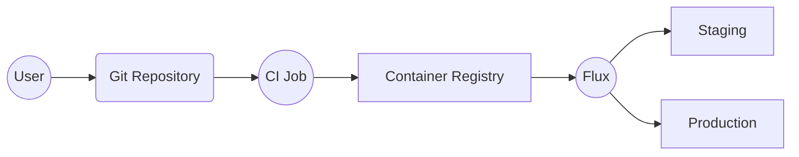
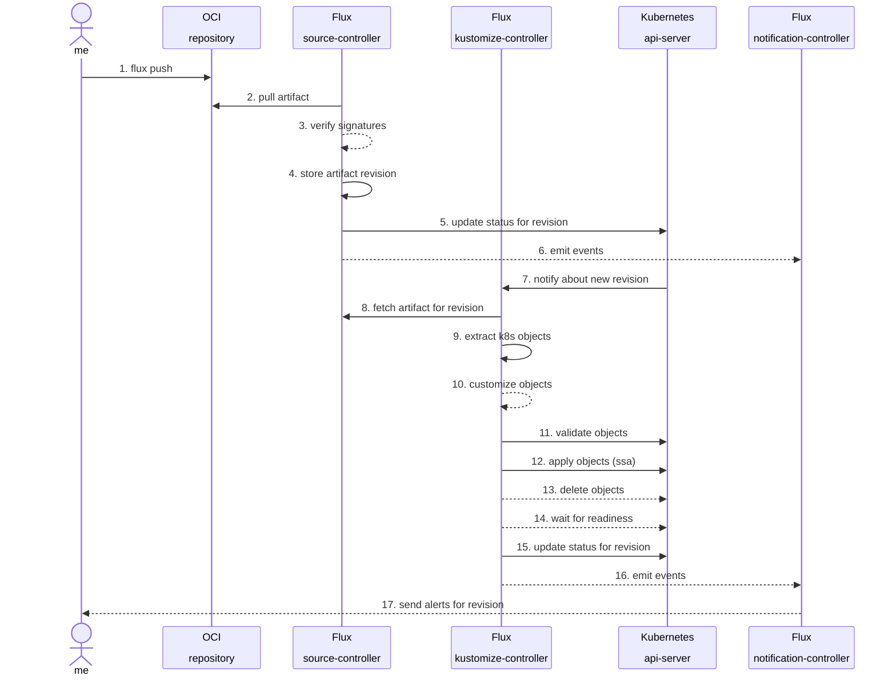

<a id="doc-ffdbe3a1e7ee93cacfc080b6"></a>

# fluxcd/website / CODE_OF_CONDUCT.md

Upstream: https://github.com/fluxcd/website/blob/643963b610d8285885b5cd01991489b32bfff834/CODE_OF_CONDUCT.md

Commit: `643963b610d8285885b5cd01991489b32bfff834`

Retrieved: 2026-10-01T15:37:21.593958+00:00

Kind: official-document

Raw SHA256: `9da11e9802b2a46335fe4f4b6265f742399ed3e7593ad9de741c82e9842c0958`

Source text below is untrusted reference content. Acquisition does not verify technical claims.

License status: UPSTREAM_NOTICES_CAPTURED_PER_FILE_REVIEW_REQUIRED. See this repository's captured license files.

---

## Code of Conduct

The Flux project follows the [CNCF Code of Conduct](https://github.com/cncf/foundation/blob/master/code-of-conduct.md).


<a id="doc-eca12c0a30e25b4b46522ebf"></a>

# fluxcd/website / CONTRIBUTING.md

Upstream: https://github.com/fluxcd/website/blob/643963b610d8285885b5cd01991489b32bfff834/CONTRIBUTING.md

Commit: `643963b610d8285885b5cd01991489b32bfff834`

Retrieved: 2026-10-01T15:37:21.593958+00:00

Kind: official-document

Raw SHA256: `a43a968d4623bd956eb817ff112b379a8b0f4877c35170fa716dccb6c6f1d872`

Source text below is untrusted reference content. Acquisition does not verify technical claims.

License status: UPSTREAM_NOTICES_CAPTURED_PER_FILE_REVIEW_REQUIRED. See this repository's captured license files.

---

# Contributing

Flux is [Apache 2.0 licensed](https://github.com/fluxcd/flux2/blob/main/LICENSE) and
accepts contributions via GitHub pull requests. This document outlines
some of the conventions on to make it easier to get your contribution
accepted.

We gratefully welcome improvements to issues and documentation as well as to
code.

## Certificate of Origin

By contributing to this project you agree to the Developer Certificate of
Origin (DCO). This document was created by the Linux Kernel community and is a
simple statement that you, as a contributor, have the legal right to make the
contribution.

We require all commits to be signed. By signing off with your signature, you
certify that you wrote the patch or otherwise have the right to contribute the
material by the rules of the [DCO](DCO):

`Signed-off-by: Jane Doe <jane.doe@example.com>`

The signature must contain your real name
(sorry, no pseudonyms or anonymous contributions)
If your `user.name` and `user.email` are configured in your Git config,
you can sign your commit automatically with `git commit -s`.

### Format of the Commit Message

For this repository we prefer the following rules for good commit messages:

- Limit the subject to 50 characters and write as the continuation
  of the sentence "If applied, this commit will ..."
- Explain what and why in the body, if more than a trivial change;
  wrap it at 72 characters.

The [following article](https://chris.beams.io/posts/git-commit/#seven-rules)
has some more helpful advice on documenting your work.

## Communications

For realtime communications we use Slack: To join the conversation, simply
join the [CNCF](https://slack.cncf.io/) Slack workspace and use the
[#flux-dev](https://cloud-native.slack.com/messages/flux-dev/) channel.

To discuss ideas and specifications we use [GitHub
Discussions](https://github.com/fluxcd/flux2/discussions).

For announcements we use a mailing list as well. Simply subscribe to
[flux-dev on cncf.io](https://lists.cncf.io/g/cncf-flux-dev)
to join the conversation (there you can also add calendar invites
to your Google calendar for our [Flux
meeting](https://docs.google.com/document/d/1l_M0om0qUEN_NNiGgpqJ2tvsF2iioHkaARDeh6b70B0/view)).


<a id="doc-c693279643b8cd5d248172d9"></a>

# fluxcd/website / LICENSE

Upstream: https://github.com/fluxcd/website/blob/643963b610d8285885b5cd01991489b32bfff834/LICENSE

Commit: `643963b610d8285885b5cd01991489b32bfff834`

Retrieved: 2026-10-01T15:37:21.593958+00:00

Kind: license

Raw SHA256: `c71d239df91726fc519c6eb72d318ec65820627232b2f796219e87dcf35d0ab4`

Source text below is untrusted reference content. Acquisition does not verify technical claims.

License status: UPSTREAM_NOTICES_CAPTURED_PER_FILE_REVIEW_REQUIRED. See this repository's captured license files.

---

````text
                                 Apache License
                           Version 2.0, January 2004
                        http://www.apache.org/licenses/

   TERMS AND CONDITIONS FOR USE, REPRODUCTION, AND DISTRIBUTION

   1. Definitions.

      "License" shall mean the terms and conditions for use, reproduction,
      and distribution as defined by Sections 1 through 9 of this document.

      "Licensor" shall mean the copyright owner or entity authorized by
      the copyright owner that is granting the License.

      "Legal Entity" shall mean the union of the acting entity and all
      other entities that control, are controlled by, or are under common
      control with that entity. For the purposes of this definition,
      "control" means (i) the power, direct or indirect, to cause the
      direction or management of such entity, whether by contract or
      otherwise, or (ii) ownership of fifty percent (50%) or more of the
      outstanding shares, or (iii) beneficial ownership of such entity.

      "You" (or "Your") shall mean an individual or Legal Entity
      exercising permissions granted by this License.

      "Source" form shall mean the preferred form for making modifications,
      including but not limited to software source code, documentation
      source, and configuration files.

      "Object" form shall mean any form resulting from mechanical
      transformation or translation of a Source form, including but
      not limited to compiled object code, generated documentation,
      and conversions to other media types.

      "Work" shall mean the work of authorship, whether in Source or
      Object form, made available under the License, as indicated by a
      copyright notice that is included in or attached to the work
      (an example is provided in the Appendix below).

      "Derivative Works" shall mean any work, whether in Source or Object
      form, that is based on (or derived from) the Work and for which the
      editorial revisions, annotations, elaborations, or other modifications
      represent, as a whole, an original work of authorship. For the purposes
      of this License, Derivative Works shall not include works that remain
      separable from, or merely link (or bind by name) to the interfaces of,
      the Work and Derivative Works thereof.

      "Contribution" shall mean any work of authorship, including
      the original version of the Work and any modifications or additions
      to that Work or Derivative Works thereof, that is intentionally
      submitted to Licensor for inclusion in the Work by the copyright owner
      or by an individual or Legal Entity authorized to submit on behalf of
      the copyright owner. For the purposes of this definition, "submitted"
      means any form of electronic, verbal, or written communication sent
      to the Licensor or its representatives, including but not limited to
      communication on electronic mailing lists, source code control systems,
      and issue tracking systems that are managed by, or on behalf of, the
      Licensor for the purpose of discussing and improving the Work, but
      excluding communication that is conspicuously marked or otherwise
      designated in writing by the copyright owner as "Not a Contribution."

      "Contributor" shall mean Licensor and any individual or Legal Entity
      on behalf of whom a Contribution has been received by Licensor and
      subsequently incorporated within the Work.

   2. Grant of Copyright License. Subject to the terms and conditions of
      this License, each Contributor hereby grants to You a perpetual,
      worldwide, non-exclusive, no-charge, royalty-free, irrevocable
      copyright license to reproduce, prepare Derivative Works of,
      publicly display, publicly perform, sublicense, and distribute the
      Work and such Derivative Works in Source or Object form.

   3. Grant of Patent License. Subject to the terms and conditions of
      this License, each Contributor hereby grants to You a perpetual,
      worldwide, non-exclusive, no-charge, royalty-free, irrevocable
      (except as stated in this section) patent license to make, have made,
      use, offer to sell, sell, import, and otherwise transfer the Work,
      where such license applies only to those patent claims licensable
      by such Contributor that are necessarily infringed by their
      Contribution(s) alone or by combination of their Contribution(s)
      with the Work to which such Contribution(s) was submitted. If You
      institute patent litigation against any entity (including a
      cross-claim or counterclaim in a lawsuit) alleging that the Work
      or a Contribution incorporated within the Work constitutes direct
      or contributory patent infringement, then any patent licenses
      granted to You under this License for that Work shall terminate
      as of the date such litigation is filed.

   4. Redistribution. You may reproduce and distribute copies of the
      Work or Derivative Works thereof in any medium, with or without
      modifications, and in Source or Object form, provided that You
      meet the following conditions:

      (a) You must give any other recipients of the Work or
          Derivative Works a copy of this License; and

      (b) You must cause any modified files to carry prominent notices
          stating that You changed the files; and

      (c) You must retain, in the Source form of any Derivative Works
          that You distribute, all copyright, patent, trademark, and
          attribution notices from the Source form of the Work,
          excluding those notices that do not pertain to any part of
          the Derivative Works; and

      (d) If the Work includes a "NOTICE" text file as part of its
          distribution, then any Derivative Works that You distribute must
          include a readable copy of the attribution notices contained
          within such NOTICE file, excluding those notices that do not
          pertain to any part of the Derivative Works, in at least one
          of the following places: within a NOTICE text file distributed
          as part of the Derivative Works; within the Source form or
          documentation, if provided along with the Derivative Works; or,
          within a display generated by the Derivative Works, if and
          wherever such third-party notices normally appear. The contents
          of the NOTICE file are for informational purposes only and
          do not modify the License. You may add Your own attribution
          notices within Derivative Works that You distribute, alongside
          or as an addendum to the NOTICE text from the Work, provided
          that such additional attribution notices cannot be construed
          as modifying the License.

      You may add Your own copyright statement to Your modifications and
      may provide additional or different license terms and conditions
      for use, reproduction, or distribution of Your modifications, or
      for any such Derivative Works as a whole, provided Your use,
      reproduction, and distribution of the Work otherwise complies with
      the conditions stated in this License.

   5. Submission of Contributions. Unless You explicitly state otherwise,
      any Contribution intentionally submitted for inclusion in the Work
      by You to the Licensor shall be under the terms and conditions of
      this License, without any additional terms or conditions.
      Notwithstanding the above, nothing herein shall supersede or modify
      the terms of any separate license agreement you may have executed
      with Licensor regarding such Contributions.

   6. Trademarks. This License does not grant permission to use the trade
      names, trademarks, service marks, or product names of the Licensor,
      except as required for reasonable and customary use in describing the
      origin of the Work and reproducing the content of the NOTICE file.

   7. Disclaimer of Warranty. Unless required by applicable law or
      agreed to in writing, Licensor provides the Work (and each
      Contributor provides its Contributions) on an "AS IS" BASIS,
      WITHOUT WARRANTIES OR CONDITIONS OF ANY KIND, either express or
      implied, including, without limitation, any warranties or conditions
      of TITLE, NON-INFRINGEMENT, MERCHANTABILITY, or FITNESS FOR A
      PARTICULAR PURPOSE. You are solely responsible for determining the
      appropriateness of using or redistributing the Work and assume any
      risks associated with Your exercise of permissions under this License.

   8. Limitation of Liability. In no event and under no legal theory,
      whether in tort (including negligence), contract, or otherwise,
      unless required by applicable law (such as deliberate and grossly
      negligent acts) or agreed to in writing, shall any Contributor be
      liable to You for damages, including any direct, indirect, special,
      incidental, or consequential damages of any character arising as a
      result of this License or out of the use or inability to use the
      Work (including but not limited to damages for loss of goodwill,
      work stoppage, computer failure or malfunction, or any and all
      other commercial damages or losses), even if such Contributor
      has been advised of the possibility of such damages.

   9. Accepting Warranty or Additional Liability. While redistributing
      the Work or Derivative Works thereof, You may choose to offer,
      and charge a fee for, acceptance of support, warranty, indemnity,
      or other liability obligations and/or rights consistent with this
      License. However, in accepting such obligations, You may act only
      on Your own behalf and on Your sole responsibility, not on behalf
      of any other Contributor, and only if You agree to indemnify,
      defend, and hold each Contributor harmless for any liability
      incurred by, or claims asserted against, such Contributor by reason
      of your accepting any such warranty or additional liability.

   END OF TERMS AND CONDITIONS

   APPENDIX: How to apply the Apache License to your work.

      To apply the Apache License to your work, attach the following
      boilerplate notice, with the fields enclosed by brackets "[]"
      replaced with your own identifying information. (Don't include
      the brackets!)  The text should be enclosed in the appropriate
      comment syntax for the file format. We also recommend that a
      file or class name and description of purpose be included on the
      same "printed page" as the copyright notice for easier
      identification within third-party archives.

   Copyright [yyyy] [name of copyright owner]

   Licensed under the Apache License, Version 2.0 (the "License");
   you may not use this file except in compliance with the License.
   You may obtain a copy of the License at

       http://www.apache.org/licenses/LICENSE-2.0

   Unless required by applicable law or agreed to in writing, software
   distributed under the License is distributed on an "AS IS" BASIS,
   WITHOUT WARRANTIES OR CONDITIONS OF ANY KIND, either express or implied.
   See the License for the specific language governing permissions and
   limitations under the License.

````


<a id="doc-b335630551682c19a781afeb"></a>

# fluxcd/website / README.md

Upstream: https://github.com/fluxcd/website/blob/643963b610d8285885b5cd01991489b32bfff834/README.md

Commit: `643963b610d8285885b5cd01991489b32bfff834`

Retrieved: 2026-10-01T15:37:21.593958+00:00

Kind: official-document

Raw SHA256: `ade2cb7c937b472acb058e941f71ee9ee34110fe871cb99d45879358f027b898`

Source text below is untrusted reference content. Acquisition does not verify technical claims.

License status: UPSTREAM_NOTICES_CAPTURED_PER_FILE_REVIEW_REQUIRED. See this repository's captured license files.

---

# fluxcd.io

[](https://app.netlify.com/sites/fluxcd/deploys)

This repo houses the assets used to build the Flux project's landing page at <https://fluxcd.io>.

> **Note**: The sources for some of Flux's documentation are housed in other repositories within <https://github.com/fluxcd>. Documentation issues and pull requests should be made against those repos.
>
> Project          | Docs Site                                 | GitHub Source
> ---------------- | ------------------------------------------| -------------
> Flux             | <https://fluxcd.io/flux>                  | <https://github.com/fluxcd/website>
> Flagger          | <https://fluxcd.io/flagger>               | <https://github.com/fluxcd/website>

## How to modify this website

The main landing page of this website can be modified in `hugo.yaml`.

Almost all of the content lives in the `content/en/<project>` directories. Here are some special cases.

- `./content/en/blog` contains all blog posts - make sure you update the front-matter for posts to show up correctly.
- `./external-sources/` defines how files from other repositories are pulled in. We currently do this for Markdown files from the `/fluxcd/community` and `/fluxcd/.github` repositories. (`make gen-content` pulls these in.)
- Flux CLI docs (`cmd`) and `components` docs: under `./content/en/flux` but pulled in through in `make gen-content` as well.
- `/static/_redirects` defines redirects on <https://fluxcd.io>. Check out <https://docs.netlify.com/routing/redirects/> for the syntax definition and how to test if things work.

## Running the site locally

In order to run the Flux site locally, you need to install:

- [Node.js](https://www.npmjs.com/get-npm)
- The [Hugo](https://gohugo.io) static site generator. Make sure to [install](https://gohugo.io/getting-started/installing/) the "extended" variant of Hugo with support for the [Hugo Pipes](https://gohugo.io/hugo-pipes/introduction/) feature and to check the [`netlify.toml`](https://github.com/fluxcd/website/blob/main/netlify.toml) configuration file for which version of Hugo you should install.
- [jq](https://stedolan.github.io/jq/download/)

Once those tools are installed, fetch the assets necessary to run the site:

Then run the site in "server" mode:

```cli
make serve
```

Navigate to <http://localhost:1313> to see the site running in your browser. As you make updates to the site, the browser will immediately update to reflect those changes.

> **Note**: Sometimes you need to clear the output of previous builds, e.g. when the structure of imported documentation has changed. If you see duplicate pages being served, run
> ```
> git clean -fx -- content/
> ```
> and then run `make serve` again. The duplicates will then be gone.

## Publishing the site

The Flux website is published automatically by [Netlify](https://netlify.com) when changes are pushed to the `main` branch. The site does not need to be published manually.

### Preview builds

When you submit a pull request to this repository, Netlify builds a "deploy preview" of your changes. You can see that preview by clicking on the **Details** link of the **netlify/fluxcd/deploy-preview** check at the bottom of the pull request page.

## Local Development (docker)

Run `make docker-preview` and wait until the following output appears:

```cli
Environment: "development"
Serving pages from memory
Web Server is available at //localhost:1313/ (bind address 0.0.0.0)
Press Ctrl+C to stop
```

Visit [http://localhost:1313](http://localhost:1313), where any changes will be visible from inside of the running container. Markdown files updated in `content/` should trigger a browser refresh as they are saved.

The `docker-preview` target builds the theme, which takes a while and doesn't need to be repeated unless you are making changes to the theme. On subsequent runs, running `make docker-serve` instead will skip building the theme.

This depends on the Docker image `fluxcd/website:hugo-support` which should be kept updated when the website's build-time dependencies have changed; this image contains everything needed to run the docs locally.

If this doesn't work, the image may be stale. The instructions to update it are below.

### Remote Development (kubernetes / okteto CLI)

This works the same as local development above, but with the Okteto CLI you do not need to run a Linux machine or virtual machine on your local development environment.

First, make sure you are permitted to deploy pods on any local or remote Kubernetes cluster. Download the [Okteto CLI](https://okteto.com/docs/getting-started/installation/index.html) for Windows, Mac, or Linux.

Okteto CLI is a light-weight client-side tool that replaces Docker with a remote cluster. You can run `hugo server` remotely in this way; any changes to the local clone are synchronized to the cluster. The experience is basically the same as local development, (except that you won't need to install Docker.)

Instead of `make docker-serve`, type `okteto up`.

You can change the behavior in `okteto.yml` according to the [Okteto Manifest Reference](https://okteto.com/docs/reference/manifest/index.html), for example adding a persistent volume can speed up the synchronization of the working directory files to the remote pod on repeated runs.

### Updating the Development/preview container image

(For maintainers) Using a machine with `docker` and logged in with an account that has permission to push to `docker.io/fluxcd/website` repo, run `make docker-push`.

The dependencies of `docker-push` are explained below. If the above worked then you are done, and should not need to read any further. Rebuilding `hugo` takes a long time and should be avoided when the version hasn't changed or it isn't needed; run `make docker-push-support` instead to skip building `hugo`.

Update the `docker-support` image tag whenever build-time (or "serve"-time) dependencies have changed.

#### How is the Development container made?

These targets as explained below are run in the appropriate order as dependencies of `make docker-push`.

- [ ] `TODO`: add a system/integration test for `website` that verifies any changes have not broken `make docker-serve`, for example by adding new dependencies without mentioning them in the `./Dockerfile`.

##### Flux-specific Dependencies

The Flux website has some build-time dependencies including Python3, PyYAML, `rsync`, `grep`, `nodejs`, `npm`, `curl`, `jq`, (and potentially others that may be added in the future.) Flux-specific dependencies are prepared in an image that gets tagged as `docker.io/fluxcd/website:hugo-support`.

This image is built from the `Dockerfile` in `./`; run `make docker-build-support` to rebuild it locally, (or run as `make docker-push-support` to build and also push.)

##### `gohugoio/hugo`

The Flux website also depends on a specific version of Hugo, which unfortunately does not provide docker images for each version. So we build it from source, with the `HUGO_BUILD_TAGS=extended` build arg enabled.

Run `make docker-push-hugo` to build and also push this image target.

This will run `make hugo` to get a shallow clone of the `gohugoio/hugo` repository at the right `HUGO_VERSION` and `make docker-build-hugo` to build a hugo container base image. (This target compiles `golibsass` which is very large, and may take a while.)

These are all the dependencies of `make docker-push`.


<a id="doc-d5d6021cbb0c86eeab9279d7"></a>

# fluxcd/website / content/en/contributing/docs/_index.md

Upstream: https://github.com/fluxcd/website/blob/643963b610d8285885b5cd01991489b32bfff834/content/en/contributing/docs/_index.md

Commit: `643963b610d8285885b5cd01991489b32bfff834`

Retrieved: 2026-10-01T15:37:21.593958+00:00

Kind: official-document

Raw SHA256: `bbc8251f26bb4d42f2a951555b0bd481b060eb43655d5f6a2fabaf10c117d8f7`

Source text below is untrusted reference content. Acquisition does not verify technical claims.

License status: UPSTREAM_NOTICES_CAPTURED_PER_FILE_REVIEW_REQUIRED. See this repository's captured license files.

---

---
title: Documentation
weight: 2
---

Flux welcomes improvements from all contributors, new and experienced!

The flux website uses [Hugo](https://gohugo.io/) with the [Docsy theme](https://www.docsy.dev/).
Documentation is written in Markdown.

To get a good sense of the general mechanics of the repository and what your options are of running the site locally, please visit <https://github.com/fluxcd/website/#readme>.

To better understand the mechanics of adding blog posts, please see <https://github.com/fluxcd/website/tree/main/internal_docs/how-to-write-a-blog-post.md>.

In this section we will focus on common use-cases of folks who contribute to docs.


<a id="doc-d683e88fd27a4345bb6dcbc4"></a>

# fluxcd/website / content/en/contributing/docs/google-season-of-docs-2023.md

Upstream: https://github.com/fluxcd/website/blob/643963b610d8285885b5cd01991489b32bfff834/content/en/contributing/docs/google-season-of-docs-2023.md

Commit: `643963b610d8285885b5cd01991489b32bfff834`

Retrieved: 2026-10-01T15:37:21.593958+00:00

Kind: official-document

Raw SHA256: `9ddeb1b7f13fe672fa829cf1c4bb8da020c988087e17cc12b5af4a41f0d6c7ee`

Source text below is untrusted reference content. Acquisition does not verify technical claims.

License status: UPSTREAM_NOTICES_CAPTURED_PER_FILE_REVIEW_REQUIRED. See this repository's captured license files.

---

---
title: Google Season of Docs 2023
---

Flux is interested in applying to the 2023 Google Season of Docs to improve the documentation experience for our users and contributors. Below is our project ideas, if you have any questions, please reach out to Kingdon Barrett or Tamao Nakahara on CNCF Slack.

Timeline:  <https://developers.google.com/season-of-docs/docs/timeline>

## Improving the Flux User Onramp

### About Our Organisation

[Flux](/) is a tool for keeping Kubernetes clusters in sync with sources of configuration (like Git repositories and OCI artifacts), and automating updates to configuration when there is new code to deploy.

Flux was created in 2016 and helped to formalise GitOps, or "Operations by Pull Request" as industry standard. In 2020 a rewrite of the project was started which helped to drastically modernise the code base and make new use-cases possible. [The Flux project](https://github.com/fluxcd) has become center of a rich ecosytem of GitOps solutions. Its controllers have become the basis for products, services and other tools. That's why the project is seeing contributors from end-user companies, integrators and e.g. cloud vendors.

Flux is used by SREs, Platform Engineers, Architects and Developers. GitOps is the natural evolution of configuration as code. Organisations moving to Flux can deal with infrastructure at scale more easily, and allow their developers to focus on code, not on deployment problems.

Flux is licensed under the Apache License 2.0 license and is a graduated Cloud Native Computing Foundation (CNCF) project, used in production by various organisations and cloud providers.

### About The Problem

Flux users come with different amounts of background knowledge to the project. Some have been using Kubernetes in earnest for some time, others don't. Understanding the core concepts is critical to your success as a user installing Flux.

Other users are past the hurdles of the initial setup, but are looking at ways to simplify operations or to further automate processes. The docs currently contain most of what users need, the information might be just a bit hard to find. Reflecting the different stages of preparation, knowledge and state of implementation clearly in the navigation and information architecture will be beneficial.

Solving the problem will help our users find their way around more easily, they will have a more seamless experience and feel more self-effective. For us as a community, it will likely result in having to respond to less support requests.

### Project Scope

In this project we would like to accomplish the following:

Part 1: Improve the navigating experience

- Review the navigation / information architecture of the Flux documentation
  and assess to which stage of the users' adoption journey the content belongs.
- Write up a plan to recategorise relevant documentation.
- Collect feedback on the new IA. Voices from Flux developers and users should be heard.
- Implement plan, place relevant redirects. Implement link-checking.
- Background information: [#717](https://github.com/fluxcd/website/issues/717), [#718](https://github.com/fluxcd/website/issues/718) (further thoughts [#72](https://github.com/fluxcd/website/issues/72), [#120](https://github.com/fluxcd/website/issues/120))

Part 2: Help understanding core concepts better

- Talk to Flux developers and folks doing online support and get an idea of which Flux concepts are least understood and which basic knowledge is missing when interacting with new Flux users.
- Review Core Concepts documentation, review flow of beginner docs.
- Close potential gap in core concepts documentation. Refer to core concepts in documentation where appropriate.
- Background information: [#111](https://github.com/fluxcd/website/issues/111), [#493](https://github.com/fluxcd/website/issues/493), [#760](https://github.com/fluxcd/website/issues/760), [#783](https://github.com/fluxcd/website/issues/783)

Part 3: Installing Flux - could this be easier?

- Understand overlap between "Installation", cheatsheet entries and current "use-cases" docs.
- Review how other projects deal with this in their documentation. "Tasks" are often a concept used.
- Review Installation docs - should they be broken up? Are references between these and others docs missing, e.g. the cheatsheets and CLI reference?
- Background information: [#523](https://github.com/fluxcd/website/issues/523)

### Measuring the success

The Flux developers spend a lot of their time on supporting Flux users and often it takes a while to discover the misunderstanding of a new user. That's why we ideally would like to see the number of support requests go down and get the sense that users can more easily "help themselves".

We get support requests through different channels, and e.g. Slack does not make it easy to measure, especially as we are in a growing field and have a growing user-base. Still we want to monitor the number of Github discussions and Slack requests and compare with the previous months and hope for a reduction 20% number of requests.

- [Questions in Flux issues](https://github.com/fluxcd/flux2/issues?q=is%3Aissue+label%3Aquestion+)
- [Q&A discussions on GitHub](https://github.com/fluxcd/flux2/discussions/categories/q-a)
- [#flux Slack channel](https://cloud-native.slack.com/archives/flux)

We also want the number of broken links to be 0.

We also want the updated navigation demonstrated to community and see a positive result of a poll about the new navigation experience.

### Timeline

| Dates | Action Items
| ----- | ------------
| May   | Orientation: get to know the team. Familiarise yourself with `fluxcd/website` code and documentation structure.
| June  | Review navigation of docs of other CNCF projects. Draft a new proposal for the docs structure (cf. [previous proposal](https://github.com/fluxcd/website/issues/717)). Create PR, ask team and community for feedback.
| July | Finish navigation, test redirects and see if there are broken links. Talk to Flux team to figure out contention points and common questions of new users. Review flow of "beginner docs".
| August | Analyse "beginner docs". Create plan for where core concepts should go into more detail. Work with Flux maintainers and contributors to write enhance the core concepts documentation.
| September | Integrate work and ask for feedback from community. Celebrate success so far - get a nice blog post on the website!
| October | Review overlap between Install docs, cheatsheet entries and use-cases. Compare with other projects. (Hopefully with what's been done in June, it will be easier to distinguish Day 1 from Day 2 tasks.) If there is a lot more work to be done to e.g. break up pieces into "tasks", maybe focus on low-hanging fruit instead. Ask for feedback again, publish.
| November | Tidy up loose ends. Celebrate with another blog post on the website!

### Project budget

| Budget item | Amount | Running Total | Notes/justifications
| ----------- | ------ | ------------- | --------------------
| Technical writer audit, update, test, and publish new documentation | 8000.00 | 8000.00 |
| Project t-shirts (10 t-shirts) | 250.00 | 8250.00 |
| TOTAL | 8250.00 | |

## Additional information

**Previous experience with technical writers or documentation:** End of November 2021 the Celeste Horgan of the CNCF Tech Docs team [assessed the Flux documentation](https://github.com/cncf/techdocs/blob/main/assessments/0005-fluxcd.md). Some of the [identified areas were addressed](https://github.com/orgs/fluxcd/projects/3) since then. Some of the findings are key issues we want to tackle as part of this proposal.

**Previous participation in Google Season of Docs, Google Summer of Code or others:**

Flux has not participated in any of these initiatives, so we are looking forward to being part of this (if chosen) and work together with the wider Docs community!

### Getting Started

If you are interested in participating in Google Season of Docs as a technical writer, please do the following:

1. Join the `#flux-contributors` channel on [CNCF Slack](https://slack.cncf.io/).
1. Review this project proposal and familiarise yourself with the [documentation website](/flux). Particularly the sections `Core Concepts`, `Get Started` and `Installation` are read by our users all the time. Getting a general sense of the documentation structure of the organisation will be of help as well.
1. You will need some familiarity with Cloud Native technologies such as [Kubernetes](https://kubernetes.io), so you can more easily understand the problems and background of users.
1. Talk to us on Slack, introduce yourself - we are happy to tell you more.


<a id="doc-bb6769d910b793c5dd420c2b"></a>

# fluxcd/website / content/en/contributing/docs/proposing-changes.md

Upstream: https://github.com/fluxcd/website/blob/643963b610d8285885b5cd01991489b32bfff834/content/en/contributing/docs/proposing-changes.md

Commit: `643963b610d8285885b5cd01991489b32bfff834`

Retrieved: 2026-10-01T15:37:21.593958+00:00

Kind: official-document

Raw SHA256: `9f0e342dcbca39c09fa7692f0bc4cab982490cee159bb0661dda4c49b04044ab`

Source text below is untrusted reference content. Acquisition does not verify technical claims.

License status: UPSTREAM_NOTICES_CAPTURED_PER_FILE_REVIEW_REQUIRED. See this repository's captured license files.

---

---
title: Proposing changes
weight: 5
description: >
   How to propose pull requests using either the GitHub UI or `git` locally.
---

## Getting started

1. Familiarize yourself with the [documentation repository](https://github.com/fluxcd/website) and the website's static site generator (Hugo).
1. Understand the process for opening a pull request and reviewing changes

## Opening a pull request

To contribute new pages or improve existing pages, open a pull request (PR).

If your change is small, or you're unfamiliar with git, read [Changes using GitHub](#changes-using-github).

### Changes using GitHub

If you're less experienced with git workflows, here's an easier method of opening a pull request.

{}
If you are a maintainer of the repo, the edit page button will not let you work off a fork, as you have write permission.
{}

1. On the page you want to modify, select the pencil icon at the top right.
1. Make your changes in the GitHub markdown editor.
1. Below the editor, fill in the **Propose file change** form.

   In the first field, give your commit message a title.
   In the second field provide a description
   {}
   Do not use any [GitHub Keywords](https://help.github.com/en/github/managing-your-work-on-github/linking-a-pull-request-to-an-issue#linking-a-pull-request-to-an-issue-using-a-keyword)
   in your commit message. You can add those to the pull request description later.
   {}

1. Select **Propose file change**.
1. Select **Create pull request**.
1. The **Open a pull request** screen appears. Fill in the form:

   - The **Subject** field of the pull request defaults to the commit summary.
     You can change it if needed.
   - The **Body** contains your extended commit message, if you have one,
     and some template text. Add the
     details the template text asks for, then delete the extra template text.
   - Leave the **Allow edits from maintainers** checkbox selected.

   {}
   PR descriptions are a great way to help reviewers understand your change. For more information, see [Opening a PR](#open-a-pull-request-from-your-fork-to-fluxcdwebsite).
   {}

1. Select **Create pull request**.

### Addressing feedback in GitHub

Before merging a pull request, community members review and approve it.

If a reviewer asks you to make changes:

1. Go to the **Files changed** tab.
2. Select the pencil (edit) icon on any files changed by the pull request.
3. Make the changes requested.
4. Commit the changes.

### Work from a local fork

If you're more experienced with git, or if your changes are larger than a few lines, work from a local fork.

#### Fork the fluxcd/website repository

1. Navigate to the [`fluxcd/website`](https://github.com/fluxcd/website/) repository.
1. Select **Fork**.
1. Navigate to the new `website` directory. Set the `fluxcd/website` repository as the `upstream` remote:

   ```bash
   cd website

   git remote add upstream https://github.com/fluxcd/website.git
   ```

1. Confirm your `origin` and `upstream` repositories:

   ```bash
   git remote -v
   ```

   Output is similar to:

   ```bash
   origin    git@github.com:<github_username>/website.git (fetch)
   origin    git@github.com:<github_username>/website.git (push)
   upstream  https://github.com/fluxcd/website.git (fetch)
   upstream  https://github.com/fluxcd/website.git (push)
   ```

1. Fetch commits from your fork's `origin/main` and `fluxcd/website`'s `upstream/main`:

   ```bash
   git fetch origin
   git fetch upstream
   ```

   This makes sure your local repository is up to date before you start making changes.

1. Create a new branch based on `upstream/main`:

    ```bash
    git checkout -b <my_new_branch> upstream/main
    ```

1. Make your changes using a text editor.

At any time, use the `git status` command to see what files you've changed.

#### Commit your changes

When you are ready to submit a pull request, commit your changes.

1. In your local repository, check which files you need to commit:

   ```bash
   git status
   ```

   Output is similar to:

   ```bash
   On branch <my_new_branch>
   Your branch is up to date with 'origin/<my_new_branch>'.

   Changes not staged for commit:
   (use "git add <file>..." to update what will be committed)
   (use "git checkout -- <file>..." to discard changes in working directory)

   modified:   content/en/contribute/new-content/run-locally.md

   no changes added to commit (use "git add" and/or "git commit -a")
   ```

1. Add the files listed under **Changes not staged for commit** to the commit:

   ```bash
   git add <your_file_name>
   ```

   Repeat this for each file.

1. After adding all the files, create a commit:

   ```bash
   git commit -sm "Your commit message"
   ```

   
   Do not use any [GitHub Keywords](https://help.github.com/en/github/managing-your-work-on-github/linking-a-pull-request-to-an-issue#linking-a-pull-request-to-an-issue-using-a-keyword) in your commit message. You can add those to the pull request
   description later.
   

1. Push your local branch and its new commit to your remote fork:

    ```bash
    git push origin <my_new_branch>
    ```

#### Open a pull request from your fork to fluxcd/website

1. In a web browser, go to the [`fluxcd/website`](https://github.com/fluxcd/website/) repository.
1. Navigate to pull requests and select New pull request
1. Select compare across forks
1. From the **head repository** drop-down menu, select your fork.
1. From the **compare** drop-down menu, select your branch.
1. Select **Create Pull Request**.
1. Add a description for your pull request:
    - **Title** (50 characters or less): Summarize the intent of the change.
    - **Description**: Describe the change in more detail.
      - If there is a related GitHub issue, include `Fixes #12345` or `Closes #12345` in the description. GitHub's automation closes the mentioned issue after merging the PR if used. If there are other related PRs, link those as well.
      - If you want advice on something specific, include any questions you'd like reviewers to think about in your description.
1. Select the **Create pull request** button.

  Congratulations! Your pull request is available in [Pull requests](https://github.com/fluxcd/website/pulls).

#### Addressing feedback locally

1. After making your changes, amend your previous commit:

   ```bash
   git commit -as --amend
   ```

   - `-as`: commits all changes and adds your signoff
   - `--amend`: amends the previous commit, rather than creating a new one

1. Update your commit message if needed.

1. Use `git push origin <my_new_branch>` to push your changes and re-run the Netlify tests.

#### Changes from reviewers

Sometimes reviewers commit to your pull request. Before making any other changes, fetch those commits.

1. Fetch commits from your remote fork and rebase your working branch:

   ```bash
   git fetch origin
   git rebase origin/<your-branch-name>
   ```

1. After rebasing, force-push new changes to your fork:

   ```bash
   git push --force-with-lease origin <your-branch-name>
   ```

#### Adding DCO on commits retroactively

1. Open an interactive rebase session

   ```sh
   git rebase --signoff HEAD~<number of commits in your pr>
   ```

1. Verify you have signed the commits

   ```sh
   git log
   ```

1. Force push

   ```sh
   git push -f origin branchname
   ```

#### Merge conflicts and rebasing


For more information, see [Git Branching - Basic Branching and Merging](https://git-scm.com/book/en/v2/Git-Branching-Basic-Branching-and-Merging#_basic_merge_conflicts), [Advanced Merging](https://git-scm.com/book/en/v2/Git-Tools-Advanced-Merging), or ask in the `#sig-docs` Slack channel for help.


If another contributor commits changes to the same file in another PR, it can create a merge conflict. You must resolve all merge conflicts in your PR.

1. Update your fork and rebase your local branch:

   ```bash
   git fetch origin
   git rebase origin/<your-branch-name>
   ```

   Then force-push the changes to your fork:

   ```bash
   git push --force-with-lease origin <your-branch-name>
   ```

1. Fetch changes from `fluxcd/website`'s `upstream/main` and rebase your branch:

   ```bash
   git fetch upstream
   git rebase upstream/main
   ```

1. Inspect the results of the rebase:

   ```bash
   git status
   ```

   This results in a number of files marked as conflicted.

1. Open each conflicted file and look for the conflict markers: `>>>`, `<<<`, and `===`. Resolve the conflict and delete the conflict marker.

   
   For more information, see [How conflicts are presented](https://git-scm.com/docs/git-merge#_how_conflicts_are_presented).
   

1. Add the files to the changeset:

   ```bash
   git add <filename>
   ```

1. Continue the rebase:

   ```bash
   git rebase --continue
   ```

1. Repeat steps 2 to 5 as needed.

    After applying all commits, the `git status` command shows that the rebase is complete.

1. Force-push the branch to your fork:

   ```bash
   git push --force-with-lease origin <your-branch-name>
   ```

   The pull request no longer shows any conflicts.


<a id="doc-b13e0bde2c2fd717d181dd14"></a>

# fluxcd/website / content/en/contributing/docs/style-guide.md

Upstream: https://github.com/fluxcd/website/blob/643963b610d8285885b5cd01991489b32bfff834/content/en/contributing/docs/style-guide.md

Commit: `643963b610d8285885b5cd01991489b32bfff834`

Retrieved: 2026-10-01T15:37:21.593958+00:00

Kind: official-document

Raw SHA256: `425fae3a7f7541b1bea70d8d792289d44b89641769794000d2814229c3919f63`

Source text below is untrusted reference content. Acquisition does not verify technical claims.

License status: UPSTREAM_NOTICES_CAPTURED_PER_FILE_REVIEW_REQUIRED. See this repository's captured license files.

---

---
title: Documentation Style Guide
linkTitle: Documentation Style Guide
weight: 6
description: >
    Style Guide for Flux Documentation
---
## Documentation formatting standards

This page gives writing style guidelines for the Flux documentation. These are guidelines, not rules. Use your best judgment, and feel free to propose changes to this document in a pull request.


Flux documentation uses [Goldmark Markdown Renderer](https://github.com/yuin/goldmark) with some adjustments along with a few [Hugo Shortcodes](writing-docs.md) to support glossary entries, tabs, and representing feature state.


### Use upper camel case for API objects

When you refer specifically to interacting with an API object, use [UpperCamelCase](https://en.wikipedia.org/wiki/Camel_case), also known as Pascal case.

When you are generally discussing an API object, use sentence-style capitalization.

You may use the word "resource", "API", or "object" to clarify a Flux resource type in a sentence.

Don't split an API object name into separate words. For example, use HelmRelease, not Helm Release.

The following examples focus on capitalization. For more information about formatting API object names, review the related guidance on [Code Style](#use-code-style-for-inline-code-commands-and-api-objects).

Do | Don't
:--| :-----
| The GitRepository resource is responsible for ... | The Git Repository resource is responsible for ... |

### Use angle brackets for placeholders

Use angle brackets (`<>`) for placeholders. Tell the reader what a placeholder represents, for example

Reconcile a kustomization :

```bash
flux reconcile kustomization <name> --with-source
```

### Use bold for user interface elements

Do | Don't
:--| :-----
Click **Fork**. | Click "Fork".
Select **Other**. | Select "Other".

### Use italics to define or introduce new terms

Do | Don't
:--| :-----
A _Reconciliation_ is ... | A "_Reconciliation_" is ...

### Use code style for filenames, directories, and paths

Do | Don't
:--| :-----
Open the `envars.yaml` file. | Open the envars.yaml file.
Go to the `/docs/tutorials` directory. | Go to the /docs/tutorials directory.
Open the `/_data/concepts.yaml` file. | Open the /\_data/concepts.yaml file.

### Use the international standard for punctuation inside quotes

Do | Don't
:--| :-----
events are recorded with an associated "stage". | events are recorded with an associated "stage."
The copy is called a "fork". | The copy is called a "fork."

## Inline Code Formatting

For inline code in an HTML document, use the `<code>` tag. In a Markdown
document, use the backtick (`` ` ``).

### Use code style for inline code, commands, and API objects

Do | Don't
:--| :-----
The `flux bootstrap` command creates a `Pod`. | The "flux bootstrap" command creates a pod.
The Helm controller manages `HelmRelease` objects… | The Helm controller manages HelmRelease objects… 
A `Kustomization` represents … | A Kustomization represents …
Enclose code samples with triple backticks. (\`\`\`)| Enclose code samples with any other syntax.
Use single backticks to enclose inline code. For example, `var example = true`. | Use two asterisks (`**`) or an underscore (`_`) to enclose inline code. For example, **var example = true**.
Use triple backticks before and after a multi-line block of code for fenced code blocks. | Use multi-line blocks of code to create diagrams, flowcharts, or other illustrations.
Use meaningful variable names that have a context. | Use variable names such as 'foo','bar', and 'baz' that are not meaningful and lack context.
Remove trailing spaces in the code. | Add trailing spaces in the code, where these are important, because the screen reader will read out the spaces as well.

### Use code style for object field names

Do | Don't
:--| :-----
Set the value of the `interval` field in the configuration file. | Set the value of the "interval" field in the configuration file.
The value of the `chart` field is an HelmChartTemplate object. | The value of the "chart" field is an HelmChartTemplate object.

### Use code style for Flux command-line tool and component names

Do | Don't
:--| :-----
The Source controller preserves node stability. | The `source-controller` preserves node stability.
The `flux` tool handles installation. | The flux tool handles installation.
Run the command to get Kustomizations with the name, `flux get kustomization <name>`. | Run the command to get Kustomizations with the name, flux get kustomization \<name\>. |

### Starting a sentence with a component tool or component name

Do | Don't
:--| :-----
The `flux` tool bootstraps and provisions Flux controllers in a cluster. | `flux` tool bootstraps and provisions Flux controllers in a cluster.
The Source controller manages resources. | Source controller manages resources.

### Use a general descriptor over a component name

Do | Don't
:--| :-----
The Flux Source controller offers an OpenAPI spec. | The source-controller offers an OpenAPI spec.

### Use normal style for string and integer field values

For field values of type string or integer, use normal style without quotation marks.

Do | Don't
:--| :-----
Set the value of `imagePullPolicy` to Always. | Set the value of `imagePullPolicy` to "Always".
Set the value of `image` to nginx:1.16. | Set the value of `image` to `nginx:1.16`.
Set the value of the `replicas` field to 2. | Set the value of the `replicas` field to `2`.

## Code Snippet Formatting

### Don't include the command prompt

Do | Don't
:--| :-----
flux get kustomizations | $ flux get kustomizations

### Separate commands from output

Verify that your cluster satisfies the prerequisites with:

```shell
flux check --pre
```

The output is similar to this:

```console
► checking prerequisites
✔ kubectl 1.18.3 >=1.18.0
✔ kubernetes 1.18.2 >=1.16.0
✔ prerequisites checks passed
```

## Fluxcd.io Word List

A list of Flux-specific terms and words to be used consistently across the site.

Term | Usage
:--- | :----
Flux | Flux should always be capitalized.
On-premises | On-premises or On-prem rather than On-premise or other variations.
Multi-tenancy | Multi-tenancy or Multi-tenant rather than Multitenancy or other variations.

## Shortcodes

Hugo [Shortcodes](https://gohugo.io/content-management/shortcodes) help create different rhetorical appeal levels.

1. Surround the text with an opening and closing shortcode.

2. Use the following syntax to apply a style:

   ```go-html-template
   
   No need to include a prefix; the shortcode automatically provides one. (Note:, Caution:, etc.)
   
   ```

   The output is:

   
   The prefix you choose is the same text for the tag.
   

### Note

Use `` to highlight a tip or a piece of information that may be helpful to know.

For example:

```go-html-template

You can _still_ use Markdown inside these callouts.

```

The output is:


You can _still_ use Markdown inside these callouts.


You can use a `` in a list:

```go-html-template
1. Use the note shortcode in a list

1. A second item with an embedded note

   
   Warning, Caution, and Note shortcodes, embedded in lists, need to be indented four spaces. See [Common Shortcode Issues](https://kubernetes.io/docs/contribute/style/style-guide/#common-shortcode-issues).
   

1. A third item in a list

1. A fourth item in a list
```

The output is:

1. Use the note shortcode in a list

1. A second item with an embedded note

    
    Warning, Caution, and Note shortcodes, embedded in lists, need to be indented four spaces. See [Common Shortcode Issues](https://kubernetes.io/docs/contribute/style/style-guide/#common-shortcode-issues).
    

1. A third item in a list

1. A fourth item in a list

### Caution

Use `` to call attention to an important piece of information to avoid pitfalls.

For example:

```go-html-template

The callout style only applies to the line directly above the tag.

```

The output is:


The callout style only applies to the line directly above the tag.


### Warning

Use `` to indicate danger or a piece of information that is crucial to follow.

For example:

```go-html-template

Beware.

```

The output is:


Beware.


## Markdown elements

### Line breaks

Use a single newline to separate block-level content like headings, lists, images, code blocks, and others. The exception is second-level headings, where it should be two newlines. Second-level headings follow the first-level (or the title) without any preceding paragraphs or texts. A two line spacing helps visualize the overall structure of content in a code editor better.

### Headings

People accessing this documentation may use a screen reader or other assistive technology (AT). [Screen readers](https://en.wikipedia.org/wiki/Screen_reader) are linear output devices, they output items on a page one at a time. If there is a lot of content on a page, you can use headings to give the page an internal structure. A good page structure helps all readers to easily navigate the page or filter topics of interest.

Do | Don't
:--| :-----
Update the title in the front matter of the page or blog post. | Use first level heading, as Hugo automatically converts the title in the front matter of the page into a first-level heading.
Use ordered headings to provide a meaningful high-level outline of your content. | Use headings level 4 through 6, unless it is absolutely necessary. If your content is that detailed, it may need to be broken into separate articles.
Use pound or hash signs (`#`) for non-blog post content. | Use underlines (`---` or `===`) to designate first-level headings.
Use sentence case for headings. For example, **Clone the git repository** | Use title case for headings. For example, **Clone the Git Repository**

### Paragraphs

Do | Don't
:--| :-----
Try to keep paragraphs under 6 sentences. | Indent the first paragraph with space characters. For example, ⋅⋅⋅Three spaces before a paragraph will indent it.
Use three hyphens (`---`) to create a horizontal rule. Use horizontal rules for breaks in paragraph content. For example, a change of scene in a story, or a shift of topic within a section. | Use horizontal rules for decoration.

<a id="check-required-ports"> &nbsp; </a>
### Links

Do | Don't
:--| :-----
Write hyperlinks that give you context for the content they link to. For example: Certain ports are open on your machines. See <a href="#check-required-ports">Check required ports</a> for more details. | Use ambiguous terms such as "click here". For example: Certain ports are open on your machines. See <a href="#check-required-ports">here</a> for more details.
Write Markdown-style links: `[link text](URL)`. For example: `[Docs from the ground up](/contributing/docs/writing-docs.md)` and the output is [Docs from the ground up](/contributing/docs/writing-docs). | Write HTML-style links: `<a href="/contributing/docs/writing-docs" target="_blank">Docs from the ground up</a>`, or create links that open in new tabs or windows. For example: `[Docs from the ground up](/contributing/docs/writing-docs){target="_blank"}`

### Lists

Group items in a list that are related to each other and need to appear in a specific order or to indicate a correlation between multiple items. When a screen reader comes across a list—whether it is an ordered or unordered list—it will be announced to the user that there is a group of list items. The user can then use the arrow keys to move up and down between the various items in the list.
Website navigation links can also be marked up as list items; after all they are nothing but a group of related links.

- End each item in a list with a period if one or more items in the list are complete sentences. For the sake of consistency, normally either all items or none should be complete sentences.

  
  Ordered lists that are part of an incomplete introductory sentence can be in lowercase and punctuated as if each item was a part of the introductory sentence.
  


- Use the number one (`1.`) for ordered lists.

- Use (`+`), (`*`), or (`-`) for unordered lists.

- Leave a blank line after each list.

- Indent nested lists with four spaces (for example, ⋅⋅⋅⋅).

- List items may consist of multiple paragraphs. Each subsequent paragraph in a list item must be indented by either four spaces or one tab.

### Tables

The semantic purpose of a data table is to present tabular data. Sighted users can quickly scan the table but a screen reader goes through line by line. A table caption is used to create a descriptive title for a data table. Assistive technologies (AT) use the HTML table caption element to identify the table contents to the user within the page structure.

- Add table captions.

## Content best practices

### Use present tense

Do | Don't
:--| :-----
This command starts a proxy. | This command will start a proxy.

### Use active voice

Exception: Use passive voice if active voice leads to an awkward construction.

Do | Don't
:--| :-----
You can explore the API using a browser. | The API can be explored using a browser.
The YAML file specifies the replica count. | The replica count is specified in the YAML file.

### Use simple and direct language

Use simple and direct language. Avoid using unnecessary phrases, such as saying "please."

Do | Don't
:--| :-----
To create a ReplicaSet, ... | In order to create a ReplicaSet, ...
See the configuration file. | Please see the configuration file.
View the pods. | With this next command, we'll view the pods.

### Address the reader as "you"

Do | Don't
:--| :-----
You can create a Kustomization by ... | We'll create a Kustomization by ...
In the preceding output, you can see... | In the preceding output, we can see ...

### Avoid Latin phrases

Prefer English terms over Latin abbreviations.

| Do          | Don't |
|-------------|-------|
| That is     | i.e   |
| For example | e.g.  |

Exception: Use "etc." for et cetera.

## Patterns to avoid

### Avoid using we

Using "we" in a sentence can be confusing, because the reader might not know whether they're part of the "we" you're describing.

Do | Don't
:--| :-----
Version 2 includes ... | In version 2, we have added ...
Flux provides a new feature for ... | We provide a new feature ...
This page teaches you how to use Kustomizations. | In this page, we are going to learn about Kustomizations.

### Avoid jargon and idioms

Some readers speak English as a second language. Avoid jargon and idioms to help them understand better.

Do | Don't
:--| :-----
Internally, ... | Under the hood, ...
Create a new cluster. | Turn up a new cluster.

### Avoid statements about the future

Avoid making promises or giving hints about the future. If you need to talk about an alpha feature, put the text under a heading that identifies it as alpha information.

An exception to this rule is documentation about announced deprecations targeting removal in future versions.

### Avoid statements that will soon be out of date

Avoid words like "currently" and "new." A feature that is new today might not be considered new in a few months.

Do | Don't
:--| :-----
In version 2, ... | In the current version, ...
The Image Update Automation feature provides ... | The new Image Update Automation provides ...

### Avoid statements that assume a specific level of understanding

Avoid words such as "just", "simply", "easy", "easily", "basically" or "simple". These words do not add value.

Do | Don't
:--| :-----
Include one command in ... | Include just one command in ...
Commit the Kustomization ... | Simply commit the Kustomization ...
You can remove ... | You can easily remove ...
These steps ... | These simple steps ...


<a id="doc-68cff607bf54ae735270e9d1"></a>

# fluxcd/website / content/en/contributing/docs/writing-docs.md

Upstream: https://github.com/fluxcd/website/blob/643963b610d8285885b5cd01991489b32bfff834/content/en/contributing/docs/writing-docs.md

Commit: `643963b610d8285885b5cd01991489b32bfff834`

Retrieved: 2026-10-01T15:37:21.593958+00:00

Kind: official-document

Raw SHA256: `792404d5b0faf45b4a7197892ef4d89d69af9ca207b5717d3164702949e70e65`

Source text below is untrusted reference content. Acquisition does not verify technical claims.

License status: UPSTREAM_NOTICES_CAPTURED_PER_FILE_REVIEW_REQUIRED. See this repository's captured license files.

---

---
title: Docs from the ground up
linkTitle: Writing docs
weight: 4
description: >
    Our docs are just Markdown, but offer you more flexibility and styling options.
---

## Getting Started

If you already know **Markdown**, this is going to be straight-forward. For our docs we use markdown, and we get some additions through the [Hugo](https://gohugo.io) static website generator and the [Docsy](https://docsy.dev) theme, which we are going to line out here.

If you are unfamiliar with Markdown, please see <https://guides.github.com/features/mastering-markdown/> (it's a good cheat-sheet) or <https://www.markdownguide.org/> if you are looking for something more substantial.

## Starting at the top

Hugo allows you to specify metadata concerning an article at the top of the Markdown file, in a section called **Front Matter**. The Hugo website has a [great article about it](https://gohugo.io/content-management/front-matter/) which explains all the relevant options.

For now, let's take a look at a quick example which should explain the most relevant entries in Front Matter:

```markdown
---
title: Using Flux on OpenShift
linkTitle: OpenShift
description: "How to bootstrap Flux on OpenShift."
weight: 20
---

## OpenShift Setup

Steps described in this document have been tested on OpenShift 4.6 only. 

[...]
```

The top section between two lines of `---` is the Front Matter section. Here we define a couple of entries which tell Hugo how to handle article:

- `title` is the equivalent of the `<h1>` in a HTML document or `# <title>` in a Markdown article
- `linkTitle` is the title to be used in the menu or navbar (usually you might want to pick something shorter and easier to spot)
- `description` is shown in a list of documents - maybe the directory you are looking at has a `_index.md` document - this is where you would see the list of articles (and the short descriptions). Note you can write multi-line descriptions like so:

  ```markdown
  description: >
    more text here
    here is even more description
  ```

- `weight` indicates where in the list of documents this is shown. It basically imposes an order on the articles in this directory.

{}
Please note: Everything below the Front Matter entry is just the regular Markdown article as you would normally write it. Please note that headings start with `## <..>`, as the title is defined in the Front Matter. Mixing Front Matter and `# <..>` headings will trip up Hugo and it might error out or not show the article.
{}

## Linking to other docs

You can easily link to other places using either

- Absolute URLs, for linking off to external sites like `https://github.com` or `https://k8s.io` - you can use any of the Markdown notations for this, so
  - `<https://k8s.io>` or
  - `[Kubernetes](https://k8s.io)` will work.
- Link to markdown files in other you can link to the `.md` file, or the resulting path. So if you are editing e.g. `article1.md` in `content/en/flux/section-a` and want to link to `article2.md` in the same directory you can use the following:
  - `[link](article2.md)`
  - `[link](../article2/)`
  - `[link](/flux/section-a/article2/)`

## Media, illustrations and more

If you want to illustrate the documentation and make things easier to read, there are lots of shortcodes either inherited through Hugo or through Docsy. Here is a list of our current favourites:

- [`pageinfo`](https://www.docsy.dev/docs/adding-content/shortcodes/#pageinfo) for quick "banner type" info boxes
- [`tabpane`](https://www.docsy.dev/docs/adding-content/shortcodes/#tabbed-panes) for pieces of text that go in different tabs
- [`cardpane` and `card`](https://www.docsy.dev/docs/adding-content/shortcodes/#card-panes) for adding cards and card panes
- [`gist`, `youtube`, `tweet` and more](https://gohugo.io/content-management/shortcodes/): lots of shortcodes we get from Hugo itself.

## Code snippets

You can embed code snippets from a file. Please refer to
<https://www.docsy.dev/docs/adding-content/shortcodes/#include-code-files> for
hot to use the `readfile` shortcode.

## Tabbed sections

You can create tabbed sections that contain both markdown and code snippets.
Please refer to <https://www.docsy.dev/docs/adding-content/shortcodes/#tabbed-panes>
for how to use the `tabpane` and `tab` shortcodes.

## Gallery shortcodes

You can use gallery shortcodes to easily create and display photo galleries or image sliders within your posts or blogs. 
Please refer to https://github.com/mfg92/hugo-shortcode-gallery for how to use the `hugo-shortcode-gallery` tool.


<a id="doc-f426626a2f165e8556bee0c1"></a>

# fluxcd/website / content/en/flagger/dev/release-guide.md

Upstream: https://github.com/fluxcd/website/blob/643963b610d8285885b5cd01991489b32bfff834/content/en/flagger/dev/release-guide.md

Commit: `643963b610d8285885b5cd01991489b32bfff834`

Retrieved: 2026-10-01T15:37:21.593958+00:00

Kind: official-document

Raw SHA256: `36b7505f1ad248fc4f8424819b42667c592f75b701667b7666f36a283d30643e`

Source text below is untrusted reference content. Acquisition does not verify technical claims.

License status: UPSTREAM_NOTICES_CAPTURED_PER_FILE_REVIEW_REQUIRED. See this repository's captured license files.

---

---
title: Release Guide
weight: 1
---

This document describes how to release Flagger.

## Release

### Flagger

To release a new Flagger version (e.g. `2.0.0`) follow these steps:

* create a branch `git checkout -b release-2.0.0`
* set the version in code and manifests `TAG=2.0.0 make version-set`
* commit changes and merge PR
* checkout main `git checkout main && git pull`
* tag main `make release`

### Flagger load tester

To release a new Flagger load tester version (e.g. `2.0.0`) follow these steps:

* create a branch `git checkout -b release-ld-2.0.0`
* set the version in code (`cmd/loadtester/main.go#VERSION`)
* set the version in the Helm chart (`charts/loadtester/Chart.yaml` and `values.yaml`)
* set the version in manifests (`kustomize/tester/deployment.yaml`)
* commit changes and push the branch upstream
* in GitHub UI, navigate to Actions and run the `push-ld` workflow selecting the release branch
* after the workflow finishes, open the PR which will run the e2e tests using the new tester version
* merge the PR if the tests pass

## CI

After the tag has been pushed to GitHub, the CI release pipeline does the following:

* creates a GitHub release
* pushes the Flagger binary and change log to GitHub release
* pushes the Flagger container image to GitHub Container Registry
* pushed the Flagger install manifests to GitHub Container Registry
* signs all OCI artifacts and release assets with Cosign and GitHub OIDC
* pushes the Helm chart to github-pages branch
* GitHub pages publishes the new chart version on the Helm repository

## Docs

The documentation [website](https://docs.flagger.app) is built from the `docs` branch.

After a Flagger release, publish the docs with:

* `git checkout main && git pull`
* `git checkout docs`
* `git rebase main`
* `git push origin docs`

Lastly open a PR with all the docs changes on [fluxcd/website](https://github.com/fluxcd/website) to
update [fluxcd.io/flagger](https://fluxcd.io/flagger/).


<a id="doc-1b0021b14ac2b5f47522058d"></a>

# fluxcd/website / content/en/flagger/faq.md

Upstream: https://github.com/fluxcd/website/blob/643963b610d8285885b5cd01991489b32bfff834/content/en/flagger/faq.md

Commit: `643963b610d8285885b5cd01991489b32bfff834`

Retrieved: 2026-10-01T15:37:21.593958+00:00

Kind: official-document

Raw SHA256: `08b17c180ad17d8c0541a4e9b58a4496c8ad58da50df22b0b1973d42814f9ddd`

Source text below is untrusted reference content. Acquisition does not verify technical claims.

License status: UPSTREAM_NOTICES_CAPTURED_PER_FILE_REVIEW_REQUIRED. See this repository's captured license files.

---

---
weight: 10
title: FAQ
---

## Deployment Strategies

#### Which deployment strategies are supported by Flagger?

Flagger implements the following deployment strategies:

* [Canary Release](usage/deployment-strategies.md#canary-release)
* [A/B Testing](usage/deployment-strategies.md#ab-testing)
* [Blue/Green](usage/deployment-strategies.md#bluegreen-deployments)
* [Blue/Green Mirroring](usage/deployment-strategies.md#bluegreen-with-traffic-mirroring)

#### When should I use A/B testing instead of progressive traffic shifting?

For frontend applications that require session affinity, you should use HTTP headers or
cookie match conditions to ensure a set of users will stay on the same version for
the whole duration of the canary analysis.

#### Can I use Flagger to manage applications that live outside of a service mesh?

For applications that are not deployed on a service mesh,
Flagger can orchestrate Blue/Green style deployments with Kubernetes L4 networking.

#### When can I use traffic mirroring?

Traffic mirroring can be used for Blue/Green deployment strategy or a pre-stage in a Canary release.
Traffic mirroring will copy each incoming request, sending one request to the primary and one to the canary service.
Mirroring should be used for requests that are **idempotent**
or capable of being processed twice (once by the primary and once by the canary).

#### How to retry a failed release?

A canary analysis is triggered by changes in any of the following objects:

* Deployment/DaemonSet PodSpec (metadata, container image, command, ports, env, resources, etc)
* ConfigMaps mounted as volumes or mapped to environment variables
* Secrets mounted as volumes or mapped to environment variables

To retry a release you can add or change an annotation on the pod template:

```yaml
apiVersion: apps/v1
kind: Deployment
spec:
  template:
    metadata:
      annotations:
        timestamp: "2020-03-10T14:24:48+0000"
```

#### How to change replicas for a deployment when not using HPA?

To change replicas for a deployment when not using HPA, you have to update the canary deployment with the desired replica count
and trigger an analysis by annotating the template. After the analysis finishes, Flagger will promote the `spec.replicas` changes to the primary deployment.

Example:
```yaml
apiVersion: apps/v1
kind: Deployment
spec:
  replicas: 4  #update replicas
  template:
    metadata:
      annotations:
        timestamp: "2022-02-10T14:24:48+0000" #add annotation to trigger analysis
```

#### Why is there a window of downtime during the canary initializing process when analysis is disabled?

A window of downtime is the intended behavior when the analysis is disabled. This allows instant rollback and also mimics the way
a Kubernetes deployment initialization works. To avoid this, enable the analysis (`skipAnalysis: false`), wait for the initialization
to finish, and disable it afterward (`skipAnalysis: true`).

#### How to disable cross namespace references?

Flagger by default can access resources across namespaces (`AlertProivder`, `MetricProvider` and Gloo `Upsteream`).
If you're in a multi-tenant environment and wish to disable this, you can do so through the `no-cross-namespace-refs` flag.

```
flagger \
  -no-cross-namespace-refs=true \
  ...
```

## Kubernetes services

#### How is an application exposed inside the cluster?

Assuming the app name is `podinfo`, you can define a canary like:

```yaml
apiVersion: flagger.app/v1beta1
kind: Canary
metadata:
  name: podinfo
  namespace: test
spec:
  targetRef:
    apiVersion: apps/v1
    kind: Deployment
    name: podinfo
  service:
    # service name (optional)
    name: podinfo
    # ClusterIP port number (required)
    port: 9898
    # container port name or number
    targetPort: http
    # port name can be http or grpc (default http)
    portName: http
```

If the `service.name` is not specified, then `targetRef.name` is used for
the apex domain and canary/primary services name prefix.
You should treat the service name as an immutable field; changing its could result in routing conflicts.

Based on the canary spec service, Flagger generates the following Kubernetes ClusterIP service:

* `<service.name>.<namespace>.svc.cluster.local`

    selector `app=<name>-primary`

* `<service.name>-primary.<namespace>.svc.cluster.local`

    selector `app=<name>-primary`

* `<service.name>-canary.<namespace>.svc.cluster.local`

    selector `app=<name>`

This ensures that traffic coming from a namespace outside the mesh to `podinfo.test:9898`
will be routed to the latest stable release of your app.

```yaml
apiVersion: v1
kind: Service
metadata:
  name: podinfo
spec:
  type: ClusterIP
  selector:
    app: podinfo-primary
  ports:
  - name: http
    port: 9898
    protocol: TCP
    targetPort: http
---
apiVersion: v1
kind: Service
metadata:
  name: podinfo-primary
spec:
  type: ClusterIP
  selector:
    app: podinfo-primary
  ports:
  - name: http
    port: 9898
    protocol: TCP
    targetPort: http
---
apiVersion: v1
kind: Service
metadata:
  name: podinfo-canary
spec:
  type: ClusterIP
  selector:
    app: podinfo
  ports:
  - name: http
    port: 9898
    protocol: TCP
    targetPort: http
```

The `podinfo-canary.test:9898` address is available only during the canary analysis
and can be used for conformance testing or load testing.

## Multiple ports

#### My application listens on multiple ports. How can I expose them inside the cluster?

If port discovery is enabled, Flagger scans the deployment spec and extracts the containers ports excluding
the port specified in the canary service and Envoy sidecar ports.
These ports will be used when generating the ClusterIP services.

For a deployment that exposes two ports:

```yaml
apiVersion: apps/v1
kind: Deployment
spec:
  template:
    metadata:
      annotations:
        prometheus.io/scrape: "true"
        prometheus.io/port: "9899"
    spec:
      containers:
      - name: app
        ports:
        - containerPort: 8080
        - containerPort: 9090
```

You can enable port discovery so that Prometheus will be able to reach port `9090` over mTLS:

```yaml
apiVersion: flagger.app/v1beta1
kind: Canary
spec:
  service:
    # container port used for canary analysis
    port: 8080
    # port name can be http or grpc (default http)
    portName: http
    # add all the other container ports
    # to the ClusterIP services (default false)
    portDiscovery: true
    trafficPolicy:
      tls:
        mode: ISTIO_MUTUAL
```

Both port `8080` and `9090` will be added to the ClusterIP services.

## Label selectors

#### What labels selectors are supported by Flagger?

The target deployment must have a single label selector in the format `app: <DEPLOYMENT-NAME>`:

```yaml
apiVersion: apps/v1
kind: Deployment
metadata:
  name: podinfo
spec:
  selector:
    matchLabels:
      app: podinfo
  template:
    metadata:
      labels:
        app: podinfo
```

Besides `app`, Flagger supports `name` and `app.kubernetes.io/name` selectors.
If you use a different convention, you can specify your label with the `-selector-labels` flag.
For example:

```
flagger \
  -selector-labels=service,name,app.kubernetes.io/name \
  ...
```

#### Is pod affinity and anti affinity supported?

Flagger will rewrite the first value in each match expression,
defined in the target deployment's pod anti-affinity and topology spread constraints,
satisfying the following two requirements when creating, or updating, the primary deployment:

* The key in the match expression must be one of the labels specified by the parameter selector-labels.
  The default labels are `app`,`name`,`app.kubernetes.io/name`.
* The value must match the name of the target deployment.

The rewrite done by Flagger in these cases is to suffix the value with `-primary`.
This rewrite can be used to spread the pods created by the canary
and primary deployments across different availability zones.

Example target deployment:

```yaml
apiVersion: apps/v1
kind: Deployment
metadata:
  name: podinfo
spec:
  selector:
    matchLabels:
      app: podinfo
  template:
    metadata:
      labels:
        app: podinfo
    spec:
      affinity:
        podAntiAffinity:
          preferredDuringSchedulingIgnoredDuringExecution:
          - weight: 100
            podAffinityTerm:
              labelSelector:
                matchExpressions:
                - key: app
                  operator: In
                  values:
                    - podinfo
              topologyKey: topology.kubernetes.io/zone
```

Example of generated primary deployment:

```yaml
apiVersion: apps/v1
kind: Deployment
metadata:
  name: podinfo-primary
spec:
  selector:
    matchLabels:
      app: podinfo-primary
  template:
    metadata:
      labels:
        app: podinfo-primary
    spec:
      affinity:
        podAntiAffinity:
          preferredDuringSchedulingIgnoredDuringExecution:
          - weight: 100
            podAffinityTerm:
              labelSelector:
                matchExpressions:
                - key: app
                  operator: In
                  values:
                    - podinfo-primary
              topologyKey: topology.kubernetes.io/zone
```

It is also possible to use a different label than the `app`, `name` or `app.kubernetes.io/name`.

Anti affinity example(using a different label):

```yaml
apiVersion: apps/v1
kind: Deployment
metadata:
  name: podinfo
spec:
  selector:
    matchLabels:
      app: podinfo
      affinity: podinfo
  template:
    metadata:
      labels:
        app: podinfo
        affinity: podinfo
    spec:
      affinity:
        podAntiAffinity:
          preferredDuringSchedulingIgnoredDuringExecution:
          - weight: 100
            podAffinityTerm:
              labelSelector:
                matchLabels:
                  affinity: podinfo
              topologyKey: topology.kubernetes.io/zone
```

## Metrics

#### How does Flagger measure the request success rate and duration?

By default, Flagger measures the request success rate and duration using Prometheus queries.

#### HTTP requests success rate percentage

Spec:

```yaml
  analysis:
    metrics:
    - name: request-success-rate
      # minimum req success rate (non 5xx responses)
      # percentage (0-100)
      thresholdRange:
        min: 99
      interval: 1m
```

Istio query:

```javascript
sum(
    rate(
        istio_requests_total{
          reporter="destination",
          destination_workload_namespace=~"$namespace",
          destination_workload=~"$workload",
          response_code!~"5.*"
        }[$interval]
    )
)
/
sum(
    rate(
        istio_requests_total{
          reporter="destination",
          destination_workload_namespace=~"$namespace",
          destination_workload=~"$workload"
        }[$interval]
    )
)
```

Envoy query (App Mesh):

```javascript
sum(
    rate(
        envoy_cluster_upstream_rq{
          kubernetes_namespace="$namespace",
          kubernetes_pod_name=~"$workload",
          envoy_response_code!~"5.*"
        }[$interval]
    )
)
/
sum(
    rate(
        envoy_cluster_upstream_rq{
          kubernetes_namespace="$namespace",
          kubernetes_pod_name=~"$workload"
        }[$interval]
    )
)
```

Envoy query (Contour and Gloo):

```javascript
sum(
    rate(
        envoy_cluster_upstream_rq{
            envoy_cluster_name=~"$namespace-$workload",
            envoy_response_code!~"5.*"
        }[$interval]
    )
)
/
sum(
    rate(
        envoy_cluster_upstream_rq{
            envoy_cluster_name=~"$namespace-$workload",
        }[$interval]
    )
)
```

#### HTTP requests milliseconds duration P99

Spec:

```yaml
  analysis:
    metrics:
    - name: request-duration
      # maximum req duration P99
      # milliseconds
      thresholdRange:
        max: 500
      interval: 1m
```

Istio query:

```javascript
histogram_quantile(0.99,
  sum(
    irate(
      istio_request_duration_milliseconds_bucket{
        reporter="destination",
        destination_workload=~"$workload",
        destination_workload_namespace=~"$namespace"
      }[$interval]
    )
  ) by (le)
)
```

Envoy query (App Mesh, Contour and Gloo):

```javascript
histogram_quantile(0.99,
  sum(
    irate(
      envoy_cluster_upstream_rq_time_bucket{
        kubernetes_pod_name=~"$workload",
        kubernetes_namespace=~"$namespace"
      }[$interval]
    )
  ) by (le)
)
```

> **Note** that the metric interval should be lower or equal to the control loop interval.

#### Can I use custom metrics?

The analysis can be extended with metrics provided by Prometheus, Datadog, AWS CloudWatch, New Relic and Graphite.
For more details on how custom metrics can be used, please read the [metrics docs](usage/metrics.md).

#### Istio Gateway API

If you're using Istio with Gateway API, the Prometheus query needs to include `reporter="source"`. For example, to calculate HTTP requests error percentage, the query would be:

```javascript
100 - sum(
    rate(
        istio_requests_total{
          reporter="source",
          destination_workload_namespace=~"$namespace",
          destination_workload=~"$workload",
          response_code!~"5.*"
        }[$interval]
    )
)
/
sum(
    rate(
        istio_requests_total{
          reporter="source",
          destination_workload_namespace=~"$namespace",
          destination_workload=~"$workload"
        }[$interval]
    )
) * 100
```

## Istio routing

#### How does Flagger interact with Istio?

Flagger creates an Istio Virtual Service and Destination Rules based on the Canary service spec.
The service configuration lets you expose an app inside or outside the mesh. You can also define traffic policies,
HTTP match conditions, URI rewrite rules, CORS policies, timeout and retries.

The following spec exposes the `frontend` workload inside the mesh on `frontend.test.svc.cluster.local:9898`
and outside the mesh on `frontend.example.com`. You'll have to specify an Istio ingress gateway for external hosts.

```yaml
apiVersion: flagger.app/v1beta1
kind: Canary
metadata:
  name: frontend
  namespace: test
spec:
  service:
    # container port
    port: 9898
    # service port name (optional, will default to "http")
    portName: http-frontend
    # Istio gateways (optional)
    gateways:
    - public-gateway.istio-system.svc.cluster.local
    - mesh
    # Istio virtual service host names (optional)
    hosts:
    - frontend.example.com
    # Istio traffic policy
    trafficPolicy:
      tls:
        # use ISTIO_MUTUAL when mTLS is enabled
        mode: DISABLE
    # HTTP match conditions (optional)
    match:
      - uri:
          prefix: /
    # HTTP rewrite (optional)
    rewrite:
      uri: /
    # Istio retry policy (optional)
    retries:
      attempts: 3
      perTryTimeout: 1s
      retryOn: "gateway-error,connect-failure,refused-stream"
    # Add headers (optional)
    headers:
      request:
        add:
          x-some-header: "value"
    # cross-origin resource sharing policy (optional)
    corsPolicy:
      allowOrigin:
        - example.com
      allowMethods:
        - GET
      allowCredentials: false
      allowHeaders:
        - x-some-header
      maxAge: 24h
```

For the above spec Flagger will generate the following virtual service:

```yaml
apiVersion: networking.istio.io/v1alpha3
kind: VirtualService
metadata:
  name: frontend
  namespace: test
  ownerReferences:
    - apiVersion: flagger.app/v1beta1
      blockOwnerDeletion: true
      controller: true
      kind: Canary
      name: podinfo
      uid: 3a4a40dd-3875-11e9-8e1d-42010a9c0fd1
spec:
  gateways:
    - public-gateway.istio-system.svc.cluster.local
    - mesh
  hosts:
    - frontend.example.com
    - frontend
  http:
  - corsPolicy:
      allowHeaders:
      - x-some-header
      allowMethods:
      - GET
      allowOrigin:
      - example.com
      maxAge: 24h
    headers:
      request:
        add:
          x-some-header: "value"
    match:
    - uri:
        prefix: /
    rewrite:
      uri: /
    route:
    - destination:
        host: podinfo-primary
      weight: 100
    - destination:
        host: podinfo-canary
      weight: 0
    retries:
      attempts: 3
      perTryTimeout: 1s
      retryOn: "gateway-error,connect-failure,refused-stream"
```

For each destination in the virtual service a rule is generated:

```yaml
apiVersion: networking.istio.io/v1alpha3
kind: DestinationRule
metadata:
  name: frontend-primary
  namespace: test
spec:
  host: frontend-primary
  trafficPolicy:
    tls:
      mode: DISABLE
---
apiVersion: networking.istio.io/v1alpha3
kind: DestinationRule
metadata:
  name: frontend-canary
  namespace: test
spec:
  host: frontend-canary
  trafficPolicy:
    tls:
      mode: DISABLE
```

Flagger keeps in sync the virtual service and destination rules with the canary service spec.
Any direct modification to the virtual service spec will be overwritten.

To expose a workload inside the mesh on `http://backend.test.svc.cluster.local:9898`,
the service spec can contain only the container port and the traffic policy:

```yaml
apiVersion: flagger.app/v1beta1
kind: Canary
metadata:
  name: backend
  namespace: test
spec:
  service:
    port: 9898
    trafficPolicy:
      tls:
        mode: DISABLE
```

Based on the above spec, Flagger will create several ClusterIP services like:

```yaml
apiVersion: v1
kind: Service
metadata:
  name: backend-primary
  ownerReferences:
  - apiVersion: flagger.app/v1beta1
    blockOwnerDeletion: true
    controller: true
    kind: Canary
    name: backend
    uid: 2ca1a9c7-2ef6-11e9-bd01-42010a9c0145
spec:
  type: ClusterIP
  ports:
  - name: http
    port: 9898
    protocol: TCP
    targetPort: 9898
  selector:
    app: backend-primary
```

Flagger works for user facing apps exposed outside the cluster via an ingress gateway and for backend HTTP APIs
that are accessible only from inside the mesh.

If `Delegation` is enabled, Flagger would generate Istio VirtualService without hosts and gateway,
making the service compatible with Istio delegation.

```yaml
apiVersion: flagger.app/v1beta1
kind: Canary
metadata:
  name: backend
  namespace: test
spec:
  service:
    delegation: true
    port: 9898
  targetRef:
    apiVersion: v1
    kind: Deployment
    name: podinfo
  analysis:
    interval: 15s
    threshold: 15
    maxWeight: 30
    stepWeight: 10
```

Based on the above spec, Flagger will create the following virtual service:

```yaml
apiVersion: networking.istio.io/v1alpha3
kind: VirtualService
metadata:
  name: backend
  namespace: test
  ownerReferences:
  - apiVersion: flagger.app/v1beta1
    blockOwnerDeletion: true
    controller: true
    kind: Canary
    name: backend
    uid: 58562662-5e10-4512-b269-2b789c1b30fe
spec:
  http:
  - route:
    - destination:
        host: podinfo-primary
      weight: 100
    - destination:
        host: podinfo-canary
      weight: 0
```

Therefore, the following virtual service forwards the traffic to `/podinfo` by the above delegate VirtualService.

```yaml
apiVersion: networking.istio.io/v1alpha3
kind: VirtualService
metadata:
  name: frontend
  namespace: test
spec:
  gateways:
    - public-gateway.istio-system.svc.cluster.local
    - mesh
  hosts:
    - frontend.example.com
    - frontend
  http:
  - match:
    - uri:
        prefix: /podinfo
    rewrite:
      uri: /
    delegate:
      name: backend
      namespace: test
```

Note that pilot env `PILOT_ENABLE_VIRTUAL_SERVICE_DELEGATE` must also be set.
For the use of Istio Delegation, you can refer to the documentation of
[Virtual Service](https://istio.io/latest/docs/reference/config/networking/virtual-service/#Delegate)
and [pilot environment variables](https://istio.io/latest/docs/reference/commands/pilot-discovery/#envvars).

## Istio Ingress Gateway

#### How can I expose multiple canaries on the same external domain?

Assuming you have two apps -- one that serves the main website and one that serves its REST API --
you can define a canary object for each app as:

```yaml
apiVersion: flagger.app/v1beta1
kind: Canary
metadata:
  name: website
spec:
  service:
    port: 8080
    gateways:
    - public-gateway.istio-system.svc.cluster.local
    hosts:
    - my-site.com
    match:
      - uri:
          prefix: /
    rewrite:
      uri: /
---
apiVersion: flagger.app/v1beta1
kind: Canary
metadata:
  name: webapi
spec:
  service:
    port: 8080
    gateways:
    - public-gateway.istio-system.svc.cluster.local
    hosts:
    - my-site.com
    match:
      - uri:
          prefix: /api
    rewrite:
      uri: /
```

Based on the above configuration, Flagger will create two virtual services bounded
to the same ingress gateway and external host.
Istio Pilot will
[merge](https://istio.io/help/ops/traffic-management/deploy-guidelines/#multiple-virtual-services-and-destination-rules-for-the-same-host)
the two services and the website rule will be moved to the end of the list in the merged configuration.

Note that host merging only works if the canaries are bounded to an ingress gateway other than the `mesh` gateway.

## Istio Mutual TLS

#### How can I enable mTLS for a canary?

When deploying Istio with global mTLS enabled, you have to set the TLS mode to `ISTIO_MUTUAL`:

```yaml
apiVersion: flagger.app/v1beta1
kind: Canary
spec:
  service:
    trafficPolicy:
      tls:
        mode: ISTIO_MUTUAL
```

If you run Istio in permissive mode, you can disable TLS:

```yaml
apiVersion: flagger.app/v1beta1
kind: Canary
spec:
  service:
    trafficPolicy:
      tls:
        mode: DISABLE
```

#### If Flagger is outside of the mesh, how can it start the load test?

In order for Flagger to be able to call the load tester service from outside the mesh,
you need to disable mTLS:

```yaml
apiVersion: networking.istio.io/v1beta1
kind: DestinationRule
metadata:
  name: flagger-loadtester
  namespace: test
spec:
  host: "flagger-loadtester.test.svc.cluster.local"
  trafficPolicy:
    tls:
      mode: DISABLE
---
apiVersion: security.istio.io/v1beta1
kind: PeerAuthentication
metadata:
  name: flagger-loadtester
  namespace: test
spec:
  selector:
    matchLabels:
      app: flagger-loadtester
  mtls:
    mode: DISABLE
```

## ExternalDNS

### Can I use annotations?

Flagger propagates annotations (and labels) to all the generated apex,
primary and canary objects. This allows using external-dns annotations.

You can configure Flagger to set annotations with:

```yaml
spec:
  service:
    apex:
      annotations:
        external-dns.alpha.kubernetes.io/hostname: "mydomain.com"
    primary:
      annotations:
        external-dns.alpha.kubernetes.io/hostname: "primary.mydomain.com"
    canary:
      annotations:
        external-dns.alpha.kubernetes.io/hostname: "canary.mydomain.com"
```

### Multiple sources and Istio

**/!\\** The apex annotations are added to both the generated Kubernetes Services and the generated Istio
VirtualServices objects. If you have configured external-dns to use both sources,
this will create conflicts!

```yaml
    spec:
      containers:
        args:
        - --source=service              # choose only one
        - --source=istio-virtualservice # of these two
```

[Checkout ExternalDNS documentation](https://github.com/kubernetes-sigs/external-dns/blob/master/docs/tutorials/istio.md)


<a id="doc-998aca7bf726d8c0dbaa01b2"></a>

# fluxcd/website / content/en/flagger/tutorials/_index.md

Upstream: https://github.com/fluxcd/website/blob/643963b610d8285885b5cd01991489b32bfff834/content/en/flagger/tutorials/_index.md

Commit: `643963b610d8285885b5cd01991489b32bfff834`

Retrieved: 2026-10-01T15:37:21.593958+00:00

Kind: official-document

Raw SHA256: `88f56df9ad0ead68170d5ef82c24cc2458dfaf03cf7ebec03babec68f35e86f7`

Source text below is untrusted reference content. Acquisition does not verify technical claims.

License status: UPSTREAM_NOTICES_CAPTURED_PER_FILE_REVIEW_REQUIRED. See this repository's captured license files.

---

---
weight: 4
title: Tutorials
---


<a id="doc-9a55b8914ca0e5d8793bcc20"></a>

# fluxcd/website / content/en/flagger/tutorials/apisix-progressive-delivery.md

Upstream: https://github.com/fluxcd/website/blob/643963b610d8285885b5cd01991489b32bfff834/content/en/flagger/tutorials/apisix-progressive-delivery.md

Commit: `643963b610d8285885b5cd01991489b32bfff834`

Retrieved: 2026-10-01T15:37:21.593958+00:00

Kind: official-document

Raw SHA256: `fc57260e932f6081dd26177eeb03a5a5349fd8e12f7599fd9f02e898f44cb177`

Source text below is untrusted reference content. Acquisition does not verify technical claims.

License status: UPSTREAM_NOTICES_CAPTURED_PER_FILE_REVIEW_REQUIRED. See this repository's captured license files.

---

---
weight: 3
title: Apache APISIX Canary Deployments
---

This guide shows you how to use the [Apache APISIX](https://apisix.apache.org/) and Flagger to automate canary deployments.


## Prerequisites

Flagger requires a Kubernetes cluster **v1.19** or newer and Apache APISIX **v2.15** or newer and Apache APISIX Ingress Controller **v1.5.0** or newer.

Install Apache APISIX and Apache APISIX Ingress Controller with Helm v3:

```bash
helm repo add apisix https://charts.apiseven.com
kubectl create ns apisix

helm upgrade -i apisix apisix/apisix --version=0.11.3 \
--namespace apisix \
--set apisix.podAnnotations."prometheus\.io/scrape"=true \
--set apisix.podAnnotations."prometheus\.io/port"=9091 \
--set apisix.podAnnotations."prometheus\.io/path"=/apisix/prometheus/metrics \
--set pluginAttrs.prometheus.export_addr.ip=0.0.0.0 \
--set pluginAttrs.prometheus.export_addr.port=9091 \
--set pluginAttrs.prometheus.export_uri=/apisix/prometheus/metrics \
--set pluginAttrs.prometheus.metric_prefix=apisix_ \
--set ingress-controller.enabled=true \
--set ingress-controller.config.apisix.serviceNamespace=apisix
```

Install Flagger and the Prometheus add-on in the same namespace as Apache APISIX:

```bash
helm repo add flagger https://flagger.app

helm upgrade -i flagger flagger/flagger \
--namespace apisix \
--set prometheus.install=true \
--set meshProvider=apisix
```

## Bootstrap

Flagger takes a Kubernetes deployment and optionally a horizontal pod autoscaler \(HPA\), then creates a series of objects \(Kubernetes deployments, ClusterIP services and an ApisixRoute\). These objects expose the application outside the cluster and drive the canary analysis and promotion.

Create a test namespace:

```bash
kubectl create ns test
```

Create a deployment and a horizontal pod autoscaler:

```bash
kubectl apply -k https://github.com/fluxcd/flagger//kustomize/podinfo?ref=main
```

Deploy the load testing service to generate traffic during the canary analysis:

```bash
helm upgrade -i flagger-loadtester flagger/loadtester \
--namespace=test
```

Create an Apache APISIX `ApisixRoute`, Flagger will reference and generate the canary Apache APISIX `ApisixRoute` \(replace `app.example.com` with your own domain\):

```yaml
apiVersion: apisix.apache.org/v2
kind: ApisixRoute
metadata:
  name: podinfo
  namespace: test
spec:
  http:
    - backends:
        - serviceName: podinfo
          servicePort: 80
      match:
        hosts:
          - app.example.com
        methods:
          - GET
        paths:
          - /*
      name: method
      plugins:
        - name: prometheus
          enable: true
          config:
            disable: false
            prefer_name: true
```

Save the above resource as podinfo-apisixroute.yaml and then apply it:

```bash
kubectl apply -f ./podinfo-apisixroute.yaml
```

Create a canary custom resource \(replace `app.example.com` with your own domain\):

```yaml
apiVersion: flagger.app/v1beta1
kind: Canary
metadata:
  name: podinfo
  namespace: test
spec:
  provider: apisix
  targetRef:
    apiVersion: apps/v1
    kind: Deployment
    name: podinfo
  # apisix route reference
  routeRef:
    apiVersion: apisix.apache.org/v2
    kind: ApisixRoute
    name: podinfo
  # the maximum time in seconds for the canary deployment
  # to make progress before it is rollback (default 600s)
  progressDeadlineSeconds: 60
  service:
    # ClusterIP port number
    port: 80
    # container port number or name
    targetPort: 9898
  analysis:
    # schedule interval (default 60s)
    interval: 10s
    # max number of failed metric checks before rollback
    threshold: 10
    # max traffic percentage routed to canary
    # percentage (0-100)
    maxWeight: 50
    # canary increment step
    # percentage (0-100)
    stepWeight: 10
    # APISIX Prometheus checks
    metrics:
      - name: request-success-rate
        # minimum req success rate (non 5xx responses)
        # percentage (0-100)
        thresholdRange:
          min: 99
        interval: 1m
      - name: request-duration
        # builtin Prometheus check
        # maximum req duration P99
        # milliseconds
        thresholdRange:
          max: 500
        interval: 30s
    webhooks:
      - name: load-test
        url: http://flagger-loadtester.test/
        timeout: 5s
        type: rollout
        metadata:
          cmd: |-
            hey -z 1m -q 10 -c 2 -h2 -host app.example.com http://apisix-gateway.apisix/api/info
```

Save the above resource as podinfo-canary.yaml and then apply it:

```bash
kubectl apply -f ./podinfo-canary.yaml
```

After a couple of seconds Flagger will create the canary objects:

```bash
# applied 
deployment.apps/podinfo
horizontalpodautoscaler.autoscaling/podinfo
apisixroute/podinfo
canary.flagger.app/podinfo

# generated 
deployment.apps/podinfo-primary
horizontalpodautoscaler.autoscaling/podinfo-primary
service/podinfo
service/podinfo-canary
service/podinfo-primary
apisixroute/podinfo-podinfo-canary
```

## Automated canary promotion

Flagger implements a control loop that gradually shifts traffic to the canary while measuring key performance indicators like HTTP requests success rate, requests average duration and pod health. Based on analysis of the KPIs a canary is promoted or aborted, and the analysis result is published to Slack or MS Teams.


Trigger a canary deployment by updating the container image:

```bash
kubectl -n test set image deployment/podinfo \
podinfod=stefanprodan/podinfo:6.0.1
```

Flagger detects that the deployment revision changed and starts a new rollout:

```text
kubectl -n test describe canary/podinfo

Status:
  Canary Weight:  0
  Conditions:
    Message:               Canary analysis completed successfully, promotion finished.
    Reason:                Succeeded
    Status:                True
    Type:                  Promoted
  Failed Checks:           1
  Iterations:              0
  Phase:                   Succeeded

Events:
  Type     Reason  Age                    From     Message
  ----     ------  ----                   ----     -------
  Warning  Synced  2m59s                  flagger  podinfo-primary.test not ready: waiting for rollout to finish: observed deployment generation less than desired generation
  Warning  Synced  2m50s                  flagger  podinfo-primary.test not ready: waiting for rollout to finish: 0 of 1 (readyThreshold 100%) updated replicas are available
  Normal   Synced  2m40s (x3 over 2m59s)  flagger  all the metrics providers are available!
  Normal   Synced  2m39s                  flagger  Initialization done! podinfo.test
  Normal   Synced  2m20s                  flagger  New revision detected! Scaling up podinfo.test
  Warning  Synced  2m (x2 over 2m10s)     flagger  canary deployment podinfo.test not ready: waiting for rollout to finish: 0 of 1 (readyThreshold 100%) updated replicas are available
  Normal   Synced  110s                   flagger  Starting canary analysis for podinfo.test
  Normal   Synced  109s                   flagger  Advance podinfo.test canary weight 10
  Warning  Synced  100s                   flagger  Halt advancement no values found for apisix metric request-success-rate probably podinfo.test is not receiving traffic: running query failed: no values found
  Normal   Synced  90s                    flagger  Advance podinfo.test canary weight 20
  Normal   Synced  80s                    flagger  Advance podinfo.test canary weight 30
  Normal   Synced  69s                    flagger  Advance podinfo.test canary weight 40
  Normal   Synced  59s                    flagger  Advance podinfo.test canary weight 50
  Warning  Synced  30s (x2 over 40s)      flagger  podinfo-primary.test not ready: waiting for rollout to finish: 1 old replicas are pending termination
  Normal   Synced  9s (x3 over 50s)       flagger  (combined from similar events): Promotion completed! Scaling down podinfo.test
```

**Note** that if you apply new changes to the deployment during the canary analysis, Flagger will restart the analysis.

You can monitor all canaries with:

```bash
watch kubectl get canaries --all-namespaces

NAMESPACE   NAME      STATUS      WEIGHT   LASTTRANSITIONTIME
test        podinfo-2   Progressing   10       2022-11-23T05:00:54Z
test        podinfo     Succeeded     0        2022-11-23T06:00:54Z
```

## Automated rollback

During the canary analysis you can generate HTTP 500 errors to test if Flagger pauses and rolls back the faulted version.

Trigger another canary deployment:

```bash
kubectl -n test set image deployment/podinfo \
podinfod=stefanprodan/podinfo:6.0.2
```

Exec into the load tester pod with:

```bash
kubectl -n test exec -it deploy/flagger-loadtester bash
```

Generate HTTP 500 errors:

```bash
hey -z 1m -c 5 -q 5 -host app.example.com http://apisix-gateway.apisix/status/500
```

Generate latency:

```bash
watch -n 1 curl -H \"host: app.example.com\" http://apisix-gateway.apisix/delay/1
```

When the number of failed checks reaches the canary analysis threshold, the traffic is routed back to the primary, the canary is scaled to zero and the rollout is marked as failed.

```text
kubectl -n apisix logs deploy/flagger -f | jq .msg

"New revision detected! Scaling up podinfo.test"
"canary deployment podinfo.test not ready: waiting for rollout to finish: 0 of 1 (readyThreshold 100%) updated replicas are available"
"Starting canary analysis for podinfo.test"
"Advance podinfo.test canary weight 10"
"Halt podinfo.test advancement success rate 0.00% < 99%"
"Halt podinfo.test advancement success rate 26.76% < 99%"
"Halt podinfo.test advancement success rate 34.19% < 99%"
"Halt podinfo.test advancement success rate 37.32% < 99%"
"Halt podinfo.test advancement success rate 39.04% < 99%"
"Halt podinfo.test advancement success rate 40.13% < 99%"
"Halt podinfo.test advancement success rate 48.28% < 99%"
"Halt podinfo.test advancement success rate 50.35% < 99%"
"Halt podinfo.test advancement success rate 56.92% < 99%"
"Halt podinfo.test advancement success rate 67.70% < 99%"
"Rolling back podinfo.test failed checks threshold reached 10"
"Canary failed! Scaling down podinfo.test"
```

## Custom metrics

The canary analysis can be extended with Prometheus queries.

Create a metric template and apply it on the cluster:

```yaml
apiVersion: flagger.app/v1beta1
kind: MetricTemplate
metadata:
  name: not-found-percentage
  namespace: test
spec:
  provider:
    type: prometheus
    address: http://flagger-prometheus.apisix:9090
  query: |
    sum(
      rate(
        apisix_http_status{
          route=~"{{ namespace }}_{{ route }}-{{ target }}-canary_.+",
          code!~"4.."
        }[{{ interval }}]
      )
    )
    /
    sum(
      rate(
        apisix_http_status{
          route=~"{{ namespace }}_{{ route }}-{{ target }}-canary_.+"
        }[{{ interval }}]
      )
    ) * 100
```

Edit the canary analysis and add the not found error rate check:

```yaml
  analysis:
    metrics:
      - name: "404s percentage"
        templateRef:
          name: not-found-percentage
        thresholdRange:
          max: 5
        interval: 1m
```

The above configuration validates the canary by checking if the HTTP 404 req/sec percentage is below 5 percent of the total traffic. If the 404s rate reaches the 5% threshold, then the canary fails.


The above procedures can be extended with more [custom metrics](../usage/metrics.md) checks, [webhooks](../usage/webhooks.md), [manual promotion](../usage/webhooks.md#manual-gating) approval and [Slack or MS Teams](../usage/alerting.md) notifications.


<a id="doc-8fcfdc9c478e5d4569d6e8b4"></a>

# fluxcd/website / content/en/flagger/tutorials/appmesh-progressive-delivery.md

Upstream: https://github.com/fluxcd/website/blob/643963b610d8285885b5cd01991489b32bfff834/content/en/flagger/tutorials/appmesh-progressive-delivery.md

Commit: `643963b610d8285885b5cd01991489b32bfff834`

Retrieved: 2026-10-01T15:37:21.593958+00:00

Kind: official-document

Raw SHA256: `23572166798152cea3f29af5498e0ae1b8342a5d98aa1a08871686fc49aaae15`

Source text below is untrusted reference content. Acquisition does not verify technical claims.

License status: UPSTREAM_NOTICES_CAPTURED_PER_FILE_REVIEW_REQUIRED. See this repository's captured license files.

---

---
weight: 4
title: App Mesh Canary Deployments
---

This guide shows you how to use App Mesh and Flagger to automate canary deployments.
You'll need an EKS cluster (Kubernetes >= 1.16) configured with App Mesh,
you can find the installation guide [here](/flagger/install/flagger-install-on-eks-appmesh).

## Bootstrap

Flagger takes a Kubernetes deployment and optionally a horizontal pod autoscaler (HPA),
then creates a series of objects (Kubernetes deployments, ClusterIP services,
App Mesh virtual nodes and services).
These objects expose the application on the mesh and drive the canary analysis and promotion.
The only App Mesh object you need to create by yourself is the mesh resource.

Create a mesh called `global`:

```bash
cat << EOF | kubectl apply -f -
apiVersion: appmesh.k8s.aws/v1beta2
kind: Mesh
metadata:
  name: global
spec:
  namespaceSelector:
    matchLabels:
      appmesh.k8s.aws/sidecarInjectorWebhook: enabled
EOF
```

Create a test namespace with App Mesh sidecar injection enabled:

```bash
cat << EOF | kubectl apply -f -
apiVersion: v1
kind: Namespace
metadata:
  name: test
  labels:
    appmesh.k8s.aws/sidecarInjectorWebhook: enabled
EOF
```

Create a deployment and a horizontal pod autoscaler:

```bash
kubectl apply -k https://github.com/fluxcd/flagger//kustomize/podinfo?ref=main
```

Deploy the load testing service to generate traffic during the canary analysis:

```bash
helm upgrade -i flagger-loadtester flagger/loadtester \
--namespace=test \
--set appmesh.enabled=true \
--set "appmesh.backends[0]=podinfo" \
--set "appmesh.backends[1]=podinfo-canary"
```

Create a canary definition:

```yaml
apiVersion: flagger.app/v1beta1
kind: Canary
metadata:
  annotations:
    # Enable Envoy access logging to stdout.
    appmesh.flagger.app/accesslog: enabled
  name: podinfo
  namespace: test
spec:
  # App Mesh API reference
  provider: appmesh:v1beta2
  # deployment reference
  targetRef:
    apiVersion: apps/v1
    kind: Deployment
    name: podinfo
  # the maximum time in seconds for the canary deployment
  # to make progress before it is rollback (default 600s)
  progressDeadlineSeconds: 60
  # HPA reference (optional)
  autoscalerRef:
    apiVersion: autoscaling/v2beta2
    kind: HorizontalPodAutoscaler
    name: podinfo
  service:
    # container port
    port: 9898
    # App Mesh ingress timeout (optional)
    timeout: 15s
    # App Mesh retry policy (optional)
    retries:
      attempts: 3
      perTryTimeout: 5s
      retryOn: "gateway-error,client-error,stream-error"
    # App Mesh URI settings
    match:
      - uri:
          prefix: /
    rewrite:
      uri: /
  # define the canary analysis timing and KPIs
  analysis:
    # schedule interval (default 60s)
    interval: 1m
    # max number of failed metric checks before rollback
    threshold: 5
    # max traffic percentage routed to canary
    # percentage (0-100)
    maxWeight: 50
    # canary increment step
    # percentage (0-100)
    stepWeight: 5
    # App Mesh Prometheus checks
    metrics:
    - name: request-success-rate
      # minimum req success rate (non 5xx responses)
      # percentage (0-100)
      thresholdRange:
        min: 99
      interval: 1m
    - name: request-duration
      # maximum req duration P99
      # milliseconds
      thresholdRange:
        max: 500
      interval: 30s
    # testing (optional)
    webhooks:
    - name: acceptance-test
      type: pre-rollout
      url: http://flagger-loadtester.test/
      timeout: 30s
      metadata:
        type: bash
        cmd: "curl -sd 'test' http://podinfo-canary.test:9898/token | grep token"
    - name: load-test
      url: http://flagger-loadtester.test/
      timeout: 5s
      metadata:
        cmd: "hey -z 1m -q 10 -c 2 http://podinfo-canary.test:9898/"
```

Save the above resource as podinfo-canary.yaml and then apply it:

```bash
kubectl apply -f ./podinfo-canary.yaml
```

After a couple of seconds Flagger will create the canary objects:

```bash
# applied 
deployment.apps/podinfo
horizontalpodautoscaler.autoscaling/podinfo
canary.flagger.app/podinfo

# generated Kubernetes objects
deployment.apps/podinfo-primary
horizontalpodautoscaler.autoscaling/podinfo-primary
service/podinfo
service/podinfo-canary
service/podinfo-primary

# generated App Mesh objects
virtualnode.appmesh.k8s.aws/podinfo-canary
virtualnode.appmesh.k8s.aws/podinfo-primary
virtualrouter.appmesh.k8s.aws/podinfo
virtualrouter.appmesh.k8s.aws/podinfo-canary
virtualservice.appmesh.k8s.aws/podinfo
virtualservice.appmesh.k8s.aws/podinfo-canary
```

After the bootstrap, the podinfo deployment will be scaled to zero and the traffic to `podinfo.test`
will be routed to the primary pods.
During the canary analysis, the `podinfo-canary.test` address can be used to target directly the canary pods.

App Mesh blocks all egress traffic by default.
If your application needs to call another service, you have to create an App Mesh virtual service for it
and add the virtual service name to the backend list.

```yaml
  service:
    port: 9898
    backends:
      - backend1
      - arn:aws:appmesh:eu-west-1:12345678910:mesh/my-mesh/virtualService/backend2
```

## Setup App Mesh Gateway (optional)

In order to expose the podinfo app outside the mesh you can use the App Mesh Gateway.

Deploy the App Mesh Gateway behind an AWS NLB:

```bash
helm upgrade -i appmesh-gateway eks/appmesh-gateway \
--namespace test
```

Find the gateway public address:

```bash
export URL="http://$(kubectl -n test get svc/appmesh-gateway -ojson | jq -r ".status.loadBalancer.ingress[].hostname")"
echo $URL
```

Wait for the NLB to become active:

```bash
 watch curl -sS $URL
```

Create a gateway route that points to the podinfo virtual service:

```yaml
cat << EOF | kubectl apply -f -
apiVersion: appmesh.k8s.aws/v1beta2
kind: GatewayRoute
metadata:
  name: podinfo
  namespace: test
spec:
  httpRoute:
    match:
      prefix: "/"
    action:
      target:
        virtualService:
          virtualServiceRef:
            name: podinfo
EOF
```

Open your browser and navigate to the ingress address to access podinfo UI.

## Automated canary promotion

A canary deployment is triggered by changes in any of the following objects:

* Deployment PodSpec (container image, command, ports, env, resources, etc)
* ConfigMaps and Secrets mounted as volumes or mapped to environment variables

Trigger a canary deployment by updating the container image:

```bash
kubectl -n test set image deployment/podinfo \
podinfod=ghcr.io/stefanprodan/podinfo:6.0.1
```

Flagger detects that the deployment revision changed and starts a new rollout:

```text
kubectl -n test describe canary/podinfo

Status:
  Canary Weight:         0
  Failed Checks:         0
  Phase:                 Succeeded
Events:
 New revision detected! Scaling up podinfo.test
 Waiting for podinfo.test rollout to finish: 0 of 1 updated replicas are available
 Pre-rollout check acceptance-test passed
 Advance podinfo.test canary weight 5
 Advance podinfo.test canary weight 10
 Advance podinfo.test canary weight 15
 Advance podinfo.test canary weight 20
 Advance podinfo.test canary weight 25
 Advance podinfo.test canary weight 30
 Advance podinfo.test canary weight 35
 Advance podinfo.test canary weight 40
 Advance podinfo.test canary weight 45
 Advance podinfo.test canary weight 50
 Copying podinfo.test template spec to podinfo-primary.test
 Waiting for podinfo-primary.test rollout to finish: 1 of 2 updated replicas are available
 Routing all traffic to primary
 Promotion completed! Scaling down podinfo.test
```

When the canary analysis starts, Flagger will call the pre-rollout webhooks before routing traffic to the canary.

**Note** that if you apply new changes to the deployment during the canary analysis, Flagger will restart the analysis.

During the analysis the canary’s progress can be monitored with Grafana.
The App Mesh dashboard URL is
[http://localhost:3000/d/flagger-appmesh/appmesh-canary?refresh=10s&orgId=1&var-namespace=test&var-primary=podinfo-primary&var-canary=podinfo](http://localhost:3000/d/flagger-appmesh/appmesh-canary?refresh=10s&orgId=1&var-namespace=test&var-primary=podinfo-primary&var-canary=podinfo).


You can monitor all canaries with:

```bash
watch kubectl get canaries --all-namespaces

NAMESPACE   NAME      STATUS        WEIGHT
test        podinfo   Progressing   15
prod        frontend  Succeeded     0
prod        backend   Failed        0
```

If you’ve enabled the Slack notifications, you should receive the following messages:


## Automated rollback

During the canary analysis you can generate HTTP 500 errors or high latency to test if Flagger pauses the rollout.

Trigger a canary deployment:

```bash
kubectl -n test set image deployment/podinfo \
podinfod=ghcr.io/stefanprodan/podinfo:6.0.2
```

Exec into the load tester pod with:

```bash
kubectl -n test exec -it deploy/flagger-loadtester bash
```

Generate HTTP 500 errors:

```bash
hey -z 1m -c 5 -q 5 http://podinfo-canary.test:9898/status/500
```

Generate latency:

```bash
watch -n 1 curl http://podinfo-canary.test:9898/delay/1
```

When the number of failed checks reaches the canary analysis threshold, the traffic is routed back to the primary,
the canary is scaled to zero and the rollout is marked as failed.

```text
kubectl -n appmesh-system logs deploy/flagger -f | jq .msg

New revision detected! progressing canary analysis for podinfo.test
Pre-rollout check acceptance-test passed
Advance podinfo.test canary weight 5
Advance podinfo.test canary weight 10
Advance podinfo.test canary weight 15
Halt podinfo.test advancement success rate 69.17% < 99%
Halt podinfo.test advancement success rate 61.39% < 99%
Halt podinfo.test advancement success rate 55.06% < 99%
Halt podinfo.test advancement request duration 1.20s > 0.5s
Halt podinfo.test advancement request duration 1.45s > 0.5s
Rolling back podinfo.test failed checks threshold reached 5
Canary failed! Scaling down podinfo.test
```

If you’ve enabled the Slack notifications, you’ll receive a message if the progress deadline is exceeded,
or if the analysis reached the maximum number of failed checks:


## A/B Testing

Besides weighted routing, Flagger can be configured to route traffic to the canary based on HTTP match conditions.
In an A/B testing scenario, you'll be using HTTP headers or cookies to target a certain segment of your users.
This is particularly useful for frontend applications that require session affinity.


Edit the canary analysis, remove the max/step weight and add the match conditions and iterations:

```yaml
  analysis:
    interval: 1m
    threshold: 5
    iterations: 10
    match:
    - headers:
        x-canary:
          exact: "insider"
    webhooks:
    - name: load-test
      url: http://flagger-loadtester.test/
      metadata:
        cmd: "hey -z 1m -q 10 -c 2 -H 'X-Canary: insider' http://podinfo.test:9898/"
```

The above configuration will run an analysis for ten minutes targeting users that have a `X-Canary: insider` header.

You can also use a HTTP cookie, to target all users with a `canary` cookie set to `insider` the match condition should be:

```yaml
match:
- headers:
    cookie:
      regex: "^(.*?;)?(canary=insider)(;.*)?$"
webhooks:
- name: load-test
  url: http://flagger-loadtester.test/
  metadata:
    cmd: "hey -z 1m -q 10 -c 2 -H 'Cookie: canary=insider' http://podinfo.test:9898/"
```

Trigger a canary deployment by updating the container image:

```bash
kubectl -n test set image deployment/podinfo \
podinfod=ghcr.io/stefanprodan/podinfo:6.0.3
```

Flagger detects that the deployment revision changed and starts the A/B test:

```text
kubectl -n appmesh-system logs deploy/flagger -f | jq .msg

New revision detected! progressing canary analysis for podinfo.test
Advance podinfo.test canary iteration 1/10
Advance podinfo.test canary iteration 2/10
Advance podinfo.test canary iteration 3/10
Advance podinfo.test canary iteration 4/10
Advance podinfo.test canary iteration 5/10
Advance podinfo.test canary iteration 6/10
Advance podinfo.test canary iteration 7/10
Advance podinfo.test canary iteration 8/10
Advance podinfo.test canary iteration 9/10
Advance podinfo.test canary iteration 10/10
Copying podinfo.test template spec to podinfo-primary.test
Waiting for podinfo-primary.test rollout to finish: 1 of 2 updated replicas are available
Routing all traffic to primary
Promotion completed! Scaling down podinfo.test
```

The above procedure can be extended with
[custom metrics](../usage/metrics.md) checks,
[webhooks](../usage/webhooks.md),
[manual promotion](../usage/webhooks.md#manual-gating) approval and
[Slack or MS Teams](../usage/alerting.md) notifications.


<a id="doc-385dbba379e0da3e49f381d3"></a>

# fluxcd/website / content/en/flagger/tutorials/contour-progressive-delivery.md

Upstream: https://github.com/fluxcd/website/blob/643963b610d8285885b5cd01991489b32bfff834/content/en/flagger/tutorials/contour-progressive-delivery.md

Commit: `643963b610d8285885b5cd01991489b32bfff834`

Retrieved: 2026-10-01T15:37:21.593958+00:00

Kind: official-document

Raw SHA256: `8108c74a162337fa307dee735b7928e9af84f558b5f2b535952dc918782ee5a4`

Source text below is untrusted reference content. Acquisition does not verify technical claims.

License status: UPSTREAM_NOTICES_CAPTURED_PER_FILE_REVIEW_REQUIRED. See this repository's captured license files.

---

---
weight: 5
title: Contour Canary Deployments
---

This guide shows you how to use [Contour](https://projectcontour.io/) ingress controller and Flagger to automate canary releases and A/B testing.


## Prerequisites

Flagger requires a Kubernetes cluster **v1.16** or newer and Contour **v1.0** or newer.

Install Contour on a cluster with LoadBalancer support:

```bash
kubectl apply -f https://projectcontour.io/quickstart/contour.yaml
```

The above command will deploy Contour and an Envoy daemonset in the `projectcontour` namespace.

Install Flagger using Kustomize (kubectl 1.14) in the `projectcontour` namespace:

```bash
kubectl apply -k https://github.com/fluxcd/flagger//kustomize/contour?ref=main
```

The above command will deploy Flagger and Prometheus configured to scrape the Contour's Envoy instances.

Or you can install Flagger using Helm v3:

```bash
helm repo add flagger https://flagger.app

helm upgrade -i flagger flagger/flagger \
--namespace projectcontour \
--set meshProvider=contour \
--set ingressClass=contour \
--set prometheus.install=true
```

You can also enable Slack, Discord, Rocket or MS Teams notifications, see the alerting [docs](../usage/alerting.md).

## Bootstrap

Flagger takes a Kubernetes deployment and optionally a horizontal pod autoscaler \(HPA\), then creates a series of objects \(Kubernetes deployments, ClusterIP services and Contour HTTPProxy\). These objects expose the application in the cluster and drive the canary analysis and promotion.

Create a test namespace:

```bash
kubectl create ns test
```

Install the load testing service to generate traffic during the canary analysis:

```bash
kubectl apply -k https://github.com/fluxcd/flagger//kustomize/tester?ref=main
```

Create a deployment and a horizontal pod autoscaler:

```bash
kubectl apply -k https://github.com/fluxcd/flagger//kustomize/podinfo?ref=main
```

Create a canary custom resource \(replace `app.example.com` with your own domain\):

```yaml
apiVersion: flagger.app/v1beta1
kind: Canary
metadata:
  name: podinfo
  namespace: test
spec:
  # deployment reference
  targetRef:
    apiVersion: apps/v1
    kind: Deployment
    name: podinfo
  # HPA reference
  autoscalerRef:
    apiVersion: autoscaling/v2beta2
    kind: HorizontalPodAutoscaler
    name: podinfo
  service:
    # service port
    port: 80
    # container port
    targetPort: 9898
    # Contour request timeout
    timeout: 15s
    # Contour retry policy
    retries:
      attempts: 3
      perTryTimeout: 5s
      # supported values for retryOn - https://projectcontour.io/docs/main/config/api/#projectcontour.io/v1.RetryOn
      retryOn: "5xx"
  # define the canary analysis timing and KPIs
  analysis:
    # schedule interval (default 60s)
    interval: 30s
    # max number of failed metric checks before rollback
    threshold: 5
    # max traffic percentage routed to canary
    # percentage (0-100)
    maxWeight: 50
    # canary increment step
    # percentage (0-100)
    stepWeight: 5
    # Contour Prometheus checks
    metrics:
    - name: request-success-rate
      # minimum req success rate (non 5xx responses)
      # percentage (0-100)
      thresholdRange:
        min: 99
      interval: 1m
    - name: request-duration
      # maximum req duration P99 in milliseconds
      thresholdRange:
        max: 500
      interval: 30s
    # testing
    webhooks:
    - name: acceptance-test
      type: pre-rollout
      url: http://flagger-loadtester.test/
      timeout: 30s
      metadata:
        type: bash
        cmd: "curl -sd 'test' http://podinfo-canary.test/token | grep token"
    - name: load-test
      url: http://flagger-loadtester.test/
      type: rollout
      timeout: 5s
      metadata:
        cmd: "hey -z 1m -q 10 -c 2 -host app.example.com http://envoy.projectcontour"
```

Save the above resource as podinfo-canary.yaml and then apply it:

```bash
kubectl apply -f ./podinfo-canary.yaml
```

The canary analysis will run for five minutes while validating the HTTP metrics and rollout hooks every half a minute.

After a couple of seconds Flagger will create the canary objects:

```bash
# applied 
deployment.apps/podinfo
horizontalpodautoscaler.autoscaling/podinfo
canary.flagger.app/podinfo

# generated
deployment.apps/podinfo-primary
horizontalpodautoscaler.autoscaling/podinfo-primary
service/podinfo
service/podinfo-canary
service/podinfo-primary
httpproxy.projectcontour.io/podinfo
```

After the bootstrap, the podinfo deployment will be scaled to zero and the traffic to `podinfo.test` will be routed to the primary pods. During the canary analysis, the `podinfo-canary.test` address can be used to target directly the canary pods.

## Expose the app outside the cluster

Find the external address of Contour's Envoy load balancer:

```bash
export ADDRESS="$(kubectl -n projectcontour get svc/envoy -ojson \
| jq -r ".status.loadBalancer.ingress[].hostname")"
echo $ADDRESS
```

Configure your DNS server with a CNAME record \(AWS\) or A record \(GKE/AKS/DOKS\) and point a domain e.g. `app.example.com` to the LB address.

Create a HTTPProxy definition and include the podinfo proxy generated by Flagger \(replace `app.example.com` with your own domain\):

```yaml
apiVersion: projectcontour.io/v1
kind: HTTPProxy
metadata:
  name: podinfo-ingress
  namespace: test
spec:
  virtualhost:
    fqdn: app.example.com
  includes:
    - name: podinfo
      namespace: test
      conditions:
        - prefix: /
```

Save the above resource as podinfo-ingress.yaml and then apply it:

```bash
kubectl apply -f ./podinfo-ingress.yaml
```

Verify that Contour processed the proxy definition with:

```bash
kubectl -n test get httpproxies

NAME              FQDN                STATUS
podinfo                               valid
podinfo-ingress   app.example.com     valid
```

Now you can access podinfo UI using your domain address.

Note that you should be using HTTPS when exposing production workloads on internet. You can obtain free TLS certs from Let's Encrypt, read this [guide](https://github.com/stefanprodan/eks-contour-ingress) on how to configure cert-manager to secure Contour with TLS certificates.

## Automated canary promotion

Flagger implements a control loop that gradually shifts traffic to the canary while measuring key performance indicators like HTTP requests success rate, requests average duration and pod health. Based on analysis of the KPIs a canary is promoted or aborted.


A canary deployment is triggered by changes in any of the following objects:

* Deployment PodSpec \(container image, command, ports, env, resources, etc\)
* ConfigMaps and Secrets mounted as volumes or mapped to environment variables

Trigger a canary deployment by updating the container image:

```bash
kubectl -n test set image deployment/podinfo \
podinfod=ghcr.io/stefanprodan/podinfo:6.0.1
```

Flagger detects that the deployment revision changed and starts a new rollout:

```text
kubectl -n test describe canary/podinfo

Status:
  Canary Weight:         0
  Failed Checks:         0
  Phase:                 Succeeded
Events:
 New revision detected! Scaling up podinfo.test
 Waiting for podinfo.test rollout to finish: 0 of 1 updated replicas are available
 Pre-rollout check acceptance-test passed
 Advance podinfo.test canary weight 5
 Advance podinfo.test canary weight 10
 Advance podinfo.test canary weight 15
 Advance podinfo.test canary weight 20
 Advance podinfo.test canary weight 25
 Advance podinfo.test canary weight 30
 Advance podinfo.test canary weight 35
 Advance podinfo.test canary weight 40
 Advance podinfo.test canary weight 45
 Advance podinfo.test canary weight 50
 Copying podinfo.test template spec to podinfo-primary.test
 Waiting for podinfo-primary.test rollout to finish: 1 of 2 updated replicas are available
 Routing all traffic to primary
 Promotion completed! Scaling down podinfo.test
```

When the canary analysis starts, Flagger will call the pre-rollout webhooks before routing traffic to the canary.

**Note** that if you apply new changes to the deployment during the canary analysis, Flagger will restart the analysis.

You can monitor all canaries with:

```bash
watch kubectl get canaries --all-namespaces

NAMESPACE   NAME      STATUS        WEIGHT   LASTTRANSITIONTIME
test        podinfo   Progressing   15       2019-12-20T14:05:07Z
```

If you’ve enabled the Slack notifications, you should receive the following messages:


## Automated rollback

During the canary analysis you can generate HTTP 500 errors or high latency to test if Flagger pauses the rollout.

Trigger a canary deployment:

```bash
kubectl -n test set image deployment/podinfo \
podinfod=ghcr.io/stefanprodan/podinfo:6.0.2
```

Exec into the load tester pod with:

```bash
kubectl -n test exec -it deploy/flagger-loadtester bash
```

Generate HTTP 500 errors:

```bash
hey -z 1m -c 5 -q 5 http://app.example.com/status/500
```

Generate latency:

```bash
watch -n 1 curl http://app.example.com/delay/1
```

When the number of failed checks reaches the canary analysis threshold, the traffic is routed back to the primary, the canary is scaled to zero and the rollout is marked as failed.

```text
kubectl -n projectcontour logs deploy/flagger -f | jq .msg

New revision detected! progressing canary analysis for podinfo.test
Pre-rollout check acceptance-test passed
Advance podinfo.test canary weight 5
Advance podinfo.test canary weight 10
Advance podinfo.test canary weight 15
Halt podinfo.test advancement success rate 69.17% < 99%
Halt podinfo.test advancement success rate 61.39% < 99%
Halt podinfo.test advancement success rate 55.06% < 99%
Halt podinfo.test advancement request duration 1.20s > 500ms
Halt podinfo.test advancement request duration 1.45s > 500ms
Rolling back podinfo.test failed checks threshold reached 5
Canary failed! Scaling down podinfo.test
```

If you’ve enabled the Slack notifications, you’ll receive a message if the progress deadline is exceeded, or if the analysis reached the maximum number of failed checks:


## A/B Testing

Besides weighted routing, Flagger can be configured to route traffic to the canary based on HTTP match conditions. In an A/B testing scenario, you'll be using HTTP headers or cookies to target a certain segment of your users. This is particularly useful for frontend applications that require session affinity.


Edit the canary analysis, remove the max/step weight and add the match conditions and iterations:

```yaml
analysis:
  interval: 1m
  threshold: 5
  iterations: 10
  match:
  - headers:
      x-canary:
        exact: "insider"
  webhooks:
  - name: load-test
    url: http://flagger-loadtester.test/
    metadata:
      cmd: "hey -z 1m -q 5 -c 5 -H 'X-Canary: insider' -host app.example.com http://envoy.projectcontour"
```

The above configuration will run an analysis for ten minutes targeting users that have a `X-Canary: insider` header.

You can also use a HTTP cookie. To target all users with a cookie set to `insider`, the match condition should be:

```yaml
match:
- headers:
    cookie:
      suffix: "insider"
webhooks:
- name: load-test
  url: http://flagger-loadtester.test/
  metadata:
    cmd: "hey -z 1m -q 5 -c 5 -H 'Cookie: canary=insider' -host app.example.com http://envoy.projectcontour"
```

Trigger a canary deployment by updating the container image:

```bash
kubectl -n test set image deployment/podinfo \
podinfod=ghcr.io/stefanprodan/podinfo:6.0.3
```

Flagger detects that the deployment revision changed and starts the A/B test:

```text
kubectl -n projectcontour logs deploy/flagger -f | jq .msg

New revision detected! Progressing canary analysis for podinfo.test
Advance podinfo.test canary iteration 1/10
Advance podinfo.test canary iteration 2/10
Advance podinfo.test canary iteration 3/10
Advance podinfo.test canary iteration 4/10
Advance podinfo.test canary iteration 5/10
Advance podinfo.test canary iteration 6/10
Advance podinfo.test canary iteration 7/10
Advance podinfo.test canary iteration 8/10
Advance podinfo.test canary iteration 9/10
Advance podinfo.test canary iteration 10/10
Copying podinfo.test template spec to podinfo-primary.test
Waiting for podinfo-primary.test rollout to finish: 1 of 2 updated replicas are available
Routing all traffic to primary
Promotion completed! Scaling down podinfo.test
```

The web browser user agent header allows user segmentation based on device or OS.

For example, if you want to route all mobile users to the canary instance:

```yaml
match:
- headers:
    user-agent:
      prefix: "Mobile"
```

Or if you want to target only Android users:

```yaml
match:
- headers:
    user-agent:
      prefix: "Android"
```

Or a specific browser version:

```yaml
match:
- headers:
    user-agent:
      suffix: "Firefox/71.0"
```

For an in-depth look at the analysis process read the [usage docs](../usage/how-it-works.md).


<a id="doc-58f505893d5385ba579d212f"></a>

# fluxcd/website / content/en/flagger/tutorials/gatewayapi-progressive-delivery.md

Upstream: https://github.com/fluxcd/website/blob/643963b610d8285885b5cd01991489b32bfff834/content/en/flagger/tutorials/gatewayapi-progressive-delivery.md

Commit: `643963b610d8285885b5cd01991489b32bfff834`

Retrieved: 2026-10-01T15:37:21.593958+00:00

Kind: official-document

Raw SHA256: `a278a2eab9008376bff4901e733ad980f5e4be058d320a6a76dc8fadeb836983`

Source text below is untrusted reference content. Acquisition does not verify technical claims.

License status: UPSTREAM_NOTICES_CAPTURED_PER_FILE_REVIEW_REQUIRED. See this repository's captured license files.

---

---
weight: 11
title: Gateway API Canary Deployments
---

This guide shows you how to use [Gateway API](https://gateway-api.sigs.k8s.io/) and Flagger to automate canary deployments and A/B testing.


## Prerequisites

Flagger requires a Kubernetes cluster **v1.19** or newer and any mesh/ingress that implements the `v1beta1` version of Gateway API. We'll be using Contour for the sake of this tutorial, but you can use any other implementation.

> Note: Flagger supports `v1alpha2` version of Gateway API, but the alpha version has been deprecated and support will be dropped in a future release.

Install Contour, its Gateway provisioner and Gateway API CRDs in the `projectcontour` namespace:

```bash
https://raw.githubusercontent.com/projectcontour/contour/release-1.23/examples/render/contour-gateway-provisioner.yaml
```

> Alternatively, you can also install the Gateway API CRDs from the upstream project:
```bash
kubectl apply -k github.com/kubernetes-sigs/gateway-api/config/crd?ref=v0.6.0
```

Install Flagger in the `flagger-system` namespace:

```bash
kubectl apply -k github.com/fluxcd/flagger//kustomize/gatewayapi
```

Create a `GatewayClass` that specifies information about the Gateway controller:

```yaml
kind: GatewayClass
apiVersion: gateway.networking.k8s.io/v1beta1
metadata:
  name: contour
spec:
  controllerName: projectcontour.io/gateway-controller
```

Create a `Gateway` that configures load balancing, traffic ACL, etc:

```yaml
kind: Gateway
apiVersion: gateway.networking.k8s.io/v1beta1
metadata:
  name: contour
  namespace: projectcontour
spec:
  gatewayClassName: contour
  listeners:
    - name: http
      protocol: HTTP
      port: 80
      allowedRoutes:
        namespaces:
          from: All
```

## Bootstrap

Flagger takes a Kubernetes deployment and optionally a horizontal pod autoscaler \(HPA\), then creates a series of objects \(Kubernetes deployments, ClusterIP services, HTTPRoutes for the Gateway\). These objects expose the application inside the mesh and drive the canary analysis and promotion.

Create a test namespace:

```bash
kubectl create ns test
```

Create a deployment and a horizontal pod autoscaler:

```bash
kubectl apply -k https://github.com/fluxcd/flagger//kustomize/podinfo?ref=main
```

Deploy the load testing service to generate traffic during the canary analysis:

```bash
kubectl apply -k https://github.com/fluxcd/flagger//kustomize/tester?ref=main
```

Create metric templates targeting the Prometheus server in the `flagger-system` namespace. The PromQL queries below are meant for `Envoy`, but you can [change it to your ingress/mesh provider](/flagger/faq#metrics) accordingly.

```yaml
apiVersion: flagger.app/v1beta1
kind: MetricTemplate
metadata:
  name: latency
  namespace: flagger-system
spec:
  provider:
    type: prometheus
    address: http://flagger-prometheus:9090
  query: |
    histogram_quantile(0.99,
      sum(
        rate(
          envoy_cluster_upstream_rq_time_bucket{
            envoy_cluster_name=~"{{ namespace }}_{{ target }}-canary_[0-9a-zA-Z-]+",
          }[{{ interval }}]
        )
      ) by (le)
    )/1000
---
apiVersion: flagger.app/v1beta1
kind: MetricTemplate
metadata:
  name: error-rate
  namespace: flagger-system
spec:
  provider:
    type: prometheus
    address: http://flagger-prometheus:9090
  query: |
    100 - sum(
      rate(
        envoy_cluster_upstream_rq{
          envoy_cluster_name=~"{{ namespace }}_{{ target }}-canary_[0-9a-zA-Z-]+",
          envoy_response_code!~"5.*"
        }[{{ interval }}]
      )
    )
    /
    sum(
      rate(
        envoy_cluster_upstream_rq{
          envoy_cluster_name=~"{{ namespace }}_{{ target }}-canary_[0-9a-zA-Z-]+",
        }[{{ interval }}]
      )
    )
    * 100
```

Save the above resource as metric-templates.yaml and then apply it:

```bash
kubectl apply -f metric-templates.yaml
```

Create a canary custom resource \(replace "loaclproject.contour.io" with your own domain\):

```yaml
apiVersion: flagger.app/v1beta1
kind: Canary
metadata:
  name: podinfo
  namespace: test
spec:
  # deployment reference
  targetRef:
    apiVersion: apps/v1
    kind: Deployment
    name: podinfo
  # the maximum time in seconds for the canary deployment
  # to make progress before it is rollback (default 600s)
  progressDeadlineSeconds: 60
  # HPA reference (optional)
  autoscalerRef:
    apiVersion: autoscaling/v2beta2
    kind: HorizontalPodAutoscaler
    name: podinfo
  service:
    # service port number
    port: 9898
    # container port number or name (optional)
    targetPort: 9898
    # Gateway API HTTPRoute host names
    hosts:
     - localproject.contour.io
    # Reference to the Gateway that the generated HTTPRoute would attach to.
    gatewayRefs:
      - name: contour
        namespace: projectcontour
  analysis:
    # schedule interval (default 60s)
    interval: 1m
    # max number of failed metric checks before rollback
    threshold: 5
    # max traffic percentage routed to canary
    # percentage (0-100)
    maxWeight: 50
    # canary increment step
    # percentage (0-100)
    stepWeight: 10
    metrics:
    - name: error-rate
      # max error rate (5xx responses)
      # percentage (0-100)
      templateRef:
        name: error-rate
        namespace: flagger-system
      thresholdRange:
        max: 1
      interval: 1m
    - name: latency
      templateRef:
        name: latency
        namespace: flagger-system
      # seconds
      thresholdRange:
         max: 0.5
      interval: 30s
    # testing (optional)
    webhooks:
      - name: smoke-test
        type: pre-rollout
        url: http://flagger-loadtester.test/
        timeout: 15s
        metadata:
          type: bash
          cmd: "curl -sd 'anon' http://podinfo-canary.test:9898/token | grep token"
      - name: load-test
        url: http://flagger-loadtester.test/
        timeout: 5s
        metadata:
          cmd: "hey -z 2m -q 10 -c 2 -host localproject.contour.io http://envoy.projectcontour/"
```

Save the above resource as podinfo-canary.yaml and then apply it:

```bash
kubectl apply -f ./podinfo-canary.yaml
```

When the canary analysis starts, Flagger will call the pre-rollout webhooks before routing traffic to the canary. The canary analysis will run for five minutes while validating the HTTP metrics and rollout hooks every minute.

After a couple of seconds Flagger will create the canary objects:

```bash
# applied 
deployment.apps/podinfo
horizontalpodautoscaler.autoscaling/podinfo
canary.flagger.app/podinfo

# generated 
deployment.apps/podinfo-primary
horizontalpodautoscaler.autoscaling/podinfo-primary
service/podinfo
service/podinfo-canary
service/podinfo-primary
httproutes.gateway.networking.k8s.io/podinfo
```

## Expose the app outside the cluster

Find the external address of Contour's Envoy load balancer:

```bash
export ADDRESS="$(kubectl -n projectcontour get svc/envoy -ojson \
| jq -r ".status.loadBalancer.ingress[].hostname")"
echo $ADDRESS
```

Configure your DNS server with a CNAME record \(AWS\) or A record \(GKE/AKS/DOKS\) and point a domain e.g. `localproject.contour.io` to the LB address.

Now you can access the podinfo UI using your domain address.

Note that you should be using HTTPS when exposing production workloads on internet. You can obtain free TLS certs from Let's Encrypt, read this [guide](https://github.com/stefanprodan/eks-contour-ingress) on how to configure cert-manager to secure Contour with TLS certificates.

If you're using a local cluster via kind/k3s you can port forward the Envoy LoadBalancer service:
```bash
kubectl port-forward -n projectcontour svc/envoy 8080:80
```

Now you can access podinfo via `curl -H "Host: localproject.contour.io" localhost:8080`

## Automated canary promotion

Trigger a canary deployment by updating the container image:

```bash
kubectl -n test set image deployment/podinfo \
podinfod=stefanprodan/podinfo:6.0.1
```

Flagger detects that the deployment revision changed and starts a new rollout:

```text
kubectl -n test describe canary/podinfo

Status:
  Canary Weight:         0
  Failed Checks:         0
  Phase:                 Succeeded
Events:
  Type     Reason  Age   From     Message
  ----     ------  ----  ----     -------
  Normal   Synced  3m    flagger  New revision detected podinfo.test
  Normal   Synced  3m    flagger  Scaling up podinfo.test
  Warning  Synced  3m    flagger  Waiting for podinfo.test rollout to finish: 0 of 1 updated replicas are available
  Normal   Synced  3m    flagger  Advance podinfo.test canary weight 5
  Normal   Synced  3m    flagger  Advance podinfo.test canary weight 10
  Normal   Synced  3m    flagger  Advance podinfo.test canary weight 15
  Normal   Synced  2m    flagger  Advance podinfo.test canary weight 20
  Normal   Synced  2m    flagger  Advance podinfo.test canary weight 25
  Normal   Synced  1m    flagger  Advance podinfo.test canary weight 30
  Normal   Synced  1m    flagger  Advance podinfo.test canary weight 35
  Normal   Synced  55s   flagger  Advance podinfo.test canary weight 40
  Normal   Synced  45s   flagger  Advance podinfo.test canary weight 45
  Normal   Synced  35s   flagger  Advance podinfo.test canary weight 50
  Normal   Synced  25s   flagger  Copying podinfo.test template spec to podinfo-primary.test
  Warning  Synced  15s   flagger  Waiting for podinfo-primary.test rollout to finish: 1 of 2 updated replicas are available
  Normal   Synced  5s    flagger  Promotion completed! Scaling down podinfo.test
```

**Note** that if you apply new changes to the deployment during the canary analysis, Flagger will restart the analysis.

A canary deployment is triggered by changes in any of the following objects:

* Deployment PodSpec \(container image, command, ports, env, resources, etc\)
* ConfigMaps mounted as volumes or mapped to environment variables
* Secrets mounted as volumes or mapped to environment variables

You can monitor how Flagger progressively changes the weights of the HTTPRoute object that is attahed to the Gateway with:

```bash
watch kubectl get httproute -n test podinfo -o=jsonpath='{.spec.rules}'
```

You can monitor all canaries with:

```bash
watch kubectl get canaries --all-namespaces

NAMESPACE   NAME      STATUS        WEIGHT   LASTTRANSITIONTIME
test        podinfo   Progressing   15       2022-01-16T14:05:07Z
prod        frontend  Succeeded     0        2022-01-15T16:15:07Z
prod        backend   Failed        0        2022-01-14T17:05:07Z
```

## Automated rollback

During the canary analysis you can generate HTTP 500 errors and high latency to test if Flagger pauses the rollout.

Trigger another canary deployment:

```bash
kubectl -n test set image deployment/podinfo \
podinfod=stefanprodan/podinfo:6.0.2
```

Exec into the load tester pod with:

```bash
kubectl -n test exec -it flagger-loadtester-xx-xx sh
```

Generate HTTP 500 errors:

```bash
watch curl http://podinfo-canary:9898/status/500
```

Generate latency:

```bash
watch curl http://podinfo-canary:9898/delay/1
```

When the number of failed checks reaches the canary analysis threshold, the traffic is routed back to the primary, the canary is scaled to zero and the rollout is marked as failed.

```text
kubectl -n test describe canary/podinfo

Status:
  Canary Weight:         0
  Failed Checks:         10
  Phase:                 Failed
Events:
  Type     Reason  Age   From     Message
  ----     ------  ----  ----     -------
  Normal   Synced  3m    flagger  Starting canary deployment for podinfo.test
  Normal   Synced  3m    flagger  Advance podinfo.test canary weight 5
  Normal   Synced  3m    flagger  Advance podinfo.test canary weight 10
  Normal   Synced  3m    flagger  Advance podinfo.test canary weight 15
  Normal   Synced  3m    flagger  Halt podinfo.test advancement error rate 69.17% > 1%
  Normal   Synced  2m    flagger  Halt podinfo.test advancement error rate 61.39% > 1%
  Normal   Synced  2m    flagger  Halt podinfo.test advancement error rate 55.06% > 1%
  Normal   Synced  2m    flagger  Halt podinfo.test advancement error rate 47.00% > 1%
  Normal   Synced  2m    flagger  (combined from similar events): Halt podinfo.test advancement error rate 38.08% > 1%
  Warning  Synced  1m    flagger  Rolling back podinfo.test failed checks threshold reached 10
  Warning  Synced  1m    flagger  Canary failed! Scaling down podinfo.test
```

# A/B Testing

Besides weighted routing, Flagger can be configured to route traffic to the canary based on HTTP match conditions. In an A/B testing scenario, you'll be using HTTP headers or cookies to target a certain segment of your users. This is particularly useful for frontend applications that require session affinity.


Create a canary custom resource \(replace "loaclproject.contour.io" with your own domain\):

```yaml
apiVersion: flagger.app/v1beta1
kind: Canary
metadata:
  name: podinfo
  namespace: test
spec:
  # deployment reference
  targetRef:
    apiVersion: apps/v1
    kind: Deployment
    name: podinfo
  # the maximum time in seconds for the canary deployment
  # to make progress before it is rollback (default 600s)
  progressDeadlineSeconds: 60
  # HPA reference (optional)
  autoscalerRef:
    apiVersion: autoscaling/v2beta2
    kind: HorizontalPodAutoscaler
    name: podinfo
  service:
    # service port number
    port: 9898
    # container port number or name (optional)
    targetPort: 9898
    # Gateway API HTTPRoute host names
    hosts:
     - localproject.contour.io
    # Reference to the Gateway that the generated HTTPRoute would attach to.
    gatewayRefs:
      - name: contour
        namespace: projectcontour
  analysis:
    # schedule interval (default 60s)
    interval: 1m
    # max number of failed metric checks before rollback
    threshold: 5
    # max traffic percentage routed to canary
    # percentage (0-100)
    maxWeight: 50
    # canary increment step
    # percentage (0-100)
    stepWeight: 10
    metrics:
    - name: error-rate
      # max error rate (5xx responses)
      # percentage (0-100)
      templateRef:
        name: error-rate
        namespace: flagger-system
      thresholdRange:
        max: 1
      interval: 1m
    - name: latency
      templateRef:
        name: latency
        namespace: flagger-system
      # seconds
      thresholdRange:
         max: 0.5
      interval: 30s
    # testing (optional)
    webhooks:
      - name: smoke-test
        type: pre-rollout
        url: http://flagger-loadtester.test/
        timeout: 15s
        metadata:
          type: bash
          cmd: "curl -sd 'anon' http://podinfo-canary.test:9898/token | grep token"
      - name: load-test
        url: http://flagger-loadtester.test/
        timeout: 5s
        metadata:
          cmd: "hey -z 2m -q 10 -c 2 -host localproject.contour.io -H 'X-Canary: insider' http://envoy.projectcontour/"
```

The above configuration will run an analysis for ten minutes targeting those users that have an insider cookie.

Save the above resource as podinfo-ab-canary.yaml and then apply it:

```bash
kubectl apply -f ./podinfo-ab-canary.yaml
```

Trigger a canary deployment by updating the container image:

```bash
kubectl -n test set image deployment/podinfo \
podinfod=stefanprodan/podinfo:6.0.3
```

Flagger detects that the deployment revision changed and starts a new rollout:

```text
kubectl -n test describe canary/abtest

Status:
  Failed Checks:         0
  Phase:                 Succeeded
Events:
  Type     Reason  Age   From     Message
  ----     ------  ----  ----     -------
  Normal   Synced  3m    flagger  New revision detected podinfo.test
  Normal   Synced  3m    flagger  Scaling up podinfo.test
  Warning  Synced  3m    flagger  Waiting for podinfo.test rollout to finish: 0 of 1 updated replicas are available
  Normal   Synced  3m    flagger  Advance podinfo.test canary iteration 1/10
  Normal   Synced  3m    flagger  Advance podinfo.test canary iteration 2/10
  Normal   Synced  3m    flagger  Advance podinfo.test canary iteration 3/10
  Normal   Synced  2m    flagger  Advance podinfo.test canary iteration 4/10
  Normal   Synced  2m    flagger  Advance podinfo.test canary iteration 5/10
  Normal   Synced  1m    flagger  Advance podinfo.test canary iteration 6/10
  Normal   Synced  1m    flagger  Advance podinfo.test canary iteration 7/10
  Normal   Synced  55s   flagger  Advance podinfo.test canary iteration 8/10
  Normal   Synced  45s   flagger  Advance podinfo.test canary iteration 9/10
  Normal   Synced  35s   flagger  Advance podinfo.test canary iteration 10/10
  Normal   Synced  25s   flagger  Copying podinfo.test template spec to podinfo-primary.test
  Warning  Synced  15s   flagger  Waiting for podinfo-primary.test rollout to finish: 1 of 2 updated replicas are available
  Normal   Synced  5s    flagger  Promotion completed! Scaling down podinfo.test
```


The above procedures can be extended with [custom metrics](../usage/metrics.md) checks, [webhooks](../usage/webhooks.md), [manual promotion](../usage/webhooks.md#manual-gating) approval and [Slack or MS Teams](../usage/alerting.md) notifications.


<a id="doc-2b5c055fd2341defa07b8bb0"></a>

# fluxcd/website / content/en/flagger/tutorials/gloo-progressive-delivery.md

Upstream: https://github.com/fluxcd/website/blob/643963b610d8285885b5cd01991489b32bfff834/content/en/flagger/tutorials/gloo-progressive-delivery.md

Commit: `643963b610d8285885b5cd01991489b32bfff834`

Retrieved: 2026-10-01T15:37:21.593958+00:00

Kind: official-document

Raw SHA256: `925f234257b578fd45db65453e18c7bb988c22136a1dbbf6a3b4dc7ffacc1506`

Source text below is untrusted reference content. Acquisition does not verify technical claims.

License status: UPSTREAM_NOTICES_CAPTURED_PER_FILE_REVIEW_REQUIRED. See this repository's captured license files.

---

---
weight: 5
title: Gloo Canary Deployments
---

This guide shows you how to use the [Gloo Edge](https://gloo.solo.io/) ingress controller
and Flagger to automate canary releases and A/B testing.


## Prerequisites

Flagger requires a Kubernetes cluster **v1.16** or newer and Gloo Edge ingress **1.6.0** or newer.

This guide was written for Flagger version **1.6.0** or higher. Prior versions of Flagger
used Gloo `UpstreamGroup`s to handle canaries, but newer versions of Flagger use Gloo
`RouteTable`s to handle canaries as well as A/B testing.

Install Gloo with Helm v3:

```bash
helm repo add gloo https://storage.googleapis.com/solo-public-helm
kubectl create ns gloo-system
helm upgrade -i gloo gloo/gloo \
--namespace gloo-system
```

Install Flagger and the Prometheus add-on in the same namespace as Gloo:

```bash
helm repo add flagger https://flagger.app

helm upgrade -i flagger flagger/flagger \
--namespace gloo-system \
--set prometheus.install=true \
--set meshProvider=gloo
```

## Bootstrap

Flagger takes a Kubernetes deployment and optionally a horizontal pod autoscaler (HPA),
then creates a series of objects (Kubernetes deployments, ClusterIP services, Gloo route tables and upstreams).
These objects expose the application outside the cluster and drive the canary analysis and promotion.

Create a test namespace:

```bash
kubectl create ns test
```

Create a deployment and a horizontal pod autoscaler:

```bash
kubectl -n test apply -k https://github.com/fluxcd/flagger//kustomize/podinfo?ref=main
```

Deploy the load testing service to generate traffic during the canary analysis:

```bash
kubectl -n test apply -k https://github.com/fluxcd/flagger//kustomize/tester?ref=main
```

Create a virtual service definition that references a route table that will be generated by Flagger 
(replace `app.example.com` with your own domain):

```yaml
apiVersion: gateway.solo.io/v1
kind: VirtualService
metadata:
  name: podinfo
  namespace: test
spec:
  virtualHost:
    domains:
      - 'app.example.com'
    routes:
      - matchers:
         - prefix: /
        delegateAction:
          ref:
            name: podinfo
            namespace: test
```

Save the above resource as podinfo-virtualservice.yaml and then apply it:

```bash
kubectl apply -f ./podinfo-virtualservice.yaml
```

Create a canary custom resource (replace `app.example.com` with your own domain):

```yaml
apiVersion: flagger.app/v1beta1
kind: Canary
metadata:
  name: podinfo
  namespace: test
spec:
  # upstreamRef (optional)
  # defines an upstream to copy the spec from when flagger generates new upstreams.
  # necessary to copy over TLS config, circuit breakers, etc. (anything nonstandard)
#  upstreamRef:
#    apiVersion: gloo.solo.io/v1
#    kind: Upstream
#    name: podinfo-upstream
#    namespace: gloo-system
  provider: gloo
  # deployment reference
  targetRef:
    apiVersion: apps/v1
    kind: Deployment
    name: podinfo
  # HPA reference (optional)
  autoscalerRef:
    apiVersion: autoscaling/v2beta2
    kind: HorizontalPodAutoscaler
    name: podinfo
  service:
    # ClusterIP port number
    port: 9898
    # container port number or name (optional)
    targetPort: 9898
  analysis:
    # schedule interval (default 60s)
    interval: 10s
    # max number of failed metric checks before rollback
    threshold: 5
    # max traffic percentage routed to canary
    # percentage (0-100)
    maxWeight: 50
    # canary increment step
    # percentage (0-100)
    stepWeight: 5
    # Gloo Prometheus checks
    metrics:
    - name: request-success-rate
      # minimum req success rate (non 5xx responses)
      # percentage (0-100)
      thresholdRange:
        min: 99
      interval: 1m
    - name: request-duration
      # maximum req duration P99
      # milliseconds
      thresholdRange:
        max: 500
      interval: 30s
    # testing (optional)
    webhooks:
      - name: acceptance-test
        type: pre-rollout
        url: http://flagger-loadtester.test/
        timeout: 10s
        metadata:
          type: bash
          cmd: "curl -sd 'test' http://podinfo-canary:9898/token | grep token"
      - name: load-test
        url: http://flagger-loadtester.test/
        timeout: 5s
        metadata:
          type: cmd
          cmd: "hey -z 2m -q 5 -c 2 -host app.example.com http://gateway-proxy.gloo-system"
```

*Note: when using upstreamRef the following fields are copied over from the original upstream: `Labels, SslConfig, CircuitBreakers, ConnectionConfig, UseHttp2, InitialStreamWindowSize`*

Save the above resource as podinfo-canary.yaml and then apply it:

```bash
kubectl apply -f ./podinfo-canary.yaml
```

After a couple of seconds Flagger will create the canary objects:

```bash
# applied 
deployment.apps/podinfo
horizontalpodautoscaler.autoscaling/podinfo
virtualservices.gateway.solo.io/podinfo
canary.flagger.app/podinfo

# generated 
deployment.apps/podinfo-primary
horizontalpodautoscaler.autoscaling/podinfo-primary
service/podinfo
service/podinfo-canary
service/podinfo-primary
routetables.gateway.solo.io/podinfo
upstreams.gloo.solo.io/test-podinfo-canaryupstream-9898
upstreams.gloo.solo.io/test-podinfo-primaryupstream-9898
```

When the bootstrap finishes Flagger will set the canary status to initialized:

```bash
kubectl -n test get canary podinfo

NAME      STATUS        WEIGHT   LASTTRANSITIONTIME
podinfo   Initialized   0        2019-05-17T08:09:51Z
```

## Automated canary promotion

Flagger implements a control loop that gradually shifts traffic to the canary while measuring
key performance indicators like HTTP requests success rate, requests average duration and pod health.
Based on analysis of the KPIs a canary is promoted or aborted, and the analysis result is published to Slack.


Trigger a canary deployment by updating the container image:

```bash
kubectl -n test set image deployment/podinfo \
podinfod=ghcr.io/stefanprodan/podinfo:6.0.1
```

Flagger detects that the deployment revision changed and starts a new rollout:

```text
kubectl -n test describe canary/podinfo

Status:
  Canary Weight:         0
  Failed Checks:         0
  Phase:                 Succeeded
Events:
  Type     Reason  Age   From     Message
  ----     ------  ----  ----     -------
  Normal   Synced  3m    flagger  New revision detected podinfo.test
  Normal   Synced  3m    flagger  Scaling up podinfo.test
  Warning  Synced  3m    flagger  Waiting for podinfo.test rollout to finish: 0 of 1 updated replicas are available
  Normal   Synced  3m    flagger  Advance podinfo.test canary weight 5
  Normal   Synced  3m    flagger  Advance podinfo.test canary weight 10
  Normal   Synced  3m    flagger  Advance podinfo.test canary weight 15
  Normal   Synced  2m    flagger  Advance podinfo.test canary weight 20
  Normal   Synced  2m    flagger  Advance podinfo.test canary weight 25
  Normal   Synced  1m    flagger  Advance podinfo.test canary weight 30
  Normal   Synced  1m    flagger  Advance podinfo.test canary weight 35
  Normal   Synced  55s   flagger  Advance podinfo.test canary weight 40
  Normal   Synced  45s   flagger  Advance podinfo.test canary weight 45
  Normal   Synced  35s   flagger  Advance podinfo.test canary weight 50
  Normal   Synced  25s   flagger  Copying podinfo.test template spec to podinfo-primary.test
  Warning  Synced  15s   flagger  Waiting for podinfo-primary.test rollout to finish: 1 of 2 updated replicas are available
  Normal   Synced  5s    flagger  Promotion completed! Scaling down podinfo.test
```

**Note** that if you apply new changes to the deployment during the canary analysis, Flagger will restart the analysis.

You can monitor all canaries with:

```bash
watch kubectl get canaries --all-namespaces

NAMESPACE   NAME      STATUS        WEIGHT   LASTTRANSITIONTIME
test        podinfo   Progressing   15       2019-05-17T14:05:07Z
prod        frontend  Succeeded     0        2019-05-17T16:15:07Z
prod        backend   Failed        0        2019-05-17T17:05:07Z
```

## Automated rollback

During the canary analysis you can generate HTTP 500 errors and high latency to test if
Flagger pauses and rolls back the faulted version.

Trigger another canary deployment:

```bash
kubectl -n test set image deployment/podinfo \
podinfod=ghcr.io/stefanprodan/podinfo:6.0.2
```

Generate HTTP 500 errors:

```bash
watch curl -H 'Host: app.example.com' http://gateway-proxy.gloo-system/status/500
```

Generate high latency:

```bash
watch curl -H 'Host: app.example.com' http://gateway-proxy.gloo-system/delay/2
```

When the number of failed checks reaches the canary analysis threshold, the traffic is routed back to the primary,
the canary is scaled to zero and the rollout is marked as failed.

```text
kubectl -n test describe canary/podinfo

Status:
  Canary Weight:         0
  Failed Checks:         10
  Phase:                 Failed
Events:
  Type     Reason  Age   From     Message
  ----     ------  ----  ----     -------
  Normal   Synced  3m    flagger  Starting canary deployment for podinfo.test
  Normal   Synced  3m    flagger  Advance podinfo.test canary weight 5
  Normal   Synced  3m    flagger  Advance podinfo.test canary weight 10
  Normal   Synced  3m    flagger  Advance podinfo.test canary weight 15
  Normal   Synced  3m    flagger  Halt podinfo.test advancement success rate 69.17% < 99%
  Normal   Synced  2m    flagger  Halt podinfo.test advancement success rate 61.39% < 99%
  Normal   Synced  2m    flagger  Halt podinfo.test advancement success rate 55.06% < 99%
  Normal   Synced  2m    flagger  Halt podinfo.test advancement success rate 47.00% < 99%
  Normal   Synced  2m    flagger  (combined from similar events): Halt podinfo.test advancement success rate 38.08% < 99%
  Warning  Synced  1m    flagger  Rolling back podinfo.test failed checks threshold reached 10
  Warning  Synced  1m    flagger  Canary failed! Scaling down podinfo.test
```

## Custom metrics

The canary analysis can be extended with Prometheus queries.

The demo app is instrumented with Prometheus so you can create a custom check that will use the HTTP request
duration histogram to validate the canary.

Create a metric template and apply it on the cluster:

```yaml
apiVersion: flagger.app/v1beta1
kind: MetricTemplate
metadata:
  name: not-found-percentage
  namespace: test
spec:
  provider:
    type: prometheus
    address: http://flagger-prometheus.gloo-system:9090
  query: |
    100 - sum(
        rate(
            http_request_duration_seconds_count{
              kubernetes_namespace="{{ namespace }}",
              kubernetes_pod_name=~"{{ target }}-[0-9a-zA-Z]+(-[0-9a-zA-Z]+)"
              status!="{{ interval }}"
            }[1m]
        )
    )
    /
    sum(
        rate(
            http_request_duration_seconds_count{
              kubernetes_namespace="{{ namespace }}",
              kubernetes_pod_name=~"{{ target }}-[0-9a-zA-Z]+(-[0-9a-zA-Z]+)"
            }[{{ interval }}]
        )
    ) * 100
```

Edit the canary analysis and add the following metric:

```yaml
  analysis:
    metrics:
      - name: "404s percentage"
        templateRef:
          name: not-found-percentage
        thresholdRange:
          max: 5
        interval: 1m
```

The above configuration validates the canary by checking if the HTTP 404 req/sec percentage
is below 5 percent of the total traffic. If the 404s rate reaches the 5% threshold, then the canary fails.

Trigger a canary deployment by updating the container image:

```bash
kubectl -n test set image deployment/podinfo \
podinfod=ghcr.io/stefanprodan/podinfo:6.0.3
```

Generate 404s:

```bash
watch curl -H 'Host: app.example.com' http://gateway-proxy.gloo-system/status/404
```

Watch Flagger logs:

```text
kubectl -n gloo-system logs deployment/flagger -f | jq .msg

Starting canary deployment for podinfo.test
Advance podinfo.test canary weight 5
Advance podinfo.test canary weight 10
Advance podinfo.test canary weight 15
Halt podinfo.test advancement 404s percentage 6.20 > 5
Halt podinfo.test advancement 404s percentage 6.45 > 5
Halt podinfo.test advancement 404s percentage 7.60 > 5
Halt podinfo.test advancement 404s percentage 8.69 > 5
Halt podinfo.test advancement 404s percentage 9.70 > 5
Rolling back podinfo.test failed checks threshold reached 5
Canary failed! Scaling down podinfo.test
```

If you have [alerting](../usage/alerting.md) configured,
Flagger will send a notification with the reason why the canary failed.

## A/B Testing

Besides weighted routing, Flagger can be configured to route traffic to the canary based on HTTP match conditions.
In an A/B testing scenario, you'll be using HTTP headers or cookies to target a certain segment of your users.
This is particularly useful for frontend applications that require session affinity.


Edit the canary analysis, remove the max/step weight and add the match conditions and iterations:

```yaml
analysis:
  interval: 1m
  threshold: 5
  iterations: 10
  match:
  - headers:
      x-canary:
        exact: "insider"
  webhooks:
  - name: load-test
    url: http://flagger-loadtester.test/
    metadata:
      cmd: "hey -z 1m -q 5 -c 5 -H 'X-Canary: insider' -host app.example.com http://gateway-proxy.gloo-system"
```

The above configuration will run an analysis for ten minutes targeting users that have a `X-Canary: insider` header.

Trigger a canary deployment by updating the container image:

```bash
kubectl -n test set image deployment/podinfo \
podinfod=ghcr.io/stefanprodan/podinfo:6.0.4
```

Flagger detects that the deployment revision changed and starts the A/B test:

```text
kubectl -n gloo-system logs deploy/flagger -f | jq .msg

New revision detected! Progressing canary analysis for podinfo.test
Advance podinfo.test canary iteration 1/10
Advance podinfo.test canary iteration 2/10
Advance podinfo.test canary iteration 3/10
Advance podinfo.test canary iteration 4/10
Advance podinfo.test canary iteration 5/10
Advance podinfo.test canary iteration 6/10
Advance podinfo.test canary iteration 7/10
Advance podinfo.test canary iteration 8/10
Advance podinfo.test canary iteration 9/10
Advance podinfo.test canary iteration 10/10
Copying podinfo.test template spec to podinfo-primary.test
Waiting for podinfo-primary.test rollout to finish: 1 of 2 updated replicas are available
Routing all traffic to primary
Promotion completed! Scaling down podinfo.test
```

The web browser user agent header allows user segmentation based on device or OS.

For example, if you want to route all mobile users to the canary instance:

```yaml
match:
- headers:
    user-agent:
      regex: ".*Mobile.*"
```

Or if you want to target only Android users:

```yaml
match:
- headers:
    user-agent:
      regex: ".*Android.*"
```

Or a specific browser version:

```yaml
match:
- headers:
    user-agent:
      regex: ".*Firefox.*"
```

For an in-depth look at the analysis process read the [usage docs](../usage/how-it-works.md).


<a id="doc-0b2e63b2b9cd007f8a7b5141"></a>

# fluxcd/website / content/en/flagger/tutorials/istio-ab-testing.md

Upstream: https://github.com/fluxcd/website/blob/643963b610d8285885b5cd01991489b32bfff834/content/en/flagger/tutorials/istio-ab-testing.md

Commit: `643963b610d8285885b5cd01991489b32bfff834`

Retrieved: 2026-10-01T15:37:21.593958+00:00

Kind: official-document

Raw SHA256: `8d12914a8403a33c37638c0163e74ba9c6683a43f0ae50038052677de420c106`

Source text below is untrusted reference content. Acquisition does not verify technical claims.

License status: UPSTREAM_NOTICES_CAPTURED_PER_FILE_REVIEW_REQUIRED. See this repository's captured license files.

---

---
weight: 2
title: Istio A/B Testing
---
 
This guide shows you how to automate A/B testing with Istio and Flagger.

Besides weighted routing, Flagger can be configured to route traffic to the canary based on HTTP match conditions. In an A/B testing scenario, you'll be using HTTP headers or cookies to target a certain segment of your users. This is particularly useful for frontend applications that require session affinity.


## Prerequisites

Flagger requires a Kubernetes cluster **v1.16** or newer and Istio **v1.0** or newer.

Install Istio with telemetry support and Prometheus:

```bash
istioctl manifest install --set profile=default

kubectl apply -f https://raw.githubusercontent.com/istio/istio/release-1.8/samples/addons/prometheus.yaml
```

Install Flagger in the `istio-system` namespace:

```bash
kubectl apply -k github.com/fluxcd/flagger//kustomize/istio
```

Create an ingress gateway to expose the demo app outside of the mesh:

```yaml
apiVersion: networking.istio.io/v1alpha3
kind: Gateway
metadata:
  name: public-gateway
  namespace: istio-system
spec:
  selector:
    istio: ingressgateway
  servers:
    - port:
        number: 80
        name: http
        protocol: HTTP
      hosts:
        - "*"
```

## Bootstrap

Create a test namespace with Istio sidecar injection enabled:

```bash
kubectl create ns test
kubectl label namespace test istio-injection=enabled
```

Create a deployment and a horizontal pod autoscaler:

```bash
kubectl apply -k https://github.com/fluxcd/flagger//kustomize/podinfo?ref=main
```

Deploy the load testing service to generate traffic during the canary analysis:

```bash
kubectl apply -k https://github.com/fluxcd/flagger//kustomize/tester?ref=main
```

Create a canary custom resource \(replace example.com with your own domain\):

```yaml
apiVersion: flagger.app/v1beta1
kind: Canary
metadata:
  name: podinfo
  namespace: test
spec:
  # deployment reference
  targetRef:
    apiVersion: apps/v1
    kind: Deployment
    name: podinfo
  # the maximum time in seconds for the canary deployment
  # to make progress before it is rollback (default 600s)
  progressDeadlineSeconds: 60
  # HPA reference (optional)
  autoscalerRef:
    apiVersion: autoscaling/v2beta2
    kind: HorizontalPodAutoscaler
    name: podinfo
  service:
    # container port
    port: 9898
    # Istio gateways (optional)
    gateways:
    - public-gateway.istio-system.svc.cluster.local
    # Istio virtual service host names (optional)
    hosts:
    - app.example.com
    # Istio traffic policy (optional)
    trafficPolicy:
      tls:
        # use ISTIO_MUTUAL when mTLS is enabled
        mode: DISABLE
  analysis:
    # schedule interval (default 60s)
    interval: 1m
    # total number of iterations
    iterations: 10
    # max number of failed iterations before rollback
    threshold: 2
    # canary match condition
    match:
      - headers:
          user-agent:
            regex: ".*Firefox.*"
      - headers:
          cookie:
            regex: "^(.*?;)?(type=insider)(;.*)?$"
    metrics:
    - name: request-success-rate
      # minimum req success rate (non 5xx responses)
      # percentage (0-100)
      thresholdRange:
        min: 99
      interval: 1m
    - name: request-duration
      # maximum req duration P99
      # milliseconds
      thresholdRange:
        max: 500
      interval: 30s
    # generate traffic during analysis
    webhooks:
      - name: load-test
        url: http://flagger-loadtester.test/
        timeout: 15s
        metadata:
          cmd: "hey -z 1m -q 10 -c 2 -H 'Cookie: type=insider' http://podinfo.test:9898/"
```

**Note** that when using Istio 1.5 you have to replace the `request-duration` with a [metric template](/flagger/dev/upgrade-guide#istio-telemetry-v2).

The above configuration will run an analysis for ten minutes targeting Firefox users and those that have an insider cookie.

Save the above resource as podinfo-abtest.yaml and then apply it:

```bash
kubectl apply -f ./podinfo-abtest.yaml
```

After a couple of seconds Flagger will create the canary objects:

```bash
# applied 
deployment.apps/podinfo
horizontalpodautoscaler.autoscaling/podinfo
canary.flagger.app/podinfo

# generated 
deployment.apps/podinfo-primary
horizontalpodautoscaler.autoscaling/podinfo-primary
service/podinfo
service/podinfo-canary
service/podinfo-primary
destinationrule.networking.istio.io/podinfo-canary
destinationrule.networking.istio.io/podinfo-primary
virtualservice.networking.istio.io/podinfo
```

## Automated canary promotion

Trigger a canary deployment by updating the container image:

```bash
kubectl -n test set image deployment/podinfo \
podinfod=ghcr.io/stefanprodan/podinfo:6.0.1
```

Flagger detects that the deployment revision changed and starts a new rollout:

```text
kubectl -n test describe canary/abtest

Status:
  Failed Checks:         0
  Phase:                 Succeeded
Events:
  Type     Reason  Age   From     Message
  ----     ------  ----  ----     -------
  Normal   Synced  3m    flagger  New revision detected podinfo.test
  Normal   Synced  3m    flagger  Scaling up podinfo.test
  Warning  Synced  3m    flagger  Waiting for podinfo.test rollout to finish: 0 of 1 updated replicas are available
  Normal   Synced  3m    flagger  Advance podinfo.test canary iteration 1/10
  Normal   Synced  3m    flagger  Advance podinfo.test canary iteration 2/10
  Normal   Synced  3m    flagger  Advance podinfo.test canary iteration 3/10
  Normal   Synced  2m    flagger  Advance podinfo.test canary iteration 4/10
  Normal   Synced  2m    flagger  Advance podinfo.test canary iteration 5/10
  Normal   Synced  1m    flagger  Advance podinfo.test canary iteration 6/10
  Normal   Synced  1m    flagger  Advance podinfo.test canary iteration 7/10
  Normal   Synced  55s   flagger  Advance podinfo.test canary iteration 8/10
  Normal   Synced  45s   flagger  Advance podinfo.test canary iteration 9/10
  Normal   Synced  35s   flagger  Advance podinfo.test canary iteration 10/10
  Normal   Synced  25s   flagger  Copying podinfo.test template spec to podinfo-primary.test
  Warning  Synced  15s   flagger  Waiting for podinfo-primary.test rollout to finish: 1 of 2 updated replicas are available
  Normal   Synced  5s    flagger  Promotion completed! Scaling down podinfo.test
```

**Note** that if you apply new changes to the deployment during the canary analysis, Flagger will restart the analysis.

You can monitor all canaries with:

```bash
watch kubectl get canaries --all-namespaces

NAMESPACE   NAME      STATUS        WEIGHT   LASTTRANSITIONTIME
test        podinfo   Progressing   100      2019-03-16T14:05:07Z
prod        frontend  Succeeded     0        2019-03-15T16:15:07Z
prod        backend   Failed        0        2019-03-14T17:05:07Z
```

## Automated rollback

During the canary analysis you can generate HTTP 500 errors and high latency to test Flagger's rollback.

Generate HTTP 500 errors:

```bash
watch curl -b 'type=insider' http://app.example.com/status/500
```

Generate latency:

```bash
watch curl -b 'type=insider' http://app.example.com/delay/1
```

When the number of failed checks reaches the canary analysis threshold, the traffic is routed back to the primary, the canary is scaled to zero and the rollout is marked as failed.

```text
kubectl -n test describe canary/podinfo

Status:
  Failed Checks:         2
  Phase:                 Failed
Events:
  Type     Reason  Age   From     Message
  ----     ------  ----  ----     -------
  Normal   Synced  3m    flagger  Starting canary deployment for podinfo.test
  Normal   Synced  3m    flagger  Advance podinfo.test canary iteration 1/10
  Normal   Synced  3m    flagger  Advance podinfo.test canary iteration 2/10
  Normal   Synced  3m    flagger  Advance podinfo.test canary iteration 3/10
  Normal   Synced  3m    flagger  Halt podinfo.test advancement success rate 69.17% < 99%
  Normal   Synced  2m    flagger  Halt podinfo.test advancement success rate 61.39% < 99%
  Warning  Synced  2m    flagger  Rolling back podinfo.test failed checks threshold reached 2
  Warning  Synced  1m    flagger  Canary failed! Scaling down podinfo.test
```

The above procedure can be extended with [custom metrics](../usage/metrics.md) checks, [webhooks](../usage/webhooks.md), [manual promotion](../usage/webhooks.md#manual-gating) approval and [Slack or MS Teams](../usage/alerting.md) notifications.


<a id="doc-7deacf997eaceb4e0ec7bf5c"></a>

# fluxcd/website / content/en/flagger/tutorials/istio-progressive-delivery.md

Upstream: https://github.com/fluxcd/website/blob/643963b610d8285885b5cd01991489b32bfff834/content/en/flagger/tutorials/istio-progressive-delivery.md

Commit: `643963b610d8285885b5cd01991489b32bfff834`

Retrieved: 2026-10-01T15:37:21.593958+00:00

Kind: official-document

Raw SHA256: `1b9e9805cc2177cc73cd4578d3d9013ec21e064da26f1c7c1c22f61783b25850`

Source text below is untrusted reference content. Acquisition does not verify technical claims.

License status: UPSTREAM_NOTICES_CAPTURED_PER_FILE_REVIEW_REQUIRED. See this repository's captured license files.

---

---
weight: 1
title: Istio Canary Deployments
---

This guide shows you how to use Istio and Flagger to automate canary deployments.


## Prerequisites

Flagger requires a Kubernetes cluster **v1.16** or newer and Istio **v1.5** or newer.

Install Istio with telemetry support and Prometheus:

```bash
istioctl manifest install --set profile=default

# Suggestion: Please change release-1.8 in below command, to your real istio version.
kubectl apply -f https://raw.githubusercontent.com/istio/istio/release-1.8/samples/addons/prometheus.yaml
```

Install Flagger in the `istio-system` namespace:

```bash
kubectl apply -k github.com/fluxcd/flagger//kustomize/istio
```

Create an ingress gateway to expose the demo app outside of the mesh:

```yaml
apiVersion: networking.istio.io/v1alpha3
kind: Gateway
metadata:
  name: public-gateway
  namespace: istio-system
spec:
  selector:
    istio: ingressgateway
  servers:
    - port:
        number: 80
        name: http
        protocol: HTTP
      hosts:
        - "*"
```

## Bootstrap

Flagger takes a Kubernetes deployment and optionally a horizontal pod autoscaler \(HPA\), then creates a series of objects \(Kubernetes deployments, ClusterIP services, Istio destination rules and virtual services\). These objects expose the application inside the mesh and drive the canary analysis and promotion.

Create a test namespace with Istio sidecar injection enabled:

```bash
kubectl create ns test
kubectl label namespace test istio-injection=enabled
```

Create a deployment and a horizontal pod autoscaler:

```bash
kubectl apply -k https://github.com/fluxcd/flagger//kustomize/podinfo?ref=main
```

Deploy the load testing service to generate traffic during the canary analysis:

```bash
kubectl apply -k https://github.com/fluxcd/flagger//kustomize/tester?ref=main
```

Create a canary custom resource \(replace example.com with your own domain\):

```yaml
apiVersion: flagger.app/v1beta1
kind: Canary
metadata:
  name: podinfo
  namespace: test
spec:
  # deployment reference
  targetRef:
    apiVersion: apps/v1
    kind: Deployment
    name: podinfo
  # the maximum time in seconds for the canary deployment
  # to make progress before it is rollback (default 600s)
  progressDeadlineSeconds: 60
  # HPA reference (optional)
  autoscalerRef:
    apiVersion: autoscaling/v2beta2
    kind: HorizontalPodAutoscaler
    name: podinfo
  service:
    # service port number
    port: 9898
    # container port number or name (optional)
    targetPort: 9898
    # Istio gateways (optional)
    gateways:
    - public-gateway.istio-system.svc.cluster.local
    # Istio virtual service host names (optional)
    hosts:
    - app.example.com
    # Istio traffic policy (optional)
    trafficPolicy:
      tls:
        # use ISTIO_MUTUAL when mTLS is enabled
        mode: DISABLE
    # Istio retry policy (optional)
    retries:
      attempts: 3
      perTryTimeout: 1s
      retryOn: "gateway-error,connect-failure,refused-stream"
  analysis:
    # schedule interval (default 60s)
    interval: 1m
    # max number of failed metric checks before rollback
    threshold: 5
    # max traffic percentage routed to canary
    # percentage (0-100)
    maxWeight: 50
    # canary increment step
    # percentage (0-100)
    stepWeight: 10
    metrics:
    - name: request-success-rate
      # minimum req success rate (non 5xx responses)
      # percentage (0-100)
      thresholdRange:
        min: 99
      interval: 1m
    - name: request-duration
      # maximum req duration P99
      # milliseconds
      thresholdRange:
        max: 500
      interval: 30s
    # testing (optional)
    webhooks:
      - name: acceptance-test
        type: pre-rollout
        url: http://flagger-loadtester.test/
        timeout: 30s
        metadata:
          type: bash
          cmd: "curl -sd 'test' http://podinfo-canary:9898/token | grep token"
      - name: load-test
        url: http://flagger-loadtester.test/
        timeout: 5s
        metadata:
          cmd: "hey -z 1m -q 10 -c 2 http://podinfo-canary.test:9898/"
```

**Note** that when using Istio 1.4 you have to replace the `request-duration` with a [metric template](/flagger/dev/upgrade-guide#istio-telemetry-v2).

Save the above resource as podinfo-canary.yaml and then apply it:

```bash
kubectl apply -f ./podinfo-canary.yaml
```

When the canary analysis starts, Flagger will call the pre-rollout webhooks before routing traffic to the canary. The canary analysis will run for five minutes while validating the HTTP metrics and rollout hooks every minute.


After a couple of seconds Flagger will create the canary objects:

```bash
# applied 
deployment.apps/podinfo
horizontalpodautoscaler.autoscaling/podinfo
canary.flagger.app/podinfo

# generated 
deployment.apps/podinfo-primary
horizontalpodautoscaler.autoscaling/podinfo-primary
service/podinfo
service/podinfo-canary
service/podinfo-primary
destinationrule.networking.istio.io/podinfo-canary
destinationrule.networking.istio.io/podinfo-primary
virtualservice.networking.istio.io/podinfo
```

## Automated canary promotion

Trigger a canary deployment by updating the container image:

```bash
kubectl -n test set image deployment/podinfo \
podinfod=ghcr.io/stefanprodan/podinfo:6.0.1
```

Flagger detects that the deployment revision changed and starts a new rollout:

```text
kubectl -n test describe canary/podinfo

Status:
  Canary Weight:         0
  Failed Checks:         0
  Phase:                 Succeeded
Events:
  Type     Reason  Age   From     Message
  ----     ------  ----  ----     -------
  Normal   Synced  3m    flagger  New revision detected podinfo.test
  Normal   Synced  3m    flagger  Scaling up podinfo.test
  Warning  Synced  3m    flagger  Waiting for podinfo.test rollout to finish: 0 of 1 updated replicas are available
  Normal   Synced  3m    flagger  Advance podinfo.test canary weight 5
  Normal   Synced  3m    flagger  Advance podinfo.test canary weight 10
  Normal   Synced  3m    flagger  Advance podinfo.test canary weight 15
  Normal   Synced  2m    flagger  Advance podinfo.test canary weight 20
  Normal   Synced  2m    flagger  Advance podinfo.test canary weight 25
  Normal   Synced  1m    flagger  Advance podinfo.test canary weight 30
  Normal   Synced  1m    flagger  Advance podinfo.test canary weight 35
  Normal   Synced  55s   flagger  Advance podinfo.test canary weight 40
  Normal   Synced  45s   flagger  Advance podinfo.test canary weight 45
  Normal   Synced  35s   flagger  Advance podinfo.test canary weight 50
  Normal   Synced  25s   flagger  Copying podinfo.test template spec to podinfo-primary.test
  Warning  Synced  15s   flagger  Waiting for podinfo-primary.test rollout to finish: 1 of 2 updated replicas are available
  Normal   Synced  5s    flagger  Promotion completed! Scaling down podinfo.test
```

**Note** that if you apply new changes to the deployment during the canary analysis, Flagger will restart the analysis.

A canary deployment is triggered by changes in any of the following objects:

* Deployment PodSpec \(container image, command, ports, env, resources, etc\)
* ConfigMaps mounted as volumes or mapped to environment variables
* Secrets mounted as volumes or mapped to environment variables

You can monitor all canaries with:

```bash
watch kubectl get canaries --all-namespaces

NAMESPACE   NAME      STATUS        WEIGHT   LASTTRANSITIONTIME
test        podinfo   Progressing   15       2019-01-16T14:05:07Z
prod        frontend  Succeeded     0        2019-01-15T16:15:07Z
prod        backend   Failed        0        2019-01-14T17:05:07Z
```

## Automated rollback

During the canary analysis you can generate HTTP 500 errors and high latency to test if Flagger pauses the rollout.

Trigger another canary deployment:

```bash
kubectl -n test set image deployment/podinfo \
podinfod=ghcr.io/stefanprodan/podinfo:6.0.2
```

Exec into the load tester pod with:

```bash
kubectl -n test exec -it flagger-loadtester-xx-xx sh
```

Generate HTTP 500 errors:

```bash
watch curl http://podinfo-canary:9898/status/500
```

Generate latency:

```bash
watch curl http://podinfo-canary:9898/delay/1
```

When the number of failed checks reaches the canary analysis threshold, the traffic is routed back to the primary, the canary is scaled to zero and the rollout is marked as failed.

```text
kubectl -n test describe canary/podinfo

Status:
  Canary Weight:         0
  Failed Checks:         10
  Phase:                 Failed
Events:
  Type     Reason  Age   From     Message
  ----     ------  ----  ----     -------
  Normal   Synced  3m    flagger  Starting canary deployment for podinfo.test
  Normal   Synced  3m    flagger  Advance podinfo.test canary weight 5
  Normal   Synced  3m    flagger  Advance podinfo.test canary weight 10
  Normal   Synced  3m    flagger  Advance podinfo.test canary weight 15
  Normal   Synced  3m    flagger  Halt podinfo.test advancement success rate 69.17% < 99%
  Normal   Synced  2m    flagger  Halt podinfo.test advancement success rate 61.39% < 99%
  Normal   Synced  2m    flagger  Halt podinfo.test advancement success rate 55.06% < 99%
  Normal   Synced  2m    flagger  Halt podinfo.test advancement success rate 47.00% < 99%
  Normal   Synced  2m    flagger  (combined from similar events): Halt podinfo.test advancement success rate 38.08% < 99%
  Warning  Synced  1m    flagger  Rolling back podinfo.test failed checks threshold reached 10
  Warning  Synced  1m    flagger  Canary failed! Scaling down podinfo.test
```

## Session Affinity

While Flagger can perform weighted routing and A/B testing individually, with Istio it can combine the two leading to a Canary
release with session affinity. For more information you can read the [deployment strategies docs](../usage/deployment-strategies.md#canary-release-with-session-affinity).

Create a canary custom resource \(replace app.example.com with your own domain\):

```yaml
apiVersion: flagger.app/v1beta1
kind: Canary
metadata:
  name: podinfo
  namespace: test
spec:
  # deployment reference
  targetRef:
    apiVersion: apps/v1
    kind: Deployment
    name: podinfo
  # the maximum time in seconds for the canary deployment
  # to make progress before it is rollback (default 600s)
  progressDeadlineSeconds: 60
  # HPA reference (optional)
  autoscalerRef:
    apiVersion: autoscaling/v2beta2
    kind: HorizontalPodAutoscaler
    name: podinfo
  service:
    # service port number
    port: 9898
    # container port number or name (optional)
    targetPort: 9898
    # Istio gateways (optional)
    gateways:
    - public-gateway.istio-system.svc.cluster.local
    # Istio virtual service host names (optional)
    hosts:
    - app.example.com
    # Istio traffic policy (optional)
    trafficPolicy:
      tls:
        # use ISTIO_MUTUAL when mTLS is enabled
        mode: DISABLE
    # Istio retry policy (optional)
    retries:
      attempts: 3
      perTryTimeout: 1s
      retryOn: "gateway-error,connect-failure,refused-stream"
  analysis:
    # schedule interval (default 60s)
    interval: 1m
    # max number of failed metric checks before rollback
    threshold: 5
    # max traffic percentage routed to canary
    # percentage (0-100)
    maxWeight: 50
    # canary increment step
    # percentage (0-100)
    stepWeight: 10
    # session affinity config
    sessionAffinity:
      # name of the cookie used
      cookieName: flagger-cookie
      # max age of the cookie (in seconds)
      # optional; defaults to 86400
      maxAge: 21600
    metrics:
    - name: request-success-rate
      # minimum req success rate (non 5xx responses)
      # percentage (0-100)
      thresholdRange:
        min: 99
      interval: 1m
    - name: request-duration
      # maximum req duration P99
      # milliseconds
      thresholdRange:
        max: 500
      interval: 30s
    # testing (optional)
    webhooks:
      - name: acceptance-test
        type: pre-rollout
        url: http://flagger-loadtester.test/
        timeout: 30s
        metadata:
          type: bash
          cmd: "curl -sd 'test' http://podinfo-canary:9898/token | grep token"
      - name: load-test
        url: http://flagger-loadtester.test/
        timeout: 5s
        metadata:
          cmd: "hey -z 1m -q 10 -c 2 http://podinfo-canary.test:9898/"
```

Save the above resource as podinfo-canary-session-affinity.yaml and then apply it:

```bash
kubectl apply -f ./podinfo-canary-session-affinity.yaml
```

Trigger a canary deployment by updating the container image:

```bash
kubectl -n test set image deployment/podinfo \
podinfod=ghcr.io/stefanprodan/podinfo:6.0.1
```

You can load `app.example.com` in your browser and refresh it until you see the requests being served by `podinfo:6.0.1`.
All subsequent requests after that will be served by `podinfo:6.0.1` and not `podinfo:6.0.0` because of the session affinity
configured by Flagger with Istio.

## Traffic mirroring


For applications that perform read operations, Flagger can be configured to drive canary releases with traffic mirroring. Istio traffic mirroring will copy each incoming request, sending one request to the primary and one to the canary service. The response from the primary is sent back to the user and the response from the canary is discarded. Metrics are collected on both requests so that the deployment will only proceed if the canary metrics are within the threshold values.

Note that mirroring should be used for requests that are **idempotent** or capable of being processed twice \(once by the primary and once by the canary\).

You can enable mirroring by replacing `stepWeight/maxWeight` with `iterations` and by setting `analysis.mirror` to `true`:

```yaml
apiVersion: flagger.app/v1beta1
kind: Canary
metadata:
  name: podinfo
  namespace: test
spec:
  analysis:
    # schedule interval
    interval: 1m
    # max number of failed metric checks before rollback
    threshold: 5
    # total number of iterations
    iterations: 10
    # enable traffic shadowing 
    mirror: true
    # weight of the traffic mirrored to your canary (defaults to 100%)
    mirrorWeight: 100
    metrics:
    - name: request-success-rate
      thresholdRange:
        min: 99
      interval: 1m
    - name: request-duration
      thresholdRange:
        max: 500
      interval: 1m
    webhooks:
      - name: acceptance-test
        type: pre-rollout
        url: http://flagger-loadtester.test/
        timeout: 30s
        metadata:
          type: bash
          cmd: "curl -sd 'test' http://podinfo-canary:9898/token | grep token"
      - name: load-test
        url: http://flagger-loadtester.test/
        timeout: 5s
        metadata:
          cmd: "hey -z 1m -q 10 -c 2 http://podinfo.test:9898/"
```

With the above configuration, Flagger will run a canary release with the following steps:

* detect new revision \(deployment spec, secrets or configmaps changes\)
* scale from zero the canary deployment
* wait for the HPA to set the canary minimum replicas
* check canary pods health
* run the acceptance tests
* abort the canary release if tests fail
* start the load tests
* mirror 100% of the traffic from primary to canary
* check request success rate and request duration every minute
* abort the canary release if the metrics check failure threshold is reached
* stop traffic mirroring after the number of iterations is reached
* route live traffic to the canary pods
* promote the canary \(update the primary secrets, configmaps and deployment spec\)
* wait for the primary deployment rollout to finish
* wait for the HPA to set the primary minimum replicas
* check primary pods health
* switch live traffic back to primary
* scale to zero the canary
* send notification with the canary analysis result

The above procedure can be extended with [custom metrics](../usage/metrics.md) checks, [webhooks](../usage/webhooks.md), [manual promotion](../usage/webhooks.md#manual-gating) approval and [Slack or MS Teams](../usage/alerting.md) notifications.


<a id="doc-fc0bdcf9dbecd4e1d5e26eeb"></a>

# fluxcd/website / content/en/flagger/tutorials/keda-scaledobject.md

Upstream: https://github.com/fluxcd/website/blob/643963b610d8285885b5cd01991489b32bfff834/content/en/flagger/tutorials/keda-scaledobject.md

Commit: `643963b610d8285885b5cd01991489b32bfff834`

Retrieved: 2026-10-01T15:37:21.593958+00:00

Kind: official-document

Raw SHA256: `f285e1a3ce7dc82e40a2368ef35ce7b12509f242e9ee87ea118ee7f03e26943a`

Source text below is untrusted reference content. Acquisition does not verify technical claims.

License status: UPSTREAM_NOTICES_CAPTURED_PER_FILE_REVIEW_REQUIRED. See this repository's captured license files.

---

---
weight: 14
title: Canary analysis with KEDA ScaledObjects
---

This guide shows you how to use Flagger with KEDA ScaledObjects to autoscale workloads during a Canary analysis run.
We will be using a Blue/Green deployment strategy with the Kubernetes provider for the sake of this tutorial, but
you can use any deployment strategy combined with any supported provider.

## Prerequisites

Flagger requires a Kubernetes cluster **v1.16** or newer. For this tutorial, we'll need KEDA **2.7.1** or newer.

Install KEDA:

```bash
helm repo add kedacore https://kedacore.github.io/charts
kubectl create namespace keda
helm install keda kedacore/keda --namespace keda
```

Install Flagger:
```bash
helm repo add flagger https://flagger.app

helm upgrade -i flagger flagger/flagger \
--namespace flagger \
--set prometheus.install=true \
--set meshProvider=kubernetes
```

## Bootstrap

Flagger takes a Kubernetes deployment and a KEDA ScaledObject targeting the deployment. It then creates a series of objects 
(Kubernetes deployments, ClusterIP services and another KEDA ScaledObject targeting the created Deployment).
These objects expose the application inside the mesh and drive the Canary analysis and Blue/Green promotion.

Create a test namespace:

```bash
kubectl create ns test
```

Create a deployment named `podinfo`:

```bash
kubectl apply -n test -f https://raw.githubusercontent.com/fluxcd/flagger/main/kustomize/podinfo/deployment.yaml
```

Deploy the load testing service to generate traffic during the analysis:

```bash
kubectl apply -k https://github.com/fluxcd/flagger//kustomize/tester?ref=main
```

Create a ScaledObject which targets the `podinfo` deployment and uses Prometheus as a trigger:
```yaml
apiVersion: keda.sh/v1alpha1
kind: ScaledObject
metadata:
  name: podinfo-so
  namespace: test
spec:
  scaleTargetRef:
    name: podinfo
  pollingInterval: 10
  cooldownPeriod: 20
  minReplicaCount: 1
  maxReplicaCount: 3
  triggers:
  - type: prometheus
    metadata:
      name: prom-trigger
      serverAddress: http://flagger-prometheus.flagger-system:9090
      metricName: http_requests_total
      query: sum(rate(http_requests_total{ app="podinfo" }[30s]))
      threshold: '5'
```

Create a canary custom resource for the `podinfo` deployment:

```yaml
apiVersion: flagger.app/v1beta1
kind: Canary
metadata:
  name: podinfo
  namespace: test
spec:
  provider: kubernetes
  # deployment reference
  targetRef:
    apiVersion: apps/v1
    kind: Deployment
    name: podinfo
  # Scaler reference
  autoscalerRef:
    apiVersion: keda.sh/v1alpha1
    kind: ScaledObject
    # ScaledObject targeting the canary deployment
    name: podinfo-so
    # Mapping between trigger names and the related query to use for the generated 
    # ScaledObject targeting the primary deployment. (Optional)
    primaryScalerQueries:
      prom-trigger: sum(rate(http_requests_total{ app="podinfo-primary" }[30s]))
    # Overriding replica scaling configuration for the generated ScaledObject
    # targeting the primary deployment. (Optional)
    primaryScalerReplicas:
      minReplicas: 2
      maxReplicas: 5
  # the maximum time in seconds for the canary deployment
  # to make progress before rollback (default 600s)
  progressDeadlineSeconds: 60
  service:
    port: 80
    targetPort: 9898
    name: podinfo-svc
    portDiscovery: true
  analysis:
    # schedule interval (default 60s)
    interval: 15s
    # max number of failed checks before rollback
    threshold: 5
    # number of checks to run before promotion
    iterations: 5
    # Prometheus checks based on 
    # http_request_duration_seconds histogram
    metrics:
      - name: request-success-rate
        interval: 1m
        thresholdRange:
          min: 99
      - name: request-duration
        interval: 30s
        thresholdRange:
          max: 500
    # load testing hooks
    webhooks:
      - name: load-test
        url: http://flagger-loadtester.test/
        timeout: 5s
        metadata:
          type: cmd
          cmd: "hey -z 2m -q 20 -c 2 http://podinfo-svc-canary.test/"
```

Save the above resource as `podinfo-canary.yaml` and then apply it:

```bash
kubectl apply -f ./podinfo-canary.yaml
```

After a couple of seconds Flagger will create the canary objects:

```bash
# applied
deployment.apps/podinfo
scaledobject.keda.sh/podinfo-so
canary.flagger.app/podinfo

# generated
deployment.apps/podinfo-primary
horizontalpodautoscaler.autoscaling/podinfo-primary
service/podinfo
service/podinfo-canary
service/podinfo-primary
scaledobject.keda.sh/podinfo-so-primary
```

We refer to our ScaledObject for the canary deployment using `.spec.autoscalerRef`. Flagger will use this to generate a ScaledObject which will scale the primary deployment.
By default, Flagger will try to guess the query to use for the primary ScaledObject, by replacing all mentions of `.spec.targetRef.Name` and `{.spec.targetRef.Name}-canary`
with `{.spec.targetRef.Name}-primary`, for all triggers.
For eg, if your ScaledObject has a trigger query defined as: `sum(rate(http_requests_total{ app="podinfo" }[30s]))` or `sum(rate(http_requests_total{ app="podinfo-primary" }[30s]))`, then the primary ScaledObject will have the same trigger with a query defined as `sum(rate(http_requests_total{ app="podinfo-primary" }[30s]))`.

If, the generated query does not meet your requirements, you can specify the query for autoscaling the primary deployment explicitly using 
`.spec.autoscalerRef.primaryScalerQueries`, which lets you define a query for each trigger. Please note that, your ScaledObject's `.spec.triggers[@].name` must
not be blank, as Flagger needs that to identify each trigger uniquely.

In the situation when it is desired to have different scaling replica configuration between the canary and primary deployment ScaledObject you can use
the `.spec.autoscalerRef.primaryScalerReplicas` to override these values for the generated primary ScaledObject.

After the bootstrap, the podinfo deployment will be scaled to zero and the traffic to `podinfo.test` will be routed to the primary pods. To keep the podinfo deployment
at 0 replicas and pause auto scaling, Flagger will add an annotation to your ScaledObject: `autoscaling.keda.sh/paused-replicas: 0`.
During the canary analysis, the annotation is removed, to enable auto scaling for the podinfo deployment.
The `podinfo-canary.test` address can be used to target directly the canary pods. 
When the canary analysis starts, Flagger will call the pre-rollout webhooks before routing traffic to the canary. The Blue/Green deployment will run for five iterations while validating the HTTP metrics and rollout hooks every 15 seconds.


## Automated Blue/Green promotion

Trigger a deployment by updating the container image:

```bash
kubectl -n test set image deployment/podinfo \
podinfod=ghcr.io/stefanprodan/podinfo:6.0.1
```

Flagger detects that the deployment revision changed and starts a new rollout:

```text
kubectl -n test describe canary/podinfo

Events:

New revision detected podinfo.test
Waiting for podinfo.test rollout to finish: 0 of 1 updated replicas are available
Pre-rollout check acceptance-test passed
Advance podinfo.test canary iteration 1/10
Advance podinfo.test canary iteration 2/10
Advance podinfo.test canary iteration 3/10
Advance podinfo.test canary iteration 4/10
Advance podinfo.test canary iteration 5/10
Advance podinfo.test canary iteration 6/10
Advance podinfo.test canary iteration 7/10
Advance podinfo.test canary iteration 8/10
Advance podinfo.test canary iteration 9/10
Advance podinfo.test canary iteration 10/10
Copying podinfo.test template spec to podinfo-primary.test
Waiting for podinfo-primary.test rollout to finish: 1 of 2 updated replicas are available
Promotion completed! Scaling down podinfo.test
```

**Note** that if you apply new changes to the deployment during the canary analysis, Flagger will restart the analysis.

You can monitor all canaries with:

```bash
watch kubectl get canaries --all-namespaces

NAMESPACE   NAME      STATUS        WEIGHT   LASTTRANSITIONTIME
test        podinfo   Progressing   100      2019-06-16T14:05:07Z
```

You can monitor the scaling of the deployments with:
```bash
watch kubectl -n test get deploy podinfo
NAME                 READY   UP-TO-DATE   AVAILABLE   AGE
flagger-loadtester   1/1     1            1           4m21s
podinfo              3/3     3            3           4m28s
podinfo-primary      3/3     3            3           3m14s
```

You can mointor how Flagger edits the annotations of your ScaledObject with:
```bash
watch "kubectl get -n test scaledobjects podinfo-so -o=jsonpath='{.metadata.annotations}'"
```


<a id="doc-fadb9f2e73790882fca209b7"></a>

# fluxcd/website / content/en/flagger/tutorials/kubernetes-blue-green.md

Upstream: https://github.com/fluxcd/website/blob/643963b610d8285885b5cd01991489b32bfff834/content/en/flagger/tutorials/kubernetes-blue-green.md

Commit: `643963b610d8285885b5cd01991489b32bfff834`

Retrieved: 2026-10-01T15:37:21.593958+00:00

Kind: official-document

Raw SHA256: `f0316d4dbdc2e3e9489a3f4f3dbde7d783d635b695fe5eb3203eb293ebfc0a8c`

Source text below is untrusted reference content. Acquisition does not verify technical claims.

License status: UPSTREAM_NOTICES_CAPTURED_PER_FILE_REVIEW_REQUIRED. See this repository's captured license files.

---

---
weight: 12
title: Blue/Green Deployments
---

This guide shows you how to automate Blue/Green deployments with Flagger and Kubernetes.

For applications that are not deployed on a service mesh, Flagger can orchestrate Blue/Green style deployments with Kubernetes L4 networking. When using a service mesh blue/green can be used as specified [here](../usage/deployment-strategies.md).


## Prerequisites

Flagger requires a Kubernetes cluster **v1.16** or newer.

Install Flagger and the Prometheus add-on:

```bash
helm repo add flagger https://flagger.app

helm upgrade -i flagger flagger/flagger \
--namespace flagger \
--set prometheus.install=true \
--set meshProvider=kubernetes
```

If you already have a Prometheus instance running in your cluster, you can point Flagger to the ClusterIP service with:

```bash
helm upgrade -i flagger flagger/flagger \
--namespace flagger \
--set metricsServer=http://prometheus.monitoring:9090
```

Optionally you can enable Slack notifications:

```bash
helm upgrade -i flagger flagger/flagger \
--reuse-values \
--namespace flagger \
--set slack.url=https://hooks.slack.com/services/YOUR/SLACK/WEBHOOK \
--set slack.channel=some-channel-name \
--set slack.user=flagger
```

## Bootstrap

Flagger takes a Kubernetes deployment and optionally a horizontal pod autoscaler \(HPA\), then creates a series of objects \(Kubernetes deployment and ClusterIP services\). These objects expose the application inside the cluster and drive the canary analysis and Blue/Green promotion.

Create a test namespace:

```bash
kubectl create ns test
```

Create a deployment and a horizontal pod autoscaler:

```bash
kubectl apply -k https://github.com/fluxcd/flagger//kustomize/podinfo?ref=main
```

Deploy the load testing service to generate traffic during the analysis:

```bash
kubectl apply -k https://github.com/fluxcd/flagger//kustomize/tester?ref=main
```

Create a canary custom resource:

```yaml
apiVersion: flagger.app/v1beta1
kind: Canary
metadata:
  name: podinfo
  namespace: test
spec:
  # service mesh provider can be: kubernetes, istio, appmesh, nginx, gloo
  provider: kubernetes
  # deployment reference
  targetRef:
    apiVersion: apps/v1
    kind: Deployment
    name: podinfo
  # the maximum time in seconds for the canary deployment
  # to make progress before rollback (default 600s)
  progressDeadlineSeconds: 60
  # HPA reference (optional)
  autoscalerRef:
    apiVersion: autoscaling/v2beta2
    kind: HorizontalPodAutoscaler
    name: podinfo
  service:
    port: 9898
    portDiscovery: true
  analysis:
    # schedule interval (default 60s)
    interval: 30s
    # max number of failed checks before rollback
    threshold: 2
    # number of checks to run before rollback
    iterations: 10
    # Prometheus checks based on 
    # http_request_duration_seconds histogram
    metrics:
      - name: request-success-rate
        # minimum req success rate (non 5xx responses)
        # percentage (0-100)
        thresholdRange:
          min: 99
        interval: 1m
      - name: request-duration
        # maximum req duration P99
        # milliseconds
        thresholdRange:
          max: 500
        interval: 30s
    # acceptance/load testing hooks
    webhooks:
      - name: smoke-test
        type: pre-rollout
        url: http://flagger-loadtester.test/
        timeout: 15s
        metadata:
          type: bash
          cmd: "curl -sd 'anon' http://podinfo-canary.test:9898/token | grep token"
      - name: load-test
        url: http://flagger-loadtester.test/
        timeout: 5s
        metadata:
          type: cmd
          cmd: "hey -z 1m -q 10 -c 2 http://podinfo-canary.test:9898/"
```

The above configuration will run an analysis for five minutes.

Save the above resource as podinfo-canary.yaml and then apply it:

```bash
kubectl apply -f ./podinfo-canary.yaml
```

After a couple of seconds Flagger will create the canary objects:

```bash
# applied 
deployment.apps/podinfo
horizontalpodautoscaler.autoscaling/podinfo
canary.flagger.app/podinfo

# generated 
deployment.apps/podinfo-primary
horizontalpodautoscaler.autoscaling/podinfo-primary
service/podinfo
service/podinfo-canary
service/podinfo-primary
```

Blue/Green scenario:

* on bootstrap, Flagger will create three ClusterIP services \(`app-primary`,`app-canary`, `app`\)

  and a shadow deployment named `app-primary` that represents the blue version

* when a new version is detected, Flagger would scale up the green version and run the conformance tests

  \(the tests should target the `app-canary` ClusterIP service to reach the green version\)

* if the conformance tests are passing, Flagger would start the load tests and validate them with custom Prometheus queries
* if the load test analysis is successful, Flagger will promote the new version to `app-primary` and scale down the green version

## Automated Blue/Green promotion

Trigger a deployment by updating the container image:

```bash
kubectl -n test set image deployment/podinfo \
podinfod=ghcr.io/stefanprodan/podinfo:6.0.1
```

Flagger detects that the deployment revision changed and starts a new rollout:

```text
kubectl -n test describe canary/podinfo

Events:

New revision detected podinfo.test
Waiting for podinfo.test rollout to finish: 0 of 1 updated replicas are available
Pre-rollout check acceptance-test passed
Advance podinfo.test canary iteration 1/10
Advance podinfo.test canary iteration 2/10
Advance podinfo.test canary iteration 3/10
Advance podinfo.test canary iteration 4/10
Advance podinfo.test canary iteration 5/10
Advance podinfo.test canary iteration 6/10
Advance podinfo.test canary iteration 7/10
Advance podinfo.test canary iteration 8/10
Advance podinfo.test canary iteration 9/10
Advance podinfo.test canary iteration 10/10
Copying podinfo.test template spec to podinfo-primary.test
Waiting for podinfo-primary.test rollout to finish: 1 of 2 updated replicas are available
Promotion completed! Scaling down podinfo.test
```

**Note** that if you apply new changes to the deployment during the canary analysis, Flagger will restart the analysis.

You can monitor all canaries with:

```bash
watch kubectl get canaries --all-namespaces

NAMESPACE   NAME      STATUS        WEIGHT   LASTTRANSITIONTIME
test        podinfo   Progressing   100      2019-06-16T14:05:07Z
prod        frontend  Succeeded     0        2019-06-15T16:15:07Z
prod        backend   Failed        0        2019-06-14T17:05:07Z
```

## Automated rollback

During the analysis you can generate HTTP 500 errors and high latency to test Flagger's rollback.

Exec into the load tester pod with:

```bash
kubectl -n test exec -it flagger-loadtester-xx-xx sh
```

Generate HTTP 500 errors:

```bash
watch curl http://podinfo-canary.test:9898/status/500
```

Generate latency:

```bash
watch curl http://podinfo-canary.test:9898/delay/1
```

When the number of failed checks reaches the analysis threshold, the green version is scaled to zero and the rollout is marked as failed.

```text
kubectl -n test describe canary/podinfo

Status:
  Failed Checks:         2
  Phase:                 Failed
Events:
  Type     Reason  Age   From     Message
  ----     ------  ----  ----     -------
  Normal   Synced  3m    flagger  New revision detected podinfo.test
  Normal   Synced  3m    flagger  Advance podinfo.test canary iteration 1/10
  Normal   Synced  3m    flagger  Advance podinfo.test canary iteration 2/10
  Normal   Synced  3m    flagger  Advance podinfo.test canary iteration 3/10
  Normal   Synced  3m    flagger  Halt podinfo.test advancement success rate 69.17% < 99%
  Normal   Synced  2m    flagger  Halt podinfo.test advancement success rate 61.39% < 99%
  Warning  Synced  2m    flagger  Rolling back podinfo.test failed checks threshold reached 2
  Warning  Synced  1m    flagger  Canary failed! Scaling down podinfo.test
```

## Custom metrics

The analysis can be extended with Prometheus queries. The demo app is instrumented with Prometheus so you can create a custom check that will use the HTTP request duration histogram to validate the canary \(green version\).

Create a metric template and apply it on the cluster:

```yaml
apiVersion: flagger.app/v1beta1
kind: MetricTemplate
metadata:
  name: not-found-percentage
  namespace: test
spec:
  provider:
    type: prometheus
    address: http://flagger-prometheus.flagger:9090
  query: |
    100 - sum(
        rate(
            http_request_duration_seconds_count{
              kubernetes_namespace="{{ namespace }}",
              kubernetes_pod_name=~"{{ target }}-[0-9a-zA-Z]+(-[0-9a-zA-Z]+)"
              status!="{{ interval }}"
            }[1m]
        )
    )
    /
    sum(
        rate(
            http_request_duration_seconds_count{
              kubernetes_namespace="{{ namespace }}",
              kubernetes_pod_name=~"{{ target }}-[0-9a-zA-Z]+(-[0-9a-zA-Z]+)"
            }[{{ interval }}]
        )
    ) * 100
```

Edit the canary analysis and add the following metric:

```yaml
  analysis:
    metrics:
      - name: "404s percentage"
        templateRef:
          name: not-found-percentage
        thresholdRange:
          max: 5
        interval: 1m
```

The above configuration validates the canary \(green version\) by checking if the HTTP 404 req/sec percentage is below 5 percent of the total traffic. If the 404s rate reaches the 5% threshold, then the rollout is rolled back.

Trigger a deployment by updating the container image:

```bash
kubectl -n test set image deployment/podinfo \
podinfod=ghcr.io/stefanprodan/podinfo:6.0.3
```

Generate 404s:

```bash
watch curl http://podinfo-canary.test:9898/status/400
```

Watch Flagger logs:

```text
kubectl -n flagger logs deployment/flagger -f | jq .msg

New revision detected podinfo.test
Scaling up podinfo.test
Advance podinfo.test canary iteration 1/10
Halt podinfo.test advancement 404s percentage 6.20 > 5
Halt podinfo.test advancement 404s percentage 6.45 > 5
Rolling back podinfo.test failed checks threshold reached 2
Canary failed! Scaling down podinfo.test
```

If you have [alerting](../usage/alerting.md) configured, Flagger will send a notification with the reason why the canary failed.

## Conformance Testing with Helm

Flagger comes with a testing service that can run Helm tests when configured as a pre-rollout webhook.

Deploy the Helm test runner in the `kube-system` namespace using the `tiller` service account:

```bash
helm repo add flagger https://flagger.app

helm upgrade -i flagger-helmtester flagger/loadtester \
--namespace=kube-system \
--set serviceAccountName=tiller
```

When deployed the Helm tester API will be available at `http://flagger-helmtester.kube-system/`.

Add a helm test pre-rollout hook to your chart:

```yaml
  analysis:
    webhooks:
      - name: "conformance testing"
        type: pre-rollout
        url: http://flagger-helmtester.kube-system/
        timeout: 3m
        metadata:
          type: "helm"
          cmd: "test {{ .Release.Name }} --cleanup"
```

When the canary analysis starts, Flagger will call the pre-rollout webhooks. If the helm test fails, Flagger will retry until the analysis threshold is reached and the canary is rolled back.

For an in-depth look at the analysis process read the [usage docs](../usage/how-it-works.md).


<a id="doc-2995f2c93ce106df0016365b"></a>

# fluxcd/website / content/en/flagger/tutorials/kuma-progressive-delivery.md

Upstream: https://github.com/fluxcd/website/blob/643963b610d8285885b5cd01991489b32bfff834/content/en/flagger/tutorials/kuma-progressive-delivery.md

Commit: `643963b610d8285885b5cd01991489b32bfff834`

Retrieved: 2026-10-01T15:37:21.593958+00:00

Kind: official-document

Raw SHA256: `08b84107a1e5fd85fbd5a7c090b7eadf3551b7b264a1cda889316985d10caf7f`

Source text below is untrusted reference content. Acquisition does not verify technical claims.

License status: UPSTREAM_NOTICES_CAPTURED_PER_FILE_REVIEW_REQUIRED. See this repository's captured license files.

---

---
weight: 10
title: Kuma Canary Deployments
---

This guide shows you how to use Kuma and Flagger to automate canary deployments.


## Prerequisites

Flagger requires a Kubernetes cluster **v1.19** or newer and Kuma **1.7** or newer.

Install Kuma and Prometheus (part of Kuma Metrics):

```bash
kumactl install control-plane | kubectl apply -f -
kumactl install observability --components "grafana,prometheus" | kubectl apply -f -
```

Install Flagger in the `kuma-system` namespace:

```bash
kubectl apply -k github.com/fluxcd/flagger//kustomize/kuma
```

## Bootstrap

Flagger takes a Kubernetes deployment and optionally a horizontal pod autoscaler (HPA),
then creates a series of objects (Kubernetes deployments, ClusterIP services and Kuma `TrafficRoute`).
These objects expose the application inside the mesh and drive the canary analysis and promotion.

Create a test namespace and enable Kuma sidecar injection:

```bash
kubectl create ns test
kubectl annotate namespace test kuma.io/sidecar-injection=enabled
```

Install the load testing service to generate traffic during the canary analysis:

```bash
kubectl apply -k https://github.com/fluxcd/flagger//kustomize/tester?ref=main
```

Create a deployment and a horizontal pod autoscaler:

```bash
kubectl apply -k https://github.com/fluxcd/flagger//kustomize/podinfo?ref=main
```

Create a canary custom resource for the `podinfo` deployment:

```yaml
apiVersion: flagger.app/v1beta1
kind: Canary
metadata:
  name: podinfo
  namespace: test
  annotations:
    kuma.io/mesh: default
spec:
  targetRef:
    apiVersion: apps/v1
    kind: Deployment
    name: podinfo
  progressDeadlineSeconds: 60
  service:
    port: 9898
    targetPort: 9898
    apex:
      annotations:
        9898.service.kuma.io/protocol: "http"
    canary:
      annotations:
        9898.service.kuma.io/protocol: "http"
    primary:
      annotations:
        9898.service.kuma.io/protocol: "http"
  analysis:
    # schedule interval (default 60s)
    interval: 30s
    # max number of failed metric checks before rollback
    threshold: 5
    # max traffic percentage routed to canary
    # percentage (0-100)
    maxWeight: 50
    # canary increment step
    # percentage (0-100)
    stepWeight: 5
    metrics:
      - name: request-success-rate
        threshold: 99
        interval: 1m
      - name: request-duration
        threshold: 500
        interval: 30s
    webhooks:
      - name: acceptance-test
        type: pre-rollout
        url: http://flagger-loadtester.test/
        timeout: 30s
        metadata:
          type: bash
          cmd: "curl -sd 'test' http://podinfo-canary.test:9898/token | grep token"
      - name: load-test
        type: rollout
        url: http://flagger-loadtester.test/
        metadata:
          cmd: "hey -z 2m -q 10 -c 2 http://podinfo-canary.test:9898/"
```

Save the above resource as `podinfo-canary.yaml` and then apply it:

```bash
kubectl apply -f ./podinfo-canary.yaml
```

When the canary analysis starts, Flagger will call the pre-rollout webhooks before routing traffic to the canary. The canary analysis will run for five minutes while validating the HTTP metrics and rollout hooks every half a minute.

After a couple of seconds Flagger will create the canary objects:

```bash
# applied
deployment.apps/podinfo
horizontalpodautoscaler.autoscaling/podinfo
ingresses.extensions/podinfo
canary.flagger.app/podinfo

# generated
deployment.apps/podinfo-primary
horizontalpodautoscaler.autoscaling/podinfo-primary
service/podinfo
service/podinfo-canary
service/podinfo-primary
trafficroutes.kuma.io/podinfo
```

After the bootstrap, the podinfo deployment will be scaled to zero and the traffic to `podinfo.test` will be routed to the primary pods. During the canary analysis, the `podinfo-canary.test` address can be used to target directly the canary pods.

## Automated canary promotion

Flagger implements a control loop that gradually shifts traffic to the canary while measuring key performance indicators like HTTP requests success rate, requests average duration and pod health. Based on analysis of the KPIs a canary is promoted or aborted, and the analysis result is published to Slack.


Trigger a canary deployment by updating the container image:

```bash
kubectl -n test set image deployment/podinfo \
podinfod=ghcr.io/stefanprodan/podinfo:6.0.1
```

Flagger detects that the deployment revision changed and starts a new rollout:

```text
kubectl -n test describe canary/podinfo

Status:
  Canary Weight:         0
  Failed Checks:         0
  Phase:                 Succeeded
Events:
 New revision detected! Scaling up podinfo.test
 Waiting for podinfo.test rollout to finish: 0 of 1 updated replicas are available
 Pre-rollout check acceptance-test passed
 Advance podinfo.test canary weight 5
 Advance podinfo.test canary weight 10
 Advance podinfo.test canary weight 15
 Advance podinfo.test canary weight 20
 Advance podinfo.test canary weight 25
 Waiting for podinfo.test rollout to finish: 1 of 2 updated replicas are available
 Advance podinfo.test canary weight 30
 Advance podinfo.test canary weight 35
 Advance podinfo.test canary weight 40
 Advance podinfo.test canary weight 45
 Advance podinfo.test canary weight 50
 Copying podinfo.test template spec to podinfo-primary.test
 Waiting for podinfo-primary.test rollout to finish: 1 of 2 updated replicas are available
 Promotion completed! Scaling down podinfo.test
```

**Note** that if you apply new changes to the deployment during the canary analysis, Flagger will restart the analysis.

A canary deployment is triggered by changes in any of the following objects:

* Deployment PodSpec \(container image, command, ports, env, resources, etc\)
* ConfigMaps mounted as volumes or mapped to environment variables
* Secrets mounted as volumes or mapped to environment variables

You can monitor all canaries with:

```bash
watch kubectl get canaries --all-namespaces

NAMESPACE   NAME      STATUS        WEIGHT   LASTTRANSITIONTIME
test        podinfo   Progressing   15       2019-06-30T14:05:07Z
prod        frontend  Succeeded     0        2019-06-30T16:15:07Z
prod        backend   Failed        0        2019-06-30T17:05:07Z
```

## Automated rollback

During the canary analysis you can generate HTTP 500 errors and high latency to test if Flagger pauses and rolls back the faulted version.

Trigger another canary deployment:

```bash
kubectl -n test set image deployment/podinfo \
podinfod=ghcr.io/stefanprodan/podinfo:6.0.2
```

Exec into the load tester pod with:

```bash
kubectl -n test exec -it flagger-loadtester-xx-xx sh
```

Generate HTTP 500 errors:

```bash
watch -n 1 curl http://podinfo-canary.test:9898/status/500
```

Generate latency:

```bash
watch -n 1 curl http://podinfo-canary.test:9898/delay/1
```

When the number of failed checks reaches the canary analysis threshold, the traffic is routed back to the primary, the canary is scaled to zero and the rollout is marked as failed.

```text
kubectl -n test describe canary/podinfo

Status:
  Canary Weight:         0
  Failed Checks:         10
  Phase:                 Failed
Events:
 Starting canary analysis for podinfo.test
 Pre-rollout check acceptance-test passed
 Advance podinfo.test canary weight 5
 Advance podinfo.test canary weight 10
 Advance podinfo.test canary weight 15
 Halt podinfo.test advancement success rate 69.17% < 99%
 Halt podinfo.test advancement success rate 61.39% < 99%
 Halt podinfo.test advancement success rate 55.06% < 99%
 Halt podinfo.test advancement request duration 1.20s > 0.5s
 Halt podinfo.test advancement request duration 1.45s > 0.5s
 Rolling back podinfo.test failed checks threshold reached 5
 Canary failed! Scaling down podinfo.test
```

The above procedures can be extended with [custom metrics](../usage/metrics.md) checks, [webhooks](../usage/webhooks.md), [manual promotion](../usage/webhooks.md#manual-gating) approval and [Slack or MS Teams](../usage/alerting.md) notifications.


<a id="doc-d4578be9dc0447a4aaa2f2db"></a>

# fluxcd/website / content/en/flagger/tutorials/linkerd-progressive-delivery.md

Upstream: https://github.com/fluxcd/website/blob/643963b610d8285885b5cd01991489b32bfff834/content/en/flagger/tutorials/linkerd-progressive-delivery.md

Commit: `643963b610d8285885b5cd01991489b32bfff834`

Retrieved: 2026-10-01T15:37:21.593958+00:00

Kind: official-document

Raw SHA256: `d9acaff9f0554182acf20cc2d84c954f36cf4ca2e8bd601f625d19d24d4ab37d`

Source text below is untrusted reference content. Acquisition does not verify technical claims.

License status: UPSTREAM_NOTICES_CAPTURED_PER_FILE_REVIEW_REQUIRED. See this repository's captured license files.

---

---
weight: 3
title: Linkerd Canary Deployments
---

This guide shows you how to use Linkerd and Flagger to automate canary deployments.


## Prerequisites

Flagger requires a Kubernetes cluster **v1.16** or newer and Linkerd **2.10** or newer.

Install Linkerd and Prometheus (part of Linkerd Viz):

```bash
# For linkerd versions 2.12 and later, the CRDs need to be installed beforehand
linkerd install --crds | kubectl apply -f -

linkerd install | kubectl apply -f -
linkerd viz install | kubectl apply -f -

# For linkerd versions 2.12 and later, the SMI extension needs to be install in
# order to enable TrafficSplits
curl -sL https://linkerd.github.io/linkerd-smi/install | sh
linkerd smi install | kubectl apply -f -
```

Install Flagger in the flagger-system namespace:

```bash
kubectl apply -k github.com/fluxcd/flagger//kustomize/linkerd
```

If you prefer Helm, these are the commands to install Linkerd, Linkerd Viz,
Linkerd-SMI and Flagger:

```bash
helm repo add linkerd https://helm.linkerd.io/stable
helm install linkerd-crds linkerd/linkerd-crds -n linkerd --create-namespace
# See https://linkerd.io/2/tasks/generate-certificates/ for how to generate the
# certs referred below
helm install linkerd-control-plane linkerd/linkerd-control-plane \
  -n linkerd \
  --set-file identityTrustAnchorsPEM=ca.crt \
  --set-file identity.issuer.tls.crtPEM=issuer.crt \
  --set-file identity.issuer.tls.keyPEM=issuer.key \

helm install linkerd-viz linkerd/linkerd-viz -n linkerd-viz --create-namespace

helm repo add l5d-smi https://linkerd.github.io/linkerd-smi
helm install linkerd-smi l5d-smi/linkerd-smi -n linkerd-smi --create-namespace

# Note that linkerdAuthPolicy.create=true is only required for Linkerd 2.12 and
# later
helm install flagger flagger/flagger \
  --namespace flagger-system \
  --set meshProvider=linkerd \
  --set metricsServer=http://prometheus.linkerd-viz:9090 \
  --set linkerdAuthPolicy.create=true
```

## Bootstrap

Flagger takes a Kubernetes deployment and optionally a horizontal pod autoscaler (HPA),
then creates a series of objects (Kubernetes deployments, ClusterIP services and SMI traffic split).
These objects expose the application inside the mesh and drive the canary analysis and promotion.

Create a test namespace and enable Linkerd proxy injection:

```bash
kubectl create ns test
kubectl annotate namespace test linkerd.io/inject=enabled
```

Install the load testing service to generate traffic during the canary analysis:

```bash
kubectl apply -k https://github.com/fluxcd/flagger//kustomize/tester?ref=main
```

Create a deployment and a horizontal pod autoscaler:

```bash
kubectl apply -k https://github.com/fluxcd/flagger//kustomize/podinfo?ref=main
```

Create a canary custom resource for the podinfo deployment:

```yaml
apiVersion: flagger.app/v1beta1
kind: Canary
metadata:
  name: podinfo
  namespace: test
spec:
  # deployment reference
  targetRef:
    apiVersion: apps/v1
    kind: Deployment
    name: podinfo
  # HPA reference (optional)
  autoscalerRef:
    apiVersion: autoscaling/v2beta2
    kind: HorizontalPodAutoscaler
    name: podinfo
  # the maximum time in seconds for the canary deployment
  # to make progress before it is rollback (default 600s)
  progressDeadlineSeconds: 60
  service:
    # ClusterIP port number
    port: 9898
    # container port number or name (optional)
    targetPort: 9898
  analysis:
    # schedule interval (default 60s)
    interval: 30s
    # max number of failed metric checks before rollback
    threshold: 5
    # max traffic percentage routed to canary
    # percentage (0-100)
    maxWeight: 50
    # canary increment step
    # percentage (0-100)
    stepWeight: 5
    # Linkerd Prometheus checks
    metrics:
    - name: request-success-rate
      # minimum req success rate (non 5xx responses)
      # percentage (0-100)
      thresholdRange:
        min: 99
      interval: 1m
    - name: request-duration
      # maximum req duration P99
      # milliseconds
      thresholdRange:
        max: 500
      interval: 30s
    # testing (optional)
    webhooks:
      - name: acceptance-test
        type: pre-rollout
        url: http://flagger-loadtester.test/
        timeout: 30s
        metadata:
          type: bash
          cmd: "curl -sd 'test' http://podinfo-canary.test:9898/token | grep token"
      - name: load-test
        type: rollout
        url: http://flagger-loadtester.test/
        metadata:
          cmd: "hey -z 2m -q 10 -c 2 http://podinfo-canary.test:9898/"
```

Save the above resource as podinfo-canary.yaml and then apply it:

```bash
kubectl apply -f ./podinfo-canary.yaml
```

When the canary analysis starts, Flagger will call the pre-rollout webhooks before routing traffic to the canary. The canary analysis will run for five minutes while validating the HTTP metrics and rollout hooks every half a minute.

After a couple of seconds Flagger will create the canary objects:

```bash
# applied
deployment.apps/podinfo
horizontalpodautoscaler.autoscaling/podinfo
ingresses.extensions/podinfo
canary.flagger.app/podinfo

# generated
deployment.apps/podinfo-primary
horizontalpodautoscaler.autoscaling/podinfo-primary
service/podinfo
service/podinfo-canary
service/podinfo-primary
trafficsplits.split.smi-spec.io/podinfo
```

After the bootstrap, the podinfo deployment will be scaled to zero and the traffic to `podinfo.test` will be routed to the primary pods. During the canary analysis, the `podinfo-canary.test` address can be used to target directly the canary pods.

## Automated canary promotion

Flagger implements a control loop that gradually shifts traffic to the canary while measuring key performance indicators like HTTP requests success rate, requests average duration and pod health. Based on analysis of the KPIs a canary is promoted or aborted, and the analysis result is published to Slack.


Trigger a canary deployment by updating the container image:

```bash
kubectl -n test set image deployment/podinfo \
podinfod=ghcr.io/stefanprodan/podinfo:6.0.1
```

Flagger detects that the deployment revision changed and starts a new rollout:

```text
kubectl -n test describe canary/podinfo

Status:
  Canary Weight:         0
  Failed Checks:         0
  Phase:                 Succeeded
Events:
 New revision detected! Scaling up podinfo.test
 Waiting for podinfo.test rollout to finish: 0 of 1 updated replicas are available
 Pre-rollout check acceptance-test passed
 Advance podinfo.test canary weight 5
 Advance podinfo.test canary weight 10
 Advance podinfo.test canary weight 15
 Advance podinfo.test canary weight 20
 Advance podinfo.test canary weight 25
 Waiting for podinfo.test rollout to finish: 1 of 2 updated replicas are available
 Advance podinfo.test canary weight 30
 Advance podinfo.test canary weight 35
 Advance podinfo.test canary weight 40
 Advance podinfo.test canary weight 45
 Advance podinfo.test canary weight 50
 Copying podinfo.test template spec to podinfo-primary.test
 Waiting for podinfo-primary.test rollout to finish: 1 of 2 updated replicas are available
 Promotion completed! Scaling down podinfo.test
```

**Note** that if you apply new changes to the deployment during the canary analysis, Flagger will restart the analysis.

A canary deployment is triggered by changes in any of the following objects:

* Deployment PodSpec \(container image, command, ports, env, resources, etc\)
* ConfigMaps mounted as volumes or mapped to environment variables
* Secrets mounted as volumes or mapped to environment variables

You can monitor all canaries with:

```bash
watch kubectl get canaries --all-namespaces

NAMESPACE   NAME      STATUS        WEIGHT   LASTTRANSITIONTIME
test        podinfo   Progressing   15       2019-06-30T14:05:07Z
prod        frontend  Succeeded     0        2019-06-30T16:15:07Z
prod        backend   Failed        0        2019-06-30T17:05:07Z
```

## Automated rollback

During the canary analysis you can generate HTTP 500 errors and high latency to test if Flagger pauses and rolls back the faulted version.

Trigger another canary deployment:

```bash
kubectl -n test set image deployment/podinfo \
podinfod=ghcr.io/stefanprodan/podinfo:6.0.2
```

Exec into the load tester pod with:

```bash
kubectl -n test exec -it flagger-loadtester-xx-xx sh
```

Generate HTTP 500 errors:

```bash
watch -n 1 curl http://podinfo-canary.test:9898/status/500
```

Generate latency:

```bash
watch -n 1 curl http://podinfo-canary.test:9898/delay/1
```

When the number of failed checks reaches the canary analysis threshold, the traffic is routed back to the primary, the canary is scaled to zero and the rollout is marked as failed.

```text
kubectl -n test describe canary/podinfo

Status:
  Canary Weight:         0
  Failed Checks:         10
  Phase:                 Failed
Events:
 Starting canary analysis for podinfo.test
 Pre-rollout check acceptance-test passed
 Advance podinfo.test canary weight 5
 Advance podinfo.test canary weight 10
 Advance podinfo.test canary weight 15
 Halt podinfo.test advancement success rate 69.17% < 99%
 Halt podinfo.test advancement success rate 61.39% < 99%
 Halt podinfo.test advancement success rate 55.06% < 99%
 Halt podinfo.test advancement request duration 1.20s > 0.5s
 Halt podinfo.test advancement request duration 1.45s > 0.5s
 Rolling back podinfo.test failed checks threshold reached 5
 Canary failed! Scaling down podinfo.test
```

## Custom metrics

The canary analysis can be extended with Prometheus queries.

Let's a define a check for not found errors. Edit the canary analysis and add the following metric:

```yaml
  analysis:
    metrics:
    - name: "404s percentage"
      threshold: 3
      query: |
        100 - sum(
            rate(
                response_total{
                    namespace="test",
                    deployment="podinfo",
                    status_code!="404",
                    direction="inbound"
                }[1m]
            )
        )
        /
        sum(
            rate(
                response_total{
                    namespace="test",
                    deployment="podinfo",
                    direction="inbound"
                }[1m]
            )
        )
        * 100
```

The above configuration validates the canary version by checking if the HTTP 404 req/sec percentage is below three percent of the total traffic. If the 404s rate reaches the 3% threshold, then the analysis is aborted and the canary is marked as failed.

Trigger a canary deployment by updating the container image:

```bash
kubectl -n test set image deployment/podinfo \
podinfod=ghcr.io/stefanprodan/podinfo:6.0.3
```

Generate 404s:

```bash
watch -n 1 curl http://podinfo-canary:9898/status/404
```

Watch Flagger logs:

```text
kubectl -n linkerd logs deployment/flagger -f | jq .msg

Starting canary deployment for podinfo.test
Pre-rollout check acceptance-test passed
Advance podinfo.test canary weight 5
Halt podinfo.test advancement 404s percentage 6.20 > 3
Halt podinfo.test advancement 404s percentage 6.45 > 3
Halt podinfo.test advancement 404s percentage 7.22 > 3
Halt podinfo.test advancement 404s percentage 6.50 > 3
Halt podinfo.test advancement 404s percentage 6.34 > 3
Rolling back podinfo.test failed checks threshold reached 5
Canary failed! Scaling down podinfo.test
```

If you have Slack configured, Flagger will send a notification with the reason why the canary failed.

## Linkerd Ingress

There are two ingress controllers that are compatible with both Flagger and Linkerd: NGINX and Gloo.

Install NGINX:

```bash
helm upgrade -i nginx-ingress stable/nginx-ingress \
--namespace ingress-nginx
```

Create an ingress definition for podinfo that rewrites the incoming header to the internal service name \(required by Linkerd\):

```yaml
apiVersion: extensions/v1beta1
kind: Ingress
metadata:
  name: podinfo
  namespace: test
  labels:
    app: podinfo
  annotations:
    kubernetes.io/ingress.class: "nginx"
    nginx.ingress.kubernetes.io/configuration-snippet: |
      proxy_set_header l5d-dst-override $service_name.$namespace.svc.cluster.local:9898;
      proxy_hide_header l5d-remote-ip;
      proxy_hide_header l5d-server-id;
spec:
  rules:
    - host: app.example.com
      http:
        paths:
          - backend:
              serviceName: podinfo
              servicePort: 9898
```

When using an ingress controller, the Linkerd traffic split does not apply to incoming traffic since NGINX in running outside of the mesh. In order to run a canary analysis for a frontend app, Flagger creates a shadow ingress and sets the NGINX specific annotations.

## A/B Testing

Besides weighted routing, Flagger can be configured to route traffic to the canary based on HTTP match conditions. In an A/B testing scenario, you'll be using HTTP headers or cookies to target a certain segment of your users. This is particularly useful for frontend applications that require session affinity.


Edit podinfo canary analysis, set the provider to `nginx`, add the ingress reference, remove the max/step weight and add the match conditions and iterations:

```yaml
apiVersion: flagger.app/v1beta1
kind: Canary
metadata:
  name: podinfo
  namespace: test
spec:
  # ingress reference
  provider: nginx
  ingressRef:
    apiVersion: extensions/v1beta1
    kind: Ingress
    name: podinfo
  targetRef:
    apiVersion: apps/v1
    kind: Deployment
    name: podinfo
  autoscalerRef:
    apiVersion: autoscaling/v2beta2
    kind: HorizontalPodAutoscaler
    name: podinfo
  service:
    # container port
    port: 9898
  analysis:
    interval: 1m
    threshold: 10
    iterations: 10
    match:
      # curl -H 'X-Canary: always' http://app.example.com
      - headers:
          x-canary:
            exact: "always"
      # curl -b 'canary=always' http://app.example.com
      - headers:
          cookie:
            exact: "canary"
    # Linkerd Prometheus checks
    metrics:
    - name: request-success-rate
      thresholdRange:
        min: 99
      interval: 1m
    - name: request-duration
      thresholdRange:
        max: 500
      interval: 30s
    webhooks:
      - name: acceptance-test
        type: pre-rollout
        url: http://flagger-loadtester.test/
        timeout: 30s
        metadata:
          type: bash
          cmd: "curl -sd 'test' http://podinfo-canary:9898/token | grep token"
      - name: load-test
        type: rollout
        url: http://flagger-loadtester.test/
        metadata:
          cmd: "hey -z 2m -q 10 -c 2 -H 'Cookie: canary=always' http://app.example.com"
```

The above configuration will run an analysis for ten minutes targeting users that have a `canary` cookie set to `always` or those that call the service using the `X-Canary: always` header.

**Note** that the load test now targets the external address and uses the canary cookie.

Trigger a canary deployment by updating the container image:

```bash
kubectl -n test set image deployment/podinfo \
podinfod=ghcr.io/stefanprodan/podinfo:6.0.4
```

Flagger detects that the deployment revision changed and starts the A/B testing:

```text
kubectl -n test describe canary/podinfo

Events:
 Starting canary deployment for podinfo.test
 Pre-rollout check acceptance-test passed
 Advance podinfo.test canary iteration 1/10
 Advance podinfo.test canary iteration 2/10
 Advance podinfo.test canary iteration 3/10
 Advance podinfo.test canary iteration 4/10
 Advance podinfo.test canary iteration 5/10
 Advance podinfo.test canary iteration 6/10
 Advance podinfo.test canary iteration 7/10
 Advance podinfo.test canary iteration 8/10
 Advance podinfo.test canary iteration 9/10
 Advance podinfo.test canary iteration 10/10
 Copying podinfo.test template spec to podinfo-primary.test
 Waiting for podinfo-primary.test rollout to finish: 1 of 2 updated replicas are available
 Promotion completed! Scaling down podinfo.test
```

The above procedure can be extended with [custom metrics](../usage/metrics.md) checks, [webhooks](../usage/webhooks.md), [manual promotion](../usage/webhooks.md#manual-gating) approval and [Slack or MS Teams](../usage/alerting.md) notifications.


<a id="doc-8706f3afc980149c99a2d2d9"></a>

# fluxcd/website / content/en/flagger/tutorials/nginx-progressive-delivery.md

Upstream: https://github.com/fluxcd/website/blob/643963b610d8285885b5cd01991489b32bfff834/content/en/flagger/tutorials/nginx-progressive-delivery.md

Commit: `643963b610d8285885b5cd01991489b32bfff834`

Retrieved: 2026-10-01T15:37:21.593958+00:00

Kind: official-document

Raw SHA256: `c9ed1ef1d2fa812df6043c99e383dc3a4c61592db6db2f79152e71caa0a12a15`

Source text below is untrusted reference content. Acquisition does not verify technical claims.

License status: UPSTREAM_NOTICES_CAPTURED_PER_FILE_REVIEW_REQUIRED. See this repository's captured license files.

---

---
weight: 6
title: NGINX Canary Deployments
---

This guide shows you how to use the NGINX ingress controller and Flagger to automate canary deployments and A/B testing.


## Prerequisites

Flagger requires a Kubernetes cluster **v1.19** or newer and NGINX ingress **v1.0.2** or newer.

Install the NGINX ingress controller with Helm v3:

```bash
helm repo add ingress-nginx https://kubernetes.github.io/ingress-nginx
kubectl create ns ingress-nginx
helm upgrade -i ingress-nginx ingress-nginx/ingress-nginx \
--namespace ingress-nginx \
--set controller.metrics.enabled=true \
--set controller.podAnnotations."prometheus\.io/scrape"=true \
--set controller.podAnnotations."prometheus\.io/port"=10254
```

Install Flagger and the Prometheus add-on in the same namespace as the ingress controller:

```bash
helm repo add flagger https://flagger.app

helm upgrade -i flagger flagger/flagger \
--namespace ingress-nginx \
--set prometheus.install=true \
--set meshProvider=nginx
```

## Bootstrap

Flagger takes a Kubernetes deployment and optionally a horizontal pod autoscaler (HPA),
then creates a series of objects (Kubernetes deployments, ClusterIP services and canary ingress).
These objects expose the application outside the cluster and drive the canary analysis and promotion.

Create a test namespace:

```bash
kubectl create ns test
```

Create a deployment and a horizontal pod autoscaler:

```bash
kubectl apply -k https://github.com/fluxcd/flagger//kustomize/podinfo?ref=main
```

Deploy the load testing service to generate traffic during the canary analysis:

```bash
helm upgrade -i flagger-loadtester flagger/loadtester \
--namespace=test
```

Create an ingress definition (replace `app.example.com` with your own domain):

```yaml
apiVersion: networking.k8s.io/v1
kind: Ingress
metadata:
  name: podinfo
  namespace: test
  labels:
    app: podinfo
  annotations:
    kubernetes.io/ingress.class: "nginx"
spec:
  rules:
    - host: "app.example.com"
      http:
        paths:
          - pathType: Prefix
            path: "/"
            backend:
              service:
                name: podinfo
                port:
                  number: 80
```

Save the above resource as podinfo-ingress.yaml and then apply it:

```bash
kubectl apply -f ./podinfo-ingress.yaml
```

Create a canary custom resource (replace `app.example.com` with your own domain):

```yaml
apiVersion: flagger.app/v1beta1
kind: Canary
metadata:
  name: podinfo
  namespace: test
spec:
  provider: nginx
  # deployment reference
  targetRef:
    apiVersion: apps/v1
    kind: Deployment
    name: podinfo
  # ingress reference
  ingressRef:
    apiVersion: networking.k8s.io/v1
    kind: Ingress
    name: podinfo
  # HPA reference (optional)
  autoscalerRef:
    apiVersion: autoscaling/v2beta2
    kind: HorizontalPodAutoscaler
    name: podinfo
  # the maximum time in seconds for the canary deployment
  # to make progress before it is rollback (default 600s)
  progressDeadlineSeconds: 60
  service:
    # ClusterIP port number
    port: 80
    # container port number or name
    targetPort: 9898
  analysis:
    # schedule interval (default 60s)
    interval: 10s
    # max number of failed metric checks before rollback
    threshold: 10
    # max traffic percentage routed to canary
    # percentage (0-100)
    maxWeight: 50
    # canary increment step
    # percentage (0-100)
    stepWeight: 5
    # NGINX Prometheus checks
    metrics:
    - name: request-success-rate
      # minimum req success rate (non 5xx responses)
      # percentage (0-100)
      thresholdRange:
        min: 99
      interval: 1m
    # testing (optional)
    webhooks:
      - name: acceptance-test
        type: pre-rollout
        url: http://flagger-loadtester.test/
        timeout: 30s
        metadata:
          type: bash
          cmd: "curl -sd 'test' http://podinfo-canary/token | grep token"
      - name: load-test
        url: http://flagger-loadtester.test/
        timeout: 5s
        metadata:
          cmd: "hey -z 1m -q 10 -c 2 http://app.example.com/"
```

Save the above resource as podinfo-canary.yaml and then apply it:

```bash
kubectl apply -f ./podinfo-canary.yaml
```

After a couple of seconds Flagger will create the canary objects:

```bash
# applied 
deployment.apps/podinfo
horizontalpodautoscaler.autoscaling/podinfo
ingresses.extensions/podinfo
canary.flagger.app/podinfo

# generated 
deployment.apps/podinfo-primary
horizontalpodautoscaler.autoscaling/podinfo-primary
service/podinfo
service/podinfo-canary
service/podinfo-primary
ingresses.extensions/podinfo-canary
```

## Automated canary promotion

Flagger implements a control loop that gradually shifts traffic to the canary while measuring key performance
indicators like HTTP requests success rate, requests average duration and pod health.
Based on analysis of the KPIs a canary is promoted or aborted, and the analysis result is published to Slack or MS Teams.


Trigger a canary deployment by updating the container image:

```bash
kubectl -n test set image deployment/podinfo \
podinfod=ghcr.io/stefanprodan/podinfo:6.0.1
```

Flagger detects that the deployment revision changed and starts a new rollout:

```text
kubectl -n test describe canary/podinfo

Status:
  Canary Weight:         0
  Failed Checks:         0
  Phase:                 Succeeded
Events:
  Type     Reason  Age   From     Message
  ----     ------  ----  ----     -------
  Normal   Synced  3m    flagger  New revision detected podinfo.test
  Normal   Synced  3m    flagger  Scaling up podinfo.test
  Warning  Synced  3m    flagger  Waiting for podinfo.test rollout to finish: 0 of 1 updated replicas are available
  Normal   Synced  3m    flagger  Advance podinfo.test canary weight 5
  Normal   Synced  3m    flagger  Advance podinfo.test canary weight 10
  Normal   Synced  3m    flagger  Advance podinfo.test canary weight 15
  Normal   Synced  2m    flagger  Advance podinfo.test canary weight 20
  Normal   Synced  2m    flagger  Advance podinfo.test canary weight 25
  Normal   Synced  1m    flagger  Advance podinfo.test canary weight 30
  Normal   Synced  1m    flagger  Advance podinfo.test canary weight 35
  Normal   Synced  55s   flagger  Advance podinfo.test canary weight 40
  Normal   Synced  45s   flagger  Advance podinfo.test canary weight 45
  Normal   Synced  35s   flagger  Advance podinfo.test canary weight 50
  Normal   Synced  25s   flagger  Copying podinfo.test template spec to podinfo-primary.test
  Warning  Synced  15s   flagger  Waiting for podinfo-primary.test rollout to finish: 1 of 2 updated replicas are available
  Normal   Synced  5s    flagger  Promotion completed! Scaling down podinfo.test
```

**Note** that if you apply new changes to the deployment during the canary analysis, Flagger will restart the analysis.

You can monitor all canaries with:

```bash
watch kubectl get canaries --all-namespaces

NAMESPACE   NAME      STATUS        WEIGHT   LASTTRANSITIONTIME
test        podinfo   Progressing   15       2019-05-06T14:05:07Z
prod        frontend  Succeeded     0        2019-05-05T16:15:07Z
prod        backend   Failed        0        2019-05-04T17:05:07Z
```

## Automated rollback

During the canary analysis you can generate HTTP 500 errors to test if Flagger pauses and rolls back the faulted version.

Trigger another canary deployment:

```bash
kubectl -n test set image deployment/podinfo \
podinfod=ghcr.io/stefanprodan/podinfo:6.0.2
```

Generate HTTP 500 errors:

```bash
watch curl http://app.example.com/status/500
```

When the number of failed checks reaches the canary analysis threshold,
the traffic is routed back to the primary,
the canary is scaled to zero and the rollout is marked as failed.

```text
kubectl -n test describe canary/podinfo

Status:
  Canary Weight:         0
  Failed Checks:         10
  Phase:                 Failed
Events:
  Type     Reason  Age   From     Message
  ----     ------  ----  ----     -------
  Normal   Synced  3m    flagger  Starting canary deployment for podinfo.test
  Normal   Synced  3m    flagger  Advance podinfo.test canary weight 5
  Normal   Synced  3m    flagger  Advance podinfo.test canary weight 10
  Normal   Synced  3m    flagger  Advance podinfo.test canary weight 15
  Normal   Synced  3m    flagger  Halt podinfo.test advancement success rate 69.17% < 99%
  Normal   Synced  2m    flagger  Halt podinfo.test advancement success rate 61.39% < 99%
  Normal   Synced  2m    flagger  Halt podinfo.test advancement success rate 55.06% < 99%
  Normal   Synced  2m    flagger  Halt podinfo.test advancement success rate 47.00% < 99%
  Normal   Synced  2m    flagger  (combined from similar events): Halt podinfo.test advancement success rate 38.08% < 99%
  Warning  Synced  1m    flagger  Rolling back podinfo.test failed checks threshold reached 10
  Warning  Synced  1m    flagger  Canary failed! Scaling down podinfo.test
```

## Custom metrics

The canary analysis can be extended with Prometheus queries.

The demo app is instrumented with Prometheus so you can create a custom check
that will use the HTTP request duration histogram to validate the canary.

Create a metric template and apply it on the cluster:

```yaml
apiVersion: flagger.app/v1beta1
kind: MetricTemplate
metadata:
  name: latency
  namespace: test
spec:
  provider:
    type: prometheus
    address: http://flagger-prometheus.ingress-nginx:9090
  query: |
    histogram_quantile(0.99,
      sum(
        rate(
          http_request_duration_seconds_bucket{
            kubernetes_namespace="{{ namespace }}",
            kubernetes_pod_name=~"{{ target }}-[0-9a-zA-Z]+(-[0-9a-zA-Z]+)"
          }[1m]
        )
      ) by (le)
    )
```

Edit the canary analysis and add the latency check:

```yaml
  analysis:
    metrics:
    - name: "latency"
      templateRef:
        name: latency
      thresholdRange:
        max: 0.5
      interval: 1m
```

The threshold is set to 500ms so if the average request duration in the last minute goes over
half a second then the analysis will fail and the canary will not be promoted.

Trigger a canary deployment by updating the container image:

```bash
kubectl -n test set image deployment/podinfo \
podinfod=ghcr.io/stefanprodan/podinfo:6.0.3
```

Generate high response latency:

```bash
watch curl http://app.example.com/delay/2
```

Watch Flagger logs:

```text
kubectl -n nginx-ingress logs deployment/flagger -f | jq .msg

Starting canary deployment for podinfo.test
Advance podinfo.test canary weight 5
Advance podinfo.test canary weight 10
Advance podinfo.test canary weight 15
Halt podinfo.test advancement latency 1.20 > 0.5
Halt podinfo.test advancement latency 1.45 > 0.5
Halt podinfo.test advancement latency 1.60 > 0.5
Halt podinfo.test advancement latency 1.69 > 0.5
Halt podinfo.test advancement latency 1.70 > 0.5
Rolling back podinfo.test failed checks threshold reached 5
Canary failed! Scaling down podinfo.test
```

If you have alerting configured, Flagger will send a notification with the reason why the canary failed.

## A/B Testing

Besides weighted routing, Flagger can be configured to route traffic to the canary based on HTTP match conditions.
In an A/B testing scenario, you'll be using HTTP headers or cookies to target a certain segment of your users.
This is particularly useful for frontend applications that require session affinity.


Edit the canary analysis, remove the max/step weight and add the match conditions and iterations:

```yaml
  analysis:
    interval: 1m
    threshold: 10
    iterations: 10
    match:
      # curl -H 'X-Canary: insider' http://app.example.com
      - headers:
          x-canary:
            exact: "insider"
      # curl -b 'canary=always' http://app.example.com
      - headers:
          cookie:
            exact: "canary"
    metrics:
    - name: request-success-rate
      thresholdRange:
        min: 99
      interval: 1m
    webhooks:
      - name: load-test
        url: http://flagger-loadtester.test/
        timeout: 5s
        metadata:
          cmd: "hey -z 1m -q 10 -c 2 -H 'Cookie: canary=always' http://app.example.com/"
```

The above configuration will run an analysis for ten minutes targeting users that have
a `canary` cookie set to `always` or those that call the service using the `X-Canary: insider` header.

Trigger a canary deployment by updating the container image:

```bash
kubectl -n test set image deployment/podinfo \
podinfod=ghcr.io/stefanprodan/podinfo:6.0.4
```

Flagger detects that the deployment revision changed and starts the A/B testing:

```text
kubectl -n test describe canary/podinfo

Status:
  Failed Checks:         0
  Phase:                 Succeeded
Events:
  Type     Reason  Age   From     Message
  ----     ------  ----  ----     -------
  Normal   Synced  3m    flagger  New revision detected podinfo.test
  Normal   Synced  3m    flagger  Scaling up podinfo.test
  Warning  Synced  3m    flagger  Waiting for podinfo.test rollout to finish: 0 of 1 updated replicas are available
  Normal   Synced  3m    flagger  Advance podinfo.test canary iteration 1/10
  Normal   Synced  3m    flagger  Advance podinfo.test canary iteration 2/10
  Normal   Synced  3m    flagger  Advance podinfo.test canary iteration 3/10
  Normal   Synced  2m    flagger  Advance podinfo.test canary iteration 4/10
  Normal   Synced  2m    flagger  Advance podinfo.test canary iteration 5/10
  Normal   Synced  1m    flagger  Advance podinfo.test canary iteration 6/10
  Normal   Synced  1m    flagger  Advance podinfo.test canary iteration 7/10
  Normal   Synced  55s   flagger  Advance podinfo.test canary iteration 8/10
  Normal   Synced  45s   flagger  Advance podinfo.test canary iteration 9/10
  Normal   Synced  35s   flagger  Advance podinfo.test canary iteration 10/10
  Normal   Synced  25s   flagger  Copying podinfo.test template spec to podinfo-primary.test
  Warning  Synced  15s   flagger  Waiting for podinfo-primary.test rollout to finish: 1 of 2 updated replicas are available
  Normal   Synced  5s    flagger  Promotion completed! Scaling down podinfo.test
```

The above procedure can be extended with
[custom metrics](../usage/metrics.md) checks,
[webhooks](../usage/webhooks.md),
[manual promotion](../usage/webhooks.md#manual-gating) approval and
[Slack or MS Teams](../usage/alerting.md) notifications.


<a id="doc-24dc885a472469abc0311d8a"></a>

# fluxcd/website / content/en/flagger/tutorials/osm-progressive-delivery.md

Upstream: https://github.com/fluxcd/website/blob/643963b610d8285885b5cd01991489b32bfff834/content/en/flagger/tutorials/osm-progressive-delivery.md

Commit: `643963b610d8285885b5cd01991489b32bfff834`

Retrieved: 2026-10-01T15:37:21.593958+00:00

Kind: official-document

Raw SHA256: `f8883228924d5adadd0ffb003160193e0cf270107b62b89e026b86cdb795b6ae`

Source text below is untrusted reference content. Acquisition does not verify technical claims.

License status: UPSTREAM_NOTICES_CAPTURED_PER_FILE_REVIEW_REQUIRED. See this repository's captured license files.

---

---
weight: 9
title: Open Service Mesh Canary Deployments
---

This guide shows you how to use Open Service Mesh (OSM) and Flagger to automate canary deployments.


## Prerequisites

Flagger requires a Kubernetes cluster **v1.16** or newer and Open Service Mesh **0.9.1** or newer.

OSM must have permissive traffic policy enabled and have an instance of Prometheus for metrics.

- If the OSM CLI is being used for installation, install OSM using the following command:
    ```bash
    osm install \
    --set=OpenServiceMesh.deployPrometheus=true \
    --set=OpenServiceMesh.enablePermissiveTrafficPolicy=true
    ```
- If a managed instance of OSM is being used:
  - [Bring your own instance](https://docs.openservicemesh.io/docs/guides/observability/metrics/#bring-your-own) of Prometheus,
    setting the namespace to match the managed OSM controller namespace
  - Enable permissive traffic policy after installation by updating the OSM MeshConfig resource:
    ```bash
    # Replace <osm-namespace> with OSM controller's namespace
    kubectl patch meshconfig osm-mesh-config -n <osm-namespace> -p '{"spec":{"traffic":{"enablePermissiveTrafficPolicyMode":true}}}' --type=merge
    ```   

To install Flagger in the default `osm-system` namespace, use:
```bash
kubectl apply -k https://github.com/fluxcd/flagger//kustomize/osm?ref=main
```
    
Alternatively, if a non-default namespace or managed instance of OSM is in use, install Flagger with Helm, replacing the <osm-namespace>
values as appropriate. If a custom instance of Prometheus is being used, replace `osm-prometheus` with the relevant Prometheus service name.
```bash
helm upgrade -i flagger flagger/flagger \
--namespace=<osm-namespace> \
--set meshProvider=osm \
--set metricsServer=http://osm-prometheus.<osm-namespace>.svc:7070
```

## Bootstrap

Flagger takes a Kubernetes deployment and optionally a horizontal pod autoscaler (HPA),
then creates a series of objects (Kubernetes deployments, ClusterIP services and SMI traffic split).
These objects expose the application inside the mesh and drive the canary analysis and promotion.

Create a `test` namespace and enable OSM namespace monitoring and metrics scraping for the namespace.

```bash
kubectl create namespace test
osm namespace add test
osm metrics enable --namespace test
```

Create a `podinfo` deployment and a horizontal pod autoscaler:

```bash
kubectl apply -k https://github.com/fluxcd/flagger//kustomize/podinfo?ref=main
```

Install the load testing service to generate traffic during the canary analysis:

```bash
kubectl apply -k https://github.com/fluxcd/flagger//kustomize/tester?ref=main
```

Create a canary custom resource for the `podinfo` deployment.
The following `podinfo` canary custom resource instructs Flagger to:
1. monitor any changes to the `podinfo` deployment created earlier,
2. detect `podinfo` deployment revision changes, and
3. start a Flagger canary analysis, rollout, and promotion if there were deployment revision changes.

```yaml
apiVersion: flagger.app/v1beta1
kind: Canary
metadata:
  name: podinfo
  namespace: test
spec:
  provider: osm
  # deployment reference
  targetRef:
    apiVersion: apps/v1
    kind: Deployment
    name: podinfo
  # HPA reference (optional)
  autoscalerRef:
    apiVersion: autoscaling/v2beta2
    kind: HorizontalPodAutoscaler
    name: podinfo
  # the maximum time in seconds for the canary deployment
  # to make progress before it is rolled back (default 600s)
  progressDeadlineSeconds: 60
  service:
    # ClusterIP port number
    port: 9898
    # container port number or name (optional)
    targetPort: 9898
  analysis:
    # schedule interval (default 60s)
    interval: 30s
    # max number of failed metric checks before rollback
    threshold: 5
    # max traffic percentage routed to canary
    # percentage (0-100)
    maxWeight: 50
    # canary increment step
    # percentage (0-100)
    stepWeight: 5
    # OSM Prometheus checks
    metrics:
    - name: request-success-rate
      # minimum req success rate (non 5xx responses)
      # percentage (0-100)
      thresholdRange:
        min: 99
      interval: 1m
    - name: request-duration
      # maximum req duration P99
      # milliseconds
      thresholdRange:
        max: 500
      interval: 30s
    # testing (optional)
    webhooks:
      - name: acceptance-test
        type: pre-rollout
        url: http://flagger-loadtester.test/
        timeout: 30s
        metadata:
          type: bash
          cmd: "curl -sd 'test' http://podinfo-canary.test:9898/token | grep token"
      - name: load-test
        type: rollout
        url: http://flagger-loadtester.test/
        timeout: 5s
        metadata:
          cmd: "hey -z 2m -q 10 -c 2 http://podinfo-canary.test:9898/"
```

Save the above resource as podinfo-canary.yaml and then apply it:

```bash
kubectl apply -f ./podinfo-canary.yaml
```

When the canary analysis starts, Flagger will call the pre-rollout webhooks before routing traffic to the canary.
The canary analysis will run for five minutes while validating the HTTP metrics and rollout hooks every half a minute.

After a couple of seconds Flagger will create the canary objects.

```bash
# applied
deployment.apps/podinfo
horizontalpodautoscaler.autoscaling/podinfo
ingresses.extensions/podinfo
canary.flagger.app/podinfo

# generated
deployment.apps/podinfo-primary
horizontalpodautoscaler.autoscaling/podinfo-primary
service/podinfo
service/podinfo-canary
service/podinfo-primary
trafficsplits.split.smi-spec.io/podinfo
```

After the bootstrap, the `podinfo` deployment will be scaled to zero and the traffic to `podinfo.test` will be routed to the primary pods.
During the canary analysis, the `podinfo-canary.test` address can be used to target directly the canary pods.

## Automated Canary Promotion

Flagger implements a control loop that gradually shifts traffic to the canary while measuring key performance indicators like HTTP requests success rate, requests average duration and pod health.
Based on analysis of the KPIs a canary is promoted or aborted.


Trigger a canary deployment by updating the container image:

```bash
kubectl -n test set image deployment/podinfo \
podinfod=ghcr.io/stefanprodan/podinfo:6.0.1
```

Flagger detects that the deployment revision changed and starts a new rollout.


```text
kubectl -n test describe canary/podinfo

Status:
  Canary Weight:         0
  Failed Checks:         0
  Phase:                 Succeeded
Events:
 New revision detected! Scaling up podinfo.test
 Waiting for podinfo.test rollout to finish: 0 of 1 updated replicas are available
 Pre-rollout check acceptance-test passed
 Advance podinfo.test canary weight 5
 Advance podinfo.test canary weight 10
 Advance podinfo.test canary weight 15
 Advance podinfo.test canary weight 20
 Advance podinfo.test canary weight 25
 Waiting for podinfo.test rollout to finish: 1 of 2 updated replicas are available
 Advance podinfo.test canary weight 30
 Advance podinfo.test canary weight 35
 Advance podinfo.test canary weight 40
 Advance podinfo.test canary weight 45
 Advance podinfo.test canary weight 50
 Copying podinfo.test template spec to podinfo-primary.test
 Waiting for podinfo-primary.test rollout to finish: 1 of 2 updated replicas are available
 Promotion completed! Scaling down podinfo.test
```

**Note** that if you apply any new changes to the `podinfo` deployment during the canary analysis, Flagger will restart the analysis.

A canary deployment is triggered by changes in any of the following objects:

* Deployment PodSpec \(container image, command, ports, env, resources, etc\)
* ConfigMaps mounted as volumes or mapped to environment variables
* Secrets mounted as volumes or mapped to environment variables

You can monitor all canaries with:

```bash
watch kubectl get canaries --all-namespaces

NAMESPACE   NAME      STATUS        WEIGHT   LASTTRANSITIONTIME
test        podinfo   Progressing   15       2019-06-30T14:05:07Z
prod        frontend  Succeeded     0        2019-06-30T16:15:07Z
prod        backend   Failed        0        2019-06-30T17:05:07Z
```

## Automated Rollback

During the canary analysis you can generate HTTP 500 errors and high latency to test if Flagger pauses and rolls back the faulted version.

Trigger another canary deployment:

```bash
kubectl -n test set image deployment/podinfo \
podinfod=ghcr.io/stefanprodan/podinfo:6.0.2
```

Exec into the load tester pod with:

```bash
kubectl -n test exec -it flagger-loadtester-xx-xx sh
```

Repeatedly generate HTTP 500 errors until the `kubectl describe` output below shows canary rollout failure:

```bash
watch -n 0.1 curl http://podinfo-canary.test:9898/status/500
```

Repeatedly generate latency until canary rollout fails:

```bash
watch -n 0.1 curl http://podinfo-canary.test:9898/delay/1
```

When the number of failed checks reaches the canary analysis thresholds defined in the `podinfo` canary custom resource earlier, the traffic is routed back to the primary, the canary is scaled to zero and the rollout is marked as failed.

```text
kubectl -n test describe canary/podinfo

Status:
  Canary Weight:         0
  Failed Checks:         10
  Phase:                 Failed
Events:
 Starting canary analysis for podinfo.test
 Pre-rollout check acceptance-test passed
 Advance podinfo.test canary weight 5
 Advance podinfo.test canary weight 10
 Advance podinfo.test canary weight 15
 Halt podinfo.test advancement success rate 69.17% < 99%
 Halt podinfo.test advancement success rate 61.39% < 99%
 Halt podinfo.test advancement success rate 55.06% < 99%
 Halt podinfo.test advancement request duration 1.20s > 0.5s
 Halt podinfo.test advancement request duration 1.45s > 0.5s
 Rolling back podinfo.test failed checks threshold reached 5
 Canary failed! Scaling down podinfo.test
```

## Custom Metrics

The canary analysis can be extended with Prometheus queries.

Let's define a check for 404 not found errors.
Edit the canary analysis (`podinfo-canary.yaml` file) and add the following metric.
For more information on creating additional custom metrics using OSM metrics, please check the [metrics available in OSM](https://docs.openservicemesh.io/docs/guides/observability/metrics/#available-metrics).

```yaml
  analysis:
    metrics:
    - name: "404s percentage"
      threshold: 3
      query: |
        100 - (
          sum(
              rate(
                  osm_request_total{
                    destination_namespace="test",
                    destination_kind="Deployment",
                    destination_name="podinfo",
                    response_code!="404"
                  }[1m]
              )
          )
          /
          sum(
              rate(
                  osm_request_total{
                    destination_namespace="test",
                    destination_kind="Deployment",
                    destination_name="podinfo"
                  }[1m]
              )
          ) * 100
        )
```

The above configuration validates the canary version by checking if the HTTP 404 req/sec percentage is below three percent of the total traffic.
If the 404s rate reaches the 3% threshold, then the analysis is aborted and the canary is marked as failed.

Trigger a canary deployment by updating the container image:

```bash
kubectl -n test set image deployment/podinfo \
podinfod=ghcr.io/stefanprodan/podinfo:6.0.3
```

Exec into the load tester pod with:

```bash
kubectl -n test exec -it flagger-loadtester-xx-xx sh
```

Repeatedly generate 404s until canary rollout fails:

```bash
watch -n 0.1 curl http://podinfo-canary.test:9898/status/404
```

Watch Flagger logs to confirm successful canary rollback.

```text
kubectl -n osm-system logs deployment/flagger -f | jq .msg

Starting canary deployment for podinfo.test
Pre-rollout check acceptance-test passed
Advance podinfo.test canary weight 5
Halt podinfo.test advancement 404s percentage 6.20 > 3
Halt podinfo.test advancement 404s percentage 6.45 > 3
Halt podinfo.test advancement 404s percentage 7.22 > 3
Halt podinfo.test advancement 404s percentage 6.50 > 3
Halt podinfo.test advancement 404s percentage 6.34 > 3
Rolling back podinfo.test failed checks threshold reached 5
Canary failed! Scaling down podinfo.test
```


<a id="doc-bc91d7227c7ad841048c4cb4"></a>

# fluxcd/website / content/en/flagger/tutorials/prometheus-operator.md

Upstream: https://github.com/fluxcd/website/blob/643963b610d8285885b5cd01991489b32bfff834/content/en/flagger/tutorials/prometheus-operator.md

Commit: `643963b610d8285885b5cd01991489b32bfff834`

Retrieved: 2026-10-01T15:37:21.593958+00:00

Kind: official-document

Raw SHA256: `a8888cd2ac6ae445c784341a26e1fc4417dcdb0c6f47db6162fe5ea0b92b5f2f`

Source text below is untrusted reference content. Acquisition does not verify technical claims.

License status: UPSTREAM_NOTICES_CAPTURED_PER_FILE_REVIEW_REQUIRED. See this repository's captured license files.

---

---
weight: 13
title: Canary analysis with Prometheus Operator
---

This guide show you how to use
[Prometheus Operator](https://github.com/prometheus-operator/prometheus-operator) for canary analysis.

## Prerequisites

Flagger requires a Kubernetes cluster **v1.16** or newer and Prometheus Operator **v0.40** or newer.

Install Prometheus Operator with Helm v3:

```bash
helm repo add prometheus-community https://prometheus-community.github.io/helm-charts

kubectl create ns monitoring
helm upgrade -i prometheus prometheus-community/kube-prometheus-stack \
--namespace monitoring \
--set prometheus.prometheusSpec.serviceMonitorSelectorNilUsesHelmValues=false \
--set fullnameOverride=prometheus
```

The `prometheus.prometheusSpec.serviceMonitorSelectorNilUsesHelmValues=false`
option allows Prometheus Operator to watch serviceMonitors outside of its namespace.

Install Flagger by setting the metrics server to Prometheus:

```bash
helm repo add flagger https://flagger.app

kubectl create ns flagger-system
helm upgrade -i flagger flagger/flagger \
--namespace flagger-system \
--set metricsServer=http://prometheus-prometheus.monitoring:9090 \
--set meshProvider=kubernetes
```

Install Flagger's tester:

```bash
helm upgrade -i loadtester flagger/loadtester \
--namespace flagger-system
```

Install [podinfo](https://github.com/stefanprodan/podinfo) demo app:

```bash
helm repo add podinfo https://stefanprodan.github.io/podinfo

kubectl create ns test
helm upgrade -i podinfo podinfo/podinfo \
--namespace test \
--set service.enabled=false
```

## Service monitors

The demo app is instrumented with Prometheus,
so you can create a `ServiceMonitor` objects to scrape podinfo's metrics endpoint:

```yaml
apiVersion: monitoring.coreos.com/v1
kind: ServiceMonitor
metadata:
  name: podinfo-canary
  namespace: test
spec:
  endpoints:
  - path: /metrics
    port: http
    interval: 5s
  selector:
    matchLabels:
      app: podinfo-canary
---
apiVersion: monitoring.coreos.com/v1
kind: ServiceMonitor
metadata:
  name: podinfo-primary
  namespace: test
spec:
  endpoints:
    - path: /metrics
      port: http
      interval: 5s
  selector:
    matchLabels:
      app: podinfo
```

We are setting `interval: 5s` to have a more aggressive scraping.
If you do not define it, you should use a longer interval in the Canary object.

## Metric templates

Create a metric template to measure the HTTP requests error rate:

```yaml
apiVersion: flagger.app/v1beta1
kind: MetricTemplate
metadata:
  name: error-rate
  namespace: test
spec:
  provider:
    address: http://prometheus-prometheus.monitoring:9090
    type: prometheus
  query: |
    100 - rate(
      http_requests_total{
        namespace="{{ namespace }}",
        job="{{ target }}-canary",
        status!~"5.*"
      }[{{ interval }}]) 
    / 
    rate(
      http_requests_total{
        namespace="{{ namespace }}",
        job="{{ target }}-canary"
      }[{{ interval }}]
    ) * 100
```

Create a metric template to measure the HTTP requests average duration:

```yaml
apiVersion: flagger.app/v1beta1
kind: MetricTemplate
metadata:
  name: latency
  namespace: test
spec:
  provider:
    address: http://prometheus-prometheus.monitoring:9090
    type: prometheus
  query: |
    histogram_quantile(0.99,
      sum(
        rate(
          http_request_duration_seconds_bucket{
            namespace="{{ namespace }}",
            job="{{ target }}-canary"
          }[{{ interval }}]
        )
      ) by (le)
    )
```

## Canary analysis

Using the metrics template you can configure the canary analysis with HTTP error rate and latency checks:

```yaml
apiVersion: flagger.app/v1beta1
kind: Canary
metadata:
  name: podinfo
  namespace: test
spec:
  provider: kubernetes
  targetRef:
    apiVersion: apps/v1
    kind: Deployment
    name: podinfo
  progressDeadlineSeconds: 60
  service:
    port: 80
    targetPort: http
    name: podinfo
  analysis:
    interval: 30s
    iterations: 10
    threshold: 2
    metrics:
    - name: error-rate
      templateRef:
        name: error-rate
      thresholdRange:
        max: 1
      interval: 30s
    - name: latency
      templateRef:
        name: latency
      thresholdRange:
        max: 0.5
      interval: 30s
    webhooks:
      - name: load-test
        type: rollout
        url: "http://loadtester.flagger-system/"
        timeout: 5s
        metadata:
          type: cmd
          cmd: "hey -z 1m -q 10 -c 2 http://podinfo-canary.test/"
```

Based on the above specification, Flagger creates the primary and canary Kubernetes ClusterIP service.

During the canary analysis, Prometheus will scrape the canary service and Flagger will use the HTTP error rate
and latency queries to determine if the release should be promoted or rolled back.


<a id="doc-29d21cf696ddf253c8544d24"></a>

# fluxcd/website / content/en/flagger/tutorials/skipper-progressive-delivery.md

Upstream: https://github.com/fluxcd/website/blob/643963b610d8285885b5cd01991489b32bfff834/content/en/flagger/tutorials/skipper-progressive-delivery.md

Commit: `643963b610d8285885b5cd01991489b32bfff834`

Retrieved: 2026-10-01T15:37:21.593958+00:00

Kind: official-document

Raw SHA256: `0100b3d35f7b5e744966d5e8c54124fed7491be0956ad715f1bc88e56b3d428a`

Source text below is untrusted reference content. Acquisition does not verify technical claims.

License status: UPSTREAM_NOTICES_CAPTURED_PER_FILE_REVIEW_REQUIRED. See this repository's captured license files.

---

---
weight: 7
title: Skipper Canary Deployments
---

This guide shows you how to use the [Skipper ingress controller](https://opensource.zalando.com/skipper/kubernetes/ingress-controller/) and Flagger to automate canary deployments.


## Prerequisites

Flagger requires a Kubernetes cluster **v1.19** or newer and Skipper ingress **v0.13** or newer.

Install Skipper ingress-controller using [upstream definition](https://opensource.zalando.com/skipper/kubernetes/ingress-controller/#install-skipper-as-ingress-controller).

Certain arguments are relevant:

```yaml
- -enable-connection-metrics
- -histogram-metric-buckets=.01,1,10,100
- -kubernetes
- -kubernetes-in-cluster
- -kubernetes-path-mode=path-prefix
- -metrics-exp-decay-sample
- -metrics-flavour=prometheus
- -route-backend-metrics
- -route-backend-error-counters
- -route-response-metrics
- -serve-host-metrics
- -serve-route-metrics
- -whitelisted-healthcheck-cidr=0.0.0.0/0 # permit Kind source health checks
```

Install Flagger using kustomize:

```bash
kustomize build https://github.com/fluxcd/flagger/kustomize/kubernetes | kubectl apply -f -
```

## Bootstrap

Flagger takes a Kubernetes deployment and optionally a horizontal pod autoscaler (HPA),
then creates a series of objects (Kubernetes deployments, ClusterIP services and canary ingress).
These objects expose the application outside the cluster and drive the canary analysis and promotion.

Create a test namespace:

```bash
kubectl create ns test
```

Create a deployment and a horizontal pod autoscaler:

```bash
kubectl apply -k https://github.com/fluxcd/flagger//kustomize/podinfo?ref=main
```

Deploy the load testing service to generate traffic during the canary analysis:

```bash
helm upgrade -i flagger-loadtester flagger/loadtester \
--namespace=test
```

Create an ingress definition \(replace `app.example.com` with your own domain\):

```yaml
apiVersion: networking.k8s.io/v1
kind: Ingress
metadata:
  name: podinfo
  namespace: test
  labels:
    app: podinfo
  annotations:
    kubernetes.io/ingress.class: "skipper"
spec:
  rules:
    - host: "app.example.com"
      http:
        paths:
          - pathType: Prefix
            path: "/"
            backend:
              service:
                name: podinfo
                port:
                  number: 80
```

Save the above resource as podinfo-ingress.yaml and then apply it:

```bash
kubectl apply -f ./podinfo-ingress.yaml
```

Create a canary custom resource (replace `app.example.com` with your own domain):

```yaml
apiVersion: flagger.app/v1beta1
kind: Canary
metadata:
  name: podinfo
  namespace: test
spec:
  provider: skipper
  # deployment reference
  targetRef:
    apiVersion: apps/v1
    kind: Deployment
    name: podinfo
  # ingress reference
  ingressRef:
    apiVersion: networking.k8s.io/v1
    kind: Ingress
    name: podinfo
  # HPA reference (optional)
  autoscalerRef:
    apiVersion: autoscaling/v2beta2
    kind: HorizontalPodAutoscaler
    name: podinfo
  # the maximum time in seconds for the canary deployment
  # to make progress before it is rollback (default 600s)
  progressDeadlineSeconds: 60
  service:
    # ClusterIP port number
    port: 80
    # container port number or name
    targetPort: 9898
  analysis:
    # schedule interval (default 60s)
    interval: 10s
    # max number of failed metric checks before rollback
    threshold: 10
    # max traffic percentage routed to canary
    # percentage (0-100)
    maxWeight: 50
    # canary increment step
    # percentage (0-100)
    stepWeight: 5
    # Skipper Prometheus checks
    metrics:
    - name: request-success-rate
      interval: 1m
      # minimum req success rate (non 5xx responses)
      # percentage (0-100)
      thresholdRange:
        min: 99
    - name: request-duration
      interval: 1m
      # maximum req duration P99
      # milliseconds
      thresholdRange:
        max: 500
    webhooks:
      - name: gate
        type: confirm-rollout
        url: http://flagger-loadtester.test/gate/approve
      - name: acceptance-test
        type: pre-rollout
        url: http://flagger-loadtester.test/
        timeout: 10s
        metadata:
          type: bash
          cmd: "curl -sd 'test' http://podinfo-canary/token | grep token"
      - name: load-test
        type: rollout
        url: http://flagger-loadtester.test/
        timeout: 5s
        metadata:
          type: cmd
          cmd: "hey -z 10m -q 10 -c 2 -host app.example.com http://skipper-ingress.kube-system"
          logCmdOutput: "true"
```

Save the above resource as podinfo-canary.yaml and then apply it:

```bash
kubectl apply -f ./podinfo-canary.yaml
```

After a couple of seconds Flagger will create the canary objects:

```bash
# applied 
deployment.apps/podinfo
horizontalpodautoscaler.autoscaling/podinfo
ingress.networking.k8s.io/podinfo-ingress
canary.flagger.app/podinfo

# generated 
deployment.apps/podinfo-primary
horizontalpodautoscaler.autoscaling/podinfo-primary
service/podinfo
service/podinfo-canary
service/podinfo-primary
ingress.networking.k8s.io/podinfo-canary
```

## Automated canary promotion

Flagger implements a control loop that gradually shifts traffic to the canary while measuring
key performance indicators like HTTP requests success rate, requests average duration and pod health.
Based on analysis of the KPIs a canary is promoted or aborted, and the analysis result is published to Slack or MS Teams.


Trigger a canary deployment by updating the container image:

```bash
kubectl -n test set image deployment/podinfo \
podinfod=stefanprodan/podinfo:4.0.6
```

Flagger detects that the deployment revision changed and starts a new rollout:

```text
kubectl -n test describe canary/podinfo

Status:
  Canary Weight:         0
  Failed Checks:         0
  Phase:                 Succeeded
Events:
 New revision detected! Scaling up podinfo.test
 Waiting for podinfo.test rollout to finish: 0 of 1 updated replicas are available
 Pre-rollout check acceptance-test passed
 Advance podinfo.test canary weight 5
 Advance podinfo.test canary weight 10
 Advance podinfo.test canary weight 15
 Advance podinfo.test canary weight 20
 Advance podinfo.test canary weight 25
 Advance podinfo.test canary weight 30
 Advance podinfo.test canary weight 35
 Advance podinfo.test canary weight 40
 Advance podinfo.test canary weight 45
 Advance podinfo.test canary weight 50
 Copying podinfo.test template spec to podinfo-primary.test
 Waiting for podinfo-primary.test rollout to finish: 1 of 2 updated replicas are available
 Routing all traffic to primary
 Promotion completed! Scaling down podinfo.test
```

**Note** that if you apply new changes to the deployment during the canary analysis, Flagger will restart the analysis.

You can monitor all canaries with:

```bash
watch kubectl get canaries --all-namespaces

NAMESPACE   NAME        STATUS        WEIGHT   LASTTRANSITIONTIME
test        podinfo-2   Progressing   30       2020-08-14T12:32:12Z
test        podinfo     Succeeded     0        2020-08-14T11:23:88Z
```

## Automated rollback

During the canary analysis you can generate HTTP 500 errors to test if Flagger pauses and rolls back the faulted version.

Trigger another canary deployment:

```bash
kubectl -n test set image deployment/podinfo \
podinfod=stefanprodan/podinfo:4.0.6
```

Exec into the load tester pod with:

```bash
kubectl -n test exec -it deploy/flagger-loadtester bash
```

Generate HTTP 500 errors:

```bash
hey -z 1m -c 5 -q 5 http://app.example.com/status/500
```

Generate latency:

```bash
watch -n 1 curl http://app.example.com/delay/1
```

When the number of failed checks reaches the canary analysis threshold, the traffic is routed back to the primary,
the canary is scaled to zero and the rollout is marked as failed.

```text
kubectl -n flagger-system logs deploy/flagger -f | jq .msg

New revision detected! Scaling up podinfo.test
Canary deployment podinfo.test not ready: waiting for rollout to finish: 0 of 1 updated replicas are available
Starting canary analysis for podinfo.test
Pre-rollout check acceptance-test passed
Advance podinfo.test canary weight 5
Advance podinfo.test canary weight 10
Advance podinfo.test canary weight 15
Advance podinfo.test canary weight 20
Halt podinfo.test advancement success rate 53.42% < 99%
Halt podinfo.test advancement success rate 53.19% < 99%
Halt podinfo.test advancement success rate 48.05% < 99%
Rolling back podinfo.test failed checks threshold reached 3
Canary failed! Scaling down podinfo.test
```

## Custom metrics

The canary analysis can be extended with Prometheus queries.

Create a metric template and apply it on the cluster:

```yaml
apiVersion: flagger.app/v1beta1
kind: MetricTemplate
metadata:
  name: latency
  namespace: test
spec:
  provider:
    type: prometheus
    address: http://flagger-prometheus.flagger-system:9090
  query: |
    histogram_quantile(0.99,
      sum(
        rate(
          skipper_serve_route_duration_seconds_bucket{
            route=~"{{ printf "kube(ew)?_%s__%s_canary__.*__%s_canary(_[0-9]+)?" namespace ingress service }}",
            le="+Inf"
          }[1m]
        )
      ) by (le)
    )
```

Edit the canary analysis and add the latency check:

```yaml
  analysis:
    metrics:
    - name: "latency"
      templateRef:
        name: latency
      thresholdRange:
        max: 0.5
      interval: 1m
```

The threshold is set to 500ms so if the average request duration in the last minute goes over half a second
then the analysis will fail and the canary will not be promoted.

Trigger a canary deployment by updating the container image:

```bash
kubectl -n test set image deployment/podinfo \
podinfod=stefanprodan/podinfo:4.0.6
```

Generate high response latency:

```bash
watch curl http://app.example.com/delay/2
```

Watch Flagger logs:

```text
kubectl -n flagger-system logs deployment/flagger -f | jq .msg

Starting canary deployment for podinfo.test
Advance podinfo.test canary weight 5
Advance podinfo.test canary weight 10
Advance podinfo.test canary weight 15
Halt podinfo.test advancement latency 1.20 > 0.5
Halt podinfo.test advancement latency 1.45 > 0.5
Halt podinfo.test advancement latency 1.60 > 0.5
Halt podinfo.test advancement latency 1.69 > 0.5
Halt podinfo.test advancement latency 1.70 > 0.5
Rolling back podinfo.test failed checks threshold reached 5
Canary failed! Scaling down podinfo.test
```

If you have alerting configured, Flagger will send a notification with the reason why the canary failed.


<a id="doc-1b1026267307c818de2a3626"></a>

# fluxcd/website / content/en/flagger/tutorials/traefik-progressive-delivery.md

Upstream: https://github.com/fluxcd/website/blob/643963b610d8285885b5cd01991489b32bfff834/content/en/flagger/tutorials/traefik-progressive-delivery.md

Commit: `643963b610d8285885b5cd01991489b32bfff834`

Retrieved: 2026-10-01T15:37:21.593958+00:00

Kind: official-document

Raw SHA256: `77a54c96e187e780e757a4777a50dee2764fc31bbc718784b25823fc81d5b195`

Source text below is untrusted reference content. Acquisition does not verify technical claims.

License status: UPSTREAM_NOTICES_CAPTURED_PER_FILE_REVIEW_REQUIRED. See this repository's captured license files.

---

---
weight: 8
title: Traefik Canary Deployments
---

This guide shows you how to use the [Traefik](https://doc.traefik.io/traefik/) and Flagger to automate canary deployments.


## Prerequisites

Flagger requires a Kubernetes cluster **v1.16** or newer and Traefik **v2.3** or newer.

Install Traefik with Helm v3:

```bash
helm repo add traefik https://helm.traefik.io/traefik
kubectl create ns traefik

cat <<EOF | helm upgrade -i traefik traefik/traefik --namespace traefik -f -
deployment:
  podAnnotations:
    prometheus.io/port: "9100"
    prometheus.io/scrape: "true"
    prometheus.io/path: "/metrics"
metrics:
  prometheus:
    entryPoint: metrics
EOF
```

Install Flagger and the Prometheus add-on in the same namespace as Traefik:

```bash
helm repo add flagger https://flagger.app

helm upgrade -i flagger flagger/flagger \
--namespace traefik \
--set prometheus.install=true \
--set meshProvider=traefik
```

## Bootstrap

Flagger takes a Kubernetes deployment and optionally a horizontal pod autoscaler \(HPA\), then creates a series of objects \(Kubernetes deployments, ClusterIP services and TraefikService\). These objects expose the application outside the cluster and drive the canary analysis and promotion.

Create a test namespace:

```bash
kubectl create ns test
```

Create a deployment and a horizontal pod autoscaler:

```bash
kubectl apply -k https://github.com/fluxcd/flagger//kustomize/podinfo?ref=main
```

Deploy the load testing service to generate traffic during the canary analysis:

```bash
helm upgrade -i flagger-loadtester flagger/loadtester \
--namespace=test
```

Create Traefik IngressRoute that references TraefikService generated by Flagger \(replace `app.example.com` with your own domain\):

```yaml
apiVersion: traefik.containo.us/v1alpha1
kind: IngressRoute
metadata:
  name: podinfo
  namespace: test
spec:
  entryPoints:
    - web
  routes:
    - match: Host(`app.example.com`)
      kind: Rule
      services:
        - name: podinfo
          kind: TraefikService
          port: 80
```

Save the above resource as podinfo-ingressroute.yaml and then apply it:

```bash
kubectl apply -f ./podinfo-ingressroute.yaml
```

Create a canary custom resource \(replace `app.example.com` with your own domain\):

```yaml
apiVersion: flagger.app/v1beta1
kind: Canary
metadata:
  name: podinfo
  namespace: test
spec:
  provider: traefik
  # deployment reference
  targetRef:
    apiVersion: apps/v1
    kind: Deployment
    name: podinfo
  # HPA reference (optional)
  autoscalerRef:
    apiVersion: autoscaling/v2beta2
    kind: HorizontalPodAutoscaler
    name: podinfo
  # the maximum time in seconds for the canary deployment
  # to make progress before it is rollback (default 600s)
  progressDeadlineSeconds: 60
  service:
    # ClusterIP port number
    port: 80
    # container port number or name
    targetPort: 9898
  analysis:
    # schedule interval (default 60s)
    interval: 10s
    # max number of failed metric checks before rollback
    threshold: 10
    # max traffic percentage routed to canary
    # percentage (0-100)
    maxWeight: 50
    # canary increment step
    # percentage (0-100)
    stepWeight: 5
    # Traefik Prometheus checks
    metrics:
    - name: request-success-rate
      interval: 1m
      # minimum req success rate (non 5xx responses)
      # percentage (0-100)
      thresholdRange:
        min: 99
    - name: request-duration
      interval: 1m
      # maximum req duration P99
      # milliseconds
      thresholdRange:
        max: 500
    webhooks:
      - name: acceptance-test
        type: pre-rollout
        url: http://flagger-loadtester.test/
        timeout: 10s
        metadata:
          type: bash
          cmd: "curl -sd 'test' http://podinfo-canary.test/token | grep token"
      - name: load-test
        type: rollout
        url: http://flagger-loadtester.test/
        timeout: 5s
        metadata:
          type: cmd
          cmd: "hey -z 10m -q 10 -c 2 -host app.example.com http://traefik.traefik"
          logCmdOutput: "true"
```

Save the above resource as podinfo-canary.yaml and then apply it:

```bash
kubectl apply -f ./podinfo-canary.yaml
```

After a couple of seconds Flagger will create the canary objects:

```bash
# applied 
deployment.apps/podinfo
horizontalpodautoscaler.autoscaling/podinfo
canary.flagger.app/podinfo

# generated 
deployment.apps/podinfo-primary
horizontalpodautoscaler.autoscaling/podinfo-primary
service/podinfo
service/podinfo-canary
service/podinfo-primary
traefikservice.traefik.containo.us/podinfo
```

## Automated canary promotion

Flagger implements a control loop that gradually shifts traffic to the canary while measuring key performance indicators like HTTP requests success rate, requests average duration and pod health. Based on analysis of the KPIs a canary is promoted or aborted, and the analysis result is published to Slack or MS Teams.


Trigger a canary deployment by updating the container image:

```bash
kubectl -n test set image deployment/podinfo \
podinfod=stefanprodan/podinfo:4.0.6
```

Flagger detects that the deployment revision changed and starts a new rollout:

```text
kubectl -n test describe canary/podinfo

Status:
  Canary Weight:         0
  Failed Checks:         0
  Phase:                 Succeeded
Events:
 New revision detected! Scaling up podinfo.test
 Waiting for podinfo.test rollout to finish: 0 of 1 updated replicas are available
 Pre-rollout check acceptance-test passed
 Advance podinfo.test canary weight 5
 Advance podinfo.test canary weight 10
 Advance podinfo.test canary weight 15
 Advance podinfo.test canary weight 20
 Advance podinfo.test canary weight 25
 Advance podinfo.test canary weight 30
 Advance podinfo.test canary weight 35
 Advance podinfo.test canary weight 40
 Advance podinfo.test canary weight 45
 Advance podinfo.test canary weight 50
 Copying podinfo.test template spec to podinfo-primary.test
 Waiting for podinfo-primary.test rollout to finish: 1 of 2 updated replicas are available
 Routing all traffic to primary
 Promotion completed! Scaling down podinfo.test
```

**Note** that if you apply new changes to the deployment during the canary analysis, Flagger will restart the analysis.

You can monitor all canaries with:

```bash
watch kubectl get canaries --all-namespaces

NAMESPACE   NAME        STATUS        WEIGHT   LASTTRANSITIONTIME
test        podinfo-2   Progressing   30       2020-08-14T12:32:12Z
test        podinfo     Succeeded     0        2020-08-14T11:23:88Z
```

## Automated rollback

During the canary analysis you can generate HTTP 500 errors to test if Flagger pauses and rolls back the faulted version.

Trigger another canary deployment:

```bash
kubectl -n test set image deployment/podinfo \
podinfod=stefanprodan/podinfo:4.0.6
```

Exec into the load tester pod with:

```bash
kubectl -n test exec -it deploy/flagger-loadtester bash
```

Generate HTTP 500 errors:

```bash
hey -z 1m -c 5 -q 5 http://app.example.com/status/500
```

Generate latency:

```bash
watch -n 1 curl http://app.example.com/delay/1
```

When the number of failed checks reaches the canary analysis threshold, the traffic is routed back to the primary, the canary is scaled to zero and the rollout is marked as failed.

```text
kubectl -n traefik logs deploy/flagger -f | jq .msg

New revision detected! Scaling up podinfo.test
Canary deployment podinfo.test not ready: waiting for rollout to finish: 0 of 1 updated replicas are available
Starting canary analysis for podinfo.test
Pre-rollout check acceptance-test passed
Advance podinfo.test canary weight 5
Advance podinfo.test canary weight 10
Advance podinfo.test canary weight 15
Advance podinfo.test canary weight 20
Halt podinfo.test advancement success rate 53.42% < 99%
Halt podinfo.test advancement success rate 53.19% < 99%
Halt podinfo.test advancement success rate 48.05% < 99%
Rolling back podinfo.test failed checks threshold reached 3
Canary failed! Scaling down podinfo.test
```

## Custom metrics

The canary analysis can be extended with Prometheus queries.

Create a metric template and apply it on the cluster:

```yaml
apiVersion: flagger.app/v1beta1
kind: MetricTemplate
metadata:
  name: not-found-percentage
  namespace: test
spec:
  provider:
    type: prometheus
    address: http://flagger-prometheus.traefik:9090
  query: |
    sum(
      rate(
        traefik_service_request_duration_seconds_bucket{
          service=~"{{ namespace }}-{{ target }}-canary-[0-9a-zA-Z-]+@kubernetescrd",
          code!="404",
        }[{{ interval }}]
      )
    )
    /
    sum(
      rate(
        traefik_service_request_duration_seconds_bucket{
          service=~"{{ namespace }}-{{ target }}-canary-[0-9a-zA-Z-]+@kubernetescrd",
        }[{{ interval }}]
      )
    ) * 100
```

Edit the canary analysis and add the not found error rate check:

```yaml
  analysis:
    metrics:
      - name: "404s percentage"
        templateRef:
          name: not-found-percentage
        thresholdRange:
          max: 5
        interval: 1m
```

The above configuration validates the canary by checking if the HTTP 404 req/sec percentage is below 5 percent of the total traffic. If the 404s rate reaches the 5% threshold, then the canary fails.

Trigger a canary deployment by updating the container image:

```bash
kubectl -n test set image deployment/podinfo \
podinfod=stefanprodan/podinfo:4.0.6
```

Generate 404s:

```bash
watch curl http://app.example.com/status/400
```

Watch Flagger logs:

```text
kubectl -n traefik logs deployment/flagger -f | jq .msg

Starting canary deployment for podinfo.test
Advance podinfo.test canary weight 5
Advance podinfo.test canary weight 10
Advance podinfo.test canary weight 15
Halt podinfo.test advancement 404s percentage 6.20 > 5
Halt podinfo.test advancement 404s percentage 6.45 > 5
Halt podinfo.test advancement 404s percentage 7.60 > 5
Halt podinfo.test advancement 404s percentage 8.69 > 5
Halt podinfo.test advancement 404s percentage 9.70 > 5
Rolling back podinfo.test failed checks threshold reached 5
Canary failed! Scaling down podinfo.test
```

If you have [alerting](../usage/alerting.md) configured, Flagger will send a notification with the reason why the canary failed.

For an in-depth look at the analysis process read the [usage docs](../usage/how-it-works.md).


<a id="doc-c24cda4cc70b939d211fdb0f"></a>

# fluxcd/website / content/en/flagger/tutorials/zero-downtime-deployments.md

Upstream: https://github.com/fluxcd/website/blob/643963b610d8285885b5cd01991489b32bfff834/content/en/flagger/tutorials/zero-downtime-deployments.md

Commit: `643963b610d8285885b5cd01991489b32bfff834`

Retrieved: 2026-10-01T15:37:21.593958+00:00

Kind: official-document

Raw SHA256: `19fa48a5cf8b420daf3ee33248859802d714a7b43c02da210a0c395ff8248cd4`

Source text below is untrusted reference content. Acquisition does not verify technical claims.

License status: UPSTREAM_NOTICES_CAPTURED_PER_FILE_REVIEW_REQUIRED. See this repository's captured license files.

---

---
weight: 15
title: Zero downtime deployments
---

This is a list of things you should consider when dealing with a high traffic production environment if you want to minimise the impact of rolling updates and downscaling.

## Deployment strategy

Limit the number of unavailable pods during a rolling update:

```yaml
apiVersion: apps/v1
kind: Deployment
spec:
  progressDeadlineSeconds: 120
  strategy:
    type: RollingUpdate
    rollingUpdate:
      maxUnavailable: 0
```

The default progress deadline for a deployment is ten minutes. You should consider adjusting this value to make the deployment process fail faster.

## Liveness health check

You application should expose a HTTP endpoint that Kubernetes can call to determine if your app transitioned to a broken state from which it can't recover and needs to be restarted.

```yaml
livenessProbe:
  exec:
    command:
    - wget
    - --quiet
    - --tries=1
    - --timeout=4
    - --spider
    - http://localhost:8080/healthz
  timeoutSeconds: 5
  initialDelaySeconds: 5
```

If you've enabled mTLS, you'll have to use `exec` for liveness and readiness checks since kubelet is not part of the service mesh and doesn't have access to the TLS cert.

## Readiness health check

You application should expose a HTTP endpoint that Kubernetes can call to determine if your app is ready to receive traffic.

```yaml
readinessProbe:
  exec:
    command:
    - wget
    - --quiet
    - --tries=1
    - --timeout=4
    - --spider
    - http://localhost:8080/readyz
  timeoutSeconds: 5
  initialDelaySeconds: 5
  periodSeconds: 5
```

If your app depends on external services, you should check if those services are available before allowing Kubernetes to route traffic to an app instance. Keep in mind that the Envoy sidecar can have a slower startup than your app. This means that on application start you should retry for at least a couple of seconds any external connection.

## Graceful shutdown

Before a pod gets terminated, Kubernetes sends a `SIGTERM` signal to every container and waits for period of time \(30s by default\) for all containers to exit gracefully. If your app doesn't handle the `SIGTERM` signal or if it doesn't exit within the grace period, Kubernetes will kill the container and any inflight requests that your app is processing will fail.

```yaml
apiVersion: apps/v1
kind: Deployment
spec:
  template:
    spec:
      terminationGracePeriodSeconds: 60
      containers:
      - name: app
        lifecycle:
          preStop:
            exec:
              command:
              - sleep
              - "10"
```

Your app container should have a `preStop` hook that delays the container shutdown. This will allow the service mesh to drain the traffic and remove this pod from all other Envoy sidecars before your app becomes unavailable.

## Delay Envoy shutdown

Even if your app reacts to `SIGTERM` and tries to complete the inflight requests before shutdown, that doesn't mean that the response will make it back to the caller. If the Envoy sidecar shuts down before your app, then the caller will receive a 503 error.

To mitigate this issue you can add a `preStop` hook to the Istio proxy and wait for the main app to exit before Envoy exits.

```bash
#!/bin/bash
set -e
if ! pidof envoy &>/dev/null; then
  exit 0
fi

if ! pidof pilot-agent &>/dev/null; then
  exit 0
fi

while [ $(netstat -plunt | grep tcp | grep -v envoy | wc -l | xargs) -ne 0 ]; do
  sleep 1;
done

exit 0
```

You'll have to build your own Envoy docker image with the above script and modify the Istio injection webhook with the `preStop` directive.

Thanks to Stono for his excellent [tips](https://github.com/istio/istio/issues/12183) on minimising 503s.

## Resource requests and limits

Setting CPU and memory requests/limits for all workloads is a mandatory step if you're running a production system. Without limits your nodes could run out of memory or become unresponsive due to CPU exhausting. Without CPU and memory requests, the Kubernetes scheduler will not be able to make decisions about which nodes to place pods on.

```yaml
apiVersion: apps/v1
kind: Deployment
spec:
  template:
    spec:
      containers:
      - name: app
        resources:
          limits:
            cpu: 1000m
            memory: 1Gi
          requests:
            cpu: 100m
            memory: 128Mi
```

Note that without resource requests the horizontal pod autoscaler can't determine when to scale your app.

## Autoscaling

A production environment should be able to handle traffic bursts without impacting the quality of service. This can be achieved with Kubernetes autoscaling capabilities. Autoscaling in Kubernetes has two dimensions: the Cluster Autoscaler that deals with node scaling operations and the Horizontal Pod Autoscaler that automatically scales the number of pods in a deployment.

```yaml
apiVersion: autoscaling/v2beta2
kind: HorizontalPodAutoscaler
spec:
  scaleTargetRef:
    apiVersion: apps/v1
    kind: Deployment
    name: app
  minReplicas: 2
  maxReplicas: 4
  metrics:
  - type: Resource
    resource:
      name: cpu
      targetAverageValue: 900m
  - type: Resource
    resource:
      name: memory
      targetAverageValue: 768Mi
```

The above HPA ensures your app will be scaled up before the pods reach the CPU or memory limits.

## Ingress retries

To minimise the impact of downscaling operations you can make use of Envoy retry capabilities.

```yaml
apiVersion: flagger.app/v1beta1
kind: Canary
spec:
  service:
    port: 9898
    gateways:
    - public-gateway.istio-system.svc.cluster.local
    hosts:
    - app.example.com
    retries:
      attempts: 10
      perTryTimeout: 5s
      retryOn: "gateway-error,connect-failure,refused-stream"
```

When the HPA scales down your app, your users could run into 503 errors. The above configuration will make Envoy retry the HTTP requests that failed due to gateway errors.


<a id="doc-0a5d0f8aa86c24890e175b78"></a>

# fluxcd/website / content/en/flux/cheatsheets/_index.md

Upstream: https://github.com/fluxcd/website/blob/643963b610d8285885b5cd01991489b32bfff834/content/en/flux/cheatsheets/_index.md

Commit: `643963b610d8285885b5cd01991489b32bfff834`

Retrieved: 2026-10-01T15:37:21.593958+00:00

Kind: official-document

Raw SHA256: `2098f52f9e833e9bcd26b79b93462404a46e018fa7b78c5d0c2b4449ae257dc7`

Source text below is untrusted reference content. Acquisition does not verify technical claims.

License status: UPSTREAM_NOTICES_CAPTURED_PER_FILE_REVIEW_REQUIRED. See this repository's captured license files.

---

---
title: "Cheatsheets"
linkTitle: "Cheatsheets"
description: "Flux cheatsheets."
weight: 82
---


<a id="doc-1cbd4d28651f5fddea058a6e"></a>

# fluxcd/website / content/en/flux/cheatsheets/cel-healthchecks.md

Upstream: https://github.com/fluxcd/website/blob/643963b610d8285885b5cd01991489b32bfff834/content/en/flux/cheatsheets/cel-healthchecks.md

Commit: `643963b610d8285885b5cd01991489b32bfff834`

Retrieved: 2026-10-01T15:37:21.593958+00:00

Kind: official-document

Raw SHA256: `2b9bca13a0dbe8cd48e1fc8c60067c2136786a16e6980e03f6838bbcb5c3145d`

Source text below is untrusted reference content. Acquisition does not verify technical claims.

License status: UPSTREAM_NOTICES_CAPTURED_PER_FILE_REVIEW_REQUIRED. See this repository's captured license files.

---

---
title: "CEL cheatsheet"
linkTitle: "CEL Health Checks"
description: "Common Expression Language (CEL) expressions for checking the health of custom resources."
weight: 31
---

## About

The Kustomization and HelmRelease APIs support defining custom logic for performing health
checks on custom resources through the field `.spec.healthCheckExprs`. See the documentation
for [Kustomization](/flux/components/kustomize/kustomizations/#health-check-expressions) and
[HelmRelease](/flux/components/helm/helmreleases/#health-check-expressions) for more details.
This field accepts a set of Common Expression Language (CEL) expressions.

Here you can find a set of community-maintained CEL expressions for popular
custom resources.

## Contributing

For contributing to this library, open a pull request making changes to this file:

https://github.com/fluxcd/website/blob/main/content/en/flux/cheatsheets/cel-healthchecks.md

Please make sure to test your expressions and post evidence of their correctness
in the pull request, i.e. configure a Kustomization with the expressions, verify
that they work as expected and post logs or screenshots in the pull request.

The [CEL Playground](https://playcel.undistro.io/) is a useful resource for
testing your expressions. The input passed to each expression is the custom
resource object itself.

## FAQ

### CEL Macros

CEL provides various macros for use in computing health check expressions. They are documented in
the [CEL-spec language definition](https://github.com/google/cel-spec/blob/master/doc/langdef.md#macros).

### Using the `has(...)` CEL macro to handle missing fields

When working with custom resources that are progressing, it's common to reference fields that
do not yet exist in the custom resource. You can safe-guard your CEL expressions with the `has` macro,
by checking for property existence before accessing the property. For example, the following CEL
expression returns `false` if `status.attribute.ready` is not present on the resource.

```
has(status.attribute) && status.attribute.ready
```

However, it should be noted that `has` cannot check for the existence of top-level properties, such
as `status` or `data`.

### Applying one expression to every kind in a group

The `kind` field is optional. When omitted, the entry applies to every kind served under the
`apiVersion`'s group, which is useful when a single project exposes multiple CRDs that share the
same status conventions (for example, a `Ready` condition). An entry with a specific `kind` takes
precedence over a group-only entry for that same kind, so you can define a group-wide default and
override it per kind where needed.

Note that only the group portion of `apiVersion` is used for matching — the version is ignored, so
the same entry applies to every served version of the resource.

```yaml
healthCheckExprs:
  # Applies to Flux Operator's FluxInstance, ResourceSet and ResourceSetInputProvider.
  - apiVersion: fluxcd.controlplane.io/v1
    failed: status.conditions.exists(e, e.type == 'Stalled' && e.status == 'True' && e.observedGeneration == metadata.generation)
    current: status.conditions.filter(e, e.type == 'Ready').all(e, e.status == 'True' && e.observedGeneration == metadata.generation)
```

## Library

The items in this library are sorted in alphabetical order.

### `CephCluster`

The `CephCluster` resource in this example is created by the `rook-ceph-cluster` Flux `HelmRelease`.

```yaml
healthChecks:
  - apiVersion: helm.toolkit.fluxcd.io/v2
    kind: HelmRelease
    name: rook-ceph-cluster
    namespace: rook-ceph
  - apiVersion: ceph.rook.io/v1
    kind: CephCluster
    name: rook-ceph
    namespace: rook-ceph
healthCheckExprs:
  - apiVersion: ceph.rook.io/v1
    kind: CephCluster
    failed: status.ceph.health == 'HEALTH_ERR'
    current: status.ceph.health == 'HEALTH_OK'
```

### `Cluster`

```yaml
healthCheckExprs:
  - apiVersion: cluster.x-k8s.io/v1beta1
    kind: Cluster
    failed: status.conditions.filter(e, e.type == 'Ready').all(e, e.status == 'False')
    current: status.conditions.filter(e, e.type == 'Ready').all(e, e.status == 'True')
```

### `ClusterIssuer`

```yaml
healthCheckExprs:
  - apiVersion: cert-manager.io/v1
    kind: ClusterIssuer
    failed: status.conditions.filter(e, e.type == 'Ready').all(e, e.status == 'False')
    current: status.conditions.filter(e, e.type == 'Ready').all(e, e.status == 'True')
```

### `ClusterSecretStore`

```yaml
healthCheckExprs:
  - apiVersion: external-secrets.io/v1beta1
    kind: ClusterSecretStore
    failed: status.conditions.filter(e, e.type == 'Ready').all(e, e.status == 'False')
    current: status.conditions.filter(e, e.type == 'Ready').all(e, e.status == 'True')
```

### `Crossplane`

```yaml
healthCheckExprs:
  - apiVersion: pkg.crossplane.io/v1
    kind: Provider
    failed: status.conditions.filter(e, e.type == 'Healthy').all(e, e.status == 'False')
    current: status.conditions.filter(e, e.type == 'Healthy').all(e, e.status == 'True')
  - apiVersion: iam.aws.crossplane.io/v1beta1
    kind: Role
    failed: status.conditions.filter(e, e.type == 'Synced').all(e, e.status == 'False' && e.reason == 'ReconcileError')
    current: status.conditions.filter(e, e.type == 'Ready').all(e, e.status == 'True')
```

### `ScaledObject`

```yaml
healthCheckExprs:
  - apiVersion: keda.sh/v1alpha1
    kind: ScaledObject
    failed: status.conditions.filter(e, e.type == 'Ready').all(e, e.status == 'False')
    current: status.conditions.filter(e, e.type == 'Ready').all(e, e.status == 'True')
```

### `SealedSecret`

```yaml
healthCheckExprs:
  - apiVersion: bitnami.com/v1alpha1
    kind: SealedSecret
    failed: status.conditions.filter(e, e.type == 'Synced').all(e, e.status == 'False')
    current: status.conditions.filter(e, e.type == 'Synced').all(e, e.status == 'True')
```


<a id="doc-380edd1f7a96830c7d7ef26f"></a>

# fluxcd/website / content/en/flux/cheatsheets/crd-resource-categories.md

Upstream: https://github.com/fluxcd/website/blob/643963b610d8285885b5cd01991489b32bfff834/content/en/flux/cheatsheets/crd-resource-categories.md

Commit: `643963b610d8285885b5cd01991489b32bfff834`

Retrieved: 2026-10-01T15:37:21.593958+00:00

Kind: official-document

Raw SHA256: `22081fe568014ce7d4efba25ff309faa5f8df7243dd48c04e9d3917f14927093`

Source text below is untrusted reference content. Acquisition does not verify technical claims.

License status: UPSTREAM_NOTICES_CAPTURED_PER_FILE_REVIEW_REQUIRED. See this repository's captured license files.

---

---
title: "CRD resource categories"
linkTitle: "CRD Resource Categories"
description: "How to list and discover Flux resources using kubectl CRD categories."
weight: 35
---

Starting with Flux 2.9, all Flux Custom Resource Definitions (CRDs)
include [Kubernetes resource categories](https://kubernetes.io/docs/tasks/extend-kubernetes/custom-resources/custom-resource-definitions/#categories)
that allow you to use `kubectl get` with category selectors to list Flux resources
across multiple CRD types in a single command.

## Categories

Every Flux CRD is assigned exactly three categories:

| Category | Scope | Description |
|---|---|---|
| `all` | Cluster-wide | Includes Flux resources in `kubectl get all` output |
| `fluxcd` | All Flux CRDs | Lists every Flux custom resource |
| Resource-specific | Per resource | Lists resources matching a specific Flux CRD category |

The resource-specific categories are:

| Category | Controllers | CRDs |
|---|---|---|
| `fluxcd-sources` | source-controller, source-watcher, flux-operator | `GitRepository`, `OCIRepository`, `HelmRepository`, `HelmChart`, `Bucket`, `ExternalArtifact`, `ArtifactGenerator`, `ResourceSetInputProvider` |
| `fluxcd-appliers` | kustomize-controller, helm-controller, flux-operator | `Kustomization`, `HelmRelease`, `ResourceSet`, `FluxInstance` |
| `fluxcd-notifications` | notification-controller | `Alert`, `Provider`, `Receiver` |
| `fluxcd-images` | image-reflector-controller, image-automation-controller | `ImageRepository`, `ImagePolicy`, `ImageUpdateAutomation` |

## Flux CLI Comparison

### `flux get all`

```
NAME                       	REVISION              	SUSPENDED	READY	MESSAGE                                             
ocirepository/flux-operator	0.52.0@sha256:e25cf78b	False    	True 	stored artifact for digest '0.52.0@sha256:e25cf78b'	
ocirepository/flux-system  	latest@sha256:f94b6833	False    	True 	stored artifact for digest 'latest@sha256:f94b6833'	

NAME                       	REVISION          	SUSPENDED	READY	MESSAGE                                           
gitrepository/flux-operator	main@sha1:32cc2167	False    	True 	stored artifact for revision 'main@sha1:32cc2167'	

NAME                          	REVISION           	SUSPENDED	READY	MESSAGE                                                                                                                  
helmrelease/flux-operator     	0.52.0+e25cf78b888f	False    	True 	Helm upgrade succeeded for release flux-system/flux-operator.v75 with chart flux-operator@0.52.0+e25cf78b888f           	
helmrelease/flux-status-server	0.52.0+e25cf78b888f	False    	True 	Helm upgrade succeeded for release flux-system/flux-status-server.v217 with chart flux-operator@0.52.0+e25cf78b888f     	

NAME                     	REVISION              	SUSPENDED	READY	MESSAGE                                  
kustomization/eks-addons 	latest@sha256:f94b6833	False    	True 	Applied revision: latest@sha256:f94b6833	
kustomization/flux-system	latest@sha256:f94b6833	True     	True 	Applied revision: latest@sha256:f94b6833	
kustomization/policies   	latest@sha256:f94b6833	False    	True 	Applied revision: latest@sha256:f94b6833	
kustomization/preview    	latest@sha256:f94b6833	False    	True 	Applied revision: latest@sha256:f94b6833	
kustomization/tenants    	latest@sha256:f94b6833	False    	True 	Applied revision: latest@sha256:f94b6833	

NAME                          	SUSPENDED	READY	MESSAGE                                                                                               
receiver/flux-webhook-receiver	False    	True 	Receiver initialized for path: /hook/69e8f574d0c34d33ebe39a64ef882ac270c1e122383722aac8a36ef139ed42ac	

NAME            	READY	MESSAGE           
provider/grafana	True 	Provider is Ready	

NAME         	SUSPENDED	READY	MESSAGE        
alert/grafana	False    	True 	Alert is Ready	
```

### `kubectl get fluxcd`

```
NAME                                       AGE    READY   STATUS                           REVISION
fluxinstance.fluxcd.controlplane.io/flux   273d   True    Reconciliation finished in 14s   v2.8.8@sha256:0364968cd7f733e2d87d2237845812cd1f373342db3b573e19fd2cd977ee85d5

NAME                                     AGE    READY   STATUS                        LASTUPDATED
fluxreport.fluxcd.controlplane.io/flux   338d   True    Reporting finished in 165ms   2026-06-27T13:16:29Z

NAME                                                                 AGE    READY   STATUS
resourcesetinputprovider.fluxcd.controlplane.io/apps-preview-main    317d   True    Reconciliation finished in 516ms
resourcesetinputprovider.fluxcd.controlplane.io/apps-preview-prs     317d   True    Reconciliation finished in 406ms
resourcesetinputprovider.fluxcd.controlplane.io/flux-status-server   232d   True    Reconciliation finished in 568ms

NAME                                                     AGE    READY   STATUS
resourceset.fluxcd.controlplane.io/apps                  338d   True    Reconciliation finished in 332ms
resourceset.fluxcd.controlplane.io/apps-preview-main     317d   True    Reconciliation finished in 188ms
resourceset.fluxcd.controlplane.io/apps-preview-prs      317d   True    Reconciliation finished in 20ms
resourceset.fluxcd.controlplane.io/eks-storage-classes   84d    True    Reconciliation finished in 53ms
resourceset.fluxcd.controlplane.io/flux-addons           337d   True    Reconciliation finished in 133ms
resourceset.fluxcd.controlplane.io/flux-operator         338d   True    Reconciliation finished in 61ms
resourceset.fluxcd.controlplane.io/flux-status-server    190d   True    Reconciliation finished in 54ms
resourceset.fluxcd.controlplane.io/flux-tests            9d     True    Reconciliation finished in 43ms
resourceset.fluxcd.controlplane.io/infra                 338d   True    Reconciliation finished in 574ms
resourceset.fluxcd.controlplane.io/sso-rbac              156d   True    Reconciliation finished in 62ms

NAME                                                    AGE    READY   STATUS
helmrelease.helm.toolkit.fluxcd.io/flux-operator        273d   True    Helm upgrade succeeded for release flux-system/flux-operator.v75 with chart flux-operator@0.52.0+e25cf78b888f
helmrelease.helm.toolkit.fluxcd.io/flux-status-server   190d   True    Helm upgrade succeeded for release flux-system/flux-status-server.v217 with chart flux-operator@0.52.0+e25cf78b888f

NAME                                                    AGE    READY   STATUS
kustomization.kustomize.toolkit.fluxcd.io/eks-addons    84d    True    Applied revision: latest@sha256:f94b6833fca12be1f1ae24f7bef7445127b6ab36acaecae298bb3ac64c6e340e
kustomization.kustomize.toolkit.fluxcd.io/flux-system   273d   True    Applied revision: latest@sha256:f94b6833fca12be1f1ae24f7bef7445127b6ab36acaecae298bb3ac64c6e340e
kustomization.kustomize.toolkit.fluxcd.io/policies      84d    True    Applied revision: latest@sha256:f94b6833fca12be1f1ae24f7bef7445127b6ab36acaecae298bb3ac64c6e340e
kustomization.kustomize.toolkit.fluxcd.io/preview       273d   True    Applied revision: latest@sha256:f94b6833fca12be1f1ae24f7bef7445127b6ab36acaecae298bb3ac64c6e340e
kustomization.kustomize.toolkit.fluxcd.io/tenants       273d   True    Applied revision: latest@sha256:f94b6833fca12be1f1ae24f7bef7445127b6ab36acaecae298bb3ac64c6e340e

NAME                                                            AGE    READY   STATUS
receiver.notification.toolkit.fluxcd.io/flux-webhook-receiver   273d   True    Receiver initialized for path: /hook/69e8f574d0c34d33ebe39a64ef882ac270c1e122383722aac8a36ef139ed42ac

NAME                                           AGE
alert.notification.toolkit.fluxcd.io/grafana   273d

NAME                                              AGE
provider.notification.toolkit.fluxcd.io/grafana   273d

NAME                                                   URL                                                        AGE   READY   STATUS
gitrepository.source.toolkit.fluxcd.io/flux-operator   ssh://git@github.com/controlplaneio-fluxcd/flux-operator   9d    True    stored artifact for revision 'main@sha1:32cc21670b4089e30cac7b90d9b468354142cae4'

NAME                                                   URL                                                           READY   STATUS                                                                                                        AGE
ocirepository.source.toolkit.fluxcd.io/flux-operator   oci://ghcr.io/controlplaneio-fluxcd/charts/flux-operator      True    stored artifact for digest '0.52.0@sha256:e25cf78b888fb82afadcb0c06bbb3dce8c5c5d0313e304ce67b6a7744977e458'   273d
ocirepository.source.toolkit.fluxcd.io/flux-system     oci://123456789012.dkr.ecr.eu-west-2.amazonaws.com/d2-fleet   True    stored artifact for digest 'latest@sha256:f94b6833fca12be1f1ae24f7bef7445127b6ab36acaecae298bb3ac64c6e340e'   273d
```


<a id="doc-8506e78e6b4f6398c18f7763"></a>

# fluxcd/website / content/en/flux/cheatsheets/oci-artifacts.md

Upstream: https://github.com/fluxcd/website/blob/643963b610d8285885b5cd01991489b32bfff834/content/en/flux/cheatsheets/oci-artifacts.md

Commit: `643963b610d8285885b5cd01991489b32bfff834`

Retrieved: 2026-10-01T15:37:21.593958+00:00

Kind: official-document

Raw SHA256: `584f34f1228a46d46d5865a49a5ce21705453b07a84d143c65f92f226415918c`

Source text below is untrusted reference content. Acquisition does not verify technical claims.

License status: UPSTREAM_NOTICES_CAPTURED_PER_FILE_REVIEW_REQUIRED. See this repository's captured license files.

---

---
title: "OCI cheatsheet"
linkTitle: "OCI Artifacts"
description: "How to build, publish and consume OCI Artifacts with Flux."
weight: 31
---

## How does Flux OCI work?

With Flux, you can distribute and reconcile Kubernetes configuration packaged as
[OCI artifacts](https://github.com/opencontainers/artifacts/blob/main/artifact-authors.md).
Instead of connecting Flux to a Git repository where the application desired state is defined,
you can connect Flux to a container registry where you'll push the application deploy manifests,
right next to the application container images.

{}
Using OCI instead of Git is particularly useful when the Git repository doesn't contain the
final Kubernetes manifests. If you are using [cuelang](https://cuelang.org/), [jsonnet](https://jsonnet.org/)
or any other tool that generates Kubernetes resources in YAML format, you can run the generators in CI
and publish the resulting manifests as OCI artifacts for Flux to consume.
{}

### Authoring artifacts

On the client-side, the Flux CLI offers commands for packaging Kubernetes configs into OCI artifacts and
pushing these artifacts to container registries. 

The Flux CLI commands for managing OCI artifacts are:
- `flux push artifact`
- `flux pull artifact`
- `flux tag artifact`
- `flux diff artifact`
- `flux list artifacts`

{}
While this guide refers to Kubernetes YAMLs as the manifests which are bundled in an OCI artifact,
any type of configuration can be published with the Flux CLI.
For example the [tofu-controller](https://github.com/flux-iac/tofu-controller)
expects for Terraform files to be included in the OCI artifact.
{}

The OCI artifacts produced with `flux push artifact` have the following custom media types:
- artifact media type `application/vnd.oci.image.manifest.v1+json`
- config media type `application/vnd.cncf.flux.config.v1+json`
- content media type `application/vnd.cncf.flux.content.v1.tar+gzip`

### Consuming artifacts

On the server-side, Flux pulls OCI artifacts from container registries, extracts the Kubernetes manifests
and reconciles them on the cluster.

With [OCIRepository](/flux/components/source/ocirepositories/) you tell Flux which artifacts to pull
from a container registry and how to authenticate in order to download and make available
the artifacts' content inside the cluster.

The [OCIRepository](/flux/components/source/ocirepositories/) source can be used
in the same way as a [GitRepository](/flux/components/source/gitrepositories/).
You can be notified when new artifacts are pulled (Flux `Alert`),
you can trigger a pull with webhooks (Flux `Receiver`),
and you can apply the OCI artifact content on the cluster (Flux `Kustomization`).

Example:

```yaml
apiVersion: source.toolkit.fluxcd.io/v1
kind: OCIRepository
metadata:
  name: podinfo
  namespace: flux-system
spec:
  interval: 10m
  url: oci://ghcr.io/stefanprodan/manifests/podinfo
  ref:
    tag: latest
---
apiVersion: kustomize.toolkit.fluxcd.io/v1
kind: Kustomization
metadata:
  name: podinfo
  namespace: flux-system
spec:
  interval: 10m
  targetNamespace: default
  prune: true
  sourceRef:
    kind: OCIRepository
    name: podinfo
  path: ./
```

### Helm OCI

For Helm users, Flux comes with [support](/flux/guides/helmreleases/#oci-repository) for
defining Helm releases with charts stored in container registries.

Example:

```yaml
apiVersion: source.toolkit.fluxcd.io/v1
kind: OCIRepository
metadata:
  name: podinfo
  namespace: default
spec:
  interval: 10m
  url: oci://ghcr.io/stefanprodan/charts/podinfo
  layerSelector:
    mediaType: "application/vnd.cncf.helm.chart.content.v1.tar+gzip"
    operation: copy
  ref:
    semver: ">=6.9.0"
---
apiVersion: helm.toolkit.fluxcd.io/v2
kind: HelmRelease
metadata:
  name: podinfo
  namespace: default
spec:
  interval: 10m
  releaseName: podinfo
  chartRef:
    kind: OCIRepository
    name: podinfo
  values:
    replicaCount: 2
```

The two artifact types can be used together, for example you could bundle a `Namespace`,
an `OCIRepository` and a `HelmRelease` into a Flux OCI artifact.

## Workflow examples

Following are examples for deploying a demo application to Kubernetes using manifests stored in Git.



We'll use the main branch to deploy to staging and Git tags for deploying on production.
When pushing changes to the main branch, a CI job generates the Kubernetes manifests for staging and
pushes them to a container registry using the Flux CLI. Flux running on the staging cluster
detects the new artifact digest, pulls the manifests and applies them.

When cutting a release from the main branch by tagging a commit with a semver version, the CI job
generates the manifests for production and pushes them using the Git tag as the OCI artifact tag.
The Flux controllers running on the production cluster
detects the new semver tag, pulls the manifests and applies them.

{}
If you are using GitHub for CI, please see [these examples](/flux/flux-gh-action.md#examples) on
how to automate the publishing of OCI Artifacts in your workflows with the Flux GitHub Action.
{}

### Deploy latest on staging 

Push the latest changes from Git to the container registry:

```shell
git clone https://github.com/stefanprodan/podinfo.git && cd podinfo

flux push artifact oci://ghcr.io/stefanprodan/manifests/podinfo:$(git rev-parse --short HEAD) \
	--path="./kustomize" \
	--source="$(git config --get remote.origin.url)" \
	--revision="$(git branch --show-current)@sha1:$(git rev-parse HEAD)"
```

The output is similar to:

```
► pushing artifact to ghcr.io/stefanprodan/manifests/podinfo:b3b00fe
✔ artifact successfully pushed to ghcr.io/stefanprodan/manifests/podinfo@sha256:4f90664660b3a567287e6957fa0481f347541b5908f6f797ec665255a399aed6
```

Tag the current commit SHA as latest:

```shell
$ flux tag artifact oci://ghcr.io/stefanprodan/manifests/podinfo:$(git rev-parse --short HEAD) \
  --tag latest
```

The output is similar to:

```
► tagging artifact
✔ artifact tagged as ghcr.io/stefanprodan/manifests/podinfo:latest
```

Pull the latest build on the staging cluster:

```yaml
apiVersion: source.toolkit.fluxcd.io/v1
kind: OCIRepository
metadata:
  name: podinfo
  namespace: flux-system
spec:
  interval: 5m
  url: oci://ghcr.io/stefanprodan/manifests/podinfo
  ref:
    tag: latest
```

Reconcile the latest manifests from the OCI artifact:

```yaml
apiVersion: kustomize.toolkit.fluxcd.io/v1beta2
kind: Kustomization
metadata:
  name: podinfo
  namespace: flux-system
spec:
  sourceRef:
    kind: OCIRepository
    name: podinfo
  interval: 60m
  retryInterval: 5m
  path: ./
  prune: true
  wait: true
  timeout: 2m
  targetNamespace: default
  patches:
    - patch: |
        - op: add
          path: /metadata/annotations/env
          value: staging
      target:
        name: podinfo
```

### Deploy stable on production

Push the latest release from Git to the container registry:

```shell
git checkout 6.1.0

flux push artifact oci://ghcr.io/stefanprodan/manifests/podinfo:$(git tag --points-at HEAD) \
	--path="./kustomize" \
	--source="$(git config --get remote.origin.url)" \
	--revision="$(git tag --points-at HEAD)@sha1:$(git rev-parse HEAD)"
```

Tag the release as stable:

```shell
flux tag artifact oci://ghcr.io/stefanprodan/manifests/podinfo:$(git tag --points-at HEAD) \
  --tag stable
```

Deploy the latest stable build on the production cluster:

```yaml
apiVersion: source.toolkit.fluxcd.io/v1
kind: OCIRepository
metadata:
  name: podinfo
  namespace: flux-system
spec:
  interval: 5m
  url: oci://ghcr.io/stefanprodan/manifests/podinfo
  ref:
    tag: stable
```

Or deploy the latest version by semver:

```yaml
apiVersion: source.toolkit.fluxcd.io/v1
kind: OCIRepository
metadata:
  name: podinfo
  namespace: flux-system
spec:
  interval: 5m
  url: oci://ghcr.io/stefanprodan/manifests/podinfo
  ref:
    semver: ">=1.0.0"
```

## Authentication

Flux works with Docker Hub, GitHub and GitLab Container Registry,
ACR, ECR, GAR, Harbor, self-hosted Docker Registry and
any other registry which supports custom OCI media types.

For authentication purposes, the `flux <verb> artifact` commands are using the `~/.docker/config.json`
config file and the Docker credential helpers.

Login to GitHub Container Registry example:

```shell
echo ${GITHUB_PAT} | docker login ghcr.io -u ${GITHUB_USER} --password-stdin
```

To pull artifacts in Kubernetes clusters, Flux can authenticate to container registries
using image pull secrets or IAM role bindings to the `source-controller` service account.

Generate an image pull secret for GitHub Container Registry example:

```shell
flux create secret oci ghcr-auth \
  --url=ghcr.io \
  --username=flux \
  --password=${GITHUB_PAT}
```

Then reference the secret in the `OCIRepository` with:

```yaml
apiVersion: source.toolkit.fluxcd.io/v1
kind: OCIRepository
metadata:
  name: podinfo
  namespace: flux-system
spec:
  interval: 5m
  url: oci://ghcr.io/stefanprodan/manifests/podinfo
  provider: generic
  secretRef:
    name: ghcr-auth
```

### Contextual Authorization

When running Flux on managed Kubernetes clusters like EKS, AKS or GKE, you
can set the `provider` field to `azure`, `aws` or `gcp` and Flux will use
the Kubernetes node credentials or an IAM Role binding to pull artifacts
without needing an image pull secret.

For more details on how to setup contextual authorization for Azure, AWS and Google Cloud please see:

- [OCIRepository documentation](/flux/components/source/ocirepositories/#provider)
- [HelmRepository documentation](/flux/components/source/helmrepositories/#provider)

## Signing and verification

Flux comes with support for verifying OCI artifacts signed with [Sigstore Cosign](https://github.com/sigstore/cosign)
or [Notaryproject notation](https://github.com/notaryproject/notation).

To secure your delivery pipeline, you can sign the artifacts and configure Flux
to verify the artifacts' signatures before they are downloaded and reconciled in production.

### Cosign Workflow example

Generate a Cosign key-pair and create a Kubernetes secret with the public key:

```shell
cosign generate-key-pair

kubectl -n flux-system create secret generic cosign-pub \
  --from-file=cosign.pub=cosign.pub
```

Push and sign the artifact using the Cosign private key:

```shell
flux push artifact oci://ghcr.io/stefanprodan/manifests/podinfo:$(git tag --points-at HEAD) \
	--path="./kustomize" \
	--source="$(git config --get remote.origin.url)" \
	--revision="$(git tag --points-at HEAD)@sha1:$(git rev-parse HEAD)"

cosign sign --key=cosign.key ghcr.io/stefanprodan/manifests/podinfo:$(git tag --points-at HEAD)
```

Configure Flux to verify the artifacts using the Cosign public key from the Kubernetes secret:

```yaml
apiVersion: source.toolkit.fluxcd.io/v1
kind: OCIRepository
metadata:
  name: podinfo
  namespace: flux-system
spec:
  interval: 5m
  url: oci://ghcr.io/stefanprodan/manifests/podinfo
  ref:
    semver: "*"
  verify:
    provider: cosign
    secretRef:
      name: cosign-pub
```

{}
For publicly available OCI artifacts, which are signed using
the [Cosign Keyless](https://docs.sigstore.dev/cosign/signing/overview/)
method, you can enable the verification by omitting the `.verify.secretRef` field.

Note that keyless verification is an **experimental feature**, using
custom root CAs or self-hosted Rekor instances are not currently supported.
{}

### Notary Workflow example

Generate a local signing key pair:

```shell
openssl req -x509 -sha256 -nodes -newkey rsa:2048 \
-keyout <name>.key \
-out <name>.crt \
-days 365 \
-subj "/C=US/ST=WA/L=Seattle/O=Notary/CN=<name>" \
-addext "basicConstraints=CA:false" \
-addext "keyUsage=critical,digitalSignature" \
-addext "extendedKeyUsage=codeSigning"
```

Configure notation to use the local key:

```shell
cat <<EOF > ~/.config/notation/signingkeys.json
{
    "default": "<key-name>"
    "keys": [
        {
            "name": "<key-name>",
            "keyPath": "<path-to-key>.key",
            "certPath": "<path-to-cert>.crt"
        }
    ]
}
```

You should now be able to list the keys:

```shell
notation key ls
```

It is also possible to generate a test certificate:

```shell
# Generate a certificate and RSA key pair
notation cert generate-test valid-example
```

{}
The test certificate is not suitable for production use. Please 
visit the [notation documentation](https://notaryproject.dev/docs/user-guides/how-to/plugin-management/)
for more information on how to use the notation plugin for production.
{}

Push and sign the artifact using the certificate's private key:

```shell
flux push artifact oci://ghcr.io/org/app-manifests:$(git tag --points-at HEAD) \
	--path="./kustomize" \
	--source="$(git config --get remote.origin.url)" \
	--revision="$(git tag --points-at HEAD)@sha1:$(git rev-parse HEAD)"

notation sign ghcr.io/org/app-manifests:$(git tag --points-at HEAD) -k <key-name>
```

Create a `trustpolicy.json` file:

```json
{
    "version": "1.0",
    "trustPolicies": [
        {
            "name": "<policy-name>",
            "registryScopes": [ 
                "ghcr.io/org/app-manifests"
             ],
            "signatureVerification": {
                "level" : "strict" 
            },
            "trustStores": [ "ca:<store-name>" ],
            "trustedIdentities": [
                "x509.subject: C=US, ST=WA, L=Seattle, O=Notary, CN=<name>"
            ]
        }
    ]
}
```

{}
For more details see [trust policy spec](https://github.com/notaryproject/specifications/blob/main/specs/trust-store-trust-policy.md#trust-policy)
{}

Generate a kubernetes secret with the certificate and trust policy:

```shell
flux create secret notation notation-cfg \
    --namespace=<namespace> \
    --trust-policy-file=<trust-policy-file-path> \
    --ca-cert-file=<ca-cert-file-path>
```

Configure Flux to verify the artifacts using the Notary trust policy and certificate:

```yaml
apiVersion: source.toolkit.fluxcd.io/v1
kind: OCIRepository
metadata:
  name: app-manifests
  namespace: flux-system
spec:
  interval: 5m
  url: oci://ghcr.io/org/app-manifests
  ref:
    semver: "*"
  verify:
    provider: notation
    secretRef:
      name: notation-cfg
```

### Verification status

If the verification succeeds, Flux adds a condition with the
following attributes to the OCIRepository's `.status.conditions`:

- `type: SourceVerified`
- `status: "True"`
- `reason: Succeeded`

If the verification fails, Flux will set the `SourceVerified` status to `False`
and will not fetch the artifact contents from the registry. The verification
failure will trigger an [alert](/flux/guides/notifications.md) and the
OCIRepository ready status message will contain the verification error message.

```console
$ kubectl -n flux-system describe ocirepository podinfo

Status:                        
  Conditions:
    Last Transition Time:     2022-09-29T18:29:12Z
    Message:                  failed to verify the signature using provider 'cosign': no matching signatures were found
    Observed Generation:      1
    Reason:                   VerificationError
    Status:                   False
    Type:                     Ready
```

Verification failures are also visible when running `flux get sources oci` and in Kubernetes events.

## Monitoring

Configure alerting for when new artifacts are pulled and reconciled:

```yaml
apiVersion: notification.toolkit.fluxcd.io/v1beta3
kind: Alert
metadata:
  name: podinfo
  namespace: flux-system
spec:
  summary: "podinfo in production"
  providerRef:
    name: slack
  eventSeverity: info
  eventSources:
    - kind: OCIRepository
      name: 'podinfo'
    - kind: Kustomization
      name: 'podinfo'
```

Or watch the Kubernetes events:

```console
$ kubectl events -n flux-system --for OCIRepository/podinfo --watch

stored artifact with digest '04db795c5e8f039ee06e7f388e90ef9d16b713506dc100faed1773e0f8410d07'
from 'oci://ghcr.io/stefanprodan/manifests/podinfo',
origin source 'https://github.com/stefanprodan/podinfo.git',
origin revision '6.1.5/6b869d1a184969f7e24e6e4ad30be0b18f8b7416'
```

## Tracing

When publishing artifacts with `flux push` it is important to 
specify the Git source and revision with: 

```shell
flux push artifact oci://<repo url> --path=<manifests dir> \
	--source="$(git config --get remote.origin.url)" \
	--revision="$(git branch --show-current)@sha1:$(git rev-parse HEAD)"
```

The Git source and the revision are stored in the container registry as annotations in the OCI artifact manifest,
and they are reflected in-cluster under the `status.artifact.metadata` of the `OCIRepository` object.

You can determine the Git origin of an artifact pulled by an `OCIRepository` by looking up its status:

```console
$ kubectl -n flux-system describe ocirepository podinfo

Status:
  Artifact:
    Revision:          sha256:04db795c5e8f039ee06e7f388e90ef9d16b713506dc100faed1773e0f8410d07
    Last Update Time:  2022-08-09T18:29:11Z
    Metadata:
      org.opencontainers.image.created:   2022-08-08T12:31:05+03:00
      org.opencontainers.image.revision:  6.1.5@sha1:6b869d1a184969f7e24e6e4ad30be0b18f8b7416
      org.opencontainers.image.source:    https://github.com/stefanprodan/podinfo.git                           
  Conditions:
    Last Transition Time:     2022-08-09T18:29:12Z
    Message:                  stored artifact for digest 'sha256:04db795c5e8f039ee06e7f388e90ef9d16b713506dc100faed1773e0f8410d07'
    Observed Generation:      9
    Reason:                   Succeeded
    Status:                   True
    Type:                     Ready
```

For any Kubernetes resources managed by Flux, you can trace it back to its source with `flux trace`:

```console
$ flux -n default trace deployment podinfo

Object:          Deployment/podinfo
Namespace:       default
Status:          Managed by Flux
---
Kustomization:   podinfo
Namespace:       flux-system
Target:          default
Path:            ./kustomize
Revision:        sha256:dbdb109711ffb3be77504d2670dbe13c24dd63d8d7f1fb489d350e5bfe930dd3
Status:          Last reconciled at 2022-08-10 14:40:28 +0200 CEST
Message:         Applied revision: sha256:dbdb109711ffb3be77504d2670dbe13c24dd63d8d7f1fb489d350e5bfe930dd3
---
OCIRepository:   podinfo
Namespace:       flux-system
URL:             oci://ghcr.io/stefanprodan/manifests/podinfo
Digest:          sha256:dbdb109711ffb3be77504d2670dbe13c24dd63d8d7f1fb489d350e5bfe930dd3
Revision:        sha256:dbdb109711ffb3be77504d2670dbe13c24dd63d8d7f1fb489d350e5bfe930dd3
Origin Revision: 6.1.6@sha1:450796ddb2ab6724ee1cc32a4be56da032d1cca0
Origin Source:   https://github.com/stefanprodan/podinfo.git
Status:          Last reconciled at 2022-08-10 14:40:22 +0200 CEST
Message:         stored artifact for digest 'sha256:dbdb109711ffb3be77504d2670dbe13c24dd63d8d7f1fb489d350e5bfe930dd3'
```

## Git commit status updates

Another important reason to specify the Git revision when publishing
artifacts with `flux push` is for benefiting from Flux's integration
with Git notification providers that support commit status updates:

```shell
flux push artifact oci://<repo url> --path=<manifests dir> \
	--source="$(git config --get remote.origin.url)" \
	--revision="$(git branch --show-current)@sha1:$(git rev-parse HEAD)"
```

When `kustomize-controller` finds OCI artifacts containing a revision
specified like in the example above, this *origin revision* is added
on events sent to `notification-controller`.

The `notification-controller`
[providers supporting Git commit status updates](/flux/components/notification/providers/#types-supporting-git-commit-status-updates)
then look for this origin revision on the received events, extract the
commit SHA from it, and update the commit status on the Git provider.
See the docs for configuring Git commit status updates
[here](/flux/components/notification/providers/#git-commit-status-updates).

## Automated updates to Git

If you wish to track the OCI artifacts revisions in Git, you can use
Flux [image automation](/flux/guides/image-update/) to patch the artifacts
tags in the YAML manifests stored in the Git repository used at bootstrap.

First we'll configure Flux to clone the bootstrap repository and push commits to the `main` branch:

```yaml
apiVersion: image.toolkit.fluxcd.io/v1
kind: ImageUpdateAutomation
metadata:
  name: flux-system
  namespace: flux-system
spec:
  interval: 10m
  sourceRef:
    kind: GitRepository
    name: flux-system
  git:
    push:
      branch: main
    commit:
      author:
        email: fluxcdbot@users.noreply.github.com
        name: fluxcdbot
      messageTemplate: '{{range .Changed.Changes}}{{print .OldValue}} -> {{println .NewValue}}{{end}}'
  update:
    path: ./clusters/my-cluster
    strategy: Setters
```

You can also configure Flux to push the change to a new branch and open a Pull Request,
for more details please see the [image automation guide](/flux/guides/image-update/)
and [GitHub Actions Auto Pull Request](/flux/use-cases/gh-actions-auto-pr/).

### Flux OCI automation

Define an image repository and a semver policy for the OCI artifact:

```yaml
apiVersion: image.toolkit.fluxcd.io/v1
kind: ImageRepository
metadata:
  name: podinfo-oci
  namespace: flux-system
spec:
  image: ghcr.io/stefanprodan/manifests/podinfo
  interval: 5m
---
apiVersion: image.toolkit.fluxcd.io/v1
kind: ImagePolicy
metadata:
  name: podinfo-oci
  namespace: flux-system
spec:
  imageRepositoryRef:
    name: podinfo-oci
  policy:
    semver:
      range: 6.1.x
```

Then add the policy marker to the `OCIRepository` manifest in Git:

```yaml
apiVersion: source.toolkit.fluxcd.io/v1
kind: OCIRepository
metadata:
  name: podinfo
  namespace: flux-system
spec:
  interval: 5m
  url: oci://ghcr.io/stefanprodan/manifests/podinfo
  ref:
    tag: 6.1.0 # {"$imagepolicy": "flux-system:podinfo-oci:tag"}
```

Based on the above configuration, Flux will scan the container registry every five minutes, and
when it finds a newer version, it will update the `OCIRepository.spec.ref.tag` and will push the
change to Git.

### Helm OCI automation

Define an image repository and a semver policy for the Helm chart:

```yaml
apiVersion: image.toolkit.fluxcd.io/v1
kind: ImageRepository
metadata:
  name: podinfo-chart
  namespace: flux-system
spec:
  image: ghcr.io/stefanprodan/charts/podinfo
  interval: 5m
---
apiVersion: image.toolkit.fluxcd.io/v1
kind: ImagePolicy
metadata:
  name: podinfo-chart
  namespace: flux-system
spec:
  imageRepositoryRef:
    name: podinfo-chart
  policy:
    semver:
      range: 6.x
```

Then add the policy marker to the `OCIRepositry` manifest in Git:

```yaml
apiVersion: source.toolkit.fluxcd.io/v1
kind: OCIRepository
metadata:
  name: podinfo
  namespace: default
spec:
  interval: 10m
  layerSelector:
    mediaType: "application/vnd.cncf.helm.chart.content.v1.tar+gzip"
    operation: copy
  url: oci://ghcr.io/stefanprodan/charts/podinfo
  ref:
    tag: 6.5.0 # {"$imagepolicy": "flux-system:podinfo-chart:tag"}
```

Based on the above configuration, Flux will scan the container registry every five minutes,
and when it finds a newer Helm chart version, it will update the
`OCIRepository.spec.ref.tag` and will push the change to Git.

### Diagram: OCI artifacts reconciliation 




<a id="doc-93cca818a142a248379917f6"></a>

# fluxcd/website / content/en/flux/cheatsheets/troubleshooting.md

Upstream: https://github.com/fluxcd/website/blob/643963b610d8285885b5cd01991489b32bfff834/content/en/flux/cheatsheets/troubleshooting.md

Commit: `643963b610d8285885b5cd01991489b32bfff834`

Retrieved: 2026-10-01T15:37:21.593958+00:00

Kind: official-document

Raw SHA256: `483cdb161008455fdaf727cb8a786d31b941ee2b2b86f3fd2d9551e65a03d4b9`

Source text below is untrusted reference content. Acquisition does not verify technical claims.

License status: UPSTREAM_NOTICES_CAPTURED_PER_FILE_REVIEW_REQUIRED. See this repository's captured license files.

---

---
title: "Troubleshooting cheatsheet"
linkTitle: "Troubleshooting"
description: "Showcase various ways to get more information out of Flux controllers to debug potential problems."
weight: 40
---

## Getting basic information

{}
To quickly list all Flux resources in your cluster, use the `fluxcd` [CRD category](/flux/cheatsheets/crd-resource-categories/):
`kubectl get fluxcd -A`. You can also use `kubectl get fluxcd-sources -A`
or `kubectl get fluxcd-appliers -A` to filter by Flux CRD categories.
{}

Show all Flux objects that are not ready

```cli
flux get all -A --status-selector ready=false
```

Show flux warning events 

```cli
kubectl get events -n flux-system --field-selector type=Warning
```

Flux CLI (check for `Ready=True` and `Suspend=False`)

```cli
flux get sources all -A
```

See the CLI reference for [`get_sources_all`](/flux/cmd/flux_get_sources_all/).

`kubectl` (check for `Ready=True`)

```cli
kubectl get gitrepositories.source.toolkit.fluxcd.io -A
kubectl get helmrepositories.source.toolkit.fluxcd.io -A
```

Flux CLI (check for Ready=True and Suspend=False)

```cli
flux get kustomizations -A
flux get helmreleases -A
```

CLI reference for [`get_kustomizations`](/flux/cmd/flux_get_kustomizations/) and [`get_helmreleases`](/flux/cmd/flux_get_helmreleases/).


`kubectl` (check for `Ready=True`)

```cli
kubectl get kustomizations.kustomize.toolkit.fluxcd.io -A
kubectl get helmreleases.helm.toolkit.fluxcd.io -A
kubectl get helmcharts.source.toolkit.fluxcd.io -A
```

{}
When a `HelmRelease` exhibits the issue `HelmChart 'podinfo/podinfo-podinfo' is not ready`, a common issue on k3s clusters or other environments that bundle a different Helm controller is caused by a conflict between these CRDs when they are used without fully qualifying.

For example: `kubectl get helmcharts` can access the wrong CRD and users may be fooled into thinking that a `HelmChart` resource was not created successfully. To avoid this issue, use the alternative `flux get source chart` or fully qualify when using `kubectl get` as shown above.
{}

Looking for controller errors:

```cli
flux logs --all-namespaces --level=error
```

Check controllers readiness and versions:

```cli
flux check
```

CLI reference for [`check`](/flux/cmd/flux_check/).

### Changes not being applied

1. Are the sources up-to-date and ready?
   How to check:
   1. Grafana Dashboard - Flux Cluster Stats
      
   1. Flux CLI (check for `Ready=True` and `Suspend=False`)
      ```cli
      flux get sources all -A
      ```
      See the CLI reference for [`get_sources_all`](/flux/cmd/flux_get_sources_all/).
   1. `kubectl` (check for `Ready=True`)
      ```cli
      kubectl get gitrepositories.source.toolkit.fluxcd.io -A
      kubectl get helmrepositories.source.toolkit.fluxcd.io -A
      ```
1. `Kustomization`/`HelmReleases` configured and ready?
   How to check:
   1. Grafana Dashboard - Flux Cluster Stats
   1. Flux CLI (check for `Ready=True` and `Suspend=False`)
      ```cli
      flux get kustomizations -A
      flux get helmreleases -A
      ```
      CLI reference for [`get_kustomizations`](/flux/cmd/flux_get_kustomizations/) and [`get_helmreleases`](/flux/cmd/flux_get_helmreleases/).
   1. `kubectl` (check for `Ready=True`)
      ```cli
      kubectl get kustomizations.kustomize.toolkit.fluxcd.io -A
      kubectl get helmreleases.helm.toolkit.fluxcd.io -A
      kubectl get helmcharts.source.toolkit.fluxcd.io -A
      ```

## Kustomize-related issues

### How do I resolve `webhook does not support dry run` errors?

If you've installed Kubernetes dynamic admission controls you may see Flux
failing to reconcile with an error similar to
`dry-run failed, error: admission webhook "validation-service.default.svc" does not support dry run`.

To fix this issue, you'll have to find the `ValidatingWebhookConfiguration` or the `MutatingWebhookConfiguration`,
and set the `sideEffects` to `None` or `NoneOnDryRun`:

```yaml
apiVersion: admissionregistration.k8s.io/v1
kind: ValidatingWebhookConfiguration
webhooks:
- name: my-webhook.example.com
  sideEffects: None
```

### How do I resolve `some/resource configured` events spam?

If the controller emits change events for a specific resource (even if the resource hasn't changed),
you'll need to edit your YAML manifests and remove any optional field that is set to `null`,
empty string or empty object.

Example of empty fields that will trigger drift events:

```yaml
apiVersion: v1
kind: Example
metadata:
  name: example
spec:
  field1: null
  field2: {}
  field3: []
  field4:
```

The kustomize-controller detects drift between the manifests and the in-cluster resources
by running a server-side apply dry-run, removing the empty fields from your manifests
will help the controller detect drift correctly.

## Helm-related issues

### How do I resolve a `Request entity too large: limit is 3145728` error during Helm install or upgrade?

This error is returned by Helm when the release that is attempted to be made does not fit in a
`Secret`. Most of the time this is due to exceptionally large (umbrella) charts, as explained
in [`helm/helm#8281`](https://github.com/helm/helm/issues/8281).

If you are running into this, confirm first that your chart has all the required excludes in
their respective [`.helmignore`](https://helm.sh/docs/chart_template_guide/helm_ignore_file/) and
[`.sourceignore`](/flux/components/source/api/v1/#source.toolkit.fluxcd.io/v1.GitRepository) files.

### How to debug "not ready" errors?

Misconfiguring the `HelmRelease.spec.chart`, like a typo in the chart name, version or chart source URL
would result in a "HelmChart is not ready" error displayed by:

```console
$ flux get helmreleases --all-namespaces
NAMESPACE	NAME   	READY	MESSAGE
default  	podinfo	False 	HelmChart 'default/default-podinfo' is not ready
```

In order to get to the root cause, first make sure the source e.g. the `HelmRepository`
is configured properly and has access to the remote `index.yaml`:

```console
$ flux get sources helm --all-namespaces
NAMESPACE  	NAME   	READY	MESSAGE
default   	podinfo	False	failed to fetch https://stefanprodan.github.io/podinfo2/index.yaml : 404 Not Found
```

If the source is `Ready`, then the error must be caused by the chart,
for example due to an invalid chart name or non-existing version:

```console
$ flux get sources chart --all-namespaces
NAMESPACE  	NAME           	READY	MESSAGE
default  	default-podinfo	False	no chart version found for podinfo-9.0.0
```

### How to debug "install retries exhausted" errors?

By default, Flux performs a health check of all the Kubernetes resources created at install time.
If any resource fails to become ready after five minutes, the `HelmRelease` will be marked as not ready:

```console
$ flux get helmreleases --all-namespaces
NAMESPACE	NAME   	READY	MESSAGE
default  	podinfo	False 	install retries exhausted
```

To find the resource that caused the installation failure, you can print the events of the Helm release with:

````console
$ kubectl describe helmrelease podinfo -n default
Events:
  Type    Reason  Age    From             Message
  ----    ------  ----   ----             -------
  Normal  info    2m23s  helm-controller  Helm install has started
  Normal  error   82s    helm-controller  Helm install failed: timed out waiting for the condition

Last Helm logs:

creating 4 resource(s)
beginning wait for 4 resources with timeout of 5m0s
Deployment is not ready: default/podinfo. 0 out of 1 expected pods are ready
````

To inspect the failing resources, you can disable the health checks with:

```yaml
apiVersion: helm.toolkit.fluxcd.io/v2
kind: HelmRelease
metadata:
 name: podinfo
 namespace: default
spec:
 install:
   disableWait: true
 upgrade:
   disableWait: true
```

With `disableWait: true`, Flux will no longer wait for the resources to become ready, so you can 
inspect the deployment and find the underlying issue e.g. `kubectl describe deployment podinfo`.

## Raspberry Pi related issues

### How do I resolve a `unable to open the Badger database` that puts `image-reflector-controller` in `CrashLoopBackOff`?

This error is commonly found in low-memory environments where an Out Of Memory condition is likely
to be experienced, like on Raspberry Pi 2 and 3 boards which have only 1GB of RAM each.

If you are on Raspbian, the default size of 100MB swap file is not large enough to avoid the fault
condition, and can be updated through configuration in `/etc/dphys-swapfile`: [add at least 1GB swap](https://raspberrypi.stackexchange.com/a/1605/82185).


<a id="doc-5ec42a9230c7601fabb9bc7a"></a>

# fluxcd/website / content/en/flux/faq.md

Upstream: https://github.com/fluxcd/website/blob/643963b610d8285885b5cd01991489b32bfff834/content/en/flux/faq.md

Commit: `643963b610d8285885b5cd01991489b32bfff834`

Retrieved: 2026-10-01T15:37:21.593958+00:00

Kind: official-document

Raw SHA256: `032b01fe1337ba61220e77c80b59f3d1447871de1835a8c277db6a38247f26dd`

Source text below is untrusted reference content. Acquisition does not verify technical claims.

License status: UPSTREAM_NOTICES_CAPTURED_PER_FILE_REVIEW_REQUIRED. See this repository's captured license files.

---

---
title: "Frequently asked questions"
linkTitle: "FAQ"
description: "Flux and the GitOps Toolkit frequently asked questions."
weight: 144
---

## General questions

### Does Flux have a UI / GUI?

The Flux project does not provide a UI of its own,
but there are a variety of UIs for Flux in the [Flux Ecosystem](/ecosystem/#flux-uis--guis).



### Where can I find information about Flux release cadence and supported versions?

Flux is _at least_ released at the same rate as Kubernetes, following their cadence of
**three minor releases per year**.

For Flux the CLI and its controllers, we support the last three minor releases.
Critical bug fixes, such as security fixes, may be back-ported to those three minor
versions as patch releases, depending on severity and feasibility.

For more details please see the Flux [release documentation](/flux/releases/).

## Kustomize questions

### Are there two Kustomization types?

Yes, the `kustomization.kustomize.toolkit.fluxcd.io` is a Kubernetes
[custom resource](https://kubernetes.io/docs/concepts/extend-kubernetes/api-extension/custom-resources/)
while `kustomization.kustomize.config.k8s.io` is the type used to configure a
[Kustomize overlay](https://kubectl.docs.kubernetes.io/references/kustomize/).

The `kustomization.kustomize.toolkit.fluxcd.io` object refers to a `kustomization.yaml`
file path inside a Git repository or Bucket source.

### How do I use them together?

Assuming an app repository with `./deploy/prod/kustomization.yaml`:

```yaml
apiVersion: kustomize.config.k8s.io/v1beta1
kind: Kustomization
namespace: default
resources:
  - deployment.yaml
  - service.yaml
  - ingress.yaml
```

Define a source of type `gitrepository.source.toolkit.fluxcd.io`
that pulls changes from the app repository every 5 minutes inside the cluster:

```yaml
apiVersion: source.toolkit.fluxcd.io/v1
kind: GitRepository
metadata:
  name: my-app
  namespace: default
spec:
  interval: 5m
  url: https://github.com/my-org/my-app
  ref:
    branch: main
```

Then define a `kustomization.kustomize.toolkit.fluxcd.io` that uses the `kustomization.yaml`
from `./deploy/prod` to determine which resources to create, update or delete:

```yaml
apiVersion: kustomize.toolkit.fluxcd.io/v1
kind: Kustomization
metadata:
  name: my-app
  namespace: default
spec:
  interval: 15m
  path: "./deploy/prod"
  prune: true
  sourceRef:
    kind: GitRepository
    name: my-app
```

### What is a Kustomization reconciliation?

In the above example, we pull changes from Git every 5 minutes,
and a new commit will trigger a reconciliation of
all the `Kustomization` objects using that source.

Depending on your configuration, a reconciliation can mean:

* generating a kustomization.yaml file in the specified path
* building the kustomize overlay
* decrypting secrets
* validating the manifests with client or server-side dry-run
* applying changes on the cluster
* health checking of deployed workloads
* garbage collection of resources removed from Git
* issuing events about the reconciliation result
* recoding metrics about the reconciliation process

The 15 minutes reconciliation interval, is the interval at which you want to undo manual changes
.e.g. `kubectl set image deployment/my-app` by reapplying the latest commit on the cluster.

Note that a reconciliation will override all fields of a Kubernetes object, that diverge from Git.
For example, you'll have to omit the `spec.replicas` field from your `Deployments` YAMLs if you
are using a `HorizontalPodAutoscaler` that changes the replicas in-cluster.

### Can I use repositories with plain YAMLs?

Yes, you can specify the path where the Kubernetes manifests are,
and kustomize-controller will generate a `kustomization.yaml` if one doesn't exist.

Assuming an app repository with the following structure:

```
├── deploy
│   └── prod
│       ├── .yamllint.yaml
│       ├── deployment.yaml
│       ├── service.yaml
│       └── ingress.yaml
└── src
```

Create a `GitRepository` definition and exclude all the files that are not Kubernetes manifests:

```yaml
apiVersion: source.toolkit.fluxcd.io/v1
kind: GitRepository
metadata:
  name: my-app
  namespace: default
spec:
  interval: 5m
  url: https://github.com/my-org/my-app
  ref:
    branch: main
  ignore: |
    # exclude all
    /*
    # include deploy dir
    !/deploy
    # exclude non-Kubernetes YAMLs
    /deploy/**/.yamllint.yaml
```

Then create a `Kustomization` definition to reconcile the `./deploy/prod` dir:

```yaml
apiVersion: kustomize.toolkit.fluxcd.io/v1
kind: Kustomization
metadata:
  name: my-app
  namespace: default
spec:
  interval: 15m
  path: "./deploy/prod"
  prune: true
  sourceRef:
    kind: GitRepository
    name: my-app
```

With the above configuration, source-controller will pull the Kubernetes manifests
from the app repository and kustomize-controller will generate a
`kustomization.yaml` including all the resources found with `./deploy/prod/**/*.yaml`.

The kustomize-controller creates `kustomization.yaml` files similar to:

```sh
cd ./deploy/prod && kustomize create --autodetect --recursive
```

### How can I safely move resources from one dir to another?

To move manifests from a directory synced by a Flux Kustomization to another dir synced by a
different Kustomization, first you need to disable garbage collection then move the files.

Assuming you have two Flux Kustomization named `app1` and `app2`, and you want to move a
deployment manifests named `deploy.yaml` from `app1` to `app2`:

1. Disable garbage collection by setting `prune: false` in the `app1` Flux Kustomization. Commit, push and reconcile the changes e.g. `flux reconcile ks flux-system --with-source`.
2. Verify that pruning is disabled in-cluster with `flux export ks app1`.
3. Move the `deploy.yaml` manifest to the `app2` dir, then commit, push and reconcile e.g. `flux reconcile ks app2 --with-source`.
4. Verify that the deployment is now managed by the `app2` Kustomization with `flux tree ks apps2`.
5. Reconcile the `app1` Kustomization and verify that the deployment is no longer managed by it `flux reconcile ks app1 && flux tree ks app1`.
6. Finally, enable garbage collection by setting `prune: true` in `app1` Kustomization, then commit and push the changes upstream.

Another option is to disable the garbage collection of the objects using an annotation:

1. Disable garbage collection in the `deploy.yaml` by adding the `kustomize.toolkit.fluxcd.io/prune: disabled` annotation.
2. Commit, push and reconcile the changes e.g. `flux reconcile ks flux-system --with-source`.
3. Verify that the annotation has been applied `kubectl get deploy/app1 -o yaml`.
4. Move the `deploy.yaml` manifest to the `app2` dir, then commit, push and reconcile e.g. `flux reconcile ks app2 --with-source`.
5. Reconcile the `app1` Kustomization and verify that the deployment is no longer managed by it `flux reconcile ks app1 && flux tree ks app1`.
6. Finally, enable garbage collection by setting `kustomize.toolkit.fluxcd.io/prune: enabled`, then commit and push the changes upstream.

### How can I safely rename a Flux Kustomization?

If a Flux Kustomization has `spec.prune` set to `true` and you rename the object, then all reconciled
workloads will be deleted and recreated.

To safely rename a Flux Kustomization, first set `spec.prune` to `false` and sync the change on the cluster.
To make sure that the change has been acknowledged by Flux, run `flux export kustomization <name>`
and check that pruning is disabled. Finally, rename the Kustomization and re-enabled pruning. Flux will 
delete the old Kustomization and transfer ownership of the reconciled resources to the new Kustomization.
You can run `flux tree kustomization <new-name>` to see which resources are managed by Flux.

### Why are kubectl edits rolled back by Flux?

If you use kubectl to edit an object managed by Flux, all changes will be undone
when kustomize-controller reconciles a Flux Kustomization containing that object.

In order for Flux to preserve fields added with kubectl, for example a label or annotation,
you have to specify a field manager named `flux-client-side-apply`.
For example, to manually add a label to a resource, do:

```yaml
kubectl --field-manager=flux-client-side-apply label ...
```

Note that fields specified in Git will always be overridden, the above procedure works only for
adding new fields that don't overlap with the desired state.

Rollout restarts add a "restartedAt" annotation, which flux will remove, re-deploying the pods.
To complete a rollout restart successfully, use the `flux-client-side-apply` field manager e.g.:

```yaml
kubectl --field-manager=flux-client-side-apply rollout restart ...
```

### Should I be using Kustomize remote bases?

For security and performance reasons, it is advised to disallow the usage of
[remote bases](https://github.com/kubernetes-sigs/kustomize/blob/a7f4db7fb41e17b2c826a524f545e6174b4dc6ac/examples/remoteBuild.md)
in Kustomize overlays. To enforce this setting, platform admins can set the `--no-remote-bases=true` flag for kustomize-controller.

When using remote bases, the manifests are fetched over HTTPS from their remote source on every reconciliation e.g.:

```yaml
# apps/podinfo/kustomization.yaml
apiVersion: kustomize.config.k8s.io/v1beta1
kind: Kustomization
resources:
  - https://github.com/stefanprodan/podinfo/kustomize?ref=master
```

To take advantage of Flux's verification and caching features,
you can replace the `kustomization.yaml` with a Flux source definition:

```yaml
apiVersion: source.toolkit.fluxcd.io/v1
kind: OCIRepository
metadata:
  name: podinfo
  namespace: apps
spec:
  interval: 60m
  url: oci://ghcr.io/stefanprodan/manifests/podinfo
  ref: # pull the latest stable version every hour
    semver: ">=1.0.0"
```

Then, to reconcile the manifests on a cluster, you'll use the ones from the Flux source:

```yaml
apiVersion: kustomize.toolkit.fluxcd.io/v1
kind: Kustomization
metadata:
  name: podinfo
  namespace: apps
spec:
  interval: 60m
  retryInterval: 5m
  prune: true
  wait: true
  timeout: 3m
  sourceRef:
    kind: OCIRepository
    name: podinfo
  path: ./kustomize
```

### Should I be using Kustomize Helm chart plugin?

Due to security and performance reasons, Flux does not allow the execution of
Kustomize plugins which shell-out to arbitrary binaries insides the kustomize-controller container.

Instead of using Kustomize to deploy charts, e.g.:

```yaml
# infra/metrics-server/kustomization.yaml
apiVersion: kustomize.config.k8s.io/v1beta1
kind: Kustomization
namespace: monitoring
resources:
  - monitoring-namespace.yaml
helmCharts:
- name: metrics-server
  valuesInline:
    args:
      - --kubelet-insecure-tls
  releaseName: metrics-server
  version: 3.12.0
  repo: https://kubernetes-sigs.github.io/metrics-server/
```

You can take advantage of Flux's OCI and native Helm features,
by replacing the `kustomization.yaml` with a Flux Helm definition:

```yaml
apiVersion: source.toolkit.fluxcd.io/v1
kind: OCIRepository
metadata:
  name: metrics-server
  namespace: monitoring
spec:
  interval: 1h
  layerSelector:
    mediaType: "application/vnd.cncf.helm.chart.content.v1.tar+gzip"
    operation: copy
  url: oci://ghcr.io/controlplaneio-fluxcd/charts/metrics-server
  ref:
    semver: "3.x" # auto upgrade to the latest minor version
---
apiVersion: helm.toolkit.fluxcd.io/v2
kind: HelmRelease
metadata:
  name: metrics-server
  namespace: monitoring
spec:
  interval: 1h
  chartRef:
    kind: OCIRepository
    name: metrics-server
  values:
    args:
      - --kubelet-insecure-tls
```

### What is the behavior of Kustomize used by Flux?

We referred to the **Kustomize v5** CLI flags here,
so that you can replicate the same behavior using `kustomize build`:

- `---enable-alpha-plugins` is disabled by default, so it uses only the built-in plugins.
- `--load-restrictor` is set to `LoadRestrictionsNone`, so it allows loading files outside the dir containing `kustomization.yaml`.

To replicate the build and apply dry run locally:

```sh
kustomize build --load-restrictor=LoadRestrictionsNone . \
| kubectl apply --server-side --dry-run=server -f-
```

{}
To validate changes before committing and/or merging, [a validation
utility script is available](https://github.com/fluxcd/flux2-kustomize-helm-example/blob/main/scripts/validate.sh),
it runs `kustomize` locally or in CI with the same set of flags as
the controller and validates the output using `kubeconform`.
{}

### How to patch CoreDNS and other pre-installed addons?

To patch a pre-installed addon like CoreDNS with customized content,
add a shell manifest with only the changed values and `kustomize.toolkit.fluxcd.io/ssa: merge`
annotation into your Git repository.

Example CoreDNS with custom replicas, the `spec.containers[]` empty list is needed
for the patch to work and will not override the existing containers:

```yaml
---
apiVersion: apps/v1
kind: Deployment
metadata:
  labels:
    k8s-app: kube-dns
  annotations:
    kustomize.toolkit.fluxcd.io/prune: disabled
    kustomize.toolkit.fluxcd.io/ssa: merge
  name: coredns
  namespace: kube-system
spec:
  replicas: 5
  selector:
    matchLabels:
      eks.amazonaws.com/component: coredns
      k8s-app: kube-dns
  template:
    metadata:
      labels:
        eks.amazonaws.com/component: coredns
        k8s-app: kube-dns
    spec:
      containers: []
```

Note that only non-managed fields should be modified else there will be a conflict with
the `manager` of the fields (e.g. `eks`). For example, while you will be able to modify
affinity/antiaffinity fields, the `manager` (e.g. `eks`) will revert those changes and
that might not be immediately visible to you
(with EKS that would be an interval of once every 30 minutes).
The deployment will go into a rolling upgrade and Flux will revert it back to the patched version.

## Helm questions

### Can I use Flux HelmReleases without GitOps?

Yes, you can install the Flux components directly on a cluster
and manage Helm releases with `kubectl`.

Install the controllers needed for Helm operations with `flux`:

```sh
flux install \
--namespace=flux-system \
--network-policy=false \
--components=source-controller,helm-controller
```

Create a Helm release with `kubectl`:

```sh
cat << EOF | kubectl apply -f -
---
apiVersion: source.toolkit.fluxcd.io/v1
kind: OCIRepository
metadata:
  name: kube-prometheus-stack
  namespace: monitoring
spec:
  interval: 1h
  layerSelector:
    mediaType: "application/vnd.cncf.helm.chart.content.v1.tar+gzip"
    operation: copy
  url: oci://ghcr.io/prometheus-community/charts/kube-prometheus-stack
  ref:
    semver: "72.x"
---
apiVersion: helm.toolkit.fluxcd.io/v2
kind: HelmRelease
metadata:
  name: kube-prometheus-stack
  namespace: monitoring
spec:
  interval: 1h
  timeout: 10m
  chartRef:
    kind: OCIRepository
    name: kube-prometheus-stack
  install:
    crds: Create
  upgrade:
    crds: CreateReplace
  values:
    alertmanager:
      enabled: false
EOF
```

Based on the above definition, Flux will upgrade the release automatically
when a new minor or patch version is available for the kube-prometheus-stack chart.

### How do I set local overrides to a Helm chart?

Lets assume we have a common `HelmRelease` definition we use as a base and we
we need to further customize it e.g per cluster, tenant, environment and so on:
```yaml
apiVersion: helm.toolkit.fluxcd.io/v2
kind: HelmRelease
metadata:
  name: podinfo
  namespace: podinfo
spec:
  releaseName: podinfo
  chart:
    spec:
      chart: podinfo
      sourceRef:
        kind: HelmRepository
        name: podinfo
  interval: 50m
  install:
    remediation:
      retries: 3
```
and we want to override the chart version per cluster for example to gradually
roll out a new version. We have couple options:

#### Using Kustomize patches

```yaml
---
apiVersion: kustomize.toolkit.fluxcd.io/v1
kind: Kustomization
metadata:
  name: apps
  namespace: flux-system
spec:
  interval: 30m
  retryInterval: 2m
  sourceRef:
    kind: GitRepository
    name: flux-system
  path: ./apps/production
  prune: true
  wait: true
  timeout: 5m0s
  patches:
    - patch: |-
        - op: replace
          path: /spec/chart/spec/version
          value: 4.0.1
      target:
        kind: HelmRelease
        name: podinfo
        namespace: podinfo
```

#### Using Kustomize variable substitution

```yaml
apiVersion: helm.toolkit.fluxcd.io/v2
kind: HelmRelease
metadata:
  name: podinfo
  namespace: podinfo
spec:
  releaseName: podinfo
  chart:
    spec:
      chart: podinfo
      version: ${PODINFO_CHART_VERSION:=6.2.0}
      sourceRef:
        kind: HelmRepository
        name: podinfo
  interval: 50m
  install:
    remediation:
      retries: 3
```

To enable the replacement of the `PODINFO_CHART_VERSION` variable with a different
version than the `6.2.0` default, specify `postBuild` in the `Kustomization`:

```yaml
apiVersion: kustomize.toolkit.fluxcd.io/v1
kind: Kustomization
metadata:
  name: apps
  namespace: flux-system
spec:
  interval: 30m
  retryInterval: 2m
  sourceRef:
    kind: GitRepository
    name: flux-system
  path: ./apps/production
  prune: true
  wait: true
  timeout: 5m0s
  postBuild:
    substitute:
      PODINFO_CHART_VERSION: 6.3.0
```

## Flux v1 vs v2 questions

### What are the differences between v1 and v2?

Flux v1 is a monolithic do-it-all operator; it has reached its EOL and has been archived.
Flux v2 separates the functionalities into specialized controllers, collectively called the GitOps Toolkit.

You can find a detailed comparison of Flux v1 and v2 features in the [migration FAQ](../migration/faq-migration/).

### How can I migrate from v1 to v2?

The Flux community has created guides and example repositories
to help you migrate to Flux v2:

- [Migrate from Flux v1](/flux/migration/flux-v1-migration/)
- [Migrate from `.flux.yaml` and kustomize](/flux/migration/flux-v1-migration/#flux-with-kustomize)
- [Migrate from Flux v1 automated container image updates](/flux/migration/flux-v1-automation-migration/)
- [How to manage multi-tenant clusters with Flux v2](https://github.com/fluxcd/flux2-multi-tenancy)
- [Migrate from Helm Operator to Flux v2](/flux/migration/helm-operator-migration/)
- [How to structure your HelmReleases](https://github.com/fluxcd/flux2-kustomize-helm-example)


<a id="doc-8e7f8292577db827143a6e54"></a>

# fluxcd/website / content/en/flux/guides/_index.md

Upstream: https://github.com/fluxcd/website/blob/643963b610d8285885b5cd01991489b32bfff834/content/en/flux/guides/_index.md

Commit: `643963b610d8285885b5cd01991489b32bfff834`

Retrieved: 2026-10-01T15:37:21.593958+00:00

Kind: official-document

Raw SHA256: `7f66b0a93f7a9539e06203b289a946a626754bf78b1c10f1879d2791ab016458`

Source text below is untrusted reference content. Acquisition does not verify technical claims.

License status: UPSTREAM_NOTICES_CAPTURED_PER_FILE_REVIEW_REQUIRED. See this repository's captured license files.

---

---
title: "User Guides"
linkTitle: "Guides"
description: "Flux user guides."
weight: 40
---


<a id="doc-667b5a90ded55ae24e609543"></a>

# fluxcd/website / content/en/flux/guides/helmreleases.md

Upstream: https://github.com/fluxcd/website/blob/643963b610d8285885b5cd01991489b32bfff834/content/en/flux/guides/helmreleases.md

Commit: `643963b610d8285885b5cd01991489b32bfff834`

Retrieved: 2026-10-01T15:37:21.593958+00:00

Kind: official-document

Raw SHA256: `f2a36060aeeb022cd549a43b979448f61be4ee0f09fc522cd9a8e9c73f32824c`

Source text below is untrusted reference content. Acquisition does not verify technical claims.

License status: UPSTREAM_NOTICES_CAPTURED_PER_FILE_REVIEW_REQUIRED. See this repository's captured license files.

---

---
title: "Manage Helm Releases"
linkTitle: "Manage Helm Releases"
description: "Manage Helm Releases in a declarative manner with Flux."
weight: 20
card:
  name: tasks
  weight: 30
---

The [helm-controller](../components/helm/_index.md) allows you to
declaratively manage Helm chart releases with Kubernetes manifests.
It makes use of the artifacts produced by the
[source-controller](../components/source/_index.md) from
`HelmRepository`, `GitRepository`, `Bucket` and `HelmChart` resources.
The helm-controller is part of the default toolkit installation.

## Prerequisites

To follow this guide you'll need a Kubernetes cluster with the GitOps
toolkit controllers installed on it.
Please see the [get started guide](../get-started/index.md)
or the [installation guide](../installation/).

## Define a chart source

To be able to release a Helm chart, the source that contains the chart
(either a `HelmRepository`, `GitRepository`, or `Bucket`) has to be known
first to the source-controller, so that the `HelmRelease` can reference
to it.

### Helm repository

Helm repositories are the recommended source to retrieve Helm charts
from, as they are lightweight in processing and make it possible to
configure a semantic version selector for the chart version that should
be released.

They can be declared by creating a `HelmRepository` resource.

#### Helm HTTP/S repository

The source-controller will fetch the Helm repository index for this
resource on an interval and expose it as an artifact:

```yaml
apiVersion: source.toolkit.fluxcd.io/v1
kind: HelmRepository
metadata:
  name: podinfo
  namespace: default
spec:
  interval: 1m
  url: https://stefanprodan.github.io/podinfo
```

The `interval` defines at which interval the Helm repository index
is fetched, and should be at least `1m`. Setting this to a higher
value means newer chart versions will be detected at a slower pace,
a push-based fetch can be introduced using [webhook receivers](webhook-receivers.md)

The `url` can be any HTTP/S Helm repository URL.

{}
HTTP/S basic and TLS authentication can be configured for private
Helm repositories. See the [`HelmRepository` CRD docs](../components/source/helmrepositories.md)
for more details.
{}

#### Helm repository authentication with credentials

In order to use a private Helm repository, you may need to provide the credentials.

For HTTP/S repositories, the credentials can be provided as a secret reference with
basic authentication.

```yaml
apiVersion: source.toolkit.fluxcd.io/v1
kind: HelmRepository
metadata:
  name: podinfo
  namespace: default
spec:
  interval: 1m
  url: https://stefanprodan.github.io/podinfo
  secretRef:
    name: example-user
---
apiVersion: v1
kind: Secret
metadata:
  name: example-user
  namespace: default
stringData:
  username: example
  password: "123456"
```

### Git repository

Charts from Git repositories can be released by declaring a
`GitRepository`, the source-controller will fetch the contents of the
repository on an interval and expose it as an artifact.

The source-controller can build and expose Helm charts as artifacts
from the contents of the `GitRepository` artifact (more about this
later on in the guide).

An example `GitRepository`:

```yaml
apiVersion: source.toolkit.fluxcd.io/v1
kind: GitRepository
metadata:
  name: podinfo
  namespace: flux-system
spec:
  interval: 1m
  url: https://github.com/stefanprodan/podinfo
  ref:
    branch: master
  ignore: |
    # exclude all
    /*
    # include charts directory
    !/charts/
```

The `interval` defines at which interval the Git repository contents
are fetched, and should be at least `1m`. Setting this to a higher
value means newer chart versions will be detected at a slower pace,
a push-based fetch can be introduced using [webhook receivers](webhook-receivers.md)

The `url` can be any HTTP/S or SSH address (the latter requiring
authentication).

The `ref` defines the checkout strategy, and is set to follow the
`master` branch in the above example. For other strategies like
tags or commits, see the [`GitRepository` CRD docs](../components/source/gitrepositories.md).

The `ignore` defines file and folder exclusion for the
artifact produced, and follows the [`.gitignore` pattern
format](https://git-scm.com/docs/gitignore#_pattern_format).
The above example only includes the `charts` directory of the
repository and omits all other files.

{}
HTTP/S basic and SSH authentication can be configured for private
Git repositories. See the [`GitRepository` CRD docs](../components/source/gitrepositories.md)
for more details.
{}

### Cloud Storage

It is inadvisable while still possible to use a `Bucket` as a source for a `HelmRelease`,
as the source-controller will download the whole storage bucket at each sync. The
bucket can easily become very large if there are frequent releases of multiple charts
that are stored in the same bucket.

A better option is to use an [OCI registry for chart storage](#oci-repository).

### OCI repository

Helm charts stored in an OCI registry, can be retrieved by declaring an `OCIRepository`.

```yaml
apiVersion: source.toolkit.fluxcd.io/v1
kind: OCIRepository
metadata:
  name: podinfo
spec:
  interval: 5m0s
  url: oci://ghcr.io/stefanprodan/charts/podinfo
  layerSelector:
    mediaType: "application/vnd.cncf.helm.chart.content.v1.tar+gzip"
    operation: copy
  ref:
    semver: "^6.9.0"
```

The source-controller will fetch the Helm chart from the OCI registry namespace 
on an interval and expose it as an artifact.

The `interval` defines the interval at which the OCI repository contents
are fetched, and should be at least `1m`. Setting this to a higher
value means newer chart versions will be detected at a slower pace,
a push-based fetch can be introduced using [webhook receivers](webhook-receivers.md).

The `url` has to point to a registry repository and start with prefix `oci://`.

The `layerSelector` has to be set to select the Helm chart content layer.

The `ref` defines the checkout strategy, and can be one of `tag`, `digest` or `semver`.
When using `semver`, an optional `semverFilter` can be provided to filter the tags.
See the [`OCIRepository` CRD docs](../components/source/ocirepositories.md) for more details.

{}
HTTP/S authentication and contextual login can be configured for private
OCI registries. See the [`OCIRepository` CRD docs](../components/source/ocirepositories.md)
for more details.
{}

## Define a Helm release

To release a Helm chart, a `HelmRelease` resource has to be created. The `HelmRelease`
resources can either reference an existing `OCIRepository` or `Helmchart` resource,
or it creates a new `HelmChart` resource and manages it.

### Using a chart template

```yaml
apiVersion: helm.toolkit.fluxcd.io/v2
kind: HelmRelease
metadata:
  name: podinfo
  namespace: default
spec:
  interval: 10m
  chart:
    spec:
      chart: <name|path>
      version: '4.0.x'
      sourceRef:
        kind: <HelmRepository|GitRepository|Bucket>
        name: podinfo
        namespace: flux-system
      interval: 10m
  values:
    replicaCount: 2
```

The `.chart.spec` values are used by the helm-controller as a template
to create a new `HelmChart` resource in the same namespace as the
`.sourceRef`. The source-controller will then look up the chart in the
artifact of the referenced source, and either fetch the chart for a
`HelmRepository`, or build it from a `GitRepository` or `Bucket`.
It will then make it available as a `HelmChart` artifact to be used by
the helm-controller.

The `.chart.spec.chart` can either contain:

* The name of the chart as made available by the `HelmRepository`
  (without any aliases), for example: `podinfo`
* The relative path the chart can be found at in the `GitRepository`
  or `Bucket`, for example: `./charts/podinfo`
* The relative path the chart package can be found at in the
  `GitRepository` or `Bucket`, for example: `./charts/podinfo-1.2.3.tgz`

The `.chart.spec.version` can be a fixed semver, or any semver range
(i.e. `>=4.0.0 <5.0.0`). It is only taken into account for `HelmRelease`
resources that reference a `HelmRepository` source.

{}
The `HelmRelease` offers an extensive set of configurable flags
for finer grain control over how Helm actions are performed.
See the [`HelmRelease` CRD docs](../components/helm/helmreleases.md)
for more details.
{}

### Using a chart reference

It is possible to reference a chart directly from an `OCIRepository`:
```yaml
apiVersion: helm.toolkit.fluxcd.io/v2
kind: HelmRelease
metadata:
  name: podinfo
spec:
  chartRef:
    kind: OCIRepository
    name: podinfo
    namespace: flux-system
  interval: 10m
  values:
    replicaCount: 2
```


Or a `HelmChart`:
```yaml
apiVersion: helm.toolkit.fluxcd.io/v2
kind: HelmRelease
metadata:
  name: podinfo
spec:
  chartRef:
    kind: HelmChart
    name: podinfo
    namespace: flux-system
  interval: 10m
  values:
    replicaCount: 2
```

The `.chartRef` field is used to reference a `OCIRepository` or `HelmChart` resource.
The helm-controller will then look up the chart in the artifact of the referenced source,
and fetch it directly.

The pros of using a chart reference are:
- The chart is fetched directly from the source, without the need to create a `HelmChart`
  resource for the specific `HelmRelease`. This can reduce the number of resources
  in the cluster.
- In the case of a `OCIRepository`, the fact that it is possible to pin to a
  specific `tag` or `digest` makes it easier to enforce a specific change, and
  is more flexible overall.

**Note**: When switching from a `.chart.spec` to a `.chartRef`, the old `HelmChart`
resource is garbage collected by the helm-controller.

## Reacting immediately to changes in referenced Secrets and ConfigMaps

To trigger a Helm release upgrade when changes occur in referenced
Secrets or ConfigMaps, you can set the following label on the
Secret or ConfigMap:

```yaml
metadata:
  labels:
    reconcile.fluxcd.io/watch: Enabled
```

An alternative to labeling every Secret or ConfigMap is
setting the `--watch-configs-label-selector=owner!=helm`
[flag](https://fluxcd.io/flux/components/helm/options/#flags)
in helm-controller, which allows watching all Secrets and
ConfigMaps except for Helm storage Secrets.

**Note**: An upgrade will be triggered for an event on a referenced
Secret/ConfigMap even if it's marked as optional in the `.spec.valuesFrom`
field, including deletion events.

## Refer to values in Secret generated with Kustomize and SOPS

It is possible to use Kustomize [Secret generator](https://kubectl.docs.kubernetes.io/references/kustomize/kustomization/secretgenerator/)
to trigger a Helm release upgrade every time the encrypted secret values change.

A SOPS configuration for your cluster is required first. Follow the [Manage Kubernetes secrets with Mozilla SOPS](../mozilla-sops/)
guide. The details of configuring SOPS are out of scope for this entry.

Once you have SOPS configured, create a `kustomizeconfig.yaml` for Kustomize to
be able to patch `Secrets` referenced in `HelmRelease` manifests:

```yaml
nameReference:
- kind: Secret
  version: v1
  fieldSpecs:
  - path: spec/valuesFrom/name
    kind: HelmRelease
```

Create a `HelmRelease` definition that references a `Secret`:

```yaml
apiVersion: helm.toolkit.fluxcd.io/v2
kind: HelmRelease
metadata:
  name: podinfo
  namespace: podinfo
spec:
  interval: 10m
  releaseName: podinfo
  chart:
    spec:
      chart: podinfo
      sourceRef:
        kind: HelmRepository
        name: podinfo
  valuesFrom:
    - kind: Secret
      name: podinfo-values
```

Ensure that this HelmRelease will be applied from the same Flux Kustomization
that will decrypt the values secret. The encrypted secret data must be housed
in the same Flux Kustomization path as the `HelmRelease` in order to allow
Kustomize's Secret generator function to compose them together with the
Kustomize configuration.

Create a `kustomization.yaml` that generates the `Secret`:

```yaml
apiVersion: kustomize.config.k8s.io/v1beta1
kind: Kustomization
namespace: podinfo
resources:
  - namespace.yaml
  - repository.yaml
  - release.yaml
secretGenerator:
  - name: podinfo-values
    files:
      - values.yaml=my-values.enc.yaml
configurations:
  - kustomizeconfig.yaml
```

Now `HelmRelease` values can come from an encrypted secret! Read on below to
prepare the secret file and apply it to the cluster in a Flux Kustomization.

An alternative to relying on the Secret name change
described here for triggering a reconciliation is
[reacting immediately to changes in the Secret through the controller watch](#reacting-immediately-to-changes-in-referenced-secrets-and-configmaps).

#### Encrypting a `values.yaml` with the SOPS CLI

To prepare the encrypted secret, please note there are some divergences from
encrypting a well-formed Kubernetes Secret with metadata and versioning.

Run this command to encrypt to the output file that was named in
`kustomization.yaml` above:
```
$ sops -e --input-type=yaml --output-type=yaml values.yaml > my-values.enc.yaml
```

Commit the `my-values.enc.yaml` file and discard the temp file, being sure not
to accidentally commit secrets to the repository. Read on for more information.

If users have followed the [SOPS guide](../mozilla-sops/) then we likely added a `creation_rules`
entry telling the `sops` CLI how to handle encrypting all YAML secrets, like:

```yaml
# ./apps/sensitive/.sops.yaml
creation_rules:
  - path_regex: ".*\\.yaml"
    encrypted_regex: ^(data|stringData)$
    pgp: KEY_ID_ASDF1234
```

This selects only the `data` or `stringData` fields for encryption, leaving all
the metadata unencrypted, which is the proper way to handle normal, well-formed
`Secrets` according to Flux's SOPS guide.

Since a values file is not a well-formed `Secret` that rule would fail to
encrypt the secret. Instead, here, we add a more specific rule which is listed
first, so that our values.yaml file does not get captured by the `*.yaml` rule.

```yaml
# ./apps/sensitive/.sops.yaml
creation_rules:
  - path_regex: .*values.yaml$
    pgp: KEY_ID_ASDF1234
  - path_regex: ".*\\.yaml"
    encrypted_regex: ^(data|stringData)$
    pgp: KEY_ID_ASDF1234
```


The filename was chosen to **not** match with `*.enc` or `*.encrypted` so that
`sops` CLI never infers a binary input type, to avoid that decryption with
`sops my-values.enc.yaml` for editing in-place would also fail.

Be careful not to mix secrets with other non-sensitive data. A note that Helm
stores its values as Kubernetes Secrets internally; if users can read secrets
in the context then they can recover decrypted values using `helm get values`.

## Refer to values inside the chart

It is possible to replace the `values.yaml` with a different file present inside the Helm chart.

```yaml
apiVersion: helm.toolkit.fluxcd.io/v2
kind: HelmRelease
metadata:
  name: mongodb
  namespace: mongodb
spec:
  interval: 10m
  chart:
    spec:
      chart: mongodb
      sourceRef:
        kind: HelmRepository
        name: bitnami
      valuesFiles:
        - values.yaml
        - values-production.yaml
  values:
    replicaCount: 5
```

If one or many of the `spec.chart.spec.valuesFiles` don't exist inside the chart,
helm-controller will not be able to fetch the chart. That default behavior can be
overridden by setting `.spec.chart.spec.ignoreMissingValuesFiles`, so a missing
file named in `valuesFiles` will not cause any failure.

To determine why the `HelmChart` fails to produce an artifact, you can inspect the status with:

```sh
$ kubectl get helmcharts --all-namespaces
NAME    READY   STATUS
mongodb False   failed to locate override values file: values-production.yaml
```

## Configure notifications

The default toolkit installation configures the helm-controller to
broadcast events to the [notification-controller](/flux/components/notification).

To receive the events as notifications, a `Provider` needs to be setup
first as described in the [notifications guide](/flux/monitoring/alerts/#define-a-provider).
Once you have set up the `Provider`, create a new `Alert` resource in
the `flux-system` to start receiving notifications about the Helm
release:

```yaml
apiVersion: notification.toolkit.fluxcd.io/v1beta3
kind: Alert
metadata:
  name: helm-podinfo
  namespace: flux-system
spec:
  providerRef:
    name: slack
  eventSeverity: info
  eventSources:
  - kind: HelmRepository
    name: podinfo
  - kind: HelmChart
    name: default-podinfo
  - kind: HelmRelease
    name: podinfo
    namespace: default
```


## Configure webhook receivers

When using semver ranges for Helm releases, you may want to trigger an update
as soon as a new chart version is published to your Helm repository.
In order to notify source-controller about a chart update,
you can [setup webhook receivers](webhook-receivers.md).

First generate a random string and create a secret with a `token` field:

```sh
TOKEN=$(head -c 12 /dev/urandom | shasum | cut -d ' ' -f1)
echo $TOKEN

kubectl -n flux-system create secret generic webhook-token \
--from-literal=token=$TOKEN
```

When using [Harbor](https://goharbor.io/) as your Helm repository, you can define a receiver with:

```yaml
apiVersion: notification.toolkit.fluxcd.io/v1
kind: Receiver
metadata:
  name: helm-podinfo
  namespace: flux-system
spec:
  type: harbor
  secretRef:
    name: webhook-token
  resources:
    - kind: HelmRepository
      name: podinfo
```

The notification-controller generates a unique URL using the provided token and the receiver name/namespace.

Find the URL with:

```sh
$ kubectl -n flux-system get receiver/helm-podinfo

NAME           READY   STATUS
helm-podinfo   True    Receiver initialised with URL: /hook/bed6d00b5555b1603e1f59b94d7fdbca58089cb5663633fb83f2815dc626d92b
```

Log in to the Harbor interface, go to Projects, select a project, and select Webhooks.
Fill the form with:

* Endpoint URL: compose the address using the receiver LB and the generated URL `http://<LoadBalancerAddress>/<ReceiverURL>`
* Auth Header: use the `token` string

With the above settings, when you upload a chart, the following happens:

* Harbor sends the chart push event to the receiver address
* Notification controller validates the authenticity of the payload using the auth header
* Source controller is notified about the changes
* Source controller pulls the changes into the cluster and updates the `HelmChart` version
* Helm controller is notified about the version change and upgrades the release

{}
Besides Harbor, you can define receivers for **GitHub**, **GitLab**, **Bitbucket**
and any other system that supports webhooks e.g. Jenkins, CircleCI, etc.
See the [Receiver CRD docs](../components/notification/receivers.md) for more details.
{}

## Release when a source revision changes for Git and Cloud Storage

It is possible to create a new chart artifact when a Source's revision has changed, but the
`version` in the Chart.yml has not been bumped, for `GitRepository` and `Bucket` sources.

```yaml
apiVersion: source.toolkit.fluxcd.io/v1
kind: HelmChart
metadata:
  name: podinfo
  namespace: default
spec:
  chart: ./charts/podinfo
  sourceRef:
    name: podinfo
    kind: <GitRepository|Bucket>
  interval: 10m
  reconcileStrategy: Revision
```


<a id="doc-d2bf095bdcb6ec21a023d6b2"></a>

# fluxcd/website / content/en/flux/guides/image-update.md

Upstream: https://github.com/fluxcd/website/blob/643963b610d8285885b5cd01991489b32bfff834/content/en/flux/guides/image-update.md

Commit: `643963b610d8285885b5cd01991489b32bfff834`

Retrieved: 2026-10-01T15:37:21.593958+00:00

Kind: official-document

Raw SHA256: `7fcc7fa63c681f521ea65aa80584bdcf5d1a95e575bd6e62ec7357939f46c146`

Source text below is untrusted reference content. Acquisition does not verify technical claims.

License status: UPSTREAM_NOTICES_CAPTURED_PER_FILE_REVIEW_REQUIRED. See this repository's captured license files.

---

---
title: "Automate image updates to Git"
linkTitle: "Automate image updates to Git"
description: "Automate container image updates to Git with Flux."
weight: 80
card:
  name: tasks
  weight: 20
---

This guide walks you through configuring container image scanning and deployment rollouts with Flux.

For a container image you can configure Flux to:

- scan the container registry and fetch the image tags
- select the latest tag based on the defined policy (semver, calver, regex)
- replace the tag in Kubernetes manifests (YAML format)
- checkout a branch, commit and push the changes to the remote Git repository
- apply the changes in-cluster and rollout the container image

For production environments, this feature allows you to automatically deploy application patches
(CVEs and bug fixes), and keep a record of all deployments in Git history.

**Production CI/CD workflow**

* DEV: push a bug fix to the app repository
* DEV: bump the patch version and release e.g. `v1.0.1`
* CI: build and push a container image tagged as `registry.domain/org/app:v1.0.1`
* CD: pull the latest image metadata from the app registry (Flux image scanning)
* CD: update the image tag in the app manifest to `v1.0.1` (Flux cluster to Git reconciliation)
* CD: deploy `v1.0.1` to production clusters (Flux Git to cluster reconciliation)

For staging environments, this features allow you to deploy the latest build of a branch,
without having to manually edit the app deployment manifest in Git.

**Staging CI/CD workflow**

* DEV: push code changes to the app repository `main` branch
* CI: build and push a container image tagged as `${GIT_BRANCH}-${GIT_SHA:0:7}-$(date +%s)`
* CD: pull the latest image metadata from the app registry (Flux image scanning)
* CD: update the image tag in the app manifest to `main-2d3fcbd-1611906956` (Flux cluster to Git reconciliation)
* CD: deploy `main-2d3fcbd-1611906956` to staging clusters (Flux Git to cluster reconciliation)

## Prerequisites

You will need a Kubernetes cluster version 1.16 or newer and kubectl version 1.18.
For a quick local test, you can use [Kubernetes kind](https://kind.sigs.k8s.io/docs/user/quick-start/).
Any other Kubernetes setup will work as well.

In order to follow the guide you'll need a GitHub account and a
[personal access token](https://help.github.com/en/github/authenticating-to-github/creating-a-personal-access-token-for-the-command-line)
that can create repositories (check all permissions under `repo`).

Export your GitHub personal access token and username:

```sh
export GITHUB_TOKEN=<your-token>
export GITHUB_USER=<your-username>
```

## Install Flux

{}
If you bootstrapped Flux before, you need to add
`--components-extra=image-reflector-controller,image-automation-controller` to your
bootstrapping routine as image automation components are not installed by default.
Please note that you need to delete the `flux-system` secret before rerunning bootstrap
to [rotate the deploy key](/flux/installation/configuration/deploy-key-rotation/).
{}

Install Flux with the image automation components:

```sh
flux bootstrap github \
  --components-extra=image-reflector-controller,image-automation-controller \
  --owner=$GITHUB_USER \
  --repository=flux-image-updates \
  --branch=main \
  --path=clusters/my-cluster \
  --read-write-key \
  --personal
```

The bootstrap command creates a repository if one doesn't exist, and commits the manifests for the
Flux components to the default branch at the specified path. It then configures the target cluster to
synchronize with the specified path inside the repository.

{}
You can install Flux and bootstrap repositories hosted on GitLab, BitBucket, Azure DevOps and
any other Git provider that support SSH or token-based authentication.
When using SSH, make sure the deploy key is configured with write access `--read-write-key`.
Please see the [installation guide](../installation/_index.md) for more details.
{}

## Deploy a demo app

We'll be using a tiny webapp called [podinfo](https://github.com/stefanprodan/podinfo) to
showcase the image update feature.

Clone your repository with:

```sh
git clone https://github.com/$GITHUB_USER/flux-image-updates
cd flux-image-updates
```

Create a deployment for [podinfo](https://github.com/stefanprodan/podinfo) inside `clusters/my-cluster`:

```sh
cat <<EOF > ./clusters/my-cluster/podinfo-deployment.yaml
apiVersion: apps/v1
kind: Deployment
metadata:
  name: podinfo
  namespace: default
spec:
  selector:
    matchLabels:
      app: podinfo
  template:
    metadata:
      labels:
        app: podinfo
    spec:
      containers:
        - name: podinfod
          image: ghcr.io/stefanprodan/podinfo:5.0.0
          imagePullPolicy: IfNotPresent
          ports:
            - name: http
              containerPort: 9898
              protocol: TCP
EOF
```

Commit and push changes to main branch:

```sh
git add -A && \
git commit -m "add podinfo deployment" && \
git push origin main
```

Tell Flux to pull and apply the changes or wait one minute for Flux to detect the changes on its own:

```sh
flux reconcile kustomization flux-system --with-source
```

Print the podinfo image deployed on your cluster:

```sh
$ kubectl get deployment/podinfo -oyaml | grep 'image:'
image: ghcr.io/stefanprodan/podinfo:5.0.0
```

## Configure image scanning

Create an `ImageRepository` to tell Flux which container registry to scan for new tags:

```sh
flux create image repository podinfo \
--image=ghcr.io/stefanprodan/podinfo \
--interval=5m \
--export > ./clusters/my-cluster/podinfo-registry.yaml
```

The above command generates the following manifest:

```yaml
apiVersion: image.toolkit.fluxcd.io/v1
kind: ImageRepository
metadata:
  name: podinfo
  namespace: flux-system
spec:
  image: ghcr.io/stefanprodan/podinfo
  interval: 5m
```

For private images, you can create a Kubernetes secret
in the same namespace as the `ImageRepository` with
`kubectl create secret docker-registry`. Then you can configure
Flux to use the credentials by referencing the Kubernetes secret
in the `ImageRepository`:

```yaml
kind: ImageRepository
spec:
  secretRef:
    name: regcred
```

{}
Note that if you want to store the image pull secret in Git,  you can encrypt
the manifest with [Mozilla SOPS](mozilla-sops.md) or [Sealed Secrets](sealed-secrets.md).
{}

Create an `ImagePolicy` to tell Flux which semver range to use when filtering tags:

```sh
flux create image policy podinfo \
--image-ref=podinfo \
--select-semver=5.0.x \
--export > ./clusters/my-cluster/podinfo-policy.yaml
```

The above command generates the following manifest:

```yaml
apiVersion: image.toolkit.fluxcd.io/v1
kind: ImagePolicy
metadata:
  name: podinfo
  namespace: flux-system
spec:
  imageRepositoryRef:
    name: podinfo
  policy:
    semver:
      range: 5.0.x
```

A semver range that includes stable releases can be defined with
`1.0.x` (patch versions only) or `>=1.0.0 <2.0.0` (minor and patch versions).
If you want to include pre-release e.g. `1.0.0-rc.1`,
you can define a range like: `^1.x-0` or `>1.0.0-rc <2.0.0-rc`.

{}
For policies that make use of CalVer, build IDs or alphabetical sorting,
have a look at [the examples](#imagepolicy-examples).
{}

Commit and push changes to main branch:

```sh
git add -A && \
git commit -m "add podinfo image scan" && \
git push origin main
```

Tell Flux to pull and apply changes:

```sh
flux reconcile kustomization flux-system --with-source
```

Wait for Flux to fetch the image tag list from GitHub container registry:

```sh
$ flux get image repository podinfo
NAME    LAST SCAN                       SUSPENDED       READY   MESSAGE
podinfo 2020-12-13T17:51:48+02:00       False           True    successful scan: found 13 tags
```

For debugging purposes, to see a sample of the tags scanned by the
`ImageRepository`, a list of ten latest tags scanned by the `ImageRepository`
resource can be seen in the status of the resource:

```sh
$ kubectl -n flux-system describe imagerepositories podinfo
...
Status:
  Canonical Image Name:  ghcr.io/stefanprodan/podinfo
  Last Scan Result:
    Latest Tags:
      latest
      6.3.3
      6.3.2
      6.3.1
      6.3.0
      6.2.3
      6.2.2
      6.2.1
      6.2.0
      6.1.8
    Scan Time:  2020-12-13T17:51:48Z
    Tag Count:  13
  Observed Exclusion List:
    ^.*\.sig$
  Observed Generation:  2
...
```

Find which image tag matches the policy semver range with:

```sh
$ flux get image policy podinfo
NAME    LATEST IMAGE                            READY   MESSAGE
podinfo ghcr.io/stefanprodan/podinfo:5.0.3      True    Latest image tag for 'ghcr.io/stefanprodan/podinfo' resolved to 5.0.3
```

## Configure image updates

Edit the `podinfo-deployment.yaml` and add a marker to tell Flux which policy to use when updating the container image:

```yaml
spec:
  containers:
  - name: podinfod
    image: ghcr.io/stefanprodan/podinfo:5.0.0 # {"$imagepolicy": "flux-system:podinfo"}
```

Create an `ImageUpdateAutomation` to tell Flux which Git repository to write image updates to:

```sh
flux create image update flux-system \
--interval=30m \
--git-repo-ref=flux-system \
--git-repo-path="./clusters/my-cluster" \
--checkout-branch=main \
--push-branch=main \
--author-name=fluxcdbot \
--author-email=fluxcdbot@users.noreply.github.com \
--commit-template="{{range .Changed.Changes}}{{print .OldValue}} -> {{println .NewValue}}{{end}}" \
--export > ./clusters/my-cluster/flux-system-automation.yaml
```

The above command generates the following manifest:

```yaml
apiVersion: image.toolkit.fluxcd.io/v1
kind: ImageUpdateAutomation
metadata:
  name: flux-system
  namespace: flux-system
spec:
  interval: 30m
  sourceRef:
    kind: GitRepository
    name: flux-system
  git:
    checkout:
      ref:
        branch: main
    commit:
      author:
        email: fluxcdbot@users.noreply.github.com
        name: fluxcdbot
      messageTemplate: '{{range .Changed.Changes}}{{print .OldValue}} -> {{println .NewValue}}{{end}}'
    push:
      branch: main
  update:
    path: ./clusters/my-cluster
    strategy: Setters
```

Commit and push changes to main branch:

```sh
git add -A && \
git commit -m "add image updates automation" && \
git push origin main
```

Note that the `ImageUpdateAutomation` runs all the policies found in its namespace at the specified interval.

Tell Flux to pull and apply changes:

```sh
flux reconcile kustomization flux-system --with-source
```

In a couple of seconds, Flux will push a commit to your repository with
the latest image tag that matches the podinfo policy:

```sh
$ git pull && cat clusters/my-cluster/podinfo-deployment.yaml | grep "image:"
image: ghcr.io/stefanprodan/podinfo:5.0.3 # {"$imagepolicy": "flux-system:podinfo"}
```

Wait for Flux to apply the latest commit on the cluster and verify that podinfo was updated to `5.0.3`:

```sh
$ watch "kubectl get deployment/podinfo -oyaml | grep 'image:'"
image: ghcr.io/stefanprodan/podinfo:5.0.3
```

You can check the status of the image automation objects with:

```sh
flux get images all --all-namespaces
```

## Configure image update for custom resources

Besides Kubernetes native kinds (Deployment, StatefulSet, DaemonSet, CronJob),
Flux can be used to patch image references in any Kubernetes custom resource
stored in Git.

The image policy marker format is:

* `{"$imagepolicy": "<policy-namespace>:<policy-name>"}`
* `{"$imagepolicy": "<policy-namespace>:<policy-name>:tag"}`
* `{"$imagepolicy": "<policy-namespace>:<policy-name>:name"}`
* `{"$imagepolicy": "<policy-namespace>:<policy-name>:digest"}`

> **Note**: The digest is only made available for `ImagePolicy` resources that
> have `spec.digestReflectionPolicy` set to `IfNotPresent` or `Always`. When
> set to `Never` (the default), the digest will not be reflected in the
> `ImagePolicy` status.

These markers are placed inline in the target YAML, as a comment.  The "Setter" strategy refers to
[kyaml setters](https://github.com/fluxcd/flux2/discussions/107#discussioncomment-82746)
which Flux can find and replace during reconciliation, when directed to do so by an `ImageUpdateAutomation` 
like the one [above](#configure-image-updates).

Here are some examples of using this marker in a variety of Kubernetes resources.

`HelmRelease` example:

```yaml
apiVersion: helm.toolkit.fluxcd.io/v2
kind: HelmRelease
metadata:
  name: podinfo
  namespace: default
spec:
  values:
    image:
      repository: ghcr.io/stefanprodan/podinfo # {"$imagepolicy": "flux-system:podinfo:name"}
      tag: 5.0.0  # {"$imagepolicy": "flux-system:podinfo:tag"}
      digest: sha256:ec0119616bb8be9199575c05bfc23a6bf0fbdb0690ee15834e7b43bc3f4f6017 # {"$imagepolicy": "flux-system:podinfo:digest"}
```

Tekton `Task` example:

```yaml
apiVersion: tekton.dev/v1beta1
kind: Task
metadata:
  name: golang
  namespace: default
spec:
  steps:
    - name: golang
      image: docker.io/golang:1.15.6 # {"$imagepolicy": "flux-system:golang"}
```

Flux `Kustomization` example:

```yaml
apiVersion: kustomize.toolkit.fluxcd.io/v1
kind: Kustomization
metadata:
  name: podinfo
  namespace: default
spec:
  images:
    - name: ghcr.io/stefanprodan/podinfo
      newName: ghcr.io/stefanprodan/podinfo # {"$imagepolicy": "flux-system:podinfo:name"}
      newTag: 5.0.0 # {"$imagepolicy": "flux-system:podinfo:tag"}
```

Kustomize config (`kustomization.yaml`) example:

```yaml
apiVersion: kustomize.config.k8s.io/v1beta1
kind: Kustomization
resources:
- deployment.yaml
images:
- name: ghcr.io/stefanprodan/podinfo
  newName: ghcr.io/stefanprodan/podinfo # {"$imagepolicy": "flux-system:podinfo:name"}
  newTag: 5.0.0 # {"$imagepolicy": "flux-system:podinfo:tag"}
```

## Push updates to a different branch

With `.spec.git.push.branch` you can configure Flux to push the image updates to different branch
than the one used for checkout. If the specified branch doesn't exist, Flux will create it for you.

```yaml
kind: ImageUpdateAutomation
metadata:
  name: flux-system
spec:  
  git:
    checkout:
      ref:
        branch: main
    push:
      branch: flux-image-updates
```

You can use CI automation e.g. GitHub Actions such as
Flux's [GitHub Actions Auto PR](/flux/use-cases/gh-actions-auto-pr) example
to open a pull request against the checkout branch.

This way you can manually approve the image updates before they are applied on your clusters.

## Configure the commit message

The `.spec.git.commit.messageTemplate` field is a string which is used as a template for the commit message.

The message template is a [Go text template](https://golang.org/pkg/text/template/) that
lets you range over the objects and images e.g.:

```yaml
kind: ImageUpdateAutomation
metadata:
  name: flux-system
spec:
  git:
    commit:
      messageTemplate: |
        Automated image update

        Automation name: {{ .AutomationObject }}

        Files:
        {{ range $filename, $_ := .Changed.FileChanges -}}
        - {{ $filename }}
        {{ end -}}

        Objects:
        {{ range $resource, $changes := .Changed.Objects -}}
        - {{ $resource.Kind }} {{ $resource.Name }}
          Changes:
        {{- range $_, $change := $changes }}
            - {{ $change.OldValue }} -> {{ $change.NewValue }}
        {{ end -}}
        {{ end -}}
      author:
        email: fluxcdbot@users.noreply.github.com
        name: fluxcdbot
```

## Trigger image updates with webhooks

You may want to trigger a deployment
as soon as a new image tag is pushed to your container registry.
In order to notify the image-reflector-controller about new images,
you can [setup webhook receivers](webhook-receivers.md).

First generate a random string and create a secret with a `token` field:

```sh
TOKEN=$(head -c 12 /dev/urandom | shasum | cut -d ' ' -f1)
echo $TOKEN

kubectl -n flux-system create secret generic webhook-token \	
--from-literal=token=$TOKEN
```

Define a receiver for DockerHub:

```yaml
apiVersion: notification.toolkit.fluxcd.io/v1
kind: Receiver
metadata:
  name: podinfo
  namespace: flux-system
spec:
  type: dockerhub
  secretRef:
    name: webhook-token
  resources:
    - kind: ImageRepository
      name: podinfo
```

The notification-controller generates a unique URL using the provided token and the receiver name/namespace.

Find the URL with:

```sh
$ kubectl -n flux-system get receiver/podinfo

NAME      READY   STATUS
podinfo   True    Receiver initialised with URL: /hook/bed6d00b5555b1603e1f59b94d7fdbca58089cb5663633fb83f2815dc626d92b
```

Log in to DockerHub web interface, go to your image registry Settings and select Webhooks.
Fill the form "Webhook URL" by composing the address using the receiver
LB and the generated URL `http://<LoadBalancerAddress>/<ReceiverURL>`.

{}
Besides DockerHub, you can define receivers for **Harbor**, **Quay**, **Nexus**, **GCR**,
and any other system that supports webhooks e.g. GitHub Actions, Jenkins, CircleCI, etc.
See the [Receiver CRD docs](../components/notification/receivers.md) for more details.
{}

## Incident management

### Suspend automation

During an incident you may wish to stop Flux from pushing image updates to Git.

You can suspend the image automation directly in-cluster:

```sh
flux suspend image update flux-system
```

Or by editing the `ImageUpdateAutomation` manifest in Git:

```yaml
kind: ImageUpdateAutomation
metadata:
  name: flux-system
  namespace: flux-system
spec:
  suspend: true
```

Once the incident is resolved, you can resume automation with:

```sh
flux resume image update flux-system
```

If you wish to pause the automation for a particular image only,
you can suspend/resume the image scanning:

```sh
flux suspend image repository podinfo
```

### Revert image updates

Assuming you've configured Flux to update an app to its latest stable version:

```sh
flux create image policy podinfo \
--image-ref=podinfo \
--select-semver=">=5.0.0"
```

If the latest version e.g. `5.0.1` causes an incident in production, you can tell Flux to 
revert the image tag to a previous version e.g. `5.0.0` with:

```sh
flux create image policy podinfo \
--image-ref=podinfo \
--select-semver=5.0.0
```

Or by changing the semver range in Git:

```yaml
kind: ImagePolicy
metadata:
  name: podinfo
  namespace: flux-system
spec:
  policy:
    semver:
      range: 5.0.0
```

Based on the above configuration, Flux will patch the podinfo deployment manifest in Git
and roll out `5.0.0` in-cluster.

When a new version is available e.g. `5.0.2`, you can update the policy once more
and tell Flux to consider only versions greater than `5.0.1`:

```sh
flux create image policy podinfo \
--image-ref=podinfo \
--select-semver=">5.0.1"
```

## ImageRepository cloud providers authentication

Two methods are available for authenticating container registers as
`ImageRepository` resources in Flux:

* [Automated authentication](../components/image/imagerepositories.md#provider)
mechanisms (where the controller retrieves the credentials itself and is only
available for the three major cloud providers), or
* [Secret-based authentication](../components/image/imagerepositories.md#secret-reference)
where the user creates a Kubernetes secret with the credentials.

Native authentication mechanisms have been implemented in Flux for the three major
cloud providers, but they have to be set in the individual `ImageRepository`
resources. Please see individual sections on how to do this.

## ImagePolicy Examples

Select the latest `main` branch build tagged as `${GIT_BRANCH}-${GIT_SHA:0:7}-$(date +%s)` (numerical):

```yaml
kind: ImagePolicy
spec:
  filterTags:
    pattern: '^main-[a-fA-F0-9]+-(?P<ts>.*)'
    extract: '$ts'
  policy:
    numerical:
      order: asc
```

A more strict filter would be `^main-[a-fA-F0-9]+-(?P<ts>[1-9][0-9]*)`.
Before applying policies in-cluster, you can validate your filters using
[regex101.com](https://regex101.com/).

Select the latest stable version (semver):

```yaml
kind: ImagePolicy
spec:
  policy:
    semver:
      range: '>=1.0.0'
```

Select the latest stable patch version in the 1.x range (semver):

```yaml
kind: ImagePolicy
spec:
  policy:
    semver:
      range: '>=1.0.0 <2.0.0'
```

Select the latest version including pre-releases (semver):

```yaml
kind: ImagePolicy
spec:
  policy:
    semver:
      range: '>=1.0.0-0'
```

Select the latest release candidate (semver):

```yaml
kind: ImagePolicy
spec:
  filterTags:
    pattern: '.*-rc.*'
  policy:
    semver:
      range: '^1.x-0'
```

Select the latest version by extracting the semver from tags in the format `<semver>-<distro>`
e.g. [Redis on DockerHub](https://hub.docker.com/_/redis):

```yaml
kind: ImagePolicy
spec:
  filterTags:
    pattern: '^(?P<semver>[0-9]*\.[0-9]*\.[0-9]*)-(alpine[0-9]*\.[0-9]*)'
    extract: '$semver'
  policy:
    semver:
      range: '>=1.0.0'
```

Select the latest release tagged as `RELEASE.<RFC3339-TIMESTAMP>`
e.g. [Minio](https://hub.docker.com/r/minio/minio) (alphabetical):

```yaml
kind: ImagePolicy
spec:
  filterTags:
    pattern: '^RELEASE\.(?P<timestamp>.*)Z$'
    extract: '$timestamp'
  policy:
    alphabetical:
      order: asc
```

## Digest pinning

### Following `latest` tags

In some cases you may want to use the `latest` tag for some container images.
A recommended GitOps way to do this is pinning the image digest after the
tag in the image reference in your Git repository. For example:

```yaml
image: ghcr.io/stefanprodan/podinfo:latest@sha256:ec0119616bb8be9199575c05bfc23a6bf0fbdb0690ee15834e7b43bc3f4f6017
```

This gives you control over the image version that is deployed in your cluster,
simply restarting pods will no longer pull the latest image automatically and
change the underlying software without you knowing. This also makes the updates
traceable in your Git history.

With the right `ImagePolicy` configuration Flux is capable of polling image
digests for a fixed tag. To configure Flux to watch the digest for `latest`,
you can use an `ImagePolicy` like the following:

```yaml
apiVersion: image.toolkit.fluxcd.io/v1
kind: ImagePolicy
metadata:
  name: podinfo
  namespace: flux-system
spec:
  imageRepositoryRef:
    name: podinfo
  filterTags:
    pattern: '^latest$'
  policy:
    alphabetical: {}
  digestReflectionPolicy: Always
  interval: 10m
```

The trick is filtering a single tag, the one you want to follow, and setting
`digestReflectionPolicy` to `Always`, which will tell Flux to fetch the digest
for that tag according to the specified `interval`, once every ten minutes in
the example above.

Then in the manifest where you want to use the `latest` tag, you can do the
following:

```yaml
apiVersion: apps/v1
kind: Deployment
metadata:
  name: podinfo
  namespace: default
spec:
  selector:
    matchLabels:
      app: podinfo
  template:
    metadata:
      labels:
        app: podinfo
    spec:
      containers:
        - name: podinfo
          image: ghcr.io/stefanprodan/podinfo:latest@sha256:ec0119616bb8be9199575c05bfc23a6bf0fbdb0690ee15834e7b43bc3f4f6017 # {"$imagepolicy": "flux-system:podinfo"}
```

Or if you have a `HelmRelease` where `repository`, `tag` and `digest` are separate values:

```yaml
apiVersion: helm.toolkit.fluxcd.io/v2
kind: HelmRelease
metadata:
  name: podinfo
  namespace: default
spec:
  values:
    image:
      repository: ghcr.io/stefanprodan/podinfo # {"$imagepolicy": "flux-system:podinfo:name"}
      tag: latest  # {"$imagepolicy": "flux-system:podinfo:tag"}
      digest: sha256:ec0119616bb8be9199575c05bfc23a6bf0fbdb0690ee15834e7b43bc3f4f6017 # {"$imagepolicy": "flux-system:podinfo:digest"}
```

### Achieving immutability for tags

Another common use case is preventing images from ever changing after a new tag
is released. If later for whatever reason this tag is pushed with a different image,
i.e. a different digest, and you don't want it to be updated e.g. due to the reasons
of how you test and ship your software, you can set `digestReflectionPolicy` to
`IfNotPresent` in the `ImagePolicy`:

```yaml
apiVersion: image.toolkit.fluxcd.io/v1
kind: ImagePolicy
metadata:
  name: podinfo
  namespace: flux-system
spec:
  imageRepositoryRef:
    name: podinfo
  policy:
    semver:
      range: 5.0.x
  digestReflectionPolicy: IfNotPresent
```

In this case the digest will only be updated in the `ImagePolicy` status if a new
tag is elected as latest, in which case both the tag and the digest will be updated
together. Setting an `interval` in this case is not allowed.


<a id="doc-4ecbdef8d9a6dc92ed37f8b4"></a>

# fluxcd/website / content/en/flux/guides/mozilla-sops.md

Upstream: https://github.com/fluxcd/website/blob/643963b610d8285885b5cd01991489b32bfff834/content/en/flux/guides/mozilla-sops.md

Commit: `643963b610d8285885b5cd01991489b32bfff834`

Retrieved: 2026-10-01T15:37:21.593958+00:00

Kind: official-document

Raw SHA256: `f0b25caecf7c0615289db92082a3a18c54ff99a4ea2393bffa2af89a87c95c28`

Source text below is untrusted reference content. Acquisition does not verify technical claims.

License status: UPSTREAM_NOTICES_CAPTURED_PER_FILE_REVIEW_REQUIRED. See this repository's captured license files.

---

---
title: "Manage Kubernetes secrets with SOPS"
linkTitle: "SOPS"
description: "Manage Kubernetes secrets with SOPS, OpenPGP, Age and Cloud KMS."
weight: 60
---

In order to store secrets safely in a public or private Git repository, you can use [SOPS](https://github.com/mozilla/sops) CLI to encrypt
Kubernetes secrets with OpenPGP, AWS KMS, GCP KMS and Azure Key Vault.

## Prerequisites

To follow this guide you'll need a Kubernetes cluster with the GitOps
toolkit controllers installed on it.
Please see the [get started guide](/flux/get-started/index.md)
or the [installation guide](/flux/installation/).

Install [gnupg](https://www.gnupg.org/) and [SOPS](https://github.com/mozilla/sops):

```sh
brew install gnupg sops
```

## Generate a GPG key

Generate a GPG/OpenPGP key with no passphrase (`%no-protection`):

```sh
export KEY_NAME="cluster0.yourdomain.com"
export KEY_COMMENT="flux secrets"

gpg --batch --full-generate-key <<EOF
%no-protection
Key-Type: 1
Key-Length: 4096
Subkey-Type: 1
Subkey-Length: 4096
Expire-Date: 0
Name-Comment: ${KEY_COMMENT}
Name-Real: ${KEY_NAME}
EOF
```

The above configuration creates an rsa4096 key that does not expire.
For a full list of options to consider for your environment, see
[Unattended GPG key generation](https://www.gnupg.org/documentation/manuals/gnupg/Unattended-GPG-key-generation.html).

Retrieve the GPG key fingerprint (second row of the sec column):

```sh
gpg --list-secret-keys "${KEY_NAME}"

sec   rsa4096 2020-09-06 [SC]
      1F3D1CED2F865F5E59CA564553241F147E7C5FA4
```

Store the key fingerprint as an environment variable:

```sh
export KEY_FP=1F3D1CED2F865F5E59CA564553241F147E7C5FA4
```

Export the public and private keypair from your local GPG keyring and
create a Kubernetes secret named `sops-gpg` in the `flux-system` namespace:

```sh
gpg --export-secret-keys --armor "${KEY_FP}" |
kubectl create secret generic sops-gpg \
--namespace=flux-system \
--from-file=sops.asc=/dev/stdin
```

It's a good idea to back up this secret-key/K8s-Secret with a password manager or offline storage.
Also consider deleting the secret decryption key from your machine:

```sh
gpg --delete-secret-keys "${KEY_FP}"
```

## Configure in-cluster secrets decryption

Register the Git repository on your cluster:

```sh
flux create source git my-secrets \
--url=https://github.com/my-org/my-secrets \
--branch=main
```

Create a kustomization for reconciling the secrets on the cluster:

```sh
flux create kustomization my-secrets \
--source=my-secrets \
--path=./clusters/cluster0 \
--prune=true \
--interval=10m \
--decryption-provider=sops \
--decryption-secret=sops-gpg
```

Note that the `sops-gpg` can contain more than one key, SOPS will try to decrypt the
secrets by iterating over all the private keys until it finds one that works.

## Optional: Export the public key into the Git directory

Commit the public key to the repository so that team members who clone the repo can encrypt new files:

```sh
gpg --export --armor "${KEY_FP}" > ./clusters/cluster0/.sops.pub.asc
```

Check the file contents to ensure it's the public key before adding it to the repo and committing.

```sh
git add ./clusters/cluster0/.sops.pub.asc
git commit -am 'Share GPG public key for secrets generation'
```

Team members can then import this key when they pull the Git repository:

```sh
gpg --import ./clusters/cluster0/.sops.pub.asc
```

{}
The public key is sufficient for creating brand new files.
The secret key is required for decrypting and editing existing files because SOPS computes a MAC on all values.
When using solely the public key to add or remove a field, the whole file should be deleted and recreated.
{}

## Configure the Git directory for encryption

Write a [SOPS config file](https://github.com/mozilla/sops#using-sops-yaml-conf-to-select-kms-pgp-for-new-files)
to the specific cluster or namespace directory used
to store encrypted objects with this particular GPG key's fingerprint.

```yaml
cat <<EOF > ./clusters/cluster0/.sops.yaml
creation_rules:
  - path_regex: .*.yaml
    encrypted_regex: ^(data|stringData)$
    pgp: ${KEY_FP}
EOF
```

This config applies recursively to all sub-directories.
Multiple directories can use separate SOPS configs.
Contributors using the `sops` CLI to create and encrypt files
won't have to worry about specifying the proper key for the target cluster or namespace.

`encrypted_regex` helps encrypt the `data` and `stringData` fields for Secrets.
You may wish to add other fields if you are encrypting other types of Objects.

{}
Note that you should encrypt only the `data` or `stringData` section. Encrypting the Kubernetes
secret metadata, kind or apiVersion is not supported by kustomize-controller.
{}

## Encrypting secrets using OpenPGP

Generate a Kubernetes secret manifest with kubectl:

```sh
kubectl -n default create secret generic basic-auth \
--from-literal=user=admin \
--from-literal=password=change-me \
--dry-run=client \
-o yaml > basic-auth.yaml
```

Encrypt the secret with SOPS using your GPG key:

```sh
sops --encrypt --in-place basic-auth.yaml
```

You can now commit the encrypted secret to your Git repository.

{}
Note that you shouldn't apply the encrypted secrets onto the cluster with kubectl. SOPS encrypted secrets are designed to be consumed by kustomize-controller.
{}

## Encrypting secrets using age

[age](https://github.com/FiloSottile/age) is a simple, modern alternative to OpenPGP. It's recommended to use age over OpenPGP, if possible.

Encrypting with age follows the same workflow than PGP.

Generate an age key with [age](https://age-encryption.org) using `age-keygen`:

```console
$ age-keygen -o age.agekey
Public key: age1helqcqsh9464r8chnwc2fzj8uv7vr5ntnsft0tn45v2xtz0hpfwq98cmsg
```

Create a secret with the age private key,
the key name must end with `.agekey` to be detected as an age key:

```sh
cat age.agekey |
kubectl create secret generic sops-age \
--namespace=flux-system \
--from-file=age.agekey=/dev/stdin
```

Use `sops` and the age public key to encrypt a Kubernetes secret:

```sh
sops --age=age1helqcqsh9464r8chnwc2fzj8uv7vr5ntnsft0tn45v2xtz0hpfwq98cmsg \
--encrypt --encrypted-regex '^(data|stringData)$' --in-place basic-auth.yaml
```

And finally set the decryption secret in the Flux Kustomization to `sops-age`.

## Encrypting secrets using HashiCorp Vault

[HashiCorp Vault](https://www.vaultproject.io/docs/what-is-vault) is an identity-based secrets and encryption management system.

Encrypting with HashiCorp Vault follows the same workflow as PGP & Age.

Export the `VAULT_ADDR`  and `VAULT_TOKEN` environment variables to your shell,
then use `sops` to encrypt a Kubernetes Secret (see [HashiCorp Vault](https://www.vaultproject.io/docs/secrets/transit)
for more details on enabling the transit backend and [sops](https://github.com/mozilla/sops#encrypting-using-hashicorp-vault)).

Then use `sops` to encrypt a Kubernetes Secret:

```sh
export VAULT_ADDR=https://vault.example.com:8200
export VAULT_TOKEN=my-token
sops --hc-vault-transit $VAULT_ADDR/v1/sops/keys/my-encryption-key --encrypt \
--encrypted-regex '^(data|stringData)$' --in-place basic-auth.yaml
```

Create a secret the vault token,
the key name must be `sops.vault-token` to be detected as a vault token:

```sh
echo $VAULT_TOKEN |
kubectl create secret generic sops-hcvault \
--namespace=flux-system \
--from-file=sops.vault-token=/dev/stdin
```

And finally set the decryption secret in the Flux Kustomization to `sops-hcvault`.

## Encrypting secrets using various cloud providers

When using AWS/GCP KMS, you don't have to include the gpg `secretRef` under
`spec.provider` (you can skip the `--decryption-secret` flag when running `flux create kustomization`),
instead you'll have to bind an IAM Role with access to the KMS
keys to the `kustomize-controller` service account of the `flux-system` namespace for
kustomize-controller to be able to fetch keys from KMS.

#### AWS

See the SOPS guide to [Encrypting Using AWS KMS](https://github.com/getsops/sops#usage).

See the AWS integrations [docs](/flux/integrations/aws.md) for details on how to set up
SOPS authentication for AWS KMS in kustomize-controller.

#### Azure

See the SOPS guide to [Encrypting Using Azure Key Vault](https://github.com/getsops/sops#encrypting-using-azure-key-vault).

See the Azure integrations [docs](/flux/integrations/azure.md) for details on how to set up
SOPS authentication for Azure Key Vault in kustomize-controller.

#### GCP

See the SOPS guide to [Encrypting Using GCP KMS](https://github.com/getsops/sops#encrypting-using-gcp-kms).

See the GCP integrations [docs](/flux/integrations/gcp.md) for details on how to set up
SOPS authentication for GCP KMS in kustomize-controller.

## GitOps workflow

A cluster admin should create the Kubernetes secret with the PGP keys on each cluster and
add the GitRepository/Kustomization manifests to the fleet repository.

Git repository manifest:

```yaml
apiVersion: source.toolkit.fluxcd.io/v1
kind: GitRepository
metadata:
  name: my-secrets
  namespace: flux-system
spec:
  interval: 1m
  url: https://github.com/my-org/my-secrets
```

Kustomization manifest:

```yaml
apiVersion: kustomize.toolkit.fluxcd.io/v1
kind: Kustomization
metadata:
  name: my-secrets
  namespace: flux-system
spec:
  interval: 10m0s
  sourceRef:
    kind: GitRepository
    name: my-secrets
  path: ./
  prune: true
  decryption:
    provider: sops
    secretRef:
      name: sops-gpg
```

{}
You can generate the above manifests using `flux create <kind> --export > manifest.yaml`.
{}

Assuming a team member wants to deploy an application that needs to connect
to a database using a username and password, they'll be doing the following:

* create a Kubernetes Secret manifest locally with the db credentials e.g. `db-auth.yaml`
* encrypt the secret `data` field with sops
* create a Kubernetes Deployment manifest for the app e.g. `app-deployment.yaml`
* add the Secret to the Deployment manifest as a [volume mount or env var](https://kubernetes.io/docs/concepts/configuration/secret/#using-secrets)
* commit the manifests `db-auth.yaml` and `app-deployment.yaml` to a Git repository that's being synced by the GitOps toolkit controllers

Once the manifests have been pushed to the Git repository, the following happens:

* source-controller pulls the changes from Git
* kustomize-controller loads the GPG keys from the `sops-pgp` secret
* kustomize-controller decrypts the Kubernetes secrets with SOPS and applies them on the cluster
* kubelet creates the pods and mounts the secret as a volume or env variable inside the app container

## SOPS encrypted_regex conflict

{}
The below example is injecting secret data into environment variable key-value pairs in the Pod spec, which is a bad security practice.
It should be taken as an explanation of Flux's behavior related to handling merging of secret data, not a security recommendation.
{}

If your resource is encrypted it will be decrypted right before apply, but it may happen, that
your patches will bring fields that match SOPS' encrypted_regex expression and SOPS will fail
during the decryption. Let's say we have a simple resource.

```yaml
apiVersion: v1
kind: Pod
metadata:
  name: pod
spec:
  containers:
    - name: main
      image: nginx:stable-alpine
      env:
        - name: ENC[AES256_GCM,data:...
          value: ENC[AES256_GCM,data:...
      resources:
        limits:
          memory: 50Mi
          cpu: 50m
sops:
  ...
  encrypted_regex: ^env$ # There it is
  ...
```

This Pod has every env list encrypted since we have `encrypted_regex` set during SOPS encryption.
But next we have a patch like this.

```yaml
apiVersion: v1
kind: Pod
metadata:
  name: pod
spec:
  containers:
    - name: patched
      image: nginx:stable-alpine
      env:
        - name: MainEnvValueIsEncrypted
          value: but this one is not
```

And as a result you will have.

```yaml
apiVersion: v1
kind: Pod
metadata:
  name: pod
spec:
  containers:
    - name: main
      image: nginx:stable-alpine
      env:
        - name: ENC[AES256_GCM,data:...
          value: ENC[AES256_GCM,data:...
      resources:
        limits:
          memory: 50Mi
          cpu: 50m
    - name: patched
      image: nginx:stable-alpine
      env:
        - name: MainEnvValueIsEncrypted
          value: but this one is not
sops:
  ...
  encrypted_regex: ^env$ # There it is
  ...
```

At this point, Flux will call SOPS to decrypt the file and SOPS will try to decrypt
all `env` keys, but container `patched` has this list in a plain text. SOPS will fail here.

{}
Move all your secrets to patches and your resource will not require a decryption at the end, since patches are decrypted before.
{}


<a id="doc-84609b9ec18e03ae336fca33"></a>

# fluxcd/website / content/en/flux/guides/repository-structure.md

Upstream: https://github.com/fluxcd/website/blob/643963b610d8285885b5cd01991489b32bfff834/content/en/flux/guides/repository-structure.md

Commit: `643963b610d8285885b5cd01991489b32bfff834`

Retrieved: 2026-10-01T15:37:21.593958+00:00

Kind: official-document

Raw SHA256: `8ca42292332f4edf854ab7641502a320d5c0806555a4c29ee5544e05ab52cd3e`

Source text below is untrusted reference content. Acquisition does not verify technical claims.

License status: UPSTREAM_NOTICES_CAPTURED_PER_FILE_REVIEW_REQUIRED. See this repository's captured license files.

---

---
title: "Ways of structuring your repositories"
linkTitle: "Ways of structuring your repositories"
description: "How to structure your Git repositories for a smooth GitOps experience with Flux."
weight: 10
---

This guide walks you through several approaches of organizing repositories
for a smooth GitOps experience with Flux.

## Monorepo

In a monorepo approach you would store all your Kubernetes manifests in a single Git repository.
The various environments specific configs are all stored in the same branch (e.g. `main`).

### Repository structure

Example structure (kustomize overlays):

```console
├── apps
│   ├── base
│   ├── production 
│   └── staging
├── infrastructure
│   ├── base
│   ├── production 
│   └── staging
└── clusters
    ├── production
    └── staging
```

Each cluster state is defined in a dedicated dir e.g. `clusters/production`
where the specific apps and infrastructure overlays are referenced.

The separation between apps and infrastructure makes it possible to
define the order in which a cluster is reconciled, e.g.
first the cluster addons and other Kubernetes controllers,
then the applications.

A complete example of this approach can be found at
[flux2-kustomize-helm-example](https://github.com/fluxcd/flux2-kustomize-helm-example).

### Delivery management

In trunk-based development, the changes are made in small batches and
are merged into the `main` branch often. Besides `main`, branches are short-lived,
once a pull request is merged, the branch gets deleted.

New app release can be automatically delivered to staging using Flux's [image updates to Git](image-update.md).
For production, you may choose to manually approve app version bumps by configuring Flux
to push the changes to a new branch from which you can create a pull request.
You can limit the impact of an issue that escaped staging testing by using Flagger's 
[canary releases](/flagger/).

Changes to infrastructure can be disruptive and could cause cluster-wide outages.
These config changes can be made in steps, first you merge a change to staging,
when the cluster is successfully reconciled, and the new cluster state passes conformance tests,
you then promote the change to production. The promotion process is gated by PR reviews
and end-to-end testing.

## Repo per environment

This approach is similar to the [monorepo](#monorepo), with some notable differences:

* In the monorepo approach, all team members can read the production config since Git is not designed to restrict access to certain files in a repository. Access control can be provided by tools like GitHub or GitLab, as they provide additional layers of security and permission management on top of Git. Having a separate repository for production means that you can grant access to a subset of team members while allowing everyone to clone staging and open pull requests.
* Promoting changes from one environment to another can be more time-consuming especially for infrastructure changes 
  that can't be automated with Flux image updates.
* When using the same repository for all environments, unintentional changes to production are harder to spot,
  especially for large pull requests. Having a dedicated production repository, limits the scope of changes
  and makes the review process less error prone.

## Repo per team

Assuming your organization has a dedicated platform admin team that provides Kubernetes as-a-service for other teams.

The platform admin team is responsible for:

* Setting up the staging and production environments.
* Maintains the cluster addon-ons and other cluster-wide resources (CRDs, controllers, admission webhooks, etc).
* Onboards the dev teams repositories using Flux's `GitRepository` custom resources.
* Configures how the dev teams repositories are reconciled on each cluster using Flux's `Kustomization` custom resources.

The dev teams are responsible for:

* Setting up the apps definitions (Kubernetes deployments, Helm releases).
* Configures how the apps are reconciled on each environment (Kustomize overlays, Helm values).
* Manages the apps promotion between environments using Flux's automated image updates to Git.

### Repository structure

Platform admin repository example (kustomize overlays):

```console
├── teams
│   ├── team1
│   ├── team2
├── infrastructure
│   ├── base
│   ├── production 
│   └── staging
└── clusters
    ├── production
    └── staging
```

Dev team repository example (kustomize overlays):

```console
└── apps
    ├── base
    ├── production 
    └── staging
```

A complete example of this approach can be found at
[flux2-multi-tenancy](https://github.com/fluxcd/flux2-multi-tenancy).

### Delivery

The delivery process is similar to the [monorepo](#delivery-management) one. The main difference is the
separation of concerns, the platform admin team handles the change management of the infrastructure,
but delegates the apps delivery to the dev teams.

## Repo per app

It is common to use the same repository to store both the application source code and its deployment manifests.
The deployment manifests from an app repo can serve as the base config for both the
[monorepo](#monorepo) and the [repo-per-team](#repo-per-team) approaches.

Instead of duplicating the deployment manifests between the app repo and the cluster(s) config repo,
the config repo can hold a _pointer_ to the app manifests.

Inside the config repo you can define a `GitRepository` that tells Flux to clone the app repo inside the cluster,
then with a `Kustomization`, you can tell Flux which directory holds the app manifests and how to patch
them based on the target environment.

Another option is to bundle the app manifests into a Helm chart and publish it to a Helm repository.
In the config repo you can define the `HelmRepository` and create an app `HelmRelease` for each
target environment.

### Repository structure

App repository plain Kubernetes manifests example:

```console
├── src
└── deploy
    └── manifests
```

Delivery example (stored in config repo):

```yaml
apiVersion: source.toolkit.fluxcd.io/v1
kind: GitRepository
metadata:
  name: app
spec:
  url: https://<host>/<org>/app
  ref:
    semver: "1.x"
---
apiVersion: kustomize.toolkit.fluxcd.io/v1
kind: Kustomization
metadata:
  name: app
spec:
  sourceRef:
    kind: GitRepository
    name: app
  path: ./deploy/manifests
  patches:
    - patch: |
        apiVersion: apps/v1
        kind: Deployment
        metadata:
          name: app
        spec:
          replicas: 2
      target:
        kind: Deployment
        name: app
```

App repository Kustomize overlays example:

```console
├── src
└── deploy
    ├── base
    ├── production 
    └── staging
```

Delivery example (stored in config repo):

```yaml
apiVersion: source.toolkit.fluxcd.io/v1
kind: GitRepository
metadata:
  name: app
spec:
  url: https://<host>/<org>/app
  ref:
    branch: main
---
apiVersion: kustomize.toolkit.fluxcd.io/v1
kind: Kustomization
metadata:
  name: app
spec:
  sourceRef:
    kind: GitRepository
    name: app
  path: ./deploy/production
```

App repository Helm chart example:

```console
├── src
└── chart
    ├── templates
    ├── values.yaml 
    └── values-prod.yaml
```

Delivery example (stored in config repo):

```yaml
apiVersion: source.toolkit.fluxcd.io/v1
kind: HelmRepository
metadata:
  name: apps
spec:
  url: https://<host>/<org>/charts
---
apiVersion: helm.toolkit.fluxcd.io/v2
kind: HelmRelease
metadata:
  name: app
spec:
  chart:
    spec:
      chart: app
      version: "1.x"
      sourceRef:
        kind: HelmRepository
        name: apps
  values:
    replicas: 2
```


<a id="doc-8e65483ccf79cc93f824f0ba"></a>

# fluxcd/website / content/en/flux/guides/sealed-secrets.md

Upstream: https://github.com/fluxcd/website/blob/643963b610d8285885b5cd01991489b32bfff834/content/en/flux/guides/sealed-secrets.md

Commit: `643963b610d8285885b5cd01991489b32bfff834`

Retrieved: 2026-10-01T15:37:21.593958+00:00

Kind: official-document

Raw SHA256: `d6791d74d25cd18a94a6f7cf24c3377539c8ff98e908dc34924196ac1713a48d`

Source text below is untrusted reference content. Acquisition does not verify technical claims.

License status: UPSTREAM_NOTICES_CAPTURED_PER_FILE_REVIEW_REQUIRED. See this repository's captured license files.

---

---
title: "Sealed Secrets"
linkTitle: "Sealed Secrets"
description: "Manage Kubernetes secrets with Bitnami sealed-secrets controller."
weight: 70
---

In order to store secrets safely in a public or private Git repository, you can use
Bitnami's [sealed-secrets controller](https://github.com/bitnami/sealed-secrets)
and encrypt your Kubernetes Secrets into SealedSecrets.
The sealed secrets can be decrypted only by the controller running in your cluster and
nobody else can obtain the original secret, even if they have access to the Git repository.

## Prerequisites

To follow this guide you'll need a Kubernetes cluster with the GitOps 
toolkit controllers installed on it.
Please see the [get started guide](../get-started/index.md)
or the [installation guide](../installation/).

The sealed-secrets controller comes with a companion CLI tool called kubeseal.
With kubeseal you can create SealedSecret custom resources in YAML format
and store those in your Git repository.

Install the kubeseal CLI:

```sh
brew install kubeseal
```

For Linux or Windows you can download the kubeseal binary from
[GitHub](https://github.com/bitnami/sealed-secrets/releases).

## Deploy sealed-secrets with a HelmRelease

You'll be using [helm-controller](../components/helm/_index.md) APIs to install
the sealed-secrets controller from its [Helm chart](https://hub.kubeapps.com/charts/stable/sealed-secrets).

First you have to register the Helm repository where the sealed-secrets chart is published:

```sh
flux create source helm sealed-secrets \
--interval=1h \
--url=https://bitnami.github.io/sealed-secrets
```

With `interval` we configure [source-controller](../components/source/_index.md) to download
the Helm repository index every hour. If a newer version of sealed-secrets is published,
source-controller will signal helm-controller that a new chart is available.

Create a Helm release that installs the latest version of sealed-secrets controller:

```sh
flux create helmrelease sealed-secrets \
--interval=1h \
--release-name=sealed-secrets-controller \
--target-namespace=flux-system \
--source=HelmRepository/sealed-secrets \
--chart=sealed-secrets \
--chart-version=">=1.15.0-0" \
--crds=CreateReplace
```

With chart version `>=1.15.0-0` we configure helm-controller to automatically upgrade the release
when a new chart version is fetched by source-controller.

At startup, the sealed-secrets controller generates a 4096-bit RSA key pair and 
persists the private and public keys as Kubernetes secrets in the `flux-system` namespace.

You can retrieve the public key with:

```sh
kubeseal --fetch-cert \
--controller-name=sealed-secrets-controller \
--controller-namespace=flux-system \
> pub-sealed-secrets.pem
``` 

The public key can be safely stored in Git, and can be used to encrypt secrets
without direct access to the Kubernetes cluster.

## Encrypt secrets

Generate a Kubernetes secret manifest with kubectl:

```sh
kubectl -n default create secret generic basic-auth \
--from-literal=user=admin \
--from-literal=password=change-me \
--dry-run=client \
-o yaml > basic-auth.yaml
```

Encrypt the secret with kubeseal:

```sh
kubeseal --format=yaml --cert=pub-sealed-secrets.pem \
< basic-auth.yaml > basic-auth-sealed.yaml
```

Delete the plain secret and apply the sealed one:

```sh
rm basic-auth.yaml
kubectl apply -f basic-auth-sealed.yaml
```

Verify that the sealed-secrets controller has created the `basic-auth` Kubernetes Secret:

```sh
$ kubectl -n default get secrets basic-auth

NAME         TYPE     DATA   AGE
basic-auth   Opaque   2      1m43s
```

## GitOps workflow

A cluster admin should add the stable `HelmRepository` manifest and the sealed-secrets `HelmRelease`
to the fleet repository.

Helm repository manifest:

```yaml
apiVersion: source.toolkit.fluxcd.io/v1
kind: HelmRepository
metadata:
  name: sealed-secrets
  namespace: flux-system
spec:
  interval: 1h0m0s
  url: https://bitnami.github.io/sealed-secrets
```

Helm release manifest:

```yaml
apiVersion: helm.toolkit.fluxcd.io/v2
kind: HelmRelease
metadata:
  name: sealed-secrets
  namespace: flux-system
spec:
  chart:
    spec:
      chart: sealed-secrets
      sourceRef:
        kind: HelmRepository
        name: sealed-secrets
      version: ">=1.15.0-0"
  interval: 1h0m0s
  releaseName: sealed-secrets-controller
  targetNamespace: flux-system
  install:
    crds: Create
  upgrade:
    crds: CreateReplace
```

{}
You can generate the above manifests using `flux create <kind> --export > manifest.yaml`.
{}

Once the sealed-secrets controller is installed, the admin fetches the 
public key and shares it with the teams that operate on the fleet clusters via Git.

When a team member wants to create a Kubernetes Secret on a cluster,
they use kubeseal and the public key corresponding to that cluster to generate a SealedSecret.

Assuming a team member wants to deploy an application that needs to connect
to a database using a username and password, they'll be doing the following:

* create a Kubernetes Secret manifest locally with the db credentials e.g. `db-auth.yaml`
* encrypt the secret with kubeseal as `db-auth-sealed.yaml`
* delete the original secret file `db-auth.yaml`
* create a Kubernetes Deployment manifest for the app e.g. `app-deployment.yaml`
* add the Secret to the Deployment manifest as a [volume mount or env var](https://kubernetes.io/docs/concepts/configuration/secret/#using-secrets) using the original name `db-auth`
* commit the manifests `db-auth-sealed.yaml` and `app-deployment.yaml` to a Git repository that's being synced by the GitOps toolkit controllers

Once the manifests have been pushed to the Git repository, the following happens:

* source-controller pulls the changes from Git
* kustomize-controller applies the SealedSecret and the Deployment manifests
* sealed-secrets controller decrypts the SealedSecret and creates a Kubernetes Secret
* kubelet creates the pods and mounts the secret as a volume or env variable inside the app container


<a id="doc-00a01f4152992f7347454c59"></a>

# fluxcd/website / content/en/flux/guides/sortable-image-tags.md

Upstream: https://github.com/fluxcd/website/blob/643963b610d8285885b5cd01991489b32bfff834/content/en/flux/guides/sortable-image-tags.md

Commit: `643963b610d8285885b5cd01991489b32bfff834`

Retrieved: 2026-10-01T15:37:21.593958+00:00

Kind: official-document

Raw SHA256: `74eda4ed3aeaba9b7218fe6450766b967607b6b2582cc139478b53dbb5c21407`

Source text below is untrusted reference content. Acquisition does not verify technical claims.

License status: UPSTREAM_NOTICES_CAPTURED_PER_FILE_REVIEW_REQUIRED. See this repository's captured license files.

---

---
title: "How to make sortable image tags to use with automation"
linkTitle: "Sortable image tags to use with automation"
description: "how to construct container image tags compatible with Flux automation."
weight: 90
---

Flux does not support selecting the latest image by build time. Obtaining the build time needs
the container config for each image, and fetching that is subject to strict rate limiting by image
registries (e.g., by [DockerHub][dockerhub-rates]).

This guide explains how to construct image tags so that the most recent image has the tag that comes
last in alphabetical or numerical order. The technique suggested is to put a timestamp or serial
number in each image tag.

## Formats and alternatives

The important properties for sorting are that the parts of the timestamp go from most significant to
least (e.g., the year down to the second). For numbers it is best to use numerical order, since this
will work with values of different width (e.g., '12' sorts after '2').

Image tags are often shown in user interfaces, so readability matters. Here is an example of a
readable timestamp that will sort well:

```bash
$ # date and time (remember ':' is not allowed in a tag)
$ date +%F.%H%M%S
2021-01-28.133158
```

You can use a timestamp that sorts as a number, like [Unix
time](https://en.wikipedia.org/wiki/Unix_time):

```
$ # seconds since Jan 1 1970
$ date +%s
1611840548
```

Alternatively, you can use a serial number as part of the tag.  Some CI platforms will provide a
build number in an environment variable, but that may not be reliable to use as a serial number --
check the platform documentation.
For example, GitHub makes availabe the variable `github.run_number` which can be used as a reliable ever increasing serial number.

A commit count can be a reasonable stand-in for a serial number, if you build an image per commit
and you don't rewrite the branch in question:

```bash
$ # commits in branch
$ git rev-list --count HEAD
1504
```

Beware: this will not give a useful number if you have a shallow clone.

### Other things to include in the image tag

It is also handy to quickly trace an image to the branch and commit of its source code. Including
the branch also means you can filter for images from a particular branch.

A useful tag format is

    <branch>-<sha1>-<timestamp>

The branch and tag will usually be made available in a CI platform as environment variables. See

 - [CircleCI's built-in variables `CIRCLE_BRANCH` and `CIRCLE_SHA1`][circle-ci-env]
 - [GitHub Actions' `GITHUB_REF` and `GITHUB_SHA`][github-actions-env]
 - [Travis CI's `TRAVIS_BRANCH` and `TRAVIS_COMMIT`][travis-env].

## Example of a build process with timestamp tagging

Here is an example of a [GitHub Actions job][gha-syntax] that creates a "build ID" with the git
branch, SHA1, and a timestamp, and uses it as a tag when building an image:

```yaml
jobs:
  build-push:
    env:
        IMAGE: org/my-app
    runs-on: ubuntu-latest
    steps:

    - name: Generate build ID
      id: prep
      run: |
          branch=${GITHUB_REF##*/}
          sha=${GITHUB_SHA::8}
          ts=$(date +%s)
          echo "::set-output name=BUILD_ID::${branch}-${sha}-${ts}"

    # These are prerequisites for the docker build step
    - name: Set up QEMU
      uses: docker/setup-qemu-action@v2
    - name: Set up Docker Buildx
      uses: docker/setup-buildx-action@v2
    - name: Login to DockerHub
      uses: docker/login-action@v2
      with:
          username: ${{ secrets.DOCKERHUB_USERNAME }}
          password: ${{ secrets.DOCKERHUB_TOKEN }}

    - name: Build and publish container image with tag
      uses: docker/build-push-action@v4
      with:
          push: true
          context: .
          file: ./Dockerfile
          tags: |
            ${{ env.IMAGE }}:${{ steps.prep.outputs.BUILD_ID }}
```

### Alternative example utilizing github.run_number

Here is another example example of a [GitHub Actions job][gha-syntax] which tags images using GitHub action's built in `run_number`
and the git SHA1:

```yaml
jobs:
  build-push:
    env:
        IMAGE: org/my-app
    runs-on: ubuntu-latest
    steps:
    # These are prerequisites for the docker build step
    - name: Set up QEMU
      uses: docker/setup-qemu-action@v2
    - name: Set up Docker Buildx
      uses: docker/setup-buildx-action@v2
    - name: Login to DockerHub
      uses: docker/login-action@v2
      with:
          username: ${{ secrets.DOCKERHUB_USERNAME }}
          password: ${{ secrets.DOCKERHUB_TOKEN }}

    - name: Build and publish container image with tag
      uses: docker/build-push-action@v4
      with:
          push: true
          context: .
          file: ./Dockerfile
          tags: |
            ${{ env.IMAGE }}:${{ github.sha }}-${{ github.run_number }}
```

## Using in an `ImagePolicy` object

When creating an `ImagePolicy` object, you will need to extract just the timestamp part of the tag,
using the `tagFilter` field. You can filter for a particular branch to restrict images to only those
built from that branch.

Here is an example that filters for only images built from `main` branch, and selects the most
recent according to a timestamp (created with `date +%s`) or according to the run number (`github.run_number` for example):

```yaml
apiVersion: image.toolkit.fluxcd.io/v1
kind: ImagePolicy
metadata:
  name: image-repo-policy
  namespace: flux-system
spec:
  imageRepositoryRef:
    name: image-repo
  filterTags:
    ## use "pattern: '[a-f0-9]+-(?P<ts>[0-9]+)'" if you copied the workflow example using github.run_number
    pattern: '^main-[a-f0-9]+-(?P<ts>[0-9]+)'
    extract: '$ts'
  policy:
    numerical:
      order: asc
```

If you don't care about the branch, that part can be a wildcard in the pattern:

```yaml
apiVersion: image.toolkit.fluxcd.io/v1
kind: ImagePolicy
metadata:
  name: image-repo-policy
  namespace: flux-system
spec:
  imageRepositoryRef:
    name: image-repo
  filterTags:
    pattern: '^.+-[a-f0-9]+-(?P<ts>[0-9]+)'
    extract: '$ts'
  policy:
    numerical:
      order: asc
```

[circle-ci-env]: https://circleci.com/docs/env-vars/#built-in-environment-variables
[github-actions-env]: https://docs.github.com/en/actions/reference/environment-variables#default-environment-variables
[travis-env]: https://docs.travis-ci.com/user/environment-variables/#default-environment-variables
[dockerhub-rates]: https://docs.docker.com/docker-hub/billing/faq/#pull-rate-limiting-faqs
[gha-syntax]: https://docs.github.com/en/actions/reference/workflow-syntax-for-github-actions


<a id="doc-62b4d5ab96cb8459fe5b851c"></a>

# fluxcd/website / content/en/flux/guides/webhook-receivers.md

Upstream: https://github.com/fluxcd/website/blob/643963b610d8285885b5cd01991489b32bfff834/content/en/flux/guides/webhook-receivers.md

Commit: `643963b610d8285885b5cd01991489b32bfff834`

Retrieved: 2026-10-01T15:37:21.593958+00:00

Kind: official-document

Raw SHA256: `ccf691b7525ad6d7c769f4cbf35cecba7d7d0be5d58e5fa399dac3153e9983fd`

Source text below is untrusted reference content. Acquisition does not verify technical claims.

License status: UPSTREAM_NOTICES_CAPTURED_PER_FILE_REVIEW_REQUIRED. See this repository's captured license files.

---

---
title: "Setup Webhook Receivers"
linkTitle: "Setup Webhook Receivers"
description: "Configure webhook receivers for GitHub, GitLab, DockerHub and others using Flux notification controller."
weight: 40
---

Flux is by design **pull-based**.
In order to notify the Flux controllers about changes in Git or Helm repositories,
you can setup webhooks and trigger a cluster reconciliation
every time a source changes. Using webhook receivers make
**pull-based** pipelines as responsive as **push-based** pipelines.

## Prerequisites

To follow this guide you'll need a Kubernetes cluster with the GitOps
toolkit controllers installed on it.
Please see the [get started guide](/flux/get-started/)
or the [installation guide](/flux/installation/).

The [notification controller](/flux/components/notification/)
can handle events coming from external systems
(GitHub, GitLab, Bitbucket, Harbor, Jenkins, etc)
and notify the GitOps toolkit controllers about source changes.
The notification controller is part of the default toolkit installation.

## Expose the webhook receiver

In order to receive Git push or Helm chart upload events, you'll have to
expose the webhook receiver endpoint outside of your Kubernetes cluster on
a public address.

The notification controller handles webhook requests on port `9292`
and comes with a Kubernetes Service named `webhook-receiver` that
maps the port to `80` inside the cluster.

The webhook receiver port can be used to create a Kubernetes LoadBalancer Service,
Ingress or HTTPRoute (Gateway API).

## Using a LoadBalancer

Create a `Service` of type `LoadBalancer` in the `flux-system` namespace
pointing to the `notification-controller` pods on port `9292`:

```yaml
apiVersion: v1
kind: Service
metadata:
  name: receiver
  namespace: flux-system
spec:
  type: LoadBalancer
  selector:
    app: notification-controller
  ports:
    - name: http
      port: 80
      protocol: TCP
      targetPort: 9292
```

Wait for Kubernetes to assign a public address with:

```sh
watch kubectl -n flux-system get svc/receiver
```

## Using an Ingress

Create an `Ingress` in the `flux-system` namespace pointing to the Kubernetes
service named `webhook-receiver`on port `80`:

```yaml
apiVersion: networking.k8s.io/v1
kind: Ingress
metadata:
  name: webhook-receiver
  namespace: flux-system
spec:
  rules:
  - host: webhook-receiver.example.com
    http:
      paths:
      - pathType: Prefix
        path: /
        backend:
          service:
            name: webhook-receiver
            port:
              number: 80
```

Add any necessary annotations for your ingress controller and cert-manager
to provide for encryption. Full configuration of cert-manager issuers,
ingress controllers, and TLS are beyond the scope of this documentation.

However, one common issue caused by Flux's default network policy securing
the `flux-system` namespace is that unexpected traffic to any pod in that namespace is prevented.
The HTTP-01 ACME challenge ingress is blocked from receiving cert-manager traffic.

An example of a policy that permits the traffic from only namespaces with a
matching `cert-manager` label into the challenge pod follows:

```yaml
kind: NetworkPolicy
apiVersion: networking.k8s.io/v1
metadata:
  name: allow-cert-manager-resolver
  namespace: "flux-system"
spec:
  podSelector:
    matchLabels:
      acme.cert-manager.io/http01-solver: "true"
  ingress:
    - from:
        - namespaceSelector:
            matchLabels:
              app.kubernetes.io/instance: cert-manager
```

Your environment's network policy details may vary. Please take care that the policy
is appropriate for the security posture of your environment.

## Using a HTTPRoute (Gateway API)

Create a `HTTPRoute` in the `flux-system` namespace pointing to the Kubernetes
service named `webhook-receiver` on port `80`:

```yaml
apiVersion: gateway.networking.k8s.io/v1
kind: HTTPRoute
metadata:
  name: webhook-receiver
  namespace: flux-system
spec:
  parentRefs:
    - group: gateway.networking.k8s.io
      kind: Gateway
      name: internet-gateway
      namespace: gateway-namespace
  hostnames:
    - "webhook-receiver.example.com"
  rules:
    - matches:
      - path:
          type: PathPrefix
          value: /
      backendRefs:
        - name: webhook-receiver
          namespace: flux-system
          port: 80
```

Note the `parentRefs` section must be updated to match your Gateway configuration.

If the Gateway proxy is running in the cluster, the Flux network policy
[allow-webhooks](https://github.com/fluxcd/flux2/blob/main/manifests/policies/allow-webhooks.yaml)
will allow the traffic to the `notification-controller` pods without any further configuration.

## Define a Git repository

Create a Git source pointing to a GitHub repository that you have control over:

```yaml
apiVersion: source.toolkit.fluxcd.io/v1
kind: GitRepository
metadata:
  name: webapp
  namespace: flux-system
spec:
  interval: 60m
  url: https://github.com/<GH-ORG>/<GH-REPO>
  ref:
    branch: master
```

{}
SSH or token based authentication can be configured for private repositories.
See the [GitRepository CRD docs](/flux/components/source/gitrepositories/) for more details.
{}

## Define a Git repository receiver

First generate a random string and create a secret with a `token` field:

```sh
TOKEN=$(head -c 12 /dev/urandom | shasum | cut -d ' ' -f1)
echo $TOKEN

kubectl -n flux-system create secret generic webhook-token \
--from-literal=token=$TOKEN
```

Create a receiver for GitHub and specify the `GitRepository` object:

```yaml
apiVersion: notification.toolkit.fluxcd.io/v1
kind: Receiver
metadata:
  name: webapp
  namespace: flux-system
spec:
  type: github
  events:
    - "ping"
    - "push"
  secretRef:
    name: webhook-token
  resources:
    - kind: GitRepository
      name: webapp
```

Webhooks can also be used to trigger `ImageRepository` and `OCIRepository`
resources to reconcile immediately when the GitHub repositories publish new
images to them.

The `Receiver` is configured as follows: the `package` event replaces `push`,
and for the webhook configuration select the GitHub webhook "Package" event in
the list marked "Let me select individual events."

```yaml
apiVersion: notification.toolkit.fluxcd.io/v1
kind: Receiver
metadata:
  name: webapp-image
  namespace: flux-system
spec:
  type: github
  events:
    - "ping"
    - "package"
  secretRef:
    name: webhook-token
  resources:
    - kind: ImageRepository
      name: webapp
```

Receivers should reconcile source kinds, not the appliers downstream of them.
When any Flux image or source kind detects a new artifact revision, Flux will
automatically notify `Kustomization`, `HelmRelease`, or `ImageUpdateAutomation`
resources downstream of those without any further configuration.

{}
Besides GitHub, you can define receivers for **GitLab**, **Bitbucket**, **Harbor**
and any other system that supports webhooks e.g. Jenkins, CircleCI, etc.
See the [Receiver CRD docs](/flux/components/notification/receiver/) for more details.
{}

The notification controller generates a unique URL using the provided token and the receiver name/namespace.

Find the URL with:

```sh
$ kubectl -n flux-system get receiver/webapp

NAME     READY   STATUS
webapp   True    Receiver initialised with URL: /hook/bed6d00b5555b1603e1f59b94d7fdbca58089cb5663633fb83f2815dc626d92b
```

On GitHub, navigate to your repository and click on the "Add webhook" button under "Settings/Webhooks".
Fill the form with:

* **Payload URL**: compose the address using the receiver LB and the generated URL `http://<LoadBalancerAddress>/<ReceiverURL>`
* **Secret**: use the `token` string

With the above settings, when you push a commit to the repository, the following happens:

* GitHub sends the Git push event to the receiver address
* Notification controller validates the authenticity of the payload using HMAC
* Source controller is notified about the changes
* Source controller pulls the changes into the cluster and updates the `GitRepository` revision
* Kustomize controller is notified about the revision change
* Kustomize controller reconciles all the `Kustomizations` that reference the `GitRepository` object


<a id="doc-2cb9672c51a78aa4186d2c99"></a>

# fluxcd/website / content/en/flux/migration/faq-migration.md

Upstream: https://github.com/fluxcd/website/blob/643963b610d8285885b5cd01991489b32bfff834/content/en/flux/migration/faq-migration.md

Commit: `643963b610d8285885b5cd01991489b32bfff834`

Retrieved: 2026-10-01T15:37:21.593958+00:00

Kind: official-document

Raw SHA256: `68446da836340c826e6ef3712c15ff0b1286279f9ae225de0c30af63226b5be8`

Source text below is untrusted reference content. Acquisition does not verify technical claims.

License status: UPSTREAM_NOTICES_CAPTURED_PER_FILE_REVIEW_REQUIRED. See this repository's captured license files.

---

---
title: FAQ
linkTitle: FAQ
description: "Flux v1 to v2 migration frequently asked questions."
weight: 100
---

## Flux v1 vs v2 questions

### What does Flux v2 mean for Flux?

Flux v1 is a monolithic do-it-all operator; Flux v2 separates the
functionalities into specialized controllers, collectively called the GitOps Toolkit.

You can install and operate Flux v2 simply using the `flux` command.
You can easily pick and choose the functionality you need and extend it to serve your own purposes.

We went through the following steps for our community:

1. Put Flux v1 into maintenance mode (no new features being added; bugfixes and CVEs patched only).
1. Continued work on the [Flux v2 roadmap](/roadmap/).
1. We provided transition guides for specific user groups, e.g. users of Flux v1 in read-only mode, or of Helm Operator v1, etc. once the functionality was integrated into Flux v2 and it's deemed "ready".
1. Once the use-cases of Flux v1 were covered, we promised to continue supporting Flux v1 for 6 months.
1. We [finally archived](/blog/2022/10/september-2022-update/#flux-legacy-v1-retirement-plan) Flux Legacy and Helm Operator.

### Why did you rewrite Flux?

Flux v2 implements its functionality in individual controllers,
which allowed us to address long-standing feature requests much more easily.

By basing these controllers on modern Kubernetes tooling (`controller-runtime` libraries),
they can be dynamically configured with Kubernetes custom resources either by cluster admins
or by other automated tools -- and you get greatly increased observability.

This gave us the opportunity to build Flux v2 with the top Flux v1 feature requests in mind:

- Supporting multiple source Git repositories
- Operational insight through health checks, events and alerts
- Multi-tenancy capabilities, like applying each source repository with its own set of permissions

On top of that, testing the individual components and understanding the codebase becomes a lot easier.

### What are significant new differences between Flux v1 and Flux v2?

#### Reconciliation

Flux v1                            | Flux v2
---------------------------------- | ----------------------------------
Limited to a single Git repository | Multiple Git repositories
Declarative config via arguments in the Flux deployment | `GitRepository` custom resource, which produces an artifact which can be reconciled by other controllers
Follow `HEAD` of Git branches | Supports Git branches, pinning on commits and tags, follow SemVer tag ranges
Suspending of reconciliation by downscaling Flux deployment | Reconciliation can be paused per resource by suspending the `GitRepository`
Credentials config via Arguments and/or Secret volume mounts in the Flux pod | Credentials config per `GitRepository` resource: SSH private key, HTTP/S username/password/token, OpenPGP public keys
Ignoring resources with `fluxcd.io/ignore: "true"` annotation | Ignoring resources with `kustomize.toolkit.fluxcd.io/reconcile: disabled` annotation

#### `kustomize` support

Flux v1                            | Flux v2
---------------------------------- | ----------------------------------
Declarative config through `.flux.yaml` files in the Git repository | Declarative config through a `Kustomization` custom resource, consuming the artifact from the GitRepository
Manifests are generated via shell exec and then reconciled by `fluxd` | Generation, server-side validation, and reconciliation is handled by a specialised `kustomize-controller`
Reconciliation using the service account of the Flux deployment | Support for service account impersonation
Garbage collection needs cluster role binding for Flux to query the Kubernetes discovery API | Garbage collection needs no cluster role binding or access to Kubernetes discovery API
Support for custom commands and generators executed by fluxd in a POSIX shell | No support for custom commands

#### Helm integration

Flux v1                            | Flux v2
---------------------------------- | ----------------------------------
Declarative config in a single Helm custom resource | Declarative config through `HelmRepository`, `GitRepository`, `Bucket`, `HelmChart` and `HelmRelease` custom resources
Chart synchronisation embedded in the operator | Extensive release configuration options, and a reconciliation interval per source
Support for fixed SemVer versions from Helm repositories | Support for SemVer ranges for `HelmChart` resources
Git repository synchronisation on a global interval | Planned support for charts from GitRepository sources
Limited observability via the status object of the HelmRelease resource | Better observability via the HelmRelease status object, Kubernetes events, and notifications
Resource heavy, relatively slow | Better performance
Chart changes from Git sources are determined from Git metadata | Chart changes must be accompanied by a version bump in `Chart.yaml` to produce a new artifact

#### Notifications, webhooks, observability

Flux v1                            | Flux v2
---------------------------------- | ----------------------------------
Emits "custom Flux events" to a webhook endpoint | Emits Kubernetes events for included custom resources
RPC endpoint can be configured to a 3rd party solution like FluxCloud to be forwarded as notifications to e.g. Slack | Flux v2 components can be configured to POST the events to a `notification-controller` endpoint. Selective forwarding of POSTed events as notifications using `Provider` and `Alert` custom resources.
Webhook receiver is a side-project | Webhook receiver, handling a wide range of platforms, is included
Unstructured logging | Structured logging for all components
Custom Prometheus metrics | Generic / common `controller-runtime` Prometheus metrics

### Are there any breaking changes?

- In Flux v1 Kustomize support was implemented through `.flux.yaml` files in the Git repository. As indicated in the comparison table above, while this approach worked, we found it to be error-prone and hard to debug. The new [Kustomization CR](https://github.com/fluxcd/kustomize-controller/blob/main/docs/spec/v1/kustomizations.md) should make troubleshooting much easier. Unfortunately we needed to drop the support for custom commands as running arbitrary shell scripts in-cluster poses serious security concerns.
- Helm users: we redesigned the `HelmRelease` API and the automation will work quite differently, so upgrading to `HelmRelease` v2 will require a little work from you, but you will gain more flexibility, better observability and performance.

### Is the GitOps Toolkit related to the GitOps Engine?

In an announcement in August 2019, the expectation was set that the Flux project would integrate the GitOps Engine, then being factored out of ArgoCD. Since the result would be backward-incompatible, it would require a major version bump: Flux v2.

After experimentation and considerable thought, we (the maintainers) have found a path to Flux v2 that we think better serves our vision of GitOps: the GitOps Toolkit. In consequence, we do not now plan to integrate GitOps Engine into Flux.

### How can I get involved?

There are a variety of ways and we look forward to having you on board building the future of GitOps together:

- [Discuss the direction](https://github.com/fluxcd/flux2/discussions) of Flux v2 with us
- Join us in #flux-dev on the [CNCF Slack](https://slack.cncf.io)
- Check out our [contributor docs](/contributing/)
- Take a look at the [roadmap for Flux v2](/roadmap/)


<a id="doc-f1dc5bc3b17e50aa033b1925"></a>

# fluxcd/website / external-sources/README.md

Upstream: https://github.com/fluxcd/website/blob/643963b610d8285885b5cd01991489b32bfff834/external-sources/README.md

Commit: `643963b610d8285885b5cd01991489b32bfff834`

Retrieved: 2026-10-01T15:37:21.593958+00:00

Kind: official-document

Raw SHA256: `c864f0cda9bbdccc771039cddcddd0ffb6a50d76c0031cc378c8391afc5d4436`

Source text below is untrusted reference content. Acquisition does not verify technical claims.

License status: UPSTREAM_NOTICES_CAPTURED_PER_FILE_REVIEW_REQUIRED. See this repository's captured license files.

---

# Instructions

`hack/gen-content.py` uses this directory. Here is how it works:

1. Create a file called `external-sources/<github-org>/<github-repo>`
1. Make it a CSV file of the following format:

   ```csv
   <file in repo>, <file in website>
   ```

1. Optionally add a title argument.
1. Optionally add a weight as fourth argument. If you do, you need to pass a third as well. To pass an empty argument, use "" or "-".

## Example

Here is a simple example:

`external-sources/fluxcd/flux2` contains:

```csv
"/CONTRIBUTING.md","/contributing/flux.md","Contributing to Flux"
```

This means that the script will do a shallow clone of `github.com/fluxcd/flux2` and copy the top-level `CONTRIBUTING.md` file into `/contributing/flux.md` (under `content/en`). It will also change the title to "Contributing to Flux".

Behind the scenes the script does quite a few other changes as well to make the front-matter look good.


<a id="doc-b9a74c6d22dbbf0a640d0074"></a>

# fluxcd/website / layouts/docs/baseof.html

Upstream: https://github.com/fluxcd/website/blob/643963b610d8285885b5cd01991489b32bfff834/layouts/docs/baseof.html

Commit: `643963b610d8285885b5cd01991489b32bfff834`

Retrieved: 2026-10-01T15:37:21.593958+00:00

Kind: official-document

Raw SHA256: `39a37a82ee62f127ca1898d0ae4708fd5939e6561253205511bf8707d4341f0a`

Source text below is untrusted reference content. Acquisition does not verify technical claims.

License status: UPSTREAM_NOTICES_CAPTURED_PER_FILE_REVIEW_REQUIRED. See this repository's captured license files.

---

<!doctype html>
<html itemscope itemtype="http://schema.org/WebPage" lang="{{ .Site.Language.Lang }}" class="no-js">
  <head>
    {{ partial "head.html" . }}
  </head>
  <body class="td-{{ .Kind }}{{ with .Page.Params.body_class }} {{ . }}{{ end }}">
    <header>
      {{ partial "navbar.html" . }}
    </header>
    <div class="container-fluid td-outer">
      <div class="td-main">
        <div class="row flex-xl-nowrap">
          <aside class="col-12 col-md-3 col-xl-2 td-sidebar d-print-none">
            {{ partial "sidebar.html" . }}
          </aside>
          <!-- hugeTable pages disable right sidebar: https://github.com/fluxcd/website/pull/281 -->
          {{ if not .Params.hugeTable }}
          <aside class="d-none d-xl-block col-xl-2 td-sidebar-toc d-print-none">
            {{ partial "page-meta-links.html" . }}
            {{ partial "toc.html" . }}
<!--
    Disabling because of https://github.com/google/docsy/issues/38

    Essentially there is just one set of tags across /docs and /blog
    So for now we disable showing the tag cloud, etc in our documentation.

            {{ partial "taxonomy_terms_clouds.html" . }}
-->
          </aside>
          {{ end }}
          {{ if not .Params.hugeTable }}
          <main class="col-12 col-md-9 col-xl-8 pl-md-5" role="main">
          {{ else }}
          <main class="col-12 col-md-12 col-xl-10 pl-md-5 " role="main">
          {{ end }}
            {{ partial "version-banner.html" . }}
            {{ if not .Site.Params.ui.breadcrumb_disable }}{{ partial "breadcrumb.html" . }}{{ end }}
            {{ block "main" . }}{{ end }}
          </main>
        </div>
      </div>
      {{ partial "footer.html" . }}
    </div>
    {{ partial "scripts.html" . }}
  </body>
</html>

<a id="doc-dc8bfd8fd08baff7ba07e518"></a>

# fluxcd/website / layouts/docs/docsportal_home.html

Upstream: https://github.com/fluxcd/website/blob/643963b610d8285885b5cd01991489b32bfff834/layouts/docs/docsportal_home.html

Commit: `643963b610d8285885b5cd01991489b32bfff834`

Retrieved: 2026-10-01T15:37:21.593958+00:00

Kind: official-document

Raw SHA256: `859b16d079504e3bd607fe9387d2cbbdfa992afb3a5ce551a804fa628acabd83`

Source text below is untrusted reference content. Acquisition does not verify technical claims.

License status: UPSTREAM_NOTICES_CAPTURED_PER_FILE_REVIEW_REQUIRED. See this repository's captured license files.

---

{{ define "main" }}
<div class="td-content">
    {{ if not .Params.notitle }}
	 <h1>{{ .Title }}</h1>
   {{ with .Params.description }}<div class="lead">{{ . | markdownify }}</div>{{ end }}
    {{ end }}
    {{ template "docs-portal-content" . }}
{{ end }}

{{ define "content-id" }}content{{ end }}

{{ define "docs-portal-content" }}
  <section id="mainContent" style="    padding: 0;  ">
  <div class="launch-content" style="position: relative; margin: 20px auto 50px;">
    <p>{{ .Params.overview | safeHTML }}</p>
    <br>
    <div class="launch-cards" style="position: relative; display: flex; justify-content: space-between; flex-wrap: wrap; margin-top: 20px;">
      {{ $page := (partial "docs/docs-portal-card" .) }}
      {{ .Scratch.Set "html" $page }}
      {{ $page }}
    </div>
  </div>
</section>
</div>
{{ end }}


<a id="doc-d6108067a1164eae1991a5ad"></a>

# fluxcd/website / layouts/partials/docs/docs-portal-card.html

Upstream: https://github.com/fluxcd/website/blob/643963b610d8285885b5cd01991489b32bfff834/layouts/partials/docs/docs-portal-card.html

Commit: `643963b610d8285885b5cd01991489b32bfff834`

Retrieved: 2026-10-01T15:37:21.593958+00:00

Kind: official-document

Raw SHA256: `4baf3e46bbadc871445a5f07bfb2f9757f9d4102821ed5a43021d59e2ac704f3`

Source text below is untrusted reference content. Acquisition does not verify technical claims.

License status: UPSTREAM_NOTICES_CAPTURED_PER_FILE_REVIEW_REQUIRED. See this repository's captured license files.

---

{{ range .Params.cards }}
<div class="launch-card" style=" position: relative;width: 33%;padding: 0 30px 0 0;margin-bottom: 50px;min-height: 152px;">
    <h2 id="{{ replace .title " " "-" | lower }}">{{ .title }}</h2>
    <p>{{ .description }}</p>
    <ul>
    {{ $name := .name }}
    {{ range where ($.Site.Pages.ByParam "card.weight") ".Params.card" "!=" nil }}
        {{ if eq .Params.card.name $name }}
        {{ $p := . }}
        {{ if (isset .Params.card "anchors") }}
            {{ range .Params.card.anchors }}
            <li><a href="{{ $p.Permalink }}{{ .anchor }}">{{ .title }}</a></li>
            {{ end }}
        {{ else }}
            <li><a href={{ .Permalink }}>
            {{ if (isset .Params.card "title") }}{{ .Params.card.title }}{{ else }}{{ .LinkTitle }}{{ end }}
            </a></li>
        {{ end }}
        {{ end }}
    {{ end }}
    </ul>
    {{ if .button }}
      <br>
      <button id="btn-concepts" type="button" class="btn btn-primary" onClick="location.href='{{ .button_path | relLangURL }}';" aria-label="{{ .title }}">{{ .button }}</button>
      <br>
      <br>
    {{ end }}
</div>
{{ end }}
