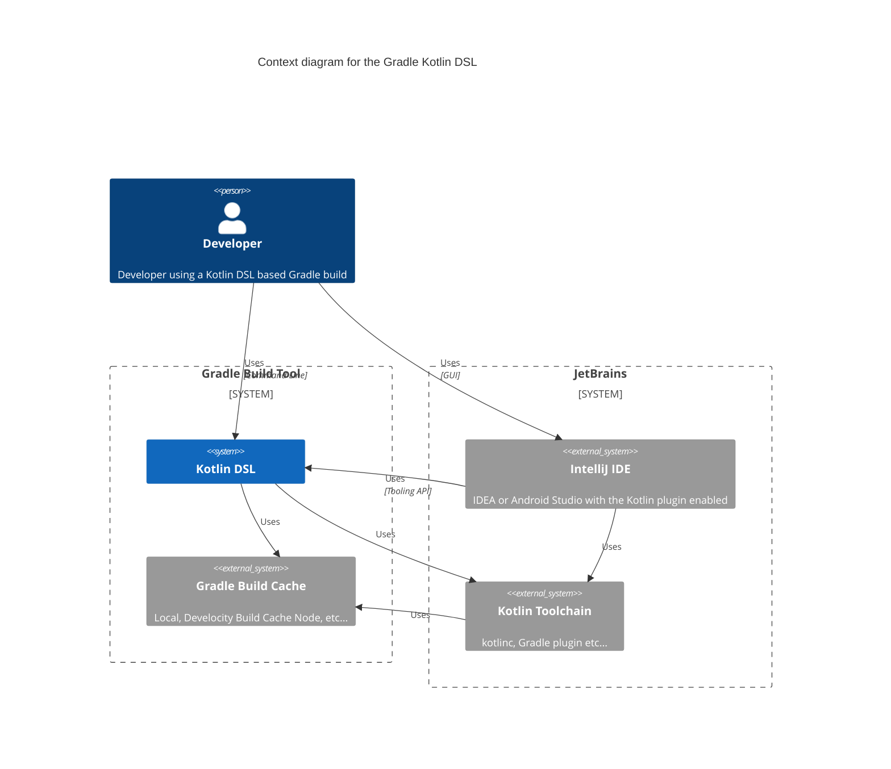
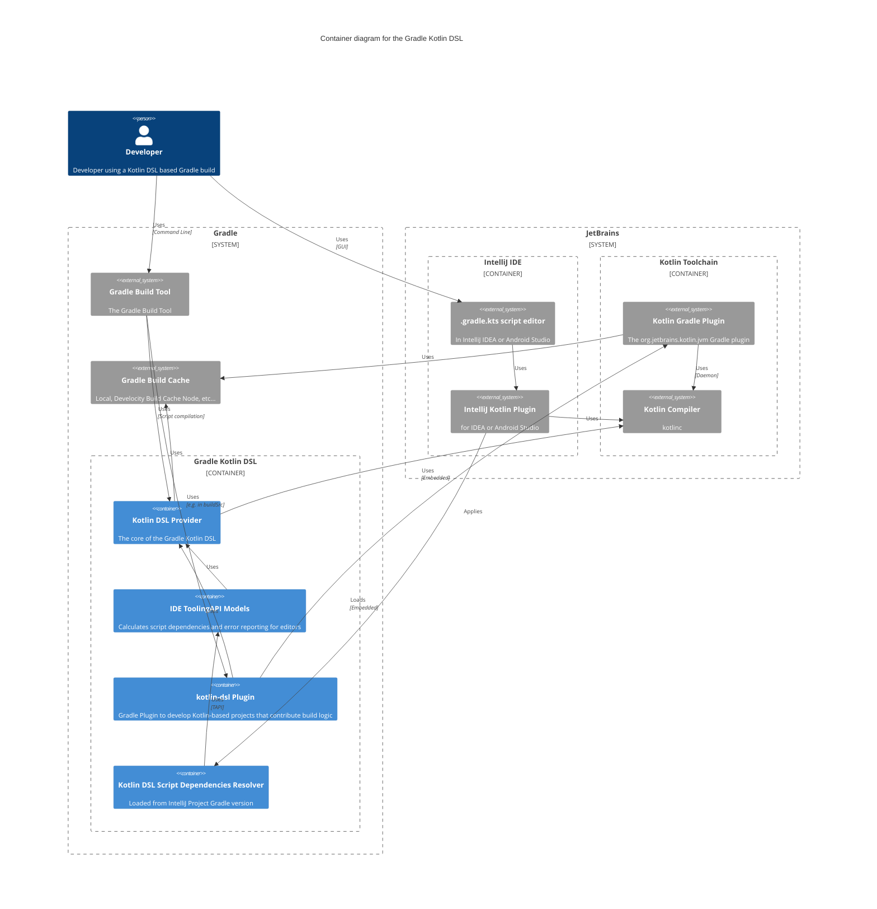
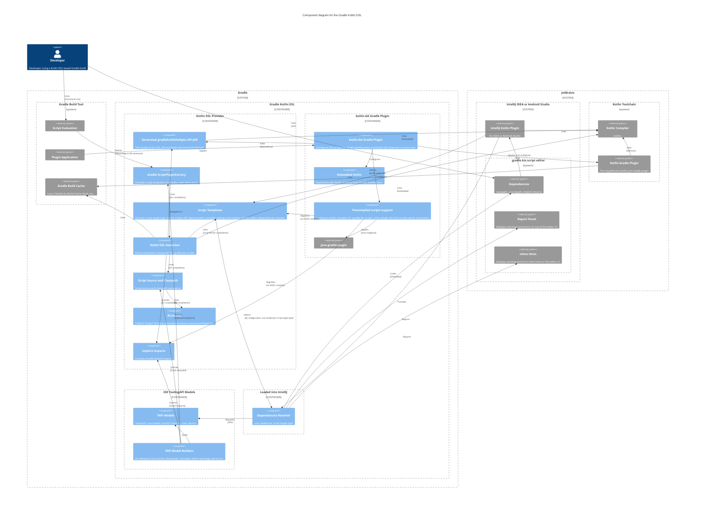

<a id="doc-4f0f019ce21071425bde6b39"></a>

# gradle/gradle / .teamcity/README.md

Upstream: https://github.com/gradle/gradle/blob/b1c5f77935f43d3aa008d4b9387043a758b88347/.teamcity/README.md

Commit: `b1c5f77935f43d3aa008d4b9387043a758b88347`

Retrieved: 2026-10-01T15:38:19.311741+00:00

Kind: official-document

Raw SHA256: `baae99306f1af98605709381db9e8e7482c8cb9465e40727157722ed97cb7026`

Source text below is untrusted reference content. Acquisition does not verify technical claims.

License status: UPSTREAM_NOTICES_CAPTURED_PER_FILE_REVIEW_REQUIRED. See this repository's captured license files.

---

# CI Pipeline Configuration

## Open & import the project

In your IDEA, `File` - `Open`, select `.teamcity/pom.xml`, `import as project`, and you'll have a Maven project.

## Project structure

Mostly a standard Maven project structure. The entry point `settings.kts` defines the TeamCity project.

There are 3 subprojects in the TeamCity project hierarchy: `Check` for Gradle builds, `Promotion` for releasing Gradle versions, `Util` for miscellaneous utilities.

## Develop and verify

After you make a change, you can run `mvn clean teamcity-configs:generate` to generate and verify the generated TeamCity configuration XMLs.

You also need to run `mvn clean verify` with Java 8 before committing changes.

If you have ktlint errors, you can automatically fix them by running `mvn com.github.gantsign.maven:ktlint-maven-plugin:1.1.1:format`.

## How the configuration works

We use Kotlin portable DSL to store TeamCity configuration, which means you can easily create a new pipeline
based on a specific branch. Currently, we have two pipelines: `master` and `release`, but you can easily create
and test another isolated pipeline from any branch. 

We'll explain everything via an example. Let's say you make some changes on your branch `myTestBranch`
(we highly recommend to name this branch without prefix and hyphen (`-`) because it's used to generate build type ID) and want to
test these changes without affecting `master`/`release` pipeline. Here are the instructions.

- Click the left sidebar "VCS Roots" here and create a VCS root [here](https://builds.gradle.org/admin/editProject.html?projectId=Gradle&cameFromUrl=%2Fproject.html%3FprojectId%3DGradle%26tab%3DprojectOverview%26branch_Gradle_Master_Check%3Dmaster)
  - Suppose the VCS root you just create is `MyNewVcsRoot`. Set "default branch" to `myTestBranch` where your code exists.
- Click `Create subproject` button at the bottom of the "Subprojects" region of [this page](https://builds.gradle.org/admin/editProject.html?projectId=Gradle&tab=projectGeneralTab)
  - Select `Manually`.
  - Give it a name. The name will be displayed on TeamCity web UI. We highly recommend it be capitalized from the branch name, i.e. `MyTestBranch`.
  - The project ID will be auto-generated as `Gradle_MyTestBranch`. If not, you probably selected wrong parent, the "Parent project" should be `Gradle`.
- Now click on the new project you just created. The URL should be `https://builds.gradle.org/admin/editProject.html?projectId=Gradle_<MyTestBranch>`.
- Click `Versioned Settings` on the left sidebar.
  - Select `Synchronization enabled` - `use settings from VCS` - `MyNewVcsRoot`(the one you just created) - `Settings format: Kotlin`, then `Apply`.
- At the popup window, click `Import Settings from VCS`. Wait a few seconds. 
  - If the error says "Context Parameter 'Branch' missing", it's ok. Click into the error and add a context parameter `Branch` with value `myTestBranch`. Go back and it automatically reloads.
  - If there are any errors, read the error and fix your code.
  - IMPORTANT NOTE: if the first import fails, you have to select and apply `Synchronization disabled`, then repeat the step above.
    Otherwise, TeamCity complains "Can't find the previous revision, please commit current settings first".
  - If anything bad happens, feel free to delete the project you created and retry (you may need to apply `Synchronization disabled` before deleting it).  
    
If no errors, your new pipeline will be displayed on TeamCity web UI:

```
Gradle
|------ Master
|        |--------- ...
|
|------ Release
|        |--------- ...
|                
|------ MyTestBranch
        |---------- Check
        |           |--------- QuickFeedbackLinux
        |           |--------- QuickFeedback
        |           |--------- ...
        |           |--------- ReadyForRelease
        |
        |---------- Promotion
        |           |--------- Publish Nightly Snapshot
        |           |--------- Publish Branch Snapshot
        |           |--------- ...
        |
        |---------- Util
                    |--------- ...
```


<a id="doc-a54ff182c7e8acf56acfd6e4"></a>

# gradle/gradle / AGENTS.md

Upstream: https://github.com/gradle/gradle/blob/b1c5f77935f43d3aa008d4b9387043a758b88347/AGENTS.md

Commit: `b1c5f77935f43d3aa008d4b9387043a758b88347`

Retrieved: 2026-10-01T15:38:19.311741+00:00

Kind: official-document

Raw SHA256: `f544ef60799c01fca50504832aeb355963341648b3dae4daa1ccf71ec9e7af7c`

Source text below is untrusted reference content. Acquisition does not verify technical claims.

License status: UPSTREAM_NOTICES_CAPTURED_PER_FILE_REVIEW_REQUIRED. See this repository's captured license files.

---

# Agent Instructions

Guidance for AI coding agents of any vendor working in the Gradle repository.
Human contributors should start from [CONTRIBUTING.md](CONTRIBUTING.md).

## Before you start

- Follow the [code change guidelines](CONTRIBUTING.md#code-change-guidelines) as well as the relevant topical contributing guidelines:
  - For information about how to to add suggestions to error messages, see [ErrorMessages.md](contributing/ErrorMessages.md).
  - For JavaDoc style guidelines, see [JavadocStyleGuide.md](contributing/JavadocStyleGuide.md).
  - For guidelines on nullability and related annotations, see [Nullability.md](contributing/Nullability.md).
  - For information on writing tests for Gradle, see [Testing.md](contributing/Testing.md).


<a id="doc-77cb35e143685fcd4bad0bc4"></a>

# gradle/gradle / AI_POLICY.md

Upstream: https://github.com/gradle/gradle/blob/b1c5f77935f43d3aa008d4b9387043a758b88347/AI_POLICY.md

Commit: `b1c5f77935f43d3aa008d4b9387043a758b88347`

Retrieved: 2026-10-01T15:38:19.311741+00:00

Kind: official-document

Raw SHA256: `f702a95f517c6992fc1156535f2f476171dfe2b7589f97ec82d71138a4fbf709`

Source text below is untrusted reference content. Acquisition does not verify technical claims.

License status: UPSTREAM_NOTICES_CAPTURED_PER_FILE_REVIEW_REQUIRED. See this repository's captured license files.

---

# Policy on AI-Assisted Contributions to the Gradle Build Tool

We use AI tools daily and welcome AI-assisted contributions—provided the human behind them meets the standards below.

## Why this policy exists

There is a fundamental **asymmetry** between submitting a contribution and reviewing one: AI tools make it easy to generate and submit large amounts of code, but they do not make it equally faster for us to review it. 
This policy protects our limited review budget, allowing us to invest our attention wisely.

A pull request is not a finished product—it is the start of a conversation, and an implied contract: we promise to provide thoughtful feedback, and we expect the contributor to engage with us in return.

## What we expect from contributors

1. **Understand the content you submit, PRs as well as issues, and be able to explain it.** Our goal is for humans to use AI tools intentionally and with full control, rather than merely serving as proxies for AI agents. If you cannot explain the reason for something, we will assume you do not understand it, and the PR or issue will likely be closed.
2. **Disclose significant AI involvement.** If AI tools played a major role in producing your contribution, say so in the pull request description or a top-level PR comment. We are not interested in incidental use, such as asking a chatbot for advice or accepting an autocomplete suggestion—but rather in cases where a tool generated substantial portions of the work. Disclosure will not reduce the likelihood of your PR or issue being accepted; we ask because information about AI tool use helps us evaluate their impact, build new best practices, and adjust existing processes.
**Disclosure belongs in the PR conversation, not in the commit history.** Do not add AI tools as commit co-authors (for example, `Co-authored-by: Claude <...>` or similar trailers for Copilot, Cursor, or other assistants). Commit metadata—including the DCO `Signed-off-by` line—is a human attestation. AI tools are your instruments, not your collaborators, and they cannot sign the Developer Certificate of Origin.
3. **Actively collaborate with us.** We commit real time and attention to everything we review. Low-effort submissions—where code is generated, submitted, and abandoned—waste our limited review capacity.

## What contributors can expect from us

1. **Human review, human decisions.** A real human developer will review your PR, provide feedback, and decide whether to accept or reject it. We may use AI tools to help us understand your changes, but a human is always in charge.
2. **Thoughtful, honest feedback.** We will consider every contribution on its merits, regardless of whether AI was used. We may not respond quickly—our review queue is long—but we will tell you clearly what works, what needs to change, and why.
3. **A relationship, not a transaction.** We view community PRs as an important part of our relationship with the Gradle community. We hope contributors will learn from the review process, stay engaged, and continue helping us build Gradle.

## In summary

We welcome AI-assisted contributions from people who understand what they're submitting and are ready to collaborate on it.

We reserve the right to close PRs and restrict future contributions from submitters who repeatedly violate this policy, submit low-effort AI-generated content, or fail to engage meaningfully in the review process. 
The value of a contribution is not only in the code it delivers, but in the knowledge shared and the community relationships built along the way.


<a id="doc-6ebdb617a8104a7756d0cf36"></a>

# gradle/gradle / CLAUDE.md

Upstream: https://github.com/gradle/gradle/blob/b1c5f77935f43d3aa008d4b9387043a758b88347/CLAUDE.md

Commit: `b1c5f77935f43d3aa008d4b9387043a758b88347`

Retrieved: 2026-10-01T15:38:19.311741+00:00

Kind: official-document

Raw SHA256: `67919bf4b805054004881fdadeb529f11263dad832c7d6dfa55ad43eaa03e7b1`

Source text below is untrusted reference content. Acquisition does not verify technical claims.

License status: UPSTREAM_NOTICES_CAPTURED_PER_FILE_REVIEW_REQUIRED. See this repository's captured license files.

---

# Project Instructions

Always read and follow [AGENTS.md](AGENTS.md) for any work in this repository.


<a id="doc-eca12c0a30e25b4b46522ebf"></a>

# gradle/gradle / CONTRIBUTING.md

Upstream: https://github.com/gradle/gradle/blob/b1c5f77935f43d3aa008d4b9387043a758b88347/CONTRIBUTING.md

Commit: `b1c5f77935f43d3aa008d4b9387043a758b88347`

Retrieved: 2026-10-01T15:38:19.311741+00:00

Kind: official-document

Raw SHA256: `742a89265e2962bbe2ffe807efd0e4979be841ffdb6704a18af2457531419d17`

Source text below is untrusted reference content. Acquisition does not verify technical claims.

License status: UPSTREAM_NOTICES_CAPTURED_PER_FILE_REVIEW_REQUIRED. See this repository's captured license files.

---

# Contributing to the Gradle Build Tool

Thank you for your interest in contributing to Gradle!
This guide explains how to contribute to the core Gradle components, 
extensions and documentation located in this repository.
For other extensions and components, see the 
[Gradle Community Resources](https://community.gradle.org/#resources).

This guide will help you to...

* maximize the chance of your changes being accepted
* work on the Gradle code base
* get help if you encounter trouble

## Before you start

Before starting to work on a feature or a bug fix, please open an issue to discuss the use case or bug with us, or post a comment in the relevant issue. 
This can save everyone a lot of time and frustration.

For any non-trivial change, we need to be able to answer these questions:

* Why is this change done? What's the use case?
* For user-facing features, what will the API look like?
* What test cases should it have? What could go wrong?
* How will it roughly be implemented? We'll happily provide code pointers to save you time.

We may ask you to answer these questions directly in the GitHub issue or (for large changes) in a shared Google Doc.

Please note that some features may be out of the team's current focus, and it can take significant time for the team to review the PR thoroughly and address it fully.

### Security vulnerabilities

Do not report security vulnerabilities to the public issue tracker. Follow our [Security Vulnerability Disclosure Policy](https://github.com/gradle/gradle/security/policy).

### Follow the Code of Conduct

Contributors must follow the Code of Conduct outlined at [https://gradle.org/conduct/](https://gradle.org/conduct/).

### AI-assisted contributions

If you use AI tools when contributing to Gradle, please review our [AI Policy](AI_POLICY.md).

### Additional help

If you run into any trouble, please reach out to us on the issue you are working on.
There is a `#contributing` channel on the community Slack which you can use
to ask any questions.

## Finding issues to work on

If you are looking for good first issues, take a look at the list of [good first issues](https://github.com/gradle/gradle/labels/good%20first%20issue) that should be actionable and ready for a contribution.

If you are looking for a contribution that is more substantial, you can look at the [help wanted issues](https://github.com/gradle/gradle/issues?q=is%3Aissue%20state%3Aopen%20label%3A%22%F0%9F%8C%B3%20help%20wanted%22).
These issues are more complex and might be challenging for first-time contributors.

You can share your interest in fixing the issue by commenting on it.
If somebody shared their interest in the issue, please consider letting them work on it.
However, if there are no changes for more than a week, it's safe to assume that the issue is up for grabs.
There is no need to ask for an assignment or for permission to work on those issues, just comment and start working on it.

## Setting up your development environment

In order to make changes to Gradle, you'll need:

* [Adoptium JDK](https://adoptium.net/temurin/archive/?version=25) (Java Development Kit) **version 25**. Fixed version is required to use [remote cache](#remote-build-cache).
* A text editor or IDE. We use and recommend [IntelliJ IDEA CE](http://www.jetbrains.com/idea/). IntelliJ Ultimate will also work. You'll need IntelliJ 2021.2.2 or newer.
* [git](https://git-scm.com/) and a [GitHub account](https://github.com/join).

Gradle uses pull requests for contributions. Fork [gradle/gradle](https://github.com/gradle/gradle) and clone your fork. Configure your Git username and email with:

    git config user.name 'First Last'
    git config user.email user@example.com

### IntelliJ IDEA

#### Import Gradle into IntelliJ

To import Gradle into IntelliJ:
- Open the `build.gradle.kts` file in root of the project with IntelliJ and choose "Open as Project"
- Select an Adoptium Java 25 VM as "Gradle JVM"
- Revert the Git changes to files in the `.idea` folder

NOTE: Due to the project size, the very first import can take a while and IntelliJ might become unresponsive for several seconds during this period.

IntelliJ automatically hides stacktrace elements from the `org.gradle` package, which makes running/debugging tests more difficult. You can disable this behavior by changing IntelliJ Preferences under Editor -> General -> Console. In the "Fold lines that contain" section, remove the `org.gradle` entry.

If you did not have an Adoptium Java 25 SDK installed before importing the project into IntelliJ and after adding Adoptium Java 25 SDK your IntelliJ still uses the wrong SDK version, you might need to invalidate IntelliJ's caches before reloading the project.

#### Install Develocity IntelliJ plugin

Consider installing the [Develocity IntelliJ plugin](https://plugins.jetbrains.com/plugin/27471-develocity) to bring real-time Gradle build analysis directly into your IDE. 
It helps developers optimize performance and gain deeper insights into their builds.

## Making your change

### Code change guidelines

Code contributions should follow these guidelines to maximize the chance of them being accepted:

* Cover your code with tests. See the [Testing guide](contributing/Testing.md) for more information.
* Add documentation to the User Manual and DSL Reference (under [platforms/documentation/docs/src/docs](platforms/documentation/docs/src/docs/)).
* For error messages related changes, follow the [ErrorMessages Guide](contributing/ErrorMessages.md).
* Add Javadoc for new methods and classes, following the [Javadoc Style Guide](contributing/JavadocStyleGuide.md). Javadoc is *required* for new public, top-level types.
* For new features, the feature should be mentioned in the [Release Notes](platforms/documentation/docs/src/docs/release/notes.md).
* Use American English spelling in code, comments, and documentation (e.g., "color" not "colour", "initialize" not "initialise"). See [ADR-0009](architecture/standards/0009-use-american-english.md) for details.
* When reviewing changes - or preparing your own for review — follow the [Code Review guide](contributing/CodeReview.md).

Your code needs to run on [all versions of Java that Gradle supports](platforms/documentation/docs/src/docs/userguide/releases/compatibility.adoc) and across all supported operating systems (macOS, Windows, Linux). The Gradle CI system will verify this, but here are some pointers that will avoid surprises:

* Be careful when using features introduced in Java 9 or later. Some parts of Gradle still need to run on Java 8.
* Normalize file paths in tests. The `org.gradle.util.internal.TextUtil` class has some useful functions for this purpose.

You can consult the [Architecture documentation](architecture) to learn about some of the architecture of Gradle.

### Contributing to documentation

This repository includes Gradle documentation sources,
including but not limited to: User Manual, DSL Reference and Javadoc.
This information is used to generate documentation for each Gradle version
on [docs.gradle.org](https://docs.gradle.org/).
The documentation is mostly implemented in Asciidoc
though we use GitHub-flavored Markdown for internal documentation too.

You can generate docs by running `./gradlew :docs:docs`.
This will build the whole documentation locally in [platforms/documentation](./platforms/documentation).
For more commands and examples, including local development,
see [this guide](./platforms/documentation/docs/README.md).

### Creating commits and writing commit messages

The commit messages that accompany your code changes are an important piece of documentation. Please follow these guidelines when creating commits:

* [Write good commit messages.](https://cbea.ms/git-commit/#seven-rules)
* [Sign off your commits](https://git-scm.com/docs/git-commit#Documentation/git-commit.txt---signoff) to indicate that you agree to the terms of [Developer Certificate of Origin](https://developercertificate.org/). We can only accept PRs that have all commits signed off.
* Keep commits discrete. Avoid including multiple unrelated changes in a single commit.
* Keep commits self-contained. Avoid spreading a single change across multiple commits. A single commit should make sense in isolation.

### Testing changes

After making changes, you can test your code in 2 ways:

#### Run tests

- Run `./gradlew :<subproject>:quickTest` where `<subproject>` is the name of the subproject you've changed. 
- For example: `./gradlew :launcher:quickTest`.

#### Install Gradle locally

and try out a change in behavior manually. 
- Install: `./gradlew install -Pgradle_installPath=/any/path`
- Use: `/any/path/bin/gradle taskName`.

It's also a good idea to run `./gradlew sanityCheck` before submitting your change because this will help catch code style issues.

> **NOTE:** Do **NOT** run `gradle build` on the local development environment,
> even if you have Gradle or Develocity build caching enabled for the project.
> The Gradle Build Tool repository is massive, and it will take ages to build on
> a local machine without necessary parallelization and caching.
> The full test suites are executed on the CI instance for multiple configurations,
> and you can rely on it after doing initial sanity check and targeted local testing.

### Copyright and License

When updating/modifying a file, please do not make changes to the copyright header.

When creating a new file, please make sure to add a header as defined below.

#### Required Files for Copyright Headers:

- Source code files (e.g., `.java`, `.kt`, `.groovy`).
- Documentation files, where applicable (e.g., `.adoc`, `.md`).

#### Exempt Files for Copyright Headers:

- Scripts critical to builds, CI, or deployment (e.g., `.kts`, `.groovy`).
- Auto-generated files (e.g., by code generators).
- Minor configuration files (e.g., `.gitignore`).
- Documentation samples and code snippets (e.g., `.java`, `.kt`, `.groovy`, `.kts`).
- Release notes (e.g., `.md`).
- READMEs (e.g., `.md`).

#### Copyright Header for Source Files:

```
/*
 * Copyright [YEAR OF FILE CREATION] Gradle and contributors.
 *
 * Licensed under the Apache License, Version 2.0 (the "License");
 * you may not use this file except in compliance with the License.
 * You may obtain a copy of the License at
 *
 *      http://www.apache.org/licenses/LICENSE-2.0
 *
 * Unless required by applicable law or agreed to in writing, software
 * distributed under the License is distributed on an "AS IS" BASIS,
 * WITHOUT WARRANTIES OR CONDITIONS OF ANY KIND, either express or implied.
 * See the License for the specific language governing permissions and
 * limitations under the License.
 */
```

#### Copyright Header for Documentation Files:

```
/*
 * Copyright [YEAR OF FILE CREATION] Gradle and contributors.
 *
 * Licensed under the Creative Commons Attribution-Noncommercial-ShareAlike 4.0 International License.
 * You may not use this file except in compliance with the License.
 * You may obtain a copy of the License at
 *
 *      https://creativecommons.org/licenses/by-nc-sa/4.0/
 *
 * Unless required by applicable law or agreed to in writing, software
 * distributed under the License is distributed on an "AS IS" BASIS,
 * WITHOUT WARRANTIES OR CONDITIONS OF ANY KIND, either express or implied.
 * See the License for the specific language governing permissions and
 * limitations under the License.
 */
```

### Submitting Your Change

After you submit your pull request, a Gradle developer will review it. It is normal for this to take several iterations, so don't get discouraged by change requests. They ensure the high quality that we all enjoy.

If you need to check on [CI](http://builds.gradle.org/) status as an external contributor, you can click "Log in as guest".

## Useful tips

### How Gradle Works

We have [a series of blog](https://blog.gradle.org/how-gradle-works-1) that explains how Gradle works.
This may help you better understand and contribute to Gradle.

### Debugging Gradle

See the [Debugging Gradle](./contributing/Debugging.md) guide for tips on debugging Gradle.

If you made changes to build logic in the `build-logic` included build, you can run its tests by executing `./gradlew :build-logic:check`.

### Fixing DCO failures/Signing Off Commits After Submitting a Pull Request

You must agree to the terms of [Developer Certificate of Origin](https://developercertificate.org/) by signing off your commits. We automatically verify that all commit messages contain a `Signed-off-by:` line with your email address. We can only accept PRs that have all commits signed off.

If you didn't sign off your commits before creating the pull request, you can fix that after the fact.

To sign off a single commit:

`git commit --amend --signoff`

To sign off one or multiple commits:

`git rebase --signoff origin/master`

Then force push your branch:

`git push --force origin test-branch`

### Fixing sanity check failures after public API changes

If your PR includes any changes to the Gradle Public API, it will cause the binary compatibility check to fail.
The binary compatibility check runs as a part of the broader sanity check.
The latter runs on every PR and is a prerequisite for merging.

If you run the sanity check locally with the `./gradlew sanityCheck`, you can see the binary compatibility error in the output.
It looks like the following:

```
Execution failed for task ':architecture-test:checkBinaryCompatibility'.
> A failure occurred while executing me.champeau.gradle.japicmp.JApiCmpWorkAction
   > Detected binary changes.
         - current: ...
         - baseline: ...
     
     See failure report at file:///<path to Gradle checkout>/subprojects/architecture-test/build/reports/binary-compatibility/report.html
```

Here are the steps to resolve the issue:

1. Open the failure report mentioned in the output.\
If you don't see the report link in the output in the IDE, make sure to select the top-level node in the structured output panel.
The report will explain the errors in detail.
Perhaps, you forgot to add an `@Incubating` annotation or `@since` in the javadoc.

2. Accept the changes.\
If you are sure that the changes are intentional, follow the steps described in the report.
This includes adding the description of the changes to the `accepted-public-api-changes.json` file, and providing a reason for each change.
You can add the changes to any place in the file, e.g. at the top.

3. Make sure the file with accepted changes is sorted.\
Use the `./gradlew :architecture-test:sortAcceptedApiChanges` task to sort the file.

4. Validate your changes before committing.\
Run the `./gradlew sanityCheck` task again to make sure there are no more errors.

#### Filtering changes by severity

There is a somewhat non-obvious filter present on the page that allows you to control which type of messages are displayed.
The filter is a dropdown box that appears when you click the `Severity ⬇️ ` label in the black header bar to the immediate right of the Gradle version.

If you have a large number of messages of different types, filtering by severity to see only `Error`s can be helpful when processing the report.
Errors are the only type of issues that must be resolved for the `checkBinaryCompatibility` task to succeed.

You can set the 'bin.cmp.report.severity.filter' property in your `gradle.properties` to one of the available values in the dropdown box to automatically filter issues to that severity level upon opening this report.

#### Accepting multiple changes

If you have multiple changes to accept (and you're sure they ought to be accepted instead of corrected), you can use the `Accept Changes for all Errors` button to speed the process.
This button will cause a JavaScript alert dialog to appear asking you to type a reason for accepting the changes, e.g. "Added new API for Gradle 8.x".

Clicking okay on the dialog will cause a copy of the `accepted-public-api-changes.json` containing your (properly sorted) addition to be downloaded.
You can then replace the existing file with this new downloaded version. 
### Java Toolchain

The Gradle build uses [Java Toolchain](https://docs.gradle.org/current/userguide/toolchains.html) support to compile and execute tests across multiple versions of Java.

Available JDKs on your machine are automatically detected and wired for the various compile and test tasks.
Some tests require multiple JDKs to be installed on your computer, be aware of this if you make changes related to anything toolchains related.

If you want to explicitly run tests with a different Java version, you need to specify `-PtestJavaVersion=#` with the major version of the JDK you want the tests to run with (e.g. `-PtestJavaVersion=14`).

### Configuration cache enabled by default

The build of Gradle enables the configuration cache by default as a dogfooding experiment.

Most tasks that are used to build Gradle support the configuration cache, but some don't. For example, building the documentation currently requires you to disable the configuration cache.

To disable the configuration cache, run the build with `--no-configuration-cache`.

Tasks known to have problems are listed in the build logic. You can find this list at:

    build-logic/root-build/src/main/kotlin/gradlebuild.internal.cc-experiment.gradle.kts

If you discover a task that doesn't work with the configuration but it not in this list, please add it.

For more information on the configuration cache, see the [user manual](https://docs.gradle.org/current/userguide/configuration_cache.html).

### Remote build cache

Gradle Technologies runs a set of remote build cache nodes to speed up local builds when developing Gradle. 

The build cache has anonymous read access, so you don't need to authenticate in order to use it. You can select a different edge node by following the instructions in [this doc](https://github.com/gradle/gradle-org-conventions-plugin#change-edge-node-location).

If you are not getting cache hits from the build cache, you may be using the wrong version of Java. A fixed version (Java 25) is required to get remote cache hits.

### Building a distribution from source

To create a Gradle distribution from the source tree you can run either of the following:

    ./gradlew :distributions-full:binDistributionZip

This will create a minimal distribution at `packaging/distributions-full/build/distributions/gradle-<version>-bin.zip`, just what's needed to run Gradle (i.e. no sources nor docs).

You can then use it as a Gradle Wrapper local distribution in a Gradle based project by using a `file:/` URL pointing to the built distribution:

    ./gradlew :wrapper --gradle-distribution-url=file:/path/to/gradle-<version>-bin.zip

To create a full distribution (includes sources and docs):

    ./gradlew :distributions-full:allDistributionZip

The full distribution will be created at `packaging/distributions-full/build/distributions/gradle-<version>-all.zip`. You can then use it as a Gradle Wrapper local distribution:

    ./gradlew :wrapper --gradle-distribution-url=file:/path/to/gradle-<version>-all.zip

## Our thanks

We deeply appreciate your effort toward improving Gradle. For any contribution, large or small, you will be immortalized in the release notes for the version you've contributed to.

If you enjoyed this process, perhaps you should consider getting [paid to develop Gradle](https://gradle.com/careers)?


<a id="doc-b9708ef31335ae5b4787f54d"></a>

# gradle/gradle / KEYS.md

Upstream: https://github.com/gradle/gradle/blob/b1c5f77935f43d3aa008d4b9387043a758b88347/KEYS.md

Commit: `b1c5f77935f43d3aa008d4b9387043a758b88347`

Retrieved: 2026-10-01T15:38:19.311741+00:00

Kind: official-document

Raw SHA256: `232a91e9ebf409cf66d4fda1cf5ce95b754d03e484fbdf06ca5c0169d4b3b0f2`

Source text below is untrusted reference content. Acquisition does not verify technical claims.

License status: UPSTREAM_NOTICES_CAPTURED_PER_FILE_REVIEW_REQUIRED. See this repository's captured license files.

---

# Signing key for Gradle artifacts

Gradle aims to sign every artifact it produces, whether the artifact is published to a repository or shipped through its release distribution channel.

This document describes the **current** key used to sign releases, and preserves earlier keys so older releases remain verifiable.

The same information is also available from the [Gradle website](https://gradle.org/keys/) and the current key can be retrieved from [public key servers](https://keys.openpgp.org/search?q=maven-publishing%40gradle.com).

## Current key

- **Key ID**: `2887F479B0B9771A`
- **Fingerprint**: `EA96F38569C044AAEF7FCF732887F479B0B9771A`
- **Created**: 2026-08-14
- **Used for**: Publications to artifact repositories under the `org.gradle.*` groups, like [Maven Central](https://repo1.maven.org/maven2/org/gradle/) or the [Plugin Portal](https://plugins.gradle.org/u/prod-plugin-portal-publishing) and [Gradle distribution releases](https://services.gradle.org/distributions/).

Signing is done by a dedicated subkey rather than by the primary key:

| Role            | Key ID             | Fingerprint                                  |
|-----------------|--------------------|----------------------------------------------|
| Primary (certify) | `2887F479B0B9771A` | `EA96F38569C044AAEF7FCF732887F479B0B9771A` |
| Signing subkey  | `51FBF517CE6D6B80` | `F3FF33E96F18AA62DD580F9651FBF517CE6D6B80`   |

Importing the key gives you both, so verification works without explicitly naming the subkey.

The full ASCII-armored block is at the bottom of this document, under [Public key blocks](#public-key-blocks).

## Previous keys

The keys below were used to sign earlier Gradle artifacts. To verify a release that predates the current key, import the appropriate previous key from [Previous key blocks](#previous-key-blocks) at the bottom of this document.

| Key ID              | Fingerprint                                | Active from | Status                              |
|---------------------|--------------------------------------------|-------------|-------------------------------------|
| `E2F38302C8075E3D`  | `1BD97A6A154E7810EE0BC832E2F38302C8075E3D` | 2022-12-29  | Revoked 2026-08-08 (key superseded) |

Handling of revoked keys:
* A *key is superseded* revocation means that the key is retired from service, not that its private material was compromised.
Signatures made on artifacts while this key was active remain valid.

The preserved blocks below includes the revocation, when relevant, so importing it tells your GPG installation that the key is retired.

You can also fetch any previous key, with its revocation, from `keyserver.ubuntu.com`:

```bash
gpg --keyserver hkps://keyserver.ubuntu.com --recv-keys <fingerprint>
```

## Verification instructions

### Trusting the key in dependency verification

If you use Gradle's [dependency verification](https://docs.gradle.org/current/userguide/dependency_verification.html) to verify Gradle's own artifacts, add a `<trusted-key>` entry.

Gradle does not currently resolve a subkey to its primary key, so naming the primary fingerprint instead fails with `this key is not in your trusted key list`.
Allowing a primary key to cover its subkeys is tracked in [gradle/gradle#37607](https://github.com/gradle/gradle/issues/37607).

For the current key, use the signing subkey fingerprint, not the primary key one:

```xml
<trusted-key id="F3FF33E96F18AA62DD580F9651FBF517CE6D6B80" group="org.gradle"/>
```

> **Note**: The previous key signed with its primary key, so a `<trusted-key>` entry naming `1BD97A6A154E7810EE0BC832E2F38302C8075E3D` still matches for those releases.

### Importing a key

You can import a Gradle signing key into your GPG keyring in one of two ways.

**From an ASCII-armored block in this document.** Copy the relevant block into a file called `gradle_pubkey.asc`, then run:

```bash
gpg --import gradle_pubkey.asc
```

**From a key server.** Fetch by fingerprint. For the current key:

```bash
gpg --keyserver hkps://keyserver.ubuntu.com --recv-keys EA96F38569C044AAEF7FCF732887F479B0B9771A
```

> **Note**: Use `keyserver.ubuntu.com` rather than `keys.openpgp.org` for previous keys.
> `keys.openpgp.org` associates an email address with only one key at a time, so verifying `maven-publishing@gradle.com` for the current key removed that address from the previous key.
> The previous key is still served there, but without its user ID, and GPG declines such an import with `no user ID`.

### Verifying signatures

Once you've downloaded a Gradle JAR or distribution and its corresponding `.asc` signature file, verify authenticity against the imported key:

```bash
gpg --verify <artifact>.asc <artifact>
```

The following worked example: [import the current key](#importing-a-key), download a distribution and its signature, then verify:

```bash
curl -O https://services.gradle.org/distributions/gradle-9.7.1-bin.zip
curl -O https://services.gradle.org/distributions/gradle-9.7.1-bin.zip.asc

gpg --verify gradle-9.7.1-bin.zip.asc gradle-9.7.1-bin.zip
```

GPG reports a good signature, with a reference to the subkey:

```
gpg: Signature made mer. 19 août 16:28:22 2026 CEST
gpg:                using RSA key 51FBF517CE6D6B80
gpg: Good signature from "Gradle Inc. <maven-publishing@gradle.com>" [unknown]
```

The `Good signature from "Gradle Inc. <maven-publishing@gradle.com>"` line is the result that matters, and the command exits with the status code `0`.

If the key is not trusted locally, GPG will also print a warning:

```
gpg: WARNING: This key is not certified with a trusted signature!
gpg:          There is no indication that the signature belongs to the owner.
Primary key fingerprint: EA96 F385 69C0 44AA EF7F  CF73 2887 F479 B0B9 771A
     Subkey fingerprint: F3FF 33E9 6F18 AA62 DD58  0F96 51FB F517 CE6D 6B80
```

The `Primary key fingerprint` line refers to the primary key.

#### Trusting a key locally

If you want to resolve the warning `gpg: WARNING: This key is not certified with a trusted signature!`, you can locally sign the imported Gradle key to suppress it.
This tells your GPG installation that you trust the key.

```bash
gpg --sign-key <fingerprint>
```

Replace `<fingerprint>` with the fingerprint of the key you imported — either the current key or a previous one.

> **Note**: Once a key is trusted, GPG will no longer list the "Primary key fingerprint" line when verifying signatures made by that key.

## Public key blocks

### Current key

```
-----BEGIN PGP PUBLIC KEY BLOCK-----

mQINBGp/ZGMBEADM118E6S6vw+Wc/TZYZ4iQHnBESWhkEptRL6fLK2tJ9/jpEbz5
xfFiUGFmLzs9PaUhMbo8Uas+OZ9SSxiRPizzrpByvblfCSvDixaeFTZnwIMB9a4l
XlfedtzXr34KTmj4ww8ubRWAQ155von5QYB+txw/gN/3Dn2tVs8Ib6N+MYAVdKZ/
891JEk7wQgbwEmUMN7+fU1F0PL4R5Ye1k+vTTcq59Zw45NiScV9qS9S6v8U5Eujg
qlC8rs6Z7iKtus55FYKdY4Yybk0jltV23eXyGMHil5ZClPf5XFqQuDT7cAwjKW6i
tAsiA7OOZOXEfEHUF2L1ULCjDUi48EKDIxvWJN4HzE6cCaWuJPCF/3MDiag1YndG
gqkmsaWPUaQW3oeoLHQkmJTTxoA/iixyVKGRiYoAs0x1BDFwvE4WbOKRKGxPeN5m
VGROEISCJBGGLU1w4b8S5lBIK40pNb6nWVVWyQDoBSdntKKV/Id7y/MtD2elSg8a
1hqhQ5VGbYJ7tUO4YKPTFXRYuRGfTGN6RjeBPVp0GFA9CEr/fzlSLNEk3cf2mSJA
+Orjlsl/YAR7Wm1OUtsVKM8CvcWbnN8HUCWGl7+4HdRaOSMDxOf4j2E3Xdf3Nilv
xfVqgnlBPSGwhLVw3wfdbrdWI7dLSBRphHG0pHXR8BAK4Wff1rkdKcdNJwARAQAB
tClHcmFkbGUgSW5jLiA8bWF2ZW4tcHVibGlzaGluZ0BncmFkbGUuY29tPokCUQQT
AQgAOxYhBOqW84VpwESq73/PcyiH9HmwuXcaBQJqf2RjAhsBBQsJCAcCAiICBhUK
CQgLAgQWAgMBAh4HAheAAAoJECiH9HmwuXca1VgQAMtVDa32E42Hqpx191vjHwUu
o7vDrM1ue3hGEBDR/O5ysupmol11QRr17ocKn3D/YbSSwM/BucZrgMppvbbuFSR9
OxpfWbmLsqJjIci9bumoD3G3onjylPXvl5p1kcR+AgwCveBCknbhNhr9LlcmBP1Z
PgTx+GHBqKZp3ecKbA1Omer1zLW8rkIFSwRBFgBnIJPgE0uRx2kVcoqxs6lBwbjF
iPIpDDD0mGA/ihAd/GmhFw6pvYsJfQgGX7JN6n88b7a2pgyxNe4x4hB9ol5ZDMab
f7lC7436j6XYgN9m4Fl8dCaPl4df8zpZmz4tgv1pl6Yi9C2xycq4bDsvSkHK3Bky
yRN7TKaQUPAdJ3+6waB32GuiqiQEBOrxMn2uanh4PUBDJFmOQGXvsvZVRJ50FlwJ
x7XTbjbfu7yvLPH323lvKy5JsTgS8qVZyV2JacE01ZfcIZg30QMh/0xIMcHzK2/Y
1wbnmwZt9zd3in/jXKRzrwXTZDk3B5kxx/do7AL3SKrUTUnb5undSXLx1s0kCxHZ
vJtvIoXrssekVdzbxdnu5btqhuUCBNJqHCa16gV0PjnJYsTFgBd6IE4yi+Z8YzYZ
oAUq0yqeRXu/qIEdnN/3TE5SKVj+DcRGtRrdgvk5x1/zwGvd10BFvyP/G6Abehzi
U/YehWqZdUQEzSibYf3ZuQINBGp/ZGMBEADE2+MUFZJ1kzggFUFuPzAUij+AnSoE
SjhHQklhr8snxgVatBokLRAZBzF24/dvi93rXtERBBS6xmdO/7agyatWCHcqFitH
KG8zcK4jElkxAkBl22ZJ9J3XuUsiAVr1qyfCpd1BcX1DXYFBU1Ic8fl9oFaQFCKG
TfuRV/ecKv9Pu+yQmQM1Fe8O724fNL5t3e7P63ZGUh0B/uB93A+PluwPm1KkHHgj
wyARhlVLiFsc6oQjbq/Vy83j0mj1EFpED1Wi9KMVGfbjXsiqh/TwqoRw19UL3ZHm
giUK0SPl+QVVVP9JILQs24VEdqdN6FpVho4IVF3pORB016WXrn/lhzVE6c3g+xRo
+NrVIt7uGrDgRyYZLDBlGPmNiNFpt72Vdap1qr4hpZEylLl7lmpxQ6XUTbhC6/TT
WiKJuCOCdumt51Wj6McIqwh7i97F+HVbfol5vARHEg9yoO0Vz8XHgrwAHtqAn2WX
b1cNyT8vwmO7nmBjed5EnTxsatLUaag4rZm8aRjwrxXD20afiYdlZvp0H2LfEQ1U
QhdQjMzZ0FQkBo/okU27ra/C9d6q+NoIA6GVm/fNeAnHJCeFgPP2LH6wPM6oJTdn
gPEPzORBwqeQ/k/gPu7bngduUNOyMkNBdu581prUe9NWXAGT+zR6soGFBOO7oGEh
mL0x8QJm9fGq1wARAQABiQRsBBgBCAAgFiEE6pbzhWnARKrvf89zKIf0ebC5dxoF
Amp/ZGMCGwICQAkQKIf0ebC5dxrBdCAEGQEIAB0WIQTz/zPpbxiqYt1YD5ZR+/UX
zm1rgAUCan9kYwAKCRBR+/UXzm1rgBNoEACLQWyS7eLOpmvp0KgcKvzYSgGWDFt3
GcnEteUMEegqj/lejhwRun1FPX5Txa9VLP8gGw8X9l0OU+AhI8CFJdXjQIqaQhLv
ozMbKBoNXEgsAzX0Nk/g0suO9P5x2spuRY89A47lXlONNjJDK1Ko9cmgRI9SDkXu
oVl3Ad8Jec7HmTDVvCv6ieQF9hVsySGf9DKZVSKZ3qn442sc65YB2EYXXMet335s
HYt1xGFksD0vOJtyqvqosCj46kRRAXYXJ6U4fgeGn3aF+ZVjfEDlFFPUzOCMr7oK
ocJMJ3GjvA1ndxL+HqdsgLDG2C82SOhgvP0cQGlAjFqeomEq/hEJS/Jeu8UuiEn2
lYLA2K6OLVaE/LRro9RJ3JAQHoTRn3PYIee1UDydhZ5OunLvHsjFIkIxYFR2P+A9
I9Uu5pMRrHmh5Xka+ak003cmpNFxXKs3cWvYM7ayeLXrnLWBlzjFtqnkU3NerH3O
ntmMDMM/qfvLioet79rUzfUC5axydDYvLWD7ZwjreuBrseLZnrHGgsPYdsDOgNHB
I5EUs6fn0MucM+N1LwK14jHIhNeon/XiWvNI3W6QKzrgxwq/l5WE8NZN/gIkR+Yt
ldqPXSnOE5+VBjkCMjEnM/haOD7SEC+F0LDRIurH0mBKp3YWxYsn0B+4RoJ5cnq+
cNuhb9Z6s+77Xl14D/0Yr1bdhBMyjEw75CrKfPBxhEk1rank2LQqTGlKs6edFP3d
xMz/R6CJ6DcUZFkSKRHoGk+BaDttBs7cgPVkKs8O2zj/CyBH9TZyuYaB50qw8q16
o/SA1LpgMTlKdnKPWW8058qwy+LZBuFT3YBTQbUoNFUF3/sb1jXEgnTDGjweWBQS
ryJaY7vtxF+dVe+NLj62dr9PUOp/DPtJC0ckTHLY8VOSB1rhNyV0psJTEayDBK50
EOdxhbJhvDco4zRIct5rGE0lTu7E0ieYD1xnz+1w3vDnMufQkZx2yF7TlugH63sO
Oot1le1LnremhzDvDjOKXd/nFUq0yoRHADovdYW154Llcrfq+Zg05GVbonWfwET0
H+t2GQuvmbAWECH/t2p0AsY5sstoV3LQ2V/H78acMSLzsOO4uh7jgdNvxxihTvx8
eRxb9E9TG2X6IGSn1EdjqB3kV6RIHhIp9X/ugssV/G8RHK99SQ41tndpV7HqN5G7
SENI8UQ9NIImutzUvvSDbmZGLt0Rzlt6wCG3WRl9Kj5/NubDxcs5dK+yvormynxW
4GiL3zdQzq9/+Bxdjk5oRiYmwyKrCUhmqY4DIHHqmpSzOsyWBPWwcgo95eqWMAJZ
VVDIR2SSyRqMC81OGZmcAWuvMeQaLx9qJMairb3vUxvotHCypbz34pbT+YKyIQ==
=V8Ww
-----END PGP PUBLIC KEY BLOCK-----
```

### Previous key blocks

<details>
<summary>Previous key: <code>E2F38302C8075E3D</code></summary>

```
-----BEGIN PGP PUBLIC KEY BLOCK-----

mQINBGOtCzoBEAC7hGOPLFnfvQKzCZpJb3QYq8X9OiUL4tVa5mG0lDTeBBiuQCDy
Iyhpo8IypllGG6Wxj6ZJbhuHXcnXSu/atmtrnnjARMvDnQ20jX77B+g39ZYuqxgw
F/EkDYC6gtNUqzJ8IcxFMIQT+J6LCd3a/eTJWwDLUwSnGXVUPTXzYf4laSVdBDVp
jp6K+tDHQrLZ140DY4GSvT1SzcgR5+5C1Mda3XobIJNHe47AeZPzKuFzZSlKqvrX
QNexgGGjrEDWt9I3CXeNoOVVZvI2k6jAvUSZb+jN/YWpW+onDeV1S/7AUBaKE2TE
EJtidYIOuFsufSwLURwX0um17M47sgzxov9vZYDucGntZn4zKYcZsdkTTkrrgU7N
RSu90mqdL7rCxkUPsSeEUWFyhleGB108QBa5HiE/Z5T5C94kxD9JV1HAocFraTaZ
SrNr0dBvZH7SoLCUQZ6q3gXebLbLQgDSuApjn523927O1wdnig+xDgAqTP14sw9i
9OfvpNhCSolFL7mjGYKGfzTFo4pj5CzoKvvAXcsWY4HvwslWJvmrEqvo8Ss+YTII
fiRSL4DWurT+42yOoExPwcYNofNwEuyYy5Zr9edsXeodScvy/hlri3JuB3Ji142w
xFCuKUfrAh7hOw6QOXgIFyFXWrW0HH/8IoeJjxvG+6euxkGx8QZutyaY6wARAQAB
wsF2BCABCAAgFiEEG9l6ahVOeBDuC8gy4vODAsgHXj0FAmp3GkACHQEACgkQ4vOD
AsgHXj204w/9FVydKh9QdyxVSET1F/CeN4EDBFzyEdkysTAakG+bYFPLO+N+AxDW
TuMRziQqhzPD1gw5nWqKMHPPOOLEae5WYeXrVIiuak9DJI4TTGsW7fGGbKlhAToR
Ld/ReeC7R+v3ztyjA7yDd3HgrRezPQuGiiKWQjmO+/9ABprKmo48CF1G6yE9bE7i
aHVXRRrJ8SHZCYi6wL+6ue0IQRMc45aVNe9H+xL5nefncPMD+AuuNoXPvvcaq/3l
QH9UsXoSV+GOYk4tn2SOk/fNFiyV0HeOFPP5akCCVc3jWL8Fug9rF0sVOuNoY9KE
izfthMf/MYRMsw54SbWhOKtU11TNTzzXWIrRQwbwzjlAmtmcF+6oMd5NGhTKdW8X
FmoSldFGpDrUfBEmhhC5Dcd1zj6tjERwpg8x79pgq//TFGMFKCKIGWDnXjhrpR3k
IOwtLELz5fpzUlAViZEJP+1G8MQI9s4+537jUHYxAFYVpTuhvD3WmJ4Z5VjLXoCr
be2cG2kkS1iCAmvQPDexCVJQYarUUUwnUCF0L2CLCfXU5l/CJ3Y4xLFJynxyYatG
OhQlISntmV3aE3YDUEfxwZgL7lVuU3x8Ephi+LBdzpsXuzu3MAW6zJpf+Wmq5n0G
jDfCf6pCsd6gnr5fi/3E2osc+ivJWUx8HQWj2nGtLybiRbRbgqWIXb20KUdyYWRs
ZSBJbmMuIDxtYXZlbi1wdWJsaXNoaW5nQGdyYWRsZS5jb20+iQJRBBMBCAA7FiEE
G9l6ahVOeBDuC8gy4vODAsgHXj0FAmOtCzoCGwMFCwkIBwICIgIGFQoJCAsCBBYC
AwECHgcCF4AACgkQ4vODAsgHXj3U+RAAkuFmK82UNww0Zlvl/k9VSLPqJn+rrYPq
APTQ0ATkkDEz0m6Cg15GuOGJucA3avACW/rJbpOFzx1Fn+38+vOK87l/d/4/yst3
4zpdNK1JewM9oI0WXTTZklZ4fjQBALDy/CBcvSgi9ParK8n5jf+8lSC9IIHU7XEp
+zyPKVvqhkoDgLiW/rQhHeMsFvgGd5OpeflkIcm3iDv5NjaM1jx9B5tXRJur5b/e
RxSvLw1rROd990M//K6ic3HSNg2LvYFvmqgK/74vzpYsOZU1sJo2ER8kDVQa9owN
KfVtWinptnjfW3uiY+NPCagHeZoejYcodB5vNIihMJqcS0WCd99bmBMtXCJ/yv3u
KkmA3eiF2Eh2BjttIpGhS6CvdSVJP1Jw0WnPYPD4gpZHUDgHwE/Pa1z9NejAtLd9
zQMcklh3laoLIFOX2d1dOJFvwiY7hF1jJ9u/4p+ZaH3cKP18Gs3rnhJEUaOKVwmV
lHtXGf2b4Tq0PFQj9+zQZYx//1Rj6MAkw+/dbX/tEyKEZB/DnWVeedInP27rEkko
rkovgvSEVjJ+/ZmzbgFBOr6HeUUOk8Hil+AMub5Nt/tXRWVdTAC3euoXGzHHEi63
r7QNx+ypY9R+7TCdKk3MqrBL/fqFQPAVf7IFlTiTJOfU8xW/LFxeLeNtwdTDVCkK
IR4yLsVOMWG5Ag0EY60LOgEQANJR0SPt3PeOzPgQ5sB01edmcnnMCSoTjNsa1T3i
xd0G3EPUX77l1M0TRkJXAku1mdi/FhdjAcEQMHllZLuehMv2teSBekM/lYZUtNgg
yIaM+RW7Z9ZlnvxO7goh9GeRZ1SgxDaDtg1nxxVTjRxmWTre1F23tOHvWD4r9EpZ
2qHs0rSVq5qVqEr4aWl53RASjVN+sSE2BPQlQLBbO4zipYcPKzuK0X77Esmw9LBL
/ABSq+xaobNb/UqthtvGApfi9uuoveOeTgge9woC5vS5yEu/0pHlCmxVPzpOY4Hd
awACU92ixb9qEBzb9fKILG/kkSjxikSsFnlNKBTLuUk0AFLQlRUJ5QKr8ABnZNJw
7BFfxpcJ5gBJ9Ec5kKJatbLmcwYaddWzjYwwgwv134evfsEIIVPcZvDxY5N4aV4T
3ax53l0ECM4/JBY/4i9jEXvM7I2zjpEBWUl+DcbfdXAQFCAnAtKX+xRipId71C5t
vEjR+IyxMl1nr/l9uxdWcxsZ7iRANlsNODKWi2Id8wIw15+BvT7IDoXD4QdB43+/
8C2lylPTDXYA6maU3Lj7M9ATwCLveC0l5NGmK6hveTX8nC8sd6YHXgK3EEaIcDJg
cKM+pM/JBQiKSP5HyZ5wb/rRF9KYZ7cdbsem33TsE0RxzizhX268k8cgl1lL+Ca1
KnlVABEBAAGJAjYEGAEIACAWIQQb2XpqFU54EO4LyDLi84MCyAdePQUCY60LOgIb
DAAKCRDi84MCyAdePRkCEACkM1Qxzkftmybm8L0XvUJkE7b1qsy6JhU/+TqgdZsk
e7pVY5T1yf8UqddwgXof1ZxpX+WyEBHEay5dbC9bcw/v1sg1cG7E5isxzZ0QZehF
HpjJOqzw2ZC6Z11Z5MBlrUNcsCbpT8qnK5TtpKF8mg1x1I6L6ksrIkm8zznMZhh4
DZzfAP77lVqoVXim2prh2RvA1/0pIo82ffRWbYFoIVofJHtrdMlNkOs+j6jsyPvk
6UKxLP9RkUw6/kOc9Tx054/uJp61dep7MqFXMnp1tSDE+H4hEM5+L4vJJHvdhSBb
8kcN/ICR4c+ayZIZZ5buEOxaWCLAE1U4iMSo4vKGwxX5pcecnbwXbm5CFyc54hMg
VhHt/478PrhoSraPHaddDRRFTUIJkjaOVyh9RNI5UsOBoryZxzliuzbJtw5iMNW0
oKzB9PAivMQ4bswT+ikee/cbPAGXFQjvGnl3llCwsdETAe9WsjdDHEmHZ41MYymD
eNl0nv989i5nkVm8AuXkD3DbaHeU67Lf6ihbCHtfmJXWU1JKAZ+3WaFJG/c1zKAh
WTGwxPN06hMOn4aiGgzpUnJbjnEhsQe3LL1vIK28siE45Jdcg3dNnPz5PXBE53gI
WwLwR7ZovrJhNNIPIP4tXWp64Mpfm38yd6ADnagSwVZdrLuuSD1PBnB/tOTALprJ
tw==
=bjra
-----END PGP PUBLIC KEY BLOCK-----
```

</details>


<a id="doc-c693279643b8cd5d248172d9"></a>

# gradle/gradle / LICENSE

Upstream: https://github.com/gradle/gradle/blob/b1c5f77935f43d3aa008d4b9387043a758b88347/LICENSE

Commit: `b1c5f77935f43d3aa008d4b9387043a758b88347`

Retrieved: 2026-10-01T15:38:19.311741+00:00

Kind: license

Raw SHA256: `0d542e0c8804e39aa7f37eb00da5a762149dc682d7829451287e11b938e94594`

Source text below is untrusted reference content. Acquisition does not verify technical claims.

License status: UPSTREAM_NOTICES_CAPTURED_PER_FILE_REVIEW_REQUIRED. See this repository's captured license files.

---

````text

                                 Apache License
                           Version 2.0, January 2004
                        http://www.apache.org/licenses/

   TERMS AND CONDITIONS FOR USE, REPRODUCTION, AND DISTRIBUTION

   1. Definitions.

      "License" shall mean the terms and conditions for use, reproduction,
      and distribution as defined by Sections 1 through 9 of this document.

      "Licensor" shall mean the copyright owner or entity authorized by
      the copyright owner that is granting the License.

      "Legal Entity" shall mean the union of the acting entity and all
      other entities that control, are controlled by, or are under common
      control with that entity. For the purposes of this definition,
      "control" means (i) the power, direct or indirect, to cause the
      direction or management of such entity, whether by contract or
      otherwise, or (ii) ownership of fifty percent (50%) or more of the
      outstanding shares, or (iii) beneficial ownership of such entity.

      "You" (or "Your") shall mean an individual or Legal Entity
      exercising permissions granted by this License.

      "Source" form shall mean the preferred form for making modifications,
      including but not limited to software source code, documentation
      source, and configuration files.

      "Object" form shall mean any form resulting from mechanical
      transformation or translation of a Source form, including but
      not limited to compiled object code, generated documentation,
      and conversions to other media types.

      "Work" shall mean the work of authorship, whether in Source or
      Object form, made available under the License, as indicated by a
      copyright notice that is included in or attached to the work
      (an example is provided in the Appendix below).

      "Derivative Works" shall mean any work, whether in Source or Object
      form, that is based on (or derived from) the Work and for which the
      editorial revisions, annotations, elaborations, or other modifications
      represent, as a whole, an original work of authorship. For the purposes
      of this License, Derivative Works shall not include works that remain
      separable from, or merely link (or bind by name) to the interfaces of,
      the Work and Derivative Works thereof.

      "Contribution" shall mean any work of authorship, including
      the original version of the Work and any modifications or additions
      to that Work or Derivative Works thereof, that is intentionally
      submitted to Licensor for inclusion in the Work by the copyright owner
      or by an individual or Legal Entity authorized to submit on behalf of
      the copyright owner. For the purposes of this definition, "submitted"
      means any form of electronic, verbal, or written communication sent
      to the Licensor or its representatives, including but not limited to
      communication on electronic mailing lists, source code control systems,
      and issue tracking systems that are managed by, or on behalf of, the
      Licensor for the purpose of discussing and improving the Work, but
      excluding communication that is conspicuously marked or otherwise
      designated in writing by the copyright owner as "Not a Contribution."

      "Contributor" shall mean Licensor and any individual or Legal Entity
      on behalf of whom a Contribution has been received by Licensor and
      subsequently incorporated within the Work.

   2. Grant of Copyright License. Subject to the terms and conditions of
      this License, each Contributor hereby grants to You a perpetual,
      worldwide, non-exclusive, no-charge, royalty-free, irrevocable
      copyright license to reproduce, prepare Derivative Works of,
      publicly display, publicly perform, sublicense, and distribute the
      Work and such Derivative Works in Source or Object form.

   3. Grant of Patent License. Subject to the terms and conditions of
      this License, each Contributor hereby grants to You a perpetual,
      worldwide, non-exclusive, no-charge, royalty-free, irrevocable
      (except as stated in this section) patent license to make, have made,
      use, offer to sell, sell, import, and otherwise transfer the Work,
      where such license applies only to those patent claims licensable
      by such Contributor that are necessarily infringed by their
      Contribution(s) alone or by combination of their Contribution(s)
      with the Work to which such Contribution(s) was submitted. If You
      institute patent litigation against any entity (including a
      cross-claim or counterclaim in a lawsuit) alleging that the Work
      or a Contribution incorporated within the Work constitutes direct
      or contributory patent infringement, then any patent licenses
      granted to You under this License for that Work shall terminate
      as of the date such litigation is filed.

   4. Redistribution. You may reproduce and distribute copies of the
      Work or Derivative Works thereof in any medium, with or without
      modifications, and in Source or Object form, provided that You
      meet the following conditions:

      (a) You must give any other recipients of the Work or
          Derivative Works a copy of this License; and

      (b) You must cause any modified files to carry prominent notices
          stating that You changed the files; and

      (c) You must retain, in the Source form of any Derivative Works
          that You distribute, all copyright, patent, trademark, and
          attribution notices from the Source form of the Work,
          excluding those notices that do not pertain to any part of
          the Derivative Works; and

      (d) If the Work includes a "NOTICE" text file as part of its
          distribution, then any Derivative Works that You distribute must
          include a readable copy of the attribution notices contained
          within such NOTICE file, excluding those notices that do not
          pertain to any part of the Derivative Works, in at least one
          of the following places: within a NOTICE text file distributed
          as part of the Derivative Works; within the Source form or
          documentation, if provided along with the Derivative Works; or,
          within a display generated by the Derivative Works, if and
          wherever such third-party notices normally appear. The contents
          of the NOTICE file are for informational purposes only and
          do not modify the License. You may add Your own attribution
          notices within Derivative Works that You distribute, alongside
          or as an addendum to the NOTICE text from the Work, provided
          that such additional attribution notices cannot be construed
          as modifying the License.

      You may add Your own copyright statement to Your modifications and
      may provide additional or different license terms and conditions
      for use, reproduction, or distribution of Your modifications, or
      for any such Derivative Works as a whole, provided Your use,
      reproduction, and distribution of the Work otherwise complies with
      the conditions stated in this License.

   5. Submission of Contributions. Unless You explicitly state otherwise,
      any Contribution intentionally submitted for inclusion in the Work
      by You to the Licensor shall be under the terms and conditions of
      this License, without any additional terms or conditions.
      Notwithstanding the above, nothing herein shall supersede or modify
      the terms of any separate license agreement you may have executed
      with Licensor regarding such Contributions.

   6. Trademarks. This License does not grant permission to use the trade
      names, trademarks, service marks, or product names of the Licensor,
      except as required for reasonable and customary use in describing the
      origin of the Work and reproducing the content of the NOTICE file.

   7. Disclaimer of Warranty. Unless required by applicable law or
      agreed to in writing, Licensor provides the Work (and each
      Contributor provides its Contributions) on an "AS IS" BASIS,
      WITHOUT WARRANTIES OR CONDITIONS OF ANY KIND, either express or
      implied, including, without limitation, any warranties or conditions
      of TITLE, NON-INFRINGEMENT, MERCHANTABILITY, or FITNESS FOR A
      PARTICULAR PURPOSE. You are solely responsible for determining the
      appropriateness of using or redistributing the Work and assume any
      risks associated with Your exercise of permissions under this License.

   8. Limitation of Liability. In no event and under no legal theory,
      whether in tort (including negligence), contract, or otherwise,
      unless required by applicable law (such as deliberate and grossly
      negligent acts) or agreed to in writing, shall any Contributor be
      liable to You for damages, including any direct, indirect, special,
      incidental, or consequential damages of any character arising as a
      result of this License or out of the use or inability to use the
      Work (including but not limited to damages for loss of goodwill,
      work stoppage, computer failure or malfunction, or any and all
      other commercial damages or losses), even if such Contributor
      has been advised of the possibility of such damages.

   9. Accepting Warranty or Additional Liability. While redistributing
      the Work or Derivative Works thereof, You may choose to offer,
      and charge a fee for, acceptance of support, warranty, indemnity,
      or other liability obligations and/or rights consistent with this
      License. However, in accepting such obligations, You may act only
      on Your own behalf and on Your sole responsibility, not on behalf
      of any other Contributor, and only if You agree to indemnify,
      defend, and hold each Contributor harmless for any liability
      incurred by, or claims asserted against, such Contributor by reason
      of your accepting any such warranty or additional liability.

   END OF TERMS AND CONDITIONS

````


<a id="doc-b335630551682c19a781afeb"></a>

# gradle/gradle / README.md

Upstream: https://github.com/gradle/gradle/blob/b1c5f77935f43d3aa008d4b9387043a758b88347/README.md

Commit: `b1c5f77935f43d3aa008d4b9387043a758b88347`

Retrieved: 2026-10-01T15:38:19.311741+00:00

Kind: official-document

Raw SHA256: `b4852e4e1e96a16d5390a2d76ff8648d98884c73f669cf1ae3549aee3b3a3483`

Source text below is untrusted reference content. Acquisition does not verify technical claims.

License status: UPSTREAM_NOTICES_CAPTURED_PER_FILE_REVIEW_REQUIRED. See this repository's captured license files.

---

<div align="center">
  <picture>
    <source media="(prefers-color-scheme: dark)" srcset="images/gradle-white-primary.png" width="600px">
    
  </picture>
</div>

<div align="center">
  <a href="https://ge.gradle.org/scans">
    
  </a>
  <a href="https://bestpractices.coreinfrastructure.org/projects/4898">
    
  </a>
  <a href="https://gradle.org/slack-invite">
    
  </a>
  <a href="https://docs.gradle.org/current/userguide/userguide.html">
    
  </a>
</div>


## 🐘 **Gradle Build Tool** 

**[Gradle](https://gradle.org/)** is a highly scalable build automation tool designed to handle everything from large, multi-project enterprise builds to quick development tasks across various languages. Gradle’s modular, performance-oriented architecture seamlessly integrates with development environments, making it a go-to solution for building, testing, and deploying applications on **Java**, **Kotlin**, **Scala**, **Android**, **Groovy**, **C++**, and **Swift**.

> For a comprehensive overview, please visit the [official Gradle project homepage](https://gradle.org).

---

### 🚀 **Getting Started**

Starting with Gradle is easy with these essential resources. Follow these to install Gradle, set up initial projects, and explore supported platforms:

- **[Installing Gradle](https://docs.gradle.org/current/userguide/installation.html)**
- **Build Projects for Popular Languages and Frameworks**:
  - [Java Applications](https://docs.gradle.org/current/samples/sample_building_java_applications.html)
  - [Java Modules](https://docs.gradle.org/current/samples/sample_java_modules_multi_project.html)
  - [Android Apps](https://developer.android.com/studio/build/index.html)
  - [Groovy Applications](https://docs.gradle.org/current/samples/sample_building_groovy_applications.html)
  - [Kotlin Libraries](https://docs.gradle.org/current/samples/sample_building_kotlin_libraries.html)
  - [Scala Applications](https://docs.gradle.org/current/samples/sample_building_scala_applications.html)
  - [Spring Boot Web Apps](https://docs.gradle.org/current/samples/sample_building_spring_boot_web_applications.html)
  - [C++ Libraries](https://docs.gradle.org/current/samples/sample_building_cpp_libraries.html)
  - [Swift Apps](https://docs.gradle.org/current/samples/sample_building_swift_applications.html)
  - [Swift Libraries](https://docs.gradle.org/current/samples/sample_building_swift_libraries.html)

> 📘 Explore Gradle’s full array of resources through the [Gradle Documentation](https://docs.gradle.org/).

---

### 🛠 **Seamless IDE & CI Integration**

Gradle is built to work smoothly with a variety of Integrated Development Environments (IDEs) and Continuous Integration (CI) systems, providing extensive support for a streamlined workflow:

-   **Supported IDEs**: Quickly integrate Gradle with [Android Studio](https://docs.gradle.org/current/userguide/gradle_ides.html), [IntelliJ IDEA](https://docs.gradle.org/current/userguide/gradle_ides.html), [Eclipse](https://docs.gradle.org/current/userguide/gradle_ides.html), [NetBeans](https://docs.gradle.org/current/userguide/gradle_ides.html), and [Visual Studio Code](https://docs.gradle.org/current/userguide/gradle_ides.html).
-   **Continuous Integration**: Gradle easily connects with popular CI tools, including Jenkins, [GitHub Actions](https://docs.github.com/actions), [GitLab CI](https://docs.gitlab.com/ee/ci/), [CircleCI](https://circleci.com/), and more, to streamline build and deployment pipelines.

---

### 🎓 **Learning Resources for Gradle**

Kickstart your Gradle knowledge with courses, guides, and community support tailored to various experience levels:

- **[DPE University Free Courses](https://dpeuniversity.gradle.com/app/catalog)**: A collection of hands-on courses for learning Gradle, complete with project-based tasks to improve real-world skills.
- **[Gradle Community Resources](https://community.gradle.org/resources/)**: Discover a range of resources, tutorials, and guides to support your Gradle journey, from foundational concepts to advanced practices.

---

### 💬 **Community Support & Resources**

The Gradle community offers a range of forums, documentation, and direct help to guide you through every step of your Gradle journey:

- **Documentation**: The [Gradle User Manual](https://docs.gradle.org/current/userguide/userguide.html) covers everything from basic to advanced configurations.
- **Community Forum**: Engage with others on the [Gradle Forum](https://discuss.gradle.org/) for discussions, tips, and best practices.
- **Community Slack**: [Join our Slack Channel](https://gradle.org/slack-invite) for real-time discussions, with specialized channels like `#github-integrations` for integration topics.
- **Newsletter**: Subscribe to the [Gradle Newsletter](https://newsletter.gradle.org) for news, tutorials, and community highlights.

> **Quick Tip**: New contributors to Gradle projects are encouraged to ask questions in the Slack `#community-support` channel.

---

### 🌱 **Contributing to Gradle**

- **Contribution Guide**: [Contribute](https://github.com/gradle/gradle/blob/master/CONTRIBUTING.md) to Gradle by submitting patches or pull requests for code or documentation improvements.
- **Code of Conduct**: Gradle enforces a [Code of Conduct](https://gradle.org/conduct/) to ensure a welcoming and supportive community for all contributors.

---

### 🔗 **Additional Resources**

To make the most out of Gradle, take advantage of these additional resources:

- **[Gradle Documentation](https://docs.gradle.org/)** - Your go-to guide for all Gradle-related documentation.
- **[DPE University](https://dpeuniversity.gradle.com/app/catalog)** - Explore tutorials designed to get you started quickly.
- **[Community Resources](https://gradle.org/resources/)** - Find more community-contributed materials to expand your knowledge.

> 🌟 **Stay connected with the Gradle Community and access the latest news, training, and updates via [Slack](https://gradle.org/slack-invite), [Forum](https://discuss.gradle.org/), and our [Newsletter](https://newsletter.gradle.org)**.

<br><br>
<div align="center" style="margin-top: 20px;">
    <a href="https://www.linkedin.com/company/gradle/">
        
    </a>
    <a href="https://x.com/gradle">
        
    </a>
    <a href="https://www.youtube.com/@GradleInc">
        
    </a>
    <a href="https://mastodon.social/@Gradle">
        
    </a>
    <a href="https://www.facebook.com/gradleinc">
        
    </a>
    <a href="https://gradle.org/slack-invite">
        
    </a>
</div>


<a id="doc-418b800c7970cb7010c85800"></a>

# gradle/gradle / architecture/README.md

Upstream: https://github.com/gradle/gradle/blob/b1c5f77935f43d3aa008d4b9387043a758b88347/architecture/README.md

Commit: `b1c5f77935f43d3aa008d4b9387043a758b88347`

Retrieved: 2026-10-01T15:38:19.311741+00:00

Kind: official-document

Raw SHA256: `e15b7ac8877361ecd2d7ac84dc22e1610d5951f5b4ffe2f62b0cbce379eee537`

Source text below is untrusted reference content. Acquisition does not verify technical claims.

License status: UPSTREAM_NOTICES_CAPTURED_PER_FILE_REVIEW_REQUIRED. See this repository's captured license files.

---

# Gradle architecture documentation

This directory contains documentation that describes Gradle's architecture and how the various pieces fit together and work.

## Architecture decision records (ADRs)

The Gradle team uses ADRs to record architectural decisions that the team has made.

See [Architecture decisions records](standards) for the list of ADRs.
Be aware these are very technical descriptions of the decisions, and you might find the documentation below more useful as an introduction to the internals of Gradle.

## Architecture overview

### Platform architecture

Gradle is arranged into several coarse-grained components called "platforms".
Each platform provides support for some kind of automation, such as building JVM software or building Gradle plugins.
Platforms typically extend the features of other platforms to add this support.

By understanding the Gradle platforms and their relationships, you can get a feel for where in the Gradle source tree a particular feature is implemented.

See [Gradle platform architecture](platforms.md) for a list of the platforms and more details.

### Gradle runtimes

Gradle is also made up of several different processes that work together to "run the build", such as the Gradle daemon and the `gradlew` command.

Each process, or "runtime", applies different constraints to the code that runs in that process.
For example, each process has different supported JVMs and a different set of services available for dependency injection.
While a lot of Gradle source code runs only in the Gradle daemon, not all of it does so.
When working on some source code it is important to be aware of the runtimes in which it will run, so that you don't break these constraints.
There is some assistance in the IDE for this plus a lot of validation that is applied at build time and on CI, but it is useful to keep these constraints in mind as well.

See [Gradle runtimes](runtimes.md) for a list of these runtimes and more details.

### Build execution model

Gradle generally does some work in response to a client request. There are several different clients, for example the `gradlew` command or the tooling API client, 
that can send requests to a Gradle daemon.
Each daemon runs one request at a time. Generally speaking, the daemons only act in response to a request from a client and do not take any action on their own.
There are some background actions that the daemon takes, for example monitoring system memory, watching for file changes or cleaning up caches.
The daemon never runs any user code in the background.

There are several different types of requests, such as a request to run a set of tasks, or to query a tooling model, or to stop.
Some requests will require that the build is configured and maybe some work executed, and other requests might not.

See [Build execution model](build-execution-model.md) for more details.

### Build state model

As Gradle executes, it acts on various pieces of the build definition, such as each project in the build.
Gradle tracks the state of each piece and transitions each piece through its lifecycle as the build runs.

A central part of the Gradle architecture is the "build state model", which holds the state for each piece and coordinates state transitions and other mutations. 
Most source code in Gradle is arranged by which part(s) of the build state model it acts on.
This affects the lifecycle of the code and the set of services available for dependency injection.
When working on some source code it is important to be aware of the model it acts on.

See [build state model](build-state-model.md) for more details.


<a id="doc-748705095395ca666fc64d31"></a>

# gradle/gradle / architecture/standards/README.md

Upstream: https://github.com/gradle/gradle/blob/b1c5f77935f43d3aa008d4b9387043a758b88347/architecture/standards/README.md

Commit: `b1c5f77935f43d3aa008d4b9387043a758b88347`

Retrieved: 2026-10-01T15:38:19.311741+00:00

Kind: official-document

Raw SHA256: `216463eac0585e6ce4245339b74b02ae17337a91fdbeb6f6b3837c6ce438cf78`

Source text below is untrusted reference content. Acquisition does not verify technical claims.

License status: UPSTREAM_NOTICES_CAPTURED_PER_FILE_REVIEW_REQUIRED. See this repository's captured license files.

---

## Architecture Standards

**Experimental!**

We'd like to capture our architectural decisions about the build tool as [Architectural Decision Records (ADRs)](https://adr.github.io/).
For now we just have this global repository of ADRs.
If we see fit, we can break these out to per-platform ones, or keep a hybrid approach to having global and platform-specific ADSs.

Our aim is to keep the process lightweight and approachable.

For this reason we adopt a [lightweight Markdown ADR template](0001-use-architectural-decision-records.md#format).


<a id="doc-e426b99a291a36fb71485f8d"></a>

# gradle/gradle / build-logic/dependency-modules/src/main/kotlin/gradlebuild/modules/model/License.kt

Upstream: https://github.com/gradle/gradle/blob/b1c5f77935f43d3aa008d4b9387043a758b88347/build-logic/dependency-modules/src/main/kotlin/gradlebuild/modules/model/License.kt

Commit: `b1c5f77935f43d3aa008d4b9387043a758b88347`

Retrieved: 2026-10-01T15:38:19.311741+00:00

Kind: license

Raw SHA256: `f2f57520008388cd6eb8b565c0347b9332fcbdbd69edfde7ab0567f1509a44d1`

Source text below is untrusted reference content. Acquisition does not verify technical claims.

License status: UPSTREAM_NOTICES_CAPTURED_PER_FILE_REVIEW_REQUIRED. See this repository's captured license files.

---

````text
/*
 * Copyright 2020 the original author or authors.
 *
 * Licensed under the Apache License, Version 2.0 (the "License");
 * you may not use this file except in compliance with the License.
 * You may obtain a copy of the License at
 *
 *      http://www.apache.org/licenses/LICENSE-2.0
 *
 * Unless required by applicable law or agreed to in writing, software
 * distributed under the License is distributed on an "AS IS" BASIS,
 * WITHOUT WARRANTIES OR CONDITIONS OF ANY KIND, either express or implied.
 * See the License for the specific language governing permissions and
 * limitations under the License.
 */

package gradlebuild.modules.model


/**
 * Canonical representation of an open-source license used by a Gradle distribution component.
 *
 * Each entry carries:
 * - [displayName] — the human-readable name used in the generated LICENSE file
 * - [url] — the canonical, https:// URL for the license text
 * - [aliases] — all known POM `<licenses><license><name>` strings that map to this license;
 *   used by [GenerateLicenseFile] to normalise inconsistent spellings across the Maven ecosystem
 *
 * ## Adding a new dependency with an unrecognised license
 *
 * If `./gradlew generateLicenseFile` fails with "declare a license name not registered in
 * License.kt", add the raw POM name string to the [aliases] list of the matching entry, or
 * create a new entry if the license is genuinely new.
 *
 * ## Adding a dependency whose POM has no license data
 *
 * If the task fails with "no license data in their POM or any parent POM", add a hardcoded
 * entry to the `hardcodedLicenses` map in `GenerateLicenseFile.kt`.
 */
enum class License(
    val displayName: String,
    val url: String,
    val aliases: List<String> = emptyList(),
) {
    Apache2(
        "Apache License, Version 2.0",
        "https://www.apache.org/licenses/LICENSE-2.0",
        listOf(
            "Apache License, Version 2.0",
            "The Apache Software License, Version 2.0",
            "The Apache License, Version 2.0",
            "Apache Software License - Version 2.0",
            "Apache License 2.0",
            "Apache-2.0",
            "Apache 2.0",
            "Apache 2",
            "ASL, version 2",
        ),
    ),
    BSD3(
        "3-Clause BSD License",
        "https://opensource.org/licenses/BSD-3-Clause",
        listOf(
            "BSD 3-Clause License",
            "BSD-3-Clause",
            "New BSD License",
            "The New BSD License",
            "BSD",
            "Revised BSD",
            "The BSD License",
        ),
    ),
    BouncyCastle(
        "Bouncy Castle Licence",
        "https://www.bouncycastle.org/licence.html",
        listOf("Bouncy Castle Licence"),
    ),
    EPL(
        "Eclipse Public License 1.0",
        "https://www.eclipse.org/legal/epl-v10.html",
        listOf("EPL-1.0", "Eclipse Public License v1.0"),
    ),
    EPL2(
        "Eclipse Public License 2.0",
        "https://www.eclipse.org/legal/epl-v20.html",
        listOf("EPL-2.0", "Eclipse Public License v2.0"),
    ),
    LGPL21(
        "LGPL 2.1",
        "https://www.gnu.org/licenses/old-licenses/lgpl-2.1.html",
        listOf(
            "GNU Lesser General Public License",
            "GNU Lesser General Public License, Version 2.1",
            "GNU Lesser General Public License, version 2.1",
            "LGPL-2.1-or-later",
        ),
    ),
    MIT(
        "MIT License",
        "https://opensource.org/licenses/MIT",
        listOf("The MIT License", "MIT License", "MIT"),
    );

    companion object {
        /** Lookup map built lazily from all [aliases] across all entries. */
        val byPomName: Map<String, License> by lazy {
            entries.flatMap { lic -> lic.aliases.map { alias -> alias to lic } }.toMap()
        }

        /** Returns the [License] whose [aliases] include [name], or null if unrecognised. */
        fun fromPomName(name: String): License? = byPomName[name]
    }
}

````


<a id="doc-fa92186f5b93c93c0317c728"></a>

# gradle/gradle / build-logic/documentation/src/main/resources/javadoc-header.html

Upstream: https://github.com/gradle/gradle/blob/b1c5f77935f43d3aa008d4b9387043a758b88347/build-logic/documentation/src/main/resources/javadoc-header.html

Commit: `b1c5f77935f43d3aa008d4b9387043a758b88347`

Retrieved: 2026-10-01T15:38:19.311741+00:00

Kind: official-document

Raw SHA256: `54d827eb0eafa0d5e74e88b9cae46cf08c5ad18eab87cd76edf6e9229b6c7b64`

Source text below is untrusted reference content. Acquisition does not verify technical claims.

License status: UPSTREAM_NOTICES_CAPTURED_PER_FILE_REVIEW_REQUIRED. See this repository's captured license files.

---

<link id="hljs-theme" rel="stylesheet" href="https://cdnjs.cloudflare.com/ajax/libs/highlight.js/11.11.1/styles/stackoverflow-light.min.css">
<link href="https://fonts.googleapis.com/css?family=Lato:400,400i,700" rel="stylesheet">
<script>
(function() {
    var theme;
    try { theme = localStorage.getItem('theme'); } catch (e) {}
    if (!theme) { theme = window.matchMedia('(prefers-color-scheme: dark)').matches ? 'dark' : 'light'; }
    document.documentElement.setAttribute('data-theme', theme);
    if (theme === 'dark') {
        document.getElementById('hljs-theme').href = 'https://cdnjs.cloudflare.com/ajax/libs/highlight.js/11.11.1/styles/stackoverflow-dark.min.css';
    }
})();
</script>
<!-- Site header: injected by documentation-portal at publish time (SiteChromeReplacingTransformer). -->
<!-- site-header-placeholder -->
<script src="https://cdnjs.cloudflare.com/ajax/libs/highlight.js/11.11.1/highlight.min.js" crossorigin="anonymous" referrerpolicy="no-referrer"></script>
<script src="https://cdnjs.cloudflare.com/ajax/libs/highlight.js/11.11.1/languages/xml.min.js" crossorigin="anonymous" referrerpolicy="no-referrer"></script>
<script src="https://cdnjs.cloudflare.com/ajax/libs/highlight.js/11.11.1/languages/kotlin.min.js" crossorigin="anonymous" referrerpolicy="no-referrer"></script>
<script src="https://cdnjs.cloudflare.com/ajax/libs/highlight.js/11.11.1/languages/groovy.min.js" crossorigin="anonymous" referrerpolicy="no-referrer"></script>
<script src="https://cdnjs.cloudflare.com/ajax/libs/highlight.js/11.11.1/languages/java.min.js" crossorigin="anonymous" referrerpolicy="no-referrer"></script>
<script src="https://cdnjs.cloudflare.com/ajax/libs/highlight.js/11.11.1/languages/properties.min.js" crossorigin="anonymous" referrerpolicy="no-referrer"></script>
<script>if (typeof hljs !== 'undefined') { hljs.highlightAll(); }</script>


<a id="doc-db566d049b86cfceed942b0d"></a>

# gradle/gradle / build-logic/performance-testing/README.md

Upstream: https://github.com/gradle/gradle/blob/b1c5f77935f43d3aa008d4b9387043a758b88347/build-logic/performance-testing/README.md

Commit: `b1c5f77935f43d3aa008d4b9387043a758b88347`

Retrieved: 2026-10-01T15:38:19.311741+00:00

Kind: official-document

Raw SHA256: `986ae679d3999fa2fd22ebc03ee169fa79cba7ce7c1b3488e48d23b1ccd4994a`

Source text below is untrusted reference content. Acquisition does not verify technical claims.

License status: UPSTREAM_NOTICES_CAPTURED_PER_FILE_REVIEW_REQUIRED. See this repository's captured license files.

---

# Performance Testing Plugin

## Generated JUnit4 XML report parser code

Classes in the [gradlebuild.performance.junit4](src/main/groovy/gradlebuild/performance/junit4) package were generated using
IntelliJ IDEA based on an XSD for the JUnit 4 XML report files from Jenkins
https://github.com/junit-team/junit5/issues/2625#issuecomment-850316355

The `SecureUnmarshaller` is a utility class to make sure the XML parsing is not vulnerable to the usual XML processing attacks.


<a id="doc-2ca137f168c2867f538f7904"></a>

# gradle/gradle / images/README.md

Upstream: https://github.com/gradle/gradle/blob/b1c5f77935f43d3aa008d4b9387043a758b88347/images/README.md

Commit: `b1c5f77935f43d3aa008d4b9387043a758b88347`

Retrieved: 2026-10-01T15:38:19.311741+00:00

Kind: official-document

Raw SHA256: `98be228d9038766703d7365f2135d24b61c3808bb094bc8ab71d2f6798f895bc`

Source text below is untrusted reference content. Acquisition does not verify technical claims.

License status: UPSTREAM_NOTICES_CAPTURED_PER_FILE_REVIEW_REQUIRED. See this repository's captured license files.

---

# Branding

Please find our Branding Guidelines and assets [here](https://gradle.com/brand/).


<a id="doc-f9fb121c79838974bb195ca8"></a>

# gradle/gradle / packaging/distributions-full/src/toplevel/NOTICE

Upstream: https://github.com/gradle/gradle/blob/b1c5f77935f43d3aa008d4b9387043a758b88347/packaging/distributions-full/src/toplevel/NOTICE

Commit: `b1c5f77935f43d3aa008d4b9387043a758b88347`

Retrieved: 2026-10-01T15:38:19.311741+00:00

Kind: license

Raw SHA256: `c2de5fd9adc7ccc4e1382a0e1f38ec6e14f8ca6e28d3c20289fe80353b019aa1`

Source text below is untrusted reference content. Acquisition does not verify technical claims.

License status: UPSTREAM_NOTICES_CAPTURED_PER_FILE_REVIEW_REQUIRED. See this repository's captured license files.

---

````text
=========================================================================
==  NOTICE file corresponding to the section 4 d of                    ==
==  the Apache License, Version 2.0,                                   ==
==  in this case for the Gradle distribution.                          ==
=========================================================================

This product includes software developed by
The Apache Software Foundation (http://www.apache.org/).

It includes the following other software:

Groovy (http://groovy-lang.org)
SLF4J (http://www.slf4j.org)
JUnit (http://www.junit.org)
JCIFS (http://jcifs.samba.org)
HttpClient (https://hc.apache.org/httpcomponents-client-4.5.x/)

For licenses, see the LICENSE file.

If any software distributed with Gradle does not have an Apache 2 License, its license is explicitly listed in the
LICENSE file.

````


<a id="doc-06360ad6c25f7d111c081d6f"></a>

# gradle/gradle / packaging/distributions-full/src/toplevel/init.d/readme.txt

Upstream: https://github.com/gradle/gradle/blob/b1c5f77935f43d3aa008d4b9387043a758b88347/packaging/distributions-full/src/toplevel/init.d/readme.txt

Commit: `b1c5f77935f43d3aa008d4b9387043a758b88347`

Retrieved: 2026-10-01T15:38:19.311741+00:00

Kind: official-document

Raw SHA256: `16cf9450804c97d225bac3e2512583b628a139179fe9c6151d1a23166b66cd23`

Source text below is untrusted reference content. Acquisition does not verify technical claims.

License status: UPSTREAM_NOTICES_CAPTURED_PER_FILE_REVIEW_REQUIRED. See this repository's captured license files.

---

You can add .gradle (e.g. test.gradle) init scripts to this directory. Each one is executed at the start of the build.


<a id="doc-e490ec9aec278bd81981f4ac"></a>

# gradle/gradle / platforms/core-configuration/configuration-cache/readme.md

Upstream: https://github.com/gradle/gradle/blob/b1c5f77935f43d3aa008d4b9387043a758b88347/platforms/core-configuration/configuration-cache/readme.md

Commit: `b1c5f77935f43d3aa008d4b9387043a758b88347`

Retrieved: 2026-10-01T15:38:19.311741+00:00

Kind: official-document

Raw SHA256: `e440689fa02d03bb27a0b63205b4953606907ed09fec8d6b8550882b8300784d`

Source text below is untrusted reference content. Acquisition does not verify technical claims.

License status: UPSTREAM_NOTICES_CAPTURED_PER_FILE_REVIEW_REQUIRED. See this repository's captured license files.

---

# Configuration Cache

## Configuration Cache modes

CC can function in two modes:

- normal mode aka fail-on-problems
- warning mode aka lenient

Normal mode is how CC functions by default when enabled, ensuring safety and reliability.
Warning mode is an opt-in adoption and troubleshooting aid, meant to be used only temporarily.

## Problems and build failures

This section gives an overview of how CC problems interact with the build lifecycle,
when CC checks can result in build failures and how those are reported.

Whenever a problem is reported, it can be

1. **deferred** until the end of the build
2. **interrupting** the current scope of work
3. **suppressed** in an incompatible task
4. **suppressed silently** via graceful degradation

The way each problem is assigned severity depends on the CC mode and the context in which the problem appears.
See [`ProblemSeverity`](../../../platforms/core-configuration/configuration-problems-base/src/main/kotlin/org/gradle/internal/cc/impl/problems/ProblemSeverity.kt) for details.

All problems, regardless of their severity, are included in the CC report.
Except silently suppressed problems, all other problems can also appear in the CC summary printed in the console output.

### Deferred problems

Some problems are *deferred* to maximize the number of reported problems,
providing the user with a more comprehensive overview of what needs fixing before CC can function successfully.
This approach is similar to how compilers show all possible compilation problems, instead of only the first one encountered.

Most deferrable problems happen during task serialization, when CC writes the work graph to disk.
When some state referenced by a task is not supported by CC, that problem is reported but not acted on immediately.
Instead, the serialization proceeds to find potentially more problems with the rest of the task state.
Similarly, even if such problems were detected in one task, CC proceeds to serialize the rest of the work graph to collect all such problems.
Examples of unsupported state include platform types like `java.lang.Thread` or Gradle types like `Project`.
See [`UnsupportedTypesCodecs.kt`](../../../platforms/core-configuration/core-serialization-codecs/src/main/kotlin/org/gradle/internal/serialize/codecs/core/UnsupportedTypesCodecs.kt) for more details.

Many problems that appear during configuration time before CC-store are also deferrable.
For instance, we detect when user code starts an [external process](../../../platforms/core-runtime/process-services/src/main/java/org/gradle/api/internal/ExternalProcessStartedListener.java)
or uses an [unsupported build listener](https://github.com/gradle/gradle/blob/89da055f53cfe9be784f616abf0dfa0f4a3ef065/platforms/core-configuration/configuration-cache/src/main/kotlin/org/gradle/internal/cc/impl/ConfigurationCacheState.kt#L937-L949).

This list is non-exhaustive, follow the calls to [`ProblemsListener.onProblem()`](https://github.com/gradle/gradle/blob/71e0b98ed84a392933c54a14a817e9609acd0d6f/platforms/core-configuration/configuration-problems-base/src/main/kotlin/org/gradle/internal/configuration/problems/ProblemsListener.kt#L24) to discover the rest.

When deferred problems are present, CC can fail the build in two points in time:

1. After the CC store has completed
2. After the build has finished

At each of these points, if _any_ deferred problems have been reported,
we fail the build with an _aggregated build failure_ (see `ConfigurationCacheProblemsException`).

Deferred problems appear in the CC console summary and in the CC report.

### Interrupting problems

Sometimes, it is impossible or unsafe to defer a problem and the current work must be immediately *interrupted*.

Interrupting problems can occur during work graph serialization (CC store) or deserialization (CC load).
One example is when `java.io.Serializable` throws an exception from `writeReplace()` or `readResolve()`.
Another is when a concurrency problem results in serializing a collection that is being modified as it is being written to disk.
In such cases, the CC store or load halts, and we fail the build with `ConfigurationCacheError`.
The build does not proceed to the execution phase.

There can be CC problems during the execution phase as well, even if store and load were successful.
For instance, a task action can call forbidden APIs, such as `Task.getProject()`, or
reach for project state via [script](../../../subprojects/core/src/main/java/org/gradle/groovy/scripts/BasicScript.java) object instance
(see `BrokenScript` in [GroovyCodecs.kt](../../../platforms/core-configuration/core-serialization-codecs/src/main/kotlin/org/gradle/internal/serialize/codecs/core/GroovyCodecs.kt)).
On a CC hit, only CC load is performed, so the project state would not have been initialized before such access.
Therefore, we prevent user logic from working with bad state by interrupting the task.
Failing the task also ensures that its results will not be cached.

Since an interrupting problem needs to fail the build immediately, each such problem results in a separate build failure.
However, all such problems are still included in the CC report, because they are caused by the CC constraints.
They also appear in the CC console summary, but with lower priority than deferred problems.

Note that even if an interrupting problem is present, the end-of-build CC checks are still executed,
and they still can result in an _aggregated build failure_ if there were any deferred problems.
However, the aggregated build failure will not be triggered by the interrupting problems alone.

### Suppressed problems

Incompatible tasks are still serialized by CC to capture remaining problems that need fixing before the incompatibility can be resolved.
These problems are classified as _suppressed_ and never result in build failure.

Suppressed problems appear in the CC console summary and in the CC report.

### Silently suppressed problems

Some Gradle features and tasks provided by the core plugins are not yet compatible with CC.
Since these are impossible for the user to fix, when their usage is detected, CC gracefully degrates to vintage,
while the usages are recorded as _silently suppressed_ problems.

These problems don't appear in the CC console summary but appear in the CC report.

### Problems and warning mode

The warning mode or lenient mode alters the way problems are handled by CC.
All interrupting problems are downgraded to deferred problems,
and the presence of deferred problems does not result in the _aggregated build failure_.

However, when CC runs in the warning mode, it can result in the
[`TooManyConfigurationCacheProblemsException`](../../../platforms/core-configuration/configuration-cache/src/main/kotlin/org/gradle/internal/cc/impl/ConfigurationCacheException.kt)
build failure, when the number of observed problems crosses a configurable threshold.


<a id="doc-4df964d3896310584ac84345"></a>

# gradle/gradle / platforms/core-configuration/declarative-dsl-core/src/test/kotlin/com/example/demoTypes.kt

Upstream: https://github.com/gradle/gradle/blob/b1c5f77935f43d3aa008d4b9387043a758b88347/platforms/core-configuration/declarative-dsl-core/src/test/kotlin/com/example/demoTypes.kt

Commit: `b1c5f77935f43d3aa008d4b9387043a758b88347`

Retrieved: 2026-10-01T15:38:19.311741+00:00

Kind: upstream-example-code

Raw SHA256: `1634c6449daae3a7e33228a92c74eb1eb64342f6cf89972e8615195f1650fde3`

Source text below is untrusted reference content. Acquisition does not verify technical claims.

License status: UPSTREAM_NOTICES_CAPTURED_PER_FILE_REVIEW_REQUIRED. See this repository's captured license files.

---

````text
@file:Suppress("UNUSED_PARAMETER")

package com.example

import org.gradle.declarative.dsl.model.annotations.Adding
import org.gradle.declarative.dsl.model.annotations.HasDefaultValue


class Abc {
    var a: Int = 0

    @Suppress("FunctionOnlyReturningConstant")
    fun b(): Int = 1

    var str: String = ""

    @Adding
    fun c(x: Int, configure: C.() -> Unit = { }) =
        C().apply {
            this.x = x
            configure()
            cItems.add(this)
        }

    internal
    val cItems = mutableListOf<C>()

    fun newD(id: String): D = D().also { it.id = id }
}


class C(var x: Int = 0) {
    @HasDefaultValue(false)
    fun d(newD: D): C {
        this.d = newD
        return this
    }

    @get:HasDefaultValue(false)
    var d: D = D()

    val y = "test"

    @Suppress("FunctionOnlyReturningConstant")
    fun f(y: String) = 0
}


class D {
    var id: String = "none"
}


````


<a id="doc-d122a32059c270be20d1573e"></a>

# gradle/gradle / platforms/core-configuration/declarative-dsl-core/src/test/kotlin/com/example/sample.kt

Upstream: https://github.com/gradle/gradle/blob/b1c5f77935f43d3aa008d4b9387043a758b88347/platforms/core-configuration/declarative-dsl-core/src/test/kotlin/com/example/sample.kt

Commit: `b1c5f77935f43d3aa008d4b9387043a758b88347`

Retrieved: 2026-10-01T15:38:19.311741+00:00

Kind: upstream-example-code

Raw SHA256: `1ef7b71936fae740a71c2eae12bdbd7087db96b3e8e1860a5d53956a9b453cd8`

Source text below is untrusted reference content. Acquisition does not verify technical claims.

License status: UPSTREAM_NOTICES_CAPTURED_PER_FILE_REVIEW_REQUIRED. See this repository's captured license files.

---

````text
package com.example


fun Abc.body() {
    val myB = b()

    a = myB
    val myD = newD("shared")

    c(1) {
        x = f(y)
        d = myD
    }
    c(2) {
        x = f("another test")
        d = myD
    }
}


@Suppress("MemberNameEqualsClassName")
object Main {
    @JvmStatic
    fun main(args: Array<String>) {
        val receiver = Abc()
        receiver.body()
        println(receiver.cItems.map { "C(d = D(id = ${it.d.id}), x = ${it.x})" })
    }
}

````


<a id="doc-daeb31ca0c05672b9eb4be12"></a>

# gradle/gradle / platforms/core-configuration/kotlin-dsl-plugins/README.md

Upstream: https://github.com/gradle/gradle/blob/b1c5f77935f43d3aa008d4b9387043a758b88347/platforms/core-configuration/kotlin-dsl-plugins/README.md

Commit: `b1c5f77935f43d3aa008d4b9387043a758b88347`

Retrieved: 2026-10-01T15:38:19.311741+00:00

Kind: official-document

Raw SHA256: `0132179226c27d4afccd532ab458a8a55824bff346e06b90d70dafcae5aaad54`

Source text below is untrusted reference content. Acquisition does not verify technical claims.

License status: UPSTREAM_NOTICES_CAPTURED_PER_FILE_REVIEW_REQUIRED. See this repository's captured license files.

---

## Note about integration and cross-version tests for this subproject

Put plugin integration and cross-version tests into [`:kotlin-dsl-integ-tests`](https://github.com/gradle/gradle/tree/HEAD/platforms/core-configuration/kotlin-dsl-integ-tests) subproject instead.

Having tests here breaks Gradle's ability to instrument plugins defined in this subproject and their dependencies when embedded runner is used.
Instrumenting the plugins is important to properly test configuration caching and bytecode upgrades, without it the behavior of the embedded runner doesn't match the normal Gradle execution.
In short, for integration tests defined here the plugins and their dependencies, including KGP, are loaded with the application classloader which is not instrumented.


<a id="doc-c341e0c747b84d9634986cdd"></a>

# gradle/gradle / platforms/core-configuration/kotlin-dsl/README.md

Upstream: https://github.com/gradle/gradle/blob/b1c5f77935f43d3aa008d4b9387043a758b88347/platforms/core-configuration/kotlin-dsl/README.md

Commit: `b1c5f77935f43d3aa008d4b9387043a758b88347`

Retrieved: 2026-10-01T15:38:19.311741+00:00

Kind: official-document

Raw SHA256: `70ae3bfc8d7cdb9376e839e3a75158e940ee11fe7e5cf8a9951a72d5e1e7ddcc`

Source text below is untrusted reference content. Acquisition does not verify technical claims.

License status: UPSTREAM_NOTICES_CAPTURED_PER_FILE_REVIEW_REQUIRED. See this repository's captured license files.

---

# Gradle Kotlin DSL

Kotlin DSL Provider and API.

## Gradle Kotlin DSL C4 Model

Core [C4 Model](https://c4model.com/#coreDiagrams) diagrams for the Gradle Kotlin DSL.

> **Note:** The optional 4th level, UML diagrams, isn't provided, favoring the source code and inspection tools.

### Level 1: System Context diagram

A developer uses the Gradle Kotlin DSL either via Gradle directly or in an IDE that uses the Kotlin DSL support via Gradle.
The Kotlin DSL is embedded into the Gradle Build Tool and, just like the IDE, makes use of the Kotlin toolchain.
Both the Kotlin DSL and the Kotlin toolchain leverage the Gradle Build Cache.



### Level 2: Container diagram

When used for the compilation of scripts of a Gradle build, the Kotlin DSL Provider compiles scripts using an embedded Kotlin compiler.

When used for the compilation of Kotlin source sets, e.g. in `buildSrc`, the `kotlin-dsl` plugin provide Kotlin DSL features to source sets and compiles Kotlin code using the Kotlin Gradle Plugin.

When used for build script editing, a Kotlin DSL enabled IDE editor loads the Kotlin DSL support from its configured Gradle version and uses it to resolve script dependencies.
The Kotlin DSL Script Dependencies Resolver uses the Gradle Tooling API to build the script dependencies model that enables the IDE editor features.



### Level 3: Component diagram

The following diagram details each container's components and gets closer to how the Kotlin DSL is organized.
It should be useful enough to know where to find what in the Kotlin DSL source code.

> **Note:** This diagram diverges from the C4 Model because the scope is the whole Kotlin DSL system instead of having one diagram per container.
> This makes this diagram quite large but it shows how everything fits together and is simpler to maintain.




<a id="doc-4ef0336d3e755556d9b46a8a"></a>

# gradle/gradle / platforms/core-execution/README.md

Upstream: https://github.com/gradle/gradle/blob/b1c5f77935f43d3aa008d4b9387043a758b88347/platforms/core-execution/README.md

Commit: `b1c5f77935f43d3aa008d4b9387043a758b88347`

Retrieved: 2026-10-01T15:38:19.311741+00:00

Kind: official-document

Raw SHA256: `9ea6ecb9b01660ea852f2b1edbf530371237801b09795e5fe8a0a16c79964b70`

Source text below is untrusted reference content. Acquisition does not verify technical claims.

License status: UPSTREAM_NOTICES_CAPTURED_PER_FILE_REVIEW_REQUIRED. See this repository's captured license files.

---

# Core Execution

Tools used to execute work in the context of a Gradle build.

## Detailed guides

* [Execution Engine](execution/README.md).
* [Snapshotting and Fingerprinting](snapshots/README.md).
* [Work Validation](Work%20Validation.md)

## Glossary of terms

The **execution engine** is used to manifest the outputs of **units of work** safely and efficiently.
It is the main method of executing work in Gradle, while parts of the engine are used in the Develocity Maven and sbt extensions.

The _execution engine_ optimizes and ensures the safety of execution by tracking the **execution state** of different _units of work_ like tasks and artifact transforms.
It is also used to execute internal work efficiently such as build script compilation and accessor-generation. 

Optimizations employed by the engine include skipping execution when outputs are **up-to-date**, or when inputs are empty, reusing results from the **build cache**, and executing work **incrementally**.

The _execution state_ of a unit is composed of its **inputs** and **outputs**.
We use the _inputs_ to calculate the work unit's **local identity** and **build cache key** by hashing inputs together.

_Capturing of the execution state_ happens via **snapshotting** and **fingerprinting** the _inputs_ and _outputs_ of the work at a specific point in time; typically before and after execution. 

**Snapshotting** an input or output means to create an immutable record of its **verbatim state** at a certain point in time.
Such **snapshots** can then be used to check for modifications against snapshots of the same thing taken at another time.

While _snapshotting_ captures the _verbatim state,_ **fingerprinting** captures the **normalized state** of an input.
**Normalization** helps ignore irrelevant information and boost cache hit rates.
It depends on the **usage** of the input: the same class files are normalized differently when used as part of a compile classpath for a compile task vs in a runtime classpath when running a test.
Outputs are never normalized.


<a id="doc-f34dcdaa9921c4ebee23efef"></a>

# gradle/gradle / platforms/core-execution/build-cache-example-client/src/main/java/org/gradle/caching/example/BuildCacheClientModule.java

Upstream: https://github.com/gradle/gradle/blob/b1c5f77935f43d3aa008d4b9387043a758b88347/platforms/core-execution/build-cache-example-client/src/main/java/org/gradle/caching/example/BuildCacheClientModule.java

Commit: `b1c5f77935f43d3aa008d4b9387043a758b88347`

Retrieved: 2026-10-01T15:38:19.311741+00:00

Kind: upstream-example-code

Raw SHA256: `a76518be76a6255a5e7d20fddc79e5789fb4c29eb6ca161303d05e2b15f0efcf`

Source text below is untrusted reference content. Acquisition does not verify technical claims.

License status: UPSTREAM_NOTICES_CAPTURED_PER_FILE_REVIEW_REQUIRED. See this repository's captured license files.

---

````text
/*
 * Copyright 2024 the original author or authors.
 *
 * Licensed under the Apache License, Version 2.0 (the "License");
 * you may not use this file except in compliance with the License.
 * You may obtain a copy of the License at
 *
 *      http://www.apache.org/licenses/LICENSE-2.0
 *
 * Unless required by applicable law or agreed to in writing, software
 * distributed under the License is distributed on an "AS IS" BASIS,
 * WITHOUT WARRANTIES OR CONDITIONS OF ANY KIND, either express or implied.
 * See the License for the specific language governing permissions and
 * limitations under the License.
 */

package org.gradle.caching.example;

import com.google.common.collect.Interner;
import com.google.common.collect.Interners;
import com.google.inject.AbstractModule;
import com.google.inject.Exposed;
import com.google.inject.PrivateModule;
import com.google.inject.Provides;
import org.apache.commons.io.FileUtils;
import org.gradle.api.internal.file.temp.DefaultTemporaryFileProvider;
import org.gradle.api.internal.file.temp.TemporaryFileProvider;
import org.gradle.cache.CacheCleanupStrategy;
import org.gradle.cache.CacheCleanupStrategyFactory;
import org.gradle.cache.FileLockManager;
import org.gradle.cache.PersistentCache;
import org.gradle.cache.internal.CacheFactory;
import org.gradle.cache.internal.DefaultCacheBuilder;
import org.gradle.cache.internal.DefaultCacheCleanupStrategyFactory;
import org.gradle.cache.internal.DefaultCacheFactory;
import org.gradle.cache.internal.DefaultFileLockManager;
import org.gradle.cache.internal.LeastRecentlyUsedCacheCleanup;
import org.gradle.cache.internal.ProcessMetaDataProvider;
import org.gradle.cache.internal.SingleDepthFilesFinder;
import org.gradle.cache.internal.locklistener.FileLockContentionHandler;
import org.gradle.cache.internal.locklistener.RejectingFileLockContentionHandler;
import org.gradle.caching.internal.controller.BuildCacheController;
import org.gradle.caching.internal.controller.DefaultBuildCacheController;
import org.gradle.caching.internal.controller.service.BuildCacheServicesConfiguration;
import org.gradle.caching.internal.origin.OriginMetadataFactory;
import org.gradle.caching.internal.packaging.BuildCacheEntryPacker;
import org.gradle.caching.internal.packaging.impl.FilePermissionAccess;
import org.gradle.caching.internal.packaging.impl.GZipBuildCacheEntryPacker;
import org.gradle.caching.internal.packaging.impl.TarBuildCacheEntryPacker;
import org.gradle.caching.internal.packaging.impl.TarPackerFileSystemSupport;
import org.gradle.caching.local.internal.DirectoryBuildCacheService;
import org.gradle.caching.local.internal.LocalBuildCacheService;
import org.gradle.caching.local.internal.TemporaryFileFactory;
import org.gradle.internal.UncheckedException;
import org.gradle.internal.concurrent.BlockingNotifier;
import org.gradle.internal.concurrent.DefaultExecutorFactory;
import org.gradle.internal.concurrent.ExecutorFactory;
import org.gradle.internal.file.FileAccessTimeJournal;
import org.gradle.internal.file.FileAccessTracker;
import org.gradle.internal.file.FileMetadataAccessor;
import org.gradle.internal.file.FilePermissionHandler;
import org.gradle.internal.file.StatStatistics;
import org.gradle.internal.file.TreeType;
import org.gradle.internal.file.impl.SingleDepthFileAccessTracker;
import org.gradle.internal.file.nio.ModificationTimeFileAccessTimeJournal;
import org.gradle.internal.file.nio.NioFileMetadataAccessor;
import org.gradle.internal.file.nio.NioFilePermissions;
import org.gradle.internal.hash.DefaultFileHasher;
import org.gradle.internal.hash.DefaultStreamHasher;
import org.gradle.internal.hash.FileHasher;
import org.gradle.internal.hash.StreamHasher;
import org.gradle.internal.operations.BuildOperationDescriptor;
import org.gradle.internal.operations.BuildOperationIdFactory;
import org.gradle.internal.operations.BuildOperationListener;
import org.gradle.internal.operations.BuildOperationProgressEventEmitter;
import org.gradle.internal.operations.BuildOperationRunner;
import org.gradle.internal.operations.BuildOperationState;
import org.gradle.internal.operations.CurrentBuildOperationRef;
import org.gradle.internal.operations.DefaultBuildOperationIdFactory;
import org.gradle.internal.operations.DefaultBuildOperationProgressEventEmitter;
import org.gradle.internal.operations.DefaultBuildOperationRunner;
import org.gradle.internal.operations.OperationFinishEvent;
import org.gradle.internal.operations.OperationIdentifier;
import org.gradle.internal.operations.OperationProgressEvent;
import org.gradle.internal.operations.OperationStartEvent;
import org.gradle.internal.snapshot.SnapshotHierarchy;
import org.gradle.internal.snapshot.impl.DirectorySnapshotterStatistics;
import org.gradle.internal.time.Clock;
import org.gradle.internal.time.Time;
import org.gradle.internal.time.TimestampSuppliers;
import org.gradle.internal.vfs.FileSystemAccess;
import org.gradle.internal.vfs.VirtualFileSystem;
import org.gradle.internal.vfs.impl.AbstractVirtualFileSystem;
import org.gradle.internal.vfs.impl.DefaultFileSystemAccess;
import org.gradle.internal.vfs.impl.DefaultSnapshotHierarchy;
import org.jspecify.annotations.Nullable;
import org.slf4j.Logger;
import org.slf4j.LoggerFactory;

import java.io.File;
import java.io.IOException;
import java.nio.file.Files;
import java.util.function.Supplier;

import static org.gradle.cache.FileLockManager.LockMode.OnDemandEagerRelease;
import static org.gradle.internal.snapshot.CaseSensitivity.CASE_SENSITIVE;

@SuppressWarnings("CloseableProvides")
class BuildCacheClientModule extends AbstractModule {
    private static final Logger LOGGER = LoggerFactory.getLogger(BuildCacheClientModule.class);

    private final String buildInvocationId;

    public BuildCacheClientModule(String buildInvocationId) {
        this.buildInvocationId = buildInvocationId;
    }

    @Override
    protected void configure() {
        install(new LocalBuildCacheModule());
    }

    @Provides
    BuildCacheController createBuildCacheController(
        BuildCacheServicesConfiguration buildCacheServicesConfig,
        BuildOperationRunner buildOperationRunner,
        BuildOperationProgressEventEmitter eventEmitter,
        TemporaryFileFactory temporaryFileProvider,
        BuildCacheEntryPacker buildCacheEntryPacker,
        OriginMetadataFactory originMetadataFactory,
        Interner<String> stringInterner
    ) {
        return new DefaultBuildCacheController(
            BlockingNotifier.NO_NOTIFICATION,
            buildCacheServicesConfig,
            buildOperationRunner,
            eventEmitter,
            temporaryFileProvider,
            false,
            true,
            buildCacheEntryPacker,
            originMetadataFactory,
            stringInterner
        );
    }

    @Provides
    FileAccessTimeJournal createFileAccessTimeJournal() {
        return new ModificationTimeFileAccessTimeJournal();
    }

    @Provides
    CacheCleanupStrategyFactory createCacheCleanupStrategyFactory(BuildOperationRunner buildOperationRunner) {
        return new DefaultCacheCleanupStrategyFactory(buildOperationRunner);
    }

    @Provides
    ExecutorFactory createExecutorFactory() {
        return new DefaultExecutorFactory();
    }

    @Provides
    FileLockContentionHandler createFileLockContentionHandler() {
        return new RejectingFileLockContentionHandler();
    }

    @Provides
    FileLockManager createFileLockManager(FileLockContentionHandler fileLockContentionHandler) {
        ProcessMetaDataProvider metaDataProvider = new ProcessMetaDataProvider() {
            @Override
            public String getProcessIdentifier() {
                // TODO Inject actual PID
                return "PID";
            }

            @Override
            public String getProcessDisplayName() {
                return "build-cache-example-client";
            }
        };
        return new DefaultFileLockManager(metaDataProvider, fileLockContentionHandler);
    }

    @Provides
    CacheFactory createCacheFactory(FileLockManager fileLockManager, ExecutorFactory executorFactory) {
        return new DefaultCacheFactory(fileLockManager, executorFactory);
    }

    private static class LocalBuildCacheModule extends PrivateModule {
        @Override
        protected void configure() {
        }

        @Provides
        @Exposed
        LocalBuildCacheService createLocalBuildCacheService(FileAccessTracker fileAccessTracker, PersistentCache persistentCache) {
            return new DirectoryBuildCacheService(
                persistentCache,
                fileAccessTracker,
                ".failed"
            );
        }

        @Provides
        PersistentCache createPersistentCache(File buildCacheDir, CacheCleanupStrategy cacheCleanupStrategy, CacheFactory cacheFactory) {
            return new DefaultCacheBuilder(cacheFactory, buildCacheDir)
                .withCleanupStrategy(cacheCleanupStrategy)
                .withDisplayName("Build cache")
                .withInitialLockMode(OnDemandEagerRelease)
                .open();
        }

        @Provides
        FileAccessTracker createFileAccessTracker(File buildCacheDir, FileAccessTimeJournal fileAccessTimeJournal) {
            return new SingleDepthFileAccessTracker(fileAccessTimeJournal, buildCacheDir, 1);
        }

        @Provides
        File createBuildCacheDir() throws IOException {
            File target = Files.createTempDirectory("build-cache").toFile();
            FileUtils.forceMkdir(target);
            return target;
        }
    }

    @Provides
    CacheCleanupStrategy createCacheCleanupStrategy(FileAccessTimeJournal fileAccessTimeJournal, CacheCleanupStrategyFactory factory) {
        SingleDepthFilesFinder filesFinder = new SingleDepthFilesFinder(1);
        Supplier<Long> removeUnusedEntriesOlderThan = TimestampSuppliers.daysAgo(1);
        LeastRecentlyUsedCacheCleanup cleanupAction = new LeastRecentlyUsedCacheCleanup(filesFinder, fileAccessTimeJournal, removeUnusedEntriesOlderThan);
        return factory.daily(cleanupAction);
    }

    @Provides
    BuildCacheServicesConfiguration createBuildCacheServicesConfig(
        LocalBuildCacheService localBuildCacheService
    ) {
        return new BuildCacheServicesConfiguration(
            ":",
            localBuildCacheService,
            true,
            // TODO Add remote cache capability
            null,
            false
        );
    }

    @Provides
    BuildOperationRunner createBuildOperationRunner(
        CurrentBuildOperationRef currentBuildOperationRef,
        Clock timeSupplier,
        BuildOperationIdFactory buildOperationIdFactory,
        DefaultBuildOperationRunner.BuildOperationExecutionListenerFactory buildOperationExecutionListenerFactory
    ) {
        return new DefaultBuildOperationRunner(
            currentBuildOperationRef,
            timeSupplier,
            buildOperationIdFactory,
            buildOperationExecutionListenerFactory
        );
    }

    @Provides
    BuildOperationIdFactory createBuildOperationIdFactory() {
        return new DefaultBuildOperationIdFactory();
    }

    @Provides
    DefaultBuildOperationRunner.BuildOperationExecutionListenerFactory createBuildOperationExecutionListenerFactory() {
        return () -> new DefaultBuildOperationRunner.BuildOperationExecutionListener() {
            @Override
            public void start(BuildOperationDescriptor descriptor, BuildOperationState operationState) {
                LOGGER.info("Start: {}", descriptor.getDisplayName());
            }

            @Override
            public void progress(BuildOperationDescriptor descriptor, String status) {
                LOGGER.info("Progress: {}", descriptor.getDisplayName());
            }

            @Override
            public void progress(BuildOperationDescriptor descriptor, long progress, long total, String units, String status) {
                LOGGER.info("Progress: {} ({} / {} {} - {})", descriptor.getDisplayName(), progress, total, units, status);
            }

            @Override
            public void stop(BuildOperationDescriptor descriptor, BuildOperationState operationState, @Nullable BuildOperationState parent, DefaultBuildOperationRunner.ReadableBuildOperationContext context) {
                LOGGER.info("Stop: {}", descriptor.getDisplayName());
            }

            @Override
            public void close(BuildOperationDescriptor descriptor, BuildOperationState operationState) {
                LOGGER.info("Close: {}", descriptor.getDisplayName());
            }
        };
    }

    @Provides
    BuildOperationProgressEventEmitter createBuildOperationProgressEventEmitter(
        Clock timeSupplier,
        CurrentBuildOperationRef currentBuildOperationRef,
        BuildOperationListener buildOperationListener
    ) {
        return new DefaultBuildOperationProgressEventEmitter(
            timeSupplier,
            currentBuildOperationRef,
            buildOperationListener
        );
    }

    @Provides
    CurrentBuildOperationRef createCurrentBuildOperationRef() {
        return new CurrentBuildOperationRef();
    }

    // TODO What's the difference between BuildOperationExecutionListener
    //      (which seems to be called) and BuildOperationListener (which
    //      seems not to be called)?
    @Provides
    BuildOperationListener createBuildOperationListener() {
        return new BuildOperationListener() {
            @Override
            public void started(BuildOperationDescriptor buildOperation, OperationStartEvent startEvent) {
                LOGGER.info("Started: {}", buildOperation.getDisplayName());
            }

            @Override
            public void progress(OperationIdentifier operationIdentifier, OperationProgressEvent progressEvent) {
                LOGGER.info("Progress: {}", operationIdentifier);
            }

            @Override
            public void finished(BuildOperationDescriptor buildOperation, OperationFinishEvent finishEvent) {
                LOGGER.info("Finished: {}", buildOperation.getDisplayName());
            }
        };
    }

    @Provides
    Clock createTimeSupplier() {
        return Time.clock();
    }

    @Provides
    BuildCacheEntryPacker createBuildCacheEntryPacker(
        TarPackerFileSystemSupport fileSystemSupport,
        StreamHasher streamHasher,
        Interner<String> stringInterner
    ) {
        FilePermissionHandler permissionHandler = NioFilePermissions.createFilePermissionHandler();
        FilePermissionAccess filePermissionAccess = new FilePermissionAccess() {
            @Override
            public int getUnixMode(File f) {
                try {
                    return permissionHandler.getUnixMode(f);
                } catch (IOException e) {
                    throw UncheckedException.throwAsUncheckedException(e);
                }
            }

            @Override
            public void chmod(File file, int mode) {
                try {
                    permissionHandler.chmod(file, mode);
                } catch (IOException e) {
                    throw UncheckedException.throwAsUncheckedException(e);
                }
            }
        };
        return new GZipBuildCacheEntryPacker(
            new TarBuildCacheEntryPacker(
                fileSystemSupport,
                filePermissionAccess,
                streamHasher,
                stringInterner,
                () -> new byte[4096]
            )
        );
    }

    @Provides
    TarPackerFileSystemSupport createTarPackerFileSystemSupport() {
        return new TarPackerFileSystemSupport() {
            @Override
            public void ensureFileIsMissing(File entry) throws IOException {
                FileUtils.forceDelete(entry);
            }

            @Override
            public void ensureDirectoryForTree(TreeType type, File root) throws IOException {
                switch (type) {
                    case DIRECTORY -> {
                        FileUtils.forceMkdir(root.getParentFile());
                        FileUtils.cleanDirectory(root);
                    }
                    case FILE -> {
                        FileUtils.forceMkdir(root.getParentFile());
                        if (root.exists()) {
                            FileUtils.forceDelete(root);
                        }
                    }
                    default -> throw new AssertionError();
                }
            }
        };
    }

    @Provides
    OriginMetadataFactory createOriginMetadataFactory() {
        return new OriginMetadataFactory(
            buildInvocationId,
            properties -> properties.put("client", "example-client")
        );
    }

    @Provides
    StreamHasher createStreamHasher() {
        return new DefaultStreamHasher();
    }

    @Provides
    FileHasher createFileHasher(StreamHasher streamHasher) {
        return new DefaultFileHasher(streamHasher);
    }

    @Provides
    TemporaryFileProvider createTemporaryFileProvider() throws IOException {
        File tempDir = Files.createTempDirectory("cache-client-example-temp").toFile();
        return new DefaultTemporaryFileProvider(() -> tempDir);
    }

    @Provides
    TemporaryFileFactory createTemporaryFileFactory(TemporaryFileProvider temporaryFileProvider) {
        return temporaryFileProvider::createTemporaryFile;
    }

    @Provides
    StatStatistics.Collector createStatStatisticsCollector() {
        return new StatStatistics.Collector();
    }

    @Provides
    VirtualFileSystem createVirtualFileSystem() {
        // TODO Figure out case sensitivity properly
        SnapshotHierarchy root = DefaultSnapshotHierarchy.empty(CASE_SENSITIVE);
        return new CustomVirtualFileSystem(root);
    }

    // TODO Make AbstractVirtualFileSystem into DefaultVirtualFileSystem, and wrap it with the
    //      watching/non-watching implementations so DefaultVirtualFileSystem can be reused here
    private static class CustomVirtualFileSystem extends AbstractVirtualFileSystem {
        protected CustomVirtualFileSystem(SnapshotHierarchy root) {
            super(root);
        }

        @Override
        protected SnapshotHierarchy updateNotifyingListeners(UpdateFunction updateFunction) {
            return updateFunction.update(SnapshotHierarchy.NodeDiffListener.NOOP);
        }
    }

    @Provides
    Interner<String> createStringInterner() {
        return Interners.newWeakInterner();
    }

    @Provides
    DirectorySnapshotterStatistics.Collector creaetDirectorySnapshotterStatisticsCollector() {
        return new DirectorySnapshotterStatistics.Collector();
    }

    @Provides
    FileMetadataAccessor createFileMetadataAccessor() {
        return new NioFileMetadataAccessor();
    }

    @Provides
    FileSystemAccess createFileSystemAccess(
        FileHasher fileHasher,
        Interner<String> stringInterner,
        FileMetadataAccessor stat,
        VirtualFileSystem virtualFileSystem,
        DirectorySnapshotterStatistics.Collector statisticsCollector
    ) {
        return new DefaultFileSystemAccess(
            fileHasher,
            stringInterner,
            stat,
            virtualFileSystem,
            locations -> locations.forEach(System.out::println),
            statisticsCollector
        );
    }
}

````


<a id="doc-a4eb3437bd5f038daf1c589a"></a>

# gradle/gradle / platforms/core-execution/build-cache-example-client/src/main/java/org/gradle/caching/example/package-info.java

Upstream: https://github.com/gradle/gradle/blob/b1c5f77935f43d3aa008d4b9387043a758b88347/platforms/core-execution/build-cache-example-client/src/main/java/org/gradle/caching/example/package-info.java

Commit: `b1c5f77935f43d3aa008d4b9387043a758b88347`

Retrieved: 2026-10-01T15:38:19.311741+00:00

Kind: upstream-example-code

Raw SHA256: `2409ec5e5bbbb10c9d11055ece7537e4b82a9298fef2893a2fe22307a890c4d9`

Source text below is untrusted reference content. Acquisition does not verify technical claims.

License status: UPSTREAM_NOTICES_CAPTURED_PER_FILE_REVIEW_REQUIRED. See this repository's captured license files.

---

````text
/*
 * Copyright 2024 the original author or authors.
 *
 * Licensed under the Apache License, Version 2.0 (the "License");
 * you may not use this file except in compliance with the License.
 * You may obtain a copy of the License at
 *
 *      http://www.apache.org/licenses/LICENSE-2.0
 *
 * Unless required by applicable law or agreed to in writing, software
 * distributed under the License is distributed on an "AS IS" BASIS,
 * WITHOUT WARRANTIES OR CONDITIONS OF ANY KIND, either express or implied.
 * See the License for the specific language governing permissions and
 * limitations under the License.
 */
@NullMarked
package org.gradle.caching.example;

import org.jspecify.annotations.NullMarked;

````


<a id="doc-f5be673a0d5e87a24b067161"></a>

# gradle/gradle / platforms/core-execution/execution/README.md

Upstream: https://github.com/gradle/gradle/blob/b1c5f77935f43d3aa008d4b9387043a758b88347/platforms/core-execution/execution/README.md

Commit: `b1c5f77935f43d3aa008d4b9387043a758b88347`

Retrieved: 2026-10-01T15:38:19.311741+00:00

Kind: official-document

Raw SHA256: `ec8f11836e9862a058f8948f5cf06c8b61abd536a470a0e073d5cd9ded7dfb7c`

Source text below is untrusted reference content. Acquisition does not verify technical claims.

License status: UPSTREAM_NOTICES_CAPTURED_PER_FILE_REVIEW_REQUIRED. See this repository's captured license files.

---

# Execution Engine

> [!TIP]
> For general information on the execution platform and a glossary of the main terms in the [platform readme](../README.md).

The execution engine is the main component of the execution platform.
Its purpose is to provide a simple, unified way of declaring _units of work_ that the engine can execute, producing their outputs safely and efficiently in a concurrent environment.[^concurrent-environment]

[^concurrent-environment]: This means the engine is fully thread-safe and ensures that parallel execution of work does not cause problems, even when multiple processes are executing units of work simultaneously.

It is best to think about "execution" as a way of _manifesting_ the outputs of a given unit of work.
This can happen by executing the work, but some or all of the effort of execution can be saved via one of several optimization methods employed by the execution engine.

> [!NOTE]
> The execution engine is not responsible for deciding which units of work should be executed, nor is it concerned with scheduling executions (see the scheduler about that).

Any action with well-defined inputs and outputs, where safe execution or output reuse is required, can be implemented using the execution engine.
Indeed, it is our aspiration in Gradle for all such work to be executed via the execution engine.[^work-to-be-migrated]

[^work-to-be-migrated]: Currently several work-like entities in Gradle exist that are not executed via the execution engine.

It is also our aspiration for the execution engine to be independent of Gradle concepts.
In part this is a good way to ensure wider usability in the future.
But the primary reason for keeping the execution engine self-contained is to keep the architecture clean and the API contracts simple and understandable.

## Unit of Work

A **unit of work** in the context of the execution engine is defined by an **identifiable** **action** with a set of known **inputs** and expected **outputs**.
The _action_ is defined by code that is a pure function with regard to its _inputs_.
It produces equivalent _outputs_ for equivalent _inputs._
_Inputs_ and _outputs_ can be scalar values or files and directories.[^output-types]
_Inputs_ are expected to be immutable after the execution of the unit starts.
_Outputs_ should only be changed by the executing _action._
When work produces files, it is executed in a **workspace** directory only accessible to the work action as a means of **sandboxing**.[^task-workspace]

[^output-types]: Currently, only file-like outputs are supported, but this is a historical limitation that can be lifted if needed.

[^task-workspace]: Gradle tasks are currently not executed in an isolated workspace, but that is a legacy issue and should be addressed.

Examples of units of work include:

- Gradle task actions and artifact transforms
- Compilation of build scripts
- Generation of dependency accessors for build scripts
- Maven goals[^maven]

[^maven]: The execution engine is not currently used to execute Maven goals directly, but there is nothing Gradle-specific about it that would prevent such use.

### Identifying Work

To implement safe and optimized execution, the execution engine needs to identify units of work.
Each unit has two identifiers:

- **Identity**: A locally unique identifier of the work with respect to the current execution scope (e.g., the Gradle build tree).
  For tasks this is the task path (e.g. `:subproject:taskName`); for every other type of work it is a hash calculated from the **immutable inputs** of the work (see below).
- **Build cache Key**: A global identifier used to store and retrieve the outputs of the work across time and space.
  This is calculated using all inputs.

### Execution State

The **execution state** of a unit of work consists of:

- Its inputs:
    - Its implementation – the FQCN of the work's implementation (e.g. `org.gradle.api.tasks.compile.JavaCompile`) and the classloader hash of its classpath
    - The value snapshots of its input properties
    - The fingerprints of its file inputs
- Its outputs:
    - The file-system snapshots of its output files
    - Whether the execution was successful
    - The origins of the outputs (freshly produced or reused from a previous build)

Previous execution states are stored in the **execution history** indexed by the work's _identity._

## Execution Process

The execution engine employs a _pipeline of nested steps_ to process execution requests.
This structure is similar to filter chains are implemented in servlet applications.

Execution of a step generally follows the recipe:

1. The step receives the _unit of work_ that is being executed, and an immutable data object called the **context** that contains information gathered by previous steps.

2. The step can do some meaningful work, e.g. look things up about the _unit of work_ in some external service, alter the workspace etc.

3. It can decide to invoke the next step in the pipeline, passing the _context_ to it.
    It can pass the _context_ verbatim, or it can also attach additional data to the _context._

    The step can also decide to **short-circuit**: it does not invoke the next step, and returns early instead.

4. The step returns with a **result**: an immutable data object describing what happened.
    This can be the verbatim _result_ returned by the invoked next step.
    It can also be an _enriched_ version of it with additional data attached to it, or it can be a completely new object created by the step.


> [!TIP]
> There is a lot of useful detail in this schematic.
> To open a zoomable version right-click on the image above and choose "Open Image in New Tab".

> [!TIP]
> Use [draw.io](https://draw.io/) to make changes to the diagram. The linked SVG file can be opened directly in draw.io. Do not edit as raw SVG.

## Optimizations

When provided with well-defined units of work, the execution engine can employ several safe optimizations to produce the outputs as efficiently as possible:

- **Identity Caching**: If work has already been executed with the same inputs in the context of the current tool invocation, an in-memory cache is consulted for results
    Identity caching is only available for transforms; see [Deferred Execution](#deferred-execution-the-special-case-of-artifact-transforms) below.
- **Up-to-Date Checks**: If the _execution state_ of the work is **up-to-date**, the execution is skipped.
- **Build Cache**: If the output is not up-to-date locally, the engine searches for stored results in the _build cache,_ checking the local cache first and then the remote cache if necessary.
- **Execution**: If no result is found in the build cache, the work is executed.

### Origin Metadata

Each produced result carries with it some **origin metadata**. This is a map of key-value pairs that describe which build created the result, how long it took, and the cache key associated with the result.
When a result is produced by the execution engine the origin metadata can be consulted to understand if the result was produced during this build, or if it was reused from a previous one.

### Up-to-Date Checks (aka Incremental Build)

> [!NOTE]
> Incremental _build_ and incremental _work_ refer to different kinds of incrementality.
> We should probably stop using incremental build as a term.

This way we can compare the state of a unit of work before executing it to its state after its previous execution.
If there are no changes to either its inputs or outputs, executing the work is not needed, and is thus skipped.

* Input value changes are detected by comparing the `ValueSnapshot`s input value properties.

* Input file changes are detected by comparing fingerprints of the input file properties.

* Output changes are detected by comparing the snapshots of the output properties.

### The Build Cache

If the execution state of the work is out-of-date, we try to load outputs from the build cache.
If we are allowed to use the cache, then first the local cache is consulted.
If there is no entry with the cache key in the local cache, then we ask the remote cache.

If there is a cache hit, we delete and unpack results to the output location.
Local state is also cleared up when a result is loaded.

If there's no cache hit, or we were not allowed to load from cache, we continue with execution.
Once execution finished, we check if we are allowed to store in the local cache.
If we are allowed, we store in the local and remote caches.

> [!NOTE]
> For tasks we have an internal mechanism that can prevent storing the results of an executed task in the build cache.
> This internal feature was added and is only used by an optimization in Develocity's predictive test selection.

### Execution Modes

When it comes to actually execution work, the execution engine supports two kinds of work: _mutable_ and _immutable._ _Mutable_ work can be executed _incrementally_ or _non-incrementally_ based on which of its inputs have changed compared to a previous execution.

- **Immutable Work** All inputs are **immutable inputs**; the complete input set defines the work.
  Examples: accessor generation and non-incremental artifact transforms.

- **Mutable Work**: Only a subset of inputs are **immutable inputs**; the rest are **mutable inputs** that may change between executions.
  Examples: tasks and incremental artifact transforms.

Work is executed in (i.e. its output is produced in) a **workspace**: a dedicated directory assigned to the work by its identity. Execution within these workspaces happens under a lock to prevent multiple units of work from colliding.[^task-workspace]

[^task-workspace]: For historical reasons, Gradle tasks do get a dedicated workspace assigned.
They also lack mutual exclusion, and two separate Gradle daemons running the same task on the same build can collide.

If an immutable input changes compared to a previous local execution, the execution engine treats the work as a new, distinct unit, and assigns a different workspace.
Changing mutable inputs does not change the mutable work's identity, and hence it will be executed in the same workspace.[^task-identity]

[^task-identity]: This is currently not true for tasks, whose identity is the task's full path.
The plan is to change this and have tasks execute in workspaces similar to artifact transforms.

#### Workspace Allocation

Mutable work is executed within the same **mutable workspace** as long as only mutable inputs are changing. (Hence the name.)

In contrast, _immutable work_ is assigned a **temporary workspace** directory upon execution.
Once execution finishes (or results are loaded from the cache), the workspace directory is atomically moved to an **immutable workspace** that is not modified further.

### Incremental Execution

For _mutable work_ we distinguish between the following _behaviors_ of mutable inputs:

- **Non-incremental** -- Any change to the property value always triggers a full rebuild of the work.
- **Incremental** (annotated with `@Incremental` in tasks and transforms) -- Changes to the property value can cause an **incremental execution** of the work where the work is responsible for updating any previous outputs.
  To facilitate this, the execution engine provides the action with a list of changes to any incremental input since the last execution in the same workspace.
- **Primary** (annotated with `@SkipWhenEmpty` in tasks) -- These are the same as _incremental_ inputs with the added feature that if all primary inputs are empty, execution of the work is skipped, and its outputs are deleted.

If non-incremental execution is chosen, the mutable workspace is first cleaned up.[^task-output-cleanup]

[^task-output-cleanup]: Once again for historical reasons this does not happen for tasks.
The main reason is some incremental tasks do not declare themselves as incremental, and removing their outputs would be a breaking change.

### Deferred Execution: The Special Case of Artifact Transforms

Work with the same identity is typically only executed once during a build.
Artifact transforms are somewhat special, as they are defined in the consuming project.
This can cause transforms with the same identity to be invoked several times, often concurrently, during the same build.
(Think of "minimize the Guava JAR" that is invoked for every subproject requiring Guava.)

To handle this use case and make sure there is no race condition the execution engine has a "deferred" path.
In this mode the execution engine will return eagerly with a `Deferrable<T>` that either holds an already cached result, or it can be completed synchronously at a later time.
When work is completed, it gets stored in the identity cache.
When execution happens via the synchronous, non-deferred way, the identity cache is ignored.

## Legacy: The Special Case of Gradle Tasks

Some invariants that apply to other units of work do not yet apply to tasks in Gradle.
This is mostly historical and should be addressed.

### Identity

A task's identity is its path in the build it is defined in (e.g., `:project-name:taskName`).
Crucially, this identity is independent of non-incremental inputs.
For non-incremental tasks, when one of their (non-incremental) inputs changes, previous outputs are still presented to the action, making it the action's responsibility to clean them up.

For incremental tasks, the execution engine automatically cleans up outputs when non-incremental inputs change.
The plan is to extend this behavior to non-incremental tasks as well (or execute them via the same immutable workspaces used for non-incremental transforms).
However, some tasks do not declare themselves as incremental yet exploit the ability to update their outputs.
A prime example is the Kotlin compilation tasks for Gradle, which would lose incremental capabilities if we simply enforced this change.

### No Exclusive Workspace

Tasks do not have their own workspace.
Instead, their file outputs can point anywhere on the file system.
In practice, they typically produce outputs in a single directory or file.
The future plan is to make tasks more like artifact transforms, requiring them to produce outputs within a workspace.

### Overlapping Outputs

Tasks are allowed to produce outputs in directories where other tasks also produce outputs.
This makes it difficult to determine which output file was produced by which execution, and makes parallel execution unsafe.
Consequently, execution optimizations are disabled for tasks detected to produce overlapping outputs.
The plan is to forbid tasks from producing overlapping outputs.

Note that for future support of Maven goals (where overlapping outputs are common), some support for overlapping outputs will likely remain in the engine.


<a id="doc-95e1f5ed0a19780d7e6f90f0"></a>

# gradle/gradle / platforms/core-execution/snapshots/README.md

Upstream: https://github.com/gradle/gradle/blob/b1c5f77935f43d3aa008d4b9387043a758b88347/platforms/core-execution/snapshots/README.md

Commit: `b1c5f77935f43d3aa008d4b9387043a758b88347`

Retrieved: 2026-10-01T15:38:19.311741+00:00

Kind: official-document

Raw SHA256: `124138838ed0e2f0c3930cbbe5922f850ef75360005550ef0c3a7f3bfd6d74c4`

Source text below is untrusted reference content. Acquisition does not verify technical claims.

License status: UPSTREAM_NOTICES_CAPTURED_PER_FILE_REVIEW_REQUIRED. See this repository's captured license files.

---

# Snapshotting and Fingerprinting

> [!TIP]
> For general information on the execution platform and a glossary of the main terms in the [platform readme](../README.md).

> [!NOTE]
> The terms "snapshot" and "fingerprint" both refer to similar concepts.
> In essence they are both _fingerprints_ of a piece of data, but "snapshots" represent the verbatim state of the data,
> while "fingerprints" represent its normalized state according to its intended use.
> There _must_ be a better way to distinguish between these concepts of "non-normalized fingerprints" vs. "normalized fingerprints"
> but so far we haven't found one that does not result in such overly-verbose terms.
> So "snapshots" and "fingerprints" they remain until a better option is discovered.

## Snapshotting

A **snapshot** is a terse representation of the state of some data that we can use to check if the corresponding data has changed at all.
We use cryptographic hashes to represent the state of the data.


Snapshots for scalar (non-file) inputs are captured by the `ValueSnasphotter` as `ValueSnapshot` objects.
`FileSystemAccess` can be used to acquire snapshots of individual file-system locations as `FileSystemLocationSnapshot`s.
A `FileSystemLocationSnapshot` contains the absolute path of the file-system object along with the hash of its contents.

File collections are snapshotted by the `FileCollectionSnapshotter` as `FileSystemSnapshot`s (these can have multiple roots while `FileSystemLocationSnapshot`s have only one root).

## Hashing

We use the MD5[^md5-safety] cryptographic[^non-crypto-hashes] hash algorithm in calculating hashes from file contents and scalar inputs for snapshots and fingerprints.
We also use the same algorithm to calculate identifiers like the build cache key of a unit of work.

[^md5-safety]: MD5 has long been compromised from a security standpoint, but our goal is not to protect against malicious intent.
To avoid accidental collisions, MD5 is still sufficiently strong.
We use it because it is very fast and universally available on the JVM, and it requires only 16 bytes per hash, which helps conserve memory compared to SHA1 (20 bytes) or SHA256 (32 bytes).
Other cryptographic hashes could be used, and making the hashing configurable is sensible.
The [BLAKE family](https://en.wikipedia.org/wiki/BLAKE_(hash_function)) of cryptographic hash functions looks promising for performance, though more research is needed.

[^non-crypto-hashes]: While non-cryptographic hash algorithms like [xxHash](https://xxhash.com) or [MurmurHash](https://en.wikipedia.org/wiki/MurmurHash) are significantly faster, they lack the astronomical collision resistance we require.

We use [Merkle trees](https://en.wikipedia.org/wiki/Merkle_tree) to generate a single hash representing complex inputs.
(See `MerkleDirectorySnapshotBuilder`.)
This involves hashing together hashes of individual components to create a hash for the whole.

## Virtual File-System

The execution engine regularly needs information about the state of the file-system in the form of snapshots taken of files and directories.
It would be inefficient to re-read file hierarchies every time a snapshot of a part is needed, so file-system state is cached in the virtual file-system (VFS). 


The VFS only stores information about the directory hierarchy of the running build.[^vfs-previous-builds]
This means that we do not retain information about file-system objects outside the root directory of the build (or that of any included builds).

[^vfs-previous-builds]: Data about previous builds can also be retained for a while.

The VFS is stored in an efficient sparse tree data structure using `FileSystemNode`s.
This data-structure allows for reusing already taken snapshots when a parent directory's snapshot is 
requested.
It also supports storing filtered snapshots (e.g. when only `*.java` files are requested from a directory hierarchy).

The VFS is not exposed directly; the entry point is via `FileSystemAccess`.
This service has multiple `read()` methods to acquire file and directory snapshots.

### Change Tracking

For the VFS to correctly cache file-system state care must be taken to invalidate parts of the VFS before the file-system is modified.
It is assumed that during a running build changes to file-system areas tracked by the VFS are always invalidated.
So code modifying the file-system should either be wrapped in `FileSystemAccess.write()`, or a call to `FileSystemAccess.invalidate()` should be made before the changes are enacted.


#### File-System Watching

To track modifications between builds, the VFS **watches the file-system** for changes on supported platforms.
When a modification happens, any parts of the VFS data that might be out-of-date is discarded.

When file-system watching is not available, we discard all VFS data collected during the build.

The VFS and the execution engine in general does not distinguish between content available directly and content accessed through symlinks.
However, file-system watching does not notify of changes happening to symlinked content reliably.
Because of this we discard content accessed via symlinks from the VFS at the end of the build even if file-system watching is available.

#### Caching File Hashes

Actual file content hashing is handled by the `FileHasher`.
File hashes are cached in-memory and on disk.
These caches use the file modification date and size as a heuristic to tell if the file has been modified.
This means that even if we invalidate a file's snapshot in the VFS for some reason, we'd still be able to cheaply recreate the snapshot using the cached hash as long as the file remains unchanged in the actual file-system.

## Input Normalization

Not all inputs are relevant for a unit of work, and we can exploit this for better performance.
For example, in a Java compilation task, line endings in source files are irrelevant; whether files use `\n` or `\r\n` does not affect the compilation result.
Therefore, changes in line endings do not necessitate recompilation, and previously generated `.class` files can be considered up-to-date.
Ignoring such differences also allows reusing cached compilation results across different operating systems via the remote build cache.

To leverage this, the execution engine allows units of work to define how their inputs should be **normalized**.
Besides line-ending normalization for source files, Java compilation can also declare the compilation classpath to be normalized via _ABI extraction_.
This means input hashes are calculated based on the extracted ABI of the classpath rather than raw file contents.
This allows reuse of existing compilation results despite differences in dependencies, as long as those differences don't affect the ABI.

Input normalization is a key feature that significantly increases the chance of reusing existing results, boosting execution performance.

> [!NOTE]
> Input normalization is currently only available for file inputs.
> However, normalization for scalar inputs can be introduced if needed.

### Fingerprints

Normalized inputs are captured as **fingerprints** (aka `FileSystemLocationFingerprint`s).
These objects are similar to _snapshots,_ but instead of the _absolute path,_ they carry the _normalized path_ of the file-system object, and they capture the hash of the _normalized_ contents instead of the _verbatim._
For example, when calculating the fingerprint of a Java source file, we replace all line-ending characters with `\n` before hashing the contents.
We also capture only the relative path from the source directory.

For `FileCollection`s we store pef-file fingerprints in a `Map` indexed by the absolute path of the file.
This means that fingerprints do not retain their respective file-system structures like snapshots do.[^hierarchical-fingerprints]

[^hierarchical-fingerprints]: This is a historic choice and can be changed.
Much of the machinery around hierarchical file-system snapshots can be reused for this purpose.

### Normalization Strategies

A file collection fingerprint is created by fingerprinting the files and paths in a file system snapshot via a _fingerprinting strategy._ A fingerprinting strategy can normalize file input in multiple ways:

* **archive comprehension** – archives can be considered equivalent to directories, their elements can be traversed and metadata like file order, timestamps and permissions ignored

* **pattern filtering** – can restrict the scope to some pattern of files, like `\*.class` in Java compile classpath normalization (note that this filtering is in addition to any filtering applied to the input `FileCollection` itself; `FileCollection`-level filtering is already reflected in the file collection snapshot)

* **empty directory filtering** - can also ignore empty directories for fingerprints with `@IgnoreEmptyDirectories`

* **path normalization** – can disregard parts or the whole of the path of each file, e.g. `@PathSensitive(RELATIVE)` used on a task property

* **order normalization** – file order can be ignored by sorting the files in some reproducible order; root element order can be considered differently to descendant order, this is handled by `FingerprintHashingStrategy`

* **content normalization** – each file can be normalized individually, for example a `.properties` file on a JVM runtime classpath can be parsed to ignore comments etc.

#### Path Normalization

For most input file properties we use path normalization and ignore entry order completely. We use the `@PathSensitive` annotation on input properties for this with the following options:

* `ABSOLUTE` – does not ignore the path, uses the whole absolute path of each entry,

* `RELATIVE` – ignores the path from the roots,

* `NAME_ONLY` – we consider only the names of files,

* `IGNORE` – completely ignores the path.

#### Content Normalization

Gradle handles Java compile and JVM runtime classpaths specially.
For these we normalize contents and paths; root element order is not normalized, but the order of entries of JARs and class directories *is* ignored.

* `@CompileClasspath`

    * assumes files are ZIPs and treats them as directory hierarchies

    * keeps order of root elements, ignores order of entries in subtrees

    * filters `.class` files

    * uses the extracted ABI of each `.class` file to calculate the content hash

* `@Classpath` (i.e. runtime classpath)

    * assumes files are ZIPs and treats them as directory hierarchies; does this recursively

    * keeps order of root elements, ignores order of entries in subtrees

    * applies filter from `project.normalization.runtimeClasspath`

    * normalizes `.properties` and `META-INF` content according to `project.normalization.runtimeClasspath`

We also handle inputs marked with `@NormalizeLineEndings` (typically source code) by, well, normalizing line endings.

### Comparing Fingerprints

The fingerprinting strategy also determines a *fingerprint compare strategy* for the resulting file collection fingerprint. The compare strategy is used for comparing two file collection fingerprints for up-to-date checking.


<a id="doc-0a98ce8dad872537f8138f03"></a>

# gradle/gradle / platforms/core-runtime/README.md

Upstream: https://github.com/gradle/gradle/blob/b1c5f77935f43d3aa008d4b9387043a758b88347/platforms/core-runtime/README.md

Commit: `b1c5f77935f43d3aa008d4b9387043a758b88347`

Retrieved: 2026-10-01T15:38:19.311741+00:00

Kind: official-document

Raw SHA256: `5740a153a98fefd8c52600b53d8aa8447c2cc18ba19c1d55f9a3ecb0108c79a3`

Source text below is untrusted reference content. Acquisition does not verify technical claims.

License status: UPSTREAM_NOTICES_CAPTURED_PER_FILE_REVIEW_REQUIRED. See this repository's captured license files.

---

# Core Runtime

Services that other platforms build on.


<a id="doc-43d464947fc12ed5b3d7b71c"></a>

# gradle/gradle / platforms/core-runtime/launcher/src/main/resources/release-features.txt

Upstream: https://github.com/gradle/gradle/blob/b1c5f77935f43d3aa008d4b9387043a758b88347/platforms/core-runtime/launcher/src/main/resources/release-features.txt

Commit: `b1c5f77935f43d3aa008d4b9387043a758b88347`

Retrieved: 2026-10-01T15:38:19.311741+00:00

Kind: official-document

Raw SHA256: `e3b0c44298fc1c149afbf4c8996fb92427ae41e4649b934ca495991b7852b855`

Source text below is untrusted reference content. Acquisition does not verify technical claims.

License status: UPSTREAM_NOTICES_CAPTURED_PER_FILE_REVIEW_REQUIRED. See this repository's captured license files.

---


<a id="doc-b83390d4a34151c602268e44"></a>

# gradle/gradle / platforms/core-runtime/wrapper-main/src/executable/resources/META-INF/LICENSE

Upstream: https://github.com/gradle/gradle/blob/b1c5f77935f43d3aa008d4b9387043a758b88347/platforms/core-runtime/wrapper-main/src/executable/resources/META-INF/LICENSE

Commit: `b1c5f77935f43d3aa008d4b9387043a758b88347`

Retrieved: 2026-10-01T15:38:19.311741+00:00

Kind: license

Raw SHA256: `0d542e0c8804e39aa7f37eb00da5a762149dc682d7829451287e11b938e94594`

Source text below is untrusted reference content. Acquisition does not verify technical claims.

License status: UPSTREAM_NOTICES_CAPTURED_PER_FILE_REVIEW_REQUIRED. See this repository's captured license files.

---

````text

                                 Apache License
                           Version 2.0, January 2004
                        http://www.apache.org/licenses/

   TERMS AND CONDITIONS FOR USE, REPRODUCTION, AND DISTRIBUTION

   1. Definitions.

      "License" shall mean the terms and conditions for use, reproduction,
      and distribution as defined by Sections 1 through 9 of this document.

      "Licensor" shall mean the copyright owner or entity authorized by
      the copyright owner that is granting the License.

      "Legal Entity" shall mean the union of the acting entity and all
      other entities that control, are controlled by, or are under common
      control with that entity. For the purposes of this definition,
      "control" means (i) the power, direct or indirect, to cause the
      direction or management of such entity, whether by contract or
      otherwise, or (ii) ownership of fifty percent (50%) or more of the
      outstanding shares, or (iii) beneficial ownership of such entity.

      "You" (or "Your") shall mean an individual or Legal Entity
      exercising permissions granted by this License.

      "Source" form shall mean the preferred form for making modifications,
      including but not limited to software source code, documentation
      source, and configuration files.

      "Object" form shall mean any form resulting from mechanical
      transformation or translation of a Source form, including but
      not limited to compiled object code, generated documentation,
      and conversions to other media types.

      "Work" shall mean the work of authorship, whether in Source or
      Object form, made available under the License, as indicated by a
      copyright notice that is included in or attached to the work
      (an example is provided in the Appendix below).

      "Derivative Works" shall mean any work, whether in Source or Object
      form, that is based on (or derived from) the Work and for which the
      editorial revisions, annotations, elaborations, or other modifications
      represent, as a whole, an original work of authorship. For the purposes
      of this License, Derivative Works shall not include works that remain
      separable from, or merely link (or bind by name) to the interfaces of,
      the Work and Derivative Works thereof.

      "Contribution" shall mean any work of authorship, including
      the original version of the Work and any modifications or additions
      to that Work or Derivative Works thereof, that is intentionally
      submitted to Licensor for inclusion in the Work by the copyright owner
      or by an individual or Legal Entity authorized to submit on behalf of
      the copyright owner. For the purposes of this definition, "submitted"
      means any form of electronic, verbal, or written communication sent
      to the Licensor or its representatives, including but not limited to
      communication on electronic mailing lists, source code control systems,
      and issue tracking systems that are managed by, or on behalf of, the
      Licensor for the purpose of discussing and improving the Work, but
      excluding communication that is conspicuously marked or otherwise
      designated in writing by the copyright owner as "Not a Contribution."

      "Contributor" shall mean Licensor and any individual or Legal Entity
      on behalf of whom a Contribution has been received by Licensor and
      subsequently incorporated within the Work.

   2. Grant of Copyright License. Subject to the terms and conditions of
      this License, each Contributor hereby grants to You a perpetual,
      worldwide, non-exclusive, no-charge, royalty-free, irrevocable
      copyright license to reproduce, prepare Derivative Works of,
      publicly display, publicly perform, sublicense, and distribute the
      Work and such Derivative Works in Source or Object form.

   3. Grant of Patent License. Subject to the terms and conditions of
      this License, each Contributor hereby grants to You a perpetual,
      worldwide, non-exclusive, no-charge, royalty-free, irrevocable
      (except as stated in this section) patent license to make, have made,
      use, offer to sell, sell, import, and otherwise transfer the Work,
      where such license applies only to those patent claims licensable
      by such Contributor that are necessarily infringed by their
      Contribution(s) alone or by combination of their Contribution(s)
      with the Work to which such Contribution(s) was submitted. If You
      institute patent litigation against any entity (including a
      cross-claim or counterclaim in a lawsuit) alleging that the Work
      or a Contribution incorporated within the Work constitutes direct
      or contributory patent infringement, then any patent licenses
      granted to You under this License for that Work shall terminate
      as of the date such litigation is filed.

   4. Redistribution. You may reproduce and distribute copies of the
      Work or Derivative Works thereof in any medium, with or without
      modifications, and in Source or Object form, provided that You
      meet the following conditions:

      (a) You must give any other recipients of the Work or
          Derivative Works a copy of this License; and

      (b) You must cause any modified files to carry prominent notices
          stating that You changed the files; and

      (c) You must retain, in the Source form of any Derivative Works
          that You distribute, all copyright, patent, trademark, and
          attribution notices from the Source form of the Work,
          excluding those notices that do not pertain to any part of
          the Derivative Works; and

      (d) If the Work includes a "NOTICE" text file as part of its
          distribution, then any Derivative Works that You distribute must
          include a readable copy of the attribution notices contained
          within such NOTICE file, excluding those notices that do not
          pertain to any part of the Derivative Works, in at least one
          of the following places: within a NOTICE text file distributed
          as part of the Derivative Works; within the Source form or
          documentation, if provided along with the Derivative Works; or,
          within a display generated by the Derivative Works, if and
          wherever such third-party notices normally appear. The contents
          of the NOTICE file are for informational purposes only and
          do not modify the License. You may add Your own attribution
          notices within Derivative Works that You distribute, alongside
          or as an addendum to the NOTICE text from the Work, provided
          that such additional attribution notices cannot be construed
          as modifying the License.

      You may add Your own copyright statement to Your modifications and
      may provide additional or different license terms and conditions
      for use, reproduction, or distribution of Your modifications, or
      for any such Derivative Works as a whole, provided Your use,
      reproduction, and distribution of the Work otherwise complies with
      the conditions stated in this License.

   5. Submission of Contributions. Unless You explicitly state otherwise,
      any Contribution intentionally submitted for inclusion in the Work
      by You to the Licensor shall be under the terms and conditions of
      this License, without any additional terms or conditions.
      Notwithstanding the above, nothing herein shall supersede or modify
      the terms of any separate license agreement you may have executed
      with Licensor regarding such Contributions.

   6. Trademarks. This License does not grant permission to use the trade
      names, trademarks, service marks, or product names of the Licensor,
      except as required for reasonable and customary use in describing the
      origin of the Work and reproducing the content of the NOTICE file.

   7. Disclaimer of Warranty. Unless required by applicable law or
      agreed to in writing, Licensor provides the Work (and each
      Contributor provides its Contributions) on an "AS IS" BASIS,
      WITHOUT WARRANTIES OR CONDITIONS OF ANY KIND, either express or
      implied, including, without limitation, any warranties or conditions
      of TITLE, NON-INFRINGEMENT, MERCHANTABILITY, or FITNESS FOR A
      PARTICULAR PURPOSE. You are solely responsible for determining the
      appropriateness of using or redistributing the Work and assume any
      risks associated with Your exercise of permissions under this License.

   8. Limitation of Liability. In no event and under no legal theory,
      whether in tort (including negligence), contract, or otherwise,
      unless required by applicable law (such as deliberate and grossly
      negligent acts) or agreed to in writing, shall any Contributor be
      liable to You for damages, including any direct, indirect, special,
      incidental, or consequential damages of any character arising as a
      result of this License or out of the use or inability to use the
      Work (including but not limited to damages for loss of goodwill,
      work stoppage, computer failure or malfunction, or any and all
      other commercial damages or losses), even if such Contributor
      has been advised of the possibility of such damages.

   9. Accepting Warranty or Additional Liability. While redistributing
      the Work or Derivative Works thereof, You may choose to offer,
      and charge a fee for, acceptance of support, warranty, indemnity,
      or other liability obligations and/or rights consistent with this
      License. However, in accepting such obligations, You may act only
      on Your own behalf and on Your sole responsibility, not on behalf
      of any other Contributor, and only if You agree to indemnify,
      defend, and hold each Contributor harmless for any liability
      incurred by, or claims asserted against, such Contributor by reason
      of your accepting any such warranty or additional liability.

   END OF TERMS AND CONDITIONS

````


<a id="doc-052079e38460f89b9133b85c"></a>

# gradle/gradle / platforms/documentation/docs/README.md

Upstream: https://github.com/gradle/gradle/blob/b1c5f77935f43d3aa008d4b9387043a758b88347/platforms/documentation/docs/README.md

Commit: `b1c5f77935f43d3aa008d4b9387043a758b88347`

Retrieved: 2026-10-01T15:38:19.311741+00:00

Kind: official-document

Raw SHA256: `3aeda73ffa94467d0abe4854dc19066b45d6db07ae60b9aa40158de95c7fc6fb`

Source text below is untrusted reference content. Acquisition does not verify technical claims.

License status: UPSTREAM_NOTICES_CAPTURED_PER_FILE_REVIEW_REQUIRED. See this repository's captured license files.

---

# Gradle Documentation Contributor Guide

> **Purpose:** This guide is for contributors writing or editing documentation for the [gradle/gradle](https://github.com/gradle/gradle) repository. It covers structure, authoring conventions, code samples, and testing.
>
> **AI Usage:** This document is structured for both human contributors and AI assistants (e.g., Copilot, Cursor, Claude). It is intended to be ingested as a system prompt or context file to guide AI-assisted documentation contributions. All rules and conventions stated here should be treated as authoritative and followed strictly when generating or editing `.adoc` files, code snippets, or any other documentation artifacts in this repository.

---

## Overview

The `docs` project produces:
- [Release Notes](http://gradle.org/docs/current/release-notes)
- [User Manual](http://gradle.org/docs/current/userguide/userguide.html)
- [DSL Reference](http://gradle.org/docs/current/dsl/)
- [Javadoc](http://gradle.org/docs/current/javadoc/)

All file paths in this guide are relative to the `docs` project directory unless stated otherwise.

---

## Build Logic

The documentation build is driven by plugins in [`build-logic/documentation/`](../../../build-logic/documentation/).
The root plugin `gradlebuild.documentation` is applied in [`build.gradle.kts`](build.gradle.kts) and applies the per-document-type sub-plugins below.

### Plugins

| Plugin                           | Responsibility                                                                                                                                                  |
|----------------------------------|-----------------------------------------------------------------------------------------------------------------------------------------------------------------|
| `GradleBuildDocumentationPlugin` | Root plugin. Creates the `gradleDocumentation` extension, configures the Asciidoctor toolchain, and applies the sub-plugins.                                    |
| `GradleReleaseNotesPlugin`       | Converts `notes.md` to HTML.                                                                                                                                    |
| `GradleUserManualPlugin`         | Registers Asciidoctor tasks for the multi-page and single-page user manual. Also generates the default-imports and API-mapping files used by the DSL reference. |
| `GradleDslReferencePlugin`       | Generates the Groovy DSL reference from Docbook sources and extracted code doc comments.                                                                        |
| `GradleKotlinDslReferencePlugin` | Runs Dokka to produce the Kotlin DSL reference.                                                                                                                 |
| `GradleJavadocsPlugin`           | Generates Javadoc for the full Gradle distribution.                                                                                                             |

### The `gradleDocumentation` extension

The extension is the configuration surface used by `build.gradle.kts`.

Top-level properties:

| Property                    | Purpose                                                                                      |
|-----------------------------|----------------------------------------------------------------------------------------------|
| `sourceRoot`                | Root directory of all documentation inputs (defaults to `src/docs`).                         |
| `stagingRoot`               | Working directory for in-flight rendered output (defaults to `build/working`).               |
| `documentationRenderedRoot` | Final location of all rendered documentation (defaults to `build/docs`).                     |
| `gradleVersion`             | Gradle version embedded in the documentation.                                                |
| `gradleVersion8`            | Latest Gradle 8.x patch version, auto-derived from `released-versions.json`.                 |
| `quickFeedback`             | When `true` (via `-PquickDocs`), slow tasks (single-page manual, DSL reference) are skipped. |

The extension also exposes nested configurations for each documentation type:

| Configuration                | Configures                                                                                    |
|------------------------------|-----------------------------------------------------------------------------------------------|
| `releaseNotes { ... }`       | Release-notes source and rendered output locations.                                           |
| `userManual { ... }`         | Staging directories, snippet sources, raw and rendered output paths.                          |
| `dslReference { ... }`       | Generated metadata file, rendered output location.                                            |
| `javadocs { ... }`           | `javaApi`, `javadocReferenceUrl`, `minJdkVersion`, `groovyApi`, package-list paths, CSS file. |
| `kotlinDslReference { ... }` | Dokka configuration and rendered output.                                                      |

### Build flow

1. **Source** — Each documentation type reads from a subdirectory of `src/docs/` (or from generated metadata such as the DSL meta-data file).
2. **Stage** — The user manual stages flattened `.adoc` sources, snippets, images, and CSS into `build/working/usermanual/raw/` via the `stageUserguideSource` task.
3. **Render** — Asciidoctor (`userguideMultiPage`, `userguideSinglePageHtml`) and Dokka render the staged sources into `build/working/<doc-type>/render-*/`.
4. **Publish** — `stageDocs` collects every rendered output into `build/docs/` (multi-page manual under `userguide/`, DSL under `dsl/`, Javadoc under `javadoc/`, Kotlin DSL under `kotlin-dsl/`).
5. **Consume** — The `gradleFullDocsElements` configuration exposes `build/docs/` as an outgoing artifact for downstream packaging (distribution zips, the `docs.gradle.org` deploy).

---

## Release Notes

**Source file:** `src/docs/release/notes.md` - authored in [Markdown](https://www.markdownguide.org/)

Follow the instructions in [notes.md](https://github.com/gradle/gradle/blob/master/platforms/documentation/docs/src/docs/release/notes.md).

Release notes are one of the main ways Gradle conveys information about improvements to users.
We expect that users will upgrade Gradle more readily if they can understand the benefits of said upgrade.

### "New features and usability improvements" content

We want the "New features and usability improvements" to be more than just a change log.
It is a copyedited description of the main benefits of a given release, and it does not aim for completeness.

### What should be in the "New features" section

For a change to make it to the "New features and usability improvements" section, it should be a feature or improvement in either:

- The Gradle distribution
- Another component maintained by the Gradle team tied directly to the given Gradle release

Major features or efforts should be introduced through release notes:

- When they are ready for early adopters
- When they are stable

And it should fall into one of the following categories:

- A new feature, incubating or not, that we expect users to try, give feedback, and/or adopt
- A bug fix with an important impact on users, such as:
  - A highly voted issue
  - An issue with a high potential impact

> **Note:** Users are anyone matching one of our proto personas.

### How a release note entry should be presented

Each entry should have the following characteristics:

- **Sets the context** — what are we even talking about (don't assume too much about what the user already knows)
- **Expresses the problem or use case** in the given context
- **Explains how the new release addresses** that problem or use case
- **Has backing documentation** in the user manual, DSL doc, javadoc, or the upgrade guide. The "New features and usability improvements" section highlights the feature but should never be the only documentation.
- **Links to that documentation**
- **Contains example(s):**
  - Code snippet
  - After/before output
  - After/before behavior
- **Optional:** Video/screencast for major changes. If possible, include them in the release changelog for better promotion of new features. The same video can be included in the integrated release video later.

### What should not be in the "New features" section

The following changes are not intended to be in the "New features and usability improvements":

- **Internal features.** They are mainly defined by things users should either never use or not yet use.
- **Behavior changes that might break users.** These go to the upgrade guide or a potential new section.
- **Promoted features**, aside from major efforts. These go to their dedicated section. We assume they were release noted before being promoted.
- **Very early experimental features** intended for invite-only audiences (possibly hidden behind an internal flag).

### Generating Release Notes

```bash
./gradlew :docs:releaseNotes
```

### Markdown References

- [Markdown Cheat Sheet](https://www.markdownguide.org/cheat-sheet/)

---

## User Manual

**Source:** `src/docs/userguide/` — authored in [Asciidoctor](https://asciidoctor.org)

### Build Commands

| Goal                                   | Command                                   |
|----------------------------------------|-------------------------------------------|
| Full preview (recommended)             | `./gradlew stageDocs`                     |
| Full preview with continuous rebuild   | `./gradlew stageDocs -t`                  |
| Full preview with fast iteration       | `./gradlew stageDocs -PquickDocs`         |
| Live reload at `http://localhost:8000` | `./gradlew serveDocs`                     |
| User manual only (links may break)     | `./gradlew :docs:userguide`               |
| Multi-page HTML manual only            | `./gradlew :docs:userguideMultiPage`      |
| Single-page HTML manual only           | `./gradlew :docs:userguideSinglePageHtml` |
| Javadoc only                           | `./gradlew :docs:javadocAll`              |
| Run all snippet and sample tests       | `./gradlew :docs:docsTest`                |

The `-PquickDocs` flag skips slow tasks (DSL reference, single-page manual). Rebuild time in quick mode is approximately 30–40 seconds.
The `t` and `-PquickDocs` flags can be used by the `serveDocs` task as well.

**Output locations:**
- Multi-page HTML: `build/working/usermanual/render-multi/` (one `.html` per `.adoc`)
- Single-page HTML: `build/working/usermanual/render-single-html/userguide_single.html`
- All staged docs: `build/docs/`

### AsciiDoc References

- [Syntax Quick Reference](https://asciidoctor.org/docs/asciidoc-syntax-quick-reference/)
- [Asciidoctor User Manual](https://asciidoctor.org/docs/user-manual/)
- [Asciidoctor Gradle Plugin Reference](https://asciidoctor.org/docs/asciidoctor-gradle-plugin/)

### Cross-References and Linking

Good cross-references help readers navigate, but too many become disruptive.

Follow these guidelines:

- **Be selective.** Every link adds cognitive load and risks pulling readers away from the page. Only include links that are genuinely useful.
- **Provide context on the page.** When a term, concept, or brief set of steps can be explained in a few sentences, do so rather than linking out.
- **Avoid duplicate links.** Link to the same destination only once per page, unless sections are far apart or serve different entry points (e.g., a procedure and a troubleshooting section).
- **Link to the most relevant destination.** Target the most specific relevant page or heading. Don't provide multiple links that serve the same purpose.

**For third-party content**, avoid links unless absolutely necessary. If a brief explanation covers what readers need, provide it on the page. Reserve **third-party links** for cases where the full external resource is genuinely required.

### Linking to DSL and API References

Whenever you reference a Gradle API class, method, or annotation in prose, link it to the relevant reference documentation. Three path attributes are available:

| Attribute         | Points to                                          |
|-------------------|----------------------------------------------------|
| `{javadocPath}`   | Javadoc (use for Java API classes and annotations) |
| `{groovyDslPath}` | Groovy DSL reference                               |
| `{kotlinDslPath}` | Kotlin DSL reference                               |

```asciidoc
link:{javadocPath}/org/gradle/process/CommandLineArgumentProvider.html[`CommandLineArgumentProvider`]
link:{javadocPath}/org/gradle/api/tasks/CacheableTask.html[`@CacheableTask`]
link:{groovyDslPath}/org.gradle.api.tasks.javadoc.Groovydoc.html[`Groovydoc`]
link:{groovyDslPath}/org.gradle.api.Project.html#org.gradle.api.Project:afterEvaluate(org.gradle.api.Action)[`Project.afterEvaluate()`]
link:{kotlinDslPath}/gradle/org.gradle.api.tasks/-task-container/index.html[`register()`]
link:{kotlinDslPath}/gradle/org.gradle.api/-project/get-project-dir.html[`Project.projectDir`]
```

Always wrap link text in backticks for any code identifier — classes, methods, properties, and annotations alike.

### Images

Images live in `docs/src/userguide/img/`. Formats include GIF, GRAPHML, SVG, PNG, and JPEG. Smaller size files are preferred.

To embed an image in an `.adoc` file:

```asciidoc
image::performance/performance-1.png[]
```

The path is relative to the `src/docs/img/` directory.

Do not submit images as part of a PR to `gradle/gradle`. All images must be created and approved by the Gradle documentation team.

### Anchors

Every heading should have an anchor declared on the line immediately above it. This enables direct linking from other pages. Anchor IDs should use `snake_case`.

| Heading level           | Anchor required? |
|-------------------------|------------------|
| `=` (page title)        | Required         |
| `==` (section)          | Required         |
| `===` (subsection)      | As needed        |
| `====` (sub-subsection) | As needed        |

```asciidoc
[[incremental_build]]
= Incremental Build

[[sec:task_inputs_outputs]]
== Task Inputs and Outputs
```

To link to an anchor from another page:

```asciidoc
<<incremental_build.adoc#incremental_build,incremental build>>
<<incremental_build.adoc#sec:task_inputs_outputs,defined outputs>>
```

To link to an anchor on the **same page**, omit the filename:

```asciidoc
<<sec:task_inputs_outputs,defined outputs>>
<<#sec:task_inputs_outputs,defined outputs>>
```

### Renaming or Deleting a Chapter

When an `.adoc` file is renamed or deleted, you **must** add a redirect entry to the `/redirect` folder so that existing links to the old page continue to work.

### Adding a New Page

1. Create `<page-name>.adoc` in an appropriate subdirectory of `src/docs/userguide/`.
2. Add the license header at the top of every new `.adoc` file. See the [Gradle Contributing Guide](https://github.com/gradle/gradle/blob/master/CONTRIBUTING.md) for the exact license text to use.
   ```asciidoc
   [[toolchains]]
   = Toolchains for JVM Projects
   ```
3. Add the file to [`src/docs/userguide/userguide_single.adoc`](src/docs/userguide/userguide_single.adoc).
    ```asciidoc
    <<toolchains.adoc#toolchains,Toolchains for JVM Projects>>
    ```
4. Add a relative link to the chapter in [`src/main/resources/header.html`](src/main/resources/header.html).
    ```html
    <li><a href="../userguide/toolchains.html">Toolchains for JVM projects</a></li>
    ```

### Checking for Broken Links

Always run the following after making changes to ensure no internal links are broken:

```bash
./gradlew :docs:checkDeadInternalLinks
```

---

## Code Snippets and Testing Docs

The `docs:docsTest` task tests **code snippets** located in `src/snippets/`. Snippets are included inline in the user manual and are the standard way to add tested code examples.

To fully understand how to write and test code snippets in the Gradle documentation, see @platforms/documentation/docs/src/docs/rules/snippets.md

### `org.gradle.samples` plugin

The main build file for documentation, `platforms/documentation/docs/build.gradle.kts`, applies the `org.gradle.samples` plugin.

The source code of this plugin is [here](https://github.com/gradle/guides/blob/ba018cec535d90f75876bfcca29381d213a956cc/subprojects/gradle-guides-plugin/src/main/java/org/gradle/docs/samples/internal/LegacySamplesDocumentationPlugin.java#L9).
This plugin adds a [`Samples`](https://github.com/gradle/guides/blob/fa335417efb5656e202e95759ebf8a4e60843f10/subprojects/gradle-guides-plugin/src/main/java/org/gradle/docs/samples/Samples.java#L8) extension named `samples`.

This `samples` extension is configured in `platforms/documentation/docs/build.gradle.kts`. All snippets are auto-discovered and assembled into [`samples.publishedSamples`](https://github.com/gradle/guides/blob/fa335417efb5656e202e95759ebf8a4e60843f10/subprojects/gradle-guides-plugin/src/main/java/org/gradle/docs/samples/Samples.java#L41), as follows:

```
┌────────────────────────────────────┐
│ documentation/docs/build.gradle.kts│
│                                    │
│  samples {                         │    ┌─────────────────────────────────┐
│    ...                             │    │ code snippets in src/snippets   ├───┐
│    publishedSamples {  ────────────┼───►│                                 │   │
│      ...                           │    └─────────────────────────────────┘   │
└────────────────────────────────────┘                                          │
                                                                                │
                                        ┌───────────────────────────────────┐   │
                                        │ org.gradle.samples plugin         │   │
                                        │ ┌─────────────────────────────┐   │   │
┌─────────────┐   Install samples to    │ │ Samples.publishedSamples    │   │   │
│  Exemplar   │   local directory and   │ │                             │   │   │
│             │   test with exemplar    │ │                             │   │   │
│             │◄────────────────────────┤ │                             ◄───┼───┘
│             │                         │ │                             │   │
└─────────────┘                         │ │                             │   │
                                        │ └─────────────────────────────┘   │
                                        │                                   │
                                        └───────────────────────────────────┘
```

The elements in `samples.publishedSamples` container are installed into a local directory (by default [`docs/build/working/samples/install`](https://github.com/gradle/guides/blob/900650c6fd6c980ae7335d7aab6dea200a693aa0/subprojects/gradle-guides-plugin/src/main/java/org/gradle/docs/samples/internal/SamplesInternal.java#L46)) as Exemplar samples.

---

## Style Guides

All documentation contributions must follow these style guides:

- **User Manual** (`.adoc` files): Follow the [Microsoft Writing Style Guide](https://learn.microsoft.com/en-us/style-guide/welcome/).
- **Javadoc**: Follow the [Gradle Javadoc Style Guide](https://github.com/gradle/gradle/blob/master/contributing/JavadocStyleGuide.md).

Write one sentence per line in `.adoc` and `.md` files; this makes diffs cleaner and PRs easier to review.

Always leave a blank line after any heading (`=`, `==`, `===`, `====`) before the body text begins. This is required by AsciiDoc for the heading to be parsed correctly, and it keeps the source readable.

```asciidoc
=== Explanation

The root project defines the overall structure of a composite build.
```

Not:

```asciidoc
=== Explanation
The root project defines the overall structure of a composite build.
```

---

## Groovy DSL Reference

**Source:** `src/docs/dsl/` — authored in Docbook syntax. Much content is extracted from code doc comments

### Build

```bash
./gradlew :docs:dslHtml
```

**Output:** `build/working/dsl/`

### Useful Custom Tags

**`<apilink>`** — Links to the DSL reference or Javadoc for a class or method.

Link to a class:

```xml
You can use the <apilink class='org.gradle.api.Project' /> interface to do stuff.
```

Link to a method:

```xml
<apilink class='org.gradle.api.Project' method="apply(java.util.Map)" />
```

For the full list of standard Docbook tags, see the [Docbook reference](http://docbook.org/tdg/en/html/part2.html).

---

## Javadoc

**Source:** `gradle/*` — javadoc can be found in many java files in the Gradle codebase

```bash
./gradlew :docs:javadocAll
```

**Output:** `build/javadoc/`

---

## Build All Docs

```bash
./gradlew :docs:docs
```


<a id="doc-6c3589b18645eb7ef5b6f01a"></a>

# gradle/gradle / platforms/documentation/docs/snippets.md

Upstream: https://github.com/gradle/gradle/blob/b1c5f77935f43d3aa008d4b9387043a758b88347/platforms/documentation/docs/snippets.md

Commit: `b1c5f77935f43d3aa008d4b9387043a758b88347`

Retrieved: 2026-10-01T15:38:19.311741+00:00

Kind: official-document

Raw SHA256: `5ef15d624ef2e2bc299586e1d8dc0d42f4a5a9c4a2d8e81208b391dee88e7d97`

Source text below is untrusted reference content. Acquisition does not verify technical claims.

License status: UPSTREAM_NOTICES_CAPTURED_PER_FILE_REVIEW_REQUIRED. See this repository's captured license files.

---

# Snippets Guide

A practical reference for creating and maintaining tested code snippets in the Gradle documentation.
See also: the [README.md](README.md) for the broader documentation contributor guide.

## Directory Structure

Every snippet lives under `src/snippets/` and follows this layout:

```
src/snippets/<category>/<snippetName>/
├── common/                    # Files shared between Groovy and Kotlin DSLs
│   └── gradle/
│       └── libs.versions.toml # Version catalogs, properties, Java sources, etc.
├── groovy/
│   ├── build.gradle
│   └── settings.gradle
├── kotlin/
│   ├── build.gradle.kts
│   └── settings.gradle.kts
└── tests/
    ├── <testName>.sample.conf # Exemplar test configuration (HOCON format)
    └── <testName>.out         # Expected output (optional)
```

| Directory | Contains                                                                                                   |
|-----------|------------------------------------------------------------------------------------------------------------|
| `common/` | Files shared between both DSLs: `gradle.properties`, version catalogs (`.toml`), Java sources, XML configs |
| `groovy/` | Groovy DSL files (`.gradle`)                                                                               |
| `kotlin/` | Kotlin DSL files (`.gradle.kts`)                                                                           |
| `tests/`  | `.sample.conf` test configs and `.out` expected output files                                               |

Both Groovy **and** Kotlin DSL variants are always required.

## Tagging Regions

Use tags to include only specific parts of a file in the documentation.

**Kotlin / Groovy / Java:**
```kotlin
// tag::my_tag[]
dependencies {
    implementation(libs.groovy.core)
}
// end::my_tag[]
```

**TOML (version catalogs):**
```toml
# // tag::my_tag[]
[libraries]
groovy-core = { module = "org.codehaus.groovy:groovy", version.ref = "groovy" }
# // end::my_tag[]
```

> **Pitfall:** Plain `//` is not a valid TOML comment. Always prefix with `#` to make it `# // tag::name[]`.

Tags can be nested, and multiple tags can exist in the same file.

## Referencing Snippets in AsciiDoc

Use `include::sample[]` inside an `====` block, one entry per DSL:

```asciidoc
====
include::sample[dir="snippets/dependencyManagement/catalogs-gradleApis/kotlin",files="build.gradle.kts[tags=use_catalog_entries]"]
include::sample[dir="snippets/dependencyManagement/catalogs-gradleApis/groovy",files="build.gradle[tags=use_catalog_entries]"]
====
```

For shared files like TOML catalogs, reference the `common/` directory:

```asciidoc
====
include::sample[dir="snippets/dependencyManagement/catalogs-kotlinVersionSharing/common",files="gradle/catalog.versions.toml[tags=kotlin_catalog]"]
====
```

## Inline Code (Discouraged)

Only use inline code if the snippet is genuinely untestable and 3 lines or fewer.
Always provide both DSL variants using `[.multi-language-sample]` blocks:

```asciidoc
====
[.multi-language-sample]
=====
[source,kotlin]
----
create("libs") {
    from("com.mycompany:catalog:1.0")
}
----
=====
[.multi-language-sample]
=====
[source,groovy]
----
libs {
    from("com.mycompany:catalog:1.0")
}
----
=====
====
```

## Test Configuration (.sample.conf)

Test configs use HOCON format and are run by the Exemplar test framework.

### Minimal (just validate compilation)

```hocon
executable: gradle
args: tasks
```

### With expected output

```hocon
executable: gradle
args: hello
expected-output-file: antHello.out
```

### With CLI flags

```hocon
# tag::cli[]
# gradle --quiet hello
# end::cli[]
executable: gradle
args: hello
flags: --quiet
expected-output-file: customPlugin.out
```

The `# tag::cli[]` block can be referenced from `.adoc` files to show the command line invocation.

### Expected failure

```hocon
executable: gradle
args: broken
flags: --quiet
expect-failure: true
expected-output-file: taskFailure.out
allow-additional-output: true
```

### Multiple commands

```hocon
commands: [{
    execution-subdirectory: task
    executable: gradle
    args: check publish
}, {
    execution-subdirectory: consumer
    executable: gradle
    args: greeting
}]
```

### System properties

```hocon
executable: gradle
args: "-DsomeProperty=value someTask"
```

### Configuration attributes reference

| Attribute                 | Description                                                         |
|---------------------------|---------------------------------------------------------------------|
| `executable`              | Command to run (typically `gradle`)                                 |
| `args`                    | Task names and arguments                                            |
| `flags`                   | Additional CLI flags (`--quiet`, `--build-cache`, `-I init.gradle`) |
| `expected-output-file`    | Path to `.out` file for output verification                         |
| `allow-additional-output` | Allow extra output beyond what's in the `.out` file                 |
| `expect-failure`          | Expect the build to fail                                            |
| `execution-subdirectory`  | Subdirectory within the snippet to run from                         |
| `commands`                | Array of command objects for multi-step tests                       |

## Running Tests

Run a specific snippet test:

```bash
./gradlew :docs:docsTest --tests "*.snippet-name_*"
```

The test name is derived from the `.sample.conf` filename. For example, `tests/gradleApis.sample.conf` becomes `*.snippet-gradleApis_*`.

## Groovy vs Kotlin DSL Differences

When writing both variants, watch for these common differences:

| Kotlin DSL                             | Groovy DSL                                            |
|----------------------------------------|-------------------------------------------------------|
| `create("libs") { }`                   | `libs { }`                                            |
| `listOf("a", "b")`                     | `["a", "b"]`                                          |
| `requested is ModuleComponentSelector` | `requested instanceof ModuleComponentSelector`        |
| `val x = something`                    | `def x = something`                                   |
| String templates: `"${var}"`           | String interpolation: `"${var}"` (with double quotes) |
| Single quotes not valid for strings    | Single quotes for non-interpolated strings: `'text'`  |

## Common Pitfalls

### Version catalog auto-import conflicts

Gradle automatically imports `gradle/libs.versions.toml` as the `libs` catalog.
If your snippet uses `create("libs") { from(files("gradle/libs.versions.toml")) }`, this triggers a "you can only call the 'from' method a single time" error because Gradle already called `from()` during auto-import.

**Fix:** Name the TOML file something other than `libs.versions.toml` (e.g., `catalog.versions.toml`) to prevent auto-import.

### Kotlin smart cast limitations

Kotlin cannot smart-cast properties from interfaces (the getter could return different values on each call). If you need to check and use a property:

```kotlin
// Won't compile - 'requested' is an interface property
if (requested is ModuleComponentSelector && requested.group == "org.example") { ... }

// Fix: assign to a local val first
val componentSelector = requested
if (componentSelector is ModuleComponentSelector && componentSelector.group == "org.example") { ... }
```

### TOML tag comment syntax

TOML only supports `#` comments. The tag syntax `// tag::name[]` must be wrapped:

```toml
# Wrong - invalid TOML
// tag::my_tag[]

# Correct
# // tag::my_tag[]
```

### Unresolved version references in TOML

If a TOML file references a version (e.g., `version.ref = "kotlin"`) that is meant to be injected programmatically via `version("kotlin", "2.4.20")` in settings, the version must **not** appear in a `[versions]` block.
Gradle validates the TOML file independently of the programmatic additions, so missing `version.ref` targets will cause errors during auto-import but work correctly when loaded via `from(files(...))`.

This is another reason to avoid auto-import by naming the file something other than `libs.versions.toml`.


<a id="doc-d416d821f5dba2e194a9125d"></a>

# gradle/gradle / platforms/documentation/docs/src/docs/design/gradle-module-metadata-1.0-specification.md

Upstream: https://github.com/gradle/gradle/blob/b1c5f77935f43d3aa008d4b9387043a758b88347/platforms/documentation/docs/src/docs/design/gradle-module-metadata-1.0-specification.md

Commit: `b1c5f77935f43d3aa008d4b9387043a758b88347`

Retrieved: 2026-10-01T15:38:19.311741+00:00

Kind: official-document

Raw SHA256: `5321445f62200b3f03235059a890e54e3cf203756cf35efd73bc3431e51077ef`

Source text below is untrusted reference content. Acquisition does not verify technical claims.

License status: UPSTREAM_NOTICES_CAPTURED_PER_FILE_REVIEW_REQUIRED. See this repository's captured license files.

---

# Gradle Module Metadata 1.0 specification

Consumption of Gradle Module Metadata is automatic. However, publication needs to be enabled explicitly for any Gradle version prior to Gradle 6.

Publishing Gradle Module Metadata can be enabled in the Gradle settings file (`settings.gradle`):

```
enableFeaturePreview("GRADLE_METADATA")
```

## Goal

This document describes version 1.0 of the Gradle module metadata file. A module metadata file describes the contents of a _module_, which is the unit of publication for a particular repository format, such as a module in a Maven repository. This is often called a "package" in many repository formats.

The module metadata file is a JSON file published alongside the existing repository-specific metadata files, such as a Maven POM or Ivy descriptor. It adds additional metadata that can be used by Gradle versions and other tooling that understand the format. This allows the rich Gradle model to be mapped to and "tunneled" through existing repository formats while continuing to support existing Gradle versions and tooling that do not understand the format. 

The module metadata file is intended to be machine-generated rather than written by a human but is intended to be human-readable.

The module metadata file is also intended to fully describe the binaries in the module where it is present so that it can replace the existing metadata files. This would allow a Gradle repository format to be added, for example.

The module metadata file can describe only those modules that contain a single _component_, which is some piece of software such as a library or application. Support for more sophisticated mappings may be added by later versions.

## Usage in a Maven repository

When present in a Maven module, the file must have the extension `module`. For example, in version 1.2 of 'mylib', the file should be called `mylib-1.2.module`.

Gradle ignores the contents of the Maven POM when the module metadata file is present.

## Contents

The file must be encoded using UTF-8.

The file must contain a JSON object with the following values:

- `formatVersion`: must be present and the first value of the JSON object. Its value must be `"1.0"`
- `component`: optional. Describes the identity of the component contained in the module.
- `createdBy`: optional. Describes the producer of this metadata file and the contents of the module.
- `variants`: optional. Describes the variants of the component packaged in the module, if any.

### `component` value

This value must contain an object with the following values:

- `group`: The group of this component. A string
- `module`: The module name of this component. A string
- `version`: The version of this component. A string
- `url`: optional. When present, indicates where the metadata for the component may be found. When missing, indicates that this metadata file defines the metadata for the whole component. 

### `createdBy` value

This value must contain an object with the following values:

- `gradle`: optional. Describes the Gradle instance that produced the contents of the module. 

### `gradle` value

This value, nested in `createdBy`, must contain an object with the following values:

- `version`: The version of Gradle. A string
- `buildId`: The buildId for the Gradle instance. A string

### `variants` value

This value must contain an array with zero or more elements. Each element must be an object with the following values:

- `name`: The name of the variant. A string. The name must be unique across all variants of the component.
- `attributes`: optional. When missing the variant is assumed to have no attributes.
- `available-at`: optional. Information about where the metadata and files of this variant are available.
- `dependencies`: optional. When missing the variant is assumed to have no dependencies. Must not be present when `available-at` is present.
- `files`: optional. When missing the variant is assumed to have no files. Must not be present when `available-at` is present.
- `capabilities`: optional. When missing, the variant is assumed to declare no specific capability.

### `attributes` value

This value, nested in `variants` or elements of `dependencies` or `dependencyConstraints` nodes, must contain an object with a value for each attribute.
The attribute value must be a string or boolean.

### `capabilities` value

This value must contain an array of 0 or more capabilities. Each capability is an object consisting of the mandatory following values:

- `group`: The group of the capability. A string.
- `name`: The name of the capability. A string.
- `version`: The name of the capability. A string.

#### Standard attributes

- `org.gradle.usage` indicates the purpose of the variant. See the `org.gradle.api.attributes.Usage` class for more details. The value must be a string.
- `org.gradle.status` indicates the kind of release: one of `release` or `integration`.
- `org.gradle.category` indicates the type of component (library, platform or documentation). This attribute is mostly used to disambiguate Maven POM files derived either as a platform or a library. Value must be a string.
- `org.gradle.libraryelements` indicates the content of a `org.gradle.category=library` variant, like `jar`, `classes` or `headers-cplusplus`. Value must be a string.
- `org.gradle.docstype` indicates the documentation type of a `org.gradle.category=documentation` variant, like `javadoc`, `sources` or `doxygen`. The value must be a string.
- `org.gradle.dependency.bundling` indicates how dependencies of the variant are bundled. Either externally, embedded or shadowed. See the `org.gradle.api.attributes.Bundling` for more details. The value must be a string.

##### Deprecated attributes value

The `org.gradle.usage` attribute has seen an evolution in its values.
The values `java-api-*` and `java-runtime-*` are now deprecated and replaced by a new combination.

The values for the Java ecosystem are now limited to `java-api` / `java-runtime` combined with the relevant value for `org.gradle.libraryelements`.

Values for the native ecosystem remain unaffected.

Existing metadata must remain compatible, and thus, tools supporting the Gradle Module Metadata format must support both old and new values while no longer publishing the deprecated ones.

#### Java ecosystem-specific attributes

- `org.gradle.jvm.version` indicated the minimal target JVM version of a library. For example, it is built for Java 8, and its minimal target is `8`. If it's a multi-release jar for Java 9, 10 and 11, it's minimal target is `9`. Value must be an integer corresponding to the Java version.

#### Native ecosystem-specific attributes

- `org.gradle.native.debuggable` indicates native binaries that are debuggable. The value must be a boolean.

### `available-at` value

This value, nested in `variants`, must contain an object with the following values:

- `url`: The location of the metadata file that describes the variant. A string. This must be a path relative to the module.
- `group`: The group of the module. A string
- `module`: The name of the module. A string
- `version`: The version of the module. A string

### `dependencies` value

This value, nested in `variants`, must contain an array with zero or more elements. Each element must be an object with the following values:

- `group`: The group of the dependency.
- `module`: The module of the dependency.
- `version`: optional. The version constraint of the dependency.
- `excludes`: optional. Defines the exclusions that apply to this dependency. 
- `reason`: optional. An explanation of why the dependency is used. Can typically be used to explain why a specific version is requested.
- `attributes`: optional. If set, attributes will override the consumer attributes during dependency resolution for this specific dependency.
- `requestedCapabilities`: optional. If set, declares the capabilities that the dependency must provide in order to be selected. See `capabilities` above for the format.

#### `version` value

This value, nested in elements of the `dependencies` or `dependencyConstraints` nodes, defines the version constraint of a dependency or dependency constraint. Has the same meaning as `version` in the Gradle DSL. A version constraint consists of:
- `requires`: optional. The required version for this dependency.
- `prefers`: optional. The preferred version for this dependency.
- `strictly`: optional. A strictly enforced version requirement for this dependency.
- `rejects`: optional. An array of rejected versions for this dependency.

#### `excludes` value

This value, nested in elements of the `dependencies` node, must contain an array with zero or more elements. Each element has the same meaning as `exclude` in the Gradle DSL.

Each element must be an object with the of the following values:

- `group`: The group to exclude from transitive dependencies, or wildcard '*' if any group may be excluded.
- `module`: The module to exclude from transitive dependencies, or wildcard '*' if any module may be excluded.

An exclude that has a wildcard value for both `group` and `module` will exclude _all_ transitive dependencies.

### `dependencyConstraints` value

This value, nested in `variants`, must contain an array with zero or more elements. Each element must be an object with the following values:

- `group`: The group of the dependency constraint.
- `module`: The module of the dependency constraint.
- `version`: optional. The version constraint of the dependency constraint.
- `reason`: optional. An explanation of why the constraint is used. It can typically be used to explain why a specific version is rejected or from where a platform comes from.
- `attributes`: optional. If set, attributes will override the consumer attributes during dependency resolution for this specific dependency.

### `files` value

This value, nested in `variants`, must contain an array with zero or more elements. Each element must be an object with the following values:

- `name`: The name of the file. A string. This will be used to calculate the identity of the file in the cache, which means it must be unique across variants for different files.
- `url`: The location of the file. A string. This must be a path relative to the module.
- `size`: The size of the file in bytes. A number.
- `sha1`: The SHA1 hash of the file content. A hex string.
- `md5`: The MD5 hash of the file content. A hex string.

### Changelog

#### 1.0

- Initial release

## Example

```
{
    "formatVersion": "1.0",
    "component": {
        "group": "my.group",
        "module": "mylib",
        "version": "1.2"
    },
    "createdBy": {
        "gradle": {
            "version": "4.3",
            "buildId": "abc123"
        }
    },
    "variants": [
        {
            "name": "api",
            "attributes": {
                "org.gradle.usage": "java-api",
                "org.gradle.category": "library",
                "org.gradle.libraryelements": "jar"
            },
            "files": [
                { 
                    "name": "mylib-api.jar", 
                    "url": "mylib-api-1.2.jar",
                    "size": "1453",
                    "sha1": "abc12345",
                    "md5": "abc12345"
                }
            ],
            "dependencies": [
                { 
                    "group": "some.group", 
                    "module": "other-lib", 
                    "version": { "requires": "3.4" },
                    "excludes": [
                        { "group": "*", "module": "excluded-lib" }
                    ],
                    "attributes": {
                       "buildType": "debug"
                    }
                }
            ]
        },
        {
            "name": "runtime",
            "attributes": {
                "org.gradle.usage": "java-runtime",
                "org.gradle.category": "library",
                "org.gradle.libraryelements": "jar"
            },
            "files": [
                { 
                    "name": "mylib.jar", 
                    "url": "mylib-1.2.jar",
                    "size": "4561",
                    "sha1": "abc12345",
                    "md5": "abc12345"
                }
            ],
            "dependencies": [
                { 
                    "group": "some.group", 
                    "module": "other-lib", 
                    "version": { "requires": "[3.0, 4.0)", "prefers": "3.4", "rejects": ["3.4.1"] } 
                }
            ],
            "dependencyConstraints": [
                { 
                    "group": "some.group", 
                    "module": "other-lib-2", 
                    "version": { "requires": "1.0" } 
                }
            ]
        }
    ]
}
```


<a id="doc-efa4f98d83ca140530f02348"></a>

# gradle/gradle / platforms/documentation/docs/src/docs/design/gradle-module-metadata-latest-specification.md

Upstream: https://github.com/gradle/gradle/blob/b1c5f77935f43d3aa008d4b9387043a758b88347/platforms/documentation/docs/src/docs/design/gradle-module-metadata-latest-specification.md

Commit: `b1c5f77935f43d3aa008d4b9387043a758b88347`

Retrieved: 2026-10-01T15:38:19.311741+00:00

Kind: official-document

Raw SHA256: `0ef8b0f87852de65f08cd01fbcdb324e3bf8f9e55bc9f6191e762cdeff2d9797`

Source text below is untrusted reference content. Acquisition does not verify technical claims.

License status: UPSTREAM_NOTICES_CAPTURED_PER_FILE_REVIEW_REQUIRED. See this repository's captured license files.

---

# Gradle Module Metadata 1.1 specification

_Gradle Module Metadata 1.1 is supported in Gradle 6._

Gradle publishes Gradle Module Metadata along with traditional metadata. Gradle Module Metadata is automatically consumed when available.

## Goal

This document describes version 1.1 of the Gradle module metadata file format. A module metadata file describes the contents of a _module_, which is the unit of publication for a particular repository format, such as a module in a Maven repository. This is often called a "package" in many repository formats.

The module metadata file is a JSON file published alongside the existing repository-specific metadata files, such as a Maven POM or Ivy descriptor. It adds additional metadata that can be used by Gradle versions and other tooling that understand the format. This allows the rich Gradle model to be mapped to and "tunneled" through existing repository formats while continuing to support existing Gradle versions and tooling that do not understand the format. 

The module metadata file is intended to be machine-generated rather than written by a human but is intended to be human-readable.

The module metadata file is also intended to fully describe the binaries in the module where it is present so that it can replace the existing metadata files. This would allow a Gradle repository format to be added, for example.

The module metadata file can describe only those modules that contain a single _component_, which is some piece of software such as a library or application. Support for more sophisticated mappings may be added in later versions.

## Usage in a Maven repository

When present in a Maven module, the file must have the extension `module`. For example, in version 1.2 of 'mylib', the file should be called `mylib-1.2.module`.

Gradle ignores the contents of the Maven POM when the module metadata file is present.

## Contents

The file must be encoded using UTF-8.

The file must contain a JSON object with the following values:

- `formatVersion`: must be present and the first value of the JSON object. Its value must be `"1.1"`
- `component`: optional. Describes the identity of the component contained in the module.
- `createdBy`: optional. Describes the producer of this metadata file and the contents of the module.
- `variants`: optional. Describes the variants of the component packaged in the module, if any.

### `component` value

This value must contain an object with the following values:

- `group`: The group of this component. A string
- `module`: The module name of this component. A string
- `version`: The version of this component. A string
- `url`: optional. When present, indicates where the metadata for the component may be found. When missing, indicates that this metadata file defines the metadata for the whole component. 

### `createdBy` value

This value must contain an object with the following values:

- `gradle`: optional. Describes the Gradle instance that produced the contents of the module. 

### `gradle` value

This value, nested in `createdBy`, must contain an object with the following values:

- `version`: The version of Gradle. A string
- `buildId`: optional. The buildId for the Gradle instance. A string

### `variants` value

This value must contain an array with zero or more elements. Each element must be an object with the following values:

- `name`: The name of the variant. A string. The name must be unique across all variants of the component.
- `attributes`: optional. When missing the variant is assumed to have no attributes.
- `available-at`: optional. Information about where the metadata and files of this variant are available.
- `dependencies`: optional. When missing the variant is assumed to have no dependencies. Must not be present when `available-at` is present.
- `dependencyConstraints`: optional. When missing the variant is assumed to have no dependency constraints. Must not be present when `available-at` is present.
- `files`: optional. When missing the variant is assumed to have no files. Must not be present when `available-at` is present.
- `capabilities`: optional. When missing, the variant is assumed to declare no specific capability.

The following statements must hold for the variants:

- Variant name must be unique per module
- Each variant must have at least one attribute
- Two variants cannot have the same attributes and capabilities
- If there is at least one dependency in any variant, at least one must carry version information

### `attributes` value

This value, nested in `variants` or elements of `dependencies` or `dependencyConstraints` nodes, must contain an object with a value for each attribute.
The value of each attribute must be a string, a boolean, or an integer.

### `capabilities` value

This value must contain an array of 0 or more capabilities. Each capability is an object consisting of the mandatory following values:

- `group`: The group of the capability. A string.
- `name`: The name of the capability. A string.
- `version`: The name of the capability. A string.

#### Standard attributes

- `org.gradle.usage` indicates the purpose of the variant. See the `org.gradle.api.attributes.Usage` class for more details. Value must be a string.
- `org.gradle.status` indicates the kind of release: one of `release` or `integration`.
- `org.gradle.category` indicates the type of component (library, platform or documentation). This attribute is mostly used to disambiguate Maven POM files derived either as a platform or a library. Value must be a string.
- `org.gradle.libraryelements` indicates the content of a `org.gradle.category=library` variant, like `jar`, `classes` or `headers-cplusplus`. Value must be a string.
- `org.gradle.docstype` indicates the documentation type of a `org.gradle.category=documentation` variant, like `javadoc`, `sources` or `doxygen`. Value must be a string.
- `org.gradle.dependency.bundling` indicates how dependencies of the variant are bundled. Either externally, embedded or shadowed. See the `org.gradle.api.attributes.Bundling` for more details. Value must be a string.

##### Deprecated attributes value

The `org.gradle.usage` attribute has seen an evolution for its values.
The values `java-api-*` and `java-runtime-*` are now deprecated and replaced by a new combination.

The values for the Java ecosystem are now limited to `java-api` / `java-runtime` combined with the relevant value for `org.gradle.libraryelements`.

Values for the native ecosystem remain unaffected.

Existing metadata must remain compatible and thus tools supporting the Gradle Module Metadata format must support both old and new values, while no longer publishing the deprecated ones.

#### Java Ecosystem specific attributes

- `org.gradle.jvm.version` indicated the minimal target JVM version of a library. For example is built for java 8, its minimal target is `8`. If it's a multi-release jar for Java 9, 10 and 11, it's minimal target is `9`. Value must be an integer corresponding to the Java version.

#### Native ecosystem specific attributes

- `org.gradle.native.debuggable` indicates native binaries that are debuggable. Value must be a boolean.

### `available-at` value

This value, nested in `variants`, must contain an object with the following values:

- `url`: The location of the metadata file that describes the variant. A string. This must be a path relative to the module.
- `group`: The group of the module. A string
- `module`: The name of the module. A string
- `version`: The version of the module. A string

Note that the `group:module` cannot be the same as the `group:module` of the root `component` element.

### `dependencies` value

This value, nested in `variants`, must contain an array with zero or more elements. Each element must be an object with the following values:

- `group`: The group of the dependency.
- `module`: The module of the dependency.
- `version`: optional. The version constraint of the dependency.
- `excludes`: optional. Defines the exclusions that apply to this dependency. 
- `reason`: optional. A explanation why the dependency is used. Can typically be used to explain why a specific version is requested.
- `attributes`: optional. If set, attributes will override the consumer attributes during dependency resolution for this specific dependency.
- `requestedCapabilities`: optional. If set, declares the capabilities that the dependency must provide in order to be selected. See `capabilities` above for the format.
- `endorseStrictVersions`: optional. If set to `true`, all strict versions of the target module will be treated as if they were defined on the variant defining this dependency.
- `thirdPartyCompatibility`: optional. Includes additional information to be used if the dependency points at a module that did **not** publish Gradle module metadata.

#### `version` value

This value, nested in elements of the `dependencies` or `dependencyConstraints` nodes, defines the version constraint of a dependency or dependency constraint. Has the same meaning as `version` in the Gradle DSL. A version constraint consists of:
- `requires`: optional. The required version for this dependency.
- `prefers`: optional. The preferred version for this dependency.
- `strictly`: optional. A strictly enforced version requirement for this dependency.
- `rejects`: optional. An array of rejected versions for this dependency.

#### `excludes` value

This value, nested in elements of the `dependencies` node, must contain an array with zero or more elements. Each element has the same meaning as `exclude` in the Gradle DSL.

Each element must be an object with the of the following values:

- `group`: The group to exclude from transitive dependencies, or wildcard '*' if any group may be excluded.
- `module`: The module to exclude from transitive dependencies, or wildcard '*' if any module may be excluded.

An exclude that has a wildcard value for both `group` and `module` will exclude _all_ transitive dependencies.

### `dependencyConstraints` value

This value, nested in `variants`, must contain an array with zero or more elements. Each element must be an object with the following values:

- `group`: The group of the dependency constraint.
- `module`: The module of the dependency constraint.
- `version`: optional. The version constraint of the dependency constraint.
- `reason`: optional. A explanation why the constraint is used. Can typically be used to explain why a specific version is rejected, or from where a platform comes from.
- `attributes`: optional. If set, attributes will override the consumer attributes during dependency resolution for this specific dependency.

### `files` value

This value, nested in `variants`, must contain an array with zero or more elements. Each element must be an object with the following values:

- `name`: The name of the file. A string. This will be used to calculate the identity of the file in the cache, which means it must be unique across variants for different files.
- `url`: The location of the file. A string. This must be a path relative to the module.
- `size`: The size of the file in bytes. A number.
- `sha1`: The SHA1 hash of the file content. A hex string.
- `sha256`: The SHA-256 hash of the file content. A hex string.
- `sha512`: The SHA-512 hash of the file content. A hex string.
- `md5`: The MD5 hash of the file content. A hex string.

### `thirdPartyCompatibility` value

This value, nested in elements of the `dependencies` node, includes additional information to be used if the dependency points at a module that did **not** publish Gradle module metadata.

- `artifactSelector`: Information to select a specific artifact (identified by `name`, `type`, `extension`, and `classifier`) of the dependency that is not mentioned in the dependency's metadata. These are typically artifacts published with Maven that contain a _classifier_.

### Changelog

#### 1.1

- Adds support to _endorse strict versions_ defined in another module: `{ "group": "some.group", "module": "other-lib", "version": { "requires": "3.4" }, "endorseStrictVersions": "true"`
- Adds `thirdPartyCompatibility` features for better compatibility with maven and ivy metadata

#### 1.0

- Initial release

## Example

```
{
    "formatVersion": "1.0",
    "component": {
        "group": "my.group",
        "module": "mylib",
        "version": "1.2"
    },
    "createdBy": {
        "gradle": {
            "version": "4.3",
            "buildId": "abc123"
        }
    },
    "variants": [
        {
            "name": "api",
            "attributes": {
                "org.gradle.usage": "java-api",
                "org.gradle.category": "library",
                "org.gradle.libraryelements": "jar"
            },
            "files": [
                { 
                    "name": "mylib-api.jar", 
                    "url": "mylib-api-1.2.jar",
                    "size": "1453",
                    "sha1": "abc12345",
                    "md5": "abc12345"
                }
            ],
            "dependencies": [
                { 
                    "group": "some.group", 
                    "module": "other-lib", 
                    "version": { "requires": "3.4" },
                    "excludes": [
                        { "group": "*", "module": "excluded-lib" }
                    ],
                    "attributes": {
                       "buildType": "debug"
                    }
                }
            ]
        },
        {
            "name": "runtime",
            "attributes": {
                "org.gradle.usage": "java-runtime",
                "org.gradle.category": "library",
                "org.gradle.libraryelements": "jar"
            },
            "files": [
                { 
                    "name": "mylib.jar", 
                    "url": "mylib-1.2.jar",
                    "size": "4561",
                    "sha1": "abc12345",
                    "md5": "abc12345"
                }
            ],
            "dependencies": [
                { 
                    "group": "some.group", 
                    "module": "other-lib", 
                    "version": { "requires": "[3.0, 4.0)", "prefers": "3.4", "rejects": ["3.4.1"] } 
                }
            ],
            "dependencyConstraints": [
                { 
                    "group": "some.group", 
                    "module": "other-lib-2", 
                    "version": { "requires": "1.0" } 
                }
            ]
        }
    ]
}
```


<a id="doc-7cf3f8c73536216a3b232358"></a>

# gradle/gradle / platforms/documentation/docs/src/docs/dsl/dsl.xml

Upstream: https://github.com/gradle/gradle/blob/b1c5f77935f43d3aa008d4b9387043a758b88347/platforms/documentation/docs/src/docs/dsl/dsl.xml

Commit: `b1c5f77935f43d3aa008d4b9387043a758b88347`

Retrieved: 2026-10-01T15:38:19.311741+00:00

Kind: official-document

Raw SHA256: `38dbf58ed0e1907161f400459690bc2bf8e7419809e6e6cc9c73969ac99b965d`

Source text below is untrusted reference content. Acquisition does not verify technical claims.

License status: UPSTREAM_NOTICES_CAPTURED_PER_FILE_REVIEW_REQUIRED. See this repository's captured license files.

---

<!--
  ~ Copyright 2011 the original author or authors.
  ~
  ~ Licensed under the Apache License, Version 2.0 (the "License");
  ~ you may not use this file except in compliance with the License.
  ~ You may obtain a copy of the License at
  ~
  ~      http://www.apache.org/licenses/LICENSE-2.0
  ~
  ~ Unless required by applicable law or agreed to in writing, software
  ~ distributed under the License is distributed on an "AS IS" BASIS,
  ~ WITHOUT WARRANTIES OR CONDITIONS OF ANY KIND, either express or implied.
  ~ See the License for the specific language governing permissions and
  ~ limitations under the License.
  -->

<book id="dsl">
    <bookinfo>
        <title>Gradle Build Language Reference</title>
        <titleabbrev>Gradle DSL</titleabbrev>
    </bookinfo>

    <section>
        <title>Introduction</title>
        <para>This reference guide describes the various types which make up the Gradle build language, or DSL.</para>
    </section>

    <section>
        <title>Some basics</title>
        <para>There are a few basic concepts that you should understand, which will help you write Gradle scripts.</para>

        <para>First, Gradle scripts are <firstterm>configuration scripts</firstterm>. As the script executes, it
            configures an object of a particular type. For example, as a build script executes, it configures an
            object of type <apilink class="org.gradle.api.Project"/>. This object is called the <firstterm>delegate object</firstterm>
            of the script. The following table shows the delegate for each type of Gradle script.
        </para>

        <table>
            <title>Script delegates</title>
            <thead>
                <tr>
                    <td>Type of script</td>
                    <td>Delegates to instance of</td>
                </tr>
            </thead>
            <tr>
                <td>Build script</td>
                <td>
                    <apilink class="org.gradle.api.Project"/>
                </td>
            </tr>
            <tr>
                <td>Init script</td>
                <td>
                    <apilink class="org.gradle.api.invocation.Gradle"/>
                </td>
            </tr>
            <tr>
                <td>Settings script</td>
                <td>
                    <apilink class="org.gradle.api.initialization.Settings"/>
                </td>
            </tr>
        </table>

        <para>The properties and methods of the delegate object are available for you to use in the script.</para>

        <para>Second, each Gradle script implements the <apilink class="org.gradle.api.Script"/> interface. This
            interface defines a number of properties and methods which you can use in the script.
        </para>
    </section>

    <!--
      -
      - 1. Adding new types:
      - There are 2 ways to include a new types to this guide:
      -     * Types referenced by a property are automatically included, if there is a corresponding ${typename}.xml in the DSL source directory.
      -     * Types listed in one of the following tables are included. There must be a corresponding ${typename}.xml in the DSL source directory.
      -
      - 2. Adding new sections:
      - The section title should end with 'types' (see AssembleDslDocTask.mergeContent)
      -
      - Add attribute condition='noNavBar' to the section element if the section should not appear in the nav bar.
      -->

    <section>
        <title>Build script structure</title>
        <para>A build script is made up of zero or more statements and script blocks. Statements can include method calls,
            property assignments, and local variable definitions. A script block is a method call which takes a closure
            as a parameter. The closure is treated as a <firstterm>configuration closure</firstterm> which configures
            some delegate object as it executes. The top level script blocks are listed below.</para>
        <table>
            <title>Build script blocks</title>
            <tr>
                <td>allprojects</td>
            </tr>
            <tr>
                <td>artifacts</td>
            </tr>
            <tr>
                <td>buildscript</td>
            </tr>
            <tr>
                <td>configurations</td>
            </tr>
            <tr>
                <td>dependencies</td>
            </tr>
            <tr>
                <td>repositories</td>
            </tr>
            <tr>
                <td>subprojects</td>
            </tr>
            <tr>
                <td>publishing</td>
            </tr>
        </table>
        <para>A build script is also a Groovy script, and so can contain those elements allowed in a Groovy script,
            such as method definitions and class definitions.
        </para>
    </section>

    <section>
        <title>Core types</title>
        <para>Listed below are some of the central types which are used in Gradle scripts:</para>
        <table>
            <title>Core types</title>
            <tr>
                <td>org.gradle.api.Project</td>
            </tr>
            <tr>
                <td>org.gradle.api.Task</td>
            </tr>
            <tr>
                <td>org.gradle.api.invocation.Gradle</td>
            </tr>
            <tr>
                <td>org.gradle.api.initialization.Settings</td>
            </tr>
            <tr>
                <td>org.gradle.api.initialization.IncludedBuild</td>
            </tr>
            <tr>
                <td>org.gradle.api.file.ProjectLayout</td>
            </tr>
            <tr>
                <td>org.gradle.api.file.BuildLayout</td>
            </tr>
            <tr>
                <td>org.gradle.api.Script</td>
            </tr>
            <tr>
                <td>org.gradle.api.tasks.SourceSet</td>
            </tr>
            <tr>
                <td>org.gradle.api.tasks.SourceSetOutput</td>
            </tr>
            <tr>
                <td>org.gradle.api.file.SourceDirectorySet</td>
            </tr>
            <tr>
                <td>org.gradle.api.artifacts.Configuration</td>
            </tr>
            <tr>
                <td>org.gradle.api.artifacts.ConsumableConfiguration</td>
            </tr>
            <tr>
                <td>org.gradle.api.artifacts.ResolvableConfiguration</td>
            </tr>
            <tr>
                <td>org.gradle.api.artifacts.DependencyScopeConfiguration</td>
            </tr>
            <tr>
                <td>org.gradle.api.artifacts.ResolutionStrategy</td>
            </tr>
            <tr>
                <td>org.gradle.api.artifacts.query.ArtifactResolutionQuery</td>
            </tr>
            <tr>
                <td>org.gradle.api.artifacts.ComponentSelection</td>
            </tr>
            <tr>
                <td>org.gradle.api.artifacts.ComponentSelectionRules</td>
            </tr>
            <tr>
                <td>org.gradle.api.artifacts.dsl.DependencyCollector</td>
            </tr>
            <tr>
                <td>org.gradle.api.plugins.ExtensionAware</td>
            </tr>
            <tr>
                <td>org.gradle.api.plugins.ExtraPropertiesExtension</td>
            </tr>
            <tr>
                <td>org.gradle.plugin.use.PluginDependenciesSpec</td>
            </tr>
            <tr>
                <td>org.gradle.plugin.use.PluginDependencySpec</td>
            </tr>
            <tr>
                <td>org.gradle.plugin.management.PluginManagementSpec</td>
            </tr>
            <tr>
                <td>org.gradle.api.provider.ProviderFactory</td>
            </tr>
            <tr>
                <td>org.gradle.api.resources.ResourceHandler</td>
            </tr>
            <tr>
                <td>org.gradle.api.resources.TextResourceFactory</td>
            </tr>
            <tr>
                <td>org.gradle.work.InputChanges</td>
            </tr>
            <tr>
                <td>org.gradle.api.distribution.Distribution</td>
            </tr>
        </table>
    </section>

    <section>
        <title>Publishing types</title>
        <para>Listed below are the types used to configure publishing:</para>
        <table>
            <title>Publishing types</title>
            <tr>
                <td>org.gradle.api.publish.PublishingExtension</td>
            </tr>
            <tr>
                <td>org.gradle.api.publish.ivy.IvyPublication</td>
            </tr>
            <tr>
                <td>org.gradle.api.publish.ivy.IvyArtifact</td>
            </tr>
            <tr>
                <td>org.gradle.api.publish.ivy.IvyArtifactSet</td>
            </tr>
            <tr>
                <td>org.gradle.api.publish.ivy.IvyModuleDescriptorSpec</td>
            </tr>
            <tr>
                <td>org.gradle.api.publish.ivy.IvyModuleDescriptorAuthor</td>
            </tr>
            <tr>
                <td>org.gradle.api.publish.ivy.IvyModuleDescriptorLicense</td>
            </tr>
            <tr>
                <td>org.gradle.api.publish.ivy.IvyModuleDescriptorDescription</td>
            </tr>
            <tr>
                <td>org.gradle.api.publish.maven.MavenPublication</td>
            </tr>
            <tr>
                <td>org.gradle.api.publish.maven.MavenArtifact</td>
            </tr>
            <tr>
                <td>org.gradle.api.publish.maven.MavenArtifactSet</td>
            </tr>
            <tr>
                <td>org.gradle.api.publish.maven.MavenPom</td>
            </tr>
            <tr>
                <td>org.gradle.api.publish.maven.MavenPomCiManagement</td>
            </tr>
            <tr>
                <td>org.gradle.api.publish.maven.MavenPomContributor</td>
            </tr>
            <tr>
                <td>org.gradle.api.publish.maven.MavenPomContributorSpec</td>
            </tr>
            <tr>
                <td>org.gradle.api.publish.maven.MavenPomDeveloper</td>
            </tr>
            <tr>
                <td>org.gradle.api.publish.maven.MavenPomDeveloperSpec</td>
            </tr>
            <tr>
                <td>org.gradle.api.publish.maven.MavenPomDistributionManagement</td>
            </tr>
            <tr>
                <td>org.gradle.api.publish.maven.MavenPomIssueManagement</td>
            </tr>
            <tr>
                <td>org.gradle.api.publish.maven.MavenPomLicense</td>
            </tr>
            <tr>
                <td>org.gradle.api.publish.maven.MavenPomLicenseSpec</td>
            </tr>
            <tr>
                <td>org.gradle.api.publish.maven.MavenPomMailingList</td>
            </tr>
            <tr>
                <td>org.gradle.api.publish.maven.MavenPomMailingListSpec</td>
            </tr>
            <tr>
                <td>org.gradle.api.publish.maven.MavenPomOrganization</td>
            </tr>
            <tr>
                <td>org.gradle.api.publish.maven.MavenPomRelocation</td>
            </tr>
            <tr>
                <td>org.gradle.api.publish.maven.MavenPomScm</td>
            </tr>
        </table>
    </section>

    <section>
        <title>Container types</title>
        <para>Container types that handle various declarative elements (e.g. dependencies, configurations, artifacts, tasks, etc.):</para>
        <table>
            <title>Container types</title>
            <tr>
                <td>org.gradle.api.tasks.TaskContainer</td>
            </tr>
            <tr>
                <td>org.gradle.api.artifacts.ConfigurationContainer</td>
            </tr>
            <tr>
                <td>org.gradle.api.artifacts.dsl.RepositoryHandler</td>
            </tr>
            <tr>
                <td>org.gradle.api.artifacts.dsl.DependencyHandler</td>
            </tr>
            <tr>
                <td>org.gradle.api.artifacts.dsl.ComponentMetadataHandler</td>
            </tr>
            <tr>
                <td>org.gradle.api.artifacts.dsl.ArtifactHandler</td>
            </tr>
        </table>
    </section>

    <section condition="noNavBar">
        <title>Authentication types</title>
        <para>Credentials and Authentication types for connecting to repositories:</para>
        <table>
            <title>Credential and Authentication types</title>
            <tr>
                <td>org.gradle.api.artifacts.repositories.AuthenticationSupported</td>
            </tr>
            <tr>
                <td>org.gradle.api.credentials.Credentials</td>
            </tr>
            <tr>
                <td>org.gradle.api.artifacts.repositories.PasswordCredentials</td>
            </tr>
            <tr>
                <td>org.gradle.api.credentials.AwsCredentials</td>
            </tr>
            <tr>
                <td>org.gradle.api.credentials.HttpHeaderCredentials</td>
            </tr>
            <tr>
                <td>org.gradle.api.artifacts.repositories.AuthenticationContainer</td>
            </tr>
            <tr>
                <td>org.gradle.authentication.Authentication</td>
            </tr>
            <tr>
                <td>org.gradle.authentication.http.BasicAuthentication</td>
            </tr>
            <tr>
                <td>org.gradle.authentication.http.HttpHeaderAuthentication</td>
            </tr>
            <tr>
                <td>org.gradle.authentication.http.DigestAuthentication</td>
            </tr>
        </table>
    </section>

    <section>
        <title>Build Cache types</title>
        <para>Types used to connect to and configure the build cache:</para>
        <table>
            <title>Build Cache types</title>
            <tr>
                <td>org.gradle.caching.configuration.BuildCacheConfiguration</td>
            </tr>
            <tr>
                <td>org.gradle.caching.local.DirectoryBuildCache</td>
            </tr>
            <tr>
                <td>org.gradle.caching.http.HttpBuildCache</td>
            </tr>
        </table>
    </section>

    <section>
        <title>Input Normalization types</title>
        <para>Types used to configure input normalization</para>
        <table>
            <title>Input Normalization types</title>
            <tr>
                <td>org.gradle.normalization.InputNormalizationHandler</td>
            </tr>
            <tr>
                <td>org.gradle.normalization.InputNormalization</td>
            </tr>
            <tr>
                <td>org.gradle.normalization.RuntimeClasspathNormalization</td>
            </tr>
        </table>
    </section>

    <section>
        <title>Help Task types</title>
        <para>Below are the task types that are available for every Gradle project.
            Those task types can also be declared and configured directly in the build script.
        </para>
        <table>
            <title>Help Task types</title>
            <tr>
                <td>org.gradle.api.tasks.diagnostics.TaskReportTask</td>
            </tr>
            <tr>
                <td>org.gradle.api.tasks.diagnostics.ProjectReportTask</td>
            </tr>
            <tr>
                <td>org.gradle.api.tasks.diagnostics.DependencyReportTask</td>
            </tr>
            <tr>
                <td>org.gradle.api.tasks.diagnostics.DependencyInsightReportTask</td>
            </tr>
            <tr>
                <td>org.gradle.api.tasks.diagnostics.PropertyReportTask</td>
            </tr>
            <tr>
                <td>org.gradle.api.reporting.components.ComponentReport</td>
            </tr>
            <tr>
                <td>org.gradle.api.reporting.dependents.DependentComponentsReport</td>
            </tr>
            <tr>
                <td>org.gradle.api.reporting.model.ModelReport</td>
            </tr>
            <tr>
                <td>org.gradle.api.tasks.diagnostics.OutgoingVariantsReportTask</td>
            </tr>
            <tr>
                <td>org.gradle.api.tasks.diagnostics.ResolvableConfigurationsReportTask</td>
            </tr>
            <tr>
                <td>org.gradle.api.tasks.diagnostics.ArtifactTransformsReportTask</td>
            </tr>
        </table>
    </section>

    <section>
        <title>Task types</title>
        <para>Listed below are the various task types which are available for use in your build script:</para>
        <table>
            <title>Task types</title>
            <tr>
                <td>org.gradle.api.plugins.antlr.AntlrTask</td>
            </tr>
            <tr>
                <td>org.gradle.api.tasks.diagnostics.BuildEnvironmentReportTask</td>
            </tr>
            <tr>
                <td>org.gradle.api.plugins.quality.Checkstyle</td>
            </tr>
            <tr>
                <td>org.gradle.api.plugins.quality.CodeNarc</td>
            </tr>
            <tr>
                <td>org.gradle.api.tasks.Copy</td>
            </tr>
            <tr>
                <td>org.gradle.jvm.application.tasks.CreateStartScripts</td>
            </tr>
            <tr>
                <td>org.gradle.api.tasks.Delete</td>
            </tr>
            <tr>
                <td>org.gradle.plugins.ear.Ear</td>
            </tr>
            <tr>
                <td>org.gradle.api.tasks.Exec</td>
            </tr>
            <tr>
                <td>org.gradle.api.publish.ivy.tasks.GenerateIvyDescriptor</td>
            </tr>
            <tr>
                <td>org.gradle.api.publish.maven.tasks.GenerateMavenPom</td>
            </tr>
            <tr>
                <td>org.gradle.api.reporting.GenerateBuildDashboard</td>
            </tr>
            <tr>
                <td>org.gradle.api.tasks.GradleBuild</td>
            </tr>
            <tr>
                <td>org.gradle.api.tasks.compile.GroovyCompile</td>
            </tr>
            <tr>
                <td>org.gradle.api.tasks.javadoc.Groovydoc</td>
            </tr>
            <tr>
                <td>org.gradle.api.reporting.dependencies.HtmlDependencyReportTask</td>
            </tr>
            <tr>
                <td>org.gradle.testing.jacoco.tasks.JacocoReport</td>
            </tr>
            <tr>
                <td>org.gradle.testing.jacoco.tasks.JacocoCoverageVerification</td>
            </tr>
            <tr>
                <td>org.gradle.api.tasks.bundling.Jar</td>
            </tr>
            <tr>
                <td>org.gradle.api.tasks.compile.JavaCompile</td>
            </tr>
            <tr>
                <td>org.gradle.api.tasks.javadoc.Javadoc</td>
            </tr>
            <tr>
                <td>org.gradle.api.tasks.JavaExec</td>
            </tr>
            <tr>
                <td>org.gradle.api.plugins.quality.Pmd</td>
            </tr>
            <tr>
                <td>org.gradle.language.jvm.tasks.ProcessResources</td>
            </tr>
            <tr>
                <td>org.gradle.api.publish.ivy.tasks.PublishToIvyRepository</td>
            </tr>
            <tr>
                <td>org.gradle.api.publish.maven.tasks.PublishToMavenRepository</td>
            </tr>
            <tr>
                <td>org.gradle.api.tasks.scala.ScalaCompile</td>
            </tr>
            <tr>
                <td>org.gradle.api.tasks.scala.ScalaDoc</td>
            </tr>
            <tr>
                <td>org.gradle.buildconfiguration.tasks.UpdateDaemonJvm</td>
            </tr>
            <tr>
                <td>org.gradle.buildinit.tasks.InitBuild</td>
            </tr>
            <tr>
                <td>org.gradle.plugins.signing.Sign</td>
            </tr>
            <tr>
                <td>org.gradle.api.tasks.Sync</td>
            </tr>
            <tr>
                <td>org.gradle.api.tasks.bundling.Tar</td>
            </tr>
            <tr>
                <td>org.gradle.api.tasks.testing.AbstractTestTask</td>
            </tr>
            <tr>
                <td>org.gradle.api.tasks.testing.Test</td>
            </tr>
            <tr>
                <td>org.gradle.api.tasks.testing.TestReport</td>
            </tr>
            <tr>
                <td>org.gradle.api.tasks.bundling.War</td>
            </tr>
            <tr>
                <td>org.gradle.api.tasks.wrapper.Wrapper</td>
            </tr>
            <tr>
                <td>org.gradle.api.tasks.WriteProperties</td>
            </tr>
            <tr>
                <td>org.gradle.api.tasks.bundling.Zip</td>
            </tr>
        </table>
    </section>

    <section>
        <title>Test types</title>
        <para>Listed below are the tasks and configurable objects related to modeled Test Suites:</para>
        <table>
            <title>Test types</title>
            <tr>
                <td>org.gradle.testing.base.TestingExtension</td>
            </tr>
            <tr>
                <td>org.gradle.testing.base.TestSuite</td>
            </tr>
            <tr>
                <td>org.gradle.api.plugins.jvm.JvmTestSuite</td>
            </tr>
            <tr>
                <td>org.gradle.testing.base.TestSuiteTarget</td>
            </tr>
            <tr>
                <td>org.gradle.api.plugins.jvm.JvmTestSuiteTarget</td>
            </tr>
            <tr>
                <td>org.gradle.api.tasks.testing.Test</td>
            </tr>
            <tr>
                <td>org.gradle.api.artifacts.dsl.Dependencies</td>
            </tr>
            <tr>
                <td>org.gradle.api.artifacts.dsl.GradleDependencies</td>
            </tr>
            <tr>
                <td>org.gradle.api.plugins.jvm.TestFixturesDependencyModifiers</td>
            </tr>
            <tr>
                <td>org.gradle.api.plugins.jvm.PlatformDependencyModifiers</td>
            </tr>
            <tr>
                <td>org.gradle.api.plugins.jvm.JvmComponentDependencies</td>
            </tr>
        </table>
    </section>

    <section>
        <title>Reporting types</title>
        <para>Listed below are some of the types which are used when generating reports:</para>
        <table>
            <title>Reporting types</title>
            <tr>
                <td>org.gradle.api.reporting.CustomizableHtmlReport</td>
            </tr>
            <tr>
                <td>org.gradle.api.reporting.SingleFileReport</td>
            </tr>
            <tr>
                <td>org.gradle.api.reporting.DirectoryReport</td>
            </tr>
            <tr>
                <td>org.gradle.api.reporting.Report</td>
            </tr>
            <tr>
                <td>org.gradle.api.reporting.Reporting</td>
            </tr>
            <tr>
                <td>org.gradle.api.reporting.ReportContainer</td>
            </tr>
            <tr>
                <td>org.gradle.api.reporting.ReportingExtension</td>
            </tr>
            <tr>
                <td>org.gradle.api.tasks.testing.AggregateTestReport</td>
            </tr>
            <tr>
                <td>org.gradle.testing.jacoco.plugins.JacocoCoverageReport</td>
            </tr>
        </table>
    </section>

    <section>
        <title>Eclipse/IDEA model types</title>
        <para>Used to configure Eclipse or IDEA plugins</para>
        <table>
            <title>Eclipse/IDEA model types</title>
            <tr>
                <td>org.gradle.plugins.ide.eclipse.model.EclipseModel</td>
            </tr>
            <tr>
                <td>org.gradle.plugins.ide.eclipse.model.EclipseProject</td>
            </tr>
            <tr>
                <td>org.gradle.plugins.ide.eclipse.model.EclipseClasspath</td>
            </tr>
            <tr>
                <td>org.gradle.plugins.ide.eclipse.model.EclipseJdt</td>
            </tr>
            <tr>
                <td>org.gradle.plugins.ide.eclipse.model.EclipseWtp</td>
            </tr>
            <tr>
                <td>org.gradle.plugins.ide.eclipse.model.EclipseWtpComponent</td>
            </tr>
            <tr>
                <td>org.gradle.plugins.ide.eclipse.model.EclipseWtpFacet</td>
            </tr>
            <tr>
                <td>org.gradle.plugins.ide.idea.model.IdeaModel</td>
            </tr>
            <tr>
                <td>org.gradle.plugins.ide.idea.model.IdeaProject</td>
            </tr>
            <tr>
                <td>org.gradle.plugins.ide.idea.model.IdeaModule</td>
            </tr>
            <tr>
                <td>org.gradle.plugins.ide.idea.model.IdeaWorkspace</td>
            </tr>
            <tr>
                <td>org.gradle.plugins.ide.api.XmlFileContentMerger</td>
            </tr>
            <tr>
                <td>org.gradle.plugins.ide.api.FileContentMerger</td>
            </tr>
        </table>
    </section>

    <section>
        <title>Eclipse/IDEA task types</title>
        <para>Tasks contributed by IDE plugins. To configure IDE plugins please use IDE model types.</para>
        <table>
            <title>Eclipse/IDEA task types</title>
            <tr>
                <td>org.gradle.plugins.ide.eclipse.GenerateEclipseProject</td>
            </tr>
            <tr>
                <td>org.gradle.plugins.ide.eclipse.GenerateEclipseClasspath</td>
            </tr>
            <tr>
                <td>org.gradle.plugins.ide.eclipse.GenerateEclipseJdt</td>
            </tr>
            <tr>
                <td>org.gradle.plugins.ide.eclipse.GenerateEclipseWtpComponent</td>
            </tr>
            <tr>
                <td>org.gradle.plugins.ide.eclipse.GenerateEclipseWtpFacet</td>
            </tr>
            <tr>
                <td>org.gradle.plugins.ide.idea.GenerateIdeaModule</td>
            </tr>
            <tr>
                <td>org.gradle.plugins.ide.idea.GenerateIdeaProject</td>
            </tr>
            <tr>
                <td>org.gradle.plugins.ide.idea.GenerateIdeaWorkspace</td>
            </tr>
        </table>
    </section>

    <section>
        <title>Xcode task types</title>
        <para>Tasks contributed by Xcode IDE plugins. To configure IDE plugins please use IDE model types.</para>
        <table>
            <title>Xcode task types</title>
            <tr>
                <td>org.gradle.ide.xcode.tasks.GenerateSchemeFileTask</td>
            </tr>
            <tr>
                <td>org.gradle.ide.xcode.tasks.GenerateWorkspaceSettingsFileTask</td>
            </tr>
            <tr>
                <td>org.gradle.ide.xcode.tasks.GenerateXcodeProjectFileTask</td>
            </tr>
            <tr>
                <td>org.gradle.ide.xcode.tasks.GenerateXcodeWorkspaceFileTask</td>
            </tr>
        </table>
    </section>

    <section>
        <title>Visual Studio task types</title>
        <para>Tasks contributed by Visual Studio IDE plugins. To configure IDE plugins please use IDE model types.</para>
        <table>
            <title>Visual Studio task types</title>
            <tr>
                <td>org.gradle.ide.visualstudio.tasks.GenerateSolutionFileTask</td>
            </tr>
            <tr>
                <td>org.gradle.ide.visualstudio.tasks.GenerateProjectFileTask</td>
            </tr>
            <tr>
                <td>org.gradle.ide.visualstudio.tasks.GenerateFiltersFileTask</td>
            </tr>
        </table>
    </section>

    <section>
        <title>Artifact transform types</title>
        <para>Used to define artifact transforms.</para>
        <table>
            <title>Artifact transform types</title>
            <tr>
                <td>org.gradle.api.artifacts.transform.TransformAction</td>
            </tr>
            <tr>
                <td>org.gradle.api.artifacts.transform.TransformOutputs</td>
            </tr>
            <tr>
                <td>org.gradle.api.artifacts.transform.TransformSpec</td>
            </tr>
        </table>
    </section>

    <section>
        <title>Native tool chains model types</title>
        <para>Used to configure tool chains for building C++ and Swift components.</para>
        <table>
            <title>Native tool chain types</title>
            <tr>
                <td>org.gradle.nativeplatform.toolchain.Gcc</td>
            </tr>
            <tr>
                <td>org.gradle.nativeplatform.toolchain.Clang</td>
            </tr>
            <tr>
                <td>org.gradle.nativeplatform.toolchain.VisualCpp</td>
            </tr>
            <tr>
                <td>org.gradle.nativeplatform.toolchain.Swiftc</td>
            </tr>
        </table>
    </section>

    <section condition="noNavBar">
        <title>Native software model types</title>
        <para>Used to configure software components developed with native code.</para>
        <table>
            <title>Native software types</title>
            <tr>
                <td>org.gradle.nativeplatform.PrebuiltLibrary</td>
            </tr>
            <tr>
                <td>org.gradle.nativeplatform.PrebuiltSharedLibraryBinary</td>
            </tr>
            <tr>
                <td>org.gradle.nativeplatform.PrebuiltStaticLibraryBinary</td>
            </tr>
            <tr>
                <td>org.gradle.nativeplatform.NativeComponentSpec</td>
            </tr>
            <tr>
                <td>org.gradle.nativeplatform.NativeExecutableSpec</td>
            </tr>
            <tr>
                <td>org.gradle.nativeplatform.NativeLibrarySpec</td>
            </tr>
            <tr>
                <td>org.gradle.nativeplatform.test.NativeTestSuiteSpec</td>
            </tr>
            <tr>
                <td>org.gradle.nativeplatform.test.cunit.CUnitTestSuiteSpec</td>
            </tr>
            <tr>
                <td>org.gradle.nativeplatform.test.googletest.GoogleTestTestSuiteSpec</td>
            </tr>
            <tr>
                <td>org.gradle.nativeplatform.NativeBinarySpec</td>
            </tr>
            <tr>
                <td>org.gradle.nativeplatform.NativeExecutableBinarySpec</td>
            </tr>
            <tr>
                <td>org.gradle.nativeplatform.NativeLibraryBinarySpec</td>
            </tr>
            <tr>
                <td>org.gradle.nativeplatform.SharedLibraryBinarySpec</td>
            </tr>
            <tr>
                <td>org.gradle.nativeplatform.StaticLibraryBinarySpec</td>
            </tr>
            <tr>
                <td>org.gradle.nativeplatform.test.NativeTestSuiteBinarySpec</td>
            </tr>
            <tr>
                <td>org.gradle.nativeplatform.test.cunit.CUnitTestSuiteBinarySpec</td>
            </tr>
            <tr>
                <td>org.gradle.nativeplatform.test.googletest.GoogleTestTestSuiteBinarySpec</td>
            </tr>
            <tr>
                <td>org.gradle.nativeplatform.platform.NativePlatform</td>
            </tr>
            <tr>
                <td>org.gradle.nativeplatform.BuildType</td>
            </tr>
            <tr>
                <td>org.gradle.nativeplatform.Flavor</td>
            </tr>
            <tr>
                <td>org.gradle.language.assembler.AssemblerSourceSet</td>
            </tr>
            <tr>
                <td>org.gradle.language.c.CSourceSet</td>
            </tr>
            <tr>
                <td>org.gradle.language.cpp.CppSourceSet</td>
            </tr>
            <tr>
                <td>org.gradle.language.objectivec.ObjectiveCSourceSet</td>
            </tr>
            <tr>
                <td>org.gradle.language.objectivecpp.ObjectiveCppSourceSet</td>
            </tr>
            <tr>
                <td>org.gradle.language.rc.WindowsResourceSet</td>
            </tr>
            <tr>
                <td>org.gradle.ide.visualstudio.VisualStudioProject</td>
            </tr>
            <tr>
                <td>org.gradle.ide.visualstudio.VisualStudioSolution</td>
            </tr>
            <tr>
                <td>org.gradle.nativeplatform.NativeExecutable</td>
            </tr>
            <tr>
                <td>org.gradle.nativeplatform.NativeLibrary</td>
            </tr>
            <tr>
                <td>org.gradle.nativeplatform.NativeBinary</td>
            </tr>
            <tr>
                <td>org.gradle.nativeplatform.NativeExecutableBinary</td>
            </tr>
            <tr>
                <td>org.gradle.nativeplatform.SharedLibraryBinary</td>
            </tr>
            <tr>
                <td>org.gradle.nativeplatform.StaticLibraryBinary</td>
            </tr>
        </table>
    </section>

    <section>
        <title>C++ component model types</title>
        <para>Used to configure C++ components.</para>
        <table>
            <title>C++ component types</title>
            <tr>
                <td>org.gradle.language.cpp.CppApplication</td>
            </tr>
            <tr>
                <td>org.gradle.language.cpp.CppLibrary</td>
            </tr>
            <tr>
                <td>org.gradle.nativeplatform.test.cpp.CppTestSuite</td>
            </tr>
        </table>
    </section>

    <section>
        <title>Swift component model types</title>
        <para>Used to configure Swift components.</para>
        <table>
            <title>Swift component types</title>
            <tr>
                <td>org.gradle.language.swift.SwiftApplication</td>
            </tr>
            <tr>
                <td>org.gradle.language.swift.SwiftLibrary</td>
            </tr>
            <tr>
                <td>org.gradle.nativeplatform.test.xctest.SwiftXCTestSuite</td>
            </tr>
        </table>
    </section>

    <section>
        <title>Native binary task types</title>
        <para>Tasks used to build native binaries.</para>
        <table>
            <title>Native component task types</title>
            <tr>
                <td>org.gradle.language.cpp.tasks.CppCompile</td>
            </tr>
            <tr>
                <td>org.gradle.language.swift.tasks.SwiftCompile</td>
            </tr>
            <tr>
                <td>org.gradle.nativeplatform.tasks.LinkExecutable</td>
            </tr>
            <tr>
                <td>org.gradle.nativeplatform.tasks.LinkSharedLibrary</td>
            </tr>
            <tr>
                <td>org.gradle.nativeplatform.tasks.CreateStaticLibrary</td>
            </tr>
            <tr>
                <td>org.gradle.nativeplatform.tasks.LinkMachOBundle</td>
            </tr>
            <tr>
                <td>org.gradle.nativeplatform.tasks.InstallExecutable</td>
            </tr>
            <tr>
                <td>org.gradle.nativeplatform.test.xctest.tasks.InstallXCTestBundle</td>
            </tr>
            <tr>
                <td>org.gradle.nativeplatform.test.tasks.RunTestExecutable</td>
            </tr>
            <tr>
                <td>org.gradle.nativeplatform.test.xctest.tasks.XCTest</td>
            </tr>
        </table>
    </section>

    <section condition="noNavBar">
        <title>Native binary task types</title>
        <para>Tasks used to build native binaries.</para>
        <table>
            <title>Native component task types</title>
            <tr>
                <td>org.gradle.language.c.tasks.CCompile</td>
            </tr>
            <tr>
                <td>org.gradle.language.assembler.tasks.Assemble</td>
            </tr>
            <tr>
                <td>org.gradle.language.objectivec.tasks.ObjectiveCCompile</td>
            </tr>
            <tr>
                <td>org.gradle.language.objectivecpp.tasks.ObjectiveCppCompile</td>
            </tr>
            <tr>
                <td>org.gradle.language.rc.tasks.WindowsResourceCompile</td>
            </tr>
        </table>
    </section>

</book>


<a id="doc-b78b745f12bef1d640f22453"></a>

# gradle/gradle / platforms/documentation/docs/src/docs/dsl/org.gradle.api.Buildable.xml

Upstream: https://github.com/gradle/gradle/blob/b1c5f77935f43d3aa008d4b9387043a758b88347/platforms/documentation/docs/src/docs/dsl/org.gradle.api.Buildable.xml

Commit: `b1c5f77935f43d3aa008d4b9387043a758b88347`

Retrieved: 2026-10-01T15:38:19.311741+00:00

Kind: official-document

Raw SHA256: `ca5d43135548af5b6def2177c3931ae6d7eed3c7e49899b5faf303c298bf7365`

Source text below is untrusted reference content. Acquisition does not verify technical claims.

License status: UPSTREAM_NOTICES_CAPTURED_PER_FILE_REVIEW_REQUIRED. See this repository's captured license files.

---

<!--
  ~ Copyright 2013 the original author or authors.
  ~
  ~ Licensed under the Apache License, Version 2.0 (the "License");
  ~ you may not use this file except in compliance with the License.
  ~ You may obtain a copy of the License at
  ~
  ~      http://www.apache.org/licenses/LICENSE-2.0
  ~
  ~ Unless required by applicable law or agreed to in writing, software
  ~ distributed under the License is distributed on an "AS IS" BASIS,
  ~ WITHOUT WARRANTIES OR CONDITIONS OF ANY KIND, either express or implied.
  ~ See the License for the specific language governing permissions and
  ~ limitations under the License.
  -->

<section>
    <section>
        <title>Properties</title>
        <table>
            <thead>
                <tr>
                    <td>Name</td>
                </tr>
            </thead>
            <tr>
                <td>buildDependencies</td>
            </tr>
        </table>
    </section>
    <section>
        <title>Methods</title>
        <table>
            <thead>
                <tr>
                    <td>Name</td>
                </tr>
            </thead>
        </table>
    </section>
</section>

<a id="doc-c41e284a1da37f0f36af1975"></a>

# gradle/gradle / platforms/documentation/docs/src/docs/dsl/org.gradle.api.BuildableModelElement.xml

Upstream: https://github.com/gradle/gradle/blob/b1c5f77935f43d3aa008d4b9387043a758b88347/platforms/documentation/docs/src/docs/dsl/org.gradle.api.BuildableModelElement.xml

Commit: `b1c5f77935f43d3aa008d4b9387043a758b88347`

Retrieved: 2026-10-01T15:38:19.311741+00:00

Kind: official-document

Raw SHA256: `bfe251fec59bfff0cfa0a026eb3b2a3f22f23bc870d455440d39afc81844958d`

Source text below is untrusted reference content. Acquisition does not verify technical claims.

License status: UPSTREAM_NOTICES_CAPTURED_PER_FILE_REVIEW_REQUIRED. See this repository's captured license files.

---

<!--
  ~ Copyright 2015 the original author or authors.
  ~
  ~ Licensed under the Apache License, Version 2.0 (the "License");
  ~ you may not use this file except in compliance with the License.
  ~ You may obtain a copy of the License at
  ~
  ~      http://www.apache.org/licenses/LICENSE-2.0
  ~
  ~ Unless required by applicable law or agreed to in writing, software
  ~ distributed under the License is distributed on an "AS IS" BASIS,
  ~ WITHOUT WARRANTIES OR CONDITIONS OF ANY KIND, either express or implied.
  ~ See the License for the specific language governing permissions and
  ~ limitations under the License.
  -->

<section>
    <section>
        <title>Properties</title>
        <table>
            <thead>
                <tr>
                    <td>Name</td>
                </tr>
            </thead>
            <tr>
                <td>buildTask</td>
            </tr>
        </table>
    </section>
    <section>
        <title>Methods</title>
        <table>
            <thead>
                <tr>
                    <td>Name</td>
                </tr>
            </thead>
            <tr>
                <td>builtBy</td>
            </tr>
        </table>
    </section>
</section>


<a id="doc-58863a406c5c5fb71b41819c"></a>

# gradle/gradle / platforms/documentation/docs/src/docs/dsl/org.gradle.api.DefaultTask.xml

Upstream: https://github.com/gradle/gradle/blob/b1c5f77935f43d3aa008d4b9387043a758b88347/platforms/documentation/docs/src/docs/dsl/org.gradle.api.DefaultTask.xml

Commit: `b1c5f77935f43d3aa008d4b9387043a758b88347`

Retrieved: 2026-10-01T15:38:19.311741+00:00

Kind: official-document

Raw SHA256: `4099029e41a1ac0d617dd3aa934e2602cdb7472aeb11bddb4de70fc90568c9ba`

Source text below is untrusted reference content. Acquisition does not verify technical claims.

License status: UPSTREAM_NOTICES_CAPTURED_PER_FILE_REVIEW_REQUIRED. See this repository's captured license files.

---

<section>
    <section>
        <title>Properties</title>
        <table>
            <thead>
                <tr>
                    <td>Name</td>
                </tr>
            </thead>
        </table>
    </section>
    <section>
        <title>Methods</title>
        <table>
            <thead>
                <tr>
                    <td>Name</td>
                </tr>
            </thead>
        </table>
    </section>
</section>

<a id="doc-c50ccdc66c614fe4b539abde"></a>

# gradle/gradle / platforms/documentation/docs/src/docs/dsl/org.gradle.api.NamedDomainObjectCollection.xml

Upstream: https://github.com/gradle/gradle/blob/b1c5f77935f43d3aa008d4b9387043a758b88347/platforms/documentation/docs/src/docs/dsl/org.gradle.api.NamedDomainObjectCollection.xml

Commit: `b1c5f77935f43d3aa008d4b9387043a758b88347`

Retrieved: 2026-10-01T15:38:19.311741+00:00

Kind: official-document

Raw SHA256: `4dbab14de4c6ffa6b09f546963ef0f24ec026fc7e735a911a4720429b99f0a43`

Source text below is untrusted reference content. Acquisition does not verify technical claims.

License status: UPSTREAM_NOTICES_CAPTURED_PER_FILE_REVIEW_REQUIRED. See this repository's captured license files.

---

<!--
  ~ Copyright 2014 the original author or authors.
  ~
  ~ Licensed under the Apache License, Version 2.0 (the "License");
  ~ you may not use this file except in compliance with the License.
  ~ You may obtain a copy of the License at
  ~
  ~      http://www.apache.org/licenses/LICENSE-2.0
  ~
  ~ Unless required by applicable law or agreed to in writing, software
  ~ distributed under the License is distributed on an "AS IS" BASIS,
  ~ WITHOUT WARRANTIES OR CONDITIONS OF ANY KIND, either express or implied.
  ~ See the License for the specific language governing permissions and
  ~ limitations under the License.
  -->

<section>
    <section>
        <title>Properties</title>
        <table>
            <thead>
                <tr>
                    <td>Name</td>
                </tr>
            </thead>
        </table>
    </section>
    <section>
        <title>Methods</title>
        <table>
            <thead>
                <tr>
                    <td>Name</td>
                </tr>
            </thead>
            <tr>
                <td>getByName</td>
            </tr>
            <tr>
                <td>named</td>
            </tr>
        </table>
    </section>
</section>

<a id="doc-4ad579feca00f15802ea8586"></a>

# gradle/gradle / platforms/documentation/docs/src/docs/dsl/org.gradle.api.NamedDomainObjectContainer.xml

Upstream: https://github.com/gradle/gradle/blob/b1c5f77935f43d3aa008d4b9387043a758b88347/platforms/documentation/docs/src/docs/dsl/org.gradle.api.NamedDomainObjectContainer.xml

Commit: `b1c5f77935f43d3aa008d4b9387043a758b88347`

Retrieved: 2026-10-01T15:38:19.311741+00:00

Kind: official-document

Raw SHA256: `cf1ab4933d2bbc38665ab6d010c30eae2d530b72aa426083658044214e005590`

Source text below is untrusted reference content. Acquisition does not verify technical claims.

License status: UPSTREAM_NOTICES_CAPTURED_PER_FILE_REVIEW_REQUIRED. See this repository's captured license files.

---

<!--
  ~ Copyright 2014 the original author or authors.
  ~
  ~ Licensed under the Apache License, Version 2.0 (the "License");
  ~ you may not use this file except in compliance with the License.
  ~ You may obtain a copy of the License at
  ~
  ~      http://www.apache.org/licenses/LICENSE-2.0
  ~
  ~ Unless required by applicable law or agreed to in writing, software
  ~ distributed under the License is distributed on an "AS IS" BASIS,
  ~ WITHOUT WARRANTIES OR CONDITIONS OF ANY KIND, either express or implied.
  ~ See the License for the specific language governing permissions and
  ~ limitations under the License.
  -->

<section>
    <section>
        <title>Properties</title>
        <table>
            <thead>
                <tr>
                    <td>Name</td>
                </tr>
            </thead>
        </table>
    </section>
    <section>
        <title>Methods</title>
        <table>
            <thead>
                <tr>
                    <td>Name</td>
                </tr>
            </thead>
            <tr>
                <td>create</td>
            </tr>
            <tr>
                <td>maybeCreate</td>
            </tr>
            <tr>
                <td>register</td>
            </tr>
        </table>
    </section>
</section>

<a id="doc-d43402f9fee3eff717b03405"></a>

# gradle/gradle / platforms/documentation/docs/src/docs/dsl/org.gradle.api.NamedDomainObjectList.xml

Upstream: https://github.com/gradle/gradle/blob/b1c5f77935f43d3aa008d4b9387043a758b88347/platforms/documentation/docs/src/docs/dsl/org.gradle.api.NamedDomainObjectList.xml

Commit: `b1c5f77935f43d3aa008d4b9387043a758b88347`

Retrieved: 2026-10-01T15:38:19.311741+00:00

Kind: official-document

Raw SHA256: `a136b9f6ca516d73071530a77b591b621a4aa3b42c51104eccbeff819dc07772`

Source text below is untrusted reference content. Acquisition does not verify technical claims.

License status: UPSTREAM_NOTICES_CAPTURED_PER_FILE_REVIEW_REQUIRED. See this repository's captured license files.

---

<!--
  ~ Copyright 2014 the original author or authors.
  ~
  ~ Licensed under the Apache License, Version 2.0 (the "License");
  ~ you may not use this file except in compliance with the License.
  ~ You may obtain a copy of the License at
  ~
  ~      http://www.apache.org/licenses/LICENSE-2.0
  ~
  ~ Unless required by applicable law or agreed to in writing, software
  ~ distributed under the License is distributed on an "AS IS" BASIS,
  ~ WITHOUT WARRANTIES OR CONDITIONS OF ANY KIND, either express or implied.
  ~ See the License for the specific language governing permissions and
  ~ limitations under the License.
  -->

<section>
    <section>
        <title>Properties</title>
        <table>
            <thead>
                <tr>
                    <td>Name</td>
                </tr>
            </thead>
        </table>
    </section>
    <section>
        <title>Methods</title>
        <table>
            <thead>
                <tr>
                    <td>Name</td>
                </tr>
            </thead>
        </table>
    </section>
</section>

<a id="doc-1fa140c2b6e29ff0b751dd15"></a>

# gradle/gradle / platforms/documentation/docs/src/docs/dsl/org.gradle.api.NamedDomainObjectSet.xml

Upstream: https://github.com/gradle/gradle/blob/b1c5f77935f43d3aa008d4b9387043a758b88347/platforms/documentation/docs/src/docs/dsl/org.gradle.api.NamedDomainObjectSet.xml

Commit: `b1c5f77935f43d3aa008d4b9387043a758b88347`

Retrieved: 2026-10-01T15:38:19.311741+00:00

Kind: official-document

Raw SHA256: `a136b9f6ca516d73071530a77b591b621a4aa3b42c51104eccbeff819dc07772`

Source text below is untrusted reference content. Acquisition does not verify technical claims.

License status: UPSTREAM_NOTICES_CAPTURED_PER_FILE_REVIEW_REQUIRED. See this repository's captured license files.

---

<!--
  ~ Copyright 2014 the original author or authors.
  ~
  ~ Licensed under the Apache License, Version 2.0 (the "License");
  ~ you may not use this file except in compliance with the License.
  ~ You may obtain a copy of the License at
  ~
  ~      http://www.apache.org/licenses/LICENSE-2.0
  ~
  ~ Unless required by applicable law or agreed to in writing, software
  ~ distributed under the License is distributed on an "AS IS" BASIS,
  ~ WITHOUT WARRANTIES OR CONDITIONS OF ANY KIND, either express or implied.
  ~ See the License for the specific language governing permissions and
  ~ limitations under the License.
  -->

<section>
    <section>
        <title>Properties</title>
        <table>
            <thead>
                <tr>
                    <td>Name</td>
                </tr>
            </thead>
        </table>
    </section>
    <section>
        <title>Methods</title>
        <table>
            <thead>
                <tr>
                    <td>Name</td>
                </tr>
            </thead>
        </table>
    </section>
</section>

<a id="doc-3f86601b1d605c439014ca77"></a>

# gradle/gradle / platforms/documentation/docs/src/docs/dsl/org.gradle.api.PolymorphicDomainObjectContainer.xml

Upstream: https://github.com/gradle/gradle/blob/b1c5f77935f43d3aa008d4b9387043a758b88347/platforms/documentation/docs/src/docs/dsl/org.gradle.api.PolymorphicDomainObjectContainer.xml

Commit: `b1c5f77935f43d3aa008d4b9387043a758b88347`

Retrieved: 2026-10-01T15:38:19.311741+00:00

Kind: official-document

Raw SHA256: `1b2c7b9aea517004869839d059fe6194c008c37c4ef8fd8cc9c96be7c6f367ba`

Source text below is untrusted reference content. Acquisition does not verify technical claims.

License status: UPSTREAM_NOTICES_CAPTURED_PER_FILE_REVIEW_REQUIRED. See this repository's captured license files.

---

<!--
  ~ Copyright 2015 the original author or authors.
  ~
  ~ Licensed under the Apache License, Version 2.0 (the "License");
  ~ you may not use this file except in compliance with the License.
  ~ You may obtain a copy of the License at
  ~
  ~      http://www.apache.org/licenses/LICENSE-2.0
  ~
  ~ Unless required by applicable law or agreed to in writing, software
  ~ distributed under the License is distributed on an "AS IS" BASIS,
  ~ WITHOUT WARRANTIES OR CONDITIONS OF ANY KIND, either express or implied.
  ~ See the License for the specific language governing permissions and
  ~ limitations under the License.
  -->

<section>
    <section>
        <title>Properties</title>
        <table>
            <thead>
                <tr>
                    <td>Name</td>
                </tr>
            </thead>
        </table>
    </section>
    <section>
        <title>Methods</title>
        <table>
            <thead>
                <tr>
                    <td>Name</td>
                </tr>
            </thead>
            <tr>
                <td>create</td>
            </tr>
            <tr>
                <td>maybeCreate</td>
            </tr>
            <tr>
                <td>containerWithType</td>
            </tr>
        </table>
    </section>
</section>


<a id="doc-d0ae6af39a1da44d151a3c70"></a>

# gradle/gradle / platforms/documentation/docs/src/docs/dsl/org.gradle.api.Project.xml

Upstream: https://github.com/gradle/gradle/blob/b1c5f77935f43d3aa008d4b9387043a758b88347/platforms/documentation/docs/src/docs/dsl/org.gradle.api.Project.xml

Commit: `b1c5f77935f43d3aa008d4b9387043a758b88347`

Retrieved: 2026-10-01T15:38:19.311741+00:00

Kind: official-document

Raw SHA256: `1c0cf811c28fb8920dc4049284fb6403eb0f27174b73b539c7cc313ab8189427`

Source text below is untrusted reference content. Acquisition does not verify technical claims.

License status: UPSTREAM_NOTICES_CAPTURED_PER_FILE_REVIEW_REQUIRED. See this repository's captured license files.

---

<section>
    <section>
        <title>Properties</title>
        <table>
            <thead>
                <tr>
                    <td>Name</td>
                </tr>
            </thead>
            <tr>
                <td>allprojects</td>
            </tr>
            <tr>
                <td>artifacts</td>
            </tr>
            <tr>
                <td>ant</td>
            </tr>
            <tr>
                <td>buildDir</td>
            </tr>
            <tr>
                <td>buildFile</td>
            </tr>
            <tr>
                <td>buildscript</td>
            </tr>
            <tr>
                <td>childProjects</td>
            </tr>
            <tr>
                <td>configurations</td>
            </tr>
            <tr>
                <td>dependencies</td>
            </tr>
            <tr>
                <td>dependencyLocking</td>
            </tr>
            <tr>
                <td>defaultTasks</td>
            </tr>
            <tr>
                <td>description</td>
            </tr>
            <tr>
                <td>extensions</td>
            </tr>
            <tr>
                <td>gradle</td>
            </tr>
            <tr>
                <td>group</td>
            </tr>
            <tr>
                <td>layout</td>
            </tr>
            <tr>
                <td>logger</td>
            </tr>
            <tr>
                <td>logging</td>
            </tr>
            <tr>
                <td>name</td>
            </tr>
            <tr>
                <td>parent</td>
            </tr>
            <tr>
                <td>path</td>
            </tr>
            <tr>
                <td>project</td>
            </tr>
            <tr>
                <td>projectDir</td>
            </tr>
            <tr>
                <td>properties</td>
            </tr>
            <tr>
                <td>repositories</td>
            </tr>
            <tr>
                <td>rootDir</td>
            </tr>
            <tr>
                <td>rootProject</td>
            </tr>
            <tr>
                <td>state</td>
            </tr>
            <tr>
                <td>status</td>
            </tr>
            <tr>
                <td>subprojects</td>
            </tr>
            <tr>
                <td>tasks</td>
            </tr>
            <tr>
                <td>version</td>
            </tr>
            <tr>
                <td>resources</td>
            </tr>
            <tr>
                <td>normalization</td>
            </tr>
        </table>
    </section>
    <section>
        <title>Methods</title>
        <table>
            <thead>
                <tr>
                    <td>Name</td>
                </tr>
            </thead>
            <tr>
                <td>ant</td>
            </tr>
            <tr>
                <td>repositories</td>
            </tr>
            <tr>
                <td>configurations</td>
            </tr>
            <tr>
                <td>dependencies</td>
            </tr>
            <tr>
                <td>dependencyLocking</td>
            </tr>
            <tr>
                <td>artifacts</td>
            </tr>
            <tr>
                <td>allprojects</td>
            </tr>
            <tr>
                <td>subprojects</td>
            </tr>
            <tr>
                <td>configure</td>
            </tr>
            <tr>
                <td>buildscript</td>
            </tr>
            <tr>
                <td>file</td>
            </tr>
            <tr>
                <td>files</td>
            </tr>
            <tr>
                <td>fileTree</td>
            </tr>
            <tr>
                <td>zipTree</td>
            </tr>
            <tr>
                <td>tarTree</td>
            </tr>
            <tr>
                <td>uri</td>
            </tr>
            <tr>
                <td>relativePath</td>
            </tr>
            <tr>
                <td>mkdir</td>
            </tr>
            <tr>
                <td>delete</td>
            </tr>
            <tr>
                <td>copy</td>
            </tr>
            <tr>
                <td>copySpec</td>
            </tr>
            <tr>
                <td>sync</td>
            </tr>
            <tr>
                <td>setProperty</td>
            </tr>
            <tr>
                <td>property</td>
            </tr>
            <tr>
                <td>hasProperty</td>
            </tr>
            <tr>
                <td>findProperty</td>
            </tr>
            <tr>
                <td>task</td>
            </tr>
            <tr>
                <td>evaluationDependsOn</td>
            </tr>
            <tr>
                <td>findProject</td>
            </tr>
            <tr>
                <td>project</td>
            </tr>
            <tr>
                <td>absoluteProjectPath</td>
            </tr>
            <tr>
                <td>relativeProjectPath</td>
            </tr>
            <tr>
                <td>getAllTasks</td>
            </tr>
            <tr>
                <td>getTasksByName</td>
            </tr>
            <tr>
                <td>beforeEvaluate</td>
            </tr>
            <tr>
                <td>afterEvaluate</td>
            </tr>
            <tr>
                <td>container</td>
            </tr>
            <tr>
                <td>normalization</td>
            </tr>
            <tr>
                <td>defaultTasks</td>
            </tr>
        </table>
    </section>
</section>


<a id="doc-215bba2b0872ce664433ecd5"></a>

# gradle/gradle / platforms/documentation/docs/src/docs/dsl/org.gradle.api.Script.xml

Upstream: https://github.com/gradle/gradle/blob/b1c5f77935f43d3aa008d4b9387043a758b88347/platforms/documentation/docs/src/docs/dsl/org.gradle.api.Script.xml

Commit: `b1c5f77935f43d3aa008d4b9387043a758b88347`

Retrieved: 2026-10-01T15:38:19.311741+00:00

Kind: official-document

Raw SHA256: `1259f9059aebbaed3bb513b591ea8953c12d6ce4a97c85c678e0d00b2e23c597`

Source text below is untrusted reference content. Acquisition does not verify technical claims.

License status: UPSTREAM_NOTICES_CAPTURED_PER_FILE_REVIEW_REQUIRED. See this repository's captured license files.

---

<section>
    <section>
        <title>Properties</title>
        <table>
            <thead>
                <tr>
                    <td>Name</td>
                </tr>
            </thead>
            <tr>
                <td>buildscript</td>
            </tr>
            <tr>
                <td>logger</td>
            </tr>
            <tr>
                <td>logging</td>
            </tr>
            <tr>
                <td>resources</td>
            </tr>
        </table>
    </section>
    <section>
        <title>Methods</title>
        <table>
            <thead>
                <tr>
                    <td>Name</td>
                </tr>
            </thead>
            <tr>
                <td>apply</td>
            </tr>
            <tr>
                <td>buildscript</td>
            </tr>
            <tr>
                <td>file</td>
            </tr>
            <tr>
                <td>files</td>
            </tr>
            <tr>
                <td>uri</td>
            </tr>
            <tr>
                <td>relativePath</td>
            </tr>
            <tr>
                <td>fileTree</td>
            </tr>
            <tr>
                <td>zipTree</td>
            </tr>
            <tr>
                <td>tarTree</td>
            </tr>
            <tr>
                <td>copy</td>
            </tr>
            <tr>
                <td>copySpec</td>
            </tr>
            <tr>
                <td>mkdir</td>
            </tr>
            <tr>
                <td>delete</td>
            </tr>
        </table>
    </section>
</section>


<a id="doc-83998fb2bb325ffd3b1fee5e"></a>

# gradle/gradle / platforms/documentation/docs/src/docs/dsl/org.gradle.api.Task.xml

Upstream: https://github.com/gradle/gradle/blob/b1c5f77935f43d3aa008d4b9387043a758b88347/platforms/documentation/docs/src/docs/dsl/org.gradle.api.Task.xml

Commit: `b1c5f77935f43d3aa008d4b9387043a758b88347`

Retrieved: 2026-10-01T15:38:19.311741+00:00

Kind: official-document

Raw SHA256: `25f92f601b1f9a296cd289074a8d5558b1bf04f28d7b84485a20a097adf65b21`

Source text below is untrusted reference content. Acquisition does not verify technical claims.

License status: UPSTREAM_NOTICES_CAPTURED_PER_FILE_REVIEW_REQUIRED. See this repository's captured license files.

---

<section>
    <section>
        <title>Properties</title>
        <table>
            <thead>
                <tr>
                    <td>Name</td>
                </tr>
            </thead>
            <tr>
                <td>name</td>
            </tr>
            <tr>
                <td>project</td>
            </tr>
            <tr>
                <td>path</td>
            </tr>
            <tr>
                <td>actions</td>
            </tr>
            <tr>
                <td>description</td>
            </tr>
            <tr>
                <td>group</td>
            </tr>
            <tr>
                <td>inputs</td>
            </tr>
            <tr>
                <td>outputs</td>
            </tr>
            <tr>
                <td>localState</td>
            </tr>
            <tr>
                <td>destroyables</td>
            </tr>
            <tr>
                <td>temporaryDir</td>
            </tr>
            <tr>
                <td>taskDependencies</td>
            </tr>
            <tr>
                <td>dependsOn</td>
            </tr>
            <tr>
                <td>mustRunAfter</td>
            </tr>
            <tr>
                <td>shouldRunAfter</td>
            </tr>
            <tr>
                <td>finalizedBy</td>
            </tr>
            <tr>
                <td>state</td>
            </tr>
            <tr>
                <td>didWork</td>
            </tr>
            <tr>
                <td>enabled</td>
            </tr>
            <tr>
                <td>ant</td>
            </tr>
            <tr>
                <td>logger</td>
            </tr>
            <tr>
                <td>logging</td>
            </tr>
            <tr>
                <td>timeout</td>
            </tr>
        </table>
    </section>
    <section>
        <title>Methods</title>
        <table>
            <thead>
                <tr>
                    <td>Name</td>
                </tr>
            </thead>
            <tr>
                <td>dependsOn</td>
            </tr>
            <tr>
                <td>mustRunAfter</td>
            </tr>
            <tr>
                <td>shouldRunAfter</td>
            </tr>
            <tr>
                <td>finalizedBy</td>
            </tr>
            <tr>
                <td>onlyIf</td>
            </tr>
            <tr>
                <td>doNotTrackState</td>
            </tr>
            <tr>
                <td>doFirst</td>
            </tr>
            <tr>
                <td>doLast</td>
            </tr>
            <tr>
                <td>property</td>
            </tr>
            <tr>
                <td>hasProperty</td>
            </tr>
            <tr>
                <td>setProperty</td>
            </tr>
            <tr>
                <td>usesService</td>
            </tr>
        </table>
    </section>
</section>


<a id="doc-673c6c8a4ed7f6ca86a3ac87"></a>

# gradle/gradle / platforms/documentation/docs/src/docs/dsl/org.gradle.api.artifacts.ComponentSelection.xml

Upstream: https://github.com/gradle/gradle/blob/b1c5f77935f43d3aa008d4b9387043a758b88347/platforms/documentation/docs/src/docs/dsl/org.gradle.api.artifacts.ComponentSelection.xml

Commit: `b1c5f77935f43d3aa008d4b9387043a758b88347`

Retrieved: 2026-10-01T15:38:19.311741+00:00

Kind: official-document

Raw SHA256: `783f416be0b65ff6404df60f7ab6a42d98e7f26ed5aa73f22d0a525ce282e94b`

Source text below is untrusted reference content. Acquisition does not verify technical claims.

License status: UPSTREAM_NOTICES_CAPTURED_PER_FILE_REVIEW_REQUIRED. See this repository's captured license files.

---

<!--
  ~ Copyright 2014 the original author or authors.
  ~
  ~ Licensed under the Apache License, Version 2.0 (the "License");
  ~ you may not use this file except in compliance with the License.
  ~ You may obtain a copy of the License at
  ~
  ~      http://www.apache.org/licenses/LICENSE-2.0
  ~
  ~ Unless required by applicable law or agreed to in writing, software
  ~ distributed under the License is distributed on an "AS IS" BASIS,
  ~ WITHOUT WARRANTIES OR CONDITIONS OF ANY KIND, either express or implied.
  ~ See the License for the specific language governing permissions and
  ~ limitations under the License.
  -->

<section>
    <section>
        <title>Properties</title>
        <table>
            <thead>
                <tr>
                    <td>Name</td>
                </tr>
            </thead>
            <tr>
                <td>candidate</td>
            </tr>
            <tr>
                <td>metadata</td>
            </tr>
        </table>
    </section>
    <section>
        <title>Methods</title>
        <table>
            <thead>
                <tr>
                    <td>Name</td>
                </tr>
            </thead>
            <tr>
                <td>reject</td>
            </tr>
            <tr>
                <td>getDescriptor</td>
            </tr>
        </table>
    </section>
</section>


<a id="doc-a134460a25a31b2a791c4888"></a>

# gradle/gradle / platforms/documentation/docs/src/docs/dsl/org.gradle.api.artifacts.ComponentSelectionRules.xml

Upstream: https://github.com/gradle/gradle/blob/b1c5f77935f43d3aa008d4b9387043a758b88347/platforms/documentation/docs/src/docs/dsl/org.gradle.api.artifacts.ComponentSelectionRules.xml

Commit: `b1c5f77935f43d3aa008d4b9387043a758b88347`

Retrieved: 2026-10-01T15:38:19.311741+00:00

Kind: official-document

Raw SHA256: `92f887585a17b05c0e6d44efafa0bca2cf0f365040e9059cc134548ad9804a48`

Source text below is untrusted reference content. Acquisition does not verify technical claims.

License status: UPSTREAM_NOTICES_CAPTURED_PER_FILE_REVIEW_REQUIRED. See this repository's captured license files.

---

<!--
  ~ Copyright 2014 the original author or authors.
  ~
  ~ Licensed under the Apache License, Version 2.0 (the "License");
  ~ you may not use this file except in compliance with the License.
  ~ You may obtain a copy of the License at
  ~
  ~      http://www.apache.org/licenses/LICENSE-2.0
  ~
  ~ Unless required by applicable law or agreed to in writing, software
  ~ distributed under the License is distributed on an "AS IS" BASIS,
  ~ WITHOUT WARRANTIES OR CONDITIONS OF ANY KIND, either express or implied.
  ~ See the License for the specific language governing permissions and
  ~ limitations under the License.
  -->

<section>
    <section>
        <title>Properties</title>
        <table>
            <thead>
                <tr>
                    <td>Name</td>
                </tr>
            </thead>
        </table>
    </section>
    <section>
        <title>Methods</title>
        <table>
            <thead>
                <tr>
                    <td>Name</td>
                </tr>
            </thead>
            <tr>
                <td>all</td>
            </tr>
            <tr>
                <td>withModule</td>
            </tr>
        </table>
    </section>
</section>

<a id="doc-7d98216d3ee8b7678c8ceeab"></a>

# gradle/gradle / platforms/documentation/docs/src/docs/dsl/org.gradle.api.artifacts.Configuration.xml

Upstream: https://github.com/gradle/gradle/blob/b1c5f77935f43d3aa008d4b9387043a758b88347/platforms/documentation/docs/src/docs/dsl/org.gradle.api.artifacts.Configuration.xml

Commit: `b1c5f77935f43d3aa008d4b9387043a758b88347`

Retrieved: 2026-10-01T15:38:19.311741+00:00

Kind: official-document

Raw SHA256: `774321489b76205099dbc379283f0b942bf98e1a1174cfff4faf778a980f0478`

Source text below is untrusted reference content. Acquisition does not verify technical claims.

License status: UPSTREAM_NOTICES_CAPTURED_PER_FILE_REVIEW_REQUIRED. See this repository's captured license files.

---

<section>
    <section>
        <title>Properties</title>
        <table>
            <thead>
                <tr>
                    <td>Name</td>
                </tr>
            </thead>
            <tr>
                <td>description</td>
            </tr>
            <tr>
                <td>state</td>
            </tr>
            <tr>
                <td>incoming</td>
            </tr>
            <tr>
                <td>visible</td>
            </tr>
            <tr>
                <td>transitive</td>
            </tr>
            <tr>
                <td>extendsFrom</td>
            </tr>
            <tr>
                <td>hierarchy</td>
            </tr>
            <tr>
                <td>resolvedConfiguration</td>
            </tr>
            <tr>
                <td>buildDependencies</td>
            </tr>
            <tr>
                <td>dependencies</td>
            </tr>
            <tr>
                <td>allDependencies</td>
            </tr>
            <tr>
                <td>artifacts</td>
            </tr>
            <tr>
                <td>allArtifacts</td>
            </tr>
            <tr>
                <td>excludeRules</td>
            </tr>
            <tr>
                <td>resolutionStrategy</td>
            </tr>
        </table>
    </section>
    <section>
        <title>Methods</title>
        <table>
            <thead>
                <tr>
                    <td>Name</td>
                </tr>
            </thead>
            <tr>
                <td>extendsFrom</td>
            </tr>
            <tr>
                <td>exclude</td>
            </tr>
            <tr>
                <td>copy</td>
            </tr>
            <tr>
                <td>copyRecursive</td>
            </tr>
            <tr>
                <td>getTaskDependencyFromProjectDependency</td>
            </tr>
            <tr>
                <td>defaultDependencies</td>
            </tr>
        </table>
    </section>
</section>


<a id="doc-0b6b4a9f36c3b2075937f59e"></a>

# gradle/gradle / platforms/documentation/docs/src/docs/dsl/org.gradle.api.artifacts.ConfigurationContainer.xml

Upstream: https://github.com/gradle/gradle/blob/b1c5f77935f43d3aa008d4b9387043a758b88347/platforms/documentation/docs/src/docs/dsl/org.gradle.api.artifacts.ConfigurationContainer.xml

Commit: `b1c5f77935f43d3aa008d4b9387043a758b88347`

Retrieved: 2026-10-01T15:38:19.311741+00:00

Kind: official-document

Raw SHA256: `862db885205eceb534ba0f3f2722b5330b93a81dc6bd9c091a2008dd896795b5`

Source text below is untrusted reference content. Acquisition does not verify technical claims.

License status: UPSTREAM_NOTICES_CAPTURED_PER_FILE_REVIEW_REQUIRED. See this repository's captured license files.

---

<section>
    <section>
        <title>Properties</title>
        <table>
            <thead>
                <tr>
                    <td>Name</td>
                </tr>
            </thead>
        </table>
    </section>
    <section>
        <title>Methods</title>
        <table>
            <thead>
                <tr>
                    <td>Name</td>
                </tr>
            </thead>
            <tr>
                <td>getByName</td>
            </tr>
            <tr>
                <td>getAt</td>
            </tr>
            <tr>
                <td>detachedConfiguration</td>
            </tr>
            <tr>
                <td>consumable</td>
            </tr>
            <tr>
                <td>resolvable</td>
            </tr>
            <tr>
                <td>dependencyScope</td>
            </tr>
        </table>
    </section>
</section>


<a id="doc-bf3148ab08e522a42c4d09bc"></a>

# gradle/gradle / platforms/documentation/docs/src/docs/dsl/org.gradle.api.artifacts.ConsumableConfiguration.xml

Upstream: https://github.com/gradle/gradle/blob/b1c5f77935f43d3aa008d4b9387043a758b88347/platforms/documentation/docs/src/docs/dsl/org.gradle.api.artifacts.ConsumableConfiguration.xml

Commit: `b1c5f77935f43d3aa008d4b9387043a758b88347`

Retrieved: 2026-10-01T15:38:19.311741+00:00

Kind: official-document

Raw SHA256: `5b455302f1d2b7566516cbf5c75625bf993b9ab869dcd0f9967d37f43943d7ec`

Source text below is untrusted reference content. Acquisition does not verify technical claims.

License status: UPSTREAM_NOTICES_CAPTURED_PER_FILE_REVIEW_REQUIRED. See this repository's captured license files.

---

<section>
    <section>
        <title>Properties</title>
        <table>
            <thead>
                <tr>
                    <td>Name</td>
                </tr>
            </thead>
        </table>
    </section>
    <section>
        <title>Methods</title>
        <table>
            <thead>
                <tr>
                    <td>Name</td>
                </tr>
            </thead>
        </table>
    </section>
</section>


<a id="doc-1b050ca2d18909e245211531"></a>

# gradle/gradle / platforms/documentation/docs/src/docs/dsl/org.gradle.api.artifacts.DependencyScopeConfiguration.xml

Upstream: https://github.com/gradle/gradle/blob/b1c5f77935f43d3aa008d4b9387043a758b88347/platforms/documentation/docs/src/docs/dsl/org.gradle.api.artifacts.DependencyScopeConfiguration.xml

Commit: `b1c5f77935f43d3aa008d4b9387043a758b88347`

Retrieved: 2026-10-01T15:38:19.311741+00:00

Kind: official-document

Raw SHA256: `5b455302f1d2b7566516cbf5c75625bf993b9ab869dcd0f9967d37f43943d7ec`

Source text below is untrusted reference content. Acquisition does not verify technical claims.

License status: UPSTREAM_NOTICES_CAPTURED_PER_FILE_REVIEW_REQUIRED. See this repository's captured license files.

---

<section>
    <section>
        <title>Properties</title>
        <table>
            <thead>
                <tr>
                    <td>Name</td>
                </tr>
            </thead>
        </table>
    </section>
    <section>
        <title>Methods</title>
        <table>
            <thead>
                <tr>
                    <td>Name</td>
                </tr>
            </thead>
        </table>
    </section>
</section>


<a id="doc-2d7c2af208d7a7146d1afa28"></a>

# gradle/gradle / platforms/documentation/docs/src/docs/dsl/org.gradle.api.artifacts.DependencySubstitutions.xml

Upstream: https://github.com/gradle/gradle/blob/b1c5f77935f43d3aa008d4b9387043a758b88347/platforms/documentation/docs/src/docs/dsl/org.gradle.api.artifacts.DependencySubstitutions.xml

Commit: `b1c5f77935f43d3aa008d4b9387043a758b88347`

Retrieved: 2026-10-01T15:38:19.311741+00:00

Kind: official-document

Raw SHA256: `93ab3722a5994412ac1ccbea2c2559ffaee58a9f0895dece661cebb9b6406e92`

Source text below is untrusted reference content. Acquisition does not verify technical claims.

License status: UPSTREAM_NOTICES_CAPTURED_PER_FILE_REVIEW_REQUIRED. See this repository's captured license files.

---

<section>
    <section>
        <title>Properties</title>
        <table>
            <thead>
                <tr>
                    <td>Name</td>
                </tr>
            </thead>
        </table>
    </section>
    <section>
        <title>Methods</title>
        <table>
            <thead>
                <tr>
                    <td>Name</td>
                </tr>
            </thead>
            <tr>
                <td>all</td>
            </tr>
            <tr>
                <td>module</td>
            </tr>
            <tr>
                <td>project</td>
            </tr>
            <tr>
                <td>substitute</td>
            </tr>
        </table>
    </section>
</section>


<a id="doc-0508f371774f1e51c57588af"></a>

# gradle/gradle / platforms/documentation/docs/src/docs/dsl/org.gradle.api.artifacts.ResolutionStrategy.xml

Upstream: https://github.com/gradle/gradle/blob/b1c5f77935f43d3aa008d4b9387043a758b88347/platforms/documentation/docs/src/docs/dsl/org.gradle.api.artifacts.ResolutionStrategy.xml

Commit: `b1c5f77935f43d3aa008d4b9387043a758b88347`

Retrieved: 2026-10-01T15:38:19.311741+00:00

Kind: official-document

Raw SHA256: `076df397b22d2b3e498b6cff4a967f36f9da1b91616f94da0823e097acaccf40`

Source text below is untrusted reference content. Acquisition does not verify technical claims.

License status: UPSTREAM_NOTICES_CAPTURED_PER_FILE_REVIEW_REQUIRED. See this repository's captured license files.

---

<section>
    <section>
        <title>Properties</title>
        <table>
            <thead>
                <tr>
                    <td>Name</td>
                </tr>
            </thead>
            <tr>
                <td>forcedModules</td>
            </tr>
            <tr>
                <td>componentSelection</td>
            </tr>
            <tr>
                <td>dependencySubstitution</td>
            </tr>
            <tr>
                <td>capabilitiesResolution</td>
            </tr>
        </table>
    </section>
    <section>
        <title>Methods</title>
        <table>
            <thead>
                <tr>
                    <td>Name</td>
                </tr>
            </thead>
            <tr>
                <td>failOnVersionConflict</td>
            </tr>
            <tr>
                <td>failOnDynamicVersions</td>
            </tr>
            <tr>
                <td>failOnChangingVersions</td>
            </tr>
            <tr>
                <td>failOnNonReproducibleResolution</td>
            </tr>
            <tr>
                <td>preferProjectModules</td>
            </tr>
            <tr>
                <td>force</td>
            </tr>
            <tr>
                <td>cacheDynamicVersionsFor</td>
            </tr>
            <tr>
                <td>cacheChangingModulesFor</td>
            </tr>
            <tr>
                <td>eachDependency</td>
            </tr>
            <tr>
                <td>dependencySubstitution</td>
            </tr>
            <tr>
                <td>getUseGlobalDependencySubstitutionRules</td>
            </tr>
            <tr>
                <td>componentSelection</td>
            </tr>
            <tr>
                <td>activateDependencyLocking</td>
            </tr>
            <tr>
                <td>deactivateDependencyLocking</td>
            </tr>
            <tr>
                <td>sortArtifacts</td>
            </tr>
            <tr>
                <td>enableDependencyVerification</td>
            </tr>
            <tr>
                <td>disableDependencyVerification</td>
            </tr>
        </table>
    </section>
</section>


<a id="doc-06a6f529601fdda16ba5d5e8"></a>

# gradle/gradle / platforms/documentation/docs/src/docs/dsl/org.gradle.api.artifacts.ResolvableConfiguration.xml

Upstream: https://github.com/gradle/gradle/blob/b1c5f77935f43d3aa008d4b9387043a758b88347/platforms/documentation/docs/src/docs/dsl/org.gradle.api.artifacts.ResolvableConfiguration.xml

Commit: `b1c5f77935f43d3aa008d4b9387043a758b88347`

Retrieved: 2026-10-01T15:38:19.311741+00:00

Kind: official-document

Raw SHA256: `5b455302f1d2b7566516cbf5c75625bf993b9ab869dcd0f9967d37f43943d7ec`

Source text below is untrusted reference content. Acquisition does not verify technical claims.

License status: UPSTREAM_NOTICES_CAPTURED_PER_FILE_REVIEW_REQUIRED. See this repository's captured license files.

---

<section>
    <section>
        <title>Properties</title>
        <table>
            <thead>
                <tr>
                    <td>Name</td>
                </tr>
            </thead>
        </table>
    </section>
    <section>
        <title>Methods</title>
        <table>
            <thead>
                <tr>
                    <td>Name</td>
                </tr>
            </thead>
        </table>
    </section>
</section>


<a id="doc-35a6447e792ae8b992c86429"></a>

# gradle/gradle / platforms/documentation/docs/src/docs/dsl/org.gradle.api.artifacts.dsl.ArtifactHandler.xml

Upstream: https://github.com/gradle/gradle/blob/b1c5f77935f43d3aa008d4b9387043a758b88347/platforms/documentation/docs/src/docs/dsl/org.gradle.api.artifacts.dsl.ArtifactHandler.xml

Commit: `b1c5f77935f43d3aa008d4b9387043a758b88347`

Retrieved: 2026-10-01T15:38:19.311741+00:00

Kind: official-document

Raw SHA256: `7a858a21dc9bdf1b8f2ceb928f34331f6d45f0eaed37cd5f32f4496ce9ad6f76`

Source text below is untrusted reference content. Acquisition does not verify technical claims.

License status: UPSTREAM_NOTICES_CAPTURED_PER_FILE_REVIEW_REQUIRED. See this repository's captured license files.

---

<section>
    <section>
        <title>Properties</title>
        <table>
            <thead>
                <tr>
                    <td>Name</td>
                </tr>
            </thead>
        </table>
    </section>
    <section>
        <title>Methods</title>
        <table>
            <thead>
                <tr>
                    <td>Name</td>
                </tr>
            </thead>
            <tr>
                <td>add</td>
            </tr>
        </table>
    </section>
</section>

<a id="doc-02b7010c28fb94c00c87cf36"></a>

# gradle/gradle / platforms/documentation/docs/src/docs/dsl/org.gradle.api.artifacts.dsl.ComponentMetadataHandler.xml

Upstream: https://github.com/gradle/gradle/blob/b1c5f77935f43d3aa008d4b9387043a758b88347/platforms/documentation/docs/src/docs/dsl/org.gradle.api.artifacts.dsl.ComponentMetadataHandler.xml

Commit: `b1c5f77935f43d3aa008d4b9387043a758b88347`

Retrieved: 2026-10-01T15:38:19.311741+00:00

Kind: official-document

Raw SHA256: `92f887585a17b05c0e6d44efafa0bca2cf0f365040e9059cc134548ad9804a48`

Source text below is untrusted reference content. Acquisition does not verify technical claims.

License status: UPSTREAM_NOTICES_CAPTURED_PER_FILE_REVIEW_REQUIRED. See this repository's captured license files.

---

<!--
  ~ Copyright 2014 the original author or authors.
  ~
  ~ Licensed under the Apache License, Version 2.0 (the "License");
  ~ you may not use this file except in compliance with the License.
  ~ You may obtain a copy of the License at
  ~
  ~      http://www.apache.org/licenses/LICENSE-2.0
  ~
  ~ Unless required by applicable law or agreed to in writing, software
  ~ distributed under the License is distributed on an "AS IS" BASIS,
  ~ WITHOUT WARRANTIES OR CONDITIONS OF ANY KIND, either express or implied.
  ~ See the License for the specific language governing permissions and
  ~ limitations under the License.
  -->

<section>
    <section>
        <title>Properties</title>
        <table>
            <thead>
                <tr>
                    <td>Name</td>
                </tr>
            </thead>
        </table>
    </section>
    <section>
        <title>Methods</title>
        <table>
            <thead>
                <tr>
                    <td>Name</td>
                </tr>
            </thead>
            <tr>
                <td>all</td>
            </tr>
            <tr>
                <td>withModule</td>
            </tr>
        </table>
    </section>
</section>

<a id="doc-3b8ae443357035b60a926ae4"></a>

# gradle/gradle / platforms/documentation/docs/src/docs/dsl/org.gradle.api.artifacts.dsl.ComponentModuleMetadataHandler.xml

Upstream: https://github.com/gradle/gradle/blob/b1c5f77935f43d3aa008d4b9387043a758b88347/platforms/documentation/docs/src/docs/dsl/org.gradle.api.artifacts.dsl.ComponentModuleMetadataHandler.xml

Commit: `b1c5f77935f43d3aa008d4b9387043a758b88347`

Retrieved: 2026-10-01T15:38:19.311741+00:00

Kind: official-document

Raw SHA256: `0bd8db1cc45d9b496589e056079e57334fed78ff7d89e95cff120c252621fd2a`

Source text below is untrusted reference content. Acquisition does not verify technical claims.

License status: UPSTREAM_NOTICES_CAPTURED_PER_FILE_REVIEW_REQUIRED. See this repository's captured license files.

---

<!--
  ~ Copyright 2014 the original author or authors.
  ~
  ~ Licensed under the Apache License, Version 2.0 (the "License");
  ~ you may not use this file except in compliance with the License.
  ~ You may obtain a copy of the License at
  ~
  ~      http://www.apache.org/licenses/LICENSE-2.0
  ~
  ~ Unless required by applicable law or agreed to in writing, software
  ~ distributed under the License is distributed on an "AS IS" BASIS,
  ~ WITHOUT WARRANTIES OR CONDITIONS OF ANY KIND, either express or implied.
  ~ See the License for the specific language governing permissions and
  ~ limitations under the License.
  -->

<section>
    <section>
        <title>Properties</title>
        <table>
            <thead>
                <tr>
                    <td>Name</td>
                </tr>
            </thead>
        </table>
    </section>
    <section>
        <title>Methods</title>
        <table>
            <thead>
                <tr>
                    <td>Name</td>
                </tr>
            </thead>
            <tr>
                <td>module</td>
            </tr>
        </table>
    </section>
</section>

<a id="doc-b49ff875f29302eed8a27eba"></a>

# gradle/gradle / platforms/documentation/docs/src/docs/dsl/org.gradle.api.artifacts.dsl.Dependencies.xml

Upstream: https://github.com/gradle/gradle/blob/b1c5f77935f43d3aa008d4b9387043a758b88347/platforms/documentation/docs/src/docs/dsl/org.gradle.api.artifacts.dsl.Dependencies.xml

Commit: `b1c5f77935f43d3aa008d4b9387043a758b88347`

Retrieved: 2026-10-01T15:38:19.311741+00:00

Kind: official-document

Raw SHA256: `5af0a75aa0fe55f7ac9715777e500b1ead4d507b551a21a1dfae90d0ea1a78f8`

Source text below is untrusted reference content. Acquisition does not verify technical claims.

License status: UPSTREAM_NOTICES_CAPTURED_PER_FILE_REVIEW_REQUIRED. See this repository's captured license files.

---

<section>
    <section>
        <title>Properties</title>
        <table>
            <thead>
                <tr>
                    <td>Name</td>
                </tr>
            </thead>
        </table>
    </section>
    <section>
        <title>Methods</title>
        <table>
            <thead>
                <tr>
                    <td>Name</td>
                </tr>
            </thead>
            <tr>
                <td>project</td>
            </tr>
            <tr>
                <td>module</td>
            </tr>
        </table>
    </section>
</section>


<a id="doc-41aa7497e3f3ea96397eb253"></a>

# gradle/gradle / platforms/documentation/docs/src/docs/dsl/org.gradle.api.artifacts.dsl.DependencyCollector.xml

Upstream: https://github.com/gradle/gradle/blob/b1c5f77935f43d3aa008d4b9387043a758b88347/platforms/documentation/docs/src/docs/dsl/org.gradle.api.artifacts.dsl.DependencyCollector.xml

Commit: `b1c5f77935f43d3aa008d4b9387043a758b88347`

Retrieved: 2026-10-01T15:38:19.311741+00:00

Kind: official-document

Raw SHA256: `4bb1a43d0626616d187deeda73afd6c4adcef94a626430eb6fc91f91cad2fc6e`

Source text below is untrusted reference content. Acquisition does not verify technical claims.

License status: UPSTREAM_NOTICES_CAPTURED_PER_FILE_REVIEW_REQUIRED. See this repository's captured license files.

---

<section>
    <section>
        <title>Properties</title>
        <table>
            <thead>
                <tr>
                    <td>Name</td>
                </tr>
            </thead>
        </table>
    </section>
    <section>
        <title>Methods</title>
        <table>
            <thead>
                <tr>
                    <td>Name</td>
                </tr>
            </thead>
            <tr>
                <td>add</td>
            </tr>
            <tr>
                <td>bundle</td>
            </tr>
        </table>
    </section>
</section>


<a id="doc-a93c6d052bb3559937a70791"></a>

# gradle/gradle / platforms/documentation/docs/src/docs/dsl/org.gradle.api.artifacts.dsl.DependencyConstraintHandler.xml

Upstream: https://github.com/gradle/gradle/blob/b1c5f77935f43d3aa008d4b9387043a758b88347/platforms/documentation/docs/src/docs/dsl/org.gradle.api.artifacts.dsl.DependencyConstraintHandler.xml

Commit: `b1c5f77935f43d3aa008d4b9387043a758b88347`

Retrieved: 2026-10-01T15:38:19.311741+00:00

Kind: official-document

Raw SHA256: `ef776b4d0c60d41286a8334e8a0b597215e7d463074ca1455059a7dc99373551`

Source text below is untrusted reference content. Acquisition does not verify technical claims.

License status: UPSTREAM_NOTICES_CAPTURED_PER_FILE_REVIEW_REQUIRED. See this repository's captured license files.

---

<!--
  ~ Copyright 2018 the original author or authors.
  ~
  ~ Licensed under the Apache License, Version 2.0 (the "License");
  ~ you may not use this file except in compliance with the License.
  ~ You may obtain a copy of the License at
  ~
  ~      http://www.apache.org/licenses/LICENSE-2.0
  ~
  ~ Unless required by applicable law or agreed to in writing, software
  ~ distributed under the License is distributed on an "AS IS" BASIS,
  ~ WITHOUT WARRANTIES OR CONDITIONS OF ANY KIND, either express or implied.
  ~ See the License for the specific language governing permissions and
  ~ limitations under the License.
  -->

<section>
    <section>
        <title>Properties</title>
        <table>
            <thead>
                <tr>
                    <td>Name</td>
                </tr>
            </thead>
        </table>
    </section>
    <section>
        <title>Methods</title>
        <table>
            <thead>
                <tr>
                    <td>Name</td>
                </tr>
            </thead>
            <tr>
                <td>add</td>
            </tr>
            <tr>
                <td>create</td>
            </tr>
            <tr>
                <td>enforcedPlatform</td>
            </tr>
        </table>
    </section>
</section>


<a id="doc-8ee79b8a70f377cbe44548f3"></a>

# gradle/gradle / platforms/documentation/docs/src/docs/dsl/org.gradle.api.artifacts.dsl.DependencyHandler.xml

Upstream: https://github.com/gradle/gradle/blob/b1c5f77935f43d3aa008d4b9387043a758b88347/platforms/documentation/docs/src/docs/dsl/org.gradle.api.artifacts.dsl.DependencyHandler.xml

Commit: `b1c5f77935f43d3aa008d4b9387043a758b88347`

Retrieved: 2026-10-01T15:38:19.311741+00:00

Kind: official-document

Raw SHA256: `126780e5a4db2619c17c7fa1c325e49c7802ebe7938181a2279f67f64836d240`

Source text below is untrusted reference content. Acquisition does not verify technical claims.

License status: UPSTREAM_NOTICES_CAPTURED_PER_FILE_REVIEW_REQUIRED. See this repository's captured license files.

---

<section>
    <section>
        <title>Properties</title>
        <table>
            <thead>
                <tr>
                    <td>Name</td>
                </tr>
            </thead>
            <tr>
                <td>constraints</td>
            </tr>
            <tr>
                <td>components</td>
            </tr>
            <tr>
                <td>modules</td>
            </tr>
        </table>
    </section>
    <section>
        <title>Methods</title>
        <table>
            <thead>
                <tr>
                    <td>Name</td>
                </tr>
            </thead>
            <tr>
                <td>add</td>
            </tr>
            <tr>
                <td>create</td>
            </tr>
            <tr>
                <td>project</td>
            </tr>
            <tr>
                <td>gradleApi</td>
            </tr>
            <tr>
                <td>gradleTestKit</td>
            </tr>
            <tr>
                <td>localGroovy</td>
            </tr>
            <tr>
                <td>constraints</td>
            </tr>
            <tr>
                <td>components</td>
            </tr>
            <tr>
                <td>modules</td>
            </tr>
            <tr>
                <td>platform</td>
            </tr>
            <tr>
                <td>enforcedPlatform</td>
            </tr>
            <tr>
                <td>createArtifactResolutionQuery</td>
            </tr>
            <tr>
                <td>registerTransform</td>
            </tr>
        </table>
    </section>
</section>


<a id="doc-e1b9dd64d9c8aff0977e4efe"></a>

# gradle/gradle / platforms/documentation/docs/src/docs/dsl/org.gradle.api.artifacts.dsl.GradleDependencies.xml

Upstream: https://github.com/gradle/gradle/blob/b1c5f77935f43d3aa008d4b9387043a758b88347/platforms/documentation/docs/src/docs/dsl/org.gradle.api.artifacts.dsl.GradleDependencies.xml

Commit: `b1c5f77935f43d3aa008d4b9387043a758b88347`

Retrieved: 2026-10-01T15:38:19.311741+00:00

Kind: official-document

Raw SHA256: `f0b659931aa8d1219e58592917e36505476b034b90fd31dd73055395b5d44511`

Source text below is untrusted reference content. Acquisition does not verify technical claims.

License status: UPSTREAM_NOTICES_CAPTURED_PER_FILE_REVIEW_REQUIRED. See this repository's captured license files.

---

<section>
    <section>
        <title>Properties</title>
        <table>
            <thead>
                <tr>
                    <td>Name</td>
                </tr>
            </thead>
        </table>
    </section>
    <section>
        <title>Methods</title>
        <table>
            <thead>
                <tr>
                    <td>Name</td>
                </tr>
            </thead>
            <tr>
                <td>gradleApi</td>
            </tr>
            <tr>
                <td>gradleTestKit</td>
            </tr>
            <tr>
                <td>localGroovy</td>
            </tr>
        </table>
    </section>
</section>


<a id="doc-25e9c783c437453590b30570"></a>

# gradle/gradle / platforms/documentation/docs/src/docs/dsl/org.gradle.api.artifacts.dsl.RepositoryHandler.xml

Upstream: https://github.com/gradle/gradle/blob/b1c5f77935f43d3aa008d4b9387043a758b88347/platforms/documentation/docs/src/docs/dsl/org.gradle.api.artifacts.dsl.RepositoryHandler.xml

Commit: `b1c5f77935f43d3aa008d4b9387043a758b88347`

Retrieved: 2026-10-01T15:38:19.311741+00:00

Kind: official-document

Raw SHA256: `dd4c0f3a057f747b5820096dd673f5b9aa4b1983ca11a96f67695f1f0c8631c5`

Source text below is untrusted reference content. Acquisition does not verify technical claims.

License status: UPSTREAM_NOTICES_CAPTURED_PER_FILE_REVIEW_REQUIRED. See this repository's captured license files.

---

<!--
  ~ Copyright 2012 the original author or authors.
  ~
  ~ Licensed under the Apache License, Version 2.0 (the "License");
  ~ you may not use this file except in compliance with the License.
  ~ You may obtain a copy of the License at
  ~
  ~      http://www.apache.org/licenses/LICENSE-2.0
  ~
  ~ Unless required by applicable law or agreed to in writing, software
  ~ distributed under the License is distributed on an "AS IS" BASIS,
  ~ WITHOUT WARRANTIES OR CONDITIONS OF ANY KIND, either express or implied.
  ~ See the License for the specific language governing permissions and
  ~ limitations under the License.
  -->

<section>
    <section>
        <title>Properties</title>
        <table>
            <thead>
                <tr>
                    <td>Name</td>
                </tr>
            </thead>
        </table>
    </section>
    <section>
        <title>Methods</title>
        <table>
            <thead>
                <tr>
                    <td>Name</td>
                </tr>
            </thead>
            <tr>
                <td>ivy</td>
            </tr>
            <tr>
                <td>maven</td>
            </tr>
            <tr>
                <td>mavenCentral</td>
            </tr>
            <tr>
                <td>google</td>
            </tr>
            <tr>
                <td>mavenLocal</td>
            </tr>
            <tr>
                <td>flatDir</td>
            </tr>
            <tr>
                <td>gradlePluginPortal</td>
            </tr>
        </table>
    </section>
</section>


<a id="doc-2cde955a789fcad8263b8f07"></a>

# gradle/gradle / platforms/documentation/docs/src/docs/dsl/org.gradle.api.artifacts.query.ArtifactResolutionQuery.xml

Upstream: https://github.com/gradle/gradle/blob/b1c5f77935f43d3aa008d4b9387043a758b88347/platforms/documentation/docs/src/docs/dsl/org.gradle.api.artifacts.query.ArtifactResolutionQuery.xml

Commit: `b1c5f77935f43d3aa008d4b9387043a758b88347`

Retrieved: 2026-10-01T15:38:19.311741+00:00

Kind: official-document

Raw SHA256: `f76785601c80e512471bca9bd52b6f51d6c4ea127401edfe738e60a0e3876f5c`

Source text below is untrusted reference content. Acquisition does not verify technical claims.

License status: UPSTREAM_NOTICES_CAPTURED_PER_FILE_REVIEW_REQUIRED. See this repository's captured license files.

---

<!--
  ~ Copyright 2014 the original author or authors.
  ~
  ~ Licensed under the Apache License, Version 2.0 (the "License");
  ~ you may not use this file except in compliance with the License.
  ~ You may obtain a copy of the License at
  ~
  ~      http://www.apache.org/licenses/LICENSE-2.0
  ~
  ~ Unless required by applicable law or agreed to in writing, software
  ~ distributed under the License is distributed on an "AS IS" BASIS,
  ~ WITHOUT WARRANTIES OR CONDITIONS OF ANY KIND, either express or implied.
  ~ See the License for the specific language governing permissions and
  ~ limitations under the License.
  -->

<section>
    <section>
        <title>Properties</title>
        <table>
            <thead>
                <tr>
                    <td>Name</td>
                </tr>
            </thead>
        </table>
    </section>
    <section>
        <title>Methods</title>
        <table>
            <thead>
                <tr>
                    <td>Name</td>
                </tr>
            </thead>
            <tr>
                <td>forComponents</td>
            </tr>
            <tr>
                <td>forModule</td>
            </tr>
            <tr>
                <td>withArtifacts</td>
            </tr>
            <tr>
                <td>execute</td>
            </tr>
        </table>
    </section>
</section>


<a id="doc-695d11266fc67709eba7cb81"></a>

# gradle/gradle / platforms/documentation/docs/src/docs/dsl/org.gradle.api.artifacts.repositories.ArtifactRepository.xml

Upstream: https://github.com/gradle/gradle/blob/b1c5f77935f43d3aa008d4b9387043a758b88347/platforms/documentation/docs/src/docs/dsl/org.gradle.api.artifacts.repositories.ArtifactRepository.xml

Commit: `b1c5f77935f43d3aa008d4b9387043a758b88347`

Retrieved: 2026-10-01T15:38:19.311741+00:00

Kind: official-document

Raw SHA256: `e29d338df259f9a7cfc3cf1c3848e7bc32ecc4b74950e0b21c0c262027f4f808`

Source text below is untrusted reference content. Acquisition does not verify technical claims.

License status: UPSTREAM_NOTICES_CAPTURED_PER_FILE_REVIEW_REQUIRED. See this repository's captured license files.

---

<!--
  ~ Copyright 2014 the original author or authors.
  ~
  ~ Licensed under the Apache License, Version 2.0 (the "License");
  ~ you may not use this file except in compliance with the License.
  ~ You may obtain a copy of the License at
  ~
  ~      http://www.apache.org/licenses/LICENSE-2.0
  ~
  ~ Unless required by applicable law or agreed to in writing, software
  ~ distributed under the License is distributed on an "AS IS" BASIS,
  ~ WITHOUT WARRANTIES OR CONDITIONS OF ANY KIND, either express or implied.
  ~ See the License for the specific language governing permissions and
  ~ limitations under the License.
  -->

<section>
    <section>
        <title>Properties</title>
        <table>
            <thead>
                <tr>
                    <td>Name</td>
                </tr>
            </thead>
            <tr>
                <td>name</td>
            </tr>
        </table>
    </section>
    <section>
        <title>Methods</title>
        <table>
            <thead>
                <tr>
                    <td>Name</td>
                </tr>
            </thead>
        </table>
    </section>
</section>

<a id="doc-788b162815e93056d932a8fb"></a>

# gradle/gradle / platforms/documentation/docs/src/docs/dsl/org.gradle.api.artifacts.repositories.AuthenticationContainer.xml

Upstream: https://github.com/gradle/gradle/blob/b1c5f77935f43d3aa008d4b9387043a758b88347/platforms/documentation/docs/src/docs/dsl/org.gradle.api.artifacts.repositories.AuthenticationContainer.xml

Commit: `b1c5f77935f43d3aa008d4b9387043a758b88347`

Retrieved: 2026-10-01T15:38:19.311741+00:00

Kind: official-document

Raw SHA256: `f8bc97ad3ee5574d8228f18840893d9cb409b159c1f01f0e27626fb17cd8eb98`

Source text below is untrusted reference content. Acquisition does not verify technical claims.

License status: UPSTREAM_NOTICES_CAPTURED_PER_FILE_REVIEW_REQUIRED. See this repository's captured license files.

---

<!--
  ~ Copyright 2013 the original author or authors.
  ~
  ~ Licensed under the Apache License, Version 2.0 (the "License");
  ~ you may not use this file except in compliance with the License.
  ~ You may obtain a copy of the License at
  ~
  ~      http://www.apache.org/licenses/LICENSE-2.0
  ~
  ~ Unless required by applicable law or agreed to in writing, software
  ~ distributed under the License is distributed on an "AS IS" BASIS,
  ~ WITHOUT WARRANTIES OR CONDITIONS OF ANY KIND, either express or implied.
  ~ See the License for the specific language governing permissions and
  ~ limitations under the License.
  -->

<section>
    <section>
        <title>Properties</title>
        <table>
            <thead>
                <tr>
                    <td>Name</td>
                </tr>
            </thead>
        </table>
    </section>
    <section>
        <title>Methods</title>
        <table>
            <thead>
                <tr>
                    <td>Name</td>
                </tr>
            </thead>
        </table>
    </section>
</section>

<a id="doc-70474bec9f70722b9969c7ac"></a>

# gradle/gradle / platforms/documentation/docs/src/docs/dsl/org.gradle.api.artifacts.repositories.AuthenticationSupported.xml

Upstream: https://github.com/gradle/gradle/blob/b1c5f77935f43d3aa008d4b9387043a758b88347/platforms/documentation/docs/src/docs/dsl/org.gradle.api.artifacts.repositories.AuthenticationSupported.xml

Commit: `b1c5f77935f43d3aa008d4b9387043a758b88347`

Retrieved: 2026-10-01T15:38:19.311741+00:00

Kind: official-document

Raw SHA256: `3159f97cc3c11c2586cad2741324b7434fb87b6cf6ac7ad3c254eac1af316127`

Source text below is untrusted reference content. Acquisition does not verify technical claims.

License status: UPSTREAM_NOTICES_CAPTURED_PER_FILE_REVIEW_REQUIRED. See this repository's captured license files.

---

<!--
  ~ Copyright 2015 the original author or authors.
  ~
  ~ Licensed under the Apache License, Version 2.0 (the "License");
  ~ you may not use this file except in compliance with the License.
  ~ You may obtain a copy of the License at
  ~
  ~      http://www.apache.org/licenses/LICENSE-2.0
  ~
  ~ Unless required by applicable law or agreed to in writing, software
  ~ distributed under the License is distributed on an "AS IS" BASIS,
  ~ WITHOUT WARRANTIES OR CONDITIONS OF ANY KIND, either express or implied.
  ~ See the License for the specific language governing permissions and
  ~ limitations under the License.
  -->

<section>
    <section>
        <title>Properties</title>
        <table>
            <thead>
                <tr>
                    <td>Name</td>
                </tr>
            </thead>
            <tr>
                <td>credentials</td>
            </tr>
            <tr>
                <td>authentication</td>
            </tr>
        </table>
    </section>
    <section>
        <title>Methods</title>
        <table>
            <thead>
                <tr>
                    <td>Name</td>
                </tr>
            </thead>
            <tr>
                <td>credentials</td>
            </tr>
            <tr>
                <td>authentication</td>
            </tr>
        </table>
    </section>
</section>


<a id="doc-9fe7cfb26957b88134522948"></a>

# gradle/gradle / platforms/documentation/docs/src/docs/dsl/org.gradle.api.artifacts.repositories.IvyArtifactRepository.xml

Upstream: https://github.com/gradle/gradle/blob/b1c5f77935f43d3aa008d4b9387043a758b88347/platforms/documentation/docs/src/docs/dsl/org.gradle.api.artifacts.repositories.IvyArtifactRepository.xml

Commit: `b1c5f77935f43d3aa008d4b9387043a758b88347`

Retrieved: 2026-10-01T15:38:19.311741+00:00

Kind: official-document

Raw SHA256: `10693959b31e4f22b9333c00120863992d6bd6b310387638c58b05b9b64eadfa`

Source text below is untrusted reference content. Acquisition does not verify technical claims.

License status: UPSTREAM_NOTICES_CAPTURED_PER_FILE_REVIEW_REQUIRED. See this repository's captured license files.

---

<!--
  ~ Copyright 2012 the original author or authors.
  ~
  ~ Licensed under the Apache License, Version 2.0 (the "License");
  ~ you may not use this file except in compliance with the License.
  ~ You may obtain a copy of the License at
  ~
  ~      http://www.apache.org/licenses/LICENSE-2.0
  ~
  ~ Unless required by applicable law or agreed to in writing, software
  ~ distributed under the License is distributed on an "AS IS" BASIS,
  ~ WITHOUT WARRANTIES OR CONDITIONS OF ANY KIND, either express or implied.
  ~ See the License for the specific language governing permissions and
  ~ limitations under the License.
  -->

<section>
    <section>
        <title>Properties</title>
        <table>
            <thead>
                <tr>
                    <td>Name</td>
                </tr>
            </thead>
            <tr>
                <td>url</td>
            </tr>
            <tr>
                <td>resolve</td>
            </tr>
        </table>
    </section>
    <section>
        <title>Methods</title>
        <table>
            <thead>
                <tr>
                    <td>Name</td>
                </tr>
            </thead>
            <tr>
                <td>artifactPattern</td>
            </tr>
            <tr>
                <td>ivyPattern</td>
            </tr>
            <tr>
                <td>layout</td>
            </tr>
            <tr>
                <td>patternLayout</td>
            </tr>
            <tr>
                <td>metadataSources</td>
            </tr>
        </table>
    </section>
</section>


<a id="doc-853bf2116c49291012a4b5f4"></a>

# gradle/gradle / platforms/documentation/docs/src/docs/dsl/org.gradle.api.artifacts.repositories.IvyArtifactRepositoryMetaDataProvider.xml

Upstream: https://github.com/gradle/gradle/blob/b1c5f77935f43d3aa008d4b9387043a758b88347/platforms/documentation/docs/src/docs/dsl/org.gradle.api.artifacts.repositories.IvyArtifactRepositoryMetaDataProvider.xml

Commit: `b1c5f77935f43d3aa008d4b9387043a758b88347`

Retrieved: 2026-10-01T15:38:19.311741+00:00

Kind: official-document

Raw SHA256: `ef0d9e74c3ceb85cec7d67f9824dff22901b1f5c1ab03099242f5ee82cd6aae3`

Source text below is untrusted reference content. Acquisition does not verify technical claims.

License status: UPSTREAM_NOTICES_CAPTURED_PER_FILE_REVIEW_REQUIRED. See this repository's captured license files.

---

<!--
  ~ Copyright 2012 the original author or authors.
  ~
  ~ Licensed under the Apache License, Version 2.0 (the "License");
  ~ you may not use this file except in compliance with the License.
  ~ You may obtain a copy of the License at
  ~
  ~      http://www.apache.org/licenses/LICENSE-2.0
  ~
  ~ Unless required by applicable law or agreed to in writing, software
  ~ distributed under the License is distributed on an "AS IS" BASIS,
  ~ WITHOUT WARRANTIES OR CONDITIONS OF ANY KIND, either express or implied.
  ~ See the License for the specific language governing permissions and
  ~ limitations under the License.
  -->

<section>
    <section>
        <title>Properties</title>
        <table>
            <thead>
                <tr>
                    <td>Name</td>
                </tr>
            </thead>
            <tr>
                <td>dynamicMode</td>
            </tr>
        </table>
    </section>
    <section>
        <title>Methods</title>
        <table>
            <thead>
                <tr>
                    <td>Name</td>
                </tr>
            </thead>
        </table>
    </section>
</section>

<a id="doc-0eb3cf2404de38fb02d07c9d"></a>

# gradle/gradle / platforms/documentation/docs/src/docs/dsl/org.gradle.api.artifacts.repositories.MavenArtifactRepository.xml

Upstream: https://github.com/gradle/gradle/blob/b1c5f77935f43d3aa008d4b9387043a758b88347/platforms/documentation/docs/src/docs/dsl/org.gradle.api.artifacts.repositories.MavenArtifactRepository.xml

Commit: `b1c5f77935f43d3aa008d4b9387043a758b88347`

Retrieved: 2026-10-01T15:38:19.311741+00:00

Kind: official-document

Raw SHA256: `a7c0116db068752e3d5616eff0cd48cd42a73ac820ac464d928ce557cfdaeda3`

Source text below is untrusted reference content. Acquisition does not verify technical claims.

License status: UPSTREAM_NOTICES_CAPTURED_PER_FILE_REVIEW_REQUIRED. See this repository's captured license files.

---

<!--
  ~ Copyright 2012 the original author or authors.
  ~
  ~ Licensed under the Apache License, Version 2.0 (the "License");
  ~ you may not use this file except in compliance with the License.
  ~ You may obtain a copy of the License at
  ~
  ~      http://www.apache.org/licenses/LICENSE-2.0
  ~
  ~ Unless required by applicable law or agreed to in writing, software
  ~ distributed under the License is distributed on an "AS IS" BASIS,
  ~ WITHOUT WARRANTIES OR CONDITIONS OF ANY KIND, either express or implied.
  ~ See the License for the specific language governing permissions and
  ~ limitations under the License.
  -->

<section>
    <section>
        <title>Properties</title>
        <table>
            <thead>
                <tr>
                    <td>Name</td>
                </tr>
            </thead>
            <tr>
                <td>url</td>
            </tr>
            <tr>
                <td>artifactUrls</td>
            </tr>
        </table>
    </section>
    <section>
        <title>Methods</title>
        <table>
            <thead>
                <tr>
                    <td>Name</td>
                </tr>
            </thead>
            <tr>
                <td>artifactUrls</td>
            </tr>
            <tr>
                <td>metadataSources</td>
            </tr>
        </table>
    </section>
</section>


<a id="doc-d58b6ab9aa89e58631d1d416"></a>

# gradle/gradle / platforms/documentation/docs/src/docs/dsl/org.gradle.api.artifacts.repositories.PasswordCredentials.xml

Upstream: https://github.com/gradle/gradle/blob/b1c5f77935f43d3aa008d4b9387043a758b88347/platforms/documentation/docs/src/docs/dsl/org.gradle.api.artifacts.repositories.PasswordCredentials.xml

Commit: `b1c5f77935f43d3aa008d4b9387043a758b88347`

Retrieved: 2026-10-01T15:38:19.311741+00:00

Kind: official-document

Raw SHA256: `d587d25e98552b9d2100c8baceb3497082c7755ec8e7f2251ebba83c38fd3e4c`

Source text below is untrusted reference content. Acquisition does not verify technical claims.

License status: UPSTREAM_NOTICES_CAPTURED_PER_FILE_REVIEW_REQUIRED. See this repository's captured license files.

---

<!--
  ~ Copyright 2013 the original author or authors.
  ~
  ~ Licensed under the Apache License, Version 2.0 (the "License");
  ~ you may not use this file except in compliance with the License.
  ~ You may obtain a copy of the License at
  ~
  ~      http://www.apache.org/licenses/LICENSE-2.0
  ~
  ~ Unless required by applicable law or agreed to in writing, software
  ~ distributed under the License is distributed on an "AS IS" BASIS,
  ~ WITHOUT WARRANTIES OR CONDITIONS OF ANY KIND, either express or implied.
  ~ See the License for the specific language governing permissions and
  ~ limitations under the License.
  -->

<section>
    <section>
        <title>Properties</title>
        <table>
            <thead>
                <tr>
                    <td>Name</td>
                </tr>
            </thead>
            <tr>
                <td>username</td>
            </tr>
            <tr>
                <td>password</td>
            </tr>
        </table>
    </section>
    <section>
        <title>Methods</title>
        <table>
            <thead>
                <tr>
                    <td>Name</td>
                </tr>
            </thead>
        </table>
    </section>
</section>


<a id="doc-616b9b91806c6024a94d7709"></a>

# gradle/gradle / platforms/documentation/docs/src/docs/dsl/org.gradle.api.artifacts.repositories.UrlArtifactRepository.xml

Upstream: https://github.com/gradle/gradle/blob/b1c5f77935f43d3aa008d4b9387043a758b88347/platforms/documentation/docs/src/docs/dsl/org.gradle.api.artifacts.repositories.UrlArtifactRepository.xml

Commit: `b1c5f77935f43d3aa008d4b9387043a758b88347`

Retrieved: 2026-10-01T15:38:19.311741+00:00

Kind: official-document

Raw SHA256: `1d5486b877b65634b862062189d75990a77017ed1187bf06d3af583522f4b06e`

Source text below is untrusted reference content. Acquisition does not verify technical claims.

License status: UPSTREAM_NOTICES_CAPTURED_PER_FILE_REVIEW_REQUIRED. See this repository's captured license files.

---

<!--
  ~ Copyright 2019 the original author or authors.
  ~
  ~ Licensed under the Apache License, Version 2.0 (the "License");
  ~ you may not use this file except in compliance with the License.
  ~ You may obtain a copy of the License at
  ~
  ~      http://www.apache.org/licenses/LICENSE-2.0
  ~
  ~ Unless required by applicable law or agreed to in writing, software
  ~ distributed under the License is distributed on an "AS IS" BASIS,
  ~ WITHOUT WARRANTIES OR CONDITIONS OF ANY KIND, either express or implied.
  ~ See the License for the specific language governing permissions and
  ~ limitations under the License.
  -->

<section>
    <section>
        <title>Properties</title>
        <table>
            <thead>
                <tr>
                    <td>Name</td>
                </tr>
            </thead>
            <tr>
                <td>url</td>
            </tr>
            <tr>
                <td>allowInsecureProtocol</td>
            </tr>
            <tr>
                <td>allowInsecureContinueWhenDisabled</td>
            </tr>
        </table>
    </section>
    <section>
        <title>Methods</title>
        <table>
            <thead>
                <tr>
                    <td>Name</td>
                </tr>
            </thead>
        </table>
    </section>
</section>


<a id="doc-8d9aebc2ed0c29a483906e1b"></a>

# gradle/gradle / platforms/documentation/docs/src/docs/dsl/org.gradle.api.artifacts.transform.TransformAction.xml

Upstream: https://github.com/gradle/gradle/blob/b1c5f77935f43d3aa008d4b9387043a758b88347/platforms/documentation/docs/src/docs/dsl/org.gradle.api.artifacts.transform.TransformAction.xml

Commit: `b1c5f77935f43d3aa008d4b9387043a758b88347`

Retrieved: 2026-10-01T15:38:19.311741+00:00

Kind: official-document

Raw SHA256: `e04dde541fea8ae224e29992a6c7268456eda72697f1fa15d5b55309548ea176`

Source text below is untrusted reference content. Acquisition does not verify technical claims.

License status: UPSTREAM_NOTICES_CAPTURED_PER_FILE_REVIEW_REQUIRED. See this repository's captured license files.

---

<!--
  ~ Copyright 2019 the original author or authors.
  ~
  ~ Licensed under the Apache License, Version 2.0 (the "License");
  ~ you may not use this file except in compliance with the License.
  ~ You may obtain a copy of the License at
  ~
  ~      http://www.apache.org/licenses/LICENSE-2.0
  ~
  ~ Unless required by applicable law or agreed to in writing, software
  ~ distributed under the License is distributed on an "AS IS" BASIS,
  ~ WITHOUT WARRANTIES OR CONDITIONS OF ANY KIND, either express or implied.
  ~ See the License for the specific language governing permissions and
  ~ limitations under the License.
  -->

<section>
    <section>
        <title>Properties</title>
        <table>
            <thead>
                <tr>
                    <td>Name</td>
                </tr>
            </thead>
            <tr>
                <td>parameters</td>
            </tr>
        </table>
    </section>
    <section>
        <title>Methods</title>
        <table>
            <thead>
                <tr>
                    <td>Name</td>
                </tr>
            </thead>
            <tr>
                <td>transform</td>
            </tr>
        </table>
    </section>
</section>


<a id="doc-94b53519b684d9926729f935"></a>

# gradle/gradle / platforms/documentation/docs/src/docs/dsl/org.gradle.api.artifacts.transform.TransformOutputs.xml

Upstream: https://github.com/gradle/gradle/blob/b1c5f77935f43d3aa008d4b9387043a758b88347/platforms/documentation/docs/src/docs/dsl/org.gradle.api.artifacts.transform.TransformOutputs.xml

Commit: `b1c5f77935f43d3aa008d4b9387043a758b88347`

Retrieved: 2026-10-01T15:38:19.311741+00:00

Kind: official-document

Raw SHA256: `2234e70d9aa6cedaf0d9f9ffd71a12226ab44e08ab633daeffaa8db492ad042d`

Source text below is untrusted reference content. Acquisition does not verify technical claims.

License status: UPSTREAM_NOTICES_CAPTURED_PER_FILE_REVIEW_REQUIRED. See this repository's captured license files.

---

<!--
  ~ Copyright 2019 the original author or authors.
  ~
  ~ Licensed under the Apache License, Version 2.0 (the "License");
  ~ you may not use this file except in compliance with the License.
  ~ You may obtain a copy of the License at
  ~
  ~      http://www.apache.org/licenses/LICENSE-2.0
  ~
  ~ Unless required by applicable law or agreed to in writing, software
  ~ distributed under the License is distributed on an "AS IS" BASIS,
  ~ WITHOUT WARRANTIES OR CONDITIONS OF ANY KIND, either express or implied.
  ~ See the License for the specific language governing permissions and
  ~ limitations under the License.
  -->

<section>
    <section>
        <title>Properties</title>
        <table>
            <thead>
                <tr>
                    <td>Name</td>
                </tr>
            </thead>
        </table>
    </section>
    <section>
        <title>Methods</title>
        <table>
            <thead>
                <tr>
                    <td>Name</td>
                </tr>
            </thead>
            <tr>
                <td>dir</td>
            </tr>
            <tr>
                <td>file</td>
            </tr>
        </table>
    </section>
</section>


<a id="doc-2c7bb5f5f901ec3b4df4dcca"></a>

# gradle/gradle / platforms/documentation/docs/src/docs/dsl/org.gradle.api.artifacts.transform.TransformSpec.xml

Upstream: https://github.com/gradle/gradle/blob/b1c5f77935f43d3aa008d4b9387043a758b88347/platforms/documentation/docs/src/docs/dsl/org.gradle.api.artifacts.transform.TransformSpec.xml

Commit: `b1c5f77935f43d3aa008d4b9387043a758b88347`

Retrieved: 2026-10-01T15:38:19.311741+00:00

Kind: official-document

Raw SHA256: `957252aa34f8c8ef14dd8ef03e25bf835195a28ee88ad74fd90b9216b4b85ee4`

Source text below is untrusted reference content. Acquisition does not verify technical claims.

License status: UPSTREAM_NOTICES_CAPTURED_PER_FILE_REVIEW_REQUIRED. See this repository's captured license files.

---

<!--
  ~ Copyright 2019 the original author or authors.
  ~
  ~ Licensed under the Apache License, Version 2.0 (the "License");
  ~ you may not use this file except in compliance with the License.
  ~ You may obtain a copy of the License at
  ~
  ~      http://www.apache.org/licenses/LICENSE-2.0
  ~
  ~ Unless required by applicable law or agreed to in writing, software
  ~ distributed under the License is distributed on an "AS IS" BASIS,
  ~ WITHOUT WARRANTIES OR CONDITIONS OF ANY KIND, either express or implied.
  ~ See the License for the specific language governing permissions and
  ~ limitations under the License.
  -->

<section>
    <section>
        <title>Properties</title>
        <table>
            <thead>
                <tr>
                    <td>Name</td>
                </tr>
            </thead>
            <tr>
                <td>from</td>
            </tr>
            <tr>
                <td>to</td>
            </tr>
            <tr>
                <td>parameters</td>
            </tr>
        </table>
    </section>
    <section>
        <title>Methods</title>
        <table>
            <thead>
                <tr>
                    <td>Name</td>
                </tr>
            </thead>
            <tr>
                <td>parameters</td>
            </tr>
        </table>
    </section>
</section>


<a id="doc-2ddd67bf048cd957b396b5ae"></a>

# gradle/gradle / platforms/documentation/docs/src/docs/dsl/org.gradle.api.credentials.AwsCredentials.xml

Upstream: https://github.com/gradle/gradle/blob/b1c5f77935f43d3aa008d4b9387043a758b88347/platforms/documentation/docs/src/docs/dsl/org.gradle.api.credentials.AwsCredentials.xml

Commit: `b1c5f77935f43d3aa008d4b9387043a758b88347`

Retrieved: 2026-10-01T15:38:19.311741+00:00

Kind: official-document

Raw SHA256: `23e63501e1fff9c239cd6ebc2c07db13147b68c05e2c3838afcba231736ec37a`

Source text below is untrusted reference content. Acquisition does not verify technical claims.

License status: UPSTREAM_NOTICES_CAPTURED_PER_FILE_REVIEW_REQUIRED. See this repository's captured license files.

---

<!--
  ~ Copyright 2013 the original author or authors.
  ~
  ~ Licensed under the Apache License, Version 2.0 (the "License");
  ~ you may not use this file except in compliance with the License.
  ~ You may obtain a copy of the License at
  ~
  ~      http://www.apache.org/licenses/LICENSE-2.0
  ~
  ~ Unless required by applicable law or agreed to in writing, software
  ~ distributed under the License is distributed on an "AS IS" BASIS,
  ~ WITHOUT WARRANTIES OR CONDITIONS OF ANY KIND, either express or implied.
  ~ See the License for the specific language governing permissions and
  ~ limitations under the License.
  -->

<section>
    <section>
        <title>Properties</title>
        <table>
            <thead>
                <tr>
                    <td>Name</td>
                </tr>
            </thead>
            <tr>
                <td>accessKey</td>
            </tr>
            <tr>
                <td>secretKey</td>
            </tr>
        </table>
    </section>
    <section>
        <title>Methods</title>
        <table>
            <thead>
                <tr>
                    <td>Name</td>
                </tr>
            </thead>
        </table>
    </section>
</section>


<a id="doc-3495e6c35977ba2ff6e1d52b"></a>

# gradle/gradle / platforms/documentation/docs/src/docs/dsl/org.gradle.api.credentials.Credentials.xml

Upstream: https://github.com/gradle/gradle/blob/b1c5f77935f43d3aa008d4b9387043a758b88347/platforms/documentation/docs/src/docs/dsl/org.gradle.api.credentials.Credentials.xml

Commit: `b1c5f77935f43d3aa008d4b9387043a758b88347`

Retrieved: 2026-10-01T15:38:19.311741+00:00

Kind: official-document

Raw SHA256: `f8bc97ad3ee5574d8228f18840893d9cb409b159c1f01f0e27626fb17cd8eb98`

Source text below is untrusted reference content. Acquisition does not verify technical claims.

License status: UPSTREAM_NOTICES_CAPTURED_PER_FILE_REVIEW_REQUIRED. See this repository's captured license files.

---

<!--
  ~ Copyright 2013 the original author or authors.
  ~
  ~ Licensed under the Apache License, Version 2.0 (the "License");
  ~ you may not use this file except in compliance with the License.
  ~ You may obtain a copy of the License at
  ~
  ~      http://www.apache.org/licenses/LICENSE-2.0
  ~
  ~ Unless required by applicable law or agreed to in writing, software
  ~ distributed under the License is distributed on an "AS IS" BASIS,
  ~ WITHOUT WARRANTIES OR CONDITIONS OF ANY KIND, either express or implied.
  ~ See the License for the specific language governing permissions and
  ~ limitations under the License.
  -->

<section>
    <section>
        <title>Properties</title>
        <table>
            <thead>
                <tr>
                    <td>Name</td>
                </tr>
            </thead>
        </table>
    </section>
    <section>
        <title>Methods</title>
        <table>
            <thead>
                <tr>
                    <td>Name</td>
                </tr>
            </thead>
        </table>
    </section>
</section>

<a id="doc-4471ebce9ac6fabfb0021863"></a>

# gradle/gradle / platforms/documentation/docs/src/docs/dsl/org.gradle.api.credentials.HttpHeaderCredentials.xml

Upstream: https://github.com/gradle/gradle/blob/b1c5f77935f43d3aa008d4b9387043a758b88347/platforms/documentation/docs/src/docs/dsl/org.gradle.api.credentials.HttpHeaderCredentials.xml

Commit: `b1c5f77935f43d3aa008d4b9387043a758b88347`

Retrieved: 2026-10-01T15:38:19.311741+00:00

Kind: official-document

Raw SHA256: `19371239b534fadc31be46c48389cfd859d10367136c40406b213a50c6434b6f`

Source text below is untrusted reference content. Acquisition does not verify technical claims.

License status: UPSTREAM_NOTICES_CAPTURED_PER_FILE_REVIEW_REQUIRED. See this repository's captured license files.

---

<!--
  ~ Copyright 2018 the original author or authors.
  ~
  ~ Licensed under the Apache License, Version 2.0 (the "License");
  ~ you may not use this file except in compliance with the License.
  ~ You may obtain a copy of the License at
  ~
  ~      http://www.apache.org/licenses/LICENSE-2.0
  ~
  ~ Unless required by applicable law or agreed to in writing, software
  ~ distributed under the License is distributed on an "AS IS" BASIS,
  ~ WITHOUT WARRANTIES OR CONDITIONS OF ANY KIND, either express or implied.
  ~ See the License for the specific language governing permissions and
  ~ limitations under the License.
  -->

<section>
    <section>
        <title>Properties</title>
        <table>
            <thead>
                <tr>
                    <td>Name</td>
                </tr>
            </thead>
            <tr>
                <td>name</td>
            </tr>
            <tr>
                <td>value</td>
            </tr>
        </table>
    </section>
    <section>
        <title>Methods</title>
        <table>
            <thead>
                <tr>
                    <td>Name</td>
                </tr>
            </thead>
        </table>
    </section>
</section>


<a id="doc-2fe64d4e915382f7a9f88384"></a>

# gradle/gradle / platforms/documentation/docs/src/docs/dsl/org.gradle.api.distribution.Distribution.xml

Upstream: https://github.com/gradle/gradle/blob/b1c5f77935f43d3aa008d4b9387043a758b88347/platforms/documentation/docs/src/docs/dsl/org.gradle.api.distribution.Distribution.xml

Commit: `b1c5f77935f43d3aa008d4b9387043a758b88347`

Retrieved: 2026-10-01T15:38:19.311741+00:00

Kind: official-document

Raw SHA256: `455ace5d3ff98be3e022c4a9c5f403b2f75a713310d8fe2b6958573b4be7ed32`

Source text below is untrusted reference content. Acquisition does not verify technical claims.

License status: UPSTREAM_NOTICES_CAPTURED_PER_FILE_REVIEW_REQUIRED. See this repository's captured license files.

---

<section>
    <section>
        <title>Properties</title>
        <table>
            <thead>
                <tr>
                    <td>Name</td>
                </tr>
            </thead>
            <tr>
                <td>name</td>
            </tr>
            <tr>
                <td>distributionBaseName</td>
            </tr>
            <tr>
                <td>contents</td>
            </tr>
        </table>
    </section>
    <section>
        <title>Methods</title>
        <table>
            <thead>
                <tr>
                    <td>Name</td>
                </tr>
            </thead>
            <tr>
                <td>contents</td>
            </tr>
        </table>
    </section>
</section>


<a id="doc-a793821ab6f949c9c7e24253"></a>

# gradle/gradle / platforms/documentation/docs/src/docs/dsl/org.gradle.api.distribution.DistributionContainer.xml

Upstream: https://github.com/gradle/gradle/blob/b1c5f77935f43d3aa008d4b9387043a758b88347/platforms/documentation/docs/src/docs/dsl/org.gradle.api.distribution.DistributionContainer.xml

Commit: `b1c5f77935f43d3aa008d4b9387043a758b88347`

Retrieved: 2026-10-01T15:38:19.311741+00:00

Kind: official-document

Raw SHA256: `4099029e41a1ac0d617dd3aa934e2602cdb7472aeb11bddb4de70fc90568c9ba`

Source text below is untrusted reference content. Acquisition does not verify technical claims.

License status: UPSTREAM_NOTICES_CAPTURED_PER_FILE_REVIEW_REQUIRED. See this repository's captured license files.

---

<section>
    <section>
        <title>Properties</title>
        <table>
            <thead>
                <tr>
                    <td>Name</td>
                </tr>
            </thead>
        </table>
    </section>
    <section>
        <title>Methods</title>
        <table>
            <thead>
                <tr>
                    <td>Name</td>
                </tr>
            </thead>
        </table>
    </section>
</section>

<a id="doc-730d51ed54be861dc6538730"></a>

# gradle/gradle / platforms/documentation/docs/src/docs/dsl/org.gradle.api.file.BuildLayout.xml

Upstream: https://github.com/gradle/gradle/blob/b1c5f77935f43d3aa008d4b9387043a758b88347/platforms/documentation/docs/src/docs/dsl/org.gradle.api.file.BuildLayout.xml

Commit: `b1c5f77935f43d3aa008d4b9387043a758b88347`

Retrieved: 2026-10-01T15:38:19.311741+00:00

Kind: official-document

Raw SHA256: `dfd7769a937218ae3dd3389005e99dc8ba762f6724a992fbb8d74679fcd816df`

Source text below is untrusted reference content. Acquisition does not verify technical claims.

License status: UPSTREAM_NOTICES_CAPTURED_PER_FILE_REVIEW_REQUIRED. See this repository's captured license files.

---

<!--
  ~ Copyright 2023 the original author or authors.
  ~
  ~ Licensed under the Apache License, Version 2.0 (the "License");
  ~ you may not use this file except in compliance with the License.
  ~ You may obtain a copy of the License at
  ~
  ~      http://www.apache.org/licenses/LICENSE-2.0
  ~
  ~ Unless required by applicable law or agreed to in writing, software
  ~ distributed under the License is distributed on an "AS IS" BASIS,
  ~ WITHOUT WARRANTIES OR CONDITIONS OF ANY KIND, either express or implied.
  ~ See the License for the specific language governing permissions and
  ~ limitations under the License.
  -->

<section>
    <section>
        <title>Properties</title>
        <table>
            <thead>
                <tr>
                    <td>Name</td>
                </tr>
            </thead>
            <tr>
                <td>rootDirectory</td>
            </tr>
            <tr>
                <td>settingsDirectory</td>
            </tr>
        </table>
    </section>
    <section>
        <title>Methods</title>
        <table>
            <thead>
                <tr>
                    <td>Name</td>
                </tr>
            </thead>
        </table>
    </section>
</section>


<a id="doc-537ee85cf8e9c8bbd6786e39"></a>

# gradle/gradle / platforms/documentation/docs/src/docs/dsl/org.gradle.api.file.ProjectLayout.xml

Upstream: https://github.com/gradle/gradle/blob/b1c5f77935f43d3aa008d4b9387043a758b88347/platforms/documentation/docs/src/docs/dsl/org.gradle.api.file.ProjectLayout.xml

Commit: `b1c5f77935f43d3aa008d4b9387043a758b88347`

Retrieved: 2026-10-01T15:38:19.311741+00:00

Kind: official-document

Raw SHA256: `4f59b100da7f9c70a90bd08e8d46c0822be0e225e2e16c5521c88041f0fcc516`

Source text below is untrusted reference content. Acquisition does not verify technical claims.

License status: UPSTREAM_NOTICES_CAPTURED_PER_FILE_REVIEW_REQUIRED. See this repository's captured license files.

---

<!--
  ~ Copyright 2023 the original author or authors.
  ~
  ~ Licensed under the Apache License, Version 2.0 (the "License");
  ~ you may not use this file except in compliance with the License.
  ~ You may obtain a copy of the License at
  ~
  ~      http://www.apache.org/licenses/LICENSE-2.0
  ~
  ~ Unless required by applicable law or agreed to in writing, software
  ~ distributed under the License is distributed on an "AS IS" BASIS,
  ~ WITHOUT WARRANTIES OR CONDITIONS OF ANY KIND, either express or implied.
  ~ See the License for the specific language governing permissions and
  ~ limitations under the License.
  -->

<section>
    <section>
        <title>Properties</title>
        <table>
            <thead>
                <tr>
                    <td>Name</td>
                </tr>
            </thead>
            <tr>
                <td>projectDirectory</td>
            </tr>
            <tr>
                <td>buildDirectory</td>
            </tr>
            <tr>
                <td>settingsDirectory</td>
            </tr>
        </table>
    </section>
    <section>
        <title>Methods</title>
        <table>
            <thead>
                <tr>
                    <td>Name</td>
                </tr>
            </thead>
            <tr>
                <td>dir</td>
            </tr>
            <tr>
                <td>file</td>
            </tr>
            <tr>
                <td>files</td>
            </tr>
        </table>
    </section>
</section>


<a id="doc-eb348774d12f57289fe8faf9"></a>

# gradle/gradle / platforms/documentation/docs/src/docs/dsl/org.gradle.api.file.SourceDirectorySet.xml

Upstream: https://github.com/gradle/gradle/blob/b1c5f77935f43d3aa008d4b9387043a758b88347/platforms/documentation/docs/src/docs/dsl/org.gradle.api.file.SourceDirectorySet.xml

Commit: `b1c5f77935f43d3aa008d4b9387043a758b88347`

Retrieved: 2026-10-01T15:38:19.311741+00:00

Kind: official-document

Raw SHA256: `334b86b3a7cfd7b2ed5ef6fc25de24129c185c3dd8f18c593a2f7856a1b35926`

Source text below is untrusted reference content. Acquisition does not verify technical claims.

License status: UPSTREAM_NOTICES_CAPTURED_PER_FILE_REVIEW_REQUIRED. See this repository's captured license files.

---


<!--
  ~ Copyright 2010 the original author or authors.
  ~
  ~ Licensed under the Apache License, Version 2.0 (the "License");
  ~ you may not use this file except in compliance with the License.
  ~ You may obtain a copy of the License at
  ~
  ~      http://www.apache.org/licenses/LICENSE-2.0
  ~
  ~ Unless required by applicable law or agreed to in writing, software
  ~ distributed under the License is distributed on an "AS IS" BASIS,
  ~ WITHOUT WARRANTIES OR CONDITIONS OF ANY KIND, either express or implied.
  ~ See the License for the specific language governing permissions and
  ~ limitations under the License.
  -->

<section>
    <section>
        <title>Properties</title>
        <table>
            <thead>
                <tr>
                    <td>Name</td>
                    <td>Default with <literal>java-base</literal> plugin</td>
                </tr>
            </thead>
            <tr>
                <td>srcDirs</td>
                <td><literal>src/<replaceable>${sourceSet.name}</replaceable>/<replaceable>${sourceDirectorySet.name}</replaceable></literal></td>
            </tr>
            <tr>
                <td>filter</td>
                <td></td>
            </tr>
            <tr>
                <td>destinationDirectory</td>
                <td><literal><replaceable>${project.layout.buildDirectory}</replaceable>/classes/<replaceable>${sourceDirectorySet.name}</replaceable>/<replaceable>${sourceSet.name}</replaceable></literal></td>
            </tr>
            <tr>
                <td>classesDirectory</td>
                <td><literal><replaceable>${project.layout.buildDirectory}</replaceable>/classes/<replaceable>${sourceDirectorySet.name}</replaceable>/<replaceable>${sourceSet.name}</replaceable></literal></td>
            </tr>
        </table>
    </section>
    <section>
        <title>Methods</title>
        <table>
            <thead>
                <tr>
                    <td>Name</td>
                </tr>
            </thead>
            <tr>
                <td>srcDir</td>
            </tr>
            <tr>
                <td>srcDirs</td>
            </tr>
            <tr>
                <td>source</td>
            </tr>
            <tr>
                <td>compiledBy</td>
            </tr>
        </table>
    </section>
</section>


<a id="doc-1945d0c99b1896f814acbd15"></a>

# gradle/gradle / platforms/documentation/docs/src/docs/dsl/org.gradle.api.initialization.ConfigurableIncludedBuild.xml

Upstream: https://github.com/gradle/gradle/blob/b1c5f77935f43d3aa008d4b9387043a758b88347/platforms/documentation/docs/src/docs/dsl/org.gradle.api.initialization.ConfigurableIncludedBuild.xml

Commit: `b1c5f77935f43d3aa008d4b9387043a758b88347`

Retrieved: 2026-10-01T15:38:19.311741+00:00

Kind: official-document

Raw SHA256: `73f1d7ab0529d7ac223123035c55f6ada31ab531da285c39266305b1e9505c3b`

Source text below is untrusted reference content. Acquisition does not verify technical claims.

License status: UPSTREAM_NOTICES_CAPTURED_PER_FILE_REVIEW_REQUIRED. See this repository's captured license files.

---

<!--
  ~ Copyright 2016 the original author or authors.
  ~
  ~ Licensed under the Apache License, Version 2.0 (the "License");
  ~ you may not use this file except in compliance with the License.
  ~ You may obtain a copy of the License at
  ~
  ~      http://www.apache.org/licenses/LICENSE-2.0
  ~
  ~ Unless required by applicable law or agreed to in writing, software
  ~ distributed under the License is distributed on an "AS IS" BASIS,
  ~ WITHOUT WARRANTIES OR CONDITIONS OF ANY KIND, either express or implied.
  ~ See the License for the specific language governing permissions and
  ~ limitations under the License.
  -->

<section>
    <section>
        <title>Properties</title>
        <table>
            <thead>
                <tr>
                    <td>Name</td>
                </tr>
            </thead>
        </table>
    </section>
    <section>
        <title>Methods</title>
        <table>
            <thead>
                <tr>
                    <td>Name</td>
                </tr>
            </thead>
            <tr>
                <td>dependencySubstitution</td>
            </tr>
        </table>
    </section>
</section>


<a id="doc-c0d0a8e4792ce93e936d0ba2"></a>

# gradle/gradle / platforms/documentation/docs/src/docs/dsl/org.gradle.api.initialization.IncludedBuild.xml

Upstream: https://github.com/gradle/gradle/blob/b1c5f77935f43d3aa008d4b9387043a758b88347/platforms/documentation/docs/src/docs/dsl/org.gradle.api.initialization.IncludedBuild.xml

Commit: `b1c5f77935f43d3aa008d4b9387043a758b88347`

Retrieved: 2026-10-01T15:38:19.311741+00:00

Kind: official-document

Raw SHA256: `43a84d65786e7a48ff9581e7037ba30adabe4b6a6e46c4b412f72b866c9f8543`

Source text below is untrusted reference content. Acquisition does not verify technical claims.

License status: UPSTREAM_NOTICES_CAPTURED_PER_FILE_REVIEW_REQUIRED. See this repository's captured license files.

---

<!--
  ~ Copyright 2016 the original author or authors.
  ~
  ~ Licensed under the Apache License, Version 2.0 (the "License");
  ~ you may not use this file except in compliance with the License.
  ~ You may obtain a copy of the License at
  ~
  ~      http://www.apache.org/licenses/LICENSE-2.0
  ~
  ~ Unless required by applicable law or agreed to in writing, software
  ~ distributed under the License is distributed on an "AS IS" BASIS,
  ~ WITHOUT WARRANTIES OR CONDITIONS OF ANY KIND, either express or implied.
  ~ See the License for the specific language governing permissions and
  ~ limitations under the License.
  -->

<section>
    <section>
        <title>Properties</title>
        <table>
            <thead>
                <tr>
                    <td>Name</td>
                </tr>
            </thead>
            <tr>
                <td>name</td>
            </tr>
            <tr>
                <td>projectDir</td>
            </tr>
        </table>
    </section>
    <section>
        <title>Methods</title>
        <table>
            <thead>
                <tr>
                    <td>Name</td>
                </tr>
            </thead>
            <tr>
                <td>task</td>
            </tr>
        </table>
    </section>
</section>


<a id="doc-a2e80da3315d60e30ebce3d7"></a>

# gradle/gradle / platforms/documentation/docs/src/docs/dsl/org.gradle.api.initialization.Settings.xml

Upstream: https://github.com/gradle/gradle/blob/b1c5f77935f43d3aa008d4b9387043a758b88347/platforms/documentation/docs/src/docs/dsl/org.gradle.api.initialization.Settings.xml

Commit: `b1c5f77935f43d3aa008d4b9387043a758b88347`

Retrieved: 2026-10-01T15:38:19.311741+00:00

Kind: official-document

Raw SHA256: `f3720b15ac0faf84f5fc4c8c67fd5904a94703b59f368f94e60d69a3d5186b47`

Source text below is untrusted reference content. Acquisition does not verify technical claims.

License status: UPSTREAM_NOTICES_CAPTURED_PER_FILE_REVIEW_REQUIRED. See this repository's captured license files.

---

<section>
    <section>
        <title>Properties</title>
        <table>
            <thead>
                <tr>
                    <td>Name</td>
                </tr>
            </thead>
            <tr>
                <td>buildCache</td>
            </tr>
            <tr>
                <td>gradle</td>
            </tr>
            <tr>
                <td>rootDir</td>
            </tr>
            <tr>
                <td>rootProject</td>
            </tr>
            <tr>
                <td>settings</td>
            </tr>
            <tr>
                <td>settingsDir</td>
            </tr>
            <tr>
                <td>startParameter</td>
            </tr>
            <tr>
                <td>caches</td>
            </tr>
        </table>
    </section>
    <section>
        <title>Methods</title>
        <table>
            <thead>
                <tr>
                    <td>Name</td>
                </tr>
            </thead>
            <tr>
                <td>buildCache</td>
            </tr>
            <tr>
                <td>include</td>
            </tr>
            <tr>
                <td>includeBuild</td>
            </tr>
            <tr>
                <td>includeFlat</td>
            </tr>
            <tr>
                <td>findProject</td>
            </tr>
            <tr>
                <td>project</td>
            </tr>
            <tr>
                <td>caches</td>
            </tr>
        </table>
    </section>
</section>


<a id="doc-24c690ca8734304cf5391dcd"></a>

# gradle/gradle / platforms/documentation/docs/src/docs/dsl/org.gradle.api.internal.AbstractTask.xml

Upstream: https://github.com/gradle/gradle/blob/b1c5f77935f43d3aa008d4b9387043a758b88347/platforms/documentation/docs/src/docs/dsl/org.gradle.api.internal.AbstractTask.xml

Commit: `b1c5f77935f43d3aa008d4b9387043a758b88347`

Retrieved: 2026-10-01T15:38:19.311741+00:00

Kind: official-document

Raw SHA256: `4099029e41a1ac0d617dd3aa934e2602cdb7472aeb11bddb4de70fc90568c9ba`

Source text below is untrusted reference content. Acquisition does not verify technical claims.

License status: UPSTREAM_NOTICES_CAPTURED_PER_FILE_REVIEW_REQUIRED. See this repository's captured license files.

---

<section>
    <section>
        <title>Properties</title>
        <table>
            <thead>
                <tr>
                    <td>Name</td>
                </tr>
            </thead>
        </table>
    </section>
    <section>
        <title>Methods</title>
        <table>
            <thead>
                <tr>
                    <td>Name</td>
                </tr>
            </thead>
        </table>
    </section>
</section>

<a id="doc-e937dda53f44b4adca546fd8"></a>

# gradle/gradle / platforms/documentation/docs/src/docs/dsl/org.gradle.api.internal.ConventionTask.xml

Upstream: https://github.com/gradle/gradle/blob/b1c5f77935f43d3aa008d4b9387043a758b88347/platforms/documentation/docs/src/docs/dsl/org.gradle.api.internal.ConventionTask.xml

Commit: `b1c5f77935f43d3aa008d4b9387043a758b88347`

Retrieved: 2026-10-01T15:38:19.311741+00:00

Kind: official-document

Raw SHA256: `4099029e41a1ac0d617dd3aa934e2602cdb7472aeb11bddb4de70fc90568c9ba`

Source text below is untrusted reference content. Acquisition does not verify technical claims.

License status: UPSTREAM_NOTICES_CAPTURED_PER_FILE_REVIEW_REQUIRED. See this repository's captured license files.

---

<section>
    <section>
        <title>Properties</title>
        <table>
            <thead>
                <tr>
                    <td>Name</td>
                </tr>
            </thead>
        </table>
    </section>
    <section>
        <title>Methods</title>
        <table>
            <thead>
                <tr>
                    <td>Name</td>
                </tr>
            </thead>
        </table>
    </section>
</section>

<a id="doc-a1d6136b27730b378c8160fa"></a>

# gradle/gradle / platforms/documentation/docs/src/docs/dsl/org.gradle.api.invocation.Gradle.xml

Upstream: https://github.com/gradle/gradle/blob/b1c5f77935f43d3aa008d4b9387043a758b88347/platforms/documentation/docs/src/docs/dsl/org.gradle.api.invocation.Gradle.xml

Commit: `b1c5f77935f43d3aa008d4b9387043a758b88347`

Retrieved: 2026-10-01T15:38:19.311741+00:00

Kind: official-document

Raw SHA256: `2232e3da045736395b121bd216c54da82a8fab2118ab40c36b38b78c8f72ff3d`

Source text below is untrusted reference content. Acquisition does not verify technical claims.

License status: UPSTREAM_NOTICES_CAPTURED_PER_FILE_REVIEW_REQUIRED. See this repository's captured license files.

---

<section>
    <section>
        <title>Properties</title>
        <table>
            <thead>
                <tr>
                    <td>Name</td>
                </tr>
            </thead>
            <tr>
                <td>buildPath</td>
            </tr>
            <tr>
                <td>gradleVersion</td>
            </tr>
            <tr>
                <td>gradleUserHomeDir</td>
            </tr>
            <tr>
                <td>gradleHomeDir</td>
            </tr>
            <tr>
                <td>gradle</td>
            </tr>
            <tr>
                <td>parent</td>
            </tr>
            <tr>
                <td>rootProject</td>
            </tr>
            <tr>
                <td>taskGraph</td>
            </tr>
            <tr>
                <td>startParameter</td>
            </tr>
            <tr>
                <td>includedBuilds</td>
            </tr>
        </table>
    </section>
    <section>
        <title>Methods</title>
        <table>
            <thead>
                <tr>
                    <td>Name</td>
                </tr>
            </thead>
            <tr>
                <td>addProjectEvaluationListener</td>
            </tr>
            <tr>
                <td>removeProjectEvaluationListener</td>
            </tr>
            <tr>
                <td>beforeProject</td>
            </tr>
            <tr>
                <td>afterProject</td>
            </tr>
            <tr>
                <td>settingsEvaluated</td>
            </tr>
            <tr>
                <td>projectsEvaluated</td>
            </tr>
            <tr>
                <td>projectsLoaded</td>
            </tr>
            <tr>
                <td>buildFinished</td>
            </tr>
            <tr>
                <td>addBuildListener</td>
            </tr>
            <tr>
                <td>addListener</td>
            </tr>
            <tr>
                <td>removeListener</td>
            </tr>
            <tr>
                <td>useLogger</td>
            </tr>
            <tr>
                <td>rootProject</td>
            </tr>
            <tr>
                <td>allprojects</td>
            </tr>
            <tr>
                <td>includedBuild</td>
            </tr>
            <tr>
                <td>beforeSettings</td>
            </tr>
        </table>
    </section>
</section>


<a id="doc-bf892734e5b0990397d2ea90"></a>

# gradle/gradle / platforms/documentation/docs/src/docs/dsl/org.gradle.api.plugins.ApplicationPluginConvention.xml

Upstream: https://github.com/gradle/gradle/blob/b1c5f77935f43d3aa008d4b9387043a758b88347/platforms/documentation/docs/src/docs/dsl/org.gradle.api.plugins.ApplicationPluginConvention.xml

Commit: `b1c5f77935f43d3aa008d4b9387043a758b88347`

Retrieved: 2026-10-01T15:38:19.311741+00:00

Kind: official-document

Raw SHA256: `aa3000915975a35168446d5fee6df271050e90bd63c97adcc717cf3f59acc9ea`

Source text below is untrusted reference content. Acquisition does not verify technical claims.

License status: UPSTREAM_NOTICES_CAPTURED_PER_FILE_REVIEW_REQUIRED. See this repository's captured license files.

---

<section>
    <section>
        <title>Properties</title>
        <table>
            <thead>
                <tr><td>Name</td>
                    <td>Default value</td>
                </tr>
            </thead>
            <tr>
                <td>applicationName</td>
                <td><literal>project.name</literal></td>
            </tr>
            <tr>
                <td>mainClassName</td>
                <td><literal>null</literal></td>
            </tr>
            <tr>
                <td>applicationDefaultJvmArgs</td>
                <td><literal>[]</literal></td>
            </tr>
            <tr>
                <td>applicationDistribution</td>
                <td>A copy spec that includes all of the contents of <literal>src/dist</literal>, copies the start scripts into <literal>bin</literal>, and copies the built jar and all dependencies into <literal>lib</literal></td>
            </tr>
            <tr>
                <td>executableDir</td>
                <td><literal>"bin"</literal></td>
            </tr>
        </table>
    </section>
    <section>
        <title>Methods</title>
        <table>
            <thead>
                <tr><td>Name</td></tr>
            </thead>
        </table>
    </section>
</section>


<a id="doc-6022abee5f9ee09646b301ca"></a>

# gradle/gradle / platforms/documentation/docs/src/docs/dsl/org.gradle.api.plugins.BasePluginExtension.xml

Upstream: https://github.com/gradle/gradle/blob/b1c5f77935f43d3aa008d4b9387043a758b88347/platforms/documentation/docs/src/docs/dsl/org.gradle.api.plugins.BasePluginExtension.xml

Commit: `b1c5f77935f43d3aa008d4b9387043a758b88347`

Retrieved: 2026-10-01T15:38:19.311741+00:00

Kind: official-document

Raw SHA256: `d72c76a93a8c164c72d48f14d3a2aea9d633cfa3e4f52087e6dff92199212f35`

Source text below is untrusted reference content. Acquisition does not verify technical claims.

License status: UPSTREAM_NOTICES_CAPTURED_PER_FILE_REVIEW_REQUIRED. See this repository's captured license files.

---

<section>
    <section>
        <title>Properties</title>
        <table>
            <thead>
                <tr>
                    <td>Name</td>
                    <td>Default with <literal>java</literal> plugin</td>
                </tr>
            </thead>
            <tr>
                <td>distsDirectory</td>
                <td><literal><replaceable>${project.layout.buildDirectory}</replaceable>/distributions</literal></td>
            </tr>
            <tr>
                <td>libsDirectory</td>
                <td><literal><replaceable>${project.layout.buildDirectory}</replaceable>/libs</literal></td>
            </tr>
            <tr>
                <td>archivesName</td>
                <td><literal>project.name</literal></td>
            </tr>
        </table>
    </section>
    <section>
        <title>Methods</title>
        <table>
            <thead>
                <tr>
                    <td>Name</td>
                </tr>
            </thead>
        </table>
    </section>
</section>


<a id="doc-095f35b0995f06029f52d532"></a>

# gradle/gradle / platforms/documentation/docs/src/docs/dsl/org.gradle.api.plugins.ExtensionAware.xml

Upstream: https://github.com/gradle/gradle/blob/b1c5f77935f43d3aa008d4b9387043a758b88347/platforms/documentation/docs/src/docs/dsl/org.gradle.api.plugins.ExtensionAware.xml

Commit: `b1c5f77935f43d3aa008d4b9387043a758b88347`

Retrieved: 2026-10-01T15:38:19.311741+00:00

Kind: official-document

Raw SHA256: `af0a9314a378a8569e111c506647416b6586a18b5d74446499c159563b4c3219`

Source text below is untrusted reference content. Acquisition does not verify technical claims.

License status: UPSTREAM_NOTICES_CAPTURED_PER_FILE_REVIEW_REQUIRED. See this repository's captured license files.

---

<section>
    <section>
        <title>Properties</title>
        <table>
            <thead>
                <tr>
                    <td>Name</td>
                </tr>
            </thead>
            <tr>
                <td>extensions</td>
            </tr>
        </table>
    </section>
    <section>
        <title>Methods</title>
        <table>
            <thead>
                <tr>
                    <td>Name</td>
                </tr>
            </thead>
        </table>
    </section>
</section>

<a id="doc-606f84df2aa030ec3105e9b0"></a>

# gradle/gradle / platforms/documentation/docs/src/docs/dsl/org.gradle.api.plugins.ExtraPropertiesExtension.xml

Upstream: https://github.com/gradle/gradle/blob/b1c5f77935f43d3aa008d4b9387043a758b88347/platforms/documentation/docs/src/docs/dsl/org.gradle.api.plugins.ExtraPropertiesExtension.xml

Commit: `b1c5f77935f43d3aa008d4b9387043a758b88347`

Retrieved: 2026-10-01T15:38:19.311741+00:00

Kind: official-document

Raw SHA256: `c2c4adbde6cdd7526f81d77baf6e8c2548f0e93db86d962618db082917c75142`

Source text below is untrusted reference content. Acquisition does not verify technical claims.

License status: UPSTREAM_NOTICES_CAPTURED_PER_FILE_REVIEW_REQUIRED. See this repository's captured license files.

---

<!--
  ~ Copyright 2012 the original author or authors.
  ~
  ~ Licensed under the Apache License, Version 2.0 (the "License");
  ~ you may not use this file except in compliance with the License.
  ~ You may obtain a copy of the License at
  ~
  ~      http://www.apache.org/licenses/LICENSE-2.0
  ~
  ~ Unless required by applicable law or agreed to in writing, software
  ~ distributed under the License is distributed on an "AS IS" BASIS,
  ~ WITHOUT WARRANTIES OR CONDITIONS OF ANY KIND, either express or implied.
  ~ See the License for the specific language governing permissions and
  ~ limitations under the License.
  -->
<section>
    <section>
        <title>Properties</title>
        <table>
            <thead>
                <tr>
                    <td>Name</td>
                </tr>
            </thead>
            <tr>
                <td>properties</td>
            </tr>
        </table>
    </section>
    <section>
        <title>Methods</title>
        <table>
            <thead>
                <tr>
                    <td>Name</td>
                </tr>
            </thead>
            <tr>
                <td>get</td>
            </tr>
            <tr>
                <td>set</td>
            </tr>
            <tr>
                <td>has</td>
            </tr>
        </table>
    </section>
</section>

<a id="doc-f9097754f1de911adb0a4bf6"></a>

# gradle/gradle / platforms/documentation/docs/src/docs/dsl/org.gradle.api.plugins.JavaApplication.xml

Upstream: https://github.com/gradle/gradle/blob/b1c5f77935f43d3aa008d4b9387043a758b88347/platforms/documentation/docs/src/docs/dsl/org.gradle.api.plugins.JavaApplication.xml

Commit: `b1c5f77935f43d3aa008d4b9387043a758b88347`

Retrieved: 2026-10-01T15:38:19.311741+00:00

Kind: official-document

Raw SHA256: `a30fc62278080edc1be36197f1b4d2b39cf230f2ff7b5933cc4dc110213c7045`

Source text below is untrusted reference content. Acquisition does not verify technical claims.

License status: UPSTREAM_NOTICES_CAPTURED_PER_FILE_REVIEW_REQUIRED. See this repository's captured license files.

---

<section>
    <section>
        <title>Properties</title>
        <table>
            <thead>
                <tr><td>Name</td>
                    <td>Default value</td>
                </tr>
            </thead>
            <tr>
                <td>applicationName</td>
                <td><literal>project.name</literal></td>
            </tr>
            <tr>
                <td>mainModule</td>
                <td><literal>null</literal></td>
            </tr>
            <tr>
                <td>mainClass</td>
                <td><literal>null</literal></td>
            </tr>
            <tr>
                <td>applicationDefaultJvmArgs</td>
                <td><literal>[]</literal></td>
            </tr>
            <tr>
                <td>applicationDistribution</td>
                <td>A copy spec that includes all of the contents of <literal>src/dist</literal>, copies the start scripts into <literal>bin</literal>, and copies the built jar and all dependencies into <literal>lib</literal></td>
            </tr>
            <tr>
                <td>executableDir</td>
                <td><literal>"bin"</literal></td>
            </tr>
        </table>
    </section>
    <section>
        <title>Methods</title>
        <table>
            <thead>
                <tr><td>Name</td></tr>
            </thead>
        </table>
    </section>
</section>


<a id="doc-a8c223e26be0a11ee4549207"></a>

# gradle/gradle / platforms/documentation/docs/src/docs/dsl/org.gradle.api.plugins.JavaPluginConvention.xml

Upstream: https://github.com/gradle/gradle/blob/b1c5f77935f43d3aa008d4b9387043a758b88347/platforms/documentation/docs/src/docs/dsl/org.gradle.api.plugins.JavaPluginConvention.xml

Commit: `b1c5f77935f43d3aa008d4b9387043a758b88347`

Retrieved: 2026-10-01T15:38:19.311741+00:00

Kind: official-document

Raw SHA256: `21c5ed096ac347c4d227599e244be7e2ecc8b68245497a25bfffc36fd204aa28`

Source text below is untrusted reference content. Acquisition does not verify technical claims.

License status: UPSTREAM_NOTICES_CAPTURED_PER_FILE_REVIEW_REQUIRED. See this repository's captured license files.

---

<section>
    <section>
        <title>Properties</title>
        <table>
            <thead>
                <tr>
                    <td>Name</td>
                    <td>Default with <literal>java</literal> plugin</td>
                </tr>
            </thead>
            <tr>
                <td>docsDirName</td>
                <td><literal>'docs'</literal></td>
            </tr>
            <tr>
                <td>docsDir</td>
                <td><literal><replaceable>${project.layout.buildDirectory}</replaceable>/<replaceable>${project.docsDirName}</replaceable></literal></td>
            </tr>
            <tr>
                <td>testResultsDirName</td>
                <td><literal>'test-results'</literal></td>
            </tr>
            <tr>
                <td>testResultsDir</td>
                <td><literal><replaceable>${project.layout.buildDirectory}</replaceable>/<replaceable>${project.testResultsDirName}</replaceable></literal></td>
            </tr>
            <tr>
                <td>testReportDirName</td>
                <td><literal>'tests'</literal></td>
            </tr>
            <tr>
                <td>testReportDir</td>
                <td>
                    <literal><replaceable>${project.reporting.baseDirectory}</replaceable>/
                        <replaceable>${project.testReportDirName}</replaceable>
                    </literal>
                </td>
            </tr>
            <tr>
                <td>sourceSets</td>
                <td/>
            </tr>
            <tr>
                <td>sourceCompatibility</td>
                <td>Value of the current used JVM (e.g. <literal>JavaVersion.JAVA_1_6</literal> on a 1.6 JVM).</td>
            </tr>
            <tr>
                <td>targetCompatibility</td>
                <td><literal>project.sourceCompatibility</literal></td>
            </tr>
        </table>
    </section>
    <section>
        <title>Methods</title>
        <table>
            <thead>
                <tr>
                    <td>Name</td>
                </tr>
            </thead>
            <tr>
                <td>sourceSets</td>
            </tr>
            <tr>
                <td>manifest</td>
            </tr>
        </table>
    </section>
</section>


<a id="doc-8d3ed55bdec8e6859b41da3e"></a>

# gradle/gradle / platforms/documentation/docs/src/docs/dsl/org.gradle.api.plugins.JavaPluginExtension.xml

Upstream: https://github.com/gradle/gradle/blob/b1c5f77935f43d3aa008d4b9387043a758b88347/platforms/documentation/docs/src/docs/dsl/org.gradle.api.plugins.JavaPluginExtension.xml

Commit: `b1c5f77935f43d3aa008d4b9387043a758b88347`

Retrieved: 2026-10-01T15:38:19.311741+00:00

Kind: official-document

Raw SHA256: `c38f9710204d1564347c05d69750fe80bde5bee83b5a57d228ec96ef0c665bfd`

Source text below is untrusted reference content. Acquisition does not verify technical claims.

License status: UPSTREAM_NOTICES_CAPTURED_PER_FILE_REVIEW_REQUIRED. See this repository's captured license files.

---

<!--
  ~ Copyright 2019 the original author or authors.
  ~
  ~ Licensed under the Apache License, Version 2.0 (the "License");
  ~ you may not use this file except in compliance with the License.
  ~ You may obtain a copy of the License at
  ~
  ~      http://www.apache.org/licenses/LICENSE-2.0
  ~
  ~ Unless required by applicable law or agreed to in writing, software
  ~ distributed under the License is distributed on an "AS IS" BASIS,
  ~ WITHOUT WARRANTIES OR CONDITIONS OF ANY KIND, either express or implied.
  ~ See the License for the specific language governing permissions and
  ~ limitations under the License.
  -->

<section>
    <section>
        <title>Properties</title>
        <table>
            <thead>
                <tr>
                    <td>Name</td>
                    <td>Default with <literal>java</literal> plugin</td>
                </tr>
            </thead>
            <tr>
                <td>sourceCompatibility</td>
                <td>Value of the current used JVM (e.g. <literal>JavaVersion.JAVA_1_6</literal> on a 1.6 JVM).</td>
            </tr>
            <tr>
                <td>targetCompatibility</td>
                <td><literal>project.sourceCompatibility</literal></td>
            </tr>
            <tr>
                <td>toolchain</td>
                <td/>
            </tr>
            <tr>
                <td>docsDir</td>
                <td><literal><replaceable>${project.layout.buildDirectory}</replaceable>/docs</literal></td>
            </tr>
            <tr>
                <td>testResultsDir</td>
                <td><literal><replaceable>${project.layout.buildDirectory}</replaceable>/test-results</literal></td>
            </tr>
            <tr>
                <td>testReportDir</td>
                <td>
                    <literal><replaceable>${project.reporting.baseDirectory}</replaceable>/tests
                    </literal>
                </td>
            </tr>
            <tr>
                <td>sourceSets</td>
                <td/>
            </tr>
        </table>
    </section>
    <section>
        <title>Methods</title>
        <table>
            <thead>
                <tr>
                    <td>Name</td>
                </tr>
            </thead>
            <tr>
                <td>disableAutoTargetJvm</td>
            </tr>
            <tr>
                <td>withJavadocJar</td>
            </tr>
            <tr>
                <td>withSourcesJar</td>
            </tr>
            <tr>
                <td>registerFeature</td>
            </tr>
            <tr>
                <td>toolchain</td>
            </tr>
            <tr>
                <td>sourceSets</td>
            </tr>
            <tr>
                <td>manifest</td>
            </tr>
        </table>
    </section>
</section>


<a id="doc-7f5b46743f70246e0f051eb9"></a>

# gradle/gradle / platforms/documentation/docs/src/docs/dsl/org.gradle.api.plugins.MavenPluginConvention.xml

Upstream: https://github.com/gradle/gradle/blob/b1c5f77935f43d3aa008d4b9387043a758b88347/platforms/documentation/docs/src/docs/dsl/org.gradle.api.plugins.MavenPluginConvention.xml

Commit: `b1c5f77935f43d3aa008d4b9387043a758b88347`

Retrieved: 2026-10-01T15:38:19.311741+00:00

Kind: official-document

Raw SHA256: `f867f6ee81b89c483106b136ace83317574282a21229e2c2f30832aca41aedab`

Source text below is untrusted reference content. Acquisition does not verify technical claims.

License status: UPSTREAM_NOTICES_CAPTURED_PER_FILE_REVIEW_REQUIRED. See this repository's captured license files.

---

<section>
    <section>
        <title>Properties</title>
        <table>
            <thead>
                <tr>
                    <td>Name</td>
                    <td>Default with <literal>maven</literal> plugin</td>
                </tr>
            </thead>
            <tr>
                <td>mavenPomDir</td>
                <td><literal><replaceable>${project.layout.buildDirectory}</replaceable>/poms</literal></td>
            </tr>
            <tr>
                <td>conf2ScopeMappings</td>
                <td/>
            </tr>
        </table>
    </section>
    <section>
        <title>Methods</title>
        <table>
            <thead>
                <tr>
                    <td>Name</td>
                </tr>
            </thead>
            <tr>
                <td>pom</td>
            </tr>
        </table>
    </section>
</section>


<a id="doc-2711b86b036fba25cf06ea5d"></a>

# gradle/gradle / platforms/documentation/docs/src/docs/dsl/org.gradle.api.plugins.MavenRepositoryHandlerConvention.xml

Upstream: https://github.com/gradle/gradle/blob/b1c5f77935f43d3aa008d4b9387043a758b88347/platforms/documentation/docs/src/docs/dsl/org.gradle.api.plugins.MavenRepositoryHandlerConvention.xml

Commit: `b1c5f77935f43d3aa008d4b9387043a758b88347`

Retrieved: 2026-10-01T15:38:19.311741+00:00

Kind: official-document

Raw SHA256: `ce298278707394678c956e6e55e0336305a4127fafcf8313edae85617d67d4ac`

Source text below is untrusted reference content. Acquisition does not verify technical claims.

License status: UPSTREAM_NOTICES_CAPTURED_PER_FILE_REVIEW_REQUIRED. See this repository's captured license files.

---

<!--
  ~ Copyright 2012 the original author or authors.
  ~
  ~ Licensed under the Apache License, Version 2.0 (the "License");
  ~ you may not use this file except in compliance with the License.
  ~ You may obtain a copy of the License at
  ~
  ~      http://www.apache.org/licenses/LICENSE-2.0
  ~
  ~ Unless required by applicable law or agreed to in writing, software
  ~ distributed under the License is distributed on an "AS IS" BASIS,
  ~ WITHOUT WARRANTIES OR CONDITIONS OF ANY KIND, either express or implied.
  ~ See the License for the specific language governing permissions and
  ~ limitations under the License.
  -->

<section>
    <section>
        <title>Properties</title>
        <table>
            <thead>
                <tr>
                    <td>Name</td>
                </tr>
            </thead>
        </table>
    </section>
    <section>
        <title>Methods</title>
        <table>
            <thead>
                <tr>
                    <td>Name</td>
                </tr>
            </thead>
            <tr>
                <td>mavenDeployer</td>
            </tr>
            <tr>
                <td>mavenInstaller</td>
            </tr>
        </table>
    </section>
</section>

<a id="doc-b3df1829b5377b702bd06d26"></a>

# gradle/gradle / platforms/documentation/docs/src/docs/dsl/org.gradle.api.plugins.PluginAware.xml

Upstream: https://github.com/gradle/gradle/blob/b1c5f77935f43d3aa008d4b9387043a758b88347/platforms/documentation/docs/src/docs/dsl/org.gradle.api.plugins.PluginAware.xml

Commit: `b1c5f77935f43d3aa008d4b9387043a758b88347`

Retrieved: 2026-10-01T15:38:19.311741+00:00

Kind: official-document

Raw SHA256: `a246404048a0e9a4974594eae6e239b60d68fe988c43ed8e905b1cd02e2d3f56`

Source text below is untrusted reference content. Acquisition does not verify technical claims.

License status: UPSTREAM_NOTICES_CAPTURED_PER_FILE_REVIEW_REQUIRED. See this repository's captured license files.

---

<section>
    <section>
        <title>Properties</title>
        <table>
            <thead>
                <tr>
                    <td>Name</td>
                </tr>
            </thead>
            <tr>
                <td>plugins</td>
            </tr>
            <tr>
                <td>pluginManager</td>
            </tr>
        </table>
    </section>
    <section>
        <title>Methods</title>
        <table>
            <thead>
                <tr>
                    <td>Name</td>
                </tr>
            </thead>
            <tr>
                <td>apply</td>
            </tr>
        </table>
    </section>
</section>

<a id="doc-f3ef66c6a6f3630594c37d3f"></a>

# gradle/gradle / platforms/documentation/docs/src/docs/dsl/org.gradle.api.plugins.PluginManager.xml

Upstream: https://github.com/gradle/gradle/blob/b1c5f77935f43d3aa008d4b9387043a758b88347/platforms/documentation/docs/src/docs/dsl/org.gradle.api.plugins.PluginManager.xml

Commit: `b1c5f77935f43d3aa008d4b9387043a758b88347`

Retrieved: 2026-10-01T15:38:19.311741+00:00

Kind: official-document

Raw SHA256: `e475f3c9fa507695e634c5b64a92509c7de548ac69a6be3573b91f7cba841928`

Source text below is untrusted reference content. Acquisition does not verify technical claims.

License status: UPSTREAM_NOTICES_CAPTURED_PER_FILE_REVIEW_REQUIRED. See this repository's captured license files.

---

<section>
    <section>
        <title>Properties</title>
        <table>
            <thead>
                <tr>
                    <td>Name</td>
                </tr>
            </thead>
        </table>
    </section>
    <section>
        <title>Methods</title>
        <table>
            <thead>
                <tr>
                    <td>Name</td>
                </tr>
            </thead>
            <tr>
                <td>apply</td>
            </tr>
            <tr>
                <td>findPlugin</td>
            </tr>
            <tr>
                <td>hasPlugin</td>
            </tr>
            <tr>
                <td>withPlugin</td>
            </tr>
        </table>
    </section>
</section>

<a id="doc-90822df2cfb378d713836665"></a>

# gradle/gradle / platforms/documentation/docs/src/docs/dsl/org.gradle.api.plugins.ProjectReportsPluginConvention.xml

Upstream: https://github.com/gradle/gradle/blob/b1c5f77935f43d3aa008d4b9387043a758b88347/platforms/documentation/docs/src/docs/dsl/org.gradle.api.plugins.ProjectReportsPluginConvention.xml

Commit: `b1c5f77935f43d3aa008d4b9387043a758b88347`

Retrieved: 2026-10-01T15:38:19.311741+00:00

Kind: official-document

Raw SHA256: `bf8d5f63ea175633338c1654b1f7795356019cf97aff6dcbc282bb90c815ffa5`

Source text below is untrusted reference content. Acquisition does not verify technical claims.

License status: UPSTREAM_NOTICES_CAPTURED_PER_FILE_REVIEW_REQUIRED. See this repository's captured license files.

---

<section>
    <section>
        <title>Properties</title>
        <table>
            <thead>
                <tr>
                    <td>Name</td>
                    <td>Default with <literal>project-report</literal> plugin</td>
                </tr>
            </thead>
            <tr>
                <td>projectReportDirName</td>
                <td><literal>'project'</literal></td>
            </tr>
            <tr>
                <td>projectReportDir</td>
                <td>
                    <literal><replaceable>${project.reporting.baseDirectory}</replaceable>/
                        <replaceable>${project.projectReportDirName}</replaceable>
                    </literal>
                </td>
            </tr>
        </table>
    </section>
    <section>
        <title>Methods</title>
        <table>
            <thead>
                <tr>
                    <td>Name</td>
                </tr>
            </thead>
        </table>
    </section>
</section>


<a id="doc-66ce5a43b8382057197e54e9"></a>

# gradle/gradle / platforms/documentation/docs/src/docs/dsl/org.gradle.api.plugins.WarPluginConvention.xml

Upstream: https://github.com/gradle/gradle/blob/b1c5f77935f43d3aa008d4b9387043a758b88347/platforms/documentation/docs/src/docs/dsl/org.gradle.api.plugins.WarPluginConvention.xml

Commit: `b1c5f77935f43d3aa008d4b9387043a758b88347`

Retrieved: 2026-10-01T15:38:19.311741+00:00

Kind: official-document

Raw SHA256: `4eac2448057a82d31e1c41940a894f2860d20ff22a51d6ab1cd5dab94760c324`

Source text below is untrusted reference content. Acquisition does not verify technical claims.

License status: UPSTREAM_NOTICES_CAPTURED_PER_FILE_REVIEW_REQUIRED. See this repository's captured license files.

---

<section>
    <section>
        <title>Properties</title>
        <table>
            <thead>
                <tr>
                    <td>Name</td>
                    <td>Default with <literal>war</literal> plugin</td>
                </tr>
            </thead>
            <tr>
                <td>webAppDirName</td>
                <td><literal>'src/main/webapp'</literal></td>
            </tr>
            <tr>
                <td>webAppDir</td>
                <td><literal><replaceable>${project.projectDir}</replaceable>/<replaceable>${project.webAppDirName}</replaceable></literal></td>
            </tr>
        </table>
    </section>
    <section>
        <title>Methods</title>
        <table>
            <thead>
                <tr>
                    <td>Name</td>
                </tr>
            </thead>
        </table>
    </section>
</section>

<a id="doc-11284462c1750f029742b7c3"></a>

# gradle/gradle / platforms/documentation/docs/src/docs/dsl/org.gradle.api.plugins.antlr.AntlrSourceDirectorySet.xml

Upstream: https://github.com/gradle/gradle/blob/b1c5f77935f43d3aa008d4b9387043a758b88347/platforms/documentation/docs/src/docs/dsl/org.gradle.api.plugins.antlr.AntlrSourceDirectorySet.xml

Commit: `b1c5f77935f43d3aa008d4b9387043a758b88347`

Retrieved: 2026-10-01T15:38:19.311741+00:00

Kind: official-document

Raw SHA256: `fe036c1b2fa94a1f959d736da473fc712915323ec20f17a6b584530631ef7c53`

Source text below is untrusted reference content. Acquisition does not verify technical claims.

License status: UPSTREAM_NOTICES_CAPTURED_PER_FILE_REVIEW_REQUIRED. See this repository's captured license files.

---

<section>
    <section>
        <title>Properties</title>
        <table>
            <thead>
                <tr>
                    <td>Name</td>
                    <td>Default with <literal>antlr</literal> plugin</td>
                </tr>
            </thead>
        </table>
    </section>
    <section>
        <title>Methods</title>
        <table>
            <thead>
                <tr>
                    <td>Name</td>
                </tr>
            </thead>
        </table>
    </section>
</section>


<a id="doc-a23020796e2e51eb5f5d98d4"></a>

# gradle/gradle / platforms/documentation/docs/src/docs/dsl/org.gradle.api.plugins.antlr.AntlrTask.xml

Upstream: https://github.com/gradle/gradle/blob/b1c5f77935f43d3aa008d4b9387043a758b88347/platforms/documentation/docs/src/docs/dsl/org.gradle.api.plugins.antlr.AntlrTask.xml

Commit: `b1c5f77935f43d3aa008d4b9387043a758b88347`

Retrieved: 2026-10-01T15:38:19.311741+00:00

Kind: official-document

Raw SHA256: `2ff87bf14b5c9f7762dba03ec5fa4091e0974643ec223174457263e297b823dc`

Source text below is untrusted reference content. Acquisition does not verify technical claims.

License status: UPSTREAM_NOTICES_CAPTURED_PER_FILE_REVIEW_REQUIRED. See this repository's captured license files.

---

<section>
    <section>
        <title>Properties</title>
        <table>
            <thead>
                <tr>
                    <td>Name</td>
                    <td>Default with <literal>antlr</literal> plugin</td>
                </tr>
            </thead>
            <tr><td>arguments</td><td></td></tr>
            <tr><td>antlrClasspath</td><td><literal>project.configurations.antlr</literal></td></tr>
            <tr><td>outputDirectory</td><td>
                <filename><replaceable>${project.layout.buildDirectory}</replaceable>/generated-src/antlr/<replaceable>${sourceSet.name}</replaceable></filename></td></tr>
            <tr><td>trace</td><td><literal>false</literal></td></tr>
            <tr><td>traceLexer</td><td><literal>false</literal></td></tr>
            <tr><td>traceParser</td><td><literal>false</literal></td></tr>
            <tr><td>traceTreeWalker</td><td><literal>false</literal></td></tr>
            <tr><td>maxHeapSize</td><td><literal>null</literal></td></tr>
            <tr><td>source</td><td><literal><replaceable>sourceSet</replaceable>.antlr</literal></td></tr>
        </table>
    </section>
    <section>
        <title>Methods</title>
        <table>
            <thead>
                <tr>
                    <td>Name</td>
                </tr>
            </thead>
        </table>
    </section>
</section>


<a id="doc-18bc8f81c045b04fd0003add"></a>

# gradle/gradle / platforms/documentation/docs/src/docs/dsl/org.gradle.api.plugins.jvm.JvmComponentDependencies.xml

Upstream: https://github.com/gradle/gradle/blob/b1c5f77935f43d3aa008d4b9387043a758b88347/platforms/documentation/docs/src/docs/dsl/org.gradle.api.plugins.jvm.JvmComponentDependencies.xml

Commit: `b1c5f77935f43d3aa008d4b9387043a758b88347`

Retrieved: 2026-10-01T15:38:19.311741+00:00

Kind: official-document

Raw SHA256: `14abf8d4c99667b2baed97a7355196b9e667089f3d69bd5a95bc05d778c6e1dd`

Source text below is untrusted reference content. Acquisition does not verify technical claims.

License status: UPSTREAM_NOTICES_CAPTURED_PER_FILE_REVIEW_REQUIRED. See this repository's captured license files.

---

<section>
    <section>
        <title>Properties</title>
        <table>
            <thead>
                <tr>
                    <td>Name</td>
                </tr>
            </thead>
            <tr>
                <td>implementation</td>
            </tr>
            <tr>
                <td>compileOnly</td>
            </tr>
            <tr>
                <td>runtimeOnly</td>
            </tr>
            <tr>
                <td>annotationProcessor</td>
            </tr>
        </table>
    </section>
    <section>
        <title>Methods</title>
        <table>
            <thead>
                <tr>
                    <td>Name</td>
                </tr>
            </thead>
        </table>
    </section>
</section>


<a id="doc-91a007a6a6a55c33fa982590"></a>

# gradle/gradle / platforms/documentation/docs/src/docs/dsl/org.gradle.api.plugins.jvm.JvmTestSuite.xml

Upstream: https://github.com/gradle/gradle/blob/b1c5f77935f43d3aa008d4b9387043a758b88347/platforms/documentation/docs/src/docs/dsl/org.gradle.api.plugins.jvm.JvmTestSuite.xml

Commit: `b1c5f77935f43d3aa008d4b9387043a758b88347`

Retrieved: 2026-10-01T15:38:19.311741+00:00

Kind: official-document

Raw SHA256: `c1298426cf7e47e3d32d585e8d9ecd209d14a8685863c6e1961218a7a571ad72`

Source text below is untrusted reference content. Acquisition does not verify technical claims.

License status: UPSTREAM_NOTICES_CAPTURED_PER_FILE_REVIEW_REQUIRED. See this repository's captured license files.

---

<!--
  ~ Copyright 2021 the original author or authors.
  ~
  ~ Licensed under the Apache License, Version 2.0 (the "License");
  ~ you may not use this file except in compliance with the License.
  ~ You may obtain a copy of the License at
  ~
  ~      http://www.apache.org/licenses/LICENSE-2.0
  ~
  ~ Unless required by applicable law or agreed to in writing, software
  ~ distributed under the License is distributed on an "AS IS" BASIS,
  ~ WITHOUT WARRANTIES OR CONDITIONS OF ANY KIND, either express or implied.
  ~ See the License for the specific language governing permissions and
  ~ limitations under the License.
  -->

<section>
    <section>
        <title>Properties</title>
        <table>
            <thead>
                <tr>
                    <td>Name</td>
                </tr>
            </thead>
            <tr>
                <td>dependencies</td>
            </tr>
            <tr>
                <td>sources</td>
            </tr>
            <tr>
                <td>targets</td>
            </tr>
        </table>
    </section>
    <section>
        <title>Methods</title>
        <table>
            <thead>
                <tr>
                    <td>Name</td>
                </tr>
            </thead>
            <tr>
                <td>useJUnit</td>
            </tr>
            <tr>
                <td>useJUnitJupiter</td>
            </tr>
            <tr>
                <td>useSpock</td>
            </tr>
            <tr>
                <td>useTestNG</td>
            </tr>
        </table>
    </section>
</section>


<a id="doc-c3c14e95649f8a913e1f7e2a"></a>

# gradle/gradle / platforms/documentation/docs/src/docs/dsl/org.gradle.api.plugins.jvm.JvmTestSuiteTarget.xml

Upstream: https://github.com/gradle/gradle/blob/b1c5f77935f43d3aa008d4b9387043a758b88347/platforms/documentation/docs/src/docs/dsl/org.gradle.api.plugins.jvm.JvmTestSuiteTarget.xml

Commit: `b1c5f77935f43d3aa008d4b9387043a758b88347`

Retrieved: 2026-10-01T15:38:19.311741+00:00

Kind: official-document

Raw SHA256: `10feac2ada645ead00c7dc67f1a77f8d450f0a77b132b59dba7643c597ce01af`

Source text below is untrusted reference content. Acquisition does not verify technical claims.

License status: UPSTREAM_NOTICES_CAPTURED_PER_FILE_REVIEW_REQUIRED. See this repository's captured license files.

---

<!--
  ~ Copyright 2021 the original author or authors.
  ~
  ~ Licensed under the Apache License, Version 2.0 (the "License");
  ~ you may not use this file except in compliance with the License.
  ~ You may obtain a copy of the License at
  ~
  ~      http://www.apache.org/licenses/LICENSE-2.0
  ~
  ~ Unless required by applicable law or agreed to in writing, software
  ~ distributed under the License is distributed on an "AS IS" BASIS,
  ~ WITHOUT WARRANTIES OR CONDITIONS OF ANY KIND, either express or implied.
  ~ See the License for the specific language governing permissions and
  ~ limitations under the License.
  -->

<section>
    <section>
        <title>Properties</title>
        <table>
            <thead>
                <tr>
                    <td>Name</td>
                </tr>
            </thead>
            <tr>
                <td>testTask</td>
            </tr>
        </table>
    </section>
    <section>
        <title>Methods</title>
        <table>
            <thead>
                <tr>
                    <td>Name</td>
                </tr>
            </thead>
        </table>
    </section>
</section>


<a id="doc-34adf0024a22dba4f52bb5f1"></a>

# gradle/gradle / platforms/documentation/docs/src/docs/dsl/org.gradle.api.plugins.jvm.PlatformDependencyModifiers.xml

Upstream: https://github.com/gradle/gradle/blob/b1c5f77935f43d3aa008d4b9387043a758b88347/platforms/documentation/docs/src/docs/dsl/org.gradle.api.plugins.jvm.PlatformDependencyModifiers.xml

Commit: `b1c5f77935f43d3aa008d4b9387043a758b88347`

Retrieved: 2026-10-01T15:38:19.311741+00:00

Kind: official-document

Raw SHA256: `ddfd1e5f3d6aa9769b688bde3d20e2a60d89293360f2b6e8e5ab99ba03bea24c`

Source text below is untrusted reference content. Acquisition does not verify technical claims.

License status: UPSTREAM_NOTICES_CAPTURED_PER_FILE_REVIEW_REQUIRED. See this repository's captured license files.

---

<section>
    <section>
        <title>Properties</title>
        <table>
            <thead>
                <tr>
                    <td>Name</td>
                </tr>
            </thead>
            <tr>
                <td>platform</td>
            </tr>
            <tr>
                <td>enforcedPlatform</td>
            </tr>
        </table>
    </section>
    <section>
        <title>Methods</title>
        <table>
            <thead>
                <tr>
                    <td>Name</td>
                </tr>
            </thead>
        </table>
    </section>
</section>


<a id="doc-39af68e3080b3d42c70899ed"></a>

# gradle/gradle / platforms/documentation/docs/src/docs/dsl/org.gradle.api.plugins.jvm.TestFixturesDependencyModifiers.xml

Upstream: https://github.com/gradle/gradle/blob/b1c5f77935f43d3aa008d4b9387043a758b88347/platforms/documentation/docs/src/docs/dsl/org.gradle.api.plugins.jvm.TestFixturesDependencyModifiers.xml

Commit: `b1c5f77935f43d3aa008d4b9387043a758b88347`

Retrieved: 2026-10-01T15:38:19.311741+00:00

Kind: official-document

Raw SHA256: `b87b349b0c750187c5723376d48ed4f3135e75b783b5fd28377eee2ba28251da`

Source text below is untrusted reference content. Acquisition does not verify technical claims.

License status: UPSTREAM_NOTICES_CAPTURED_PER_FILE_REVIEW_REQUIRED. See this repository's captured license files.

---

<section>
    <section>
        <title>Properties</title>
        <table>
            <thead>
                <tr>
                    <td>Name</td>
                </tr>
            </thead>
            <tr>
                <td>testFixtures</td>
            </tr>
        </table>
    </section>
    <section>
        <title>Methods</title>
        <table>
            <thead>
                <tr>
                    <td>Name</td>
                </tr>
            </thead>
        </table>
    </section>
</section>


<a id="doc-4261d5b480be30973bbcedfa"></a>

# gradle/gradle / platforms/documentation/docs/src/docs/dsl/org.gradle.api.plugins.quality.AbstractCodeQualityTask.xml

Upstream: https://github.com/gradle/gradle/blob/b1c5f77935f43d3aa008d4b9387043a758b88347/platforms/documentation/docs/src/docs/dsl/org.gradle.api.plugins.quality.AbstractCodeQualityTask.xml

Commit: `b1c5f77935f43d3aa008d4b9387043a758b88347`

Retrieved: 2026-10-01T15:38:19.311741+00:00

Kind: official-document

Raw SHA256: `f961a6c9031db2a624570a804ce59acf60975ac8876006dc6eebcafd9879b220`

Source text below is untrusted reference content. Acquisition does not verify technical claims.

License status: UPSTREAM_NOTICES_CAPTURED_PER_FILE_REVIEW_REQUIRED. See this repository's captured license files.

---

<section>
    <section>
        <title>Properties</title>
        <table>
            <thead>
                <tr>
                    <td>Name</td>
                    <td>Default value</td>
                </tr>
            </thead>
            <tr>
                <td>ignoreFailures</td>
                <td>false</td>
            </tr>
            <tr>
                <td>javaLauncher</td>
                <td></td>
            </tr>
            <tr>
                <td>minHeapSize</td>
                <td></td>
            </tr>
            <tr>
                <td>maxHeapSize</td>
                <td></td>
            </tr>
        </table>
    </section>
    <section>
        <title>Methods</title>
        <table>
            <thead>
                <tr>
                    <td>Name</td>
                </tr>
            </thead>
        </table>
    </section>
</section>


<a id="doc-b8d4efd839046cf1e4448b90"></a>

# gradle/gradle / platforms/documentation/docs/src/docs/dsl/org.gradle.api.plugins.quality.Checkstyle.xml

Upstream: https://github.com/gradle/gradle/blob/b1c5f77935f43d3aa008d4b9387043a758b88347/platforms/documentation/docs/src/docs/dsl/org.gradle.api.plugins.quality.Checkstyle.xml

Commit: `b1c5f77935f43d3aa008d4b9387043a758b88347`

Retrieved: 2026-10-01T15:38:19.311741+00:00

Kind: official-document

Raw SHA256: `b112b38beccedb3cf952dda7b3de271dc87d5ed4a372c107632fcf7b33dc2de6`

Source text below is untrusted reference content. Acquisition does not verify technical claims.

License status: UPSTREAM_NOTICES_CAPTURED_PER_FILE_REVIEW_REQUIRED. See this repository's captured license files.

---

<section>
    <section>
        <title>Properties</title>
        <table>
            <thead>
                <tr>
                    <td>Name</td>
                    <td>Default with <literal>checkstyle</literal> plugin</td>
                </tr>
            </thead>
            <tr>
                <td>classpath</td>
                <td><literal><replaceable>sourceSet</replaceable>.output</literal></td>
            </tr>
            <tr>
                <td>config</td>
                <td><literal>project.checkstyle.config</literal></td>
            </tr>
            <tr>
                <td>configFile</td>
                <td><literal>project.checkstyle.configFile</literal></td>
            </tr>
            <tr>
                <td>configDirectory</td>
                <td><literal>project.checkstyle.configDirectory</literal></td>
            </tr>
            <tr>
                <td>enableExternalDtdLoad</td>
                <td>false</td>
            </tr>
            <tr>
                <td>ignoreFailures</td>
                <td><literal>project.checkstyle.ignoreFailures</literal></td>
            </tr>
            <tr>
                <td>showViolations</td>
                <td><literal>project.checkstyle.showViolations</literal></td>
            </tr>
            <tr>
                <td>maxErrors</td>
                <td><literal>project.checkstyle.maxErrors</literal></td>
            </tr>
            <tr>
                <td>maxWarnings</td>
                <td><literal>project.checkstyle.maxWarnings</literal></td>
            </tr>
            <tr>
                <td>configProperties</td>
                <td><literal>project.checkstyle.configProperties</literal></td>
            </tr>
            <tr>
                <td>source</td>
                <td><literal><replaceable>sourceSet</replaceable>.allJava</literal></td>
            </tr>
            <tr>
                <td>checkstyleClasspath</td>
                <td><literal>project.configurations.checkstyle</literal></td>
            </tr>
            <tr>
                <td>reports</td>
                <td></td>
            </tr>
            <tr>
                <td>javaLauncher</td>
                <td></td>
            </tr>
            <tr>
                <td>minHeapSize</td>
                <td></td>
            </tr>
            <tr>
                <td>maxHeapSize</td>
                <td></td>
            </tr>
        </table>
    </section>
    <section>
        <title>Methods</title>
        <table>
            <thead>
                <tr>
                    <td>Name</td>
                </tr>
            </thead>
            <tr>
                <td>reports</td>
            </tr>
        </table>
    </section>
</section>


<a id="doc-8ea445d69fe38f8b9083381c"></a>

# gradle/gradle / platforms/documentation/docs/src/docs/dsl/org.gradle.api.plugins.quality.CheckstyleExtension.xml

Upstream: https://github.com/gradle/gradle/blob/b1c5f77935f43d3aa008d4b9387043a758b88347/platforms/documentation/docs/src/docs/dsl/org.gradle.api.plugins.quality.CheckstyleExtension.xml

Commit: `b1c5f77935f43d3aa008d4b9387043a758b88347`

Retrieved: 2026-10-01T15:38:19.311741+00:00

Kind: official-document

Raw SHA256: `f892e9c70233a419f948a2799e540fb1b90825fd8989e1274a54349bd359f624`

Source text below is untrusted reference content. Acquisition does not verify technical claims.

License status: UPSTREAM_NOTICES_CAPTURED_PER_FILE_REVIEW_REQUIRED. See this repository's captured license files.

---

<section>
    <section>
        <title>Properties</title>
        <table>
            <thead>
                <tr>
                    <td>Name</td>
                    <td>Default with <literal>checkstyle</literal> plugin</td>
                </tr>
            </thead>
            <tr>
                <td>toolVersion</td>
                <td><literal>8.12</literal></td>
            </tr>
            <tr>
                <td>reportsDir</td>
                <td>
                    <literal><replaceable>${project.reporting.baseDirectory}</replaceable>/checkstyle
                    </literal>
                </td>
            </tr>
            <tr>
                <td>reportsDirectory</td>
                <td>
                    <literal><replaceable>${project.reporting.baseDirectory}</replaceable>/checkstyle
                    </literal>
                </td>
            </tr>
            <tr>
                <td>config</td>
                <td><literal><replaceable>${configDirectory}</replaceable>/checkstyle.xml</literal></td>
            </tr>
            <tr>
                <td>configFile</td>
                <td><literal><replaceable>${configDirectory}</replaceable>/checkstyle.xml</literal></td>
            </tr>
            <tr>
                <td>configDirectory</td>
                <td><literal><replaceable>${rootProject.projectDir}</replaceable>/config/checkstyle</literal></td>
            </tr>
            <tr>
                <td>configProperties</td>
                <td><literal>[:]</literal></td>
            </tr>
            <tr>
                <td>enableExternalDtdLoad</td>
                <td><literal>false</literal></td>
            </tr>
            <tr>
                <td>showViolations</td>
                <td><literal>true</literal></td>
            </tr>
            <tr>
                <td>maxErrors</td>
                <td><literal>0</literal></td>
            </tr>
            <tr>
                <td>maxWarnings</td>
                <td><literal>Integer.MAX_VALUE</literal></td>
            </tr>
        </table>
    </section>
    <section>
        <title>Methods</title>
        <table>
            <thead>
                <tr>
                    <td>Name</td>
                </tr>
            </thead>
        </table>
    </section>
</section>


<a id="doc-69db521c5a62860877a6b7d8"></a>

# gradle/gradle / platforms/documentation/docs/src/docs/dsl/org.gradle.api.plugins.quality.CodeNarc.xml

Upstream: https://github.com/gradle/gradle/blob/b1c5f77935f43d3aa008d4b9387043a758b88347/platforms/documentation/docs/src/docs/dsl/org.gradle.api.plugins.quality.CodeNarc.xml

Commit: `b1c5f77935f43d3aa008d4b9387043a758b88347`

Retrieved: 2026-10-01T15:38:19.311741+00:00

Kind: official-document

Raw SHA256: `135c3a09c6b26df300df9f68d1c1f53b7e2fdfbc562f84fbb4a318c98dcd5d74`

Source text below is untrusted reference content. Acquisition does not verify technical claims.

License status: UPSTREAM_NOTICES_CAPTURED_PER_FILE_REVIEW_REQUIRED. See this repository's captured license files.

---

<section>
    <section>
        <title>Properties</title>
        <table>
            <thead>
                <tr>
                    <td>Name</td>
                    <td>Default with <literal>codenarc</literal> plugin</td>
                </tr>
            </thead>
            <tr>
                <td>config</td>
                <td><literal>project.codenarc.config</literal></td>
            </tr>
            <tr>
                <td>configFile</td>
                <td><literal>project.codenarc.configFile</literal></td>
            </tr>
            <tr>
                <td>maxPriority1Violations</td>
                <td><literal>0</literal></td>
            </tr>
            <tr>
                <td>maxPriority2Violations</td>
                <td><literal>0</literal></td>
            </tr>
            <tr>
                <td>maxPriority3Violations</td>
                <td><literal>0</literal></td>
            </tr>
            <tr>
                <td>ignoreFailures</td>
                <td><literal>project.codenarc.ignoreFailures</literal></td>
            </tr>
            <tr>
                <td>source</td>
                <td><literal><replaceable>sourceSet</replaceable>.allGroovy</literal></td>
            </tr>
            <tr>
                <td>codenarcClasspath</td>
                <td><literal>project.configurations.codenarc</literal></td>
            </tr>
            <tr>
                <td>compilationClasspath</td>
                <td>empty file collection</td>
            </tr>
            <tr>
                <td>reports</td>
                <td></td>
            </tr>
        </table>
    </section>
    <section>
        <title>Methods</title>
        <table>
            <thead>
                <tr>
                    <td>Name</td>
                </tr>
            </thead>
            <tr>
                <td>reports</td>
            </tr>
        </table>
    </section>
</section>


<a id="doc-944fb9a31785cf9cb2db199b"></a>

# gradle/gradle / platforms/documentation/docs/src/docs/dsl/org.gradle.api.plugins.quality.CodeNarcExtension.xml

Upstream: https://github.com/gradle/gradle/blob/b1c5f77935f43d3aa008d4b9387043a758b88347/platforms/documentation/docs/src/docs/dsl/org.gradle.api.plugins.quality.CodeNarcExtension.xml

Commit: `b1c5f77935f43d3aa008d4b9387043a758b88347`

Retrieved: 2026-10-01T15:38:19.311741+00:00

Kind: official-document

Raw SHA256: `80c563d7dd658dfb935ec5e1ee60c12457446c135d8f068c479a582bf9ba64d8`

Source text below is untrusted reference content. Acquisition does not verify technical claims.

License status: UPSTREAM_NOTICES_CAPTURED_PER_FILE_REVIEW_REQUIRED. See this repository's captured license files.

---

<section>
    <section>
        <title>Properties</title>
        <table>
            <thead>
                <tr>
                    <td>Name</td>
                    <td>Default with <literal>codenarc</literal> plugin</td>
                </tr>
            </thead>
            <tr>
                <td>toolVersion</td>
                <td><literal>1.2.1</literal></td>
            </tr>
            <tr>
                <td>reportsDir</td>
                <td>
                    <literal><replaceable>${project.reporting.baseDirectory}</replaceable>/codenarc
                    </literal>
                </td>
            </tr>
            <tr>
                <td>reportsDirectory</td>
                <td>
                    <literal><replaceable>${project.reporting.baseDirectory}</replaceable>/codenarc
                    </literal>
                </td>
            </tr>
            <tr>
                <td>config</td>
                <td><literal><replaceable>${project.projectDir}</replaceable>/config/codenarc/codenarc.xml</literal></td>
            </tr>
            <tr>
                <td>configFile</td>
                <td><literal><replaceable>${project.projectDir}</replaceable>/config/codenarc/codenarc.xml</literal></td>
            </tr>
            <tr>
                <td>maxPriority1Violations</td>
                <td><literal>0</literal></td>
            </tr>
            <tr>
                <td>maxPriority2Violations</td>
                <td><literal>0</literal></td>
            </tr>
            <tr>
                <td>maxPriority3Violations</td>
                <td><literal>0</literal></td>
            </tr>
            <tr>
                <td>reportFormat</td>
                <td><literal>html</literal></td>
            </tr>
        </table>
    </section>
    <section>
        <title>Methods</title>
        <table>
            <thead>
                <tr>
                    <td>Name</td>
                </tr>
            </thead>
        </table>
    </section>
</section>


<a id="doc-6e2ed1fd77fd6e797276ac5b"></a>

# gradle/gradle / platforms/documentation/docs/src/docs/dsl/org.gradle.api.plugins.quality.CodeQualityExtension.xml

Upstream: https://github.com/gradle/gradle/blob/b1c5f77935f43d3aa008d4b9387043a758b88347/platforms/documentation/docs/src/docs/dsl/org.gradle.api.plugins.quality.CodeQualityExtension.xml

Commit: `b1c5f77935f43d3aa008d4b9387043a758b88347`

Retrieved: 2026-10-01T15:38:19.311741+00:00

Kind: official-document

Raw SHA256: `4b4c69dd067ca90aa921991064e263331ca114bc0c4b605665e59f45d8613d90`

Source text below is untrusted reference content. Acquisition does not verify technical claims.

License status: UPSTREAM_NOTICES_CAPTURED_PER_FILE_REVIEW_REQUIRED. See this repository's captured license files.

---

<section>
    <section>
        <title>Properties</title>
        <table>
            <thead>
                <tr>
                    <td>Name</td>
                    <td>Default</td>
                </tr>
            </thead>
            <tr><td>toolVersion</td><td></td></tr>
            <tr><td>reportsDir</td><td></td></tr>
            <tr><td>reportsDirectory</td><td></td></tr>
            <tr><td>sourceSets</td><td><literal>project.sourceSets</literal></td></tr>
            <tr><td>ignoreFailures</td><td><literal>false</literal></td></tr>
        </table>
    </section>
    <section>
        <title>Methods</title>
        <table>
            <thead>
                <tr>
                    <td>Name</td>
                </tr>
            </thead>
        </table>
    </section>
</section>

<a id="doc-774337fa8ef351ad0e301d6a"></a>

# gradle/gradle / platforms/documentation/docs/src/docs/dsl/org.gradle.api.plugins.quality.Pmd.xml

Upstream: https://github.com/gradle/gradle/blob/b1c5f77935f43d3aa008d4b9387043a758b88347/platforms/documentation/docs/src/docs/dsl/org.gradle.api.plugins.quality.Pmd.xml

Commit: `b1c5f77935f43d3aa008d4b9387043a758b88347`

Retrieved: 2026-10-01T15:38:19.311741+00:00

Kind: official-document

Raw SHA256: `b356fd7f8b8713eb2e8573756b3dde671b4bb1ed6f27482eb45902906770b3f8`

Source text below is untrusted reference content. Acquisition does not verify technical claims.

License status: UPSTREAM_NOTICES_CAPTURED_PER_FILE_REVIEW_REQUIRED. See this repository's captured license files.

---

<section>
    <section>
        <title>Properties</title>
        <table>
            <thead>
                <tr>
                    <td>Name</td>
                    <td>Default with <literal>pmd</literal> plugin</td>
                </tr>
            </thead>
            <tr>
                <td>pmdClasspath</td>
                <td><literal>project.configurations.pmd</literal></td>
            </tr>
            <tr>
                <td>ruleSets</td>
                <td><literal>project.pmd.ruleSets</literal></td>
            </tr>
            <tr>
                <td>ruleSetConfig</td>
                <td><literal>project.pmd.ruleSetConfig</literal></td>
            </tr>
            <tr>
                <td>ruleSetFiles</td>
                <td><literal>project.pmd.ruleSetFiles</literal></td>
            </tr>
            <tr>
                <td>ignoreFailures</td>
                <td><literal>project.pmd.ignoreFailures</literal></td>
            </tr>
            <tr>
                <td>maxFailures</td>
                <td><literal>project.pmd.maxFailures</literal></td>
            </tr>
            <tr>
                <td>rulesMinimumPriority</td>
                <td><literal>project.pmd.rulesMinimumPriority</literal></td>
            </tr>
            <tr>
                <td>consoleOutput</td>
                <td><literal>project.pmd.consoleOutput</literal></td>
            </tr>
            <tr>
                <td>targetJdk</td>
                <td><literal>project.pmd.targetJdk</literal></td>
            </tr>
            <tr>
                <td>source</td>
                <td><literal><replaceable>sourceSet</replaceable>.allJava</literal></td>
            </tr>
            <tr>
                <td>reports</td>
                <td></td>
            </tr>
            <tr>
                <td>classpath</td>
                <td>
                    <literal><replaceable>sourceSet</replaceable>.output</literal> and
                    <literal><replaceable>sourceSet</replaceable>.compileClasspath</literal>
                </td>
            </tr>
            <tr>
                <td>incrementalAnalysis</td>
                <td>
                    <literal>false</literal>
                </td>
            </tr>
            <tr>
                <td>threads</td>
                <td>
                    <literal>1</literal>
                </td>
            </tr>
            <tr>
                <td>javaLauncher</td>
                <td></td>
            </tr>
        </table>
    </section>
    <section>
        <title>Methods</title>
        <table>
            <thead>
                <tr>
                    <td>Name</td>
                </tr>
            </thead>
            <tr>
                <td>reports</td>
            </tr>
        </table>
    </section>
</section>


<a id="doc-0f0b8097eb84d0a4e121994e"></a>

# gradle/gradle / platforms/documentation/docs/src/docs/dsl/org.gradle.api.plugins.quality.PmdExtension.xml

Upstream: https://github.com/gradle/gradle/blob/b1c5f77935f43d3aa008d4b9387043a758b88347/platforms/documentation/docs/src/docs/dsl/org.gradle.api.plugins.quality.PmdExtension.xml

Commit: `b1c5f77935f43d3aa008d4b9387043a758b88347`

Retrieved: 2026-10-01T15:38:19.311741+00:00

Kind: official-document

Raw SHA256: `8e293774b9a007c78390cbbfc3227bc2632a5b99ecd09e88026998847fdac52f`

Source text below is untrusted reference content. Acquisition does not verify technical claims.

License status: UPSTREAM_NOTICES_CAPTURED_PER_FILE_REVIEW_REQUIRED. See this repository's captured license files.

---

<section>
    <section>
        <title>Properties</title>
        <table>
            <thead>
                <tr>
                    <td>Name</td>
                    <td>Default</td>
                </tr>
            </thead>
            <tr>
                <td>toolVersion</td>
                <td><literal>6.15.0</literal></td>
            </tr>
            <tr>
                <td>reportsDir</td>
                <td>
                    <literal><replaceable>${project.reporting.baseDirectory}</replaceable>/pmd
                    </literal>
                </td>
            </tr>
            <tr>
                <td>reportsDirectory</td>
                <td>
                    <literal><replaceable>${project.reporting.baseDirectory}</replaceable>/pmd
                    </literal>
                </td>
            </tr>
            <tr>
                <td>ruleSets</td>
                <td><literal>["category/java/errorprone.xml"]</literal></td>
            </tr>
            <tr>
                <td>ruleSetConfig</td>
                <td><literal>null</literal></td>
            </tr>
            <tr>
                <td>ruleSetFiles</td>
                <td><literal>[]</literal></td>
            </tr>
            <tr>
                <td>targetJdk</td>
                <td><literal>project.sourceCompatibility</literal></td>
            </tr>
            <tr>
                <td>ignoreFailures</td>
                <td><literal>false</literal></td>
            </tr>
            <tr>
                <td>maxFailures</td>
                <td><literal>0</literal></td>
            </tr>
            <tr>
                <td>rulesMinimumPriority</td>
                <td><literal>5</literal></td>
            </tr>
            <tr>
                <td>consoleOutput</td>
                <td><literal>false</literal></td>
            </tr>
            <tr>
                <td>incrementalAnalysis</td>
                <td><literal>false</literal></td>
            </tr>
            <tr>
                <td>threads</td>
                <td><literal>1</literal></td>
            </tr>
        </table>
    </section>
    <section>
        <title>Methods</title>
        <table>
            <thead>
                <tr>
                    <td>Name</td>
                </tr>
            </thead>
            <tr>
                <td>ruleSets</td>
            </tr>
            <tr>
                <td>ruleSetFiles</td>
            </tr>
        </table>
    </section>
</section>


<a id="doc-c5b737d722c66b473a3490c5"></a>

# gradle/gradle / platforms/documentation/docs/src/docs/dsl/org.gradle.api.plugins.sonar.SonarAnalyze.xml

Upstream: https://github.com/gradle/gradle/blob/b1c5f77935f43d3aa008d4b9387043a758b88347/platforms/documentation/docs/src/docs/dsl/org.gradle.api.plugins.sonar.SonarAnalyze.xml

Commit: `b1c5f77935f43d3aa008d4b9387043a758b88347`

Retrieved: 2026-10-01T15:38:19.311741+00:00

Kind: official-document

Raw SHA256: `9215686e1a7afb5ab2457a7f1c346c1250e1eccf8234313e5ef9e7bc23fba3fb`

Source text below is untrusted reference content. Acquisition does not verify technical claims.

License status: UPSTREAM_NOTICES_CAPTURED_PER_FILE_REVIEW_REQUIRED. See this repository's captured license files.

---

<section>
    <section>
        <title>Properties</title>
        <table>
            <thead>
                <tr>
                    <td>Name</td>
                </tr>
            </thead>
            <tr>
                <td>rootModel</td>
            </tr>
        </table>
    </section>
    <section>
        <title>Methods</title>
        <table>
            <thead>
                <tr><td>Name</td></tr>
            </thead>
        </table>
    </section>
</section>

<a id="doc-a23d2689da1d7f33c12bab07"></a>

# gradle/gradle / platforms/documentation/docs/src/docs/dsl/org.gradle.api.provider.ProviderFactory.xml

Upstream: https://github.com/gradle/gradle/blob/b1c5f77935f43d3aa008d4b9387043a758b88347/platforms/documentation/docs/src/docs/dsl/org.gradle.api.provider.ProviderFactory.xml

Commit: `b1c5f77935f43d3aa008d4b9387043a758b88347`

Retrieved: 2026-10-01T15:38:19.311741+00:00

Kind: official-document

Raw SHA256: `a05e8bb3b2fe4241904d91309799cacac6f310fbc3409369f6a17b485b615650`

Source text below is untrusted reference content. Acquisition does not verify technical claims.

License status: UPSTREAM_NOTICES_CAPTURED_PER_FILE_REVIEW_REQUIRED. See this repository's captured license files.

---

<!--
  ~ Copyright 2023 the original author or authors.
  ~
  ~ Licensed under the Apache License, Version 2.0 (the "License");
  ~ you may not use this file except in compliance with the License.
  ~ You may obtain a copy of the License at
  ~
  ~      http://www.apache.org/licenses/LICENSE-2.0
  ~
  ~ Unless required by applicable law or agreed to in writing, software
  ~ distributed under the License is distributed on an "AS IS" BASIS,
  ~ WITHOUT WARRANTIES OR CONDITIONS OF ANY KIND, either express or implied.
  ~ See the License for the specific language governing permissions and
  ~ limitations under the License.
  -->

<section>
    <section>
        <title>Properties</title>
        <table>
            <thead>
                <tr>
                    <td>Name</td>
                </tr>
            </thead>
        </table>
    </section>
    <section>
        <title>Methods</title>
        <table>
            <thead>
                <tr>
                    <td>Name</td>
                </tr>
            </thead>
            <tr>
                <td>credentials</td>
            </tr>
            <tr>
                <td>environmentVariable</td>
            </tr>
            <tr>
                <td>environmentVariablesPrefixedBy</td>
            </tr>
            <tr>
                <td>exec</td>
            </tr>
            <tr>
                <td>fileContents</td>
            </tr>
            <tr>
                <td>gradleProperty</td>
            </tr>
            <tr>
                <td>gradlePropertiesPrefixedBy</td>
            </tr>
            <tr>
                <td>javaexec</td>
            </tr>
            <tr>
                <td>of</td>
            </tr>
            <tr>
                <td>provider</td>
            </tr>
            <tr>
                <td>systemProperty</td>
            </tr>
            <tr>
                <td>systemPropertiesPrefixedBy</td>
            </tr>
            <tr>
                <td>zip</td>
            </tr>
        </table>
    </section>
</section>


<a id="doc-057ad16c552743624e2eae1b"></a>

# gradle/gradle / platforms/documentation/docs/src/docs/dsl/org.gradle.api.publish.PublicationArtifact.xml

Upstream: https://github.com/gradle/gradle/blob/b1c5f77935f43d3aa008d4b9387043a758b88347/platforms/documentation/docs/src/docs/dsl/org.gradle.api.publish.PublicationArtifact.xml

Commit: `b1c5f77935f43d3aa008d4b9387043a758b88347`

Retrieved: 2026-10-01T15:38:19.311741+00:00

Kind: official-document

Raw SHA256: `320e14b70fdbc73bf2384e6c9e04fc6fb90513c0c977fb451c14c71566a7ef3e`

Source text below is untrusted reference content. Acquisition does not verify technical claims.

License status: UPSTREAM_NOTICES_CAPTURED_PER_FILE_REVIEW_REQUIRED. See this repository's captured license files.

---

<!--
  ~ Copyright 2018 the original author or authors.
  ~
  ~ Licensed under the Apache License, Version 2.0 (the "License");
  ~ you may not use this file except in compliance with the License.
  ~ You may obtain a copy of the License at
  ~
  ~      http://www.apache.org/licenses/LICENSE-2.0
  ~
  ~ Unless required by applicable law or agreed to in writing, software
  ~ distributed under the License is distributed on an "AS IS" BASIS,
  ~ WITHOUT WARRANTIES OR CONDITIONS OF ANY KIND, either express or implied.
  ~ See the License for the specific language governing permissions and
  ~ limitations under the License.
  -->

<section>
    <section>
        <title>Properties</title>
        <table>
            <thead>
                <tr>
                    <td>Name</td>
                </tr>
            </thead>
            <tr>
                <td>file</td>
            </tr>
        </table>
    </section>
    <section>
        <title>Methods</title>
        <table>
            <thead>
                <tr>
                    <td>Name</td>
                </tr>
            </thead>
            <tr>
                <td>builtBy</td>
            </tr>
        </table>
    </section>
</section>


<a id="doc-e0ef5aad35b82991a01e880e"></a>

# gradle/gradle / platforms/documentation/docs/src/docs/dsl/org.gradle.api.publish.PublicationContainer.xml

Upstream: https://github.com/gradle/gradle/blob/b1c5f77935f43d3aa008d4b9387043a758b88347/platforms/documentation/docs/src/docs/dsl/org.gradle.api.publish.PublicationContainer.xml

Commit: `b1c5f77935f43d3aa008d4b9387043a758b88347`

Retrieved: 2026-10-01T15:38:19.311741+00:00

Kind: official-document

Raw SHA256: `4099029e41a1ac0d617dd3aa934e2602cdb7472aeb11bddb4de70fc90568c9ba`

Source text below is untrusted reference content. Acquisition does not verify technical claims.

License status: UPSTREAM_NOTICES_CAPTURED_PER_FILE_REVIEW_REQUIRED. See this repository's captured license files.

---

<section>
    <section>
        <title>Properties</title>
        <table>
            <thead>
                <tr>
                    <td>Name</td>
                </tr>
            </thead>
        </table>
    </section>
    <section>
        <title>Methods</title>
        <table>
            <thead>
                <tr>
                    <td>Name</td>
                </tr>
            </thead>
        </table>
    </section>
</section>

<a id="doc-bc8d62831bca6b916199722e"></a>

# gradle/gradle / platforms/documentation/docs/src/docs/dsl/org.gradle.api.publish.PublishingExtension.xml

Upstream: https://github.com/gradle/gradle/blob/b1c5f77935f43d3aa008d4b9387043a758b88347/platforms/documentation/docs/src/docs/dsl/org.gradle.api.publish.PublishingExtension.xml

Commit: `b1c5f77935f43d3aa008d4b9387043a758b88347`

Retrieved: 2026-10-01T15:38:19.311741+00:00

Kind: official-document

Raw SHA256: `a07bb20db763c50967b6ce346f27473d9df17f95f87f262feb294efdd097ecad`

Source text below is untrusted reference content. Acquisition does not verify technical claims.

License status: UPSTREAM_NOTICES_CAPTURED_PER_FILE_REVIEW_REQUIRED. See this repository's captured license files.

---

<section>
    <section>
        <title>Properties</title>
        <table>
            <thead>
                <tr>
                    <td>Name</td>
                </tr>
            </thead>
            <tr>
                <td>publications</td>
            </tr>
            <tr>
                <td>repositories</td>
            </tr>
        </table>
    </section>
    <section>
        <title>Methods</title>
        <table>
            <thead>
                <tr>
                    <td>Name</td>
                </tr>
            </thead>
            <tr>
                <td>publications</td>
            </tr>
            <tr>
                <td>repositories</td>
            </tr>
        </table>
    </section>
</section>

<a id="doc-e1787df8cfe1ec5aba3eac4e"></a>

# gradle/gradle / platforms/documentation/docs/src/docs/dsl/org.gradle.api.publish.ivy.IvyArtifact.xml

Upstream: https://github.com/gradle/gradle/blob/b1c5f77935f43d3aa008d4b9387043a758b88347/platforms/documentation/docs/src/docs/dsl/org.gradle.api.publish.ivy.IvyArtifact.xml

Commit: `b1c5f77935f43d3aa008d4b9387043a758b88347`

Retrieved: 2026-10-01T15:38:19.311741+00:00

Kind: official-document

Raw SHA256: `5a6ebd81d8ad1ea9a887a9c8ed9dac0b7bbfee52fc3c8f6807734fb21b4cd707`

Source text below is untrusted reference content. Acquisition does not verify technical claims.

License status: UPSTREAM_NOTICES_CAPTURED_PER_FILE_REVIEW_REQUIRED. See this repository's captured license files.

---

<!--
  ~ Copyright 2013 the original author or authors.
  ~
  ~ Licensed under the Apache License, Version 2.0 (the "License");
  ~ you may not use this file except in compliance with the License.
  ~ You may obtain a copy of the License at
  ~
  ~      http://www.apache.org/licenses/LICENSE-2.0
  ~
  ~ Unless required by applicable law or agreed to in writing, software
  ~ distributed under the License is distributed on an "AS IS" BASIS,
  ~ WITHOUT WARRANTIES OR CONDITIONS OF ANY KIND, either express or implied.
  ~ See the License for the specific language governing permissions and
  ~ limitations under the License.
  -->

<section>
    <section>
        <title>Properties</title>
        <table>
            <thead>
                <tr>
                    <td>Name</td>
                </tr>
            </thead>
            <tr>
                <td>name</td>
            </tr>
            <tr>
                <td>type</td>
            </tr>
            <tr>
                <td>extension</td>
            </tr>
            <tr>
                <td>classifier</td>
            </tr>
            <tr>
                <td>conf</td>
            </tr>
        </table>
    </section>
    <section>
        <title>Methods</title>
        <table>
            <thead>
                <tr>
                    <td>Name</td>
                </tr>
            </thead>
        </table>
    </section>
</section>


<a id="doc-d38f531b5e0d1b6f33db85d1"></a>

# gradle/gradle / platforms/documentation/docs/src/docs/dsl/org.gradle.api.publish.ivy.IvyArtifactSet.xml

Upstream: https://github.com/gradle/gradle/blob/b1c5f77935f43d3aa008d4b9387043a758b88347/platforms/documentation/docs/src/docs/dsl/org.gradle.api.publish.ivy.IvyArtifactSet.xml

Commit: `b1c5f77935f43d3aa008d4b9387043a758b88347`

Retrieved: 2026-10-01T15:38:19.311741+00:00

Kind: official-document

Raw SHA256: `46b5004d318d5ccc9da8163f6b0509a2451edaaf3ac188e2111c878c4d91c777`

Source text below is untrusted reference content. Acquisition does not verify technical claims.

License status: UPSTREAM_NOTICES_CAPTURED_PER_FILE_REVIEW_REQUIRED. See this repository's captured license files.

---

<!--
  ~ Copyright 2012 the original author or authors.
  ~
  ~ Licensed under the Apache License, Version 2.0 (the "License");
  ~ you may not use this file except in compliance with the License.
  ~ You may obtain a copy of the License at
  ~
  ~      http://www.apache.org/licenses/LICENSE-2.0
  ~
  ~ Unless required by applicable law or agreed to in writing, software
  ~ distributed under the License is distributed on an "AS IS" BASIS,
  ~ WITHOUT WARRANTIES OR CONDITIONS OF ANY KIND, either express or implied.
  ~ See the License for the specific language governing permissions and
  ~ limitations under the License.
  -->

<section>
    <section>
        <title>Properties</title>
        <table>
            <thead>
                <tr>
                    <td>Name</td>
                </tr>
            </thead>
        </table>
    </section>
    <section>
        <title>Methods</title>
        <table>
            <thead>
                <tr>
                    <td>Name</td>
                </tr>
            </thead>
            <tr>
                <td>artifact</td>
            </tr>
        </table>
    </section>
</section>

<a id="doc-717a0b4ac295f93c59ad2476"></a>

# gradle/gradle / platforms/documentation/docs/src/docs/dsl/org.gradle.api.publish.ivy.IvyModuleDescriptorAuthor.xml

Upstream: https://github.com/gradle/gradle/blob/b1c5f77935f43d3aa008d4b9387043a758b88347/platforms/documentation/docs/src/docs/dsl/org.gradle.api.publish.ivy.IvyModuleDescriptorAuthor.xml

Commit: `b1c5f77935f43d3aa008d4b9387043a758b88347`

Retrieved: 2026-10-01T15:38:19.311741+00:00

Kind: official-document

Raw SHA256: `6c2721ac4ed787390dbca1cf375ab4f45da1402baaeb44f374f4397fcc921645`

Source text below is untrusted reference content. Acquisition does not verify technical claims.

License status: UPSTREAM_NOTICES_CAPTURED_PER_FILE_REVIEW_REQUIRED. See this repository's captured license files.

---

<!--
  ~ Copyright 2018 the original author or authors.
  ~
  ~ Licensed under the Apache License, Version 2.0 (the "License");
  ~ you may not use this file except in compliance with the License.
  ~ You may obtain a copy of the License at
  ~
  ~      http://www.apache.org/licenses/LICENSE-2.0
  ~
  ~ Unless required by applicable law or agreed to in writing, software
  ~ distributed under the License is distributed on an "AS IS" BASIS,
  ~ WITHOUT WARRANTIES OR CONDITIONS OF ANY KIND, either express or implied.
  ~ See the License for the specific language governing permissions and
  ~ limitations under the License.
  -->

<section>
    <section>
        <title>Properties</title>
        <table>
            <thead>
                <tr>
                    <td>Name</td>
                </tr>
            </thead>
            <tr>
                <td>name</td>
            </tr>
            <tr>
                <td>url</td>
            </tr>
        </table>
    </section>
    <section>
        <title>Methods</title>
        <table>
            <thead>
                <tr>
                    <td>Name</td>
                </tr>
            </thead>
        </table>
    </section>
</section>


<a id="doc-e22e4ad9bd8996bf996f7210"></a>

# gradle/gradle / platforms/documentation/docs/src/docs/dsl/org.gradle.api.publish.ivy.IvyModuleDescriptorDescription.xml

Upstream: https://github.com/gradle/gradle/blob/b1c5f77935f43d3aa008d4b9387043a758b88347/platforms/documentation/docs/src/docs/dsl/org.gradle.api.publish.ivy.IvyModuleDescriptorDescription.xml

Commit: `b1c5f77935f43d3aa008d4b9387043a758b88347`

Retrieved: 2026-10-01T15:38:19.311741+00:00

Kind: official-document

Raw SHA256: `31ccd8ca348c1c616de296ba2850883b96b281c9045fe258983df53f1a89b93e`

Source text below is untrusted reference content. Acquisition does not verify technical claims.

License status: UPSTREAM_NOTICES_CAPTURED_PER_FILE_REVIEW_REQUIRED. See this repository's captured license files.

---

<!--
  ~ Copyright 2018 the original author or authors.
  ~
  ~ Licensed under the Apache License, Version 2.0 (the "License");
  ~ you may not use this file except in compliance with the License.
  ~ You may obtain a copy of the License at
  ~
  ~      http://www.apache.org/licenses/LICENSE-2.0
  ~
  ~ Unless required by applicable law or agreed to in writing, software
  ~ distributed under the License is distributed on an "AS IS" BASIS,
  ~ WITHOUT WARRANTIES OR CONDITIONS OF ANY KIND, either express or implied.
  ~ See the License for the specific language governing permissions and
  ~ limitations under the License.
  -->

<section>
    <section>
        <title>Properties</title>
        <table>
            <thead>
                <tr>
                    <td>Name</td>
                </tr>
            </thead>
            <tr>
                <td>text</td>
            </tr>
            <tr>
                <td>homepage</td>
            </tr>
        </table>
    </section>
    <section>
        <title>Methods</title>
        <table>
            <thead>
                <tr>
                    <td>Name</td>
                </tr>
            </thead>
        </table>
    </section>
</section>


<a id="doc-8214664a082d29e9a453dc30"></a>

# gradle/gradle / platforms/documentation/docs/src/docs/dsl/org.gradle.api.publish.ivy.IvyModuleDescriptorLicense.xml

Upstream: https://github.com/gradle/gradle/blob/b1c5f77935f43d3aa008d4b9387043a758b88347/platforms/documentation/docs/src/docs/dsl/org.gradle.api.publish.ivy.IvyModuleDescriptorLicense.xml

Commit: `b1c5f77935f43d3aa008d4b9387043a758b88347`

Retrieved: 2026-10-01T15:38:19.311741+00:00

Kind: official-document

Raw SHA256: `6c2721ac4ed787390dbca1cf375ab4f45da1402baaeb44f374f4397fcc921645`

Source text below is untrusted reference content. Acquisition does not verify technical claims.

License status: UPSTREAM_NOTICES_CAPTURED_PER_FILE_REVIEW_REQUIRED. See this repository's captured license files.

---

<!--
  ~ Copyright 2018 the original author or authors.
  ~
  ~ Licensed under the Apache License, Version 2.0 (the "License");
  ~ you may not use this file except in compliance with the License.
  ~ You may obtain a copy of the License at
  ~
  ~      http://www.apache.org/licenses/LICENSE-2.0
  ~
  ~ Unless required by applicable law or agreed to in writing, software
  ~ distributed under the License is distributed on an "AS IS" BASIS,
  ~ WITHOUT WARRANTIES OR CONDITIONS OF ANY KIND, either express or implied.
  ~ See the License for the specific language governing permissions and
  ~ limitations under the License.
  -->

<section>
    <section>
        <title>Properties</title>
        <table>
            <thead>
                <tr>
                    <td>Name</td>
                </tr>
            </thead>
            <tr>
                <td>name</td>
            </tr>
            <tr>
                <td>url</td>
            </tr>
        </table>
    </section>
    <section>
        <title>Methods</title>
        <table>
            <thead>
                <tr>
                    <td>Name</td>
                </tr>
            </thead>
        </table>
    </section>
</section>


<a id="doc-d426770c6cf157fd6a087eda"></a>

# gradle/gradle / platforms/documentation/docs/src/docs/dsl/org.gradle.api.publish.ivy.IvyModuleDescriptorSpec.xml

Upstream: https://github.com/gradle/gradle/blob/b1c5f77935f43d3aa008d4b9387043a758b88347/platforms/documentation/docs/src/docs/dsl/org.gradle.api.publish.ivy.IvyModuleDescriptorSpec.xml

Commit: `b1c5f77935f43d3aa008d4b9387043a758b88347`

Retrieved: 2026-10-01T15:38:19.311741+00:00

Kind: official-document

Raw SHA256: `806be27f2f3a5c0b1d895da869bc096e292e14ea5928927d2b9dbefa93979743`

Source text below is untrusted reference content. Acquisition does not verify technical claims.

License status: UPSTREAM_NOTICES_CAPTURED_PER_FILE_REVIEW_REQUIRED. See this repository's captured license files.

---

<section>
    <section>
        <title>Properties</title>
        <table>
            <thead>
                <tr>
                    <td>Name</td>
                </tr>
            </thead>
            <tr>
                <td>branch</td>
            </tr>
            <tr>
                <td>status</td>
            </tr>
            <tr>
                <td>extraInfo</td>
            </tr>
        </table>
    </section>
    <section>
        <title>Methods</title>
        <table>
            <thead>
                <tr>
                    <td>Name</td>
                </tr>
            </thead>
            <tr>
                <td>withXml</td>
            </tr>
            <tr>
                <td>extraInfo</td>
            </tr>
            <tr>
                <td>author</td>
            </tr>
            <tr>
                <td>license</td>
            </tr>
            <tr>
                <td>description</td>
            </tr>
        </table>
    </section>
</section>


<a id="doc-9c5af2064cb7bbb0c84d532d"></a>

# gradle/gradle / platforms/documentation/docs/src/docs/dsl/org.gradle.api.publish.ivy.IvyPublication.xml

Upstream: https://github.com/gradle/gradle/blob/b1c5f77935f43d3aa008d4b9387043a758b88347/platforms/documentation/docs/src/docs/dsl/org.gradle.api.publish.ivy.IvyPublication.xml

Commit: `b1c5f77935f43d3aa008d4b9387043a758b88347`

Retrieved: 2026-10-01T15:38:19.311741+00:00

Kind: official-document

Raw SHA256: `1fc28abaa74a572fe8920d1a8dfcf5c091c35eda3401940a23806f518fe9bff8`

Source text below is untrusted reference content. Acquisition does not verify technical claims.

License status: UPSTREAM_NOTICES_CAPTURED_PER_FILE_REVIEW_REQUIRED. See this repository's captured license files.

---

<section>
    <section>
        <title>Properties</title>
        <table>
            <thead>
                <tr>
                    <td>Name</td>
                </tr>
            </thead>
            <tr>
                <td>descriptor</td>
            </tr>
            <tr>
                <td>artifacts</td>
            </tr>
            <tr>
                <td>configurations</td>
            </tr>
            <tr>
                <td>organisation</td>
            </tr>
            <tr>
                <td>module</td>
            </tr>
            <tr>
                <td>revision</td>
            </tr>
        </table>
    </section>
    <section>
        <title>Methods</title>
        <table>
            <thead>
                <tr>
                    <td>Name</td>
                </tr>
            </thead>
            <tr>
                <td>from</td>
            </tr>
            <tr>
                <td>descriptor</td>
            </tr>
            <tr>
                <td>artifact</td>
            </tr>
            <tr>
                <td>configurations</td>
            </tr>
            <tr>
                <td>suppressIvyMetadataWarningsFor</td>
            </tr>
            <tr>
                <td>suppressAllIvyMetadataWarnings</td>
            </tr>
        </table>
    </section>
</section>


<a id="doc-27fa287c8dc68b2653a73c80"></a>

# gradle/gradle / platforms/documentation/docs/src/docs/dsl/org.gradle.api.publish.ivy.tasks.GenerateIvyDescriptor.xml

Upstream: https://github.com/gradle/gradle/blob/b1c5f77935f43d3aa008d4b9387043a758b88347/platforms/documentation/docs/src/docs/dsl/org.gradle.api.publish.ivy.tasks.GenerateIvyDescriptor.xml

Commit: `b1c5f77935f43d3aa008d4b9387043a758b88347`

Retrieved: 2026-10-01T15:38:19.311741+00:00

Kind: official-document

Raw SHA256: `71991703fc3ffce1216b667433319cb4e91f628ab08c497cb49a2b947fd8ab89`

Source text below is untrusted reference content. Acquisition does not verify technical claims.

License status: UPSTREAM_NOTICES_CAPTURED_PER_FILE_REVIEW_REQUIRED. See this repository's captured license files.

---

<section>
    <section>
        <title>Properties</title>
        <table>
            <thead>
                <tr>
                    <td>Name</td>
                </tr>
            </thead>
            <tr><td>destination</td></tr>
            <tr><td>destinationFile</td></tr>
            <tr><td>descriptor</td></tr>
        </table>
    </section>
    <section>
        <title>Methods</title>
        <table>
            <thead>
                <tr>
                    <td>Name</td>
                </tr>
            </thead>
        </table>
    </section>
</section>

<a id="doc-d9de4f064355d53e9e4a7435"></a>

# gradle/gradle / platforms/documentation/docs/src/docs/dsl/org.gradle.api.publish.ivy.tasks.PublishToIvyRepository.xml

Upstream: https://github.com/gradle/gradle/blob/b1c5f77935f43d3aa008d4b9387043a758b88347/platforms/documentation/docs/src/docs/dsl/org.gradle.api.publish.ivy.tasks.PublishToIvyRepository.xml

Commit: `b1c5f77935f43d3aa008d4b9387043a758b88347`

Retrieved: 2026-10-01T15:38:19.311741+00:00

Kind: official-document

Raw SHA256: `e8bc415c41f4d50dbe2ccb7fb7f9dd3c29ea9cb250c9325b9d187fb093362e7f`

Source text below is untrusted reference content. Acquisition does not verify technical claims.

License status: UPSTREAM_NOTICES_CAPTURED_PER_FILE_REVIEW_REQUIRED. See this repository's captured license files.

---

<section>
    <section>
        <title>Properties</title>
        <table>
            <thead>
                <tr>
                    <td>Name</td>
                </tr>
            </thead>
            <tr><td>publication</td></tr>
            <tr><td>repository</td></tr>
        </table>
    </section>
    <section>
        <title>Methods</title>
        <table>
            <thead>
                <tr>
                    <td>Name</td>
                </tr>
            </thead>
        </table>
    </section>
</section>

<a id="doc-9285e22a2d0a8b427ac1f122"></a>

# gradle/gradle / platforms/documentation/docs/src/docs/dsl/org.gradle.api.publish.maven.MavenArtifact.xml

Upstream: https://github.com/gradle/gradle/blob/b1c5f77935f43d3aa008d4b9387043a758b88347/platforms/documentation/docs/src/docs/dsl/org.gradle.api.publish.maven.MavenArtifact.xml

Commit: `b1c5f77935f43d3aa008d4b9387043a758b88347`

Retrieved: 2026-10-01T15:38:19.311741+00:00

Kind: official-document

Raw SHA256: `59c9bcddac87ad2a0bf9db9aa79175ebf5ae4e48846389677ef62d5c4032488c`

Source text below is untrusted reference content. Acquisition does not verify technical claims.

License status: UPSTREAM_NOTICES_CAPTURED_PER_FILE_REVIEW_REQUIRED. See this repository's captured license files.

---

<section>
    <section>
        <title>Properties</title>
        <table>
            <thead>
                <tr>
                    <td>Name</td>
                </tr>
            </thead>
            <tr>
                <td>extension</td>
            </tr>
            <tr>
                <td>classifier</td>
            </tr>
        </table>
    </section>
    <section>
        <title>Methods</title>
        <table>
            <thead>
                <tr>
                    <td>Name</td>
                </tr>
            </thead>
        </table>
    </section>
</section>


<a id="doc-48d573b9d8a7356b7ffe991a"></a>

# gradle/gradle / platforms/documentation/docs/src/docs/dsl/org.gradle.api.publish.maven.MavenArtifactSet.xml

Upstream: https://github.com/gradle/gradle/blob/b1c5f77935f43d3aa008d4b9387043a758b88347/platforms/documentation/docs/src/docs/dsl/org.gradle.api.publish.maven.MavenArtifactSet.xml

Commit: `b1c5f77935f43d3aa008d4b9387043a758b88347`

Retrieved: 2026-10-01T15:38:19.311741+00:00

Kind: official-document

Raw SHA256: `46b5004d318d5ccc9da8163f6b0509a2451edaaf3ac188e2111c878c4d91c777`

Source text below is untrusted reference content. Acquisition does not verify technical claims.

License status: UPSTREAM_NOTICES_CAPTURED_PER_FILE_REVIEW_REQUIRED. See this repository's captured license files.

---

<!--
  ~ Copyright 2012 the original author or authors.
  ~
  ~ Licensed under the Apache License, Version 2.0 (the "License");
  ~ you may not use this file except in compliance with the License.
  ~ You may obtain a copy of the License at
  ~
  ~      http://www.apache.org/licenses/LICENSE-2.0
  ~
  ~ Unless required by applicable law or agreed to in writing, software
  ~ distributed under the License is distributed on an "AS IS" BASIS,
  ~ WITHOUT WARRANTIES OR CONDITIONS OF ANY KIND, either express or implied.
  ~ See the License for the specific language governing permissions and
  ~ limitations under the License.
  -->

<section>
    <section>
        <title>Properties</title>
        <table>
            <thead>
                <tr>
                    <td>Name</td>
                </tr>
            </thead>
        </table>
    </section>
    <section>
        <title>Methods</title>
        <table>
            <thead>
                <tr>
                    <td>Name</td>
                </tr>
            </thead>
            <tr>
                <td>artifact</td>
            </tr>
        </table>
    </section>
</section>

<a id="doc-7299abd41526796f2cefa4d6"></a>

# gradle/gradle / platforms/documentation/docs/src/docs/dsl/org.gradle.api.publish.maven.MavenPom.xml

Upstream: https://github.com/gradle/gradle/blob/b1c5f77935f43d3aa008d4b9387043a758b88347/platforms/documentation/docs/src/docs/dsl/org.gradle.api.publish.maven.MavenPom.xml

Commit: `b1c5f77935f43d3aa008d4b9387043a758b88347`

Retrieved: 2026-10-01T15:38:19.311741+00:00

Kind: official-document

Raw SHA256: `1f6e40617947a91e65617624fe734d6578b5a8a264a21faaac988feaa74ec7fa`

Source text below is untrusted reference content. Acquisition does not verify technical claims.

License status: UPSTREAM_NOTICES_CAPTURED_PER_FILE_REVIEW_REQUIRED. See this repository's captured license files.

---

<section>
    <section>
        <title>Properties</title>
        <table>
            <thead>
                <tr>
                    <td>Name</td>
                </tr>
            </thead>
            <tr>
                <td>packaging</td>
            </tr>
            <tr>
                <td>name</td>
            </tr>
            <tr>
                <td>description</td>
            </tr>
            <tr>
                <td>url</td>
            </tr>
            <tr>
                <td>inceptionYear</td>
            </tr>
        </table>
    </section>
    <section>
        <title>Methods</title>
        <table>
            <thead>
                <tr>
                    <td>Name</td>
                </tr>
            </thead>
            <tr>
                <td>licenses</td>
            </tr>
            <tr>
                <td>organization</td>
            </tr>
            <tr>
                <td>developers</td>
            </tr>
            <tr>
                <td>contributors</td>
            </tr>
            <tr>
                <td>scm</td>
            </tr>
            <tr>
                <td>issueManagement</td>
            </tr>
            <tr>
                <td>ciManagement</td>
            </tr>
            <tr>
                <td>distributionManagement</td>
            </tr>
            <tr>
                <td>mailingLists</td>
            </tr>
            <tr>
                <td>withXml</td>
            </tr>
        </table>
    </section>
</section>


<a id="doc-4b97cc07847295066788aeff"></a>

# gradle/gradle / platforms/documentation/docs/src/docs/dsl/org.gradle.api.publish.maven.MavenPomCiManagement.xml

Upstream: https://github.com/gradle/gradle/blob/b1c5f77935f43d3aa008d4b9387043a758b88347/platforms/documentation/docs/src/docs/dsl/org.gradle.api.publish.maven.MavenPomCiManagement.xml

Commit: `b1c5f77935f43d3aa008d4b9387043a758b88347`

Retrieved: 2026-10-01T15:38:19.311741+00:00

Kind: official-document

Raw SHA256: `0247435e1b0fec45185a51e0e55ecaf1b6496c2d19e1da65f91ff9718262d66c`

Source text below is untrusted reference content. Acquisition does not verify technical claims.

License status: UPSTREAM_NOTICES_CAPTURED_PER_FILE_REVIEW_REQUIRED. See this repository's captured license files.

---

<!--
  ~ Copyright 2018 the original author or authors.
  ~
  ~ Licensed under the Apache License, Version 2.0 (the "License");
  ~ you may not use this file except in compliance with the License.
  ~ You may obtain a copy of the License at
  ~
  ~      http://www.apache.org/licenses/LICENSE-2.0
  ~
  ~ Unless required by applicable law or agreed to in writing, software
  ~ distributed under the License is distributed on an "AS IS" BASIS,
  ~ WITHOUT WARRANTIES OR CONDITIONS OF ANY KIND, either express or implied.
  ~ See the License for the specific language governing permissions and
  ~ limitations under the License.
  -->

<section>
    <section>
        <title>Properties</title>
        <table>
            <thead>
                <tr>
                    <td>Name</td>
                </tr>
            </thead>
            <tr>
                <td>system</td>
            </tr>
            <tr>
                <td>url</td>
            </tr>
        </table>
    </section>
    <section>
        <title>Methods</title>
        <table>
            <thead>
                <tr>
                    <td>Name</td>
                </tr>
            </thead>
        </table>
    </section>
</section>


<a id="doc-37a5b745d891dcb7676915b9"></a>

# gradle/gradle / platforms/documentation/docs/src/docs/dsl/org.gradle.api.publish.maven.MavenPomContributor.xml

Upstream: https://github.com/gradle/gradle/blob/b1c5f77935f43d3aa008d4b9387043a758b88347/platforms/documentation/docs/src/docs/dsl/org.gradle.api.publish.maven.MavenPomContributor.xml

Commit: `b1c5f77935f43d3aa008d4b9387043a758b88347`

Retrieved: 2026-10-01T15:38:19.311741+00:00

Kind: official-document

Raw SHA256: `c2d4e3148ec7cea63879509bc1bf3dfd343c735001d9de1ba8e8a7708919eb4d`

Source text below is untrusted reference content. Acquisition does not verify technical claims.

License status: UPSTREAM_NOTICES_CAPTURED_PER_FILE_REVIEW_REQUIRED. See this repository's captured license files.

---

<!--
  ~ Copyright 2018 the original author or authors.
  ~
  ~ Licensed under the Apache License, Version 2.0 (the "License");
  ~ you may not use this file except in compliance with the License.
  ~ You may obtain a copy of the License at
  ~
  ~      http://www.apache.org/licenses/LICENSE-2.0
  ~
  ~ Unless required by applicable law or agreed to in writing, software
  ~ distributed under the License is distributed on an "AS IS" BASIS,
  ~ WITHOUT WARRANTIES OR CONDITIONS OF ANY KIND, either express or implied.
  ~ See the License for the specific language governing permissions and
  ~ limitations under the License.
  -->

<section>
    <section>
        <title>Properties</title>
        <table>
            <thead>
                <tr>
                    <td>Name</td>
                </tr>
            </thead>
            <tr>
                <td>name</td>
            </tr>
            <tr>
                <td>email</td>
            </tr>
            <tr>
                <td>url</td>
            </tr>
            <tr>
                <td>organization</td>
            </tr>
            <tr>
                <td>organizationUrl</td>
            </tr>
            <tr>
                <td>timezone</td>
            </tr>
            <tr>
                <td>roles</td>
            </tr>
            <tr>
                <td>properties</td>
            </tr>
        </table>
    </section>
    <section>
        <title>Methods</title>
        <table>
            <thead>
                <tr>
                    <td>Name</td>
                </tr>
            </thead>
        </table>
    </section>
</section>


<a id="doc-9b1746d85d320507f43cc421"></a>

# gradle/gradle / platforms/documentation/docs/src/docs/dsl/org.gradle.api.publish.maven.MavenPomContributorSpec.xml

Upstream: https://github.com/gradle/gradle/blob/b1c5f77935f43d3aa008d4b9387043a758b88347/platforms/documentation/docs/src/docs/dsl/org.gradle.api.publish.maven.MavenPomContributorSpec.xml

Commit: `b1c5f77935f43d3aa008d4b9387043a758b88347`

Retrieved: 2026-10-01T15:38:19.311741+00:00

Kind: official-document

Raw SHA256: `41988a677565d9f93f3faa45594e70fce095b74919864ad6c7266548c46b3906`

Source text below is untrusted reference content. Acquisition does not verify technical claims.

License status: UPSTREAM_NOTICES_CAPTURED_PER_FILE_REVIEW_REQUIRED. See this repository's captured license files.

---

<!--
  ~ Copyright 2018 the original author or authors.
  ~
  ~ Licensed under the Apache License, Version 2.0 (the "License");
  ~ you may not use this file except in compliance with the License.
  ~ You may obtain a copy of the License at
  ~
  ~      http://www.apache.org/licenses/LICENSE-2.0
  ~
  ~ Unless required by applicable law or agreed to in writing, software
  ~ distributed under the License is distributed on an "AS IS" BASIS,
  ~ WITHOUT WARRANTIES OR CONDITIONS OF ANY KIND, either express or implied.
  ~ See the License for the specific language governing permissions and
  ~ limitations under the License.
  -->

<section>
    <section>
        <title>Properties</title>
        <table>
            <thead>
                <tr>
                    <td>Name</td>
                </tr>
            </thead>
        </table>
    </section>
    <section>
        <title>Methods</title>
        <table>
            <thead>
                <tr>
                    <td>Name</td>
                </tr>
            </thead>
            <tr>
                <td>contributor</td>
            </tr>
        </table>
    </section>
</section>


<a id="doc-689563ac464cd03c18019963"></a>

# gradle/gradle / platforms/documentation/docs/src/docs/dsl/org.gradle.api.publish.maven.MavenPomDeveloper.xml

Upstream: https://github.com/gradle/gradle/blob/b1c5f77935f43d3aa008d4b9387043a758b88347/platforms/documentation/docs/src/docs/dsl/org.gradle.api.publish.maven.MavenPomDeveloper.xml

Commit: `b1c5f77935f43d3aa008d4b9387043a758b88347`

Retrieved: 2026-10-01T15:38:19.311741+00:00

Kind: official-document

Raw SHA256: `36bd68bcf0f76fbd634045b79fa56d9d19c6f3860fe77aad01dd45063b203200`

Source text below is untrusted reference content. Acquisition does not verify technical claims.

License status: UPSTREAM_NOTICES_CAPTURED_PER_FILE_REVIEW_REQUIRED. See this repository's captured license files.

---

<!--
  ~ Copyright 2018 the original author or authors.
  ~
  ~ Licensed under the Apache License, Version 2.0 (the "License");
  ~ you may not use this file except in compliance with the License.
  ~ You may obtain a copy of the License at
  ~
  ~      http://www.apache.org/licenses/LICENSE-2.0
  ~
  ~ Unless required by applicable law or agreed to in writing, software
  ~ distributed under the License is distributed on an "AS IS" BASIS,
  ~ WITHOUT WARRANTIES OR CONDITIONS OF ANY KIND, either express or implied.
  ~ See the License for the specific language governing permissions and
  ~ limitations under the License.
  -->

<section>
    <section>
        <title>Properties</title>
        <table>
            <thead>
                <tr>
                    <td>Name</td>
                </tr>
            </thead>
            <tr>
                <td>id</td>
            </tr>
            <tr>
                <td>name</td>
            </tr>
            <tr>
                <td>email</td>
            </tr>
            <tr>
                <td>url</td>
            </tr>
            <tr>
                <td>organization</td>
            </tr>
            <tr>
                <td>organizationUrl</td>
            </tr>
            <tr>
                <td>timezone</td>
            </tr>
            <tr>
                <td>roles</td>
            </tr>
            <tr>
                <td>properties</td>
            </tr>
        </table>
    </section>
    <section>
        <title>Methods</title>
        <table>
            <thead>
                <tr>
                    <td>Name</td>
                </tr>
            </thead>
        </table>
    </section>
</section>


<a id="doc-beb488c087285ebc8166215d"></a>

# gradle/gradle / platforms/documentation/docs/src/docs/dsl/org.gradle.api.publish.maven.MavenPomDeveloperSpec.xml

Upstream: https://github.com/gradle/gradle/blob/b1c5f77935f43d3aa008d4b9387043a758b88347/platforms/documentation/docs/src/docs/dsl/org.gradle.api.publish.maven.MavenPomDeveloperSpec.xml

Commit: `b1c5f77935f43d3aa008d4b9387043a758b88347`

Retrieved: 2026-10-01T15:38:19.311741+00:00

Kind: official-document

Raw SHA256: `d8459b47f69049cfa5ac5d1247bef50d69ca53323d915b592b7286febcb4bd15`

Source text below is untrusted reference content. Acquisition does not verify technical claims.

License status: UPSTREAM_NOTICES_CAPTURED_PER_FILE_REVIEW_REQUIRED. See this repository's captured license files.

---

<!--
  ~ Copyright 2018 the original author or authors.
  ~
  ~ Licensed under the Apache License, Version 2.0 (the "License");
  ~ you may not use this file except in compliance with the License.
  ~ You may obtain a copy of the License at
  ~
  ~      http://www.apache.org/licenses/LICENSE-2.0
  ~
  ~ Unless required by applicable law or agreed to in writing, software
  ~ distributed under the License is distributed on an "AS IS" BASIS,
  ~ WITHOUT WARRANTIES OR CONDITIONS OF ANY KIND, either express or implied.
  ~ See the License for the specific language governing permissions and
  ~ limitations under the License.
  -->

<section>
    <section>
        <title>Properties</title>
        <table>
            <thead>
                <tr>
                    <td>Name</td>
                </tr>
            </thead>
        </table>
    </section>
    <section>
        <title>Methods</title>
        <table>
            <thead>
                <tr>
                    <td>Name</td>
                </tr>
            </thead>
            <tr>
                <td>developer</td>
            </tr>
        </table>
    </section>
</section>


<a id="doc-0e271ccee11dd1189c0ca018"></a>

# gradle/gradle / platforms/documentation/docs/src/docs/dsl/org.gradle.api.publish.maven.MavenPomDistributionManagement.xml

Upstream: https://github.com/gradle/gradle/blob/b1c5f77935f43d3aa008d4b9387043a758b88347/platforms/documentation/docs/src/docs/dsl/org.gradle.api.publish.maven.MavenPomDistributionManagement.xml

Commit: `b1c5f77935f43d3aa008d4b9387043a758b88347`

Retrieved: 2026-10-01T15:38:19.311741+00:00

Kind: official-document

Raw SHA256: `1c7ef622ca8fbb53d2386be0b7bb2c8eab092df7d1442ca14c6981562f1d6236`

Source text below is untrusted reference content. Acquisition does not verify technical claims.

License status: UPSTREAM_NOTICES_CAPTURED_PER_FILE_REVIEW_REQUIRED. See this repository's captured license files.

---

<!--
  ~ Copyright 2018 the original author or authors.
  ~
  ~ Licensed under the Apache License, Version 2.0 (the "License");
  ~ you may not use this file except in compliance with the License.
  ~ You may obtain a copy of the License at
  ~
  ~      http://www.apache.org/licenses/LICENSE-2.0
  ~
  ~ Unless required by applicable law or agreed to in writing, software
  ~ distributed under the License is distributed on an "AS IS" BASIS,
  ~ WITHOUT WARRANTIES OR CONDITIONS OF ANY KIND, either express or implied.
  ~ See the License for the specific language governing permissions and
  ~ limitations under the License.
  -->

<section>
    <section>
        <title>Properties</title>
        <table>
            <thead>
                <tr>
                    <td>Name</td>
                </tr>
            </thead>
            <tr>
                <td>downloadUrl</td>
            </tr>
        </table>
    </section>
    <section>
        <title>Methods</title>
        <table>
            <thead>
                <tr>
                    <td>Name</td>
                </tr>
            </thead>
            <tr>
                <td>relocation</td>
            </tr>
            <tr>
                <td>repository</td>
            </tr>
        </table>
    </section>
</section>


<a id="doc-c3c4763bbdea8acb7d1c83f3"></a>

# gradle/gradle / platforms/documentation/docs/src/docs/dsl/org.gradle.api.publish.maven.MavenPomIssueManagement.xml

Upstream: https://github.com/gradle/gradle/blob/b1c5f77935f43d3aa008d4b9387043a758b88347/platforms/documentation/docs/src/docs/dsl/org.gradle.api.publish.maven.MavenPomIssueManagement.xml

Commit: `b1c5f77935f43d3aa008d4b9387043a758b88347`

Retrieved: 2026-10-01T15:38:19.311741+00:00

Kind: official-document

Raw SHA256: `0247435e1b0fec45185a51e0e55ecaf1b6496c2d19e1da65f91ff9718262d66c`

Source text below is untrusted reference content. Acquisition does not verify technical claims.

License status: UPSTREAM_NOTICES_CAPTURED_PER_FILE_REVIEW_REQUIRED. See this repository's captured license files.

---

<!--
  ~ Copyright 2018 the original author or authors.
  ~
  ~ Licensed under the Apache License, Version 2.0 (the "License");
  ~ you may not use this file except in compliance with the License.
  ~ You may obtain a copy of the License at
  ~
  ~      http://www.apache.org/licenses/LICENSE-2.0
  ~
  ~ Unless required by applicable law or agreed to in writing, software
  ~ distributed under the License is distributed on an "AS IS" BASIS,
  ~ WITHOUT WARRANTIES OR CONDITIONS OF ANY KIND, either express or implied.
  ~ See the License for the specific language governing permissions and
  ~ limitations under the License.
  -->

<section>
    <section>
        <title>Properties</title>
        <table>
            <thead>
                <tr>
                    <td>Name</td>
                </tr>
            </thead>
            <tr>
                <td>system</td>
            </tr>
            <tr>
                <td>url</td>
            </tr>
        </table>
    </section>
    <section>
        <title>Methods</title>
        <table>
            <thead>
                <tr>
                    <td>Name</td>
                </tr>
            </thead>
        </table>
    </section>
</section>


<a id="doc-994f8358c9be03b094462789"></a>

# gradle/gradle / platforms/documentation/docs/src/docs/dsl/org.gradle.api.publish.maven.MavenPomLicense.xml

Upstream: https://github.com/gradle/gradle/blob/b1c5f77935f43d3aa008d4b9387043a758b88347/platforms/documentation/docs/src/docs/dsl/org.gradle.api.publish.maven.MavenPomLicense.xml

Commit: `b1c5f77935f43d3aa008d4b9387043a758b88347`

Retrieved: 2026-10-01T15:38:19.311741+00:00

Kind: official-document

Raw SHA256: `18d9cd1f8336e172cad8e616c15d2704b8a44745371989b44138c8e7137a2132`

Source text below is untrusted reference content. Acquisition does not verify technical claims.

License status: UPSTREAM_NOTICES_CAPTURED_PER_FILE_REVIEW_REQUIRED. See this repository's captured license files.

---

<!--
  ~ Copyright 2018 the original author or authors.
  ~
  ~ Licensed under the Apache License, Version 2.0 (the "License");
  ~ you may not use this file except in compliance with the License.
  ~ You may obtain a copy of the License at
  ~
  ~      http://www.apache.org/licenses/LICENSE-2.0
  ~
  ~ Unless required by applicable law or agreed to in writing, software
  ~ distributed under the License is distributed on an "AS IS" BASIS,
  ~ WITHOUT WARRANTIES OR CONDITIONS OF ANY KIND, either express or implied.
  ~ See the License for the specific language governing permissions and
  ~ limitations under the License.
  -->

<section>
    <section>
        <title>Properties</title>
        <table>
            <thead>
                <tr>
                    <td>Name</td>
                </tr>
            </thead>
            <tr>
                <td>name</td>
            </tr>
            <tr>
                <td>url</td>
            </tr>
            <tr>
                <td>distribution</td>
            </tr>
            <tr>
                <td>comments</td>
            </tr>
        </table>
    </section>
    <section>
        <title>Methods</title>
        <table>
            <thead>
                <tr>
                    <td>Name</td>
                </tr>
            </thead>
        </table>
    </section>
</section>


<a id="doc-581fbe3f173c69869b8224f0"></a>

# gradle/gradle / platforms/documentation/docs/src/docs/dsl/org.gradle.api.publish.maven.MavenPomLicenseSpec.xml

Upstream: https://github.com/gradle/gradle/blob/b1c5f77935f43d3aa008d4b9387043a758b88347/platforms/documentation/docs/src/docs/dsl/org.gradle.api.publish.maven.MavenPomLicenseSpec.xml

Commit: `b1c5f77935f43d3aa008d4b9387043a758b88347`

Retrieved: 2026-10-01T15:38:19.311741+00:00

Kind: official-document

Raw SHA256: `e350676f5a35db295eb6b427e30f6f813b89dc05d3d3895164af3aecc20d7abe`

Source text below is untrusted reference content. Acquisition does not verify technical claims.

License status: UPSTREAM_NOTICES_CAPTURED_PER_FILE_REVIEW_REQUIRED. See this repository's captured license files.

---

<!--
  ~ Copyright 2018 the original author or authors.
  ~
  ~ Licensed under the Apache License, Version 2.0 (the "License");
  ~ you may not use this file except in compliance with the License.
  ~ You may obtain a copy of the License at
  ~
  ~      http://www.apache.org/licenses/LICENSE-2.0
  ~
  ~ Unless required by applicable law or agreed to in writing, software
  ~ distributed under the License is distributed on an "AS IS" BASIS,
  ~ WITHOUT WARRANTIES OR CONDITIONS OF ANY KIND, either express or implied.
  ~ See the License for the specific language governing permissions and
  ~ limitations under the License.
  -->

<section>
    <section>
        <title>Properties</title>
        <table>
            <thead>
                <tr>
                    <td>Name</td>
                </tr>
            </thead>
        </table>
    </section>
    <section>
        <title>Methods</title>
        <table>
            <thead>
                <tr>
                    <td>Name</td>
                </tr>
            </thead>
            <tr>
                <td>license</td>
            </tr>
        </table>
    </section>
</section>


<a id="doc-2eb0e7b87b0be03f38fea833"></a>

# gradle/gradle / platforms/documentation/docs/src/docs/dsl/org.gradle.api.publish.maven.MavenPomMailingList.xml

Upstream: https://github.com/gradle/gradle/blob/b1c5f77935f43d3aa008d4b9387043a758b88347/platforms/documentation/docs/src/docs/dsl/org.gradle.api.publish.maven.MavenPomMailingList.xml

Commit: `b1c5f77935f43d3aa008d4b9387043a758b88347`

Retrieved: 2026-10-01T15:38:19.311741+00:00

Kind: official-document

Raw SHA256: `e18a33641a736270cd6f15402a545ada144d11f1ea0d7dfb5c6523fa3c6f331a`

Source text below is untrusted reference content. Acquisition does not verify technical claims.

License status: UPSTREAM_NOTICES_CAPTURED_PER_FILE_REVIEW_REQUIRED. See this repository's captured license files.

---

<!--
  ~ Copyright 2018 the original author or authors.
  ~
  ~ Licensed under the Apache License, Version 2.0 (the "License");
  ~ you may not use this file except in compliance with the License.
  ~ You may obtain a copy of the License at
  ~
  ~      http://www.apache.org/licenses/LICENSE-2.0
  ~
  ~ Unless required by applicable law or agreed to in writing, software
  ~ distributed under the License is distributed on an "AS IS" BASIS,
  ~ WITHOUT WARRANTIES OR CONDITIONS OF ANY KIND, either express or implied.
  ~ See the License for the specific language governing permissions and
  ~ limitations under the License.
  -->

<section>
    <section>
        <title>Properties</title>
        <table>
            <thead>
                <tr>
                    <td>Name</td>
                </tr>
            </thead>
            <tr>
                <td>name</td>
            </tr>
            <tr>
                <td>subscribe</td>
            </tr>
            <tr>
                <td>unsubscribe</td>
            </tr>
            <tr>
                <td>post</td>
            </tr>
            <tr>
                <td>archive</td>
            </tr>
            <tr>
                <td>otherArchives</td>
            </tr>
        </table>
    </section>
    <section>
        <title>Methods</title>
        <table>
            <thead>
                <tr>
                    <td>Name</td>
                </tr>
            </thead>
        </table>
    </section>
</section>


<a id="doc-2cea0aabbc793ad7d4f7d5a2"></a>

# gradle/gradle / platforms/documentation/docs/src/docs/dsl/org.gradle.api.publish.maven.MavenPomMailingListSpec.xml

Upstream: https://github.com/gradle/gradle/blob/b1c5f77935f43d3aa008d4b9387043a758b88347/platforms/documentation/docs/src/docs/dsl/org.gradle.api.publish.maven.MavenPomMailingListSpec.xml

Commit: `b1c5f77935f43d3aa008d4b9387043a758b88347`

Retrieved: 2026-10-01T15:38:19.311741+00:00

Kind: official-document

Raw SHA256: `29c43914cd2e0c333d77c0df016cf26bfae813f57cb92ddefb1cb4d7e2925cbf`

Source text below is untrusted reference content. Acquisition does not verify technical claims.

License status: UPSTREAM_NOTICES_CAPTURED_PER_FILE_REVIEW_REQUIRED. See this repository's captured license files.

---

<!--
  ~ Copyright 2018 the original author or authors.
  ~
  ~ Licensed under the Apache License, Version 2.0 (the "License");
  ~ you may not use this file except in compliance with the License.
  ~ You may obtain a copy of the License at
  ~
  ~      http://www.apache.org/licenses/LICENSE-2.0
  ~
  ~ Unless required by applicable law or agreed to in writing, software
  ~ distributed under the License is distributed on an "AS IS" BASIS,
  ~ WITHOUT WARRANTIES OR CONDITIONS OF ANY KIND, either express or implied.
  ~ See the License for the specific language governing permissions and
  ~ limitations under the License.
  -->

<section>
    <section>
        <title>Properties</title>
        <table>
            <thead>
                <tr>
                    <td>Name</td>
                </tr>
            </thead>
        </table>
    </section>
    <section>
        <title>Methods</title>
        <table>
            <thead>
                <tr>
                    <td>Name</td>
                </tr>
            </thead>
            <tr>
                <td>mailingList</td>
            </tr>
        </table>
    </section>
</section>


<a id="doc-e467f5eea21ee6cd86cd970c"></a>

# gradle/gradle / platforms/documentation/docs/src/docs/dsl/org.gradle.api.publish.maven.MavenPomOrganization.xml

Upstream: https://github.com/gradle/gradle/blob/b1c5f77935f43d3aa008d4b9387043a758b88347/platforms/documentation/docs/src/docs/dsl/org.gradle.api.publish.maven.MavenPomOrganization.xml

Commit: `b1c5f77935f43d3aa008d4b9387043a758b88347`

Retrieved: 2026-10-01T15:38:19.311741+00:00

Kind: official-document

Raw SHA256: `6c2721ac4ed787390dbca1cf375ab4f45da1402baaeb44f374f4397fcc921645`

Source text below is untrusted reference content. Acquisition does not verify technical claims.

License status: UPSTREAM_NOTICES_CAPTURED_PER_FILE_REVIEW_REQUIRED. See this repository's captured license files.

---

<!--
  ~ Copyright 2018 the original author or authors.
  ~
  ~ Licensed under the Apache License, Version 2.0 (the "License");
  ~ you may not use this file except in compliance with the License.
  ~ You may obtain a copy of the License at
  ~
  ~      http://www.apache.org/licenses/LICENSE-2.0
  ~
  ~ Unless required by applicable law or agreed to in writing, software
  ~ distributed under the License is distributed on an "AS IS" BASIS,
  ~ WITHOUT WARRANTIES OR CONDITIONS OF ANY KIND, either express or implied.
  ~ See the License for the specific language governing permissions and
  ~ limitations under the License.
  -->

<section>
    <section>
        <title>Properties</title>
        <table>
            <thead>
                <tr>
                    <td>Name</td>
                </tr>
            </thead>
            <tr>
                <td>name</td>
            </tr>
            <tr>
                <td>url</td>
            </tr>
        </table>
    </section>
    <section>
        <title>Methods</title>
        <table>
            <thead>
                <tr>
                    <td>Name</td>
                </tr>
            </thead>
        </table>
    </section>
</section>


<a id="doc-5786bc4bde39053f1a901010"></a>

# gradle/gradle / platforms/documentation/docs/src/docs/dsl/org.gradle.api.publish.maven.MavenPomRelocation.xml

Upstream: https://github.com/gradle/gradle/blob/b1c5f77935f43d3aa008d4b9387043a758b88347/platforms/documentation/docs/src/docs/dsl/org.gradle.api.publish.maven.MavenPomRelocation.xml

Commit: `b1c5f77935f43d3aa008d4b9387043a758b88347`

Retrieved: 2026-10-01T15:38:19.311741+00:00

Kind: official-document

Raw SHA256: `b7e09d835e64f3689491f26c03a488bed3d63d7169c3805ee3474cc3b7715de7`

Source text below is untrusted reference content. Acquisition does not verify technical claims.

License status: UPSTREAM_NOTICES_CAPTURED_PER_FILE_REVIEW_REQUIRED. See this repository's captured license files.

---

<!--
  ~ Copyright 2018 the original author or authors.
  ~
  ~ Licensed under the Apache License, Version 2.0 (the "License");
  ~ you may not use this file except in compliance with the License.
  ~ You may obtain a copy of the License at
  ~
  ~      http://www.apache.org/licenses/LICENSE-2.0
  ~
  ~ Unless required by applicable law or agreed to in writing, software
  ~ distributed under the License is distributed on an "AS IS" BASIS,
  ~ WITHOUT WARRANTIES OR CONDITIONS OF ANY KIND, either express or implied.
  ~ See the License for the specific language governing permissions and
  ~ limitations under the License.
  -->

<section>
    <section>
        <title>Properties</title>
        <table>
            <thead>
                <tr>
                    <td>Name</td>
                </tr>
            </thead>
            <tr>
                <td>groupId</td>
            </tr>
            <tr>
                <td>artifactId</td>
            </tr>
            <tr>
                <td>version</td>
            </tr>
            <tr>
                <td>message</td>
            </tr>
        </table>
    </section>
    <section>
        <title>Methods</title>
        <table>
            <thead>
                <tr>
                    <td>Name</td>
                </tr>
            </thead>
        </table>
    </section>
</section>


<a id="doc-08e5bda93da34a4014f75dad"></a>

# gradle/gradle / platforms/documentation/docs/src/docs/dsl/org.gradle.api.publish.maven.MavenPomScm.xml

Upstream: https://github.com/gradle/gradle/blob/b1c5f77935f43d3aa008d4b9387043a758b88347/platforms/documentation/docs/src/docs/dsl/org.gradle.api.publish.maven.MavenPomScm.xml

Commit: `b1c5f77935f43d3aa008d4b9387043a758b88347`

Retrieved: 2026-10-01T15:38:19.311741+00:00

Kind: official-document

Raw SHA256: `d21267aa040b7983a5acee9d6f1f0ff9e54b46663b8c8e5f25e3c4214fca6544`

Source text below is untrusted reference content. Acquisition does not verify technical claims.

License status: UPSTREAM_NOTICES_CAPTURED_PER_FILE_REVIEW_REQUIRED. See this repository's captured license files.

---

<!--
  ~ Copyright 2018 the original author or authors.
  ~
  ~ Licensed under the Apache License, Version 2.0 (the "License");
  ~ you may not use this file except in compliance with the License.
  ~ You may obtain a copy of the License at
  ~
  ~      http://www.apache.org/licenses/LICENSE-2.0
  ~
  ~ Unless required by applicable law or agreed to in writing, software
  ~ distributed under the License is distributed on an "AS IS" BASIS,
  ~ WITHOUT WARRANTIES OR CONDITIONS OF ANY KIND, either express or implied.
  ~ See the License for the specific language governing permissions and
  ~ limitations under the License.
  -->

<section>
    <section>
        <title>Properties</title>
        <table>
            <thead>
                <tr>
                    <td>Name</td>
                </tr>
            </thead>
            <tr>
                <td>connection</td>
            </tr>
            <tr>
                <td>developerConnection</td>
            </tr>
            <tr>
                <td>url</td>
            </tr>
            <tr>
                <td>tag</td>
            </tr>
        </table>
    </section>
    <section>
        <title>Methods</title>
        <table>
            <thead>
                <tr>
                    <td>Name</td>
                </tr>
            </thead>
        </table>
    </section>
</section>


<a id="doc-8012e92f1a8e6ab0da022ed2"></a>

# gradle/gradle / platforms/documentation/docs/src/docs/dsl/org.gradle.api.publish.maven.MavenPublication.xml

Upstream: https://github.com/gradle/gradle/blob/b1c5f77935f43d3aa008d4b9387043a758b88347/platforms/documentation/docs/src/docs/dsl/org.gradle.api.publish.maven.MavenPublication.xml

Commit: `b1c5f77935f43d3aa008d4b9387043a758b88347`

Retrieved: 2026-10-01T15:38:19.311741+00:00

Kind: official-document

Raw SHA256: `238e1fd7aa1c67caca458e557e91012affe6b16685e250c3efaf9fd4b5cd4fd3`

Source text below is untrusted reference content. Acquisition does not verify technical claims.

License status: UPSTREAM_NOTICES_CAPTURED_PER_FILE_REVIEW_REQUIRED. See this repository's captured license files.

---

<section>
    <section>
        <title>Properties</title>
        <table>
            <thead>
                <tr>
                    <td>Name</td>
                </tr>
            </thead>
            <tr>
                <td>pom</td>
            </tr>
            <tr>
                <td>artifacts</td>
            </tr>
            <tr>
                <td>groupId</td>
            </tr>
            <tr>
                <td>artifactId</td>
            </tr>
            <tr>
                <td>version</td>
            </tr>
        </table>
    </section>
    <section>
        <title>Methods</title>
        <table>
            <thead>
                <tr>
                    <td>Name</td>
                </tr>
            </thead>
            <tr>
                <td>pom</td>
            </tr>
            <tr>
                <td>from</td>
            </tr>
            <tr>
                <td>artifact</td>
            </tr>
            <tr>
                <td>setArtifacts</td>
            </tr>
            <tr>
                <td>versionMapping</td>
            </tr>
            <tr>
                <td>suppressPomMetadataWarningsFor</td>
            </tr>
            <tr>
                <td>suppressAllPomMetadataWarnings</td>
            </tr>
        </table>
    </section>
</section>


<a id="doc-f4287a3dbb617ab7c065943b"></a>

# gradle/gradle / platforms/documentation/docs/src/docs/dsl/org.gradle.api.publish.maven.tasks.AbstractPublishToMaven.xml

Upstream: https://github.com/gradle/gradle/blob/b1c5f77935f43d3aa008d4b9387043a758b88347/platforms/documentation/docs/src/docs/dsl/org.gradle.api.publish.maven.tasks.AbstractPublishToMaven.xml

Commit: `b1c5f77935f43d3aa008d4b9387043a758b88347`

Retrieved: 2026-10-01T15:38:19.311741+00:00

Kind: official-document

Raw SHA256: `e7622168679af7a49d5835436d67f57c0ddb9ff2e9a6b3b6192fb856350a2fc8`

Source text below is untrusted reference content. Acquisition does not verify technical claims.

License status: UPSTREAM_NOTICES_CAPTURED_PER_FILE_REVIEW_REQUIRED. See this repository's captured license files.

---

<section>
    <section>
        <title>Properties</title>
        <table>
            <thead>
                <tr>
                    <td>Name</td>
                </tr>
            </thead>
            <tr>
                <td>publication</td>
            </tr>
        </table>
    </section>
    <section>
        <title>Methods</title>
        <table>
            <thead>
                <tr>
                    <td>Name</td>
                </tr>
            </thead>
        </table>
    </section>
</section>

<a id="doc-436a2a3337776a0eb08df480"></a>

# gradle/gradle / platforms/documentation/docs/src/docs/dsl/org.gradle.api.publish.maven.tasks.GenerateMavenPom.xml

Upstream: https://github.com/gradle/gradle/blob/b1c5f77935f43d3aa008d4b9387043a758b88347/platforms/documentation/docs/src/docs/dsl/org.gradle.api.publish.maven.tasks.GenerateMavenPom.xml

Commit: `b1c5f77935f43d3aa008d4b9387043a758b88347`

Retrieved: 2026-10-01T15:38:19.311741+00:00

Kind: official-document

Raw SHA256: `fa10c3284bc667fe0e9a0cca5810625c8c57e0c9fbff94876bda59b86d227850`

Source text below is untrusted reference content. Acquisition does not verify technical claims.

License status: UPSTREAM_NOTICES_CAPTURED_PER_FILE_REVIEW_REQUIRED. See this repository's captured license files.

---

<!--
  ~ Copyright 2013 the original author or authors.
  ~
  ~ Licensed under the Apache License, Version 2.0 (the "License");
  ~ you may not use this file except in compliance with the License.
  ~ You may obtain a copy of the License at
  ~
  ~      http://www.apache.org/licenses/LICENSE-2.0
  ~
  ~ Unless required by applicable law or agreed to in writing, software
  ~ distributed under the License is distributed on an "AS IS" BASIS,
  ~ WITHOUT WARRANTIES OR CONDITIONS OF ANY KIND, either express or implied.
  ~ See the License for the specific language governing permissions and
  ~ limitations under the License.
  -->

<section>
    <section>
        <title>Properties</title>
        <table>
            <thead>
                <tr>
                    <td>Name</td>
                </tr>
            </thead>
            <tr><td>destination</td></tr>
            <tr><td>destinationFile</td></tr>
            <tr><td>pom</td></tr>
        </table>
    </section>
    <section>
        <title>Methods</title>
        <table>
            <thead>
                <tr>
                    <td>Name</td>
                </tr>
            </thead>
        </table>
    </section>
</section>

<a id="doc-bd4ebe35a35d2419edbb5c95"></a>

# gradle/gradle / platforms/documentation/docs/src/docs/dsl/org.gradle.api.publish.maven.tasks.PublishToMavenRepository.xml

Upstream: https://github.com/gradle/gradle/blob/b1c5f77935f43d3aa008d4b9387043a758b88347/platforms/documentation/docs/src/docs/dsl/org.gradle.api.publish.maven.tasks.PublishToMavenRepository.xml

Commit: `b1c5f77935f43d3aa008d4b9387043a758b88347`

Retrieved: 2026-10-01T15:38:19.311741+00:00

Kind: official-document

Raw SHA256: `51061b16666d95d3b873e2a0f6adb9366ea7ab05ced4b83eaad20a8762afc75d`

Source text below is untrusted reference content. Acquisition does not verify technical claims.

License status: UPSTREAM_NOTICES_CAPTURED_PER_FILE_REVIEW_REQUIRED. See this repository's captured license files.

---

<section>
    <section>
        <title>Properties</title>
        <table>
            <thead>
                <tr>
                    <td>Name</td>
                </tr>
            </thead>
            <tr><td>repository</td></tr>
        </table>
    </section>
    <section>
        <title>Methods</title>
        <table>
            <thead>
                <tr>
                    <td>Name</td>
                </tr>
            </thead>
        </table>
    </section>
</section>

<a id="doc-da66edac8c4567d1e636a6fc"></a>

# gradle/gradle / platforms/documentation/docs/src/docs/dsl/org.gradle.api.reporting.CustomizableHtmlReport.xml

Upstream: https://github.com/gradle/gradle/blob/b1c5f77935f43d3aa008d4b9387043a758b88347/platforms/documentation/docs/src/docs/dsl/org.gradle.api.reporting.CustomizableHtmlReport.xml

Commit: `b1c5f77935f43d3aa008d4b9387043a758b88347`

Retrieved: 2026-10-01T15:38:19.311741+00:00

Kind: official-document

Raw SHA256: `31678ce2dd9255d6911eaf78b374f6f931504aed89a204a2bfc30cbf4571b24d`

Source text below is untrusted reference content. Acquisition does not verify technical claims.

License status: UPSTREAM_NOTICES_CAPTURED_PER_FILE_REVIEW_REQUIRED. See this repository's captured license files.

---

<section>
    <section>
        <title>Properties</title>
        <table>
            <thead>
                <tr>
                    <td>Name</td>
                </tr>
            </thead>
            <tr>
                <td>stylesheet</td>
            </tr>
        </table>
    </section>
    <section>
        <title>Methods</title>
        <table>
            <thead>
                <tr>
                    <td>Name</td>
                </tr>
            </thead>
        </table>
    </section>
</section>

<a id="doc-a2a99804de261fddc1fb0a27"></a>

# gradle/gradle / platforms/documentation/docs/src/docs/dsl/org.gradle.api.reporting.DirectoryReport.xml

Upstream: https://github.com/gradle/gradle/blob/b1c5f77935f43d3aa008d4b9387043a758b88347/platforms/documentation/docs/src/docs/dsl/org.gradle.api.reporting.DirectoryReport.xml

Commit: `b1c5f77935f43d3aa008d4b9387043a758b88347`

Retrieved: 2026-10-01T15:38:19.311741+00:00

Kind: official-document

Raw SHA256: `c8c88faaf40be7d552b58dae7f6d7deea6cbef808ba929fb7551a7242b1d12b3`

Source text below is untrusted reference content. Acquisition does not verify technical claims.

License status: UPSTREAM_NOTICES_CAPTURED_PER_FILE_REVIEW_REQUIRED. See this repository's captured license files.

---

<section>
    <section>
        <title>Properties</title>
        <table>
            <thead>
                <tr>
                    <td>Name</td>
                </tr>
            </thead>
            <tr>
                <td>entryPoint</td>
            </tr>
        </table>
    </section>
    <section>
        <title>Methods</title>
        <table>
            <thead>
                <tr>
                    <td>Name</td>
                </tr>
            </thead>
        </table>
    </section>
</section>


<a id="doc-33357098d5afae88b96ee2ba"></a>

# gradle/gradle / platforms/documentation/docs/src/docs/dsl/org.gradle.api.reporting.GenerateBuildDashboard.xml

Upstream: https://github.com/gradle/gradle/blob/b1c5f77935f43d3aa008d4b9387043a758b88347/platforms/documentation/docs/src/docs/dsl/org.gradle.api.reporting.GenerateBuildDashboard.xml

Commit: `b1c5f77935f43d3aa008d4b9387043a758b88347`

Retrieved: 2026-10-01T15:38:19.311741+00:00

Kind: official-document

Raw SHA256: `48f7d16e7efdd49918e8d69823f4ec866b5639cec014bd01053ee33de3dfb45c`

Source text below is untrusted reference content. Acquisition does not verify technical claims.

License status: UPSTREAM_NOTICES_CAPTURED_PER_FILE_REVIEW_REQUIRED. See this repository's captured license files.

---

<!--
  ~ Copyright 2012 the original author or authors.
  ~
  ~ Licensed under the Apache License, Version 2.0 (the "License");
  ~ you may not use this file except in compliance with the License.
  ~ You may obtain a copy of the License at
  ~
  ~      http://www.apache.org/licenses/LICENSE-2.0
  ~
  ~ Unless required by applicable law or agreed to in writing, software
  ~ distributed under the License is distributed on an "AS IS" BASIS,
  ~ WITHOUT WARRANTIES OR CONDITIONS OF ANY KIND, either express or implied.
  ~ See the License for the specific language governing permissions and
  ~ limitations under the License.
  -->

<section>
    <section>
        <title>Properties</title>
        <table>
            <thead>
                <tr>
                    <td>Name</td>
                </tr>
            </thead>
            <tr>
                <td>reports</td>
            </tr>
        </table>
    </section>
    <section>
        <title>Methods</title>
        <table>
            <thead>
                <tr>
                    <td>Name</td>
                </tr>
            </thead>
            <tr>
                <td>reports</td>
            </tr>
            <tr>
                <td>aggregate</td>
            </tr>
        </table>
    </section>
</section>

<a id="doc-65927288d22fca3c1bd1f791"></a>

# gradle/gradle / platforms/documentation/docs/src/docs/dsl/org.gradle.api.reporting.Report.xml

Upstream: https://github.com/gradle/gradle/blob/b1c5f77935f43d3aa008d4b9387043a758b88347/platforms/documentation/docs/src/docs/dsl/org.gradle.api.reporting.Report.xml

Commit: `b1c5f77935f43d3aa008d4b9387043a758b88347`

Retrieved: 2026-10-01T15:38:19.311741+00:00

Kind: official-document

Raw SHA256: `13a94bf8aa3644f078f9a7afe4c5686f9b82ccef0dc57e6d919af18b12f7aa69`

Source text below is untrusted reference content. Acquisition does not verify technical claims.

License status: UPSTREAM_NOTICES_CAPTURED_PER_FILE_REVIEW_REQUIRED. See this repository's captured license files.

---

<section>
    <section>
        <title>Properties</title>
        <table>
            <thead>
                <tr>
                    <td>Name</td>
                </tr>
            </thead>
            <tr>
                <td>outputLocation</td>
            </tr>
            <tr>
                <td>displayName</td>
            </tr>
            <tr>
                <td>name</td>
            </tr>
            <tr>
                <td>outputType</td>
            </tr>
            <tr>
                <td>required</td>
            </tr>
        </table>
    </section>
    <section>
        <title>Methods</title>
        <table>
            <thead>
                <tr>
                    <td>Name</td>
                </tr>
            </thead>
        </table>
    </section>
</section>


<a id="doc-ca1450ff456d34ce70a7f544"></a>

# gradle/gradle / platforms/documentation/docs/src/docs/dsl/org.gradle.api.reporting.ReportContainer.xml

Upstream: https://github.com/gradle/gradle/blob/b1c5f77935f43d3aa008d4b9387043a758b88347/platforms/documentation/docs/src/docs/dsl/org.gradle.api.reporting.ReportContainer.xml

Commit: `b1c5f77935f43d3aa008d4b9387043a758b88347`

Retrieved: 2026-10-01T15:38:19.311741+00:00

Kind: official-document

Raw SHA256: `fbd7e93ac0042e36f46a1abb4aa72edf3bf609bfc88bb61d604ff496c5be4e4f`

Source text below is untrusted reference content. Acquisition does not verify technical claims.

License status: UPSTREAM_NOTICES_CAPTURED_PER_FILE_REVIEW_REQUIRED. See this repository's captured license files.

---

<section>
    <section>
        <title>Properties</title>
        <table>
            <thead>
                <tr>
                    <td>Name</td>
                </tr>
            </thead>
            <tr>
                <td>enabled</td>
            </tr>
        </table>
    </section>
    <section>
        <title>Methods</title>
        <table>
            <thead>
                <tr>
                    <td>Name</td>
                </tr>
            </thead>
        </table>
    </section>
</section>

<a id="doc-87b8647164656cf3cf1f508e"></a>

# gradle/gradle / platforms/documentation/docs/src/docs/dsl/org.gradle.api.reporting.Reporting.xml

Upstream: https://github.com/gradle/gradle/blob/b1c5f77935f43d3aa008d4b9387043a758b88347/platforms/documentation/docs/src/docs/dsl/org.gradle.api.reporting.Reporting.xml

Commit: `b1c5f77935f43d3aa008d4b9387043a758b88347`

Retrieved: 2026-10-01T15:38:19.311741+00:00

Kind: official-document

Raw SHA256: `b26fc9c73366cb8c8e7713a3c9f1d64fc57ff8d305dad3bab76df019e51fb2b1`

Source text below is untrusted reference content. Acquisition does not verify technical claims.

License status: UPSTREAM_NOTICES_CAPTURED_PER_FILE_REVIEW_REQUIRED. See this repository's captured license files.

---

<section>
    <section>
        <title>Properties</title>
        <table>
            <thead>
                <tr>
                    <td>Name</td>
                </tr>
            </thead>
            <tr>
                <td>reports</td>
            </tr>
        </table>
    </section>
    <section>
        <title>Methods</title>
        <table>
            <thead>
                <tr>
                    <td>Name</td>
                </tr>
            </thead>
            <tr>
                <td>reports</td>
            </tr>
        </table>
    </section>
</section>

<a id="doc-0769456c87a9232981b8f339"></a>

# gradle/gradle / platforms/documentation/docs/src/docs/dsl/org.gradle.api.reporting.ReportingExtension.xml

Upstream: https://github.com/gradle/gradle/blob/b1c5f77935f43d3aa008d4b9387043a758b88347/platforms/documentation/docs/src/docs/dsl/org.gradle.api.reporting.ReportingExtension.xml

Commit: `b1c5f77935f43d3aa008d4b9387043a758b88347`

Retrieved: 2026-10-01T15:38:19.311741+00:00

Kind: official-document

Raw SHA256: `3041e44b2073c7fe2f2a0b1e9f3b90d9bd2cecc252f801f00c704d84350a4c02`

Source text below is untrusted reference content. Acquisition does not verify technical claims.

License status: UPSTREAM_NOTICES_CAPTURED_PER_FILE_REVIEW_REQUIRED. See this repository's captured license files.

---

<section>
    <section>
        <title>Properties</title>
        <table>
            <thead>
                <tr>
                    <td>Name</td>
                </tr>
            </thead>
            <tr>
                <td>baseDirectory</td>
            </tr>
            <tr>
                <td>reports</td>
            </tr>
        </table>
    </section>
    <section>
        <title>Methods</title>
        <table>
            <thead>
                <tr>
                    <td>Name</td>
                </tr>
            </thead>
            <tr>
                <td>file</td>
            </tr>
        </table>
    </section>
</section>


<a id="doc-b7ec113c6f132978adf36d95"></a>

# gradle/gradle / platforms/documentation/docs/src/docs/dsl/org.gradle.api.reporting.SingleFileReport.xml

Upstream: https://github.com/gradle/gradle/blob/b1c5f77935f43d3aa008d4b9387043a758b88347/platforms/documentation/docs/src/docs/dsl/org.gradle.api.reporting.SingleFileReport.xml

Commit: `b1c5f77935f43d3aa008d4b9387043a758b88347`

Retrieved: 2026-10-01T15:38:19.311741+00:00

Kind: official-document

Raw SHA256: `5b455302f1d2b7566516cbf5c75625bf993b9ab869dcd0f9967d37f43943d7ec`

Source text below is untrusted reference content. Acquisition does not verify technical claims.

License status: UPSTREAM_NOTICES_CAPTURED_PER_FILE_REVIEW_REQUIRED. See this repository's captured license files.

---

<section>
    <section>
        <title>Properties</title>
        <table>
            <thead>
                <tr>
                    <td>Name</td>
                </tr>
            </thead>
        </table>
    </section>
    <section>
        <title>Methods</title>
        <table>
            <thead>
                <tr>
                    <td>Name</td>
                </tr>
            </thead>
        </table>
    </section>
</section>


<a id="doc-7be536961f1dafe212e23393"></a>

# gradle/gradle / platforms/documentation/docs/src/docs/dsl/org.gradle.api.reporting.components.ComponentReport.xml

Upstream: https://github.com/gradle/gradle/blob/b1c5f77935f43d3aa008d4b9387043a758b88347/platforms/documentation/docs/src/docs/dsl/org.gradle.api.reporting.components.ComponentReport.xml

Commit: `b1c5f77935f43d3aa008d4b9387043a758b88347`

Retrieved: 2026-10-01T15:38:19.311741+00:00

Kind: official-document

Raw SHA256: `4099029e41a1ac0d617dd3aa934e2602cdb7472aeb11bddb4de70fc90568c9ba`

Source text below is untrusted reference content. Acquisition does not verify technical claims.

License status: UPSTREAM_NOTICES_CAPTURED_PER_FILE_REVIEW_REQUIRED. See this repository's captured license files.

---

<section>
    <section>
        <title>Properties</title>
        <table>
            <thead>
                <tr>
                    <td>Name</td>
                </tr>
            </thead>
        </table>
    </section>
    <section>
        <title>Methods</title>
        <table>
            <thead>
                <tr>
                    <td>Name</td>
                </tr>
            </thead>
        </table>
    </section>
</section>

<a id="doc-6506a2d3e59494827bfbfc1e"></a>

# gradle/gradle / platforms/documentation/docs/src/docs/dsl/org.gradle.api.reporting.dependencies.HtmlDependencyReportTask.xml

Upstream: https://github.com/gradle/gradle/blob/b1c5f77935f43d3aa008d4b9387043a758b88347/platforms/documentation/docs/src/docs/dsl/org.gradle.api.reporting.dependencies.HtmlDependencyReportTask.xml

Commit: `b1c5f77935f43d3aa008d4b9387043a758b88347`

Retrieved: 2026-10-01T15:38:19.311741+00:00

Kind: official-document

Raw SHA256: `e8d39246412c8a70a62031a3ea0162feb824abee685eef64f93fe2c4b0f18a1c`

Source text below is untrusted reference content. Acquisition does not verify technical claims.

License status: UPSTREAM_NOTICES_CAPTURED_PER_FILE_REVIEW_REQUIRED. See this repository's captured license files.

---

<section>
    <section>
        <title>Properties</title>
        <table>
            <thead>
                <tr>
                    <td>Name</td>
                    <td>Default with <literal>project-report</literal> plugin</td>
                </tr>
            </thead>
            <tr>
                <td>projects</td>
                <td><literal>[project]</literal></td>
            </tr>
        </table>
    </section>
    <section>
        <title>Methods</title>
        <table>
            <thead>
                <tr>
                    <td>Name</td>
                </tr>
            </thead>
        </table>
    </section>
</section>

<a id="doc-7ed9f9e203e0e5a4861bbc39"></a>

# gradle/gradle / platforms/documentation/docs/src/docs/dsl/org.gradle.api.reporting.dependents.DependentComponentsReport.xml

Upstream: https://github.com/gradle/gradle/blob/b1c5f77935f43d3aa008d4b9387043a758b88347/platforms/documentation/docs/src/docs/dsl/org.gradle.api.reporting.dependents.DependentComponentsReport.xml

Commit: `b1c5f77935f43d3aa008d4b9387043a758b88347`

Retrieved: 2026-10-01T15:38:19.311741+00:00

Kind: official-document

Raw SHA256: `4165eed80c1e5776fb49133d859dc4907c33346cb2f60f9146b7ae7116bc1cab`

Source text below is untrusted reference content. Acquisition does not verify technical claims.

License status: UPSTREAM_NOTICES_CAPTURED_PER_FILE_REVIEW_REQUIRED. See this repository's captured license files.

---

<!--
  ~ Copyright 2016 the original author or authors.
  ~
  ~ Licensed under the Apache License, Version 2.0 (the "License");
  ~ you may not use this file except in compliance with the License.
  ~ You may obtain a copy of the License at
  ~
  ~      http://www.apache.org/licenses/LICENSE-2.0
  ~
  ~ Unless required by applicable law or agreed to in writing, software
  ~ distributed under the License is distributed on an "AS IS" BASIS,
  ~ WITHOUT WARRANTIES OR CONDITIONS OF ANY KIND, either express or implied.
  ~ See the License for the specific language governing permissions and
  ~ limitations under the License.
  -->

<section>
    <section>
        <title>Properties</title>
        <table>
            <thead>
                <tr>
                    <td>Name</td>
                </tr>
            </thead>
            <tr>
                <td>showAll</td>
            </tr>
            <tr>
                <td>showNonBuildable</td>
            </tr>
            <tr>
                <td>showTestSuites</td>
            </tr>
            <tr>
                <td>components</td>
            </tr>

        </table>
    </section>
    <section>
        <title>Methods</title>
        <table>
            <thead>
                <tr>
                    <td>Name</td>
                </tr>
            </thead>
        </table>
    </section>
</section>


<a id="doc-20cb04e28e634e3134f9ce3d"></a>

# gradle/gradle / platforms/documentation/docs/src/docs/dsl/org.gradle.api.reporting.model.ModelReport.xml

Upstream: https://github.com/gradle/gradle/blob/b1c5f77935f43d3aa008d4b9387043a758b88347/platforms/documentation/docs/src/docs/dsl/org.gradle.api.reporting.model.ModelReport.xml

Commit: `b1c5f77935f43d3aa008d4b9387043a758b88347`

Retrieved: 2026-10-01T15:38:19.311741+00:00

Kind: official-document

Raw SHA256: `a136b9f6ca516d73071530a77b591b621a4aa3b42c51104eccbeff819dc07772`

Source text below is untrusted reference content. Acquisition does not verify technical claims.

License status: UPSTREAM_NOTICES_CAPTURED_PER_FILE_REVIEW_REQUIRED. See this repository's captured license files.

---

<!--
  ~ Copyright 2014 the original author or authors.
  ~
  ~ Licensed under the Apache License, Version 2.0 (the "License");
  ~ you may not use this file except in compliance with the License.
  ~ You may obtain a copy of the License at
  ~
  ~      http://www.apache.org/licenses/LICENSE-2.0
  ~
  ~ Unless required by applicable law or agreed to in writing, software
  ~ distributed under the License is distributed on an "AS IS" BASIS,
  ~ WITHOUT WARRANTIES OR CONDITIONS OF ANY KIND, either express or implied.
  ~ See the License for the specific language governing permissions and
  ~ limitations under the License.
  -->

<section>
    <section>
        <title>Properties</title>
        <table>
            <thead>
                <tr>
                    <td>Name</td>
                </tr>
            </thead>
        </table>
    </section>
    <section>
        <title>Methods</title>
        <table>
            <thead>
                <tr>
                    <td>Name</td>
                </tr>
            </thead>
        </table>
    </section>
</section>

<a id="doc-5acf1e4bf611637cc94004ed"></a>

# gradle/gradle / platforms/documentation/docs/src/docs/dsl/org.gradle.api.resources.ResourceHandler.xml

Upstream: https://github.com/gradle/gradle/blob/b1c5f77935f43d3aa008d4b9387043a758b88347/platforms/documentation/docs/src/docs/dsl/org.gradle.api.resources.ResourceHandler.xml

Commit: `b1c5f77935f43d3aa008d4b9387043a758b88347`

Retrieved: 2026-10-01T15:38:19.311741+00:00

Kind: official-document

Raw SHA256: `540ef41da5070b2e025f3b76fb9c9e04a0569860a7659b38183bcf7f4a9cbd39`

Source text below is untrusted reference content. Acquisition does not verify technical claims.

License status: UPSTREAM_NOTICES_CAPTURED_PER_FILE_REVIEW_REQUIRED. See this repository's captured license files.

---

<!--
  ~ Copyright 2014 the original author or authors.
  ~
  ~ Licensed under the Apache License, Version 2.0 (the "License");
  ~ you may not use this file except in compliance with the License.
  ~ You may obtain a copy of the License at
  ~
  ~      http://www.apache.org/licenses/LICENSE-2.0
  ~
  ~ Unless required by applicable law or agreed to in writing, software
  ~ distributed under the License is distributed on an "AS IS" BASIS,
  ~ WITHOUT WARRANTIES OR CONDITIONS OF ANY KIND, either express or implied.
  ~ See the License for the specific language governing permissions and
  ~ limitations under the License.
  -->

<section>
    <section>
        <title>Properties</title>
        <table>
            <thead>
                <tr>
                    <td>Name</td>
                </tr>
            </thead>
            <tr>
                <td>text</td>
            </tr>
        </table>
    </section>
    <section>
        <title>Methods</title>
        <table>
            <thead>
                <tr>
                    <td>Name</td>
                </tr>
            </thead>
            <tr>
                <td>gzip</td>
            </tr>
            <tr>
                <td>bzip2</td>
            </tr>
        </table>
    </section>
</section>

<a id="doc-2e7bc295f1f4f5a5f330993f"></a>

# gradle/gradle / platforms/documentation/docs/src/docs/dsl/org.gradle.api.resources.TextResource.xml

Upstream: https://github.com/gradle/gradle/blob/b1c5f77935f43d3aa008d4b9387043a758b88347/platforms/documentation/docs/src/docs/dsl/org.gradle.api.resources.TextResource.xml

Commit: `b1c5f77935f43d3aa008d4b9387043a758b88347`

Retrieved: 2026-10-01T15:38:19.311741+00:00

Kind: official-document

Raw SHA256: `0f39367c964a0d84e994431336cab4e7f6507bdab4baac5e3ea0f9b5f76cb115`

Source text below is untrusted reference content. Acquisition does not verify technical claims.

License status: UPSTREAM_NOTICES_CAPTURED_PER_FILE_REVIEW_REQUIRED. See this repository's captured license files.

---

<!--
  ~ Copyright 2014 the original author or authors.
  ~
  ~ Licensed under the Apache License, Version 2.0 (the "License");
  ~ you may not use this file except in compliance with the License.
  ~ You may obtain a copy of the License at
  ~
  ~      http://www.apache.org/licenses/LICENSE-2.0
  ~
  ~ Unless required by applicable law or agreed to in writing, software
  ~ distributed under the License is distributed on an "AS IS" BASIS,
  ~ WITHOUT WARRANTIES OR CONDITIONS OF ANY KIND, either express or implied.
  ~ See the License for the specific language governing permissions and
  ~ limitations under the License.
  -->

<section>
    <section>
        <title>Properties</title>
        <table>
            <thead>
                <tr>
                    <td>Name</td>
                </tr>
            </thead>
        </table>
    </section>
    <section>
        <title>Methods</title>
        <table>
            <thead>
                <tr>
                    <td>Name</td>
                </tr>
            </thead>
            <tr>
                <td>asString</td>
            </tr>
            <tr>
                <td>asReader</td>
            </tr>
            <tr>
                <td>asFile</td>
            </tr>
        </table>
    </section>
</section>

<a id="doc-0e3e8898c0c9e3be45d109f8"></a>

# gradle/gradle / platforms/documentation/docs/src/docs/dsl/org.gradle.api.resources.TextResourceFactory.xml

Upstream: https://github.com/gradle/gradle/blob/b1c5f77935f43d3aa008d4b9387043a758b88347/platforms/documentation/docs/src/docs/dsl/org.gradle.api.resources.TextResourceFactory.xml

Commit: `b1c5f77935f43d3aa008d4b9387043a758b88347`

Retrieved: 2026-10-01T15:38:19.311741+00:00

Kind: official-document

Raw SHA256: `93e195c59358280b73bc0a452ddc0ca64e8b755f270ab2afa02ac218b2361a59`

Source text below is untrusted reference content. Acquisition does not verify technical claims.

License status: UPSTREAM_NOTICES_CAPTURED_PER_FILE_REVIEW_REQUIRED. See this repository's captured license files.

---

<!--
  ~ Copyright 2014 the original author or authors.
  ~
  ~ Licensed under the Apache License, Version 2.0 (the "License");
  ~ you may not use this file except in compliance with the License.
  ~ You may obtain a copy of the License at
  ~
  ~      http://www.apache.org/licenses/LICENSE-2.0
  ~
  ~ Unless required by applicable law or agreed to in writing, software
  ~ distributed under the License is distributed on an "AS IS" BASIS,
  ~ WITHOUT WARRANTIES OR CONDITIONS OF ANY KIND, either express or implied.
  ~ See the License for the specific language governing permissions and
  ~ limitations under the License.
  -->

<section>
    <section>
        <title>Properties</title>
        <table>
            <thead>
                <tr>
                    <td>Name</td>
                </tr>
            </thead>
        </table>
    </section>
    <section>
        <title>Methods</title>
        <table>
            <thead>
                <tr>
                    <td>Name</td>
                </tr>
            </thead>
            <tr>
                <td>fromString</td>
            </tr>
            <tr>
                <td>fromFile</td>
            </tr>
            <tr>
                <td>fromArchiveEntry</td>
            </tr>

            <tr>
                <td>fromUri</td>
            </tr>

            <tr>
                <td>fromInsecureUri</td>
            </tr>
        </table>
    </section>
</section>


<a id="doc-4f175df87ac274a263232ad0"></a>

# gradle/gradle / platforms/documentation/docs/src/docs/dsl/org.gradle.api.tasks.AbstractCopyTask.xml

Upstream: https://github.com/gradle/gradle/blob/b1c5f77935f43d3aa008d4b9387043a758b88347/platforms/documentation/docs/src/docs/dsl/org.gradle.api.tasks.AbstractCopyTask.xml

Commit: `b1c5f77935f43d3aa008d4b9387043a758b88347`

Retrieved: 2026-10-01T15:38:19.311741+00:00

Kind: official-document

Raw SHA256: `71b6bf21193d6b406312760c963d70d8ba4276ec5e69d584c5da3d4125d3731c`

Source text below is untrusted reference content. Acquisition does not verify technical claims.

License status: UPSTREAM_NOTICES_CAPTURED_PER_FILE_REVIEW_REQUIRED. See this repository's captured license files.

---

<section>
    <section>
        <title>Properties</title>
        <table>
            <thead>
                <tr>
                    <td>Name</td>
                    <td>Default</td>
                </tr>
            </thead>
            <tr>
                <td>includes</td>
                <td><literal>[]</literal></td>
            </tr>
            <tr>
                <td>excludes</td>
                <td><literal>[]</literal></td>
            </tr>
            <tr>
                <td>source</td>
                <td><literal>[]</literal></td>
            </tr>
            <tr>
                <td>caseSensitive</td>
                <td><literal>true</literal></td>
            </tr>
            <tr>
                <td>dirPermissions</td>
                <td><literal>null</literal></td>
            </tr>
            <tr>
                <td>filePermissions</td>
                <td><literal>null</literal></td>
            </tr>
            <tr>
                <td>includeEmptyDirs</td>
                <td><literal>true</literal></td>
            </tr>
            <tr>
                <td>duplicatesStrategy</td>
                <td><literal>DuplicatesStrategy.INHERIT</literal></td>
            </tr>
        </table>
    </section>
    <section>
        <title>Methods</title>
        <table>
            <thead>
                <tr>
                    <td>Name</td>
                </tr>
            </thead>
            <tr>
                <td>from</td>
            </tr>
            <tr>
                <td>into</td>
            </tr>
            <tr>
                <td>with</td>
            </tr>
            <tr>
                <td>include</td>
            </tr>
            <tr>
                <td>exclude</td>
            </tr>
            <tr>
                <td>rename</td>
            </tr>
            <tr>
                <td>filter</td>
            </tr>
            <tr>
                <td>expand</td>
            </tr>
            <tr>
                <td>eachFile</td>
            </tr>
            <tr>
                <td>filesMatching</td>
            </tr>
            <tr>
                <td>filesNotMatching</td>
            </tr>
        </table>
    </section>
</section>


<a id="doc-d3c1e3246becab493d7d069e"></a>

# gradle/gradle / platforms/documentation/docs/src/docs/dsl/org.gradle.api.tasks.AbstractExecTask.xml

Upstream: https://github.com/gradle/gradle/blob/b1c5f77935f43d3aa008d4b9387043a758b88347/platforms/documentation/docs/src/docs/dsl/org.gradle.api.tasks.AbstractExecTask.xml

Commit: `b1c5f77935f43d3aa008d4b9387043a758b88347`

Retrieved: 2026-10-01T15:38:19.311741+00:00

Kind: official-document

Raw SHA256: `2c328aeac2a140a78d5b4cc3a777bff0a4adeddc119be08589de24cb89c7d9bb`

Source text below is untrusted reference content. Acquisition does not verify technical claims.

License status: UPSTREAM_NOTICES_CAPTURED_PER_FILE_REVIEW_REQUIRED. See this repository's captured license files.

---

<section>
    <section>
        <title>Properties</title>
        <table>
            <thead>
                <tr>
                    <td>Name</td>
                </tr>
            </thead>
            <tr>
                <td>args</td>
            </tr>
            <tr>
                <td>argumentProviders</td>
            </tr>
            <tr>
                <td>commandLine</td>
            </tr>
            <tr>
                <td>executable</td>
            </tr>
            <tr>
                <td>workingDir</td>
            </tr>
            <tr>
                <td>workingDirectory</td>
            </tr>
            <tr>
                <td>environment</td>
            </tr>
            <tr>
                <td>standardInput</td>
            </tr>
            <tr>
                <td>standardOutput</td>
            </tr>
            <tr>
                <td>errorOutput</td>
            </tr>
            <tr>
                <td>ignoreExitValue</td>
            </tr>
            <tr>
                <td>executionResult</td>
            </tr>
        </table>
    </section>
    <section>
        <title>Methods</title>
        <table>
            <thead>
                <tr>
                    <td>Name</td>
                </tr>
            </thead>
            <tr>
                <td>commandLine</td>
            </tr>
            <tr>
                <td>args</td>
            </tr>
            <tr>
                <td>executable</td>
            </tr>
            <tr>
                <td>workingDir</td>
            </tr>
            <tr>
                <td>environment</td>
            </tr>
        </table>
    </section>
</section>


<a id="doc-fa7549d38bf73e77b86e8a3b"></a>

# gradle/gradle / platforms/documentation/docs/src/docs/dsl/org.gradle.api.tasks.Copy.xml

Upstream: https://github.com/gradle/gradle/blob/b1c5f77935f43d3aa008d4b9387043a758b88347/platforms/documentation/docs/src/docs/dsl/org.gradle.api.tasks.Copy.xml

Commit: `b1c5f77935f43d3aa008d4b9387043a758b88347`

Retrieved: 2026-10-01T15:38:19.311741+00:00

Kind: official-document

Raw SHA256: `5d276a00a3b70cfc39defe3f3890f09ad171981a5dbde96097f911319cb588c9`

Source text below is untrusted reference content. Acquisition does not verify technical claims.

License status: UPSTREAM_NOTICES_CAPTURED_PER_FILE_REVIEW_REQUIRED. See this repository's captured license files.

---

<section>
    <section>
        <title>Properties</title>
        <table>
            <thead>
                <tr>
                    <td>Name</td>
                    <td>Default</td>
                </tr>
            </thead>
            <tr>
                <td>destinationDir</td>
                <td><literal>null</literal></td>
            </tr>
            <tr>
                <td>destinationDirectory</td>
                <td><literal>null</literal></td>
            </tr>
        </table>
    </section>
    <section>
        <title>Methods</title>
        <table>
            <thead>
                <tr>
                    <td>Name</td>
                </tr>
            </thead>
        </table>
    </section>
</section>


<a id="doc-46ace5e66209f5c981581d53"></a>

# gradle/gradle / platforms/documentation/docs/src/docs/dsl/org.gradle.api.tasks.Delete.xml

Upstream: https://github.com/gradle/gradle/blob/b1c5f77935f43d3aa008d4b9387043a758b88347/platforms/documentation/docs/src/docs/dsl/org.gradle.api.tasks.Delete.xml

Commit: `b1c5f77935f43d3aa008d4b9387043a758b88347`

Retrieved: 2026-10-01T15:38:19.311741+00:00

Kind: official-document

Raw SHA256: `809f3017f5860b9d46dca8407e7b5dd3a07587e9b78394a7b069c73b46077030`

Source text below is untrusted reference content. Acquisition does not verify technical claims.

License status: UPSTREAM_NOTICES_CAPTURED_PER_FILE_REVIEW_REQUIRED. See this repository's captured license files.

---

<section>
    <section>
        <title>Properties</title>
        <table>
            <thead>
                <tr>
                    <td>Name</td>
                </tr>
            </thead>
            <tr><td>delete</td></tr>
            <tr><td>targetFiles</td></tr>
            <tr><td>followSymlinks</td></tr>
        </table>
    </section>
    <section>
        <title>Methods</title>
        <table>
            <thead>
                <tr>
                    <td>Name</td>
                </tr>
            </thead>
            <tr>
                <td>delete</td>
            </tr>
        </table>
    </section>
</section>


<a id="doc-4778439245015ffce08cc887"></a>

# gradle/gradle / platforms/documentation/docs/src/docs/dsl/org.gradle.api.tasks.Directory.xml

Upstream: https://github.com/gradle/gradle/blob/b1c5f77935f43d3aa008d4b9387043a758b88347/platforms/documentation/docs/src/docs/dsl/org.gradle.api.tasks.Directory.xml

Commit: `b1c5f77935f43d3aa008d4b9387043a758b88347`

Retrieved: 2026-10-01T15:38:19.311741+00:00

Kind: official-document

Raw SHA256: `4099029e41a1ac0d617dd3aa934e2602cdb7472aeb11bddb4de70fc90568c9ba`

Source text below is untrusted reference content. Acquisition does not verify technical claims.

License status: UPSTREAM_NOTICES_CAPTURED_PER_FILE_REVIEW_REQUIRED. See this repository's captured license files.

---

<section>
    <section>
        <title>Properties</title>
        <table>
            <thead>
                <tr>
                    <td>Name</td>
                </tr>
            </thead>
        </table>
    </section>
    <section>
        <title>Methods</title>
        <table>
            <thead>
                <tr>
                    <td>Name</td>
                </tr>
            </thead>
        </table>
    </section>
</section>

<a id="doc-81d0dc60ebf457e7799e6a4f"></a>

# gradle/gradle / platforms/documentation/docs/src/docs/dsl/org.gradle.api.tasks.Exec.xml

Upstream: https://github.com/gradle/gradle/blob/b1c5f77935f43d3aa008d4b9387043a758b88347/platforms/documentation/docs/src/docs/dsl/org.gradle.api.tasks.Exec.xml

Commit: `b1c5f77935f43d3aa008d4b9387043a758b88347`

Retrieved: 2026-10-01T15:38:19.311741+00:00

Kind: official-document

Raw SHA256: `5b455302f1d2b7566516cbf5c75625bf993b9ab869dcd0f9967d37f43943d7ec`

Source text below is untrusted reference content. Acquisition does not verify technical claims.

License status: UPSTREAM_NOTICES_CAPTURED_PER_FILE_REVIEW_REQUIRED. See this repository's captured license files.

---

<section>
    <section>
        <title>Properties</title>
        <table>
            <thead>
                <tr>
                    <td>Name</td>
                </tr>
            </thead>
        </table>
    </section>
    <section>
        <title>Methods</title>
        <table>
            <thead>
                <tr>
                    <td>Name</td>
                </tr>
            </thead>
        </table>
    </section>
</section>


<a id="doc-e17b230bfdaff51526195c9e"></a>

# gradle/gradle / platforms/documentation/docs/src/docs/dsl/org.gradle.api.tasks.GradleBuild.xml

Upstream: https://github.com/gradle/gradle/blob/b1c5f77935f43d3aa008d4b9387043a758b88347/platforms/documentation/docs/src/docs/dsl/org.gradle.api.tasks.GradleBuild.xml

Commit: `b1c5f77935f43d3aa008d4b9387043a758b88347`

Retrieved: 2026-10-01T15:38:19.311741+00:00

Kind: official-document

Raw SHA256: `d2305d5c0709ba87f1eed6624e9204f76f690806390437566fd4af4db52184ae`

Source text below is untrusted reference content. Acquisition does not verify technical claims.

License status: UPSTREAM_NOTICES_CAPTURED_PER_FILE_REVIEW_REQUIRED. See this repository's captured license files.

---

<section>
    <section>
        <title>Properties</title>
        <table>
            <thead>
                <tr>
                    <td>Name</td>
                </tr>
            </thead>
            <tr>
                <td>dir</td>
            </tr>
            <tr>
                <td>tasks</td>
            </tr>
            <tr>
                <td>startParameter</td>
            </tr>
        </table>
    </section>
    <section>
        <title>Methods</title>
        <table>
            <thead>
                <tr>
                    <td>Name</td>
                </tr>
            </thead>
        </table>
    </section>
</section>


<a id="doc-d9f232b5c41c1f27a10c868d"></a>

# gradle/gradle / platforms/documentation/docs/src/docs/dsl/org.gradle.api.tasks.GroovyRuntime.xml

Upstream: https://github.com/gradle/gradle/blob/b1c5f77935f43d3aa008d4b9387043a758b88347/platforms/documentation/docs/src/docs/dsl/org.gradle.api.tasks.GroovyRuntime.xml

Commit: `b1c5f77935f43d3aa008d4b9387043a758b88347`

Retrieved: 2026-10-01T15:38:19.311741+00:00

Kind: official-document

Raw SHA256: `540cb8517b1185e6f2ff91e99b5efa4291b3c83bd8ab337885a5f478071e86e2`

Source text below is untrusted reference content. Acquisition does not verify technical claims.

License status: UPSTREAM_NOTICES_CAPTURED_PER_FILE_REVIEW_REQUIRED. See this repository's captured license files.

---

<section>
    <section>
        <title>Properties</title>
        <table>
            <thead>
                <tr>
                    <td>Name</td>
                </tr>
            </thead>
        </table>
    </section>
    <section>
        <title>Methods</title>
        <table>
            <thead>
                <tr>
                    <td>Name</td>
                </tr>
            </thead>
            <tr>
                <td>inferGroovyClasspath</td>
            </tr>
        </table>
    </section>
</section>

<a id="doc-672db9e16ecf134fe78e0a7f"></a>

# gradle/gradle / platforms/documentation/docs/src/docs/dsl/org.gradle.api.tasks.GroovySourceDirectorySet.xml

Upstream: https://github.com/gradle/gradle/blob/b1c5f77935f43d3aa008d4b9387043a758b88347/platforms/documentation/docs/src/docs/dsl/org.gradle.api.tasks.GroovySourceDirectorySet.xml

Commit: `b1c5f77935f43d3aa008d4b9387043a758b88347`

Retrieved: 2026-10-01T15:38:19.311741+00:00

Kind: official-document

Raw SHA256: `3ca689f25ddd6093873a549c6ee9d5a76e3d6550ec64f14ebe25c6e75043fd00`

Source text below is untrusted reference content. Acquisition does not verify technical claims.

License status: UPSTREAM_NOTICES_CAPTURED_PER_FILE_REVIEW_REQUIRED. See this repository's captured license files.

---

<section>
    <section>
        <title>Properties</title>
        <table>
            <thead>
                <tr>
                    <td>Name</td>
                    <td>Default with <literal>groovy</literal> plugin</td>
                </tr>
            </thead>
        </table>
    </section>
    <section>
        <title>Methods</title>
        <table>
            <thead>
                <tr>
                    <td>Name</td>
                </tr>
            </thead>
        </table>
    </section>
</section>


<a id="doc-1a636550fe116a3e1dbcd658"></a>

# gradle/gradle / platforms/documentation/docs/src/docs/dsl/org.gradle.api.tasks.GroovySourceSet.xml

Upstream: https://github.com/gradle/gradle/blob/b1c5f77935f43d3aa008d4b9387043a758b88347/platforms/documentation/docs/src/docs/dsl/org.gradle.api.tasks.GroovySourceSet.xml

Commit: `b1c5f77935f43d3aa008d4b9387043a758b88347`

Retrieved: 2026-10-01T15:38:19.311741+00:00

Kind: official-document

Raw SHA256: `7bd0244017e623ac130ef6895fffff9face8979d4ca9541a6e2ec11a4e3c492d`

Source text below is untrusted reference content. Acquisition does not verify technical claims.

License status: UPSTREAM_NOTICES_CAPTURED_PER_FILE_REVIEW_REQUIRED. See this repository's captured license files.

---

<section>
    <section>
        <title>Properties</title>
        <table>
            <thead>
                <tr>
                    <td>Name</td>
                    <td>Default with <literal>groovy</literal> plugin</td>
                </tr>
            </thead>
            <tr>
                <td>groovy</td>
                <td><literal>[<replaceable>${project.projectDir}</replaceable>/src/<replaceable>${sourceSet.name}</replaceable>/groovy]</literal></td>
            </tr>
            <tr>
                <td>allGroovy</td>
                <td><literal>[groovy]</literal></td>
            </tr>
        </table>
    </section>
    <section>
        <title>Methods</title>
        <table>
            <thead>
                <tr>
                    <td>Name</td>
                </tr>
            </thead>
            <tr>
                <td>groovy</td>
            </tr>
        </table>
    </section>
</section>

<a id="doc-9e106c9232f12d089ae8b8c2"></a>

# gradle/gradle / platforms/documentation/docs/src/docs/dsl/org.gradle.api.tasks.JavaExec.xml

Upstream: https://github.com/gradle/gradle/blob/b1c5f77935f43d3aa008d4b9387043a758b88347/platforms/documentation/docs/src/docs/dsl/org.gradle.api.tasks.JavaExec.xml

Commit: `b1c5f77935f43d3aa008d4b9387043a758b88347`

Retrieved: 2026-10-01T15:38:19.311741+00:00

Kind: official-document

Raw SHA256: `b3124aee5e66fca890ad3f06cb84cdaf85af65862d45b1cf56aae6cccf6d42fa`

Source text below is untrusted reference content. Acquisition does not verify technical claims.

License status: UPSTREAM_NOTICES_CAPTURED_PER_FILE_REVIEW_REQUIRED. See this repository's captured license files.

---

<section>
    <section>
        <title>Properties</title>
        <table>
            <thead>
                <tr>
                    <td>Name</td>
                    <td>Default</td>
                </tr>
            </thead>
            <tr>
                <td>allJvmArgs</td>
                <td/>
            </tr>
            <tr>
                <td>jvmArgs</td>
                <td><literal>[]</literal></td>
            </tr>
            <tr>
                <td>jvmArguments</td>
                <td><literal>null</literal></td>
            </tr>
            <tr>
                <td>jvmArgumentProviders</td>
                <td><literal>[]</literal></td>
            </tr>
            <tr>
                <td>systemProperties</td>
                <td><literal>[:]</literal></td>
            </tr>
            <tr>
                <td>bootstrapClasspath</td>
                <td><literal>[]</literal></td>
            </tr>
            <tr>
                <td>maxHeapSize</td>
                <td><literal>null</literal></td>
            </tr>
            <tr>
                <td>enableAssertions</td>
                <td><literal>false</literal></td>
            </tr>
            <tr>
                <td>debug</td>
                <td><literal>false</literal></td>
            </tr>
            <tr>
                <td>mainClass</td>
                <td><literal>null</literal></td>
            </tr>
            <tr>
                <td>mainModule</td>
                <td><literal>null</literal></td>
            </tr>
            <tr>
                <td>modularity</td>
                <td/>
            </tr>
            <tr>
                <td>args</td>
                <td><literal>[]</literal></td>
            </tr>
            <tr>
                <td>argumentProviders</td>
                <td><literal>[]</literal></td>
            </tr>
            <tr>
                <td>classpath</td>
                <td><literal>null</literal></td>
            </tr>
            <tr>
                <td>executable</td>
                <td><filename>java</filename> executable for current JVM</td>
            </tr>
            <tr>
                <td>workingDir</td>
                <td><literal>project.projectDir</literal></td>
            </tr>
            <tr>
                <td>workingDirectory</td>
                <td><literal>project.projectDir</literal></td>
            </tr>
            <tr>
                <td>environment</td>
                <td>Current process' environment</td>
            </tr>
            <tr>
                <td>standardInput</td>
                <td>An empty <classname>InputStream</classname></td>
            </tr>
            <tr>
                <td>standardOutput</td>
                <td><literal>System.out</literal></td>
            </tr>
            <tr>
                <td>errorOutput</td>
                <td><literal>System.err</literal></td>
            </tr>
            <tr>
                <td>ignoreExitValue</td>
                <td><literal>false</literal></td>
            </tr>
            <tr>
                <td>commandLine</td>
                <td/>
            </tr>
            <tr>
                <td>executionResult</td>
                <td/>
            </tr>
            <tr>
                <td>javaLauncher</td>
                <td><literal>java.toolchain</literal></td>
            </tr>
            <tr>
                <td>debugOptions</td>
                <td/>
            </tr>
        </table>
    </section>
    <section>
        <title>Methods</title>
        <table>
            <thead>
                <tr>
                    <td>Name</td>
                </tr>
            </thead>
            <tr>
                <td>jvmArgs</td>
            </tr>
            <tr>
                <td>systemProperties</td>
            </tr>
            <tr>
                <td>bootstrapClasspath</td>
            </tr>
            <tr>
                <td>args</td>
            </tr>
            <tr>
                <td>classpath</td>
            </tr>
            <tr>
                <td>copyTo</td>
            </tr>
            <tr>
                <td>executable</td>
            </tr>
            <tr>
                <td>workingDir</td>
            </tr>
            <tr>
                <td>environment</td>
            </tr>
            <tr>
                <td>debugOptions</td>
            </tr>
        </table>
    </section>
</section>


<a id="doc-839b94aa25baca30e90a138d"></a>

# gradle/gradle / platforms/documentation/docs/src/docs/dsl/org.gradle.api.tasks.ScalaRuntime.xml

Upstream: https://github.com/gradle/gradle/blob/b1c5f77935f43d3aa008d4b9387043a758b88347/platforms/documentation/docs/src/docs/dsl/org.gradle.api.tasks.ScalaRuntime.xml

Commit: `b1c5f77935f43d3aa008d4b9387043a758b88347`

Retrieved: 2026-10-01T15:38:19.311741+00:00

Kind: official-document

Raw SHA256: `257ef373700ed6bc28079657a5871e76e234336e9e5bed4cb2c7d42577fbf7c5`

Source text below is untrusted reference content. Acquisition does not verify technical claims.

License status: UPSTREAM_NOTICES_CAPTURED_PER_FILE_REVIEW_REQUIRED. See this repository's captured license files.

---

<section>
    <section>
        <title>Properties</title>
        <table>
            <thead>
                <tr>
                    <td>Name</td>
                </tr>
            </thead>
        </table>
    </section>
    <section>
        <title>Methods</title>
        <table>
            <thead>
                <tr>
                    <td>Name</td>
                </tr>
            </thead>
            <tr>
                <td>inferScalaClasspath</td>
            </tr>
            <tr>
                <td>findScalaJar</td>
            </tr>
            <tr>
                <td>getScalaVersion</td>
            </tr>
        </table>
    </section>
</section>

<a id="doc-8f2099d7241212346558d76a"></a>

# gradle/gradle / platforms/documentation/docs/src/docs/dsl/org.gradle.api.tasks.ScalaSourceDirectorySet.xml

Upstream: https://github.com/gradle/gradle/blob/b1c5f77935f43d3aa008d4b9387043a758b88347/platforms/documentation/docs/src/docs/dsl/org.gradle.api.tasks.ScalaSourceDirectorySet.xml

Commit: `b1c5f77935f43d3aa008d4b9387043a758b88347`

Retrieved: 2026-10-01T15:38:19.311741+00:00

Kind: official-document

Raw SHA256: `5b96c6fc928840812a2655d803154076b1e760d5e5110b0a70f83ce89f892e46`

Source text below is untrusted reference content. Acquisition does not verify technical claims.

License status: UPSTREAM_NOTICES_CAPTURED_PER_FILE_REVIEW_REQUIRED. See this repository's captured license files.

---

<section>
    <section>
        <title>Properties</title>
        <table>
            <thead>
                <tr>
                    <td>Name</td>
                    <td>Default with <literal>scala</literal> plugin</td>
                </tr>
            </thead>
        </table>
    </section>
    <section>
        <title>Methods</title>
        <table>
            <thead>
                <tr>
                    <td>Name</td>
                </tr>
            </thead>
        </table>
    </section>
</section>


<a id="doc-f7b13705c20bff129029bcd0"></a>

# gradle/gradle / platforms/documentation/docs/src/docs/dsl/org.gradle.api.tasks.ScalaSourceSet.xml

Upstream: https://github.com/gradle/gradle/blob/b1c5f77935f43d3aa008d4b9387043a758b88347/platforms/documentation/docs/src/docs/dsl/org.gradle.api.tasks.ScalaSourceSet.xml

Commit: `b1c5f77935f43d3aa008d4b9387043a758b88347`

Retrieved: 2026-10-01T15:38:19.311741+00:00

Kind: official-document

Raw SHA256: `39d37fbdfe2f02106ac7505989535246151b9409fc42aedd3ea986b8c978587e`

Source text below is untrusted reference content. Acquisition does not verify technical claims.

License status: UPSTREAM_NOTICES_CAPTURED_PER_FILE_REVIEW_REQUIRED. See this repository's captured license files.

---

<section>
    <section>
        <title>Properties</title>
        <table>
            <thead>
                <tr>
                    <td>Name</td>
                    <td>Default with <literal>scala</literal> plugin</td>
                </tr>
            </thead>
            <tr>
                <td>scala</td>
                <td><literal>[<replaceable>${project.projectDir}</replaceable>/src/<replaceable>${sourceSet.name}</replaceable>/scala]</literal></td>
            </tr>
            <tr>
                <td>allScala</td>
                <td><literal>[scala]</literal></td>
            </tr>
        </table>
    </section>
    <section>
        <title>Methods</title>
        <table>
            <thead>
                <tr>
                    <td>Name</td>
                </tr>
            </thead>
            <tr>
                <td>scala</td>
            </tr>
        </table>
    </section>
</section>

<a id="doc-4f2e1eca2675bf7d85c30e52"></a>

# gradle/gradle / platforms/documentation/docs/src/docs/dsl/org.gradle.api.tasks.SourceSet.xml

Upstream: https://github.com/gradle/gradle/blob/b1c5f77935f43d3aa008d4b9387043a758b88347/platforms/documentation/docs/src/docs/dsl/org.gradle.api.tasks.SourceSet.xml

Commit: `b1c5f77935f43d3aa008d4b9387043a758b88347`

Retrieved: 2026-10-01T15:38:19.311741+00:00

Kind: official-document

Raw SHA256: `54349e04e8334e0387108f3409eb683554c06cb8110c5f01ef4ede2111746414`

Source text below is untrusted reference content. Acquisition does not verify technical claims.

License status: UPSTREAM_NOTICES_CAPTURED_PER_FILE_REVIEW_REQUIRED. See this repository's captured license files.

---


<section>
    <section>
        <title>Properties</title>
        <table>
            <thead>
                <tr>
                    <td>Name</td>
                    <td>Default with <literal>java</literal> plugin</td>
                </tr>
            </thead>
            <tr>
                <td>allJava</td>
                <td><literal>[java]</literal></td>
            </tr>
            <tr>
                <td>allSource</td>
                <td><literal>[java, resources]</literal></td>
            </tr>
            <tr>
                <td>name</td>
                <td/>
            </tr>
            <tr>
                <td>output</td>
                <td>See <apilink class="org.gradle.api.tasks.SourceSetOutput"/></td>
            </tr>
            <tr>
                <td>compileClasspath</td>
                <td><literal>project.configurations.compileClasspath</literal> (or <literal>project.configurations.testCompileClasspath</literal> for the <literal>test</literal> source set).</td>
            </tr>
            <tr>
                <td>java</td>
                <td><literal>[<replaceable>${project.projectDir}</replaceable>/src/<replaceable>${sourceSet.name}</replaceable>/java]</literal></td>
            </tr>
            <tr>
                <td>resources</td>
                <td><literal>[<replaceable>${project.projectDir}</replaceable>/src/<replaceable>${sourceSet.name}</replaceable>/resources]</literal></td>
            </tr>
            <tr>
                <td>runtimeClasspath</td>
                <td><literal>sourceSet.output + project.configurations.runtimeClasspath</literal> (or <literal>sourceSet.output + project.configurations.testRuntimeClasspath</literal> for the <literal>test</literal> source set).</td>
            </tr>
        </table>
    </section>
    <section>
        <title>Methods</title>
        <table>
            <thead>
                <tr>
                    <td>Name</td>
                </tr>
            </thead>
            <tr>
                <td>resources</td>
            </tr>
            <tr>
                <td>java</td>
            </tr>
            <tr>
                <td>compiledBy</td>
            </tr>
            <tr>
                <td>getCompileTaskName</td>
            </tr>
            <tr>
                <td>getTaskName</td>
            </tr>
        </table>
    </section>
</section>


<a id="doc-a9ddde592e6fc562138214de"></a>

# gradle/gradle / platforms/documentation/docs/src/docs/dsl/org.gradle.api.tasks.SourceSetOutput.xml

Upstream: https://github.com/gradle/gradle/blob/b1c5f77935f43d3aa008d4b9387043a758b88347/platforms/documentation/docs/src/docs/dsl/org.gradle.api.tasks.SourceSetOutput.xml

Commit: `b1c5f77935f43d3aa008d4b9387043a758b88347`

Retrieved: 2026-10-01T15:38:19.311741+00:00

Kind: official-document

Raw SHA256: `5d28c84f4114f925a9561a578f3079284d95b5accec4d4da1897a4b72619f3b4`

Source text below is untrusted reference content. Acquisition does not verify technical claims.

License status: UPSTREAM_NOTICES_CAPTURED_PER_FILE_REVIEW_REQUIRED. See this repository's captured license files.

---


<!--
  ~ Copyright 2010 the original author or authors.
  ~
  ~ Licensed under the Apache License, Version 2.0 (the "License");
  ~ you may not use this file except in compliance with the License.
  ~ You may obtain a copy of the License at
  ~
  ~      http://www.apache.org/licenses/LICENSE-2.0
  ~
  ~ Unless required by applicable law or agreed to in writing, software
  ~ distributed under the License is distributed on an "AS IS" BASIS,
  ~ WITHOUT WARRANTIES OR CONDITIONS OF ANY KIND, either express or implied.
  ~ See the License for the specific language governing permissions and
  ~ limitations under the License.
  -->

<section>
    <section>
        <title>Properties</title>
        <table>
            <thead>
                <tr>
                    <td>Name</td>
                    <td>Default with <literal>java</literal> plugin</td>
                </tr>
            </thead>
            <tr>
                <td>classesDirs</td>
                <td>a file collection of each <literal><replaceable>${project.layout.buildDirectory}</replaceable>/classes/<replaceable>${sourceDirectorySet.name}</replaceable>/<replaceable>${sourceSet.name}</replaceable></literal></td>
            </tr>
            <tr>
                <td>resourcesDir</td>
                <td><literal><replaceable>${project.layout.buildDirectory}</replaceable>/classes/<replaceable>${sourceSet.name}</replaceable></literal></td>
            </tr>
        </table>
    </section>
    <section>
        <title>Methods</title>
        <table>
            <thead>
                <tr>
                    <td>Name</td>
                </tr>
            </thead>
            <tr>
                <td>dir</td>
            </tr>
            <tr>
                <td>getDirs</td>
            </tr>
        </table>
    </section>
</section>


<a id="doc-ab1e089486fb54502c823d76"></a>

# gradle/gradle / platforms/documentation/docs/src/docs/dsl/org.gradle.api.tasks.SourceTask.xml

Upstream: https://github.com/gradle/gradle/blob/b1c5f77935f43d3aa008d4b9387043a758b88347/platforms/documentation/docs/src/docs/dsl/org.gradle.api.tasks.SourceTask.xml

Commit: `b1c5f77935f43d3aa008d4b9387043a758b88347`

Retrieved: 2026-10-01T15:38:19.311741+00:00

Kind: official-document

Raw SHA256: `80e136ce0f6f5d7ba9caf6840acdf9e0441413e6ca5d609277c0af43f6db088e`

Source text below is untrusted reference content. Acquisition does not verify technical claims.

License status: UPSTREAM_NOTICES_CAPTURED_PER_FILE_REVIEW_REQUIRED. See this repository's captured license files.

---

<section>
    <section>
        <title>Properties</title>
        <table>
            <thead>
                <tr>
                    <td>Name</td>
                </tr>
            </thead>
            <tr><td>includes</td></tr>
            <tr><td>source</td></tr>
            <tr><td>excludes</td></tr>
        </table>
    </section>
    <section>
        <title>Methods</title>
        <table>
            <thead>
                <tr>
                    <td>Name</td>
                </tr>
            </thead>
            <tr>
                <td>source</td>
            </tr>
            <tr>
                <td>include</td>
            </tr>
            <tr>
                <td>exclude</td>
            </tr>
        </table>
    </section>
</section>

<a id="doc-1b062d6f71375635ae98c5f1"></a>

# gradle/gradle / platforms/documentation/docs/src/docs/dsl/org.gradle.api.tasks.Sync.xml

Upstream: https://github.com/gradle/gradle/blob/b1c5f77935f43d3aa008d4b9387043a758b88347/platforms/documentation/docs/src/docs/dsl/org.gradle.api.tasks.Sync.xml

Commit: `b1c5f77935f43d3aa008d4b9387043a758b88347`

Retrieved: 2026-10-01T15:38:19.311741+00:00

Kind: official-document

Raw SHA256: `5c6cce21cf8fb90aa20d617424ea1a28e766b132edf52fb1fe808f21d6cafe72`

Source text below is untrusted reference content. Acquisition does not verify technical claims.

License status: UPSTREAM_NOTICES_CAPTURED_PER_FILE_REVIEW_REQUIRED. See this repository's captured license files.

---

<section>
    <section>
        <title>Properties</title>
        <table>
            <thead>
                <tr>
                    <td>Name</td>
                    <td>Default</td>
                </tr>
            </thead>
            <tr>
                <td>destinationDir</td>
                <td><literal>null</literal></td>
            </tr>
            <tr>
                <td>destinationDirectory</td>
                <td><literal>null</literal></td>
            </tr>
            <tr>
                <td>preserve</td>
                <td><literal>empty</literal></td>
            </tr>
            <tr>
                <td>skipWhenSourceIsEmpty</td>
                <td><literal>true</literal></td>
            </tr>
        </table>
    </section>
    <section>
        <title>Methods</title>
        <table>
            <thead>
                <tr>
                    <td>Name</td>
                </tr>
            </thead>
            <tr>
                <td>preserve</td>
            </tr>
        </table>
    </section>
</section>


<a id="doc-acdd7c5623cc64846e3d9218"></a>

# gradle/gradle / platforms/documentation/docs/src/docs/dsl/org.gradle.api.tasks.TaskCollection.xml

Upstream: https://github.com/gradle/gradle/blob/b1c5f77935f43d3aa008d4b9387043a758b88347/platforms/documentation/docs/src/docs/dsl/org.gradle.api.tasks.TaskCollection.xml

Commit: `b1c5f77935f43d3aa008d4b9387043a758b88347`

Retrieved: 2026-10-01T15:38:19.311741+00:00

Kind: official-document

Raw SHA256: `08a548aef7b1665b9e8ecd82ced3f1f8c1148083be1fa5911ecee179d8301e4f`

Source text below is untrusted reference content. Acquisition does not verify technical claims.

License status: UPSTREAM_NOTICES_CAPTURED_PER_FILE_REVIEW_REQUIRED. See this repository's captured license files.

---

<!--
  ~ Copyright 2014 the original author or authors.
  ~
  ~ Licensed under the Apache License, Version 2.0 (the "License");
  ~ you may not use this file except in compliance with the License.
  ~ You may obtain a copy of the License at
  ~
  ~      http://www.apache.org/licenses/LICENSE-2.0
  ~
  ~ Unless required by applicable law or agreed to in writing, software
  ~ distributed under the License is distributed on an "AS IS" BASIS,
  ~ WITHOUT WARRANTIES OR CONDITIONS OF ANY KIND, either express or implied.
  ~ See the License for the specific language governing permissions and
  ~ limitations under the License.
  -->

<section>
    <section>
        <title>Properties</title>
        <table>
            <thead>
                <tr>
                    <td>Name</td>
                </tr>
            </thead>
        </table>
    </section>
    <section>
        <title>Methods</title>
        <table>
            <thead>
                <tr>
                    <td>Name</td>
                </tr>
            </thead>
            <tr>
                <td>named</td>
            </tr>
        </table>
    </section>
</section>

<a id="doc-94b9bbe030249059837e2406"></a>

# gradle/gradle / platforms/documentation/docs/src/docs/dsl/org.gradle.api.tasks.TaskContainer.xml

Upstream: https://github.com/gradle/gradle/blob/b1c5f77935f43d3aa008d4b9387043a758b88347/platforms/documentation/docs/src/docs/dsl/org.gradle.api.tasks.TaskContainer.xml

Commit: `b1c5f77935f43d3aa008d4b9387043a758b88347`

Retrieved: 2026-10-01T15:38:19.311741+00:00

Kind: official-document

Raw SHA256: `1f71c3e5bd388145a909c7352dc6ea9739d6b4ed00d894e33d897e5f7436f475`

Source text below is untrusted reference content. Acquisition does not verify technical claims.

License status: UPSTREAM_NOTICES_CAPTURED_PER_FILE_REVIEW_REQUIRED. See this repository's captured license files.

---

<!--
  ~ Copyright 2014 the original author or authors.
  ~
  ~ Licensed under the Apache License, Version 2.0 (the "License");
  ~ you may not use this file except in compliance with the License.
  ~ You may obtain a copy of the License at
  ~
  ~      http://www.apache.org/licenses/LICENSE-2.0
  ~
  ~ Unless required by applicable law or agreed to in writing, software
  ~ distributed under the License is distributed on an "AS IS" BASIS,
  ~ WITHOUT WARRANTIES OR CONDITIONS OF ANY KIND, either express or implied.
  ~ See the License for the specific language governing permissions and
  ~ limitations under the License.
  -->

<section>
    <section>
        <title>Properties</title>
        <table>
            <thead>
                <tr>
                    <td>Name</td>
                </tr>
            </thead>
        </table>
    </section>
    <section>
        <title>Methods</title>
        <table>
            <thead>
                <tr>
                    <td>Name</td>
                </tr>
            </thead>
            <tr>
                <td>getByPath</td>
            </tr>
            <tr>
                <td>findByPath</td>
            </tr>
            <tr>
                <td>replace</td>
            </tr>
            <tr>
                <td>register</td>
            </tr>
            <tr>
                <td>create</td>
            </tr>
        </table>
    </section>
</section>

<a id="doc-27a72d215ef6fac5f91ffea4"></a>

# gradle/gradle / platforms/documentation/docs/src/docs/dsl/org.gradle.api.tasks.WriteProperties.xml

Upstream: https://github.com/gradle/gradle/blob/b1c5f77935f43d3aa008d4b9387043a758b88347/platforms/documentation/docs/src/docs/dsl/org.gradle.api.tasks.WriteProperties.xml

Commit: `b1c5f77935f43d3aa008d4b9387043a758b88347`

Retrieved: 2026-10-01T15:38:19.311741+00:00

Kind: official-document

Raw SHA256: `6e32384e9836753df889bb2b806104fbbeea0c5032e1dbceb92967015e404ead`

Source text below is untrusted reference content. Acquisition does not verify technical claims.

License status: UPSTREAM_NOTICES_CAPTURED_PER_FILE_REVIEW_REQUIRED. See this repository's captured license files.

---

<!--
  ~ Copyright 2016 the original author or authors.
  ~
  ~ Licensed under the Apache License, Version 2.0 (the "License");
  ~ you may not use this file except in compliance with the License.
  ~ You may obtain a copy of the License at
  ~
  ~      http://www.apache.org/licenses/LICENSE-2.0
  ~
  ~ Unless required by applicable law or agreed to in writing, software
  ~ distributed under the License is distributed on an "AS IS" BASIS,
  ~ WITHOUT WARRANTIES OR CONDITIONS OF ANY KIND, either express or implied.
  ~ See the License for the specific language governing permissions and
  ~ limitations under the License.
  -->

<section>
    <section>
        <title>Properties</title>
        <table>
            <thead>
                <tr>
                    <td>Name</td>
                    <td>Default</td>
                </tr>
            </thead>
            <tr>
                <td>properties</td>
                <td><literal>[:]</literal></td>
            </tr>
            <tr>
                <td>lineSeparator</td>
                <td><literal>'\n'</literal></td>
            </tr>
            <tr>
                <td>destinationFile</td>
                <td><literal>null</literal></td>
            </tr>
            <tr>
                <td>comment</td>
                <td><literal>null</literal></td>
            </tr>
            <tr>
                <td>encoding</td>
                <td><literal>ISO-8859-1</literal></td>
            </tr>
        </table>
    </section>
    <section>
        <title>Methods</title>
        <table>
            <thead>
                <tr>
                    <td>Name</td>
                </tr>
            </thead>
            <tr>
                <td>property</td>
            </tr>
            <tr>
                <td>properties</td>
            </tr>
        </table>
    </section>
</section>


<a id="doc-e5cc507d2ca5c4f589168a15"></a>

# gradle/gradle / platforms/documentation/docs/src/docs/dsl/org.gradle.api.tasks.bundling.AbstractArchiveTask.xml

Upstream: https://github.com/gradle/gradle/blob/b1c5f77935f43d3aa008d4b9387043a758b88347/platforms/documentation/docs/src/docs/dsl/org.gradle.api.tasks.bundling.AbstractArchiveTask.xml

Commit: `b1c5f77935f43d3aa008d4b9387043a758b88347`

Retrieved: 2026-10-01T15:38:19.311741+00:00

Kind: official-document

Raw SHA256: `9cfebce3bde83cd550e49870b9fd9c4fca7efbb9071ad4f2085b0db457175a1d`

Source text below is untrusted reference content. Acquisition does not verify technical claims.

License status: UPSTREAM_NOTICES_CAPTURED_PER_FILE_REVIEW_REQUIRED. See this repository's captured license files.

---

<section>
    <section>
        <title>Properties</title>
        <table>
            <thead>
                <tr>
                    <td>Name</td>
                    <td>Default with <literal>java</literal> plugin <overrides>Default</overrides></td>
                </tr>
            </thead>
            <tr>
                <td>archiveFileName</td>
                <td><literal><replaceable>${archiveBaseName}</replaceable>-<replaceable>${archiveAppendix}</replaceable>-<replaceable>${archiveVersion}</replaceable>-<replaceable>${archiveClassifier}</replaceable>.<replaceable>${archiveExtension}</replaceable></literal></td>
            </tr>
            <tr>
                <td>archiveFile</td>
                <td><literal><replaceable>${destinationDirectory}</replaceable>/<replaceable>${archiveFileName}</replaceable></literal></td>
            </tr>
            <tr>
                <td>archiveAppendix</td>
                <td><literal>""</literal></td>
            </tr>
            <tr>
                <td>archiveBaseName</td>
                <td><literal>project.base.archivesBaseName</literal></td>
            </tr>
            <tr>
                <td>archiveVersion</td>
                <td><literal>project.version</literal></td>
            </tr>
            <tr>
                <td>archiveExtension</td>
                <td/>
            </tr>
            <tr>
                <td>archiveClassifier</td>
                <td><literal>""</literal></td>
            </tr>
            <tr>
                <td>destinationDirectory</td>
                <td><literal>project.distsDir</literal></td>
            </tr>
            <tr>
                <td>dirPermissions</td>
                <td><literal>-rwxr-xr-x</literal></td>
            </tr>
            <tr>
                <td>filePermissions</td>
                <td><literal>-rw-r--r--</literal></td>
            </tr>
            <tr>
                <td>preserveFileTimestamps</td>
                <td><literal>false</literal></td>
            </tr>
            <tr>
                <td>reproducibleFileOrder</td>
                <td><literal>true</literal></td>
            </tr>
        </table>
    </section>
    <section>
        <title>Methods</title>
        <table>
            <thead>
                <tr>
                    <td>Name</td>
                </tr>
            </thead>
                <tr>
                    <td>into</td>
                </tr>
        </table>
    </section>
</section>


<a id="doc-529a522a2fbad65c3fda2ab8"></a>

# gradle/gradle / platforms/documentation/docs/src/docs/dsl/org.gradle.api.tasks.bundling.Jar.xml

Upstream: https://github.com/gradle/gradle/blob/b1c5f77935f43d3aa008d4b9387043a758b88347/platforms/documentation/docs/src/docs/dsl/org.gradle.api.tasks.bundling.Jar.xml

Commit: `b1c5f77935f43d3aa008d4b9387043a758b88347`

Retrieved: 2026-10-01T15:38:19.311741+00:00

Kind: official-document

Raw SHA256: `d798b0606643171c216e59a4119f5bbc18ccb4822759438e102ce75ee02c108f`

Source text below is untrusted reference content. Acquisition does not verify technical claims.

License status: UPSTREAM_NOTICES_CAPTURED_PER_FILE_REVIEW_REQUIRED. See this repository's captured license files.

---

<section>
    <section>
        <title>Properties</title>
        <table>
            <thead>
                <tr>
                    <td>Name</td>
                    <td>Default</td>
                </tr>
            </thead>
            <tr>
                <td>metadataCharset</td>
                <td><literal>UTF-8</literal></td>
            </tr>
        </table>
    </section>
    <section>
        <title>Methods</title>
        <table>
            <thead>
                <tr>
                    <td>Name</td>
                </tr>
            </thead>
        </table>
    </section>
</section>


<a id="doc-c3e6c0c1c1676bf1e02b1057"></a>

# gradle/gradle / platforms/documentation/docs/src/docs/dsl/org.gradle.api.tasks.bundling.Tar.xml

Upstream: https://github.com/gradle/gradle/blob/b1c5f77935f43d3aa008d4b9387043a758b88347/platforms/documentation/docs/src/docs/dsl/org.gradle.api.tasks.bundling.Tar.xml

Commit: `b1c5f77935f43d3aa008d4b9387043a758b88347`

Retrieved: 2026-10-01T15:38:19.311741+00:00

Kind: official-document

Raw SHA256: `ca49e8ca4cde0b74e35a92c919844bd3c73b75ec8f22c51e3d7fb510fd1f1d92`

Source text below is untrusted reference content. Acquisition does not verify technical claims.

License status: UPSTREAM_NOTICES_CAPTURED_PER_FILE_REVIEW_REQUIRED. See this repository's captured license files.

---

<section>
    <section>
        <title>Properties</title>
        <table>
            <thead>
                <tr>
                    <td>Name</td>
                    <td>Default with <literal>java</literal> plugin</td>
                </tr>
            </thead>
            <tr>
                <td>compression</td>
                <td><literal>Compression.NONE</literal></td>
            </tr>
        </table>
    </section>
    <section>
        <title>Methods</title>
        <table>
            <thead>
                <tr>
                    <td>Name</td>
                </tr>
            </thead>
        </table>
    </section>
</section>

<a id="doc-652366ddd0bd455c1231355c"></a>

# gradle/gradle / platforms/documentation/docs/src/docs/dsl/org.gradle.api.tasks.bundling.War.xml

Upstream: https://github.com/gradle/gradle/blob/b1c5f77935f43d3aa008d4b9387043a758b88347/platforms/documentation/docs/src/docs/dsl/org.gradle.api.tasks.bundling.War.xml

Commit: `b1c5f77935f43d3aa008d4b9387043a758b88347`

Retrieved: 2026-10-01T15:38:19.311741+00:00

Kind: official-document

Raw SHA256: `f8bfc43a2afdd636bc6263cbd6035cb1ca3def0c42c47b95a790e8d017ad9649`

Source text below is untrusted reference content. Acquisition does not verify technical claims.

License status: UPSTREAM_NOTICES_CAPTURED_PER_FILE_REVIEW_REQUIRED. See this repository's captured license files.

---

<section>
    <section>
        <title>Properties</title>
        <table>
            <thead>
                <tr>
                    <td>Name</td>
                    <td>Default with <literal>war</literal> plugin <overrides>Default with <literal>java</literal> plugin</overrides></td>
                </tr>
            </thead>
            <tr>
                <td>classpath</td>
                <td><literal>project.sourceSets.main.runtimeClasspath - project.configurations.providedRuntime</literal></td>
            </tr>
            <tr>
                <td>webXml</td>
                <td><literal>null</literal></td>
            </tr>
            <tr>
                <td>webXmlFile</td>
                <td><literal>null</literal></td>
            </tr>
            <tr>
                <td>source</td>
                <td><literal>[project.webAppDir]</literal></td>
            </tr>
        </table>
    </section>
    <section>
        <title>Methods</title>
        <table>
            <thead>
                <tr>
                    <td>Name</td>
                </tr>
            </thead>
            <tr>
                <td>webInf</td>
            </tr>
            <tr>
                <td>classpath</td>
            </tr>
        </table>
    </section>
</section>


<a id="doc-9818934c43819adfbd0eb0f2"></a>

# gradle/gradle / platforms/documentation/docs/src/docs/dsl/org.gradle.api.tasks.bundling.Zip.xml

Upstream: https://github.com/gradle/gradle/blob/b1c5f77935f43d3aa008d4b9387043a758b88347/platforms/documentation/docs/src/docs/dsl/org.gradle.api.tasks.bundling.Zip.xml

Commit: `b1c5f77935f43d3aa008d4b9387043a758b88347`

Retrieved: 2026-10-01T15:38:19.311741+00:00

Kind: official-document

Raw SHA256: `5a1bb4d29335a087e53a0ffef774c47441aa472833a01f29233f843536ffcba9`

Source text below is untrusted reference content. Acquisition does not verify technical claims.

License status: UPSTREAM_NOTICES_CAPTURED_PER_FILE_REVIEW_REQUIRED. See this repository's captured license files.

---

<section>
    <section>
        <title>Properties</title>
        <table>
            <thead>
                <tr>
                    <td>Name</td>
                    <td>Default</td>
                </tr>
            </thead>
            <tr>
                <td>metadataCharset</td>
                <td>Platform default encoding</td>
            </tr>
            <tr>
                <td>entryCompression</td>
                <td><literal>ZipEntryCompression.DEFLATED</literal></td>
            </tr>
            <tr>
                <td>metadataCharset</td>
                <td>Platform default encoding</td>
            </tr>
            <tr>
                <td>zip64</td>
                <td><literal>false</literal></td>
            </tr>
        </table>
    </section>
    <section>
        <title>Methods</title>
        <table>
            <thead>
                <tr>
                    <td>Name</td>
                </tr>
            </thead>
        </table>
    </section>
</section>


<a id="doc-620f807e0b3a3de02361b3c4"></a>

# gradle/gradle / platforms/documentation/docs/src/docs/dsl/org.gradle.api.tasks.compile.AbstractCompile.xml

Upstream: https://github.com/gradle/gradle/blob/b1c5f77935f43d3aa008d4b9387043a758b88347/platforms/documentation/docs/src/docs/dsl/org.gradle.api.tasks.compile.AbstractCompile.xml

Commit: `b1c5f77935f43d3aa008d4b9387043a758b88347`

Retrieved: 2026-10-01T15:38:19.311741+00:00

Kind: official-document

Raw SHA256: `4f520ab1a7ed76fedae0b062841287a3c8a3ce975cc121c708e32ac26ab5b5cb`

Source text below is untrusted reference content. Acquisition does not verify technical claims.

License status: UPSTREAM_NOTICES_CAPTURED_PER_FILE_REVIEW_REQUIRED. See this repository's captured license files.

---

<section>
    <section>
        <title>Properties</title>
        <table>
            <thead>
                <tr>
                    <td>Name</td>
                    <td>Default with <literal>java</literal> plugin</td>
                </tr>
            </thead>
            <tr>
                <td>classpath</td>
                <td><literal><replaceable>sourceSet</replaceable>.compileClasspath</literal></td>
            </tr>
            <tr>
                <td>destinationDirectory</td>
                <td><literal><replaceable>sourceSet</replaceable>.<replaceable>sourceDirectorySet</replaceable>.destinationDirectory</literal></td>
            </tr>
            <tr>
                <td>sourceCompatibility</td>
                <td><literal>project.sourceCompatibility</literal></td>
            </tr>
            <tr>
                <td>targetCompatibility</td>
                <td><literal>project.targetCompatibility</literal></td>
            </tr>
            <tr>
                <td>includes</td>
                <td><literal>[]</literal></td>
            </tr>
            <tr>
                <td>excludes</td>
                <td><literal>[]</literal></td>
            </tr>
        </table>
    </section>
    <section>
        <title>Methods</title>
        <table>
            <thead>
                <tr>
                    <td>Name</td>
                </tr>
            </thead>
        </table>
    </section>
</section>


<a id="doc-a6465f4b7b52cc8df513228b"></a>

# gradle/gradle / platforms/documentation/docs/src/docs/dsl/org.gradle.api.tasks.compile.BaseForkOptions.xml

Upstream: https://github.com/gradle/gradle/blob/b1c5f77935f43d3aa008d4b9387043a758b88347/platforms/documentation/docs/src/docs/dsl/org.gradle.api.tasks.compile.BaseForkOptions.xml

Commit: `b1c5f77935f43d3aa008d4b9387043a758b88347`

Retrieved: 2026-10-01T15:38:19.311741+00:00

Kind: official-document

Raw SHA256: `1b72976db5e04ba853b74950f7acdccba0d6af67b4660c771b471fa7b6a729af`

Source text below is untrusted reference content. Acquisition does not verify technical claims.

License status: UPSTREAM_NOTICES_CAPTURED_PER_FILE_REVIEW_REQUIRED. See this repository's captured license files.

---

<!--
  ~ Copyright 2021 the original author or authors.
  ~
  ~ Licensed under the Apache License, Version 2.0 (the "License");
  ~ you may not use this file except in compliance with the License.
  ~ You may obtain a copy of the License at
  ~
  ~      http://www.apache.org/licenses/LICENSE-2.0
  ~
  ~ Unless required by applicable law or agreed to in writing, software
  ~ distributed under the License is distributed on an "AS IS" BASIS,
  ~ WITHOUT WARRANTIES OR CONDITIONS OF ANY KIND, either express or implied.
  ~ See the License for the specific language governing permissions and
  ~ limitations under the License.
  -->

<section>
    <section>
        <title>Properties</title>
        <table>
            <thead>
                <tr>
                    <td>Name</td>
                    <td>Default</td>
                </tr>
            </thead>
            <tr>
                <td>memoryInitialSize</td>
                <td><literal>null</literal></td>
            </tr>
            <tr>
                <td>memoryMaximumSize</td>
                <td><literal>null</literal></td>
            </tr>
            <tr>
                <td>jvmArgs</td>
                <td><literal>[]</literal></td>
            </tr>
        </table>
    </section>
    <section>
        <title>Methods</title>
        <table>
            <thead>
                <tr>
                    <td>Name</td>
                </tr>
            </thead>
        </table>
    </section>
</section>


<a id="doc-183982662dfb02a56cc93051"></a>

# gradle/gradle / platforms/documentation/docs/src/docs/dsl/org.gradle.api.tasks.compile.Compile.xml

Upstream: https://github.com/gradle/gradle/blob/b1c5f77935f43d3aa008d4b9387043a758b88347/platforms/documentation/docs/src/docs/dsl/org.gradle.api.tasks.compile.Compile.xml

Commit: `b1c5f77935f43d3aa008d4b9387043a758b88347`

Retrieved: 2026-10-01T15:38:19.311741+00:00

Kind: official-document

Raw SHA256: `fdfb4e261f6110984fdb85086198d60c8c5c922cccc73f411c205cd79abac848`

Source text below is untrusted reference content. Acquisition does not verify technical claims.

License status: UPSTREAM_NOTICES_CAPTURED_PER_FILE_REVIEW_REQUIRED. See this repository's captured license files.

---

<section>
    <section>
        <title>Properties</title>
        <table>
            <thead>
                <tr>
                    <td>Name</td>
                    <td>Default with <literal>java</literal> plugin </td>
                </tr>
            </thead>
            <tr>
                <td>options</td>
                <td/>
            </tr>
            <tr>
                <td>source</td>
                <td><literal><replaceable>sourceSet</replaceable>.java</literal></td>
            </tr>
        </table>
    </section>
    <section>
        <title>Methods</title>
        <table>
            <thead>
                <tr>
                    <td>Name</td>
                </tr>
            </thead>
        </table>
    </section>
</section>

<a id="doc-72259a849fd215fbb03fd8c4"></a>

# gradle/gradle / platforms/documentation/docs/src/docs/dsl/org.gradle.api.tasks.compile.CompileOptions.xml

Upstream: https://github.com/gradle/gradle/blob/b1c5f77935f43d3aa008d4b9387043a758b88347/platforms/documentation/docs/src/docs/dsl/org.gradle.api.tasks.compile.CompileOptions.xml

Commit: `b1c5f77935f43d3aa008d4b9387043a758b88347`

Retrieved: 2026-10-01T15:38:19.311741+00:00

Kind: official-document

Raw SHA256: `36b8df0fdb620fd702839a722b8fbdbd2e95c87bbae0f3aa62f31622bddc18f1`

Source text below is untrusted reference content. Acquisition does not verify technical claims.

License status: UPSTREAM_NOTICES_CAPTURED_PER_FILE_REVIEW_REQUIRED. See this repository's captured license files.

---

<section>
    <section>
        <title>Properties</title>
        <table>
            <thead>
                <tr>
                    <td>Name</td>
                    <td>Default with <literal>java</literal> plugin</td>
                </tr>
            </thead>
            <tr>
                <td>failOnError</td>
                <td><literal>true</literal></td>
            </tr>
            <tr>
                <td>verbose</td>
                <td><literal>false</literal></td>
            </tr>
            <tr>
                <td>listFiles</td>
                <td><literal>false</literal></td>
            </tr>
            <tr>
                <td>deprecation</td>
                <td><literal>false</literal></td>
            </tr>
            <tr>
                <td>warnings</td>
                <td><literal>true</literal></td>
            </tr>
            <tr>
                <td>encoding</td>
                <td><literal>null</literal></td>
            </tr>
            <tr>
                <td>debug</td>
                <td><literal>true</literal></td>
            </tr>
            <tr>
                <td>debugOptions</td>
                <td></td>
            </tr>
            <tr>
                <td>fork</td>
                <td><literal>false</literal></td>
            </tr>
            <tr>
                <td>forkOptions</td>
                <td></td>
            </tr>
            <tr>
                <td>bootstrapClasspath</td>
                <td><literal>null</literal></td>
            </tr>
            <tr>
                <td>extensionDirs</td>
                <td><literal>null</literal></td>
            </tr>
            <tr>
                <td>compilerArgs</td>
                <td><literal>[]</literal></td>
            </tr>
            <tr>
                <td>compilerArgumentProviders</td>
                <td><literal>[]</literal></td>
            </tr>
            <tr>
                <td>sourcepath</td>
                <td><literal>null</literal></td>
            </tr>
            <tr>
                <td>javaModuleVersion</td>
                <td></td>
            </tr>
            <tr>
                <td>javaModuleMainClass</td>
                <td></td>
            </tr>
            <tr>
                <td>incremental</td>
                <td><literal>true</literal></td>
            </tr>
            <tr>
                <td>incrementalAfterFailure</td>
                <td><literal>true</literal></td>
            </tr>
            <tr>
                <td>annotationProcessorPath</td>
                <td><literal><replaceable>sourceSet</replaceable>.annotationProcessorPath</literal></td>
            </tr>
            <tr>
                <td>generatedSourceOutputDirectory</td>
                <td><literal><replaceable>${project.layout.buildDirectory}</replaceable>/generated/sources/annotationProcessor/<replaceable>${sourceDirectorySet.name}</replaceable>/<replaceable>${sourceSet.name}</replaceable></literal></td>
            </tr>
            <tr>
                <td>headerOutputDirectory</td>
                <td><literal><replaceable>${project.layout.buildDirectory}</replaceable>/generated/sources/headers/<replaceable>${sourceDirectorySet.name}</replaceable>/<replaceable>${sourceSet.name}</replaceable></literal></td>
            </tr>
            <tr>
                <td>release</td>
                <td/>
            </tr>
        </table>
    </section>
    <section>
        <title>Methods</title>
        <table>
            <thead>
                <tr>
                    <td>Name</td>
                </tr>
            </thead>
        </table>
    </section>
</section>


<a id="doc-9bb2217c7fcf3ff0b8c4dcce"></a>

# gradle/gradle / platforms/documentation/docs/src/docs/dsl/org.gradle.api.tasks.compile.ForkOptions.xml

Upstream: https://github.com/gradle/gradle/blob/b1c5f77935f43d3aa008d4b9387043a758b88347/platforms/documentation/docs/src/docs/dsl/org.gradle.api.tasks.compile.ForkOptions.xml

Commit: `b1c5f77935f43d3aa008d4b9387043a758b88347`

Retrieved: 2026-10-01T15:38:19.311741+00:00

Kind: official-document

Raw SHA256: `b257c7c5e021dc1beec57d166327ad417f1c140a88b906ef55a02944bf87fb0a`

Source text below is untrusted reference content. Acquisition does not verify technical claims.

License status: UPSTREAM_NOTICES_CAPTURED_PER_FILE_REVIEW_REQUIRED. See this repository's captured license files.

---

<!--
  ~ Copyright 2021 the original author or authors.
  ~
  ~ Licensed under the Apache License, Version 2.0 (the "License");
  ~ you may not use this file except in compliance with the License.
  ~ You may obtain a copy of the License at
  ~
  ~      http://www.apache.org/licenses/LICENSE-2.0
  ~
  ~ Unless required by applicable law or agreed to in writing, software
  ~ distributed under the License is distributed on an "AS IS" BASIS,
  ~ WITHOUT WARRANTIES OR CONDITIONS OF ANY KIND, either express or implied.
  ~ See the License for the specific language governing permissions and
  ~ limitations under the License.
  -->

<section>
    <section>
        <title>Properties</title>
        <table>
            <thead>
                <tr>
                    <td>Name</td>
                    <td>Default</td>
                </tr>
            </thead>
            <tr>
                <td>executable</td>
                <td><literal>null</literal></td>
            </tr>
            <tr>
                <td>javaHome</td>
                <td><literal>null</literal></td>
            </tr>
            <tr>
                <td>tempDir</td>
                <td><literal>null</literal></td>
            </tr>
        </table>
    </section>
    <section>
        <title>Methods</title>
        <table>
            <thead>
                <tr>
                    <td>Name</td>
                </tr>
            </thead>
        </table>
    </section>
</section>


<a id="doc-eb156a188e823e9e16590aa0"></a>

# gradle/gradle / platforms/documentation/docs/src/docs/dsl/org.gradle.api.tasks.compile.GroovyCompile.xml

Upstream: https://github.com/gradle/gradle/blob/b1c5f77935f43d3aa008d4b9387043a758b88347/platforms/documentation/docs/src/docs/dsl/org.gradle.api.tasks.compile.GroovyCompile.xml

Commit: `b1c5f77935f43d3aa008d4b9387043a758b88347`

Retrieved: 2026-10-01T15:38:19.311741+00:00

Kind: official-document

Raw SHA256: `8396889e33ff00b5d96e35312c1523470ceba9b3c50ff53697a03010386bf8c1`

Source text below is untrusted reference content. Acquisition does not verify technical claims.

License status: UPSTREAM_NOTICES_CAPTURED_PER_FILE_REVIEW_REQUIRED. See this repository's captured license files.

---

<section>
    <section>
        <title>Properties</title>
        <table>
            <thead>
                <tr>
                    <td>Name</td>
                    <td>Default with <literal>groovy</literal> plugin <overrides>Default with <literal>java</literal> plugin</overrides></td>
                </tr>
            </thead>
            <tr>
                <td>groovyOptions</td>
                <td/>
            </tr>
            <tr>
                <td>options</td>
                <td/>
            </tr>
            <tr>
                <td>source</td>
                <td><literal><replaceable>sourceSet</replaceable>.groovy</literal></td>
            </tr>
            <tr>
                <td>groovyClasspath</td>
                <td>Groovy library found on <literal>classpath</literal></td>
            </tr>
            <tr>
                <td>javaLauncher</td>
                <td><literal>java.toolchain</literal></td>
            </tr>
        </table>
    </section>
    <section>
        <title>Methods</title>
        <table>
            <thead>
                <tr>
                    <td>Name</td>
                </tr>
            </thead>
        </table>
    </section>
</section>


<a id="doc-7927b9b64154eabd80f4c0a9"></a>

# gradle/gradle / platforms/documentation/docs/src/docs/dsl/org.gradle.api.tasks.compile.GroovyCompileOptions.xml

Upstream: https://github.com/gradle/gradle/blob/b1c5f77935f43d3aa008d4b9387043a758b88347/platforms/documentation/docs/src/docs/dsl/org.gradle.api.tasks.compile.GroovyCompileOptions.xml

Commit: `b1c5f77935f43d3aa008d4b9387043a758b88347`

Retrieved: 2026-10-01T15:38:19.311741+00:00

Kind: official-document

Raw SHA256: `66e2a76235bab16b4d579edf04abaa82e1c8f8cfbc8575fe9c8eb1f8c195c5ca`

Source text below is untrusted reference content. Acquisition does not verify technical claims.

License status: UPSTREAM_NOTICES_CAPTURED_PER_FILE_REVIEW_REQUIRED. See this repository's captured license files.

---

<section>
    <section>
        <title>Properties</title>
        <table>
            <thead>
                <tr>
                    <td>Name</td>
                    <td>Default</td>
                </tr>
            </thead>
            <tr>
                <td>failOnError</td>
                <td><literal>true</literal></td>
            </tr>
            <tr>
                <td>verbose</td>
                <td><literal>false</literal></td>
            </tr>
            <tr>
                <td>listFiles</td>
                <td><literal>false</literal></td>
            </tr>
            <tr>
                <td>configurationScript</td>
                <td><literal>null</literal></td>
            </tr>
            <tr>
                <td>configurationScriptFile</td>
                <td><literal>null</literal></td>
            </tr>
            <tr>
                <td>encoding</td>
                <td><literal>UTF-8</literal></td>
            </tr>
            <tr>
                <td>fork</td>
                <td><literal>true</literal></td>
            </tr>
            <tr>
                <td>forkOptions</td>
                <td></td>
            </tr>
            <tr>
                <td>optimizationOptions</td>
                <td><literal>[:]</literal></td>
            </tr>
            <tr>
                <td>parameters</td>
                <td><literal>false</literal></td>
            </tr>
            <tr>
                <td>stubDir</td>
                <td><literal>null</literal></td>
            </tr>
            <tr>
                <td>stubDirectory</td>
                <td><literal>null</literal></td>
            </tr>
            <tr>
                <td>fileExtensions</td>
                <td><literal>["java", "groovy"]</literal></td>
            </tr>
            <tr>
                <td>keepStubs</td>
                <td><literal>false</literal></td>
            </tr>
            <tr>
                <td>javaAnnotationProcessing</td>
                <td><literal>false</literal></td>
            </tr>
            <tr>
                <td>disabledGlobalASTTransformations</td>
                <td><literal>["groovy.grape.GrabAnnotationTransformation"]</literal></td>
            </tr>
        </table>
    </section>
    <section>
        <title>Methods</title>
        <table>
            <thead>
                <tr>
                    <td>Name</td>
                </tr>
            </thead>
        </table>
    </section>
</section>


<a id="doc-1a865221d316f26eea96a4fb"></a>

# gradle/gradle / platforms/documentation/docs/src/docs/dsl/org.gradle.api.tasks.compile.GroovyForkOptions.xml

Upstream: https://github.com/gradle/gradle/blob/b1c5f77935f43d3aa008d4b9387043a758b88347/platforms/documentation/docs/src/docs/dsl/org.gradle.api.tasks.compile.GroovyForkOptions.xml

Commit: `b1c5f77935f43d3aa008d4b9387043a758b88347`

Retrieved: 2026-10-01T15:38:19.311741+00:00

Kind: official-document

Raw SHA256: `b4459384968d3407616aca00050005f7175d898645f7377a6f7c32fcc40b884d`

Source text below is untrusted reference content. Acquisition does not verify technical claims.

License status: UPSTREAM_NOTICES_CAPTURED_PER_FILE_REVIEW_REQUIRED. See this repository's captured license files.

---

<!--
  ~ Copyright 2021 the original author or authors.
  ~
  ~ Licensed under the Apache License, Version 2.0 (the "License");
  ~ you may not use this file except in compliance with the License.
  ~ You may obtain a copy of the License at
  ~
  ~      http://www.apache.org/licenses/LICENSE-2.0
  ~
  ~ Unless required by applicable law or agreed to in writing, software
  ~ distributed under the License is distributed on an "AS IS" BASIS,
  ~ WITHOUT WARRANTIES OR CONDITIONS OF ANY KIND, either express or implied.
  ~ See the License for the specific language governing permissions and
  ~ limitations under the License.
  -->
<section>
    <section>
        <title>Properties</title>
        <table>
            <thead>
                <tr>
                    <td>Name</td>
                    <td>Default</td>
                </tr>
            </thead>
        </table>
    </section>
    <section>
        <title>Methods</title>
        <table>
            <thead>
                <tr>
                    <td>Name</td>
                </tr>
            </thead>
        </table>
    </section>
</section>


<a id="doc-c2ddc9e0ea24646aba03da36"></a>

# gradle/gradle / platforms/documentation/docs/src/docs/dsl/org.gradle.api.tasks.compile.JavaCompile.xml

Upstream: https://github.com/gradle/gradle/blob/b1c5f77935f43d3aa008d4b9387043a758b88347/platforms/documentation/docs/src/docs/dsl/org.gradle.api.tasks.compile.JavaCompile.xml

Commit: `b1c5f77935f43d3aa008d4b9387043a758b88347`

Retrieved: 2026-10-01T15:38:19.311741+00:00

Kind: official-document

Raw SHA256: `9e3930da9f74d2b502de48d13de59990de5e407340b8e781b826090483960caf`

Source text below is untrusted reference content. Acquisition does not verify technical claims.

License status: UPSTREAM_NOTICES_CAPTURED_PER_FILE_REVIEW_REQUIRED. See this repository's captured license files.

---

<section>
    <section>
        <title>Properties</title>
        <table>
            <thead>
                <tr>
                    <td>Name</td>
                    <td>Default with <literal>java</literal> plugin </td>
                </tr>
            </thead>
            <tr>
                <td>options</td>
                <td/>
            </tr>
            <tr>
                <td>source</td>
                <td><literal><replaceable>sourceSet</replaceable>.java</literal></td>
            </tr>
            <tr>
                <td>modularity</td>
                <td/>
            </tr>
            <tr>
                <td>javaCompiler</td>
                <td><literal>java.toolchain</literal></td>
            </tr>
        </table>
    </section>
    <section>
        <title>Methods</title>
        <table>
            <thead>
                <tr>
                    <td>Name</td>
                </tr>
            </thead>
        </table>
    </section>
</section>


<a id="doc-acb44417f18aa4079752e824"></a>

# gradle/gradle / platforms/documentation/docs/src/docs/dsl/org.gradle.api.tasks.compile.ProviderAwareCompilerDaemonForkOptions.xml

Upstream: https://github.com/gradle/gradle/blob/b1c5f77935f43d3aa008d4b9387043a758b88347/platforms/documentation/docs/src/docs/dsl/org.gradle.api.tasks.compile.ProviderAwareCompilerDaemonForkOptions.xml

Commit: `b1c5f77935f43d3aa008d4b9387043a758b88347`

Retrieved: 2026-10-01T15:38:19.311741+00:00

Kind: official-document

Raw SHA256: `e68fb772536a6d35f825989a123f775118ef7d6c383101aa78bb4850cee771d9`

Source text below is untrusted reference content. Acquisition does not verify technical claims.

License status: UPSTREAM_NOTICES_CAPTURED_PER_FILE_REVIEW_REQUIRED. See this repository's captured license files.

---

<!--
  ~ Copyright 2021 the original author or authors.
  ~
  ~ Licensed under the Apache License, Version 2.0 (the "License");
  ~ you may not use this file except in compliance with the License.
  ~ You may obtain a copy of the License at
  ~
  ~      http://www.apache.org/licenses/LICENSE-2.0
  ~
  ~ Unless required by applicable law or agreed to in writing, software
  ~ distributed under the License is distributed on an "AS IS" BASIS,
  ~ WITHOUT WARRANTIES OR CONDITIONS OF ANY KIND, either express or implied.
  ~ See the License for the specific language governing permissions and
  ~ limitations under the License.
  -->

<section>
    <section>
        <title>Properties</title>
        <table>
            <thead>
                <tr>
                    <td>Name</td>
                    <td>Default</td>
                </tr>
            </thead>
            <tr>
                <td>jvmArgumentProviders</td>
                <td><literal>[]</literal></td>
            </tr>
            <tr>
                <td>allJvmArgs</td>
                <td><literal>[]</literal></td>
            </tr>
        </table>
    </section>
    <section>
        <title>Methods</title>
        <table>
            <thead>
                <tr>
                    <td>Name</td>
                </tr>
            </thead>
        </table>
    </section>
</section>


<a id="doc-171375d01136490b945e7f0c"></a>

# gradle/gradle / platforms/documentation/docs/src/docs/dsl/org.gradle.api.tasks.diagnostics.AbstractConfigurationReportTask.xml

Upstream: https://github.com/gradle/gradle/blob/b1c5f77935f43d3aa008d4b9387043a758b88347/platforms/documentation/docs/src/docs/dsl/org.gradle.api.tasks.diagnostics.AbstractConfigurationReportTask.xml

Commit: `b1c5f77935f43d3aa008d4b9387043a758b88347`

Retrieved: 2026-10-01T15:38:19.311741+00:00

Kind: official-document

Raw SHA256: `9d923b5b2c41f2f9455e9f56c540ab25d3a641290e8cdf5d102819520c0039cf`

Source text below is untrusted reference content. Acquisition does not verify technical claims.

License status: UPSTREAM_NOTICES_CAPTURED_PER_FILE_REVIEW_REQUIRED. See this repository's captured license files.

---

<section>
    <section>
        <title>Properties</title>
        <table>
            <thead>
                <tr>
                    <td>Name</td>
                </tr>
            </thead>
            <tr>
                <td>reports</td>
            </tr>
        </table>
    </section>
    <section>
        <title>Methods</title>
        <table>
            <thead>
                <tr>
                    <td>Name</td>
                </tr>
            </thead>
        </table>
    </section>
</section>


<a id="doc-b4d21aa4b1caf9c565b4b61b"></a>

# gradle/gradle / platforms/documentation/docs/src/docs/dsl/org.gradle.api.tasks.diagnostics.AbstractDependencyReportTask.xml

Upstream: https://github.com/gradle/gradle/blob/b1c5f77935f43d3aa008d4b9387043a758b88347/platforms/documentation/docs/src/docs/dsl/org.gradle.api.tasks.diagnostics.AbstractDependencyReportTask.xml

Commit: `b1c5f77935f43d3aa008d4b9387043a758b88347`

Retrieved: 2026-10-01T15:38:19.311741+00:00

Kind: official-document

Raw SHA256: `0e71fb4d54bce0f4917babff4206ecdead3ea0beb42e82ce9b9c329ffad44f0a`

Source text below is untrusted reference content. Acquisition does not verify technical claims.

License status: UPSTREAM_NOTICES_CAPTURED_PER_FILE_REVIEW_REQUIRED. See this repository's captured license files.

---

<section>
    <section>
        <title>Properties</title>
        <table>
            <thead>
                <tr>
                    <td>Name</td>
                </tr>
            </thead>
            <tr>
                <td>outputFile</td>
            </tr>
            <tr>
                <td>projects</td>
            </tr>
        </table>
    </section>
    <section>
        <title>Methods</title>
        <table>
            <thead>
                <tr>
                    <td>Name</td>
                </tr>
            </thead>
        </table>
    </section>
</section>

<a id="doc-3c1ebecb680accbe21affb66"></a>

# gradle/gradle / platforms/documentation/docs/src/docs/dsl/org.gradle.api.tasks.diagnostics.AbstractProjectBasedReportTask.xml

Upstream: https://github.com/gradle/gradle/blob/b1c5f77935f43d3aa008d4b9387043a758b88347/platforms/documentation/docs/src/docs/dsl/org.gradle.api.tasks.diagnostics.AbstractProjectBasedReportTask.xml

Commit: `b1c5f77935f43d3aa008d4b9387043a758b88347`

Retrieved: 2026-10-01T15:38:19.311741+00:00

Kind: official-document

Raw SHA256: `e4c6ec0e9032a4bd42c18ad4b6fe1e7382b880a0b8b885e0e4955a4e98abb382`

Source text below is untrusted reference content. Acquisition does not verify technical claims.

License status: UPSTREAM_NOTICES_CAPTURED_PER_FILE_REVIEW_REQUIRED. See this repository's captured license files.

---

<section>
    <section>
        <title>Properties</title>
        <table>
            <thead>
                <tr><td>Name</td></tr>
            </thead>
        </table>
    </section>
    <section>
        <title>Methods</title>
        <table>
            <thead>
                <tr><td>Name</td></tr>
            </thead>
        </table>
    </section>
</section>


<a id="doc-bb9314e70ac9a1152b5b5dfa"></a>

# gradle/gradle / platforms/documentation/docs/src/docs/dsl/org.gradle.api.tasks.diagnostics.AbstractReportTask.xml

Upstream: https://github.com/gradle/gradle/blob/b1c5f77935f43d3aa008d4b9387043a758b88347/platforms/documentation/docs/src/docs/dsl/org.gradle.api.tasks.diagnostics.AbstractReportTask.xml

Commit: `b1c5f77935f43d3aa008d4b9387043a758b88347`

Retrieved: 2026-10-01T15:38:19.311741+00:00

Kind: official-document

Raw SHA256: `0e71fb4d54bce0f4917babff4206ecdead3ea0beb42e82ce9b9c329ffad44f0a`

Source text below is untrusted reference content. Acquisition does not verify technical claims.

License status: UPSTREAM_NOTICES_CAPTURED_PER_FILE_REVIEW_REQUIRED. See this repository's captured license files.

---

<section>
    <section>
        <title>Properties</title>
        <table>
            <thead>
                <tr>
                    <td>Name</td>
                </tr>
            </thead>
            <tr>
                <td>outputFile</td>
            </tr>
            <tr>
                <td>projects</td>
            </tr>
        </table>
    </section>
    <section>
        <title>Methods</title>
        <table>
            <thead>
                <tr>
                    <td>Name</td>
                </tr>
            </thead>
        </table>
    </section>
</section>

<a id="doc-8765bf01095c36b781777945"></a>

# gradle/gradle / platforms/documentation/docs/src/docs/dsl/org.gradle.api.tasks.diagnostics.ArtifactTransformsReportTask.xml

Upstream: https://github.com/gradle/gradle/blob/b1c5f77935f43d3aa008d4b9387043a758b88347/platforms/documentation/docs/src/docs/dsl/org.gradle.api.tasks.diagnostics.ArtifactTransformsReportTask.xml

Commit: `b1c5f77935f43d3aa008d4b9387043a758b88347`

Retrieved: 2026-10-01T15:38:19.311741+00:00

Kind: official-document

Raw SHA256: `23f39b327d5579ec35b97974034341f984d60e8c799c31468e5a31aa05fa042a`

Source text below is untrusted reference content. Acquisition does not verify technical claims.

License status: UPSTREAM_NOTICES_CAPTURED_PER_FILE_REVIEW_REQUIRED. See this repository's captured license files.

---

<!--
  ~ Copyright 2025 the original author or authors.
  ~
  ~ Licensed under the Apache License, Version 2.0 (the "License");
  ~ you may not use this file except in compliance with the License.
  ~ You may obtain a copy of the License at
  ~
  ~      http://www.apache.org/licenses/LICENSE-2.0
  ~
  ~ Unless required by applicable law or agreed to in writing, software
  ~ distributed under the License is distributed on an "AS IS" BASIS,
  ~ WITHOUT WARRANTIES OR CONDITIONS OF ANY KIND, either express or implied.
  ~ See the License for the specific language governing permissions and
  ~ limitations under the License.
  -->

<section>
    <section>
        <title>Properties</title>
        <table>
            <thead>
                <tr>
                    <td>Name</td>
                </tr>
            </thead>
            <tr>
                <td>transformType</td>
            </tr>
        </table>
    </section>
    <section>
        <title>Methods</title>
        <table>
            <thead>
                <tr>
                    <td>Name</td>
                </tr>
            </thead>
        </table>
    </section>
</section>


<a id="doc-37c14c630561bafe8cb6dbcd"></a>

# gradle/gradle / platforms/documentation/docs/src/docs/dsl/org.gradle.api.tasks.diagnostics.BuildEnvironmentReportTask.xml

Upstream: https://github.com/gradle/gradle/blob/b1c5f77935f43d3aa008d4b9387043a758b88347/platforms/documentation/docs/src/docs/dsl/org.gradle.api.tasks.diagnostics.BuildEnvironmentReportTask.xml

Commit: `b1c5f77935f43d3aa008d4b9387043a758b88347`

Retrieved: 2026-10-01T15:38:19.311741+00:00

Kind: official-document

Raw SHA256: `81d00b5a391f12ccd54a83305cf48ed96eb73624c210a59419211994894da6c5`

Source text below is untrusted reference content. Acquisition does not verify technical claims.

License status: UPSTREAM_NOTICES_CAPTURED_PER_FILE_REVIEW_REQUIRED. See this repository's captured license files.

---

<!--
  ~ Copyright 2015 the original author or authors.
  ~
  ~ Licensed under the Apache License, Version 2.0 (the "License");
  ~ you may not use this file except in compliance with the License.
  ~ You may obtain a copy of the License at
  ~
  ~      http://www.apache.org/licenses/LICENSE-2.0
  ~
  ~ Unless required by applicable law or agreed to in writing, software
  ~ distributed under the License is distributed on an "AS IS" BASIS,
  ~ WITHOUT WARRANTIES OR CONDITIONS OF ANY KIND, either express or implied.
  ~ See the License for the specific language governing permissions and
  ~ limitations under the License.
  -->

<section>
    <section>
        <title>Properties</title>
        <table>
            <thead>
                <tr>
                    <td>Name</td>
                </tr>
            </thead>
        </table>
    </section>
    <section>
        <title>Methods</title>
        <table>
            <thead>
                <tr>
                    <td>Name</td>
                </tr>
            </thead>
        </table>
    </section>
</section>


<a id="doc-e81edeb48cfd32d1fef76c66"></a>

# gradle/gradle / platforms/documentation/docs/src/docs/dsl/org.gradle.api.tasks.diagnostics.ConventionReportTask.xml

Upstream: https://github.com/gradle/gradle/blob/b1c5f77935f43d3aa008d4b9387043a758b88347/platforms/documentation/docs/src/docs/dsl/org.gradle.api.tasks.diagnostics.ConventionReportTask.xml

Commit: `b1c5f77935f43d3aa008d4b9387043a758b88347`

Retrieved: 2026-10-01T15:38:19.311741+00:00

Kind: official-document

Raw SHA256: `0e71fb4d54bce0f4917babff4206ecdead3ea0beb42e82ce9b9c329ffad44f0a`

Source text below is untrusted reference content. Acquisition does not verify technical claims.

License status: UPSTREAM_NOTICES_CAPTURED_PER_FILE_REVIEW_REQUIRED. See this repository's captured license files.

---

<section>
    <section>
        <title>Properties</title>
        <table>
            <thead>
                <tr>
                    <td>Name</td>
                </tr>
            </thead>
            <tr>
                <td>outputFile</td>
            </tr>
            <tr>
                <td>projects</td>
            </tr>
        </table>
    </section>
    <section>
        <title>Methods</title>
        <table>
            <thead>
                <tr>
                    <td>Name</td>
                </tr>
            </thead>
        </table>
    </section>
</section>

<a id="doc-b975233a0c5d670883ea03df"></a>

# gradle/gradle / platforms/documentation/docs/src/docs/dsl/org.gradle.api.tasks.diagnostics.DependencyInsightReportTask.xml

Upstream: https://github.com/gradle/gradle/blob/b1c5f77935f43d3aa008d4b9387043a758b88347/platforms/documentation/docs/src/docs/dsl/org.gradle.api.tasks.diagnostics.DependencyInsightReportTask.xml

Commit: `b1c5f77935f43d3aa008d4b9387043a758b88347`

Retrieved: 2026-10-01T15:38:19.311741+00:00

Kind: official-document

Raw SHA256: `60736fadb9dea4607913379f1fbbbcc9019032d720f935399e8ed09c9ce706ff`

Source text below is untrusted reference content. Acquisition does not verify technical claims.

License status: UPSTREAM_NOTICES_CAPTURED_PER_FILE_REVIEW_REQUIRED. See this repository's captured license files.

---

<!--
  ~ Copyright 2012 the original author or authors.
  ~
  ~ Licensed under the Apache License, Version 2.0 (the "License");
  ~ you may not use this file except in compliance with the License.
  ~ You may obtain a copy of the License at
  ~
  ~      http://www.apache.org/licenses/LICENSE-2.0
  ~
  ~ Unless required by applicable law or agreed to in writing, software
  ~ distributed under the License is distributed on an "AS IS" BASIS,
  ~ WITHOUT WARRANTIES OR CONDITIONS OF ANY KIND, either express or implied.
  ~ See the License for the specific language governing permissions and
  ~ limitations under the License.
  -->

<section>
    <section>
        <title>Properties</title>
        <table>
            <thead>
                <tr>
                    <td>Name</td>
                    <td>Default with <literal>java</literal> plugin</td>
                </tr>
            </thead>
            <tr>
                <td>configuration</td>
                <td><literal>compileClasspath</literal> configuration</td>
            </tr>
            <tr>
                <td>dependencySpec</td>
                <td>-</td>
            </tr>
            <tr>
                <td>showSinglePathToDependency</td>
                <td>false</td>
            </tr>
            <tr>
                <td>showingAllVariants</td>
                <td>false</td>
            </tr>
        </table>
    </section>
    <section>
        <title>Methods</title>
        <table>
            <thead>
                <tr>
                    <td>Name</td>
                </tr>
            </thead>
        </table>
    </section>
</section>


<a id="doc-b15442259d60cdc12568c9c9"></a>

# gradle/gradle / platforms/documentation/docs/src/docs/dsl/org.gradle.api.tasks.diagnostics.DependencyReportTask.xml

Upstream: https://github.com/gradle/gradle/blob/b1c5f77935f43d3aa008d4b9387043a758b88347/platforms/documentation/docs/src/docs/dsl/org.gradle.api.tasks.diagnostics.DependencyReportTask.xml

Commit: `b1c5f77935f43d3aa008d4b9387043a758b88347`

Retrieved: 2026-10-01T15:38:19.311741+00:00

Kind: official-document

Raw SHA256: `2d9b2c0c4482cef383188d5b480f7f08cb8651c85ff21494a3944a5903faf465`

Source text below is untrusted reference content. Acquisition does not verify technical claims.

License status: UPSTREAM_NOTICES_CAPTURED_PER_FILE_REVIEW_REQUIRED. See this repository's captured license files.

---

<section>
    <section>
        <title>Properties</title>
        <table>
            <thead>
                <tr>
                    <td>Name</td>
                    <td>Default with <literal>project-report</literal> plugin</td>
                </tr>
            </thead>
            <tr>
                <td>configurations</td>
                <td><literal>project.configurations</literal></td>
            </tr>
            <tr>
                <td>outputFile</td>
                <td><filename><replaceable>${project.projectReportDir}</replaceable>/dependencies.txt</filename></td>
            </tr>
            <tr>
                <td>projects</td>
                <td><literal>[project]</literal></td>
            </tr>
        </table>
    </section>
    <section>
        <title>Methods</title>
        <table>
            <thead>
                <tr>
                    <td>Name</td>
                </tr>
            </thead>
        </table>
    </section>
</section>

<a id="doc-1dda523c5ab5568a3db375f7"></a>

# gradle/gradle / platforms/documentation/docs/src/docs/dsl/org.gradle.api.tasks.diagnostics.OutgoingVariantsReportTask.xml

Upstream: https://github.com/gradle/gradle/blob/b1c5f77935f43d3aa008d4b9387043a758b88347/platforms/documentation/docs/src/docs/dsl/org.gradle.api.tasks.diagnostics.OutgoingVariantsReportTask.xml

Commit: `b1c5f77935f43d3aa008d4b9387043a758b88347`

Retrieved: 2026-10-01T15:38:19.311741+00:00

Kind: official-document

Raw SHA256: `b20f9d731f98cbd0bd99afcc5c0cc1fcf4e2e6cd70d00b4e860d7fbf8f655a9a`

Source text below is untrusted reference content. Acquisition does not verify technical claims.

License status: UPSTREAM_NOTICES_CAPTURED_PER_FILE_REVIEW_REQUIRED. See this repository's captured license files.

---

<!--
  ~ Copyright 2012 the original author or authors.
  ~
  ~ Licensed under the Apache License, Version 2.0 (the "License");
  ~ you may not use this file except in compliance with the License.
  ~ You may obtain a copy of the License at
  ~
  ~      http://www.apache.org/licenses/LICENSE-2.0
  ~
  ~ Unless required by applicable law or agreed to in writing, software
  ~ distributed under the License is distributed on an "AS IS" BASIS,
  ~ WITHOUT WARRANTIES OR CONDITIONS OF ANY KIND, either express or implied.
  ~ See the License for the specific language governing permissions and
  ~ limitations under the License.
  -->

<section>
    <section>
        <title>Properties</title>
        <table>
            <thead>
                <tr>
                    <td>Name</td>
                </tr>
            </thead>
            <tr>
                <td>variantName</td>
            </tr>
            <tr>
                <td>showAll</td>
            </tr>
        </table>
    </section>
    <section>
        <title>Methods</title>
        <table>
            <thead>
                <tr>
                    <td>Name</td>
                </tr>
            </thead>
        </table>
    </section>
</section>


<a id="doc-39bf2dca183ec4d167320600"></a>

# gradle/gradle / platforms/documentation/docs/src/docs/dsl/org.gradle.api.tasks.diagnostics.ProjectBasedReportTask.xml

Upstream: https://github.com/gradle/gradle/blob/b1c5f77935f43d3aa008d4b9387043a758b88347/platforms/documentation/docs/src/docs/dsl/org.gradle.api.tasks.diagnostics.ProjectBasedReportTask.xml

Commit: `b1c5f77935f43d3aa008d4b9387043a758b88347`

Retrieved: 2026-10-01T15:38:19.311741+00:00

Kind: official-document

Raw SHA256: `e4c6ec0e9032a4bd42c18ad4b6fe1e7382b880a0b8b885e0e4955a4e98abb382`

Source text below is untrusted reference content. Acquisition does not verify technical claims.

License status: UPSTREAM_NOTICES_CAPTURED_PER_FILE_REVIEW_REQUIRED. See this repository's captured license files.

---

<section>
    <section>
        <title>Properties</title>
        <table>
            <thead>
                <tr><td>Name</td></tr>
            </thead>
        </table>
    </section>
    <section>
        <title>Methods</title>
        <table>
            <thead>
                <tr><td>Name</td></tr>
            </thead>
        </table>
    </section>
</section>


<a id="doc-2bbccd3d69f8b821ebb2e45c"></a>

# gradle/gradle / platforms/documentation/docs/src/docs/dsl/org.gradle.api.tasks.diagnostics.ProjectReportTask.xml

Upstream: https://github.com/gradle/gradle/blob/b1c5f77935f43d3aa008d4b9387043a758b88347/platforms/documentation/docs/src/docs/dsl/org.gradle.api.tasks.diagnostics.ProjectReportTask.xml

Commit: `b1c5f77935f43d3aa008d4b9387043a758b88347`

Retrieved: 2026-10-01T15:38:19.311741+00:00

Kind: official-document

Raw SHA256: `9b01694e39cc13dd7d21df2e3de0b3804dff801813916acb19f34dd020e846a3`

Source text below is untrusted reference content. Acquisition does not verify technical claims.

License status: UPSTREAM_NOTICES_CAPTURED_PER_FILE_REVIEW_REQUIRED. See this repository's captured license files.

---

<section>
    <section>
        <title>Properties</title>
        <table>
            <thead>
                <tr><td>Name</td></tr>
            </thead>
        </table>
    </section>
    <section>
        <title>Methods</title>
        <table>
            <thead>
                <tr><td>Name</td></tr>
            </thead>
        </table>
    </section>
</section>

<a id="doc-01284bb74357393fa8dde518"></a>

# gradle/gradle / platforms/documentation/docs/src/docs/dsl/org.gradle.api.tasks.diagnostics.PropertyReportTask.xml

Upstream: https://github.com/gradle/gradle/blob/b1c5f77935f43d3aa008d4b9387043a758b88347/platforms/documentation/docs/src/docs/dsl/org.gradle.api.tasks.diagnostics.PropertyReportTask.xml

Commit: `b1c5f77935f43d3aa008d4b9387043a758b88347`

Retrieved: 2026-10-01T15:38:19.311741+00:00

Kind: official-document

Raw SHA256: `4099029e41a1ac0d617dd3aa934e2602cdb7472aeb11bddb4de70fc90568c9ba`

Source text below is untrusted reference content. Acquisition does not verify technical claims.

License status: UPSTREAM_NOTICES_CAPTURED_PER_FILE_REVIEW_REQUIRED. See this repository's captured license files.

---

<section>
    <section>
        <title>Properties</title>
        <table>
            <thead>
                <tr>
                    <td>Name</td>
                </tr>
            </thead>
        </table>
    </section>
    <section>
        <title>Methods</title>
        <table>
            <thead>
                <tr>
                    <td>Name</td>
                </tr>
            </thead>
        </table>
    </section>
</section>

<a id="doc-766772a506052226fa454f83"></a>

# gradle/gradle / platforms/documentation/docs/src/docs/dsl/org.gradle.api.tasks.diagnostics.ResolvableConfigurationsReportTask.xml

Upstream: https://github.com/gradle/gradle/blob/b1c5f77935f43d3aa008d4b9387043a758b88347/platforms/documentation/docs/src/docs/dsl/org.gradle.api.tasks.diagnostics.ResolvableConfigurationsReportTask.xml

Commit: `b1c5f77935f43d3aa008d4b9387043a758b88347`

Retrieved: 2026-10-01T15:38:19.311741+00:00

Kind: official-document

Raw SHA256: `8f9b44c5abeef9e7238d2873d7983656479891b2658dce5721a12c35cc6ab860`

Source text below is untrusted reference content. Acquisition does not verify technical claims.

License status: UPSTREAM_NOTICES_CAPTURED_PER_FILE_REVIEW_REQUIRED. See this repository's captured license files.

---

<!--
  ~ Copyright 2012 the original author or authors.
  ~
  ~ Licensed under the Apache License, Version 2.0 (the "License");
  ~ you may not use this file except in compliance with the License.
  ~ You may obtain a copy of the License at
  ~
  ~      http://www.apache.org/licenses/LICENSE-2.0
  ~
  ~ Unless required by applicable law or agreed to in writing, software
  ~ distributed under the License is distributed on an "AS IS" BASIS,
  ~ WITHOUT WARRANTIES OR CONDITIONS OF ANY KIND, either express or implied.
  ~ See the License for the specific language governing permissions and
  ~ limitations under the License.
  -->

<section>
    <section>
        <title>Properties</title>
        <table>
            <thead>
                <tr>
                    <td>Name</td>
                </tr>
            </thead>
            <tr>
                <td>configurationName</td>
            </tr>
            <tr>
                <td>showAll</td>
            </tr>
            <tr>
                <td>recursive</td>
            </tr>
        </table>
    </section>
    <section>
        <title>Methods</title>
        <table>
            <thead>
                <tr>
                    <td>Name</td>
                </tr>
            </thead>
        </table>
    </section>
</section>


<a id="doc-ad90aae34cd632d363f44cc4"></a>

# gradle/gradle / platforms/documentation/docs/src/docs/dsl/org.gradle.api.tasks.diagnostics.TaskReportTask.xml

Upstream: https://github.com/gradle/gradle/blob/b1c5f77935f43d3aa008d4b9387043a758b88347/platforms/documentation/docs/src/docs/dsl/org.gradle.api.tasks.diagnostics.TaskReportTask.xml

Commit: `b1c5f77935f43d3aa008d4b9387043a758b88347`

Retrieved: 2026-10-01T15:38:19.311741+00:00

Kind: official-document

Raw SHA256: `2e0087e3d6e78a18bd9a01ae070c143769b26ae62ba019b40171f210ac67d578`

Source text below is untrusted reference content. Acquisition does not verify technical claims.

License status: UPSTREAM_NOTICES_CAPTURED_PER_FILE_REVIEW_REQUIRED. See this repository's captured license files.

---

<section>
    <section>
        <title>Properties</title>
        <table>
            <thead>
                <tr>
                    <td>Name</td>
                </tr>
            </thead>
            <tr>
                <td>showDetail</td>
            </tr>
            <tr>
                <td>displayGroup</td>
            </tr>
            <tr>
                <td>displayGroups</td>
            </tr>
            <tr>
                <td>showProvenance</td>
            </tr>
            <tr>
                <td>showTypes</td>
            </tr>
        </table>
    </section>
    <section>
        <title>Methods</title>
        <table>
            <thead>
                <tr>
                    <td>Name</td>
                </tr>
            </thead>
        </table>
    </section>
</section>


<a id="doc-ac27df6c77350a95dce73d51"></a>

# gradle/gradle / platforms/documentation/docs/src/docs/dsl/org.gradle.api.tasks.incremental.IncrementalTaskInputs.xml

Upstream: https://github.com/gradle/gradle/blob/b1c5f77935f43d3aa008d4b9387043a758b88347/platforms/documentation/docs/src/docs/dsl/org.gradle.api.tasks.incremental.IncrementalTaskInputs.xml

Commit: `b1c5f77935f43d3aa008d4b9387043a758b88347`

Retrieved: 2026-10-01T15:38:19.311741+00:00

Kind: official-document

Raw SHA256: `c1511fe08e7f1890646ee7735363e619f5c72503223928b89087ce9fd8a5c114`

Source text below is untrusted reference content. Acquisition does not verify technical claims.

License status: UPSTREAM_NOTICES_CAPTURED_PER_FILE_REVIEW_REQUIRED. See this repository's captured license files.

---

<section>
    <section>
        <title>Properties</title>
        <table>
            <thead>
                <tr>
                    <td>Name</td>
                </tr>
            </thead>
            <tr><td>incremental</td></tr>
        </table>
    </section>
    <section>
        <title>Methods</title>
        <table>
            <thead>
                <tr>
                    <td>Name</td>
                </tr>
            </thead>
            <tr><td>outOfDate</td></tr>
            <tr><td>removed</td></tr>
        </table>
    </section>
</section>


<a id="doc-d32fbfaa3d3909de3041974f"></a>

# gradle/gradle / platforms/documentation/docs/src/docs/dsl/org.gradle.api.tasks.incremental.InputFile.xml

Upstream: https://github.com/gradle/gradle/blob/b1c5f77935f43d3aa008d4b9387043a758b88347/platforms/documentation/docs/src/docs/dsl/org.gradle.api.tasks.incremental.InputFile.xml

Commit: `b1c5f77935f43d3aa008d4b9387043a758b88347`

Retrieved: 2026-10-01T15:38:19.311741+00:00

Kind: official-document

Raw SHA256: `2a66236277f6bd6f9a274ad7dd307bd7d0dcf049d8b542ec0761e66e48fe10bd`

Source text below is untrusted reference content. Acquisition does not verify technical claims.

License status: UPSTREAM_NOTICES_CAPTURED_PER_FILE_REVIEW_REQUIRED. See this repository's captured license files.

---

<section>
    <section>
        <title>Properties</title>
        <table>
            <thead>
                <tr>
                    <td>Name</td>
                </tr>
            </thead>
            <tr><td>file</td></tr>
            <tr><td>added</td></tr>
            <tr><td>modified</td></tr>
            <tr><td>removed</td></tr>
        </table>
    </section>
    <section>
        <title>Methods</title>
        <table>
            <thead>
                <tr>
                    <td>Name</td>
                </tr>
            </thead>
        </table>
    </section>
</section>

<a id="doc-1f4cc895c2bef8ff615bb86b"></a>

# gradle/gradle / platforms/documentation/docs/src/docs/dsl/org.gradle.api.tasks.javadoc.Groovydoc.xml

Upstream: https://github.com/gradle/gradle/blob/b1c5f77935f43d3aa008d4b9387043a758b88347/platforms/documentation/docs/src/docs/dsl/org.gradle.api.tasks.javadoc.Groovydoc.xml

Commit: `b1c5f77935f43d3aa008d4b9387043a758b88347`

Retrieved: 2026-10-01T15:38:19.311741+00:00

Kind: official-document

Raw SHA256: `600a39fee19b8a87001ba7659c8c027753b8ca431ff644bfab5df0afe9ffeb2d`

Source text below is untrusted reference content. Acquisition does not verify technical claims.

License status: UPSTREAM_NOTICES_CAPTURED_PER_FILE_REVIEW_REQUIRED. See this repository's captured license files.

---

<section>
    <section>
        <title>Properties</title>
        <table>
            <thead>
                <tr>
                    <td>Name</td>
                    <td>Default with <literal>groovy</literal> plugin</td>
                </tr>
            </thead>
            <tr>
                <td>destinationDir</td>
                <td><literal><replaceable>${project.docsDir}</replaceable>/groovydoc</literal></td>
            </tr>
            <tr>
                <td>destinationDirectory</td>
                <td><literal><replaceable>${project.docsDir}</replaceable>/groovydoc</literal></td>
            </tr>
            <tr>
                <td>maxMemory</td>
                <td><literal>null</literal></td>
            </tr>
            <tr>
                <td>groovyClasspath</td>
                <td><literal>project.configurations.groovy</literal></td>
            </tr>
            <tr>
                <td>classpath</td>
                <td><literal>sourceSets.main.output + sourceSets.main.compileClasspath</literal></td>
            </tr>
            <tr>
                <td>use</td>
                <td><literal>false</literal></td>
            </tr>
            <tr>
                <td>windowTitle</td>
                <td><literal>project.reporting.apiDocTitle</literal></td>
            </tr>
            <tr>
                <td>docTitle</td>
                <td><literal>project.reporting.apiDocTitle</literal></td>
            </tr>
            <tr>
                <td>header</td>
                <td><literal>null</literal></td>
            </tr>
            <tr>
                <td>footer</td>
                <td><literal>null</literal></td>
            </tr>
            <tr>
                <td>overviewText</td>
                <td><literal>null</literal></td>
            </tr>
            <tr>
                <td>access</td>
                <td><literal>GroovydocAccess.PROTECTED</literal></td>
            </tr>
            <tr>
                <td>includeAuthor</td>
                <td><literal>false</literal></td>
            </tr>
            <tr>
                <td>processScripts</td>
                <td><literal>true</literal></td>
            </tr>
            <tr>
                <td>includeMainForScripts</td>
                <td><literal>true</literal></td>
            </tr>
            <tr>
                <td>javaVersion</td>
                <td><literal>null</literal></td>
            </tr>
            <tr>
                <td>showInternal</td>
                <td><literal>false</literal></td>
            </tr>
            <tr>
                <td>noIndex</td>
                <td><literal>false</literal></td>
            </tr>
            <tr>
                <td>noDeprecatedList</td>
                <td><literal>false</literal></td>
            </tr>
            <tr>
                <td>noHelp</td>
                <td><literal>false</literal></td>
            </tr>
            <tr>
                <td>syntaxHighlighter</td>
                <td><literal>"none"</literal></td>
            </tr>
            <tr>
                <td>theme</td>
                <td><literal>"auto"</literal></td>
            </tr>
            <tr>
                <td>preLanguage</td>
                <td><literal>null</literal></td>
            </tr>
            <tr>
                <td>additionalStylesheets</td>
                <td><literal>[]</literal></td>
            </tr>
            <tr>
                <td>links</td>
                <td><literal>[]</literal></td>
            </tr>
            <tr>
                <td>includes</td>
                <td><literal>[]</literal></td>
            </tr>
            <tr>
                <td>excludes</td>
                <td><literal>[]</literal></td>
            </tr>
            <tr>
                <td>source</td>
                <td><literal>sourceSets.main.groovy</literal></td>
            </tr>
            <tr>
                <td>noTimestamp</td>
                <td><literal>false</literal></td>
            </tr>
            <tr>
                <td>noVersionStamp</td>
                <td><literal>false</literal></td>
            </tr>
            <tr>
                <td>javaLauncher</td>
                <td><literal>java.toolchain</literal></td>
            </tr>
        </table>
    </section>
    <section>
        <title>Methods</title>
        <table>
            <thead>
                <tr>
                    <td>Name</td>
                </tr>
            </thead>
            <tr>
                <td>link</td>
            </tr>
        </table>
    </section>
</section>


<a id="doc-eee65149b9e961a49c06c94b"></a>

# gradle/gradle / platforms/documentation/docs/src/docs/dsl/org.gradle.api.tasks.javadoc.Javadoc.xml

Upstream: https://github.com/gradle/gradle/blob/b1c5f77935f43d3aa008d4b9387043a758b88347/platforms/documentation/docs/src/docs/dsl/org.gradle.api.tasks.javadoc.Javadoc.xml

Commit: `b1c5f77935f43d3aa008d4b9387043a758b88347`

Retrieved: 2026-10-01T15:38:19.311741+00:00

Kind: official-document

Raw SHA256: `3ff7993c686212bd3632a46543f54fd6af2b5339a188698f4f4a428b611857c0`

Source text below is untrusted reference content. Acquisition does not verify technical claims.

License status: UPSTREAM_NOTICES_CAPTURED_PER_FILE_REVIEW_REQUIRED. See this repository's captured license files.

---

<section>
    <section>
        <title>Properties</title>
        <table>
            <thead>
                <tr>
                    <td>Name</td>
                    <td>Default with <literal>java</literal> plugin</td>
                </tr>
            </thead>
            <tr>
                <td>destinationDir</td>
                <td><literal><replaceable>${project.docsDir}</replaceable>/javadoc</literal></td>
            </tr>
            <tr>
                <td>destinationDirectory</td>
                <td><literal><replaceable>${project.docsDir}</replaceable>/javadoc</literal></td>
            </tr>
            <tr>
                <td>maxMemory</td>
                <td><literal>null</literal></td>
            </tr>
            <tr>
                <td>title</td>
                <td><literal>project.reporting.apiDocTitle</literal></td>
            </tr>
            <tr>
                <td>classpath</td>
                <td><literal>project.sourceSets.main.compileClasspath</literal></td>
            </tr>
            <tr>
                <td>options</td>
                <td/>
            </tr>
            <tr>
                <td>failOnError</td>
                <td><literal>true</literal></td>
            </tr>
            <tr>
                <td>executable</td>
                <td><literal>null</literal></td>
            </tr>
            <tr>
                <td>source</td>
                <td><literal>project.sourceSets.main.allJava</literal></td>
            </tr>
            <tr>
                <td>includes</td>
                <td><literal>[]</literal></td>
            </tr>
            <tr>
                <td>excludes</td>
                <td><literal>[]</literal></td>
            </tr>
            <tr>
                <td>modularity</td>
                <td/>
            </tr>
            <tr>
                <td>javadocTool</td>
                <td><literal>java.toolchain</literal></td>
            </tr>
        </table>
    </section>
    <section>
        <title>Methods</title>
        <table>
            <thead>
                <tr>
                    <td>Name</td>
                </tr>
            </thead>
        </table>
    </section>
</section>


<a id="doc-5e254490216028eb5c332adb"></a>

# gradle/gradle / platforms/documentation/docs/src/docs/dsl/org.gradle.api.tasks.scala.ScalaCompile.xml

Upstream: https://github.com/gradle/gradle/blob/b1c5f77935f43d3aa008d4b9387043a758b88347/platforms/documentation/docs/src/docs/dsl/org.gradle.api.tasks.scala.ScalaCompile.xml

Commit: `b1c5f77935f43d3aa008d4b9387043a758b88347`

Retrieved: 2026-10-01T15:38:19.311741+00:00

Kind: official-document

Raw SHA256: `54d8a19bafcc5aa1fefe01525daf9811eff63b5d07da98c48c66ddc125ff833f`

Source text below is untrusted reference content. Acquisition does not verify technical claims.

License status: UPSTREAM_NOTICES_CAPTURED_PER_FILE_REVIEW_REQUIRED. See this repository's captured license files.

---

<section>
    <section>
        <title>Properties</title>
        <table>
            <thead>
                <tr>
                    <td>Name</td>
                    <td>Default with <literal>scala</literal> plugin <overrides>Default with <literal>java</literal> plugin</overrides></td>
                </tr>
            </thead>
            <tr>
                <td>scalaClasspath</td>
                <td><literal>scala-compiler</literal> dependency matching the <literal>scala-library</literal> version found on <literal>classpath</literal></td>
            </tr>
            <tr>
                <td>scalaCompilerPlugins</td>
                <td>The list of compiler plugins is resolved from the <literal>scalaCompilerPlugins</literal> <literal>configuration</literal></td>
            </tr>
        </table>
    </section>
    <section>
        <title>Methods</title>
        <table>
            <thead>
                <tr>
                    <td>Name</td>
                </tr>
            </thead>
        </table>
    </section>
</section>


<a id="doc-9f89a5a973327e4af47ce765"></a>

# gradle/gradle / platforms/documentation/docs/src/docs/dsl/org.gradle.api.tasks.scala.ScalaCompileOptions.xml

Upstream: https://github.com/gradle/gradle/blob/b1c5f77935f43d3aa008d4b9387043a758b88347/platforms/documentation/docs/src/docs/dsl/org.gradle.api.tasks.scala.ScalaCompileOptions.xml

Commit: `b1c5f77935f43d3aa008d4b9387043a758b88347`

Retrieved: 2026-10-01T15:38:19.311741+00:00

Kind: official-document

Raw SHA256: `d53f7177d9119446db4ffb1244ce29174878bf13799704b2e9773348e412d040`

Source text below is untrusted reference content. Acquisition does not verify technical claims.

License status: UPSTREAM_NOTICES_CAPTURED_PER_FILE_REVIEW_REQUIRED. See this repository's captured license files.

---

<!--
  ~ Copyright 2012 the original author or authors.
  ~
  ~ Licensed under the Apache License, Version 2.0 (the "License");
  ~ you may not use this file except in compliance with the License.
  ~ You may obtain a copy of the License at
  ~
  ~      http://www.apache.org/licenses/LICENSE-2.0
  ~
  ~ Unless required by applicable law or agreed to in writing, software
  ~ distributed under the License is distributed on an "AS IS" BASIS,
  ~ WITHOUT WARRANTIES OR CONDITIONS OF ANY KIND, either express or implied.
  ~ See the License for the specific language governing permissions and
  ~ limitations under the License.
  -->

<section>
    <section>
        <title>Properties</title>
        <table>
            <thead>
                <tr>
                    <td>Name</td>
                    <td>Default</td>
                </tr>
            </thead>
            <tr>
                <td>failOnError</td>
                <td><literal>true</literal></td>
            </tr>
            <tr>
                <td>deprecation</td>
                <td><literal>true</literal></td>
            </tr>
            <tr>
                <td>unchecked</td>
                <td><literal>true</literal></td>
            </tr>
            <tr>
                <td>debugLevel</td>
                <td><literal>null</literal></td>
            </tr>
            <tr>
                <td>optimize</td>
                <td><literal>false</literal></td>
            </tr>
            <tr>
                <td>encoding</td>
                <td><literal>null</literal></td>
            </tr>
            <tr>
                <td>force</td>
                <td><literal>false</literal></td>
            </tr>
            <tr>
                <td>additionalParameters</td>
                <td><literal>null</literal></td>
            </tr>
            <tr>
                <td>listFiles</td>
                <td><literal>false</literal></td>
            </tr>
            <tr>
                <td>loggingLevel</td>
                <td><literal>null</literal></td>
            </tr>
            <tr>
                <td>loggingPhases</td>
                <td><literal>null</literal></td>
            </tr>
        </table>
    </section>
    <section>
        <title>Methods</title>
        <table>
            <thead>
                <tr>
                    <td>Name</td>
                </tr>
            </thead>
        </table>
    </section>
</section>


<a id="doc-34c5787cbe3ab13ed32c29c5"></a>

# gradle/gradle / platforms/documentation/docs/src/docs/dsl/org.gradle.api.tasks.scala.ScalaDoc.xml

Upstream: https://github.com/gradle/gradle/blob/b1c5f77935f43d3aa008d4b9387043a758b88347/platforms/documentation/docs/src/docs/dsl/org.gradle.api.tasks.scala.ScalaDoc.xml

Commit: `b1c5f77935f43d3aa008d4b9387043a758b88347`

Retrieved: 2026-10-01T15:38:19.311741+00:00

Kind: official-document

Raw SHA256: `74ddbfbd7e27487ccc84dc33c5c95f27b9ea8d125f7c8258a2a016d1d0bb60a4`

Source text below is untrusted reference content. Acquisition does not verify technical claims.

License status: UPSTREAM_NOTICES_CAPTURED_PER_FILE_REVIEW_REQUIRED. See this repository's captured license files.

---

<section>
    <section>
        <title>Properties</title>
        <table>
            <thead>
                <tr>
                    <td>Name</td>
                    <td>Default with <literal>scala</literal> plugin</td>
                </tr>
            </thead>
            <tr>
                <td>destinationDir</td>
                <td><literal><replaceable>${project.docsDir}</replaceable>/scaladoc</literal></td>
            </tr>
            <tr>
                <td>destinationDirectory</td>
                <td><literal><replaceable>${project.docsDir}</replaceable>/scaladoc</literal></td>
            </tr>
            <tr>
                <td>maxMemory</td>
                <td><literal>null</literal></td>
            </tr>
            <tr>
                <td>classpath</td>
                <td><literal>project.sourceSets.main.output + project.sourceSets.main.compileClasspath</literal></td>
            </tr>
            <tr>
                <td>scalaClasspath</td>
                <td><literal>scala-compiler</literal> dependency matching the <literal>scala-library</literal> version found on <literal>classpath</literal></td>
            </tr>
            <tr>
                <td>scalaDocOptions</td>
                <td/>
            </tr>
            <tr>
                <td>title</td>
                <td><literal>project.reporting.apiDocTitle</literal></td>
            </tr>
            <tr>
                <td>includes</td>
                <td><literal>[]</literal></td>
            </tr>
            <tr>
                <td>excludes</td>
                <td><literal>[]</literal></td>
            </tr>
            <tr>
                <td>source</td>
                <td><literal>project.sourceSets.main.scala</literal></td>
            </tr>
            <tr>
                <td>compilationOutputs</td>
                <td><literal>project.sourceSets.main.output</literal></td>
            </tr>
            <tr>
                <td>javaLauncher</td>
                <td><literal>java.toolchain</literal></td>
            </tr>
        </table>
    </section>
    <section>
        <title>Methods</title>
        <table>
            <thead>
                <tr>
                    <td>Name</td>
                </tr>
            </thead>
        </table>
    </section>
</section>


<a id="doc-ccaca788dee497e802099eb5"></a>

# gradle/gradle / platforms/documentation/docs/src/docs/dsl/org.gradle.api.tasks.scala.ScalaForkOptions.xml

Upstream: https://github.com/gradle/gradle/blob/b1c5f77935f43d3aa008d4b9387043a758b88347/platforms/documentation/docs/src/docs/dsl/org.gradle.api.tasks.scala.ScalaForkOptions.xml

Commit: `b1c5f77935f43d3aa008d4b9387043a758b88347`

Retrieved: 2026-10-01T15:38:19.311741+00:00

Kind: official-document

Raw SHA256: `b4459384968d3407616aca00050005f7175d898645f7377a6f7c32fcc40b884d`

Source text below is untrusted reference content. Acquisition does not verify technical claims.

License status: UPSTREAM_NOTICES_CAPTURED_PER_FILE_REVIEW_REQUIRED. See this repository's captured license files.

---

<!--
  ~ Copyright 2021 the original author or authors.
  ~
  ~ Licensed under the Apache License, Version 2.0 (the "License");
  ~ you may not use this file except in compliance with the License.
  ~ You may obtain a copy of the License at
  ~
  ~      http://www.apache.org/licenses/LICENSE-2.0
  ~
  ~ Unless required by applicable law or agreed to in writing, software
  ~ distributed under the License is distributed on an "AS IS" BASIS,
  ~ WITHOUT WARRANTIES OR CONDITIONS OF ANY KIND, either express or implied.
  ~ See the License for the specific language governing permissions and
  ~ limitations under the License.
  -->
<section>
    <section>
        <title>Properties</title>
        <table>
            <thead>
                <tr>
                    <td>Name</td>
                    <td>Default</td>
                </tr>
            </thead>
        </table>
    </section>
    <section>
        <title>Methods</title>
        <table>
            <thead>
                <tr>
                    <td>Name</td>
                </tr>
            </thead>
        </table>
    </section>
</section>


<a id="doc-e44ace8504703008c5e8b1c1"></a>

# gradle/gradle / platforms/documentation/docs/src/docs/dsl/org.gradle.api.tasks.testing.AbstractTestTask.xml

Upstream: https://github.com/gradle/gradle/blob/b1c5f77935f43d3aa008d4b9387043a758b88347/platforms/documentation/docs/src/docs/dsl/org.gradle.api.tasks.testing.AbstractTestTask.xml

Commit: `b1c5f77935f43d3aa008d4b9387043a758b88347`

Retrieved: 2026-10-01T15:38:19.311741+00:00

Kind: official-document

Raw SHA256: `ef4fae74eae0cc96087575a8647c5d5e012faae5bbc5eef806775c4d8821c978`

Source text below is untrusted reference content. Acquisition does not verify technical claims.

License status: UPSTREAM_NOTICES_CAPTURED_PER_FILE_REVIEW_REQUIRED. See this repository's captured license files.

---

<!--
  ~ Copyright 2017 the original author or authors.
  ~
  ~ Licensed under the Apache License, Version 2.0 (the "License");
  ~ you may not use this file except in compliance with the License.
  ~ You may obtain a copy of the License at
  ~
  ~      http://www.apache.org/licenses/LICENSE-2.0
  ~
  ~ Unless required by applicable law or agreed to in writing, software
  ~ distributed under the License is distributed on an "AS IS" BASIS,
  ~ WITHOUT WARRANTIES OR CONDITIONS OF ANY KIND, either express or implied.
  ~ See the License for the specific language governing permissions and
  ~ limitations under the License.
  -->

<section>
    <section>
        <title>Properties</title>
        <table>
            <thead>
                <tr>
                    <td>Name</td>
                    <td>Default</td>
                </tr>
            </thead>
            <tr>
                <td>binaryResultsDirectory</td>
                <td><literal><replaceable>project.testResultsDir</replaceable>/binary/<replaceable>task.name</replaceable></literal></td>
            </tr>
            <tr>
                <td>ignoreFailures</td>
                <td/>
            </tr>
            <tr>
                <td>failOnNoDiscoveredTests</td>
                <td/>
            </tr>
            <tr>
                <td>reports</td>
                <td/>
            </tr>
        </table>
    </section>
    <section>
        <title>Methods</title>
        <table>
            <thead>
                <tr>
                    <td>Name</td>
                </tr>
            </thead>
            <tr>
                <td>addTestListener</td>
            </tr>
            <tr>
                <td>removeTestListener</td>
            </tr>
            <tr>
                <td>addTestMetadataListener</td>
            </tr>
            <tr>
                <td>addTestOutputListener</td>
            </tr>
            <tr>
                <td>removeTestOutputListener</td>
            </tr>
            <tr>
                <td>beforeSuite</td>
            </tr>
            <tr>
                <td>afterSuite</td>
            </tr>
            <tr>
                <td>beforeTest</td>
            </tr>
            <tr>
                <td>afterTest</td>
            </tr>
            <tr>
                <td>onOutput</td>
            </tr>
            <tr>
                <td>reports</td>
            </tr>
            <tr>
                <td>setTestNameIncludePatterns</td>
            </tr>
        </table>
    </section>
</section>


<a id="doc-2c2957a5661530240085370e"></a>

# gradle/gradle / platforms/documentation/docs/src/docs/dsl/org.gradle.api.tasks.testing.AggregateTestReport.xml

Upstream: https://github.com/gradle/gradle/blob/b1c5f77935f43d3aa008d4b9387043a758b88347/platforms/documentation/docs/src/docs/dsl/org.gradle.api.tasks.testing.AggregateTestReport.xml

Commit: `b1c5f77935f43d3aa008d4b9387043a758b88347`

Retrieved: 2026-10-01T15:38:19.311741+00:00

Kind: official-document

Raw SHA256: `4a1e668d93fd2b4d4258c1ec9537c479ae0dc3cbf8b8ed3899f09d59850ac30c`

Source text below is untrusted reference content. Acquisition does not verify technical claims.

License status: UPSTREAM_NOTICES_CAPTURED_PER_FILE_REVIEW_REQUIRED. See this repository's captured license files.

---

<!--
  ~ Copyright 2021 the original author or authors.
  ~
  ~ Licensed under the Apache License, Version 2.0 (the "License");
  ~ you may not use this file except in compliance with the License.
  ~ You may obtain a copy of the License at
  ~
  ~      http://www.apache.org/licenses/LICENSE-2.0
  ~
  ~ Unless required by applicable law or agreed to in writing, software
  ~ distributed under the License is distributed on an "AS IS" BASIS,
  ~ WITHOUT WARRANTIES OR CONDITIONS OF ANY KIND, either express or implied.
  ~ See the License for the specific language governing permissions and
  ~ limitations under the License.
  -->

<section>
    <section>
        <title>Properties</title>
        <table>
            <thead>
                <tr>
                    <td>Name</td>
                </tr>
            </thead>
            <tr>
                <td>reportTask</td>
            </tr>
            <tr>
                <td>testSuiteName</td>
            </tr>
        </table>
    </section>
    <section>
        <title>Methods</title>
        <table>
            <thead>
                <tr>
                    <td>Name</td>
                </tr>
            </thead>
        </table>
    </section>
</section>


<a id="doc-ec540f59e761776ca2e98e6b"></a>

# gradle/gradle / platforms/documentation/docs/src/docs/dsl/org.gradle.api.tasks.testing.Test.xml

Upstream: https://github.com/gradle/gradle/blob/b1c5f77935f43d3aa008d4b9387043a758b88347/platforms/documentation/docs/src/docs/dsl/org.gradle.api.tasks.testing.Test.xml

Commit: `b1c5f77935f43d3aa008d4b9387043a758b88347`

Retrieved: 2026-10-01T15:38:19.311741+00:00

Kind: official-document

Raw SHA256: `3819a12e018d2da6d0fe49e214eb6b51f2d3265bc14bb45699a556c4366cb922`

Source text below is untrusted reference content. Acquisition does not verify technical claims.

License status: UPSTREAM_NOTICES_CAPTURED_PER_FILE_REVIEW_REQUIRED. See this repository's captured license files.

---

<section>
    <section>
        <title>Properties</title>
        <table>
            <thead>
                <tr>
                    <td>Name</td>
                    <td>Default with <literal>java</literal> plugin</td>
                </tr>
            </thead>
            <tr>
                <td>testClassesDirs</td>
                <td/>
            </tr>
            <tr>
                <td>testDefinitionDirs</td>
                <td/>
            </tr>
            <tr>
                <td>classpath</td>
                <td/>
            </tr>
            <tr>
                <td>workingDir</td>
                <td><literal>project.projectDir</literal></td>
            </tr>
            <tr>
                <td>workingDirectory</td>
                <td><literal>project.projectDir</literal></td>
            </tr>
            <tr>
                <td>scanForTestClasses</td>
                <td><literal>true</literal></td>
            </tr>
            <tr>
                <td>forkEvery</td>
                <td><literal>0</literal></td>
            </tr>
            <tr>
                <td>maxParallelForks</td>
                <td><literal>1</literal></td>
            </tr>
            <tr>
                <td>executable</td>
                <td><command>java</command> launcher provided by <literal>java.toolchain</literal></td>
            </tr>
            <tr>
                <td>systemProperties</td>
                <td><literal>[:]</literal></td>
            </tr>
            <tr>
                <td>bootstrapClasspath</td>
                <td><literal>[]</literal></td>
            </tr>
            <tr>
                <td>maxHeapSize</td>
                <td><literal>null</literal></td>
            </tr>
            <tr>
                <td>minHeapSize</td>
                <td><literal>null</literal></td>
            </tr>
            <tr>
                <td>jvmArgs</td>
                <td><literal>[]</literal></td>
            </tr>
            <tr>
                <td>jvmArgumentProviders</td>
                <td><literal>[]</literal></td>
            </tr>
            <tr>
                <td>enableAssertions</td>
                <td><literal><literal>true</literal></literal></td>
            </tr>
            <tr>
                <td>debug</td>
                <td><literal>false</literal></td>
            </tr>
            <tr>
                <td>allJvmArgs</td>
                <td/>
            </tr>
            <tr>
                <td>environment</td>
                <td>environment of the current process</td>
            </tr>
            <tr>
                <td>ignoreFailures</td>
                <td><literal>false</literal></td>
            </tr>
            <tr>
                <td>options</td>
                <td/>
            </tr>
            <tr>
                <td>includes</td>
                <td>[]</td>
            </tr>
            <tr>
                <td>excludes</td>
                <td>[]</td>
            </tr>
            <tr>
                <td>testLogging</td>
                <td/>
            </tr>
            <tr>
                <td>failFast</td>
                <td><literal>false</literal></td>
            </tr>
            <tr>
                <td>modularity</td>
                <td/>
            </tr>
            <tr>
                <td>javaLauncher</td>
                <td><literal>java.toolchain</literal></td>
            </tr>
            <tr>
                <td>debugOptions</td>
                <td/>
            </tr>
            <tr>
                <td>dryRun</td>
                <td/>
            </tr>
        </table>
    </section>
    <section>
        <title>Methods</title>
        <table>
            <thead>
                <tr>
                    <td>Name</td>
                </tr>
            </thead>
            <tr>
                <td>include</td>
            </tr>
            <tr>
                <td>exclude</td>
            </tr>
            <tr>
                <td>useJUnit</td>
            </tr>
            <tr>
                <td>useJUnitPlatform</td>
            </tr>
            <tr>
                <td>useTestNG</td>
            </tr>
            <tr>
                <td>workingDir</td>
            </tr>
            <tr>
                <td>executable</td>
            </tr>
            <tr>
                <td>systemProperties</td>
            </tr>
            <tr>
                <td>bootstrapClasspath</td>
            </tr>
            <tr>
                <td>jvmArgs</td>
            </tr>
            <tr>
                <td>environment</td>
            </tr>
            <tr>
                <td>copyTo</td>
            </tr>
            <tr>
                <td>options</td>
            </tr>
            <tr>
                <td>debugOptions</td>
            </tr>
        </table>
    </section>
</section>


<a id="doc-a22ae7633c2c505a7978b75a"></a>

# gradle/gradle / platforms/documentation/docs/src/docs/dsl/org.gradle.api.tasks.testing.TestReport.xml

Upstream: https://github.com/gradle/gradle/blob/b1c5f77935f43d3aa008d4b9387043a758b88347/platforms/documentation/docs/src/docs/dsl/org.gradle.api.tasks.testing.TestReport.xml

Commit: `b1c5f77935f43d3aa008d4b9387043a758b88347`

Retrieved: 2026-10-01T15:38:19.311741+00:00

Kind: official-document

Raw SHA256: `8fc0e1739ff28cd360c9167b1b40b04a866db79c92c3124f6ace7d4cef2e0ddd`

Source text below is untrusted reference content. Acquisition does not verify technical claims.

License status: UPSTREAM_NOTICES_CAPTURED_PER_FILE_REVIEW_REQUIRED. See this repository's captured license files.

---

<section>
    <section>
        <title>Properties</title>
        <table>
            <thead>
                <tr>
                    <td>Name</td>
                </tr>
            </thead>
            <tr>
                <td>destinationDirectory</td>
            </tr>
            <tr>
                <td>testResults</td>
            </tr>
        </table>
    </section>
    <section>
        <title>Methods</title>
        <table>
            <thead>
                <tr>
                    <td>Name</td>
                </tr>
            </thead>
        </table>
    </section>
</section>


<a id="doc-2cf3a052f3d69af985d7a4b2"></a>

# gradle/gradle / platforms/documentation/docs/src/docs/dsl/org.gradle.api.tasks.testing.logging.TestLogging.xml

Upstream: https://github.com/gradle/gradle/blob/b1c5f77935f43d3aa008d4b9387043a758b88347/platforms/documentation/docs/src/docs/dsl/org.gradle.api.tasks.testing.logging.TestLogging.xml

Commit: `b1c5f77935f43d3aa008d4b9387043a758b88347`

Retrieved: 2026-10-01T15:38:19.311741+00:00

Kind: official-document

Raw SHA256: `5592edf7e9ca7f0eef3968cde51f559899a911b261afad3fa7d85773cf800e52`

Source text below is untrusted reference content. Acquisition does not verify technical claims.

License status: UPSTREAM_NOTICES_CAPTURED_PER_FILE_REVIEW_REQUIRED. See this repository's captured license files.

---

<!--
  ~ Copyright 2012 the original author or authors.
  ~
  ~ Licensed under the Apache License, Version 2.0 (the "License");
  ~ you may not use this file except in compliance with the License.
  ~ You may obtain a copy of the License at
  ~
  ~      http://www.apache.org/licenses/LICENSE-2.0
  ~
  ~ Unless required by applicable law or agreed to in writing, software
  ~ distributed under the License is distributed on an "AS IS" BASIS,
  ~ WITHOUT WARRANTIES OR CONDITIONS OF ANY KIND, either express or implied.
  ~ See the License for the specific language governing permissions and
  ~ limitations under the License.
  -->

<section>
    <section>
        <title>Properties</title>
        <table>
            <thead>
                <tr>
                    <td>Name</td>
                </tr>
            </thead>
            <tr>
                <td>events</td>
            </tr>
            <tr>
                <td>minGranularity</td>
            </tr>
            <tr>
                <td>maxGranularity</td>
            </tr>
            <tr>
                <td>displayGranularity</td>
            </tr>
            <tr>
                <td>showExceptions</td>
            </tr>
            <tr>
                <td>showCauses</td>
            </tr>
            <tr>
                <td>showStackTraces</td>
            </tr>
            <tr>
                <td>showStandardStreams</td>
            </tr>
            <tr>
                <td>exceptionFormat</td>
            </tr>
            <tr>
                <td>stackTraceFilters</td>
            </tr>
        </table>
    </section>
    <section>
        <title>Methods</title>
        <table>
            <thead>
                <tr>
                    <td>Name</td>
                </tr>
            </thead>
        </table>
    </section>
</section>

<a id="doc-1da7bcb686854e5eeb297ab0"></a>

# gradle/gradle / platforms/documentation/docs/src/docs/dsl/org.gradle.api.tasks.testing.logging.TestLoggingContainer.xml

Upstream: https://github.com/gradle/gradle/blob/b1c5f77935f43d3aa008d4b9387043a758b88347/platforms/documentation/docs/src/docs/dsl/org.gradle.api.tasks.testing.logging.TestLoggingContainer.xml

Commit: `b1c5f77935f43d3aa008d4b9387043a758b88347`

Retrieved: 2026-10-01T15:38:19.311741+00:00

Kind: official-document

Raw SHA256: `290d5e9170303fd8245fcb165a4d414732e81e2e5963391cf872dff3500f431b`

Source text below is untrusted reference content. Acquisition does not verify technical claims.

License status: UPSTREAM_NOTICES_CAPTURED_PER_FILE_REVIEW_REQUIRED. See this repository's captured license files.

---

<!--
  ~ Copyright 2012 the original author or authors.
  ~
  ~ Licensed under the Apache License, Version 2.0 (the "License");
  ~ you may not use this file except in compliance with the License.
  ~ You may obtain a copy of the License at
  ~
  ~      http://www.apache.org/licenses/LICENSE-2.0
  ~
  ~ Unless required by applicable law or agreed to in writing, software
  ~ distributed under the License is distributed on an "AS IS" BASIS,
  ~ WITHOUT WARRANTIES OR CONDITIONS OF ANY KIND, either express or implied.
  ~ See the License for the specific language governing permissions and
  ~ limitations under the License.
  -->

<section>
    <section>
        <title>Properties</title>
        <table>
            <thead>
                <tr>
                    <td>Name</td>
                </tr>
            </thead>
            <tr>
                <td>debug</td>
            </tr>
            <tr>
                <td>info</td>
            </tr>
            <tr>
                <td>lifecycle</td>
            </tr>
            <tr>
                <td>warn</td>
            </tr>
            <tr>
                <td>quiet</td>
            </tr>
            <tr>
                <td>error</td>
            </tr>
        </table>
    </section>
    <section>
        <title>Methods</title>
        <table>
            <thead>
                <tr>
                    <td>Name</td>
                </tr>
            </thead>
        </table>
    </section>
</section>

<a id="doc-8d323515db524cd53639d06d"></a>

# gradle/gradle / platforms/documentation/docs/src/docs/dsl/org.gradle.api.tasks.wrapper.Wrapper.xml

Upstream: https://github.com/gradle/gradle/blob/b1c5f77935f43d3aa008d4b9387043a758b88347/platforms/documentation/docs/src/docs/dsl/org.gradle.api.tasks.wrapper.Wrapper.xml

Commit: `b1c5f77935f43d3aa008d4b9387043a758b88347`

Retrieved: 2026-10-01T15:38:19.311741+00:00

Kind: official-document

Raw SHA256: `0bf495f945640406d6b3c919223acb79d5da23d4b7a3ba5fd947eab57070df3a`

Source text below is untrusted reference content. Acquisition does not verify technical claims.

License status: UPSTREAM_NOTICES_CAPTURED_PER_FILE_REVIEW_REQUIRED. See this repository's captured license files.

---

<section>
    <section>
        <title>Properties</title>
        <table>
            <thead>
                <tr>
                    <td>Name</td>
                    <td>Default</td>
                </tr>
            </thead>
            <tr>
                <td>scriptFile</td>
                <td><literal><replaceable>${project.projectDir}</replaceable>/gradlew</literal></td>
            </tr>
            <tr>
                <td>jarFile</td>
                <td><literal><replaceable>${project.projectDir}</replaceable>/gradle/wrapper/gradle-wrapper.jar</literal></td>
            </tr>
            <tr>
                <td>propertiesFile</td>
                <td><literal>jarFile</literal>, replacing <literal>.jar</literal> with <literal>.properties</literal></td>
            </tr>
            <tr>
                <td>distributionPath</td>
                <td><literal>'wrapper/dists'</literal></td>
            </tr>
            <tr>
                <td>distributionBase</td>
                <td><literal>PathBase.GRADLE_USER_HOME</literal></td>
            </tr>
            <tr>
                <td>archivePath</td>
                <td><literal>'wrapper/dists'</literal></td>
            </tr>
            <tr>
                <td>archiveBase</td>
                <td><literal>PathBase.GRADLE_USER_HOME</literal></td>
            </tr>
            <tr>
                <td>distributionUrl</td>
                <td><literal>"http\://services.gradle.org/distributions/gradle-${gradleVersion}-bin.zip"</literal>
                    (or
                    <literal>"http\://services.gradle.org/distributions-snapshots/gradle-${gradleVersion}-bin.zip"</literal>
                    for snapshot versions).
                </td>
            </tr>
            <tr>
                <td>gradleVersion</td>
                <td><literal>gradle.gradleVersion</literal></td>
            </tr>
            <tr>
                <td>distributionType</td>
                <td><literal>DistributionType.BIN</literal></td>
            </tr>
            <tr>
                <td>networkTimeout</td>
                <td><literal>10000</literal>ms</td>
            </tr>
            <tr>
                <td>validateDistributionUrl</td>
                <td><literal>true</literal></td>
            </tr>
        </table>
    </section>
    <section>
        <title>Methods</title>
        <table>
            <thead>
                <tr>
                    <td>Name</td>
                </tr>
            </thead>
        </table>
    </section>
</section>


<a id="doc-b0a1e377506a10cb5f5dfc08"></a>

# gradle/gradle / platforms/documentation/docs/src/docs/dsl/org.gradle.authentication.Authentication.xml

Upstream: https://github.com/gradle/gradle/blob/b1c5f77935f43d3aa008d4b9387043a758b88347/platforms/documentation/docs/src/docs/dsl/org.gradle.authentication.Authentication.xml

Commit: `b1c5f77935f43d3aa008d4b9387043a758b88347`

Retrieved: 2026-10-01T15:38:19.311741+00:00

Kind: official-document

Raw SHA256: `f8bc97ad3ee5574d8228f18840893d9cb409b159c1f01f0e27626fb17cd8eb98`

Source text below is untrusted reference content. Acquisition does not verify technical claims.

License status: UPSTREAM_NOTICES_CAPTURED_PER_FILE_REVIEW_REQUIRED. See this repository's captured license files.

---

<!--
  ~ Copyright 2013 the original author or authors.
  ~
  ~ Licensed under the Apache License, Version 2.0 (the "License");
  ~ you may not use this file except in compliance with the License.
  ~ You may obtain a copy of the License at
  ~
  ~      http://www.apache.org/licenses/LICENSE-2.0
  ~
  ~ Unless required by applicable law or agreed to in writing, software
  ~ distributed under the License is distributed on an "AS IS" BASIS,
  ~ WITHOUT WARRANTIES OR CONDITIONS OF ANY KIND, either express or implied.
  ~ See the License for the specific language governing permissions and
  ~ limitations under the License.
  -->

<section>
    <section>
        <title>Properties</title>
        <table>
            <thead>
                <tr>
                    <td>Name</td>
                </tr>
            </thead>
        </table>
    </section>
    <section>
        <title>Methods</title>
        <table>
            <thead>
                <tr>
                    <td>Name</td>
                </tr>
            </thead>
        </table>
    </section>
</section>

<a id="doc-bf046405a8b53480b343a1be"></a>

# gradle/gradle / platforms/documentation/docs/src/docs/dsl/org.gradle.authentication.http.BasicAuthentication.xml

Upstream: https://github.com/gradle/gradle/blob/b1c5f77935f43d3aa008d4b9387043a758b88347/platforms/documentation/docs/src/docs/dsl/org.gradle.authentication.http.BasicAuthentication.xml

Commit: `b1c5f77935f43d3aa008d4b9387043a758b88347`

Retrieved: 2026-10-01T15:38:19.311741+00:00

Kind: official-document

Raw SHA256: `f8bc97ad3ee5574d8228f18840893d9cb409b159c1f01f0e27626fb17cd8eb98`

Source text below is untrusted reference content. Acquisition does not verify technical claims.

License status: UPSTREAM_NOTICES_CAPTURED_PER_FILE_REVIEW_REQUIRED. See this repository's captured license files.

---

<!--
  ~ Copyright 2013 the original author or authors.
  ~
  ~ Licensed under the Apache License, Version 2.0 (the "License");
  ~ you may not use this file except in compliance with the License.
  ~ You may obtain a copy of the License at
  ~
  ~      http://www.apache.org/licenses/LICENSE-2.0
  ~
  ~ Unless required by applicable law or agreed to in writing, software
  ~ distributed under the License is distributed on an "AS IS" BASIS,
  ~ WITHOUT WARRANTIES OR CONDITIONS OF ANY KIND, either express or implied.
  ~ See the License for the specific language governing permissions and
  ~ limitations under the License.
  -->

<section>
    <section>
        <title>Properties</title>
        <table>
            <thead>
                <tr>
                    <td>Name</td>
                </tr>
            </thead>
        </table>
    </section>
    <section>
        <title>Methods</title>
        <table>
            <thead>
                <tr>
                    <td>Name</td>
                </tr>
            </thead>
        </table>
    </section>
</section>

<a id="doc-28968d0b8d5fbccf55b7e1d1"></a>

# gradle/gradle / platforms/documentation/docs/src/docs/dsl/org.gradle.authentication.http.DigestAuthentication.xml

Upstream: https://github.com/gradle/gradle/blob/b1c5f77935f43d3aa008d4b9387043a758b88347/platforms/documentation/docs/src/docs/dsl/org.gradle.authentication.http.DigestAuthentication.xml

Commit: `b1c5f77935f43d3aa008d4b9387043a758b88347`

Retrieved: 2026-10-01T15:38:19.311741+00:00

Kind: official-document

Raw SHA256: `f8bc97ad3ee5574d8228f18840893d9cb409b159c1f01f0e27626fb17cd8eb98`

Source text below is untrusted reference content. Acquisition does not verify technical claims.

License status: UPSTREAM_NOTICES_CAPTURED_PER_FILE_REVIEW_REQUIRED. See this repository's captured license files.

---

<!--
  ~ Copyright 2013 the original author or authors.
  ~
  ~ Licensed under the Apache License, Version 2.0 (the "License");
  ~ you may not use this file except in compliance with the License.
  ~ You may obtain a copy of the License at
  ~
  ~      http://www.apache.org/licenses/LICENSE-2.0
  ~
  ~ Unless required by applicable law or agreed to in writing, software
  ~ distributed under the License is distributed on an "AS IS" BASIS,
  ~ WITHOUT WARRANTIES OR CONDITIONS OF ANY KIND, either express or implied.
  ~ See the License for the specific language governing permissions and
  ~ limitations under the License.
  -->

<section>
    <section>
        <title>Properties</title>
        <table>
            <thead>
                <tr>
                    <td>Name</td>
                </tr>
            </thead>
        </table>
    </section>
    <section>
        <title>Methods</title>
        <table>
            <thead>
                <tr>
                    <td>Name</td>
                </tr>
            </thead>
        </table>
    </section>
</section>

<a id="doc-6c433b961c3f4d371b8201b8"></a>

# gradle/gradle / platforms/documentation/docs/src/docs/dsl/org.gradle.authentication.http.HttpHeaderAuthentication.xml

Upstream: https://github.com/gradle/gradle/blob/b1c5f77935f43d3aa008d4b9387043a758b88347/platforms/documentation/docs/src/docs/dsl/org.gradle.authentication.http.HttpHeaderAuthentication.xml

Commit: `b1c5f77935f43d3aa008d4b9387043a758b88347`

Retrieved: 2026-10-01T15:38:19.311741+00:00

Kind: official-document

Raw SHA256: `d2148406a236927d322fed8cfdc1829176496b546ec330b200f6d48c008d2c24`

Source text below is untrusted reference content. Acquisition does not verify technical claims.

License status: UPSTREAM_NOTICES_CAPTURED_PER_FILE_REVIEW_REQUIRED. See this repository's captured license files.

---

<!--
  ~ Copyright 2018 the original author or authors.
  ~
  ~ Licensed under the Apache License, Version 2.0 (the "License");
  ~ you may not use this file except in compliance with the License.
  ~ You may obtain a copy of the License at
  ~
  ~      http://www.apache.org/licenses/LICENSE-2.0
  ~
  ~ Unless required by applicable law or agreed to in writing, software
  ~ distributed under the License is distributed on an "AS IS" BASIS,
  ~ WITHOUT WARRANTIES OR CONDITIONS OF ANY KIND, either express or implied.
  ~ See the License for the specific language governing permissions and
  ~ limitations under the License.
  -->

<section>
    <section>
        <title>Properties</title>
        <table>
            <thead>
                <tr>
                    <td>Name</td>
                </tr>
            </thead>
        </table>
    </section>
    <section>
        <title>Methods</title>
        <table>
            <thead>
                <tr>
                    <td>Name</td>
                </tr>
            </thead>
        </table>
    </section>
</section>


<a id="doc-4edebe16a7646fc37a8d7e84"></a>

# gradle/gradle / platforms/documentation/docs/src/docs/dsl/org.gradle.buildconfiguration.tasks.UpdateDaemonJvm.xml

Upstream: https://github.com/gradle/gradle/blob/b1c5f77935f43d3aa008d4b9387043a758b88347/platforms/documentation/docs/src/docs/dsl/org.gradle.buildconfiguration.tasks.UpdateDaemonJvm.xml

Commit: `b1c5f77935f43d3aa008d4b9387043a758b88347`

Retrieved: 2026-10-01T15:38:19.311741+00:00

Kind: official-document

Raw SHA256: `c4c20a8eda81113dc0876d16d1d2792335661036c01b8c7950a9ac188b030c4d`

Source text below is untrusted reference content. Acquisition does not verify technical claims.

License status: UPSTREAM_NOTICES_CAPTURED_PER_FILE_REVIEW_REQUIRED. See this repository's captured license files.

---

<!--
  ~ Copyright 2024 the original author or authors.
  ~
  ~ Licensed under the Apache License, Version 2.0 (the "License");
  ~ you may not use this file except in compliance with the License.
  ~ You may obtain a copy of the License at
  ~
  ~      http://www.apache.org/licenses/LICENSE-2.0
  ~
  ~ Unless required by applicable law or agreed to in writing, software
  ~ distributed under the License is distributed on an "AS IS" BASIS,
  ~ WITHOUT WARRANTIES OR CONDITIONS OF ANY KIND, either express or implied.
  ~ See the License for the specific language governing permissions and
  ~ limitations under the License.
  -->

<section>
    <section>
        <title>Properties</title>
        <table>
            <thead>
                <tr>
                    <td>Name</td>
                    <td>Default</td>
                </tr>
            </thead>
            <tr>
                <td>languageVersion</td>
                <td>defaults to current JVM version</td>
            </tr>
            <tr>
                <td>toolchainDownloadUrls</td>
                <td>defaults to using the toolchain repositories to resolve the platforms configured in <literal>toolchainPlatforms</literal></td>
            </tr>
            <tr>
                <td>toolchainPlatforms</td>
                <td>defaults to the combination of <literal>aarch64</literal> and <literal>x86_64</literal> architectures
                    with the following operating systems: <literal>Linux</literal>, <literal>MacOS</literal>, <literal>Windows</literal>, <literal>FreeBSD</literal>, <literal>Solaris</literal> and <literal>Unix</literal></td>
            </tr>
            <tr>
                <td>vendor</td>
                <td>defaults to allowing any JVM vendor</td>
            </tr>
        </table>
    </section>
    <section>
        <title>Methods</title>
        <table>
            <thead>
                <tr>
                    <td>Name</td>
                </tr>
            </thead>
        </table>
    </section>
</section>


<a id="doc-21e585ad37ba86ffb4c7314d"></a>

# gradle/gradle / platforms/documentation/docs/src/docs/dsl/org.gradle.buildinit.tasks.InitBuild.xml

Upstream: https://github.com/gradle/gradle/blob/b1c5f77935f43d3aa008d4b9387043a758b88347/platforms/documentation/docs/src/docs/dsl/org.gradle.buildinit.tasks.InitBuild.xml

Commit: `b1c5f77935f43d3aa008d4b9387043a758b88347`

Retrieved: 2026-10-01T15:38:19.311741+00:00

Kind: official-document

Raw SHA256: `cd32ede94f5ef7f25aeedd8fb85b855ca437875291dee1bfe6318ec92efae23a`

Source text below is untrusted reference content. Acquisition does not verify technical claims.

License status: UPSTREAM_NOTICES_CAPTURED_PER_FILE_REVIEW_REQUIRED. See this repository's captured license files.

---

<!--
  ~ Copyright 2013 the original author or authors.
  ~
  ~ Licensed under the Apache License, Version 2.0 (the "License");
  ~ you may not use this file except in compliance with the License.
  ~ You may obtain a copy of the License at
  ~
  ~      http://www.apache.org/licenses/LICENSE-2.0
  ~
  ~ Unless required by applicable law or agreed to in writing, software
  ~ distributed under the License is distributed on an "AS IS" BASIS,
  ~ WITHOUT WARRANTIES OR CONDITIONS OF ANY KIND, either express or implied.
  ~ See the License for the specific language governing permissions and
  ~ limitations under the License.
  -->

<section>
    <section>
        <title>Properties</title>
        <table>
            <thead>
                <tr>
                    <td>Name</td>
                    <td>Default</td>
                </tr>
            </thead>
            <tr>
                <td>dsl</td>
                <td><literal>defaults to 'groovy'</literal></td>
            </tr>
            <tr>
                <td>useIncubating</td>
                <td><literal>defaults to 'false'</literal></td>
            </tr>
            <tr>
                <td>insecureProtocol</td>
                <td><literal>defaults to 'warn'</literal></td>
            </tr>
            <tr>
                <td>allowFileOverwrite</td>
                <td><literal>defaults to 'false'</literal></td>
            </tr>
            <tr>
                <td>packageName</td>
                <td />
            </tr>
            <tr>
                <td>projectName</td>
                <td><literal>defaults to project directory name</literal></td>
            </tr>
            <tr>
                <td>splitProject</td>
                <td />
            </tr>
            <tr>
                <td>type</td>
                <td><literal><replaceable>empty</replaceable> (or <replaceable>pom</replaceable> if a pom.xml file exists in the project directory)</literal></td>
            </tr>
            <tr>
                <td>testFramework</td>
                <td><literal><replaceable>empty</replaceable> (default test framework depends on the requested <replaceable>type</replaceable>)</literal></td>
            </tr>
            <tr>
                <td>javaVersion</td>
                <td>the Java version running Gradle</td>
            </tr>
            <tr>
                <td>useDefaults</td>
                <td><literal>false</literal></td>
            </tr>
            <tr>
                <td>comments</td>
                <td><literal>true</literal></td>
            </tr>
        </table>
    </section>
    <section>
        <title>Methods</title>
        <table>
            <thead>
                <tr>
                    <td>Name</td>
                </tr>
            </thead>
        </table>
    </section>
</section>


<a id="doc-47ffba03a88f078640a675bc"></a>

# gradle/gradle / platforms/documentation/docs/src/docs/dsl/org.gradle.caching.configuration.AbstractBuildCache.xml

Upstream: https://github.com/gradle/gradle/blob/b1c5f77935f43d3aa008d4b9387043a758b88347/platforms/documentation/docs/src/docs/dsl/org.gradle.caching.configuration.AbstractBuildCache.xml

Commit: `b1c5f77935f43d3aa008d4b9387043a758b88347`

Retrieved: 2026-10-01T15:38:19.311741+00:00

Kind: official-document

Raw SHA256: `ddd741fdc8b6c0c42068368e0f6c4885407aa783da0292cb3db40b1ffa391bac`

Source text below is untrusted reference content. Acquisition does not verify technical claims.

License status: UPSTREAM_NOTICES_CAPTURED_PER_FILE_REVIEW_REQUIRED. See this repository's captured license files.

---

<!--
  ~ Copyright 2017 the original author or authors.
  ~
  ~ Licensed under the Apache License, Version 2.0 (the "License");
  ~ you may not use this file except in compliance with the License.
  ~ You may obtain a copy of the License at
  ~
  ~      http://www.apache.org/licenses/LICENSE-2.0
  ~
  ~ Unless required by applicable law or agreed to in writing, software
  ~ distributed under the License is distributed on an "AS IS" BASIS,
  ~ WITHOUT WARRANTIES OR CONDITIONS OF ANY KIND, either express or implied.
  ~ See the License for the specific language governing permissions and
  ~ limitations under the License.
  -->

<section>
    <section>
        <title>Properties</title>
        <table>
            <thead>
                <tr>
                    <td>Name</td>
                </tr>
            </thead>
        </table>
    </section>
    <section>
        <title>Methods</title>
        <table>
            <thead>
                <tr>
                    <td>Name</td>
                </tr>
            </thead>
        </table>
    </section>
</section>


<a id="doc-87e88c9fd65f17a10bdb7b38"></a>

# gradle/gradle / platforms/documentation/docs/src/docs/dsl/org.gradle.caching.configuration.BuildCache.xml

Upstream: https://github.com/gradle/gradle/blob/b1c5f77935f43d3aa008d4b9387043a758b88347/platforms/documentation/docs/src/docs/dsl/org.gradle.caching.configuration.BuildCache.xml

Commit: `b1c5f77935f43d3aa008d4b9387043a758b88347`

Retrieved: 2026-10-01T15:38:19.311741+00:00

Kind: official-document

Raw SHA256: `0395ff634a0f5a501f695cd841989741b9249ed0a12658da2c5485a5a49d00fc`

Source text below is untrusted reference content. Acquisition does not verify technical claims.

License status: UPSTREAM_NOTICES_CAPTURED_PER_FILE_REVIEW_REQUIRED. See this repository's captured license files.

---

<!--
  ~ Copyright 2017 the original author or authors.
  ~
  ~ Licensed under the Apache License, Version 2.0 (the "License");
  ~ you may not use this file except in compliance with the License.
  ~ You may obtain a copy of the License at
  ~
  ~      http://www.apache.org/licenses/LICENSE-2.0
  ~
  ~ Unless required by applicable law or agreed to in writing, software
  ~ distributed under the License is distributed on an "AS IS" BASIS,
  ~ WITHOUT WARRANTIES OR CONDITIONS OF ANY KIND, either express or implied.
  ~ See the License for the specific language governing permissions and
  ~ limitations under the License.
  -->

<section>
    <section>
        <title>Properties</title>
        <table>
            <thead>
                <tr>
                    <td>Name</td>
                </tr>
            </thead>
            <tr>
                <td>push</td>
            </tr>
            <tr>
                <td>enabled</td>
            </tr>
        </table>
    </section>
    <section>
        <title>Methods</title>
        <table>
            <thead>
                <tr>
                    <td>Name</td>
                </tr>
            </thead>
        </table>
    </section>
</section>


<a id="doc-e1d352f5476537fa42fef192"></a>

# gradle/gradle / platforms/documentation/docs/src/docs/dsl/org.gradle.caching.configuration.BuildCacheConfiguration.xml

Upstream: https://github.com/gradle/gradle/blob/b1c5f77935f43d3aa008d4b9387043a758b88347/platforms/documentation/docs/src/docs/dsl/org.gradle.caching.configuration.BuildCacheConfiguration.xml

Commit: `b1c5f77935f43d3aa008d4b9387043a758b88347`

Retrieved: 2026-10-01T15:38:19.311741+00:00

Kind: official-document

Raw SHA256: `deb52efa123e837f869a940352dfa5d26723900b372b8fcf04f6fc30c437756b`

Source text below is untrusted reference content. Acquisition does not verify technical claims.

License status: UPSTREAM_NOTICES_CAPTURED_PER_FILE_REVIEW_REQUIRED. See this repository's captured license files.

---

<!--
  ~ Copyright 2017 the original author or authors.
  ~
  ~ Licensed under the Apache License, Version 2.0 (the "License");
  ~ you may not use this file except in compliance with the License.
  ~ You may obtain a copy of the License at
  ~
  ~      http://www.apache.org/licenses/LICENSE-2.0
  ~
  ~ Unless required by applicable law or agreed to in writing, software
  ~ distributed under the License is distributed on an "AS IS" BASIS,
  ~ WITHOUT WARRANTIES OR CONDITIONS OF ANY KIND, either express or implied.
  ~ See the License for the specific language governing permissions and
  ~ limitations under the License.
  -->

<section>
    <section>
        <title>Properties</title>
        <table>
            <thead>
                <tr>
                    <td>Name</td>
                </tr>
            </thead>
            <tr>
                <td>local</td>
            </tr>
            <tr>
                <td>remote</td>
            </tr>
        </table>
    </section>
    <section>
        <title>Methods</title>
        <table>
            <thead>
                <tr>
                    <td>Name</td>
                </tr>
            </thead>
            <tr>
                <td>local</td>
            </tr>
            <tr>
                <td>remote</td>
            </tr>
        </table>
    </section>
</section>


<a id="doc-1369778b0ac37a97555f35de"></a>

# gradle/gradle / platforms/documentation/docs/src/docs/dsl/org.gradle.caching.http.HttpBuildCache.xml

Upstream: https://github.com/gradle/gradle/blob/b1c5f77935f43d3aa008d4b9387043a758b88347/platforms/documentation/docs/src/docs/dsl/org.gradle.caching.http.HttpBuildCache.xml

Commit: `b1c5f77935f43d3aa008d4b9387043a758b88347`

Retrieved: 2026-10-01T15:38:19.311741+00:00

Kind: official-document

Raw SHA256: `f074b92c3a1333ae23d7836339cf9f605d7fdba30e276c76aba802939dd8a991`

Source text below is untrusted reference content. Acquisition does not verify technical claims.

License status: UPSTREAM_NOTICES_CAPTURED_PER_FILE_REVIEW_REQUIRED. See this repository's captured license files.

---

<!--
  ~ Copyright 2017 the original author or authors.
  ~
  ~ Licensed under the Apache License, Version 2.0 (the "License");
  ~ you may not use this file except in compliance with the License.
  ~ You may obtain a copy of the License at
  ~
  ~      http://www.apache.org/licenses/LICENSE-2.0
  ~
  ~ Unless required by applicable law or agreed to in writing, software
  ~ distributed under the License is distributed on an "AS IS" BASIS,
  ~ WITHOUT WARRANTIES OR CONDITIONS OF ANY KIND, either express or implied.
  ~ See the License for the specific language governing permissions and
  ~ limitations under the License.
  -->

<section>
    <section>
        <title>Properties</title>
        <table>
            <thead>
                <tr>
                    <td>Name</td>
                </tr>
            </thead>
            <tr>
                <td>url</td>
            </tr>
            <tr>
                <td>allowUntrustedServer</td>
            </tr>
            <tr>
                <td>allowInsecureProtocol</td>
            </tr>
            <tr>
                <td>useExpectContinue</td>
            </tr>
        </table>
    </section>
    <section>
        <title>Methods</title>
        <table>
            <thead>
                <tr>
                    <td>Name</td>
                </tr>
            </thead>
            <tr>
                <td>credentials</td>
            </tr>
        </table>
    </section>
</section>


<a id="doc-95ce0b685fad55a0baa1d2a4"></a>

# gradle/gradle / platforms/documentation/docs/src/docs/dsl/org.gradle.caching.local.DirectoryBuildCache.xml

Upstream: https://github.com/gradle/gradle/blob/b1c5f77935f43d3aa008d4b9387043a758b88347/platforms/documentation/docs/src/docs/dsl/org.gradle.caching.local.DirectoryBuildCache.xml

Commit: `b1c5f77935f43d3aa008d4b9387043a758b88347`

Retrieved: 2026-10-01T15:38:19.311741+00:00

Kind: official-document

Raw SHA256: `b7282b12eb927cb61bd5acb8fa2f966f114f8afd686965390c2008584d523d42`

Source text below is untrusted reference content. Acquisition does not verify technical claims.

License status: UPSTREAM_NOTICES_CAPTURED_PER_FILE_REVIEW_REQUIRED. See this repository's captured license files.

---

<!--
  ~ Copyright 2017 the original author or authors.
  ~
  ~ Licensed under the Apache License, Version 2.0 (the "License");
  ~ you may not use this file except in compliance with the License.
  ~ You may obtain a copy of the License at
  ~
  ~      http://www.apache.org/licenses/LICENSE-2.0
  ~
  ~ Unless required by applicable law or agreed to in writing, software
  ~ distributed under the License is distributed on an "AS IS" BASIS,
  ~ WITHOUT WARRANTIES OR CONDITIONS OF ANY KIND, either express or implied.
  ~ See the License for the specific language governing permissions and
  ~ limitations under the License.
  -->

<section>
    <section>
        <title>Properties</title>
        <table>
            <thead>
                <tr>
                    <td>Name</td>
                </tr>
            </thead>
            <tr>
                <td>directory</td>
            </tr>
        </table>
    </section>
    <section>
        <title>Methods</title>
        <table>
            <thead>
                <tr>
                    <td>Name</td>
                </tr>
            </thead>
        </table>
    </section>
</section>


<a id="doc-8f5560796e29bae7e77586a4"></a>

# gradle/gradle / platforms/documentation/docs/src/docs/dsl/org.gradle.ide.visualstudio.VisualStudioExtension.xml

Upstream: https://github.com/gradle/gradle/blob/b1c5f77935f43d3aa008d4b9387043a758b88347/platforms/documentation/docs/src/docs/dsl/org.gradle.ide.visualstudio.VisualStudioExtension.xml

Commit: `b1c5f77935f43d3aa008d4b9387043a758b88347`

Retrieved: 2026-10-01T15:38:19.311741+00:00

Kind: official-document

Raw SHA256: `3b99899664225d0e0f6a7900b4b33414b1b81e7e0713400721bec2f8532d7556`

Source text below is untrusted reference content. Acquisition does not verify technical claims.

License status: UPSTREAM_NOTICES_CAPTURED_PER_FILE_REVIEW_REQUIRED. See this repository's captured license files.

---

<!--
  ~ Copyright 2013 the original author or authors.
  ~
  ~ Licensed under the Apache License, Version 2.0 (the "License");
  ~ you may not use this file except in compliance with the License.
  ~ You may obtain a copy of the License at
  ~
  ~      http://www.apache.org/licenses/LICENSE-2.0
  ~
  ~ Unless required by applicable law or agreed to in writing, software
  ~ distributed under the License is distributed on an "AS IS" BASIS,
  ~ WITHOUT WARRANTIES OR CONDITIONS OF ANY KIND, either express or implied.
  ~ See the License for the specific language governing permissions and
  ~ limitations under the License.
  -->

<section>
    <section>
        <title>Properties</title>
        <table>
            <thead>
                <tr>
                    <td>Name</td>
                </tr>
            </thead>
            <tr>
                <td>projects</td>
            </tr>
        </table>
    </section>
    <section>
        <title>Methods</title>
        <table>
            <thead>
                <tr>
                    <td>Name</td>
                </tr>
            </thead>
        </table>
    </section>
</section>


<a id="doc-a876afc0a1b49330fbb23b72"></a>

# gradle/gradle / platforms/documentation/docs/src/docs/dsl/org.gradle.ide.visualstudio.VisualStudioProject.xml

Upstream: https://github.com/gradle/gradle/blob/b1c5f77935f43d3aa008d4b9387043a758b88347/platforms/documentation/docs/src/docs/dsl/org.gradle.ide.visualstudio.VisualStudioProject.xml

Commit: `b1c5f77935f43d3aa008d4b9387043a758b88347`

Retrieved: 2026-10-01T15:38:19.311741+00:00

Kind: official-document

Raw SHA256: `5656fc0a2f0b89974fda577625913c17f8c88ee48a97f4675aae3d684f070e27`

Source text below is untrusted reference content. Acquisition does not verify technical claims.

License status: UPSTREAM_NOTICES_CAPTURED_PER_FILE_REVIEW_REQUIRED. See this repository's captured license files.

---

<!--
  ~ Copyright 2013 the original author or authors.
  ~
  ~ Licensed under the Apache License, Version 2.0 (the "License");
  ~ you may not use this file except in compliance with the License.
  ~ You may obtain a copy of the License at
  ~
  ~      http://www.apache.org/licenses/LICENSE-2.0
  ~
  ~ Unless required by applicable law or agreed to in writing, software
  ~ distributed under the License is distributed on an "AS IS" BASIS,
  ~ WITHOUT WARRANTIES OR CONDITIONS OF ANY KIND, either express or implied.
  ~ See the License for the specific language governing permissions and
  ~ limitations under the License.
  -->

<section>
    <section>
        <title>Properties</title>
        <table>
            <thead>
                <tr>
                    <td>Name</td>
                </tr>
            </thead>
            <tr>
                <td>projectFile</td>
            </tr>
            <tr>
                <td>filtersFile</td>
            </tr>
        </table>
    </section>
    <section>
        <title>Methods</title>
        <table>
            <thead>
                <tr>
                    <td>Name</td>
                </tr>
            </thead>
        </table>
    </section>
</section>

<a id="doc-918b5fe67c3eedb8ef8fccd9"></a>

# gradle/gradle / platforms/documentation/docs/src/docs/dsl/org.gradle.ide.visualstudio.VisualStudioRootExtension.xml

Upstream: https://github.com/gradle/gradle/blob/b1c5f77935f43d3aa008d4b9387043a758b88347/platforms/documentation/docs/src/docs/dsl/org.gradle.ide.visualstudio.VisualStudioRootExtension.xml

Commit: `b1c5f77935f43d3aa008d4b9387043a758b88347`

Retrieved: 2026-10-01T15:38:19.311741+00:00

Kind: official-document

Raw SHA256: `3a03a70e7c8c9fe2c99ef74e3e5c2caa2a391d2f730ef3a56088168ba4e5f476`

Source text below is untrusted reference content. Acquisition does not verify technical claims.

License status: UPSTREAM_NOTICES_CAPTURED_PER_FILE_REVIEW_REQUIRED. See this repository's captured license files.

---

<!--
  ~ Copyright 2018 the original author or authors.
  ~
  ~ Licensed under the Apache License, Version 2.0 (the "License");
  ~ you may not use this file except in compliance with the License.
  ~ You may obtain a copy of the License at
  ~
  ~      http://www.apache.org/licenses/LICENSE-2.0
  ~
  ~ Unless required by applicable law or agreed to in writing, software
  ~ distributed under the License is distributed on an "AS IS" BASIS,
  ~ WITHOUT WARRANTIES OR CONDITIONS OF ANY KIND, either express or implied.
  ~ See the License for the specific language governing permissions and
  ~ limitations under the License.
  -->

<section>
    <section>
        <title>Properties</title>
        <table>
            <thead>
                <tr>
                    <td>Name</td>
                </tr>
            </thead>
            <tr>
                <td>solution</td>
            </tr>
        </table>
    </section>
    <section>
        <title>Methods</title>
        <table>
            <thead>
                <tr>
                    <td>Name</td>
                </tr>
            </thead>
        </table>
    </section>
</section>


<a id="doc-dbfb29a774c95a8e1f10aca9"></a>

# gradle/gradle / platforms/documentation/docs/src/docs/dsl/org.gradle.ide.visualstudio.VisualStudioSolution.xml

Upstream: https://github.com/gradle/gradle/blob/b1c5f77935f43d3aa008d4b9387043a758b88347/platforms/documentation/docs/src/docs/dsl/org.gradle.ide.visualstudio.VisualStudioSolution.xml

Commit: `b1c5f77935f43d3aa008d4b9387043a758b88347`

Retrieved: 2026-10-01T15:38:19.311741+00:00

Kind: official-document

Raw SHA256: `3fb5efe8f07f2d64e5cddf3f7ac873f9113b8e0bcd59f7bf2a9dbb5b2ee25313`

Source text below is untrusted reference content. Acquisition does not verify technical claims.

License status: UPSTREAM_NOTICES_CAPTURED_PER_FILE_REVIEW_REQUIRED. See this repository's captured license files.

---

<!--
  ~ Copyright 2013 the original author or authors.
  ~
  ~ Licensed under the Apache License, Version 2.0 (the "License");
  ~ you may not use this file except in compliance with the License.
  ~ You may obtain a copy of the License at
  ~
  ~      http://www.apache.org/licenses/LICENSE-2.0
  ~
  ~ Unless required by applicable law or agreed to in writing, software
  ~ distributed under the License is distributed on an "AS IS" BASIS,
  ~ WITHOUT WARRANTIES OR CONDITIONS OF ANY KIND, either express or implied.
  ~ See the License for the specific language governing permissions and
  ~ limitations under the License.
  -->

<section>
    <section>
        <title>Properties</title>
        <table>
            <thead>
                <tr>
                    <td>Name</td>
                </tr>
            </thead>
            <tr>
                <td>solutionFile</td>
            </tr>
        </table>
    </section>
    <section>
        <title>Methods</title>
        <table>
            <thead>
                <tr>
                    <td>Name</td>
                </tr>
            </thead>
        </table>
    </section>
</section>


<a id="doc-330563427c142208b3e851f0"></a>

# gradle/gradle / platforms/documentation/docs/src/docs/dsl/org.gradle.ide.visualstudio.tasks.GenerateFiltersFileTask.xml

Upstream: https://github.com/gradle/gradle/blob/b1c5f77935f43d3aa008d4b9387043a758b88347/platforms/documentation/docs/src/docs/dsl/org.gradle.ide.visualstudio.tasks.GenerateFiltersFileTask.xml

Commit: `b1c5f77935f43d3aa008d4b9387043a758b88347`

Retrieved: 2026-10-01T15:38:19.311741+00:00

Kind: official-document

Raw SHA256: `d91ef0f6d2a32ba16ad7480fe4e1371285de9e1da8cbe0705497b7650cd6d26b`

Source text below is untrusted reference content. Acquisition does not verify technical claims.

License status: UPSTREAM_NOTICES_CAPTURED_PER_FILE_REVIEW_REQUIRED. See this repository's captured license files.

---

<!--
  ~ Copyright 2019 the original author or authors.
  ~
  ~ Licensed under the Apache License, Version 2.0 (the "License");
  ~ you may not use this file except in compliance with the License.
  ~ You may obtain a copy of the License at
  ~
  ~      http://www.apache.org/licenses/LICENSE-2.0
  ~
  ~ Unless required by applicable law or agreed to in writing, software
  ~ distributed under the License is distributed on an "AS IS" BASIS,
  ~ WITHOUT WARRANTIES OR CONDITIONS OF ANY KIND, either express or implied.
  ~ See the License for the specific language governing permissions and
  ~ limitations under the License.
  -->

<section>
    <section>
        <title>Properties</title>
        <table>
            <thead>
                <tr>
                    <td>Name</td>
                </tr>
            </thead>
        </table>
    </section>
    <section>
        <title>Methods</title>
        <table>
            <thead>
                <tr>
                    <td>Name</td>
                </tr>
            </thead>
        </table>
    </section>
</section>

<a id="doc-68e4229903ea4d170deaa7f7"></a>

# gradle/gradle / platforms/documentation/docs/src/docs/dsl/org.gradle.ide.visualstudio.tasks.GenerateProjectFileTask.xml

Upstream: https://github.com/gradle/gradle/blob/b1c5f77935f43d3aa008d4b9387043a758b88347/platforms/documentation/docs/src/docs/dsl/org.gradle.ide.visualstudio.tasks.GenerateProjectFileTask.xml

Commit: `b1c5f77935f43d3aa008d4b9387043a758b88347`

Retrieved: 2026-10-01T15:38:19.311741+00:00

Kind: official-document

Raw SHA256: `d91ef0f6d2a32ba16ad7480fe4e1371285de9e1da8cbe0705497b7650cd6d26b`

Source text below is untrusted reference content. Acquisition does not verify technical claims.

License status: UPSTREAM_NOTICES_CAPTURED_PER_FILE_REVIEW_REQUIRED. See this repository's captured license files.

---

<!--
  ~ Copyright 2019 the original author or authors.
  ~
  ~ Licensed under the Apache License, Version 2.0 (the "License");
  ~ you may not use this file except in compliance with the License.
  ~ You may obtain a copy of the License at
  ~
  ~      http://www.apache.org/licenses/LICENSE-2.0
  ~
  ~ Unless required by applicable law or agreed to in writing, software
  ~ distributed under the License is distributed on an "AS IS" BASIS,
  ~ WITHOUT WARRANTIES OR CONDITIONS OF ANY KIND, either express or implied.
  ~ See the License for the specific language governing permissions and
  ~ limitations under the License.
  -->

<section>
    <section>
        <title>Properties</title>
        <table>
            <thead>
                <tr>
                    <td>Name</td>
                </tr>
            </thead>
        </table>
    </section>
    <section>
        <title>Methods</title>
        <table>
            <thead>
                <tr>
                    <td>Name</td>
                </tr>
            </thead>
        </table>
    </section>
</section>

<a id="doc-acb06253b526e9657ab3feba"></a>

# gradle/gradle / platforms/documentation/docs/src/docs/dsl/org.gradle.ide.visualstudio.tasks.GenerateSolutionFileTask.xml

Upstream: https://github.com/gradle/gradle/blob/b1c5f77935f43d3aa008d4b9387043a758b88347/platforms/documentation/docs/src/docs/dsl/org.gradle.ide.visualstudio.tasks.GenerateSolutionFileTask.xml

Commit: `b1c5f77935f43d3aa008d4b9387043a758b88347`

Retrieved: 2026-10-01T15:38:19.311741+00:00

Kind: official-document

Raw SHA256: `d91ef0f6d2a32ba16ad7480fe4e1371285de9e1da8cbe0705497b7650cd6d26b`

Source text below is untrusted reference content. Acquisition does not verify technical claims.

License status: UPSTREAM_NOTICES_CAPTURED_PER_FILE_REVIEW_REQUIRED. See this repository's captured license files.

---

<!--
  ~ Copyright 2019 the original author or authors.
  ~
  ~ Licensed under the Apache License, Version 2.0 (the "License");
  ~ you may not use this file except in compliance with the License.
  ~ You may obtain a copy of the License at
  ~
  ~      http://www.apache.org/licenses/LICENSE-2.0
  ~
  ~ Unless required by applicable law or agreed to in writing, software
  ~ distributed under the License is distributed on an "AS IS" BASIS,
  ~ WITHOUT WARRANTIES OR CONDITIONS OF ANY KIND, either express or implied.
  ~ See the License for the specific language governing permissions and
  ~ limitations under the License.
  -->

<section>
    <section>
        <title>Properties</title>
        <table>
            <thead>
                <tr>
                    <td>Name</td>
                </tr>
            </thead>
        </table>
    </section>
    <section>
        <title>Methods</title>
        <table>
            <thead>
                <tr>
                    <td>Name</td>
                </tr>
            </thead>
        </table>
    </section>
</section>

<a id="doc-5ed77b51de4279d1dc54ad3a"></a>

# gradle/gradle / platforms/documentation/docs/src/docs/dsl/org.gradle.ide.xcode.XcodeExtension.xml

Upstream: https://github.com/gradle/gradle/blob/b1c5f77935f43d3aa008d4b9387043a758b88347/platforms/documentation/docs/src/docs/dsl/org.gradle.ide.xcode.XcodeExtension.xml

Commit: `b1c5f77935f43d3aa008d4b9387043a758b88347`

Retrieved: 2026-10-01T15:38:19.311741+00:00

Kind: official-document

Raw SHA256: `3ba5ac9bfb02412e396976b67085733164ad904b5d3cfe8dfb0494d63120b08a`

Source text below is untrusted reference content. Acquisition does not verify technical claims.

License status: UPSTREAM_NOTICES_CAPTURED_PER_FILE_REVIEW_REQUIRED. See this repository's captured license files.

---

<!--
  ~ Copyright 2019 the original author or authors.
  ~
  ~ Licensed under the Apache License, Version 2.0 (the "License");
  ~ you may not use this file except in compliance with the License.
  ~ You may obtain a copy of the License at
  ~
  ~      http://www.apache.org/licenses/LICENSE-2.0
  ~
  ~ Unless required by applicable law or agreed to in writing, software
  ~ distributed under the License is distributed on an "AS IS" BASIS,
  ~ WITHOUT WARRANTIES OR CONDITIONS OF ANY KIND, either express or implied.
  ~ See the License for the specific language governing permissions and
  ~ limitations under the License.
  -->

<section>
    <section>
        <title>Properties</title>
        <table>
            <thead>
                <tr>
                    <td>Name</td>
                </tr>
            </thead>
            <tr>
                <td>project</td>
            </tr>
        </table>
    </section>
    <section>
        <title>Methods</title>
        <table>
            <thead>
                <tr>
                    <td>Name</td>
                </tr>
            </thead>
        </table>
    </section>
</section>


<a id="doc-cca3f0f17f2cd0c9470e8165"></a>

# gradle/gradle / platforms/documentation/docs/src/docs/dsl/org.gradle.ide.xcode.XcodeRootExtension.xml

Upstream: https://github.com/gradle/gradle/blob/b1c5f77935f43d3aa008d4b9387043a758b88347/platforms/documentation/docs/src/docs/dsl/org.gradle.ide.xcode.XcodeRootExtension.xml

Commit: `b1c5f77935f43d3aa008d4b9387043a758b88347`

Retrieved: 2026-10-01T15:38:19.311741+00:00

Kind: official-document

Raw SHA256: `b4357f65dd94e0eb67067957066bb74b7f3bf4dead640cd334bd6d00bb575296`

Source text below is untrusted reference content. Acquisition does not verify technical claims.

License status: UPSTREAM_NOTICES_CAPTURED_PER_FILE_REVIEW_REQUIRED. See this repository's captured license files.

---

<!--
  ~ Copyright 2019 the original author or authors.
  ~
  ~ Licensed under the Apache License, Version 2.0 (the "License");
  ~ you may not use this file except in compliance with the License.
  ~ You may obtain a copy of the License at
  ~
  ~      http://www.apache.org/licenses/LICENSE-2.0
  ~
  ~ Unless required by applicable law or agreed to in writing, software
  ~ distributed under the License is distributed on an "AS IS" BASIS,
  ~ WITHOUT WARRANTIES OR CONDITIONS OF ANY KIND, either express or implied.
  ~ See the License for the specific language governing permissions and
  ~ limitations under the License.
  -->

<section>
    <section>
        <title>Properties</title>
        <table>
            <thead>
                <tr>
                    <td>Name</td>
                </tr>
            </thead>
            <tr>
                <td>workspace</td>
            </tr>
        </table>
    </section>
    <section>
        <title>Methods</title>
        <table>
            <thead>
                <tr>
                    <td>Name</td>
                </tr>
            </thead>
        </table>
    </section>
</section>


<a id="doc-b6ded7782e0a6e4dd7f02108"></a>

# gradle/gradle / platforms/documentation/docs/src/docs/dsl/org.gradle.ide.xcode.tasks.GenerateSchemeFileTask.xml

Upstream: https://github.com/gradle/gradle/blob/b1c5f77935f43d3aa008d4b9387043a758b88347/platforms/documentation/docs/src/docs/dsl/org.gradle.ide.xcode.tasks.GenerateSchemeFileTask.xml

Commit: `b1c5f77935f43d3aa008d4b9387043a758b88347`

Retrieved: 2026-10-01T15:38:19.311741+00:00

Kind: official-document

Raw SHA256: `4c6bad6a4b81a94ddbdb31c08047cb0cf8ddfb6a681eedf7a2042f532d5edcd8`

Source text below is untrusted reference content. Acquisition does not verify technical claims.

License status: UPSTREAM_NOTICES_CAPTURED_PER_FILE_REVIEW_REQUIRED. See this repository's captured license files.

---

<!--
  ~ Copyright 2019 the original author or authors.
  ~
  ~ Licensed under the Apache License, Version 2.0 (the "License");
  ~ you may not use this file except in compliance with the License.
  ~ You may obtain a copy of the License at
  ~
  ~      http://www.apache.org/licenses/LICENSE-2.0
  ~
  ~ Unless required by applicable law or agreed to in writing, software
  ~ distributed under the License is distributed on an "AS IS" BASIS,
  ~ WITHOUT WARRANTIES OR CONDITIONS OF ANY KIND, either express or implied.
  ~ See the License for the specific language governing permissions and
  ~ limitations under the License.
  -->

<section>
    <section>
        <title>Properties</title>
        <table>
            <thead>
                <tr>
                    <td>Name</td>
                </tr>
            </thead>
        </table>
    </section>
    <section>
        <title>Methods</title>
        <table>
            <thead>
                <tr>
                    <td>Name</td>
                </tr>
            </thead>
        </table>
    </section>
</section>


<a id="doc-0e4bbef1a31dd189248421a4"></a>

# gradle/gradle / platforms/documentation/docs/src/docs/dsl/org.gradle.ide.xcode.tasks.GenerateWorkspaceSettingsFileTask.xml

Upstream: https://github.com/gradle/gradle/blob/b1c5f77935f43d3aa008d4b9387043a758b88347/platforms/documentation/docs/src/docs/dsl/org.gradle.ide.xcode.tasks.GenerateWorkspaceSettingsFileTask.xml

Commit: `b1c5f77935f43d3aa008d4b9387043a758b88347`

Retrieved: 2026-10-01T15:38:19.311741+00:00

Kind: official-document

Raw SHA256: `4c6bad6a4b81a94ddbdb31c08047cb0cf8ddfb6a681eedf7a2042f532d5edcd8`

Source text below is untrusted reference content. Acquisition does not verify technical claims.

License status: UPSTREAM_NOTICES_CAPTURED_PER_FILE_REVIEW_REQUIRED. See this repository's captured license files.

---

<!--
  ~ Copyright 2019 the original author or authors.
  ~
  ~ Licensed under the Apache License, Version 2.0 (the "License");
  ~ you may not use this file except in compliance with the License.
  ~ You may obtain a copy of the License at
  ~
  ~      http://www.apache.org/licenses/LICENSE-2.0
  ~
  ~ Unless required by applicable law or agreed to in writing, software
  ~ distributed under the License is distributed on an "AS IS" BASIS,
  ~ WITHOUT WARRANTIES OR CONDITIONS OF ANY KIND, either express or implied.
  ~ See the License for the specific language governing permissions and
  ~ limitations under the License.
  -->

<section>
    <section>
        <title>Properties</title>
        <table>
            <thead>
                <tr>
                    <td>Name</td>
                </tr>
            </thead>
        </table>
    </section>
    <section>
        <title>Methods</title>
        <table>
            <thead>
                <tr>
                    <td>Name</td>
                </tr>
            </thead>
        </table>
    </section>
</section>


<a id="doc-1cd22f887d6e08cb7ea07fc0"></a>

# gradle/gradle / platforms/documentation/docs/src/docs/dsl/org.gradle.ide.xcode.tasks.GenerateXcodeProjectFileTask.xml

Upstream: https://github.com/gradle/gradle/blob/b1c5f77935f43d3aa008d4b9387043a758b88347/platforms/documentation/docs/src/docs/dsl/org.gradle.ide.xcode.tasks.GenerateXcodeProjectFileTask.xml

Commit: `b1c5f77935f43d3aa008d4b9387043a758b88347`

Retrieved: 2026-10-01T15:38:19.311741+00:00

Kind: official-document

Raw SHA256: `4c6bad6a4b81a94ddbdb31c08047cb0cf8ddfb6a681eedf7a2042f532d5edcd8`

Source text below is untrusted reference content. Acquisition does not verify technical claims.

License status: UPSTREAM_NOTICES_CAPTURED_PER_FILE_REVIEW_REQUIRED. See this repository's captured license files.

---

<!--
  ~ Copyright 2019 the original author or authors.
  ~
  ~ Licensed under the Apache License, Version 2.0 (the "License");
  ~ you may not use this file except in compliance with the License.
  ~ You may obtain a copy of the License at
  ~
  ~      http://www.apache.org/licenses/LICENSE-2.0
  ~
  ~ Unless required by applicable law or agreed to in writing, software
  ~ distributed under the License is distributed on an "AS IS" BASIS,
  ~ WITHOUT WARRANTIES OR CONDITIONS OF ANY KIND, either express or implied.
  ~ See the License for the specific language governing permissions and
  ~ limitations under the License.
  -->

<section>
    <section>
        <title>Properties</title>
        <table>
            <thead>
                <tr>
                    <td>Name</td>
                </tr>
            </thead>
        </table>
    </section>
    <section>
        <title>Methods</title>
        <table>
            <thead>
                <tr>
                    <td>Name</td>
                </tr>
            </thead>
        </table>
    </section>
</section>


<a id="doc-d54df6440c0964923b3ebc8b"></a>

# gradle/gradle / platforms/documentation/docs/src/docs/dsl/org.gradle.ide.xcode.tasks.GenerateXcodeWorkspaceFileTask.xml

Upstream: https://github.com/gradle/gradle/blob/b1c5f77935f43d3aa008d4b9387043a758b88347/platforms/documentation/docs/src/docs/dsl/org.gradle.ide.xcode.tasks.GenerateXcodeWorkspaceFileTask.xml

Commit: `b1c5f77935f43d3aa008d4b9387043a758b88347`

Retrieved: 2026-10-01T15:38:19.311741+00:00

Kind: official-document

Raw SHA256: `4c6bad6a4b81a94ddbdb31c08047cb0cf8ddfb6a681eedf7a2042f532d5edcd8`

Source text below is untrusted reference content. Acquisition does not verify technical claims.

License status: UPSTREAM_NOTICES_CAPTURED_PER_FILE_REVIEW_REQUIRED. See this repository's captured license files.

---

<!--
  ~ Copyright 2019 the original author or authors.
  ~
  ~ Licensed under the Apache License, Version 2.0 (the "License");
  ~ you may not use this file except in compliance with the License.
  ~ You may obtain a copy of the License at
  ~
  ~      http://www.apache.org/licenses/LICENSE-2.0
  ~
  ~ Unless required by applicable law or agreed to in writing, software
  ~ distributed under the License is distributed on an "AS IS" BASIS,
  ~ WITHOUT WARRANTIES OR CONDITIONS OF ANY KIND, either express or implied.
  ~ See the License for the specific language governing permissions and
  ~ limitations under the License.
  -->

<section>
    <section>
        <title>Properties</title>
        <table>
            <thead>
                <tr>
                    <td>Name</td>
                </tr>
            </thead>
        </table>
    </section>
    <section>
        <title>Methods</title>
        <table>
            <thead>
                <tr>
                    <td>Name</td>
                </tr>
            </thead>
        </table>
    </section>
</section>


<a id="doc-9a13bc272fd38fd9b225147a"></a>

# gradle/gradle / platforms/documentation/docs/src/docs/dsl/org.gradle.jvm.application.tasks.CreateStartScripts.xml

Upstream: https://github.com/gradle/gradle/blob/b1c5f77935f43d3aa008d4b9387043a758b88347/platforms/documentation/docs/src/docs/dsl/org.gradle.jvm.application.tasks.CreateStartScripts.xml

Commit: `b1c5f77935f43d3aa008d4b9387043a758b88347`

Retrieved: 2026-10-01T15:38:19.311741+00:00

Kind: official-document

Raw SHA256: `2334e9b98f35e8c8191a4a468247ac1f8df720b8cb93f4d5530f6fc4f6e5f9fb`

Source text below is untrusted reference content. Acquisition does not verify technical claims.

License status: UPSTREAM_NOTICES_CAPTURED_PER_FILE_REVIEW_REQUIRED. See this repository's captured license files.

---

<section>
    <section>
        <title>Properties</title>
        <table>
            <thead>
                <tr><td>Name</td></tr>
            </thead>
            <tr><td>applicationName</td></tr>
            <tr><td>mainModule</td></tr>
            <tr><td>mainClass</td></tr>
            <tr><td>classpath</td></tr>
            <tr><td>defaultJvmOpts</td></tr>
            <tr><td>outputDir</td></tr>
            <tr><td>outputDirectory</td></tr>
            <tr><td>unixScriptFile</td></tr>
            <tr><td>windowsScriptFile</td></tr>
            <tr><td>executableDir</td></tr>
            <tr><td>optsEnvironmentVar</td></tr>
            <tr><td>unixStartScriptGenerator</td></tr>
            <tr><td>windowsStartScriptGenerator</td></tr>
        </table>
    </section>
    <section>
        <title>Methods</title>
        <table>
            <thead>
                <tr><td>Name</td></tr>
            </thead>
        </table>
    </section>
</section>


<a id="doc-eb45928e80d8c135b2dbc0bd"></a>

# gradle/gradle / platforms/documentation/docs/src/docs/dsl/org.gradle.jvm.tasks.Jar.xml

Upstream: https://github.com/gradle/gradle/blob/b1c5f77935f43d3aa008d4b9387043a758b88347/platforms/documentation/docs/src/docs/dsl/org.gradle.jvm.tasks.Jar.xml

Commit: `b1c5f77935f43d3aa008d4b9387043a758b88347`

Retrieved: 2026-10-01T15:38:19.311741+00:00

Kind: official-document

Raw SHA256: `e6413d546911c5072ffb12ef3dbe76c56d3bbea27adbabf52c94abe902723e81`

Source text below is untrusted reference content. Acquisition does not verify technical claims.

License status: UPSTREAM_NOTICES_CAPTURED_PER_FILE_REVIEW_REQUIRED. See this repository's captured license files.

---

<section>
    <section>
        <title>Properties</title>
        <table>
            <thead>
                <tr>
                    <td>Name</td>
                    <td>Default with <literal>java</literal> plugin</td>
                </tr>
            </thead>
                <tr>
                    <td>manifest</td>
                    <td/>
                </tr>
        </table>
    </section>
    <section>
        <title>Methods</title>
        <table>
            <thead>
                <tr>
                    <td>Name</td>
                </tr>
            </thead>
            <tr>
                <td>manifest</td>
            </tr>
            <tr>
                <td>metaInf</td>
            </tr>
        </table>
    </section>
</section>

<a id="doc-aeae4c2b106e27997766ced3"></a>

# gradle/gradle / platforms/documentation/docs/src/docs/dsl/org.gradle.jvm.toolchain.JavaToolChain.xml

Upstream: https://github.com/gradle/gradle/blob/b1c5f77935f43d3aa008d4b9387043a758b88347/platforms/documentation/docs/src/docs/dsl/org.gradle.jvm.toolchain.JavaToolChain.xml

Commit: `b1c5f77935f43d3aa008d4b9387043a758b88347`

Retrieved: 2026-10-01T15:38:19.311741+00:00

Kind: official-document

Raw SHA256: `4099029e41a1ac0d617dd3aa934e2602cdb7472aeb11bddb4de70fc90568c9ba`

Source text below is untrusted reference content. Acquisition does not verify technical claims.

License status: UPSTREAM_NOTICES_CAPTURED_PER_FILE_REVIEW_REQUIRED. See this repository's captured license files.

---

<section>
    <section>
        <title>Properties</title>
        <table>
            <thead>
                <tr>
                    <td>Name</td>
                </tr>
            </thead>
        </table>
    </section>
    <section>
        <title>Methods</title>
        <table>
            <thead>
                <tr>
                    <td>Name</td>
                </tr>
            </thead>
        </table>
    </section>
</section>

<a id="doc-ab9ef36092409aeeac60e0c2"></a>

# gradle/gradle / platforms/documentation/docs/src/docs/dsl/org.gradle.language.ComponentWithBinaries.xml

Upstream: https://github.com/gradle/gradle/blob/b1c5f77935f43d3aa008d4b9387043a758b88347/platforms/documentation/docs/src/docs/dsl/org.gradle.language.ComponentWithBinaries.xml

Commit: `b1c5f77935f43d3aa008d4b9387043a758b88347`

Retrieved: 2026-10-01T15:38:19.311741+00:00

Kind: official-document

Raw SHA256: `47499cbadbae11e90c0e6f6bc3626048a3621fd3822d2e10296c421f6d385473`

Source text below is untrusted reference content. Acquisition does not verify technical claims.

License status: UPSTREAM_NOTICES_CAPTURED_PER_FILE_REVIEW_REQUIRED. See this repository's captured license files.

---

<!--
  ~ Copyright 2019 the original author or authors.
  ~
  ~ Licensed under the Apache License, Version 2.0 (the "License");
  ~ you may not use this file except in compliance with the License.
  ~ You may obtain a copy of the License at
  ~
  ~      http://www.apache.org/licenses/LICENSE-2.0
  ~
  ~ Unless required by applicable law or agreed to in writing, software
  ~ distributed under the License is distributed on an "AS IS" BASIS,
  ~ WITHOUT WARRANTIES OR CONDITIONS OF ANY KIND, either express or implied.
  ~ See the License for the specific language governing permissions and
  ~ limitations under the License.
  -->

<section>
    <section>
        <title>Properties</title>
        <table>
            <thead>
                <tr>
                    <td>Name</td>
                </tr>
            </thead>
            <tr>
                <td>binaries</td>
            </tr>
        </table>
    </section>
    <section>
        <title>Methods</title>
        <table>
            <thead>
                <tr>
                    <td>Name</td>
                </tr>
            </thead>
        </table>
    </section>
</section>

<a id="doc-723208dff8946ed1db62f3e9"></a>

# gradle/gradle / platforms/documentation/docs/src/docs/dsl/org.gradle.language.ComponentWithTargetMachines.xml

Upstream: https://github.com/gradle/gradle/blob/b1c5f77935f43d3aa008d4b9387043a758b88347/platforms/documentation/docs/src/docs/dsl/org.gradle.language.ComponentWithTargetMachines.xml

Commit: `b1c5f77935f43d3aa008d4b9387043a758b88347`

Retrieved: 2026-10-01T15:38:19.311741+00:00

Kind: official-document

Raw SHA256: `1558d3c273b4ca4327338cec58e2ba56340816916a5c0220ef6b8636ed363872`

Source text below is untrusted reference content. Acquisition does not verify technical claims.

License status: UPSTREAM_NOTICES_CAPTURED_PER_FILE_REVIEW_REQUIRED. See this repository's captured license files.

---

<!--
  ~ Copyright 2019 the original author or authors.
  ~
  ~ Licensed under the Apache License, Version 2.0 (the "License");
  ~ you may not use this file except in compliance with the License.
  ~ You may obtain a copy of the License at
  ~
  ~      http://www.apache.org/licenses/LICENSE-2.0
  ~
  ~ Unless required by applicable law or agreed to in writing, software
  ~ distributed under the License is distributed on an "AS IS" BASIS,
  ~ WITHOUT WARRANTIES OR CONDITIONS OF ANY KIND, either express or implied.
  ~ See the License for the specific language governing permissions and
  ~ limitations under the License.
  -->

<section>
    <section>
        <title>Properties</title>
        <table>
            <thead>
                <tr>
                    <td>Name</td>
                </tr>
            </thead>
            <tr>
                <td>targetMachines</td>
            </tr>
        </table>
    </section>
    <section>
        <title>Methods</title>
        <table>
            <thead>
                <tr>
                    <td>Name</td>
                </tr>
            </thead>
        </table>
    </section>
</section>

<a id="doc-fc3eed29e1ddffd8ca271527"></a>

# gradle/gradle / platforms/documentation/docs/src/docs/dsl/org.gradle.language.assembler.AssemblerSourceSet.xml

Upstream: https://github.com/gradle/gradle/blob/b1c5f77935f43d3aa008d4b9387043a758b88347/platforms/documentation/docs/src/docs/dsl/org.gradle.language.assembler.AssemblerSourceSet.xml

Commit: `b1c5f77935f43d3aa008d4b9387043a758b88347`

Retrieved: 2026-10-01T15:38:19.311741+00:00

Kind: official-document

Raw SHA256: `f8bc97ad3ee5574d8228f18840893d9cb409b159c1f01f0e27626fb17cd8eb98`

Source text below is untrusted reference content. Acquisition does not verify technical claims.

License status: UPSTREAM_NOTICES_CAPTURED_PER_FILE_REVIEW_REQUIRED. See this repository's captured license files.

---

<!--
  ~ Copyright 2013 the original author or authors.
  ~
  ~ Licensed under the Apache License, Version 2.0 (the "License");
  ~ you may not use this file except in compliance with the License.
  ~ You may obtain a copy of the License at
  ~
  ~      http://www.apache.org/licenses/LICENSE-2.0
  ~
  ~ Unless required by applicable law or agreed to in writing, software
  ~ distributed under the License is distributed on an "AS IS" BASIS,
  ~ WITHOUT WARRANTIES OR CONDITIONS OF ANY KIND, either express or implied.
  ~ See the License for the specific language governing permissions and
  ~ limitations under the License.
  -->

<section>
    <section>
        <title>Properties</title>
        <table>
            <thead>
                <tr>
                    <td>Name</td>
                </tr>
            </thead>
        </table>
    </section>
    <section>
        <title>Methods</title>
        <table>
            <thead>
                <tr>
                    <td>Name</td>
                </tr>
            </thead>
        </table>
    </section>
</section>

<a id="doc-e02d551ba1bc7513ab9956a1"></a>

# gradle/gradle / platforms/documentation/docs/src/docs/dsl/org.gradle.language.assembler.tasks.Assemble.xml

Upstream: https://github.com/gradle/gradle/blob/b1c5f77935f43d3aa008d4b9387043a758b88347/platforms/documentation/docs/src/docs/dsl/org.gradle.language.assembler.tasks.Assemble.xml

Commit: `b1c5f77935f43d3aa008d4b9387043a758b88347`

Retrieved: 2026-10-01T15:38:19.311741+00:00

Kind: official-document

Raw SHA256: `25a0039775397629603489ee888dcc8bcbfdcdaded9ba48bd6ffd31ec0527735`

Source text below is untrusted reference content. Acquisition does not verify technical claims.

License status: UPSTREAM_NOTICES_CAPTURED_PER_FILE_REVIEW_REQUIRED. See this repository's captured license files.

---

<!--
  ~ Copyright 2013 the original author or authors.
  ~
  ~ Licensed under the Apache License, Version 2.0 (the "License");
  ~ you may not use this file except in compliance with the License.
  ~ You may obtain a copy of the License at
  ~
  ~      http://www.apache.org/licenses/LICENSE-2.0
  ~
  ~ Unless required by applicable law or agreed to in writing, software
  ~ distributed under the License is distributed on an "AS IS" BASIS,
  ~ WITHOUT WARRANTIES OR CONDITIONS OF ANY KIND, either express or implied.
  ~ See the License for the specific language governing permissions and
  ~ limitations under the License.
  -->

<section>
    <section>
        <title>Properties</title>
        <table>
            <thead>
                <tr>
                    <td>Name</td>
                </tr>
            </thead>
            <tr>
                <td>objectFileDir</td>
            </tr>
            <tr>
                <td>assemblerArgs</td>
            </tr>
        </table>
    </section>
    <section>
        <title>Methods</title>
        <table>
            <thead>
                <tr>
                    <td>Name</td>
                </tr>
            </thead>
            <tr>
                <td>source</td>
            </tr>
        </table>
    </section>
</section>

<a id="doc-69086c487e8db712302b94b6"></a>

# gradle/gradle / platforms/documentation/docs/src/docs/dsl/org.gradle.language.base.FunctionalSourceSet.xml

Upstream: https://github.com/gradle/gradle/blob/b1c5f77935f43d3aa008d4b9387043a758b88347/platforms/documentation/docs/src/docs/dsl/org.gradle.language.base.FunctionalSourceSet.xml

Commit: `b1c5f77935f43d3aa008d4b9387043a758b88347`

Retrieved: 2026-10-01T15:38:19.311741+00:00

Kind: official-document

Raw SHA256: `f8bc97ad3ee5574d8228f18840893d9cb409b159c1f01f0e27626fb17cd8eb98`

Source text below is untrusted reference content. Acquisition does not verify technical claims.

License status: UPSTREAM_NOTICES_CAPTURED_PER_FILE_REVIEW_REQUIRED. See this repository's captured license files.

---

<!--
  ~ Copyright 2013 the original author or authors.
  ~
  ~ Licensed under the Apache License, Version 2.0 (the "License");
  ~ you may not use this file except in compliance with the License.
  ~ You may obtain a copy of the License at
  ~
  ~      http://www.apache.org/licenses/LICENSE-2.0
  ~
  ~ Unless required by applicable law or agreed to in writing, software
  ~ distributed under the License is distributed on an "AS IS" BASIS,
  ~ WITHOUT WARRANTIES OR CONDITIONS OF ANY KIND, either express or implied.
  ~ See the License for the specific language governing permissions and
  ~ limitations under the License.
  -->

<section>
    <section>
        <title>Properties</title>
        <table>
            <thead>
                <tr>
                    <td>Name</td>
                </tr>
            </thead>
        </table>
    </section>
    <section>
        <title>Methods</title>
        <table>
            <thead>
                <tr>
                    <td>Name</td>
                </tr>
            </thead>
        </table>
    </section>
</section>

<a id="doc-6aa459d95cf0e49a423532db"></a>

# gradle/gradle / platforms/documentation/docs/src/docs/dsl/org.gradle.language.base.LanguageSourceSet.xml

Upstream: https://github.com/gradle/gradle/blob/b1c5f77935f43d3aa008d4b9387043a758b88347/platforms/documentation/docs/src/docs/dsl/org.gradle.language.base.LanguageSourceSet.xml

Commit: `b1c5f77935f43d3aa008d4b9387043a758b88347`

Retrieved: 2026-10-01T15:38:19.311741+00:00

Kind: official-document

Raw SHA256: `53e5acf56ebd188bd277787ceb8c59222bb906d12de0f2800b469444d67657d5`

Source text below is untrusted reference content. Acquisition does not verify technical claims.

License status: UPSTREAM_NOTICES_CAPTURED_PER_FILE_REVIEW_REQUIRED. See this repository's captured license files.

---

<!--
  ~ Copyright 2013 the original author or authors.
  ~
  ~ Licensed under the Apache License, Version 2.0 (the "License");
  ~ you may not use this file except in compliance with the License.
  ~ You may obtain a copy of the License at
  ~
  ~      http://www.apache.org/licenses/LICENSE-2.0
  ~
  ~ Unless required by applicable law or agreed to in writing, software
  ~ distributed under the License is distributed on an "AS IS" BASIS,
  ~ WITHOUT WARRANTIES OR CONDITIONS OF ANY KIND, either express or implied.
  ~ See the License for the specific language governing permissions and
  ~ limitations under the License.
  -->

<section>
    <section>
        <title>Properties</title>
        <table>
            <thead>
                <tr>
                    <td>Name</td>
                </tr>
            </thead>
            <tr>
                <td>source</td>
            </tr>
        </table>
    </section>
    <section>
        <title>Methods</title>
        <table>
            <thead>
                <tr>
                    <td>Name</td>
                </tr>
            </thead>
        </table>
    </section>
</section>

<a id="doc-dfabf2bc915b4b6aa9b54636"></a>

# gradle/gradle / platforms/documentation/docs/src/docs/dsl/org.gradle.language.base.ProjectSourceSet.xml

Upstream: https://github.com/gradle/gradle/blob/b1c5f77935f43d3aa008d4b9387043a758b88347/platforms/documentation/docs/src/docs/dsl/org.gradle.language.base.ProjectSourceSet.xml

Commit: `b1c5f77935f43d3aa008d4b9387043a758b88347`

Retrieved: 2026-10-01T15:38:19.311741+00:00

Kind: official-document

Raw SHA256: `f8bc97ad3ee5574d8228f18840893d9cb409b159c1f01f0e27626fb17cd8eb98`

Source text below is untrusted reference content. Acquisition does not verify technical claims.

License status: UPSTREAM_NOTICES_CAPTURED_PER_FILE_REVIEW_REQUIRED. See this repository's captured license files.

---

<!--
  ~ Copyright 2013 the original author or authors.
  ~
  ~ Licensed under the Apache License, Version 2.0 (the "License");
  ~ you may not use this file except in compliance with the License.
  ~ You may obtain a copy of the License at
  ~
  ~      http://www.apache.org/licenses/LICENSE-2.0
  ~
  ~ Unless required by applicable law or agreed to in writing, software
  ~ distributed under the License is distributed on an "AS IS" BASIS,
  ~ WITHOUT WARRANTIES OR CONDITIONS OF ANY KIND, either express or implied.
  ~ See the License for the specific language governing permissions and
  ~ limitations under the License.
  -->

<section>
    <section>
        <title>Properties</title>
        <table>
            <thead>
                <tr>
                    <td>Name</td>
                </tr>
            </thead>
        </table>
    </section>
    <section>
        <title>Methods</title>
        <table>
            <thead>
                <tr>
                    <td>Name</td>
                </tr>
            </thead>
        </table>
    </section>
</section>

<a id="doc-c2b22c8a3c298abec649c538"></a>

# gradle/gradle / platforms/documentation/docs/src/docs/dsl/org.gradle.language.c.CSourceSet.xml

Upstream: https://github.com/gradle/gradle/blob/b1c5f77935f43d3aa008d4b9387043a758b88347/platforms/documentation/docs/src/docs/dsl/org.gradle.language.c.CSourceSet.xml

Commit: `b1c5f77935f43d3aa008d4b9387043a758b88347`

Retrieved: 2026-10-01T15:38:19.311741+00:00

Kind: official-document

Raw SHA256: `f8bc97ad3ee5574d8228f18840893d9cb409b159c1f01f0e27626fb17cd8eb98`

Source text below is untrusted reference content. Acquisition does not verify technical claims.

License status: UPSTREAM_NOTICES_CAPTURED_PER_FILE_REVIEW_REQUIRED. See this repository's captured license files.

---

<!--
  ~ Copyright 2013 the original author or authors.
  ~
  ~ Licensed under the Apache License, Version 2.0 (the "License");
  ~ you may not use this file except in compliance with the License.
  ~ You may obtain a copy of the License at
  ~
  ~      http://www.apache.org/licenses/LICENSE-2.0
  ~
  ~ Unless required by applicable law or agreed to in writing, software
  ~ distributed under the License is distributed on an "AS IS" BASIS,
  ~ WITHOUT WARRANTIES OR CONDITIONS OF ANY KIND, either express or implied.
  ~ See the License for the specific language governing permissions and
  ~ limitations under the License.
  -->

<section>
    <section>
        <title>Properties</title>
        <table>
            <thead>
                <tr>
                    <td>Name</td>
                </tr>
            </thead>
        </table>
    </section>
    <section>
        <title>Methods</title>
        <table>
            <thead>
                <tr>
                    <td>Name</td>
                </tr>
            </thead>
        </table>
    </section>
</section>

<a id="doc-e0583e7ddfaaef4761bc8f79"></a>

# gradle/gradle / platforms/documentation/docs/src/docs/dsl/org.gradle.language.c.tasks.CCompile.xml

Upstream: https://github.com/gradle/gradle/blob/b1c5f77935f43d3aa008d4b9387043a758b88347/platforms/documentation/docs/src/docs/dsl/org.gradle.language.c.tasks.CCompile.xml

Commit: `b1c5f77935f43d3aa008d4b9387043a758b88347`

Retrieved: 2026-10-01T15:38:19.311741+00:00

Kind: official-document

Raw SHA256: `f8bc97ad3ee5574d8228f18840893d9cb409b159c1f01f0e27626fb17cd8eb98`

Source text below is untrusted reference content. Acquisition does not verify technical claims.

License status: UPSTREAM_NOTICES_CAPTURED_PER_FILE_REVIEW_REQUIRED. See this repository's captured license files.

---

<!--
  ~ Copyright 2013 the original author or authors.
  ~
  ~ Licensed under the Apache License, Version 2.0 (the "License");
  ~ you may not use this file except in compliance with the License.
  ~ You may obtain a copy of the License at
  ~
  ~      http://www.apache.org/licenses/LICENSE-2.0
  ~
  ~ Unless required by applicable law or agreed to in writing, software
  ~ distributed under the License is distributed on an "AS IS" BASIS,
  ~ WITHOUT WARRANTIES OR CONDITIONS OF ANY KIND, either express or implied.
  ~ See the License for the specific language governing permissions and
  ~ limitations under the License.
  -->

<section>
    <section>
        <title>Properties</title>
        <table>
            <thead>
                <tr>
                    <td>Name</td>
                </tr>
            </thead>
        </table>
    </section>
    <section>
        <title>Methods</title>
        <table>
            <thead>
                <tr>
                    <td>Name</td>
                </tr>
            </thead>
        </table>
    </section>
</section>

<a id="doc-262d1d1c42f1e7cc39d1efcc"></a>

# gradle/gradle / platforms/documentation/docs/src/docs/dsl/org.gradle.language.coffeescript.CoffeeScriptSourceSet.xml

Upstream: https://github.com/gradle/gradle/blob/b1c5f77935f43d3aa008d4b9387043a758b88347/platforms/documentation/docs/src/docs/dsl/org.gradle.language.coffeescript.CoffeeScriptSourceSet.xml

Commit: `b1c5f77935f43d3aa008d4b9387043a758b88347`

Retrieved: 2026-10-01T15:38:19.311741+00:00

Kind: official-document

Raw SHA256: `81d00b5a391f12ccd54a83305cf48ed96eb73624c210a59419211994894da6c5`

Source text below is untrusted reference content. Acquisition does not verify technical claims.

License status: UPSTREAM_NOTICES_CAPTURED_PER_FILE_REVIEW_REQUIRED. See this repository's captured license files.

---

<!--
  ~ Copyright 2015 the original author or authors.
  ~
  ~ Licensed under the Apache License, Version 2.0 (the "License");
  ~ you may not use this file except in compliance with the License.
  ~ You may obtain a copy of the License at
  ~
  ~      http://www.apache.org/licenses/LICENSE-2.0
  ~
  ~ Unless required by applicable law or agreed to in writing, software
  ~ distributed under the License is distributed on an "AS IS" BASIS,
  ~ WITHOUT WARRANTIES OR CONDITIONS OF ANY KIND, either express or implied.
  ~ See the License for the specific language governing permissions and
  ~ limitations under the License.
  -->

<section>
    <section>
        <title>Properties</title>
        <table>
            <thead>
                <tr>
                    <td>Name</td>
                </tr>
            </thead>
        </table>
    </section>
    <section>
        <title>Methods</title>
        <table>
            <thead>
                <tr>
                    <td>Name</td>
                </tr>
            </thead>
        </table>
    </section>
</section>


<a id="doc-8346e7ee76a78497e98f5ce0"></a>

# gradle/gradle / platforms/documentation/docs/src/docs/dsl/org.gradle.language.cpp.CppApplication.xml

Upstream: https://github.com/gradle/gradle/blob/b1c5f77935f43d3aa008d4b9387043a758b88347/platforms/documentation/docs/src/docs/dsl/org.gradle.language.cpp.CppApplication.xml

Commit: `b1c5f77935f43d3aa008d4b9387043a758b88347`

Retrieved: 2026-10-01T15:38:19.311741+00:00

Kind: official-document

Raw SHA256: `d91ef0f6d2a32ba16ad7480fe4e1371285de9e1da8cbe0705497b7650cd6d26b`

Source text below is untrusted reference content. Acquisition does not verify technical claims.

License status: UPSTREAM_NOTICES_CAPTURED_PER_FILE_REVIEW_REQUIRED. See this repository's captured license files.

---

<!--
  ~ Copyright 2019 the original author or authors.
  ~
  ~ Licensed under the Apache License, Version 2.0 (the "License");
  ~ you may not use this file except in compliance with the License.
  ~ You may obtain a copy of the License at
  ~
  ~      http://www.apache.org/licenses/LICENSE-2.0
  ~
  ~ Unless required by applicable law or agreed to in writing, software
  ~ distributed under the License is distributed on an "AS IS" BASIS,
  ~ WITHOUT WARRANTIES OR CONDITIONS OF ANY KIND, either express or implied.
  ~ See the License for the specific language governing permissions and
  ~ limitations under the License.
  -->

<section>
    <section>
        <title>Properties</title>
        <table>
            <thead>
                <tr>
                    <td>Name</td>
                </tr>
            </thead>
        </table>
    </section>
    <section>
        <title>Methods</title>
        <table>
            <thead>
                <tr>
                    <td>Name</td>
                </tr>
            </thead>
        </table>
    </section>
</section>

<a id="doc-9ca15aab43afc6c7fc5699f4"></a>

# gradle/gradle / platforms/documentation/docs/src/docs/dsl/org.gradle.language.cpp.CppComponent.xml

Upstream: https://github.com/gradle/gradle/blob/b1c5f77935f43d3aa008d4b9387043a758b88347/platforms/documentation/docs/src/docs/dsl/org.gradle.language.cpp.CppComponent.xml

Commit: `b1c5f77935f43d3aa008d4b9387043a758b88347`

Retrieved: 2026-10-01T15:38:19.311741+00:00

Kind: official-document

Raw SHA256: `27804eb94839961e93f47085b8c02b44bc24121fc988f852e24ed839d93eb589`

Source text below is untrusted reference content. Acquisition does not verify technical claims.

License status: UPSTREAM_NOTICES_CAPTURED_PER_FILE_REVIEW_REQUIRED. See this repository's captured license files.

---

<!--
  ~ Copyright 2019 the original author or authors.
  ~
  ~ Licensed under the Apache License, Version 2.0 (the "License");
  ~ you may not use this file except in compliance with the License.
  ~ You may obtain a copy of the License at
  ~
  ~      http://www.apache.org/licenses/LICENSE-2.0
  ~
  ~ Unless required by applicable law or agreed to in writing, software
  ~ distributed under the License is distributed on an "AS IS" BASIS,
  ~ WITHOUT WARRANTIES OR CONDITIONS OF ANY KIND, either express or implied.
  ~ See the License for the specific language governing permissions and
  ~ limitations under the License.
  -->

<section>
    <section>
        <title>Properties</title>
        <table>
            <thead>
                <tr>
                    <td>Name</td>
                </tr>
            </thead>
            <tr>
                <td>baseName</td>
            </tr>
            <tr>
                <td>privateHeaders</td>
            </tr>
            <tr>
                <td>source</td>
            </tr>
        </table>
    </section>
    <section>
        <title>Methods</title>
        <table>
            <thead>
                <tr>
                    <td>Name</td>
                </tr>
            </thead>
            <tr>
                <td>privateHeaders</td>
            </tr>
            <tr>
                <td>source</td>
            </tr>
        </table>
    </section>
</section>

<a id="doc-52d27379cd9a8076a7c863e8"></a>

# gradle/gradle / platforms/documentation/docs/src/docs/dsl/org.gradle.language.cpp.CppLibrary.xml

Upstream: https://github.com/gradle/gradle/blob/b1c5f77935f43d3aa008d4b9387043a758b88347/platforms/documentation/docs/src/docs/dsl/org.gradle.language.cpp.CppLibrary.xml

Commit: `b1c5f77935f43d3aa008d4b9387043a758b88347`

Retrieved: 2026-10-01T15:38:19.311741+00:00

Kind: official-document

Raw SHA256: `2feeb9ef4d98010eaf0199348ef8d8c39b9fb592d7112b2674c01d55acdaf1cc`

Source text below is untrusted reference content. Acquisition does not verify technical claims.

License status: UPSTREAM_NOTICES_CAPTURED_PER_FILE_REVIEW_REQUIRED. See this repository's captured license files.

---

<!--
  ~ Copyright 2019 the original author or authors.
  ~
  ~ Licensed under the Apache License, Version 2.0 (the "License");
  ~ you may not use this file except in compliance with the License.
  ~ You may obtain a copy of the License at
  ~
  ~      http://www.apache.org/licenses/LICENSE-2.0
  ~
  ~ Unless required by applicable law or agreed to in writing, software
  ~ distributed under the License is distributed on an "AS IS" BASIS,
  ~ WITHOUT WARRANTIES OR CONDITIONS OF ANY KIND, either express or implied.
  ~ See the License for the specific language governing permissions and
  ~ limitations under the License.
  -->

<section>
    <section>
        <title>Properties</title>
        <table>
            <thead>
                <tr>
                    <td>Name</td>
                </tr>
            </thead>
            <tr>
                <td>linkage</td>
            </tr>
            <tr>
                <td>publicHeaders</td>
            </tr>
        </table>
    </section>
    <section>
        <title>Methods</title>
        <table>
            <thead>
                <tr>
                    <td>Name</td>
                </tr>
            </thead>
            <tr>
                <td>publicHeaders</td>
            </tr>
        </table>
    </section>
</section>

<a id="doc-8c318b2701d27cc2696b78bd"></a>

# gradle/gradle / platforms/documentation/docs/src/docs/dsl/org.gradle.language.cpp.CppSourceSet.xml

Upstream: https://github.com/gradle/gradle/blob/b1c5f77935f43d3aa008d4b9387043a758b88347/platforms/documentation/docs/src/docs/dsl/org.gradle.language.cpp.CppSourceSet.xml

Commit: `b1c5f77935f43d3aa008d4b9387043a758b88347`

Retrieved: 2026-10-01T15:38:19.311741+00:00

Kind: official-document

Raw SHA256: `f8bc97ad3ee5574d8228f18840893d9cb409b159c1f01f0e27626fb17cd8eb98`

Source text below is untrusted reference content. Acquisition does not verify technical claims.

License status: UPSTREAM_NOTICES_CAPTURED_PER_FILE_REVIEW_REQUIRED. See this repository's captured license files.

---

<!--
  ~ Copyright 2013 the original author or authors.
  ~
  ~ Licensed under the Apache License, Version 2.0 (the "License");
  ~ you may not use this file except in compliance with the License.
  ~ You may obtain a copy of the License at
  ~
  ~      http://www.apache.org/licenses/LICENSE-2.0
  ~
  ~ Unless required by applicable law or agreed to in writing, software
  ~ distributed under the License is distributed on an "AS IS" BASIS,
  ~ WITHOUT WARRANTIES OR CONDITIONS OF ANY KIND, either express or implied.
  ~ See the License for the specific language governing permissions and
  ~ limitations under the License.
  -->

<section>
    <section>
        <title>Properties</title>
        <table>
            <thead>
                <tr>
                    <td>Name</td>
                </tr>
            </thead>
        </table>
    </section>
    <section>
        <title>Methods</title>
        <table>
            <thead>
                <tr>
                    <td>Name</td>
                </tr>
            </thead>
        </table>
    </section>
</section>

<a id="doc-182fc4e89818fb097917b9f7"></a>

# gradle/gradle / platforms/documentation/docs/src/docs/dsl/org.gradle.language.cpp.ProductionCppComponent.xml

Upstream: https://github.com/gradle/gradle/blob/b1c5f77935f43d3aa008d4b9387043a758b88347/platforms/documentation/docs/src/docs/dsl/org.gradle.language.cpp.ProductionCppComponent.xml

Commit: `b1c5f77935f43d3aa008d4b9387043a758b88347`

Retrieved: 2026-10-01T15:38:19.311741+00:00

Kind: official-document

Raw SHA256: `f5510c4f82ed398d919c210ed3ab074228c3e7e1032138645f919162ff9b4aff`

Source text below is untrusted reference content. Acquisition does not verify technical claims.

License status: UPSTREAM_NOTICES_CAPTURED_PER_FILE_REVIEW_REQUIRED. See this repository's captured license files.

---

<!--
  ~ Copyright 2019 the original author or authors.
  ~
  ~ Licensed under the Apache License, Version 2.0 (the "License");
  ~ you may not use this file except in compliance with the License.
  ~ You may obtain a copy of the License at
  ~
  ~      http://www.apache.org/licenses/LICENSE-2.0
  ~
  ~ Unless required by applicable law or agreed to in writing, software
  ~ distributed under the License is distributed on an "AS IS" BASIS,
  ~ WITHOUT WARRANTIES OR CONDITIONS OF ANY KIND, either express or implied.
  ~ See the License for the specific language governing permissions and
  ~ limitations under the License.
  -->

<section>
    <section>
        <title>Properties</title>
        <table>
            <thead>
                <tr>
                    <td>Name</td>
                </tr>
            </thead>
            <tr>
                <td>developmentBinary</td>
            </tr>
        </table>
    </section>
    <section>
        <title>Methods</title>
        <table>
            <thead>
                <tr>
                    <td>Name</td>
                </tr>
            </thead>
        </table>
    </section>
</section>

<a id="doc-f05d280fd9837b1b3c146790"></a>

# gradle/gradle / platforms/documentation/docs/src/docs/dsl/org.gradle.language.cpp.plugins.CppPlugin.xml

Upstream: https://github.com/gradle/gradle/blob/b1c5f77935f43d3aa008d4b9387043a758b88347/platforms/documentation/docs/src/docs/dsl/org.gradle.language.cpp.plugins.CppPlugin.xml

Commit: `b1c5f77935f43d3aa008d4b9387043a758b88347`

Retrieved: 2026-10-01T15:38:19.311741+00:00

Kind: official-document

Raw SHA256: `f8bc97ad3ee5574d8228f18840893d9cb409b159c1f01f0e27626fb17cd8eb98`

Source text below is untrusted reference content. Acquisition does not verify technical claims.

License status: UPSTREAM_NOTICES_CAPTURED_PER_FILE_REVIEW_REQUIRED. See this repository's captured license files.

---

<!--
  ~ Copyright 2013 the original author or authors.
  ~
  ~ Licensed under the Apache License, Version 2.0 (the "License");
  ~ you may not use this file except in compliance with the License.
  ~ You may obtain a copy of the License at
  ~
  ~      http://www.apache.org/licenses/LICENSE-2.0
  ~
  ~ Unless required by applicable law or agreed to in writing, software
  ~ distributed under the License is distributed on an "AS IS" BASIS,
  ~ WITHOUT WARRANTIES OR CONDITIONS OF ANY KIND, either express or implied.
  ~ See the License for the specific language governing permissions and
  ~ limitations under the License.
  -->

<section>
    <section>
        <title>Properties</title>
        <table>
            <thead>
                <tr>
                    <td>Name</td>
                </tr>
            </thead>
        </table>
    </section>
    <section>
        <title>Methods</title>
        <table>
            <thead>
                <tr>
                    <td>Name</td>
                </tr>
            </thead>
        </table>
    </section>
</section>

<a id="doc-2069ed559a21c3dfe9e6dba5"></a>

# gradle/gradle / platforms/documentation/docs/src/docs/dsl/org.gradle.language.cpp.tasks.CppCompile.xml

Upstream: https://github.com/gradle/gradle/blob/b1c5f77935f43d3aa008d4b9387043a758b88347/platforms/documentation/docs/src/docs/dsl/org.gradle.language.cpp.tasks.CppCompile.xml

Commit: `b1c5f77935f43d3aa008d4b9387043a758b88347`

Retrieved: 2026-10-01T15:38:19.311741+00:00

Kind: official-document

Raw SHA256: `f8bc97ad3ee5574d8228f18840893d9cb409b159c1f01f0e27626fb17cd8eb98`

Source text below is untrusted reference content. Acquisition does not verify technical claims.

License status: UPSTREAM_NOTICES_CAPTURED_PER_FILE_REVIEW_REQUIRED. See this repository's captured license files.

---

<!--
  ~ Copyright 2013 the original author or authors.
  ~
  ~ Licensed under the Apache License, Version 2.0 (the "License");
  ~ you may not use this file except in compliance with the License.
  ~ You may obtain a copy of the License at
  ~
  ~      http://www.apache.org/licenses/LICENSE-2.0
  ~
  ~ Unless required by applicable law or agreed to in writing, software
  ~ distributed under the License is distributed on an "AS IS" BASIS,
  ~ WITHOUT WARRANTIES OR CONDITIONS OF ANY KIND, either express or implied.
  ~ See the License for the specific language governing permissions and
  ~ limitations under the License.
  -->

<section>
    <section>
        <title>Properties</title>
        <table>
            <thead>
                <tr>
                    <td>Name</td>
                </tr>
            </thead>
        </table>
    </section>
    <section>
        <title>Methods</title>
        <table>
            <thead>
                <tr>
                    <td>Name</td>
                </tr>
            </thead>
        </table>
    </section>
</section>

<a id="doc-575071cd770df4f33e173c9c"></a>

# gradle/gradle / platforms/documentation/docs/src/docs/dsl/org.gradle.language.javascript.JavaScriptSourceSet.xml

Upstream: https://github.com/gradle/gradle/blob/b1c5f77935f43d3aa008d4b9387043a758b88347/platforms/documentation/docs/src/docs/dsl/org.gradle.language.javascript.JavaScriptSourceSet.xml

Commit: `b1c5f77935f43d3aa008d4b9387043a758b88347`

Retrieved: 2026-10-01T15:38:19.311741+00:00

Kind: official-document

Raw SHA256: `81d00b5a391f12ccd54a83305cf48ed96eb73624c210a59419211994894da6c5`

Source text below is untrusted reference content. Acquisition does not verify technical claims.

License status: UPSTREAM_NOTICES_CAPTURED_PER_FILE_REVIEW_REQUIRED. See this repository's captured license files.

---

<!--
  ~ Copyright 2015 the original author or authors.
  ~
  ~ Licensed under the Apache License, Version 2.0 (the "License");
  ~ you may not use this file except in compliance with the License.
  ~ You may obtain a copy of the License at
  ~
  ~      http://www.apache.org/licenses/LICENSE-2.0
  ~
  ~ Unless required by applicable law or agreed to in writing, software
  ~ distributed under the License is distributed on an "AS IS" BASIS,
  ~ WITHOUT WARRANTIES OR CONDITIONS OF ANY KIND, either express or implied.
  ~ See the License for the specific language governing permissions and
  ~ limitations under the License.
  -->

<section>
    <section>
        <title>Properties</title>
        <table>
            <thead>
                <tr>
                    <td>Name</td>
                </tr>
            </thead>
        </table>
    </section>
    <section>
        <title>Methods</title>
        <table>
            <thead>
                <tr>
                    <td>Name</td>
                </tr>
            </thead>
        </table>
    </section>
</section>


<a id="doc-fe53f63f3cedbdfcef89972e"></a>

# gradle/gradle / platforms/documentation/docs/src/docs/dsl/org.gradle.language.jvm.tasks.ProcessResources.xml

Upstream: https://github.com/gradle/gradle/blob/b1c5f77935f43d3aa008d4b9387043a758b88347/platforms/documentation/docs/src/docs/dsl/org.gradle.language.jvm.tasks.ProcessResources.xml

Commit: `b1c5f77935f43d3aa008d4b9387043a758b88347`

Retrieved: 2026-10-01T15:38:19.311741+00:00

Kind: official-document

Raw SHA256: `0dbc93d14051da08d5d2072b38e55b7f3827205f1977b9a5e6339c294641c958`

Source text below is untrusted reference content. Acquisition does not verify technical claims.

License status: UPSTREAM_NOTICES_CAPTURED_PER_FILE_REVIEW_REQUIRED. See this repository's captured license files.

---

<!--
  ~ Copyright 2022 the original author or authors.
  ~
  ~ Licensed under the Apache License, Version 2.0 (the "License");
  ~ you may not use this file except in compliance with the License.
  ~ You may obtain a copy of the License at
  ~
  ~      http://www.apache.org/licenses/LICENSE-2.0
  ~
  ~ Unless required by applicable law or agreed to in writing, software
  ~ distributed under the License is distributed on an "AS IS" BASIS,
  ~ WITHOUT WARRANTIES OR CONDITIONS OF ANY KIND, either express or implied.
  ~ See the License for the specific language governing permissions and
  ~ limitations under the License.
  -->
<section>
    <section>
        <title>Properties</title>
        <table>
            <thead>
                <tr>
                    <td>Name</td>
                </tr>
            </thead>
        </table>
    </section>
    <section>
        <title>Methods</title>
        <table>
            <thead>
                <tr>
                    <td>Name</td>
                </tr>
            </thead>
        </table>
    </section>
</section>


<a id="doc-352d36b4aa4072058cfc4896"></a>

# gradle/gradle / platforms/documentation/docs/src/docs/dsl/org.gradle.language.nativeplatform.DependentSourceSet.xml

Upstream: https://github.com/gradle/gradle/blob/b1c5f77935f43d3aa008d4b9387043a758b88347/platforms/documentation/docs/src/docs/dsl/org.gradle.language.nativeplatform.DependentSourceSet.xml

Commit: `b1c5f77935f43d3aa008d4b9387043a758b88347`

Retrieved: 2026-10-01T15:38:19.311741+00:00

Kind: official-document

Raw SHA256: `aa6f4e25c711b2bd92e396080a3167a4f8287fdb733d56c6a34fd2058ecf6702`

Source text below is untrusted reference content. Acquisition does not verify technical claims.

License status: UPSTREAM_NOTICES_CAPTURED_PER_FILE_REVIEW_REQUIRED. See this repository's captured license files.

---

<!--
  ~ Copyright 2013 the original author or authors.
  ~
  ~ Licensed under the Apache License, Version 2.0 (the "License");
  ~ you may not use this file except in compliance with the License.
  ~ You may obtain a copy of the License at
  ~
  ~      http://www.apache.org/licenses/LICENSE-2.0
  ~
  ~ Unless required by applicable law or agreed to in writing, software
  ~ distributed under the License is distributed on an "AS IS" BASIS,
  ~ WITHOUT WARRANTIES OR CONDITIONS OF ANY KIND, either express or implied.
  ~ See the License for the specific language governing permissions and
  ~ limitations under the License.
  -->

<section>
    <section>
        <title>Properties</title>
        <table>
            <thead>
                <tr>
                    <td>Name</td>
                </tr>
            </thead>
            <tr>
                <td>libs</td>
            </tr>
            <tr>
                <td>preCompiledHeader</td>
            </tr>
        </table>
    </section>
    <section>
        <title>Methods</title>
        <table>
            <thead>
                <tr>
                    <td>Name</td>
                </tr>
            </thead>
            <tr>
                <td>lib</td>
            </tr>
        </table>
    </section>
</section>

<a id="doc-edad360db32c7ddaa1b0dc59"></a>

# gradle/gradle / platforms/documentation/docs/src/docs/dsl/org.gradle.language.nativeplatform.HeaderExportingSourceSet.xml

Upstream: https://github.com/gradle/gradle/blob/b1c5f77935f43d3aa008d4b9387043a758b88347/platforms/documentation/docs/src/docs/dsl/org.gradle.language.nativeplatform.HeaderExportingSourceSet.xml

Commit: `b1c5f77935f43d3aa008d4b9387043a758b88347`

Retrieved: 2026-10-01T15:38:19.311741+00:00

Kind: official-document

Raw SHA256: `41e2c9f6a386067b9773491f4a6b87ac29565b4b0e8dc9731a7104a777a2337e`

Source text below is untrusted reference content. Acquisition does not verify technical claims.

License status: UPSTREAM_NOTICES_CAPTURED_PER_FILE_REVIEW_REQUIRED. See this repository's captured license files.

---

<!--
  ~ Copyright 2013 the original author or authors.
  ~
  ~ Licensed under the Apache License, Version 2.0 (the "License");
  ~ you may not use this file except in compliance with the License.
  ~ You may obtain a copy of the License at
  ~
  ~      http://www.apache.org/licenses/LICENSE-2.0
  ~
  ~ Unless required by applicable law or agreed to in writing, software
  ~ distributed under the License is distributed on an "AS IS" BASIS,
  ~ WITHOUT WARRANTIES OR CONDITIONS OF ANY KIND, either express or implied.
  ~ See the License for the specific language governing permissions and
  ~ limitations under the License.
  -->

<section>
    <section>
        <title>Properties</title>
        <table>
            <thead>
                <tr>
                    <td>Name</td>
                </tr>
            </thead>
            <tr>
                <td>exportedHeaders</td>
            </tr>
        </table>
    </section>
    <section>
        <title>Methods</title>
        <table>
            <thead>
                <tr>
                    <td>Name</td>
                </tr>
            </thead>
        </table>
    </section>
</section>

<a id="doc-867728645c74bf9fd16e88f4"></a>

# gradle/gradle / platforms/documentation/docs/src/docs/dsl/org.gradle.language.nativeplatform.tasks.AbstractNativeCompileTask.xml

Upstream: https://github.com/gradle/gradle/blob/b1c5f77935f43d3aa008d4b9387043a758b88347/platforms/documentation/docs/src/docs/dsl/org.gradle.language.nativeplatform.tasks.AbstractNativeCompileTask.xml

Commit: `b1c5f77935f43d3aa008d4b9387043a758b88347`

Retrieved: 2026-10-01T15:38:19.311741+00:00

Kind: official-document

Raw SHA256: `85abc137502f30fa339c9597763966b452686b6f2d7167e51bfe72d5f720e679`

Source text below is untrusted reference content. Acquisition does not verify technical claims.

License status: UPSTREAM_NOTICES_CAPTURED_PER_FILE_REVIEW_REQUIRED. See this repository's captured license files.

---

<!--
  ~ Copyright 2013 the original author or authors.
  ~
  ~ Licensed under the Apache License, Version 2.0 (the "License");
  ~ you may not use this file except in compliance with the License.
  ~ You may obtain a copy of the License at
  ~
  ~      http://www.apache.org/licenses/LICENSE-2.0
  ~
  ~ Unless required by applicable law or agreed to in writing, software
  ~ distributed under the License is distributed on an "AS IS" BASIS,
  ~ WITHOUT WARRANTIES OR CONDITIONS OF ANY KIND, either express or implied.
  ~ See the License for the specific language governing permissions and
  ~ limitations under the License.
  -->

<section>
    <section>
        <title>Properties</title>
        <table>
            <thead>
                <tr>
                    <td>Name</td>
                </tr>
            </thead>
            <tr>
                <td>positionIndependentCode</td>
            </tr>
            <tr>
                <td>debuggable</td>
            </tr>
            <tr>
                <td>optimized</td>
            </tr>
            <tr>
                <td>objectFileDir</td>
            </tr>
            <tr>
                <td>macros</td>
            </tr>
            <tr>
                <td>compilerArgs</td>
            </tr>
            <tr>
                <td>toolChain</td>
            </tr>
            <tr>
                <td>targetPlatform</td>
            </tr>
            <tr>
                <td>source</td>
            </tr>
            <tr>
                <td>includes</td>
            </tr>
            <tr>
                <td>systemIncludes</td>
            </tr>
        </table>
    </section>
    <section>
        <title>Methods</title>
        <table>
            <thead>
                <tr>
                    <td>Name</td>
                </tr>
            </thead>
            <tr>
                <td>includes</td>
            </tr>
            <tr>
                <td>source</td>
            </tr>
        </table>
    </section>
</section>


<a id="doc-b410339dea689e950b2463e4"></a>

# gradle/gradle / platforms/documentation/docs/src/docs/dsl/org.gradle.language.nativeplatform.tasks.AbstractNativeSourceCompileTask.xml

Upstream: https://github.com/gradle/gradle/blob/b1c5f77935f43d3aa008d4b9387043a758b88347/platforms/documentation/docs/src/docs/dsl/org.gradle.language.nativeplatform.tasks.AbstractNativeSourceCompileTask.xml

Commit: `b1c5f77935f43d3aa008d4b9387043a758b88347`

Retrieved: 2026-10-01T15:38:19.311741+00:00

Kind: official-document

Raw SHA256: `58495cb8265f4df0b80f32f201e98118e19d8e60e0888c4730ac0518c3d0d587`

Source text below is untrusted reference content. Acquisition does not verify technical claims.

License status: UPSTREAM_NOTICES_CAPTURED_PER_FILE_REVIEW_REQUIRED. See this repository's captured license files.

---

<!--
  ~ Copyright 2015 the original author or authors.
  ~
  ~ Licensed under the Apache License, Version 2.0 (the "License");
  ~ you may not use this file except in compliance with the License.
  ~ You may obtain a copy of the License at
  ~
  ~      http://www.apache.org/licenses/LICENSE-2.0
  ~
  ~ Unless required by applicable law or agreed to in writing, software
  ~ distributed under the License is distributed on an "AS IS" BASIS,
  ~ WITHOUT WARRANTIES OR CONDITIONS OF ANY KIND, either express or implied.
  ~ See the License for the specific language governing permissions and
  ~ limitations under the License.
  -->

<section>
    <section>
        <title>Properties</title>
        <table>
            <thead>
                <tr>
                    <td>Name</td>
                </tr>
            </thead>
        </table>
    </section>
    <section>
        <title>Methods</title>
        <table>
            <thead>
                <tr>
                    <td>Name</td>
                </tr>
            </thead>
        </table>
    </section>
</section>

<a id="doc-622d98fc2a7cbcfbf5e83734"></a>

# gradle/gradle / platforms/documentation/docs/src/docs/dsl/org.gradle.language.objectivec.ObjectiveCSourceSet.xml

Upstream: https://github.com/gradle/gradle/blob/b1c5f77935f43d3aa008d4b9387043a758b88347/platforms/documentation/docs/src/docs/dsl/org.gradle.language.objectivec.ObjectiveCSourceSet.xml

Commit: `b1c5f77935f43d3aa008d4b9387043a758b88347`

Retrieved: 2026-10-01T15:38:19.311741+00:00

Kind: official-document

Raw SHA256: `a136b9f6ca516d73071530a77b591b621a4aa3b42c51104eccbeff819dc07772`

Source text below is untrusted reference content. Acquisition does not verify technical claims.

License status: UPSTREAM_NOTICES_CAPTURED_PER_FILE_REVIEW_REQUIRED. See this repository's captured license files.

---

<!--
  ~ Copyright 2014 the original author or authors.
  ~
  ~ Licensed under the Apache License, Version 2.0 (the "License");
  ~ you may not use this file except in compliance with the License.
  ~ You may obtain a copy of the License at
  ~
  ~      http://www.apache.org/licenses/LICENSE-2.0
  ~
  ~ Unless required by applicable law or agreed to in writing, software
  ~ distributed under the License is distributed on an "AS IS" BASIS,
  ~ WITHOUT WARRANTIES OR CONDITIONS OF ANY KIND, either express or implied.
  ~ See the License for the specific language governing permissions and
  ~ limitations under the License.
  -->

<section>
    <section>
        <title>Properties</title>
        <table>
            <thead>
                <tr>
                    <td>Name</td>
                </tr>
            </thead>
        </table>
    </section>
    <section>
        <title>Methods</title>
        <table>
            <thead>
                <tr>
                    <td>Name</td>
                </tr>
            </thead>
        </table>
    </section>
</section>

<a id="doc-96f135c269410faeced85740"></a>

# gradle/gradle / platforms/documentation/docs/src/docs/dsl/org.gradle.language.objectivec.tasks.ObjectiveCCompile.xml

Upstream: https://github.com/gradle/gradle/blob/b1c5f77935f43d3aa008d4b9387043a758b88347/platforms/documentation/docs/src/docs/dsl/org.gradle.language.objectivec.tasks.ObjectiveCCompile.xml

Commit: `b1c5f77935f43d3aa008d4b9387043a758b88347`

Retrieved: 2026-10-01T15:38:19.311741+00:00

Kind: official-document

Raw SHA256: `a136b9f6ca516d73071530a77b591b621a4aa3b42c51104eccbeff819dc07772`

Source text below is untrusted reference content. Acquisition does not verify technical claims.

License status: UPSTREAM_NOTICES_CAPTURED_PER_FILE_REVIEW_REQUIRED. See this repository's captured license files.

---

<!--
  ~ Copyright 2014 the original author or authors.
  ~
  ~ Licensed under the Apache License, Version 2.0 (the "License");
  ~ you may not use this file except in compliance with the License.
  ~ You may obtain a copy of the License at
  ~
  ~      http://www.apache.org/licenses/LICENSE-2.0
  ~
  ~ Unless required by applicable law or agreed to in writing, software
  ~ distributed under the License is distributed on an "AS IS" BASIS,
  ~ WITHOUT WARRANTIES OR CONDITIONS OF ANY KIND, either express or implied.
  ~ See the License for the specific language governing permissions and
  ~ limitations under the License.
  -->

<section>
    <section>
        <title>Properties</title>
        <table>
            <thead>
                <tr>
                    <td>Name</td>
                </tr>
            </thead>
        </table>
    </section>
    <section>
        <title>Methods</title>
        <table>
            <thead>
                <tr>
                    <td>Name</td>
                </tr>
            </thead>
        </table>
    </section>
</section>

<a id="doc-20b2bf625365d094eb5de534"></a>

# gradle/gradle / platforms/documentation/docs/src/docs/dsl/org.gradle.language.objectivecpp.ObjectiveCppSourceSet.xml

Upstream: https://github.com/gradle/gradle/blob/b1c5f77935f43d3aa008d4b9387043a758b88347/platforms/documentation/docs/src/docs/dsl/org.gradle.language.objectivecpp.ObjectiveCppSourceSet.xml

Commit: `b1c5f77935f43d3aa008d4b9387043a758b88347`

Retrieved: 2026-10-01T15:38:19.311741+00:00

Kind: official-document

Raw SHA256: `a136b9f6ca516d73071530a77b591b621a4aa3b42c51104eccbeff819dc07772`

Source text below is untrusted reference content. Acquisition does not verify technical claims.

License status: UPSTREAM_NOTICES_CAPTURED_PER_FILE_REVIEW_REQUIRED. See this repository's captured license files.

---

<!--
  ~ Copyright 2014 the original author or authors.
  ~
  ~ Licensed under the Apache License, Version 2.0 (the "License");
  ~ you may not use this file except in compliance with the License.
  ~ You may obtain a copy of the License at
  ~
  ~      http://www.apache.org/licenses/LICENSE-2.0
  ~
  ~ Unless required by applicable law or agreed to in writing, software
  ~ distributed under the License is distributed on an "AS IS" BASIS,
  ~ WITHOUT WARRANTIES OR CONDITIONS OF ANY KIND, either express or implied.
  ~ See the License for the specific language governing permissions and
  ~ limitations under the License.
  -->

<section>
    <section>
        <title>Properties</title>
        <table>
            <thead>
                <tr>
                    <td>Name</td>
                </tr>
            </thead>
        </table>
    </section>
    <section>
        <title>Methods</title>
        <table>
            <thead>
                <tr>
                    <td>Name</td>
                </tr>
            </thead>
        </table>
    </section>
</section>

<a id="doc-5bb699ba3d41beab0e5b0405"></a>

# gradle/gradle / platforms/documentation/docs/src/docs/dsl/org.gradle.language.objectivecpp.tasks.ObjectiveCppCompile.xml

Upstream: https://github.com/gradle/gradle/blob/b1c5f77935f43d3aa008d4b9387043a758b88347/platforms/documentation/docs/src/docs/dsl/org.gradle.language.objectivecpp.tasks.ObjectiveCppCompile.xml

Commit: `b1c5f77935f43d3aa008d4b9387043a758b88347`

Retrieved: 2026-10-01T15:38:19.311741+00:00

Kind: official-document

Raw SHA256: `a136b9f6ca516d73071530a77b591b621a4aa3b42c51104eccbeff819dc07772`

Source text below is untrusted reference content. Acquisition does not verify technical claims.

License status: UPSTREAM_NOTICES_CAPTURED_PER_FILE_REVIEW_REQUIRED. See this repository's captured license files.

---

<!--
  ~ Copyright 2014 the original author or authors.
  ~
  ~ Licensed under the Apache License, Version 2.0 (the "License");
  ~ you may not use this file except in compliance with the License.
  ~ You may obtain a copy of the License at
  ~
  ~      http://www.apache.org/licenses/LICENSE-2.0
  ~
  ~ Unless required by applicable law or agreed to in writing, software
  ~ distributed under the License is distributed on an "AS IS" BASIS,
  ~ WITHOUT WARRANTIES OR CONDITIONS OF ANY KIND, either express or implied.
  ~ See the License for the specific language governing permissions and
  ~ limitations under the License.
  -->

<section>
    <section>
        <title>Properties</title>
        <table>
            <thead>
                <tr>
                    <td>Name</td>
                </tr>
            </thead>
        </table>
    </section>
    <section>
        <title>Methods</title>
        <table>
            <thead>
                <tr>
                    <td>Name</td>
                </tr>
            </thead>
        </table>
    </section>
</section>

<a id="doc-6c772b762e174925bf3d7240"></a>

# gradle/gradle / platforms/documentation/docs/src/docs/dsl/org.gradle.language.rc.WindowsResourceSet.xml

Upstream: https://github.com/gradle/gradle/blob/b1c5f77935f43d3aa008d4b9387043a758b88347/platforms/documentation/docs/src/docs/dsl/org.gradle.language.rc.WindowsResourceSet.xml

Commit: `b1c5f77935f43d3aa008d4b9387043a758b88347`

Retrieved: 2026-10-01T15:38:19.311741+00:00

Kind: official-document

Raw SHA256: `f8bc97ad3ee5574d8228f18840893d9cb409b159c1f01f0e27626fb17cd8eb98`

Source text below is untrusted reference content. Acquisition does not verify technical claims.

License status: UPSTREAM_NOTICES_CAPTURED_PER_FILE_REVIEW_REQUIRED. See this repository's captured license files.

---

<!--
  ~ Copyright 2013 the original author or authors.
  ~
  ~ Licensed under the Apache License, Version 2.0 (the "License");
  ~ you may not use this file except in compliance with the License.
  ~ You may obtain a copy of the License at
  ~
  ~      http://www.apache.org/licenses/LICENSE-2.0
  ~
  ~ Unless required by applicable law or agreed to in writing, software
  ~ distributed under the License is distributed on an "AS IS" BASIS,
  ~ WITHOUT WARRANTIES OR CONDITIONS OF ANY KIND, either express or implied.
  ~ See the License for the specific language governing permissions and
  ~ limitations under the License.
  -->

<section>
    <section>
        <title>Properties</title>
        <table>
            <thead>
                <tr>
                    <td>Name</td>
                </tr>
            </thead>
        </table>
    </section>
    <section>
        <title>Methods</title>
        <table>
            <thead>
                <tr>
                    <td>Name</td>
                </tr>
            </thead>
        </table>
    </section>
</section>

<a id="doc-4edf4db067f4bdbd2273fef0"></a>

# gradle/gradle / platforms/documentation/docs/src/docs/dsl/org.gradle.language.rc.tasks.WindowsResourceCompile.xml

Upstream: https://github.com/gradle/gradle/blob/b1c5f77935f43d3aa008d4b9387043a758b88347/platforms/documentation/docs/src/docs/dsl/org.gradle.language.rc.tasks.WindowsResourceCompile.xml

Commit: `b1c5f77935f43d3aa008d4b9387043a758b88347`

Retrieved: 2026-10-01T15:38:19.311741+00:00

Kind: official-document

Raw SHA256: `a14c03599a2599a99e605fdf69f67392aa0efe185554a6f921f76b12b5a175dd`

Source text below is untrusted reference content. Acquisition does not verify technical claims.

License status: UPSTREAM_NOTICES_CAPTURED_PER_FILE_REVIEW_REQUIRED. See this repository's captured license files.

---

<!--
~ Copyright 2013 the original author or authors.
~
~ Licensed under the Apache License, Version 2.0 (the "License");
~ you may not use this file except in compliance with the License.
~ You may obtain a copy of the License at
~
~      http://www.apache.org/licenses/LICENSE-2.0
~
~ Unless required by applicable law or agreed to in writing, software
~ distributed under the License is distributed on an "AS IS" BASIS,
~ WITHOUT WARRANTIES OR CONDITIONS OF ANY KIND, either express or implied.
~ See the License for the specific language governing permissions and
~ limitations under the License.
-->

<section>
    <section>
        <title>Properties</title>
        <table>
            <thead>
                <tr>
                    <td>Name</td>
                </tr>
            </thead>
            <tr>
                <td>toolChain</td>
            </tr>
            <tr>
                <td>targetPlatform</td>
            </tr>
            <tr>
                <td>outputDir</td>
            </tr>
            <tr>
                <td>source</td>
            </tr>
            <tr>
                <td>includes</td>
            </tr>
            <tr>
                <td>macros</td>
            </tr>
            <tr>
                <td>compilerArgs</td>
            </tr>
        </table>
    </section>
    <section>
        <title>Methods</title>
        <table>
            <thead>
                <tr>
                    <td>Name</td>
                </tr>
            </thead>
            <tr>
                <td>includes</td>
            </tr>
            <tr>
                <td>source</td>
            </tr>
        </table>
    </section>
</section>


<a id="doc-03f80f0dbc4a26099cb34430"></a>

# gradle/gradle / platforms/documentation/docs/src/docs/dsl/org.gradle.language.routes.RoutesSourceSet.xml

Upstream: https://github.com/gradle/gradle/blob/b1c5f77935f43d3aa008d4b9387043a758b88347/platforms/documentation/docs/src/docs/dsl/org.gradle.language.routes.RoutesSourceSet.xml

Commit: `b1c5f77935f43d3aa008d4b9387043a758b88347`

Retrieved: 2026-10-01T15:38:19.311741+00:00

Kind: official-document

Raw SHA256: `81d00b5a391f12ccd54a83305cf48ed96eb73624c210a59419211994894da6c5`

Source text below is untrusted reference content. Acquisition does not verify technical claims.

License status: UPSTREAM_NOTICES_CAPTURED_PER_FILE_REVIEW_REQUIRED. See this repository's captured license files.

---

<!--
  ~ Copyright 2015 the original author or authors.
  ~
  ~ Licensed under the Apache License, Version 2.0 (the "License");
  ~ you may not use this file except in compliance with the License.
  ~ You may obtain a copy of the License at
  ~
  ~      http://www.apache.org/licenses/LICENSE-2.0
  ~
  ~ Unless required by applicable law or agreed to in writing, software
  ~ distributed under the License is distributed on an "AS IS" BASIS,
  ~ WITHOUT WARRANTIES OR CONDITIONS OF ANY KIND, either express or implied.
  ~ See the License for the specific language governing permissions and
  ~ limitations under the License.
  -->

<section>
    <section>
        <title>Properties</title>
        <table>
            <thead>
                <tr>
                    <td>Name</td>
                </tr>
            </thead>
        </table>
    </section>
    <section>
        <title>Methods</title>
        <table>
            <thead>
                <tr>
                    <td>Name</td>
                </tr>
            </thead>
        </table>
    </section>
</section>


<a id="doc-05f69dbda34beef74e209940"></a>

# gradle/gradle / platforms/documentation/docs/src/docs/dsl/org.gradle.language.scala.tasks.AbstractScalaCompile.xml

Upstream: https://github.com/gradle/gradle/blob/b1c5f77935f43d3aa008d4b9387043a758b88347/platforms/documentation/docs/src/docs/dsl/org.gradle.language.scala.tasks.AbstractScalaCompile.xml

Commit: `b1c5f77935f43d3aa008d4b9387043a758b88347`

Retrieved: 2026-10-01T15:38:19.311741+00:00

Kind: official-document

Raw SHA256: `62a7392c19f6f29688c6973204d5ef20ede551447908489f3fcd60b71943e470`

Source text below is untrusted reference content. Acquisition does not verify technical claims.

License status: UPSTREAM_NOTICES_CAPTURED_PER_FILE_REVIEW_REQUIRED. See this repository's captured license files.

---

<!--
  ~ Copyright 2014 the original author or authors.
  ~
  ~ Licensed under the Apache License, Version 2.0 (the "License");
  ~ you may not use this file except in compliance with the License.
  ~ You may obtain a copy of the License at
  ~
  ~      http://www.apache.org/licenses/LICENSE-2.0
  ~
  ~ Unless required by applicable law or agreed to in writing, software
  ~ distributed under the License is distributed on an "AS IS" BASIS,
  ~ WITHOUT WARRANTIES OR CONDITIONS OF ANY KIND, either express or implied.
  ~ See the License for the specific language governing permissions and
  ~ limitations under the License.
  -->

<section>
    <section>
        <title>Properties</title>
        <table>
            <thead>
                <tr>
                    <td>Name</td>
                    <td>Default with <literal>scala</literal> plugin <overrides>Default with <literal>java</literal> plugin</overrides></td>
                </tr>
            </thead>
            <tr>
                <td>options</td>
                <td/>
            </tr>
            <tr>
                <td>scalaCompileOptions</td>
                <td/>
            </tr>
            <tr>
                <td>source</td>
                <td><literal><replaceable>sourceSet</replaceable>.scala</literal></td>
            </tr>
            <tr>
                <td>javaLauncher</td>
                <td><literal>java.toolchain</literal></td>
            </tr>
        </table>
    </section>
    <section>
        <title>Methods</title>
        <table>
            <thead>
                <tr>
                    <td>Name</td>
                </tr>
            </thead>
        </table>
    </section>
</section>


<a id="doc-116eb67209f216fb2f4d46fd"></a>

# gradle/gradle / platforms/documentation/docs/src/docs/dsl/org.gradle.language.scala.tasks.BaseScalaCompileOptions.xml

Upstream: https://github.com/gradle/gradle/blob/b1c5f77935f43d3aa008d4b9387043a758b88347/platforms/documentation/docs/src/docs/dsl/org.gradle.language.scala.tasks.BaseScalaCompileOptions.xml

Commit: `b1c5f77935f43d3aa008d4b9387043a758b88347`

Retrieved: 2026-10-01T15:38:19.311741+00:00

Kind: official-document

Raw SHA256: `d694209767d6c2a19ecc2df793ba912f21644538154699acdd90254cbc0ccdda`

Source text below is untrusted reference content. Acquisition does not verify technical claims.

License status: UPSTREAM_NOTICES_CAPTURED_PER_FILE_REVIEW_REQUIRED. See this repository's captured license files.

---

<!--
  ~ Copyright 2014 the original author or authors.
  ~
  ~ Licensed under the Apache License, Version 2.0 (the "License");
  ~ you may not use this file except in compliance with the License.
  ~ You may obtain a copy of the License at
  ~
  ~      http://www.apache.org/licenses/LICENSE-2.0
  ~
  ~ Unless required by applicable law or agreed to in writing, software
  ~ distributed under the License is distributed on an "AS IS" BASIS,
  ~ WITHOUT WARRANTIES OR CONDITIONS OF ANY KIND, either express or implied.
  ~ See the License for the specific language governing permissions and
  ~ limitations under the License.
  -->


<section>
    <section>
        <title>Properties</title>
        <table>
            <thead>
                <tr>
                    <td>Name</td>
                    <td>Default with <literal>scala</literal> plugin</td>
                </tr>
            </thead>
            <tr>
                <td>failOnError</td>
                <td><literal>true</literal></td>
            </tr>
            <tr>
                <td>deprecation</td>
                <td><literal>true</literal></td>
            </tr>
            <tr>
                <td>unchecked</td>
                <td><literal>true</literal></td>
            </tr>
            <tr>
                <td>debugLevel</td>
                <td><literal>null</literal></td>
            </tr>
            <tr>
                <td>optimize</td>
                <td><literal>false</literal></td>
            </tr>
            <tr>
                <td>encoding</td>
                <td><literal>null</literal></td>
            </tr>
            <tr>
                <td>force</td>
                <td><literal>false</literal></td>
            </tr>
            <tr>
                <td>additionalParameters</td>
                <td><literal>[]</literal></td>
            </tr>
            <tr>
                <td>listFiles</td>
                <td><literal>false</literal></td>
            </tr>
            <tr>
                <td>loggingLevel</td>
                <td><literal>null</literal></td>
            </tr>
            <tr>
                <td>loggingPhases</td>
                <td><literal>[]</literal></td>
            </tr>
            <tr>
                <td>forkOptions</td>
                <td/>
            </tr>
            <tr>
                <td>incrementalOptions</td>
                <td/>
            </tr>
        </table>
    </section>
    <section>
        <title>Methods</title>
        <table>
            <thead>
                <tr>
                    <td>Name</td>
                </tr>
            </thead>
        </table>
    </section>
</section>


<a id="doc-4f2dfa5684dab44480149242"></a>

# gradle/gradle / platforms/documentation/docs/src/docs/dsl/org.gradle.language.swift.ProductionSwiftComponent.xml

Upstream: https://github.com/gradle/gradle/blob/b1c5f77935f43d3aa008d4b9387043a758b88347/platforms/documentation/docs/src/docs/dsl/org.gradle.language.swift.ProductionSwiftComponent.xml

Commit: `b1c5f77935f43d3aa008d4b9387043a758b88347`

Retrieved: 2026-10-01T15:38:19.311741+00:00

Kind: official-document

Raw SHA256: `f5510c4f82ed398d919c210ed3ab074228c3e7e1032138645f919162ff9b4aff`

Source text below is untrusted reference content. Acquisition does not verify technical claims.

License status: UPSTREAM_NOTICES_CAPTURED_PER_FILE_REVIEW_REQUIRED. See this repository's captured license files.

---

<!--
  ~ Copyright 2019 the original author or authors.
  ~
  ~ Licensed under the Apache License, Version 2.0 (the "License");
  ~ you may not use this file except in compliance with the License.
  ~ You may obtain a copy of the License at
  ~
  ~      http://www.apache.org/licenses/LICENSE-2.0
  ~
  ~ Unless required by applicable law or agreed to in writing, software
  ~ distributed under the License is distributed on an "AS IS" BASIS,
  ~ WITHOUT WARRANTIES OR CONDITIONS OF ANY KIND, either express or implied.
  ~ See the License for the specific language governing permissions and
  ~ limitations under the License.
  -->

<section>
    <section>
        <title>Properties</title>
        <table>
            <thead>
                <tr>
                    <td>Name</td>
                </tr>
            </thead>
            <tr>
                <td>developmentBinary</td>
            </tr>
        </table>
    </section>
    <section>
        <title>Methods</title>
        <table>
            <thead>
                <tr>
                    <td>Name</td>
                </tr>
            </thead>
        </table>
    </section>
</section>

<a id="doc-9fc717c63942b88218816ae0"></a>

# gradle/gradle / platforms/documentation/docs/src/docs/dsl/org.gradle.language.swift.SwiftApplication.xml

Upstream: https://github.com/gradle/gradle/blob/b1c5f77935f43d3aa008d4b9387043a758b88347/platforms/documentation/docs/src/docs/dsl/org.gradle.language.swift.SwiftApplication.xml

Commit: `b1c5f77935f43d3aa008d4b9387043a758b88347`

Retrieved: 2026-10-01T15:38:19.311741+00:00

Kind: official-document

Raw SHA256: `d91ef0f6d2a32ba16ad7480fe4e1371285de9e1da8cbe0705497b7650cd6d26b`

Source text below is untrusted reference content. Acquisition does not verify technical claims.

License status: UPSTREAM_NOTICES_CAPTURED_PER_FILE_REVIEW_REQUIRED. See this repository's captured license files.

---

<!--
  ~ Copyright 2019 the original author or authors.
  ~
  ~ Licensed under the Apache License, Version 2.0 (the "License");
  ~ you may not use this file except in compliance with the License.
  ~ You may obtain a copy of the License at
  ~
  ~      http://www.apache.org/licenses/LICENSE-2.0
  ~
  ~ Unless required by applicable law or agreed to in writing, software
  ~ distributed under the License is distributed on an "AS IS" BASIS,
  ~ WITHOUT WARRANTIES OR CONDITIONS OF ANY KIND, either express or implied.
  ~ See the License for the specific language governing permissions and
  ~ limitations under the License.
  -->

<section>
    <section>
        <title>Properties</title>
        <table>
            <thead>
                <tr>
                    <td>Name</td>
                </tr>
            </thead>
        </table>
    </section>
    <section>
        <title>Methods</title>
        <table>
            <thead>
                <tr>
                    <td>Name</td>
                </tr>
            </thead>
        </table>
    </section>
</section>

<a id="doc-79e418d54914320f3f859b57"></a>

# gradle/gradle / platforms/documentation/docs/src/docs/dsl/org.gradle.language.swift.SwiftComponent.xml

Upstream: https://github.com/gradle/gradle/blob/b1c5f77935f43d3aa008d4b9387043a758b88347/platforms/documentation/docs/src/docs/dsl/org.gradle.language.swift.SwiftComponent.xml

Commit: `b1c5f77935f43d3aa008d4b9387043a758b88347`

Retrieved: 2026-10-01T15:38:19.311741+00:00

Kind: official-document

Raw SHA256: `ead783f19449a7b512ad1170ee3e33a54ad03e9568efdf6470cd71542a733e17`

Source text below is untrusted reference content. Acquisition does not verify technical claims.

License status: UPSTREAM_NOTICES_CAPTURED_PER_FILE_REVIEW_REQUIRED. See this repository's captured license files.

---

<!--
  ~ Copyright 2019 the original author or authors.
  ~
  ~ Licensed under the Apache License, Version 2.0 (the "License");
  ~ you may not use this file except in compliance with the License.
  ~ You may obtain a copy of the License at
  ~
  ~      http://www.apache.org/licenses/LICENSE-2.0
  ~
  ~ Unless required by applicable law or agreed to in writing, software
  ~ distributed under the License is distributed on an "AS IS" BASIS,
  ~ WITHOUT WARRANTIES OR CONDITIONS OF ANY KIND, either express or implied.
  ~ See the License for the specific language governing permissions and
  ~ limitations under the License.
  -->

<section>
    <section>
        <title>Properties</title>
        <table>
            <thead>
                <tr>
                    <td>Name</td>
                </tr>
            </thead>
            <tr>
                <td>module</td>
            </tr>
            <tr>
                <td>source</td>
            </tr>
        </table>
    </section>
    <section>
        <title>Methods</title>
        <table>
            <thead>
                <tr>
                    <td>Name</td>
                </tr>
            </thead>
            <tr>
                <td>source</td>
            </tr>
        </table>
    </section>
</section>

<a id="doc-da110c851a576b2777dc05cc"></a>

# gradle/gradle / platforms/documentation/docs/src/docs/dsl/org.gradle.language.swift.SwiftLibrary.xml

Upstream: https://github.com/gradle/gradle/blob/b1c5f77935f43d3aa008d4b9387043a758b88347/platforms/documentation/docs/src/docs/dsl/org.gradle.language.swift.SwiftLibrary.xml

Commit: `b1c5f77935f43d3aa008d4b9387043a758b88347`

Retrieved: 2026-10-01T15:38:19.311741+00:00

Kind: official-document

Raw SHA256: `4c88cfc00e712505715f303d64f33725b19f7235cc1afd27a7b6116f5e38cfae`

Source text below is untrusted reference content. Acquisition does not verify technical claims.

License status: UPSTREAM_NOTICES_CAPTURED_PER_FILE_REVIEW_REQUIRED. See this repository's captured license files.

---

<!--
  ~ Copyright 2019 the original author or authors.
  ~
  ~ Licensed under the Apache License, Version 2.0 (the "License");
  ~ you may not use this file except in compliance with the License.
  ~ You may obtain a copy of the License at
  ~
  ~      http://www.apache.org/licenses/LICENSE-2.0
  ~
  ~ Unless required by applicable law or agreed to in writing, software
  ~ distributed under the License is distributed on an "AS IS" BASIS,
  ~ WITHOUT WARRANTIES OR CONDITIONS OF ANY KIND, either express or implied.
  ~ See the License for the specific language governing permissions and
  ~ limitations under the License.
  -->

<section>
    <section>
        <title>Properties</title>
        <table>
            <thead>
                <tr>
                    <td>Name</td>
                </tr>
            </thead>
            <tr>
                <td>linkage</td>
            </tr>
        </table>
    </section>
    <section>
        <title>Methods</title>
        <table>
            <thead>
                <tr>
                    <td>Name</td>
                </tr>
            </thead>
        </table>
    </section>
</section>

<a id="doc-8bde2221fac77c77b58c3e2c"></a>

# gradle/gradle / platforms/documentation/docs/src/docs/dsl/org.gradle.language.swift.tasks.SwiftCompile.xml

Upstream: https://github.com/gradle/gradle/blob/b1c5f77935f43d3aa008d4b9387043a758b88347/platforms/documentation/docs/src/docs/dsl/org.gradle.language.swift.tasks.SwiftCompile.xml

Commit: `b1c5f77935f43d3aa008d4b9387043a758b88347`

Retrieved: 2026-10-01T15:38:19.311741+00:00

Kind: official-document

Raw SHA256: `461ad7487a2780ed34da0f6cb649057bbf412beb96f4283ebfa3f79e7f19146a`

Source text below is untrusted reference content. Acquisition does not verify technical claims.

License status: UPSTREAM_NOTICES_CAPTURED_PER_FILE_REVIEW_REQUIRED. See this repository's captured license files.

---

<!--
  ~ Copyright 2019 the original author or authors.
  ~
  ~ Licensed under the Apache License, Version 2.0 (the "License");
  ~ you may not use this file except in compliance with the License.
  ~ You may obtain a copy of the License at
  ~
  ~      http://www.apache.org/licenses/LICENSE-2.0
  ~
  ~ Unless required by applicable law or agreed to in writing, software
  ~ distributed under the License is distributed on an "AS IS" BASIS,
  ~ WITHOUT WARRANTIES OR CONDITIONS OF ANY KIND, either express or implied.
  ~ See the License for the specific language governing permissions and
  ~ limitations under the License.
  -->

<section>
    <section>
        <title>Properties</title>
        <table>
            <thead>
                <tr>
                    <td>Name</td>
                </tr>
            </thead>
            <tr>
                <td>debuggable</td>
            </tr>
            <tr>
                <td>optimized</td>
            </tr>
            <tr>
                <td>objectFileDir</td>
            </tr>
            <tr>
                <td>macros</td>
            </tr>
            <tr>
                <td>compilerArgs</td>
            </tr>
            <tr>
                <td>toolChain</td>
            </tr>
            <tr>
                <td>targetPlatform</td>
            </tr>
            <tr>
                <td>source</td>
            </tr>
            <tr>
                <td>moduleFile</td>
            </tr>
            <tr>
                <td>moduleName</td>
            </tr>
            <tr>
                <td>modules</td>
            </tr>
            <tr>
                <td>sourceCompatibility</td>
            </tr>
        </table>
    </section>
    <section>
        <title>Methods</title>
        <table>
            <thead>
                <tr>
                    <td>Name</td>
                </tr>
            </thead>
        </table>
    </section>
</section>


<a id="doc-d5b3e66cc58a57648fbed332"></a>

# gradle/gradle / platforms/documentation/docs/src/docs/dsl/org.gradle.language.twirl.TwirlSourceSet.xml

Upstream: https://github.com/gradle/gradle/blob/b1c5f77935f43d3aa008d4b9387043a758b88347/platforms/documentation/docs/src/docs/dsl/org.gradle.language.twirl.TwirlSourceSet.xml

Commit: `b1c5f77935f43d3aa008d4b9387043a758b88347`

Retrieved: 2026-10-01T15:38:19.311741+00:00

Kind: official-document

Raw SHA256: `e3b387629df33e45282b4121848fb982a8e2ff009cda776c031c69a63f438761`

Source text below is untrusted reference content. Acquisition does not verify technical claims.

License status: UPSTREAM_NOTICES_CAPTURED_PER_FILE_REVIEW_REQUIRED. See this repository's captured license files.

---

<!--
  ~ Copyright 2015 the original author or authors.
  ~
  ~ Licensed under the Apache License, Version 2.0 (the "License");
  ~ you may not use this file except in compliance with the License.
  ~ You may obtain a copy of the License at
  ~
  ~      http://www.apache.org/licenses/LICENSE-2.0
  ~
  ~ Unless required by applicable law or agreed to in writing, software
  ~ distributed under the License is distributed on an "AS IS" BASIS,
  ~ WITHOUT WARRANTIES OR CONDITIONS OF ANY KIND, either express or implied.
  ~ See the License for the specific language governing permissions and
  ~ limitations under the License.
  -->

<section>
    <section>
        <title>Properties</title>
        <table>
            <thead>
                <tr>
                    <td>Name</td>
                </tr>
            </thead>
            <tr>
                <td>defaultImports</td>
            </tr>
            <tr>
                <td>userTemplateFormats</td>
            </tr>
            <tr>
                <td>additionalImports</td>
            </tr>
        </table>
    </section>
    <section>
        <title>Methods</title>
        <table>
            <thead>
                <tr>
                    <td>Name</td>
                </tr>
            </thead>
            <tr>
                <td>addUserTemplateFormat</td>
            </tr>
        </table>
    </section>
</section>


<a id="doc-7f1387cc3debf1fd66803c35"></a>

# gradle/gradle / platforms/documentation/docs/src/docs/dsl/org.gradle.model.ModelElement.xml

Upstream: https://github.com/gradle/gradle/blob/b1c5f77935f43d3aa008d4b9387043a758b88347/platforms/documentation/docs/src/docs/dsl/org.gradle.model.ModelElement.xml

Commit: `b1c5f77935f43d3aa008d4b9387043a758b88347`

Retrieved: 2026-10-01T15:38:19.311741+00:00

Kind: official-document

Raw SHA256: `bc94e78ba470bfc0e83573738fa161093402f27055a8dce6c24c87fad5d77fc1`

Source text below is untrusted reference content. Acquisition does not verify technical claims.

License status: UPSTREAM_NOTICES_CAPTURED_PER_FILE_REVIEW_REQUIRED. See this repository's captured license files.

---

<section>
    <section>
        <title>Properties</title>
        <table>
            <thead>
                <tr>
                    <td>Name</td>
                </tr>
            </thead>
            <tr>
                <td>displayName</td>
            </tr>
        </table>
    </section>
    <section>
        <title>Methods</title>
        <table>
            <thead>
                <tr>
                    <td>Name</td>
                </tr>
            </thead>
        </table>
    </section>
</section>

<a id="doc-590f7b3d0f3b55c3edf10688"></a>

# gradle/gradle / platforms/documentation/docs/src/docs/dsl/org.gradle.nativeplatform.BuildType.xml

Upstream: https://github.com/gradle/gradle/blob/b1c5f77935f43d3aa008d4b9387043a758b88347/platforms/documentation/docs/src/docs/dsl/org.gradle.nativeplatform.BuildType.xml

Commit: `b1c5f77935f43d3aa008d4b9387043a758b88347`

Retrieved: 2026-10-01T15:38:19.311741+00:00

Kind: official-document

Raw SHA256: `f8bc97ad3ee5574d8228f18840893d9cb409b159c1f01f0e27626fb17cd8eb98`

Source text below is untrusted reference content. Acquisition does not verify technical claims.

License status: UPSTREAM_NOTICES_CAPTURED_PER_FILE_REVIEW_REQUIRED. See this repository's captured license files.

---

<!--
  ~ Copyright 2013 the original author or authors.
  ~
  ~ Licensed under the Apache License, Version 2.0 (the "License");
  ~ you may not use this file except in compliance with the License.
  ~ You may obtain a copy of the License at
  ~
  ~      http://www.apache.org/licenses/LICENSE-2.0
  ~
  ~ Unless required by applicable law or agreed to in writing, software
  ~ distributed under the License is distributed on an "AS IS" BASIS,
  ~ WITHOUT WARRANTIES OR CONDITIONS OF ANY KIND, either express or implied.
  ~ See the License for the specific language governing permissions and
  ~ limitations under the License.
  -->

<section>
    <section>
        <title>Properties</title>
        <table>
            <thead>
                <tr>
                    <td>Name</td>
                </tr>
            </thead>
        </table>
    </section>
    <section>
        <title>Methods</title>
        <table>
            <thead>
                <tr>
                    <td>Name</td>
                </tr>
            </thead>
        </table>
    </section>
</section>

<a id="doc-3e111c480199fdd95d2b861f"></a>

# gradle/gradle / platforms/documentation/docs/src/docs/dsl/org.gradle.nativeplatform.BuildTypeContainer.xml

Upstream: https://github.com/gradle/gradle/blob/b1c5f77935f43d3aa008d4b9387043a758b88347/platforms/documentation/docs/src/docs/dsl/org.gradle.nativeplatform.BuildTypeContainer.xml

Commit: `b1c5f77935f43d3aa008d4b9387043a758b88347`

Retrieved: 2026-10-01T15:38:19.311741+00:00

Kind: official-document

Raw SHA256: `f8bc97ad3ee5574d8228f18840893d9cb409b159c1f01f0e27626fb17cd8eb98`

Source text below is untrusted reference content. Acquisition does not verify technical claims.

License status: UPSTREAM_NOTICES_CAPTURED_PER_FILE_REVIEW_REQUIRED. See this repository's captured license files.

---

<!--
  ~ Copyright 2013 the original author or authors.
  ~
  ~ Licensed under the Apache License, Version 2.0 (the "License");
  ~ you may not use this file except in compliance with the License.
  ~ You may obtain a copy of the License at
  ~
  ~      http://www.apache.org/licenses/LICENSE-2.0
  ~
  ~ Unless required by applicable law or agreed to in writing, software
  ~ distributed under the License is distributed on an "AS IS" BASIS,
  ~ WITHOUT WARRANTIES OR CONDITIONS OF ANY KIND, either express or implied.
  ~ See the License for the specific language governing permissions and
  ~ limitations under the License.
  -->

<section>
    <section>
        <title>Properties</title>
        <table>
            <thead>
                <tr>
                    <td>Name</td>
                </tr>
            </thead>
        </table>
    </section>
    <section>
        <title>Methods</title>
        <table>
            <thead>
                <tr>
                    <td>Name</td>
                </tr>
            </thead>
        </table>
    </section>
</section>

<a id="doc-3af66998d26a81f61a224f42"></a>

# gradle/gradle / platforms/documentation/docs/src/docs/dsl/org.gradle.nativeplatform.Flavor.xml

Upstream: https://github.com/gradle/gradle/blob/b1c5f77935f43d3aa008d4b9387043a758b88347/platforms/documentation/docs/src/docs/dsl/org.gradle.nativeplatform.Flavor.xml

Commit: `b1c5f77935f43d3aa008d4b9387043a758b88347`

Retrieved: 2026-10-01T15:38:19.311741+00:00

Kind: official-document

Raw SHA256: `f8bc97ad3ee5574d8228f18840893d9cb409b159c1f01f0e27626fb17cd8eb98`

Source text below is untrusted reference content. Acquisition does not verify technical claims.

License status: UPSTREAM_NOTICES_CAPTURED_PER_FILE_REVIEW_REQUIRED. See this repository's captured license files.

---

<!--
  ~ Copyright 2013 the original author or authors.
  ~
  ~ Licensed under the Apache License, Version 2.0 (the "License");
  ~ you may not use this file except in compliance with the License.
  ~ You may obtain a copy of the License at
  ~
  ~      http://www.apache.org/licenses/LICENSE-2.0
  ~
  ~ Unless required by applicable law or agreed to in writing, software
  ~ distributed under the License is distributed on an "AS IS" BASIS,
  ~ WITHOUT WARRANTIES OR CONDITIONS OF ANY KIND, either express or implied.
  ~ See the License for the specific language governing permissions and
  ~ limitations under the License.
  -->

<section>
    <section>
        <title>Properties</title>
        <table>
            <thead>
                <tr>
                    <td>Name</td>
                </tr>
            </thead>
        </table>
    </section>
    <section>
        <title>Methods</title>
        <table>
            <thead>
                <tr>
                    <td>Name</td>
                </tr>
            </thead>
        </table>
    </section>
</section>

<a id="doc-8935fd6ea884aa0c53a9e499"></a>

# gradle/gradle / platforms/documentation/docs/src/docs/dsl/org.gradle.nativeplatform.FlavorContainer.xml

Upstream: https://github.com/gradle/gradle/blob/b1c5f77935f43d3aa008d4b9387043a758b88347/platforms/documentation/docs/src/docs/dsl/org.gradle.nativeplatform.FlavorContainer.xml

Commit: `b1c5f77935f43d3aa008d4b9387043a758b88347`

Retrieved: 2026-10-01T15:38:19.311741+00:00

Kind: official-document

Raw SHA256: `f8bc97ad3ee5574d8228f18840893d9cb409b159c1f01f0e27626fb17cd8eb98`

Source text below is untrusted reference content. Acquisition does not verify technical claims.

License status: UPSTREAM_NOTICES_CAPTURED_PER_FILE_REVIEW_REQUIRED. See this repository's captured license files.

---

<!--
  ~ Copyright 2013 the original author or authors.
  ~
  ~ Licensed under the Apache License, Version 2.0 (the "License");
  ~ you may not use this file except in compliance with the License.
  ~ You may obtain a copy of the License at
  ~
  ~      http://www.apache.org/licenses/LICENSE-2.0
  ~
  ~ Unless required by applicable law or agreed to in writing, software
  ~ distributed under the License is distributed on an "AS IS" BASIS,
  ~ WITHOUT WARRANTIES OR CONDITIONS OF ANY KIND, either express or implied.
  ~ See the License for the specific language governing permissions and
  ~ limitations under the License.
  -->

<section>
    <section>
        <title>Properties</title>
        <table>
            <thead>
                <tr>
                    <td>Name</td>
                </tr>
            </thead>
        </table>
    </section>
    <section>
        <title>Methods</title>
        <table>
            <thead>
                <tr>
                    <td>Name</td>
                </tr>
            </thead>
        </table>
    </section>
</section>

<a id="doc-c3576a1f0f63bbc999f1e3e4"></a>

# gradle/gradle / platforms/documentation/docs/src/docs/dsl/org.gradle.nativeplatform.NativeBinary.xml

Upstream: https://github.com/gradle/gradle/blob/b1c5f77935f43d3aa008d4b9387043a758b88347/platforms/documentation/docs/src/docs/dsl/org.gradle.nativeplatform.NativeBinary.xml

Commit: `b1c5f77935f43d3aa008d4b9387043a758b88347`

Retrieved: 2026-10-01T15:38:19.311741+00:00

Kind: official-document

Raw SHA256: `78729dd82a03de842efae800642b59060449e88a257baf802b9657ec9067cbd8`

Source text below is untrusted reference content. Acquisition does not verify technical claims.

License status: UPSTREAM_NOTICES_CAPTURED_PER_FILE_REVIEW_REQUIRED. See this repository's captured license files.

---

<!--
  ~ Copyright 2013 the original author or authors.
  ~
  ~ Licensed under the Apache License, Version 2.0 (the "License");
  ~ you may not use this file except in compliance with the License.
  ~ You may obtain a copy of the License at
  ~
  ~      http://www.apache.org/licenses/LICENSE-2.0
  ~
  ~ Unless required by applicable law or agreed to in writing, software
  ~ distributed under the License is distributed on an "AS IS" BASIS,
  ~ WITHOUT WARRANTIES OR CONDITIONS OF ANY KIND, either express or implied.
  ~ See the License for the specific language governing permissions and
  ~ limitations under the License.
  -->

<section>
    <section>
        <title>Properties</title>
        <table>
            <thead>
                <tr>
                    <td>Name</td>
                </tr>
            </thead>
            <tr>
                <td>flavor</td>
            </tr>
            <tr>
                <td>targetPlatform</td>
            </tr>
            <tr>
                <td>buildType</td>
            </tr>
        </table>
    </section>
    <section>
        <title>Methods</title>
        <table>
            <thead>
                <tr>
                    <td>Name</td>
                </tr>
            </thead>
        </table>
    </section>
</section>

<a id="doc-837bc191143695bdee06ed71"></a>

# gradle/gradle / platforms/documentation/docs/src/docs/dsl/org.gradle.nativeplatform.NativeBinarySpec.xml

Upstream: https://github.com/gradle/gradle/blob/b1c5f77935f43d3aa008d4b9387043a758b88347/platforms/documentation/docs/src/docs/dsl/org.gradle.nativeplatform.NativeBinarySpec.xml

Commit: `b1c5f77935f43d3aa008d4b9387043a758b88347`

Retrieved: 2026-10-01T15:38:19.311741+00:00

Kind: official-document

Raw SHA256: `b60d67f8d7f5d890bc865f2c917f8ae8704c1cea414bb23917543be66f2e4e59`

Source text below is untrusted reference content. Acquisition does not verify technical claims.

License status: UPSTREAM_NOTICES_CAPTURED_PER_FILE_REVIEW_REQUIRED. See this repository's captured license files.

---

<!--
  ~ Copyright 2013 the original author or authors.
  ~
  ~ Licensed under the Apache License, Version 2.0 (the "License");
  ~ you may not use this file except in compliance with the License.
  ~ You may obtain a copy of the License at
  ~
  ~      http://www.apache.org/licenses/LICENSE-2.0
  ~
  ~ Unless required by applicable law or agreed to in writing, software
  ~ distributed under the License is distributed on an "AS IS" BASIS,
  ~ WITHOUT WARRANTIES OR CONDITIONS OF ANY KIND, either express or implied.
  ~ See the License for the specific language governing permissions and
  ~ limitations under the License.
  -->

<section>
    <section>
        <title>Properties</title>
        <table>
            <thead>
                <tr>
                    <td>Name</td>
                </tr>
            </thead>
            <tr>
                <td>buildType</td>
            </tr>
            <tr>
                <td>flavor</td>
            </tr>
            <tr>
                <td>targetPlatform</td>
            </tr>
            <tr>
                <td>component</td>
            </tr>
            <tr>
                <td>toolChain</td>
            </tr>
            <tr>
                <td>libs</td>
            </tr>
            <tr>
                <td>linker</td>
            </tr>
            <tr>
                <td>staticLibArchiver</td>
            </tr>
            <tr>
                <td>assembler</td>
            </tr>
            <tr>
                <td>cCompiler</td>
            </tr>
            <tr>
                <td>cppCompiler</td>
            </tr>
            <tr>
                <td>objcCompiler</td>
            </tr>
            <tr>
                <td>objcppCompiler</td>
            </tr>
            <tr>
                <td>rcCompiler</td>
            </tr>
        </table>
    </section>
    <section>
        <title>Methods</title>
        <table>
            <thead>
                <tr>
                    <td>Name</td>
                </tr>
            </thead>
            <tr>
                <td>lib</td>
            </tr>
        </table>
    </section>
</section>


<a id="doc-5db875e843047f3a655c71bd"></a>

# gradle/gradle / platforms/documentation/docs/src/docs/dsl/org.gradle.nativeplatform.NativeComponentExtension.xml

Upstream: https://github.com/gradle/gradle/blob/b1c5f77935f43d3aa008d4b9387043a758b88347/platforms/documentation/docs/src/docs/dsl/org.gradle.nativeplatform.NativeComponentExtension.xml

Commit: `b1c5f77935f43d3aa008d4b9387043a758b88347`

Retrieved: 2026-10-01T15:38:19.311741+00:00

Kind: official-document

Raw SHA256: `392977071b47534aa41c1d956c9730dd48734d061b09f956a32ef2a948997e86`

Source text below is untrusted reference content. Acquisition does not verify technical claims.

License status: UPSTREAM_NOTICES_CAPTURED_PER_FILE_REVIEW_REQUIRED. See this repository's captured license files.

---

<!--
  ~ Copyright 2014 the original author or authors.
  ~
  ~ Licensed under the Apache License, Version 2.0 (the "License");
  ~ you may not use this file except in compliance with the License.
  ~ You may obtain a copy of the License at
  ~
  ~      http://www.apache.org/licenses/LICENSE-2.0
  ~
  ~ Unless required by applicable law or agreed to in writing, software
  ~ distributed under the License is distributed on an "AS IS" BASIS,
  ~ WITHOUT WARRANTIES OR CONDITIONS OF ANY KIND, either express or implied.
  ~ See the License for the specific language governing permissions and
  ~ limitations under the License.
  -->

<section>
    <section>
        <title>Properties</title>
        <table>
            <thead>
                <tr>
                    <td>Name</td>
                </tr>
            </thead>
            <tr>
                <td>executables</td>
            </tr>
            <tr>
                <td>libraries</td>
            </tr>
        </table>
    </section>
    <section>
        <title>Methods</title>
        <table>
            <thead>
                <tr>
                    <td>Name</td>
                </tr>
            </thead>
            <tr>
                <td>executables</td>
            </tr>
            <tr>
                <td>libraries</td>
            </tr>
        </table>
    </section>
</section>

<a id="doc-db2ad3dd7e88dda8a8f54372"></a>

# gradle/gradle / platforms/documentation/docs/src/docs/dsl/org.gradle.nativeplatform.NativeComponentSpec.xml

Upstream: https://github.com/gradle/gradle/blob/b1c5f77935f43d3aa008d4b9387043a758b88347/platforms/documentation/docs/src/docs/dsl/org.gradle.nativeplatform.NativeComponentSpec.xml

Commit: `b1c5f77935f43d3aa008d4b9387043a758b88347`

Retrieved: 2026-10-01T15:38:19.311741+00:00

Kind: official-document

Raw SHA256: `b9d36869d1843a80e9ffa0883c12c71494d970b17991e76005cf65350939f828`

Source text below is untrusted reference content. Acquisition does not verify technical claims.

License status: UPSTREAM_NOTICES_CAPTURED_PER_FILE_REVIEW_REQUIRED. See this repository's captured license files.

---

<!--
  ~ Copyright 2013 the original author or authors.
  ~
  ~ Licensed under the Apache License, Version 2.0 (the "License");
  ~ you may not use this file except in compliance with the License.
  ~ You may obtain a copy of the License at
  ~
  ~      http://www.apache.org/licenses/LICENSE-2.0
  ~
  ~ Unless required by applicable law or agreed to in writing, software
  ~ distributed under the License is distributed on an "AS IS" BASIS,
  ~ WITHOUT WARRANTIES OR CONDITIONS OF ANY KIND, either express or implied.
  ~ See the License for the specific language governing permissions and
  ~ limitations under the License.
  -->

<section>
    <section>
        <title>Properties</title>
        <table>
            <thead>
                <tr>
                    <td>Name</td>
                </tr>
            </thead>
            <tr>
                <td>baseName</td>
            </tr>
        </table>
    </section>
    <section>
        <title>Methods</title>
        <table>
            <thead>
                <tr>
                    <td>Name</td>
                </tr>
            </thead>
        </table>
    </section>
</section>

<a id="doc-d16c72903a085ecaa1c5ac53"></a>

# gradle/gradle / platforms/documentation/docs/src/docs/dsl/org.gradle.nativeplatform.NativeExecutable.xml

Upstream: https://github.com/gradle/gradle/blob/b1c5f77935f43d3aa008d4b9387043a758b88347/platforms/documentation/docs/src/docs/dsl/org.gradle.nativeplatform.NativeExecutable.xml

Commit: `b1c5f77935f43d3aa008d4b9387043a758b88347`

Retrieved: 2026-10-01T15:38:19.311741+00:00

Kind: official-document

Raw SHA256: `f8bc97ad3ee5574d8228f18840893d9cb409b159c1f01f0e27626fb17cd8eb98`

Source text below is untrusted reference content. Acquisition does not verify technical claims.

License status: UPSTREAM_NOTICES_CAPTURED_PER_FILE_REVIEW_REQUIRED. See this repository's captured license files.

---

<!--
  ~ Copyright 2013 the original author or authors.
  ~
  ~ Licensed under the Apache License, Version 2.0 (the "License");
  ~ you may not use this file except in compliance with the License.
  ~ You may obtain a copy of the License at
  ~
  ~      http://www.apache.org/licenses/LICENSE-2.0
  ~
  ~ Unless required by applicable law or agreed to in writing, software
  ~ distributed under the License is distributed on an "AS IS" BASIS,
  ~ WITHOUT WARRANTIES OR CONDITIONS OF ANY KIND, either express or implied.
  ~ See the License for the specific language governing permissions and
  ~ limitations under the License.
  -->

<section>
    <section>
        <title>Properties</title>
        <table>
            <thead>
                <tr>
                    <td>Name</td>
                </tr>
            </thead>
        </table>
    </section>
    <section>
        <title>Methods</title>
        <table>
            <thead>
                <tr>
                    <td>Name</td>
                </tr>
            </thead>
        </table>
    </section>
</section>

<a id="doc-01953267f560267c791d7706"></a>

# gradle/gradle / platforms/documentation/docs/src/docs/dsl/org.gradle.nativeplatform.NativeExecutableBinary.xml

Upstream: https://github.com/gradle/gradle/blob/b1c5f77935f43d3aa008d4b9387043a758b88347/platforms/documentation/docs/src/docs/dsl/org.gradle.nativeplatform.NativeExecutableBinary.xml

Commit: `b1c5f77935f43d3aa008d4b9387043a758b88347`

Retrieved: 2026-10-01T15:38:19.311741+00:00

Kind: official-document

Raw SHA256: `f8bc97ad3ee5574d8228f18840893d9cb409b159c1f01f0e27626fb17cd8eb98`

Source text below is untrusted reference content. Acquisition does not verify technical claims.

License status: UPSTREAM_NOTICES_CAPTURED_PER_FILE_REVIEW_REQUIRED. See this repository's captured license files.

---

<!--
  ~ Copyright 2013 the original author or authors.
  ~
  ~ Licensed under the Apache License, Version 2.0 (the "License");
  ~ you may not use this file except in compliance with the License.
  ~ You may obtain a copy of the License at
  ~
  ~      http://www.apache.org/licenses/LICENSE-2.0
  ~
  ~ Unless required by applicable law or agreed to in writing, software
  ~ distributed under the License is distributed on an "AS IS" BASIS,
  ~ WITHOUT WARRANTIES OR CONDITIONS OF ANY KIND, either express or implied.
  ~ See the License for the specific language governing permissions and
  ~ limitations under the License.
  -->

<section>
    <section>
        <title>Properties</title>
        <table>
            <thead>
                <tr>
                    <td>Name</td>
                </tr>
            </thead>
        </table>
    </section>
    <section>
        <title>Methods</title>
        <table>
            <thead>
                <tr>
                    <td>Name</td>
                </tr>
            </thead>
        </table>
    </section>
</section>

<a id="doc-69c7d2e334cd321b441dbea4"></a>

# gradle/gradle / platforms/documentation/docs/src/docs/dsl/org.gradle.nativeplatform.NativeExecutableBinarySpec.xml

Upstream: https://github.com/gradle/gradle/blob/b1c5f77935f43d3aa008d4b9387043a758b88347/platforms/documentation/docs/src/docs/dsl/org.gradle.nativeplatform.NativeExecutableBinarySpec.xml

Commit: `b1c5f77935f43d3aa008d4b9387043a758b88347`

Retrieved: 2026-10-01T15:38:19.311741+00:00

Kind: official-document

Raw SHA256: `f8bc97ad3ee5574d8228f18840893d9cb409b159c1f01f0e27626fb17cd8eb98`

Source text below is untrusted reference content. Acquisition does not verify technical claims.

License status: UPSTREAM_NOTICES_CAPTURED_PER_FILE_REVIEW_REQUIRED. See this repository's captured license files.

---

<!--
  ~ Copyright 2013 the original author or authors.
  ~
  ~ Licensed under the Apache License, Version 2.0 (the "License");
  ~ you may not use this file except in compliance with the License.
  ~ You may obtain a copy of the License at
  ~
  ~      http://www.apache.org/licenses/LICENSE-2.0
  ~
  ~ Unless required by applicable law or agreed to in writing, software
  ~ distributed under the License is distributed on an "AS IS" BASIS,
  ~ WITHOUT WARRANTIES OR CONDITIONS OF ANY KIND, either express or implied.
  ~ See the License for the specific language governing permissions and
  ~ limitations under the License.
  -->

<section>
    <section>
        <title>Properties</title>
        <table>
            <thead>
                <tr>
                    <td>Name</td>
                </tr>
            </thead>
        </table>
    </section>
    <section>
        <title>Methods</title>
        <table>
            <thead>
                <tr>
                    <td>Name</td>
                </tr>
            </thead>
        </table>
    </section>
</section>

<a id="doc-5b6dad07a5abd236d51f0005"></a>

# gradle/gradle / platforms/documentation/docs/src/docs/dsl/org.gradle.nativeplatform.NativeExecutableSpec.xml

Upstream: https://github.com/gradle/gradle/blob/b1c5f77935f43d3aa008d4b9387043a758b88347/platforms/documentation/docs/src/docs/dsl/org.gradle.nativeplatform.NativeExecutableSpec.xml

Commit: `b1c5f77935f43d3aa008d4b9387043a758b88347`

Retrieved: 2026-10-01T15:38:19.311741+00:00

Kind: official-document

Raw SHA256: `f8bc97ad3ee5574d8228f18840893d9cb409b159c1f01f0e27626fb17cd8eb98`

Source text below is untrusted reference content. Acquisition does not verify technical claims.

License status: UPSTREAM_NOTICES_CAPTURED_PER_FILE_REVIEW_REQUIRED. See this repository's captured license files.

---

<!--
  ~ Copyright 2013 the original author or authors.
  ~
  ~ Licensed under the Apache License, Version 2.0 (the "License");
  ~ you may not use this file except in compliance with the License.
  ~ You may obtain a copy of the License at
  ~
  ~      http://www.apache.org/licenses/LICENSE-2.0
  ~
  ~ Unless required by applicable law or agreed to in writing, software
  ~ distributed under the License is distributed on an "AS IS" BASIS,
  ~ WITHOUT WARRANTIES OR CONDITIONS OF ANY KIND, either express or implied.
  ~ See the License for the specific language governing permissions and
  ~ limitations under the License.
  -->

<section>
    <section>
        <title>Properties</title>
        <table>
            <thead>
                <tr>
                    <td>Name</td>
                </tr>
            </thead>
        </table>
    </section>
    <section>
        <title>Methods</title>
        <table>
            <thead>
                <tr>
                    <td>Name</td>
                </tr>
            </thead>
        </table>
    </section>
</section>

<a id="doc-f6dbd3d6a0a4c251b9da31f2"></a>

# gradle/gradle / platforms/documentation/docs/src/docs/dsl/org.gradle.nativeplatform.NativeLibrary.xml

Upstream: https://github.com/gradle/gradle/blob/b1c5f77935f43d3aa008d4b9387043a758b88347/platforms/documentation/docs/src/docs/dsl/org.gradle.nativeplatform.NativeLibrary.xml

Commit: `b1c5f77935f43d3aa008d4b9387043a758b88347`

Retrieved: 2026-10-01T15:38:19.311741+00:00

Kind: official-document

Raw SHA256: `f8bc97ad3ee5574d8228f18840893d9cb409b159c1f01f0e27626fb17cd8eb98`

Source text below is untrusted reference content. Acquisition does not verify technical claims.

License status: UPSTREAM_NOTICES_CAPTURED_PER_FILE_REVIEW_REQUIRED. See this repository's captured license files.

---

<!--
  ~ Copyright 2013 the original author or authors.
  ~
  ~ Licensed under the Apache License, Version 2.0 (the "License");
  ~ you may not use this file except in compliance with the License.
  ~ You may obtain a copy of the License at
  ~
  ~      http://www.apache.org/licenses/LICENSE-2.0
  ~
  ~ Unless required by applicable law or agreed to in writing, software
  ~ distributed under the License is distributed on an "AS IS" BASIS,
  ~ WITHOUT WARRANTIES OR CONDITIONS OF ANY KIND, either express or implied.
  ~ See the License for the specific language governing permissions and
  ~ limitations under the License.
  -->

<section>
    <section>
        <title>Properties</title>
        <table>
            <thead>
                <tr>
                    <td>Name</td>
                </tr>
            </thead>
        </table>
    </section>
    <section>
        <title>Methods</title>
        <table>
            <thead>
                <tr>
                    <td>Name</td>
                </tr>
            </thead>
        </table>
    </section>
</section>

<a id="doc-a19498167493f2a05db610e5"></a>

# gradle/gradle / platforms/documentation/docs/src/docs/dsl/org.gradle.nativeplatform.NativeLibraryBinary.xml

Upstream: https://github.com/gradle/gradle/blob/b1c5f77935f43d3aa008d4b9387043a758b88347/platforms/documentation/docs/src/docs/dsl/org.gradle.nativeplatform.NativeLibraryBinary.xml

Commit: `b1c5f77935f43d3aa008d4b9387043a758b88347`

Retrieved: 2026-10-01T15:38:19.311741+00:00

Kind: official-document

Raw SHA256: `f8bc97ad3ee5574d8228f18840893d9cb409b159c1f01f0e27626fb17cd8eb98`

Source text below is untrusted reference content. Acquisition does not verify technical claims.

License status: UPSTREAM_NOTICES_CAPTURED_PER_FILE_REVIEW_REQUIRED. See this repository's captured license files.

---

<!--
  ~ Copyright 2013 the original author or authors.
  ~
  ~ Licensed under the Apache License, Version 2.0 (the "License");
  ~ you may not use this file except in compliance with the License.
  ~ You may obtain a copy of the License at
  ~
  ~      http://www.apache.org/licenses/LICENSE-2.0
  ~
  ~ Unless required by applicable law or agreed to in writing, software
  ~ distributed under the License is distributed on an "AS IS" BASIS,
  ~ WITHOUT WARRANTIES OR CONDITIONS OF ANY KIND, either express or implied.
  ~ See the License for the specific language governing permissions and
  ~ limitations under the License.
  -->

<section>
    <section>
        <title>Properties</title>
        <table>
            <thead>
                <tr>
                    <td>Name</td>
                </tr>
            </thead>
        </table>
    </section>
    <section>
        <title>Methods</title>
        <table>
            <thead>
                <tr>
                    <td>Name</td>
                </tr>
            </thead>
        </table>
    </section>
</section>

<a id="doc-26bcf18f23ff7fcc2ea00394"></a>

# gradle/gradle / platforms/documentation/docs/src/docs/dsl/org.gradle.nativeplatform.NativeLibraryBinarySpec.xml

Upstream: https://github.com/gradle/gradle/blob/b1c5f77935f43d3aa008d4b9387043a758b88347/platforms/documentation/docs/src/docs/dsl/org.gradle.nativeplatform.NativeLibraryBinarySpec.xml

Commit: `b1c5f77935f43d3aa008d4b9387043a758b88347`

Retrieved: 2026-10-01T15:38:19.311741+00:00

Kind: official-document

Raw SHA256: `f8bc97ad3ee5574d8228f18840893d9cb409b159c1f01f0e27626fb17cd8eb98`

Source text below is untrusted reference content. Acquisition does not verify technical claims.

License status: UPSTREAM_NOTICES_CAPTURED_PER_FILE_REVIEW_REQUIRED. See this repository's captured license files.

---

<!--
  ~ Copyright 2013 the original author or authors.
  ~
  ~ Licensed under the Apache License, Version 2.0 (the "License");
  ~ you may not use this file except in compliance with the License.
  ~ You may obtain a copy of the License at
  ~
  ~      http://www.apache.org/licenses/LICENSE-2.0
  ~
  ~ Unless required by applicable law or agreed to in writing, software
  ~ distributed under the License is distributed on an "AS IS" BASIS,
  ~ WITHOUT WARRANTIES OR CONDITIONS OF ANY KIND, either express or implied.
  ~ See the License for the specific language governing permissions and
  ~ limitations under the License.
  -->

<section>
    <section>
        <title>Properties</title>
        <table>
            <thead>
                <tr>
                    <td>Name</td>
                </tr>
            </thead>
        </table>
    </section>
    <section>
        <title>Methods</title>
        <table>
            <thead>
                <tr>
                    <td>Name</td>
                </tr>
            </thead>
        </table>
    </section>
</section>

<a id="doc-ed9de5c985a36f1063c386b3"></a>

# gradle/gradle / platforms/documentation/docs/src/docs/dsl/org.gradle.nativeplatform.NativeLibrarySpec.xml

Upstream: https://github.com/gradle/gradle/blob/b1c5f77935f43d3aa008d4b9387043a758b88347/platforms/documentation/docs/src/docs/dsl/org.gradle.nativeplatform.NativeLibrarySpec.xml

Commit: `b1c5f77935f43d3aa008d4b9387043a758b88347`

Retrieved: 2026-10-01T15:38:19.311741+00:00

Kind: official-document

Raw SHA256: `efc7f9deece5c6270eb5ae4e870a11f18f7cac006ad92cdcd7bbc8b1b81d0866`

Source text below is untrusted reference content. Acquisition does not verify technical claims.

License status: UPSTREAM_NOTICES_CAPTURED_PER_FILE_REVIEW_REQUIRED. See this repository's captured license files.

---

<!--
  ~ Copyright 2013 the original author or authors.
  ~
  ~ Licensed under the Apache License, Version 2.0 (the "License");
  ~ you may not use this file except in compliance with the License.
  ~ You may obtain a copy of the License at
  ~
  ~      http://www.apache.org/licenses/LICENSE-2.0
  ~
  ~ Unless required by applicable law or agreed to in writing, software
  ~ distributed under the License is distributed on an "AS IS" BASIS,
  ~ WITHOUT WARRANTIES OR CONDITIONS OF ANY KIND, either express or implied.
  ~ See the License for the specific language governing permissions and
  ~ limitations under the License.
  -->

<section>
    <section>
        <title>Properties</title>
        <table>
            <thead>
                <tr>
                    <td>Name</td>
                </tr>
            </thead>
            <tr>
                <td>api</td>
            </tr>
            <tr>
                <td>shared</td>
            </tr>
            <tr>
                <td>static</td>
            </tr>
        </table>
    </section>
    <section>
        <title>Methods</title>
        <table>
            <thead>
                <tr>
                    <td>Name</td>
                </tr>
            </thead>
        </table>
    </section>
</section>

<a id="doc-f132dc76ac57d1083e2289b9"></a>

# gradle/gradle / platforms/documentation/docs/src/docs/dsl/org.gradle.nativeplatform.PrebuiltLibrary.xml

Upstream: https://github.com/gradle/gradle/blob/b1c5f77935f43d3aa008d4b9387043a758b88347/platforms/documentation/docs/src/docs/dsl/org.gradle.nativeplatform.PrebuiltLibrary.xml

Commit: `b1c5f77935f43d3aa008d4b9387043a758b88347`

Retrieved: 2026-10-01T15:38:19.311741+00:00

Kind: official-document

Raw SHA256: `f8bc97ad3ee5574d8228f18840893d9cb409b159c1f01f0e27626fb17cd8eb98`

Source text below is untrusted reference content. Acquisition does not verify technical claims.

License status: UPSTREAM_NOTICES_CAPTURED_PER_FILE_REVIEW_REQUIRED. See this repository's captured license files.

---

<!--
  ~ Copyright 2013 the original author or authors.
  ~
  ~ Licensed under the Apache License, Version 2.0 (the "License");
  ~ you may not use this file except in compliance with the License.
  ~ You may obtain a copy of the License at
  ~
  ~      http://www.apache.org/licenses/LICENSE-2.0
  ~
  ~ Unless required by applicable law or agreed to in writing, software
  ~ distributed under the License is distributed on an "AS IS" BASIS,
  ~ WITHOUT WARRANTIES OR CONDITIONS OF ANY KIND, either express or implied.
  ~ See the License for the specific language governing permissions and
  ~ limitations under the License.
  -->

<section>
    <section>
        <title>Properties</title>
        <table>
            <thead>
                <tr>
                    <td>Name</td>
                </tr>
            </thead>
        </table>
    </section>
    <section>
        <title>Methods</title>
        <table>
            <thead>
                <tr>
                    <td>Name</td>
                </tr>
            </thead>
        </table>
    </section>
</section>

<a id="doc-b5479e8ec0ec4087f96719af"></a>

# gradle/gradle / platforms/documentation/docs/src/docs/dsl/org.gradle.nativeplatform.PrebuiltSharedLibraryBinary.xml

Upstream: https://github.com/gradle/gradle/blob/b1c5f77935f43d3aa008d4b9387043a758b88347/platforms/documentation/docs/src/docs/dsl/org.gradle.nativeplatform.PrebuiltSharedLibraryBinary.xml

Commit: `b1c5f77935f43d3aa008d4b9387043a758b88347`

Retrieved: 2026-10-01T15:38:19.311741+00:00

Kind: official-document

Raw SHA256: `f8bc97ad3ee5574d8228f18840893d9cb409b159c1f01f0e27626fb17cd8eb98`

Source text below is untrusted reference content. Acquisition does not verify technical claims.

License status: UPSTREAM_NOTICES_CAPTURED_PER_FILE_REVIEW_REQUIRED. See this repository's captured license files.

---

<!--
  ~ Copyright 2013 the original author or authors.
  ~
  ~ Licensed under the Apache License, Version 2.0 (the "License");
  ~ you may not use this file except in compliance with the License.
  ~ You may obtain a copy of the License at
  ~
  ~      http://www.apache.org/licenses/LICENSE-2.0
  ~
  ~ Unless required by applicable law or agreed to in writing, software
  ~ distributed under the License is distributed on an "AS IS" BASIS,
  ~ WITHOUT WARRANTIES OR CONDITIONS OF ANY KIND, either express or implied.
  ~ See the License for the specific language governing permissions and
  ~ limitations under the License.
  -->

<section>
    <section>
        <title>Properties</title>
        <table>
            <thead>
                <tr>
                    <td>Name</td>
                </tr>
            </thead>
        </table>
    </section>
    <section>
        <title>Methods</title>
        <table>
            <thead>
                <tr>
                    <td>Name</td>
                </tr>
            </thead>
        </table>
    </section>
</section>

<a id="doc-ca55bd3bbe8303ab3aab3134"></a>

# gradle/gradle / platforms/documentation/docs/src/docs/dsl/org.gradle.nativeplatform.PrebuiltStaticLibraryBinary.xml

Upstream: https://github.com/gradle/gradle/blob/b1c5f77935f43d3aa008d4b9387043a758b88347/platforms/documentation/docs/src/docs/dsl/org.gradle.nativeplatform.PrebuiltStaticLibraryBinary.xml

Commit: `b1c5f77935f43d3aa008d4b9387043a758b88347`

Retrieved: 2026-10-01T15:38:19.311741+00:00

Kind: official-document

Raw SHA256: `f8bc97ad3ee5574d8228f18840893d9cb409b159c1f01f0e27626fb17cd8eb98`

Source text below is untrusted reference content. Acquisition does not verify technical claims.

License status: UPSTREAM_NOTICES_CAPTURED_PER_FILE_REVIEW_REQUIRED. See this repository's captured license files.

---

<!--
  ~ Copyright 2013 the original author or authors.
  ~
  ~ Licensed under the Apache License, Version 2.0 (the "License");
  ~ you may not use this file except in compliance with the License.
  ~ You may obtain a copy of the License at
  ~
  ~      http://www.apache.org/licenses/LICENSE-2.0
  ~
  ~ Unless required by applicable law or agreed to in writing, software
  ~ distributed under the License is distributed on an "AS IS" BASIS,
  ~ WITHOUT WARRANTIES OR CONDITIONS OF ANY KIND, either express or implied.
  ~ See the License for the specific language governing permissions and
  ~ limitations under the License.
  -->

<section>
    <section>
        <title>Properties</title>
        <table>
            <thead>
                <tr>
                    <td>Name</td>
                </tr>
            </thead>
        </table>
    </section>
    <section>
        <title>Methods</title>
        <table>
            <thead>
                <tr>
                    <td>Name</td>
                </tr>
            </thead>
        </table>
    </section>
</section>

<a id="doc-3774c61a4821f81809bf74e6"></a>

# gradle/gradle / platforms/documentation/docs/src/docs/dsl/org.gradle.nativeplatform.PreprocessingTool.xml

Upstream: https://github.com/gradle/gradle/blob/b1c5f77935f43d3aa008d4b9387043a758b88347/platforms/documentation/docs/src/docs/dsl/org.gradle.nativeplatform.PreprocessingTool.xml

Commit: `b1c5f77935f43d3aa008d4b9387043a758b88347`

Retrieved: 2026-10-01T15:38:19.311741+00:00

Kind: official-document

Raw SHA256: `90e85dd4e63a5a1f9dfc41dc65c1cba588d654f7fa5dd0034b15946e614d2298`

Source text below is untrusted reference content. Acquisition does not verify technical claims.

License status: UPSTREAM_NOTICES_CAPTURED_PER_FILE_REVIEW_REQUIRED. See this repository's captured license files.

---

<!--
  ~ Copyright 2013 the original author or authors.
  ~
  ~ Licensed under the Apache License, Version 2.0 (the "License");
  ~ you may not use this file except in compliance with the License.
  ~ You may obtain a copy of the License at
  ~
  ~      http://www.apache.org/licenses/LICENSE-2.0
  ~
  ~ Unless required by applicable law or agreed to in writing, software
  ~ distributed under the License is distributed on an "AS IS" BASIS,
  ~ WITHOUT WARRANTIES OR CONDITIONS OF ANY KIND, either express or implied.
  ~ See the License for the specific language governing permissions and
  ~ limitations under the License.
  -->

<section>
    <section>
        <title>Properties</title>
        <table>
            <thead>
                <tr>
                    <td>Name</td>
                </tr>
            </thead>
            <tr>
                <td>macros</td>
            </tr>
        </table>
    </section>
    <section>
        <title>Methods</title>
        <table>
            <thead>
                <tr>
                    <td>Name</td>
                </tr>
            </thead>
            <tr>
                <td>define</td>
            </tr>
        </table>
    </section>
</section>

<a id="doc-043158223cc4eb0d3f68b10b"></a>

# gradle/gradle / platforms/documentation/docs/src/docs/dsl/org.gradle.nativeplatform.SharedLibraryBinary.xml

Upstream: https://github.com/gradle/gradle/blob/b1c5f77935f43d3aa008d4b9387043a758b88347/platforms/documentation/docs/src/docs/dsl/org.gradle.nativeplatform.SharedLibraryBinary.xml

Commit: `b1c5f77935f43d3aa008d4b9387043a758b88347`

Retrieved: 2026-10-01T15:38:19.311741+00:00

Kind: official-document

Raw SHA256: `2ea667008b4df65a284e9d40192166a97cc2c3e83d0aff411a5d520e81b3f394`

Source text below is untrusted reference content. Acquisition does not verify technical claims.

License status: UPSTREAM_NOTICES_CAPTURED_PER_FILE_REVIEW_REQUIRED. See this repository's captured license files.

---

<!--
  ~ Copyright 2013 the original author or authors.
  ~
  ~ Licensed under the Apache License, Version 2.0 (the "License");
  ~ you may not use this file except in compliance with the License.
  ~ You may obtain a copy of the License at
  ~
  ~      http://www.apache.org/licenses/LICENSE-2.0
  ~
  ~ Unless required by applicable law or agreed to in writing, software
  ~ distributed under the License is distributed on an "AS IS" BASIS,
  ~ WITHOUT WARRANTIES OR CONDITIONS OF ANY KIND, either express or implied.
  ~ See the License for the specific language governing permissions and
  ~ limitations under the License.
  -->

<section>
    <section>
        <title>Properties</title>
        <table>
            <thead>
                <tr>
                    <td>Name</td>
                </tr>
            </thead>
            <tr>
                <td>sharedLibraryFile</td>
            </tr>
            <tr>
                <td>sharedLibraryLinkFile</td>
            </tr>
        </table>
    </section>
    <section>
        <title>Methods</title>
        <table>
            <thead>
                <tr>
                    <td>Name</td>
                </tr>
            </thead>
        </table>
    </section>
</section>

<a id="doc-f26a612d1530f189218c6faa"></a>

# gradle/gradle / platforms/documentation/docs/src/docs/dsl/org.gradle.nativeplatform.SharedLibraryBinarySpec.xml

Upstream: https://github.com/gradle/gradle/blob/b1c5f77935f43d3aa008d4b9387043a758b88347/platforms/documentation/docs/src/docs/dsl/org.gradle.nativeplatform.SharedLibraryBinarySpec.xml

Commit: `b1c5f77935f43d3aa008d4b9387043a758b88347`

Retrieved: 2026-10-01T15:38:19.311741+00:00

Kind: official-document

Raw SHA256: `4c936f3ebf762df117bdf3ba04e7d4879ca49c1b8611f408c749b316f8242564`

Source text below is untrusted reference content. Acquisition does not verify technical claims.

License status: UPSTREAM_NOTICES_CAPTURED_PER_FILE_REVIEW_REQUIRED. See this repository's captured license files.

---

<!--
  ~ Copyright 2014 the original author or authors.
  ~
  ~ Licensed under the Apache License, Version 2.0 (the "License");
  ~ you may not use this file except in compliance with the License.
  ~ You may obtain a copy of the License at
  ~
  ~      http://www.apache.org/licenses/LICENSE-2.0
  ~
  ~ Unless required by applicable law or agreed to in writing, software
  ~ distributed under the License is distributed on an "AS IS" BASIS,
  ~ WITHOUT WARRANTIES OR CONDITIONS OF ANY KIND, either express or implied.
  ~ See the License for the specific language governing permissions and
  ~ limitations under the License.
  -->

<section>
    <section>
        <title>Properties</title>
        <table>
            <thead>
                <tr>
                    <td>Name</td>
                </tr>
            </thead>
            <tr>
                <td>sharedLibraryFile</td>
            </tr>
            <tr>
                <td>sharedLibraryLinkFile</td>
            </tr>
        </table>
    </section>
    <section>
        <title>Methods</title>
        <table>
            <thead>
                <tr>
                    <td>Name</td>
                </tr>
            </thead>
        </table>
    </section>
</section>

<a id="doc-cfa0dea5775c3a6b379d75fa"></a>

# gradle/gradle / platforms/documentation/docs/src/docs/dsl/org.gradle.nativeplatform.StaticLibraryBinary.xml

Upstream: https://github.com/gradle/gradle/blob/b1c5f77935f43d3aa008d4b9387043a758b88347/platforms/documentation/docs/src/docs/dsl/org.gradle.nativeplatform.StaticLibraryBinary.xml

Commit: `b1c5f77935f43d3aa008d4b9387043a758b88347`

Retrieved: 2026-10-01T15:38:19.311741+00:00

Kind: official-document

Raw SHA256: `2e59ea5d1eb46845779ac4c08627680e5c080aaa6f08634020bcfb8e9a8946f4`

Source text below is untrusted reference content. Acquisition does not verify technical claims.

License status: UPSTREAM_NOTICES_CAPTURED_PER_FILE_REVIEW_REQUIRED. See this repository's captured license files.

---

<!--
  ~ Copyright 2013 the original author or authors.
  ~
  ~ Licensed under the Apache License, Version 2.0 (the "License");
  ~ you may not use this file except in compliance with the License.
  ~ You may obtain a copy of the License at
  ~
  ~      http://www.apache.org/licenses/LICENSE-2.0
  ~
  ~ Unless required by applicable law or agreed to in writing, software
  ~ distributed under the License is distributed on an "AS IS" BASIS,
  ~ WITHOUT WARRANTIES OR CONDITIONS OF ANY KIND, either express or implied.
  ~ See the License for the specific language governing permissions and
  ~ limitations under the License.
  -->

<section>
    <section>
        <title>Properties</title>
        <table>
            <thead>
                <tr>
                    <td>Name</td>
                </tr>
            </thead>
            <tr>
                <td>staticLibraryFile</td>
            </tr>
        </table>
    </section>
    <section>
        <title>Methods</title>
        <table>
            <thead>
                <tr>
                    <td>Name</td>
                </tr>
            </thead>
        </table>
    </section>
</section>

<a id="doc-b61fa6aea2fb59ded457c31a"></a>

# gradle/gradle / platforms/documentation/docs/src/docs/dsl/org.gradle.nativeplatform.StaticLibraryBinarySpec.xml

Upstream: https://github.com/gradle/gradle/blob/b1c5f77935f43d3aa008d4b9387043a758b88347/platforms/documentation/docs/src/docs/dsl/org.gradle.nativeplatform.StaticLibraryBinarySpec.xml

Commit: `b1c5f77935f43d3aa008d4b9387043a758b88347`

Retrieved: 2026-10-01T15:38:19.311741+00:00

Kind: official-document

Raw SHA256: `c838afaaf0c5cbe56e9b6f5810ff28918317a1d40a80f2b1e308dd68e78a0e01`

Source text below is untrusted reference content. Acquisition does not verify technical claims.

License status: UPSTREAM_NOTICES_CAPTURED_PER_FILE_REVIEW_REQUIRED. See this repository's captured license files.

---

<!--
  ~ Copyright 2013 the original author or authors.
  ~
  ~ Licensed under the Apache License, Version 2.0 (the "License");
  ~ you may not use this file except in compliance with the License.
  ~ You may obtain a copy of the License at
  ~
  ~      http://www.apache.org/licenses/LICENSE-2.0
  ~
  ~ Unless required by applicable law or agreed to in writing, software
  ~ distributed under the License is distributed on an "AS IS" BASIS,
  ~ WITHOUT WARRANTIES OR CONDITIONS OF ANY KIND, either express or implied.
  ~ See the License for the specific language governing permissions and
  ~ limitations under the License.
  -->

<section>
    <section>
        <title>Properties</title>
        <table>
            <thead>
                <tr>
                    <td>Name</td>
                </tr>
            </thead>
            <tr>
                <td>staticLibraryFile</td>
            </tr>
        </table>
    </section>
    <section>
        <title>Methods</title>
        <table>
            <thead>
                <tr>
                    <td>Name</td>
                </tr>
            </thead>
        </table>
    </section>
</section>


<a id="doc-b6d7f599c418a3d5e75e4e19"></a>

# gradle/gradle / platforms/documentation/docs/src/docs/dsl/org.gradle.nativeplatform.TargetedNativeComponent.xml

Upstream: https://github.com/gradle/gradle/blob/b1c5f77935f43d3aa008d4b9387043a758b88347/platforms/documentation/docs/src/docs/dsl/org.gradle.nativeplatform.TargetedNativeComponent.xml

Commit: `b1c5f77935f43d3aa008d4b9387043a758b88347`

Retrieved: 2026-10-01T15:38:19.311741+00:00

Kind: official-document

Raw SHA256: `4453fa9386f0691bc1cde5f097999a05d55f187b26f80d223e5503603a954f2a`

Source text below is untrusted reference content. Acquisition does not verify technical claims.

License status: UPSTREAM_NOTICES_CAPTURED_PER_FILE_REVIEW_REQUIRED. See this repository's captured license files.

---

<!--
  ~ Copyright 2013 the original author or authors.
  ~
  ~ Licensed under the Apache License, Version 2.0 (the "License");
  ~ you may not use this file except in compliance with the License.
  ~ You may obtain a copy of the License at
  ~
  ~      http://www.apache.org/licenses/LICENSE-2.0
  ~
  ~ Unless required by applicable law or agreed to in writing, software
  ~ distributed under the License is distributed on an "AS IS" BASIS,
  ~ WITHOUT WARRANTIES OR CONDITIONS OF ANY KIND, either express or implied.
  ~ See the License for the specific language governing permissions and
  ~ limitations under the License.
  -->

<section>
    <section>
        <title>Properties</title>
        <table>
            <thead>
                <tr>
                    <td>Name</td>
                </tr>
            </thead>

        </table>
    </section>
    <section>
        <title>Methods</title>
        <table>
            <thead>
                <tr>
                    <td>Name</td>
                </tr>
            </thead>
            <tr>
                <td>targetFlavors</td>
            </tr>
            <tr>
                <td>targetBuildTypes</td>
            </tr>
        </table>
    </section>
</section>

<a id="doc-a9c83500873649e7f5b92ee9"></a>

# gradle/gradle / platforms/documentation/docs/src/docs/dsl/org.gradle.nativeplatform.Tool.xml

Upstream: https://github.com/gradle/gradle/blob/b1c5f77935f43d3aa008d4b9387043a758b88347/platforms/documentation/docs/src/docs/dsl/org.gradle.nativeplatform.Tool.xml

Commit: `b1c5f77935f43d3aa008d4b9387043a758b88347`

Retrieved: 2026-10-01T15:38:19.311741+00:00

Kind: official-document

Raw SHA256: `5092563709dd3282e906d3bdb584e8cd0166d83ab189582ee28d606c18c96eca`

Source text below is untrusted reference content. Acquisition does not verify technical claims.

License status: UPSTREAM_NOTICES_CAPTURED_PER_FILE_REVIEW_REQUIRED. See this repository's captured license files.

---

<!--
  ~ Copyright 2013 the original author or authors.
  ~
  ~ Licensed under the Apache License, Version 2.0 (the "License");
  ~ you may not use this file except in compliance with the License.
  ~ You may obtain a copy of the License at
  ~
  ~      http://www.apache.org/licenses/LICENSE-2.0
  ~
  ~ Unless required by applicable law or agreed to in writing, software
  ~ distributed under the License is distributed on an "AS IS" BASIS,
  ~ WITHOUT WARRANTIES OR CONDITIONS OF ANY KIND, either express or implied.
  ~ See the License for the specific language governing permissions and
  ~ limitations under the License.
  -->

<section>
    <section>
        <title>Properties</title>
        <table>
            <thead>
                <tr>
                    <td>Name</td>
                </tr>
            </thead>
            <tr>
                <td>args</td>
            </tr>
        </table>
    </section>
    <section>
        <title>Methods</title>
        <table>
            <thead>
                <tr>
                    <td>Name</td>
                </tr>
            </thead>
            <tr>
                <td>args</td>
            </tr>
        </table>
    </section>
</section>

<a id="doc-6b3c5779af1282b04a2c0f86"></a>

# gradle/gradle / platforms/documentation/docs/src/docs/dsl/org.gradle.nativeplatform.platform.NativePlatform.xml

Upstream: https://github.com/gradle/gradle/blob/b1c5f77935f43d3aa008d4b9387043a758b88347/platforms/documentation/docs/src/docs/dsl/org.gradle.nativeplatform.platform.NativePlatform.xml

Commit: `b1c5f77935f43d3aa008d4b9387043a758b88347`

Retrieved: 2026-10-01T15:38:19.311741+00:00

Kind: official-document

Raw SHA256: `8ff3ec72ee73cec749b8ea66b1c8d5640eb48ad4475ba6adbdab216ccba7cd03`

Source text below is untrusted reference content. Acquisition does not verify technical claims.

License status: UPSTREAM_NOTICES_CAPTURED_PER_FILE_REVIEW_REQUIRED. See this repository's captured license files.

---

<!--
  ~ Copyright 2015 the original author or authors.
  ~
  ~ Licensed under the Apache License, Version 2.0 (the "License");
  ~ you may not use this file except in compliance with the License.
  ~ You may obtain a copy of the License at
  ~
  ~      http://www.apache.org/licenses/LICENSE-2.0
  ~
  ~ Unless required by applicable law or agreed to in writing, software
  ~ distributed under the License is distributed on an "AS IS" BASIS,
  ~ WITHOUT WARRANTIES OR CONDITIONS OF ANY KIND, either express or implied.
  ~ See the License for the specific language governing permissions and
  ~ limitations under the License.
  -->

<section>
    <section>
        <title>Properties</title>
        <table>
            <thead>
                <tr>
                    <td>Name</td>
                </tr>
            </thead>
            <tr>
                <td>architecture</td>
            </tr>
            <tr>
                <td>operatingSystem</td>
            </tr>
        </table>
    </section>
    <section>
        <title>Methods</title>
        <table>
            <thead>
                <tr>
                    <td>Name</td>
                </tr>
            </thead>
        </table>
    </section>
</section>


<a id="doc-a23c00698d07852d6ba43e2a"></a>

# gradle/gradle / platforms/documentation/docs/src/docs/dsl/org.gradle.nativeplatform.platform.PlatformContainer.xml

Upstream: https://github.com/gradle/gradle/blob/b1c5f77935f43d3aa008d4b9387043a758b88347/platforms/documentation/docs/src/docs/dsl/org.gradle.nativeplatform.platform.PlatformContainer.xml

Commit: `b1c5f77935f43d3aa008d4b9387043a758b88347`

Retrieved: 2026-10-01T15:38:19.311741+00:00

Kind: official-document

Raw SHA256: `f8bc97ad3ee5574d8228f18840893d9cb409b159c1f01f0e27626fb17cd8eb98`

Source text below is untrusted reference content. Acquisition does not verify technical claims.

License status: UPSTREAM_NOTICES_CAPTURED_PER_FILE_REVIEW_REQUIRED. See this repository's captured license files.

---

<!--
  ~ Copyright 2013 the original author or authors.
  ~
  ~ Licensed under the Apache License, Version 2.0 (the "License");
  ~ you may not use this file except in compliance with the License.
  ~ You may obtain a copy of the License at
  ~
  ~      http://www.apache.org/licenses/LICENSE-2.0
  ~
  ~ Unless required by applicable law or agreed to in writing, software
  ~ distributed under the License is distributed on an "AS IS" BASIS,
  ~ WITHOUT WARRANTIES OR CONDITIONS OF ANY KIND, either express or implied.
  ~ See the License for the specific language governing permissions and
  ~ limitations under the License.
  -->

<section>
    <section>
        <title>Properties</title>
        <table>
            <thead>
                <tr>
                    <td>Name</td>
                </tr>
            </thead>
        </table>
    </section>
    <section>
        <title>Methods</title>
        <table>
            <thead>
                <tr>
                    <td>Name</td>
                </tr>
            </thead>
        </table>
    </section>
</section>

<a id="doc-0fcbeaf96b6ebedcaf219646"></a>

# gradle/gradle / platforms/documentation/docs/src/docs/dsl/org.gradle.nativeplatform.tasks.AbstractLinkTask.xml

Upstream: https://github.com/gradle/gradle/blob/b1c5f77935f43d3aa008d4b9387043a758b88347/platforms/documentation/docs/src/docs/dsl/org.gradle.nativeplatform.tasks.AbstractLinkTask.xml

Commit: `b1c5f77935f43d3aa008d4b9387043a758b88347`

Retrieved: 2026-10-01T15:38:19.311741+00:00

Kind: official-document

Raw SHA256: `a1b1f5d62274838bbcb3747e158b75f4884eda7fb09a4211f18e903f8121a406`

Source text below is untrusted reference content. Acquisition does not verify technical claims.

License status: UPSTREAM_NOTICES_CAPTURED_PER_FILE_REVIEW_REQUIRED. See this repository's captured license files.

---

<!--
  ~ Copyright 2013 the original author or authors.
  ~
  ~ Licensed under the Apache License, Version 2.0 (the "License");
  ~ you may not use this file except in compliance with the License.
  ~ You may obtain a copy of the License at
  ~
  ~      http://www.apache.org/licenses/LICENSE-2.0
  ~
  ~ Unless required by applicable law or agreed to in writing, software
  ~ distributed under the License is distributed on an "AS IS" BASIS,
  ~ WITHOUT WARRANTIES OR CONDITIONS OF ANY KIND, either express or implied.
  ~ See the License for the specific language governing permissions and
  ~ limitations under the License.
  -->

<section>
    <section>
        <title>Properties</title>
        <table>
            <thead>
                <tr>
                    <td>Name</td>
                </tr>
            </thead>
            <tr>
                <td>source</td>
            </tr>
            <tr>
                <td>libs</td>
            </tr>
            <tr>
                <td>debuggable</td>
            </tr>
            <tr>
                <td>linkerArgs</td>
            </tr>
            <tr>
                <td>linkedFile</td>
            </tr>
            <tr>
                <td>toolChain</td>
            </tr>
            <tr>
                <td>targetPlatform</td>
            </tr>
        </table>
    </section>
    <section>
        <title>Methods</title>
        <table>
            <thead>
                <tr>
                    <td>Name</td>
                </tr>
            </thead>
            <tr>
                <td>source</td>
            </tr>
            <tr>
                <td>lib</td>
            </tr>
        </table>
    </section>
</section>


<a id="doc-3829776dd76dbf2534b76f84"></a>

# gradle/gradle / platforms/documentation/docs/src/docs/dsl/org.gradle.nativeplatform.tasks.CreateStaticLibrary.xml

Upstream: https://github.com/gradle/gradle/blob/b1c5f77935f43d3aa008d4b9387043a758b88347/platforms/documentation/docs/src/docs/dsl/org.gradle.nativeplatform.tasks.CreateStaticLibrary.xml

Commit: `b1c5f77935f43d3aa008d4b9387043a758b88347`

Retrieved: 2026-10-01T15:38:19.311741+00:00

Kind: official-document

Raw SHA256: `c458dd695f690df959f056a0c61dfac93a2f3ae04f3be4b43afe22cb189c58ac`

Source text below is untrusted reference content. Acquisition does not verify technical claims.

License status: UPSTREAM_NOTICES_CAPTURED_PER_FILE_REVIEW_REQUIRED. See this repository's captured license files.

---

<!--
  ~ Copyright 2013 the original author or authors.
  ~
  ~ Licensed under the Apache License, Version 2.0 (the "License");
  ~ you may not use this file except in compliance with the License.
  ~ You may obtain a copy of the License at
  ~
  ~      http://www.apache.org/licenses/LICENSE-2.0
  ~
  ~ Unless required by applicable law or agreed to in writing, software
  ~ distributed under the License is distributed on an "AS IS" BASIS,
  ~ WITHOUT WARRANTIES OR CONDITIONS OF ANY KIND, either express or implied.
  ~ See the License for the specific language governing permissions and
  ~ limitations under the License.
  -->

<section>
    <section>
        <title>Properties</title>
        <table>
            <thead>
                <tr>
                    <td>Name</td>
                </tr>
            </thead>
            <tr>
                <td>source</td>
            </tr>
            <tr>
                <td>outputFile</td>
            </tr>
            <tr>
                <td>toolChain</td>
            </tr>
            <tr>
                <td>targetPlatform</td>
            </tr>
            <tr>
                <td>staticLibArgs</td>
            </tr>
        </table>
    </section>
    <section>
        <title>Methods</title>
        <table>
            <thead>
                <tr>
                    <td>Name</td>
                </tr>
            </thead>
            <tr>
                <td>source</td>
            </tr>
        </table>
    </section>
</section>


<a id="doc-a9e84ced0213a271077a8c59"></a>

# gradle/gradle / platforms/documentation/docs/src/docs/dsl/org.gradle.nativeplatform.tasks.InstallExecutable.xml

Upstream: https://github.com/gradle/gradle/blob/b1c5f77935f43d3aa008d4b9387043a758b88347/platforms/documentation/docs/src/docs/dsl/org.gradle.nativeplatform.tasks.InstallExecutable.xml

Commit: `b1c5f77935f43d3aa008d4b9387043a758b88347`

Retrieved: 2026-10-01T15:38:19.311741+00:00

Kind: official-document

Raw SHA256: `fecd7a3b44d2e97faa2178be609d1cd2d7a79488e98db7cd3c1e1728fa091809`

Source text below is untrusted reference content. Acquisition does not verify technical claims.

License status: UPSTREAM_NOTICES_CAPTURED_PER_FILE_REVIEW_REQUIRED. See this repository's captured license files.

---

<!--
  ~ Copyright 2013 the original author or authors.
  ~
  ~ Licensed under the Apache License, Version 2.0 (the "License");
  ~ you may not use this file except in compliance with the License.
  ~ You may obtain a copy of the License at
  ~
  ~      http://www.apache.org/licenses/LICENSE-2.0
  ~
  ~ Unless required by applicable law or agreed to in writing, software
  ~ distributed under the License is distributed on an "AS IS" BASIS,
  ~ WITHOUT WARRANTIES OR CONDITIONS OF ANY KIND, either express or implied.
  ~ See the License for the specific language governing permissions and
  ~ limitations under the License.
  -->

<section>
    <section>
        <title>Properties</title>
        <table>
            <thead>
                <tr>
                    <td>Name</td>
                </tr>
            </thead>
            <tr>
                <td>installDirectory</td>
            </tr>
            <tr>
                <td>executableFile</td>
            </tr>
            <tr>
                <td>runScriptFile</td>
            </tr>
            <tr>
                <td>libs</td>
            </tr>
            <tr>
                <td>toolChain</td>
            </tr>
            <tr>
                <td>targetPlatform</td>
            </tr>
        </table>
    </section>
    <section>
        <title>Methods</title>
        <table>
            <thead>
                <tr>
                    <td>Name</td>
                </tr>
            </thead>
            <tr>
                <td>lib</td>
            </tr>
        </table>
    </section>
</section>


<a id="doc-40c8c835bb491e742eb8c127"></a>

# gradle/gradle / platforms/documentation/docs/src/docs/dsl/org.gradle.nativeplatform.tasks.LinkExecutable.xml

Upstream: https://github.com/gradle/gradle/blob/b1c5f77935f43d3aa008d4b9387043a758b88347/platforms/documentation/docs/src/docs/dsl/org.gradle.nativeplatform.tasks.LinkExecutable.xml

Commit: `b1c5f77935f43d3aa008d4b9387043a758b88347`

Retrieved: 2026-10-01T15:38:19.311741+00:00

Kind: official-document

Raw SHA256: `f8bc97ad3ee5574d8228f18840893d9cb409b159c1f01f0e27626fb17cd8eb98`

Source text below is untrusted reference content. Acquisition does not verify technical claims.

License status: UPSTREAM_NOTICES_CAPTURED_PER_FILE_REVIEW_REQUIRED. See this repository's captured license files.

---

<!--
  ~ Copyright 2013 the original author or authors.
  ~
  ~ Licensed under the Apache License, Version 2.0 (the "License");
  ~ you may not use this file except in compliance with the License.
  ~ You may obtain a copy of the License at
  ~
  ~      http://www.apache.org/licenses/LICENSE-2.0
  ~
  ~ Unless required by applicable law or agreed to in writing, software
  ~ distributed under the License is distributed on an "AS IS" BASIS,
  ~ WITHOUT WARRANTIES OR CONDITIONS OF ANY KIND, either express or implied.
  ~ See the License for the specific language governing permissions and
  ~ limitations under the License.
  -->

<section>
    <section>
        <title>Properties</title>
        <table>
            <thead>
                <tr>
                    <td>Name</td>
                </tr>
            </thead>
        </table>
    </section>
    <section>
        <title>Methods</title>
        <table>
            <thead>
                <tr>
                    <td>Name</td>
                </tr>
            </thead>
        </table>
    </section>
</section>

<a id="doc-a3e58b02ea35c212bd1cc22b"></a>

# gradle/gradle / platforms/documentation/docs/src/docs/dsl/org.gradle.nativeplatform.tasks.LinkMachOBundle.xml

Upstream: https://github.com/gradle/gradle/blob/b1c5f77935f43d3aa008d4b9387043a758b88347/platforms/documentation/docs/src/docs/dsl/org.gradle.nativeplatform.tasks.LinkMachOBundle.xml

Commit: `b1c5f77935f43d3aa008d4b9387043a758b88347`

Retrieved: 2026-10-01T15:38:19.311741+00:00

Kind: official-document

Raw SHA256: `d91ef0f6d2a32ba16ad7480fe4e1371285de9e1da8cbe0705497b7650cd6d26b`

Source text below is untrusted reference content. Acquisition does not verify technical claims.

License status: UPSTREAM_NOTICES_CAPTURED_PER_FILE_REVIEW_REQUIRED. See this repository's captured license files.

---

<!--
  ~ Copyright 2019 the original author or authors.
  ~
  ~ Licensed under the Apache License, Version 2.0 (the "License");
  ~ you may not use this file except in compliance with the License.
  ~ You may obtain a copy of the License at
  ~
  ~      http://www.apache.org/licenses/LICENSE-2.0
  ~
  ~ Unless required by applicable law or agreed to in writing, software
  ~ distributed under the License is distributed on an "AS IS" BASIS,
  ~ WITHOUT WARRANTIES OR CONDITIONS OF ANY KIND, either express or implied.
  ~ See the License for the specific language governing permissions and
  ~ limitations under the License.
  -->

<section>
    <section>
        <title>Properties</title>
        <table>
            <thead>
                <tr>
                    <td>Name</td>
                </tr>
            </thead>
        </table>
    </section>
    <section>
        <title>Methods</title>
        <table>
            <thead>
                <tr>
                    <td>Name</td>
                </tr>
            </thead>
        </table>
    </section>
</section>

<a id="doc-d5e9ea1a9bc02c99c0c27bc8"></a>

# gradle/gradle / platforms/documentation/docs/src/docs/dsl/org.gradle.nativeplatform.tasks.LinkSharedLibrary.xml

Upstream: https://github.com/gradle/gradle/blob/b1c5f77935f43d3aa008d4b9387043a758b88347/platforms/documentation/docs/src/docs/dsl/org.gradle.nativeplatform.tasks.LinkSharedLibrary.xml

Commit: `b1c5f77935f43d3aa008d4b9387043a758b88347`

Retrieved: 2026-10-01T15:38:19.311741+00:00

Kind: official-document

Raw SHA256: `f8bc97ad3ee5574d8228f18840893d9cb409b159c1f01f0e27626fb17cd8eb98`

Source text below is untrusted reference content. Acquisition does not verify technical claims.

License status: UPSTREAM_NOTICES_CAPTURED_PER_FILE_REVIEW_REQUIRED. See this repository's captured license files.

---

<!--
  ~ Copyright 2013 the original author or authors.
  ~
  ~ Licensed under the Apache License, Version 2.0 (the "License");
  ~ you may not use this file except in compliance with the License.
  ~ You may obtain a copy of the License at
  ~
  ~      http://www.apache.org/licenses/LICENSE-2.0
  ~
  ~ Unless required by applicable law or agreed to in writing, software
  ~ distributed under the License is distributed on an "AS IS" BASIS,
  ~ WITHOUT WARRANTIES OR CONDITIONS OF ANY KIND, either express or implied.
  ~ See the License for the specific language governing permissions and
  ~ limitations under the License.
  -->

<section>
    <section>
        <title>Properties</title>
        <table>
            <thead>
                <tr>
                    <td>Name</td>
                </tr>
            </thead>
        </table>
    </section>
    <section>
        <title>Methods</title>
        <table>
            <thead>
                <tr>
                    <td>Name</td>
                </tr>
            </thead>
        </table>
    </section>
</section>

<a id="doc-bb45fb3d35c080d42c9d6140"></a>

# gradle/gradle / platforms/documentation/docs/src/docs/dsl/org.gradle.nativeplatform.test.NativeTestSuiteBinarySpec.xml

Upstream: https://github.com/gradle/gradle/blob/b1c5f77935f43d3aa008d4b9387043a758b88347/platforms/documentation/docs/src/docs/dsl/org.gradle.nativeplatform.test.NativeTestSuiteBinarySpec.xml

Commit: `b1c5f77935f43d3aa008d4b9387043a758b88347`

Retrieved: 2026-10-01T15:38:19.311741+00:00

Kind: official-document

Raw SHA256: `f8bc97ad3ee5574d8228f18840893d9cb409b159c1f01f0e27626fb17cd8eb98`

Source text below is untrusted reference content. Acquisition does not verify technical claims.

License status: UPSTREAM_NOTICES_CAPTURED_PER_FILE_REVIEW_REQUIRED. See this repository's captured license files.

---

<!--
  ~ Copyright 2013 the original author or authors.
  ~
  ~ Licensed under the Apache License, Version 2.0 (the "License");
  ~ you may not use this file except in compliance with the License.
  ~ You may obtain a copy of the License at
  ~
  ~      http://www.apache.org/licenses/LICENSE-2.0
  ~
  ~ Unless required by applicable law or agreed to in writing, software
  ~ distributed under the License is distributed on an "AS IS" BASIS,
  ~ WITHOUT WARRANTIES OR CONDITIONS OF ANY KIND, either express or implied.
  ~ See the License for the specific language governing permissions and
  ~ limitations under the License.
  -->

<section>
    <section>
        <title>Properties</title>
        <table>
            <thead>
                <tr>
                    <td>Name</td>
                </tr>
            </thead>
        </table>
    </section>
    <section>
        <title>Methods</title>
        <table>
            <thead>
                <tr>
                    <td>Name</td>
                </tr>
            </thead>
        </table>
    </section>
</section>

<a id="doc-4bd139c31fd801a0b06c5b42"></a>

# gradle/gradle / platforms/documentation/docs/src/docs/dsl/org.gradle.nativeplatform.test.NativeTestSuiteSpec.xml

Upstream: https://github.com/gradle/gradle/blob/b1c5f77935f43d3aa008d4b9387043a758b88347/platforms/documentation/docs/src/docs/dsl/org.gradle.nativeplatform.test.NativeTestSuiteSpec.xml

Commit: `b1c5f77935f43d3aa008d4b9387043a758b88347`

Retrieved: 2026-10-01T15:38:19.311741+00:00

Kind: official-document

Raw SHA256: `f8bc97ad3ee5574d8228f18840893d9cb409b159c1f01f0e27626fb17cd8eb98`

Source text below is untrusted reference content. Acquisition does not verify technical claims.

License status: UPSTREAM_NOTICES_CAPTURED_PER_FILE_REVIEW_REQUIRED. See this repository's captured license files.

---

<!--
  ~ Copyright 2013 the original author or authors.
  ~
  ~ Licensed under the Apache License, Version 2.0 (the "License");
  ~ you may not use this file except in compliance with the License.
  ~ You may obtain a copy of the License at
  ~
  ~      http://www.apache.org/licenses/LICENSE-2.0
  ~
  ~ Unless required by applicable law or agreed to in writing, software
  ~ distributed under the License is distributed on an "AS IS" BASIS,
  ~ WITHOUT WARRANTIES OR CONDITIONS OF ANY KIND, either express or implied.
  ~ See the License for the specific language governing permissions and
  ~ limitations under the License.
  -->

<section>
    <section>
        <title>Properties</title>
        <table>
            <thead>
                <tr>
                    <td>Name</td>
                </tr>
            </thead>
        </table>
    </section>
    <section>
        <title>Methods</title>
        <table>
            <thead>
                <tr>
                    <td>Name</td>
                </tr>
            </thead>
        </table>
    </section>
</section>

<a id="doc-ecebbc42a289f660b8464702"></a>

# gradle/gradle / platforms/documentation/docs/src/docs/dsl/org.gradle.nativeplatform.test.TestSuiteComponent.xml

Upstream: https://github.com/gradle/gradle/blob/b1c5f77935f43d3aa008d4b9387043a758b88347/platforms/documentation/docs/src/docs/dsl/org.gradle.nativeplatform.test.TestSuiteComponent.xml

Commit: `b1c5f77935f43d3aa008d4b9387043a758b88347`

Retrieved: 2026-10-01T15:38:19.311741+00:00

Kind: official-document

Raw SHA256: `fd91855c1567f5cae8025fc4dcc8bfa404efbd5ebf656f0f80bf4dbdcbebabbc`

Source text below is untrusted reference content. Acquisition does not verify technical claims.

License status: UPSTREAM_NOTICES_CAPTURED_PER_FILE_REVIEW_REQUIRED. See this repository's captured license files.

---

<!--
  ~ Copyright 2019 the original author or authors.
  ~
  ~ Licensed under the Apache License, Version 2.0 (the "License");
  ~ you may not use this file except in compliance with the License.
  ~ You may obtain a copy of the License at
  ~
  ~      http://www.apache.org/licenses/LICENSE-2.0
  ~
  ~ Unless required by applicable law or agreed to in writing, software
  ~ distributed under the License is distributed on an "AS IS" BASIS,
  ~ WITHOUT WARRANTIES OR CONDITIONS OF ANY KIND, either express or implied.
  ~ See the License for the specific language governing permissions and
  ~ limitations under the License.
  -->

<section>
    <section>
        <title>Properties</title>
        <table>
            <thead>
                <tr>
                    <td>Name</td>
                </tr>
            </thead>
            <tr>
                <td>testBinary</td>
            </tr>
        </table>
    </section>
    <section>
        <title>Methods</title>
        <table>
            <thead>
                <tr>
                    <td>Name</td>
                </tr>
            </thead>
        </table>
    </section>
</section>

<a id="doc-bb64cac5e04e6bddfd7a32b5"></a>

# gradle/gradle / platforms/documentation/docs/src/docs/dsl/org.gradle.nativeplatform.test.TestSuiteContainer.xml

Upstream: https://github.com/gradle/gradle/blob/b1c5f77935f43d3aa008d4b9387043a758b88347/platforms/documentation/docs/src/docs/dsl/org.gradle.nativeplatform.test.TestSuiteContainer.xml

Commit: `b1c5f77935f43d3aa008d4b9387043a758b88347`

Retrieved: 2026-10-01T15:38:19.311741+00:00

Kind: official-document

Raw SHA256: `f8bc97ad3ee5574d8228f18840893d9cb409b159c1f01f0e27626fb17cd8eb98`

Source text below is untrusted reference content. Acquisition does not verify technical claims.

License status: UPSTREAM_NOTICES_CAPTURED_PER_FILE_REVIEW_REQUIRED. See this repository's captured license files.

---

<!--
  ~ Copyright 2013 the original author or authors.
  ~
  ~ Licensed under the Apache License, Version 2.0 (the "License");
  ~ you may not use this file except in compliance with the License.
  ~ You may obtain a copy of the License at
  ~
  ~      http://www.apache.org/licenses/LICENSE-2.0
  ~
  ~ Unless required by applicable law or agreed to in writing, software
  ~ distributed under the License is distributed on an "AS IS" BASIS,
  ~ WITHOUT WARRANTIES OR CONDITIONS OF ANY KIND, either express or implied.
  ~ See the License for the specific language governing permissions and
  ~ limitations under the License.
  -->

<section>
    <section>
        <title>Properties</title>
        <table>
            <thead>
                <tr>
                    <td>Name</td>
                </tr>
            </thead>
        </table>
    </section>
    <section>
        <title>Methods</title>
        <table>
            <thead>
                <tr>
                    <td>Name</td>
                </tr>
            </thead>
        </table>
    </section>
</section>

<a id="doc-b4448c2c57869f9fe1c2f362"></a>

# gradle/gradle / platforms/documentation/docs/src/docs/dsl/org.gradle.nativeplatform.test.cpp.CppTestSuite.xml

Upstream: https://github.com/gradle/gradle/blob/b1c5f77935f43d3aa008d4b9387043a758b88347/platforms/documentation/docs/src/docs/dsl/org.gradle.nativeplatform.test.cpp.CppTestSuite.xml

Commit: `b1c5f77935f43d3aa008d4b9387043a758b88347`

Retrieved: 2026-10-01T15:38:19.311741+00:00

Kind: official-document

Raw SHA256: `d91ef0f6d2a32ba16ad7480fe4e1371285de9e1da8cbe0705497b7650cd6d26b`

Source text below is untrusted reference content. Acquisition does not verify technical claims.

License status: UPSTREAM_NOTICES_CAPTURED_PER_FILE_REVIEW_REQUIRED. See this repository's captured license files.

---

<!--
  ~ Copyright 2019 the original author or authors.
  ~
  ~ Licensed under the Apache License, Version 2.0 (the "License");
  ~ you may not use this file except in compliance with the License.
  ~ You may obtain a copy of the License at
  ~
  ~      http://www.apache.org/licenses/LICENSE-2.0
  ~
  ~ Unless required by applicable law or agreed to in writing, software
  ~ distributed under the License is distributed on an "AS IS" BASIS,
  ~ WITHOUT WARRANTIES OR CONDITIONS OF ANY KIND, either express or implied.
  ~ See the License for the specific language governing permissions and
  ~ limitations under the License.
  -->

<section>
    <section>
        <title>Properties</title>
        <table>
            <thead>
                <tr>
                    <td>Name</td>
                </tr>
            </thead>
        </table>
    </section>
    <section>
        <title>Methods</title>
        <table>
            <thead>
                <tr>
                    <td>Name</td>
                </tr>
            </thead>
        </table>
    </section>
</section>

<a id="doc-bcbf94f8e58aba6ff3909200"></a>

# gradle/gradle / platforms/documentation/docs/src/docs/dsl/org.gradle.nativeplatform.test.cpp.TestSuiteComponent.xml

Upstream: https://github.com/gradle/gradle/blob/b1c5f77935f43d3aa008d4b9387043a758b88347/platforms/documentation/docs/src/docs/dsl/org.gradle.nativeplatform.test.cpp.TestSuiteComponent.xml

Commit: `b1c5f77935f43d3aa008d4b9387043a758b88347`

Retrieved: 2026-10-01T15:38:19.311741+00:00

Kind: official-document

Raw SHA256: `fd91855c1567f5cae8025fc4dcc8bfa404efbd5ebf656f0f80bf4dbdcbebabbc`

Source text below is untrusted reference content. Acquisition does not verify technical claims.

License status: UPSTREAM_NOTICES_CAPTURED_PER_FILE_REVIEW_REQUIRED. See this repository's captured license files.

---

<!--
  ~ Copyright 2019 the original author or authors.
  ~
  ~ Licensed under the Apache License, Version 2.0 (the "License");
  ~ you may not use this file except in compliance with the License.
  ~ You may obtain a copy of the License at
  ~
  ~      http://www.apache.org/licenses/LICENSE-2.0
  ~
  ~ Unless required by applicable law or agreed to in writing, software
  ~ distributed under the License is distributed on an "AS IS" BASIS,
  ~ WITHOUT WARRANTIES OR CONDITIONS OF ANY KIND, either express or implied.
  ~ See the License for the specific language governing permissions and
  ~ limitations under the License.
  -->

<section>
    <section>
        <title>Properties</title>
        <table>
            <thead>
                <tr>
                    <td>Name</td>
                </tr>
            </thead>
            <tr>
                <td>testBinary</td>
            </tr>
        </table>
    </section>
    <section>
        <title>Methods</title>
        <table>
            <thead>
                <tr>
                    <td>Name</td>
                </tr>
            </thead>
        </table>
    </section>
</section>

<a id="doc-fdca9d5fed349d64e1ab9de2"></a>

# gradle/gradle / platforms/documentation/docs/src/docs/dsl/org.gradle.nativeplatform.test.cunit.CUnitTestSuiteBinarySpec.xml

Upstream: https://github.com/gradle/gradle/blob/b1c5f77935f43d3aa008d4b9387043a758b88347/platforms/documentation/docs/src/docs/dsl/org.gradle.nativeplatform.test.cunit.CUnitTestSuiteBinarySpec.xml

Commit: `b1c5f77935f43d3aa008d4b9387043a758b88347`

Retrieved: 2026-10-01T15:38:19.311741+00:00

Kind: official-document

Raw SHA256: `f8bc97ad3ee5574d8228f18840893d9cb409b159c1f01f0e27626fb17cd8eb98`

Source text below is untrusted reference content. Acquisition does not verify technical claims.

License status: UPSTREAM_NOTICES_CAPTURED_PER_FILE_REVIEW_REQUIRED. See this repository's captured license files.

---

<!--
  ~ Copyright 2013 the original author or authors.
  ~
  ~ Licensed under the Apache License, Version 2.0 (the "License");
  ~ you may not use this file except in compliance with the License.
  ~ You may obtain a copy of the License at
  ~
  ~      http://www.apache.org/licenses/LICENSE-2.0
  ~
  ~ Unless required by applicable law or agreed to in writing, software
  ~ distributed under the License is distributed on an "AS IS" BASIS,
  ~ WITHOUT WARRANTIES OR CONDITIONS OF ANY KIND, either express or implied.
  ~ See the License for the specific language governing permissions and
  ~ limitations under the License.
  -->

<section>
    <section>
        <title>Properties</title>
        <table>
            <thead>
                <tr>
                    <td>Name</td>
                </tr>
            </thead>
        </table>
    </section>
    <section>
        <title>Methods</title>
        <table>
            <thead>
                <tr>
                    <td>Name</td>
                </tr>
            </thead>
        </table>
    </section>
</section>

<a id="doc-40e74eb0f2238047e715fd09"></a>

# gradle/gradle / platforms/documentation/docs/src/docs/dsl/org.gradle.nativeplatform.test.cunit.CUnitTestSuiteSpec.xml

Upstream: https://github.com/gradle/gradle/blob/b1c5f77935f43d3aa008d4b9387043a758b88347/platforms/documentation/docs/src/docs/dsl/org.gradle.nativeplatform.test.cunit.CUnitTestSuiteSpec.xml

Commit: `b1c5f77935f43d3aa008d4b9387043a758b88347`

Retrieved: 2026-10-01T15:38:19.311741+00:00

Kind: official-document

Raw SHA256: `f8bc97ad3ee5574d8228f18840893d9cb409b159c1f01f0e27626fb17cd8eb98`

Source text below is untrusted reference content. Acquisition does not verify technical claims.

License status: UPSTREAM_NOTICES_CAPTURED_PER_FILE_REVIEW_REQUIRED. See this repository's captured license files.

---

<!--
  ~ Copyright 2013 the original author or authors.
  ~
  ~ Licensed under the Apache License, Version 2.0 (the "License");
  ~ you may not use this file except in compliance with the License.
  ~ You may obtain a copy of the License at
  ~
  ~      http://www.apache.org/licenses/LICENSE-2.0
  ~
  ~ Unless required by applicable law or agreed to in writing, software
  ~ distributed under the License is distributed on an "AS IS" BASIS,
  ~ WITHOUT WARRANTIES OR CONDITIONS OF ANY KIND, either express or implied.
  ~ See the License for the specific language governing permissions and
  ~ limitations under the License.
  -->

<section>
    <section>
        <title>Properties</title>
        <table>
            <thead>
                <tr>
                    <td>Name</td>
                </tr>
            </thead>
        </table>
    </section>
    <section>
        <title>Methods</title>
        <table>
            <thead>
                <tr>
                    <td>Name</td>
                </tr>
            </thead>
        </table>
    </section>
</section>

<a id="doc-c15261983f618f7b5fdf988d"></a>

# gradle/gradle / platforms/documentation/docs/src/docs/dsl/org.gradle.nativeplatform.test.googletest.GoogleTestTestSuiteBinarySpec.xml

Upstream: https://github.com/gradle/gradle/blob/b1c5f77935f43d3aa008d4b9387043a758b88347/platforms/documentation/docs/src/docs/dsl/org.gradle.nativeplatform.test.googletest.GoogleTestTestSuiteBinarySpec.xml

Commit: `b1c5f77935f43d3aa008d4b9387043a758b88347`

Retrieved: 2026-10-01T15:38:19.311741+00:00

Kind: official-document

Raw SHA256: `8fb83c1f364173030705e5e7b76ab2ce4970348f3b3b2e0aff7041d77b478e97`

Source text below is untrusted reference content. Acquisition does not verify technical claims.

License status: UPSTREAM_NOTICES_CAPTURED_PER_FILE_REVIEW_REQUIRED. See this repository's captured license files.

---

<!--
  ~ Copyright 2014 the original author or authors.
  ~
  ~ Licensed under the Apache License, Version 2.0 (the "License");
  ~ you may not use this file except in compliance with the License.
  ~ You may obtain a copy of the License at
  ~
  ~      http://www.apache.org/licenses/LICENSE-2.0
  ~
  ~ Unless required by applicable law or agreed to in writing, software
  ~ distributed under the License is distributed on an "AS IS" BASIS,
  ~ WITHOUT WARRANTIES OR CONDITIONS OF ANY KIND, either express or implied.
  ~ See the License for the specific language governing permissions and
  ~ limitations under the License.
  -->

<section>
    <section>
        <title>Properties</title>
        <table>
            <thead>
                <tr>
                    <td>Name</td>
                </tr>
            </thead>
        </table>
    </section>
    <section>
        <title>Methods</title>
        <table>
            <thead>
                <tr>
                    <td>Name</td>
                </tr>
            </thead>
        </table>
    </section>
</section>


<a id="doc-c4b414706f79cba0b8160c7a"></a>

# gradle/gradle / platforms/documentation/docs/src/docs/dsl/org.gradle.nativeplatform.test.googletest.GoogleTestTestSuiteSpec.xml

Upstream: https://github.com/gradle/gradle/blob/b1c5f77935f43d3aa008d4b9387043a758b88347/platforms/documentation/docs/src/docs/dsl/org.gradle.nativeplatform.test.googletest.GoogleTestTestSuiteSpec.xml

Commit: `b1c5f77935f43d3aa008d4b9387043a758b88347`

Retrieved: 2026-10-01T15:38:19.311741+00:00

Kind: official-document

Raw SHA256: `8fb83c1f364173030705e5e7b76ab2ce4970348f3b3b2e0aff7041d77b478e97`

Source text below is untrusted reference content. Acquisition does not verify technical claims.

License status: UPSTREAM_NOTICES_CAPTURED_PER_FILE_REVIEW_REQUIRED. See this repository's captured license files.

---

<!--
  ~ Copyright 2014 the original author or authors.
  ~
  ~ Licensed under the Apache License, Version 2.0 (the "License");
  ~ you may not use this file except in compliance with the License.
  ~ You may obtain a copy of the License at
  ~
  ~      http://www.apache.org/licenses/LICENSE-2.0
  ~
  ~ Unless required by applicable law or agreed to in writing, software
  ~ distributed under the License is distributed on an "AS IS" BASIS,
  ~ WITHOUT WARRANTIES OR CONDITIONS OF ANY KIND, either express or implied.
  ~ See the License for the specific language governing permissions and
  ~ limitations under the License.
  -->

<section>
    <section>
        <title>Properties</title>
        <table>
            <thead>
                <tr>
                    <td>Name</td>
                </tr>
            </thead>
        </table>
    </section>
    <section>
        <title>Methods</title>
        <table>
            <thead>
                <tr>
                    <td>Name</td>
                </tr>
            </thead>
        </table>
    </section>
</section>


<a id="doc-223726c97e5809c6c74c2cba"></a>

# gradle/gradle / platforms/documentation/docs/src/docs/dsl/org.gradle.nativeplatform.test.tasks.RunTestExecutable.xml

Upstream: https://github.com/gradle/gradle/blob/b1c5f77935f43d3aa008d4b9387043a758b88347/platforms/documentation/docs/src/docs/dsl/org.gradle.nativeplatform.test.tasks.RunTestExecutable.xml

Commit: `b1c5f77935f43d3aa008d4b9387043a758b88347`

Retrieved: 2026-10-01T15:38:19.311741+00:00

Kind: official-document

Raw SHA256: `3a464671ee4cfc091710788ad980a0d2550ba040b4af1c7d83c6054e11cdc17f`

Source text below is untrusted reference content. Acquisition does not verify technical claims.

License status: UPSTREAM_NOTICES_CAPTURED_PER_FILE_REVIEW_REQUIRED. See this repository's captured license files.

---

<section>
    <section>
        <title>Properties</title>
        <table>
            <thead>
                <tr>
                    <td>Name</td>
                </tr>
            </thead>
            <tr>
                <td>ignoreFailures</td>
            </tr>
        </table>
    </section>
    <section>
        <title>Methods</title>
        <table>
            <thead>
                <tr>
                    <td>Name</td>
                </tr>
            </thead>
        </table>
    </section>
</section>


<a id="doc-ff12e88076794a7d695a18f5"></a>

# gradle/gradle / platforms/documentation/docs/src/docs/dsl/org.gradle.nativeplatform.test.xctest.SwiftXCTestSuite.xml

Upstream: https://github.com/gradle/gradle/blob/b1c5f77935f43d3aa008d4b9387043a758b88347/platforms/documentation/docs/src/docs/dsl/org.gradle.nativeplatform.test.xctest.SwiftXCTestSuite.xml

Commit: `b1c5f77935f43d3aa008d4b9387043a758b88347`

Retrieved: 2026-10-01T15:38:19.311741+00:00

Kind: official-document

Raw SHA256: `d91ef0f6d2a32ba16ad7480fe4e1371285de9e1da8cbe0705497b7650cd6d26b`

Source text below is untrusted reference content. Acquisition does not verify technical claims.

License status: UPSTREAM_NOTICES_CAPTURED_PER_FILE_REVIEW_REQUIRED. See this repository's captured license files.

---

<!--
  ~ Copyright 2019 the original author or authors.
  ~
  ~ Licensed under the Apache License, Version 2.0 (the "License");
  ~ you may not use this file except in compliance with the License.
  ~ You may obtain a copy of the License at
  ~
  ~      http://www.apache.org/licenses/LICENSE-2.0
  ~
  ~ Unless required by applicable law or agreed to in writing, software
  ~ distributed under the License is distributed on an "AS IS" BASIS,
  ~ WITHOUT WARRANTIES OR CONDITIONS OF ANY KIND, either express or implied.
  ~ See the License for the specific language governing permissions and
  ~ limitations under the License.
  -->

<section>
    <section>
        <title>Properties</title>
        <table>
            <thead>
                <tr>
                    <td>Name</td>
                </tr>
            </thead>
        </table>
    </section>
    <section>
        <title>Methods</title>
        <table>
            <thead>
                <tr>
                    <td>Name</td>
                </tr>
            </thead>
        </table>
    </section>
</section>

<a id="doc-3da955f21f0fd3982ab220ea"></a>

# gradle/gradle / platforms/documentation/docs/src/docs/dsl/org.gradle.nativeplatform.test.xctest.tasks.InstallXCTestBundle.xml

Upstream: https://github.com/gradle/gradle/blob/b1c5f77935f43d3aa008d4b9387043a758b88347/platforms/documentation/docs/src/docs/dsl/org.gradle.nativeplatform.test.xctest.tasks.InstallXCTestBundle.xml

Commit: `b1c5f77935f43d3aa008d4b9387043a758b88347`

Retrieved: 2026-10-01T15:38:19.311741+00:00

Kind: official-document

Raw SHA256: `393362914fec9a5ce927b4cdd7e0d6a18115e4d590d6973c5ff52e9aa54a396f`

Source text below is untrusted reference content. Acquisition does not verify technical claims.

License status: UPSTREAM_NOTICES_CAPTURED_PER_FILE_REVIEW_REQUIRED. See this repository's captured license files.

---

<!--
  ~ Copyright 2019 the original author or authors.
  ~
  ~ Licensed under the Apache License, Version 2.0 (the "License");
  ~ you may not use this file except in compliance with the License.
  ~ You may obtain a copy of the License at
  ~
  ~      http://www.apache.org/licenses/LICENSE-2.0
  ~
  ~ Unless required by applicable law or agreed to in writing, software
  ~ distributed under the License is distributed on an "AS IS" BASIS,
  ~ WITHOUT WARRANTIES OR CONDITIONS OF ANY KIND, either express or implied.
  ~ See the License for the specific language governing permissions and
  ~ limitations under the License.
  -->

<section>
    <section>
        <title>Properties</title>
        <table>
            <thead>
                <tr>
                    <td>Name</td>
                </tr>
            </thead>
            <tr>
                <td>runScriptFile</td>
            </tr>
            <tr>
                <td>bundleBinaryFile</td>
            </tr>
            <tr>
                <td>installDirectory</td>
            </tr>
        </table>
    </section>
    <section>
        <title>Methods</title>
        <table>
            <thead>
                <tr>
                    <td>Name</td>
                </tr>
            </thead>
        </table>
    </section>
</section>


<a id="doc-b6891d8291a05e6cfdd8becf"></a>

# gradle/gradle / platforms/documentation/docs/src/docs/dsl/org.gradle.nativeplatform.test.xctest.tasks.XCTest.xml

Upstream: https://github.com/gradle/gradle/blob/b1c5f77935f43d3aa008d4b9387043a758b88347/platforms/documentation/docs/src/docs/dsl/org.gradle.nativeplatform.test.xctest.tasks.XCTest.xml

Commit: `b1c5f77935f43d3aa008d4b9387043a758b88347`

Retrieved: 2026-10-01T15:38:19.311741+00:00

Kind: official-document

Raw SHA256: `d61e4242076337bec404bba98f15de0f4523ef967a3f47114005f8d66a62266e`

Source text below is untrusted reference content. Acquisition does not verify technical claims.

License status: UPSTREAM_NOTICES_CAPTURED_PER_FILE_REVIEW_REQUIRED. See this repository's captured license files.

---

<!--
  ~ Copyright 2019 the original author or authors.
  ~
  ~ Licensed under the Apache License, Version 2.0 (the "License");
  ~ you may not use this file except in compliance with the License.
  ~ You may obtain a copy of the License at
  ~
  ~      http://www.apache.org/licenses/LICENSE-2.0
  ~
  ~ Unless required by applicable law or agreed to in writing, software
  ~ distributed under the License is distributed on an "AS IS" BASIS,
  ~ WITHOUT WARRANTIES OR CONDITIONS OF ANY KIND, either express or implied.
  ~ See the License for the specific language governing permissions and
  ~ limitations under the License.
  -->

<section>
    <section>
        <title>Properties</title>
        <table>
            <thead>
                <tr>
                    <td>Name</td>
                </tr>
            </thead>
            <tr>
                <td>testInstallDirectory</td>
            </tr>
            <tr>
                <td>runScriptFile</td>
            </tr>
            <tr>
                <td>workingDirectory</td>
            </tr>
        </table>
    </section>
    <section>
        <title>Methods</title>
        <table>
            <thead>
                <tr>
                    <td>Name</td>
                </tr>
            </thead>
        </table>
    </section>
</section>


<a id="doc-de719e2a12e80040f66099af"></a>

# gradle/gradle / platforms/documentation/docs/src/docs/dsl/org.gradle.nativeplatform.toolchain.Clang.xml

Upstream: https://github.com/gradle/gradle/blob/b1c5f77935f43d3aa008d4b9387043a758b88347/platforms/documentation/docs/src/docs/dsl/org.gradle.nativeplatform.toolchain.Clang.xml

Commit: `b1c5f77935f43d3aa008d4b9387043a758b88347`

Retrieved: 2026-10-01T15:38:19.311741+00:00

Kind: official-document

Raw SHA256: `f8bc97ad3ee5574d8228f18840893d9cb409b159c1f01f0e27626fb17cd8eb98`

Source text below is untrusted reference content. Acquisition does not verify technical claims.

License status: UPSTREAM_NOTICES_CAPTURED_PER_FILE_REVIEW_REQUIRED. See this repository's captured license files.

---

<!--
  ~ Copyright 2013 the original author or authors.
  ~
  ~ Licensed under the Apache License, Version 2.0 (the "License");
  ~ you may not use this file except in compliance with the License.
  ~ You may obtain a copy of the License at
  ~
  ~      http://www.apache.org/licenses/LICENSE-2.0
  ~
  ~ Unless required by applicable law or agreed to in writing, software
  ~ distributed under the License is distributed on an "AS IS" BASIS,
  ~ WITHOUT WARRANTIES OR CONDITIONS OF ANY KIND, either express or implied.
  ~ See the License for the specific language governing permissions and
  ~ limitations under the License.
  -->

<section>
    <section>
        <title>Properties</title>
        <table>
            <thead>
                <tr>
                    <td>Name</td>
                </tr>
            </thead>
        </table>
    </section>
    <section>
        <title>Methods</title>
        <table>
            <thead>
                <tr>
                    <td>Name</td>
                </tr>
            </thead>
        </table>
    </section>
</section>

<a id="doc-18ec34aa327e34deaf5c407c"></a>

# gradle/gradle / platforms/documentation/docs/src/docs/dsl/org.gradle.nativeplatform.toolchain.ConfigurableToolChain.xml

Upstream: https://github.com/gradle/gradle/blob/b1c5f77935f43d3aa008d4b9387043a758b88347/platforms/documentation/docs/src/docs/dsl/org.gradle.nativeplatform.toolchain.ConfigurableToolChain.xml

Commit: `b1c5f77935f43d3aa008d4b9387043a758b88347`

Retrieved: 2026-10-01T15:38:19.311741+00:00

Kind: official-document

Raw SHA256: `5b50af06e8fc887dc2861f76882637f0831477563e6ac428f4ad0e73412e0225`

Source text below is untrusted reference content. Acquisition does not verify technical claims.

License status: UPSTREAM_NOTICES_CAPTURED_PER_FILE_REVIEW_REQUIRED. See this repository's captured license files.

---

<!--
  ~ Copyright 2014 the original author or authors.
  ~
  ~ Licensed under the Apache License, Version 2.0 (the "License");
  ~ you may not use this file except in compliance with the License.
  ~ You may obtain a copy of the License at
  ~
  ~      http://www.apache.org/licenses/LICENSE-2.0
  ~
  ~ Unless required by applicable law or agreed to in writing, software
  ~ distributed under the License is distributed on an "AS IS" BASIS,
  ~ WITHOUT WARRANTIES OR CONDITIONS OF ANY KIND, either express or implied.
  ~ See the License for the specific language governing permissions and
  ~ limitations under the License.
  -->

<section>
    <section>
        <title>Properties</title>
        <table>
            <thead>
                <tr>
                    <td>Name</td>
                </tr>
            </thead>
            <!-- <tr><td>assembler</td></tr>
            <tr><td>cCompiler</td></tr>
            <tr><td>cppCompiler</td></tr>
            <tr><td>linker</td></tr>
            <tr><td>objcCompiler</td></tr>
            <tr><td>objcppCompiler</td></tr>
            <tr><td>staticLibArchiver</td></tr>-->
        </table>
    </section>
    <section>
        <title>Methods</title>
        <table>
            <thead>
                <tr>
                    <td>Name</td>
                </tr>
            </thead>
        </table>
    </section>
</section>

<a id="doc-54061d8eda92a6761eb678ac"></a>

# gradle/gradle / platforms/documentation/docs/src/docs/dsl/org.gradle.nativeplatform.toolchain.Gcc.xml

Upstream: https://github.com/gradle/gradle/blob/b1c5f77935f43d3aa008d4b9387043a758b88347/platforms/documentation/docs/src/docs/dsl/org.gradle.nativeplatform.toolchain.Gcc.xml

Commit: `b1c5f77935f43d3aa008d4b9387043a758b88347`

Retrieved: 2026-10-01T15:38:19.311741+00:00

Kind: official-document

Raw SHA256: `f8bc97ad3ee5574d8228f18840893d9cb409b159c1f01f0e27626fb17cd8eb98`

Source text below is untrusted reference content. Acquisition does not verify technical claims.

License status: UPSTREAM_NOTICES_CAPTURED_PER_FILE_REVIEW_REQUIRED. See this repository's captured license files.

---

<!--
  ~ Copyright 2013 the original author or authors.
  ~
  ~ Licensed under the Apache License, Version 2.0 (the "License");
  ~ you may not use this file except in compliance with the License.
  ~ You may obtain a copy of the License at
  ~
  ~      http://www.apache.org/licenses/LICENSE-2.0
  ~
  ~ Unless required by applicable law or agreed to in writing, software
  ~ distributed under the License is distributed on an "AS IS" BASIS,
  ~ WITHOUT WARRANTIES OR CONDITIONS OF ANY KIND, either express or implied.
  ~ See the License for the specific language governing permissions and
  ~ limitations under the License.
  -->

<section>
    <section>
        <title>Properties</title>
        <table>
            <thead>
                <tr>
                    <td>Name</td>
                </tr>
            </thead>
        </table>
    </section>
    <section>
        <title>Methods</title>
        <table>
            <thead>
                <tr>
                    <td>Name</td>
                </tr>
            </thead>
        </table>
    </section>
</section>

<a id="doc-367f548d327c91725d47a7ee"></a>

# gradle/gradle / platforms/documentation/docs/src/docs/dsl/org.gradle.nativeplatform.toolchain.GccCompatibleToolChain.xml

Upstream: https://github.com/gradle/gradle/blob/b1c5f77935f43d3aa008d4b9387043a758b88347/platforms/documentation/docs/src/docs/dsl/org.gradle.nativeplatform.toolchain.GccCompatibleToolChain.xml

Commit: `b1c5f77935f43d3aa008d4b9387043a758b88347`

Retrieved: 2026-10-01T15:38:19.311741+00:00

Kind: official-document

Raw SHA256: `68fd00607c26eb953614ce7add060359245b052c576e6d5c83c6b6dfa63113dd`

Source text below is untrusted reference content. Acquisition does not verify technical claims.

License status: UPSTREAM_NOTICES_CAPTURED_PER_FILE_REVIEW_REQUIRED. See this repository's captured license files.

---

<!--
  ~ Copyright 2013 the original author or authors.
  ~
  ~ Licensed under the Apache License, Version 2.0 (the "License");
  ~ you may not use this file except in compliance with the License.
  ~ You may obtain a copy of the License at
  ~
  ~      http://www.apache.org/licenses/LICENSE-2.0
  ~
  ~ Unless required by applicable law or agreed to in writing, software
  ~ distributed under the License is distributed on an "AS IS" BASIS,
  ~ WITHOUT WARRANTIES OR CONDITIONS OF ANY KIND, either express or implied.
  ~ See the License for the specific language governing permissions and
  ~ limitations under the License.
  -->

<section>
    <section>
        <title>Properties</title>
        <table>
            <thead>
                <tr>
                    <td>Name</td>
                </tr>
            </thead>
            <tr><td>path</td></tr>
        </table>
    </section>
    <section>
        <title>Methods</title>
        <table>
            <thead>
                <tr>
                    <td>Name</td>
                </tr>
            </thead>
            <tr><td>path</td></tr>
        </table>
    </section>
</section>

<a id="doc-b8561186f49ec639b8292e15"></a>

# gradle/gradle / platforms/documentation/docs/src/docs/dsl/org.gradle.nativeplatform.toolchain.PlatformConfigurableToolChain.xml

Upstream: https://github.com/gradle/gradle/blob/b1c5f77935f43d3aa008d4b9387043a758b88347/platforms/documentation/docs/src/docs/dsl/org.gradle.nativeplatform.toolchain.PlatformConfigurableToolChain.xml

Commit: `b1c5f77935f43d3aa008d4b9387043a758b88347`

Retrieved: 2026-10-01T15:38:19.311741+00:00

Kind: official-document

Raw SHA256: `3e8971c92d1cb71594c7bd54852c714f333b2b6d41d38d64602787c563e508a4`

Source text below is untrusted reference content. Acquisition does not verify technical claims.

License status: UPSTREAM_NOTICES_CAPTURED_PER_FILE_REVIEW_REQUIRED. See this repository's captured license files.

---

<!--
  ~ Copyright 2013 the original author or authors.
  ~
  ~ Licensed under the Apache License, Version 2.0 (the "License");
  ~ you may not use this file except in compliance with the License.
  ~ You may obtain a copy of the License at
  ~
  ~      http://www.apache.org/licenses/LICENSE-2.0
  ~
  ~ Unless required by applicable law or agreed to in writing, software
  ~ distributed under the License is distributed on an "AS IS" BASIS,
  ~ WITHOUT WARRANTIES OR CONDITIONS OF ANY KIND, either express or implied.
  ~ See the License for the specific language governing permissions and
  ~ limitations under the License.
  -->

<section>
    <section>
        <title>Properties</title>
        <table>
            <thead>
                <tr>
                    <td>Name</td>
                </tr>
            </thead>
        </table>
    </section>
    <section>
        <title>Methods</title>
        <table>
            <thead>
                <tr>
                    <td>Name</td>
                </tr>
            </thead>
            <tr><td>target</td></tr>
        </table>
    </section>
</section>

<a id="doc-7a6b880e8ea54e44a91c3f37"></a>

# gradle/gradle / platforms/documentation/docs/src/docs/dsl/org.gradle.nativeplatform.toolchain.Swiftc.xml

Upstream: https://github.com/gradle/gradle/blob/b1c5f77935f43d3aa008d4b9387043a758b88347/platforms/documentation/docs/src/docs/dsl/org.gradle.nativeplatform.toolchain.Swiftc.xml

Commit: `b1c5f77935f43d3aa008d4b9387043a758b88347`

Retrieved: 2026-10-01T15:38:19.311741+00:00

Kind: official-document

Raw SHA256: `f8bc97ad3ee5574d8228f18840893d9cb409b159c1f01f0e27626fb17cd8eb98`

Source text below is untrusted reference content. Acquisition does not verify technical claims.

License status: UPSTREAM_NOTICES_CAPTURED_PER_FILE_REVIEW_REQUIRED. See this repository's captured license files.

---

<!--
  ~ Copyright 2013 the original author or authors.
  ~
  ~ Licensed under the Apache License, Version 2.0 (the "License");
  ~ you may not use this file except in compliance with the License.
  ~ You may obtain a copy of the License at
  ~
  ~      http://www.apache.org/licenses/LICENSE-2.0
  ~
  ~ Unless required by applicable law or agreed to in writing, software
  ~ distributed under the License is distributed on an "AS IS" BASIS,
  ~ WITHOUT WARRANTIES OR CONDITIONS OF ANY KIND, either express or implied.
  ~ See the License for the specific language governing permissions and
  ~ limitations under the License.
  -->

<section>
    <section>
        <title>Properties</title>
        <table>
            <thead>
                <tr>
                    <td>Name</td>
                </tr>
            </thead>
        </table>
    </section>
    <section>
        <title>Methods</title>
        <table>
            <thead>
                <tr>
                    <td>Name</td>
                </tr>
            </thead>
        </table>
    </section>
</section>

<a id="doc-243abc8ea604c3712b7cddfe"></a>

# gradle/gradle / platforms/documentation/docs/src/docs/dsl/org.gradle.nativeplatform.toolchain.ToolChainRegistry.xml

Upstream: https://github.com/gradle/gradle/blob/b1c5f77935f43d3aa008d4b9387043a758b88347/platforms/documentation/docs/src/docs/dsl/org.gradle.nativeplatform.toolchain.ToolChainRegistry.xml

Commit: `b1c5f77935f43d3aa008d4b9387043a758b88347`

Retrieved: 2026-10-01T15:38:19.311741+00:00

Kind: official-document

Raw SHA256: `f8bc97ad3ee5574d8228f18840893d9cb409b159c1f01f0e27626fb17cd8eb98`

Source text below is untrusted reference content. Acquisition does not verify technical claims.

License status: UPSTREAM_NOTICES_CAPTURED_PER_FILE_REVIEW_REQUIRED. See this repository's captured license files.

---

<!--
  ~ Copyright 2013 the original author or authors.
  ~
  ~ Licensed under the Apache License, Version 2.0 (the "License");
  ~ you may not use this file except in compliance with the License.
  ~ You may obtain a copy of the License at
  ~
  ~      http://www.apache.org/licenses/LICENSE-2.0
  ~
  ~ Unless required by applicable law or agreed to in writing, software
  ~ distributed under the License is distributed on an "AS IS" BASIS,
  ~ WITHOUT WARRANTIES OR CONDITIONS OF ANY KIND, either express or implied.
  ~ See the License for the specific language governing permissions and
  ~ limitations under the License.
  -->

<section>
    <section>
        <title>Properties</title>
        <table>
            <thead>
                <tr>
                    <td>Name</td>
                </tr>
            </thead>
        </table>
    </section>
    <section>
        <title>Methods</title>
        <table>
            <thead>
                <tr>
                    <td>Name</td>
                </tr>
            </thead>
        </table>
    </section>
</section>

<a id="doc-d1a946af0536ee6d7fb56137"></a>

# gradle/gradle / platforms/documentation/docs/src/docs/dsl/org.gradle.nativeplatform.toolchain.VisualCpp.xml

Upstream: https://github.com/gradle/gradle/blob/b1c5f77935f43d3aa008d4b9387043a758b88347/platforms/documentation/docs/src/docs/dsl/org.gradle.nativeplatform.toolchain.VisualCpp.xml

Commit: `b1c5f77935f43d3aa008d4b9387043a758b88347`

Retrieved: 2026-10-01T15:38:19.311741+00:00

Kind: official-document

Raw SHA256: `0ab1c33ecc23f8ebf798c632e23202d86d81d06c190cb003348e7f72004eabae`

Source text below is untrusted reference content. Acquisition does not verify technical claims.

License status: UPSTREAM_NOTICES_CAPTURED_PER_FILE_REVIEW_REQUIRED. See this repository's captured license files.

---

<!--
  ~ Copyright 2013 the original author or authors.
  ~
  ~ Licensed under the Apache License, Version 2.0 (the "License");
  ~ you may not use this file except in compliance with the License.
  ~ You may obtain a copy of the License at
  ~
  ~      http://www.apache.org/licenses/LICENSE-2.0
  ~
  ~ Unless required by applicable law or agreed to in writing, software
  ~ distributed under the License is distributed on an "AS IS" BASIS,
  ~ WITHOUT WARRANTIES OR CONDITIONS OF ANY KIND, either express or implied.
  ~ See the License for the specific language governing permissions and
  ~ limitations under the License.
  -->

<section>
    <section>
        <title>Properties</title>
        <table>
            <thead>
                <tr>
                    <td>Name</td>
                </tr>
            </thead>
            <tr><td>installDir</td></tr>
            <tr><td>windowsSdkDir</td></tr>
        </table>
    </section>
    <section>
        <title>Methods</title>
        <table>
            <thead>
                <tr>
                    <td>Name</td>
                </tr>
            </thead>
        </table>
    </section>
</section>

<a id="doc-27b4cc7fc4700dc194178911"></a>

# gradle/gradle / platforms/documentation/docs/src/docs/dsl/org.gradle.nativeplatform.toolchain.plugins.GppCompilerPlugin.xml

Upstream: https://github.com/gradle/gradle/blob/b1c5f77935f43d3aa008d4b9387043a758b88347/platforms/documentation/docs/src/docs/dsl/org.gradle.nativeplatform.toolchain.plugins.GppCompilerPlugin.xml

Commit: `b1c5f77935f43d3aa008d4b9387043a758b88347`

Retrieved: 2026-10-01T15:38:19.311741+00:00

Kind: official-document

Raw SHA256: `f8bc97ad3ee5574d8228f18840893d9cb409b159c1f01f0e27626fb17cd8eb98`

Source text below is untrusted reference content. Acquisition does not verify technical claims.

License status: UPSTREAM_NOTICES_CAPTURED_PER_FILE_REVIEW_REQUIRED. See this repository's captured license files.

---

<!--
  ~ Copyright 2013 the original author or authors.
  ~
  ~ Licensed under the Apache License, Version 2.0 (the "License");
  ~ you may not use this file except in compliance with the License.
  ~ You may obtain a copy of the License at
  ~
  ~      http://www.apache.org/licenses/LICENSE-2.0
  ~
  ~ Unless required by applicable law or agreed to in writing, software
  ~ distributed under the License is distributed on an "AS IS" BASIS,
  ~ WITHOUT WARRANTIES OR CONDITIONS OF ANY KIND, either express or implied.
  ~ See the License for the specific language governing permissions and
  ~ limitations under the License.
  -->

<section>
    <section>
        <title>Properties</title>
        <table>
            <thead>
                <tr>
                    <td>Name</td>
                </tr>
            </thead>
        </table>
    </section>
    <section>
        <title>Methods</title>
        <table>
            <thead>
                <tr>
                    <td>Name</td>
                </tr>
            </thead>
        </table>
    </section>
</section>

<a id="doc-c90cb603f7b02cca301af20e"></a>

# gradle/gradle / platforms/documentation/docs/src/docs/dsl/org.gradle.nativeplatform.toolchain.plugins.MicrosoftVisualCppPlugin.xml

Upstream: https://github.com/gradle/gradle/blob/b1c5f77935f43d3aa008d4b9387043a758b88347/platforms/documentation/docs/src/docs/dsl/org.gradle.nativeplatform.toolchain.plugins.MicrosoftVisualCppPlugin.xml

Commit: `b1c5f77935f43d3aa008d4b9387043a758b88347`

Retrieved: 2026-10-01T15:38:19.311741+00:00

Kind: official-document

Raw SHA256: `f8bc97ad3ee5574d8228f18840893d9cb409b159c1f01f0e27626fb17cd8eb98`

Source text below is untrusted reference content. Acquisition does not verify technical claims.

License status: UPSTREAM_NOTICES_CAPTURED_PER_FILE_REVIEW_REQUIRED. See this repository's captured license files.

---

<!--
  ~ Copyright 2013 the original author or authors.
  ~
  ~ Licensed under the Apache License, Version 2.0 (the "License");
  ~ you may not use this file except in compliance with the License.
  ~ You may obtain a copy of the License at
  ~
  ~      http://www.apache.org/licenses/LICENSE-2.0
  ~
  ~ Unless required by applicable law or agreed to in writing, software
  ~ distributed under the License is distributed on an "AS IS" BASIS,
  ~ WITHOUT WARRANTIES OR CONDITIONS OF ANY KIND, either express or implied.
  ~ See the License for the specific language governing permissions and
  ~ limitations under the License.
  -->

<section>
    <section>
        <title>Properties</title>
        <table>
            <thead>
                <tr>
                    <td>Name</td>
                </tr>
            </thead>
        </table>
    </section>
    <section>
        <title>Methods</title>
        <table>
            <thead>
                <tr>
                    <td>Name</td>
                </tr>
            </thead>
        </table>
    </section>
</section>

<a id="doc-0966f53559cfd6e0a702b048"></a>

# gradle/gradle / platforms/documentation/docs/src/docs/dsl/org.gradle.normalization.InputNormalization.xml

Upstream: https://github.com/gradle/gradle/blob/b1c5f77935f43d3aa008d4b9387043a758b88347/platforms/documentation/docs/src/docs/dsl/org.gradle.normalization.InputNormalization.xml

Commit: `b1c5f77935f43d3aa008d4b9387043a758b88347`

Retrieved: 2026-10-01T15:38:19.311741+00:00

Kind: official-document

Raw SHA256: `ddd741fdc8b6c0c42068368e0f6c4885407aa783da0292cb3db40b1ffa391bac`

Source text below is untrusted reference content. Acquisition does not verify technical claims.

License status: UPSTREAM_NOTICES_CAPTURED_PER_FILE_REVIEW_REQUIRED. See this repository's captured license files.

---

<!--
  ~ Copyright 2017 the original author or authors.
  ~
  ~ Licensed under the Apache License, Version 2.0 (the "License");
  ~ you may not use this file except in compliance with the License.
  ~ You may obtain a copy of the License at
  ~
  ~      http://www.apache.org/licenses/LICENSE-2.0
  ~
  ~ Unless required by applicable law or agreed to in writing, software
  ~ distributed under the License is distributed on an "AS IS" BASIS,
  ~ WITHOUT WARRANTIES OR CONDITIONS OF ANY KIND, either express or implied.
  ~ See the License for the specific language governing permissions and
  ~ limitations under the License.
  -->

<section>
    <section>
        <title>Properties</title>
        <table>
            <thead>
                <tr>
                    <td>Name</td>
                </tr>
            </thead>
        </table>
    </section>
    <section>
        <title>Methods</title>
        <table>
            <thead>
                <tr>
                    <td>Name</td>
                </tr>
            </thead>
        </table>
    </section>
</section>


<a id="doc-4400f1d2be6d17e8c916a94b"></a>

# gradle/gradle / platforms/documentation/docs/src/docs/dsl/org.gradle.normalization.InputNormalizationHandler.xml

Upstream: https://github.com/gradle/gradle/blob/b1c5f77935f43d3aa008d4b9387043a758b88347/platforms/documentation/docs/src/docs/dsl/org.gradle.normalization.InputNormalizationHandler.xml

Commit: `b1c5f77935f43d3aa008d4b9387043a758b88347`

Retrieved: 2026-10-01T15:38:19.311741+00:00

Kind: official-document

Raw SHA256: `05580f5d4888ff12a8ec0be41b1d818c91663b3501528fa82356f84b3aa43be6`

Source text below is untrusted reference content. Acquisition does not verify technical claims.

License status: UPSTREAM_NOTICES_CAPTURED_PER_FILE_REVIEW_REQUIRED. See this repository's captured license files.

---

<!--
  ~ Copyright 2017 the original author or authors.
  ~
  ~ Licensed under the Apache License, Version 2.0 (the "License");
  ~ you may not use this file except in compliance with the License.
  ~ You may obtain a copy of the License at
  ~
  ~      http://www.apache.org/licenses/LICENSE-2.0
  ~
  ~ Unless required by applicable law or agreed to in writing, software
  ~ distributed under the License is distributed on an "AS IS" BASIS,
  ~ WITHOUT WARRANTIES OR CONDITIONS OF ANY KIND, either express or implied.
  ~ See the License for the specific language governing permissions and
  ~ limitations under the License.
  -->

<section>
    <section>
        <title>Properties</title>
        <table>
            <thead>
                <tr>
                    <td>Name</td>
                </tr>
            </thead>
            <tr>
                <td>runtimeClasspath</td>
            </tr>
        </table>
    </section>
    <section>
        <title>Methods</title>
        <table>
            <thead>
                <tr>
                    <td>Name</td>
                </tr>
            </thead>
            <tr>
                <td>runtimeClasspath</td>
            </tr>
        </table>
    </section>
</section>


<a id="doc-9f1f72d5af90bb04c0f132ca"></a>

# gradle/gradle / platforms/documentation/docs/src/docs/dsl/org.gradle.normalization.RuntimeClasspathNormalization.xml

Upstream: https://github.com/gradle/gradle/blob/b1c5f77935f43d3aa008d4b9387043a758b88347/platforms/documentation/docs/src/docs/dsl/org.gradle.normalization.RuntimeClasspathNormalization.xml

Commit: `b1c5f77935f43d3aa008d4b9387043a758b88347`

Retrieved: 2026-10-01T15:38:19.311741+00:00

Kind: official-document

Raw SHA256: `6d3009efee36194f38de53efd0da40dd503a3c34935110f5331312410d77874e`

Source text below is untrusted reference content. Acquisition does not verify technical claims.

License status: UPSTREAM_NOTICES_CAPTURED_PER_FILE_REVIEW_REQUIRED. See this repository's captured license files.

---

<section>
    <section>
        <title>Properties</title>
        <table>
            <thead>
                <tr>
                    <td>Name</td>
                </tr>
            </thead>
        </table>
    </section>
    <section>
        <title>Methods</title>
        <table>
            <thead>
                <tr>
                    <td>Name</td>
                </tr>
            </thead>
            <tr>
                <td>ignore</td>
            </tr>
            <tr>
                <td>properties</td>
            </tr>
        </table>
    </section>
</section>


<a id="doc-84d3fb44670819e3e64f5cac"></a>

# gradle/gradle / platforms/documentation/docs/src/docs/dsl/org.gradle.platform.base.Application.xml

Upstream: https://github.com/gradle/gradle/blob/b1c5f77935f43d3aa008d4b9387043a758b88347/platforms/documentation/docs/src/docs/dsl/org.gradle.platform.base.Application.xml

Commit: `b1c5f77935f43d3aa008d4b9387043a758b88347`

Retrieved: 2026-10-01T15:38:19.311741+00:00

Kind: official-document

Raw SHA256: `f8bc97ad3ee5574d8228f18840893d9cb409b159c1f01f0e27626fb17cd8eb98`

Source text below is untrusted reference content. Acquisition does not verify technical claims.

License status: UPSTREAM_NOTICES_CAPTURED_PER_FILE_REVIEW_REQUIRED. See this repository's captured license files.

---

<!--
  ~ Copyright 2013 the original author or authors.
  ~
  ~ Licensed under the Apache License, Version 2.0 (the "License");
  ~ you may not use this file except in compliance with the License.
  ~ You may obtain a copy of the License at
  ~
  ~      http://www.apache.org/licenses/LICENSE-2.0
  ~
  ~ Unless required by applicable law or agreed to in writing, software
  ~ distributed under the License is distributed on an "AS IS" BASIS,
  ~ WITHOUT WARRANTIES OR CONDITIONS OF ANY KIND, either express or implied.
  ~ See the License for the specific language governing permissions and
  ~ limitations under the License.
  -->

<section>
    <section>
        <title>Properties</title>
        <table>
            <thead>
                <tr>
                    <td>Name</td>
                </tr>
            </thead>
        </table>
    </section>
    <section>
        <title>Methods</title>
        <table>
            <thead>
                <tr>
                    <td>Name</td>
                </tr>
            </thead>
        </table>
    </section>
</section>

<a id="doc-66cb2ec703270f298670b467"></a>

# gradle/gradle / platforms/documentation/docs/src/docs/dsl/org.gradle.platform.base.Binary.xml

Upstream: https://github.com/gradle/gradle/blob/b1c5f77935f43d3aa008d4b9387043a758b88347/platforms/documentation/docs/src/docs/dsl/org.gradle.platform.base.Binary.xml

Commit: `b1c5f77935f43d3aa008d4b9387043a758b88347`

Retrieved: 2026-10-01T15:38:19.311741+00:00

Kind: official-document

Raw SHA256: `f8bc97ad3ee5574d8228f18840893d9cb409b159c1f01f0e27626fb17cd8eb98`

Source text below is untrusted reference content. Acquisition does not verify technical claims.

License status: UPSTREAM_NOTICES_CAPTURED_PER_FILE_REVIEW_REQUIRED. See this repository's captured license files.

---

<!--
  ~ Copyright 2013 the original author or authors.
  ~
  ~ Licensed under the Apache License, Version 2.0 (the "License");
  ~ you may not use this file except in compliance with the License.
  ~ You may obtain a copy of the License at
  ~
  ~      http://www.apache.org/licenses/LICENSE-2.0
  ~
  ~ Unless required by applicable law or agreed to in writing, software
  ~ distributed under the License is distributed on an "AS IS" BASIS,
  ~ WITHOUT WARRANTIES OR CONDITIONS OF ANY KIND, either express or implied.
  ~ See the License for the specific language governing permissions and
  ~ limitations under the License.
  -->

<section>
    <section>
        <title>Properties</title>
        <table>
            <thead>
                <tr>
                    <td>Name</td>
                </tr>
            </thead>
        </table>
    </section>
    <section>
        <title>Methods</title>
        <table>
            <thead>
                <tr>
                    <td>Name</td>
                </tr>
            </thead>
        </table>
    </section>
</section>

<a id="doc-5d51e7bed4b9de47c7ce8829"></a>

# gradle/gradle / platforms/documentation/docs/src/docs/dsl/org.gradle.platform.base.BinaryContainer.xml

Upstream: https://github.com/gradle/gradle/blob/b1c5f77935f43d3aa008d4b9387043a758b88347/platforms/documentation/docs/src/docs/dsl/org.gradle.platform.base.BinaryContainer.xml

Commit: `b1c5f77935f43d3aa008d4b9387043a758b88347`

Retrieved: 2026-10-01T15:38:19.311741+00:00

Kind: official-document

Raw SHA256: `f8bc97ad3ee5574d8228f18840893d9cb409b159c1f01f0e27626fb17cd8eb98`

Source text below is untrusted reference content. Acquisition does not verify technical claims.

License status: UPSTREAM_NOTICES_CAPTURED_PER_FILE_REVIEW_REQUIRED. See this repository's captured license files.

---

<!--
  ~ Copyright 2013 the original author or authors.
  ~
  ~ Licensed under the Apache License, Version 2.0 (the "License");
  ~ you may not use this file except in compliance with the License.
  ~ You may obtain a copy of the License at
  ~
  ~      http://www.apache.org/licenses/LICENSE-2.0
  ~
  ~ Unless required by applicable law or agreed to in writing, software
  ~ distributed under the License is distributed on an "AS IS" BASIS,
  ~ WITHOUT WARRANTIES OR CONDITIONS OF ANY KIND, either express or implied.
  ~ See the License for the specific language governing permissions and
  ~ limitations under the License.
  -->

<section>
    <section>
        <title>Properties</title>
        <table>
            <thead>
                <tr>
                    <td>Name</td>
                </tr>
            </thead>
        </table>
    </section>
    <section>
        <title>Methods</title>
        <table>
            <thead>
                <tr>
                    <td>Name</td>
                </tr>
            </thead>
        </table>
    </section>
</section>

<a id="doc-e812b95925516c4598c5e49c"></a>

# gradle/gradle / platforms/documentation/docs/src/docs/dsl/org.gradle.platform.base.BinarySpec.xml

Upstream: https://github.com/gradle/gradle/blob/b1c5f77935f43d3aa008d4b9387043a758b88347/platforms/documentation/docs/src/docs/dsl/org.gradle.platform.base.BinarySpec.xml

Commit: `b1c5f77935f43d3aa008d4b9387043a758b88347`

Retrieved: 2026-10-01T15:38:19.311741+00:00

Kind: official-document

Raw SHA256: `91a8f5c69015a7c952a74dcd273a100527bb615f299cb747187827c1df78e458`

Source text below is untrusted reference content. Acquisition does not verify technical claims.

License status: UPSTREAM_NOTICES_CAPTURED_PER_FILE_REVIEW_REQUIRED. See this repository's captured license files.

---

<section>
    <section>
        <title>Properties</title>
        <table>
            <thead>
                <tr>
                    <td>Name</td>
                </tr>
            </thead>
            <tr>
                <td>buildable</td>
            </tr>
            <tr>
                <td>sources</td>
            </tr>
            <tr>
                <td>inputs</td>
            </tr>
            <tr>
                <td>tasks</td>
            </tr>
        </table>
    </section>
    <section>
        <title>Methods</title>
        <table>
            <thead>
                <tr>
                    <td>Name</td>
                </tr>
            </thead>
        </table>
    </section>
</section>


<a id="doc-2ef8bb7155cd2b6e3765b4e2"></a>

# gradle/gradle / platforms/documentation/docs/src/docs/dsl/org.gradle.platform.base.ComponentSpec.xml

Upstream: https://github.com/gradle/gradle/blob/b1c5f77935f43d3aa008d4b9387043a758b88347/platforms/documentation/docs/src/docs/dsl/org.gradle.platform.base.ComponentSpec.xml

Commit: `b1c5f77935f43d3aa008d4b9387043a758b88347`

Retrieved: 2026-10-01T15:38:19.311741+00:00

Kind: official-document

Raw SHA256: `5b455302f1d2b7566516cbf5c75625bf993b9ab869dcd0f9967d37f43943d7ec`

Source text below is untrusted reference content. Acquisition does not verify technical claims.

License status: UPSTREAM_NOTICES_CAPTURED_PER_FILE_REVIEW_REQUIRED. See this repository's captured license files.

---

<section>
    <section>
        <title>Properties</title>
        <table>
            <thead>
                <tr>
                    <td>Name</td>
                </tr>
            </thead>
        </table>
    </section>
    <section>
        <title>Methods</title>
        <table>
            <thead>
                <tr>
                    <td>Name</td>
                </tr>
            </thead>
        </table>
    </section>
</section>


<a id="doc-7773f6dfe6a83ed7972d30dd"></a>

# gradle/gradle / platforms/documentation/docs/src/docs/dsl/org.gradle.platform.base.ComponentSpecContainer.xml

Upstream: https://github.com/gradle/gradle/blob/b1c5f77935f43d3aa008d4b9387043a758b88347/platforms/documentation/docs/src/docs/dsl/org.gradle.platform.base.ComponentSpecContainer.xml

Commit: `b1c5f77935f43d3aa008d4b9387043a758b88347`

Retrieved: 2026-10-01T15:38:19.311741+00:00

Kind: official-document

Raw SHA256: `a136b9f6ca516d73071530a77b591b621a4aa3b42c51104eccbeff819dc07772`

Source text below is untrusted reference content. Acquisition does not verify technical claims.

License status: UPSTREAM_NOTICES_CAPTURED_PER_FILE_REVIEW_REQUIRED. See this repository's captured license files.

---

<!--
  ~ Copyright 2014 the original author or authors.
  ~
  ~ Licensed under the Apache License, Version 2.0 (the "License");
  ~ you may not use this file except in compliance with the License.
  ~ You may obtain a copy of the License at
  ~
  ~      http://www.apache.org/licenses/LICENSE-2.0
  ~
  ~ Unless required by applicable law or agreed to in writing, software
  ~ distributed under the License is distributed on an "AS IS" BASIS,
  ~ WITHOUT WARRANTIES OR CONDITIONS OF ANY KIND, either express or implied.
  ~ See the License for the specific language governing permissions and
  ~ limitations under the License.
  -->

<section>
    <section>
        <title>Properties</title>
        <table>
            <thead>
                <tr>
                    <td>Name</td>
                </tr>
            </thead>
        </table>
    </section>
    <section>
        <title>Methods</title>
        <table>
            <thead>
                <tr>
                    <td>Name</td>
                </tr>
            </thead>
        </table>
    </section>
</section>

<a id="doc-aa7a0f6cbc41f8a8f99891e9"></a>

# gradle/gradle / platforms/documentation/docs/src/docs/dsl/org.gradle.platform.base.Library.xml

Upstream: https://github.com/gradle/gradle/blob/b1c5f77935f43d3aa008d4b9387043a758b88347/platforms/documentation/docs/src/docs/dsl/org.gradle.platform.base.Library.xml

Commit: `b1c5f77935f43d3aa008d4b9387043a758b88347`

Retrieved: 2026-10-01T15:38:19.311741+00:00

Kind: official-document

Raw SHA256: `f8bc97ad3ee5574d8228f18840893d9cb409b159c1f01f0e27626fb17cd8eb98`

Source text below is untrusted reference content. Acquisition does not verify technical claims.

License status: UPSTREAM_NOTICES_CAPTURED_PER_FILE_REVIEW_REQUIRED. See this repository's captured license files.

---

<!--
  ~ Copyright 2013 the original author or authors.
  ~
  ~ Licensed under the Apache License, Version 2.0 (the "License");
  ~ you may not use this file except in compliance with the License.
  ~ You may obtain a copy of the License at
  ~
  ~      http://www.apache.org/licenses/LICENSE-2.0
  ~
  ~ Unless required by applicable law or agreed to in writing, software
  ~ distributed under the License is distributed on an "AS IS" BASIS,
  ~ WITHOUT WARRANTIES OR CONDITIONS OF ANY KIND, either express or implied.
  ~ See the License for the specific language governing permissions and
  ~ limitations under the License.
  -->

<section>
    <section>
        <title>Properties</title>
        <table>
            <thead>
                <tr>
                    <td>Name</td>
                </tr>
            </thead>
        </table>
    </section>
    <section>
        <title>Methods</title>
        <table>
            <thead>
                <tr>
                    <td>Name</td>
                </tr>
            </thead>
        </table>
    </section>
</section>

<a id="doc-2cccb2862d9546c9ebb4e0a9"></a>

# gradle/gradle / platforms/documentation/docs/src/docs/dsl/org.gradle.platform.base.LibrarySpec.xml

Upstream: https://github.com/gradle/gradle/blob/b1c5f77935f43d3aa008d4b9387043a758b88347/platforms/documentation/docs/src/docs/dsl/org.gradle.platform.base.LibrarySpec.xml

Commit: `b1c5f77935f43d3aa008d4b9387043a758b88347`

Retrieved: 2026-10-01T15:38:19.311741+00:00

Kind: official-document

Raw SHA256: `a136b9f6ca516d73071530a77b591b621a4aa3b42c51104eccbeff819dc07772`

Source text below is untrusted reference content. Acquisition does not verify technical claims.

License status: UPSTREAM_NOTICES_CAPTURED_PER_FILE_REVIEW_REQUIRED. See this repository's captured license files.

---

<!--
  ~ Copyright 2014 the original author or authors.
  ~
  ~ Licensed under the Apache License, Version 2.0 (the "License");
  ~ you may not use this file except in compliance with the License.
  ~ You may obtain a copy of the License at
  ~
  ~      http://www.apache.org/licenses/LICENSE-2.0
  ~
  ~ Unless required by applicable law or agreed to in writing, software
  ~ distributed under the License is distributed on an "AS IS" BASIS,
  ~ WITHOUT WARRANTIES OR CONDITIONS OF ANY KIND, either express or implied.
  ~ See the License for the specific language governing permissions and
  ~ limitations under the License.
  -->

<section>
    <section>
        <title>Properties</title>
        <table>
            <thead>
                <tr>
                    <td>Name</td>
                </tr>
            </thead>
        </table>
    </section>
    <section>
        <title>Methods</title>
        <table>
            <thead>
                <tr>
                    <td>Name</td>
                </tr>
            </thead>
        </table>
    </section>
</section>

<a id="doc-bdf1b6008964053242380e65"></a>

# gradle/gradle / platforms/documentation/docs/src/docs/dsl/org.gradle.platform.base.PlatformAwareComponentSpec.xml

Upstream: https://github.com/gradle/gradle/blob/b1c5f77935f43d3aa008d4b9387043a758b88347/platforms/documentation/docs/src/docs/dsl/org.gradle.platform.base.PlatformAwareComponentSpec.xml

Commit: `b1c5f77935f43d3aa008d4b9387043a758b88347`

Retrieved: 2026-10-01T15:38:19.311741+00:00

Kind: official-document

Raw SHA256: `cef0cb275badcae11e4f873cd492459ae2b1e73c1b1b0ee7a5c6a5885f247bac`

Source text below is untrusted reference content. Acquisition does not verify technical claims.

License status: UPSTREAM_NOTICES_CAPTURED_PER_FILE_REVIEW_REQUIRED. See this repository's captured license files.

---

<!--
  ~ Copyright 2014 the original author or authors.
  ~
  ~ Licensed under the Apache License, Version 2.0 (the "License");
  ~ you may not use this file except in compliance with the License.
  ~ You may obtain a copy of the License at
  ~
  ~      http://www.apache.org/licenses/LICENSE-2.0
  ~
  ~ Unless required by applicable law or agreed to in writing, software
  ~ distributed under the License is distributed on an "AS IS" BASIS,
  ~ WITHOUT WARRANTIES OR CONDITIONS OF ANY KIND, either express or implied.
  ~ See the License for the specific language governing permissions and
  ~ limitations under the License.
  -->

<section>
    <section>
        <title>Properties</title>
        <table>
            <thead>
                <tr>
                    <td>Name</td>
                </tr>
            </thead>
        </table>
    </section>
    <section>
        <title>Methods</title>
        <table>
            <thead>
                <tr>
                    <td>Name</td>
                </tr>
            </thead>
            <tr>
                <td>targetPlatform</td>
            </tr>
        </table>
    </section>
</section>

<a id="doc-d997d98b33e59403eced394d"></a>

# gradle/gradle / platforms/documentation/docs/src/docs/dsl/org.gradle.platform.base.SourceComponentSpec.xml

Upstream: https://github.com/gradle/gradle/blob/b1c5f77935f43d3aa008d4b9387043a758b88347/platforms/documentation/docs/src/docs/dsl/org.gradle.platform.base.SourceComponentSpec.xml

Commit: `b1c5f77935f43d3aa008d4b9387043a758b88347`

Retrieved: 2026-10-01T15:38:19.311741+00:00

Kind: official-document

Raw SHA256: `090c65fdc1b37cccc2c16b7477c5f83cfbe9005bfcd77f6c00bb052cb2c83881`

Source text below is untrusted reference content. Acquisition does not verify technical claims.

License status: UPSTREAM_NOTICES_CAPTURED_PER_FILE_REVIEW_REQUIRED. See this repository's captured license files.

---

<section>
    <section>
        <title>Properties</title>
        <table>
            <thead>
                <tr>
                    <td>Name</td>
                </tr>
            </thead>
            <tr>
                <td>sources</td>
            </tr>
        </table>
    </section>
    <section>
        <title>Methods</title>
        <table>
            <thead>
                <tr>
                    <td>Name</td>
                </tr>
            </thead>
        </table>
    </section>
</section>

<a id="doc-818f0692dde782238ed61be2"></a>

# gradle/gradle / platforms/documentation/docs/src/docs/dsl/org.gradle.platform.base.ToolChain.xml

Upstream: https://github.com/gradle/gradle/blob/b1c5f77935f43d3aa008d4b9387043a758b88347/platforms/documentation/docs/src/docs/dsl/org.gradle.platform.base.ToolChain.xml

Commit: `b1c5f77935f43d3aa008d4b9387043a758b88347`

Retrieved: 2026-10-01T15:38:19.311741+00:00

Kind: official-document

Raw SHA256: `00fe7c7d9e04736137e5cf25048cc4cf6ea6e678a50c4dcbf1bf23d030a7b733`

Source text below is untrusted reference content. Acquisition does not verify technical claims.

License status: UPSTREAM_NOTICES_CAPTURED_PER_FILE_REVIEW_REQUIRED. See this repository's captured license files.

---

<!--
  ~ Copyright 2015 the original author or authors.
  ~
  ~ Licensed under the Apache License, Version 2.0 (the "License");
  ~ you may not use this file except in compliance with the License.
  ~ You may obtain a copy of the License at
  ~
  ~      http://www.apache.org/licenses/LICENSE-2.0
  ~
  ~ Unless required by applicable law or agreed to in writing, software
  ~ distributed under the License is distributed on an "AS IS" BASIS,
  ~ WITHOUT WARRANTIES OR CONDITIONS OF ANY KIND, either express or implied.
  ~ See the License for the specific language governing permissions and
  ~ limitations under the License.
  -->

<section>
    <section>
        <title>Properties</title>
        <table>
            <thead>
                <tr>
                    <td>Name</td>
                </tr>
            </thead>
            <tr>
                <td>displayName</td>
            </tr>
        </table>
    </section>
    <section>
        <title>Methods</title>
        <table>
            <thead>
                <tr>
                    <td>Name</td>
                </tr>
            </thead>
        </table>
    </section>
</section>


<a id="doc-02cc6b8af650c30aa37e532d"></a>

# gradle/gradle / platforms/documentation/docs/src/docs/dsl/org.gradle.platform.base.VariantComponentSpec.xml

Upstream: https://github.com/gradle/gradle/blob/b1c5f77935f43d3aa008d4b9387043a758b88347/platforms/documentation/docs/src/docs/dsl/org.gradle.platform.base.VariantComponentSpec.xml

Commit: `b1c5f77935f43d3aa008d4b9387043a758b88347`

Retrieved: 2026-10-01T15:38:19.311741+00:00

Kind: official-document

Raw SHA256: `fb454f775e48ac4f3140e0f66d5e4461c2c37b198e8ae177b98139f4b49d39eb`

Source text below is untrusted reference content. Acquisition does not verify technical claims.

License status: UPSTREAM_NOTICES_CAPTURED_PER_FILE_REVIEW_REQUIRED. See this repository's captured license files.

---

<section>
    <section>
        <title>Properties</title>
        <table>
            <thead>
                <tr>
                    <td>Name</td>
                </tr>
            </thead>
            <tr>
                <td>binaries</td>
            </tr>
        </table>
    </section>
    <section>
        <title>Methods</title>
        <table>
            <thead>
                <tr>
                    <td>Name</td>
                </tr>
            </thead>
        </table>
    </section>
</section>

<a id="doc-84fe28de8601163622296577"></a>

# gradle/gradle / platforms/documentation/docs/src/docs/dsl/org.gradle.play.JvmClasses.xml

Upstream: https://github.com/gradle/gradle/blob/b1c5f77935f43d3aa008d4b9387043a758b88347/platforms/documentation/docs/src/docs/dsl/org.gradle.play.JvmClasses.xml

Commit: `b1c5f77935f43d3aa008d4b9387043a758b88347`

Retrieved: 2026-10-01T15:38:19.311741+00:00

Kind: official-document

Raw SHA256: `14634057920b5df18d82809200342fb94a8ae92f89ee5b85b7092e3b2aced069`

Source text below is untrusted reference content. Acquisition does not verify technical claims.

License status: UPSTREAM_NOTICES_CAPTURED_PER_FILE_REVIEW_REQUIRED. See this repository's captured license files.

---

<!--
  ~ Copyright 2015 the original author or authors.
  ~
  ~ Licensed under the Apache License, Version 2.0 (the "License");
  ~ you may not use this file except in compliance with the License.
  ~ You may obtain a copy of the License at
  ~
  ~      http://www.apache.org/licenses/LICENSE-2.0
  ~
  ~ Unless required by applicable law or agreed to in writing, software
  ~ distributed under the License is distributed on an "AS IS" BASIS,
  ~ WITHOUT WARRANTIES OR CONDITIONS OF ANY KIND, either express or implied.
  ~ See the License for the specific language governing permissions and
  ~ limitations under the License.
  -->

<section>
    <section>
        <title>Properties</title>
        <table>
            <thead>
                <tr>
                    <td>Name</td>
                </tr>
            </thead>
            <tr>
                <td>classesDir</td>
            </tr>
            <tr>
                <td>resourceDirs</td>
            </tr>
        </table>
    </section>
    <section>
        <title>Methods</title>
        <table>
            <thead>
                <tr>
                    <td>Name</td>
                </tr>
            </thead>
            <tr>
                <td>addResourceDir</td>
            </tr>
        </table>
    </section>
</section>


<a id="doc-d2b7f33c322a173b10f2db3b"></a>

# gradle/gradle / platforms/documentation/docs/src/docs/dsl/org.gradle.play.PlayApplicationBinarySpec.xml

Upstream: https://github.com/gradle/gradle/blob/b1c5f77935f43d3aa008d4b9387043a758b88347/platforms/documentation/docs/src/docs/dsl/org.gradle.play.PlayApplicationBinarySpec.xml

Commit: `b1c5f77935f43d3aa008d4b9387043a758b88347`

Retrieved: 2026-10-01T15:38:19.311741+00:00

Kind: official-document

Raw SHA256: `e9116e312b2cbf06556ac74a2db4f82dff4790c0a79f33e87a6e9669d1534a66`

Source text below is untrusted reference content. Acquisition does not verify technical claims.

License status: UPSTREAM_NOTICES_CAPTURED_PER_FILE_REVIEW_REQUIRED. See this repository's captured license files.

---

<!--
  ~ Copyright 2013 the original author or authors.
  ~
  ~ Licensed under the Apache License, Version 2.0 (the "License");
  ~ you may not use this file except in compliance with the License.
  ~ You may obtain a copy of the License at
  ~
  ~      http://www.apache.org/licenses/LICENSE-2.0
  ~
  ~ Unless required by applicable law or agreed to in writing, software
  ~ distributed under the License is distributed on an "AS IS" BASIS,
  ~ WITHOUT WARRANTIES OR CONDITIONS OF ANY KIND, either express or implied.
  ~ See the License for the specific language governing permissions and
  ~ limitations under the License.
  -->

<section>
    <section>
        <title>Properties</title>
        <table>
            <thead>
                <tr>
                    <td>Name</td>
                </tr>
            </thead>
            <tr>
                <td>targetPlatform</td>
            </tr>
            <tr>
                <td>jarFile</td>
            </tr>
            <tr>
                <td>assetsJarFile</td>
            </tr>
            <tr>
                <td>classes</td>
            </tr>
            <tr>
                <td>assets</td>
            </tr>
        </table>
    </section>
    <section>
        <title>Methods</title>
        <table>
            <thead>
                <tr>
                    <td>Name</td>
                </tr>
            </thead>
        </table>
    </section>
</section>


<a id="doc-8ea52aae21ae777f6ad64125"></a>

# gradle/gradle / platforms/documentation/docs/src/docs/dsl/org.gradle.play.PlayApplicationSpec.xml

Upstream: https://github.com/gradle/gradle/blob/b1c5f77935f43d3aa008d4b9387043a758b88347/platforms/documentation/docs/src/docs/dsl/org.gradle.play.PlayApplicationSpec.xml

Commit: `b1c5f77935f43d3aa008d4b9387043a758b88347`

Retrieved: 2026-10-01T15:38:19.311741+00:00

Kind: official-document

Raw SHA256: `6453cd5f3c3637c1ab5cfe8e4827e9fa1c61db8647ee7dd2444752e5804ae563`

Source text below is untrusted reference content. Acquisition does not verify technical claims.

License status: UPSTREAM_NOTICES_CAPTURED_PER_FILE_REVIEW_REQUIRED. See this repository's captured license files.

---

<!--
  ~ Copyright 2013 the original author or authors.
  ~
  ~ Licensed under the Apache License, Version 2.0 (the "License");
  ~ you may not use this file except in compliance with the License.
  ~ You may obtain a copy of the License at
  ~
  ~      http://www.apache.org/licenses/LICENSE-2.0
  ~
  ~ Unless required by applicable law or agreed to in writing, software
  ~ distributed under the License is distributed on an "AS IS" BASIS,
  ~ WITHOUT WARRANTIES OR CONDITIONS OF ANY KIND, either express or implied.
  ~ See the License for the specific language governing permissions and
  ~ limitations under the License.
  -->

<section>
    <section>
        <title>Properties</title>
        <table>
            <thead>
                <tr>
                    <td>Name</td>
                </tr>
            </thead>
            <tr>
                <td>injectedRoutesGenerator</td>
            </tr>
        </table>
    </section>
    <section>
        <title>Methods</title>
        <table>
            <thead>
                <tr>
                    <td>Name</td>
                </tr>
            </thead>
            <tr>
                <td>platform</td>
            </tr>
        </table>
    </section>
</section>


<a id="doc-fd647cf527324d84a40cf6dc"></a>

# gradle/gradle / platforms/documentation/docs/src/docs/dsl/org.gradle.play.PublicAssets.xml

Upstream: https://github.com/gradle/gradle/blob/b1c5f77935f43d3aa008d4b9387043a758b88347/platforms/documentation/docs/src/docs/dsl/org.gradle.play.PublicAssets.xml

Commit: `b1c5f77935f43d3aa008d4b9387043a758b88347`

Retrieved: 2026-10-01T15:38:19.311741+00:00

Kind: official-document

Raw SHA256: `fe1520c5c46e869b50218e1ceb8546d246bd8a55fb7f36bebb14ef0e771b7dff`

Source text below is untrusted reference content. Acquisition does not verify technical claims.

License status: UPSTREAM_NOTICES_CAPTURED_PER_FILE_REVIEW_REQUIRED. See this repository's captured license files.

---

<!--
  ~ Copyright 2015 the original author or authors.
  ~
  ~ Licensed under the Apache License, Version 2.0 (the "License");
  ~ you may not use this file except in compliance with the License.
  ~ You may obtain a copy of the License at
  ~
  ~      http://www.apache.org/licenses/LICENSE-2.0
  ~
  ~ Unless required by applicable law or agreed to in writing, software
  ~ distributed under the License is distributed on an "AS IS" BASIS,
  ~ WITHOUT WARRANTIES OR CONDITIONS OF ANY KIND, either express or implied.
  ~ See the License for the specific language governing permissions and
  ~ limitations under the License.
  -->

<section>
    <section>
        <title>Properties</title>
        <table>
            <thead>
                <tr>
                    <td>Name</td>
                </tr>
            </thead>
            <tr>
                <td>assetDirs</td>
            </tr>
        </table>
    </section>
    <section>
        <title>Methods</title>
        <table>
            <thead>
                <tr>
                    <td>Name</td>
                </tr>
            </thead>
            <tr>
                <td>addAssetDir</td>
            </tr>
        </table>
    </section>
</section>


<a id="doc-98196109ce152821cbeec1ea"></a>

# gradle/gradle / platforms/documentation/docs/src/docs/dsl/org.gradle.play.distribution.PlayDistributionContainer.xml

Upstream: https://github.com/gradle/gradle/blob/b1c5f77935f43d3aa008d4b9387043a758b88347/platforms/documentation/docs/src/docs/dsl/org.gradle.play.distribution.PlayDistributionContainer.xml

Commit: `b1c5f77935f43d3aa008d4b9387043a758b88347`

Retrieved: 2026-10-01T15:38:19.311741+00:00

Kind: official-document

Raw SHA256: `5b455302f1d2b7566516cbf5c75625bf993b9ab869dcd0f9967d37f43943d7ec`

Source text below is untrusted reference content. Acquisition does not verify technical claims.

License status: UPSTREAM_NOTICES_CAPTURED_PER_FILE_REVIEW_REQUIRED. See this repository's captured license files.

---

<section>
    <section>
        <title>Properties</title>
        <table>
            <thead>
                <tr>
                    <td>Name</td>
                </tr>
            </thead>
        </table>
    </section>
    <section>
        <title>Methods</title>
        <table>
            <thead>
                <tr>
                    <td>Name</td>
                </tr>
            </thead>
        </table>
    </section>
</section>


<a id="doc-4fd43d16ddc5e5701d4a7a00"></a>

# gradle/gradle / platforms/documentation/docs/src/docs/dsl/org.gradle.play.platform.PlayPlatform.xml

Upstream: https://github.com/gradle/gradle/blob/b1c5f77935f43d3aa008d4b9387043a758b88347/platforms/documentation/docs/src/docs/dsl/org.gradle.play.platform.PlayPlatform.xml

Commit: `b1c5f77935f43d3aa008d4b9387043a758b88347`

Retrieved: 2026-10-01T15:38:19.311741+00:00

Kind: official-document

Raw SHA256: `b9bb4937fce9b9addc58c69991fbfa692b1868d666ddf5edd528ce953927dde7`

Source text below is untrusted reference content. Acquisition does not verify technical claims.

License status: UPSTREAM_NOTICES_CAPTURED_PER_FILE_REVIEW_REQUIRED. See this repository's captured license files.

---

<!--
  ~ Copyright 2013 the original author or authors.
  ~
  ~ Licensed under the Apache License, Version 2.0 (the "License");
  ~ you may not use this file except in compliance with the License.
  ~ You may obtain a copy of the License at
  ~
  ~      http://www.apache.org/licenses/LICENSE-2.0
  ~
  ~ Unless required by applicable law or agreed to in writing, software
  ~ distributed under the License is distributed on an "AS IS" BASIS,
  ~ WITHOUT WARRANTIES OR CONDITIONS OF ANY KIND, either express or implied.
  ~ See the License for the specific language governing permissions and
  ~ limitations under the License.
  -->

<section>
    <section>
        <title>Properties</title>
        <table>
            <thead>
                <tr>
                    <td>Name</td>
                </tr>
            </thead>
            <tr>
                <td>playVersion</td>
            </tr>
            <tr>
                <td>scalaPlatform</td>
            </tr>
            <tr>
                <td>javaPlatform</td>
            </tr>
        </table>
    </section>
    <section>
        <title>Methods</title>
        <table>
            <thead>
                <tr>
                    <td>Name</td>
                </tr>
            </thead>
        </table>
    </section>
</section>


<a id="doc-3b804f94abab7baa41e7352c"></a>

# gradle/gradle / platforms/documentation/docs/src/docs/dsl/org.gradle.play.tasks.JavaScriptMinify.xml

Upstream: https://github.com/gradle/gradle/blob/b1c5f77935f43d3aa008d4b9387043a758b88347/platforms/documentation/docs/src/docs/dsl/org.gradle.play.tasks.JavaScriptMinify.xml

Commit: `b1c5f77935f43d3aa008d4b9387043a758b88347`

Retrieved: 2026-10-01T15:38:19.311741+00:00

Kind: official-document

Raw SHA256: `266e955b45e6efc4e2e7f8bebeb64b9fd4e8a41d9316d098e1d827f5abdafb10`

Source text below is untrusted reference content. Acquisition does not verify technical claims.

License status: UPSTREAM_NOTICES_CAPTURED_PER_FILE_REVIEW_REQUIRED. See this repository's captured license files.

---

<!--
  ~ Copyright 2013 the original author or authors.
  ~
  ~ Licensed under the Apache License, Version 2.0 (the "License");
  ~ you may not use this file except in compliance with the License.
  ~ You may obtain a copy of the License at
  ~
  ~      http://www.apache.org/licenses/LICENSE-2.0
  ~
  ~ Unless required by applicable law or agreed to in writing, software
  ~ distributed under the License is distributed on an "AS IS" BASIS,
  ~ WITHOUT WARRANTIES OR CONDITIONS OF ANY KIND, either express or implied.
  ~ See the License for the specific language governing permissions and
  ~ limitations under the License.
  -->

<section>
    <section>
        <title>Properties</title>
        <table>
            <thead>
                <tr>
                    <td>Name</td>
                </tr>
            </thead>
            <tr>
                <td>destinationDir</td>
            </tr>
            <tr>
                <td>forkOptions</td>
            </tr>
        </table>
    </section>
    <section>
        <title>Methods</title>
        <table>
            <thead>
                <tr>
                    <td>Name</td>
                </tr>
            </thead>
        </table>
    </section>
</section>


<a id="doc-5234df096faa5ec930e39b7f"></a>

# gradle/gradle / platforms/documentation/docs/src/docs/dsl/org.gradle.play.tasks.PlayCoffeeScriptCompile.xml

Upstream: https://github.com/gradle/gradle/blob/b1c5f77935f43d3aa008d4b9387043a758b88347/platforms/documentation/docs/src/docs/dsl/org.gradle.play.tasks.PlayCoffeeScriptCompile.xml

Commit: `b1c5f77935f43d3aa008d4b9387043a758b88347`

Retrieved: 2026-10-01T15:38:19.311741+00:00

Kind: official-document

Raw SHA256: `5621ffc9986f6947c22f5378e87d4eabb916879da68dc9dd19a0ab46bc8f6ee6`

Source text below is untrusted reference content. Acquisition does not verify technical claims.

License status: UPSTREAM_NOTICES_CAPTURED_PER_FILE_REVIEW_REQUIRED. See this repository's captured license files.

---

<!--
  ~ Copyright 2013 the original author or authors.
  ~
  ~ Licensed under the Apache License, Version 2.0 (the "License");
  ~ you may not use this file except in compliance with the License.
  ~ You may obtain a copy of the License at
  ~
  ~      http://www.apache.org/licenses/LICENSE-2.0
  ~
  ~ Unless required by applicable law or agreed to in writing, software
  ~ distributed under the License is distributed on an "AS IS" BASIS,
  ~ WITHOUT WARRANTIES OR CONDITIONS OF ANY KIND, either express or implied.
  ~ See the License for the specific language governing permissions and
  ~ limitations under the License.
  -->

<section>
    <section>
        <title>Properties</title>
        <table>
            <thead>
                <tr>
                    <td>Name</td>
                </tr>
            </thead>
        </table>
    </section>
    <section>
        <title>Methods</title>
        <table>
            <thead>
                <tr>
                    <td>Name</td>
                </tr>
            </thead>
        </table>
    </section>
</section>


<a id="doc-7f231117484336541c7dfbcd"></a>

# gradle/gradle / platforms/documentation/docs/src/docs/dsl/org.gradle.play.tasks.PlayRun.xml

Upstream: https://github.com/gradle/gradle/blob/b1c5f77935f43d3aa008d4b9387043a758b88347/platforms/documentation/docs/src/docs/dsl/org.gradle.play.tasks.PlayRun.xml

Commit: `b1c5f77935f43d3aa008d4b9387043a758b88347`

Retrieved: 2026-10-01T15:38:19.311741+00:00

Kind: official-document

Raw SHA256: `418db0446ca80511e8f5568343de2f37168c79e642ef24bb144168c29b243b4e`

Source text below is untrusted reference content. Acquisition does not verify technical claims.

License status: UPSTREAM_NOTICES_CAPTURED_PER_FILE_REVIEW_REQUIRED. See this repository's captured license files.

---

<!--
  ~ Copyright 2013 the original author or authors.
  ~
  ~ Licensed under the Apache License, Version 2.0 (the "License");
  ~ you may not use this file except in compliance with the License.
  ~ You may obtain a copy of the License at
  ~
  ~      http://www.apache.org/licenses/LICENSE-2.0
  ~
  ~ Unless required by applicable law or agreed to in writing, software
  ~ distributed under the License is distributed on an "AS IS" BASIS,
  ~ WITHOUT WARRANTIES OR CONDITIONS OF ANY KIND, either express or implied.
  ~ See the License for the specific language governing permissions and
  ~ limitations under the License.
  -->

<section>
    <section>
        <title>Properties</title>
        <table>
            <thead>
                <tr>
                    <td>Name</td>
                </tr>
            </thead>
            <tr>
                <td>forkOptions</td>
            </tr>
            <tr>
                <td>httpPort</td>
            </tr>
            <tr>
                <td>applicationJar</td>
            </tr>
            <tr>
                <td>assetsJar</td>
            </tr>
            <tr>
                <td>assetsDirs</td>
            </tr>
            <tr>
                <td>workingDir</td>
            </tr>
        </table>
    </section>
    <section>
        <title>Methods</title>
        <table>
            <thead>
                <tr>
                    <td>Name</td>
                </tr>
            </thead>
        </table>
    </section>
</section>


<a id="doc-0d4659714b249f2195950bb4"></a>

# gradle/gradle / platforms/documentation/docs/src/docs/dsl/org.gradle.play.tasks.RoutesCompile.xml

Upstream: https://github.com/gradle/gradle/blob/b1c5f77935f43d3aa008d4b9387043a758b88347/platforms/documentation/docs/src/docs/dsl/org.gradle.play.tasks.RoutesCompile.xml

Commit: `b1c5f77935f43d3aa008d4b9387043a758b88347`

Retrieved: 2026-10-01T15:38:19.311741+00:00

Kind: official-document

Raw SHA256: `cba59b9823a20051b33d644051a56ce146669f4b49d1a9bbc8d6157f8f6ce993`

Source text below is untrusted reference content. Acquisition does not verify technical claims.

License status: UPSTREAM_NOTICES_CAPTURED_PER_FILE_REVIEW_REQUIRED. See this repository's captured license files.

---

<!--
  ~ Copyright 2013 the original author or authors.
  ~
  ~ Licensed under the Apache License, Version 2.0 (the "License");
  ~ you may not use this file except in compliance with the License.
  ~ You may obtain a copy of the License at
  ~
  ~      http://www.apache.org/licenses/LICENSE-2.0
  ~
  ~ Unless required by applicable law or agreed to in writing, software
  ~ distributed under the License is distributed on an "AS IS" BASIS,
  ~ WITHOUT WARRANTIES OR CONDITIONS OF ANY KIND, either express or implied.
  ~ See the License for the specific language governing permissions and
  ~ limitations under the License.
  -->

<section>
    <section>
        <title>Properties</title>
        <table>
            <thead>
                <tr>
                    <td>Name</td>
                </tr>
            </thead>
            <tr>
                <td>outputDirectory</td>
            </tr>
            <tr>
                <td>forkOptions</td>
            </tr>
            <tr>
                <td>additionalImports</td>
            </tr>
            <tr>
                <td>generateReverseRoutes</td>
            </tr>
            <tr>
                <td>namespaceReverseRouter</td>
            </tr>
            <tr>
                <td>injectedRoutesGenerator</td>
            </tr>
        </table>
    </section>
    <section>
        <title>Methods</title>
        <table>
            <thead>
                <tr>
                    <td>Name</td>
                </tr>
            </thead>
        </table>
    </section>
</section>


<a id="doc-b4ec05c5caa3d0f4aea88b3f"></a>

# gradle/gradle / platforms/documentation/docs/src/docs/dsl/org.gradle.play.tasks.TwirlCompile.xml

Upstream: https://github.com/gradle/gradle/blob/b1c5f77935f43d3aa008d4b9387043a758b88347/platforms/documentation/docs/src/docs/dsl/org.gradle.play.tasks.TwirlCompile.xml

Commit: `b1c5f77935f43d3aa008d4b9387043a758b88347`

Retrieved: 2026-10-01T15:38:19.311741+00:00

Kind: official-document

Raw SHA256: `9bc027490991f92913b276150e5ddb5dc9e419475305da9088776cfce183cfae`

Source text below is untrusted reference content. Acquisition does not verify technical claims.

License status: UPSTREAM_NOTICES_CAPTURED_PER_FILE_REVIEW_REQUIRED. See this repository's captured license files.

---

<!--
  ~ Copyright 2013 the original author or authors.
  ~
  ~ Licensed under the Apache License, Version 2.0 (the "License");
  ~ you may not use this file except in compliance with the License.
  ~ You may obtain a copy of the License at
  ~
  ~      http://www.apache.org/licenses/LICENSE-2.0
  ~
  ~ Unless required by applicable law or agreed to in writing, software
  ~ distributed under the License is distributed on an "AS IS" BASIS,
  ~ WITHOUT WARRANTIES OR CONDITIONS OF ANY KIND, either express or implied.
  ~ See the License for the specific language governing permissions and
  ~ limitations under the License.
  -->

<section>
    <section>
        <title>Properties</title>
        <table>
            <thead>
                <tr>
                    <td>Name</td>
                </tr>
            </thead>
            <tr>
                <td>outputDirectory</td>
            </tr>
            <tr>
                <td>forkOptions</td>
            </tr>
            <tr>
                <td>defaultImports</td>
            </tr>
            <tr>
                <td>userTemplateFormats</td>
            </tr>
            <tr>
                <td>additionalImports</td>
            </tr>
        </table>
    </section>
    <section>
        <title>Methods</title>
        <table>
            <thead>
                <tr>
                    <td>Name</td>
                </tr>
            </thead>
            <tr>
                <td>addUserTemplateFormat</td>
            </tr>
        </table>
    </section>
</section>


<a id="doc-809e0a08bf95b28fff4a7ef8"></a>

# gradle/gradle / platforms/documentation/docs/src/docs/dsl/org.gradle.play.toolchain.PlayToolChain.xml

Upstream: https://github.com/gradle/gradle/blob/b1c5f77935f43d3aa008d4b9387043a758b88347/platforms/documentation/docs/src/docs/dsl/org.gradle.play.toolchain.PlayToolChain.xml

Commit: `b1c5f77935f43d3aa008d4b9387043a758b88347`

Retrieved: 2026-10-01T15:38:19.311741+00:00

Kind: official-document

Raw SHA256: `f8bc97ad3ee5574d8228f18840893d9cb409b159c1f01f0e27626fb17cd8eb98`

Source text below is untrusted reference content. Acquisition does not verify technical claims.

License status: UPSTREAM_NOTICES_CAPTURED_PER_FILE_REVIEW_REQUIRED. See this repository's captured license files.

---

<!--
  ~ Copyright 2013 the original author or authors.
  ~
  ~ Licensed under the Apache License, Version 2.0 (the "License");
  ~ you may not use this file except in compliance with the License.
  ~ You may obtain a copy of the License at
  ~
  ~      http://www.apache.org/licenses/LICENSE-2.0
  ~
  ~ Unless required by applicable law or agreed to in writing, software
  ~ distributed under the License is distributed on an "AS IS" BASIS,
  ~ WITHOUT WARRANTIES OR CONDITIONS OF ANY KIND, either express or implied.
  ~ See the License for the specific language governing permissions and
  ~ limitations under the License.
  -->

<section>
    <section>
        <title>Properties</title>
        <table>
            <thead>
                <tr>
                    <td>Name</td>
                </tr>
            </thead>
        </table>
    </section>
    <section>
        <title>Methods</title>
        <table>
            <thead>
                <tr>
                    <td>Name</td>
                </tr>
            </thead>
        </table>
    </section>
</section>

<a id="doc-fbc7263279c89ae6e898d2fc"></a>

# gradle/gradle / platforms/documentation/docs/src/docs/dsl/org.gradle.plugin.management.PluginManagementSpec.xml

Upstream: https://github.com/gradle/gradle/blob/b1c5f77935f43d3aa008d4b9387043a758b88347/platforms/documentation/docs/src/docs/dsl/org.gradle.plugin.management.PluginManagementSpec.xml

Commit: `b1c5f77935f43d3aa008d4b9387043a758b88347`

Retrieved: 2026-10-01T15:38:19.311741+00:00

Kind: official-document

Raw SHA256: `ae1011ec92c101df35c3582e6b881f0eceac52dddf0d4661c8a05c3cf4d7cce7`

Source text below is untrusted reference content. Acquisition does not verify technical claims.

License status: UPSTREAM_NOTICES_CAPTURED_PER_FILE_REVIEW_REQUIRED. See this repository's captured license files.

---

<!--
  ~ Copyright 2017 the original author or authors.
  ~
  ~ Licensed under the Apache License, Version 2.0 (the "License");
  ~ you may not use this file except in compliance with the License.
  ~ You may obtain a copy of the License at
  ~
  ~      http://www.apache.org/licenses/LICENSE-2.0
  ~
  ~ Unless required by applicable law or agreed to in writing, software
  ~ distributed under the License is distributed on an "AS IS" BASIS,
  ~ WITHOUT WARRANTIES OR CONDITIONS OF ANY KIND, either express or implied.
  ~ See the License for the specific language governing permissions and
  ~ limitations under the License.
  -->

<section>
    <section>
        <title>Properties</title>
        <table>
            <thead>
                <tr>
                    <td>Name</td>
                </tr>
            </thead>
        </table>
    </section>
    <section>
        <title>Methods</title>
        <table>
            <thead>
                <tr>
                    <td>Name</td>
                </tr>
            </thead>
            <tr>
                <td>includeBuild</td>
            </tr>
            <tr>
                <td>plugins</td>
            </tr>
            <tr>
                <td>resolutionStrategy</td>
            </tr>
            <tr>
                <td>repositories</td>
            </tr>
        </table>
    </section>
</section>


<a id="doc-c64d94eb95b2ddc10f0020c2"></a>

# gradle/gradle / platforms/documentation/docs/src/docs/dsl/org.gradle.plugin.repository.GradlePluginPortal.xml

Upstream: https://github.com/gradle/gradle/blob/b1c5f77935f43d3aa008d4b9387043a758b88347/platforms/documentation/docs/src/docs/dsl/org.gradle.plugin.repository.GradlePluginPortal.xml

Commit: `b1c5f77935f43d3aa008d4b9387043a758b88347`

Retrieved: 2026-10-01T15:38:19.311741+00:00

Kind: official-document

Raw SHA256: `cb4be7b4df3e2c3f2b361638e54540c3ab958925625e14582feb1fee755fa5d1`

Source text below is untrusted reference content. Acquisition does not verify technical claims.

License status: UPSTREAM_NOTICES_CAPTURED_PER_FILE_REVIEW_REQUIRED. See this repository's captured license files.

---

<!--
  ~ Copyright 2016 the original author or authors.
  ~
  ~ Licensed under the Apache License, Version 2.0 (the "License");
  ~ you may not use this file except in compliance with the License.
  ~ You may obtain a copy of the License at
  ~
  ~      http://www.apache.org/licenses/LICENSE-2.0
  ~
  ~ Unless required by applicable law or agreed to in writing, software
  ~ distributed under the License is distributed on an "AS IS" BASIS,
  ~ WITHOUT WARRANTIES OR CONDITIONS OF ANY KIND, either express or implied.
  ~ See the License for the specific language governing permissions and
  ~ limitations under the License.
  -->

<section>
    <section>
        <title>Properties</title>
        <table>
            <thead>
                <tr>
                    <td>Name</td>
                </tr>
            </thead>
        </table>
    </section>
    <section>
        <title>Methods</title>
        <table>
            <thead>
                <tr>
                    <td>Name</td>
                </tr>
            </thead>
        </table>
    </section>
</section>


<a id="doc-7296de58036548c36bcf9b55"></a>

# gradle/gradle / platforms/documentation/docs/src/docs/dsl/org.gradle.plugin.repository.IvyPluginRepository.xml

Upstream: https://github.com/gradle/gradle/blob/b1c5f77935f43d3aa008d4b9387043a758b88347/platforms/documentation/docs/src/docs/dsl/org.gradle.plugin.repository.IvyPluginRepository.xml

Commit: `b1c5f77935f43d3aa008d4b9387043a758b88347`

Retrieved: 2026-10-01T15:38:19.311741+00:00

Kind: official-document

Raw SHA256: `df632e2b92d099065a54cfb3b3c774013ed416ca38786a67b0f835ee60792bc5`

Source text below is untrusted reference content. Acquisition does not verify technical claims.

License status: UPSTREAM_NOTICES_CAPTURED_PER_FILE_REVIEW_REQUIRED. See this repository's captured license files.

---

<!--
  ~ Copyright 2016 the original author or authors.
  ~
  ~ Licensed under the Apache License, Version 2.0 (the "License");
  ~ you may not use this file except in compliance with the License.
  ~ You may obtain a copy of the License at
  ~
  ~      http://www.apache.org/licenses/LICENSE-2.0
  ~
  ~ Unless required by applicable law or agreed to in writing, software
  ~ distributed under the License is distributed on an "AS IS" BASIS,
  ~ WITHOUT WARRANTIES OR CONDITIONS OF ANY KIND, either express or implied.
  ~ See the License for the specific language governing permissions and
  ~ limitations under the License.
  -->

<section>
    <section>
        <title>Properties</title>
        <table>
            <thead>
                <tr>
                    <td>Name</td>
                </tr>
            </thead>
        </table>
    </section>
    <section>
        <title>Methods</title>
        <table>
            <thead>
                <tr>
                    <td>Name</td>
                </tr>
            </thead>
            <tr>
                <td>getUrl</td>
            </tr>
            <tr>
                <td>setUrl</td>
            </tr>
        </table>
    </section>
</section>


<a id="doc-46b5302838649df1bdd92483"></a>

# gradle/gradle / platforms/documentation/docs/src/docs/dsl/org.gradle.plugin.repository.MavenPluginRepository.xml

Upstream: https://github.com/gradle/gradle/blob/b1c5f77935f43d3aa008d4b9387043a758b88347/platforms/documentation/docs/src/docs/dsl/org.gradle.plugin.repository.MavenPluginRepository.xml

Commit: `b1c5f77935f43d3aa008d4b9387043a758b88347`

Retrieved: 2026-10-01T15:38:19.311741+00:00

Kind: official-document

Raw SHA256: `df632e2b92d099065a54cfb3b3c774013ed416ca38786a67b0f835ee60792bc5`

Source text below is untrusted reference content. Acquisition does not verify technical claims.

License status: UPSTREAM_NOTICES_CAPTURED_PER_FILE_REVIEW_REQUIRED. See this repository's captured license files.

---

<!--
  ~ Copyright 2016 the original author or authors.
  ~
  ~ Licensed under the Apache License, Version 2.0 (the "License");
  ~ you may not use this file except in compliance with the License.
  ~ You may obtain a copy of the License at
  ~
  ~      http://www.apache.org/licenses/LICENSE-2.0
  ~
  ~ Unless required by applicable law or agreed to in writing, software
  ~ distributed under the License is distributed on an "AS IS" BASIS,
  ~ WITHOUT WARRANTIES OR CONDITIONS OF ANY KIND, either express or implied.
  ~ See the License for the specific language governing permissions and
  ~ limitations under the License.
  -->

<section>
    <section>
        <title>Properties</title>
        <table>
            <thead>
                <tr>
                    <td>Name</td>
                </tr>
            </thead>
        </table>
    </section>
    <section>
        <title>Methods</title>
        <table>
            <thead>
                <tr>
                    <td>Name</td>
                </tr>
            </thead>
            <tr>
                <td>getUrl</td>
            </tr>
            <tr>
                <td>setUrl</td>
            </tr>
        </table>
    </section>
</section>


<a id="doc-00cdb51bf64010018932a543"></a>

# gradle/gradle / platforms/documentation/docs/src/docs/dsl/org.gradle.plugin.repository.PluginRepositoriesSpec.xml

Upstream: https://github.com/gradle/gradle/blob/b1c5f77935f43d3aa008d4b9387043a758b88347/platforms/documentation/docs/src/docs/dsl/org.gradle.plugin.repository.PluginRepositoriesSpec.xml

Commit: `b1c5f77935f43d3aa008d4b9387043a758b88347`

Retrieved: 2026-10-01T15:38:19.311741+00:00

Kind: official-document

Raw SHA256: `39b11b70f50b1874057055f3bbef3b1a496f2feb2430f88d0467677f39e5b8c1`

Source text below is untrusted reference content. Acquisition does not verify technical claims.

License status: UPSTREAM_NOTICES_CAPTURED_PER_FILE_REVIEW_REQUIRED. See this repository's captured license files.

---

<!--
  ~ Copyright 2016 the original author or authors.
  ~
  ~ Licensed under the Apache License, Version 2.0 (the "License");
  ~ you may not use this file except in compliance with the License.
  ~ You may obtain a copy of the License at
  ~
  ~      http://www.apache.org/licenses/LICENSE-2.0
  ~
  ~ Unless required by applicable law or agreed to in writing, software
  ~ distributed under the License is distributed on an "AS IS" BASIS,
  ~ WITHOUT WARRANTIES OR CONDITIONS OF ANY KIND, either express or implied.
  ~ See the License for the specific language governing permissions and
  ~ limitations under the License.
  -->

<section>
    <section>
        <title>Properties</title>
        <table>
            <thead>
                <tr>
                    <td>Name</td>
                </tr>
            </thead>
        </table>
    </section>
    <section>
        <title>Methods</title>
        <table>
            <thead>
                <tr>
                    <td>Name</td>
                </tr>
            </thead>
            <tr>
                <td>maven</td>
            </tr>
            <tr>
                <td>ivy</td>
            </tr>
            <tr>
                <td>gradlePluginPortal</td>
            </tr>
        </table>
    </section>
</section>


<a id="doc-d410d6972329b6c4df2c510e"></a>

# gradle/gradle / platforms/documentation/docs/src/docs/dsl/org.gradle.plugin.repository.PluginRepository.xml

Upstream: https://github.com/gradle/gradle/blob/b1c5f77935f43d3aa008d4b9387043a758b88347/platforms/documentation/docs/src/docs/dsl/org.gradle.plugin.repository.PluginRepository.xml

Commit: `b1c5f77935f43d3aa008d4b9387043a758b88347`

Retrieved: 2026-10-01T15:38:19.311741+00:00

Kind: official-document

Raw SHA256: `cb4be7b4df3e2c3f2b361638e54540c3ab958925625e14582feb1fee755fa5d1`

Source text below is untrusted reference content. Acquisition does not verify technical claims.

License status: UPSTREAM_NOTICES_CAPTURED_PER_FILE_REVIEW_REQUIRED. See this repository's captured license files.

---

<!--
  ~ Copyright 2016 the original author or authors.
  ~
  ~ Licensed under the Apache License, Version 2.0 (the "License");
  ~ you may not use this file except in compliance with the License.
  ~ You may obtain a copy of the License at
  ~
  ~      http://www.apache.org/licenses/LICENSE-2.0
  ~
  ~ Unless required by applicable law or agreed to in writing, software
  ~ distributed under the License is distributed on an "AS IS" BASIS,
  ~ WITHOUT WARRANTIES OR CONDITIONS OF ANY KIND, either express or implied.
  ~ See the License for the specific language governing permissions and
  ~ limitations under the License.
  -->

<section>
    <section>
        <title>Properties</title>
        <table>
            <thead>
                <tr>
                    <td>Name</td>
                </tr>
            </thead>
        </table>
    </section>
    <section>
        <title>Methods</title>
        <table>
            <thead>
                <tr>
                    <td>Name</td>
                </tr>
            </thead>
        </table>
    </section>
</section>


<a id="doc-305ebab6662c523b21853a62"></a>

# gradle/gradle / platforms/documentation/docs/src/docs/dsl/org.gradle.plugin.use.PluginDependenciesSpec.xml

Upstream: https://github.com/gradle/gradle/blob/b1c5f77935f43d3aa008d4b9387043a758b88347/platforms/documentation/docs/src/docs/dsl/org.gradle.plugin.use.PluginDependenciesSpec.xml

Commit: `b1c5f77935f43d3aa008d4b9387043a758b88347`

Retrieved: 2026-10-01T15:38:19.311741+00:00

Kind: official-document

Raw SHA256: `9b0d575ff97b39bdbabc55bd4a300bc9b2b22030414da8666cc766d39f536000`

Source text below is untrusted reference content. Acquisition does not verify technical claims.

License status: UPSTREAM_NOTICES_CAPTURED_PER_FILE_REVIEW_REQUIRED. See this repository's captured license files.

---

<!--
  ~ Copyright 2014 the original author or authors.
  ~
  ~ Licensed under the Apache License, Version 2.0 (the "License");
  ~ you may not use this file except in compliance with the License.
  ~ You may obtain a copy of the License at
  ~
  ~      http://www.apache.org/licenses/LICENSE-2.0
  ~
  ~ Unless required by applicable law or agreed to in writing, software
  ~ distributed under the License is distributed on an "AS IS" BASIS,
  ~ WITHOUT WARRANTIES OR CONDITIONS OF ANY KIND, either express or implied.
  ~ See the License for the specific language governing permissions and
  ~ limitations under the License.
  -->

<section>
    <section>
        <title>Properties</title>
        <table>
            <thead>
                <tr>
                    <td>Name</td>
                </tr>
            </thead>
        </table>
    </section>
    <section>
        <title>Methods</title>
        <table>
            <thead>
                <tr>
                    <td>Name</td>
                </tr>
            </thead>
            <tr>
                <td>id</td>
            </tr>
        </table>
    </section>
</section>

<a id="doc-b9f602165163a1afbcad0652"></a>

# gradle/gradle / platforms/documentation/docs/src/docs/dsl/org.gradle.plugin.use.PluginDependencySpec.xml

Upstream: https://github.com/gradle/gradle/blob/b1c5f77935f43d3aa008d4b9387043a758b88347/platforms/documentation/docs/src/docs/dsl/org.gradle.plugin.use.PluginDependencySpec.xml

Commit: `b1c5f77935f43d3aa008d4b9387043a758b88347`

Retrieved: 2026-10-01T15:38:19.311741+00:00

Kind: official-document

Raw SHA256: `c446b92823abf748382effe2591502a0b46287e36b69738788da5c8bab6c9fcd`

Source text below is untrusted reference content. Acquisition does not verify technical claims.

License status: UPSTREAM_NOTICES_CAPTURED_PER_FILE_REVIEW_REQUIRED. See this repository's captured license files.

---

<!--
  ~ Copyright 2013 the original author or authors.
  ~
  ~ Licensed under the Apache License, Version 2.0 (the "License");
  ~ you may not use this file except in compliance with the License.
  ~ You may obtain a copy of the License at
  ~
  ~      http://www.apache.org/licenses/LICENSE-2.0
  ~
  ~ Unless required by applicable law or agreed to in writing, software
  ~ distributed under the License is distributed on an "AS IS" BASIS,
  ~ WITHOUT WARRANTIES OR CONDITIONS OF ANY KIND, either express or implied.
  ~ See the License for the specific language governing permissions and
  ~ limitations under the License.
  -->

<section>
    <section>
        <title>Properties</title>
        <table>
            <thead>
                <tr>
                    <td>Name</td>
                </tr>
            </thead>
        </table>
    </section>
    <section>
        <title>Methods</title>
        <table>
            <thead>
                <tr>
                    <td>Name</td>
                </tr>
            </thead>
            <tr>
                <td>version</td>
            </tr>
        </table>
    </section>
</section>

<a id="doc-2c8ab597b5c254298ccec69d"></a>

# gradle/gradle / platforms/documentation/docs/src/docs/dsl/org.gradle.plugins.ear.Ear.xml

Upstream: https://github.com/gradle/gradle/blob/b1c5f77935f43d3aa008d4b9387043a758b88347/platforms/documentation/docs/src/docs/dsl/org.gradle.plugins.ear.Ear.xml

Commit: `b1c5f77935f43d3aa008d4b9387043a758b88347`

Retrieved: 2026-10-01T15:38:19.311741+00:00

Kind: official-document

Raw SHA256: `bc96a33cb5156b9a73440e1cc598779433b1ab19d4e2c1331195e9f9808c9135`

Source text below is untrusted reference content. Acquisition does not verify technical claims.

License status: UPSTREAM_NOTICES_CAPTURED_PER_FILE_REVIEW_REQUIRED. See this repository's captured license files.

---

<section>
    <section>
        <title>Properties</title>
        <table>
            <thead>
                <tr>
                    <td>Name</td>
                    <td>Default with <literal>ear</literal> plugin <overrides>Default with <literal>java</literal> plugin</overrides></td>
                </tr>
            </thead>
            <tr>
                <td>source</td>
                <td><literal>[project.appDir]</literal>, not transitive</td>
            </tr>
            <tr>
                <td>libDirName</td>
                <td><literal>'lib'</literal></td>
            </tr>
            <tr>
                <td>generateDeploymentDescriptor</td>
                <td><literal>true</literal></td>
            </tr>
        </table>
    </section>
    <section>
        <title>Methods</title>
        <table>
            <thead>
                <tr>
                    <td>Name</td>
                </tr>
            </thead>
            <tr>
                <td>lib</td>
            </tr>
            <tr>
                <td>deploymentDescriptor</td>
            </tr>
        </table>
    </section>
</section>


<a id="doc-5e25630ef364f3fd5a840382"></a>

# gradle/gradle / platforms/documentation/docs/src/docs/dsl/org.gradle.plugins.ear.EarPluginConvention.xml

Upstream: https://github.com/gradle/gradle/blob/b1c5f77935f43d3aa008d4b9387043a758b88347/platforms/documentation/docs/src/docs/dsl/org.gradle.plugins.ear.EarPluginConvention.xml

Commit: `b1c5f77935f43d3aa008d4b9387043a758b88347`

Retrieved: 2026-10-01T15:38:19.311741+00:00

Kind: official-document

Raw SHA256: `f407b5e06bcb0bde041dfbbe8de61c1ab52f495766cda9e7ff5a889a05b6684a`

Source text below is untrusted reference content. Acquisition does not verify technical claims.

License status: UPSTREAM_NOTICES_CAPTURED_PER_FILE_REVIEW_REQUIRED. See this repository's captured license files.

---

<section>
    <section>
        <title>Properties</title>
        <table>
            <thead>
                <tr>
                    <td>Name</td>
                    <td>Default with <literal>ear</literal> plugin</td>
                </tr>
            </thead>
            <tr>
                <td>appDirName</td>
                <td><literal>'src/main/application'</literal></td>
            </tr>
            <tr>
                <td>libDirName</td>
                <td><literal>'lib'</literal></td>
            </tr>
            <tr>
                <td>deploymentDescriptor</td>
                <td>A deployment descriptor initialized with sensible defaults</td>
            </tr>
            <tr>
                <td>generateDeploymentDescriptor</td>
                <td><literal>true</literal></td>
            </tr>
        </table>
    </section>
    <section>
        <title>Methods</title>
        <table>
            <thead>
                <tr>
                    <td>Name</td>
                </tr>
            </thead>
            <tr>
                <td>deploymentDescriptor</td>
            </tr>
            <tr>
                <td>appDirName</td>
            </tr>
            <tr>
                <td>libDirName</td>
            </tr>
        </table>
    </section>
</section>


<a id="doc-25e540993205ce3989cf0719"></a>

# gradle/gradle / platforms/documentation/docs/src/docs/dsl/org.gradle.plugins.ide.api.FileContentMerger.xml

Upstream: https://github.com/gradle/gradle/blob/b1c5f77935f43d3aa008d4b9387043a758b88347/platforms/documentation/docs/src/docs/dsl/org.gradle.plugins.ide.api.FileContentMerger.xml

Commit: `b1c5f77935f43d3aa008d4b9387043a758b88347`

Retrieved: 2026-10-01T15:38:19.311741+00:00

Kind: official-document

Raw SHA256: `4cbde5bd89e2a59b2e790fb49ed8bdb57b7a3d1e0c4914d3a3d99faee17038ef`

Source text below is untrusted reference content. Acquisition does not verify technical claims.

License status: UPSTREAM_NOTICES_CAPTURED_PER_FILE_REVIEW_REQUIRED. See this repository's captured license files.

---

<!--
  ~ Copyright 2011 the original author or authors.
  ~
  ~ Licensed under the Apache License, Version 2.0 (the "License");
  ~ you may not use this file except in compliance with the License.
  ~ You may obtain a copy of the License at
  ~
  ~      http://www.apache.org/licenses/LICENSE-2.0
  ~
  ~ Unless required by applicable law or agreed to in writing, software
  ~ distributed under the License is distributed on an "AS IS" BASIS,
  ~ WITHOUT WARRANTIES OR CONDITIONS OF ANY KIND, either express or implied.
  ~ See the License for the specific language governing permissions and
  ~ limitations under the License.
  -->

<section>
    <section>
        <title>Properties</title>
        <table>
            <thead>
                <tr>
                    <td>Name</td>
                </tr>
            </thead>
        </table>
    </section>
    <section>
        <title>Methods</title>
        <table>
            <thead>
                <tr>
                    <td>Name</td>
                </tr>
            </thead>
            <tr>
                <td>beforeMerged</td>
            </tr>
            <tr>
                <td>whenMerged</td>
            </tr>
        </table>
    </section>
</section>

<a id="doc-cf9ecdf652c309babf819d34"></a>

# gradle/gradle / platforms/documentation/docs/src/docs/dsl/org.gradle.plugins.ide.api.GeneratorTask.xml

Upstream: https://github.com/gradle/gradle/blob/b1c5f77935f43d3aa008d4b9387043a758b88347/platforms/documentation/docs/src/docs/dsl/org.gradle.plugins.ide.api.GeneratorTask.xml

Commit: `b1c5f77935f43d3aa008d4b9387043a758b88347`

Retrieved: 2026-10-01T15:38:19.311741+00:00

Kind: official-document

Raw SHA256: `0024857c7d16d947530a60b5864cc3de4f2f091fca44687723a0c4ffa990bf45`

Source text below is untrusted reference content. Acquisition does not verify technical claims.

License status: UPSTREAM_NOTICES_CAPTURED_PER_FILE_REVIEW_REQUIRED. See this repository's captured license files.

---

<section>
    <section>
        <title>Properties</title>
        <table>
            <thead>
                <tr>
                    <td>Name</td>
                </tr>
            </thead>
            <tr>
                <td>inputFile</td>
            </tr>
            <tr>
                <td>outputFile</td>
            </tr>
        </table>
    </section>
    <section>
        <title>Methods</title>
        <table>
            <thead>
                <tr>
                    <td>Name</td>
                </tr>
            </thead>
        </table>
    </section>
</section>

<a id="doc-b441f813cb79f5242aaabe0e"></a>

# gradle/gradle / platforms/documentation/docs/src/docs/dsl/org.gradle.plugins.ide.api.PropertiesFileContentMerger.xml

Upstream: https://github.com/gradle/gradle/blob/b1c5f77935f43d3aa008d4b9387043a758b88347/platforms/documentation/docs/src/docs/dsl/org.gradle.plugins.ide.api.PropertiesFileContentMerger.xml

Commit: `b1c5f77935f43d3aa008d4b9387043a758b88347`

Retrieved: 2026-10-01T15:38:19.311741+00:00

Kind: official-document

Raw SHA256: `7b222724f200a51a359e349401285b205b071111382a93db975a28824e8a470d`

Source text below is untrusted reference content. Acquisition does not verify technical claims.

License status: UPSTREAM_NOTICES_CAPTURED_PER_FILE_REVIEW_REQUIRED. See this repository's captured license files.

---

<!--
  ~ Copyright 2011 the original author or authors.
  ~
  ~ Licensed under the Apache License, Version 2.0 (the "License");
  ~ you may not use this file except in compliance with the License.
  ~ You may obtain a copy of the License at
  ~
  ~      http://www.apache.org/licenses/LICENSE-2.0
  ~
  ~ Unless required by applicable law or agreed to in writing, software
  ~ distributed under the License is distributed on an "AS IS" BASIS,
  ~ WITHOUT WARRANTIES OR CONDITIONS OF ANY KIND, either express or implied.
  ~ See the License for the specific language governing permissions and
  ~ limitations under the License.
  -->

<section>
    <section>
        <title>Properties</title>
        <table>
            <thead>
                <tr>
                    <td>Name</td>
                </tr>
            </thead>
        </table>
    </section>
    <section>
        <title>Methods</title>
        <table>
            <thead>
                <tr>
                    <td>Name</td>
                </tr>
            </thead>
            <tr>
                <td>withProperties</td>
            </tr>
        </table>
    </section>
</section>

<a id="doc-a0463d9e6e09bf262aa2452d"></a>

# gradle/gradle / platforms/documentation/docs/src/docs/dsl/org.gradle.plugins.ide.api.PropertiesGeneratorTask.xml

Upstream: https://github.com/gradle/gradle/blob/b1c5f77935f43d3aa008d4b9387043a758b88347/platforms/documentation/docs/src/docs/dsl/org.gradle.plugins.ide.api.PropertiesGeneratorTask.xml

Commit: `b1c5f77935f43d3aa008d4b9387043a758b88347`

Retrieved: 2026-10-01T15:38:19.311741+00:00

Kind: official-document

Raw SHA256: `f440b01a45bdb3a029b81fb0188a0b39a965d82cf831bc273d8faaa8ac0c1ab3`

Source text below is untrusted reference content. Acquisition does not verify technical claims.

License status: UPSTREAM_NOTICES_CAPTURED_PER_FILE_REVIEW_REQUIRED. See this repository's captured license files.

---

<!--
  ~ Copyright 2011 the original author or authors.
  ~
  ~ Licensed under the Apache License, Version 2.0 (the "License");
  ~ you may not use this file except in compliance with the License.
  ~ You may obtain a copy of the License at
  ~
  ~      http://www.apache.org/licenses/LICENSE-2.0
  ~
  ~ Unless required by applicable law or agreed to in writing, software
  ~ distributed under the License is distributed on an "AS IS" BASIS,
  ~ WITHOUT WARRANTIES OR CONDITIONS OF ANY KIND, either express or implied.
  ~ See the License for the specific language governing permissions and
  ~ limitations under the License.
  -->

<section>
    <section>
        <title>Properties</title>
        <table>
            <thead>
                <tr>
                    <td>Name</td>
                </tr>
            </thead>
        </table>
    </section>
    <section>
        <title>Methods</title>
        <table>
            <thead>
                <tr>
                    <td>Name</td>
                </tr>
            </thead>
        </table>
    </section>
</section>

<a id="doc-4dc7d097b6c769c389f7a4b3"></a>

# gradle/gradle / platforms/documentation/docs/src/docs/dsl/org.gradle.plugins.ide.api.PropertyListGeneratorTask.xml

Upstream: https://github.com/gradle/gradle/blob/b1c5f77935f43d3aa008d4b9387043a758b88347/platforms/documentation/docs/src/docs/dsl/org.gradle.plugins.ide.api.PropertyListGeneratorTask.xml

Commit: `b1c5f77935f43d3aa008d4b9387043a758b88347`

Retrieved: 2026-10-01T15:38:19.311741+00:00

Kind: official-document

Raw SHA256: `d91ef0f6d2a32ba16ad7480fe4e1371285de9e1da8cbe0705497b7650cd6d26b`

Source text below is untrusted reference content. Acquisition does not verify technical claims.

License status: UPSTREAM_NOTICES_CAPTURED_PER_FILE_REVIEW_REQUIRED. See this repository's captured license files.

---

<!--
  ~ Copyright 2019 the original author or authors.
  ~
  ~ Licensed under the Apache License, Version 2.0 (the "License");
  ~ you may not use this file except in compliance with the License.
  ~ You may obtain a copy of the License at
  ~
  ~      http://www.apache.org/licenses/LICENSE-2.0
  ~
  ~ Unless required by applicable law or agreed to in writing, software
  ~ distributed under the License is distributed on an "AS IS" BASIS,
  ~ WITHOUT WARRANTIES OR CONDITIONS OF ANY KIND, either express or implied.
  ~ See the License for the specific language governing permissions and
  ~ limitations under the License.
  -->

<section>
    <section>
        <title>Properties</title>
        <table>
            <thead>
                <tr>
                    <td>Name</td>
                </tr>
            </thead>
        </table>
    </section>
    <section>
        <title>Methods</title>
        <table>
            <thead>
                <tr>
                    <td>Name</td>
                </tr>
            </thead>
        </table>
    </section>
</section>

<a id="doc-3df80f5a8157e7df3b461336"></a>

# gradle/gradle / platforms/documentation/docs/src/docs/dsl/org.gradle.plugins.ide.api.XmlFileContentMerger.xml

Upstream: https://github.com/gradle/gradle/blob/b1c5f77935f43d3aa008d4b9387043a758b88347/platforms/documentation/docs/src/docs/dsl/org.gradle.plugins.ide.api.XmlFileContentMerger.xml

Commit: `b1c5f77935f43d3aa008d4b9387043a758b88347`

Retrieved: 2026-10-01T15:38:19.311741+00:00

Kind: official-document

Raw SHA256: `06fd4a21231cd78b9b6aae429d228cbf75859d5c8fb3e652279c072df8b51b5f`

Source text below is untrusted reference content. Acquisition does not verify technical claims.

License status: UPSTREAM_NOTICES_CAPTURED_PER_FILE_REVIEW_REQUIRED. See this repository's captured license files.

---

<!--
  ~ Copyright 2011 the original author or authors.
  ~
  ~ Licensed under the Apache License, Version 2.0 (the "License");
  ~ you may not use this file except in compliance with the License.
  ~ You may obtain a copy of the License at
  ~
  ~      http://www.apache.org/licenses/LICENSE-2.0
  ~
  ~ Unless required by applicable law or agreed to in writing, software
  ~ distributed under the License is distributed on an "AS IS" BASIS,
  ~ WITHOUT WARRANTIES OR CONDITIONS OF ANY KIND, either express or implied.
  ~ See the License for the specific language governing permissions and
  ~ limitations under the License.
  -->

<section>
    <section>
        <title>Properties</title>
        <table>
            <thead>
                <tr>
                    <td>Name</td>
                </tr>
            </thead>
        </table>
    </section>
    <section>
        <title>Methods</title>
        <table>
            <thead>
                <tr>
                    <td>Name</td>
                </tr>
            </thead>
            <tr>
                <td>withXml</td>
            </tr>
        </table>
    </section>
</section>

<a id="doc-6618edf36a7238c891b53020"></a>

# gradle/gradle / platforms/documentation/docs/src/docs/dsl/org.gradle.plugins.ide.api.XmlGeneratorTask.xml

Upstream: https://github.com/gradle/gradle/blob/b1c5f77935f43d3aa008d4b9387043a758b88347/platforms/documentation/docs/src/docs/dsl/org.gradle.plugins.ide.api.XmlGeneratorTask.xml

Commit: `b1c5f77935f43d3aa008d4b9387043a758b88347`

Retrieved: 2026-10-01T15:38:19.311741+00:00

Kind: official-document

Raw SHA256: `4099029e41a1ac0d617dd3aa934e2602cdb7472aeb11bddb4de70fc90568c9ba`

Source text below is untrusted reference content. Acquisition does not verify technical claims.

License status: UPSTREAM_NOTICES_CAPTURED_PER_FILE_REVIEW_REQUIRED. See this repository's captured license files.

---

<section>
    <section>
        <title>Properties</title>
        <table>
            <thead>
                <tr>
                    <td>Name</td>
                </tr>
            </thead>
        </table>
    </section>
    <section>
        <title>Methods</title>
        <table>
            <thead>
                <tr>
                    <td>Name</td>
                </tr>
            </thead>
        </table>
    </section>
</section>

<a id="doc-4e42e890d3ba775d5c48aed4"></a>

# gradle/gradle / platforms/documentation/docs/src/docs/dsl/org.gradle.plugins.ide.eclipse.GenerateEclipseClasspath.xml

Upstream: https://github.com/gradle/gradle/blob/b1c5f77935f43d3aa008d4b9387043a758b88347/platforms/documentation/docs/src/docs/dsl/org.gradle.plugins.ide.eclipse.GenerateEclipseClasspath.xml

Commit: `b1c5f77935f43d3aa008d4b9387043a758b88347`

Retrieved: 2026-10-01T15:38:19.311741+00:00

Kind: official-document

Raw SHA256: `6d8983581fff8a6c90d59a0bc372627ad8e6785fd09a2f96a67308f5d50aebdc`

Source text below is untrusted reference content. Acquisition does not verify technical claims.

License status: UPSTREAM_NOTICES_CAPTURED_PER_FILE_REVIEW_REQUIRED. See this repository's captured license files.

---

<section>
    <section>
        <title>Properties</title>
        <table>
            <thead>
                <tr>
                    <td>Name</td>
                    <td>Default with <literal>eclipse</literal> plugins</td>
                </tr>
            </thead>
            <tr>
                <td>classpath</td>
                <td><literal>project.eclipse.classpath</literal></td>
            </tr>
            <tr>
                <td>outputFile</td>
                <td><filename><replaceable>${project.projectDir}</replaceable>/.classpath</filename></td>
            </tr>
        </table>
    </section>
    <section>
        <title>Methods</title>
        <table>
            <thead>
                <tr>
                    <td>Name</td>
                </tr>
            </thead>
        </table>
    </section>
</section>

<a id="doc-b75192d9e861e35949ae2ebc"></a>

# gradle/gradle / platforms/documentation/docs/src/docs/dsl/org.gradle.plugins.ide.eclipse.GenerateEclipseJdt.xml

Upstream: https://github.com/gradle/gradle/blob/b1c5f77935f43d3aa008d4b9387043a758b88347/platforms/documentation/docs/src/docs/dsl/org.gradle.plugins.ide.eclipse.GenerateEclipseJdt.xml

Commit: `b1c5f77935f43d3aa008d4b9387043a758b88347`

Retrieved: 2026-10-01T15:38:19.311741+00:00

Kind: official-document

Raw SHA256: `0f7f31f09af2de3a9639f43d723c5333cd4239c0ca6de31f2f9a99b1e578c132`

Source text below is untrusted reference content. Acquisition does not verify technical claims.

License status: UPSTREAM_NOTICES_CAPTURED_PER_FILE_REVIEW_REQUIRED. See this repository's captured license files.

---

<section>
    <section>
        <title>Properties</title>
        <table>
            <thead>
                <tr>
                    <td>Name</td>
                    <td>Default with <literal>eclipse</literal> and <literal>java</literal> plugins</td>
                </tr>
            </thead>
            <tr>
                <td>jdt</td>
                <td><literal>project.eclipse.jdt</literal></td>
            </tr>
            <tr>
                <td>outputFile</td>
                <td><filename><replaceable>${project.projectDir}</replaceable>/.settings/org.eclipse.jdt.core.prefs</filename></td>
            </tr>
        </table>
    </section>
    <section>
        <title>Methods</title>
        <table>
            <thead>
                <tr>
                    <td>Name</td>
                </tr>
            </thead>
        </table>
    </section>
</section>

<a id="doc-f8b66ac8f303b98ff8576ad4"></a>

# gradle/gradle / platforms/documentation/docs/src/docs/dsl/org.gradle.plugins.ide.eclipse.GenerateEclipseProject.xml

Upstream: https://github.com/gradle/gradle/blob/b1c5f77935f43d3aa008d4b9387043a758b88347/platforms/documentation/docs/src/docs/dsl/org.gradle.plugins.ide.eclipse.GenerateEclipseProject.xml

Commit: `b1c5f77935f43d3aa008d4b9387043a758b88347`

Retrieved: 2026-10-01T15:38:19.311741+00:00

Kind: official-document

Raw SHA256: `7e1ce2cb5d3bc0c2361b9c15bb78f290470fc13959c8cac8cb83ba0e51c93b30`

Source text below is untrusted reference content. Acquisition does not verify technical claims.

License status: UPSTREAM_NOTICES_CAPTURED_PER_FILE_REVIEW_REQUIRED. See this repository's captured license files.

---

<section>
    <section>
        <title>Properties</title>
        <table>
            <thead>
                <tr>
                    <td>Name</td>
                    <td>Default with <literal>eclipse</literal> plugins</td>
                </tr>
            </thead>
            <tr>
                <td>projectModel</td>
                <td><literal>project.eclipse.project</literal></td>
            </tr>
            <tr>
                <td>outputFile</td>
                <td><filename><replaceable>${project.projectDir}</replaceable>/.project</filename></td>
            </tr>
        </table>
    </section>
    <section>
        <title>Methods</title>
        <table>
            <thead>
                <tr>
                    <td>Name</td>
                </tr>
            </thead>
        </table>
    </section>
</section>

<a id="doc-69ffe0bb3cd87329e7307458"></a>

# gradle/gradle / platforms/documentation/docs/src/docs/dsl/org.gradle.plugins.ide.eclipse.GenerateEclipseWtpComponent.xml

Upstream: https://github.com/gradle/gradle/blob/b1c5f77935f43d3aa008d4b9387043a758b88347/platforms/documentation/docs/src/docs/dsl/org.gradle.plugins.ide.eclipse.GenerateEclipseWtpComponent.xml

Commit: `b1c5f77935f43d3aa008d4b9387043a758b88347`

Retrieved: 2026-10-01T15:38:19.311741+00:00

Kind: official-document

Raw SHA256: `2214ad1573087611da0449192dcffe6e150bf4498a579942c0784cd5fa4c7007`

Source text below is untrusted reference content. Acquisition does not verify technical claims.

License status: UPSTREAM_NOTICES_CAPTURED_PER_FILE_REVIEW_REQUIRED. See this repository's captured license files.

---

<section>
    <section>
        <title>Properties</title>
        <table>
            <thead>
                <tr>
                    <td>Name</td>
                    <td>Default with <literal>eclipse-wtp</literal> and <literal>war</literal> or <literal>ear</literal> plugins</td>
                </tr>
            </thead>
            <tr>
                <td>component</td>
                <td><literal>project.eclipse.wtp.component</literal></td>
            </tr>
            <tr>
                <td>outputFile</td>
                <td><filename><replaceable>${project.projectDir}</replaceable>/.settings/org.eclipse.wst.common.component</filename></td>
            </tr>
        </table>
    </section>
    <section>
        <title>Methods</title>
        <table>
            <thead>
                <tr>
                    <td>Name</td>
                </tr>
            </thead>
        </table>
    </section>
</section>

<a id="doc-aa51c22fac73cbc206e457e5"></a>

# gradle/gradle / platforms/documentation/docs/src/docs/dsl/org.gradle.plugins.ide.eclipse.GenerateEclipseWtpFacet.xml

Upstream: https://github.com/gradle/gradle/blob/b1c5f77935f43d3aa008d4b9387043a758b88347/platforms/documentation/docs/src/docs/dsl/org.gradle.plugins.ide.eclipse.GenerateEclipseWtpFacet.xml

Commit: `b1c5f77935f43d3aa008d4b9387043a758b88347`

Retrieved: 2026-10-01T15:38:19.311741+00:00

Kind: official-document

Raw SHA256: `f26009ea0a9c5c46554367dd5001092c6439623f83d8566c8044f70116da71e2`

Source text below is untrusted reference content. Acquisition does not verify technical claims.

License status: UPSTREAM_NOTICES_CAPTURED_PER_FILE_REVIEW_REQUIRED. See this repository's captured license files.

---

<section>
    <section>
        <title>Properties</title>
        <table>
            <thead>
                <tr>
                    <td>Name</td>
                    <td>Default with <literal>eclipse</literal> and <literal>war</literal> plugins</td>
                </tr>
            </thead>
            <tr>
                <td>facet</td>
                <td><literal>project.eclipse.wtp.facet</literal></td>
            </tr>
            <tr>
                <td>outputFile</td>
                <td><filename><replaceable>${project.projectDir}</replaceable>/.settings/org.eclipse.wst.common.project.facet.core.xml</filename></td>
            </tr>
        </table>
    </section>
    <section>
        <title>Methods</title>
        <table>
            <thead>
                <tr>
                    <td>Name</td>
                </tr>
            </thead>
        </table>
    </section>
</section>

<a id="doc-e70d50e93f0076ab7c8814b2"></a>

# gradle/gradle / platforms/documentation/docs/src/docs/dsl/org.gradle.plugins.ide.eclipse.model.EclipseClasspath.xml

Upstream: https://github.com/gradle/gradle/blob/b1c5f77935f43d3aa008d4b9387043a758b88347/platforms/documentation/docs/src/docs/dsl/org.gradle.plugins.ide.eclipse.model.EclipseClasspath.xml

Commit: `b1c5f77935f43d3aa008d4b9387043a758b88347`

Retrieved: 2026-10-01T15:38:19.311741+00:00

Kind: official-document

Raw SHA256: `8120de3598fc3915f4da6404633ba2650fa7501f49b12a476e402e8f32bc5552`

Source text below is untrusted reference content. Acquisition does not verify technical claims.

License status: UPSTREAM_NOTICES_CAPTURED_PER_FILE_REVIEW_REQUIRED. See this repository's captured license files.

---

<section>
    <section>
        <title>Properties</title>
        <table>
            <thead>
                <tr>
                    <td>Name</td>
                    <td>Default with <literal>eclipse</literal> and <literal>java</literal> plugins</td>
                </tr>
            </thead>
            <tr>
                <td>plusConfigurations</td>
                <td><literal>project.configurations.testRuntime</literal></td>
            </tr>
            <tr>
                <td>minusConfigurations</td>
                <td><literal>[]</literal></td>
            </tr>
            <tr>
                <td>containers</td>
                <td>[JRE container]</td>
            </tr>
            <tr>
                <td>defaultOutputDir</td>
                <td><filename><replaceable>${project.projectDir}</replaceable>/bin/default</filename></td>
            </tr>
            <tr>
                <td>downloadSources</td>
                <td><literal>true</literal></td>
            </tr>
            <tr>
                <td>downloadJavadoc</td>
                <td><literal>false</literal></td>
            </tr>
            <tr>
                <td>file</td>
                <td/>
            </tr>
        </table>
    </section>
    <section>
        <title>Methods</title>
        <table>
            <thead>
                <tr>
                    <td>Name</td>
                </tr>
            </thead>
            <tr>
                <td>containers</td>
            </tr>
            <tr>
                <td>file</td>
            </tr>
        </table>
    </section>
</section>


<a id="doc-674f2730b3aa6046ee47aece"></a>

# gradle/gradle / platforms/documentation/docs/src/docs/dsl/org.gradle.plugins.ide.eclipse.model.EclipseJdt.xml

Upstream: https://github.com/gradle/gradle/blob/b1c5f77935f43d3aa008d4b9387043a758b88347/platforms/documentation/docs/src/docs/dsl/org.gradle.plugins.ide.eclipse.model.EclipseJdt.xml

Commit: `b1c5f77935f43d3aa008d4b9387043a758b88347`

Retrieved: 2026-10-01T15:38:19.311741+00:00

Kind: official-document

Raw SHA256: `5e9008a0fc02a4cc9765fd9ab43c91147c14ded1fbf32e7d075a7b779a64cbe1`

Source text below is untrusted reference content. Acquisition does not verify technical claims.

License status: UPSTREAM_NOTICES_CAPTURED_PER_FILE_REVIEW_REQUIRED. See this repository's captured license files.

---

<section>
    <section>
        <title>Properties</title>
        <table>
            <thead>
                <tr>
                    <td>Name</td>
                    <td>Default with <literal>eclipse</literal> and <literal>java</literal> plugins</td>
                </tr>
            </thead>
            <tr>
                <td>sourceCompatibility</td>
                <td><literal>project.sourceCompatibility</literal></td>
            </tr>
            <tr>
                <td>targetCompatibility</td>
                <td><literal>project.targetCompatibility</literal></td>
            </tr>
            <tr>
                <td>file</td>
                <td/>
            </tr>
        </table>
    </section>
    <section>
        <title>Methods</title>
        <table>
            <thead>
                <tr>
                    <td>Name</td>
                </tr>
            </thead>
            <tr>
                <td>file</td>
            </tr>
        </table>
    </section>
</section>

<a id="doc-e5b2d31be93378f4cd00a82f"></a>

# gradle/gradle / platforms/documentation/docs/src/docs/dsl/org.gradle.plugins.ide.eclipse.model.EclipseModel.xml

Upstream: https://github.com/gradle/gradle/blob/b1c5f77935f43d3aa008d4b9387043a758b88347/platforms/documentation/docs/src/docs/dsl/org.gradle.plugins.ide.eclipse.model.EclipseModel.xml

Commit: `b1c5f77935f43d3aa008d4b9387043a758b88347`

Retrieved: 2026-10-01T15:38:19.311741+00:00

Kind: official-document

Raw SHA256: `479b9cd917ba20a8e6a9531f8d11acf98c8d342f62d4448242853b1784e276b6`

Source text below is untrusted reference content. Acquisition does not verify technical claims.

License status: UPSTREAM_NOTICES_CAPTURED_PER_FILE_REVIEW_REQUIRED. See this repository's captured license files.

---

<!--
  ~ Copyright 2011 the original author or authors.
  ~
  ~ Licensed under the Apache License, Version 2.0 (the "License");
  ~ you may not use this file except in compliance with the License.
  ~ You may obtain a copy of the License at
  ~
  ~      http://www.apache.org/licenses/LICENSE-2.0
  ~
  ~ Unless required by applicable law or agreed to in writing, software
  ~ distributed under the License is distributed on an "AS IS" BASIS,
  ~ WITHOUT WARRANTIES OR CONDITIONS OF ANY KIND, either express or implied.
  ~ See the License for the specific language governing permissions and
  ~ limitations under the License.
  -->

<section>
    <section>
        <title>Properties</title>
        <table>
            <thead>
                <tr>
                    <td>Name</td>
                </tr>
            </thead>
            <tr>
                <td>project</td>
            </tr>
            <tr>
                <td>classpath</td>
            </tr>
            <tr>
                <td>jdt</td>
            </tr>
            <tr>
                <td>wtp</td>
            </tr>
        </table>
    </section>
    <section>
        <title>Methods</title>
        <table>
            <thead>
                <tr>
                    <td>Name</td>
                </tr>
            </thead>
            <tr>
                <td>project</td>
            </tr>
            <tr>
                <td>classpath</td>
            </tr>
            <tr>
                <td>jdt</td>
            </tr>
            <tr>
                <td>wtp</td>
            </tr>
            <tr>
                <td>pathVariables</td>
            </tr>
        </table>
    </section>
</section>

<a id="doc-f72a2c164d9e44bd89bd7630"></a>

# gradle/gradle / platforms/documentation/docs/src/docs/dsl/org.gradle.plugins.ide.eclipse.model.EclipseProject.xml

Upstream: https://github.com/gradle/gradle/blob/b1c5f77935f43d3aa008d4b9387043a758b88347/platforms/documentation/docs/src/docs/dsl/org.gradle.plugins.ide.eclipse.model.EclipseProject.xml

Commit: `b1c5f77935f43d3aa008d4b9387043a758b88347`

Retrieved: 2026-10-01T15:38:19.311741+00:00

Kind: official-document

Raw SHA256: `a9e11dccca997be78afb169d78a5ea536803f1e4b2a102176bc33420330ff4b1`

Source text below is untrusted reference content. Acquisition does not verify technical claims.

License status: UPSTREAM_NOTICES_CAPTURED_PER_FILE_REVIEW_REQUIRED. See this repository's captured license files.

---

<section>
    <section>
        <title>Properties</title>
        <table>
            <thead>
                <tr>
                    <td>Name</td>
                    <td>Default with <literal>eclipse</literal> and <literal>java</literal> plugins</td>
                </tr>
            </thead>
            <tr>
                <td>name</td>
                <td><literal><replaceable>${project.name}</replaceable> (sometimes prefixed with parts of <replaceable>${project.path}</replaceable> to guarantee uniqueness)</literal></td>
            </tr>
            <tr>
                <td>comment</td>
                <td><literal>project.description</literal></td>
            </tr>
            <tr>
                <td>referencedProjects</td>
                <td>[]</td>
            </tr>
            <tr>
                <td>natures</td>
                <td>Java nature, plus Groovy, Scala and Web natures as appropriate.</td>
            </tr>
            <tr>
                <td>buildCommands</td>
                <td>Java builder, plus Scala and Web builders as appropriate.</td>
            </tr>
            <tr>
                <td>linkedResources</td>
                <td>[]</td>
            </tr>
            <tr>
                <td>file</td>
                <td/>
            </tr>
            <tr>
                <td>resourceFilters</td>
                <td>[]</td>
            </tr>
        </table>
    </section>
    <section>
        <title>Methods</title>
        <table>
            <thead>
                <tr>
                    <td>Name</td>
                </tr>
            </thead>
            <tr>
                <td>natures</td>
            </tr>
            <tr>
                <td>referencedProjects</td>
            </tr>
            <tr>
                <td>buildCommand</td>
            </tr>
            <tr>
                <td>linkedResource</td>
            </tr>
            <tr>
                <td>file</td>
            </tr>
            <tr>
                <td>resourceFilter</td>
            </tr>
        </table>
    </section>
</section>


<a id="doc-be6937d3cf9f6e4e38edda26"></a>

# gradle/gradle / platforms/documentation/docs/src/docs/dsl/org.gradle.plugins.ide.eclipse.model.EclipseWtp.xml

Upstream: https://github.com/gradle/gradle/blob/b1c5f77935f43d3aa008d4b9387043a758b88347/platforms/documentation/docs/src/docs/dsl/org.gradle.plugins.ide.eclipse.model.EclipseWtp.xml

Commit: `b1c5f77935f43d3aa008d4b9387043a758b88347`

Retrieved: 2026-10-01T15:38:19.311741+00:00

Kind: official-document

Raw SHA256: `51865d85be5097d78a3a7e572f7d19d9eaace9152df89e618b48b7529e4926a3`

Source text below is untrusted reference content. Acquisition does not verify technical claims.

License status: UPSTREAM_NOTICES_CAPTURED_PER_FILE_REVIEW_REQUIRED. See this repository's captured license files.

---

<!--
  ~ Copyright 2011 the original author or authors.
  ~
  ~ Licensed under the Apache License, Version 2.0 (the "License");
  ~ you may not use this file except in compliance with the License.
  ~ You may obtain a copy of the License at
  ~
  ~      http://www.apache.org/licenses/LICENSE-2.0
  ~
  ~ Unless required by applicable law or agreed to in writing, software
  ~ distributed under the License is distributed on an "AS IS" BASIS,
  ~ WITHOUT WARRANTIES OR CONDITIONS OF ANY KIND, either express or implied.
  ~ See the License for the specific language governing permissions and
  ~ limitations under the License.
  -->

<section>
    <section>
        <title>Properties</title>
        <table>
            <thead>
                <tr>
                    <td>Name</td>
                </tr>
            </thead>
            <tr><td>component</td></tr>
            <tr><td>facet</td></tr>
        </table>
    </section>
    <section>
        <title>Methods</title>
        <table>
            <thead>
                <tr>
                    <td>Name</td>
                </tr>
            </thead>
            <tr><td>component</td></tr>
            <tr><td>facet</td></tr>
        </table>
    </section>
</section>

<a id="doc-97851335374c5017b8dbe2ef"></a>

# gradle/gradle / platforms/documentation/docs/src/docs/dsl/org.gradle.plugins.ide.eclipse.model.EclipseWtpComponent.xml

Upstream: https://github.com/gradle/gradle/blob/b1c5f77935f43d3aa008d4b9387043a758b88347/platforms/documentation/docs/src/docs/dsl/org.gradle.plugins.ide.eclipse.model.EclipseWtpComponent.xml

Commit: `b1c5f77935f43d3aa008d4b9387043a758b88347`

Retrieved: 2026-10-01T15:38:19.311741+00:00

Kind: official-document

Raw SHA256: `97ae03dbb5ddd8b3c4c8a071a0880c7dd43575c79c7519dd4caf230429f25ef3`

Source text below is untrusted reference content. Acquisition does not verify technical claims.

License status: UPSTREAM_NOTICES_CAPTURED_PER_FILE_REVIEW_REQUIRED. See this repository's captured license files.

---

<section>
    <section>
        <title>Properties</title>
        <table>
            <thead>
                <tr>
                    <td>Name</td>
                    <td>Default with <literal>eclipse</literal> and <literal>war</literal> plugins</td>
                    <td>Default with <literal>eclipse</literal> and <literal>ear</literal> plugins</td>
                </tr>
            </thead>
            <tr>
                <td>sourceDirs</td>
                <td>source dirs from <literal>project.sourceSets.main.allSource</literal></td>
                <td>The same unless <literal>java</literal> plugin not applied, then: <literal>[project.appDirName]</literal></td>
            </tr>
            <tr>
                <td>rootConfigurations</td>
                <td><literal>[]</literal></td>
                <td><literal>[project.configurations.deploy]]</literal></td>
            </tr>
            <tr>
                <td>libConfigurations</td>
                <td><literal>[project.configurations.runtimeClasspath]</literal></td>
                <td><literal>[project.configurations.earlib]</literal></td>
            </tr>
            <tr>
                <td>minusConfigurations</td>
                <td><literal>[project.configurations.providedRuntime]</literal></td>
                <td><literal>[]</literal></td>
            </tr>
            <tr>
                <td>deployName</td>
                <td><literal>eclipse.project.name</literal></td>
                <td><literal>eclipse.project.name</literal></td>
            </tr>
            <tr>
                <td>resources</td>
                <td><literal>[deployPath: '/', sourcePath: project.webAppDirName]</literal></td>
                <td><literal>[]</literal></td>
            </tr>
            <tr>
                <td>properties</td>
                <td><literal>[]</literal></td>
                <td><literal>[]</literal></td>
            </tr>
            <tr>
                <td>contextPath</td>
                <td><literal>project.war.baseName</literal></td>
                <td/>
            </tr>
            <tr>
                <td>classesDeployPath</td>
                <td><literal>/WEB-INF/classes</literal></td>
                <td><literal>/</literal></td>
            </tr>
            <tr>
                <td>libDeployPath</td>
                <td><literal>/WEB-INF/lib</literal></td>
                <td><literal>/lib</literal></td>
            </tr>
            <tr>
                <td>file</td>
                <td/>
                <td/>
            </tr>
        </table>
    </section>
    <section>
        <title>Methods</title>
        <table>
            <thead>
                <tr>
                    <td>Name</td>
                </tr>
            </thead>
            <tr>
                <td>property</td>
            </tr>
            <tr>
                <td>resource</td>
            </tr>
            <tr>
                <td>file</td>
            </tr>
        </table>
    </section>
</section>


<a id="doc-fc5a49b798f85041aad3d2fb"></a>

# gradle/gradle / platforms/documentation/docs/src/docs/dsl/org.gradle.plugins.ide.eclipse.model.EclipseWtpFacet.xml

Upstream: https://github.com/gradle/gradle/blob/b1c5f77935f43d3aa008d4b9387043a758b88347/platforms/documentation/docs/src/docs/dsl/org.gradle.plugins.ide.eclipse.model.EclipseWtpFacet.xml

Commit: `b1c5f77935f43d3aa008d4b9387043a758b88347`

Retrieved: 2026-10-01T15:38:19.311741+00:00

Kind: official-document

Raw SHA256: `4da6075cd64261cfef0cb804def077df82f8d5646644de7d786950f6b818832c`

Source text below is untrusted reference content. Acquisition does not verify technical claims.

License status: UPSTREAM_NOTICES_CAPTURED_PER_FILE_REVIEW_REQUIRED. See this repository's captured license files.

---

<section>
    <section>
        <title>Properties</title>
        <table>
            <thead>
                <tr>
                    <td>Name</td>
                    <td>Default with <literal>eclipse</literal> and <literal>war</literal> plugins</td>
                </tr>
            </thead>
            <tr>
                <td>facets</td>
                <td>Java and web facets.</td>
            </tr>
            <tr>
                <td>file</td>
                <td/>
            </tr>
        </table>
    </section>
    <section>
        <title>Methods</title>
        <table>
            <thead>
                <tr>
                    <td>Name</td>
                </tr>
            </thead>
            <tr>
                <td>facet</td>
            </tr>
            <tr>
                <td>file</td>
            </tr>
        </table>
    </section>
</section>

<a id="doc-a245f10d7d2d71fe555f4b3b"></a>

# gradle/gradle / platforms/documentation/docs/src/docs/dsl/org.gradle.plugins.ide.idea.GenerateIdeaModule.xml

Upstream: https://github.com/gradle/gradle/blob/b1c5f77935f43d3aa008d4b9387043a758b88347/platforms/documentation/docs/src/docs/dsl/org.gradle.plugins.ide.idea.GenerateIdeaModule.xml

Commit: `b1c5f77935f43d3aa008d4b9387043a758b88347`

Retrieved: 2026-10-01T15:38:19.311741+00:00

Kind: official-document

Raw SHA256: `689e7f77480ca52f513a57bff3dcfc91a642b8cc46f047511e0a80b64640517a`

Source text below is untrusted reference content. Acquisition does not verify technical claims.

License status: UPSTREAM_NOTICES_CAPTURED_PER_FILE_REVIEW_REQUIRED. See this repository's captured license files.

---

<section>
    <section>
        <title>Properties</title>
        <table>
            <thead>
                <tr>
                    <td>Name</td>
                    <td>Default with <literal>idea</literal> plugin</td>
                    <td>Default with <literal>idea</literal> and <literal>java</literal> plugin</td>
                </tr>
            </thead>
            <tr>
                <td>module</td>
                <td><literal>project.idea.module</literal></td>
                <td/>
            </tr>
            <tr>
                <td>outputFile</td>
                <td><literal><replaceable>${project.projectDir}</replaceable>/<replaceable>${project.name}</replaceable>.iml</literal>
                    (sometimes the <replaceable>project.name</replaceable> is prefixed with parts of <replaceable>${project.path}</replaceable> to guarantee uniqueness).
                    Bear in mind that usually it is easier to use moduleName property instead of outputFile property.
                </td>
                <td/>
            </tr>
        </table>
    </section>
    <section>
        <title>Methods</title>
        <table>
            <thead>
                <tr>
                    <td>Name</td>
                </tr>
            </thead>
        </table>
    </section>
</section>

<a id="doc-b0ed2d37739035a17f6e8f59"></a>

# gradle/gradle / platforms/documentation/docs/src/docs/dsl/org.gradle.plugins.ide.idea.GenerateIdeaProject.xml

Upstream: https://github.com/gradle/gradle/blob/b1c5f77935f43d3aa008d4b9387043a758b88347/platforms/documentation/docs/src/docs/dsl/org.gradle.plugins.ide.idea.GenerateIdeaProject.xml

Commit: `b1c5f77935f43d3aa008d4b9387043a758b88347`

Retrieved: 2026-10-01T15:38:19.311741+00:00

Kind: official-document

Raw SHA256: `8382ff8683bc02bbf80ad16bf6cfb9584a305b042aa1c218ce5a45d8ceb22077`

Source text below is untrusted reference content. Acquisition does not verify technical claims.

License status: UPSTREAM_NOTICES_CAPTURED_PER_FILE_REVIEW_REQUIRED. See this repository's captured license files.

---

<section>
    <section>
        <title>Properties</title>
        <table>
            <thead>
                <tr>
                    <td>Name</td>
                    <td>Default with <literal>idea</literal> plugin</td>
                    <td>Default with <literal>idea</literal> and <literal>java</literal> plugin</td>
                </tr>
            </thead>
            <tr>
                <td>ideaProject</td>
                <td><literal>project.idea.project</literal></td>
                <td/>
            </tr>
            <tr>
                <td>outputFile</td>
                <td><literal><replaceable>${project.projectDir}</replaceable>/<replaceable>${project.name}</replaceable>.ipr</literal></td>
                <td/>
            </tr>
        </table>
    </section>
    <section>
        <title>Methods</title>
        <table>
            <thead>
                <tr>
                    <td>Name</td>
                </tr>
            </thead>
        </table>
    </section>
</section>

<a id="doc-8f15a9e863e08cd3f5118d01"></a>

# gradle/gradle / platforms/documentation/docs/src/docs/dsl/org.gradle.plugins.ide.idea.GenerateIdeaWorkspace.xml

Upstream: https://github.com/gradle/gradle/blob/b1c5f77935f43d3aa008d4b9387043a758b88347/platforms/documentation/docs/src/docs/dsl/org.gradle.plugins.ide.idea.GenerateIdeaWorkspace.xml

Commit: `b1c5f77935f43d3aa008d4b9387043a758b88347`

Retrieved: 2026-10-01T15:38:19.311741+00:00

Kind: official-document

Raw SHA256: `a5eb165df0db501a372887fc3245522dba13c0414ef3133c06e531937ac42838`

Source text below is untrusted reference content. Acquisition does not verify technical claims.

License status: UPSTREAM_NOTICES_CAPTURED_PER_FILE_REVIEW_REQUIRED. See this repository's captured license files.

---

<section>
    <section>
        <title>Properties</title>
        <table>
            <thead>
                <tr>
                    <td>Name</td>
                    <td>Default with <literal>idea</literal> plugin</td>
                </tr>
            </thead>
            <tr>
                <td>workspace</td>
                <td><literal>project.idea.workspace</literal></td>
            </tr>
            <tr>
                <td>outputFile</td>
                <td><literal><replaceable>${project.projectDir}</replaceable>/<replaceable>${project.name}</replaceable>.iws</literal></td>
            </tr>
        </table>
    </section>
    <section>
        <title>Methods</title>
        <table>
            <thead>
                <tr>
                    <td>Name</td>
                </tr>
            </thead>
        </table>
    </section>
</section>

<a id="doc-0b5b99b7fe371c3fc754b1cc"></a>

# gradle/gradle / platforms/documentation/docs/src/docs/dsl/org.gradle.plugins.ide.idea.model.IdeaModel.xml

Upstream: https://github.com/gradle/gradle/blob/b1c5f77935f43d3aa008d4b9387043a758b88347/platforms/documentation/docs/src/docs/dsl/org.gradle.plugins.ide.idea.model.IdeaModel.xml

Commit: `b1c5f77935f43d3aa008d4b9387043a758b88347`

Retrieved: 2026-10-01T15:38:19.311741+00:00

Kind: official-document

Raw SHA256: `567c963ec28317ed6a045129fbbd20a772c9326a400cac68b1e91423b80b6159`

Source text below is untrusted reference content. Acquisition does not verify technical claims.

License status: UPSTREAM_NOTICES_CAPTURED_PER_FILE_REVIEW_REQUIRED. See this repository's captured license files.

---

<!--
  ~ Copyright 2011 the original author or authors.
  ~
  ~ Licensed under the Apache License, Version 2.0 (the "License");
  ~ you may not use this file except in compliance with the License.
  ~ You may obtain a copy of the License at
  ~
  ~      http://www.apache.org/licenses/LICENSE-2.0
  ~
  ~ Unless required by applicable law or agreed to in writing, software
  ~ distributed under the License is distributed on an "AS IS" BASIS,
  ~ WITHOUT WARRANTIES OR CONDITIONS OF ANY KIND, either express or implied.
  ~ See the License for the specific language governing permissions and
  ~ limitations under the License.
  -->
<section>
    <section>
        <title>Properties</title>
        <table>
            <thead>
                <tr>
                    <td>Name</td>
                </tr>
            </thead>
            <tr>
                <td>project</td>
            </tr>
            <tr>
                <td>module</td>
            </tr>
            <tr>
                <td>workspace</td>
            </tr>
            <tr>
                <td>targetVersion</td>
            </tr>
        </table>
    </section>
    <section>
        <title>Methods</title>
        <table>
            <thead>
                <tr>
                    <td>Name</td>
                </tr>
            </thead>
            <tr>
                <td>project</td>
            </tr>
            <tr>
                <td>module</td>
            </tr>
            <tr>
                <td>workspace</td>
            </tr>
            <tr>
                <td>pathVariables</td>
            </tr>
        </table>
    </section>
</section>


<a id="doc-1a0fef191dedbb1227a55397"></a>

# gradle/gradle / platforms/documentation/docs/src/docs/dsl/org.gradle.plugins.ide.idea.model.IdeaModule.xml

Upstream: https://github.com/gradle/gradle/blob/b1c5f77935f43d3aa008d4b9387043a758b88347/platforms/documentation/docs/src/docs/dsl/org.gradle.plugins.ide.idea.model.IdeaModule.xml

Commit: `b1c5f77935f43d3aa008d4b9387043a758b88347`

Retrieved: 2026-10-01T15:38:19.311741+00:00

Kind: official-document

Raw SHA256: `12e735fab6a74d43bbaecac6303062b675e84025be83d2d0fe481e0adb634ffd`

Source text below is untrusted reference content. Acquisition does not verify technical claims.

License status: UPSTREAM_NOTICES_CAPTURED_PER_FILE_REVIEW_REQUIRED. See this repository's captured license files.

---

<section>
    <section>
        <title>Properties</title>
        <table>
            <thead>
                <tr>
                    <td>Name</td>
                    <td>Default with <literal>idea</literal> plugin</td>
                    <td>Default with <literal>idea</literal> and <literal>java</literal> plugin</td>
                </tr>
            </thead>
            <tr>
                <td>name</td>
                <td><literal><replaceable>${project.name}</replaceable> (sometimes prefixed with parts of <replaceable>${project.path}</replaceable> to guarantee uniqueness)</literal></td>
                <td/>
            </tr>
            <tr>
                <td>sourceDirs</td>
                <td><literal>[]</literal></td>
                <td>project.sourceSets.main.allJava</td>
            </tr>
            <tr>
                <td>scopes</td>
                <td><literal>[:]</literal></td>
                <td>
                    <itemizedlist>
                        <listitem><literal>COMPILE</literal> -> empty</listitem>
                        <listitem><literal>RUNTIME</literal> -> plus <literal>project.configurations.runtimeClasspath</literal></listitem>
                        <listitem><literal>TEST</literal> -> plus <literal>project.configurations.testCompileClasspath</literal> and <literal>project.configurations.testRuntimeClasspath</literal></listitem>
                        <listitem><literal>PROVIDED</literal> -> plus <literal>project.configurations.compileClasspath</literal></listitem>
                    </itemizedlist>
                </td>
            </tr>
            <tr>
                <td>generatedSourceDirs</td>
                <td><literal>[]</literal></td>
                <td/>
            </tr>
            <tr>
                <td>downloadSources</td>
                <td><literal>true</literal></td>
                <td/>
            </tr>
            <tr>
                <td>downloadJavadoc</td>
                <td><literal>false</literal></td>
                <td/>
            </tr>
            <tr>
                <td>contentRoot</td>
                <td><literal>project.projectDir</literal></td>
                <td/>
            </tr>
            <tr>
                <td>resourceDirs</td>
                <td><literal>[]</literal></td>
                <td>resource dirs from <literal>project.sourceSets.main.resources</literal></td>
            </tr>
            <tr>
                <td>testSources</td>
                <td><literal>[]</literal></td>
                <td>Based on source directories in available test suites</td>
            </tr>
            <tr>
                <td>testResources</td>
                <td><literal>[]</literal></td>
                <td>Based on resources in available test suites</td>
            </tr>

            <tr>
                <td>excludeDirs</td>
                <td><literal>[project.layout.buildDirectory, project.file('.gradle')]</literal></td>
                <td/>
            </tr>
            <tr>
                <td>inheritOutputDirs</td>
                <td><literal>null</literal></td>
                <td><literal>null</literal></td>
            </tr>
            <tr>
                <td>outputDir</td>
                <td><literal>null</literal></td>
                <td><literal>null</literal></td>
            </tr>
            <tr>
                <td>testOutputDir</td>
                <td><literal>null</literal></td>
                <td><literal>null</literal></td>
            </tr>
            <tr>
                <td>jdkName</td>
                <td><literal>'inherited'</literal></td>
                <td/>
            </tr>
            <tr>
                <td>languageLevel</td>
                <td/>
                <td><literal>project.sourceCompatibility</literal></td>
            </tr>
            <tr>
                <td>targetBytecodeVersion</td>
                <td/>
                <td><literal>project.targetCompatibility</literal></td>
            </tr>
            <tr>
                <td>iml</td>
                <td/>
                <td/>
            </tr>
            <tr>
                <td>outputFile</td>
                <td>#name + <literal>'.iml'</literal></td>
                <td/>
            </tr>
        </table>
    </section>
    <section>
        <title>Methods</title>
        <table>
            <thead>
                <tr>
                    <td>Name</td>
                </tr>
            </thead>
            <tr>
                <td>iml</td>
            </tr>
        </table>
    </section>
</section>


<a id="doc-c0274db32a6ba092d4a14b22"></a>

# gradle/gradle / platforms/documentation/docs/src/docs/dsl/org.gradle.plugins.ide.idea.model.IdeaProject.xml

Upstream: https://github.com/gradle/gradle/blob/b1c5f77935f43d3aa008d4b9387043a758b88347/platforms/documentation/docs/src/docs/dsl/org.gradle.plugins.ide.idea.model.IdeaProject.xml

Commit: `b1c5f77935f43d3aa008d4b9387043a758b88347`

Retrieved: 2026-10-01T15:38:19.311741+00:00

Kind: official-document

Raw SHA256: `1ded89873a05679c21ab98f6a97fc0b4755d3223fe3cb3e4d4757b606733d890`

Source text below is untrusted reference content. Acquisition does not verify technical claims.

License status: UPSTREAM_NOTICES_CAPTURED_PER_FILE_REVIEW_REQUIRED. See this repository's captured license files.

---

<section>
    <section>
        <title>Properties</title>
        <table>
            <thead>
                <tr>
                    <td>Name</td>
                    <td>Default with <literal>idea</literal> plugin</td>
                    <td>Default with <literal>idea</literal> and <literal>java</literal> plugin</td>
                </tr>
            </thead>
            <tr>
                <td>modules</td>
                <td><literal>project.allprojects.idea.module</literal></td>
                <td/>
            </tr>
            <tr>
                <td>vcs</td>
                <td/>
                <td/>
            </tr>
            <tr>
                <td>jdkName</td>
                <td>Java version used to run Gradle, for example <literal>'1.6'</literal></td>
                <td>Java version used to run Gradle, for example <literal>'1.6'</literal></td>
            </tr>
            <tr>
                <td>languageLevel</td>
                <td><literal>JavaVersion.JAVA_1_6</literal></td>
                <td><literal>project.sourceCompatibility</literal></td>
            </tr>
            <tr>
                <td>targetBytecodeVersion</td>
                <td><literal>JavaVersion.JAVA_1_6</literal></td>
                <td>Highest <literal>project.targetCompatibility</literal> value of all java subprojects or <literal>JavaVersion.JAVA_1_6</literal> if no java project found.</td>
            </tr>
            <tr>
                <td>wildcards</td>
                <td><literal>['!?*.java', '!?*.groovy']</literal></td>
                <td/>
            </tr>
            <tr>
                <td>ipr</td>
                <td/>
                <td/>
            </tr>
            <tr>
                <td>outputFile</td>
                <td><literal><replaceable>${project.projectDir}</replaceable>/<replaceable>${project.name}</replaceable>.ipr</literal></td>
                <td/>
            </tr>
            <tr>
                <td>projectLibraries</td>
                <td><literal>[]</literal> (<literal>[scala-library]</literal> with <literal>scala-base</literal> plugin)</td>
                <td><literal>[]</literal> (<literal>[scala-library]</literal> with <literal>scala-base</literal> plugin)</td>
            </tr>
        </table>
    </section>
    <section>
        <title>Methods</title>
        <table>
            <thead>
                <tr>
                    <td>Name</td>
                </tr>
            </thead>
            <tr>
                <td>ipr</td>
            </tr>
        </table>
    </section>
</section>


<a id="doc-a015c8ee2e22a60744c2bb59"></a>

# gradle/gradle / platforms/documentation/docs/src/docs/dsl/org.gradle.plugins.ide.idea.model.IdeaWorkspace.xml

Upstream: https://github.com/gradle/gradle/blob/b1c5f77935f43d3aa008d4b9387043a758b88347/platforms/documentation/docs/src/docs/dsl/org.gradle.plugins.ide.idea.model.IdeaWorkspace.xml

Commit: `b1c5f77935f43d3aa008d4b9387043a758b88347`

Retrieved: 2026-10-01T15:38:19.311741+00:00

Kind: official-document

Raw SHA256: `7039b5e06b62ac01e69f91737f0c94b06603900c57aa5846cf2701e76e07b535`

Source text below is untrusted reference content. Acquisition does not verify technical claims.

License status: UPSTREAM_NOTICES_CAPTURED_PER_FILE_REVIEW_REQUIRED. See this repository's captured license files.

---

<!--
  ~ Copyright 2011 the original author or authors.
  ~
  ~ Licensed under the Apache License, Version 2.0 (the "License");
  ~ you may not use this file except in compliance with the License.
  ~ You may obtain a copy of the License at
  ~
  ~      http://www.apache.org/licenses/LICENSE-2.0
  ~
  ~ Unless required by applicable law or agreed to in writing, software
  ~ distributed under the License is distributed on an "AS IS" BASIS,
  ~ WITHOUT WARRANTIES OR CONDITIONS OF ANY KIND, either express or implied.
  ~ See the License for the specific language governing permissions and
  ~ limitations under the License.
  -->

<section>
    <section>
        <title>Properties</title>
        <table>
            <thead>
                <tr>
                    <td>Name</td>
                </tr>
            </thead>
            <tr>
                <td>iws</td>
            </tr>
        </table>
    </section>
    <section>
        <title>Methods</title>
        <table>
            <thead>
                <tr>
                    <td>Name</td>
                </tr>
            </thead>
            <tr>
                <td>iws</td>
            </tr>
        </table>
    </section>
</section>

<a id="doc-fefd2da6a1e6f5eee806ba3a"></a>

# gradle/gradle / platforms/documentation/docs/src/docs/dsl/org.gradle.plugins.javascript.coffeescript.CoffeeScriptCompile.xml

Upstream: https://github.com/gradle/gradle/blob/b1c5f77935f43d3aa008d4b9387043a758b88347/platforms/documentation/docs/src/docs/dsl/org.gradle.plugins.javascript.coffeescript.CoffeeScriptCompile.xml

Commit: `b1c5f77935f43d3aa008d4b9387043a758b88347`

Retrieved: 2026-10-01T15:38:19.311741+00:00

Kind: official-document

Raw SHA256: `f8bc97ad3ee5574d8228f18840893d9cb409b159c1f01f0e27626fb17cd8eb98`

Source text below is untrusted reference content. Acquisition does not verify technical claims.

License status: UPSTREAM_NOTICES_CAPTURED_PER_FILE_REVIEW_REQUIRED. See this repository's captured license files.

---

<!--
  ~ Copyright 2013 the original author or authors.
  ~
  ~ Licensed under the Apache License, Version 2.0 (the "License");
  ~ you may not use this file except in compliance with the License.
  ~ You may obtain a copy of the License at
  ~
  ~      http://www.apache.org/licenses/LICENSE-2.0
  ~
  ~ Unless required by applicable law or agreed to in writing, software
  ~ distributed under the License is distributed on an "AS IS" BASIS,
  ~ WITHOUT WARRANTIES OR CONDITIONS OF ANY KIND, either express or implied.
  ~ See the License for the specific language governing permissions and
  ~ limitations under the License.
  -->

<section>
    <section>
        <title>Properties</title>
        <table>
            <thead>
                <tr>
                    <td>Name</td>
                </tr>
            </thead>
        </table>
    </section>
    <section>
        <title>Methods</title>
        <table>
            <thead>
                <tr>
                    <td>Name</td>
                </tr>
            </thead>
        </table>
    </section>
</section>

<a id="doc-d2586b114f07041fa73b0f79"></a>

# gradle/gradle / platforms/documentation/docs/src/docs/dsl/org.gradle.plugins.signing.Sign.xml

Upstream: https://github.com/gradle/gradle/blob/b1c5f77935f43d3aa008d4b9387043a758b88347/platforms/documentation/docs/src/docs/dsl/org.gradle.plugins.signing.Sign.xml

Commit: `b1c5f77935f43d3aa008d4b9387043a758b88347`

Retrieved: 2026-10-01T15:38:19.311741+00:00

Kind: official-document

Raw SHA256: `56ba577c6509b36f23f17f82b40cdc4a86b83f564d9302a652378481d24f1c94`

Source text below is untrusted reference content. Acquisition does not verify technical claims.

License status: UPSTREAM_NOTICES_CAPTURED_PER_FILE_REVIEW_REQUIRED. See this repository's captured license files.

---

<section>
    <section>
        <title>Properties</title>
        <table>
            <thead>
                <tr>
                    <td>Name</td>
                </tr>
            </thead>
            <tr>
                <td>signatory</td>
            </tr>
        </table>
    </section>
    <section>
        <title>Methods</title>
        <table>
            <thead>
                <tr>
                    <td>Name</td>
                </tr>
            </thead>
            <tr>
                <td>signatory</td>
            </tr>
            <tr>
                <td>sign</td>
            </tr>
        </table>
    </section>
</section>

<a id="doc-ac023ebe382ad9303ef36dd3"></a>

# gradle/gradle / platforms/documentation/docs/src/docs/dsl/org.gradle.plugins.signing.SigningExtension.xml

Upstream: https://github.com/gradle/gradle/blob/b1c5f77935f43d3aa008d4b9387043a758b88347/platforms/documentation/docs/src/docs/dsl/org.gradle.plugins.signing.SigningExtension.xml

Commit: `b1c5f77935f43d3aa008d4b9387043a758b88347`

Retrieved: 2026-10-01T15:38:19.311741+00:00

Kind: official-document

Raw SHA256: `f8e55dc08f246d3484a02949441423b54aa60766a4a9a5fb889d0b3857825a70`

Source text below is untrusted reference content. Acquisition does not verify technical claims.

License status: UPSTREAM_NOTICES_CAPTURED_PER_FILE_REVIEW_REQUIRED. See this repository's captured license files.

---

<section>
    <section>
        <title>Properties</title>
        <table>
            <thead>
                <tr>
                    <td>Name</td>
                </tr>
            </thead>
            <tr>
                <td>signatory</td>
            </tr>
            <tr>
                <td>signatureType</td>
            </tr>
            <tr>
                <td>required</td>
            </tr>
        </table>
    </section>
    <section>
        <title>Methods</title>
        <table>
            <thead>
                <tr>
                    <td>Name</td>
                </tr>
            </thead>
            <tr>
                <td>sign</td>
            </tr>
        </table>
    </section>
</section>


<a id="doc-066d5c5da7673c38c5a8460f"></a>

# gradle/gradle / platforms/documentation/docs/src/docs/dsl/org.gradle.testing.base.TestSuite.xml

Upstream: https://github.com/gradle/gradle/blob/b1c5f77935f43d3aa008d4b9387043a758b88347/platforms/documentation/docs/src/docs/dsl/org.gradle.testing.base.TestSuite.xml

Commit: `b1c5f77935f43d3aa008d4b9387043a758b88347`

Retrieved: 2026-10-01T15:38:19.311741+00:00

Kind: official-document

Raw SHA256: `13fd49fbd5e6bc2199a6f6345a5fca167b192a965d0667f4238fd8c530fa2adc`

Source text below is untrusted reference content. Acquisition does not verify technical claims.

License status: UPSTREAM_NOTICES_CAPTURED_PER_FILE_REVIEW_REQUIRED. See this repository's captured license files.

---

<!--
  ~ Copyright 2021 the original author or authors.
  ~
  ~ Licensed under the Apache License, Version 2.0 (the "License");
  ~ you may not use this file except in compliance with the License.
  ~ You may obtain a copy of the License at
  ~
  ~      http://www.apache.org/licenses/LICENSE-2.0
  ~
  ~ Unless required by applicable law or agreed to in writing, software
  ~ distributed under the License is distributed on an "AS IS" BASIS,
  ~ WITHOUT WARRANTIES OR CONDITIONS OF ANY KIND, either express or implied.
  ~ See the License for the specific language governing permissions and
  ~ limitations under the License.
  -->

<section>
    <section>
        <title>Properties</title>
        <table>
            <thead>
                <tr>
                    <td>Name</td>
                </tr>
            </thead>
            <tr>
                <td>targets</td>
            </tr>
        </table>
    </section>
    <section>
        <title>Methods</title>
        <table>
            <thead>
                <tr>
                    <td>Name</td>
                </tr>
            </thead>
        </table>
    </section>
</section>


<a id="doc-f6a89e19fd50b1e97f98ce3e"></a>

# gradle/gradle / platforms/documentation/docs/src/docs/dsl/org.gradle.testing.base.TestSuiteTarget.xml

Upstream: https://github.com/gradle/gradle/blob/b1c5f77935f43d3aa008d4b9387043a758b88347/platforms/documentation/docs/src/docs/dsl/org.gradle.testing.base.TestSuiteTarget.xml

Commit: `b1c5f77935f43d3aa008d4b9387043a758b88347`

Retrieved: 2026-10-01T15:38:19.311741+00:00

Kind: official-document

Raw SHA256: `7b6b4b1ea7391e65822ac3d4856ed65c396c80713c09f05143eb6459f38acfac`

Source text below is untrusted reference content. Acquisition does not verify technical claims.

License status: UPSTREAM_NOTICES_CAPTURED_PER_FILE_REVIEW_REQUIRED. See this repository's captured license files.

---

<!--
  ~ Copyright 2021 the original author or authors.
  ~
  ~ Licensed under the Apache License, Version 2.0 (the "License");
  ~ you may not use this file except in compliance with the License.
  ~ You may obtain a copy of the License at
  ~
  ~      http://www.apache.org/licenses/LICENSE-2.0
  ~
  ~ Unless required by applicable law or agreed to in writing, software
  ~ distributed under the License is distributed on an "AS IS" BASIS,
  ~ WITHOUT WARRANTIES OR CONDITIONS OF ANY KIND, either express or implied.
  ~ See the License for the specific language governing permissions and
  ~ limitations under the License.
  -->

<section>
    <section>
        <title>Properties</title>
        <table>
            <thead>
                <tr>
                    <td>Name</td>
                </tr>
            </thead>
            <tr>
                <td>binaryResultsDirectory</td>
            </tr>
        </table>
    </section>
    <section>
        <title>Methods</title>
        <table>
            <thead>
                <tr>
                    <td>Name</td>
                </tr>
            </thead>
        </table>
    </section>
</section>


<a id="doc-b0fb5521c6be08b51f354504"></a>

# gradle/gradle / platforms/documentation/docs/src/docs/dsl/org.gradle.testing.base.TestingExtension.xml

Upstream: https://github.com/gradle/gradle/blob/b1c5f77935f43d3aa008d4b9387043a758b88347/platforms/documentation/docs/src/docs/dsl/org.gradle.testing.base.TestingExtension.xml

Commit: `b1c5f77935f43d3aa008d4b9387043a758b88347`

Retrieved: 2026-10-01T15:38:19.311741+00:00

Kind: official-document

Raw SHA256: `6ee7f8a2029f64afbe32250b4a20d5a7296fdce2886a494ba2883df1c8d6180c`

Source text below is untrusted reference content. Acquisition does not verify technical claims.

License status: UPSTREAM_NOTICES_CAPTURED_PER_FILE_REVIEW_REQUIRED. See this repository's captured license files.

---

<!--
  ~ Copyright 2021 the original author or authors.
  ~
  ~ Licensed under the Apache License, Version 2.0 (the "License");
  ~ you may not use this file except in compliance with the License.
  ~ You may obtain a copy of the License at
  ~
  ~      http://www.apache.org/licenses/LICENSE-2.0
  ~
  ~ Unless required by applicable law or agreed to in writing, software
  ~ distributed under the License is distributed on an "AS IS" BASIS,
  ~ WITHOUT WARRANTIES OR CONDITIONS OF ANY KIND, either express or implied.
  ~ See the License for the specific language governing permissions and
  ~ limitations under the License.
  -->

<section>
    <section>
        <title>Properties</title>
        <table>
            <thead>
                <tr>
                    <td>Name</td>
                </tr>
            </thead>
            <tr>
                <td>suites</td>
            </tr>
        </table>
    </section>
    <section>
        <title>Methods</title>
        <table>
            <thead>
                <tr>
                    <td>Name</td>
                </tr>
            </thead>
        </table>
    </section>
</section>


<a id="doc-1d8f0b4b73147cc926e345ef"></a>

# gradle/gradle / platforms/documentation/docs/src/docs/dsl/org.gradle.testing.jacoco.plugins.JacocoCoverageReport.xml

Upstream: https://github.com/gradle/gradle/blob/b1c5f77935f43d3aa008d4b9387043a758b88347/platforms/documentation/docs/src/docs/dsl/org.gradle.testing.jacoco.plugins.JacocoCoverageReport.xml

Commit: `b1c5f77935f43d3aa008d4b9387043a758b88347`

Retrieved: 2026-10-01T15:38:19.311741+00:00

Kind: official-document

Raw SHA256: `4a1e668d93fd2b4d4258c1ec9537c479ae0dc3cbf8b8ed3899f09d59850ac30c`

Source text below is untrusted reference content. Acquisition does not verify technical claims.

License status: UPSTREAM_NOTICES_CAPTURED_PER_FILE_REVIEW_REQUIRED. See this repository's captured license files.

---

<!--
  ~ Copyright 2021 the original author or authors.
  ~
  ~ Licensed under the Apache License, Version 2.0 (the "License");
  ~ you may not use this file except in compliance with the License.
  ~ You may obtain a copy of the License at
  ~
  ~      http://www.apache.org/licenses/LICENSE-2.0
  ~
  ~ Unless required by applicable law or agreed to in writing, software
  ~ distributed under the License is distributed on an "AS IS" BASIS,
  ~ WITHOUT WARRANTIES OR CONDITIONS OF ANY KIND, either express or implied.
  ~ See the License for the specific language governing permissions and
  ~ limitations under the License.
  -->

<section>
    <section>
        <title>Properties</title>
        <table>
            <thead>
                <tr>
                    <td>Name</td>
                </tr>
            </thead>
            <tr>
                <td>reportTask</td>
            </tr>
            <tr>
                <td>testSuiteName</td>
            </tr>
        </table>
    </section>
    <section>
        <title>Methods</title>
        <table>
            <thead>
                <tr>
                    <td>Name</td>
                </tr>
            </thead>
        </table>
    </section>
</section>


<a id="doc-16f8d7ab0f180272cc7a79f7"></a>

# gradle/gradle / platforms/documentation/docs/src/docs/dsl/org.gradle.testing.jacoco.plugins.JacocoPluginExtension.xml

Upstream: https://github.com/gradle/gradle/blob/b1c5f77935f43d3aa008d4b9387043a758b88347/platforms/documentation/docs/src/docs/dsl/org.gradle.testing.jacoco.plugins.JacocoPluginExtension.xml

Commit: `b1c5f77935f43d3aa008d4b9387043a758b88347`

Retrieved: 2026-10-01T15:38:19.311741+00:00

Kind: official-document

Raw SHA256: `6b3629b6efdfa22d634a40c5f7e4cdfd0db6e519ed08e2a5176d692bd2e29420`

Source text below is untrusted reference content. Acquisition does not verify technical claims.

License status: UPSTREAM_NOTICES_CAPTURED_PER_FILE_REVIEW_REQUIRED. See this repository's captured license files.

---

<!--
  ~ Copyright 2013 the original author or authors.
  ~
  ~ Licensed under the Apache License, Version 2.0 (the "License");
  ~ you may not use this file except in compliance with the License.
  ~ You may obtain a copy of the License at
  ~
  ~      http://www.apache.org/licenses/LICENSE-2.0
  ~
  ~ Unless required by applicable law or agreed to in writing, software
  ~ distributed under the License is distributed on an "AS IS" BASIS,
  ~ WITHOUT WARRANTIES OR CONDITIONS OF ANY KIND, either express or implied.
  ~ See the License for the specific language governing permissions and
  ~ limitations under the License.
  -->

<section>
    <section>
        <title>Properties</title>
        <table>
            <thead>
                <tr>
                    <td>Name</td>
                    <td>Default</td>
                </tr>
            </thead>
            <tr>
                <td>toolVersion</td>
                <td><literal>0.8.13</literal></td>
            </tr>
            <tr>
                <td>reportsDirectory</td>
                <td>
                    <literal><replaceable>${project.reporting.baseDirectory}</replaceable>/jacoco
                    </literal>
                </td>
            </tr>
        </table>
    </section>
    <section>
        <title>Methods</title>
        <table>
            <thead>
                <tr>
                    <td>Name</td>
                </tr>
            </thead>
            <tr>
                <td>applyTo</td>
            </tr>
        </table>
    </section>
</section>


<a id="doc-f1bad1a0adeb6fb2bfc6caa3"></a>

# gradle/gradle / platforms/documentation/docs/src/docs/dsl/org.gradle.testing.jacoco.plugins.JacocoTaskExtension.xml

Upstream: https://github.com/gradle/gradle/blob/b1c5f77935f43d3aa008d4b9387043a758b88347/platforms/documentation/docs/src/docs/dsl/org.gradle.testing.jacoco.plugins.JacocoTaskExtension.xml

Commit: `b1c5f77935f43d3aa008d4b9387043a758b88347`

Retrieved: 2026-10-01T15:38:19.311741+00:00

Kind: official-document

Raw SHA256: `3d65f8627acce9be609897fa3c6e87c1c7d6a1b75bf31a57b3c66ba223475cef`

Source text below is untrusted reference content. Acquisition does not verify technical claims.

License status: UPSTREAM_NOTICES_CAPTURED_PER_FILE_REVIEW_REQUIRED. See this repository's captured license files.

---

<!--
  ~ Copyright 2013 the original author or authors.
  ~
  ~ Licensed under the Apache License, Version 2.0 (the "License");
  ~ you may not use this file except in compliance with the License.
  ~ You may obtain a copy of the License at
  ~
  ~      http://www.apache.org/licenses/LICENSE-2.0
  ~
  ~ Unless required by applicable law or agreed to in writing, software
  ~ distributed under the License is distributed on an "AS IS" BASIS,
  ~ WITHOUT WARRANTIES OR CONDITIONS OF ANY KIND, either express or implied.
  ~ See the License for the specific language governing permissions and
  ~ limitations under the License.
  -->

<section>
    <section>
        <title>Properties</title>
        <table>
            <thead>
                <tr>
                    <td>Name</td>
                </tr>
            </thead>
            <tr>
                <td>destinationFile</td>
            </tr>
            <tr>
                <td>includes</td>
            </tr>
            <tr>
                <td>excludes</td>
            </tr>
            <tr>
                <td>excludeClassLoaders</td>
            </tr>
            <tr>
                <td>sessionId</td>
            </tr>
            <tr>
                <td>dumpOnExit</td>
            </tr>
            <tr>
                <td>output</td>
            </tr>
            <tr>
                <td>address</td>
            </tr>
            <tr>
                <td>port</td>
            </tr>
            <tr>
                <td>classDumpDir</td>
            </tr>
            <tr>
                <td>classDumpDirectory</td>
            </tr>
            <tr>
                <td>jmx</td>
            </tr>
        </table>
    </section>
    <section>
        <title>Methods</title>
        <table>
            <thead>
                <tr>
                    <td>Name</td>
                </tr>
            </thead>
            <tr>
                <td>getAsJvmArg</td>
            </tr>
        </table>
    </section>
</section>


<a id="doc-1e51d5b825a7c3859267e490"></a>

# gradle/gradle / platforms/documentation/docs/src/docs/dsl/org.gradle.testing.jacoco.tasks.JacocoBase.xml

Upstream: https://github.com/gradle/gradle/blob/b1c5f77935f43d3aa008d4b9387043a758b88347/platforms/documentation/docs/src/docs/dsl/org.gradle.testing.jacoco.tasks.JacocoBase.xml

Commit: `b1c5f77935f43d3aa008d4b9387043a758b88347`

Retrieved: 2026-10-01T15:38:19.311741+00:00

Kind: official-document

Raw SHA256: `423f59c731b1a315a65ab2b39e7d422aeec5d73fe44a0732d442e116b86def3e`

Source text below is untrusted reference content. Acquisition does not verify technical claims.

License status: UPSTREAM_NOTICES_CAPTURED_PER_FILE_REVIEW_REQUIRED. See this repository's captured license files.

---

<!--
  ~ Copyright 2013 the original author or authors.
  ~
  ~ Licensed under the Apache License, Version 2.0 (the "License");
  ~ you may not use this file except in compliance with the License.
  ~ You may obtain a copy of the License at
  ~
  ~      http://www.apache.org/licenses/LICENSE-2.0
  ~
  ~ Unless required by applicable law or agreed to in writing, software
  ~ distributed under the License is distributed on an "AS IS" BASIS,
  ~ WITHOUT WARRANTIES OR CONDITIONS OF ANY KIND, either express or implied.
  ~ See the License for the specific language governing permissions and
  ~ limitations under the License.
  -->

<section>
    <section>
        <title>Properties</title>
        <table>
            <thead>
                <tr>
                    <td>Name</td>
                    <td>Default with <literal>jacoco</literal> plugin</td>
                </tr>
            </thead>
            <tr>
                <td>jacocoClasspath</td>
                <td>
                    <literal>project.configurations.jacocoAnt</literal>
                </td>
            </tr>
        </table>
    </section>
    <section>
        <title>Methods</title>
        <table>
            <thead>
                <tr>
                    <td>Name</td>
                </tr>
            </thead>
        </table>
    </section>
</section>

<a id="doc-72ad0bba11a72f493ebc7d87"></a>

# gradle/gradle / platforms/documentation/docs/src/docs/dsl/org.gradle.testing.jacoco.tasks.JacocoCoverageVerification.xml

Upstream: https://github.com/gradle/gradle/blob/b1c5f77935f43d3aa008d4b9387043a758b88347/platforms/documentation/docs/src/docs/dsl/org.gradle.testing.jacoco.tasks.JacocoCoverageVerification.xml

Commit: `b1c5f77935f43d3aa008d4b9387043a758b88347`

Retrieved: 2026-10-01T15:38:19.311741+00:00

Kind: official-document

Raw SHA256: `9659a0f27c769021c659d1223b556327cbbf5c85163b2fa73d733a60000d294d`

Source text below is untrusted reference content. Acquisition does not verify technical claims.

License status: UPSTREAM_NOTICES_CAPTURED_PER_FILE_REVIEW_REQUIRED. See this repository's captured license files.

---

<!--
  ~ Copyright 2016 the original author or authors.
  ~
  ~ Licensed under the Apache License, Version 2.0 (the "License");
  ~ you may not use this file except in compliance with the License.
  ~ You may obtain a copy of the License at
  ~
  ~      http://www.apache.org/licenses/LICENSE-2.0
  ~
  ~ Unless required by applicable law or agreed to in writing, software
  ~ distributed under the License is distributed on an "AS IS" BASIS,
  ~ WITHOUT WARRANTIES OR CONDITIONS OF ANY KIND, either express or implied.
  ~ See the License for the specific language governing permissions and
  ~ limitations under the License.
  -->

<section>
    <section>
        <title>Properties</title>
        <table>
            <thead>
                <tr>
                    <td>Name</td>
                    <td>Default with <literal>jacoco</literal> plugin</td>
                </tr>
            </thead>
            <tr>
                <td>violationRules</td>
                <td/>
            </tr>
        </table>
    </section>
    <section>
        <title>Methods</title>
        <table>
            <thead>
                <tr>
                    <td>Name</td>
                </tr>
            </thead>
        </table>
    </section>
</section>

<a id="doc-b5fffbe99d6975477416bd5a"></a>

# gradle/gradle / platforms/documentation/docs/src/docs/dsl/org.gradle.testing.jacoco.tasks.JacocoMerge.xml

Upstream: https://github.com/gradle/gradle/blob/b1c5f77935f43d3aa008d4b9387043a758b88347/platforms/documentation/docs/src/docs/dsl/org.gradle.testing.jacoco.tasks.JacocoMerge.xml

Commit: `b1c5f77935f43d3aa008d4b9387043a758b88347`

Retrieved: 2026-10-01T15:38:19.311741+00:00

Kind: official-document

Raw SHA256: `89076bf08d250fa0ec8f218510f26a48186670acc05a32ff4d6cab26ae41f510`

Source text below is untrusted reference content. Acquisition does not verify technical claims.

License status: UPSTREAM_NOTICES_CAPTURED_PER_FILE_REVIEW_REQUIRED. See this repository's captured license files.

---

<!--
  ~ Copyright 2013 the original author or authors.
  ~
  ~ Licensed under the Apache License, Version 2.0 (the "License");
  ~ you may not use this file except in compliance with the License.
  ~ You may obtain a copy of the License at
  ~
  ~      http://www.apache.org/licenses/LICENSE-2.0
  ~
  ~ Unless required by applicable law or agreed to in writing, software
  ~ distributed under the License is distributed on an "AS IS" BASIS,
  ~ WITHOUT WARRANTIES OR CONDITIONS OF ANY KIND, either express or implied.
  ~ See the License for the specific language governing permissions and
  ~ limitations under the License.
  -->

<section>
    <section>
        <title>Properties</title>
        <table>
            <thead>
                <tr>
                    <td>Name</td>
                    <td>Default with <literal>jacoco</literal> plugin</td>
                </tr>
            </thead>
            <tr>
                <td>executionData</td>
                <td/>
            </tr>
            <tr>
                <td>destinationFile</td>
                <td><filename><replaceable>buildDir</replaceable>/jacoco/<replaceable>task.name</replaceable>.exec</filename></td>
            </tr>
        </table>
    </section>
    <section>
        <title>Methods</title>
        <table>
            <thead>
                <tr>
                    <td>Name</td>
                </tr>
            </thead>
            <tr>
                <td>executionData</td>
            </tr>
        </table>
    </section>
</section>

<a id="doc-ade5fb529498b8cdee4aeb4a"></a>

# gradle/gradle / platforms/documentation/docs/src/docs/dsl/org.gradle.testing.jacoco.tasks.JacocoReport.xml

Upstream: https://github.com/gradle/gradle/blob/b1c5f77935f43d3aa008d4b9387043a758b88347/platforms/documentation/docs/src/docs/dsl/org.gradle.testing.jacoco.tasks.JacocoReport.xml

Commit: `b1c5f77935f43d3aa008d4b9387043a758b88347`

Retrieved: 2026-10-01T15:38:19.311741+00:00

Kind: official-document

Raw SHA256: `3b88cb589c24ab95f6b407f2a2f55a3472d2ade440f5761f4ac84f7ae20f4a5a`

Source text below is untrusted reference content. Acquisition does not verify technical claims.

License status: UPSTREAM_NOTICES_CAPTURED_PER_FILE_REVIEW_REQUIRED. See this repository's captured license files.

---

<!--
  ~ Copyright 2013 the original author or authors.
  ~
  ~ Licensed under the Apache License, Version 2.0 (the "License");
  ~ you may not use this file except in compliance with the License.
  ~ You may obtain a copy of the License at
  ~
  ~      http://www.apache.org/licenses/LICENSE-2.0
  ~
  ~ Unless required by applicable law or agreed to in writing, software
  ~ distributed under the License is distributed on an "AS IS" BASIS,
  ~ WITHOUT WARRANTIES OR CONDITIONS OF ANY KIND, either express or implied.
  ~ See the License for the specific language governing permissions and
  ~ limitations under the License.
  -->

<section>
    <section>
        <title>Properties</title>
        <table>
            <thead>
                <tr>
                    <td>Name</td>
                    <td>Default with <literal>jacoco</literal> plugin</td>
                </tr>
            </thead>
            <tr>
                <td>reports</td>
                <td/>
            </tr>
        </table>
    </section>
    <section>
        <title>Methods</title>
        <table>
            <thead>
                <tr>
                    <td>Name</td>
                </tr>
            </thead>
        </table>
    </section>
</section>

<a id="doc-e041945869376321f1d2b88b"></a>

# gradle/gradle / platforms/documentation/docs/src/docs/dsl/org.gradle.testing.jacoco.tasks.JacocoReportBase.xml

Upstream: https://github.com/gradle/gradle/blob/b1c5f77935f43d3aa008d4b9387043a758b88347/platforms/documentation/docs/src/docs/dsl/org.gradle.testing.jacoco.tasks.JacocoReportBase.xml

Commit: `b1c5f77935f43d3aa008d4b9387043a758b88347`

Retrieved: 2026-10-01T15:38:19.311741+00:00

Kind: official-document

Raw SHA256: `d15dc3b8e7b88c40cf4d39400926d13a034d2689d293f7be11bbd40378bfa5a0`

Source text below is untrusted reference content. Acquisition does not verify technical claims.

License status: UPSTREAM_NOTICES_CAPTURED_PER_FILE_REVIEW_REQUIRED. See this repository's captured license files.

---

<!--
  ~ Copyright 2016 the original author or authors.
  ~
  ~ Licensed under the Apache License, Version 2.0 (the "License");
  ~ you may not use this file except in compliance with the License.
  ~ You may obtain a copy of the License at
  ~
  ~      http://www.apache.org/licenses/LICENSE-2.0
  ~
  ~ Unless required by applicable law or agreed to in writing, software
  ~ distributed under the License is distributed on an "AS IS" BASIS,
  ~ WITHOUT WARRANTIES OR CONDITIONS OF ANY KIND, either express or implied.
  ~ See the License for the specific language governing permissions and
  ~ limitations under the License.
  -->

<section>
    <section>
        <title>Properties</title>
        <table>
            <thead>
                <tr>
                    <td>Name</td>
                    <td>Default with <literal>jacoco</literal> plugin</td>
                </tr>
            </thead>
            <tr>
                <td>executionData</td>
                <td/>
            </tr>
            <tr>
                <td>sourceDirectories</td>
                <td/>
            </tr>
            <tr>
                <td>classDirectories</td>
                <td/>
            </tr>
            <tr>
                <td>additionalClassDirs</td>
                <td/>
            </tr>
            <tr>
                <td>additionalSourceDirs</td>
                <td/>
            </tr>
        </table>
    </section>
    <section>
        <title>Methods</title>
        <table>
            <thead>
                <tr>
                    <td>Name</td>
                </tr>
            </thead>
            <tr>
                <td>executionData</td>
            </tr>
        </table>
    </section>
</section>

<a id="doc-7821c65920bcdff5331d6cca"></a>

# gradle/gradle / platforms/documentation/docs/src/docs/dsl/org.gradle.work.InputChanges.xml

Upstream: https://github.com/gradle/gradle/blob/b1c5f77935f43d3aa008d4b9387043a758b88347/platforms/documentation/docs/src/docs/dsl/org.gradle.work.InputChanges.xml

Commit: `b1c5f77935f43d3aa008d4b9387043a758b88347`

Retrieved: 2026-10-01T15:38:19.311741+00:00

Kind: official-document

Raw SHA256: `734db2daa931c4ce04566388cc26e498532be780dd2a828159dd0265dd775bb6`

Source text below is untrusted reference content. Acquisition does not verify technical claims.

License status: UPSTREAM_NOTICES_CAPTURED_PER_FILE_REVIEW_REQUIRED. See this repository's captured license files.

---

<!--
  ~ Copyright 2019 the original author or authors.
  ~
  ~ Licensed under the Apache License, Version 2.0 (the "License");
  ~ you may not use this file except in compliance with the License.
  ~ You may obtain a copy of the License at
  ~
  ~      http://www.apache.org/licenses/LICENSE-2.0
  ~
  ~ Unless required by applicable law or agreed to in writing, software
  ~ distributed under the License is distributed on an "AS IS" BASIS,
  ~ WITHOUT WARRANTIES OR CONDITIONS OF ANY KIND, either express or implied.
  ~ See the License for the specific language governing permissions and
  ~ limitations under the License.
  -->

<section>
    <section>
        <title>Properties</title>
        <table>
            <thead>
                <tr>
                    <td>Name</td>
                </tr>
            </thead>
            <tr><td>incremental</td></tr>
        </table>
    </section>
    <section>
        <title>Methods</title>
        <table>
            <thead>
                <tr>
                    <td>Name</td>
                </tr>
            </thead>
            <tr><td>getFileChanges</td></tr>
        </table>
    </section>
</section>


<a id="doc-143e7aa955d3c96813aadb51"></a>

# gradle/gradle / platforms/documentation/docs/src/docs/dsl/plugins.xml

Upstream: https://github.com/gradle/gradle/blob/b1c5f77935f43d3aa008d4b9387043a758b88347/platforms/documentation/docs/src/docs/dsl/plugins.xml

Commit: `b1c5f77935f43d3aa008d4b9387043a758b88347`

Retrieved: 2026-10-01T15:38:19.311741+00:00

Kind: official-document

Raw SHA256: `cb1dbfed3f2db87e54a71374470b038d73b89d6985494599fcb1815dff4e7aaf`

Source text below is untrusted reference content. Acquisition does not verify technical claims.

License status: UPSTREAM_NOTICES_CAPTURED_PER_FILE_REVIEW_REQUIRED. See this repository's captured license files.

---

<plugins>
    <plugin id="java" description="Java Plugin">
        <extends targetClass="org.gradle.api.Project" id="base" extensionClass="org.gradle.api.plugins.BasePluginExtension"/>
        <extends targetClass="org.gradle.api.Project" id="java" extensionClass="org.gradle.api.plugins.JavaPluginExtension"/>
        <extends targetClass="org.gradle.api.Project" id="reporting" extensionClass="org.gradle.api.reporting.ReportingExtension"/>
    </plugin>
    <plugin id="groovy" description="Groovy Plugin">
        <extends targetClass="org.gradle.api.tasks.SourceSet" id="groovy" extensionClass="org.gradle.api.tasks.GroovySourceDirectorySet"/>
    </plugin>
    <plugin id="publishing" description="Publishing Plugin">
        <extends targetClass="org.gradle.api.Project" id="publishing" extensionClass="org.gradle.api.publish.PublishingExtension"/>
    </plugin>
    <plugin id="scala" description="Scala Plugin">
        <extends targetClass="org.gradle.api.tasks.SourceSet" id="scala" extensionClass="org.gradle.api.tasks.ScalaSourceDirectorySet"/>
    </plugin>
    <plugin id="antlr" description="Antlr Plugin">
        <extends targetClass="org.gradle.api.tasks.SourceSet" id="antlr" extensionClass="org.gradle.api.plugins.antlr.AntlrSourceDirectorySet"/>
    </plugin>
    <plugin id="application" description="Application Plugin">
        <extends targetClass="org.gradle.api.Project" id="application" extensionClass="org.gradle.api.plugins.JavaApplication"/>
    </plugin>
    <plugin id="distribution" description="Distribution Plugin">
        <extends targetClass="org.gradle.api.Project" id="distributions" extensionClass="org.gradle.api.distribution.DistributionContainer"/>
    </plugin>
    <plugin id="java-library-distribution" description="Java Library Distribution Plugin"/>
    <plugin id="signing" description="Signing Plugin">
        <extends targetClass="org.gradle.api.Project" id="signing" extensionClass="org.gradle.plugins.signing.SigningExtension"/>
    </plugin>
    <plugin id="eclipse" description="Eclipse Plugin">
        <extends targetClass="org.gradle.api.Project" id="eclipse" extensionClass="org.gradle.plugins.ide.eclipse.model.EclipseModel"/>
    </plugin>
    <plugin id="idea" description="Idea Plugin">
        <extends targetClass="org.gradle.api.Project" id="idea" extensionClass="org.gradle.plugins.ide.idea.model.IdeaModel"/>
    </plugin>
    <plugin id="checkstyle" description="Checkstyle Plugin">
        <extends targetClass="org.gradle.api.Project" id="checkstyle" extensionClass="org.gradle.api.plugins.quality.CheckstyleExtension"/>
    </plugin>
    <plugin id="codenarc" description="CodeNarc Plugin">
        <extends targetClass="org.gradle.api.Project" id="codenarc" extensionClass="org.gradle.api.plugins.quality.CodeNarcExtension"/>
    </plugin>
    <plugin id="pmd" description="PMD Plugin">
        <extends targetClass="org.gradle.api.Project" id="pmd" extensionClass="org.gradle.api.plugins.quality.PmdExtension"/>
    </plugin>
    <plugin id="jacoco" description="JaCoCo Plugin">
        <extends targetClass="org.gradle.api.Project" id="jacoco" extensionClass="org.gradle.testing.jacoco.plugins.JacocoPluginExtension"/>
        <extends targetClass="org.gradle.api.tasks.testing.Test" id="jacoco" extensionClass="org.gradle.testing.jacoco.plugins.JacocoTaskExtension"/>
    </plugin>
    <plugin id="native-component" description="Native Software Model Plugin"></plugin>
    <plugin id="visual-studio" description="Visual Studio Plugin">
        <extends targetClass="org.gradle.api.Project" id="visualStudio" extensionClass="org.gradle.ide.visualstudio.VisualStudioExtension"/>
        <extends targetClass="org.gradle.api.Project" id="visualStudio" extensionClass="org.gradle.ide.visualstudio.VisualStudioRootExtension"/>
    </plugin>

    <plugin id="xcode" description="Xcode Plugin">
        <extends targetClass="org.gradle.api.Project" id="xcode" extensionClass="org.gradle.ide.xcode.XcodeExtension"/>
        <extends targetClass="org.gradle.api.Project" id="xcode" extensionClass="org.gradle.ide.xcode.XcodeRootExtension"/>
    </plugin>
</plugins>


<a id="doc-a28e811e147715d114c0fecd"></a>

# gradle/gradle / platforms/documentation/docs/src/docs/kotlin/Module.md

Upstream: https://github.com/gradle/gradle/blob/b1c5f77935f43d3aa008d4b9387043a758b88347/platforms/documentation/docs/src/docs/kotlin/Module.md

Commit: `b1c5f77935f43d3aa008d4b9387043a758b88347`

Retrieved: 2026-10-01T15:38:19.311741+00:00

Kind: official-document

Raw SHA256: `6962bbed848251b8991541a909b39aa836be361ed81e9030707f9e0a65782d02`

Source text below is untrusted reference content. Acquisition does not verify technical claims.

License status: UPSTREAM_NOTICES_CAPTURED_PER_FILE_REVIEW_REQUIRED. See this repository's captured license files.

---

# Module gradle

# Gradle Kotlin DSL Reference

Gradle’s Kotlin DSL provides an enhanced editing experience in supported IDEs, with superior content assistance, refactoring, documentation, and more.
For an introduction see the <a href="../userguide/kotlin_dsl.html">Kotlin DSL Primer</a>.

The Kotlin DSL is implemented on top of Gradle’s Java API.
Many of the objects, functions, and properties you use in your build scripts come from the Gradle API and the APIs of the applied plugins.
This reference covers both the Kotlin DSL and the Java API, but it doesn't include functionality provided by external plugins.

The main package of the Kotlin DSL is <a href="./gradle/org.gradle.kotlin.dsl/index.html">org.gradle.kotlin.dsl</a>.
All members of this package are implicitly imported and readily available in `.gradle.kts` scripts in addition to the Java API <a href="../userguide/writing_build_scripts_intermediate.html#script-default-imports">default imports</a>.

# Package org.gradle.kotlin.dsl

The `org.gradle.kotlin.dsl` package contains the Gradle Kotlin DSL public API.

All members of this package are implicitly imported and readily available in `.gradle.kts` scripts in addition to the Gradle Java API <a href="../../../userguide/writing_build_scripts_intermediate.html#script-default-imports">default imports</a>.


<a id="doc-448cb1a843803eb83419ce5b"></a>

# gradle/gradle / platforms/documentation/docs/src/docs/release/notes-template.md

Upstream: https://github.com/gradle/gradle/blob/b1c5f77935f43d3aa008d4b9387043a758b88347/platforms/documentation/docs/src/docs/release/notes-template.md

Commit: `b1c5f77935f43d3aa008d4b9387043a758b88347`

Retrieved: 2026-10-01T15:38:19.311741+00:00

Kind: official-document

Raw SHA256: `c21280db7412c65b425540f2d7a5a849933a7721af82a51aa63460f6bb3fd1f9`

Source text below is untrusted reference content. Acquisition does not verify technical claims.

License status: UPSTREAM_NOTICES_CAPTURED_PER_FILE_REVIEW_REQUIRED. See this repository's captured license files.

---

<meta property="og:image" content="https://gradle.org/assets/images/releases/gradle-default.png" />
<meta property="og:type"  content="article" />
<meta property="og:title" content="Gradle @version@ Release Notes" />
<meta property="og:site_name" content="Gradle Release Notes">
<meta property="og:description" content="We are excited to announce Gradle @version@.">
<meta name="twitter:card" content="summary_large_image">
<meta name="twitter:site" content="@gradle">
<meta name="twitter:creator" content="@gradle">
<meta name="twitter:title" content="Gradle @version@ Release Notes">
<meta name="twitter:description" content="We are excited to announce Gradle @version@.">
<meta name="twitter:image" content="https://gradle.org/assets/images/releases/gradle-default.png">

We are excited to announce Gradle @version@ (released [@releaseDate@](https://gradle.org/releases/)).

This release features [1](), [2](), ... [n](), and more.

We would like to thank the following community members for their contributions to this release of Gradle:

<!-- 
Include only their name, impactful features should be called out separately below.
 [Some person](https://github.com/some-person)

THIS LIST SHOULD BE ALPHABETIZED BY [PERSON NAME] - the docs:updateContributorsInReleaseNotes task will enforce this ordering, which is case-insensitive.
-->

Be sure to check out the [public roadmap](https://roadmap.gradle.org) for insight into what's planned for future releases.

## Upgrade instructions

Switch your build to use Gradle @version@ by updating the [wrapper](userguide/gradle_wrapper.html) in your project:

```text
./gradlew :wrapper --gradle-version=@version@ && ./gradlew :wrapper
```

See the [Gradle 9.x upgrade guide](userguide/upgrading_version_9.html#changes_@baseVersion@) to learn about deprecations, breaking changes, and other considerations when upgrading to Gradle @version@.

For Java, Groovy, Kotlin, and Android compatibility, see the [full compatibility notes](userguide/compatibility.html).   

## New features and usability improvements

<!-- ================== TEMPLATE =============================

Do not add breaking changes or deprecations here! Add them to the upgrade guide instead.

Find the best fitting section for your feature below, then, fill it in.

### SECTION TITLE

#### FILL-IN-FEATURE
> HIGHLIGHT the use case or existing problem the feature solves.
> EXPLAIN how the new release addresses that problem or use case.
> PROVIDE a screenshot or snippet illustrating the new feature, if applicable.
> LINK to the full documentation for more details.

To embed images, add the image to the `release-notes-assets` folder, then add the line below.


To embed videos, use the macros below. 
You can extract the URL from YouTube by clicking the "Share" button.
@youtube(Summary,6aRM8lAYyUA?si=qeXDSX8_8hpVmH01)@

================== END TEMPLATE ========================== -->


<!-- =========================================================
ADD RELEASE FEATURES BELOW
vvvvvvvvvvvvvvvvvvvvvvvvvvvvvvvvvvvvvvvvvvvvvvvvvvvvvvvvvv -->

### Isolated Projects
[Isolated Projects](userguide/isolated_projects.html) is an incubating performance feature that safely runs project configuration in parallel, significantly reducing configuration time in many scenarios, including IDE sync and CI builds.

### Configuration Cache improvements
Gradle provides a [Configuration Cache](userguide/configuration_cache.html) that improves build time by caching the result of the configuration phase and reusing it for subsequent builds.

### Test reporting and execution
Gradle provides a [set of features and abstractions](userguide/java_testing.html) for testing JVM code, along with test reports to display results.

### CLI, logging, and problem reporting
Gradle provides an intuitive [command-line interface](userguide/command_line_interface.html), detailed [logs](userguide/logging.html), and a structured [problems report](userguide/reporting_problems.html#sec:generated_html_report) that helps developers quickly identify and resolve build issues.

### Build authoring improvements
Gradle provides [rich APIs](userguide/getting_started_dev.html) for build engineers and plugin authors, enabling the creation of custom, reusable build logic and better maintainability.

### Dependency management enhancements
Gradle provides a flexible [dependency management](userguide/getting_started_dep_man.html) engine for declaring, resolving, and verifying the dependencies your build needs.

### Platform and toolchain management
Gradle provides comprehensive support for [JVM languages](userguide/building_java_projects.html), featuring automated [Toolchains](userguide/toolchains.html) for seamless JDK management.

### Core plugin and plugin authoring enhancements
Gradle provides a comprehensive plugin system, including built-in [Core Plugins](userguide/plugin_reference.html) for standard tasks and powerful APIs for creating custom plugins.

### Security and infrastructure
Gradle provides robust [security features and underlying infrastructure](userguide/security.html) to ensure that builds are secure, reproducible, and easy to maintain.

### Tooling and IDE integration
Gradle provides [Tooling APIs](userguide/third_party_integration.html) that facilitate deep integration with modern IDEs and CI/CD pipelines.

### Performance improvements
Gradle continuously improves [build performance](userguide/performance.html) through caching, parallelism, and reduced overhead across all phases of the build.

### General improvements
Gradle provides various incremental updates and performance optimizations to ensure the continued reliability of the build ecosystem.

<!-- ^^^^^^^^^^^^^^^^^^^^^^^^^^^^^^^^^^^^^^^^^^^^^^^^^^^^^^^^^
ADD RELEASE FEATURES ABOVE
========================================================== -->

## Promoted features

Promoted features are features that were incubating in previous versions of Gradle but are now supported and subject to backward compatibility.
See the User Manual section on the "[Feature Lifecycle](userguide/feature_lifecycle.html)" for more information.

The following are the features that have been promoted in this Gradle release.

<!--
### Example promoted
-->

## Documentation and training

<!--
Add new docs, training, and best practices here
-->

## Fixed issues

<!--
This section will be populated automatically
-->

## Known issues

Known issues are problems that were discovered post-release that are directly related to changes made in this release.

<!--
This section will be populated automatically
-->

## External contributions

We love getting contributions from the Gradle community. For information on contributing, please see [gradle.org/contribute](https://gradle.org/contribute).

## Reporting problems

If you find a problem with this release, please file a bug on [GitHub Issues](https://github.com/gradle/gradle/issues) adhering to our issue guidelines.
If you're not sure if you're encountering a bug, please use the [forum](https://discuss.gradle.org/c/help-discuss).

We hope you will build happiness with Gradle, and we look forward to your feedback via [Twitter](https://twitter.com/gradle) or on [GitHub](https://github.com/gradle).


<a id="doc-50d2feacd6b6e69b30656dca"></a>

# gradle/gradle / platforms/documentation/docs/src/docs/release/notes.md

Upstream: https://github.com/gradle/gradle/blob/b1c5f77935f43d3aa008d4b9387043a758b88347/platforms/documentation/docs/src/docs/release/notes.md

Commit: `b1c5f77935f43d3aa008d4b9387043a758b88347`

Retrieved: 2026-10-01T15:38:19.311741+00:00

Kind: official-document

Raw SHA256: `fc7478f1b14f44cd30110b421bc5b624c1a5d7c5c5c1d231dcabbf34c9410298`

Source text below is untrusted reference content. Acquisition does not verify technical claims.

License status: UPSTREAM_NOTICES_CAPTURED_PER_FILE_REVIEW_REQUIRED. See this repository's captured license files.

---

<meta property="og:image" content="https://gradle.org/assets/images/releases/gradle-default.png" />
<meta property="og:type"  content="article" />
<meta property="og:title" content="Gradle @version@ Release Notes" />
<meta property="og:site_name" content="Gradle Release Notes">
<meta property="og:description" content="We are excited to announce Gradle @version@.">
<meta name="twitter:card" content="summary_large_image">
<meta name="twitter:site" content="@gradle">
<meta name="twitter:creator" content="@gradle">
<meta name="twitter:title" content="Gradle @version@ Release Notes">
<meta name="twitter:description" content="We are excited to announce Gradle @version@.">
<meta name="twitter:image" content="https://gradle.org/assets/images/releases/gradle-default.png">

We are excited to announce Gradle @version@ (released [@releaseDate@](https://gradle.org/releases/)).

This release features [1](), [2](), ... [n](), and more.

We would like to thank the following community members for their contributions to this release of Gradle:
[devareddy05](https://github.com/devareddy05).

<!-- 
Include only their name, impactful features should be called out separately below.
 [Some person](https://github.com/some-person)

THIS LIST SHOULD BE ALPHABETIZED BY [PERSON NAME] - the docs:updateContributorsInReleaseNotes task will enforce this ordering, which is case-insensitive.
-->

Be sure to check out the [public roadmap](https://roadmap.gradle.org) for insight into what's planned for future releases.

## Upgrade instructions

Switch your build to use Gradle @version@ by updating the [wrapper](userguide/gradle_wrapper.html) in your project:

```text
./gradlew :wrapper --gradle-version=@version@ && ./gradlew :wrapper
```

See the [Gradle 9.x upgrade guide](userguide/upgrading_version_9.html#changes_@baseVersion@) to learn about deprecations, breaking changes, and other considerations when upgrading to Gradle @version@.

For Java, Groovy, Kotlin, and Android compatibility, see the [full compatibility notes](userguide/compatibility.html).   

## New features and usability improvements

<!-- ================== TEMPLATE =============================

Do not add breaking changes or deprecations here! Add them to the upgrade guide instead.

Find the best fitting section for your feature below, then, fill it in.

### SECTION TITLE

#### FILL-IN-FEATURE
> HIGHLIGHT the use case or existing problem the feature solves.
> EXPLAIN how the new release addresses that problem or use case.
> PROVIDE a screenshot or snippet illustrating the new feature, if applicable.
> LINK to the full documentation for more details.

To embed images, add the image to the `release-notes-assets` folder, then add the line below.


To embed videos, use the macros below. 
You can extract the URL from YouTube by clicking the "Share" button.
@youtube(Summary,6aRM8lAYyUA?si=qeXDSX8_8hpVmH01)@

================== END TEMPLATE ========================== -->


<!-- =========================================================
ADD RELEASE FEATURES BELOW
vvvvvvvvvvvvvvvvvvvvvvvvvvvvvvvvvvvvvvvvvvvvvvvvvvvvvvvvvv -->

### Isolated Projects
[Isolated Projects](userguide/isolated_projects.html) is an incubating performance feature that safely runs project configuration in parallel, significantly reducing configuration time in many scenarios, including IDE sync and CI builds.

### Configuration Cache improvements
Gradle provides a [Configuration Cache](userguide/configuration_cache.html) that improves build time by caching the result of the configuration phase and reusing it for subsequent builds.

### Test reporting and execution
Gradle provides a [set of features and abstractions](userguide/java_testing.html) for testing JVM code, along with test reports to display results.

### CLI, logging, and problem reporting
Gradle provides an intuitive [command-line interface](userguide/command_line_interface.html), detailed [logs](userguide/logging.html), and a structured [problems report](userguide/reporting_problems.html#sec:generated_html_report) that helps developers quickly identify and resolve build issues.

#### Taskbar progress in Windows Terminal

The build progress shown in the terminal is now also reported to the Windows taskbar when running in [Windows Terminal](https://learn.microsoft.com/en-us/windows/terminal/) 1.6 or later, in addition to ConEmu, Ghostty, kitty and iTerm2.
This makes it easy to see how far a long-running build has progressed while the terminal window is in the background, and it also works in WSL shells hosted by Windows Terminal.

See the [Rich console](userguide/command_line_interface.html#sec:rich_console) section in the Gradle User Manual for more details.

#### Predefined problem groups in the Problems API

The incubating [Problems API](userguide/reporting_problems.html#header) now provides a predefined hierarchy of problem groups, available from the `Problems` service as `problems.groups`.
Plugins report into the matching predefined group or add a subgroup below one.
The types of the hierarchy enforce placement:

```kotlin
problems.reporter.report(problems.groups.compilation.java.problemId("Unused import")) {}
problems.reporter.report(problems.groups.transformation.group("KMP").problemId("Bundle failed")) {}
```

Predefined groups are documented with a description of what belongs in them, giving consumers of problem reports a documented set of group names to navigate, filter, and aggregate the problems plugins report.
On the console, problems now show the chain of groups they belong to, for example `Unused import (in Compilation > Java)`.
The existing `ProblemGroup.create()` and `ProblemId.create()` methods keep working; migrating to the predefined groups is recommended.

See the [Predefined Problem Groups](userguide/reporting_problems.html#sec:predefined_problem_groups) section in the Gradle User Manual for more details.

### Build authoring improvements
Gradle provides [rich APIs](userguide/getting_started_dev.html) for build engineers and plugin authors, enabling the creation of custom, reusable build logic and better maintainability.

#### The `wrapper` task preserves customized properties

The [`wrapper`](userguide/gradle_wrapper.html#gradle_wrapper) task now preserves values customized in an existing `gradle-wrapper.properties` file when they are not explicitly configured on the task. Preserved values include the network timeout, URL validation, retries, retry backoff, and the distribution and archive paths and bases. Explicit task configuration still takes precedence.

For example, `validateDistributionUrl=false` (previously set by running `./gradlew :wrapper --no-validate-url`) now persists when the wrapper is regenerated.

User-declared `Wrapper` tasks now also write the default network timeout, retry count, and retry backoff when those properties are not otherwise configured.

See the [Preserving Existing Wrapper Properties](userguide/gradle_wrapper.html#sec:preserving_wrapper_properties) section in the Gradle User Manual for more details.

### Dependency management enhancements
Gradle provides a flexible [dependency management](userguide/getting_started_dep_man.html) engine for declaring, resolving, and verifying the dependencies your build needs.

### Platform and toolchain management
Gradle provides comprehensive support for [JVM languages](userguide/building_java_projects.html), featuring automated [Toolchains](userguide/toolchains.html) for seamless JDK management.

### Core plugin and plugin authoring enhancements
Gradle provides a comprehensive plugin system, including built-in [Core Plugins](userguide/plugin_reference.html) for standard tasks and powerful APIs for creating custom plugins.

#### `Sync` can empty its destination when its source is empty

A [`Sync`](dsl/org.gradle.api.tasks.Sync.html) task whose source contains no files and no directories, by default, does not run, so its destination directory is not synchronized. What is left in the destination then depends on whether it is a build-owned directory: if it is, the destination is cleaned up; otherwise it keeps the files the source no longer contains.

Setting the new `skipWhenSourceIsEmpty` property to `false` makes the task run in that case as well, so that an empty source empties the destination directory:

```kotlin
tasks.named<Sync>("mySync") {
    skipWhenSourceIsEmpty = false
}
```

`Sync` always deletes the entire contents of its destination directory, not only the files it previously copied there. With `skipWhenSourceIsEmpty` disabled, that also happens when the source is empty - including when it is empty by mistake - so disable it only where nothing other than the task writes to the destination, and use `preserve { ... }` to retain anything the task does not manage.

See [Synchronizing from an empty source](userguide/working_with_files.html#sec:sync_task_empty_source) in the user manual for more details.

### Security and infrastructure
Gradle provides robust [security features and underlying infrastructure](userguide/security.html) to ensure that builds are secure, reproducible, and easy to maintain.

### Tooling and IDE integration
Gradle provides [Tooling APIs](userguide/third_party_integration.html) that facilitate deep integration with modern IDEs and CI/CD pipelines.

### Performance improvements
Gradle continuously improves [build performance](userguide/performance.html) through caching, parallelism, and reduced overhead across all phases of the build.

### General improvements
Gradle provides various incremental updates and performance optimizations to ensure the continued reliability of the build ecosystem.

<!-- ^^^^^^^^^^^^^^^^^^^^^^^^^^^^^^^^^^^^^^^^^^^^^^^^^^^^^^^^^
ADD RELEASE FEATURES ABOVE
========================================================== -->

## Promoted features

Promoted features are features that were incubating in previous versions of Gradle but are now supported and subject to backward compatibility.
See the User Manual section on the "[Feature Lifecycle](userguide/feature_lifecycle.html)" for more information.

The following are the features that have been promoted in this Gradle release.

<!--
### Example promoted
-->

### Custom `dependencies` block API

The remaining incubating parts of the API for [custom `dependencies` blocks](userguide/implementing_gradle_plugins_binary.html#custom_dependencies_blocks) have been promoted:

* [`add(ProviderConvertible)`](javadoc/org/gradle/api/artifacts/dsl/DependencyCollector.html#add(org.gradle.api.provider.ProviderConvertible)) and the `bundle(...)` methods in `DependencyCollector`
* [`constraint(Provider)`](javadoc/org/gradle/api/artifacts/dsl/Dependencies.html#constraint(org.gradle.api.provider.Provider)) and [`constraint(ProviderConvertible)`](javadoc/org/gradle/api/artifacts/dsl/Dependencies.html#constraint(org.gradle.api.provider.ProviderConvertible)) in `Dependencies`
* [`modify(ProviderConvertible)`](javadoc/org/gradle/api/artifacts/dsl/DependencyModifier.html#modify(org.gradle.api.provider.ProviderConvertible)) in `DependencyModifier`
* [`DependencyConstraintFactory`](javadoc/org/gradle/api/artifacts/dsl/DependencyConstraintFactory.html)
* [`PlatformDependencyModifiers`](javadoc/org/gradle/api/plugins/jvm/PlatformDependencyModifiers.html) and [`TestFixturesDependencyModifiers`](javadoc/org/gradle/api/plugins/jvm/TestFixturesDependencyModifiers.html)

## Documentation and training

<!--
Add new docs, training, and best practices here
-->

## Fixed issues

<!--
This section will be populated automatically
-->

## Known issues

Known issues are problems that were discovered post-release that are directly related to changes made in this release.

<!--
This section will be populated automatically
-->

## External contributions

We love getting contributions from the Gradle community. For information on contributing, please see [gradle.org/contribute](https://gradle.org/contribute).

## Reporting problems

If you find a problem with this release, please file a bug on [GitHub Issues](https://github.com/gradle/gradle/issues) adhering to our issue guidelines.
If you're not sure if you're encountering a bug, please use the [forum](https://discuss.gradle.org/c/help-discuss).

We hope you will build happiness with Gradle, and we look forward to your feedback via [Twitter](https://twitter.com/gradle) or on [GitHub](https://github.com/gradle).


<a id="doc-5cf8cc9f733694c21f38d1a0"></a>

# gradle/gradle / platforms/documentation/docs/src/docs/rules/snippets.md

Upstream: https://github.com/gradle/gradle/blob/b1c5f77935f43d3aa008d4b9387043a758b88347/platforms/documentation/docs/src/docs/rules/snippets.md

Commit: `b1c5f77935f43d3aa008d4b9387043a758b88347`

Retrieved: 2026-10-01T15:38:19.311741+00:00

Kind: official-document

Raw SHA256: `f565a002132714810e2d44c50647622f7a55d8be4f70367b88dc08243468488f`

Source text below is untrusted reference content. Acquisition does not verify technical claims.

License status: UPSTREAM_NOTICES_CAPTURED_PER_FILE_REVIEW_REQUIRED. See this repository's captured license files.

---

# Snippets Guide

Rules and patterns for creating tested code snippets in the Gradle documentation. This is the authoritative reference for AI agents working on documentation snippets.

## Quick Reference (Rules)

- Both **Groovy and Kotlin DSL** variants are always required.
- Shared files (TOML catalogs, `.properties`, Java sources) go in `common/`.
- Code >5 lines in `.adoc` **must** use `include::sample[]` from `/snippets`. This applies primarily to **Groovy, Kotlin, and Java** source blocks.
- Inline code in `.adoc` is only for genuinely untestable snippets of 5 lines or fewer.
- Blocks using `.xml`, `.toml`, `.text`, `.bash`, `.json`, `.properties`, and similar non-DSL languages **typically do not need to be snippetized** — these are usually configuration samples, command output, directory trees, or illustrative text that cannot be meaningfully tested.
- **`upgrading_*.adoc` files are exempt** from snippet requirements. Upgrading guides frequently show deprecated patterns, removed APIs, and "before" code that intentionally won't compile — snippetizing them is impractical and would produce failing tests.
- **All `dsl-apis/*.adoc` files are exempt** from snippet requirements (for example, `kotlin_dsl.adoc` and `public_apis.adoc`). These are language-specific files that explain the different DSLs — snippetizing them is impractical and would produce failing tests.
- Every `.sample.conf` should have a `.out` file — a test without output verification only proves the build doesn't crash.
- The `dir` path in `include::sample[]` is relative to `src/snippets/`.
- Before renaming or restructuring a snippet, search for `@UsesSample` and `new Sample` references in integration tests.

## Directory Structure

Every snippet lives under `src/snippets/` and follows this layout:

```
src/snippets/<category>/<snippetName>/
├── common/                    # Shared between Groovy and Kotlin DSLs
│   └── gradle/
│       └── libs.versions.toml
├── groovy/
│   ├── build.gradle
│   └── settings.gradle
├── kotlin/
│   ├── build.gradle.kts
│   └── settings.gradle.kts
└── tests/
    ├── <testName>.sample.conf # Exemplar test configuration (HOCON format)
    └── <testName>.out         # Expected output for verification
```

| Directory | Contains                                                                                                   |
|-----------|------------------------------------------------------------------------------------------------------------|
| `common/` | Files shared between both DSLs: `gradle.properties`, version catalogs (`.toml`), Java sources, XML configs |
| `groovy/` | Groovy DSL files (`.gradle`)                                                                               |
| `kotlin/` | Kotlin DSL files (`.gradle.kts`)                                                                           |
| `tests/`  | `.sample.conf` test configs and `.out` expected output files                                               |

## Tag Syntax

Use `// tag::name[]` / `// end::name[]` to mark regions in Kotlin, Groovy, and Java files. Tags can be nested, and multiple tags can exist in the same file. The tag name must match what is referenced in the `include::sample[]` directive.

```kotlin
// tag::my_tag[]
dependencies {
    implementation(libs.groovy.core)
}
// end::my_tag[]
```

**TOML is the exception** — TOML only supports `#` comments, so tags must be wrapped:

```toml
# // tag::my_tag[]
[libraries]
groovy-core = { module = "org.codehaus.groovy:groovy", version.ref = "groovy" }
# // end::my_tag[]
```

> Plain `// tag::name[]` in a TOML file is a syntax error. Always prefix with `#`.

## Including Snippets in AsciiDoc

### Option 1: `include::sample[]` (preferred)

Use `include::sample[]` inside an `====` block, one entry per DSL:

```asciidoc
====
include::sample[dir="snippets/dependencyManagement/catalogs-gradleApis/kotlin",files="build.gradle.kts[tags=use_catalog_entries]"]
include::sample[dir="snippets/dependencyManagement/catalogs-gradleApis/groovy",files="build.gradle[tags=use_catalog_entries]"]
====
```

For shared files like TOML catalogs, reference the `common/` directory:

```asciidoc
====
include::sample[dir="snippets/dependencyManagement/catalogs-kotlinVersionSharing/common",files="gradle/catalog.versions.toml[tags=kotlin_catalog]"]
====
```

### Option 2: Inline code (discouraged)

Only use if genuinely untestable and **5 lines or fewer**. Always provide both DSL variants using `[.multi-language-sample]` blocks:

```asciidoc
====
[.multi-language-sample]
=====
[source,kotlin]
----
create("libs") {
    from("com.mycompany:catalog:1.0")
}
----
=====
[.multi-language-sample]
=====
[source,groovy]
----
libs {
    from("com.mycompany:catalog:1.0")
}
----
=====
====
```

Multiple files within a variant can be shown by stacking titled source blocks inside the same `=====` block:

```asciidoc
====
[.multi-language-sample]
=====
.settings.gradle.kts
[source, kotlin]
----
rootProject.name = "test"
----
.build.gradle.kts
[source, kotlin]
----
plugins {
    id("com.myorg.service-conventions") version "1.0"
}
----
=====
[.multi-language-sample]
=====
.settings.gradle
[source, groovy]
----
rootProject.name = 'test'
----
.build.gradle
[source, groovy]
----
plugins {
    id 'com.myorg.service-conventions' version '1.0'
}
----
=====
====
```

Use `[.multi-language-sample]` blocks for directory structures where only file extensions differ:

```asciidoc
====
[.multi-language-sample]
=====
.Project structure
[source, kotlin]
----
├── library-a
│   └── build.gradle.kts
└── settings.gradle.kts
----
=====
[.multi-language-sample]
=====
.Project structure
[source, groovy]
----
├── library-a
│   └── build.gradle
└── settings.gradle
----
=====
====
```

### Language-conditional text

Use `[.multi-language-text.lang-*]` blocks when prose needs to change based on the reader's DSL selection. This is distinct from `[.multi-language-sample]` which is for code blocks.

```asciidoc
====
[.multi-language-text.lang-kotlin]
=====
Create a new file called `SlackTask.kt` in `src/main/kotlin/org/example/`:
=====
[.multi-language-text.lang-groovy]
=====
Create a new file called `SlackTask.groovy` in `src/main/groovy/org/example/`:
=====
====
```

### Callouts

Callout annotations (e.g., `<1>`, `<2>`) must appear on the line immediately after the closing `====` block of the snippet they reference. Do not insert blank lines or other content between the code block and its callouts.

```asciidoc
====
include::sample[dir="snippets/best-practices/noSourceInRoot-avoid/kotlin",files="build.gradle.kts[tags=avoid-this]"]
include::sample[dir="snippets/best-practices/noSourceInRoot-avoid/groovy",files="build.gradle[tags=avoid-this]"]
====
<1> The `java-library` plugin is applied to the root project.
```

Not:

```asciidoc
====
include::sample[dir="snippets/best-practices/noSourceInRoot-avoid/kotlin",files="build.gradle.kts[tags=avoid-this]"]
include::sample[dir="snippets/best-practices/noSourceInRoot-avoid/groovy",files="build.gradle[tags=avoid-this]"]
====

Some text in between.

<1> The `java-library` plugin is applied to the root project.
```

### Source blocks in AsciiDoc

Any code in an `.adoc` file must use AsciiDoc `[source,<language>]` blocks with `----` delimiters. **Never use Markdown-style fenced code blocks** (`` ```kotlin ``, `` ```groovy ``, `` ```bash ``, etc.) in `.adoc` files — they are not valid AsciiDoc and will not render correctly.

Common language identifiers: `bash`, `kotlin`, `groovy`, `java`, `properties`, `text`, `xml`, `toml`. Use `subs="attributes"` when the block contains AsciiDoc attribute placeholders like `{gradleVersion}`.

Do this:

```asciidoc
[source,kotlin]
----
plugins {
    id("java-library")
}
----
```

Not this:

````asciidoc
```kotlin
plugins {
    id("java-library")
}
```
````

To show a task invocation with output:

```asciidoc
[source,bash]
----
$ ./gradlew processTemplates
----
[source,text]
----
include::{snippetsPath}/tasks/incrementalBuild-customTaskClass/tests/customTaskClassWithInputAnnotations.out[]
----
```

## Test Configuration (`.sample.conf`)

Test configs use [HOCON format](https://github.com/lightbend/config/blob/master/HOCON.md) and are run by the [Exemplar](https://github.com/gradle/exemplar) test framework via a custom JUnit Platform test engine (`SamplesTestEngine`). For each snippet, Exemplar assembles the `groovy/`, `kotlin/`, and `common/` subdirectories into a temporary working directory, runs the declared commands, and compares output against the `.out` file.

### Examples

**With output verification (recommended):**
```hocon
executable: gradle
args: "dependencies --configuration compileClasspath"
expected-output-file: mySnippet.out
allow-additional-output: true
allow-disordered-output: true
```

**With CLI flags:**
```hocon
executable: gradle
args: hello
flags: --quiet
expected-output-file: customPlugin.out
```

The `# tag::cli[]` block in a `.sample.conf` can be referenced from `.adoc` files to show command invocations:
```hocon
# tag::cli[]
# gradle --quiet hello
# end::cli[]
executable: gradle
args: hello
flags: --quiet
expected-output-file: customPlugin.out
```

**Expected failure:**
```hocon
executable: gradle
args: broken
flags: --quiet
expect-failure: true
expected-output-file: taskFailure.out
allow-additional-output: true
```

**Multi-command snippet** (commands run in order, each with its own expected output):
```hocon
commands: [{
    executable: gradle
    args: consumer
    expected-output-file: uniqueOutputs.1.out
}, {
    executable: gradle
    args: greeterB
    expected-output-file: uniqueOutputs.2.out
}]
```

**System properties:**
```hocon
executable: gradle
args: "-DsomeProperty=value someTask"
```

**Subdirectory execution:**
```hocon
execution-subdirectory: consumer
executable: gradle
args: "dependencies --configuration compileClasspath"
```

### Configuration attributes

| Field                     | Required              | Description                                                                     |
|---------------------------|-----------------------|---------------------------------------------------------------------------------|
| `executable`              | Yes (or `commands`)   | The executable to invoke, typically `gradle`                                    |
| `args`                    | No                    | Arguments passed to the executable                                              |
| `flags`                   | No                    | CLI flags, separated from args (`--quiet`, `--build-cache`, `-I init.gradle`)   |
| `expected-output-file`    | No                    | Relative path to `.out` file. If omitted, output is not verified                |
| `allow-additional-output` | No                    | Allow extra lines in actual output beyond the `.out` file. Default: `false`     |
| `allow-disordered-output` | No                    | Allow expected lines to appear in any order in actual output. Default: `false`  |
| `expect-failure`          | No                    | Expect the build to fail. Default: `false`                                      |
| `execution-subdirectory`  | No                    | Subdirectory within the snippet to run from                                     |
| `commands`                | Yes (or `executable`) | Array of command objects for multi-step tests, each with their own fields above |

## Expected Output (`.out` Files)

Every snippet test should include a `.out` file. A test without output verification only proves the build doesn't crash — it doesn't confirm the catalog, dependency, or plugin actually works.

### Verification modes

The Exemplar verifier does **exact line matching** — each expected line must appear verbatim in the actual output.

- **Strict (default)**: Expected lines must appear consecutively in order. `allow-additional-output: true` only permits extra lines *after* the expected block, not between expected lines.
- **Disordered** (`allow-disordered-output: true`): Each expected line must appear *somewhere* in the output, in any position. Combined with `allow-additional-output: true`, this is the most flexible mode.

### Best practices

- **Always use both flags** (`allow-additional-output: true` + `allow-disordered-output: true`) for dependency tree output — transitive dependencies insert unpredictable lines between expected entries.
- Include only the lines you care about verifying — typically direct dependencies, not transitives.
- `BUILD SUCCESSFUL` does not match `BUILD SUCCESSFUL in 1s` — verify task names instead (e.g., `> Task :publish`).
- The `java-library` plugin outputs `Compile classpath for source set 'main'.` while the Kotlin JVM plugin outputs `Compile classpath for 'main'.` — match the actual output for your snippet.
- For publish tasks, verify key task names like `> Task :generateCatalogAsToml` rather than `BUILD SUCCESSFUL`.

### Example `.out` file

For a snippet that declares `groovy:3.0.6` and `error_prone_core:2.28.0`:

```
compileClasspath - Compile classpath for source set 'main'.
+--- org.codehaus.groovy:groovy:3.0.6
\--- com.google.errorprone:error_prone_core:2.28.0
```

For a publish task:

```
> Task :generateCatalogAsToml
> Task :publish
```

## Running Tests

```bash
# All snippets
./gradlew :docs:docsTest

# A specific snippet (both DSLs)
./gradlew :docs:docsTest --tests '*catalogs-gradle-apis*'

# Kotlin DSL only
./gradlew :docs:docsTest --tests '*catalogs-gradle-apis_kotlin_*'
```

The snippet folder path maps to a test filter by replacing `/` with `-` and dropping the `snippets/` prefix:
`snippets/dependencyManagement/catalogs-gradleApis/` becomes `*catalogs-gradle-apis*`

### Testing with configuration cache

```bash
./gradlew :docs:docsTest --tests '*snippet-name*' -PenableConfigurationCacheForDocsTests=true
```

Or set `enableConfigurationCacheForDocsTests=true` in the root `gradle.properties`.

## Groovy vs Kotlin DSL Differences

| Kotlin DSL                             | Groovy DSL                                                   |
|----------------------------------------|--------------------------------------------------------------|
| `create("libs") { }`                   | `libs { }`                                                   |
| `listOf("a", "b")`                     | `["a", "b"]`                                                 |
| `requested is ModuleComponentSelector` | `requested instanceof ModuleComponentSelector`               |
| `val x = something`                    | `def x = something`                                          |
| String templates: `"${var}"`           | String interpolation: `"${var}"` (double quotes) or GStrings |
| Single quotes not valid for strings    | Single quotes for non-interpolated strings: `'text'`         |

## Common Pitfalls

### Version catalog auto-import conflicts

Gradle automatically imports `gradle/libs.versions.toml` as the `libs` catalog. If your snippet uses `create("libs") { from(files("gradle/libs.versions.toml")) }`, this triggers "you can only call the 'from' method a single time" because Gradle already called `from()` during auto-import.

**Fix:** Name the TOML file something other than `libs.versions.toml` (e.g., `catalog.versions.toml`).

### Unresolved version references in TOML

If a TOML file uses `version.ref = "kotlin"` but the version is injected programmatically via `version("kotlin", "2.4.20")` in settings, the `[versions]` block must **not** define `kotlin`. Gradle validates TOML files independently — missing refs cause errors during auto-import but work correctly when loaded via `from(files(...))`.

This is another reason to avoid auto-import with non-standard filenames.

### Kotlin smart cast limitations

Kotlin cannot smart-cast interface properties (the getter could return different values). Assign to a local `val` first:

```kotlin
// Won't compile — 'requested' is an interface property
if (requested is ModuleComponentSelector && requested.group == "org.example") { ... }

// Fix: assign to a local val
val selector = requested
if (selector is ModuleComponentSelector && selector.group == "org.example") { ... }
```

### Snippets used in integration tests

Some snippets are also used as fixtures in Gradle's integration tests via `@UsesSample` or `@Rule Sample` in the `internal-integ-testing` module. Most are found at `platforms/documentation/samples/src/integTest/`.

Before renaming or restructuring a snippet, search for references:

```bash
# Search for @UsesSample references
grep -r '@UsesSample("dependencyManagement/' platforms/

# Search for Sample rule references
grep -r 'new Sample' platforms/documentation/samples/src/integTest/
```

If you find any, coordinate with the engineering team before making changes.


<a id="doc-9a987a25d123e58c17e137cd"></a>

# gradle/gradle / platforms/documentation/docs/src/docs/stylesheets/custom-highlight/custom-xslthl-config.xml

Upstream: https://github.com/gradle/gradle/blob/b1c5f77935f43d3aa008d4b9387043a758b88347/platforms/documentation/docs/src/docs/stylesheets/custom-highlight/custom-xslthl-config.xml

Commit: `b1c5f77935f43d3aa008d4b9387043a758b88347`

Retrieved: 2026-10-01T15:38:19.311741+00:00

Kind: official-document

Raw SHA256: `56a5edd3f48fead44f614b7dd90f4504665f338ddf67265da3b47e051c7da38b`

Source text below is untrusted reference content. Acquisition does not verify technical claims.

License status: UPSTREAM_NOTICES_CAPTURED_PER_FILE_REVIEW_REQUIRED. See this repository's captured license files.

---

<?xml version="1.0" encoding="UTF-8"?>
<!--
  ~ Copyright 2018 the original author or authors.
  ~
  ~ Licensed under the Apache License, Version 2.0 (the "License");
  ~ you may not use this file except in compliance with the License.
  ~ You may obtain a copy of the License at
  ~
  ~      http://www.apache.org/licenses/LICENSE-2.0
  ~
  ~ Unless required by applicable law or agreed to in writing, software
  ~ distributed under the License is distributed on an "AS IS" BASIS,
  ~ WITHOUT WARRANTIES OR CONDITIONS OF ANY KIND, either express or implied.
  ~ See the License for the specific language governing permissions and
  ~ limitations under the License.
  -->
<xslthl-config>
    <highlighter id="groovy" file="groovy-hl.xml" />
    <highlighter id="java" file="java-hl.xml" />
    <highlighter id="kotlin" file="kotlin-hl.xml" />
    <namespace prefix="xslthl" uri="http://xslthl.sf.net" />
</xslthl-config>


<a id="doc-0afe2eaafe9543679e456db5"></a>

# gradle/gradle / platforms/documentation/docs/src/docs/stylesheets/custom-highlight/groovy-hl.xml

Upstream: https://github.com/gradle/gradle/blob/b1c5f77935f43d3aa008d4b9387043a758b88347/platforms/documentation/docs/src/docs/stylesheets/custom-highlight/groovy-hl.xml

Commit: `b1c5f77935f43d3aa008d4b9387043a758b88347`

Retrieved: 2026-10-01T15:38:19.311741+00:00

Kind: official-document

Raw SHA256: `1542b4e8421bae6c25da60d94ac262886649a1b0045efc0852dd21c170c8eb66`

Source text below is untrusted reference content. Acquisition does not verify technical claims.

License status: UPSTREAM_NOTICES_CAPTURED_PER_FILE_REVIEW_REQUIRED. See this repository's captured license files.

---

<?xml version="1.0" encoding="UTF-8"?>
<!--
  ~ Copyright 2018 the original author or authors.
  ~
  ~ Licensed under the Apache License, Version 2.0 (the "License");
  ~ you may not use this file except in compliance with the License.
  ~ You may obtain a copy of the License at
  ~
  ~      http://www.apache.org/licenses/LICENSE-2.0
  ~
  ~ Unless required by applicable law or agreed to in writing, software
  ~ distributed under the License is distributed on an "AS IS" BASIS,
  ~ WITHOUT WARRANTIES OR CONDITIONS OF ANY KIND, either express or implied.
  ~ See the License for the specific language governing permissions and
  ~ limitations under the License.
  -->
<highlighters>
    <highlighter type="multiline-comment">
        <start>/**</start>
        <end>*/</end>
        <style>doccomment</style>
    </highlighter>
    <highlighter type="multiline-comment">
        <start>/*</start>
        <end>*/</end>
    </highlighter>
    <highlighter type="oneline-comment">//</highlighter>
    <highlighter type="string">
        <string>"</string>
        <escape>\</escape>
    </highlighter>
    <highlighter type="string">
        <string>'</string>
        <escape>\</escape>
    </highlighter>
    <highlighter type="annotation">
        <start>@</start>
        <valueStart>(</valueStart>
        <valueEnd>)</valueEnd>
    </highlighter>
    <highlighter type="hexnumber">
        <prefix>0x</prefix>
        <ignoreCase />
    </highlighter>
    <highlighter type="number">
        <point>.</point>
        <exponent>e</exponent>
        <suffix>f</suffix>
        <suffix>d</suffix>
        <suffix>l</suffix>
        <ignoreCase />
    </highlighter>
    <highlighter type="keywords">
        <keyword>abstract</keyword>
        <keyword>as</keyword>
        <keyword>assert</keyword>
        <keyword>break</keyword>
        <keyword>case</keyword>
        <keyword>catch</keyword>
        <keyword>class</keyword>
        <keyword>const</keyword>
        <keyword>continue</keyword>
        <keyword>def</keyword>
        <keyword>default</keyword>
        <keyword>do</keyword>
        <keyword>else</keyword>
        <keyword>enum</keyword>
        <keyword>extends</keyword>
        <keyword>false</keyword>
        <keyword>final</keyword>
        <keyword>finally</keyword>
        <keyword>for</keyword>
        <keyword>goto</keyword>
        <keyword>if</keyword>
        <keyword>implements</keyword>
        <keyword>import</keyword>
        <keyword>in</keyword>
        <keyword>instanceof</keyword>
        <keyword>interface</keyword>
        <keyword>new</keyword>
        <keyword>null</keyword>
        <keyword>package</keyword>
        <keyword>private</keyword>
        <keyword>protected</keyword>
        <keyword>public</keyword>
        <keyword>return</keyword>
        <keyword>static</keyword>
        <keyword>super</keyword>
        <keyword>switch</keyword>
        <keyword>synchronized</keyword>
        <keyword>this</keyword>
        <keyword>throw</keyword>
        <keyword>throws</keyword>
        <keyword>trait</keyword>
        <keyword>transient</keyword>
        <keyword>true</keyword>
        <keyword>try</keyword>
        <keyword>volatile</keyword>
        <keyword>while</keyword>
    </highlighter>
</highlighters>


<a id="doc-e0c2b435489144d8f7b60a76"></a>

# gradle/gradle / platforms/documentation/docs/src/docs/stylesheets/custom-highlight/java-hl.xml

Upstream: https://github.com/gradle/gradle/blob/b1c5f77935f43d3aa008d4b9387043a758b88347/platforms/documentation/docs/src/docs/stylesheets/custom-highlight/java-hl.xml

Commit: `b1c5f77935f43d3aa008d4b9387043a758b88347`

Retrieved: 2026-10-01T15:38:19.311741+00:00

Kind: official-document

Raw SHA256: `d1076a396f714866b95deb59029e9fa9a53578246719e100857e6e3084271dae`

Source text below is untrusted reference content. Acquisition does not verify technical claims.

License status: UPSTREAM_NOTICES_CAPTURED_PER_FILE_REVIEW_REQUIRED. See this repository's captured license files.

---

<?xml version="1.0" encoding="UTF-8"?>
<!--
  ~ Copyright 2018 the original author or authors.
  ~
  ~ Licensed under the Apache License, Version 2.0 (the "License");
  ~ you may not use this file except in compliance with the License.
  ~ You may obtain a copy of the License at
  ~
  ~      http://www.apache.org/licenses/LICENSE-2.0
  ~
  ~ Unless required by applicable law or agreed to in writing, software
  ~ distributed under the License is distributed on an "AS IS" BASIS,
  ~ WITHOUT WARRANTIES OR CONDITIONS OF ANY KIND, either express or implied.
  ~ See the License for the specific language governing permissions and
  ~ limitations under the License.
  -->
<highlighters>
    <highlighter type="multiline-comment">
        <start>/**</start>
        <end>*/</end>
        <style>doccomment</style>
    </highlighter>
    <highlighter type="multiline-comment">
        <start>/*</start>
        <end>*/</end>
    </highlighter>
    <highlighter type="oneline-comment">//</highlighter>
    <highlighter type="string">
        <string>"</string>
        <escape>\</escape>
    </highlighter>
    <highlighter type="string">
        <string>'</string>
        <escape>\</escape>
    </highlighter>
    <highlighter type="annotation">
        <start>@</start>
        <valueStart>(</valueStart>
        <valueEnd>)</valueEnd>
    </highlighter>
    <highlighter type="hexnumber">
        <prefix>0x</prefix>
        <ignoreCase />
    </highlighter>
    <highlighter type="number">
        <point>.</point>
        <exponent>e</exponent>
        <suffix>f</suffix>
        <suffix>d</suffix>
        <suffix>l</suffix>
        <ignoreCase />
    </highlighter>
    <highlighter type="keywords">
        <keyword>abstract</keyword>
        <keyword>boolean</keyword>
        <keyword>break</keyword>
        <keyword>byte</keyword>
        <keyword>case</keyword>
        <keyword>catch</keyword>
        <keyword>char</keyword>
        <keyword>class</keyword>
        <keyword>const</keyword>
        <keyword>continue</keyword>
        <keyword>default</keyword>
        <keyword>do</keyword>
        <keyword>double</keyword>
        <keyword>else</keyword>
        <keyword>extends</keyword>
        <keyword>final</keyword>
        <keyword>finally</keyword>
        <keyword>float</keyword>
        <keyword>for</keyword>
        <keyword>goto</keyword>
        <keyword>if</keyword>
        <keyword>implements</keyword>
        <keyword>import</keyword>
        <keyword>instanceof</keyword>
        <keyword>int</keyword>
        <keyword>interface</keyword>
        <keyword>long</keyword>
        <keyword>native</keyword>
        <keyword>new</keyword>
        <keyword>package</keyword>
        <keyword>private</keyword>
        <keyword>protected</keyword>
        <keyword>public</keyword>
        <keyword>return</keyword>
        <keyword>short</keyword>
        <keyword>static</keyword>
        <keyword>strictfp</keyword>
        <keyword>super</keyword>
        <keyword>switch</keyword>
        <keyword>synchronized</keyword>
        <keyword>this</keyword>
        <keyword>throw</keyword>
        <keyword>throws</keyword>
        <keyword>transient</keyword>
        <keyword>try</keyword>
        <keyword>void</keyword>
        <keyword>volatile</keyword>
        <keyword>while</keyword>
    </highlighter>
</highlighters>


<a id="doc-18f9dbbe7b3571bef676f2f3"></a>

# gradle/gradle / platforms/documentation/docs/src/docs/stylesheets/custom-highlight/kotlin-hl.xml

Upstream: https://github.com/gradle/gradle/blob/b1c5f77935f43d3aa008d4b9387043a758b88347/platforms/documentation/docs/src/docs/stylesheets/custom-highlight/kotlin-hl.xml

Commit: `b1c5f77935f43d3aa008d4b9387043a758b88347`

Retrieved: 2026-10-01T15:38:19.311741+00:00

Kind: official-document

Raw SHA256: `c433d6f15b14415914bd577865f8eca42290db48dc852cceceb10d8c2b75b031`

Source text below is untrusted reference content. Acquisition does not verify technical claims.

License status: UPSTREAM_NOTICES_CAPTURED_PER_FILE_REVIEW_REQUIRED. See this repository's captured license files.

---

<?xml version="1.0" encoding="UTF-8"?>
<!--
  ~ Copyright 2018 the original author or authors.
  ~
  ~ Licensed under the Apache License, Version 2.0 (the "License");
  ~ you may not use this file except in compliance with the License.
  ~ You may obtain a copy of the License at
  ~
  ~      http://www.apache.org/licenses/LICENSE-2.0
  ~
  ~ Unless required by applicable law or agreed to in writing, software
  ~ distributed under the License is distributed on an "AS IS" BASIS,
  ~ WITHOUT WARRANTIES OR CONDITIONS OF ANY KIND, either express or implied.
  ~ See the License for the specific language governing permissions and
  ~ limitations under the License.
  -->
<highlighters>
    <highlighter type="multiline-comment">
        <start>/**</start>
        <end>*/</end>
        <style>doccomment</style>
    </highlighter>
    <highlighter type="multiline-comment">
        <start>/*</start>
        <end>*/</end>
    </highlighter>
    <highlighter type="oneline-comment">//</highlighter>
    <highlighter type="string">
        <string>"</string>
        <escape>\</escape>
    </highlighter>
    <highlighter type="value">
        <string>`</string>
        <escape>\</escape>
    </highlighter>
    <highlighter type="annotation">
        <start>@</start>
        <valueStart>(</valueStart>
        <valueEnd>)</valueEnd>
    </highlighter>
    <highlighter type="hexnumber">
        <prefix>0x</prefix>
        <ignoreCase />
    </highlighter>
    <highlighter type="number">
        <point>.</point>
        <exponent>e</exponent>
        <suffix>f</suffix>
        <suffix>d</suffix>
        <suffix>l</suffix>
        <ignoreCase />
    </highlighter>
    <highlighter type="keywords">
        <keyword>as</keyword>
        <keyword>as?</keyword>
        <keyword>break</keyword>
        <keyword>by</keyword>
        <keyword>catch</keyword>
        <keyword>class</keyword>
        <keyword>continue</keyword>
        <keyword>constructor</keyword>
        <keyword>delegate</keyword>
        <keyword>do</keyword>
        <keyword>dynamic</keyword>
        <keyword>else</keyword>
        <keyword>false</keyword>
        <keyword>field</keyword>
        <keyword>file</keyword>
        <keyword>finally</keyword>
        <keyword>for</keyword>
        <keyword>fun</keyword>
        <keyword>get</keyword>
        <keyword>if</keyword>
        <keyword>import</keyword>
        <keyword>in</keyword>
        <keyword>!in</keyword>
        <keyword>init</keyword>
        <keyword>interface</keyword>
        <keyword>is</keyword>
        <keyword>!is</keyword>
        <keyword>it</keyword>
        <keyword>null</keyword>
        <keyword>object</keyword>
        <keyword>package</keyword>
        <keyword>param</keyword>
        <keyword>property</keyword>
        <keyword>receiver</keyword>
        <keyword>return</keyword>
        <keyword>set</keyword>
        <keyword>setparam</keyword>
        <keyword>super</keyword>
        <keyword>this</keyword>
        <keyword>throw</keyword>
        <keyword>true</keyword>
        <keyword>try</keyword>
        <keyword>typealias</keyword>
        <keyword>val</keyword>
        <keyword>var</keyword>
        <keyword>when</keyword>
        <keyword>where</keyword>
        <keyword>while</keyword>
    </highlighter>
    <highlighter type="keywords">
        <keyword>abstract</keyword>
        <keyword>actual</keyword>
        <keyword>annotation</keyword>
        <keyword>companion</keyword>
        <keyword>const</keyword>
        <keyword>crossinline</keyword>
        <keyword>data</keyword>
        <keyword>enum</keyword>
        <keyword>expect</keyword>
        <keyword>external</keyword>
        <keyword>final</keyword>
        <keyword>infix</keyword>
        <keyword>inline</keyword>
        <keyword>inner</keyword>
        <keyword>internal</keyword>
        <keyword>lateinit</keyword>
        <keyword>noinline</keyword>
        <keyword>open</keyword>
        <keyword>operator</keyword>
        <keyword>out</keyword>
        <keyword>override</keyword>
        <keyword>private</keyword>
        <keyword>protected</keyword>
        <keyword>public</keyword>
        <keyword>reified</keyword>
        <keyword>sealed</keyword>
        <keyword>suspend</keyword>
        <keyword>tailrec</keyword>
        <keyword>vararg</keyword>
        <style>word</style>
    </highlighter>
</highlighters>


<a id="doc-cdf3327c83335cfc37897599"></a>

# gradle/gradle / platforms/documentation/docs/src/docs/userguide/best-practices/best_practices.adoc

Upstream: https://github.com/gradle/gradle/blob/b1c5f77935f43d3aa008d4b9387043a758b88347/platforms/documentation/docs/src/docs/userguide/best-practices/best_practices.adoc

Commit: `b1c5f77935f43d3aa008d4b9387043a758b88347`

Retrieved: 2026-10-01T15:38:19.311741+00:00

Kind: official-document

Raw SHA256: `fde84720205fbaa40a690e6fafb293fe32d241840a12be68c82487a06468858d`

Source text below is untrusted reference content. Acquisition does not verify technical claims.

License status: UPSTREAM_NOTICES_CAPTURED_PER_FILE_REVIEW_REQUIRED. See this repository's captured license files.

---

// Copyright (C) 2025 Gradle, Inc.
//
// Licensed under the Creative Commons Attribution-Noncommercial-ShareAlike 4.0 International License.;
// you may not use this file except in compliance with the License.
// You may obtain a copy of the License at
//
//      https://creativecommons.org/licenses/by-nc-sa/4.0/
//
// Unless required by applicable law or agreed to in writing, software
// distributed under the License is distributed on an "AS IS" BASIS,
// WITHOUT WARRANTIES OR CONDITIONS OF ANY KIND, either express or implied.
// See the License for the specific language governing permissions and
// limitations under the License.

[[sec:best_practices]]
= Best Practices for Authoring Gradle Builds

[[sec:best_practices_introduction]]
== Introduction

Gradle is a powerful and flexible tool for building software, but along with these benefits comes complexity and the need for clear guidance on best practices.
There are many scenarios where how to best use Gradle is unclear, as Gradle provides several ways of accomplishing the same goals.
Often there is a need to determine if a current solution is likely to cause problems down the line, or if problems could have been avoided in advance by using Gradle differently.
This guide aims to help Gradle authors navigate these scenarios and make informed decisions about how to use Gradle effectively.

=== What this Guide is

This section outlines best practices for authoring Gradle builds that are maintainable, function properly, and are aligned with Gradle's core design philosophy.
Some of these practices are things to do, and some are things to avoid doing.

This guide is informed by real-world experience in some of the largest software ecosystems using Gradle.
It targets all levels of Gradle expertise, from beginners to advanced users.
Not every practice here will be applicable to every build, however these are meant to be widely applicable and beneficial to many different usage scenarios.

This guide is **not** meant as instructions for how to use Gradle.
For that purpose, we provide extensive tutorials and reference materials <<getting_started_eng.adoc#introduction,elsewhere>> in the Gradle documentation.

=== Principles

The items in this guide are meant to be _brief_, _understandable_, and _actionable_.

- Build authors should be able to quickly recognize when they are following best practices and when they are not.
- After reading, they should understand why a particular approach is beneficial or problematic and where to find further reference material.
- Recommendations should be widely applicable to _many_ or _most_ typical builds and should provide specific, concrete advice.

[[sec:best_practices_page_index]]
== Index

To view all Gradle Best Practices at a glance, along with the Gradle version they were introduced in, visit the <<best_practices_index.adoc#best_practices_index,Index Page>>.

[[sec:best_practices_list]]
== Best Practices

- <<best_practices_general.adoc#best_practices_general,General Best Practices>>
- <<best_practices_structuring_builds.adoc#best_practices_structuring_builds,Best Practices for Structuring Builds>>
- <<best_practices_dependencies.adoc#best_practices_for_dependencies,Best Practices for Dependencies>>
- <<best_practices_tasks.adoc#best_practices_for_tasks,Best Practices for Tasks>>
- <<best_practices_performance.adoc#best_practices_for_performance,Best Practices for Performance>>
- <<best_practices_security.adoc#best_practices_for_security,Best Practices for Security>>
- <<best_practices_testing.adoc#best_practices_for_testing,Best Practices for Testing>>

[[sec:best_practices_other_advice]]
== Other Advice

- <<performance.adoc#performance_gradle, Improving the Performance of Gradle Builds>>
- <<organizing_gradle_projects.adoc#sec:structuring_recommendations,Structuring Gradle Builds>>

[[sec:best_practices_references]]
== References

- <<tags_reference.adoc#tags_reference,Tags Used in Best Practices>>


<a id="doc-64288980abb59685f641b6c2"></a>

# gradle/gradle / platforms/documentation/docs/src/docs/userguide/best-practices/best_practices_dependencies.adoc

Upstream: https://github.com/gradle/gradle/blob/b1c5f77935f43d3aa008d4b9387043a758b88347/platforms/documentation/docs/src/docs/userguide/best-practices/best_practices_dependencies.adoc

Commit: `b1c5f77935f43d3aa008d4b9387043a758b88347`

Retrieved: 2026-10-01T15:38:19.311741+00:00

Kind: official-document

Raw SHA256: `dcd170066851415841e1945547cfa3c1e5d4643790f770046a6bc719add7965c`

Source text below is untrusted reference content. Acquisition does not verify technical claims.

License status: UPSTREAM_NOTICES_CAPTURED_PER_FILE_REVIEW_REQUIRED. See this repository's captured license files.

---

// Copyright (C) 2025 Gradle, Inc.
//
// Licensed under the Creative Commons Attribution-Noncommercial-ShareAlike 4.0 International License.;
// you may not use this file except in compliance with the License.
// You may obtain a copy of the License at
//
//      https://creativecommons.org/licenses/by-nc-sa/4.0/
//
// Unless required by applicable law or agreed to in writing, software
// distributed under the License is distributed on an "AS IS" BASIS,
// WITHOUT WARRANTIES OR CONDITIONS OF ANY KIND, either express or implied.
// See the License for the specific language governing permissions and
// limitations under the License.

[[best_practices_for_dependencies]]
= Best Practices for Dependencies

[[use_version_catalogs]]
== Use Version Catalogs to Centralize Dependency Versions

Version Catalogs provide a centralized, declarative way to manage dependency versions throughout a build.

=== Explanation

When you define your dependency versions in a single, shared version catalog, you reduce duplication and make upgrades easier.
Instead of changing dozens of `build.gradle(.kts)` files, you update the version in one place.
This simplifies maintenance, improves consistency, and reduces the risk of accidental version drift between modules.
Consistent version declarations across projects also make it easier to reason about behavior during testing—especially in modular builds where transitive upgrades can silently change runtime behavior in later stages of the build.

However, version catalogs only influence declared versions, not resolved versions.
Use them in combination with <<dependency_locking.adoc#sec:dependency-locking,dependency locking>> and <<resolution_rules.adoc#using-resolution-rules,version alignment>> to enforce consistency across builds.
To influence resolved versions, check out <<platforms.adoc#platforms,platforms>>.

=== Example

==== Don't Do This

Avoid declaring versions in `project.ext`, constants, or local variables:

====
include::sample[dir="snippets/best-practices/useVersionCatalogs-avoid/kotlin",files="build.gradle.kts[tags=avoid-this]"]
include::sample[dir="snippets/best-practices/useVersionCatalogs-avoid/groovy",files="build.gradle[tags=avoid-this]"]
====

Avoid misusing version catalogs for unrelated concerns:

* Don’t use them to store shared strings or non-library constants
* Don’t overload them with arbitrary logic or plugin-specific configuration

==== Do This Instead

Use a centralized `libs.versions.toml` file in your `gradle/` directory:

====
include::sample[dir="snippets/best-practices/useVersionCatalogs-do/common",files="gradle/libs.versions.toml[]"]
====

====
include::sample[dir="snippets/best-practices/useVersionCatalogs-do/kotlin",files="build.gradle.kts[tags=do-this]"]
include::sample[dir="snippets/best-practices/useVersionCatalogs-do/groovy",files="build.gradle[tags=do-this]"]
====

=== References

- <<version_catalogs.adoc#version-catalog,Version Catalogs>>

=== Tags

`<<tags_reference.adoc#tag:version-catalog,#version-catalog>>`

[[name_version_catalog_entries]]
== Name Version Catalog Entries Appropriately

Consistent and descriptive names in your version catalog enhance readability and maintainability across your build scripts.

=== Explanation

Version catalogs provide a centralized way to manage dependencies by mapping full dependency coordinates to concise, reusable aliases like `airlift-aircompressor`.
Adopting clear naming conventions for those aliases ensures that developers can easily identify and use dependencies throughout the project.

Aliases are typically made up of 1 to 3 segments.
For example `org.apache.commons:commons-lang3` could be represented as `commonsLang3`, `apache-commonsLang3`, or `commons-lang3`.

The following guidelines help in naming catalog entries effectively:

1. **Use dashes to separate segments**: Prefer hyphen/dashes (`-`) over underscores (`_`) to separate different parts of the entry name.
+
Example: For `org.apache.logging.log4j:log4j-api`, use `log4j-api`

2. **Derive the first segment from the project group**: Use a unique identifier from the project's group ID as the first segment. Do not include the top level domain in the segment (`com`, `org`, `net`, `dev`).
+
Example: For `com.fasterxml.jackson.core:jackson-databind`, use `jackson-databind` or `jackson-core-databind`

3. **Derive the second segment from the artifact ID**: Use a unique identifier from the artifact ID as the second segment.
+
Example: For `com.linecorp.armeria:armeria-grpc`, use `armeria-grpc`

4. **Avoid generic terms in the segments**: Exclude terms that are obvious or implied in the context of your project (`core`, `java`, `gradle`, `module`, `sdk`), especially if the term appears by itself.
+
Example: For `com.google.googlejavaformat:google-java-format`, use `google-java-format`, not `google-java` or `java`

5. **Omit redundant segments**: If the group and artifact IDs are the same, avoid repeating them.
+
Example: For `io.ktor:ktor-client-core`, use `ktor-client-core`, not `ktor-ktor-client-core`

6. **Convert internal dashes to camelCase**: If the artifact ID contains dashes, convert them to camelCase for better readability in code.
+
Example: `spring-boot-starter-web` becomes `springBootStarterWeb`

7. **Suffix plugin libraries with `-plugin`**: When referencing a plugin as a library (not in the `[plugins]` section), append `-plugin` to the name.
+
Example: For `org.owasp:dependency-check-gradle`, use `dependency-check-plugin`

=== Example

====
include::sample[dir="snippets/best-practices/versionCatalogNaming-do/common",files="gradle/libs.versions.toml[]"]
====

====
include::sample[dir="snippets/best-practices/versionCatalogNaming-do/kotlin",files="build.gradle.kts[tags=do-this]"]
include::sample[dir="snippets/best-practices/versionCatalogNaming-do/groovy",files="build.gradle[tags=do-this]"]
====

=== References

- link:https://blog.gradle.org/best-practices-naming-version-catalog-entries[Best Practices for Naming Gradle Version Catalog Entries]

=== Tags

`<<tags_reference.adoc#tag:version-catalog,#version-catalog>>`

[[set_up_repositories_in_settings]]
== Set up your Dependency Repositories in the Settings file

Declare your repositories for your plugins and dependencies in `settings.gradle.kts`.

=== Explanation

Using `settings.gradle.kts` file to declare repositories has several benefits:

 - *Avoids repetition*: Centralizing repository declarations eliminates the need to repeat them in each project's `build.gradle.kts`.
 - *Improves debuggability*: Ensures all projects resolve dependencies during resolution from the same repositories, in a consistent order.
 - *Matches the build model*: Repositories are not part of the project definition; they are part of global build logic, so settings is a more appropriate place for them.

NOTE: While https://github.com/gradle/gradle/issues/32443[`dependencyResolutionManagement.repositories` is an incubating API], it is the preferred way of declaring repositories.

=== Example

==== Don't Do This

You could set up repositories in individual `build.gradle.kts` files with:

====
include::sample[dir="snippets/best-practices/settingsRepositories-avoid/kotlin",files="build.gradle.kts[tags=avoid-this]"]
include::sample[dir="snippets/best-practices/settingsRepositories-avoid/groovy",files="build.gradle[tags=avoid-this]"]
====

==== Do This Instead

Instead, you should set them up in `settings.gradle.kts` like this:

====
include::sample[dir="snippets/best-practices/settingsRepositories-do/kotlin",files="settings.gradle.kts[tags=do-this]"]
include::sample[dir="snippets/best-practices/settingsRepositories-do/groovy",files="settings.gradle[tags=do-this]"]
====

=== Tags

`<<tags_reference.adoc#tag:structuring-builds,#structuring-builds>>`, `<<tags_reference.adoc#tag:repositories,#repositories>>`

[[dont_depend_on_kotlin_stdlib]]
== Don't Explicitly Depend on the Kotlin Standard Library

The Kotlin Gradle Plugin automatically adds a dependency on the Kotlin standard library (`stdlib`) to each source set, so there is no need to declare it explicitly.

=== Explanation

The version of the standard library added is the same as the version of the Kotlin Gradle Plugin applied to the project.
If your build does not require a specific or different version of the standard library, you should avoid adding it manually.

NOTE: Setting the `kotlin.stdlib.default.dependency` property to `false` prevents the Kotlin plugin from automatically adding the Kotlin standard library dependency to your project. This can be useful in specific scenarios, such as when you want to manage the Kotlin standard library dependency version manually.

=== Example

==== Don't Do This

====
include::sample[dir="snippets/best-practices/kotlinStdLib-avoid/kotlin",files="build.gradle.kts[tags=avoid-this]"]
include::sample[dir="snippets/best-practices/kotlinStdLib-avoid/groovy",files="build.gradle[tags=avoid-this]"]
====

<1> *`stdlib` is explicitly depended upon*: This project contains an implicit dependency on the Kotlin standard library, which is required to compile its source code.

==== Do This Instead

====
include::sample[dir="snippets/best-practices/kotlinStdLib-do/kotlin",files="build.gradle.kts[tags=do-this]"]
include::sample[dir="snippets/best-practices/kotlinStdLib-do/groovy",files="build.gradle[tags=do-this]"]
====

<1> *`stdlib` dependency is not included explicitly*: The standard library remains available for use, and source code requiring it can be compiled without any issues.

=== References

- https://docs.gradle.org/current/kotlin-dsl/gradle/org.gradle.kotlin.dsl/kotlin.html[the `kotlin()` function]

=== Tags

`<<tags_reference.adoc#tag:dependencies,#dependencies>>`

[[avoid_duplicate_dependencies]]
== Avoid Redundant Dependency Declarations

Avoid declaring the same dependency multiple times, especially when it is already available transitively or through another configuration.

=== Explanation

Duplicating dependencies in Gradle build scripts can lead to:

* *Increased maintenance*: Declaring a dependency in multiple places makes it harder to manage.
* *Unexpected behavior*: Declaring the same dependency in multiple configurations (e.g., `compileOnly` and `implementation`) can result in hard-to-diagnose classpath issues.

=== Example

==== Don't Do This

====
include::sample[dir="snippets/best-practices/avoidDuplicateDependencies-avoid/kotlin",files="build.gradle.kts[]"]
include::sample[dir="snippets/best-practices/avoidDuplicateDependencies-avoid/groovy",files="build.gradle[]"]
====

<1> Redundant dependency in `implementation` scope.

==== Do This Instead

====
include::sample[dir="snippets/best-practices/avoidDuplicateDependencies-do/kotlin",files="build.gradle.kts[]"]
include::sample[dir="snippets/best-practices/avoidDuplicateDependencies-do/groovy",files="build.gradle[]"]
====

<1> Declare dependency once

=== Tags

`<<tags_reference.adoc#tag:dependencies,#dependencies>>`

[[single-gav-string]]
== Declare Dependencies using a single GAV (`group:artifact:version`) String

When declaring dependencies without a <<version_catalogs.adoc#version-catalog,version catalog>>, prefer using the single GAV string notation `implementation("org.example:library:1.0")`.
Avoid using the named argument notation.
The named argument notation has been deprecated and will no longer be supported starting in Gradle 10.

=== Explanation

All of these declarations will be treated equivalently when Gradle resolves dependencies.
However, the single-string form is more concise, easier to read, and is widely adopted in the broader JVM ecosystem.

This format is also recommended by link:https://central.sonatype.com/artifact/com.google.guava/guava[Maven Central] in its documentation and usage examples, making it the most familiar and consistent style for developers across tools.

=== Example

==== Don't Do This

====
include::sample[dir="snippets/best-practices/useGavString-avoid/kotlin",files="build.gradle.kts[tags=avoid-this]"]
include::sample[dir="snippets/best-practices/useGavString-avoid/groovy",files="build.gradle[tags=avoid-this]"]
====
<1> Avoid the named argument notation when declaring dependencies
<2> Other modifiers methods and constraints like `exclude` are not included in this recommendation and can use named argument notation as needed

==== Do This Instead

====
include::sample[dir="snippets/best-practices/useGavString-do/kotlin",files="build.gradle.kts[tags=do-this]"]
include::sample[dir="snippets/best-practices/useGavString-do/groovy",files="build.gradle[tags=do-this]"]
====
<1> Use the string notation instead when declaring dependencies
<2> Other modifiers methods and constraints like `exclude` are not included in this recommendation and can use named argument notation as needed

=== References

- <<declaring_dependencies_basics.adoc#declaring-dependencies-basics,Declaring Dependencies Basics>>

=== Tags

`<<tags_reference.adoc#tag:dependencies,#dependencies>>`

[[use_content_filtering]]
== Use Content Filtering with multiple Repositories

When using multiple repositories in a build, use <<filtering_repository_content.adoc#repository-content-filtering,repository content filtering>> to ensure that dependencies are resolved from an appropriate repository.

=== Explanation

If your build declares more than one repository, you should declare content filters on these repositories to ensure you search for and obtain dependencies from the correct place.

Content filtering is necessary if you have a reason to restrict searching for a dependency to a particular repository, and can be a good idea even if acceptable dependency artifacts exist in multiple locations.

When possible, you should use the <<filtering_repository_content.adoc#sec:declaring-content-repositories,exclusiveContent>> feature to restrict dependencies to a particular known repository.

Content filtering has three main benefits:

1. **Performance**, since you only query repositories for dependencies that should actually exist within them
2. **Security**, by avoiding asking potentially every repository for every dependency (even ones they shouldn't contain), you improve resiliency to supply chain attacks by avoiding leaking information about your dependencies to other repositories, or even downloading potentially malicious artifacts
3. **Reliability**, by avoiding searching repositories that contain invalid or incorrect metadata for particular dependencies, which could result in obtaining incorrect transitive dependencies

Repositories will be searched for dependencies that pass their filters in the order they are declared.
Often the last repository is declared without any filters in order to serve as a default _fallback repository_ that is queried for any dependencies that don't pass the filters present on the other repositories.

WARNING: Carefully consider using content filtering with a fallback repository.
This can pose a security risk, so make sure you fully trust the fallback repository.
This setup can result in inadvertently (and silently) resolving dependencies from the fallback repository that were intended to come from filtered repositories if the dependencies were not available in those repositories.

=== Example

==== Don't Do This

Don't add multiple repositories without content filtering:

====
include::sample[dir="snippets/best-practices/contentFiltering-avoid/kotlin",files="settings.gradle.kts[tags=content-filtering-avoid]"]
include::sample[dir="snippets/best-practices/contentFiltering-avoid/groovy",files="settings.gradle[tags=content-filtering-avoid]"]
====

==== Do This Instead

Use content filtering to ensure that the proper repositories are searched first for the expected artifacts:

====
include::sample[dir="snippets/best-practices/contentFiltering-do/kotlin",files="settings.gradle.kts[tags=content-filtering-do]"]
include::sample[dir="snippets/best-practices/contentFiltering-do/groovy",files="settings.gradle[tags=content-filtering-do]"]
====

In many cases, it is better to use exclusive content filtering, as it ensures that dependencies _can only be found in the expected repository_.
If they are not present there, they will not be found at all.

====
include::sample[dir="snippets/best-practices/contentFilteringExclusive-do/kotlin",files="settings.gradle.kts[tags=content-filtering-do]"]
include::sample[dir="snippets/best-practices/contentFilteringExclusive-do/groovy",files="settings.gradle[tags=content-filtering-do]"]
====

=== References

- <<filtering_repository_content.adoc#repository-content-filtering,Filtering Repository Content>>

=== Tags

`<<tags_reference.adoc#tag:repositories,#repositories>>`, `<<tags_reference.adoc#tag:dependencies,#dependencies>>`

[[apply_exclusions_narrowly]]
== Apply Exclusions Narrowly

When excluding transitive dependencies, apply exclusions as narrowly as possible.

=== Explanation

Sometimes you may need to <<how_to_exclude_transitive_dependencies.adoc#how_to_exclude_transitive_dependencies,exclude transitive dependencies>> that cause conflicts or issues in your project.

Exclusions can negatively affect dependency resolution performance.
Applying exclusions as narrowly as possible minimizes this impact.
It also reduces the risks of inadvertently and silently excluding dependencies that are required elsewhere in your build, and of accidental runtime dependency clashes.

Gradle offers several ways to exclude transitive dependencies.
When excluding transitive dependencies, keep the scope as narrow as possible:

 - Attach exclusions to *specific dependencies* rather than applying them to an entire configuration.
 - Exclude a single `module` from a `group`, instead of excluding the entire `group`.
 - *Avoid* global exclusions using `configurations.all { ... }` or `configurations.configureEach { ... }`.

=== Example

==== Don't Do This

====
include::sample[dir="snippets/best-practices/applyExclusionsNarrowly-avoid/kotlin",files="build.gradle.kts[tags=avoid-this]"]
include::sample[dir="snippets/best-practices/applyExclusionsNarrowly-avoid/groovy",files="build.gradle[tags=avoid-this]"]
====
<1> The `commons-pool2` dependency transitively includes `cglib:cglib` and `org.ow2.asm:asm-util` as optional dependencies - we want to exclude both.
`hibernate-core` transitively optionally includes `cglib:cglib`, and also `javaassist:javassist` - we want to exclude both.
<2> This excludes *every* module provided by the `cglib` group from *every* dependency in the `implementation` configuration.
If other current or future dependencies in this project rely on different modules from `cglib`, those dependencies may fail to resolve, leading to compilation or runtime errors.
<3> This excludes `org.ow2.asm:asm-util` from *every* dependency in the `implementation` configuration.
If future dependencies rely on `org.ow2.asm:asm-util`, they may fail at compile or runtime because the module will be silently excluded.
<4> This excludes `javaassist:javassist` from *all* dependencies in *all* configurations, including those added by plugins or in the future, which carries the same risks as above, but on a larger scale.

==== Do This Instead

Exclude transitive dependencies as narrowly as possible, ideally on individual dependencies:

====
include::sample[dir="snippets/best-practices/applyExclusionsNarrowly-do/kotlin",files="build.gradle.kts[tags=do-this]"]
include::sample[dir="snippets/best-practices/applyExclusionsNarrowly-do/groovy",files="build.gradle[tags=do-this]"]
====
<1> Exclusions are applied only to the dependency that actually transitively includes them.
<2> All exclusions apply to a particular `module` instead of every module from a particular `group`.
<3> `javaassist:javassist` is only excluded from the `hibernate-core` dependency - the only dependency that transitively includes it.

Though it may seem repetitive to exclude the same transitive dependencies from multiple dependencies, this approach is safer, more performant, less likely to cause accidental runtime crashes, and makes it clearer which dependencies are affected by each exclusion.

=== References

- <<resolution_rules.adoc#sec:exclude-trans-deps,Excluding Transitive Dependencies>>

=== Tags

`<<tags_reference.adoc#tag:dependencies,#dependencies>>`

[[use_attributes_on_configurations]]
== Always Declare Attributes on Consumable and Resolvable Configurations

When creating custom configurations that are meant to be consumed or resolved, always declare at least one <<variant_attributes.adoc#variant-attributes,attribute>> on them.

=== Explanation

Gradle uses <<variant_aware_resolution.adoc#sec:understanding-variant-selection,variant-aware dependency resolution>> to select the appropriate variants of a project.
Attributes serve as the primary matching mechanism between resolvable configurations (what a consumer needs) and consumable configurations (what a producer provides as variants).

Even if a producer project has only one consumable configuration, omitting attributes will cause variant-aware resolution to fail with the following error:

[source,text]
----
Unable to find a matching variant of project :producer:
  - No variants exist.
----

While Gradle can resolve configurations by selecting them directly by name, this approach is outdated:

- It was <<upgrading_version_8.adoc#selecting_variant_by_configuration_name,deprecated for Maven repositories>> in Gradle 8.10 and removed in Gradle 9.0.0. It is only necessary for use with Ivy repositories.
This mechanism can still be used for local project dependencies, but should be avoided.
- Configuration names should be treated as internal implementation details. Relying on them for resolution forces the consumer to know too much about the producer's internal structure.

When adding attributes to a configuration, common attributes to use include:

* `Category.CATEGORY_ATTRIBUTE` - Indicates the category of the component (e.g., `LIBRARY`, `DOCUMENTATION`)
* For JVM Projects:
** `Usage.USAGE_ATTRIBUTE` - Indicates which classpath this variant represents (e.g., `JAVA_RUNTIME`, `JAVA_API`)
** `LibraryElements.LIBRARY_ELEMENTS_ATTRIBUTE` - Indicates the packaging of the classes (e.g., `JAR`, `CLASSES`)

While attributes are not yet strictly required for all resolvable configurations, omitting them leads to fragile builds.
Declaring sensible attributes ensures your build remains reliable as it scales and evolves.

=== Example

==== Don't Do This

Avoid creating consumable and resolvable configurations without attributes:

In `producer/build.gradle(.kts)`:

====
include::sample[dir="snippets/best-practices/avoidConfigurationsWithoutAttributes-avoid/kotlin",files="producer/build.gradle.kts[tags=avoid-this]"]
include::sample[dir="snippets/best-practices/avoidConfigurationsWithoutAttributes-avoid/groovy",files="producer/build.gradle[tags=avoid-this]"]
====

<1> *No attributes declared on the configuration in the producer build*: This consumable configuration lacks attributes to describe what it provides.

In `consumer/build.gradle(.kts)`:

====
include::sample[dir="snippets/best-practices/avoidConfigurationsWithoutAttributes-avoid/kotlin",files="consumer/build.gradle.kts[tags=avoid-this]"]
include::sample[dir="snippets/best-practices/avoidConfigurationsWithoutAttributes-avoid/groovy",files="consumer/build.gradle[tags=avoid-this]"]
====

<1> *No attributes declared on the configuration in the consumer build*: This resolvable configuration lacks attributes to describe what it needs.

This approach works only because we explicitly name the configuration in the dependency declaration (`configuration = "customElements"`).
Resolving configurations by name should be avoided.

==== Do This Instead

Always declare attributes on consumable and resolvable configurations:

In `producer/build.gradle(.kts)`:

====
include::sample[dir="snippets/best-practices/avoidConfigurationsWithoutAttributes-do/kotlin",files="producer/build.gradle.kts[tags=do-this]"]
include::sample[dir="snippets/best-practices/avoidConfigurationsWithoutAttributes-do/groovy",files="producer/build.gradle[tags=do-this]"]
====

<1> *New Attribute type defined in producer*: The consumable configuration defines a new `custom` attribute that contains project-specific variant identification information.  The new Attribute is also added to the Gradle Attribute schema to ensure type-safety.
<2> *Attributes declared in producer*: The consumable configuration adds `Category` = `LIBRARY`, and `custom` attribute = `my-custom-value`.  These attributes will be used to identify this variant during resolution.

In `consumer/build.gradle(.kts)`:

====
include::sample[dir="snippets/best-practices/avoidConfigurationsWithoutAttributes-do/kotlin",files="consumer/build.gradle.kts[tags=do-this]"]
include::sample[dir="snippets/best-practices/avoidConfigurationsWithoutAttributes-do/groovy",files="consumer/build.gradle[tags=do-this]"]
====

<1> *The project dependency does not use configuration name*: It is no longer necessary to specify the configuration name in the dependency declaration, as variant-aware dependency resolution will be used to select the correct variant.
<2> *New Attribute type defined in consumer*: The resolvable configuration defines the same new `custom` attribute that contains project-specific variant identification information.
<3> *Attributes declared in consumer*: The resolvable configuration is identified as `Category` = `LIBRARY`, and `custom` attribute = `my-custom-value`.

By declaring compatible attributes, you decouple your projects from internal naming conventions, resulting in a more robust and maintainable build.

=== References

- <<variant_aware_resolution.adoc#sec:understanding-variant-selection,Understanding Variant Selection>>
- <<variant_attributes.adoc#variant-attributes,Variant Attributes>>
- <<declaring_configurations.adoc#sec:resolvable-consumable-configs,Resolvable and Consumable Configurations>>
- https://github.com/liutikas/gmm-wiki[Known Attributes]

=== Tags

`<<tags_reference.adoc#tag:dependencies,#dependencies>>`


<a id="doc-21f1ec79cc856a8d10e52b69"></a>

# gradle/gradle / platforms/documentation/docs/src/docs/userguide/best-practices/best_practices_general.adoc

Upstream: https://github.com/gradle/gradle/blob/b1c5f77935f43d3aa008d4b9387043a758b88347/platforms/documentation/docs/src/docs/userguide/best-practices/best_practices_general.adoc

Commit: `b1c5f77935f43d3aa008d4b9387043a758b88347`

Retrieved: 2026-10-01T15:38:19.311741+00:00

Kind: official-document

Raw SHA256: `8b7755dc01bfb1e3bf9698d7b60383e6e269bdc449f69e6f3d95c7327902c9cb`

Source text below is untrusted reference content. Acquisition does not verify technical claims.

License status: UPSTREAM_NOTICES_CAPTURED_PER_FILE_REVIEW_REQUIRED. See this repository's captured license files.

---

// Copyright (C) 2025 Gradle, Inc.
//
// Licensed under the Creative Commons Attribution-Noncommercial-ShareAlike 4.0 International License.;
// you may not use this file except in compliance with the License.
// You may obtain a copy of the License at
//
//      https://creativecommons.org/licenses/by-nc-sa/4.0/
//
// Unless required by applicable law or agreed to in writing, software
// distributed under the License is distributed on an "AS IS" BASIS,
// WITHOUT WARRANTIES OR CONDITIONS OF ANY KIND, either express or implied.
// See the License for the specific language governing permissions and
// limitations under the License.

[[best_practices_general]]
= General Gradle Best Practices

[[use_kotlin_dsl]]
== Use Kotlin DSL

Prefer the Kotlin DSL (`build.gradle.kts`) over the Groovy DSL (`build.gradle`) when authoring new builds or creating new subprojects in existing builds.

=== Explanation

The Kotlin DSL offers several advantages over the Groovy DSL:

* *Strict typing*: IDEs provide better auto-completion and navigation with the Kotlin DSL.
* *Improved readability*: Code written in Kotlin is often easier to follow and understand.
* *Single-language stack*: Projects that already use Kotlin for production and test code don’t need to introduce Groovy just for the build.

Since Gradle 8.0, link:https://blog.gradle.org/kotlin-dsl-is-now-the-default-for-new-gradle-builds[Kotlin DSL is the default] for new builds created with `gradle init`.
Android Studio also link:https://developer.android.com/build/migrate-to-kotlin-dsl#timeline[defaults to Kotlin DSL].

=== References

- <<kotlin_dsl.adoc#kotdsl:kotlin_dsl,Kotlin DSL Primer>>

=== Tags

`<<tags_reference.adoc#tag:kotlin-dsl,#kotlin-dsl>>`

[[use_latest_minor_versions]]
== Use the Latest Minor Version of Gradle

Stay on the latest minor version of the major Gradle release you're using, and regularly update your plugins to the latest compatible versions.

=== Explanation

Gradle follows a fairly predictable, time-based release cadence.
Only the latest minor version of the current and previous major release is actively supported.

We recommend the following strategy:

* Try upgrading directly to the latest minor version of your current major Gradle release.
* If that fails, upgrade one minor version at a time to isolate regressions or compatibility issues.

Each new minor version includes:

* Performance and stability improvements.
* Deprecation warnings that help you prepare for the next major release.
* Fixes for known bugs and security vulnerabilities.

Use the `wrapper` task to update your project:

[source, bash]
----
./gradlew :wrapper --gradle-version <version>
----

You can also install the latest Gradle versions easily using tools like link:https://sdkman.io/[SDKMAN!] or link:https://brew.sh/[Homebrew], depending on your platform.

=== Plugin Compatibility

Always use the latest compatible version of each plugin:

* Upgrade Gradle before plugins.
* Test plugin compatibility using link:https://slack.engineering/shadow-jobs/[shadow jobs].
* Consult changelogs when updating.

Subscribe to the Gradle link:https://newsletter.gradle.org/[newsletter] to stay informed about new Gradle releases, features, and plugins.

=== References

- <<upgrading_version_9.adoc#upgrading_version_9,Upgrade Guide>>

=== Tags

`<<tags_reference.adoc#tag:plugins,#plugins>>`

[[use_the_plugins_block]]
== Apply Plugins Using the `plugins` Block

You should always use the `plugins` block to <<plugin_basics.adoc#applying_plugins,apply plugins>> in your build scripts.

=== Explanation

The `plugins` block is the preferred way to apply plugins in Gradle.
The plugins API allows Gradle to better manage the loading of plugins and it is both more concise and less error-prone than adding dependencies to the buildscript's classpath explicitly in order to use the `apply` method.

It allows Gradle to optimize the loading and reuse of plugin classes and helps inform tools about the potential properties and values in extensions the plugins will add to the build script.
It is constrained to be idempotent (produce the same result every time) and side effect-free (safe for Gradle to execute at any time).

=== Example

==== Don't Do This

====
include::sample[dir="snippets/best-practices/usePluginsBlock-avoid/kotlin",files="build.gradle.kts[tags=avoid-this]"]
include::sample[dir="snippets/best-practices/usePluginsBlock-avoid/groovy",files="build.gradle[tags=avoid-this]"]
====

<1> *Declare a Repository*: To use the legacy plugin application syntax, you need to explicitly tell Gradle where to find a plugin.
<2> *Declare a Plugin Dependency*: To use the legacy plugin application syntax with third-party plugins, you need to explicitly tell Gradle the full coordinates of the plugin.
<3> *Apply a Core Plugin*: This is very similar using either method.
<4> *Apply a Third-Party Plugin*: The syntax is the same as for core Gradle plugins, but the version is not present at the point of application in your buildscript.

==== Do This Instead

====
include::sample[dir="snippets/best-practices/usePluginsBlock-do/kotlin",files="build.gradle.kts[tags=do-this]"]
include::sample[dir="snippets/best-practices/usePluginsBlock-do/groovy",files="build.gradle[tags=do-this]"]
====

<1> *Apply a Core Plugin*: This is very similar using either method.
<2> *Apply a Third-Party Plugin*: You specify the version using method chaining in the `plugins` block itself.

=== References

- <<plugins_intermediate.adoc#using_plugins,Using Plugins>>

=== Tags

`<<tags_reference.adoc#tag:structuring-builds,#structuring-builds>>`

[[dont_assume_plugin_order]]
== Don’t Assume your Plugin is Applied after Another

Gradle's plugin application is deterministic but opaque.
It is difficult to reason about, especially across multiple build scripts, projects, convention plugins, or included builds.

As a result, you should not write build logic or plugins that depend on a specific plugin application order.

=== Explanation

In a single `build.gradle(.kts)` file, plugins appear to be applied sequentially:

====
[.multi-language-sample]
=====
[source, kotlin]
.build.gradle.kts
----
plugins {
    id("pluginA")
    id("pluginB")
}
----
=====
[.multi-language-sample]
=====
[source, groovy]
.build.gradle
----
plugins {
    id("pluginA")
    id("pluginB")
}
----
=====
====

However, in <<multi_project_builds.adoc#multi_project_builds,multi-project builds>>, with multiple `build.gradle(.kts)` files or a <<plugins.adoc#sec:convention_plugins,convention plugin>>, plugin application can be hard to determine:

====
[.multi-language-sample]
=====
[source, kotlin]
.app/build.gradle.kts
----
plugins {
    id("pluginA")
    id("pluginB")
}
----
[source, kotlin]
.lib/build.gradle.kts
----
plugins {
    id("pluginC")
    id("pluginD")
}
----
=====
[.multi-language-sample]
=====
[source, groovy]
.app/build.gradle
----
plugins {
    id("pluginA")
    id("pluginB")
}
----
[source, groovy]
.lib/build.gradle
----
plugins {
    id("pluginC")
    id("pluginD")
}
----
=====
====

You cannot assume whether `pluginA`, `pluginB`, `pluginC`, or `pluginD` will be applied first because `pluginA` could apply `pluginD`.

==== Build Engineers

Writing build logic that assumes plugin ordering can lead to brittle behavior and fragile builds that break when project structure changes.

Don't rely on blocks like `allprojects {}`, `subprojects {}`, or `afterEvaluate {}` that are highly dependent on project structure and file layout.
They can be difficult to decipher and may depend on configuration details that are hard to understand completely without running the build.

Avoid build logic that assumes ordering between different projects, included builds, or applied scripts.
While the application order is deterministic, minor structural changes (such as adding a new project or renaming an include) can easily result in an unexpected change to that plugin application order.

==== Plugin Developers

Users should be able to apply your plugin in either order and have it behave correctly:

====
[.multi-language-sample]
=====
[source, kotlin]
.build.gradle.kts
----
plugins {
  id("my-plugin")
  id("plugin-i-depend-on")
}
----
=====
[.multi-language-sample]
=====
[source, groovy]
.build.gradle
----
plugins {
  id("my-plugin")
  id("plugin-i-depend-on")
}
----
=====
====

or

====
[.multi-language-sample]
=====
[source, kotlin]
.build.gradle.kts
----
plugins {
  id("plugin-i-depend-on")
  id("my-plugin")
}
----
=====
[.multi-language-sample]
=====
[source, groovy]
.build.gradle
----
plugins {
  id("plugin-i-depend-on")
  id("my-plugin")
}
----
=====
====

If your plugin only works in one of these cases, it’s relying on plugin order and will be fragile in real builds.

If your plugin cannot function without another plugin, apply it explicitly at the start of `Plugin.apply`:

====
[.multi-language-sample]
=====
[source, kotlin]
.MyPlugin.kt
----
// Ensure required plugin is applied
project.pluginManager.apply("com.example.required-plugin")
----
=====
[.multi-language-sample]
=====
[source, groovy]
.MyPlugin.groovy
----
// Ensure required plugin is applied
project.pluginManager.apply('com.example.required-plugin')
----
=====
====

If your plugin only needs to integrate with another plugin when it’s present, react to its application using link:{javadocPath}/org/gradle/api/plugins/PluginManager.html#withPlugin(java.lang.String,org.gradle.api.Action)[`pluginManager.withPlugin()`] or link:{javadocPath}/org/gradle/api/DomainObjectCollection.html#configureEach(org.gradle.api.Action)[`plugins.configureEach {}`]:

====
[.multi-language-sample]
=====
[source, kotlin]
.MyPlugin.kt
----
// Configure behavior that depends on required-plugin using the plugin id (preferred)
project.pluginManager.withPlugin("com.example.required-plugin") {  }

// Configure behavior that depends on RequiredPlugin using the plugin class (if no id is available)
project.plugins.configureEach { plugin ->
    when (plugin) { is com.example.RequiredPlugin -> {  } }
}
----
=====
[.multi-language-sample]
=====
[source, groovy]
.MyPlugin.groovy
----
// Configure behavior that depends on required-plugin using the plugin id (preferred)
project.pluginManager.withPlugin('com.example.required-plugin') {  }

// Configure behavior that depends on RequiredPlugin using the plugin class (if no id is available)
project.plugins.configureEach { plugin ->
    if (plugin instanceof com.example.RequiredPlugin) {  }
}
----
=====
====

This is order-independent and safe.

=== Example

Given the following project layout:

====
[.multi-language-sample]
=====
[source, kotlin]
----
.
├── app/
│   └── build.gradle.kts
├── buildSrc/
│   ├── build.gradle.kts
│   └── src/main/kotlin/MyPlugin.kt
├── settings.gradle.kts
└── build.gradle.kts
----
=====
[.multi-language-sample]
=====
[source, groovy]
----
.
├── app/
│   └── build.gradle
├── buildSrc/
│   ├── build.gradle
│   └── src/main/groovy/MyPlugin.groovy
├── settings.gradle
└── build.gradle
----
=====
====

==== Don't Do This

This setup makes several assumptions about the `java` plugin.

In the root build, `subprojects {}` and `afterEvaluate {}` obscure when a plugin is applied and attempt to force ordering:

====
include::sample[dir="snippets/best-practices/dontAssumePluginOrder-avoid/kotlin",files="build.gradle.kts[tags=avoid-this]"]
include::sample[dir="snippets/best-practices/dontAssumePluginOrder-avoid/groovy",files="build.gradle[tags=avoid-this]"]
====

In the `app` subproject, the build file uses `extensions.getByType(...)` which assumes `java` has already been applied:

====
include::sample[dir="snippets/best-practices/dontAssumePluginOrder-avoid/kotlin",files="app/build.gradle.kts[tags=avoid-this]"]
include::sample[dir="snippets/best-practices/dontAssumePluginOrder-avoid/groovy",files="app/build.gradle[tags=avoid-this]"]
====

In the plugin implementation, `MyPlugin.kt` or `MyPlugin.groovy` also assumes `java` is already applied:

====
include::sample[dir="snippets/best-practices/dontAssumePluginOrder-avoid/kotlin",files="buildSrc/src/main/kotlin/MyPlugin.kt[tags=avoid-this]"]
include::sample[dir="snippets/best-practices/dontAssumePluginOrder-avoid/groovy",files="buildSrc/src/main/groovy/MyPlugin.groovy[tags=avoid-this]"]
====

==== Do This Instead

The fixed version removes `afterEvaluate` and avoids assumptions about when or where the `java` plugin is applied.

The root build file has been deleted as there is no longer a need to use `subprojects {}`.

In the `app` subproject, the build file uses `plugins.withPlugin("java") {}` to safely configure tasks once `java` is applied:

====
include::sample[dir="snippets/best-practices/dontAssumePluginOrder-do/kotlin",files="app/build.gradle.kts[tags=do-this]"]
include::sample[dir="snippets/best-practices/dontAssumePluginOrder-do/groovy",files="app/build.gradle[tags=do-this]"]
====

In the plugin implementation, `MyPlugin.kt` or `MyPlugin.groovy` explicitly applies the `java` plugin:

====
include::sample[dir="snippets/best-practices/dontAssumePluginOrder-do/kotlin",files="buildSrc/src/main/kotlin/MyPlugin.kt[tags=do-this]"]
include::sample[dir="snippets/best-practices/dontAssumePluginOrder-do/groovy",files="buildSrc/src/main/groovy/MyPlugin.groovy[tags=do-this]"]
====

=== References

- <<plugins_intermediate.adoc#sec:using_plugins,Using Plugins>>

=== Tags

`<<tags_reference.adoc#tag:structuring-builds,#structuring-builds>>`, `<<tags_reference.adoc#tag:plugins,#plugins>>`

[[do_not_use_internal_apis]]
== Do Not Use Internal APIs

Do not use APIs from a package where any segment of the package is `internal`, or types that have `Internal` or `Impl` as a suffix in the name.

=== Explanation

Using internal APIs is inherently risky and can cause significant problems during upgrades.
Gradle and many plugins (such as Android Gradle Plugin and Kotlin Gradle Plugin) treat these internal APIs as subject to unannounced breaking changes during any new Gradle release, even during minor releases.
There have been numerous cases where even highly experienced plugin developers have been bitten by their usage of such APIs leading to unexpected breakages for their users.

If you require specific functionality that is missing, it’s best to submit a feature request.
As a temporary workaround consider copying the necessary code into your own codebase and extending a Gradle public type with your own custom implementation using the copied code.

=== Example

==== Don't Do This

====
include::sample[dir="snippets/best-practices/avoidInternal-avoid/kotlin",files="build.gradle.kts[tags=avoid-this]"]
include::sample[dir="snippets/best-practices/avoidInternal-avoid/groovy",files="build.gradle[tags=avoid-this]"]
====

<1> Casting to `AttributeContainerInternal` and using `toMap()` should be avoided as it relies on an internal API.

==== Do This Instead

====
include::sample[dir="snippets/best-practices/avoidInternal-do/kotlin",files="build.gradle.kts[tags=do-this]"]
include::sample[dir="snippets/best-practices/avoidInternal-do/groovy",files="build.gradle[tags=do-this]"]
====

<1> Implementing your own version of `toMap()` that only uses public APIs is a lot more robust.

=== References

- link:https://docs.gradle.org/current/javadoc/[Gradle API]

=== Tags

`<<tags_reference.adoc#tag:upgrades,#upgrades>>`

[[use_the_gradle_properties_file]]
== Set Build Flags in `gradle.properties`

Set Gradle build property flags in the `gradle.properties` file.

=== Explanation

Instead of using command-line options or environment variables, set build flags in the root project's `gradle.properties` file.

Gradle comes with a long list of <<build_environment.adoc#sec:gradle_configuration_properties,Gradle properties>>, which have names that begin with `org.gradle` and can be used to configure the behavior of the build tool.
These properties can have a **major impact** on build performance, so it’s important to understand how they work.

You should not rely on supplying these properties via the command-line for every Gradle invocation.
Providing these properties via the command line is intended for short-term testing and debugging purposes, but it’s prone to being forgotten or inconsistently applied across environments.
A permanent, idiomatic location to set and share these properties is in the `gradle.properties` file located in the root project directory.
This file should be added to source control in order to share these properties across different machines and between developers.

You should understand the default values of the properties your build uses and avoid explicitly setting properties to those defaults.
Any change to a property's default value in Gradle will follow the standard <<feature_lifecycle.adoc#backwards_compatibility,deprecation cycle>>, and users will be properly notified.

NOTE: Properties set this way are not inherited across build boundaries when using <<composite_builds.adoc#composite_builds,composite builds>>.

=== Example

==== Don't Do This

[.multi-language-sample]
=====
[source, kotlin]
----
├── build.gradle.kts
└── settings.gradle.kts
----
=====
[.multi-language-sample]
=====
[source, groovy]
----
├── build.gradle
└── settings.gradle
----
=====

====
include::sample[dir="snippets/best-practices/useTheGradlePropertiesFile-avoid/kotlin",files="build.gradle.kts[tags=avoid-this]"]
include::sample[dir="snippets/best-practices/useTheGradlePropertiesFile-avoid/groovy",files="build.gradle[tags=avoid-this]"]
====

This build is run with `gradle run -Dorg.gradle.continue=true`, so that the failure of the `first` task does **not** prevent the `second` task from executing.

This relies on person running the build to remember to set this property, which is error prone and not portable across different machines and environments.

==== Do This Instead

[.multi-language-sample]
=====
[source, kotlin]
----
├── build.gradle.kts
└── gradle.properties
└── settings.gradle.kts
----
=====
[.multi-language-sample]
=====
[source, groovy]
----
├── build.gradle
└── gradle.properties
└── settings.gradle
----
=====

.gradle.properties
[source,properties]
----
include::{snippetsPath}/best-practices/useTheGradlePropertiesFile-do/common/gradle.properties[tag=do-this]
----

This build sets the `org.gradle.continue` property in the `gradle.properties` file.

Now it can be executed using only `gradle run`, and the continue property will always be set automatically across all environments.

=== References

- <<build_environment.adoc#sec:gradle_configuration_properties,Gradle properties>>

=== Tags

`<<tags_reference.adoc#tag:properties,#properties>>`


[[name_your_root_project]]
== Name Your Root Project

Always name your root project in the `settings.gradle(.kts)` file.

=== Explanation

While an empty `settings.gradle(.kts)` file is enough to create a multi-project build, you should always set the `rootProject.name` property.

By default, the root project’s name is taken from the directory containing the build.
This can be problematic if the directory name contains spaces, Gradle logical path separators, or other special characters.
It also makes task paths dependent on the directory name, rather than being reliably defined.

Explicitly setting the root project's name ensures consistency across environments.
Project names appear in error messages, logs, and reports, and builds often run on different machines, such as CI servers.
Builds may execute on a variety of machines or environments, such as CI servers, and should report the same root project name anywhere to make the project more comprehensible.

=== Example

==== Don't Do This

====
include::sample[dir="snippets/best-practices/nameYourRootProject-avoid/kotlin",files="settings.gradle.kts[]"]
include::sample[dir="snippets/best-practices/nameYourRootProject-avoid/groovy",files="settings.gradle[]"]
====

In this build, the settings file is empty and the root project has no explicit name.
Running the `projects` report shows that Gradle assigns an implicit name to the root project, derived from the build’s current directory.

Unfortunately that name varies based on where the project currently lives.
For example, if the project is checked out into a directory named `some-directory-name`, the output of `./gradlew projects` will look like this:

[source,text]
----
> Task :projects

Projects:

------------------------------------------------------------
Root project 'some-directory-name'
------------------------------------------------------------
----

==== Do This Instead

====
include::sample[dir="snippets/best-practices/nameYourRootProject-do/kotlin",files="settings.gradle.kts[]"]
include::sample[dir="snippets/best-practices/nameYourRootProject-do/groovy",files="settings.gradle[]"]
====

In this build, the root project is explicitly named.
The explicit name `my-example-project` will be used in all reports, logs, and error messages.
Regardless of where the project lives, the output of `./gradlew projects` will look like this:

====
include::sample[dir="snippets/best-practices/nameYourRootProject-do/tests",files="nameYourRootProject-do.out[]"]
====

=== References

- <<multi_project_builds.adoc#sec:naming_recommendations,Naming recommendations>>

=== Tags

`<<tags_reference.adoc#tag:settings,#settings>>`

[[do_not_use_gradle_properties_in_subprojects]]
== Do not use `gradle.properties` in subprojects

Do not place a `gradle.properties` file inside subprojects to configure your build.

=== Explanation

Gradle allows `gradle.properties` files in both the root project and subprojects, but support for subproject properties is inconsistent.
Gradle itself and many popular plugins (such as the Android Gradle Plugin and Kotlin Gradle Plugin) do not reliably handle this pattern.

Using subproject `gradle.properties` files also makes it harder to understand and debug your build.
Property values may be scattered across multiple locations, overridden in unexpected ways, or difficult to trace back to their source.

If you need to set properties for a *single subproject*, define them directly in that subproject’s `build.gradle(.kts)`.
If you need to apply properties across *multiple subprojects*, extract the configuration into a <<plugins.adoc#sec:convention_plugins,convention plugin>>.

=== Example

==== Don't Do This

[.multi-language-sample]
=====
[source, kotlin]
----
├── app
│   ├── ⋮
│   ├── build.gradle.kts
│   └── gradle.properties
├── utilities
│   ├── ⋮
│   ├── build.gradle.kts
│   └── gradle.properties
└── settings.gradle.kts
----
=====
[.multi-language-sample]
=====
[source, groovy]
----
├── app
│   ├── ⋮
│   ├── build.gradle
│   └── gradle.properties
├── utilities
│   ├── ⋮
│   ├── build.gradle
│   └── gradle.properties
└── settings.gradle
----
=====

====
include::sample[dir="snippets/best-practices/avoidGradlePropertiesInSubProjects-avoid/common/app",files="gradle.properties[]"]
====

====
include::sample[dir="snippets/best-practices/avoidGradlePropertiesInSubProjects-avoid/kotlin/app",files="build.gradle.kts[]"]
include::sample[dir="snippets/best-practices/avoidGradlePropertiesInSubProjects-avoid/groovy/app",files="build.gradle[]"]
====

====
include::sample[dir="snippets/best-practices/avoidGradlePropertiesInSubProjects-avoid/common/util",files="gradle.properties[]"]
====

====
include::sample[dir="snippets/best-practices/avoidGradlePropertiesInSubProjects-avoid/kotlin/util",files="build.gradle.kts[]"]
include::sample[dir="snippets/best-practices/avoidGradlePropertiesInSubProjects-avoid/groovy/util",files="build.gradle[]"]
====

<1> Register a task that uses the value of properties in each subproject.
<2> The task reads properties, which are supplied by the project-local `app/gradle.properties` file.  `propertyA` does *not* vary between subprojects.
<3> 'util`'s print task reads the properties which are supplied by `util/gradle.properties`.  `propertyB` *varies* between subprojects.

This structure requires duplicating properties that are shared between subprojects and is not guaranteed to remain supported.

==== Do This Instead

[.multi-language-sample]
=====
[source, kotlin]
----
├── buildSrc
│   └──  ⋮
├── app
│   ├── ⋮
│   └── build.gradle.kts
├── utilities
│   ├── ⋮
│   └── build.gradle.kts
├── settings.gradle.kts
└── gradle.properties
----
=====
[.multi-language-sample]
=====
[source, groovy]
----
├── buildSrc
│   └──  ⋮
├── app
│   ├── ⋮
│   └──  build.gradle
├── utilities
│   ├── ⋮
│   └── build.gradle
├── settings.gradle
└── gradle.properties
----
=====

====
include::sample[dir="snippets/best-practices/avoidGradlePropertiesInSubProjects-do/common",files="gradle.properties[]"]
====

====
include::sample[dir="snippets/best-practices/avoidGradlePropertiesInSubProjects-do/kotlin/buildSrc/src/main/kotlin",files="ProjectProperties.kt[]"]
include::sample[dir="snippets/best-practices/avoidGradlePropertiesInSubProjects-do/groovy/buildSrc/src/main/groovy",files="ProjectProperties.groovy[]"]
====

====
include::sample[dir="snippets/best-practices/avoidGradlePropertiesInSubProjects-do/kotlin/buildSrc/src/main/kotlin",files="project-properties.gradle.kts[]"]
include::sample[dir="snippets/best-practices/avoidGradlePropertiesInSubProjects-do/groovy/buildSrc/src/main/groovy",files="project-properties.gradle[]"]
====

====
include::sample[dir="snippets/best-practices/avoidGradlePropertiesInSubProjects-do/kotlin/app",files="build.gradle.kts[]"]
include::sample[dir="snippets/best-practices/avoidGradlePropertiesInSubProjects-do/groovy/app",files="build.gradle[]"]
====

====
include::sample[dir="snippets/best-practices/avoidGradlePropertiesInSubProjects-do/kotlin/util",files="build.gradle.kts[]"]
include::sample[dir="snippets/best-practices/avoidGradlePropertiesInSubProjects-do/groovy/util",files="build.gradle[]"]
====

<1> Define a simple extension type in `buildSrc` to hold property values.
<2> Register that property in a convention plugin.
<3> Register tasks using property values in the convention plugin.
<4> Apply the convention plugin in each subproject.
<5> Set the extension's property values in each subproject's build script.  This uses the values defined in the root `gradle.properties` file.  The task reads values from the extension, not directly from the project properties.
<6> When values need to vary between subprojects, they can be set directly on the extension.

This structure uses an extension type to hold values, allowing properties to be strongly typed, and for property values and operations on properties to be defined in a single location.  Overriding values per subproject remains straightforward.

=== References

- <<build_environment.adoc#sec:gradle_configuration_properties,Gradle properties>>

=== Tags

`<<tags_reference.adoc#tag:properties,#properties>>`

[[avoid_after_evaluate]]
== Avoid `afterEvaluate`

Do not use link:{javadocPath}/org/gradle/api/Project.html#afterEvaluate(org.gradle.api.Action)[`project.afterEvaluate {}`] to configure tasks, wire properties, or react to plugin application.
Use <<properties_providers.adoc#properties_and_providers,lazy properties>> and link:{javadocPath}/org/gradle/api/plugins/PluginManager.html#withPlugin(java.lang.String,org.gradle.api.Action)[`pluginManager.withPlugin()`] instead.

=== Explanation

`afterEvaluate` registers a callback that runs after Gradle finishes evaluating and configuring a project.
It was historically used to "delay" reading a value until configuration was complete — for example, reading an extension property that users set at the bottom of their build script, or checking whether another plugin was applied.

This pattern is outdated, and problematic because callback ordering is fragile.
Multiple `afterEvaluate` callbacks execute in registration order.
If two plugins or scripts both use `afterEvaluate`, one may see stale or incomplete configuration depending on which was registered first.
This creates subtle bugs that are extremely difficult to diagnose.

Gradle's lazy `Property` and `Provider` types solve the same underlying problem — deferring value resolution — without this drawback.
A `Property<T>` can be wired at configuration time but its value is resolved only when needed, typically during task execution.
This makes configuration order-independent and fully compatible with the configuration cache.

Similarly, `pluginManager.withPlugin()` reacts to plugin application safely and immediately, regardless of when the plugin is actually applied — no callback ordering to worry about.

==== When `afterEvaluate` may still be appropriate

There are narrow use cases where `afterEvaluate` remains the only available hook:

* *Fail-fast validation* — verifying that required project configuration has been set and failing the build early with a clear error message.
* *Logging or reporting* — printing diagnostic information about the project's final configuration state.

Even in these cases, exercise caution: your `afterEvaluate` must be the last (or only) one registered to see the final configuration state.
If another plugin registers an `afterEvaluate` after yours, your callback may see incomplete configuration.

If you find yourself reaching for `afterEvaluate` because Gradle's lazy APIs do not cover your use case, consider link:https://github.com/gradle/gradle/issues[filing a bug].
`afterEvaluate` should be a last resort, not a first choice.

=== Example

Given the following project layout:

====
[.multi-language-sample]
=====
[source, kotlin]
----
.
├── build.gradle.kts
├── buildSrc/
│   ├── build.gradle.kts
│   └── src/main/kotlin/
│       └── AppInfoPlugin.kt
└── settings.gradle.kts
----
=====
[.multi-language-sample]
=====
[source, groovy]
----
.
├── build.gradle
├── buildSrc/
│   ├── build.gradle
│   └── src/main/groovy/
│       └── AppInfoPlugin.groovy
└── settings.gradle
----
=====
====

==== Don't Do This

The plugin uses `afterEvaluate` to delay reading the extension value and to check whether `java-library` was applied:

====
include::sample[dir="snippets/best-practices/avoidAfterEvaluate-avoid/kotlin",files="buildSrc/src/main/kotlin/AppInfoPlugin.kt[tags=avoid-this]"]
include::sample[dir="snippets/best-practices/avoidAfterEvaluate-avoid/groovy",files="buildSrc/src/main/groovy/AppInfoPlugin.groovy[tags=avoid-this]"]
====

<1> The plugin's `afterEvaluate` runs before any `afterEvaluate` registered later in the build script — ordering depends on registration order.
<2> `getOrElse` reads the property's current value immediately. If the value is set in a later `afterEvaluate`, this will never see it.
<3> The task is registered only when the callback fires, at the end of evaluation — the rest of the build script cannot look it up or configure it during normal evaluation.
<4> Checking plugin presence inside `afterEvaluate` assumes all plugins have been applied before this callback runs.

The build script applies the plugin and sets the extension value in its own `afterEvaluate`:

====
include::sample[dir="snippets/best-practices/avoidAfterEvaluate-avoid/kotlin",files="build.gradle.kts[tags=avoid-this]"]
include::sample[dir="snippets/best-practices/avoidAfterEvaluate-avoid/groovy",files="build.gradle[tags=avoid-this]"]
====

<1> This `afterEvaluate` runs after the plugin's — by the time it sets the name, the plugin has already captured the default value.

Running `printAppInfo` outputs `unnamed` — *not* `my-app` as the user intended:

[source,text]
----
include::{snippetsPath}/best-practices/avoidAfterEvaluate-avoid/tests/avoidAfterEvaluate.bad.out[]
----

The plugin's `afterEvaluate` callback was registered first (during `Plugin.apply()`) and ran first, reading the property before the build script's `afterEvaluate` had a chance to set it.

==== Do This Instead

The proper way to write this plugin uses lazy `Property` types and `pluginManager.withPlugin()`:

====
include::sample[dir="snippets/best-practices/avoidAfterEvaluate-do/kotlin",files="buildSrc/src/main/kotlin/AppInfoPlugin.kt[tags=do-this]"]
include::sample[dir="snippets/best-practices/avoidAfterEvaluate-do/groovy",files="buildSrc/src/main/groovy/AppInfoPlugin.groovy[tags=do-this]"]
====

<1> `convention()` provides a default value that is used only if no explicit value is set via `set()`.
<2> The value is resolved at execution time via `get()` — configuration order does not matter.
<3> `pluginManager.withPlugin()` fires when the plugin is applied, regardless of order. If the plugin is never applied, the callback is never invoked.

The build script is nearly identical — the change is in the plugin, not the consumer:

====
include::sample[dir="snippets/best-practices/avoidAfterEvaluate-do/kotlin",files="build.gradle.kts[tags=do-this]"]
include::sample[dir="snippets/best-practices/avoidAfterEvaluate-do/groovy",files="build.gradle[tags=do-this]"]
====

<1> The value is set during normal configuration. Because the plugin wires the `Property` lazily, it is only read at execution time.

Running `printAppInfo` now correctly outputs `my-app`:

[source,text]
----
$ gradlew printAppInfo
include::{snippetsPath}/best-practices/avoidAfterEvaluate-do/tests/avoidAfterEvaluate.good.out[]
----

=== References

- <<properties_providers.adoc#properties_and_providers,Properties and Providers>>
- <<lazy_configuration.adoc#lazy_configuration,Lazy Configuration>>
- <<best_practices_general.adoc#dont_assume_plugin_order,Don't Assume your Plugin is Applied after Another>>

=== Tags

`<<tags_reference.adoc#tag:plugins,#plugins>>`, `<<tags_reference.adoc#tag:structuring-builds,#structuring-builds>>`

[[consider_use_of_incubating_apis_carefully]]
== Consider use of `@Incubating` APIs carefully

Use Incubating APIs deliberately and with awareness of trade-offs. New or unstable Incubating features can require updates even on minor Gradle upgrades, while some features are close to Stable and already widely adopted. Weigh the benefits against the likely increase in maintenance effort.

=== Explanation

Compared to many other ecosystems, Gradle is very strict with Incubating features. As long as there are outstanding issues related to the feature, it will not be promoted to the Stable state. An Incubating state means that breaking changes can happen in non-major releases. However, the closer the feature is to being Stable, the less likely it is to change. There are a number of features that are already widely adopted and recommended as best practices, even though they are still incubating, like https://github.com/gradle/gradle/issues/32443[`dependencyResolutionManagement.repositories`].

When considering using an Incubating feature, the best approach is to check its maturity and stability:

1. Check which Gradle version introduced it.
2. Check related GitHub issues, how many are linked, and whether any would affect you.

If the feature is new or still has many linked issues, consider its use carefully. It may introduce an additional maintenance cost for your build setup, as you may need to update your build scripts even on minor version updates.

NOTE: Remember that the goal of Incubating features is to put them in users' hands early to gather feedback and guide their evolution. If you are using such features, please provide feedback and report bugs if you encounter any.

=== References

- <<feature_lifecycle.adoc#sec:incubating_state, The Feature Lifecycle>>
- <<best_practices_dependencies.adoc#set_up_repositories_in_settings, Best Practice - Set up your Dependency Repositories in the Settings file>>

=== Tags

`<<tags_reference.adoc#tag:upgrades,#upgrades>>`

[[obtain_loggers_via_logging_get_logger]]
== Obtain Loggers via `Logging.getLogger(Class)` outside of Tasks

Always obtain a link:{javadocPath}/org/gradle/api/logging/Logger.html[`Logger`] by calling `Logging.getLogger(MyClass.class)` from inside each non-`Task` class that logs — plugins, build services, project extensions, and any other helper class — rather than reusing `project.logger` or `script.logger`.
Inside a `Task`, use the inherited link:{groovyDslPath}/org.gradle.api.Task.html#org.gradle.api.Task:logger[`Task.getLogger()`] instead.

=== Explanation

A logger obtained via `Logging.getLogger(MyClass.class)` is named after the class that owns it.
A logger obtained from `Project` or `Script` is named after that Gradle type and is shared by every class that reaches it that way.
Obtaining a class-named logger is what makes log output traceable to the code that produced it.

`Task` is an exception to this rule.
link:{groovyDslPath}/org.gradle.api.Task.html#org.gradle.api.Task:logger[`Task.getLogger()`] returns a logger whose underlying name is `org.gradle.api.Task` (shared across all tasks), but Gradle wraps it with per-task build-operation context, so console output is attributed to the specific task automatically.
Use it inside tasks without adding a class-named static field, unless you also need the concrete task class name to appear in raw log output or external log processors.

Reaching for the `Project`-associated logger carries additional problems:

- `project.logger` accessed during task execution is not compatible with the <<configuration_cache.adoc#config_cache,Configuration Cache>>, causing the same problems as noted in <<best_practices_tasks.adoc#dont_access_project_instance_inside_task,Don't access a `Project` instance during Task Execution>>.
- A `Plugin`'s constructor has no access to `Project` either; `Project` only arrives via `apply(Project)`, so a static class-scoped logger is the only option for logging from a plugin constructor.
- A `BuildService` has no access to `Project` at all, so `project.logger` is not reachable from inside one.

Constructor-injecting a `Logger` is also not supported.
`Logger` is not among the <<service_injection.adoc#services_for_injection,services available for injection>> into Gradle-managed types (plugins, build services).
For a `BuildService` this surfaces as the runtime error `Services of type Logger are not available for injection into instances of type BuildService.`.
`BuildServiceParameters` cannot carry a `Logger` either, since the concrete logger implementation is not serializable for the Configuration Cache.

NOTE: Inline build scripts (`build.gradle(.kts)`) should use the script-scoped `logger` directly if there is no class to attach a static logger to.
This recommendation applies to code in compiled classes: `buildSrc`, convention plugins, included builds, and published plugins.

The `org.gradle.api.logging.Logger` interface extends `org.slf4j.Logger`, so you keep the full SLF4J API plus Gradle's `LIFECYCLE` and `QUIET` levels.

=== Example

==== Don't Do This

====
include::sample[dir="snippets/best-practices/obtainLoggersViaLoggingGetLogger-avoid/kotlin",files="build.gradle.kts[tags=avoid-this]"]
include::sample[dir="snippets/best-practices/obtainLoggersViaLoggingGetLogger-avoid/groovy",files="build.gradle[tags=avoid-this]"]
====

<1> *Injecting `Logger` into a `BuildService`*: Fails at task execution time with `Services of type Logger are not available for injection into instances of type BuildService`.
<2> *Using `project.logger` from a plugin*: Yields a logger named for `Project`, not for the plugin class. The same pattern cannot be used in the plugin's constructor at all, since `Project` is not available there.
<3> *Declaring a static `Logging.getLogger(MyTask.class)` inside a task*: Works, but is redundant for typical Gradle usage. `Task.getLogger()` (inherited as `getLogger()`) provides task attribution through build-operation context, so console output is grouped under the correct task heading without a separate field.
<4> *Reading `project.logger` inside a task action*: Works without the Configuration Cache, but fails as soon as the cache is enabled because accessing `Task.project` at execution time is unsupported.

==== Do This Instead

====
include::sample[dir="snippets/best-practices/obtainLoggersViaLoggingGetLogger-do/kotlin",files="build.gradle.kts[tags=do-this]"]
include::sample[dir="snippets/best-practices/obtainLoggersViaLoggingGetLogger-do/groovy",files="build.gradle[tags=do-this]"]
====

<1> *Build service logger*: A `private static final` `Logger` named after `GreetingService`. No injection required; works regardless of how the service is registered.
<2> *Plugin logger*: A `private static final` `Logger` named after `GreetingPlugin`. Accessible from any context, including the plugin's constructor.
<3> *Task uses the inherited `getLogger()`*: `Task.getLogger()` returns a logger named `org.gradle.api.Task`, but Gradle wraps it with per-task build-operation context so console output is attributed to the specific task. No static field needed.

=== References

- <<logging.adoc#logging,Logging>>
- <<build_services.adoc#build_services,Shared Build Services>>
- <<service_injection.adoc#services_for_injection,Services Available for Injection>>
- <<configuration_cache.adoc#config_cache,Configuration Cache>>

=== Tags

`<<tags_reference.adoc#tag:tasks,#tasks>>`, `<<tags_reference.adoc#tag:plugins,#plugins>>`, `<<tags_reference.adoc#tag:logging,#logging>>`


<a id="doc-6a409b65196959d18b1d91e3"></a>

# gradle/gradle / platforms/documentation/docs/src/docs/userguide/best-practices/best_practices_index.adoc

Upstream: https://github.com/gradle/gradle/blob/b1c5f77935f43d3aa008d4b9387043a758b88347/platforms/documentation/docs/src/docs/userguide/best-practices/best_practices_index.adoc

Commit: `b1c5f77935f43d3aa008d4b9387043a758b88347`

Retrieved: 2026-10-01T15:38:19.311741+00:00

Kind: official-document

Raw SHA256: `1b4a63086ee2ec6ea9bc3642ad89e92b11ae31794bdbbfd6772beed9bf320312`

Source text below is untrusted reference content. Acquisition does not verify technical claims.

License status: UPSTREAM_NOTICES_CAPTURED_PER_FILE_REVIEW_REQUIRED. See this repository's captured license files.

---

// Copyright (C) 2025 Gradle, Inc.
//
// Licensed under the Creative Commons Attribution-Noncommercial-ShareAlike 4.0 International License.;
// you may not use this file except in compliance with the License.
// You may obtain a copy of the License at
//
//      https://creativecommons.org/licenses/by-nc-sa/4.0/
//
// Unless required by applicable law or agreed to in writing, software
// distributed under the License is distributed on an "AS IS" BASIS,
// WITHOUT WARRANTIES OR CONDITIONS OF ANY KIND, either express or implied.
// See the License for the specific language governing permissions and
// limitations under the License.

[[best_practices_index]]
= Best Practices Index

The table below provides a complete list of documented Gradle Best Practices.

++++
<div style="border: 2px solid #ddd; padding: 1.25em; margin: 10px 0;">
  There are currently <strong><span id="best-practices-total">X</span> Best Practices</strong><span id="best-practices-filtered-text"></span>.
</div>
++++

Use this as a quick reference to track newly added recommendations, check adoption status, or explore areas for improving your build:

++++
<div style="margin: 10px 0;">
  <label for="section-filter" style="margin-right: 10px;">Filter by Section:</label>
  <select id="section-filter" style="margin-right: 20px; width: auto;">
    <option value="">All Sections</option>
  </select>
  <label for="version-filter" style="margin-right: 10px;">Filter by Version:</label>
  <select id="version-filter" style="width: auto;">
    <option value="">All Versions</option>
  </select>
</div>
++++

[.table]
[#best-practices-table]
|===
| Title | Section | Added in Gradle Version

| <<best_practices_general.adoc#use_kotlin_dsl,Use Kotlin DSL>> | General | 8.14
| <<best_practices_general.adoc#use_latest_minor_versions,Use the Latest Minor Version of Gradle>> | General | 8.14
| <<best_practices_general.adoc#use_the_plugins_block,Apply Plugins Using the `plugins` Block>> | General | 8.14
| <<best_practices_general.adoc#dont_assume_plugin_order,Don’t Assume your Plugin is Applied after Another>> | General | 9.4.0
| <<best_practices_general.adoc#do_not_use_internal_apis,Do Not Use Internal APIs>> | General | 8.14
| <<best_practices_general.adoc#use_the_gradle_properties_file,Set Build Flags in `gradle.properties`>> | General | 9.0.0
| <<best_practices_general.adoc#name_your_root_project,Name Your Root Project>> | General | 9.2.0
| <<best_practices_general.adoc#do_not_use_gradle_properties_in_subprojects,Do not use `gradle.properties` in subprojects>> | General | 9.2.0
| <<best_practices_general.adoc#avoid_after_evaluate,Avoid `afterEvaluate`>> | General | 9.6.0
| <<best_practices_general.adoc#consider_use_of_incubating_apis_carefully,Consider use of `@Incubating` APIs carefully>> | General | 9.7.0
| <<best_practices_general.adoc#obtain_loggers_via_logging_get_logger,Obtain Loggers via `Logging.getLogger(Class)` outside of Tasks>> | General | 9.8.0

| <<best_practices_structuring_builds.adoc#modularize_builds,Modularize Your Builds>> | Structuring Builds | 9.0.0
| <<best_practices_structuring_builds.adoc#no_source_in_root,Do Not Put Source Files in the Root Project>> | Structuring Builds | 9.0.0
| <<best_practices_structuring_builds.adoc#favor_composite_builds,Favor `build-logic` Composite Builds for Build Logic>> | Structuring Builds | 9.0.0
| <<best_practices_structuring_builds.adoc#avoid_empty_projects,Avoid Unintentionally Creating Empty Projects>> | Structuring Builds | 9.1.0
| <<best_practices_structuring_builds.adoc#use_convention_plugins,Use Convention Plugins for Common Build Logic>> | Structuring Builds | 9.3.0

| <<best_practices_dependencies.adoc#use_version_catalogs,Use Version Catalogs to Centralize Dependency Versions>> | Dependencies | 9.0.0
| <<best_practices_dependencies.adoc#name_version_catalog_entries,Name Version Catalog Entries Appropriately>> | Dependencies | 9.0.0
| <<best_practices_dependencies.adoc#set_up_repositories_in_settings,Set up your Dependency Repositories in the Settings file>> | Dependencies | 9.0.0
| <<best_practices_dependencies.adoc#dont_depend_on_kotlin_stdlib,Don't Explicitly Depend on the Kotlin Standard Library>> | Dependencies | 9.0.0
| <<best_practices_dependencies.adoc#avoid_duplicate_dependencies,Avoid Redundant Dependency Declarations>> | Dependencies | 9.0.0
| <<best_practices_dependencies.adoc#single-gav-string,Declare Dependencies using a single GAV (`group:artifact:version`) String>> | Dependencies | 8.14
| <<best_practices_dependencies.adoc#use_content_filtering,Use Content Filtering with multiple Repositories>> | Dependencies | 9.1.0
| <<best_practices_dependencies.adoc#apply_exclusions_narrowly,Apply Exclusions Narrowly>> | Dependencies | 9.2.0
| <<best_practices_dependencies.adoc#use_attributes_on_configurations,Always Declare Attributes on Consumable and Resolvable Configurations>> | Dependencies | 9.7.0

| <<best_practices_tasks.adoc#avoid_depends_on,Avoid DependsOn>> | Tasks | 8.14
| <<best_practices_tasks.adoc#use_cacheability_annotations,Favor `@CacheableTask` and `@DisableCachingByDefault` over `cacheIf(Spec)` and `doNotCacheIf(String, Spec)`>> | Tasks | 8.14
| <<best_practices_tasks.adoc#avoid_provider_get_outside_task_action,Do not call `get()` on a Provider outside a Task action>> | Tasks | 9.1.0
| <<best_practices_tasks.adoc#group_describe_tasks,Group and Describe custom Tasks>> | Tasks | 9.0.0
| <<best_practices_tasks.adoc#avoid_eager_file_collection_apis,Avoid using eager APIs on File Collections>> | Tasks | 9.1.0
| <<best_practices_tasks.adoc#dont_resolve_configurations_before_task_execution,Don't resolve Configurations before Task Execution>> | Tasks | 9.1.0
| <<best_practices_tasks.adoc#default_path_sensitivities,Use `@PathSensitivity.NONE` for file inputs and `@PathSensitivity.RELATIVE` for directories>> | Tasks | 9.2.0
| <<best_practices_tasks.adoc#use_unique_output_files_and_directories,Use unique output files and directories>> | Tasks | 9.3.0
| <<best_practices_tasks.adoc#dont_hardcode_task_names,Don't hardcode Task names unless they are documented as Public API>> | Tasks | 9.7.0
| <<best_practices_tasks.adoc#dont_access_project_instance_inside_task,Don't access a `Project` instance during Task Execution>> | Tasks | 9.7.0
| <<best_practices_tasks.adoc#map_versus_flatmap,Wire lazy task outputs using `map` and `flatMap`>> | Tasks | 9.7.0
| <<best_practices_tasks.adoc#favor_collection_properties,Favor collection property types over a `Property` holding a collection>> | Tasks | 9.8.0

| <<best_practices_performance.adoc#prefer_bin_distribution,Prefer the `-bin` Gradle Distribution>> | Performance | 9.4.0
| <<best_practices_performance.adoc#use_utf8_encoding,Use UTF-8 File Encoding>> | Performance | 9.0.0
| <<best_practices_performance.adoc#use_build_cache,Use the Build Cache>> | Performance | 9.1.0
| <<best_practices_performance.adoc#use_configuration_cache,Use the Configuration Cache>> | Performance | 9.1.0
| <<best_practices_performance.adoc#avoid_computations_in_configuration_phase,Avoid Expensive Computations in Configuration Phase>> | Performance | 9.0.0

| <<best_practices_security.adoc#validate_gradle_checksum,Validate the Gradle Distribution SHA-256 Checksum>> | Security | 9.1.0
| <<best_practices_security.adoc#validate_wrapper_checksum,Validate the Gradle Wrapper on every Upgrade>> | Security | 9.3.0
| <<best_practices_security.adoc#run_gradle_on_external_projects,Do not Run `./gradlew` on Untrusted Projects>> | Security | 9.7.0
| <<best_practices_security.adoc#builds_should_be_reproducible,Build Output Should Be Byte-for-Byte Reproducible>> | Security | 9.7.0
| <<best_practices_security.adoc#build-published-artifacts-securely,Build your Published Artifacts Securely>> | Security | 9.8.0

| <<best_practices_testing.adoc#test_custom_types_with_testkit,Test your custom Task and Plugins with TestKit>> | Testing | 9.4.0
|===

++++
<script src="js/best-practices-filter-sort.js"></script>
++++


<a id="doc-8bf807aaf75315be988d5c1d"></a>

# gradle/gradle / platforms/documentation/docs/src/docs/userguide/best-practices/best_practices_performance.adoc

Upstream: https://github.com/gradle/gradle/blob/b1c5f77935f43d3aa008d4b9387043a758b88347/platforms/documentation/docs/src/docs/userguide/best-practices/best_practices_performance.adoc

Commit: `b1c5f77935f43d3aa008d4b9387043a758b88347`

Retrieved: 2026-10-01T15:38:19.311741+00:00

Kind: official-document

Raw SHA256: `49572ed8e5c8cdfdd0b4c101ca597252f5814f21896ee25dba192991a84c95bc`

Source text below is untrusted reference content. Acquisition does not verify technical claims.

License status: UPSTREAM_NOTICES_CAPTURED_PER_FILE_REVIEW_REQUIRED. See this repository's captured license files.

---

// Copyright (C) 2025 Gradle, Inc.
//
// Licensed under the Creative Commons Attribution-Noncommercial-ShareAlike 4.0 International License.;
// you may not use this file except in compliance with the License.
// You may obtain a copy of the License at
//
//      https://creativecommons.org/licenses/by-nc-sa/4.0/
//
// Unless required by applicable law or agreed to in writing, software
// distributed under the License is distributed on an "AS IS" BASIS,
// WITHOUT WARRANTIES OR CONDITIONS OF ANY KIND, either express or implied.
// See the License for the specific language governing permissions and
// limitations under the License.

[[best_practices_for_performance]]
= Best Practices for Performance

[[prefer_bin_distribution]]
== Prefer the `-bin` Gradle Distribution

Gradle publishes two distribution variants for each release: `-bin` (binaries only) and `-all` (binaries, sources, and documentation).
For most builds, you should prefer the smaller `-bin` distribution.

Using `-bin` reduces download size and verification effort, speeds up CI and developer builds, and limits the number of artifacts you need to trust.

=== Explanation

Each Gradle release provides:

- `gradle-<version>-bin.zip` – binaries only
- `gradle-<version>-all.zip` – binaries plus sources and offline documentation

In modern setups:

- IDEs and build tools can download sources and documentation directly from repositories or online docs (even when using `-bin` releases).
- The `-all` distribution is rarely required outside of specific offline or air-gapped environments.

Preferring `-bin` helps because:

- It **reduces download and cache size** for CI and local builds.
- There is **less to verify and fewer artifacts to trust** (one smaller archive instead of a larger “everything included” zip).
- It **shortens the feedback loop** when upgrading Gradle.

In special cases (for example, fully offline environments), you can still use `-all`, but it should be a conscious exception rather than the default.

=== Example

==== Don't Do This

Make sure your Wrapper doesn't point to the `-all` distribution:

`gradle/wrapper/gradle-wrapper.properties`:

[source,properties]
----
distributionUrl=https\://services.gradle.org/distributions/gradle-<version>-all.zip
----

==== Do This Instead

Configure the Wrapper to use the `-bin` distribution:

`gradle/wrapper/gradle-wrapper.properties`:

[source,properties]
----
distributionUrl=https\://services.gradle.org/distributions/gradle-<version>-bin.zip
----

=== References

- <<gradle_wrapper.adoc#configuring_checksum_verification,Gradle Wrapper checksum verification>>

=== Tags

`<<tags_reference.adoc#tag:upgrades,#upgrades>>`, `<<tags_reference.adoc#tag:wrapper,#wrapper>>`

[[use_utf8_encoding]]
== Use UTF-8 File Encoding

Set `UTF-8` as the default file encoding to ensure consistent behavior across platforms.

=== Explanation

Use `UTF-8` as the default file encoding to ensure consistent behavior across environments and avoid caching issues caused by platform-dependent default encodings.

This is especially important when working with build caching, since differences in file encoding between environments can cause unexpected cache misses.

To enforce `UTF-8` encoding, add the following to your `gradle.properties` file:

[source,properties]
----
org.gradle.jvmargs=-Dfile.encoding=UTF-8
----

NOTE: Do not rely on the default encoding of the underlying JVM or operating system, as this may differ between environments and lead to inconsistent behavior.

=== References

- <<common_caching_problems.adoc#system_file_encoding,File encoding and Caching>>.

=== Tags

`<<tags_reference.adoc#tag:properties,#properties>>`, `<<tags_reference.adoc#tag:caching,#caching>>`

[[use_build_cache]]
== Use the Build Cache

Use the Build Cache to save time by reusing outputs produced by previous builds.

=== Explanation

The Build Cache avoids re-executing tasks when their inputs haven't changed by reusing outputs from previous builds.

This prevents redundant work.
If the inputs are the same, the outputs will be too, resulting in faster, more efficient builds.

=== Example

==== Don't Do This

Build caching is disabled by default:

====
include::sample[dir="snippets/best-practices/useBuildCache-avoid/common",files="gradle.properties[]"]
====

==== Do This Instead

To enable the Build Cache, add the following to your `gradle.properties` file:

====
include::sample[dir="snippets/best-practices/useBuildCache-do/common",files="gradle.properties[]"]
====

When you build your project for the first time, Gradle populates the cache with the outputs of tasks like compilation.

Even if you run `./gradlew clean` to delete the build directory, Gradle can reuse cached outputs in subsequent builds.

[source,bash]
----
$ ./gradlew clean
----
[source,text]
----
:clean
BUILD SUCCESSFUL
----

On subsequent builds, instead of executing the `:compileJava` task again, the outputs of the task will be loaded from the Build Cache:

[source,bash]
----
$ ./gradlew compileJava
----
[source,text]
----
include::{snippetsPath}/best-practices/useBuildCache-do/tests/useBuildCache-do.secondRun.out[]
----

=== References

- <<build_cache.adoc#sec:build_cache_intro,Build Cache Overview>>

=== Tags

`<<tags_reference.adoc#tag:properties,#properties>>`, `<<tags_reference.adoc#tag:caching,#caching>>`

[[use_configuration_cache]]
== Use the Configuration Cache

Use the Configuration Cache to significantly improve build performance by caching the result of the configuration phase and reusing it in subsequent builds.

=== Explanation

The Configuration Cache works by saving the result of the configuration phase.
On the next build, if nothing relevant has changed, Gradle skips configuration entirely and loads the cached task graph from disk, jumping straight to task execution.

This can dramatically reduce build time for large builds, but it’s just as valuable for smaller builds where configuration overhead can dominate short iterations.
Faster feedback helps developers stay focused, without waiting on redundant configuration work.

It’s important to understand how this differs from the Build Cache.
The Build Cache stores the outputs of task execution, while the Configuration Cache stores the configured task graph before execution begins.
These are independent mechanisms that solve different problems, but they are designed to work together for optimal performance.

NOTE: The Configuration Cache is the preferred way to execute Gradle builds, but it is not enabled by default.
Many existing builds and plugins are not yet fully compatible, and adopting it may involve refactoring of build logic.
Enabling it by default could lead to unexpected build failures, so Gradle uses an opt-in adoption model to allow teams to verify compatibility and adopt configuration caching incrementally and safely.

=== Example

==== Don't Do This

Configuration Caching is not enabled by default:

====
include::sample[dir="snippets/best-practices/useConfigurationCache-avoid/common",files="gradle.properties[]"]
====

==== Do This Instead

To enable the Configuration Cache, add the following to your `gradle.properties` file:

====
include::sample[dir="snippets/best-practices/useConfigurationCache-do/common",files="gradle.properties[]"]
====

When you build your project for the first time, Gradle stores the outcome of the configuration phase, including the task graph, in the Configuration Cache.

[source,bash]
----
$ ./gradlew compileJava
----
[source,text]
----
Configuration cache entry stored.
include::{snippetsPath}/best-practices/useConfigurationCache-do/tests/useConfigurationCache-do.firstRun.out[]
----

On subsequent builds, instead of reconfiguring tasks like `:compileJava`, Gradle loads the task graph from the Configuration Cache and proceeds directly to execution.

[source,bash]
----
$ ./gradlew compileJava
----
[source,text]
----
Configuration cache entry reused.
include::{snippetsPath}/best-practices/useConfigurationCache-do/tests/useConfigurationCache-do.secondRun.out[]
----

=== References

- <<configuration_cache_enabling.adoc#config_cache:usage:enable,Enabling The Configuration Cache>>

=== Tags

`<<tags_reference.adoc#tag:properties,#properties>>`, `<<tags_reference.adoc#tag:caching,#caching>>`

[[avoid_computations_in_configuration_phase]]
== Avoid Expensive Computations in Configuration Phase

Avoid expensive computations in the <<build_lifecycle.adoc#build_phases,configuration phase>>, instead, move them to task actions.

=== Explanation

In order for Gradle to execute tasks it first needs to build the project task graph.
As part of discovering what tasks to include in the task graph, Gradle will configure all the tasks that are directly requested, any task dependencies of the requested tasks, and also any tasks that are not lazily registered.
This work is done in the configuration phase.

Performing expensive or slow operations such as file or network I/O, or CPU-heavy calculations in the configuration phase forces these to run even when they might be unnecessary to complete the requested work of the invoked tasks.
It is better to move these operations to task actions so that they run only when required.

=== Example

==== Don't Do This

====
include::sample[dir="snippets/best-practices/avoidComputationInConfigurationPhase-avoid/kotlin",files="build.gradle.kts[tags=avoid-this]"]
include::sample[dir="snippets/best-practices/avoidComputationInConfigurationPhase-avoid/groovy",files="build.gradle[tags=avoid-this]"]
====

<1> Performing heavy computation during configuration phase.

==== Do This Instead

====
include::sample[dir="snippets/best-practices/avoidComputationInConfigurationPhase-do/kotlin",files="build.gradle.kts[tags=do-this]"]
include::sample[dir="snippets/best-practices/avoidComputationInConfigurationPhase-do/groovy",files="build.gradle[tags=do-this]"]
====

<1> Performing heavy computation during execution phase in a task action.

=== References

- <<lazy_configuration.adoc#lazy_configuration,lazy configuration>>
- <<build_lifecycle.adoc#build_lifecycle_reference,Build Lifecycle>>

=== Tags

`<<tags_reference.adoc#tag:tasks,#tasks>>`


<a id="doc-e22f335b6adeded030ef2ef1"></a>

# gradle/gradle / platforms/documentation/docs/src/docs/userguide/best-practices/best_practices_security.adoc

Upstream: https://github.com/gradle/gradle/blob/b1c5f77935f43d3aa008d4b9387043a758b88347/platforms/documentation/docs/src/docs/userguide/best-practices/best_practices_security.adoc

Commit: `b1c5f77935f43d3aa008d4b9387043a758b88347`

Retrieved: 2026-10-01T15:38:19.311741+00:00

Kind: official-document

Raw SHA256: `3a6ef3f9e2742ff0571ff6efaea50ac25b7ac693fb5dac233f345fbe6746b50a`

Source text below is untrusted reference content. Acquisition does not verify technical claims.

License status: UPSTREAM_NOTICES_CAPTURED_PER_FILE_REVIEW_REQUIRED. See this repository's captured license files.

---

// Copyright (C) 2025 Gradle, Inc.
//
// Licensed under the Creative Commons Attribution-Noncommercial-ShareAlike 4.0 International License.;
// you may not use this file except in compliance with the License.
// You may obtain a copy of the License at
//
//      https://creativecommons.org/licenses/by-nc-sa/4.0/
//
// Unless required by applicable law or agreed to in writing, software
// distributed under the License is distributed on an "AS IS" BASIS,
// WITHOUT WARRANTIES OR CONDITIONS OF ANY KIND, either express or implied.
// See the License for the specific language governing permissions and
// limitations under the License.

[[best_practices_for_security]]
= Best Practices for Security

[[validate_gradle_checksum]]
== Validate the Gradle Distribution SHA-256 Checksum

Set `distributionSha256Sum` in `gradle-wrapper.properties` to verify the integrity of the downloaded Gradle distribution.

=== Explanation

Always set the `distributionSha256Sum` property in your `gradle-wrapper.properties` file to verify the integrity of the downloaded Gradle distribution.
This ensures the `gradle-X.X-bin.zip` file matches the official SHA-256 checksum published by Gradle, protecting your build from corruption or tampering.

[source,properties]
----
distributionUrl=https\://services.gradle.org/distributions/gradle-8.6-bin.zip
distributionSha256Sum=2b3f4...sha256-here...f4511
----

This validation step enhances security by preventing the execution of compromised or incomplete Gradle distributions.

The official SHA-256 checksums can be found on the link:https://gradle.org/releases/[Gradle releases page].

=== References

- link:https://gradle.org/releases/[Gradle Releases with Checksums]
- <<gradle_wrapper.adoc#gradle_wrapper,Gradle Wrapper Reference>>

=== Tags

`<<tags_reference.adoc#tag:properties,#properties>>`, `<<tags_reference.adoc#tag:wrapper,#wrapper>>`

[[validate_wrapper_checksum]]
== Validate the Gradle Wrapper on every Upgrade

The Gradle Wrapper runs before your build logic and can deeply affect your build.
You should treat any change to the Wrapper as security-sensitive.

Validate the Wrapper JAR and distribution settings every time you upgrade Gradle.

=== Explanation

When you update Gradle, two Wrapper files typically change:

- `gradle/wrapper/gradle-wrapper.jar`
- `gradle/wrapper/gradle-wrapper.properties` (`distributionUrl` and optionally `distributionSha256Sum`)

You should verify that:

- The **Wrapper JAR** is the official binary published by Gradle (not tampered with).
- The **Wrapper JAR checksum** matches one of the values published at link:https://gradle.org/release-checksums[gradle.org/release-checksums].
- The **distribution URL** points to the expected Gradle release.
- The **distribution checksum** (if configured via `distributionSha256Sum`) matches the release you intend to use (also listed on link:https://gradle.org/release-checksums[gradle.org/release-checksums]).

Running an unverified Wrapper risks executing untrusted code before any of your build’s safeguards run.

=== Example

==== Do This

If you use the link:https://github.com/marketplace/actions/build-with-gradle#the-setup-gradle-action[`setup-gradle` action] (version v4 or newer) for link:https://github.com/features/actions[GitHub Actions], Wrapper validation will be performed automatically.
The action validates the checksum of every `gradle-wrapper.jar` in your repository and fails the build if it finds any unknown Wrapper JAR.

If you use a different GitHub Actions setup, you can use the dedicated link:https://github.com/marketplace/actions/build-with-gradle#the-wrapper-validation-action[Gradle Wrapper validation action] instead.

=== References

- <<gradle_wrapper.adoc#configuring_checksum_verification,Gradle Wrapper checksum verification>>
- link:https://gradle.org/release-checksums[Gradle release checksums]

=== Tags

`<<tags_reference.adoc#tag:wrapper,#wrapper>>`

[[run_gradle_on_external_projects]]
== Do not Run `./gradlew` on Untrusted Projects

When working with an untrusted project, you should exercise caution before running `./gradlew`.

=== Explanation

The `gradlew` (Gradle Wrapper) script is an executable that downloads and runs a specific version of Gradle.
It _should_ be generated by running the <<gradle_wrapper.adoc#sec:adding_wrapper,Wrapper task>> with a trusted Gradle installation, but there is no guarantee that a project's authors have done this.
The script or `gradle-wrapper.jar` could have been modified.
The only way to verify this is through <<validate_wrapper_checksum,checksum verification>>.

Running an unverified wrapper is similar to running any other untrusted script from the internet.
Build scripts (`build.gradle`, `settings.gradle`, etc.) can also execute arbitrary code during the configuration phase.

An unreviewed wrapper or build script could potentially access or modify files on your system, install malicious software, or compromise your environment (e.g., stealing environment variables like `GITHUB_TOKEN` or `AWS_SECRET_KEY`).

NOTE: Opening an untrusted project in an IDE such as IntelliJ IDEA or Android Studio will typically trigger a Gradle sync automatically, which executes build logic.
Review the project's wrapper and build scripts _before_ opening it in your IDE.

=== Example

==== Do This

===== 1. Review the Build Scripts

* **Inspect Build Files:** Look at `build.gradle(.kts)`, `settings.gradle(.kts)`, and `gradle.properties` for suspicious dependencies, plugins, custom `exec` tasks, or obfuscated code.

===== 2. Verify the Gradle Wrapper Files

* **Checksum Verification:** Use <<validate_wrapper_checksum,checksum validation>> to ensure `gradle-wrapper.jar` hasn't been tampered with.
* **Check the URL:** Open `gradle/wrapper/gradle-wrapper.properties` and ensure the `distributionUrl` points strictly to the official site: `https://services.gradle.org/`.
* **Regenerate the Wrapper:** If you have a trusted Gradle installation, delete the project's `gradlew`, `gradlew.bat`, and `gradle/wrapper/gradle-wrapper.jar`, then run `gradle wrapper` (not `./gradlew`).
Compare the regenerated files against the originals, any differences indicate the project's wrapper may have been modified.

===== 3. Work in an Isolated Environment

You can optionally run the project in a **Docker container** or a **Virtual Machine (VM)**.
This ensures that even if a malicious script runs, it cannot access your files.

=== References

- <<gradle_wrapper.adoc#gradle_wrapper,Gradle Wrapper Reference>>

=== Tags

`<<tags_reference.adoc#tag:wrapper,#wrapper>>`

[[builds_should_be_reproducible]]
== Build Output Should Be Byte-for-Byte Reproducible

A build is reproducible when the same source code produces byte-for-byte identical output files, on any machine, at any time.

=== Explanation

Reproducibility matters far beyond the publishing flow.
If binaries remain identical, then downstream consumers can verify that they match the source.
Build systems typically verify artifact checksums; non-determinism in artifact bytes defeats caches and deduplication logic without providing any benefit.

With this strong form of reproducibility, the question "Did my change actually change anything?" is easy to answer: compare the output hashes.
Gradle's own up-to-date checks and <<build_cache.adoc#build_cache,remote build cache>> also rely on stable inputs producing stable outputs.

Some common sources of non-determinism in builds are file timestamps inside archives, the order of entries inside archives, and the SDK used to compile classes.
For JVM builds, keeping wall-clock timestamps on `.class` files inside a `.jar`, or letting archive entries follow the filesystem's directory-iteration order, means that two clean builds of the same source produce slightly different artifacts with different checksums even though the output is functionally identical.

NOTE: Since Gradle 9.0.0, archive artifacts are set to be link:https://docs.gradle.org/9.0.0/release-notes.html#archive-tasks-produce-reproducible-archives-by-default[reproducible by default].

This is list of examples is *not exhaustive*.
There are other ways to introduce non-reproducibility in your project.
One good test to confirm reproducibility is to try re-building an older version on a different machine, and comparing the output to the published binary.

=== Example

==== Don't Do This

====
include::sample[dir="snippets/best-practices/reproducibleBuilds-avoid/kotlin",files="build.gradle.kts[tags=avoid-this]"]
include::sample[dir="snippets/best-practices/reproducibleBuilds-avoid/groovy",files="build.gradle[tags=avoid-this]"]
====

<1> No `java { toolchain { ... } }` block is declared. Gradle has no default toolchain, so the JDK used for compilation falls back to whichever `JAVA_HOME` is active. Different machines (and even different JDK patch releases on the same machine) emit different bytecode.
<2> Sets `preserveFileTimestamps` to `true`, overriding the Gradle 9.0+ default of `false`. Every entry inside the jar is stamped with the build's wall-clock time, so the same source produces a different jar on every build.
<3> Sets `reproducibleFileOrder` to `false`, overriding the Gradle 9.0+ default of `true`. Archive entries are ordered by the filesystem's directory-iteration order, which varies by OS and filesystem.

==== Do This Instead

====
include::sample[dir="snippets/best-practices/reproducibleBuilds-do/kotlin",files="build.gradle.kts[tags=do-this]"]
include::sample[dir="snippets/best-practices/reproducibleBuilds-do/groovy",files="build.gradle[tags=do-this]"]
====

<1> Pin the JDK used to compile so the build is decoupled from each developer's local `JAVA_HOME` and from whichever JDK happens to be on the CI image; Gradle auto-provisions a matching JDK if one isn't found.
<2> Leave archive defaults alone — Gradle 9.0+ sets `preserveFileTimestamps = false` and `reproducibleFileOrder = true` on every link:{javadocPath}/org/gradle/api/tasks/bundling/AbstractArchiveTask.html[AbstractArchiveTask] (`Jar`, `War`, `Ear`, `Zip`, `Tar`). The performance cost of these defaults is negligible: `reproducibleFileOrder` adds a sort over directory listings that's dominated by I/O and compression work, and dropping timestamps actually makes archives marginally smaller and avoids unnecessary downstream cache invalidation. If you maintain a build that still supports an older Gradle version, set both flags explicitly with `tasks.withType<AbstractArchiveTask>().configureEach { ... }`.

=== References

- <<toolchains.adoc#toolchains,Toolchains for JVM projects>>
- link:{javadocPath}/org/gradle/api/tasks/bundling/AbstractArchiveTask.html[AbstractArchiveTask]
- link:https://reproducible-builds.org/[reproducible-builds.org]

=== Tags

`<<tags_reference.adoc#tag:publishing,#publishing>>`, `<<tags_reference.adoc#tag:tasks,#tasks>>`


[[build-published-artifacts-securely]]
== Build your Published Artifacts Securely

When publishing, ensure that artifacts are built in a trusted, reproducible way to protect your link:https://slsa.dev/[software supply chain].

=== Explanation

A project's published artifacts should be <<working_with_files.adoc#sec:reproducible_archives,byte-for-byte reproducible>>; reproducibility is a precondition for everything below.
Without it, the additional safeguards described here provide no verifiable assurance.

When preparing a project for publishing, also use a secure and isolated build process.
This both prevents security risks and ensures that the published artifact is a direct and verifiable result of the source code.

=== Example

==== Don't Do This

Do not use incremental, local, or cached builds when publishing.
These methods rely on the outputs of previous builds, which can open an attack vector.
An incremental build might use a leftover artifact from an older, potentially compromised, build.
Similarly, using a remote build cache or other caching mechanisms can lead to accidental inclusion of outdated or malicious content, resulting in a non-reproducible artifact.
The build output could then depend on the state of the machine where it ran, undermining the integrity of your software.

==== Do This Instead

Published artifacts should always be built in a trusted, pristine environment.
The best way to achieve this is to use a fresh, isolated, temporary CI machine.
This approach, often referred to as *Ephemeral CI*, guarantees that the build starts from a clean slate every time, with no lingering artifacts, caches, or other external state.

NOTE: This guidance is specific to builds that produce published artifacts.
Gradle's <<build_cache.adoc#build_cache,Build Cache>> and <<configuration_cache.adoc#config_cache,Configuration Cache>> are safe and deterministic when configured correctly, and non-publishing builds should continue to take full advantage of them.
Avoiding caching for publishing builds is an extra layer of certainty, not a statement that caches are inherently unsafe.

=== Tags

`<<tags_reference.adoc#tag:publishing,#publishing>>`


<a id="doc-3db43f009016b9cafc4d2b30"></a>

# gradle/gradle / platforms/documentation/docs/src/docs/userguide/best-practices/best_practices_structuring_builds.adoc

Upstream: https://github.com/gradle/gradle/blob/b1c5f77935f43d3aa008d4b9387043a758b88347/platforms/documentation/docs/src/docs/userguide/best-practices/best_practices_structuring_builds.adoc

Commit: `b1c5f77935f43d3aa008d4b9387043a758b88347`

Retrieved: 2026-10-01T15:38:19.311741+00:00

Kind: official-document

Raw SHA256: `bd96c6fd92fd7e60da172be00e148080317dcafaae001163c9dd9b199ae152b2`

Source text below is untrusted reference content. Acquisition does not verify technical claims.

License status: UPSTREAM_NOTICES_CAPTURED_PER_FILE_REVIEW_REQUIRED. See this repository's captured license files.

---

// Copyright (C) 2025 Gradle, Inc.
//
// Licensed under the Creative Commons Attribution-Noncommercial-ShareAlike 4.0 International License.;
// you may not use this file except in compliance with the License.
// You may obtain a copy of the License at
//
//      https://creativecommons.org/licenses/by-nc-sa/4.0/
//
// Unless required by applicable law or agreed to in writing, software
// distributed under the License is distributed on an "AS IS" BASIS,
// WITHOUT WARRANTIES OR CONDITIONS OF ANY KIND, either express or implied.
// See the License for the specific language governing permissions and
// limitations under the License.

[[best_practices_structuring_builds]]
= Best Practices for Structuring Builds

[[modularize_builds]]
== Modularize Your Builds

Modularize your builds by splitting your code into multiple projects.

=== Explanation

Splitting your build's source into multiple Gradle projects (modules) is essential for leveraging Gradle's automatic work avoidance and parallelization features.
When a source file changes, Gradle only recompiles the affected projects.
If all your sources reside in a single project, Gradle can't avoid recompilation and won't be able to run tasks in parallel.
Splitting your source into multiple projects can provide additional performance benefits by minimizing each subproject's compilation classpath and ensuring code generating tools such as annotation and symbol processors run only on the relevant files.

Do this _soon_.
Don't wait until you hit some arbitrary number of source files or classes to do this, instead structure your build into multiple projects from the start using whatever natural boundaries exist in your codebase.

Exactly how to best split your source varies with every build, as it depends on the particulars of that build.
Here are some common patterns we found that can work well and make cohesive projects:

- API vs. Implementation
- Front-end vs. Back-end
- Core business logic vs. UI
- Vertical slices (e.g., feature modules each containing UI + business logic)
- Inputs to source generation vs. their consumers
- Or simply closely related classes.

Ultimately, the specific scheme matters less than ensuring that your build is split logically and consistently.

Expanding a build to hundreds of projects is common, and Gradle is designed to scale to this size and beyond.
In the extreme, tiny projects containing only a class or two are probably counterproductive.
However, you should typically err on the side of adding more projects rather than fewer.

=== Example

==== Don't Do This

[.multi-language-sample]
=====
.A common way to structure new builds
[source, kotlin]
----
├── app // This project contains a mix of classes
│    ├── build.gradle.kts
│    └── src
│        └── main
│            └── java
│                └── org
│                    └── example
│                        └── CommonsUtil.java
│                        └── GuavaUtil.java
│                        └── Main.java
│                        └── Util.java
├── settings.gradle.kts
----
=====
[.multi-language-sample]
=====
.A common way to structure new builds
[source, groovy]
----
├── app // This project contains a mix of classes
│    ├── build.gradle
│    └── src
│        └── main
│            └── java
│                └── org
│                    └── example
│                        └── CommonsUtil.java
│                        └── GuavaUtil.java
│                        └── Main.java
│                        └── Util.java
├── settings.gradle
----
=====

====
include::sample[dir="snippets/best-practices/modularizeYourBuild-avoid/kotlin",files="settings.gradle.kts[tags=avoid-this]"]
include::sample[dir="snippets/best-practices/modularizeYourBuild-avoid/groovy",files="settings.gradle[tags=avoid-this]"]
====
====
include::sample[dir="snippets/best-practices/modularizeYourBuild-avoid/kotlin/app",files="build.gradle.kts[tags=avoid-this]"]
include::sample[dir="snippets/best-practices/modularizeYourBuild-avoid/groovy/app",files="build.gradle[tags=avoid-this]"]
====
<1> This build contains only a single project (in addition to the root project) that contains all the source code.  If there is any change to any source file, Gradle will have to recompile and rebuild everything.  While incremental compilation will help (especially in this simplified example) this is still less efficient then avoidance.  Gradle also won't be able to run any tasks in parallel, since all these tasks are in the same project, so this design won't scale nicely.
<2> As there is only a single project in this build, the `application` plugin must be applied here.  This means that the `application` plugin will affect all source files in the build, even those which have no need for it.
<3> Likewise, the dependencies here are only needed by each particular implmentation of util.  There's no need for the implementation using Guava to have access to the Commons library, but it does because they are all in the same project.  This also means that the classpath for each subproject is much larger than it needs to be, which can lead to longer build times and other confusion.

==== Do This Instead

[.multi-language-sample]
=====
.A better way to structure this build
[source, kotlin]
----
├── app
│    ├── build.gradle.kts
│    └── src
│        └── main
│            └── java
│                └── org
│                    └── example
│                        └── Main.java
├── settings.gradle.kts
├── util
│    ├── build.gradle.kts
│    └── src
│        └── main
│            └── java
│                └── org
│                    └── example
│                        └── Util.java
├── util-commons
│    ├── build.gradle.kts
│    └── src
│        └── main
│            └── java
│                └── org
│                    └── example
│                        └── CommonsUtil.java
└── util-guava
    ├── build.gradle.kts
    └── src
        └── main
            └── java
                └── org
                    └── example
                        └── GuavaUtil.java
----
=====
[.multi-language-sample]
=====
.A better way to structure this build
[source, groovy]
----
├── app // App contains only the core application logic
│    ├── build.gradle
│    └── src
│        └── main
│            └── java
│                └── org
│                    └── example
│                        └── Main.java
├── settings.gradle
├── util // Util contains only the core utility logic
│    ├── build.gradle
│    └── src
│        └── main
│            └── java
│                └── org
│                    └── example
│                        └── Util.java
├── util-commons // One particular implementation of util, using Apache Commons
│    ├── build.gradle
│    └── src
│        └── main
│            └── java
│                └── org
│                    └── example
│                        └── CommonsUtil.java
└── util-guava // Another implementation of util, using Guava
    ├── build.gradle
    └── src
        └── main
            └── java
                └── org
                    └── example
                        └── GuavaUtil.java
----
=====

====
include::sample[dir="snippets/best-practices/modularizeYourBuild-do/kotlin",files="settings.gradle.kts[tags=do-this]"]
include::sample[dir="snippets/best-practices/modularizeYourBuild-do/groovy",files="settings.gradle[tags=do-this]"]
====
====
include::sample[dir="snippets/best-practices/modularizeYourBuild-do/kotlin/app",files="build.gradle.kts[tags=do-this]"]
include::sample[dir="snippets/best-practices/modularizeYourBuild-do/groovy/app",files="build.gradle[tags=do-this]"]
====
====
include::sample[dir="snippets/best-practices/modularizeYourBuild-do/kotlin/util-commons",files="build.gradle.kts[tags=do-this]"]
include::sample[dir="snippets/best-practices/modularizeYourBuild-do/groovy/util-commons",files="build.gradle[tags=do-this]"]
====
====
include::sample[dir="snippets/best-practices/modularizeYourBuild-do/kotlin/util-guava",files="build.gradle.kts[tags=do-this]"]
include::sample[dir="snippets/best-practices/modularizeYourBuild-do/groovy/util-guava",files="build.gradle[tags=do-this]"]
====
<1> This build logically splits the source into multiple projects.  Each project can be built independently, and Gradle can run tasks in parallel.  This means that if you change a single source file in one of the projects, Gradle will only need to recompile and rebuild that project, not the entire build.
<2> The `application` plugin is only applied to the `app` project, which is the only project that needs it.
<3> Each project only adds the dependencies it needs.  This means that the classpath for each subproject is much smaller, which can lead to faster build times and less confusion.
<4> Each project only adds the specific plugins it needs.
<5> Each project only adds the dependencies it needs.  Projects can effectively use <<java_library_plugin.adoc#sec:java_library_separation,API vs. Implementation separation>>.

=== References

- <<multi_project_builds.adoc#multi_project_builds,Structuring Projects with Gradle>>
- <<organizing_gradle_projects.adoc#sec:settings_file,Organizing Gradle Projects>>

=== Tags

`<<tags_reference.adoc#tag:structuring-builds,#structuring-builds>>`

[[no_source_in_root]]
== Do Not Put Source Files in the Root Project

Do not put source files in your root project; instead, put them in a separate project.

=== Explanation

The root project is a special link:{kotlinDslPath}/gradle/org.gradle.api/-project/index.html[Project] in Gradle that serves as the entry point for your build.

It is the place to configure some settings and conventions that apply globally to the entire build, that are not configured via link:{kotlinDslPath}/gradle/org.gradle.api.initialization/-settings/index.html[Settings].
For example, you can _declare_ (but not apply) plugins here to ensure the same plugin version is consistently available across all projects and define other configurations shared by all projects within the build.

NOTE: Be careful not to apply plugins unnecessarily in the root project - many plugins only affect source code and should only be applied to the projects that contain source code.

The root project should not be used for source files, instead they should be located in a separate Gradle project.

Setting up your build like this from the start will also make it easier to add new projects as your build grows in the future.

=== Example

==== Don't Do This

[.multi-language-sample]
=====
.A common way to structure new builds
[source, kotlin]
----
├── build.gradle.kts // Applies the `java-library` plugin to the root project
├── settings.gradle.kts
└── src // This directory shouldn't exist
    └── main
        └── java
            └── org
                └── example
                    └── MyClass1.java
----
=====
[.multi-language-sample]
=====
.A common way to structure new builds
[source, groovy]
----
├── build.gradle // Applies the `java-library` plugin to the root project
├── settings.gradle
└── src // This directory shouldn't exist
    └── main
        └── java
            └── org
                └── example
                    └── MyClass1.java
----
=====

====
include::sample[dir="snippets/best-practices/noSourceInRoot-avoid/kotlin",files="build.gradle.kts[tags=avoid-this]"]
include::sample[dir="snippets/best-practices/noSourceInRoot-avoid/groovy",files="build.gradle[tags=avoid-this]"]
====
<1> The `java-library` plugin is applied to the root project, as there are Java source files are in the root project.

==== Do This Instead

[.multi-language-sample]
=====
.A better way to structure new builds
[source, kotlin]
----
├── core
│    ├── build.gradle.kts // Applies the `java-library` plugin to only the `core` project
│    └── src // Source lives in a "core" (sub)project
│        └── main
│            └── java
│                └── org
│                    └── example
│                        └── MyClass1.java
└── settings.gradle.kts

----
=====
[.multi-language-sample]
=====
.A better way to structure new builds
[source, groovy]
----
├── core
│    ├── build.gradle // Applies the `java-library` plugin to only the `core` project
│    └── src // Source lives in a "core" (sub)project
│        └── main
│            └── java
│                └── org
│                    └── example
│                        └── MyClass1.java
└── settings.gradle
----
=====

====
include::sample[dir="snippets/best-practices/noSourceInRoot-do/kotlin",files="settings.gradle.kts[tags=do-this]"]
include::sample[dir="snippets/best-practices/noSourceInRoot-do/groovy",files="settings.gradle[tags=do-this]"]
====
====
include::sample[dir="snippets/best-practices/noSourceInRoot-do/kotlin/core",files="build.gradle.kts[tags=do-this]"]
include::sample[dir="snippets/best-practices/noSourceInRoot-do/groovy/core",files="build.gradle[tags=do-this]"]
====

<1> The root project exists only to configure the build, informing Gradle of a (sub)project named `core`.
<2> The `java-library` plugin is only applied to the `core` project, which contains the Java source files.

=== References

- <<multi_project_builds.adoc#multi_project_builds,Structuring Projects with Gradle>>
- <<organizing_gradle_projects.adoc#sec:settings_file,Organizing Gradle Projects>>

=== Tags

`<<tags_reference.adoc#tag:structuring-builds,#structuring-builds>>`

[[favor_composite_builds]]
== Favor `build-logic` Composite Builds for Build Logic

You should set up a <<composite_builds.adoc#defining_composite_builds,Composite Build>> (often called an "included build") to hold your build logic—including any custom plugins, convention plugins, and other build-specific customizations.

=== Explanation

The preferred location for build logic is an included build (typically named `build-logic`), **not** in `buildSrc`.

The automatically available `buildSrc` is great for rapid prototyping, but it comes with some subtle disadvantages:

* There are classloader differences in how these 2 approaches behave that can be surprising; included builds are treated just like external dependencies, which is a simpler mental model.  Dependency resolution behaves subtly differently in `buildSrc`.
* There can potentially be fewer task invalidations in a build when files in an included build are modified, leading to faster builds.  Any change in `buildSrc` causes the entire build to become out-of-date, whereas changes in a subproject of an included build only cause projects in the build using the products of that particular subproject to be out-of-date.
* Included builds are complete Gradle builds and can be opened, worked on, and built independently as standalone projects.  It is straightforward to publish their products, including plugins, in order to share them with other projects.
* The `buildSrc` project automatically applies the `java` plugin, which may be unnecessary.

One important caveat to this recommendation is when creating `Settings` plugins.
Defining these in a `build-logic` project requires it to be included in the `pluginManagement` block of the main build's `settings.gradle(.kts)` file, in order to make these plugins available to the build early enough to be applied to the `Settings` instance.
This is possible, but reduces Build Caching capability, potentially impacting performance.
A better solution is to use a separate, minimal, included build (e.g. `build-logic-settings`) to hold only `Settings` plugins.

Another potential reason to use `buildSrc` is if you have a very large number of subprojects within your included `build-logic`.
Applying a different set of `build-logic` plugins to the subprojects in your _including_ build will result in a different classpath being used for each.
This may have performance implications and make your build harder to understand.
Using different plugin combinations can cause features like <<build_services.adoc#build_services,Build Services>> to break in difficult to diagnose ways.

Ideally, there would be no difference between using `buildSrc` and an included build, as `buildSrc` is intended to behave like an implicitly available included build.
However, due to historical reasons, these subtle differences still exist.
As this changes, this recommendation may be revised in the future.
For now, these differences can introduce confusion.

Since setting up a composite build requires only minimal additional configuration, we recommend using it over `buildSrc` in most cases, especially for creating <<#use_convention_plugins,convention plugins>>.

=== Example

==== Don't Do This

[.multi-language-sample]
=====
[source, kotlin]
----
├── build.gradle.kts
├── buildSrc
│    ├── build.gradle.kts
│    └── src
│        └── main
│            └── java
│                └── org
│                    └── example
│                        ├── MyPlugin.java
│                        └── MyTask.java
└── settings.gradle.kts
----
=====
[.multi-language-sample]
=====
[source, groovy]
----
├── build.gradle
├── buildSrc
│    ├── build.gradle
│    └── src
│        └── main
│            └── java
│                └── org
│                    └── example
│                        ├── MyPlugin.java
│                        └── MyTask.java
└── settings.gradle
----
=====

====
include::sample[dir="snippets/best-practices/favorCompositeBuilds-avoid/kotlin/buildSrc",files="build.gradle.kts[tags=avoid-this]"]
include::sample[dir="snippets/best-practices/favorCompositeBuilds-avoid/groovy/buildSrc",files="build.gradle[tags=avoid-this]"]
====

*Set up a Plugin Build*: This is the same using either method.

====
include::sample[dir="snippets/best-practices/favorCompositeBuilds-avoid/kotlin",files="settings.gradle.kts[tags=avoid-this]"]
include::sample[dir="snippets/best-practices/favorCompositeBuilds-avoid/groovy",files="settings.gradle[tags=avoid-this]"]
====

*`buildSrc` products are automatically usable*: There is no additional configuration with this method.

==== Do This Instead

[.multi-language-sample]
=====
[source, kotlin]
----
├── build-logic
│    ├── plugin
│    │    ├── build.gradle.kts
│    │    └── src
│    │        └── main
│    │            └── java
│    │                └── org
│    │                    └── example
│    │                        ├── MyPlugin.java
│    │                        └── MyTask.java
│    └── settings.gradle.kts
├── build.gradle.kts
└── settings.gradle.kts
----
=====
[.multi-language-sample]
=====
[source, groovy]
----
├── build-logic
│    ├── plugin
│    │    ├── build.gradle
│    │    └── src
│    │        └── main
│    │            └── java
│    │                └── org
│    │                    └── example
│    │                        ├── MyPlugin.java
│    │                        └── MyTask.java
│    └── settings.gradle
├── build.gradle
└── settings.gradle
----
=====

====
include::sample[dir="snippets/best-practices/favorCompositeBuilds-do/kotlin/build-logic/plugin",files="build.gradle.kts[tags=do-this]"]
include::sample[dir="snippets/best-practices/favorCompositeBuilds-do/groovy/build-logic/plugin",files="build.gradle[tags=do-this]"]
====

*Set up a Plugin Build*: This is the same using either method.

====
include::sample[dir="snippets/best-practices/favorCompositeBuilds-do/kotlin",files="settings.gradle.kts[tags=do-this]"]
include::sample[dir="snippets/best-practices/favorCompositeBuilds-do/groovy",files="settings.gradle[tags=do-this]"]
====
====
include::sample[dir="snippets/best-practices/favorCompositeBuilds-do/kotlin/build-logic",files="settings.gradle.kts[tags=do-this]"]
include::sample[dir="snippets/best-practices/favorCompositeBuilds-do/groovy/build-logic",files="settings.gradle[tags=do-this]"]
====

<1> *Composite builds must be explicitly included*: Use the `includeBuild` method to locate and include a build in order to use its products.
<2> *Structure your included build into subprojects*: This allows the main build to only depend on the necessary parts of the included build.

=== References

- <<part3_multi_project_builds.adoc#step_3_understand_composite_builds,Composite Builds in the Multi-Project Builds Tutorial>>
- <<composite_builds.adoc#composite_builds,Composite Builds reference documentation>>
- link:https://github.com/gradle/gradle/issues/6045[Gradle Issue #6045: buildSrc vs. included builds]

=== Tags

`<<tags_reference.adoc#tag:structuring-builds,#structuring-builds>>`, `<<tags_reference.adoc#tag:composite-builds,#composite-builds>>`

[[avoid_empty_projects]]
== Avoid Unintentionally Creating Empty Projects

When using a hierarchical directory structure to organize your Gradle projects, make sure to avoid unintentionally creating empty projects in your build.

=== Explanation

When you use the link:{kotlinDslPath}/gradle/org.gradle.api.initialization/-settings/include.html[Settings.include()] method to include a project in your Grade settings file, you typically include projects by supplying the directory name like `include("featureA")`.
This usage assumes that `featureA` is located at the root of your build.

You can include projects located in nested subdirectories by specifying their full project path using `:` as a separator between path segments.
For instance, if project `search` was located in a subdirectory named `features`, itself located in a subdirectory named `subs`, you could call `include(":subs:features:search")` to include it.

Nesting projects in a sensible hierarchical directory structure is common practice in larger Gradle builds.
This approach helps organize large builds and improves comprehensibility, compared to placing all projects directly under the build's root.

However, without further configuration, Gradle will create empty projects for each element in every hierarchical path, even if some of those directories do not contain actual Gradle projects.
In the example above, Gradle will create a project named `:subs`, a project named `:subs:features`, and a project named `:subs:features:search`.
This behavior is usually not intended, as you likely only want to include the `search` project.

Unused projects - even if empty - can surprise maintainers, clutter reports, and make your build harder to understand.
They also introduce unintended side effects.
If you use `allprojects { ... }` or `subprojects { ... }`, plugins and configuration blocks will apply to every project, including the empty ones.
This can degrade build performance.
Additionally, invoking tasks on deeply nested projects requires using the full project path, such as `gradle :subs:features:search:build`, instead of the shorter `gradle :search:build`.

To avoid these downsides when using a hierarchical project structure, you can provide a flat name when including the project and explicitly set the link:{kotlinDslPath}/gradle/org.gradle.api/-project/get-project-dir.html[Project.projectDir] property for any projects located in nested directories:

[source,kotlin]
----
include(':my-web-module')
project(':my-web-module').projectDir = file("subs/web/my-web-module")
----

This will prevent Gradle from creating empty projects for each element of the project's path.

NOTE: Always use an identical _logical_ project **name** and _physical_ project **location** to avoid confusion.
Don't include a project named `:search` and locate it at `features/ui/default-search-toolbar`, as this will lead to confusion about the location of the project.
Instead, locate this project at `features/ui/search`.

You should avoid unnecessarily deep directory structures.
For builds containing only a few projects, it’s usually better to keep the structure flat by placing all projects at the root of the build.
This eliminates the need to explicitly set `projectDir`.
Within the context of a particular build, the _pathless_ project name should clearly indicate where the project is located.
You can also run the <<project_report_plugin.adoc#project_report_plugin,projects report>> for more information about the projects in your build and their locations.

If you find yourself facing ambiguity about project locations, consider simplifying the directory layout by flattening the structure, or using longer, more descriptive project names.

=== Example

==== Don't Do This

[.multi-language-sample]
=====
[source, kotlin]
----
├── settings.gradle.kts
├── app/ // <1>
│   ├── build.gradle.kts
│   └── src/
└── subs/ // <2>
    └── web/ // <3>
        ├── my-web-module/ // <4>
            ├── src/
            └── build.gradle.kts
----
=====
[.multi-language-sample]
=====
[source, groovy]
----
├── settings.gradle
├── app/ // <1>
│   ├── build.gradle
│   └── src/
└── subs/ // <2>
    └── web/ // <3>
        ├── my-web-module/ // <4>
            ├── src/
            └── build.gradle
----
=====

<1> A project named `app` located at the root of the build
<2> A directory named `subs` that is **not** intended to represent a Gradle project, but is used to organize the build
<3> Another organizational directory **not** intended to represent a Gradle project
<4> A Gradle project named `my-web-module` that **should** be included in the build

====
include::sample[dir="snippets/best-practices/avoidEmptyProjects-avoid/kotlin",files="settings.gradle.kts[tags=avoid-this]"]
include::sample[dir="snippets/best-practices/avoidEmptyProjects-avoid/groovy",files="settings.gradle[tags=avoid-this]"]
====
<1> Including the `app` project located at the root of the build requires no additional configuration
<2> Including a project named `:subs:my-web-module` located in a nested subdirectory causes Gradle to create empty projects for each element of the path

====
include::sample[dir="snippets/best-practices/avoidEmptyProjects-avoid/tests",files="avoidEmptyProjects-avoid.out"]
====

The output of running the `projects` report on the above build shows that Gradle created empty projects for `:subs` and `:subs:web`.

==== Do This Instead

====
include::sample[dir="snippets/best-practices/avoidEmptyProjects-do/kotlin",files="settings.gradle.kts[tags=do-this]"]
include::sample[dir="snippets/best-practices/avoidEmptyProjects-do/groovy",files="settings.gradle[tags=do-this]"]
====
<1> After including the `:subs:web:my-web-module` project, its `projectDir` property is set to the physical location of the project

====
include::sample[dir="snippets/best-practices/avoidEmptyProjects-do/tests",files="avoidEmptyProjects-do.out"]
====

The output of running the `projects` report on the above build shows that now Gradle only creates the intended projects for this build.

You can also now invoke tasks on the `my-web-module` project using the shorter name `:my-web-module` like `gradle :my-web-module:build`, instead of `gradle :subs:web:my-web-module:build`.

=== References

- <<multi_project_builds.adoc#multi_project_builds,Multi-Project Builds>>

=== Tags

`<<tags_reference.adoc#tag:structuring-builds,#structuring-builds>>`

[[use_convention_plugins]]
== Use Convention Plugins for Common Build Logic

Use <<implementing_gradle_plugins_precompiled.adoc#implementing_precompiled_plugins,convention plugins>> to encapsulate and reuse shared build logic across multiple projects in your build.

=== Explanation

Instead of duplicating configuration across multiple build scripts, you can easily move common logic into a reusable convention plugins.

This approach offers several benefits:

* **Reduces duplication**: Shared build logic lives in one place, making your build easier to understand.
* **Unlocks modularization**: Convention plugins can apply other convention plugins, allowing you to orchestrate your build logic from small pieces.
* **Centralizes configuration**: Updates to build behavior can be made in one file instead of many.
* **Keeps build files clean**: Project build files stay focused on project-specific configuration.
* **Improves IDE support**: IDEs can better understand and validate build logic when it is structured in plugins.

Convention plugins are quicker to create than <<implementing_gradle_plugins_binary.adoc#implementing_binary_plugins,typed binary plugins>> extending the `Plugin` class.
They are often a better choice for build logic that does not need to be shared outside a build, and that is simple enough to not require additional type safeness and testability benefits.
Unlike binary plugins, convention plugins allow accessing plugin extensions, tasks and configurations via static accessors in build scripts written in Kotlin.

While setting up convention plugins takes some initial effort, it pays off by simplifying maintenance, improving comprehensibility, and making it easier to add new projects as your codebase grows.

As mentioned in <<#favor_composite_builds,Favor `build-logic` Composite Builds for Build Logic>>, we recommend placing your convention plugins in an included build (often named `build-logic`) instead of `buildSrc`.

=== Example

==== Don't Do This

====
include::sample[dir="snippets/best-practices/useConventionPlugins-avoid/kotlin",files="project-a/build.gradle.kts[tags=avoid-this];project-b/build.gradle.kts[tags=avoid-this]"]
include::sample[dir="snippets/best-practices/useConventionPlugins-avoid/groovy",files="project-a/build.gradle[tags=avoid-this];project-b/build.gradle[tags=avoid-this]"]
====
<1> Common compiler settings repeated across multiple projects.
<2> Shared test configuration that must be maintained in multiple places.
<3> Common dependencies that could be managed centrally.
<4> Unique project dependencies.

==== Do This Instead

Create included build containing convention plugins for your build in `build-logic` and add it to your settings file:

====
include::sample[dir="snippets/best-practices/useConventionPlugins-do/kotlin",files="settings.gradle.kts[tags=do-this];build-logic/build.gradle.kts[tags=do-this]"]
include::sample[dir="snippets/best-practices/useConventionPlugins-do/groovy",files="settings.gradle[tags=do-this];build-logic/build.gradle[tags=do-this]"]
====
<1> Include the `build-logic` build, which defines convention plugins.
<2> Enable the use of Kotlin DSL in `build-logic`.

Create convention plugins for each type of project in `build-logic`:

====
include::sample[dir="snippets/best-practices/useConventionPlugins-do/kotlin",files="build-logic/src/main/kotlin/my.base-java-library.gradle.kts[tags=do-this];build-logic/src/main/kotlin/my.java-library.gradle.kts[tags=do-this];build-logic/src/main/kotlin/my.java-use-junit5.gradle.kts[tags=do-this]"]
include::sample[dir="snippets/best-practices/useConventionPlugins-do/groovy",files="build-logic/src/main/groovy/my.base-java-library.gradle[tags=do-this];build-logic/src/main/groovy/my.java-library.gradle[tags=do-this];build-logic/src/main/groovy/my.java-use-junit5.gradle[tags=do-this]"]
====
<1> Default settings for a Java library plugin.
<2> A convention plugin can apply other convention plugins.
<3> JUnit 5 configuration moved to a convention plugin.

And apply these plugin in any build files to use the shared logic:

====
include::sample[dir="snippets/best-practices/useConventionPlugins-do/kotlin",files="project-a/build.gradle.kts[tags=do-this];project-b/build.gradle.kts[tags=do-this]"]
include::sample[dir="snippets/best-practices/useConventionPlugins-do/groovy",files="project-a/build.gradle[tags=do-this];project-b/build.gradle[tags=do-this]"]
====

=== References

- <<plugins/custom_plugins.adoc#custom_plugins,Developing Custom Gradle Plugins>>
- <<implementing_gradle_plugins_precompiled.adoc#implementing_precompiled_plugins,Implementing Pre-compiled Script Plugins>>
- <<plugin-development/plugins.adoc#types_of_plugins,Types of Plugins>>

=== Tags

`<<tags_reference.adoc#tag:structuring-builds,#structuring-builds>>`


<a id="doc-0894432ae9f7c348c529e447"></a>

# gradle/gradle / platforms/documentation/docs/src/docs/userguide/best-practices/best_practices_tasks.adoc

Upstream: https://github.com/gradle/gradle/blob/b1c5f77935f43d3aa008d4b9387043a758b88347/platforms/documentation/docs/src/docs/userguide/best-practices/best_practices_tasks.adoc

Commit: `b1c5f77935f43d3aa008d4b9387043a758b88347`

Retrieved: 2026-10-01T15:38:19.311741+00:00

Kind: official-document

Raw SHA256: `1d3fd127721c69a9a75a946044de6234a7de49d49f7567cda9d82b2a906f6a6c`

Source text below is untrusted reference content. Acquisition does not verify technical claims.

License status: UPSTREAM_NOTICES_CAPTURED_PER_FILE_REVIEW_REQUIRED. See this repository's captured license files.

---

// Copyright (C) 2025 Gradle, Inc.
//
// Licensed under the Creative Commons Attribution-Noncommercial-ShareAlike 4.0 International License.;
// you may not use this file except in compliance with the License.
// You may obtain a copy of the License at
//
//      https://creativecommons.org/licenses/by-nc-sa/4.0/
//
// Unless required by applicable law or agreed to in writing, software
// distributed under the License is distributed on an "AS IS" BASIS,
// WITHOUT WARRANTIES OR CONDITIONS OF ANY KIND, either express or implied.
// See the License for the specific language governing permissions and
// limitations under the License.

[[best_practices_for_tasks]]
= Best Practices for Tasks

[[avoid_depends_on]]
== Avoid DependsOn

The task link:{javadocPath}/org/gradle/api/DefaultTask.html#setDependsOn(java.lang.Iterable)[dependsOn] method should only be used for <<organizing_tasks.adoc#sec:lifecycle_tasks,lifecycle tasks>> (tasks without task actions).

=== Explanation

Tasks with actions should declare their inputs and outputs so that Gradle’s up-to-date checking can automatically determine when these tasks need to be run or rerun.

Using `dependsOn` to link tasks is a much coarser-grained mechanism that does **not** allow Gradle to understand why a task requires a prerequisite task to run, or which specific files from a prerequisite task are needed.
`dependsOn` forces Gradle to assume that _every_ file produced by a prerequisite task is needed by this task.
This can lead to unnecessary task execution and decreased build performance.

=== Example

Here is a task that writes output to two separate files:

====
include::sample[dir="snippets/best-practices/avoidDependsOn-do/kotlin",files="build.gradle.kts[tags=depended-upon-task-setup]"]
include::sample[dir="snippets/best-practices/avoidDependsOn-do/groovy",files="build.gradle[tags=depended-upon-task-setup]"]
====

<1> *Task With Multiple Outputs*: `helloWorld` task prints "Hello" to its `messageFile` and "World" to its `audienceFile`.
<2> *Registering the Task*: `helloWorld` produces "message.txt" and "audience.txt" outputs.

==== Don't Do This

If you want to translate the greeting in the `message.txt` file using another task, you could do this:

====
include::sample[dir="snippets/best-practices/avoidDependsOn-avoid/kotlin",files="build.gradle.kts[tags=avoid-this]"]
include::sample[dir="snippets/best-practices/avoidDependsOn-avoid/groovy",files="build.gradle[tags=avoid-this]"]
====

<1> *Translation Task Setup*: `translateBad` requires `helloWorld` to run first to produce the message file otherwise it will fail with an error as the file does not exist.
<2> *Explicit Task Dependency*: Running `translateBad` will cause `helloWorld` to run first, but Gradle does not understand _why_.

==== Do This Instead

Instead, you should explicitly wire task inputs and outputs like this:

====
include::sample[dir="snippets/best-practices/avoidDependsOn-do/kotlin",files="build.gradle.kts[tags=do-this]"]
include::sample[dir="snippets/best-practices/avoidDependsOn-do/groovy",files="build.gradle[tags=do-this]"]
====

<1> *Register Implicit Task Dependency*: `translateGood` requires only one of the files that is produced by `helloWorld`.

Gradle now understands that `translateGood` requires `helloWorld` to have run successfully first because it needs to create the `message.txt` file which is then used by the translation task.
Gradle can use this information to optimize task scheduling.
Using the `map` method avoids eagerly retrieving the `helloWorld` task until the output is needed to determine if `translateGood` should run.

=== References

- <<incremental_build.adoc#sec:task_input_output_side_effects,Task Inputs and Outputs>>

=== Tags

`<<tags_reference.adoc#tag:tasks,#tasks>>`, `<<tags_reference.adoc#tag:inputs-and-outputs,#inputs-and-outputs>>`, `<<tags_reference.adoc#tag:up-to-date-checking,#up-to-date-checking>>`

[[use_cacheability_annotations]]
== Favor `@CacheableTask` and `@DisableCachingByDefault` over `cacheIf(Spec)` and `doNotCacheIf(String, Spec)`

The link:{javadocPath}/org/gradle/api/tasks/TaskOutputs.html#cacheIf(org.gradle.api.specs.Spec)[`cacheIf`] and link:{javadocPath}/org/gradle/api/tasks/TaskOutputs.html#doNotCacheIf(java.lang.String,org.gradle.api.specs.Spec)[`doNotCacheIf`] methods should only be used in situations where the <<build_cache.adoc#build_cache,cacheability>> of a task varies between different task instances or cannot be determined until the task is executed by Gradle.
You should instead favor annotating the task class itself with link:{javadocPath}/org/gradle/api/tasks/CacheableTask.html[`@CacheableTask`] annotation for any task that is _always_ cacheable.
Likewise, the link:{javadocPath}/org/gradle/work/DisableCachingByDefault.html[`@DisableCachingByDefault`] should be used to always disable caching for all instances of a task type.

=== Explanation

Annotating a task type will ensure that _each task instance_ of that type is properly understood by Gradle to be cacheable (or not cacheable).
This removes the need to remember to configure each of the task instances separately in build scripts.

Using the annotations also _documents_ the intended cacheability of the task type within its own source, appearing in Javadoc and making the task's behavior clear to other developers without requiring them to inspect each task instance's configuration.
It is also slightly more efficient than running a test to determine cacheability.

Remember that only tasks that produce reproducible and relocatable output should be marked as `@CacheableTask`.

=== Example

==== Don't Do This

If you want to reuse the output of a task, you shouldn't do this:

====
include::sample[dir="snippets/best-practices/useCacheabilityAnnotations-avoid/kotlin",files="build.gradle.kts[tags=avoid-this]"]
include::sample[dir="snippets/best-practices/useCacheabilityAnnotations-avoid/groovy",files="build.gradle[tags=avoid-this]"]
====

<1> *Define a Task*: The `BadCalculatorTask` type is deterministic and produces relocatable output, but is not annotated.
<2> *Mark the Task Instance as Cacheable*: This example shows how to mark a specific task instance as cacheable.
<3> *Forget to Mark a Task Instance as Cacheable*: Unfortunately, the `addBad2` instance of the `BadCalculatorTask` type is not marked as cacheable, so it will not be cached, despite behaving the same as `addBad1`.

==== Do This Instead

As this task meets the criteria for cacheability (we can imagine a more complex calculation in the `@TaskAction` that would benefit from automatic work avoidance via caching), you should mark the _task type itself_ as cacheable like this:

====
include::sample[dir="snippets/best-practices/useCacheabilityAnnotations-do/kotlin",files="build.gradle.kts[tags=do-this]"]
include::sample[dir="snippets/best-practices/useCacheabilityAnnotations-do/groovy",files="build.gradle[tags=do-this]"]
====

<1> *Annotate the Task Type*: Applying the `@CacheableTask` to a task type informs Gradle that instances of this task should _always_ be cached.
<2> *Nothing Else Needs To Be Done*: When we register task instances, nothing else needs to be done - Gradle knows to cache them.

=== References

- <<more_about_tasks.adoc#sec:caching_tasks,Caching Tasks>>
- <<build_cache.adoc#sec:task_output_caching_details,Cacheable Tasks>>
- <<build_cache_concepts.adoc#non_cacheable_tasks,Non-cacheable Tasks>>

=== Tags

`<<tags_reference.adoc#tag:tasks,#tasks>>`, `<<tags_reference.adoc#tag:caching,#caching>>`

[[avoid_provider_get_outside_task_action]]
== Do not call `get()` on a Provider outside a Task action

When configuring tasks and extensions do not call link:{javadocPath}/org/gradle/api/provider/Provider.html#get()[`get()`] on a provider, use link:{javadocPath}/org/gradle/api/provider/Provider.html#map(org.gradle.api.Transformer)[`map()`], or link:{javadocPath}/org/gradle/api/provider/Provider.html#flatMap(org.gradle.api.Transformer)[`flatMap()`] instead.

=== Explanation

A provider should be evaluated as late as possible.
Calling `get()` forces immediate evaluation, which can trigger unintended side effects, such as:

- The value of the provider becomes an input to configuration, causing potential configuration cache misses.
- The value may be evaluated too early, meaning you might not be using the final or correct value of the property. This may lead to painful and hard to debug ordering issues.
- It breaks Gradle’s ability to build dependencies and to track task inputs and outputs, making automatic task dependency wiring impossible. See <<lazy_configuration.adoc#working_with_task_dependencies_in_lazy_properties,Working with task inputs and outputs>>

It is preferable to avoid explicitly evaluating a `Provider` at all, and deferring to `map`/`flatMap` to connect `Providers` to `Providers` implicitly.

=== Example

Here is a task that writes an input `String` to a file:

====
include::sample[dir="snippets/best-practices/avoidProviderGetOutsideTaskAction-avoid/kotlin",files="build.gradle.kts[tags=provider-get-task-setup]"]
include::sample[dir="snippets/best-practices/avoidProviderGetOutsideTaskAction-avoid/groovy",files="build.gradle[tags=provider-get-task-setup]"]
====

<1> Using `Provider.get()` in the task action
<2> Gradle property that we wish to use as input

==== Don't Do This

You could call `get()` at configuration time to set up this task:

====
include::sample[dir="snippets/best-practices/avoidProviderGetOutsideTaskAction-avoid/kotlin",files="build.gradle.kts[tags=avoid-this]"]
include::sample[dir="snippets/best-practices/avoidProviderGetOutsideTaskAction-avoid/groovy",files="build.gradle[tags=avoid-this]"]
====

<1> *Reading the value of `currentEnvironment` at configuration time*: This value might change by the time the task start executing.
<2> *Reading the value of `buildDirectory` at configuration time*: This value might change by the time the task start executing.

==== Do This Instead

Instead, you should explicitly wire task inputs and outputs like this:

====
include::sample[dir="snippets/best-practices/avoidProviderGetOutsideTaskAction-do/kotlin",files="build.gradle.kts[tags=do-this]"]
include::sample[dir="snippets/best-practices/avoidProviderGetOutsideTaskAction-do/groovy",files="build.gradle[tags=do-this]"]
====

<1> *Using `map()` to transform `currentEnvironment`*: `map` transform runs only when the value is read.
<2> *Using `file()` to create a new `Provider<RegularFile>`*: the value of the `buildDirectory` is only checked when the value of the provider is read.

=== References

- <<incremental_build.adoc#sec:task_input_output_side_effects,Task Inputs and Outputs>>

=== Tags

`<<tags_reference.adoc#tag:tasks,#tasks>>`, `<<tags_reference.adoc#tag:inputs-and-outputs,#inputs-and-outputs>>`

[[group_describe_tasks]]
== Group and Describe custom Tasks

When defining custom task types or registering ad-hoc tasks, always set a clear `group` and `description`.

=== Explanation

A good group name is short, lowercase, and reflects the purpose or domain of the task.
For example: `documentation`, `verification`, `release`, or `publishing`.

Before creating a new group, look for an existing group name that aligns with your task’s intent.
It’s often better to reuse an established category to keep the task output organized and familiar to users.

This information is used in the <<command_line_interface.adoc#sec:listing_tasks,Tasks Report>> (shown via `./gradlew tasks`) to group and describe available tasks in a readable format.

Providing a group and description ensures that your tasks are:

* Displayed clearly in the report
* Categorized appropriately
* Understandable to other users (and to your future self)

NOTE: Tasks with no group are hidden from the <<command_line_interface.adoc#sec:listing_tasks,Tasks Report>> unless `--all` is specified.

=== Example

==== Don't Do This

Tasks without a group appear under the "other" category in `./gradlew tasks --all` output, making them harder to locate:

====
include::sample[dir="snippets/best-practices/groupTasks-avoid/kotlin",files="app/build.gradle.kts[tags=avoid-this]"]
include::sample[dir="snippets/best-practices/groupTasks-avoid/groovy",files="app/build.gradle[tags=avoid-this]"]
====

[source,text]
----
$ gradlew :app:tasks --all
include::{snippetsPath}/best-practices/groupTasks-avoid/tests/groupTasks.bad.out[]
----

==== Do This Instead

When defining custom tasks, always assign a clear `group` and `description`:

====
include::sample[dir="snippets/best-practices/groupTasks-do/kotlin",files="app/build.gradle.kts[tags=do-this]"]
include::sample[dir="snippets/best-practices/groupTasks-do/groovy",files="app/build.gradle[tags=do-this]"]
====

[source,text]
----
$ gradlew :app:tasks --all
include::{snippetsPath}/best-practices/groupTasks-do/tests/groupTasks.good.out[]
----

=== References

- <<more_about_tasks.adoc#sec:task_groups,Task Group and Description>>

=== Tags

`<<tags_reference.adoc#tag:tasks,#tasks>>`

[[avoid_eager_file_collection_apis]]
== Avoid using eager APIs on File Collections

When working with Gradle's file collection types, be careful to avoid triggering dependency resolution during the configuration phase.

=== Explanation

Gradle's link:{javadocPath}/org/gradle/api/artifacts/Configuration.html[`Configuration`] and link:{javadocPath}/org/gradle/api/file/FileCollection.html[`FileCollection`] types extend the JDK’s `Collection<File>` interface.

However, calling some available methods from this interface—such as `.size()`, `.isEmpty()`, `getFiles()`, `asPath()`, or `.toList()`—on these Gradle types will implicitly trigger resolution of their dependencies.
The same is possible using Kotlin stdlib collection extension methods or Groovy GDK collection extensions.
Converting a `Configuration` to a `Set<File>` also discards any implicit task dependencies it carries.

You should avoid using these methods when configuring your build.
Instead, use the methods defined directly on the Gradle interfaces - this is a necessary _first step_ towards preventing eager resolutions.
Be sure to use <<lazy_configuration.adoc#working_with_files_in_lazy_properties,lazy types and APIs>> that defer resolution to wire task dependencies and inputs correctly.
Some methods that cause resolution are not obvious.
Be sure to check the actual behavior when using configurations in an atypical way.

=== Example

==== Don't Do This

====
include::sample[dir="snippets/best-practices/avoidJdkCollectionApiOnFileCollections-avoid/kotlin/lib",files="build.gradle.kts[tags=avoid-this]"]
include::sample[dir="snippets/best-practices/avoidJdkCollectionApiOnFileCollections-avoid/groovy/lib",files="build.gradle[tags=avoid-this]"]
====

<1> *`isEmpty()` causes resolution*: Many seemingly harmless Collection API methods like `isEmpty()` cause Gradle to resolve dependencies.
<2> *Accessing files directly*: Using `getFiles()` to access the files in a `Configuration` will also cause Gradle to resolve the file collection.
<3> *Adding a file via plus operator*: Using the plus operator will force the `runtimeClasspath` configuration to be resolved implicitly.
The implementation of `Configuration` doesn't override the plus operator for regular files, therefore it falls back to using the eager API, which causes resolution.
<4> *Be careful with indirect inputs*: Some built-in tasks, for example subtypes of `AbstractCopyTask` like `Zip`, allow adding inputs indirectly and can have the same problems.

==== Do This Instead

To avoid issues, always defer resolution until the execution phase.
Use APIs that support lazy evaluation.

====
include::sample[dir="snippets/best-practices/avoidJdkCollectionApiOnFileCollections-do/kotlin/lib",files="build.gradle.kts[tags=do-this]"]
include::sample[dir="snippets/best-practices/avoidJdkCollectionApiOnFileCollections-do/groovy/lib",files="build.gradle[tags=do-this]"]
====

<1> *Add configurations to Task properties or Specs directly*: This will defer resolution until the task is executed.
<2> *Add files to Specs separately*: This allows combining files with file collections without triggering implicit resolutions.

=== Tags

`<<tags_reference.adoc#tag:tasks,#tasks>>`, `<<tags_reference.adoc#tag:inputs-and-outputs,#inputs-and-outputs>>`, `<<tags_reference.adoc#tag:configurations,#configurations>>`

[[dont_resolve_configurations_before_task_execution]]
== Don't resolve Configurations before Task Execution

Resolving configurations before the task execution phase can lead to incorrect results and slower builds.

=== Explanation

Resolving a configuration - either directly via calling its link:{javadocPath}/org/gradle/api/artifacts/Configuration.html#resolve()[`resolve()`] method or indirectly via accessing its set of artifacts - returns a set of files that does not preserve references to the tasks that produced those files.

Configurations _are_ file collections and can be added to `@InputFiles` properties on other tasks.
It is important to do this correctly to avoid breaking automatic task dependency wiring between a consumer task and any tasks that are implicitly required to produce the artifacts being consumed.
For example, if a configuration contains a project dependency, Gradle knows that consumers of the configuration must first run any tasks that produce that project's artifacts.

In addition to correctness concerns, resolving configurations during the configuration phase can slow down the build, even when running unrelated tasks (e.g., `help`) that don't require the resolved dependencies.

=== Example

==== Don't Do This

====
include::sample[dir="snippets/best-practices/avoidResolvingConfigurationsManually-avoid/kotlin/app",files="build.gradle.kts[tags=avoid-this]"]
include::sample[dir="snippets/best-practices/avoidResolvingConfigurationsManually-avoid/groovy/app",files="build.gradle[tags=avoid-this]"]
====

<1> *Add project dependency*: The  `:lib` project must be built in order to resolve the runtime classpath successfully.
<2> *Declare input property as Set of files*: A simple `Set` input doesn't track task dependencies.
<3> *Dependency artifacts are used to calculate digest*: Artifacts from the already resolved classpath are used to calculate the digest.
<4> *Resolve runtimeClasspath*: The implicit task dependency on `:library:jar` task is lost here when the configuration is resolved prior to task execution.
The `lib` project will not be built when the `:app:badClasspathPrinter` task is run, leading to a failure in `calculateDigest` because the `lib.jar` file will not exist.


==== Do This Instead

To avoid issues, always defer resolution to the execution phase by using lazy APIs like link:{javadocPath}/org/gradle/api/file/FileCollection.html[FileCollection].

====
include::sample[dir="snippets/best-practices/avoidResolvingConfigurationsManually-do/kotlin/app",files="build.gradle.kts[tags=do-this]"]
include::sample[dir="snippets/best-practices/avoidResolvingConfigurationsManually-do/groovy/app",files="build.gradle[tags=do-this]"]
====

<1> *Write to a file in the output directory*: This is the same.
<2> *Declare input files property as ConfigurableFileCollection*: This lazy collection type will track task dependencies.
<3> *Dependency artifacts are resolved to calculate digest*: The classpath will be resolved at execution time to calculate the digest.
<4> *Configuration is passed to input property directly*: Using `from` causes the configuration to be lazily wired to the input property.
The configuration will be resolved when necessary, preserving task dependencies.
The output reveals that the `lib` project is now built when the `:app:goodClasspathPrinter` task is run because of the implicit task dependency, and the `lib.jar` file is found when calculating the digest.

=== Tags

`<<tags_reference.adoc#tag:tasks,#tasks>>`, `<<tags_reference.adoc#tag:inputs-and-outputs,#inputs-and-outputs>>`, `<<tags_reference.adoc#tag:configurations,#configurations>>`


[[default_path_sensitivities]]
== Use `@PathSensitivity.NONE` for file inputs and `@PathSensitivity.RELATIVE` for directories

Use link:{javadocPath}/org/gradle/api/tasks/PathSensitivity.html#NONE[`@PathSensitivity.NONE`] for file inputs and link:{javadocPath}/org/gradle/api/tasks/PathSensitivity.html#RELATIVE[`@PathSensitivity.RELATIVE`] for directory inputs.

=== Explanation

Tasks should generally care about the **contents** of their input files, not their location on disk.

When annotating file-based input properties (for example, `@InputFile` or `@InputFiles` collections), use `@PathSensitivity.NONE`.
This tells Gradle to ignore the path and only consider the file contents when determining whether a task is up-to-date.

For directory-based inputs (for example, `@InputDirectory` or `@InputFiles` collections), use `@PathSensitivity.RELATIVE`.
This tells Gradle to also consider only the name of the directory (ignoring its absolute location) and to relativize the paths of all files within that directory to it when doing up-to-date checks.

Using `PathSensitivity.NAME_ONLY` or `@PathSensitivity.ABSOLUTE` is generally incorrect.

`PathSensitivity.NAME_ONLY` tells Gradle to consider a file's name in addition to its contents, which is rarely useful.


`@PathSensitivity.ABSOLUTE` tells Gradle to consider a file's complete absolute path.
This prevents <<build_cache.adoc#build_cache,Build Cache>> and <<configuration_cache.adoc#config_cache,Configuration Cache>> hits across different machines or checkout locations, making your build non-relocatable.
It can also lead to confusing behavior where the same build produces different task outcomes when run from different directories.
If no `@PathSensitive` annotation is provided, `PathSensitivity.ABSOLUTE` is the default.

=== Example

==== Don't Do This

====
include::sample[dir="snippets/best-practices/preferPathSensitivityNone-avoid/kotlin",files="build.gradle.kts[]"]
include::sample[dir="snippets/best-practices/preferPathSensitivityNone-avoid/groovy",files="build.gradle[]"]
====

<1> The `AnimalSearchTask` task type uses a file input property annotated with `@PathSensitivity.ABSOLUTE`.  This means that the absolute path of the input file is used to determine if the task is `UP-TO-DATE` or if it can be loaded from cache.  Yet the path is irrelevant for the operation of the task's `@TaskAction`, which only cares about file contents.
<2> The `copy` task will move the _exact same_ `candidates.txt` to different destination directories, depending on if the `useAlternateInput` project property is set.
<3> The `search` task is wired to use as input whatever the file the `copy` task moved to its `destinationDir`. Despite the contents of the file being the same, when enabling the `-PuseAlternateInput` after a successful build, the `search` task will be out-of-date due to its different directory, and the search will be rerun.

==== Do This Instead

====
include::sample[dir="snippets/best-practices/preferPathSensitivityNone-do/kotlin",files="build.gradle.kts[tags=do-this]"]
include::sample[dir="snippets/best-practices/preferPathSensitivityNone-do/groovy",files="build.gradle[tags=do-this]"]
====

<1> Everything remains the same, except that the input property is now annotated with `@PathSensitivity.NONE`.  Only the contents of this input file matter to this task.  When the `search` task is rerun with `-PuseAlternateInput`, it remains `UP-TO-DATE`.

=== References

- <<build_cache_concepts.adoc#relocatability,Input Relocatability>>

=== Tags

`<<tags_reference.adoc#tag:tasks,#tasks>>`, `<<tags_reference.adoc#tag:inputs-and-outputs,#inputs-and-outputs>>`

[[use_unique_output_files_and_directories]]
== Use unique output files and directories

Overlapping output files or directories cause tasks to rerun unnecessarily and waste work.

=== Explanation

Gradle tracks all output files and directories declared by tasks to decide whether a task needs to be rerun.
For example, if the contents of a task’s output directory change after its last execution, Gradle will rerun that task.

Ensuring that each task uses its own unique output files and directories, both within a project and across the entire build, prevents unnecessary work.

=== Example

==== Don't Do This

====
include::sample[dir="snippets/best-practices/uniqueOutputs-avoid/kotlin",files="build.gradle.kts[tags=avoid-this]"]
include::sample[dir="snippets/best-practices/uniqueOutputs-avoid/groovy",files="build.gradle[tags=avoid-this]"]
====

<1> *Write to a file in the output directory*: This task produces a single file in the `outputDirectory`, named based on the `type` input.
<2> *Read a specific file in the input directory*: This task only needs to read a single `a.txt` file in the input directory.
<3> *Set output directory*: Sets `outputDirectory` to a subdirectory in `buildDirectory`.
<4> *Set output directory*: Same as above, using the same shared `greetings` directory.
<5> *Wire `greeterA` to consumer*: Makes sure that `greeterA` runs and produces the output directory before it is used by `consumer`.

With this setup, if you run the `consumer` task, then `greeterB`, the `consumer` task will be invalidated.

The next time `consumer` is run it will *not* be `UP-TO-DATE` and will have to run again despite not using the output from `greeterB`.

This happens because `greeterB` changes the contents of the shared output directory `greetings`, which is an output of `greeterA` that `consumer` depends on (despite `consumer` only actually using the unchanged `a.txt` file in that directory).

==== Do This Instead

To avoid issues, avoid using shared task output directories and files.

Instead, tasks should only declare the exact outputs and consume the exact inputs that they actually produce and consume.

The _simplest_ change to make here is to use distinct output directories for each `GreetingTask`.
This alone is sufficient to fix the problem.

====
include::sample[dir="snippets/best-practices/uniqueOutputs-simple-do/kotlin",files="build.gradle.kts[tags=simple-do-this]"]
include::sample[dir="snippets/best-practices/uniqueOutputs-simple-do/groovy",files="build.gradle[tags=simple-do-this]"]
====

<1> *Set unique output directories*: Each `GreetingTask` is assigned its own unique output directory based on the `type` input.

Now when running `consumer` task, then `greeterB`, then `consumer` task remains `UP-TO-DATE` as Gradle knows that it is not using the output from `greeterB`, since `greeterA` and `greeterB` write to distinct output directories.

However, a more _complete and idiomatic_ approach realizes that:

1. Tasks that produce single output files should make this clear from the type of their `@Output` properties.
2. Tasks that only consume single input files should make this clear from the type of their `@Input` properties.

====
include::sample[dir="snippets/best-practices/uniqueOutputs-do/kotlin",files="build.gradle.kts[tags=do-this]"]
include::sample[dir="snippets/best-practices/uniqueOutputs-do/groovy",files="build.gradle[tags=do-this]"]
====

<1> *Write to a specific output file*: This task produces a single file to a directly specified `outputFile` without registering an entire output directory.
<2> *Read a specific file*: Unlike the previous example the input is a single directly specified `inputFile` file.
<3> *Set output file*: Sets `outputFile` to a file that is inside a `shared` subdirectory of `buildDirectory`.
<4> *Wire `greeterA` to consumer*: Makes sure that `greeterA` produces the output file before it is used by `consumer` by wiring task inputs to outputs directly.

Now when running `consumer` task, then `greeterB`, the `consumer` task remains `UP-TO-DATE` as Gradle knows that it is not using the output from `greeterB`, since `greeterA` and `greeterB` _produce and consume distinct files_ (that happen to be in created in the same directory).

=== Tags

`<<tags_reference.adoc#tag:tasks,#tasks>>`, `<<tags_reference.adoc#tag:inputs-and-outputs,#inputs-and-outputs>>`

[[dont_hardcode_task_names]]
== Don't hardcode Task names unless they are documented as Public API

Hardcoding task names can make a build fragile when upgrading Gradle or third-party plugins.

=== Explanation

Some task names in Gradle are part of the <<public_apis.adoc#public_gradle_apis,Gradle public API>> and are stable.
Most other task names in Gradle and third-party plugins are internal implementation details. They may be renamed or removed in future versions and should not be relied upon.
Task types are also not guaranteed to remain stable; plugin authors may refactor them.

In practice, configuring tasks by type is usually more robust than depending on specific names, especially in ecosystems like Android or Kotlin where many tasks are generated dynamically.

Prefer, in order:

1. *Plugin DSL* - Configure tasks via extension blocks provided by a plugin that are automatically wired to the tasks that plugin creates.  This is the most future-proof and stable option.
2. *Task types* - More robust than names in many cases, but can still change across plugin versions, depending on the plugin's backwards compatibility policies.
3. *Task names* - Use only when they are explicitly documented as <<public_apis.adoc#public_gradle_apis,public API>>.

As a plugin author, provide a DSL extension for users to configure behavior declaratively. Internally wire the configuration into your tasks. Avoid exposing task names as part of your public API unless you are prepared to maintain them with deprecation cycles.

=== Example

==== Don't Do This

====
include::sample[dir="snippets/best-practices/avoidHardcodingTaskNames-avoid/kotlin",files="build.gradle.kts[tags=avoid-this]"]
include::sample[dir="snippets/best-practices/avoidHardcodingTaskNames-avoid/groovy",files="build.gradle[tags=avoid-this]"]
====

<1> Looking up `compileJava` by name: This relies on the hardcoded `"compileJava"` string.
<2> Using `tasks.named` to get the `generatePomFileForMavenPublication` task: This unnecessarily relies on this task's name, even though it's the only `GenerateMavenPom` task that needs configuring.

==== Do This Instead

A better option for the `compileJava` configuration is to use a public constant — this task name is part of <<public_apis.adoc#public_gradle_apis,public API>>, so referencing it via the constant is safe:

====
include::sample[dir="snippets/best-practices/avoidHardcodingTaskNames-do/kotlin",files="build.gradle.kts[tags=ok]"]
include::sample[dir="snippets/best-practices/avoidHardcodingTaskNames-do/groovy",files="build.gradle[tags=ok]"]
====

<1> Using `tasks.named` with `JavaPlugin.COMPILE_JAVA_TASK_NAME`: Replaces the hardcoded string with a public constant.

The best option is to use the plugin DSL where possible — this avoids referring to tasks by name or type at all:

====
include::sample[dir="snippets/best-practices/avoidHardcodingTaskNames-do/kotlin",files="build.gradle.kts[tags=best]"]
include::sample[dir="snippets/best-practices/avoidHardcodingTaskNames-do/groovy",files="build.gradle[tags=best]"]
====

<1> Using Java DSL: Entirely avoids implementation details of `java-library` plugin and sets `sourceCompatibility` for all `JavaCompile` tasks.
<2> Using publishing DSL: Avoids hardcoding task names and ensures that the generated POM has the expected URL.

=== Tags

`<<tags_reference.adoc#tag:tasks,#tasks>>`, `<<tags_reference.adoc#tag:upgrades,#upgrades>>`

[[dont_access_project_instance_inside_task]]
== Don't access a `Project` instance during Task Execution

Do not access a `Project` instance inside a task action or task property.

=== Explanation

Accessing the `Project` instance during task execution is not compatible with the <<configuration_cache.adoc#config_cache,Configuration Cache>> and should be avoided.
Alternatives exist for almost every use case involving data or operations from the `Project` object:

- Specify the data you were previously retrieving from the `Project` instance as an explicit task input.
- Use similar functionality already exposed through the `Task` object (e.g., `Task.getLogger()` instead of `Project.getLogger()`).
- Capture `Project` values in a local variable during task configuration, which can then be referenced during execution.

NOTE: Accessing the `Project` instance during _task configuration_ is expected and safe — this is how you wire task input properties to project properties.
The problem arises when `Project` is accessed during _task execution_ (e.g., inside `@TaskAction` or `doLast`).

=== Example

==== Don't Do This

====
include::sample[dir="snippets/best-practices/dontAccessProject-avoid/kotlin",files="build.gradle.kts[tags=avoid-this]"]
include::sample[dir="snippets/best-practices/dontAccessProject-avoid/groovy",files="build.gradle[tags=avoid-this]"]
====

<1> *Reading `project.version` in a task action*: Inside the task's action, the `Project` instance is accessed to read the `version` property.

There are two main problems with this setup:

1. Accessing the `Project` instance during task execution will cause Configuration Cache failures.
2. Because the version is not declared as a task input, Gradle cannot track it. This leads to incorrect up-to-date results if the project version changes.

==== Do This Instead

To ensure compatibility, avoid accessing the `Project` instance during task execution.
Instead, tasks should explicitly declare all required inputs.

====
include::sample[dir="snippets/best-practices/dontAccessProject-do/kotlin",files="build.gradle.kts[tags=do-this]"]
include::sample[dir="snippets/best-practices/dontAccessProject-do/groovy",files="build.gradle[tags=do-this]"]
====

<1> *Declare the version as an input property*: This allows Gradle to track the version string for up-to-date checks.
<2> *Assign the version during configuration*: It is safe to read `project.version` during the configuration phase to assign it to a task input.
<3> *Set the output location*: Use `project.layout` during configuration to define the task's output directory.

Now, when running the task, there are no "hidden inputs" that Gradle cannot track.
This ensures that up-to-date checks accurately determine when a task needs to run again.
Additionally, because the `Project` object is not accessed after configuration, the Configuration Cache will function correctly.

=== References

- <<configuration_cache_requirements.adoc#config_cache:requirements:use_project_during_execution,Configuration Cache Requirements>>

=== Tags

`<<tags_reference.adoc#tag:tasks,#tasks>>`, `<<tags_reference.adoc#tag:inputs-and-outputs,#inputs-and-outputs>>`

[[map_versus_flatmap]]
== Wire lazy task outputs using `map` and `flatMap`

Use `flatMap` to extract a `Provider`-typed output from a task, and `map` to transform the resulting value.
Together, they preserve the task dependency chain so Gradle knows which tasks must run first.

=== Explanation

When wiring task outputs to inputs, `flatMap` extracts a `Provider`-typed output from a task while preserving the task dependency that the output `Provider` carries.
Then `map` transforms that value.
For example, reading a file's contents or extracting a path, without breaking the chain.
The typical pattern looks like:

====
[.multi-language-sample]
=====
[source,kotlin]
----
consumer.inputContent.set(
    producer.flatMap { it.outputFile }       // extract the Provider, keeping the task dependency
        .map { it.asFile.readText() }        // transform the value lazily at execution time
)
----
=====
[.multi-language-sample]
=====
[source,groovy]
----
consumer.inputContent.set(
    producer.flatMap { it.outputFile }       // extract the Provider, keeping the task dependency
        .map { it.asFile.text }              // transform the value lazily at execution time
)
----
=====
====

For dependency tracking to work, task outputs should be directly annotated abstract getters:

====
[.multi-language-sample]
=====
[source,kotlin]
----
@get:OutputFile
abstract val outputFile: RegularFileProperty
----
=====
[.multi-language-sample]
=====
[source,groovy]
----
@OutputFile
abstract RegularFileProperty getOutputFile()
----
=====
====

With this pattern, `flatMap` reliably carries the task dependency and `map` safely transforms the result.

A few specific patterns break this chain:

1. **Do not call `.get()` inside `map` or `flatMap`** — the file doesn't exist yet at configuration time, breaking lazy configuration and task dependency tracking
2. **Do not use standalone `provider {}` to wrap task outputs** — `provider {}` produces a disconnected provider with no task dependency information
3. **Use directly annotated abstract getters for task outputs** — `flatMap` can only track dependencies through directly annotated abstract getters, not task outputs that exist only to define transforms of other properties. Getters that return `Provider` instead of `Property` also break tracking, even when annotated.
4. **Use `map` for plain values, `flatMap` for `Provider`-typed outputs** — `flatMap` requires its closure to return a `Provider`; use `map` to extract `File` or `String` values

==== 1. Do not call `.get()` inside `map` or `flatMap`

Calling `.get()` inside `map` to read file content fails because the file does not exist yet at configuration time — the producer task has not run.
This pattern also breaks the Configuration Cache.

Both examples below use the same `generatorTask` producer; only the consumer differs.

===== Don't Do This

====
include::sample[dir="snippets/best-practices/beCarefulWithMapFlatmap-avoid/kotlin",files="build.gradle.kts[tags=config-time-read]"]
include::sample[dir="snippets/best-practices/beCarefulWithMapFlatmap-avoid/groovy",files="build.gradle[tags=config-time-read]"]
====
<1> *File read at configuration time*: `.get()` realizes the file before the producer task has run; reading it here fails because the file doesn't exist yet.

===== Do This Instead

Use the `flatMap`/`map` chain instead.
The `map` on a `flatMap` result is evaluated lazily at execution time, when the file exists:

====
include::sample[dir="snippets/best-practices/beCarefulWithMapFlatmap-do/kotlin",files="build.gradle.kts[tags=flatmap-provider]"]
include::sample[dir="snippets/best-practices/beCarefulWithMapFlatmap-do/groovy",files="build.gradle[tags=flatmap-provider]"]
====
<1> *Lazy wiring via `flatMap`*: extracts the `outputFile` Provider while preserving the dependency on `generator`.
<2> *Read content lazily*: chaining `map` on the `flatMap` result defers reading until execution time.

This preserves the task dependency because the provider chain remains connected to the original task.

==== 2. Do not use standalone `provider {}` to wrap task outputs

A standalone `provider {}` creates a provider with no connection to any task.
Gradle cannot determine that it depends on the producer task, so the producer will not be added to the task graph.

Both examples below use the same `generatorTask` producer; only the consumer differs.

===== Don't Do This

====
include::sample[dir="snippets/best-practices/beCarefulWithMapFlatmap-ex-avoid/kotlin",files="build.gradle.kts[tags=naked-provider]"]
include::sample[dir="snippets/best-practices/beCarefulWithMapFlatmap-ex-avoid/groovy",files="build.gradle[tags=naked-provider]"]
====
<1> *Disconnected `provider {}` block*: has no link to the generator task; Gradle cannot infer that `consumeNaked` depends on `generator` from this provider alone.

===== Do This Instead

Use `flatMap` to extract the `Provider`-typed output, then chain `map` to transform the value:

====
include::sample[dir="snippets/best-practices/beCarefulWithMapFlatmap-do/kotlin",files="build.gradle.kts[tags=flatmap-provider]"]
include::sample[dir="snippets/best-practices/beCarefulWithMapFlatmap-do/groovy",files="build.gradle[tags=flatmap-provider]"]
====
<1> *Lazy wiring via `flatMap`*: extracts the `outputFile` Provider while preserving the dependency on `generator`.
<2> *Read content lazily*: chaining `map` on the `flatMap` result defers reading until execution time.

==== 3. Use directly annotated abstract getters for task outputs

When a task's output is computed via `.map {}` rather than directly annotated with `@OutputFile`, `flatMap` may extract the mapped provider without preserving the task dependency.

===== Don't Do This

====
include::sample[dir="snippets/best-practices/beCarefulWithMapFlatmap-avoid/kotlin",files="build.gradle.kts[tags=derived-property]"]
include::sample[dir="snippets/best-practices/beCarefulWithMapFlatmap-avoid/groovy",files="build.gradle[tags=derived-property]"]
====
<1> *Derived output property*: when `outputFile` is built via `.map { ... }` rather than annotated directly, `flatMap` may lose the task dependency.

===== Do This Instead

As a workaround, use `.map { it.property.get() }` to preserve the dependency:

====
include::sample[dir="snippets/best-practices/beCarefulWithMapFlatmap-do/kotlin",files="build.gradle.kts[tags=derived-property-fix]"]
include::sample[dir="snippets/best-practices/beCarefulWithMapFlatmap-do/groovy",files="build.gradle[tags=derived-property-fix]"]
====
<1> *Workaround with `.map { it.property.get() }`*: preserves the task dependency at the cost of an explicit `.get()` call.

The preferred approach is to use directly annotated abstract getters instead of derived ones, so that `flatMap` works reliably:

====
include::sample[dir="snippets/best-practices/beCarefulWithMapFlatmap-do/kotlin",files="build.gradle.kts[tags=direct-annotation]"]
include::sample[dir="snippets/best-practices/beCarefulWithMapFlatmap-do/groovy",files="build.gradle[tags=direct-annotation]"]
====
<1> *Directly annotated abstract getter*: with `@OutputFile` on an abstract `RegularFileProperty`, `flatMap` carries the task dependency reliably.

==== 4. Use `map` for plain values, `flatMap` for `Provider`-typed outputs

When a task uses old-style getters (like `File`) instead of `Provider`-typed outputs, use `map` instead of `flatMap` to extract the value.
The `flatMap` closure must return a `Provider`; wrapping a plain value in a standalone `provider {}` would compile, but — as in item 2 — it would drop the task dependency.

===== Do This

====
include::sample[dir="snippets/best-practices/beCarefulWithMapFlatmap-do/kotlin",files="build.gradle.kts[tags=eager-property]"]
include::sample[dir="snippets/best-practices/beCarefulWithMapFlatmap-do/groovy",files="build.gradle[tags=eager-property]"]
====
<1> *Use `map` for non-Provider outputs*: when the producer exposes a plain `File` instead of a Provider, `map` is the right extractor.

=== References

- <<lazy_configuration.adoc#working_with_task_dependencies_in_lazy_properties,Working with task inputs and outputs>>

=== Tags

`<<tags_reference.adoc#tag:tasks,#tasks>>`, `<<tags_reference.adoc#tag:task-configuration-avoidance,#task-configuration-avoidance>>`

[[favor_collection_properties]]
== Favor collection property types over a `Property` holding a collection

Declare collection-valued properties as `ListProperty<T>`, `SetProperty<T>`, or `MapProperty<K, V>` rather than wrapping a collection inside a plain `Property`, such as a `Property<Collection<T>>`.

=== Explanation

A `Property` treats its value as a single, opaque unit.
When that value happens to be a collection, Gradle cannot see the elements inside it, so the only way to change the property is to replace the entire collection.

The dedicated collection types lift the collection into the property itself, so Gradle understands its structure.
This is what makes incremental composition possible:

* *Contributions are additive:* `add(T)`, `addAll(Iterable<T>)`, and `put(K, V)` let a plugin, a convention plugin, and a build script each contribute independently, without knowing what the others contributed.
* *Individual elements can be lazy:* `add(Provider<T>)` accepts a provider for a _single element_. If that provider is a task output, the collection property carries the producing task's dependency automatically, so no explicit `dependsOn` is required.
* *No eager reads are needed:* Appending to a plain `Property` forces you to call `get()` at configuration time to read the current collection before writing a new one back, which violates <<avoid_provider_get_outside_task_action,Do not call `get()` on a Provider outside a Task action>>.

Gradle rejects the most common forms of this mistake outright.
Creating a `Property<List<T>>`, `Property<Set<T>>`, or `Property<Map<K, V>>` fails with an error directing you to the corresponding collection type.

However, several equivalent declarations are _not_ rejected and are just as wrong:

* `Property<Collection<T>>` and `Property<Iterable<T>>`
* `Property<T[]>`, a property holding an array
* A plain, non-lazy `List<T>` or `Map<K, V>` field with a getter and setter

Treat all of these the same way, and prefer the collection property type that matches the data.
For file-valued collections, use `ConfigurableFileCollection` instead.

=== Example

==== Don't Do This

====
include::sample[dir="snippets/best-practices/favorCollectionProperties-avoid/kotlin",files="build.gradle.kts[tags=setup]"]
include::sample[dir="snippets/best-practices/favorCollectionProperties-avoid/groovy",files="build.gradle[tags=setup]"]
====

<1> *`WriteVersion` task*: writes the version string `"1.0"` to `versionFile` at execution time.

====
include::sample[dir="snippets/best-practices/favorCollectionProperties-avoid/kotlin",files="build.gradle.kts[tags=avoid-this]"]
include::sample[dir="snippets/best-practices/favorCollectionProperties-avoid/groovy",files="build.gradle[tags=avoid-this]"]
====

<1> *A `Property` cannot expose its elements*: `Collection<String>` is an opaque value here, so there is no `add` method and no way to contribute a single message.
Gradle would reject `Property<List<String>>` outright, but `Property<Collection<String>>` is accepted despite being the same mistake.
<2> *Appending requires an eager read*: the only way to add a message is to `get()` the current collection at configuration time, copy it, and write the result back.
This resolves the property before the build has finished configuring, in violation of <<avoid_provider_get_outside_task_action,Do not call `get()` on a Provider outside a Task action>>.
<3> *A lazy contribution destroys the others*: there is no way to _add_ a single `writeVersion`-derived element to a `Property<Collection<T>>`.
The only way to consume a task output is to replace the entire property with a `Provider<Collection<T>>`, silently discarding every other contribution.

The two earlier messages are silently lost, and the build does not fail or warn:

----
include::{snippetsPath}/best-practices/favorCollectionProperties-avoid/tests/favorCollectionProperties-avoid.out[]
----

==== Do This Instead

====
include::sample[dir="snippets/best-practices/favorCollectionProperties-do/kotlin",files="build.gradle.kts[tags=do-this]"]
include::sample[dir="snippets/best-practices/favorCollectionProperties-do/groovy",files="build.gradle[tags=do-this]"]
====

<1> *`ListProperty` exposes `add` and `addAll`*: contributors can append elements directly instead of replacing the whole collection.
<2> *Contributors are independent*: `add` appends a message without reading, copying, or replacing the existing collection, so each caller can ignore the others.
<3> *Elements can be providers*: `add(Provider<T>)` contributes a single lazily computed message.
The provider carries the dependency on `writeVersion`, so `report` runs after it without an explicit `dependsOn`.

All three messages survive:

----
include::{snippetsPath}/best-practices/favorCollectionProperties-do/tests/favorCollectionProperties-do.out[]
----

=== References

- <<lazy_configuration.adoc#working_with_collections,Working with Collections>>
- <<lazy_configuration.adoc#working_with_maps,Working with Maps>>
- <<properties_providers.adoc#managed_properties,Managed Properties>>

=== Tags

`<<tags_reference.adoc#tag:tasks,#tasks>>`, `<<tags_reference.adoc#tag:properties,#properties>>`, `<<tags_reference.adoc#tag:inputs-and-outputs,#inputs-and-outputs>>`


<a id="doc-6cf55eba220d114773e0a188"></a>

# gradle/gradle / platforms/documentation/docs/src/docs/userguide/best-practices/best_practices_testing.adoc

Upstream: https://github.com/gradle/gradle/blob/b1c5f77935f43d3aa008d4b9387043a758b88347/platforms/documentation/docs/src/docs/userguide/best-practices/best_practices_testing.adoc

Commit: `b1c5f77935f43d3aa008d4b9387043a758b88347`

Retrieved: 2026-10-01T15:38:19.311741+00:00

Kind: official-document

Raw SHA256: `37561dd306e99d2090bded0789f80c1985a607b1c230f6ea43d1e0fc3f5381f8`

Source text below is untrusted reference content. Acquisition does not verify technical claims.

License status: UPSTREAM_NOTICES_CAPTURED_PER_FILE_REVIEW_REQUIRED. See this repository's captured license files.

---

// Copyright (C) 2025 Gradle, Inc.
//
// Licensed under the Creative Commons Attribution-Noncommercial-ShareAlike 4.0 International License.;
// you may not use this file except in compliance with the License.
// You may obtain a copy of the License at
//
//      https://creativecommons.org/licenses/by-nc-sa/4.0/
//
// Unless required by applicable law or agreed to in writing, software
// distributed under the License is distributed on an "AS IS" BASIS,
// WITHOUT WARRANTIES OR CONDITIONS OF ANY KIND, either express or implied.
// See the License for the specific language governing permissions and
// limitations under the License.

[[best_practices_for_testing]]
= Best Practices for Testing

[[test_custom_types_with_testkit]]
== Test your custom Task and Plugins with TestKit

You should test any custom tasks or plugins you create using <<test_kit.adoc#test_kit,`Gradle TestKit`>>.

=== Explanation

Gradle's flexibility supports a natural evolution of custom types as they mature.

Creating new tasks and plugins directly in a `build.gradle(.kts)` file is a great way to prototype new functionality.
As that functionality stabilizes, you should extract these definitions into `buildSrc` or a standalone plugin project for better reusability and maintainability.
Once types exist outside of a single build file, you can easily write functional tests for them using TestKit.

A mature build should include functional tests for its custom types to ensure they behave as expected.

=== Example

==== Don't Do This

The following build defines a custom task and a custom plugin that applies it within the `build.gradle(.kts)` file.
The plugin adds multiple custom tasks that print a greeting using properties defined in a custom extension.

This is a common pattern for prototyping new functionality, but it lacks tests to verify the behavior of the custom types.
The only way to verify that the task and plugin work as intended is to run the build manually and inspect the output.

There are several problems with the sample below:

====
include::sample[dir="snippets/best-practices/useTestKit-avoid/kotlin",files="build.gradle.kts[]"]
include::sample[dir="snippets/best-practices/useTestKit-avoid/groovy",files="build.gradle[]"]
====
<1> *The Task is declared as cacheable*: However, the task's output differs depending on when it is run, so it should not be cached.
<2> *The current time is used as an undeclared input*: Inputs to a task must be explicitly declared using the appropriate annotations, otherwise Gradle cannot track changes to them.
<3> *Error in task property wiring*: The `lastName` property is linked to the `firstName` property on the extension, which is likely a mistake.
<4> *The wrong variable is assigned during task configuration*: The `greeter` variable from the buildscript is mistakenly assigned instead of the task's `greeting` property.

==== Do This Instead

In this updated version of the build, the custom types are defined in an included `build-logic` <<best_practices_structuring_builds.adoc#favor_composite_builds, composite build>>, which now includes a basic set of functional tests using Gradle TestKit.

While these custom types are written in Java for demonstration purposes, they could just as easily be implemented in Groovy or Kotlin.
Because they reside in a separate, complete Gradle build, they can be thoroughly tested using TestKit.

====
[.multi-language-sample]
=====
[source, kotlin]
----
├── build-logic/
│   ├── src
│   │   ├── main
│   │   │   └── java
│   │   │       └── org
│   │   │           └── example
│   │   │               └── MyExtension.java
│   │   │               └── MyPlugin.java
│   │   │               └── MyTask.java
│   │   └── functionalTest
│   │       └── java
│   │           └── org
│   │               └── example
│   │                   └── MyPluginFunctionalTest.java
│   ├── build.gradle.kts
│   └── settings.gradle.kts
├── settings.gradle.kts
└── build.gradle.kts
----
=====
[.multi-language-sample]
=====
[source, groovy]
----
├── build-logic/
│   ├── src
│   │   ├── main
│   │   │   └── java
│   │   │       └── org
│   │   │           └── example
│   │   │               └── MyExtension.java
│   │   │               └── MyPlugin.java
│   │   │               └── MyTask.java
│   │   └── functionalTest
│   │       └── java
│   │           └── org
│   │               └── example
│   │                   └── MyPluginFunctionalTest.java
│   ├── build.gradle
│   └── settings.gradle
├── settings.gradle
└── build.gradle
----
=====
====

We've corrected the issues with the plugin and task from the previous example:

====
include::sample[dir="snippets/best-practices/useTestKit-do/common/build-logic/src/main/java/org/example",files="MyTask.java"]
====

<1> *`Today` is a proper `@Input`*: This allows Gradle's `UP-TO-DATE` checking to properly consider it when rerunning the task.

====
include::sample[dir="snippets/best-practices/useTestKit-do/common/build-logic/src/main/java/org/example",files="MyPlugin.java"]
====

<1> *Corrected typo in assignment*: The last name convention set to the value of the last name from the extension.
<2> *`Today` is set to the same value on all tasks*: Only calling `Instant.now()` once, rather than every time a task is created.

Writing and running the tests as described below helped identify the bugs in the plugin implementation.

We defined a functional test suite within the `build-logic` project.
Because TestKit tests tend to be slower and more complex than unit tests, they are typically kept separate.
Locating these tests in a dedicated `functionalTest` suite also clarifies their purpose for other developers.

====
include::sample[dir="snippets/best-practices/useTestKit-do/kotlin/build-logic",files="build.gradle.kts[tags=do-this]"]
include::sample[dir="snippets/best-practices/useTestKit-do/groovy/build-logic",files="build.gradle[tags=do-this]"]
====

<1> *Define the new test suite*: Creates a `functionalTest` <<jvm_test_suite_plugin.adoc#jvm_test_suite_plugin,JVM Test Suite>>.
<2> *Add TestKit dependency*: This contains the `GradleRunner` class we'll use to write tests.
<3> *Make the `java-gradle-plugin` aware of the new test suite*: Now the usable plugin source from the project's main production code will be available to these tests.

With this setup in place, we can write functional tests for our plugin in the `build-logic/src/functionalTest/java` directory.
You can run `./gradlew :build-logic:functionalTest` or `./gradlew :build-logic:check` from the root project directory to execute these tests.

NOTE: By default, tests within the included `build-logic` build are not executed when you run tests in the root project.
Because the root project only requires the build artifacts from `build-logic`, Gradle will build the project without running its internal tests.
To run them, you must explicitly invoke the tasks: `./gradlew :build-logic:check`.

In the functional test class, we use TestKit to initialize a temporary Gradle project, apply our plugin, and verify that it behaves as expected.

The example tests below show various techniques used to verify the plugin's behavior against actual, ad-hoc Gradle builds defined within the tests:

====
include::sample[dir="snippets/best-practices/useTestKit-do/common/build-logic/src/functionalTest/java/org/example",files="MyPluginFunctionalTest.java"]
====
<1> *testTaskRegistration*: This test runs the `tasks` report and verifies the output.
<2> *testTaskExecution*: This test runs the custom task and verifies its output file.
<3> *testTaskDeterminism*: This test runs the build twice - forcing tasks to rerun the second time - to ensure the output is identical, which is necessary for caching.
<4> *testTaskCacheability*: This test checks that when the task is run twice in a row, the second run is loaded from cache.

These examples only scratch the surface of what you can achieve with TestKit.
For instance, a comprehensive test for cacheability should verify that changes to inputs correctly trigger re-execution and include tests for <<build_cache_debugging.adoc#caching_relocation_test,relocatability>>.

You can find more information in the <<test_kit.adoc#test_kit,Gradle TestKit documentation>>.

=== References

- <<test_kit.adoc#test_kit,`Gradle TestKit`>>
- <<testing_binary_plugin_advanced.adoc#test_binary_plugins_advanced,`Testing Binary Plugins`>>

=== Tags

`<<tags_reference.adoc#tag:plugins,#plugins>>`, `<<tags_reference.adoc#tag:testing,#testing>>`


<a id="doc-1a6f0505425285e12df94ad7"></a>

# gradle/gradle / platforms/documentation/docs/src/docs/userguide/best-practices/tags_reference.adoc

Upstream: https://github.com/gradle/gradle/blob/b1c5f77935f43d3aa008d4b9387043a758b88347/platforms/documentation/docs/src/docs/userguide/best-practices/tags_reference.adoc

Commit: `b1c5f77935f43d3aa008d4b9387043a758b88347`

Retrieved: 2026-10-01T15:38:19.311741+00:00

Kind: official-document

Raw SHA256: `11f74a6b1a271618b6e719e7c19c327ebd674a54c908c4e6c2781183d0070fa2`

Source text below is untrusted reference content. Acquisition does not verify technical claims.

License status: UPSTREAM_NOTICES_CAPTURED_PER_FILE_REVIEW_REQUIRED. See this repository's captured license files.

---

// Copyright (C) 2025 Gradle, Inc.
//
// Licensed under the Creative Commons Attribution-Noncommercial-ShareAlike 4.0 International License.;
// you may not use this file except in compliance with the License.
// You may obtain a copy of the License at
//
//      https://creativecommons.org/licenses/by-nc-sa/4.0/
//
// Unless required by applicable law or agreed to in writing, software
// distributed under the License is distributed on an "AS IS" BASIS,
// WITHOUT WARRANTIES OR CONDITIONS OF ANY KIND, either express or implied.
// See the License for the specific language governing permissions and
// limitations under the License.

[[tags_reference]]
= Tags Used in Best Practices

Here you can find a brief explanation of all the tags used in the best practices documentation.

[[tag:caching]]
`#caching` :: Items that are related to using Gradle's various caching mechanisms, such as <<build_cache.adoc#sec:task_output_caching,caching tasks>>.

[[tag:composite-builds]]
`#composite-builds` :: Items that are related to using Gradle's <<composite_builds.adoc#defining_composite_builds,composite builds>> feature.

[[tag:configurations]]
`#configurations` :: Items that are related to using the link:{javadocPath}/org/gradle/api/artifacts/Configuration.html[`Configuration`] type in Gradle.

[[tag:dependencies]]
`#dependencies` :: Items that are related to <<dependency_resolution.adoc#dependency-resolution-basics,dependency resolution>> in Gradle, including declaring dependencies, dependency management, and dependency resolution.

[[tag:kotlin-dsl]]
`#kotlin-dsl` :: Items that explain the benefits of using the <<kotlin_dsl.adoc#kotdsl:kotlin_dsl,Kotlin DSL>> and how to adopt it effectively.

[[tag:inputs-and-outputs]]
`#inputs-and-outputs`:: Items that are related to Gradle <<writing_tasks_intermediate.adoc#task_inputs_and_outputs,task inputs and outputs>>, the annotations used to declare them, and their proper use.

[[tag:logging]]
`#logging` :: Items that are related to producing <<logging.adoc#logging,log output>> from Gradle code (tasks, plugins, build services, and helper classes), including how loggers are obtained and named.

[[tag:plugins]]
`#plugins` :: Items that explain the proper way to <<plugins.adoc#custom_plugins,write plugins>> in Gradle, and common footguns involved in plugin authoring.

[[tag:properties]]
`#properties` :: Items that explain the proper way to use <<build_environment.adoc#sec:gradle_configuration_properties,Gradle properties>>, and the appropriate usage of using particular properties.

[[tag:publishing]]
`#publishing` :: Items that are related to <<publishing_setup.adoc#publishing_overview,publishing artifacts>> produced by your build to a repository for consumption by others.

[[tag:repositories]]
`#repositories` :: Items that explain how to declare and use <<declaring_repositories.adoc#three-declaring-repositories,dependency repositories>>.

[[tag:settings]]
`#settings` :: Items that explain how to use the <<settings_file_basics.adoc#settings_file_basics,settings file>> to configure multi-project builds, including how to structure projects and include them in the build.

[[tag:structuring-builds]]
`#structuring-builds` :: Items that explain how to organize build logic across different files and directories, and how to use multiple projects within a build.

[[tag:task-configuration-avoidance]]
`#task-configuration-avoidance` :: Items that are related to Gradle's <<task_configuration_avoidance.adoc#task_configuration_avoidance,task configuration avoidance>> APIs and how to use them effectively.

[[tag:tasks]]
`#tasks` :: Items that explain the proper way to <<writing_tasks_intermediate.adoc#sec:sample_task,write tasks>> in Gradle, and common footguns involved in task authoring.

[[tag:testing]]
`#testing` :: Items that explain the proper way to test in Gradle, and common footguns involved in testing.

[[tag:up-to-date-checking]]
`#up-to-date-checking` :: Items that are related to Gradle's <<incremental_build.adoc#sec:how_does_it_work,up-to-date checking>> mechanism, and how to ensure work avoidance behaves properly in your build.

[[tag:upgrades]]
`#upgrades` :: Items that are related to making Gradle version upgrades easier.

[[tag:version-catalog]]
`#version-catalog` :: Items that explain how to use <<version_catalogs.adoc#version-catalog,version catalogs>> to centralize dependency declarations.

[[tag:wrapper]]
`#wrapper` :: Items that explain how to use the <<gradle_wrapper.adoc#gradle_wrapper,Gradle Wrapper>> to configure and execute builds using a consistent Gradle version across environments.


<a id="doc-77e32ecce050ad5a7ad2bf87"></a>

# gradle/gradle / platforms/documentation/docs/src/docs/userguide/fundamentals/authoring-builds/build_lifecycle_intermediate.adoc

Upstream: https://github.com/gradle/gradle/blob/b1c5f77935f43d3aa008d4b9387043a758b88347/platforms/documentation/docs/src/docs/userguide/fundamentals/authoring-builds/build_lifecycle_intermediate.adoc

Commit: `b1c5f77935f43d3aa008d4b9387043a758b88347`

Retrieved: 2026-10-01T15:38:19.311741+00:00

Kind: official-document

Raw SHA256: `857ffb71c97196d881d6a10bae3b0511115b4ba191fed26b505bf592cb0c60fb`

Source text below is untrusted reference content. Acquisition does not verify technical claims.

License status: UPSTREAM_NOTICES_CAPTURED_PER_FILE_REVIEW_REQUIRED. See this repository's captured license files.

---

// Copyright (C) 2024 Gradle, Inc.
//
// Licensed under the Creative Commons Attribution-Noncommercial-ShareAlike 4.0 International License.;
// you may not use this file except in compliance with the License.
// You may obtain a copy of the License at
//
//      https://creativecommons.org/licenses/by-nc-sa/4.0/
//
// Unless required by applicable law or agreed to in writing, software
// distributed under the License is distributed on an "AS IS" BASIS,
// WITHOUT WARRANTIES OR CONDITIONS OF ANY KIND, either express or implied.
// See the License for the specific language governing permissions and
// limitations under the License.

[[build_lifecycle]]
= Gradle Build Lifecycle

The build lifecycle is the sequence of phases Gradle executes to turn your build scripts, source code, and more, into completed work.
From initializing the build environment to configuring projects and finally executing tasks.

image::gradle-basic-10.png[]

[[sec:build_phases]]
== Build Phases

A Gradle build has three distinct phases.

image::author-gradle-1.png[]

Gradle runs these phases in order:

[cols="1,1,1", options="header"]
|===
|Phase 1. Initialization
|Phase 2. Configuration
|Phase 3. Execution

| - Detects the *settings file* +
- Creates a link:{groovyDslPath}/org.gradle.api.initialization.Settings.html[`*Settings*`] instance +
- Evaluates the *settings file* to determine which projects (and included builds) make up the build +
- Creates a link:{groovyDslPath}/org.gradle.api.Project.html[`*Project*`] instance *for every project*

| - Evaluates the *build files of every project* participating in the build +
- Evaluates the *configuration* (input/output) of *tasks* +
- Creates a *task graph* for requested tasks

| - Schedules and *executes* the selected *tasks*
|===

image::build-lifecycle-example.png[]

The following example shows which parts of settings and build files correspond to various build phases:

====
include::sample[dir="snippets/fundamentals/authoring-builds/basic/kotlin",files="settings.gradle.kts[];build.gradle.kts[]"]
include::sample[dir="snippets/fundamentals/authoring-builds/basic/groovy",files="settings.gradle[];build.gradle[]"]
====

The following command executes the `test` task and `testBoth` task specified above.
Because Gradle only configures the tasks that are required to run (i.e., the requested task and its dependencies), the `configured` task will not be configured or executed:

====
[.multi-language-text.lang-kotlin]
=====
[source,bash]
----
$ ./gradlew test testBoth
----
[source,text]
----
include::{snippetsPath}/fundamentals/authoring-builds/basic/tests/buildlifecycle.out[]
----
=====
[.multi-language-text.lang-groovy]
=====
[source,bash]
----
$ ./gradlew test testBoth
----
[source,text]
----
include::{snippetsPath}/fundamentals/authoring-builds/basic/tests/buildlifecycle.out[]
----
=====
====

[[sec:initialization]]
=== Phase 1. Initialization

In the *initialization phase*, Gradle detects the set of projects (root and subprojects) and included builds participating in the build.

Gradle first evaluates the settings file, `settings.gradle(.kts)`, and instantiates a `Settings` object.

Then, Gradle instantiates `Project` object instances for each project included in the build (using `includeBuild()` or `include()` in the settings file).

[[sec:configuration]]
=== Phase 2. Configuration

In the *configuration phase*, Gradle adds tasks and other properties to the projects found by the initialization phase.

Gradle constructs the <<#sec:task_graph,task graph>> by understanding the dependencies between tasks.

[[sec:project_evaluation]]
[[sec:execution]]
[[sec:task_execution]]
=== Phase 3. Execution

In the *execution phase*, Gradle runs tasks.

Gradle uses the <<#sec:task_graph,task execution graphs>> generated by the configuration phase to determine which tasks to execute.
Gradle can execute tasks in parallel.

[[sec:task_graph]]
== Task Graphs

As a build author, you write build logic by defining tasks and declaring how they depend on one another.
Gradle uses this information to construct a **task graph** during the *configuration phase* that models the relationships between these tasks.

For example, if your project includes tasks such as `buildHtml`, `assembleDocs`, and `createDocs`, and you declare that `assembleDocs` depends on `buildHtml`, and `createDocs` depends on `assembleDocs`, Gradle constructs a graph with this order: `buildHtml` → `assembleDocs` → `createDocs`.

Gradle builds the task graph *before* executing any task(s).

Across all projects in the build, tasks form a http://en.wikipedia.org/wiki/Directed_acyclic_graph[Directed Acyclic Graph^] (DAG).

This diagram shows two example task graphs, one abstract and the other concrete, with dependencies between tasks represented as arrows:

image::task-dag-examples.png[]

[[build_lifecycle_events]]
*Your build scripts and plugins are responsible for declaring this task dependency graph*, either explicitly via the <<writing_tasks_intermediate.adoc#sec:task_dependencies,task dependency mechanism>> (e.g., `dependsOn`) or implicitly using <<incremental_build.adoc#sec:task_inputs_outputs,task annotation>> (e.g., by wiring task inputs and outputs).

[.text-right]
**Next Step:** <<writing_build_scripts_intermediate.adoc#writing_build_scripts,Learn how to write Build Scripts>> >>

== Hooking into the Build Lifecycle

As your build logic becomes more advanced, you might need to execute custom actions during specific build phases. Gradle exposes several APIs that let you listen to or react to key events in the lifecycle.

For a detailed guide on available callbacks and listeners, refer to <<build_lifecycle.adoc#sec:lifecycle_api, Lifecycle API>>.


<a id="doc-6233e54b6a7e360edcf57316"></a>

# gradle/gradle / platforms/documentation/docs/src/docs/userguide/fundamentals/authoring-builds/dependencies_intermediate.adoc

Upstream: https://github.com/gradle/gradle/blob/b1c5f77935f43d3aa008d4b9387043a758b88347/platforms/documentation/docs/src/docs/userguide/fundamentals/authoring-builds/dependencies_intermediate.adoc

Commit: `b1c5f77935f43d3aa008d4b9387043a758b88347`

Retrieved: 2026-10-01T15:38:19.311741+00:00

Kind: official-document

Raw SHA256: `b8e31e8c0663f38ca9acc904f1847b0e2b1a407cb5930f1a5feb017903febdb9`

Source text below is untrusted reference content. Acquisition does not verify technical claims.

License status: UPSTREAM_NOTICES_CAPTURED_PER_FILE_REVIEW_REQUIRED. See this repository's captured license files.

---

// Copyright (C) 2024 Gradle, Inc.
//
// Licensed under the Creative Commons Attribution-Noncommercial-ShareAlike 4.0 International License.;
// you may not use this file except in compliance with the License.
// You may obtain a copy of the License at
//
//      https://creativecommons.org/licenses/by-nc-sa/4.0/
//
// Unless required by applicable law or agreed to in writing, software
// distributed under the License is distributed on an "AS IS" BASIS,
// WITHOUT WARRANTIES OR CONDITIONS OF ANY KIND, either express or implied.
// See the License for the specific language governing permissions and
// limitations under the License.

[[dependencies_intro]]
= Declaring and Managing Dependencies

Gradle provides a rich and flexible model for declaring dependencies, managing versions, and resolving conflicts across builds.

image::gradle-basic-13.png[]

[[sec:declare_dependencies]]
== Declare Dependencies

The `dependencies{}` block is where you declare the external libraries, internal modules, or files your project needs to compile, run, or test:

====
include::sample[dir="snippets/fundamentals/authoring-builds/declaringDependencies-basic/kotlin/app",files="build.gradle.kts[tags=java-dependency-mgmt]"]
include::sample[dir="snippets/fundamentals/authoring-builds/declaringDependencies-basic/groovy/app",files="build.gradle[tags=java-dependency-mgmt]"]
====

Each dependency is added to a **bucket configuration**.
For example `implementation`, `runtimeOnly`, or `testImplementation`.
Bucket configurations defines **where** that dependency is used (compile classpath, runtime only, tests, etc.).
The **set of configurations available** depends on the plugins you apply (e.g., `java`/`java-library`, Android Gradle Plugin (AGP), Kotlin Multiplatform (KMP), etc.).

Gradle recommends the **single-string notation** for external modules.
The map notation is deprecated as of Gradle 9.1.0 and will fail your build in Gradle 10:

====
include::sample[dir="snippets/fundamentals/authoring-builds/dependenciesIntermediate/kotlin",files="build.gradle.kts[tags=string-notation]"]
include::sample[dir="snippets/fundamentals/authoring-builds/dependenciesIntermediate/groovy",files="build.gradle[tags=string-notation]"]
====

[[sec:centralize_versions]]
== Centralize Versions with Version Catalogs

Gradle recommends using version catalogs to declare dependency versions in a single, reusable location:

====
include::sample[dir="snippets/fundamentals/authoring-builds/generated/groovy",files="gradle/libs.versions.toml[]"]
====

You can then use these aliases in your build scripts:

====
include::sample[dir="snippets/fundamentals/authoring-builds/generated/kotlin",files="app/build.gradle.kts[tags=init-dep]"]
include::sample[dir="snippets/fundamentals/authoring-builds/generated/groovy",files="app/build.gradle[tags=init-dep]"]
====

[[sec:enforce_constrain_versions]]
== Enforce and Constrain Versions

Gradle allows you to constrain dependency versions to avoid unwanted upgrades or enforce known good versions:

====
include::sample[dir="snippets/fundamentals/authoring-builds/downgrade-transitives/kotlin",files="build.gradle.kts[tags=dependency-full]"]
include::sample[dir="snippets/fundamentals/authoring-builds/downgrade-transitives/groovy",files="build.gradle[tags=dependency-full]"]
====

You can also constrain a module globally:

====
include::sample[dir="snippets/fundamentals/authoring-builds/managingTransitiveDependencies-versionsWithConstraints/kotlin",files="build.gradle.kts[tags=dependency-constraints]"]
include::sample[dir="snippets/fundamentals/authoring-builds/managingTransitiveDependencies-versionsWithConstraints/groovy",files="build.gradle[tags=dependency-constraints]"]
====

[[sec:resolve_conflicts_capabilities]]
== Resolve Conflicts with Capabilities

Sometimes multiple libraries provide the same functionality under different coordinates. This can lead to classpath conflicts:

====
include::sample[dir="snippets/fundamentals/authoring-builds/dependenciesIntermediate/kotlin",files="build.gradle.kts[tags=conflict-deps]"]
include::sample[dir="snippets/fundamentals/authoring-builds/dependenciesIntermediate/groovy",files="build.gradle[tags=conflict-deps]"]
====

Gradle lets you model these cases using capabilities.
For example:

====
include::sample[dir="snippets/fundamentals/authoring-builds/dependenciesIntermediate/kotlin",files="build.gradle.kts[tags=capability-deps]"]
include::sample[dir="snippets/fundamentals/authoring-builds/dependenciesIntermediate/groovy",files="build.gradle[tags=capability-deps]"]
====

Then declare capabilities via a component metadata rule:

====
include::sample[dir="snippets/fundamentals/authoring-builds/dependenciesIntermediate/kotlin",files="build.gradle.kts[tags=metadata-rule]"]
include::sample[dir="snippets/fundamentals/authoring-builds/dependenciesIntermediate/groovy",files="build.gradle[tags=metadata-rule]"]
====

Gradle will now treat `jaxen` and `jdom2` as alternate implementations and select the one with a required capability.

There are many more ways to influence dependency resolution in Gradle.
Consult the <<getting_started_dep_man.adoc#dependency-management-in-gradle,Dependency Management>> chapter to learn more.

[.text-right]
**Next Step:** <<writing_tasks_intermediate.adoc#writing_tasks,Learn about Creating and Registering Tasks>> >>


<a id="doc-ce7ff77b27cfc852a6abf631"></a>

# gradle/gradle / platforms/documentation/docs/src/docs/userguide/fundamentals/authoring-builds/gradle_directories_intermediate.adoc

Upstream: https://github.com/gradle/gradle/blob/b1c5f77935f43d3aa008d4b9387043a758b88347/platforms/documentation/docs/src/docs/userguide/fundamentals/authoring-builds/gradle_directories_intermediate.adoc

Commit: `b1c5f77935f43d3aa008d4b9387043a758b88347`

Retrieved: 2026-10-01T15:38:19.311741+00:00

Kind: official-document

Raw SHA256: `f100fbac69b5d58ceb20e378726b473a1a947d29e190378d1ff31732dfb9063c`

Source text below is untrusted reference content. Acquisition does not verify technical claims.

License status: UPSTREAM_NOTICES_CAPTURED_PER_FILE_REVIEW_REQUIRED. See this repository's captured license files.

---

// Copyright (C) 2024 Gradle, Inc.
//
// Licensed under the Creative Commons Attribution-Noncommercial-ShareAlike 4.0 International License.;
// you may not use this file except in compliance with the License.
// You may obtain a copy of the License at
//
//      https://creativecommons.org/licenses/by-nc-sa/4.0/
//
// Unless required by applicable law or agreed to in writing, software
// distributed under the License is distributed on an "AS IS" BASIS,
// WITHOUT WARRANTIES OR CONDITIONS OF ANY KIND, either express or implied.
// See the License for the specific language governing permissions and
// limitations under the License.

[[gradle_directories]]
= Anatomy of a Gradle Build

A Gradle build is made up of several key components that work together to automate tasks like compiling code, running tests, and packaging artifacts.

image::gradle-basic-1.png[]

At a high level, a build includes:

- *Projects*, which represent things you’re building (like apps or libraries)
- *Tasks*, which define the work to do (like compiling or testing)
- *Build scripts*, which configure the projects and tasks
- *Plugins*, which extend the build with reusable logic

Let's first quickly review the directories in a simple Gradle project to better understand the components of a build:

====
[.multi-language-sample]
=====
[source,kotlin]
----
gradle-project          // <1>
├── app
│   ├── build.gradle.kts    // <2>
│   └── ...
├── settings.gradle.kts     // <3>
├── gradle                  // <4>
│   └── ...
├── gradlew             // <5>
└── gradlew.bat         // <5>
----
=====
[.multi-language-sample]
=====
[source,groovy]
----
gradle-project      // <1>
├── app
│   ├── build.gradle    // <2>
│   └── ...
├── settings.gradle     // <3>
├── gradle              // <4>
│   └── ...
├── gradlew                 // <5>
└── gradlew.bat             // <5>
----
=====
====
<1> *Root Directory* - Gradle Project
<2> *Build Script* - Project-level configuration
<3> *Settings File* - Project inclusion and build identity
<4> *Gradle Files* -  Wrapper executables and version pinning
<5> *Gradle Wrapper* - Script that automatically downloads and runs the correct Gradle version for a project

This basic Gradle build has a *root project* called `gradle-project` and contains one *subproject* called `app`.

The *settings file* in the root directory lets Gradle know about the structure of the build.

The *build file* in the `app` directory contains build logic specific to the `app` subproject such as declaring dependencies and applying *plugins*.

[[dir:build_dir]]
== Build Directory

The `build/` directory is the *default output directory* at the **root of each project ** where Gradle places all generated files during a build.

It is created automatically when you run tasks like `build`, `assemble`, `test`, or others that produce outputs:

====
[.multi-language-sample]
=====
[source,kotlin]
----
gradle-project
├── app
│   ├── build.gradle.kts
│   └── ...
├── settings.gradle.kts
├── gradle
│   └── ...
├── build                   // <1>
├── gradlew
└── gradlew.bat
----
=====
[.multi-language-sample]
=====
[source,groovy]
----
gradle-project
├── app
│   ├── build.gradle
│   └── ...
├── settings.gradle
├── gradle
│   └── ...
├── build                   // <1>
├── gradlew
└── gradlew.bat
----
=====
====
<1> *Build directory*

To remove the entire `build/` directory and all its contents, use:

[source,bash]
----
$ ./gradlew clean
----

This is useful when you want to ensure a fresh build with no leftover outputs.

WARNING: Gradle creates the `build` directory by default, so it must be writable. If a custom build directory is specified, it must exist and also be writable.

Gradle uses two main directories to perform and manage its work: the <<#gradle_user_home>> and the <<#project_root>>.

image::author-gradle-2.png[]

[[project_root]]
== Project Root Directory

The *Project Root Directory* contains all source files from your project.

It also contains files and directories Gradle generates, such as `.gradle` and `build`, as well as the Gradle configuration directory: `gradle`.

TIP: The `gradle` and `.gradle` directories are different.

While `gradle` is usually checked into source control, `build` and `.gradle` directories contain the output of your builds, caches, and other transient files Gradle uses to support features like incremental builds.

In this case, `./gradle-project` is the project root directory:

[source,text]
----
gradle-project  // <1>
├── .gradle         // <2>
│   ├── 4.8             // <3>
│   ├── 4.9             // <3>
│   └── ⋮
├── build           // <4>
├── gradle
│   └── wrapper // <5>
├── gradle.properties   // <6>
├── gradlew         // <7>
├── gradlew.bat     // <7>
├── settings.gradle(.kts)   // <8>
├── subproject-one              // <9>
|   └── build.gradle(.kts)  // <10>
├── subproject-two              // <9>
|   └── build.gradle(.kts)  // <10>
└── ⋮
----
<1> *Root Project*
<2> Project-specific cache directory generated by Gradle.
<3> Version-specific caches (e.g., to support incremental builds).
<4> The build directory of this project.
<5> Contains the JAR file and configuration of the <<gradle_wrapper.adoc#gradle_wrapper,Gradle Wrapper>>.
<6> Project-specific <<build_environment.adoc#sec:gradle_configuration_properties,Gradle configuration properties>>.
<7> Scripts for executing builds using the <<gradle_wrapper.adoc#gradle_wrapper,Gradle Wrapper>>.
<8> The project's <<settings_file_basics.adoc#sec:settings_file_script, settings file>> where the list of subprojects is defined.
<9> Usually, a project is organized into one or multiple subprojects.
<10> Each subproject has its own Gradle build script.

[[gradle_user_home]]
== Gradle User Home Directory

By default, the *Gradle User Home* (`~/.gradle` or `C:\Users\<USERNAME>\.gradle`) stores global configuration properties, initialization scripts, caches, and log files.

It can be set with the environment variable `GRADLE_USER_HOME`.
Note that this directory is often abbreviated as `GUH`.

WARNING: `GRADLE_USER_HOME` is not to be confused with the `GRADLE_HOME`, the optional installation directory for Gradle.

It is roughly structured as follows:

[source,text]
----
~/.gradle   // <1>
├── caches      // <2>
│   ├── 4.8     // <3>
│   ├── 4.9     // <3>
│   ├── ⋮
│   ├── jars-3      // <4>
│   └── modules-2   // <4>
├── daemon              // <5>
│   ├── ⋮
│   ├── 4.8
│   └── 4.9
├── init.d                  // <6>
│   └── my-setup.gradle
├── jdks                    // <7>
│   ├── ⋮
│   └── jdk-14.0.2+12
├── wrapper
│   └── dists                   // <8>
│       ├── ⋮
│       ├── gradle-4.8-bin
│       ├── gradle-4.9-all
│       └── gradle-4.9-bin
└── gradle.properties           // <9>
----
<1> *Gradle User Home*
<2> Global cache directory (for everything that is not project-specific).
<3> Version-specific caches (e.g., to support incremental builds).
<4> Shared caches (e.g., for artifacts of dependencies).
<5> Registry and logs of the <<gradle_daemon.adoc#gradle_daemon, Gradle Daemon>>.
<6> Global <<init_scripts.adoc#init_scripts, initialization scripts>>.
<7> JDKs downloaded by the <<toolchains.adoc#sec:provisioning, toolchain support>>.
<8> Distributions downloaded by the <<gradle_wrapper.adoc#gradle_wrapper,Gradle Wrapper>>.
<9> Global <<build_environment.adoc#sec:gradle_configuration_properties,Gradle configuration properties>>.

[.text-right]
**Next Step:** <<multi_project_builds_intermediate.adoc#intro_multi_project_builds,Learn how to structure Multi-Project Builds>> >>


<a id="doc-25068ec5594556461e01488b"></a>

# gradle/gradle / platforms/documentation/docs/src/docs/userguide/fundamentals/authoring-builds/gradle_managed_types_intermediate.adoc

Upstream: https://github.com/gradle/gradle/blob/b1c5f77935f43d3aa008d4b9387043a758b88347/platforms/documentation/docs/src/docs/userguide/fundamentals/authoring-builds/gradle_managed_types_intermediate.adoc

Commit: `b1c5f77935f43d3aa008d4b9387043a758b88347`

Retrieved: 2026-10-01T15:38:19.311741+00:00

Kind: official-document

Raw SHA256: `d154423c415c13d551354faacb381dcab1c6bda138e1a0ef86b6dd56ddd14e3a`

Source text below is untrusted reference content. Acquisition does not verify technical claims.

License status: UPSTREAM_NOTICES_CAPTURED_PER_FILE_REVIEW_REQUIRED. See this repository's captured license files.

---

// Copyright (C) 2024 Gradle, Inc.
//
// Licensed under the Creative Commons Attribution-Noncommercial-ShareAlike 4.0 International License.;
// you may not use this file except in compliance with the License.
// You may obtain a copy of the License at
//
//      https://creativecommons.org/licenses/by-nc-sa/4.0/
//
// Unless required by applicable law or agreed to in writing, software
// distributed under the License is distributed on an "AS IS" BASIS,
// WITHOUT WARRANTIES OR CONDITIONS OF ANY KIND, either express or implied.
// See the License for the specific language governing permissions and
// limitations under the License.

[[gradle_types_intro]]
= Gradle Managed Types

Gradle Managed Types are the building blocks for writing modern, efficient, and cache-friendly build logic.

image::gradle-basic-12.png[]

When writing build logic, you’ll often reach for standard Groovy or Kotlin types.
However, Gradle provides its own managed types that are lazy, making them far better suited for build logic.

These types enable:

- Incremental builds
- Build cache support
- Configuration cache compatibility
- Accurate tracking of task inputs and outputs

For example, instead of using a `String`, you should use a `Property<String>`:

====
include::sample[dir="snippets/fundamentals/authoring-builds/example/groovy/app",files="build.gradle[tags=demo]"]
====

[source,bash]
----
$ ./gradlew demoTask
----
[source,text]
----
include::{snippetsPath}/fundamentals/authoring-builds/example/tests/gradleTypes.out[]
----

This example showcases that:

- *Eager values* are computed immediately when the script is loaded (configuration phase).
- *Lazy values* (like `Property` or `Provider`) defer computation until the task is executed (execution phase).

It's always best to ensure Gradle evaluates task logic only during the execution phase to avoid wasting time during configuration.
Using lazy types and values in Gradle ensures builds are fast, efficient, and compatible with performance features like incremental builds, the Build Cache, and the Configuration Cache.

[[sec:common_managed_types]]
== Common Managed Types

Here is a list of common Gradle managed types you can use in your build logic:

[cols="~,~,~", options="header"]
|===
| Type                  | Purpose                                               | Use-Case

| `Property<T>`         | Lazy scalar value (e.g., a version number)            | A version string
| `ListProperty<T>`     | Lazy list of values (e.g., compiler args)             | A list of compiler args
| `MapProperty<K, V>`   | Lazy map of values (e.g., environment vars)           | A map of Maven Pom properties
| `RegularFileProperty` | Lazy reference to a single file (input or output)     | A single file input/output
| `DirectoryProperty`   | Lazy reference to a directory (input or output)       | A destination directory
| `Provider<T>`         | Lazily evaluated, read-only value (e.g., task output) | A dependency on task output
|===

Gradle distinguishes between *eager* and *lazy* evaluation to control **when** values are computed and **how** they participate in up-to-date checks, caching, and task wiring.
Let's review the differences one more time:

[[sec:eager_evaluation]]
== Eager Evaluation

* Happens **immediately** during the configuration phase.
* Values are resolved *as soon as the line is executed*.
* Prevents Gradle from optimizing build logic.

====
include::sample[dir="snippets/fundamentals/authoring-builds/gradleManagedTypes/kotlin",files="build.gradle.kts[tags=eager-evaluation]"]
include::sample[dir="snippets/fundamentals/authoring-builds/gradleManagedTypes/groovy",files="build.gradle[tags=eager-evaluation]"]
====

These eager values are resolved even if the task isn’t run, breaking configuration cache compatibility and reducing build performance.

[[sec:lazy_evaluation]]
== Lazy Evaluation

* Defers computation until it’s actually needed (usually during task execution).
* Enables Gradle to apply caching, parallel execution, and configuration avoidance.
* Fully supports configuration cache and incremental builds.

====
include::sample[dir="snippets/fundamentals/authoring-builds/gradleManagedTypes/kotlin",files="build.gradle.kts[tags=lazy-evaluation]"]
include::sample[dir="snippets/fundamentals/authoring-builds/gradleManagedTypes/groovy",files="build.gradle[tags=lazy-evaluation]"]
====

Here, nothing is resolved immediately—Gradle delays evaluation until it’s actually required.

Let's take a look at an example.

[[sec:managed_types_example]]
== Example

This task will break the Configuration Cache due to *eager* access:

====
include::sample[dir="snippets/fundamentals/authoring-builds/gradleManagedTypes/kotlin",files="build.gradle.kts[tags=eager-task]"]
include::sample[dir="snippets/fundamentals/authoring-builds/gradleManagedTypes/groovy",files="build.gradle[tags=eager-task]"]
====

The fix: use a *lazy* `Provider` or a `Property<String>`:

====
include::sample[dir="snippets/fundamentals/authoring-builds/gradleManagedTypes/kotlin",files="build.gradle.kts[tags=lazy-task]"]
include::sample[dir="snippets/fundamentals/authoring-builds/gradleManagedTypes/groovy",files="build.gradle[tags=lazy-task]"]
====

[.text-right]
**Next Step:** <<dependencies_intermediate.adoc#dependencies_intro,Learn about Declaring and Managing Dependencies>> >>


<a id="doc-269a73deea77ce0f4f8c4ebb"></a>

# gradle/gradle / platforms/documentation/docs/src/docs/userguide/fundamentals/authoring-builds/multi_project_builds_intermediate.adoc

Upstream: https://github.com/gradle/gradle/blob/b1c5f77935f43d3aa008d4b9387043a758b88347/platforms/documentation/docs/src/docs/userguide/fundamentals/authoring-builds/multi_project_builds_intermediate.adoc

Commit: `b1c5f77935f43d3aa008d4b9387043a758b88347`

Retrieved: 2026-10-01T15:38:19.311741+00:00

Kind: official-document

Raw SHA256: `424af16d624c83efcd47696ee4884e983976cb1abbbffa31b021f12e1ed94155`

Source text below is untrusted reference content. Acquisition does not verify technical claims.

License status: UPSTREAM_NOTICES_CAPTURED_PER_FILE_REVIEW_REQUIRED. See this repository's captured license files.

---

// Copyright (C) 2024 Gradle, Inc.
//
// Licensed under the Creative Commons Attribution-Noncommercial-ShareAlike 4.0 International License.;
// you may not use this file except in compliance with the License.
// You may obtain a copy of the License at
//
//      https://creativecommons.org/licenses/by-nc-sa/4.0/
//
// Unless required by applicable law or agreed to in writing, software
// distributed under the License is distributed on an "AS IS" BASIS,
// WITHOUT WARRANTIES OR CONDITIONS OF ANY KIND, either express or implied.
// See the License for the specific language governing permissions and
// limitations under the License.

[[intro_multi_project_builds]]
= Structuring Multi-Project Builds

As your codebase grows, organizing it into multiple subprojects becomes essential for maintainability, performance, and reuse.
Gradle supports this with multi-project builds.

image::gradle-basic-9.png[]

While some small projects and monolithic applications may contain a single build file and source tree, it is often more common for a project to have been split into smaller, interdependent modules.
The word "interdependent" is vital, as you typically want to link the many modules together through a single build.

Gradle supports this scenario through _multi-project_ builds.
This is sometimes referred to as a multi-module project.
Gradle refers to *modules* as *subprojects*.

A multi-project build consists of *one root project and one or more subprojects*.

[[sec:project_structure]]
== Multi-Project Structure

The following represents the structure of a sample multi-project build that contains three subprojects:

image::multi-project-structure.png[]

The directory structure should look as follows:

[source,text]
----
.
├── gradlew
├── gradlew.bat
├── settings.gradle(.kts)   // <1>
├── sub-project-1
│   └── build.gradle(.kts)      // <2>
├── sub-project-2
│   └── build.gradle(.kts)      // <2>
└── sub-project-3
    └── build.gradle(.kts)      // <2>
----
<1> The `settings.gradle(.kts)` file should include all subprojects.
<2> Each subproject should have its own `build.gradle(.kts)` file.

In this example, the root settings file will look as follows:

====
[.multi-language-sample]
=====
.settings.gradle.kts
[source,kotlin]
----
include("sub-project-1", "sub-project-2", "sub-project-3")
----
=====
[.multi-language-sample]
=====
.settings.gradle
[source,groovy]
----
include('sub-project-1', 'sub-project-2', 'sub-project-3')
----
=====
====

NOTE: The order in which the subprojects (modules) are included does not matter.

[[sec:project_standard]]
The Gradle community has two standards for multi-project build structures:

1. **<<sharing_build_logic_between_subprojects.adoc#sec:using_buildsrc,Multi-Project Builds using `buildSrc`>>** - where `buildSrc` is a subproject-like directory at the Gradle project root containing shared build logic.
2. **<<composite_builds.adoc#composite_builds,Composite Builds including `build-logic`>>** - a build that includes other builds where `build-logic` is a build directory at the Gradle project root containing reusable build logic.

image::multi-project-standards.png[]

In either case, the `build-logic` and `buildSrc` folders are used to organize build logic.

Each approach has trade-offs.
`buildSrc` is easier to get started with but less flexible.
Composite builds require a bit more setup but scale better and align with Gradle’s long-term best practices for sharing build logic.

[[sec:project_path]]
== Multi-Project Paths

A project path has the following pattern: it starts with an optional colon, which denotes the root project.

The root project, `:`, is the only project in a path not specified by its name.
The rest of a project path is a colon-separated sequence of project names, where the next project is a subproject of the previous project:

[source,text]
----
:sub-project-1
----

You can see the project paths when running `gradle projects`:

[source,text]
----
------------------------------------------------------------
Root project 'project'
------------------------------------------------------------

Root project 'project'
+--- Project ':sub-project-1'
\--- Project ':sub-project-2'
----

Project paths usually reflect the filesystem layout, but there are exceptions.
Most notably for <<composite_builds#defining_composite_builds,composite builds>>.

[[sec:executing_tasks_by_name]]
=== Executing tasks by name

The command `gradle test` will execute the `test` task in any subprojects relative to the current working directory that has that task.

If you run the command from the root project directory, you will run `test` in `sub-project-1`, `sub-project-2`, and `sub-project-3`.

The basic rule behind Gradle's behavior is to *execute all tasks down the hierarchy with _this_ name*.
And *complain if there is _no_ such task found* in any of the subprojects traversed.

NOTE: Some task selectors, like `help` or `dependencies`, will only run the task on the project they are invoked on and not on all the subprojects to reduce the amount of information printed on the screen.

[[sec:executing_tasks_by_fully_qualified_name]]
=== Executing tasks by fully qualified name

In a multi-project build, you can run tasks for a specific subproject by using the task’s fully qualified name.
This name combines the project path and the task name.

For example, to run the build task in `sub-project-1`, use `./gradlew :sub-project-1:build`.
This ensures that only `sub-project-1`'s `build` task is executed, rather than running build across the entire build.

You can use this pattern for any task.
For example, to list all tasks available in `sub-project-3`, run `./gradlew :sub-project-3:tasks`.

[[sec:multi_project_buildsrc]]
== Multi-Project Builds using `buildSrc`

Multi-project builds allow you to organize projects with many modules, wire dependencies between those modules, and easily share common build logic amongst them.

For example, if the project above had common build logic between `sub-project-1`, `sub-project-2` and `sub-project-3`, it could be structured as follows:

[source,text]
----
.
├── gradlew
├── gradlew.bat
├── settings.gradle(.kts)
├── buildSrc        // <1>
│   ├── build.gradle.kts
│   └── src/main/*/shared-build-conventions.gradle(.kts)    // <2>
├── sub-project-1
│   └── build.gradle(.kts)              // <3>
├── sub-project-2
│   └── build.gradle(.kts)              // <3>
└── sub-project-3
    └── build.gradle(.kts)              // <3>
----
<1> Gradle recognized `buildSrc` folder
<2> Contains common build logic from `sub-project-1`, `sub-project-2` and `sub-project-3`
<3> Applies `shared-build-conventions.gradle(.kts)`

The `buildSrc` directory is automatically recognized by Gradle.
It is a good place to define and maintain shared configuration or imperative build logic, such as custom tasks or plugins.

`buildSrc` is automatically included in your build as a special subproject if a `build.gradle(.kts)` file is found under `buildSrc`.

Consult the <<sharing_build_logic_between_subprojects.adoc#sharing_build_logic_between_subprojects,Sharing Build Logic using `buildSrc`>> chapter to learn more.

[[sec:composite_builds_build_logic]]
== Composite Builds including `build-logic`

Composite Builds, also referred to as _included builds_, are best for sharing logic between builds (_not subprojects_) or isolating access to shared build logic.

Let's take the previous example.
The logic in `buildSrc` has been turned into a project that contains plugins and can be published and worked on independently of the root project build.

The plugin is moved to its own build called `build-logic` with its own build script and settings file:

[source,text]
----
.
├── gradlew
├── gradlew.bat
├── settings.gradle(.kts)
├── build-logic         // <1>
│   ├── settings.gradle.kts
│   └── conventions
│       ├── build.gradle.kts
│       └── src/main/kotlin/shared-build-conventions.gradle.kts // <2>
├── sub-project-1
│   └── build.gradle(.kts)              // <3>
├── sub-project-2
│   └── build.gradle(.kts)              // <3>
└── sub-project-3
    └── build.gradle(.kts)              // <3>
----
<1> Separate Gradle build called `build-logic`
<2> Contains common build logic from `sub-project-1`, `sub-project-2` and `sub-project-3`
<3> Applies `shared-build-conventions.gradle(.kts)`

NOTE: The fact that `build-logic` is located in a subdirectory of the root project is irrelevant. The folder could be located outside the root project if desired.

The root settings file includes the entire `build-logic` *build*:

====
[.multi-language-sample]
=====
.settings.gradle.kts
[source,kotlin]
----
include("sub-project-1", "sub-project-2", "sub-project-3")
includeBuild("build-logic")
----
=====
[.multi-language-sample]
=====
.settings.gradle
[source,groovy]
----
include('sub-project-1', 'sub-project-2', 'sub-project-3')
includeBuild('build-logic')
----
=====
====

There’s no reason that any of the subprojects in a multi-project build couldn’t themselves be composite builds.
This allows teams to independently develop and test build logic or components, then include them in a larger build as needed.
For example:

[source,text]
----
.
├── gradlew
├── gradlew.bat
├── settings.gradle(.kts)
├── build-logic             // <1>
│   ├── settings.gradle(.kts)
│   └── conventions
│       └── build.gradle(.kts)
├── project-1                   // <2>
│   ├── settings.gradle(.kts)
│   ├── client
│   │   └── build.gradle(.kts)
│   └── server
│       └── build.gradle(.kts)
├── project-2                   // <3>
│   ├── settings.gradle(.kts)
│   └── lib
│       └── build.gradle(.kts)
└── project-3                   // <4>
    ├── settings.gradle(.kts)
    ├── app-plugin
    │   └── build.gradle(.kts)
    ├── client-plugin
    │   └── build.gradle(.kts)
    └── server-plugin
        └── build.gradle(.kts)
----
<1> Separate Gradle build called `build-logic`
<2> Separate Gradle build called `project-1` with 2 of its own subproject
<3> Separate Gradle build called `project-2` with 1 of its own subproject
<4> Separate Gradle build called `project-3` with 3 of its own subprojects

In this setup, a team could work on `project-3` as an entirely independent build.
Once their changes are complete, another team could test and validate those changes by integrating `project-3`'s changes into the full root build.

Consult the <<composite_builds.adoc#composite_builds,Composite Builds>> chapter to learn more.

[.text-right]
**Next Step:** <<build_lifecycle_intermediate.adoc#build_lifecycle,Learn about the Gradle Build Lifecycle>> >>


<a id="doc-c70537b4bbe6dbba046622ab"></a>

# gradle/gradle / platforms/documentation/docs/src/docs/userguide/fundamentals/authoring-builds/plugins_intermediate.adoc

Upstream: https://github.com/gradle/gradle/blob/b1c5f77935f43d3aa008d4b9387043a758b88347/platforms/documentation/docs/src/docs/userguide/fundamentals/authoring-builds/plugins_intermediate.adoc

Commit: `b1c5f77935f43d3aa008d4b9387043a758b88347`

Retrieved: 2026-10-01T15:38:19.311741+00:00

Kind: official-document

Raw SHA256: `3f11a82ef534110cd816142d71735172b09af55c4976ab2a3097da72d3337fdf`

Source text below is untrusted reference content. Acquisition does not verify technical claims.

License status: UPSTREAM_NOTICES_CAPTURED_PER_FILE_REVIEW_REQUIRED. See this repository's captured license files.

---

// Copyright (C) 2024 Gradle, Inc.
//
// Licensed under the Creative Commons Attribution-Noncommercial-ShareAlike 4.0 International License.;
// you may not use this file except in compliance with the License.
// You may obtain a copy of the License at
//
//      https://creativecommons.org/licenses/by-nc-sa/4.0/
//
// Unless required by applicable law or agreed to in writing, software
// distributed under the License is distributed on an "AS IS" BASIS,
// WITHOUT WARRANTIES OR CONDITIONS OF ANY KIND, either express or implied.
// See the License for the specific language governing permissions and
// limitations under the License.

[[using_plugins]]
= Working with Plugins

Much of Gradle's functionality is delivered via plugins, including core plugins distributed with Gradle, third-party plugins, and custom plugins defined within builds.

image::gradle-basic-15.png[]

[[sec:what_plugins_do]]
Plugins introduce new tasks (e.g., `JavaCompile`), domain objects (e.g., `SourceSet`), conventions (e.g., locating Java source at `src/main/java`), and extend core or other plugin objects.

[[sec:using_plugins]]
Plugins in Gradle are essential for automating common build tasks, integrating with external tools or services, and tailoring the build process to meet specific project needs.
They also serve as the primary mechanism for organizing build logic.

[[sec:types_of_plugins]]
== Plugin Distribution

You can leverage plugins from Gradle and the Gradle community or create your own.

Plugins are available in three ways:

1. **Core plugins** - Gradle develops and maintains a set of <<plugin_reference#plugin_reference,Core Plugins>>.
2. **Community plugins** - Gradle plugins shared in a remote repository such as Maven or the https://plugins.gradle.org[Gradle Plugin Portal].
3. **Custom plugins** - Gradle enables users to create plugins using link:{javadocPath}/org/gradle/api/Plugin.html[APIs].

Gradle provides *core plugins* (e.g., `JavaPlugin`, `GroovyPlugin`, `MavenPublishPlugin`, etc.) as part of its distribution, which means they are available with Gradle itself.

*Core* plugins are applied in a build script using the plugin name:

[source,text]
----
plugins {
    id «plugin name»
}
----

For example:

====
[.multi-language-sample]
=====
.build.gradle.kts
[source, kotlin]
----
plugins {
    id("java")
}
----
=====
[.multi-language-sample]
=====
.build.gradle
[source, groovy]
----
plugins {
    id 'java'
}
----
=====
====

Non-core (*community* and *custom*) plugins must be resolved (i.e. located) before they can be applied.
Non-core plugins are identified by a unique ID and a version in the build file:

[source,text]
----
plugins {
    id «plugin id» version «plugin version»
}
----

For example:

====
[.multi-language-sample]
=====
.build.gradle.kts
[source, kotlin]
----
plugins {
    id("com.gradleup.shadow") version "8.3.4"
}
----
=====
[.multi-language-sample]
=====
.build.gradle
[source, groovy]
----
plugins {
    id 'com.gradleup.shadow' version '8.3.4'
}
----
=====
====

And the location of the plugin must be specified in the settings file as needed:

====
include::sample[dir="snippets/fundamentals/authoring-builds/simple/kotlin", files="settings.gradle.kts[tags=simple-setting-repositories]"]
include::sample[dir="snippets/fundamentals/authoring-builds/simple/groovy", files="settings.gradle[tags=simple-setting-repositories]"]
====

The location of the plugin could also be an included build or `buildSrc` for example.

[[sec:plugins_apply]]
== Applying Plugins

Over time, Gradle has introduced several ways to apply plugins, depending on their source and the scope in which they are needed (such as whether they apply to a single project or multiple subprojects).

Let's take a look at all the available ways a plugin can be applied:

[%autowidth.stretch]
|===
|# |To |Use |For example:

|<<#sec:plugins_block,1>>
|Apply a plugin to a project.
|<<#sec:plugins_block,The `plugins` block in the build file>>.
a|
[source,kotlin]
----
plugins {
  id("org.barfuin.gradle.taskinfo") version "2.1.0"
}
----

|<<sec:subprojects_plugins_dsl,2>>
|Apply a plugin to multiple projects.
|<<sec:subprojects_plugins_dsl,The `subprojects` or `allprojects` blocks in the root build file>>. **Not Recommended**
a|
[source,kotlin]
----
plugins {
    id("org.barfuin.gradle.taskinfo") version "2.1.0"
}
allprojects {
    apply(plugin = "org.barfuin.gradle.taskinfo")
    repositories {
        mavenCentral()
    }
}
----

|<<sec:root_plugins_dsl,3>>
|Apply a plugin to multiple projects.
|<<sec:root_plugins_dsl,The `plugins` block in the root build file>>.
a|
[source,kotlin]
----
plugins {
    id("com.gradleup.shadow") version "8.3.4" apply false
    id("io.ratpack.ratpack-java") version "1.8.2" apply false
}
----

|<<#sec:buildsrc_plugins_dsl,4>>
|Apply a plugin to multiple projects.
|<<#sec:buildsrc_plugins_dsl,A convention plugin in the `buildSrc` directory>>. **Recommended**.
a|
[source,kotlin]
----
plugins {
    id("my-convention.gradle.taskinfo")
}
----

|<<#sec:applying_plugins_buildscript,5>>
|Apply a plugin needed _for the build script itself_.
|<<#sec:applying_plugins_buildscript,The `buildscript` block in the build file itself>>. **Legacy**.
a|
[source,kotlin]
----
buildscript {
  repositories {
    mavenCentral()
  }
  dependencies {
    classpath("org.barfuin.gradle.taskinfo:gradle-taskinfo:2.1.0")
  }
}
apply(plugin = "org.barfuin.gradle.taskinfo")
----

|<<sec:script_plugins,6>>
|Apply a script plugins.

Applying a plugin when type-safe accessors are not available.
|<<sec:script_plugins,The legacy `apply()` method in the build file>>. **Not Recommended**. **Legacy**.
a|
[source,kotlin]
----
apply<MyCustomBarfuinTaskInfoPlugin>()
----
|===

[[sec:plugins_block]]
=== 1. Applying plugins using the `plugins{}` block

The plugin DSL provides a concise and convenient way to declare plugin dependencies.

[[sec:binary_plugin_locations]]
[[sec:binary_plugins]]
The plugins block configures an instance of link:{javadocPath}/org/gradle/plugin/use/PluginDependenciesSpec.html[`PluginDependenciesSpec`]:

[source,text]
----
plugins {
    application                                     // by name
    java                                            // by name
    id("java")                                      // by id - recommended
    id("org.jetbrains.kotlin.jvm") version "1.9.0"  // by id - recommended
}
----

Core Gradle plugins are unique in that they provide short names, such as `java` for the core link:{javadocPath}/org/gradle/api/plugins/JavaPlugin.html[JavaPlugin].

To apply a core plugin, the short *name* can be used:

====
include::sample[dir="snippets/fundamentals/authoring-builds/dsl/kotlin", files="build.gradle.kts[tags=use-plugin]"]
include::sample[dir="snippets/fundamentals/authoring-builds/dsl/groovy", files="build.gradle[tags=use-plugin]"]
====

All other binary plugins must use the fully qualified form of the plugin id (e.g., `com.github.foo.bar`).

To apply a community plugin from http://plugins.gradle.org[Gradle plugin portal], the fully qualified *plugin id*, a globally unique identifier, must be used:

====
include::sample[dir="snippets/fundamentals/authoring-builds/dsl/kotlin", files="build.gradle.kts[tags=use-community-plugin]"]
include::sample[dir="snippets/fundamentals/authoring-builds/dsl/groovy", files="build.gradle[tags=use-community-plugin]"]
====

See link:{javadocPath}/org/gradle/plugin/use/PluginDependenciesSpec.html[`PluginDependenciesSpec`] for more information on using the Plugin DSL.

[[plugins_dsl_limitations]]
==== Limitations of the plugins DSL

The plugins DSL provides a convenient syntax for users and the ability for Gradle to determine which plugins are used quickly.
This allows Gradle to:

* Optimize the loading and reuse of plugin classes.
* Provide editors with detailed information about the potential properties and values in the build script.

However, the DSL requires that plugins be defined statically.

There are some key differences between the `plugins {}` block mechanism and the "traditional" `apply()` method mechanism.
There are also some constraints and possible limitations.

[[sec:build_scripts_only]]
The `plugins{}` block can only be used in a project's build script `build.gradle(.kts)` and the `settings.gradle(.kts)` file.
It must appear before any other block.
It cannot be used in script plugins or init scripts.

[[sec:constrained_syntax]]
===== Constrained Syntax

The `plugins {}` block does not support arbitrary code.

It is constrained to be idempotent (produce the same result every time) and side effect-free (safe for Gradle to execute at any time).

The form is:

[source,text]
----
plugins {
    id(«plugin id»)                             // <1>
    id(«plugin id») version «plugin version»    // <2>
}
----
<1> for core Gradle plugins or plugins already available to the build script
<2> for binary Gradle plugins that need to be resolved

====
[.multi-language-text.lang-kotlin]
=====
Where `«plugin id»` and `«plugin version»` are a string.
=====
[.multi-language-text.lang-groovy]
=====
Where `«plugin id»` and `«plugin version»` must be constant, literal strings.
=====
====

The `plugins{}` block must also be a top-level statement in the build script.
It cannot be nested inside another construct (e.g., an if-statement or for-loop).

[[sec:subprojects_plugins_dsl]]
=== 2. Applying plugins to all subprojects{} or allprojects{}

Suppose you have a <<multi_project_builds.adoc#multi_project_builds,multi-project build>>, you probably want to apply plugins to some or all of the subprojects in your build but not to the `root` project.

While the default behavior of the `plugins{}` block is to immediately `resolve` _and_ `apply` the plugins, you can use the `apply false` syntax to tell Gradle not to apply the plugin to the current project. Then, use the `plugins{}` block without the version in subprojects' build scripts:

====
include::sample[dir="snippets/fundamentals/authoring-builds/multiproject/kotlin", files="settings.gradle.kts[tags=include-subprojects];build.gradle.kts[tags=plugins-on-subprojects];hello-a/build.gradle.kts[];hello-b/build.gradle.kts[];goodbye-c/build.gradle.kts[]"]
include::sample[dir="snippets/fundamentals/authoring-builds/multiproject/groovy", files="settings.gradle[tags=include-subprojects];build.gradle[tags=plugins-on-subprojects];hello-a/build.gradle[];hello-b/build.gradle[];goodbye-c/build.gradle[]"]
====

You can also encapsulate the versions of external plugins by composing the build logic using your own <<sharing_build_logic_between_subprojects#sec:sharing_logic_via_convention_plugins,convention plugins>>.

[[sec:root_plugins_dsl]]
=== 3. Applying plugins declared in the root project

You can apply plugins from the root or parent project in a multi-project build to share common logic and behavior with other projects.
The root/parent project is the project at the top of the directory hierarchy.

You should use the `plugins {}` block because it ensures that the plugin is applied and configured before the project’s evaluation phase.
This way, you can safely use type-safe accessors for any model elements introduced by the plugin:

====
include::sample[dir="snippets/fundamentals/authoring-builds/multiProjectBuild/kotlin",files="settings.gradle.kts[tags=base];build.gradle.kts[tags=root];domain/build.gradle.kts[tags=root];infra/build.gradle.kts[tags=root];http/build.gradle.kts[tags=root]"]
====

In the root/parent `build.gradle(.kts)`, plugins are declared but not applied (via `apply false`).
This approach, while optional, makes the plugins available to be explicitly applied in specific subprojects.
Without `apply false`, plugins declared in the root project cannot be explicitly applied only to certain subprojects.

NOTE: `apply false` is optional. If `apply false` is not used when declaring plugins in the root build file, those plugins would automatically be applied to the root project.

In the `infra` subproject, the `com.gradleup.shadow` plugin, which was made available in the root project, is explicitly applied.
The `http` subproject applies `io.ratpack.ratpack-java`.
The `domain` subproject does not apply a plugin from the root.

[[sec:buildsrc_plugins_dsl]]
=== 4. Applying convention plugins from the `buildSrc` directory

`buildSrc` is an optional directory at the Gradle project root that contains build logic (i.e., plugins) used in building the main project.
You can apply plugins that reside in a project's `buildSrc` directory as long as they have a defined ID.

The following example shows how to tie the plugin implementation class `my.MyPlugin`, defined in `buildSrc`, to the id "my-plugin":

====
include::sample[dir="snippets/fundamentals/authoring-builds/dslWithBuildSrc/kotlin", files="buildSrc/build.gradle.kts[tags=main-block]"]
include::sample[dir="snippets/fundamentals/authoring-builds/dslWithBuildSrc/groovy", files="buildSrc/build.gradle[tags=main-block]"]
====

The plugin can then be applied by ID:

====
include::sample[dir="snippets/fundamentals/authoring-builds/dslWithBuildSrc/kotlin", files="build.gradle.kts[tags=use-plugin]"]
include::sample[dir="snippets/fundamentals/authoring-builds/dslWithBuildSrc/groovy", files="build.gradle[tags=use-plugin]"]
====

[[sec:applying_plugins_buildscript]]
=== 5. Applying plugins using the `buildscript{}` block

To define libraries or plugins used in the build script itself, you can use the `buildscript` block.
The `buildscript` block is also used for specifying where to find those dependencies.

This approach is less common with newer versions of Gradle, as the `plugins {}` block simplifies plugin usage.
However, `buildscript {}` may be necessary when dealing with custom or non-standard plugin repositories as well as libraries dependencies:

====
include::sample[dir="snippets/fundamentals/authoring-builds/buildscript/kotlin", files="build.gradle.kts[tags=buildscript_block]"]
include::sample[dir="snippets/fundamentals/authoring-builds/buildscript/groovy", files="build.gradle[tags=buildscript_block]"]
====

[[sec:script_plugins]]
=== 6. Applying script plugins using the legacy `apply()` method

A script plugin is an ad-hoc plugin, typically written and applied in the same build script.
It is applied using the <<sec:old_plugin_application,legacy application method>>:

[[sec:binary_plugin_example]]
====
include::sample[dir="snippets/fundamentals/authoring-builds/buildscript/kotlin", files="build.gradle.kts[tags=plugin]"]
include::sample[dir="snippets/fundamentals/authoring-builds/buildscript/groovy", files="build.gradle[tags=plugin]"]
====

[[sec:plugin_management]]
== Plugin Management

The `pluginManagement{}` block is used to configure repositories for plugin resolution and to define version constraints for plugins that are applied in the build scripts.

The `pluginManagement{}` block can be used in a `settings.gradle(.kts)` file, where it must be the first block in the file:

====
include::sample[dir="snippets/fundamentals/authoring-builds/pluginManagement/kotlin", files="settings.gradle.kts[]"]
include::sample[dir="snippets/fundamentals/authoring-builds/pluginManagement/groovy", files="settings.gradle[]"]
====

The block can also be used in <<init_scripts.adoc#init_scripts,Initialization Script>>:

====
include::sample[dir="snippets/fundamentals/authoring-builds/pluginManagement/kotlin", files="init.gradle.kts[]"]
include::sample[dir="snippets/fundamentals/authoring-builds/pluginManagement/groovy", files="init.gradle[]"]
====

[[sec:custom_plugin_repositories]]
=== Custom Plugin Repositories

By default, the `plugins{}` DSL resolves plugins from the public https://plugins.gradle.org[Gradle Plugin Portal].

Many build authors would also like to resolve plugins from private Maven or Ivy repositories because they contain proprietary implementation details or to have more control over what plugins are available to their builds.

To specify custom plugin repositories, use the `repositories{}` block inside `pluginManagement{}`:

====
include::sample[dir="snippets/fundamentals/authoring-builds/consuming/kotlin", files="settings.gradle.kts[tags=custom-plugin-repositories]"]
include::sample[dir="snippets/fundamentals/authoring-builds/consuming/groovy", files="settings.gradle[tags=custom-plugin-repositories]"]
====

This tells Gradle to first look in the Maven repository at `./maven-repo` when resolving plugins and then to check the Gradle Plugin Portal if the plugins are not found in the Maven repository.
If you don't want the Gradle Plugin Portal to be searched, omit the `gradlePluginPortal()` line.
Finally, the Ivy repository at `./ivy-repo` will be checked.

[[sec:plugin_version_management]]
=== Plugin Version Management

A `plugins{}` block inside `pluginManagement{}` allows all plugin versions for the build to be defined in a single location.
Plugins can then be applied by id to any build script via the `plugins{}` block.

One benefit of setting plugin versions this way is that the `pluginManagement.plugins{}` does not have the same <<#sec:constrained_syntax,constrained syntax>> as the build script `plugins{}` block.
This allows plugin versions to be taken from `gradle.properties`, or loaded via another mechanism.

Managing plugin versions via `pluginManagement`:

====
include::sample[dir="snippets/fundamentals/authoring-builds/pluginVersions", files="kotlin/settings.gradle.kts[tags=configure-plugin-version];kotlin/build.gradle.kts;common/gradle.properties"]
include::sample[dir="snippets/fundamentals/authoring-builds/pluginVersions", files="groovy/settings.gradle[tags=configure-plugin-version];groovy/build.gradle;common/gradle.properties"]
====

The plugin version is loaded from `gradle.properties` and configured in the settings script, allowing the plugin to be added to any project without specifying the version.

[[sec:plugin_resolution_rules]]
=== Plugin Resolution Rules

Plugin resolution rules allow you to modify plugin requests made in `plugins{}` blocks, e.g., changing the requested version or explicitly specifying the implementation artifact coordinates.

To add resolution rules, use the `resolutionStrategy{}` inside the `pluginManagement{}` block:

====
include::sample[dir="snippets/fundamentals/authoring-builds/resolutionRules/kotlin", files="settings.gradle.kts[tags=plugin-resolution-strategy]"]
include::sample[dir="snippets/fundamentals/authoring-builds/resolutionRules/groovy", files="settings.gradle[tags=plugin-resolution-strategy]"]
====

This tells Gradle to use the specified plugin implementation artifact instead of its built-in default mapping from plugin ID to Maven/Ivy coordinates.

Custom Maven and Ivy plugin repositories must contain <<#sec:plugin_markers,plugin marker artifacts>> and the artifacts that implement the plugin.
Read <<java_gradle_plugin.adoc#java_gradle_plugin,Gradle Plugin Development Plugin>> for more information on publishing plugins to custom repositories.

See link:{javadocPath}/org/gradle/plugin/management/PluginManagementSpec.html[PluginManagementSpec] for complete documentation for using the `pluginManagement{}` block.

[[sec:plugin_markers]]
=== Plugin Marker Artifacts

Since the `plugins{}` DSL block only allows for declaring plugins by their globally unique plugin `id` and `version` properties, Gradle needs a way to look up the coordinates of the plugin implementation artifact.

To do so, Gradle will look for a Plugin Marker Artifact with the coordinates `plugin.id:plugin.id.gradle.plugin:plugin.version`.
This marker needs to have a dependency on the actual plugin implementation.
Publishing these markers is automated by the <<java_gradle_plugin.adoc#java_gradle_plugin,java-gradle-plugin>>.

For example, the following complete sample from the `sample-plugins` project shows how to publish a `com.example.hello` plugin and a `com.example.goodbye` plugin to both an Ivy and Maven repository using the combination of the <<java_gradle_plugin.adoc#java_gradle_plugin,java-gradle-plugin>>, the <<publishing_maven.adoc#publishing_maven,maven-publish>> plugin, and the <<publishing_ivy.adoc#publishing_ivy,ivy-publish>> plugin.

====
include::sample[dir="snippets/fundamentals/authoring-builds/publishing/kotlin", files="build.gradle.kts[tags=complete-plugin-publishing]"]
include::sample[dir="snippets/fundamentals/authoring-builds/publishing/groovy", files="build.gradle[tags=complete-plugin-publishing]"]
====

Running `gradle publish` in the sample directory creates the following Maven repository layout (the Ivy layout is similar):

image::plugin-markers.png[]

[[sec:old_plugin_application]]
== Legacy Plugin Application

With the introduction of the <<#sec:plugins_block,plugins DSL>>, users should have little reason to use the legacy method of applying plugins.
It is documented here in case a build author cannot use the plugin DSL due to restrictions in how it currently works.

[[sec:applying_binary_plugins]]

====
include::sample[dir="snippets/fundamentals/authoring-builds/multiProjectBuild/kotlin", files="build.gradle.kts[tags=use-plugin-legacy]"]
include::sample[dir="snippets/fundamentals/authoring-builds/multiProjectBuild/groovy", files="build.gradle[tags=use-plugin-legacy]"]
====

Plugins can be applied using a _plugin id_.
In the above case, we are using the short name "java" to apply the link:{javadocPath}/org/gradle/api/plugins/JavaPlugin.html[JavaPlugin].

Rather than using a plugin id, plugins can also be applied by simply specifying the class of the plugin:

====
include::sample[dir="snippets/fundamentals/authoring-builds/pluginIntro/kotlin", files="build.gradle.kts[tags=apply-by-type]"]
include::sample[dir="snippets/fundamentals/authoring-builds/pluginIntro/groovy", files="build.gradle[tags=apply-by-type]"]
====

The `JavaPlugin` symbol in the above sample refers to the link:{javadocPath}/org/gradle/api/plugins/JavaPlugin.html[JavaPlugin].
This class does not strictly need to be imported as the `org.gradle.api.plugins` package is automatically imported in all build scripts (see <<default_script_imports.adoc#script-default-imports,Default imports>>).

====
[.multi-language-text.lang-kotlin]
=====
Furthermore, one needs to append the `::class` suffix to identify a class literal in Kotlin instead of `.class` in Java.
=====
[.multi-language-text.lang-groovy]
=====
Furthermore, it is unnecessary to append `.class` to identify a class literal in Groovy as it is in Java.
=====
====

You may also see the `apply` method used to include an entire build file:

====
include::sample[dir="snippets/fundamentals/authoring-builds/customPlugin/kotlin",files="build.gradle.kts[tag=script-plugin]"]
include::sample[dir="snippets/fundamentals/authoring-builds/customPlugin/groovy",files="build.gradle[tag=script-plugin]"]
====

[[sec:finding_community_plugins]]
[[sec:version_catalog_plugin_application]]
== Using a Version Catalog

When a project uses a version catalog, plugins can be referenced via aliases when applied.

Let's take a look at a simple Version Catalog:

====
include::sample[dir="snippets/fundamentals/authoring-builds/catalogs-toml-simple/common/gradle",files="libs.versions.toml[]"]
====

Then a plugin can be applied to any build script using the `alias` method:

====
include::sample[dir="snippets/fundamentals/authoring-builds/catalogs-toml-simple/kotlin",files="build.gradle.kts[tag=plugin]"]
include::sample[dir="snippets/fundamentals/authoring-builds/catalogs-toml-simple/groovy",files="build.gradle[tag=plugin]"]
====

TIP: Gradle generates type safe accessors for catalog items.

Ready to build something? Start with the <<part1_gradle_init_project.adoc#part1_gradle_init,Intermediate Tutorial>>.

[.text-right]
**Next Step:** <<part1_gradle_init_project.adoc#part1_gradle_init,Start the Tutorial>> >>


<a id="doc-0e662daf4043118423820cbe"></a>

# gradle/gradle / platforms/documentation/docs/src/docs/userguide/fundamentals/authoring-builds/writing_build_scripts_intermediate.adoc

Upstream: https://github.com/gradle/gradle/blob/b1c5f77935f43d3aa008d4b9387043a758b88347/platforms/documentation/docs/src/docs/userguide/fundamentals/authoring-builds/writing_build_scripts_intermediate.adoc

Commit: `b1c5f77935f43d3aa008d4b9387043a758b88347`

Retrieved: 2026-10-01T15:38:19.311741+00:00

Kind: official-document

Raw SHA256: `4df43ff0ca00393c67d7620dac08d19c0a57d82ed3ceb13e5e88bdde995ddb84`

Source text below is untrusted reference content. Acquisition does not verify technical claims.

License status: UPSTREAM_NOTICES_CAPTURED_PER_FILE_REVIEW_REQUIRED. See this repository's captured license files.

---

// Copyright (C) 2024 Gradle, Inc.
//
// Licensed under the Creative Commons Attribution-Noncommercial-ShareAlike 4.0 International License.;
// you may not use this file except in compliance with the License.
// You may obtain a copy of the License at
//
//      https://creativecommons.org/licenses/by-nc-sa/4.0/
//
// Unless required by applicable law or agreed to in writing, software
// distributed under the License is distributed on an "AS IS" BASIS,
// WITHOUT WARRANTIES OR CONDITIONS OF ANY KIND, either express or implied.
// See the License for the specific language governing permissions and
// limitations under the License.

[[writing_build_scripts]]
= Writing Build Scripts

The initialization phase in the Gradle Build lifecycle finds the settings file.

image::gradle-basic-11.png[]

When Gradle evaluates the settings file, it creates a single link:{javadocPath}/org/gradle/api/initialization/Settings.html[`Settings`] instance.

Then, for each project declared in the settings file, Gradle creates a corresponding link:{javadocPath}/org/gradle/api/Project.html[`Project`] instance.

Gradle then locates the associated build script (e.g., `build.gradle(.kts)`) and uses it during the configuration phase to configure each `Project` object.

[[sec:anatomy_of_a_build_script]]
== Anatomy of a Build Script

Gradle build scripts are written in either <<groovy_build_script_primer.adoc#groovy_build_script_primer, Groovy DSL>> or <<kotlin_dsl.adoc#kotdsl:kotlin_dsl, Kotlin DSL>> (domain-specific language).
The build script is either a `\*.gradle` file in Groovy or a `*.gradle.kts` file in Kotlin.

As a build script executes, it configures either a link:{javadocPath}/org/gradle/api/initialization/Settings.html[`Settings`] object or link:{javadocPath}/org/gradle/api/Project.html[`Project`] object and its children.

image::author-gradle-3.png[Build,500,63,align="left"]
image::author-gradle-4.png[Build,500,63,align="left"]

TIP: There is a third type of build script that also configures a link:{javadocPath}/org/gradle/api/invocation/Gradle.html[`Gradle`] object, but it is not covered in the intermediate concepts.

=== Script Structure

A Gradle script consists of two main types of elements:

1. *Statements:* Top-level expressions that execute immediately during the initialization (for settings scripts) or configuration (for build scripts) phase.
2. *Blocks:* Nested sections (Groovy _closures_ or Kotlin _lambdas_) passed to configuration methods. These blocks apply settings to Gradle objects like `project`, `pluginManagement`, `dependencyResolutionManagement`, `repositories`, or `dependencies`.

Examples of common blocks include:

====
include::sample[dir="snippets/fundamentals/authoring-builds/basic-dependencies/kotlin",files="api/build.gradle.kts[]"]
include::sample[dir="snippets/fundamentals/authoring-builds/basic-dependencies/groovy",files="api/build.gradle[]"]
====

In this case, we are looking at a build script.
Therefore, each block corresponds to a method on the link:{javadocPath}/org/gradle/api/Project.html[`Project`] object, also referred to as the Project API, and is evaluated with a *delegate* or *receiver* (more on that below).

=== Closures and Lambdas

Gradle scripts are based on dynamic _closures_ in Groovy or static _lambdas_ in Kotlin:

- In Groovy, blocks are _closures_, and Gradle dynamically *delegates* method/property calls to a target object.
- In Kotlin, blocks are _lambdas_ with *receivers*, and Gradle statically types the `this` object inside the block.

This delegation allows concise configuration:

[source,groovy]
----
repositories {
    mavenCentral()
}
----

In this case, the link:{groovyDslPath}/org.gradle.api.Project.html#org.gradle.api.Project:repositories(groovy.lang.Closure)[`repositories {}`] block is a method call where the _closure_ configures a link:{javadocPath}/org/gradle/api/artifacts/dsl/DependencyHandler.html[`RepositoryHandler`] instance.

[source,kotlin]
----
repositories {
    mavenCentral()
}
----

In this case, the link:{kotlinDslPath}/gradle/org.gradle.api/-project/repositories.html[`repositories {}`] block is a method call, and the _lambda_ configures a link:{javadocPath}/org/gradle/api/artifacts/dsl/DependencyHandler.html[`RepositoryHandler`] instance.

Inside the block, `mavenCentral()` is a method on that *receiver*, so no qualifier is needed.

=== Delegates and Receivers

Every configuration block executes in the context of an object:

- In Groovy, this is the block's *delegate*.
- In Kotlin, this is the block's *receiver*.

Inside the link:{kotlinDslPath}/gradle/org.gradle.api/-project/dependencies.html[`dependencies {}`] block, for instance, the `implementation(...)` method is delegated to the link:{javadocPath}/org/gradle/api/artifacts/dsl/DependencyHandler.html[`DependencyHandler`]:

[source,kotlin]
----
dependencies {
    implementation("org.jetbrains.kotlin:kotlin-stdlib")
}
----

This behavior allows intuitive configuration but can sometimes obscure where a method is coming from.
For clarity, you can use explicit references like `project.dependencies.implementation(...)`.

[[sec:declaring_variables]]
=== Variables

Build scripts support two types of variables:

1. Local Variables
2. Extra Properties

[[sec:local_variables]]
==== Local Variables

[.multi-language-text.lang-kotlin]
Declare local variables with the `val` keyword. Local variables are only visible in the scope where they have been declared. They are a feature of the underlying Kotlin language.

[.multi-language-text.lang-groovy]
Declare local variables with the `def` keyword. Local variables are only visible in the scope where they have been declared. They are a feature of the underlying Groovy language.

====
include::sample[dir="snippets/fundamentals/authoring-builds/localVariables/kotlin",files="build.gradle.kts[]"]
include::sample[dir="snippets/fundamentals/authoring-builds/localVariables/groovy",files="build.gradle[]"]
====

[[sec:extra_properties]]
==== Extra Properties

Gradle provides extra properties for storing user-defined data on <<properties_providers.adoc#properties_and_providers,enhanced objects>> such as `project`.

Extra properties are accessible via:

====
[.multi-language-text.lang-kotlin]
=====
- `extra` property in Kotlin.
=====
[.multi-language-text.lang-groovy]
=====
- `ext` property in Groovy.
=====
====

====
include::sample[dir="snippets/fundamentals/authoring-builds/extraProperties/kotlin",files="build.gradle.kts[tags=extraProperties]"]
include::sample[dir="snippets/fundamentals/authoring-builds/extraProperties/groovy",files="build.gradle[tags=extraProperties]"]
====

[source,bash]
----
$ gradle -q printProperties
----
[source,text]
----
include::{snippetsPath}/fundamentals/authoring-builds/extraProperties/tests/extraProperties.out[]
----

Gradle uses special syntax for defining extra properties to ensure fail-fast behavior.
This means Gradle will immediately detect if you try to set a property that hasn't been declared, helping you catch mistakes early.

Extra properties are attached to the object that owns them (such as `project`).
Unlike local variables, extra properties have a wider scope, you can access them anywhere the owning object is visible, including from subprojects accessing their parent project's properties.

=== Line-by-Line Execution

Gradle executes build scripts top to bottom during the configuration phase.
That means:

1. Code is evaluated immediately in order.
2. Statements outside of configuration blocks execute eagerly.
3. Properties and logic should be deferred using `Provider` or lazy APIs when possible (more on this in the next section).

This top-down execution model means the order of declarations can affect behavior, especially when using variables or configuring tasks.

=== Example Breakdown

Now, let's take a look at an example and break it down:

====
include::sample[dir="snippets/fundamentals/authoring-builds/simple/kotlin/sub-project-a", files="build.gradle.kts[]"]
include::sample[dir="snippets/fundamentals/authoring-builds/simple/groovy/sub-project-a", files="build.gradle[]"]
====
<1> Apply plugins to the build.
<2> Define the locations where dependencies can be found.
<3> Add dependencies.
<4> Set properties.
<5> Register and configure tasks.

==== 1. Apply plugins to the build

Plugins are used to extend Gradle. They are also used to modularize and reuse project configurations.

Plugins can be applied using the `PluginDependenciesSpec` plugins script block.

The plugins block is preferred:

====
include::sample[dir="snippets/fundamentals/authoring-builds/simple/kotlin/sub-project-a", files="build.gradle.kts[tags=plugins]"]
include::sample[dir="snippets/fundamentals/authoring-builds/simple/groovy/sub-project-a", files="build.gradle[tags=plugins]"]
====

In the example, the `application` plugin, which is included with Gradle, has been applied, describing our project as a Java application.

==== 2. Define the locations where dependencies can be found

A project generally has a number of dependencies it needs to do its work.
Dependencies include plugins, libraries, or components that Gradle must download for the build to succeed.

The build script lets Gradle know where to look for the binaries of the dependencies.
More than one location can be provided:

====
include::sample[dir="snippets/fundamentals/authoring-builds/simple/kotlin/sub-project-a", files="build.gradle.kts[tags=repo]"]
include::sample[dir="snippets/fundamentals/authoring-builds/simple/groovy/sub-project-a", files="build.gradle[tags=repo]"]
====

In the example, the `guava` library and the JetBrains Kotlin plugin (`org.jetbrains.kotlin.jvm`) will be downloaded from the link:https://repo.maven.apache.org/maven2/[Maven Central Repository].

==== 3. Add dependencies

A project generally has a number of dependencies it needs to do its work.
These dependencies are often libraries of precompiled classes that are imported in the project's source code.

Dependencies are managed via configurations and are retrieved from repositories.

Use the `DependencyHandler` returned by `Project.getDependencies()` method to manage the dependencies.
Use the `RepositoryHandler` returned by `Project.getRepositories()` method to manage the repositories.

====
include::sample[dir="snippets/fundamentals/authoring-builds/simple/kotlin/sub-project-a", files="build.gradle.kts[tags=dep]"]
include::sample[dir="snippets/fundamentals/authoring-builds/simple/groovy/sub-project-a", files="build.gradle[tags=dep]"]
====

In the example, the application code uses Google's `guava` libraries.
Guava provides utility methods for collections, caching, primitives support, concurrency, common annotations, string processing, I/O, and validations.

==== 4. Set properties

A plugin can add properties and methods to a project using extensions.

The link:{groovyDslPath}/org.gradle.api.Project.html[`Project`] object has an associated link:{javadocPath}/org/gradle/api/plugins/ExtensionContainer.html[`ExtensionContainer`] object that contains all the settings and properties for the plugins that have been applied to the project.

In the example, the `application` plugin added an `application` property, which is used to detail the main class of our Java application:

====
include::sample[dir="snippets/fundamentals/authoring-builds/simple/kotlin/sub-project-a", files="build.gradle.kts[tags=app]"]
include::sample[dir="snippets/fundamentals/authoring-builds/simple/groovy/sub-project-a", files="build.gradle[tags=app]"]
====

==== 5. Register and configure tasks

Tasks perform some basic piece of work, such as compiling classes, or running unit tests, or zipping up a WAR file.

While tasks are typically defined in plugins, you may need to register or configure tasks in build scripts.

*Registering* a task adds the task to your project.

You can register tasks in a project using the link:{javadocPath}/org/gradle/api/tasks/TaskContainer.html[`TaskContainer.register(java.lang.String)`] method:

====
include::sample[dir="snippets/fundamentals/authoring-builds/simple/kotlin/sub-project-a", files="build.gradle.kts[tags=task]"]
include::sample[dir="snippets/fundamentals/authoring-builds/simple/groovy/sub-project-a", files="build.gradle[tags=task]"]
====

You may have seen usage of the link:{javadocPath}/org/gradle/api/tasks/TaskContainer.html[`TaskContainer.create(java.lang.String)`] method *which should be avoided*.

[source,kotlin]
----
tasks.create<Zip>("zip-reports") { }
----

TIP: `register()`, which enables <<task_configuration_avoidance.adoc#task_configuration_avoidance,task configuration avoidance>>, is preferred over `create()`.

You can locate a task to configure it using the `TaskCollection.named(java.lang.String)` method:

====
include::sample[dir="snippets/fundamentals/authoring-builds/simple/kotlin/sub-project-a", files="build.gradle.kts[tags=test]"]
include::sample[dir="snippets/fundamentals/authoring-builds/simple/groovy/sub-project-a", files="build.gradle[tags=test]"]
====

The example below configures the link:{groovyDslPath}/org.gradle.api.tasks.javadoc.Javadoc.html[`Javadoc`] task to automatically generate HTML documentation from Java code:

====
include::sample[dir="snippets/fundamentals/authoring-builds/simple/kotlin/sub-project-a", files="build.gradle.kts[tags=doc]"]
include::sample[dir="snippets/fundamentals/authoring-builds/simple/groovy/sub-project-a", files="build.gradle[tags=doc]"]
====

[[sec:accessing_project_properties]]
== Accessing Project Properties in Build Scripts

In a Gradle build script, you can refer to project-level properties like `name`, `version`, or `group` without needing to qualify them with `project`:

====
include::sample[dir="snippets/fundamentals/authoring-builds/projectApi/kotlin",files="build.gradle.kts[tags=project-name]"]
include::sample[dir="snippets/fundamentals/authoring-builds/projectApi/groovy",files="build.gradle[tags=project-name]"]
====

[source,bash]
----
$ gradle -q check
----
[source,text]
----
include::{snippetsPath}/fundamentals/authoring-builds/projectApi/tests/projectApi.out[]
----

This works because of how Gradle evaluates build scripts:

* In **Groovy**, Gradle dynamically delegates unqualified references like `name` to the `Project` object.
* In **Kotlin**, the build script is compiled as an extension of the `Project` type, so you can directly access its properties.

While you can always use `project.name` to be explicit, using the shorthand `name` is common and safe in most situations.

[[sec:accessing_settings_properties]]
== Accessing Settings Properties in Settings Scripts

Just like build scripts operate within a `Project` context, settings scripts (`settings.gradle(.kts)`) operate within a `Settings` context.

This means you can refer to properties and methods available on the `Settings` object, often without qualification.

For example:

[source,kotlin]
----
println(rootProject.name)
println(name)
----

In a `settings.gradle(.kts)` script, both of these print the name of the root project.
That’s because:

* In **Groovy**, unqualified property references like `name` are dynamically delegated to the `Settings` object.
* In **Kotlin**, the script is compiled as an extension of the `Settings` class, so `name` and `pluginManagement {}` are directly accessible.

Unlike in build scripts, where `name` refers to the current subproject, in settings scripts `name` typically refers to the *root project name*, and it can be set explicitly:

[source,kotlin]
----
rootProject.name = "my-awesome-project"
----

[[default-script-imports]]
== Default Script Imports

To make build scripts more concise, Gradle automatically adds a set of <<default_script_imports.adoc#script-default-imports,import statements to scripts>>.

As a result, instead of writing `throw new org.gradle.api.tasks.StopExecutionException()`, you can write `throw new StopExecutionException()`.

[.text-right]
**Next Step:** <<gradle_managed_types_intermediate.adoc#gradle_types_intro,Learn about Gradle Managed Types>> >>


<a id="doc-c28d789a54bf2e304aaf4711"></a>

# gradle/gradle / platforms/documentation/docs/src/docs/userguide/fundamentals/authoring-builds/writing_tasks_intermediate.adoc

Upstream: https://github.com/gradle/gradle/blob/b1c5f77935f43d3aa008d4b9387043a758b88347/platforms/documentation/docs/src/docs/userguide/fundamentals/authoring-builds/writing_tasks_intermediate.adoc

Commit: `b1c5f77935f43d3aa008d4b9387043a758b88347`

Retrieved: 2026-10-01T15:38:19.311741+00:00

Kind: official-document

Raw SHA256: `8795560ced10c00b5c13abad7d6ad00a0e62c4486bf4866ad6526d0fa8450935`

Source text below is untrusted reference content. Acquisition does not verify technical claims.

License status: UPSTREAM_NOTICES_CAPTURED_PER_FILE_REVIEW_REQUIRED. See this repository's captured license files.

---

// Copyright (C) 2024 Gradle, Inc.
//
// Licensed under the Creative Commons Attribution-Noncommercial-ShareAlike 4.0 International License.;
// you may not use this file except in compliance with the License.
// You may obtain a copy of the License at
//
//      https://creativecommons.org/licenses/by-nc-sa/4.0/
//
// Unless required by applicable law or agreed to in writing, software
// distributed under the License is distributed on an "AS IS" BASIS,
// WITHOUT WARRANTIES OR CONDITIONS OF ANY KIND, either express or implied.
// See the License for the specific language governing permissions and
// limitations under the License.

[[writing_tasks]]
= Creating and Registering Tasks

The work that Gradle can do on a project is defined by one or more _tasks_.

image::gradle-basic-14.png[]

A *task* represents some independent unit of work that a build performs.
This might be compiling some classes, creating a JAR, generating Javadoc, or publishing some archives to a repository.

When a user runs `./gradlew build` in the command line, Gradle will execute the `build` *task* along with any other tasks it depends on.

[[sec:task_types]]
== Task Types

A *task type* defines what kind of work a *task* can do.
It’s like a blueprint or class.

Gradle includes many *built-in task types*, such as `Copy`, `Jar`, and `Test`, and you can also define your own.
By default, a *task* is of *type* link:{javadocPath}/org/gradle/api/DefaultTask.html[`DefaultTask`] .

[[sec:task_registration]]
Let’s start with a simple custom task that prints a message:

====
include::sample[dir="snippets/fundamentals/authoring-builds/hello/kotlin", files="build.gradle.kts[]"]
include::sample[dir="snippets/fundamentals/authoring-builds/hello/groovy", files="build.gradle[]"]
====

You just registered a *task* called `hello` of *type* `DefaultTask` and gave it an action using `doLast{}`.

A task is *created* in the build script using the link:{javadocPath}/org/gradle/api/tasks/TaskContainer.html[`TaskContainer.register()`] method, which allows it to be then used in the build logic.

When you run the `hello` task in the command-line using `./gradlew hello`, it prints your message:

[source,bash]
----
$ ./gradlew hello
----
[source,text]
----
include::{snippetsPath}/fundamentals/authoring-builds/hello/tests/hello.out[]
----

When you *register* (i.e. create) a *task* in your build script, you can:

- Use the default *task type* (`DefaultTask`) and define the behavior inline.
- Use a *built-in task type*, like `Copy`, to take advantage of pre-defined behavior.
- Create and use a *custom task type* if you need reusable behavior across tasks.

This example registers a *task* called `copyTask` which copies `\*.war` files from the `source` directory to the `target` directory using the `Copy` **built-in task type**:

====
include::sample[dir="snippets/fundamentals/authoring-builds/taskTutorial/kotlin", files="build.gradle.kts[tags=copy]"]
include::sample[dir="snippets/fundamentals/authoring-builds/taskTutorial/groovy", files="build.gradle[tags=copy]"]
====

[[sec:built_in_task_types]]
== Built-in Task Types

Gradle provides many *built-in task types* with common and popular functionality, such as copying or deleting files.

This registers a Gradle *task* named `removeOutput` of *type* `Delete`.
When the *task* runs, it will delete the file `build/outputs/1.txt` relative to the project directory.

====
include::sample[dir="snippets/fundamentals/authoring-builds/incrementalTask/kotlin",files="build.gradle.kts[tags=removed-output]"]
include::sample[dir="snippets/fundamentals/authoring-builds/incrementalTask/groovy",files="build.gradle[tags=removed-output]"]
====

There are many *task types* developers can take advantage of, including `GroovyDoc`, `Zip`, `Jar`, `JacocoReport`, `Sign`, or `Delete`, which are detailed in the link:{groovyDslPath}/org.gradle.api.plugins.antlr.AntlrTask.html[DSL].

[[sec:sample_task]]
== Custom Task Types

Gradle *tasks* are a subclass of link:{javadocPath}/org/gradle/api/Task.html[`Task`].

In the example below, the `HelloTask` class, a *custom task type*, is created by extending link:{javadocPath}/org/gradle/api/DefaultTask.html[`DefaultTask`] (our default task type):

====
include::sample[dir="snippets/fundamentals/authoring-builds/tutorialTask/kotlin", files="build.gradle.kts[tags=hello]"]
include::sample[dir="snippets/fundamentals/authoring-builds/tutorialTask/groovy", files="build.gradle[tags=hello]"]
====

The `hello` *task* is registered with the new *type* `HelloTask`.

Executing our new `hello` *task* results in the following:

[source,bash]
----
$ ./gradlew hello
----
[source,text]
----
> Task :app:hello
hello from HelloTask
----

The Gradle `help` *task* can reveal the specifications of the `hello` task:

[source,bash]
----
$ ./gradlew help --task hello
----
[source,text]
----
> Task :help
Detailed task information for hello

Path
:app:hello

Type
HelloTask (Build_gradle$HelloTask)

Options
--rerun     Causes the task to be re-run even if up-to-date.

Description
A lovely greeting task.

Group
Custom tasks
----

[[task_inputs_and_outputs]]
== Task Input and Outputs

For a *custom task* to do useful work, it typically needs some *inputs* which it uses to produce *outputs*.

A *task* can declare those *inputs* (files, values) and *outputs* (files it creates).
Ideally, these inputs and outputs leverage Gradle managed types.
This helps Gradle skip work when nothing has changed:

====
include::sample[dir="snippets/fundamentals/authoring-builds/tutorialTask/kotlin", files="build.gradle.kts[tags=default]"]
include::sample[dir="snippets/fundamentals/authoring-builds/tutorialTask/groovy", files="build.gradle[tags=default]"]
====

Now Gradle knows what the *task* needs and what it produces.
If nothing changes, the *task* is skipped.

[[sec:task_action]]
== Task Action

*Task actions* are the blocks of code that define what the *custom task* does when it runs.

Every *task* can have one or more actions, and they’re executed during the execution phase of the Gradle build lifecycle.

In the example below, a *custom task type* is created called `GreetingTask`.
The `@TaskAction` annotation marks a method that Gradle should call when the *task* of this *type* is executed:

====
include::sample[dir="snippets/fundamentals/authoring-builds/customTask/kotlin", files="build.gradle.kts[tags=add-action]"]
include::sample[dir="snippets/fundamentals/authoring-builds/customTask/groovy", files="build.gradle[tags=add-action]"]
====

A *task action* can also be added using `doLast {}` or `doFirst {}`:

====
include::sample[dir="snippets/fundamentals/authoring-builds/hello/kotlin", files="build.gradle.kts[]"]
include::sample[dir="snippets/fundamentals/authoring-builds/hello/groovy", files="build.gradle[]"]
====

In this example, the *action* is `println("Hello world!")`.
It will run when the *task* is executed.

[[sec:task_group_and_description]]
== Task Group and Description

**Group** and **description** are metadata properties used to organize and document tasks.
They are primarily used to make the project easier to navigate for developers.

1. The group acts as a **category** for the task.
When you run `./gradlew tasks`, Gradle clusters all tasks with the same group name together.
2. The description is a **short summary** explaining what the task actually does.

[[sec:task_dependencies]]
== Task Dependencies

You can declare *tasks* that depend on other *tasks*:

====
include::sample[dir="snippets/fundamentals/authoring-builds/intro/kotlin", files="build.gradle.kts[]"]
include::sample[dir="snippets/fundamentals/authoring-builds/intro/groovy", files="build.gradle[]"]
====

[source,bash]
----
$ gradle -q intro
----
[source,text]
----
include::{snippetsPath}/fundamentals/authoring-builds/intro/tests/intro.out[]
----

The dependency of `taskX` to `taskY` may be declared before `taskY` is defined:

====
include::sample[dir="snippets/fundamentals/authoring-builds/lazyDependsOn/kotlin", files="build.gradle.kts[]"]
include::sample[dir="snippets/fundamentals/authoring-builds/lazyDependsOn/groovy", files="build.gradle[]"]
====

[source,bash]
----
$ ./gradlew -q taskX
----
[source,text]
----
include::{snippetsPath}/fundamentals/authoring-builds/lazyDependsOn/tests/lazyDependsOn.out[]
----

The `hello` *task* from the previous example is updated to include a dependency:

====
include::sample[dir="snippets/fundamentals/authoring-builds/dynamicDepends/kotlin", files="build.gradle.kts[tags=hello]"]
include::sample[dir="snippets/fundamentals/authoring-builds/dynamicDepends/groovy", files="build.gradle[tags=hello]"]
====

The `hello` *task* now depends on the `assemble` *task*, which means that Gradle must execute the `assemble` *task* *before* it can execute the `hello` *task*:

[source,bash]
----
$ ./gradlew :app:hello
----
[source,text]
----
> Task :app:compileJava UP-TO-DATE
> Task :app:processResources NO-SOURCE
> Task :app:classes UP-TO-DATE
> Task :app:jar UP-TO-DATE
> Task :app:startScripts UP-TO-DATE
> Task :app:distTar UP-TO-DATE
> Task :app:distZip UP-TO-DATE
> Task :app:assemble UP-TO-DATE

> Task :app:hello
Hello world!
----

[[sec:manipulating_existing_tasks]]
== Task Configuration

Once registered, *tasks* can be accessed via the link:{javadocPath}/org/gradle/api/tasks/TaskProvider.html[`TaskProvider`] API for further configuration.

For instance, you can add behavior to an existing *task*:

[[sec:hello_world]]
====
include::sample[dir="snippets/fundamentals/authoring-builds/helloEnhanced/kotlin", files="build.gradle.kts[]"]
include::sample[dir="snippets/fundamentals/authoring-builds/helloEnhanced/groovy", files="build.gradle[]"]
====

[source,bash]
----
$ ./gradlew -q hello
----
[source,text]
----
include::{snippetsPath}/fundamentals/authoring-builds/helloEnhanced/tests/helloEnhanced.out[]
----

TIP: The calls `doFirst` and `doLast` can be executed multiple times.
They add an action to the beginning or the end of the task's actions list.
When the task executes, the actions in the action list are executed in order.

A task is optionally *configured* in a build script using the link:{javadocPath}/org/gradle/api/tasks/TaskCollection.html[`TaskCollection.named()`] method.

[[sec:task_classification]]
== Task Classification

There are two classes of tasks that can be executed:

1. *Actionable tasks* have some action(s) attached to do work in your build: `compileJava`.
2. *Lifecycle tasks* are tasks with no actions attached: `assemble`, `build`.

Typically, a *lifecycle* tasks depends on many *actionable* tasks, and is used to execute many tasks at once.

[[sec:task_performance]]
== Task Performance

To write "good" Gradle tasks, you should focus on three things: **speed**, **clarity**, and **intelligence**.

=== 1. Load configuration lazily

A "fast" task is one that loads configuration lazily.

Use lazy APIs like `tasks.register()` instead of eager ones like `tasks.create()`.
`register()` tells Gradle to only configure the task if someone actually runs it.
If you use `create()`, Gradle sets up that task every single time you do *anything* (even just checking the version), which adds up to a very slow experience.

=== 2. Define inputs and outputs

A "clear" task is one that knows when it doesn't need to run.

By defining your inputs and outputs, Gradle can perform **up-to-date checks**.
If you run the task twice and nothing has changed, Gradle should say `UP-TO-DATE` and finish in milliseconds.

=== 3. Do work during execution

A "smart" task does the work during the Execution Phase, not the Configuration Phase.

One of the most common beginner mistakes is putting code in the wrong place:

* **Configuration Block:** Use this only to set up settings (like the `group` or `description`).
* **Execution Block (`doLast` or `@TaskAction`):** Use this for the actual work (moving files, compiling code, etc.)

=== 4. Document Your Work

A "good" task defines a `group` and a `description`.
When a teammate runs `./gradlew tasks`, your custom task will appear in a neat category with a clear explanation of what it does, rather than being buried in the "Other" category.

[.text-right]
**Next Step:** <<plugins_intermediate.adoc#using_plugins,Learn about Plugins>> >>


<a id="doc-75d58ece59b8c2eff6cfe4e3"></a>

# gradle/gradle / platforms/documentation/docs/src/docs/userguide/fundamentals/developing-plugins/binary_plugin_advanced.adoc

Upstream: https://github.com/gradle/gradle/blob/b1c5f77935f43d3aa008d4b9387043a758b88347/platforms/documentation/docs/src/docs/userguide/fundamentals/developing-plugins/binary_plugin_advanced.adoc

Commit: `b1c5f77935f43d3aa008d4b9387043a758b88347`

Retrieved: 2026-10-01T15:38:19.311741+00:00

Kind: official-document

Raw SHA256: `300262495790871b390cd9cc087339873e58c3612fcceb51a5c9f68e9d088d07`

Source text below is untrusted reference content. Acquisition does not verify technical claims.

License status: UPSTREAM_NOTICES_CAPTURED_PER_FILE_REVIEW_REQUIRED. See this repository's captured license files.

---

// Copyright (C) 2025 Gradle, Inc.
//
// Licensed under the Creative Commons Attribution-Noncommercial-ShareAlike 4.0 International License.;
// you may not use this file except in compliance with the License.
// You may obtain a copy of the License at
//
//      https://creativecommons.org/licenses/by-nc-sa/4.0/
//
// Unless required by applicable law or agreed to in writing, software
// distributed under the License is distributed on an "AS IS" BASIS,
// WITHOUT WARRANTIES OR CONDITIONS OF ANY KIND, either express or implied.
// See the License for the specific language governing permissions and
// limitations under the License.

[[binary_plugins_advanced]]
= Binary Plugin

Creating your own custom plugin might be a great solution when Gradle doesn't offer the specific capabilities your project needs.
This is where binary plugins come in.

A binary plugin is a plugin that is implemented in a compiled language and is packaged as a JAR file.
Binary plugins must implement the link:{javadocPath}/org/gradle/api/Plugin.html[`Plugin`] interface.

[[sec:implementing_plugin_interface]]
== Implementing the Plugin Interface

For example, this is a very simple "Hello World" *plugin*:

====
include::sample[dir="snippets/fundamentals/developing-plugins/simple/kotlin", files="build.gradle.kts[tags=plugin]"]
include::sample[dir="snippets/fundamentals/developing-plugins/simple/groovy", files="build.gradle[tags=plugin]"]
====
<1> Extend the `org.gradle.api.Plugin` interface.
<2> Override the `apply` method.

=== 1. Extend the `org.gradle.api.Plugin` interface

Create a class that extends the `Plugin` interface:

====
[.multi-language-sample]
=====
.build.gradle.kts
[source, kotlin]
----
abstract class SamplePlugin : Plugin<Project> {
}
----
=====
[.multi-language-sample]
=====
.build.gradle
[source,groovy]
----
class SamplePlugin implements Plugin<Project> {
}
----
=====
====

=== 2. Override the `apply` method

Add tasks and other logic in the `apply()` method:

====
[.multi-language-sample]
=====
.build.gradle.kts
[source, kotlin]
----
override fun apply() {
}
----
=====
[.multi-language-sample]
=====
.build.gradle
[source,groovy]
----
void apply(Project project) {
}
----
=====
====

Let's take a look at a more realistic example next.

[.text-right]
**Next Step:** <<developing_binary_plugin_advanced.adoc#develop_binary_plugins_advanced,Learn how to develop Binary Plugins>> >>


<a id="doc-8ed8d5b81bf50e01c5110d98"></a>

# gradle/gradle / platforms/documentation/docs/src/docs/userguide/fundamentals/developing-plugins/developing_binary_plugin_advanced.adoc

Upstream: https://github.com/gradle/gradle/blob/b1c5f77935f43d3aa008d4b9387043a758b88347/platforms/documentation/docs/src/docs/userguide/fundamentals/developing-plugins/developing_binary_plugin_advanced.adoc

Commit: `b1c5f77935f43d3aa008d4b9387043a758b88347`

Retrieved: 2026-10-01T15:38:19.311741+00:00

Kind: official-document

Raw SHA256: `b050e4b15b8ae0d42fece9caa3779fd79c0e07b4f2a53257f2b2e7cea78900ae`

Source text below is untrusted reference content. Acquisition does not verify technical claims.

License status: UPSTREAM_NOTICES_CAPTURED_PER_FILE_REVIEW_REQUIRED. See this repository's captured license files.

---

// Copyright (C) 2025 Gradle, Inc.
//
// Licensed under the Creative Commons Attribution-Noncommercial-ShareAlike 4.0 International License.;
// you may not use this file except in compliance with the License.
// You may obtain a copy of the License at
//
//      https://creativecommons.org/licenses/by-nc-sa/4.0/
//
// Unless required by applicable law or agreed to in writing, software
// distributed under the License is distributed on an "AS IS" BASIS,
// WITHOUT WARRANTIES OR CONDITIONS OF ANY KIND, either express or implied.
// See the License for the specific language governing permissions and
// limitations under the License.

[[develop_binary_plugins_advanced]]
= Binary Plugin Development

When creating a plugin in Gradle, you will most likely offer tasks users can run and DSL blocks that users can use to configure your plugin.

Let's create a binary plugin that offers both.

When you write a plugin in Gradle, if you want to share it between multiple projects then the best option is to create the plugin in a separate repository.
This way, you can publish it to a private or public Maven repository, and then apply it in whatever project you need.

[[sec:components_of_a_plugin]]
== Components of a Plugin

First, let's review the three components of a plugin:

image::plugin-1.png[]

[cols="1,1,2", options="header"]
|===
|Component |Role |Description

|*Plugin Class*
|Entry point
|Defines what happens when the plugin is applied. Typically, this involves registering tasks or modifying the project configuration.

|*Extension Class*
|Configuration
|Holds configuration data provided by users via the build script.

|*Task Class*
|Behavior
|Implements logic that is executed when the task is run. The plugin will typically register a task and wire it up with values from the extension.
|===

Our simple plugin compares the size of two files.
It is called `FileSizeDiff`.
Here's the suggested directory structure:

====
[.multi-language-sample]
=====
[source, kotlin]
----
.
└── plugin
    ├── settings.gradle.kts
    ├── build.gradle.kts
    └── src
       └── main
           └── java/org/example
               ├── FileSizeDiffTask.java
               ├── FileSizeDiffPlugin.java
               └── FileSizeDiffExtension.java
----
=====
[.multi-language-sample]
=====
[source, groovy]
----
.
└── plugin
    ├── settings.gradle
    ├── build.gradle
    └── src
       └── main
           └── java/org/example
               ├── FileSizeDiffTask.java
               ├── FileSizeDiffPlugin.java
               └── FileSizeDiffExtension.java
----
=====
====

This `build.gradle(.kts)` for this `filesizediff` plugin looks as follows:

====
include::sample[dir="snippets/fundamentals/developing-plugins/fileSizeDiffBinaryPlugin/kotlin", files="plugin/build.gradle.kts[tags=simple]"]
include::sample[dir="snippets/fundamentals/developing-plugins/fileSizeDiffBinaryPlugin/groovy", files="plugin/build.gradle[tags=simple]"]
====
<1> `java-gradle-plugin` - Sets up various configurations you need to do plugin development in Java
<2> `junit` testing framework - A popular Java testing framework
<3> Plugin configuration - Sets an id of `org.example.filesizediff` which we can use to reference the plugin

[[sec:extension]]
== 1. Extension

The extension defines the plugin’s configurable inputs, two file properties in this case:

.src/main/java/org/example/FileSizeDiffExtension.java
[source,java]
----
include::{snippetsPath}/fundamentals/developing-plugins/fileSizeDiffBinaryPlugin/common/plugin/src/main/java/org/example/FileSizeDiffExtension.java[]
----

The two properties representing the input files are of the `RegularFileProperty` type which extends `Property` and are therefore <<lazy_eager_evaluation.adoc#lazy_evaluation,lazy>>.

[[sec:task]]
== 2. Task

The task does the bulk of the work:

.src/main/java/org/example/FileSizeDiffTask.java
[source,java]
----
include::{snippetsPath}/fundamentals/developing-plugins/fileSizeDiffBinaryPlugin/common/plugin/src/main/java/org/example/FileSizeDiffTask.java[]
----

The task defines two input file properties and one output file property:

* The **input files** represent the files to compare.
* The **output file** is where the plugin writes the diff result, defaulting to `build/diff-result.txt`.

The `@InputFile` and `@OutputFile` annotations tell Gradle to track these properties for **incremental builds** and **caching**, so the task will only re-run if the inputs or outputs change.

The plugin is responsible for **mapping the user-defined values** from the extension to the task’s input properties.

The task logic is implemented in a method annotated with `@TaskAction`, which:

* Compares the size of the two input files.
* Generates a descriptive text result.
* Writes that result to the output file and prints it to standard output.

[[sec:plugin]]
== 3. Plugin

This class wires up the extension and task when the plugin is applied:

.src/main/java/org/example/FileSizeDiffPlugin.java
[source,java]
----
include::{snippetsPath}/fundamentals/developing-plugins/fileSizeDiffBinaryPlugin/common/plugin/src/main/java/org/example/FileSizeDiffPlugin.java[]
----

In the plugin class, we override the `apply` method, which is invoked when the plugin is applied to a project via `build.gradle(.kts)`.

Within this method, the plugin does two things:

1. **Creates an extension named `filesizediff`:**
This allows users to configure the plugin using a `diff {}` block in their build script.
The configuration values are stored in an instance of `FileSizeDiffExtension`.

2. **Registers a task of type `FileSizeDiffTask`:**
The task is given the name `fileSizeDiff`, and its properties (`file1` and `file2`) are mapped from the corresponding properties in the `diff` extension.
This ensures the task uses the values provided by the user in their build script.

This enables the following usage in a `build.gradle(.kts)` file:

====
include::sample[dir="snippets/fundamentals/developing-plugins/fileSizeDiffBinaryPlugin/kotlin", files="build.gradle.kts"]
include::sample[dir="snippets/fundamentals/developing-plugins/fileSizeDiffBinaryPlugin/groovy", files="build.gradle"]
====

[.text-right]
**Next Step:** <<testing_binary_plugin_advanced.adoc#test_binary_plugins_advanced,Learn how to test Binary Plugins>> >>


<a id="doc-f6e92ba8b52f77881c6a3087"></a>

# gradle/gradle / platforms/documentation/docs/src/docs/userguide/fundamentals/developing-plugins/plugin_introduction_advanced.adoc

Upstream: https://github.com/gradle/gradle/blob/b1c5f77935f43d3aa008d4b9387043a758b88347/platforms/documentation/docs/src/docs/userguide/fundamentals/developing-plugins/plugin_introduction_advanced.adoc

Commit: `b1c5f77935f43d3aa008d4b9387043a758b88347`

Retrieved: 2026-10-01T15:38:19.311741+00:00

Kind: official-document

Raw SHA256: `b6606a867b2b93acd536a9b6cf9277ea47840fcb5edc84eab65a7c65b478bc71`

Source text below is untrusted reference content. Acquisition does not verify technical claims.

License status: UPSTREAM_NOTICES_CAPTURED_PER_FILE_REVIEW_REQUIRED. See this repository's captured license files.

---

// Copyright (C) 2025 Gradle, Inc.
//
// Licensed under the Creative Commons Attribution-Noncommercial-ShareAlike 4.0 International License.;
// you may not use this file except in compliance with the License.
// You may obtain a copy of the License at
//
//      https://creativecommons.org/licenses/by-nc-sa/4.0/
//
// Unless required by applicable law or agreed to in writing, software
// distributed under the License is distributed on an "AS IS" BASIS,
// WITHOUT WARRANTIES OR CONDITIONS OF ANY KIND, either express or implied.
// See the License for the specific language governing permissions and
// limitations under the License.

[[plugin_introduction_advanced]]
= Plugin Introduction

A Gradle plugin is an add-on that enhances your build by adding tasks, applying conventions, or enabling specific configurations.

*Plugins* lets you *extend and organize build logic* in a modular and reusable way.

You *apply* plugins using the plugins block:

====
include::sample[dir="snippets/fundamentals/developing-plugins/dsl/kotlin", files="build.gradle.kts[tags=use-community-plugin]"]
include::sample[dir="snippets/fundamentals/developing-plugins/dsl/groovy", files="build.gradle[tags=use-community-plugin]"]
====

When you *apply* a plugin, it typically does one or both of the following:

1. *Adds tasks to your build* - Plugins often expose tasks that perform a specific action.
+
For example, the Maven Publish Plugin adds a `publishToMavenLocal` task, which uploads artifacts to a local Maven repository.

2. *Applies behavior and conventions* - Some plugins automatically configure parts of your build when applied.
+
For example, the Java Plugin creates the main and test source sets and applies sensible defaults for compiling and testing Java code.

Most plugins provide DSL blocks you can use to fine-tune their behavior in build scripts.
For instance, the Java plugin lets you configure how tests are run using the `test` task:

====
include::sample[dir="snippets/fundamentals/developing-plugins/junitplatform-engine/kotlin", files="build.gradle.kts[tags=filter-engine]"]
include::sample[dir="snippets/fundamentals/developing-plugins/junitplatform-engine/groovy", files="build.gradle[tags=filter-engine]"]
====

And Java options using the `java {}` block:

====
include::sample[dir="snippets/fundamentals/developing-plugins/fixtures/kotlin/lib",files="build.gradle.kts[tag=java-block]"]
include::sample[dir="snippets/fundamentals/developing-plugins/fixtures/groovy/lib",files="build.gradle[tag=java-block]"]
====

[[sec:plugin_types]]
== Plugin Types

Gradle supports *three types of plugins*, each applied at a different phase of the build lifecycle.
Init, settings, and project plugins.

The most common and popular plugins are project plugins.

image::plugin-intro-advanced-1.png[]

=== 1. Init Plugins

* Applied globally to _all_ builds. Loaded from `~/.gradle/init.gradle[.kts]` or passed via the `--init-script` command-line option.
* Configure the Gradle runtime before the build even starts. Useful for enforcing corporate policies, setting up shared CI configuration, or applying global conventions.
* Implement the `Plugin<Gradle>` interface.

=== 2. Settings Plugins

* Applied in `settings.gradle[.kts]` files.
* Configure the build layout, such as which projects are included or how plugins are resolved.
* Implement the `Plugin<Settings>` interface.

=== 3. Project Plugins

* Applied in `build.gradle[.kts]` files.
* Configure tasks, dependencies, and project-specific behavior.
* Implement the `Plugin<Project>` interface.

[[sec:plugin_scope]]
== Plugin Scope

The *scope* of a *plugin* is determined by the *interface* it implements.
The scope determines where the plugin can be applied and what parts of the Gradle lifecycle it can modify.
Each scope gives you access to different configuration APIs.

image::plugin-intro-advanced-2.png[]

Each *plugin type* is defined by the *interface* it implements and the stage of the build lifecycle where it applies:

[cols="25,25,25,25", options="header"]
|===
| Plugin Type | Interface | Scope | Applied In

| Init Plugin
| `Plugin<Gradle>`
| Global
| `init.gradle[.kts]` or `--init-script`

| Settings Plugin
| `Plugin<Settings>`
| Build Layout
| `settings.gradle[.kts]`

| Project Plugin
| `Plugin<Project>`
| Per-Project
| `build.gradle[.kts]`
|===

[[sec:plugin_sources]]
== Plugin Sources

Gradle *plugins* come from *three different places*, the Gradle distribution itself, external community sources, or your own internal builds.

=== 1. Core Plugins

* Bundled with Gradle itself (e.g., `java`, `application`).
* You don't author or publish them, they’re built-in.

=== 2. Community Plugins

* Created and published by the community.
* Typically hosted on the link:https://plugins.gradle.org/[Gradle Plugin Portal].
* Distributed as binary JARs.

=== 3. Local Plugins

* Custom plugins you write yourself, for your own builds.
* Useful for sharing logic across subprojects or internal builds.

[[sec:authoring_plugins]]
== Authoring Plugins

Gradle provides *two* main ways to create your own *custom plugins*.
This is code you write to extend Gradle’s capabilities and modularize your build logic.

image::plugin-intro-advanced-3.png[]

=== 1. Precompiled Script Plugins

* Written as `.gradle.kts` or `.gradle` files.
* Compiled automatically during the build.
* Ideal for bundling simple conventions.

=== 2. Binary Plugins

* Typically written in Java, Kotlin, or Groovy.
* Packaged as JARs and reusable across multiple builds.
* Can be published to repositories for sharing.

[.text-right]
**Next Step:** <<pre_compiled_script_plugin_advanced.adoc#pre_compiled_script_plugins_advanced,Learn about Pre-Compiled Script Plugins>> >>


<a id="doc-c6d1560373d67b7868ff9bbc"></a>

# gradle/gradle / platforms/documentation/docs/src/docs/userguide/fundamentals/developing-plugins/pre_compiled_script_plugin_advanced.adoc

Upstream: https://github.com/gradle/gradle/blob/b1c5f77935f43d3aa008d4b9387043a758b88347/platforms/documentation/docs/src/docs/userguide/fundamentals/developing-plugins/pre_compiled_script_plugin_advanced.adoc

Commit: `b1c5f77935f43d3aa008d4b9387043a758b88347`

Retrieved: 2026-10-01T15:38:19.311741+00:00

Kind: official-document

Raw SHA256: `ab646d5708fd46544eac1c274ad40e5fb142c4acb6527456f89217c4777edada`

Source text below is untrusted reference content. Acquisition does not verify technical claims.

License status: UPSTREAM_NOTICES_CAPTURED_PER_FILE_REVIEW_REQUIRED. See this repository's captured license files.

---

// Copyright (C) 2025 Gradle, Inc.
//
// Licensed under the Creative Commons Attribution-Noncommercial-ShareAlike 4.0 International License.;
// you may not use this file except in compliance with the License.
// You may obtain a copy of the License at
//
//      https://creativecommons.org/licenses/by-nc-sa/4.0/
//
// Unless required by applicable law or agreed to in writing, software
// distributed under the License is distributed on an "AS IS" BASIS,
// WITHOUT WARRANTIES OR CONDITIONS OF ANY KIND, either express or implied.
// See the License for the specific language governing permissions and
// limitations under the License.

[[pre_compiled_script_plugins_advanced]]
= Pre-compiled Script Plugins

The simplest plugin you can develop is called a *precompiled script plugins*.

These are Kotlin (`.kts`) or Groovy (`.gradle`) scripts.
They behave like normal Gradle plugins, but you write them using the same syntax as regular build scripts.

Some benefits of *precompiled script plugins*:

* **Encapsulation**: Keep your `build.gradle(.kts)` files clean by moving reusable logic into named plugins.
* **Tooling support**: Full IDE support, like autocomplete and navigation.
* **Avoid boilerplate**: No need to write full plugin classes or register plugins manually.
* **Faster adoption**: Use familiar script syntax while reaping the benefits of structured plugin development.

[[sec:convention_plugins_precompiled]]
== Convention Plugins

Most *precompiled script plugins* are used as *convention plugins*.
A Gradle term for reusable build logic that applies standard plugin configurations, defaults, and behaviors across many projects.

*Convention plugins* are especially useful in large or multi-project builds where consistency is important.

They typically look like this:

====
include::sample[dir="snippets/fundamentals/developing-plugins/precompiledScriptPlugins-inBuildSrc/kotlin", files="buildSrc/src/main/kotlin/java-library-convention.gradle.kts[]"]
include::sample[dir="snippets/fundamentals/developing-plugins/precompiledScriptPlugins-inBuildSrc/groovy", files="buildSrc/src/main/groovy/java-library-convention.gradle[]"]
====

And are applied in other projects like this:

====
include::sample[dir="snippets/fundamentals/developing-plugins/precompiledScriptPlugins-inBuildSrc/kotlin", files="build.gradle.kts[]"]
include::sample[dir="snippets/fundamentals/developing-plugins/precompiledScriptPlugins-inBuildSrc/groovy", files="build.gradle[]"]
====

[[sec:structuring_precompiled_plugins]]
== Structuring Precompiled Script Plugins

Precompiled script plugins are typically placed in either:

1. A dedicated `buildSrc` directory in your build, or
2. A separate included build (often named `build-logic`).

=== 1. Using `buildSrc`

**Precompiled script plugins** or **convention plugins** will often be found in the special `buildSrc` directory:

====
[.multi-language-sample]
=====
[source, kotlin]
----
.
└── buildSrc
    ├── build.gradle.kts
    └── src
       └── main
          └── kotlin
             └── myproject.java-conventions.gradle.kts
----
=====
[.multi-language-sample]
=====
[source, groovy]
----
.
└── buildSrc
    ├── build.gradle
    └── src
       └── main
          └── groovy
             └── myproject.java-conventions.gradle
----
=====
====

=== 2. Using a Composite Build

**Precompiled script plugins** or **convention plugins** will often be found in a <<composite_builds.adoc#defining_composite_builds,Composite Build>> with a name similar to `build-logic`:

====
[.multi-language-sample]
=====
[source, kotlin]
----
build-logic
├── settings.gradle.kts
├── build.gradle.kts
└── src
   └── main
      └── kotlin
         └── myproject.java-conventions.gradle.kts
----
=====
[.multi-language-sample]
=====
[source, groovy]
----
build-logic
├── settings.gradle
├── build.gradle
└── src
   └── main
      └── groovy
         └── myproject.java-conventions.gradle
----
=====
====

[[sec:applying_precompiled_plugin]]
== Applying a Precompiled Script Plugin

You apply a precompiled script plugin using its ID, derived from the script filename (excluding the `.gradle.kts` or `.gradle` extension).

====
[.multi-language-sample]
=====
[source, kotlin]
----
plugins {
    id("myproject.java-conventions")
}
----
=====
[.multi-language-sample]
=====
[source, groovy]
----
plugins {
    id("myproject.java-conventions")
}
----
=====
====

The script itself acts as the plugin.
There is no need to explicitly implement the link:{javadocPath}/org/gradle/api/Plugin.html[`Plugin`] interface; a requirement for binary plugins.

[[sec:publishing_precompiled_plugin]]
== Publishing a Precompiled Script Plugin

You can publish a precompiled script plugin to a repository, either a public one such as the https://plugins.gradle.org/[Gradle Plugin Portal], or a private artifact repository like Maven, Artifactory, or Nexus.

However, publishing precompiled script plugins is *not recommended* (they are meant for internal use only).
To publish them, you should first convert the precompiled script plugin into a binary plugin.

[[example_precompiled_script_plugin]]
== Example of a Precompiled Script Plugin

Let’s walk through creating a simple convention plugin using a precompiled script plugin in `buildSrc`.

=== 1. Create a `buildSrc` directory

In the root of your project, add a `buildSrc` directory:

====
[.multi-language-sample]
=====
[source, kotlin]
----
.   // root project
├── ...     // other project dirs and files
└── buildSrc
    ├── build.gradle.kts
    └── src
       └── main
          └── kotlin
----
=====
[.multi-language-sample]
=====
[source, groovy]
----
.   // root project
├── ...     // other project dirs and files
└── buildSrc
    ├── build.gradle
    └── src
       └── main
          └── groovy
----
=====
====

=== 2. Add a build file

Create `buildSrc/build.gradle.kts` with the supporting build logic your convention plugin will need to compile:

====
include::sample[dir="snippets/fundamentals/developing-plugins/testReport/kotlin", files="buildSrc/build.gradle.kts[]"]
include::sample[dir="snippets/fundamentals/developing-plugins/testReport/groovy", files="buildSrc/build.gradle[]"]
====

=== 3. Create a plugin script

Inside `buildSrc/src/main/kotlin` or `buildSrc/src/main/groovy`, write your convention plugin as a `.gradle(.kts)` file:

[source,text]
----
.
└── buildSrc
    ├── build.gradle.kts
    └── src
       └── main
          └── kotlin
             └── myproject.java-conventions.gradle.kts
----

In this example, the `myproject.java-conventions.gradle(.kts)` file contains the following code:

====
include::sample[dir="snippets/fundamentals/developing-plugins/testReport/kotlin", files="buildSrc/src/main/kotlin/myproject.java-conventions.gradle.kts[]"]
include::sample[dir="snippets/fundamentals/developing-plugins/testReport/groovy", files="buildSrc/src/main/groovy/myproject.java-conventions.gradle[]"]
====

The name of the script (`myproject.java-conventions.gradle(.kts)`) becomes the plugin ID: `myproject.java-conventions`.

=== 4. Apply the plugin in your project

In the `build.gradle(.kts)` of a consuming project, apply the plugin:

====
include::sample[dir="snippets/fundamentals/developing-plugins/testReport/kotlin", files="core/build.gradle.kts[]"]
include::sample[dir="snippets/fundamentals/developing-plugins/testReport/groovy", files="core/build.gradle[]"]
====

[.text-right]
**Next Step:** <<binary_plugin_advanced.adoc#binary_plugins_advanced,Learn about Binary Plugins>> >>


<a id="doc-c17a1bf174643a53bf19dbce"></a>

# gradle/gradle / platforms/documentation/docs/src/docs/userguide/fundamentals/developing-plugins/publishing_binary_plugin_advanced.adoc

Upstream: https://github.com/gradle/gradle/blob/b1c5f77935f43d3aa008d4b9387043a758b88347/platforms/documentation/docs/src/docs/userguide/fundamentals/developing-plugins/publishing_binary_plugin_advanced.adoc

Commit: `b1c5f77935f43d3aa008d4b9387043a758b88347`

Retrieved: 2026-10-01T15:38:19.311741+00:00

Kind: official-document

Raw SHA256: `beff2633c17702a7ee9e0e785b78be5fe9e81f6c14db76b9db3f3a9aee645a56`

Source text below is untrusted reference content. Acquisition does not verify technical claims.

License status: UPSTREAM_NOTICES_CAPTURED_PER_FILE_REVIEW_REQUIRED. See this repository's captured license files.

---

// Copyright (C) 2025 Gradle, Inc.
//
// Licensed under the Creative Commons Attribution-Noncommercial-ShareAlike 4.0 International License.;
// you may not use this file except in compliance with the License.
// You may obtain a copy of the License at
//
//      https://creativecommons.org/licenses/by-nc-sa/4.0/
//
// Unless required by applicable law or agreed to in writing, software
// distributed under the License is distributed on an "AS IS" BASIS,
// WITHOUT WARRANTIES OR CONDITIONS OF ANY KIND, either express or implied.
// See the License for the specific language governing permissions and
// limitations under the License.

[[publish_binary_plugins_advanced]]
= Binary Plugin Publishing

Once your plugin is complete and tested, you may want to publish it so it can be reused across multiple builds or even shared with others.

There are a number of plugins available to publish your plugin.
For now, we will use the core `maven-publish` plugin.
The `maven-publish` plugin lets you publish artifacts (like JARs, libraries, or plugins) to a Maven repository.

[[sec:apply_maven_publish_plugin]]
== Apply the Maven Publish Plugin

In your `plugin/build.gradle(.kts)`, apply the `maven-publish` plugin:

[source,kotlin]
----
plugins {
  `java-gradle-plugin`
  `maven-publish`
}
----

A lot of the information needed to publish the plugin - `group`, `version`, and `id` - is already in your build file:

====
include::sample[dir="snippets/fundamentals/developing-plugins/fileSizeDiffBinaryPlugin/kotlin", files="plugin/build.gradle.kts[tags=plugin-id]"]
include::sample[dir="snippets/fundamentals/developing-plugins/fileSizeDiffBinaryPlugin/groovy", files="plugin/build.gradle[tags=plugin-id]"]
====

`group = "org.example"` sets the *group* ID of the plugin.

`version = "1.0.0"` sets the *version* of the plugin artifact.

The `gradlePlugin {}` block is part of the `java-gradle-plugin` and declares a binary plugin.
It registers the full plugin *name* `org.example.filesizediff`, backed by a class called `FileDiffPlugin`.
This is the class that implements `Plugin<Project>` and defines what happens when the plugin is applied.

[[sec:configure_publishing_block]]
== Configure the Publishing Block

In your `plugin/build.gradle(.kts)` file, configure the plugin for publication by defining where to publish it.
Inside the `publishing {}` block, you specify the repository to publish to:

====
include::sample[dir="snippets/fundamentals/developing-plugins/publishingBinaryPlugin-publishingBlock/kotlin",files="build.gradle.kts[tags=publishing-block]"]
include::sample[dir="snippets/fundamentals/developing-plugins/publishingBinaryPlugin-publishingBlock/groovy",files="build.gradle[tags=publishing-block]"]
====

[[sec:publish_the_plugin]]
== Publish the Plugin

To publish, run:

[source,bash]
----
$ ./gradlew publish
----

This will generate and install the plugin JAR and associated metadata (like `pom.xml`) into the specified Maven repository.

Ready to build something? Start with the <<part1_gradle_init_plugin.adoc#part1_begin,Advanced Tutorial>>.

[.text-right]
**Next Step:** <<part1_gradle_init_plugin.adoc#part1_begin,Start the Tutorial>> >>


<a id="doc-33fed3187951aee5bf9d8812"></a>

# gradle/gradle / platforms/documentation/docs/src/docs/userguide/fundamentals/developing-plugins/testing_binary_plugin_advanced.adoc

Upstream: https://github.com/gradle/gradle/blob/b1c5f77935f43d3aa008d4b9387043a758b88347/platforms/documentation/docs/src/docs/userguide/fundamentals/developing-plugins/testing_binary_plugin_advanced.adoc

Commit: `b1c5f77935f43d3aa008d4b9387043a758b88347`

Retrieved: 2026-10-01T15:38:19.311741+00:00

Kind: official-document

Raw SHA256: `b23f875af6b0d4677e6f39d3853a73485fa7a9f5c70ef408083b2ba09620fe07`

Source text below is untrusted reference content. Acquisition does not verify technical claims.

License status: UPSTREAM_NOTICES_CAPTURED_PER_FILE_REVIEW_REQUIRED. See this repository's captured license files.

---

// Copyright (C) 2025 Gradle, Inc.
//
// Licensed under the Creative Commons Attribution-Noncommercial-ShareAlike 4.0 International License.;
// you may not use this file except in compliance with the License.
// You may obtain a copy of the License at
//
//      https://creativecommons.org/licenses/by-nc-sa/4.0/
//
// Unless required by applicable law or agreed to in writing, software
// distributed under the License is distributed on an "AS IS" BASIS,
// WITHOUT WARRANTIES OR CONDITIONS OF ANY KIND, either express or implied.
// See the License for the specific language governing permissions and
// limitations under the License.

[[test_binary_plugins_advanced]]
= Binary Plugin Testing

Gradle provides a robust mechanism for testing binary plugins.

Gradle's <<test_kit.adoc#test_kit,`TestKit`>> allows you to programmatically execute synthetic builds that use the plugin under development, all within the plugin’s own build.

A well-tested plugin typically includes two levels of testing:

1. Unit Tests
2. Functional Tests

The directory of our plugin looks as follows:

====
[.multi-language-sample]
=====
[source, kotlin]
----
.
└── plugin
    ├── settings.gradle.kts
    ├── build.gradle.kts
    └── src
       ├── main
       │   └── java/org/example
       │       ├── FileSizeDiffTask.java
       │       ├── FileSizeDiffPlugin.java
       │       └── FileSizeDiffExtension.java
       ├── test
       │   └── java/org/example
       │       └── FileSizeDiffPluginTest.java
       └── functionalTest
           └── java/org/example
               └── FileSizeDiffPluginFunctionalTest.java
----
=====
[.multi-language-sample]
=====
[source, groovy]
----
.
└── plugin
    ├── settings.gradle
    ├── build.gradle
    └── src
       ├── main
       │   └── java/org/example
       │       ├── FileSizeDiffTask.java
       │       ├── FileSizeDiffPlugin.java
       │       └── FileSizeDiffExtension.java
       ├── test
       │   └── java/org/example
       │       └── FileSizeDiffPluginTest.java
       └── functionalTest
           └── java/org/example
               └── FileSizeDiffPluginFunctionalTest.java
----
=====
====

[[sec:unit_test]]
== 1. Unit Test

*Unit tests* validate the internal behavior of your plugin in a lightweight, isolated project.
These tests simulate applying your plugin without needing a full Gradle execution.

They test:

- The plugin applies without errors
- Tasks or extensions are registered correctly

The unit test for the `filesizediff` plugin looks as follows:

.src/test/java/org/example/FileSizeDiffPluginTest
[source,java]
----
include::{snippetsPath}/fundamentals/developing-plugins/fileSizeDiffBinaryPlugin/common/plugin/src/test/java/org/example/FileSizeDiffPluginTest.java[]
----

This test checks that the `org.example.filesizediff` plugin is applied and a `fileSizeDiff` task is added.

Unit tests are fast and useful for verifying the basic mechanics of your plugin logic.

[[sec:functional_test]]
== 2. Functional Test

*Functional tests* (also known as end-to-end plugin tests) use Gradle's <<test_kit.adoc#test_kit,`TestKit`>> to launch real Gradle builds in a temporary directory.
This is how you verify your plugin works correctly in real-world usage.

They test:

- The plugin can be applied to a real build
- The plugin task runs correctly and produces the expected output
- Users can configure the plugin via the DSL

The functional test for the `filesizediff` plugin looks as follows:

.src/functionalTest/java/org/example/FileSizeDiffPluginFunctionalTest.java
[source,java]
----
include::{snippetsPath}/fundamentals/developing-plugins/fileSizeDiffBinaryPlugin/common/plugin/src/functionalTest/java/org/example/FileSizeDiffPluginFunctionalTest.java[]
----

`GradleRunner` is the core API provided by `TestKit` for executing builds in a test environment.
`GradleRunner` simulates a Gradle invocation.
Each test creates a temporary project with a `build.gradle` file, input files, and runs the plugin task using `GradleRunner`.

Unlike unit tests in `src/test/java` that test individual classes, functional tests live in `src/functionalTest/java` and verify that your plugin behaves correctly in a real build.
Gradle doesn’t automatically recognize custom test source sets, so you need to declare a `functionalTest` source set and configure a task to run it.

Fortunately, `gradle init` can scaffold this setup for you:

====
include::sample[dir="snippets/fundamentals/developing-plugins/fileSizeDiffBinaryPlugin/kotlin", files="plugin/build.gradle.kts[]"]
include::sample[dir="snippets/fundamentals/developing-plugins/fileSizeDiffBinaryPlugin/groovy", files="plugin/build.gradle[]"]
====

[[sec:consumer_project]]
== Consumer Project

You can optionally create a consumer project that uses your plugin:

====
[.multi-language-sample]
=====
[source, kotlin]
----
.
├── settings.gradle.kts // Include custom plugin
├── build.gradle.kts    // Applies custom plugin
│
└── plugin
    ├── settings.gradle.kts
    ├── build.gradle.kts
    └── src
       ...
----
=====
[.multi-language-sample]
=====
[source, groovy]
----
.
├── settings.gradle // Include custom plugin
├── build.gradle    // Applies custom plugin
│
└── plugin
    ├── settings.gradle
    ├── build.gradle
    └── src
       ...
----
=====
====

First you can point to the plugin as an included build in the `consumer` settings file:

====
include::sample[dir="snippets/fundamentals/developing-plugins/fileSizeDiffBinaryPlugin/kotlin", files="settings.gradle.kts[]"]
include::sample[dir="snippets/fundamentals/developing-plugins/fileSizeDiffBinaryPlugin/groovy", files="settings.gradle[]"]
====

Then in the build file of the `consumer` project, you apply the plugin and test it:

====
include::sample[dir="snippets/fundamentals/developing-plugins/fileSizeDiffBinaryPlugin/kotlin", files="build.gradle.kts[]"]
include::sample[dir="snippets/fundamentals/developing-plugins/fileSizeDiffBinaryPlugin/groovy", files="build.gradle[]"]
====

In the `consumer` project, you can create dummy `a.txt` and `b.txt` files and run `./gradlew fileSizeDiff`:

[source,bash]
----
$ ./gradlew fileSizeDiff
----
[source,text]
----
include::{snippetsPath}/fundamentals/developing-plugins/fileSizeDiffBinaryPlugin/tests/fileSizeDiff.out[]
----

[.text-right]
**Next Step:** <<publishing_binary_plugin_advanced.adoc#publish_binary_plugins_advanced,Learn how to publish Binary Plugins>> >>


<a id="doc-8db1879d3854810330ece9f8"></a>

# gradle/gradle / platforms/documentation/docs/src/docs/userguide/fundamentals/running-builds/build_file_basics.adoc

Upstream: https://github.com/gradle/gradle/blob/b1c5f77935f43d3aa008d4b9387043a758b88347/platforms/documentation/docs/src/docs/userguide/fundamentals/running-builds/build_file_basics.adoc

Commit: `b1c5f77935f43d3aa008d4b9387043a758b88347`

Retrieved: 2026-10-01T15:38:19.311741+00:00

Kind: official-document

Raw SHA256: `bd11680264b9be95385325c057ebac1c9d98965c52a270397de72006740010d2`

Source text below is untrusted reference content. Acquisition does not verify technical claims.

License status: UPSTREAM_NOTICES_CAPTURED_PER_FILE_REVIEW_REQUIRED. See this repository's captured license files.

---

// Copyright (C) 2024 Gradle, Inc.
//
// Licensed under the Creative Commons Attribution-Noncommercial-ShareAlike 4.0 International License.;
// you may not use this file except in compliance with the License.
// You may obtain a copy of the License at
//
//      https://creativecommons.org/licenses/by-nc-sa/4.0/
//
// Unless required by applicable law or agreed to in writing, software
// distributed under the License is distributed on an "AS IS" BASIS,
// WITHOUT WARRANTIES OR CONDITIONS OF ANY KIND, either express or implied.
// See the License for the specific language governing permissions and
// limitations under the License.

[[build_file_basics]]
= Build File Basics

Generally, a build script (`build.gradle(.kts)`) details *build configuration, tasks, and plugins*.

image::gradle-basic-4.png[]

Every Gradle build comprises at least one _build script_.

[[sec:build_script]]
== Build scripts

The build script is either a `build.gradle` file written in Groovy or a `build.gradle.kts` file in Kotlin.

The link:{groovyDslPath}/index.html[Groovy DSL^] and the link:{kotlinDslPath}/index.html[Kotlin DSL^] are the only accepted languages for Gradle scripts.

In multi-project builds, each subproject typically has its own build file located in its root directory.

Inside a build script, you'll typically specify:

- *Plugins*: Tools that extend Gradle's functionality for tasks like compiling code, running tests, or packaging artifacts.
- *Dependencies*: External libraries and tools your project uses.

Specifically, build scripts contain two main types of dependencies:

- *Gradle and Build Script Dependencies*: These include plugins and libraries required by Gradle itself or the build script logic.
- *Project Dependencies*: Libraries required directly by your project's source code to compile and run correctly.

Let's take a look at an example and break it down:

====
include::sample[dir="snippets/fundamentals/running-builds/generated/kotlin",files="app/build.gradle.kts[tags=init]"]
include::sample[dir="snippets/fundamentals/running-builds/generated/groovy",files="app/build.gradle[tags=init]"]
====
<1> Add plugins.
<2> Add dependencies.
<3> Use convention properties.

[[sec:add_plugins]]
== 1. Add plugins

Plugins extend Gradle's functionality and can contribute tasks to a project.

Adding a plugin to a build is called _applying_ a plugin and makes additional functionality available.

====
include::sample[dir="snippets/fundamentals/running-builds/generated/kotlin",files="app/build.gradle.kts[tags=init-plugins]"]
include::sample[dir="snippets/fundamentals/running-builds/generated/groovy",files="app/build.gradle[tags=init-plugins]"]
====

The `application` plugin facilitates creating an executable JVM application.

Applying the <<application_plugin.adoc#application_plugin,Application plugin>> also implicitly applies the <<java_plugin.adoc#java_plugin,Java plugin>>.
The `java` plugin adds Java compilation along with testing and bundling capabilities to a project.

[[sec:add_dependencies]]
== 2. Add dependencies

Your project needs external libraries to compile, run, and test.

In this example, the project uses `JUnit Jupiter` for testing and Google’s `Guava` library in the main application code:

====
include::sample[dir="snippets/fundamentals/running-builds/generated/kotlin",files="app/build.gradle.kts[tags=init-dep]"]
include::sample[dir="snippets/fundamentals/running-builds/generated/groovy",files="app/build.gradle[tags=init-dep]"]
====

[[sec:use_convention_properties]]
== 3. Use convention properties

A plugin adds tasks to a project.
It also adds properties and methods to a project.

The `application` plugin defines tasks that package and distribute an application, such as the `run` task.

The Application plugin provides a way to declare the main class of a Java application, which is required to execute the code.

====
include::sample[dir="snippets/fundamentals/running-builds/generated/kotlin",files="app/build.gradle.kts[tags=init-app]"]
include::sample[dir="snippets/fundamentals/running-builds/generated/groovy",files="app/build.gradle[tags=init-app]"]
====

In this example, the main class (i.e., the point where the program's execution begins) is `org.example.App`.

Build scripts are evaluated during the configuration phase of a build, and they serve as the main entry point for defining a (sub)project’s build logic.
In addition to applying plugins and setting convention properties, build scripts can:

* Declare dependencies
* Configure tasks
* Reference shared settings (from version catalogs or convention plugins)

[.text-right]
**Next Step:** <<dependency_management_basics.adoc#dependency_management_basics,Learn about Dependency Management>> >>


<a id="doc-0a7672f281bfaead20618248"></a>

# gradle/gradle / platforms/documentation/docs/src/docs/userguide/fundamentals/running-builds/build_scans.adoc

Upstream: https://github.com/gradle/gradle/blob/b1c5f77935f43d3aa008d4b9387043a758b88347/platforms/documentation/docs/src/docs/userguide/fundamentals/running-builds/build_scans.adoc

Commit: `b1c5f77935f43d3aa008d4b9387043a758b88347`

Retrieved: 2026-10-01T15:38:19.311741+00:00

Kind: official-document

Raw SHA256: `4a9333212486d24d4d06a85fe6d002e04c36d147848b0c7e64511c11ba388f25`

Source text below is untrusted reference content. Acquisition does not verify technical claims.

License status: UPSTREAM_NOTICES_CAPTURED_PER_FILE_REVIEW_REQUIRED. See this repository's captured license files.

---

// Copyright (C) 2024 Gradle, Inc.
//
// Licensed under the Creative Commons Attribution-Noncommercial-ShareAlike 4.0 International License.;
// you may not use this file except in compliance with the License.
// You may obtain a copy of the License at
//
//      https://creativecommons.org/licenses/by-nc-sa/4.0/
//
// Unless required by applicable law or agreed to in writing, software
// distributed under the License is distributed on an "AS IS" BASIS,
// WITHOUT WARRANTIES OR CONDITIONS OF ANY KIND, either express or implied.
// See the License for the specific language governing permissions and
// limitations under the License.

[[build_scans]]
= Build Scan Basics

A Build Scan is a *representation of metadata captured* as you run your build.

image::gradle-basic-1.png[]

[[sec:about_build_scan]]
== About Build Scan

Gradle <<#sec:captured-information,captures your build metadata>> and sends it to the link:https://scans.gradle.com/[Build Scan Service].
The service then transforms the metadata into information you can analyze and share with others.

image::build-scan-1.png[]

The information that Build Scan collects can be an invaluable resource when troubleshooting, collaborating on, or optimizing the performance of your builds.

For example, with a Build Scan, it’s no longer necessary to copy and paste error messages or include all the details about your environment each time you want to ask a question on Stack Overflow, Slack, or the Gradle Forum.
Instead, copy the link to your latest Build Scan.

image::build-scan-2.png[]

[[sec:enable_build_scan]]
== Enable Build Scan

To enable a Build Scan on a Gradle command, add `--scan` to the command line option:

[source,bash]
----
$ ./gradlew build --scan
----

You may be prompted to agree to the terms to use Build Scan.

Visit link:https://scans.gradle.com/[Develocity at gradle.com] to learn more.

=== Publishing to a specific Develocity server

If you have a Develocity server, you can publish your Build Scan reports to that server instead of link:https://scans.gradle.com/[Develocity at gradle.com].

You enable this with the `--develocity-url` command line option:

[source,text]
----
 ./gradlew build --develocity-url=https://develocity.example.com
----

This triggers auto-application of the Develocity Gradle plugin if it is not already applied.
Gradle auto-applies a default version of the plugin.
To use a different version, add the `--develocity-plugin-version` command line option:

[source,text]
----
 ./gradlew build --develocity-url=https://develocity.example.com --develocity-plugin-version=4.5.0
----

The plugin version must be `4.4.0` or higher when a Develocity URL is specified.
This option is only used when `--develocity-url` or `--scan` triggers auto-application of the plugin.

Both options can also be set with environment variables, which is convenient on CI where you do not control the command line:

[source,bash]
----
$ export COM_GRADLE_DEVELOCITY_URL=https://develocity.example.com
$ export COM_GRADLE_DEVELOCITY_PLUGIN_VERSION=4.5.0
$ ./gradlew build --scan
----

The equivalent Gradle properties are `com.gradle.develocity.url` and `com.gradle.develocity.plugin.version`.

Check the https://docs.gradle.com/develocity/gradle/current/gradle-plugin/#publish_no_modify[Develocity Gradle plugin documentation] for more details.

[[sec:captured-information]]
== Captured Information

To see what data is captured and sent in a Build Scan, refer to the link:https://docs.gradle.com/develocity/gradle-plugin/current/#captured_information[Captured Information] section in the Gradle Develocity Plugin documentation.

Ready to build something? Start with the <<part1_gradle_init.adoc#part1_gradle_init,Beginner Tutorial>>.

[.text-right]
**Next Step:** <<part1_gradle_init.adoc#part1_gradle_init,Start the Tutorial>> >>


<a id="doc-762f9fcbb82b2024200ab160"></a>

# gradle/gradle / platforms/documentation/docs/src/docs/userguide/fundamentals/running-builds/command_line_interface_basics.adoc

Upstream: https://github.com/gradle/gradle/blob/b1c5f77935f43d3aa008d4b9387043a758b88347/platforms/documentation/docs/src/docs/userguide/fundamentals/running-builds/command_line_interface_basics.adoc

Commit: `b1c5f77935f43d3aa008d4b9387043a758b88347`

Retrieved: 2026-10-01T15:38:19.311741+00:00

Kind: official-document

Raw SHA256: `1322ee013e297fb3df967de324e475159a9b620a367641d73e2b7c554bcae2de`

Source text below is untrusted reference content. Acquisition does not verify technical claims.

License status: UPSTREAM_NOTICES_CAPTURED_PER_FILE_REVIEW_REQUIRED. See this repository's captured license files.

---

// Copyright (C) 2024 Gradle, Inc.
//
// Licensed under the Creative Commons Attribution-Noncommercial-ShareAlike 4.0 International License.;
// you may not use this file except in compliance with the License.
// You may obtain a copy of the License at
//
//      https://creativecommons.org/licenses/by-nc-sa/4.0/
//
// Unless required by applicable law or agreed to in writing, software
// distributed under the License is distributed on an "AS IS" BASIS,
// WITHOUT WARRANTIES OR CONDITIONS OF ANY KIND, either express or implied.
// See the License for the specific language governing permissions and
// limitations under the License.

[[command_line_interface_basics]]
= Command-Line Interface Basics

The command-line interface is the primary **method of interacting with Gradle** outside the IDE.

image::gradle-basic-2.png[]

The Gradle CLI is the primary way to interact with a Gradle build from the terminal.
You can use it to run tasks, inspect the build, manage dependencies, and control logging, all through flexible and powerful command-line options.

TIP: Use of the <<gradle_wrapper.adoc#gradle_wrapper, Gradle Wrapper>> is highly encouraged. Substitute `./gradlew` (in macOS / Linux) or `gradlew.bat` (in Windows) for `gradle` in the following examples.

[[sec:running_commands]]
== Running commands

To execute Gradle commands, use the following simple structure:

[source,text]
----
gradle [taskName...] [--option-name...]
----

You can specify one or more tasks separated by spaces.

[source,text]
----
gradle [taskName1 taskName2...] [--option-name...]
----

For example, to run a task named `build`, simply type:

[source,text]
----
gradle build
----

To `clean` first, and then `build`:

[source,text]
----
gradle clean build
----

[[sec:command_line_options]]
== Command-line options

Gradle commands can include various options to adjust their behavior.
Options can appear _before_ or _after_ task names, like so:

[source,text]
----
gradle [--option-name...] [taskName...]
----

For options that accept a value, use an equals sign (`=`) for clarity:

[source,text]
----
gradle [...] --console=plain
----

Some options are toggles and have opposite forms.
For instance, to enable or disable the build cache:

[source,text]
----
gradle build --build-cache
gradle build --no-build-cache
----

Gradle also provides short-option equivalents for convenience.
The following two commands are equivalent:

[source,text]
----
gradle --help
gradle -h
----

[[command_line_executing_tasks]]
== Executing tasks

In Gradle, tasks belong to specific projects.
To clearly indicate which task you want to run, especially in multi-project builds, use a colon (`:`) as a project separator.

To execute a task named `test` at the root project level, use:

[source,text]
----
gradle :test
----

For nested subprojects, specify the full path using colons:

[source,text]
----
gradle :subproject:test
----

If you run a task without any colons, Gradle executes the task in the current directory's project context:

[source,text]
----
gradle test
----

[[disambiguate_task_options_from_built_in_options]]
== Task options

Some tasks accept their own specific options.
Pass these options directly after the task name, prefixed with `--`.

Here's how you can pass a custom option:

[source,text]
----
gradle taskName --exampleOption=exampleValue
----

[.text-right]
**Next Step:** <<settings_file_basics.adoc#settings_file_basics,Learn about the Settings file>> >>


<a id="doc-80234fcc40ac31d8e29fba0f"></a>

# gradle/gradle / platforms/documentation/docs/src/docs/userguide/fundamentals/running-builds/dependency_management_basics.adoc

Upstream: https://github.com/gradle/gradle/blob/b1c5f77935f43d3aa008d4b9387043a758b88347/platforms/documentation/docs/src/docs/userguide/fundamentals/running-builds/dependency_management_basics.adoc

Commit: `b1c5f77935f43d3aa008d4b9387043a758b88347`

Retrieved: 2026-10-01T15:38:19.311741+00:00

Kind: official-document

Raw SHA256: `383d98f732b8ad4fba9aa8c046bd8c621582638dcd3625465e6361a4def15c93`

Source text below is untrusted reference content. Acquisition does not verify technical claims.

License status: UPSTREAM_NOTICES_CAPTURED_PER_FILE_REVIEW_REQUIRED. See this repository's captured license files.

---

// Copyright (C) 2024 Gradle, Inc.
//
// Licensed under the Creative Commons Attribution-Noncommercial-ShareAlike 4.0 International License.;
// you may not use this file except in compliance with the License.
// You may obtain a copy of the License at
//
//      https://creativecommons.org/licenses/by-nc-sa/4.0/
//
// Unless required by applicable law or agreed to in writing, software
// distributed under the License is distributed on an "AS IS" BASIS,
// WITHOUT WARRANTIES OR CONDITIONS OF ANY KIND, either express or implied.
// See the License for the specific language governing permissions and
// limitations under the License.

[[dependency_management_basics]]
= Dependencies and Dependency Management Basics

Gradle has built-in support for *dependency management*.

image::gradle-basic-7.png[]

Dependency management is an automated technique for declaring and resolving external resources required by a project (i.e., dependencies).

*Dependencies* include JARs, libraries, or source code that support building your project.
They *are declared in build scripts*.

Gradle automatically handles downloading, caching, and resolving these dependencies, saving you from managing them manually.
It also handles version conflicts and supports flexible version declarations.

[[sec:declaring_your_dependencies]]
== Declaring Your Dependencies

To add a dependency to your project, specify a dependency in the `dependencies {}` block of your `build.gradle(.kts)` file.

The following `build.gradle(.kts)` file adds two dependencies to the project:

====
include::sample[dir="snippets/fundamentals/running-builds/introductionDependencies/kotlin",files="build.gradle.kts[tags=dependency-intro-dep]"]
include::sample[dir="snippets/fundamentals/running-builds/introductionDependencies/groovy",files="build.gradle[tags=dependency-intro-dep]"]
====
<1> Applies the Java Library plugin.
<2> Adds a dependency on Google's Guava library used in production code.
<3> Adds a dependency on Apache's Juneau Marshall library, used in library code.

Dependencies in Gradle are grouped by *buckets* called *configurations*, which define when, where, and how the dependency is used.
Configurations define the *scope* of your dependencies.
In the example above:

- `implementation` is used for dependencies needed to compile and run your production code.
- `api` is used for dependencies that should be exposed to consumers of your library.

When you apply certain plugins, Gradle **automatically creates the right configurations** for your project and makes them available to use.

For example, applying `java` or `java-library` adds configurations like `implementation`, `api`, `compileOnly`, `runtimeOnly`, and `testImplementation` so you can declare dependencies in the right place without extra setup.

The Android Gradle Plugin (AGP) adds **variant-aware** configs like `debugImplementation`, `releaseImplementation`, `androidTestImplementation`, and even per–build-type/flavor ones like `freeDebugImplementation`.

Kotlin Multiplatform (KMP) creates **source set–scoped** configs such as `commonMainImplementation`, `commonTestImplementation`, `androidMainImplementation`, `iosArm64MainImplementation`, etc.—so you depend exactly where the code runs.

[[sec:viewing_project_dependencies]]
== Viewing Project Dependencies

You can inspect the dependency tree using the `dependencies` task.
For example, to view the dependencies of the `:app` project:

[source,bash]
----
$ ./gradlew :app:dependencies
----

Gradle will output the dependency tree, grouped by configuration:

[source,bash]
----
$ ./gradlew :app:dependencies
----
[source,text]
----
> Task :app:dependencies

------------------------------------------------------------
Project ':app'
------------------------------------------------------------

...

runtimeClasspath - Runtime classpath of source set 'main'.
+--- org.apache.juneau:juneau-marshall:8.2.0
|    \--- org.apache.httpcomponents:httpcore:4.4.13
\--- com.google.guava:guava:32.1.2-jre
     +--- com.google.guava:guava-parent:32.1.2-jre
     |    +--- com.google.code.findbugs:jsr305:3.0.2 (c)
     |    +--- org.checkerframework:checker-qual:3.33.0 (c)
     |    \--- com.google.errorprone:error_prone_annotations:2.18.0 (c)
     +--- com.google.guava:failureaccess:1.0.1
     +--- com.google.guava:listenablefuture:9999.0-empty-to-avoid-conflict-with-guava
     +--- com.google.code.findbugs:jsr305 -> 3.0.2
     +--- org.checkerframework:checker-qual -> 3.33.0
     \--- com.google.errorprone:error_prone_annotations -> 2.18.0
----

[[sec:using_a_version_catalog]]
== Using a Version Catalog

A version catalog provides a centralized and consistent way to manage dependency coordinates and versions across your entire build.
Instead of declaring versions directly in each `build.gradle(.kts)` file, you define them once in a `libs.versions.toml` file.

This makes it easier to:

* Share common dependency declarations between subprojects
* Avoid duplication and version inconsistencies
* Enforce dependency and plugin versions across large projects

The version catalog typically contains four sections:

1. `[versions]` to declare the version numbers that plugins and libraries will reference.
2. `[libraries]` to define the libraries used in the build files.
3. `[bundles]` to define a set of dependencies.
4. `[plugins]` to define plugins.

Here's an example:

====
include::sample[dir="snippets/fundamentals/running-builds/introductionDependencies/common",files="gradle/libs.versions.toml[]"]
====

Place this file in the `gradle/` directory of your project as `libs.versions.toml`.
Gradle will pick it up automatically and expose its contents through the `libs` accessor in your build scripts.
IDEs like IntelliJ and Android Studio will also pick up this metadata for code completion.

Once defined, you can reference these aliases directly in your build file:

====
include::sample[dir="snippets/fundamentals/running-builds/introductionDependencies/kotlin",files="build.gradle.kts[tags=dependency-intro-catalog]"]
include::sample[dir="snippets/fundamentals/running-builds/introductionDependencies/groovy",files="build.gradle[tags=dependency-intro-catalog]"]
====

[.text-right]
**Next Step:** <<task_basics.adoc#task_basics,Learn about Tasks>> >>


<a id="doc-aa18a49ff3d0b40dbbed8c6b"></a>

# gradle/gradle / platforms/documentation/docs/src/docs/userguide/fundamentals/running-builds/gradle_basics.adoc

Upstream: https://github.com/gradle/gradle/blob/b1c5f77935f43d3aa008d4b9387043a758b88347/platforms/documentation/docs/src/docs/userguide/fundamentals/running-builds/gradle_basics.adoc

Commit: `b1c5f77935f43d3aa008d4b9387043a758b88347`

Retrieved: 2026-10-01T15:38:19.311741+00:00

Kind: official-document

Raw SHA256: `f45c4fc0a802243b960acd384914f2ed5d4ba0ae528dd8e2178f9de95190d434`

Source text below is untrusted reference content. Acquisition does not verify technical claims.

License status: UPSTREAM_NOTICES_CAPTURED_PER_FILE_REVIEW_REQUIRED. See this repository's captured license files.

---

// Copyright (C) 2024 Gradle, Inc.
//
// Licensed under the Creative Commons Attribution-Noncommercial-ShareAlike 4.0 International License.;
// you may not use this file except in compliance with the License.
// You may obtain a copy of the License at
//
//      https://creativecommons.org/licenses/by-nc-sa/4.0/
//
// Unless required by applicable law or agreed to in writing, software
// distributed under the License is distributed on an "AS IS" BASIS,
// WITHOUT WARRANTIES OR CONDITIONS OF ANY KIND, either express or implied.
// See the License for the specific language governing permissions and
// limitations under the License.

[[gradle]]
= Core Concepts

Gradle *automates building, testing, and deployment of software* from information in *build scripts*.

image::gradle-basic-1.png[]

[[sec:core_concepts]]
== Core concepts

Gradle builds are defined in terms of *projects* and *tasks*, configured using *build scripts* written in *Groovy* or *Kotlin*.

[cols="1,2", options="header"]
|===
| Concept        | What It Means

| Build
| The process and environment for producing outputs. A *build* includes one or more *projects* and their *build scripts*.

| Project
| A piece of software that can be built, such as an application or library. A *build* may have a single root *project* or multiple *subprojects*.

| Task
| A basic unit of work, like compiling code or running tests. *Tasks* are declared in *build scripts* or added by *plugins*.

| Build Script
| A configuration file (`build.gradle(.kts)`) that defines *tasks*, *dependencies*, and other instructions that tell Gradle how to build a *project*.

| Plugin
| Used to extend Gradle's capabilities (like the `Java` plugin). *Plugins* often add tasks and conventions to *projects*.

| Dependency
| External or internal resources required by a *project*. Gradle automatically resolves these during the *build*.

|===

[[sec:gradle_project_structure]]
== Project structure

Many developers will interact with Gradle for the first time through an existing project.

The presence of the `gradlew` and `gradlew.bat` files in the root directory of a project is a clear indicator that Gradle is used.

A Gradle project will look similar to the following:

[source,text]
----
project
├── gradle                          // <1>
├── gradlew                             // <2>
├── gradlew.bat                         // <2>
├── settings.gradle(.kts)           // <3>
├── subproject-a
│   ├── build.gradle(.kts)              // <4>
│   └── src/                        // <5>
└── subproject-b
    ├── build.gradle(.kts)              // <4>
    └── src/                        // <5>
----
<1> Gradle directory to store wrapper files and more
<2> Gradle *wrapper scripts* - _THIS IS A GRADLE PROJECT!_
<3> Gradle *settings file* to define a root project name and subprojects
<4> Gradle *build scripts* of the two subprojects - `subproject-a` and `subproject-b`
<5> *Source code* and/or additional files for the projects

[[sec:invoking_gradle]]
== Invoking Gradle

=== In the IDE

Gradle is <<gradle_ides.adoc#gradle_ides,built-in to many IDEs>> including Android Studio, IntelliJ IDEA, Visual Studio Code, Eclipse, and NetBeans.

Gradle can be automatically invoked when you build, clean, or run your app in the IDE.

image::gradle-ide-invocation.gif[]

Consult the manual for the IDE of your choice to learn more about how Gradle can be used and configured.

=== On the Command Line

Gradle can be invoked in the command line once <<installation.adoc#installation, installed>>:

[source,bash]
----
$ gradle build
----

[source,bash]
----
$ gradle test
----

[source,bash]
----
$ gradle clean build
----

Most projects do not use the installed version of Gradle but rather the Gradle Wrapper.

=== With the Gradle Wrapper

The wrapper is a script that invokes a declared version of Gradle and is *the recommended way to execute a Gradle build*:

[source,bash]
----
$ ./gradlew build
----

image::gradle-terminal-invocation.gif[]

[.text-right]
**Next Step:** <<gradle_wrapper_basics.adoc#gradle_wrapper_basics,Learn about the Gradle Wrapper>> >>


<a id="doc-dbc52d707ebe3b7dd47af374"></a>

# gradle/gradle / platforms/documentation/docs/src/docs/userguide/fundamentals/running-builds/gradle_optimizations.adoc

Upstream: https://github.com/gradle/gradle/blob/b1c5f77935f43d3aa008d4b9387043a758b88347/platforms/documentation/docs/src/docs/userguide/fundamentals/running-builds/gradle_optimizations.adoc

Commit: `b1c5f77935f43d3aa008d4b9387043a758b88347`

Retrieved: 2026-10-01T15:38:19.311741+00:00

Kind: official-document

Raw SHA256: `2c53c80cc0194af7ceb834dc9603bf7dad1f0285b8917750335af738eabd965b`

Source text below is untrusted reference content. Acquisition does not verify technical claims.

License status: UPSTREAM_NOTICES_CAPTURED_PER_FILE_REVIEW_REQUIRED. See this repository's captured license files.

---

// Copyright (C) 2024 Gradle, Inc.
//
// Licensed under the Creative Commons Attribution-Noncommercial-ShareAlike 4.0 International License.;
// you may not use this file except in compliance with the License.
// You may obtain a copy of the License at
//
//      https://creativecommons.org/licenses/by-nc-sa/4.0/
//
// Unless required by applicable law or agreed to in writing, software
// distributed under the License is distributed on an "AS IS" BASIS,
// WITHOUT WARRANTIES OR CONDITIONS OF ANY KIND, either express or implied.
// See the License for the specific language governing permissions and
// limitations under the License.

[[gradle_optimizations]]
= Incremental Builds and Build Caching Basic

Gradle uses two main features to reduce build time: *incremental builds* and *build caching*.

image::gradle-basic-8.png[]

[[sec:task_outcome_labels]]
== Task Outcome Labels

When you run a Gradle build with verbose mode turned on, each task prints a short outcome label that describes what happened during execution.
These labels help you understand Gradle’s behavior and performance optimizations like incremental build and build caching:

[source,text]
----
> Task :compileJava UP-TO-DATE
> Task :processResources NO-SOURCE
> Task :jar FROM-CACHE
> Task :test SKIPPED
> Task :publish
----

[cols="1,3", options="header"]
|===
| Task Label                | Meaning

| `UP-TO-DATE`         | The task's inputs and outputs haven’t changed since the last run, so it was skipped.

| `FROM-CACHE`         | The task was skipped and its outputs were restored from the local or remote build cache.

| `NO-SOURCE`          | The task had no source files to process (e.g., no Java files to compile), so it was skipped.

| `SKIPPED`            | The task was not executed due to a condition (e.g., only-if rule or command-line flags).

|                      | The task ran normally and produced outputs.

| `FAILED`             | The task ran but encountered an error.
|===

[[sec:incremental_builds_basics]]
== Incremental Builds

An *incremental build* is a build that avoids running tasks whose inputs have not changed since the previous build.
Re-executing such tasks is unnecessary if they would only re-produce the same output.

For incremental builds to work, tasks must define their inputs and outputs.
Gradle will determine whether those input or outputs have changed at build time.
If they have changed, Gradle will execute the task.
Otherwise, it will skip execution.

Incremental builds are always enabled, and the best way to see them in action is to turn on _verbose mode_.
With verbose mode, each task state is labeled during a build:

[source,bash]
----
$ ./gradlew compileJava --console=verbose
----
[source,text]
----
> Task :buildSrc:generateExternalPluginSpecBuilders UP-TO-DATE
> Task :buildSrc:extractPrecompiledScriptPluginPlugins UP-TO-DATE
> Task :buildSrc:compilePluginsBlocks UP-TO-DATE
> Task :buildSrc:generatePrecompiledScriptPluginAccessors UP-TO-DATE
> Task :buildSrc:generateScriptPluginAdapters UP-TO-DATE
> Task :buildSrc:compileKotlin UP-TO-DATE
> Task :buildSrc:compileJava NO-SOURCE
> Task :buildSrc:compileGroovy NO-SOURCE
> Task :buildSrc:pluginDescriptors UP-TO-DATE
> Task :buildSrc:processResources UP-TO-DATE
> Task :buildSrc:classes UP-TO-DATE
> Task :buildSrc:jar UP-TO-DATE
> Task :list:compileJava UP-TO-DATE
> Task :utilities:compileJava UP-TO-DATE
> Task :app:compileJava UP-TO-DATE

BUILD SUCCESSFUL in 374ms
12 actionable tasks: 12 up-to-date
----

When you run a task that has been previously executed and hasn't changed, then `UP-TO-DATE` is printed next to the task.

TIP: To permanently enable verbose mode, add `org.gradle.console=verbose` to your `gradle.properties` file.

[[sec:build_caching_basics]]
== Build Caching

Incremental Builds are a great optimization that helps avoid work already done.
If a developer continuously changes a single file, there is likely no need to rebuild all the other files in the project.

However, what happens when the same developer switches to a new branch created last week?
The files are rebuilt, even though the developer is building something that has been built before.

This is where a *build cache* is helpful.

The build cache stores previous build results and restores them when needed.
It prevents the redundant work and cost of executing time-consuming and expensive processes.

When the build cache has been used to repopulate the local directory, the tasks are marked as `FROM-CACHE`:

[source,bash]
----
$ ./gradlew compileJava --build-cache
----
[source,text]
----
> Task :buildSrc:generateExternalPluginSpecBuilders UP-TO-DATE
> Task :buildSrc:extractPrecompiledScriptPluginPlugins UP-TO-DATE
> Task :buildSrc:compilePluginsBlocks UP-TO-DATE
> Task :buildSrc:generatePrecompiledScriptPluginAccessors UP-TO-DATE
> Task :buildSrc:generateScriptPluginAdapters UP-TO-DATE
> Task :buildSrc:compileKotlin UP-TO-DATE
> Task :buildSrc:compileJava NO-SOURCE
> Task :buildSrc:compileGroovy NO-SOURCE
> Task :buildSrc:pluginDescriptors UP-TO-DATE
> Task :buildSrc:processResources UP-TO-DATE
> Task :buildSrc:classes UP-TO-DATE
> Task :buildSrc:jar UP-TO-DATE
> Task :list:compileJava FROM-CACHE
> Task :utilities:compileJava FROM-CACHE
> Task :app:compileJava FROM-CACHE

BUILD SUCCESSFUL in 364ms
12 actionable tasks: 3 from cache, 9 up-to-date
----

Once the local directory has been repopulated, the next execution will mark tasks as `UP-TO-DATE` and not `FROM-CACHE`.

The build cache allows you to share and reuse unchanged build and test outputs across teams.
This speeds up local and CI builds since cycles are not wasted re-building binaries unaffected by new code changes.

[.text-right]
**Next Step:** <<plugin_basics.adoc#plugin_basics,Learn about Plugins>> >>


<a id="doc-8dfb9b54d61c47ce789ae34d"></a>

# gradle/gradle / platforms/documentation/docs/src/docs/userguide/fundamentals/running-builds/gradle_wrapper_basics.adoc

Upstream: https://github.com/gradle/gradle/blob/b1c5f77935f43d3aa008d4b9387043a758b88347/platforms/documentation/docs/src/docs/userguide/fundamentals/running-builds/gradle_wrapper_basics.adoc

Commit: `b1c5f77935f43d3aa008d4b9387043a758b88347`

Retrieved: 2026-10-01T15:38:19.311741+00:00

Kind: official-document

Raw SHA256: `2d2bbfa43cd8f011b7760513a482c57d715b864897ddca5fcebd61e35f9d7be7`

Source text below is untrusted reference content. Acquisition does not verify technical claims.

License status: UPSTREAM_NOTICES_CAPTURED_PER_FILE_REVIEW_REQUIRED. See this repository's captured license files.

---

// Copyright (C) 2024 Gradle, Inc.
//
// Licensed under the Creative Commons Attribution-Noncommercial-ShareAlike 4.0 International License.;
// you may not use this file except in compliance with the License.
// You may obtain a copy of the License at
//
//      https://creativecommons.org/licenses/by-nc-sa/4.0/
//
// Unless required by applicable law or agreed to in writing, software
// distributed under the License is distributed on an "AS IS" BASIS,
// WITHOUT WARRANTIES OR CONDITIONS OF ANY KIND, either express or implied.
// See the License for the specific language governing permissions and
// limitations under the License.

[[gradle_wrapper_basics]]
= Wrapper Basics

The **recommended way to execute any Gradle build** is with the Gradle Wrapper.

image::gradle-basic-2.png[]

The wrapper script invokes a declared version of Gradle, downloading it beforehand if necessary.

image::wrapper-workflow.png[]

It is available as a `gradlew` or `gradlew.bat` file in the project root directory:

[source,text]
----
root
├── gradlew     // THE WRAPPER FOR Linux / macOS
├── gradlew.bat // THE WRAPPER FOR Windows
└── ...
----

If your project does not include these files, it is likely *not* a Gradle project—or the wrapper has not been set up yet.

TIP: The wrapper is *not* something you download from the internet.
You must generate it by running `gradle :wrapper` from a machine with Gradle <<installation.adoc#installation,installed>>.

The wrapper provides the following benefits:

1. *Automatically downloads* and uses a specific *Gradle* version.
2. *Standardizes* a project on *a* given *Gradle version*.
3. *Provisions the same Gradle version for different users* and environments (IDEs, CI servers...).
4. Makes it easy to *run Gradle builds without installing Gradle* manually.

[[sec:using_the_wrapper]]
== Using the Gradle Wrapper

It’s important to distinguish between two ways of running Gradle:

1. *Using a system-installed Gradle distribution* — by running the `gradle` command.
2. *Using the Gradle Wrapper* — by running the `gradlew` or `gradlew.bat` script included in a Gradle project.

The Gradle Wrapper is always the recommended way to execute a build to ensure a reliable, controlled, and standardized execution of the build.

1. Using a system-installed Gradle distribution:
+
[source,bash]
----
$ gradle build
----

2. Using the Gradle Wrapper:

- Wrapper invocation on a Linux or OSX machine:
+
[source,bash]
----
$ ./gradlew build
----

- Wrapper invocation on Windows PowerShell:
+
[source,bash]
----
$ gradlew.bat build
----

If you want to run the command in a different directory, you must provide the relative path to the wrapper:

[source,bash]
----
$ ../gradlew build
----

The following console output demonstrates the use of the wrapper on a Windows machine, in the command prompt (cmd), for a Java-based project:

[source,bash]
----
$ gradlew.bat build
----
[source,text]
----
include::{snippetsPath}/fundamentals/running-builds/simple/tests/wrapperBatchFileExecution.out[]
----

[[sec:view_the_wrapper]]
== Understanding the Wrapper files

The following files are part of the Gradle Wrapper:

[source,text]
----
.
├── gradle
│   └── wrapper
│       ├── gradle-wrapper.jar  // <1>
│       └── gradle-wrapper.properties   // <2>
├── gradlew // <3>
└── gradlew.bat // <4>
----
<1> `gradle-wrapper.jar`: This is a small JAR file that contains the Gradle Wrapper code. It is responsible for downloading and installing the correct version of Gradle for a project if it's not already installed.
<2> `gradle-wrapper.properties`: This file contains configuration properties for the Gradle Wrapper, such as the distribution URL (where to download Gradle from) and the distribution type (ZIP or TARBALL).
<3> `gradlew`: This is a shell script (Unix-based systems) that acts as a wrapper around `gradle-wrapper.jar`. It is used to execute Gradle tasks on Unix-based systems without needing to manually install Gradle.
<4> `gradlew.bat`: This is a batch script (Windows) that serves the same purpose as `gradlew` but is used on Windows systems.

IMPORTANT: You should never alter these files.

If you want to view or update the Gradle version of your project, use the command line:

[source, bash]
----
$ ./gradlew --version
$ ./gradlew :wrapper --gradle-version 7.2
----

[source, cmd]
----
$ gradlew.bat --version
$ gradlew.bat :wrapper --gradle-version 7.2
----

WARNING: Do not edit the wrapper files manually.

[.text-right]
**Next Step:** <<command_line_interface_basics.adoc#command_line_interface_basics,Learn about the Gradle CLI>> >>


<a id="doc-8efee66644336d69609a4b98"></a>

# gradle/gradle / platforms/documentation/docs/src/docs/userguide/fundamentals/running-builds/plugin_basics.adoc

Upstream: https://github.com/gradle/gradle/blob/b1c5f77935f43d3aa008d4b9387043a758b88347/platforms/documentation/docs/src/docs/userguide/fundamentals/running-builds/plugin_basics.adoc

Commit: `b1c5f77935f43d3aa008d4b9387043a758b88347`

Retrieved: 2026-10-01T15:38:19.311741+00:00

Kind: official-document

Raw SHA256: `f9713154661eb5e18913c713b8afccc87c1adc01284af2fa7272ab2190eabffc`

Source text below is untrusted reference content. Acquisition does not verify technical claims.

License status: UPSTREAM_NOTICES_CAPTURED_PER_FILE_REVIEW_REQUIRED. See this repository's captured license files.

---

// Copyright (C) 2024 Gradle, Inc.
//
// Licensed under the Creative Commons Attribution-Noncommercial-ShareAlike 4.0 International License.;
// you may not use this file except in compliance with the License.
// You may obtain a copy of the License at
//
//      https://creativecommons.org/licenses/by-nc-sa/4.0/
//
// Unless required by applicable law or agreed to in writing, software
// distributed under the License is distributed on an "AS IS" BASIS,
// WITHOUT WARRANTIES OR CONDITIONS OF ANY KIND, either express or implied.
// See the License for the specific language governing permissions and
// limitations under the License.

[[plugin_basics]]
= Plugin Basics

Gradle is built on a flexible plugin system.

Out of the box, Gradle provides core infrastructure like dependency resolution, task orchestration, and incremental builds.
Most functionality — like compiling Java, building Android apps, or publishing artifacts — comes from *plugins*.

image::gradle-basic-6.png[]

A plugin is a reusable piece of software that *provides additional functionality to the Gradle build system*.
It can:

* Add new tasks to your build (like `compileJava` or `test`)
* Add new configurations (like `implementation` or `runtimeOnly`)
* Contribute DSL elements (like `application {}` or `publishing {}`)

Plugins are applied to build scripts using the `plugins` block (Kotlin DSL or Groovy DSL), and they bring in all the logic needed for a specific domain or workflow.

[[sec:common_plugins]]
== Common Plugins

Here are some popular plugins and what they do:

**Java Library Plugin** (`java-library`)::
Compiles Java source code, generates Javadoc, and packages classes into a JAR. Adds tasks like `compileJava`, `javadoc`, and `jar`.

**Google Services Plugin** (`com.google.gms.google-services`)::
Configures Firebase and Google APIs in Android builds. Adds DSL like `googleServices {}` and tasks like `generateReleaseAssets`.

**Gradle Bintray Plugin** (`com.jfrog.bintray`)::
Publishes artifacts to Bintray (or other Maven-style repositories) using a `bintray {}` configuration block.

[[applying_plugins]]
== Applying Plugins

*Applying* a plugin to a project allows the plugin to extend the project's capabilities.

You apply plugins in the build script using a *plugin id* (a globally unique identifier / name) and a version:

[source,text]
----
plugins {
    id("«plugin id»").version("«plugin version»")
}
----

For example:

[source,kotlin]
----
plugins {
    id("java-library")
    id("com.diffplug.spotless").version("6.25.0")
}
----

This tells Gradle to:

* Apply the built-in `java-library` plugin, which adds tasks for compiling Java, running tests, and packaging libraries.
* Apply the community-maintained `spotless` plugin (version `6.25.0`), which adds code formatting tasks and integrates tools like `ktlint`, `prettier`, and `google-java-format`.

[[sec:plugin_distribution_and_availability]]
== Plugin Distribution and Availability

Gradle plugins come from different sources, and you can choose the right type depending on your use case.

=== 1. Core Plugins

Gradle Core plugins are a set of plugins that are included in the Gradle distribution itself.
These plugins provide essential functionality for building and managing projects.

Core plugins are unique in that they provide short names, such as `java-library` for the core link:{javadocPath}/org/gradle/api/plugins/JavaLibraryPlugin.html[JavaLibraryPlugin].
You can apply them by ID with no extra setup:

[source,kotlin]
----
plugins {
    id("java-library")
}
----

These plugins are maintained by the Gradle team.
See the <<plugin_reference#plugin_reference,Core Plugin Reference>> for a full list.

=== 2. Community Plugins

Community plugins are plugins developed by the Gradle community, rather than being part of the core Gradle distribution.
These plugins provide additional functionality that may be specific to certain use cases or technologies.

Gradle’s plugin ecosystem includes thousands of open-source plugins shared by the community.
These are typically published to the link:https://plugins.gradle.org/[Gradle Plugin Portal] and can be applied by ID and version:

[source,kotlin]
----
plugins {
    id("org.springframework.boot").version("3.1.5")
}
----

Gradle will automatically download the plugin when the build runs.
See the link:https://plugins.gradle.org/[Gradle Plugin Portal] to search for a plugin.

=== 3. Custom / Local Plugins

You can also write your own plugins — either for use in a single project or shared across multiple projects in the same build.

Custom plugins are typically written in Java, Kotlin, or Groovy and follow the same structure as published plugins.

They are normally applied by name:

[source,kotlin]
----
plugins {
    id("my.custom-conventions")
}
----

[.text-right]
**Next Step:** <<build_scans.adoc#build_scans,Learn about Build Scan>> >>


<a id="doc-5228bf2bdd650f23f9472828"></a>

# gradle/gradle / platforms/documentation/docs/src/docs/userguide/fundamentals/running-builds/settings_file_basics.adoc

Upstream: https://github.com/gradle/gradle/blob/b1c5f77935f43d3aa008d4b9387043a758b88347/platforms/documentation/docs/src/docs/userguide/fundamentals/running-builds/settings_file_basics.adoc

Commit: `b1c5f77935f43d3aa008d4b9387043a758b88347`

Retrieved: 2026-10-01T15:38:19.311741+00:00

Kind: official-document

Raw SHA256: `c651afbeba1b4398879b2fd54e4967f7858a99bf4d7920132dde89304ae5f6c5`

Source text below is untrusted reference content. Acquisition does not verify technical claims.

License status: UPSTREAM_NOTICES_CAPTURED_PER_FILE_REVIEW_REQUIRED. See this repository's captured license files.

---

// Copyright (C) 2024 Gradle, Inc.
//
// Licensed under the Creative Commons Attribution-Noncommercial-ShareAlike 4.0 International License.;
// you may not use this file except in compliance with the License.
// You may obtain a copy of the License at
//
//      https://creativecommons.org/licenses/by-nc-sa/4.0/
//
// Unless required by applicable law or agreed to in writing, software
// distributed under the License is distributed on an "AS IS" BASIS,
// WITHOUT WARRANTIES OR CONDITIONS OF ANY KIND, either express or implied.
// See the License for the specific language governing permissions and
// limitations under the License.

[[settings_file_basics]]
= Settings File Basics

The settings file (`settings.gradle(.kts)`) is the *entry point* of every Gradle project.

image::gradle-basic-3.png[]

The primary purpose of the _settings file_ is to define the project structure, usually adding subprojects to your build.
Therefore in:

- *Single-project* builds, the settings file is *optional*.
- *Multi-project* builds, the settings file is *mandatory* and declares all subprojects.

[[sec:settings_file_script]]
== Settings script

*The settings file is a script.*
It is either a `settings.gradle` file written in Groovy or a `settings.gradle.kts` file in Kotlin.

The link:{groovyDslPath}/index.html[Groovy DSL^] and the link:{kotlinDslPath}/index.html[Kotlin DSL^] are the only accepted languages for Gradle scripts.

The settings file is typically located in the root directory of the project since it *defines the structure of the build*, such as which projects are included.
Without a settings file, Gradle treats the build as a single-project build by default.

Let's take a look at an example and break it down:

====
[.multi-language-sample]
=====
.settings.gradle.kts
[source,kotlin]
----
rootProject.name = "root-project"   // <1>

include("sub-project-a")            // <2>
include("sub-project-b")
include("sub-project-c")
----
<1> Define the project name.
<2> Add subprojects.
=====
[.multi-language-sample]
=====
.settings.gradle
[source,groovy]
----
rootProject.name = 'root-project'   // <1>

include('sub-project-a')            // <2>
include('sub-project-b')
include('sub-project-c')
----
<1> Define the project name.
<2> Add subprojects.
=====
====

[[sec:define_project_name]]
== 1. Define the project name

The settings file defines your project name:

[source,kotlin]
----
rootProject.name = "root-project"
----

There is only one root project per build.

[[sec:add_subprojects]]
== 2. Add subprojects

The settings file defines the structure of the project by including subprojects, if there are any:

[source,kotlin]
----
include("sub-project-a")
include("sub-project-b")
include("sub-project-c")
----

The settings script is evaluated before any build scripts, making it the right place to enable or configure **build-wide features** such as plugin management, included builds, version catalogs, and more.
We will explore these Gradle features in the advanced concepts section.

Based on the example settings file, Gradle expects the project to look as follows:

[source,text]
----
.
├── settings.gradle(.kts)   // <1>
├── sub-project-a
│   └── build.gradle(.kts)      // <2>
├── sub-project-b
│   └── build.gradle(.kts)      // <2>
└── sub-project-c
    └── build.gradle(.kts)      // <2>
----
<1> The `settings.gradle(.kts)` file.
<2> The three subprojects, each with their own `build.gradle(.kts)` file.

[.text-right]
**Next Step:** <<build_file_basics.adoc#build_file_basics,Learn about the Build scripts>> >>


<a id="doc-8003df5ce3c143ecb90e6844"></a>

# gradle/gradle / platforms/documentation/docs/src/docs/userguide/fundamentals/running-builds/task_basics.adoc

Upstream: https://github.com/gradle/gradle/blob/b1c5f77935f43d3aa008d4b9387043a758b88347/platforms/documentation/docs/src/docs/userguide/fundamentals/running-builds/task_basics.adoc

Commit: `b1c5f77935f43d3aa008d4b9387043a758b88347`

Retrieved: 2026-10-01T15:38:19.311741+00:00

Kind: official-document

Raw SHA256: `8b252c655731e447e81006ca5994b92beef40df6202735581ef8ea465bbdd07f`

Source text below is untrusted reference content. Acquisition does not verify technical claims.

License status: UPSTREAM_NOTICES_CAPTURED_PER_FILE_REVIEW_REQUIRED. See this repository's captured license files.

---

// Copyright (C) 2024 Gradle, Inc.
//
// Licensed under the Creative Commons Attribution-Noncommercial-ShareAlike 4.0 International License.;
// you may not use this file except in compliance with the License.
// You may obtain a copy of the License at
//
//      https://creativecommons.org/licenses/by-nc-sa/4.0/
//
// Unless required by applicable law or agreed to in writing, software
// distributed under the License is distributed on an "AS IS" BASIS,
// WITHOUT WARRANTIES OR CONDITIONS OF ANY KIND, either express or implied.
// See the License for the specific language governing permissions and
// limitations under the License.

[[task_basics]]
= Task Basics

A task represents some *independent unit of work* that a build performs, such as compiling classes, creating a JAR, generating Javadoc, or publishing archives to a repository.

image::gradle-basic-5.png[]

Tasks are the building blocks of every Gradle build.

Common types of tasks include:

* Compiling source code
* Running tests
* Packaging output (e.g., creating a JAR or APK)
* Generating documentation (e.g., Javadoc)
* Publishing build artifacts to repositories

Each task is independent but can depend on other tasks to run first. Gradle uses this information to figure out the most efficient order to execute tasks — skipping anything that’s already up to date.

[[sec:running_a_task]]
== Running a task

To run a task, use the Gradle Wrapper from your project’s root directory.
For example, to run the `build` task:

[source,bash]
----
$ ./gradlew build
----

This will run the `build` task and all of its dependencies.

If you have the `application` plugin applied in your build file, the `run` task should be available.
You can run your project like this:

[source,bash]
----
$ ./gradlew run
----

Example output:

[source,text]
----
> Task :app:compileJava
> Task :app:processResources NO-SOURCE
> Task :app:classes

> Task :app:run
Hello World!

BUILD SUCCESSFUL in 904ms
2 actionable tasks: 2 executed
----

Gradle ran all the tasks required to execute your application, including compiling it first.
In this example, the output of the `run` task is a `Hello World` statement printed on the console.

[[sec:listing_available_tasks]]
== Listing available tasks

Gradle plugins and your build script define which tasks are available in a project.
To see them:

[source,bash]
----
$ ./gradlew tasks
----

This shows a categorized list of tasks:

[source,text]
----
Application tasks
-----------------
run - Runs this project as a JVM application

Build tasks
-----------
assemble - Assembles the outputs of this project.
build - Assembles and tests this project.

...

Documentation tasks
-------------------
javadoc - Generates Javadoc API documentation for the main source code.

...

Other tasks
-----------
compileJava - Compiles main Java source.

...
----

You can run any of these tasks directly using the `./gradlew <task-name>` command.

[[sec:task_dependencies_basics]]
== Task dependencies

Most tasks don’t run in isolation.
Gradle knows which tasks depend on which others, and will automatically run them in the correct order.

For example, when you run `./gradlew build`, Gradle also runs tasks like `compileJava`, `test`, and `jar` first — because `build` depends on them:

[source,bash]
----
$ ./gradlew build
----
[source,text]
----
> Task :app:compileJava
> Task :app:processResources NO-SOURCE
> Task :app:classes
> Task :app:jar
> Task :app:startScripts
> Task :app:distTar
> Task :app:distZip
> Task :app:assemble
> Task :app:check
> Task :app:build

BUILD SUCCESSFUL in 764ms
7 actionable tasks: 7 executed
----

You don't need to worry about ordering — Gradle figures it out for you.

[.text-right]
**Next Step:** <<gradle_optimizations.adoc#gradle_optimizations,Learn about Incremental Builds and Build Caching>> >>


<a id="doc-20c4558105feb92817595bd3"></a>

# gradle/gradle / platforms/documentation/docs/src/docs/userguide/how-to/dependency-management/how_to_align_dependency_versions.adoc

Upstream: https://github.com/gradle/gradle/blob/b1c5f77935f43d3aa008d4b9387043a758b88347/platforms/documentation/docs/src/docs/userguide/how-to/dependency-management/how_to_align_dependency_versions.adoc

Commit: `b1c5f77935f43d3aa008d4b9387043a758b88347`

Retrieved: 2026-10-01T15:38:19.311741+00:00

Kind: official-document

Raw SHA256: `985b129f8125a8b5c430a7c365560de3febb112659d360bc9790fd28bd78876a`

Source text below is untrusted reference content. Acquisition does not verify technical claims.

License status: UPSTREAM_NOTICES_CAPTURED_PER_FILE_REVIEW_REQUIRED. See this repository's captured license files.

---

// Copyright 2025 Gradle and contributors.
//
// Licensed under the Creative Commons Attribution-Noncommercial-ShareAlike 4.0 International License.
// You may not use this file except in compliance with the License.
// You may obtain a copy of the License at
//
//      https://creativecommons.org/licenses/by-nc-sa/4.0/
//
// Unless required by applicable law or agreed to in writing, software
// distributed under the License is distributed on an "AS IS" BASIS,
// WITHOUT WARRANTIES OR CONDITIONS OF ANY KIND, either express or implied.
// See the License for the specific language governing permissions and
// limitations under the License.

[[version_alignment]]
= How to Align Dependency Versions in Gradle

Dependency version alignment ensures that different modules belonging to the same logical group (a <<platforms.adoc#platforms,platform>>) use identical versions in the dependency graph.

[[sec:inconsistent_module_versions]]
== Why do Inconsistent Module Versions Happen?

Gradle supports aligning versions of modules that belong to the same <<platforms.adoc#platforms,*platform*>>.
For example, a component’s **API and implementation modules** should use the **same version**.

However, due to **transitive dependency resolution**, modules within the same platform may end up using **different versions**, leading to potential compatibility issues.

Consider the following example, where your project depends on both `jackson-databind` and `vert.x`:

====
include::sample[dir="snippets/how-to/dependency-management/dependency-management/aligning-versions/kotlin",files="build.gradle.kts[tags=dependency-full]"]
include::sample[dir="snippets/how-to/dependency-management/dependency-management/aligning-versions/groovy",files="build.gradle[tags=dependency-full]"]
====

Dependency resolution may result in:

- **`jackson-core`** → `2.9.5` (required by `vertx-core`)
- **`jackson-databind`** → `2.9.5` (resolved via conflict resolution)
- **`jackson-annotations`** → `2.9.0` (a dependency of `jackson-databind:2.9.5`)

The issue is that `Vert.x` (`3.5.0`) uses an older `Jackson` (`2.9.0`), but the explicit dependency (`2.9.5`) forces Gradle to upgrade `Vert.x`\'s `Jackson` dependencies from `2.9.0` to `2.9.5`:

====
include::sample[dir="snippets/how-to/dependency-management/dependency-management/aligning-versions/tests",files="dependencies.out"]
====

This mismatch can lead to **incompatibility issues** and unexpected failures.

Gradle provides **dependency version alignment** through <<platforms.adoc#platforms,**platforms**>>, ensuring related modules use **consistent versions**.

[[sec:align_bom_platform]]
== Option 1: Using a Published Platform

If a public platform (also known as a BOM) is available, import it as a platform:

====
include::sample[dir="snippets/how-to/dependency-management/dependency-management/aligning-versions/kotlin",files="build.gradle.kts[tags=dependency-full-bom]"]
include::sample[dir="snippets/how-to/dependency-management/dependency-management/aligning-versions/groovy",files="build.gradle[tags=dependency-full-bom]"]
====

Running `./gradlew dependencies --configuration runtimeClasspath` showcases the aligned dependencies:

====
include::sample[dir="snippets/how-to/dependency-management/dependency-management/aligning-versions/tests",files="dependencies-bom.out"]
====

[[sec:align-versions-unpublished]]
== Option 2: Creating a Virtual Platform

[[sec:virtual_platform]]
If no public BOM exists, you can create a **virtual platform**.

In this case, Gradle builds the platform **dynamically** based on the modules being used.
For this, you must define <<component_metadata_rules.adoc#component-metadata-rules,**component metadata rules**>>.
The following example aligns Apache Kafka modules because Kafka does not publish a BOM, and otherwise `kafka-streams` could remain on an older version than `kafka-clients`.

====
include::sample[dir="snippets/how-to/dependency-management/dependency-management/aligning-versions/kotlin",files="build.gradle.kts[tags=dependency-full-platform]"]
include::sample[dir="snippets/how-to/dependency-management/dependency-management/aligning-versions/groovy",files="build.gradle[tags=dependency-full-platform]"]
====

This ensures that all **Kafka modules align to the same version**, even if brought in transitively.

Running `./gradlew dependencies --configuration runtimeClasspath` showcases the aligned dependencies:

====
include::sample[dir="snippets/how-to/dependency-management/dependency-management/aligning-versions/tests",files="dependencies-platform.out"]
====

[[sec:native_alignment]]
== Option 3: Using the Java Plugin

Gradle **natively supports version alignment** using the <<java_platform_plugin.adoc#java_platform_plugin, Java Platform Plugin>>.

When projects have multiple modules that are versioned together (e.g., `lib`, `utils`, `core`), using mixed versions (e.g., `core:1.0` and `lib:1.1`) can lead to runtime issues or incompatibilities.

Consider a *project* with *three modules*:

- `lib`
- `utils`
- `core` _(depends on `lib` and `utils`)_

A **consumer project** declares:

- `core` version 1.0
- `lib` version 1.1

By default, Gradle selects `core:1.0` and `lib:1.1`, leading to **version misalignment**.

To fix this, introduce a **platform module** that enforces constraints:

====
include::sample[dir="snippets/how-to/dependency-management/dependency-management/dependency-management/managingTransitiveDependencies-dependencyAlignmentWithPlatform/kotlin/platform",files="build.gradle.kts[tags=platform]"]
include::sample[dir="snippets/how-to/dependency-management/dependency-management/dependency-management/managingTransitiveDependencies-dependencyAlignmentWithPlatform/groovy/platform",files="build.gradle[tags=platform]"]
====

Each module should declare a **dependency on the platform**:

====
include::sample[dir="snippets/how-to/dependency-management/dependency-management/dependency-management/managingTransitiveDependencies-dependencyAlignmentWithPlatform/kotlin/core",files="build.gradle.kts[tags=dependencies]"]
include::sample[dir="snippets/how-to/dependency-management/dependency-management/dependency-management/managingTransitiveDependencies-dependencyAlignmentWithPlatform/groovy/core",files="build.gradle[tags=dependencies]"]
====

This ensures all dependencies (`core`, `lib`, and `utils`) resolve consistently to version `1.1`.

[[sec:version_alignment_summary]]
== Summary

Using **platforms and BOMs**, Gradle ensures **consistent dependency versions**, avoiding compatibility issues.
When no published BOM exists, **virtual platforms** allow manual alignment of dependencies.


<a id="doc-d478ea4a364510a6e60bd7f7"></a>

# gradle/gradle / platforms/documentation/docs/src/docs/userguide/how-to/dependency-management/how_to_create_feature_variants_of_a_library.adoc

Upstream: https://github.com/gradle/gradle/blob/b1c5f77935f43d3aa008d4b9387043a758b88347/platforms/documentation/docs/src/docs/userguide/how-to/dependency-management/how_to_create_feature_variants_of_a_library.adoc

Commit: `b1c5f77935f43d3aa008d4b9387043a758b88347`

Retrieved: 2026-10-01T15:38:19.311741+00:00

Kind: official-document

Raw SHA256: `4f761ff82ad4f277cae25cde0f5f3afa5af0147f378bda487455d32c48c41455`

Source text below is untrusted reference content. Acquisition does not verify technical claims.

License status: UPSTREAM_NOTICES_CAPTURED_PER_FILE_REVIEW_REQUIRED. See this repository's captured license files.

---

// Copyright (C) 2024 Gradle, Inc.
//
// Licensed under the Creative Commons Attribution-Noncommercial-ShareAlike 4.0 International License.;
// you may not use this file except in compliance with the License.
// You may obtain a copy of the License at
//
//      https://creativecommons.org/licenses/by-nc-sa/4.0/
//
// Unless required by applicable law or agreed to in writing, software
// distributed under the License is distributed on an "AS IS" BASIS,
// WITHOUT WARRANTIES OR CONDITIONS OF ANY KIND, either express or implied.
// See the License for the specific language governing permissions and
// limitations under the License.

:maven-optional-deps: https://maven.apache.org/guides/introduction/introduction-to-optional-and-excludes-dependencies.html[Maven optional dependencies]
:metadata-file-spec: https://github.com/gradle/gradle/blob/master/platforms/documentation/docs/src/docs/design/gradle-module-metadata-latest-specification.md

[[feature_variants]]
= How to Create Feature Variants for a Library in Gradle

Gradle supports the concept of *feature <<variant_attributes.adoc#variant-attributes,variants>>*, allowing a single library to be split into multiple related but distinct modules.
Each *feature variant* can declare its own set of dependencies and can be consumed individually alongside the main library.

For example, a producer can register a feature variant:

====
include::sample[dir="snippets/how-to/dependency-management/dependency-management/feature-variants-intro/kotlin",files="library/build.gradle.kts[tags=producer]"]
include::sample[dir="snippets/how-to/dependency-management/dependency-management/feature-variants-intro/groovy",files="library/build.gradle[tags=producer]"]
====

And a consumer can require the feature's capability:

====
include::sample[dir="snippets/how-to/dependency-management/dependency-management/feature-variants-intro/kotlin",files="consumer/build.gradle.kts[tags=consumer]"]
include::sample[dir="snippets/how-to/dependency-management/dependency-management/feature-variants-intro/groovy",files="consumer/build.gradle[tags=consumer]"]
====

[[sec:why_use_feature_variants]]
== Why Use Feature Variants?

Feature variants offer several advantages over traditional dependency management:

* *Improved modularity*: Clearly defined boundaries between different library functionalities.
* *Fine-grained dependency management*: Consumers only include the dependencies they specifically require.
* *Support for multiple variants*: A single library can expose variants tailored to different use cases (e.g., `debug` vs. `release` builds).

Common use-cases include:

* Providing optional dependencies (a robust alternative to {maven-optional-deps}).
* Offering multiple mutually-exclusive implementations of runtime features, requiring users to select exactly one variant.
* Supporting optional runtime features that each have unique dependencies.
* Distributing supplementary modules like test fixtures or integration support.
* Enabling additional artifacts that can be optionally included with the main library artifact.

[[sec::feature_variant_selection]]
== Step 1: Selection of Features via Capabilities

Dependencies are typically declared using coordinates known as GAV (group, artifact, version), which identify the component.
However, a single component can provide multiple variants, each suited for different usages—such as compilation or runtime execution.

Each variant provides a set of capabilities, also identified by GAV coordinates, but best understood as feature descriptions, for example:

* "I provide an SLF4J binding"
* "I provide runtime support for MySQL"
* "I provide a Groovy runtime"

It's important to note:

* By default, **each variant provides a capability** that matches the component's GAV coordinates.
* Two variants providing the same capability cannot coexist in the dependency graph.
* Multiple variants of a single component can coexist if they provide distinct capabilities.

For example, a typical Java library has API and runtime variants, both providing the same capability.
Consequently, it's an error to include both variants simultaneously in a dependency graph.
However, it's permissible to use both runtime and test-fixtures runtime variants simultaneously, as long as these variants declare different capabilities.

To achieve this, consumers must explicitly declare separate dependencies:

* One dependency for the main library (the "main" feature).
* Another dependency explicitly requiring the capability of the additional feature (e.g., test fixtures).

====
include::sample[dir="snippets/how-to/dependency-management/dependency-management/feature-variants-test-fixtures/kotlin",files="build.gradle.kts[tags=register_test_fixtures]"]
include::sample[dir="snippets/how-to/dependency-management/dependency-management/feature-variants-test-fixtures/groovy",files="build.gradle[tags=register_test_fixtures]"]
====

NOTE: While the resolution engine supports multi-variant components independently of the ecosystem, *feature variants* are currently *only supported by the Java plugins*.

[[sec::declare_feature_variants]]
== Step 2: Registering features

Features can be declared by applying the `java-library` plugin.

The following code illustrates how to declare a feature named `mongodbSupport`:

====
include::sample[dir="snippets/how-to/dependency-management/dependency-management/producer-separate-sourceset/kotlin",files="build.gradle.kts[tags=register_variant,register_variant2]"]
include::sample[dir="snippets/how-to/dependency-management/dependency-management/producer-separate-sourceset/groovy",files="build.gradle[tags=register_variant,register_variant2]"]
====

Gradle will automatically set up a number of things for you, in a very similar way to how the <<java_library_plugin#java_library_plugin,Java Library Plugin>> sets up configurations.

When creating feature variants, Gradle automatically configures the following dependency scopes:

* `featureNameApi` for API dependencies of the feature.
* `featureNameImplementation` for implementation-specific dependencies.
* `featureNameRuntimeOnly` for runtime-only dependencies.
* `featureCompileOnly` for compile-only dependencies.

In the example, the feature called "mongodbSupport" automatically creates these configurations:

* `mongodbSupportApi` - used to _declare API dependencies_ for this feature
* `mongodbSupportImplementation` - used to _declare implementation dependencies_ for this feature
* `mongodbSupportRuntimeOnly` - used to _declare runtime-only dependencies_ for this feature
* `mongodbSupportCompileOnly` - used to _declare compile-only dependencies_ for this feature

Additionally, Gradle exposes two variant-specific configurations for external consumption:

* `mongodbSupportApiElements` - used by consumers to fetch the artifacts and API dependencies of this feature
* `mongodbSupportRuntimeElements` - used by consumers to fetch the artifacts and runtime dependencies of this feature

A feature variant should have a corresponding _source set_ named identically.

Gradle automatically creates a `Jar` task for each feature's source set, using a classifier matching the feature name.

WARNING: Do not use the _main_ source set when registering a feature. This behavior will be deprecated in a future version of Gradle.

Most users will only care about the dependency scope configurations, to declare the specific dependencies of this feature:

====
include::sample[dir="snippets/how-to/dependency-management/dependency-management/producer-separate-sourceset/kotlin",files="build.gradle.kts[tags=variant_dependencies]"]
include::sample[dir="snippets/how-to/dependency-management/dependency-management/producer-separate-sourceset/groovy",files="build.gradle[tags=variant_dependencies]"]
====

By convention, Gradle maps a feature variant's capability using the same group and version as the main component, while the capability's name is constructed from the main component name followed by a `-` and the kebab-case version of the feature name.

For example, if your component has:

- group: `org.gradle.demo`
- name: `provider`
- version: `1.0`

And you define a feature named `mongodbSupport`, the feature's capability would be:

- `org.gradle.demo:provider-mongodb-support:1.0`

If you choose a custom capability name or add additional capabilities, it's recommended to follow this convention.

[[sec::publishing_feature_variants]]
== Step 3: Publishing features

TIP: Publishing feature variants is only supported using the `maven-publish` and `ivy-publish` plugins.

The Java Library Plugin automatically registers additional variants for you, requiring no extra configuration beyond the standard publication setup:

====
include::sample[dir="snippets/how-to/dependency-management/dependency-management/producer-separate-sourceset/kotlin",files="build.gradle.kts[tags=plugins,publishing]"]
include::sample[dir="snippets/how-to/dependency-management/dependency-management/producer-separate-sourceset/groovy",files="build.gradle[tags=plugins,publishing]"]
====

Depending on the metadata format used, publishing features may vary:

- Using {metadata-file-spec}[Gradle Module Metadata], all features are fully preserved, and consumers can fully utilize feature variants.
- Using POM metadata (Maven), features are represented as *optional dependencies*, and the feature artifacts are published with distinct classifiers.
- Using Ivy metadata, features are published as additional configurations, which are not automatically included by the default configuration.

[[sub:javadoc_sources_features_variants]]
=== Adding Javadoc and Sources JARs

Similar to the <<building_java_projects.adoc#sec:java_packaging,main Javadoc and sources JARs>>, you can configure feature variants to produce their own Javadoc and sources JARs:

====
include::sample[dir="snippets/how-to/dependency-management/dependency-management/producer-separate-sourceset/kotlin",files="build.gradle.kts[tags=register_variant_extra_jars]"]
include::sample[dir="snippets/how-to/dependency-management/dependency-management/producer-separate-sourceset/groovy",files="build.gradle[tags=register_variant_extra_jars]"]
====

[[sec::consuming_feature_variants]]
== Step 4: Dependencies on Features

When consuming feature variants, it's important to note that feature support can be limited or "lossy" depending on how the features are published. A consumer project can depend on feature variants under these conditions:

* Using a project dependency within a multi-project Gradle build.
* Using Gradle Module Metadata, which must have been explicitly published by the producer.
* Using Ivy metadata, explicitly specifying dependencies on configurations that represent the desired features.

Consumers declare specific feature dependencies by explicitly requiring their capabilities.
For example, if a producer defines a feature variant for "MySQL support" as follows:

====
include::sample[dir="snippets/how-to/dependency-management/dependency-management/requiring-features/kotlin/producer",files="build.gradle.kts[tags=producer]"]
include::sample[dir="snippets/how-to/dependency-management/dependency-management/requiring-features/groovy/producer",files="build.gradle[tags=producer]"]
====

A consumer project can explicitly depend on the "MySQL support" feature by requiring its capability:

====
include::sample[dir="snippets/how-to/dependency-management/dependency-management/requiring-features/kotlin/consumer",files="build.gradle.kts[tags=consumer]"]
include::sample[dir="snippets/how-to/dependency-management/dependency-management/requiring-features/groovy/consumer",files="build.gradle[tags=consumer]"]
====

This setup automatically includes the mysql-connector-java dependency on the consumer's runtime classpath. If multiple dependencies are grouped under the feature variant, all of them are included when the capability is required.

Similarly, when external libraries with feature variants are published using {metadata-file-spec}[Gradle Module Metadata], consumers can explicitly depend on these external features:

====
include::sample[dir="snippets/how-to/dependency-management/dependency-management/requiring-features-external/kotlin/project",files="build.gradle.kts[tags=consumer]"]
include::sample[dir="snippets/how-to/dependency-management/dependency-management/requiring-features-external/groovy/project",files="build.gradle[tags=consumer]"]
====

[[sec::incompatible_variants]]
== Step 5: Handling Mutually Exclusive Variants

Using *capabilities* to manage *feature variants* provides a precise way to handle compatibility between variants.

The key rule to remember is:

> No two variants within a dependency graph may provide the same capability.

This rule allows Gradle to enforce exclusivity between mutually exclusive variants.

For example, suppose you have a library that provides multiple mutually exclusive implementations of a database feature (such as `MySQL`, `PostgreSQL`, and `MongoDB`).
By assigning each variant a shared capability, you ensure that these variants cannot coexist in the same dependency graph.

For instance, the producer might define variants as follows:

====
include::sample[dir="snippets/how-to/dependency-management/dependency-management/incompatible-variants/kotlin/producer",files="build.gradle.kts[tags=producer]"]
include::sample[dir="snippets/how-to/dependency-management/dependency-management/incompatible-variants/groovy/producer",files="build.gradle[tags=producer]"]
====

Here:

* The `mysql-support` variant provides capabilities: `db-support` and `mysql-support`.
* The `postgres-support` variant provides capabilities: `db-support` and `postgres-support`.
* The `mongo-support` variant provides capabilities: `db-support` and `mongo-support`.

If a consumer attempts to include multiple conflicting features, such as both `MySQL` and `PostgreSQL` support:

====
include::sample[dir="snippets/how-to/dependency-management/dependency-management/incompatible-variants/kotlin/consumer",files="build.gradle.kts[tags=consumer]"]
include::sample[dir="snippets/how-to/dependency-management/dependency-management/incompatible-variants/groovy/consumer",files="build.gradle[tags=consumer]"]
====

Dependency resolution will fail with a clear and informative error message:

[source,text]
----
Cannot choose between
   org.gradle.demo:producer:1.0 variant mysqlSupportRuntimeElements and
   org.gradle.demo:producer:1.0 variant postgresSupportRuntimeElements
   because they provide the same capability: org.gradle.demo:producer-db-support:1.0
----


<a id="doc-6f1fefdafb76de816d82c3d2"></a>

# gradle/gradle / platforms/documentation/docs/src/docs/userguide/how-to/dependency-management/how_to_downgrade_transitive_dependencies.adoc

Upstream: https://github.com/gradle/gradle/blob/b1c5f77935f43d3aa008d4b9387043a758b88347/platforms/documentation/docs/src/docs/userguide/how-to/dependency-management/how_to_downgrade_transitive_dependencies.adoc

Commit: `b1c5f77935f43d3aa008d4b9387043a758b88347`

Retrieved: 2026-10-01T15:38:19.311741+00:00

Kind: official-document

Raw SHA256: `7e44e6de24a4f14056f379d44a63691029991ac2ef06fd539ba139bd0817adad`

Source text below is untrusted reference content. Acquisition does not verify technical claims.

License status: UPSTREAM_NOTICES_CAPTURED_PER_FILE_REVIEW_REQUIRED. See this repository's captured license files.

---

// Copyright 2025 Gradle and contributors.
//
// Licensed under the Creative Commons Attribution-Noncommercial-ShareAlike 4.0 International License.
// You may not use this file except in compliance with the License.
// You may obtain a copy of the License at
//
//      https://creativecommons.org/licenses/by-nc-sa/4.0/
//
// Unless required by applicable law or agreed to in writing, software
// distributed under the License is distributed on an "AS IS" BASIS,
// WITHOUT WARRANTIES OR CONDITIONS OF ANY KIND, either express or implied.
// See the License for the specific language governing permissions and
// limitations under the License.

[[how_to_downgrade_dependencies]]
= How to Downgrade Transitive Dependencies in Gradle

This guide explains how to **downgrade transitive dependencies** in Gradle when your project requires an older version due to API compatibility, bugs, or other constraints.

[[sec:why_downgrade_transitive_dependency]]
== Why Downgrade a Transitive Dependency?

By default, Gradle **resolves dependency version conflicts** by selecting the latest version found in the dependency graph.
However, there are cases where an earlier version is required:

* A **bug** exists in the latest release.
* Your project **depends on an older API** that is incompatible with newer versions.
* Your code does **not require** the features that demand a higher version.

Before downgrading, consider **updating your source code** to support the latest version instead.

Additionally, you should make sure there aren't existing <<dependency_constraints.adoc#dependency-constraints,dependency constraint>>, <<platforms.adoc#platforms,platforms>>, or <<version_catalogs.adoc#version-catalog,version catalogs>>, that are setting the dependency to an undesired version in your project.

If downgrading is necessary, use **strict dependencies** or **forced dependencies**.

[[sec:enforcing_strict_version]]
== Option 1: Enforcing a Strict Version of a Dependency

Gradle allows you to enforce a <<dependency_versions.adoc#sec:rich-version-constraints,**strict version**>> for a dependency, ensuring that the selected version cannot be upgraded by transitive dependencies.

=== Step 1: Setting a Strict Version

Suppose a project depends on **HttpClient**, which pulls in **Commons Codec 1.10**, but your project requires **Commons Codec 1.9**:

====
include::sample[dir="snippets/how-to/dependency-management/dependency-management/downgrade-transitives/tests",files="dependencies.out"]
====

You can enforce the required version by setting a **strict version constraint**:

====
include::sample[dir="snippets/how-to/dependency-management/dependency-management/downgrade-transitives/kotlin",files="build.gradle.kts[tags=dependency-full]"]
include::sample[dir="snippets/how-to/dependency-management/dependency-management/downgrade-transitives/groovy",files="build.gradle[tags=dependency-full]"]
====

Running `./gradlew dependencies --configuration runtimeClasspath` showcases the results:

====
include::sample[dir="snippets/how-to/dependency-management/dependency-management/downgrade-transitives/tests",files="dependencies-downgrade.out"]
====

Important notes about strict versions:

* A *strict version is the strongest version declaration* — it overrides versions brought in by transitive dependencies.
* If a single strict version (e.g., `strictly("1.9")`) is used and a consumer of your project requires a higher version, resolution will fail because the versions are incompatible. To avoid this, use a strict range with a preferred version instead (see Step 2 below).
* When using a strict range (e.g., `strictly("[1.9, 2.0[")`), other dependencies can resolve to any version within that range without causing a failure.

=== Step 2: Setting a Strict Version Range

Instead of locking to a single version, define a **strict range**:

====
include::sample[dir="snippets/how-to/dependency-management/dependency-management/downgrade-transitives/kotlin",files="build.gradle.kts[tags=dependency-full-prefer]"]
include::sample[dir="snippets/how-to/dependency-management/dependency-management/downgrade-transitives/groovy",files="build.gradle[tags=dependency-full-prefer]"]
====

If another dependency requires **1.10**, Gradle can resolve it without failure, as long as it falls within the specified range.

====
include::sample[dir="snippets/how-to/dependency-management/dependency-management/downgrade-transitives/tests",files="dependencies-extra.out"]
====

[[sec:forcing_version_configuration]]
== Option 2: Forcing a Version at the Configuration Level

If a strict dependency is **too restrictive**, you can **force** a specific version for an entire configuration using link:{groovyDslPath}/org.gradle.api.artifacts.ResolutionStrategy.html[`resolutionStrategy.force()`].

=== Step 1: Forcing a Version for the Entire Build

====
include::sample[dir="snippets/how-to/dependency-management/dependency-management/downgrade-transitives/kotlin",files="build.gradle.kts[tags=dependency-configs]"]
include::sample[dir="snippets/how-to/dependency-management/dependency-management/downgrade-transitives/groovy",files="build.gradle[tags=dependency-configs]"]
====

Running `./gradlew dependencies --configuration compileClasspath` showcases the results:

====
include::sample[dir="snippets/how-to/dependency-management/dependency-management/downgrade-transitives/tests",files="dependencies-config.out"]
====

This ensures that **Commons Codec 1.9 is always used**, even if transitive dependencies request a newer version.

[[sec:downgrade_summary]]
== Summary

To review the two options:

[cols="1,2"]
|===
| Approach | Behavior

| 1. *Strict version (link:{javadocPath}/org/gradle/api/artifacts/dsl/DependencyHandler.html[`strictly()`])*
| The version is enforced but can trigger resolution failures if conflicts exist.

| 2. *Forced version (link:{javadocPath}/org/gradle/api/artifacts/ResolutionStrategy.html#force(java.lang.Object...)[`force()`])*
| The version is forcibly applied at the configuration level, overriding all other constraints.
|===

In summary:

- **Use strict versions** if you need to enforce an older version and want to control compatibility.
- **Use version ranges** with a preferred version to allow some flexibility.
- **Use `force()` at the configuration level** when you need to override transitive dependencies without strict constraints.


<a id="doc-d07657809b3dfa0729847021"></a>

# gradle/gradle / platforms/documentation/docs/src/docs/userguide/how-to/dependency-management/how_to_exclude_transitive_dependencies.adoc

Upstream: https://github.com/gradle/gradle/blob/b1c5f77935f43d3aa008d4b9387043a758b88347/platforms/documentation/docs/src/docs/userguide/how-to/dependency-management/how_to_exclude_transitive_dependencies.adoc

Commit: `b1c5f77935f43d3aa008d4b9387043a758b88347`

Retrieved: 2026-10-01T15:38:19.311741+00:00

Kind: official-document

Raw SHA256: `bad0b2fd2a44f5782c023752bf18b6a337b263588ade9e5e376ce9e10f951e9a`

Source text below is untrusted reference content. Acquisition does not verify technical claims.

License status: UPSTREAM_NOTICES_CAPTURED_PER_FILE_REVIEW_REQUIRED. See this repository's captured license files.

---

// Copyright 2025 Gradle and contributors.
//
// Licensed under the Creative Commons Attribution-Noncommercial-ShareAlike 4.0 International License.
// You may not use this file except in compliance with the License.
// You may obtain a copy of the License at
//
//      https://creativecommons.org/licenses/by-nc-sa/4.0/
//
// Unless required by applicable law or agreed to in writing, software
// distributed under the License is distributed on an "AS IS" BASIS,
// WITHOUT WARRANTIES OR CONDITIONS OF ANY KIND, either express or implied.
// See the License for the specific language governing permissions and
// limitations under the License.

[[how_to_exclude_transitive_dependencies]]
= How to Exclude Transitive Dependencies in Gradle

This guide explains how to **exclude transitive dependencies** from your project when they are not needed or cause conflicts.

[[sec:why_exclude_transitive_dependencies]]
== Why Exclude Transitive Dependencies?

Excluding a transitive dependency should be a **conscious decision**, as removing required dependencies may lead to **runtime errors** if a library depends on them.

Before excluding, ensure:

* Your application does not require the excluded dependency.
* You have sufficient **test coverage** to verify that excluding the dependency does not break functionality.

Exclusions are useful when:

* A **library includes unnecessary transitive dependencies** that are not required by your application.
* You need to **reduce the size of your dependencies**.
* A **dependency conflict** exists and must be resolved differently.

[[sec:exclude_transitive_dependency]]
== Step 1: Excluding a Transitive Dependency using `exclude()`

First you must find the dependency that is causing the unwanted transitive to be used.
You can use the `dependencies` task for this.

In this example, we want to remove the `commons-collections` dependency:

====
include::sample[dir="snippets/how-to/dependency-management/dependency-management/exclude-transitives/kotlin",files="build.gradle.kts[tags=dependency-full]"]
include::sample[dir="snippets/how-to/dependency-management/dependency-management/exclude-transitives/groovy",files="build.gradle[tags=dependency-full]"]
====

Running `./gradlew dependencies --configuration runtimeClasspath` showcases how `commons-collections` is brought in by `commons-beanutils`:

====
include::sample[dir="snippets/how-to/dependency-management/dependency-management/exclude-transitives/tests",files="dependencies.out"]
====

You can exclude a transitive dependency **per dependency declaration** by specifying the `group` and `module` attributes in an `exclude()` rule:

====
include::sample[dir="snippets/how-to/dependency-management/dependency-management/exclude-transitives/kotlin",files="build.gradle.kts[tags=dependency-ex]"]
include::sample[dir="snippets/how-to/dependency-management/dependency-management/exclude-transitives/groovy",files="build.gradle[tags=dependency-ex]"]
====

- This removes `commons-collections` from the transitive dependencies of `commons-beanutils`.
- The exclusion only applies to **this specific dependency** (i.e., `commons-beanutils`).

Running `./gradlew dependencies --configuration runtimeClasspath` showcases the results:

====
include::sample[dir="snippets/how-to/dependency-management/dependency-management/exclude-transitives/tests",files="dependencies-excluded.out"]
====

If your application only uses **a subset** of the library that does not require the excluded dependency, this approach is safe.

[[sec:impact_of_exclusions]]
== Step 2: Understanding the Impact of Exclusions

Exclusions **only apply if all dependency declarations agree** on the exclusion.
If another dependency in your project **still requires** the excluded dependency, Gradle **will not exclude it**.

====
include::sample[dir="snippets/how-to/dependency-management/dependency-management/exclude-transitives/kotlin",files="build.gradle.kts[tags=dependency-extra]"]
include::sample[dir="snippets/how-to/dependency-management/dependency-management/exclude-transitives/groovy",files="build.gradle[tags=dependency-extra]"]
====

In this case, `commons-collections` is **still included** because `opencsv` brings it back.

Running `./gradlew dependencies --configuration runtimeClasspath` showcases the results:

====
include::sample[dir="snippets/how-to/dependency-management/dependency-management/exclude-transitives/tests",files="dependencies-extra.out"]
====

To **fully exclude** `commons-collections`, you must also exclude it from `opencsv`.

[[sec:exclude_for_multiple_dependencies]]
== Step 3: Exclude a Transitive Dependency for Multiple Dependencies

You must repeat Step 1 for any additional dependency:

====
include::sample[dir="snippets/how-to/dependency-management/dependency-management/exclude-transitives/kotlin",files="build.gradle.kts[tags=dependency-extra-ex]"]
include::sample[dir="snippets/how-to/dependency-management/dependency-management/exclude-transitives/groovy",files="build.gradle[tags=dependency-extra-ex]"]
====

This example actually goes a step further as `com.opencsv:opencsv` actually brings in `commons-collections4`.

Now `commons-collections` AND `commons-collections4` are **fully excluded** from all dependencies that reference it:

====
include::sample[dir="snippets/how-to/dependency-management/dependency-management/exclude-transitives/tests",files="dependencies-extra-excluded.out"]
====

[[sec:exclude_summary]]
== Summary

- **Use exclusions only when necessary** to avoid runtime errors.
- **Ensure all dependencies agree** on an exclusion for it to be effective.
- **Consider alternative Gradle features** like dependency constraints or metadata rules before excluding.
** **Use Dependency Constraints** - If a dependency version conflict occurs, **adjust the version using a <<dependency_constraints.adoc#dependency-constraints,constraint>>** rather than excluding the dependency entirely.
** **Apply Component Metadata Rules** - If a dependency is **incorrectly declared** in metadata (e.g., includes an unnecessary compile-time dependency), you can **remove the dependency in a <<component_metadata_rules.adoc#component-metadata-rules,component metadata rule>>** instead of excluding it.
** **Resolve Mutually Exclusive Dependency Conflicts** - If multiple dependencies **conflict** because they represent different implementations of the same feature
(e.g., `log4j` vs. `log4j-over-slf4j`), it is better to **define <<component_capabilities.adoc#capabilities,component capabilities>>** than to exclude one implementation.


<a id="doc-a70f0fcaf21a2b5e2cfdff0e"></a>

# gradle/gradle / platforms/documentation/docs/src/docs/userguide/how-to/dependency-management/how_to_fix_version_catalog_problems.adoc

Upstream: https://github.com/gradle/gradle/blob/b1c5f77935f43d3aa008d4b9387043a758b88347/platforms/documentation/docs/src/docs/userguide/how-to/dependency-management/how_to_fix_version_catalog_problems.adoc

Commit: `b1c5f77935f43d3aa008d4b9387043a758b88347`

Retrieved: 2026-10-01T15:38:19.311741+00:00

Kind: official-document

Raw SHA256: `767e00e1b94c26fc73d950e67437a94c0afe0efc916e7b0fa58cfa1ebf16572e`

Source text below is untrusted reference content. Acquisition does not verify technical claims.

License status: UPSTREAM_NOTICES_CAPTURED_PER_FILE_REVIEW_REQUIRED. See this repository's captured license files.

---

// Copyright 2025 Gradle and contributors.
//
// Licensed under the Creative Commons Attribution-Noncommercial-ShareAlike 4.0 International License.
// You may not use this file except in compliance with the License.
// You may obtain a copy of the License at
//
//      https://creativecommons.org/licenses/by-nc-sa/4.0/
//
// Unless required by applicable law or agreed to in writing, software
// distributed under the License is distributed on an "AS IS" BASIS,
// WITHOUT WARRANTIES OR CONDITIONS OF ANY KIND, either express or implied.
// See the License for the specific language governing permissions and
// limitations under the License.

[[version-catalog-problems]]
= How to Troubleshoot Version Catalog Problems in Gradle

Version catalogs help manage dependencies efficiently, but sometimes errors occur.

This guide provides quick solutions to common version catalog issues in Gradle.

[[accessor_name_clash]]
== 1. Fixing Accessor Name Clashes

**Error:** Two aliases in your version catalog map to the same accessor.

[source,toml]
----
someAlias = { module="org.sample:lib", version="1.0" }
some-alias = { module="org.sample:other-lib", version="2.0" }
----

**Solution:** Choose distinct alias names to avoid conflicts.

[source,toml]
----
firstAlias = { module="org.sample:lib", version="1.0" }
secondAlias = { module="org.sample:other-lib", version="2.0" }
----

[[too_many_entries]]
== 2. Handling Too Many Entries in a Catalog

**Error:** The catalog exceeds the 32,000 entry limit imposed by the JVM file format.

**Solution:** Split your catalog into multiple smaller catalogs.

[[reserved_alias_name]]
== 3. Resolving Reserved Alias Names

**Error:** An alias uses a reserved name like `versions`, `bundles`, `plugins`, `extensions`, or `class`.

[source,toml]
----
versions = { module="org.sample:lib", version="1.0" }
----

**Solution:** Choose a different alias name.

[source,toml]
----
sampleLib = { module="org.sample:lib", version="1.0" }
----

[[undefined_version_reference]]
== 4. Fixing Undefined Version References

**Error:** A library references a non-existent version in the catalog.

[source,toml]
----
[libraries]
myLib = { module="org.sample:lib", version.ref="undefinedVersion" }
----

**Solution:** Either correct the reference or declare the missing version in the catalog.

[source,toml]
----
[versions]
definedVersion = "1.0"

[libraries]
myLib = { module="org.sample:lib", version.ref="definedVersion" }
----

[[undefined_alias_reference]]
== 5. Fixing Undefined Alias References

**Error:** A bundle references a library that does not exist in the catalog.

[source,toml]
----
[bundles]
myBundle = ["existingLib", "undefinedLib"]
----

**Solution:** Ensure the library is defined in the catalog or remove it from the bundle.

[source,toml]
----
[bundles]
myBundle = ["existingLib"]
----

[[invalid_dependency_notation]]
== 6. Correcting Invalid Dependency Notation

**Error:** An alias has an incorrect dependency notation.

**Solution:** Use the correct syntax:

[source,groovy]
----
library("some-alias", "com.mycompany:some-lib:1.1").withoutVersion()
----

[source,toml]
----
[libraries]
some-alias = { module="com.mycompany:some-lib", version="1.1" }
----

[[unsupported_file_format]]
== 7. Fixing Unsupported Catalog File Formats

**Error:** An invalid catalog file format (e.g., `.txt`) was used.

**Solution:** Use a TOML file or the `Settings` API.

[[catalog_file_does_not_exist]]
== 8. Handling Missing Catalog Files

**Error:** The specified catalog file does not exist.

**Solution:** Ensure the file exists before attempting to import it.

[[invalid_alias_notation]]
== 9. Correcting Invalid Alias or Bundle Notation

**Error:** The alias name does not match the required format (`[a-z]([a-zA-Z0-9_.\-])`).

[source,toml]
----
Alias! = { module="org.sample:lib", version="1.0" }
----

**Solution:** Use a valid alias name such as `some-alias`.

[source,toml]
----
valid-alias = { module="org.sample:lib", version="1.0" }
----

[[invalid_module_notation]]
== 10. Fixing Invalid Module Notation in TOML

**Error:** Incorrect `module` notation in the version catalog.

**Solution:** Use the correct format:

[source,toml]
----
[libraries]
groovy = { module="org.codehaus.groovy:groovy", version="3.0.5" }
----

[[toml_syntax_error]]
== 11. Resolving Invalid TOML Syntax

**Error:** Syntax or grammar issues in the TOML file.

**Solution:** Ensure correct keys and structure:

[source,toml]
----
some-alias = { group="my-lib", name="1.0" }
----

[[unsupported_format_version]]
== 12. Handling Unsupported TOML File Versions

**Error:** The catalog file uses a version unsupported by your Gradle installation.

**Solution:** Upgrade Gradle to a newer version.

[[invalid_plugin_notation]]
== 13. Fixing Invalid Plugin Notation

**Error:** The plugin alias notation does not separate the plugin ID from the version.

**Solution:** Use the correct format: `plugin.id:version`.

[source,toml]
----
[plugins]
spring-boot = { id="org.springframework.boot", version="2.5.2" }
----

[[alias_not_finished]]
== 14. Resolving Unfinished Aliases

**Error:** An alias was created but not registered in the catalog.

**Solution:** Call `.version()` or `.withoutVersion()` to complete the alias.

[source,groovy]
----
library("some-alias", "org.sample:lib").version("1.0")
----

[[too_many_import_invocation]]
== 15. Fixing Multiple Import Invocations

**Error:** An import statement was called more than once.

**Solution:** Ensure each version catalog has a single import invocation.

[[no_import_files]]
== 16. Handling Missing Import Files

**Error:** The import statement references a file that does not exist.

**Solution:** Ensure the specified file is available before import.

[[too_many_import_files]]
== 17. Fixing Too Many Import Files

**Error:** The import statement references multiple files.

**Solution:** Ensure only a single file is specified for import.

[[invalid_toml_definition]]
== 18. Resolving Invalid TOML Definitions

**Error:** A TOML table contains a key that is not allowed at that location (e.g. an unknown attribute on a library or version declaration).

**Solution:** Remove the unexpected key, or use one of the keys allowed by the surrounding table (such as `group`, `module`, `name`, `version` for a library declaration).

[[invalid_version_notation]]
== 19. Correcting Invalid Version Notation

**Error:** A version string uses syntax that cannot be parsed (for example, the strict version modifier `!!` was placed without a base version before it).

**Solution:** Place a valid version number before the `!!` modifier, e.g. `1.0!!`, or remove the modifier when it is not needed.


<a id="doc-613ee5fac8b4b69bddfbb63b"></a>

# gradle/gradle / platforms/documentation/docs/src/docs/userguide/how-to/dependency-management/how_to_prevent_accidental_dependency_upgrades.adoc

Upstream: https://github.com/gradle/gradle/blob/b1c5f77935f43d3aa008d4b9387043a758b88347/platforms/documentation/docs/src/docs/userguide/how-to/dependency-management/how_to_prevent_accidental_dependency_upgrades.adoc

Commit: `b1c5f77935f43d3aa008d4b9387043a758b88347`

Retrieved: 2026-10-01T15:38:19.311741+00:00

Kind: official-document

Raw SHA256: `067e956f9b78284dd3153f82555232ba92bb7d3a5b24ffe0897b010de371b7f9`

Source text below is untrusted reference content. Acquisition does not verify technical claims.

License status: UPSTREAM_NOTICES_CAPTURED_PER_FILE_REVIEW_REQUIRED. See this repository's captured license files.

---

// Copyright 2025 Gradle and contributors.
//
// Licensed under the Creative Commons Attribution-Noncommercial-ShareAlike 4.0 International License.
// You may not use this file except in compliance with the License.
// You may obtain a copy of the License at
//
//      https://creativecommons.org/licenses/by-nc-sa/4.0/
//
// Unless required by applicable law or agreed to in writing, software
// distributed under the License is distributed on an "AS IS" BASIS,
// WITHOUT WARRANTIES OR CONDITIONS OF ANY KIND, either express or implied.
// See the License for the specific language governing permissions and
// limitations under the License.

[[how_to_prevent_accidental_dependency_upgrades]]
= How to Prevent Accidental or Eager Dependency Upgrades in Gradle

This guide explains how to **prevent accidental dependency versions** due to Gradle's eager dependency resolution.

[[sec:why_prevent_accidental_upgrades]]
== Why Prevent Accidental Dependency Upgrades?

When managing dependencies in Gradle, you may encounter situations where transitive dependencies cause **unexpected upgrades** to newer versions.
This can lead to unintended behavior or compatibility issues.
Gradle, by default, performs _optimistic upgrades_, meaning it resolves to the highest available version when multiple versions of a dependency are found in the dependency graph.

For example, if both `3.1` and `3.2` versions of `commons-lang3` are present, Gradle will select `3.2`, even if your build script explicitly declares `3.1`.
If your build uses a feature available in version `3.1` but not `3.2`, or if you haven't updated your build to be compatible with version `3.2`, you may not want this eager upgrade from Gradle's dependency resolution process.

====
include::sample[dir="snippets/how-to/dependency-management/dependency-management/accidental-upgrades/kotlin",files="build.gradle.kts[tags=dependency-full]"]
include::sample[dir="snippets/how-to/dependency-management/dependency-management/accidental-upgrades/groovy",files="build.gradle[tags=dependency-full]"]
====

Running `./gradlew dependencies --configuration runtimeClasspath` showcases the results:

====
include::sample[dir="snippets/how-to/dependency-management/dependency-management/accidental-upgrades/tests",files="dependencies.out"]
====

[[sec:enforce_strict_resolution]]
== Option 1: Enforce Strict Dependency Resolution

Gradle provides an option to **fail the build when a version conflict occurs**, ensuring that no unintended upgrades happen.

To enable this, configure your build to **fail on version conflicts**:

====
include::sample[dir="snippets/how-to/dependency-management/dependency-management/accidental-upgrades/kotlin",files="build.gradle.kts[tags=dependency-full-fail]"]
include::sample[dir="snippets/how-to/dependency-management/dependency-management/accidental-upgrades/groovy",files="build.gradle[tags=dependency-full-fail]"]
====

When this setting is enabled, Gradle will stop execution and report an error if multiple versions of a dependency conflict, instead of automatically upgrading to the highest version.

Running `./gradlew dependencies --configuration runtimeClasspath` showcases the failure:

====
include::sample[dir="snippets/how-to/dependency-management/dependency-management/accidental-upgrades/tests",files="dependencies-fail.out"]
====

[[sec:using_dependency_constraints]]
== Option 2: Using Dependency Constraints

If you have multiple dependencies that use a shared library, you can enforce a consistent version across all modules using <<dependency_constraints.adoc#dependency-constraints,**dependency constraints**>>:

====
include::sample[dir="snippets/how-to/dependency-management/dependency-management/accidental-upgrades/kotlin",files="build.gradle.kts[tags=dependency-const]"]
include::sample[dir="snippets/how-to/dependency-management/dependency-management/accidental-upgrades/groovy",files="build.gradle[tags=dependency-const]"]
====

With `strictly("3.1")`, Gradle ensures that no other version can override the specified dependency.

Running `./gradlew dependencies --configuration runtimeClasspath` showcases the results:

====
include::sample[dir="snippets/how-to/dependency-management/dependency-management/accidental-upgrades/tests",files="dependencies-const.out"]
====

[[sec:locking_dependencies]]
== Option 3: Locking Dependencies to Specific Versions

For a more robust solution, you can use <<dependency_locking.adoc#locking-versions,**dependency locking**>> to ensure Gradle resolves the same dependency versions consistently across builds.

To enable dependency locking:

====
include::sample[dir="snippets/how-to/dependency-management/dependency-management/accidental-upgrades/kotlin",files="build.gradle.kts[tags=dependency-lock]"]
include::sample[dir="snippets/how-to/dependency-management/dependency-management/accidental-upgrades/groovy",files="build.gradle[tags=dependency-lock]"]
====

Then, generate a lock file:

[source,bash]
----
./gradlew dependencies --write-locks
----

This creates a `gradle.lockfile` that stores the exact dependency versions, preventing future upgrades unless explicitly updated.

[[sec:prevent_upgrades_summary]]
== Summary

Gradle's optimistic dependency resolution may inadvertently upgrade dependencies, causing compatibility issues.

To prevent unexpected upgrades, you can:

- *Enforce strict resolution* (`failOnVersionConflict`)
- *Explicitly constrain dependencies* using the `strictly` keyword
- *Use dependency locking* (`activateDependencyLocking`) to maintain consistent versions across builds.


<a id="doc-073df046c304755a2d71c5ef"></a>

# gradle/gradle / platforms/documentation/docs/src/docs/userguide/how-to/dependency-management/how_to_resolve_specific_artifacts.adoc

Upstream: https://github.com/gradle/gradle/blob/b1c5f77935f43d3aa008d4b9387043a758b88347/platforms/documentation/docs/src/docs/userguide/how-to/dependency-management/how_to_resolve_specific_artifacts.adoc

Commit: `b1c5f77935f43d3aa008d4b9387043a758b88347`

Retrieved: 2026-10-01T15:38:19.311741+00:00

Kind: official-document

Raw SHA256: `a2f946397c73cbc8cd4e8f80bf5a47768e68e72220bebbca57bfa812d8b48028`

Source text below is untrusted reference content. Acquisition does not verify technical claims.

License status: UPSTREAM_NOTICES_CAPTURED_PER_FILE_REVIEW_REQUIRED. See this repository's captured license files.

---

// Copyright 2025 Gradle and contributors.
//
// Licensed under the Creative Commons Attribution-Noncommercial-ShareAlike 4.0 International License.
// You may not use this file except in compliance with the License.
// You may obtain a copy of the License at
//
//      https://creativecommons.org/licenses/by-nc-sa/4.0/
//
// Unless required by applicable law or agreed to in writing, software
// distributed under the License is distributed on an "AS IS" BASIS,
// WITHOUT WARRANTIES OR CONDITIONS OF ANY KIND, either express or implied.
// See the License for the specific language governing permissions and
// limitations under the License.

[[how_to_resolve_specific_artifacts]]
= How to Resolve Specific Artifacts from a Module Dependency with Gradle

Gradle resolves module dependencies by looking for metadata files (`.module`, `.pom`, or `ivy.xml`) and a default artifact (usually a JAR).
If none of these files are found, the build fails.
In some cases, you may need to customize how Gradle resolves artifacts.

[[sec:why_custom_artifact_resolution]]
== Why Use Custom Artifact Resolution?

You might need to tweak artifact resolution in the following scenarios:

* The dependency provides a **non-standard artifact** (e.g., a ZIP file) without metadata.
* The module metadata declares **multiple artifacts** (e.g., an Ivy dependency descriptor).
* You want to **download only a specific artifact** without transitive dependencies.

[[sec:resolve_artifact_without_metadata]]
== Step 1: Resolving an Artifact Without Metadata

Let’s say you want to build a web application that uses JavaScript libraries, such as **jQuery**, and download them from a repository instead of checking them into version control.

Google Hosted Libraries provides open-source JavaScript libraries.
Using **artifact-only notation**, you can fetch a JavaScript file like `jquery.js`.

The `@` character separates the dependency’s coordinates from the artifact’s file extension:

====
include::sample[dir="snippets/how-to/dependency-management/dependency-management/dependency-management/declaringDependencies-artifactOnly/kotlin",files="build.gradle.kts[tags=artifact-only-dependency-declaration]"]
include::sample[dir="snippets/how-to/dependency-management/dependency-management/dependency-management/declaringDependencies-artifactOnly/groovy",files="build.gradle[tags=artifact-only-dependency-declaration]"]
====

WARNING: Declaring dependencies with a custom extension (e.g. `@zip`, `@jar`, or `@custom`) disables metadata resolution. Gradle treats this as a request for a specific artifact, skipping variant-aware resolution and component metadata. You may need to provide metadata with a custom <<component_metadata_rules.adoc#component-metadata-rules,component metadata rule>>.

[[sec:resolve_artifact_with_classifier]]
== Step 2: Resolving an Artifact with a Classifier

Some libraries provide multiple variations or **flavors** of an artifact.
In Java, a library may publish:

* A compiled artifact with class files.
* A separate artifact containing **source code**.
* Another one with **Javadocs**.

Similarly, in JavaScript, libraries often have:

* An **uncompressed** version.
* A **minified** version (optimized for production).

To specify a particular variation, you can use a **classifier**.
In Gradle, classifiers allow you to fetch a **specific** artifact within a module.

Instead of downloading the uncompressed `jquery.js` file, you can fetch the **minified** version (`jquery.min.js`) by specifying the classifier `min`:

====
include::sample[dir="snippets/how-to/dependency-management/dependency-management/dependency-management/declaringDependencies-artifactOnlyWithClassifier/kotlin",files="build.gradle.kts[tags=artifact-only-dependency-declaration]"]
include::sample[dir="snippets/how-to/dependency-management/dependency-management/dependency-management/declaringDependencies-artifactOnlyWithClassifier/groovy",files="build.gradle[tags=artifact-only-dependency-declaration]"]
====

[[sec:resolve_artifacts_summary]]
== Summary

Gradle can fetch **non-Java** artifacts like JavaScript libraries from external repositories:

* Use **artifact-only notation (`@`)** when resolving dependencies that lack metadata.
* Use **classifiers** to specify different versions or variations of an artifact.


<a id="doc-f1610bfe4f1eec313a01e04e"></a>

# gradle/gradle / platforms/documentation/docs/src/docs/userguide/how-to/dependency-management/how_to_share_outputs_between_projects.adoc

Upstream: https://github.com/gradle/gradle/blob/b1c5f77935f43d3aa008d4b9387043a758b88347/platforms/documentation/docs/src/docs/userguide/how-to/dependency-management/how_to_share_outputs_between_projects.adoc

Commit: `b1c5f77935f43d3aa008d4b9387043a758b88347`

Retrieved: 2026-10-01T15:38:19.311741+00:00

Kind: official-document

Raw SHA256: `59ddc1aa9b68ba07fd1b5e5433881dc252e167a1739243e4fb616ffde1a581b2`

Source text below is untrusted reference content. Acquisition does not verify technical claims.

License status: UPSTREAM_NOTICES_CAPTURED_PER_FILE_REVIEW_REQUIRED. See this repository's captured license files.

---

// Copyright 2025 Gradle and contributors.
//
// Licensed under the Creative Commons Attribution-Noncommercial-ShareAlike 4.0 International License.
// You may not use this file except in compliance with the License.
// You may obtain a copy of the License at
//
//      https://creativecommons.org/licenses/by-nc-sa/4.0/
//
// Unless required by applicable law or agreed to in writing, software
// distributed under the License is distributed on an "AS IS" BASIS,
// WITHOUT WARRANTIES OR CONDITIONS OF ANY KIND, either express or implied.
// See the License for the specific language governing permissions and
// limitations under the License.

[[variant-aware-sharing]]
= How to Share Artifacts Between Projects with Gradle

Gradle provides a mechanism to share artifacts between projects in a flexible and maintainable way using _variant-aware sharing_.
This allows consuming projects to select the appropriate artifact based on defined attributes, ensuring compatibility and correctness.

[[sec:why-variant-aware-sharing]]
== Why Use Variant-Aware Sharing?

Unlike simple project dependencies, _variant-aware sharing_ provides:

- *Better encapsulation* by exposing only intended artifacts.
- *Fine-grained control* over artifact selection.
- *Support for multiple variants* of the same artifact (e.g., debug vs. release builds).

[[sec:setup-producer]]
== Step 1: Configuring the Producer Project

Let's take a producer project that produces a Java library:

====
include::sample[dir="snippets/how-to/dependency-management/dependency-management/share-outputs/kotlin",files="producer/build.gradle.kts[tags=java-lib]"]
include::sample[dir="snippets/how-to/dependency-management/dependency-management/share-outputs/groovy",files="producer/build.gradle[tags=java-lib]"]
====

To get started, you should check the existing variants of the producer project by running the `outgoingVariants` task.

Our Java library produces the following variant for the `runtimeElements` configuration:

[source,bash]
----
$ ./gradlew :producer:outgoingVariants --variant runtimeElements
----
[source,text]
----
> Task :producer:outgoingVariants
--------------------------------------------------
Variant runtimeElements
--------------------------------------------------
Runtime elements for the 'main' feature.

Capabilities
- variant-sharing-example:producer:unspecified (default capability)
Attributes
- org.gradle.category            = library
- org.gradle.dependency.bundling = external
- org.gradle.jvm.version         = 17
- org.gradle.libraryelements     = jar
- org.gradle.usage               = java-runtime
Artifacts
- build/libs/producer.jar (artifactType = jar)
----

Specifically, the Java library produces a variant `runtimeElements` with 5 attributes:

1. `org.gradle.category` - this variant represents a library
2. `org.gradle.dependency.bundling` - the dependencies of this variant are found as jars (they are not, for example, repackaged inside the jar)
3. `org.gradle.jvm.version` - the minimum Java version this library supports is Java 11
4. `org.gradle.libraryelements` - this variant contains all elements found in a jar (classes and resources)
5. `org.gradle.usage` - this variant is a Java runtime, therefore suitable for a Java compiler but also at runtime

Let's say that the producer project defines an artifact (e.g., an instrumented JAR) that other projects can consume based on attributes.
If we want the instrumented classes to be used in place of the existing variant when executing tests, we need to attach similar attributes to this variant.

In this case, the attribute we care about is `org.gradle.libraryelements`.
This attribute explains _what_ the variant contains.

The following task in the producer build file defines a custom JAR artifact with an instrumented classifier (e.g., `producer-instrumented.jar)`:

====
include::sample[dir="snippets/how-to/dependency-management/dependency-management/share-outputs/kotlin",files="producer/build.gradle.kts[tags=instrumentedjar-task]"]
include::sample[dir="snippets/how-to/dependency-management/dependency-management/share-outputs/groovy",files="producer/build.gradle[tags=instrumentedjar-task]"]
====

The producer build file also creates a new configuration which:

- Provides an artifact variant for consumption.
- This variant is a `runtime-library` artifact with the element type `instrumented-jar`.

This allows other projects (consumers) to discover and request this specific artifact based on attributes:

====
include::sample[dir="snippets/how-to/dependency-management/dependency-management/share-outputs/kotlin",files="producer/build.gradle.kts[tags=custom-config]"]
include::sample[dir="snippets/how-to/dependency-management/dependency-management/share-outputs/groovy",files="producer/build.gradle[tags=custom-config]"]
====

This configuration ensures that only the correct artifacts are exposed and prevents accidental dependencies on internal tasks.

[[sec:setup-consumer]]
== Step 2: Configuring the consumer project

In Gradle, it's recommended to separate the configuration where you declare dependencies from the one where you resolve artifacts.

First, the consumer project creates two configurations:

* `instrumentedRuntimeDependencies` is used to declare a dependency on the producer.
* `instrumentedRuntime` is a resolvable configuration that resolves all the dependencies declared in `instrumentedRuntimeDependencies`, including `instrumentedJars`.

====
include::sample[dir="snippets/how-to/dependency-management/dependency-management/share-outputs/kotlin",files="consumer/build.gradle.kts[tags=custom-config]"]
include::sample[dir="snippets/how-to/dependency-management/dependency-management/share-outputs/groovy",files="consumer/build.gradle[tags=custom-config]"]
====

Now, the consumer project declares a dependency on the producer and aligns its configuration with the desired variant by defining attributes.
When the configuration is resolved, Gradle uses these attributes to select a compatible variant published by the producer.

Second, a dependency is added on the producer on `instrumentedRuntimeDependencies`:

====
include::sample[dir="snippets/how-to/dependency-management/dependency-management/share-outputs/kotlin",files="consumer/build.gradle.kts[tags=dependency]"]
include::sample[dir="snippets/how-to/dependency-management/dependency-management/share-outputs/groovy",files="consumer/build.gradle[tags=dependency]"]
====

Finally, we use the artifact variant in a task.
The `runWithInstrumentation` task runs the application using the resolved instrumented JAR from the producer:

====
include::sample[dir="snippets/how-to/dependency-management/dependency-management/share-outputs/kotlin",files="consumer/build.gradle.kts[tags=task]"]
include::sample[dir="snippets/how-to/dependency-management/dependency-management/share-outputs/groovy",files="consumer/build.gradle[tags=task]"]
====

This setup ensures that the consumer resolves the correct variant without requiring knowledge of the producer’s implementation details.

A great way to check everything is working is by running the `resolvableConfigurations` task on the consumer side:

[source,bash]
----
$ ./gradlew consumer:resolvableConfigurations --configuration instrumentedRuntime
----
[source,text]
----
> Task :consumer:resolvableConfigurations
--------------------------------------------------
Configuration instrumentedRuntime
--------------------------------------------------

Attributes
    - org.gradle.libraryelements = instrumented-jar
    - org.gradle.usage           = java-runtime
----

[[sec:setup_defaults]]
== Step 3: Setting up Defaults

To ensure that Gradle doesn't fail when resolving dependencies without an instrumented variant, we need to define a fallback.
Without this fallback, Gradle would complain about missing variants for dependencies that do not provide instrumented classes.
The fallback explicitly tells Gradle that it's acceptable to use the regular JAR when an instrumented variant isn't available.

This is done using a <<variant_attributes.adoc#sec:abm-compatibility-rules,_compatibility rule_>>:

====
include::sample[dir="snippets/how-to/dependency-management/dependency-management/dependency-management/modelingFeatures-crossProjectPublications-advanced/kotlin",files="consumer/build.gradle.kts[tags=compatibility-rule]"]
include::sample[dir="snippets/how-to/dependency-management/dependency-management/dependency-management/modelingFeatures-crossProjectPublications-advanced/groovy",files="consumer/build.gradle[tags=compatibility-rule]"]
====

Which we declare on the attributes schema:

====
include::sample[dir="snippets/how-to/dependency-management/dependency-management/dependency-management/modelingFeatures-crossProjectPublications-advanced/kotlin",files="consumer/build.gradle.kts[tags=compatibility-rule-use]"]
include::sample[dir="snippets/how-to/dependency-management/dependency-management/dependency-management/modelingFeatures-crossProjectPublications-advanced/groovy",files="consumer/build.gradle[tags=compatibility-rule-use]"]
====

[[sec:troubleshooting]]
== Step 4: Troubleshooting

If the consumer fails to resolve the artifact, check:

- The attributes in the consumer are compatible with those in the producer.
- The producer project properly declares the artifact.
- There are no conflicting configurations with different attributes.

[[sec:conclusion]]
== Summary

There are two perspectives to keep in mind:

1. *Configuring a project*: You configure configurations, which declare how your build consumes or produces artifacts.
2. *Referencing a project*: Gradle resolves variants published by other projects, selecting the best match based on compatibility with the consuming configuration’s attributes.

_Variant-aware_ sharing enables clean and flexible artifact sharing between projects.
It avoids hardcoded task dependencies and improves build maintainability.


<a id="doc-419ee416e74f7377f1dae0c0"></a>

# gradle/gradle / platforms/documentation/docs/src/docs/userguide/how-to/dependency-management/how_to_upgrade_transitive_dependencies.adoc

Upstream: https://github.com/gradle/gradle/blob/b1c5f77935f43d3aa008d4b9387043a758b88347/platforms/documentation/docs/src/docs/userguide/how-to/dependency-management/how_to_upgrade_transitive_dependencies.adoc

Commit: `b1c5f77935f43d3aa008d4b9387043a758b88347`

Retrieved: 2026-10-01T15:38:19.311741+00:00

Kind: official-document

Raw SHA256: `5c88afcf5454c721c2f138876465393c3814b9f71ef8469c5b629a5437ca22e2`

Source text below is untrusted reference content. Acquisition does not verify technical claims.

License status: UPSTREAM_NOTICES_CAPTURED_PER_FILE_REVIEW_REQUIRED. See this repository's captured license files.

---

// Copyright 2025 Gradle and contributors.
//
// Licensed under the Creative Commons Attribution-Noncommercial-ShareAlike 4.0 International License.
// You may not use this file except in compliance with the License.
// You may obtain a copy of the License at
//
//      https://creativecommons.org/licenses/by-nc-sa/4.0/
//
// Unless required by applicable law or agreed to in writing, software
// distributed under the License is distributed on an "AS IS" BASIS,
// WITHOUT WARRANTIES OR CONDITIONS OF ANY KIND, either express or implied.
// See the License for the specific language governing permissions and
// limitations under the License.

[[how_to_upgrade_transitive_dependencies]]
= How to Upgrade Transitive Dependencies in Gradle

This guide explains how to manage and upgrade versions of **transitive dependencies** in Gradle using **dependency constraints**.

[[sec:why_upgrade_transitive_dependency]]
== Why Upgrade a Transitive Dependency?

There are many reasons to upgrade a version of a dependency:

* *Bug fixes* resolve issues present in older versions.
* *Security patches* address vulnerabilities to keep the project safe.
* *Performance improvements* make builds faster and more efficient.
* *New features* provide additional functionality and better compatibility.

[[sec:setting_dependency_constraints]]
== Setting Dependency Constraints on Transitive Dependencies

<<dependency_constraints.adoc#dependency-constraints,Dependency constraints>> allow you to define the **version** or **version range** of both direct dependencies and transitive dependencies.

Dependency constraints can also **override transitive dependencies** and enforce strict versions, even <<how_to_downgrade_transitive_dependencies.adoc#how_to_downgrade_dependencies,**downgrading**>> if necessary.

To enforce specific versions of transitive dependencies, use the link:{javadocPath}/org/gradle/api/artifacts/DependencyConstraint.html[`constraints`] block inside link:{javadocPath}/org/gradle/api/artifacts/dsl/DependencyHandler.html[`dependencies {}`]:

====
include::sample[dir="snippets/how-to/dependency-management/dependency-management/upgrade-transitives/kotlin",files="build.gradle.kts[tags=dependency-full]"]
include::sample[dir="snippets/how-to/dependency-management/dependency-management/upgrade-transitives/groovy",files="build.gradle[tags=dependency-full]"]
====

- The `implementation` dependency **omits the version**.
- The `constraints` block **enforces specific versions** for `httpclient` and `commons-codec`.
- The constraint for `commons-codec` **only applies if it is pulled transitively**.

Running `./gradlew dependencies --configuration runtimeClasspath` showcases the results:

====
include::sample[dir="snippets/how-to/dependency-management/dependency-management/upgrade-transitives/tests",files="dependencies.out"]
====

[[sec:upgrade_summary]]
== Summary

Use dependency constraints when:

- You want to **override transitive dependencies** with a specific version.
- You need to enforce **a strict version or range** across multiple dependencies.
- You want to **prevent dependency conflicts** without manually adding transitive dependencies.


<a id="doc-fbe2cde7e74e4b2d42ee5b20"></a>

# gradle/gradle / platforms/documentation/docs/src/docs/userguide/how-to/dependency-management/how_to_use_local_forks.adoc

Upstream: https://github.com/gradle/gradle/blob/b1c5f77935f43d3aa008d4b9387043a758b88347/platforms/documentation/docs/src/docs/userguide/how-to/dependency-management/how_to_use_local_forks.adoc

Commit: `b1c5f77935f43d3aa008d4b9387043a758b88347`

Retrieved: 2026-10-01T15:38:19.311741+00:00

Kind: official-document

Raw SHA256: `466d7af455a739b8881da6ddf2945309568bb702edaca7b576e48b17f48c66de`

Source text below is untrusted reference content. Acquisition does not verify technical claims.

License status: UPSTREAM_NOTICES_CAPTURED_PER_FILE_REVIEW_REQUIRED. See this repository's captured license files.

---

// Copyright 2025 Gradle and contributors.
//
// Licensed under the Creative Commons Attribution-Noncommercial-ShareAlike 4.0 International License.
// You may not use this file except in compliance with the License.
// You may obtain a copy of the License at
//
//      https://creativecommons.org/licenses/by-nc-sa/4.0/
//
// Unless required by applicable law or agreed to in writing, software
// distributed under the License is distributed on an "AS IS" BASIS,
// WITHOUT WARRANTIES OR CONDITIONS OF ANY KIND, either express or implied.
// See the License for the specific language governing permissions and
// limitations under the License.

[[how_to_use_local_forks]]
= How to Use a Local Fork of a Module Dependency with Gradle

This guide explains how to replace a module dependency with a *local fork* of the module’s sources, assuming the module itself is built with Gradle.

Using a **local fork** allows you to:

* Apply and test **custom patches** to a dependency.
* Work with an **unreleased** version of a library.
* Avoid relying on the **published binary** version.

[[sec:local_fork_prerequisites]]
== Prerequisites

* The module must be **built with Gradle**.
* You must have a **local copy** of the module's source code.
* The local module should be set up as a **Gradle build**.

Gradle composite builds automatically substitute external dependencies with local forks.

[[sec:create_composite_build]]
== Step 1: Create a Composite Build

Assume your initial project structure looks like this:

[source,text]
----
project
├── settings.gradle(.kts)               // <1>
└── my-app
    ├── build.gradle(.kts)              // <2>
    └── src                             // <3>
----
<1> Existing settings file
<2> Existing build file
<3> Existing app project that uses the external dependency

In this example, our app depends on `com.squareup.okhttp:okhttp:2.7.5`, and we want to use a local fork of it:

====
include::sample[dir="snippets/how-to/dependency-management/dependency-management/local-fork/kotlin",files="my-app/build.gradle.kts[tags=dependency]"]
include::sample[dir="snippets/how-to/dependency-management/dependency-management/local-fork/groovy",files="my-app/build.gradle[tags=dependency]"]
====

First, create a new folder for your local fork of the dependency:

[source,text]
----
project
├── settings.gradle(.kts)
├── my-app
│   ├── build.gradle(.kts)
│   └── src
└── my-fork     // <1>
----
<1> New directory for the composite build containing the local fork

In your root project's `settings.gradle(.kts)` file, add an `includeBuild` statement pointing to `my-fork`:

====
include::sample[dir="snippets/how-to/dependency-management/dependency-management/local-fork/kotlin",files="settings.gradle.kts[]"]
include::sample[dir="snippets/how-to/dependency-management/dependency-management/local-fork/groovy",files="settings.gradle[]"]
====

This instructs Gradle to automatically substitute the external dependency coordinates with your local build.

[[sec:include_local_fork]]
== Step 2: Include The Local Fork

Composite builds allow us to use a local version of `okhttp` with minimal configuration changes.

Assuming the local fork is already a Gradle build, copy or move it into the `my-fork` directory.
The forked module will have its own settings and build files.

The updated project structure will look like this:

[source,text]
----
project
├── settings.gradle(.kts)
├── my-app
│   ├── build.gradle(.kts)
│   └── src
└── my-fork                             // <1>
    ├── settings.gradle(.kts)           // <2>
    └── okhttp
        ├── build.gradle(.kts)          // <3>
        └── src                         // <4>
----
<1> New included build for fork of `okhttp`
<2> Settings file for the forked module
<3> Build file for the forked module
<4> Source code of the forked module

The source code of `com.squareup.okhttp:okhttp:2.7.5` is in the `okhttp/src` folder.

The settings file should look like this:

====
include::sample[dir="snippets/how-to/dependency-management/dependency-management/local-fork/kotlin",files="my-fork/settings.gradle.kts[]"]
include::sample[dir="snippets/how-to/dependency-management/dependency-management/local-fork/groovy",files="my-fork/settings.gradle[]"]
====

The build file must have the same GAV coordinates as required by `my-app`:

====
include::sample[dir="snippets/how-to/dependency-management/dependency-management/local-fork/kotlin",files="my-fork/okhttp/build.gradle.kts[]"]
include::sample[dir="snippets/how-to/dependency-management/dependency-management/local-fork/groovy",files="my-fork/okhttp/build.gradle[]"]
====

[[sec:declare_dependency_normally]]
== Step 3: Declare the Dependency Normally

In your project's `build.gradle(.kts)`, continue declaring the dependency using the same external coordinates as originally:

====
include::sample[dir="snippets/how-to/dependency-management/dependency-management/local-fork/kotlin",files="my-app/build.gradle.kts[tags=dependency-tip]"]
include::sample[dir="snippets/how-to/dependency-management/dependency-management/local-fork/groovy",files="my-app/build.gradle[tags=dependency-tip]"]
====

You don't need explicit substitution statements in the `build.gradle(.kts)` file; Gradle handles substitution automatically.

With this setup, Gradle will automatically use your local fork instead of downloading the dependency from remote repositories.

[[sec:local_fork_troubleshooting]]
== Step 4: Troubleshooting

If Gradle is still attempting to resolve your dependency externally, verify that:

* The local fork (`build.gradle.kts`) specifies exactly the same coordinates (`group`, `name`, and `version`) as your external dependency.
* Your `settings.gradle.kts` correctly references your local fork with `includeBuild`.

[[sec:local_fork_summary]]
== Summary

Gradle <<composite_builds.adoc#composite_builds,composite builds>> provide a straightforward and efficient method to substitute external module dependencies with local forks.


<a id="doc-3663214d58e25a2fc0aae025"></a>

# gradle/gradle / platforms/documentation/docs/src/docs/userguide/how-to/structuring-builds/how_to_convert_single_build_to_multi_build.adoc

Upstream: https://github.com/gradle/gradle/blob/b1c5f77935f43d3aa008d4b9387043a758b88347/platforms/documentation/docs/src/docs/userguide/how-to/structuring-builds/how_to_convert_single_build_to_multi_build.adoc

Commit: `b1c5f77935f43d3aa008d4b9387043a758b88347`

Retrieved: 2026-10-01T15:38:19.311741+00:00

Kind: official-document

Raw SHA256: `35ba8eac874414e1bd7d3f58674efdb97f7c09d8fbf18add61e666c0c50abbde`

Source text below is untrusted reference content. Acquisition does not verify technical claims.

License status: UPSTREAM_NOTICES_CAPTURED_PER_FILE_REVIEW_REQUIRED. See this repository's captured license files.

---

// Copyright 2025 Gradle and contributors.
//
// Licensed under the Creative Commons Attribution-Noncommercial-ShareAlike 4.0 International License.
// You may not use this file except in compliance with the License.
// You may obtain a copy of the License at
//
//      https://creativecommons.org/licenses/by-nc-sa/4.0/
//
// Unless required by applicable law or agreed to in writing, software
// distributed under the License is distributed on an "AS IS" BASIS,
// WITHOUT WARRANTIES OR CONDITIONS OF ANY KIND, either express or implied.
// See the License for the specific language governing permissions and
// limitations under the License.

[[convert_single_to_multi_project]]
= How to Convert a Single-Project Build into a Multi-Project Build in Gradle

When your Gradle project grows, you may want to split it into multiple subprojects to improve modularity, maintainability, and parallel execution.

This guide explains how to convert a single-project build into a *multi-project build*.

[[why_multi_project]]
== Why Use a Multi-Project Build?

A single-project build manages all source code and dependencies in one `build.gradle(.kts)` file.

In contrast, a multi-project build consists of:

* A **root project** that contains shared configurations and dependencies, as defined in `settings.gradle(.kts)`.
* Multiple **subprojects**, each with its own `build.gradle(.kts)`, dependencies, and tasks.

[[sec:single_project_structure]]
== Step 1: Project Structure

Let's start with a typical single-project setup, created by `gradle init`:

[source,text]
----
root
├── settings.gradle(.kts) // <1>
└── app // <2>
    ├── build.gradle(.kts)
    └── src/
----
<1> Defines the root project settings
<2> The single application module

Alternatively, your single project may look like this:

[source,text]
----
app (root) // <1>
├── build.gradle(.kts)
├── settings.gradle(.kts)
└── src/
----
<1> The project root, also acting as the application module

TIP: If your project looks like this, nest the `app` folder inside a new `root` folder before your get started.

After converting it into a multi-project build, the structure will look like this:

[source,text]
----
root
├── settings.gradle(.kts) // <1>
├── app // <2>
│   ├── build.gradle(.kts)
│   └── src/
└── library // <3>
    ├── build.gradle(.kts)
    └── src/
----
<1> Defines the subprojects
<2> The original application module, now a subproject
<3> A new library module

[[sec:create_new_subprojects]]
== Step 2: Create One or More New Subprojects

Now you can create your additional projects as directories in the `root`.
They will all become subprojects of the root.

To continue our example, we create a new subproject called `library`:

[source,shell]
----
cd root
mkdir library
----

Ensure that the original project (`app`) remains at the same level as the new `library` subproject:

[source,text]
----
root
├── app // <1>
│   └── some files
└── library // <2>
----
<1> The original application module
<2> The newly created subproject

Move source files into their appropriate folders.

In our example, the reusable code is moved to the `library` subproject:

[source,text]
----
root
├── app // <1>
│   └── src/
└── library // <2>
    └── src/
----
<1> The application module, containing its own source code
<2> The new library module, storing reusable code

[[sec:update_settings_file]]
== Step 3: Update `settings.gradle(.kts)`

Ensure that `settings.gradle(.kts)` is located in the root directory:

[source,text]
----
root
├── settings.gradle(.kts) // <1>
├── app // <2>
│   └── src/
└── library // <3>
    └── src/
----
<1> The single settings file for the entire build
<2> The application module
<3> The new library module

Modify `settings.gradle(.kts)` to include the new subprojects.

In our example, we add `library` to our `include`:

====
include::sample[dir="snippets/how-to/structuring-builds/structuring-builds/single-multi-build/kotlin",files="settings.gradle.kts[]"]
include::sample[dir="snippets/how-to/structuring-builds/structuring-builds/single-multi-build/groovy",files="settings.gradle[]"]
====

*There should be no other settings files*.

[[sec:create_build_files]]
== Step 4: Create `build.gradle(.kts)` Files for Each Subproject

Each subproject must have its own `build.gradle(.kts)` file:

[source,text]
----
root
├── settings.gradle(.kts) // <1>
├── app // <2>
│   ├── build.gradle(.kts) // <3>
│   └── src/
└── library // <4>
    ├── build.gradle(.kts) // <5>
    └── src/
----
<1> Defines the subprojects
<2> The application subproject
<3> Defines the `app` build
<4> The library subproject
<5> Defines the `library` build

The `app` build file should look very similar to the original build file.
It holds all the dependencies and configurations needed to build the `app` subproject.

Now, it also has a dependency on the `library` subproject:

====
include::sample[dir="snippets/how-to/structuring-builds/structuring-builds/single-multi-build/kotlin",files="app/build.gradle.kts[]"]
include::sample[dir="snippets/how-to/structuring-builds/structuring-builds/single-multi-build/groovy",files="app/build.gradle[]"]
====

The `library` build file should be new.
It holds all the dependencies and configurations needed to build the `library` subproject:

====
include::sample[dir="snippets/how-to/structuring-builds/structuring-builds/single-multi-build/kotlin",files="library/build.gradle.kts[]"]
include::sample[dir="snippets/how-to/structuring-builds/structuring-builds/single-multi-build/groovy",files="library/build.gradle[]"]
====

[[sec:modify_root_build_file]]
== Step 5: Modify or Delete the Root `build.gradle(.kts)`

A build file in the root project is **optional**:

[source,text]
----
root
├── settings.gradle(.kts) // <1>
├── build.gradle(.kts) // <2>
├── app // <3>
│   ├── build.gradle(.kts)
│   └── src/
└── library // <4>
    ├── build.gradle(.kts)
    └── src/
----
<1> Defines the subprojects
<2> Optional (for shared configurations)
<3> The application module
<4> The new library module

If you need to configure **shared repositories and settings**, you can use the root `build.gradle(.kts)`:

====
include::sample[dir="snippets/how-to/structuring-builds/structuring-builds/single-multi-build/kotlin",files="build.gradle.kts[]"]
include::sample[dir="snippets/how-to/structuring-builds/structuring-builds/single-multi-build/groovy",files="build.gradle[]"]
====

You can take a look back at how the common 3rd party plugin called `org.jetbrains.kotlin.plugin.serialization` is applied in each build file.

However, **shared logic should be handled using <<sharing_build_logic_between_subprojects.adoc#sharing_build_logic_between_subprojects,convention plugins>>** rather than the root build file.

[[summary]]
== Summary

This process can be repeated indefinitely to add more subprojects:

[source,text]
----
root
├── settings.gradle(.kts) // <1>
├── app // <2>
│   ├── build.gradle(.kts)
│   └── src/
├── library-a // <3>
│   ├── build.gradle(.kts)
│   └── src/
├── library-b // <4>
│   ├── build.gradle(.kts)
│   └── src/
└── library-c // <5>
    ├── build.gradle(.kts)
    └── src/
----
<1> Defines the subprojects
<2> The application module
<3> A shared library module
<4> Another library module
<5> Yet Another library module

By following these steps, you can modularize your project, improve maintainability, and enable parallel execution.

If you wanted one of your libraries to be its own build, you should consider using <<composite_builds.adoc#composite_builds,Composite Builds>> (i.e., included builds) instead.


<a id="doc-dda50ffe2bd46c0b5f8d0d3c"></a>

# gradle/gradle / platforms/documentation/docs/src/docs/userguide/integration/test_reporting_api.adoc

Upstream: https://github.com/gradle/gradle/blob/b1c5f77935f43d3aa008d4b9387043a758b88347/platforms/documentation/docs/src/docs/userguide/integration/test_reporting_api.adoc

Commit: `b1c5f77935f43d3aa008d4b9387043a758b88347`

Retrieved: 2026-10-01T15:38:19.311741+00:00

Kind: official-document

Raw SHA256: `0e292809f860f0337c41809f8959342c95c92937b345d2d8ba1a093fb1f53cd8`

Source text below is untrusted reference content. Acquisition does not verify technical claims.

License status: UPSTREAM_NOTICES_CAPTURED_PER_FILE_REVIEW_REQUIRED. See this repository's captured license files.

---

// Copyright (C) 2024 Gradle, Inc.
//
// Licensed under the Creative Commons Attribution-Noncommercial-ShareAlike 4.0 International License.;
// you may not use this file except in compliance with the License.
// You may obtain a copy of the License at
//
//      https://creativecommons.org/licenses/by-nc-sa/4.0/
//
// Unless required by applicable law or agreed to in writing, software
// distributed under the License is distributed on an "AS IS" BASIS,
// WITHOUT WARRANTIES OR CONDITIONS OF ANY KIND, either express or implied.
// See the License for the specific language governing permissions and
// limitations under the License.

[[test_reporting_api]]
= Test Event Reporting API

The Test Event Reporting API allows you to capture test execution events programmatically and produce results similar to Gradle's built-in `Test` task.
It's particularly useful to integrate non-JVM test results into Gradle's testing infrastructure and publish them in Gradle's HTML test reports.

The API is primarily targeted at plugin developers and platform providers, with the link:{javadocPath}/org/gradle/api/tasks/testing/TestEventReporter.html[Javadoc] serving as the main reference.

WARNING: The Test Event Reporting API is incubating.

Let's take a look at a quick example that defines a custom Gradle task, `CustomTest`, which demonstrates how to capture and report test events:

====
include::sample[dir="snippets/integration/customTest/groovy",files="src/main/java/com/example/CustomTest.java[]"]
====

<1> The `GroupTestEventReporter` is initialized to act as the root event reporter.
+
It creates directories for test results and reports under the project's build directory:
This establishes the reporting hierarchy.
+
*Nesting is supported*.
<2> The task uses JUnit Platform to dynamically discover and execute tests, *this would be replaced with your custom test system/platform*.
+
It selects the class `MyTest1` for testing.
+
JUnit’s `Launcher` is used to execute the tests and collect a summary of the results.
<3> The `TestEventReporter` is used to record detailed events for each test.
+
For each failure, the test is reported with metadata and marked as failed.
<4> Each test group (`junittest`) and the root (`root`) are finalized with success or failure based on the test results.

By using the Test Event Reporting API:

- **Integration**: Custom tests (even those outside JVM frameworks) can generate events compatible with Gradle's test reporting infrastructure.
- **Rich Metadata**: Developers can attach additional context (e.g., error messages or parent class details) to test events.
- **Consistency**: Results integrate seamlessly with Gradle’s HTML reports, making it easier to debug and understand test outcomes.


<a id="doc-b2db23f793aeeb24d38a28cc"></a>

# gradle/gradle / platforms/documentation/docs/src/docs/userguide/integration/third_party_integration.adoc

Upstream: https://github.com/gradle/gradle/blob/b1c5f77935f43d3aa008d4b9387043a758b88347/platforms/documentation/docs/src/docs/userguide/integration/third_party_integration.adoc

Commit: `b1c5f77935f43d3aa008d4b9387043a758b88347`

Retrieved: 2026-10-01T15:38:19.311741+00:00

Kind: official-document

Raw SHA256: `8869d6970be526c8c20942b91c5eaa1d474b2c0d6c4f6873d8865f7e1b612354`

Source text below is untrusted reference content. Acquisition does not verify technical claims.

License status: UPSTREAM_NOTICES_CAPTURED_PER_FILE_REVIEW_REQUIRED. See this repository's captured license files.

---

// Copyright (C) 2024 Gradle, Inc.
//
// Licensed under the Creative Commons Attribution-Noncommercial-ShareAlike 4.0 International License.;
// you may not use this file except in compliance with the License.
// You may obtain a copy of the License at
//
//      https://creativecommons.org/licenses/by-nc-sa/4.0/
//
// Unless required by applicable law or agreed to in writing, software
// distributed under the License is distributed on an "AS IS" BASIS,
// WITHOUT WARRANTIES OR CONDITIONS OF ANY KIND, either express or implied.
// See the License for the specific language governing permissions and
// limitations under the License.

[[third_party_integration]]
= Gradle & Third-party Tools

Gradle can be integrated with many different third-party tools such as IDEs and continuous integration platforms.
Here we look at some of the more common ones as well as how to integrate your own tool with Gradle.

[[ides]]
== IDEs

Android Studio::
As a variant of IntelliJ IDEA, https://developer.android.com/studio/[Android Studio] has built-in support for importing and building Gradle projects.
You can also use the <<idea_plugin.adoc#idea_plugin,IDEA Plugin for Gradle>> to fine-tune the import process if that's necessary.
+
This IDE also has an https://developer.android.com/studio/intro/[extensive user guide] to help you get the most out of the IDE and Gradle.

Eclipse::
If you want to work on a project within Eclipse that has a Gradle build, you should use the https://projects.eclipse.org/projects/tools.buildship[Eclipse Buildship plugin].
This will allow you to import and run Gradle builds.
If you need to fine tune the import process so that the project loads correctly, you can use the <<eclipse_plugin.adoc#eclipse_plugin,Eclipse Plugins for Gradle>>.
See https://discuss.gradle.org/t/buildship-1-0-18-is-now-available/19012[the associated release announcement] for details on what fine tuning you can do.

IntelliJ IDEA::
IDEA has built-in support for importing Gradle projects.
If you need to fine tune the import process so that the project loads correctly, you can use the <<idea_plugin.adoc#idea_plugin,IDEA Plugin for Gradle>>.

NetBeans::
Built-in support for Gradle in https://netbeans.apache.org/[Apache NetBeans]

Visual Studio::
For developing C++ projects, Gradle comes with a <<visual_studio_plugin.adoc#visual_studio_plugin,Visual Studio plugin>>.

Xcode::
For developing C++ projects, Gradle comes with a <<xcode_plugin.adoc#xcode_plugin,Xcode plugin>>.

CLion::
JetBrains supports building https://blog.jetbrains.com/clion/2018/05/clion-starts-2018-2-eap-sanitizers-gradle-db-performance/[C++ projects with Gradle].

[[sec:continuous_integration_third_party]]
== Continuous integration

We have <<gradle_on_ci.adoc#gradle_on_ci,dedicated guides>> showing you how to integrate a Gradle project with several CI platforms.

[[sec:how_to_integrate_with_gradle]]
== How to integrate with Gradle

There are two main ways to integrate a tool with Gradle:

 * The Gradle build uses the tool
 * The tool executes the Gradle build

The former case is typically <<plugins.adoc#custom_plugins,implemented as a Gradle plugin>>.
The latter can be accomplished by embedding Gradle through the <<tooling_api.adoc#tooling_api,Tooling API>>.

[[sec:test_integration]]
== Test integration

If your platform uses an external testing suite, and you want to integrate with the <<java_testing.adoc#test_reporting,HTML Test Report>>, you can use the <<test_reporting_api.adoc#test_reporting_api,Test Reporting API>>.


<a id="doc-4ebf4b33234227e4b6c20352"></a>

# gradle/gradle / platforms/documentation/docs/src/docs/userguide/integration/tooling_api.adoc

Upstream: https://github.com/gradle/gradle/blob/b1c5f77935f43d3aa008d4b9387043a758b88347/platforms/documentation/docs/src/docs/userguide/integration/tooling_api.adoc

Commit: `b1c5f77935f43d3aa008d4b9387043a758b88347`

Retrieved: 2026-10-01T15:38:19.311741+00:00

Kind: official-document

Raw SHA256: `e3ca44bf51650fba6a4afb320a99f9d58c7179d84b2faab9142b41f032302d23`

Source text below is untrusted reference content. Acquisition does not verify technical claims.

License status: UPSTREAM_NOTICES_CAPTURED_PER_FILE_REVIEW_REQUIRED. See this repository's captured license files.

---

// Copyright (C) 2024 Gradle, Inc.
//
// Licensed under the Creative Commons Attribution-Noncommercial-ShareAlike 4.0 International License.;
// you may not use this file except in compliance with the License.
// You may obtain a copy of the License at
//
//      https://creativecommons.org/licenses/by-nc-sa/4.0/
//
// Unless required by applicable law or agreed to in writing, software
// distributed under the License is distributed on an "AS IS" BASIS,
// WITHOUT WARRANTIES OR CONDITIONS OF ANY KIND, either express or implied.
// See the License for the specific language governing permissions and
// limitations under the License.

[[tooling_api]]
= Tooling API
:keywords: tapi

[[embedding]]
== Embedding Gradle using the Tooling API

[[sec:embedding_introduction]]
=== Introduction to the Tooling API

Gradle provides a programmatic API called the Tooling API, which you can use for embedding Gradle into your own software. This API allows you to execute and monitor builds and to query Gradle about the details of a build. The main audience for this API is IDE, CI server, other UI authors; however, the API is open for anyone who needs to embed Gradle in their application.

* <<test_kit.adoc#test_kit,Gradle TestKit>> uses the Tooling API for functional testing of your Gradle plugins.
* http://projects.eclipse.org/projects/tools.buildship[Eclipse Buildship] uses the Tooling API for importing your Gradle project and running tasks.
* https://www.jetbrains.com/idea/[IntelliJ IDEA] uses the Tooling API for importing your Gradle project and running tasks.

[[sec:embedding_features]]
=== Tooling API Features

A fundamental characteristic of the Tooling API is that it operates in a version independent way.
This means that you can use the same API to work with builds that use different versions of Gradle, including versions that are newer or older than the version of the Tooling API that you are using.
The Tooling API is Gradle wrapper aware and, by default, uses the same Gradle version as that used by the wrapper-powered build.

Some features that the Tooling API provides:

* Query the details of a build, including the project hierarchy and the project dependencies, external dependencies (including source and Javadoc jars), source directories and tasks of each project.
* Execute a build and listen to stdout and stderr logging and progress messages (e.g. the messages shown in the 'status bar' when you run on the command line).
* Execute a specific test class or test method.
* Receive interesting events as a build executes, such as project configuration, task execution or test execution.
* Cancel a build that is running.
* Combine multiple separate Gradle builds into a single composite build.
* The Tooling API can download and install the appropriate Gradle version, similar to the wrapper.
* The implementation is lightweight, with only a small number of dependencies.
It is also a well-behaved library, and makes no assumptions about your classloader structure or logging configuration.
This makes the API easy to embed in your application.

[[sec:embedding_daemon]]
=== Tooling API and the Gradle Build Daemon

The Tooling API always uses the Gradle daemon.
This means that subsequent calls to the Tooling API, be it model building requests or task executing requests will be executed in the same long-living process.
<<gradle_daemon.adoc#gradle_daemon,Gradle Daemon>> contains more details about the daemon, specifically information on situations when new daemons are forked.

[[sec:embedding_quickstart]]
=== Quickstart

As the Tooling API is an interface for developers, the Javadoc is the main documentation for it.

To use the Tooling API, add the following repository and dependency declarations to your build script:

====
include::sample[dir="snippets/integration/runBuild/kotlin",files="build.gradle.kts[tags=use-tooling-api]"]
include::sample[dir="snippets/integration/runBuild/groovy",files="build.gradle[tags=use-tooling-api]"]
====

The main entry point to the Tooling API is the link:{javadocPath}/org/gradle/tooling/GradleConnector.html[GradleConnector].
You can navigate from there to find code samples and explore the available Tooling API models.
You can use link:{javadocPath}/org/gradle/tooling/GradleConnector.html#connect--[GradleConnector.connect()] to create a link:{javadocPath}/org/gradle/tooling/ProjectConnection.html[ProjectConnection].
A `ProjectConnection` connects to a single Gradle project.
Using the connection you can execute tasks, tests and retrieve models relative to this project.

[[sec:embedding_compatibility]]
=== Compatibility of Java and Gradle versions

The following components should be considered when implementing Gradle integration: the Tooling API version, The JVM running the Tooling API client (i.e. the IDE process), the JVM running the Gradle daemon, and the Gradle version.

The Tooling API itself is a Java library published as part of the Gradle release.
Each Gradle release has a corresponding Tooling API version with the same version number.

The Tooling API classes are loaded into the client's JVM, so they should have a matching version.
The current version of the Tooling API library is compiled with Java 8 compatibility.

The JVM running the Tooling API client and the one running the daemon can be different.
At the same time, classes that are sent to the build via custom build actions need to be targeted to the lowest supported Java version.
The JVM versions supported by Gradle is version-specific.
The upper bound is defined in the <<compatibility.adoc#compatibility,compatibility matrix>>.
The rule for the lower bound is the following:

- Gradle 4.x requires a minimum version of Java 7.
- Gradle 5 and above require a minimum version of Java 8.

The Tooling API version is guaranteed to support running builds with all Gradle versions for the last five major releases.
// keep this number in sync with the compatibility policy in test_kit.adoc#sec:test_kit_compatibility
For example, the Tooling API 9.0.0 release is compatible with Gradle versions >= 4.0.
Besides, the Tooling API is guaranteed to be compatible with future Gradle releases for the current and the next major.
This means, for example, that the 8.1 version of the Tooling API will be able to run Gradle 9.x builds and _might_ break with Gradle 10.

[[sec:embedding_models]]
== Querying tooling models with build actions

A link:{javadocPath}/org/gradle/tooling/BuildAction.html[`BuildAction`] runs inside the Gradle process and receives a link:{javadocPath}/org/gradle/tooling/BuildController.html[`BuildController`].
The controller exposes several ways to query tooling models for the build, for individual projects, or for included builds.

[[sec:embedding_get_find_vs_fetch]]
=== `getModel`/`findModel` versus `fetch`

The classic ways to query a model from a `BuildAction` are link:{javadocPath}/org/gradle/tooling/BuildController.html#getModel(java.lang.Class)[`BuildController.getModel(...)`] and link:{javadocPath}/org/gradle/tooling/BuildController.html#findModel(java.lang.Class)[`BuildController.findModel(...)`]:

* `getModel(...)` returns the requested model, or throws an exception if the model cannot be built — for example because the target project's configuration script fails to evaluate.
* `findModel(...)` returns `null` when the model type is not supported, but still propagates exceptions thrown while building the model.

When either of these calls throws, the build action itself fails.
Any models that were already collected by the action are discarded, and the client receives a single failure for the whole sync.

Starting with Gradle 9.3, link:{javadocPath}/org/gradle/tooling/BuildController.html#fetch(java.lang.Class)[`BuildController.fetch(...)`] offers a resilient alternative.
Each `fetch(...)` call returns a link:{javadocPath}/org/gradle/tooling/FetchModelResult.html[`FetchModelResult`] that carries:

* The fetched model — accessible via `FetchModelResult.getModel()`, or `null` if the model could not be built.
* Any failures encountered while building the model — accessible via `FetchModelResult.getFailures()` as a collection of link:{javadocPath}/org/gradle/tooling/Failure.html[`Failure`] values.

Unlike `getModel`/`findModel`, `fetch(...)` does not throw when the build-side fails to produce the model.
The build action can inspect the failures, decide whether to continue, and request more models.
This is the recommended API for IDEs and tools that want to deliver a partial sync result when part of the build is broken, rather than failing the whole operation on the first error:

====
include::sample[dir="snippets/integration/fetchModel/common",files="src/main/java/org/gradle/sample/FetchEclipseModelAction.java[tags=fetch-action]"]
====

[NOTE]
====
`BuildController.fetch(...)` is incubating and may change in future releases.
The API requires a Tooling API client and a target Gradle version of 9.3 or later.
The resilient daemon-side behaviour — returning a partial model together with failures — requires Gradle 9.4 or later.
====

[[sec:embedding_resilient_sync]]
=== Resilient sync

The Gradle 9.4 release completes the daemon-side support for _resilient sync_: building tooling models for as much of the build as configured successfully, and reporting the rest as structured failures instead of aborting the whole operation.

When the build action queries models through `BuildController.fetch(...)`, the daemon will:

* Continue model building for `buildSrc` and included builds that configured successfully even when other parts of the build fail.
* Return a partial link:{javadocPath}/org/gradle/tooling/model/gradle/GradleBuild.html[`GradleBuild`] model that includes every project Gradle was able to discover from the settings script, along with the collected failures, so the IDE can present a best-effort project structure.
* Return a partial link:{javadocPath}/org/gradle/tooling/model/kotlin/dsl/KotlinDslScriptsModel.html[`KotlinDslScriptsModel`] that carries editor data for the Kotlin DSL scripts Gradle was able to resolve, with the unresolved scripts reported through `FetchModelResult.getFailures()`.
* Serve any other tooling model for `buildSrc` and included builds whose configuration succeeded — for example, an IDE can still obtain an `EclipseProject` or `IdeaProject` model for the parts of a composite build that configured cleanly, while the failing parts are reported as failures on the corresponding `fetch(...)` calls.

There is no separate opt-in: using `fetch(...)` enables the resilient behaviour for that call.
Calls made through `getModel(...)` or `findModel(...)` continue to fail fast as before.

Resilient sync affects which models can be built, not whether the operation succeeds: starting with the Gradle 9.7 daemon, a broken part of the build still fails the operation as a whole.
See <<sec:embedding_phased_action_example,Reading intermediate models with a phased build action>> for how a client receives the partial models in that case.

[[sec:embedding_resilient_sync_compatibility]]
==== Version compatibility

Resilient sync requires Tooling API 9.3.0 or later and a target Gradle version that supports the behavior you rely on:

* Gradle 9.3.0: The `fetch(...)` methods and `FetchModelResult` are available.
* Gradle 9.4.0: Partial build models, returned when a settings script or a settings plugin fails.
* Gradle 9.7.0: Reporting a resilient sync that partially failed as a failed operation. In earlier versions, such an operation could complete successfully, with the failures reported only through `FetchModelResult.getFailures()`.
* Gradle 9.8.0: link:{javadocPath}/org/gradle/tooling/Failure.html#getOwnDescription()[`Failure.getOwnDescription()`] is available on failures returned by `FetchModelResult.getFailures()`, providing the per-node description without the cause subtree. Returns `null` when the target Gradle version is earlier than 9.7.0.

[[sec:embedding_failure_traversal]]
==== Traversing failure trees efficiently

When a build failure is shared across multiple fetch results, for example, a single configuration error that affects several projects, Gradle reuses the same link:{javadocPath}/org/gradle/tooling/Failure.html[`Failure`] instance for each occurrence.
Clients can exploit this with an `IdentityHashMap` to visit each unique failure node exactly once:

[source,java]
----
IdentityHashMap<Failure, Void> visited = new IdentityHashMap<>();

void visit(Failure failure) {
    if (visited.putIfAbsent(failure, null) != null) {
        return; // already processed this node
    }
    String ownText = failure.getOwnDescription(); // null for daemons older than 9.7
    if (ownText != null) {
        process(ownText);
    } else {
        process(failure.getDescription());
        return; // causes already included in the full description
    }
    for (Failure cause : failure.getCauses()) {
        visit(cause);
    }
}
----

link:{javadocPath}/org/gradle/tooling/Failure.html#getOwnDescription()[`Failure.getOwnDescription()`] is available when the Tooling API and target Gradle version are both 9.8.0 or later.
When the target Gradle version is earlier than 9.7.0, it returns `null`, and you should fall back to link:{javadocPath}/org/gradle/tooling/Failure.html#getDescription()[`Failure.getDescription()`] on the root node.

[[sec:embedding_phased_action_example]]
=== Reading intermediate models with a phased build action

A phased build action, created via link:{javadocPath}/org/gradle/tooling/ProjectConnection.html#action()[`ProjectConnection.action()`], can query models at two points in the build lifecycle:

* The `projectsLoaded` action runs after the settings have been evaluated, before any project is configured.
This is the place to query models that describe the build structure, such as link:{javadocPath}/org/gradle/tooling/model/gradle/GradleBuild.html[`GradleBuild`].
* The `buildFinished` action runs at the end of the invocation, after any scheduled tasks have executed.

The result of each action is delivered to its link:{javadocPath}/org/gradle/tooling/IntermediateResultHandler.html[`IntermediateResultHandler`] while the build is still running, as soon as the corresponding phase completes.
The executer produces no final value: `run()` returns `Void`, and the models arrive only through the intermediate handlers.

The following example queries the build structure once projects are loaded, and fetches an Eclipse model at the end of the build, reusing the `FetchEclipseModelAction` shown <<sec:embedding_get_find_vs_fetch,above>>:

====
include::sample[dir="snippets/integration/fetchModel/common",files="src/main/java/org/gradle/sample/FetchBuildStructureAction.java[tags=projects-loaded-action];src/main/java/org/gradle/sample/PhasedSync.java[tags=phased-sync]"]
====

[NOTE]
====
Starting with the Gradle 9.7 daemon, a resilient sync still fails as a whole when any part of it fails: `run()` throws, even though the intermediate handlers have already received their models.
A single action passed to link:{javadocPath}/org/gradle/tooling/ProjectConnection.html#action(org.gradle.tooling.BuildAction)[`ProjectConnection.action(BuildAction)`] loses its result in that case, so use a phased build action and read the models from the intermediate handlers.
====

[[sec:embedding_action_tasks]]
=== Running tasks together with a build action

A build action can request that tasks run as part of the same Gradle invocation:

* link:{javadocPath}/org/gradle/tooling/BuildActionExecuter.html#forTasks(java.lang.String...)[`BuildActionExecuter.forTasks(...)`] schedules tasks that run before the action executes.
Passing an empty array runs the build's default tasks.
Omitting the call (or passing `null`) skips task execution entirely.
* For a phased build action, the scheduled tasks run after the `projectsLoaded` action and before the `buildFinished` action.

Prior to Gradle 9.4, if any of the scheduled tasks failed, Gradle aborted the invocation before the model-producing action got a chance to run.
The `buildFinished` action of a phased build was skipped entirely, and the client only received the task failure.

Starting with Gradle 9.4, the model-producing action — including the `buildFinished` action of a phased build — runs even when scheduled tasks fail.
The task failures are still reported to the client as a build failure, but the action gets a chance to collect and deliver its result first through the link:{javadocPath}/org/gradle/tooling/IntermediateResultHandler.html[`IntermediateResultHandler`].

Combined with `BuildController.fetch(...)`, this means an IDE can:

* Schedule preparatory tasks (for example, code generation) before sync.
* Still receive useful model information when one of those tasks fails, instead of an opaque build failure.

Note that an action that uses `getModel(...)` may itself fail when it queries a model whose underlying configuration was disturbed by the task failure.
Use `fetch(...)` to inspect the failures and continue building remaining models.


<a id="doc-87c09f19befa920f2eba84ae"></a>

# gradle/gradle / platforms/documentation/docs/src/docs/userguide/on-ci/circleci.adoc

Upstream: https://github.com/gradle/gradle/blob/b1c5f77935f43d3aa008d4b9387043a758b88347/platforms/documentation/docs/src/docs/userguide/on-ci/circleci.adoc

Commit: `b1c5f77935f43d3aa008d4b9387043a758b88347`

Retrieved: 2026-10-01T15:38:19.311741+00:00

Kind: official-document

Raw SHA256: `50c5d94c490dad403d6237fb465358ec681bc08b6e57948b2ed1fbbb70478705`

Source text below is untrusted reference content. Acquisition does not verify technical claims.

License status: UPSTREAM_NOTICES_CAPTURED_PER_FILE_REVIEW_REQUIRED. See this repository's captured license files.

---

// Copyright (C) 2024 Gradle, Inc.
//
// Licensed under the Creative Commons Attribution-Noncommercial-ShareAlike 4.0 International License.;
// you may not use this file except in compliance with the License.
// You may obtain a copy of the License at
//
//      https://creativecommons.org/licenses/by-nc-sa/4.0/
//
// Unless required by applicable law or agreed to in writing, software
// distributed under the License is distributed on an "AS IS" BASIS,
// WITHOUT WARRANTIES OR CONDITIONS OF ANY KIND, either express or implied.
// See the License for the specific language governing permissions and
// limitations under the License.

[[circleci]]
= Gradle on CircleCI

This page is a reference for integrating Gradle with link:https://circleci.com/[CircleCI].

CircleCI provides a link:https://circleci.com/developer/orbs/orb/circleci/gradle[Gradle orb] (`circleci/gradle`) that simplifies building and testing Gradle projects.
The orb wraps common tasks — running Gradle with dependency caching, publishing test results, and selecting a JDK — into reusable configuration blocks.

[[circleci_gradle_orb]]
== The Gradle orb

The link:https://github.com/CircleCI-Public/gradle-orb[`circleci/gradle`] orb (current version 4.x) provides a job and a command.

[cols="1,3",options="header"]
|===
| Element | Purpose

| *Job:* `gradle/run`
| A ready-made job that checks out code, restores the Gradle dependency cache, runs a Gradle command, saves the cache, and optionally stores test results. Suitable for most single-step builds.

| *Command:* `gradle/run_with_cache`
| A reusable command you can embed in your own job definition. Performs the same cache-restore → Gradle invocation → cache-save cycle, giving you control over the executor and surrounding steps.
|===

[[circleci_minimal_config]]
== Minimal configuration

[[circleci_minimal_orb_job]]
=== Using the orb job

The simplest way to build a Gradle project on CircleCI.
Add a `.circleci/config.yml` to your repository:

[source,yaml]
----
version: 2.1

orbs:
  gradle: circleci/gradle@4.1

workflows:
  build:
    jobs:
      - gradle/run:
          command: build
----

This checks out the project, restores cached dependencies, runs `./gradlew build`, and saves the updated cache.

[[circleci_minimal_manual]]
=== Manual configuration (no orb)

If you prefer full control over each step, use the Gradle Wrapper directly:

[source,yaml]
----
version: 2.1

jobs:
  build:
    docker:
      - image: cimg/openjdk:21.0
    steps:
      - checkout

      - restore_cache:
          keys:
            - gradle-{{ checksum "gradle/wrapper/gradle-wrapper.properties" }}-{{ checksum "build.gradle.kts" }}
            - gradle-

      - run:
          name: Build
          command: ./gradlew build --no-daemon

      - save_cache:
          key: gradle-{{ checksum "gradle/wrapper/gradle-wrapper.properties" }}-{{ checksum "build.gradle.kts" }}
          paths:
            - ~/.gradle/caches
            - ~/.gradle/wrapper

      - store_test_results:
          path: build/test-results

workflows:
  build:
    jobs:
      - build
----

* `cimg/openjdk:21.0` is CircleCI's link:https://circleci.com/developer/images?imageType=docker&category=languages[convenience image] for JDK 21. The Gradle Wrapper supplies the Gradle distribution.
* `--no-daemon` avoids daemon startup overhead in short-lived containers.
* `store_test_results` parses JUnit XML reports so test counts and failures appear in the CircleCI UI.

[[circleci_orb_parameters]]
== Orb job parameters

The `gradle/run` job accepts several parameters to customize the build:

[cols="1,1,3",options="header"]
|===
| Parameter | Default | Description

| `command`
| `build`
| Gradle tasks to execute (e.g. `clean build`, `check`, `assemble`).

| `executor`
| `gradle/default` (cimg/openjdk)
| The executor to run the job on. Override to use a different JDK or a machine executor.

| `app_src_directory`
| `.`
| Path to the Gradle project root, relative to the repository root. Useful for monorepos.

| `cache_key`
| (generated)
| Override the default cache key. The default incorporates `build.gradle*`, `settings.gradle*`, and `gradle-wrapper.properties`.

| `deps_checksum_file`
| `build.gradle`
| File used in the cache checksum. Set to `build.gradle.kts` for Kotlin DSL projects.

| `test_results_path`
| `build/test-results`
| Path to JUnit XML reports, relative to `app_src_directory`.

| `reports_path`
| `build/reports`
| Path to HTML reports, stored as CircleCI artifacts.

| `wrapper`
| `true`
| When `true`, invokes `./gradlew`. Set to `false` to use a Gradle installation on the executor.
|===

[[circleci_executors]]
== Choosing an executor

The orb's default executor uses `cimg/openjdk`, which provides common JDK versions on an Ubuntu base.
Override it when you need a different JDK or an Android SDK:

[source,yaml]
----
version: 2.1

orbs:
  gradle: circleci/gradle@4.1

executors:
  jdk17:
    docker:
      - image: cimg/openjdk:17.0

workflows:
  build:
    jobs:
      - gradle/run:
          executor: jdk17
          command: build
----

For Android projects, use the link:https://circleci.com/developer/orbs/orb/circleci/android[`circleci/android`] orb or the `cimg/android` image, which bundles the Android SDK alongside a JDK.

[[circleci_caching]]
== Caching and performance

CircleCI containers are ephemeral — the filesystem is discarded after every job.
There are two layers of caching to consider: the *CI cache* (managed by CircleCI) and the *Gradle build cache* (managed by Gradle).

[[circleci_caching_ci]]
=== CI dependency cache

The Gradle orb's `run_with_cache` command automatically saves and restores `~/.gradle/caches` and `~/.gradle/wrapper`.
The default cache key incorporates the Gradle Wrapper properties and your build files, so the cache is invalidated when dependencies or the Gradle version change.

If you are not using the orb, replicate this with `save_cache` / `restore_cache` as shown in the <<#circleci_minimal_manual,manual configuration>> above.

[TIP]
====
Keep the cache focused on downloaded dependencies and the Wrapper distribution.
Avoid caching the entire `~/.gradle` directory — it includes daemon logs, lock files, and other transient data that bloat the archive without improving build speed.
====

[[circleci_caching_build_cache]]
=== Gradle build cache

The CI dependency cache stores *downloaded artifacts*.
The link:https://docs.gradle.org/current/userguide/build_cache.html[Gradle build cache] stores *task outputs* — compiled classes, test results, processed resources — and can skip tasks entirely when inputs have not changed.

For a single CircleCI job, the local build cache has limited value because each container starts clean.
A *remote build cache* (either a Develocity instance or an link:https://docs.gradle.org/current/userguide/build_cache.html#sec:build_cache_setup_http_backend[HTTP build cache node]) provides the biggest speedup by sharing outputs across jobs, branches, and developers.

Enable the build cache in `gradle.properties`:

[source,properties]
----
org.gradle.caching=true
----

Configure a remote cache in `settings.gradle[.kts]`.
A common pattern is to let CI push to the remote cache while developers and feature-branch jobs only pull:

[source,kotlin]
----
buildCache {
    local {
        isEnabled = true
    }
    remote<HttpBuildCache> {
        url = uri("https://my-cache-node.example.com/cache/")
        isPush = System.getenv("CI") != null
    }
}
----

CircleCI sets `CI=true` automatically.

[[circleci_build_scans]]
== Publishing Build Scans

To publish a link:https://scans.gradle.com[Build Scan®] for every CI build, apply the Develocity plugin in `settings.gradle[.kts]` and accept the terms of use:

[source,kotlin]
----
plugins {
    id("com.gradle.develocity") version "3.18.1"
}

develocity {
    buildScan {
        termsOfUseUrl = "https://gradle.com/help/legal-terms-of-use"
        termsOfUseAgree = "yes"
        publishing.onlyIf { true }
    }
}
----

The Build Scan URL is printed in the CircleCI job log.

[TIP]
====
Build Scans are especially valuable on CircleCI because the ephemeral container environment makes it difficult to inspect build outputs after the job completes.
A Build Scan preserves full details — task execution timeline, dependency resolution, test results, and environment info — in a shareable link.
====

[[circleci_test_results]]
== Test reporting

CircleCI can parse JUnit XML reports to display test counts, durations, and failure details in the job UI.
Gradle produces these reports by default under `build/test-results/`.

When using the orb, set `test_results_path` if your reports are in a non-default location.
When configuring manually, add a `store_test_results` step:

[source,yaml]
----
- store_test_results:
    path: build/test-results
----

For multi-project builds, use a glob path to capture reports from all subprojects:

[source,yaml]
----
- store_test_results:
    path: .
----

CircleCI recursively searches for `TEST-*.xml` files under the given path.

[[circleci_parallelism]]
== Parallelism and workflows

CircleCI workflows allow you to run jobs in parallel or in sequence.
A common pattern for Gradle projects splits the build and test stages:

[source,yaml]
----
version: 2.1

orbs:
  gradle: circleci/gradle@4.1

workflows:
  build-and-test:
    jobs:
      - gradle/run:
          name: compile
          command: classes testClasses

      - gradle/run:
          name: unit-tests
          command: test
          requires:
            - compile

      - gradle/run:
          name: integration-tests
          command: integrationTest
          requires:
            - compile
----

The `compile` job runs first; `unit-tests` and `integration-tests` run in parallel once compilation succeeds.

For CPU-intensive builds, CircleCI's link:https://circleci.com/docs/parallelism-faster-jobs/[parallelism] feature splits work across multiple containers.
Combine it with Gradle's `--parallel` flag to maximize throughput:

[source,yaml]
----
- run:
    name: Build
    command: ./gradlew build --parallel --no-daemon
----

[[circleci_credentials]]
== Managing credentials

Store publishing tokens, signing keys, and other secrets as link:https://circleci.com/docs/env-vars/[CircleCI environment variables] (project-level or context-level).

Access them in `build.gradle[.kts]` with `System.getenv("VAR_NAME")` or `providers.environmentVariable("VAR_NAME")`.

[source,kotlin]
----
publishing {
    repositories {
        maven {
            url = uri("https://repo.example.com/releases")
            credentials {
                username = System.getenv("REPO_USER")
                password = System.getenv("REPO_TOKEN")
            }
        }
    }
}
----

Use link:https://circleci.com/docs/contexts/[contexts] to share credentials across multiple projects while restricting access to specific teams.


<a id="doc-f6f06aaee06aff0976e1b4ef"></a>

# gradle/gradle / platforms/documentation/docs/src/docs/userguide/on-ci/docker.adoc

Upstream: https://github.com/gradle/gradle/blob/b1c5f77935f43d3aa008d4b9387043a758b88347/platforms/documentation/docs/src/docs/userguide/on-ci/docker.adoc

Commit: `b1c5f77935f43d3aa008d4b9387043a758b88347`

Retrieved: 2026-10-01T15:38:19.311741+00:00

Kind: official-document

Raw SHA256: `58e63248da0db22b866f917e6e7a5bebbb87aaa2cdd2bcf40c38aca7f2823d92`

Source text below is untrusted reference content. Acquisition does not verify technical claims.

License status: UPSTREAM_NOTICES_CAPTURED_PER_FILE_REVIEW_REQUIRED. See this repository's captured license files.

---

// Copyright (C) 2024 Gradle, Inc.
//
// Licensed under the Creative Commons Attribution-Noncommercial-ShareAlike 4.0 International License.;
// you may not use this file except in compliance with the License.
// You may obtain a copy of the License at
//
//      https://creativecommons.org/licenses/by-nc-sa/4.0/
//
// Unless required by applicable law or agreed to in writing, software
// distributed under the License is distributed on an "AS IS" BASIS,
// WITHOUT WARRANTIES OR CONDITIONS OF ANY KIND, either express or implied.
// See the License for the specific language governing permissions and
// limitations under the License.

[[docker]]
= Gradle Docker Images

Gradle publishes link:https://hub.docker.com/_/gradle[Docker Official Images] for running Gradle builds inside containers.
The images are maintained by Gradle, Inc. in the link:https://github.com/gradle/docker-gradle[gradle/docker-gradle] repository on GitHub.

[NOTE]
====
Gradle assumed ownership of the official Docker image from its long-time community maintainer in September 2025.
See the link:https://blog.gradle.org/docker-image-ownership[announcement blog post] for background.
====

[[docker_when_to_use]]
== When to use the Gradle image vs. a plain JDK image

The `gradle` image bundles a pre-installed Gradle distribution alongside a JDK.
This is convenient for quick experiments and for CI systems that do not check out your project's source tree (and therefore cannot use the Gradle Wrapper).

WARNING: You should not use it for production builds.

For projects that include the link:https://docs.gradle.org/current/userguide/gradle_wrapper.html[Gradle Wrapper] (the recommended practice), a plain JDK image such as `eclipse-temurin:21` is sufficient — the Wrapper downloads the correct Gradle distribution automatically.
Using a JDK-only image keeps the container layer smaller and avoids a potential version mismatch between the image's pre-installed Gradle and the version declared in `gradle/wrapper/gradle-wrapper.properties`.

[[docker_image_variants]]
== Image variants

Every image tag follows the pattern `gradle:<gradle-version>-jdk<jdk-version>-<base>`.
Omitting a segment selects the default: the latest Gradle version, the current LTS JDK, and the `noble` (Ubuntu) base.

[[docker_image_variants_base]]
=== Base images

[cols="1,3",options="header"]
|===
| Base | Description

| `noble` (default)
| Ubuntu 24.04 LTS with Eclipse Temurin JDK. The most broadly compatible choice.

| `jammy`
| Ubuntu 22.04 LTS with Eclipse Temurin JDK. Available for teams that have not yet moved to Noble.

| `alpine`
| Alpine Linux with Eclipse Temurin JDK. Produces the smallest image, but uses musl libc — some native libraries may require additional work.

| `corretto`
| Amazon Linux 2023 with Amazon Corretto JDK. Well suited for AWS workloads.

| `ubi` / `ubi9` / `ubi10`
| Red Hat Universal Base Image. Required for OpenShift and Red Hat-certified environments.

| `graal`
| GraalVM-based image for projects that need native-image or polyglot capabilities.
|===

[[docker_image_variants_jdk]]
=== JDK versions

The following JDK versions are available across base image variants.
Not every JDK/base combination is published — see the link:https://hub.docker.com/_/gradle/tags[Docker Hub tags page] for the full matrix.

[cols="1,3",options="header"]
|===
| JDK | Notes

| 25
| Current release. Default for `latest` and unqualified tags.

| 21
| Long-term support (LTS). Widely used in production.

| 17
| Long-term support (LTS). Still common in existing projects.

| 11
| Legacy LTS. Available only on Gradle 8.x and 7.x images.

| 8
| Legacy. Available only on Gradle 8.x, 7.x, and 6.x images.
|===

[[docker_image_variants_lts_and_current]]
=== Multi-JDK images

Tags matching `jdk-lts-and-current` bundle both the current LTS JDK and the latest GA JDK in a single image.
These are useful for projects that compile against one JDK and test against another.

[[docker_image_variants_arch]]
=== Supported architectures

All images are published for `amd64`, `arm64v8`, `arm32v7`, `ppc64le`, `riscv64`, and `s390x` where the underlying JDK and base image provide support.

[[docker_running_builds]]
== Running a build

Mount your project directory and invoke Gradle:

[source,bash]
----
docker run --rm -u gradle \
  -v "$PWD":/home/gradle/project \
  -w /home/gradle/project \
  gradle gradle build
----

* `-u gradle` runs the build as the non-root `gradle` user created by the image.
* `-v "$PWD":/home/gradle/project` bind-mounts the project source into the container.
* `-w /home/gradle/project` sets the working directory.

If your project includes the Gradle Wrapper, use `./gradlew` instead:

[source,bash]
----
docker run --rm -u gradle \
  -v "$PWD":/home/gradle/project \
  -w /home/gradle/project \
  eclipse-temurin:21 ./gradlew build
----

[[docker_ci_usage]]
== Using Gradle Docker images in CI

Most CI platforms allow you to specify a container image for each job.
The examples below show how to reference the Gradle Docker image on popular platforms.

[[docker_ci_cache_boundaries]]
=== Cache boundaries and image pinning

Pin the image and JDK, and use the Gradle Wrapper so the container's operating system and the project's Gradle version are explicit.

For faster container builds, cache only directories that are safe for the image and job, such as compatible dependency and compiled-script caches.
Keep project outputs and configuration-cache state associated with the correct workspace.
Do not copy a host <<directory_layout.adoc#dir:gradle_user_home,`GRADLE_USER_HOME`>> into a container when its paths, operating system, JDK, permissions, or Gradle version are incompatible.

[[docker_ci_github_actions]]
=== GitHub Actions

[source,yaml]
----
jobs:
  build:
    runs-on: ubuntu-latest
    container: gradle:jdk21
    steps:
      - uses: actions/checkout@v4
      - run: gradle build
----

In practice, the link:https://github.com/gradle/actions/tree/main/setup-gradle[`setup-gradle`] action with a plain runner is preferred over a container job because it provides caching, Build Scan integration, and Wrapper validation.
See <<github-actions.adoc#github_actions,Gradle on GitHub Actions>>.

[[docker_ci_gitlab]]
=== GitLab CI

[source,yaml]
----
build:
  image: gradle:jdk21
  script:
    - gradle build
----

See <<gitlab-ci.adoc#gitlab_ci,Gradle on GitLab CI>>.

[[docker_ci_jenkins]]
=== Jenkins (Pipeline)

[source,groovy]
----
pipeline {
    agent {
        docker { image 'gradle:jdk21' }
    }
    stages {
        stage('Build') {
            steps {
                sh 'gradle build'
            }
        }
    }
}
----

See <<jenkins.adoc#jenkins,Gradle on Jenkins>>.

[[docker_caching]]
== Caching and performance

Containers are typically ephemeral, so the Gradle User Home (`~/.gradle`) is discarded after every run unless you take steps to preserve it.

[[docker_caching_volume]]
=== Mount a persistent volume

Bind-mount a host directory to `GRADLE_USER_HOME` so downloaded dependencies and Wrapper distributions survive between runs:

[source,bash]
----
docker run --rm -u gradle \
  -v "$PWD":/home/gradle/project \
  -v gradle-cache:/home/gradle/.gradle \
  -w /home/gradle/project \
  gradle gradle build
----

The named volume `gradle-cache` persists across container restarts.

[[docker_caching_ci]]
=== CI-specific caching

Each CI platform has its own caching mechanism:

* *GitHub Actions* — `setup-gradle` handles Gradle User Home caching automatically.
* *GitLab CI* — use the `cache:` directive with `GRADLE_USER_HOME` inside `$CI_PROJECT_DIR`.
* *Jenkins* — agents are typically long-lived, so `~/.gradle` persists on the agent host.

For distributed or ephemeral agents, a link:https://docs.gradle.org/current/userguide/build_cache.html[Gradle Remote Build Cache] provides the best build-time savings across all CI platforms.

[[docker_caching_daemon]]
=== Disabling the daemon

The Gradle daemon improves performance across consecutive builds on the same machine.
In short-lived containers that execute a single build, the daemon provides no benefit and adds startup overhead.
Disable it by passing `--no-daemon` or setting the environment variable:

[source,bash]
----
docker run --rm -u gradle \
  -e GRADLE_OPTS="-Dorg.gradle.daemon=false" \
  -v "$PWD":/home/gradle/project \
  -w /home/gradle/project \
  gradle gradle build
----

[[docker_build_scans]]
== Publishing Build Scans

To publish a link:https://scans.gradle.com[Build Scan®] from a containerized build, apply the Develocity plugin in `settings.gradle[.kts]` and accept the terms of use:

[source,kotlin]
----
plugins {
    id("com.gradle.develocity") version "3.18.1"
}

develocity {
    buildScan {
        termsOfUseUrl = "https://gradle.com/help/legal-terms-of-use"
        termsOfUseAgree = "yes"
        publishing.onlyIf { true }
    }
}
----

The Build Scan URL is printed to the build log.
No additional container configuration is required — the container needs only outbound HTTPS access.

[[docker_custom_image]]
== Building a custom image

For production CI pipelines, building a project-specific image locks the JDK, Gradle version, and any additional tools your build needs:

[source,dockerfile]
----
FROM eclipse-temurin:21-noble

# Copy Gradle Wrapper
COPY gradlew /app/gradlew
COPY gradle /app/gradle
RUN /app/gradlew --version   # pre-download the distribution

COPY . /app
WORKDIR /app
----

Using the Gradle Wrapper in the custom image is preferred over the `gradle` base image because the Wrapper version is pinned in your repository and is not affected by Docker image updates.

[[docker_environment]]
== Environment variables

The `gradle` image respects the standard Gradle environment variables:

[cols="1,3",options="header"]
|===
| Variable | Purpose

| `GRADLE_USER_HOME`
| Location for caches, Wrapper distributions, and init scripts. Defaults to `/home/gradle/.gradle`.

| `GRADLE_OPTS`
| JVM arguments for the Gradle client and daemon, e.g. `-Xmx2g -Dorg.gradle.daemon=false`.

| `JAVA_HOME`
| Set by the base image. Override only when an alternative JDK is mounted into the container.
|===

[[docker_security]]
== Security considerations

* Run as the non-root `gradle` user (`-u gradle`) to avoid creating root-owned files on the bind-mounted host directory.
* Pin image tags to a specific Gradle and JDK version (e.g. `gradle:9.3.1-jdk21-noble`) rather than using `latest` to ensure reproducible builds.
* Verify image provenance with `docker trust inspect gradle` or review the link:https://github.com/docker-library/repo-info/tree/master/repos/gradle[image metadata] published by Docker.


<a id="doc-629976d62565e3013189c605"></a>

# gradle/gradle / platforms/documentation/docs/src/docs/userguide/on-ci/github-actions.adoc

Upstream: https://github.com/gradle/gradle/blob/b1c5f77935f43d3aa008d4b9387043a758b88347/platforms/documentation/docs/src/docs/userguide/on-ci/github-actions.adoc

Commit: `b1c5f77935f43d3aa008d4b9387043a758b88347`

Retrieved: 2026-10-01T15:38:19.311741+00:00

Kind: official-document

Raw SHA256: `31ece0188990375cd556c6a30c17e9ce854dd54a3dff478442e212ccb5373930`

Source text below is untrusted reference content. Acquisition does not verify technical claims.

License status: UPSTREAM_NOTICES_CAPTURED_PER_FILE_REVIEW_REQUIRED. See this repository's captured license files.

---

// Copyright (C) 2024 Gradle, Inc.
//
// Licensed under the Creative Commons Attribution-Noncommercial-ShareAlike 4.0 International License.;
// you may not use this file except in compliance with the License.
// You may obtain a copy of the License at
//
//      https://creativecommons.org/licenses/by-nc-sa/4.0/
//
// Unless required by applicable law or agreed to in writing, software
// distributed under the License is distributed on an "AS IS" BASIS,
// WITHOUT WARRANTIES OR CONDITIONS OF ANY KIND, either express or implied.
// See the License for the specific language governing permissions and
// limitations under the License.

[[github_actions]]
= Gradle on GitHub Actions

This page is a reference for integrating Gradle with link:https://github.com/features/actions/[GitHub Actions] using the official link:https://github.com/gradle/actions[`gradle/actions`].

[[github_actions_actions]]
== Available actions

The link:https://github.com/gradle/actions[`gradle/actions`] repository publishes three composable actions.
All examples on this page target the current major version, `v6`.

[cols="1,3",options="header"]
|===
| Action | Purpose

| link:https://github.com/gradle/actions/tree/main/setup-gradle[`gradle/actions/setup-gradle`]
| Configures the runner for Gradle builds. Restores and saves the Gradle User Home cache, validates the Gradle Wrapper, and captures Build Scan® links in the job summary.

| link:https://github.com/gradle/actions/tree/main/dependency-submission[`gradle/actions/dependency-submission`]
| Generates a dependency graph for the project and submits it to the GitHub Dependency Submission API, enabling Dependabot alerts and supply-chain security features.

| link:https://github.com/gradle/actions/tree/main/wrapper-validation[`gradle/actions/wrapper-validation`]
| Validates the checksum of every `gradle-wrapper.jar` in the repository. `setup-gradle` runs this check automatically; use this action standalone when you do not need the rest of `setup-gradle`.
|===

[NOTE]
====
`gradle/actions/setup-gradle` is the successor to the deprecated `gradle/gradle-build-action`.
New projects should use `gradle/actions/setup-gradle@v6`.
====

[[github_actions_setup_gradle]]
== Configuring builds with `setup-gradle`

A minimal workflow that builds a Gradle project and publishes a Build Scan:

[source,yaml]
----
name: Build

on: [push, pull_request]

jobs:
  build:
    runs-on: ubuntu-latest
    steps:
      - uses: actions/checkout@v4

      - uses: actions/setup-java@v4
        with:
          distribution: temurin
          java-version: 21

      - uses: gradle/actions/setup-gradle@v6
        with:
          build-scan-publish: true
          build-scan-terms-of-use-url: "https://gradle.com/terms-of-service"
          build-scan-terms-of-use-agree: "yes"

      - run: ./gradlew build
----

[[github_actions_setup_gradle_inputs]]
=== Key inputs

[cols="1,3",options="header"]
|===
| Input | Description

| `gradle-version`
| Gradle version to provision on the runner. Accepts an explicit version (e.g. `8.14`) or an alias: `wrapper` (default), `current`, `release-candidate`, `nightly`, `release-nightly`.

| `cache-provider`
| Caching backend. `enhanced` (default, optimized proprietary cache — free for public repos) or `basic` (open-source wrapper over `actions/cache`). New in v6.

| `cache-disabled`
| Set to `true` to disable all caching.

| `cache-read-only`
| Read cache entries but do not write them back. Typical for feature branches so only the default branch updates the cache.

| `cache-write-only`
| Start with a clean Gradle User Home and save state at job end. Useful for seeding a fresh cache.

| `cache-cleanup`
| Purge unused files from Gradle User Home before saving. One of `always`, `on-success` (default), or `never`.

| `cache-encryption-key`
| Base64-encoded AES key used to encrypt configuration-cache entries, which may contain credentials. Required to cache the configuration cache across jobs.

| `gradle-home-cache-includes` / `gradle-home-cache-excludes`
| Glob patterns that add to or subtract from the set of Gradle User Home paths that are cached.

| `build-scan-publish`
| When `true`, publishes a Build Scan for every Gradle invocation in the job.

| `build-scan-terms-of-use-url` / `build-scan-terms-of-use-agree`
| Required when `build-scan-publish` is enabled. Set the URL to `https://gradle.com/terms-of-service` and agreement to `yes`.

| `develocity-access-key`
| Access key for publishing Build Scans to a private Develocity server. Provide via `secrets`.

| `add-job-summary`
| Controls the GitHub Actions job summary produced by the action: `always` (default), `on-failure`, or `never`.

| `add-job-summary-as-pr-comment`
| Mirror the job summary as a pull-request comment: `never` (default), `on-failure`, or `always`.
|===

See the link:https://github.com/gradle/actions/blob/main/docs/setup-gradle.md[`setup-gradle` documentation] for the complete input reference.

[[github_actions_caching]]
=== Caching behavior

`setup-gradle` automatically saves and restores the Gradle User Home (`~/.gradle`), which contains the Gradle distribution, resolved dependencies, and the local build cache.
A cache entry is written at job completion when the job is a push to the default branch; other jobs restore from existing entries.

Starting with version 6.1.0, the default cache backend is the *enhanced* provider, which offers higher hit rates than the standard GitHub Actions cache.
Set `cache-provider: basic` to use the fully open-source implementation over `actions/cache`.

[[github_actions_dependency_submission]]
== Submitting dependency graphs

The `dependency-submission` action runs the Gradle build in a dedicated mode that captures the resolved dependency graph, then submits it to GitHub via the link:https://docs.github.com/en/rest/dependency-graph/dependency-submission[Dependency Submission API].
Once submitted, the graph powers Dependabot alerts and the Insights → Dependency graph view.

[source,yaml]
----
name: Dependency Submission

on:
  push:
    branches: [main]

permissions:
  contents: write

jobs:
  dependency-submission:
    runs-on: ubuntu-latest
    steps:
      - uses: actions/checkout@v4

      - uses: actions/setup-java@v4
        with:
          distribution: temurin
          java-version: 21

      - uses: gradle/actions/dependency-submission@v6
        with:
          build-scan-publish: true
          build-scan-terms-of-use-url: "https://gradle.com/terms-of-service"
          build-scan-terms-of-use-agree: "yes"
----

[NOTE]
====
The workflow requires `contents: write` permission to submit the graph. Both *Dependency graph* and *Dependabot alerts* must be enabled in repository settings.
====

[[github_actions_dependency_submission_inputs]]
=== Key inputs

[cols="1,3",options="header"]
|===
| Input | Description

| `dependency-graph`
| What to do with the generated graph: `generate-and-submit` (default), `generate-and-upload` (save as workflow artifact only), `generate-submit-and-upload`, or `clear` to remove previously submitted graphs.

| `dependency-graph-continue-on-failure`
| If `true`, a failure to generate or submit the graph does not fail the job.

| `dependency-graph-include-projects` / `-exclude-projects`
| Regex filters on Gradle subproject paths, e.g. `:app` or `:libs:.*`.

| `dependency-graph-include-configurations` / `-exclude-configurations`
| Regex filters on configuration names, e.g. exclude `testRuntimeClasspath` from the submitted graph.

| `dependency-resolution-task`
| Task used to resolve dependencies. Defaults to the built-in `GitHubDependencyGraphPlugin` resolution; override only if a custom task is required.

| `additional-arguments`
| Extra arguments appended to the Gradle invocation (for example `--no-configuration-cache`).

| `build-root-directory`
| Path to the Gradle build if it is not at the repository root.

| `artifact-retention-days`
| Retention for uploaded dependency-graph artifacts (default `30`).
|===

See the link:https://github.com/gradle/actions/blob/main/docs/dependency-submission.md[`dependency-submission` documentation] for the complete input reference.

[[github_actions_wrapper_validation]]
== Validating the Gradle Wrapper

`setup-gradle` validates every `gradle-wrapper.jar` in the repository on each run. Projects that do not otherwise use `setup-gradle` (for example, those building with a pre-installed Gradle distribution) can run the standalone action:

[source,yaml]
----
- uses: gradle/actions/wrapper-validation@v6
----

[[github_actions_build_scans]]
== Build Scans in job summaries

When `setup-gradle` or `dependency-submission` detects a published Build Scan, it appends the scan link and a task-execution summary to the GitHub Actions job summary. Use `add-job-summary-as-pr-comment: on-failure` to surface the same information on the pull request when a build fails.

[[github_actions_matrix_builds]]
== Matrix builds

For matrix builds, use `cache-read-only: true` on non-primary matrix legs so only one leg writes to the cache:

[source,yaml]
----
strategy:
  matrix:
    java: [17, 21]
steps:
  - uses: gradle/actions/setup-gradle@v6
    with:
      cache-read-only: ${{ matrix.java != 21 }}
----


<a id="doc-75f4aac9c5e9b416fa6f1f07"></a>

# gradle/gradle / platforms/documentation/docs/src/docs/userguide/on-ci/gitlab-ci.adoc

Upstream: https://github.com/gradle/gradle/blob/b1c5f77935f43d3aa008d4b9387043a758b88347/platforms/documentation/docs/src/docs/userguide/on-ci/gitlab-ci.adoc

Commit: `b1c5f77935f43d3aa008d4b9387043a758b88347`

Retrieved: 2026-10-01T15:38:19.311741+00:00

Kind: official-document

Raw SHA256: `7806b951fb2db0fcb4969ec0df033f465af38a01876365afc9f46f3447668295`

Source text below is untrusted reference content. Acquisition does not verify technical claims.

License status: UPSTREAM_NOTICES_CAPTURED_PER_FILE_REVIEW_REQUIRED. See this repository's captured license files.

---

// Copyright (C) 2024 Gradle, Inc.
//
// Licensed under the Creative Commons Attribution-Noncommercial-ShareAlike 4.0 International License.;
// you may not use this file except in compliance with the License.
// You may obtain a copy of the License at
//
//      https://creativecommons.org/licenses/by-nc-sa/4.0/
//
// Unless required by applicable law or agreed to in writing, software
// distributed under the License is distributed on an "AS IS" BASIS,
// WITHOUT WARRANTIES OR CONDITIONS OF ANY KIND, either express or implied.
// See the License for the specific language governing permissions and
// limitations under the License.

[[gitlab_ci]]
= Gradle on GitLab CI

This page is a reference for integrating Gradle with link:https://docs.gitlab.com/ee/ci/[GitLab CI/CD] on GitLab.com, self-managed, or GitLab Dedicated instances.

[[gitlab_ci_template]]
== Using the GitLab-provided template

GitLab ships an official Gradle CI template at link:https://gitlab.com/gitlab-org/gitlab/-/blob/master/lib/gitlab/ci/templates/Gradle.gitlab-ci.yml[`Gradle.gitlab-ci.yml`].
Include it with:

[source,yaml]
----
include:
  - template: Gradle.gitlab-ci.yml
----

The template defines three stages, `build`, `test`, `deploy`, using the `gradle:alpine` image, and configures a `.gradle/` cache keyed by branch.
Use it as a starting point; most projects override the image and script sections to pin a specific JDK and use the Gradle Wrapper.

[[gitlab_ci_minimal_pipeline]]
== Minimal pipeline

A reference `.gitlab-ci.yml` that builds a Gradle project using the Wrapper and publishes test results:

[source,yaml]
----
image: eclipse-temurin:21

variables:
  GRADLE_USER_HOME: "$CI_PROJECT_DIR/.gradle"
  GRADLE_OPTS: "-Dorg.gradle.daemon=false"

build:
  stage: build
  script:
    - ./gradlew --no-daemon build
  artifacts:
    when: always
    reports:
      junit: "**/build/test-results/test/TEST-*.xml"
    paths:
      - "**/build/reports"
    expire_in: 1 week
----

* `image` provides the JDK; the Gradle Wrapper supplies Gradle itself.
* `GRADLE_USER_HOME` is placed inside `$CI_PROJECT_DIR` so it falls within GitLab's cacheable and uploadable area.
* `GRADLE_OPTS=-Dorg.gradle.daemon=false` disables the Gradle daemon on short-lived runners.
* `reports:junit` surfaces test results directly on the merge request and pipeline pages.

[[gitlab_ci_caching]]
== Caching

GitLab caches are scoped by `key` and stored per runner (for project runners) or on shared object storage (for SaaS shared runners). Two patterns are common.

[[gitlab_ci_caching_wrapper]]
=== Wrapper-only cache

Recommended for SaaS shared runners, where uploading a large cache archive often outweighs the savings:

[source,yaml]
----
variables:
  GRADLE_USER_HOME: "$CI_PROJECT_DIR/.gradle"

cache:
  key:
    files:
      - gradle/wrapper/gradle-wrapper.properties
  paths:
    - .gradle/wrapper
----

Keying on `gradle-wrapper.properties` means the cache is rebuilt only when the Gradle version changes.

[[gitlab_ci_caching_full]]
=== Full Gradle User Home cache

Appropriate for dedicated or self-hosted runners with local cache storage:

[source,yaml]
----
variables:
  GRADLE_USER_HOME: "$CI_PROJECT_DIR/.gradle"

cache:
  key: "$CI_COMMIT_REF_SLUG"
  paths:
    - .gradle/caches
    - .gradle/wrapper
    - .gradle/notifications
----

[TIP]
====
For cross-branch dependency reuse, prefer a link:https://docs.gradle.org/current/userguide/build_cache.html[Gradle Remote Build Cache].
====

[[gitlab_ci_cache_policy]]
=== Cache policies across stages

For multi-stage pipelines, use the `push` / `pull` / `pull-push` (default) policy to control which jobs write the cache:

[source,yaml]
----
build:
  stage: build
  cache:
    key: "$CI_COMMIT_REF_SLUG"
    policy: pull-push
    paths: [.gradle]

test:
  stage: test
  cache:
    key: "$CI_COMMIT_REF_SLUG"
    policy: pull
    paths: [.gradle]
----

The `build` job populates the cache; downstream jobs read from it without uploading.

[[gitlab_ci_build_scans]]
== Publishing Build Scans

To publish link:https://scans.gradle.com[Gradle Build Scans®] from GitLab CI, apply the Develocity plugin in `settings.gradle[.kts]` and accept the terms of use when running under CI:

[source,kotlin]
----
plugins {
    id("com.gradle.develocity") version "3.18.1"
}

develocity {
    buildScan {
        if (System.getenv("CI") != null) {
            termsOfUseUrl = "https://gradle.com/help/legal-terms-of-use"
            termsOfUseAgree = "yes"
            publishing.onlyIf { true }
        }
    }
}
----

GitLab CI sets `CI=true` automatically.
Build Scan URLs are printed to the job log and can be linked from merge request discussions.

[[gitlab_ci_merge_request_pipelines]]
== Merge request and branch pipelines

Use `rules` to distinguish merge-request pipelines from branch pipelines — for example, to skip slow integration tests on feature branches:

[source,yaml]
----
integration-test:
  stage: test
  script: ./gradlew integrationTest
  rules:
    - if: '$CI_PIPELINE_SOURCE == "merge_request_event"'
    - if: '$CI_COMMIT_BRANCH == $CI_DEFAULT_BRANCH'
----

[[gitlab_ci_releases]]
== Release pipelines

A typical Gradle release pipeline on GitLab CI combines a versioning plugin (such as link:https://github.com/allegro/axion-release-plugin[Axion Release]) with `publish` targeting GitLab's link:https://docs.gitlab.com/ee/user/packages/maven_repository/[Maven Package Registry] or an external repository. The pattern described in link:https://buransky.com/programming/release-gradle-project-using-gitlab-ci-cd-pipeline/[Release Gradle project using GitLab CI/CD pipeline] is:

[source,yaml]
----
variables:
  # Required so Axion Release can read existing version tags
  GIT_FETCH_EXTRA_FLAGS: --tags

release:
  stage: release
  script:
    - ./gradlew createRelease -Prelease.customUsername=$GITLAB_USER -Prelease.customPassword=$GITLAB_TOKEN
    - ./gradlew publish
    - echo "VERSION=$(./gradlew -q currentVersion)" >> variables.env
  artifacts:
    reports:
      dotenv: variables.env
  rules:
    # Skip when the pipeline is triggered by a tag the release job itself pushed
    - if: $CI_COMMIT_TAG
      when: never
    - if: $CI_COMMIT_BRANCH == $CI_DEFAULT_BRANCH
----

Key points:

* `GIT_FETCH_EXTRA_FLAGS: --tags` exposes existing version tags to the job; without it, Axion (and similar plugins) cannot compute the next version.
* The release job needs write access to push the new tag back — supply a link:https://docs.gitlab.com/ee/ci/jobs/ci_job_token.html[project access token] or deploy key with `write_repository` scope via `GITLAB_TOKEN`.
* The `rules` block prevents the tag push from triggering a recursive release.
* Credentials for publishing (for example `CI_REPOSITORY_USERNAME` / `CI_REPOSITORY_PASSWORD`) are set as masked/protected CI/CD variables in the project settings, then read by `build.gradle[.kts]`:
+
[source,kotlin]
----
publishing {
    repositories {
        maven {
            url = uri("${System.getenv("CI_API_V4_URL")}/projects/${System.getenv("CI_PROJECT_ID")}/packages/maven")
            credentials(HttpHeaderCredentials::class) {
                name = "Job-Token"
                value = System.getenv("CI_JOB_TOKEN")
            }
            authentication {
                create<HttpHeaderAuthentication>("header")
            }
        }
    }
}
----

A downstream GitLab `release` job can then consume the `VERSION` dotenv artifact to create a GitLab Release entry.

[[gitlab_ci_predefined_variables]]
== Useful predefined variables

[cols="1,3",options="header"]
|===
| Variable | Purpose

| `CI`
| Always `true` in GitLab CI. Use to branch Gradle build logic.

| `CI_PROJECT_DIR`
| Absolute path to the checked-out repository. Base for `GRADLE_USER_HOME`.

| `CI_COMMIT_REF_SLUG`
| URL-safe branch/tag name. Common `cache:key`.

| `CI_COMMIT_BRANCH` / `CI_COMMIT_TAG`
| Populated on branch and tag pipelines respectively. Use in `rules`.

| `CI_PIPELINE_SOURCE`
| Trigger type (`push`, `merge_request_event`, `schedule`, `web`, …).

| `CI_JOB_TOKEN`
| Short-lived token for authenticating to the project's package registry and API.

| `CI_API_V4_URL` / `CI_PROJECT_ID`
| Compose URLs to the GitLab API and package registries.
|===

See link:https://docs.gitlab.com/ee/ci/variables/predefined_variables.html[Predefined CI/CD variables] for the full list.


<a id="doc-55e3dce4df05b4a5cccf2a8b"></a>

# gradle/gradle / platforms/documentation/docs/src/docs/userguide/on-ci/gradle_on_ci.adoc

Upstream: https://github.com/gradle/gradle/blob/b1c5f77935f43d3aa008d4b9387043a758b88347/platforms/documentation/docs/src/docs/userguide/on-ci/gradle_on_ci.adoc

Commit: `b1c5f77935f43d3aa008d4b9387043a758b88347`

Retrieved: 2026-10-01T15:38:19.311741+00:00

Kind: official-document

Raw SHA256: `168d49e975230bbca98779b8f055dddbaa3df887d3ab74071c6f80a55f303a4f`

Source text below is untrusted reference content. Acquisition does not verify technical claims.

License status: UPSTREAM_NOTICES_CAPTURED_PER_FILE_REVIEW_REQUIRED. See this repository's captured license files.

---

// Copyright (C) 2024 Gradle, Inc.
//
// Licensed under the Creative Commons Attribution-Noncommercial-ShareAlike 4.0 International License.;
// you may not use this file except in compliance with the License.
// You may obtain a copy of the License at
//
//      https://creativecommons.org/licenses/by-nc-sa/4.0/
//
// Unless required by applicable law or agreed to in writing, software
// distributed under the License is distributed on an "AS IS" BASIS,
// WITHOUT WARRANTIES OR CONDITIONS OF ANY KIND, either express or implied.
// See the License for the specific language governing permissions and
// limitations under the License.

[[gradle_on_ci]]
= Gradle on CI / CD Systems

Gradle integrates with many Continuous Integration (CI) and Continuous Delivery (CD) systems.

The pages in this section provide recipes and best practices for configuring popular CI platforms to build Gradle projects efficiently.

[[gradle_on_ci_best_practices]]
== General CI best practices

The best configuration for a CI build depends on how the build agent is managed.
The recommendations in this section assume that the build is invoked with the Gradle Wrapper and that the CI job is responsible for producing a reproducible result.

[[gradle_on_ci_clean]]
=== Do not run `clean` by default

Running `clean` removes local outputs and prevents the build from benefiting from incremental execution in the same workspace.
It is usually unnecessary to run an ordinary CI build when the workspace is isolated, and the build outputs are controlled by Gradle.

Run `clean` when the job intentionally validates a clean checkout, when outputs from an earlier build are not trusted, or when the Build Cache workflow specifically requires a clean producer build.
If a build requires `clean` to succeed, investigate undeclared inputs or outputs rather than treating `clean` as a general fix.

[[gradle_on_ci_wrapper]]
=== Use the Gradle Wrapper

Use `./gradlew` on Unix-like systems and `gradlew.bat` on Windows instead of relying on a Gradle installation provided by the CI image.
The Wrapper selects the Gradle version committed to the project and downloads the distribution when it is not already available.
See <<gradle_wrapper.adoc#gradle_wrapper,The Gradle Wrapper>> for details.

[[gradle_on_ci_daemon]]
=== Use the Gradle Daemon when it matches the agent lifecycle

The Gradle Daemon is enabled by default and can reduce startup time by reusing a long-lived JVM and its caches.
It is generally useful when an agent runs multiple Gradle invocations or is reused between jobs.
See <<gradle_daemon.adoc#gradle_daemon,The Gradle Daemon>> for configuration and troubleshooting.

On a disposable agent, the daemon process offers little benefit once the job ends.
It is still safe to use the default behavior, but avoid relying on the daemon to preserve state for a later job.
If a CI environment requires every process to exit before the job finishes, use `--no-daemon` for that job and verify the resulting performance and resource usage.

Do not use a shared <<directory_layout.adoc#dir:gradle_user_home,`GRADLE_USER_HOME`>> concurrently from unrelated jobs.
Gradle caches and daemon state are designed to be used by compatible processes, not as a general-purpose shared workspace.
Prefer a CI cache action or a remote Build Cache to move state between jobs safely.

[[gradle_on_ci_configuration_cache]]
=== Enable the Configuration Cache when the build is compatible

The <<configuration_cache.adoc#config_cache,Configuration Cache>> can avoid repeating the configuration phase on subsequent invocations.
Enable it for a CI build with:

[source,bash]
----
./gradlew --configuration-cache <tasks>
----

To enable it successfully, follow the steps at <<configuration_cache_enabling.adoc#config_cache:usage,Enabling and Configuring the Configuration Cache>>.

[[gradle_on_ci_build_cache]]
=== Use the Build Cache for reusable task outputs

The <<build_cache.adoc#build_cache, Build Cache>> reuses task outputs when the task inputs and implementation are compatible.
It differs from the Configuration Cache.
The Build Cache reuses work produced by tasks, whereas the Configuration Cache reuses the configured build state.

For a shared remote Build Cache, a common pattern is:

* CI builds populate the cache after validating their outputs.
* Other CI jobs and developer builds read from the remote cache.
* Cache writes are restricted to trusted jobs when the cache is shared across teams.

Enable the cache for a job with `--build-cache` or configure `org.gradle.caching=true` in `gradle.properties`:

[source,bash]
----
./gradlew --build-cache <tasks>
----

To enable it successfully, follow the steps at <<build_cache.adoc#sec:build_cache_enable, Enabling the Build Cache>>.
See <<build_cache_use_cases.adoc#use_cases_cache, Build Cache Use Cases>> for real-world CI scenarios and <<common_caching_problems.adoc#common-problems, Common Caching Problems>> before diagnosing a cache miss.

[[gradle_on_ci_agent_types]]
=== Choose cache strategy by agent type

Beyond the general recommendations above, the agent lifecycle determines which additional optimizations are available.
CI agents fall into two broad categories: persistent (long-lived, shared across jobs) and ephemeral (fresh for every job).

[[gradle_on_ci_persistent_agents]]
==== Persistent (long-lived) agents

Persistent agents run multiple jobs over time.
They can benefit from the Daemon and local caches, but they need regular workspace cleanup, size limits on the Gradle User Home, and isolation between concurrent jobs.

WARNING: Do not let one job's project properties, initialization scripts, credentials, or generated outputs affect another job.

For persistent-agent optimizations, see:

* <<directory_layout.adoc#dir:gradle_user_home:configure_cache_cleanup, Configuring cache cleanup>> — rely on Gradle's automatic cleanup to bound the Gradle User Home and rotate old entries, rather than letting it grow without limit.
* <<file_system_watching.adoc#sec:daemon_watch_fs, File System Watching>> — a long-lived daemon can watch the filesystem to speed up input tracking.
* <<performance.adoc#performance_gradle, Improving performance>> — general build performance guidance that persistent agents can carry across jobs.

[[gradle_on_ci_ephemeral_agents]]
==== Ephemeral agents

Ephemeral agents are deleted after a job.
They benefit from a CI cache restore, a remote Build Cache, and a correctly scoped Gradle User Home, but they cannot benefit from a Daemon or local task outputs after the job ends.

When configuring a CI provider's cache action to persist parts of the Gradle User Home between jobs, include only the paths that are safe to share and that improve reuse.

Include the following:

* `caches/modules-2` — downloaded dependency metadata and artifacts.
* `caches/<gradle-version>/kotlin-dsl` and `caches/<gradle-version>/scripts` — compiled build-script state.
* `wrapper/dists/<gradle-version>` — the Gradle distribution downloaded by the Wrapper, if the CI image does not already ship it.

Exclude the following unless the CI setup explicitly requires them and the security and correctness implications are understood:

* Credentials or any secret material Gradle reads from environment variables, `gradle.properties`, or an init script.
* Initialization scripts (`init.d/`) — treat them as build inputs and provide them per-job.
* Logs and notification state — job-local, not portable, and can leak information across jobs.
* Daemon state (`daemon/`) — the Daemon does not resume across agent lifetimes.

Key the cache by the axes that affect resolution and compilation: operating system, architecture, JDK, Gradle Wrapper version, and the files that describe your dependencies (`build.gradle*`, `settings.gradle*`, `gradle-wrapper.properties`, and any version catalog).
Sharing a cache between incompatible operating systems, architectures, JDKs, or Gradle versions can reduce hit rates and cause cache restoration or file-locking problems.

See <<directory_layout.adoc#dir:caches, Cache layout>> for the full directory structure.

For more ephemeral-agent optimizations, see the link:https://blog.gradle.org/gradle-on-ephemeral-ci-1[Gradle on Ephemeral CI blog series].

[[gradle_on_ci_diagnostics]]
=== Diagnose slow or unreliable CI builds

When a CI build is slow, record whether the cause is Daemon startup, dependency downloads, build-script compilation, configuration, task execution, or cache misses.
Useful starting points are:

* `--info` for additional execution and cache information
* `--scan` when build scans are enabled for the project
* the Configuration Cache report when configuration-cache problems are reported
* the Build Cache debugging guidance when task outputs are not reused
* the CI provider's cache and workspace logs

Compare cold and warm runs separately.
A cache restore can improve one phase while adding overhead to another, so measure the complete CI job rather than only the Gradle command.

[[gradle_on_ci_recipes]]
== Recipes

The following recipes walk through configuring Gradle for specific CI systems:

* <<github-actions.adoc#github_actions,GitHub Actions>>
* <<gitlab-ci.adoc#gitlab_ci,GitLab CI>>
* <<jenkins.adoc#jenkins,Jenkins>>
* <<teamcity.adoc#teamcity,TeamCity>>
* <<circleci.adoc#circleci,CircleCI>>
* <<travis-ci.adoc#travis_ci,Travis CI>>
* <<docker.adoc#docker,Docker Images>>


<a id="doc-a08069fa813f6a93e10a5e8b"></a>

# gradle/gradle / platforms/documentation/docs/src/docs/userguide/on-ci/jenkins.adoc

Upstream: https://github.com/gradle/gradle/blob/b1c5f77935f43d3aa008d4b9387043a758b88347/platforms/documentation/docs/src/docs/userguide/on-ci/jenkins.adoc

Commit: `b1c5f77935f43d3aa008d4b9387043a758b88347`

Retrieved: 2026-10-01T15:38:19.311741+00:00

Kind: official-document

Raw SHA256: `6d65d7ae6ea6ce6bff3d431f6a9f25c46d7c0f9fb574ac7c736d0c13492bb83f`

Source text below is untrusted reference content. Acquisition does not verify technical claims.

License status: UPSTREAM_NOTICES_CAPTURED_PER_FILE_REVIEW_REQUIRED. See this repository's captured license files.

---

// Copyright (C) 2024 Gradle, Inc.
//
// Licensed under the Creative Commons Attribution-Noncommercial-ShareAlike 4.0 International License.;
// you may not use this file except in compliance with the License.
// You may obtain a copy of the License at
//
//      https://creativecommons.org/licenses/by-nc-sa/4.0/
//
// Unless required by applicable law or agreed to in writing, software
// distributed under the License is distributed on an "AS IS" BASIS,
// WITHOUT WARRANTIES OR CONDITIONS OF ANY KIND, either express or implied.
// See the License for the specific language governing permissions and
// limitations under the License.

[[jenkins]]
= Gradle on Jenkins

This page is a reference for integrating Gradle with link:https://www.jenkins.io/[Jenkins].

[[jenkins_gradle_plugin]]
== The Gradle plugin

The link:https://plugins.jenkins.io/gradle[Gradle plugin] adds first-class Gradle support to Jenkins.
Install it from *Manage Jenkins → Plugins → Available plugins*.

The plugin provides:

* An *Invoke Gradle script* build step for Freestyle projects.
* Automatic detection of link:https://scans.gradle.com[Build Scan®] links published during the build.
* A `withGradle` pipeline wrapper that captures Build Scan links in Pipeline jobs.
* Optional auto-injection of the Develocity Gradle plugin for centralized build analytics.

[[jenkins_freestyle]]
== Freestyle projects

Add an *Invoke Gradle script* build step and configure it:

[cols="1,3",options="header"]
|===
| Field | Description

| *Use Gradle Wrapper*
| When selected, Jenkins runs the `gradlew` script from the workspace. Recommended for all projects — ensures the build uses the Gradle version checked into the repository.

| *Wrapper location*
| Relative path to `gradlew` if it is not in the workspace root.

| *Tasks*
| Space-separated Gradle tasks, e.g. `clean build`. Defaults to the project's default task when blank.

| *Switches*
| Command-line flags passed to Gradle, e.g. `--scan -s --no-daemon`.

| *Build File*
| Relative path to `build.gradle` or `build.gradle.kts` if it is not in the workspace root.

| *System properties*
| `-D` properties forwarded to the Gradle JVM.

| *Project properties*
| `-P` properties passed to the Gradle build.

| *Gradle installation*
| A pre-configured Gradle installation from *Manage Jenkins → Tools*. Ignored when *Use Gradle Wrapper* is selected.
|===

[TIP]
====
Job parameters are automatically quoted by the plugin, so special characters in property values are handled correctly.
====

[[jenkins_pipeline]]
== Pipeline projects (Jenkinsfile)

For Pipeline-as-code, invoke the Gradle Wrapper via `sh` (Linux/macOS) or `bat` (Windows) and wrap it with `withGradle` to capture Build Scan links:

[source,groovy]
----
pipeline {
    agent any

    tools {
        jdk 'jdk-21'
    }

    stages {
        stage('Build') {
            steps {
                withGradle {
                    sh './gradlew build'
                }
            }
        }

        stage('Test') {
            steps {
                withGradle {
                    sh './gradlew check'
                }
            }
            post {
                always {
                    junit '**/build/test-results/test/TEST-*.xml'
                }
            }
        }
    }
}
----

* `tools { jdk 'jdk-21' }` selects a JDK configured in *Manage Jenkins → Tools*. The Gradle Wrapper handles the Gradle distribution, so no Gradle tool entry is required.
* `withGradle { ... }` tells the Gradle plugin to scan the build output for Build Scan links and display them on the build page.
* The `junit` post step archives test results so they appear in the Jenkins test report.

To search for Build Scan links across an entire pipeline run (for example when Gradle is invoked inside a shell script without `withGradle`), add a `findBuildScans()` step at the end of the pipeline.

[[jenkins_declarative_vs_scripted]]
=== Scripted pipeline

In a scripted pipeline, use `withGradle` the same way:

[source,groovy]
----
node {
    stage('Build') {
        checkout scm
        withGradle {
            sh './gradlew build'
        }
    }
}
----

[[jenkins_wrapper]]
== Using the Gradle Wrapper

The Gradle Wrapper is the recommended way to invoke Gradle on Jenkins.
With the Wrapper checked into the repository, build agents need only a JDK — no Gradle installation is required.

In Freestyle projects, select *Use Gradle Wrapper* in the build step.
In Pipelines, call `./gradlew` directly via `sh` or `bat`.

[[jenkins_build_scans]]
== Build Scans and Develocity integration

[[jenkins_build_scans_basic]]
=== Capturing Build Scan links

The Gradle plugin automatically detects Build Scan URLs printed to the console log.
In Freestyle projects, this works out of the box.
In Pipelines, wrap Gradle invocations with `withGradle` or call `findBuildScans()` at the end of the pipeline.

[[jenkins_build_scans_enriched]]
=== Enriched Build Scan display

When a Develocity server URL and access key are configured (see below), the plugin fetches metadata from the Develocity API and displays project name, requested tasks, build tool version, and outcome alongside the Build Scan link.

[NOTE]
====
Enriched metadata requires a Develocity server — it is not available for scans published to the public `scans.gradle.com`.
====

[[jenkins_develocity_injection]]
=== Auto-injecting the Develocity plugin

The Gradle plugin can automatically inject the Develocity Gradle plugin into builds without modifying project sources.
Configure this under *Manage Jenkins → System → Develocity*:

[cols="1,3",options="header"]
|===
| Setting | Description

| *Develocity server URL*
| URL of your Develocity instance. Can optionally be enforced over project-defined URLs.

| *Develocity Gradle plugin version*
| The version to inject into builds.

| *Allow untrusted server*
| Accept self-signed TLS certificates.

| *VCS repository filter*
| Newline-delimited patterns (`+:repo-pattern`, `-:repo-pattern`) to include or exclude repositories from injection.

| *Enabled/disabled agent labels*
| Control which Jenkins agents receive injection. Disabled labels take precedence.

| *Short-lived access tokens*
| Preferred over long-lived access keys. Requires Develocity 2024.1+. Tokens are retrieved at job execution time.
|===

To auto-accept Build Scan terms of use without plugin injection, configure the Develocity plugin directly in `settings.gradle[.kts]`:

[source,kotlin]
----
plugins {
    id("com.gradle.develocity") version "3.18.1"
}

develocity {
    buildScan {
        termsOfUseUrl = "https://gradle.com/help/legal-terms-of-use"
        termsOfUseAgree = "yes"
        publishing.onlyIf { true }
    }
}
----

[[jenkins_test_reporting]]
== Test reporting

Gradle produces JUnit-compatible XML reports under `build/test-results/`.
Archive them with the `junit` step so Jenkins displays test counts, durations, and failure details on the build page:

[source,groovy]
----
post {
    always {
        junit '**/build/test-results/test/TEST-*.xml'
    }
}
----

In Freestyle projects, add a *Publish JUnit test result report* post-build action with the same glob pattern.

[[jenkins_caching]]
== Caching and performance

Jenkins agents are typically long-lived, so `~/.gradle` (the Gradle User Home) is preserved between builds on the same agent.
Downloaded dependencies, Wrapper distributions, and the local build cache persist automatically.

For ephemeral or distributed agents, consider:

* A link:https://docs.gradle.org/current/userguide/build_cache.html[Gradle Remote Build Cache] to share task outputs across agents.
* A repository manager (link:https://jfrog.com/[Artifactory], link:https://www.sonatype.com/products/sonatype-nexus-repository[Sonatype Nexus]) to proxy external dependencies within your network.
* The `--no-daemon` flag for short-lived agents where daemon startup cost is wasted.

[[jenkins_credentials]]
== Managing credentials

Store publishing tokens, signing keys, and other secrets as link:https://www.jenkins.io/doc/book/using/using-credentials/[Jenkins credentials].
Bind them to environment variables in a Pipeline with `withCredentials`:

[source,groovy]
----
withCredentials([string(credentialsId: 'publish-token', variable: 'PUBLISH_TOKEN')]) {
    withGradle {
        sh './gradlew publish'
    }
}
----

Access the variable in `build.gradle[.kts]` with `System.getenv("PUBLISH_TOKEN")` or `providers.environmentVariable("PUBLISH_TOKEN")`.


<a id="doc-a2024b4fc04d566d65ef5709"></a>

# gradle/gradle / platforms/documentation/docs/src/docs/userguide/on-ci/teamcity.adoc

Upstream: https://github.com/gradle/gradle/blob/b1c5f77935f43d3aa008d4b9387043a758b88347/platforms/documentation/docs/src/docs/userguide/on-ci/teamcity.adoc

Commit: `b1c5f77935f43d3aa008d4b9387043a758b88347`

Retrieved: 2026-10-01T15:38:19.311741+00:00

Kind: official-document

Raw SHA256: `12c619bae1870278677db9e54994cc87524b5b78f4eaba5a91e0452e98743883`

Source text below is untrusted reference content. Acquisition does not verify technical claims.

License status: UPSTREAM_NOTICES_CAPTURED_PER_FILE_REVIEW_REQUIRED. See this repository's captured license files.

---

// Copyright (C) 2024 Gradle, Inc.
//
// Licensed under the Creative Commons Attribution-Noncommercial-ShareAlike 4.0 International License.;
// you may not use this file except in compliance with the License.
// You may obtain a copy of the License at
//
//      https://creativecommons.org/licenses/by-nc-sa/4.0/
//
// Unless required by applicable law or agreed to in writing, software
// distributed under the License is distributed on an "AS IS" BASIS,
// WITHOUT WARRANTIES OR CONDITIONS OF ANY KIND, either express or implied.
// See the License for the specific language governing permissions and
// limitations under the License.

[[teamcity]]
= Gradle on TeamCity

This page is a reference for integrating Gradle with link:https://www.jetbrains.com/teamcity/[JetBrains TeamCity].
TeamCity ships a built-in link:https://www.jetbrains.com/help/teamcity/gradle.html[Gradle runner] — no additional plugins are required to build Gradle projects.

[[teamcity_gradle_runner]]
== The Gradle runner

When you create a project from a repository URL, TeamCity scans for `build.gradle` or `build.gradle.kts` files and offers a pre-configured Gradle build step.
You can also add a Gradle step manually by selecting *Gradle* as the runner type.

[[teamcity_gradle_runner_settings]]
=== Key runner settings

[cols="1,3",options="header"]
|===
| Setting | Description

| *Tasks*
| Space-separated Gradle tasks to execute (e.g. `clean build`). Defaults to the project's default task when blank.

| *Use Gradle Wrapper*
| When enabled, TeamCity launches the Wrapper script from the checkout directory. Enabled by default on auto-detected steps. Recommended for all projects.

| *Gradle Wrapper Path*
| Custom path to `gradlew` relative to the working directory. Only needed if the Wrapper is not at the repository root.

| *Build File*
| Relative path to `build.gradle` or `build.gradle.kts`. For Gradle 9.0+, use the `-p` flag in *Additional Command Line Parameters* instead.

| *Additional Command Line Parameters*
| Extra flags and project properties, e.g. `--configuration-cache`, `-x test`, `-PmyProp=value`, `--scan`.

| *Gradle Home*
| Path to a local Gradle installation. Ignored when the Wrapper is enabled. Falls back to the agent's `GRADLE_HOME` environment variable.

| *Incremental Building*
| Detects changed modules via VCS and runs `:buildDependents` only for affected projects. Available for classic build configurations.

| *Debug / Stacktrace*
| Toggle `-d` or `-s` flags. Debug logging may expose sensitive information in the build log.

| *JDK*
| Select from environment variables (`JDK_HOME`, `JAVA_HOME`), an explicit path, or the agent's default JDK.

| *JVM Parameters*
| Arguments passed to the JVM that runs Gradle, e.g. `-Xmx2g`.

| *Docker / Podman*
| Run the build step inside a container image. Requires a Docker or Podman connection configured at the project level.

| *Code Coverage*
| Built-in support for IntelliJ IDEA and JaCoCo coverage engines.
|===

See the link:https://www.jetbrains.com/help/teamcity/gradle.html[Gradle runner documentation] for the full setting reference.

[[teamcity_minimal_config]]
== Minimal build configuration

[[teamcity_minimal_ui]]
=== Via the UI

. Create a project from a repository URL.
. TeamCity auto-detects a Gradle build step with `clean build` tasks and Wrapper usage.
. Confirm the detected step.
. Add a *VCS Trigger* (Build Configuration Settings → Triggers) so builds run on every push.

[[teamcity_minimal_kotlin_dsl]]
=== Via Kotlin DSL

TeamCity supports link:https://www.jetbrains.com/help/teamcity/kotlin-dsl.html[configuration as code] using Kotlin DSL, stored in `.teamcity/settings.kts` in your repository:

[source,kotlin]
----
import jetbrains.buildServer.configs.kotlin.*
import jetbrains.buildServer.configs.kotlin.buildSteps.gradle
import jetbrains.buildServer.configs.kotlin.triggers.vcs

version = "2025.11"

project {
    buildType(Build)
}

object Build : BuildType({
    name = "Build"

    vcs {
        root(DslContext.settingsRoot)
    }

    steps {
        gradle {
            tasks = "clean build"
            useGradleWrapper = true
        }
    }

    triggers {
        vcs {}
    }
})
----

[[teamcity_minimal_yaml]]
=== Via YAML pipelines

[source,yaml]
----
jobs:
  Build:
    name: Build
    steps:
      - type: gradle
        name: Gradle Build
        tasks: clean build
        use-gradle-wrapper: "true"
----

[[teamcity_wrapper]]
== Using the Gradle Wrapper

The Gradle runner's *Use Gradle Wrapper* option (enabled by default on auto-detected steps) is the recommended way to invoke Gradle.
With the Wrapper enabled, build agents need only a JDK — the correct Gradle distribution is downloaded and cached automatically.

If the Wrapper script is not at the repository root, set *Gradle Wrapper Path* to its location relative to the working directory.

[[teamcity_caching]]
== Caching and performance

TeamCity build agents are typically long-lived, so the Gradle User Home (`~/.gradle`) is preserved between builds on the same agent.
Downloaded dependencies, Wrapper distributions, and the local build cache persist automatically without additional configuration.

For distributed or cloud agents, consider:

* A link:https://docs.gradle.org/current/userguide/build_cache.html[Gradle Remote Build Cache] to share task outputs across agents.
* A repository manager (link:https://jfrog.com/[Artifactory], link:https://www.sonatype.com/products/sonatype-nexus-repository[Sonatype Nexus]) to proxy external dependencies within your network.
* The `--configuration-cache` flag (or `org.gradle.configuration-cache=true` in `gradle.properties`) to skip the configuration phase on repeated builds.

[NOTE]
====
The configuration cache has known limitations with TeamCity's parallel test features and clean checkout scenarios.
See the link:https://www.jetbrains.com/help/teamcity/gradle.html[Gradle runner documentation] for details.
====

[[teamcity_system_properties]]
== System properties and environment variables

TeamCity link:https://www.jetbrains.com/help/teamcity/configuring-build-parameters.html[system properties] (those prefixed with `system.`) are passed to Gradle as native project properties — the same mechanism as `gradle.properties`.

Access them in `build.gradle[.kts]`:

[source,kotlin]
----
// Simple names (no dots) — available as top-level properties
println("Build number: $buildNumber")    // from system.buildNumber

// Names containing dots — use the project.ext map
val vcsNumber: String by project.ext     // from system.vcsNumber
// or:
project.findProperty("build.vcs.number.1")
----

TeamCity also exposes `env.` parameters as environment variables on the agent. These can be read in Gradle via `System.getenv("ENV_VAR_NAME")` or `providers.environmentVariable("ENV_VAR_NAME")`.

[[teamcity_build_scans]]
== Publishing Build Scans

Add `--scan` to the *Additional Command Line Parameters* field (or to the `gradleParams` DSL property) to publish a link:https://scans.gradle.com[Build Scan®] for every build.

For richer integration, install the link:https://plugins.jetbrains.com/plugin/9326-gradle-build-scan-integration[TeamCity Build Scan plugin].
With the plugin installed, Build Scan links appear directly in the *Build Results* view rather than only in the build log.

To auto-accept the terms of use in CI without `--scan`, configure the Develocity plugin in `settings.gradle[.kts]`:

[source,kotlin]
----
plugins {
    id("com.gradle.develocity") version "3.18.1"
}

develocity {
    buildScan {
        termsOfUseUrl = "https://gradle.com/help/legal-terms-of-use"
        termsOfUseAgree = "yes"
        publishing.onlyIf { true }
    }
}
----

[[teamcity_test_reporting]]
== Test reporting

The Gradle runner automatically parses JUnit and TestNG XML reports produced by Gradle's `test` task.
Test results appear on the *Tests* tab of the build results, including individual test durations, failure details, and history across builds.

No additional configuration is needed — TeamCity discovers `TEST-*.xml` files under `build/test-results/` by default.

[[teamcity_triggers]]
== Build triggers and branch monitoring

Common trigger configurations for Gradle projects:

[cols="1,3",options="header"]
|===
| Trigger | Usage

| *VCS Trigger*
| Polls the repository (default: every 60 seconds) and starts a build when changes are detected. Add `+:refs/heads/*` to the branch specification to monitor all branches.

| *Schedule Trigger*
| Runs builds on a cron schedule, e.g. nightly integration tests.

| *Pull Request builds*
| Enable the *Pull Requests* build feature and select your VCS provider (GitHub, GitLab, Bitbucket). TeamCity detects open pull requests and triggers builds automatically.

| *Commit Status Publisher*
| Reports build results back to the VCS provider, displaying pass/fail status on pull requests and commits.
|===


<a id="doc-56b91ae6013902dcd2357013"></a>

# gradle/gradle / platforms/documentation/docs/src/docs/userguide/on-ci/travis-ci.adoc

Upstream: https://github.com/gradle/gradle/blob/b1c5f77935f43d3aa008d4b9387043a758b88347/platforms/documentation/docs/src/docs/userguide/on-ci/travis-ci.adoc

Commit: `b1c5f77935f43d3aa008d4b9387043a758b88347`

Retrieved: 2026-10-01T15:38:19.311741+00:00

Kind: official-document

Raw SHA256: `d0fb114ca119b0de0d98d954313ddf7119c19e166038173cf5267ce1ed104dbf`

Source text below is untrusted reference content. Acquisition does not verify technical claims.

License status: UPSTREAM_NOTICES_CAPTURED_PER_FILE_REVIEW_REQUIRED. See this repository's captured license files.

---

// Copyright (C) 2024 Gradle, Inc.
//
// Licensed under the Creative Commons Attribution-Noncommercial-ShareAlike 4.0 International License.;
// you may not use this file except in compliance with the License.
// You may obtain a copy of the License at
//
//      https://creativecommons.org/licenses/by-nc-sa/4.0/
//
// Unless required by applicable law or agreed to in writing, software
// distributed under the License is distributed on an "AS IS" BASIS,
// WITHOUT WARRANTIES OR CONDITIONS OF ANY KIND, either express or implied.
// See the License for the specific language governing permissions and
// limitations under the License.

[[travis_ci]]
= Gradle on Travis CI

This page is a reference for integrating Gradle with link:https://www.travis-ci.com/[Travis CI].

[[travis_ci_defaults]]
== Default Gradle behavior

When Travis CI detects a `build.gradle` or `build.gradle.kts` file in the repository root, it automatically applies Gradle-specific defaults for the link:https://docs.travis-ci.com/user/job-lifecycle/[build lifecycle]:

[cols="1,2,2",options="header"]
|===
| Phase | Without Wrapper | With Wrapper (`gradlew` present)

| `install`
| `gradle assemble`
| `./gradlew assemble`

| `script`
| `gradle check`
| `./gradlew check`
|===

Most projects override one or both phases in `.travis.yml` to run custom tasks.

[[travis_ci_minimal_config]]
== Minimal configuration

A `.travis.yml` that builds a Gradle project with the Wrapper:

[source,yaml]
----
language: java

dist: focal
jdk: openjdk17

install: skip

script:
  - ./gradlew build
----

* `language: java` activates the Java environment and JDK selection.
* `dist: focal` selects Ubuntu 20.04 (the current default). Other options include `jammy` (22.04) and `noble` (24.04).
* `jdk` selects the JDK. Common values: `openjdk17`, `openjdk21`. IBM Semeru builds are available as `semeru11`, `semeru17`, etc.
* `install: skip` skips the default `gradle assemble` phase — the `build` task already includes assembly.
* The Gradle Wrapper is detected automatically when `gradlew` exists in the repository root.

[[travis_ci_jdk_matrix]]
== Testing against multiple JDKs

Use a `jdk` matrix to test across several Java versions in parallel:

[source,yaml]
----
language: java
dist: focal

jdk:
  - openjdk17
  - openjdk21

install: skip

script:
  - ./gradlew build
----

Travis CI creates one job per JDK entry. Combine with `os` to add cross-platform coverage:

[source,yaml]
----
os:
  - linux
  - osx

jdk:
  - openjdk17
  - openjdk21
----

[[travis_ci_caching]]
== Caching

Travis CI can persist directories between builds. For Gradle projects, cache the Wrapper distribution and the dependency cache:

[source,yaml]
----
before_cache:
  - rm -f  $HOME/.gradle/caches/modules-2/modules-2.lock
  - rm -fr $HOME/.gradle/caches/*/plugin-resolution/

cache:
  directories:
    - $HOME/.gradle/caches/
    - $HOME/.gradle/wrapper/
----

The `before_cache` step removes lock files that should not be persisted.

[CAUTION]
====
If you run Gradle with `sudo`, dependencies are stored under `/root/.gradle` and the cache configuration above has no effect.
Avoid `sudo` when invoking Gradle.
====

[TIP]
====
For large dependency trees, the cache archive upload/download time on shared infrastructure may offset the savings.
In that case, consider a link:https://docs.gradle.org/current/userguide/build_cache.html[Gradle Remote Build Cache] or a repository manager to proxy external dependencies.
====

[[travis_ci_build_scans]]
== Publishing Build Scans

Pass `--scan` in the `script` phase to publish a link:https://scans.gradle.com[Build Scan®] for every build:

[source,yaml]
----
script:
  - ./gradlew build --scan
----

To auto-accept the terms of use without the `--scan` flag, configure the Develocity plugin in `settings.gradle[.kts]`.
Travis CI sets `CI=true` automatically, which can be used to gate publication:

[source,kotlin]
----
plugins {
    id("com.gradle.develocity") version "3.18.1"
}

develocity {
    buildScan {
        if (System.getenv("CI") != null) {
            termsOfUseUrl = "https://gradle.com/help/legal-terms-of-use"
            termsOfUseAgree = "yes"
            publishing.onlyIf { true }
        }
    }
}
----

[[travis_ci_environment_variables]]
== Useful environment variables

[cols="1,3",options="header"]
|===
| Variable | Purpose

| `CI` / `TRAVIS`
| Always `true`. Use to branch Gradle build logic for CI.

| `TRAVIS_BRANCH`
| Branch name for push builds; base branch for pull-request builds.

| `TRAVIS_PULL_REQUEST`
| Pull-request number, or `"false"` for push builds.

| `TRAVIS_EVENT_TYPE`
| Trigger type: `push`, `pull_request`, `api`, or `cron`.

| `TRAVIS_TAG`
| Git tag name if the build was triggered by a tag push; empty otherwise.

| `TRAVIS_BUILD_DIR`
| Absolute path to the checked-out repository on the worker.

| `TRAVIS_COMMIT`
| The SHA of the commit being built.
|===

See link:https://docs.travis-ci.com/user/environment-variables/#default-environment-variables[Default environment variables] for the full list.

[[travis_ci_build_stages]]
== Build stages and conditional jobs

Travis CI link:https://docs.travis-ci.com/user/build-stages/[build stages] run groups of jobs sequentially, while jobs within a stage run in parallel.
Use stages to model pipelines — for example, build first, then deploy only on tagged commits:

[source,yaml]
----
jobs:
  include:
    - stage: build
      script: ./gradlew build

    - stage: publish
      if: tag IS present
      script: ./gradlew publish
----

[[travis_ci_secrets]]
== Managing secrets

Store credentials (publishing tokens, signing keys) as link:https://docs.travis-ci.com/user/environment-variables/#defining-encrypted-variables-in-travisyml[encrypted environment variables] in the repository settings or in `.travis.yml` via the Travis CLI:

[source,shell]
----
travis encrypt PUBLISH_TOKEN=secret --add env.global
----

Access them in `build.gradle[.kts]` with `System.getenv("PUBLISH_TOKEN")` or `providers.environmentVariable("PUBLISH_TOKEN")`.


<a id="doc-76cc8abc27ad28805cc82141"></a>

# gradle/gradle / platforms/documentation/docs/src/docs/userguide/optimizing-builds/build-cache/build_cache.adoc

Upstream: https://github.com/gradle/gradle/blob/b1c5f77935f43d3aa008d4b9387043a758b88347/platforms/documentation/docs/src/docs/userguide/optimizing-builds/build-cache/build_cache.adoc

Commit: `b1c5f77935f43d3aa008d4b9387043a758b88347`

Retrieved: 2026-10-01T15:38:19.311741+00:00

Kind: official-document

Raw SHA256: `c78486a993556f858a333b0e76f4a7359c83624814e93e7ed171f34ca559139e`

Source text below is untrusted reference content. Acquisition does not verify technical claims.

License status: UPSTREAM_NOTICES_CAPTURED_PER_FILE_REVIEW_REQUIRED. See this repository's captured license files.

---

// Copyright (C) 2024 Gradle, Inc.
//
// Licensed under the Creative Commons Attribution-Noncommercial-ShareAlike 4.0 International License.;
// you may not use this file except in compliance with the License.
// You may obtain a copy of the License at
//
//      https://creativecommons.org/licenses/by-nc-sa/4.0/
//
// Unless required by applicable law or agreed to in writing, software
// distributed under the License is distributed on an "AS IS" BASIS,
// WITHOUT WARRANTIES OR CONDITIONS OF ANY KIND, either express or implied.
// See the License for the specific language governing permissions and
// limitations under the License.

[[build_cache]]
= Build Cache
:keywords: build cache, build-cache

[[sec:build_cache_intro]]
== Overview

The Gradle _build cache_ is a cache mechanism that aims to save time by reusing outputs produced by other builds.
The build cache works by storing (locally or remotely) build outputs and allowing builds to fetch these outputs from the cache when it is determined that inputs have not changed, avoiding the expensive work of regenerating them.

A first feature using the build cache is _task output caching_.
Essentially, task output caching leverages the same intelligence as <<incremental_build#incremental_build,up-to-date checks>> that Gradle uses to avoid work when a previous local build has already produced a set of task outputs.
But instead of being limited to the previous build in the same workspace, task output caching allows Gradle to reuse task outputs from any earlier build in any location on the local machine.
When using a shared build cache for task output caching this even works across developer machines and build agents.

Apart from tasks, <<artifact_transforms.adoc#sec:abm-artifact-transforms,artifact transforms>> can also leverage the build cache and re-use their outputs similarly to task output caching.

TIP: For a hands-on approach to learning how to use the build cache, start with reading through the <<build_cache_use_cases.adoc#use_cases_cache,use cases for the build cache>> and the follow up sections.
It covers the different scenarios that caching can improve and has detailed discussions of the different caveats you need to be aware of when enabling caching for a build.

[[sec:build_cache_enable]]
== Enable the Build Cache

By default, the build cache is not enabled. You can enable the build cache in a couple of ways:

Run with `--build-cache` on the command-line::
Gradle will use the build cache for this build only.
Put `org.gradle.caching=true` in your `gradle.properties`::
Gradle will try to reuse outputs from previous builds for all builds, unless explicitly disabled with `--no-build-cache`.

When the build cache is enabled, it will store build outputs in the Gradle User Home.
For configuring this directory or different kinds of build caches see <<#sec:build_cache_configure,Configure the Build Cache>>.

[[sec:task_output_caching]]
== Task Output Caching

Beyond incremental builds described in <<incremental_build#incremental_build,up-to-date checks>>, Gradle can save time by reusing outputs from previous executions of a task by matching inputs to the task.
Task outputs can be reused between builds on one computer or even between builds running on different computers via a build cache.

We have focused on the use case where users have an organization-wide remote build cache that is populated regularly by continuous integration builds.
Developers and other continuous integration agents should load cache entries from the remote build cache.
We expect that developers will not be allowed to populate the remote build cache, and all continuous integration builds populate the build cache after running the `clean` task.

For your build to play well with task output caching it must work well with the <<incremental_build#incremental_build,incremental build>> feature.
For example, when running your build twice in a row all tasks with outputs should be `UP-TO-DATE`.
You cannot expect faster builds or correct builds when enabling task output caching when this prerequisite is not met.

Task output caching is automatically enabled when you enable the build cache, see <<#sec:build_cache_enable,Enable the Build Cache>>.

[[sec:task_output_caching_example]]
=== What does it look like

Let us start with a project using the Java plugin which has a few Java source files. We run the build the first time.

[source,bash]
----
$ ./gradlew --build-cache compileJava
----
[source,text]
----
:compileJava
:processResources
:classes
:jar
:assemble

BUILD SUCCESSFUL
----

We see the directory used by the local build cache in the output. Apart from that the build was the same as without the build cache.
Let's clean and run the build again.

[source,bash]
----
$ ./gradlew clean
----
[source,text]
----
:clean

BUILD SUCCESSFUL
----

[source,bash]
----
$ ./gradlew --build-cache assemble
----
[source,text]
----
:compileJava FROM-CACHE
:processResources
:classes
:jar
:assemble

BUILD SUCCESSFUL
----

Now we see that, instead of executing the `:compileJava` task, the outputs of the task have been loaded from the build cache.
The other tasks have not been loaded from the build cache since they are not cacheable. This is due to
`:classes` and `:assemble` being <<organizing_tasks.adoc#sec:lifecycle_tasks,lifecycle tasks>> and `:processResources`
and `:jar` being Copy-like tasks which are not cacheable since it is generally faster to execute them.

[[sec:task_output_caching_details]]
== Cacheable tasks

Since a task describes all of its inputs and outputs, Gradle can compute a _build cache key_ that uniquely defines the task's outputs based on its inputs.
That build cache key is used to request previous outputs from a build cache or store new outputs in the build cache.
If the previous build outputs have been already stored in the cache by someone else, e.g. your continuous integration server or other developers, you can avoid executing most tasks locally.

The following inputs contribute to the build cache key for a task in the same way that they do for <<incremental_build.adoc#sec:how_does_it_work,up-to-date checks>>:

* The task type and its classpath
* The names of the output properties
* The names and values of properties annotated as described in <<incremental_build.adoc#sec:task_input_output_annotations,the section called "Custom task types">>
* The names and values of properties added by the DSL via link:{javadocPath}/org/gradle/api/tasks/TaskInputs.html[TaskInputs]
* The classpath of the Gradle distribution, buildSrc and plugins
* The content of the build script when it affects execution of the task

Task types need to opt-in to task output caching using the link:{javadocPath}/org/gradle/api/tasks/CacheableTask.html[@CacheableTask] annotation.
Note that link:{javadocPath}/org/gradle/api/tasks/CacheableTask.html[@CacheableTask] is not inherited by subclasses.
Custom task types are _not_ cacheable by default.

[[sec:task_output_caching_cacheable_tasks]]
=== Built-in cacheable tasks

Currently, the following built-in Gradle tasks are cacheable:

* Java toolchain:
    link:{groovyDslPath}/org.gradle.api.tasks.compile.JavaCompile.html[JavaCompile],
    link:{groovyDslPath}/org.gradle.api.tasks.javadoc.Javadoc.html[Javadoc]
* Groovy toolchain:
    link:{groovyDslPath}/org.gradle.api.tasks.compile.GroovyCompile.html[GroovyCompile],
    link:{groovyDslPath}/org.gradle.api.tasks.javadoc.Groovydoc.html[Groovydoc]
* Scala toolchain:
    link:{groovyDslPath}/org.gradle.api.tasks.scala.ScalaCompile.html[ScalaCompile],
    `org.gradle.language.scala.tasks.PlatformScalaCompile` (removed),
    link:{groovyDslPath}/org.gradle.api.tasks.scala.ScalaDoc.html[ScalaDoc]
* Native toolchain:
    link:{javadocPath}/org/gradle/language/cpp/tasks/CppCompile.html[CppCompile],
    link:{javadocPath}/org/gradle/language/c/tasks/CCompile.html[CCompile],
    link:{javadocPath}/org/gradle/language/swift/tasks/SwiftCompile.html[SwiftCompile]
* Testing:
    link:{groovyDslPath}/org.gradle.api.tasks.testing.Test.html[Test]
* Code quality tasks:
    link:{groovyDslPath}/org.gradle.api.plugins.quality.Checkstyle.html[Checkstyle],
    link:{groovyDslPath}/org.gradle.api.plugins.quality.CodeNarc.html[CodeNarc],
    link:{groovyDslPath}/org.gradle.api.plugins.quality.Pmd.html[Pmd]
* JaCoCo:
    link:{groovyDslPath}/org.gradle.testing.jacoco.tasks.JacocoReport.html[JacocoReport]
* Other tasks:
    link:{groovyDslPath}/org.gradle.api.plugins.antlr.AntlrTask.html[AntlrTask],
    link:{javadocPath}/org/gradle/plugin/devel/tasks/ValidatePlugins.html[ValidatePlugins],
    link:{groovyDslPath}/org.gradle.api.tasks.WriteProperties.html[WriteProperties]

All other built-in tasks are currently not cacheable.

Some tasks, like link:{groovyDslPath}/org.gradle.api.tasks.Copy.html[Copy] or link:{groovyDslPath}/org.gradle.api.tasks.bundling.Jar.html[Jar], usually do not make sense to make cacheable because Gradle is only copying files from one location to another.
It also doesn't make sense to make tasks cacheable that do not produce outputs or have no task actions.

[[sec:task_output_caching_cacheable_3rd_party]]
=== Third party plugins

There are third party plugins that work well with the build cache.
The most prominent examples are the https://developer.android.com/studio/releases/gradle-plugin.html[Android plugin 3.1+] and the https://blog.gradle.org/kotlin-build-cache-use[Kotlin plugin 1.2.21+].
For other third party plugins, check their documentation to find out whether they support the build cache.

[[sec:task_output_caching_inputs]]
=== Declaring task inputs and outputs

It is very important that a cacheable task has a complete picture of its inputs and outputs, so that the results from one build can be safely re-used somewhere else.

Missing task inputs can cause incorrect cache hits, where different results are treated as identical because the same cache key is used by both executions.
Missing task outputs can cause build failures if Gradle does not completely capture all outputs for a given task.
Wrongly declared task inputs can lead to cache misses especially when containing volatile data or absolute paths.
(See <<incremental_build.adoc#sec:task_inputs_outputs,the section called "Task inputs and outputs">> on what should be declared as inputs and outputs.)

NOTE: The task path is _not_ an input to the build cache key.
This means that tasks with different task paths can re-use each other's outputs as long as Gradle determines that executing them yields the same result.

In order to ensure that the inputs and outputs are properly declared use integration tests (for example using TestKit) to check that a task produces the same outputs for identical inputs and captures all output files for the task.
We suggest adding tests to ensure that the task inputs are relocatable, i.e. that the task can be loaded from the cache into a different build directory (see link:{javadocPath}/org/gradle/api/tasks/PathSensitive.html[@PathSensitive]).

In order to handle volatile inputs for your tasks consider <<incremental_build.adoc#sec:configure_input_normalization,configuring input normalization>>.

[[sec:task_output_caching_disabled_by_default]]
=== Marking tasks as non-cacheable by default

There are certain tasks that don't benefit from using the build cache.
One example is a task that only moves data around the file system, like a `Copy` task.
You can signify that a task is not to be cached by adding the `@DisableCachingByDefault` annotation to it.
You can also give a human-readable reason for not caching the task by default.
The annotation can be used on its own, or together with `@CacheableTask`.

NOTE: This annotation is only for documenting the reason behind not caching the task by default.
Build logic can override this decision via the runtime API (see below).

[[sec:enable_caching_of_non_cacheable_tasks]]
== Enable caching of non-cacheable tasks

As we have seen, built-in tasks, or tasks provided by plugins, are cacheable if their class is annotated with the `Cacheable` annotation.
But what if you want to make cacheable a task whose class is not cacheable?
Let's take a concrete example: your build script uses a generic `NpmTask` task to create a JavaScript bundle by delegating to NPM (and running `npm run bundle`).
This process is similar to a complex compilation task, but `NpmTask` is too generic to be cacheable by default: it just takes arguments and runs npm with those arguments.

The inputs and outputs of this task are simple to figure out.
The inputs are the directory containing the JavaScript files, and the NPM configuration files.
The output is the bundle file generated by this task.

=== Using annotations
[[sec:using_annotations_to_enable_task_caching]]

We create a subclass of the `NpmTask` and use <<incremental_build.adoc#sec:task_input_output_annotations,annotations to declare the inputs and outputs>>.

When possible, it is better to use delegation instead of creating a subclass.
That is the case for the built in `JavaExec`, `Exec`, `Copy` and `Sync` tasks, which have a method either on `Project` (
link:{javadocPath}/org/gradle/api/Project.html#sync(org.gradle.api.Action)[sync],
link:{javadocPath}/org/gradle/api/Project.html#copy(org.gradle.api.Action)[copy]
) or on the `ExecOperation` service (
link:{javadocPath}/org/gradle/process/ExecOperations.html#exec(org.gradle.api.Action)[exec],
link:{javadocPath}/org/gradle/process/ExecOperations.html#javaexec(org.gradle.api.Action)[javaexec]
) to do the actual work.

If you're a modern JavaScript developer, you know that bundling can be quite long, and is worth caching.
To achieve that, we need to tell Gradle that it's allowed to cache the output of that task, using the link:{javadocPath}/org/gradle/api/tasks/CacheableTask.html[@CacheableTask] annotation.

This is sufficient to make the task cacheable on your own machine.
However, input files are identified by default by their absolute path.
So if the cache needs to be shared between several developers or machines using different paths, that won't work as expected.
So we also need to set the <<build_cache_concepts.adoc#relocatability,path sensitivity>>.
In this case, the relative path of the input files can be used to identify them.

Note that it is possible to override property annotations from the base class by overriding the getter of the base class and annotating that method.

====
include::sample[dir="snippets/optimizing-builds/build-cache/cacheable-bundle-task/kotlin",files="build.gradle.kts[tags=bundle-task]"]
include::sample[dir="snippets/optimizing-builds/build-cache/cacheable-bundle-task/groovy",files="build.gradle[tags=bundle-task]"]
====
- (1) Add `@CacheableTask` to enable caching for the task.
- (2) Override the getter of a property of the base class to change the input annotation to `@Internal`.
- (3) (4) Declare the path sensitivity.

=== Using the runtime API

If for some reason you cannot create a new custom task class, it is also possible to make a task cacheable using the <<incremental_build.adoc#sec:task_input_output_runtime_api,runtime API>> to declare the inputs and outputs.

For enabling caching for the task you need to use the link:{javadocPath}/org/gradle/api/tasks/TaskOutputs.html#cacheIf-org.gradle.api.specs.Spec-[TaskOutputs.cacheIf()] method.

The declarations via the runtime API have the same effect as the annotations described above.
Note that you cannot override file inputs and outputs via the runtime API.
Input properties can be overridden by specifying the same property name.

====
include::sample[dir="snippets/optimizing-builds/build-cache/cacheable-bundle/kotlin",files="build.gradle.kts[tags=bundle-task]"]
include::sample[dir="snippets/optimizing-builds/build-cache/cacheable-bundle/groovy",files="build.gradle[tags=bundle-task]"]
====

[[sec:build_cache_configure]]
== Configure the Build Cache

You can configure the build cache by using the link:{groovyDslPath}/org.gradle.api.initialization.Settings.html#org.gradle.api.initialization.Settings:buildCache(org.gradle.api.Action)[Settings.buildCache(org.gradle.api.Action)] block in `settings.gradle`.

Gradle supports a `local` and a `remote` build cache that can be configured separately.
When both build caches are enabled, Gradle tries to load build outputs from the local build cache first, and then tries the remote build cache if no build outputs are found.
If outputs are found in the remote cache, they are also stored in the local cache, so next time they will be found locally.
Gradle stores ("pushes") build outputs in any build cache that is enabled and has link:{javadocPath}/org/gradle/caching/configuration/BuildCache.html#isPush--[BuildCache.isPush()] set to `true`.

By default, the local build cache has push enabled, and the remote build cache has push disabled.

The local build cache is pre-configured to be a link:{groovyDslPath}/org.gradle.caching.local.DirectoryBuildCache.html[DirectoryBuildCache] and enabled by default.
The remote build cache can be configured by specifying the type of build cache to connect to (link:{groovyDslPath}/org.gradle.caching.configuration.BuildCacheConfiguration.html#org.gradle.caching.configuration.BuildCacheConfiguration:remote(java.lang.Class)[BuildCacheConfiguration.remote(java.lang.Class)]).

[[sec:build_cache_configure_local]]
=== Built-in local build cache

The built-in local build cache, link:{groovyDslPath}/org.gradle.caching.local.DirectoryBuildCache.html[DirectoryBuildCache], uses a directory to store build cache artifacts.
By default, this directory resides in the Gradle User Home, but its location is configurable.

The local build cache can also be configured to control whether a build reads cached outputs from previous builds and whether it writes new outputs back to the cache.
These behaviors are controlled independently through two properties:

- `enabled` – whether the build reads from this cache
- `push` – whether the build writes outputs into this cache

This allows for the complete disabling of the cache, or for reading while preventing new entries from being stored:

====
include::sample[dir="snippets/optimizing-builds/build-cache/configure-built-in-caches/kotlin",files="settings.gradle.kts[tags=configure-directory-build-cache]"]
include::sample[dir="snippets/optimizing-builds/build-cache/configure-built-in-caches/groovy",files="settings.gradle[tags=configure-directory-build-cache]"]
====

For more details on the configuration options, refer to the DSL documentation of link:{groovyDslPath}/org.gradle.caching.local.DirectoryBuildCache.html[DirectoryBuildCache].

Gradle will periodically clean up the local cache directory by removing entries that have not been used recently to conserve disk space.
How often Gradle will perform this clean-up and how long entries will be retained is configurable via an init-script, as demonstrated
<<directory_layout.adoc#dir:gradle_user_home:configure_cache_cleanup, in this section>>.

[[sec:build_cache_configure_remote]]
=== Remote HTTP build cache

link:{groovyDslPath}/org.gradle.caching.http.HttpBuildCache.html[HttpBuildCache] provides the ability read to and write from a remote cache via HTTP.

With the following configuration, the local build cache will be used for storing build outputs while the local and the remote build cache will be used for retrieving build outputs.

====
include::sample[dir="snippets/optimizing-builds/build-cache/http-build-cache/kotlin",files="settings.gradle.kts[tags=http-build-cache]"]
include::sample[dir="snippets/optimizing-builds/build-cache/http-build-cache/groovy",files="settings.gradle[tags=http-build-cache]"]
====

When attempting to load an entry, a `GET` request is made to `\https://example.com:8123/cache/«cache-key»`.
The response must have a `2xx` status and the cache entry as the body, or a `404 Not Found` status if the entry does not exist.

When attempting to store an entry, a `PUT` request is made to `\https://example.com:8123/cache/«cache-key»`.
Any `2xx` response status is interpreted as success.
A `413 Payload Too Large` response may be returned to indicate that the payload is larger than the server will accept, which will not be treated as an error.

==== Specifying access credentials

https://en.wikipedia.org/wiki/Basic_access_authentication[HTTP Basic Authentication] is supported, with credentials being sent preemptively.

====
include::sample[dir="snippets/optimizing-builds/build-cache/configure-built-in-caches/kotlin",files="settings.gradle.kts[tags=configure-http-build-cache]"]
include::sample[dir="snippets/optimizing-builds/build-cache/configure-built-in-caches/groovy",files="settings.gradle[tags=configure-http-build-cache]"]
====

[[sec:build_cache_redirects]]
==== Redirects

`3xx` redirecting responses will be followed automatically.

Servers must take care when redirecting `PUT` requests as only `307` and `308` redirect responses will be followed with a `PUT` request.
All other redirect responses will be followed with a `GET` request, as per https://datatracker.ietf.org/doc/html/rfc7231#page-54[RFC 7231],
without the entry payload as the body.

[[sec:build_cache_error_handling]]
==== Network error handling

Requests that fail during request transmission, after having established a TCP connection, will be retried automatically.

This prevents temporary problems, such as connection drops, read or write timeouts, and low level network failures such as a connection resets, causing cache operations to fail and disabling the remote cache for the remainder of the build.

Requests will be retried up to 3 times.
If the problem persists, the cache operation will fail and the remote cache will be disabled for the remainder of the build.

==== Using SSL

By default, use of HTTPS requires the server to present a certificate that is trusted by the build's Java runtime.
If your server's certificate is not trusted, you can:

1. Update the trust store of your Java runtime to allow it to be trusted
2. Change the <<build_environment.adoc#build_environment,build environment>> to use an alternative trust store for the build runtime
3. Disable the requirement for a trusted certificate

The trust requirement can be disabled by setting link:{groovyDslPath}/org.gradle.caching.http.HttpBuildCache.html#org.gradle.caching.http.HttpBuildCache:allowUntrustedServer[HttpBuildCache.isAllowUntrustedServer()] to `true`.
Enabling this option is a security risk, as it allows any cache server to impersonate the intended server.
It should only be used as a temporary measure or in very tightly controlled network environments.

====
include::sample[dir="snippets/optimizing-builds/build-cache/http-build-cache/kotlin",files="settings.gradle.kts[tags=allow-untrusted-server]"]
include::sample[dir="snippets/optimizing-builds/build-cache/http-build-cache/groovy",files="settings.gradle[tags=allow-untrusted-server]"]
====

[[sec:build_cache_expect_continue]]
==== HTTP expect-continue

Use of https://www.w3.org/Protocols/rfc2616/rfc2616-sec8.html#sec8.2.3[HTTP Expect-Continue] can be enabled.
This causes upload requests to happen in two parts: first a check whether a body would be accepted, then transmission of the body if the server indicates it will accept it.

This is useful when uploading to cache servers that routinely redirect or reject upload requests,
as it avoids uploading the cache entry just to have it rejected (e.g. the cache entry is larger than the cache will allow) or redirected.
This additional check incurs extra latency when the server accepts the request, but reduces latency when the request is rejected or redirected.

Not all HTTP servers and proxies reliably implement Expect-Continue.
Be sure to check that your cache server does support it before enabling.

To enable, set link:{groovyDslPath}/org.gradle.caching.http.HttpBuildCache.html#org.gradle.caching.http.HttpBuildCache:useExpectContinue[HttpBuildCache.isUseExpectContinue()] to `true`.

====
include::sample[dir="snippets/optimizing-builds/build-cache/http-build-cache/kotlin",files="settings.gradle.kts[tags=use-expect-continue]"]
include::sample[dir="snippets/optimizing-builds/build-cache/http-build-cache/groovy",files="settings.gradle[tags=use-expect-continue]"]
====

[[sec:build_cache_configure_use_cases]]
=== Configuration use cases

The recommended use case for the remote build cache is that your continuous integration server populates it from clean builds while developers only load from it.
The configuration would then look as follows.

====
include::sample[dir="snippets/optimizing-builds/build-cache/developer-ci-setup/kotlin",files="settings.gradle.kts[tags=developer-ci-setup]"]
include::sample[dir="snippets/optimizing-builds/build-cache/developer-ci-setup/groovy",files="settings.gradle[tags=developer-ci-setup]"]
====

It is also possible to configure the build cache from an <<init_scripts.adoc#sec:using_an_init_script,init script>>, which can be used from the command line, added to your Gradle User Home or be a part of your custom Gradle distribution.

====
include::sample[dir="snippets/optimizing-builds/build-cache/configure-by-init-script/kotlin",files="init.gradle.kts[]"]
include::sample[dir="snippets/optimizing-builds/build-cache/configure-by-init-script/groovy",files="init.gradle[]"]
====

[[sec:build_cache_composite]]
=== Build cache, composite builds and `buildSrc`

Gradle's <<composite_builds.adoc#composite_builds,composite build feature>> allows including other complete Gradle builds into another.
Such included builds will inherit the build cache configuration from the top level build, regardless of whether the included builds define build cache configuration themselves or not.

The build cache configuration present for any included build is effectively ignored, in favour of the top level build's configuration.
This also applies to any `buildSrc` projects of any included builds.

The <<sharing_build_logic_between_subprojects.adoc#sec:using_buildsrc,`buildSrc` directory>> is treated as an <<composite_builds.adoc#composite_build_intro,included build>>, and as such it inherits the build cache configuration from the top-level build.

NOTE: This configuration precedence does not apply to <<composite_builds.adoc#included_plugin_builds,plugin builds>> included through `pluginManagement` as these are loaded _before_ the cache configuration itself.

[[sec:build_cache_setup_http_backend]]
== How to set up an HTTP build cache backend

Gradle provides a Docker image for a link:https://hub.docker.com/r/gradle/build-cache-node/[build cache node], which can connect with Develocity for centralized management.
The cache node can also be used without a Develocity installation with restricted functionality.

[[sec:build_cache_implement]]
== Implement your own Build Cache

Using a different build cache backend to store build outputs (which is not covered by the built-in support for connecting to an HTTP backend) requires implementing
your own logic for connecting to your custom build cache backend.
To this end, custom build cache types can be registered via link:{javadocPath}/org/gradle/caching/configuration/BuildCacheConfiguration.html#registerBuildCacheService-java.lang.Class-java.lang.Class-[BuildCacheConfiguration.registerBuildCacheService(java.lang.Class, java.lang.Class)].

link:https://gradle.com/gradle-enterprise-solutions/build-cache/[Develocity] includes a high-performance, easy to install and operate, shared build cache backend.


<a id="doc-6562bb565390082aea23a75d"></a>

# gradle/gradle / platforms/documentation/docs/src/docs/userguide/optimizing-builds/build-cache/build_cache_concepts.adoc

Upstream: https://github.com/gradle/gradle/blob/b1c5f77935f43d3aa008d4b9387043a758b88347/platforms/documentation/docs/src/docs/userguide/optimizing-builds/build-cache/build_cache_concepts.adoc

Commit: `b1c5f77935f43d3aa008d4b9387043a758b88347`

Retrieved: 2026-10-01T15:38:19.311741+00:00

Kind: official-document

Raw SHA256: `c6e8d44c91debc17fa8cebd3341c975d78bc54d94750f0e4c246b55866d60121`

Source text below is untrusted reference content. Acquisition does not verify technical claims.

License status: UPSTREAM_NOTICES_CAPTURED_PER_FILE_REVIEW_REQUIRED. See this repository's captured license files.

---

// Copyright (C) 2024 Gradle, Inc.
//
// Licensed under the Creative Commons Attribution-Noncommercial-ShareAlike 4.0 International License.;
// you may not use this file except in compliance with the License.
// You may obtain a copy of the License at
//
//      https://creativecommons.org/licenses/by-nc-sa/4.0/
//
// Unless required by applicable law or agreed to in writing, software
// distributed under the License is distributed on an "AS IS" BASIS,
// WITHOUT WARRANTIES OR CONDITIONS OF ANY KIND, either express or implied.
// See the License for the specific language governing permissions and
// limitations under the License.

[[build_cache_concepts]]
= Important concepts

How much of your build gets loaded from the cache depends on many factors.
In this section you will see some of the tools that are essential for well-cached builds.
https://gradle.com/develocity/product/build-scan[Build Scan] is part of that toolchain and will be used throughout this guide.

[[build_cache_key]]
== Build cache key

Artifacts in the build cache are uniquely identified by a <<build_cache.adoc#sec:task_output_caching_details,build cache key>>.
A build cache key is assigned to each cacheable task when running with the build cache enabled and is used for both loading and storing task outputs to the build cache.
The following inputs contribute to the build cache key for a task:

* The task implementation
* The task action implementations
* The names of the output properties
* The names and values of task inputs

Two tasks can reuse their outputs by using the build cache if their associated build cache keys are the same.

[[concepts_repeatable_task_outputs]]
== Repeatable task outputs

Assume that you have a code generator task as part of your build.
When you have a fully up to date build and you clean and re-run the code generator task on the same code base it should generate _exactly the same output_, so anything that depends on that output will stay up-to-date.

It might also be that your code generator adds some extra information to its output that doesn't depend on its declared inputs, like a timestamp.
In such a case re-executing the task _will_ result in different code being generated (because the timestamp will be updated).
Tasks that depend on the code generator's output will need to be re-executed.

When a task is cacheable, then the very nature of task output caching makes sure that the task will have the same outputs for a given set of inputs.
Therefore, cacheable tasks should have repeatable task outputs.
If they don't, then the result of executing the task and loading the task from the cache may be different, which can lead to hard-to-diagnose cache misses.

In some cases even well-trusted tools can produce non-repeatable outputs, and lead to cascading effects.
One example is Oracle's Java compiler, which, https://bugs.java.com/bugdatabase/view_bug.do?bug_id=8067422[due to a bug], was producing different bytecode depending on the order source files to be compiled were presented to it.
If you were using Oracle JDK 8u31 or earlier to compile code in the `buildSrc` subproject, this could lead to all of your custom tasks producing occasional cache misses, because of the difference in their classpaths (which include `buildSrc`).

The key here is that cacheable tasks should not use non-repeatable task outputs as an input.

[[stable_task_inputs]]
== Stable task inputs

Having a task repeatably produce the same output is not enough if its inputs keep changing all the time.
Such unstable inputs can be supplied directly to the task. Consider a version number that includes a timestamp being added to the jar file's manifest:

====
include::sample[dir="snippets/optimizing-builds/build-cache/timestamp-in-manifest/kotlin",files="build.gradle.kts[tags=timestamp]"]
include::sample[dir="snippets/optimizing-builds/build-cache/timestamp-in-manifest/groovy",files="build.gradle[tags=timestamp]"]
====

In the above example the inputs for the `jar` task will be different for each build execution since this timestamp will continually change.

Another example for unstable inputs is the commit ID from version control.
Maybe your version number is generated via `git describe` (and you include it in the jar manifest as shown above).
Or maybe you include the commit hash directly in `version.properties` or a jar manifest attribute.
Either way, the outputs produced by any tasks depending on such data will only be re-usable by builds running against the exact same commit.

Another common, but less obvious source of unstable inputs is when a task consumes the output of another task which produces non-repeatable results, such as the example before of a code generator that embeds timestamps in its output.

A task can only be loaded from the cache if it has stable task inputs.
Unstable task inputs result in the task having a unique set of inputs for every build, which will always result in a cache miss.

[[normalization]]
== Better reuse via input normalization

Having stable inputs is crucial for cacheable tasks.
However, achieving byte for byte identical inputs for each task can be challenging.
In some cases sanitizing the output of a task to remove unnecessary information can be a good approach, but this also means that a task's output can only be normalized for a single purpose.

This is where <<incremental_build.adoc#sec:configure_input_normalization,input normalization>> comes into play.
Input normalization is used by Gradle to determine if two task inputs are _essentially_ the same.
Gradle uses normalized inputs when doing up-to-date checks and when determining if a cached result can be re-used instead of executing the task.
As input normalization is declared by the task _consuming_ the data as input, different tasks can define different ways to normalize the same data.

When it comes to file inputs, Gradle can normalize the path of the files as well as their contents.

[[relocatability]]
=== Path sensitivity and relocatability

When sharing cached results between computers, it's rare that everyone runs the build from the exact same location on their computers.
To allow cached results to be shared even when builds are executed from different root directories, Gradle needs to understand which inputs can be relocated and which cannot.

Tasks having files as inputs can declare the parts of a file's path what are essential to them: this is called the link:{javadocPath}/org/gradle/api/tasks/PathSensitive.html[_path sensitivity_] of the input.
Task properties declared with `ABSOLUTE` path sensitivity are considered non-relocatable.
This is the default for properties not declaring path sensitivity, too.

For example, the class files produced by the Java compiler are dependent on the file names of the Java source files: renaming the source files with public classes in them would fail the build.
Though moving the files around wouldn't have an effect on the result of the compilation, for incremental compilation the `JavaCompile` task relies on the relative path to find other classes in the same package.
Therefore, the path sensitivity for the sources of the `JavaCompile` task is `RELATIVE`.
Because of this only the normalized (relative) paths of the Java source files are considered as inputs to the `JavaCompile` task.

NOTE: The Java compiler only respects the package declaration in the Java source files, not the relative path of the sources.
As a consequence, path sensitivity for Java sources is `NAME_ONLY` and not `RELATIVE`.

[[content_normalization]]
=== Content normalization

[[compile_avoidance]]
==== Compile avoidance for Java

When it comes to the dependencies of a `JavaCompile` task (i.e. its _compile classpath),_ only changes to the Application Binary Interface (ABI) of these dependencies require compilation to be executed.
Gradle has a deep understanding of what a compile classpath is and uses a sophisticated normalization strategy for it.
Task outputs can be re-used as long as the ABI of the classes on the compile classpath stays the same.
This enables Gradle to avoid Java compilation by using incremental builds, or load results from the cache that were produced by different (but ABI-compatible) versions of dependencies.
For more information on compile avoidance see the <<java_plugin.adoc#sec:java_compile_avoidance,corresponding section>>.

[[runtime_classpath]]
==== Runtime classpath normalization

Similar to compile avoidance, Gradle also understands the concept of a runtime classpath, and uses tailored input normalization to avoid running e.g. tests.
For runtime classpaths Gradle inspects the contents of jar files and ignores the timestamps and order of the entries in the jar file.
This means that a rebuilt jar file would be considered the same runtime classpath input.
For details on what level of understanding Gradle has for detecting changes to classpaths and what is considered as a classpath see <<incremental_build.adoc#sec:task_input_using_classpath_annotations,this section>>.

[[filter_runtime_classpath]]
===== Filtering runtime classpaths

For a runtime classpath it is possible to provide better insights to Gradle which files are essential to the input by <<incremental_build.adoc#sec:configure_input_normalization,configuring input normalization>>.

Given that you want to add a file `build-info.properties` to all your produced jar files which contains volatile information about the build, e.g. the timestamp when the build started or some ID to identify the CI job that published the artifact.
This file is only used for auditing purposes, and has no effect on the outcome of running tests.
Nonetheless, this file is part of the runtime classpath for the `test` task. Since the file changes on every build invocation, tests cannot be cached effectively.
To fix this you can ignore `build-info.properties` on any runtime classpath by adding the following configuration to the build script in the _consuming_ project:

====
include::sample[dir="snippets/optimizing-builds/build-cache/normalization/kotlin",files="build.gradle.kts[tags=normalization]"]
include::sample[dir="snippets/optimizing-builds/build-cache/normalization/groovy",files="build.gradle[tags=normalization]"]
====

If adding such a file to your jar files is something you do for all of the projects in your build, and you want to filter this file for all consumers, you may wrap the configurations described above in an `allprojects {}` or `subprojects {}` block in the root build script.

The effect of this configuration would be that changes to `build-info.properties` would be ignored for both up-to-date checks and task output caching.
All runtime classpath inputs for all tasks in the project where this configuration has been made will be affected.
This will not change the runtime behavior of the `test` task -- i.e. any test is still able to load `build-info.properties`, and the runtime classpath stays the same as before.

[[concepts_overlapping_outputs]]
== The case against overlapping outputs

When two tasks write to the same output directory or output file, it is difficult for Gradle to determine which output belongs to which task.
There are many edge cases, and executing the tasks in parallel cannot be done safely.
For the same reason, Gradle cannot remove <<incremental_build.adoc#sec:stale_task_outputs,stale output files>> for these tasks.
Tasks that have discrete, non-overlapping outputs can always be handled in a safe fashion by Gradle.
For the aforementioned reasons, task output caching is automatically disabled for tasks whose output directories overlap with another task.

A Build Scan shows tasks where caching was disabled due to overlapping outputs in the timeline:

[.screenshot]
image::build-cache/overlapping-outputs-timeline.png[]

[[reuse_of_outputs_between_different_tasks]]
== Reuse of outputs between different tasks

Some builds exhibit a surprising characteristic: even when executed against an empty cache, they produce tasks loaded from cache. How is this possible? Rest assured that this is completely normal.

When considering task outputs, Gradle only cares about the inputs to the task: the task type itself, input files and parameters etc., but it doesn't care about the task's name or which project it can be found in.
Running `javac` will produce the same output regardless of the name of the `JavaCompile` task that invoked it.
If your build includes two tasks that share every input, the one executing later will be able to reuse the output produced by the first.

Having two tasks in the same build that do the same might sound like a problem to fix, but it is not necessarily something bad.
For example, the Android plugin creates several tasks for each variant of the project; some of those tasks will potentially do the same thing.
These tasks can safely reuse each other's outputs.

As <<build_cache_use_cases.adoc#share_results_between_ci_builds,discussed previously>>, you can use Develocity to diagnose the source build of these unexpected cache-hits.

[[non_cacheable_tasks]]
== Non-cacheable tasks

You've seen quite a bit about cacheable tasks, which implies there are non-cacheable ones, too. If caching task outputs is as awesome as it sounds, why not cache every task?

There are tasks that are definitely worth caching: tasks that do complex, repeatable processing and produce moderate amounts of output. Compilation tasks are usually ideal candidates for caching.
At the other end of the spectrum lie I/O-heavy tasks, like `Copy` and `Sync`. Moving files around locally typically cannot be sped up by copying them from a cache.
Caching those tasks would even waste good resources by storing all those redundant results in the cache.

Most tasks are either obviously worth caching, or obviously not. For those in-between a good rule of thumb is to see if downloading results would be significantly faster than producing them locally.


<a id="doc-a16737ba589f9f46980769ea"></a>

# gradle/gradle / platforms/documentation/docs/src/docs/userguide/optimizing-builds/build-cache/build_cache_debugging.adoc

Upstream: https://github.com/gradle/gradle/blob/b1c5f77935f43d3aa008d4b9387043a758b88347/platforms/documentation/docs/src/docs/userguide/optimizing-builds/build-cache/build_cache_debugging.adoc

Commit: `b1c5f77935f43d3aa008d4b9387043a758b88347`

Retrieved: 2026-10-01T15:38:19.311741+00:00

Kind: official-document

Raw SHA256: `60169aa8b0d7f817a42e0fd8fea6e61bb0d52f03601849f4dc543b60804cb49c`

Source text below is untrusted reference content. Acquisition does not verify technical claims.

License status: UPSTREAM_NOTICES_CAPTURED_PER_FILE_REVIEW_REQUIRED. See this repository's captured license files.

---

// Copyright (C) 2024 Gradle, Inc.
//
// Licensed under the Creative Commons Attribution-Noncommercial-ShareAlike 4.0 International License.;
// you may not use this file except in compliance with the License.
// You may obtain a copy of the License at
//
//      https://creativecommons.org/licenses/by-nc-sa/4.0/
//
// Unless required by applicable law or agreed to in writing, software
// distributed under the License is distributed on an "AS IS" BASIS,
// WITHOUT WARRANTIES OR CONDITIONS OF ANY KIND, either express or implied.
// See the License for the specific language governing permissions and
// limitations under the License.

[[build_cache_debugging]]
= Debugging and diagnosing Build Cache misses

To make the most of task output caching, it is important that any necessary inputs to your tasks are specified correctly, while at the same time avoiding unneeded inputs.
Failing to specify an input that affects the task's outputs can result in incorrect builds, while needlessly specifying inputs that do not affect the task's output can cause cache misses.

This chapter is about finding out why a cache miss happened.
If you have a cache hit which you didn't expect we suggest to declare whatever change you expected to trigger the cache miss as an input to the task.

[[finding_problems]]
== Finding problems with task output caching

Below we describe a step-by-step process that should help shake out any problems with caching in your build.

[[ensure_incremental_build_works]]
=== Ensure incremental build works

First, make sure your build does the right thing without the cache.
Run a build twice without enabling the Gradle build cache.
The expected outcome is that all actionable tasks that produce file outputs are up-to-date.
You should see something like this on the command-line:

====
[source,bash]
----
$ ./gradlew clean --quiet <1>
$ ./gradlew assemble <2>
----
[source,text]
----
BUILD SUCCESSFUL
4 actionable tasks: 4 executed

$ ./gradlew assemble <3>

BUILD SUCCESSFUL
4 actionable tasks: 4 up-to-date
----
====
<1> Make sure we start without any leftover results by running `clean` first.
<2> We are assuming your build is represented by running the `assemble` task in these examples, but you can substitute whatever tasks make sense for your build.
<3> Run the build again without running `clean`.

NOTE: Tasks that have no outputs or no inputs will always be executed, but that shouldn't be a problem.

Use the methods as described below to <<#diagnosing_cache_miss,diagnose>> and <<common_caching_problems.adoc#common-problems,fix>> tasks that should be up-to-date but aren't.
If you find a task which is out of date, but no cacheable tasks depends on its outcome, then you don't have to do anything about it.
The goal is to achieve <<build_cache_concepts.adoc#stable_task_inputs,stable task inputs>> for cacheable tasks.

[[in-place_caching_test]]
=== In-place caching with the local cache

When you are happy with the up-to-date performance then you can repeat the experiment above, but this time with a clean build, and the build cache turned on.
The goal with clean builds and the build cache turned on is to retrieve all cacheable tasks from the cache.

WARNING: When running this test make sure that you have no `remote` cache configured, and storing in the `local` cache is enabled.
These are the default settings.

This would look something like this on the command-line:

====
[source,bash]
----
$ rm -rf ~/.gradle/caches/build-cache-1 <1>
$ ./gradlew clean --quiet <2>
$ ./gradlew assemble --build-cache <3>
----
[source,text]
----
BUILD SUCCESSFUL
4 actionable tasks: 4 executed
----
[source,bash]
----
$ ./gradlew clean --quiet <4>
$ ./gradlew assemble --build-cache <5>
----
[source,text]
----
BUILD SUCCESSFUL
4 actionable tasks: 1 executed, 3 from cache
----
====
<1> We want to start with an empty local cache.
<2> Clean the project to remove any unwanted leftovers from previous builds.
<3> Build it once to let it populate the cache.
<4> Clean the project again.
<5> Build it again: this time everything cacheable should load from the just populated cache.

You should see all cacheable tasks loaded from cache, while non-cacheable tasks should be executed.

[.screenshot]
image::build-cache/fully-cached-task-execution.png[]

Again, use the below methods to <<#diagnosing_cache_miss,diagnose>> and <<common_caching_problems.adoc#common-problems,fix>> cacheability issues.

[[caching_relocation_test]]
=== Testing cache relocatability

Once everything loads properly while building the same checkout with the local cache enabled, it's time to see if there are any _relocation problems._
A task is considered _relocatable_ if its output can be reused when the task is executed in a different location.
(More on this in <<build_cache_concepts.adoc#relocatability,path sensitivity and relocatability>>.)

NOTE: Tasks that should be relocatable but aren't are usually a result of absolute paths being present among the task's inputs.

To discover these problems, first check out the same commit of your project in two different directories on your machine.
For the following example let's assume we have a checkout in `\~/checkout-1` and `\~/checkout-2`.

WARNING: Like with the previous test, you should have no `remote` cache configured, and storing in the `local` cache should be enabled.

====
[source,bash]
----
$ rm -rf ~/.gradle/caches/build-cache-1 <1>
$ cd ~/checkout-1 <2>
$ ./gradlew clean --quiet <3>
$ ./gradlew assemble --build-cache <4>
----
[source,text]
----
BUILD SUCCESSFUL
4 actionable tasks: 4 executed
----
[source,bash]
----
$ cd ~/checkout-2 <5>
$ ./gradlew clean --quiet <6>
$ ./gradlew clean assemble --build-cache <7>
----
[source,text]
----
BUILD SUCCESSFUL
4 actionable tasks: 1 executed, 3 from cache
----
====
<1> Remove all entries in the local cache first.
<2> Go to the first checkout directory.
<3> Clean the project to remove any unwanted leftovers from previous builds.
<4> Run a build to populate the cache.
<5> Go to the other checkout directory.
<6> Clean the project again.
<7> Run a build again.

You should see the exact same results as you saw with the previous <<#in-place_caching_test,in place caching test>> step.

[[cross_platform_tests]]
=== Cross-platform tests

If your build passes the <<#caching_relocation_test,relocation test>>, it is in good shape already.
If your build requires support for multiple platforms, it is best to see if the required tasks get reused between platforms, too.
A typical example of cross-platform builds is when CI runs on Linux VMs, while developers use macOS or Windows, or a different variety or version of Linux.

To test cross-platform cache reuse, set up a `remote` cache (see <<build_cache_use_cases.adoc#share_results_between_ci_builds,share results between CI builds>>) and populate it from one platform and consume it from the other.

[[incremental_cache_usage]]
=== Incremental cache usage

After these experiments with fully cached builds, you can go on and try to make typical changes to your project and see if enough tasks are still cached.
If the results are not satisfactory, you can think about restructuring your project to reduce dependencies between different tasks.

[[evaluating_cache_performance_over_time]]
=== Evaluating cache performance over time

Consider recording execution times of your builds, generating graphs, and analyzing the results.
Keep an eye out for certain patterns, like a build recompiling everything even though you expected compilation to be cached.

You can also make changes to your code base manually or automatically and check that the expected set of tasks is cached.

If you have tasks that are re-executing instead of loading their outputs from the cache, then it may point to a problem in your build.
Techniques for debugging a cache miss are explained in the following section.

[[helpful_data_for_diagnosing_a_cache_miss]]
== Helpful data for diagnosing a cache miss

A cache miss happens when Gradle calculates a build cache key for a task which is different from any existing build cache key in the cache.
Only comparing the build cache key on its own does not give much information, so we need to look at some finer grained data to be able to diagnose the cache miss.
A list of all inputs to the computed build cache key can be found in the <<build_cache.adoc#sec:task_output_caching_details,section on cacheable tasks>>.

From most coarse grained to most fine grained, the items we will use to compare two tasks are:

* Build cache keys
* Task and Task action implementations
** classloader hash
** class name
* Task output property names
* Individual task property input hashes
* Hashes of files which are part of task input properties

If you want information about the build cache key and individual input property hashes, use <<build_environment.adoc#sec:gradle_configuration_properties,`-Dorg.gradle.caching.debug=true`>>:

[source,bash]
----
$ ./gradlew :compileJava --build-cache -Dorg.gradle.caching.debug=true
----
[source,text]
----
...
Appending implementation to build cache key: org.gradle.api.tasks.compile.JavaCompile_Decorated@470c67ec713775576db4e818e7a4c75d
Appending additional implementation to build cache key: org.gradle.api.tasks.compile.JavaCompile_Decorated@470c67ec713775576db4e818e7a4c75d
Appending input value fingerprint for 'options' to build cache key: e4eaee32137a6a587e57eea660d7f85d
Appending input value fingerprint for 'options.compilerArgs' to build cache key: 8222d82255460164427051d7537fa305
Appending input value fingerprint for 'options.debug' to build cache key: f6d7ed39fe24031e22d54f3fe65b901c
Appending input value fingerprint for 'options.debugOptions' to build cache key: a91a8430ae47b11a17f6318b53f5ce9c
Appending input value fingerprint for 'options.debugOptions.debugLevel' to build cache key: f6bd6b3389b872033d462029172c8612
Appending input value fingerprint for 'options.encoding' to build cache key: f6bd6b3389b872033d462029172c8612
...
Appending input file fingerprints for 'options.sourcepath' to build cache key: 5fd1e7396e8de4cb5c23dc6aadd7787a - RELATIVE_PATH{EMPTY}
Appending input file fingerprints for 'stableSources' to build cache key: f305ada95aeae858c233f46fc1ec4d01 - RELATIVE_PATH{.../src/main/java=IGNORED / DIR, .../src/main/java/Hello.java='Hello.java' / 9c306ba203d618dfbe1be83354ec211d}
Appending output property name to build cache key: destinationDir
Appending output property name to build cache key: options.annotationProcessorGeneratedSourcesDirectory
Build cache key for task ':compileJava' is 8ebf682168823f662b9be34d27afdf77
----

The log shows e.g. which source files constitute the `stableSources` for the `compileJava` task.
To find the actual differences between two builds you need to resort to matching up and comparing those hashes yourself.

TIP: link:https://docs.gradle.com/enterprise/tutorials/task-inputs-comparison/[Develocity] already takes care of this for you; it lets you quickly diagnose a cache miss with the Build Scan(TM) Comparison tool.

[[diagnosing_cache_miss]]
== Diagnosing the reasons for a cache miss

Having the data from the last section at hand, you should be able to diagnose why the outputs of a certain task were not found in the build cache.
Since you were expecting more tasks to be cached, you should be able to pinpoint a build which would have produced the artifact under question.

Before diving into how to find out why one task has not been loaded from the cache we should first look into which task caused the cache misses.
There is a cascade effect which causes dependent tasks to be executed if one of the tasks earlier in the build is not loaded from the cache and has different outputs.
Therefore, you should locate the first cacheable task which was executed and continue investigating from there.
This can be done from the timeline view in a Build Scan(TM):

[.screenshot]
image::build-cache/first-non-cached-task.png[]

At first, you should check if the implementation of the task changed. This would mean checking the class names and classloader hashes
for the task class itself and for each of its actions. If there is a change, this means that the build script, `buildSrc` or the Gradle version has changed.

[NOTE]
====
A change in the output of `buildSrc` also marks all the logic added by your build as changed.
Especially, custom actions added to cacheable tasks will be marked as changed.
This can be problematic, see <<common_caching_problems.adoc#custom_actions, section about `doFirst` and `doLast`>>.
====

If the implementation is the same, then you need to start comparing inputs between the two builds.
There should be at least one different input hash. If it is a simple value property, then the configuration of the task changed.
This can happen for example by

 * changing the build script,
 * conditionally configuring the task differently for CI or the developer builds,
 * depending on a system property or an environment variable for the task configuration,
 * or having an absolute path which is part of the input.

If the changed property is a file property, then the reasons can be the same as for the change of a value property.
Most probably though a file on the filesystem changed in a way that Gradle detects a difference for this input.
The most common case will be that the source code was changed by a check in.
It is also possible that a file generated by a task changed, e.g. since it includes a timestamp.
As described in <<common_caching_problems.adoc#java_version_tracking,Java version tracking>>, the Java version can also influence the output of the Java compiler.
If you did not expect the file to be an input to the task, then it is possible that you should alter the configuration of the task to not include it.
For example, having your integration test configuration including all the unit test classes as a dependency has the effect that all integration tests
are re-executed when a unit test changes.
Another option is that the task tracks absolute paths instead of relative paths and the location of the project directory changed on disk.

[[cache_miss_example]]
== Example

We will walk you through the process of diagnosing a cache miss.
Let's say we have build `A` and build `B` and we expected all the test tasks for a sub-project `sub1` to be cached in build `B` since only a unit test for another sub-project `sub2` changed.
Instead, all the tests for the sub-project have been executed.
Since we have the cascading effect when we have cache misses, we need to find the task which caused the caching chain to fail.
This can easily be done by filtering for all cacheable tasks which have been executed and then select the first one.
In our case, it turns out that the tests for the sub-project `internal-testing` were executed even though there was no code change to this project.
This means that the property `classpath` changed and some file on the runtime classpath actually did change.
Looking deeper into this, we actually see that the inputs for the task `processResources` changed in that project, too.
Finally, we find this in our build file:

====
include::sample[dir="snippets/optimizing-builds/build-cache/normalization/kotlin",files="build.gradle.kts[tags=versionInfo]"]
include::sample[dir="snippets/optimizing-builds/build-cache/normalization/groovy",files="build.gradle[tags=versionInfo]"]
====

Since properties files stored by Java's `Properties.store` method contain a timestamp, this will cause a change to the runtime classpath every time the build runs.
In order to solve this problem see <<common_caching_problems.adoc#volatile_outputs,non-repeatable task outputs>> or use <<build_cache_concepts.adoc#normalization,input normalization>>.

NOTE: The compile classpath is not affected since compile avoidance ignores non-class files on the classpath.


<a id="doc-c90d4c45b475ca31af073c1f"></a>

# gradle/gradle / platforms/documentation/docs/src/docs/userguide/optimizing-builds/build-cache/build_cache_performance.adoc

Upstream: https://github.com/gradle/gradle/blob/b1c5f77935f43d3aa008d4b9387043a758b88347/platforms/documentation/docs/src/docs/userguide/optimizing-builds/build-cache/build_cache_performance.adoc

Commit: `b1c5f77935f43d3aa008d4b9387043a758b88347`

Retrieved: 2026-10-01T15:38:19.311741+00:00

Kind: official-document

Raw SHA256: `209fd943f816440e2c81e7c83380cffa118ff669f36f038443b1d7429af7af8c`

Source text below is untrusted reference content. Acquisition does not verify technical claims.

License status: UPSTREAM_NOTICES_CAPTURED_PER_FILE_REVIEW_REQUIRED. See this repository's captured license files.

---

// Copyright (C) 2024 Gradle, Inc.
//
// Licensed under the Creative Commons Attribution-Noncommercial-ShareAlike 4.0 International License.;
// you may not use this file except in compliance with the License.
// You may obtain a copy of the License at
//
//      https://creativecommons.org/licenses/by-nc-sa/4.0/
//
// Unless required by applicable law or agreed to in writing, software
// distributed under the License is distributed on an "AS IS" BASIS,
// WITHOUT WARRANTIES OR CONDITIONS OF ANY KIND, either express or implied.
// See the License for the specific language governing permissions and
// limitations under the License.

[[build_cache_performance]]
= Build cache performance

The sole reason to use any build cache is to make builds faster.
But how much faster can you go when using the cache?
Measuring the impact is both important and complicated, as cache performance is determined by many factors.
Performing measurements of the cache's impact can validate the extra effort (work, infrastructure) that is required to start using the cache.
These measurements can later serve as baselines for future improvements, and to watch for signs of regressions.

NOTE: Proper configuration and maintenance of a build can improve caching performance in a big way.

[[fully_cached_builds]]
== Fully cached builds

The most straightforward way to get a feel for what the cache can do for you is to measure the difference between a non-cached build and a _fully cached_ build. This will give you the theoretical limit of how fast builds with the cache can get, if everything you're trying to build has already been built. The easiest way to measure this is using the local cache:

1. Clean the cache directory to avoid any hits from previous builds (`rm -rf $GRADLE_USER_HOME/caches/build-cache-*`)
2. Run the build (e.g. `./gradlew --build-cache clean assemble`), so that all the results from cacheable tasks get stored in the cache.
3. Run the build again (e.g. `./gradlew --build-cache clean assemble`); depending on your build, you should see many of the tasks being retrieved from the cache.
4. Compare the execution time for the two builds

NOTE: You may encounter a few cached tasks even in the first of the two builds, where no previously cached results should be available.
This can happen if you have tasks in your build that are configured to produce the same results from the same inputs; in such a case once one of these tasks has finished, Gradle will simply reuse its output for the rest of the tasks.

Normally, your _fully cached_ build should be significantly faster than the `clean` build: this is the theoretical limit of how much time using the build cache can save on your particular build.
You usually don't get the achievable performance gains on the first try, see <<build_cache_debugging.adoc#finding_problems,finding problems with task output caching>>.
As your build logic is evolving and changing it is also important to make sure that the cache effectiveness is not regressing.
A Build Scan provides a detailed performance breakdown which show you how effectively your build is using the build cache:

[.screenshot]
image::build-cache/performance-task-execution.png[]

Fully cached builds occur in situations when developers check out the latest from version control and then build, for example to generate the latest sources they need in their IDE.
The purpose of running most builds though is to process some new changes.
The structure of the software being built (how many modules are there, how independent are its parts etc.), and the nature of the changes themselves ("big refactor in the core of the system" vs. "small change to a unit test" etc.) strongly influence the performance gains delivered by the build cache.
As developers tend to submit different kinds of changes over time, caching performance is expected to vary with each change.
As with any cache, the impact should therefore be measured over time.

In a setup where a team uses a shared cache backend, there are two locations worth measuring cache impact at: on CI and on developer machines.

[[cache_impact_on_ci_builds]]
== Cache impact on CI builds

The best way to learn about the impact of caching on CI is to set up the same builds with the cache enabled and disabled, and compare the results over time. If you have a single Gradle build step that you want to enable caching for, it's easy to compare the results using your CI system's built-in statistical tools.

Measuring complex pipelines may require more work or external tools to collect and process measurements.
It's important to distinguish those parts of the pipeline that caching has no effect on, for example, the time builds spend waiting in the CI system's queue, or time taken by checking out source code from version control.

When using Develocity, you can use the https://docs.gradle.com/enterprise/export-api/[Export API] to access the necessary data and run your analytics.
Develocity provides much richer data compared to what can be obtained from CI servers.
For example, you can get insights into the execution of single tasks, how many tasks were retrieved from the cache, how long it took to download from the cache, the properties that were used to calculate the cache key and more.
When using your CI servers built in functions, you can use https://confluence.jetbrains.com/display/TCD10/Statistic+Charts[statistic charts] if you use Teamcity for your CI builds.
Most of time you will end up extracting data from your CI server via the corresponding REST API (see https://www.jenkins.io/doc/book/using/remote-access-api/[Jenkins remote access API] and https://confluence.jetbrains.com/display/TCD10/REST+API[Teamcity REST API]).

Typically, CI builds above a certain size include parallel sections to utilize multiple agents. With parallel pipelines you can measure the wall-clock time it takes for a set of changes to go from having been pushed to version control to being built, verified and deployed. The build cache's effect in this case can be measured in the reduction of the time developers have to wait for feedback from CI.

You can also measure the cumulative time your build agents spent building a changeset, which will give you a sense of the amount of work the CI infrastructure has to exert. The cache's effect here is less money spent on CI resources, as you don't need as many CI agents to maintain the same number of changes built.

If you want to look at the measurement for the Gradle build itself you can have a look at the blog post https://blog.gradle.org/introducing-gradle-build-cache["Introducing the build cache"].

[[measuring_developer_builds]]
== Measuring developer builds

Gradle's build cache can be very useful in reducing CI infrastructure cost and feedback time, but it usually has the biggest impact when developers can reuse cached results in their local builds. This is also the hardest to quantify for a number of reasons:

* developers run different builds
* developers can have different hardware, or have different settings
* developers run all kinds of other things on their machines that can slow them down

When using Develocity you can use the https://docs.gradle.com/enterprise/export-api/[Export API] to extract data about developer builds, too.
You can then create statistics on how many tasks were cached per developer or build.
You can even compare the times it took to execute the task vs loading it from the cache and then estimate the time saved per developer.

When using the https://gradle.com/build-cache[Develocity build cache backend] you should pay close attention to the hit rate in the admin UI.
A rise in the hit rate there probably indicates better usage by developers:

[.screenshot]
image::build-cache/cache-admin-hit-rate.png[build cache hit rate]

[[analyzing_performance_in_build_scan]]
== Analyzing performance in Build Scan

A Build Scan provides a summary of all cache operations for a build via the _"Build cache"_ section of the _"Performance"_ page.

[.screenshot]
image::build-cache/build-cache-performance.png[build cache performance]

This page details which tasks were able to be avoided by cache hits, and which missed.
It also indicates the hits and misses for the local and remote caches individually.
For remote cache operations, the time taken to transfer artifacts to and from the cache is given, along with the transfer rate.
This is particularly important for assessing the impact of network link quality on performance, as transfer times contribute to build time.

[[remote_cache_performance]]
== Remote cache performance

Improving the network link between the build and the remote cache can significantly improve build cache performance.
How to do this depends on the remote cache in use and your network environment.

The multi-node remote build cache provided by Develocity is a fast and efficient, purpose built, remote build cache.
In particular, if your development team is geographically distributed, its replication features can significantly improve performance by allowing developers to use a cache that they have a good network link to.
See the https://docs.gradle.com/develocity/helm-admin/current/#replication["Build Cache Replication" section of the Develocity Admin Manual] for more information.


<a id="doc-2e114834fa303985c44c4d2e"></a>

# gradle/gradle / platforms/documentation/docs/src/docs/userguide/optimizing-builds/build-cache/build_cache_use_cases.adoc

Upstream: https://github.com/gradle/gradle/blob/b1c5f77935f43d3aa008d4b9387043a758b88347/platforms/documentation/docs/src/docs/userguide/optimizing-builds/build-cache/build_cache_use_cases.adoc

Commit: `b1c5f77935f43d3aa008d4b9387043a758b88347`

Retrieved: 2026-10-01T15:38:19.311741+00:00

Kind: official-document

Raw SHA256: `9b913091b14af35b8439d3aa47b10c97e9df3a0c5c9a81e70474b8fe81349719`

Source text below is untrusted reference content. Acquisition does not verify technical claims.

License status: UPSTREAM_NOTICES_CAPTURED_PER_FILE_REVIEW_REQUIRED. See this repository's captured license files.

---

// Copyright (C) 2024 Gradle, Inc.
//
// Licensed under the Creative Commons Attribution-Noncommercial-ShareAlike 4.0 International License.;
// you may not use this file except in compliance with the License.
// You may obtain a copy of the License at
//
//      https://creativecommons.org/licenses/by-nc-sa/4.0/
//
// Unless required by applicable law or agreed to in writing, software
// distributed under the License is distributed on an "AS IS" BASIS,
// WITHOUT WARRANTIES OR CONDITIONS OF ANY KIND, either express or implied.
// See the License for the specific language governing permissions and
// limitations under the License.

[[use_cases_cache]]
= Use cases for the build cache

This section covers the different use cases for Gradle’s build cache, from local-only development to caching task outputs across large teams.

[[sec:speed_up_developer_builds_with_the_local_cache]]
== Speed up developer builds with the local cache

Even when used by a single developer only, the build cache can be very useful.
Gradle's _incremental build_ feature helps to avoid work that is already done, but once you re-execute a task, any previous results are forgotten.
When you are switching branches back and forth, the local results get rebuilt over and over again, even if you are building something that has already been built before.
The build cache remembers the earlier build results, and greatly reduces the need to rebuild things when they have already been built locally.
This can also extend to rebuilding different commits, like when running `git bisect`.

The local cache can also be useful when working with a project that has multiple variants, as in the case of Android projects. Each variant has a number of tasks associated with it, and some of those task variant dimensions, despite having different names, can end up producing the same output. With the local cache enabled, reuse between task variants will happen automatically when applicable.

[[share_results_between_ci_builds]]
== Share results between CI builds

The build cache can do more than go back-and-forth in time: it can also bridge physical distance between computers, allowing results generated on one machine to be re-used by another.
A typical first step when introducing the build cache within a team is to enable it for builds running as part of _continuous integration_ only. Using a shared HTTP build cache backend (such as https://gradle.com/build-cache/[the one provided by Develocity]) can significantly reduce the work CI agents need to do.
This translates into faster feedback for developers, and less money spent on the CI resources.
Faster builds also mean fewer commits being part of each build, which makes debugging issues more efficient.

Beginning with the build cache on CI is a good first step as the environment on CI agents is usually more stable and predictable than developer machines.
This helps to identify any possible issues with the build that may affect cacheability.

If you are subject to audit requirements regarding the artifacts you ship to your customers you may need to disable the build cache for certain builds.
Develocity may help you with fulfilling these requirements while still using the build cache for all your builds.
It allows you to easily find out which build produced an artifact coming from the build cache via a Build Scan.

[.screenshot]
image::build-cache/from-cache-origin.png[]

[[sec:accelerate_developer_builds_by_reusing_ci_results]]
== Accelerate developer builds by reusing CI results

When multiple developers work on the same project, they don't just need to build their own changes: whenever they pull from version control, they end up having to build each other's changes as well.
Whenever a developer is working on something independent of the pulled changes, they can safely reuse outputs already generated on CI.
Say, you're working on module "A", and you pull in some changes to module "B" (which does not depend on your module).
If those changes were already built in CI, you can download the task outputs for module "B" from the cache instead of generating them locally.
A typical use case for this is when developers start their day, pull all changes from version control and then run their first build.

The changes don't need to be completely independent, either; we'll take a look at the strategies to reuse results when dependencies are involved in the section about the <<build_cache_concepts.adoc#normalization,different forms of normalization>>.

[[sec:combine_remote_results_with_local_caching]]
== Combine remote results with local caching

You can utilize both a local and a remote cache for a compound effect.
While loading results from a CI-filled remote cache helps to avoid work needed because of changes by other developers, the local cache can speed up switching branches and doing `git bisect`.
On CI machines the local cache can act as a mirror of the remote cache, significantly reducing network usage.

[[sec:share_results_between_developers]]
== Share results between developers

Allowing developers to upload their results to a shared cache is possible, but not recommended.
Developers can make changes to task inputs or outputs while the task is executing.
They can do this unintentionally and without noticing, for example by making changes in their IDEs while a build is running.
Currently, Gradle has no good way to defend against these changes, and will simply cache whatever is in the output directory once the task is finished.
This again can lead to corrupted results being uploaded to the shared cache.
This recommendation might change when Gradle has added the necessary safeguards against unintentional modification of task inputs and outputs.

[WARNING]
====
If you want to share task output from incremental builds, i.e. non-clean builds, you have to make sure that all cacheable tasks are properly configured and implemented to deal with stale output.
There are for example annotation processors that do not clean up stale files in the corresponding classes/resources directories.
The cache is a great forcing function to fix these problems, which will also make your incremental builds much more reliable.
At the same time, until you have confidence that the incremental build behavior is flawless, only use clean builds to upload content to the cache.
====


<a id="doc-645f73f2cd9cff53a0bb52f0"></a>

# gradle/gradle / platforms/documentation/docs/src/docs/userguide/optimizing-builds/build-cache/caching_android_projects.adoc

Upstream: https://github.com/gradle/gradle/blob/b1c5f77935f43d3aa008d4b9387043a758b88347/platforms/documentation/docs/src/docs/userguide/optimizing-builds/build-cache/caching_android_projects.adoc

Commit: `b1c5f77935f43d3aa008d4b9387043a758b88347`

Retrieved: 2026-10-01T15:38:19.311741+00:00

Kind: official-document

Raw SHA256: `7c95fb14fec375b38f11ba185dd3ec58eee21fdbf7c325ce420e8b332802db19`

Source text below is untrusted reference content. Acquisition does not verify technical claims.

License status: UPSTREAM_NOTICES_CAPTURED_PER_FILE_REVIEW_REQUIRED. See this repository's captured license files.

---

// Copyright (C) 2024 Gradle, Inc.
//
// Licensed under the Creative Commons Attribution-Noncommercial-ShareAlike 4.0 International License.;
// you may not use this file except in compliance with the License.
// You may obtain a copy of the License at
//
//      https://creativecommons.org/licenses/by-nc-sa/4.0/
//
// Unless required by applicable law or agreed to in writing, software
// distributed under the License is distributed on an "AS IS" BASIS,
// WITHOUT WARRANTIES OR CONDITIONS OF ANY KIND, either express or implied.
// See the License for the specific language governing permissions and
// limitations under the License.

[[caching_android_projects]]
= Caching Android projects

While it is true that Android uses the Java toolchain as its foundation, there are nevertheless some significant differences from pure Java projects; these differences impact task cacheability.
This is even more true for Android projects that include Kotlin source code (and therefore use the `kotlin-android` plugin).

[[android_disambiguation]]
== Disambiguation

This guide is about Gradle’s build cache, but you may have also heard about the Android build cache.
These are different things.
The Android cache is internal to certain tasks in the Android plugin, and will eventually be removed in favor of native Gradle support.

[[android_why_use_build_cache]]
== Why use the build cache?

The build cache can _significantly_ improve build performance for Android projects, in many cases by 30-40%.
Many of the compilation and assembly tasks provided by the Android Gradle Plugin are cacheable, and more are made so with each new iteration.

[[android_faster_ci_builds]]
=== Faster CI builds

CI builds benefit particularly from the build cache.
A typical CI build starts with a `clean`, which means that pre-existing build outputs are deleted and none of the tasks that make up the build will be `UP-TO-DATE`.
However, it is likely that many of those tasks will have been run with exactly the same inputs in a prior CI build, populating the build cache; the outputs from those prior runs can safely be reused, resulting in dramatic build performance improvements.

[[android_reusing_ci_builds]]
=== Reusing CI builds for local development

When you sign into work at the start of your day, it’s not unusual for your first task to be pulling the main branch and then running a build (Android Studio will probably do the latter, whether you ask it to or not).
Assuming all merges to main are built on CI (a best practice!), you can expect this first local build of the day to enjoy a larger-than-typical benefit with Gradle’s _remote cache_.
CI already built this commit -- why should you re-do that work?

[[android_switching_branches]]
=== Switching branches

During local development, it is not uncommon to switch branches several times per day.
This defeats <<incremental_build.adoc#incremental_build, incremental build>> (i.e., `UP-TO-DATE` checks), but this issue is mitigated via the use of the local build cache.
You might run a build on Branch A, which will populate the local cache.
You then switch to Branch B to conduct a code review, help a colleague, or address feedback on an open PR.
You then switch back to Branch A to continue your original work.
When you next build, all of the outputs previously built while working on Branch A can be reused from the cache, saving potentially a lot of time.

[[android_gradle_plugin]]
== The Android Gradle Plugin

Android Studio users should use the latest Android Gradle Plugin to ensure compatibility and benefit from performance improvements in new releases.

The first thing you should always do when working to optimize your build is ensure you’re on the latest stable, supported versions of the Android Gradle Plugin and the Gradle Build Tool.
At the time of writing, they are 3.3.0 and 5.0, respectively.
Each new version of these tools includes many performance improvements, not least of which is to the build cache.

[[android_java_and_kotlin_compilation]]
== Java and Kotlin compilation

The <<caching_java_projects.adoc#java_compilation,discussion>> above in "Caching Java projects" is equally relevant here, with the caveat that, for projects that include Kotlin source code, the Kotlin compiler does not currently support <<java_plugin.adoc#sec:java_compile_avoidance,compile avoidance>> in the way that the Java compiler does.

[[android_annotation_processors_and_kotlin]]
== Annotation processors and Kotlin

The <<caching_java_projects.adoc#annotation_processors,advice above>> for pure Java projects also applies to Android projects.
However, if you are using annotation processors (such as Dagger2 or Butterknife) in conjunction with Kotlin and the kotlin-kapt plugin, you should know that before Kotlin 1.3.30 kapt https://youtrack.jetbrains.com/issue/KT-27675[was not cached by default].

https://blog.jetbrains.com/kotlin/2018/01/kotlin-1-2-20-is-out/[You can opt into it] (which is recommended) by adding the following to build scripts:

====
include::sample[dir="snippets/optimizing-builds/build-cache/caching-android-projects/kotlin",files="build.gradle.kts[tags=cacheKapt]"]
include::sample[dir="snippets/optimizing-builds/build-cache/caching-android-projects/groovy",files="build.gradle[tags=cacheKapt]"]
====

[[android_unit_test_execution]]
== Unit test execution

Like unit tests in a pure Java project, the equivalent test task in an Android project (`AndroidUnitTest`) is also cacheable since Android Gradle Plugin 3.6.0.

[[android_instrumented_test_execution]]
== Instrumented test execution (i.e., Espresso tests)

Android instrumented tests (`DeviceProviderInstrumentTestTask`), often referred to as "Espresso" tests, are also not cacheable.
The Google Android team is also working to make such tests cacheable.
Please see https://issuetracker.google.com/issues/115873051[this issue].

[[android_lint]]
== Lint

Users of Android’s `Lint` task are well aware of the heavy performance penalty they pay for using it, but also know that it is indispensable for finding common issues in Android projects.
Currently, this task is not cacheable.
This task is planned to be cacheable with the release of Android Gradle Plugin 3.5.
This is another reason to always use the latest version of the Android plugin!

[[android_fabric_plugin_and_crashlytics]]
== The Fabric Plugin and Crashlytics

The https://docs.fabric.io/android/fabric/overview.html[Fabric] plugin, which is used to integrate the Crashlytics crash-reporting tool (among others), is very popular, yet imposes some hefty performance penalties during the build process.
This is due to the need for each version of your app to have a unique identifier so that it can be identified in the Crashlytics dashboard.
In practice, the default behavior of Crashlytics is to treat "each version" as synonymous with "each build".
This defeats <<incremental_build.adoc#incremental_build,incremental build>>, because each build will be unique.
It also breaks the cacheability of certain tasks in the build, and for the same reason.
This can be fixed by simply disabling Crashlytics in "debug" builds.
You may find instructions for that in the https://docs.fabric.io/android/crashlytics/build-tools.html[Crashlytics documentation].

NOTE: The fix described in the referenced documentation does not work directly if you are using the Kotlin DSL; see below for the workaround.

[[android_fabric_kotlin_dsl]]
=== Kotlin DSL

The fix described in the referenced documentation does not work directly if you are using the Kotlin DSL; this is due to incompatibilities between that Kotlin DSL and the Fabric plugin.
There is a simple workaround for this, based on <<kotlin_dsl.adoc#using_a_groovy_script,this advice>> from the Kotlin DSL primer.

Create a file, `fabric.gradle`, in the module where you apply the `io.fabric` plugin. This file (known as a script plugin), should have the following contents:

.fabric.gradle
[source,groovy]
----
include::{snippetsPath}/optimizing-builds/build-cache/caching-android-projects/groovy/build.gradle[tags=fabricGroovy]
----

And then, in the module’s `build.gradle.kts` file, apply this script plugin:

.build.gradle.kts
[source,kotlin]
----
include::{snippetsPath}/optimizing-builds/build-cache/caching-android-projects/kotlin/build.gradle.kts[tags=fabricKotlin]
----


<a id="doc-6e2d4caa79466f673ed99ee5"></a>

# gradle/gradle / platforms/documentation/docs/src/docs/userguide/optimizing-builds/build-cache/caching_java_projects.adoc

Upstream: https://github.com/gradle/gradle/blob/b1c5f77935f43d3aa008d4b9387043a758b88347/platforms/documentation/docs/src/docs/userguide/optimizing-builds/build-cache/caching_java_projects.adoc

Commit: `b1c5f77935f43d3aa008d4b9387043a758b88347`

Retrieved: 2026-10-01T15:38:19.311741+00:00

Kind: official-document

Raw SHA256: `1b015cf9b5251ddcafa11c1dc0f4fbf7e708c4daee48b22b6fcda0e3e5888e37`

Source text below is untrusted reference content. Acquisition does not verify technical claims.

License status: UPSTREAM_NOTICES_CAPTURED_PER_FILE_REVIEW_REQUIRED. See this repository's captured license files.

---

// Copyright (C) 2024 Gradle, Inc.
//
// Licensed under the Creative Commons Attribution-Noncommercial-ShareAlike 4.0 International License.;
// you may not use this file except in compliance with the License.
// You may obtain a copy of the License at
//
//      https://creativecommons.org/licenses/by-nc-sa/4.0/
//
// Unless required by applicable law or agreed to in writing, software
// distributed under the License is distributed on an "AS IS" BASIS,
// WITHOUT WARRANTIES OR CONDITIONS OF ANY KIND, either express or implied.
// See the License for the specific language governing permissions and
// limitations under the License.

[[caching_java_projects]]
= Caching Java projects

As of Gradle 4.0, the build tool fully supports caching plain Java projects.
Built-in tasks for compiling, testing, documenting and checking the quality of Java code support the build cache out of the box.

[[java_compilation]]
== Java compilation

Caching Java compilation makes use of Gradle's deep understanding of compile classpaths.
The mechanism <<build_cache_concepts.adoc#compile_avoidance,avoids recompilation>> when dependencies change in a way that doesn't affect their application binary interfaces (ABI).
Since the cache key is only influenced by the ABI of dependencies (and not by their implementation details like private types and method bodies), task output caching can also reuse compiled classes if they were produced by the same sources and ABI-equivalent dependencies.

For example, take a project with two modules: an application depending on a library.
Suppose the latest version is already built by CI and uploaded to the shared cache.
If a developer now modifies a method's body in the library, the library will need to be rebuilt on their computer. But they will be able to load the compiled classes for the application from the shared cache. Gradle can do this because the library used to compile the application on CI, and the modified library available locally share the same ABI.

[[annotation_processors]]
=== Annotation processors

Compile avoidance works out of the box.
There is one caveat though: when using annotation processors, Gradle uses the annotation processor classpath as an input.
Unlike most compile dependencies, in which only the ABI influences compilation, the _implementation_ of annotation processors must be considered as an input to the compiler. For this reason Gradle will treat annotation processors as a _runtime_ classpath, meaning less <<build_cache_concepts.adoc#runtime_classpath,input normalization>> is taking place there.
If Gradle detects an annotation processor on the compile classpath, the annotation processor classpath defaults to the compile classpath when not explicitly set, which in turn means the entire compile classpath is treated as a runtime classpath input.

For the example above this would mean the ABI extracted from the compile classpath would be unchanged, but the annotation processor classpath (because it's not treated with compile avoidance) would be different. Ultimately, the developer would end up having to recompile the application.

The easiest way to avoid this performance penalty is to not use annotation processors.
However, if you need to use them, make sure you set the annotation processor classpath explicitly to include only the libraries needed for annotation processing.
The <<java_plugin.adoc#sec:java_compile_avoidance,section on Java compile avoidance>> describes how to do this.

[NOTE]
====
Some common Java dependencies (such as Log4j 2.x) come bundled with annotation processors.
If you use these dependencies, but do not leverage the features of the bundled annotation processors, it's best to disable annotation processing entirely.
This can be done by setting the annotation processor classpath to an empty set.
====

[[java_unit_test_execution]]
== Unit test execution

The `Test` task used for test execution for JVM languages employs <<build_cache_concepts.adoc#runtime_classpath,runtime classpath normalization>> for its classpath.
This means that changes to order and timestamps in jars on the test classpath will not cause the task to be out-of-date or change the build cache key.
For achieving <<build_cache_concepts.adoc#stable_task_inputs,stable task inputs>> you can also wield the power of <<build_cache_concepts.adoc#filter_runtime_classpath,filtering the runtime classpath>>.

[[java_integration_test_execution]]
== Integration test execution

Unit tests are easy to cache as they normally have no external dependencies.
For integration tests the situation can be quite different, as they can depend on a variety of inputs outside of the test and production code.
These external factors can be for example:

  * operating system type and version,
  * external tools being installed for the tests,
  * environment variables and Java system properties,
  * other services being up and running,
  * a distribution of the software under test.

You need to be careful to declare these additional inputs for your integration test in order to avoid incorrect cache hits.
For example, declaring the operating system in use by Gradle as an input to a `Test` task called `integTest` would work as follows:

====
include::sample[dir="snippets/optimizing-builds/build-cache/integration-tests/kotlin",files="build.gradle.kts[tags=integTest]"]
include::sample[dir="snippets/optimizing-builds/build-cache/integration-tests/groovy",files="build.gradle[tags=integTest]"]
====

[[archives_as_inputs]]
=== Archives as inputs

It is common for the integration tests to depend on your packaged application.
If this happens to be a zip or tar archive, then adding it as an input to the integration test task may lead to cache misses.
This is because, as described in <<build_cache_concepts.adoc#concepts_repeatable_task_outputs,repeatable task outputs>>, rebuilding an archive often changes the metadata in the archive.
You can depend on the exploded contents of the archive instead.
See also the section on dealing with <<common_caching_problems.adoc#volatile_outputs,non-repeatable outputs>>.

[[dealing_with_file_paths]]
=== Dealing with file paths

You will probably pass some information from the build environment to your integration test tasks by using system properties.
Passing absolute paths will break <<build_cache_concepts.adoc#relocatability,relocatability>> of the integration test task.

====
include::sample[dir="snippets/optimizing-builds/build-cache/integration-tests/kotlin",files="build.gradle.kts[tags=distributionPathInput]"]
include::sample[dir="snippets/optimizing-builds/build-cache/integration-tests/groovy",files="build.gradle[tags=distributionPathInput]"]
====

Instead of adding the absolute path directly as a system property, it is possible to add an
annotated link:{javadocPath}/org/gradle/process/CommandLineArgumentProvider.html[CommandLineArgumentProvider] to the `integTest` task:

====
include::sample[dir="snippets/optimizing-builds/build-cache/integration-tests/kotlin",files="build.gradle.kts[tags=distributionDirInput]"]
include::sample[dir="snippets/optimizing-builds/build-cache/integration-tests/groovy",files="build.gradle[tags=distributionDirInput]"]
====
<1> Create a class implementing link:{javadocPath}/org/gradle/process/CommandLineArgumentProvider.html[`CommandLineArgumentProvider`].
<2> Declare the inputs and outputs with the corresponding path sensitivity.
<3> `asArguments` needs to return the JVM arguments passing the desired system properties to the test JVM.
<4> Add an instance of the newly created class as JVM argument provider to the integration test task.footnote:managedTypes[The `CommandLineArgumentProvider` in this example is implemented as a <<properties_providers.adoc#managed_types,managed type>>.]

[[ignoring_system_properties]]
=== Ignoring system properties

It may be necessary to ignore some system properties as inputs as they do not influence the outcome of the integration tests.
In order to do so, add a link:{javadocPath}/org/gradle/process/CommandLineArgumentProvider.html[CommandLineArgumentProvider] to the `integTest` task:

====
include::sample[dir="snippets/optimizing-builds/build-cache/integration-tests/kotlin",files="build.gradle.kts[tags=ignoreSystemProperties]"]
include::sample[dir="snippets/optimizing-builds/build-cache/integration-tests/groovy",files="build.gradle[tags=ignoreSystemProperties]"]
====
<1> `@Internal` means that this property does not influence the output of the integration tests.
<2> The system properties for the actual test execution.
<3> Add an instance of the newly created class as JVM argument provider to the integration test task.footnote:managedTypes[]


<a id="doc-3c9876cb1068af4427ceab6a"></a>

# gradle/gradle / platforms/documentation/docs/src/docs/userguide/optimizing-builds/build-cache/common_caching_problems.adoc

Upstream: https://github.com/gradle/gradle/blob/b1c5f77935f43d3aa008d4b9387043a758b88347/platforms/documentation/docs/src/docs/userguide/optimizing-builds/build-cache/common_caching_problems.adoc

Commit: `b1c5f77935f43d3aa008d4b9387043a758b88347`

Retrieved: 2026-10-01T15:38:19.311741+00:00

Kind: official-document

Raw SHA256: `def101955e7dc49ec3630f0e27b41d07c358d56bde3fe2ad2fb3e72ae8a324b0`

Source text below is untrusted reference content. Acquisition does not verify technical claims.

License status: UPSTREAM_NOTICES_CAPTURED_PER_FILE_REVIEW_REQUIRED. See this repository's captured license files.

---

// Copyright (C) 2024 Gradle, Inc.
//
// Licensed under the Creative Commons Attribution-Noncommercial-ShareAlike 4.0 International License.;
// you may not use this file except in compliance with the License.
// You may obtain a copy of the License at
//
//      https://creativecommons.org/licenses/by-nc-sa/4.0/
//
// Unless required by applicable law or agreed to in writing, software
// distributed under the License is distributed on an "AS IS" BASIS,
// WITHOUT WARRANTIES OR CONDITIONS OF ANY KIND, either express or implied.
// See the License for the specific language governing permissions and
// limitations under the License.

[[common-problems]]
= Solving common problems

Small problems in a build, like forgetting to declare a configuration file as an input to your task, can be easily overlooked.
The configuration file might change infrequently, or only change when some other (correctly tracked) input changes as well.
The worst that could happen is that your task doesn't execute when it should.
Developers can always re-run the build with `clean`, and "fix" their builds for the price of a slow rebuild.
In the end nobody gets blocked in their work, and the incident is chalked up to "Gradle acting up again."

With cacheable tasks incorrect results are stored permanently, and can come back to haunt you later; re-running with `clean` won't help in this situation either. When using a shared cache, these problems even cross machine boundaries. In the example above, Gradle might end up loading a result for your task that was produced with a different configuration. Resolving these problems with the build therefore becomes even more important when task output caching is enabled.

Other issues with the build won't cause it to produce incorrect results, but will lead to unnecessary cache misses.
In this chapter you will learn about some typical problems and ways to avoid them.
Fixing these issues will have the added benefit that your build will stop "acting up," and developers can forget about running builds with `clean` altogether.

[[system_file_encoding]]
== System file encoding

Most Java tools use the system file encoding when no specific encoding is specified.
This means that running the same build on machines with different file encoding can yield different outputs.
Currently Gradle only tracks on a per-task basis that no file encoding has been specified, but it does not track the system encoding of the JVM in use.
This can cause incorrect builds. You should always set the file system encoding to avoid these kind of problems.

NOTE: Build scripts are compiled with the file encoding of the Gradle daemon.
By default, the daemon uses the system file encoding, too.

Setting the file encoding for the Gradle daemon mitigates both above problems by making sure that the encoding is the same across builds.
You can do so in your `gradle.properties`:

[source,properties]
.gradle.properties
----
org.gradle.jvmargs=-Dfile.encoding=UTF-8
----

[[sec:environment_variable_tracking]]
== Environment variable tracking

Gradle does not track changes in environment variables for tasks.
For example for `Test` tasks it is completely possible that the outcome depends on a few environment variables.
To ensure that only the right artifacts are re-used between builds, you need to add environment variables as inputs to tasks depending on them.

Absolute paths are often passed as environment variables, too.
You need to pay attention what you add as an input to the task in this case.
You would need to ensure that the absolute path is the same between machines. Most times it makes sense to track the file or the contents of the directory the absolute path points to.
If the absolute path represents a tool being used it probably makes sense to track the tool version as an input instead.

For example, if you are using tools in your `Test` task called `integTest` which depend on the contents of the `LANG` variable you should do this:

====
include::sample[dir="snippets/optimizing-builds/build-cache/integration-tests/kotlin",files="build.gradle.kts[tags=environment]"]
include::sample[dir="snippets/optimizing-builds/build-cache/integration-tests/groovy",files="build.gradle[tags=environment]"]
====

If you add conditional logic to distinguish CI builds from local development builds, you have to ensure that this does not break the loading of task outputs from CI onto developer machines.
For example, the following setup would break caching of `Test` tasks, since Gradle always detects the differences in custom task actions.

====
include::sample[dir="snippets/optimizing-builds/build-cache/conditional-action/kotlin",files="build.gradle.kts[tags=conditionalAction]"]
include::sample[dir="snippets/optimizing-builds/build-cache/conditional-action/groovy",files="build.gradle[tags=conditionalAction]"]
====

You should always add the action unconditionally:

====
include::sample[dir="snippets/optimizing-builds/build-cache/conditional-action/kotlin",files="build.gradle.kts[tags=unconditionalAction]"]
include::sample[dir="snippets/optimizing-builds/build-cache/conditional-action/groovy",files="build.gradle[tags=unconditionalAction]"]
====

This way, the task has the same custom action on CI and on developer builds and its outputs can be re-used if the remaining inputs are the same.

[[sec:line_endings]]
== Line endings

If you are building on different operating systems be aware that some version control systems convert line endings on check-out.
For example, Git on Windows uses `autocrlf=true` by default which converts all line endings to `\r\n`.
As a consequence, compilation outputs can't be re-used on Windows since the input sources are different.
If sharing the build cache across multiple operating systems is important in your environment, then setting `autocrlf=false` across your build machines is crucial for optimal build cache usage.

[[sec:symbolic_links]]
== Symbolic links

When using symbolic links, Gradle does not store the link in the build cache but the actual file contents of the destination of the link.
As a consequence you might have a hard time when trying to reuse outputs which heavily use symbolic links.
There currently is no workaround for this behavior.

For operating systems supporting symbolic links, the content of the destination of the symbolic link will be added as an input.
If the operating system does not support symbolic links, the actual symbolic link file is added as an input.
Therefore, tasks which have symbolic links as input files, e.g. `Test` tasks having symbolic link as part of its runtime classpath, will not be cached between Windows and Linux.
If caching between operating systems is desired, symbolic links should not be checked into version control.

[[java_version_tracking]]
== Java version tracking

Gradle tracks only the major version of Java as an input for compilation and test execution.
Currently, it does _not_ track the vendor nor the minor version.
Still, the vendor and the minor version may influence the bytecode produced by compilation.

NOTE: If you're using <<toolchains.adoc#toolchains,Java Toolchains>>, the Java major version, the vendor (if specified) and implementation (if specified) will be tracked automatically as an input for compilation and test execution.

If you use different JVM vendors for compiling or running Java we strongly suggest that you add the vendor as an input to the corresponding tasks.
This can be achieved by using the <<incremental_build.adoc#sec:task_input_output_runtime_api,runtime API>> as shown in the following snippet.

====
include::sample[dir="snippets/optimizing-builds/build-cache/java-version-tracking/kotlin",files="build.gradle.kts[tags=trackVendor]"]
include::sample[dir="snippets/optimizing-builds/build-cache/java-version-tracking/groovy",files="build.gradle[tags=trackVendor]"]
====

With respect to tracking the Java minor version there are different competing aspects: developers having cache hits and "perfect" results on CI.
There are basically two situations when you may want to track the minor version of Java: for compilation and for runtime.
In the case of compilation, there can sometimes be differences in the produced bytecode for different minor versions.
However, the bytecode should still result in the same runtime behavior.

NOTE: <<java_plugin.adoc#sec:java_compile_avoidance,Java compile avoidance>> will treat this bytecode the same since it extracts the ABI.

Treating the minor number as an input can decrease the likelihood of a cache hit for developer builds.
Depending on how standard development environments are across your team, it's common for many different Java minor version to be in use.

Even without tracking the Java minor version you may have cache misses for developers due to some locally compiled class files which constitute an input to test execution.
If these outputs made it into the local build cache on this developers machine even a clean will not solve the situation.
Therefore, the choice for tracking the Java minor version is between sometimes or never re-using outputs between different Java minor versions for test execution.

NOTE: The compiler infrastructure provided by the JVM used to run Gradle is also used by the Groovy compiler.
Therefore, you can expect differences in the bytecode of compiled Groovy classes for the same reasons as above and the same suggestions apply.

[[sec:avoid_changing_inputs_external_to_your_build]]
== Avoid changing inputs external to your build

If your build is dependent on external dependencies like binary artifacts or dynamic data from a web page you need to make sure that these inputs are consistent throughout your infrastructure.
Any variations across machines will result in cache misses.

Never re-release a non-changing binary dependency with the same version number but different contents: if this happens with a plugin dependency, you will never be able to explain why you don’t see cache reuse between machines (it’s because they have different versions of that artifact).

Using ``SNAPSHOT``s or other changing dependencies in your build by design violates the <<build_cache_concepts.adoc#stable_task_inputs,stable task inputs>> principle.
To use the build cache effectively, you should depend on fixed dependencies.
You may want to look into <<dependency_locking.adoc#locking-versions,dependency locking>> or switch to using <<composite_builds.adoc#composite_builds,composite builds>> instead.

The same is true for depending on volatile external resources, for example a list of released versions.
One way of locking the changes would be to check the volatile resource into source control whenever it changes so that the builds only depend on the state in source control and not on the volatile resource itself.

[[sec:suggestions_for_authoring_your_build]]
== Suggestions for authoring your build

[[custom_actions]]
=== Review usages of `doFirst` and `doLast`

Using `doFirst` and `doLast` from a build script on a cacheable task ties you to build script changes since the implementation of the closure comes from the build script.
If possible, you should use separate tasks instead.

Modifying input or output properties via the runtime API in `doFirst` is discouraged since these changes will not be detected for up-to-date checks and the build cache.
Even worse, when the task does not execute, then the configuration of the task is actually different from when it executes.
Instead of using `doFirst` for modifying the inputs consider using a separate task to configure the task under question - a so called configure task.
E.g., instead of doing

====
include::sample[dir="snippets/optimizing-builds/build-cache/custom-action/kotlin",files="build.gradle.kts[tags=customAction]"]
include::sample[dir="snippets/optimizing-builds/build-cache/custom-action/groovy",files="build.gradle[tags=customAction]"]
====

do

====
include::sample[dir="snippets/optimizing-builds/build-cache/configure-task/kotlin",files="build.gradle.kts[tags=configureTask]"]
include::sample[dir="snippets/optimizing-builds/build-cache/configure-task/groovy",files="build.gradle[tags=configureTask]"]
====

WARNING: Note that configuring a task from other task is not supported when using the <<configuration_cache_requirements.adoc#config_cache:requirements:task_access,configuration cache>>.

[[logic_based_on_task_outcome]]
=== Build logic based on the outcome of a task

Do not base build logic on whether a task has been _executed_.
In particular you should not assume that the output of a task can only change if it actually executed.
Actually, loading the outputs from the build cache would also change them.
Instead of relying on custom logic to deal with changes to input or output files you should leverage Gradle's built-in support by declaring the correct inputs and outputs for your tasks and leave it to Gradle to decide if the task actions should be executed.
For the very same reason using `outputs.upToDateWhen` is discouraged and should be replaced by properly declaring the task's inputs.

=== Overlapping outputs

You already saw that <<build_cache_concepts.adoc#concepts_overlapping_outputs,overlapping outputs are a problem for task output caching>>.
When you add new tasks to your build or re-configure built-in tasks make sure you do not create overlapping outputs for cacheable tasks.
If you must you can add a `Sync` task which then would sync the merged outputs into the target directory while the original tasks remain cacheable.

Develocity will show tasks where caching was disabled for overlapping outputs in the timeline and in the task input comparison:

[.screenshot]
image::build-cache/overlapping-outputs-input-comparison.png[]

[[sec:achieving_stable_task_inputs]]
== Achieving stable task inputs

It is crucial to have <<build_cache_concepts.adoc#stable_task_inputs,stable task inputs>> for every cacheable task.
In the following section you will learn about different situations which violate stable task inputs and look at possible solutions.

[[volatile_inputs]]
=== Volatile task inputs

If you use a volatile input like a timestamp as an input property for a task, then there is nothing Gradle can do to make the task cacheable.
You should really think hard if the volatile data is really essential to the output or if it is only there for e.g. auditing purposes.

If the volatile input is essential to the output then you can try to make the task using the volatile input cheaper to execute.
You can do this by splitting the task into two tasks - the first task doing the expensive work which is cacheable and the second task adding the volatile data to the output.
In this way the output stays the same and the build cache can be used to avoid doing the expensive work.
For example, for building a jar file the expensive part - Java compilation - is already a different task while the jar task itself, which is not cacheable, is cheap.

If it is not an essential part of the output, then you should not declare it as an input.
As long as the volatile input does not influence the output then there is nothing else to do.
Most times though, the input will be part of the output.

[[volatile_outputs]]
=== Non-repeatable task outputs

Having tasks which generate different outputs for the same inputs can pose a challenge for the effective use of task output caching as seen in <<build_cache_concepts.adoc#concepts_repeatable_task_outputs,repeatable task outputs>>.
If the non-repeatable task output is not used by any other task then the effect is very limited.
It basically means that loading the task from the cache might produce a different result than executing the same task locally.
If the only difference between the outputs is a timestamp, then you can either accept the effect of the build cache or decide that the task is not cacheable after all.

Non-repeatable task outputs lead to non-stable task inputs as soon as another task depends on the non-repeatable output.
For example, re-creating a jar file from the files with the same contents but different modification times yields a different jar file.
Any other task depending on this jar file as an input file cannot be loaded from the cache when the jar file is rebuilt locally.
This can lead to hard-to-diagnose cache misses when the consuming build is not a clean build or when a cacheable task depends on the output of a non-cacheable task.
For example, when doing incremental builds it is possible that the artifact on disk which is considered up-to-date and the artifact in the build cache are different even though they are essentially the same.
A task depending on this task output would then not be able to load outputs from the build cache since the inputs are not exactly the same.

As described in the <<build_cache_concepts.adoc#stable_task_inputs,stable task inputs section>>, you can either make the task outputs repeatable or use input normalization.
You already learned about the possibilities with <<build_cache_concepts.adoc#filter_runtime_classpath,configurable input normalization>>.

Tasks that produce archives (`tar`, `zip`) are <<working_with_files.adoc#sec:reproducible_archives,reproducible>> by default, starting with Gradle 9.0.0.
For earlier Gradle versions or if you want explicit configuration, you can make archives reproducible configuring a task in the following way:

====
include::sample[dir="snippets/optimizing-builds/build-cache/reproducible-archives/kotlin",files="build.gradle.kts[]"]
include::sample[dir="snippets/optimizing-builds/build-cache/reproducible-archives/groovy",files="build.gradle[]"]
====

Another way to make the outputs repeatable is to activate caching for a task with non-repeatable outputs.
If you can make sure that the same build cache is used for all builds then the task will always have the same outputs for the same inputs by design of the build cache.
Going down this road can lead to different problems with cache misses for incremental builds as described above.
Moreover, race conditions between different builds trying to store the same outputs in the build cache in parallel can lead to hard-to-diagnose cache misses.
If possible, you should avoid going down that route.

=== Limit the effect of volatile data

If none of the described solutions for dealing with volatile data work for you, you should still be able to limit the effect of volatile data on effective use of the build cache.
This can be done by adding the volatile data later to the outputs as described in the <<volatile_inputs,volatile task inputs section>>.
Another option would be to move the volatile data so it affects fewer tasks.
For example moving the dependency from the `compile` to the `runtime` configuration may already have quite an impact.

Sometimes it is also possible to build two artifacts, one containing the volatile data and another one containing a constant representation of the volatile data.
The non-volatile output would be used e.g. for testing while the volatile one would be published to an external repository.
While this conflicts with the Continuous Delivery "build artifacts once" principle it can sometimes be the only option.

[[sec:custom_and_third_party_tasks]]
== Custom and third party tasks

If your build contains custom or third party tasks, you should take special care that these don't influence the effectiveness of the build cache.
Special care should also be taken for code generation tasks which may not have <<build_cache_concepts.adoc#concepts_repeatable_task_outputs,repeatable task outputs>>.
This can happen if the code generator includes e.g. a timestamp in the generated files or depends on the order of the input files.
Other pitfalls can be the use of ``HashMap``s or other data structures without order guarantees in the task's code.

[WARNING]
====
Some third party plugins can even influence cacheability of Gradle's built-in tasks.
This can happen if they add inputs like absolute paths or volatile data to tasks via the runtime API.
In the worst case this can lead to incorrect builds when the plugins try to depend on the <<logic_based_on_task_outcome,outcome of a task>> and do not take `FROM-CACHE` into account.
====


<a id="doc-bae88cc581caa7ed195c87b6"></a>

# gradle/gradle / platforms/documentation/docs/src/docs/userguide/optimizing-builds/configuration-cache/configuration_cache.adoc

Upstream: https://github.com/gradle/gradle/blob/b1c5f77935f43d3aa008d4b9387043a758b88347/platforms/documentation/docs/src/docs/userguide/optimizing-builds/configuration-cache/configuration_cache.adoc

Commit: `b1c5f77935f43d3aa008d4b9387043a758b88347`

Retrieved: 2026-10-01T15:38:19.311741+00:00

Kind: official-document

Raw SHA256: `7f171c26303b97fadf405aa614d03545bf90fd1ce76ea675f275d04aafbe4e16`

Source text below is untrusted reference content. Acquisition does not verify technical claims.

License status: UPSTREAM_NOTICES_CAPTURED_PER_FILE_REVIEW_REQUIRED. See this repository's captured license files.

---

// Copyright (C) 2024 Gradle, Inc.
//
// Licensed under the Creative Commons Attribution-Noncommercial-ShareAlike 4.0 International License.;
// you may not use this file except in compliance with the License.
// You may obtain a copy of the License at
//
//      https://creativecommons.org/licenses/by-nc-sa/4.0/
//
// Unless required by applicable law or agreed to in writing, software
// distributed under the License is distributed on an "AS IS" BASIS,
// WITHOUT WARRANTIES OR CONDITIONS OF ANY KIND, either express or implied.
// See the License for the specific language governing permissions and
// limitations under the License.

:gradle-issues: https://github.com/gradle/gradle/issues/

[[config_cache]]
= Configuration Cache
:keywords: configuration cache, configuration-cache, no-configuration-cache, org.gradle.configuration-cache, org.gradle.configuration-cache.problems, org.gradle.configuration-cache.max-problems, org.gradle.configuration-cache.parallel, STABLE_CONFIGURATION_CACHE,

// Run tests for snippets included in this chapter with:
// ./gradlew :docs:docsTest --tests="ExemplarExternalSamplesFunctionalTest.snippet-configuration-cache-*"
// ./gradlew :docs:docsTest --tests="ExemplarExternalSamplesFunctionalTest.snippet-value-providers-*"

The Configuration Cache improves build performance by caching the result of the <<build_lifecycle_intermediate.adoc#build_lifecycle,configuration phase>> and reusing it for subsequent builds.

image::configuration-cache-4.png[]

[IMPORTANT]
====
This feature _will be enabled by default in Gradle 10_.
Currently, it has the following limitations:

- Some <<configuration_cache_status.adoc#config_cache:plugins:core, Core Gradle Plugins>> and <<configuration_cache_status.adoc#config_cache:not_yet_implemented, features>> have partial or pending support.
- Your build and its plugins may require modifications to meet the <<configuration_cache_requirements.adoc#config_cache:requirements, Configuration Cache requirements>>.
- <<config_cache:ide,IDE imports and syncs>> do not yet use the Configuration Cache.
- Continuous Integration (CI) support is actively evolving.

Since Gradle 9.0.0, the Configuration Cache is the link:https://blog.gradle.org/road-to-configuration-cache#preferred-mode-of-execution[preferred mode of execution].
====

[[config_cache:intro]]
== Configuration Cache Basics

The <<build_lifecycle_intermediate.adoc#build_lifecycle, Gradle Build Lifecycle>> consists of three phases: **initialization**, **configuration**, and **execution**.

1. The **initialization** phase determines the structure of the build.
2. The **configuration** phase evaluates what work needs to be done.
3. The **execution** phase performs that work.

Gradle’s <<build_cache.adoc#build_cache,**Build Cache**>> has long optimized the execution phase by reusing previously built outputs and parallelizing as much work as possible.

The **Configuration Cache** builds on this idea of _work avoidance_ and _parallelization_.
When enabled, the Configuration Cache allows Gradle to skip the configuration phase entirely if nothing that affects the build configuration (such as build scripts) has changed.
Additionally, Gradle applies performance optimizations to task execution.

To do this, Gradle does the following:

[cols="~,~,~,~,~"]
|===
| Cache | What It Caches | Cache Key | Work Avoidance | Parallelism

| *Build Cache*
| Task outputs and artifact transform outputs
| Each task's declared inputs (sources, classpath, action implementation)
| Skips task execution by reusing previous outputs
| Orthogonal to parallelism; composes with `--parallel` for cross-project parallel execution

| *Configuration Cache*
| The result of the configuration phase: the task graph, each task's configured state, and dependency information
| Build logic and environment (build scripts, init scripts, environment variables and properties read at configuration time, and more)
| Skips the configuration phase entirely on a cache hit
| Enables parallel task execution, including within the same project

|===

The Configuration Cache and the Build Cache store different types of data:

- *Build Cache*: Stores outputs and intermediate files of the build (e.g., task outputs, artifact transform outputs).
- *Configuration Cache*: Stores the build configuration for a particular set of tasks, capturing the output of the configuration phase.

image::configuration-cache-2.png[]

[[config_cache:intro:how_does_it_work]]
== How It Works

When the Configuration Cache is enabled, and you run Gradle for a set of tasks (for example, `./gradlew check`) that you have already run once, Gradle will avoid re-configuring the build if no relevant inputs to configuration have changed.

[[config_cache:intro:lifecycle]]
=== The Build Lifecycle

Enabling the Configuration Cache changes how Gradle moves through the <<build_lifecycle_intermediate.adoc#build_lifecycle, three build phases>>.
The phases themselves are unchanged: initialization, configuration, and execution.
But **whether they run, and when they do, depends on a cache hit or miss**.

[cols="~,~,~"]
|===
| Phase | Without the Configuration Cache | With the Configuration Cache

| *Initialization*
| Runs every build. Detects the settings file, creates the `Settings` and `Project` instances, and determines the structure of the build.
| Runs every build. Locates the cache entry, verifies if it is up-to-date and deserializes the task graph, or falls back to full initialization if there is no valid entry.

| *Configuration*
| Runs every build. Evaluates init scripts, the settings script, `buildSrc`, and every project's build script; applies plugins; computes the task graph.
| **Runs only on a cache miss.** On a hit, the entire configuration phase is skipped — init scripts, the settings script, build scripts, and plugins are not re-evaluated. Gradle restores the task graph directly from the cache.

| *Execution*
| Runs the scheduled tasks against the just-computed task graph.
| Runs the scheduled tasks against the deserialized task graph. Tasks are isolated from each other through serialization (see <<config_cache:intro:serialization, Serialization>>), which enables parallel task execution, including tasks in the same project.
|===

image::configuration-cache-6.png[]

=== The Hit-or-Miss Decision

At the start of every invocation, Gradle uses the requested tasks, their arguments, and some other environmental information as a *cache key*, then checks whether there is a stored entry matching the key.
If a candidate entry exists, Gradle compares the build's current <<config_cache:intro:build_configuration_inputs, configuration inputs>> against the entry's recorded fingerprint (the set of build inputs discovered when preparing the entry and the values they had at that time).
A **hit** means every recorded input still matches; a **miss** means at least one input has changed (or no entry exists for this key yet).

=== Cache Miss

image::configuration-cache-1.png[]

On a cache miss (the first build with the Configuration Cache enabled, or any build whose configuration inputs have changed), Gradle runs the configuration phase as it would without the cache:

1. Run init scripts.
2. Run the settings script, applying any requested settings plugins.
3. Configure and build the `buildSrc` project, if present.
4. Run build scripts, applying any requested project plugins. If plugins come from included builds, Gradle builds them first.
5. Calculate the task graph, executing deferred configuration actions.

Gradle then **serializes the resulting task graph and writes it to the cache** before execution begins.

Even on a miss, Gradle then **loads the task graph back from the cache it just wrote** and executes against the loaded copy.
This always-load behavior is intentional: it guarantees that hits and misses execute through the same code path, so any serialization-related issue surfaces on the first run rather than later.
It also means that parallel task execution is available even on a cache miss.

[NOTE]
====
For plugin authors, the always-load semantic has a practical consequence: a task that works during the configuration phase but breaks after a round-trip through serialization will fail on the *first* build with the Configuration Cache enabled, not on a later run.
This is why we recommend testing your plugin with `--configuration-cache` from the start of development.
====

[[subsequent_runs]]
=== Cache Hit

image::configuration-cache-3.png[]

On a cache hit (a subsequent invocation of the same tasks where no configuration inputs have changed), Gradle skips the configuration phase entirely.
Instead, Gradle restores the task graph by deserializing the cache entry, then proceeds straight to execution.

Because the configuration phase is skipped on a hit, any logic registered through configuration-phase callbacks, such as `BuildListener`, `Gradle.beforeProject`, `Gradle.afterProject`, or `Gradle.taskGraph.whenReady`, will not re-execute.
Build logic that needs to react to task execution should use a <<build_services#operation_listener, Build Service>> registered as an `OperationCompletionListener` instead.
See <<configuration_cache_requirements.adoc#config_cache:requirements:build_listeners, Using Build Listeners>> for the full list of affected APIs and their replacements.

=== Configuration Cache Entries

A Configuration Cache entry stores:

- The set of tasks to run
- Their configuration details
- Task dependency information (the relationships between tasks that determine execution order)

For the precise contents and how they're written to disk, see <<config_cache:intro:serialization, Serialization>>.

[[config_cache:intro:build_configuration_inputs]]
=== Build Configuration Inputs

The following elements determine whether a Configuration Cache entry is valid:

1. Gradle environment
** `GRADLE_USER_HOME`
** Gradle Daemon JVM
2. Init scripts
3. Contents of `buildSrc` and included build logic builds (build scripts, sources, and intermediate build outputs)
4. Build and Settings scripts, including included scripts (`apply from: foo.gradle`)
5. Gradle configuration files (Version Catalogs, dependency verification files, dependency lock files, `gradle.properties` files)
6. Contents of files read at configuration time
7. File system state checked at configuration time (file presence, directory contents, etc.)
8. Custom `ValueSource` values obtained at configuration time (this also includes built-in providers, like `providers.exec` and `providers.fileContents`).
9. System properties used during the configuration phase
10. Environment variables used during the configuration phase

[[config_cache:intro:serialization]]
=== Serialization

Serialization is the mechanism that makes the Configuration Cache possible.
When Gradle stores a cache entry, it walks the configured task graph and writes a binary snapshot of every task and the state reachable from it.
When Gradle loads a cache entry, it reverses the process to reconstruct the task graph for execution.

==== What gets serialized

A Configuration Cache entry contains:

- The set of tasks scheduled to run, in dependency order.
- Each task instance's complete state: every instance field is serialized, including private fields and fields that are not annotated as `@Input`, `@OutputFile`, or `@Internal`.
- The graph of objects reachable through those fields (file collections, providers, nested beans, dependency results, build service references).

Anything *not* reachable from a scheduled task is excluded.
Some types that are tied to the Gradle build model cannot be serialized by the Configuration Cache (`Project`, `Gradle`, `Settings`, `ClassLoader`, `Thread`, and others enumerated in <<configuration_cache_requirements.adoc#config_cache:requirements, the requirements>>).
References to these types are rejected with a Configuration Cache problem at store time, before they can cause a runtime failure on a later load.

Because every reachable field is captured, sensitive values held in task state (such as credentials, tokens, and API keys) also land in the cache entry.
Gradle encrypts cache entries on disk to mitigate the risk of accidental exposure.
See <<configuration_cache_requirements.adoc#config_cache:secrets, Handling of Credentials and Secrets>> for details.

The serialized task graph is stored alongside a separate **fingerprint**: the recorded list of configuration inputs the build observed (see <<config_cache:intro:build_configuration_inputs, Build Configuration Inputs>>).
The two are distinct: the entry holds the *result* of configuration, the fingerprint holds the *evidence* that the result is still valid.
Loading an entry on a hit uses both: Gradle replays the fingerprint to confirm validity, then deserializes the entry to reconstruct the task graph.

image::configuration-cache-7.png[]

==== How Gradle serializes task state

Gradle serializes all scheduled task instances and the object graph reachable from them.
By default, serialization walks each task's fields using reflection and recursively serializes each one.
Most plugin-defined task and extension types are handled this way without any extra work from the author.

Some types are subject to more specific handling:

- **Providers and Properties** — the Configuration Cache attempts to pre-compute and simplify provider chains it discovers while walking the task graph.
Some providers have their value computed at store time and the computed value replayed at load time, so those providers do not re-evaluate their original sources during execution.
See the link:{javadocPath}/org/gradle/api/provider/Provider.html[Provider javadocs] for more details on the provider model.
- **Configurations** — `Configuration` instances are resolved at store time and the result is serialized as a file collection.
This is why dependency resolution is <<config_cache:intro:behavior_differences, eager under the Configuration Cache>>: every declared configuration must be resolved at store time so its files can be captured into the cache entry.
At load time, the restored object is a `FileCollection`, not the original `Configuration`.
Task authors who only need files (for classpath or other processing) should <<configuration_cache_requirements.adoc#config_cache:requirements:disallowed_types, declare their task fields as `FileCollection`>> rather than `Configuration`.

Gradle handles many standard Java and Gradle-specific types (collections, files, file collections, dependency results, build services, lambdas, and more) in a customized fashion.
See <<configuration_cache_requirements.adoc#config_cache:requirements:shared_objects, Sharing Mutable Objects>> for details on how this affects object identity.
Types that cannot be safely serialized (`ClassLoader`, `Thread`, and others) are rejected at store time rather than producing a failure on later load.

Gradle does not use Java Serialization, but it understands <<configuration_cache_status.adoc#config_cache:not_yet_implemented:java_serialization, a subset of its features>> for classes that opt in via `Externalizable` or `writeObject` / `readObject`.
Using those features is supported but incurs a performance penalty and should be avoided in new code.

==== Task isolation through serialization

Serialization gives each task its **own** deserialized copy of the state it references.
Two tasks that, before serialization, both held a reference to the same `ArrayList` will end up holding independent (but equal) lists after the cache is loaded.
This isolation is what makes parallel task execution safe: tasks cannot leak mutable state to each other through a shared reference.

image::configuration-cache-8.png[]

Reference equality *is* preserved for instances of user-defined classes, but *is not* preserved for `String`, `File`, or many `java.util.Collection` types.
<<configuration_cache_requirements.adoc#config_cache:requirements:shared_objects, Sharing Mutable Objects>> walks through the implications with a runnable example.

[IMPORTANT]
====
After deserialization, each task operates on its own isolated copy of the object graph.
If two tasks shared the same `ArrayList` at configuration time, they each get an independent copy at execution time.
When task A adds an element to its list during execution, task B will *not* see the change — its copy is a separate object.

This is a common source of subtle bugs: code that worked without the Configuration Cache (where both tasks referenced the same in-memory list) silently breaks when the cache isolates them.
To share mutable state across tasks, use a <<build_services#build_services, Build Service>>.
====

==== Detecting configuration inputs

Throughout the configuration phase, Gradle records the build's <<config_cache:intro:build_configuration_inputs, configuration inputs>>: every environment variable, system property, file read, and file-system check the build performs during configuration.
To capture those reads without requiring plugins to declare them, Gradle uses a Java agent and rewrites the bytecode of build-script and plugin classes at load time.
<<configuration_cache_requirements.adoc#config_cache:requirements:bytecode_modifications_and_isolation, Bytecode Modifications and Java Agent>> describes the implications and the Worker API escape hatch for libraries that can't tolerate rewriting.

[[config_cache:intro:performance_improvements]]
== Performance Improvements

Beyond skipping the configuration phase on a cache hit, the Configuration Cache enables two performance optimizations that are not available without it.

[[config_cache:in_action]]
image::configuration-cache/running-help.gif[]

[[config_cache:intro:parallel_task_execution]]
=== Parallel Task Execution

When the Configuration Cache is enabled, all tasks can run in parallel, even *within the same project*, subject to their declared input/output dependencies.
Without the Configuration Cache, intra-project parallelism is constrained because tasks within a project share access to the `Project` instance and contend on project-level locks.
The Configuration Cache eliminates this contention by giving each task an isolated, deserialized copy of its state (see <<config_cache:intro:serialization, Serialization>>), so tasks no longer need to acquire project-level locks at execution time.

This is a step up from Gradle's existing `--parallel` flag, which only executes tasks across *different* projects in parallel.
With the Configuration Cache, parallelism applies to all tasks, and the `--parallel` flag no longer controls it, unless the build falls back to non-cached execution, for example because a scheduled task is marked <<configuration_cache_debugging.adoc#config_cache:task_opt_out, incompatible with the Configuration Cache>>.

IMPORTANT: Parallel task execution cannot be disabled when the Configuration Cache is active. The `--no-parallel` flag and `org.gradle.parallel=false` have no effect. Builds that depend on tasks running sequentially should properly wire task inputs and outputs to enforce task order or use <<build_services.adoc#sec:accessing_the_build_service_concurrently, shared build services>> to coordinate access to shared resources.

=== Cached Dependency Resolution

Dependency resolution is one of the more expensive parts of a build's configuration phase.
Gradle walks the dependency graph, resolves versions, and computes the resulting classpaths.

When the Configuration Cache is enabled, the *resolved* dependency state becomes part of the cache entry: the resolved configurations, their files, and the artifact metadata are all serialized and replayed on a cache hit.
On a hit, dependency resolution does not re-run; tasks see the same resolved classpaths that the previous build computed.
On a miss, resolution runs as part of the configuration phase, and the result is stored alongside the rest of the entry.

Resolution under the Configuration Cache covers every resolvable configuration used as a task input, regardless of whether the tasks needing it run.
See <<config_cache:intro:behavior_differences, Behavioral Differences>> for the implications.

[[config_cache:intro:behavior_differences]]
== Behavioral Differences

Enabling the Configuration Cache changes how every build executes — task isolation, eager dependency resolution, and the skipped configuration phase affect every build, whether it hits or misses the cache.
For well-structured builds these differences are invisible, but builds that rely on patterns the cache doesn't support will see new failures.
The sections below describe the most important differences to be aware of.

=== Dependency resolution is eager

Without the Configuration Cache, dependency resolution is lazy: a configuration is resolved only when a task that needs its files actually runs.
A build containing a configuration that cannot be resolved due to an invalid dependency or a misconfigured repository may still succeed if no scheduled task ever resolves that configuration.

With the Configuration Cache enabled, the resolved state of every declared configuration must be captured before execution begins so that it can be serialized into the cache entry.
Resolution happens during serialization, at the end of the configuration phase, regardless of whether the tasks that need a given configuration are scheduled to run.

This includes tasks that would otherwise be skipped at execution time.
For example, the Java plugin's compile task is skipped when its source set is empty; without the Configuration Cache the task's compile classpath is never resolved (so a configuration with an invalid dependency may go undetected).
With the Configuration Cache enabled, resolution still happens at store time because the resolved state must be captured into the cache entry.

WARNING: Builds with latent dependency-declaration errors (such as an invalid coordinate or a misconfigured repository in an otherwise-unused configuration) may pass without the Configuration Cache and fail with it enabled.

Although dependency resolution by the Configuration Cache happens at what is considered configuration time, this doesn't mean build logic should stop following the general rule of resolving configurations only at execution time.
Gradle can apply optimizations to dependency resolution performed by the Configuration Cache that aren't possible for general build logic, so a well-formed build is still likely to perform better.

=== Configuration-time problems surface earlier

More generally, the Configuration Cache promotes a number of latent configuration-time problems from "silent" to "failure."
Build scripts that rely on patterns the Configuration Cache rejects (such as referencing the `Project` object at execution time, capturing live JVM state in a task field, registering build listeners, and others) will fail at store time, even if the offending code path is rarely exercised at runtime.
The full set of rules build logic must follow under the Configuration Cache is enumerated in <<configuration_cache_requirements.adoc#config_cache:requirements, the requirements>>.

[[config_cache:security]]
== Security Considerations

The Configuration Cache serializes the configured state of every scheduled task into a cache entry stored under `.gradle/configuration-cache` in the project directory.
This includes any values reachable from task fields — which may contain credentials, tokens, API keys, or other sensitive data if they are held in task state.

Gradle encrypts all Configuration Cache data on disk, both the serialized task graph and the fingerprint, using a machine-specific key stored in `<<directory_layout.adoc#dir:gradle_user_home,GRADLE_USER_HOME>>`.
However, anything with access to both the cache directory and the encryption key can read the entries.

System properties and environment variables referenced during the configuration phase are recorded in the fingerprint.
If credentials are passed through these mechanisms, their values become part of the stored data.
Use lazy wiring, like link:{groovyDslPath}/org.gradle.api.provider.ProviderFactory.html#org.gradle.api.provider.ProviderFactory:environmentVariable(java.lang.String)[`providers.environmentVariable()`], to feed sensitive data to tasks and only obtain the values at execution time.

To reduce the risk of exposing sensitive values through the Configuration Cache:

- **Store credentials in `<<directory_layout.adoc#dir:gradle_user_home,GRADLE_USER_HOME>>/gradle.properties`.**
The content of this file is *not* serialized into the cache entry — only the file's fingerprint is recorded.
This is the recommended approach for repository credentials and other secrets.
- **Use the Gradle credentials API for repository authentication.**
Declaring credential types via the link:{javadocPath}/org/gradle/api/artifacts/repositories/AuthenticationSupported.html#credentials-java.lang.Class-[repository credentials API] lets Gradle look up values from Gradle properties at build time, keeping them out of your build scripts.
See <<supported_repository_protocols.adoc#sec:handling-credentials, Handling credentials>> for details.
- **Mark non-essential fields as `transient`.**
Java's `transient` keyword excludes a field from Configuration Cache serialization.
Use this for fields that hold runtime state not needed after deserialization.
- **Restrict access to the `.gradle/configuration-cache` directory** and the encryption key in `<<directory_layout.adoc#dir:gradle_user_home,GRADLE_USER_HOME>>`, especially in shared or CI environments.
- **Use the `GRADLE_ENCRYPTION_KEY` environment variable** in environments where the default keystore location is undesirable, such as when `<<directory_layout.adoc#dir:gradle_user_home,GRADLE_USER_HOME>>` is shared across machines.

For a full discussion of encryption key management, see <<configuration_cache_requirements.adoc#config_cache:secrets, Handling of Credentials and Secrets>>.

[[config_cache:ide]]
== IDE Support

If you enable and configure the Configuration Cache in your `gradle.properties` file, it will be automatically enabled when your IDE delegates builds to Gradle.
No additional setup is required.

Because `gradle.properties` is typically checked into source control,
<<best_practices_general.adoc#use_the_gradle_properties_file,enabling the Configuration Cache this way will apply to your entire team>>.
If you prefer to enable it only for your local environment, you can configure it directly in your IDE instead.

NOTE: Syncing a project in an IDE does not benefit from the Configuration Cache. Only running tasks through the IDE will leverage the cache.

NOTE: In any of the IDE configurations below, do not add `-Dorg.gradle.configuration-cache.problems=warn`. Warning mode is not recommended as an adoption mechanism; see <<configuration_cache_adoption.adoc#config_cache:adoption_guide, Adopting the Configuration Cache>> for the supported migration path and <<configuration_cache_debugging.adoc#sec:enable_warning_mode, Enable Warning Mode>> for the full caveat.

[[config_cache:ide:intellij]]
=== IntelliJ-based IDEs

In IntelliJ IDEA or Android Studio, this can be done in two ways, either globally or per run configuration.

To enable it for the whole build, go to `Run > Edit configurations...`.
This will open the IntelliJ IDEA or Android Studio dialog to configure Run/Debug configurations.
Select `Templates > Gradle` and add the necessary system properties to the `VM options` field.

For example, to enable the Configuration Cache, add the following:

[source,text]
----
-Dorg.gradle.configuration-cache=true
----

You can also choose to only enable it for a given run configuration.
In this case, leave the `Templates > Gradle` configuration untouched and edit each run configuration as you see fit.

Using these methods together, you can enable the Configuration Cache globally while disabling it for certain run configurations, or vice versa.

[TIP]
====
You can use the link:https://github.com/JetBrains/gradle-idea-ext-plugin[gradle-idea-ext-plugin] to configure IntelliJ run configurations from your build.

This is a good way to enable the Configuration Cache only for the IDE.
====

[[config_cache:ide:eclipse]]
=== Eclipse-based IDEs

In Eclipse-based IDEs, you can enable the Configuration Cache through Buildship, either globally or per run configuration.

To enable it globally:

1. Go to `Preferences > Gradle`.
2. Add the following JVM argument:
** `-Dorg.gradle.configuration-cache=true`

To enable it for a specific run configuration:

1. Open `Run Configurations....`
2. Select the desired configuration.
3. Navigate to `Project Settings`, check `Override project settings`, and add the same system property as a `JVM argument`.

Using these methods together, you can enable the Configuration Cache globally while disabling it for certain run configurations, or vice versa.


<a id="doc-22e9c929189db923e9774376"></a>

# gradle/gradle / platforms/documentation/docs/src/docs/userguide/optimizing-builds/configuration-cache/configuration_cache_adoption.adoc

Upstream: https://github.com/gradle/gradle/blob/b1c5f77935f43d3aa008d4b9387043a758b88347/platforms/documentation/docs/src/docs/userguide/optimizing-builds/configuration-cache/configuration_cache_adoption.adoc

Commit: `b1c5f77935f43d3aa008d4b9387043a758b88347`

Retrieved: 2026-10-01T15:38:19.311741+00:00

Kind: official-document

Raw SHA256: `638c00504c5bd0d7c556048695b42043fefc5e84da17de0bfc52c3e357331a4b`

Source text below is untrusted reference content. Acquisition does not verify technical claims.

License status: UPSTREAM_NOTICES_CAPTURED_PER_FILE_REVIEW_REQUIRED. See this repository's captured license files.

---

// Copyright (C) 2026 Gradle, Inc.
//
// Licensed under the Creative Commons Attribution-Noncommercial-ShareAlike 4.0 International License.;
// you may not use this file except in compliance with the License.
// You may obtain a copy of the License at
//
//      https://creativecommons.org/licenses/by-nc-sa/4.0/
//
// Unless required by applicable law or agreed to in writing, software
// distributed under the License is distributed on an "AS IS" BASIS,
// WITHOUT WARRANTIES OR CONDITIONS OF ANY KIND, either express or implied.
// See the License for the specific language governing permissions and
// limitations under the License.

:gradle-issues: https://github.com/gradle/gradle/issues/

[[config_cache:adoption_guide]]
= Adopting the Configuration Cache

This guide is a linear, step-by-step path for adopting the Configuration Cache (CC) in an existing project or plugin.

[NOTE]
====
Since Gradle 9.0.0, the Configuration Cache is the link:https://blog.gradle.org/road-to-configuration-cache#preferred-mode-of-execution[preferred mode of execution].
The work to make it the default in Gradle 10.0.0 is in progress.
Adopting CC now puts your build ahead of that change.
====

[[config_cache:adoption_guide:overview]]
== Adoption Goals

You have successfully adopted the Configuration Cache when:

. `org.gradle.configuration-cache=true` is set in your `gradle.properties` (committed, not local-only).
. Your everyday development tasks (the ones developers run dozens of times a day) hit the cache.
. CI does not use warning mode, so any change that breaks CC on a developer machine also fails the CI build. Ephemeral CI runners don't benefit from cache reuse across builds — the goal here is regression prevention, not runtime speedup. Individual jobs that legitimately cannot use CC (typically a specific publishing or release step in a plugin without CC support yet) opt out with `--no-configuration-cache`.
. Any task that genuinely cannot be CC-compatible is explicitly marked using <<configuration_cache_debugging.adoc#config_cache:task_opt_out, `notCompatibleWithConfigurationCache("reason")`>>.

[[config_cache:adoption_guide:before_you_start]]
== Before You Start

Run through this checklist before you flip the switch.

[cols="1,3,4"]
|===
| # | Prerequisite | Why it matters

| 1
| Start from a green build
| Make sure your build is passing without CC first. Mixing pre-existing failures with CC-specific failures significantly complicates debugging.

| 2
| Identify your dev loop
| Pick the 2 or 3 tasks your team actually runs most: `test`, `assemble`, `:app:installDebug`, or a custom code-gen task. Frequently run tasks are where CC hits will pay off, so these should be the tasks you iterate against.
|===

[TIP]
====
If you are migrating a large multi-module monorepo, do not try to enable CC across the whole tree on day one.
Pick one well-isolated subproject, get it to a CC hit, then expand.
====

[[config_cache:adoption_guide:step1]]
== Step 1: Update Gradle

CC quality improves substantially with each minor Gradle release, and the major plugin ecosystems have done most of their CC work in their latest versions.
Before enabling CC, update the build to a recent Gradle version with current plugins.

=== Update the Gradle Wrapper

Gradle 9.0.0 or later is strongly recommended.
If you are not on Gradle 9.0.0 yet, update first using the <<upgrading_major_version_9.adoc#upgrading_major_version_9, upgrade guide>>, typically by bumping `gradle/wrapper/gradle-wrapper.properties` to a 9.x.y release.

Update in small increments.
Going from 9.2.0 to 9.3.0 is straightforward; jumping from 8.7 to 9.3.0 in a single step is not.
You will hit deprecations and incompatibilities all at once and lose the ability to attribute each failure to a specific bump.

=== Plan for Cascading Bumps

A Gradle wrapper bump can force matching bumps in adjacent build tooling.
None of the items below are blockers, but they tend to surface in sequence — each as a separate build failure — so budget for them as part of this step rather than as part of CC adoption itself.
This list covers the most common cascading bumps and is not exhaustive; other plugins in your build (code generators, framework plugins, IDE tooling) can pull in their own version couplings that you will need to reconcile the same way:

* **Kotlin tooling** — a Gradle bump can cascade into three places:
** Build logic: Gradle compiles `.gradle.kts` files at a specific Kotlin _language version_ (currently `2.2` for Gradle 9.7.0). That pin advances across Gradle releases, and when it does, deprecated syntax in your build scripts may need touch-ups.
** link:https://kotlinlang.org/docs/gradle-configure-project.html[Kotlin Gradle Plugin] (KGP): KGP is coupled to specific Gradle versions, so a Gradle bump often requires bumping KGP to stay compatible. See the <<compatibility.adoc#kotlin, Kotlin compatibility matrix>>.
** Kotlin source: bumping KGP brings a newer Kotlin compiler, which can surface deprecations or compilation errors in your application code.
* **link:https://developer.android.com/build/releases/gradle-plugin#updating-gradle[Android Gradle Plugin (AGP)]** — Android builds have their own multi-axis cascade:
** AGP-Gradle coupling: each AGP major declares a minimum Gradle version, so a Gradle bump may require an AGP bump.
** AGP-KGP coupling: an AGP bump typically expects a newer KGP version for Kotlin modules, which then cascades into the Kotlin chain above.
** AGP DSL changes: major AGP releases deprecate or remove DSL APIs that your Android `build.gradle(.kts)` files may rely on.
** Minimum JDK: AGP majors also raise the JDK floor required to run the build.
* **Groovy in `buildSrc` and convention plugins** — Gradle's runtime Groovy version applies to Groovy DSL scripts and Groovy code in `buildSrc` or included builds. If those use Spock to test convention plugins, a Gradle major bump can require a matching Spock variant (e.g., Gradle 9 ships Groovy 4, so `spock-core:*-groovy-3.0` will not load and fails with `IncompatibleGroovyVersionException`). Your project's own tests are unaffected — they use the Groovy version declared in the project's own dependencies.
* **JUnit Platform Launcher** — on Gradle 9+, the launcher must be declared explicitly as a `testRuntimeOnly` dependency. Older Gradle versions auto-added it; the new behavior surfaces as a cryptic `Failed to load JUnit Platform` error on the first run of the test suite.

=== Update your Plugins

Spring Boot, Spotless, Kotlin Multiplatform (KMP), and most major plugins now support CC.
Bring them to current versions before enabling CC, and check the <<configuration_cache_status.adoc#config_cache:plugins, plugin status page>> for known limitations on any plugin you depend on.

[[config_cache:adoption_guide:step2]]
== Step 2: Enable the Configuration Cache and Run `help`

Enable CC on the command line using the `--configuration-cache` flag and run `help` as the first test:

[source,bash]
----
$ ./gradlew help --configuration-cache
----

The flag form lets you toggle CC on and off per invocation without changing files.

`help` is a good first task because it configures the build but executes essentially nothing, giving you the cheapest, fastest signal that your **configuration phase** is CC-compatible.

What you should see on a fresh run:

[source,text]
----
Calculating task graph as no cached configuration is available for tasks: help
...
Configuration cache entry stored.
----

On the second run, you should see:

[source,text]
----
Reusing configuration cache.
...
BUILD SUCCESSFUL
----

If `help` itself fails with CC problems, the problems are in your **build-script logic** (your top-level `settings.gradle(.kts)`, your `build.gradle(.kts)` files, your plugins applied in apply-plugin form, your init scripts).
These have to be fixed before anything else makes sense.

If `help` works, the configuration phase is broadly OK.
The remaining problems are mostly in task implementations and only surface when the tasks themselves are configured — skip ahead to <<config_cache:adoption_guide:step5, Step 5: Dry-Run Your Real Dev Loop>>.

[[config_cache:adoption_guide:step3]]
== Step 3: When You Hit a Miss or Failure, Read the Report

[NOTE]
====
If Step 2 succeeded cleanly with `Configuration cache entry stored.`, there is no report to read yet.
Skip ahead to <<config_cache:adoption_guide:step5,Step 5>>.
====

When Gradle detects Configuration Cache problems on a miss or failure, it writes an HTML report at `build/reports/configuration-cache/<hash>/<hash>/configuration-cache-report.html`.
Open it in your browser; this report is the primary debugging tool for CC adoption.
For the full debugging workflow, see <<configuration_cache_debugging.adoc#config_cache:troubleshooting, Use the Configuration Report>> on the Debugging page.

[source,text]
----
$ ./gradlew help --configuration-cache

...

See the complete report at file://Documents/Repositories/my-plugin/build/reports/configuration-cache/<hash>/configuration-cache-report.html

...

BUILD SUCCESSFUL in 9s
2 actionable tasks: 2 executed
Configuration cache entry discarded with 14 problems.
----

[IMPORTANT]
====
Do not confuse the Configuration Cache report with the general Gradle <<reporting_problems.adoc#sec:generated_html_report, Problems report>> at `build/reports/problems/problems-report.html`.
====

[[config_cache:adoption_guide:step4]]
== Step 4: Fix your Build Logic

If `help` failed under CC, the violations are in your **build-script logic**.
Specifically the code that runs during the configuration phase, before any task executes.
That is everything in `settings.gradle(.kts)`, in every `build.gradle(.kts)`, in init scripts, and in any plugin code that runs at apply-plugin time.
These have to be fixed first; everything downstream assumes the configuration phase is clean.

The canonical fix catalog is <<configuration_cache_requirements.adoc#config_cache:requirements, Configuration Cache Requirements for your Build Logic>>.
Every recognized violation pattern is documented there end-to-end, with before-and-after code samples for both Groovy and Kotlin DSLs.
Each entry in the CC report links to the matching section of the requirements doc.

The workflow for each violation:

. Open the linked section of the requirements doc from the CC report entry.
. Apply the canonical fix in your build script, settings script, init script, or plugin source.
. Re-run `./gradlew help --configuration-cache` and check whether the entry is now stored cleanly.

If you only have an error fragment to start from rather than a full report entry, use <<configuration_cache_debugging.adoc#config_cache:debugging:common_errors, Common Errors and Where to Look>> on the Debugging page to translate it to the underlying pattern, then apply the workflow above.

The configuration-time patterns most often surfaced at this stage fall into two categories:

* **Hard failures that prevent storing a cache entry** — registering build listeners such as `Gradle.buildFinished`, `Gradle.projectsEvaluated`, or `TaskExecutionListener`. Replace with a `BuildService` implementing `OperationCompletionListener`.
* **Optional cleanups that improve cache hit rate** — reading the environment (`System.getenv` / `System.getProperty`) or reading files (`File.readText` / `file(...).exists()`) at configuration time. These do not fail the build; Gradle records them as build configuration inputs and the cache invalidates correctly when the value changes. Switching to `providers.environmentVariable` / `providers.systemProperty` / `providers.fileContents` defers the read to execution time, so the same value change re-runs only the affected task instead of the whole configuration phase. Worth doing when a specific input rotates often (e.g., `BUILD_NUMBER` on CI); otherwise optional.
The full pattern catalog is in the <<configuration_cache_requirements.adoc#config_cache:requirements, Configuration Cache Requirements for your Build Logic>>.

Iterate until `help` produces `Configuration cache entry stored.` with no problems reported.
That signals the configuration phase is clean, and you can move on to running your real dev loop tasks.

[TIP]
====
Fix build-logic violations *before* task-execution violations.
A plugin's `apply()` method that registers a listener through `Gradle.buildFinished` will fail every build under CC, regardless of which task is requested; a task implementation problem only fails when that specific task runs.
Fixing configuration-phase issues first unblocks everything downstream.
====

[[config_cache:adoption_guide:step5]]
== Step 5: Dry-Run Your Real Dev Loop

Once `help` succeeds, expand to the tasks your team actually runs (the ones you identified in <<config_cache:adoption_guide:before_you_start, Before You Start>>).
Each task has its own configure-time logic that `help` does not exercise, so each one may surface configuration-phase violations that did not show up at the `help` stage.

In the examples below, replace `<your-task>` with one of those task names: `test`, `assemble`, `:app:installDebug`, `dependencyUpdates`, or whatever your dev loop actually uses.

Surface configuration-time problems for each task without paying for execution by running with `--dry-run`:

[source,bash]
----
$ ./gradlew <your-task> --configuration-cache --dry-run
----

`--dry-run` configures the build and prints the task graph but does not execute tasks.
Any CC problem found at this stage is a **configuration-time** issue in the task's plugin or in the build script that registers it.
Fix these the same way you fixed the `help` problems in <<config_cache:adoption_guide:step4,Step 4>>: open the CC report, click through to the matching section of the requirements doc, apply the canonical fix, re-run.

Iterate the `--dry-run` invocation across each of your dev-loop tasks until each one stores its CC entry cleanly.
Then proceed to running the tasks normally.

[[config_cache:adoption_guide:step6]]
== Step 6: Run Your Real Dev Loop

With the configuration phase clean for each task, drop `--dry-run` and run each task once with `--rerun-tasks` so every task action actually executes:

[source,bash]
----
$ ./gradlew <your-task> --configuration-cache --rerun-tasks
----

`--rerun-tasks` bypasses up-to-date checks and the build cache, forcing every task action to run.
Without it, a task that is UP-TO-DATE or FROM-CACHE has its action skipped, so any execution-time CC violation inside that action stays hidden until inputs change.
Once each task in your dev loop has executed cleanly at least once under CC, you can drop `--rerun-tasks` for subsequent invocations.

Problems found at this stage that did not surface with `--dry-run` are **execution-time** issues, typically tasks reading `project`, using `System.getenv()`, or holding non-serializable state in a field.
Fix these iteratively (see <<config_cache:adoption_guide:step7, Step 7: Fix Problems Iteratively>>).

After that shakedown invocation, run the task once more without `--rerun-tasks` to validate the cache-hit path:

* **First invocation** (`--rerun-tasks`) — Gradle stores the CC entry, immediately loads it back to execute the task graph, and forces every task action to run. This verifies store, deserialization, task execution, and surfaces any execution-time CC violation that a cached task action would otherwise hide.
* **Second invocation** (no `--rerun-tasks`) — Gradle checks the fingerprint against the current build state; if nothing input-relevant has changed, the cache is reused and the output reads `Reusing configuration cache.` This is the first CC hit.

[NOTE]
====
The `--configuration-cache` flag is repeated in every example so each invocation is self-contained.
Once you are confident enough to flip the switch persistently, you can set `org.gradle.configuration-cache=true` in `gradle.properties` and drop the flag from the command line.
That comes later in <<config_cache:adoption_guide:step9, Step 9: Roll Out to Your Team>>.
====

[[config_cache:adoption_guide:step7]]
== Step 7: Fix Problems Iteratively

[TIP]
====
Configuration Cache problems do not blend into the general warning stream — Gradle reports them together at the end of the build as a distinct "Configuration cache entry discarded with N problems" section (or a clean "Configuration cache entry stored." on success) and writes the CC report to `build/reports/configuration-cache/<hash>/<hash>/configuration-cache-report.html`.
So during CC adoption, if you see unrelated deprecation warnings from KGP, AGP, Dokka, or other plugins scrolling by during the build, treat them as *independent* migrations.
They are not CC problems just because they surface at the same time; defer them until your CC story is sorted unless they actively block the build.
====

**Violations fall into two categories.**
Most CC report entries are *mechanical*: they map to a documented pattern, the fix is a small targeted refactor, and the canonical before/after is on the requirements page.
Some entries, especially in plugins built around execution-time `Configuration` mutation or other older Gradle APIs, are *architectural*: the fix is not a refactor but a redesign of how the task does its work.
Both categories are common.
The mechanical category is the focus of this section; the architectural category is covered in <<config_cache:adoption_guide:when_small_fix_isnt_enough, When the Small-Fix Path Isn't Enough>>.

When a task fails under CC, identify the violation pattern from the report and apply the canonical fix from the requirements page.
The patterns are documented end-to-end (with before-and-after code samples for each) in <<configuration_cache_requirements.adoc#config_cache:requirements, Configuration Cache Requirements for your Build Logic>>.

The patterns fall into two groups.

**Hard failures — these prevent CC from storing an entry, so fix them first:**

* <<configuration_cache_requirements.adoc#config_cache:requirements:use_project_during_execution, Using the `Project` Object at Execution Time>>: `project.copy {}`, `project.version`, `project.rootDir`, or anything else reached through `project` from a `@TaskAction` or `doLast {}`.
* <<configuration_cache_requirements.adoc#config_cache:requirements:disallowed_types, Disallowed types referenced by tasks>>: live JVM state (`HttpClient`, `Connection`, `Thread`, `Socket`, `ClassLoader`) or unsupported Gradle types (`Configuration`, `SourceSet`) held in task fields.
* <<configuration_cache_requirements.adoc#config_cache:requirements:build_listeners, Using Build Listeners>>: registering `BuildListener`, `TaskExecutionListener`, `gradle.taskGraph.afterTask`, or `gradle.buildFinished` at all (Gradle emits a CC problem for any such registration); replace with a `BuildService` implementing `OperationCompletionListener`.
* <<configuration_cache_requirements.adoc#config_cache:requirements:task_extensions, Accessing Task Extensions or Conventions>>: reading `task.extensions[...]` or `task.ext` at execution time; expose the value as a typed task property.
* <<configuration_cache_requirements.adoc#config_cache:requirements:gradle_model_types, Gradle Model Types>>: capturing `Project`, `Gradle`, `Settings`, or `SourceSet` references in task fields; capture the value you actually need into a typed `Property` at configuration time.

**Optional cleanups — these builds work under CC, but reading eagerly at configuration time forces the whole configuration phase to re-run whenever the value changes. If a specific input rotates often on CI, switching to the lazy provider is worth it. Otherwise leave them:**

* <<configuration_cache_requirements.adoc#config_cache:requirements:reading_sys_props_and_env_vars, Reading System Properties and Environment Variables>>: `System.getenv` or `System.getProperty` at configuration time → `providers.environmentVariable` or `providers.systemProperty`.
* <<configuration_cache_requirements.adoc#config_cache:requirements:undeclared_file_read, Undeclared Reading of Files>>: direct `File.readText()` or `file().exists()` at configuration time → `providers.fileContents`.

If you only have an error fragment to start from, use <<configuration_cache_debugging.adoc#config_cache:debugging:common_errors, Common Errors and Where to Look>> on the Debugging page to translate it to the underlying pattern and the fix.

[[config_cache:adoption_guide:when_small_fix_isnt_enough]]
=== When the Small-Fix Path Isn't Enough

A subset of CC violations does not fit the small-fix path because the underlying task does fundamentally execution-time work that CC cannot serialize.
The most common pattern is a task that mutates `Configuration` objects at `@TaskAction` time (typically via `Configuration.copyRecursive()`, then mutating dependencies, then resolving the copy).
Live `Configuration` references in task fields are not CC-serializable, runtime configuration creation is not CC-supported, and no `@TaskAction`-level refactor preserves both the behavior and CC-compatibility.

[NOTE]
====
`Configuration` implements `FileCollection`, so consuming a configuration through a `FileCollection`-typed input (`@InputFiles`, `ConfigurableFileCollection`, `Provider<FileSystemLocation>`) *is* CC-safe — CC serializes the resolved file set, not the `Configuration` object.
What breaks CC is storing a `Configuration`-typed field on a task and using it at execution time (calling `copyRecursive()`, resolving, adding dependencies, etc.).
====

Indicators that this pattern applies:

* The violation traces back to `@TaskAction` code that calls `project.dependencies.create(...)`, `Configuration.copyRecursive()`, or otherwise constructs new `Configuration` instances at execution time.
* The fix on the requirements page is structurally hard to apply because what you actually need is a *different* `Configuration` to resolve, and you don't have one created yet at configuration time.
* Multiple report entries trace back to the same `@TaskAction`, suggesting the issue is the task's resolution model rather than any one line of code.

The canonical CC-safe pattern is to move all references to `Configuration` objects to **configuration time**, and to expose the results of resolution as `Provider<ResolvedComponentResult>` (or another resolution-result Provider type) that gets serialized into the CC entry and resolved lazily at execution time.

The shape of the rewrite:

. At configuration time (inside `project.afterEvaluate { ... }` or directly in the plugin's `apply()`), create the sibling/probe `Configuration` objects on the right project.
. Configure them with their substituted dependencies, attributes, resolution-strategy rules, and component-selection rules.
All of this is config-time work, so `project.X` access is fine.
. Capture `sourceConfig.incoming.resolutionResult.rootComponent` (and any sibling probe's equivalent) as `Provider<ResolvedComponentResult>`.
Providers are CC-serializable; the resolution they describe is lazy.
. Pass the captured Providers to the task as inputs (as fields on the task, or as a `ListProperty<MyData>` containing them).
. In `@TaskAction`, call `.get()` on the Providers and walk the `ResolvedComponentResult` tree to extract the per-dependency information you need.

This pattern is what makes resolution lazy under CC: the `Configuration` object is only directly referenced at configuration time.
It is the result of resolving the `Configuration` that is described as a lazy graph that CC can serialize, replay, and invalidate when relevant inputs change.

CC serializes the transitive closure of everything reachable through the task's fields, so it is not enough for the task class itself to be `Project`-free — every helper, reporter, or service the task holds a reference to must also be `Project`-free (and serializable) all the way down.
The typical pattern is to capture the project information those helpers actually use — `projectPath: String` for log labels, `projectDir: File` for output paths, a `Logging.getLogger(...)` instance for the logger — as plain serializable values at configuration time, and hand those to the helpers instead of a live `Project`.

==== What Architectural Rewrites Cost

If your task fits this pattern, plan for the following:

* **The Gradle minimum version of your plugin may go up.** `Provider<ResolvedComponentResult>` (as returned from `ResolutionResult.getRootComponent()`) is a Gradle 7.4+ API. If your plugin currently supports older Gradle versions, the CC-safe rewrite makes those versions unsupportable.
* **Public APIs may need to change.** A `Spec<Configuration>` predicate that takes a live `Configuration` cannot be made CC-safe. Replacing it with a `Spec<String>` predicate that operates on the configuration's name (or another captured value at execution time) is a breaking source-level change for downstream users. There is rarely a fully source-compatible path.
* **The whole object graph reachable from the task will need to be refactored together.** Removing `Project` from one class is usually not enough; every reporter, helper, or service the task holds a reference to (directly or transitively) has to be `Project`-free and serializable as well. Plan the work as a single refactoring effort rather than class-by-class.
* **Some test fixtures may need updating.** Tests that assert on specific output ordering, on dependencies that no longer appear in your report, or on specific Gradle versions you no longer support, will need to be loosened or rewritten.

==== Validating an Architectural Rewrite

Run your plugin's integration tests with the Configuration Cache enabled.
Either pass `--configuration-cache` to your TestKit `GradleRunner` invocations, or set `org.gradle.configuration-cache=true` in the test project's `gradle.properties`.
The rewrite is CC-compatible on the tested Gradle version if those tests pass on a clean run and on a repeated run (verifying both the CC store and the CC hit).

If your plugin's existing tests use a *self-application pattern* (applying the plugin's own published version to test itself), those tests exercise whatever is published, not the local source — so they will not validate a local rewrite until a new version is published.
Convert the affected tests to a TestKit-based integration test suite that builds and applies the plugin under test directly.

[IMPORTANT]
====
Avoid using `org.gradle.configuration-cache.problems=warn` to suppress problems during migration.

The Gradle Configuration Cache team does not recommend warning mode as an adoption mechanism.
Warning mode lets the build store and load CC entries that may be missing required state, which produces hard-to-diagnose deserialization failures and silent correctness issues later.
The reliable path is what this guide describes: fix problems iteratively, and where a task cannot be fixed yet, mark it incompatible per <<config_cache:adoption_guide:step8, Step 8>>.

For the full caveat about warning mode interacting with incompatible tasks, see <<configuration_cache_debugging.adoc#sec:enable_warning_mode, Enable Warning Mode>> on the debugging page.
====

[[config_cache:adoption_guide:step8]]
== Step 8: Mark Incompatible Tasks

Some tasks (your own, or from a third-party plugin you do not control) cannot reasonably be made CC-compatible on your current timeline.
For these tasks, the appropriate mechanism is the per-task opt-out:

====
[.multi-language-sample]
=====
.build.gradle.kts
[source,kotlin]
----
tasks.named("legacyReport") {
    notCompatibleWithConfigurationCache("Uses the Project at execution time; tracked in TEAM-123")
}
----
=====
[.multi-language-sample]
=====
.build.gradle
[source,groovy]
----
tasks.named("legacyReport") {
    notCompatibleWithConfigurationCache("Uses the Project at execution time; tracked in TEAM-123")
}
----
=====
====

Effects of this opt-out:

* CC problems *in this specific task* no longer cause the build to fail.
* If the task is part of the requested task graph, Gradle discards the cache entry at the end of the build.
* Any invocation that does *not* include this task can still produce and reuse a CC entry.

For the reason string, include a ticket reference or a short explanation so anyone reading the build script later understands why and when the marker can be removed.

For details, see <<configuration_cache_debugging.adoc#config_cache:task_opt_out, Declare Incompatible Tasks>>.
For the interaction between this marker and warning mode (which is one of several reasons not to use warning mode), see <<configuration_cache_debugging.adoc#sec:enable_warning_mode, Enable Warning Mode>>.

[TIP]
====
Track the count of `notCompatibleWithConfigurationCache(...)` calls in your build as a build-health metric.
The number should only decrease over time.
If it grows, the team is adding new incompatible tasks faster than existing ones are being fixed.
====

[[config_cache:adoption_guide:step9]]
== Step 9: Roll Out to Your Team

Once your dev loop is stable locally, broaden the rollout.

Commit `org.gradle.configuration-cache=true` to the project-level `gradle.properties` so every developer picks up CC uniformly.
Note that this also flips CC on for every CI job that reads the same `gradle.properties`.
Any CI job that is not yet CC-compatible — publishing steps, release automation, plugin-specific tasks that predate CC — must opt out on the command line at this point:

[source,bash]
----
./gradlew <task> --no-configuration-cache
----

Add `--no-configuration-cache` only to the specific jobs that need it, not globally, so the rest of CI stays under CC and continues catching regressions.
Step 10 layers on CI-specific setup (encryption key, read-only-mode caveat) once these per-job opt-outs are in place.

Communicate the change to your team:

* Expected impact: faster builds in most cases, occasionally a stricter error from a task they authored.
* How to disable CC for a single invocation: `--no-configuration-cache`.
* Where to find the CC report when something fails.
* The list of currently-incompatible tasks and the tracking issue for each.

[TIP]
====
A common rollout pattern for cautious teams: enable CC by default for one or two weeks; encourage developers to report any regression; then move on to CI.
If you have an internal build-monitoring tool (Develocity, build scans, custom telemetry), use it to confirm that build durations are dropping and CC store/load times are healthy before you treat the rollout as done.
====

[[config_cache:adoption_guide:step10]]
== Step 10: Enable on CI

Once the developer workflow is stable, turn CC on in CI.

**The primary goal of CC on CI is regression prevention, not cache hits.**
CI catches CC-breaking changes — a plugin bump, a build-logic edit — before they hit developers' machines.
Cache hits on CI *can* happen, but they require a specific setup: a `GRADLE_USER_HOME` that persists across runs, a shared `GRADLE_ENCRYPTION_KEY`, and non-ephemeral agents.
Ephemeral runners will always cache-miss, and that is expected.
Even without hits, CC's parallel task execution recovers some of the overhead of storing the entry, so enabling CC on CI is rarely a net negative.

Do not enable warning mode on CI. CI is where regressions should fail visibly.

[source,properties]
.gradle.properties (committed)
----
org.gradle.configuration-cache=true
----

=== Encryption Key on Shared CI Environments

The CC entry on disk is encrypted with a machine-specific AES key stored in `GRADLE_USER_HOME`.
On CI agents that share or rebuild `GRADLE_USER_HOME` across runs, you need to provide a stable key explicitly via the `GRADLE_ENCRYPTION_KEY` environment variable, or each new agent will be unable to decrypt entries written by previous agents.

See <<configuration_cache_requirements.adoc#config_cache:secrets:configuring_encryption_key, Providing an Encryption Key>> and <<configuration_cache_requirements.adoc#config_cache:secrets:generating_encryption_key, Generating an Encryption Key>>.

=== GitHub Actions Specifically

The official `gradle/actions` GitHub Action only saves and restores Configuration Cache entries when a `cache-encryption-key` is provided.
Without it, CC entries are written on every job but never restored, incurring storage cost without realizing the performance benefit.
Configure the action with the encryption key:

[source,yaml]
----
- name: Set up Gradle
  uses: gradle/actions/setup-gradle@v4
  with:
    cache-encryption-key: ${{ secrets.GRADLE_ENCRYPTION_KEY }}
----

Generate the key once with `openssl rand -base64 16` and store it as a GitHub Actions secret named `GRADLE_ENCRYPTION_KEY`.

[[config_cache:adoption_guide:escape_hatches]]
== When Full Adoption Is Not Possible

Some tasks, plugins, or build features cannot reasonably be made CC-compatible on a given timeline.
Gradle provides escape hatches, listed below in order of preference.

[cols="1,4"]
|===
| Preferred order | Escape hatch

| 1 (recommended)
| `task.notCompatibleWithConfigurationCache("reason")` per task. Surgical, well-understood, supported. See <<configuration_cache_debugging.adoc#config_cache:task_opt_out, Declare Incompatible Tasks>>.

| 2
| Suppressible inputs: `org.gradle.configuration-cache.inputs.unsafe.ignore.file-system-checks` and `org.gradle.configuration-cache.inputs.unsafe.ignore.in-serialization`. Use sparingly to mitigate noisy invalidation while the underlying plugin is being fixed. *Both properties are deprecated and scheduled for removal in Gradle 11.* See <<configuration_cache_enabling.adoc#config_cache:usage:input_opt_outs:input_detection, Input-detection opt-outs>>.

| 3
| `--no-configuration-cache` for a specific invocation. Permanent flag in your CI job for one specific workflow. Reasonable when a single command is fundamentally incompatible.

| Never
| `org.gradle.configuration-cache.problems=warn` as a permanent setting. The Gradle CC team explicitly does not recommend warning mode for adoption. See <<configuration_cache_debugging.adoc#sec:enable_warning_mode, Enable Warning Mode>>.
|===

NOTE: Read-only mode (`org.gradle.configuration-cache.read-only=true`) is a performance optimization for ephemeral CI agents where writing a CC entry would be wasted I/O, not an escape hatch for incomplete adoption. It skips CC serialization on misses, so it also hides CC problems that would otherwise fail the build. Do not use it to work around adoption gaps. See <<configuration_cache_enabling.adoc#config_cache:usage:read_only, Making the Configuration Cache Read-Only>>.

[[config_cache:adoption_guide:faq]]
== Frequently Asked Questions

[[config_cache:adoption_guide:faq:warn_mode]]
=== Should I use `org.gradle.configuration-cache.problems=warn` during migration?

**No.** The Gradle Configuration Cache team does not recommend warning mode as an adoption mechanism.

Warning mode lets the build store and load CC entries that may be missing required state, which produces hard-to-diagnose failures (deserialization errors, silent correctness issues) on subsequent runs.
It also masks problems that would otherwise force you to fix them, allowing incompatibilities to accumulate.

The recommended adoption ratchet is:

. Enable CC in `gradle.properties` (`org.gradle.configuration-cache=true`).
. Run the build; for each failure, fix it iteratively (Step 7) or mark the offending task with `notCompatibleWithConfigurationCache("reason")` (Step 8).
. Track the count of incompatible tasks as a build-health metric and reduce it over time.

See the canonical warning at <<configuration_cache_debugging.adoc#sec:enable_warning_mode, Enable Warning Mode>> and <<configuration_cache_enabling.adoc#config_cache:usage:ignore_problems, Ignoring Configuration Cache Problems>>.

[[config_cache:adoption_guide:faq:dependency_resolution]]
=== Does CC change dependency resolution behavior?

**Yes. Dependency resolution is eager under CC, which is an important behavioral difference.**

Without CC, dependency resolution is lazy.
A `Configuration` is only resolved when a task that consumes its files actually runs.
With CC, the resolved state of every declared `Configuration` in the task graph must be captured before execution begins, so it can be serialized into the cache entry.

A practical consequence: with CC, a typo'd repository URL or an invalid dependency in a `Configuration` that *would have been skipped* in a vanilla build will surface as a resolution error.
The build is more strictly correct under CC, not broken.

If you see a CC build fail with a dependency-resolution error while the same build succeeds without CC, the dependency declaration was already invalid; CC just made it visible.

Eager resolution also has a performance side.
For most builds the parallel task execution and skipped configuration phase on cache hits make CC a clear net win, but there are pathological cases — most often builds with many declared `Configuration` objects that a vanilla task selection would have left unresolved — where the up-front resolution work outweighs the savings and the build runs slower under CC than without it.
If a specific invocation is noticeably slower with CC than without, profile that invocation with a <<build_scans.adoc#build_scans, build scan>> to see whether resolution time (rather than configuration or execution time) is the culprit.

[[config_cache:adoption_guide:faq:parallel]]
=== Do `--parallel` or `--no-parallel` work with CC?

Yes, but only under limited circumstances, when Gradle falls back to non-cached execution:

* When a task marked with `notCompatibleWithConfigurationCache` is present in the task graph.
* When an unsupported feature is used in the build.
* When the Configuration Cache is in read-only mode and there was no cache hit.

Otherwise, in normal usage, where Configuration Cache writes or loads the entry successfully, tasks run in parallel regardless of the flags or the value of the `org.gradle.parallel` property.

However, it might be beneficial to keep `org.gradle.parallel=true` in the `gradle.properties` file if <<configuration_cache_enabling.adoc#config_cache:usage:parallel, parallel Configuration Caching>> is enabled.
Storing a project's configuration requires access to that project, and Gradle grants such access one project at a time unless parallel project execution is enabled, so with `--parallel` disabled much of the store stays sequential.
Parallel Configuration Caching is an incubating feature, and this restriction <<configuration_cache_status.adoc#config_cache:not_yet_implemented:parallel_store, may eventually be removed>>.

[[config_cache:adoption_guide:faq:plugin_without_cc]]
=== Will my plugin still work for users who do not enable CC?

Yes.
Making a plugin CC-compatible is **additive**: a CC-compatible plugin remains fully functional in builds that do not enable CC.
The same code paths run; CC just imposes additional structural rules (no `Project` at execution time, no eager state-sharing across tasks, and so on) that, when satisfied, also produce a correct non-CC build.

You do not need to publish two versions of a plugin (one with CC, one without).
One version that satisfies CC requirements works in both modes.

[[config_cache:adoption_guide:faq:ide]]
=== How does CC interact with IDE syncs?

**IDE syncs do not yet benefit from the Configuration Cache.**
When IntelliJ IDEA, Android Studio, or Eclipse imports or re-syncs a Gradle project, configuration runs from scratch every time.

What does benefit from CC is **running tasks from the IDE**.
A `./gradlew test` triggered from IntelliJ's Gradle tool window goes through the same daemon and the same CC machinery as the command line.

This may change in the future; the Gradle team is actively investigating IDE-sync CC support as a separate initiative.
See <<configuration_cache.adoc#config_cache:ide, Configuration Cache and the IDE>>.

[[config_cache:adoption_guide:faq:secrets]]
=== Are secrets in my build safe under CC?

Generally yes, with one important caveat.
The CC entry on disk is encrypted with a per-machine AES key.
However, any value that flows into a task field (including credentials, tokens, API keys) is serialized into the cache entry.

The recommended pattern is to keep secrets in `GRADLE_USER_HOME/gradle.properties`.
The *contents* of that file are not included in the cache; only its fingerprint is.
See <<configuration_cache_requirements.adoc#config_cache:secrets, Handling of Credentials and Secrets>> for the full guidance and the encryption key details.

[[config_cache:adoption_guide:faq:detect]]
=== Can my plugin detect whether CC is enabled?

Yes.
Inject the link:{javadocPath}/org/gradle/api/configuration/BuildFeatures.html[`BuildFeatures`] service and read its `configurationCache.active` property.
See <<configuration_cache_enabling.adoc#config_cache:reacting, Detecting the Configuration Cache from Build Logic>> for the canonical pattern.

Use this sparingly.
The goal of CC adoption is uniform behavior, not a different code path depending on CC state.
The legitimate use cases are: disabling an optional plugin feature that is not yet CC-compatible; emitting an informational message to users; tweaking telemetry.

[[config_cache:adoption_guide:where_to_help]]
== Where to Get Help

If you hit a CC problem that this guide does not cover:

* For problems with a **Gradle core plugin** or a **core Gradle feature**, search the link:https://github.com/gradle/gradle/issues?q=is%3Aissue+label%3Ain%3Aconfiguration-cache[`in:configuration-cache` issue label] and file a new issue if needed.
* For problems with a **community plugin**, file the issue directly with the plugin's own issue tracker.
* For general discussion, the link:https://discuss.gradle.org/[Gradle community forums] and the link:https://gradle.org/slack-invite[Gradle Community Slack] are good places to ask.

When filing a bug report, include:

* A link to the page in this guide that you were following.
* The Gradle version and any relevant plugin versions.
* The full build failure output.
* The self-contained `configuration-cache-report.html` file from `build/reports/configuration-cache/`.
* A minimal reproducer build if you can produce one.

[[config_cache:adoption_guide:next]]
== What's Next

Once CC is enabled, the metric to watch is the **cache hit rate**: the fraction of builds that reuse an existing entry rather than recomputing one.
A near-100% hit rate on the inner dev loop signals a healthy adoption; a degrading rate over time signals new untracked inputs creeping in.
link:https://gradle.com/develocity/[Develocity] and link:https://scans.gradle.com[Build Scans] expose per-task and per-build CC hit/miss telemetry.
When hit rates drop, open the CC report's "build configuration inputs" list and look for inputs that change every run but are not actually used.
Each is either a candidate for switching to a `provider` (so the input is dropped if unused) or for one of the temporary opt-outs in <<configuration_cache_enabling.adoc#config_cache:usage:input_opt_outs, Temporary Opt-Outs for Configuration Cache Behavior>>.

The next performance step beyond plain CC is typically **Parallel Configuration Cache** (`org.gradle.configuration-cache.parallel=true`), which parallelizes the storing of CC entries themselves (loading is always parallel).
It is still incubating; see <<configuration_cache_enabling.adoc#config_cache:usage:parallel, Enabling Parallel Configuration Caching>>.

Looking further ahead, Isolated Projects builds on CC's per-project isolation to enable parallel project configuration, but it is pre-alpha and depends on CC being fully adopted first.
For the current state of the Configuration Cache itself, see <<configuration_cache_status.adoc#config_cache_status, Configuration Cache Status>>.


<a id="doc-a2e2cc2d427660b5d65165c4"></a>

# gradle/gradle / platforms/documentation/docs/src/docs/userguide/optimizing-builds/configuration-cache/configuration_cache_debugging.adoc

Upstream: https://github.com/gradle/gradle/blob/b1c5f77935f43d3aa008d4b9387043a758b88347/platforms/documentation/docs/src/docs/userguide/optimizing-builds/configuration-cache/configuration_cache_debugging.adoc

Commit: `b1c5f77935f43d3aa008d4b9387043a758b88347`

Retrieved: 2026-10-01T15:38:19.311741+00:00

Kind: official-document

Raw SHA256: `fb42510aee0a6c88e3011601f80fccfbeafa5360230e55d63f0402a75467c35a`

Source text below is untrusted reference content. Acquisition does not verify technical claims.

License status: UPSTREAM_NOTICES_CAPTURED_PER_FILE_REVIEW_REQUIRED. See this repository's captured license files.

---

// Copyright (C) 2024 Gradle, Inc.
//
// Licensed under the Creative Commons Attribution-Noncommercial-ShareAlike 4.0 International License.;
// you may not use this file except in compliance with the License.
// You may obtain a copy of the License at
//
//      https://creativecommons.org/licenses/by-nc-sa/4.0/
//
// Unless required by applicable law or agreed to in writing, software
// distributed under the License is distributed on an "AS IS" BASIS,
// WITHOUT WARRANTIES OR CONDITIONS OF ANY KIND, either express or implied.
// See the License for the specific language governing permissions and
// limitations under the License.

[[config_cache_debugging]]
= Debugging and Troubleshooting the Configuration Cache

This section provides general guidelines for resolving issues with the Configuration Cache, whether in your build logic or Gradle plugins.

[[config_cache:troubleshooting]]
== Use the Configuration Report

When Gradle encounters a problem serializing the necessary state to execute tasks, it generates an HTML report detailing the detected issues.
The console output includes a clickable link to this report, allowing you to investigate the root causes.

Consider the following build script, which contains two issues:

====
include::sample[dir="snippets/optimizing-builds/configuration-cache/problemsKotlin/kotlin",files="build.gradle.kts[]"]
include::sample[dir="snippets/optimizing-builds/configuration-cache/problemsGroovy/groovy",files="build.gradle[]"]
====
<1> <<configuration_cache_requirements.adoc#config_cache:requirements:reading_sys_props_and_env_vars, A system property read at configuration time>>
<2> <<configuration_cache_requirements.adoc#config_cache:requirements:use_project_during_execution, Using the `Project` object at execution time>>

Running the task fails with the following output:

[source,bash]
----
$ ./gradlew --configuration-cache someTask -DsomeDestination=dest
----
[source,text]
----
...
include::{snippetsPath}/optimizing-builds/configuration-cache/problemsGroovy/tests/fail.out[]
Configuration Cache entry discarded with 1 problem.
----

Since a problem was detected, Gradle discards the Configuration Cache entry, preventing reuse in future builds.

The linked HTML report provides details about the detected problems:

image::configuration-cache/problems-report.png[]

The report presents issues in two ways:

- *Grouped by message* → Quickly identify recurring problem types.
- *Grouped by task* → Identify which tasks are causing problems.

Expanding the problem tree helps locate the root cause within the object graph.

Additionally, the report lists detected build configuration inputs, such as system properties, environment variables, and value suppliers accessed during configuration:

image::configuration-cache/inputs-report.png[]

[TIP]
====
Each problem entry in the report includes links to relevant <<configuration_cache_requirements.adoc#config_cache:requirements, Configuration Cache requirements>> for guidance on resolving the issue, as well as any related <<configuration_cache_status.adoc#config_cache:not_yet_implemented, Not Yet Implemented features>>.

When modifying your build or plugin, consider <<configuration_cache_debugging.adoc#config_cache:testing, Testing your Build Logic with TestKit>> to verify changes.
====

At this stage, you can either ignore the problems (<<configuration_cache_enabling.adoc#config_cache:usage:ignore_problems,turn them into warnings>>) to continue exploring Configuration Cache behavior, or fix the issues immediately.

To continue using the Configuration Cache while observing problems, run:

[source,bash]
----
$ ./gradlew --configuration-cache --configuration-cache-problems=warn someTask -DsomeDestination=dest
----
[source,text]
----
include::{snippetsPath}/optimizing-builds/configuration-cache/problemsGroovy/tests/store.out[]
Configuration Cache entry stored with 1 problem.
----

[source,bash]
----
$ ./gradlew --configuration-cache --configuration-cache-problems=warn someTask -DsomeDestination=dest
----
[source,text]
----
include::{snippetsPath}/optimizing-builds/configuration-cache/problemsGroovy/tests/load.out[]
Configuration Cache entry reused with 1 problem.
----

Gradle will successfully store and reuse the Configuration Cache while continuing to report the problem.

The report and console logs provide links to guidance on resolving detected issues.

Here’s a corrected version of the example build script:

====
include::sample[dir="snippets/optimizing-builds/configuration-cache/problemsFixed/kotlin",files="build.gradle.kts[tags=fixed]"]
include::sample[dir="snippets/optimizing-builds/configuration-cache/problemsFixed/groovy",files="build.gradle[tags=fixed]"]
====
<1> We turned our ad-hoc task into a proper task class,
<2> with inputs and outputs declaration,
<3> and injected with the `FileSystemOperations` service, a supported replacement for <<configuration_cache_requirements.adoc#config_cache:requirements:use_project_during_execution, `project.copy {}`>>.

After fixing these issues, running the task twice successfully reuses the Configuration Cache:

[source,bash]
----
$ ./gradlew --configuration-cache someTask -DsomeDestination=dest
----
[source,text]
----
include::{snippetsPath}/optimizing-builds/configuration-cache/problemsFixed/tests/store.out[]
Configuration Cache entry stored.
----

[source,bash]
----
$ ./gradlew --configuration-cache someTask -DsomeDestination=dest
----
[source,text]
----
include::{snippetsPath}/optimizing-builds/configuration-cache/problemsFixed/tests/load.out[]
Configuration Cache entry reused.
----

If a build input changes (e.g., a system property value), the Configuration Cache entry becomes invalid, requiring a new configuration phase:

[source,bash]
----
$ ./gradlew --configuration-cache someTask -DsomeDestination=another
----
[source,text]
----
include::{snippetsPath}/optimizing-builds/configuration-cache/problemsFixed/tests/store-another.out[]
Configuration Cache entry stored.
----

The cache entry was invalidated because the system property was read at configuration time, forcing Gradle to re-run configuration when its value changed.

A better approach is to use a provider to defer reading the system property until execution time:

====
include::sample[dir="snippets/optimizing-builds/configuration-cache/problemsFixedReuse/kotlin",files="build.gradle.kts[tags=fixed-reuse]"]
include::sample[dir="snippets/optimizing-builds/configuration-cache/problemsFixedReuse/groovy",files="build.gradle[tags=fixed-reuse]"]
====
<1> We wired the system property provider directly, without reading it at configuration time.

Now, the cache entry remains reusable even when changing the system property:

[source,bash]
----
$ ./gradlew --configuration-cache someTask -DsomeDestination=dest
----
[source,text]
----
include::{snippetsPath}/optimizing-builds/configuration-cache/problemsFixedReuse/tests/store.out[]
Configuration Cache entry stored.
----

[source,bash]
----
$ ./gradlew --configuration-cache someTask -DsomeDestination=another
----
[source,text]
----
include::{snippetsPath}/optimizing-builds/configuration-cache/problemsFixedReuse/tests/load-another.out[]
Configuration Cache entry reused.
----

With these fixes in place, this task is fully compatible with the Configuration Cache.

[[config_cache:debugging:common_errors]]
== Common Errors and Where to Look

This table maps common Configuration Cache error fragments to their likely cause and the place to look next.
It is not exhaustive; it covers the recurring ones.

[cols="2,2,2"]
|===
| Error fragment | Likely cause | Where to look

| `cannot serialize object of type 'org.gradle.api.internal...DefaultResolvedArtifactResult'`
| `ArtifactCollection.getResolvedArtifacts()` queried at configuration time
| <<configuration_cache_requirements.adoc#config_cache:requirements:disallowed_types, Disallowed types>>; keep the `ArtifactCollection` itself and fetch the provider at execution time.

| `field 'X' of task ... cannot serialize object of type ...`
| A non-serializable runtime object (HttpClient, Connection, Thread, MyCustomNonSerializableType) is stored in a task field
| Move the instantiation into `@TaskAction` instead of holding it in a field. See <<configuration_cache_adoption.adoc#config_cache:adoption_guide:step7, Fix Problems Iteratively>>.

| `Unable to make field ... accessible: module java.base does not "opens" ...`
| JPMS reflective-access blocked during CC serialization (typically lambdas, `SerializedLambda`). The Gradle daemon supplies the required `--add-opens` directives automatically since Gradle 9.7.0, and TestKit's `GradleRunner` does the same in its default mode. This error is only encountered under `GradleRunner.withDebug(true)`, which runs the build in-process and bypasses TestKit's flag setup.
| Set `--add-opens` directives as `jvmArgs` on the test task that runs the `withDebug(true)` tests — see <<config_cache:testing,Test your Build Logic>>.

| `Cannot reference a Gradle script object from a Groovy closure` or `cannot serialize Gradle script object references as these are not supported`
| A Groovy or Kotlin DSL closure captured a `Project`, `Gradle`, `Settings`, or other script-level reference
| Extract the values you need at configuration time into local variables; reference those inside the closure.

| Invalidation reason naming an env var, sys prop, or file you do not control
| A plugin is reading the full environment at configuration time, or a tool is updating a tracked file
| Open the CC report's "build configuration inputs" list; either replace the read with a `providers.*` call, or use a suppressible input until the plugin is fixed.

| `Calculating task graph as configuration cache cannot be reused because ... has changed` on every run
| A configuration input changes every run (e.g., a per-process env var like `JAVA_MAIN_CLASS_<PID>`)
| Open the CC report; switch the underlying read to a scoped `providers.*` API.
|===

[[sec:enable_warning_mode]]
== Enable Warning Mode

If you want to see more problems at once, including those at execution time, you can treat configuration cache problems as warnings instead of failures:

[source,bash]
----
$ ./gradlew --configuration-cache-problems=warn
----

Or set it in `gradle.properties`:

[source,properties]
----
org.gradle.configuration-cache.problems=warn
----

[WARNING]
====
The warning mode is a migration and troubleshooting aid and not intended as a persistent way of ignoring incompatibilities.
It will also not prevent new incompatibilities being accidentally added to your build later.
With warning mode enabled, Gradle stores cache entries even when problems are present, which can lead to silently incorrect builds on a cache hit.
It can also cause confusing errors at execution time when tasks encounter incomplete or missing deserialized state.

Instead, we recommend explicitly marking problematic tasks as <<configuration_cache_debugging.adoc#config_cache:task_opt_out,incompatible>> and keeping the default `problems=fail`.
====

By default, Gradle allows up to 512 warnings before failing the build.
You can lower this limit:

[source,bash]
----
$ ./gradlew -Dorg.gradle.configuration-cache.max-problems=5
----

[[config_cache:task_opt_out]]
== Declare Incompatible Tasks

You can explicitly mark a task as incompatible with the Configuration Cache using the link:{javadocPath}/org/gradle/api/Task.html#notCompatibleWithConfigurationCache-java.lang.String-[`Task.notCompatibleWithConfigurationCache()`] method:

====
include::sample[dir="snippets/optimizing-builds/configuration-cache/dependencyLocking-lockingAllConfigurations/kotlin",files="build.gradle.kts[tags=resolve-all]"]
include::sample[dir="snippets/optimizing-builds/configuration-cache/dependencyLocking-lockingAllConfigurations/groovy",files="build.gradle[tags=resolve-all]"]
====

When a task is marked as incompatible:

- Configuration Cache problems *in that task* will no longer cause the build to fail.
- If an incompatible task runs, Gradle discards the cache entry at the end of the build, regardless of the `problems` mode.
This ensures the broken state is never reused on a subsequent run.

This mechanism can be useful when adopting the Configuration Cache, allowing you to temporarily opt out tasks that require more extensive changes to become compatible.

For more details, refer to the link:{javadocPath}/org/gradle/api/Task.html#notCompatibleWithConfigurationCache-java.lang.String-[method] documentation.

[[config_cache:integrity_check]]
== Use Integrity Checks

To reduce entry size and improve performance, Gradle performs minimal integrity checks when writing and reading data.
However, this approach can make troubleshooting issues more difficult, especially when dealing with concurrency problems or serialization errors.
An incorrectly stored object may not be detected immediately but could lead to misleading or misattributed errors when reading cached data later.

To make debugging easier, Gradle provides an option to enable stricter integrity checks.
This setting helps identify inconsistencies earlier but may slow down cache operations and significantly increase the cache entry size.
To enable stricter integrity checks, add the following line to your `gradle.properties` file:

[source,properties]
.gradle.properties
----
org.gradle.configuration-cache.integrity-check=true
----

For example, let's look at a type that implements a custom serialization protocol incorrectly:

[source,java]
----
include::{snippetsPath}/optimizing-builds/configuration-cache/integrityChecks/common/buildSrc/src/main/java/User.java[tags=broken-type]
----
<1> `writeObject` serializes both fields.
<2> `readObject` reads only the first field, leaving the remaining data in the stream.

Such a type will cause problems when used as part of a task state, because the configuration cache will try to interpret the remaining unread part of the object as some new value:

[source,java]
----
include::{snippetsPath}/optimizing-builds/configuration-cache/integrityChecks/common/buildSrc/src/main/java/GreetTask.java[tags=task-with-broken-type]
----

When running without the integrity check, you may encounter cryptic failure messages, possibly accompanied by induced configuration cache problems:

[source,bash]
----
$ ./gradlew --configuration-cache greet
----
[source,text]
----
...
* What went wrong:
Index 4 out of bounds for length 3
----

These errors might not immediately point to the root cause, making debugging more challenging.
It might be really hard to connect an invalid index error to a serialization issue, for example.

Rerunning the build with the integrity check enabled provides a much more precise diagnostic, helping you pinpoint the source of the issue faster:

[source,bash]
----
$ ./gradlew --configuration-cache -Dorg.gradle.configuration-cache.integrity-check=true greet
----
[source,text]
----
...
include::{snippetsPath}/optimizing-builds/configuration-cache/integrityChecks/tests/fail.out[]
----

You can immediately see the name of the offending task and the field that contains the broken data.

Keep in mind that this attribution is best-effort: it should be accurate in most cases, but in rare instances, it may be confused by certain byte patterns.

[WARNING]
====
The integrity check relies on additional metadata stored within the cache. Therefore, it cannot be used to diagnose entries already corrupted prior to enabling the integrity check.
====

The current integrity checks primarily focus on identifying serialization protocol issues rather than general data corruption.
Consequently, they are less effective against hardware-related problems, such as bit rot or damaged storage sectors.
Due to these limitations and the performance overhead introduced by integrity checks, we recommend enabling them selectively as a troubleshooting measure rather than leaving them permanently enabled.

[[sec:inspecting_cache_entries]]
== Inspecting Cache Entries

The link:https://github.com/gradle/gcc2speedscope[`gcc2speedscope` tool], developed by Gradle, analyzes the space usage of the Gradle Configuration Cache by converting debug logs into interactive flamegraphs compatible with link:https://www.speedscope.app/[speedscope.app].

This visualization helps identify large or unnecessary objects within the cache.

[[sec:debugging_the_configuration_phase]]
== Debugging the Configuration Phase

The link:https://github.com/gradle/gradle-trace-converter[`gradle-trace-converter`] is a command-line tool developed by Gradle to analyze and convert Build Operation traces into formats like Chrome's Perfetto trace and CSV timelines.

This visualization depicts the steps taken during Gradle's configuration phase.

[[config_cache:testing]]
== Test your Build Logic

Gradle TestKit is a library designed to facilitate testing Gradle plugins and build logic.
For general guidance on using TestKit, refer to the <<test_kit.adoc#test_kit, dedicated chapter>>.

To test your build logic with the Configuration Cache enabled, pass the `--configuration-cache` argument to link:{javadocPath}/org/gradle/testkit/runner/GradleRunner.html[`GradleRunner`], or use one of the other methods described in <<configuration_cache_enabling.adoc#config_cache:usage:enable, Enabling the Configuration Cache>>.

A single run is not enough to verify Configuration Cache compatibility: a build can succeed under CC simply because the entry was stored, while a silent CC incompatibility only surfaces on the second run when Gradle tries to load that entry back. Two runs distinguish *CC tolerance* (the build runs once with `--configuration-cache` enabled) from *CC compatibility* (the build correctly reuses a stored entry).

To properly test Configuration Cache behavior, tasks must be executed twice:

====
include::sample[dir="snippets/optimizing-builds/configuration-cache/testKit/kotlin",files="src/test/kotlin/org/example/BuildLogicFunctionalTest.kt[tags=functional-test-configuration-cache]"]
include::sample[dir="snippets/optimizing-builds/configuration-cache/testKit/groovy",files="src/test/groovy/org/example/BuildLogicFunctionalTest.groovy[tags=functional-test-configuration-cache]"]
====
<1> First run primes the Configuration Cache.
<2> Second run reuses the Configuration Cache.
<3> Assert that the Configuration Cache gets reused.

If Gradle encounters problems with the Configuration Cache, it will fail the build and report the issues, causing the test to fail.

[NOTE]
====
**JPMS and `--add-opens` with `GradleRunner.withDebug(true)`.**
When CC serializes lambdas or reflective state on JDK 17+, the module system may block reflective access with a message like:

[source,text]
----
Unable to make field private final java.lang.Object[] java.lang.invoke.SerializedLambda.capturedArgs accessible:
module java.base does not "opens java.lang.invoke" to unnamed module ...
----

The Gradle daemon supplies the required `--add-opens` directives automatically (since Gradle 9.7.0), and TestKit's `GradleRunner` does the same when it starts a build normally.
The one case where you have to set the directives yourself is `GradleRunner.withDebug(true)`, which runs the build in-process in the test JVM and bypasses TestKit's default flag setup.
In that mode, set the directives on the test task that runs the functional tests:

====
include::sample[dir="snippets/optimizing-builds/configuration-cache/testKit-addOpens/kotlin",files="build.gradle.kts[tags=addOpens]"]
include::sample[dir="snippets/optimizing-builds/configuration-cache/testKit-addOpens/groovy",files="build.gradle[tags=addOpens]"]
====

Without these, a `withDebug(true)` test will fail with the reflective-access error shown above.
====

[TIP]
====
A recommended approach for Gradle plugin authors is to run the entire test suite with the Configuration Cache enabled.
This ensures compatibility with a supported Gradle version.

- If your plugin already supports multiple Gradle versions and has version-specific tests, enable Configuration Cache testing starting with the first supported version.
- If immediate full support is not feasible, consider writing tests that:
** Run all plugin-contributed tasks multiple times.
** Assert expected task states, such as `UP_TO_DATE` and `FROM_CACHE` behavior.
====


<a id="doc-52b72927ef3c4ab60549195f"></a>

# gradle/gradle / platforms/documentation/docs/src/docs/userguide/optimizing-builds/configuration-cache/configuration_cache_enabling.adoc

Upstream: https://github.com/gradle/gradle/blob/b1c5f77935f43d3aa008d4b9387043a758b88347/platforms/documentation/docs/src/docs/userguide/optimizing-builds/configuration-cache/configuration_cache_enabling.adoc

Commit: `b1c5f77935f43d3aa008d4b9387043a758b88347`

Retrieved: 2026-10-01T15:38:19.311741+00:00

Kind: official-document

Raw SHA256: `cfc3c407bcb09f3d36c48d1c2454407e434968ec0cadc5d4d406d3a2cbb0063c`

Source text below is untrusted reference content. Acquisition does not verify technical claims.

License status: UPSTREAM_NOTICES_CAPTURED_PER_FILE_REVIEW_REQUIRED. See this repository's captured license files.

---

// Copyright (C) 2024 Gradle, Inc.
//
// Licensed under the Creative Commons Attribution-Noncommercial-ShareAlike 4.0 International License.;
// you may not use this file except in compliance with the License.
// You may obtain a copy of the License at
//
//      https://creativecommons.org/licenses/by-nc-sa/4.0/
//
// Unless required by applicable law or agreed to in writing, software
// distributed under the License is distributed on an "AS IS" BASIS,
// WITHOUT WARRANTIES OR CONDITIONS OF ANY KIND, either express or implied.
// See the License for the specific language governing permissions and
// limitations under the License.

:gradle-issues: https://github.com/gradle/gradle/issues/

[[config_cache:usage]]
= Enabling and Configuring the Configuration Cache

[[config_cache:usage:enable]]
== Enabling the Configuration Cache

By default, Gradle does not use the Configuration Cache.

To enable it at build time, use the `configuration-cache` flag:

[source,bash]
----
$ ./gradlew --configuration-cache
----

To enable the cache persistently, set the `org.gradle.configuration-cache` property in `gradle.properties`:

[source,properties]
----
org.gradle.configuration-cache=true
----

If enabled in `gradle.properties`, you can override it and disable the cache at build time using the `no-configuration-cache` flag:

[source,bash]
----
$ ./gradlew --no-configuration-cache
----

[[config_cache:usage:ignore_problems]]
=== Ignoring Configuration Cache Problems

By default, Gradle fails the build if Configuration Cache problems occur.
You _can_ turn problems into warnings by enabling _warning mode_, but this is generally not recommended — see the warning below for the supported alternative.
The flag exists primarily for short-lived troubleshooting, for example to surface execution-time problems without fixing the entire configuration phase first.

To change this behavior at build time, use the following flag:

[source,bash]
----
$ ./gradlew --configuration-cache-problems=warn
----

NOTE: This does not guarantee that the build will succeed.

Alternatively, configure it in `gradle.properties`:

[source,properties]
.gradle.properties
----
org.gradle.configuration-cache.problems=warn
----

[WARNING]
====
Warning mode is a migration and troubleshooting aid and not intended as a persistent way of ignoring incompatibilities.
It will also not prevent new incompatibilities being accidentally added to your build later.

With warning mode enabled, Gradle stores cache entries even when problems are present.
On a cache hit, tasks run against deserialized state that may be incomplete or incorrect, which can produce silently wrong results or confusing errors — such as missing dependency information or empty inputs.

Instead, we recommend explicitly marking problematic tasks as <<configuration_cache_debugging.adoc#config_cache:task_opt_out,incompatible>> and keeping the default `problems=fail`.
====

[[config_cache:usage:max_problems]]
=== Allowing a Maximum Number of Problems

By default, Gradle fails the build once more than `512` Configuration Cache problems have accumulated.
This limit applies regardless of the `problems` mode, but in practice it is only reached under `problems=warn`, since `problems=fail` stops at the first problem.

You can adjust this limit by specifying the maximum number of allowed problems on the command line:

[source,bash]
----
$ ./gradlew -Dorg.gradle.configuration-cache.max-problems=5
----

Or configure it in a `gradle.properties` file:

[source,properties]
----
org.gradle.configuration-cache.max-problems=5
----

[[config_cache:usage:parallel]]
=== Enabling Parallel Configuration Caching

Loading a Configuration Cache entry is always parallel; this option concerns storing, which is sequential by default.
Enabling parallel storing can improve performance, but not all builds are compatible with it.
In general, if the project builds with `--parallel` without issues, it should not have problems with parallel storing.

To enable parallel storing at build time, use:

[source,bash]
----
$ ./gradlew -Dorg.gradle.configuration-cache.parallel=true
----

Or persistently in a `gradle.properties` file:

[source,properties]
----
org.gradle.configuration-cache.parallel=true
----

[WARNING]
====
The parallel configuration caching feature is _incubating_, and some builds may not work correctly.
A common symptom of incompatibility is `ConcurrentModificationException` errors during the <<build_lifecycle_intermediate.adoc#sec:configuration,configuration phase>>.
However, this feature is expected to work well for <<configuration_on_demand.adoc#sec:decoupled_projects,decoupled>> multi-project builds.
====

NOTE: While incubating, this option delivers less than its full benefit unless parallel project execution is enabled with `--parallel` or `org.gradle.parallel=true`. See <<configuration_cache_status.adoc#config_cache:not_yet_implemented:parallel_store, Parallel Storing of Cache Entries Independent of Parallel Project Execution>>.

[[config_cache:usage:read_only]]
=== Making the Configuration Cache Read-Only

In some builds, such as CI builds running in ephemeral environments, it may be desirable for Gradle to use the Configuration Cache only when there's a cache hit.
If there's a miss, caching offers no benefit since the disk state won't be preserved across builds.

To enable read-only configuration caching at build time, use:

[source,bash]
----
$ ./gradlew -Dorg.gradle.configuration-cache.read-only=true
----

Or set it persistently in `gradle.properties`:

[source,properties]
----
org.gradle.configuration-cache.read-only=true
----

Note that if you enable this persistently, you'll need to explicitly disable it via the command line in order for Gradle to ever write to the configuration cache.

[WARNING]
====
The read-only configuration caching feature is _incubating_.
====

[NOTE]
====
Read-only mode is intended for environments where the cache directory is not preserved across builds.
It is *not* a mechanism for catching Configuration Cache problems in build logic.
On a cache miss, read-only mode skips serialization entirely so the build runs as fast as possible, which means any execution-time Configuration Cache violations in your build logic will not be detected.
Use the default mode if your goal is to verify that your build is Configuration Cache compatible.
====

[[config_cache:stable]]
== Enabling Strict Configuration Cache Mode

To help teams adopt configuration caching, Gradle provides a strict mode behind a dedicated feature flag.

You can enable this feature flag in your build using the following configuration:

====
include::sample[dir="snippets/optimizing-builds/configuration-cache/stableFeatureFlag/kotlin",files="settings.gradle.kts[]"]
include::sample[dir="snippets/optimizing-builds/configuration-cache/stableFeatureFlag/groovy",files="settings.gradle[]"]
====

Enabling the `STABLE_CONFIGURATION_CACHE` feature flag activates stricter validation and introduces the following behavior:

NOTE: Even when the Configuration Cache is not enabled, Gradle will warn if you <<configuration_cache_requirements.adoc#config_cache:requirements:build_listeners, register build listeners>>.

We recommend enabling this flag early to detect and resolve potential issues before the stricter behavior becomes the default in a future release.

[[config_cache:usage:invalidate]]
== Invalidating the Configuration Cache

The Configuration Cache is automatically invalidated when inputs to the configuration phase change.
However, some inputs are not yet tracked, meaning you may need to manually invalidate the cache when untracked inputs change.
This is more likely if you have <<configuration_cache_enabling.adoc#config_cache:usage:ignore_problems,ignored problems>>.

See the <<configuration_cache_requirements.adoc#config_cache:requirements>> and <<configuration_cache_status.adoc#config_cache:not_yet_implemented>> sections for more details.

The Configuration Cache state is stored in a `.gradle/configuration-cache` directory in the root of your Gradle build.

To manually invalidate the cache, delete this directory:

[source,bash]
----
$ rm -rf .gradle/configuration-cache
----

Gradle periodically checks (at most every 24 hours) whether cached entries are still in use.
Entries that have not been used for 7 days are automatically deleted.

[[config_cache:usage:input_opt_outs]]
== Temporary Opt-Outs for Configuration Cache Behavior

Gradle releases continuously tighten the Configuration Cache in two directions: detecting more cases where configuration logic interacts with the environment (so a value change correctly invalidates the cache) and expanding what must be serializable to survive across a cache hit.
Both changes increase correctness, but both can also introduce stricter rules that plugins and build logic must follow for optimal caching.

For adoption phases where a specific input tracker or serialization rule causes cache misses or errors in build logic you cannot immediately fix, Gradle provides opt-out properties that temporarily revert to earlier behavior.
The steps to follow:

* Identify the problem using the <<configuration_cache_debugging.adoc#config_cache:troubleshooting, Configuration Cache report>>.
** Fix undeclared configuration inputs or non-serializable state accessed by project build logic.
** Report issues caused by third-party plugins to their maintainers and update plugins once they are fixed.
* Use opt-out options for specific cases to temporarily revert to earlier behavior, most commonly to mitigate performance issues caused by outdated plugins.

The remainder of this section is organized around the two categories: input-detection opt-outs first, then serialization-behavior opt-outs.

[[config_cache:usage:input_opt_outs:input_detection]]
=== Input-detection opt-outs

It is possible to _temporarily_ opt out of configuration input detection using the following Gradle properties:

`org.gradle.configuration-cache.inputs.unsafe.ignore.file-system-checks=(paths)` deprecated-label:[]::
Gradle tracks file system interactions, including checks such as `File.exists()` or `File.isFile()`, as configuration inputs.
To prevent input tracking from invalidating the cache due to these file system checks, list the paths to be ignored, relative to the root project directory, separated by `;`.
Wildcards (`*` for segments, `pass:[**]` for multiple segments) are supported.
Paths prefixed with `~/` are relative to the user's home directory.
For example:
+
[source,text]
.gradle.properties
----
org.gradle.configuration-cache.inputs.unsafe.ignore.file-system-checks=\
    ~/.third-party-plugin/*.lock;\
    ../../externalOutputDirectory/**;\
    build/analytics.json
----
+
_Default is empty; no file system checks are ignored._
+
Deprecated since Gradle 9.9 and scheduled for removal in Gradle 11.
See <<upgrading_version_9.adoc#deprecated_configuration_cache_opt_out_properties, the upgrade guide>>.

`org.gradle.configuration-cache.inputs.unsafe.ignore.in-serialization=(true,false)` deprecated-label:[]::
Prior to Gradle 8.4, some configuration inputs that were never used during configuration could still be read when the Configuration Cache serialized the task graph.
However, changes to those inputs did not invalidate the cache.
Starting in Gradle 8.4, these inputs are correctly tracked and now cause cache invalidation.
When set to `true`, Gradle reverts to the previous behavior.
+
_Default is `false`._
+
Deprecated since Gradle 9.9 and scheduled for removal in Gradle 11.
See <<upgrading_version_9.adoc#deprecated_configuration_cache_opt_out_properties, the upgrade guide>>.

[[config_cache:usage:input_opt_outs:serialization_behavior]]
=== Serialization-behavior opt-outs

With the evolution of the Configuration Cache, Gradle may impose additional restrictions on build logic.
To make adoption smoother, it is possible to _temporarily_ opt out of these restrictions using the following Gradle properties:

`org.gradle.configuration-cache.unsafe.ignore.unsupported-build-events-listeners=(true,false)` deprecated-label:[]::
Starting with Gradle 9.0.0, it is an error to use any provider, except a provider of `BuildService` returned from
link:{javadocPath}/org/gradle/api/services/BuildServiceRegistry.html#registerIfAbsent(java.lang.String,java.lang.Class,org.gradle.api.Action)[`BuildServiceRegistry.registerIfAbsent`]
or
link:{javadocPath}/org/gradle/api/services/BuildServiceRegistration.html#getService()[`BuildServiceRegistration.getService`]
as an argument for
link:{javadocPath}/org/gradle/build/event/BuildEventsListenerRegistry.html#onTaskCompletion(org.gradle.api.provider.Provider)[`BuildEventsListenerRegistry.onTaskCompletion`].
Prior to Gradle 9, unsupported providers were silently discarded and never received events during cache-hit builds.
When set to `true`, Gradle reverts to the previous behavior.
+
_Default is `false`._
+
Deprecated since Gradle 9.9 and scheduled for removal in Gradle 11.
See <<upgrading_version_9.adoc#deprecated_configuration_cache_opt_out_properties, the upgrade guide>>.

`org.gradle.configuration-cache.unsafe.skip-task-logging-listeners-serialization=(true,false)` deprecated-label:[]::
Starting with Gradle 9.8.0, standard output and error listeners registered on a task's logging manager during configuration (for example via
link:{javadocPath}/org/gradle/api/logging/LoggingOutput.html#addStandardOutputListener(org.gradle.api.logging.StandardOutputListener)[`LoggingOutput.addStandardOutputListener`] or
link:{javadocPath}/org/gradle/api/logging/LoggingOutput.html#addStandardErrorListener(org.gradle.api.logging.StandardOutputListener)[`LoggingOutput.addStandardErrorListener`]) are stored in the Configuration Cache and re-registered on a cache hit, so a listener that cannot be serialized is now reported as a problem.
Prior to Gradle 9.8.0, these listeners were silently discarded and never received output during cache-hit builds.
When set to `true`, Gradle reverts to the previous behavior.
Instead of opting out, fix the serialization issues of the listener, or register it at execution time, for example in a task action.
+
_Default is `false`._
+
Deprecated since Gradle 9.9 and scheduled for removal in Gradle 11.
See <<upgrading_version_9.adoc#deprecated_configuration_cache_opt_out_properties, the upgrade guide>>.

Use these opt-out options sparingly and only when they do not impact task execution results.
These options are intended as temporary workarounds and will be removed in future Gradle releases.

[[config_cache:reacting]]
== Detecting the Configuration Cache from Build Logic

Build logic or plugin implementations can detect whether the Configuration Cache is enabled for a given build and adjust behavior accordingly.

The link:{javadocPath}/org/gradle/api/configuration/BuildFeature.html#getActive--[active] status of the Configuration Cache is provided in the corresponding link:{javadocPath}/org/gradle/api/configuration/BuildFeatures.html#getConfigurationCache--[build feature].
You can access it by <<service_injection.adoc#service_injection, injecting>> the link:{javadocPath}/org/gradle/api/configuration/BuildFeatures.html[`BuildFeatures`] service into your code.

This information can be used to:

- Configure plugin features differently when the Configuration Cache is enabled.
- Disable an optional feature that is not yet compatible with the Configuration Cache.
- Provide additional guidance to users, such as informing them of temporary limitations or suggesting adjustments to their setup.

Use this sparingly.
The goal of adoption is uniform behavior, not a different code path depending on cache state.


<a id="doc-5b32c1fc3e20befa15eba238"></a>

# gradle/gradle / platforms/documentation/docs/src/docs/userguide/optimizing-builds/configuration-cache/configuration_cache_requirements.adoc

Upstream: https://github.com/gradle/gradle/blob/b1c5f77935f43d3aa008d4b9387043a758b88347/platforms/documentation/docs/src/docs/userguide/optimizing-builds/configuration-cache/configuration_cache_requirements.adoc

Commit: `b1c5f77935f43d3aa008d4b9387043a758b88347`

Retrieved: 2026-10-01T15:38:19.311741+00:00

Kind: official-document

Raw SHA256: `b120d63d39aea48bbdf92bd74ceca6be3dbdba45e53bb79c8c5c322cc3fd07b2`

Source text below is untrusted reference content. Acquisition does not verify technical claims.

License status: UPSTREAM_NOTICES_CAPTURED_PER_FILE_REVIEW_REQUIRED. See this repository's captured license files.

---

// Copyright (C) 2024 Gradle, Inc.
//
// Licensed under the Creative Commons Attribution-Noncommercial-ShareAlike 4.0 International License.;
// you may not use this file except in compliance with the License.
// You may obtain a copy of the License at
//
//      https://creativecommons.org/licenses/by-nc-sa/4.0/
//
// Unless required by applicable law or agreed to in writing, software
// distributed under the License is distributed on an "AS IS" BASIS,
// WITHOUT WARRANTIES OR CONDITIONS OF ANY KIND, either express or implied.
// See the License for the specific language governing permissions and
// limitations under the License.

:gradle-issues: https://github.com/gradle/gradle/issues/

[[config_cache_requirements]]
= Configuration Cache Requirements for your Build Logic

[[config_cache:requirements]]
To capture and reload the task graph state using the Configuration Cache, Gradle enforces specific requirements on tasks and build logic.

Many violations of these requirements are detected and reported as Configuration Cache "problems," which cause the build to fail.
However, not all violations can be detected automatically.
Some (such as starting an external process at configuration time through a code path that bypasses Gradle's bytecode instrumentation) are not reported, but will produce incorrect results on a cache hit because the value is not tracked as a configuration input.

In most cases, these requirements expose undeclared inputs, making builds more strict, correct, and reliable.
Using the Configuration Cache is effectively an opt-in to these improvements.

The following sections describe each requirement and provide guidance on resolving issues in your build.

[[config_cache:requirements:disallowed_types]]
== Certain Types must not be Referenced by Tasks

Some types must not be referenced by task fields or in task actions (methods annotated `@TaskAction`, or the `doFirst {}` and `doLast {}` DSL blocks).

These types fall into the following categories:

* Live JVM state types
* Gradle model types
* Dependency management types

These restrictions exist because these types cannot easily be stored or reconstructed by the Configuration Cache.

=== Live JVM State Types

Live JVM state types (e.g., `ClassLoader`, `Thread`, `OutputStream`, `Socket`) are disallowed, as they do not represent task inputs or outputs.

The only exceptions are standard streams (`System.in`, `System.out`, `System.err`), which can be used, for example, as parameters for link:{groovyDslPath}/org.gradle.api.tasks.Exec.html[`Exec`] and link:{groovyDslPath}/org.gradle.api.tasks.JavaExec.html[`JavaExec`] tasks.

==== Concurrency and Synchronization Primitives

Common synchronization primitives from the JDK must not be referenced by task fields or captured in task actions. These types represent live state that cannot be safely serialized.

Prohibited types include interfaces (and all their implementations, e.g. `ReentrantLock`) and classes from the `java.util.concurrent` and `java.util.concurrent.locks` packages, such as:

* `Lock`, `ReadWriteLock`
* `CountDownLatch`, `CyclicBarrier`, `Phaser`, `Semaphore`
* `Exchanger`, `SynchronousQueue`

Using these for cross-task synchronization will not work because the configuration cache isolates tasks: each task instance receives its own independent object, and no global synchronization occurs.
The isolation also applies to objects used in `synchronized` blocks, so they cannot be used for cross-task synchronization either. Unlike the primitives above, Gradle cannot detect this case automatically.

To share or coordinate state between tasks, use <<build_services.adoc#build_services, shared build services>>.

[[config_cache:requirements:user_defined_modules]]
=== Classes from User-defined Modules

Types loaded into a user-defined `ModuleLayer` (for example, one created at runtime via `ModuleLayer.defineModulesWith*Loader(...)`) must not be referenced by task state.
The Configuration Cache ignores module information when saving and cannot restore such types properly, so they're rejected at store time.
This restriction only applies to build logic (including plugins and dependencies of plugins).
Code built with Gradle isn't affected.

Standard JDK types are unaffected: every module shipped with the JVM lives in the boot `ModuleLayer` and is fully supported, including types from non-`java.base` modules such as `java.desktop` (`java.awt.Color`, `javax.swing.*`) or `java.xml`.
When the Gradle Java agent is enabled (the default), Gradle automatically opens the JDK packages it needs during serialization, so user code does not need to add `--add-opens` for them.

[[config_cache:requirements:gradle_model_types]]
=== Gradle Model Types

Gradle model types (e.g., `Gradle`, `Settings`, `Project`, `SourceSet`, `Configuration`) are often used to pass task inputs that should instead be explicitly declared.

For example, instead of referencing a Project to retrieve `project.version` at execution time, declare the project version as a `Property<String>` input.
Similarly, instead of referencing a `SourceSet` for source files or classpath resolution, declare these as a `FileCollection` input.

A common pattern reaches into `project.version` (or another model value) from within a task action:

====
include::sample[dir="snippets/optimizing-builds/configuration-cache/gradleModelTypes-adhoc-avoid/kotlin",files="build.gradle.kts[tags=adhoc-avoid]"]
include::sample[dir="snippets/optimizing-builds/configuration-cache/gradleModelTypes-adhoc-avoid/groovy",files="build.gradle[tags=adhoc-avoid]"]
====

The simplest Configuration Cache-safe rewrite keeps the ad-hoc `tasks.register { doLast }` shape.
Capture the value from `project` into a local at configuration time, and reference the local (never `project`) from inside `doLast`:

====
include::sample[dir="snippets/optimizing-builds/configuration-cache/gradleModelTypes-adhoc-do/kotlin",files="build.gradle.kts[tags=adhoc-do]"]
include::sample[dir="snippets/optimizing-builds/configuration-cache/gradleModelTypes-adhoc-do/groovy",files="build.gradle[tags=adhoc-do]"]
====
<1> `providers.provider { ... }` (from `ProviderFactory`) captures `project.version` lazily at the configuration-to-execution boundary. The local `versionProvider` holds a `Provider<String>`, not a reference to `Project`.
<2> The `doLast` closure captures only the two locals (`versionProvider` and `output`). No `project.*` access happens at execution time, so CC can serialize the task cleanly.

If the task is invoked from more than one place or you want proper Gradle typed inputs / up-to-date checking, promote it to a typed task class instead:

====
include::sample[dir="snippets/optimizing-builds/configuration-cache/gradleModelTypes-typedTask/kotlin",files="build.gradle.kts[tags=typedTask]"]
include::sample[dir="snippets/optimizing-builds/configuration-cache/gradleModelTypes-typedTask/groovy",files="build.gradle[tags=typedTask]"]
====
<1> `project.version` is captured into a typed `Property<String>` at configuration time. The task body no longer touches `project`.
<2> `output` is declared as an `@OutputFile`, which lets Gradle correctly track the output and gives the task automatic up-to-date checking.
<3> The value is wired with `providers.provider { ... }` so it is computed lazily at the configuration-to-execution boundary, not eagerly.

The same pattern applies to other Gradle model types: capture the value you actually need (`project.name`, `project.rootDir`, a source set's files, a configuration's resolved classpath) into a typed task property at configuration time.

=== Dependency Management Types

The same requirement applies to dependency management types with some nuances.

Some dependency management types, such as `Configuration` and `SourceDirectorySet`, should not be used as task inputs because they contain unnecessary state and are not precise.
Use a less specific type that gives necessary features instead:

* If referencing a `Configuration` to get resolved files, declare a `FileCollection` input.
* If referencing a `SourceDirectorySet`, declare a `FileTree` input.

Additionally, referencing resolved dependency results directly is disallowed (e.g., `ArtifactResolutionQuery`, `ResolvedArtifact`, `ArtifactResult`).
Instead, use lazy providers that defer resolution:

* Use a `Provider<ResolvedComponentResult>` from `ResolutionResult.getRootComponent()` for dependency graph metadata.
* Alternatively, reference the link:{javadocPath}/org/gradle/api/artifacts/result/ResolutionResult.html[`ResolutionResult`] directly. It is Configuration Cache-compatible, so it can be wired into a task input property (for example, a `Property<ResolutionResult>`) and accessed via its full API at execution time.
* Use `ArtifactCollection.getResolvedArtifacts()`, which returns a `Provider<Set<ResolvedArtifactResult>>`, for artifact metadata and files.

IMPORTANT: The `Provider` returned by `getResolvedArtifacts()` is Configuration Cache-compatible, and the `ResolvedArtifactResult` type is itself serializable, so you can wire the provider directly into a `SetProperty<ResolvedArtifactResult>` task property. If you prefer, you can still use `Provider.map()` to extract only the data you need (artifact identifiers, variant information, files) into your own serializable types and wire those into your task's input properties. See <<artifact_resolution.adoc#sec:resolving_artifacts, Resolving artifacts>> for a complete example of this pattern.

Some types, such as `Publication` or `Dependency`, are not serializable but could be made so in the future.
Gradle may allow them as task inputs if necessary.

The following task references a `SourceSet`, which is not allowed:

====
include::sample[dir="snippets/optimizing-builds/configuration-cache/disallowedTypes/kotlin",files="build.gradle.kts[tags=task-type]"]
include::sample[dir="snippets/optimizing-builds/configuration-cache/disallowedTypes/groovy",files="build.gradle[tags=task-type]"]
====
<1> This will be reported as a problem because referencing `SourceSet` is not allowed

The following is the fixed version:

====
include::sample[dir="snippets/optimizing-builds/configuration-cache/disallowedTypesFixed/kotlin",files="build.gradle.kts[tags=task-type]"]
include::sample[dir="snippets/optimizing-builds/configuration-cache/disallowedTypesFixed/groovy",files="build.gradle[tags=task-type]"]
====
<1> No more problems reported, the task now uses the supported type `ConfigurableFileCollection`

If an ad-hoc task in a script captures a disallowed reference in a `doLast {}` closure:

====
include::sample[dir="snippets/optimizing-builds/configuration-cache/disallowedTypes/kotlin",files="build.gradle.kts[tags=ad-hoc-task]"]
include::sample[dir="snippets/optimizing-builds/configuration-cache/disallowedTypes/groovy",files="build.gradle[tags=ad-hoc-task]"]
====
<1> This will be reported as a problem because the `doLast {}` closure is capturing a reference to the `SourceSet`

You still need to fulfill the same requirement, that is, do not reference the disallowed type during task execution.

This is how the task declaration above can be fixed:

====
include::sample[dir="snippets/optimizing-builds/configuration-cache/disallowedTypesFixed/kotlin",files="build.gradle.kts[tags=ad-hoc-task]"]
include::sample[dir="snippets/optimizing-builds/configuration-cache/disallowedTypesFixed/groovy",files="build.gradle[tags=ad-hoc-task]"]
====
<1> No more problems reported, the `doLast {}` closure now only captures `classpath` which is of the supported `FileCollection` type

Sometimes, a disallowed type is indirectly referenced through another type.
For example, a task may reference an allowed type that, in turn, references a disallowed type.
The hierarchical view in the HTML problem report can help you trace such issues and identify the offending reference.

[[config_cache:requirements:custom_collection_types]]
== Custom Collection and Map Types

The Configuration Cache serializes a fixed set of standard collection, set, map, and queue implementations directly:

* `List`: `ArrayList`, `LinkedList`, `CopyOnWriteArrayList`
* `Set`: `HashSet`, `LinkedHashSet`, `TreeSet`, `CopyOnWriteArraySet`
* `Map`: `HashMap`, `LinkedHashMap`, `TreeMap`, `ConcurrentHashMap`, `Properties`, `Hashtable`
* `Queue`: `ArrayDeque`

These types, and Guava's immutable collections (`ImmutableList`, `ImmutableSet`, `ImmutableMap`), are stored and restored faithfully.

A _custom_ subtype of one of the standard types above (for example, `class MyList extends ArrayList<String> {}`) cannot be restored as its own type: it is restored as the nearest standard type instead.
Any state or behavior added by the custom type — extra fields, overridden methods — is lost.

Referencing a custom collection or map subtype from task fields or task actions is deprecated and will become an error in Gradle 10.
Use a standard collection type (for example, a plain `ArrayList` or `LinkedHashMap`) and hold any extra data in separate, explicitly serialized fields.

[[config_cache:requirements:use_project_during_execution]]
== Using the `Project` Object at Execution Time

Tasks must not use any `Project` objects during execution.
This includes calling `Task.getProject()` while a task is running.

Some cases can be resolved similarly to those described in <<configuration_cache_requirements.adoc#config_cache:requirements:disallowed_types, disallowed types>>.

Often, equivalent functionality is available on both `Project` and `Task`.
For example:

* If you need a `Logger`, use `Task.logger` instead of `Project.logger`.
* For file operations, use <<service_injection.adoc#service_injection, injected services>> rather than `Project` methods.

The following task incorrectly references the `Project` object at execution time:

====
include::sample[dir="snippets/optimizing-builds/configuration-cache/projectAtExecution/kotlin",files="build.gradle.kts[tags=task-type]"]
include::sample[dir="snippets/optimizing-builds/configuration-cache/projectAtExecution/groovy",files="build.gradle[tags=task-type]"]
====
<1> This will be reported as a problem because the task action is using the `Project` object at execution time

Fixed version:

====
include::sample[dir="snippets/optimizing-builds/configuration-cache/projectAtExecutionFixed/kotlin",files="build.gradle.kts[tags=task-type]"]
include::sample[dir="snippets/optimizing-builds/configuration-cache/projectAtExecutionFixed/groovy",files="build.gradle[tags=task-type]"]
====
<1> No more problem reported, the injected `FileSystemOperations` service is supported as a replacement for `project.copy {}`

If the same problem occurs in an ad-hoc task in a script:

====
include::sample[dir="snippets/optimizing-builds/configuration-cache/projectAtExecution/kotlin",files="build.gradle.kts[tags=ad-hoc-task]"]
include::sample[dir="snippets/optimizing-builds/configuration-cache/projectAtExecution/groovy",files="build.gradle[tags=ad-hoc-task]"]
====
<1> This will be reported as a problem because the task action is using the `Project` object at execution time

Fixed version:

====
include::sample[dir="snippets/optimizing-builds/configuration-cache/projectAtExecutionFixed/kotlin",files="build.gradle.kts[tags=ad-hoc-task]"]
include::sample[dir="snippets/optimizing-builds/configuration-cache/projectAtExecutionFixed/groovy",files="build.gradle[tags=ad-hoc-task]"]
====
<1> Services can't be injected directly in scripts, we need an extra type to convey the injection point
<2> Create an instance of the extra type using `project.objects` outside the task action
<3> No more problem reported, the task action references `injected` that provides the `FileSystemOperations` service, supported as a replacement for `project.copy {}`

Fixing ad-hoc tasks in scripts requires additional effort, making it a good opportunity to refactor them into proper task classes.

The table below lists recommended replacements for commonly used `Project` methods:

[cols="a,a",options="header"]
|===
| Instead of:
| Use:

| `project.rootDir`
| A task input or output property or a script variable to capture the result of using `project.rootDir` to calculate the actual parameter.

| `project.projectDir`
| A task input or output property or a script variable to capture the result of using `project.projectDir` to calculate the actual parameter.

| `project.buildDir`
| `project.buildDir` has been deprecated. You should use `project.layout.buildDirectory`.
Use a task input or output property or a script variable to capture the result of using `project.layout.buildDirectory` to calculate the actual parameter.

| `project.name`
| A task input or output property or a script variable to capture the result of using `project.name` to calculate the actual parameter.

| `project.description`
| A task input or output property or a script variable to capture the result of using `project.description` to calculate the actual parameter.

| `project.group`
| A task input or output property or a script variable to capture the result of using `project.group` to calculate the actual parameter.

| `project.version`
| A task input or output property or a script variable to capture the result of using `project.version` to calculate the actual parameter.

| `project.properties`, `project.property(name)`, `project.hasProperty(name)`, `project.getProperty(name)` or `project.findProperty(name)`
| link:{groovyDslPath}/org.gradle.api.provider.ProviderFactory.html#org.gradle.api.provider.ProviderFactory:gradleProperty(java.lang.String)[Value providers for Gradle properties].

| `project.logger`
| link:{javadocPath}/org/gradle/api/Task.html#getLogger--[Task.logger]

| `project.provider {}`
| link:{groovyDslPath}/org.gradle.api.provider.ProviderFactory.html#org.gradle.api.provider.ProviderFactory:provider(java.util.concurrent.Callable)[ProviderFactory.provider {}]

| `project.file(path)`
| A task input or output property or a script variable to capture the result of using `project.file(file)` to calculate the actual parameter.

| `project.uri(path)`
| A task input or output property or a script variable to capture the result of using `project.uri(path)` to calculate the actual parameter. Otherwise, `File.toURI()` or some other JVM API can be used.

| `project.relativePath(path)`
| link:{javadocPath}/org/gradle/api/file/ProjectLayout.html#getProjectDirectory--[ProjectLayout.projectDirectory].link:{javadocPath}/org/gradle/api/file/Directory.html#file-java.lang.String-[file(path)]

| `project.files(paths)`
| link:{javadocPath}/org/gradle/api/model/ObjectFactory.html#fileCollection--[ObjectFactory.fileCollection()].link:{javadocPath}/org/gradle/api/file/ConfigurableFileCollection.html#from-java.lang.Object...-[from(paths)]

| `project.fileTree(paths)`
| link:{javadocPath}/org/gradle/api/model/ObjectFactory.html#fileTree--[ObjectFactory.fileTree()].link:{javadocPath}/org/gradle/api/file/ConfigurableFileTree.html#from-java.lang.Object-[from(dir)]

| `project.zipTree(path)`
| link:{javadocPath}/org/gradle/api/file/ArchiveOperations.html#zipTree-java.lang.Object-[ArchiveOperations.zipTree(path)]

| `project.tarTree(path)`
| link:{javadocPath}/org/gradle/api/file/ArchiveOperations.html#tarTree-java.lang.Object-[ArchiveOperations.tarTree(path)]

| `project.resources`
| A task input or output property or a script variable to capture the result of using `project.resources` to calculate the actual parameter.

| `project.copySpec {}`
| link:{javadocPath}/org/gradle/api/file/FileSystemOperations.html#copySpec--[FileSystemOperations.copySpec {}]

| `project.copy {}`
| link:{javadocPath}/org/gradle/api/file/FileSystemOperations.html#copy-org.gradle.api.Action-[FileSystemOperations.copy {}]

| `project.sync {}`
| link:{javadocPath}/org/gradle/api/file/FileSystemOperations.html#sync-org.gradle.api.Action-[FileSystemOperations.sync {}]

| `project.delete {}`
| link:{javadocPath}/org/gradle/api/file/FileSystemOperations.html#delete-org.gradle.api.Action-[FileSystemOperations.delete {}]

| `project.mkdir(path)`
| The Kotlin, Groovy or Java API available to your build logic.

| `project.exec {}`
| link:{javadocPath}/org/gradle/process/ExecOperations.html#exec-org.gradle.api.Action-[ExecOperations.exec {}]

| `project.javaexec {}`
| link:{javadocPath}/org/gradle/process/ExecOperations.html#javaexec-org.gradle.api.Action-[ExecOperations.javaexec {}]

| `project.ant {}`
| link:{javadocPath}/org/gradle/api/Task.html#getAnt--[Task.ant]

| `project.createAntBuilder()`
| link:{javadocPath}/org/gradle/api/Task.html#getAnt--[Task.ant]

|===

[[config_cache:requirements:captured_references]]
== Reducing Captured References in Ad-Hoc Tasks

When using ad-hoc tasks in build scripts, task actions (such as `doLast {}`) can inadvertently capture references to the enclosing build script scope.
The Configuration Cache must serialize these captured references, and project-level objects are not serializable.

=== Implicit project property capture

Referencing a project property like `version` inside a task action causes the action to capture the project object at execution time.
This applies to both Groovy and Kotlin DSL scripts.
To fix this, assign the project property to a local variable inside the task configuration block:

====
include::sample[dir="snippets/optimizing-builds/configuration-cache/capturedReferences/kotlin",files="build.gradle.kts[tags=implicit-dont]"]
====
<1> References `version` inside `doLast`, causing the action to capture the project scope.

====
include::sample[dir="snippets/optimizing-builds/configuration-cache/capturedReferences/kotlin",files="build.gradle.kts[tags=implicit-do]"]
====
<1> Assigns the project property to a local variable at configuration time.
<2> The action now captures only the local variable, not the project.

=== Script-level variable capture (Kotlin DSL)

In Kotlin DSL scripts, top-level `val` and `var` declarations are compiled as properties of the build script class.
Referencing them inside a `doLast {}` lambda causes the lambda to capture the build script object, which is not serializable:

====
include::sample[dir="snippets/optimizing-builds/configuration-cache/capturedReferences/kotlin",files="build.gradle.kts[tags=dont]"]
====
<1> References the script-level `outputFile`, causing the action to capture the build script object.

To fix this, shadow the script-level property with a local variable inside the task configuration block:

====
include::sample[dir="snippets/optimizing-builds/configuration-cache/capturedReferences/kotlin",files="build.gradle.kts[tags=do]"]
====
<1> Shadows the script-level property with a local variable (`val reportFile = reportFile`).
<2> The action now captures only the local variable, not the build script object.

=== Type widening (Kotlin DSL)

Even after extracting a value into a local variable, Kotlin's type inference may preserve a type that carries a project reference.
For example, `configurations.runtimeClasspath` returns a `NamedDomainObjectProvider<Configuration>`, which holds a reference to the project's configuration container.
Declaring an explicit, wider type drops this reference:

====
include::sample[dir="snippets/optimizing-builds/configuration-cache/capturedReferences/kotlin",files="build.gradle.kts[tags=widen-dont]"]
====
<1> The inferred type is `NamedDomainObjectProvider<Configuration>`, which carries a project reference.

====
include::sample[dir="snippets/optimizing-builds/configuration-cache/capturedReferences/kotlin",files="build.gradle.kts[tags=widen-do]"]
====
<1> The explicit `Provider` type, dropping both the container reference and the unsupported `Configuration` type, allows the Configuration Cache to simplify the internal representation and ignore the unsupported state.

[TIP]
====
These techniques apply whenever an ad-hoc task action references a value defined at the script level.
For task classes (extending `DefaultTask`), use declared properties (e.g., `@Input`, `@OutputFile`) instead—the Configuration Cache serializes task properties directly.
====

[[config_cache:requirements:task_access]]
== Accessing a Task Instance from Another Instance

Tasks must not directly access the state of another task instance.
Instead, they should be connected using <<lazy_configuration#working_with_task_dependencies_in_lazy_properties, input and output relationships>>.

This requirement ensures that tasks remain isolated and correctly cacheable.
As a result, it is unsupported to write tasks that configure other tasks at execution time.

The pre-Configuration Cache pattern reaches directly into another task's properties from within a task action. Here `processData` reads the output of `generateData` by holding a reference to the task and dereferencing it at execution time:

====
include::sample[dir="snippets/optimizing-builds/configuration-cache/taskInstanceAccess-avoid/kotlin",files="build.gradle.kts[tags=avoid]"]
include::sample[dir="snippets/optimizing-builds/configuration-cache/taskInstanceAccess-avoid/groovy",files="build.gradle[tags=avoid]"]
====

Under the Configuration Cache, this fails serialization: a task cannot hold a `TaskProvider` referring to another task, whether directly as a field or indirectly through a closure capture in a `doLast`. To consume another task's output, the reference must be either wrapped in a `ConfigurableFileCollection` (so it flows through as file inputs), or transformed with `.map { ... }` / `.flatMap { ... }` into a serializable value (typically a `Provider` of the file itself).

The Configuration Cache-compatible version declares the source file as an `@InputFile` on the consuming task and wires the two tasks together with `flatMap`. Gradle infers the task dependency automatically from the property wiring:

====
include::sample[dir="snippets/optimizing-builds/configuration-cache/taskInstanceAccess-do/kotlin",files="build.gradle.kts[tags=do]"]
include::sample[dir="snippets/optimizing-builds/configuration-cache/taskInstanceAccess-do/groovy",files="build.gradle[tags=do]"]
====
<1> `processData` now declares `source` as an `@InputFile`. The task action reads from `source.get()` and never touches the `generateData` instance. Because the consuming task holds only a typed input value (not a foreign task reference), it serializes cleanly into the cache entry.
<2> `source = generateData.flatMap { it.outputFile }` wires the two tasks lazily. Gradle resolves the provider at execution time and infers the task dependency from the wiring, so the explicit `dependsOn` is no longer needed.

[[config_cache:requirements:shared_objects]]
== Sharing Mutable Objects

When storing a task in the Configuration Cache, all objects referenced through the task’s fields are serialized.

In most cases, deserialization preserves reference equality—if two fields `a` and `b` reference the same instance at configuration time, they will still reference the same instance after deserialization (`a == b`, or `a === b` in Groovy/Kotlin syntax).

However, for performance reasons, certain classes—such as `java.lang.String`, `java.io.File`, and many `java.util.Collection` implementations—are serialized without preserving reference equality.
After deserialization, fields that referred to these objects may reference different but equal instances.

Consider a task that stores a user-defined object and an `ArrayList` as task fields:

====
include::sample[dir="snippets/optimizing-builds/configuration-cache/sharedObjects/kotlin",files="build.gradle.kts[]"]
include::sample[dir="snippets/optimizing-builds/configuration-cache/sharedObjects/groovy",files="build.gradle[]"]
====
<1> `doLast` action captures the references from the enclosing scope. These captured references are also serialized to the Configuration Cache.
<2> Compare the reference to an object of user-defined class stored in the task field and the reference captured in the `doLast` action.
<3> Compare the reference to `ArrayList` instance stored in the task field and the reference captured in the `doLast` action.
<4> Check the equality of stored and captured lists.

Without Configuration Cache, reference equality is preserved in both cases:

[source,bash]
----
$ ./gradlew --no-configuration-cache checkEquality
----
[source,text]
----
include::{snippetsPath}/optimizing-builds/configuration-cache/sharedObjects/tests/sharingObjectsWithoutConfigurationCache.out[]
----

With Configuration Cache enabled, only user-defined object references remain identical.
List references are different, although the lists themselves remain equal:

[source,bash]
----
$ ./gradlew --configuration-cache checkEquality
----
[source,text]
----
include::{snippetsPath}/optimizing-builds/configuration-cache/sharedObjects/tests/sharingObjectsWithConfigurationCache.out[]
----

Best Practices:

* Avoid sharing mutable objects between configuration and execution phases.
* If sharing state is necessary, wrap it in a user-defined class.
* Do not rely on reference equality for standard Java, Groovy, Kotlin, or Gradle-defined types.

Reference equality is never preserved between tasks—each task is an isolated "realm."
To share objects across tasks, use a <<build_services#build_services, Build Service>> to wrap the shared state.

[[config_cache:requirements:task_extensions]]
== Accessing Task Extensions or Conventions

Tasks must **not** access conventions, extensions, or extra properties at execution time.

Instead, any value relevant to task execution should be explicitly modeled as a task property to ensure proper caching and reproducibility.

[NOTE]
====
This restriction is enforced even when the Configuration Cache is *not* enabled.
Whenever you run a build without the Configuration Cache, accessing a task's extensions or conventions at execution time triggers a deprecation warning.
This warning is independent of the `STABLE_CONFIGURATION_CACHE` feature flag, and the deprecated usage will become an error in Gradle 10.
====

A common pre-Configuration Cache pattern stores configuration values on a task's `ExtraPropertiesExtension` (the `ext` block) and reads them from within a task action. Here a `release` task reads a banner from `ext.banner`:

====
include::sample[dir="snippets/optimizing-builds/configuration-cache/taskExtensions-avoid/kotlin",files="build.gradle.kts[tags=avoid]"]
include::sample[dir="snippets/optimizing-builds/configuration-cache/taskExtensions-avoid/groovy",files="build.gradle[tags=avoid]"]
====

Under the Configuration Cache, reading `extra["banner"]` (or `ext.banner`) from inside the task action is unsupported, because extension storage isn't part of the captured task state.

The Configuration Cache-compatible version exposes the value as a typed `@Input` property on a proper task class:

====
include::sample[dir="snippets/optimizing-builds/configuration-cache/taskExtensions-do/kotlin",files="build.gradle.kts[tags=do]"]
include::sample[dir="snippets/optimizing-builds/configuration-cache/taskExtensions-do/groovy",files="build.gradle[tags=do]"]
====
<1> The value moves from `extra` / `ext` storage into a typed `@Input Property<String>` on the task. Because the input is now declared with `@Input`, Gradle also includes it in up-to-date checking, which improves correctness as a side benefit.
<2> The task action reads from `banner.get()` (a serialized field on the task instance) instead of the extension storage.
<3> The wiring at registration uses `providers.provider { ... }` so the value is captured lazily at the configuration-to-execution boundary, which is also what makes the `rootProject.version` capture itself Configuration Cache-safe (see <<config_cache:requirements:gradle_model_types, Gradle Model Types>>).

=== Adding an Extension to a Task You Don't Own

When you cannot change the task's class (typically because it comes from another plugin) but you still want to add typed configuration to that task and consume it from an action, use a Gradle-managed extension interface backed by `Property<T>` (or `ListProperty`, `MapProperty`, etc.), then capture the properties into locals at configuration time. The action reads the locals — never the extension.

====
include::sample[dir="snippets/optimizing-builds/configuration-cache/taskExtensions-thirdParty/kotlin",files="build.gradle.kts[tags=thirdParty]"]
include::sample[dir="snippets/optimizing-builds/configuration-cache/taskExtensions-thirdParty/groovy",files="build.gradle[tags=thirdParty]"]
====
<1> Define a Gradle-managed extension interface with `Property`-typed getters. Gradle materializes the implementation for you, and each `Property` is a first-class lazy value that CC can serialize.
<2> Register the extension on the task instance at configuration time via `extensions.create(...)`. In a plugin this is where your DSL (e.g., a `stamp { message = ... }` block) plugs in.
<3> Capture the extension's `Property` into a local at configuration time. `messageProvider` is a `Provider<String>` — a serializable value, not a live reference to the extension container.
<4> The `doLast` closure captures only the local `messageProvider`. It never calls `task.extensions[...]` at execution time, so CC can serialize the task cleanly.

[[config_cache:requirements:build_listeners]]
== Using Build Listeners

Plugins and build scripts must **not** register build listeners that are created at configuration time and triggered at execution time.
This includes listeners such as `BuildListener`, `TaskExecutionListener`, and the `gradle.taskGraph.afterTask` and `gradle.buildFinished` callbacks.
These callbacks run as part of the configuration phase, so they don't fire when the configuration phase is skipped on a cache hit.

The Configuration Cache provides supported replacements for the two most common patterns: observing task execution events, and running logic at the end of the build.

=== Replacing `taskGraph.afterTask` and `buildFinished` with a Build Service

The pre-Configuration Cache pattern registers a closure that captures script-level state. Here a callback collects failed tasks and prints them at the end of the build:

====
include::sample[dir="snippets/optimizing-builds/configuration-cache/buildService-avoid/kotlin",files="build.gradle.kts[tags=avoid]"]
include::sample[dir="snippets/optimizing-builds/configuration-cache/buildService-avoid/groovy",files="build.gradle[tags=avoid]"]
====

Under the Configuration Cache, registering either callback emits a CC problem, so the build fails to store a CC entry. The callbacks do not fire — on a cache miss or a cache hit — because CC prohibits these listener registrations entirely.

The Configuration Cache-compatible replacement is a `BuildService` that implements `OperationCompletionListener`, registered with `BuildEventsListenerRegistry.onTaskCompletion`. End-of-build logic moves into the service's `close()` method:

====
include::sample[dir="snippets/optimizing-builds/configuration-cache/buildService-do/kotlin",files="build.gradle.kts[tags=do]"]
include::sample[dir="snippets/optimizing-builds/configuration-cache/buildService-do/groovy",files="build.gradle[tags=do]"]
====
<1> `gradle.taskGraph.afterTask` is replaced by a `BuildService` that implements `OperationCompletionListener`. The service receives `TaskFinishEvent` instances at execution time.
<2> `gradle.buildFinished` end-of-build logic moves into the service's `close()` method. Gradle calls `close()` when the service is no longer needed, on both cache hits and cache misses.
<3> The mutable script-level `failedTasks` list is replaced by a field on the service. State is owned by the service instance, not captured by a closure.
<4> `BuildEventsListenerRegistry.onTaskCompletion(provider)` is the supported way to subscribe an `OperationCompletionListener`-implementing service to task-completion events. Gradle instantiates the service lazily when the first event is dispatched, so nothing about the service has to be materialized at configuration time.

=== Replacing `buildFinished` with a Dataflow Action

For end-of-build logic that does *not* need to observe each task's outcome, use a <<dataflow_actions.adoc#dataflow_action, dataflow action>> instead. Dataflow actions are the supported replacement for plain `gradle.buildFinished` callbacks and they fire on both cache hits and cache misses.

[[config_cache:requirements:build_services]]
== Using Build Services

<<build_services#build_services, Build Services>> are the Gradle-supported way to share state across tasks, replace `BuildListener`-style hooks, and observe task execution events.
They are also the most common feature-level integration point with the Configuration Cache, and a few caveats apply.

*Parameter values are part of the cache entry.*
The parameters interface of a build service is a custom Gradle type, and its property values are serialized into the Configuration Cache entry alongside the rest of the build's configured state.
Parameter property types must be Configuration Cache-compatible.
Standard managed property types (`Property<T>`, `RegularFileProperty`, `ListProperty<T>`, and so on) are supported containers, but the value type `T` must also be serializable by the Configuration Cache.
For example, `Property<String>` is safe, but `Property<Thread>` is not.
Raw `Configuration` references, live JVM state, and `Project` references are not supported as parameter values.

*The service lifecycle differs under the Configuration Cache.*
Only the parameters are cached — service instances are not.
With the Configuration Cache enabled, build services follow this lifecycle:

. *End of the configuration phase:* all build services that were created at configuration time (by calling `get()` on their provider) are destroyed.
The one exception is a service registered as an `OperationCompletionListener` and created at configuration time — the same instance is reused during the execution phase of that build.
. *Execution time:* services are created upon first use.
This includes re-creating services that were destroyed in step 1.
As a consequence, a build service may be created and destroyed _twice_ in a single build.
. *Cache hit (no configuration phase):* all services are created from scratch upon first use.
Registered `OperationCompletionListener` services are created upon the first event if nothing triggers them earlier.

*A `BuildServiceProvider` cannot drive a `ValueSource` at configuration time.*
Passing a provider of a `BuildService` (or anything derived from it via `map` or `flatMap`) as a `ValueSourceParameters` value that is read at configuration time is not supported.

If you do not need the service-derived value at configuration time, use `@ServiceReference` for direct injection or store the build service reference in an `@Internal`-annotated property on a task instead.

Sometimes you may want to use a `BuildService` to derive a parameter for a `ValueSource`, like this:

[source,kotlin]
----
val serviceProvider = gradle.sharedServices.registerIfAbsent("myService", MyService::class) { /* ... */ }

val valueSource = providers.of(MyValueSource::class) {
    parameters {
        // Doesn't work when valueSource.get() is called at configuration time
        input = serviceProvider.map { it.getValueFromService() }
    }
}
----

This is only supported by the Configuration Cache if the resulting `ValueSource` isn't used at configuration time.
If you need the `ValueSource`'s value at configuration time, you have to tell the Configuration Cache to use the computed input value for fingerprinting by wrapping the eager computation in a `provider {}` block:

[source,kotlin]
----
val serviceProvider = gradle.sharedServices.registerIfAbsent("myService", MyService::class) { /* ... */ }

val valueSource = providers.of(MyValueSource::class) {
    parameters {
        input = provider { serviceProvider.get().getValueFromService() }
    }
}
----

WARNING: With this workaround, the entire computation of `getValueFromService()` contributes to configuration inputs rather than being lazily evaluated when checking the fingerprint.
The cache is invalidated whenever the computation's result changes, not just when the `ValueSource` result changes.
This approach also does not work when the computed value is transient and changes between builds (for example, a publishing URL).

See <<configuration_cache_status.adoc#config_cache:not_yet_implemented:build_services_in_fingerprint, the related not-yet-implemented entry>> for the current state.

*Register as `OperationCompletionListener` to observe task execution.*
A build service that implements `OperationCompletionListener` and is registered via link:{javadocPath}/org/gradle/build/event/BuildEventsListenerRegistry.html#onTaskCompletion(org.gradle.api.provider.Provider)[`BuildEventsListenerRegistry.onTaskCompletion`] is the supported way to observe task execution under the Configuration Cache.
If the service was created at configuration time, the same instance is reused during the execution phase of that build.
On a cache hit, when no configuration phase runs, the service is created from scratch upon the first event.

[[config_cache:requirements:value_source]]
== Using External Information Sources

Examples of external sources include client environment variables, system properties, configuration files, shell commands, network services, among others.
To represent such sources in a Gradle build in a Configuration Cache friendly way we use link:{javadocPath}/org/gradle/api/provider/ValueSource.html[`ValueSource`].
They make it possible for Gradle to transparently manage the Configuration Cache as values obtained from those sources change.
For example, a build might run a different set of tasks depending on whether the `CI` environment variable is set or not.

A `ValueSource` implementation is *exempt from the automatic detection of configuration cache inputs*.
For example, if the `obtain()` method reads a system property, an environment variable, or a file, those reads do not individually become configuration cache inputs.
Instead, only the _value returned_ by `obtain()` is tracked.
If that value changes between builds, the Configuration Cache is invalidated.

This makes `ValueSource` the recommended escape hatch when built-in providers like `providers.systemProperty()`, `providers.environmentVariable()`, or `providers.fileContents()` are too limited for your use case.

=== Creating a `ValueSource`

To integrate a new type of value source:

1. Create an abstract class implementing `ValueSource<T, P>`.
2. Implement the `obtain()` method to compute and return the value. The returned value must be effectively immutable (e.g., a `string`, `int`, `boolean`, an unmodifiable collection, or a serializable data class).
3. Use link:{javadocPath}/org/gradle/api/provider/ProviderFactory.html#of-java.lang.Class-org.gradle.api.Action-[`providers.of(Class, Action)`] to get a `Provider` backed by your source.

The returned `Provider` can be passed to task properties or queried during the configuration phase.
If the value is queried at configuration time, the source is automatically considered a build configuration input.

NOTE: Do not implement `getParameters()` in your class—Gradle provides the implementation automatically.

TIP: Your `ValueSource` implementation does not need to be thread-safe, Gradle synchronizes calls to `obtain()`.

=== Parameterizing a `ValueSource`

A value source implementation will most likely take parameters.
To do this, create a subtype of link:{javadocPath}/org/gradle/api/provider/ValueSourceParameters.html[`ValueSourceParameters`] and declare it as the type parameter `P` of your `ValueSource` implementation.
The parameters are configured in the `Action` passed to `providers.of()`.
If no parameters are needed, use `ValueSourceParameters.None`.

=== Injecting Services

Gradle <<service_injection.adoc#service_injection, services can be injected>> into a `ValueSource` implementation by adding a parameter to the constructor and annotating it with `@Inject`.
Currently, the following service is supported:

* link:{javadocPath}/org/gradle/process/ExecOperations.html[`ExecOperations`] — provides means to execute external processes.
This service can be used even at configuration time.
Because `obtain()` is called on every build (see <<#sec:configuration_cache_behavior,Configuration Cache Behavior>> below), only fast-running commands should be used.

You can also use standard Java/Kotlin/Groovy process APIs such as `java.lang.ProcessBuilder` inside `obtain()`.


[[sec:configuration_cache_behavior]]
=== Configuration Cache Behavior

When a provider backed by a `ValueSource` is queried at configuration time, the value becomes a build configuration input.
The `obtain()` method is then executed on every subsequent build to determine whether the Configuration Cache entry is still `UP-TO-DATE`:

* If the value has *not* changed, the cached configuration is reused.
* If the value *has* changed, the cache is invalidated and the configuration phase runs again.

Because `obtain()` runs on every build, it is recommended to keep the implementation fast.

`ValueSource` is the recommended approach for the following scenarios:

* <<config_cache:requirements:external_processes, Running external processes at configuration time>> — such as calling git or a CLI tool to compute a version string or check a precondition.
* <<config_cache:requirements:reading_sys_props_and_env_vars, Complex system property or environment variable access patterns>> — when you need to combine, transform, or conditionally read multiple properties.
* <<config_cache:requirements:undeclared_file_read, Reading files at configuration time>>  — when `providers.fileContents()` is insufficient, such as parsing a file in a custom format.

[[config_cache:requirements:external_processes]]
== Running External Processes

TIP: Plugin and build scripts should avoid running external processes at configuration time.

You must not use these APIs directly for running processes during configuration:

- *Java/Kotlin*: `ProcessBuilder`, `Runtime.exec(...)`, etc...
- *Groovy*: `*.execute()`, etc...
- *Gradle*: `ExecOperations.exec`, `ExecOperations.javaexec`, etc...

The flexibility of these methods prevents Gradle from determining how the calls impact the build configuration, making it difficult to ensure that the Configuration Cache entry can be safely reused.
Therefore, Gradle reports a Configuration Cache problem when it detects such an invocation.
Even when the Configuration Cache is disabled, calling these methods at configuration time still emits a deprecation warning and will become an error in a future Gradle version.

If running processes is required at configuration time, you can use the configuration-cache-compatible APIs detailed below.

For simpler cases, when grabbing the output of the process is enough,
link:{groovyDslPath}/org.gradle.api.provider.ProviderFactory.html#org.gradle.api.provider.ProviderFactory:exec(org.gradle.api.Action)[`providers.exec()`] and
link:{groovyDslPath}/org.gradle.api.provider.ProviderFactory.html#org.gradle.api.provider.ProviderFactory:javaexec(org.gradle.api.Action)[`providers.javaexec()`] can be used:

====
include::sample[dir="snippets/optimizing-builds/configuration-cache/externalProcessProvider/kotlin",files="build.gradle.kts[]"]
include::sample[dir="snippets/optimizing-builds/configuration-cache/externalProcessProvider/groovy",files="build.gradle[]"]
====

For more complex cases, a custom link:{javadocPath}/org/gradle/api/provider/ValueSource.html[`ValueSource`] implementation with injected `ExecOperations` can be used (see <<config_cache:requirements:value_source>> for a full overview of `ValueSource`).
This `ExecOperations` instance can be used at configuration time without restrictions:

====
include::sample[dir="snippets/optimizing-builds/configuration-cache/externalProcessValueSource/kotlin",files="build.gradle.kts[tags=value-source]"]
include::sample[dir="snippets/optimizing-builds/configuration-cache/externalProcessValueSource/groovy",files="build.gradle[tags=value-source]"]
====

You can also use standard Java/Kotlin/Groovy process APIs like `java.lang.ProcessBuilder` in the `ValueSource`.

The `ValueSource` implementation can then be used to create a provider with link:{groovyDslPath}/org.gradle.api.provider.ProviderFactory.html#org.gradle.api.provider.ProviderFactory:of(java.lang.Class,%20org.gradle.api.Action)[`providers.of`]:

====
include::sample[dir="snippets/optimizing-builds/configuration-cache/externalProcessValueSource/kotlin",files="build.gradle.kts[tags=create-provider]"]
include::sample[dir="snippets/optimizing-builds/configuration-cache/externalProcessValueSource/groovy",files="build.gradle[tags=create-provider]"]
====

In both approaches, if the value of the provider is used at configuration time then it will become a build configuration input.
The external process will be executed for every build to determine if the Configuration Cache is `UP-TO-DATE`, so it is recommended to only call fast-running processes at configuration time.
If the value changes then the cache is invalidated and the process will be run again during this build as part of the configuration phase.

[[config_cache:requirements:reading_sys_props_and_env_vars]]
== Reading System Properties and Environment Variables

Plugins and build scripts may read system properties and environment variables directly at configuration time with standard Java, Groovy, or Kotlin APIs, or lazily through the value supplier APIs.
Both work with the Configuration Cache: the read is correctly recorded as a build configuration input, and changing the value invalidates the cache so the build sees the new value.

The Configuration Cache report includes a list of these build configuration inputs to help track them.

The value supplier APIs — link:{groovyDslPath}/org.gradle.api.provider.ProviderFactory.html#org.gradle.api.provider.ProviderFactory:systemProperty(java.lang.String)[`providers.systemProperty()`] and
link:{groovyDslPath}/org.gradle.api.provider.ProviderFactory.html#org.gradle.api.provider.ProviderFactory:environmentVariable(java.lang.String)[`providers.environmentVariable()`] — return a `Provider` that resolves at execution time.
Wiring the provider into a task property lets the value change without invalidating the cache, so the task simply re-runs with the new value instead of forcing a full configuration re-run.

The eager pattern reads an environment variable directly at configuration time and assigns the resolved string to a task property:

====
include::sample[dir="snippets/optimizing-builds/configuration-cache/envVarsSysProps-taskProperty-avoid/kotlin",files="build.gradle.kts[tags=avoid]"]
include::sample[dir="snippets/optimizing-builds/configuration-cache/envVarsSysProps-taskProperty-avoid/groovy",files="build.gradle[tags=avoid]"]
====

This is a valid build under the Configuration Cache. The env-var read happens during configuration and Gradle records `BUILD_NUMBER` as a build configuration input, so changing the value correctly invalidates the cache. The cost is that a value change re-runs the entire configuration phase, which is undesirable on CI builds where the value rotates frequently.

The deferred version uses `providers.environmentVariable()` and pipes the lazy provider into the task property:

====
include::sample[dir="snippets/optimizing-builds/configuration-cache/envVarsSysProps-taskProperty-do/kotlin",files="build.gradle.kts[tags=do]"]
include::sample[dir="snippets/optimizing-builds/configuration-cache/envVarsSysProps-taskProperty-do/groovy",files="build.gradle[tags=do]"]
====
<1> `System.getenv("BUILD_NUMBER")` is replaced by `providers.environmentVariable("BUILD_NUMBER")`. The `Provider` is stored into the task property, but the actual env-var read only happens at execution time when the value is requested. That's the point: the env var becomes a *task* input (its value affects that task's inputs), not a *build configuration* input (which would invalidate the whole cache entry when the value changes). Changing `BUILD_NUMBER` between builds no longer forces the configuration phase to re-run.
<2> The fallback `?: "local"` becomes `.orElse("local")` on the provider. For system properties, the equivalent is `providers.systemProperty("name")`.

Some access patterns that potentially enumerate all environment variables or system properties (for example, calling `System.getenv().forEach()` or using the iterator of its `keySet()`) are discouraged.
In this case, Gradle cannot find out what properties are actual build configuration inputs, so every available property becomes one.
Even adding a new property will invalidate the cache if this pattern is used.

Using a custom predicate to filter environment variables is an example of this discouraged pattern:

====
include::sample[dir="snippets/optimizing-builds/configuration-cache/envVarsSysPropsDont/kotlin",files="build.gradle.kts[]"]
include::sample[dir="snippets/optimizing-builds/configuration-cache/envVarsSysPropsDont/groovy",files="build.gradle[]"]
====

The logic in the predicate is opaque to the Configuration Cache, so all environment variables are considered inputs.
One way to reduce the number of inputs is to always use methods that query a concrete variable name, such as `getenv(String)`, or `getenv().get()`:

====
include::sample[dir="snippets/optimizing-builds/configuration-cache/envVarsSysPropsDo/kotlin",files="build.gradle.kts[]"]
include::sample[dir="snippets/optimizing-builds/configuration-cache/envVarsSysPropsDo/groovy",files="build.gradle[]"]
====

The fixed code above, however, is not exactly equivalent to the original as only an explicit list of variables is supported.
Prefix-based filtering is a common scenario, so there are provider-based APIs to access
link:{groovyDslPath}/org.gradle.api.provider.ProviderFactory.html#org.gradle.api.provider.ProviderFactory:systemPropertiesPrefixedBy(java.lang.String)[system properties] and
link:{groovyDslPath}/org.gradle.api.provider.ProviderFactory.html#org.gradle.api.provider.ProviderFactory:environmentVariablesPrefixedBy(java.lang.String)[environment variables]:

====
include::sample[dir="snippets/optimizing-builds/configuration-cache/envVarsSysPropsDoPrefix/kotlin",files="build.gradle.kts[]"]
include::sample[dir="snippets/optimizing-builds/configuration-cache/envVarsSysPropsDoPrefix/groovy",files="build.gradle[]"]
====

Note that the Configuration Cache would be invalidated not only when the value of the variable changes or the variable is removed but also
when another variable with the matching prefix is added to the environment.

For more complex use cases, a custom link:{javadocPath}/org/gradle/api/provider/ValueSource.html[`ValueSource`] implementation can be used (see <<config_cache:requirements:value_source>> for a full overview of `ValueSource`).
System properties and environment variables referenced in the code of the `ValueSource` do not become build configuration inputs, so any processing can be applied.
Instead, the value of the `ValueSource` is recomputed each time the build runs and only if the value changes the Configuration Cache is invalidated.
For example, a `ValueSource` can be used to get all environment variables with names containing the substring `JDK`:

====
include::sample[dir="snippets/optimizing-builds/configuration-cache/envVarsSysPropsDoValueSource/kotlin",files="build.gradle.kts[tags=value-source,create-provider]"]
include::sample[dir="snippets/optimizing-builds/configuration-cache/envVarsSysPropsDoValueSource/groovy",files="build.gradle[tags=value-source,create-provider]"]
====

[[config_cache:requirements:undeclared_file_read]]
== Undeclared Reading of Files

Plugins and build scripts may read files directly at configuration time using standard Java, Groovy, or Kotlin APIs, or lazily through link:{groovyDslPath}/org.gradle.api.provider.ProviderFactory.html#org.gradle.api.provider.ProviderFactory:fileContents(org.gradle.api.file.RegularFile)[`providers.fileContents()`].
Both work with the Configuration Cache: Gradle tracks the read via bytecode instrumentation, records the file as a build configuration input, and invalidates the cache when its contents change.

The eager pattern looks like this:

====
include::sample[dir="snippets/optimizing-builds/configuration-cache/fileContentsDont/kotlin",files="build.gradle.kts[]"]
include::sample[dir="snippets/optimizing-builds/configuration-cache/fileContentsDont/groovy",files="build.gradle[]"]
====

The deferred version reads the file through `providers.fileContents()`, so the read happens at execution time and the file becomes a task input rather than a build configuration input:

====
include::sample[dir="snippets/optimizing-builds/configuration-cache/fileContentsDo/kotlin",files="build.gradle.kts[]"]
include::sample[dir="snippets/optimizing-builds/configuration-cache/fileContentsDo/groovy",files="build.gradle[]"]
====

Preferring the deferred form is a good idea when the file content changes often, because a change re-runs only the affected task instead of forcing a full configuration re-run.

Here is a more complete example that reads a config file and uses its contents to compute a task input:

====
include::sample[dir="snippets/optimizing-builds/configuration-cache/fileReadTaskProperty-avoid/kotlin",files="build.gradle.kts[tags=avoid]"]
include::sample[dir="snippets/optimizing-builds/configuration-cache/fileReadTaskProperty-avoid/groovy",files="build.gradle[tags=avoid]"]
====

Gradle tracks this read and records `config/title.txt` as a build configuration input, so a change correctly invalidates the CC entry. The cost is that a change re-runs the entire configuration phase, not just the affected task.

The Configuration Cache-friendly version reads the file through `providers.fileContents()`:

====
include::sample[dir="snippets/optimizing-builds/configuration-cache/fileReadTaskProperty-do/kotlin",files="build.gradle.kts[tags=do]"]
include::sample[dir="snippets/optimizing-builds/configuration-cache/fileReadTaskProperty-do/groovy",files="build.gradle[tags=do]"]
====
<1> `file("config/title.txt").readText()` is replaced by `providers.fileContents(...).asText`. The `Provider` is stored on the task, but the actual file read only happens at execution time when the value is requested. That's the point: the file becomes a *task* input (its contents affect that task's fingerprint), not a *build configuration* input (which would invalidate the whole CC entry). Changing `config/title.txt` between builds no longer forces the configuration phase to re-run.
<2> The `.trim()` post-processing happens inside `.map { ... }` on the provider, so it stays lazy and runs at execution time.

[[config_cache:requirements:bytecode_modifications_and_isolation]]
== Bytecode Modifications and Java Agent

To detect the configuration inputs, Gradle modifies the bytecode of classes on the build script classpath, like plugins and their dependencies.
Gradle uses a Java agent to modify the bytecode.
Integrity self-checks of some libraries may fail because of the changed bytecode or the agent's presence.

To work around this, you can use the <<worker_api.adoc#tasks_parallel_worker, Worker API>> with classloader or process isolation to encapsulate the library code.
The bytecode of the worker's classpath is not modified, so the self-checks should pass.
When process isolation is used, the worker action is executed in a separate worker process that doesn't have the Gradle Java agent installed.

A task that calls a problematic library directly might look like this:

====
include::sample[dir="snippets/optimizing-builds/configuration-cache/javaAgent-avoid/kotlin",files="build.gradle.kts[tags=avoid]"]
include::sample[dir="snippets/optimizing-builds/configuration-cache/javaAgent-avoid/groovy",files="build.gradle[tags=avoid]"]
====

The Configuration Cache-compatible version moves the call into a worker action. The worker classpath is not modified by the Gradle Java agent, so library integrity self-checks pass. With process isolation, the worker runs in a separate JVM that doesn't have the agent installed at all:

====
include::sample[dir="snippets/optimizing-builds/configuration-cache/javaAgent-do/kotlin",files="build.gradle.kts[tags=do]"]
include::sample[dir="snippets/optimizing-builds/configuration-cache/javaAgent-do/groovy",files="build.gradle[tags=do]"]
====
<1> The library call moves from the task action into a `WorkAction`. The worker classpath is separate from the build-script classpath and is not modified by the agent.
<2> `processIsolation()` runs the worker in a separate JVM that does not have the Gradle Java agent installed at all. `classLoaderIsolation()` also avoids agent modification of the worker classpath, but it shares the JVM; choose `processIsolation()` if the library is sensitive to the agent's mere presence in the JVM.
<3> Inputs are passed through `WorkParameters` rather than captured from the task, which keeps the work action serializable in its own right.

In simple cases, when the libraries also provide command-line entry points (`public static void main()` method), you can also use the link:{javadocPath}/org/gradle/api/tasks/JavaExec.html[`JavaExec`] task to isolate the library. The `JavaExec` JVM runs without the Gradle agent.

The agent also affects hot-swapping build logic classes in a running build.
It prevents Hot Code Replace of such classes: Gradle logs a warning and ignores the recompiled definition.
You should not rely on Hot Code Replace when debugging build logic; restart the build to pick up such a change.

[[config_cache:secrets]]
== Handling of Credentials and Secrets

The Configuration Cache serializes all non-transient fields reachable from scheduled tasks into the cache entry, which is stored under `.gradle/configuration-cache` in the root build directory.
Sensitive values such as credentials, tokens, and API keys that are held in task state will be included in the entry.

While Java's `transient` keyword can exclude individual fields from serialization, there is no Gradle-level API to selectively mark a property as "do not cache."
See <<configuration_cache_status.adoc#config_cache:not_yet_implemented:secret_exclusion, Selective Exclusion of Sensitive Values>> for the current status.

To mitigate the risk of accidental exposure, Gradle encrypts the Configuration Cache.
When required, Gradle transparently generates a machine-specific secret key, caches it under the
`<<directory_layout.adoc#dir:gradle_user_home,GRADLE_USER_HOME>>` directory, and uses it to encrypt data in the project-specific caches.

To further enhance security, follow these recommendations:

- **Store credentials in `<<directory_layout.adoc#dir:gradle_user_home,GRADLE_USER_HOME>>/gradle.properties`.**
The content of this file is **not** included in the Configuration Cache — only its fingerprint is.
If storing secrets in this file, ensure access is **properly restricted**.
- **Use the <<supported_repository_protocols.adoc#sec:handling-credentials, Gradle credentials API>>** for repository authentication, so that credential values are looked up from Gradle properties rather than hardcoded in build scripts.
- **Use lazy wiring** like link:{groovyDslPath}/org.gradle.api.provider.ProviderFactory.html#org.gradle.api.provider.ProviderFactory:environmentVariable(java.lang.String)[`providers.environmentVariable()`] to feed sensitive data to tasks and only obtain the values at execution time, keeping them out of the serialized task graph.
- **Mark fields holding runtime secrets as `transient`** if the value is not needed after deserialization.
- **Restrict access** to the `.gradle/configuration-cache` directory and the encryption key in `<<directory_layout.adoc#dir:gradle_user_home,GRADLE_USER_HOME>>`.

For an overview, see <<configuration_cache.adoc#config_cache:security, Security Considerations>>.
See also link:{gradle-issues}3972[gradle/gradle#3972].

A common pre-Configuration Cache pattern reads a credential from an environment variable at configuration time and passes it into a task. The captured value lives on the task instance and ends up in the cache entry:

====
include::sample[dir="snippets/optimizing-builds/configuration-cache/secrets-avoid/kotlin",files="build.gradle.kts[tags=avoid]"]
include::sample[dir="snippets/optimizing-builds/configuration-cache/secrets-avoid/groovy",files="build.gradle[tags=avoid]"]
====

Under the Configuration Cache, `System.getenv("REGISTRY_TOKEN")` resolves the environment variable eagerly at configuration time, so the resolved string is captured into the task's `apiToken` field and serialized into the cache entry alongside the rest of the task graph. The entry is encrypted on disk, but the plaintext value still lives inside the file. The env var also becomes a build configuration input, so rotating the token invalidates the cache on every CI build.

The Configuration Cache-friendly pattern keeps the secret in the environment variable but reads it lazily through `providers.environmentVariable()`:

====
include::sample[dir="snippets/optimizing-builds/configuration-cache/secrets-do/kotlin",files="build.gradle.kts[tags=do]"]
include::sample[dir="snippets/optimizing-builds/configuration-cache/secrets-do/groovy",files="build.gradle[tags=do]"]
====
<1> `providers.environmentVariable("REGISTRY_TOKEN")` returns a `Provider<String>` that resolves at execution time. The task's `apiToken` field holds the provider, not the resolved secret, so the plaintext value never enters the CC entry.
<2> Because the read happens at execution time, `REGISTRY_TOKEN` becomes a *task* input (part of that task's fingerprint), not a *build configuration* input. Rotating the token no longer invalidates the CC entry; the task that actually consumes the token simply re-runs with the new value.

If you also want to avoid setting the env var at all — for example on a developer's local machine — put the value in `GRADLE_USER_HOME/gradle.properties` (as `registryToken=...`) and read it with `providers.gradleProperty("registryToken")` instead. `gradle.properties` values are Gradle-provided, not process-level env vars, and the resolved string is likewise never serialized into the CC entry.

For credentials provided to repositories specifically, use the link:{javadocPath}/org/gradle/api/credentials/PasswordCredentials.html[`PasswordCredentials`] mechanism with a credential identity prefix and let Gradle resolve it from properties or environment variables. See <<supported_repository_protocols.adoc#sec:basic_authentication, Basic authentication>> for the canonical setup.

[[config_cache:secrets:configuring_encryption_key]]
=== Providing an Encryption Key with the `GRADLE_ENCRYPTION_KEY` Environment Variable

By default, Gradle automatically generates and manages the encryption key as a Java keystore, stored under the `<<directory_layout.adoc#dir:gradle_user_home,GRADLE_USER_HOME>>` directory.

For environments where this behavior is undesirable—such as when the `<<directory_layout.adoc#dir:gradle_user_home,GRADLE_USER_HOME>>` directory is shared across multiple machines—you can explicitly provide an encryption key using the `GRADLE_ENCRYPTION_KEY` environment variable.

[IMPORTANT]
====
The same encryption key **must be consistently provided** across multiple Gradle runs; otherwise, Gradle will be unable to reuse existing cached configurations.
====

[[config_cache:secrets:generating_encryption_key]]
=== Generating an Encryption Key compatible with `GRADLE_ENCRYPTION_KEY`

To encrypt the Configuration Cache using a user-specified encryption key, Gradle requires the `GRADLE_ENCRYPTION_KEY` environment variable to be set with a valid AES key, encoded as a Base64 string.

You can generate a Base64-encoded AES-compatible key using the following command:

[source,bash]
----
$ openssl rand -base64 16
----

This command works on Linux and macOS, and on Windows if using a tool like Cygwin.

Once generated, set the Base64-encoded key as the value of the `GRADLE_ENCRYPTION_KEY` environment variable:

[source,bash]
----
$ export GRADLE_ENCRYPTION_KEY="your-generated-key-here"
----

[[config_cache:requirements:java_agent]]
== Third-party Java Agents with the Configuration Cache

The Configuration Cache supports third-party `-javaagent:` attachments to the build JVM (for example a coverage agent such as Jacoco, IntelliJ's `idea_rt.jar`, or a custom user agent) in regular daemon builds and in <<test_kit#test_kit, TestKit>>'s default (daemon) mode.

Only agents attached at JVM startup are supported. Agents attached dynamically via the Attach API after the JVM has started are not detected and may cause incorrect bytecode observation on classes loaded after attachment.

It is not supported when TestKit runs in embedded mode (`withDebug(true)`). To use a third-party Java agent with the Configuration Cache from there, drop `withDebug(true)` and let TestKit use its daemon default.

To debug the daemon TestKit spawns with the Configuration Cache enabled:

* Do not use `withDebug(true)`.
* Pass `-Dorg.gradle.debug=true` to the build under test (see <<command_line_interface.adoc#sec:command_line_debugging,debugging options>>).
* Attach the debugger manually.


<a id="doc-731e0a694fd38ef57c7dce94"></a>

# gradle/gradle / platforms/documentation/docs/src/docs/userguide/optimizing-builds/configuration-cache/configuration_cache_status.adoc

Upstream: https://github.com/gradle/gradle/blob/b1c5f77935f43d3aa008d4b9387043a758b88347/platforms/documentation/docs/src/docs/userguide/optimizing-builds/configuration-cache/configuration_cache_status.adoc

Commit: `b1c5f77935f43d3aa008d4b9387043a758b88347`

Retrieved: 2026-10-01T15:38:19.311741+00:00

Kind: official-document

Raw SHA256: `7e0ed95efa9a9b49ef07c0a0189698de3516be4e55bf19af82b9490f9f079357`

Source text below is untrusted reference content. Acquisition does not verify technical claims.

License status: UPSTREAM_NOTICES_CAPTURED_PER_FILE_REVIEW_REQUIRED. See this repository's captured license files.

---

// Copyright (C) 2024 Gradle, Inc.
//
// Licensed under the Creative Commons Attribution-Noncommercial-ShareAlike 4.0 International License.;
// you may not use this file except in compliance with the License.
// You may obtain a copy of the License at
//
//      https://creativecommons.org/licenses/by-nc-sa/4.0/
//
// Unless required by applicable law or agreed to in writing, software
// distributed under the License is distributed on an "AS IS" BASIS,
// WITHOUT WARRANTIES OR CONDITIONS OF ANY KIND, either express or implied.
// See the License for the specific language governing permissions and
// limitations under the License.

:gradle-issues: https://github.com/gradle/gradle/issues/

[[config_cache_status]]
= Configuration Cache Status

[NOTE]
====
This feature is _not enabled by default_.
====

[[config_cache:plugins]]
== Supported Plugins

The Configuration Cache introduces new requirements for plugin implementations.
As a result, both Core Gradle plugins and Community Plugins need to be adjusted to ensure compatibility.

[[config_cache:plugins:core]]
=== Core Gradle Plugins

Most <<plugin_reference#plugin_reference, Core Gradle Plugins>> support configuration caching at this time:

[cols=3*]
|===
h| JVM languages and frameworks
h| Native languages
h| Packaging and distribution

a|
[horizontal]
link:{gradle-issues}13457[[.green]#✓#]:: <<java_plugin.adoc#java_plugin,Java>>
link:{gradle-issues}13458[[.green]#✓#]:: <<java_library_plugin.adoc#java_library_plugin,Java Library>>
link:{gradle-issues}13459[[.green]#✓#]:: <<java_platform_plugin.adoc#java_platform_plugin,Java Platform>>
link:{gradle-issues}13460[[.green]#✓#]:: <<groovy_plugin.adoc#groovy_plugin,Groovy>>
link:{gradle-issues}13461[[.green]#✓#]:: <<scala_plugin.adoc#scala_plugin,Scala>>
link:{gradle-issues}13462[[.green]#✓#]:: <<antlr_plugin.adoc#antlr_plugin,ANTLR>>

a|
[horizontal]
link:{gradle-issues}30806[[.green]#✓#]:: <<cpp_application_plugin.adoc#cpp_application_plugin,C++ Application>>
link:{gradle-issues}30806[[.green]#✓#]:: <<cpp_library_plugin.adoc#cpp_library_plugin,C++ Library>>
link:{gradle-issues}13514[[.green]#✓#]:: <<cpp_unit_test_plugin.adoc#cpp_unit_test_plugin,C++ Unit Test>>
link:{gradle-issues}13515[[.green]#✓#]:: <<swift_application_plugin.adoc#swift_application_plugin,Swift Application>>
link:{gradle-issues}13487[[.green]#✓#]:: <<swift_library_plugin.adoc#swift_library_plugin,Swift Library>>
link:{gradle-issues}13488[[.green]#✓#]:: <<xctest_plugin.adoc#xctest_plugin,XCTest>>

a|
[horizontal]
link:{gradle-issues}13463[[.green]#✓#]:: <<application_plugin.adoc#application_plugin,Application>>
link:{gradle-issues}13466[[.green]#✓#]:: <<war_plugin.adoc#war_plugin,WAR>>
link:{gradle-issues}13467[[.green]#✓#]:: <<ear_plugin.adoc#ear_plugin,EAR>>
link:{gradle-issues}24329[[.yellow]#⚠*#]:: <<publishing_maven.adoc#publishing_maven,Maven Publish>>
link:{gradle-issues}24328[[.yellow]#⚠*#]:: <<publishing_ivy.adoc#publishing_ivy,Ivy Publish>>
link:{gradle-issues}13464[[.green]#✓#]:: <<distribution_plugin.adoc#distribution_plugin,Distribution>>
link:{gradle-issues}13465[[.green]#✓#]:: <<java_library_distribution_plugin.adoc#java_library_distribution_plugin,Java Library Distribution>>

h| Code analysis
h| IDE integration
h| Utility

a|
[horizontal]
link:{gradle-issues}13475[[.green]#✓#]:: <<checkstyle_plugin.adoc#checkstyle_plugin,Checkstyle>>
link:{gradle-issues}13478[[.green]#✓#]:: <<codenarc_plugin.adoc#codenarc_plugin,CodeNarc>>
link:{gradle-issues}13477[[.green]#✓#]:: <<jacoco_plugin.adoc#jacoco_plugin,JaCoCo>>
[.green]#✓#:: <<jacoco_report_aggregation_plugin#jacoco_report_aggregation_plugin,JaCoCo Report Aggregation>>
link:{gradle-issues}13476[[.green]#✓#]:: <<pmd_plugin.adoc#pmd_plugin,PMD>>
[.green]#✓#:: <<test_report_aggregation_plugin#test_report_aggregation_plugin,Test Report Aggregation>>

a|
[horizontal]
link:{gradle-issues}13479[[.green]#✓#]:: <<eclipse_plugin.adoc#eclipse_plugin,Eclipse>>
link:{gradle-issues}13480[[.green]#✓#]:: <<idea_plugin.adoc#idea_plugin,IntelliJ IDEA>>
link:{gradle-issues}13482[[.green]#✓#]:: <<visual_studio_plugin.adoc#visual_studio_plugin,Visual Studio>>
link:{gradle-issues}13483[[.green]#✓#]:: <<xcode_plugin.adoc#xcode_plugin,Xcode>>

a|
[horizontal]
link:{gradle-issues}13455[[.green]#✓#]:: <<base_plugin.adoc#base_plugin,Base>>
link:{gradle-issues}13456[[.green]#✓#]:: <<build_init_plugin.adoc#build_init_plugin,Build Init>>
link:{gradle-issues}13470[[.green]#✓#]:: <<signing_plugin.adoc#signing_plugin,Signing>>
link:{gradle-issues}24537[[.green]#✓#]:: <<java_gradle_plugin.adoc#java_gradle_plugin,Java Plugin Development>>
link:{gradle-issues}23029[[.green]#✓#]:: <<implementing_gradle_plugins_precompiled.adoc#implementing_precompiled_plugins,Groovy DSL Plugin Development>>
link:{gradle-issues}13472[[.green]#✓#]:: <<kotlin_dsl.adoc#sec:kotlin-dsl_plugin,Kotlin DSL Plugin Development>>
link:{gradle-issues}13473[[.green]#✓#]:: <<project_report_plugin.adoc#project_report_plugin,Project Report Plugin>>

|===

[horizontal]
[.green]#✓#:: Supported plugin
[.yellow]#⚠#:: Partially supported plugin (tasks always disable configuration caching)
[.yellow]#⚠*#:: Partially supported plugin (some features may disable configuration caching)
////
// no unsupported plug-ins atm
[.red]#✖#:: Unsupported plugin
////

[[config_cache:not_yet_implemented]]
== Not Yet Implemented

Support for configuration caching with certain Gradle features is not yet available. These features will be supported in future Gradle releases.

[[config_cache:not_yet_implemented:sharing]]
=== Sharing the Configuration Cache

The Configuration Cache is currently stored locally only.
It can be reused by both hot and cold local Gradle daemons, but it cannot be shared between developers or CI machines.

See link:{gradle-issues}13510[gradle/gradle#13510].

[[config_cache:not_yet_implemented:parallel_store]]
=== Parallel Storing of Cache Entries Independent of Parallel Project Execution

<<configuration_cache_enabling.adoc#config_cache:usage:parallel, Parallel storing>> writes the configuration state of each project concurrently, and writing a project's state requires access to that project.
Gradle only grants access to projects one at a time unless parallel project execution is enabled, so with `--parallel` disabled — the default — much of the storing may still happen sequentially and the option delivers less than its full benefit.

Until the two are decoupled, enable `org.gradle.parallel=true` together with `org.gradle.configuration-cache.parallel=true`.

This limitation applies to storing a cache entry only.
Task execution is parallel under the Configuration Cache regardless of `--parallel`, as is loading a cache entry; see <<configuration_cache.adoc#config_cache:intro:parallel_task_execution, Parallel Task Execution>>.

See link:{gradle-issues}36002[gradle/gradle#36002].

[[config_cache:not_yet_implemented:java_serialization]]
=== Java Object Serialization

Gradle allows objects that support the link:https://docs.oracle.com/javase/8/docs/platform/serialization/spec/serialTOC.html[Java Object Serialization] protocol to be stored in the Configuration Cache.

The implementation is currently limited to serializable classes that
either implement the `java.io.Externalizable` interface, or implement the `java.io.Serializable` interface and define one of the following combination of methods:

- a `writeObject` method combined with a `readObject` method to control exactly which information to store;
- a `writeObject` method with no corresponding `readObject`; `writeObject` must eventually call `ObjectOutputStream.defaultWriteObject`;
- a `readObject` method with no corresponding `writeObject`; `readObject` must eventually call `ObjectInputStream.defaultReadObject`;
- a `writeReplace` method to allow the class to nominate a replacement to be written;
- a `readResolve` method to allow the class to nominate a replacement for the object just read;

The following _Java Object Serialization_ features are **not** supported:

- the `serialPersistentFields` member to explicitly declare which fields are serializable; the member, if present, is ignored; the Configuration Cache considers all but `transient` fields serializable;
- the following methods of `ObjectOutputStream` are not supported and will throw `UnsupportedOperationException`:
** `reset()`, `writeFields()`, `putFields()`, `writeChars(String)`, `writeBytes(String)` and `writeUnshared(Any?)`.

- the following methods of `ObjectInputStream` are not supported and will throw `UnsupportedOperationException`:
** `readLine()`, `readFully(ByteArray)`, `readFully(ByteArray, Int, Int)`, `readUnshared()`, `readFields()`, `transferTo(OutputStream)` and `readAllBytes()`.
- validations registered via `ObjectInputStream.registerValidation` are simply ignored;
- the `readObjectNoData` method, if present, is never invoked;

See link:{gradle-issues}13588[gradle/gradle#13588].

[[config_cache:not_yet_implemented:accessing_top_level_at_execution]]
=== Accessing top-level Methods and Variables of a Build Script at Execution Time

A common approach to reuse logic and data in a build script is to extract repeating bits into top-level methods and variables.
However, calling such methods at execution time is not currently supported if the Configuration Cache is enabled.

For builds scripts written in Groovy, the task fails because the method cannot be found.
The following snippet uses a top-level method in the `listFiles` task:

====
include::sample[dir="snippets/optimizing-builds/configuration-cache/topLevel/groovy",files="build.gradle[tags=not-supported]"]
====

Running the task with the Configuration Cache enabled produces the following error:

[source,text]
----
include::{snippetsPath}/optimizing-builds/configuration-cache/topLevel/tests-groovy/notSupported.out[]
----

To prevent the task from failing, convert the referenced top-level method to a static method within a class:

====
include::sample[dir="snippets/optimizing-builds/configuration-cache/topLevel/groovy",files="build.gradle[tags=workaround]"]
====

Build scripts written in Kotlin cannot store tasks that reference top-level methods or variables at execution time in the Configuration Cache at all.
This limitation exists because the captured script object references cannot be serialized.
The first run of the Kotlin version of the `listFiles` task fails with the Configuration Cache problem.

====
include::sample[dir="snippets/optimizing-builds/configuration-cache/topLevel/kotlin",files="build.gradle.kts[tags=not-supported]"]
====

To make the Kotlin version of this task compatible with the Configuration Cache, make the following changes:

====
include::sample[dir="snippets/optimizing-builds/configuration-cache/topLevel/kotlin",files="build.gradle.kts[tags=workaround]"]
====
<1> Define the method inside an object.
<2> Define the variable in a smaller scope.

See link:{gradle-issues}22879[gradle/gradle#22879].

[[config_cache:not_yet_implemented:build_services_in_fingerprint]]
=== Using Build Services to Invalidate the Configuration Cache

Currently, it is impossible to use a provider of `BuildService` or provider derived from it with `map` or `flatMap` as a parameter for the `ValueSource`, if the value of the `ValueSource` is accessed at configuration time.
The same applies when such a `ValueSource` is obtained in a task that executes as part of the configuration phase, for example tasks of the `buildSrc` build or included builds contributing plugins.

Note that using a `@ServiceReference` or storing `BuildService` in an `@Internal`-annotated property of a task is safe.

Generally speaking, this limitation makes it impossible to use a `BuildService` to invalidate the Configuration Cache.

See link:{gradle-issues}24085[gradle/gradle#24085].

[[config_cache:not_yet_implemented:more_build_event_listeners]]
=== Using Arbitrary Providers as Build Events Listeners

The build event listener registration method link:{javadocPath}/org/gradle/build/event/BuildEventsListenerRegistry.html#onTaskCompletion(org.gradle.api.provider.Provider)[`BuildEventsListenerRegistry.onTaskCompletion`]
accepts arbitrary providers of any link:{javadocPath}/org/gradle/tooling/events/OperationCompletionListener.html[`OperationCompletionListener`] implementations.
However, only providers returned from link:{javadocPath}/org/gradle/api/services/BuildServiceRegistry.html#registerIfAbsent(java.lang.String,java.lang.Class,org.gradle.api.Action)[`BuildServiceRegistry.registerIfAbsent`] or link:{javadocPath}/org/gradle/api/services/BuildServiceRegistration.html#getService()[`BuildServiceRegistration.getService`] are currently supported when the Configuration Cache is used.
Starting with Gradle 9, using other kinds of providers (including even `registerIfAbsent(...).map { it }`) results in a Configuration Cache problem being emitted.
Prior to that, such providers were silently ignored.

See <<configuration_cache_enabling.adoc#config_cache:usage:input_opt_outs:serialization_behavior, Serialization-behavior opt-outs>> to learn how to _temporarily_ suppress these problems if discarded listeners do not affect your
build.

See link:{gradle-issues}33772[gradle/gradle#33772].

[[config_cache:not_yet_implemented:secret_exclusion]]
=== Selective Exclusion of Sensitive Values from Cache Entries

While Java's `transient` keyword can be used to exclude individual fields from Configuration Cache serialization, there is no Gradle-level API to selectively mark a property as "do not serialize."
Sensitive values stored in non-transient task state, such as credentials, tokens, and API keys, are captured in the cache entry alongside the rest of the build configuration.

Gradle encrypts cache entries on disk to mitigate the risk of accidental exposure, but the encryption is per-machine; entries can still be read by anything that has access to both the project's `.gradle/configuration-cache` directory and the encryption key stored in `<<directory_layout.adoc#dir:gradle_user_home,GRADLE_USER_HOME>>`.

TIP: The recommended practice is to store secrets in `<<directory_layout.adoc#dir:gradle_user_home,GRADLE_USER_HOME>>/gradle.properties`, whose contents are not included in cache entries; only the file's fingerprint is recorded.

See <<configuration_cache.adoc#config_cache:security, Security Considerations>> for additional guidance.
See link:{gradle-issues}3972[gradle/gradle#3972].


<a id="doc-0a858298a8d0d0fa093649c6"></a>

# gradle/gradle / platforms/documentation/docs/src/docs/userguide/optimizing-builds/isolated_projects.adoc

Upstream: https://github.com/gradle/gradle/blob/b1c5f77935f43d3aa008d4b9387043a758b88347/platforms/documentation/docs/src/docs/userguide/optimizing-builds/isolated_projects.adoc

Commit: `b1c5f77935f43d3aa008d4b9387043a758b88347`

Retrieved: 2026-10-01T15:38:19.311741+00:00

Kind: official-document

Raw SHA256: `19413363c4e42860a217dc6c86c6abdc34e9112f47239b435c334719110a6f0f`

Source text below is untrusted reference content. Acquisition does not verify technical claims.

License status: UPSTREAM_NOTICES_CAPTURED_PER_FILE_REVIEW_REQUIRED. See this repository's captured license files.

---

// Copyright (C) 2024 Gradle, Inc.
//
// Licensed under the Creative Commons Attribution-Noncommercial-ShareAlike 4.0 International License.;
// you may not use this file except in compliance with the License.
// You may obtain a copy of the License at
//
//      https://creativecommons.org/licenses/by-nc-sa/4.0/
//
// Unless required by applicable law or agreed to in writing, software
// distributed under the License is distributed on an "AS IS" BASIS,
// WITHOUT WARRANTIES OR CONDITIONS OF ANY KIND, either express or implied.
// See the License for the specific language governing permissions and
// limitations under the License.

:gradle-issues: https://github.com/gradle/gradle/issues/

[[isolated_projects]]
= Isolated Projects
:keywords: ip

Isolated Projects is an incubating feature aimed at improving Gradle scalability and performance, especially for large builds and IDE sync (Android Studio / IntelliJ IDEA).

When the Isolated Projects feature is enabled, the projects in a <<multi_project_builds.adoc#multi_project_builds,multi-project build>> are "isolated" from each other.
This means that build logic, such as build scripts or plugins, applied to a project cannot directly access the mutable state of other projects.
This constraint allows safely running project configuration in parallel, improving performance.
Further optimizations, such as finer-grained caching of configuration results, are possible but are not yet implemented.

You can enable the feature in the properties file:

[source,properties]
.gradle.properties
----
org.gradle.isolated-projects=true
----

Alternatively, the flag can be passed on the command line:

[source,bash]
----
$ ./gradlew build --isolated-projects
----

Follow the <<sec:migration_path,recommended migration steps>> to make your build logic compatible with <<sec:constraints,Isolated Projects constraints>>.

[WARNING]
====
Isolated Projects is an <<feature_lifecycle.adoc#sec:incubating_state,incubating>> feature.
APIs and behavior may still change in future Gradle versions while it remains incubating.
Such changes are highlighted in the release notes for each release.
====

[[sec:changelog]]
== Recent changes

* Gradle 9.7.0
** Isolated Projects is promoted from experimental to <<feature_lifecycle.adoc#sec:incubating_state,incubating>>.
** The stable `org.gradle.isolated-projects` property names are now preferred, and the earlier `.unsafe` names are <<sec:enable_ip,deprecated>>.
** The build now <<sec:enable_ip,fails immediately>> on the first violation by default. Use the <<sec:diagnostics_mode,Diagnostics mode>> to discover as many violations as possible in a single run.
** Many `Gradle` APIs are now treated as incompatible when accessed during project configuration, protecting the <<sec:project_to_build_access,mutable build-scoped state>>.
** The new <<sec:dangerously_ignore_problems,temporarily ignore violations>> mode reports violations without failing the build, so you can evaluate performance before fixing them.
** The Configuration Cache `--configuration-cache-problems=warn` flag no longer downgrades Isolated Projects violations to warnings.
** The `-x` / `--exclude-tasks` option is now supported on the command line.

* Gradle 9.6.0
** Additional APIs on `BuildServiceRegistry` are treated as incompatible:
`getRegistrations` now only permits the `findByName(String)` method. All other methods emit Isolated Projects violations.
`registerIfAbsent` remains Isolated Projects compatible.
** Properties and methods are <<#sec:no_implicit_parents_lookup,no longer looked up in parent projects>>, avoiding false-positive violations and reducing project coupling.
** The `Project.getProperties()` API is now treated as incompatible, while being <<upgrading_version_9.adoc#deprecated_get_properties,generally deprecated>>.
** The new <<sec:diagnostics_mode,Diagnostics mode>> runs without parallelism and deterministically reports constraint violations.
** Editor support for Kotlin build scripts and precompiled plugins in IDEA-based IDEs has been fixed.
** The minimum supported version of the link:https://scans.gradle.com/plugin/[Develocity plugin] is 4.0.

* Gradle 9.4.0
** Isolated Projects violations are now deduplicated, making the Configuration Cache HTML reports significantly smaller.

* Gradle 9.3.0
** Tooling model caching is now disabled, as it currently has known correctness problems.

* Gradle 9.2.0
** Additional APIs on `TaskContainer` are treated as incompatible:
`findByPath(String)` and `getByPath(String)` now emit violations when a task from another project is requested.

[[sec:performance]]
== Performance benefits and limitations

The main goal of Isolated Projects is to *speed up or entirely avoid running the <<build_lifecycle.adoc#configuration,configuration phase>>*.
This is <<sec:vs_cc,similar to the Configuration Cache>> feature, which allows skipping configuration when you rerun a task without changing the build configuration inputs.
In fact, Isolated Projects uses Configuration Cache infrastructure as the foundation.

Builds that will get the most benefit are those that have a long configuration phase, such as large multi-project builds.
However, even for small builds, keeping the configuration time under a few seconds helps developers stay in flow and avoid losing momentum.

Here is how Isolated Projects affects the <<build_lifecycle.adoc#build_phases,lifecycle of the build>>:

. Initialization phase
+
Running init scripts and evaluating settings remains sequential with Isolated Projects.
Compared to other phases, this phase is already relatively quick.

. Configuration phase
+
Isolated Projects directly improves the performance of this phase by *running project configuration in parallel*.

. Execution phase
+
Isolated Projects has no effect on this phase. Tasks are already isolated from each other and run in parallel with Configuration Cache, which is a prerequisite for Isolated Projects.

[NOTE]
====
In case of a Configuration Cache hit, the initialization and configuration are <<configuration_cache.adoc#subsequent_runs,skipped entirely>>.
This applies with Isolated Projects as well.
====

An important takeaway is that enabling Isolated Projects on a machine with N cores will not make your build N times faster.
If the configuration phase is only 40% of the build time,
then that's the ceiling for improvement with Isolated Projects.
That said, for large builds, even a few-percent improvement can translate into minutes or more of actual time,
which can have a substantial impact on developer productivity.

Overall, the performance benefits of Isolated Projects depend on a variety of factors,
such as the size and shape of your build, hardware resources, as well as your workflow.
It also depends on the way Gradle is invoked.

[[sec:gradle_invocation_modes]]
=== Gradle invocation modes

Most users interact with Gradle in different ways:

. Running tasks (either via command-line or via IDE)
. Building <<tooling_api.adoc#tooling_api,tooling models>> (this happens behind the scenes when you do an IDE sync)

The configuration phase runs in both cases, but it is significantly different when model building is involved.
Because of this, the performance benefits of Isolated Projects also depend on the way of interacting.

[NOTE]
====
Performance improvements for Isolated Projects are released gradually across Gradle versions.
Some improvements might bring benefits only for running tasks, while others for model building (and IDE sync by extension).
As the Isolated Projects feature matures, the improvements will serve more scenarios.
====

[[sec:perf_tasks]]
==== Performance when running tasks

When running tasks, the configuration phase consists of multiple steps.

. Configure projects
+
Isolated Projects makes this step run in **parallel**, which can significantly improve performance for builds with many projects.
Configuring a project includes compiling its build script, so project build scripts are <<sec:faq_parallel_script_compilation,compiled in parallel>> as well.
In the current implementation, all projects are always configured; there is no project configuration avoidance yet, whether by skipping unneeded projects or by using cached results.

. Discover the work graph
+
The work graph is constructed by starting with the requested tasks and following the dependencies until all required work is discovered.
This is not a directly parallelizable process.
In the current implementation, even with Isolated Projects, this step is **sequential**.
For invocations that result in having large work graphs, this step can become a performance bottleneck.
An example is running checks or tests on <<command_line_interface.adoc#executing_tasks_in_multi_project_builds,all projects via an unqualified task>>, such as `./gradlew check`, which is typical on CI.

. Store the work graph (Configuration Cache)
+
Isolated Projects makes this step run in **parallel**.
This is the <<sec:vs_parallel_cc,same as with Parallel Configuration Cache>>,
but with the additional safety provided by the <<sec:constraints,Isolated Projects constraints>>.

. Load the work graph (Configuration Cache)
+
This step is **already parallel** with Configuration Cache; Isolated Projects has no additional effect here.

[[sec:perf_models]]
==== Performance when building models (IDE sync)

For scenarios such as IDE sync, Gradle provides a special mechanism of building <<tooling_api.adoc#tooling_api,tooling models>>.
The models describe the structure of the build, tell IDEs where to find production sources, and more.

From Gradle's point of view, an IDE sync or a tooling invocation in general consists of the following parts (_simplified_):

. Configure projects
+
Isolated Projects makes this step run in **parallel**, which can significantly improve performance for builds with many projects.
Configuring a project includes compiling its build script, so project build scripts are <<sec:faq_parallel_script_compilation,compiled in parallel>> as well.
In the current implementation, all projects are always configured; there is no project configuration avoidance yet, whether by skipping unneeded projects or by using cached results.

. Run model builders
+
The invoking tool (e.g. the IDE) controls how individual models are built.
Because of this, enabling Isolated Projects alone might not be enough to build models in parallel.
However, in some cases it's possible to achieve parallel model building even without Isolated Projects,
as explained below.

. Return the full model
+
Similarly to how the task-running invocation finishes after all tasks have executed,
the model-building invocation finishes after returning the final model.
The model content is fully defined by the tool, e.g. the IDE.

[NOTE]
====
There is a lot more nuance to this, but it's out of scope of this page.
Individual models can be streamed back to the consumer before the final return.
A tooling invocation can also request running tasks and build models before and after.
All this and more affect the performance of a model building invocation and how Isolated Projects can improve it.
====

Without Isolated Projects, it is not possible to get a "Configuration Cache hit" for IDE sync
because Configuration Cache does not currently support model building invocations.
When Isolated Projects is enabled, the *full model can be cached and returned immediately* on later invocations
if the build configuration hasn't changed.

[[sec:parallel_model_building]]
===== Parallel model building for IDE sync

Parallel model building can significantly speed up IDE sync.
However, both Gradle and the IDE need to be configured to allow it.

With Isolated Projects enabled, parallel model building happens automatically in the following IDE versions:

* Android Studio Electric Eel (2022.1.1) or later

* IntelliJ IDEA 2026.1.1 or later
+
In earlier IntelliJ IDEA versions, it has to be manually enabled in `Settings › 'Build, Execution, Deployment' › Build Tools › Gradle`
via the `Enable parallel Gradle model fetching` checkbox.

If you have already been using <<performance.adoc#sec:configure_tooling_api_actions_parallelism,parallel model building>> for IDE sync, then Isolated Projects will not provide a performance benefit in that part of the configuration phase.
However, Isolated Projects will catch violations as you change your build logic, preventing correctness issues from going unnoticed.

[WARNING]
====
Enabling parallel model building without Isolated Projects can be unsafe.
Parts of the configuration logic will run in parallel without supporting validations, potentially leading to flakiness or unreliable results.
Isolated Projects makes this safe by enforcing additional <<sec:constraints,constraints>>.
====

[[sec:parallelism_controls]]
=== Parallelism controls

Much of the performance benefit of Isolated Projects comes from running project configuration in parallel.
The degree of parallelism is controlled by the <<build_environment.adoc#sec:property:workers_max,`org.gradle.workers.max` Gradle property>>,
which sets the maximum number of parallel units of work across all <<build_lifecycle.adoc#build_lifecycle_reference,build phases>>,
including configuration.

The default value is the number of CPU cores on your machine, which is usually a good choice.
If you've explicitly set it lower for any reason, keep in mind that it will also limit how much parallelism Isolated Projects can use.

[[sec:current_limitations]]
=== Current limitations

The current implementation of Isolated Projects has a number of limitations that might be addressed in the future.

* All projects always get configured, and <<sec:vs_cod,Configuration on Demand has no effect>>.
* A subproject can't start configuring until all its parent projects are done, which limits the parallelism.
* The configuration phase might require more memory to process more work in parallel.
* Changes to included builds invalidate all cached results, even unrelated ones.
* Tooling model caching is local only: no sharing across user-home caches or remote caching.
* A `gradle.lifecycle.beforeProject` callback registered in `settings.gradle(.kts)` cannot directly apply a lazily-resolved plugin, such as a convention plugin from a build registered via `pluginManagement.includeBuild(...)` or a third-party plugin from a repository, because the callback alone does not trigger resolution of that plugin and the export of its classpath.
See <<sec:applying_plugins_from_a_lifecycle_callback>> for working patterns.
* Isolated Projects violations are reported as Configuration Cache problems.

[[sec:evaluating]]
== Evaluating Isolated Projects for your build

The benefit Isolated Projects brings depends on the size and shape of your build, your hardware, and your workflow (see <<sec:performance,performance benefits and limitations>>).
Rather than predicting the gain from the structure of your build, the most reliable approach is to measure it directly:

. Enable the feature
+
Make the build <<configuration_cache_adoption.adoc#config_cache:adoption_guide,compatible with Configuration Cache>> first, then enable Isolated Projects.

. Get an early estimate before completing the migration
+
You don't have to fix every <<sec:constraint_violations,violation>> before measuring.
Use the <<sec:dangerously_ignore_problems,_dangerously ignore problems_ mode>> to gauge the speed-up for your actual workflows — both running tasks and IDE sync — while violations are still present.

. Compare configuration-phase times
+
Measure the configuration phase with and without the feature using a <<inspect.adoc#inspecting_build_scans,Build Scan or profile report>>.
Keep in mind that Isolated Projects can only speed up the <<build_lifecycle.adoc#configuration,configuration phase>>, so it can only improve the build time that phase represents: the potential gain is bounded by how much of the total build time it takes up.
The <<build_lifecycle.adoc#execution,execution phase>> duration is unaffected.

[[sec:constraints]]
== Isolated Projects constraints

During configuration, Gradle runs lots of smaller units of work (evaluating settings, configuring individual projects, etc.),
and each one mutates live state on objects like `Project`, `Settings`, `Gradle`.

Isolated Projects doesn't change how individual projects or <<composite_builds.adoc#composite_builds,included builds>> are configured;
<<plugins.adoc#project_vs_settings_vs_init_plugins,plugins>> still mutate the state of the target they're applied to.
What it adds is strict boundaries that prevent projects and builds from observing or mutating each other's state.

With Isolated Projects, it is **not allowed to observe or change**:

* In project-scope, mutable state of other projects (<<sec:cross_project_access,cross-project access>>)
* In project-scope, mutable state of the owner build (<<sec:project_to_build_access,project-to-build access>>)
* In build-scope, mutable state of other builds (<<sec:cross_build_access,cross-build access>>)
* In build-scope, mutable state of the build that is passed into project-scope via callbacks (<<sec:build_to_project_access,build-to-project access>>)

Among the build logic patterns described by these constraints, <<sec:cross_project_access,cross-project access>> is by far the most common.

The constraints are designed to allow safely running the individual configuration units in parallel and also caching the results of their execution.

[[sec:constraint_violations]]
=== Constraint violations

The violations of Isolated Projects constraints are detected at runtime during an invocation.
When at least one violation is detected, the build results cannot be considered reliable and the build will fail.

Here is an example of the build logic that contains a violation:

[.multi-language-sample]
=====
.app/build.gradle.kts
[source,kotlin]
----
// ⚠️ `Project.version` is mutable state of the root project and cannot be accessed from a subproject
val commonVersion = rootProject.version
----
=====
[.multi-language-sample]
=====
.app/build.gradle
[source,groovy]
----
// ⚠️ `Project.version` is mutable state of the root project and cannot be accessed from a subproject
def commonVersion = rootProject.version
----
=====

[source,bash]
----
$ ./gradlew --isolated-projects
...
- Build file 'app/build.gradle.kts': Project ':app' cannot access 'Project.version' functionality on another project ':'
...
BUILD FAILED in 0s
----

[[sec:cross_project_access]]
=== Cross-project access constraints

The cross-project access constraints apply during project configuration when a `Project` instance representing another project is involved.
Each instance of `Project` has both mutable and immutable state.
Accessing mutable state will result in a violation, but accessing immutable state is allowed.

[[sec:mutable_cross_project]]
==== Restricted access to mutable data of other projects

Most parts of the `Project` state are directly or indirectly mutable via the methods on the interface.
Accessing that state on _another_ project is not allowed with Isolated Projects.

Examples of mutable state (not exhaustive)::
* Basic state: `description`, `group`, `version`, `status`, `buildDir`
* Containers: `tasks`, `dependencies`, `configurations`, `artifacts`, `repositories`, `components`, `plugins`, `extensions`, `ext`
* Services: `layout`, `providers`, `objects`, `dependencyFactory`

The `Project` interface also provides many convenience methods that allow configuring it, or registering callbacks.
Most of those methods indirectly access the mutable state and are also not allowed to be called on another project.

In general, it is easier to assume calling any method on another `Project` is forbidden,
unless it is one of the handful getters that provide _immutable data_.

[[sec:immutable_cross_project]]
==== Unrestricted access to immutable data of other projects

Immutable project state includes data that was configured during settings evaluation and finalized before any project configuration has begun.
This includes basic information about the project, but also the structure of the project hierarchy, since it can no longer be changed during project configuration.

Immutable project data::
* Basics: `name`, `displayName`, `path`, `buildTreePath`, `depth`
** Caution: `group` and `version` are **mutable**!
* Directories/files: `projectDir`, `buildFile`, `rootDir`
** Caution: `buildDir` and `layout` are **mutable**!

Project hierarchy navigation::
* `isolated: IsolatedProject`
* `rootProject: Project`
* `parent: Project?`
* `project(): Project` overloads
* `childProjects: Map<String, Project>`
* `subprojects()` and `allprojects()` overloads

It is allowed to traverse the project structure and access immutable data of other projects.
However, it is best to reduce such interactions to a minimum and instead express them through dependencies between projects.

[[sec:project_to_build_access]]
=== Project-to-build access constraints

Project configuration logic has access to the build-scoped state shared across all projects via the
link:{javadocPath}/org/gradle/api/invocation/Gradle.html[`Gradle`] object, reachable through `project.gradle`.
Each `Gradle` instance exposes both immutable build information and mutable build-scoped state.
Accessing the mutable state from a project results in a violation, while accessing immutable build information is allowed.

A large part of the `Gradle` interface is dedicated to callback registration.
Registering these callbacks from a project couples that project to build-scope state and to the lifecycle of other projects, which is not safe when projects are configured in parallel.
Callbacks that do get successfully registered may also execute in a different order per invocation.

[[sec:mutable_project_to_build]]
==== Restricted access to mutable build state

Registering listeners or callbacks, applying plugins, or mutating extensions on the `Gradle` object from a project is not allowed with Isolated Projects, and produces a violation like:

[source,bash]
----
- Build file 'app/build.gradle.kts': Project ':app' cannot access 'Gradle.extensions'
----

Examples of restricted members (not exhaustive)::
* Listeners: `addListener`, `removeListener`, `addBuildListener`, `useLogger`
* Project-evaluation callbacks: `addProjectEvaluationListener`, `removeProjectEvaluationListener`, `beforeProject`, `afterProject`, `lifecycle`
* Plugins: `apply`, `plugins`, `pluginManager`
* Extensions: `extensions`

[NOTE]
====
The `gradle.lifecycle` (link:{javadocPath}/org/gradle/api/invocation/GradleLifecycle.html[`GradleLifecycle`]) callbacks are the recommended, Isolated Projects-compatible way to register `beforeProject` and `afterProject` logic.
They must be registered from settings, not from a project: registering them from a project build script fails, because settings have already been evaluated by then.
See <<sec:isolating_lifecycle_callbacks,state-isolating callbacks>>.
====

[NOTE]
====
`gradle.buildFinished { }` is not reported as a project-to-build violation, but it is still an error:
it is an unsupported Configuration Cache callback, and Isolated Projects implies Configuration Cache.
====

[[sec:immutable_project_to_build]]
==== Unrestricted access to immutable build information

Immutable build information is finalized before project configuration begins and is safe to read from any project.

Immutable build data::
* Versions and directories: `gradleVersion`, `gradleUserHomeDir`, `gradleHomeDir`
* Build identity and structure: `buildPath`, `includedBuilds`, `includedBuild(name)`
* Services: `providers`, `startParameter`

[[sec:shared_build_services]]
==== Shared Build Services

<<build_services.adoc#build_services,Shared Build Services>> are also part of the build-scoped state.
As the name suggests, they are shared between projects in the build.
However, the API for registering and observing their registrations was not designed with parallel project configuration in mind.

Generally speaking, registering a build service via `gradle.sharedServices.registerIfAbsent(...)` is safe with Isolated Projects.
Only the first registration succeeds, and any later registrations return the previously registered instance.
However, the parameters of the build service can become shared mutable state.
Any mutation of the build service parameters outside of `registerIfAbsent(...) { parameters { ... } }` should be avoided.

Accessing the set of build service registrations at `gradle.sharedServices.registrations` is restricted with Isolated Projects.
Only `findByName(String)` is permitted on the returned set; all other methods emit Isolated Projects violations.
Use `registerIfAbsent(String, Class)` to obtain a service provider instead of querying the registrations set directly.

[[sec:cross_build_access]]
=== Cross-build access constraints

[WARNING]
====
Cross-build access constraints are not fully enforced yet.
====

Build configuration logic (init scripts and settings) has access to the state of other builds via `gradle.parent`.

Since (included) builds can be configured in parallel, access to the shared mutable state is also problematic.

With Isolated Projects, using `gradle.parent` should be avoided.

[[sec:build_to_project_access]]
=== Build-to-project access constraints

[WARNING]
====
Build-to-project access constraints are not fully enforced yet.
====

Build configuration logic (init script and settings) can affect project configuration by registering callbacks that will run later in the build lifecycle.

Some of the callbacks are executed around project evaluation time: immediately before or after the project configuration.
With Isolated Projects, when project configuration runs in parallel, these callbacks might execute in parallel as well.
If the callbacks capture any mutable state from the build-scope, that state becomes shared mutable state, leading to concurrency problems.

See the section on <<sec:isolating_lifecycle_callbacks,state-isolating callbacks>> for a better alternative.

[[sec:behavior_changes]]
== Behavior changes

When running builds with and without Isolated Projects you might observe differences in the behavior of Gradle APIs and DSLs.
This is especially relevant while you migrate your build, when Isolated Projects is not yet enabled for all environments or workflows.

The presence of behavior changes is an exception rather than the rule.
The Isolated Projects <<#sec:constraints,constraints>> validate the usages of APIs to prevent cases where intermediate results or the build outcome could have been different.

[[sec:no_implicit_parents_lookup]]
=== No implicit lookup of properties and methods in parent projects

Under Isolated Projects, the implicit resolution of properties and methods from parent projects does not happen.
In Gradle 9.6.0, this behavior was deprecated when running without Isolated Projects.
The corresponding <<upgrading_version_9.adoc#deprecated_implicit_lookup_in_parent_projects,upgrade guide entry>> details the cases when it is applicable.

[WARNING]
====
The `Project.findProperty()` API allows to lookup properties leniently,
which means that the behavior change will not produce an error, but rather return a different value.
====

The lenient property lookups are common place in build logic and plugins.
Due to this, it is highly recommended to address relevant deprecations before migrating to Isolated Projects.

You can align the behavior across all Gradle modes by using a feature preview flag.
It is recommended to enable this flag in builds that are migrating to or already using Isolated Projects.

[source,kotlin]
.settings.gradle.kts
----
enableFeaturePreview("NO_IMPLICIT_LOOKUP_IN_PARENT_PROJECTS")
----

[[sec:properties_report_no_inherited]]
=== Properties report does not include properties inherited from parent projects

Under Isolated Projects, the <<command_line_interface.adoc#sec:listing_properties,properties report>>
of a child project lists only the properties defined on that project itself.
Properties inherited from parent projects are not present in the report.
This is a consequence of the <<sec:no_implicit_parents_lookup,no implicit parent lookup>> behavior.

Direct uses of link:{javadocPath}/org/gradle/api/Project.html#getProperties--[`Project.getProperties()`]
continue to be reported as an Isolated Projects violation, as that API is being <<upgrading_version_9.adoc#deprecated_get_properties,phased out>>.

[[sec:migration]]
== Migration

This section covers how to migrate your build to be compatible with Isolated Projects.

[WARNING]
====
Isolated Projects is an incubating feature, and it is actively changing.
Make sure to use the latest available version of Gradle and that you are reading the documentation for that version.
====

[[sec:before_migration]]
=== Before the migration

Before addressing constraint violations, make sure your build setup is up to date to get the best adoption experience.

* Upgrade the build to the latest version of Gradle
+
If available, consider a pre-release version such as a milestone or a nightly to get the best experience while Isolated Projects is incubating.

* Update third-party plugins to their latest versions
+
Ecosystem plugins and community plugins gradually improve support for Isolated Projects.
By using the latest versions you reduce the risks of dealing with problems that have already been fixed.

* Use the latest tooling, such as the latest versions of Android Studio and IntelliJ IDEA
+
Newer IDE versions can bring better performance as well as a better user experience when adopting Isolated Projects.
It is recommended to use IntelliJ IDEA 2026.1.1 or later.

* Make your build <<configuration_cache_adoption.adoc#config_cache:adoption_guide,compatible with Configuration Cache>>
+
The Isolated Projects feature builds on top of the Configuration Cache feature and requires the build to be compatible with it.

* Minimize <<#sec:behavior_changes,behavior changes>> by addressing relevant deprecations
+
Follow the guidance for each behavior change to ensure expected build results when gradually migrating workflows to run with Isolated Projects.

[[sec:enable_ip]]
=== Enabling Isolated Projects

Isolated Projects can be enabled by setting the `org.gradle.isolated-projects` Gradle option to `true`, or by passing the `--isolated-projects` flag on the command line:

[source,bash]
----
$ ./gradlew help --isolated-projects
----

To make use of the feature in IDE sync scenarios, it has to be enabled in the `gradle.properties` file:

[source,properties]
.gradle.properties
----
org.gradle.isolated-projects=true
----

[NOTE]
====
The legacy property name `org.gradle.unsafe.isolated-projects` is still accepted, but the new `org.gradle.isolated-projects` name is preferred.
The same applies to `org.gradle.unsafe.isolated-projects.diagnostics` and `org.gradle.unsafe.isolated-projects.dangerously-ignore-problems`.
When both the legacy and the new name of a property are set, an explicit `false` from either one disables the feature.
====

If you have never enabled the feature in the build before, it's likely that the build is not compatible and contains Isolated Projects <<sec:constraint_violations,constraint violations>>.
In that case the build fails immediately and reports one or more violations in the error message.
To discover as many violations as possible in a single run, use the <<sec:diagnostics_mode,Diagnostics mode>> described below.

[[sec:diagnostics_mode]]
=== Diagnostics mode

_Diagnostics_ mode is an *opt-in* mode that helps you discover Isolated Projects <<sec:constraint_violations,constraint violations>> more efficiently during migration.
It runs configuration of projects *sequentially*, which allows the build to safely continue even after an Isolated Projects violation is detected.

Enable _Diagnostics_ mode by setting `org.gradle.isolated-projects.diagnostics=true` in `gradle.properties`, alongside enabling Isolated Projects:

[source,properties]
.gradle.properties
----
org.gradle.isolated-projects=true
org.gradle.isolated-projects.diagnostics=true
----

Alternatively, the flag can be passed on the command line:

[source,bash]
----
$ ./gradlew help \
    --isolated-projects \
    -Dorg.gradle.isolated-projects.diagnostics=true
----

Compared to default Isolated Projects behavior, _Diagnostics_ mode disables several optimizations to maximize the completeness and consistency of the violation reporting:

* Project configuration runs *sequentially* instead of in parallel.
* Configuration Cache store runs *sequentially*.
* Per-project model reuse across builds is *disabled*, so every model is rebuilt after an input change.
* All projects are configured, ignoring any <<configuration_on_demand.adoc#sec:configuration_on_demand,Configuration on Demand>> setting.

This mode is intended to be used during the migration or to compare against the default Isolated Projects behavior when investigating a discrepancy.
Because parallelism and caching are deliberately disabled, builds running in this mode will be slower.
For these reasons, we generally don't advise enabling this mode persistently or committing it to version control.

[NOTE]
====
Configuration Cache reuse is not affected by this mode.
A cache entry is stored and can be reused only when the invocation is violation-free.
To re-exercise configuration, change a build input as you would normally.
====

_Diagnostics_ mode does not change which patterns count as violations.
A build that is clean under Isolated Projects is also clean under _Diagnostics_ mode.

Also, if a diagnostic run is free of violation, it doesn't mean that the entire build is guaranteed to be fully compatible with Isolated Projects.
While the configuration of all projects is ensured, violations can hide behind additional layers of laziness, such as lazy configuration of tasks.

[[sec:dangerously_ignore_problems]]
=== Temporarily ignoring violations

[WARNING]
====
The mode described in this section is a migration and troubleshooting aid and not intended as a persistent way of ignoring incompatibilities.
Because the violations are ignored rather than fixed, build outputs may be incorrect, so the results should not be used to produce artifacts.
It will also not prevent new incompatibilities being accidentally added to your build later.
====

To guarantee reliable build results, Gradle will fail the build when any violations of <<sec:constraints,Isolated Projects constraints>> are detected.
However, in the initial stages of the Isolated Projects adoption journey,
it can be useful to gauge an estimate of the speed-up provided by the feature in your particular setup and workflow,
before all the violations have been fixed.
It is especially relevant for the IDE sync scenarios, where the violations otherwise prevent a sync from completing.

For this purpose, Isolated Projects offers a _dangerously ignore problems_ mode that still reports violations but does not fail the build on the basis of their presence.
Enable it by setting `org.gradle.isolated-projects.dangerously-ignore-problems=true` in `gradle.properties`, alongside enabling Isolated Projects:

[source,properties]
.gradle.properties
----
org.gradle.isolated-projects=true
# ⚠️ Temporary measure of ignoring Isolated Projects violations. Do not enable permanently!
org.gradle.isolated-projects.dangerously-ignore-problems=true
----

Alternatively, the flag can be passed on the command line:

[source,bash]
----
$ ./gradlew help \
    --isolated-projects \
    -Dorg.gradle.isolated-projects.dangerously-ignore-problems=true
----

When the mode is active, Gradle prints a banner at the start and end of the build to remind you that violations are being ignored.

[NOTE]
====
This does not guarantee that the build will succeed.
Concurrency issues may still cause exceptions which fail the build.
This mode can be combined with <<sec:diagnostics_mode,Diagnostics mode>> to prevent concurrency errors,
which may be helpful for an IDE sync that would otherwise be interrupted by such a failure.
====

[[sec:migration_path]]
=== Recommended migration path

This section describes how to start making your build compatible with Isolated Projects.
If you haven't already, complete the <<sec:before_migration,before the migration>> steps first to get the best adoption experience.

. Learn about incompatibilities in basic workflows
+
Run the `help` task with Isolated Projects in the <<sec:diagnostics_mode,Diagnostics mode>>:
+
[source,bash]
----
$ ./gradlew help --isolated-projects -Dorg.gradle.isolated-projects.diagnostics=true
----
+
This way Gradle can detect Isolated Projects violations that are present in virtually any workflow and should be addressed first.
+
You can find the Isolated Projects violations in the Configuration Cache HTML report.
Use the report to pinpoint the incompatible pieces of build logic and plugins.

. Report the violations coming from the community plugins to their maintainers
+
An incompatible plugin can prevent you from getting the performance benefits of Isolated Projects.
It is best to report the incompatibilities as soon as possible so the plugin maintainers can address them, while you make your own build logic compatible.

. Follow the strategies for <<sec:migration_strategies,making build logic compatible>> to refactor the incompatible parts of your build
+
Remember that Isolated Projects violations only detect concrete instances of the problem, e.g. one specific project touching some mutable state of another.
It might not be enough to replace one API call with another to address the problem.

. Migrate the IDE sync workflow
+
For IDE sync, the feature flag and <<sec:diagnostics_mode,Diagnostics mode>> must be enabled in the `gradle.properties` file to take effect.
+
[source,properties]
.gradle.properties
----
org.gradle.isolated-projects=true
org.gradle.isolated-projects.diagnostics=true
----
+
The IDE sync might exercise other code paths in the build logic or plugins, surfacing new violations that need to be addressed.
+
Remember to disable _Diagnostics_ mode once the violations are addressed to ensure you are getting the performance improvements.

. Migrate other workflows
+
Use the same approach for other scenarios, such as sanity checks and tests.
+
You may observe different violations depending on which tasks you run.
This is expected, since incompatible build logic can hide behind lazy task configuration.

[[sec:migration_strategies]]
== Making build logic compatible

This section collects the strategies for resolving Isolated Projects violations in your own build logic.
They are ordered by preference: prefer refactoring cross-project configuration into convention plugins or state-isolating callbacks, and reach for guarding only as a last resort.

[[sec:convention_plugins_ip]]
=== Use convention plugins

<<plugins.adoc#sec:convention_plugins,Convention plugins>> package shared build logic so that it is defined once and then explicitly applied in each project that needs it.
This is already the Gradle <<best_practices_structuring_builds.adoc#use_convention_plugins,best practice for sharing build logic>>, independent of Isolated Projects.

That same organizing principle also resolves one of the most common sources of Isolated Projects violations: projects trying to configure other projects.
This is often done to have a single place where some configuration logic is defined and then reused by applying it to many projects via callbacks like `allprojects {}`.
Convention plugins address the same need from a different perspective: because each project applies the plugins to itself, no Isolated Projects constraints are violated.

Additionally, convention plugins can be composed.
This allows for more elaborate reuse of build logic without compromising Isolated Projects compatibility.

[[sec:isolating_lifecycle_callbacks]]
=== Use state-isolating lifecycle callbacks

<<sec:convention_plugins_ip,Convention plugins>> cover most cases, but sometimes it is still desirable to apply configuration to many projects at once, from a single place.
This is usually done with a callback such as `allprojects {}` called from a project or registered in the build scope via `gradle`.

One problem with these callbacks is that the owner of the callback ends up touching state of another scope.
However, there is another subtle yet important issue: callbacks can inadvertently share mutable state of the owner with all targets of the callback.
When the target projects are configured in parallel, it's not possible to safely run the corresponding callbacks.

The solution Gradle offers is _state-isolating_ callbacks.
This works on the same principles as the isolation of task state performed by Configuration Cache to allow running tasks in parallel.

The link:{javadocPath}/org/gradle/api/invocation/GradleLifecycle.html[`GradleLifecycle`] API,
accessible via `gradle.lifecycle`, offers `beforeProject` and `afterProject` callbacks.
Actions registered as `GradleLifecycle` callbacks are *link:{javadocPath}/org/gradle/api/IsolatedAction.html[isolated]* and will run in an isolated context that is private to each project.

The example below shows how this API could be used in a settings script or <<plugins.adoc#project_vs_settings_vs_init_plugins, settings plugins>> to apply configuration to all projects,
while avoiding <<sharing_build_logic_between_subprojects.adoc#sec:convention_plugins_vs_cross_configuration, cross-project configuration>>:

====
include::sample[dir="snippets/structuring-builds/isolatedProjects-lifecycleApi/kotlin",files="settings.gradle.kts[tags=lifecycle-before-project]"]
include::sample[dir="snippets/structuring-builds/isolatedProjects-lifecycleApi/groovy",files="settings.gradle[tags=lifecycle-before-project]"]
====

[NOTE]
====
The example above applies the `base` plugin, which ships with Gradle and is therefore always on the project's plugin classpath.
Applying a plugin that is resolved lazily, such as a convention plugin from a build registered via `pluginManagement.includeBuild(...)` or a third-party plugin from a repository, is subject to a current limitation; see <<sec:applying_plugins_from_a_lifecycle_callback>>.
====

[[sec:applying_plugins_from_a_lifecycle_callback]]
==== Applying plugins from a lifecycle callback

A common starting point is a plugin applied to every project from an `allprojects {}` (or `subprojects {}`) block in the root build script.
Under Isolated Projects this is not allowed, because it configures projects other than the one owning the script.
A third-party plugin used this way is usually declared with `apply false` in the *root build script*:

[.multi-language-sample]
=====
.build.gradle.kts
[source,kotlin]
----
plugins {
    id("com.example.foo") version "1.2.3" apply false
}

allprojects {
    apply(plugin = "com.example.foo") // Not Isolated Projects-compatible
}
----
=====
[.multi-language-sample]
=====
.build.gradle
[source,groovy]
----
plugins {
    id 'com.example.foo' version '1.2.3' apply false
}

allprojects {
    apply plugin: 'com.example.foo' // Not Isolated Projects-compatible
}
----
=====

Replacing the `allprojects {}` block with a `gradle.lifecycle.beforeProject` callback is the natural next step, but it is not enough on its own.
A `gradle.lifecycle.beforeProject` (or `afterProject`) callback can only apply a plugin that is already on the project's plugin classpath.
The callback merely registers an action; it does not resolve plugins itself.
So `apply(plugin = "...")` from a callback fails with `Plugin with id '...' not found` for any plugin that is resolved lazily (only built or downloaded when a `plugins {}` block requests it), unless it has already been resolved onto a classloader scope the project inherits.

This affects two common cases:

- a third-party plugin from a repository, such as the Gradle Plugin Portal or a Maven repository
- a convention plugin from a build registered via `pluginManagement.includeBuild(...)`

Using such a plugin from a `plugins {}` block in `settings.gradle(.kts)` or any project script *works*, because the block itself triggers resolution.
Using it from a lifecycle callback *does not work*, because nothing has triggered resolution by the time the callback runs at project configuration.
The callback runs against a classloader scope that does not see the root build script's classpath, so the plugin declaration must move into `settings.gradle(.kts)` as well.

This limitation does not apply to plugins defined in `buildSrc`, which is built eagerly and whose classpath is exported to every project, so a `gradle.lifecycle.beforeProject` callback can apply a `buildSrc` convention plugin directly, with none of the workarounds below.
Moving build logic into `buildSrc` solely to sidestep this limitation is not recommended, however; Gradle best practice is to <<best_practices_structuring_builds.adoc#favor_composite_builds,favor `build-logic` composite builds over `buildSrc`>>.

Two workarounds are available:

* <<sec:settings_convention_plugin_workaround,Register `beforeProject` from a settings convention plugin>> — move the callback registration into a settings convention plugin, where the included build's classpath is already available. This is the recommended approach.
* <<sec:pre_resolve_in_settings_plugins_block,Pre-resolve in the settings `plugins {}` block>> — declare the plugin in the settings `plugins {}` block with `apply false` to force resolution and export its classpath to every project.

The following sections describe each workaround in detail.

[[sec:settings_convention_plugin_workaround]]
===== Register `beforeProject` from a settings convention plugin (recommended)

Publish two precompiled script plugins from your included build (named `build-logic` here): the project convention plugin you want to apply, and a <<implementing_gradle_plugins_precompiled.adoc#settings_pre_compiled_plugins,settings convention plugin>> that registers the `gradle.lifecycle.beforeProject` callback which applies it.
Both live in the included build, for example under `build-logic/src/main/groovy`:

[source,groovy]
.build-logic/src/main/groovy/my.convention.gradle
----
plugins.apply('base')
----

[source,groovy]
.build-logic/src/main/groovy/my.lifecycle.settings.gradle
----
gradle.lifecycle.beforeProject {
    it.apply plugin: 'my.convention'
}
----

Inside the settings convention plugin the included build's classpath is naturally available, and the project convention plugin it applies is visible to all projects via the standard plugin-resolution flow.
Apply the settings convention plugin from `settings.gradle(.kts)`:

include::sample[dir="snippets/isolatedProjects/lifecycleSettingsPlugin/kotlin",files="settings.gradle.kts[tags=settings-file]"]
include::sample[dir="snippets/isolatedProjects/lifecycleSettingsPlugin/groovy",files="settings.gradle[tags=settings-file]"]

[[sec:pre_resolve_in_settings_plugins_block]]
===== Pre-resolve in the settings `plugins {}` block

Declare the plugin in the settings `plugins {}` block with `apply false`.
This forces resolution at settings evaluation time and exports the classpath into the settings classloader scope — the parent of every project's scope — without applying the plugin there, so the `beforeProject` callback can find it.
This works for both cases above.
For a convention plugin from an included build:

include::sample[dir="snippets/isolatedProjects/lifecycleApplyFalse/kotlin",files="settings.gradle.kts[tags=settings-file]"]
include::sample[dir="snippets/isolatedProjects/lifecycleApplyFalse/groovy",files="settings.gradle[tags=settings-file]"]

For a third-party plugin from a repository, include the plugin version so it can be resolved (or declare the version in `pluginManagement { plugins { ... } }` and request it without a version here):

[.multi-language-sample]
=====
.settings.gradle.kts
[source,kotlin]
----
plugins {
    id("com.example.foo") version "1.2.3" apply false
}

gradle.lifecycle.beforeProject {
    apply(plugin = "com.example.foo")
}
----
=====
[.multi-language-sample]
=====
.settings.gradle
[source,groovy]
----
plugins {
    id 'com.example.foo' version '1.2.3' apply false
}

gradle.lifecycle.beforeProject {
    it.apply plugin: 'com.example.foo'
}
----
=====

[NOTE]
====
These patterns are workarounds for the current implementation limitation listed under <<sec:current_limitations>>.
====

[[sec:isolated_project_api]]
=== Use `IsolatedProject` instead of `Project`

The previous strategies address configuring other projects; this one addresses _reading_ their state.
When build logic needs some data from another project, prefer the isolated view over the full `Project`, so that only safe cross-project data is reachable.

You can get a simplified view of a project by calling link:{javadocPath}/org/gradle/api/Project.html#getIsolated--[`project.isolated`],
which returns link:{javadocPath}/org/gradle/api/project/IsolatedProject.html[`IsolatedProject`] type.
This works in all contexts and is especially useful when accessing an instance of another project,
such as `project(":foo").isolated` or `rootProject.isolated`.

The data provided by `IsolatedProject` is limited and exposes only properties that are safe to access across project boundaries.
The use of the isolated view makes it obvious to build logic readers that no cross-project state access is possible.

The example below shows how the API could be used from a `Project` configuration callback to query the root project directory:

[.multi-language-sample]
=====
.settings.gradle.kts
[source,kotlin]
----
gradle.lifecycle.beforeProject {
    val rootDir = project.isolated.rootProject.projectDirectory
    println("The root project directory is $rootDir")
}
----
=====
[.multi-language-sample]
=====
.settings.gradle
[source,groovy]
----
gradle.lifecycle.beforeProject {
    def rootDir = project.isolated.rootProject.projectDirectory
    println("The root project directory is $rootDir")
}
----
=====

[[sec:guarding_build_logic]]
=== Guard incompatible build logic as a last resort

When the strategies above cannot be applied, guarding is the fallback.
During adoption, some build logic may not yet be compatible with Isolated Projects and cannot be fixed immediately.
For example, a plugin that is still being migrated, or a third-party plugin that is not essential to every workflow.
As a last resort, you can _guard_ such logic so that it only runs when Isolated Projects is *not* active.

[WARNING]
====
Guarding with a conditional is not advised if it is possible to fix the incompatibility instead.
Prefer the refactoring strategies above.
A conditional makes the build behave differently depending on whether Isolated Projects is active, which raises complexity, can hide problems, and can lead to different build results between the two modes.
====

To detect whether Isolated Projects is active, inject the link:{javadocPath}/org/gradle/api/configuration/BuildFeatures.html[`BuildFeatures`] service and read `isolatedProjects.active`.
See <<implementing_gradle_plugins_binary.adoc#reacting_to_build_features,Reacting to build features>> for details on this API.

[[sec:guard_own_plugin]]
==== Guard logic inside your own plugin

Guard the incompatible part of a plugin with an early return, so the rest of the build is unaffected:

[source,java]
----
include::{snippetsPath}/isolatedProjects/guardingBuildLogic/common/buildSrc/src/main/java/com/example/GuardedConventionPlugin.java[tags=guarded-plugin]
----
<1> Inject the `BuildFeatures` service.
<2> Check whether Isolated Projects is active; it's safe to call `get()` on `active`, because it's always defined.
<3> Skip the incompatible logic when Isolated Projects is active.

[[sec:guard_third_party_plugin]]
==== Guard the application of an incompatible third-party plugin

If a third-party plugin is incompatible with Isolated Projects and is not needed in every workflow, you can guard its _application_ in the same way.
Apply the plugin from a convention plugin rather than from a `plugins {}` block, so that you can apply it conditionally:

[source,java]
----
include::{snippetsPath}/isolatedProjects/guardingBuildLogic/common/buildSrc/src/main/java/com/example/ApplierConventionPlugin.java[tags=applier-plugin]
----
<1> If Isolated Projects is active, skip applying the incompatible plugin.

[NOTE]
====
Guarding the _application_ of a plugin means the tasks and configuration it contributes are absent when Isolated Projects is active.
Any build logic that depends on that plugin must tolerate its absence, or be guarded as well.
====

[[sec:guarding_for_plugin_authors]]
==== A note for plugin authors

Be especially cautious about shipping such conditionals in a *published* plugin.
A conditional baked into a published plugin changes behavior for every consuming build, and consumers cannot easily see or override it.
This multiplies the complexity and divergent-behavior concerns above across the whole ecosystem.

As a plugin author, strongly prefer making the plugin compatible with Isolated Projects over guarding.
If you must guard, make the guarded behavior observable (for example, by logging a warning as shown above) and document it clearly, so that consumers are not surprised by build logic that silently changes when Isolated Projects is enabled.

[[sec:vs_other_features]]
== Isolated Projects and other Gradle features

[[sec:vs_cc]]
=== Configuration Cache

<<configuration_cache.adoc#config_cache,Configuration Cache>> allows skipping the entire configuration phase when no build configuration inputs have changed.
However, when any input has changed, the configuration has to be reexecuted in full.
When executed, the configuration phase runs sequentially, configuring one project after another.

Isolated Projects relies on the Configuration Cache infrastructure, and it also extends the set of constraints imposed by Configuration Cache.

Configuration Cache is enabled automatically when Isolated Projects is enabled.
You should make your build <<configuration_cache_adoption.adoc#config_cache:adoption_guide,compatible with Configuration Cache>> first, before migrating to Isolated Projects.

[IMPORTANT]
====
It is an error to enable Isolated Projects and explicitly disable Configuration Cache.
====

[[sec:vs_parallel_cc]]
=== Parallel Configuration Cache

Configuration Cache allows enabling some parallelism in the configuration phase with <<configuration_cache_enabling.adoc#config_cache:usage:parallel,Parallel Configuration Cache>>.
This requires an opt-in because not all builds are compatible with this behavior, and there is no explicit validation of violations.

With Isolated Projects, Parallel Configuration Cache is enabled automatically,
since Isolated Projects constraints guarantee safe and correct results for all builds.

[[sec:vs_parallel]]
=== Parallel Execution (`--parallel`)

<<performance.adoc#sec:enable_parallel_execution,Parallel Execution>> has to do with parallel execution of tasks.
This requires an opt-in because not all builds are compatible with this behavior, and there is no explicit validation of violations.

Generally speaking, Parallel Execution is superseded by Configuration Cache because it enables running tasks in parallel even within a single project.

However, Parallel Execution has an additional effect of allowing parallel tooling model building in scenarios like IDE sync.
That is why many teams enable it alongside Configuration Cache.

Isolated Projects extends the Configuration Cache, which enables intra-project task parallelism.
Additionally, Isolated Projects constraints guarantee safe parallel tooling model building, which allows parallel model building to be enabled by default.
Therefore, there is no benefit to enabling Parallel Execution alongside Isolated Projects.

The Parallel Execution flag is _ignored_ when Isolated Projects is enabled.

[[sec:vs_cod]]
=== Configuration on Demand

<<configuration_on_demand.adoc#sec:configuration_on_demand,Configuration on Demand>> lets Gradle skip configuring projects that aren't needed for the requested tasks.

Isolated Projects constraints are strong enough to allow a similar optimization.
However, the current implementation doesn't leverage that yet.
Instead, all projects are configured in parallel unless the entire configuration phase is skipped on a Configuration Cache hit.

The <<configuration_on_demand.adoc#sec:configuration_on_demand,Configuration on Demand>> flag is _ignored_ when Isolated Projects is enabled.

[[sec:faq]]
== Frequently asked questions

[[sec:faq_project_dependencies]]
=== Does a complex project dependency graph limit the benefit of Isolated Projects?

No.
A common misconception is that Isolated Projects optimizes builds by following dependencies between projects, so that a deep or highly-connected dependency graph would limit the benefit.

The benefit comes from <<sec:performance,parallelizing the configuration phase>>.
This phase does not require resolving dependencies between projects, so it is not limited by them.
The performance is only affected by the number of projects and the cost of configuring them.
All projects are always configured regardless of how they depend on each other, and the configuration parallelism is bounded by the project hierarchy (see <<sec:current_limitations,current limitations>>).

The benefit varies from build to build, so the best way to find out what you'll gain is to <<sec:evaluating,measure it for your build>>.

[[sec:faq_parallel_script_compilation]]
=== Does Isolated Projects compile build scripts in parallel?

Yes.
Compiling a project's build script is part of <<sec:perf_tasks,configuring that project>>.
Because Isolated Projects runs project configuration in parallel, the build scripts of different projects are compiled in parallel too.

Without Isolated Projects, build scripts are compiled sequentially, one project after another.
This can be a noticeable cost in large multi-project builds, especially when a change to shared build logic (such as `buildSrc` or a <<composite_builds.adoc#composite_builds,build-logic composite build>>) invalidates the compiled scripts and forces them all to be recompiled.

Note that this applies only to project build scripts, which are compiled during project configuration.
Settings and init scripts are compiled earlier during the initialization phase, and remain sequential even with Isolated Projects enabled.

[[sec:faq_cross_project_task_dependencies]]
=== Can tasks depend on tasks from other projects?

Yes, but only by task path, and usually only worth doing for lifecycle tasks.

Referencing the task object of another project is not allowed:

[source,kotlin]
.build.gradle.kts
----
tasks.register("aggregate") {
    dependsOn(project(":other").tasks.named("someTask")) // <1>
}
----
<1> Violation: `tasks` is <<sec:mutable_cross_project,mutable state>> of another project.

Declaring the dependency by path is allowed, because Gradle resolves the path itself without giving build logic access to the other project:

[source,kotlin]
.build.gradle.kts
----
tasks.register("aggregate") {
    dependsOn(":other:someTask")
}
----

Use this with care.
A task path only orders the two tasks, so it fits an aggregating <<organizing_tasks.adoc#sec:lifecycle_tasks,lifecycle task>> that schedules work it never consumes.
If the depending task consumes what the other one produces, the data dependency is still missing, and Isolated Projects does not change the usual advice to <<best_practices_tasks.adoc#avoid_depends_on,avoid `dependsOn`>> and wire outputs into inputs instead.
Across project boundaries, that wiring should always go through <<multi_project_builds.adoc#sec:depending_on_output_of_another_project,dependency management>>.


<a id="doc-abb24aa98b39e037fd96bfc0"></a>

# gradle/gradle / platforms/documentation/docs/src/docs/userguide/optimizing-builds/performance.adoc

Upstream: https://github.com/gradle/gradle/blob/b1c5f77935f43d3aa008d4b9387043a758b88347/platforms/documentation/docs/src/docs/userguide/optimizing-builds/performance.adoc

Commit: `b1c5f77935f43d3aa008d4b9387043a758b88347`

Retrieved: 2026-10-01T15:38:19.311741+00:00

Kind: official-document

Raw SHA256: `0c31382fccc4b39c9415b8f93ce4e1789f6c56414e656655ab9f3a447356c930`

Source text below is untrusted reference content. Acquisition does not verify technical claims.

License status: UPSTREAM_NOTICES_CAPTURED_PER_FILE_REVIEW_REQUIRED. See this repository's captured license files.

---

// Copyright (C) 2024 Gradle, Inc.
//
// Licensed under the Creative Commons Attribution-Noncommercial-ShareAlike 4.0 International License.;
// you may not use this file except in compliance with the License.
// You may obtain a copy of the License at
//
//      https://creativecommons.org/licenses/by-nc-sa/4.0/
//
// Unless required by applicable law or agreed to in writing, software
// distributed under the License is distributed on an "AS IS" BASIS,
// WITHOUT WARRANTIES OR CONDITIONS OF ANY KIND, either express or implied.
// See the License for the specific language governing permissions and
// limitations under the License.

[[performance_gradle]]
= Improve the Performance of Gradle Builds

Build performance is essential to productivity.
The longer a build takes, the more it disrupts your development flow.
Since builds run many times a day, even small delays add up.
The same applies to Continuous Integration (CI).

Investing in build speed pays off.
This section explores ways to optimize performance, highlights common pitfalls, and explains how to avoid them.

[cols="~,~"]
|===
|# |Recommendation

|1
|<<sec:update-versions,Update Versions>>

|2
|<<sec:enable_parallel_execution,Enable Parallel Execution>>

|3
|<<enable_daemon,Enable the Daemon>>

|4
|<<enable_build_cache, Enable the Build Cache>>

|5
|<<enable_configuration_cache,Enable the Configuration Cache>>

|6
|<<enable_inc_builds_custom_tasks, Enable Incremental Build for Custom Tasks>>

|7
|<<enable_specific_dev_workflows,Create Builds for specific Developer Workflows>>

|8
|<<increase_heap_size,Increase Heap Size>>

|9
|<<optimize_configuration,Optimize Configuration>>

|10
|<<optimize_dependency_resolution,Optimize Dependency Resolution>>

|11
|<<optimize_java_projects,Optimize Java Projects>>

|12
|<<optimize_android_projects,Optimize Android Projects>>

|13
|<<improve_older_projects,Improve Older Gradle Releases>>
|===

[[inspect_your_build]]
== 0. Inspect your Build

Before making any changes, <<inspect.adoc#inspecting_build_scans,inspect your build>> with a link:https://develocity.ai/product/build-scan/[*Build Scan*] or *profile report*.
A thorough inspection helps you understand:

- **Total build time**
- **Which parts of the build are slow**

This provides a baseline to measure the impact of optimizations.

To get the most value from this page:

* Inspect your build.
* Apply a change.
* Inspect your build again.

If the change improves build times, keep it.
If it doesn’t, revert the change and try another approach.

For reference, the following Build Scan snapshot is a build of a project created using `gradle init`.
It is a Java (JDK 21) `Application and library project` using Kotlin build files:

image::performance/performance-1.png[]

It builds in *21 seconds* using Gradle 8.10.

[[sec:update-versions]]
== 1. Update Versions

[[update_gradle]]
=== Gradle

Each Gradle release brings performance improvements.
Using an outdated version means missing out on these gains.
Upgrading is low-risk since Gradle maintains backward compatibility between minor versions.
Staying up to date also makes major version upgrades smoother by providing early deprecation warnings.

You can use the <<gradle_wrapper.adoc#gradle_wrapper,Gradle Wrapper>> to update the version of Gradle by running `gradle :wrapper --gradle-version X.X` where `X.X` is the desired version.

When our reference project is updated to use Gradle 8.13, the build (`./gradlew clean build`) takes *8 seconds*:

image::performance/performance-2.png[]

[[update_java]]
=== Java

Gradle runs on the Java Virtual Machine (JVM), and Java updates often enhance performance.
To get the best Gradle performance, use the latest Java version.

TIP: Don't forget to check out <<compatibility.adoc#compatibility,compatibility guide>> to make sure your version of Java is compatible with your version of Gradle.

[[update_plugins]]
=== Plugins

Plugins play a key role in build performance.
Outdated plugins can slow down your build, while newer versions often include optimizations.
This is especially true for the Android, Java, and Kotlin plugins. Keep them up to date for the best performance.

Simply look at all the declared plugins in your project and check if a newer version is available:

[source,kotlin]
----
plugins {
    id("org.jlleitschuh.gradle.ktlint") version "12.0.0" // A newer version is available on the Gradle Plugin Portal
}
----

[[sec:enable_parallel_execution]]
== 2. Enable Parallel Execution

Most projects consist of multiple subprojects, some of which are independent.
However, by default, Gradle runs only one task at a time.

To execute tasks from different subprojects in parallel, use the `--parallel` flag:

[source,bash]
----
$ gradle <task> --parallel
----

To enable parallel execution by default, add this setting to `gradle.properties` in the <<directory_layout.adoc#directory_layout,project root or your Gradle home directory>>:

[source,properties]
.gradle.properties
----
org.gradle.parallel=true
----

Parallel builds can significantly improve build times, but the impact depends on your project’s structure and inter-subproject dependencies.
If a single subproject dominates execution time or there are many dependencies between subprojects, the benefits will be minimal.
However, most multi-project builds see a noticeable reduction in build time.

When the parallel flag is used on our reference project, the build (`./gradlew clean build --parallel`) time is *7 seconds*:

image::performance/performance-3.png[]

[[visualize_parallelism_with_build_scan]]
=== Visualize Parallelism with Build Scan

A Build Scan provides a visual timeline of task execution in the *"Timeline"* tab.

In the example below, the build initially has long-running tasks at the beginning and end, creating a bottleneck:

image::performance/parallel-task-slow.png[title="Bottleneck in parallel execution"]

By adjusting the build configuration to run these two slow tasks earlier and in parallel, the overall build time is reduced from *8 seconds* to *5 seconds*:

image::performance/parallel-task-fast.png[title="Optimized parallel execution"]

[[sec:configure_tooling_api_actions_parallelism]]
=== Configure Tooling API actions parallelism

By enabling Parallel Execution, you also allow parallelism for Tooling API actions.
This means that Tooling API clients, such as IDEs, can do some of their work faster.
In practice, this improves the speed of scenarios like IDE sync.

However, enabling Parallel Execution may not work for all builds.
In some cases, the additional parallelism may lead to instability if tasks access shared mutable state across project boundaries.
In other cases, the parallel Tooling API actions might misbehave for similar reasons.

If you observe such problems after enabling Parallel Execution, you should consider disabling it to preserve the reliability of the build results.
At the same time, it is rare for builds to have problems with tasks _and_ Tooling API actions at the same time.

Since Gradle 9.4.0, there is an additional option `org.gradle.tooling.parallel`
that allows controlling parallelism of Tooling API actions independently of task execution parallelism.

Set `org.gradle.tooling.parallel` explicitly; relying on the default derived from `org.gradle.parallel` is <<upgrading_version_9.adoc#deprecate_implicit_parallel_model_building,deprecated>>.

For instance, you can enable Tooling parallelism without task parallelism:

[source,properties]
.gradle.properties
----
org.gradle.tooling.parallel=true
----

Alternatively, you can keep task parallelism, but disable Tooling parallelism:

[source,properties]
.gradle.properties
----
org.gradle.parallel=true
org.gradle.tooling.parallel=false
----

[[enable_daemon]]
== 3. Re-enable the Gradle Daemon

The Gradle Daemon significantly reduces build times by:

* Caching project information across builds
* Running in the background to avoid JVM startup delays
* Benefiting from continuous JVM runtime optimizations
* Watching the file system to determine what needs to be rebuilt

Gradle enables the Daemon by default, but some builds override this setting.
If your build disables it, enabling the Daemon can lead to substantial performance improvements.

To enable the Daemon at build time, use:

[source, bash]
----
$ gradle <task> --daemon
----

For older Gradle versions, enable it permanently by adding this to `gradle.properties`:

[source,properties]
.gradle.properties
----
org.gradle.daemon=true
----

On developer machines, enabling the Daemon improves performance.
On CI machines, long-lived agents benefit, but short-lived ones may not.
Since Gradle 3.0, Daemons automatically shut down under memory pressure, making it safe to keep the Daemon enabled.

When the daemon is used on our reference project, the build (`./gradlew clean build --daemon`) time is *3 seconds*:

image::performance/performance-4.png[]

[[enable_build_cache]]
== 4. Enable the Build Cache

The Gradle Build Cache optimizes performance by storing task outputs for specific inputs.
If a task runs again with the same inputs, Gradle retrieves the cached output instead of re-executing the task.

By default, Gradle does not use the Build Cache.
To enable it at build time, use:

[source,bash]
----
$ gradle <task> --build-cache
----

To enable it permanently, add this to `gradle.properties`:

[source,properties]
.gradle.properties
----
org.gradle.caching=true
----

You can use:

* A local Build Cache to speed up repeated builds on the same machine.
* A shared Build Cache to accelerate builds across multiple machines.
** https://gradle.com/build-cache/[Develocity provides] a shared Cache solution for CI and developer builds.

When the build cache flag is used on our reference project, the build (`./gradlew clean build --build-cache`) time is *5 seconds*:

image::performance/performance-5.png[]

For more information about the Build Cache, check out the
<<build_cache_use_cases.adoc#use_cases_cache,Build Cache documentation>>.

[[visualize_build_cache_with_build_scan]]
=== Visualize the Build Cache with Build Scan

A Build Scan helps you analyze *Build Cache effectiveness* through the *"Build Cache"* tab in the *"Performance"* page.
This tab provides key statistics, including:

- The number of tasks that interacted with a cache
- Which cache was used
- Transfer and pack/unpack rates for cached entries

image::performance/cache-performance.png[title="Inspecting the performance of the build cache for a build"]

The *"Task Execution"* tab offers insights into task cacheability.
Clicking on a category reveals a timeline highlighting tasks in that category:

image::performance/task-execution-cacheable.png[title="A task-oriented view of performance"]

image::performance/timeline-not-cacheable.png[title="Timeline screen with 'not cacheable' tasks only"]

To identify optimization opportunities, sort tasks by duration in the timeline view.
The Build Scan above reveals that `:task1` and `:task3` could be improved and made cacheable, while also explaining why Gradle didn’t cache them.

[[enable_configuration_cache]]
== 5. Enable the Configuration Cache

[IMPORTANT]
====
This feature has the following limitations:

* Not all <<configuration_cache_status.adoc#config_cache:plugins:core, core Gradle plugins>> and <<configuration_cache_status.adoc#config_cache:not_yet_implemented, features>> are supported. Full support is still in progress.
* Your build and its plugins may need adjustments to meet the <<configuration_cache_requirements.adoc#config_cache:requirements, requirements>>.
* IDE imports and syncs do not use the configuration cache.
====

The configuration cache speeds up builds by caching the results of the configuration phase.
When build configuration inputs remain unchanged, Gradle can skip this phase entirely.

Enabling the configuration cache provides further performance benefits.
When enabled, Gradle:

- Executes all tasks in parallel, even within the same subproject.
- Caches dependency resolution results to avoid redundant computations.

Build configuration inputs include:

- Init scripts
- Settings scripts
- Build scripts
- System and Gradle properties used during configuration
- Environment variables used during configuration
- Configuration files accessed via value suppliers (`providers`)
- `buildSrc` inputs, including configuration files and source files

By default, Gradle does not use the configuration cache.
To enable it at build time, use:

[source,bash]
----
$ gradle <task> --configuration-cache
----

To enable it permanently, add this setting to the `gradle.properties` file:

[source,properties]
.gradle.properties
----
org.gradle.configuration-cache=true
----

When the configuration cache flag is used on our reference project, the build (`./gradlew clean build --build-cache`) time is *4 seconds*:

image::performance/performance-6.png[]

For more details, see the <<configuration_cache.adoc#config_cache,Configuration Cache documentation>>.

[[enable_inc_builds_custom_tasks]]
== 6. Enable Incremental Build for Custom Tasks

Incremental build is a Gradle optimization that skips tasks that have already executed with the same inputs.
If a task’s inputs and outputs have not changed since the last execution, Gradle will skip that task.

Most built-in Gradle tasks support incremental builds.
To make a custom task compatible, you must specify its inputs and outputs:

====
include::sample[dir="snippets/optimizing-builds/incrementalBuild-customTaskClass/kotlin",files="build.gradle.kts[tags=ad-hoc-task]"]
include::sample[dir="snippets/optimizing-builds/incrementalBuild-customTaskClass/groovy",files="build.gradle[tags=ad-hoc-task]"]
====

For more details, see the <<incremental_build.adoc#incremental_build,incremental build documentation>> and the <<writing_tasks_intermediate.adoc#task_inputs_and_outputs,writing tasks tutorial>>.

When leveraging incremental builds on our reference project, the build (`./gradlew clean build build`) time is *5 seconds*:

image::performance/performance-7.png[]

[[visualize_incremental_builds_with_build_scan]]
=== Visualize Incremental Builds with Build Scan Timelines

Look at the Build Scan *"Timeline"* view to identify tasks that could benefit from incremental builds.
This helps you understand why tasks execute when you expect Gradle to skip them.

image::performance/timeline.png[title="The timeline view can help with incremental build inspection"]

In the example above, the task was **not up-to-date** because one of its inputs (*"timestamp"*) changed, forcing it to re-run.

To optimize your build, *sort tasks by duration* to identify the slowest tasks in your project.

[[enable_specific_dev_workflows]]
== 7. Create Builds for Specific Developer Workflows

The fastest task is one that doesn’t run.
By skipping unnecessary tasks, you can significantly improve build performance.

If your build includes multiple subprojects, define tasks that build them independently.
This maximizes caching efficiency and prevents changes in one subproject from triggering unnecessary rebuilds in others.
It also helps teams working on different subprojects avoid redundant builds—for example:

- **Front-end developers** don’t need to build back-end subprojects every time they modify the front-end.
- **Documentation writers** don’t need to build front-end or back-end code, even if the documentation is in the same project.

Instead, create **developer-specific tasks** while maintaining a single task graph for the entire project.
Each group of users requires a subset of tasks—convert that subset into a Gradle workflow that excludes unnecessary tasks.

Gradle provides several features to create efficient workflows:

- **Assign tasks to appropriate** link:{groovyDslPath}/org.gradle.api.Project.html#org.gradle.api.Project:group[groups].
- **Create <<more_about_tasks.adoc#sec:task_categories,lifecycle tasks>>**—tasks with no action that depend on other tasks (e.g., `assemble`).
- **Defer configuration** using `gradle.taskGraph.whenReady()` to execute verification only when necessary.

[[increase_heap_size]]
== 8. Increase the Heap Size

By default, Gradle reserves *512MB* of heap space for your build, which is sufficient for most projects.

However, very large builds may require more memory to store Gradle's model and caches.
If needed, you can increase the heap size by specifying the following property in the `gradle.properties` file in your <<directory_layout.adoc#directory_layout,project root or your Gradle home directory>>:

[source,properties]
.gradle.properties
----
org.gradle.jvmargs=-Xmx2048M
----

For more details, see the <<config_gradle.adoc#sec:configuring_jvm_memory,JVM Memory Configuration>> documentation.

[[optimize_configuration]]
== 9. Optimize Configuration

As described in <<build_lifecycle_intermediate.adoc#build_lifecycle,the build lifecycle chapter>>, a Gradle build goes through three phases: *initialization, configuration, and execution*.
The *configuration phase* always executes, regardless of which tasks run.
Any expensive operations during this phase slow down every build, including simple commands like `gradle help` and `gradle tasks`.

The following sections introduce techniques to reduce time spent in the configuration phase.

NOTE: You can also <<enable_configuration_cache,enable the configuration cache>> to minimize the impact of a slow configuration phase. However, even with caching, the configuration phase still runs occasionally. Optimizing it remains crucial.

[[avoid_expensive_or_blocking_work]]
=== Avoid Expensive or Blocking Work

Time-consuming work should be avoided in the configuration phase.
However, it can sometimes sneak in unexpectedly.

While encrypting data or making remote service calls is obvious when done in a build script, such logic is often hidden inside plugins or custom task classes.
Expensive operations in a plugin’s `apply()` method or a task's constructor are a red flag:

====
include::sample[dir="snippets/optimizing-builds/performanceTips/kotlin",files="build.gradle.kts[tags=expensive-plugin]"]
include::sample[dir="snippets/optimizing-builds/performanceTips/groovy",files="build.gradle[tags=expensive-plugin]"]
====

Instead:

====
include::sample[dir="snippets/optimizing-builds/performanceTips/kotlin",files="build.gradle.kts[tags=optimized-plugin]"]
include::sample[dir="snippets/optimizing-builds/performanceTips/groovy",files="build.gradle[tags=optimized-plugin]"]
====

[[only_apply_plugins_where_needed]]
=== Only Apply Plugins where they're needed

Each applied plugin or script adds to configuration time, with some plugins having a larger impact than others.
Rather than avoiding plugins altogether, ensure they are applied only where necessary.
For example, using `allprojects {}` or `subprojects {}` can apply plugins to all subprojects, even if not all need them.

In the example below, the root build script applies `script-a.gradle` to three subprojects:

[source,groovy]
----
subprojects {
    apply from: "$rootDir/script-a.gradle"  // Applied to all subprojects unnecessarily
}
----

image::performance/script-a-application.png[title="Showing the application of script-a.gradle to the build"]

This script takes *1 second* to run per subproject, delaying the configuration phase by *3 seconds* in total.
To optimize this:

- If only one subproject requires the script, remove it from the others, reducing the configuration delay by *2 seconds*.
+
====
include::sample[dir="snippets/optimizing-builds/performanceTips/kotlin",files="build.gradle.kts[tags=apply-selectively]"]
include::sample[dir="snippets/optimizing-builds/performanceTips/groovy",files="build.gradle[tags=apply-selectively]"]
====
- If multiple—but not all—subprojects use the script, refactor it into a custom plugin inside <<sharing_build_logic_between_subprojects.adoc#sec:using_buildsrc,`buildSrc`>> and apply it only to the relevant subprojects. This reduces configuration time and avoids code duplication.
+
====
include::sample[dir="snippets/optimizing-builds/performanceTips/kotlin",files="build.gradle.kts[tags=apply-custom-plugin]"]
include::sample[dir="snippets/optimizing-builds/performanceTips/groovy",files="build.gradle[tags=apply-custom-plugin]"]
====

[[statically_compile_tasks_and_plugins]]
=== Statically Compile Tasks and Plugins

Many Gradle plugins and tasks are written in Groovy due to its concise syntax, functional APIs, and powerful extensions.
However, Groovy’s *dynamic interpretation* makes method calls slower than in Java or Kotlin.

You can reduce this cost by using *static Groovy compilation*.
Add the `@CompileStatic` annotation to Groovy classes where dynamic features are unnecessary.
If a method requires dynamic behavior, use `@CompileDynamic` on that method.

Alternatively, consider writing plugins and tasks in *Java or Kotlin*, which are statically compiled by default.

WARNING: Gradle’s Groovy DSL relies on Groovy’s dynamic features. To use static compilation in plugins, adopt a more Java-like syntax.

The example below defines a task that copies files without dynamic features:

[source,groovy]
.src/main/groovy/MyPlugin.groovy
----
project.tasks.register('copyFiles', Copy) { Task t ->
    t.into(project.layout.buildDirectory.dir('output'))
    t.from(project.configurations.getByName('compile'))
}
----

This example uses `register()` and `getByName()`, available on all Gradle *domain object containers*, such as tasks, configurations, dependencies, and extensions.
Some containers, like `TaskContainer`, have specialized methods such as link:{groovyDslPath}/org.gradle.api.tasks.TaskContainer.html#org.gradle.api.tasks.TaskContainer:create(java.lang.String,%20java.lang.Class)[create], which accepts a task type.

Using static compilation improves IDE support by enabling:

- Faster detection of unrecognized types, properties, and methods
- More reliable auto-completion for method names

[[optimize_dependency_resolution]]
== 10. Optimize dependency resolution

Dependency resolution simplifies integrating third-party libraries into your projects.
Gradle contacts remote servers to discover and download dependencies.
You can optimize how dependencies are referenced to minimize these remote calls.

[[avoid_unnecessary_and_unused_dependencies]]
=== Avoid Unnecessary and Unused Dependencies

Managing third-party libraries and their transitive dependencies adds significant maintenance and build time costs.
Unused dependencies often remain after refactors.

If you only use a small portion of a library, consider:
- Implementing the required functionality yourself.
- Copying the necessary code (with attribution) if the library is open source.

[[optimize_repository_order]]
=== Optimize Repository Order

Gradle searches repositories in the order they are declared.
To speed up resolution, list the repository hosting most dependencies first, reducing unnecessary network requests.

[source,groovy]
----
repositories {
    mavenCentral()  // Declared first, but most dependencies are in example.com/repo
    maven { url "https://example.com/repo" }
}
----

[[minimize_repository_count]]
=== Minimize Repository Count

Limit the number of repositories to the minimum required.

If using a custom repository, create a *virtual repository* that aggregates multiple repositories, then add only that repository to your build.

[source,groovy]
----
repositories {
    maven { url "https://example.com/virtual-repo" } // Uses an aggregated repository
}
----

[[minimize_dynamic_and_snapshot_versions]]
=== Minimize Dynamic and Snapshot Versions

Dynamic (`"2.+"`) and snapshot versions (`"-SNAPSHOT"`) cause Gradle to check remote repositories frequently.
By default, Gradle caches dynamic versions for 24 hours, but this can be configured with the `cacheDynamicVersionsFor` and `cacheChangingModulesFor` properties:

====
include::sample[dir="snippets/optimizing-builds/performanceTips/kotlin",files="build.gradle.kts[tags=cache-dynamic-versions]"]
include::sample[dir="snippets/optimizing-builds/performanceTips/groovy",files="build.gradle[tags=cache-dynamic-versions]"]
====

If a build file or initialization script lowers these values, Gradle queries repositories more often.
When you don't need the absolute latest release of a dependency every time you build, consider
removing the custom values for these settings.

Note that when cached dynamic versions expire, this will invalidate Configuration Cache entries including these confgurations, as Gradle will need to re-run the configuration phase and re-resolve the dependencies.

When this happens it is indicated with a message in the build output:

[source,text]
----
Calculating task graph as configuration cache cannot be reused because cached version information for org.test:projectA:1.+ has expired.
----

[[find_dynamic_and_changing_versions]]
==== Find dynamic and changing versions with Build Scan

To locate dynamic dependencies, use a Build Scan:

image::performance/dependency-dynamic-versions.png[title="Find dependencies with dynamic versions"]

Where possible, replace dynamic versions with fixed versions like `"1.2"` or `"3.0.3.GA"` for better caching.

[[avoid_dependency_resolution_during_configuration]]
=== Avoid dependency resolution during configuration

Dependency resolution is an I/O-intensive process.
Gradle caches results, but triggering resolution in the *configuration phase* adds unnecessary overhead to every build.

This code forces dependency resolution during configuration, slowing down every build:

====
include::sample[dir="snippets/optimizing-builds/performanceTips/kotlin",files="build.gradle.kts[tags=defer-resolution]"]
include::sample[dir="snippets/optimizing-builds/performanceTips/groovy",files="build.gradle[tags=defer-resolution]"]
====

[[switch_to_declarative_syntax]]
==== Switch to declarative syntax

Evaluating a configuration file during the *configuration phase* forces Gradle to resolve dependencies too early, increasing build times.
Normally, tasks should resolve dependencies only when they need them during execution.

Consider a debugging scenario where you want to print all files in a configuration.
A common mistake is to print them directly in the build script:

====
include::sample[dir="snippets/optimizing-builds/resolveAtConfigurationTime/kotlin",files="build.gradle.kts[tags=copy]"]
include::sample[dir="snippets/optimizing-builds/resolveAtConfigurationTime/groovy",files="build.gradle[tags=copy]"]
====

The `files` property triggers dependency resolution immediately, even if `printDeps` is never executed.
Since the configuration phase runs on every build, this slows down *all* builds.

By using `doFirst()`, Gradle defers dependency resolution until the task actually runs, preventing unnecessary work in the configuration phase:

====
include::sample[dir="snippets/optimizing-builds/resolveAtBuildTime/kotlin",files="build.gradle.kts[tags=copy]"]
include::sample[dir="snippets/optimizing-builds/resolveAtBuildTime/groovy",files="build.gradle[tags=copy]"]
====

The `from()` method in Gradle’s `Copy` task does *not* trigger immediate <<dependency_configurations.adoc#sub:what-are-dependency-configurations,dependency resolution>> because it references the dependency *configuration*, not the resolved files.
This ensures that dependencies are resolved only when the `Copy` task executes.

[[visualize_dependency_resolution_with_build_scan]]
==== Visualize dependency resolution with Build Scan

The "Dependency resolution" tab on the performance page of a Build Scan shows dependency
resolution time during the configuration and execution phases:

image::performance/bad-dependency-resolution.png[title="Dependency resolution at configuration time"]

A Build Scan provides another means of identifying this issue.
Your build should spend 0 seconds resolving dependencies during _"project configuration"_.
This example shows the build resolves dependencies too early in the lifecycle.
You can also find a "Settings and suggestions" tab on the "Performance" page.
This shows dependencies resolved during the configuration phase.

[[remove_or_improve_custom_dependency_resolution_logic]]
=== Remove or improve custom dependency resolution logic

Gradle allows users to model dependency resolution in a flexible way.
Simple customizations, such as forcing specific versions or substituting dependencies, have minimal impact on resolution times.
However, *complex custom logic*—such as downloading and parsing POM files manually—can significantly slow down dependency resolution.

Use *Build Scan* or *profile reports* to ensure custom dependency resolution logic is not causing performance issues.
This logic may exist in your build scripts or as part of a third-party plugin.

This example forces a custom dependency version but also introduces expensive logic that slows down resolution:

====
include::sample[dir="snippets/optimizing-builds/performanceTips/kotlin",files="build.gradle.kts[tags=custom-resolution-logic]"]
include::sample[dir="snippets/optimizing-builds/performanceTips/groovy",files="build.gradle[tags=custom-resolution-logic]"]
====

Instead of fetching dependency versions dynamically, define them in a version catalog:

[source,groovy]
----
dependencies {
    implementation "com.example:library:${versions.libraryVersion}"
}
----

[[remove_slow_or_unexpected_dependency_downloads]]
=== Remove slow or unexpected dependency downloads

Slow dependency downloads can significantly impact build performance.
Common causes include:

- Slow internet connections
- Overloaded or distant repository servers
- Unexpected downloads caused by *dynamic versions* (`2.+`) or *snapshot versions* (`-SNAPSHOT`)

The *Performance* tab in a Build Scan includes a *Network Activity* section with:
- **Total time spent downloading dependencies**
- **Download transfer rates**
- **A list of dependencies sorted by download time**

In the example below, two slow downloads took *20 seconds* and *40 seconds*, impacting the overall build time:

image::performance/slow-dependency-downloads.png[title="Identify slow dependency downloads"]

Examine the list of downloaded dependencies for unexpected ones.
For example, a dynamic version (`1.+`) may be triggering frequent remote lookups.

To eliminate unnecessary downloads:

- **Use a closer or faster repository**
If downloads are slow from *Maven Central*, consider a geographically closer mirror or an internal repository proxy.
- **Switch from dynamic versions to fixed versions**

[source,groovy]
----
dependencies {
    implementation "com.example:library:1.+" // Bad
    implementation "com.example:library:1.2.3" // Good
}
----

[[optimize_java_projects]]
== 11. Optimize Java projects

The following sections apply to projects that use the `java` plugin or other JVM languages.

[[optimize_test_execution]]
=== Optimize test execution

Tests often account for a significant portion of build time.
These may include both unit and integration tests, with integration tests typically taking longer to run.

A <<build_scans.adoc#build_scans,Build Scan>> can help you identify the slowest tests and prioritize performance improvements accordingly.

image::performance/tests-longest.png[title="Tests screen, with tests by project, sorted by duration"]

The image above shows the interactive test report from a Build Scan, sorted by test duration.

Gradle offers several strategies to speed up test execution:

* A. Run tests in parallel
* B. Fork tests into multiple processes
* C. Disable test reports when not needed

Let’s take a closer look at each option.

[[run_tests_in_parallel]]
==== A. Run tests in parallel

Gradle can run multiple test classes or methods in parallel.
To enable parallel execution, set the `maxParallelForks` property on your `Test` tasks.

A good default is the number of available CPU cores or slightly fewer:

====
include::sample[dir="snippets/optimizing-builds/parallelTestExecution/kotlin",files="build.gradle.kts[tags=parallel-calculated]"]
include::sample[dir="snippets/optimizing-builds/parallelTestExecution/groovy",files="build.gradle[tags=parallel-calculated]"]
====

Parallel test execution assumes that tests are isolated.
Avoid shared resources such as file systems, databases, or external services.
Tests that share state or resources may fail intermittently due to race conditions or resource conflicts.

[[fork_tests_into_multiple_processes]]
==== B. Fork tests into multiple processes

By default, Gradle runs all tests in a single forked JVM process.
This is efficient for small test suites, but large or memory-intensive test suites can suffer from long execution times and GC pauses.

You can reduce memory pressure and isolate problematic tests by forking a new JVM after a specified number of tests using the `forkEvery` setting:

====
include::sample[dir="snippets/optimizing-builds/parallelTestExecution/kotlin",files="build.gradle.kts[tags=fork-every]"]
include::sample[dir="snippets/optimizing-builds/parallelTestExecution/groovy",files="build.gradle[tags=fork-every]"]
====

WARNING: Forking a JVM is an expensive operation. Setting `forkEvery` too low can increase test time due to excessive process startup overhead.

[[disable_test_reports]]
==== C. Disable test reports

Gradle generates HTML and JUnit XML test reports by default, even if you don't intend to view them.
Report generation adds overhead, particularly in large test suites.

You can disable report generation entirely if:

* You only need to know whether the tests passed.
* You use a Build Scan, which provide richer test insights.

To disable reports, set `reports.html.required` and `reports.junitXml.required` to `false`:

====
include::sample[dir="snippets/optimizing-builds/parallelTestExecution/kotlin",files="build.gradle.kts[tags=disable-reports]"]
include::sample[dir="snippets/optimizing-builds/parallelTestExecution/groovy",files="build.gradle[tags=disable-reports]"]
====

[[conditionally_enable_reports]]
===== Conditionally enable reports

If you occasionally need reports without modifying the build file, you can make report generation conditional on a project property.

This example disables reports unless the `createReports` property is present:

====
include::sample[dir="snippets/optimizing-builds/performance-conditionalReports/kotlin",files="build.gradle.kts[tags=conditional-reports]"]
include::sample[dir="snippets/optimizing-builds/performance-conditionalReports/groovy",files="build.gradle[tags=conditional-reports]"]
====

To generate reports, pass the property via the command line:

[source,bash]
----
$ gradle <task> -PcreateReports
----

Or define the property in the `gradle.properties` file located in the <<directory_layout.adoc#directory_layout,project root>> or your <<directory_layout.adoc#dir:gradle_user_home,Gradle User Home>>:

[source,properties]
.gradle.properties
----
createReports=true
----

[[optimize_the_compiler]]
=== Optimize the compiler

The Java compiler is fast, but in large projects with hundreds or thousands of classes, compilation time can still become significant.

Gradle offers several ways to optimize Java compilation:

* A. Run the compiler in a separate process
* B. Use `implementation` visibility for internal dependencies

[[run_compiler_as_separate_process]]
==== A. Run the compiler as a separate process

By default, Gradle runs compilation in the same process as the build logic.
You can offload Java compilation to a separate process using the `fork` option:

====
[.multi-language-sample]
=====
[source,kotlin]
.build.gradle.kts
----
<task>.options.isFork = true
----
=====
[.multi-language-sample]
=====
[source,groovy]
.build.gradle
----
<task>.options.fork = true
----
=====
====

To apply this setting to all `JavaCompile` tasks, use `configureEach`:

====
include::sample[dir="snippets/optimizing-builds/parallelTestExecution/kotlin",files="build.gradle.kts[tags=fork-java]"]
include::sample[dir="snippets/optimizing-builds/parallelTestExecution/groovy",files="build.gradle[tags=fork-java]"]
====

Gradle reuses the forked process for the duration of the build, so the startup cost is low.
Running compilation in its own JVM helps reduce garbage collection in the main Gradle process, which can speed up the rest of your build — especially when used alongside <<sec:enable_parallel_execution, parallel execution>>.

Forking compilation has little effect on small builds but can help significantly when a single task compiles more than a thousand source files.

[[use_implementation_for_internal_dependencies]]
==== B. Use `implementation` for internal dependencies

In Gradle 3.4 and later, you can use `api` for dependencies that should be exposed to downstream projects and `implementation` for internal dependencies.
This distinction reduces unnecessary recompilation in large multi-project builds.

NOTE: Only projects that apply the <<java_library_plugin.adoc#java_library_plugin,`java-library`>> plugin can use the `api` and `implementation` configurations. Projects using only the `java` plugin cannot declare `api` dependencies.

When an `implementation` dependency changes, Gradle does **not** recompile downstream consumers — only when `api` dependencies change.
This helps reduce cascading recompilations:

====
[.multi-language-sample]
=====
[source,kotlin]
----
dependencies {
   api(project("my-utils"))
   implementation("com.google.guava:guava:21.0")
}
----
=====
[.multi-language-sample]
=====
[source,groovy]
----
dependencies {
   api project('my-utils')
   implementation 'com.google.guava:guava:21.0'
}
----
=====
====

Switching to `implementation` for internal-only dependencies is one of the most impactful changes you can make to improve build performance in large, modular codebases.

[[optimize_android_projects]]
== 12. Optimize Android Projects

All the performance strategies described in this guide also apply to Android builds, since Android projects use Gradle under the hood.

However, Android introduces its own unique challenges and opportunities for optimization — especially around resource processing, APK creation, and build variants.

For additional tips specific to Android, check out the official resources from the Android team:

* https://developer.android.com/studio/build/optimize-your-build.html[Optimize your build performance (Android Developer Guide)]
* https://www.youtube.com/watch?v=7ll-rkLCtyk[Optimizing Gradle Builds for Android (Google I/O 2017 Talk)]

[[improve_older_projects]]
== 13. Improve the performance of older Gradle releases

We recommend using the latest Gradle version to benefit from the latest performance improvements, bug fixes, and features. However, we understand that some projects — especially long-lived or legacy codebases — may not be able to upgrade easily.

If you're using an older version of Gradle, consider the following optimizations to improve build performance.

[[older_enable_the_daemon]]
=== Enable the Daemon

The Gradle Daemon significantly improves build performance by avoiding JVM startup costs between builds.
The Daemon has been enabled by default since Gradle 3.0.

If you're using an older version, consider <<update_gradle,upgrading Gradle>>.
If upgrading isn't an option, you can <<enable_daemon,enable the Daemon manually>>.

[[older_enable_incremental_compilation]]
=== Enable Incremental Compilation

Gradle can analyze class dependencies and recompile only the parts of your code affected by a change.

Incremental compilation is enabled by default in Gradle 4.10 and later.
To enable it manually in older versions, add the following configuration to your `build.gradle` file:

====
[.multi-language-sample]
=====
[source,kotlin]
----
tasks.withType<JavaCompile>().configureEach {
    options.isIncremental = true
}
----
=====
[.multi-language-sample]
=====
[source,groovy]
----
tasks.withType(JavaCompile).configureEach {
    options.incremental = true
}
----
=====
====

[[older_use_compile_avoidance]]
=== Use Compile Avoidance

Many code changes, such as edits to method bodies, are _ABI-compatible_ — they do not affect a class’s public API.
Gradle 3.4 and newer can detect these changes and avoid recompiling downstream projects, significantly reducing build times in large multi-project builds.

To benefit from compile avoidance, upgrade to Gradle 3.4 or later.

[NOTE]
====
If your project uses annotation processors, you must explicitly declare them to take full advantage of compile avoidance.
See the <<java_plugin.adoc#sec:java_compile_avoidance,compile avoidance documentation>> for more details.
====


<a id="doc-fdef10413e594554c22d3d9e"></a>

# gradle/gradle / platforms/documentation/docs/src/docs/userguide/overview/getting_started.adoc

Upstream: https://github.com/gradle/gradle/blob/b1c5f77935f43d3aa008d4b9387043a758b88347/platforms/documentation/docs/src/docs/userguide/overview/getting_started.adoc

Commit: `b1c5f77935f43d3aa008d4b9387043a758b88347`

Retrieved: 2026-10-01T15:38:19.311741+00:00

Kind: official-document

Raw SHA256: `b8c999f91598de449d322d962aa7b3b332a23713af6dbe4d423b93659ae92bcf`

Source text below is untrusted reference content. Acquisition does not verify technical claims.

License status: UPSTREAM_NOTICES_CAPTURED_PER_FILE_REVIEW_REQUIRED. See this repository's captured license files.

---

// Copyright (C) 2025 Gradle, Inc.
//
// Licensed under the Creative Commons Attribution-Noncommercial-ShareAlike 4.0 International License.;
// you may not use this file except in compliance with the License.
// You may obtain a copy of the License at
//
//      https://creativecommons.org/licenses/by-nc-sa/4.0/
//
// Unless required by applicable law or agreed to in writing, software
// distributed under the License is distributed on an "AS IS" BASIS,
// WITHOUT WARRANTIES OR CONDITIONS OF ANY KIND, either express or implied.
// See the License for the specific language governing permissions and
// limitations under the License.

[[introduction]]
= Getting Started

[[gradle_for_software_engineers]]
== Gradle for Software Engineers

Everyone has to start somewhere, and if you're new to Gradle, this is where to begin.

[[run_gradle_intro]]
=== 1. Learn how to run Gradle Builds

This section goes through the Gradle core concepts so that you can quickly understand how to invoke tasks, turn on features, apply plugins, add dependencies to your project, and more.

[sidebar]
_Training level_: **Beginner** +
_Reading time_: **25 minutes**

This section covers:

<<gradle_basics.adoc#gradle,Part 1.>> Core Concepts +
<<gradle_wrapper_basics.adoc#gradle_wrapper_basics,Part 2.>> Wrapper Basics +
<<command_line_interface_basics.adoc#command_line_interface_basics,Part 3.>> Command Line Interface Basics +
<<settings_file_basics.adoc#settings_file_basics,Part 4.>> Settings File Basics +
<<build_file_basics.adoc#build_file_basics,Part 5.>> Build Files Basics +
<<dependency_management_basics.adoc#dependency_management_basics,Part 6.>> Dependencies and Dependency Management Basics +
<<task_basics.adoc#task_basics,Part 7.>> Tasks Basics +
<<gradle_optimizations.adoc#gradle_optimizations,Part 8.>> Incremental Builds and Build Caching Basics +
<<plugin_basics.adoc#plugin_basics,Part 9.>> Plugins Basics +
<<build_scans.adoc#build_scans,Part 10.>> Build Scan +

[[beginner_tutorial]]
=== 2. Beginner Gradle Tutorial

The tutorial will take you from Gradle initialization all the way through to utilizing Gradle's task caching for your basic Java App.
No previous experience is necessary but a basic knowledge of Java and Kotlin is nice to have.

If you need to install Gradle before the tutorial, you can do so in the <<installation.adoc#installation,installation section>>.

[sidebar]
_Training level_: **Beginner** +
_Training time_: **55 minutes**

The tutorial covers:

<<part1_gradle_init.adoc#part1_begin,Part 1.>> Initializing the Project +
<<part2_gradle_tasks.adoc#part2_begin,Part 2.>> Running Tasks +
<<part3_gradle_dep_man.adoc#part3_begin,Part 3.>> Understanding Dependencies +
<<part4_gradle_plugins.adoc#part4_begin,Part 4.>> Applying Plugins +
<<part5_gradle_inc_builds.adoc#part5_begin,Part 5.>> Exploring Incremental Builds +
<<part6_gradle_caching.adoc#part6_begin,Part 6.>> Enabling the Cache

[[gradle_for_build_engineers]]
== Gradle for Build Engineers

Build engineers that are ready to configure and organize custom build logic should start here.

[[author_gradle_intro]]
=== 1. Learn how to write Gradle scripts

This section goes through some Gradle authoring basics so that you can quickly understand how to configure builds, create tasks, and organize logic.

[sidebar]
_Training level_: **Intermediate** +
_Reading time_: **35 minutes**

This section covers:

<<gradle_directories_intermediate.adoc#gradle_directories,Part 1.>> Anatomy of a Gradle Build +
<<multi_project_builds_intermediate.adoc#intro_multi_project_builds,Part 2.>> Structuring Multi-Project Builds +
<<build_lifecycle_intermediate.adoc#build_lifecycle,Part 3.>> Gradle Build Lifecycle +
<<writing_build_scripts_intermediate.adoc#writing_build_scripts,Part 4.>> Writing Build Scripts +
<<gradle_managed_types_intermediate.adoc#gradle_types_intro,Part 5.>> Gradle Managed Types +
<<dependencies_intermediate.adoc#dependencies_intro,Part 6.>> Declaring and Managing Dependencies +
<<writing_tasks_intermediate.adoc#writing_tasks,Part 7.>> Creating and Registering Tasks +
<<plugins_intermediate.adoc#using_plugins,Part 8.>> Working With Plugins

[[intermediate_tutorial]]
=== 2. Intermediate Gradle Tutorial

The tutorial will take you from Gradle initialization all the way through registering tasks and the basics of plugins.

[sidebar]
_Training level_: **Intermediate** +
_Training time_: **65 minutes**

The tutorial covers:

<<part1_gradle_init_project.adoc#part1_begin,Part 1.>> Initializing the Project +
<<part2_build_lifecycle.adoc#part2_begin,Part 2.>> Understanding the Build Lifecycle +
<<part3_multi_project_builds.adoc#part3_begin,Part 3.>> Multi-Project Builds +
<<part4_settings_file.adoc#part4_begin,Part 6.>> Writing the Settings File +
<<part5_build_scripts.adoc#part5_begin,Part 5.>> Writing Build Scripts +
<<part6_writing_tasks.adoc#part6_begin,Part 6.>> Writing Tasks +
<<part7_writing_plugins.adoc#part7_begin,Part 7.>> Writing Plugins

[[gradle_for_plugin_developers]]
== Gradle for Plugin Developers

Plugin authors that are ready to write their own plugins and publish it should start here.

[[gradle_plugin_intro]]
=== 1. Learn how to develop Gradle Plugins

This section goes through developing tasks, writing, and publishing plugins.

[sidebar]
_Training level_: **Advanced** +
_Reading time_: **35 minutes**

This section covers:

<<plugin_introduction_advanced.adoc#plugin_introduction_advanced,Part 1.>> Plugin Introduction +
<<pre_compiled_script_plugin_advanced.adoc#pre_compiled_script_plugins_advanced,Part 2.>> Pre-Compiled Script Plugins +
<<binary_plugin_advanced.adoc#binary_plugins_advanced,Part 3.>> Binary Plugins +
<<developing_binary_plugin_advanced.adoc#develop_binary_plugins_advanced,Part 4.>> Binary Plugin Development +
<<publishing_binary_plugin_advanced.adoc#publish_binary_plugins_advanced,Part 5.>> Binary Plugin Publishing

[[advanced_tutorial]]
=== 2. Advanced Gradle Tutorial

The tutorial will take you from Gradle initialization all the way through creating and publishing a binary plugin.

[sidebar]
_Training level_: **Advanced** +
_Training time_: **65 minutes**

The tutorial covers:

<<part1_gradle_init_plugin.adoc#part1_begin,Part 1.>> Initializing the Project +
<<part2_add_extension.adoc#part2_begin,Part 2.>> Adding an Extension +
<<part3_create_custom_task.adoc#part3_begin,Part 3.>> Creating a Custom Task +
<<part4_unit_test.adoc#part4_begin,Part 6.>> Writing a Unit Test +
<<part5_add_dataflow_action.adoc#part5_begin,Part 5.>> Adding a DataFlow Action +
<<part6_functional_test.adoc#part6_begin,Part 6.>> Writing a Functional Test +
<<part7_use_consumer_project.adoc#part7_begin,Part 7.>> Using a Consumer Project +
<<part8_publish_locally.adoc#part8_begin,Part 8.>> Publishing the Plugin


<a id="doc-fb46a3b4f1c82b08bb28b4a7"></a>

# gradle/gradle / platforms/documentation/docs/src/docs/userguide/overview/licenses.adoc

Upstream: https://github.com/gradle/gradle/blob/b1c5f77935f43d3aa008d4b9387043a758b88347/platforms/documentation/docs/src/docs/userguide/overview/licenses.adoc

Commit: `b1c5f77935f43d3aa008d4b9387043a758b88347`

Retrieved: 2026-10-01T15:38:19.311741+00:00

Kind: official-document

Raw SHA256: `bf8808b1836aab911fe501c7b52c110e9e0e98481dc104534b897ba459eca09c`

Source text below is untrusted reference content. Acquisition does not verify technical claims.

License status: UPSTREAM_NOTICES_CAPTURED_PER_FILE_REVIEW_REQUIRED. See this repository's captured license files.

---

// Copyright (C) 2024 Gradle, Inc.
//
// Licensed under the Creative Commons Attribution-Noncommercial-ShareAlike 4.0 International License.;
// you may not use this file except in compliance with the License.
// You may obtain a copy of the License at
//
//      https://creativecommons.org/licenses/by-nc-sa/4.0/
//
// Unless required by applicable law or agreed to in writing, software
// distributed under the License is distributed on an "AS IS" BASIS,
// WITHOUT WARRANTIES OR CONDITIONS OF ANY KIND, either express or implied.
// See the License for the specific language governing permissions and
// limitations under the License.

[[license]]
= License Information

[[sec:gradle_documentation]]
== Gradle Documentation

© 2025 Gradle, Inc. Gradle®, Develocity®, Build Scan®, and the Gradlephant logo are registered trademarks of Gradle, Inc. On this resource, "Gradle" typically means "Gradle Build Tool" and does not reference Gradle, Inc. and/or its subsidiaries.

Gradle's Build Tool source code is open-source and licensed under the link:https://github.com/gradle/gradle/blob/master/LICENSE[Apache License 2.0].

[[licences]]
Gradle's User Manual and DSL Reference Manual are licensed under link:http://creativecommons.org/licenses/by-nc-sa/4.0/[Creative Commons Attribution-NonCommercial-ShareAlike 4.0 International License].

[[licenses:build_scan_plugin]]
== Develocity Plugin (formerly Gradle Build Scan Plugin)

Use of the link:https://scans.gradle.com/plugin/[Develocity plugin] is subject to link:https://gradle.com/legal/terms-of-service/[Gradle's Terms of Service].


<a id="doc-3bea4df310f7185d954a38f9"></a>

# gradle/gradle / platforms/documentation/docs/src/docs/userguide/overview/userguide.adoc

Upstream: https://github.com/gradle/gradle/blob/b1c5f77935f43d3aa008d4b9387043a758b88347/platforms/documentation/docs/src/docs/userguide/overview/userguide.adoc

Commit: `b1c5f77935f43d3aa008d4b9387043a758b88347`

Retrieved: 2026-10-01T15:38:19.311741+00:00

Kind: official-document

Raw SHA256: `8519fd369cbc3939880f9296c4b5891855f8667b072603a7d914fbb62f75ff8a`

Source text below is untrusted reference content. Acquisition does not verify technical claims.

License status: UPSTREAM_NOTICES_CAPTURED_PER_FILE_REVIEW_REQUIRED. See this repository's captured license files.

---

// Copyright (C) 2024 Gradle, Inc.
//
// Licensed under the Creative Commons Attribution-Noncommercial-ShareAlike 4.0 International License.;
// you may not use this file except in compliance with the License.
// You may obtain a copy of the License at
//
//      https://creativecommons.org/licenses/by-nc-sa/4.0/
//
// Unless required by applicable law or agreed to in writing, software
// distributed under the License is distributed on an "AS IS" BASIS,
// WITHOUT WARRANTIES OR CONDITIONS OF ANY KIND, either express or implied.
// See the License for the specific language governing permissions and
// limitations under the License.

[[what_is_gradle]]
= Gradle User Manual

[[gradle_overview]]
== Gradle Build Tool

image:gradle.png[float=left] Gradle Build Tool is a fast, dependable, and adaptable open-source https://en.wikipedia.org/wiki/Build_automation[build automation] tool with an elegant and extensible declarative build language.

In this User Manual, Gradle Build Tool is abbreviated **Gradle**.

[[reference]]
== Supported Languages and Frameworks

Gradle supports Android, Java, Kotlin Multiplatform, Groovy, Scala, Javascript, and C/C++.

image::userguide-languages.png[]

[[compatible_ides]]
== Compatible IDEs

All major IDEs support Gradle, including Android Studio, IntelliJ IDEA, Visual Studio Code, Eclipse, and NetBeans.

image::userguide-ides.png[]

You can also invoke Gradle via its <<command_line_interface.adoc#command_line_interface,command-line interface>> (CLI) in your terminal or through your continuous integration (CI) server.

[[releases]]
== Releases

Information on Gradle releases is found on the link:https://gradle.org/releases/[Release page].

[[installing_gradle]]
== Installing Gradle

Most projects will start with an existing Gradle build which does not require the installation of Gradle.
However, if you are starting a project from scratch, and you need to install Gradle, check out the <<installation.adoc#installation,installation guide>>.

[[dpe_university]]
== DPE University

Want to get up and running with Gradle quickly? Take our free, self-paced Gradle Build Tool courses at link:https://dpeuniversity.gradle.com/[DPE University].

[[for_software_engineers_and_developers]]
== For Software Engineers and Developers

For software developers that need to build, test, and publish their app, or add dependencies to their build, get started here:

[[learn_to_run_gradle_builds]]
=== 1. Learn how to run Gradle Builds

[sidebar]
_Description_: *Learn how to invoke tasks and add dependencies.* +
_Training level_: **Beginner** +
_Reading time_: **25 minutes** +
<<gradle_basics.adoc#gradle,-> Read Beginner Concepts >>

[[beginner_tutorial_link]]
=== 2. Beginner Tutorial

[sidebar]
_Description_: *Initialize a Gradle build for a basic Java App.* +
_Training level_: **Beginner** +
_Training time_: **45 minutes** +
<<part1_gradle_init.adoc#part1_begin,-> Start the Tutorial >>

[[for_build_engineers]]
== For Build Engineers

Build engineers that are ready to configure custom build logic should start here:

[[learn_to_write_gradle_scripts]]
=== 1. Learn how to write Gradle scripts

[sidebar]
_Description_: *Learn to configure builds, create tasks, and apply plugins.* +
_Training level_: **Intermediate** +
_Reading time_: **35 minutes** +
<<gradle_directories_intermediate.adoc#gradle_directories,-> Read Intermediate Concepts >>

[[intermediate_tutorial_link]]
=== 2. Intermediate Tutorial

[sidebar]
_Description_: *Initialize a Gradle project and create a convention plugin.* +
_Training level_: **Intermediate** +
_Training time_: **55 minutes** +
<<part1_gradle_init_project.adoc#part1_begin,-> Start the Tutorial >>

[[for_plugin_developers]]
== For Plugin Developers

Plugin authors that are ready to develop and publish their own plugins should start here:

[[learn_to_develop_gradle_plugins]]
=== 1. Learn how to develop Gradle Plugins

[sidebar]
_Description_: *Learn to write and publish a plugin.* +
_Training level_: **Advanced** +
_Reading time_: **35 minutes** +
<<plugin_introduction_advanced.adoc#plugin_introduction_advanced,-> Read Advanced Concepts >>

[[advanced_tutorial_link]]
=== 2. Advanced Tutorial

[sidebar]
_Description_: *Initialize a Gradle project, create a binary plugin, and publish it locally.* +
_Training level_: **Advanced** +
_Training time_: **55 minutes** +
<<part1_gradle_init_plugin.adoc#part1_begin,-> Start the Tutorial >>

[[support]]
== Support

* **Forum** — The fastest way to get help is through the link:https://discuss.gradle.org/[Gradle Forum].
* **Slack** — Community members and core contributors answer questions directly on our link:https://gradle-community.slack.com[Slack Channel].

[[licenses_section]]
== Licenses

[.legalnotice]
Gradle Build Tool source code is open and licensed under the link:https://github.com/gradle/gradle/blob/master/LICENSE[Apache License 2.0].
Gradle user manual and DSL reference manual are licensed under link:https://creativecommons.org/licenses/by-nc-sa/4.0/[Creative Commons Attribution-NonCommercial-ShareAlike 4.0 International License].

[[copyright]]
== Copyright

© 2025 Gradle, Inc. Gradle®, Develocity®, Build Scan®, and the Gradlephant logo are registered trademarks of Gradle, Inc. On this resource, "Gradle" typically means "Gradle Build Tool" and does not reference Gradle, Inc. and/or its subsidiaries.

For inquiries related to commercial use or licensing, contact Gradle, Inc. directly.


<a id="doc-f4777a052d7d6647150e370b"></a>

# gradle/gradle / platforms/documentation/docs/src/docs/userguide/redirects/about_manual.adoc

Upstream: https://github.com/gradle/gradle/blob/b1c5f77935f43d3aa008d4b9387043a758b88347/platforms/documentation/docs/src/docs/userguide/redirects/about_manual.adoc

Commit: `b1c5f77935f43d3aa008d4b9387043a758b88347`

Retrieved: 2026-10-01T15:38:19.311741+00:00

Kind: official-document

Raw SHA256: `0305d1729e0f99738259e31f4e8e1a4d112268a38a2c692a592eb38798eca103`

Source text below is untrusted reference content. Acquisition does not verify technical claims.

License status: UPSTREAM_NOTICES_CAPTURED_PER_FILE_REVIEW_REQUIRED. See this repository's captured license files.

---

++++
<meta http-equiv="refresh" content="0;URL=userguide.html">
++++


<a id="doc-f2e3c6cc11963c8007864dc5"></a>

# gradle/gradle / platforms/documentation/docs/src/docs/userguide/redirects/artifact_dependencies_tutorial.adoc

Upstream: https://github.com/gradle/gradle/blob/b1c5f77935f43d3aa008d4b9387043a758b88347/platforms/documentation/docs/src/docs/userguide/redirects/artifact_dependencies_tutorial.adoc

Commit: `b1c5f77935f43d3aa008d4b9387043a758b88347`

Retrieved: 2026-10-01T15:38:19.311741+00:00

Kind: official-document

Raw SHA256: `a21cb8e0035b2bfff1370f344e87296b0d85dfcc13132601ce131f7d47da3922`

Source text below is untrusted reference content. Acquisition does not verify technical claims.

License status: UPSTREAM_NOTICES_CAPTURED_PER_FILE_REVIEW_REQUIRED. See this repository's captured license files.

---

++++
<meta http-equiv="refresh" content="0;URL=dependency_management_for_java_projects.html">
++++


<a id="doc-2ebdab1b927263b0af2c079f"></a>

# gradle/gradle / platforms/documentation/docs/src/docs/userguide/redirects/artifact_management.adoc

Upstream: https://github.com/gradle/gradle/blob/b1c5f77935f43d3aa008d4b9387043a758b88347/platforms/documentation/docs/src/docs/userguide/redirects/artifact_management.adoc

Commit: `b1c5f77935f43d3aa008d4b9387043a758b88347`

Retrieved: 2026-10-01T15:38:19.311741+00:00

Kind: official-document

Raw SHA256: `85616bedef36a0c2a261c98ddceee44f1db7c48876f4b5420c4a7a231fe38ccb`

Source text below is untrusted reference content. Acquisition does not verify technical claims.

License status: UPSTREAM_NOTICES_CAPTURED_PER_FILE_REVIEW_REQUIRED. See this repository's captured license files.

---

++++
<meta http-equiv="refresh" content="0;URL=publishing_setup.html#publishing_overview">
++++


<a id="doc-c52d805e5031f767f95e3257"></a>

# gradle/gradle / platforms/documentation/docs/src/docs/userguide/redirects/authoring_maintainable_build_scripts.adoc

Upstream: https://github.com/gradle/gradle/blob/b1c5f77935f43d3aa008d4b9387043a758b88347/platforms/documentation/docs/src/docs/userguide/redirects/authoring_maintainable_build_scripts.adoc

Commit: `b1c5f77935f43d3aa008d4b9387043a758b88347`

Retrieved: 2026-10-01T15:38:19.311741+00:00

Kind: official-document

Raw SHA256: `acc39fefb30f47cdda20076be42c25af294c41f0f07bca66c2563db575d03b02`

Source text below is untrusted reference content. Acquisition does not verify technical claims.

License status: UPSTREAM_NOTICES_CAPTURED_PER_FILE_REVIEW_REQUIRED. See this repository's captured license files.

---

++++
<meta http-equiv="refresh" content="0;URL=multi_project_builds.html">
++++


<a id="doc-9d5ac7a10c3d6215674e816c"></a>

# gradle/gradle / platforms/documentation/docs/src/docs/userguide/redirects/bp_dependencies.adoc

Upstream: https://github.com/gradle/gradle/blob/b1c5f77935f43d3aa008d4b9387043a758b88347/platforms/documentation/docs/src/docs/userguide/redirects/bp_dependencies.adoc

Commit: `b1c5f77935f43d3aa008d4b9387043a758b88347`

Retrieved: 2026-10-01T15:38:19.311741+00:00

Kind: official-document

Raw SHA256: `b4bd4df2e6517c2e96d0dabcb8fc42b7a495d897b5904dfe0faffbcb0984b193`

Source text below is untrusted reference content. Acquisition does not verify technical claims.

License status: UPSTREAM_NOTICES_CAPTURED_PER_FILE_REVIEW_REQUIRED. See this repository's captured license files.

---

++++
<meta http-equiv="refresh" content="0;URL=best_practices_dependencies.html">
++++


<a id="doc-c05597b89711b21a889f577b"></a>

# gradle/gradle / platforms/documentation/docs/src/docs/userguide/redirects/bp_general.adoc

Upstream: https://github.com/gradle/gradle/blob/b1c5f77935f43d3aa008d4b9387043a758b88347/platforms/documentation/docs/src/docs/userguide/redirects/bp_general.adoc

Commit: `b1c5f77935f43d3aa008d4b9387043a758b88347`

Retrieved: 2026-10-01T15:38:19.311741+00:00

Kind: official-document

Raw SHA256: `231824720af5ea07ff3e692a1965d78d0906b53454fcfd026dece499b4045055`

Source text below is untrusted reference content. Acquisition does not verify technical claims.

License status: UPSTREAM_NOTICES_CAPTURED_PER_FILE_REVIEW_REQUIRED. See this repository's captured license files.

---

++++
<meta http-equiv="refresh" content="0;URL=best_practices_general.html">
++++


<a id="doc-fde49ebc39fb7dc5a7525675"></a>

# gradle/gradle / platforms/documentation/docs/src/docs/userguide/redirects/bp_tasks.adoc

Upstream: https://github.com/gradle/gradle/blob/b1c5f77935f43d3aa008d4b9387043a758b88347/platforms/documentation/docs/src/docs/userguide/redirects/bp_tasks.adoc

Commit: `b1c5f77935f43d3aa008d4b9387043a758b88347`

Retrieved: 2026-10-01T15:38:19.311741+00:00

Kind: official-document

Raw SHA256: `da850da5d50f387d296bb2c63e0177afa05c1790d4a9004f9caaea693981e2ce`

Source text below is untrusted reference content. Acquisition does not verify technical claims.

License status: UPSTREAM_NOTICES_CAPTURED_PER_FILE_REVIEW_REQUIRED. See this repository's captured license files.

---

++++
<meta http-equiv="refresh" content="0;URL=best_practices_tasks.html">
++++


<a id="doc-a8a291aff2c7159bf49eeef2"></a>

# gradle/gradle / platforms/documentation/docs/src/docs/userguide/redirects/console.adoc

Upstream: https://github.com/gradle/gradle/blob/b1c5f77935f43d3aa008d4b9387043a758b88347/platforms/documentation/docs/src/docs/userguide/redirects/console.adoc

Commit: `b1c5f77935f43d3aa008d4b9387043a758b88347`

Retrieved: 2026-10-01T15:38:19.311741+00:00

Kind: official-document

Raw SHA256: `6a9b332d9847f8994d68b69f86924defacf08d49bf3264045e4d018db3a45a24`

Source text below is untrusted reference content. Acquisition does not verify technical claims.

License status: UPSTREAM_NOTICES_CAPTURED_PER_FILE_REVIEW_REQUIRED. See this repository's captured license files.

---

++++
<meta http-equiv="refresh" content="0;URL=command_line_interface.html">
++++


<a id="doc-e961426d00ff9e1aceac7cff"></a>

# gradle/gradle / platforms/documentation/docs/src/docs/userguide/redirects/continuous_build.adoc

Upstream: https://github.com/gradle/gradle/blob/b1c5f77935f43d3aa008d4b9387043a758b88347/platforms/documentation/docs/src/docs/userguide/redirects/continuous_build.adoc

Commit: `b1c5f77935f43d3aa008d4b9387043a758b88347`

Retrieved: 2026-10-01T15:38:19.311741+00:00

Kind: official-document

Raw SHA256: `5ae7654448a12a6089e81f4846e28433fcf522e19f9e4fef8f9084c017bef37f`

Source text below is untrusted reference content. Acquisition does not verify technical claims.

License status: UPSTREAM_NOTICES_CAPTURED_PER_FILE_REVIEW_REQUIRED. See this repository's captured license files.

---

++++
<meta http-equiv="refresh" content="0;URL=continuous_builds.html">
++++


<a id="doc-cff340cd873e18187a24701a"></a>

# gradle/gradle / platforms/documentation/docs/src/docs/userguide/redirects/core_dependency_management.adoc

Upstream: https://github.com/gradle/gradle/blob/b1c5f77935f43d3aa008d4b9387043a758b88347/platforms/documentation/docs/src/docs/userguide/redirects/core_dependency_management.adoc

Commit: `b1c5f77935f43d3aa008d4b9387043a758b88347`

Retrieved: 2026-10-01T15:38:19.311741+00:00

Kind: official-document

Raw SHA256: `eeb97b81bac5a4700b7e64a08e9467ddd004f5910a78bde97ff0705453e76402`

Source text below is untrusted reference content. Acquisition does not verify technical claims.

License status: UPSTREAM_NOTICES_CAPTURED_PER_FILE_REVIEW_REQUIRED. See this repository's captured license files.

---

++++
<script>
const currentAnchor = window.location.hash.substring(1); // Remove the '#' symbol

const redirectionRules = {
  "dependency_management_in_gradle": "getting_started_dep_man.html#dependency-management-in-gradle",
  "sec:dependency-mgmt-in-gradle": "getting_started_dep_man.html#dependency-management-in-gradle"
};

const defaultRedirect = "getting_started_dep_man.html#dependency-management-in-gradle";

if (currentAnchor) {
  if (redirectionRules[currentAnchor]) {
    window.location.href = redirectionRules[currentAnchor];
  }
} else {
  window.location.href = defaultRedirect;
}
</script>
++++


<a id="doc-e213c4d91e3e41f49ad9843b"></a>

# gradle/gradle / platforms/documentation/docs/src/docs/userguide/redirects/cpp_plugins.adoc

Upstream: https://github.com/gradle/gradle/blob/b1c5f77935f43d3aa008d4b9387043a758b88347/platforms/documentation/docs/src/docs/userguide/redirects/cpp_plugins.adoc

Commit: `b1c5f77935f43d3aa008d4b9387043a758b88347`

Retrieved: 2026-10-01T15:38:19.311741+00:00

Kind: official-document

Raw SHA256: `a50c0a5f00844763c8e310d397207243759f996ef51340c2a61b53a13a61bb45`

Source text below is untrusted reference content. Acquisition does not verify technical claims.

License status: UPSTREAM_NOTICES_CAPTURED_PER_FILE_REVIEW_REQUIRED. See this repository's captured license files.

---

++++
<meta http-equiv="refresh" content="0;URL=building_cpp_projects.html">
++++


<a id="doc-c685072f3f82175244af8bf8"></a>

# gradle/gradle / platforms/documentation/docs/src/docs/userguide/redirects/cross_project_publications.adoc

Upstream: https://github.com/gradle/gradle/blob/b1c5f77935f43d3aa008d4b9387043a758b88347/platforms/documentation/docs/src/docs/userguide/redirects/cross_project_publications.adoc

Commit: `b1c5f77935f43d3aa008d4b9387043a758b88347`

Retrieved: 2026-10-01T15:38:19.311741+00:00

Kind: official-document

Raw SHA256: `75f4fe5be80b3c81a9bb861e7bd7eda18196d9efbdd90ec142b1aac1ef8a7840`

Source text below is untrusted reference content. Acquisition does not verify technical claims.

License status: UPSTREAM_NOTICES_CAPTURED_PER_FILE_REVIEW_REQUIRED. See this repository's captured license files.

---

++++
<meta http-equiv="refresh" content="0;URL=how_to_share_outputs_between_projects.html#variant-aware-sharing">
++++


<a id="doc-2a070c020e3c90d5694b42e9"></a>

# gradle/gradle / platforms/documentation/docs/src/docs/userguide/redirects/custom_gradle_types.adoc

Upstream: https://github.com/gradle/gradle/blob/b1c5f77935f43d3aa008d4b9387043a758b88347/platforms/documentation/docs/src/docs/userguide/redirects/custom_gradle_types.adoc

Commit: `b1c5f77935f43d3aa008d4b9387043a758b88347`

Retrieved: 2026-10-01T15:38:19.311741+00:00

Kind: official-document

Raw SHA256: `19ef66d88eda76c819b4b88e2fb75265d05f86823e7f42dba5b8a8930e337684`

Source text below is untrusted reference content. Acquisition does not verify technical claims.

License status: UPSTREAM_NOTICES_CAPTURED_PER_FILE_REVIEW_REQUIRED. See this repository's captured license files.

---

++++
<meta http-equiv="refresh" content="0;URL=properties_providers.html">
++++


<a id="doc-f6c477d992f61c6267efa013"></a>

# gradle/gradle / platforms/documentation/docs/src/docs/userguide/redirects/custom_plugins.adoc

Upstream: https://github.com/gradle/gradle/blob/b1c5f77935f43d3aa008d4b9387043a758b88347/platforms/documentation/docs/src/docs/userguide/redirects/custom_plugins.adoc

Commit: `b1c5f77935f43d3aa008d4b9387043a758b88347`

Retrieved: 2026-10-01T15:38:19.311741+00:00

Kind: official-document

Raw SHA256: `f4dda93dad418433f52b246ff359110a20ef32351c215c2f3e2b310435e15dd7`

Source text below is untrusted reference content. Acquisition does not verify technical claims.

License status: UPSTREAM_NOTICES_CAPTURED_PER_FILE_REVIEW_REQUIRED. See this repository's captured license files.

---

++++
<meta http-equiv="refresh" content="0;URL=plugins.html">
++++


<a id="doc-dd1f1b69c41e211143a75b3f"></a>

# gradle/gradle / platforms/documentation/docs/src/docs/userguide/redirects/declaring_dependencies_adv.adoc

Upstream: https://github.com/gradle/gradle/blob/b1c5f77935f43d3aa008d4b9387043a758b88347/platforms/documentation/docs/src/docs/userguide/redirects/declaring_dependencies_adv.adoc

Commit: `b1c5f77935f43d3aa008d4b9387043a758b88347`

Retrieved: 2026-10-01T15:38:19.311741+00:00

Kind: official-document

Raw SHA256: `b7d0545767762fa96ffd1a4c28fa30c1c66801ed4ab31f5a0f59e884befb32b6`

Source text below is untrusted reference content. Acquisition does not verify technical claims.

License status: UPSTREAM_NOTICES_CAPTURED_PER_FILE_REVIEW_REQUIRED. See this repository's captured license files.

---

++++
<meta http-equiv="refresh" content="0;URL=dependency_dependencies_basics.html#declaring-dependencies-basics">
++++


<a id="doc-53f65727bde5862da3038d3f"></a>

# gradle/gradle / platforms/documentation/docs/src/docs/userguide/redirects/declaring_dependencies_between_subprojects.adoc

Upstream: https://github.com/gradle/gradle/blob/b1c5f77935f43d3aa008d4b9387043a758b88347/platforms/documentation/docs/src/docs/userguide/redirects/declaring_dependencies_between_subprojects.adoc

Commit: `b1c5f77935f43d3aa008d4b9387043a758b88347`

Retrieved: 2026-10-01T15:38:19.311741+00:00

Kind: official-document

Raw SHA256: `4a81005e61ca18899fd7b20d7c05b5f253a84329741862e20b1ce0c66b5e96bd`

Source text below is untrusted reference content. Acquisition does not verify technical claims.

License status: UPSTREAM_NOTICES_CAPTURED_PER_FILE_REVIEW_REQUIRED. See this repository's captured license files.

---

++++
<meta http-equiv="refresh" content="0;URL=multi_project_builds.html#declaring_dependencies_between_subprojects">
++++


<a id="doc-2ec6b962bf9244bc3d8c4cce"></a>

# gradle/gradle / platforms/documentation/docs/src/docs/userguide/redirects/declaring_repositories_adv.adoc

Upstream: https://github.com/gradle/gradle/blob/b1c5f77935f43d3aa008d4b9387043a758b88347/platforms/documentation/docs/src/docs/userguide/redirects/declaring_repositories_adv.adoc

Commit: `b1c5f77935f43d3aa008d4b9387043a758b88347`

Retrieved: 2026-10-01T15:38:19.311741+00:00

Kind: official-document

Raw SHA256: `e74ea9df6779669dfa06347f2728687233ab832be5e2dcf1d3514e0deccbfe6e`

Source text below is untrusted reference content. Acquisition does not verify technical claims.

License status: UPSTREAM_NOTICES_CAPTURED_PER_FILE_REVIEW_REQUIRED. See this repository's captured license files.

---

++++
<meta http-equiv="refresh" content="0;URL=declaring_repositories_basics.html#declaring-repositories-basics">
++++


<a id="doc-295d7a8775fafd5c7c01c0a7"></a>

# gradle/gradle / platforms/documentation/docs/src/docs/userguide/redirects/dependencies.adoc

Upstream: https://github.com/gradle/gradle/blob/b1c5f77935f43d3aa008d4b9387043a758b88347/platforms/documentation/docs/src/docs/userguide/redirects/dependencies.adoc

Commit: `b1c5f77935f43d3aa008d4b9387043a758b88347`

Retrieved: 2026-10-01T15:38:19.311741+00:00

Kind: official-document

Raw SHA256: `383bec11234f331fa9826b031aef764d4989f90dded627d79520b29985a8320f`

Source text below is untrusted reference content. Acquisition does not verify technical claims.

License status: UPSTREAM_NOTICES_CAPTURED_PER_FILE_REVIEW_REQUIRED. See this repository's captured license files.

---

++++
<meta http-equiv="refresh" content="0;URL=dependencies_intermediate.html">
++++


<a id="doc-19066066d944528c02820883"></a>

# gradle/gradle / platforms/documentation/docs/src/docs/userguide/redirects/dependency_capability_conflict.adoc

Upstream: https://github.com/gradle/gradle/blob/b1c5f77935f43d3aa008d4b9387043a758b88347/platforms/documentation/docs/src/docs/userguide/redirects/dependency_capability_conflict.adoc

Commit: `b1c5f77935f43d3aa008d4b9387043a758b88347`

Retrieved: 2026-10-01T15:38:19.311741+00:00

Kind: official-document

Raw SHA256: `b231b91d47ed491dd58fab2fb26fcd69489e697697a202077b885708937b4ce5`

Source text below is untrusted reference content. Acquisition does not verify technical claims.

License status: UPSTREAM_NOTICES_CAPTURED_PER_FILE_REVIEW_REQUIRED. See this repository's captured license files.

---

++++
<script>
const currentAnchor = window.location.hash.substring(1); // Remove the '#' symbol

const redirectionRules = {
  "sub:capabilities": "component_capabilities.html#sec:capabilities",
  "capability_coordinates": "component_capabilities.html#sec:declaring-capabilities-external-modules",
  "sub:declaring-component-capabilities": "component_capabilities.html#sec:declaring-component-capabilities",
  "sub:selecting-between-candidates": "component_capabilities.html#sec:selecting-between-candidates",
  "sub:selecting-preferred-capability-provider": "component_capabilities.html#sec:selecting-preferred-capability-provider"
};

const defaultRedirect = "component_capabilities.html";

if (currentAnchor) {
  if (redirectionRules[currentAnchor]) {
    window.location.href = redirectionRules[currentAnchor];
  }
} else {
  window.location.href = defaultRedirect;
}
</script>
++++


<a id="doc-e79c9fce8a82e38bd1e7dd75"></a>

# gradle/gradle / platforms/documentation/docs/src/docs/userguide/redirects/dependency_downgrade_and_exclude.adoc

Upstream: https://github.com/gradle/gradle/blob/b1c5f77935f43d3aa008d4b9387043a758b88347/platforms/documentation/docs/src/docs/userguide/redirects/dependency_downgrade_and_exclude.adoc

Commit: `b1c5f77935f43d3aa008d4b9387043a758b88347`

Retrieved: 2026-10-01T15:38:19.311741+00:00

Kind: official-document

Raw SHA256: `1c8d609fab75c892e10e3ec5dcba92bcdcae43210f7fb18f560ca462d6633a98`

Source text below is untrusted reference content. Acquisition does not verify technical claims.

License status: UPSTREAM_NOTICES_CAPTURED_PER_FILE_REVIEW_REQUIRED. See this repository's captured license files.

---

++++
<script>
const currentAnchor = window.location.hash.substring(1); // Remove the '#' symbol

const redirectionRules = {
  "sec:enforcing_dependency_version": "dependency_versions.html#sec:enforcing-dependency-version",
  "sec:excluding-transitive-deps": "resolution_rules.html#sec:exclude-trans-deps"
};

const defaultRedirect = "dependency_versions.html";

if (currentAnchor) {
  if (redirectionRules[currentAnchor]) {
    window.location.href = redirectionRules[currentAnchor];
  }
} else {
  window.location.href = defaultRedirect;
}
</script>
++++


<a id="doc-25bb8c70c49031e10e7d1d4e"></a>

# gradle/gradle / platforms/documentation/docs/src/docs/userguide/redirects/dependency_graph_resolution.adoc

Upstream: https://github.com/gradle/gradle/blob/b1c5f77935f43d3aa008d4b9387043a758b88347/platforms/documentation/docs/src/docs/userguide/redirects/dependency_graph_resolution.adoc

Commit: `b1c5f77935f43d3aa008d4b9387043a758b88347`

Retrieved: 2026-10-01T15:38:19.311741+00:00

Kind: official-document

Raw SHA256: `721a92a4dab3992efbafd4ae21d96f68a3d85f86de14c04a79b3730f9b55c0de`

Source text below is untrusted reference content. Acquisition does not verify technical claims.

License status: UPSTREAM_NOTICES_CAPTURED_PER_FILE_REVIEW_REQUIRED. See this repository's captured license files.

---

++++
<meta http-equiv="refresh" content="0;URL=graph_resolution.html">
++++


<a id="doc-f5c21a907275d19e14799a89"></a>

# gradle/gradle / platforms/documentation/docs/src/docs/userguide/redirects/dependency_management.adoc

Upstream: https://github.com/gradle/gradle/blob/b1c5f77935f43d3aa008d4b9387043a758b88347/platforms/documentation/docs/src/docs/userguide/redirects/dependency_management.adoc

Commit: `b1c5f77935f43d3aa008d4b9387043a758b88347`

Retrieved: 2026-10-01T15:38:19.311741+00:00

Kind: official-document

Raw SHA256: `f3fb6c347b0602a25a64ac53ede26a5cbf8cc616170d0595cfd82a2e6c397dc4`

Source text below is untrusted reference content. Acquisition does not verify technical claims.

License status: UPSTREAM_NOTICES_CAPTURED_PER_FILE_REVIEW_REQUIRED. See this repository's captured license files.

---

++++
<script>
const currentAnchor = window.location.hash.substring(1); // Remove the '#' symbol

const redirectionRules = { // TO DO - complete me
    "sec:dependency_substitution_rules": "resolution_rules.html#sec:dependency-substitution-rules",
    "ssub:artifact_dependencies": "declaring_dependencies_basics.html#sec:dependency-types",
    "sec:refreshing-dependencies": "dependency_caching.html#sec:refreshing-dependencies",
    "sec:module_substitution": "resolution_rules.html#sec:project-to-module-substitution",
    "sec:dependency_resolution": "declaring_configurations.html#sec:dependency-resolution",
    "sub:file_dependencies": "declaring_dependencies_basics.html#sec:file-dependencies",
    "sec:repositories": "declaring_repositories_basics.html#declaring-repositories-basics",
    "sub:controlling_caching": "dependency_caching.html#sec:controlling-dynamic-version-caching",
    "sec:dependency_cache": "dependency_caching.html#sec:dependency-cache",
    "file-dependencies": "declaring_dependencies_basics.html#sec:file-dependencies",
    "sub:exclude_transitive_dependencies": "how_to_exclude_transitive_dependencies.html#how_to_exclude_transitive_dependencies",
    "sub:version_conflicts": "dependency_constraints_conflicts.html#sub:resolving-version-conflicts",
    "sub:maven_local": "supported_repository_types.html#sec:maven-local",
    "sub:cache_refresh": "dependency_caching.html#sec:refreshing-dependencies",
    "sec:how_to_declare_your_dependencies": "declaring_dependencies_basics.html#declaring-dependencies-basics",
    "sub:project_dependencies": "native_software.html#sec:project_dependencies",
    "sec:what-are-dependency-configurations": "declaring_configurations.html#declaring-dependency-configurations",
    "sub:ephemeral-ci-cache": "dependency_caching.html#sec:ephemeral-ci-cache",
    "sub:dynamic_versions_and_changing_modules": "dependency_versions.html#sec:dynamic-versions-and-changing-modules",
    "sub:cache_offline": "dependency_caching.html#sec:controlling-dependency-caching-command-line",
    "sub:client_module_dependencies": "upgrading_version_8.html#declaring_client_module_dependencies",
    "sub:resolution-strategy": "dependency_caching.html#sec:resolution-strategy",
};

const defaultRedirect = "resolution_rules.html";

if (currentAnchor) {
  if (redirectionRules[currentAnchor]) {
    window.location.href = redirectionRules[currentAnchor];
  }
} else {
  window.location.href = defaultRedirect;
}
</script>
++++


<a id="doc-e9791e7f0d8f6e8d7099d273"></a>

# gradle/gradle / platforms/documentation/docs/src/docs/userguide/redirects/dependency_management_terminology.adoc

Upstream: https://github.com/gradle/gradle/blob/b1c5f77935f43d3aa008d4b9387043a758b88347/platforms/documentation/docs/src/docs/userguide/redirects/dependency_management_terminology.adoc

Commit: `b1c5f77935f43d3aa008d4b9387043a758b88347`

Retrieved: 2026-10-01T15:38:19.311741+00:00

Kind: official-document

Raw SHA256: `0305d1729e0f99738259e31f4e8e1a4d112268a38a2c692a592eb38798eca103`

Source text below is untrusted reference content. Acquisition does not verify technical claims.

License status: UPSTREAM_NOTICES_CAPTURED_PER_FILE_REVIEW_REQUIRED. See this repository's captured license files.

---

++++
<meta http-equiv="refresh" content="0;URL=userguide.html">
++++


<a id="doc-169b5a7de6d2ec66ffb9b831"></a>

# gradle/gradle / platforms/documentation/docs/src/docs/userguide/redirects/dependency_resolution_adv.adoc

Upstream: https://github.com/gradle/gradle/blob/b1c5f77935f43d3aa008d4b9387043a758b88347/platforms/documentation/docs/src/docs/userguide/redirects/dependency_resolution_adv.adoc

Commit: `b1c5f77935f43d3aa008d4b9387043a758b88347`

Retrieved: 2026-10-01T15:38:19.311741+00:00

Kind: official-document

Raw SHA256: `395e680bf62186fd5fca7729dc0425597a846bc03b22f542b87ef80d62766342`

Source text below is untrusted reference content. Acquisition does not verify technical claims.

License status: UPSTREAM_NOTICES_CAPTURED_PER_FILE_REVIEW_REQUIRED. See this repository's captured license files.

---

++++
<meta http-equiv="refresh" content="0;URL=variant_model.html#understanding_dependency_resolution_model">
++++


<a id="doc-45d6811a17c572860f4addaf"></a>

# gradle/gradle / platforms/documentation/docs/src/docs/userguide/redirects/dependency_resolution_basics.adoc

Upstream: https://github.com/gradle/gradle/blob/b1c5f77935f43d3aa008d4b9387043a758b88347/platforms/documentation/docs/src/docs/userguide/redirects/dependency_resolution_basics.adoc

Commit: `b1c5f77935f43d3aa008d4b9387043a758b88347`

Retrieved: 2026-10-01T15:38:19.311741+00:00

Kind: official-document

Raw SHA256: `26f179ba1708ad9799e3860e7e1ca32248a50373d0731c9661e1db3025bbb6be`

Source text below is untrusted reference content. Acquisition does not verify technical claims.

License status: UPSTREAM_NOTICES_CAPTURED_PER_FILE_REVIEW_REQUIRED. See this repository's captured license files.

---

++++
<meta http-equiv="refresh" content="0;URL=dependency_resolution.html">
++++


<a id="doc-956c2942b3d0b74856ec6b44"></a>

# gradle/gradle / platforms/documentation/docs/src/docs/userguide/redirects/dependency_resolution_model.adoc

Upstream: https://github.com/gradle/gradle/blob/b1c5f77935f43d3aa008d4b9387043a758b88347/platforms/documentation/docs/src/docs/userguide/redirects/dependency_resolution_model.adoc

Commit: `b1c5f77935f43d3aa008d4b9387043a758b88347`

Retrieved: 2026-10-01T15:38:19.311741+00:00

Kind: official-document

Raw SHA256: `26f179ba1708ad9799e3860e7e1ca32248a50373d0731c9661e1db3025bbb6be`

Source text below is untrusted reference content. Acquisition does not verify technical claims.

License status: UPSTREAM_NOTICES_CAPTURED_PER_FILE_REVIEW_REQUIRED. See this repository's captured license files.

---

++++
<meta http-equiv="refresh" content="0;URL=dependency_resolution.html">
++++


<a id="doc-caa32a75047094f92dfe9f2b"></a>

# gradle/gradle / platforms/documentation/docs/src/docs/userguide/redirects/dependency_verification.adoc

Upstream: https://github.com/gradle/gradle/blob/b1c5f77935f43d3aa008d4b9387043a758b88347/platforms/documentation/docs/src/docs/userguide/redirects/dependency_verification.adoc

Commit: `b1c5f77935f43d3aa008d4b9387043a758b88347`

Retrieved: 2026-10-01T15:38:19.311741+00:00

Kind: official-document

Raw SHA256: `cc3cd75f92d5b685caa71c76b67cb653eb7c439416a36f3a4654248347c011ae`

Source text below is untrusted reference content. Acquisition does not verify technical claims.

License status: UPSTREAM_NOTICES_CAPTURED_PER_FILE_REVIEW_REQUIRED. See this repository's captured license files.

---

++++
<meta http-equiv="refresh" content="0;URL=securing_dependencies.html#verifying-dependencies">
++++


<a id="doc-c5ea6b3219015fa845ff396c"></a>

# gradle/gradle / platforms/documentation/docs/src/docs/userguide/redirects/dependency_version_alignment.adoc

Upstream: https://github.com/gradle/gradle/blob/b1c5f77935f43d3aa008d4b9387043a758b88347/platforms/documentation/docs/src/docs/userguide/redirects/dependency_version_alignment.adoc

Commit: `b1c5f77935f43d3aa008d4b9387043a758b88347`

Retrieved: 2026-10-01T15:38:19.311741+00:00

Kind: official-document

Raw SHA256: `f8dc2b7a2c3e812ee13d7a36dd008c0a5f77f98635a8f0dcdda67811379a85a8`

Source text below is untrusted reference content. Acquisition does not verify technical claims.

License status: UPSTREAM_NOTICES_CAPTURED_PER_FILE_REVIEW_REQUIRED. See this repository's captured license files.

---

++++
<meta http-equiv="refresh" content="0;URL=how_to_align_dependency_versions.html#version_alignment">
++++


<a id="doc-0213ea64e1cf3a27d8795c87"></a>

# gradle/gradle / platforms/documentation/docs/src/docs/userguide/redirects/designing_gradle_plugins.adoc

Upstream: https://github.com/gradle/gradle/blob/b1c5f77935f43d3aa008d4b9387043a758b88347/platforms/documentation/docs/src/docs/userguide/redirects/designing_gradle_plugins.adoc

Commit: `b1c5f77935f43d3aa008d4b9387043a758b88347`

Retrieved: 2026-10-01T15:38:19.311741+00:00

Kind: official-document

Raw SHA256: `730d9876ebd11b821ef85f7d09eb84d62779486f4563691fe7e1124e4042525d`

Source text below is untrusted reference content. Acquisition does not verify technical claims.

License status: UPSTREAM_NOTICES_CAPTURED_PER_FILE_REVIEW_REQUIRED. See this repository's captured license files.

---

++++
<meta http-equiv="refresh" content="0;URL=custom_plugins.html">
++++


<a id="doc-9e5de0ac0958549c1cb929f6"></a>

# gradle/gradle / platforms/documentation/docs/src/docs/userguide/redirects/dynamic_versions.adoc

Upstream: https://github.com/gradle/gradle/blob/b1c5f77935f43d3aa008d4b9387043a758b88347/platforms/documentation/docs/src/docs/userguide/redirects/dynamic_versions.adoc

Commit: `b1c5f77935f43d3aa008d4b9387043a758b88347`

Retrieved: 2026-10-01T15:38:19.311741+00:00

Kind: official-document

Raw SHA256: `47d79c003710f501cda6493e5dd520056ba557ec108897447f06367f076decfd`

Source text below is untrusted reference content. Acquisition does not verify technical claims.

License status: UPSTREAM_NOTICES_CAPTURED_PER_FILE_REVIEW_REQUIRED. See this repository's captured license files.

---

++++
<script>
const currentAnchor = window.location.hash.substring(1); // Remove the '#' symbol

const redirectionRules = {
  "sub:declaring_dependency_with_dynamic_version": "dependency_versions.html#sec:dynamic-versions-and-changing-modules",
  "sub:declaring_dependency_with_changing_version": "dependency_versions.html#sec:declaring-dependency-with-changing-version",
  "sec:controlling_dependency_caching_programmatically": "dependency_caching.html#sec:dependency-cache",
  "sec:component_selection_rules": "resolution_rules.html#sec:component-selection-rules",
  "sec:offline-mode": "dependency_caching.html#sec:controlling-dependency-caching-command-line",
  "sec:controlling_dependency_caching_command_line": "dependency_caching.html#sec:controlling-dependency-caching-command-line",
  "sec:dynamic_versions_and_changing_modules": "dependency_caching.html#sec:dynamic-versions-and-changing-modules"
};

const defaultRedirect = "dependency_versions.html#sec:dynamic-versions-and-changing-modules";

if (currentAnchor) {
  if (redirectionRules[currentAnchor]) {
    window.location.href = redirectionRules[currentAnchor];
  }
} else {
  window.location.href = defaultRedirect;
}
</script>
++++


<a id="doc-5b83373fcc88b56ab412987e"></a>

# gradle/gradle / platforms/documentation/docs/src/docs/userguide/redirects/embedding.adoc

Upstream: https://github.com/gradle/gradle/blob/b1c5f77935f43d3aa008d4b9387043a758b88347/platforms/documentation/docs/src/docs/userguide/redirects/embedding.adoc

Commit: `b1c5f77935f43d3aa008d4b9387043a758b88347`

Retrieved: 2026-10-01T15:38:19.311741+00:00

Kind: official-document

Raw SHA256: `afffa716ba133a8412d07496edf05d13505b3dd0284c7d4a23b59da4d26ad041`

Source text below is untrusted reference content. Acquisition does not verify technical claims.

License status: UPSTREAM_NOTICES_CAPTURED_PER_FILE_REVIEW_REQUIRED. See this repository's captured license files.

---

++++
<meta http-equiv="refresh" content="0;URL=third_party_integration.html#embedding">
++++


<a id="doc-289dca1ce1212b131f795a3e"></a>

# gradle/gradle / platforms/documentation/docs/src/docs/userguide/redirects/feature_variants.adoc

Upstream: https://github.com/gradle/gradle/blob/b1c5f77935f43d3aa008d4b9387043a758b88347/platforms/documentation/docs/src/docs/userguide/redirects/feature_variants.adoc

Commit: `b1c5f77935f43d3aa008d4b9387043a758b88347`

Retrieved: 2026-10-01T15:38:19.311741+00:00

Kind: official-document

Raw SHA256: `e22435f679bd6b7b4e90892dc234f5331a8f86ed166a5214e6a0d94eedfb33a0`

Source text below is untrusted reference content. Acquisition does not verify technical claims.

License status: UPSTREAM_NOTICES_CAPTURED_PER_FILE_REVIEW_REQUIRED. See this repository's captured license files.

---

++++
<meta http-equiv="refresh" content="0;URL=how_to_create_variants_of_a_library.html#feature_variants">
++++


<a id="doc-63733c0be62f76945175b26e"></a>

# gradle/gradle / platforms/documentation/docs/src/docs/userguide/redirects/fine_tuning_project_layout.adoc

Upstream: https://github.com/gradle/gradle/blob/b1c5f77935f43d3aa008d4b9387043a758b88347/platforms/documentation/docs/src/docs/userguide/redirects/fine_tuning_project_layout.adoc

Commit: `b1c5f77935f43d3aa008d4b9387043a758b88347`

Retrieved: 2026-10-01T15:38:19.311741+00:00

Kind: official-document

Raw SHA256: `3c8d280f45ce01358bb8436687b76fc7fe5f8cbcec974890cb1ca2e2f76c7b7a`

Source text below is untrusted reference content. Acquisition does not verify technical claims.

License status: UPSTREAM_NOTICES_CAPTURED_PER_FILE_REVIEW_REQUIRED. See this repository's captured license files.

---

++++
<meta http-equiv="refresh" content="0;URL=multi_project_builds.html#multi_project_builds">
++++


<a id="doc-7e674247a47f6a47f465ca42"></a>

# gradle/gradle / platforms/documentation/docs/src/docs/userguide/redirects/glossary.adoc

Upstream: https://github.com/gradle/gradle/blob/b1c5f77935f43d3aa008d4b9387043a758b88347/platforms/documentation/docs/src/docs/userguide/redirects/glossary.adoc

Commit: `b1c5f77935f43d3aa008d4b9387043a758b88347`

Retrieved: 2026-10-01T15:38:19.311741+00:00

Kind: official-document

Raw SHA256: `0305d1729e0f99738259e31f4e8e1a4d112268a38a2c692a592eb38798eca103`

Source text below is untrusted reference content. Acquisition does not verify technical claims.

License status: UPSTREAM_NOTICES_CAPTURED_PER_FILE_REVIEW_REQUIRED. See this repository's captured license files.

---

++++
<meta http-equiv="refresh" content="0;URL=userguide.html">
++++


<a id="doc-edd00bd778d5a3d710dbb29e"></a>

# gradle/gradle / platforms/documentation/docs/src/docs/userguide/redirects/gradle_command_line.adoc

Upstream: https://github.com/gradle/gradle/blob/b1c5f77935f43d3aa008d4b9387043a758b88347/platforms/documentation/docs/src/docs/userguide/redirects/gradle_command_line.adoc

Commit: `b1c5f77935f43d3aa008d4b9387043a758b88347`

Retrieved: 2026-10-01T15:38:19.311741+00:00

Kind: official-document

Raw SHA256: `6a9b332d9847f8994d68b69f86924defacf08d49bf3264045e4d018db3a45a24`

Source text below is untrusted reference content. Acquisition does not verify technical claims.

License status: UPSTREAM_NOTICES_CAPTURED_PER_FILE_REVIEW_REQUIRED. See this repository's captured license files.

---

++++
<meta http-equiv="refresh" content="0;URL=command_line_interface.html">
++++


<a id="doc-89248023dd7a122a70fe3e8e"></a>

# gradle/gradle / platforms/documentation/docs/src/docs/userguide/redirects/gradle_directories.adoc

Upstream: https://github.com/gradle/gradle/blob/b1c5f77935f43d3aa008d4b9387043a758b88347/platforms/documentation/docs/src/docs/userguide/redirects/gradle_directories.adoc

Commit: `b1c5f77935f43d3aa008d4b9387043a758b88347`

Retrieved: 2026-10-01T15:38:19.311741+00:00

Kind: official-document

Raw SHA256: `1dfed245bdbf6ae138ad642f34c7348670d15a3b44770998396f217d8bcdd953`

Source text below is untrusted reference content. Acquisition does not verify technical claims.

License status: UPSTREAM_NOTICES_CAPTURED_PER_FILE_REVIEW_REQUIRED. See this repository's captured license files.

---

++++
<meta http-equiv="refresh" content="0;URL=gradle_directories_intermediate.html">
++++


<a id="doc-1740f1437cbbb1c867454543"></a>

# gradle/gradle / platforms/documentation/docs/src/docs/userguide/redirects/gradle_managed_types.adoc

Upstream: https://github.com/gradle/gradle/blob/b1c5f77935f43d3aa008d4b9387043a758b88347/platforms/documentation/docs/src/docs/userguide/redirects/gradle_managed_types.adoc

Commit: `b1c5f77935f43d3aa008d4b9387043a758b88347`

Retrieved: 2026-10-01T15:38:19.311741+00:00

Kind: official-document

Raw SHA256: `f4be4043ab2b63b1d4bccc52ac48696fc3ff19e562779ffe05aa00c719d17b89`

Source text below is untrusted reference content. Acquisition does not verify technical claims.

License status: UPSTREAM_NOTICES_CAPTURED_PER_FILE_REVIEW_REQUIRED. See this repository's captured license files.

---

++++
<meta http-equiv="refresh" content="0;URL=gradle_managed_types_intermediate.html">
++++


<a id="doc-3a5fcd60d2c21684bffe5b4f"></a>

# gradle/gradle / platforms/documentation/docs/src/docs/userguide/redirects/incremental_builds.adoc

Upstream: https://github.com/gradle/gradle/blob/b1c5f77935f43d3aa008d4b9387043a758b88347/platforms/documentation/docs/src/docs/userguide/redirects/incremental_builds.adoc

Commit: `b1c5f77935f43d3aa008d4b9387043a758b88347`

Retrieved: 2026-10-01T15:38:19.311741+00:00

Kind: official-document

Raw SHA256: `005190a057114e140e38676d14a651ba2694e07d56064f604d6d9fce311a00cc`

Source text below is untrusted reference content. Acquisition does not verify technical claims.

License status: UPSTREAM_NOTICES_CAPTURED_PER_FILE_REVIEW_REQUIRED. See this repository's captured license files.

---

++++
<meta http-equiv="refresh" content="0;URL=incremental_build.html">
++++


<a id="doc-2527b700f22c2980fc81a6c9"></a>

# gradle/gradle / platforms/documentation/docs/src/docs/userguide/redirects/index.adoc

Upstream: https://github.com/gradle/gradle/blob/b1c5f77935f43d3aa008d4b9387043a758b88347/platforms/documentation/docs/src/docs/userguide/redirects/index.adoc

Commit: `b1c5f77935f43d3aa008d4b9387043a758b88347`

Retrieved: 2026-10-01T15:38:19.311741+00:00

Kind: official-document

Raw SHA256: `0305d1729e0f99738259e31f4e8e1a4d112268a38a2c692a592eb38798eca103`

Source text below is untrusted reference content. Acquisition does not verify technical claims.

License status: UPSTREAM_NOTICES_CAPTURED_PER_FILE_REVIEW_REQUIRED. See this repository's captured license files.

---

++++
<meta http-equiv="refresh" content="0;URL=userguide.html">
++++


<a id="doc-32346fcccff14bfcc92210ee"></a>

# gradle/gradle / platforms/documentation/docs/src/docs/userguide/redirects/intro_multi_project_builds.adoc

Upstream: https://github.com/gradle/gradle/blob/b1c5f77935f43d3aa008d4b9387043a758b88347/platforms/documentation/docs/src/docs/userguide/redirects/intro_multi_project_builds.adoc

Commit: `b1c5f77935f43d3aa008d4b9387043a758b88347`

Retrieved: 2026-10-01T15:38:19.311741+00:00

Kind: official-document

Raw SHA256: `03a5cbef8ebc7a429ab2a935f312b6123d9a4d2963fe38ee71eba64b56e9b4a1`

Source text below is untrusted reference content. Acquisition does not verify technical claims.

License status: UPSTREAM_NOTICES_CAPTURED_PER_FILE_REVIEW_REQUIRED. See this repository's captured license files.

---

++++
<meta http-equiv="refresh" content="0;URL=multi_project_builds_intermediate.html">
++++


<a id="doc-59dac1c94e83583b2485c26b"></a>

# gradle/gradle / platforms/documentation/docs/src/docs/userguide/redirects/introduction.adoc

Upstream: https://github.com/gradle/gradle/blob/b1c5f77935f43d3aa008d4b9387043a758b88347/platforms/documentation/docs/src/docs/userguide/redirects/introduction.adoc

Commit: `b1c5f77935f43d3aa008d4b9387043a758b88347`

Retrieved: 2026-10-01T15:38:19.311741+00:00

Kind: official-document

Raw SHA256: `0305d1729e0f99738259e31f4e8e1a4d112268a38a2c692a592eb38798eca103`

Source text below is untrusted reference content. Acquisition does not verify technical claims.

License status: UPSTREAM_NOTICES_CAPTURED_PER_FILE_REVIEW_REQUIRED. See this repository's captured license files.

---

++++
<meta http-equiv="refresh" content="0;URL=userguide.html">
++++


<a id="doc-5ab25ee0660f9e5b211a8dfa"></a>

# gradle/gradle / platforms/documentation/docs/src/docs/userguide/redirects/javaGradle_plugin.adoc

Upstream: https://github.com/gradle/gradle/blob/b1c5f77935f43d3aa008d4b9387043a758b88347/platforms/documentation/docs/src/docs/userguide/redirects/javaGradle_plugin.adoc

Commit: `b1c5f77935f43d3aa008d4b9387043a758b88347`

Retrieved: 2026-10-01T15:38:19.311741+00:00

Kind: official-document

Raw SHA256: `5b9c502d7b4802788f415ae6fc9fca425f5af3786ccd27df7680ab2cc80dd68e`

Source text below is untrusted reference content. Acquisition does not verify technical claims.

License status: UPSTREAM_NOTICES_CAPTURED_PER_FILE_REVIEW_REQUIRED. See this repository's captured license files.

---

++++
<meta http-equiv="refresh" content="0;URL=java_gradle_plugin.html">
++++


<a id="doc-1023c05e94903b7a62d25ab0"></a>

# gradle/gradle / platforms/documentation/docs/src/docs/userguide/redirects/java_software.adoc

Upstream: https://github.com/gradle/gradle/blob/b1c5f77935f43d3aa008d4b9387043a758b88347/platforms/documentation/docs/src/docs/userguide/redirects/java_software.adoc

Commit: `b1c5f77935f43d3aa008d4b9387043a758b88347`

Retrieved: 2026-10-01T15:38:19.311741+00:00

Kind: official-document

Raw SHA256: `1d63a345cc7e7c885773732871387b088365345c06b095a720c476daef8ada42`

Source text below is untrusted reference content. Acquisition does not verify technical claims.

License status: UPSTREAM_NOTICES_CAPTURED_PER_FILE_REVIEW_REQUIRED. See this repository's captured license files.

---

++++
<meta http-equiv="refresh" content="0;URL=java_library_plugin.html">
++++


<a id="doc-5eabc363d0281960e424f2ba"></a>

# gradle/gradle / platforms/documentation/docs/src/docs/userguide/redirects/library_vs_application.adoc

Upstream: https://github.com/gradle/gradle/blob/b1c5f77935f43d3aa008d4b9387043a758b88347/platforms/documentation/docs/src/docs/userguide/redirects/library_vs_application.adoc

Commit: `b1c5f77935f43d3aa008d4b9387043a758b88347`

Retrieved: 2026-10-01T15:38:19.311741+00:00

Kind: official-document

Raw SHA256: `66b80b6c0fb967c07ddcf87bb7382879a72ad7c726570b63fd3145bc0b5bf1c3`

Source text below is untrusted reference content. Acquisition does not verify technical claims.

License status: UPSTREAM_NOTICES_CAPTURED_PER_FILE_REVIEW_REQUIRED. See this repository's captured license files.

---

++++
<meta http-equiv="refresh" content="0;URL=variant_aware_resolution.html#seven-variant-aware-resolution">
++++


<a id="doc-76a6adb1619911be7a6bf453"></a>

# gradle/gradle / platforms/documentation/docs/src/docs/userguide/redirects/maven_plugin.adoc

Upstream: https://github.com/gradle/gradle/blob/b1c5f77935f43d3aa008d4b9387043a758b88347/platforms/documentation/docs/src/docs/userguide/redirects/maven_plugin.adoc

Commit: `b1c5f77935f43d3aa008d4b9387043a758b88347`

Retrieved: 2026-10-01T15:38:19.311741+00:00

Kind: official-document

Raw SHA256: `8b611e0e796174a69f4dd4e9370b3ed2e67a53765cf31ce955c28f167beac9f1`

Source text below is untrusted reference content. Acquisition does not verify technical claims.

License status: UPSTREAM_NOTICES_CAPTURED_PER_FILE_REVIEW_REQUIRED. See this repository's captured license files.

---

++++
<meta http-equiv="refresh" content="0;URL=publishing_maven.html">
++++


<a id="doc-43d03f69b9e9e95651f2511a"></a>

# gradle/gradle / platforms/documentation/docs/src/docs/userguide/redirects/multi_project_configuration_and_execution.adoc

Upstream: https://github.com/gradle/gradle/blob/b1c5f77935f43d3aa008d4b9387043a758b88347/platforms/documentation/docs/src/docs/userguide/redirects/multi_project_configuration_and_execution.adoc

Commit: `b1c5f77935f43d3aa008d4b9387043a758b88347`

Retrieved: 2026-10-01T15:38:19.311741+00:00

Kind: official-document

Raw SHA256: `a37d4d25abc88921ea87cfef1d310e8314de8c659a19cb72d62cc3f292c07b1a`

Source text below is untrusted reference content. Acquisition does not verify technical claims.

License status: UPSTREAM_NOTICES_CAPTURED_PER_FILE_REVIEW_REQUIRED. See this repository's captured license files.

---

++++
<script>
const currentAnchor = window.location.hash.substring(1); // Remove the '#' symbol

const redirectionRules = {
  "configuration_and_execution": "configuration_on_demand.html#configuration_and_execution",
  "sec:configuration_on_demand": "configuration_on_demand.html#sec:configuration_on_demand",
  "sec:decoupled_projects": "configuration_on_demand.html#sec:decoupled_projects",
  "sec:parallel_execution": "configuration_on_demand.html#sec:parallel_execution"
};

const defaultRedirect = "configuration_on_demand.html";

if (currentAnchor) {
  if (redirectionRules[currentAnchor]) {
    window.location.href = redirectionRules[currentAnchor];
  }
} else {
  window.location.href = defaultRedirect;
}
</script>
++++


<a id="doc-d080a1c7891cbb51c9979d22"></a>

# gradle/gradle / platforms/documentation/docs/src/docs/userguide/redirects/organizing_build_logic.adoc

Upstream: https://github.com/gradle/gradle/blob/b1c5f77935f43d3aa008d4b9387043a758b88347/platforms/documentation/docs/src/docs/userguide/redirects/organizing_build_logic.adoc

Commit: `b1c5f77935f43d3aa008d4b9387043a758b88347`

Retrieved: 2026-10-01T15:38:19.311741+00:00

Kind: official-document

Raw SHA256: `16bb8314271af862ac6a194f7e06044642e45cc146d8dae3dce309d51686be36`

Source text below is untrusted reference content. Acquisition does not verify technical claims.

License status: UPSTREAM_NOTICES_CAPTURED_PER_FILE_REVIEW_REQUIRED. See this repository's captured license files.

---

++++
<meta http-equiv="refresh" content="0;URL=organizing_gradle_projects.html">
++++


<a id="doc-ac8d4af31939677c845f6311"></a>

# gradle/gradle / platforms/documentation/docs/src/docs/userguide/redirects/partr1_gradle_init.adoc

Upstream: https://github.com/gradle/gradle/blob/b1c5f77935f43d3aa008d4b9387043a758b88347/platforms/documentation/docs/src/docs/userguide/redirects/partr1_gradle_init.adoc

Commit: `b1c5f77935f43d3aa008d4b9387043a758b88347`

Retrieved: 2026-10-01T15:38:19.311741+00:00

Kind: official-document

Raw SHA256: `0cfc5e1842e2b2c6750d39a9b166855b6258ee2ae15250256e33eeb02c14a3aa`

Source text below is untrusted reference content. Acquisition does not verify technical claims.

License status: UPSTREAM_NOTICES_CAPTURED_PER_FILE_REVIEW_REQUIRED. See this repository's captured license files.

---

++++
<meta http-equiv="refresh" content="0;URL=part1_gradle_init_project.html">
++++


<a id="doc-f9be52647711c5ac0cf711fc"></a>

# gradle/gradle / platforms/documentation/docs/src/docs/userguide/redirects/partr2_build_lifecycle.adoc

Upstream: https://github.com/gradle/gradle/blob/b1c5f77935f43d3aa008d4b9387043a758b88347/platforms/documentation/docs/src/docs/userguide/redirects/partr2_build_lifecycle.adoc

Commit: `b1c5f77935f43d3aa008d4b9387043a758b88347`

Retrieved: 2026-10-01T15:38:19.311741+00:00

Kind: official-document

Raw SHA256: `defd6975462c28df45a2b398de87410fbfb3d136b22d3e698b39859120b31010`

Source text below is untrusted reference content. Acquisition does not verify technical claims.

License status: UPSTREAM_NOTICES_CAPTURED_PER_FILE_REVIEW_REQUIRED. See this repository's captured license files.

---

++++
<meta http-equiv="refresh" content="0;URL=part2_build_lifecycle.html">
++++


<a id="doc-29e550ec7367ebba3679ab9b"></a>

# gradle/gradle / platforms/documentation/docs/src/docs/userguide/redirects/partr3_multi_project_builds.adoc

Upstream: https://github.com/gradle/gradle/blob/b1c5f77935f43d3aa008d4b9387043a758b88347/platforms/documentation/docs/src/docs/userguide/redirects/partr3_multi_project_builds.adoc

Commit: `b1c5f77935f43d3aa008d4b9387043a758b88347`

Retrieved: 2026-10-01T15:38:19.311741+00:00

Kind: official-document

Raw SHA256: `a7f85706d613574012b5234f2f5ed940cbd9f84f757e087ca0736aff54958051`

Source text below is untrusted reference content. Acquisition does not verify technical claims.

License status: UPSTREAM_NOTICES_CAPTURED_PER_FILE_REVIEW_REQUIRED. See this repository's captured license files.

---

++++
<meta http-equiv="refresh" content="0;URL=part3_multi_project_builds.html">
++++


<a id="doc-9eacd00491fdb88abefcc1a4"></a>

# gradle/gradle / platforms/documentation/docs/src/docs/userguide/redirects/partr4_settings_file.adoc

Upstream: https://github.com/gradle/gradle/blob/b1c5f77935f43d3aa008d4b9387043a758b88347/platforms/documentation/docs/src/docs/userguide/redirects/partr4_settings_file.adoc

Commit: `b1c5f77935f43d3aa008d4b9387043a758b88347`

Retrieved: 2026-10-01T15:38:19.311741+00:00

Kind: official-document

Raw SHA256: `93b42afed7e66d863b02b53305200e68d78cecbbcd202ece099d36460adb02e7`

Source text below is untrusted reference content. Acquisition does not verify technical claims.

License status: UPSTREAM_NOTICES_CAPTURED_PER_FILE_REVIEW_REQUIRED. See this repository's captured license files.

---

++++
<meta http-equiv="refresh" content="0;URL=part4_settings_file.html">
++++


<a id="doc-d905c41dbd440e9706f06b4e"></a>

# gradle/gradle / platforms/documentation/docs/src/docs/userguide/redirects/partr5_build_scripts.adoc

Upstream: https://github.com/gradle/gradle/blob/b1c5f77935f43d3aa008d4b9387043a758b88347/platforms/documentation/docs/src/docs/userguide/redirects/partr5_build_scripts.adoc

Commit: `b1c5f77935f43d3aa008d4b9387043a758b88347`

Retrieved: 2026-10-01T15:38:19.311741+00:00

Kind: official-document

Raw SHA256: `79f7eba59bec0ae9589a30c658bbb0103c9dd9618d40cb753f95220a9fdeb928`

Source text below is untrusted reference content. Acquisition does not verify technical claims.

License status: UPSTREAM_NOTICES_CAPTURED_PER_FILE_REVIEW_REQUIRED. See this repository's captured license files.

---

++++
<meta http-equiv="refresh" content="0;URL=part5_build_scripts.html">
++++


<a id="doc-a853383d7bd9ae777a001064"></a>

# gradle/gradle / platforms/documentation/docs/src/docs/userguide/redirects/partr6_writing_tasks.adoc

Upstream: https://github.com/gradle/gradle/blob/b1c5f77935f43d3aa008d4b9387043a758b88347/platforms/documentation/docs/src/docs/userguide/redirects/partr6_writing_tasks.adoc

Commit: `b1c5f77935f43d3aa008d4b9387043a758b88347`

Retrieved: 2026-10-01T15:38:19.311741+00:00

Kind: official-document

Raw SHA256: `1242f02d09649f2e88901e89b86c644c330135dcbdbc780f7a57794739532099`

Source text below is untrusted reference content. Acquisition does not verify technical claims.

License status: UPSTREAM_NOTICES_CAPTURED_PER_FILE_REVIEW_REQUIRED. See this repository's captured license files.

---

++++
<meta http-equiv="refresh" content="0;URL=part6_writing_tasks.html">
++++


<a id="doc-2dcd880d3719bba9a597c4d3"></a>

# gradle/gradle / platforms/documentation/docs/src/docs/userguide/redirects/partr7_writing_plugins.adoc

Upstream: https://github.com/gradle/gradle/blob/b1c5f77935f43d3aa008d4b9387043a758b88347/platforms/documentation/docs/src/docs/userguide/redirects/partr7_writing_plugins.adoc

Commit: `b1c5f77935f43d3aa008d4b9387043a758b88347`

Retrieved: 2026-10-01T15:38:19.311741+00:00

Kind: official-document

Raw SHA256: `b414a47c28f9ff1e6c0474b20d03e4b59546285e3c793d96759f2e958bb675ef`

Source text below is untrusted reference content. Acquisition does not verify technical claims.

License status: UPSTREAM_NOTICES_CAPTURED_PER_FILE_REVIEW_REQUIRED. See this repository's captured license files.

---

++++
<meta http-equiv="refresh" content="0;URL=part7_writing_plugins.html">
++++


<a id="doc-26d908ec046afc31b97225c7"></a>

# gradle/gradle / platforms/documentation/docs/src/docs/userguide/redirects/potential_traps.adoc

Upstream: https://github.com/gradle/gradle/blob/b1c5f77935f43d3aa008d4b9387043a758b88347/platforms/documentation/docs/src/docs/userguide/redirects/potential_traps.adoc

Commit: `b1c5f77935f43d3aa008d4b9387043a758b88347`

Retrieved: 2026-10-01T15:38:19.311741+00:00

Kind: official-document

Raw SHA256: `a91ba661aa43c94fd9c2b26e9600f2521a8a76d07130fc0483e055f50d7dcaad`

Source text below is untrusted reference content. Acquisition does not verify technical claims.

License status: UPSTREAM_NOTICES_CAPTURED_PER_FILE_REVIEW_REQUIRED. See this repository's captured license files.

---

++++
<meta http-equiv="refresh" content="0;URL=build_lifecycle_intermediate.html">
++++


<a id="doc-7d83edcc90d5fb87b4687710"></a>

# gradle/gradle / platforms/documentation/docs/src/docs/userguide/redirects/programmatic_dependency_resolution.adoc

Upstream: https://github.com/gradle/gradle/blob/b1c5f77935f43d3aa008d4b9387043a758b88347/platforms/documentation/docs/src/docs/userguide/redirects/programmatic_dependency_resolution.adoc

Commit: `b1c5f77935f43d3aa008d4b9387043a758b88347`

Retrieved: 2026-10-01T15:38:19.311741+00:00

Kind: official-document

Raw SHA256: `352715c57576ded23fa371d603e61b1635445aec2a0a17cbbd4c63e3666f138b`

Source text below is untrusted reference content. Acquisition does not verify technical claims.

License status: UPSTREAM_NOTICES_CAPTURED_PER_FILE_REVIEW_REQUIRED. See this repository's captured license files.

---

++++
<meta http-equiv="refresh" content="0;URL=dependency_graph_resolution.html">
++++


<a id="doc-e888642138271602bb6278dd"></a>

# gradle/gradle / platforms/documentation/docs/src/docs/userguide/redirects/project_properties.adoc

Upstream: https://github.com/gradle/gradle/blob/b1c5f77935f43d3aa008d4b9387043a758b88347/platforms/documentation/docs/src/docs/userguide/redirects/project_properties.adoc

Commit: `b1c5f77935f43d3aa008d4b9387043a758b88347`

Retrieved: 2026-10-01T15:38:19.311741+00:00

Kind: official-document

Raw SHA256: `6a95c5b94a4d609ecf6a9ccfe36e2dff736018d039eb03d3e581a22cf8f3b7b8`

Source text below is untrusted reference content. Acquisition does not verify technical claims.

License status: UPSTREAM_NOTICES_CAPTURED_PER_FILE_REVIEW_REQUIRED. See this repository's captured license files.

---

++++
<meta http-equiv="refresh" content="0;URL=build_environment.html#sec:project_properties">
++++


<a id="doc-f74dacbe8ace5f05dcff9c51"></a>

# gradle/gradle / platforms/documentation/docs/src/docs/userguide/redirects/resolution_strategy_tuning.adoc

Upstream: https://github.com/gradle/gradle/blob/b1c5f77935f43d3aa008d4b9387043a758b88347/platforms/documentation/docs/src/docs/userguide/redirects/resolution_strategy_tuning.adoc

Commit: `b1c5f77935f43d3aa008d4b9387043a758b88347`

Retrieved: 2026-10-01T15:38:19.311741+00:00

Kind: official-document

Raw SHA256: `6d1a1e317bcf675d4a4d9aab1783a22c63eb55bfe1ec264e1d36c6ff388dcf5d`

Source text below is untrusted reference content. Acquisition does not verify technical claims.

License status: UPSTREAM_NOTICES_CAPTURED_PER_FILE_REVIEW_REQUIRED. See this repository's captured license files.

---

++++
<meta http-equiv="refresh" content="0;URL=how_to_fix_version_catalog_problems.html#version-catalog-problems">
++++


<a id="doc-909efd0b91eca1f3296a2060"></a>

# gradle/gradle / platforms/documentation/docs/src/docs/userguide/redirects/rich_versions.adoc

Upstream: https://github.com/gradle/gradle/blob/b1c5f77935f43d3aa008d4b9387043a758b88347/platforms/documentation/docs/src/docs/userguide/redirects/rich_versions.adoc

Commit: `b1c5f77935f43d3aa008d4b9387043a758b88347`

Retrieved: 2026-10-01T15:38:19.311741+00:00

Kind: official-document

Raw SHA256: `63fa0de74abffac51f3b0766da720883b5c8d8e4ea38b9b8f30b9047b4a7cfff`

Source text below is untrusted reference content. Acquisition does not verify technical claims.

License status: UPSTREAM_NOTICES_CAPTURED_PER_FILE_REVIEW_REQUIRED. See this repository's captured license files.

---

++++
<meta http-equiv="refresh" content="0;URL=dependency_versions.html#sec:rich-version-constraints">
++++


<a id="doc-a5aa1145dfeb230a6281b844"></a>

# gradle/gradle / platforms/documentation/docs/src/docs/userguide/redirects/rule_source.adoc

Upstream: https://github.com/gradle/gradle/blob/b1c5f77935f43d3aa008d4b9387043a758b88347/platforms/documentation/docs/src/docs/userguide/redirects/rule_source.adoc

Commit: `b1c5f77935f43d3aa008d4b9387043a758b88347`

Retrieved: 2026-10-01T15:38:19.311741+00:00

Kind: official-document

Raw SHA256: `f4dda93dad418433f52b246ff359110a20ef32351c215c2f3e2b310435e15dd7`

Source text below is untrusted reference content. Acquisition does not verify technical claims.

License status: UPSTREAM_NOTICES_CAPTURED_PER_FILE_REVIEW_REQUIRED. See this repository's captured license files.

---

++++
<meta http-equiv="refresh" content="0;URL=plugins.html">
++++


<a id="doc-22fb1732b7451a5d9352dfef"></a>

# gradle/gradle / platforms/documentation/docs/src/docs/userguide/redirects/single_versions.adoc

Upstream: https://github.com/gradle/gradle/blob/b1c5f77935f43d3aa008d4b9387043a758b88347/platforms/documentation/docs/src/docs/userguide/redirects/single_versions.adoc

Commit: `b1c5f77935f43d3aa008d4b9387043a758b88347`

Retrieved: 2026-10-01T15:38:19.311741+00:00

Kind: official-document

Raw SHA256: `63a9da130bfa692444baa4515bae2ca591273d3e946fd1ee8b80aa34e237769b`

Source text below is untrusted reference content. Acquisition does not verify technical claims.

License status: UPSTREAM_NOTICES_CAPTURED_PER_FILE_REVIEW_REQUIRED. See this repository's captured license files.

---

++++
<script>
const currentAnchor = window.location.hash.substring(1); // Remove the '#' symbol

const redirectionRules = {
  "sec:declaring_without_version": "dependency_versions.html#sec:declaring-without-version",
  "version_ordering": "dependency_versions.html#sec:version-ordering",
  "single-version-declarations": "dependency_versions.html#sec:single-version-declarations"
};

const defaultRedirect = "dependency_versions.html#sec:single-version-declarations";

if (currentAnchor) {
  if (redirectionRules[currentAnchor]) {
    window.location.href = redirectionRules[currentAnchor];
  }
} else {
  window.location.href = defaultRedirect;
}
</script>
++++


<a id="doc-e2d7a69ced45b6699ac46dc6"></a>

# gradle/gradle / platforms/documentation/docs/src/docs/userguide/redirects/software_model.adoc

Upstream: https://github.com/gradle/gradle/blob/b1c5f77935f43d3aa008d4b9387043a758b88347/platforms/documentation/docs/src/docs/userguide/redirects/software_model.adoc

Commit: `b1c5f77935f43d3aa008d4b9387043a758b88347`

Retrieved: 2026-10-01T15:38:19.311741+00:00

Kind: official-document

Raw SHA256: `3519fb25bdc5fb021080b98529e870f53e4f2ba128d24aa514b6f8b054d94d49`

Source text below is untrusted reference content. Acquisition does not verify technical claims.

License status: UPSTREAM_NOTICES_CAPTURED_PER_FILE_REVIEW_REQUIRED. See this repository's captured license files.

---

++++
<meta http-equiv="refresh" content="0;URL=https://blog.gradle.org/state-and-future-of-the-gradle-software-model">
++++


<a id="doc-094c83cb99e1328fc16218c4"></a>

# gradle/gradle / platforms/documentation/docs/src/docs/userguide/redirects/software_model_concepts.adoc

Upstream: https://github.com/gradle/gradle/blob/b1c5f77935f43d3aa008d4b9387043a758b88347/platforms/documentation/docs/src/docs/userguide/redirects/software_model_concepts.adoc

Commit: `b1c5f77935f43d3aa008d4b9387043a758b88347`

Retrieved: 2026-10-01T15:38:19.311741+00:00

Kind: official-document

Raw SHA256: `3519fb25bdc5fb021080b98529e870f53e4f2ba128d24aa514b6f8b054d94d49`

Source text below is untrusted reference content. Acquisition does not verify technical claims.

License status: UPSTREAM_NOTICES_CAPTURED_PER_FILE_REVIEW_REQUIRED. See this repository's captured license files.

---

++++
<meta http-equiv="refresh" content="0;URL=https://blog.gradle.org/state-and-future-of-the-gradle-software-model">
++++


<a id="doc-c901df965a17d169ad2ae420"></a>

# gradle/gradle / platforms/documentation/docs/src/docs/userguide/redirects/software_model_extend.adoc

Upstream: https://github.com/gradle/gradle/blob/b1c5f77935f43d3aa008d4b9387043a758b88347/platforms/documentation/docs/src/docs/userguide/redirects/software_model_extend.adoc

Commit: `b1c5f77935f43d3aa008d4b9387043a758b88347`

Retrieved: 2026-10-01T15:38:19.311741+00:00

Kind: official-document

Raw SHA256: `3519fb25bdc5fb021080b98529e870f53e4f2ba128d24aa514b6f8b054d94d49`

Source text below is untrusted reference content. Acquisition does not verify technical claims.

License status: UPSTREAM_NOTICES_CAPTURED_PER_FILE_REVIEW_REQUIRED. See this repository's captured license files.

---

++++
<meta http-equiv="refresh" content="0;URL=https://blog.gradle.org/state-and-future-of-the-gradle-software-model">
++++


<a id="doc-0a5a74aeb12481e94a5fd609"></a>

# gradle/gradle / platforms/documentation/docs/src/docs/userguide/redirects/standard_plugins.adoc

Upstream: https://github.com/gradle/gradle/blob/b1c5f77935f43d3aa008d4b9387043a758b88347/platforms/documentation/docs/src/docs/userguide/redirects/standard_plugins.adoc

Commit: `b1c5f77935f43d3aa008d4b9387043a758b88347`

Retrieved: 2026-10-01T15:38:19.311741+00:00

Kind: official-document

Raw SHA256: `59315e424ed1242154572b04c86092f4f9188c8f792d0a0bab1401d0690ba263`

Source text below is untrusted reference content. Acquisition does not verify technical claims.

License status: UPSTREAM_NOTICES_CAPTURED_PER_FILE_REVIEW_REQUIRED. See this repository's captured license files.

---

++++
<meta http-equiv="refresh" content="0;URL=plugin_reference.html">
++++


<a id="doc-c4d0888fe44d5bc6ec863184"></a>

# gradle/gradle / platforms/documentation/docs/src/docs/userguide/redirects/structuring_software_products.adoc

Upstream: https://github.com/gradle/gradle/blob/b1c5f77935f43d3aa008d4b9387043a758b88347/platforms/documentation/docs/src/docs/userguide/redirects/structuring_software_products.adoc

Commit: `b1c5f77935f43d3aa008d4b9387043a758b88347`

Retrieved: 2026-10-01T15:38:19.311741+00:00

Kind: official-document

Raw SHA256: `3c8d280f45ce01358bb8436687b76fc7fe5f8cbcec974890cb1ca2e2f76c7b7a`

Source text below is untrusted reference content. Acquisition does not verify technical claims.

License status: UPSTREAM_NOTICES_CAPTURED_PER_FILE_REVIEW_REQUIRED. See this repository's captured license files.

---

++++
<meta http-equiv="refresh" content="0;URL=multi_project_builds.html#multi_project_builds">
++++


<a id="doc-ff1ba310181c5edb623add4f"></a>

# gradle/gradle / platforms/documentation/docs/src/docs/userguide/redirects/structuring_software_products_details.adoc

Upstream: https://github.com/gradle/gradle/blob/b1c5f77935f43d3aa008d4b9387043a758b88347/platforms/documentation/docs/src/docs/userguide/redirects/structuring_software_products_details.adoc

Commit: `b1c5f77935f43d3aa008d4b9387043a758b88347`

Retrieved: 2026-10-01T15:38:19.311741+00:00

Kind: official-document

Raw SHA256: `3c8d280f45ce01358bb8436687b76fc7fe5f8cbcec974890cb1ca2e2f76c7b7a`

Source text below is untrusted reference content. Acquisition does not verify technical claims.

License status: UPSTREAM_NOTICES_CAPTURED_PER_FILE_REVIEW_REQUIRED. See this repository's captured license files.

---

++++
<meta http-equiv="refresh" content="0;URL=multi_project_builds.html#multi_project_builds">
++++


<a id="doc-988c331c82aa289df05bc086"></a>

# gradle/gradle / platforms/documentation/docs/src/docs/userguide/redirects/tutorial_gradle_command_line.adoc

Upstream: https://github.com/gradle/gradle/blob/b1c5f77935f43d3aa008d4b9387043a758b88347/platforms/documentation/docs/src/docs/userguide/redirects/tutorial_gradle_command_line.adoc

Commit: `b1c5f77935f43d3aa008d4b9387043a758b88347`

Retrieved: 2026-10-01T15:38:19.311741+00:00

Kind: official-document

Raw SHA256: `733cb0ad24f01bb93b70e63536d49dcce04f7b45d966285c75ab222a77453781`

Source text below is untrusted reference content. Acquisition does not verify technical claims.

License status: UPSTREAM_NOTICES_CAPTURED_PER_FILE_REVIEW_REQUIRED. See this repository's captured license files.

---

++++
<meta http-equiv="refresh" content="0;URL=command_line_interface_basics.html">
++++


<a id="doc-1849ccd95d1373d3eb46d493"></a>

# gradle/gradle / platforms/documentation/docs/src/docs/userguide/redirects/tutorial_java_projects.adoc

Upstream: https://github.com/gradle/gradle/blob/b1c5f77935f43d3aa008d4b9387043a758b88347/platforms/documentation/docs/src/docs/userguide/redirects/tutorial_java_projects.adoc

Commit: `b1c5f77935f43d3aa008d4b9387043a758b88347`

Retrieved: 2026-10-01T15:38:19.311741+00:00

Kind: official-document

Raw SHA256: `e301069fbd68c020a4f244db9dae3079471083b74b25d738a9bd5e2199d93e7a`

Source text below is untrusted reference content. Acquisition does not verify technical claims.

License status: UPSTREAM_NOTICES_CAPTURED_PER_FILE_REVIEW_REQUIRED. See this repository's captured license files.

---

++++
<meta http-equiv="refresh" content="0;URL=building_java_projects.html">
++++


<a id="doc-6e5b51ccfe7de0c630d02b07"></a>

# gradle/gradle / platforms/documentation/docs/src/docs/userguide/redirects/tutorial_using_tasks.adoc

Upstream: https://github.com/gradle/gradle/blob/b1c5f77935f43d3aa008d4b9387043a758b88347/platforms/documentation/docs/src/docs/userguide/redirects/tutorial_using_tasks.adoc

Commit: `b1c5f77935f43d3aa008d4b9387043a758b88347`

Retrieved: 2026-10-01T15:38:19.311741+00:00

Kind: official-document

Raw SHA256: `63cd576ce2f82aa200c5617955f34b3c5669adc05d3b7c12670538e9ad480034`

Source text below is untrusted reference content. Acquisition does not verify technical claims.

License status: UPSTREAM_NOTICES_CAPTURED_PER_FILE_REVIEW_REQUIRED. See this repository's captured license files.

---

++++
<meta http-equiv="refresh" content="0;URL=writing_tasks_intermediate.html">
++++


<a id="doc-7b104523dc80cc9f93147973"></a>

# gradle/gradle / platforms/documentation/docs/src/docs/userguide/redirects/variant_model.adoc

Upstream: https://github.com/gradle/gradle/blob/b1c5f77935f43d3aa008d4b9387043a758b88347/platforms/documentation/docs/src/docs/userguide/redirects/variant_model.adoc

Commit: `b1c5f77935f43d3aa008d4b9387043a758b88347`

Retrieved: 2026-10-01T15:38:19.311741+00:00

Kind: official-document

Raw SHA256: `bc51581bff165396c78143a5b6da7e3569c50ebea56a8b4f82e8bc109ca07d5a`

Source text below is untrusted reference content. Acquisition does not verify technical claims.

License status: UPSTREAM_NOTICES_CAPTURED_PER_FILE_REVIEW_REQUIRED. See this repository's captured license files.

---

++++
<meta http-equiv="refresh" content="0;URL=variant_aware_resolution.html">
++++


<a id="doc-5bea3209f35334973077c072"></a>

# gradle/gradle / platforms/documentation/docs/src/docs/userguide/redirects/version_catalog_problems.adoc

Upstream: https://github.com/gradle/gradle/blob/b1c5f77935f43d3aa008d4b9387043a758b88347/platforms/documentation/docs/src/docs/userguide/redirects/version_catalog_problems.adoc

Commit: `b1c5f77935f43d3aa008d4b9387043a758b88347`

Retrieved: 2026-10-01T15:38:19.311741+00:00

Kind: official-document

Raw SHA256: `3a92e60429933fcdf28f1a68014767ddff9b31b6fb610e23440c87be22668ca5`

Source text below is untrusted reference content. Acquisition does not verify technical claims.

License status: UPSTREAM_NOTICES_CAPTURED_PER_FILE_REVIEW_REQUIRED. See this repository's captured license files.

---

++++
<meta http-equiv="refresh" content="0;URL=how_to_fix_version_catalog_problems.html">
++++


<a id="doc-8252318ca47b3bd682066c35"></a>

# gradle/gradle / platforms/documentation/docs/src/docs/userguide/redirects/what_is_gradle.adoc

Upstream: https://github.com/gradle/gradle/blob/b1c5f77935f43d3aa008d4b9387043a758b88347/platforms/documentation/docs/src/docs/userguide/redirects/what_is_gradle.adoc

Commit: `b1c5f77935f43d3aa008d4b9387043a758b88347`

Retrieved: 2026-10-01T15:38:19.311741+00:00

Kind: official-document

Raw SHA256: `0305d1729e0f99738259e31f4e8e1a4d112268a38a2c692a592eb38798eca103`

Source text below is untrusted reference content. Acquisition does not verify technical claims.

License status: UPSTREAM_NOTICES_CAPTURED_PER_FILE_REVIEW_REQUIRED. See this repository's captured license files.

---

++++
<meta http-equiv="refresh" content="0;URL=userguide.html">
++++


<a id="doc-58b3c7cb7b3778d1615c6170"></a>

# gradle/gradle / platforms/documentation/docs/src/docs/userguide/redirects/wrapper_plugin.adoc

Upstream: https://github.com/gradle/gradle/blob/b1c5f77935f43d3aa008d4b9387043a758b88347/platforms/documentation/docs/src/docs/userguide/redirects/wrapper_plugin.adoc

Commit: `b1c5f77935f43d3aa008d4b9387043a758b88347`

Retrieved: 2026-10-01T15:38:19.311741+00:00

Kind: official-document

Raw SHA256: `b85df004690f74c3e3785822f9f24ae9db3c719e6c3fb27fce6b36d0520a93c5`

Source text below is untrusted reference content. Acquisition does not verify technical claims.

License status: UPSTREAM_NOTICES_CAPTURED_PER_FILE_REVIEW_REQUIRED. See this repository's captured license files.

---

++++
<meta http-equiv="refresh" content="0;URL=gradle_wrapper.html">
++++


<a id="doc-29860a2bc1f2d43880ea88fe"></a>

# gradle/gradle / platforms/documentation/docs/src/docs/userguide/redirects/writing_build_scripts.adoc

Upstream: https://github.com/gradle/gradle/blob/b1c5f77935f43d3aa008d4b9387043a758b88347/platforms/documentation/docs/src/docs/userguide/redirects/writing_build_scripts.adoc

Commit: `b1c5f77935f43d3aa008d4b9387043a758b88347`

Retrieved: 2026-10-01T15:38:19.311741+00:00

Kind: official-document

Raw SHA256: `9eec4819bc46820606d11b9d16450876d3f56644085136502d718735349512bf`

Source text below is untrusted reference content. Acquisition does not verify technical claims.

License status: UPSTREAM_NOTICES_CAPTURED_PER_FILE_REVIEW_REQUIRED. See this repository's captured license files.

---

++++
<meta http-equiv="refresh" content="0;URL=writing_build_scripts_intermediate.html">
++++


<a id="doc-710372330c26d0a779f65435"></a>

# gradle/gradle / platforms/documentation/docs/src/docs/userguide/redirects/writing_settings_files.adoc

Upstream: https://github.com/gradle/gradle/blob/b1c5f77935f43d3aa008d4b9387043a758b88347/platforms/documentation/docs/src/docs/userguide/redirects/writing_settings_files.adoc

Commit: `b1c5f77935f43d3aa008d4b9387043a758b88347`

Retrieved: 2026-10-01T15:38:19.311741+00:00

Kind: official-document

Raw SHA256: `9eec4819bc46820606d11b9d16450876d3f56644085136502d718735349512bf`

Source text below is untrusted reference content. Acquisition does not verify technical claims.

License status: UPSTREAM_NOTICES_CAPTURED_PER_FILE_REVIEW_REQUIRED. See this repository's captured license files.

---

++++
<meta http-equiv="refresh" content="0;URL=writing_build_scripts_intermediate.html">
++++


<a id="doc-80431cb9665963eec2936a42"></a>

# gradle/gradle / platforms/documentation/docs/src/docs/userguide/redirects/writing_tasks.adoc

Upstream: https://github.com/gradle/gradle/blob/b1c5f77935f43d3aa008d4b9387043a758b88347/platforms/documentation/docs/src/docs/userguide/redirects/writing_tasks.adoc

Commit: `b1c5f77935f43d3aa008d4b9387043a758b88347`

Retrieved: 2026-10-01T15:38:19.311741+00:00

Kind: official-document

Raw SHA256: `63cd576ce2f82aa200c5617955f34b3c5669adc05d3b7c12670538e9ad480034`

Source text below is untrusted reference content. Acquisition does not verify technical claims.

License status: UPSTREAM_NOTICES_CAPTURED_PER_FILE_REVIEW_REQUIRED. See this repository's captured license files.

---

++++
<meta http-equiv="refresh" content="0;URL=writing_tasks_intermediate.html">
++++


<a id="doc-1f01d5dae4a6fcefeb00e9b4"></a>

# gradle/gradle / platforms/documentation/docs/src/docs/userguide/reference/core-plugins/antlr_plugin.adoc

Upstream: https://github.com/gradle/gradle/blob/b1c5f77935f43d3aa008d4b9387043a758b88347/platforms/documentation/docs/src/docs/userguide/reference/core-plugins/antlr_plugin.adoc

Commit: `b1c5f77935f43d3aa008d4b9387043a758b88347`

Retrieved: 2026-10-01T15:38:19.311741+00:00

Kind: official-document

Raw SHA256: `6f6011535868776ad3c717073ada8fc04e6924603fb1e99863fec63c0326263d`

Source text below is untrusted reference content. Acquisition does not verify technical claims.

License status: UPSTREAM_NOTICES_CAPTURED_PER_FILE_REVIEW_REQUIRED. See this repository's captured license files.

---

// Copyright (C) 2024 Gradle, Inc.
//
// Licensed under the Creative Commons Attribution-Noncommercial-ShareAlike 4.0 International License.;
// you may not use this file except in compliance with the License.
// You may obtain a copy of the License at
//
//      https://creativecommons.org/licenses/by-nc-sa/4.0/
//
// Unless required by applicable law or agreed to in writing, software
// distributed under the License is distributed on an "AS IS" BASIS,
// WITHOUT WARRANTIES OR CONDITIONS OF ANY KIND, either express or implied.
// See the License for the specific language governing permissions and
// limitations under the License.

[[antlr_plugin]]
= The ANTLR Plugin

The ANTLR plugin extends the <<java_library_plugin.adoc#java_library_plugin,Java Library>> plugin to add support for generating parsers using https://www.antlr.org/[ANTLR].

NOTE: The ANTLR plugin supports ANTLR version 2, 3 and 4.

[[sec:antlr_usage]]
== Usage

To use the ANTLR plugin, include the following in your build script:

====
include::sample[dir="snippets/reference/core-plugins/useAntlrPlugin/kotlin",files="build.gradle.kts[tags=use-plugin]"]
include::sample[dir="snippets/reference/core-plugins/useAntlrPlugin/groovy",files="build.gradle[tags=use-plugin]"]
====

[[sec:antlr_tasks]]
== Tasks

The ANTLR plugin adds a number of tasks to your project, as shown below.

`generateGrammarSource` — link:{groovyDslPath}/org.gradle.api.plugins.antlr.AntlrTask.html[AntlrTask]::
Generates the source files for all production ANTLR grammars.

`generateTestGrammarSource` — link:{groovyDslPath}/org.gradle.api.plugins.antlr.AntlrTask.html[AntlrTask]::
Generates the source files for all test ANTLR grammars.

`generate__SourceSet__GrammarSource` — link:{groovyDslPath}/org.gradle.api.plugins.antlr.AntlrTask.html[AntlrTask]::
Generates the source files for all ANTLR grammars for the given source set.

The ANTLR plugin adds the following dependencies to tasks added by the Java plugin.

.ANTLR plugin - additional task dependencies
[cols="a,a", options="header"]
|===
| Task name
| Depends on
| `compileJava`
| `generateGrammarSource`

| `compileTestJava`
| `generateTestGrammarSource`

| `compile__SourceSet__Java`
| `generate__SourceSet__GrammarSource`
|===


[[sec:antlr_project_layout]]
== Project layout

`src/main/antlr`::
Production ANTLR grammar files. If the ANTLR grammar is organized in packages, the structure in the antlr folder should reflect the package structure. This ensures that the generated sources end up in the correct target subfolder.

`src/test/antlr`::
Test ANTLR grammar files.

`src/__sourceSet__/antlr`::
ANTLR grammar files for the given source set.


[[sec:antlr_dependency_management]]
== Dependency management

The ANTLR plugin adds an `antlr` dependency configuration which provides the ANTLR implementation to use. The main feature's `api` configuration extends this configuration, so the declared ANTLR libraries are also available on the project's compile and runtime classpaths. The following example shows how to use ANTLR version 3.

====
include::sample[dir="snippets/reference/core-plugins/useAntlrPlugin/kotlin",files="build.gradle.kts[tags=declare-dependency]"]
include::sample[dir="snippets/reference/core-plugins/useAntlrPlugin/groovy",files="build.gradle[tags=declare-dependency]"]
====

If no dependency is declared, `antlr:antlr:2.7.7` will be used as the default. To use a different ANTLR version add the appropriate dependency to the `antlr` dependency configuration as above.

[[sec:antlr_extensions]]
== Contributed extension

`antlr` — link:{groovyDslPath}/org.gradle.api.plugins.antlr.AntlrSourceDirectorySet.html[AntlrSourceDirectorySet]::
The ANTLR grammar files of this source set. Contains all `.g` or `.g4` files found in the ANTLR source directories, and excludes all other types of files. _Default value is non-null._

[[sec:antlr_source_set_properties]]
== Source set properties

The ANTLR plugin adds the following properties to each source set in the project.

`antlr.srcDirs` — `Set&lt;File&gt;`::
The source directories containing the ANTLR grammar files of this source set.
Can set using anything <<working_with_files.adoc#sec:specifying_multiple_files, that implicitly converts to a file collection>>.
Default value is `[__projectDir__/src/__name__/antlr]`.

[[sec:controlling_the_antlr_generator_process]]
== Controlling the ANTLR generator process

The ANTLR tool is executed in a forked process. This allows fine grained control over memory settings for the ANTLR process. To set the heap size of an ANTLR process, the `maxHeapSize` property of link:{groovyDslPath}/org.gradle.api.plugins.antlr.AntlrTask.html[AntlrTask] can be used. To pass additional command-line arguments, append to the `arguments` property of link:{groovyDslPath}/org.gradle.api.plugins.antlr.AntlrTask.html[AntlrTask].

Setting the custom max heap size and extra arguments for ANTLR:

====
include::sample[dir="snippets/reference/core-plugins/useAntlrPlugin/kotlin",files="build.gradle.kts[tags=generate-grammar-settings]"]
include::sample[dir="snippets/reference/core-plugins/useAntlrPlugin/groovy",files="build.gradle[tags=generate-grammar-settings]"]
====


<a id="doc-3bb7bd1be7f3c0477272b45a"></a>

# gradle/gradle / platforms/documentation/docs/src/docs/userguide/reference/core-plugins/application_plugin.adoc

Upstream: https://github.com/gradle/gradle/blob/b1c5f77935f43d3aa008d4b9387043a758b88347/platforms/documentation/docs/src/docs/userguide/reference/core-plugins/application_plugin.adoc

Commit: `b1c5f77935f43d3aa008d4b9387043a758b88347`

Retrieved: 2026-10-01T15:38:19.311741+00:00

Kind: official-document

Raw SHA256: `2e2cf44bf9e5759a69192210c50d8525af2ec8397399bc20d54b8efbf4e830d0`

Source text below is untrusted reference content. Acquisition does not verify technical claims.

License status: UPSTREAM_NOTICES_CAPTURED_PER_FILE_REVIEW_REQUIRED. See this repository's captured license files.

---

// Copyright (C) 2024 Gradle, Inc.
//
// Licensed under the Creative Commons Attribution-Noncommercial-ShareAlike 4.0 International License.;
// you may not use this file except in compliance with the License.
// You may obtain a copy of the License at
//
//      https://creativecommons.org/licenses/by-nc-sa/4.0/
//
// Unless required by applicable law or agreed to in writing, software
// distributed under the License is distributed on an "AS IS" BASIS,
// WITHOUT WARRANTIES OR CONDITIONS OF ANY KIND, either express or implied.
// See the License for the specific language governing permissions and
// limitations under the License.

[[application_plugin]]
= The Application Plugin

The Application plugin facilitates creating an executable JVM application. It makes it easy to start the application locally during development, and to package the application as a TAR and/or ZIP including operating system specific start scripts.

Applying the Application plugin also implicitly applies the <<java_plugin.adoc#java_plugin,Java plugin>>. The `main` source set is effectively the "application".

Applying the Application plugin also implicitly applies the <<distribution_plugin.adoc#distribution_plugin,Distribution plugin>>. A `main` distribution is created that packages up the application, including code dependencies and generated start scripts.


[[sec:application_usage]]
== Building JVM applications

To use the application plugin, include the following in your build script:

.Using the application plugin
====
include::sample[dir="snippets/reference/platforms/jvm/application/kotlin",files="build.gradle.kts[tags=use-plugin]"]
include::sample[dir="snippets/reference/platforms/jvm/application/groovy",files="build.gradle[tags=use-plugin]"]
====

The only mandatory configuration for the plugin is the specification of the main class (i.e. entry point) of the application.

====
include::sample[dir="snippets/reference/platforms/jvm/application/kotlin",files="build.gradle.kts[tags=mainClass-conf]"]
include::sample[dir="snippets/reference/platforms/jvm/application/groovy",files="build.gradle[tags=mainClass-conf]"]
====

You can run the application by executing the `run` task (type: link:{javadocPath}/org/gradle/api/tasks/JavaExec.html[JavaExec]). This will compile the main source set, and launch a new JVM with its classes (along with all runtime dependencies) as the classpath and using the specified main class. You can launch the application in debug mode with `gradle run --debug-jvm` (see link:{javadocPath}/org/gradle/api/tasks/JavaExec.html#setDebug-boolean-[JavaExec.setDebug(boolean)]).

Since Gradle 4.9, the command line arguments can be passed with `--args`. For example, if you want to launch the application with command line arguments `foo --bar`, you can use `gradle run --args="foo --bar"` (see link:{javadocPath}/org/gradle/api/tasks/JavaExec.html#setArgsString-java.lang.String-[JavaExec.setArgsString(java.lang.String)]).

If your application requires a specific set of JVM settings or system properties, you can configure the `applicationDefaultJvmArgs` property. These JVM arguments are applied to the `run` task and also considered in the generated start scripts of your distribution.

====
include::sample[dir="snippets/reference/platforms/jvm/application/kotlin",files="build.gradle.kts[tags=application-defaultjvmargs]"]
include::sample[dir="snippets/reference/platforms/jvm/application/groovy",files="build.gradle[tags=application-defaultjvmargs]"]
====

If your application's start scripts should be in a different directory than `bin`, you can configure the `executableDir` property.

====
include::sample[dir="snippets/reference/platforms/jvm/application/kotlin",files="build.gradle.kts[tags=executableDir-conf]"]
include::sample[dir="snippets/reference/platforms/jvm/application/groovy",files="build.gradle[tags=executableDir-conf]"]
====

[[sec:application_modular]]
== Building applications using the Java Module System

Gradle supports the building of https://www.oracle.com/corporate/features/understanding-java-9-modules.html[Java Modules] as described in the <<java_library_plugin.adoc#sec:java_library_modular,corresponding section of the Java Library plugin documentation>>.
Java modules can also be runnable and you can use the application plugin to run and package such a modular application.
For this, you need to do two things in addition to what you do for a non-modular application.

First, you need to add a `module-info.java` file to describe your application module.
Please refer to the <<java_library_plugin.adoc#sec:java_library_modular,Java Library plugin documentation>> for more details on this topic.

Second, you need to tell Gradle the name of the module you want to run in addition to the main class name like this:

====
include::sample[dir="snippets/reference/platforms/jvm/application/kotlin",files="build.gradle.kts[tags=mainModule-conf]"]
include::sample[dir="snippets/reference/platforms/jvm/application/groovy",files="build.gradle[tags=mainModule-conf]"]
====

That's all.
If you run your application, by executing the `run` task or through a <<#sec:the_distribution,generated start script>>, it will run as module and respect module boundaries at runtime.
For example, reflective access to an internal package from another module can fail.

The configured _main class_ is also baked into the `module-info.class` file of your application Jar.
If you run the modular application directly using the `java` command, it is then sufficient to provide the module name.

[[sec:the_distribution]]
== Building a distribution

A distribution of the application can be created, by way of the <<distribution_plugin.adoc#distribution_plugin,Distribution plugin>> (which is automatically applied). A `main` distribution is created with the following content:

.Distribution content
[%header%autowidth]
|===
| Location | Content

| (root dir)
| `src/dist`

| `lib`
| All runtime dependencies and main source set class files.

| `bin`
| Start scripts (generated by `startScripts` task).
|===

Static files to be added to the distribution can be simply added to `src/dist`. More advanced customization can be done by configuring the link:{javadocPath}/org/gradle/api/file/CopySpec.html[CopySpec] exposed by the main distribution.

====
include::sample[dir="snippets/reference/platforms/jvm/application/kotlin",files="build.gradle.kts[tags=distribution-spec]"]
include::sample[dir="snippets/reference/platforms/jvm/application/groovy",files="build.gradle[tags=distribution-spec]"]
====

By specifying that the distribution should include the task's output files (see <<incremental_build.adoc#sec:task_inputs_outputs, incremental builds>>), Gradle knows that the task that produces the files must be invoked before the distribution can be assembled and will take care of this for you.

You can run `gradle installDist` to create an image of the application in `build/install/__projectName__`.
You can run `gradle distZip` to create a ZIP containing the distribution, `gradle distTar` to create an application TAR or `gradle assembleDist` to build both.
Because the distribution archives are wired into the build-wide `assemble` task, running `assemble` (and therefore `build`) also produces them; see <<distribution_plugin.adoc#sec:distribution_tasks,the Distribution plugin reference>>.

[[sec:customizing_start_script_generation]]
=== Customizing start script generation

The application plugin can generate Unix (suitable for Linux, macOS etc.) and Windows start scripts out of the box.
The start scripts launch a JVM with the specified settings defined as part of the original build and runtime environment (e.g. `JAVA_OPTS` env var).
The default script templates are based on the same scripts used to launch Gradle itself, that ship as part of a Gradle distribution.

The generated start scripts also support the `<APPLICATION_NAME>_OPTS` environment variable for specifying additional JVM arguments at runtime.

The application name is converted to uppercase with non-alphanumeric characters replaced by underscores.

For example, an application named `my-app` or `myApp` both use `MY_APP_OPTS`:

[source,bash]
----
export MY_APP_OPTS="-Xmx512m -Dmy.property=value"
./bin/my-app
----

This environment variable is applied in addition to any JVM arguments configured via `applicationDefaultJvmArgs`.

The start scripts are completely customizable.
Please refer to the documentation of link:{groovyDslPath}/org.gradle.jvm.application.tasks.CreateStartScripts.html[CreateStartScripts] for more details and customization examples.

[[sec:application_tasks]]
== Tasks

The Application plugin adds the following tasks to the project.

`run` — link:{groovyDslPath}/org.gradle.api.tasks.JavaExec.html[JavaExec]::
_Depends on_: `classes`
+
Starts the application.

`startScripts` — link:{groovyDslPath}/org.gradle.jvm.application.tasks.CreateStartScripts.html[CreateStartScripts]::
_Depends on_: `jar`
+
Creates OS specific scripts to run the project as a JVM application.

`installDist` — link:{groovyDslPath}/org.gradle.api.tasks.Sync.html[Sync]::
_Depends on_: `jar`, `startScripts`
+
Installs the application into a specified directory.

`distZip` — link:{groovyDslPath}/org.gradle.api.tasks.bundling.Zip.html[Zip]::
_Depends on_: `jar`, `startScripts`
+
Creates a full distribution ZIP archive including runtime libraries and OS specific scripts.

`distTar` — link:{groovyDslPath}/org.gradle.api.tasks.bundling.Tar.html[Tar]::
_Depends on_: `jar`, `startScripts`
+
Creates a full distribution TAR archive including runtime libraries and OS specific scripts.

[[sec:application_extension]]
== Application extension

The Application Plugin adds an extension to the project, which you can use to configure its behavior. See the link:{groovyDslPath}/org.gradle.api.plugins.JavaApplication.html[JavaApplication] DSL documentation for more information on the properties available on the extension.

You can configure the extension via the `application {}` block shown earlier, for example using the following in your build script:

====
include::sample[dir="snippets/reference/platforms/jvm/application/kotlin",files="build.gradle.kts[tags=executableDir-conf]"]
include::sample[dir="snippets/reference/platforms/jvm/application/groovy",files="build.gradle[tags=executableDir-conf]"]
====

[[sec:application_licensing]]
== License of start scripts

The start scripts generated for the application are licensed under the https://www.apache.org/licenses/LICENSE-2.0[Apache 2.0 Software License].


<a id="doc-1344fb68e2b29d4e728c1f59"></a>

# gradle/gradle / platforms/documentation/docs/src/docs/userguide/reference/core-plugins/base_plugin.adoc

Upstream: https://github.com/gradle/gradle/blob/b1c5f77935f43d3aa008d4b9387043a758b88347/platforms/documentation/docs/src/docs/userguide/reference/core-plugins/base_plugin.adoc

Commit: `b1c5f77935f43d3aa008d4b9387043a758b88347`

Retrieved: 2026-10-01T15:38:19.311741+00:00

Kind: official-document

Raw SHA256: `64a7d492ea0bcf12ae27583758d8eaf02253a157cc97b198632f2ec7b843a9fe`

Source text below is untrusted reference content. Acquisition does not verify technical claims.

License status: UPSTREAM_NOTICES_CAPTURED_PER_FILE_REVIEW_REQUIRED. See this repository's captured license files.

---

// Copyright (C) 2024 Gradle, Inc.
//
// Licensed under the Creative Commons Attribution-Noncommercial-ShareAlike 4.0 International License.;
// you may not use this file except in compliance with the License.
// You may obtain a copy of the License at
//
//      https://creativecommons.org/licenses/by-nc-sa/4.0/
//
// Unless required by applicable law or agreed to in writing, software
// distributed under the License is distributed on an "AS IS" BASIS,
// WITHOUT WARRANTIES OR CONDITIONS OF ANY KIND, either express or implied.
// See the License for the specific language governing permissions and
// limitations under the License.

[[base_plugin]]
= The Base Plugin

The Base Plugin provides some tasks and conventions that are common to most builds and adds a structure to the build that promotes consistency in how they are run. Its most significant contribution is a set of <<organizing_tasks.adoc#sec:lifecycle_tasks,_lifecycle_ tasks>> that act as an umbrella for the more specific tasks provided by other plugins and build authors.

[[sec:base_plugin_usage]]
== Usage

Applying the Base Plugin:

====
include::sample[dir="snippets/reference/core-plugins/basePlugin/kotlin",files="build.gradle.kts[tags=apply-base-plugin]"]
include::sample[dir="snippets/reference/core-plugins/basePlugin/groovy",files="build.gradle[tags=apply-base-plugin]"]
====

[[sec:base_tasks]]
== Tasks

`clean` — link:{groovyDslPath}/org.gradle.api.tasks.Delete.html[Delete]::
Deletes the build directory and everything in it, i.e. the path specified by the link:{groovyDslPath}/org.gradle.api.file.ProjectLayout.html#org.gradle.api.file.ProjectLayout:buildDirectory[layout.buildDirectory] project property.

`check` — _lifecycle task_::
Plugins and build authors should attach their verification tasks, such as ones that run tests, to this lifecycle task using `check.dependsOn(__task__)`.

`assemble` — _lifecycle task_::
Plugins and build authors should attach tasks that produce distributions and other consumable artifacts to this lifecycle task. For example, `jar` produces the consumable artifact for Java libraries. Attach tasks to this lifecycle task using `assemble.dependsOn(__task__)`.

`build` — _lifecycle task_::
_Depends on_: `check`, `assemble`
+
Intended to build everything, including running all tests, producing the production artifacts and generating documentation. You will probably rarely attach concrete tasks directly to `build` as `assemble` and `check` are typically more appropriate.

`build__Configuration__` — task rule::
Assembles those artifacts attached to the named configuration. For example, `buildRuntimeElements` will execute any task that is required to create any artifact attached to the `runtimeElements` configuration.

`clean__Task__` — task rule::
Removes the <<incremental_build.adoc#sec:task_inputs_outputs,defined outputs>> of a task, e.g. `cleanJar` will delete the JAR file produced by the `jar` task of the Java Plugin.


[[sec:base_plugin_configurations]]
== Dependency management

The Base Plugin adds no <<dependency_configurations.adoc#sub:what-are-dependency-configurations,configurations for dependencies>>, but it does add the following configurations:

`default`::
A fallback configuration used when dependency resolution is performed without request attributes.
+
*New builds and plugins should not be using the `default` configuration!*
It remains solely for backwards compatibility.
Dependency resolution should be performed with request attributes.

`archives`::
All artifacts defined on the `archives` configuration are automatically built by the `assemble` task.
+
*New builds and plugins should not be using the `archives` configuration!*
It remains solely for backwards compatibility.
Instead, task dependencies should be declared directly on the `assemble` task.

[[sec:base_plugin_extension]]
== Contributed extensions

The Base Plugin adds the link:{groovyDslPath}/org.gradle.api.plugins.BasePluginExtension.html[`base` extension] to the project.
This allows you to configure the following properties inside a dedicated DSL block.

====
include::sample[dir="snippets/reference/core-plugins/archivesChangedBaseName/kotlin",files="build.gradle.kts[tags=base-plugin-config]"]
include::sample[dir="snippets/reference/core-plugins/archivesChangedBaseName/groovy",files="build.gradle[tags=base-plugin-config]"]
====

`archivesName` — default: `$project.name`::
Provides the default link:{groovyDslPath}/org.gradle.api.tasks.bundling.AbstractArchiveTask.html#org.gradle.api.tasks.bundling.AbstractArchiveTask:archiveBaseName[AbstractArchiveTask.getArchiveBaseName()] for archive tasks.

`distsDirectory` — default: `layout.buildDirectory.dir("distributions")`::
Default name of the directory in which distribution archives, i.e. non-JARs, are created.

`libsDirectory` — default: `layout.buildDirectory.dir("libs")`::
Default name of the directory in which library archives, i.e. JARs, are created.

The plugin also provides default values for the following properties on any task that extends link:{groovyDslPath}/org.gradle.api.tasks.bundling.AbstractArchiveTask.html[AbstractArchiveTask]:

`destinationDirectory`::
The Base Plugin defaults this to `distsDirectory` for all archive tasks. When the <<java_plugin.adoc#java_plugin,Java>> (or related JVM) plugin is applied, JARs and derivatives of JAR, such as WARs, are instead defaulted to `libsDirectory`.

`archiveVersion`::
Defaults to `$project.version`. If the project has no version, the version is omitted from the archive name.

`archiveBaseName`::
Defaults to `archivesName`.


<a id="doc-380f8a628da5da331a4bb072"></a>

# gradle/gradle / platforms/documentation/docs/src/docs/userguide/reference/core-plugins/build_dashboard_plugin.adoc

Upstream: https://github.com/gradle/gradle/blob/b1c5f77935f43d3aa008d4b9387043a758b88347/platforms/documentation/docs/src/docs/userguide/reference/core-plugins/build_dashboard_plugin.adoc

Commit: `b1c5f77935f43d3aa008d4b9387043a758b88347`

Retrieved: 2026-10-01T15:38:19.311741+00:00

Kind: official-document

Raw SHA256: `478debdd6c00453c8c79374b238212e9d07598812e9f9d497b4c2ab0577a712a`

Source text below is untrusted reference content. Acquisition does not verify technical claims.

License status: UPSTREAM_NOTICES_CAPTURED_PER_FILE_REVIEW_REQUIRED. See this repository's captured license files.

---

// Copyright (C) 2024 Gradle, Inc.
//
// Licensed under the Creative Commons Attribution-Noncommercial-ShareAlike 4.0 International License.;
// you may not use this file except in compliance with the License.
// You may obtain a copy of the License at
//
//      https://creativecommons.org/licenses/by-nc-sa/4.0/
//
// Unless required by applicable law or agreed to in writing, software
// distributed under the License is distributed on an "AS IS" BASIS,
// WITHOUT WARRANTIES OR CONDITIONS OF ANY KIND, either express or implied.
// See the License for the specific language governing permissions and
// limitations under the License.

[[build_dashboard_plugin]]
= The Build Dashboard Plugin

WARNING: The Build Dashboard Plugin is not compatible with the <<configuration_cache_status.adoc#config_cache:plugins:core,Configuration Cache>>.
When the `buildDashboard` task is part of the build, the Configuration Cache is gracefully disabled for that build.

The Build Dashboard plugin can be used to generate a single HTML dashboard that provides a single point of access to all of the reports generated by a build.

[[sec:build_dashboard_usage]]
== Usage

To use the Build Dashboard plugin, include the following in your build script:

====
include::sample[dir="snippets/reference/core-plugins/buildDashboard/kotlin",files="build.gradle.kts[tags=use-build-dashboard-plugin]"]
include::sample[dir="snippets/reference/core-plugins/buildDashboard/groovy",files="build.gradle[tags=use-build-dashboard-plugin]"]
====

Applying the plugin adds the `buildDashboard` task to your project. The task aggregates the reports for all tasks that implement the link:{groovyDslPath}/org.gradle.api.reporting.Reporting.html[Reporting] interface from _all projects_ in the build. It is typically only applied to the root project.

The `buildDashboard` task does not depend on any other tasks. Instead, the plugin configures every reporting task in the build to be _finalized by_ `buildDashboard`, so the dashboard is regenerated automatically after any reporting task runs. It will only aggregate the reporting tasks that are independently being executed as part of the build run. For example, "`gradle buildDashboard build`" will generate a dashboard for all of the reporting tasks that are dependents of the `build` task.

[[sec:build_dashboard_tasks]]
== Tasks

The Build Dashboard plugin adds the following task to the project:

`buildDashboard` — link:{groovyDslPath}/org.gradle.api.reporting.GenerateBuildDashboard.html[GenerateBuildDashboard]::
Generates build dashboard report.

[[sec:build_dashboard_project_layout]]
== Project layout

The Build Dashboard plugin does not require any particular project layout.

[[sec:build_dashboard_dependency_management]]
== Dependency management

The Build Dashboard plugin does not define any dependency configurations.

[[sec:build_dashboard_configuration]]
== Configuration

By default, the dashboard is generated at `layout.buildDirectory.dir("reports/buildDashboard")`. You can influence the location of build dashboard generation via link:{groovyDslPath}/org.gradle.api.reporting.ReportingExtension.html[ReportingExtension].


<a id="doc-7eb6b33f42919638cc053fb1"></a>

# gradle/gradle / platforms/documentation/docs/src/docs/userguide/reference/core-plugins/build_init_plugin.adoc

Upstream: https://github.com/gradle/gradle/blob/b1c5f77935f43d3aa008d4b9387043a758b88347/platforms/documentation/docs/src/docs/userguide/reference/core-plugins/build_init_plugin.adoc

Commit: `b1c5f77935f43d3aa008d4b9387043a758b88347`

Retrieved: 2026-10-01T15:38:19.311741+00:00

Kind: official-document

Raw SHA256: `7e769819903fd41fd7006803639a0b46436e6323e37551167318b894bf44f380`

Source text below is untrusted reference content. Acquisition does not verify technical claims.

License status: UPSTREAM_NOTICES_CAPTURED_PER_FILE_REVIEW_REQUIRED. See this repository's captured license files.

---

// Copyright (C) 2024 Gradle, Inc.
//
// Licensed under the Creative Commons Attribution-Noncommercial-ShareAlike 4.0 International License.;
// you may not use this file except in compliance with the License.
// You may obtain a copy of the License at
//
//      https://creativecommons.org/licenses/by-nc-sa/4.0/
//
// Unless required by applicable law or agreed to in writing, software
// distributed under the License is distributed on an "AS IS" BASIS,
// WITHOUT WARRANTIES OR CONDITIONS OF ANY KIND, either express or implied.
// See the License for the specific language governing permissions and
// limitations under the License.

[[build_init_plugin]]
= Build Init Plugin

The Build Init plugin can be used to create a new Gradle build. It supports creating brand new Gradle builds of various types as well as converting existing Apache Maven builds to Gradle.

[[sec:sample_usage]]
== Sample usage

[source,bash]
----
gradle init \
  --type java-application \
  --dsl kotlin \
  --test-framework junit-jupiter \
  --package my.project \
  --into ./my-project \
  --project-name my-project  \
  --no-split-project  \
  --java-version 17
----

Gradle enters interactive mode and prompts the user when a required parameter for the selected project type is missing.

[[supported_gradle_build_types]]
== Supported Gradle build types

The Build Init plugin supports generating various build _types_. These are listed below and more detail is available about each type in the following <<#sec:build_init_types,section>>.

.Build init types
[options="header"]
|=================
|Type|Description
|<<#sec:pom_maven_conversion,pom>>|Converts an existing Apache Maven build to Gradle
|<<#sec:basic,basic>>|A basic, empty, Gradle build
|<<#sec:java_application,java-application>>|A command-line application implemented in Java
|<<#sec:java_gradle_plugin,java-gradle-plugin>>|A Gradle plugin implemented in Java
|<<#sec:java_library,java-library>>|A Java library
|<<#sec:kotlin_application,kotlin-application>>|A command-line application implemented in Kotlin/JVM
|<<#sec:kotlin_gradle_plugin,kotlin-gradle-plugin>>|A Gradle plugin implemented in Kotlin/JVM
|<<#sec:kotlin_library,kotlin-library>>|A Kotlin/JVM library
|<<#sec:groovy_application,groovy-application>>|A command-line application implemented in Groovy
|<<#sec:groovy_gradle_plugin,groovy-gradle-plugin>>|A Gradle plugin implemented in Groovy
|<<#sec:groovy_library,groovy-library>>|A Groovy library
|<<#sec:scala_application,scala-application>>|A Scala application
|<<#sec:scala_library,scala-library>>|A Scala library
|<<#sec:cpp_application,cpp-application>>|A command-line application implemented in C++
|<<#sec:cpp_library,cpp-library>>|A C++ library
|<<#sec:swift_application,swift-application>>|A command-line application implemented in Swift
|<<#sec:swift_library,swift-library>>|A Swift library
|=================

[[sec:build_init_tasks]]
== Tasks

The plugin adds the following tasks to the project:

`init` — link:{groovyDslPath}/org.gradle.buildinit.tasks.InitBuild.html[InitBuild]

Generates a Gradle build.

Gradle plugins usually need to be _applied_ to a project before they can be used (see <<plugins_intermediate.adoc#using_plugins,Using plugins>>). However, the Build Init plugin is automatically applied to the root project of every build, which means you do not need to apply it explicitly in order to use it. You can simply execute the task named `init` in the directory where you would like to create the Gradle build. There is no need to create a "stub" `build.gradle` file in order to apply the plugin.

[[sec:what_to_set_up]]
== What to create

The simplest, and recommended, way to use the `init` task is to run `gradle init` from an interactive console. Gradle will list the available build types and ask you to select one. It will then ask some additional questions to allow you to fine-tune the result.

There are several command-line options available for the `init` task that control what it will generate. You can use these when Gradle is not running from an interactive console.
You can see available options using the `help` task:

[source,bash]
----
gradle help --task init
----

The build type can be specified by using the `--type` command-line option.
For example, to create a Java library project run:

[source,bash]
----
gradle init --type java-library
----

If a `--type` option is not provided, Gradle will attempt to infer the type from the environment. For example, it will infer a type of "`pom`" if it finds a `pom.xml` file to convert to a Gradle build. If the type could not be inferred, the type "`basic`" will be used.

The `init` task also supports generating build scripts using either the Gradle Kotlin DSL or the Gradle Groovy DSL. The build script DSL defaults to the Kotlin DSL for most build types and to the Groovy DSL for Groovy build types. The DSL can be selected by using the `--dsl` command-line option.

For example, to create a Java library project with Kotlin DSL build scripts, run:

[source,bash]
----
gradle init --type java-library --dsl kotlin
----

You can change the directory for the generated project using the `--into` option. It defaults to the directory where the `init` task is run.

You can change the name of the generated project using the `--project-name` option. It defaults to the name of the directory where the `init` task is run.

You can change the package used for generated source files using the `--package` option. It defaults to the project name.

If the `--incubating` option is provided, Gradle will generate build scripts which may use the latest versions of APIs, which are marked `@Incubating` and remain <<feature_lifecycle.adoc#feature_lifecycle,subject to change>>. To disable this behavior, use `--no-incubating`.

If the `--overwrite` option is provided, Gradle will overwrite any existing files in the directory where the `init` task runs. By default, `init` will prompt the user to continue if Gradle finds any files in the directory.

All build types also set up <<gradle_wrapper.adoc#gradle_wrapper, Gradle Wrapper>> in the build.

[[sec:build_init_options]]
=== Options

[cols="2,3,1"]
|===
|Option |Description |Example

|`--comments` / `--no-comments`
|Include clarifying comments in files. User can also use the property `org.gradle.buildinit.comments`.
|

|`--incubating`
|Allow the generated build to use new features and APIs.
|

|`--use-defaults` / `--no-use-defaults`
|Use default values for options not configured explicitly.
|

|`--overwrite`
|Allow existing files in the build directory to be overwritten.
|

|`--split-project` / `--no-split-project`
|Split functionality across multiple subprojects?
|

|`--java-version`
|Provides java version to use in the project.
|`11`

|`--insecure-protocol`
|How to handle insecure URLs used for Maven Repositories.
|`fail`

|`--type`
|Set the type of project to generate.
|`java-application`

|`--dsl`
|Set the build script DSL to be used in generated scripts.
|`groovy`

|`--test-framework`
|Set the test framework to be used.
|`junit-jupiter`

|`--project-name`
|Set the project name. Defaults to the name of the directory.
|`my-project`

|`--package`
|Set the package for source files.
|`my.project`

|`--into`
|Set the directory where the project is generated. Defaults to the directory where `init` is run.
|`./my-project`
|===

[[sec:test_frameworks]]
=== Test frameworks

Each build type supports a fixed set of test frameworks and uses one of them by default.
Select a different one with the `--test-framework` option.
Requesting a framework the build type does not support fails the build and lists the supported values.

.Test framework support by build type
[cols="2,1,2",options="header"]
|===
|Build type |Default |Other supported values

|`java-application`, `java-library`
|`junit-jupiter`
|`junit`, `testng`, `spock`

|`java-gradle-plugin`
|`junit-jupiter`
|None

|`kotlin-application`, `kotlin-library`
|`kotlintest`
|`junit-jupiter`

|`kotlin-gradle-plugin`
|`kotlintest`
|None

|`groovy-application`, `groovy-library`, `groovy-gradle-plugin`
|`spock`
|None

|`scala-application`, `scala-library`
|`scalatest`
|None

|`cpp-application`, `cpp-library`
|`cpptest`
|None

|`swift-application`, `swift-library`
|`xctest`
|None

|`basic`, `pom`
|None
|None
|===

NOTE: `junit` selects https://junit.org/junit4/[JUnit 4] and `junit-jupiter` selects https://junit.org[JUnit Jupiter] (JUnit 5). For JVM build types generated with `--split-project`, `junit-jupiter` is the only supported framework.

[[sec:build_init_types]]
== Build init types

[[sec:pom_maven_conversion]]
=== `pom` build type (Maven conversion)

The "`pom`" type can be used to convert an Apache Maven build to a Gradle build. This works by converting the POM to one or more Gradle files. It is only able to be used if there is a valid "`pom.xml`" file in the directory that the `init` task is invoked in or, if invoked via the "`-p`" <<command_line_interface.adoc#command_line_interface,command line option>>, in the specified project directory. This "`pom`" type will be automatically inferred if such a file exists.

The Maven conversion implementation was inspired by the https://github.com/jbaruch/maven2gradle[maven2gradle tool] that was originally developed by Gradle community members.

The conversion process has the following features:

* Uses effective POM and effective settings (support for POM inheritance, dependency management, properties)
* Supports both single module and multimodule projects
* Supports custom module names (that differ from directory names)
* Generates general metadata - id, description and version
* Applies <<publishing_maven.adoc#publishing_maven,Maven Publish>>, <<java_library_plugin.adoc#java_library_plugin,Java Library>> and <<war_plugin.adoc#war_plugin,War>> Plugins (as needed)
* Supports packaging war projects as jars if needed
* Generates dependencies (both external and inter-module)
* Generates download repositories (inc. local Maven repository)
* Adjusts Java compiler settings
* Supports packaging of sources, tests, and javadocs
* Supports TestNG runner
* Generates global exclusions from Maven enforcer plugin settings
* Generates <<#sec:dependency_exclusion,dependency excludes>> from Maven `exclusions`
* Provides <<build_init_plugin.adoc#sec:allow_insecure,an option for handling Maven repositories located at URLs using `http`>>

NOTE: Due to fundamental differences between Maven and Gradle, not all features of a Maven build can be converted to Gradle. For example, Maven exclusions work differently from Gradle exclusions. The generated Gradle build should be considered a starting point for further refinement.

[[sec:allow_insecure]]
==== The `--insecure-protocol` option

This option tells the conversion process how to handle Maven repositories located at insecure `http` URLs. It is set via the link:{groovyDslPath}/org.gradle.buildinit.tasks.InitBuild.html#org.gradle.buildinit.tasks.InitBuild:getInsecureProtocol[--insecure-protocol] option. The default value is `warn`.

Available values are:

* `fail` - Abort the build immediately upon encountering an insecure repository URL.
* `allow` - Automatically sets the `allowInsecureProtocol` property to `true` for the Maven repository URL in the generated Gradle build script.
* `warn` - Emits a warning about each insecure URL.  Generates commented-out lines to enable each repository, as per the `allow` option.  You will have to opt-in by editing the generated script and uncommenting each repository URL, or else the Gradle build will fail.
* `upgrade` - Convert `http` URLs to `https` URLs automatically.

[[sec:compile_dependencies]]
==== Compile-time dependencies

Maven automatically exposes dependencies using its implicit `compile` scope to the consumers of that project.
This behavior is undesirable, and Gradle takes steps to help library authors reduce their API footprint using the `api` and `implementation` configurations of the `java-library` plugin.

Nevertheless, many Maven projects rely on this _leaking_ behavior. As such, the `init` task will map `compile`-scoped dependencies to the `api` configuration in the generated Gradle build script. The dependencies of the resulting Gradle project will most closely match the exposed dependencies of the existing Maven project; however, post-conversion to Gradle we strongly encourage moving as many `api` dependencies to the `implementation` configuration as possible. This has several benefits:

* Library maintainability - By exposing fewer transitive dependencies to consumers, library maintainers can add or remove dependencies without fear of causing compile-time breakages for consumers.
* Consumers' dependency hygiene - Leveraging the `implementation` configuration in a library prevents its consumers from implicitly relying on the library's transitive dependencies at compile-time, which is considered a bad practice.
* Increased compile avoidance - Reducing the number of transitive dependencies leaked from a project also reduces the likelihood that an ABI change will trigger recompilation of consumers. Gradle will also spend less time indexing the dependencies for its up-to-date checks.
* Compilation speed increase - Reducing the number of transitive dependencies leaked from a project aids the compiler process of its consumers as there are fewer libraries to classload and fewer namespaces for Gradle's incremental compiler to track.

See the <<java_library_plugin.adoc#sec:java_library_separation,API and implementation separation>> and <<java_plugin.adoc#sec:java_compile_avoidance,Compilation avoidance>> sections for more information.

[[sec:java_application]]
=== `java-application` build type

The "`java-application`" build type is not inferable. It must be explicitly specified.

It has the following features:

* Uses the "`application`" plugin to produce a command-line application implemented in Java
* Uses the "`mavenCentral`" dependency repository
* Uses https://junit.org[JUnit Jupiter] for testing
* Has directories in the conventional locations for source code
* Contains a sample class and unit test, if there are no existing source or test files

An alternative test framework can be specified by supplying a `--test-framework` argument value. To use a different test framework, execute one of the following commands:

* `gradle init --type java-application --test-framework junit`: Uses https://junit.org/junit4/[JUnit 4] for testing instead of JUnit Jupiter
* `gradle init --type java-application --test-framework spock`: Uses https://spockframework.org[Spock] for testing instead of JUnit Jupiter
* `gradle init --type java-application --test-framework testng`: Uses https://testng.org[TestNG] for testing instead of JUnit Jupiter

[[sec:java_version_option]]
==== The `--java-version` option

When creating a java project you must set the java version. You can do that by supplying *the major version* of java you wish to use:

[source,bash]
----
gradle init --type java-application  --java-version 11 --dsl kotlin # and other parameters
----

[[sec:java_library]]
=== `java-library` build type

The "`java-library`" build type is not inferable. It must be explicitly specified.

It has the following features:

* Uses the "`java`" plugin to produce a library implemented in Java
* Uses the "`mavenCentral`" dependency repository
* Uses https://junit.org[JUnit Jupiter] for testing
* Has directories in the conventional locations for source code
* Contains a sample class and unit test, if there are no existing source or test files

An alternative test framework can be specified by supplying a `--test-framework` argument value. To use a different test framework, execute one of the following commands:

* `gradle init --type java-library --test-framework junit`: Uses https://junit.org/junit4/[JUnit 4] for testing instead of JUnit Jupiter
* `gradle init --type java-library --test-framework spock`: Uses https://spockframework.org[Spock] for testing instead of JUnit Jupiter
* `gradle init --type java-library --test-framework testng`: Uses https://testng.org[TestNG] for testing instead of JUnit Jupiter

[[sec:java_gradle_plugin]]
=== `java-gradle-plugin` build type

The "`java-gradle-plugin`" build type is not inferable. It must be explicitly specified.

It has the following features:

* Uses the "`java-gradle-plugin`" plugin to produce a Gradle plugin implemented in Java
* Uses the "`mavenCentral`" dependency repository
* Uses https://junit.org[JUnit Jupiter] and TestKit for testing
* Has directories in the conventional locations for source code
* Contains a sample class and unit test, if there are no existing source or test files

[[sec:kotlin_application]]
=== `kotlin-application` build type

The "`kotlin-application`" build type is not inferable. It must be explicitly specified.

It has the following features:

* Uses the "`org.jetbrains.kotlin.jvm`" and "`application`" plugins to produce a command-line application implemented in Kotlin
* Uses the "`mavenCentral`" dependency repository
* Uses Kotlin 2.x
* Uses https://kotlinlang.org/api/latest/kotlin.test/index.html[Kotlin test library] for testing
* Has directories in the conventional locations for source code
* Contains a sample Kotlin class and an associated Kotlin test class, if there are no existing source or test files

An alternative test framework can be specified by supplying a `--test-framework` argument value:

* `gradle init --type kotlin-application --test-framework junit-jupiter`: Uses https://junit.org[JUnit Jupiter] for testing instead of the Kotlin test library

[[sec:kotlin_library]]
=== `kotlin-library` build type

The "`kotlin-library`" build type is not inferable. It must be explicitly specified.

It has the following features:

* Uses the "`org.jetbrains.kotlin.jvm`" plugin to produce a library implemented in Kotlin
* Uses the "`mavenCentral`" dependency repository
* Uses Kotlin 2.x
* Uses https://kotlinlang.org/api/latest/kotlin.test/index.html[Kotlin test library] for testing
* Has directories in the conventional locations for source code
* Contains a sample Kotlin class and an associated Kotlin test class, if there are no existing source or test files

An alternative test framework can be specified by supplying a `--test-framework` argument value:

* `gradle init --type kotlin-library --test-framework junit-jupiter`: Uses https://junit.org[JUnit Jupiter] for testing instead of the Kotlin test library

[[sec:kotlin_gradle_plugin]]
=== `kotlin-gradle-plugin` build type

The "`kotlin-gradle-plugin`" build type is not inferable. It must be explicitly specified.

It has the following features:

* Uses the "`java-gradle-plugin`" and "`org.jetbrains.kotlin.jvm`" plugins to produce a Gradle plugin implemented in Kotlin
* Uses the "`mavenCentral`" dependency repository
* Uses Kotlin 2.x
* Uses https://kotlinlang.org/api/latest/kotlin.test/index.html[Kotlin test library] and TestKit for testing
* Has directories in the conventional locations for source code
* Contains a sample class and unit test, if there are no existing source or test files

[[sec:scala_application]]
=== `scala-application` build type

The "`scala-application`" build type is not inferable. It must be explicitly specified.

It has the following features:

* Uses the "`scala`" plugin to produce an application implemented in Scala
* Uses the "`mavenCentral`" dependency repository
* Uses Scala 2.13
* Uses https://www.scalatest.org[ScalaTest] for testing
* Has directories in the conventional locations for source code
* Contains a sample Scala class and an associated ScalaTest test suite, if there are no existing source or test files

[[sec:scala_library]]
=== `scala-library` build type

The "`scala-library`" build type is not inferable. It must be explicitly specified.

It has the following features:

* Uses the "`scala`" plugin to produce a library implemented in Scala
* Uses the "`mavenCentral`" dependency repository
* Uses Scala 2.13
* Uses https://www.scalatest.org[ScalaTest] for testing
* Has directories in the conventional locations for source code
* Contains a sample Scala class and an associated ScalaTest test suite, if there are no existing source or test files

[[sec:groovy_library]]
=== `groovy-library` build type

The "`groovy-library`" build type is not inferable. It must be explicitly specified.

It has the following features:

* Uses the "`groovy`" plugin to produce a library implemented in Groovy
* Uses the "`mavenCentral`" dependency repository
* Uses Groovy 4.x
* Uses https://spockframework.org[Spock testing framework] for testing
* Has directories in the conventional locations for source code
* Contains a sample Groovy class and an associated Spock specification, if there are no existing source or test files

[[sec:groovy_application]]
=== `groovy-application` build type

The "`groovy-application`" build type is not inferable. It must be explicitly specified.

It has the following features:

* Uses the "`application`" and "`groovy`" plugins to produce a command-line application implemented in Groovy
* Uses the "`mavenCentral`" dependency repository
* Uses Groovy 4.x
* Uses https://spockframework.org[Spock testing framework] for testing
* Has directories in the conventional locations for source code
* Contains a sample Groovy class and an associated Spock specification, if there are no existing source or test files

[[sec:groovy_gradle_plugin]]
=== `groovy-gradle-plugin` build type

The "`groovy-gradle-plugin`" build type is not inferable. It must be explicitly specified.

It has the following features:

* Uses the "`java-gradle-plugin`" and "`groovy`" plugins to produce a Gradle plugin implemented in Groovy
* Uses the "`mavenCentral`" dependency repository
* Uses Groovy 4.x
* Uses http://spockframework.org[Spock testing framework] and TestKit for testing
* Has directories in the conventional locations for source code
* Contains a sample class and unit test, if there are no existing source or test files

[[sec:cpp_application]]
=== `cpp-application` build type

The "`cpp-application`" build type is not inferable. It must be explicitly specified.

It has the following features:

* Uses the "`cpp-application`" plugin to produce a command-line application implemented in C++
* Uses the "`cpp-unit-test`" plugin to build and run simple unit tests
* Has directories in the conventional locations for source code
* Contains a sample C++ class, a private header file and an associated test class, if there are no existing source or test files

[[sec:cpp_library]]
=== `cpp-library` build type

The "`cpp-library`" build type is not inferable. It must be explicitly specified.

It has the following features:

* Uses the "`cpp-library`" plugin to produce a C++ library
* Uses the "`cpp-unit-test`" plugin to build and run simple unit tests
* Has directories in the conventional locations for source code
* Contains a sample C++ class, a public header file and an associated test class, if there are no existing source or test files

[[sec:swift_application]]
=== `swift-application` build type

The "`swift-application`" build type is not inferable. It must be explicitly specified.

It has the following features:

* Uses the "`swift-application`" plugin to produce a command-line application implemented in Swift
* Uses the "`xctest`" plugin to build and run simple unit tests
* Has directories in the conventional locations for source code
* Contains a sample Swift class and an associated test class, if there are no existing source or test files

[[sec:swift_library]]
=== `swift-library` build type

The "`swift-library`" build type is not inferable. It must be explicitly specified.

It has the following features:

* Uses the "`swift-library`" plugin to produce a Swift library
* Uses the "`xctest`" plugin to build and run simple unit tests
* Has directories in the conventional locations for source code
* Contains a sample Swift class and an associated test class, if there are no existing source or test files

[[sec:basic]]
=== `basic` build type

The "`basic`" build type is useful for creating a new Gradle build. It creates sample settings and build files, with comments and links to help get started.

This type is used when no type was explicitly specified, and no type could be inferred.

[[sec:dependency_exclusion]]
=== POM exclusion importing

When generating a Gradle build from an existing Maven project, dependency exclusions in the `pom.xml` are translated into the equivalent Gradle syntax:

[source,xml]
----
<dependencies>
    <dependency>
        <groupId>sample.Project</groupId>
        <artifactId>Project</artifactId>
        <version>1.0</version>
        <exclusions>
            <exclusion>
                <groupId>excluded.group</groupId>
                <artifactId>excluded-artifact</artifactId>
            </exclusion>
        </exclusions>
    </dependency>
</dependencies>
----

Because Maven and Gradle handle dependency resolution and exclusions differently, a direct translation may not always be perfectly equivalent.
To ensure build integrity, generated exclusions include a `TODO` comment for manual verification:

====
include::sample[dir="snippets/reference/core-plugins/buildInitPlugin-pomExclusion/kotlin",files="build.gradle.kts[tags=pom-exclusion]"]
include::sample[dir="snippets/reference/core-plugins/buildInitPlugin-pomExclusion/groovy",files="build.gradle[tags=pom-exclusion]"]
====


<a id="doc-95de780d096ba5798afa3e5a"></a>

# gradle/gradle / platforms/documentation/docs/src/docs/userguide/reference/core-plugins/checkstyle_plugin.adoc

Upstream: https://github.com/gradle/gradle/blob/b1c5f77935f43d3aa008d4b9387043a758b88347/platforms/documentation/docs/src/docs/userguide/reference/core-plugins/checkstyle_plugin.adoc

Commit: `b1c5f77935f43d3aa008d4b9387043a758b88347`

Retrieved: 2026-10-01T15:38:19.311741+00:00

Kind: official-document

Raw SHA256: `7956226d2e7160a7f0437b95103b5a42316d94f1420426c7088908e28be19d60`

Source text below is untrusted reference content. Acquisition does not verify technical claims.

License status: UPSTREAM_NOTICES_CAPTURED_PER_FILE_REVIEW_REQUIRED. See this repository's captured license files.

---

// Copyright (C) 2024 Gradle, Inc.
//
// Licensed under the Creative Commons Attribution-Noncommercial-ShareAlike 4.0 International License.;
// you may not use this file except in compliance with the License.
// You may obtain a copy of the License at
//
//      https://creativecommons.org/licenses/by-nc-sa/4.0/
//
// Unless required by applicable law or agreed to in writing, software
// distributed under the License is distributed on an "AS IS" BASIS,
// WITHOUT WARRANTIES OR CONDITIONS OF ANY KIND, either express or implied.
// See the License for the specific language governing permissions and
// limitations under the License.

[[checkstyle_plugin]]
= The Checkstyle Plugin

The Checkstyle plugin performs quality checks on your project's Java source files using https://checkstyle.org/index.html[Checkstyle] and generates reports from these checks.

[[sec:checkstyle_usage]]
== Usage

To use the Checkstyle plugin, include the following in your build script:

====
include::sample[dir="snippets/reference/core-plugins/codeQuality/kotlin",files="build.gradle.kts[tags=use-checkstyle-plugin]"]
include::sample[dir="snippets/reference/core-plugins/codeQuality/groovy",files="build.gradle[tags=use-checkstyle-plugin]"]
====

The plugin adds a number of tasks to the project that perform the quality checks. You can execute the checks by running `gradle check`.

Note that, by default, Checkstyle runs with the same Java version used to run Gradle, or with the project's Java toolchain if one is configured. To run Checkstyle on a specific JDK regardless, see <<#sec:checkstyle_configuration_toolchains,Configuring Checkstyle with Java Toolchains>>.

[[sec:checkstyle_tasks]]
== Tasks

The Checkstyle plugin adds the following tasks to the project:

`checkstyleMain` — link:{groovyDslPath}/org.gradle.api.plugins.quality.Checkstyle.html[Checkstyle]::
_Depends on_: `classes`
+
Runs Checkstyle against the production Java source files.

`checkstyleTest` — link:{groovyDslPath}/org.gradle.api.plugins.quality.Checkstyle.html[Checkstyle]::
_Depends on_: `testClasses`
+
Runs Checkstyle against the test Java source files.

`checkstyle__SourceSet__` — link:{groovyDslPath}/org.gradle.api.plugins.quality.Checkstyle.html[Checkstyle]::
_Depends on_: `__sourceSet__Classes`
+
Runs Checkstyle against the given source set's Java source files.

[[sec:checkstyle_dependencies_added_to_other_tasks]]
=== Dependencies added to other tasks

The Checkstyle plugin adds the following dependencies to tasks defined by the Java plugin.

`check`::
_Depends on_: All Checkstyle tasks, including `checkstyleMain` and `checkstyleTest`.

[[sec:checkstyle_project_layout]]
== Project layout

By default, the Checkstyle plugin expects configuration files to be placed in the root project, but this can be changed.

[source,text]
----
<root>
└── config
    └── checkstyle           // <1>
        └── checkstyle.xml   // <2>
        └── suppressions.xml
----
<1> Checkstyle configuration files go here
<2> Primary Checkstyle configuration file

[[sec:checkstyle_dependency_management]]
== Dependency management

The Checkstyle plugin adds the following dependency configurations:

.Checkstyle plugin - dependency configurations
[cols="a,a", options="header"]
|===
| Name
| Meaning

| `checkstyle`
| The Checkstyle libraries to use
|===

By default, the `checkstyle` configuration uses link:https://mvnrepository.com/artifact/com.puppycrawl.tools/checkstyle[`com.puppycrawl.tools:checkstyle`].
The version of `com.puppycrawl.tools:checkstyle` used is derived from the extension's tool version, which defaults to `10.24.0`. You can override it:

[source,kotlin]
----
checkstyle {
    toolVersion = "10.24.0"
}
----

If another dependency is added, the default `com.puppycrawl.tools:checkstyle` dependency will be removed:

====
include::sample[dir="snippets/reference/core-plugins/checkstylePlugin-dependencies/kotlin",files="build.gradle.kts[tags=replace-dependency]"]
include::sample[dir="snippets/reference/core-plugins/checkstylePlugin-dependencies/groovy",files="build.gradle[tags=replace-dependency]"]
====

To add a dependency to the `checkstyle` configuration while also retaining a dependency on `com.puppycrawl.tools:checkstyle`, use the following solution:

====
include::sample[dir="snippets/reference/core-plugins/checkstylePlugin-dependencies/kotlin",files="build.gradle.kts[tags=add-dependency]"]
include::sample[dir="snippets/reference/core-plugins/checkstylePlugin-dependencies/groovy",files="build.gradle[tags=add-dependency]"]
====

[[sec:checkstyle_configuration]]
== Configuration

The Checkstyle plugin is configured through the link:{groovyDslPath}/org.gradle.api.plugins.quality.CheckstyleExtension.html[CheckstyleExtension] (the `checkstyle {}` block). The most commonly used properties and their default values are:

.Gradle defaults for Checkstyle properties
[%header%autowidth,compact]
|===
| Property | Description | Gradle default

| `toolVersion`
| The version of Checkstyle to use.
| `10.24.0`

| `configDirectory`
| Directory containing the Checkstyle configuration files (exposed as `config_loc`).
| `config/checkstyle` (relative to the root project)

| `config`
| The Checkstyle configuration to use.
| `checkstyle.xml` in `configDirectory`

| `configProperties`
| Properties substituted into the configuration file.
| _(empty)_

| `maxErrors`
| The maximum number of errors allowed before failing the build.
| `0`

| `maxWarnings`
| The maximum number of warnings allowed before failing the build.
| `Integer.MAX_VALUE` (unlimited)

| `showViolations`
| Whether rule violations are shown on the console.
| `true`

| `enableExternalDtdLoad`
| Whether to allow loading external DTD files referenced from the configuration (disabled by default for security).
| `false`

| `reportsDirectory`
| The directory where reports are generated.
| `layout.buildDirectory.dir("reports/checkstyle")`
|===

See the link:{groovyDslPath}/org.gradle.api.plugins.quality.CheckstyleExtension.html[CheckstyleExtension] class in the API documentation for comprehensive configuration options.

[[sec:checkstyle_configuration_toolchains]]
=== Configuring Checkstyle with Java Toolchains

Checkstyle's minimum required JDK depends on its version: the default version (`10.24.0`) requires JDK 11, while Checkstyle 13.0.0 and later require JDK 21. For projects targeting earlier JDK versions, such as JDK 8, this presents a compatibility challenge. Historically, users have resorted to backport dependencies (e.g., `com.puppycrawl.tools:checkstyle-backport-jre8`) to bridge this gap. However, as both Checkstyle and Gradle align with modern Java versions, a more robust and future-proof solution is available through Gradle's Java toolchains.

By leveraging the `javaLauncher` property, you can explicitly configure Checkstyle tasks to execute with a designated JDK version, independent of the JDK used for your project’s compilation or Gradle’s runtime. The following configuration ensures that Checkstyle operates with JDK 17:

[source,groovy]
----
tasks.withType(Checkstyle).configureEach {
    javaLauncher = javaToolchains.launcherFor {
        languageVersion = JavaLanguageVersion.of(17)
    }
}
----

This approach offers several advantages:

- **Decoupling**: Checkstyle execution is isolated from the project's JDK, enabling compatibility without altering your build’s core environment.
- **Automation**: Gradle’s toolchain support automatically provisions the specified JDK, streamlining setup and ensuring consistency across environments.
- **Sustainability**: It eliminates reliance on community-maintained backports, which may lag behind official releases or introduce maintenance overhead.

We strongly recommend adopting this configuration as the preferred method for managing Checkstyle’s JDK requirements, particularly as the ecosystem progresses toward newer JDK versions.

[[sec:checkstyle_built_in_variables]]
=== Built-in variables

The Checkstyle plugin defines a `config_loc` property that can be used in Checkstyle configuration files to define paths to other configuration files like `suppressions.xml`.

====
include::sample[dir="snippets/reference/core-plugins/codeQuality/groovy/config/checkstyle",files="checkstyle.xml[tags=use-config-loc]"]
====

[[sec:checkstyle_customize_xsl]]
== Customizing the HTML report

The HTML report generated by the link:{groovyDslPath}/org.gradle.api.plugins.quality.Checkstyle.html[Checkstyle] task can be customized using a XSLT stylesheet, for example to highlight specific errors or change its appearance:

====
include::sample[dir="snippets/reference/core-plugins/codeQuality/kotlin",files="build.gradle.kts[tags=customize-checkstyle-report]"]
include::sample[dir="snippets/reference/core-plugins/codeQuality/groovy",files="build.gradle[tags=customize-checkstyle-report]"]
====

https://github.com/checkstyle/contribution/tree/master/xsl[View a sample Checkstyle stylesheet.]

[[sec:enable_checkstyle_sarif]]
== Generate SARIF report

link:https://docs.oasis-open.org/sarif/sarif/v2.1.0/sarif-v2.1.0.html[SARIF] report is supported on Checkstyle versions 10.3.3 and newer. It is not enabled by default.

====
include::sample[dir="snippets/reference/core-plugins/codeQuality/kotlin",files="build.gradle.kts[tags=enable-checkstyle-sarif-report]"]
include::sample[dir="snippets/reference/core-plugins/codeQuality/groovy",files="build.gradle[tags=enable-checkstyle-sarif-report]"]
====

[[sec:checkstyle_customize_memory]]
== Changing the amount of memory given to Checkstyle

Checkstyle analysis is performed in a separate process. By default, the Checkstyle process is given a max heap of 512MB. When analyzing many source files, you may need to provide additional memory to this process.
You can change the amount of memory for Checkstyle by configuring the link:{groovyDslPath}/org.gradle.api.plugins.quality.Checkstyle.html#org.gradle.api.plugins.quality.Checkstyle:maxHeapSize[Checkstyle.maxHeapSize].

====
include::sample[dir="snippets/reference/core-plugins/codeQuality/kotlin",files="build.gradle.kts[tags=customize-checkstyle-memory]"]
include::sample[dir="snippets/reference/core-plugins/codeQuality/groovy",files="build.gradle[tags=customize-checkstyle-memory]"]
====


<a id="doc-8e3472bc46fbcea78c325350"></a>

# gradle/gradle / platforms/documentation/docs/src/docs/userguide/reference/core-plugins/codenarc_plugin.adoc

Upstream: https://github.com/gradle/gradle/blob/b1c5f77935f43d3aa008d4b9387043a758b88347/platforms/documentation/docs/src/docs/userguide/reference/core-plugins/codenarc_plugin.adoc

Commit: `b1c5f77935f43d3aa008d4b9387043a758b88347`

Retrieved: 2026-10-01T15:38:19.311741+00:00

Kind: official-document

Raw SHA256: `cabfbb53a8893bc451621cdd5ed8db22416ac82e828d721d95c0c0263a5487ed`

Source text below is untrusted reference content. Acquisition does not verify technical claims.

License status: UPSTREAM_NOTICES_CAPTURED_PER_FILE_REVIEW_REQUIRED. See this repository's captured license files.

---

// Copyright (C) 2024 Gradle, Inc.
//
// Licensed under the Creative Commons Attribution-Noncommercial-ShareAlike 4.0 International License.;
// you may not use this file except in compliance with the License.
// You may obtain a copy of the License at
//
//      https://creativecommons.org/licenses/by-nc-sa/4.0/
//
// Unless required by applicable law or agreed to in writing, software
// distributed under the License is distributed on an "AS IS" BASIS,
// WITHOUT WARRANTIES OR CONDITIONS OF ANY KIND, either express or implied.
// See the License for the specific language governing permissions and
// limitations under the License.

[[codenarc_plugin]]
= The CodeNarc Plugin

The CodeNarc plugin performs quality checks on your project's Groovy source files using https://codenarc.org/[CodeNarc] and generates reports from these checks.

[[sec:codenarc_usage]]
== Usage

To use the CodeNarc plugin, include the following in your build script:

====
include::sample[dir="snippets/reference/core-plugins/codeQuality/kotlin",files="build.gradle.kts[tags=use-codenarc-plugin]"]
include::sample[dir="snippets/reference/core-plugins/codeQuality/groovy",files="build.gradle[tags=use-codenarc-plugin]"]
====

The plugin adds a number of tasks to the project that perform the quality checks when used with the <<groovy_plugin.adoc#groovy_plugin, Groovy Plugin>>. You can execute the checks by running `gradle check`.

[[sec:codenarc_tasks]]
== Tasks

The CodeNarc plugin adds the following tasks to the project:

`codenarcMain` — link:{groovyDslPath}/org.gradle.api.plugins.quality.CodeNarc.html[CodeNarc]::
+
Runs CodeNarc against the production Groovy source files.

`codenarcTest` — link:{groovyDslPath}/org.gradle.api.plugins.quality.CodeNarc.html[CodeNarc]::
+
Runs CodeNarc against the test Groovy source files.

`codenarc__SourceSet__` — link:{groovyDslPath}/org.gradle.api.plugins.quality.CodeNarc.html[CodeNarc]::
+
Runs CodeNarc against the given source set's Groovy source files.

[[sec:codenarc_dependencies_added_to_other_tasks]]
=== Dependencies added to other tasks

The CodeNarc plugin adds the following dependencies to tasks defined by the Groovy plugin.

`check`::
_Depends on_: All CodeNarc tasks, including `codenarcMain` and `codenarcTest`.

[[sec:codenarc_project_layout]]
== Project layout

The CodeNarc plugin expects the following project layout:

[source,text]
----
<root>
└── config
    └── codenarc           // <1>
        └── codenarc.xml   // <2>
----
<1> CodeNarc configuration files go here
<2> Primary CodeNarc configuration file

NOTE: The default configuration file is resolved relative to the _root_ project directory, so a single `config/codenarc/codenarc.xml` is shared by all projects in the build unless the `config` property is overridden.

[[sec:codenarc_dependency_management]]
== Dependency management

The CodeNarc plugin adds the following dependency configurations:

.CodeNarc plugin - dependency configurations
[cols="a,a", options="header"]
|===
| Name
| Meaning

| `codenarc`
| The CodeNarc libraries to use
|===

[NOTE]
====
If CodeNarc requires a different Groovy version than that used to compile Groovy source, you can supply one using the `codenarc` configuration.
====

====
include::sample[dir="snippets/reference/core-plugins/codeQuality/kotlin",files="build.gradle.kts[tags=specify-groovy-version]"]
include::sample[dir="snippets/reference/core-plugins/codeQuality/groovy",files="build.gradle[tags=specify-groovy-version]"]
====

[[sec:codenarc_configuration]]
== Configuration

The CodeNarc plugin is configured through the link:{groovyDslPath}/org.gradle.api.plugins.quality.CodeNarcExtension.html[CodeNarcExtension] (the `codenarc {}` block). The most commonly used properties and their default values are:

.Gradle defaults for CodeNarc properties
[%header%autowidth,compact]
|===
| Property | Description | Gradle default

| `toolVersion`
| The version of CodeNarc to use.
| `3.7.0-groovy-4.0`

| `config`
| The CodeNarc configuration to use.
| `config/codenarc/codenarc.xml` (relative to the root project)

| `reportFormat`
| The format of the generated report. One of `html`, `xml`, `text`, or `console`.
| `html`

| `maxPriority1Violations`
| The maximum number of priority 1 violations allowed before failing the build.
| `0`

| `maxPriority2Violations`
| The maximum number of priority 2 violations allowed before failing the build.
| `0`

| `maxPriority3Violations`
| The maximum number of priority 3 violations allowed before failing the build.
| `0`

| `reportsDirectory`
| The directory where reports are generated.
| `layout.buildDirectory.dir("reports/codenarc")`
|===

See the link:{groovyDslPath}/org.gradle.api.plugins.quality.CodeNarcExtension.html[CodeNarcExtension] class in the API documentation for the full set of options.


<a id="doc-f9082952668289d98596ac9c"></a>

# gradle/gradle / platforms/documentation/docs/src/docs/userguide/reference/core-plugins/cpp_application_plugin.adoc

Upstream: https://github.com/gradle/gradle/blob/b1c5f77935f43d3aa008d4b9387043a758b88347/platforms/documentation/docs/src/docs/userguide/reference/core-plugins/cpp_application_plugin.adoc

Commit: `b1c5f77935f43d3aa008d4b9387043a758b88347`

Retrieved: 2026-10-01T15:38:19.311741+00:00

Kind: official-document

Raw SHA256: `896d9b46764663db7b6c330bffd5964b4a31f8798165b4a03cb64e931d3a18b3`

Source text below is untrusted reference content. Acquisition does not verify technical claims.

License status: UPSTREAM_NOTICES_CAPTURED_PER_FILE_REVIEW_REQUIRED. See this repository's captured license files.

---

// Copyright (C) 2024 Gradle, Inc.
//
// Licensed under the Creative Commons Attribution-Noncommercial-ShareAlike 4.0 International License.;
// you may not use this file except in compliance with the License.
// You may obtain a copy of the License at
//
//      https://creativecommons.org/licenses/by-nc-sa/4.0/
//
// Unless required by applicable law or agreed to in writing, software
// distributed under the License is distributed on an "AS IS" BASIS,
// WITHOUT WARRANTIES OR CONDITIONS OF ANY KIND, either express or implied.
// See the License for the specific language governing permissions and
// limitations under the License.

[[cpp_application_plugin]]
= {cpp} Application

The {cpp} Application Plugin provides the tasks, configurations and conventions for building a {cpp} application.

[[sec:cpp_application_usage]]
== Usage

====
include::sample[dir="snippets/reference/platforms/native/cppApplication/kotlin",files="build.gradle.kts[tags=apply-plugin]"]
include::sample[dir="snippets/reference/platforms/native/cppApplication/groovy",files="build.gradle[tags=apply-plugin]"]
====

[[sec:cpp_application_build_variants]]
== Build variants

The {cpp} Application Plugin understands the following dimensions.
Read the <<building_cpp_projects.adoc#sec:introducing_build_variants-cpp,introduction to build variants>> for more information.

Build types - always either _debug_ or _release_::
The build type controls the debuggability as well as the optimization of the generated binaries.
- `debug` - Generate debug symbols and don’t optimize the binary
- `release` - Generate debug symbols and optimize, but extract the debug symbols from the binary

Target machines - defaults to the build host::
The target machine expresses which machines the application expects to run.
A target machine is identified by its operating system and architecture.
Gradle uses the target machine to decide which tool chain to choose based on availability on the host machine.

The target machine can be configured as follows:

====
include::sample[dir="snippets/reference/platforms/native/cppApplication/kotlin",files="build.gradle.kts[tags=configure-target-machines]"]
include::sample[dir="snippets/reference/platforms/native/cppApplication/groovy",files="build.gradle[tags=configure-target-machines]"]
====

[[sec:cpp_application_tasks]]
== Tasks

The following diagram shows the relationships between tasks added by this plugin.

.{cpp} Application Plugin default task graph
image::cpp-application-task-graph.png[]

[[sec:cpp_application_task_variants]]
=== Variant-dependent Tasks

The {cpp} Application Plugin creates tasks based on the variants of the application component.
Read the <<building_cpp_projects.adoc#sec:introducing_build_variants-cpp,introduction to build variants>> for more information.
The following diagram shows the relationship between variant-dependent tasks.

.{cpp} Application Plugin variant-dependent task graph
image::cpp-application-variant-task-graph.png[]

`compile__Variant__Cpp` (e.g. `compileDebugCpp` and `compileReleaseCpp`)  - link:{groovyDslPath}/org.gradle.language.cpp.tasks.CppCompile.html[CppCompile]::
Depends on: All tasks that contribute source files to the compilation
::
Compiles {cpp} source files using the selected compiler.

`link__Variant__` (e.g. `linkDebug` and `linkRelease`) - link:{groovyDslPath}/org.gradle.nativeplatform.tasks.LinkExecutable.html[LinkExecutable]::
Depends on: All tasks which contribute to the link executable, including `link__Variant__` and `create__Variant__` tasks from projects that are resolved via project dependencies
::
Links executable from compiled object files using the selected linker.

`install__Variant__` (e.g. `installDebug` and `installRelease`) - link:{groovyDslPath}/org.gradle.nativeplatform.tasks.InstallExecutable.html[InstallExecutable]::
Depends on: `link__Variant__` and all tasks which contribute to the runtime of the executable, including `link__Variant__` tasks from projects that are resolved via project dependencies
::
Installs the executable and all of its runtime dependencies for easy execution.

`assemble__Variant__` (e.g. `assembleDebug` and `assembleRelease`) - Task (lifecycle)::
Depends on: `link__Variant__`
::
Aggregates tasks that assemble the specific variant of this application.

[[sec:cpp_application_lifecycle_tasks]]
=== Lifecycle Tasks

The {cpp} Application Plugin attaches some of its tasks to the standard lifecycle tasks documented in the <<base_plugin.adoc#base_plugin,Base Plugin chapter>> - which the {cpp} Application Plugin applies automatically:

`assemble` - Task (lifecycle)::
Depends on: `linkDebug`
::
Aggregate task that assembles the debug variant of the application for the current host (if present) in the project.
This task is added by the <<base_plugin.adoc#base_plugin,Base Plugin>>.

`check` - Task (lifecycle)::
Aggregate task that performs verification tasks, such as running the tests.
Some plugins add their own verification task to `check`.
For example, the <<cpp_unit_test_plugin.adoc#cpp_unit_test_plugin,{cpp} Unit Test Plugin>> attaches a task to this lifecycle task to run tests.
This task is added by the <<base_plugin.adoc#base_plugin,Base Plugin>>.

`build` - Task (lifecycle)::
Depends on: `check`, `assemble`
::
Aggregate task that performs a full build of the project.
This task is added by the <<base_plugin.adoc#base_plugin,Base Plugin>>.

`clean` - Delete::
Deletes the build directory and everything in it, i.e. the path specified by the `layout.buildDirectory` project property.
This task is added by the <<base_plugin.adoc#base_plugin,Base Plugin>>.

[[sec:cpp_application_dependency_management]]
== Dependency management

Just like the tasks created by the {cpp} Application Plugin, multiple configurations are created based on the variants of the application component.
Read the <<building_cpp_projects.adoc#sec:introducing_build_variants-cpp,introduction to build variants>> for more information.
The following graph describes the configurations added by the {cpp} Application Plugin:

.{cpp} Application Plugin configurations
image::cpp-application-configurations.png[]

* The configurations in white are the ones a user should use to declare dependencies
* The configurations in pink, also known as consumable denoted by \(C), are the ones used when a component runs against the library
* The configurations in blue, also known as resolvable denoted by \(R), are internal to the component, for its own use

The following configurations are used to declare dependencies:

`implementation`::
Used for declaring implementation dependencies for all variants of the main component.
This is where you should declare dependencies of any variants.

`main__Variant__Implementation` (e.g. `mainDebugImplementation` and `mainReleaseImplementation`) extends `implementation`::
Used for declaring implementation dependencies for a specific variant of the main component.
This is where you should declare dependencies of the specific variant.

The following configurations are used by downstream consumers that depend on the application component:

`__variant__RuntimeElements` (e.g. `debugRuntimeElements` and `releaseRuntimeElements`) extends `main__Variant__Implementation`::
Used for executing the application.
This configuration is meant to be used by consumers, to retrieve all the elements necessary to run the application.

The following configurations are used by the application itself:

`cppCompile__Variant__` (e.g. `cppCompileDebug` and `cppCompileRelease`) extends `main__Variant__Implementation`::
Used for compiling the application.
This configuration contains the compile include roots of the application and is therefore used when invoking the {cpp} compiler to compile it.

`nativeLink__Variant__` (e.g. `nativeLinkDebug` and `nativeLinkRelease`) extends `main__Variant__Implementation`::
Used for linking the application.
This configuration contains the libraries of the application and is therefore used when invoking the {cpp} linker to link it.

`nativeRuntime__Variant__` (e.g. `nativeRuntimeDebug` and `nativeRuntimeRelease`) extends `main__Variant__Implementation`::
Used for executing the application.
This configuration contains the runtime libraries of the application.

[[sec:cpp_application_conventions]]
== Conventions

The {cpp} Application Plugin adds conventions for sources and tasks, shown below.

[[sec:cpp_application_layout]]
=== Project layout

The {cpp} Application Plugin assumes the project layout shown below.
None of these directories need to exist or have anything in them.
The {cpp} Application Plugin will compile whatever it finds and ignore anything missing.

`src/main/cpp`::
{cpp} source with extension of `.cpp`, `.c++` or `.cc`

`src/main/headers`::
Headers - headers needed to compile the application

You <<building_cpp_projects.adoc#sec:custom_cpp_source_set_paths,configure the project layout>> by configuring the `source` and `privateHeaders` respectively on the `application` script block.

[[sec:cpp_application_compile_task]]
=== `compile__Variant__Cpp` Task

The {cpp} Application Plugin adds a link:{groovyDslPath}/org.gradle.language.cpp.tasks.CppCompile.html[CppCompile] instance for each variant of the application component to build (e.g. `compileDebugCpp` and `compileReleaseCpp`).
Read the <<building_cpp_projects.adoc#sec:introducing_build_variants-cpp,introduction to build variants>> for more information.
Some of the most common configuration options are shown below.

[horizontal]
link:{groovyDslPath}/org.gradle.language.cpp.tasks.CppCompile.html#org.gradle.language.cpp.tasks.CppCompile:compilerArgs[compilerArgs]:: []

link:{groovyDslPath}/org.gradle.language.cpp.tasks.CppCompile.html#org.gradle.language.cpp.tasks.CppCompile:debuggable[debuggable]:: `true`

link:{groovyDslPath}/org.gradle.language.cpp.tasks.CppCompile.html#org.gradle.language.cpp.tasks.CppCompile:includes[includes]:: `configurations.cppCompile__Variant__` + `application.privateHeaders`

link:{groovyDslPath}/org.gradle.language.cpp.tasks.CppCompile.html#org.gradle.language.cpp.tasks.CppCompile:macros[macros]:: [:]

link:{groovyDslPath}/org.gradle.language.cpp.tasks.CppCompile.html#org.gradle.language.cpp.tasks.CppCompile:objectFileDir[objectFileDir]:: `layout.buildDirectory.dir("obj/main/__$variant__")`

link:{groovyDslPath}/org.gradle.language.cpp.tasks.CppCompile.html#org.gradle.language.cpp.tasks.CppCompile:optimized[optimized]:: `false` for debug build type or `true` otherwise

link:{groovyDslPath}/org.gradle.language.cpp.tasks.CppCompile.html#org.gradle.language.cpp.tasks.CppCompile:positionIndependentCode[positionIndependentCode]:: `false`

link:{groovyDslPath}/org.gradle.language.cpp.tasks.CppCompile.html#org.gradle.language.cpp.tasks.CppCompile:source[source]:: `application.cppSource`

link:{groovyDslPath}/org.gradle.language.cpp.tasks.CppCompile.html#org.gradle.language.cpp.tasks.CppCompile:systemIncludes[systemIncludes]:: derived from the tool chain

link:{groovyDslPath}/org.gradle.language.cpp.tasks.CppCompile.html#org.gradle.language.cpp.tasks.CppCompile:targetPlatform[targetPlatform]:: derived from the `TargetMachine` of the binary

link:{groovyDslPath}/org.gradle.language.cpp.tasks.CppCompile.html#org.gradle.language.cpp.tasks.CppCompile:toolChain[toolChain]:: <<building_cpp_projects.adoc#sec:cpp_supported_tool_chain,automatically selected based on target machine>>

[[sec:cpp_application_link_task]]
=== `link__Variant__` Task

The {cpp} Application Plugin adds a link:{groovyDslPath}/org.gradle.nativeplatform.tasks.LinkExecutable.html[LinkExecutable] instance for each variant of the application — e.g. `linkDebug` and `linkRelease`.
Read the <<building_cpp_projects.adoc#sec:introducing_build_variants-cpp,introduction to build variants>> for more information.
Some of the most common configuration options are shown below.

[horizontal]
link:{groovyDslPath}/org.gradle.nativeplatform.tasks.LinkExecutable.html#org.gradle.nativeplatform.tasks.LinkExecutable:debuggable[debuggable]:: `true`

link:{groovyDslPath}/org.gradle.nativeplatform.tasks.LinkExecutable.html#org.gradle.nativeplatform.tasks.LinkExecutable:libs[libs]:: `configurations.nativeLink__Variant__`

link:{groovyDslPath}/org.gradle.nativeplatform.tasks.LinkExecutable.html#org.gradle.nativeplatform.tasks.LinkExecutable:linkedFile[linkedFile]:: `layout.buildDirectory.dir("exe/main/__$variant__/baseName")` (*nix) or `layout.buildDirectory.dir("exe\main{backslash}__$variant__\baseName.exe")` (Windows)

link:{groovyDslPath}/org.gradle.nativeplatform.tasks.LinkExecutable.html#org.gradle.nativeplatform.tasks.LinkExecutable:linkerArgs[linkerArgs]:: []

link:{groovyDslPath}/org.gradle.nativeplatform.tasks.LinkExecutable.html#org.gradle.nativeplatform.tasks.LinkExecutable:source[source]:: `compile__Variant__Cpp.objects`

link:{groovyDslPath}/org.gradle.nativeplatform.tasks.LinkExecutable.html#org.gradle.nativeplatform.tasks.LinkExecutable:targetPlatform[targetPlatform]:: derived from the `TargetMachine` of the binary

link:{groovyDslPath}/org.gradle.nativeplatform.tasks.LinkExecutable.html#org.gradle.nativeplatform.tasks.LinkExecutable:toolChain[toolChain]:: <<building_cpp_projects.adoc#sec:cpp_supported_tool_chain,automatically selected based on target machine>>

[[sec:cpp_application_install_task]]
=== `install__Variant__` Task

The {cpp} Application Plugin adds a link:{groovyDslPath}/org.gradle.nativeplatform.tasks.InstallExecutable.html[InstallExecutable] instance for each variant of the test component — e.g. `installDebug` and `installRelease`.
Read the <<building_cpp_projects.adoc#sec:introducing_build_variants-cpp,introduction to build variants>> for more information.
There is no need to configure any properties on the task.


<a id="doc-4b6fc826135fb15a1344eb92"></a>

# gradle/gradle / platforms/documentation/docs/src/docs/userguide/reference/core-plugins/cpp_library_plugin.adoc

Upstream: https://github.com/gradle/gradle/blob/b1c5f77935f43d3aa008d4b9387043a758b88347/platforms/documentation/docs/src/docs/userguide/reference/core-plugins/cpp_library_plugin.adoc

Commit: `b1c5f77935f43d3aa008d4b9387043a758b88347`

Retrieved: 2026-10-01T15:38:19.311741+00:00

Kind: official-document

Raw SHA256: `d21c9c971c4bead60e59c569ec86ce2b92e54f0399290ec97af134452f3c3689`

Source text below is untrusted reference content. Acquisition does not verify technical claims.

License status: UPSTREAM_NOTICES_CAPTURED_PER_FILE_REVIEW_REQUIRED. See this repository's captured license files.

---

// Copyright (C) 2024 Gradle, Inc.
//
// Licensed under the Creative Commons Attribution-Noncommercial-ShareAlike 4.0 International License.;
// you may not use this file except in compliance with the License.
// You may obtain a copy of the License at
//
//      https://creativecommons.org/licenses/by-nc-sa/4.0/
//
// Unless required by applicable law or agreed to in writing, software
// distributed under the License is distributed on an "AS IS" BASIS,
// WITHOUT WARRANTIES OR CONDITIONS OF ANY KIND, either express or implied.
// See the License for the specific language governing permissions and
// limitations under the License.

[[cpp_library_plugin]]
= {cpp} Library

The {cpp} Library Plugin provides the tasks, configurations, and conventions for building a {cpp} library.
In particular, a {cpp} library provides functionality that can be used by consumers (i.e., other projects using this plugin or the <<cpp_application_plugin.adoc#cpp_application_plugin,{cpp} Application Plugin>>).

[[sec:cpp_library_usage]]
== Usage

====
include::sample[dir="snippets/reference/platforms/native/cppLibrary/kotlin",files="build.gradle.kts[tags=apply-plugin]"]
include::sample[dir="snippets/reference/platforms/native/cppLibrary/groovy",files="build.gradle[tags=apply-plugin]"]
====

[[sec:cpp_library_build_variants]]
== Build variants

The {cpp} Library Plugin understands the following dimensions.
Read the <<building_cpp_projects.adoc#sec:introducing_build_variants-cpp,introduction to build variants>> for more information.

Build types - always set to _debug_ and _release_::
The build type controls the debuggability as well as the optimization of the generated binaries.
- `debug` - Generate debug symbols and don’t optimize the binary
- `release` - Generate debug symbols and optimize, but extract the debug symbols from the binary

Linkages - default to _shared_::
The linkage expresses whether a shared library or static library should be created. Libraries can produce a shared library, a static library or both.

The linkage can be configured as follows:

====
include::sample[dir="snippets/reference/platforms/native/cppLibrary/kotlin",files="build.gradle.kts[tags=configure-linkages]"]
include::sample[dir="snippets/reference/platforms/native/cppLibrary/groovy",files="build.gradle[tags=configure-linkages]"]
====

Target machines - defaults to the build host::
The target machine expresses which machines the application expects to run.
A target machine is identified by its operating system and architecture.
Gradle uses the target machine to decide which tool chain to choose based on availability on the host machine.

The target machine can be configured as follows:

====
include::sample[dir="snippets/reference/platforms/native/cppLibrary/kotlin",files="build.gradle.kts[tags=configure-target-machines]"]
include::sample[dir="snippets/reference/platforms/native/cppLibrary/groovy",files="build.gradle[tags=configure-target-machines]"]
====

[[sec:cpp_library_tasks]]
== Tasks

The following diagram shows the relationships between tasks added by this plugin.

Note the default linkage of a {cpp} library is shared linkage as shown in the diagram.

.{cpp} Library Plugin default task graph
image::cpp-shared-library-task-graph.png[]

With static linkage, the diagram changes to the following:

.{cpp} Library Plugin static library only task graph
image::cpp-static-library-task-graph.png[]

[[sec:cpp_library_task_variants]]
=== Variant-dependent Tasks

The {cpp} Library Plugin creates tasks based on variants of the library component.
Read the <<building_cpp_projects.adoc#sec:introducing_build_variants-cpp,introduction to build variants>> for more information.
The following diagrams show the relationship between variant-dependent tasks.

.{cpp} Library Plugin variant-dependent task graph
image::cpp-library-variant-task-graph.png[]
NOTE: Depending on the linkage property

`compile__Variant__Cpp` (e.g. `compileDebugCpp` and `compileReleaseCpp`)  - link:{groovyDslPath}/org.gradle.language.cpp.tasks.CppCompile.html[CppCompile]::
Depends on: All tasks that contribute source files to the compilation
::
Compiles {cpp} source files using the selected compiler.

`link__Variant__` (e.g. `linkDebug` and `linkRelease`) - link:{groovyDslPath}/org.gradle.nativeplatform.tasks.LinkSharedLibrary.html[LinkSharedLibrary] (shared linkage)::
Depends on: All tasks which contribute to the link libraries, including `link__Variant__` and `create__Variant__` tasks from projects that are resolved via project dependencies
::
Links shared library from compiled object files using the selected linker.

`create__Variant__` (e.g. `createDebug` and `createRelease`) - link:{groovyDslPath}/org.gradle.nativeplatform.tasks.CreateStaticLibrary.html[CreateStaticLibrary] (static linkage)::
Creates static library from compiled object files using selected archiver

`assemble__Variant__` (e.g. `assembleDebug` and `assembleRelease`) - Task (lifecycle)::
Depends on: `link__Variant__` (shared linkage) or `create__Variant__` (static linkage)
::
Aggregates tasks that assemble the specific variant of this library.

[[sec:cpp_library_lifecycle_tasks]]
=== Lifecycle Tasks

The {cpp} Library Plugin attaches some of its tasks to the standard lifecycle tasks documented in the <<base_plugin.adoc#base_plugin,Base Plugin chapter>> — which the {cpp} Library Plugin applies automatically:

`assemble` - Task (lifecycle)::
Depends on: `linkDebug` when linkage includes `shared` or `createDebug` otherwise.
::
Aggregate task that assembles the debug variant of the shared library (if available) for the current host (if present) in the project.
This task is added by the <<base_plugin.adoc#base_plugin,Base Plugin>>.

`check` - Task (lifecycle)::
Aggregate task that performs verification tasks, such as running the tests.
Some plugins add their own verification task to `check`.
For example, the <<cpp_unit_test_plugin.adoc#cpp_unit_test_plugin,{cpp} Unit Test Plugin>> attaches its test task to this lifecycle task.
This task is added by the <<base_plugin.adoc#base_plugin,Base Plugin>>.

`build` - Task (lifecycle)::
Depends on: `check`, `assemble`
::
Aggregate task that performs a full build of the project.
This task is added by the <<base_plugin.adoc#base_plugin,Base Plugin>>.

`clean` - Delete::
Deletes the build directory and everything in it, i.e. the path specified by the `layout.buildDirectory` project property.
This task is added by the <<base_plugin.adoc#base_plugin,Base Plugin>>.

[[sec:cpp_library_dependency_management]]
== Dependency management

Just like the tasks created by the {cpp} Library Plugin, multiple configurations are created based on the variants of the library component.
Read the <<building_cpp_projects.adoc#sec:introducing_build_variants-cpp,introduction to build variants>> for more information.
The following graph describes the configurations added by the {cpp} Library Plugin:

.{cpp} Library Plugin configurations
image::cpp-library-configurations.png[]

* The configurations in white are the ones a user should use to declare dependencies
* The configurations in pink, also known as consumable denoted by \(C), are the ones used when a component compiles, links, or runs against the library
* The configurations in blue, also known as resolvable denoted by \(R), are internal to the component, for its own use

The following configurations are used to declare dependencies:

`api`::
Used for declaring API dependencies (see <<sec:cpp_library_api_vs_implementation,API vs implementation section>>).
This is where you should declare dependencies which are transitively exported to consumers, for compile and link.

`implementation` extends `api`::
Used for declaring implementation dependencies for all variants of the main component (see <<sec:cpp_library_api_vs_implementation,API vs implementation section>>).
This is where you should declare dependencies which are purely internal and not meant to be exposed to consumers of any variants.

`main__Variant__Implementation` (e.g. `mainDebugImplementation` and `mainReleaseImplementation`) extends `implementation`::
Used for declaring implementation dependencies for a specific variant of the main component (see <<sec:cpp_library_api_vs_implementation,API vs implementation section>>).
This is where you should declare dependencies which are purely internal and not meant to be exposed to consumers of this specific variant.

The following configurations are used by consumers:

`cppApiElements` extends `main__Variant__Implementation`::
Used for compiling against the library.
This configuration is meant to be used by consumers, to retrieve all the elements necessary to compile against the library.

`__variant__LinkElements` (e.g. `debugLinkElements` and `releaseLinkElements`) extends `main__Variant__Implementation`::
Used for linking against the library.
This configuration is meant to be used by consumers, to retrieve all the elements necessary to link against the library.

`__variant__RuntimeElements` (e.g. `debugRuntimeElements` and `releaseRuntimeElements`) extends `main__Variant__Implementation`::
Used for executing the library.
This configuration is meant to be used by consumers, to retrieve all the elements necessary to run against the library.

The following configurations are used by the library itself:

`cppCompile__Variant__` (e.g. `cppCompileDebug` and `cppCompileRelease`) extends `main__Variant__Implementation`::
Used for compiling the library.
This configuration contains the compile include roots of the library and is therefore used when invoking the {cpp} compiler to compile it.

`nativeLink__Variant__` (e.g. `nativeLinkDebug` and `nativeLinkRelease`) extends `main__Variant__Implementation`::
Used for linking the shared library only.
This configuration contains the libraries of the library and is therefore used when invoking the {cpp} linker to link it.

`nativeRuntime__Variant__` (e.g. `nativeRuntimeDebug` and `nativeRuntimeRelease`) extends `main__Variant__Implementation`::
Used for executing the library.
This configuration contains the runtime libraries of the library.

[[sec:cpp_library_api_vs_implementation]]
=== API vs implementation

The plugin exposes two configurations that can be used to declare dependencies: `api` and `implementation`.
The `api` configuration should be used to declare dependencies which are exported by the library API, whereas the `implementation` configuration should be used to declare dependencies which are internal to the component.

====
include::sample[dir="snippets/reference/platforms/native/cppLibrary/kotlin",files="build.gradle.kts[tags=dependency-management]"]
include::sample[dir="snippets/reference/platforms/native/cppLibrary/groovy",files="build.gradle[tags=dependency-management]"]
====

Dependencies appearing in the `api` configurations will be transitively exposed to consumers of the library, and as such will appear on the compile include root and link libraries of consumers.
Dependencies found in the `implementation` configuration will, on the other hand, not be exposed to consumers, and therefore not leak into the consumer's compile include root and link libraries.
This comes with several benefits:

* dependencies do not leak into the compile include roots and link libraries of consumers, so they can never accidentally depend on a transitive dependency
* faster compilation thanks to the reduced include roots and link libraries
* fewer recompilations when implementation dependencies change since the consumer would not need to be recompiled

[[sec:cpp_library_conventions]]
== Conventions

The {cpp} Library Plugin adds conventions for sources and tasks, shown below.

[[sec:cpp_library_layout]]
=== Project layout

The {cpp} Library Plugin assumes the project layout shown below.
None of these directories need to exist or have anything in them.
The {cpp} Library Plugin will compile whatever it finds and ignore anything missing.

`src/main/cpp`::
{cpp} source with extension of `.cpp`, `.c++` or `.cc`

`src/main/headers`::
Private headers - headers needed to compile the library but are not needed by consumers

`src/main/public`::
Public headers - headers needed to compile the library and required by consumers

You <<building_cpp_projects.adoc#sec:custom_cpp_source_set_paths,configure the project layout>> by configuring the `source`, `privateHeaders` and `publicHeaders` respectively on the `library` script block.

[[sec:cpp_library_compile_task]]
=== `compile__Variant__Cpp` Task

The {cpp} Library Plugin adds a link:{groovyDslPath}/org.gradle.language.cpp.tasks.CppCompile.html[CppCompile] instance for each variant of the library component to build (e.g. `compileDebugCpp` and `compileReleaseCpp`).
Read the <<building_cpp_projects.adoc#sec:introducing_build_variants-cpp,introduction to build variants>> for more information.
Some of the most common configuration options are shown below.

[horizontal]
link:{groovyDslPath}/org.gradle.language.cpp.tasks.CppCompile.html#org.gradle.language.cpp.tasks.CppCompile:compilerArgs[compilerArgs]:: []

link:{groovyDslPath}/org.gradle.language.cpp.tasks.CppCompile.html#org.gradle.language.cpp.tasks.CppCompile:debuggable[debuggable]:: `true`

link:{groovyDslPath}/org.gradle.language.cpp.tasks.CppCompile.html#org.gradle.language.cpp.tasks.CppCompile:includes[includes]:: `configurations.cppCompile__Variant__` + `library.publicHeaders` + `library.privateHeaders`

link:{groovyDslPath}/org.gradle.language.cpp.tasks.CppCompile.html#org.gradle.language.cpp.tasks.CppCompile:macros[macros]:: [:]

link:{groovyDslPath}/org.gradle.language.cpp.tasks.CppCompile.html#org.gradle.language.cpp.tasks.CppCompile:objectFileDir[objectFileDir]:: `layout.buildDirectory.dir("obj/main/__$variant__")`

link:{groovyDslPath}/org.gradle.language.cpp.tasks.CppCompile.html#org.gradle.language.cpp.tasks.CppCompile:optimized[optimized]:: `false` for debug build type or `true` otherwise

link:{groovyDslPath}/org.gradle.language.cpp.tasks.CppCompile.html#org.gradle.language.cpp.tasks.CppCompile:positionIndependentCode[positionIndependentCode]:: `true` for shared linkage or `false` otherwise

link:{groovyDslPath}/org.gradle.language.cpp.tasks.CppCompile.html#org.gradle.language.cpp.tasks.CppCompile:source[source]:: `library.cppSource`

link:{groovyDslPath}/org.gradle.language.cpp.tasks.CppCompile.html#org.gradle.language.cpp.tasks.CppCompile:systemIncludes[systemIncludes]:: derived from the tool chain

link:{groovyDslPath}/org.gradle.language.cpp.tasks.CppCompile.html#org.gradle.language.cpp.tasks.CppCompile:targetPlatform[targetPlatform]:: derived from the `TargetMachine` of the binary

link:{groovyDslPath}/org.gradle.language.cpp.tasks.CppCompile.html#org.gradle.language.cpp.tasks.CppCompile:toolChain[toolChain]:: <<building_cpp_projects.adoc#sec:cpp_supported_tool_chain,automatically selected based on target machine>>

[[sec:cpp_library_link_task]]
=== `link__Variant__` Task

The {cpp} Library Plugin adds a link:{groovyDslPath}/org.gradle.nativeplatform.tasks.LinkSharedLibrary.html[LinkSharedLibrary] instance for each variant of the library containing shared linkage as a dimension - e.g. `linkDebug` and `linkRelease`.
Read the <<building_cpp_projects.adoc#sec:introducing_build_variants-cpp,introduction to build variants>> for more information.
Some of the most common configuration options are shown below.

[horizontal]
link:{groovyDslPath}/org.gradle.nativeplatform.tasks.LinkSharedLibrary.html#org.gradle.nativeplatform.tasks.LinkSharedLibrary:debuggable[debuggable]:: `true`

link:{groovyDslPath}/org.gradle.nativeplatform.tasks.LinkSharedLibrary.html#org.gradle.nativeplatform.tasks.LinkSharedLibrary:libs[libs]:: `configurations.nativeLink__Variant__`

link:{groovyDslPath}/org.gradle.nativeplatform.tasks.LinkSharedLibrary.html#org.gradle.nativeplatform.tasks.LinkSharedLibrary:linkedFile[linkedFile]:: `layout.buildDirectory.dir("lib/main/__$variant__/libBaseName[.so|dylib]")` (*nix) or `layout.buildDirectory.dir("lib\main{backslash}__$variant__\baseName.dll")` (Windows)

link:{groovyDslPath}/org.gradle.nativeplatform.tasks.LinkSharedLibrary.html#org.gradle.nativeplatform.tasks.LinkSharedLibrary:linkerArgs[linkerArgs]:: []

link:{groovyDslPath}/org.gradle.nativeplatform.tasks.LinkSharedLibrary.html#org.gradle.nativeplatform.tasks.LinkSharedLibrary:source[source]:: `compile__Variant__Cpp.objects`

link:{groovyDslPath}/org.gradle.nativeplatform.tasks.LinkSharedLibrary.html#org.gradle.nativeplatform.tasks.LinkSharedLibrary:targetPlatform[targetPlatform]:: derived from the `TargetMachine` of the binary

link:{groovyDslPath}/org.gradle.nativeplatform.tasks.LinkSharedLibrary.html#org.gradle.nativeplatform.tasks.LinkSharedLibrary:toolChain[toolChain]:: <<building_cpp_projects.adoc#sec:cpp_supported_tool_chain,automatically selected based on target machine>>

[[sec:cpp_library_create_task]]
=== `create__Variant__` Task

The {cpp} Library Plugin adds a link:{groovyDslPath}/org.gradle.nativeplatform.tasks.CreateStaticLibrary.html[CreateStaticLibrary] instance for each variant of the library containing static linkage as a dimension - e.g. `createDebug` and `createRelease`.
Read the <<building_cpp_projects.adoc#sec:introducing_build_variants-cpp,introduction to build variants>> for more information.
Some of the most common configuration options are shown below.

[horizontal]
link:{groovyDslPath}/org.gradle.nativeplatform.tasks.CreateStaticLibrary.html#org.gradle.nativeplatform.tasks.CreateStaticLibrary:outputFile[outputFile]:: `layout.buildDirectory.dir("lib/main/__variant__/libBaseName.a")` (*nix) or `layout.buildDirectory.dir("lib\main{backslash}__variant__\baseName.lib")` (Windows)

link:{groovyDslPath}/org.gradle.nativeplatform.tasks.CreateStaticLibrary.html#org.gradle.nativeplatform.tasks.CreateStaticLibrary:source[source]:: `compile__Variant__Cpp.objects`

link:{groovyDslPath}/org.gradle.nativeplatform.tasks.CreateStaticLibrary.html#org.gradle.nativeplatform.tasks.CreateStaticLibrary:staticLibArgs[staticLibArgs]:: []

link:{groovyDslPath}/org.gradle.nativeplatform.tasks.CreateStaticLibrary.html#org.gradle.nativeplatform.tasks.CreateStaticLibrary:targetPlatform[targetPlatform]:: derived from the `TargetMachine` of the binary

link:{groovyDslPath}/org.gradle.nativeplatform.tasks.CreateStaticLibrary.html#org.gradle.nativeplatform.tasks.CreateStaticLibrary:toolChain[toolChain]:: <<building_cpp_projects.adoc#sec:cpp_supported_tool_chain,automatically selected based on target machine>>


<a id="doc-914e49fba9249979bcc5d745"></a>

# gradle/gradle / platforms/documentation/docs/src/docs/userguide/reference/core-plugins/cpp_unit_test_plugin.adoc

Upstream: https://github.com/gradle/gradle/blob/b1c5f77935f43d3aa008d4b9387043a758b88347/platforms/documentation/docs/src/docs/userguide/reference/core-plugins/cpp_unit_test_plugin.adoc

Commit: `b1c5f77935f43d3aa008d4b9387043a758b88347`

Retrieved: 2026-10-01T15:38:19.311741+00:00

Kind: official-document

Raw SHA256: `e6a8a1c66e0f84665220e4438e2b5c94cc7db59e073db6d85e9a7262d4487d46`

Source text below is untrusted reference content. Acquisition does not verify technical claims.

License status: UPSTREAM_NOTICES_CAPTURED_PER_FILE_REVIEW_REQUIRED. See this repository's captured license files.

---

// Copyright (C) 2024 Gradle, Inc.
//
// Licensed under the Creative Commons Attribution-Noncommercial-ShareAlike 4.0 International License.;
// you may not use this file except in compliance with the License.
// You may obtain a copy of the License at
//
//      https://creativecommons.org/licenses/by-nc-sa/4.0/
//
// Unless required by applicable law or agreed to in writing, software
// distributed under the License is distributed on an "AS IS" BASIS,
// WITHOUT WARRANTIES OR CONDITIONS OF ANY KIND, either express or implied.
// See the License for the specific language governing permissions and
// limitations under the License.

[[cpp_unit_test_plugin]]
= {cpp} Unit Test

The {cpp} Unit Test Plugin provides the tasks, configurations and conventions for integrating with a {cpp} executable-based testing framework, such as https://github.com/google/googletest[Google Test].

[[sec:cpp_unit_test_usage]]
== Usage

====
include::sample[dir="snippets/reference/platforms/native/cppUnitTest/kotlin",files="build.gradle.kts[tags=apply-plugin]"]
include::sample[dir="snippets/reference/platforms/native/cppUnitTest/groovy",files="build.gradle[tags=apply-plugin]"]
====

[[sec:cpp_unit_test_build_varants]]
== Build variants

The {cpp} Unit Test Plugin understands the following dimensions.
Read the <<building_cpp_projects.adoc#sec:introducing_build_variants-cpp,introduction to build variants>> for more information.

Target machines - defaults to the tested component (if present) or build host (otherwise)::
The target machine expresses which machines the application expects to run.
A target machine is identified by its operating system and architecture.
Gradle uses the target machine to decide which tool chain to choose based on availability on the host machine.

The target machine can be configured as follows:

====
include::sample[dir="snippets/reference/platforms/native/cppUnitTest/kotlin",files="build.gradle.kts[tags=configure-target-machines]"]
include::sample[dir="snippets/reference/platforms/native/cppUnitTest/groovy",files="build.gradle[tags=configure-target-machines]"]
====

[[sec:cpp_unit_test_tasks]]
== Tasks

The following diagram shows the relationships between tasks added by this plugin.

.{cpp} Unit Test Plugin default task graph
image::cpp-unit-test-task-graph.png[]

[[sec:cpp_unit_test_task_variants]]
=== Variant-dependent Tasks

The {cpp} Unit Test Plugin creates tasks based on the variants of the unit test component.
Read the <<building_cpp_projects.adoc#sec:introducing_build_variants-cpp,introduction to build variants>> for more information.
The following diagrams show the relationship between variant-dependent tasks.

.{cpp} Unit Test Plugin variant-dependent task graph
image::cpp-unit-test-variant-task-graph.png[]

`compileTest__Variant__Cpp` (e.g. `compileTestCpp`)  - link:{groovyDslPath}/org.gradle.language.cpp.tasks.CppCompile.html[CppCompile]::
Depends on: All tasks that contribute source files to the compilation
::
Compiles {cpp} source files using the selected compiler.

`linkTest__Variant__` (e.g. `linkTest`) - link:{groovyDslPath}/org.gradle.nativeplatform.tasks.LinkExecutable.html[LinkExecutable]::
Depends on: All tasks which contribute to the link executable, including `link__Variant__` and `create__Variant__` tasks from projects that are resolved via project dependencies and tested component
::
Links executable from compiled object files using the selected linker.

`installTest__Variant__` (e.g. `installTest`) - link:{groovyDslPath}/org.gradle.nativeplatform.tasks.InstallExecutable.html[InstallExecutable]::
Depends on: `linkTest__Variant__` and all tasks which contribute to the runtime of the executable, including `link__Variant__` tasks from projects that are resolved via project dependencies
::
Installs the executable and all of its runtime dependencies for easy execution.

`runTest__Variant__` (e.g. `runTest`) - link:{groovyDslPath}/org.gradle.nativeplatform.test.tasks.RunTestExecutable.html[RunTestExecutable]::
Depends on: `installTest__Variant__`
::
Run the installed executable.

[[sec:cpp_unit_test_lifecycle_tasks]]
=== Lifecycle Tasks

The {cpp} Unit Test Plugin attaches some of its tasks to the standard lifecycle tasks documented in the <<base_plugin.adoc#base_plugin,Base Plugin chapter>> — which the {cpp} Unit Test Plugin applies automatically:

`assemble` - Task (lifecycle)::
Aggregate task that assembles the debug variant of the tested component for the current host (if present) in the project.
For example, the <<cpp_application_plugin.adoc#cpp_application_plugin,{cpp} Application Plugin>> and <<cpp_library_plugin.adoc#cpp_library_plugin,{cpp} Library Plugin>> attach their link and create tasks to this lifecycle task.
This task is added by the <<base_plugin.adoc#base_plugin,Base Plugin>>.

`test` - Task (lifecycle)::
Depends on: `runTest__Variant__` that most closely matches the build host
::
Aggregate task of the variant that most closely matches the build host for testing the component.

`check` - Task (lifecycle)::
Depends on: `test`
::
Aggregate task that performs verification tasks, such as running the tests.
Some plugins add their own verification task to `check`.
This task is added by the <<base_plugin.adoc#base_plugin,Base Plugin>>.

`build` - Task (lifecycle)::
Depends on: `check`, `assemble`
::
Aggregate task that performs a full build of the project.
This task is added by the <<base_plugin.adoc#base_plugin,Base Plugin>>.

`clean` - Delete::
Deletes the build directory and everything in it, i.e. the path specified by the `layout.buildDirectory` project property.
This task is added by the <<base_plugin.adoc#base_plugin,Base Plugin>>.

[[sec:cpp_unit_test_dependency_management]]
== Dependency management

Just like the tasks created by the {cpp} Unit Test Plugin, the configurations are created based on the variant of the test component.
Read the <<building_cpp_projects.adoc#sec:introducing_build_variants-cpp,introduction to build variants>> for more information.
The following graph describes the configurations added by the {cpp} Unit Test Plugin:

.{cpp} Unit Test Plugin configurations
image::cpp-unit-test-configurations.png[]

* The configurations in white are the ones a user should use to declare dependencies
* The configurations in blue, also known as resolvable denoted by \(R), are internal to the component, for its own use

The following configurations are used to declare dependencies:

`testImplementation`::
Used for declaring implementation dependencies for all variants of the test component.
This is where you should declare dependencies of any variants.
Note this configuration inherits all dependencies declared on the tested component (library or application).

`test__Variant__ExecutableImplementation` (e.g. `testExecutableImplementation`) extends `testImplementation`::
Used for declaring implementation dependencies for a specific variant of the test component.
This is where you should declare dependencies of the specific variant.

There are no configurations that can be used by consumers for this plugin.

The following configurations are used by the unit test itself:

`cppCompileTest__Variant__` (e.g. `cppCompileTest`) extends `test__Variant__ExecutableImplementation`::
Used for compiling the unit test.
This configuration contains the compile include roots of the unit test and is therefore used when invoking the {cpp} compiler to compile it.

`nativeLinkTest__Variant__` (e.g. `nativeLinkTest`) extends `test__Variant__ExecutableImplementation`::
Used for linking the unit test.
This configuration contains the libraries of the unit test and is therefore used when invoking the {cpp} linker to link it.

`nativeRuntimeTest__Variant__` (e.g. `nativeRuntimeTest`) extends `test__Variant__ExecutableImplementation`::
Used for executing the unit test.
This configuration contains the runtime libraries of the unit test.

[[sec:cpp_unit_test_conventions]]
== Conventions

The {cpp} Unit Test Plugin adds conventions for sources and tasks, shown below.

[[sec:cpp_unit_test_layout]]
=== Project layout

The {cpp} Unit Test Plugin assumes the project layout shown below.
None of these directories need to exist or have anything in them.
The {cpp} Unit Test Plugin will compile whatever it finds, and handles anything which is missing.

`src/test/cpp`::
{cpp} source with extension of `.cpp`, `.c++` or `.cc`

`src/test/headers`::
Headers - headers needed to compile the unit test

You <<building_cpp_projects.adoc#sec:custom_cpp_source_set_paths,configure the project layout>> by configuring the `source` and `privateHeaders` respectively on the `unitTest` script block.

[[sec:cpp_unit_test_compile_task]]
=== `compileTest__Variant__Cpp` Task

The {cpp} Unit Test Plugin adds a link:{groovyDslPath}/org.gradle.language.cpp.tasks.CppCompile.html[CppCompile] instance for each variant of the test component to build (e.g. `compileTestCpp`).
Read the <<building_cpp_projects.adoc#sec:introducing_build_variants-cpp,introduction to build variants>> for more information.
Some of the most common configuration options are shown below.

[horizontal]
link:{groovyDslPath}/org.gradle.language.cpp.tasks.CppCompile.html#org.gradle.language.cpp.tasks.CppCompile:compilerArgs[compilerArgs]:: []

link:{groovyDslPath}/org.gradle.language.cpp.tasks.CppCompile.html#org.gradle.language.cpp.tasks.CppCompile:debuggable[debuggable]:: `true`

link:{groovyDslPath}/org.gradle.language.cpp.tasks.CppCompile.html#org.gradle.language.cpp.tasks.CppCompile:includes[includes]:: `configurations.cppCompileTest__Variant__` + `unitTest.privateHeaders`

link:{groovyDslPath}/org.gradle.language.cpp.tasks.CppCompile.html#org.gradle.language.cpp.tasks.CppCompile:macros[macros]:: [:]

link:{groovyDslPath}/org.gradle.language.cpp.tasks.CppCompile.html#org.gradle.language.cpp.tasks.CppCompile:objectFileDir[objectFileDir]:: `layout.buildDirectory.dir("obj/test/__$variant__")`

link:{groovyDslPath}/org.gradle.language.cpp.tasks.CppCompile.html#org.gradle.language.cpp.tasks.CppCompile:optimized[optimized]:: `false`

link:{groovyDslPath}/org.gradle.language.cpp.tasks.CppCompile.html#org.gradle.language.cpp.tasks.CppCompile:positionIndependentCode[positionIndependentCode]:: `false`

link:{groovyDslPath}/org.gradle.language.cpp.tasks.CppCompile.html#org.gradle.language.cpp.tasks.CppCompile:source[source]:: `unitTest.cppSource`

link:{groovyDslPath}/org.gradle.language.cpp.tasks.CppCompile.html#org.gradle.language.cpp.tasks.CppCompile:systemIncludes[systemIncludes]:: derived from the tool chain

link:{groovyDslPath}/org.gradle.language.cpp.tasks.CppCompile.html#org.gradle.language.cpp.tasks.CppCompile:targetPlatform[targetPlatform]:: derived from the `TargetMachine` of the binary

link:{groovyDslPath}/org.gradle.language.cpp.tasks.CppCompile.html#org.gradle.language.cpp.tasks.CppCompile:toolChain[toolChain]:: <<building_cpp_projects.adoc#sec:cpp_supported_tool_chain,automatically selected based on target machine>>

[[sec:cpp_unit_test_link_task]]
=== `linkTest__Variant__` Task

The {cpp} Unit Test Plugin adds a link:{groovyDslPath}/org.gradle.nativeplatform.tasks.LinkExecutable.html[LinkExecutable] instance for each variant of the test component - e.g. `linkTest`.
Read the <<building_cpp_projects.adoc#sec:introducing_build_variants-cpp,introduction to build variants>> for more information.
Some of the most common configuration options are shown below.

[horizontal]
link:{groovyDslPath}/org.gradle.nativeplatform.tasks.LinkExecutable.html#org.gradle.nativeplatform.tasks.LinkExecutable:debuggable[debuggable]:: `true`

link:{groovyDslPath}/org.gradle.nativeplatform.tasks.LinkExecutable.html#org.gradle.nativeplatform.tasks.LinkExecutable:libs[libs]:: `configurations.nativeLinkTest__Variant__`

link:{groovyDslPath}/org.gradle.nativeplatform.tasks.LinkExecutable.html#org.gradle.nativeplatform.tasks.LinkExecutable:linkedFile[linkedFile]:: `layout.buildDirectory.dir("exe/test/__$variant__/baseName")` (*nix) or `layout.buildDirectory.dir("exe\test{backslash}__$variant__\baseName.exe")` (Windows)

link:{groovyDslPath}/org.gradle.nativeplatform.tasks.LinkExecutable.html#org.gradle.nativeplatform.tasks.LinkExecutable:linkerArgs[linkerArgs]:: []

link:{groovyDslPath}/org.gradle.nativeplatform.tasks.LinkExecutable.html#org.gradle.nativeplatform.tasks.LinkExecutable:source[source]:: `compile__Variant__Cpp.objects` (if present) + `compileTest__Variant__Cpp.objects`

link:{groovyDslPath}/org.gradle.nativeplatform.tasks.LinkExecutable.html#org.gradle.nativeplatform.tasks.LinkExecutable:targetPlatform[targetPlatform]:: derived from the `TargetMachine` of the binary

link:{groovyDslPath}/org.gradle.nativeplatform.tasks.LinkExecutable.html#org.gradle.nativeplatform.tasks.LinkExecutable:toolChain[toolChain]:: <<building_cpp_projects.adoc#sec:cpp_supported_tool_chain,automatically selected based on target machine>>

[[sec:cpp_unit_test_install_task]]
=== `installTest__Variant__` Task

The {cpp} Unit Test Plugin adds a link:{groovyDslPath}/org.gradle.nativeplatform.tasks.InstallExecutable.html[InstallExecutable] instance for each variant of the test component - e.g. `installTest`.
Read the <<building_cpp_projects.adoc#sec:introducing_build_variants-cpp,introduction to build variants>> for more information.
There is no need to configure any properties on the task.

[[sec:cpp_unit_test_run_task]]
=== `runTest__Variant__` Task

The {cpp} Unit Test Plugin adds a link:{groovyDslPath}/org.gradle.nativeplatform.test.tasks.RunTestExecutable.html[RunTestExecutable] instance for each variant of the test component - e.g. `runTest`.
Read the <<building_cpp_projects.adoc#sec:introducing_build_variants-cpp,introduction to build variants>> for more information.
Some of the most common configuration options are shown below.

[horizontal]
link:{groovyDslPath}/org.gradle.nativeplatform.test.tasks.RunTestExecutable.html#org.gradle.nativeplatform.test.tasks.RunTestExecutable:args[args]:: `[]`

link:{groovyDslPath}/org.gradle.nativeplatform.test.tasks.RunTestExecutable.html#org.gradle.nativeplatform.test.tasks.RunTestExecutable:ignoreFailures[ignoreFailures]:: `false`


<a id="doc-9daee6f205facc5cbf6b8a24"></a>

# gradle/gradle / platforms/documentation/docs/src/docs/userguide/reference/core-plugins/distribution_plugin.adoc

Upstream: https://github.com/gradle/gradle/blob/b1c5f77935f43d3aa008d4b9387043a758b88347/platforms/documentation/docs/src/docs/userguide/reference/core-plugins/distribution_plugin.adoc

Commit: `b1c5f77935f43d3aa008d4b9387043a758b88347`

Retrieved: 2026-10-01T15:38:19.311741+00:00

Kind: official-document

Raw SHA256: `4949bb9de6231ed27afb6bcfcc2e4f1cc6b4af916439bfa79c5bd972b748044c`

Source text below is untrusted reference content. Acquisition does not verify technical claims.

License status: UPSTREAM_NOTICES_CAPTURED_PER_FILE_REVIEW_REQUIRED. See this repository's captured license files.

---

// Copyright (C) 2024 Gradle, Inc.
//
// Licensed under the Creative Commons Attribution-Noncommercial-ShareAlike 4.0 International License.;
// you may not use this file except in compliance with the License.
// You may obtain a copy of the License at
//
//      https://creativecommons.org/licenses/by-nc-sa/4.0/
//
// Unless required by applicable law or agreed to in writing, software
// distributed under the License is distributed on an "AS IS" BASIS,
// WITHOUT WARRANTIES OR CONDITIONS OF ANY KIND, either express or implied.
// See the License for the specific language governing permissions and
// limitations under the License.

[[distribution_plugin]]
= The Distribution Plugin

The Distribution Plugin facilitates building archives that serve as distributions of the project.
Distribution archives typically contain the executable application and other supporting files, such as documentation.

[[sec:distribution_base]]
== Base Plugin

The distribution plugin is split into the `distribution` and `distribution-base` plugins.

The `distribution-base` plugin adds an extension named `distributions` of type link:{groovyDslPath}/org.gradle.api.distribution.DistributionContainer.html[DistributionContainer] to the project.

The `distribution` plugin applies the `distribution-base` plugin and creates a single distribution in the distributions container extension named `main`.

If your build produces only one distribution, you only need to configure the distribution or rely on the defaults.

[[sec:distribution_usage]]
== Usage

To use the Distribution Plugin, include the following in your build script:

====
include::sample[dir="snippets/reference/core-plugins/distribution/kotlin",files="build.gradle.kts[tags=use-plugin]"]
include::sample[dir="snippets/reference/core-plugins/distribution/groovy",files="build.gradle[tags=use-plugin]"]
====

You can run `gradle distZip` to package the main distribution as a ZIP, or `gradle distTar` to create a TAR file. To build both types of archives just run `gradle assembleDist`.
The files will be created at `__layout.buildDirectory.dir__("distributions/__${project.name}__-__${project.version}__.__«ext»__")`.

You can run `gradle installDist` to assemble the uncompressed distribution into `__layout.buildDirectory.dir__("install/__${project.name}__")`.

[NOTE]
====
Applying the plugin also wires `distZip` and `distTar` — along with the `__distributionName__DistZip` and `__distributionName__DistTar` tasks of any additional distributions — into the build-wide `assemble` task.
As a result, running `assemble` (and therefore `build`) creates *all* distribution archives, not only the ones you request explicitly.
To produce just one archive, run its task directly (for example `distZip` or `distTar`); to build a single distribution's archives without the others, run its `assembleDist` (or `assemble__DistributionName__Dist`) task; to run verification without building any distributions, use `check` instead of `build`.
====

[[sec:distribution_tasks]]
== Tasks

The Distribution Plugin adds a number of tasks to your project, as shown below.

`distZip` — link:{groovyDslPath}/org.gradle.api.tasks.bundling.Zip.html[Zip]::
Creates a ZIP archive of the distribution contents.

`distTar` — link:{groovyDslPath}/org.gradle.api.tasks.bundling.Tar.html[Tar]::
Creates a TAR archive of the distribution contents.

`assembleDist` — link:{groovyDslPath}/org.gradle.api.Task.html[Task]::
_Depends on_: `distTar`, `distZip`
+
Creates ZIP and TAR archives of the distribution contents.

`installDist` — link:{groovyDslPath}/org.gradle.api.tasks.Sync.html[Sync]::
Assembles the distribution content and installs it on the current machine.

For each additional distribution you add to the project, the Distribution Plugin adds the following tasks, where _distributionName_ comes from link:{javadocPath}/org/gradle/api/distribution/Distribution.html#getName--[Distribution.getName()]:

`__distributionName__DistZip` — link:{groovyDslPath}/org.gradle.api.tasks.bundling.Zip.html[Zip]::
Creates a ZIP archive of the distribution contents.

`__distributionName__DistTar` — link:{groovyDslPath}/org.gradle.api.tasks.bundling.Tar.html[Tar]::
Creates a TAR archive of the distribution contents.

`assemble__DistributionName__Dist` — link:{groovyDslPath}/org.gradle.api.Task.html[Task]::
_Depends on_: `__distributionName__DistTar`, `__distributionName__DistZip`
+
Creates ZIP and TAR archives of the distribution contents.

`install__DistributionName__Dist` — link:{groovyDslPath}/org.gradle.api.tasks.Sync.html[Sync]::
Assembles the distribution content and installs it on the current machine.

The following sample creates a `custom` distribution that will cause four additional tasks to be added to the project: `customDistZip`, `customDistTar`, `assembleCustomDist`, and `installCustomDist`:

====
include::sample[dir="snippets/reference/core-plugins/distribution/kotlin",files="build.gradle.kts[tags=custom-distribution]"]
include::sample[dir="snippets/reference/core-plugins/distribution/groovy",files="build.gradle[tags=custom-distribution]"]
====

Given that the project name is `myproject` and version `1.2`, running `gradle customDistZip` will produce a ZIP file named `myproject-custom-1.2.zip`.

Running `gradle installCustomDist` will install the distribution contents into `__layout.buildDirectory.dir__("install/myproject-custom")`.

[[sec:distribution_contents]]
== Distribution contents

All of the files in the `src/__$distribution.name__/dist` directory will automatically be included in the distribution. You can add additional files by configuring the link:{javadocPath}/org/gradle/api/distribution/Distribution.html[Distribution] object that is part of the container.

====
include::sample[dir="snippets/reference/core-plugins/distribution/kotlin",files="build.gradle.kts[tags=configure-distribution]"]
include::sample[dir="snippets/reference/core-plugins/distribution/groovy",files="build.gradle[tags=configure-distribution]"]
====

In the example above, the content of the `src/readme` directory will be included in the distribution (along with the files in the `src/main/dist` directory which are added by default).

The `distributionBaseName` and `distributionClassifier` properties have also been changed. This will cause the distribution archives to be created with a different name.

====
include::sample[dir="snippets/reference/core-plugins/distributionPlugin/kotlin",files="build.gradle.kts[tags=configure-distribution]"]
include::sample[dir="snippets/reference/core-plugins/distributionPlugin/groovy",files="build.gradle[tags=configure-distribution]"]
====

In the example above, <<working_with_files.adoc#sec:copying_files, CopySpec>> defines the contents, ensuring the `bin/config` directory is automatically created if it doesn't already exist, and the contents of the `config` directory are copied into it. The same process applies to the `lib/samples` directory.

Gradle provides a robust set of APIs to simplify handling files, managing file dependencies, generating reports, and more. <<working_with_files.adoc#sec:copying_files, CopySpec>> is simply one example.

File operations are covered in <<working_with_files.adoc#working_with_files, Working With Files>>.

[[sec:publishing_distributions]]
== Publishing

A distribution can be published using the <<publishing_ivy.adoc#publishing_ivy, Ivy Publish Plugin>> or <<publishing_maven.adoc#publishing_maven, Maven Publish Plugin>>.

[[sec:publishing_distributions_publish_plugins]]
=== Using the Ivy/Maven Publish Plugins

To publish a distribution to an Ivy repository with the <<publishing_ivy.adoc#publishing_ivy, Ivy Publish Plugin>>, add one or both of its archive tasks to an link:{groovyDslPath}/org.gradle.api.publish.ivy.IvyPublication.html[IvyPublication]. The following sample demonstrates how to add the ZIP archive of the `main` distribution and the TAR archive of the `custom` distribution to the `myDistribution` publication:

====
include::sample[dir="snippets/reference/core-plugins/distribution-ivy-publish/kotlin",files="build.gradle.kts[tags=publishing]"]
include::sample[dir="snippets/reference/core-plugins/distribution-ivy-publish/groovy",files="build.gradle[tags=publishing]"]
====

Similarly, to publish a distribution to a Maven repository using the <<publishing_maven.adoc#publishing_maven, Maven Publish Plugin>>, add one or both of its archive tasks to a link:{groovyDslPath}/org.gradle.api.publish.maven.MavenPublication.html[MavenPublication] as follows:

====
include::sample[dir="snippets/reference/core-plugins/distribution-maven-publish/kotlin",files="build.gradle.kts[tags=publishing]"]
include::sample[dir="snippets/reference/core-plugins/distribution-maven-publish/groovy",files="build.gradle[tags=publishing]"]
====


<a id="doc-2618ade62ccf0ca86084f1ce"></a>

# gradle/gradle / platforms/documentation/docs/src/docs/userguide/reference/core-plugins/ear_plugin.adoc

Upstream: https://github.com/gradle/gradle/blob/b1c5f77935f43d3aa008d4b9387043a758b88347/platforms/documentation/docs/src/docs/userguide/reference/core-plugins/ear_plugin.adoc

Commit: `b1c5f77935f43d3aa008d4b9387043a758b88347`

Retrieved: 2026-10-01T15:38:19.311741+00:00

Kind: official-document

Raw SHA256: `84d7d8d730d9e0433122fe00e4ff70554f20674de11852ae6ea00599d7005466`

Source text below is untrusted reference content. Acquisition does not verify technical claims.

License status: UPSTREAM_NOTICES_CAPTURED_PER_FILE_REVIEW_REQUIRED. See this repository's captured license files.

---

// Copyright (C) 2024 Gradle, Inc.
//
// Licensed under the Creative Commons Attribution-Noncommercial-ShareAlike 4.0 International License.;
// you may not use this file except in compliance with the License.
// You may obtain a copy of the License at
//
//      https://creativecommons.org/licenses/by-nc-sa/4.0/
//
// Unless required by applicable law or agreed to in writing, software
// distributed under the License is distributed on an "AS IS" BASIS,
// WITHOUT WARRANTIES OR CONDITIONS OF ANY KIND, either express or implied.
// See the License for the specific language governing permissions and
// limitations under the License.

[[ear_plugin]]
= The Ear Plugin

The Ear plugin adds support for assembling enterprise application EAR files.
It adds a default EAR archive task.
It doesn't require the <<java_plugin.adoc#java_plugin,Java plugin>>, but for projects that also use the Java plugin it disables the default JAR archive generation.

[[sec:ear_usage]]
== Usage

To use the Ear plugin, include the following in your build script:

====
include::sample[dir="snippets/reference/core-plugins/earWithWar/kotlin",files="build.gradle.kts[tags=use-ear-plugin]"]
include::sample[dir="snippets/reference/core-plugins/earWithWar/groovy",files="build.gradle[tags=use-ear-plugin]"]
====

[[sec:ear_tasks]]
== Tasks

The Ear plugin adds the following tasks to the project.

`ear` — link:{groovyDslPath}/org.gradle.plugins.ear.Ear.html[Ear]::
_Depends on_: `classes` (only if the Java plugin is also applied)
+
Assembles the application EAR file.

[[sec:ear_dependencies_added_to_other_tasks]]
=== Dependencies added to other tasks

The Ear plugin adds the following dependencies to tasks added by the <<base_plugin.adoc#base_plugin,Base Plugin>>.

`assemble`::
_Depends on_: `ear`.


[[sec:ear_project_layout]]
== Project layout

[source,text]
----
.
└── src
    └── main
        └── application // <1>
----
<1> Ear resources, such as a META-INF directory


[[sec:ear_dependency_management]]
== Dependency management

The Ear plugin adds two dependency configurations: `deploy` and `earlib`. All dependencies in the `deploy` configuration are placed in the root of the EAR archive, and are _not_ transitive. All dependencies in the `earlib` configuration are placed in the 'lib' directory in the EAR archive and _are_ transitive.

[[sec:ear_default_settings]]
== Ear

The default behavior of the Ear task is to copy the content of `src/main/application` to the root of the archive. If your `application` directory doesn't contain a `META-INF/application.xml` deployment descriptor then one will be generated for you.

The link:{groovyDslPath}/org.gradle.plugins.ear.Ear.html[Ear] class in the API documentation has additional useful information.

[[sec:ear_customizing]]
== Customizing

Here is an example with the most important customization options:

====
include::sample[dir="snippets/reference/core-plugins/earCustomized/kotlin/ear",files="build.gradle.kts[]"]
include::sample[dir="snippets/reference/core-plugins/earCustomized/groovy/ear",files="build.gradle[]"]
====

You can also use customization options that the link:{groovyDslPath}/org.gradle.plugins.ear.Ear.html[Ear] task provides, such as `from` and `metaInf`.

[[sec:skinny_war_pattern]]
== Skinny WAR Pattern

The Ear plugin supports the Skinny WAR deployment pattern, where shared libraries are placed in the EAR's `lib` directory rather than being packaged within individual WAR files.

=== Basic Skinny WAR Setup

To implement the Skinny WAR pattern, configure your multi-module project with separate `war` and `ear` modules:

.Project structure
----
.
├── settings.gradle.kts
├── war/ // <1>
│   └── src/main/
│       ├── java/
│       └── webapp/
└── ear/ // <2>
    └── src/main/application/
        └── META-INF/
            └── application.xml
----
<1> Contains web application code and resources, produces skinny WAR with compileOnly dependencies
<2> Assembles complete enterprise application, packages WAR and shared libraries in lib directory

=== WAR Module Configuration

Configure the WAR module to use `compileOnly` dependencies for libraries that will be provided by the EAR:

.WAR module build script
====
include::sample[dir="snippets/ear/skinnyWar/kotlin/war",files="build.gradle.kts[]"]
include::sample[dir="snippets/ear/skinnyWar/groovy/war",files="build.gradle[]"]
====

=== EAR Module Configuration

Configure the EAR module to include the WAR and place shared libraries in the `lib` directory:

.EAR module build script
====
include::sample[dir="snippets/ear/skinnyWar/kotlin/ear",files="build.gradle.kts[]"]
include::sample[dir="snippets/ear/skinnyWar/groovy/ear",files="build.gradle[]"]
====

=== Runtime Library Resolution

In the Skinny WAR pattern, shared dependencies are centralized in the EAR's `lib` directory instead of being duplicated in each WAR file. The generated EAR file structure demonstrates this dependency organization:

----
ear.ear
├── META-INF/
│   ├── MANIFEST.MF
│   └── application.xml
├── lib/
│   └── commons-lang3-3.14.0.jar
└── war.war (skinny WAR - no shared libraries)
----

[[sec:using_custom_app_xml]]
== Using custom descriptor file

You may already have appropriate settings in a `application.xml` file and want to use that instead of configuring the `ear.deploymentDescriptor` section of the build script. To accommodate that goal, place the `META-INF/application.xml` in the right place inside your source folders (see the `appDirectory` property). The file contents will be used and the explicit configuration in the `ear.deploymentDescriptor` will be ignored.


<a id="doc-66283f86809e625c84a517ba"></a>

# gradle/gradle / platforms/documentation/docs/src/docs/userguide/reference/core-plugins/eclipse_plugin.adoc

Upstream: https://github.com/gradle/gradle/blob/b1c5f77935f43d3aa008d4b9387043a758b88347/platforms/documentation/docs/src/docs/userguide/reference/core-plugins/eclipse_plugin.adoc

Commit: `b1c5f77935f43d3aa008d4b9387043a758b88347`

Retrieved: 2026-10-01T15:38:19.311741+00:00

Kind: official-document

Raw SHA256: `08981324eec4d75b9cc35b4b4079fa3ce9b69212a818e5aa949c7ef8dc0f9328`

Source text below is untrusted reference content. Acquisition does not verify technical claims.

License status: UPSTREAM_NOTICES_CAPTURED_PER_FILE_REVIEW_REQUIRED. See this repository's captured license files.

---

// Copyright (C) 2024 Gradle, Inc.
//
// Licensed under the Creative Commons Attribution-Noncommercial-ShareAlike 4.0 International License.;
// you may not use this file except in compliance with the License.
// You may obtain a copy of the License at
//
//      https://creativecommons.org/licenses/by-nc-sa/4.0/
//
// Unless required by applicable law or agreed to in writing, software
// distributed under the License is distributed on an "AS IS" BASIS,
// WITHOUT WARRANTIES OR CONDITIONS OF ANY KIND, either express or implied.
// See the License for the specific language governing permissions and
// limitations under the License.

[[eclipse_plugin]]
= The Eclipse Plugins

The Eclipse plugins generate files that are used by the https://eclipse.org[Eclipse IDE], thus making it possible to import the project into Eclipse (`File` - `Import...` - `Existing Projects into Workspace`).

The `eclipse-wtp` is automatically applied whenever the `eclipse` plugin is applied to a <<war_plugin.adoc#war_plugin,War>> or <<ear_plugin.adoc#ear_plugin,Ear>> project. For utility projects (i.e. <<java_plugin.adoc#java_plugin,Java>> projects used by other web projects), you need to apply the `eclipse-wtp` plugin explicitly.

What exactly the `eclipse` plugin generates depends on which other plugins are used:

.Eclipse plugin behavior
[%header%autowidth,compact]
|===
| Plugin | Description

| None
| Generates minimal `.project` file.

| <<java_plugin.adoc#java_plugin,Java>>
| Adds Java configuration to `.project`. Generates `.classpath` and JDT settings file.

| <<groovy_plugin.adoc#groovy_plugin,Groovy>>
| Adds Groovy configuration to `.project` file.

| <<scala_plugin.adoc#scala_plugin,Scala>>
| Adds Scala support to `.project` and `.classpath` files.

| <<war_plugin.adoc#war_plugin,War>>
| Adds web application support to `.project` file.

| <<ear_plugin.adoc#ear_plugin,Ear>>
| Adds ear application support to `.project` file.
|===

The `eclipse-wtp` plugin generates all WTP settings files and enhances the `.project` file. If a <<java_plugin.adoc#java_plugin,Java>> or <<war_plugin.adoc#war_plugin,War>> is applied, `.classpath` will be extended to get a proper packaging structure for this utility library or web application project.

Both Eclipse plugins are open to customization and provide a standardized set of hooks for adding and removing content from the generated files.


[[sec:eclipse_usage]]
== Usage

To use either the Eclipse or the Eclipse WTP plugin, include one of the lines in your build script.

Using the Eclipse plugin:

====
include::sample[dir="snippets/reference/core-plugins/eclipse/kotlin",files="build.gradle.kts[tags=use-eclipse-plugin]"]
include::sample[dir="snippets/reference/core-plugins/eclipse/groovy",files="build.gradle[tags=use-eclipse-plugin]"]
====

Using the Eclipse WTP plugin:

====
include::sample[dir="snippets/reference/core-plugins/eclipse/kotlin",files="build.gradle.kts[tags=use-eclipse-wtp-plugin]"]
include::sample[dir="snippets/reference/core-plugins/eclipse/groovy",files="build.gradle[tags=use-eclipse-wtp-plugin]"]
====

_Note:_ Internally, the `eclipse-wtp` plugin also applies the `eclipse` plugin so you don't need to apply both.

Both Eclipse plugins add a number of tasks to your projects. The main tasks that you will use are the `eclipse` and `cleanEclipse` tasks.

[[sec:eclipse_tasks]]
== Tasks

WARNING: The tasks listed in this section are deprecated and will be removed in Gradle 10. Modern versions of Eclipse import Gradle projects directly via https://projects.eclipse.org/projects/tools.buildship[Buildship] without needing these generated files. The rest of the plugin — including the `eclipse { ... }` DSL for customizing how the IDE understands your project — is not deprecated and continues to be consumed by Buildship during Gradle import. See the <<upgrading_version_9.adoc#ide_task_deprecation,upgrade guide>> for details.

The Eclipse plugins add the tasks shown below to a project.

[[eclipsetasks]]
=== Eclipse Plugin tasks

`eclipse` — link:{groovyDslPath}/org.gradle.api.Task.html[Task]::
_Depends on_: all Eclipse configuration file generation tasks
+
Generates all Eclipse configuration files

`cleanEclipse` — link:{groovyDslPath}/org.gradle.api.tasks.Delete.html[Delete]::
_Depends on_: all Eclipse configuration file clean tasks
+
Removes all Eclipse configuration files

`cleanEclipseProject` — link:{groovyDslPath}/org.gradle.api.tasks.Delete.html[Delete]::
+
Removes the `.project` file.

`cleanEclipseClasspath` — link:{groovyDslPath}/org.gradle.api.tasks.Delete.html[Delete]::
+
Removes the `.classpath` file.

`cleanEclipseJdt` — link:{groovyDslPath}/org.gradle.api.tasks.Delete.html[Delete]::
+
Removes the `.settings/org.eclipse.jdt.core.prefs` file.

`eclipseProject` — link:{groovyDslPath}/org.gradle.plugins.ide.eclipse.GenerateEclipseProject.html[GenerateEclipseProject]::
+
Generates the `.project` file.

`eclipseClasspath` — link:{groovyDslPath}/org.gradle.plugins.ide.eclipse.GenerateEclipseClasspath.html[GenerateEclipseClasspath]::
+
Generates the `.classpath` file.

`eclipseJdt` — link:{groovyDslPath}/org.gradle.plugins.ide.eclipse.GenerateEclipseJdt.html[GenerateEclipseJdt]::
+
Generates the `.settings/org.eclipse.jdt.core.prefs` file.

[[eclipsewtptasks]]
=== Eclipse WTP Plugin — additional tasks

`cleanEclipseWtpComponent` — link:{groovyDslPath}/org.gradle.api.tasks.Delete.html[Delete]::
+
Removes the `.settings/org.eclipse.wst.common.component` file.

`cleanEclipseWtpFacet` — link:{groovyDslPath}/org.gradle.api.tasks.Delete.html[Delete]::
+
Removes the `.settings/org.eclipse.wst.common.project.facet.core.xml` file.

`eclipseWtpComponent` — link:{groovyDslPath}/org.gradle.plugins.ide.eclipse.GenerateEclipseWtpComponent.html[GenerateEclipseWtpComponent]::
+
Generates the `.settings/org.eclipse.wst.common.component` file.

`eclipseWtpFacet` — link:{groovyDslPath}/org.gradle.plugins.ide.eclipse.GenerateEclipseWtpFacet.html[GenerateEclipseWtpFacet]::
+
Generates the `.settings/org.eclipse.wst.common.project.facet.core.xml` file.


[[sec:eclipse_configuration]]
== Configuration


[[eclipse-configuration]]
.Configuration of the Eclipse plugins
[%header%autowidth,compact]
|===
| Model | Reference name | Description

| link:{groovyDslPath}/org.gradle.plugins.ide.eclipse.model.EclipseModel.html[EclipseModel]
| `eclipse`
| Top level element that enables configuration of the Eclipse plugin in a DSL-friendly fashion.

| link:{groovyDslPath}/org.gradle.plugins.ide.eclipse.model.EclipseProject.html[EclipseProject]
| `eclipse.project`
| Allows configuring project information

| link:{groovyDslPath}/org.gradle.plugins.ide.eclipse.model.EclipseClasspath.html[EclipseClasspath]
| `eclipse.classpath`
| Allows configuring classpath information.

| link:{groovyDslPath}/org.gradle.plugins.ide.eclipse.model.EclipseJdt.html[EclipseJdt]
| `eclipse.jdt`
| Allows configuring jdt information (source/target Java compatibility).

| link:{groovyDslPath}/org.gradle.plugins.ide.eclipse.model.EclipseWtpComponent.html[EclipseWtpComponent]
| `eclipse.wtp.component`
| Allows configuring wtp component information only if `eclipse-wtp` plugin was applied.

| link:{groovyDslPath}/org.gradle.plugins.ide.eclipse.model.EclipseWtpFacet.html[EclipseWtpFacet]
| `eclipse.wtp.facet`
| Allows configuring wtp facet information only if `eclipse-wtp` plugin was applied.
|===

[[sec:eclipse_customizing_the_generated_files]]
== Customizing the generated files

The Eclipse plugins allow you to customize the generated metadata files. The plugins provide a DSL for configuring model objects that model the Eclipse view of the project. These model objects are then merged with the existing Eclipse XML metadata to ultimately generate new metadata. The model objects provide lower level hooks for working with domain objects representing the file content before and after merging with the model configuration. They also provide a very low level hook for working directly with the raw XML for adjustment before it is persisted, for fine tuning and configuration that the Eclipse and Eclipse WTP plugins do not model.

[[sec:merging_with_eclipse_files]]
=== Merging

Sections of existing Eclipse files that are also the target of generated content will be amended or overwritten, depending on the particular section. The remaining sections will be left as-is.

[[sec:complete_rewrite_of_eclipse_files]]
==== Disabling merging with a complete rewrite

To completely rewrite existing Eclipse files, execute a clean task together with its corresponding generation task, like "`gradle cleanEclipse eclipse`" (in that order). If you want to make this the default behavior, add "`tasks.eclipse.dependsOn(cleanEclipse)`" to your build script. This makes it unnecessary to execute the clean task explicitly.

This strategy can also be used for individual files that the plugins would generate. For instance, this can be done for the "`.classpath`" file with "`gradle cleanEclipseClasspath eclipseClasspath`".

[[sec:hooking_into_the_eclipse_generation_lifecycle]]
=== Hooking into the generation lifecycle

The Eclipse plugins provide objects modeling the sections of the Eclipse files that are generated by Gradle. The generation lifecycle is as follows:

. The file is read; or a default version provided by Gradle is used if it does not exist
. The `beforeMerged` hook is executed with a domain object representing the existing file
. The existing content is merged with the configuration inferred from the Gradle build or defined explicitly in the eclipse DSL
. The `whenMerged` hook is executed with a domain object representing contents of the file to be persisted
. The `withXml` hook is executed with a raw representation of the XML that will be persisted
. The final XML is persisted

[[eclipse-plugin-hooks]]
==== Advanced configuration hooks

The following list covers the domain object used for each of the Eclipse model types:

link:{groovyDslPath}/org.gradle.plugins.ide.eclipse.model.EclipseProject.html[EclipseProject]::
  * `beforeMerged { link:{javadocPath}/org/gradle/plugins/ide/eclipse/model/Project.html[Project] arg -&gt; ... }`
  * `whenMerged { link:{javadocPath}/org/gradle/plugins/ide/eclipse/model/Project.html[Project] arg -&gt; ... }`
  * `withXml { link:{javadocPath}/org/gradle/api/XmlProvider.html[XmlProvider] arg -&gt; ... }`

link:{groovyDslPath}/org.gradle.plugins.ide.eclipse.model.EclipseClasspath.html[EclipseClasspath]::
  * `beforeMerged { link:{javadocPath}/org/gradle/plugins/ide/eclipse/model/Classpath.html[Classpath] arg -&gt; ... }`
  * `whenMerged { link:{javadocPath}/org/gradle/plugins/ide/eclipse/model/Classpath.html[Classpath] arg -&gt; ... }`
  * `withXml { link:{javadocPath}/org/gradle/api/XmlProvider.html[XmlProvider] arg -&gt; ... }`

link:{groovyDslPath}/org.gradle.plugins.ide.eclipse.model.EclipseWtpComponent.html[EclipseWtpComponent]::
  * `beforeMerged { link:{javadocPath}/org/gradle/plugins/ide/eclipse/model/WtpComponent.html[WtpComponent] arg -&gt; ... }`
  * `whenMerged { link:{javadocPath}/org/gradle/plugins/ide/eclipse/model/WtpComponent.html[WtpComponent] arg -&gt; ... }`
  * `withXml { link:{javadocPath}/org/gradle/api/XmlProvider.html[XmlProvider] arg -&gt; ... }`

link:{groovyDslPath}/org.gradle.plugins.ide.eclipse.model.EclipseWtpFacet.html[EclipseWtpFacet]::
  * `beforeMerged { link:{javadocPath}/org/gradle/plugins/ide/eclipse/model/WtpFacet.html[WtpFacet] arg -&gt; ... }`
  * `whenMerged { link:{javadocPath}/org/gradle/plugins/ide/eclipse/model/WtpFacet.html[WtpFacet] arg -&gt; ... }`
  * `withXml { link:{javadocPath}/org/gradle/api/XmlProvider.html[XmlProvider] arg -&gt; ... }`

link:{groovyDslPath}/org.gradle.plugins.ide.eclipse.model.EclipseJdt.html[EclipseJdt]::
  * `beforeMerged { link:{javadocPath}/org/gradle/plugins/ide/eclipse/model/Jdt.html[Jdt] arg -&gt; ... }`
  * `whenMerged { link:{javadocPath}/org/gradle/plugins/ide/eclipse/model/Jdt.html[Jdt] arg -&gt; ... }`
  * `withProperties { arg -&gt; }` argument type => link:{javaApi}/java/util/Properties.html[`java.util.Properties`]

[[sec:partial-overwrite]]
==== Partial overwrite of existing content

A complete overwrite causes all existing content to be discarded, thereby losing any changes made directly in the IDE. Alternatively, the `beforeMerged` hook makes it possible to overwrite just certain parts of the existing content. The following example removes all existing dependencies from the `Classpath` domain object:

.Partial Overwrite for Classpath
====
include::sample[dir="snippets/reference/core-plugins/eclipse/kotlin",files="build.gradle.kts[tags=module-before-merged]"]
include::sample[dir="snippets/reference/core-plugins/eclipse/groovy",files="build.gradle[tags=module-before-merged]"]
====

The resulting `.classpath` file will only contain Gradle-generated dependency entries, but not any other dependency entries that may have been present in the original file. (In the case of dependency entries, this is also the default behavior.) Other sections of the `.classpath` file will be either left as-is or merged. The same could be done for the natures in the `.project` file:

====
include::sample[dir="snippets/reference/core-plugins/eclipse/kotlin",files="build.gradle.kts[tags=project-before-merged]"]
include::sample[dir="snippets/reference/core-plugins/eclipse/groovy",files="build.gradle[tags=project-before-merged]"]
====

[[sec:eclipse_modify_domain_objects]]
==== Modifying the fully populated domain objects

The `whenMerged` hook allows to manipulate the fully populated domain objects. Often this is the preferred way to customize Eclipse files. Here is how you would export all the dependencies of an Eclipse project:

====
include::sample[dir="snippets/reference/core-plugins/eclipse/kotlin",files="build.gradle.kts[tags=module-when-merged]"]
include::sample[dir="snippets/reference/core-plugins/eclipse/groovy",files="build.gradle[tags=module-when-merged]"]
====

[[sec:eclipse_modify_xml]]
==== Modifying the XML representation

The `withXml` hook allows to manipulate the in-memory XML representation just before the file gets written to disk. Although Groovy's XML support and Kotlin's extension functions make up for a lot, this approach is less convenient than manipulating the domain objects. In return, you get total control over the generated file, including sections not modeled by the domain objects.

====
include::sample[dir="snippets/reference/core-plugins/eclipse/kotlin",files="build.gradle.kts[tags=wtp-with-xml]"]
include::sample[dir="snippets/reference/core-plugins/eclipse/groovy",files="build.gradle[tags=wtp-with-xml]"]
====

[[sec:test-sources]]
== Separation of test classpath entries

Eclipse defines only one classpath per project which implies limitations on how Gradle projects can be mapped.
Eclipse 4.8 introduced the concept of link:https://www.eclipse.org/eclipse/news/4.8/jdt.php#jdt-test-sources[test sources].
This feature allows the Eclipse plugin to define better separation between test and non-test sources.

The Eclipse classpath consists of classpath entries: source directories, jar files, project dependencies, etc.
Each classpath entry can have a list of classpath attributes, where the attributes are string key-value pairs.
There are two classpath attributes relevant for test sources: `test` and `without_test_code`, both of which can have `true` or `false` as values.

If a source directory has the `test=true` classpath attribute then the contents are considered test sources.
Test sources have access to non-test sources, but non-test sources don't have access to test sources.
Similarly, test sources can only reference classes from a jar file if the jar file has the `test=true` classpath attribute.
For project dependencies if the `test=true` attribute is present the classes in the target project are visible to test sources.
If the `without_test_code=false` attribute is present then the test sources of the target project are also accessible.  By default, test code is not available (which can be thought of as implicitly having `without_test_code=true`).

The following rules apply for the test attribute declaration when generating the Eclipse classpath:

- Source sets and dependency configurations are categorized as test if their name contains the 'test' substring, irrespective of case.
- All source sets and dependency configurations defined by the JVM test suite plugin are categorized as test.
- Source directories have the `test=true` classpath attribute if the container source set is a test source set.
- Jar files and project dependencies have the `test=true` attribute if they are present only in test dependency configurations.
- Project dependencies have the `without_test_code=false` attribute if the target project applies the java-test-fixtures plugin.

You can customize the test source sets and configurations:

====
include::sample[dir="snippets/reference/core-plugins/eclipse/kotlin",files="build.gradle.kts[tags=test-sources]"]
include::sample[dir="snippets/reference/core-plugins/eclipse/groovy",files="build.gradle[tags=test-sources]"]
====

TIP: Consider migrating away from manual definition of additional test source sets and towards the use of the <<jvm_test_suite_plugin#jvm_test_suite_plugin,JVM Test Suite Plugin>> in scenarios like this.

You can also customize if a project should expose test sources to upstream project dependencies via the `containsTestFixtures` property.

====
include::sample[dir="snippets/reference/core-plugins/eclipse/kotlin",files="build.gradle.kts[tags=test-fixtures]"]
include::sample[dir="snippets/reference/core-plugins/eclipse/groovy",files="build.gradle[tags=test-fixtures]"]
====

Note, that this configuration also applies to the classpath of Buildship projects.


<a id="doc-8ace97f2efb528a85744d27b"></a>

# gradle/gradle / platforms/documentation/docs/src/docs/userguide/reference/core-plugins/groovy_gradle_plugin.adoc

Upstream: https://github.com/gradle/gradle/blob/b1c5f77935f43d3aa008d4b9387043a758b88347/platforms/documentation/docs/src/docs/userguide/reference/core-plugins/groovy_gradle_plugin.adoc

Commit: `b1c5f77935f43d3aa008d4b9387043a758b88347`

Retrieved: 2026-10-01T15:38:19.311741+00:00

Kind: official-document

Raw SHA256: `eec79f0720392ef7f165eecca522522c4c9093c5a3de1baf750ac3a683a68061`

Source text below is untrusted reference content. Acquisition does not verify technical claims.

License status: UPSTREAM_NOTICES_CAPTURED_PER_FILE_REVIEW_REQUIRED. See this repository's captured license files.

---

// Copyright (C) 2026 Gradle, Inc.
//
// Licensed under the Creative Commons Attribution-Noncommercial-ShareAlike 4.0 International License.;
// you may not use this file except in compliance with the License.
// You may obtain a copy of the License at
//
//      https://creativecommons.org/licenses/by-nc-sa/4.0/
//
// Unless required by applicable law or agreed to in writing, software
// distributed under the License is distributed on an "AS IS" BASIS,
// WITHOUT WARRANTIES OR CONDITIONS OF ANY KIND, either express or implied.
// See the License for the specific language governing permissions and
// limitations under the License.

[[groovy_gradle_plugin]]
= The Groovy Gradle Plugin

The Groovy Gradle Plugin (plugin id: `groovy-gradle-plugin`) lets you author Gradle plugins as _precompiled Groovy DSL script plugins_ — `.gradle` scripts placed in a plugin source set such as `buildSrc` or an included `build-logic` build.
Each script is compiled into a binary Gradle plugin whose ID is derived from the script's file name (and optional package).

For a step-by-step authoring guide — deriving plugin IDs, exposing extensions, and applying the resulting plugins — see <<implementing_gradle_plugins_precompiled.adoc#implementing_precompiled_plugins,Precompiled Script Plugins>>.
The Kotlin DSL equivalent is the `kotlin-dsl` plugin.

[[sec:groovy_gradle_plugin_usage]]
== Usage

Apply the plugin in the build script of the project that hosts your script plugins (for example, `buildSrc` or `build-logic`):

[.multi-language-sample]
=====
.buildSrc/build.gradle.kts
[source,kotlin]
----
plugins {
    `groovy-gradle-plugin`
}
----
=====
[.multi-language-sample]
=====
.buildSrc/build.gradle
[source,groovy]
----
plugins {
    id 'groovy-gradle-plugin'
}
----
=====

Applying the plugin also applies the <<groovy_plugin.adoc#groovy_plugin,Groovy (base) plugin>> to compile the scripts and the <<java_gradle_plugin.adoc#java_gradle_plugin,Java Gradle Plugin Development plugin>> to expose them as plugins.

Gradle discovers every `.gradle` file in the plugin source set and registers it as a plugin in the `gradlePlugin {}` extension automatically.
A script named `code-quality.gradle` becomes the `code-quality` plugin, and a package declaration adds a prefix (for example, `my.code-quality`).
See <<implementing_gradle_plugins_precompiled.adoc#sec:the_plugin_id,the plugin ID section>> for details.

[[sec:groovy_gradle_plugin_layout]]
== Project layout

`src/main/groovy`::
Precompiled Groovy DSL script plugins (`.gradle` files).
This is the Groovy source directory of the plugin source set configured on the `gradlePlugin {}` extension (the `main` source set by default).

[[sec:groovy_gradle_plugin_tasks]]
== Tasks

The plugin adds the following tasks, which are wired into the compilation and output of the plugin source set.
You do not normally run them directly; they participate automatically when the source set is built.

`extractPluginRequests` (type `ExtractPluginRequestsTask`)::
Extracts the `plugins {}` block from each script plugin so that the plugins it requests can be applied.

`generatePluginAdapters` (type `GeneratePluginAdaptersTask`)::
Generates the Java adapter classes that expose each script as a binary link:{javadocPath}/org/gradle/api/Plugin.html[Plugin] implementation. The generated sources are added to the plugin source set's Java sources.

`compileGroovyPlugins` (type `CompileGroovyScriptPluginsTask`)::
Compiles the Groovy script plugins into plugin classes and adds them to the plugin source set's output.

[[sec:groovy_gradle_plugin_notes]]
== Notes

* A precompiled script plugin ID must not start with `org.gradle` and must not conflict with a core Gradle plugin.
* The file-name suffix determines how a script is interpreted: `*.gradle` becomes a `Plugin<Project>`, `*.settings.gradle` a `Plugin<Settings>`, and `*.init.gradle` a `Plugin<Gradle>`.


<a id="doc-83796c14c95c055fce34809a"></a>

# gradle/gradle / platforms/documentation/docs/src/docs/userguide/reference/core-plugins/groovy_plugin.adoc

Upstream: https://github.com/gradle/gradle/blob/b1c5f77935f43d3aa008d4b9387043a758b88347/platforms/documentation/docs/src/docs/userguide/reference/core-plugins/groovy_plugin.adoc

Commit: `b1c5f77935f43d3aa008d4b9387043a758b88347`

Retrieved: 2026-10-01T15:38:19.311741+00:00

Kind: official-document

Raw SHA256: `8a4108a4b73981cf266c838cea1ec2656c226bffd4e8449010290ab7ea2ff771`

Source text below is untrusted reference content. Acquisition does not verify technical claims.

License status: UPSTREAM_NOTICES_CAPTURED_PER_FILE_REVIEW_REQUIRED. See this repository's captured license files.

---

// Copyright (C) 2024 Gradle, Inc.
//
// Licensed under the Creative Commons Attribution-Noncommercial-ShareAlike 4.0 International License.;
// you may not use this file except in compliance with the License.
// You may obtain a copy of the License at
//
//      https://creativecommons.org/licenses/by-nc-sa/4.0/
//
// Unless required by applicable law or agreed to in writing, software
// distributed under the License is distributed on an "AS IS" BASIS,
// WITHOUT WARRANTIES OR CONDITIONS OF ANY KIND, either express or implied.
// See the License for the specific language governing permissions and
// limitations under the License.

[[groovy_plugin]]
= The Groovy Plugin

The Groovy plugin extends the <<java_plugin.adoc#java_plugin,Java plugin>> to add support for https://groovy-lang.org/[Groovy] projects.
It can deal with Groovy code, mixed Groovy and Java code, and even pure Java code (although we don't necessarily recommend to use it for the latter).
The plugin supports _joint compilation_, which allows you to freely mix and match Groovy and Java code, with dependencies in both directions.
For example, a Groovy class can extend a Java class that in turn extends a Groovy class.
This makes it possible to use the best language for the job, and to rewrite any class in the other language if needed.

Note that if you want to benefit from the <<java_library_plugin.adoc#sec:java_library_separation,API / implementation separation>>, you can also apply the `java-library` plugin to your Groovy project.

[[sec:groovy_usage]]
== Usage

To use the Groovy plugin, include the following in your build script:

====
include::sample[dir="snippets/reference/platforms/jvm/groovyDependency/kotlin",files="build.gradle.kts[tags=use-plugin]"]
include::sample[dir="snippets/reference/platforms/jvm/groovyDependency/groovy",files="build.gradle[tags=use-plugin]"]
====

[[sec:groovy_tasks]]
== Tasks

The Groovy plugin adds the following tasks to the project.
Information about altering the dependencies to Java compile tasks is found <<building_java_projects.adoc#sec:building_jvm_lang,here>>.

`compileGroovy` — link:{groovyDslPath}/org.gradle.api.tasks.compile.GroovyCompile.html[GroovyCompile]::
_Depends on_: `compileJava`
+
Compiles production Groovy source files.

`compileTestGroovy` — link:{groovyDslPath}/org.gradle.api.tasks.compile.GroovyCompile.html[GroovyCompile]::
_Depends on_: `compileTestJava`
+
Compiles test Groovy source files.

`compile__SourceSet__Groovy` — link:{groovyDslPath}/org.gradle.api.tasks.compile.GroovyCompile.html[GroovyCompile]::
_Depends on_: `compile__SourceSet__Java`
+
Compiles the given source set's Groovy source files.

`groovydoc` — link:{groovyDslPath}/org.gradle.api.tasks.javadoc.Groovydoc.html[Groovydoc]::
+
Generates API documentation for the production Groovy source files.

The Groovy plugin adds the following dependencies to tasks added by the Java plugin.

.Groovy plugin - additional task dependencies
[%header%autowidth,compact]
|===
| Task name | Depends on
| `classes` | `compileGroovy`
| `testClasses` | `compileTestGroovy`
| `__sourceSet__Classes` | `compile__SourceSet__Groovy`
|===

.Groovy plugin - tasks
image::groovyPluginTasks.png[]

[[sec:groovy_project_layout]]
== Project layout

The Groovy plugin assumes the project layout shown in <<#groovylayout,Groovy Layout>>. All the Groovy source directories can contain Groovy _and_ Java code. The Java source directories may only contain Java source code.footnote:[Gradle uses the same conventions as introduced by Russel Winder's link:https://github.com/Gant/Gant[Gant tool].] None of these directories need to exist or have anything in them; the Groovy plugin will simply compile whatever it finds.

[[groovylayout]]
include::javaProjectMainLayout.adoc[]

`src/main/groovy`::
Production Groovy source. May also contain Java source files for joint compilation.

include::javaProjectTestLayout.adoc[]

`src/test/groovy`::
Test Groovy source. May also contain Java source files for joint compilation.

include::javaProjectGenericLayout.adoc[]

`src/__sourceSet__/groovy`::
Groovy source files for the given source set. May also contain Java source files for joint compilation.


[[sec:changing_groovy_project_layout]]
=== Changing the project layout

Just like the Java plugin, the Groovy plugin allows you to configure custom locations for Groovy production and test source files.

====
include::sample[dir="snippets/reference/platforms/jvm/customizedLayout/kotlin",files="build.gradle.kts[tags=custom-source-locations]"]
include::sample[dir="snippets/reference/platforms/jvm/customizedLayout/groovy",files="build.gradle[tags=custom-source-locations]"]
====

[[sec:groovy_dependency_management]]
== Dependency management

Because Gradle's build language is based on Groovy, Gradle already ships with a Groovy library. Nevertheless, Groovy projects need to explicitly declare a Groovy dependency. This dependency will then be used on compile and runtime class paths. It will also be used to get hold of the Groovy compiler and Groovydoc tool, respectively.

If Groovy is used for production code, the Groovy dependency should be added to the `implementation` configuration:

====
include::sample[dir="snippets/reference/platforms/jvm/groovyDependency/kotlin",files="build.gradle.kts[tags=groovy-dependency]"]
include::sample[dir="snippets/reference/platforms/jvm/groovyDependency/groovy",files="build.gradle[tags=groovy-dependency]"]
====

If Groovy is only used for test code, the Groovy dependency should be added to the `testImplementation` configuration:

====
include::sample[dir="snippets/reference/platforms/jvm/groovyDependency/kotlin",files="build.gradle.kts[tags=groovy-test-dependency]"]
include::sample[dir="snippets/reference/platforms/jvm/groovyDependency/groovy",files="build.gradle[tags=groovy-test-dependency]"]
====

To use the Groovy library that ships with Gradle, declare a `localGroovy()` dependency. Note that different Gradle versions ship with different Groovy versions; as such, using `localGroovy()` is less safe than declaring a regular Groovy dependency.

====
include::sample[dir="snippets/reference/platforms/jvm/groovyDependency/kotlin",files="build.gradle.kts[tags=bundled-groovy-dependency]"]
include::sample[dir="snippets/reference/platforms/jvm/groovyDependency/groovy",files="build.gradle[tags=bundled-groovy-dependency]"]
====

[[sec:automatic_configuration_of_groovyclasspath]]
== Automatic configuration of groovyClasspath

The `GroovyCompile` and `Groovydoc` tasks consume Groovy code in two ways: on their `classpath`, and on their `groovyClasspath`. The former is used to locate classes referenced by the source code, and will typically contain the Groovy library along with other libraries. The latter is used to load and execute the Groovy compiler and Groovydoc tool, respectively, and should only contain the Groovy library and its dependencies.

Unless a task's `groovyClasspath` is configured explicitly, the Groovy (base) plugin will try to infer it from the task's `classpath`. This is done as follows:

* If a `groovy-all(-indy)` Jar is found on `classpath`, that jar will be added to `groovyClasspath`.
* If a `groovy(-indy)` jar is found on `classpath`, and the project has at least one repository declared, a corresponding `groovy(-indy)` repository dependency will be added to `groovyClasspath`.
* Otherwise, execution of the task will fail with a message saying that `groovyClasspath` could not be inferred.

Note that the "`-indy`" variation of each jar refers to the version with `invokedynamic` support.

[[sec:groovy_convention_properties]]
== Convention properties

The Groovy plugin does not add any convention properties to the project.

[[sec:groovy_source_set_properties]]
== Source set properties

The Groovy plugin adds the following extensions to each source set in the project. You can use these properties in your build script as though they were properties of the source set object.

[[sec:groovy_plugin_source_set_properties]]
=== Groovy Plugin — source set properties

`groovy` — link:{groovyDslPath}/org.gradle.api.tasks.GroovySourceDirectorySet.html[GroovySourceDirectorySet] (read-only)::
_Default value_: Not null
+
The Groovy source files of this source set. Contains all `.groovy` and `.java` files found in the Groovy source directories, and excludes all other types of files.

`groovy.srcDirs` — `Set&lt;File&gt;`::
_Default value_: `[__projectDir__/src/__name__/groovy]`
+
The source directories containing the Groovy source files of this source set. May also contain Java source files for joint compilation. Can set using anything described in <<working_with_files.adoc#sec:specifying_multiple_files,Specifying Multiple Files>>.

The Groovy plugin also modifies some source set properties:

[[sec:groovy_plugin_modified_source_set_properties]]
=== Groovy Plugin - modified source set properties

[%header%autowidth,compact]
|===
| Property name | Change
| `allJava` | Adds all `.java` files found in the Groovy source directories.
| `allSource` | Adds all source files found in the Groovy source directories.
|===

[[sec:groovyCompile]]
== GroovyCompile

The Groovy plugin adds a link:{groovyDslPath}/org.gradle.api.tasks.compile.GroovyCompile.html[GroovyCompile] task for each source set in the project.
The task type shares much with the `JavaCompile` task by extending `AbstractCompile` (see <<building_java_projects.adoc#sec:compile, the relevant Java Plugin section>>).
The `GroovyCompile` task supports most configuration options of the official Groovy compiler.
The task can also leverage the <<toolchains.adoc#toolchains,Java toolchain support>>.

.Groovy plugin - GroovyCompile properties
[%header%autowidth,compact]
|===
| Task Property | Type | Default Value

|  `classpath`
| link:{javadocPath}/org/gradle/api/file/FileCollection.html[FileCollection]
| `__sourceSet__.compileClasspath`

|  `source`
| link:{javadocPath}/org/gradle/api/file/FileTree.html[FileTree].
Can set using anything described in <<working_with_files.adoc#sec:specifying_multiple_files,Specifying Multiple Files>>.
| `__sourceSet__.groovy`

|  `destinationDirectory`
| `File`.
| `__sourceSet__.groovy.destinationDirectory`

|  `groovyClasspath`
| link:{javadocPath}/org/gradle/api/file/FileCollection.html[FileCollection]
| `groovy` configuration if non-empty; Groovy library found on `classpath` otherwise

|  `javaLauncher`
| `Property<JavaLauncher>`, see the <<toolchains.adoc#toolchains,toolchain documentation>>.
| None but will be configured if a toolchain is defined on the `java` extension.
|===

[[sec:groovy_compilation_avoidance]]
=== Compilation avoidance

_Caveat: Groovy compilation avoidance is an incubating feature since Gradle 5.6. There are known inaccuracies so please enable it at your own risk._

To enable the incubating support for Groovy compilation avoidance, add a link:{javadocPath}/org/gradle/api/initialization/Settings.html#enableFeaturePreview-java.lang.String-[`enableFeaturePreview`] to your settings file:

====
[.multi-language-sample]
=====
.settings.gradle.kts
[source,kotlin]
----
enableFeaturePreview("GROOVY_COMPILATION_AVOIDANCE")
----
=====
[.multi-language-sample]
=====
.settings.gradle
[source, groovy]
----
enableFeaturePreview('GROOVY_COMPILATION_AVOIDANCE')
----
=====
====

If a dependent project has changed in an https://en.wikipedia.org/wiki/Application_binary_interface[ABI]-compatible way (only its private API has changed), then Groovy compilation tasks will be up-to-date.
This means that if project `A` depends on project `B` and a class in `B` is changed in an ABI-compatible way (typically, changing only the body of a method), then Gradle won't recompile `A`.

See <<java_plugin.adoc#sec:java_compile_avoidance,Java compile avoidance>> for a detailed list of the types of changes that do not affect the ABI and are ignored.

However, similar to Java's annotation processing, there are various ways to https://melix.github.io/blog/2011/05/12/customizing_groovy_compilation_process.html[customize the Groovy compilation process], for which implementation details matter.
Some well-known examples are https://groovy-lang.org/metaprogramming.html#_code_generation_transformations[Groovy AST transformations].
In these cases, these dependencies must be declared separately in a classpath called `astTransformationClasspath`:

====
include::sample[dir="snippets/reference/platforms/jvm/compilationAvoidance/kotlin/ast-transformation-consumer", files="build.gradle.kts[tags=groovy-compilation-avoidance]"]
include::sample[dir="snippets/reference/platforms/jvm/compilationAvoidance/groovy/ast-transformation-consumer", files="build.gradle[tags=groovy-compilation-avoidance]"]
====

[[sec:incremental_groovy_compilation]]
== Incremental Groovy compilation

Since Gradle 5.6, Gradle has included an experimental incremental Groovy compiler. To enable incremental compilation for Groovy, you need:

* Enable <<groovy_plugin.adoc#sec:groovy_compilation_avoidance,Groovy compilation avoidance>>.
* Explicitly enable incremental Groovy compilation in the build script:

====
include::sample[dir="snippets/reference/platforms/jvm/incrementalCompilation/kotlin",files="buildSrc/src/main/kotlin/myproject.groovy-conventions.gradle.kts[tags=enable-groovy-incremental]"]
include::sample[dir="snippets/reference/platforms/jvm/incrementalCompilation/groovy",files="buildSrc/src/main/groovy/myproject.groovy-conventions.gradle[tags=enable-groovy-incremental]"]
====

This gives you the following benefits:

* Incremental builds are much faster.
* If only a small set of Groovy source files are changed, only the affected source files will be recompiled.
  Classes that don't need to be recompiled remain unchanged in the output directory.
  For example, if you only change a few Groovy test classes, you don't need to recompile all Groovy test source files — only the changed ones need to be recompiled.

To understand how incremental compilation works, see <<java_plugin.adoc#sec:incremental_compile,Incremental Java compilation>> for a detailed overview.
Note that there are several differences from Java incremental compilation:

The Groovy compiler doesn't keep `@Retention` in generated annotation class bytecode (https://issues.apache.org/jira/browse/GROOVY-9185[GROOVY-9185]), thus all annotations are `RUNTIME`.
This means that changes to source-retention annotations won't trigger a full recompilation.

[[sec:incremental_groovy_compilation_known_issues]]
=== Known issues

Also see <<java_plugin.adoc#sec:incremental_compilation_known_issues,Known issues for incremental Java compilation>>.

* Changes to resources won't trigger a recompilation, this might result in some incorrectness — for example https://mrhaki.blogspot.com/2013/01/groovy-goodness-adding-extra-methods.html[Extension Modules].

[[sec:groovy_cross_compilation]]
== Compiling and testing for Java 6 or Java 7

With <<toolchains.adoc#toolchains,toolchain support>> added to `GroovyCompile`, it is possible to compile Groovy code using a different Java version than the one running Gradle.
If you also have Java source files, this will also configure `JavaCompile` to use the right Java compiler, as can be seen in the <<building_java_projects.adoc#sec:java_cross_compilation,Java plugin>> documentation.

[[sec:example_configure_java_7_build_for_groovy]]
=== Example: Configure Java 7 build for Groovy

====
include::sample[dir="snippets/reference/platforms/jvm/crossCompilation/kotlin",files="build.gradle.kts[tags=groovy-cross-compilation]"]
include::sample[dir="snippets/reference/platforms/jvm/crossCompilation/groovy",files="build.gradle[tags=groovy-cross-compilation]"]
====


<a id="doc-105cdf316bc77ef385eeb3ad"></a>

# gradle/gradle / platforms/documentation/docs/src/docs/userguide/reference/core-plugins/idea_plugin.adoc

Upstream: https://github.com/gradle/gradle/blob/b1c5f77935f43d3aa008d4b9387043a758b88347/platforms/documentation/docs/src/docs/userguide/reference/core-plugins/idea_plugin.adoc

Commit: `b1c5f77935f43d3aa008d4b9387043a758b88347`

Retrieved: 2026-10-01T15:38:19.311741+00:00

Kind: official-document

Raw SHA256: `6165d01e783562f0a1e02b6fc9fd1942df77f12532eb7db57a1b75c761b5e201`

Source text below is untrusted reference content. Acquisition does not verify technical claims.

License status: UPSTREAM_NOTICES_CAPTURED_PER_FILE_REVIEW_REQUIRED. See this repository's captured license files.

---

// Copyright (C) 2024 Gradle, Inc.
//
// Licensed under the Creative Commons Attribution-Noncommercial-ShareAlike 4.0 International License.;
// you may not use this file except in compliance with the License.
// You may obtain a copy of the License at
//
//      https://creativecommons.org/licenses/by-nc-sa/4.0/
//
// Unless required by applicable law or agreed to in writing, software
// distributed under the License is distributed on an "AS IS" BASIS,
// WITHOUT WARRANTIES OR CONDITIONS OF ANY KIND, either express or implied.
// See the License for the specific language governing permissions and
// limitations under the License.

[[idea_plugin]]
= The IDEA Plugin

The IDEA plugin generates files that are used by https://www.jetbrains.com/idea/[IntelliJ IDEA], thus making it possible to open the project from IDEA (`File` - `Open Project`). Both external dependencies (including associated source and Javadoc files) and project dependencies are considered.

[NOTE]
====
If you simply want to load a Gradle project into IntelliJ IDEA, then use the IDE's https://www.jetbrains.com/help/idea/gradle.html#gradle_import[import facility].
You do not need to apply this plugin to import your project into IDEA, although if you do, the import will take account of any extra IDEA configuration you have that doesn't directly modify the generated files — see the <<#sec:idea_configuration,Configuration>> section for more details.
====

What exactly the IDEA plugin generates depends on which other plugins are used:

*Always*::
Generates an IDEA module file. Also generates an IDEA project and workspace file if the project is the root project.

*<<java_plugin.adoc#java_plugin,Java Plugin>>*::
Additionally adds Java configuration to the IDEA module and project files.

One focus of the IDEA plugin is to be open to customization. The plugin provides a standardized set of hooks for adding and removing content from the generated files.

[[sec:idea_usage]]
== Usage

To use the IDEA plugin, include this in your build script:

.Using the IDEA plugin
====
include::sample[dir="snippets/reference/core-plugins/idea/kotlin",files="build.gradle.kts[tags=use-plugin]"]
include::sample[dir="snippets/reference/core-plugins/idea/groovy",files="build.gradle[tags=use-plugin]"]
====

The IDEA plugin adds a number of tasks to your project. The `idea` task generates an IDEA module file for the project. When the project is the root project, the `idea` task also generates an IDEA project and workspace. The IDEA project includes modules for each of the projects in the Gradle build.

The IDEA plugin also adds an `openIdea` task when the project is the root project. This task generates the IDEA configuration files and opens the result in IDEA. This means you can simply run `./gradlew openIdea` from the root project to generate and open the IDEA project in one convenient step.

The IDEA plugin also adds a `cleanIdea` task to the project. This task deletes the generated files, if present.

[[sec:idea_tasks]]
== Tasks

WARNING: The tasks listed in this section are deprecated and will be removed in Gradle 10. Modern versions of IntelliJ IDEA import Gradle projects directly via its https://www.jetbrains.com/help/idea/gradle.html#gradle_import[built-in Gradle integration] without needing these generated files. The rest of the plugin — including the `idea { ... }` DSL for customizing how the IDE understands your project — is not deprecated and continues to be consumed by IntelliJ IDEA during Gradle import. See the <<upgrading_version_9.adoc#ide_task_deprecation,upgrade guide>> for details.

The IDEA plugin adds the tasks shown below to a project. Notice that the `clean` task does not depend on the `cleanIdeaWorkspace` task. This is because the workspace typically contains a lot of user specific temporary data and it is not desirable to manipulate it outside IDEA.

[[ideatasks]]
`idea`::
_Depends on_: `ideaProject`, `ideaModule`, `ideaWorkspace`
+
Generates all IDEA configuration files

`openIdea`::
_Depends on_: `idea`
+
Generates all IDEA configuration files and opens the project in IDEA

`cleanIdea` — link:{groovyDslPath}/org.gradle.api.tasks.Delete.html[Delete]::
_Depends on_: `cleanIdeaProject`, `cleanIdeaModule`
+
Removes all IDEA configuration files

`cleanIdeaProject` — link:{groovyDslPath}/org.gradle.api.tasks.Delete.html[Delete]::
Removes the IDEA project file

`cleanIdeaModule` — link:{groovyDslPath}/org.gradle.api.tasks.Delete.html[Delete]::
Removes the IDEA module file

`cleanIdeaWorkspace` — link:{groovyDslPath}/org.gradle.api.tasks.Delete.html[Delete]::
Removes the IDEA workspace file

`ideaProject` — link:{groovyDslPath}/org.gradle.plugins.ide.idea.GenerateIdeaProject.html[GenerateIdeaProject]::
Generates the `.ipr` file. This task is only added to the root project.

`ideaModule` — link:{groovyDslPath}/org.gradle.plugins.ide.idea.GenerateIdeaModule.html[GenerateIdeaModule]::
Generates the `.iml` file

`ideaWorkspace` — link:{groovyDslPath}/org.gradle.plugins.ide.idea.GenerateIdeaWorkspace.html[GenerateIdeaWorkspace]::
Generates the `.iws` file. This task is only added to the root project.

[[sec:idea_configuration]]
== Configuration

The plugin adds some configuration options that allow to customize the IDEA project and module files that it generates. These take the form of both model properties and lower-level mechanisms that modify the generated files directly. For example, you can add source and resource directories, as well as inject your own fragments of XML. The former type of configuration is honored by IDEA's import facility, whereas the latter is not.

Here are the configuration properties you can use:

[[idea-configuration]]

`idea` — link:{groovyDslPath}/org.gradle.plugins.ide.idea.model.IdeaModel.html[IdeaModel]::
Top level element that enables configuration of the idea plugin in a DSL-friendly fashion

`idea.project` — link:{groovyDslPath}/org.gradle.plugins.ide.idea.model.IdeaProject.html[IdeaProject]::
Allows configuring project information

`idea.module` — link:{groovyDslPath}/org.gradle.plugins.ide.idea.model.IdeaModule.html[IdeaModule]::
Allows configuring module information

`idea.workspace` — link:{groovyDslPath}/org.gradle.plugins.ide.idea.model.IdeaWorkspace.html[IdeaWorkspace]::
Allows configuring the workspace XML

Follow the links to the types for examples of using these configuration properties.

[[sec:idea_customizing_the_generated_files]]
== Customizing the generated files

The IDEA plugin provides hooks and behavior for customizing the generated content in a more controlled and detailed way. In addition, the `withXml` hook is the only practical way to modify the workspace file because its corresponding domain object is essentially empty.

NOTE: The techniques we discuss in this section don't work with IDEA's import facility

The tasks recognize existing IDEA files and merge them with the generated content.

[[sec:merging_with_idea_files]]
=== Merging

Sections of existing IDEA files that are also the target of generated content will be amended or overwritten, depending on the particular section. The remaining sections will be left as-is.

[[sec:complete_overwrite_of_idea_files]]
==== Disabling merging with a complete overwrite

To completely rewrite existing IDEA files, execute a clean task together with its corresponding generation task, like "`gradle cleanIdea idea`" (in that order). If you want to make this the default behavior, add "`tasks.idea.dependsOn(cleanIdea)`" to your build script. This makes it unnecessary to execute the clean task explicitly.

This strategy can also be used for individual files that the plugin would generate. For instance, this can be done for the "`.iml`" file with "`gradle cleanIdeaModule ideaModule`".

[[sec:hooking_into_the_idea_generation_lifecycle]]
=== Hooking into the generation lifecycle

The plugin provides objects modeling the sections of the metadata files that are generated by Gradle. The generation lifecycle is as follows:

 1. The file is read; or a default version provided by Gradle is used if it does not exist
 2. The `beforeMerged` hook is executed with a domain object representing the existing file
 3. The existing content is merged with the configuration inferred from the Gradle build or defined explicitly in the idea DSL
 4. The `whenMerged` hook is executed with a domain object representing contents of the file to be persisted
 5. The `withXml` hook is executed with a raw representation of the XML that will be persisted
 6. The final XML is persisted

The following are the domain objects used for each of the model types:

[[idea-hooks]]
link:{groovyDslPath}/org.gradle.plugins.ide.idea.model.IdeaProject.html[IdeaProject]::
+
 * `beforeMerged { link:{javadocPath}/org/gradle/plugins/ide/idea/model/Project.html[Project] arg \-> ... }`
 * `whenMerged { link:{javadocPath}/org/gradle/plugins/ide/idea/model/Project.html[Project] arg \-> ... }`
 * `withXml { link:{javadocPath}/org/gradle/api/XmlProvider.html[XmlProvider] arg \-> ... }`

link:{javadocPath}/org/gradle/plugins/ide/idea/model/IdeaModule.html[IdeaModule]::
 * `beforeMerged { link:{javadocPath}/org/gradle/plugins/ide/idea/model/Module.html[Module] arg \-> ... }`
 * `whenMerged { link:{javadocPath}/org/gradle/plugins/ide/idea/model/Module.html[Module] arg \-> ... }`
 * `withXml { link:{javadocPath}/org/gradle/api/XmlProvider.html[XmlProvider] arg \-> ... }`

link:{javadocPath}/org/gradle/plugins/ide/idea/model/IdeaWorkspace.html[IdeaWorkspace]::
 * `beforeMerged { link:{javadocPath}/org/gradle/plugins/ide/idea/model/Workspace.html[Workspace] arg \-> ... }`
 * `whenMerged { link:{javadocPath}/org/gradle/plugins/ide/idea/model/Workspace.html[Workspace] arg \-> ... }`
 * `withXml { link:{javadocPath}/org/gradle/api/XmlProvider.html[XmlProvider] arg \-> ... }`

[[sec:partial-rewrite]]
==== Partial rewrite of existing content

A "complete rewrite" causes all existing content to be discarded, thereby losing any changes made directly in the IDE. The `beforeMerged` hook makes it possible to overwrite just certain parts of the existing content. The following example removes all existing dependencies from the `Module` domain object:

====
include::sample[dir="snippets/reference/core-plugins/idea/kotlin",files="build.gradle.kts[tags=module-before-merged]"]
include::sample[dir="snippets/reference/core-plugins/idea/groovy",files="build.gradle[tags=module-before-merged]"]
====

The resulting module file will only contain Gradle-generated dependency entries, but not any other dependency entries that may have been present in the original file. (In the case of dependency entries, this is also the default behavior.) Other sections of the module file will be either left as-is or merged. The same could be done for the module paths in the project file:

====
include::sample[dir="snippets/reference/core-plugins/idea/kotlin",files="build.gradle.kts[tags=project-before-merged]"]
include::sample[dir="snippets/reference/core-plugins/idea/groovy",files="build.gradle[tags=project-before-merged]"]
====

[[sec:idea_modify_domain_objects]]
==== Modifying the fully populated domain objects

The `whenMerged` hook allows you to manipulate the fully populated domain objects. Often this is the preferred way to customize IDEA files. Here is how you would export all the dependencies of an IDEA module:

====
include::sample[dir="snippets/reference/core-plugins/idea/kotlin",files="build.gradle.kts[tags=module-when-merged]"]
include::sample[dir="snippets/reference/core-plugins/idea/groovy",files="build.gradle[tags=module-when-merged]"]
====

[[sec:idea_modify_xml]]
==== Modifying the XML representation

The `withXml` hook allows you to manipulate the in-memory XML representation just before the file gets written to disk. Although Groovy's XML support and Kotlin's extension functions make up for a lot, this approach is less convenient than manipulating the domain objects. In return, you get total control over the generated file, including sections not modeled by the domain objects.

====
include::sample[dir="snippets/reference/core-plugins/idea/kotlin",files="build.gradle.kts[tags=project-with-xml]"]
include::sample[dir="snippets/reference/core-plugins/idea/groovy",files="build.gradle[tags=project-with-xml]"]
====

[[sec:idea_identify_additional_source_sets]]
== Identifying additional test directories

When using this plugin together with the <<java_plugin.adoc#java_plugin,Java plugin>>, after adding additional source sets you may wish to inform IDEA when they contain test source rather than production source, so that the IDE can treat the directories appropriately.  This can be accomplished by using this plugin's `Module` block.

====
include::sample[dir="snippets/reference/core-plugins/ideaAdditionalTestSources/kotlin",files="build.gradle.kts[tags=mark-additional-sourcesets-as-test]"]
include::sample[dir="snippets/reference/core-plugins/ideaAdditionalTestSources/groovy",files="build.gradle[tags=mark-additional-sourcesets-as-test]"]
====

NOTE: When working with the <<jvm_test_suite_plugin#jvm_test_suite_plugin,JVM Test Suite Plugin>>, test sources will be automatically identified correctly.

[[sec:further_things_to_consider]]
== Further things to consider

The paths of dependencies in the generated IDEA files are absolute. If you manually define a path variable pointing to the Gradle dependency cache, IDEA will automatically replace the absolute dependency paths with this path variable. You can configure this path variable via the "`idea.pathVariables`" property, so that it can do a proper merge without creating duplicates.

NOTE: The `idea.pathVariables` property is deprecated and will be removed in Gradle 10, along with the generated-file tasks described above. Modern versions of IntelliJ IDEA import Gradle projects directly and do not rely on these generated files.


<a id="doc-65914b60b2c205860b114857"></a>

# gradle/gradle / platforms/documentation/docs/src/docs/userguide/reference/core-plugins/jacoco_plugin.adoc

Upstream: https://github.com/gradle/gradle/blob/b1c5f77935f43d3aa008d4b9387043a758b88347/platforms/documentation/docs/src/docs/userguide/reference/core-plugins/jacoco_plugin.adoc

Commit: `b1c5f77935f43d3aa008d4b9387043a758b88347`

Retrieved: 2026-10-01T15:38:19.311741+00:00

Kind: official-document

Raw SHA256: `3e6691ac28c667a86df280011c8b98758ffe235d862a7bfe122f722311d8407f`

Source text below is untrusted reference content. Acquisition does not verify technical claims.

License status: UPSTREAM_NOTICES_CAPTURED_PER_FILE_REVIEW_REQUIRED. See this repository's captured license files.

---

// Copyright (C) 2024 Gradle, Inc.
//
// Licensed under the Creative Commons Attribution-Noncommercial-ShareAlike 4.0 International License.;
// you may not use this file except in compliance with the License.
// You may obtain a copy of the License at
//
//      https://creativecommons.org/licenses/by-nc-sa/4.0/
//
// Unless required by applicable law or agreed to in writing, software
// distributed under the License is distributed on an "AS IS" BASIS,
// WITHOUT WARRANTIES OR CONDITIONS OF ANY KIND, either express or implied.
// See the License for the specific language governing permissions and
// limitations under the License.

[[jacoco_plugin]]
= The JaCoCo Plugin

The JaCoCo plugin provides code coverage metrics for Java code via integration with https://www.jacoco.org/jacoco/[JaCoCo].

[[sec:jacoco_getting_started]]
== Getting Started

To get started, apply the JaCoCo plugin to the project you want to calculate code coverage for.

====
include::sample[dir="snippets/reference/core-plugins/jacoco-quickstart/kotlin",files="build.gradle.kts[tags=apply-plugin]"]
include::sample[dir="snippets/reference/core-plugins/jacoco-quickstart/groovy",files="build.gradle[tags=apply-plugin]"]
====

If the Java plugin is also applied to your project, a new task named `jacocoTestReport` is created.
By default, an HTML report is generated at `layout.buildDirectory.dir("reports/jacoco/test/html")`.

NOTE: While tests should be executed before generation of the report, the `jacocoTestReport` task does not depend on the `test` task.

Depending on your usecases, you may want to always generate the `jacocoTestReport` or run the `test` task before generating the report explicitly.

====
include::sample[dir="snippets/reference/core-plugins/jacoco-quickstart/kotlin",files="build.gradle.kts[tags=testtask-dependency]"]
include::sample[dir="snippets/reference/core-plugins/jacoco-quickstart/groovy",files="build.gradle[tags=testtask-dependency]"]
====

[[sec:configuring_the_jacoco_plugin]]
== Configuring the JaCoCo Plugin

The JaCoCo plugin adds a project extension named `jacoco` of type link:{groovyDslPath}/org.gradle.testing.jacoco.plugins.JacocoPluginExtension.html[JacocoPluginExtension], which allows configuring defaults for JaCoCo usage in your build.

====
include::sample[dir="snippets/reference/core-plugins/jacoco-quickstart/kotlin",files="build.gradle.kts[tags=jacoco-configuration]"]
include::sample[dir="snippets/reference/core-plugins/jacoco-quickstart/groovy",files="build.gradle[tags=jacoco-configuration]"]
====

.Gradle defaults for JaCoCo properties
[%header%autowidth,compact]
|===
| Property | Gradle default
| toolVersion | `0.8.15`
| reportsDirectory | `layout.buildDirectory.dir("reports/jacoco")`
|===

[[sec:jacoco_report_configuration]]
== JaCoCo Report configuration

The link:{groovyDslPath}/org.gradle.testing.jacoco.tasks.JacocoReport.html[JacocoReport] task can be used to generate code coverage reports in different formats. It implements the standard Gradle type link:{groovyDslPath}/org.gradle.api.reporting.Reporting.html[Reporting] and exposes a report container of type link:{javadocPath}/org/gradle/testing/jacoco/tasks/JacocoReportsContainer.html[JacocoReportsContainer].

====
include::sample[dir="snippets/reference/core-plugins/jacoco-quickstart/kotlin",files="build.gradle.kts[tags=report-configuration]"]
include::sample[dir="snippets/reference/core-plugins/jacoco-quickstart/groovy",files="build.gradle[tags=report-configuration]"]
====

image::jacocoHtmlReport.png[JaCoCo HTML report,903,277]

[[sec:jacoco_report_violation_rules]]
== Enforcing code coverage metrics

NOTE: This feature requires the use of JaCoCo version 0.6.3 or higher.

The link:{groovyDslPath}/org.gradle.testing.jacoco.tasks.JacocoCoverageVerification.html[JacocoCoverageVerification] task can be used to verify if code coverage metrics are met based on configured rules. Its API exposes the method link:{javadocPath}/org/gradle/testing/jacoco/tasks/JacocoCoverageVerification.html#violationRules-org.gradle.api.Action-[JacocoCoverageVerification.violationRules(org.gradle.api.Action)] which is used as main entry point for configuring rules. Invoking any of those methods returns an instance of link:{javadocPath}/org/gradle/testing/jacoco/tasks/rules/JacocoViolationRulesContainer.html[JacocoViolationRulesContainer] providing extensive configuration options. The build fails if any of the configured rules are not met. JaCoCo only reports the first violated rule.

Code coverage requirements can be specified for a project as a whole, for individual files, and for particular JaCoCo-specific types of coverage, e.g., lines covered or branches covered. The following example describes the syntax.

====
include::sample[dir="snippets/reference/core-plugins/jacoco-quickstart/kotlin",files="build.gradle.kts[tags=violation-rules-configuration]"]
include::sample[dir="snippets/reference/core-plugins/jacoco-quickstart/groovy",files="build.gradle[tags=violation-rules-configuration]"]
====

The link:{groovyDslPath}/org.gradle.testing.jacoco.tasks.JacocoCoverageVerification.html[JacocoCoverageVerification] task is not a task dependency of the `check` task provided by the Java plugin. There is a good reason for it. The task is currently not incremental as it doesn't declare any outputs. Any violation of the declared rules would automatically result in a failed build when executing the `check` task. This behavior might not be desirable for all users.

[[sec:jacoco_specific_task_configuration]]
== JaCoCo specific task configuration

The JaCoCo plugin adds a link:{groovyDslPath}/org.gradle.testing.jacoco.plugins.JacocoTaskExtension.html[JacocoTaskExtension] extension to all tasks of type link:{groovyDslPath}/org.gradle.api.tasks.testing.Test.html[Test]. This extension allows the configuration of the JaCoCo specific properties of the test task.

====
include::sample[dir="snippets/reference/core-plugins/jacoco-quickstart/kotlin",files="build.gradle.kts[tags=testtask-configuration]"]
include::sample[dir="snippets/reference/core-plugins/jacoco-quickstart/groovy",files="build.gradle[tags=testtask-configuration]"]
====

[NOTE]
====
Tasks configured for running with the JaCoCo agent delete the destination file for the execution data when the task starts executing.
This ensures that no stale coverage data is present in the execution data.
====

[[sec:jacoco_task_extension_default_values]]
=== Default values of the JaCoCo Task extension

====
include::sample[dir="snippets/reference/core-plugins/jacoco-quickstart/kotlin",files="build.gradle.kts[tags=testtask-configuration-defaults]"]
include::sample[dir="snippets/reference/core-plugins/jacoco-quickstart/groovy",files="build.gradle[tags=testtask-configuration-defaults]"]
====

While all tasks of type link:{groovyDslPath}/org.gradle.api.tasks.testing.Test.html[Test] are automatically enhanced to provide coverage information when the `java` plugin has been applied, any task that implements link:{javadocPath}/org/gradle/process/JavaForkOptions.html[JavaForkOptions] can be enhanced by the JaCoCo plugin. That is, any task that forks Java processes can be used to generate coverage information.

For example, you can configure your build to generate code coverage using the `application` plugin:

====
include::sample[dir="snippets/reference/core-plugins/jacoco-application/kotlin",files="build.gradle.kts[tags=application-configuration]"]
include::sample[dir="snippets/reference/core-plugins/jacoco-application/groovy",files="build.gradle[tags=application-configuration]"]
====

[source,text]
----
.
└── build
    ├── jacoco
    │   └── run.exec
    └── reports
        └── jacoco
            └── applicationCodeCoverageReport
                └── html
                    └── index.html

----

The example above targets the `run` task directly.
To target a `TaskCollection` instead — every `JavaExec` task, or a filtered subset — accumulate each task's execution data via `configureEach` and pass the resulting `FileCollection` to `executionData`.
Calling `executionData(TaskCollection)` inside `tasks.register {}` trips Gradle's mutation guard, so the collection must be built up outside the registration action:

====
include::sample[dir="snippets/reference/core-plugins/jacoco-application-filtered/kotlin",files="build.gradle.kts[tags=filter-single-task]"]
include::sample[dir="snippets/reference/core-plugins/jacoco-application-filtered/groovy",files="build.gradle[tags=filter-single-task]"]
====

[[sec:jacoco_multiple_test_suites]]
== Aggregating coverage across multiple test suites

A project may run more than one <<jvm_test_suite_plugin.adoc#jvm_test_suite_plugin,JVM test suite>> — for example the built-in `test` suite plus an `integrationTest` suite.
Each suite has its own `Test` task that produces its own execution data, and the default `jacocoTestReport` task only covers the `test` suite.

For coverage aggregated *across projects*, apply the <<jacoco_report_aggregation_plugin.adoc#jacoco_report_aggregation_plugin,JaCoCo Report Aggregation plugin>>.
Note that it produces one report per test suite name (for example `testCodeCoverageReport` and `integrationTestCodeCoverageReport`); it does not merge different suites into a single report.

To produce a single report covering *all* of a project's test suites, register a link:{groovyDslPath}/org.gradle.testing.jacoco.tasks.JacocoReport.html[JacocoReport] task and feed it the execution data of every `Test` task.
Two constraints shape the pattern: `executionData(TaskCollection)` cannot be called inside `tasks.register {}` (Gradle's mutation guard blocks it), so accumulate each task's execution data via `configureEach`; and `executionData` only adds a `mustRunAfter` ordering, so declare an explicit `dependsOn` to make the suites actually run:

====
include::sample[dir="snippets/reference/core-plugins/jacoco-multi-test-suites/kotlin",files="build.gradle.kts[tags=multi-test-suites]"]
include::sample[dir="snippets/reference/core-plugins/jacoco-multi-test-suites/groovy",files="build.gradle[tags=multi-test-suites]"]
====

The same pattern applies to link:{groovyDslPath}/org.gradle.testing.jacoco.tasks.JacocoCoverageVerification.html[JacocoCoverageVerification] when you want a single coverage-threshold check across all suites.

[[sec:jacoco_tasks]]
== Tasks

For projects that also apply the Java Plugin, the JaCoCo plugin automatically adds the following tasks:

`jacocoTestReport` — link:{groovyDslPath}/org.gradle.testing.jacoco.tasks.JacocoReport.html[JacocoReport]::
+
Generates code coverage report for the test task.

`jacocoTestCoverageVerification` — link:{groovyDslPath}/org.gradle.testing.jacoco.tasks.JacocoCoverageVerification.html[JacocoCoverageVerification]::
+
Verifies code coverage metrics based on specified rules for the test task.

[[sec:jacoco_dependency_management]]
== Dependency management

The JaCoCo plugin adds the following dependency configurations:

.JaCoCo plugin - dependency configurations
[%header%autowidth,compact]
|===
| Name          | Meaning

| `jacocoAnt`
| The JaCoCo Ant library used for running the `JacocoReport` and `JacocoCoverageVerification` tasks.

| `jacocoAgent`
| The JaCoCo agent library used for instrumenting the code under test.

|===

[[sec:outgoing_variants_jacoco]]
== Outgoing Variants

When a project producing JaCoCo coverage data is applied alongside the <<jvm_test_suite_plugin#jvm_test_suite_plugin,JVM Test Suite Plugin>>, additional outgoing variants will be created.  These variants are designed for consumption by the <<jacoco_report_aggregation_plugin#jacoco_report_aggregation_plugin, JaCoCo Report Aggregation Plugin>>.

The attributes will resemble the following.  User-configurable attributes are highlighted below the sample.

[source,text]
----
--------------------------------------------------
Variant coverageDataElementsForTest (i)
--------------------------------------------------
Binary results containing Jacoco test coverage for all targets in the 'test' Test Suite.

Capabilities
    - org.gradle.sample:application:1.0.2 (default capability)
Attributes
    - org.gradle.category         = verification
    - org.gradle.testsuite.name   = test           // <1>
    - org.gradle.verificationtype = jacoco-coverage

Artifacts
    - build/jacoco/test.exec (artifactType = binary)
----
<1> TestSuiteName attribute; value is derived from link:{javadocPath}/org/gradle/testing/base/TestSuite.html#getName--[TestSuite#getName()].


<a id="doc-6600fe3545e7b1a148d9dbd0"></a>

# gradle/gradle / platforms/documentation/docs/src/docs/userguide/reference/core-plugins/jacoco_report_aggregation_plugin.adoc

Upstream: https://github.com/gradle/gradle/blob/b1c5f77935f43d3aa008d4b9387043a758b88347/platforms/documentation/docs/src/docs/userguide/reference/core-plugins/jacoco_report_aggregation_plugin.adoc

Commit: `b1c5f77935f43d3aa008d4b9387043a758b88347`

Retrieved: 2026-10-01T15:38:19.311741+00:00

Kind: official-document

Raw SHA256: `0a59339a41f7c6567d2a577f2acc36ba72b234cb37ac6fc36578db3c53eb2400`

Source text below is untrusted reference content. Acquisition does not verify technical claims.

License status: UPSTREAM_NOTICES_CAPTURED_PER_FILE_REVIEW_REQUIRED. See this repository's captured license files.

---

// Copyright (C) 2024 Gradle, Inc.
//
// Licensed under the Creative Commons Attribution-Noncommercial-ShareAlike 4.0 International License.;
// you may not use this file except in compliance with the License.
// You may obtain a copy of the License at
//
//      https://creativecommons.org/licenses/by-nc-sa/4.0/
//
// Unless required by applicable law or agreed to in writing, software
// distributed under the License is distributed on an "AS IS" BASIS,
// WITHOUT WARRANTIES OR CONDITIONS OF ANY KIND, either express or implied.
// See the License for the specific language governing permissions and
// limitations under the License.

[[jacoco_report_aggregation_plugin]]
= The JaCoCo Report Aggregation Plugin

The JaCoCo Report Aggregation plugin (plugin id: `jacoco-report-aggregation`) provides the ability to aggregate the results of multiple JaCoCo code coverage reports (potentially spanning multiple Gradle projects) into a single HTML report.  The binary data backing the coverage reports are produced by link:{groovyDslPath}/org.gradle.api.tasks.testing.Test.html[Test] task invocations; see more at the <<jacoco_plugin#jacoco_plugin,JaCoCo Plugin>> chapter.

[[sec:jacoco_report_aggregation_usage]]
== Usage

To use the JaCoCo Report Aggregation plugin, include the following in your build script:

====
[.multi-language-sample]
=====
[source,kotlin]
----
plugins {
    id("jacoco-report-aggregation")
}
----
=====
[.multi-language-sample]
=====
[source,groovy]
----
plugins {
    id 'jacoco-report-aggregation'
}
----
=====
====

Note that this plugin takes no action unless applied in concert with the <<jvm_test_suite_plugin#jvm_test_suite_plugin,JVM Test Suite Plugin>>.  The <<java_plugin#java_plugin, Java Plugin>> automatically applies the JVM Test Suite Plugin.

There are now two ways to collect code coverage results across multiple subprojects:

1. From the distribution's project, such as an application or WAR subproject
2. Using a standalone project to specify subprojects

Example 2 could also be used to aggregate results via the root project.

WARNING: The JaCoCo Report Aggregation plugin does not currently work with the ``com.android.application`` plugin.

[[sec:jacoco_report_aggregation_tasks]]
== Tasks

When the project also applies the `jvm-test-suite` plugin, the following tasks are added for each test suite:

`__testSuite__CodeCoverageReport` — link:{groovyDslPath}/org.gradle.testing.jacoco.tasks.JacocoReport.html[JacocoReport]::
_Depends on_: Artifacts of variants matching the below attributes
+
Collects variants of direct and transitive project dependencies via the `jacocoAggregation` configuration. The following Attributes will be matched:

[source,text]
----
    - org.gradle.category         = verification     // <1>
    - org.gradle.testsuite.name   = test             // <2>
    - org.gradle.verificationtype = jacoco-results   // <3>
----
<1> Category attribute; value is fixed.
<2> TestSuiteName attribute; value is derived from link:{javadocPath}/org/gradle/testing/base/TestSuite.html#getName--[TestSuite#getName()].
<3> VerificationType attribute; value is fixed.

More information about the variants produced by test execution with JaCoCo is available in the <<jacoco_plugin#sec:outgoing_variants_jacoco,Outgoing Variants>> section of the JaCoCo Plugin documentation.

[[sec:jacoco_report_aggregation_reports]]
== Reports

[IMPORTANT]
====
By default, Gradle stops executing tasks when any task fails -- including test failures.
To ensure that your builds always generate aggregation reports, specify the `--continue` option in your Gradle command.
For more information, see <<command_line_interface.adoc#sec:continue_build_on_failure, continuing the build when a failure occurs>>.
====

[[sec:jacoco_automatic_report_creation]]
=== Automatic report creation

When the project also applies the `jvm-test-suite` plugin, the following reporting objects are added for each test suite:

`__testSuite__CodeCoverageReport` — link:{javadocPath}/org/gradle/testing/jacoco/plugins/JacocoCoverageReport.html[JacocoCoverageReport]::
Creates an aggregate Jacoco report aggregating all test suites with a given link:{javadocPath}/org/gradle/api/attributes/TestSuiteName.html[name] across all project dependencies.

[[sec:jacoco_manual_report_creation]]
=== Manual report creation

When the project does not apply the `jvm-test-suite` plugin, you must manually register one or more reports:

====
include::sample[dir="snippets/reference/platforms/jvm/jvm-multi-project-with-code-coverage-standalone/kotlin/code-coverage-report",files="build.gradle.kts[tags=create_report]"]
include::sample[dir="snippets/reference/platforms/jvm/jvm-multi-project-with-code-coverage-standalone/groovy/code-coverage-report",files="build.gradle[tags=create_report]"]
====
<.> Creates a report named `testCodeCoverageReport` of type `JacocoCoverageReport`, aggregating all test suites from all project dependencies with a given link:{javadocPath}/org/gradle/testing/base/TestSuite.html#getName--[TestSuite#getName()].

Report creation automatically creates backing tasks to aggregate coverage results for the given test suite type value.

[[sec:jacoco_aggregation_report_formats]]
=== Report formats

By default, the aggregate report is generated in HTML and XML.
The backing tasks are of type link:{groovyDslPath}/org.gradle.testing.jacoco.tasks.JacocoReport.html[`JacocoReport`], so you can also enable CSV (or disable a default format) via the report task's `reports` container (the task name follows the `__testSuite__CodeCoverageReport` pattern, e.g. `testCodeCoverageReport`):

====
[.multi-language-sample]
=====
[source,kotlin]
----
tasks.named<JacocoReport>("testCodeCoverageReport") {
    reports {
        csv.required = true
        xml.required = false
    }
}
----
=====
[.multi-language-sample]
=====
[source,groovy]
----
tasks.named('testCodeCoverageReport', JacocoReport) {
    reports {
        csv.required = true
        xml.required = false
    }
}
----
=====
====

[[sec:dependency_management_jacoco]]
== Dependency management

The JaCoCo Report Aggregation plugin adds the following dependency configurations:

[cols="a,a", options="header"]
|===
| Name
| Meaning

| `jacocoAggregation`
| The configuration used to declare all project dependencies having code coverage data to be aggregated.
| `aggregateCodeCoverageReportResults`
| Consumes the project dependencies from the `jacocoAggregation` configuration using <<variant_aware_resolution.adoc#sec:variant-aware-matching,variant-aware matching>> to find the appropriate test suite type.
|===

It is not necessary to explicitly add dependencies to the `jacocoAggregation` configuration if the project also applies the `jvm-test-suite` plugin.


<a id="doc-33f92ba0a4b695df059176c3"></a>

# gradle/gradle / platforms/documentation/docs/src/docs/userguide/reference/core-plugins/java_gradle_plugin.adoc

Upstream: https://github.com/gradle/gradle/blob/b1c5f77935f43d3aa008d4b9387043a758b88347/platforms/documentation/docs/src/docs/userguide/reference/core-plugins/java_gradle_plugin.adoc

Commit: `b1c5f77935f43d3aa008d4b9387043a758b88347`

Retrieved: 2026-10-01T15:38:19.311741+00:00

Kind: official-document

Raw SHA256: `b52f2412f01e3083023b4d9018c5dc0b2f1415c550bd7246929e6e0236437000`

Source text below is untrusted reference content. Acquisition does not verify technical claims.

License status: UPSTREAM_NOTICES_CAPTURED_PER_FILE_REVIEW_REQUIRED. See this repository's captured license files.

---

// Copyright (C) 2024 Gradle, Inc.
//
// Licensed under the Creative Commons Attribution-Noncommercial-ShareAlike 4.0 International License.;
// you may not use this file except in compliance with the License.
// You may obtain a copy of the License at
//
//      https://creativecommons.org/licenses/by-nc-sa/4.0/
//
// Unless required by applicable law or agreed to in writing, software
// distributed under the License is distributed on an "AS IS" BASIS,
// WITHOUT WARRANTIES OR CONDITIONS OF ANY KIND, either express or implied.
// See the License for the specific language governing permissions and
// limitations under the License.

[[java_gradle_plugin]]
= Gradle Plugin Development Plugin

The Java Gradle Plugin development plugin can be used to assist in the development of Gradle plugins.
It automatically applies the <<java_library_plugin.adoc#java_library_plugin,Java Library (`java-library`)>> plugin, adds the `gradleApi()` dependency to the `compileOnlyApi` configuration and performs validation of plugin metadata during `jar` task execution.

The plugin also integrates with <<test_kit.adoc#test_kit,TestKit>>, a library that aids in writing and executing functional tests for plugin code.
It automatically adds the `gradleTestKit()` dependency to the `testImplementation` configuration and generates a plugin classpath manifest file consumed by a `GradleRunner` instance if found.
Please refer to <<test_kit.adoc#sub:test-kit-automatic-classpath-injection,Automatic classpath injection with the Plugin Development Plugin>> for more on its usage, configuration options and samples.

[[sec:gradle_plugin_dev_usage]]
== Usage

To use the Java Gradle Plugin Development plugin, include the following in your build script:

====
include::sample[dir="snippets/reference/core-plugins/javaGradlePlugin/kotlin",files="build.gradle.kts[tags=use-java-gradle-plugin-plugin]"]
include::sample[dir="snippets/reference/core-plugins/javaGradlePlugin/groovy",files="build.gradle[tags=use-java-gradle-plugin-plugin]"]
====

Applying the plugin automatically applies the <<java_library_plugin.adoc#java_library_plugin,Java Library(`java-library`)>> plugin and adds the `gradleApi()` dependency to the `compileOnlyApi` configuration.
It also adds some validations to the build.

During `jar` task execution, the following plugin descriptor validations are performed, and any failure results in a warning message:

* There is a plugin descriptor defined for the plugin.
* The plugin descriptor contains an `implementation-class` property.
* The `implementation-class` property references a valid class file in the jar.

Separately, the `validatePlugins` task validates the public API of the plugin's task and artifact transform types:

* Each property getter or the corresponding field must be annotated with a property annotation like `@InputFile` and `@OutputDirectory`.
Properties that don't participate in up-to-date checks should be annotated with `@Internal`.

For each plugin you are developing, register it into the `gradlePlugin {}` script block:

====
include::sample[dir="snippets/reference/core-plugins/javaGradlePlugin/kotlin",files="build.gradle.kts[tags=gradle-plugin-block]"]
include::sample[dir="snippets/reference/core-plugins/javaGradlePlugin/groovy",files="build.gradle[tags=gradle-plugin-block]"]
====

The `gradlePlugin {}` block defines the plugins being built by the project.
The plugin `id` is set from the registration name, here `org.gradle.sample.simple-plugin`.
Then, you define the `implementationClass` of the plugin, here `org.gradle.sample.SimplePlugin`.

You can override the plugin `id` by explicitly setting the `id` property such as `id = "convention-plugin"`.

From this data about the plugins being developed, Gradle can automatically:

* Generate the plugin descriptor in the `jar` file's `META-INF` directory.
* Configure the <<plugins_intermediate.adoc#sec:plugin_markers,Plugin Marker Artifact>> publications (Maven or Ivy) for each plugin.
* Publish each plugin to the Gradle Plugin Portal (see <<publishing_gradle_plugins.adoc#publishing_portal,Publishing Plugins to Gradle Plugin Portal>> for details), but only if the link:https://plugins.gradle.org/docs/publish-plugin[Plugin Publishing Plugin] has also been applied.

[[sec:gradle_plugin_dev_tasks]]
== Tasks

The plugin adds the following tasks to the project:

`pluginUnderTestMetadata` — link:{groovyDslPath}/org.gradle.plugin.devel.tasks.PluginUnderTestMetadata.html[PluginUnderTestMetadata]::
Generates the metadata for plugin functional tests. The resulting plugin classpath manifest is consumed by a TestKit `GradleRunner` instance.

`pluginDescriptors` — link:{groovyDslPath}/org.gradle.plugin.devel.tasks.GeneratePluginDescriptors.html[GeneratePluginDescriptors]::
Generates plugin descriptors from the plugin declarations in the `gradlePlugin {}` block, written to the `jar` file's `META-INF/gradle-plugins` directory.

`validatePlugins` — link:{groovyDslPath}/org.gradle.plugin.devel.tasks.ValidatePlugins.html[ValidatePlugins]::
Validates the plugin by checking the property annotations on the plugin's task and artifact transform types.

[[sec:gradle_plugin_dev_interactions]]
== Interactions

Some of the plugin's behaviour depends on other, related plugins also being applied in your build, namely the <<publishing_maven.adoc#publishing_maven,Maven Publish (`maven-publish`)>> and <<publishing_ivy.adoc#publishing_ivy,Ivy Publish (`ivy-publish`)>> plugins.

Other plugins auto apply the Java Gradle Plugin, like the link:https://plugins.gradle.org/plugin/com.gradle.plugin-publish[Plugin Publishing Plugin].

The automatic publication configuration described below is enabled by default.
To opt out and define the publications yourself, set `automatedPublishing = false` in the `gradlePlugin {}` block; the plugin then creates no publications automatically.

[[sec:gradle_plugin_dev_maven_publish]]
=== Maven Publish Plugin

When the Java Gradle Plugin (`java-gradle-plugin`) detects that the Maven Publish Plugin (`maven-publish`) is also applied by the build, it will automatically configure the following link:{groovyDslPath}/org.gradle.api.publish.maven.MavenPublication.html[MavenPublications]:

* a single "main" publication, named `pluginMaven`, based on the <<java_plugin.adoc#sec:java_plugin_publishing,main Java component>>
* multiple <<plugins_intermediate.adoc#sec:plugin_markers,"marker" publications>> (one for each plugin defined in the `gradlePlugin {}` block), named `<pluginName>PluginMarkerMaven` (for example in the above example it would be `simplePluginPluginMarkerMaven`)

This automatic configuration happens in a link:{groovyDslPath}/org.gradle.api.Project.html#org.gradle.api.Project:afterEvaluate(org.gradle.api.Action)[Project.afterEvaluate()] block (so at the end of the <<build_lifecycle.adoc#build_phases,build configuration phase>>), and only if these publications haven't already been defined, so it's possible to create and customise them during the earlier stages of build configuration.

[[sec:gradle_plugin_dev_ivy_publish]]
=== Ivy Publish Plugin

When the Java Gradle Plugin(`java-gradle-plugin`) detects that the Ivy Publish Plugin (`ivy-publish`) is also applied by the build, it will automatically configure the following link:{groovyDslPath}/org.gradle.api.publish.ivy.IvyPublication.html[IvyPublications]:

* a single "main" publication, named `pluginIvy`, based on the <<java_plugin.adoc#sec:java_plugin_publishing,main Java component>>
* multiple <<plugins_intermediate.adoc#sec:plugin_markers,"marker" publications>> (one for each plugin defined in the `gradlePlugin {}` block), named `<pluginName>PluginMarkerIvy` (for example in the above example it would be `simplePluginPluginMarkerIvy`)

This automatic configuration happens in a link:{groovyDslPath}/org.gradle.api.Project.html#org.gradle.api.Project:afterEvaluate(org.gradle.api.Action)[Project.afterEvaluate()] block (so at the end of the <<build_lifecycle.adoc#build_phases,build configuration phase>>), and only if these publications haven't already been defined, so it's possible to create and customise them during the earlier stages of build configuration.

[[sec:gradle_plugin_dev_plugin_publish]]
=== Plugin Publish Plugin

Starting from link:https://plugins.gradle.org/plugin/com.gradle.plugin-publish/1.0.0[version 1.0.0, the Plugin Publish Plugin] always auto-applies the Java Gradle Plugin (`java-gradle-plugin`) and the Maven Publish Plugin (`maven-publish`).


<a id="doc-87efbf2e0582483d4342edc8"></a>

# gradle/gradle / platforms/documentation/docs/src/docs/userguide/reference/core-plugins/java_library_distribution_plugin.adoc

Upstream: https://github.com/gradle/gradle/blob/b1c5f77935f43d3aa008d4b9387043a758b88347/platforms/documentation/docs/src/docs/userguide/reference/core-plugins/java_library_distribution_plugin.adoc

Commit: `b1c5f77935f43d3aa008d4b9387043a758b88347`

Retrieved: 2026-10-01T15:38:19.311741+00:00

Kind: official-document

Raw SHA256: `e3bdc49d34003c4ee2ba0385bd982c3e10e11d9dda57d0fa7b2b663e66afce6b`

Source text below is untrusted reference content. Acquisition does not verify technical claims.

License status: UPSTREAM_NOTICES_CAPTURED_PER_FILE_REVIEW_REQUIRED. See this repository's captured license files.

---

// Copyright (C) 2024 Gradle, Inc.
//
// Licensed under the Creative Commons Attribution-Noncommercial-ShareAlike 4.0 International License.;
// you may not use this file except in compliance with the License.
// You may obtain a copy of the License at
//
//      https://creativecommons.org/licenses/by-nc-sa/4.0/
//
// Unless required by applicable law or agreed to in writing, software
// distributed under the License is distributed on an "AS IS" BASIS,
// WITHOUT WARRANTIES OR CONDITIONS OF ANY KIND, either express or implied.
// See the License for the specific language governing permissions and
// limitations under the License.

[[java_library_distribution_plugin]]
= The Java Library Distribution Plugin

The Java library distribution plugin adds support for building a distribution ZIP for a Java library. The distribution contains the JAR file for the library and its dependencies.

[[sec:java_library_distribution_usage]]
== Usage

To use the Java library distribution plugin, include the following in your build script:

.Using the Java library distribution plugin
====
include::sample[dir="snippets/reference/platforms/jvm/javaLibraryDistribution/kotlin",files="build.gradle.kts[tags=use-plugin]"]
include::sample[dir="snippets/reference/platforms/jvm/javaLibraryDistribution/groovy",files="build.gradle[tags=use-plugin]"]
====

To define the name for the distribution you have to set the `distributionBaseName` property as shown below:

====
include::sample[dir="snippets/reference/platforms/jvm/javaLibraryDistribution/kotlin",files="build.gradle.kts[tags=name-conf]"]
include::sample[dir="snippets/reference/platforms/jvm/javaLibraryDistribution/groovy",files="build.gradle[tags=name-conf]"]
====

The plugin builds a distribution for your library. The distribution will package up the runtime dependencies of the library. All files stored in `src/dist` will be added to the root of the archive distribution. You can run "`gradle distZip`" to create a ZIP file containing the distribution.

[[sec:java_library_distribution_tasks]]
== Tasks

The Java library distribution plugin adds the following tasks to the project.

`distZip` — link:{groovyDslPath}/org.gradle.api.tasks.bundling.Zip.html[Zip]::
_Depends on_: `jar`
+
Creates a full distribution ZIP archive including runtime libraries.

[[java_library_distribution_resources]]
== Including other resources in the distribution

All of the files from the `src/dist` directory are copied. To include any static files in the distribution, simply arrange them in the `src/dist` directory, or add them to the content of the distribution.

====
include::sample[dir="snippets/reference/platforms/jvm/javaLibraryDistribution/kotlin",files="build.gradle.kts[tags=custom-distribution]"]
include::sample[dir="snippets/reference/platforms/jvm/javaLibraryDistribution/groovy",files="build.gradle[tags=custom-distribution]"]
====


<a id="doc-5a6809261fcb8d9eb45b6284"></a>

# gradle/gradle / platforms/documentation/docs/src/docs/userguide/reference/core-plugins/java_library_plugin.adoc

Upstream: https://github.com/gradle/gradle/blob/b1c5f77935f43d3aa008d4b9387043a758b88347/platforms/documentation/docs/src/docs/userguide/reference/core-plugins/java_library_plugin.adoc

Commit: `b1c5f77935f43d3aa008d4b9387043a758b88347`

Retrieved: 2026-10-01T15:38:19.311741+00:00

Kind: official-document

Raw SHA256: `a425eb861fff0994091e1d57f7b5ca1c5582fa9443d84bc2a0e325fb6a98e8dd`

Source text below is untrusted reference content. Acquisition does not verify technical claims.

License status: UPSTREAM_NOTICES_CAPTURED_PER_FILE_REVIEW_REQUIRED. See this repository's captured license files.

---

// Copyright (C) 2024 Gradle, Inc.
//
// Licensed under the Creative Commons Attribution-Noncommercial-ShareAlike 4.0 International License.;
// you may not use this file except in compliance with the License.
// You may obtain a copy of the License at
//
//      https://creativecommons.org/licenses/by-nc-sa/4.0/
//
// Unless required by applicable law or agreed to in writing, software
// distributed under the License is distributed on an "AS IS" BASIS,
// WITHOUT WARRANTIES OR CONDITIONS OF ANY KIND, either express or implied.
// See the License for the specific language governing permissions and
// limitations under the License.

[[java_library_plugin]]
= The Java Library Plugin

The Java Library plugin expands the capabilities of the <<java_plugin.adoc#java_plugin,Java Plugin (`java`)>> by providing specific knowledge about Java libraries.
In particular, a Java library exposes an API to consumers (i.e., other projects using the Java or the Java Library plugin).
All the source sets, tasks and configurations exposed by the Java plugin are implicitly available when using this plugin.

[[sec:java_library_usage]]
== Usage

To use the Java Library plugin, include the following in your build script:

====
include::sample[dir="snippets/reference/platforms/jvm/javaLibraryQuickstart/kotlin",files="build.gradle.kts[tags=use-plugin]"]
include::sample[dir="snippets/reference/platforms/jvm/javaLibraryQuickstart/groovy",files="build.gradle[tags=use-plugin]"]
====

[[sec:java_library_separation]]
== API and implementation separation

The key difference between the standard Java plugin and the Java Library plugin is that the latter introduces the concept of an _API_ exposed to consumers.
A library is a Java component meant to be consumed by other components.
It's a very common use case in multi-project builds, but also as soon as you have external dependencies.

The plugin exposes two <<dependency_configurations.adoc#sub:what-are-dependency-configurations,configurations>> that can be used to declare dependencies: `api` and `implementation`.
The `api` configuration should be used to declare dependencies which are exported by the library API, whereas the `implementation` configuration should be used to declare dependencies which are internal to the component.

====
include::sample[dir="snippets/reference/platforms/jvm/javaLibraryQuickstart/kotlin",files="build.gradle.kts[tags=dependencies]"]
include::sample[dir="snippets/reference/platforms/jvm/javaLibraryQuickstart/groovy",files="build.gradle[tags=dependencies]"]
====

Dependencies appearing in the `api` configurations will be transitively exposed to consumers of the library, and as such will appear on the compile classpath of consumers.
Dependencies found in the `implementation` configuration will, on the other hand, not be exposed to consumers, and therefore not leak into the consumers' compile classpath.
This comes with several benefits:

* dependencies do not leak into the compile classpath of consumers anymore, so you will never accidentally depend on a transitive dependency
* faster compilation thanks to reduced classpath size
* less recompilations when implementation dependencies change: consumers would not need to be recompiled
* cleaner publishing: when used in conjunction with the new `maven-publish` plugin, Java libraries produce POM files that distinguish exactly between what is required to compile against the library and what is required to use the library at runtime (in other words, don't mix what is needed to compile the library itself and what is needed to compile against the library).

NOTE: The `compile` and `runtime` configurations have been removed with Gradle 7.0.
Please refer to the <<upgrading_version_6.adoc#sec:configuration_removal, upgrade guide>> how to migrate to `implementation` and `api` configurations`.

If your build consumes a published module with POM metadata, the Java and Java Library plugins both honor api and implementation separation through the scopes used in the POM.
Meaning that the compile classpath only includes Maven `compile` scoped dependencies, while the runtime classpath adds the Maven `runtime` scoped dependencies as well.

This often does not have an effect on modules published with Maven, where the POM that defines the project is directly published as metadata.
There, the compile scope includes both dependencies that were required to compile the project (i.e. implementation dependencies) and dependencies required to compile against the published library (i.e. API dependencies).
For most published libraries, this means that all dependencies belong to the compile scope.
If you encounter such an issue with an existing library, you can consider a <<component_metadata_rules.adoc#component-metadata-rules,component metadata rule>> to fix the incorrect metadata in your build.
However, as mentioned above, if the library is published with Gradle, the produced POM file only puts `api` dependencies into the compile scope and the remaining `implementation` dependencies into the runtime scope.

If your build consumes modules with Ivy metadata, you might be able to activate api and implementation separation as described <<variant_attributes.adoc#sec:ivy-mapping-to-variants,here>> if all modules follow a certain structure.

[[sec:java_library_recognizing_dependencies]]
== Recognizing API and implementation dependencies

This section will help you identify API and Implementation dependencies in your code using simple rules of thumb.
The first of these is:

 * Prefer the `implementation` configuration over `api` when possible

This keeps the dependencies off of the consumer's compilation classpath.
In addition, the consumers will immediately fail to compile if any implementation types accidentally leak into the public API.

So when should you use the `api` configuration?
An API dependency is one that contains at least one type that is exposed in the library binary interface, often referred to as its ABI (Application Binary Interface).
This includes, but is not limited to:

* types used in super classes or interfaces
* types used in public method parameters, including generic parameter types (where _public_ is something that is visible to compilers. I.e. , _public_, _protected_ and _package private_ members in the Java world)
* types used in public fields
* public annotation types

By contrast, any type that is used in the following list is irrelevant to the ABI, and therefore should be declared as an `implementation` dependency:

* types exclusively used in method bodies
* types exclusively used in private members
* types exclusively found in internal classes (Gradle does not currently support declaring which packages belong to the public API)

[NOTE]
====
These rules of thumb describe the general case, but the compiler's view of your API can be broader than your own.

In some situations `javac` needs the class file of a type even when that type is only used in a private member.
Most commonly when the private member carries a type annotation (such as a nullness annotation) and also when overload resolution for a public method has to examine a private member.
In those cases a consumer whose compile classpath only sees your `implementation` dependencies fails to compile, with an error such as `class file for ... not found` or `Cannot attach type annotations ... : class file for ... not found`.

When a dependency triggers this behavior, promote it so that its class file is available on consumers' compile classpath: declare it as `compileOnlyApi` if consumers don't otherwise need it at runtime, or as `api` if they do.
API and implementation separation has to account for what the compiler requires when compiling against your library, not only which types you consider part of your public API.
====

The following class makes use of a couple of third-party libraries, one of which is exposed in the class's public API and the other is only used internally.
The import statements don't help us determine which is which, so we have to look at the fields, constructors and methods instead:

[[sec:example_making_the_difference_between_api_and_implementation]]
=== Example: Making the difference between API and implementation

[source,java]
.src/main/java/org/gradle/HttpClientWrapper.java
----
include::{snippetsPath}/reference/dependency-management/publishing/javaLibrary/common/src/main/java/org/gradle/HttpClientWrapper.java[tag=sample]
----

The _public_ constructor of `HttpClientWrapper` uses `HttpClient` as a parameter, so it is exposed to consumers and therefore belongs to the API.
Note that `HttpGet` and `HttpEntity` are used in the signature of a _private_ method, and so they don't count towards making HttpClient an API dependency.

On the other hand, the `ExceptionUtils` type, coming from the `commons-lang` library, is only used in a method body (not in its signature), so it's an implementation dependency.

Therefore, we can deduce that `httpclient` is an API dependency, whereas `commons-lang` is an implementation dependency.
This conclusion translates into the following declaration in the build script:

====
include::sample[dir="snippets/reference/dependency-management/publishing/javaLibrary/kotlin",files="build.gradle.kts[tags=dependencies]"]
include::sample[dir="snippets/reference/dependency-management/publishing/javaLibrary/groovy",files="build.gradle[tags=dependencies]"]
====

[[sec:java_library_configurations_graph]]
== Dependency configurations

The Java Library plugin adds a number of dependency configurations to your project, building on top of the ones added by the <<java_plugin.adoc#sec:java_plugin_and_dependency_management,Java Plugin>>.
Tasks such as `compileJava` and `test` then use one or more of those configurations to get the corresponding files and use them, for example by placing them on a compilation or runtime classpath.

[[sec:java_library_configuration_diagram]]
=== Configuration diagram

The diagrams below show how the Java Library plugin's configurations relate to each other and to the tasks that use them, for the _main_ and _test_ source sets.
For an explanation of what it means for a configuration to be declarable, resolvable, or consumable, see <<declaring_configurations.adoc#sec:resolvable-consumable-configs,Declarable, Resolvable, and Consumable configurations>>.

Main source sets:

image::java-library-ignore-deprecated-main.png[]

Test source sets:

image::java-library-ignore-deprecated-test.png[]

The tables below give the full reference for each configuration shown above.

[[sec:java_library_declarable_configurations]]
=== Declarable (Bucket) Configurations

[%header%autowidth,compact]
|===
| Configuration name | Role | Description

| `annotationProcessor`
| Declarable
| This configuration is used to declare annotation processors, ensuring they are available during the compile phase for code generation.

| `api`
| Declarable
| This is where you declare dependencies which are transitively exported to consumers, for compile time and runtime.

| `implementation` (extends `api`)
| Declarable
| This is where you declare dependencies which are purely internal and not meant to be exposed to consumers (they are still exposed to consumers at runtime).

| `compileOnly` (extends `compileOnlyApi`)
| Declarable
| This is where you declare dependencies which are required at compile time, but not at runtime. This typically includes dependencies which are shaded when found at runtime.

| `compileOnlyApi`
| Declarable
| This is where you declare dependencies which are required at compile time by your module and consumers, but not at runtime. This typically includes dependencies which are shaded when found at runtime.

| `runtimeOnly`
| Declarable
| This is where you declare dependencies which are only required at runtime, and not at compile time.

| `testImplementation` (extends `implementation`)
| Declarable
| This is where you declare dependencies which are used to compile tests.

| `testCompileOnly`
| Declarable
| This is where you declare dependencies which are only required at test compile time, but should not leak into the runtime. This typically includes dependencies which are shaded when found at runtime.

| `testRuntimeOnly` (extends `runtimeOnly`)
| Declarable
| This is where you declare dependencies which are only required at test runtime, and not at test compile time.
|===

[[sec:java_library_consumable_configurations]]
=== Consumable Configurations

[%header%autowidth,compact]
|===
| Configuration name | Role | Description

| `apiElements` (extends `api, compileOnlyApi`)
| Consumable
| Represents the elements exposed to consumers that compile against this library, such as other projects that depend on it or components published from it. Includes the dependencies from both `api` and `compileOnlyApi` configurations.

| `runtimeElements` (extends `runtimeOnly, implementation`)
| Consumable
| Represents the elements exposed to consumers that run against this library, such as other projects that depend on it or components published from it. Includes the dependencies from both `runtimeOnly` and `implementation` configurations, since implementation dependencies are required at runtime even though they are not part of the compile-time API.
|===

[[sec:java_library_resolvable_configurations]]
=== Resolvable Configurations

[%header%autowidth,compact]
|===
| Configuration name | Role | Description

| `compileClasspath` (extends `compileOnly, implementation`)
| Resolvable
| This configuration contains the compile classpath of this library and is therefore used when invoking the Java compiler to compile it.

| `runtimeClasspath` (extends `runtimeOnly, implementation`)
| Resolvable
| This configuration contains the runtime classpath of this library.

| `testCompileClasspath` (extends `testCompileOnly, testImplementation`)
| Resolvable
| This configuration contains the test compile classpath of this library.

| `testRuntimeClasspath` (extends `testRuntimeOnly, testImplementation`)
| Resolvable
| This configuration contains the test runtime classpath of this library.
|===

[[sec:java_library_annotation_processing]]
=== Declaring an annotation processor

An annotation processor runs at compile time to inspect your code and generate additional sources.
Declare it in the `annotationProcessor` configuration so it is placed on the annotation processor path for compilation:

====
[.multi-language-sample]
=====
.build.gradle.kts
[source,kotlin]
----
dependencies {
    // The annotations you reference in your code
    compileOnly("org.projectlombok:lombok:1.18.34")

    // The processor that reads those annotations and generates code
    annotationProcessor("org.projectlombok:lombok:1.18.34")
}
----
=====
[.multi-language-sample]
=====
.build.gradle
[source,groovy]
----
dependencies {
    // The annotations you reference in your code
    compileOnly 'org.projectlombok:lombok:1.18.34'

    // The processor that reads those annotations and generates code
    annotationProcessor 'org.projectlombok:lombok:1.18.34'
}
----
=====
====

Many processors ship the annotations and the processor in the same artifact, so you declare it in both `compileOnly` (to compile against the annotations) and `annotationProcessor` (to run the processor), as shown above.
A processor that only generates code without exposing annotations you reference needs only the `annotationProcessor` entry.

[[sec:java_library_modular]]
== Building Modules for the Java Module System

Since Java 9, Java itself offers a https://www.oracle.com/corporate/features/understanding-java-9-modules.html[module system] that allows for strict encapsulation during compile and runtime.
You can turn a Java library into a _Java Module_ by creating a `module-info.java` file in the `main/java` source folder.

[source,text]
----
src
└── main
    └── java
        └── module-info.java
----

In the module info file, you declare a _module name_, which packages of your module you want to _export_ and which other modules you _require_.

[source,java,indent=0]
----
include::{snippetsPath}/reference/platforms/jvm/module/groovy/src/main/java/module-info.java[]
----

To tell the Java compiler that a Jar is a module, as opposed to a traditional Java library, Gradle needs to place it on the so called _module path_.
It is an alternative to the _classpath_, which is the traditional way to tell the compiler about compiled dependencies.
Gradle will automatically put a Jar of your dependencies on the module path, instead of the classpath, if these three things are true:

* `java.modularity.inferModulePath` is *not* turned off
* We are actually building a module (as opposed to a traditional library) which we expressed by adding the `module-info.java` file.
  (Another option is to add the `Automatic-Module-Name` Jar manifest attribute as <<#sec:java_library_modular_auto,described further down>>.)
* The Jar our module depends on is itself a module, which Gradles decides based on the presence of a `module-info.class` -- the compiled version of the module descriptor -- in the Jar.
  (Or, alternatively, the presence of an `Automatic-Module-Name` attribute the Jar manifest)

[[sec:declaring_module_dependencies]]
=== Declaring module dependencies

There is a direct relationship to the dependencies you declare in the build file and the module dependencies you declare in the `module-info.java` file.
Ideally the declarations should be in sync as seen in the following table.

.Mapping between Java module directives and Gradle configurations to declare dependencies
[%header%autowidth,compact]
|===
| Java Module Directive | Gradle Configuration | Purpose

| `requires`
| `implementation`
| Declaring implementation dependencies

| `requires transitive`
| `api`
| Declaring API dependencies

| `requires static`
| `compileOnly`
| Declaring compile only dependencies

| `requires static transitive`
| `compileOnlyApi`
| Declaring compile only API dependencies
|===

Gradle currently does not automatically check if the dependency declarations are in sync.

For more details on declaring module dependencies, please refer to https://www.oracle.com/corporate/features/understanding-java-9-modules.html[documentation on the Java Module System].

[[sec:declaring_package_visibility_and_services]]
=== Declaring package visibility and services

The Java module system supports additional more fine granular encapsulation concepts than Gradle itself currently does.
For example, you explicitly need to declare which packages are part of your API and which are only visible inside your module.
For now, please refer to https://www.oracle.com/corporate/features/understanding-java-9-modules.html[documentation on the Java Module System] to learn how to use these features in Java Modules.

[[sec:declaring_module_versions]]
=== Declaring module versions

Java Modules also have a version that is encoded as part of the module identity in the `module-info.class` file.
This version can be inspected when a module is running.

====
include::sample[dir="snippets/reference/platforms/jvm/module/kotlin",files="build.gradle.kts[tags=declareVersion]"]
include::sample[dir="snippets/reference/platforms/jvm/module/groovy",files="build.gradle[tags=declareVersion]"]
====

[[sec:using_libraries_that_are_not_modules]]
=== Using libraries that are not modules

You probably want to use external libraries, like OSS libraries from Maven Central, in your modular Java project.
Some libraries, in their newer versions, are already full modules with a module descriptor.
For example, `com.google.code.gson:gson:2.8.9` that has the module name `com.google.gson`.

Others, like `org.apache.commons:commons-lang3:3.10`, may not offer a full module descriptor but will at least contain an `Automatic-Module-Name` entry in their manifest file to define the module's name (`org.apache.commons.lang3` in the example).
Such modules, that only have a name as module description, are called _automatic module_ that export **all** their packages and can read **all** modules on the module path.

A third case are traditional libraries that provide no module information at all -- for example `commons-cli:commons-cli:1.4`.
Gradle puts such libraries on the classpath instead of the module path.
The classpath is then treated as one module (the so called _unnamed_ module) by Java.

====
include::sample[dir="snippets/reference/platforms/jvm/module/kotlin",files="build.gradle.kts[tags=dependencies]"]
include::sample[dir="snippets/reference/platforms/jvm/module/groovy",files="build.gradle[tags=dependencies]"]
====

[source,java,indent=0]
----
include::{snippetsPath}/reference/platforms/jvm/module/kotlin/src/main/java/module-info.java[]
----

While a real module cannot directly depend on the unnamed module (only by adding command line flags), automatic modules can also see the unnamed module.
Thus, if you cannot avoid to rely on a library without module information, you can wrap that library in an automatic module as part of your project.
How you do that is described in the next section.

Another way to deal with non-modules is to enrich existing Jars with module descriptors yourself using <<artifact_transforms.adoc#sec:abm-artifact-transforms,artifact transforms>>.

[[sec:disabling_java_module_support]]
=== Disabling Java Module support

In rare cases, you might want to disable the built-in Java Module support and define the module path by other means.
To achieve this, you can disable the functionality to automatically put any Jar on the module path.
Then Gradle puts Jars with module information on the classpath, even if you have a `module-info.java` in your source set.
This corresponds to the behaviour of Gradle versions <7.0.

To make this work, you need to set `modularity.inferModulePath = false` on the Java extension (for all tasks) or on individual tasks.

====
include::sample[dir="snippets/reference/platforms/jvm/module-disabled/kotlin",files="build.gradle.kts[tags=disableModulePath]"]
include::sample[dir="snippets/reference/platforms/jvm/module-disabled/groovy",files="build.gradle[tags=disableModulePath]"]
====

[[sec:java_library_modular_auto]]
=== Building an automatic module

If you can, you should always write complete `module-info.java` descriptors for your modules.
Still, there are a few cases where you might consider to (initally) only provide a _module name_ for an automatic module:

- You are working on a library that is **not** a module but you want to make it usable as such in the next release.
  Adding an `Automatic-Module-Name` is a good first step (most popular OSS libraries on Maven central have done it by now).
- As discussed in the previous section, an automatic module can be used as an adapter between your real modules and a traditional library on the classpath.

To turn a normal Java project into an _automatic module_, just add the manifest entry with the module name:

====
include::sample[dir="snippets/reference/platforms/jvm/module/kotlin",files="build.gradle.kts[tags=automaticModuleName]"]
include::sample[dir="snippets/reference/platforms/jvm/module/groovy",files="build.gradle[tags=automaticModuleName]"]
====

[NOTE]
===
You can define an automatic module as part of a multi-project that otherwise defines real modules (e.g. as an adapter to another library).
While this works fine in the Gradle build, such automatic module projects are not correctly recognized by IDEA/Eclipse at the moment.
You can work around it by manually adding the Jar built for the automatic module to the dependencies of the project that does not find it in the IDE's UI.
===

[[sec:java_library_classes_usage]]
== Using classes instead of jar for compilation

A feature of the `java-library` plugin is that projects which consume the library only require the classes folder for compilation, instead of the full JAR.
This enables lighter inter-project dependencies as resources processing (`processResources` task) and archive construction (`jar` task) are no longer executed when only Java code compilation is performed during development.

NOTE: The usage or not of the classes output instead of the JAR is a _consumer_ decision.
For example, Groovy consumers will request classes _and_ processed resources as these may be needed for executing AST transformation as part of the compilation process.

[[sub:java_library_known_issues_memory]]
=== Increased memory usage for consumers

An indirect consequence is that up-to-date checking will require more memory, because Gradle will snapshot individual class files instead of a single jar.
This may lead to increased memory consumption for large projects, with the benefit of having the `compileJava` task up-to-date in more cases (e.g. changing resources no longer changes the input for `compileJava` tasks of upstream projects)

[[sub:java_library_known_issues_windows_performance]]
=== Significant build performance drop on Windows for huge multi-projects

Another side effect of the snapshotting of individual class files, only affecting Windows systems, is that the performance can significantly drop when processing a very large amount of class files on the compile classpath.
This only concerns very large multi-projects where a lot of classes are present on the classpath by using many `api` dependencies.
To mitigate this, you can set the `org.gradle.java.compile-classpath-packaging` system property to `true` to change the behavior of the Java Library plugin to use jars instead of class folders for everything on the compile classpath.
Note, since this has other performance impacts and potentially side effects, by triggering all jar tasks at compile time, it is only recommended to activate this if you suffer from the described performance issue on Windows.

[[sec:library_distribution]]
== Distributing a library

Aside from <<publishing_setup.adoc#publishing_components,publishing>> a library to a component repository, you may sometimes need to package a library and its dependencies in a distribution deliverable.
The <<java_library_distribution_plugin.adoc#java_library_distribution_plugin,Java Library Distribution Plugin>> is there to help you do just that.


<a id="doc-d4cf94b2b8f0755ceddea37c"></a>

# gradle/gradle / platforms/documentation/docs/src/docs/userguide/reference/core-plugins/java_platform_plugin.adoc

Upstream: https://github.com/gradle/gradle/blob/b1c5f77935f43d3aa008d4b9387043a758b88347/platforms/documentation/docs/src/docs/userguide/reference/core-plugins/java_platform_plugin.adoc

Commit: `b1c5f77935f43d3aa008d4b9387043a758b88347`

Retrieved: 2026-10-01T15:38:19.311741+00:00

Kind: official-document

Raw SHA256: `dcc31bb681438bac18ba7e184ecf31347f2d713f01dfcf6b81c56ac906df207d`

Source text below is untrusted reference content. Acquisition does not verify technical claims.

License status: UPSTREAM_NOTICES_CAPTURED_PER_FILE_REVIEW_REQUIRED. See this repository's captured license files.

---

// Copyright (C) 2024 Gradle, Inc.
//
// Licensed under the Creative Commons Attribution-Noncommercial-ShareAlike 4.0 International License.;
// you may not use this file except in compliance with the License.
// You may obtain a copy of the License at
//
//      https://creativecommons.org/licenses/by-nc-sa/4.0/
//
// Unless required by applicable law or agreed to in writing, software
// distributed under the License is distributed on an "AS IS" BASIS,
// WITHOUT WARRANTIES OR CONDITIONS OF ANY KIND, either express or implied.
// See the License for the specific language governing permissions and
// limitations under the License.

:maven-bom: https://maven.apache.org/guides/introduction/introduction-to-dependency-mechanism.html#Dependency_Management
:spring-boot-bom: https://docs.spring.io/spring-boot/docs/current/reference/html/using-boot-build-systems.html#using-boot-dependency-management
:metadata-file-spec: https://github.com/gradle/gradle/blob/master/platforms/documentation/docs/src/docs/design/gradle-module-metadata-latest-specification.md

[[java_platform_plugin]]
= The Java Platform Plugin

The Java Platform plugin brings the ability to declare platforms for the Java ecosystem.
A platform can be used for different purposes:

- a description of modules which are published together (and for example, share the same version)
- a set of recommended versions for heterogeneous libraries.
A typical example includes the {spring-boot-bom}[Spring Boot BOM]
- <<sec:java_platform_consumption,sharing a set of dependency versions>> between subprojects

A platform is a special kind of software component which doesn't contain any sources:
it is only used to reference other libraries, so that they play well together during dependency resolution.

Platforms can be published as {metadata-file-spec}[Gradle Module Metadata] and {maven-bom}[Maven BOMs].

NOTE: The `java-platform` plugin cannot be used in combination with the `java` or `java-library` plugins in a given project.
Conceptually a project is either a platform, with no binaries, _or_ produces binaries.

[[sec:java_platform_usage]]
== Usage

To use the Java Platform plugin, include the following in your build script:

====
include::sample[dir="snippets/reference/platforms/jvm/javaPlatformQuickstart/kotlin",files="build.gradle.kts[tags=use-plugin]"]
include::sample[dir="snippets/reference/platforms/jvm/javaPlatformQuickstart/groovy",files="build.gradle[tags=use-plugin]"]
====

[[sec:java_platform_separation]]
== API and runtime separation

A major difference between a Maven BOM and a Java platform is that in Gradle dependencies and constraints are declared and scoped to a configuration and the ones extending it.
While many users will only care about declaring constraints for _compile time_ dependencies, thus inherited by runtime and tests ones, it allows declaring dependencies or constraints that only apply to runtime or test.

For this purpose, the plugin exposes two <<dependency_configurations.adoc#sub:what-are-dependency-configurations,configurations>> that can be used to declare dependencies: `api` and `runtime`.
The `api` configuration should be used to declare constraints and dependencies which should be used when compiling against the platform, whereas the `runtime` configuration should be used to declare constraints or dependencies which are visible at runtime.

====
include::sample[dir="snippets/reference/platforms/jvm/javaPlatformQuickstart/kotlin",files="build.gradle.kts[tags=constraints]"]
include::sample[dir="snippets/reference/platforms/jvm/javaPlatformQuickstart/groovy",files="build.gradle[tags=constraints]"]
====

Note that this example makes use of _constraints_ and not dependencies.
In general, this is what you would like to do: constraints will only apply if such a component is added to the dependency graph, either directly or transitively.
This means that all constraints listed in a platform would not add a dependency unless another component brings it in: they can be seen as _recommendations_.

[NOTE]
====
For example, if a platform declares a constraint on `org:foo:1.1`, and that nothing else brings in a dependency on `foo`, `foo` will _not_ appear in the graph.
However, if `foo` appears, then usual conflict resolution would kick in.
If a dependency brings in `org:foo:1.0`, then we would select `org:foo:1.1` to satisfy the platform constraint.
====

By default, in order to avoid the common mistake of adding a dependency in a platform instead of a constraint, Gradle will fail if you try to do so.
If, for some reason, you also want to add _dependencies_ in addition to constraints, you need to enable it explicitly:

====
include::sample[dir="snippets/reference/platforms/jvm/javaPlatformQuickstart/kotlin",files="build.gradle.kts[tags=allow-dependencies]"]
include::sample[dir="snippets/reference/platforms/jvm/javaPlatformQuickstart/groovy",files="build.gradle[tags=allow-dependencies]"]
====

[[sec:java_platform_configurations]]
== Dependency configurations

The Java Platform plugin adds the configurations described below.

[[sec:java_platform_configuration_diagram]]
=== Configuration diagram

The diagram below shows how the Java Platform plugin's configurations relate to each other.
For an explanation of what it means for a configuration to be declarable, resolvable, or consumable, see <<declaring_configurations.adoc#sec:resolvable-consumable-configs,Declarable, Resolvable, and Consumable configurations>>.

image::java-platform-configurations.png[]

The tables below give the full reference for each configuration shown above.

[[sec:java_platform_declarable_configurations]]
=== Declarable Configurations

[%header%autowidth,compact]
|===
| Configuration name | Role | Description

| `api`
| Declarable
| This is where you declare constraints and dependencies that apply when compiling against the platform. They are exported to consumers.

| `runtime` (extends `api`)
| Declarable
| This is where you declare constraints and dependencies that are only visible at runtime.
|===

[[sec:java_platform_consumable_configurations]]
=== Consumable Configurations

[%header%autowidth,compact]
|===
| Configuration name | Role | Description

| `apiElements` (extends `api`)
| Consumable
| The elements exposed to consumers that depend on the platform via `platform(...)` for compilation.

| `runtimeElements` (extends `runtime`)
| Consumable
| The elements exposed to consumers that depend on the platform via `platform(...)` at runtime.

| `enforcedApiElements` (extends `api`)
| Consumable
| Like `apiElements`, but exposes the platform's constraints as _forced_. Used when consumers depend on the platform via `enforcedPlatform(...)`.

| `enforcedRuntimeElements` (extends `runtime`)
| Consumable
| Like `runtimeElements`, but exposes the platform's constraints as _forced_. Used when consumers depend on the platform via `enforcedPlatform(...)`.
|===

[[sec:java_platform_resolvable_configurations]]
=== Resolvable Configurations

[%header%autowidth,compact]
|===
| Configuration name | Role | Description

| `classpath` (extends `runtime`)
| Resolvable
| Used internally by Gradle to resolve the final versions of this platform's constraints when publishing it. Not intended for consumers or build authors to use directly.
|===

[[sec:java_platform_project_constraints]]
== Local project constraints

If you have a multi-project build and want to publish a platform that links to subprojects, you can do it by declaring constraints on the subprojects which belong to the platform, as in the example below:

====
include::sample[dir="snippets/reference/platforms/jvm/multiproject/kotlin/platform",files="build.gradle.kts[tags=project-constraints]"]
include::sample[dir="snippets/reference/platforms/jvm/multiproject/groovy/platform",files="build.gradle[tags=project-constraints]"]
====

The project notation will become a classical `group:name:version` notation in the published metadata.

[[sec:java_platform_bom_import]]
== Sourcing constraints from another platform

Sometimes the platform you define is an extension of another existing platform.

In order to have your platform include the constraints from that third party platform, it needs to be imported as a `platform` _dependency_:

====
include::sample[dir="snippets/reference/platforms/jvm/javaPlatformQuickstart/kotlin",files="build.gradle.kts[tags=platform]"]
include::sample[dir="snippets/reference/platforms/jvm/javaPlatformQuickstart/groovy",files="build.gradle[tags=platform]"]
====

[[sec:java_platform_publishing]]
== Publishing platforms

Publishing Java platforms is done by applying the `maven-publish` plugin and configuring a Maven publication that uses the `javaPlatform` component:

====
include::sample[dir="snippets/reference/platforms/jvm/multiproject/kotlin/platform",files="build.gradle.kts[tags=publishing]"]
include::sample[dir="snippets/reference/platforms/jvm/multiproject/groovy/platform",files="build.gradle[tags=publishing]"]
====

This will generate a BOM file for the platform, with a `<dependencyManagement>` block where its `<dependencies>` correspond to the constraints defined in the platform module.

[[sec:java_platform_consumption]]
== Consuming platforms

Because a Java Platform is a special kind of component, a dependency on a Java platform has to be declared using the `platform` or `enforcedPlatform` keyword, as explained in the <<platforms.adoc#sec:bom-import,managing transitive dependencies>> section.
For example, if you want to share dependency versions between subprojects, you can define a platform module which would declare all versions:

====
include::sample[dir="snippets/reference/platforms/jvm/recommender/kotlin/platform",files="build.gradle.kts[tags=define-platform]"]
include::sample[dir="snippets/reference/platforms/jvm/recommender/groovy/platform",files="build.gradle[tags=define-platform]"]
====

And then have subprojects depend on the platform to get recommendations:

====
include::sample[dir="snippets/reference/platforms/jvm/recommender/kotlin/consumer",files="build.gradle.kts[tags=get-recommendations]"]
include::sample[dir="snippets/reference/platforms/jvm/recommender/groovy/consumer",files="build.gradle[tags=get-recommendations]"]
====


<a id="doc-799551ae48b29802c8ab7563"></a>

# gradle/gradle / platforms/documentation/docs/src/docs/userguide/reference/core-plugins/java_plugin.adoc

Upstream: https://github.com/gradle/gradle/blob/b1c5f77935f43d3aa008d4b9387043a758b88347/platforms/documentation/docs/src/docs/userguide/reference/core-plugins/java_plugin.adoc

Commit: `b1c5f77935f43d3aa008d4b9387043a758b88347`

Retrieved: 2026-10-01T15:38:19.311741+00:00

Kind: official-document

Raw SHA256: `323b0687e825d0d199528518b76da3d80dfca8a0ab6212581cb71401290ea9fc`

Source text below is untrusted reference content. Acquisition does not verify technical claims.

License status: UPSTREAM_NOTICES_CAPTURED_PER_FILE_REVIEW_REQUIRED. See this repository's captured license files.

---

// Copyright (C) 2024 Gradle, Inc.
//
// Licensed under the Creative Commons Attribution-Noncommercial-ShareAlike 4.0 International License.;
// you may not use this file except in compliance with the License.
// You may obtain a copy of the License at
//
//      https://creativecommons.org/licenses/by-nc-sa/4.0/
//
// Unless required by applicable law or agreed to in writing, software
// distributed under the License is distributed on an "AS IS" BASIS,
// WITHOUT WARRANTIES OR CONDITIONS OF ANY KIND, either express or implied.
// See the License for the specific language governing permissions and
// limitations under the License.

[[java_plugin]]
= The Java Plugin

The Java plugin adds Java compilation along with testing and bundling capabilities to a project.
It serves as the basis for many of the other JVM language Gradle plugins.
You can find a comprehensive introduction and overview to the Java Plugin in the <<building_java_projects.adoc#building_java_projects,Building Java Projects>> chapter.

[NOTE]
====
As indicated above, this plugin adds basic building blocks for working with JVM projects.
Its feature set has been superseded by other plugins, offering more features based on your project type.
Instead of applying it directly to your project, you should look into the `java-library` or `application` plugins or one of the supported alternative JVM language.
====

[[sec:java_usage]]
== Usage

To use the Java plugin, include the following in your build script:

====
include::sample[dir="snippets/reference/platforms/jvm/javaQuickstart/kotlin", files="build.gradle.kts[tags=use-plugin]"]
include::sample[dir="snippets/reference/platforms/jvm/javaQuickstart/groovy", files="build.gradle[tags=use-plugin]"]
====

[[sec:java_tasks]]
== Tasks

The Java plugin adds a number of tasks to your project, as shown below.

`compileJava` — link:{groovyDslPath}/org.gradle.api.tasks.compile.JavaCompile.html[JavaCompile]::
_Depends on_: All tasks which contribute to the compilation classpath, including `jar` tasks from projects that are on the classpath via project dependencies
+
Compiles production Java source files using the JDK compiler.

`processResources` — link:{groovyDslPath}/org.gradle.language.jvm.tasks.ProcessResources.html[ProcessResources]::
Copies production resources into the production resources directory.

`classes`::
_Depends on_: `compileJava`, `processResources`
+
This is an aggregate task that just depends on other tasks.
Other plugins may attach additional compilation tasks to it.

`compileTestJava` — link:{groovyDslPath}/org.gradle.api.tasks.compile.JavaCompile.html[JavaCompile]::
_Depends on_: `classes`, and all tasks that contribute to the test compilation classpath
+
Compiles test Java source files using the JDK compiler.

`processTestResources` — link:{groovyDslPath}/org.gradle.api.tasks.Copy.html[Copy]::
Copies test resources into the test resources directory.

`testClasses`::
_Depends on_: `compileTestJava`, `processTestResources`
+
This is an aggregate task that just depends on other tasks.
Other plugins may attach additional test compilation tasks to it.

`jar` — link:{groovyDslPath}/org.gradle.api.tasks.bundling.Jar.html[Jar]::
_Depends on_: `classes`
+
Assembles the production JAR file, based on the classes and resources attached to the `main` source set.

`javadoc` — link:{groovyDslPath}/org.gradle.api.tasks.javadoc.Javadoc.html[Javadoc]::
_Depends on_: `classes`
+
Generates API documentation for the production Java source using Javadoc.

`test` — link:{groovyDslPath}/org.gradle.api.tasks.testing.Test.html[Test]::
_Depends on_: `testClasses`, and all tasks which produce the test runtime classpath
+
Runs the unit tests using JUnit or TestNG.

`clean` — link:{groovyDslPath}/org.gradle.api.tasks.Delete.html[Delete]::
Deletes the project build directory.

`clean__TaskName__` — link:{groovyDslPath}/org.gradle.api.tasks.Delete.html[Delete]::
Deletes files created by the specified task.
For example, `cleanJar` will delete the JAR file created by the `jar` task and `cleanTest` will delete the test results created by the `test` task.

[[java_source_set_tasks]]
=== SourceSet Tasks

For each source set you add to the project, the Java plugin adds the following tasks:

`compile__SourceSet__Java` — link:{groovyDslPath}/org.gradle.api.tasks.compile.JavaCompile.html[JavaCompile]::
_Depends on_: All tasks which contribute to the source set's compilation classpath
+
Compiles the given source set's Java source files using the JDK compiler.

`process__SourceSet__Resources` — link:{groovyDslPath}/org.gradle.api.tasks.Copy.html[Copy]::
Copies the given source set's resources into the resources directory.

`__sourceSet__Classes` — link:{groovyDslPath}/org.gradle.api.Task.html[Task]::
_Depends on_: `compile__SourceSet__Java`, `process__SourceSet__Resources`
+
Prepares the given source set's classes and resources for packaging and execution.
Some plugins may add additional compilation tasks for the source set.

[[sec:java_lifecycle_tasks]]
=== Lifecycle Tasks

The Java plugin attaches some of its tasks to the lifecycle tasks defined by the <<base_plugin.adoc#sec:base_tasks,Base Plugin>> — which the Java Plugin applies automatically — and it also adds a few other lifecycle tasks:

`assemble`::
_Depends on_: `jar`
+
Aggregate task that assembles all the archives in the project.
This task is added by the Base Plugin.

`check`::
_Depends on_: `test`
+
Aggregate task that performs verification tasks, such as running the tests.
Some plugins add their own verification tasks to `check`.
You should also attach any custom `Test` tasks to this lifecycle task if you want them to execute for a full build.
This task is added by the Base Plugin.

`build`::
_Depends on_: `check`, `assemble`
+
Aggregate tasks that performs a full build of the project.
This task is added by the Base Plugin.

`build__ConfigName__` — _task rule_::
_Depends on_: all tasks that generate the artifacts attached to the named — _ConfigName_ — configuration
+
Assembles the artifacts for the specified configuration.
This rule is added by the Base Plugin.

The following diagram shows the relationships between these tasks.

image::javaPluginTasks.png[]

[[sec:java_project_layout]]
== Project layout

The Java plugin assumes the project layout shown below.
None of these directories need to exist or have anything in them.
The Java plugin will compile whatever it finds, and handles anything which is missing.

[[javalayout]]
include::javaProjectMainLayout.adoc[]

include::javaProjectTestLayout.adoc[]

include::javaProjectGenericLayout.adoc[]

[[sec:changing_java_project_layout]]
=== Changing the project layout

You configure the project layout by configuring the appropriate source set.
This is discussed in more detail in the following sections.
Here is a brief example which changes the main Java and resource source directories.

====
include::sample[dir="snippets/reference/core-plugins/customizedLayout/kotlin", files="build.gradle.kts[tags=define-main]"]
include::sample[dir="snippets/reference/core-plugins/customizedLayout/groovy", files="build.gradle[tags=define-main]"]
====

[[source_sets]]
== Source sets

The plugin adds the following <<building_java_projects.adoc#sec:java_source_sets,source sets>>:

`main`::
Contains the production source code of the project, which is compiled and assembled into a JAR.

`test`::
Contains your test source code, which is compiled and executed using JUnit or TestNG.
These are typically unit tests, but you can include any test in this source set as long as they all share the same compilation and runtime classpaths.

[[sec:source_set_properties]]
=== Source set properties

The following table lists some of the important properties of a source set.
You can find more details in the API documentation for link:{groovyDslPath}/org.gradle.api.tasks.SourceSet.html[SourceSet].

`name` — (read-only) `String`::
The name of the source set, used to identify it.

`output` — (read-only) link:{groovyDslPath}/org.gradle.api.tasks.SourceSetOutput.html[SourceSetOutput]::
The output files of the source set, containing its compiled classes and resources.

`output.classesDirs` — (read-only) link:{javadocPath}/org/gradle/api/file/FileCollection.html[FileCollection]::
_Default value_: `layout.buildDirectory.dir("classes/java/$name")`, e.g. _build/classes/java/main_
+
The directories to generate the classes of this source set into.
May contain directories for other JVM languages, e.g. _build/classes/kotlin/main_.

`output.resourcesDir` — `File`::
_Default value_: `layout.buildDirectory.dir("resources/$name")`, e.g. _build/resources/main_
+
The directory to generate the resources of this source set into.

`compileClasspath` — link:{javadocPath}/org/gradle/api/file/FileCollection.html[FileCollection]::
_Default value_: `$\{name}CompileClasspath` configuration
+
The classpath to use when compiling the source files of this source set.

`annotationProcessorPath` — link:{javadocPath}/org/gradle/api/file/FileCollection.html[FileCollection]::
_Default value_: `$\{name}AnnotationProcessor` configuration
+
The processor path to use when compiling the source files of this source set.

`runtimeClasspath` — link:{javadocPath}/org/gradle/api/file/FileCollection.html[FileCollection]::
_Default value_: `$output`, `$\{name}RuntimeClasspath` configuration
+
The classpath to use when executing the classes of this source set.

`java` — (read-only) link:{groovyDslPath}/org.gradle.api.file.SourceDirectorySet.html[SourceDirectorySet]::
The Java source files of this source set.
Contains only `.java` files found in the Java source directories, and excludes all other files.

`java.srcDirs` — `Set&lt;File&gt;`::
_Default value_: `src/$name/java`, e.g. _src/main/java_
+
The source directories containing the Java source files of this source set.
You can set this to any value that is described in <<working_with_files.adoc#sec:specifying_multiple_files,this section>>.

`java.destinationDirectory` — `DirectoryProperty`::
_Default value_: `layout.buildDirectory.dir("classes/java/$name")`, e.g. _build/classes/java/main_
+
The directory to generate compiled Java sources into.
You can set this to any value that is described in <<working_with_files.adoc#sec:single_file_paths,this section>>.

`resources` — (read-only) link:{groovyDslPath}/org.gradle.api.file.SourceDirectorySet.html[SourceDirectorySet]::
The resources of this source set.
Contains only resources, and excludes any `.java` files found in the resource directories.
Other plugins, such as the <<groovy_plugin.adoc#groovy_plugin,Groovy Plugin>>, exclude additional types of files from this collection.

`resources.srcDirs` — `Set&lt;File&gt;`::
_Default value_: `[src/$name/resources]`
+
The directories containing the resources of this source set.
You can set this to any type of value that is described in <<working_with_files.adoc#sec:specifying_multiple_files,this section>>.

`allJava` — (read-only) link:{groovyDslPath}/org.gradle.api.file.SourceDirectorySet.html[SourceDirectorySet]::
_Default value_: Same as `java` property
+
All Java files of this source set.
Some plugins, such as the Groovy Plugin, add additional Java source files to this collection.

`allSource` — (read-only) link:{groovyDslPath}/org.gradle.api.file.SourceDirectorySet.html[SourceDirectorySet]::
_Default value_: Sum of everything in the `resources` and `java` properties
+
All source files of this source set of any language.
This includes all resource files and all Java source files.
Some plugins, such as the Groovy Plugin, add additional source files to this collection.

[[sec:defining_new_source_sets]]
=== Defining new source sets

See the <<java_testing.adoc#sec:configuring_java_integration_tests,integration test example>> in the _Testing in Java & JVM projects_ chapter.

[[sec:some_source_set_examples]]
=== Some other simple source set examples

Adding a JAR containing the classes of a source set:

====
include::sample[dir="snippets/reference/platforms/jvm/sourceSets/kotlin", files="build.gradle.kts[tags=jar]"]
include::sample[dir="snippets/reference/platforms/jvm/sourceSets/groovy", files="build.gradle[tags=jar]"]
====

Generating Javadoc for a source set:

====
include::sample[dir="snippets/reference/platforms/jvm/sourceSets/kotlin", files="build.gradle.kts[tags=javadoc]"]
include::sample[dir="snippets/reference/platforms/jvm/sourceSets/groovy", files="build.gradle[tags=javadoc]"]
====

Adding a test suite to run the tests in a source set:

====
include::sample[dir="snippets/reference/platforms/jvm/sourceSets/kotlin", files="build.gradle.kts[tags=test]"]
include::sample[dir="snippets/reference/platforms/jvm/sourceSets/groovy", files="build.gradle[tags=test]"]
====

[[sec:java_plugin_and_dependency_management]]
== Dependency management

The Java plugin adds a number of <<dependency_configurations.adoc#sub:what-are-dependency-configurations,dependency configurations>> to your project, as shown below.
Tasks such as `compileJava` and `test` then use one or more of those configurations to get the corresponding files and use them, for example by placing them on a compilation or runtime classpath.

[[tab:configurations]]
The role of each configuration is described in the following tables.

[NOTE]
====
For information on the `default` and `archives` configurations, please consult the
<<base_plugin.adoc#sec:base_plugin_configurations,Base Plugin>> reference documentation.

For information on the `api` and `compileOnlyApi` configurations, which are only added when the <<java_library_plugin.adoc#sec:java_library_separation,Java Library Plugin>> is applied, please consult its reference documentation and <<dependency_management_for_java_projects.adoc#dependency_management_for_java_projects, Dependency Management for Java Projects>>.
====

[[sec:java_configuration_diagram]]
=== Configuration diagram

The diagrams below show how the Java plugin's configurations relate to each other and to the tasks that use them, for the _main_ and _test_ source sets.
For an explanation of what it means for a configuration to be declarable, resolvable, or consumable, see <<declaring_configurations.adoc#sec:resolvable-consumable-configs,Declarable, Resolvable, and Consumable configurations>>.

Main source sets:

image::java-main-configurations.png[]

Test source sets:

image::java-test-configurations.png[]

The tables below give the full reference for each configuration shown above.

[[sec:java_declarable_configurations]]
=== Declarable (Bucket) Configurations

[%header%autowidth,compact]
|===
| Configuration name | Role | Description

| `implementation`
| Declarable
| Represents dependencies that are required both at compile time and runtime for the main source set of a project (i.e., implementation only dependencies).

| `compileOnly`
| Declarable
| Represents dependencies that are required only at compile time and are not included in the runtime classpath (i.e., compile time only dependencies, not used at runtime).

| `runtimeOnly`
| Declarable
| Represents dependencies that are required only at runtime and are not included in the compile classpath (i.e., dependencies required only at runtime).

| `testImplementation` (extends `implementation`)
| Declarable
| Represents dependencies that are required both at compile time and runtime for the test source set of a project (i.e., implementation only dependencies for tests).

| `testCompileOnly`
| Declarable
| Represents dependencies that are required only at compile time for the test source set of a project and are not included in the runtime classpath (i.e., additional dependencies only for compiling tests, not used at runtime).

| `testRuntimeOnly` (extends `runtimeOnly`)
| Declarable
| Represents dependencies that are required only at runtime for the test source set of a project (i.e., runtime only dependencies for running tests).

| `annotationProcessor`
| Declarable
| Represents annotation processors used during the compilation of a project's source code (i.e., annotation processors used during compilation).
|===

[[sec:java_consumable_configurations]]
=== Consumable Configurations

[%header%autowidth,compact]
|===
| Configuration name | Role | Description

| `apiElements`
| Consumable
| Represents the elements exposed to consumers that compile against this project, such as other projects that depend on it or components published from it. Under the Java Plugin alone, this configuration carries no declared dependencies of its own — it exposes only this project's compiled classes. The <<java_library_plugin.adoc#sec:java_library_separation,Java Library Plugin>> adds the `api` and `compileOnlyApi` configurations, whose dependencies are then also exposed here.

| `runtimeElements` (extends `runtimeOnly, implementation`)
| Consumable
| Represents the elements exposed to consumers that run against this project, such as other projects that depend on it or components published from it. Includes the dependencies from both `runtimeOnly` and `implementation` configurations, since implementation dependencies are required at runtime even though they are not part of the compile-time API.
|===

[[sec:java_resolvable_configurations]]
=== Resolvable Configurations

[%header%autowidth,compact]
|===
| Configuration name | Role | Description

| `compileClasspath` (extends `compileOnly, implementation`)
| Resolvable
| Represents the classpath used when compiling the main sources, which includes dependencies from both `compileOnly` and `implementation` configurations. Used by the `compileJava` task.

| `runtimeClasspath` (extends `runtimeOnly, implementation`)
| Resolvable
| Represents the classpath used to run the main sources, which includes dependencies from both `runtimeOnly` and `implementation` configurations.

| `testCompileClasspath` (extends `testCompileOnly, testImplementation`)
| Resolvable
| Represents the classpath used to compile the test sources, which includes dependencies from both `testCompileOnly` and `testImplementation` configurations. Used by the `compileTestJava` task.

| `testRuntimeClasspath` (extends `testRuntimeOnly, testImplementation`)
| Resolvable
| Represents the classpath used to run the test sources, which includes dependencies from both `testRuntimeOnly` and `testImplementation` configurations. Used by the `test` task.
|===

For each source set you add to the project, the Java plugins adds the following dependency configurations:

[[java_source_set_configurations]]
=== SourceSet dependency configurations

`__sourceSet__Implementation`::
Compile time dependencies for the given source set.
Used by `__sourceSet__CompileClasspath, __sourceSet__RuntimeClasspath`.

`__sourceSet__CompileOnly`::
Compile time only dependencies for the given source set, not used at runtime.

`__sourceSet__CompileClasspath` extends `__sourceSet__CompileOnly, __sourceSet__Implementation`::
Compile classpath, used when compiling source.
Used by `compile__SourceSet__Java`.

`__sourceSet__AnnotationProcessor`::
Annotation processors used during compilation of this source set.

`__sourceSet__RuntimeOnly`::
Runtime only dependencies for the given source set.

`__sourceSet__RuntimeClasspath` extends `__sourceSet__RuntimeOnly, __sourceSet__Implementation`::
Runtime classpath contains elements of the implementation, as well as runtime only elements.

[[sec:java-extension]]
== Contributed extension

The Java plugin adds the link:{groovyDslPath}/org.gradle.api.plugins.JavaPluginExtension.html[`java` extension] to the project.
This allows you to configure a number of Java-related properties inside a dedicated DSL block.

.Using the `java` extension to configure a toolchain
====
include::sample[dir="snippets/reference/core-plugins/java-basic/kotlin",files="build.gradle.kts[tags=java-extension]"]
include::sample[dir="snippets/reference/core-plugins/java-basic/groovy",files="build.gradle[tags=java-extension]"]
====

Below is the list of properties and DSL functions with short explanations available inside the `java` extension.

[[sec:toolchain_and_compatibility]]
=== Toolchain and compatibility

`toolchain`::
<<toolchains.adoc#toolchains, Java toolchain>> to be used by tasks using JVM tools, such as compilation and execution.
Default value: build JVM toolchain.

`link:{javadocPath}/org/gradle/api/JavaVersion.html[JavaVersion] sourceCompatibility`::
Java version compatibility to use when compiling Java source.
Default value: language version of the toolchain from this extension. +
_Note that using a <<toolchains.adoc#toolchains, toolchain>> is preferred to using a compatibility setting for most cases._

`link:{javadocPath}/org/gradle/api/JavaVersion.html[JavaVersion] targetCompatibility`::
Java version to generate classes for.
Default value: `__sourceCompatibility__`. +
_Note that using a <<toolchains.adoc#toolchains, toolchain>> is preferred to using a compatibility setting for most cases._

[[sec:java_packaging_plugin]]
=== Packaging

`withJavadocJar()`::
Automatically packages Javadoc and creates a variant `javadocElements` with an artifact `-javadoc.jar`, which will be part of the publication.

`withSourcesJar()`::
Automatically packages source code and creates a variant `sourceElements` with an artifact `-sources.jar`, which will be part of the publication.

[[sec:java_directory_properties]]
=== Directory properties

`docsDir` — link:{javadocPath}/org/gradle/api/file/DirectoryProperty.html[DirectoryProperty]::
The directory to generate documentation into.
Default value: `layout.buildDirectory.dir("docs")`

`testResultsDir` — link:{javadocPath}/org/gradle/api/file/DirectoryProperty.html[DirectoryProperty]::
The directory to generate test result `.xml` files into.
Default value: `layout.buildDirectory.dir("test-results")`

`testReportDir` — link:{javadocPath}/org/gradle/api/file/DirectoryProperty.html[DirectoryProperty]::
The directory to generate the test report into. Default value: `reporting.baseDirectory.dir("tests")`, e.g. _build/reports/tests_

[NOTE]
====
The directories for library archives (`libs`) and distributions (`distributions`), along with the archive base name, are configured on the <<base_plugin.adoc#sec:base_plugin_extension,`base` extension>> — via `base.libsDirectory`, `base.distsDirectory`, and `base.archivesName` respectively.
====

[[sec:java_other_properties]]
=== Other properties

`(read-only) link:{javadocPath}/org/gradle/api/tasks/SourceSetContainer.html[SourceSetContainer] sourceSets`::
Contains the project's source sets.
Default value: Not null link:{javadocPath}/org/gradle/api/tasks/SourceSetContainer.html[SourceSetContainer]

`link:{javadocPath}/org/gradle/api/java/archives/Manifest.html[Manifest] manifest`::
The manifest to include in all JAR files.
Default value: an empty manifest.
+
See <<building_java_projects.adoc#sec:jar_manifest, Modifying the JAR manifest>> for examples of configuring attributes and using Provider values.

`modularity.inferModulePath`::
Controls whether Gradle infers the module path (instead of the classpath) for tasks that have a `module-info.java`.
See <<java_library_plugin.adoc#sec:java_library_modular, Building Modules for the Java Module System>>.
Default value: `true`

`consistentResolution(Action)`::
Configures dependency resolution consistency so that the compile and runtime classpaths of the project resolve to the same dependency versions. _Incubating._

`(read-only) boolean autoTargetJvmDisabled`::
Tells whether automatic JVM targeting is disabled.
When enabled (the default), Gradle refuses to use a dependency built for a more recent JVM than this module's target compatibility.
Default value: `false`

[[sec:java_test]]
== Testing

See the <<java_testing.adoc#java_testing,Testing in Java & JVM projects>> chapter for more details.

[[sec:java_plugin_publishing]]
== Publishing

`components.java`::
A link:{javadocPath}/org/gradle/api/component/SoftwareComponent.html[SoftwareComponent] for <<publishing_setup.adoc#publishing_overview,publishing>> the production JAR created by the `jar` task.
This component includes the runtime dependency information for the JAR.

See also the <<#sec:java-extension,`java` extension>>.

[[sec:incremental_compile]]
== Incremental Java compilation

Gradle comes with a sophisticated incremental Java compiler that is active by default.

This gives you the following benefits

* Incremental builds are much faster.
* The smallest possible number of class files are changed.
  Classes that don't need to be recompiled remain unchanged in the output directory.
  An example scenario when this is really useful is using JRebel — the fewer output classes are changed the quicker the JVM can use refreshed classes.

To help you understand how incremental compilation works, the following provides a high-level overview:

* Gradle will recompile all classes _affected_ by a change.
* A class is _affected_ if it has been changed or if it depends on another affected class.
    This works no matter if the other class is defined in the same project, another project or even an external library.
* A class's dependencies are determined from type references in its bytecode or symbol analysis via a compiler plugin.
* Since source-retention annotations are not visible in bytecode, changes to a source-retention annotation will result in full recompilation.
* You can improve incremental compilation performance by applying good software design principles like loose coupling.
    For instance, if you put an interface between a concrete class and its dependents, the dependent classes are only recompiled when the interface changes, but not when the implementation changes.
* The class analysis is cached in the project directory, so the first build after a clean checkout can be slower. Consider turning off the incremental compiler on your build server.
* The class analysis is also an output stored in the build cache, which means that if a compilation output is fetched from the build cache, then the incremental compilation analysis will be too and the next compilation will be incremental.

[[sec:incremental_compilation_known_issues]]
=== Known issues

* If you are using an annotation processor that reads resources (e.g. a configuration file), you need to declare those resources as an input of the compile task.
* If a resource file is changed, Gradle will trigger a full recompilation.
* Using a custom `executable` or `javaHome` deactivates some optimizations.
    The compile task does not use incremental build immediately after a compile error or if a Java constant changes.
    Use <<toolchains.adoc#toolchains, toolchains>> instead if possible.
* Having a source structure that does not match the package names, while legal for compilation, might end up causing trouble in the toolchain.
    Even more if annotation processing and <<build_cache.adoc#build_cache,caching>> are involved.

[[sec:incremental_annotation_processing]]
== Incremental annotation processing

Starting with Gradle 4.7, the incremental compiler also supports incremental annotation processing.
All annotation processors need to opt in to this feature, otherwise they will trigger a full recompilation.

As a user you can see which annotation processors are triggering full recompilations in the `--info` log.
Incremental annotation processing will be deactivated if a custom `executable` or `javaHome` is configured on the compile task.

[[sec:making_an_annotation_processor_incremental]]
=== Making an annotation processor incremental

Please first have a look at <<#sec:incremental_compile,incremental Java compilation>>, as incremental annotation processing builds on top of it.

Gradle supports incremental compilation for two common categories of annotation processors: "isolating" and "aggregating".
Please consult the information below to decide which category fits your processor.

You can then register your processor for incremental compilation using a file in the processor's META-INF directory.
The format is one line per processor, with the fully qualified name of the processor class and its case-insensitive category separated by a comma.

[[sec:example_registering_incremental_annotation_processors]]
=== Example: Registering incremental annotation processors

[source,java]
.processor/src/main/resources/META-INF/gradle/incremental.annotation.processors
----
include::{snippetsPath}/reference/platforms/jvm/incrementalAnnotationProcessing/groovy/processor/src/main/resources/META-INF/gradle/incremental.annotation.processors[tag=registering-incremental-annotation-processors]
----


If your processor can only decide at runtime whether it is incremental or not, you can declare it as "dynamic" in the META-INF descriptor
and return its true type at runtime using the link:{javaApi}/javax/annotation/processing/Processor.html#getSupportedOptions--[Processor#getSupportedOptions()] method.

[[sec:example_registering_incremental_annotation_processors_dynamically]]
=== Example: Registering incremental annotation processors dynamically

[source,java,indent=0]
.processor/src/main/java/org/gradle/ServiceRegistryProcessor.java
----
include::{snippetsPath}/reference/platforms/jvm/incrementalAnnotationProcessing/groovy/processor/src/main/java/org/gradle/ServiceRegistryProcessor.java[tag=options-of-dynamic-processor]
----

Both categories have the following limitations:

* They can only read `CLASS` or `RUNTIME` retention annotations.
* They can only read parameter names if the user passes the `-parameters` compiler argument.
* They must generate their files using the link:{javaApi}/javax/annotation/processing/Filer.html[Filer API].
    Writing files any other way will result in silent failures later on, as these files won't be cleaned up correctly.
    If your processor does this, it cannot be incremental.
* They must not depend on compiler-specific APIs like `com.sun.source.util.Trees`.
    Gradle wraps the processing APIs, so attempts to cast to compiler-specific types will fail.
    If your processor does this, it cannot be incremental, unless you have some fallback mechanism.
* If they use link:{javaApi}/javax/annotation/processing/Filer.html#createResource(javax.tools.JavaFileManager.Location,java.lang.CharSequence,java.lang.CharSequence,javax.lang.model.element.Element++...++)[Filer#createResource],
    the `location` argument must be one of these values from link:{javaApi}/javax/tools/StandardLocation.html[StandardLocation]: `CLASS_OUTPUT`, `SOURCE_OUTPUT`, or `NATIVE_HEADER_OUTPUT`.
    Any other argument will disable incremental processing.

[[sec:isolating_annotation_processors]]
=== "Isolating" annotation processors

The fastest category, these look at each annotated element in isolation, creating generated files or validation messages for it.
For instance an `EntityProcessor` could create a `<TypeName>Repository` for each type annotated  with `@Entity`.

[[sec:example_an_isolated_annotation_processor]]
=== Example: An isolated annotation processor

[source,java,indent=0]
.processor/src/main/java/org/gradle/EntityProcessor.java
----
include::{snippetsPath}/reference/platforms/jvm/incrementalAnnotationProcessing/groovy/processor/src/main/java/org/gradle/EntityProcessor.java[tag=isolating-annotation-processor]
----

"Isolating" processors have the following additional limitations:

* They must make all decisions (code generation, validation messages) for an annotated type based on information reachable from its AST.
    This means you can analyze the types' super-class, method return types, annotations etc., even transitively.
    But you cannot make decisions based on unrelated elements in the RoundEnvironment.
    Doing so will result in silent failures because too few files will be recompiled later.
    If your processor needs to make decisions based on a combination of otherwise unrelated elements, mark it as "aggregating" instead.
* They must provide exactly one originating element for each file generated with the `Filer` API.
    If zero or many originating elements are provided, Gradle will recompile all source files.

When a source file is recompiled, Gradle will recompile all files generated from it.
When a source file is deleted, the files generated from it are deleted.

[[sec:aggregating_annotation_processors]]
=== "Aggregating" annotation processors

These can aggregate several source files into one or more output files or validation messages.
For instance, a `ServiceRegistryProcessor` could create a single `ServiceRegistry` with one method for each type annotated with `@Service`.

[[sec:example_an_aggregating_annotation_processor]]
=== Example: An aggregating annotation processor

[source,java,indent=0]
.processor/src/main/java/org/gradle/ServiceRegistryProcessor.java
----
include::{snippetsPath}/reference/platforms/jvm/incrementalAnnotationProcessing/groovy/processor/src/main/java/org/gradle/ServiceRegistryProcessor.java[tag=aggregating-annotation-processor]
----

Gradle will always reprocess (but not recompile) all annotated files that the processor was registered for.
Gradle will always recompile any files the processor generates.

[[sec:state_of_support_in_popular_annotation_processors]]
=== State of support in popular annotation processors

NOTE: Many popular annotation processors support incremental annotation processing (see the table below).
Check with the annotation processor project directly for the most up-to-date information and documentation.

[cols="a,a,a", options="header"]
|===
| Annotation Processor
| Supported since
| Details

| link:https://github.com/google/auto[Auto Value]
| link:https://github.com/google/auto/releases/tag/auto-value-1.6.3[1.6.3]
| N/A

| link:https://github.com/google/auto[Auto Service]
| link:https://github.com/google/auto/releases/tag/auto-value-1.6.3[1.6.3]
| N/A

| link:https://github.com/google/auto[Auto Value extensions]
| Partly supported.
| link:https://github.com/google/auto/issues/673[Details in issue]

| link:https://github.com/JakeWharton/butterknife[Butterknife]
| link:https://github.com/JakeWharton/butterknife/commit/2acac62c7354fee46a5201d50a4712732f6dd1ed[10.2.0]
| N/A

| link:https://github.com/rzwitserloot/lombok[Lombok]
| link:https://github.com/rzwitserloot/lombok/releases/tag/v1.16.22[1.16.22]
| N/A

| DataBinding
| link:https://issuetracker.google.com/issues/110061530#comment28[AGP 3.5.0-alpha5]
| Hidden behind a feature toggle

| Dagger
| link:https://github.com/google/dagger/issues/1120[2.18]
| 2.18 Feature toggle support, 2.24 Enabled by default

| kapt
| link:https://youtrack.jetbrains.com/issue/KT-23880[1.3.30]
| Hidden behind a feature toggle

| Toothpick
| link:https://github.com/stephanenicolas/toothpick/pull/320[2.0]
| N/A

| Glide
| link:https://github.com/bumptech/glide/releases/tag/v4.9.0[4.9.0]
| N/A

| Android-State
| link:https://github.com/evernote/android-state/releases/tag/v1.3.0[1.3.0]
| N/A

| Parceler
| link:https://github.com/johncarl81/parceler/releases/tag/parceler-project-1.1.11[1.1.11]
| N/A

| Dart and Henson
| link:https://github.com/f2prateek/dart/releases/tag/3.1.0[3.1.0]
| N/A

| link:https://github.com/mapstruct/mapstruct[MapStruct]
| link:https://github.com/mapstruct/mapstruct/releases/tag/1.4.0.Beta1[1.4.0.Beta1]
| N/A

| link:https://github.com/square/AssistedInject[Assisted Inject]
| link:https://github.com/square/AssistedInject/blob/master/CHANGELOG.md#version-050-2019-08-08[0.5.0]
| N/A

| link:https://github.com/realm/realm-java[Realm]
| link:https://github.com/realm/realm-java/blob/v5.11.0/CHANGELOG.md[5.11.0]
| N/A

| Requery
| link:https://github.com/requery/requery/issues/773[Open issue]
| N/A

| link:https://github.com/greenrobot/EventBus[EventBus]
| link:https://github.com/greenrobot/EventBus/releases/tag/V3.2.0[3.2.0]
| N/A

| link:https://github.com/permissions-dispatcher/PermissionsDispatcher[PermissionsDispatcher]
| link:https://github.com/permissions-dispatcher/PermissionsDispatcher/releases/tag/4.2.0[4.2.0]
| N/A

| Immutables
| link:https://github.com/immutables/immutables/issues/804[Open issue]
| N/A

| link:https://developer.android.com/topic/libraries/architecture/room[Room]
| link:https://developer.android.com/jetpack/androidx/releases/room#version_220_3[2.2.0]
| 2.2.0 Feature toggle support, 2.3.0-alpha02 Enabled by default

| link:https://developer.android.com/jetpack/androidx/releases/lifecycle[Lifecycle]
| link:https://issuetracker.google.com/issues/129115778[2.2.0-alpha02]
| N/A

| link:https://github.com/androidannotations/androidannotations[AndroidAnnotations]
| link:https://github.com/androidannotations/androidannotations/wiki/ReleaseNotes#4.7.0[4.7.0]
| N/A

| DBFlow
| link:https://github.com/agrosner/DBFlow/issues/1648[Open issue]
| N/A

| AndServer
| link:https://github.com/yanzhenjie/AndServer/issues/152[Open issue]
| N/A

| link:https://github.com/facebook/litho[Litho]
| link:https://github.com/facebook/litho/blob/master/CHANGELOG.md#version-0250[0.25.0]
| N/A

| link:https://github.com/moxy-community/Moxy/[Moxy]
| https://github.com/moxy-community/Moxy/releases/tag/2.0.0[2.0]
| N/A

| link:https://github.com/airbnb/epoxy[Epoxy]
| link:https://github.com/airbnb/epoxy/releases/tag/4.0.0-beta1[4.0.0-beta1]
| N/A

| link:https://docs.hibernate.org/orm/7.2/userguide/html_single/#tooling-modelgen[Hibernate Processor] (formerly link:https://docs.hibernate.org/orm/5.4/topical/html_single/metamodelgen/MetamodelGenerator.html[JPA Static Metamodel Generator], now also supports Jakarta Data)
| link:https://github.com/hibernate/hibernate-orm/releases/tag/5.4.11[5.4.11]
| N/A

| link:https://github.com/airbnb/DeepLinkDispatch[DeepLinkDispatch]
| link:https://github.com/airbnb/DeepLinkDispatch/releases/tag/5.0.0-beta01[5.0.0-beta01]
| Hidden behind a feature toggle

| link:https://github.com/MatthiasRobbers/shortbread[Shortbread]
| link:https://github.com/MatthiasRobbers/shortbread/releases/tag/v1.1.0[1.1.0]
| N/A

|===

[[sec:java_compile_avoidance]]
== Compilation avoidance

If a dependent project has changed in an https://en.wikipedia.org/wiki/Application_binary_interface[ABI]-compatible way (only its private API has changed), then Java compilation tasks will be up-to-date.
This means that if project `A` depends on project `B` and a class in `B` is changed in an ABI-compatible way (typically, changing only the body of a method), then Gradle won't recompile `A`.

Some of the types of changes that do not affect the public API and are ignored:

* Changing a method body
* Changing a comment
* Adding, removing or changing private methods, fields, or inner classes
* Adding, removing or changing a resource
* Changing the name of jars or directories in the classpath
* Renaming a parameter


Since implementation details matter for annotation processors, they must be declared separately on the annotation processor path.
Gradle ignores annotation processors on the compile classpath.

====
include::sample[dir="snippets/reference/platforms/jvm/apt/kotlin", files="build.gradle.kts[tags=annotation-processing]"]
include::sample[dir="snippets/reference/platforms/jvm/apt/groovy", files="build.gradle[tags=annotation-processing]"]
====

[[sec:variant_aware_selection]]
== Variant aware selection

The whole set of JVM plugins leverage <<variant_aware_resolution.adoc#sec:understanding-variant-selection,variant aware resolution>> for the dependencies used.
They also install a set of attributes compatibility and disambiguation rules to <<variant_attributes.adoc#sec:jvm-default-attributes,configure the Gradle attributes>> for the specifics of the JVM ecosystem.


<a id="doc-3f11f4c019dd5022b19346b5"></a>

# gradle/gradle / platforms/documentation/docs/src/docs/userguide/reference/core-plugins/java_test_fixtures_plugin.adoc

Upstream: https://github.com/gradle/gradle/blob/b1c5f77935f43d3aa008d4b9387043a758b88347/platforms/documentation/docs/src/docs/userguide/reference/core-plugins/java_test_fixtures_plugin.adoc

Commit: `b1c5f77935f43d3aa008d4b9387043a758b88347`

Retrieved: 2026-10-01T15:38:19.311741+00:00

Kind: official-document

Raw SHA256: `76892c663796983b0d4ce532a1b855042a43b49121b73e629c258da6cb1ae34b`

Source text below is untrusted reference content. Acquisition does not verify technical claims.

License status: UPSTREAM_NOTICES_CAPTURED_PER_FILE_REVIEW_REQUIRED. See this repository's captured license files.

---

// Copyright (C) 2026 Gradle, Inc.
//
// Licensed under the Creative Commons Attribution-Noncommercial-ShareAlike 4.0 International License.;
// you may not use this file except in compliance with the License.
// You may obtain a copy of the License at
//
//      https://creativecommons.org/licenses/by-nc-sa/4.0/
//
// Unless required by applicable law or agreed to in writing, software
// distributed under the License is distributed on an "AS IS" BASIS,
// WITHOUT WARRANTIES OR CONDITIONS OF ANY KIND, either express or implied.
// See the License for the specific language governing permissions and
// limitations under the License.

[[java_test_fixtures_plugin]]
= The Java Test Fixtures Plugin

The Java Test Fixtures plugin (plugin id: `java-test-fixtures`) adds support for producing and consuming _test fixtures_ — shared test helper code such as fake implementations, test data builders, or base classes that are used by the project's own tests and can also be consumed by other projects.

Despite the name, fixtures may be written in any supported JVM language, not only Java.

For a task-oriented guide — producing, consuming, and publishing fixtures — see <<java_testing.adoc#sec:java_test_fixtures,Test fixtures>> in _Testing in Java & JVM projects_.

[[sec:java_test_fixtures_usage]]
== Usage

Apply the plugin alongside a JVM library or application plugin:

[.multi-language-sample]
=====
.build.gradle.kts
[source,kotlin]
----
plugins {
    `java-library`
    `java-test-fixtures`
}
----
=====
[.multi-language-sample]
=====
.build.gradle
[source,groovy]
----
plugins {
    id 'java-library'
    id 'java-test-fixtures'
}
----
=====

Applying the plugin (it applies the <<java_plugin.adoc#java_plugin,Java (base) plugin>> automatically):

* creates a `testFixtures` source set and a corresponding feature exposing a `<group>:<name>-test-fixtures` capability;
* makes the fixtures depend on the main component, and the project's own `test` suite depend on the fixtures — both by convention, so no wiring is required;
* when the <<java_plugin.adoc#java_plugin,Java Plugin>> is applied, exposes the fixtures to consumers as additional variants of the project's component.

[[sec:java_test_fixtures_layout]]
== Project layout

`src/testFixtures/java`::
Test fixture source files.

`src/testFixtures/resources`::
Test fixture resources.

[[sec:java_test_fixtures_configurations]]
== Dependency configurations

The plugin adds a set of configurations for the `testFixtures` source set, mirroring those of a normal <<java_library_plugin.adoc#java_library_plugin,Java library>>: the fixtures get their own `api`/`implementation`/`compileOnly`/`compileOnlyApi`/`runtimeOnly` declarable configurations, their own consumable elements, and their own resolvable classpaths.

[NOTE]
====
Applying this plugin also wires up two dependencies for you automatically:

* `testFixturesApi` gets an implicit dependency on the project itself, so the fixtures can use the project's own main classes.
* The `test` source set's `testImplementation` configuration (added by the <<java_plugin.adoc#sec:java_plugin_and_dependency_management,Java Plugin>>) gets an implicit `testFixtures(project(...))` dependency on this project, so your tests can use the fixtures without declaring anything yourself.
====

[[sec:java_test_fixtures_declarable_configurations]]
=== Declarable (Bucket) Configurations

[%header%autowidth,compact]
|===
| Configuration name | Role | Description

| `testFixturesApi`
| Declarable
| Dependencies exported to consumers of the fixtures (and to the fixtures' own compilation).

| `testFixturesImplementation` (extends `testFixturesApi`)
| Declarable
| Dependencies used internally by the fixtures and not exposed to consumers.

| `testFixturesCompileOnly` (extends `testFixturesCompileOnlyApi`)
| Declarable
| Compile-time-only dependencies of the fixtures, not exposed to consumers or at runtime.

| `testFixturesCompileOnlyApi`
| Declarable
| Compile-time-only dependencies of the fixtures that are also visible to consumers at compile time.

| `testFixturesRuntimeOnly`
| Declarable
| Runtime-only dependencies of the fixtures.
|===

[[sec:java_test_fixtures_consumable_configurations]]
=== Consumable Configurations

[%header%autowidth,compact]
|===
| Configuration name | Role | Description

| `testFixturesApiElements` (extends `testFixturesApi`, `testFixturesCompileOnlyApi`)
| Consumable
| The elements exposed to consumers that compile against the fixtures.

| `testFixturesRuntimeElements` (extends `testFixturesImplementation`, `testFixturesRuntimeOnly`)
| Consumable
| The elements exposed to consumers that run against the fixtures.
|===

[[sec:java_test_fixtures_resolvable_configurations]]
=== Resolvable Configurations

[%header%autowidth,compact]
|===
| Configuration name | Role | Description

| `testFixturesCompileClasspath` (extends `testFixturesCompileOnly`, `testFixturesImplementation`)
| Resolvable
| The classpath used when compiling the fixtures.

| `testFixturesRuntimeClasspath` (extends `testFixturesRuntimeOnly`, `testFixturesImplementation`)
| Resolvable
| The classpath used to run the fixtures.
|===

[[sec:java_test_fixtures_consuming]]
== Consuming test fixtures

Reference the fixtures of another project (or an external module) with the link:{javadocPath}/org/gradle/api/artifacts/dsl/DependencyHandler.html#testFixtures-java.lang.Object-[DependencyHandler.testFixtures(Object)] method:

[.multi-language-sample]
=====
.build.gradle.kts
[source,kotlin]
----
dependencies {
    testImplementation(testFixtures(project(":lib")))
}
----
=====
[.multi-language-sample]
=====
.build.gradle
[source,groovy]
----
dependencies {
    testImplementation(testFixtures(project(":lib")))
}
----
=====

The same method accepts standard module notation — `testFixtures("com.example:lib:1.0")` — for fixtures published to a repository.
See <<java_testing.adoc#sec:consuming_test_fixtures_of_another_project,Consuming test fixtures>> and <<java_testing.adoc#sec:publishing_test_fixtures,Publishing test fixtures>> for details.


<a id="doc-4d279023bbd5bfa994cc753c"></a>

# gradle/gradle / platforms/documentation/docs/src/docs/userguide/reference/core-plugins/jvm_test_suite_plugin.adoc

Upstream: https://github.com/gradle/gradle/blob/b1c5f77935f43d3aa008d4b9387043a758b88347/platforms/documentation/docs/src/docs/userguide/reference/core-plugins/jvm_test_suite_plugin.adoc

Commit: `b1c5f77935f43d3aa008d4b9387043a758b88347`

Retrieved: 2026-10-01T15:38:19.311741+00:00

Kind: official-document

Raw SHA256: `6b5bb243049dc4896a607ccdacbb234fb173b29f32ebe139081e5ae9f2304501`

Source text below is untrusted reference content. Acquisition does not verify technical claims.

License status: UPSTREAM_NOTICES_CAPTURED_PER_FILE_REVIEW_REQUIRED. See this repository's captured license files.

---

// Copyright (C) 2024 Gradle, Inc.
//
// Licensed under the Creative Commons Attribution-Noncommercial-ShareAlike 4.0 International License.;
// you may not use this file except in compliance with the License.
// You may obtain a copy of the License at
//
//      https://creativecommons.org/licenses/by-nc-sa/4.0/
//
// Unless required by applicable law or agreed to in writing, software
// distributed under the License is distributed on an "AS IS" BASIS,
// WITHOUT WARRANTIES OR CONDITIONS OF ANY KIND, either express or implied.
// See the License for the specific language governing permissions and
// limitations under the License.

[[jvm_test_suite_plugin]]
= The JVM Test Suite Plugin

The JVM Test Suite plugin (plugin id: `jvm-test-suite`) provides a DSL and API to model multiple groups of automated tests into test suites in JVM-based projects.
Test suites are intended to be grouped by their purpose and can have separate dependencies and use different testing frameworks.

For instance, this plugin can be used to define a group of Integration Tests, which might run much longer than unit tests and have different environmental requirements.

NOTE: The JVM Test Suite plugin is an <<feature_lifecycle.adoc#sec:incubating_state,incubating>> API and is subject to change in a future release.

[[sec:jvm_test_suite_usage]]
== Usage

This plugin is applied automatically by the `java` plugin but can be additionally applied explicitly if desired.
The plugin cannot be used without a JVM language plugin applied as it relies on several conventions of the `java` plugin.

====
include::sample[dir="snippets/reference/platforms/jvm/test-suite-plugin/kotlin",files="build.gradle.kts[tags=apply-jvm-test-suite]"]
include::sample[dir="snippets/reference/platforms/jvm/test-suite-plugin/groovy",files="build.gradle[tags=apply-jvm-test-suite]"]
====

The plugin adds the following objects to the project:

 * A `testing` extension (type: link:{groovyDslPath}/org.gradle.testing.base.TestingExtension.html[TestingExtension]) to the project used to configure test suites.

When used with the <<java_plugin#java_plugin,Java Plugin>>:

 * A test suite named `test` (type: link:{groovyDslPath}/org.gradle.api.plugins.jvm.JvmTestSuite.html[JvmTestSuite]).
 * A `test` link:{groovyDslPath}/org.gradle.api.tasks.SourceSet.html[SourceSet].
 * Several configurations derived from the `test` SourceSet name: `testImplementation`, `testCompileOnly`, `testRuntimeOnly`
 * A single test suite target backed by a task named `test`.

The `test` task, SourceSet and derived configurations are identical in name and function to those used in prior Gradle releases.

[[sec:jvm_test_suite_configurations]]
== Dependency configurations

Every test suite, whether it's the built-in `test` suite or one you declare yourself (e.g. `integrationTest`), gets the same set of configurations, named after the suite:

[%header%autowidth,compact]
|===
| Configuration name | Role | Description

| `__suiteName__Implementation`
| Declarable
| Dependencies required to compile and run this suite. For the built-in `test` suite only, this configuration additionally extends the main source set's `implementation`, so it automatically sees the project's own production dependencies; every other suite must add a `project(...)` dependency itself to reference production code (see <<sec:configure_dependencies_of_a_test_suite_to_reference_project_outputs,Configure dependencies of a test suite to reference project outputs>>).

| `__suiteName__CompileOnly`
| Declarable
| Compile-time-only dependencies of this suite, not included on its runtime classpath.

| `__suiteName__RuntimeOnly`
| Declarable
| Runtime-only dependencies of this suite.

| `__suiteName__AnnotationProcessor`
| Declarable
| Annotation processors used when compiling this suite.
|===

[%header%autowidth,compact]
|===
| Configuration name | Role | Description

| `__suiteName__CompileClasspath` (extends `__suiteName__CompileOnly`, `__suiteName__Implementation`)
| Resolvable
| The classpath used to compile this suite.

| `__suiteName__RuntimeClasspath` (extends `__suiteName__RuntimeOnly`, `__suiteName__Implementation`)
| Resolvable
| The classpath used to run this suite.
|===

Each test suite target also produces an outgoing variant containing its test execution results — see <<sec:outgoing_variants,Outgoing Variants>> below.

[[sec:jvm_test_suite_tasks]]
== Tasks

The JVM Test Suite plugin adds the following task to the project:

`test` — link:{groovyDslPath}/org.gradle.api.tasks.testing.Test.html[Test]::
_Depends on_: `testClasses` from the `java` plugin, and all tasks which produce the test runtime classpath
+
Runs the tests using the framework configured for the default test suite.

Additional instances of link:{groovyDslPath}/org.gradle.api.tasks.testing.Test.html[Test] tasks will be automatically created for each test suite added via the `testing` extension.

[[sec:jvm_test_suite_configuration]]
== Configuration

See the link:{groovyDslPath}/org.gradle.testing.base.TestingExtension.html[TestingExtension] class in the API documentation.

[[sec:jvm_test_suite_terminology]]
=== Terminology and Modeling

The JVM Test Suite Plugin introduces some modeling concepts backed by new APIs.
Here are their definitions.

[[sec:test_suite]]
==== Test Suite

A test suite is a collection of JVM-based tests.

[[sec:test_suite_target]]
==== Test Suite Target

By default, each test suite has a single target.
This results in a 1:1:1 relationship between test suite, test suite target and a matching link:{groovyDslPath}/org.gradle.api.tasks.testing.Test.html[Test] task.
The name of this default target's `Test` task is derived from the suite name.

A suite is not limited to this single, default target, however.
You can register additional targets on any suite, including the built-in `test` suite — see <<sec:add_an_additional_target_to_a_test_suite,Add an additional target to a test suite>> below.
Each additional target gets its own independently-configurable `Test` task, sharing the suite's sources, dependencies and testing framework, so it is possible to run the same suite more than once with different task-level configuration (for example, a different JVM via `javaLauncher`, different system properties, or different test filters).

Each test suite has some configuration that is common to all tests contained in the suite:

* Testing framework
* Sources
* Dependencies

In the future, other properties may be specified in the test suite which may influence the toolchains selected to compile and run tests.

The `Test` task of the default target inherits its name from the suite; additional targets are named however you register them.
Other properties of the `Test` task are configurable.

[[sec:jvm_test_suite_examples]]
[discrete]
[[sec:configuration_examples]]
== Configuration Examples

Here are several examples to illustrate the configurability of test suites.

[[sec:declare_an_additional_test_suite]]
== Declare an additional test suite

====
include::sample[dir="snippets/reference/platforms/jvm/test-suite-plugin/kotlin",files="build.gradle.kts[tags=configure-testing-extension]"]
include::sample[dir="snippets/reference/platforms/jvm/test-suite-plugin/groovy",files="build.gradle[tags=configure-testing-extension]"]
====
<1> Configure all test suites for this project.
<2> Configure the built-in `test` suite.  This suite is automatically created for backwards compatibility.  You *must* specify a testing framework to use in order to run these tests (e.g. JUnit 4, JUnit Jupiter).  This suite is the only suite that will automatically have access to the production source's `implementation` dependencies, all other suites must explicitly declare these.
<3> Declare this test suite uses JUnit Jupiter.  The framework's dependencies are automatically included.  It is always necessary to explicitly configure the built-in `test` suite even if JUnit 4 is desired.
<4> Define a new suite called `integrationTest`.  Note that all suites other than the built-in `test` suite will by convention work as if `useJUnitJupiter()` was called.  You do *not* have to explicitly configure the testing framework on these additional suites, unless you wish to change to another framework.
<5> Add a dependency on the production code of the project to the `integrationTest` suite targets.  By convention, only the built-in `test` suite will automatically have a dependency on the production code of the project.
<6> Configure all targets of this suite.  By convention, test suite targets have no relationship to other `Test` tasks.  This example shows that the slower integration test suite targets should run after all targets of the `test` suite are complete.
<7> Configure the `check` task to depend on all `integrationTest` targets.  By convention, test suite targets are not associated with the `check` task.

Invoking the `check` task on the above configured build should show output similar to:

[source,text]
----
include::{snippetsPath}/reference/platforms/jvm/test-suite-plugin/tests/checkTaskOutput.out[]
----

Note that the `integrationTest` test suite does not run until after the `test` test suite completes.

[[sec:configuring_the_built_in_test_suite]]
== Configure the built-in `test` suite

====
include::sample[dir="snippets/reference/platforms/jvm/test-suite-configure-default-suite/kotlin",files="build.gradle.kts[tags=configure-default-suite]"]
include::sample[dir="snippets/reference/platforms/jvm/test-suite-configure-default-suite/groovy",files="build.gradle[tags=configure-default-suite]"]
====
<1> Declare the `test` test suite uses the TestNG test framework.
<2> Lazily configure the test task of all targets of the suite; note the return type of `testTask` is `TaskProvider<Test>`.
<3> Configure more detailed test framework options.  The `options` will be a subclass of `org.gradle.api.tasks.testing.TestFrameworkOptions`, in this case it is `org.gradle.api.tasks.testing.testng.TestNGOptions`.

[[sec:add_an_additional_target_to_a_test_suite]]
== Add an additional target to a test suite

Every suite, including the built-in `test` suite, can have more than one target.
Registering an additional target creates another independently-configurable `Test` task that shares the suite's sources, dependencies and testing framework — it does not create a new suite or a new source set.

====
include::sample[dir="snippets/reference/platforms/jvm/test-suite-add-target/kotlin",files="build.gradle.kts[tags=add-additional-target]"]
include::sample[dir="snippets/reference/platforms/jvm/test-suite-add-target/groovy",files="build.gradle[tags=add-additional-target]"]
====
<1> Register `otherTest` as a second target of the built-in `test` suite. This creates an `otherTest` task, alongside the existing `test` task, that runs the same suite's tests.
<2> Configure the new target's `Test` task independently of the suite's default target — here, setting a system property that only applies when running via `otherTest`.

This is the officially recommended way to give a suite more than one target: there is no separate "multi-target" API beyond registering additional entries in the suite's `targets` container, and no restriction on how many targets a suite — including the built-in `test` suite — can have.
See the <<upgrading_major_version_9.adoc#test_tasks_may_no_longer_execute_expected_tests,upgrade guide>> for the migration scenario that motivated this pattern: recreating a standalone `Test` task that previously relied on the deprecated `test` source set convention.

[[sec:configure_dependencies_of_a_test_suite]]
== Configure dependencies of a test suite

====
include::sample[dir="snippets/reference/platforms/jvm/test-suite-configure-suite-dependencies/kotlin",files="build.gradle.kts[tags=configure-suite-dependencies]"]
include::sample[dir="snippets/reference/platforms/jvm/test-suite-configure-suite-dependencies/groovy",files="build.gradle[tags=configure-suite-dependencies]"]
====
<1> Configure the built-in `test` test suite.
<2> Add the assertj library to the test's compile and runtime classpaths.  The `dependencies` block within a test suite is already scoped for that test suite.  Instead of having to know the global name of the configuration, test suites have a consistent name that you use in this block for declaring `implementation`, `compileOnly`, `runtimeOnly` and `annotationProcessor` dependencies.
<3> Add the Auto Value annotation processor to the suite's annotation processor classpath so that it will be run when compiling the tests.

[[sec:configure_dependencies_of_a_test_suite_to_reference_project_outputs]]
== Configure dependencies of a test suite to reference project outputs

====
include::sample[dir="snippets/reference/platforms/jvm/test-suite-configure-suite-dependencies-project/kotlin",files="build.gradle.kts[tags=configure-suite-dependencies-project]"]
include::sample[dir="snippets/reference/platforms/jvm/test-suite-configure-suite-dependencies-project/groovy",files="build.gradle[tags=configure-suite-dependencies-project]"]
====
<1> Add a production dependency which is used as part of the library's public API.
<2> Add a production dependency which is only used internally and is not exposed as part of this project's public classes.
<3> Configure a new test suite which adds a `project()` dependency to the suite's compile and runtime classpaths. This dependency provides access to the project's outputs as well as any dependencies declared on its `api` and `compileOnlyApi` configurations.

[[sec:configure_test_suite_to_use_test_fixtures]]
== Configure a test suite to use test fixtures

Like a `project()` dependency, a dependency on this project's own <<java_test_fixtures_plugin.adoc#java_test_fixtures_plugin,test fixtures>> is not added automatically to any suite other than the built-in `test` suite — you add it the same way, using link:{javadocPath}/org/gradle/api/artifacts/dsl/DependencyHandler.html#testFixtures-java.lang.Object-[testFixtures(Object)] inside the suite's `dependencies {}` block:

====
include::sample[dir="snippets/reference/platforms/jvm/test-suite-configure-suite-dependencies-test-fixtures/kotlin",files="build.gradle.kts[tags=configure-suite-dependencies-test-fixtures]"]
include::sample[dir="snippets/reference/platforms/jvm/test-suite-configure-suite-dependencies-test-fixtures/groovy",files="build.gradle[tags=configure-suite-dependencies-test-fixtures]"]
====
<1> Add a `project()` dependency so `integrationTest` can see this project's production code, same as the previous example.
<2> Add a dependency on this project's own test fixtures.

The `testFixtures(project())` dependency resolves against this project's own `testFixturesApiElements`/`testFixturesRuntimeElements` (see the <<java_test_fixtures_plugin.adoc#sec:java_test_fixtures_configurations,Java Test Fixtures Plugin's configurations>>).
To use the fixtures of _another_ project instead, replace `project()` with `project(":other-project")` in both dependency declarations.

For example, given this fixture in `src/testFixtures/java`, which builds a handful of reusable `Person` instances:

[source,java,indent=0]
.src/testFixtures/java/com/acme/Simpsons.java
----
include::{snippetsPath}/reference/platforms/jvm/test-suite-configure-suite-dependencies-test-fixtures/common/src/testFixtures/java/com/acme/Simpsons.java[tags=sample]
----

The `integrationTest` suite can consume it directly, exactly as it would consume any other suite-local class:

[source,java,indent=0]
.src/integrationTest/java/com/acme/SimpsonsIntegrationTest.java
----
include::{snippetsPath}/reference/platforms/jvm/test-suite-configure-suite-dependencies-test-fixtures/common/src/integrationTest/java/com/acme/SimpsonsIntegrationTest.java[tags=sample]
----
<1> `Person` comes from the project's own production code, available because of the `implementation(project())` dependency.
<2> `Simpsons` comes from the project's test fixtures, available because of the `implementation(testFixtures(project()))` dependency.

[[sec:configure_source_directories_of_a_test_suite]]
== Configure source directories of a test suite

====
include::sample[dir="snippets/reference/platforms/jvm/test-suite-configure-source-dir/kotlin",files="build.gradle.kts[tags=configure-source-dir]"]
include::sample[dir="snippets/reference/platforms/jvm/test-suite-configure-source-dir/groovy",files="build.gradle[tags=configure-source-dir]"]
====
<1> Declare and configure a suite named `integrationTest`.  The `SourceSet` and synthesized `Test` tasks will be based on this name.
<2> Configure the `sources` of the test suite.
<3> Configure the `java` SourceDirectorySet of the test suite.
<4> Overwrite the `srcDirs` property, replacing the conventional `src/integrationTest/java` location with `src/it/java`.

[[sec:configure_the_test_task_for_a_test_suite]]
== Configure the `Test` task for a test suite

====
include::sample[dir="snippets/reference/platforms/jvm/test-suite-configure-source-dir/kotlin",files="build.gradle.kts[tags=configure-test-task]"]
include::sample[dir="snippets/reference/platforms/jvm/test-suite-configure-source-dir/groovy",files="build.gradle[tags=configure-test-task]"]
====
<1> Configure the `integrationTest` task created by declaring a suite of the same name.
<2> Configure the `Test` task properties.

`Test` tasks associated with a test suite target can also be configured directly, by name.
It is not necessary to configure via the test suite DSL.

[[sec:sharing_configuration_between_multiple_test_suites]]
== Sharing configuration between multiple test suites

There are several ways to share configuration between multiple test suites to avoid the duplication of dependencies or other configuration.
Each method is a tradeoff between flexibility and the use of a declarative vs. imperative configuration style.

1. Use the `configureEach` method on the `suites` container to configure every test suite the same way.
2. Use `withType` and `matching` with `configureEach` to filter test suites and configure a subset of them.
3. Extract the configuration block to a local variable and apply it only to the desired test suites.

[[sec:method_1_use_configure_each]]
=== Method 1: Use `configureEach`

This is the most straightforward way to share configuration across _every_ test suite.
The configuration is applied to each test suite.

====
include::sample[dir="snippets/reference/platforms/jvm/test-suite-multi-configure-each/kotlin",files="build.gradle.kts[tags=multi-configure]"]
include::sample[dir="snippets/reference/platforms/jvm/test-suite-multi-configure-each/groovy",files="build.gradle[tags=multi-configure]"]
====
<1> Configure every JVM test suite
<2> Provide the dependencies to be shared by all test suites
<3> Define the additional test suites which will be configured upon creation
<4> Add dependencies specific to the `functionalTest` test suite

[[sec:method_2_use_with_type_matching_and_configure_each]]
=== Method 2: Use `withType`, `matching` and `configureEach`

This method adds filtering commands to only apply the configuration to a subset of the test suites, as identified by name.

====
include::sample[dir="snippets/reference/platforms/jvm/test-suite-multi-configure-each-matching/kotlin",files="build.gradle.kts[tags=multi-configure]"]
include::sample[dir="snippets/reference/platforms/jvm/test-suite-multi-configure-each-matching/groovy",files="build.gradle[tags=multi-configure]"]
====
<1> Configure every JVM test suite matching the given criteria
<2> Use a different testing framework for the `functionalTest` test suite
<3> Add dependencies specific to the `functionalTest` test suite

[[sec:method_3_extract_a_custom_configuration_block]]
=== Method 3: Extract a custom configuration block

This method is the most flexible, but also the most imperative.

====
include::sample[dir="snippets/reference/platforms/jvm/test-suite-multi-configure-each-extracted/kotlin",files="build.gradle.kts[tags=multi-configure]"]
include::sample[dir="snippets/reference/platforms/jvm/test-suite-multi-configure-each-extracted/groovy",files="build.gradle[tags=multi-configure]"]
====
<1> Define a closure which takes a single `JvmTestSuite` parameter and configures it
<2> Apply the closure to a test suite, using the default (`test`) test suite
<3> Alternate means of applying a configuration closure to a test suite outside of its declaration, using the `integrationTest` test suite

[[sec:differences_with_top_level_dependencies]]
== Differences between the test suite `dependencies` and the top-level `dependencies` blocks

See <<implementing_gradle_plugins_binary.adoc#sec:differences_with_top_level_dependencies_plugins,differences with custom `dependencies` blocks>>.

[[sec:differences_between_similar_methods_on_jvm_test_suite_and_test_task]]
== Differences between similar methods on link:{groovyDslPath}/org.gradle.api.plugins.jvm.JvmTestSuite.html[JvmTestSuite] and link:{groovyDslPath}/org.gradle.api.tasks.testing.Test.html[Test] task types

Instances of JvmTestSuite have methods link:{javadocPath}/org/gradle/api/plugins/jvm/JvmTestSuite.html#useJUnit--[useJUnit()] and link:{javadocPath}/org/gradle/api/plugins/jvm/JvmTestSuite.html#useJUnitJupiter--[useJUnitJupiter()], which are similar in name to methods on the link:{groovyDslPath}/org.gradle.api.tasks.testing.Test.html[Test] task type: link:{javadocPath}/org/gradle/api/tasks/testing/Test.html#useJUnit--[useJUnit()] and link:{javadocPath}/org/gradle/api/tasks/testing/Test.html#useJUnitPlatform--[useJUnitPlatform()].
However, there are important differences.

Unlike the methods on the link:{groovyDslPath}/org.gradle.api.tasks.testing.Test.html[Test] task, link:{groovyDslPath}/org.gradle.api.plugins.jvm.JvmTestSuite.html[JvmTestSuite] methods perform two additional pieces of configuration:

. link:{javadocPath}/org/gradle/api/plugins/jvm/JvmTestSuite.html#useJUnit--[JvmTestSuite#useJUnit()], link:{javadocPath}/org/gradle/api/plugins/jvm/JvmTestSuite.html#useJUnitJupiter--[#useJUnitJupiter()] and other framework-specific methods automatically apply the relevant testing framework libraries to the compile and runtime classpaths of the suite targets.
Note the overloaded methods like link:{javadocPath}/org/gradle/api/plugins/jvm/JvmTestSuite.html#useJUnit-java.lang.String-[JvmTestSuite#useJUnit(String)] and link:{javadocPath}/org/gradle/api/plugins/jvm/JvmTestSuite.html#useJUnitJupiter-java.lang.String-[#useJUnitJupiter(String)] allow you to provide specific versions of the framework dependencies.
. link:{javadocPath}/org/gradle/api/plugins/jvm/JvmTestSuite.html#useJUnit--[JvmTestSuite#useJUnit()] and link:{javadocPath}/org/gradle/api/plugins/jvm/JvmTestSuite.html#useJUnitJupiter--[#useJUnitJupiter()] automatically configure the suite targets' link:{groovyDslPath}/org.gradle.api.tasks.testing.Test.html[Test] tasks to execute using the specified framework.

An example of this behavior is shown in the first configuration example above, <<#sec:configuring_the_built_in_test_suite,Configuring the built-in `test` suite>>.

NOTE: Unlike the link:{groovyDslPath}/org.gradle.api.tasks.testing.Test.html[Test] task, the aforementioned methods on link:{groovyDslPath}/org.gradle.api.plugins.jvm.JvmTestSuite.html[JvmTestSuite] do not accept a closure or action for configuring the framework.
These framework configuration options can be set on the individual targets.

[[sec:outgoing_variants]]
== Outgoing Variants

Each test suite creates a single outgoing variant containing its test execution results, named `testResultsElementsFor__SuiteName__`.
These variants are designed for consumption by the <<test_report_aggregation_plugin#test_report_aggregation_plugin, Test Report Aggregation Plugin>>.

The attributes will resemble the following.
User-configurable attributes are highlighted below the sample.

[source,text]
----
--------------------------------------------------
Variant testResultsElementsForTest (i)
--------------------------------------------------
Description = Binary results obtained from running all targets in the 'test' Test Suite.

Capabilities
    - org.gradle.sample:list:1.0.2 (default capability)
Attributes
    - org.gradle.category         = verification
    - org.gradle.testsuite.name   = test           // <1>
    - org.gradle.verificationtype = test-results

Artifacts
    - build/test-results/test/binary (artifactType = directory)
----
<1> TestSuiteName attribute; value is derived from link:{javadocPath}/org/gradle/testing/base/TestSuite.html#getName--[TestSuite#getName()].

[NOTE]
====
This variant is created once per suite, not once per target.
If a suite has <<sec:add_an_additional_target_to_a_test_suite,more than one target>>, every target's binary results directory is added as a separate artifact to this same variant, rather than each target getting its own variant — Gradle does not yet have a way for targets to distinguish themselves via attributes.
Consumers that need to tell one target's results apart from another's currently have to arrange that themselves, for example by adding a distinguishing attribute to the variant by hand.
====


<a id="doc-3a841ae7aaabc56e295be97f"></a>

# gradle/gradle / platforms/documentation/docs/src/docs/userguide/reference/core-plugins/jvm_toolchains_plugins.adoc

Upstream: https://github.com/gradle/gradle/blob/b1c5f77935f43d3aa008d4b9387043a758b88347/platforms/documentation/docs/src/docs/userguide/reference/core-plugins/jvm_toolchains_plugins.adoc

Commit: `b1c5f77935f43d3aa008d4b9387043a758b88347`

Retrieved: 2026-10-01T15:38:19.311741+00:00

Kind: official-document

Raw SHA256: `a41bdfdc0864889502f5de375246280274fee5336be3d04078db745bbe3f01a4`

Source text below is untrusted reference content. Acquisition does not verify technical claims.

License status: UPSTREAM_NOTICES_CAPTURED_PER_FILE_REVIEW_REQUIRED. See this repository's captured license files.

---

// Copyright (C) 2026 Gradle, Inc.
//
// Licensed under the Creative Commons Attribution-Noncommercial-ShareAlike 4.0 International License.;
// you may not use this file except in compliance with the License.
// You may obtain a copy of the License at
//
//      https://creativecommons.org/licenses/by-nc-sa/4.0/
//
// Unless required by applicable law or agreed to in writing, software
// distributed under the License is distributed on an "AS IS" BASIS,
// WITHOUT WARRANTIES OR CONDITIONS OF ANY KIND, either express or implied.
// See the License for the specific language governing permissions and
// limitations under the License.

[[jvm_toolchains_plugins]]
= The JVM Toolchains Plugins

Two related core plugins provide <<toolchains.adoc#toolchains,Java toolchain>> support: `jvm-toolchains` works at the project level, and `jvm-toolchain-management` works at the settings level.
Both are applied automatically in the situations described below, so you rarely apply them by hand.

For the concepts — how a toolchain is selected, provisioned, and used by JVM tasks — see <<toolchains.adoc#toolchains,Toolchains for JVM projects>>.
For writing and registering toolchain download repositories, see <<toolchain_plugins.adoc#toolchain_plugins,Toolchain Resolver Plugins>>.

[[sec:jvm_toolchains_plugin]]
== The `jvm-toolchains` plugin

The `jvm-toolchains` plugin (a `Plugin<Project>`) makes the link:{javadocPath}/org/gradle/jvm/toolchain/JavaToolchainService.html[JavaToolchainService] available to a project so that toolchains can be selected and provisioned for JVM tools such as compilation, testing, and execution.

It adds the following extension:

`javaToolchains` — link:{javadocPath}/org/gradle/jvm/toolchain/JavaToolchainService.html[JavaToolchainService]::
Used to query for and provision toolchains — for example, to obtain a `JavaLauncher`, `JavaCompiler`, or `JavadocTool` for a specific `JavaLanguageVersion`.

The JVM language plugins (via the `java-base` plugin) apply `jvm-toolchains` automatically, so most builds never apply it directly.
Apply it explicitly only when you need the `javaToolchains` service in a project that does not apply a JVM language plugin:

[.multi-language-sample]
=====
.build.gradle.kts
[source,kotlin]
----
plugins {
    id("jvm-toolchains")
}
----
=====
[.multi-language-sample]
=====
.build.gradle
[source,groovy]
----
plugins {
    id 'jvm-toolchains'
}
----
=====

[[sec:jvm_toolchain_management_plugin]]
== The `jvm-toolchain-management` plugin

The `jvm-toolchain-management` plugin (a `Plugin<Settings>`) adds a `jvm` block to the settings-level `toolchainManagement` container, where <<toolchain_plugins.adoc#toolchain_plugins,Java toolchain download repositories>> are configured:

[source,kotlin]
.settings.gradle.kts
----
toolchainManagement {
    jvm {
        javaRepositories {
            // register toolchain resolver repositories here
        }
    }
}
----

Toolchain resolver plugins apply `jvm-toolchain-management` automatically, so you normally do not apply it yourself.

[[sec:jvm_toolchains_plugins_reference]]
== See also

* <<toolchains.adoc#toolchains,Toolchains for JVM projects>> — selecting and provisioning toolchains.
* <<toolchain_plugins.adoc#toolchain_plugins,Toolchain Resolver Plugins>> — writing and registering toolchain download repositories.


<a id="doc-dae7e5449717110a064c2f73"></a>

# gradle/gradle / platforms/documentation/docs/src/docs/userguide/reference/core-plugins/plugin_reference.adoc

Upstream: https://github.com/gradle/gradle/blob/b1c5f77935f43d3aa008d4b9387043a758b88347/platforms/documentation/docs/src/docs/userguide/reference/core-plugins/plugin_reference.adoc

Commit: `b1c5f77935f43d3aa008d4b9387043a758b88347`

Retrieved: 2026-10-01T15:38:19.311741+00:00

Kind: official-document

Raw SHA256: `f071c2c58f151db576e36b46069a24f3b2b702d80020bb91d221ec59548a054d`

Source text below is untrusted reference content. Acquisition does not verify technical claims.

License status: UPSTREAM_NOTICES_CAPTURED_PER_FILE_REVIEW_REQUIRED. See this repository's captured license files.

---

// Copyright (C) 2026 Gradle, Inc.
//
// Licensed under the Creative Commons Attribution-Noncommercial-ShareAlike 4.0 International License.;
// you may not use this file except in compliance with the License.
// You may obtain a copy of the License at
//
//      https://creativecommons.org/licenses/by-nc-sa/4.0/
//
// Unless required by applicable law or agreed to in writing, software
// distributed under the License is distributed on an "AS IS" BASIS,
// WITHOUT WARRANTIES OR CONDITIONS OF ANY KIND, either express or implied.
// See the License for the specific language governing permissions and
// limitations under the License.

[[plugin_reference]]
= Gradle Plugin Reference

This page contains links and short descriptions for all the core plugins provided by Gradle itself.

[[jvm_languages_and_frameworks]]
== JVM languages and frameworks

<<java_plugin.adoc#java_plugin,Java>> — `java`::
Compiles, tests, and packages Java source code, and provides the foundational configurations, source sets, and tasks reused by higher-level JVM plugins.

<<java_library_plugin.adoc#java_library_plugin,Java Library>> — `java-library`::
Extends the Java plugin with a proper `api`/`implementation` separation so a library exposes only its intended public dependencies to consumers.

<<java_platform_plugin.adoc#java_platform_plugin,Java Platform>> — `java-platform`::
Publishes a set of dependency constraints as a platform (Maven BOM equivalent) that other projects can align their versions against.

<<groovy_plugin.adoc#groovy_plugin,Groovy>> — `groovy`::
Adds joint Java/Groovy compilation, Groovydoc, and the `groovy` configuration on top of the Java plugin for building https://groovy-lang.org/[Groovy] projects.

<<scala_plugin.adoc#scala_plugin,Scala>> — `scala`::
Adds Scala compilation, ScalaDoc, and Zinc-based incremental compilation on top of the Java plugin for building https://www.scala-lang.org/[Scala] projects.

<<antlr_plugin.adoc#antlr_plugin,ANTLR>> — `antlr`::
Generates parser and lexer sources from https://www.antlr.org/[ANTLR] grammar files and wires the generated code into the Java compile task.

<<jvm_test_suite_plugin.adoc#jvm_test_suite_plugin,JVM Test Suite>> — `jvm-test-suite`::
Declaratively models multiple test suites (unit, integration, functional) as first-class citizens with their own source sets, dependencies, and tasks. Applied automatically by the `java` plugin.

<<test_report_aggregation_plugin.adoc#test_report_aggregation_plugin,Test Report Aggregation>> — `test-report-aggregation`::
Aggregates the results of multiple link:{groovyDslPath}/org.gradle.api.tasks.testing.Test.html[Test] task invocations (potentially spanning multiple Gradle projects) into a single HTML report.

<<java_test_fixtures_plugin.adoc#java_test_fixtures_plugin,Java Test Fixtures>> — `java-test-fixtures`::
Produces a `testFixtures` component so a project can share reusable test helpers, doubles, and builders with its own test source set and with downstream consumers.

<<jvm_toolchains_plugins.adoc#jvm_toolchains_plugins,JVM Toolchains>> — `jvm-toolchains` / `jvm-toolchain-management`::
Selects and provisions the JDK used to build and test. Applied automatically by JVM plugins in projects (`jvm-toolchains`), and used in `settings.gradle(.kts)` to configure toolchain download repositories (`jvm-toolchain-management`).

[[native_languages]]
== Native languages

<<cpp_application_plugin.adoc#cpp_application_plugin,C++ Application>> — `cpp-application`::
Builds an executable C++ application, with multi-variant support for debug/release, target machines, and toolchains on Windows, Linux, and macOS.

<<cpp_library_plugin.adoc#cpp_library_plugin,C++ Library>> — `cpp-library`::
Builds a shared or static C++ library, with the same variant model as `cpp-application` for cross-platform builds on Windows, Linux, and macOS.

<<cpp_unit_test_plugin.adoc#cpp_unit_test_plugin,C++ Unit Test>> — `cpp-unit-test`::
Adds a native executable test suite backed by a C++ test entry point, and wires it into the C++ variant model for Windows, Linux, and macOS.

<<swift_application_plugin.adoc#swift_application_plugin,Swift Application>> — `swift-application`::
Builds an executable Swift application, integrating with the Swift compiler and the variant model used by other native plugins on Linux and macOS.

<<swift_library_plugin.adoc#swift_library_plugin,Swift Library>> — `swift-library`::
Builds a Swift library (static or shared) and exposes it through the same variant model as `swift-application` on Linux and macOS.

<<xctest_plugin.adoc#xctest_plugin,XCTest>> — `xctest`::
Adds an XCTest-based test executable for Swift or Objective-C code, running against the XCTest framework on Linux and macOS.

[[packaging_and_distribution]]
== Packaging and distribution

<<application_plugin.adoc#application_plugin,Application>> — `application`::
Packages a JVM application together with its runtime classpath and generates cross-platform `run`, `installDist`, and `distZip`/`distTar` tasks with launcher scripts.

<<war_plugin.adoc#war_plugin,WAR>> — `war`::
Assembles a Java web application as a WAR archive, including `web.xml`, static resources, and the runtime classpath under `WEB-INF/lib`.

<<ear_plugin.adoc#ear_plugin,EAR>> — `ear`::
Assembles a Java EE Enterprise Archive (EAR) from component modules, including the `application.xml` deployment descriptor and shared library modules.

<<publishing_maven.adoc#publishing_maven,Maven Publish>> — `maven-publish`::
<<publishing_setup.adoc#publishing_components,Publishes artifacts>> to Maven-compatible repositories, generating a POM per publication and supporting local and remote repositories.

<<publishing_ivy.adoc#publishing_ivy,Ivy Publish>> — `ivy-publish`::
<<publishing_setup.adoc#publishing_components,Publishes artifacts>> to Ivy-compatible repositories, generating an `ivy.xml` per publication and supporting local and remote repositories.

<<distribution_plugin.adoc#distribution_plugin,Distribution>> — `distribution`::
Defines named distributions (a set of files bundled together) and generates ZIP and tarball assemble/install tasks for each.

<<java_library_distribution_plugin.adoc#java_library_distribution_plugin,Java Library Distribution>> — `java-library-distribution`::
Creates a ZIP distribution of a Java library project that bundles the library JAR alongside its runtime dependencies for offline use.

[[code_analysis]]
== Code analysis

<<checkstyle_plugin.adoc#checkstyle_plugin,Checkstyle>> — `checkstyle`::
Runs https://checkstyle.org/index.html[Checkstyle] against Java source sets and generates HTML/XML reports; configurable via a shared Checkstyle configuration file.

<<pmd_plugin.adoc#pmd_plugin,PMD>> — `pmd`::
Runs https://pmd.github.io/[PMD] against Java source sets and generates HTML/XML reports of code style and correctness violations.

<<jacoco_plugin.adoc#jacoco_plugin,JaCoCo>> — `jacoco`::
Adds https://www.jacoco.org/jacoco/[JaCoCo] code coverage to `Test` tasks and generates coverage reports and coverage-based build verification checks.

<<jacoco_report_aggregation_plugin.adoc#jacoco_report_aggregation_plugin,JaCoCo Report Aggregation>> — `jacoco-report-aggregation`::
Aggregates the results of multiple JaCoCo code coverage reports (potentially spanning multiple Gradle projects) into a single HTML report.

<<codenarc_plugin.adoc#codenarc_plugin,CodeNarc>> — `codenarc`::
Runs https://codenarc.org/[CodeNarc] against Groovy source sets and generates HTML/XML/text reports of style and correctness violations.

[[ide_integration]]
== IDE integration

<<eclipse_plugin.adoc#eclipse_plugin,Eclipse>> — `eclipse` / `eclipse-wtp`::
Generates Eclipse project metadata (`.project`, `.classpath`) and customizes how Eclipse and https://projects.eclipse.org/projects/tools.buildship[Buildship] import your build. Use `eclipse-wtp` for web projects.

<<idea_plugin.adoc#idea_plugin,IntelliJ IDEA>> — `idea`::
Generates IntelliJ IDEA project metadata (`.ipr`, `.iml`, `.iws`) and customizes how IntelliJ IDEA imports your build.

<<visual_studio_plugin.adoc#visual_studio_plugin,Visual Studio>> — `visual-studio`::
Generates a Visual Studio solution and per-component project files for the current C++ build so it can be opened directly in the IDE.

<<xcode_plugin.adoc#xcode_plugin,Xcode>> — `xcode`::
Generates an Xcode workspace and per-component project files for the current C++/Swift build so it can be opened directly in the IDE.

[[utility]]
== Utility

<<base_plugin.adoc#base_plugin,Base>> — `base`::
Provides the common `clean`, `assemble`, `check`, and `build` lifecycle tasks and the archive/distribution conventions reused by most other plugins. Applied transitively by any plugin that adds archives or lifecycle tasks (JVM, native, distribution), so it rarely needs to be applied directly.

<<gradle_wrapper.adoc#gradle_wrapper,Wrapper>> — `wrapper`::
Registers the `wrapper` task that generates the Gradle Wrapper scripts and `gradle-wrapper.properties` for a project. Applied automatically to the root project, so it never needs to be applied directly.

<<build_init_plugin.adoc#build_init_plugin,Build Init>> — `build-init`::
Generates a new Gradle build of a specified type (Java library, Kotlin application, and so on). Can also generate a build from a Maven POM — see <<migrating_from_maven.adoc#migrating_from_maven,Migrating from Maven to Gradle>>.

<<signing_plugin.adoc#signing_plugin,Signing>> — `signing`::
Digitally signs generated files and artifacts (typically with PGP), and wires signatures into Maven and Ivy publications.

<<java_gradle_plugin.adoc#java_gradle_plugin,Plugin Development>> — `java-gradle-plugin`::
Configures a project for authoring Gradle plugins in Java, Groovy, or Kotlin; adds the `gradleApi()` dependency, registers plugin descriptors, and enables `TestKit` and plugin publishing.

<<project_report_plugin.adoc#project_report_plugin,Project Report Plugin>> — `project-report`::
Adds reporting tasks that produce project information, task graphs, and dependency listings for inspecting a build.

<<build_dashboard_plugin.adoc#build_dashboard_plugin,Build Dashboard Plugin>> — `build-dashboard`::
Generates a single HTML dashboard that links to every report produced by the build (test results, coverage, static analysis, and more).

<<version_catalog_plugin.adoc#version_catalog_plugin,Version Catalog>> — `version-catalog`::
Declares a shareable dependency version catalog and publishes it as a TOML artifact so other projects can consume it via `versionCatalogs`.

<<groovy_gradle_plugin.adoc#groovy_gradle_plugin,Groovy Gradle Plugin>> — `groovy-gradle-plugin`::
Configures a project to author Gradle plugins as precompiled Groovy DSL scripts in `src/main/groovy`, without hand-writing a plugin class.


<a id="doc-33cd023127d7dde9254445ec"></a>

# gradle/gradle / platforms/documentation/docs/src/docs/userguide/reference/core-plugins/pmd_plugin.adoc

Upstream: https://github.com/gradle/gradle/blob/b1c5f77935f43d3aa008d4b9387043a758b88347/platforms/documentation/docs/src/docs/userguide/reference/core-plugins/pmd_plugin.adoc

Commit: `b1c5f77935f43d3aa008d4b9387043a758b88347`

Retrieved: 2026-10-01T15:38:19.311741+00:00

Kind: official-document

Raw SHA256: `bacc29e90d9910b5df5de8a4900d5dc23d6ee434f37bb7c25e9313babae1f5ea`

Source text below is untrusted reference content. Acquisition does not verify technical claims.

License status: UPSTREAM_NOTICES_CAPTURED_PER_FILE_REVIEW_REQUIRED. See this repository's captured license files.

---

// Copyright (C) 2024 Gradle, Inc.
//
// Licensed under the Creative Commons Attribution-Noncommercial-ShareAlike 4.0 International License.;
// you may not use this file except in compliance with the License.
// You may obtain a copy of the License at
//
//      https://creativecommons.org/licenses/by-nc-sa/4.0/
//
// Unless required by applicable law or agreed to in writing, software
// distributed under the License is distributed on an "AS IS" BASIS,
// WITHOUT WARRANTIES OR CONDITIONS OF ANY KIND, either express or implied.
// See the License for the specific language governing permissions and
// limitations under the License.

[[pmd_plugin]]
= The PMD Plugin

The PMD plugin performs quality checks on your project's Java source files using https://pmd.github.io/[PMD] and generates reports from these checks.

[[sec:pmd_usage]]
== Usage

To use the PMD plugin, include the following in your build script:

====
include::sample[dir="snippets/reference/core-plugins/codeQuality/kotlin",files="build.gradle.kts[tags=use-pmd-plugin]"]
include::sample[dir="snippets/reference/core-plugins/codeQuality/groovy",files="build.gradle[tags=use-pmd-plugin]"]
====

The plugin adds a number of tasks to the project that perform the quality checks. You can execute the checks by running `gradle check`.

By default, PMD runs on the Java toolchain configured for the project, falling back to the Java version used to run Gradle when no toolchain is set.
You can also run PMD with a specific JDK using a <<#sec:pmd_configuration_toolchains,Java toolchain>>.

[[sec:pmd_supported_versions]]
=== Supported PMD versions

Gradle supports PMD versions from 5.1.0 through 7.24.0.

Older PMD releases may work but are not tested against.
Use link:{groovyDslPath}/org.gradle.api.plugins.quality.PmdExtension.html#org.gradle.api.plugins.quality.PmdExtension:toolVersion[`pmd.toolVersion`] to select a specific PMD version.

[[sec:pmd_tasks]]
== Tasks

The PMD plugin adds the following tasks to the project:

`pmdMain` — link:{groovyDslPath}/org.gradle.api.plugins.quality.Pmd.html[Pmd]::
+
Runs PMD against the production Java source files.

`pmdTest` — link:{groovyDslPath}/org.gradle.api.plugins.quality.Pmd.html[Pmd]::
+
Runs PMD against the test Java source files.

The PMD plugin adds the following dependencies to tasks defined by the Java plugin.

.PMD plugin - additional task dependencies
[%header%autowidth,compact]
|===
| Task name | Depends on
| `check`   | All PMD tasks, including `pmdMain` and `pmdTest`.
|===

[[sec:pmd_dependency_management]]
== Dependency management

The PMD plugin adds the following dependency configurations:

.PMD plugin - dependency configurations
[%header%autowidth,compact]
|===
| Name | Meaning
| `pmd` | The PMD libraries to use
| `pmdAux` | The additional libraries that are available for type resolution during analysis. This might be useful if PMD complains about missing classes.
|===

[[sec:pmd_configuration]]
== Configuration

====
include::sample[dir="snippets/reference/core-plugins/codeQuality/kotlin",files="build.gradle.kts[tags=customize-pmd]"]
include::sample[dir="snippets/reference/core-plugins/codeQuality/groovy",files="build.gradle[tags=customize-pmd]"]
====

See the link:{groovyDslPath}/org.gradle.api.plugins.quality.PmdExtension.html[PmdExtension] class in the API documentation.

[[sec:pmd_configuration_toolchains]]
=== Configuring PMD with Java toolchains

By default, PMD analysis runs on the Java toolchain configured for the project, or on the JVM used to run Gradle when no toolchain is defined.
Using the `javaLauncher` property, you can run PMD tasks with a specific JDK version, independent of the JDK used to compile your project or to run Gradle.
The following configuration runs all PMD tasks with JDK 17:

[source,groovy]
----
tasks.withType(Pmd).configureEach {
    javaLauncher = javaToolchains.launcherFor {
        languageVersion = JavaLanguageVersion.of(17)
    }
}
----

Gradle provisions the requested JDK automatically through its toolchain support, so it does not need to be installed beforehand.
Make sure the selected PMD version supports the chosen Java version.

[[sec:pmd_conf_threads]]
=== Parallel analysis

You can configure the number of threads to be used by PMD for running its analysis.

====
include::sample[dir="snippets/reference/core-plugins/codeQuality/kotlin",files="build.gradle.kts[tags=pmd-threads]"]
include::sample[dir="snippets/reference/core-plugins/codeQuality/groovy",files="build.gradle[tags=pmd-threads]"]
====

[NOTE]
====
This configuration is internal to PMD and is not linked to <<performance.adoc#sec:enable_parallel_execution,the number of workers>> used by Gradle.
It means that you have to pay attention to the value entered here and make sure it still makes sense in a multi project build.
This is because parallel Gradle task execution could result in different PMD tasks from different projects running in parallel.
If multiple PMD tasks execute simultaneously in n projects, then up to a maximum of (n * `thread`) PMD threads could run at the same time.
====


<a id="doc-312096ad05c1a7b872ce2f87"></a>

# gradle/gradle / platforms/documentation/docs/src/docs/userguide/reference/core-plugins/project_report_plugin.adoc

Upstream: https://github.com/gradle/gradle/blob/b1c5f77935f43d3aa008d4b9387043a758b88347/platforms/documentation/docs/src/docs/userguide/reference/core-plugins/project_report_plugin.adoc

Commit: `b1c5f77935f43d3aa008d4b9387043a758b88347`

Retrieved: 2026-10-01T15:38:19.311741+00:00

Kind: official-document

Raw SHA256: `57aee1afac12057b5292627c59d597bd9be52f5b35b864455b12a49219cc0690`

Source text below is untrusted reference content. Acquisition does not verify technical claims.

License status: UPSTREAM_NOTICES_CAPTURED_PER_FILE_REVIEW_REQUIRED. See this repository's captured license files.

---

// Copyright (C) 2024 Gradle, Inc.
//
// Licensed under the Creative Commons Attribution-Noncommercial-ShareAlike 4.0 International License.;
// you may not use this file except in compliance with the License.
// You may obtain a copy of the License at
//
//      https://creativecommons.org/licenses/by-nc-sa/4.0/
//
// Unless required by applicable law or agreed to in writing, software
// distributed under the License is distributed on an "AS IS" BASIS,
// WITHOUT WARRANTIES OR CONDITIONS OF ANY KIND, either express or implied.
// See the License for the specific language governing permissions and
// limitations under the License.

[[project_report_plugin]]
= The Project Report Plugin

The Project report plugin adds some tasks to your project which generate reports containing useful information about your build. These tasks generate the same content that you get by executing the `tasks`, `dependencies`, and `properties` tasks from the command line (see <<command_line_interface.adoc#sec:command_line_project_reporting,Command-line project reporting>>). In contrast to the command line reports, the report plugin generates the reports into a file. There is also an aggregating task that depends on all report tasks added by the plugin.

[[sec:project_reports_usage]]
== Usage

To use the Project report plugin, include the following in your build script:

[source,groovy]
----
plugins {
    id 'project-report'
}
----

[[sec:project_reports_tasks]]
== Tasks

The project report plugin defines the following tasks:

`dependencyReport` — link:{groovyDslPath}/org.gradle.api.tasks.diagnostics.DependencyReportTask.html[DependencyReportTask]::
Generates the project dependency report.

`htmlDependencyReport` — link:{groovyDslPath}/org.gradle.api.reporting.dependencies.HtmlDependencyReportTask.html[HtmlDependencyReportTask]::
Generates an HTML dependency and dependency insight report for the project or a set of projects.

`propertyReport` — link:{groovyDslPath}/org.gradle.api.tasks.diagnostics.PropertyReportTask.html[PropertyReportTask]::
Generates the project property report.

`taskReport` — link:{groovyDslPath}/org.gradle.api.tasks.diagnostics.TaskReportTask.html[TaskReportTask]::
Generates the project task report.

`projectReport` — link:{groovyDslPath}/org.gradle.api.Task.html[Task]::
_Depends on_: `dependencyReport`, `propertyReport`, `taskReport`, `htmlDependencyReport`
+
Generates all project reports.

[[sec:project_reports_output]]
== Report output

By default, the reports are written to the `project` directory under the reporting base directory, which resolves to `build/reports/project/`:

`tasks.txt`::
The plain-text task report, produced by `taskReport`.

`properties.txt`::
The plain-text property report, produced by `propertyReport`.

`dependencies.txt`::
The plain-text dependency report, produced by `dependencyReport`.

`dependencies/`::
The HTML dependency report, produced by `htmlDependencyReport`.

The plugin applies the reporting base plugin, so you can change the base directory for all reports through the link:{groovyDslPath}/org.gradle.api.reporting.ReportingExtension.html[`reporting`] extension:

[source,groovy]
----
reporting {
    baseDirectory = layout.buildDirectory.dir('my-reports')
}
----

[[sec:project_reports_project_layout]]
== Project layout

The project report plugin does not require any particular project layout.

[[sec:project_reports_dependency_management]]
== Dependency management

The project report plugin does not define any dependency configurations.


<a id="doc-c51bee5990778d7217db3012"></a>

# gradle/gradle / platforms/documentation/docs/src/docs/userguide/reference/core-plugins/publishing_ivy.adoc

Upstream: https://github.com/gradle/gradle/blob/b1c5f77935f43d3aa008d4b9387043a758b88347/platforms/documentation/docs/src/docs/userguide/reference/core-plugins/publishing_ivy.adoc

Commit: `b1c5f77935f43d3aa008d4b9387043a758b88347`

Retrieved: 2026-10-01T15:38:19.311741+00:00

Kind: official-document

Raw SHA256: `258c90fa39ea2e2b55953654af4320b4ee2fac23023003d37261071eda38ef26`

Source text below is untrusted reference content. Acquisition does not verify technical claims.

License status: UPSTREAM_NOTICES_CAPTURED_PER_FILE_REVIEW_REQUIRED. See this repository's captured license files.

---

// Copyright (C) 2024 Gradle, Inc.
//
// Licensed under the Creative Commons Attribution-Noncommercial-ShareAlike 4.0 International License.;
// you may not use this file except in compliance with the License.
// You may obtain a copy of the License at
//
//      https://creativecommons.org/licenses/by-nc-sa/4.0/
//
// Unless required by applicable law or agreed to in writing, software
// distributed under the License is distributed on an "AS IS" BASIS,
// WITHOUT WARRANTIES OR CONDITIONS OF ANY KIND, either express or implied.
// See the License for the specific language governing permissions and
// limitations under the License.

[[publishing_ivy]]
= The Ivy Publish Plugin

The Ivy Publish Plugin provides the ability to publish build artifacts in the https://ant.apache.org/ivy/[Apache Ivy] format, usually to a repository for consumption by other builds or projects. What is published is one or more artifacts created by the build, and an Ivy _module descriptor_ (normally `ivy.xml`) that describes the artifacts and the dependencies of the artifacts, if any.

A published Ivy module can be consumed by Gradle (see <<declaring_dependencies.adoc#one-declaring-dependencies,Declaring Dependencies>>) and other tools that understand the Ivy format. You can learn about the fundamentals of publishing in <<publishing_setup.adoc#publishing_overview,Publishing Overview>>.

[[publishing_ivy:usage]]
== Usage

To use the Ivy Publish Plugin, include the following in your build script:

====
include::sample[dir="snippets/reference/dependency-management/publishing/quickstart-ivy-publish/kotlin",files="build.gradle.kts[tags=use-plugin]"]
include::sample[dir="snippets/reference/dependency-management/publishing/quickstart-ivy-publish/groovy",files="build.gradle[tags=use-plugin]"]
====

The Ivy Publish Plugin uses an extension on the project named `publishing` of type link:{groovyDslPath}/org.gradle.api.publish.PublishingExtension.html[PublishingExtension]. This extension provides a container of named publications and a container of named repositories. The Ivy Publish Plugin works with link:{groovyDslPath}/org.gradle.api.publish.ivy.IvyPublication.html[IvyPublication] publications and link:{groovyDslPath}/org.gradle.api.artifacts.repositories.IvyArtifactRepository.html[IvyArtifactRepository] repositories.

[[publishing_ivy:tasks]]
== Tasks

[[publishing_ivy:descriptor]]
`generateDescriptorFileFor__PubName__Publication` — link:{groovyDslPath}/org.gradle.api.publish.ivy.tasks.GenerateIvyDescriptor.html[GenerateIvyDescriptor]::
Creates an Ivy descriptor file for the publication named _PubName_, populating the known metadata such as project name, project version, and the dependencies. The default location for the descriptor file is _build/publications/$pubName/ivy.xml_.

`publish__PubName__PublicationTo__RepoName__Repository` — link:{groovyDslPath}/org.gradle.api.publish.ivy.tasks.PublishToIvyRepository.html[PublishToIvyRepository]::
Publishes the _PubName_ publication to the repository named _RepoName_. If you have a repository definition without an explicit name, _RepoName_ will be "Ivy".

`publish`::
_Depends on_: All `publish__PubName__PublicationTo__RepoName__Repository` tasks
+
An aggregate task that publishes all defined publications to all defined repositories.

[[publishing_ivy:publications]]
== Publications

This plugin provides publications of type link:{groovyDslPath}/org.gradle.api.publish.ivy.IvyPublication.html[IvyPublication]. To learn how to define and use publications, see the section on <<publishing_setup.adoc#sec:basic_publishing,basic publishing>>.

There are four main things you can configure in an Ivy publication:

 * A component — via link:{groovyDslPath}/org.gradle.api.publish.ivy.IvyPublication.html#org.gradle.api.publish.ivy.IvyPublication:from(org.gradle.api.component.SoftwareComponent)[IvyPublication.from(org.gradle.api.component.SoftwareComponent)].
 * <<publishing_customization.adoc#sec:publishing_custom_artifacts_to_maven,Custom artifacts>> — via the link:{groovyDslPath}/org.gradle.api.publish.ivy.IvyPublication.html#org.gradle.api.publish.ivy.IvyPublication:artifact(java.lang.Object)[IvyPublication.artifact(java.lang.Object)] method. See link:{groovyDslPath}/org.gradle.api.publish.ivy.IvyArtifact.html[IvyArtifact] for the available configuration options for custom Ivy artifacts.
 * Standard metadata like `module`, `organisation` and `revision`.
 * Other contents of the module descriptor — via link:{groovyDslPath}/org.gradle.api.publish.ivy.IvyPublication.html#org.gradle.api.publish.ivy.IvyPublication:descriptor(org.gradle.api.Action)[IvyPublication.descriptor(org.gradle.api.Action)].

You can see all of these in action in the <<#publishing_ivy:example,complete publishing example>>. The API documentation for `IvyPublication` has additional code samples.

[[sec:identity_values_for_the_published_project]]
=== Identity values for the published project

The generated Ivy module descriptor file contains an `&lt;info&gt;` element that identifies the module. The default identity values are derived from the following:

* `organisation` - link:{groovyDslPath}/org.gradle.api.Project.html#org.gradle.api.Project:group[Project.getGroup()]
* `module` - link:{groovyDslPath}/org.gradle.api.Project.html#org.gradle.api.Project:name[Project.getName()]
* `revision` - link:{groovyDslPath}/org.gradle.api.Project.html#org.gradle.api.Project:version[Project.getVersion()]
* `status` - link:{groovyDslPath}/org.gradle.api.Project.html#org.gradle.api.Project:status[Project.getStatus()]
* `branch` - (not set)

Overriding the default identity values is easy: simply specify the `organisation`, `module` or `revision` properties when configuring the link:{groovyDslPath}/org.gradle.api.publish.ivy.IvyPublication.html[IvyPublication]. `status` and `branch` can be set via the `descriptor` property — see link:{groovyDslPath}/org.gradle.api.publish.ivy.IvyModuleDescriptorSpec.html[IvyModuleDescriptorSpec].

The `descriptor` property can also be used to add additional custom elements as children of the `&lt;info&gt;` element, like so:

.customizing the publication identity
====
include::sample[dir="snippets/reference/dependency-management/publishing/customize-identity/kotlin",files="build.gradle.kts[tags=customize-identity]"]
include::sample[dir="snippets/reference/dependency-management/publishing/customize-identity/groovy",files="build.gradle[tags=customize-identity]"]
====

TIP: Certain repositories are not able to handle all supported characters. For example, the `:` character cannot be used as an identifier when publishing to a filesystem-backed repository on Windows.

Gradle will handle any valid Unicode character for `organisation`, `module` and `revision` (as well as the artifact's `name`, `extension` and `classifier`). The only values that are explicitly prohibited are `\`, `/` and any ISO control character. The supplied values are validated early during publication.

[[sec:modifying_the_generated_module_descriptor]]
=== Customizing the generated module descriptor

At times, the module descriptor file generated from the project information will need to be tweaked before publishing. The Ivy Publish Plugin provides a DSL for that purpose. Please see link:{groovyDslPath}/org.gradle.api.publish.ivy.IvyModuleDescriptorSpec.html[IvyModuleDescriptorSpec] in the DSL Reference for the complete documentation of available properties and methods.

The following sample shows how to use the most common aspects of the DSL:

====
include::sample[dir="snippets/reference/dependency-management/publishing/descriptor-customization/kotlin",files="build.gradle.kts[tags=customize-descriptor]"]
include::sample[dir="snippets/reference/dependency-management/publishing/descriptor-customization/groovy",files="build.gradle[tags=customize-descriptor]"]
====

In this example we are simply adding a 'description' element to the generated Ivy dependency descriptor, but this hook allows you to modify any aspect of the generated descriptor. For example, you could replace the version range for a dependency with the actual version used to produce the build.

You can also add arbitrary XML to the descriptor file via link:{groovyDslPath}/org.gradle.api.publish.ivy.IvyModuleDescriptorSpec.html#org.gradle.api.publish.ivy.IvyModuleDescriptorSpec:withXml(org.gradle.api.Action)[IvyModuleDescriptorSpec.withXml(org.gradle.api.Action)], but you cannot use it to modify any part of the module identifier (organisation, module, revision).

CAUTION: It is possible to modify the descriptor in such a way that it is no longer a valid Ivy module descriptor, so care must be taken when using this feature.

[[publishing_ivy:resolved_dependencies]]
=== Customizing dependencies versions

Two strategies are supported for publishing dependencies:

Declared versions (default)::
This strategy publishes the versions that are defined by the build script author with the dependency declarations in the `dependencies` block.
Any other kind of processing, for example through <<resolution_rules.adoc#using-resolution-rules,a rule changing the resolved version>>, will not be taken into account for the publication.

Resolved versions::
This strategy publishes the versions that were resolved during the build, possibly by applying resolution rules and automatic conflict resolution.
This has the advantage that the published versions correspond to the ones the published artifact was tested against.

Example use cases for resolved versions:

* A project uses dynamic versions for dependencies but prefers exposing the resolved version for a given release to its consumers.
* In combination with <<dependency_locking.adoc#locking-versions,dependency locking>>, you want to publish the locked versions.
* A project leverages the rich versions constraints of Gradle, which have a lossy conversion to Ivy.
Instead of relying on the conversion, it publishes the resolved versions.

This is done by using the `versionMapping` DSL method which allows to configure the link:{javadocPath}/org/gradle/api/publish/VersionMappingStrategy.html[VersionMappingStrategy]:

====
include::sample[dir="snippets/reference/dependency-management/publishing/descriptor-customization/kotlin",files="build.gradle.kts[tags=versions-resolved]"]
include::sample[dir="snippets/reference/dependency-management/publishing/descriptor-customization/groovy",files="build.gradle[tags=versions-resolved]"]
====

In the example above, Gradle will use the versions resolved on the `runtimeClasspath` for dependencies declared in `api`, which are mapped to the `compile` configuration of Ivy.
Gradle will also use the versions resolved on the `runtimeClasspath` for dependencies declared in `implementation`, which are mapped to the `runtime` configuration of Ivy.
`fromResolutionResult()` indicates that Gradle should use the default classpath of a variant and `runtimeClasspath` is the default classpath of `java-runtime`.

[[publishing_ivy:repositories]]
== Repositories

This plugin provides repositories of type link:{groovyDslPath}/org.gradle.api.artifacts.repositories.IvyArtifactRepository.html[IvyArtifactRepository]. To learn how to define and use repositories for publishing, see the section on <<publishing_setup.adoc#sec:basic_publishing,basic publishing>>.

Here's a simple example of defining a publishing repository:

====
include::sample[dir="snippets/reference/dependency-management/publishing/quickstart-ivy-publish/kotlin",files="build.gradle.kts[tags=repositories]"]
include::sample[dir="snippets/reference/dependency-management/publishing/quickstart-ivy-publish/groovy",files="build.gradle[tags=repositories]"]
====

The two main things you will want to configure are the repository's:

 * URL (required)
 * Name (optional)

You can define multiple repositories as long as they have unique names within the build script. You may also declare one (and only one) repository without a name. That repository will take on an implicit name of "Ivy".

You can also configure any authentication details that are required to connect to the repository. See link:{groovyDslPath}/org.gradle.api.artifacts.repositories.IvyArtifactRepository.html[IvyArtifactRepository] for more details.

[[publishing_ivy:example]]
== Complete example

The following example demonstrates publishing with a multi-project build.
Each project publishes a Java component configured to also build and publish Javadoc and source code artifacts.
The descriptor file is customized to include the project description for each project.

====
include::sample[dir="snippets/reference/dependency-management/publishing/java-multi-project/kotlin",files="settings.gradle.kts[];buildSrc/build.gradle.kts[];buildSrc/src/main/kotlin/myproject.publishing-conventions.gradle.kts[];project1/build.gradle.kts[];project2/build.gradle.kts[]"]
include::sample[dir="snippets/reference/dependency-management/publishing/java-multi-project/groovy",files="settings.gradle[];buildSrc/build.gradle[];buildSrc/src/main/groovy/myproject.publishing-conventions.gradle[];project1/build.gradle[];project2/build.gradle[]"]
====

The result is that the following artifacts will be published for each project:

* The Gradle Module Metadata file: `project1-1.0.module`.
* The Ivy module metadata file: `ivy-1.0.xml`.
* The primary JAR artifact for the Java component: `project1-1.0.jar`.
* The Javadoc and sources JAR artifacts of the Java component (because we configured `withJavadocJar()` and `withSourcesJar()`): `project1-1.0-javadoc.jar`, `project1-1.0-sources.jar`.


<a id="doc-b731ca9874f30d6546d6cb0f"></a>

# gradle/gradle / platforms/documentation/docs/src/docs/userguide/reference/core-plugins/publishing_maven.adoc

Upstream: https://github.com/gradle/gradle/blob/b1c5f77935f43d3aa008d4b9387043a758b88347/platforms/documentation/docs/src/docs/userguide/reference/core-plugins/publishing_maven.adoc

Commit: `b1c5f77935f43d3aa008d4b9387043a758b88347`

Retrieved: 2026-10-01T15:38:19.311741+00:00

Kind: official-document

Raw SHA256: `16e974d93e93f559d4fef3bf8036a203af95da01debb351c5a0877cbfa91e770`

Source text below is untrusted reference content. Acquisition does not verify technical claims.

License status: UPSTREAM_NOTICES_CAPTURED_PER_FILE_REVIEW_REQUIRED. See this repository's captured license files.

---

// Copyright (C) 2024 Gradle, Inc.
//
// Licensed under the Creative Commons Attribution-Noncommercial-ShareAlike 4.0 International License.;
// you may not use this file except in compliance with the License.
// You may obtain a copy of the License at
//
//      https://creativecommons.org/licenses/by-nc-sa/4.0/
//
// Unless required by applicable law or agreed to in writing, software
// distributed under the License is distributed on an "AS IS" BASIS,
// WITHOUT WARRANTIES OR CONDITIONS OF ANY KIND, either express or implied.
// See the License for the specific language governing permissions and
// limitations under the License.

[[publishing_maven]]
= The Maven Publish Plugin

The Maven Publish Plugin provides the ability to publish build artifacts to an https://maven.apache.org/[Apache Maven] repository.
A module published to a Maven repository can be consumed by Maven, Gradle (see <<declaring_dependencies.adoc#one-declaring-dependencies,Declaring Dependencies>>) and other tools that understand the Maven repository format.
You can learn about the fundamentals of publishing in <<publishing_setup.adoc#publishing_overview,Publishing Overview>>.

[[publishing_maven:usage]]
== Usage

To use the Maven Publish Plugin, include the following in your build script:

.Applying the Maven Publish Plugin
====
include::sample[dir="snippets/reference/dependency-management/publishing/quickstart-maven-publish/kotlin",files="build.gradle.kts[tags=use-plugin]"]
include::sample[dir="snippets/reference/dependency-management/publishing/quickstart-maven-publish/groovy",files="build.gradle[tags=use-plugin]"]
====

The Maven Publish Plugin uses an extension on the project named `publishing` of type link:{groovyDslPath}/org.gradle.api.publish.PublishingExtension.html[PublishingExtension]. This extension provides a container of named publications and a container of named repositories. The Maven Publish Plugin works with link:{groovyDslPath}/org.gradle.api.publish.maven.MavenPublication.html[MavenPublication] publications and link:{groovyDslPath}/org.gradle.api.artifacts.repositories.MavenArtifactRepository.html[MavenArtifactRepository] repositories.

[[publishing_maven:tasks]]
== Tasks

[[publishing_maven:generate-pom]]
`generatePomFileFor__PubName__Publication` — link:{groovyDslPath}/org.gradle.api.publish.maven.tasks.GenerateMavenPom.html[GenerateMavenPom]::
Creates a POM file for the publication named _PubName_, populating the known metadata such as project name, project version, and the dependencies. The default location for the POM file is _build/publications/$pubName/pom-default.xml_.

`publish__PubName__PublicationTo__RepoName__Repository` — link:{groovyDslPath}/org.gradle.api.publish.maven.tasks.PublishToMavenRepository.html[PublishToMavenRepository]::
Publishes the _PubName_ publication to the repository named _RepoName_. If you have a repository definition without an explicit name, _RepoName_ will be "Maven".

`publish__PubName__PublicationToMavenLocal` — link:{groovyDslPath}/org.gradle.api.publish.maven.tasks.PublishToMavenLocal.html[PublishToMavenLocal]::
Copies the _PubName_ publication to the local Maven cache — typically _<home directory of the current user>/.m2/repository_ — along with the publication's POM file and other metadata.

`publish`::
_Depends on_: All `publish__PubName__PublicationTo__RepoName__Repository` tasks
+
An aggregate task that publishes all defined publications to all defined repositories. It does _not_ include copying publications to the local Maven cache.

`publishToMavenLocal`::
_Depends on_: All `publish__PubName__PublicationToMavenLocal` tasks
+
Copies all defined publications to the local Maven cache, including their metadata (POM files, etc.).


[[publishing_maven:publications]]
== Publications

This plugin provides publications of type link:{groovyDslPath}/org.gradle.api.publish.maven.MavenPublication.html[MavenPublication]. To learn how to define and use publications, see the section on <<publishing_setup.adoc#sec:basic_publishing,basic publishing>>.

There are four main things you can configure in a Maven publication:

 * A component — via link:{groovyDslPath}/org.gradle.api.publish.maven.MavenPublication.html#org.gradle.api.publish.maven.MavenPublication:from(org.gradle.api.component.SoftwareComponent)[MavenPublication.from(org.gradle.api.component.SoftwareComponent)].
 * <<publishing_customization.adoc#sec:publishing_custom_artifacts_to_maven,Custom artifacts>> — via the link:{groovyDslPath}/org.gradle.api.publish.maven.MavenPublication.html#org.gradle.api.publish.maven.MavenPublication:artifact(java.lang.Object)[MavenPublication.artifact(java.lang.Object)] method. See link:{groovyDslPath}/org.gradle.api.publish.maven.MavenArtifact.html[MavenArtifact] for the available configuration options for custom Maven artifacts.
 * Standard metadata like `artifactId`, `groupId` and `version`.
 * Other contents of the POM file — via link:{groovyDslPath}/org.gradle.api.publish.maven.MavenPublication.html#org.gradle.api.publish.maven.MavenPublication:pom(org.gradle.api.Action)[MavenPublication.pom(org.gradle.api.Action)].

You can see all of these in action in the <<#publishing_maven:complete_example,complete publishing example>>. The API documentation for `MavenPublication` has additional code samples.

[[sec:identity_values_in_the_generated_pom]]
=== Identity values in the generated POM

The attributes of the generated POM file will contain identity values derived from the following project properties:

* `groupId` - link:{groovyDslPath}/org.gradle.api.Project.html#org.gradle.api.Project:group[Project.getGroup()]
* `artifactId` - link:{groovyDslPath}/org.gradle.api.Project.html#org.gradle.api.Project:name[Project.getName()]
* `version` - link:{groovyDslPath}/org.gradle.api.Project.html#org.gradle.api.Project:version[Project.getVersion()]

Overriding the default identity values is easy: simply specify the `groupId`, `artifactId` or `version` attributes when configuring the link:{groovyDslPath}/org.gradle.api.publish.maven.MavenPublication.html[MavenPublication].

====
include::sample[dir="snippets/reference/dependency-management/publishing/customize-identity/kotlin/library",files="build.gradle.kts[tags=customize-identity]"]
include::sample[dir="snippets/reference/dependency-management/publishing/customize-identity/groovy/library",files="build.gradle[tags=customize-identity]"]
====

TIP: Certain repositories will not be able to handle all supported characters. For example, the `:` character cannot be used as an identifier when publishing to a filesystem-backed repository on Windows.

Maven restricts `groupId` and `artifactId` to a limited character set (`[A-Za-z0-9_\\-.]+`) and Gradle enforces this restriction. For `version` (as well as the artifact `extension` and `classifier` properties), Gradle will handle any valid Unicode character.

The only Unicode values that are explicitly prohibited are `\`, `/` and any ISO control character. Supplied values are validated early in publication.

[[sec:modifying_the_generated_pom]]
=== Customizing the generated POM

The generated POM file can be customized before publishing. For example, when publishing a library to Maven Central you will need to set certain metadata. The Maven Publish Plugin provides a DSL for that purpose. Please see link:{groovyDslPath}/org.gradle.api.publish.maven.MavenPom.html[MavenPom] in the DSL Reference for the complete documentation of available properties and methods. The following sample shows how to use the most common ones:

====
include::sample[dir="snippets/reference/dependency-management/publishing/maven-publish/kotlin",files="build.gradle.kts[tags=pom-customization]"]
include::sample[dir="snippets/reference/dependency-management/publishing/maven-publish/groovy",files="build.gradle[tags=pom-customization]"]
====

[[publishing_maven:resolved_dependencies]]
=== Customizing dependencies versions

Two strategies are supported for publishing dependencies:

Declared versions (default)::
This strategy publishes the versions that are defined by the build script author with the dependency declarations in the `dependencies` block.
Any other kind of processing, for example through <<resolution_rules.adoc#using-resolution-rules,a rule changing the resolved version>>, will not be taken into account for the publication.

Resolved versions::
This strategy publishes the versions that were resolved during the build, possibly by applying resolution rules and automatic conflict resolution.
This has the advantage that the published versions correspond to the ones the published artifact was tested against.

Example use cases for resolved versions:

* A project uses dynamic versions for dependencies but prefers exposing the resolved version for a given release to its consumers.
* In combination with <<dependency_locking.adoc#locking-versions,dependency locking>>, you want to publish the locked versions.
* A project leverages the rich versions constraints of Gradle, which have a lossy conversion to Maven.
Instead of relying on the conversion, it publishes the resolved versions.

This is done by using the `versionMapping` DSL method which allows to configure the link:{javadocPath}/org/gradle/api/publish/VersionMappingStrategy.html[VersionMappingStrategy]:

====
include::sample[dir="snippets/reference/dependency-management/publishing/maven-publish/kotlin",files="build.gradle.kts[tags=versions-resolved]"]
include::sample[dir="snippets/reference/dependency-management/publishing/maven-publish/groovy",files="build.gradle[tags=versions-resolved]"]
====

In the example above, Gradle will use the versions resolved on the `runtimeClasspath` for dependencies declared in `api`, which are mapped to the `compile` scope of Maven.
Gradle will also use the versions resolved on the `runtimeClasspath` for dependencies declared in `implementation`, which are mapped to the `runtime` scope of Maven.
`fromResolutionResult()` indicates that Gradle should use the default classpath of a variant and `runtimeClasspath` is the default classpath of `java-runtime`.

[[publishing_maven:repositories]]
== Repositories

This plugin provides repositories of type link:{groovyDslPath}/org.gradle.api.artifacts.repositories.MavenArtifactRepository.html[MavenArtifactRepository]. To learn how to define and use repositories for publishing, see the section on <<publishing_setup.adoc#sec:basic_publishing,basic publishing>>.

Here's a simple example of defining a publishing repository:

====
include::sample[dir="snippets/reference/dependency-management/publishing/quickstart-maven-publish/kotlin",files="build.gradle.kts[tags=repositories]"]
include::sample[dir="snippets/reference/dependency-management/publishing/quickstart-maven-publish/groovy",files="build.gradle[tags=repositories]"]
====

The two main things you will want to configure are the repository's:

 * URL (required)
 * Name (optional)

You can define multiple repositories as long as they have unique names within the build script. You may also declare one (and only one) repository without a name. That repository will take on an implicit name of "Maven".

You can also configure any authentication details that are required to connect to the repository. See link:{groovyDslPath}/org.gradle.api.artifacts.repositories.MavenArtifactRepository.html[MavenArtifactRepository] for more details.

[[supported_maven_repositories]]
=== Supported Repositories

Gradle's `maven-publish` plugin is compatible with the link:https://maven.apache.org/plugins/maven-deploy-plugin/[Maven Deploy Plugin] and supports publishing to any repository that adheres to the same standards and protocols.
This includes a wide range of Maven-compatible repositories, such as:

* **Local repositories** (e.g. `~/.m2/repository`)
* **Custom remote Maven repositories**
* **Repository managers** like **Sonatype Nexus** and **JFrog Artifactory**
* **GitHub Packages**
* **Internal corporate Maven repositories**

[[maven_central]]
[[sec:publishing_to_maven_central]]
=== Publishing to Maven Central

The service commonly known as *Maven Central* and hosted at link:https://central.sonatype.com/[central.sonatype.com] is a widely used repository for distributing Java and Kotlin libraries.

As of **June 30, 2025**, link:https://central.sonatype.org/pages/ossrh-eol/[Maven Central no longer supports the legacy deployment protocol] used by the link:https://maven.apache.org/plugins/maven-deploy-plugin/[Maven Deploy Plugin].
This change also marks the deprecation of the OSSRH (OSS Repository Hosting) service.

Going forward, publishing to Maven Central **requires a dedicated plugin**.
You can learn more by watching link:https://youtu.be/nd2ULXyBaV8[this video].

[[publishing_maven:snapshot_and_release_repositories]]
=== Snapshot and release repositories

It is a common practice to publish snapshots and releases to different Maven repositories. A simple way to accomplish this is to configure the repository URL based on the project version. The following sample uses one URL for versions that end with "SNAPSHOT" and a different URL for the rest:

.Configuring repository URL based on project version
====
include::sample[dir="snippets/reference/dependency-management/publishing/javaProject/kotlin",files="build.gradle.kts[tags=repo-url-from-variable]"]
include::sample[dir="snippets/reference/dependency-management/publishing/javaProject/groovy",files="build.gradle[tags=repo-url-from-variable]"]
====

Similarly, you can use a <<build_environment.adoc#build_environment, project or system property>> to decide which repository to publish to. The following example uses the release repository if the project property `release` is set, such as when a user runs `gradle -Prelease publish`:

====
include::sample[dir="snippets/reference/dependency-management/publishing/javaProject/kotlin",files="build.gradle.kts[tags=repo-url-from-project-property]"]
include::sample[dir="snippets/reference/dependency-management/publishing/javaProject/groovy",files="build.gradle[tags=repo-url-from-project-property]"]
====

[[publishing_maven:install]]
== Publishing to Maven Local

For integration with a local Maven installation, it is sometimes useful to publish the module into the Maven local repository (typically at _<home directory of the current user>/.m2/repository_), along with its POM file and other metadata. In Maven parlance, this is referred to as 'installing' the module.

The Maven Publish Plugin makes this easy to do by automatically creating a link:{javadocPath}/org/gradle/api/publish/maven/tasks/PublishToMavenLocal.html[PublishToMavenLocal] task for each link:{groovyDslPath}/org.gradle.api.publish.maven.MavenPublication.html[MavenPublication] in the `publishing.publications` container. The task name follows the pattern of `publish__PubName__PublicationToMavenLocal`. Each of these tasks is wired into the `publishToMavenLocal` aggregate task. You do not need to have `mavenLocal()` in your `publishing.repositories` section.

[[publishing_maven:relocation]]
== Publishing Maven relocation information

When a project changes the `groupId` or `artifactId` (the _coordinates_) of an artifact it publishes, it is important to let users know where the new artifact can be found. Maven can help with that through the _relocation_ feature. The way this works is that a project publishes an additional artifact under the old coordinates consisting only of a minimal _relocation POM_; that POM file specifies where the new artifact can be found. Maven repository browsers and build tools can then inform the user that the coordinates of an artifact have changed.

For this, a project adds an additional `MavenPublication` specifying a link:{groovyDslPath}/org.gradle.api.publish.maven.MavenPomRelocation.html[MavenPomRelocation]:

====
include::sample[dir="snippets/reference/dependency-management/publishing/specify-relocation/kotlin/library",files="build.gradle.kts[tags=specify-relocation]"]
include::sample[dir="snippets/reference/dependency-management/publishing/specify-relocation/groovy/library",files="build.gradle[tags=specify-relocation]"]
====

Only the property which has changed needs to be specified under `relocation`, that is `artifactId` and / or `groupId`. All other properties are optional.

[TIP]
====
Specifying the `version` can be useful when the new artifact has a different version, for example because version numbering has started at 1.0.0 again.

A custom `message` allows explaining why the artifact coordinates have changed.
====

The relocation POM should be created for what would be the next version of the old artifact. For example when the artifact coordinates of `com.example:lib:1.0.0` are changed and the artifact with the new coordinates continues version numbering and is published as `com.new-example:lib:2.0.0`, then the relocation POM should specify a relocation from `com.example:lib:2.0.0` to `com.new-example:lib:2.0.0`.

A relocation POM only has to be published once, the build file configuration for it should be removed again once it has been published.

Note that a relocation POM is not suitable for all situations; when an artifact has been split into two or more separate artifacts then a relocation POM might not be helpful.

[[publishing_maven:retroactive_relocation]]
=== Retroactively publishing relocation information

It is possible to publish relocation information retroactively after the coordinates of an artifact have changed in the past, and no relocation information was published back then.

The same recommendations as described above apply. To ease migration for users, it is important to pay attention to the `version` specified in the relocation POM. The relocation POM should allow the user to move to the new artifact in one step, and then allow them to update to the latest version in a separate step. For example when for the coordinates of `com.new-example:lib:5.0.0` were changed in version 2.0.0, then ideally the relocation POM should be published for the old coordinates `com.example:lib:2.0.0` relocating to `com.new-example:lib:2.0.0`. The user can then switch from `com.example:lib` to `com.new-example` and then separately update from version 2.0.0 to 5.0.0, handling breaking changes (if any) step by step.

When relocation information is published retroactively, it is not necessary to wait for next regular release of the project, it can be published in the meantime. As mentioned above, the relocation information should then be removed again from the build file once the relocation POM has been published.

[[publishing_maven:relocation_duplicate_dependencies]]
=== Avoiding duplicate dependencies

When only the coordinates of the artifact have changed, but package names of the classes inside the artifact have remained the same, dependency conflicts can occur. A project might (transitively) depend on the old artifact but at the same time also have a dependency on the new artifact which both contain the same classes, potentially with incompatible changes.

To detect such conflicting duplicate dependencies, <<component_capabilities.adoc#sec:declaring-component-capabilities,capabilities>> can be published as part of the <<publishing_gradle_module_metadata.adoc#sec:understanding-gradle-module-md,Gradle Module Metadata>>.  For an example using a <<java_library_plugin.adoc#java_library_plugin,Java Library>> project, see <<component_capabilities.adoc#sec:declaring-component-capabilities,declaring additional capabilities for a local component>>.

[[publishing_maven:relocation_dry_run]]
=== Performing a dry run

To verify that relocation information works as expected before publishing it to a remote repository, it can first be <<#publishing_maven:install,published to the local Maven repository>>. Then a local test Gradle or Maven project can be created which has the relocation artifact as dependency.

[[publishing_maven:complete_example]]
== Complete example

The following example demonstrates how to sign and publish a Java library including sources, Javadoc, and a customized POM:

====
include::sample[dir="snippets/reference/dependency-management/publishing/maven-publish/kotlin",files="build.gradle.kts[tags=all]"]
include::sample[dir="snippets/reference/dependency-management/publishing/maven-publish/groovy",files="build.gradle[tags=all]"]
====

The result is that the following artifacts will be published:

* The POM: `my-library-1.0.pom`
* The primary JAR artifact for the Java component: `my-library-1.0.jar`
* The sources JAR artifact that has been explicitly configured: `my-library-1.0-sources.jar`
* The Javadoc JAR artifact that has been explicitly configured: `my-library-1.0-javadoc.jar`

The <<signing_plugin.adoc#signing_plugin, Signing Plugin>> is used to generate a signature file for each artifact. In addition, checksum files will be generated for all artifacts (but not for signature files, since a signature is itself an integrity artifact).

TIP: `publishToMavenLocal` does not create checksum files in `$USER_HOME/.m2/repository`.
If you want to verify that the checksum files are created correctly, or use them for later publishing, consider configuring a <<supported_repository_types.adoc#sec:maven-repo,custom Maven repository>> with a `file://` URL and using that as the publishing target instead.

[[publishing_maven:deferred_configuration]]
== Removal of deferred configuration behavior

Prior to Gradle 5.0, the `publishing {}` block was (by default) implicitly treated as if all the logic inside it was executed after the project is evaluated.
This behavior caused quite a bit of confusion and was deprecated in Gradle 4.8, because it was the only block that behaved that way.

You may have some logic inside your publishing block or in a plugin that is depending on the deferred configuration behavior.
For instance, the following logic assumes that the subprojects will be evaluated when the artifactId is set:

====
include::sample[dir="snippets/reference/dependency-management/publishing/publishingMaven-deferredConfig/kotlin",files="build.gradle.kts[tags=deferred-config-before]"]
include::sample[dir="snippets/reference/dependency-management/publishing/publishingMaven-deferredConfig/groovy",files="build.gradle[tags=deferred-config-before]"]
====

This kind of logic must now be wrapped in an `afterEvaluate {}` block.

====
include::sample[dir="snippets/reference/dependency-management/publishing/publishingMaven-deferredConfig/kotlin",files="build.gradle.kts[tags=deferred-config-after]"]
include::sample[dir="snippets/reference/dependency-management/publishing/publishingMaven-deferredConfig/groovy",files="build.gradle[tags=deferred-config-after]"]
====


<a id="doc-25e24a496c1ce9594bad240b"></a>

# gradle/gradle / platforms/documentation/docs/src/docs/userguide/reference/core-plugins/scala_plugin.adoc

Upstream: https://github.com/gradle/gradle/blob/b1c5f77935f43d3aa008d4b9387043a758b88347/platforms/documentation/docs/src/docs/userguide/reference/core-plugins/scala_plugin.adoc

Commit: `b1c5f77935f43d3aa008d4b9387043a758b88347`

Retrieved: 2026-10-01T15:38:19.311741+00:00

Kind: official-document

Raw SHA256: `b5f55a5f55ddbd3d21eb7d4fa1482208a52dcae99b054fd9a1f0bc84a761a554`

Source text below is untrusted reference content. Acquisition does not verify technical claims.

License status: UPSTREAM_NOTICES_CAPTURED_PER_FILE_REVIEW_REQUIRED. See this repository's captured license files.

---

// Copyright (C) 2024 Gradle, Inc.
//
// Licensed under the Creative Commons Attribution-Noncommercial-ShareAlike 4.0 International License.;
// you may not use this file except in compliance with the License.
// You may obtain a copy of the License at
//
//      https://creativecommons.org/licenses/by-nc-sa/4.0/
//
// Unless required by applicable law or agreed to in writing, software
// distributed under the License is distributed on an "AS IS" BASIS,
// WITHOUT WARRANTIES OR CONDITIONS OF ANY KIND, either express or implied.
// See the License for the specific language governing permissions and
// limitations under the License.

[[scala_plugin]]
= The Scala Plugin

The Scala plugin extends the <<java_plugin.adoc#java_plugin,Java plugin>> to add support for https://www.scala-lang.org/[Scala] projects.
The plugin also supports _joint compilation_, which allows you to freely mix and match Scala and Java code with dependencies in both directions.
For example, a Scala class can extend a Java class that in turn extends a Scala class.
This makes it possible to use the best language for the job, and to rewrite any class in the other language if needed.

Note that if you want to benefit from the <<java_library_plugin.adoc#sec:java_library_separation,API / implementation separation>>, you can also apply the `java-library` plugin to your Scala project.

[[sec:scala_usage]]
== Usage

To use the Scala plugin, include the following in your build script:

====
include::sample[dir="snippets/reference/platforms/jvm/scalaQuickstart/kotlin",files="build.gradle.kts[tags=use-plugin]"]
include::sample[dir="snippets/reference/platforms/jvm/scalaQuickstart/groovy",files="build.gradle[tags=use-plugin]"]
====

[[sec:scala_tasks]]
== Tasks

The Scala plugin adds the following tasks to the project.
Information about altering the dependencies to Java compile tasks is found <<building_java_projects.adoc#sec:building_jvm_lang,here>>.

`compileScala` — link:{groovyDslPath}/org.gradle.api.tasks.scala.ScalaCompile.html[ScalaCompile]::
_Depends on_: `compileJava`
+
Compiles production Scala source files.

`compileTestScala` — link:{groovyDslPath}/org.gradle.api.tasks.scala.ScalaCompile.html[ScalaCompile]::
_Depends on_: `compileTestJava`
+
Compiles test Scala source files.

`compile__SourceSet__Scala` — link:{groovyDslPath}/org.gradle.api.tasks.scala.ScalaCompile.html[ScalaCompile]::
_Depends on_: `compile__SourceSet__Java`
+
Compiles the given source set's Scala source files.

`scaladoc` — link:{groovyDslPath}/org.gradle.api.tasks.scala.ScalaDoc.html[ScalaDoc]::
+
Generates API documentation for the production Scala source files.

The `ScalaCompile` and `ScalaDoc` tasks support <<toolchains.adoc#toolchains,Java toolchains>> out of the box.

The Scala plugin adds the following dependencies to tasks added by the Java plugin.

.Scala plugin - additional task dependencies
[cols="a,a", options="header"]
|===
| Task name
| Depends on
|  `classes`
|  `compileScala`

|  `testClasses`
|  `compileTestScala`

|  `__sourceSet__Classes`
|  `compile__SourceSet__Scala`
|===

.Scala plugin - tasks
image::scalaPluginTasks.png[]

[[sec:scala_project_layout]]
== Project layout

The Scala plugin assumes the project layout shown below. All the Scala source directories can contain Scala _and_ Java code. The Java source directories may only contain Java source code. None of these directories need to exist or have anything in them; the Scala plugin will simply compile whatever it finds.

[[scalalayout]]
include::javaProjectMainLayout.adoc[]

`src/main/scala`::
Production Scala source. May also contain Java source files for joint compilation.

include::javaProjectTestLayout.adoc[]

`src/test/scala`::
Test Scala source. May also contain Java source files for joint compilation.

include::javaProjectGenericLayout.adoc[]

`src/__sourceSet__/scala`::
Scala source files for the given source set. May also contain Java source files for joint compilation.


[[sec:changing_scala_project_layout]]
=== Changing the project layout

Just like the Java plugin, the Scala plugin allows you to configure custom locations for Scala production and test source files.

====
include::sample[dir="snippets/reference/platforms/jvm/scalaCustomizedLayout/kotlin",files="build.gradle.kts[tags=custom-source-locations]"]
include::sample[dir="snippets/reference/platforms/jvm/scalaCustomizedLayout/groovy",files="build.gradle[tags=custom-source-locations]"]
====

[[sec:scala_version]]
== Scala version

The Scala version can be declared directly on the `scala` extension.
Dependencies are automatically added to the `scalaToolchain` configuration based on the declared Scala version.
The `scalaToolchainRuntimeClasspath` configuration resolves the dependencies declared on the `scalaToolchain` configuration and contains files required to run the Scala compiler.

NOTE: Direct dependencies on the Scala SDK do not need to be declared when the `scalaVersion` property is set.

====
include::sample[dir="snippets/reference/platforms/jvm/scalaQuickstart/kotlin",files="build.gradle.kts[tags=scala-version]"]
include::sample[dir="snippets/reference/platforms/jvm/scalaQuickstart/groovy",files="build.gradle[tags=scala-version]"]
====

Configuring Gradle to use Scala 3 is no different from Scala 2.

====
include::sample[dir="snippets/reference/platforms/jvm/scala3/kotlin",files="build.gradle.kts[tags=scala-version]"]
include::sample[dir="snippets/reference/platforms/jvm/scala3/groovy",files="build.gradle[tags=scala-version]"]
====

NOTE: The `scalaVersion` property is incubating.

[[sec:declaring_scala_dependencies]]
=== Declaring Scala dependencies

When not using the `scalaVersion` property, the Scala SDK dependency must be declared manually on the `implementation` configuration.
This pattern is not preferred, as it relies on <<#sec:configure_scala_classpath,inferring the Scala classpath>> from the production runtime classpath.
Omitting the Scala version from the `scala` extension will be deprecated in a future Gradle version.

Scala 2 projects need to declare a `scala-library` dependency.

====
include::sample[dir="snippets/reference/platforms/jvm/scalaQuickstart/kotlin/inferred-version",files="build.gradle.kts[tags=scala-dependency]"]
include::sample[dir="snippets/reference/platforms/jvm/scalaQuickstart/groovy/inferred-version",files="build.gradle[tags=scala-dependency]"]
====

Scala 3 projects need to declare a `scala3-library_3` dependency instead:

====
include::sample[dir="snippets/reference/platforms/jvm/scala3/kotlin/inferred-version",files="build.gradle.kts[tags=scala-dependency]"]
include::sample[dir="snippets/reference/platforms/jvm/scala3/groovy/inferred-version",files="build.gradle[tags=scala-dependency]"]
====

If Scala is only used for test code, the `scala-library` dependency should be added to the `testImplementation` configuration:

====
include::sample[dir="snippets/reference/platforms/jvm/scalaDependency/kotlin",files="build.gradle.kts[tags=scala-test-dependency]"]
include::sample[dir="snippets/reference/platforms/jvm/scalaDependency/groovy",files="build.gradle[tags=scala-test-dependency]"]
====

[[sec:configure_scala_classpath]]
== Automatic configuration of scalaClasspath

The `ScalaCompile` and `ScalaDoc` tasks consume Scala code in two ways: on their `classpath`, and on their `scalaClasspath`.
The former is used to locate classes referenced by the source code, and will typically contain `scala-library` along with other libraries.
The latter is used to load and execute the Scala compiler and Scaladoc tool, respectively, and should only contain the `scala-compiler` library and its dependencies.

If the `scala` extension's `scalaVersion` property is not set and the task's `scalaClasspath` is not configured explicitly, the Scala (base) plugin will try to infer the classpath from the task's `classpath`. This is done as follows:

* If a `scala-library` jar is found on `classpath`, and the project has at least one repository declared, a corresponding `scala-compiler` repository dependency will be added to `scalaClasspath`.
* Otherwise, execution of the task will fail with a message saying that `scalaClasspath` could not be inferred.

[[sec:configure_zinc_compiler]]
== Configuring the Zinc compiler

The Scala plugin uses a configuration named `zinc` to resolve the https://github.com/sbt/zinc[Zinc compiler] and its dependencies.
Gradle will provide a default version of Zinc, but if you need to use a particular Zinc version, you can change it.
Gradle supports version 1.6.0 of Zinc and above.

====
include::sample[dir="snippets/reference/platforms/jvm/zincDependency/kotlin",files="build.gradle.kts[tags=zinc-dependency]"]
include::sample[dir="snippets/reference/platforms/jvm/zincDependency/groovy",files="build.gradle[tags=zinc-dependency]"]
====

The Zinc compiler itself needs a compatible version of `scala-library` that may be different from the version required by your application.
Gradle takes care of specifying a compatible version of `scala-library` for you.

You can diagnose problems with the version of the Zinc compiler selected by running <<viewing_debugging_dependencies.adoc#sec:debugging-build-scans,dependencyInsight>> for the `zinc` configuration.

.Zinc compatibility table
[%header%autowidth,compact]
|===
| Gradle version    | Supported Zinc versions | Zinc coordinates | Required Scala version | Supported Scala compilation version

| 7.5 and newer     | link:https://github.com/sbt/zinc[SBT Zinc]. Versions 1.6.0 and above. | `org.scala-sbt:zinc_2.13` | Scala `2.13.x` is required for _running_ Zinc. | Scala `2.10.x` through `3.x` can be compiled.
| 6.0 to 7.5        | link:https://github.com/sbt/zinc[SBT Zinc]. Versions 1.2.0 and above. | `org.scala-sbt:zinc_2.12` | Scala `2.12.x` is required for _running_ Zinc. | Scala `2.10.x` through `2.13.x` can be compiled.
| 1.x through 5.x   | link:https://github.com/typesafehub/zinc[**Deprecated** Typesafe Zinc compiler.] Versions 0.3.0 and above, except for 0.3.2 through 0.3.5.2. | `com.typesafe.zinc:zinc` | Scala `2.10.x` is required for _running_ Zinc. | Scala `2.9.x` through `2.12.x` can be compiled.

|===

[[sec:scala_compiler_plugins]]
== Adding plugins to the Scala compiler

The Scala plugin adds a configuration named `scalaCompilerPlugins` which is used to declare and resolve optional compiler plugins.

====
include::sample[dir="snippets/reference/platforms/jvm/compilerPlugin/kotlin",files="build.gradle.kts[tags=compiler-plugin]"]
include::sample[dir="snippets/reference/platforms/jvm/compilerPlugin/groovy",files="build.gradle[tags=compiler-plugin]"]
====

[[sec:scala_convention_properties]]
== Convention properties

The Scala plugin does not add any convention properties to the project.

[[sec:scala_source_set_properties]]
== Source set properties

The Scala plugin adds the following extensions to each source set in the project. You can use these  in your build script as though they were properties of the source set object.

`scala` — link:{groovyDslPath}/org.gradle.api.file.SourceDirectorySet.html[SourceDirectorySet] (read-only)::
The Scala source files of this source set. Contains all `.scala` and `.java` files found in the Scala source directories, and excludes all other types of files. _Default value:_ non-null.

`scala.srcDirs` — `Set&lt;File&gt;`::
The source directories containing the Scala source files of this source set. May also contain Java source files for joint compilation.
Can set using anything described in <<working_with_files.adoc#sec:specifying_multiple_files,Understanding implicit conversion to file collections>>.
_Default value:_ `[__projectDir__/src/__name__/scala]`.

The Scala plugin also modifies some source set properties:

.Scala plugin - source set properties
[%header%autowidth,compact]
|===
| Property name | Change
| `allJava` | Adds all `.java` files found in the Scala source directories.
| `allSource` | Adds all source files found in the Scala source directories.
|===

[[sec:scala_target]]
== Target bytecode level and Java APIs version

When running the Scala compile task, Gradle will always add a parameter to configure the Java target for the Scala compiler that is derived from the Gradle configuration:

* When using toolchains, the `-release` option, or `target` for older Scala versions, is selected, with a version matching the Java language level of the toolchain configured.
* When not using toolchains, Gradle will always pass a `target` flag -- with exact value dependent on the Scala version -- to compile to Java 8 bytecode.

NOTE: This means that using toolchains with a recent Java version and an old Scala version can result in failures because Scala only supported Java 8 bytecode for some time.
The solution is then to either use the right Java version in the toolchain or explicitly downgrade the target when needed.

The following table explains the values computed by Gradle:

.Scala target parameter based on project configuration
[%header%autowidth,compact]
|===
| Scala version | Toolchain in use | Parameter value
.2+| version < `2.13.1`                 | yes   | `-target:jvm-1.<java_version>`
                                        | no    | `-target:jvm-1.8`
.2+| `2.13.1` \<= version < `2.13.9`    | yes   | `-target:<java_version>`
                                        | no    | `-target:8`
.2+| `2.13.9` \<= version < `3.0`       | yes   | `-release:<java_version>`
                                        | no    | `-target:8`
.2+| `3.0` \<= version                  | yes   | `-release:<java_version>`
                                        | no    | `-Xtarget:8`
|===

Setting any of these flags explicitly, or using flags containing `java-output-version`, on link:{groovyDslPath}/org.gradle.language.scala.tasks.BaseScalaCompileOptions.html#org.gradle.language.scala.tasks.BaseScalaCompileOptions:additionalParameters[`ScalaCompile.scalaCompileOptions.additionalParameters`] disables that logic in favor of the explicit flag.

[[sec:scala_compiling_in_external_process]]
== Compiling in external process

Scala compilation takes place in an external process.

Memory settings for the external process default to the defaults of the JVM. To adjust memory settings, configure the `scalaCompileOptions.forkOptions` property as needed:

====
include::sample[dir="snippets/reference/platforms/jvm/zinc/kotlin",files="build.gradle.kts[tags=adjust-memory]"]
include::sample[dir="snippets/reference/platforms/jvm/zinc/groovy",files="build.gradle[tags=adjust-memory]"]
====

[[sec:scala_incremental_compilation]]
== Incremental compilation

By compiling only classes whose source code has changed since the previous compilation, and classes affected by these changes, incremental compilation can significantly reduce Scala compilation time. It is particularly effective when frequently compiling small code increments, as is often done at development time.

The Scala plugin defaults to incremental compilation by integrating with https://github.com/sbt/zinc[Zinc], a standalone version of https://www.scala-sbt.org/[sbt]'s incremental Scala compiler. If you want to disable the incremental compilation, set `force = true` in your build file:

====
include::sample[dir="snippets/reference/platforms/jvm/force/kotlin",files="build.gradle.kts[tags=force-compilation]"]
include::sample[dir="snippets/reference/platforms/jvm/force/groovy",files="build.gradle[tags=force-compilation]"]
====

_Note:_ This will only cause all classes to be recompiled if at least one input source file has changed. If there are no changes to the source files, the `compileScala` task will still be considered `UP-TO-DATE` as usual.

The Zinc-based Scala Compiler supports joint compilation of Java and Scala code. By default, all Java and Scala code under `src/main/scala` will participate in joint compilation. Even Java code will be compiled incrementally.

Incremental compilation requires dependency analysis of the source code. The results of this analysis are stored in the file designated by `scalaCompileOptions.incrementalOptions.analysisFile` (which has a sensible default). In a multi-project build, analysis files are passed on to downstream `ScalaCompile` tasks to enable incremental compilation across project boundaries. For `ScalaCompile` tasks added by the Scala plugin, no configuration is necessary to make this work. For other `ScalaCompile` tasks that you might add, the property `scalaCompileOptions.incrementalOptions.publishedCode` needs to be configured to point to the classes folder or Jar archive by which the code is passed on to compile class paths of downstream `ScalaCompile` tasks. Note that if `publishedCode` is not set correctly, downstream tasks may not recompile code affected by upstream changes, leading to incorrect compilation results.

Note that Zinc's Nailgun based daemon mode is not supported.

[[sec:eclipse_integration]]
== Eclipse Integration

When the Eclipse plugin encounters a Scala project, it adds additional configuration for Scala tooling. Specifically, the plugin adds a Scala nature and dependency container to the generated Eclipse metadata.

[[sec:intellij_idea_integration]]
== IntelliJ IDEA Integration

When the IDEA plugin encounters a Scala project, it adds additional configuration to make the project work with IDEA out of the box. Specifically, the plugin adds a Scala SDK (IntelliJ IDEA 14+) and a Scala compiler library that matches the Scala version on the project's class path. The Scala plugin is backwards compatible with earlier versions of IntelliJ IDEA and it is possible to add a Scala facet instead of the default Scala SDK by configuring `targetVersion` on link:{groovyDslPath}/org.gradle.plugins.ide.idea.model.IdeaModel.html[IdeaModel].

====
include::sample[dir="snippets/reference/platforms/jvm/ideaTargetVersion/kotlin",files="build.gradle.kts[tags=scala-idea-target-version]"]
include::sample[dir="snippets/reference/platforms/jvm/ideaTargetVersion/groovy",files="build.gradle[tags=scala-idea-target-version]"]
====

NOTE: The `targetVersion` property on `IdeaModel` is deprecated and will be removed in Gradle 10.


<a id="doc-b786782a66fb49ca9f0eff6c"></a>

# gradle/gradle / platforms/documentation/docs/src/docs/userguide/reference/core-plugins/signing_plugin.adoc

Upstream: https://github.com/gradle/gradle/blob/b1c5f77935f43d3aa008d4b9387043a758b88347/platforms/documentation/docs/src/docs/userguide/reference/core-plugins/signing_plugin.adoc

Commit: `b1c5f77935f43d3aa008d4b9387043a758b88347`

Retrieved: 2026-10-01T15:38:19.311741+00:00

Kind: official-document

Raw SHA256: `a7d6af521ea6cdcf157e584673ff10b612e2edbbde53e2d6470e970df3cef1bf`

Source text below is untrusted reference content. Acquisition does not verify technical claims.

License status: UPSTREAM_NOTICES_CAPTURED_PER_FILE_REVIEW_REQUIRED. See this repository's captured license files.

---

// Copyright (C) 2024 Gradle, Inc.
//
// Licensed under the Creative Commons Attribution-Noncommercial-ShareAlike 4.0 International License.;
// you may not use this file except in compliance with the License.
// You may obtain a copy of the License at
//
//      https://creativecommons.org/licenses/by-nc-sa/4.0/
//
// Unless required by applicable law or agreed to in writing, software
// distributed under the License is distributed on an "AS IS" BASIS,
// WITHOUT WARRANTIES OR CONDITIONS OF ANY KIND, either express or implied.
// See the License for the specific language governing permissions and
// limitations under the License.

[[signing_plugin]]
= The Signing Plugin

The Signing Plugin adds the ability to digitally sign built files and artifacts. These digital signatures can then be used to prove who built the artifact the signature is attached to as well as other information such as when the signature was generated.

The Signing Plugin currently only provides support for generating https://en.wikipedia.org/wiki/Pretty_Good_Privacy#OpenPGP[OpenPGP signatures] (which is the signature format https://central.sonatype.org/publish/requirements/gpg/[required for publication to the Maven Central Repository]).

[[sec:signing_usage]]
== Usage

To use the Signing Plugin, include the following in your build script:

====
include::sample[dir="snippets/reference/dependency-management/publishing/maven-publish/kotlin",files="build.gradle.kts[tags=use-plugin]"]
include::sample[dir="snippets/reference/dependency-management/publishing/maven-publish/groovy",files="build.gradle[tags=use-plugin]"]
====

[[sec:signatory_credentials]]
== Signatory credentials

In order to create OpenPGP signatures, you will need a key pair (instructions on creating a key pair using the https://www.gnupg.org/[GnuPG tools] can be found in the https://www.gnupg.org/documentation/howtos.html[GnuPG HOWTOs]). You need to provide the Signing Plugin with your key information, which means three things:

* The public key ID (The last 8 symbols of the keyId. You can use `gpg -K` to get it).
* The absolute path to the secret key ring file containing your private key. (Since gpg 2.1, you need to export the keys with command `gpg --keyring secring.gpg --export-secret-keys > ~/.gnupg/secring.gpg`).
* The passphrase used to protect your private key.

These items must be supplied as the values of the `signing.keyId`, `signing.secretKeyRingFile`, and `signing.password` properties, respectively.

NOTE: Given the personal and private nature of these values, a good practice is to store them in the `gradle.properties` file in the user's Gradle home directory (described in <<build_environment.adoc#sec:gradle_system_properties,System properties>>) instead of in the project directory itself.

[source,properties]
----
signing.keyId=24875D73
signing.password=secret
signing.secretKeyRingFile=/Users/me/.gnupg/secring.gpg
----

If specifying this information (especially `signing.password`) in the user `gradle.properties` file is not feasible for your environment, you can supply the information via the command line:

[source,bash]
----
$ ./gradlew sign -Psigning.secretKeyRingFile=/Users/me/.gnupg/secring.gpg -Psigning.password=secret -Psigning.keyId=24875D73
----

[[sec:in-memory-keys]]
=== Using in-memory ascii-armored keys

In some setups it is easier to use environment variables to pass the secret key and password used for signing.
For instance, when using a CI server to sign artifacts, securely providing the keyring file is often troublesome.
On the other hand, most CI servers provide means to securely store environment variables and provide them to builds.
Using the following setup, you can pass the secret key (in ascii-armored format) and the password using the `ORG_GRADLE_PROJECT_signingKey` and `ORG_GRADLE_PROJECT_signingPassword` environment variables, respectively:

====
include::sample[dir="snippets/reference/dependency-management/publishing/in-memory/kotlin",files="build.gradle.kts[tags=signing]"]
include::sample[dir="snippets/reference/dependency-management/publishing/in-memory/groovy",files="build.gradle[tags=signing]"]
====

[[sec:using_in_memory_ascii_armored_openpgp_subkeys]]
=== Using in-memory ascii-armored OpenPGP subkeys

To prevent sharing of the master key and to keep it secure it is also possible to use in-memory ascii-armored subkeys.
The main difference between using in-memory ascii-armored keys and subkeys is that it is necessary to specify key identifier as well.
Using the following setup, you can pass the key identifier, secret key (in ascii-armored format) and the password using the `ORG_GRADLE_PROJECT_signingKeyId`, `ORG_GRADLE_PROJECT_signingKey` and `ORG_GRADLE_PROJECT_signingPassword`
environment variables respectively:

====
include::sample[dir="snippets/reference/dependency-management/publishing/in-memory-subkey/kotlin",files="build.gradle.kts[tags=signing]"]
include::sample[dir="snippets/reference/dependency-management/publishing/in-memory-subkey/groovy",files="build.gradle[tags=signing]"]
====

[[sec:subkeys]]
=== Using OpenPGP subkeys

OpenPGP supports subkeys, which are like the normal keys, except they're bound to a master key pair. One feature of OpenPGP subkeys is that they can be revoked independently of the master keys which makes key management easier. A practical case study of how subkeys can be leveraged in software development can be read on the https://wiki.debian.org/Subkeys[Debian wiki].

The Signing Plugin supports OpenPGP subkeys out of the box. Just specify a subkey ID as the value in the `signing.keyId` property.

[[sec:using_gpg_agent]]
== Using gpg-agent

By default the Signing Plugin uses a Java-based implementation of PGP for signing. This implementation cannot use the gpg-agent program for managing private keys, though. If you want to use the gpg-agent, you can change the signatory implementation used by the Signing Plugin:

====
include::sample[dir="snippets/reference/dependency-management/publishing/gnupg-signatory/kotlin",files="build.gradle.kts[tags=configure-signatory]"]
include::sample[dir="snippets/reference/dependency-management/publishing/gnupg-signatory/groovy",files="build.gradle[tags=configure-signatory]"]
====

This tells the Signing Plugin to use the `GnupgSignatory` instead of the default link:{javadocPath}/org/gradle/plugins/signing/signatory/pgp/PgpSignatory.html[PgpSignatory]. The `GnupgSignatory` relies on the gpg2 program to sign the artifacts. Of course, this requires that GnuPG is installed.

Without any further configuration the `gpg` (on Windows: `gpg.exe`) executable found on the `PATH` will be used. The password is supplied by the `gpg-agent` and the default key is used for signing.

[[sec:sec:gnupg_signatory_configuration]]
=== Gnupg signatory configuration

The `GnupgSignatory` supports a number of configuration options for controlling how gpg is invoked. These are typically set in gradle.properties:

[[sec:example_configure_the_gnupg_signatory]]
=== Example: Configure the GnupgSignatory

[source,properties]
.gradle.properties
----
include::{snippetsPath}/reference/dependency-management/publishing/gnupg-signatory/groovy/gradle.properties[tag=user-properties]
----

`signing.gnupg.executable`::
The gpg executable that is invoked for signing. The default value of this property depends on `useLegacyGpg`. If that is `true` then the default value of executable is "gpg" otherwise it is "gpg2".
`signing.gnupg.useLegacyGpg`::
Must be `true` if GnuPG version 1 is used and `false` otherwise. The default value of the property is `false`.
`signing.gnupg.homeDir`::
Sets the home directory for GnuPG. If not given the default home directory of GnuPG is used.
`signing.gnupg.optionsFile`::
Sets a custom options file for GnuPG. If not given GnuPG's default configuration file is used.
`signing.gnupg.keyName`::
The id of the key that should be used for signing. If not given then the default key configured in GnuPG will be used.
`signing.gnupg.passphrase`::
The passphrase for unlocking the secret key. If not given then the gpg-agent program is used for getting the passphrase.

All configuration properties are optional.

[[sec:specifying_what_to_sign]]
== Specifying what to sign

As well as configuring how things are to be signed (i.e. the signatory configuration), you must also specify what is to be signed. The Signing Plugin provides a DSL that allows you to specify the tasks and/or configurations that should be signed.

[[sec:signing_publications]]
=== Signing Publications

When publishing artifacts, you often want to sign them so the consumer of your artifacts can verify their signature. For example, the <<java_plugin.adoc#java_plugin,Java plugin>> defines a component that you can use to define a publication to a Maven (or Ivy) repository using the <<publishing_maven.adoc#publishing_maven, Maven Publish Plugin>> (or the <<publishing_ivy.adoc#publishing_ivy, Ivy Publish Plugin>>, respectively). Using the Signing DSL, you can specify that all of the artifacts of this publication should be signed.

====
include::sample[dir="snippets/reference/dependency-management/publishing/maven-publish/kotlin",files="build.gradle.kts[tags=sign-publication]"]
include::sample[dir="snippets/reference/dependency-management/publishing/maven-publish/groovy",files="build.gradle[tags=sign-publication]"]
====

This will create a task (of type link:{groovyDslPath}/org.gradle.plugins.signing.Sign.html[Sign]) in your project named `signMavenJavaPublication` that will build all artifacts that are part of the publication (if needed) and then generate signatures for them. The signature files will be placed alongside the artifacts being signed.

[[sec:example_signing_a_publication_output]]
=== Example: Signing a publication output

[source,bash]
----
$ ./gradlew signMavenJavaPublication
----
[source,text]
----
include::{snippetsPath}/reference/dependency-management/publishing/maven-publish/tests/signingPluginSignPublication.out[]
----

In addition, the above DSL allows to `sign` multiple comma-separated publications. Alternatively, you may specify `publishing.publications` to sign all publications, or use `publishing.publications.matching { … }` to sign all publications that match the specified predicate.

[[sec:signing_configurations]]
=== Signing Configurations

It is common to want to sign the artifacts of a configuration. For example, the <<java_plugin.adoc#java_plugin,Java plugin>> configures a jar to build and this jar artifact is added to the `runtimeElements` configuration. Using the Signing DSL, you can specify that all of the artifacts of this configuration should be signed.

====
include::sample[dir="snippets/reference/dependency-management/publishing/configurations/kotlin",files="build.gradle.kts[tags=sign-runtime-elements]"]
include::sample[dir="snippets/reference/dependency-management/publishing/configurations/groovy",files="build.gradle[tags=sign-runtime-elements]"]
====

This will create a task (of type link:{groovyDslPath}/org.gradle.plugins.signing.Sign.html[Sign]) in your project named `signRuntimeElements`, that will build any `runtimeElements` artifacts (if needed) and then generate signatures for them. The signature files will be placed alongside the artifacts being signed.

[[sec:example_signing_a_configuration_output]]
=== Example: Signing a configuration output

[source,bash]
----
$ ./gradlew signRuntimeElements
----
[source,text]
----
include::{snippetsPath}/reference/dependency-management/publishing/configurations/tests/signingRuntimeElementsOutput.out[]
----

[[sec:signing_tasks]]
=== Signing Task Output

In some cases the artifact that you need to sign may not be part of a configuration.
In this case you can directly sign the task that produces the artifact to sign.

====
include::sample[dir="snippets/reference/dependency-management/publishing/tasks/kotlin",files="build.gradle.kts[tags=sign-task]"]
include::sample[dir="snippets/reference/dependency-management/publishing/tasks/groovy",files="build.gradle[tags=sign-task]"]
====

This will create a task (of type link:{groovyDslPath}/org.gradle.plugins.signing.Sign.html[Sign]) in your project named `signStuffZip`, that will build the input task's archive (if needed) and then sign it.
The signature file will be placed alongside the artifact being signed.

[[sec:example_signing_a_task_output]]
=== Example: Signing a task output

[source,bash]
----
$ ./gradlew signStuffZip
----
[source,text]
----
include::{snippetsPath}/reference/dependency-management/publishing/tasks/tests/signingTaskOutput.out[]
----

For a task to be _signable_, it must produce an archive of some type, i.e. it must extend link:{groovyDslPath}/org.gradle.api.tasks.bundling.AbstractArchiveTask.html[AbstractArchiveTask].
Tasks that do this are the link:{groovyDslPath}/org.gradle.api.tasks.bundling.Tar.html[Tar], link:{groovyDslPath}/org.gradle.api.tasks.bundling.Zip.html[Zip], link:{groovyDslPath}/org.gradle.api.tasks.bundling.Jar.html[Jar], link:{groovyDslPath}/org.gradle.api.tasks.bundling.War.html[War] and link:{groovyDslPath}/org.gradle.plugins.ear.Ear.html[Ear] tasks.

[[sec:conditional_signing]]
=== Conditional Signing

A common usage pattern is to require the signing of build artifacts only under certain conditions.
For example, you may not need to sign artifacts for non-release versions.
To achieve this, you can specify the condition as an argument of the `required()` method.

====
include::sample[dir="snippets/reference/dependency-management/publishing/conditional/kotlin",files="build.gradle.kts[tags=conditional-signing]"]
include::sample[dir="snippets/reference/dependency-management/publishing/conditional/groovy",files="build.gradle[tags=conditional-signing]"]
====

In this example, we only want to require signing if we are building a release version and we are going to publish it.
Because we are inspecting the task graph to determine if we are going to be publishing, we must set the `signing.required` property to a closure to defer the evaluation.
See link:{javadocPath}/org/gradle/plugins/signing/SigningExtension.html#setRequired-java.lang.Object-[SigningExtension.setRequired(java.lang.Object)] for more information.

If the `required` condition does not hold true, artifacts will only be signed if signatory credentials are configured.
Alternatively, you may want to skip signing entirely whether or not signatory credentials are available.
If so, you can configure the link:{groovyDslPath}/org.gradle.plugins.signing.Sign.html[Sign] tasks to be skipped, for example by attaching a predicate using the `onlyIf()` method shown in the following example:

====
include::sample[dir="snippets/reference/dependency-management/publishing/conditional/kotlin",files="build.gradle.kts[tags=only-if]"]
include::sample[dir="snippets/reference/dependency-management/publishing/conditional/groovy",files="build.gradle[tags=only-if]"]
====

[[sec:publishing_the_signatures]]
== Publishing the signatures

When signing <<#sec:signing_publications,publications>>, the resultant signature artifacts are automatically added to the corresponding publication.
Thus, when publishing to a repository, e.g. by executing the `publish` task, your signatures will be distributed along with the other artifacts without any additional configuration.

When signing <<#sec:signing_configurations,configurations>> and <<#sec:signing_tasks,tasks>>, the resultant signature artifacts are automatically added to the `signatures` dependency configuration.

NOTE: This automatic wiring is deprecated and will be removed in Gradle 10.
See <<upgrading_version_9.adoc#deprecate_signature_as_artifact, Deprecation of `Signature` as a Configuration artifact>> for details and migration guidance.


<a id="doc-d9735f97c1c9689c599a6697"></a>

# gradle/gradle / platforms/documentation/docs/src/docs/userguide/reference/core-plugins/swift_application_plugin.adoc

Upstream: https://github.com/gradle/gradle/blob/b1c5f77935f43d3aa008d4b9387043a758b88347/platforms/documentation/docs/src/docs/userguide/reference/core-plugins/swift_application_plugin.adoc

Commit: `b1c5f77935f43d3aa008d4b9387043a758b88347`

Retrieved: 2026-10-01T15:38:19.311741+00:00

Kind: official-document

Raw SHA256: `83eefad940080aeaf1498923fe7a9fd007de784e2bb0d58facb6424cbd7f9e46`

Source text below is untrusted reference content. Acquisition does not verify technical claims.

License status: UPSTREAM_NOTICES_CAPTURED_PER_FILE_REVIEW_REQUIRED. See this repository's captured license files.

---

// Copyright (C) 2024 Gradle, Inc.
//
// Licensed under the Creative Commons Attribution-Noncommercial-ShareAlike 4.0 International License.;
// you may not use this file except in compliance with the License.
// You may obtain a copy of the License at
//
//      https://creativecommons.org/licenses/by-nc-sa/4.0/
//
// Unless required by applicable law or agreed to in writing, software
// distributed under the License is distributed on an "AS IS" BASIS,
// WITHOUT WARRANTIES OR CONDITIONS OF ANY KIND, either express or implied.
// See the License for the specific language governing permissions and
// limitations under the License.

[[swift_application_plugin]]
= Swift Application

The Swift Application Plugin provides the tasks, configurations and conventions for building a Swift application.

[[sec:swift_application_usage]]
== Usage

.Applying the Swift Application Plugin
====
include::sample[dir="snippets/reference/platforms/native/swiftApplication/kotlin",files="build.gradle.kts[tags=apply-plugin]"]
include::sample[dir="snippets/reference/platforms/native/swiftApplication/groovy",files="build.gradle[tags=apply-plugin]"]
====

[[sec:swift_application_build_variants]]
== Build variants

The Swift Application Plugin understands the following dimensions.
Read the <<building_swift_projects.adoc#sec:introducing_build_variants-swift,introduction to build variants>> for more information.

Build types - always either _debug_ or _release_::
The build type controls the debuggability as well as the optimization of the generated binaries.
- `debug` - Generate debug symbols and don’t optimize the binary
- `release` - Generate debug symbols and optimize, but extract the debug symbols from the binary

Target machines - defaults to the build host::
The target machine expresses which machines the application expects to run.
A target machine is identified by its operating system and architecture.
Gradle uses the target machine to decide which tool chain to choose based on availability on the host machine.

The target machine can be configured as follows:

====
include::sample[dir="snippets/reference/platforms/native/swiftApplication/kotlin",files="build.gradle.kts[tags=configure-target-machines]"]
include::sample[dir="snippets/reference/platforms/native/swiftApplication/groovy",files="build.gradle[tags=configure-target-machines]"]
====

[[sec:swift_application_tasks]]
== Tasks

The following diagram shows the relationships between tasks added by this plugin.

.Swift Application Plugin default task graph
image::swift-application-task-graph.png[]

[[sec:swift_application_task_variants]]
=== Variant-dependent Tasks

The Swift Application Plugin creates tasks based on the variants of the application component.
Read the <<building_swift_projects.adoc#sec:introducing_build_variants-swift,introduction to build variants>> for more information.
The following diagram shows the relationship between variant-dependent tasks.

.Swift Application Plugin variant-dependent task graph
image::swift-application-variant-task-graph.png[]

`compile__Variant__Swift` (e.g. `compileDebugSwift` and `compileReleaseSwift`)  - link:{groovyDslPath}/org.gradle.language.swift.tasks.SwiftCompile.html[SwiftCompile]::
Depends on: All tasks that contribute source files to the compilation
::
Compiles Swift source files using the selected compiler.

`link__Variant__` (e.g. `linkDebug` and `linkRelease`) - link:{groovyDslPath}/org.gradle.nativeplatform.tasks.LinkExecutable.html[LinkExecutable]::
Depends on: All tasks which contribute to the link executable, including `link__Variant__` and `create__Variant__` tasks from projects that are resolved via project dependencies
::
Links executable from compiled object files using the selected linker.

`install__Variant__` (e.g. `installDebug` and `installRelease`) - link:{groovyDslPath}/org.gradle.nativeplatform.tasks.InstallExecutable.html[InstallExecutable]::
Depends on: `link__Variant__` and all tasks which contribute to the runtime of the executable, including `link__Variant__` tasks from projects that are resolved via project dependencies
::
Installs the executable and all of its runtime dependencies for easy execution.

`assemble__Variant__` (e.g. `assembleDebug` and `assembleRelease`) - Task (lifecycle)::
Depends on: `link__Variant__`
::
Aggregates tasks that assemble the specific variant of this application.

[[sec:swift_application_lifecycle_tasks]]
=== Lifecycle Tasks

The Swift Application Plugin attaches some of its tasks to the standard lifecycle tasks documented in the <<base_plugin.adoc#base_plugin,Base Plugin chapter>> — which the Swift Application Plugin applies automatically:

`assemble` - Task (lifecycle)::
Depends on: `linkDebug`
::
Aggregate task that assembles the debug variant of the application for the current host (if present) in the project.
This task is added by the <<base_plugin.adoc#base_plugin,Base Plugin>>.

`check` - Task (lifecycle)::
Aggregate task that performs verification tasks, such as running the tests.
Some plugins add their own verification task to `check`.
 For example, the <<xctest_plugin.adoc#xctest_plugin,XCTest Plugin>> attaches a task to this lifecycle task to run tests.
This task is added by the <<base_plugin.adoc#base_plugin,Base Plugin>>.

`build` - Task (lifecycle)::
Depends on: `check`, `assemble`
::
Aggregate task that performs a full build of the project.
This task is added by the <<base_plugin.adoc#base_plugin,Base Plugin>>.

`clean` - Delete::
Deletes the build directory and everything in it, i.e. the path specified by the `layout.buildDirectory` project property.
This task is added by the <<base_plugin.adoc#base_plugin,Base Plugin>>.

[[sec:swift_application_dependency_management]]
== Dependency management

Just like the tasks created by the Swift Application Plugin, multiple configurations are created based on the variants of the application component.
Read the <<building_swift_projects.adoc#sec:introducing_build_variants-swift,introduction to build variants>> for more information.
The following graph describes the configurations added by the Swift Application Plugin:

.Swift Application Plugin configurations
image::swift-application-configurations.png[]

* The configurations in white are the ones a user should use to declare dependencies
* The configurations in pink, also known as consumable denoted by \(C), are the ones used when a component runs against the library
* The configurations in blue, also known as resolvable denoted by \(R), are internal to the component, for its own use

The following configurations are used to declare dependencies:

`implementation`::
Used for declaring implementation dependencies for all variants of the main component.
This is where you should declare dependencies of any variants.

`main__Variant__Implementation` (e.g. `mainDebugImplementation` and `mainReleaseImplementation`) extends `implementation`::
Used for declaring implementation dependencies for a specific variant of the main component.
This is where you should declare dependencies of the specific variant.


The following configurations are used by downstream consumers that depend on the application component:

`__variant__RuntimeElements` (e.g. `debugRuntimeElements` and `releaseRuntimeElements`) extends `main__Variant__Implementation`::
Used for executing the application.
This configuration is meant to be used by consumers, to retrieve all the elements necessary to run the application.

The following configurations are used by the application itself:

`swiftCompile__Variant__` (e.g. `swiftCompileDebug` and `swiftCompileRelease`) extends `main__Variant__Implementation`::
Used for compiling the application.
This configuration contains the compile include roots of the application and is therefore used when invoking the Swift compiler to compile it.

`nativeLink__Variant__` (e.g. `nativeLinkDebug` and `nativeLinkRelease`) extends `main__Variant__Implementation`::
Used for linking the application.
This configuration contains the libraries of the application and is therefore used when invoking the Swift linker to link it.

`nativeRuntime__Variant__` (e.g. `nativeRuntimeDebug` and `nativeRuntimeRelease`) extends `main__Variant__Implementation`::
Used for executing the application.
This configuration contains the runtime libraries of the application.

[[sec:swift_application_conventions]]
== Conventions

The Swift Application Plugin adds conventions for sources and tasks, shown below.

[[sec:swift_application_layout]]
=== Project layout

The Swift Application Plugin assumes the project layout shown below.
None of these directories need to exist or have anything in them.
The Swift Application Plugin will compile whatever it finds and ignore anything missing.

`src/main/swift`::
Swift source with extension of `.swift`

You <<building_swift_projects.adoc#sec:custom_swift_source_set_paths,configure the project layout>> by configuring the `source` on the `application` script block.

[[sec:swift_application_compile_task]]
=== `compile__Variant__Swift` Task

The Swift Application Plugin adds a link:{groovyDslPath}/org.gradle.language.swift.tasks.SwiftCompile.html[SwiftCompile] instance for each variant of the application component to build (e.g. `compileDebugSwift` and `compileReleaseSwift`).
Read the <<building_swift_projects.adoc#sec:introducing_build_variants-swift,introduction to build variants>> for more information.
Some of the most common configuration options are shown below.

[horizontal]
link:{groovyDslPath}/org.gradle.language.swift.tasks.SwiftCompile.html#org.gradle.language.swift.tasks.SwiftCompile:compilerArgs[compilerArgs]:: []

link:{groovyDslPath}/org.gradle.language.swift.tasks.SwiftCompile.html#org.gradle.language.swift.tasks.SwiftCompile:debuggable[debuggable]:: `true`

link:{groovyDslPath}/org.gradle.language.swift.tasks.SwiftCompile.html#org.gradle.language.swift.tasks.SwiftCompile:modules[modules]:: `configurations.swiftCompile__Variant__`

link:{groovyDslPath}/org.gradle.language.swift.tasks.SwiftCompile.html#org.gradle.language.swift.tasks.SwiftCompile:macros[macros]:: []

link:{groovyDslPath}/org.gradle.language.swift.tasks.SwiftCompile.html#org.gradle.language.swift.tasks.SwiftCompile:objectFileDir[objectFileDir]:: `layout.buildDirectory.dir("obj/main/__$variant__")`

link:{groovyDslPath}/org.gradle.language.swift.tasks.SwiftCompile.html#org.gradle.language.swift.tasks.SwiftCompile:optimized[optimized]:: `false` for debug build type or `true` otherwise

link:{groovyDslPath}/org.gradle.language.swift.tasks.SwiftCompile.html#org.gradle.language.swift.tasks.SwiftCompile:source[source]:: `application.swiftSource`

link:{groovyDslPath}/org.gradle.language.swift.tasks.SwiftCompile.html#org.gradle.language.swift.tasks.SwiftCompile:targetPlatform[targetPlatform]:: derived from the `TargetMachine` of the binary

link:{groovyDslPath}/org.gradle.language.swift.tasks.SwiftCompile.html#org.gradle.language.swift.tasks.SwiftCompile:toolChain[toolChain]:: <<building_swift_projects.adoc#sec:swift_supported_tool_chain,automatically selected based on target machine>>

[[sec:swift_application_link_task]]
=== `link__Variant__` Task

The Swift Application Plugin adds a link:{groovyDslPath}/org.gradle.nativeplatform.tasks.LinkExecutable.html[LinkExecutable] instance for each variant of the application - e.g. `linkDebug` and `linkRelease`.
Read the <<building_swift_projects.adoc#sec:introducing_build_variants-swift,introduction to build variants>> for more information.
Some of the most common configuration options are shown below.

[horizontal]
link:{groovyDslPath}/org.gradle.nativeplatform.tasks.LinkExecutable.html#org.gradle.nativeplatform.tasks.LinkExecutable:debuggable[debuggable]:: `true`

link:{groovyDslPath}/org.gradle.nativeplatform.tasks.LinkExecutable.html#org.gradle.nativeplatform.tasks.LinkExecutable:libs[libs]:: `configurations.nativeLink__Variant__`

link:{groovyDslPath}/org.gradle.nativeplatform.tasks.LinkExecutable.html#org.gradle.nativeplatform.tasks.LinkExecutable:linkedFile[linkedFile]:: `layout.buildDirectory.dir("exe/main/__$variant__/module")`

link:{groovyDslPath}/org.gradle.nativeplatform.tasks.LinkExecutable.html#org.gradle.nativeplatform.tasks.LinkExecutable:linkerArgs[linkerArgs]:: []

link:{groovyDslPath}/org.gradle.nativeplatform.tasks.LinkExecutable.html#org.gradle.nativeplatform.tasks.LinkExecutable:source[source]:: `compile__Variant__Swift.objects`

link:{groovyDslPath}/org.gradle.nativeplatform.tasks.LinkExecutable.html#org.gradle.nativeplatform.tasks.LinkExecutable:targetPlatform[targetPlatform]:: derived from the `TargetMachine` of the binary

link:{groovyDslPath}/org.gradle.nativeplatform.tasks.LinkExecutable.html#org.gradle.nativeplatform.tasks.LinkExecutable:toolChain[toolChain]:: <<building_swift_projects.adoc#sec:swift_supported_tool_chain,automatically selected based on target machine>>

[[sec:swift_application_install_task]]
=== `install__Variant__` Task

The Swift Application Plugin adds a link:{groovyDslPath}/org.gradle.nativeplatform.tasks.InstallExecutable.html[InstallExecutable] instance for each variant of the application component - e.g. `installDebug` and `installRelease`.
Read the <<building_swift_projects.adoc#sec:introducing_build_variants-swift,introduction to build variants>> for more information.
There is no need to configure any properties on the task.


<a id="doc-0330bfb03f48478e10abd0f0"></a>

# gradle/gradle / platforms/documentation/docs/src/docs/userguide/reference/core-plugins/swift_library_plugin.adoc

Upstream: https://github.com/gradle/gradle/blob/b1c5f77935f43d3aa008d4b9387043a758b88347/platforms/documentation/docs/src/docs/userguide/reference/core-plugins/swift_library_plugin.adoc

Commit: `b1c5f77935f43d3aa008d4b9387043a758b88347`

Retrieved: 2026-10-01T15:38:19.311741+00:00

Kind: official-document

Raw SHA256: `1955a5993fc6008486f19f8ba5f45a4ec662b412b2fc8d3616b954dddc8872d7`

Source text below is untrusted reference content. Acquisition does not verify technical claims.

License status: UPSTREAM_NOTICES_CAPTURED_PER_FILE_REVIEW_REQUIRED. See this repository's captured license files.

---

// Copyright (C) 2024 Gradle, Inc.
//
// Licensed under the Creative Commons Attribution-Noncommercial-ShareAlike 4.0 International License.;
// you may not use this file except in compliance with the License.
// You may obtain a copy of the License at
//
//      https://creativecommons.org/licenses/by-nc-sa/4.0/
//
// Unless required by applicable law or agreed to in writing, software
// distributed under the License is distributed on an "AS IS" BASIS,
// WITHOUT WARRANTIES OR CONDITIONS OF ANY KIND, either express or implied.
// See the License for the specific language governing permissions and
// limitations under the License.

[[swift_library_plugin]]
= Swift Library

The Swift Library Plugin provides the tasks, configurations and conventions for building a Swift library.
In particular, a Swift library provides functionality that can be used by consumers (i.e., other projects using this plugin or the <<swift_application_plugin.adoc#swift_application_plugin,Swift Application Plugin>>).

[[sec:swift_library_usage]]
== Usage

====
include::sample[dir="snippets/reference/platforms/native/swiftLibrary/kotlin",files="build.gradle.kts[tags=apply-plugin]"]
include::sample[dir="snippets/reference/platforms/native/swiftLibrary/groovy",files="build.gradle[tags=apply-plugin]"]
====

[[sec:swift_library_build_variants]]
== Build variants

The Swift Library Plugin understands the following dimensions.
Read the <<building_swift_projects.adoc#sec:introducing_build_variants-swift,introduction to build variants>> for more information.

Build types - always set to _debug_ and _release_::
The build type controls the debuggability as well as the optimization of the generated binaries.
- `debug` - Generate debug symbols and don’t optimize the binary
- `release` - Generate debug symbols and optimize, but extract the debug symbols from the binary

Linkages - default to _shared_::
The linkage expresses whether a shared library or static library should be created. Libraries can produce a shared library, a static library or both.

The linkage can be configured as follows:

====
include::sample[dir="snippets/reference/platforms/native/swiftLibrary/kotlin",files="build.gradle.kts[tags=configure-linkages]"]
include::sample[dir="snippets/reference/platforms/native/swiftLibrary/groovy",files="build.gradle[tags=configure-linkages]"]
====

Target machines - defaults to the build host::
The target machine expresses which machines the application expects to run.
A target machine is identified by its operating system and architecture.
Gradle uses the target machine to decide which tool chain to choose based on availability on the host machine.

The target machine can be configured as follows:

====
include::sample[dir="snippets/reference/platforms/native/swiftLibrary/kotlin",files="build.gradle.kts[tags=configure-target-machines]"]
include::sample[dir="snippets/reference/platforms/native/swiftLibrary/groovy",files="build.gradle[tags=configure-target-machines]"]
====

[[sec:swift_library_tasks]]
== Tasks

The following diagram shows the relationships between tasks added by this plugin.

Note the default linkage of a Swift library is shared linkage as shown in the diagram.

.Swift Library Plugin default task graph
image::swift-shared-library-task-graph.png[]

With static linkage, the diagram changes to the following:

.Swift Library Plugin static library only task graph
image::swift-static-library-task-graph.png[]

[[sec:swift_library_task_variants]]
=== Variant-dependent Tasks

The Swift Library Plugin creates tasks based on variants of the library component.
Read the <<building_swift_projects.adoc#sec:introducing_build_variants-swift,introduction to build variants>> for more information.
The following diagrams show the relationship between variant-dependent tasks.

.Swift Library Plugin variant-dependent task graph
image::swift-library-variant-task-graph.png[]
NOTE: Depending on the linkage property

`compile__Variant__Swift` (e.g. `compileDebugSwift` and `compileReleaseSwift`)  - link:{groovyDslPath}/org.gradle.language.swift.tasks.SwiftCompile.html[SwiftCompile]::
Depends on: All tasks that contribute source files to the compilation
::
Compiles Swift source files using the selected compiler.

`link__Variant__` (e.g. `linkDebug` and `linkRelease`) - link:{groovyDslPath}/org.gradle.nativeplatform.tasks.LinkSharedLibrary.html[LinkSharedLibrary] (shared linkage)::
Depends on: All tasks which contribute to the link libraries, including `link__Variant__` and `create__Variant__` tasks from projects that are resolved via project dependencies
::
Links shared library from compiled object files using the selected linker.

`create__Variant__` (e.g. `createDebug` and `createRelease`) - link:{groovyDslPath}/org.gradle.nativeplatform.tasks.CreateStaticLibrary.html[CreateStaticLibrary] (static linkage)::
Creates static library from compiled object files using selected archiver

`assemble__Variant__` (e.g. `assembleDebug` and `assembleRelease`) - Task (lifecycle)::
Depends on: `link__Variant__` (shared linkage) or `create__Variant__` (static linkage)
::
Aggregates tasks that assemble the specific variant of this library.

[[sec:swift_library_lifecycle_tasks]]
=== Lifecycle Tasks

The Swift Library Plugin attaches some of its tasks to the standard lifecycle tasks documented in the <<base_plugin.adoc#base_plugin,Base Plugin chapter>> — which the Swift Library Plugin applies automatically:

`assemble` - Task (lifecycle)::
Depends on: `linkDebug` when linkage includes `shared` or `createDebug` otherwise.
::
Aggregate task that assembles the debug variant of the shared library (if available) for the current host (if present) in the project.
This task is added by the <<base_plugin.adoc#base_plugin,Base Plugin>>.

`check` - Task (lifecycle)::
Aggregate task that performs verification tasks, such as running the tests.
Some plugins add their own verification task to `check`.
 For example, the <<xctest_plugin.adoc#xctest_plugin,XCTest Plugin>> attaches its test task to this lifecycle task.
This task is added by the <<base_plugin.adoc#base_plugin,Base Plugin>>.

`build` - Task (lifecycle)::
Depends on: `check`, `assemble`
::
Aggregate task that performs a full build of the project.
This task is added by the <<base_plugin.adoc#base_plugin,Base Plugin>>.

`clean` - Delete::
Deletes the build directory and everything in it, i.e. the path specified by the `layout.buildDirectory` project property.
This task is added by the <<base_plugin.adoc#base_plugin,Base Plugin>>.

[[sec:swift_library_dependency_management]]
== Dependency management

Just like the tasks created by the Swift Library Plugin, multiple configurations are created based on the variants of the library component.
Read the <<building_swift_projects.adoc#sec:introducing_build_variants-swift,introduction to build variants>> for more information.
The following graph describes the configurations added by the Swift Library Plugin:

.Swift Library Plugin configurations
image::swift-library-configurations.png[]

* The configurations in white are the ones a user should use to declare dependencies
* The configurations in pink, also known as consumable denoted by \(C), are the ones used when a component compiles, links, or runs against the library
* The configurations in blue, also known as resolvable denoted by \(R), are internal to the component, for its own use

The following configurations are used to declare dependencies:

`api`::
Used for declaring API dependencies (see <<sec:swift_library_api_vs_implementation,API vs implementation section>>).
This is where you should declare dependencies which are transitively exported to consumers, for compile and link.

`implementation` extends `api`::
Used for declaring implementation dependencies for all variants of the main component (see <<sec:swift_library_api_vs_implementation,API vs implementation section>>).
This is where you should declare dependencies which are purely internal and not meant to be exposed to consumers of any variants.

`main__Variant__Implementation` (e.g. `mainDebugImplementation` and `mainReleaseImplementation`) extends `implementation`::
Used for declaring implementation dependencies for a specific variant of the main component (see <<sec:swift_library_api_vs_implementation,API vs implementation section>>).
This is where you should declare dependencies which are purely internal and not meant to be exposed to consumers of this specific variant.

The following configurations are used by consumers:

`__variant__SwiftApiElements` (e.g. `debugSwiftApiElements` and `releaseSwiftApiElements`) extends `main__Variant__Implementation`::
Used for compiling against the library.
This configuration is meant to be used by consumers, to retrieve all the elements necessary to compile against the library.

`__variant__LinkElements` (e.g. `debugLinkElements` and `releaseLinkElements`) extends `main__Variant__Implementation`::
Used for linking against the library.
This configuration is meant to be used by consumers, to retrieve all the elements necessary to link against the library.

`__variant__RuntimeElements` (e.g. `debugRuntimeElements` and `releaseRuntimeElements`) extends `main__Variant__Implementation`::
Used for executing the library.
This configuration is meant to be used by consumers, to retrieve all the elements necessary to run against the library.

The following configurations are used by the library itself:

`swiftCompile__Variant__` (e.g. `swiftCompileDebug` and `swiftCompileRelease`) extends `main__Variant__Implementation`::
Used for compiling the library.
This configuration contains the compile include roots of the library and is therefore used when invoking the Swift compiler to compile it.

`nativeLink__Variant__` (e.g. `nativeLinkDebug` and `nativeLinkRelease`) extends `main__Variant__Implementation`::
Used for linking the shared library only.
This configuration contains the libraries of the library and is therefore used when invoking the Swift linker to link it.

`nativeRuntime__Variant__` (e.g. `nativeRuntimeDebug` and `nativeRuntimeRelease`) extends `main__Variant__Implementation`::
Used for executing the library.
This configuration contains the runtime libraries of the library.

[[sec:swift_library_api_vs_implementation]]
=== API vs implementation

The plugin exposes two configurations that can be used to declare dependencies: `api` and `implementation`.
The `api` configuration should be used to declare dependencies which are exported by the library API, whereas the `implementation` configuration should be used to declare dependencies which are internal to the component.

====
include::sample[dir="snippets/reference/platforms/native/swiftLibrary/kotlin",files="build.gradle.kts[tags=dependency-management]"]
include::sample[dir="snippets/reference/platforms/native/swiftLibrary/groovy",files="build.gradle[tags=dependency-management]"]
====

Dependencies appearing in the `api` configurations will be transitively exposed to consumers of the library, and as such will appear on the compile include root and link libraries of consumers.
Dependencies found in the `implementation` configuration will, on the other hand, not be exposed to consumers, and therefore not leak into the consumer's compile include root and link libraries.
This comes with several benefits:

* dependencies do not leak into the compile include roots and link libraries of consumers, so they can never accidentally depend on a transitive dependency
* faster compilation thanks to the reduced include roots and link libraries
* fewer recompilations when implementation dependencies change since the consumer would not need to be recompiled

[[sec:swift_library_conventions]]
== Conventions

The Swift Library Plugin adds conventions for sources and tasks, shown below.

[[sec:swift_library_layout]]
=== Project layout

The Swift Library Plugin assumes the project layout shown below.
None of these directories need to exist or have anything in them.
The Swift Library Plugin will compile whatever it finds and ignore anything missing.

`src/main/swift`::
Swift source with extension of `.swift`

You <<building_swift_projects.adoc#sec:custom_swift_source_set_paths,configure the project layout>> by configuring the `source` on the `library` script block.

[[sec:swift_library_compile_task]]
=== `compile__Variant__Swift` Task

The Swift Library Plugin adds a link:{groovyDslPath}/org.gradle.language.swift.tasks.SwiftCompile.html[SwiftCompile] instance for each variant of the library component to build (e.g. `compileDebugSwift` and `compileReleaseSwift`).
Read the <<building_swift_projects.adoc#sec:introducing_build_variants-swift,introduction to build variants>> for more information.
Some of the most common configuration options are shown below.

[horizontal]
link:{groovyDslPath}/org.gradle.language.swift.tasks.SwiftCompile.html#org.gradle.language.swift.tasks.SwiftCompile:compilerArgs[compilerArgs]:: []

link:{groovyDslPath}/org.gradle.language.swift.tasks.SwiftCompile.html#org.gradle.language.swift.tasks.SwiftCompile:debuggable[debuggable]:: `true`

link:{groovyDslPath}/org.gradle.language.swift.tasks.SwiftCompile.html#org.gradle.language.swift.tasks.SwiftCompile:modules[modules]:: `configurations.swiftCompile__Variant__`

link:{groovyDslPath}/org.gradle.language.swift.tasks.SwiftCompile.html#org.gradle.language.swift.tasks.SwiftCompile:macros[macros]:: []

link:{groovyDslPath}/org.gradle.language.swift.tasks.SwiftCompile.html#org.gradle.language.swift.tasks.SwiftCompile:objectFileDir[objectFileDir]:: `layout.buildDirectory.dir("obj/main/__$variant__")`

link:{groovyDslPath}/org.gradle.language.swift.tasks.SwiftCompile.html#org.gradle.language.swift.tasks.SwiftCompile:optimized[optimized]:: `false` for debug build type or `true` otherwise

link:{groovyDslPath}/org.gradle.language.swift.tasks.SwiftCompile.html#org.gradle.language.swift.tasks.SwiftCompile:source[source]:: `library.swiftSource`

link:{groovyDslPath}/org.gradle.language.swift.tasks.SwiftCompile.html#org.gradle.language.swift.tasks.SwiftCompile:targetPlatform[targetPlatform]:: derived from the `TargetMachine` of the binary

link:{groovyDslPath}/org.gradle.language.swift.tasks.SwiftCompile.html#org.gradle.language.swift.tasks.SwiftCompile:toolChain[toolChain]:: <<building_swift_projects.adoc#sec:swift_supported_tool_chain,automatically selected based on target machine>>

[[sec:swift_library_link_task]]
=== `link__Variant__` Task

The Swift Library Plugin adds a link:{groovyDslPath}/org.gradle.nativeplatform.tasks.LinkSharedLibrary.html[LinkSharedLibrary] instance for each variant of the library containing shared linkage as a dimension - e.g. `linkDebug` and `linkRelease`.
Read the <<building_swift_projects.adoc#sec:introducing_build_variants-swift,introduction to build variants>> for more information.
Some of the most common configuration options are shown below.

[horizontal]
link:{groovyDslPath}/org.gradle.nativeplatform.tasks.LinkSharedLibrary.html#org.gradle.nativeplatform.tasks.LinkSharedLibrary:debuggable[debuggable]:: `true`

link:{groovyDslPath}/org.gradle.nativeplatform.tasks.LinkSharedLibrary.html#org.gradle.nativeplatform.tasks.LinkSharedLibrary:libs[libs]:: `configurations.nativeLink__Variant__`

link:{groovyDslPath}/org.gradle.nativeplatform.tasks.LinkSharedLibrary.html#org.gradle.nativeplatform.tasks.LinkSharedLibrary:linkedFile[linkedFile]:: `layout.buildDirectory.dir("lib/main/__$variant__/libModule[.so|dylib]")`

link:{groovyDslPath}/org.gradle.nativeplatform.tasks.LinkSharedLibrary.html#org.gradle.nativeplatform.tasks.LinkSharedLibrary:linkerArgs[linkerArgs]:: []

link:{groovyDslPath}/org.gradle.nativeplatform.tasks.LinkSharedLibrary.html#org.gradle.nativeplatform.tasks.LinkSharedLibrary:source[source]:: `compile__Variant__Swift.objects`

link:{groovyDslPath}/org.gradle.nativeplatform.tasks.LinkSharedLibrary.html#org.gradle.nativeplatform.tasks.LinkSharedLibrary:targetPlatform[targetPlatform]:: derived from the `TargetMachine` of the binary

link:{groovyDslPath}/org.gradle.nativeplatform.tasks.LinkSharedLibrary.html#org.gradle.nativeplatform.tasks.LinkSharedLibrary:toolChain[toolChain]:: <<building_swift_projects.adoc#sec:swift_supported_tool_chain,automatically selected based on target machine>>

[[sec:swift_library_create_task]]
=== `create__Variant__` Task

The Swift Library Plugin adds a link:{groovyDslPath}/org.gradle.nativeplatform.tasks.CreateStaticLibrary.html[CreateStaticLibrary] instance for each variant of the library containing static linkage as a dimension - e.g. `createDebug` and `createRelease`.
Read the <<building_swift_projects.adoc#sec:introducing_build_variants-swift,introduction to build variants>> for more information.
Some of the most common configuration options are shown below.

[horizontal]
link:{groovyDslPath}/org.gradle.nativeplatform.tasks.CreateStaticLibrary.html#org.gradle.nativeplatform.tasks.CreateStaticLibrary:outputFile[outputFile]:: `layout.buildDirectory.dir("lib/main/__$variant__/libModule.a")`

link:{groovyDslPath}/org.gradle.nativeplatform.tasks.CreateStaticLibrary.html#org.gradle.nativeplatform.tasks.CreateStaticLibrary:source[source]:: `compile__Variant__Swift.objects`

link:{groovyDslPath}/org.gradle.nativeplatform.tasks.CreateStaticLibrary.html#org.gradle.nativeplatform.tasks.CreateStaticLibrary:staticLibArgs[staticLibArgs]:: []

link:{groovyDslPath}/org.gradle.nativeplatform.tasks.CreateStaticLibrary.html#org.gradle.nativeplatform.tasks.CreateStaticLibrary:targetPlatform[targetPlatform]:: derived from the `TargetMachine` of the binary

link:{groovyDslPath}/org.gradle.nativeplatform.tasks.CreateStaticLibrary.html#org.gradle.nativeplatform.tasks.CreateStaticLibrary:toolChain[toolChain]:: <<building_swift_projects.adoc#sec:swift_supported_tool_chain,automatically selected based on target machine>>


<a id="doc-c23a19b88aa035c20891b385"></a>

# gradle/gradle / platforms/documentation/docs/src/docs/userguide/reference/core-plugins/test_report_aggregation_plugin.adoc

Upstream: https://github.com/gradle/gradle/blob/b1c5f77935f43d3aa008d4b9387043a758b88347/platforms/documentation/docs/src/docs/userguide/reference/core-plugins/test_report_aggregation_plugin.adoc

Commit: `b1c5f77935f43d3aa008d4b9387043a758b88347`

Retrieved: 2026-10-01T15:38:19.311741+00:00

Kind: official-document

Raw SHA256: `11192c68a13e338aeedf3b874328ebd5ca02c8bf853a4659bd6a3ae4cd4b2ad3`

Source text below is untrusted reference content. Acquisition does not verify technical claims.

License status: UPSTREAM_NOTICES_CAPTURED_PER_FILE_REVIEW_REQUIRED. See this repository's captured license files.

---

// Copyright (C) 2024 Gradle, Inc.
//
// Licensed under the Creative Commons Attribution-Noncommercial-ShareAlike 4.0 International License.;
// you may not use this file except in compliance with the License.
// You may obtain a copy of the License at
//
//      https://creativecommons.org/licenses/by-nc-sa/4.0/
//
// Unless required by applicable law or agreed to in writing, software
// distributed under the License is distributed on an "AS IS" BASIS,
// WITHOUT WARRANTIES OR CONDITIONS OF ANY KIND, either express or implied.
// See the License for the specific language governing permissions and
// limitations under the License.

[[test_report_aggregation_plugin]]
= The Test Report Aggregation Plugin

The Test Report Aggregation plugin (plugin id: `test-report-aggregation`) provides tasks and configurations used to aggregate the results of multiple link:{groovyDslPath}/org.gradle.api.tasks.testing.Test.html[Test] task invocations (potentially spanning multiple Gradle projects) into a single HTML report.

[[sec:test_report_aggregation_usage]]
== Usage

To use the Test Report Aggregation plugin, include the following in your build script:

[.multi-language-text.lang-groovy]
[source,groovy]
----
plugins {
    id 'test-report-aggregation'
}
----
[.multi-language-text.lang-kotlin]
[source,kotlin]
----
plugins {
    id("test-report-aggregation")
}
----

Note that this plugin takes no action unless applied in concert with the <<jvm_test_suite_plugin#jvm_test_suite_plugin,JVM Test Suite Plugin>>.  The <<java_plugin#java_plugin, Java Plugin>> automatically applies the JVM Test Suite Plugin.

There are now two ways to collect test results across multiple subprojects:

1. From the distribution's project, such as an application or WAR subproject
2. Using a standalone project to specify subprojects

Example 2 could also be used to aggregate results via the root project.

WARNING: The Test Report Aggregation plugin does not currently work with the ``com.android.application`` plugin.

[[sec:test_report_aggregation_tasks]]
== Tasks

When the project also applies the `jvm-test-suite` plugin, the following tasks are added for each test suite:

`__testSuite__AggregateTestReport` — link:{groovyDslPath}/org.gradle.api.tasks.testing.TestReport.html[TestReport]::
_Depends on_: Artifacts of variants matching the below attributes
+
Collects variants of direct and transitive project dependencies via the `testReportAggregation` configuration. The following Attributes will be matched:

[source,text]
----
    - org.gradle.category         = verification   // <1>
    - org.gradle.testsuite.name   = test           // <2>
    - org.gradle.verificationtype = test-results   // <3>
----
<1> Category attribute; value is fixed.
<2> TestSuiteName attribute; value is derived from link:{javadocPath}/org/gradle/testing/base/TestSuite.html#getName--[TestSuite#getName()].
<3> VerificationType attribute; value is fixed.

More information about the variants produced by test execution is available in the <<jvm_test_suite_plugin#sec:outgoing_variants,Outgoing Variants>> section of the JVM Test Suite Plugin documentation.

[[sec:test_report_aggregation_reports]]
== Reports

[IMPORTANT]
====
By default, Gradle stops executing tasks when any task fails -- including test failures.
To ensure that your builds always generate aggregation reports, specify the `--continue` option in your Gradle command.
For more information, see <<command_line_interface.adoc#sec:continue_build_on_failure, continuing the build when a failure occurs>>.
====

[[sec:test_automatic_report_creation]]
=== Automatic report creation

When the project also applies the `jvm-test-suite` plugin, the following reporting objects are added for each test suite:

`__testSuite__AggregateTestReport` — link:{javadocPath}/org/gradle/api/tasks/testing/AggregateTestReport.html[AggregateTestReport]::
Creates an aggregate test report aggregating all test suites with a given link:{javadocPath}/org/gradle/api/attributes/TestSuiteName.html[name] across all project dependencies.

[[sec:test_manual_report_creation]]
=== Manual report creation

When the project does not apply the `jvm-test-suite` plugin, you must manually register one or more reports:

====
include::sample[dir="snippets/reference/platforms/jvm/jvm-multi-project-with-test-aggregation-standalone/kotlin/test-results",files="build.gradle.kts[tags=create_report]"]
include::sample[dir="snippets/reference/platforms/jvm/jvm-multi-project-with-test-aggregation-standalone/groovy/test-results",files="build.gradle[tags=create_report]"]
====
<.> Creates a report named `testAggregateTestReport` of type `AggregateTestReport`, aggregating all test suites from all project dependencies with a given link:{javadocPath}/org/gradle/testing/base/TestSuite.html#getName--[TestSuite#getName()].

Report creation automatically creates backing tasks to aggregate by the given test suite type value.

[[sec:dependency_management]]
== Dependency management

The Test Report Aggregation plugin adds the following dependency configurations:

.Test Report Aggregation plugin - dependency configurations
[cols="a,a", options="header"]
|===
| Name
| Meaning

| `testReportAggregation`
| The configuration used to declare all project dependencies having test result data to be aggregated.
| `aggregateTestReportResults`
| Consumes the project dependencies from the `testReportAggregation` configuration using <<variant_aware_resolution.adoc#sec:variant-aware-matching,variant-aware matching>> to find the appropriate test suite type.
|===

It is not necessary to explicitly add dependencies to the `testReportAggregation` configuration if the project also applies the `jvm-test-suite` plugin.


<a id="doc-a623096e94ccc38d757c7673"></a>

# gradle/gradle / platforms/documentation/docs/src/docs/userguide/reference/core-plugins/version_catalog_plugin.adoc

Upstream: https://github.com/gradle/gradle/blob/b1c5f77935f43d3aa008d4b9387043a758b88347/platforms/documentation/docs/src/docs/userguide/reference/core-plugins/version_catalog_plugin.adoc

Commit: `b1c5f77935f43d3aa008d4b9387043a758b88347`

Retrieved: 2026-10-01T15:38:19.311741+00:00

Kind: official-document

Raw SHA256: `865f1ee1526be68fd3fd21cd1c0236ccf07ca718cd20911fc1cef986d8e7edf5`

Source text below is untrusted reference content. Acquisition does not verify technical claims.

License status: UPSTREAM_NOTICES_CAPTURED_PER_FILE_REVIEW_REQUIRED. See this repository's captured license files.

---

// Copyright (C) 2026 Gradle, Inc.
//
// Licensed under the Creative Commons Attribution-Noncommercial-ShareAlike 4.0 International License.;
// you may not use this file except in compliance with the License.
// You may obtain a copy of the License at
//
//      https://creativecommons.org/licenses/by-nc-sa/4.0/
//
// Unless required by applicable law or agreed to in writing, software
// distributed under the License is distributed on an "AS IS" BASIS,
// WITHOUT WARRANTIES OR CONDITIONS OF ANY KIND, either express or implied.
// See the License for the specific language governing permissions and
// limitations under the License.

[[version_catalog_plugin]]
= The Version Catalog Plugin

The Version Catalog Plugin (plugin id: `version-catalog`) lets you publish a <<version_catalogs.adoc#version-catalog,version catalog>> as a Maven or Ivy artifact, so it can be consumed like any other dependency by independent Gradle builds.
It works with both an existing `libs.versions.toml` file and programmatic catalog declarations.

For an introduction to version catalogs themselves — the TOML format, aliases, bundles, and how to consume them — see <<version_catalogs.adoc#version-catalog,Version Catalogs>>.

[[sec:version_catalog_plugin_usage]]
== Usage

To use the Version Catalog Plugin, include the following in your build script:

[.multi-language-sample]
=====
.build.gradle.kts
[source,kotlin]
----
plugins {
    `version-catalog`
    `maven-publish`
}
----
=====
[.multi-language-sample]
=====
.build.gradle
[source,groovy]
----
plugins {
    id 'version-catalog'
    id 'maven-publish'
}
----
=====

Applying the plugin adds a `catalog` extension, a `generateCatalogAsToml` task, and registers a `versionCatalog` software component for publishing.

[[sec:version_catalog_plugin_tasks]]
== Tasks

`generateCatalogAsToml`::
Generates the version catalog TOML file from the configured catalog.
The default output location is `layout.buildDirectory.file("version-catalog/libs.versions.toml")`.
When the <<base_plugin.adoc#base_plugin,Base Plugin>> is applied — for example, transitively by a publishing plugin — this task is wired into the `assemble` lifecycle task.

[[sec:version_catalog_plugin_dependency_management]]
== Dependency management

The Version Catalog Plugin adds the following dependency configurations:

`versionCatalog`::
_Declarable._ Used to declare the platforms and dependencies whose coordinates and versions make up the generated catalog.

`versionCatalogElements`::
_Consumable._ Exposes the generated TOML catalog as an artifact for publishing and consumption, with the `org.gradle.category=platform` and `org.gradle.usage=version-catalog` attributes.
This configuration backs the `versionCatalog` component.

[[sec:version_catalog_plugin_extension]]
== Contributed extension

The plugin adds the link:{groovyDslPath}/org.gradle.api.plugins.catalog.CatalogPluginExtension.html[`catalog`] extension to the project.
Configure the catalog contents through its nested `versionCatalog { }` block, which exposes a link:{javadocPath}/org/gradle/api/initialization/dsl/VersionCatalogBuilder.html[VersionCatalogBuilder].

If you already have a `gradle/libs.versions.toml` file, you can publish it directly by importing it — keeping the TOML file as the single source of truth:

====
include::sample[dir="snippets/reference/dependency-management/centralizing-dependencies/catalogs-publishTomlFile/kotlin",files="build.gradle.kts[tags=publish_toml_file]"]
include::sample[dir="snippets/reference/dependency-management/centralizing-dependencies/catalogs-publishTomlFile/groovy",files="build.gradle[tags=publish_toml_file]"]
====

Alternatively, declare the catalog entries programmatically:

====
include::sample[dir="snippets/reference/dependency-management/centralizing-dependencies/catalogs-versionCatalogPlugin/kotlin",files="build.gradle.kts[tags=catalog_spec]"]
include::sample[dir="snippets/reference/dependency-management/centralizing-dependencies/catalogs-versionCatalogPlugin/groovy",files="build.gradle[tags=catalog_spec]"]
====

[[sec:version_catalog_plugin_publishing]]
== Publishing

The plugin registers a `versionCatalog` <<publishing_setup.adoc#publishing_components,software component>>.
Attach it to a Maven or Ivy publication to publish the catalog:

====
include::sample[dir="snippets/reference/dependency-management/centralizing-dependencies/catalogs-versionCatalogPlugin/kotlin",files="build.gradle.kts[tags=catalog_publish]"]
include::sample[dir="snippets/reference/dependency-management/centralizing-dependencies/catalogs-versionCatalogPlugin/groovy",files="build.gradle[tags=catalog_publish]"]
====

Running `./gradlew publish` uploads the catalog as an artifact (with the `.toml` extension).
Consumers then <<version_catalogs.adoc#sec:importing-published-catalog,import it>> in their `settings.gradle(.kts)` file using standard dependency notation.


<a id="doc-70480edcd4414d6d9c8b6320"></a>

# gradle/gradle / platforms/documentation/docs/src/docs/userguide/reference/core-plugins/visual_studio_plugin.adoc

Upstream: https://github.com/gradle/gradle/blob/b1c5f77935f43d3aa008d4b9387043a758b88347/platforms/documentation/docs/src/docs/userguide/reference/core-plugins/visual_studio_plugin.adoc

Commit: `b1c5f77935f43d3aa008d4b9387043a758b88347`

Retrieved: 2026-10-01T15:38:19.311741+00:00

Kind: official-document

Raw SHA256: `97bad55f4c1be128637d83c76e47d6fd58f0ff80c1a2b7cf8417d7133772fd3e`

Source text below is untrusted reference content. Acquisition does not verify technical claims.

License status: UPSTREAM_NOTICES_CAPTURED_PER_FILE_REVIEW_REQUIRED. See this repository's captured license files.

---

// Copyright (C) 2026 Gradle, Inc.
//
// Licensed under the Creative Commons Attribution-Noncommercial-ShareAlike 4.0 International License.;
// you may not use this file except in compliance with the License.
// You may obtain a copy of the License at
//
//      https://creativecommons.org/licenses/by-nc-sa/4.0/
//
// Unless required by applicable law or agreed to in writing, software
// distributed under the License is distributed on an "AS IS" BASIS,
// WITHOUT WARRANTIES OR CONDITIONS OF ANY KIND, either express or implied.
// See the License for the specific language governing permissions and
// limitations under the License.

[[visual_studio_plugin]]
= Visual Studio

The Visual Studio Plugin generates files that are used by the https://visualstudio.microsoft.com/[Visual Studio IDE], thus making it possible to open the solution into Visual Studio (`File` - `Open` - `Project/Solution...`).

What exactly the `visual-studio` plugin generates depends on which other plugins are used:

.Visual Studio Plugin behavior
[%header%autowidth,compact]
|===
| Plugin | Description

| None
| Generates minimal solution file.

| <<cpp_application_plugin.adoc#cpp_application_plugin,{cpp} Application>>
| Adds a project representing the {cpp} application to the solution file.

| <<cpp_library_plugin.adoc#cpp_library_plugin,{cpp} Library>>
| Adds a project for each specified linkage representing the shared and/or static library to the solution file.
|===

[[sec:visual_studio_usage]]
== Usage

====
include::sample[dir="snippets/reference/core-plugins/visualStudio/kotlin",files="build.gradle.kts[tags=apply-plugin]"]
include::sample[dir="snippets/reference/core-plugins/visualStudio/groovy",files="build.gradle[tags=apply-plugin]"]
====

The Visual Studio Plugin adds a number of tasks to your project.
The main tasks that you will use are the `visualStudio`, `cleanVisualStudio` and `openVisualStudio` tasks.

[[sec:visual_studio_tasks]]
== Tasks

The following diagram shows the relationships between tasks added by this plugin.

.Visual Studio Plugin default task graph
image::visual-studio-task-graph.png[]

[[sec:visual_studio_lifecycle_tasks]]
=== Lifecycle Tasks

`visualStudio` — link:{groovyDslPath}/org.gradle.api.Task.html[Task]::
_Depends on_: `__projectName__VisualStudioSolution` and all Visual Studio project file generation tasks
+
Generates all Visual Studio configuration files.

`cleanVisualStudio` — link:{groovyDslPath}/org.gradle.api.tasks.Delete.html[Delete]::
_Depends on_: all Visual Studio project and solution file clean tasks
+
Removes all Visual Studio configuration files.

`openVisualStudio` - link:{groovyDslPath}/org.gradle.api.Task.html[Task]::
_Depends on_: `visualStudio`
+
Open the Visual Studio solution inside the IDE.

[[sec:visual_studio_workspace_tasks]]
=== IDE Workspace Tasks

`__projectName__VisualStudioSolution` - link:{groovyDslPath}/org.gradle.ide.visualstudio.tasks.GenerateSolutionFileTask.html[GenerateSolutionFileTask]::
+
Generates the `.sln` file. This task is only available on the root project.

[[sec:visual_studio_project_tasks]]
=== IDE Project Tasks

[[sec:visual_studio_cpp_application_tasks]]
==== {cpp} Application Plugin Tasks

`__projectName__VisualStudioProject` — link:{groovyDslPath}/org.gradle.ide.visualstudio.tasks.GenerateProjectFileTask.html[GenerateProjectFileTask]::
+
Generates the `.vcxproj` file for the application component.

`__projectName__VisualStudioFilters` — link:{groovyDslPath}/org.gradle.ide.visualstudio.tasks.GenerateFiltersFileTask.html[GenerateFiltersFileTask]::
+
Generates the `.vcxproj.filters` file for the application component.

`mainVisualStudio` - link:{groovyDslPath}/org.gradle.api.Task.html[Task] (lifecycle)::
_Depends on_: `__projectName__VisualStudioProject` and `__projectName__VisualStudioFilters`
+
Generates all Visual Studio project files for the application component.

[[sec:visual_studio_cpp_library_tasks]]
==== {cpp} Library Plugin Tasks

`__projectName__DllVisualStudioProject` — link:{groovyDslPath}/org.gradle.ide.visualstudio.tasks.GenerateProjectFileTask.html[GenerateProjectFileTask]::
+
Generates the `.vcxproj` file for the shared linkage of the `main` component.

`__projectName__DllVisualStudioFilters` — link:{groovyDslPath}/org.gradle.ide.visualstudio.tasks.GenerateFiltersFileTask.html[GenerateFiltersFileTask]::
+
Generates the `.vcxproj.filters` file for the shared linkage of the `main` component.

`__projectName__LibVisualStudioProject` — link:{groovyDslPath}/org.gradle.ide.visualstudio.tasks.GenerateProjectFileTask.html[GenerateProjectFileTask]::
+
Generates the `.vcxproj` file for the static linkage of the `main` component.

`__projectName__LibVisualStudioFilters` — link:{groovyDslPath}/org.gradle.ide.visualstudio.tasks.GenerateFiltersFileTask.html[GenerateFiltersFileTask]::
+
Generates the `.vcxproj.filters` file for the static linkage of the `main` component.

`mainVisualStudio` - link:{groovyDslPath}/org.gradle.api.Task.html[Task] (lifecycle)::
_Depends on_: `__projectName__DllVisualStudioProject` (for shared linkage), `__projectName__DllVisualStudioFilters` (for shared linkage), `__projectName__LibVisualStudioProject` (for static linkage) and `__projectName__LibVisualStudioFilters` (for static linkage)
+
Generates all Visual Studio project files for the library component.

[[sec:visual_studio_configuration]]
== Configuration

The Visual Studio Plugin allows for some customization of the generated files.
The following sections are shows the customization.

[[sec:visual_studio_configure_workspace_location]]
=== Change solution generated file location

The location of the generated solution can be configured on the root project:

====
include::sample[dir="snippets/reference/core-plugins/visualStudio/kotlin",files="build.gradle.kts[tags=configure-solution-location]"]
include::sample[dir="snippets/reference/core-plugins/visualStudio/groovy",files="build.gradle[tags=configure-solution-location]"]
====

[[sec:visual_studio_configure_project_location]]
=== Change project generated files location

The location of the generated project files can be configured on any project:

====
include::sample[dir="snippets/reference/core-plugins/visualStudio/kotlin",files="build.gradle.kts[tags=configure-project-and-filters-location]"]
include::sample[dir="snippets/reference/core-plugins/visualStudio/groovy",files="build.gradle[tags=configure-project-and-filters-location]"]
====


<a id="doc-00fab32c09cf31b9fb2a4b75"></a>

# gradle/gradle / platforms/documentation/docs/src/docs/userguide/reference/core-plugins/war_plugin.adoc

Upstream: https://github.com/gradle/gradle/blob/b1c5f77935f43d3aa008d4b9387043a758b88347/platforms/documentation/docs/src/docs/userguide/reference/core-plugins/war_plugin.adoc

Commit: `b1c5f77935f43d3aa008d4b9387043a758b88347`

Retrieved: 2026-10-01T15:38:19.311741+00:00

Kind: official-document

Raw SHA256: `ea64cef0606c5a333b55c3b5aac48629040c775715374ab20d5729d12c566fd1`

Source text below is untrusted reference content. Acquisition does not verify technical claims.

License status: UPSTREAM_NOTICES_CAPTURED_PER_FILE_REVIEW_REQUIRED. See this repository's captured license files.

---

// Copyright (C) 2024 Gradle, Inc.
//
// Licensed under the Creative Commons Attribution-Noncommercial-ShareAlike 4.0 International License.;
// you may not use this file except in compliance with the License.
// You may obtain a copy of the License at
//
//      https://creativecommons.org/licenses/by-nc-sa/4.0/
//
// Unless required by applicable law or agreed to in writing, software
// distributed under the License is distributed on an "AS IS" BASIS,
// WITHOUT WARRANTIES OR CONDITIONS OF ANY KIND, either express or implied.
// See the License for the specific language governing permissions and
// limitations under the License.

[[war_plugin]]
= The War Plugin

The War plugin extends the <<java_plugin.adoc#java_plugin,Java plugin>> to add support for assembling web application WAR files.
It adds a default `war` task that assembles the WAR archive, and a `web` software component for <<#sec:war_plugin_publishing,publishing>> it.

[[sec:war_usage]]
== Usage

To use the War plugin, include the following in your build script:

====
include::sample[dir="snippets/reference/core-plugins/webApplication/kotlin",files="build.gradle.kts[tags=use-war-plugin]"]
include::sample[dir="snippets/reference/core-plugins/webApplication/groovy",files="build.gradle[tags=use-war-plugin]"]
====

[[sec:war_project_layout]]
== Project layout

In addition to the <<java_plugin.adoc#sec:java_project_layout,standard Java project layout>>, the War Plugin adds:

`src/main/webapp`::
Web application sources

[[sec:war_tasks]]
== Tasks

The War plugin adds and modifies the following tasks:

`war` — link:{groovyDslPath}/org.gradle.api.tasks.bundling.War.html[War]::
_Depends on_: `classes`
+
Assembles the WAR archive containing the compiled classes, the web application content, and the runtime libraries.

`assemble` - _lifecycle task_::
_Depends on_: `war`

The War plugin adds the following dependencies to tasks added by the Java plugin;

.War plugin - tasks
image::warPluginTasks.png[]

[[sec:war_dependency_management]]
== Dependency management

The War plugin adds two dependency configurations:

`providedCompile`::
This configuration should be used for dependencies required at compilation but which are provided by the environment in which the WAR is deployed.
Dependencies declared here are visible to the `main` and `test` compile and runtime classpaths, but are excluded from the WAR archive.

`providedRuntime`::
This configuration should be used for dependencies required at runtime but which are provided by the environment in which the WAR is deployed.
Dependencies declared here are visible to the `main` and `test` runtime classpaths, but are excluded from the WAR archive.

[NOTE]
====
It is important to note that these `provided` configurations work transitively.

Let's say you add `commons-httpclient:commons-httpclient:3.0` to any of the provided configurations.
This dependency has a dependency on `commons-codec`.
Because this is a "provided" configuration, this means that neither of these dependencies will be added to your WAR, even if the `commons-codec` library is an explicit dependency of your `implementation` configuration.

If you don't want this transitive behavior, simply declare your `provided` dependencies like `commons-httpclient:commons-httpclient:3.0@jar`.
====

[[sec:war_provided_vs_compileonly]]
=== `providedCompile` versus `compileOnly`

The War plugin's `provided` configurations are not the same as the <<java_plugin.adoc#tab:configurations,`compileOnly`>> configuration added by the <<java_plugin.adoc#java_plugin,Java plugin>>, and the two are not interchangeable:

`compileOnly`::
Dependencies are available on the compile classpath only.
They are _not_ on any runtime classpath (including the test runtime classpath) and are never packaged.
Use it for dependencies that are needed solely to compile, such as annotation-only libraries.

`providedCompile` (and `providedRuntime`)::
Dependencies are available on the runtime classpath as well (including the test runtime classpath), so your tests can run against them, but they are excluded from the WAR archive.
Use these for dependencies that the servlet container or application server supplies at deployment time, such as the Servlet API.

[[sec:war_plugin_publishing]]
== Publishing

`components.web`::
A link:{javadocPath}/org/gradle/api/component/SoftwareComponent.html[SoftwareComponent] for <<publishing_setup.adoc#publishing_overview,publishing>> the production WAR created by the `war` task.

[[sec:war_default_settings]]
== War

The default behavior of the `War` task is to copy the content of `src/main/webapp` to the root of the archive. Your `webapp` directory may of course contain a `WEB-INF` sub-directory, which may contain a `web.xml` file. Your compiled classes are copied to `WEB-INF/classes`. The libraries on the `runtimeClasspath` configuration, minus those declared in the `providedRuntime` configuration, are copied to `WEB-INF/lib`.

The link:{groovyDslPath}/org.gradle.api.tasks.bundling.War.html[War] class in the API documentation has additional useful information.

The most commonly configured properties of the `War` task are:

`webAppDirectory` — link:{javadocPath}/org/gradle/api/file/DirectoryProperty.html[DirectoryProperty]::
The directory whose contents are copied to the root of the archive.
The `war` plugin sets the default value to `src/main/webapp`.

`classpath` — link:{javadocPath}/org/gradle/api/file/FileCollection.html[FileCollection]::
The classpath to include in the archive.
Directories on the classpath are added to `WEB-INF/classes` and JAR or ZIP files are added to `WEB-INF/lib`.
The `war` plugin sets the default value to `sourceSets.main.runtimeClasspath` minus the `providedRuntime` configuration.

`webXml` — `File`::
The `web.xml` file to copy to `WEB-INF/web.xml`.
When not set, no `web.xml` file is included in the archive.
+
[NOTE]
====
An incubating replacement, `webXmlFile` (a link:{javadocPath}/org/gradle/api/file/RegularFileProperty.html[RegularFileProperty]), was introduced in Gradle 9.7.0.
====

`webInf`::
Adds a nested link:{groovyDslPath}/org.gradle.api.file.CopySpec.html[CopySpec] whose contents are copied into the `WEB-INF` directory of the archive.

[[sec:war_customizing]]
== Customizing

Here is an example with the most important customization options:

====
include::sample[dir="snippets/reference/core-plugins/customized/kotlin",files="build.gradle.kts[tags=customization]"]
include::sample[dir="snippets/reference/core-plugins/customized/groovy",files="build.gradle[tags=customization]"]
====

Of course one can configure the different file-sets with a closure to define excludes and includes.


<a id="doc-7b41152f3cba142a809dcd40"></a>

# gradle/gradle / platforms/documentation/docs/src/docs/userguide/reference/core-plugins/xcode_plugin.adoc

Upstream: https://github.com/gradle/gradle/blob/b1c5f77935f43d3aa008d4b9387043a758b88347/platforms/documentation/docs/src/docs/userguide/reference/core-plugins/xcode_plugin.adoc

Commit: `b1c5f77935f43d3aa008d4b9387043a758b88347`

Retrieved: 2026-10-01T15:38:19.311741+00:00

Kind: official-document

Raw SHA256: `d177bab7a4ac69e9aa84cfa612bb2ea00a28aa2631038a4426d92595600acdca`

Source text below is untrusted reference content. Acquisition does not verify technical claims.

License status: UPSTREAM_NOTICES_CAPTURED_PER_FILE_REVIEW_REQUIRED. See this repository's captured license files.

---

// Copyright (C) 2024 Gradle, Inc.
//
// Licensed under the Creative Commons Attribution-Noncommercial-ShareAlike 4.0 International License.;
// you may not use this file except in compliance with the License.
// You may obtain a copy of the License at
//
//      https://creativecommons.org/licenses/by-nc-sa/4.0/
//
// Unless required by applicable law or agreed to in writing, software
// distributed under the License is distributed on an "AS IS" BASIS,
// WITHOUT WARRANTIES OR CONDITIONS OF ANY KIND, either express or implied.
// See the License for the specific language governing permissions and
// limitations under the License.

[[xcode_plugin]]
= Xcode

The Xcode Plugin generates files that are used by the https://developer.apple.com/xcode/[Xcode IDE] to open Gradle projects into Xcode (`File` - `Open...`). The generated Xcode project delegates build actions to Gradle.

What exactly the `xcode` plugin generates depends on which other plugins are used:

.Xcode Plugin behavior
[%header%autowidth,compact]
|===
| Plugin | Description

| None
| Generates minimal workspace file.

| <<cpp_application_plugin.adoc#cpp_application_plugin,{cpp} Application>>
| Adds a target representing the {cpp} application to the project file.

| <<cpp_library_plugin.adoc#cpp_library_plugin,{cpp} Library>>
| Adds a target for each specified linkage representing the shared and/or static library to the project file.

| <<swift_application_plugin.adoc#swift_application_plugin,Swift Application>>
| Adds a target representing the Swift application to the project file.

| <<swift_library_plugin.adoc#swift_library_plugin,Swift Library>>
| Adds a target for each specified linkage representing the shared and/or static library to the project file.

| <<xctest_plugin.adoc#xctest_plugin,XCTest>>
| Adds a target representing the XCTest bundle to the project file.
|===

[[sec:xcode_usage]]
== Usage

====
include::sample[dir="snippets/reference/platforms/native/xcode/kotlin",files="build.gradle.kts[tags=apply-plugin]"]
include::sample[dir="snippets/reference/platforms/native/xcode/groovy",files="build.gradle[tags=apply-plugin]"]
====

[[sec:xcode_tasks]]
== Tasks

The Xcode Plugin adds a number of tasks to your project.
The main tasks that you will use are the `xcode`, `cleanXcode` and `openXcode` tasks.

The following diagram shows the relationships between tasks added by this plugin.

.Xcode Plugin default task graph
image::xcode-task-graph.png[]

[[sec:xcode_lifecycle_tasks]]
=== Lifecycle Tasks

`xcode` — link:{groovyDslPath}/org.gradle.api.Task.html[Task]::
_Depends on_: `__projectName__XcodeWorkspace` and all `xcodeProject` tasks
+
Generates all Xcode configuration files.

`cleanXcode` — link:{groovyDslPath}/org.gradle.api.tasks.Delete.html[Delete]::
_Depends on_: all Xcode project and workspace file clean tasks
+
Removes all Xcode configuration files.

`openXcode` - link:{groovyDslPath}/org.gradle.api.Task.html[Task]::
_Depends on_: `xcode`
+
Opens the Xcode workspace inside the IDE.

[[sec:xcode_workspace_tasks]]
=== IDE Workspace Tasks

`xcodeWorkspaceWorkspaceSettings` - link:{groovyDslPath}/org.gradle.ide.xcode.tasks.GenerateWorkspaceSettingsFileTask.html[GenerateWorkspaceSettingsFileTask]::
+
Generates the `__projectName__.xcworkspace/xcshareddata/WorkspaceSettings.xcsettings` file. This task is only available on the root project.

`xcodeWorkspace` - link:{groovyDslPath}/org.gradle.ide.xcode.tasks.GenerateXcodeWorkspaceFileTask.html[GenerateXcodeWorkspaceFileTask]::
_Depends on_: `xcodeWorkspaceWorkspaceSettings`
+
Generates the `__projectName__.xcworkspace` file. This task is only available on the root project.

[[sec:xcode_project_tasks]]
=== IDE Project Tasks

Both the <<cpp_application_plugin.adoc#cpp_application_plugin,{cpp} Application Plugin>> and <<cpp_library_plugin.adoc#cpp_library_plugin,{cpp} Library Plugin>> introduce the same tasks for generating Xcode projects to be included in an Xcode workspace.

`xcodeProjectWorkspaceSettings` — link:{groovyDslPath}/org.gradle.ide.xcode.tasks.GenerateWorkspaceSettingsFileTask.html[GenerateWorkspaceSettingsFileTask]::
+
Generates the `__projectName__.xcodeproj/project.xcworkspace/xcshareddata/WorkspaceSettings.xcsettings` file.

`xcodeScheme` — link:{groovyDslPath}/org.gradle.ide.xcode.tasks.GenerateSchemeFileTask.html[GenerateSchemeFileTask]::
+
Generates the `__projectName__.xcodeproj/xcshareddata/xcschemes/__ProjectName__.xcscheme` file.

`xcodeProject` — link:{groovyDslPath}/org.gradle.ide.xcode.tasks.GenerateXcodeProjectFileTask.html[GenerateXcodeProjectFileTask]::
_Depends on_: `xcodeProjectWorkspaceSettings` and `xcodeScheme` (if buildable binary present)
+
Generates the `__projectName__.xcodeproj/project.pbxproj` file.

[[sec:xcode_configuration]]
== Configuration

The Xcode Plugin doesn't allow any customization of the generated files.


<a id="doc-66c3035999b247068329b445"></a>

# gradle/gradle / platforms/documentation/docs/src/docs/userguide/reference/core-plugins/xctest_plugin.adoc

Upstream: https://github.com/gradle/gradle/blob/b1c5f77935f43d3aa008d4b9387043a758b88347/platforms/documentation/docs/src/docs/userguide/reference/core-plugins/xctest_plugin.adoc

Commit: `b1c5f77935f43d3aa008d4b9387043a758b88347`

Retrieved: 2026-10-01T15:38:19.311741+00:00

Kind: official-document

Raw SHA256: `ff9844fd4b582b9f8a49d5b26b066c7015bad045798507db8cd402766f9ed07f`

Source text below is untrusted reference content. Acquisition does not verify technical claims.

License status: UPSTREAM_NOTICES_CAPTURED_PER_FILE_REVIEW_REQUIRED. See this repository's captured license files.

---

// Copyright (C) 2024 Gradle, Inc.
//
// Licensed under the Creative Commons Attribution-Noncommercial-ShareAlike 4.0 International License.;
// you may not use this file except in compliance with the License.
// You may obtain a copy of the License at
//
//      https://creativecommons.org/licenses/by-nc-sa/4.0/
//
// Unless required by applicable law or agreed to in writing, software
// distributed under the License is distributed on an "AS IS" BASIS,
// WITHOUT WARRANTIES OR CONDITIONS OF ANY KIND, either express or implied.
// See the License for the specific language governing permissions and
// limitations under the License.

[[xctest_plugin]]
= XCTest

The XCTest Plugin provides the tasks, configurations and conventions for integrating with a https://developer.apple.com/documentation/xctest[XCTest testing framework on macOS] as well as https://github.com/apple/swift-corelibs-xctest[Linux's open source implementation].

[[sec:xctest_usage]]
== Usage

====
include::sample[dir="snippets/reference/platforms/native/swiftXCTest/kotlin",files="build.gradle.kts[tags=apply-plugin]"]
include::sample[dir="snippets/reference/platforms/native/swiftXCTest/groovy",files="build.gradle[tags=apply-plugin]"]
====

[[sec:xctest_build_varants]]
== Build variants

The XCTest Plugin understands the following dimensions.
Read the <<building_swift_projects.adoc#sec:introducing_build_variants-swift,introduction to build variants>> for more information.

Target machines - defaults to the tested component (if present) or build host (otherwise)::
The target machine expresses which machines the application expects to run.
A target machine is identified by its operating system and architecture.
Gradle uses the target machine to decide which tool chain to choose based on availability on the host machine.

The target machine can be configured as follows:

====
include::sample[dir="snippets/reference/platforms/native/swiftXCTest/kotlin",files="build.gradle.kts[tags=configure-target-machines]"]
include::sample[dir="snippets/reference/platforms/native/swiftXCTest/groovy",files="build.gradle[tags=configure-target-machines]"]
====

[[sec:xctest_tasks]]
== Tasks

The following diagram shows the relationships between tasks added by this plugin.

.XCTest Plugin default task graph
image::xctest-task-graph.png[]

[[sec:xctest_task_variants]]
=== Variant-dependent Tasks

The XCTest Plugin creates tasks based on the variants of the test component.
Read the <<building_swift_projects.adoc#sec:introducing_build_variants-swift,introduction to build variants>> for more information.
The following diagrams show the relationship between variant-dependent tasks.

.XCTest Plugin variant-dependent task graph
image::xctest-variant-task-graph.png[]

`compileTest__Variant__Swift` (e.g. `compileTestSwift`)  - link:{groovyDslPath}/org.gradle.language.swift.tasks.SwiftCompile.html[SwiftCompile]::
Depends on: All tasks that contribute source files to the compilation
::
Compiles Swift source files using the selected compiler.

`linkTest__Variant__` (e.g. `linkTest`) - link:{groovyDslPath}/org.gradle.nativeplatform.tasks.LinkMachOBundle.html[LinkMachOBundle] (on macOS) or link:{groovyDslPath}/org.gradle.nativeplatform.tasks.LinkExecutable.html[LinkExecutable] (on Linux)::
Depends on: All tasks which contribute to the link executable, including `link__Variant__` and `create__Variant__` tasks from projects that are resolved via project dependencies and tested component
::
Links executable from compiled object files using the selected linker.

`installTest__Variant__` (e.g. `installTest`) - link:{groovyDslPath}/org.gradle.nativeplatform.test.xctest.tasks.InstallXCTestBundle.html[InstallXCTestBundle] (on macOS) or link:{groovyDslPath}/org.gradle.nativeplatform.tasks.InstallExecutable.html[InstallExecutable] (on Linux)::
Depends on: `linkTest__Variant__` and all tasks which contribute to the runtime of the executable, including `link__Variant__` tasks from projects that are resolved via project dependencies
::
Installs the executable and all of its runtime dependencies for easy execution.

`xcTest__Variant__` (e.g. `xcTest`) - link:{groovyDslPath}/org.gradle.nativeplatform.test.xctest.tasks.XCTest.html[XCTest]::
Depends on: `installTest__Variant__`
::
Run the installed executable.

[[sec:xctest_lifecycle_tasks]]
=== Lifecycle Tasks

The XCTest Plugin attaches some of its tasks to the standard lifecycle tasks documented in the <<base_plugin.adoc#base_plugin,Base Plugin chapter>> — which the XCTest Plugin applies automatically:

`assemble` - Task (lifecycle)::
Aggregate task that assembles the debug variant of the tested component for the current host (if present) in the project.
For example, the <<swift_application_plugin.adoc#swift_application_plugin,Swift Application Plugin>> and <<swift_library_plugin.adoc#swift_library_plugin,Swift Library Plugin>> attach their link and create tasks to this lifecycle task.
This task is added by the <<base_plugin.adoc#base_plugin,Base Plugin>>.

`test` - Task (lifecycle)::
Depends on: `xcTest__Variant__` that most closely matches the build host
::
Aggregate task of the variant that most closely matches the build host for testing the component.

`check` - Task (lifecycle)::
Depends on: `test`
::
Aggregate task that performs verification tasks, such as running the tests.
Some plugins add their own verification task to `check`.
This task is added by the <<base_plugin.adoc#base_plugin,Base Plugin>>.

`build` - Task (lifecycle)::
Depends on: `check`, `assemble`
::
Aggregate task that performs a full build of the project.
This task is added by the <<base_plugin.adoc#base_plugin,Base Plugin>>.

`clean` - Delete::
Deletes the build directory and everything in it, i.e. the path specified by the `layout.buildDirectory` project property.
This task is added by the <<base_plugin.adoc#base_plugin,Base Plugin>>.

[[sec:xctest_dependency_management]]
== Dependency management

Just like the tasks created by the XCTest Plugin, the configurations are created based on the variant of the test component.
Read the <<building_swift_projects.adoc#sec:introducing_build_variants-swift,introduction to build variants>> for more information.
The following graph describes the configurations added by the XCTest Plugin:

.XCTest Plugin configurations
image::xctest-configurations.png[]

* The configurations in white are the ones a user should use to declare dependencies
* The configurations in blue, also known as resolvable denoted by \(R), are internal to the component, for its own use

The following configurations are used to declare dependencies:

`testImplementation`::
Used for declaring implementation dependencies for all variants of the test component.
This is where you should declare dependencies of any variants.
Note this configuration inherits all dependencies declared on the tested component (library or application).

`test__Variant__ExecutableImplementation` (e.g. `testExecutableImplementation`) extends `testImplementation`::
Used for declaring implementation dependencies for a specific variant of the test component.
This is where you should declare dependencies of the specific variant.

There are no configurations that can be used by consumers for this plugin.

The following configurations are used by the test component itself:

`swiftCompileTest__Variant__` (e.g. `swiftCompileTest`) extends `test__Variant__ExecutableImplementation`::
Used for compiling the test component.
This configuration contains the compile module of the test component and is therefore used when invoking the Swift compiler to compile it.

`nativeLinkTest__Variant__` (e.g. `nativeLinkTest`) extends `test__Variant__ExecutableImplementation`::
Used for linking the test component.
This configuration contains the libraries of the test component and is therefore used when invoking the Swift linker to link it.

`nativeRuntimeTest__Variant__` (e.g. `nativeRuntimeTest`) extends `test__Variant__ExecutableImplementation`::
Used for executing the test component.
This configuration contains the runtime libraries of the test component.

[[sec:xctest_conventions]]
== Conventions

The XCTest Plugin adds conventions for sources and tasks, shown below.

[[sec:xctest_layout]]
=== Project layout

The XCTest Plugin assumes the project layout shown below.
None of these directories need to exist or have anything in them.
The XCTest Plugin will compile whatever it finds, and handles anything which is missing.

`src/test/swift`::
Swift source with extension of `.swift`

You <<building_swift_projects.adoc#sec:custom_swift_source_set_paths,configure the project layout>> by configuring the `source` on the `xctest` script block.

[[sec:xctest_compile_task]]
=== `compileTest__Variant__Swift` Task

The XCTest Plugin adds a link:{groovyDslPath}/org.gradle.language.swift.tasks.SwiftCompile.html[SwiftCompile] instance for each variant of the test component to build (e.g. `compileTestSwift`).
Read the <<building_swift_projects.adoc#sec:introducing_build_variants-swift,introduction to build variants>> for more information.
Some of the most common configuration options are shown below.

[horizontal]
link:{groovyDslPath}/org.gradle.language.swift.tasks.SwiftCompile.html#org.gradle.language.swift.tasks.SwiftCompile:compilerArgs[compilerArgs]:: []

link:{groovyDslPath}/org.gradle.language.swift.tasks.SwiftCompile.html#org.gradle.language.swift.tasks.SwiftCompile:debuggable[debuggable]:: `true`

link:{groovyDslPath}/org.gradle.language.swift.tasks.SwiftCompile.html#org.gradle.language.swift.tasks.SwiftCompile:modules[modules]:: `configurations.swiftCompileTest__Variant__`

link:{groovyDslPath}/org.gradle.language.swift.tasks.SwiftCompile.html#org.gradle.language.swift.tasks.SwiftCompile:macros[macros]:: []

link:{groovyDslPath}/org.gradle.language.swift.tasks.SwiftCompile.html#org.gradle.language.swift.tasks.SwiftCompile:objectFileDir[objectFileDir]:: `layout.buildDirectory.dir("obj/test/__$variant__")`

link:{groovyDslPath}/org.gradle.language.swift.tasks.SwiftCompile.html#org.gradle.language.swift.tasks.SwiftCompile:optimized[optimized]:: `false`

link:{groovyDslPath}/org.gradle.language.swift.tasks.SwiftCompile.html#org.gradle.language.swift.tasks.SwiftCompile:source[source]:: `xctest.swiftSource`

link:{groovyDslPath}/org.gradle.language.swift.tasks.SwiftCompile.html#org.gradle.language.swift.tasks.SwiftCompile:targetPlatform[targetPlatform]:: derived from the `TargetMachine` of the binary

link:{groovyDslPath}/org.gradle.language.swift.tasks.SwiftCompile.html#org.gradle.language.swift.tasks.SwiftCompile:toolChain[toolChain]:: <<building_swift_projects.adoc#sec:swift_supported_tool_chain,automatically selected based on target machine>>

[[sec:xctest_link_task]]
=== `linkTest__Variant__` Task

The XCTest Plugin adds a link:{groovyDslPath}/org.gradle.nativeplatform.tasks.LinkMachOBundle.html[LinkMachOBundle] instance on macOS or link:{groovyDslPath}/org.gradle.nativeplatform.tasks.LinkExecutable.html[LinkExecutable] instance on Linux for each variant of the test component - e.g. `linkTest`.
Read the <<building_swift_projects.adoc#sec:introducing_build_variants-swift,introduction to build variants>> for more information.
Some of the most common configuration options are shown below.

[[sec:xctest_link_task_macos]]
==== macOS

[horizontal]
link:{groovyDslPath}/org.gradle.nativeplatform.tasks.LinkMachOBundle.html#org.gradle.nativeplatform.tasks.LinkMachOBundle:debuggable[debuggable]:: `true`

link:{groovyDslPath}/org.gradle.nativeplatform.tasks.LinkMachOBundle.html#org.gradle.nativeplatform.tasks.LinkMachOBundle:libs[libs]:: `configurations.nativeLinkTest__Variant__`

link:{groovyDslPath}/org.gradle.nativeplatform.tasks.LinkMachOBundle.html#org.gradle.nativeplatform.tasks.LinkMachOBundle:linkedFile[linkedFile]:: `layout.buildDirectory.dir("exe/test/__$variant__/module")`

link:{groovyDslPath}/org.gradle.nativeplatform.tasks.LinkMachOBundle.html#org.gradle.nativeplatform.tasks.LinkMachOBundle:linkerArgs[linkerArgs]:: []

link:{groovyDslPath}/org.gradle.nativeplatform.tasks.LinkMachOBundle.html#org.gradle.nativeplatform.tasks.LinkMachOBundle:source[source]:: `compile__Variant__Swift.objects` (if present) + `compileTest__Variant__Swift.objects`

link:{groovyDslPath}/org.gradle.nativeplatform.tasks.LinkMachOBundle.html#org.gradle.nativeplatform.tasks.LinkMachOBundle:targetPlatform[targetPlatform]:: derived from the `TargetMachine` of the binary

link:{groovyDslPath}/org.gradle.nativeplatform.tasks.LinkMachOBundle.html#org.gradle.nativeplatform.tasks.LinkMachOBundle:toolChain[toolChain]:: <<building_swift_projects.adoc#sec:swift_supported_tool_chain,automatically selected based on target machine>>

[[sec:xctest_link_task_linux]]
==== Linux

[horizontal]
link:{groovyDslPath}/org.gradle.nativeplatform.tasks.LinkExecutable.html#org.gradle.nativeplatform.tasks.LinkExecutable:debuggable[debuggable]:: `true`

link:{groovyDslPath}/org.gradle.nativeplatform.tasks.LinkExecutable.html#org.gradle.nativeplatform.tasks.LinkExecutable:libs[libs]:: `configurations.nativeLinkTest__Variant__`

link:{groovyDslPath}/org.gradle.nativeplatform.tasks.LinkExecutable.html#org.gradle.nativeplatform.tasks.LinkExecutable:linkedFile[linkedFile]:: `layout.buildDirectory.dir("exe/test/__$variant__/baseName")`

link:{groovyDslPath}/org.gradle.nativeplatform.tasks.LinkExecutable.html#org.gradle.nativeplatform.tasks.LinkExecutable:linkerArgs[linkerArgs]:: []

link:{groovyDslPath}/org.gradle.nativeplatform.tasks.LinkExecutable.html#org.gradle.nativeplatform.tasks.LinkExecutable:source[source]:: `compile__Variant__Swift.objects` (if present) + `compileTest__Variant__Swift.objects`

link:{groovyDslPath}/org.gradle.nativeplatform.tasks.LinkExecutable.html#org.gradle.nativeplatform.tasks.LinkExecutable:targetPlatform[targetPlatform]:: derived from the `TargetMachine` of the binary

link:{groovyDslPath}/org.gradle.nativeplatform.tasks.LinkExecutable.html#org.gradle.nativeplatform.tasks.LinkExecutable:toolChain[toolChain]:: <<building_swift_projects.adoc#sec:swift_supported_tool_chain,automatically selected based on target machine>>

[[sec:xctest_install_task]]
=== `installTest__Variant__` Task

The XCTest Plugin adds a link:{groovyDslPath}/org.gradle.nativeplatform.test.xctest.tasks.InstallXCTestBundle.html[InstallXCTestBundle] instance on macOS or link:{groovyDslPath}/org.gradle.nativeplatform.tasks.InstallExecutable.html[InstallExecutable] instance on Linux for each variant of the test component - e.g. `installTest`.
Read the <<building_swift_projects.adoc#sec:introducing_build_variants-swift,introduction to build variants>> for more information.
There is no need to configure any properties on the task.

[[sec:xctest_run_task]]
=== `xcTest__Variant__` Task

The XCTest Plugin adds a link:{groovyDslPath}/org.gradle.nativeplatform.test.xctest.tasks.XCTest.html[XCTest] instance for each variant of the test component - e.g. `xcTest`.
Read the <<building_swift_projects.adoc#sec:introducing_build_variants-swift,introduction to build variants>> for more information.
Some of the most common configuration options are shown below.

[horizontal]
link:{groovyDslPath}/org.gradle.nativeplatform.test.xctest.tasks.XCTest.html#org.gradle.nativeplatform.test.xctest.tasks.XCTest:binResultDir[binResultDir]:: `layout.buildDirectory.dir("test-results/xctest/__$variant__/")`

link:{groovyDslPath}/org.gradle.nativeplatform.test.xctest.tasks.XCTest.html#org.gradle.nativeplatform.test.xctest.tasks.XCTest:ignoreFailures[ignoreFailures]:: `false`

link:{groovyDslPath}/org.gradle.nativeplatform.test.xctest.tasks.XCTest.html#org.gradle.nativeplatform.test.xctest.tasks.XCTest:reports[reports]:: `layout.buildDirectory.dir("reports/tests/xctest/__$variant__/")` (HTML only)

link:{groovyDslPath}/org.gradle.nativeplatform.test.xctest.tasks.XCTest.html#org.gradle.nativeplatform.test.xctest.tasks.XCTest:runScriptFile[runScriptFile]:: `layout.buildDirectory.dir("install/test/__$variant__/__${xctest.module}__")`

link:{groovyDslPath}/org.gradle.nativeplatform.test.xctest.tasks.XCTest.html#org.gradle.nativeplatform.test.xctest.tasks.XCTest:testInstallDirectory[testInstallDirectory]:: `layout.buildDirectory.dir("install/test/__$variant__/")`

link:{groovyDslPath}/org.gradle.nativeplatform.test.xctest.tasks.XCTest.html#org.gradle.nativeplatform.test.xctest.tasks.XCTest:workingDirectory[workingDirectory]:: `layout.buildDirectory.dir("install/test/__$variant__/")`


<a id="doc-90e0569f32f2bbacf6b553df"></a>

# gradle/gradle / platforms/documentation/docs/src/docs/userguide/reference/dependency-management/advanced/artifact_resolution.adoc

Upstream: https://github.com/gradle/gradle/blob/b1c5f77935f43d3aa008d4b9387043a758b88347/platforms/documentation/docs/src/docs/userguide/reference/dependency-management/advanced/artifact_resolution.adoc

Commit: `b1c5f77935f43d3aa008d4b9387043a758b88347`

Retrieved: 2026-10-01T15:38:19.311741+00:00

Kind: official-document

Raw SHA256: `a8694c81f9cf7cb9e5536bd5f867a0d6fbfc3f669104d97573dfc2d94e484a03`

Source text below is untrusted reference content. Acquisition does not verify technical claims.

License status: UPSTREAM_NOTICES_CAPTURED_PER_FILE_REVIEW_REQUIRED. See this repository's captured license files.

---

// Copyright (C) 2024 Gradle, Inc.
//
// Licensed under the Creative Commons Attribution-Noncommercial-ShareAlike 4.0 International License.;
// you may not use this file except in compliance with the License.
// You may obtain a copy of the License at
//
//      https://creativecommons.org/licenses/by-nc-sa/4.0/
//
// Unless required by applicable law or agreed to in writing, software
// distributed under the License is distributed on an "AS IS" BASIS,
// WITHOUT WARRANTIES OR CONDITIONS OF ANY KIND, either express or implied.
// See the License for the specific language governing permissions and
// limitations under the License.

[[artifact-resolution]]
= Artifact Resolution

After constructing a dependency graph, Gradle performs *artifact resolution*, mapping the resolved graph to a set of artifacts that will be downloaded during the build.

[[sec:artifacts]]
== Artifacts

An *artifact* is a file that is produced or consumed during the build process.
*Artifacts* are typically files such as compiled libraries, JAR files, AAR files, DLLs, or ZIPs.

Let's look at the *metadata* for `org.jetbrains.kotlin:kotlin-stdlib:1.8.10` which showcases several *variants* and *artifacts*:

[source,json]
.kotlin-stdlib-1.8.10.module
----
{
  "variants": [
    {
      "name": "apiElements",
      "attributes": {
        "org.gradle.category": "library",
        "org.gradle.dependency.bundling": "external",
        "org.gradle.jvm.version": "8",
        "org.gradle.libraryelements": "jar",
        "org.gradle.usage": "java-api"
      },
      "files": [
        {
          "name": "kotlin-stdlib-1.8.10-public.jar"
        },
        {
          "name": "kotlin-stdlib-1.8.10-private.jar"
        }
      ]
    },
    {
      "name": "runtimeElements",
      "attributes": {
        "org.gradle.category": "library",
        "org.gradle.dependency.bundling": "external",
        "org.gradle.jvm.version": "8",
        "org.gradle.libraryelements": "jar",
        "org.gradle.usage": "java-runtime"
      },
      "files": [
        {
          "name": "kotlin-stdlib-1.8.10.jar"
        }
      ]
    },
    {
      "name": "jdk7ApiElements",
      "attributes": {
        "org.gradle.usage": "java-api",
        "org.gradle.jvm.version": "7"
      },
      "files": [
        {
          "name": "kotlin-stdlib-jdk7-1.8.10.jar"
        }
      ]
    },
    {
      "name": "jdk8ApiElements",
      "attributes": {
        "org.gradle.usage": "java-api",
        "org.gradle.jvm.version": "8"
      },
      "files": [
        {
          "name": "kotlin-stdlib-jdk8-1.8.10.jar"
        }
      ]
    }
  ]
}
----

As we can see there are a number of *artifacts* available in the *metadata*:

[cols="1,2,2"]
|===
| Variant | Artifact(s) | Purpose

| `apiElements`
| `kotlin-stdlib-1.8.10-public.jar`, `kotlin-stdlib-1.8.10-private.jar`
| Standard Kotlin library APIs (public and private).

| `runtimeElements`
| `kotlin-stdlib-1.8.10.jar`
| Standard Kotlin runtime (default).

| `jdk7ApiElements`
| `kotlin-stdlib-jdk8-1.8.10.jar`
| Provides additional APIs for Java 7 compatibility.

| `jdk8ApiElements`
| `kotlin-stdlib-jdk8-1.8.10.jar`
| Provides additional APIs for Java 8 compatibility.
|===

Typically, once a *variant* is selected, its associated *artifacts* can be automatically resolved.
However, there are specific reasons why *artifact* selection still happens _after_ *variant* selection.

For example, what if the metadata for `org.jetbrains.kotlin:kotlin-stdlib:1.8.10` looked like this:

[source,json]
.kotlin-stdlib-1.8.10.module
----
{
  "variants": [
    {
      "name": "runtimeElements",
      "attributes": {
        "org.gradle.category": "library",
        "org.gradle.dependency.bundling": "external",
        "org.gradle.jvm.version": "8",
        "org.gradle.libraryelements": "jar",
        "org.gradle.usage": "java-runtime"
      },
      "files": [
        {
          "name": "kotlin-stdlib-1.8.10.jar"
        }
      ]
    },
    {
      "name": "runtimeElements",
      "attributes": {
        "org.gradle.category": "library",
        "org.gradle.dependency.bundling": "external",
        "org.gradle.jvm.version": "8",
        "org.gradle.libraryelements": "classes",
        "org.gradle.usage": "java-runtime"
      },
      "files": [
        {
          "name": "build/classes/java/main/"
        }
      ]
    },
    {
      "name": "runtimeElements",
      "attributes": {
        "org.gradle.category": "library",
        "org.gradle.dependency.bundling": "external",
        "org.gradle.jvm.version": "8",
        "org.gradle.libraryelements": "resources",
        "org.gradle.usage": "java-runtime"
      },
      "files": [
        {
          "name": "build/resources/main/"
        }
      ]
    }
  ]
}

----

How would Gradle know which file to download?

[[sec:artifact_sets]]
== Artifact Sets

An *artifact set* is a group of *artifacts* that belong to a single *variant* of a *module*.

A single *variant* can include multiple *artifact sets*, each serving a different purpose.

Let's look at the `org.jetbrains.kotlin:kotlin-stdlib:1.8.10` example:

[cols="2,1,~"]
|===
| Variant | Set | Artifacts in the Set

| `apiElements`
| 1
| jar → The packaged library JAR (`kotlin-stdlib-1.8.10.jar`)

|
| 2
| tar → The packaged library TAR (`kotlin-stdlib-1.8.10.tar`)

| `runtimeElements`
| 1
| jar → The packaged library JAR (`kotlin-stdlib-1.8.10.jar`)

|
| 2
| classes → The compiled .class files (`build/classes/java/main/`)

|
| 3
| resources → The associated resource files (`build/resources/main/`)

| `jdk8ApiElements`
| 1
| jar → The packaged library JAR (`kotlin-stdlib-jdk8-1.8.10.jar`)

| `jdk7ApiElements`
| 1
| jar → The packaged library JAR (`kotlin-stdlib-jdk7-1.8.10.jar`)
|===

The `apiElements` *variant* of `org.jetbrains.kotlin:kotlin-stdlib:1.8.10` provides two *artifact sets*—`jar`, and `tar`—each representing the same distributable in a different form.
The `runtimeElements` *variant* of `org.jetbrains.kotlin:kotlin-stdlib:1.8.10` provides three *artifact sets*—`jar`, `classes`, and `resources`—each representing the same distributable in a different form.

Gradle must now follow a specific process to determine the most appropriate *artifact set* for the build.

[[sec:artifact-selection]]
== Artifact Resolution Flow

*Artifact selection* operates on the dependency graph on a __node-by-node__ basis.

Each _node_ (i.e., *variant*) in the graph may expose multiple sets of *artifacts*, but only one of those sets may be selected.

image::dep-man-adv-4.png[]

For each _node_, or *variant*, in a graph, Gradle performs *attribute* matching over each set of *artifacts* exposed by that _node_ to determine the best *artifact set*.

If no *artifact sets* match the requested *attributes*, Gradle will attempt to construct an <<artifact_transforms.adoc#artifact-transforms,artifact transform>> chain to satisfy the request.

For more details on the *attribute* matching process, see the previous <<variant_aware_resolution.adoc#sec:understanding-variant-selection,section>>.

[[sec:available_apis]]
== Available APIs

Gradle APIs can be used to influence the process of *artifact selection*.

Gradle can then expose the results of artifact selection as an `ArtifactCollection`.
More commonly, the results are exposed as a `FileCollection`, which is a flat list of files.

[[sec:implicit-artifact-selection]]
=== Implicit Artifact Selection

By default, the *attributes* used for *artifact* selection are the same as those used for *variant* selection during graph resolution.
These *attributes* are specified by the link:{javadocPath}/org/gradle/api/attributes/HasAttributes.html#getAttributes()[`Configuration.getAttributes()`] property.

To perform *artifact* selection (and implicitly, graph resolution) using these default *attributes*, use the `FileCollection` and `ArtifactCollection` APIs.

NOTE: Files can also be accessed from the configuration's `ResolvedConfiguration`, `LenientConfiguration`, `ResolvedArtifact` and `ResolvedDependency` APIs.
However, these APIs are in maintenance mode and are discouraged for use in new development.
These APIs perform artifact selection using the default attributes.

[[sec:resolving_files]]
==== Resolving files

To resolve files, we first define a task that accepts a `ConfigurableFileCollection` as input:

====
include::sample[dir="snippets/reference/dependency-management/advanced/performingResolution-artifactResolution/kotlin",files="build.gradle.kts[tags=file-resolution-task]"]
include::sample[dir="snippets/reference/dependency-management/advanced/performingResolution-artifactResolution/groovy",files="build.gradle[tags=file-resolution-task]"]
====

Then, we can wire up a resolvable configuration's files to the task's input.
The `Configuration` directly implements `FileCollection` and can be wired directly:

====
include::sample[dir="snippets/reference/dependency-management/advanced/performingResolution-artifactResolution/kotlin",files="build.gradle.kts[tags=implicit-file-resolution]"]
include::sample[dir="snippets/reference/dependency-management/advanced/performingResolution-artifactResolution/groovy",files="build.gradle[tags=implicit-file-resolution]"]
====

Running the `resolveConfiguration` task produces:

[source,text]
----
include::{snippetsPath}/reference/dependency-management/advanced/performingResolution-artifactResolution/tests/resolve-files.out[]
----

[[sec:resolving_artifacts]]
==== Resolving artifacts

Instead of consuming the files directly from the implicit *artifact* selection process, we can consume the *artifacts*, which contain both the files and the metadata.

This process is slightly more complicated, as in order to maintain Configuration Cache compatibility, we need to split the fields of `ResolvedArtifactResult` into two task inputs:

====
include::sample[dir="snippets/reference/dependency-management/advanced/performingResolution-artifactResolution/kotlin",files="build.gradle.kts[tags=artifact-resolution-task]"]
include::sample[dir="snippets/reference/dependency-management/advanced/performingResolution-artifactResolution/groovy",files="build.gradle[tags=artifact-resolution-task]"]
====

This task is initialized similarly to the file resolution task:

====
include::sample[dir="snippets/reference/dependency-management/advanced/performingResolution-artifactResolution/kotlin",files="build.gradle.kts[tags=implicit-artifact-resolution]"]
include::sample[dir="snippets/reference/dependency-management/advanced/performingResolution-artifactResolution/groovy",files="build.gradle[tags=implicit-artifact-resolution]"]
====

Running this task, we can see that file metadata is included in the output:

[source,text]
----
include::{snippetsPath}/reference/dependency-management/advanced/performingResolution-artifactResolution/tests/resolve-artifacts.out[]
----

[[sec:customizing-artifact-selection]]
=== Custom Artifact Selection

The link:{javadocPath}/org/gradle/api/artifacts/ArtifactView.html[`ArtifactView`] API operates on top of the resolved graph, defined by a {javadocPath}/org/gradle/api/artifacts/result/ResolutionResult.html[`ResolutionResult`].

The API provides flexible ways to access the resolved artifacts:

- link:{javadocPath}/org/gradle/api/file/FileCollection.html[`FileCollection`] - A flat list of files, which is the most commonly way to work with resolved artifacts.
- link:{javadocPath}/org/gradle/api/artifacts/ArtifactCollection.html[`ArtifactCollection`] - Offers access to both the metadata and the files of resolved artifacts, allowing for more advanced artifact handling.

When you call a configuration's `getFiles()`, Gradle selects *artifacts* based on the *attributes* used during _graph resolution_.
However, the  `ArtifactView` API is more flexible.
It allows you to resolve *artifacts* from the graph with _custom_ *attributes*.

[[sec:artifact_views]]
=== Artifact views

An `ArtifactView` allows you to:

1. *Query artifacts with different attributes*:
* Suppose the graph resolved a dependency's `runtime` *variant*. You can use an `ArtifactView` to extract artifacts from its `api` *variant* instead, even if they weren't originally part of the resolved graph.
2. *Extract specific types of artifacts*:
* You can request only the `.jar` files or a specific *artifact* type (e.g., sources, Javadoc) by specifying an attribute like `artifactType`.
3. *Avoid side effects*:
* Using an `ArtifactView` allows you to extract artifacts without changing the underlying dependency resolution logic or configuration state.

In the following example, a _producer_ project creates a library with typical Java library *variants* (`runtimeElements`, `apiElements`).
We also create a custom *variant* called `apiProductionElements` with the artifact `production.jar` and attribute `org.gradle.category:production`:

====
include::sample[dir="snippets/reference/dependency-management/advanced/artifactViews-simple/kotlin",files="producer/build.gradle.kts[tags=artifact-views-lib]"]
include::sample[dir="snippets/reference/dependency-management/advanced/artifactViews-simple/groovy",files="producer/build.gradle[tags=artifact-views-lib]"]
====

We can view the available *variants* of this library as well as their corresponding *artifacts* and *attributes* with a custom task called `checkProducerAttributes`.
Here is an abridged output showing the relevant *variants* of this library, along with their corresponding *artifacts* and *attributes*:

[source,text]
----
include::{snippetsPath}/reference/dependency-management/advanced/artifactViews-simple/tests/producer-attributes.out[]
----

A Java application is a consumer of this Java library:

====
include::sample[dir="snippets/reference/dependency-management/advanced/artifactViews-simple/kotlin",files="consumer/build.gradle.kts[tags=artifact-views-app]"]
include::sample[dir="snippets/reference/dependency-management/advanced/artifactViews-simple/groovy",files="consumer/build.gradle[tags=artifact-views-app]"]
====

By default, the application, as the consumer, will consume the expected *variant* when it is run.
We can verify this with another custom task called `checkResolvedVariant` that prints out the following:

[source,text]
----
include::{snippetsPath}/reference/dependency-management/advanced/artifactViews-simple/tests/consumer-attributes.out[]
----

As expected, for the `runtimeClasspath`, the application consumes the `runtimeElements` *variant* of the library which is available as the *artifact* `producer.jar`.
It uses the *attributes* `org.gradle.category:library` and `org.gradle.usage:java-runtime` to select this *variant*.

Now, let's create an `ArtifactView` to select one of the other *artifacts* provided by the library.
We do this by using an `ArtifactView` with the *attribute* `org.gradle.category:classes` so that instead of the jar file, we get the sources:

====
include::sample[dir="snippets/reference/dependency-management/advanced/artifactViews-simple/kotlin",files="consumer/build.gradle.kts[tags=artifact-views-sel]"]
include::sample[dir="snippets/reference/dependency-management/advanced/artifactViews-simple/groovy",files="consumer/build.gradle[tags=artifact-views-sel]"]
====

We run the task `artifactWithAttributeAndView` to see that we get the main *artifact* instead:

[source,text]
----
include::{snippetsPath}/reference/dependency-management/advanced/artifactViews-simple/tests/artifactview-attributes.out[]
----

Now, let's create an `ArtifactView` to select our custom *variant* `apiProductionElements` by specifying the attribute `org.gradle.category:production` and forcing Gradle to reselect a new *variant*:

====
include::sample[dir="snippets/reference/dependency-management/advanced/artifactViews-simple/kotlin",files="consumer/build.gradle.kts[tags=artifact-views-resel]"]
include::sample[dir="snippets/reference/dependency-management/advanced/artifactViews-simple/groovy",files="consumer/build.gradle[tags=artifact-views-resel]"]
====

As expected, the `apiProductionElements` variant is selected along with the `production.jar` artifact:

[source,text]
----
include::{snippetsPath}/reference/dependency-management/advanced/artifactViews-simple/tests/artifactview-attributes.out[]
----

TIP: Variant reselection operates on the components already in the resolved graph and does not follow `available-at` pointers in Gradle Module Metadata. See <<../controlling-dependency-resolution/artifact_views.adoc#sec:performing_variant_reselection, Performing variant reselection>> for details and a recommended workaround.


<a id="doc-b022f094f4647d219864a1e8"></a>

# gradle/gradle / platforms/documentation/docs/src/docs/userguide/reference/dependency-management/advanced/dependency_resolution.adoc

Upstream: https://github.com/gradle/gradle/blob/b1c5f77935f43d3aa008d4b9387043a758b88347/platforms/documentation/docs/src/docs/userguide/reference/dependency-management/advanced/dependency_resolution.adoc

Commit: `b1c5f77935f43d3aa008d4b9387043a758b88347`

Retrieved: 2026-10-01T15:38:19.311741+00:00

Kind: official-document

Raw SHA256: `89ee2baaf91b3482e6e65e739d85ba4fb8f9d1e471b345323bde6176056c385f`

Source text below is untrusted reference content. Acquisition does not verify technical claims.

License status: UPSTREAM_NOTICES_CAPTURED_PER_FILE_REVIEW_REQUIRED. See this repository's captured license files.

---

// Copyright (C) 2024 Gradle, Inc.
//
// Licensed under the Creative Commons Attribution-Noncommercial-ShareAlike 4.0 International License.;
// you may not use this file except in compliance with the License.
// You may obtain a copy of the License at
//
//      https://creativecommons.org/licenses/by-nc-sa/4.0/
//
// Unless required by applicable law or agreed to in writing, software
// distributed under the License is distributed on an "AS IS" BASIS,
// WITHOUT WARRANTIES OR CONDITIONS OF ANY KIND, either express or implied.
// See the License for the specific language governing permissions and
// limitations under the License.

[[dependency-resolution-basics]]
= Dependency Resolution

Dependency resolution in Gradle can largely be thought of as a two-step process.

First, the _graph resolution_ phase constructs the dependency graph based on declared dependencies.
Second, the _artifact resolution_ phase fetches the actual files (artifacts) for the resolved components:

1. **Graph resolution phase**:
- Driven by declared dependencies and their metadata
- Uses the request attributes defined by the configuration being resolved

2. **Artifact resolution phase**:
- Based on nodes in the resolved dependency graph
- Matches each node to a variant and an artifact

image::dep-man-adv-1.png[]

[[sec:graph-resolution]]
== 1. Graph Resolution

During the _graph resolution_ phase, Gradle constructs a *dependency graph*, which models the relationships between different components and their variants.

See <<graph_resolution.adoc#dependency-graph-resolution,Graph Resolution>> to learn more.

[[sec:artifact-resolution]]
== 2. Artifact Resolution

Once the dependency graph is resolved, the _artifact resolution_ phase determines which *artifacts* (i.e. files) need to be downloaded or retrieved for each variant.

See <<artifact_resolution.adoc#artifact-resolution,Artifact Resolution>> to learn more.

[.text-right]
**Next Step:** <<graph_resolution.adoc#dependency-graph-resolution,Learn about Graph Resolution>> >>


<a id="doc-ef78c5c1daf77fa566c9bc29"></a>

# gradle/gradle / platforms/documentation/docs/src/docs/userguide/reference/dependency-management/advanced/graph_resolution.adoc

Upstream: https://github.com/gradle/gradle/blob/b1c5f77935f43d3aa008d4b9387043a758b88347/platforms/documentation/docs/src/docs/userguide/reference/dependency-management/advanced/graph_resolution.adoc

Commit: `b1c5f77935f43d3aa008d4b9387043a758b88347`

Retrieved: 2026-10-01T15:38:19.311741+00:00

Kind: official-document

Raw SHA256: `190615e09c200c3e3e2d42b8d509620cccb5b3a20f4571a31f70d726d3b2b1b7`

Source text below is untrusted reference content. Acquisition does not verify technical claims.

License status: UPSTREAM_NOTICES_CAPTURED_PER_FILE_REVIEW_REQUIRED. See this repository's captured license files.

---

// Copyright (C) 2024 Gradle, Inc.
//
// Licensed under the Creative Commons Attribution-Noncommercial-ShareAlike 4.0 International License.;
// you may not use this file except in compliance with the License.
// You may obtain a copy of the License at
//
//      https://creativecommons.org/licenses/by-nc-sa/4.0/
//
// Unless required by applicable law or agreed to in writing, software
// distributed under the License is distributed on an "AS IS" BASIS,
// WITHOUT WARRANTIES OR CONDITIONS OF ANY KIND, either express or implied.
// See the License for the specific language governing permissions and
// limitations under the License.

[[dependency-graph-resolution]]
= Graph Resolution

During the _graph resolution_ phase, Gradle constructs a *resolved dependency graph*, which models the relationships between different components and their variants.

[[sec:modules]]
== Modules

Graph resolution begins with *dependencies* declared in the build script:

[source,kotlin]
.build.gradle.kts
----
dependencies {
    implementation("com.fasterxml.jackson.core:jackson-databind:2.17.2")
}
----

In the <<declaring_dependencies.adoc#one-declaring-dependencies,Learning the Basics section>>, we learned that a **module** is a published unit of work (like a library or application), while a **dependency** is a reference to a *module* required for a project to compile or run.

In the example above, the *module* is link:https://mvnrepository.com/artifact/com.fasterxml.jackson.core/jackson-databind[`com.fasterxml.jackson.core:jackson-databind`].

[[sec:components]]
== Components

Each version of a *module* is referred to as a *component*.

In the example above for the link:https://mvnrepository.com/artifact/com.fasterxml.jackson.core/jackson-databind/2.17.2[`com.fasterxml.jackson.core:jackson-databind:2.17.2`] *module*, `2.17.2` is the version.

[[sec:metadata]]
== Metadata

A *component* is detailed by *metadata*, which is available in the repository where the *component* is hosted as a `ivy`, `pom`, or link:https://repo1.maven.org/maven2/com/fasterxml/jackson/core/jackson-databind/2.17.2/jackson-databind-2.17.2.module[`GMM`] metadata.

Here’s a condensed sample of the *metadata* for link:https://repo1.maven.org/maven2/com/fasterxml/jackson/core/jackson-databind/2.17.2/jackson-databind-2.17.2.module[`com.fasterxml.jackson.core:jackson-databind:2.17.2`]:

[source,json]
.jackson-databind-2.17.2.module
----
{
  "formatVersion": "1.1",
  "component": {
    "group": "com.fasterxml.jackson.core",
    "module": "jackson-databind",
    "version": "2.17.2"
  },
  "variants": [
    {
      "name": "apiElements",
      ...
    },
    {
      "name": "runtimeElements",
      "attributes": {
        "org.gradle.category": "library",
        "org.gradle.dependency.bundling": "external",
        "org.gradle.libraryelements": "jar",
        "org.gradle.usage": "java-runtime"
      },
      "dependencies": [
        {
          "group": "com.fasterxml.jackson.core",
          "module": "jackson-annotations",
          "version": {
            "requires": "2.17.2"
          }
        }
      ],
      "files": [
        {
          "name": "jackson-databind-2.17.2.jar"
        }
      ]
    }
  ]
}
----

Some items in the file should be familiar to you such as "files", "dependencies", "components", "module" and "version".
Let's focus on the *variants* provided in the *metadata*.

[[sec:variants]]
== Variants

A *variant* is a specific variation of a *component* tailored for a particular use case or environment.

*Variants* allow you to provide different definitions of your *component* depending on the context in which it’s used.

As detailed above, the *metadata* of the `com.fasterxml.jackson.core:jackson-databind:2.17.2` *component* offers two *variants*:

- The `apiElements` *variant* includes dependencies required for compiling projects against Jackson Databind.
- The `runtimeElements` *variant* includes dependencies required for executing Jackson Databind during runtime.

|===
| Variant | Dependencies | Artifacts

| `apiElements`
| `com.fasterxml.jackson.core`, `com.fasterxml.jackson.bom`
| `jackson-databind-2.17.2.jar`

| `runtimeElements`
| `com.fasterxml.jackson.core`
| `jackson-databind-2.17.2.jar`

| ... other variant ...
| ... some dependencies ...
| ... some artifacts ...
|===

Each *variant* consists of a set of *artifacts* and defines a set of *dependencies* (i.e. seen as transitive dependencies of the build):

* The `runtimeElements` *variant* of `com.fasterxml.jackson.core:jackson-databind:2.17.2`:
** Depends on `com.fasterxml.jackson.core`.
** Provides an artifact called `jackson-databind-2.17.2.jar`.

To differentiate between the `apiElements` and `runtimeElements` variants, Gradle uses *attributes*.

[[sec:attributes]]
== Attributes

To differentiate between *variants*, Gradle uses *attributes*.

*Attributes* are used to define specific characteristics or properties of *variants* and the context in which those *variants* should be used.

In the *metadata* for Jackson Databind, we see that the `runtimeElements` *variant* is described by the `org.gradle.category`, `org.gradle.dependency.bundling`, `org.gradle.libraryelement`, and `org.gradle.usage` *attributes*:

[source,json]
----
{
  "variants": [
    {
      "name": "runtimeElements",
      "attributes": {
        "org.gradle.category": "library",
        "org.gradle.dependency.bundling": "external",
        "org.gradle.libraryelements": "jar",
        "org.gradle.usage": "java-runtime"
      }
    }
  ]
}
----

*Attributes* are defined as `key:value` pairs, such as `org.gradle.category": "library"`.

Now that we understand the building blocks for dependency management, let's look into graph resolution.

[[sec:dependency_graph]]
== Dependency Graph

Gradle builds a dependency graph that represents a configuration's *dependencies* and their relationships.
This graph includes both direct and transitive *dependencies*.

The graph is made up of _nodes_ where each _node_ represents a *variant*.
These _nodes_ are connected by edges, representing the dependencies between *variants*.
The edges indicate how one *variant* relies on another.

The `dependencies` task can be used to _partially_ visualize the structure of a dependency graph:

[source,bash]
----
$ ./gradlew app:dependencies
----
[source,text]
----
...
runtimeClasspath - Runtime classpath of source set 'main'.
\--- com.fasterxml.jackson.core:jackson-databind:2.17.2
     +--- com.fasterxml.jackson.core:jackson-annotations:2.17.2
     |    \--- com.fasterxml.jackson:jackson-bom:2.17.2
     |         +--- com.fasterxml.jackson.core:jackson-annotations:2.17.2
     |         +--- com.fasterxml.jackson.core:jackson-core:2.17.2
     |         \--- com.fasterxml.jackson.core:jackson-databind:2.17.2
     +--- com.fasterxml.jackson.core:jackson-core:2.17.2
     |    \--- com.fasterxml.jackson:jackson-bom:2.17.2
     \--- com.fasterxml.jackson:jackson-bom:2.17.2
----

In this truncated output, `runtimeClasspath` represents the specific resolvable configurations in the project.

*Each resolvable configuration calculates a separate dependency graph.*
That's because different configurations can resolve to a different set of transitive dependencies for the same set of declared dependencies.

In the example above, the resolvable configuration, `compileClasspath` could resolve a different set of dependencies and produce a very different graph than `runtimeClasspath`.

So how does Gradle build the dependency graph?

[[sec:graph_resolution_flow]]
== Graph Resolution Flow

Graph resolution operates on a _node-by-node_ (i.e., *variant*-by-*variant*) basis.

Each iteration of the loop processes one _node_ at a time, starting by de-queuing a _node_.

In the beginning, the queue is empty.
When the process starts, a _root node_ added to the queue.
The _root node_ is effectively the resolvable configuration:

image::dep-man-adv-2.png[]

Gradle starts the loop by pulling the _root node_ from the queue.
Gradle examines the *dependencies* of the _root node_, resolves their conflicts, and downloads their *metadata*.
Based on their *metadata*, Gradle selects *variants* of those dependencies and adds them back to the queue.

[[note]]
NOTE: The _root_ *variant's* dependencies correspond to the declared *dependencies* of the resolvable configuration.

At this point, the queue contains all selected *variants* for the _root node's_ *dependencies*, which will now be processed one by one.

For each node in the loop Gradle:

1. Evaluates its *dependencies*.
2. Determines their targeted versions using <<sec:conflict-resolution,conflict resolution>>.
3. <<sec:how-gradle-downloads-deps,Downloads the *metadata*>> for all *components* at once.
4. <<sec:variant-selection,Select *variants*>> for each of those *components*.
5. Adds the *variants* to the top-level queue.

The loop is repeated until the node queue is empty.
Once the process is complete, the <<sec:resolved-dep-graph,dependency graph is resolved>>.

TIP: Graph resolution alternates between parallel metadata downloads and single-threaded logic, repeating this pattern over and over again for a single graph.

[[sec:conflict-resolution]]
== Conflict Resolution

When performing dependency resolution, Gradle handles two types of conflicts:

A. **Version conflicts**: Which occur when multiple dependencies request the same dependency but with different versions.
Gradle must choose which version to include in the graph.
B. **Implementation / Capability conflicts**: Which occur when the dependency graph contains different modules that provide the same functionality or _capability_.
Gradle resolves these by selecting one module to avoid duplicate implementations.

The dependency resolution process is highly customizable and many APIs can influence the process.

[[sec:version-conflict]]
=== A. Version conflicts

A version conflict can occur when two components:

* Depend on the same module, such as `com.google.guava:guava`
* But on different versions, for example, `20.0` and `25.1-android`:
** Our project directly depends on `com.google.guava:guava:20.0`
** Our project also depends on `com.google.inject:guice:4.2.2`, which in turn depends on `com.google.guava:guava:25.1-android`

[[sec:resolution-strategy]]
Gradle must resolve this conflict by selecting one version to include in the dependency graph.

Gradle considers all requested versions across the dependency graph and, by default, selects the _highest_ version.
Detailed version ordering is explained in <<dependency_versions.adoc#sec:version-ordering,version ordering>>.

Gradle also supports the concept of <<dependency_versions.adoc#sec:rich-version-constraints,rich version declarations>>, which means that what constitutes the "highest" version depends on how the versions were declared:

* **Without ranges**: The highest non-rejected version will be selected.
** If a `strictly` version is declared that is lower than the highest, resolution will fail.
* **With ranges**:
** If a non-range version fits within the range or is higher than the upper bound, it will be selected.
** If only ranges exist, the selection depends on the intersection of those ranges:
*** If ranges overlap, the highest _existing_ version in the intersection is selected.
*** If no clear intersection exists, the highest version from the largest range will be selected. If no version exists in the highest range, the resolution fails.
** If a `strictly` version is declared that is lower than the highest, resolution will fail.

For version ranges, Gradle needs to perform intermediate metadata lookups to determine what variations are available, as explained in <<#sec:how-gradle-downloads-deps>>.

[[sec:base-version-comparison]]
==== Versions with qualifiers

The term "qualifier" refers to the portion of a version string that comes after a non-dot separator, like a hyphen or underscore.

For example:

[cols="1,1,1"]
|===
|Original version | Base version | Qualifier

|1.2.3
|1.2.3
|<none>

|1.2-3
|1.2
|3

|1_alpha
|1
|alpha

|abc
|abc
|<none>

|1.2b3
|1.2
|b3

|abc.1+3
|abc.1
|3

|b1-2-3.3
|b
|1-2-3.3
|===

As you can see separators are any of the `.`, `-`, `_`, `+` characters, plus the empty string when a numeric and a non-numeric part of the version are next to each-other.

By default, Gradle gives preference to versions without qualifiers when resolving conflicts.

For example, in version `1.0-beta`, the base form is `1.0`, and `beta` is the qualifier.
Versions without qualifiers are considered more stable, so Gradle will prioritize them.

Here are a few examples to clarify:

- `1.0.0` (no qualifier)
- `1.0.0-beta` (qualifier: `beta`)
- `2.1-rc1` (qualifier: `rc1`)

Even if the qualifier is lexicographically higher, Gradle will typically consider a version like `1.0.0` higher than `1.0.0-beta`.

When resolving conflicts between versions, Gradle applies the following logic:

1. **Base version comparison:** Gradle first selects versions with the highest base version, ignoring any qualifiers.
All others are discarded.
2. **Qualifier handling:** If there are still multiple versions with the same base version, Gradle picks one with a preference for versions without qualifiers (i.e., release versions).
If all versions have qualifiers, Gradle will consider the qualifier's order, preferring more stable ones like "release" over others such as "beta" or "alpha."

[[sec:implementation-conflict]]
=== B. Implementation / Capability conflicts

<<component_capabilities.adoc#sec:selecting-between-candidates,Conflicts>> arise in the following scenarios:

- **Incompatible variants**: When two modules attempt to select different, incompatible variants of a dependency.
- **Same capability**: When multiple modules declare the same <<component_capabilities.adoc#capabilities,capability>>, creating an overlap in functionality.

This type of conflict is resolved during <<sec:variant-selection, Variant Selection>> described below.

[[sec:how-gradle-downloads-deps]]
== Metadata Retrieval

Gradle requires module metadata in the dependency graph for two reasons:

A. **Determining existing versions for dynamic dependencies**: When a dynamic version (like `1.+` or `latest.release`) is specified, Gradle must identify the concrete versions available.

B. **Resolving module dependencies for a specific version**: Gradle retrieves the dependencies associated with a module based on the specified version, ensuring the correct transitive dependencies are included in the build.

[[sec:determining_existing_versions_for_dynamic_dependencies]]
=== A. Determining existing versions for dynamic dependencies

When faced with a dynamic version, Gradle must identify the available concrete versions.
To do that, Gradle checks each defined repository in the order they were added.
It doesn't stop at the first one that returns metadata but continues through all available repositories.

For **Maven repositories**, Gradle retrieves version information from the `maven-metadata.xml` file, which lists available versions.

For **Ivy repositories**, Gradle resorts to a directory listing to gather available versions.

The result is a list of candidate versions that Gradle evaluates and matches to the dynamic version.
Gradle <<dependency_caching.adoc#sec:controlling-dynamic-version-caching,caches>> this information to optimize future resolution.
At this point, <<#sec:resolution-strategy,version conflict resolution>> is resumed.

[[sec:resolving_module_dependencies_for_a_specific_version]]
=== B. Resolving module dependencies for a specific version

When Gradle tries to resolve a required dependency with a specific version, it follows this process:

1. **Repository inspection**: Gradle checks each repository in the order they are defined.
- It looks for metadata files describing the module (`.module`, `.pom`, or `ivy.xml`), or directly for artifact files.
- Modules with metadata files (`.module`, `.pom`, or `ivy.xml`) are prioritized over those with just an artifact file.
- Once metadata is found in a repository, subsequent repositories are ignored.
2. **Retrieving and parsing metadata**: If metadata is found, it is parsed.
- If the POM file has a parent POM, Gradle recursively resolves each parent module.
3. **Requesting artifacts**: All artifacts for the module are fetched from the same repository that provided the metadata.
4. **Caching**: All data, including the repository source and any potential misses, are stored in the <<dependency_caching.adoc#sec:controlling-dynamic-version-caching,dependency cache>> for future use.

[NOTE]
====
The point above highlights a potential issue with integrating <<supported_repository_types.adoc#sec:case-for-maven-local,Maven Local>>. Since Maven Local acts as a Maven cache, it may occasionally miss artifacts for a module. When Gradle sources a module from Maven Local and artifacts are missing, it assumes those artifacts are entirely unavailable.
====

[[sec:repository-disabling]]
=== Repository disabling

When Gradle fails to retrieve information from a repository after multiple retries or specific fatal errors, the repository will no longer be checked for the remainder of the build.
This will usually fail dependency resolution because Gradle will not continue to the next repository in the list unless told otherwise.

This behavior ensures reproducibility.

If the build were to continue while ignoring the faulty repository, subsequent builds could produce different results once the repository is back online.

Reasons for disabling a repository include:

* https://docs.oracle.com/en/java/javase/21/docs/api/java.base/java/net/UnknownHostException.html[Unknown host] errors
* Reaching max retry attempts on transient connection failures, https://hc.apache.org/httpclient-legacy/exception-handling.html#org_apache_commons_httpclient_NoHttpResponseException[like a server failing to respond]
* Getting https://en.wikipedia.org/wiki/List_of_HTTP_status_codes#5xx_server_error[HTTP 5xx responses] from the server

If your build setup relies on a repository that may be temporarily unavailable, see link:{javadocPath}/org/gradle/api/artifacts/repositories/UrlArtifactRepository.html#getAllowInsecureContinueWhenDisabled()[`UrlArtifactRepository.getAllowInsecureContinueWhenDisabled()`] to allow Gradle to continue using other repositories even when that one encounters issues.

[[sub:http-retries]]
==== HTTP Retries

Gradle will attempt to connect to a repository multiple times before disabling it.
If the connection fails, Gradle retries on specific errors that might be temporary, with increasing wait times between retries.

A repository is marked as unavailable when it cannot be reached, either due to a permanent error or after the maximum number of retries has been exhausted.

[[sec:variant-selection]]
== Variant Selection

Based on the requirements of the build, Gradle selects one of the *variants* of the module present in the *metadata*.

Specifically, Gradle attempts to match the *attributes* from the resolved configuration to those in the *module* *metadata*.

Variant selection and attribute matching is fully described in the <<variant_aware_resolution.adoc#sec:understanding-variant-selection,next section>>.

[[sec:resolved-dep-graph]]
== Available APIs

The link:{javadocPath}/org/gradle/api/artifacts/result/ResolutionResult.html[`ResolutionResult`] API provides access to the resolved dependency graph without triggering *artifact* downloads.

The graph itself focuses on *component variants*, not the *artifacts* (files) associated with those *variants*:

- link:{javadocPath}/org/gradle/api/artifacts/result/ResolvedComponentResult.html[`ResolvedComponentResult`] - Represents a resolved *component* in the raw dependency graph.
- link:{javadocPath}/org/gradle/api/artifacts/result/ResolvedVariantResult.html[`ResolvedVariantResult`] - Represents a resolved *variant* of a *component* in the raw dependency graph.

Raw access to the dependency graph can be useful for a number of use cases:

- Visualizing the dependency graph, for example generating a `.dot` file for Graphviz.
- Exposing <<viewing_debugging_dependencies.adoc#viewing-debugging-dependencies,diagnostics>> about a given resolution, similar to the `dependencies` or `dependencyInsight` tasks.
- Resolving a subset of the artifacts for a dependency graph when used in conjunction with the `ArtifactView` API.

Consider the following function that traverses a dependency graph, starting from the root node.
Callbacks are notified for each node and edge in the graph.
This function can be used as a base for any use case that requires traversing a dependency graph:

====
include::sample[dir="snippets/reference/dependency-management/advanced/performingResolution-resolutionResult/kotlin",files="build.gradle.kts[tags=graph-traversal-function]"]
include::sample[dir="snippets/reference/dependency-management/advanced/performingResolution-resolutionResult/groovy",files="build.gradle[tags=graph-traversal-function]"]
====

This function starts at the root variant, and performs a breadth-first traversal of the graph.
The `ResolutionResult` API is lenient, so it is important to check whether a visited edge is unresolved (failed) or resolved.
With this function, the node callback is always called before the edge callback for any given node.

Below, we leverage the above traversal function to transform a dependency graph into a `.dot` file for visualization:

====
include::sample[dir="snippets/reference/dependency-management/advanced/performingResolution-resolutionResult/kotlin",files="build.gradle.kts[tags=define-graph-traversal-task]"]
include::sample[dir="snippets/reference/dependency-management/advanced/performingResolution-resolutionResult/groovy",files="build.gradle[tags=define-graph-traversal-task]"]
====

NOTE: A proper implementation would not use `println` but would write to an output file. For more details on declaring task inputs and outputs, see the <<writing_tasks_intermediate.adoc#writing_tasks,Writing Tasks>> section.

When we register the task, we use the `ResolutionResult` API to access the root component and root variant of the `runtimeClasspath` configuration:

====
include::sample[dir="snippets/reference/dependency-management/advanced/performingResolution-resolutionResult/kotlin",files="build.gradle.kts[tags=register-graph-traversal-task]"]
include::sample[dir="snippets/reference/dependency-management/advanced/performingResolution-resolutionResult/groovy",files="build.gradle[tags=register-graph-traversal-task]"]
====

NOTE: This example uses incubating APIs.

`ResolutionResult` is Configuration Cache-compatible, so you can also wire it directly into a task input property if you need access to its full API at execution time.

Running this task, we get the following output:

[source,text]
----
include::{snippetsPath}/reference/dependency-management/advanced/performingResolution-resolutionResult/tests/dot.out[]
----

image::dep-man-adv-3.png[]

Compare this to the output of the `dependencies` task:

[source,text]
----
include::{snippetsPath}/reference/dependency-management/advanced/performingResolution-resolutionResult/tests/dependencies.out[]
----

Notice how the graph is the same for both representations, the only difference it the chosen *variant* information available in the dot graph.

[.text-right]
**Next Step:** <<variant_aware_resolution.adoc#sec:understanding-variant-selection,Learn about Variant Selection and Attribute Matching>> >>


<a id="doc-e890e1f2576dad75aecb146c"></a>

# gradle/gradle / platforms/documentation/docs/src/docs/userguide/reference/dependency-management/advanced/variant_aware_resolution.adoc

Upstream: https://github.com/gradle/gradle/blob/b1c5f77935f43d3aa008d4b9387043a758b88347/platforms/documentation/docs/src/docs/userguide/reference/dependency-management/advanced/variant_aware_resolution.adoc

Commit: `b1c5f77935f43d3aa008d4b9387043a758b88347`

Retrieved: 2026-10-01T15:38:19.311741+00:00

Kind: official-document

Raw SHA256: `f5d620faab60f481bb171bc59db7840401574977e64c83239b22ed819ab20a69`

Source text below is untrusted reference content. Acquisition does not verify technical claims.

License status: UPSTREAM_NOTICES_CAPTURED_PER_FILE_REVIEW_REQUIRED. See this repository's captured license files.

---

// Copyright (C) 2024 Gradle, Inc.
//
// Licensed under the Creative Commons Attribution-Noncommercial-ShareAlike 4.0 International License.;
// you may not use this file except in compliance with the License.
// You may obtain a copy of the License at
//
//      https://creativecommons.org/licenses/by-nc-sa/4.0/
//
// Unless required by applicable law or agreed to in writing, software
// distributed under the License is distributed on an "AS IS" BASIS,
// WITHOUT WARRANTIES OR CONDITIONS OF ANY KIND, either express or implied.
// See the License for the specific language governing permissions and
// limitations under the License.

:metadata-file-spec: https://github.com/gradle/gradle/blob/master/platforms/documentation/docs/src/docs/design/gradle-module-metadata-latest-specification.md

[[sec:understanding-variant-selection]]
= Variant Selection and Attribute Matching

Gradle's dependency management engine is _variant aware_.

In the <<dependency_resolution.adoc#dependency-resolution-basics,previous section>>, Gradle built a graph of resolved dependencies.
During graph resolution, Gradle selected the proper *variants* of each dependency based on the requirements of the build.

image::dependency-resolution-variant-selection-model.png[]

*Variants* represent different ways a *component* can be used, such as for Java compilation, native linking, or documentation.
Each *variant* may have its own *artifacts* and *dependencies*.

Gradle uses *attributes* to determine which *variant* to choose.
These *attributes* add context to each *variant*, describing when they should be used.

[[sec:components_variants]]
== Components

Let's review our description of <<graph_resolution#sec:components,components>> in the previous section.
A *component*:

* contains *variants*
** which contain one or more *artifacts*
** which contain zero or more *dependencies*
** which is described by *metadata*

image::component-model-gradle.png[]

In the example above, `org.jetbrains.kotlinx:kotlinx-serialization-json:1.5.1` is the *component*.
It has a *module* `org.jetbrains.kotlinx:kotlinx-serialization-json` and a *version* `1.5.1`:

image::component-model-gradle-example.png[]

[[sec:abm-configuration-attributes]]
== Variants and Attributes

<<variant_attributes.adoc#variant-attributes,*Variants*>> represent different versions or aspects of a *component*, like `api` vs `implementation` or `jar` vs `classes`.

In the example above, `org.jetbrains.kotlinx:kotlinx-serialization-json:1.5.1` has four *variants*: `jvm`, `android`, `js`, and `native`.

<<variant_attributes.adoc#variant-attributes,*Attributes*>> are type-safe key-value pairs used by both the _consumer_ and the _producer_ during *variant* selection: `attribute : value`.

[IMPORTANT]
====
For a variant to be selectable via variant-aware dependency resolution, it *must* have attributes defined.
Variants without attributes cannot participate in variant selection and are only accessible through explicit named configuration selection or legacy resolution mechanisms.
====

In the example above, there are two *attributes* of importance for the *variants* of `org.jetbrains.kotlinx:kotlinx-serialization-json:1.5.1`:

[cols="1,~,~"]
|===
|Variant: |Attribute 1: | Attribute 2:

|JVM
|`org.gradle.usage: java-runtime`
|`org.jetbrains.kotlin.platform.type: jvm`

|Android
|`org.gradle.usage: java-runtime`
|`org.jetbrains.kotlin.platform.type: androidJvm`

|Javascript
|`org.gradle.usage: java-runtime`
|`org.jetbrains.kotlin.platform.type: js`

|Native
|`org.gradle.usage: native-link`
|`org.jetbrains.kotlin.platform.type: native`
|===

Note that the *metadata* of `org.jetbrains.kotlinx:kotlinx-serialization-json:1.5.1` showcases many more *attributes* to describe its *variants* such as `org.gradle.libraryelements` or `org.gradle.category`.
However, Gradle may use any number of them during dependency resolution as some *attributes* are more relevant than others:

[source,json]
----
"variants": [
...
  {
    "name": "jsLegacyRuntimeElements-published",
    "attributes": {
      "org.gradle.category": "library",
      "org.gradle.usage": "kotlin-runtime",
      "org.jetbrains.kotlin.js.compiler": "legacy",
      "org.jetbrains.kotlin.platform.type": "js"
    }
  },
  {
    "name": "jvmRuntimeElements-published",
    "attributes": {
      "org.gradle.category": "library",
      "org.gradle.libraryelements": "jar",
      "org.gradle.usage": "java-runtime",
      "org.jetbrains.kotlin.platform.type": "jvm"
    }
  },
...
]
----

There are two _types_ of *attributes* Gradle uses to match the available *variants* to the one required for the build:

- *_Consumer_ attributes*: Define the desired characteristics of a *variant* requested by a resolvable configuration.
- *_Producer_ attributes*: Each *variant* has a set of *attributes* that describe its purpose.

NOTE: Variant-aware dependency resolution requires attributes be present on the producer side.
On the consumer side, attributes should also be declared, but may be omitted in certain scenarios.

[[sec:variant-aware-matching]]
== Variant Attribute Matching

There are no restrictions on how many *variants* a *component* can define.

A typical *component* will include at least an implementation *variant* but may also provide additional *variants*, such as test fixtures, documentation, or source code.
Furthermore, a *component* can offer different *variants* for the same usage, depending on the consumer.
For instance, during compilation, a *component* may provide different headers for Linux, Windows, and macOS.

Gradle performs _variant-aware selection_ by *matching the attributes specified by the _consumer_ with those defined by the _producer_* using an *attribute* matching algorithm.

image::dependency-resolution-variant-selection.png[]

IMPORTANT: The *variant* name is primarily used for debugging and error messages. It does not play a role in variant matching; only the variant's *attributes* are used in the matching process.

[[sec:abm-algorithm]]
== Attribute Matching Algorithm

Gradle's dependency resolution engine follows this *attribute matching* algorithm to determine the best candidate (or fail if no match is found):

image::dep-man-adv-5.png[]

[[sec:step_1_find_compatible_candidates]]
=== Step 1: Find Compatible Candidates

The *requested attributes* are matched against the *candidate attributes*.

* FOR each *candidate*:
** FOR each *candidate attribute*:
*** IF the *candidate attribute is missing*, mark the candidate as missing.
*** ELSE IF the *candidate attribute exactly matches* the requested attribute, the candidate remains compatible.
*** ELSE IF the *candidate attribute passes the compatibility test*, the candidate remains compatible.
*** ELSE, the candidate is eliminated.

[[sec:step_2_most_matching_attributes]]
=== Step 2: Most Matching Attributes

After filtering, Gradle checks if one **candidate is a strict superset** of all others.

* IF **only one candidate** remains, that candidate wins.
* IF **multiple candidates remain**, check if one:
** Matches **more attributes** than any other.
** Has **no missing attributes** compared to another candidate.
* IF **such a strict superset exists**, that candidate wins.

[[sec:step_3_disambiguation_using_requested_attributes]]
=== Step 3: Disambiguation Using Requested Attributes

If multiple candidates remain, Gradle attempts **disambiguation**:

* *Requested attributes* are link:{javadocPath}/org/gradle/api/attributes/AttributesSchema.html#setAttributeDisambiguationPrecedence(java.util.List)[**sorted by precedence**].
* FOR each *requested attribute* **in precedence order**:
** IF **a link:{javadocPath}/org/gradle/api/attributes/AttributeDisambiguationRule.html[disambiguation rule] exists**, apply it.
** IF **a requested attribute has the same value across all remaining candidates**, ignore it.
* IF **only one candidate remains**, that candidate wins.

If **multiple candidates still remain**, Gradle processes **unordered attributes** (those not in the precedence list):

* FOR each *requested attribute* **without precedence order**:
** IF **a disambiguation rule exists**, apply it.
** IF **a requested attribute has the same value across all remaining candidates**, ignore it.
* IF **only one candidate remains**, that candidate wins.
* IF *no candidates remain*, Gradle falls back to the most compatible candidates (step 2).

[[sec:step_4_disambiguation_using_extra_attributes]]
=== Step 4: Disambiguation Using Extra Attributes

If multiple candidates still remain, Gradle considers **extra attributes**:

* These are attributes that exist **only in some candidates**.
* Candidates that **lack extra attributes** are preferred.
* The **attribute precedence order** is considered.

First, Gradle processes **prioritized extra attributes**:

* FOR each *extra attribute* in *precedence order*:
** IF some candidates have the attribute and others don’t:
*** Candidates *that lack the extra attribute* are preferred.
*** Candidates *with the extra attribute* are eliminated.
* IF **only one candidate remains**, that candidate wins.
* IF *no candidates remain*, Gradle falls back to the original compatible candidates (step 1).

Then, Gradle processes **unordered extra attributes**:

* FOR each remaining *extra attribute* *without defined precedence*:
** IF the attribute is present in only some candidates:
*** Candidates without the attribute are preferred.
*** Candidates with the extra attribute are eliminated.
* IF **only one candidate remains**, that candidate wins.
* IF *no candidates remain*, Gradle falls back to the original compatible candidates (step 1).

[[sec:step_5_disambiguation_using_extra_attribute_presence]]
=== Step 5: Disambiguation Using Extra Attribute Presence

If candidates **still** remain, Gradle eliminates candidates based on **requested attributes**:

* FOR each *extra attribute*:
** IF **all candidates provide the same value**, ignore it.
** ELSE, *remove candidates* that do provide it.
* IF **only one candidate remains**, that candidate wins.

[[sec:step_6_failure_condition]]
=== Step 6: Failure Condition

Unless otherwise indicated, if at any point **no candidates remain**, **resolution fails**.

Additionally, Gradle outputs a list of all compatible candidates from step 1 to help with debugging *attribute* matching failures.

Plugins and ecosystems can influence the selection algorithm by implementing compatibility rules, disambiguation rules, and defining the precedence of *attributes*.
*Attributes* with a higher precedence are used to eliminate candidates in order.

For example, in the Java ecosystem, the `org.gradle.usage` *attribute* has a higher precedence than `org.gradle.libraryelements`.
This means that if two candidates were available with compatible values for both `org.gradle.usage` and `org.gradle.libraryelements`, Gradle will choose the candidate that passes the disambiguation rule for `org.gradle.usage`.

[NOTE]
====
There are two exceptions to the variant-aware resolution process:

- When a producer has no *variants*, a default *artifact* is selected.
- When a consumer _explicitly selects a configuration by name_, the *artifacts* associated with that configuration are used.
====

[[sec:a_simple_example]]
== A Simple Example

Let’s walk through an example where a _consumer_ is trying to use a library for compilation.

First, the _consumer_ details how it's going to use the result of dependency resolution.
This is achieved by setting *attributes* on the consumer's resolvable configuration.

In this case, the _consumer_ wants to resolve a *variant* that matches `org.gradle.usage=java-api`.

Next, the _producer_ exposes different *variants* of its *component*:

- **API variant** (named `apiElements`) with the *attribute* `org.gradle.usage=java-api`
- **Runtime variant** (named `runtimeElements`) with the *attribute* `org.gradle.usage=java-runtime`

Finally, Gradle evaluates the *variants* and selects the correct one:

- The _consumer_ requests a *variant* with *attributes* `org.gradle.usage=java-api`
- The _producer_’s `apiElements` *variant* matches this request.
- The _producer_’s `runtimeElements` *variant* does not match.

[cols="3,3,2,1"]
|===
| Consumer Requested Attributes | Producer Available Attributes | Producer Variant | Match?

| `org.gradle.usage=java-api`
| `org.gradle.usage=java-api`
| `apiElements`
| ✅ Yes

| `org.gradle.usage=java-api`
| `org.gradle.usage=java-runtime`
| `runtimeElements`
| ❌ No
|===

As a result, Gradle selects the `apiElements` *variant* and provides its *artifacts* and *dependencies* to the _consumer_.

[[sec:a_complicated_example]]
== A Complicated Example

In real-world scenarios, both _consumers_ and _producers_ often work with multiple *attributes*.

For instance, a Java Library project in Gradle will involve several *attributes*:

[cols="~,~"]
|===
| Attribute | Description

| `org.gradle.usage`
| Describes how the variant is used.

| `org.gradle.dependency.bundling`
| Describes how the variant handles dependencies (e.g., shadow jar, fat jar, regular jar).

| `org.gradle.libraryelements`
| Describes the packaging of the variant (e.g., classes or jar).

| `org.gradle.jvm.version`
| Describes the _minimal version_ of Java the variant targets.

| `org.gradle.jvm.environment`
| Describes the type of JVM the variant targets.
|===

Let’s consider a scenario where the _consumer_ wants to run tests using a library on Java 8, and the _producer_ supports two *versions*: Java 8 and Java 11.

**Step 1: Consumer specifies the requirements.**

The _consumer_ wants to resolve a *variant* that:

- Can be used at runtime (`org.gradle.usage=java-runtime`).
- Can run on _at least_ Java 8 (`org.gradle.jvm.version=8`).

**Step 2: Producer exposes multiple variants.**

The _producer_ offers *variants* for both Java 8 and Java 11 for both API and runtime usage:

[cols="~,~"]
|===
| Variant Name | Attributes

| `apiJava8Elements`
| `org.gradle.usage=java-api`, `org.gradle.jvm.version=8`

| `runtime8Elements`
| `org.gradle.usage=java-runtime`, `org.gradle.jvm.version=8`

| `apiJava11Elements`
| `org.gradle.usage=java-api`, `org.gradle.jvm.version=11`

| `runtime11Elements`
| `org.gradle.usage=java-runtime`, `org.gradle.jvm.version=11`
|===

**Step 3: Gradle matches the attributes.**

Gradle compares the _consumer_'s requested *attributes* with the _producer_'s *variants*:

- The _consumer_ requests a *variant* with `org.gradle.usage=java-runtime` and `org.gradle.jvm.version=8`.
- Both `runtime8Elements` and `runtime11Elements` match the `org.gradle.usage=java-runtime` *attribute*.
- The API *variants* (`apiJava8Elements` and `apiJava11Elements`) are discarded as they don't match `org.gradle.usage=java-runtime`.
- The *variant* `runtime8Elements` is selected because it is compatible with Java 8.
- The *variant* `runtime11Elements` is incompatible because it requires Java 11.

[cols="3,3,2,1"]
|===
| Consumer Requested Attributes | Producer Available Attributes | Producer Variant | Match?

| `org.gradle.usage=java-runtime`, `org.gradle.jvm.version=8`
| `org.gradle.usage=java-runtime`, `org.gradle.jvm.version=8`
| `runtime8Elements`
| ✅ Selected

| `org.gradle.usage=java-runtime`, `org.gradle.jvm.version=8`
| `org.gradle.usage=java-runtime`, `org.gradle.jvm.version=11`
| `runtime11Elements`
| ❌ Incompatible

| `org.gradle.usage=java-runtime`, `org.gradle.jvm.version=8`
| `org.gradle.usage=java-api`, `org.gradle.jvm.version=8`
| `apiJava8Elements`
| ❌ Discarded

| `org.gradle.usage=java-runtime`, `org.gradle.jvm.version=8`
| `org.gradle.usage=java-api`, `org.gradle.jvm.version=11`
| `apiJava11Elements`
| ❌ Discarded
|===

Gradle selects `runtime8Elements` and provides its *artifacts* and *dependencies* to the _consumer_.

But what happens if the _consumer_ sets `org.gradle.jvm.version=7`?

In this case, dependency resolution would _fail_, with an error explaining there is no suitable *variant*.
Gradle knows the _consumer_ requires a Java 7-compatible library, but the _producer_'s minimum version is 8.

If the _consumer_ requested `org.gradle.jvm.version=15`, Gradle could choose either the Java 8 or Java 11 *variant*.
Gradle would then select the highest compatible version—Java 11.

[[sec:secondary-variants]]
== Secondary Variants (Secondary Artifact Sets)

**Secondary variants** are *additional sets of artifacts* that a variant can expose, which do **not** participate in graph resolution.
Instead, they are considered *only during artifact selection*.

A secondary variant:

* Is an additional artifact set exposed by a configuration.
* Has its own attributes and artifacts.
* Is published automatically unless explicitly skipped.
* May be selected during dependency resolution or by `ArtifactView` if the requested attributes match.

Secondary variants are typically used to expose *precomputed transforms* of the main artifact like `.class` files or the `resources` directory.

WARNING: Secondary variants are sometimes referred to in tooling or logs, but this term is being deprecated in favor of more precise concepts like *artifact sets* or *precomputed transforms*.

The simplest scenario is a typical Java library

====
include::sample[dir="snippets/reference/dependency-management/advanced/customizingResolution-secondaryVariants/kotlin", files="build.gradle.kts[tags=lib]"]
include::sample[dir="snippets/reference/dependency-management/advanced/customizingResolution-secondaryVariants/groovy", files="build.gradle[tags=lib]"]
====

The `apiElements` variant represents the public API of a library and is used during dependency resolution when a consuming project requests `java-api` usage:

[source,bash]
----
$ ./gradlew outgoingVariants -q
----
[source,text]
----
include::{snippetsPath}/reference/dependency-management/advanced/customizingResolution-secondaryVariants/tests/secondaryVariants.out[]
----

As shown in the output, in addition to its main artifact (`some-library-1.2.3.jar`), `apiElements` also exposes a **secondary variant** named `classes`, which provides the compiled class files as a `java-classes-directory`.

The `classes` secondary variant (which does not contribute dependencies during graph resolution so it does not influence graph resolution) provides Gradle with additional flexibility during artifact selection.
For example, enabling consumers to use unjarred class files for faster access in IDEs or incremental compilation.

Let's create a secondary variant of our Java library:

====
include::sample[dir="snippets/reference/dependency-management/advanced/customizingResolution-secondaryVariants/kotlin", files="build.gradle.kts[tags=add]"]
include::sample[dir="snippets/reference/dependency-management/advanced/customizingResolution-secondaryVariants/groovy", files="build.gradle[tags=add]"]
====

And we can see our new secondary variant is created for `apiElements`:

[source,bash]
----
$ ./gradlew outgoingVariants -q
----
[source,text]
----
include::{snippetsPath}/reference/dependency-management/advanced/customizingResolution-secondaryVariants/tests/secondaryVariantsAdded.out[]
----

To create a completely new variant for our library, we must also create a new configuration.

The code below defines a custom consumable configuration `fooFiles` with two **secondary variants**, `fooFilesVariant1` and `fooFilesVariant2`, each distinguished by a unique combination of custom attributes.
The base configuration sets `FooAttribute = main`, which is inherited by `fooFilesVariant1`, while `fooFilesVariant2` overrides it to `secondary`.

====
include::sample[dir="snippets/reference/dependency-management/advanced/customizingResolution-secondaryVariants/kotlin", files="build.gradle.kts[tags=custom]"]
include::sample[dir="snippets/reference/dependency-management/advanced/customizingResolution-secondaryVariants/groovy", files="build.gradle[tags=custom]"]
====

The output reflects this structure, showing `fooFiles` as the primary variant and both secondary variants with their corresponding `FooAttribute` and `FooVariantAttribute` values, which Gradle uses during **artifact selection** to match a consumer's requested attributes:

[source,bash]
----
$ ./gradlew outgoingVariants -q
----
[source,text]
----
include::{snippetsPath}/reference/dependency-management/advanced/customizingResolution-secondaryVariants/tests/secondaryVariantsNew.out[]
----

[[sec:variant-visual]]
== Visualizing Variant Information

Gradle offers built-in tasks to visualize the *variant* selection process and display the _producer_ and _consumer_ *attributes* involved.

[[outgoing_variants_report]]
=== Outgoing variants report

The report task `outgoingVariants` shows the list of *variants* available for selection by _consumers_ of the project.
It displays the *capabilities*, *attributes* and *artifacts* for each *variant*.

This task is similar to the `dependencyInsight` <<viewing_debugging_dependencies.adoc#sec:identifying-reason-dependency-selection,reporting task>>.

By default, `outgoingVariants` prints information about variants with attributes that can be selected during variant-aware dependency resolution.
It offers the optional parameter `--variant <variantName>` to select a single *variant* to display.
It also accepts the `--all` flag to include information about legacy and deprecated configurations, as well as variants without attributes, or `--no-all` to exclude this information.

NOTE: Configurations without attributes are marked with `(n)` in the report and cannot be selected during variant-aware dependency resolution.

Here is the output of the `outgoingVariants` task on a freshly generated `java-library` project:

[source,text]
----
> Task :outgoingVariants
--------------------------------------------------
Variant apiElements
--------------------------------------------------
API elements for the 'main' feature.

Capabilities
    - new-java-library:lib:unspecified (default capability)
Attributes
    - org.gradle.category            = library
    - org.gradle.dependency.bundling = external
    - org.gradle.jvm.version         = 11
    - org.gradle.libraryelements     = jar
    - org.gradle.usage               = java-api
Artifacts
    - build/libs/lib.jar (artifactType = jar)

Secondary Variants (*)

    --------------------------------------------------
    Secondary Variant classes
    --------------------------------------------------
        Description = Directories containing compiled class files for main.

        Attributes
            - org.gradle.category            = library
            - org.gradle.dependency.bundling = external
            - org.gradle.jvm.version         = 11
            - org.gradle.libraryelements     = classes
            - org.gradle.usage               = java-api
        Artifacts
            - build/classes/java/main (artifactType = java-classes-directory)

--------------------------------------------------
Variant mainSourceElements (i)
--------------------------------------------------
Description = List of source directories contained in the Main SourceSet.

Capabilities
    - new-java-library:lib:unspecified (default capability)
Attributes
    - org.gradle.category            = verification
    - org.gradle.dependency.bundling = external
    - org.gradle.verificationtype    = main-sources
Artifacts
    - src/main/java (artifactType = directory)
    - src/main/resources (artifactType = directory)

--------------------------------------------------
Variant runtimeElements
--------------------------------------------------
Runtime elements for the 'main' feature.

Capabilities
    - new-java-library:lib:unspecified (default capability)
Attributes
    - org.gradle.category            = library
    - org.gradle.dependency.bundling = external
    - org.gradle.jvm.version         = 11
    - org.gradle.libraryelements     = jar
    - org.gradle.usage               = java-runtime
Artifacts
    - build/libs/lib.jar (artifactType = jar)

Secondary Variants (*)

    --------------------------------------------------
    Secondary Variant classes
    --------------------------------------------------
        Description = Directories containing compiled class files for main.

        Attributes
            - org.gradle.category            = library
            - org.gradle.dependency.bundling = external
            - org.gradle.jvm.version         = 11
            - org.gradle.libraryelements     = classes
            - org.gradle.usage               = java-runtime
        Artifacts
            - build/classes/java/main (artifactType = java-classes-directory)

    --------------------------------------------------
    Secondary Variant resources
    --------------------------------------------------
        Description = Directories containing the project's assembled resource files for use at runtime.

        Attributes
            - org.gradle.category            = library
            - org.gradle.dependency.bundling = external
            - org.gradle.jvm.version         = 11
            - org.gradle.libraryelements     = resources
            - org.gradle.usage               = java-runtime
        Artifacts
            - build/resources/main (artifactType = java-resources-directory)
----

From this you can see the two main *variants* that are exposed by a java library, `apiElements` and `runtimeElements`.
Notice that the main difference is on the `org.gradle.usage` *attribute*, with values `java-api` and `java-runtime`.
As they indicate, this is where the difference is made between what needs to be on the _compile_ classpath of _consumers_, versus what's needed on the _runtime_ classpath.

It also shows *secondary variants*.
For example, the *secondary variant* `classes` from `apiElements` is what allows Gradle to skip the JAR creation when compiling against a <<java_library_plugin.adoc#sec:java_library_classes_usage,`java-library` project>>.

[[sec:information_about_invalid_consumable_configurations]]
==== Information about invalid consumable configurations

A project cannot have multiple configurations with the same *attributes* and *capabilities*.
In that case, the project will fail to build.

In order to be able to visualize such issues, the outgoing *variant* reports handle those errors in a lenient fashion.
This allows the report to display information about the issue.

[[sec:resolvable_configurations_report]]
=== Resolvable configurations report

Gradle also offers a complimentary report task called `resolvableConfigurations` that displays the _resolvable_ configurations of a project, which are those which can have dependencies added and be resolved.

The report will list their *attributes* and any configurations that they extend.
It will also list a summary of any *attributes* which will be affected by <<variant_attributes.adoc#sec:abm-compatibility-rules, Compatibility Rules>> or <<variant_attributes.adoc#sec:abm-disambiguation-rules, Disambiguation Rules>> during resolution.

By default, `resolvableConfigurations` prints information about all purely resolvable configurations.
These are configurations that are marked resolvable but *not* marked consumable.
Though some resolvable configurations are also marked consumable, these are legacy configurations that should *not* have dependencies added in build scripts.

NOTE: Configurations without attributes are marked with `(n)` in the report and should *not* initiate variant-aware dependency resolution.

This report offers:

* An optional parameter:
** `--configuration <configurationName>` → Selects a single configuration to display.
* Flags for including or excluding legacy and deprecated configurations:
** `--all` → Includes information about legacy and deprecated configurations, and configurations without attributes.
** `--no-all` → Excludes this information.
* Flags for controlling transitive extensions in the extended configurations section:
** `--recursive` → Lists configurations that are extended _transitively_ rather than directly.
** `--no-recursive` → Excludes this information.


Here is the output of the `resolvableConfigurations` task on a freshly generated `java-library` project:

[source,text]
----
> Task :resolvableConfigurations
--------------------------------------------------
Configuration compileClasspath
--------------------------------------------------
Description = Compile classpath for source set 'main'.

Attributes
    - org.gradle.category            = library
    - org.gradle.dependency.bundling = external
    - org.gradle.jvm.environment     = standard-jvm
    - org.gradle.jvm.version         = 11
    - org.gradle.libraryelements     = classes
    - org.gradle.usage               = java-api
Extended Configurations
    - compileOnly
    - implementation

--------------------------------------------------
Configuration runtimeClasspath
--------------------------------------------------
Description = Runtime classpath of source set 'main'.

Attributes
    - org.gradle.category            = library
    - org.gradle.dependency.bundling = external
    - org.gradle.jvm.environment     = standard-jvm
    - org.gradle.jvm.version         = 11
    - org.gradle.libraryelements     = jar
    - org.gradle.usage               = java-runtime
Extended Configurations
    - implementation
    - runtimeOnly

[...]
----

From this you can see the two main configurations used to resolve dependencies, `compileClasspath` and `runtimeClasspath`, as well as their corresponding test configurations (truncated).

Now that we understand *variant* selection and *attribute* matching, let's move on to the artifact resolution phase of dependency resolution.
This phase is also *variant* aware.

[.text-right]
**Next Step:** <<artifact_resolution.adoc#artifact-resolution,Learn about Artifact Resolution>> >>


<a id="doc-fdd87adc41530f8d3b0de083"></a>

# gradle/gradle / platforms/documentation/docs/src/docs/userguide/reference/dependency-management/basics/centralizing_dependencies.adoc

Upstream: https://github.com/gradle/gradle/blob/b1c5f77935f43d3aa008d4b9387043a758b88347/platforms/documentation/docs/src/docs/userguide/reference/dependency-management/basics/centralizing_dependencies.adoc

Commit: `b1c5f77935f43d3aa008d4b9387043a758b88347`

Retrieved: 2026-10-01T15:38:19.311741+00:00

Kind: official-document

Raw SHA256: `1c5aed847f4e23a2176bd911aa23c31009251a7a45deaa1ec5b76f9db77a0ae2`

Source text below is untrusted reference content. Acquisition does not verify technical claims.

License status: UPSTREAM_NOTICES_CAPTURED_PER_FILE_REVIEW_REQUIRED. See this repository's captured license files.

---

// Copyright (C) 2024 Gradle, Inc.
//
// Licensed under the Creative Commons Attribution-Noncommercial-ShareAlike 4.0 International License.;
// you may not use this file except in compliance with the License.
// You may obtain a copy of the License at
//
//      https://creativecommons.org/licenses/by-nc-sa/4.0/
//
// Unless required by applicable law or agreed to in writing, software
// distributed under the License is distributed on an "AS IS" BASIS,
// WITHOUT WARRANTIES OR CONDITIONS OF ANY KIND, either express or implied.
// See the License for the specific language governing permissions and
// limitations under the License.

[[four-centralizing-dependencies]]
= 4. Centralizing dependencies

Central dependencies can be managed in Gradle using various techniques such as platforms and version catalogs.
Each approach offers its own advantages and helps in centralizing and managing dependencies efficiently.

[[sub:using-platforms]]
== Using platforms

A platform is a set of dependency constraints designed to manage the transitive dependencies of a library or application.

When you define a platform in Gradle, you're essentially specifying a set of dependencies that are meant to be used together, ensuring compatibility and simplifying dependency management:

====
include::sample[dir="snippets/reference/dependency-management/basics/dep-man/kotlin",files="platform/build.gradle.kts[]"]
include::sample[dir="snippets/reference/dependency-management/basics/dep-man/groovy",files="platform/build.gradle[]"]
====

Then, you can use that platform in your project:

====
include::sample[dir="snippets/reference/dependency-management/basics/dep-man/kotlin",files="app/build.gradle.kts[]"]
include::sample[dir="snippets/reference/dependency-management/basics/dep-man/groovy",files="app/build.gradle[]"]
====

Here, `platform` defines versions for `commons-lang3`, `guava`, and `slf4j-api`, ensuring they are compatible.

Maven's BOM (Bill of Materials) is a popular type of platform that Gradle supports.
A BOM file lists dependencies with specific versions, allowing you to manage these versions in a centralized way.

For example, a popular platform is the link:https://mvnrepository.com/artifact/org.springframework.boot/spring-boot-dependencies[Spring Boot Bill of Materials].
To use the BOM, you add it to the dependencies of your project:

====
include::sample[dir="snippets/reference/dependency-management/basics/managingTransitiveDependencies-constraintsFromBOM/kotlin",files="build.gradle.kts[tag=dependency-on-bom]"]
include::sample[dir="snippets/reference/dependency-management/basics/managingTransitiveDependencies-constraintsFromBOM/groovy",files="build.gradle[tag=dependency-on-bom]"]
====

By including the `spring-boot-dependencies` platform dependency, you ensure that all Spring components use the versions defined in the BOM file.

[[sub:using-catalogs]]
== Using a Version catalog

A version catalog is a centralized list of dependency coordinates that can be referenced in multiple projects.
You can reference this catalog in your build scripts to ensure each project depends on a common set of well-known dependencies.

First, create a `libs.versions.toml` file in the `gradle` directory of your project.
This file will define the versions of your dependencies and plugins:

====
include::sample[dir="snippets/reference/dependency-management/basics/catalogs-toml-simple/common",files="gradle/libs.versions.toml[]"]
====

Then, you can use the version catalog in you build file:

====
include::sample[dir="snippets/reference/dependency-management/basics/catalogs-toml-simple/kotlin",files="build.gradle.kts[]"]
include::sample[dir="snippets/reference/dependency-management/basics/catalogs-toml-simple/groovy",files="build.gradle[]"]
====

[.text-right]
**Next Step:** <<dependency_constraints_conflicts.adoc#five-dependency-constraints-conflicts,Learn about Dependency Constraints and Conflict Resolution>> >>


<a id="doc-b2a3690d0d629c27b48f8f18"></a>

# gradle/gradle / platforms/documentation/docs/src/docs/userguide/reference/dependency-management/basics/declaring_dependencies.adoc

Upstream: https://github.com/gradle/gradle/blob/b1c5f77935f43d3aa008d4b9387043a758b88347/platforms/documentation/docs/src/docs/userguide/reference/dependency-management/basics/declaring_dependencies.adoc

Commit: `b1c5f77935f43d3aa008d4b9387043a758b88347`

Retrieved: 2026-10-01T15:38:19.311741+00:00

Kind: official-document

Raw SHA256: `1c7c284765fab10cb9fd4ea73c5e2b1794500ca4e8189f82d3beba00bdf83024`

Source text below is untrusted reference content. Acquisition does not verify technical claims.

License status: UPSTREAM_NOTICES_CAPTURED_PER_FILE_REVIEW_REQUIRED. See this repository's captured license files.

---

// Copyright (C) 2024 Gradle, Inc.
//
// Licensed under the Creative Commons Attribution-Noncommercial-ShareAlike 4.0 International License.;
// you may not use this file except in compliance with the License.
// You may obtain a copy of the License at
//
//      https://creativecommons.org/licenses/by-nc-sa/4.0/
//
// Unless required by applicable law or agreed to in writing, software
// distributed under the License is distributed on an "AS IS" BASIS,
// WITHOUT WARRANTIES OR CONDITIONS OF ANY KIND, either express or implied.
// See the License for the specific language governing permissions and
// limitations under the License.

[[one-declaring-dependencies]]
= 1. Declaring dependencies

Declaring dependencies in Gradle involves specifying libraries or files that your project depends on.

[[sub:producers-vs-consumers-basics]]
== Understanding producers and consumers

In dependency management, it is essential to understand the distinction between _producers_ and _consumers_.

When you build a library, you are acting as a _producer_, creating artifacts that will be consumed by others, the _consumers_.

When you depend on that library, you are acting as a _consumer_.
_Consumers_ can be broadly defined as:

- Projects that depend on other projects.
- Configurations that declare dependencies on specific artifacts.

The decisions we make in dependency management often depend on the type of project we are building, specifically, what kind of _consumer_ we are.

image::declaring-dependencies-1.png[]

[[sub:add-a-dependency]]
== Adding a dependency

To add a dependency in Gradle, you use the link:{javadocPath}/org/gradle/api/artifacts/dsl/DependencyHandler.html[`dependencies{}`] block in your build script.

The `dependencies` block allows you to specify various types of dependencies such as external libraries, local JAR files, or other projects within a multi-project build.

External dependencies in Gradle are declared using a configuration name (e.g., `implementation`, `compileOnly`, `testImplementation`) followed by the dependency notation, which includes the group ID (group), artifact ID (name), and version.

[source,groovy]
.build.gradle
----
dependencies {
    // Configuration Name + Dependency Notation - GroupID : ArtifactID (Name) : Version
    configuration('<group>:<name>:<version>')
}
----

Note:

1. Gradle automatically includes _transitive dependencies_, which are dependencies of your dependencies.
2. Gradle offers several  <<dependency_configurations.adoc#two-dependency-configurations,_configuration_>> options for dependencies, which define the scope in which dependencies are used, such as compile-time, runtime, or test-specific scenarios.
3. You can specify the <<declaring_repositories_basics.adoc#declaring-repositories-basics,repositories>> where Gradle should look for dependencies in your build file.

[[sub:dependency-types]]
== Understanding types of dependencies

There are three kinds of dependencies: module dependencies, project dependencies, and file dependencies.

[[sec:module_dependencies]]
=== 1. Module dependencies

Module dependencies are the most common dependencies.
They refer to a module in a repository:

====
include::sample[dir="snippets/reference/dependency-management/basics/catalogs-settings/kotlin",files="build.gradle.kts[tags=use_catalog_equiv]"]
include::sample[dir="snippets/reference/dependency-management/basics/catalogs-settings/groovy",files="build.gradle[tags=use_catalog_equiv]"]
====

[[sec:project_dependencies_declaring]]
=== 2. Project dependencies

Project dependencies allow you to declare dependencies on other projects within the same build.
This is useful in multi-project builds where multiple projects are part of the same Gradle build.

Project dependencies are declared by referencing the project path:

====
include::sample[dir="snippets/reference/dependency-management/basics/declaringDependencies-projectDependencies/kotlin/web-service",files="build.gradle.kts[tags=project-dependencies]"]
include::sample[dir="snippets/reference/dependency-management/basics/declaringDependencies-projectDependencies/groovy/web-service",files="build.gradle[tags=project-dependencies]"]
====

[[sec:file_dependencies]]
=== 3. File dependencies

In some projects, you might not rely on binary repository products like link:https://jfrog.com/artifactory/[JFrog Artifactory] or link:https://www.sonatype.com/products/sonatype-nexus-repository[Sonatype Nexus] for hosting and resolving external dependencies.
Instead, you might host these dependencies on a shared drive or to check them into version control alongside the project source code.

These are known as file dependencies because they represent files without any metadata (such as information about transitive dependencies, origin, or author) attached to them.

image::dependency-management-file-dependencies.png[]

To add files as dependencies for a configuration, you simply pass a <<working_with_files.adoc#sec:file_collections,file collection>> as a dependency:

====
include::sample[dir="snippets/reference/dependency-management/basics/externalDependencies/kotlin",files="build.gradle.kts[tags=file-dependencies]"]
include::sample[dir="snippets/reference/dependency-management/basics/externalDependencies/groovy",files="build.gradle[tags=file-dependencies]"]
====

WARNING: It is recommended to use project dependencies or external dependencies over file dependencies.

[[sec:looking_at_an_example]]
== Looking at an example

Let's imagine an example for a Java application which uses link:https://github.com/google/guava[Guava], a set of core Java libraries from Google:

image::declaring-dependencies-2.png[]

The Java app contains the following Java class:

====
include::sample[dir="snippets/reference/dependency-management/basics/declaringDependencies-basic/common/app/src/main/java/org/example",files="InitializeCollection.java[]"]
====

To add the link:https://mvnrepository.com/artifact/com.google.guava/guava[Guava] library to your Gradle project as a dependency, you must add the following line to your build file:

====
include::sample[dir="snippets/reference/dependency-management/basics/managingTransitiveDependencies-disableForConfiguration/kotlin",files="build.gradle.kts[tags=dependency-config]"]
include::sample[dir="snippets/reference/dependency-management/basics/managingTransitiveDependencies-disableForConfiguration/groovy",files="build.gradle[tags=dependency-config]"]
====

Where:

* `implementation` is the configuration.
* `com.google.guava:guava:23.0` specifies the group, name, and version of the library:
** `com.google.guava` is the group ID.
** `guava` is the artifact ID (i.e., name).
** `23.0` is the version.

Take a quick look at the link:https://mvnrepository.com/artifact/com.google.guava/guava[Guava page in Maven Central] as a reference.

[[sub:listing-project-dependencies]]
== Listing project dependencies

The `dependencies` task provides an overview of the dependencies of your project.
It helps you understand what dependencies are being used, how they are resolved, and their relationships, including any transitive dependencies by rendering a dependency tree from the command line.

This task can be particularly useful for debugging dependency issues, such as version conflicts or missing dependencies.

For example, let's say our `app` project contains the follow lines in its build script:

====
include::sample[dir="snippets/reference/dependency-management/basics/declaringDependencies-basic/kotlin/app",files="build.gradle.kts[tags=java-dependency-mgmt]"]
include::sample[dir="snippets/reference/dependency-management/basics/declaringDependencies-basic/groovy/app",files="build.gradle[tags=java-dependency-mgmt]"]
====

Running the `dependencies` task on the `app` project yields the following:

[source,bash]
----
$ ./gradlew app:dependencies
----
[source,text]
----
include::{snippetsPath}/reference/dependency-management/basics/declaringDependencies-basic/tests/basicJavaDepTests.out[]
----

We can clearly see that for the `implementation` configuration, the `com.google.guava:guava:30.0-jre` dependency has been added.
As for the `runtimeOnly` configuration, the `org.org.apache.commons:commons-lang3:3.14.0` dependency has been added.

We also see a list of transitive dependencies for `com.google.guava:guava:30.0-jre` (which are the dependencies for the `guava` library), such as `com.google.guava:failureaccess:1.0.1` in the `runtimeClasspath` configuration.

[.text-right]
**Next Step:** <<dependency_configurations.adoc#two-dependency-configurations,Learn about Dependency Configurations>> >>


<a id="doc-6e23e7a092fa96c268babd40"></a>

# gradle/gradle / platforms/documentation/docs/src/docs/userguide/reference/dependency-management/basics/declaring_repositories.adoc

Upstream: https://github.com/gradle/gradle/blob/b1c5f77935f43d3aa008d4b9387043a758b88347/platforms/documentation/docs/src/docs/userguide/reference/dependency-management/basics/declaring_repositories.adoc

Commit: `b1c5f77935f43d3aa008d4b9387043a758b88347`

Retrieved: 2026-10-01T15:38:19.311741+00:00

Kind: official-document

Raw SHA256: `632ba08e5aeeefd720e1514ba1266690007f8fb018d8ae4951619a27f5f9cf0d`

Source text below is untrusted reference content. Acquisition does not verify technical claims.

License status: UPSTREAM_NOTICES_CAPTURED_PER_FILE_REVIEW_REQUIRED. See this repository's captured license files.

---

// Copyright (C) 2024 Gradle, Inc.
//
// Licensed under the Creative Commons Attribution-Noncommercial-ShareAlike 4.0 International License.;
// you may not use this file except in compliance with the License.
// You may obtain a copy of the License at
//
//      https://creativecommons.org/licenses/by-nc-sa/4.0/
//
// Unless required by applicable law or agreed to in writing, software
// distributed under the License is distributed on an "AS IS" BASIS,
// WITHOUT WARRANTIES OR CONDITIONS OF ANY KIND, either express or implied.
// See the License for the specific language governing permissions and
// limitations under the License.

[[three-declaring-repositories]]
= 3. Declaring repositories

Gradle needs to know where it can download the dependencies used in the project.

For example, the `com.google.guava:guava:30.0-jre` dependency can be downloaded from the public Maven Central repository `mavenCentral()`.
Gradle will find and download the `guava` source code (as a `jar`) from Maven Central and use it build the project.

You can add any number of repositories for your dependencies by configuring the `repositories` block in your `build.gradle(.kts)` file:

====
[.multi-language-sample]
=====
[source,kotlin]
.build.gradle.kts
----
repositories {
    mavenCentral()  // <1>
    maven {         // <2>
        url = uri("https://your.maven.repo")
    }
    mavenLocal()    // <3>
    flatDir {       // <4>
        dirs("libs")
    }
}
----
<1> Public repository
<2> Private/Custom repository
<3> Local repository
<4> File location
=====
[.multi-language-sample]
=====
[source,groovy]
.build.gradle
----
repositories {
    mavenCentral()  // <1>
    maven {         // <2>
        url = uri("https://your.maven.repo")
    }
    mavenLocal()    // <3>
    flatDir {       // <4>
        dirs "libs"
    }
}
----
<1> Public repository
<2> Private/Custom repository
<3> Local repository
<4> File location
=====
====

Gradle can resolve dependencies from one or many repositories based on Maven, Ivy or flat directory formats.

If a library is available from more than one of the listed repositories, Gradle will simply pick the first one.

[[sub:declaring-public-repository-basics]]
== Declaring a public repository

Organizations building software may want to leverage public binary repositories to download and consume open source dependencies.
Popular public repositories include link:https://repo.maven.apache.org/maven2/[Maven Central] and the link:https://maven.google.com/[Google Android] repository.

Gradle provides built-in shorthand notations for these widely-used repositories:

====
[.multi-language-sample]
=====
[source,kotlin]
.build.gradle.kts
----
repositories {
    mavenCentral()
    google()
    gradlePluginPortal()
}
----
=====
[.multi-language-sample]
=====
[source,groovy]
.build.gradle
----
repositories {
    mavenCentral()
    google()
    gradlePluginPortal()
}
----
=====
====

Under the covers Gradle resolves dependencies from the respective URL of the public repository defined by the shorthand notation.
All shorthand notations are available via the link:{groovyDslPath}/org.gradle.api.artifacts.dsl.RepositoryHandler.html[RepositoryHandler] API.

[[sub:declaring-custom-repository-basics]]
== Declaring a private or custom repository

Most enterprise projects establish a binary repository accessible only within their intranet.
In-house repositories allow teams to publish internal binaries, manage users and security, and ensure uptime and availability.

Specifying a custom URL is useful for declaring less popular but publicly-available repositories.
Repositories with custom URLs can be specified as Maven or Ivy repositories by calling the corresponding methods available on the link:{groovyDslPath}/org.gradle.api.artifacts.dsl.RepositoryHandler.html[RepositoryHandler] API:

====
[.multi-language-sample]
=====
[source,kotlin]
.build.gradle.kts
----
repositories {
    maven {
        url = uri("https://your.maven.repo")
    }
    ivy {
        url = uri("https://your.ivy.repo")
    }
}
----
=====
[.multi-language-sample]
=====
[source,groovy]
.build.gradle
----
repositories {
    maven {
        url = uri("https://your.maven.repo")
    }
    ivy {
        url = uri("https://your.ivy.repo")
    }
}
----
=====
====

[[sub:declaring-local-repository]]
== Declaring a local repository

Gradle can consume dependencies available in a link:https://maven.apache.org/guides/introduction/introduction-to-repositories.html[local Maven repository].

To declare the local Maven cache as a repository, add this to your build script:

====
include::sample[dir="snippets/reference/dependency-management/basics/defineRepository/kotlin",files="build.gradle.kts[tags=maven-local]"]
include::sample[dir="snippets/reference/dependency-management/basics/defineRepository/groovy",files="build.gradle[tags=maven-local]"]
====

[[sub:understanding-repository-types]]
== Understanding supported repository types

Gradle supports a wide range of sources for dependencies, both in terms of format and in terms of connectivity.
You may resolve dependencies from:

* Different formats
** a <<supported_repository_types.adoc#sec:maven-repo,Maven compatible>> artifact repository (e.g: Maven Central)
** an <<supported_repository_types.adoc#sec:ivy-repositories,Ivy compatible>> artifact repository (including custom layouts)
** <<supported_repository_types.adoc#sec:flat-dir-resolver,local (flat) directories>>
* with different connectivity
** <<supported_repository_protocols.adoc#sec:authentication-schemes, authenticated repositories>>
** a wide variety of <<supported_repository_protocols.adoc#supported-transport-protocols,remote protocols>> such as HTTPS, SFTP, AWS S3 and Google Cloud Storage based on the presence of artifacts.

Here is a quick snapshot:

====
[.multi-language-sample]
=====
[source,kotlin]
.build.gradle.kts
----
repositories {

    // Ivy Repository with Custom Layout
    ivy {
        url = uri("https://your.ivy.repo/url")
        patternLayout {
            ivy("[organisation]/[module]/[revision]/[type]s/[artifact]-[revision].[ext]")
            artifact("[organisation]/[module]/[revision]/[type]s/[artifact]-[revision].[ext]")
        }
    }

    // Authenticated HTTPS Maven Repository
    maven {
        url = uri("https://your.secure.repo/url")
        credentials {
            username = "your-username"
            password = "your-password"
        }
    }

    // SFTP Repository
    maven {
        url = uri("sftp://your.sftp.repo/url")
        credentials {
            username = "your-username"
            password = "your-password"
        }
    }

    // AWS S3 Repository
    maven {
        url = uri("s3://your-bucket/repository-path")
        credentials(AwsCredentials::class) {
            accessKey = "your-access-key"
            secretKey = "your-secret-key"
        }
    }

    // Google Cloud Storage Repository
    maven {
        url = uri("gcs://your-bucket/repository-path")
    }
}
----
=====
[.multi-language-sample]
=====
[source,groovy]
.build.gradle
----
repositories {

    // Ivy Repository with Custom Layout
    ivy {
        url = 'https://your.ivy.repo/url'
        layout 'pattern', {
            ivy '[organisation]/[module]/[revision]/[type]s/[artifact]-[revision].[ext]'
            artifact '[organisation]/[module]/[revision]/[type]s/[artifact]-[revision].[ext]'
        }
    }

    // Authenticated HTTPS Maven Repository
    maven {
        url = 'https://your.secure.repo/url'
        credentials {
            username = 'your-username'
            password = 'your-password'
        }
    }

    // SFTP Repository
    maven {
        url = 'sftp://your.sftp.repo/url'
        credentials {
            username = 'your-username'
            password = 'your-password'
        }
    }

    // AWS S3 Repository
    maven {
        url = "s3://your-bucket/repository-path"
        credentials(AwsCredentials) {
            accessKey = 'your-access-key'
            secretKey = 'your-secret-key'
        }
    }

    // Google Cloud Storage Repository
    maven {
        url = "gcs://your-bucket/repository-path"
    }
}
----
=====
====

[.text-right]
**Next Step:** <<centralizing_dependencies.adoc#four-centralizing-dependencies,Learn about Centralizing Dependencies>> >>


<a id="doc-03fc5b718ad5873c64e640d8"></a>

# gradle/gradle / platforms/documentation/docs/src/docs/userguide/reference/dependency-management/basics/dependency_configurations.adoc

Upstream: https://github.com/gradle/gradle/blob/b1c5f77935f43d3aa008d4b9387043a758b88347/platforms/documentation/docs/src/docs/userguide/reference/dependency-management/basics/dependency_configurations.adoc

Commit: `b1c5f77935f43d3aa008d4b9387043a758b88347`

Retrieved: 2026-10-01T15:38:19.311741+00:00

Kind: official-document

Raw SHA256: `0b37a244d1c6c9dea15f783dbada9210e1a73a28f379d6f62589936f7fda25d4`

Source text below is untrusted reference content. Acquisition does not verify technical claims.

License status: UPSTREAM_NOTICES_CAPTURED_PER_FILE_REVIEW_REQUIRED. See this repository's captured license files.

---

// Copyright (C) 2024 Gradle, Inc.
//
// Licensed under the Creative Commons Attribution-Noncommercial-ShareAlike 4.0 International License.;
// you may not use this file except in compliance with the License.
// You may obtain a copy of the License at
//
//      https://creativecommons.org/licenses/by-nc-sa/4.0/
//
// Unless required by applicable law or agreed to in writing, software
// distributed under the License is distributed on an "AS IS" BASIS,
// WITHOUT WARRANTIES OR CONDITIONS OF ANY KIND, either express or implied.
// See the License for the specific language governing permissions and
// limitations under the License.

[[two-dependency-configurations]]
= 2. Dependency Configurations

Every dependency declared for a Gradle project applies to a specific scope.

For example, some dependencies should be used for compiling source code whereas others only need to be available at runtime:

====
[.multi-language-sample]
=====
[source, kotlin]
.build.gradle.kts
----
dependencies {
    implementation("com.google.guava:guava:30.0-jre")   // Needed to compile and run the app
    runtimeOnly("org.slf4j:slf4j-simple:2.0.13")        // Only needed at runtime
}
----
=====
[.multi-language-sample]
=====
[source, groovy]
.build.gradle
----
dependencies {
    implementation("com.google.guava:guava:30.0-jre")   // Needed to compile and run the app
    runtimeOnly("org.slf4j:slf4j-simple:2.0.13")        // Only needed at runtime
}
----
=====
====

Dependency configurations are a way to define different sets of dependencies for different purposes within a project.
They determine how and when dependencies are used in various stages of the build process.

Configurations are a fundamental part of dependency resolution in Gradle.

[[sub:what-are-dependency-configurations]]
== Understanding dependency configurations

Gradle represents the scope of a dependency with the help of a link:{groovyDslPath}/org.gradle.api.artifacts.Configuration.html[Configuration].
Every configuration can be identified by a unique name.

Many Gradle plugins add pre-defined configurations to your project.

The Java Library plugin is used to define a project that produces a Java library.
The plugin adds many dependency configurations.
These configurations represent the various classpaths needed for source code compilation, executing tests, and more.
The configurations below are used to declare dependencies for different purposes:

[cols="~,~"]
|===
|Configuration Name |Description

|`api`
|Dependencies required for both compilation and runtime, and included in the published API.

|`implementation`
|Dependencies required for both compilation and runtime.

|`compileOnly`
|Dependencies needed only for compilation, not included in runtime or publication.

|`compileOnlyApi`
|Dependencies needed only for compilation, but included in the published API.

|`runtimeOnly`
|Dependencies needed only at runtime, not included in the compile classpath.

|`testImplementation`
|Dependencies required for compiling and running tests.

|`testCompileOnly`
|Dependencies needed only for test compilation.

|`testRuntimeOnly`
|Dependencies needed only for running tests.

|===

[[sub:dependency-declaration-configurations]]
=== Dependency declaration Configurations

The *dependency declaration configurations* (`compileOnly`, `implementation`, `runtimeOnly`) focus on declaring and managing dependencies based on their usage (compile time, runtime, API exposure):

====
[.multi-language-sample]
=====
[source, kotlin]
----
dependencies {
    implementation("com.google.guava:guava:30.1.1-jre")     // Implementation dependency
    compileOnly("org.projectlombok:lombok:1.18.20")         // Compile-only dependency
    runtimeOnly("mysql:mysql-connector-java:8.0.23")        // Runtime-only dependency
}
----
=====
[.multi-language-sample]
=====
[source,groovy]
----
dependencies {
    implementation("com.google.guava:guava:30.1.1-jre")     // Implementation dependency
    compileOnly("org.projectlombok:lombok:1.18.20")         // Compile-only dependency
    runtimeOnly("mysql:mysql-connector-java:8.0.23")        // Runtime-only dependency
}
----
=====
====

[[sub:other-configurations]]
=== Other Configurations

There are other types of configurations (such as `runtimeClasspath`, `compileClasspath`, `apiElements`, `runtimeElements`), but they are not used to declare dependencies.
They are used internally by Gradle to assemble the classpaths for application or to configure dependencies between projects.

It is also possible to create custom configurations.
A custom configuration allows you to define a distinct group of dependencies that can be used for specific purposes, such as toolchains or code generation, separate from the standard configurations (e.g., `implementation`, `testImplementation`):

====
[.multi-language-sample]
=====
[source, kotlin]
.build.gradle.kts
----
val customConfig = configurations.create("customConfig")

dependencies {
    customConfig("org.example:example-lib:1.0")
}
----
=====
[.multi-language-sample]
=====
[source, groovy]
.build.gradle
----
configurations {
    customConfig
}

dependencies {
    customConfig("org.example:example-lib:1.0")
}
----
=====
====

Creating a custom configuration helps manage and isolate dependencies, ensuring they are only included in the relevant classpaths and build processes.

[[sub:view-configurations]]
== Viewing configurations

The `dependencies` task provides an overview of the dependencies of your project.
To focus on the information about one dependency configuration, provide the optional parameter `--configuration`.

The following example show dependencies in the `implementation` dependency configuration of a Java project:

[source,bash]
----
$ ./gradlew -q app:dependencies --configuration implementation
----
[source,text]
----
------------------------------------------------------------
Project ':app'
------------------------------------------------------------

implementation - Implementation only dependencies for source set 'main'.
\--- com.google.guava:guava:30.0-jre
----

[.text-right]
**Next Step:** <<declaring_repositories.adoc#three-declaring-repositories,Learn about Declaring Repositories>> >>


<a id="doc-b8283f5b09440a14cd2e1bad"></a>

# gradle/gradle / platforms/documentation/docs/src/docs/userguide/reference/dependency-management/basics/dependency_constraints_conflicts.adoc

Upstream: https://github.com/gradle/gradle/blob/b1c5f77935f43d3aa008d4b9387043a758b88347/platforms/documentation/docs/src/docs/userguide/reference/dependency-management/basics/dependency_constraints_conflicts.adoc

Commit: `b1c5f77935f43d3aa008d4b9387043a758b88347`

Retrieved: 2026-10-01T15:38:19.311741+00:00

Kind: official-document

Raw SHA256: `9fadd3c0c819d99904abc461922b3f10409267acdb50bb41f8bfbfea5073cdbf`

Source text below is untrusted reference content. Acquisition does not verify technical claims.

License status: UPSTREAM_NOTICES_CAPTURED_PER_FILE_REVIEW_REQUIRED. See this repository's captured license files.

---

// Copyright (C) 2024 Gradle, Inc.
//
// Licensed under the Creative Commons Attribution-Noncommercial-ShareAlike 4.0 International License.;
// you may not use this file except in compliance with the License.
// You may obtain a copy of the License at
//
//      https://creativecommons.org/licenses/by-nc-sa/4.0/
//
// Unless required by applicable law or agreed to in writing, software
// distributed under the License is distributed on an "AS IS" BASIS,
// WITHOUT WARRANTIES OR CONDITIONS OF ANY KIND, either express or implied.
// See the License for the specific language governing permissions and
// limitations under the License.

[[five-dependency-constraints-conflicts]]
= 5. Dependency Constraints and Conflict Resolution

When the same library is declared multiple times or when two different libraries provide the same functionality, a conflict can occur during dependency resolution.

[[sub:conflict-types]]
== Understanding types of conflicts

During dependency resolution, Gradle handles two types of conflicts:

1. *Version conflicts*: That is when two or more dependencies require a given module but with different versions.
2. *Capability conflicts*: That is when the dependency graph contains multiple artifacts that provide the same functionality.

[[sub:resolving-version-conflicts]]
== Resolving version conflicts

A version conflict occurs when a component declares two dependencies that:

* Depend on the same module, let's say `com.google.guava:guava`
* But on different versions, let's say `20.0` and `25.1-android`
** Our project itself depends on `com.google.guava:guava:20.0`
** Our project also depends on `com.google.inject:guice:4.2.2` which itself depends on `com.google.guava:guava:25.1-android`

Gradle will consider _all_ requested versions, wherever they appear in the dependency graph.
By default, it will select the _highest_ one out of these versions.

[[sub:resolving-capability-conflicts]]
== Resolving capability conflicts

Gradle uses attributes and capabilities to identify which artifacts a component _provides_.
A capability conflict occurs whenever two or more variants of a component in dependency graph declare the same capability.

Gradle will generally fail the build and report the conflict.

You can resolve conflicts manually by specifying which capability to use in the `resolutionStrategy` block:

[source,kotlin]
----
configurations.configureEach {
    resolutionStrategy.capabilitiesResolution.withCapability("com.example:logging") {
        selectHighestVersion()
    }
}
----

In this example, Gradle is instructed to select the highest version of the `com.example:logging` capability whenever a conflict arises.

[[sub:understanding-dependency-constraints]]
== Understanding dependency constraints

In order to help Gradle resolve issue with dependencies, a number of solutions are provided.

For example, the `dependencies` block provides a `constraints` block which can be used to help Gradle pick a specific version of a dependency:

[source,kotlin]
----
dependencies {
    constraints {
        implementation("org.apache.commons:commons-lang3:3.12.0")
    }
}
----

In this example, if any version of `org.apache.commons:commons-lang3` is requested in the dependency graph (either directly or transitively), Gradle will pick version `3.12.0`.

[.text-right]
**Advanced Concepts:** <<dependency_resolution.adoc#dependency-resolution-basics,Learn about Dependency Resolution>> >>


<a id="doc-7db166808664c642104c616d"></a>

# gradle/gradle / platforms/documentation/docs/src/docs/userguide/reference/dependency-management/centralizing-dependencies/centralizing_catalog_platform.adoc

Upstream: https://github.com/gradle/gradle/blob/b1c5f77935f43d3aa008d4b9387043a758b88347/platforms/documentation/docs/src/docs/userguide/reference/dependency-management/centralizing-dependencies/centralizing_catalog_platform.adoc

Commit: `b1c5f77935f43d3aa008d4b9387043a758b88347`

Retrieved: 2026-10-01T15:38:19.311741+00:00

Kind: official-document

Raw SHA256: `dbb8920371a4995bf740c21a3c9dc6f59f798e3d5ffaf72ee3376a0d9b9b16d3`

Source text below is untrusted reference content. Acquisition does not verify technical claims.

License status: UPSTREAM_NOTICES_CAPTURED_PER_FILE_REVIEW_REQUIRED. See this repository's captured license files.

---

// Copyright (C) 2024 Gradle, Inc.
//
// Licensed under the Creative Commons Attribution-Noncommercial-ShareAlike 4.0 International License.;
// you may not use this file except in compliance with the License.
// You may obtain a copy of the License at
//
//      https://creativecommons.org/licenses/by-nc-sa/4.0/
//
// Unless required by applicable law or agreed to in writing, software
// distributed under the License is distributed on an "AS IS" BASIS,
// WITHOUT WARRANTIES OR CONDITIONS OF ANY KIND, either express or implied.
// See the License for the specific language governing permissions and
// limitations under the License.

[[platforms-vs-catalog]]
= Using Catalogs with Platforms

Both platforms and version catalogs help manage dependency versions in a project, but they serve different purposes and have different effects on dependency resolution:

[[sec:version-catalogs]]
== Version Catalogs

- **Purpose:** A version catalog centralizes and standardizes dependency coordinates (group, name, version) and provides type-safe accessors in the build script, making dependencies easier to manage.
- **Effect on Dependency Graph:** Version catalogs **do not** directly affect dependency resolution. The versions defined in the catalog must be explicitly referenced in a `dependencies` block, and once referenced, they behave the same as any locally declared dependency. Additionally, the catalog's contents are **transparent to downstream consumers**, meaning that consumers cannot identify whether a dependency was declared locally or sourced from a catalog.

[source,toml]
.libs.versions.toml
----
[libraries]
mylib = { group = "com.example", name = "mylib", version = "1.0.0" }
----

[[sec:platforms]]
== Platforms

- **Purpose:** A platform is a module in the dependency graph that enforces or aligns versions of dependencies (including transitive dependencies). It influences dependency resolution and ensures version consistency across different modules.
- **Effect on Dependency Graph:** Platforms **apply** or **enforce** versions to dependencies that are declarated locally without versions.  These versions in a platform are propagated through the dependency graph, affecting transitive dependencies and downstream consumers. They are a formal part of the dependency graph and can dictate the version chosen during resolution.

====
include::sample[dir="snippets/reference/dependency-management/centralizing-dependencies/catalogsPlatforms-platformExample/kotlin",files="build.gradle.kts[tags=platform-example]"]
include::sample[dir="snippets/reference/dependency-management/centralizing-dependencies/catalogsPlatforms-platformExample/groovy",files="build.gradle[tags=platform-example]"]
====

[[sec:catalog-platform]]
== Using a catalog with a platform

Even if a version catalog defines a version for a dependency, Gradle might pick a different version during resolution if another component (e.g., a platform or a transitive dependency) suggests a different version (unless <<platforms.adoc#sec:enforced-platform,`enforcedPlatform`>> is used).

For example, a version catalog may define `mylib` as version `1.0.0`, but if a platform enforces `2.0.0`, Gradle will select version `2.0.0`.

To ensure consistent version alignment, a good approach is to use a version catalog to define dependency versions alongside a platform to enforce them.

Version Catalog:

====
include::sample[dir="snippets/reference/dependency-management/centralizing-dependencies/catalogs-platforms/common",files="gradle/libs.versions.toml[]"]
====

Platform:

====
include::sample[dir="snippets/reference/dependency-management/centralizing-dependencies/catalogs-platforms/kotlin",files="platform/build.gradle.kts[]"]
include::sample[dir="snippets/reference/dependency-management/centralizing-dependencies/catalogs-platforms/groovy",files="platform/build.gradle[]"]
====

Consumer:

====
include::sample[dir="snippets/reference/dependency-management/centralizing-dependencies/catalogs-platforms/kotlin",files="consumer/build.gradle.kts[tags=usage]"]
include::sample[dir="snippets/reference/dependency-management/centralizing-dependencies/catalogs-platforms/groovy",files="consumer/build.gradle[tags=usage]"]
====

Best Practices for using both a catalog and a platform:

1. **Use version catalogs** for defining and sharing dependency coordinates across projects. They make dependency declarations consistent and easier to manage but do not guarantee version alignment.
2. **Use platforms** when you need to influence or enforce version alignment across modules. Platforms ensure that dependencies resolve to the desired version, particularly in large or multi-module projects.


<a id="doc-dc760ee5b0f88de6968d9442"></a>

# gradle/gradle / platforms/documentation/docs/src/docs/userguide/reference/dependency-management/centralizing-dependencies/platforms.adoc

Upstream: https://github.com/gradle/gradle/blob/b1c5f77935f43d3aa008d4b9387043a758b88347/platforms/documentation/docs/src/docs/userguide/reference/dependency-management/centralizing-dependencies/platforms.adoc

Commit: `b1c5f77935f43d3aa008d4b9387043a758b88347`

Retrieved: 2026-10-01T15:38:19.311741+00:00

Kind: official-document

Raw SHA256: `7331c891ee9e59641c190d12a47b6d440a09bcad933f7798076ee3c7673829f7`

Source text below is untrusted reference content. Acquisition does not verify technical claims.

License status: UPSTREAM_NOTICES_CAPTURED_PER_FILE_REVIEW_REQUIRED. See this repository's captured license files.

---

// Copyright (C) 2024 Gradle, Inc.
//
// Licensed under the Creative Commons Attribution-Noncommercial-ShareAlike 4.0 International License.;
// you may not use this file except in compliance with the License.
// You may obtain a copy of the License at
//
//      https://creativecommons.org/licenses/by-nc-sa/4.0/
//
// Unless required by applicable law or agreed to in writing, software
// distributed under the License is distributed on an "AS IS" BASIS,
// WITHOUT WARRANTIES OR CONDITIONS OF ANY KIND, either express or implied.
// See the License for the specific language governing permissions and
// limitations under the License.

[[platforms]]
= Platforms

++++
<script>
const currentAnchor = window.location.hash.substring(1); // Remove the '#' symbol

const redirectionRules = {
"sub::toml-dependencies-format": "version_catalogs.html#sec::toml-dependencies-format",
};

if (currentAnchor && redirectionRules[currentAnchor]) {
window.location.href = redirectionRules[currentAnchor];
}
</script>
++++

Platforms ensure that all dependencies in a project use a coordinated set of versions.

[[sec:sharing-dep-versions-between-projects]]
Platforms help you manage and enforce version consistency across modules or libraries, especially when working with a set of related dependencies that need to stay in sync.

NOTE: Platforms influence dependency resolution by applying or enforcing versions across the dependency graph. <<version_catalogs.adoc#version-catalog,Version catalogs>> also centralize dependency versions but do not affect resolution — they provide type-safe accessors and consistent coordinates. For guidance on when to use each approach, see <<centralizing_catalog_platform.adoc#platforms-vs-catalog,Using Catalogs with Platforms>>.

[[sec:using-platform-to-control-transitive-deps]]
== Using a Platform

A platform is a specialized software component that controls transitive dependency versions.
Typically, it consists of <<dependency_constraints.adoc#sec:adding-constraints-transitive-deps,dependency constraints>> that either recommend or enforce specific versions.
Platforms are particularly useful when you need to share consistent dependency versions across multiple projects.

For example, a local `platform` project looks as follows:

====
include::sample[dir="snippets/reference/dependency-management/centralizing-dependencies/recommender/kotlin/platform",files="build.gradle.kts[tags=define-platform]"]
include::sample[dir="snippets/reference/dependency-management/centralizing-dependencies/recommender/groovy/platform",files="build.gradle[tags=define-platform]"]
====

To use a platform, declare a dependency with the link:{javadocPath}/org/gradle/api/artifacts/dsl/DependencyHandler.html#platform(java.lang.Object)[`platform`] keyword in your `dependencies {}` block:

====
include::sample[dir="snippets/reference/dependency-management/centralizing-dependencies/recommender/kotlin/consumer",files="build.gradle.kts[tags=get-recommendations]"]
include::sample[dir="snippets/reference/dependency-management/centralizing-dependencies/recommender/groovy/consumer",files="build.gradle[tags=get-recommendations]"]
====

For details of the published `junit` platform, see its link:https://mvnrepository.com/artifact/org.junit/junit-bom/5.10.0[Maven repository page].

The `platform` notation automatically performs several actions:

- Sets the link:{javadocPath}/org/gradle/api/attributes/Category.html[`org.gradle.category` attribute] to platform, ensuring Gradle selects the platform component. See the <<variant_attributes.adoc#variant-attributes,Attributes>> documentation to learn more.
- Enables the link:{javadocPath}/org/gradle/api/artifacts/ModuleDependency.html#endorseStrictVersions--[`endorseStrictVersions`] behavior by default, enforcing strict versions defined in the platform. Check out the <<#sec:endorsing-platform-strict-versions,Strict Version Enforcement section below>> to learn more.

Custom platforms like the `platform` project above are created with the <<java_platform_plugin.adoc#java_platform_plugin,`java-platform plugin`>> and can be published as Maven BOMs (Bill of Materials) for consumption by other projects (such as the `junit-bom`).

[[sec:creating-platform]]
== Creating a Platform

In Java projects, the `java-platform` plugin combined with <<dependency_constraints.adoc#dependency-constraints,dependency constraints>> can be used to create a platform:

====
include::sample[dir="snippets/java-platform/createPlatform/kotlin",files="build.gradle.kts[tags=create-platform]"]
include::sample[dir="snippets/java-platform/createPlatform/groovy",files="build.gradle[tags=create-platform]"]
====

Subprojects that depend on this platform inherit the declared versions without specifying them directly.

If used as a <<#sec:regular-platform,regular platform>>, this platform would set the following constraints:

[source,text]
----
include::{snippetsPath}/java-platform/createPlatform/tests/create-platform.out[]
----

If used as an <<#sec:enforced-platform,enforced platform>>, this platform would set the same constraints with a `strictly` on the version.

[[sec:bom-import]]
== Importing a Platform (BOM)

Gradle supports importing https://maven.apache.org/guides/introduction/introduction-to-dependency-mechanism.html#Bill_of_Materials_.28BOM.29_POMs[BOMs], which are POM files containing `<dependencyManagement>` sections that manage dependency versions.

Traditionally, a BOM is a POM file with `<packaging>pom</packaging>` and a `<dependencyManagement>` block.
Gradle, however, derives a platform variant from every Maven POM it consumes, so any POM with a `<dependencyManagement>` block can be imported as a platform, not just a traditional BOM.

Gradle treats all `<dependencyManagement>` entries in a POM consumed as a platform as constraints, like <<dependency_constraints.adoc#sec:adding-constraints-transitive-deps,Adding Constraints On Dependencies>>.

[[sec:regular-platform]]
=== Regular Platform

To import a BOM, declare a dependency on it using the link:{javadocPath}/org/gradle/api/artifacts/dsl/DependencyHandler.html#platform(java.lang.Object)[`platform`] dependency modifier method:

====
include::sample[dir="snippets/reference/dependency-management/centralizing-dependencies/managingTransitiveDependencies-constraintsFromBOM/kotlin",files="build.gradle.kts[tags=dependency-on-bom]"]
include::sample[dir="snippets/reference/dependency-management/centralizing-dependencies/managingTransitiveDependencies-constraintsFromBOM/groovy",files="build.gradle[tags=dependency-on-bom]"]
====

In this example, the Spring Boot BOM provides the versions for `gson` and `dom4j`, so no explicit versions are needed.

[[sec:enforced-platform]]
=== Enforced Platform

When you import a BOM using link:{javadocPath}/org/gradle/api/artifacts/dsl/DependencyHandler.html#platform(java.lang.Object)[`platform`], the versions it defines act as recommendations; they can be upgraded by other dependencies in the graph.
To prevent upgrades and lock all versions from a BOM, use link:{javadocPath}/org/gradle/api/artifacts/dsl/DependencyHandler.html#enforcedPlatform(java.lang.Object)[`enforcedPlatform`]:

====
include::sample[dir="snippets/reference/dependency-management/centralizing-dependencies/managingTransitiveDependencies-enforcedConstraintsFromBOM/kotlin",files="build.gradle.kts[tags=dependency-on-bom]"]
include::sample[dir="snippets/reference/dependency-management/centralizing-dependencies/managingTransitiveDependencies-enforcedConstraintsFromBOM/groovy",files="build.gradle[tags=dependency-on-bom]"]
====

Under the hood, `enforcedPlatform` converts every version constraint from the BOM into a <<dependency_versions.adoc#sec:strict-version,`strictly`>> declaration.
This means that no dependency in the graph can be upgraded past the versions defined in the BOM.

TIP: You can verify this on your own build: `./gradlew dependencyInsight --dependency <module>` shows the enforced version with a `{strictly <version>}` annotation, and `./gradlew dependencies` shows the platform itself pinned with `{strictly <version>}`.

[[sec:enforced-platform-vs-strictly]]
== `enforcedPlatform` vs. `strictly`

A good rule to follow:

* Use `enforcedPlatform` to pin *all* versions from a BOM as a group.
* Use `strictly` on individual dependencies when you only need to control one or two specific modules.

Using `platform` together with a `strictly` constraint on individual modules can bypass the BOM's coordinated version management.
The example below imports a BOM with `platform` and applies `strictly` to only one module from the group.
The resolved versions are then driven by the `strictly` constraint and its transitive dependencies rather than the BOM:

====
include::sample[dir="snippets/dependencyManagement/managingTransitiveDependencies-platformWithStrictlyMisalignment/kotlin",files="build.gradle.kts[tags=platform-strictly-misalignment]"]
include::sample[dir="snippets/dependencyManagement/managingTransitiveDependencies-platformWithStrictlyMisalignment/groovy",files="build.gradle[tags=platform-strictly-misalignment]"]
====

Here, `log4j-core` resolves to `2.17.0` because of the `strictly` constraint, and `log4j-api` is also pulled to `2.17.0` as a transitive dependency of `log4j-core`, not because the BOM recommended it:

[source,text]
----
include::{snippetsPath}/dependencyManagement/managingTransitiveDependencies-platformWithStrictlyMisalignment/tests/platform-strictly-misalignment.out[]
----

With modules that do not share a transitive relationship, siblings could remain at the older BOM version, leading to mismatched versions within the same group.

To keep the group's versions coordinated, either upgrade the BOM version itself, or use `enforcedPlatform` with the newer BOM:

====
include::sample[dir="snippets/dependencyManagement/managingTransitiveDependencies-enforcedPlatformAlignment/kotlin",files="build.gradle.kts[tags=enforced-platform-alignment]"]
include::sample[dir="snippets/dependencyManagement/managingTransitiveDependencies-enforcedPlatformAlignment/groovy",files="build.gradle[tags=enforced-platform-alignment]"]
====

[[sec:enforced-platform-caution]]
WARNING: `enforcedPlatform` should generally only be used in applications, not in libraries or other components consumed by others.

Because `enforcedPlatform` converts all BOM constraints to `strictly`, these strict versions propagate transitively to every consumer of your project.
Consumers who need a different version cannot simply declare it.
They must either override with their own `strictly` higher in the dependency graph, or apply a <<component_metadata_rules.adoc#component-metadata-rules,component metadata rule>> that calls `doNotEndorseStrictVersions()` on the transitive platform dependency.

If you are publishing a library that depends on specific third-party versions, prefer using <<dependency_versions.adoc#sec:rich-version-constraints,rich version declarations>> with `strictly` and a range on only the dependencies that require it:

====
include::sample[dir="snippets/dependencyManagement/managingTransitiveDependencies-libraryFriendlyStrictly/kotlin",files="build.gradle.kts[tags=library-friendly-strictly]"]
include::sample[dir="snippets/dependencyManagement/managingTransitiveDependencies-libraryFriendlyStrictly/groovy",files="build.gradle[tags=library-friendly-strictly]"]
====

This gives consumers the flexibility to choose any compatible version within the range.

[[sec:endorsing-platform-strict-versions]]
== Strict Version Endorsement

With platforms, by default, `strictly` versions declared in the platform are handled as if the consuming project declared them directly.
This matters because `strictly` has <<dependency_versions.adoc#sec:strict-version-consequences,significant consequences>> for the resolved graph.
This behavior is controlled by `endorseStrictVersions`, which `platform()` enables by default.

Without endorsement, a platform's `strictly` constraints are treated as regular version recommendations in the consumer's dependency graph; they will not prevent transitive upgrades outside the subgraph the platform controls.

If you do not need the platform's strict constraints to propagate, you can disable endorsement:

====
[.multi-language-sample]
=====
[source,kotlin]
----
dependencies {
    // The platform's strictly declarations will NOT be enforced in this project.
    // Transitive dependencies may upgrade past the versions the platform intended to pin.
    implementation(platform("com.example:my-platform:1.0")) {
        doNotEndorseStrictVersions()
    }
}
----
=====
[.multi-language-sample]
=====
[source,groovy]
----
dependencies {
    // The platform's strictly declarations will NOT be enforced in this project.
    // Transitive dependencies may upgrade past the versions the platform intended to pin.
    implementation(platform('com.example:my-platform:1.0')) {
        doNotEndorseStrictVersions()
    }
}
----
=====
====

TIP: If you create a platform with `strictly` constraints and your consuming project does not seem to enforce them, verify that `endorseStrictVersions` has not been disabled. The `platform()` keyword enables it by default, but importing a platform without this keyword (e.g., as a regular dependency) will not endorse its strict versions.


<a id="doc-1d5e40916552d9e0056f1311"></a>

# gradle/gradle / platforms/documentation/docs/src/docs/userguide/reference/dependency-management/centralizing-dependencies/version_catalogs.adoc

Upstream: https://github.com/gradle/gradle/blob/b1c5f77935f43d3aa008d4b9387043a758b88347/platforms/documentation/docs/src/docs/userguide/reference/dependency-management/centralizing-dependencies/version_catalogs.adoc

Commit: `b1c5f77935f43d3aa008d4b9387043a758b88347`

Retrieved: 2026-10-01T15:38:19.311741+00:00

Kind: official-document

Raw SHA256: `132e16afdb01af179df4b75944dab90309db8c8f50df60d8f6aacaf7c436c4d8`

Source text below is untrusted reference content. Acquisition does not verify technical claims.

License status: UPSTREAM_NOTICES_CAPTURED_PER_FILE_REVIEW_REQUIRED. See this repository's captured license files.

---

// Copyright (C) 2024 Gradle, Inc.
//
// Licensed under the Creative Commons Attribution-Noncommercial-ShareAlike 4.0 International License.;
// you may not use this file except in compliance with the License.
// You may obtain a copy of the License at
//
//      https://creativecommons.org/licenses/by-nc-sa/4.0/
//
// Unless required by applicable law or agreed to in writing, software
// distributed under the License is distributed on an "AS IS" BASIS,
// WITHOUT WARRANTIES OR CONDITIONS OF ANY KIND, either express or implied.
// See the License for the specific language governing permissions and
// limitations under the License.

[[version-catalog]]
= Version Catalogs
:keywords: toml, libs.versions.toml

A version catalog is a selected list of dependencies that can be referenced in build scripts, simplifying dependency management.

Instead of specifying dependencies directly using string notation, you can pick them from a version catalog:

====
include::sample[dir="snippets/reference/dependency-management/centralizing-dependencies/catalogs-settings/kotlin",files="build.gradle.kts[tags=simple_dependency_use]"]
include::sample[dir="snippets/reference/dependency-management/centralizing-dependencies/catalogs-settings/groovy",files="build.gradle[tags=simple_dependency_use]"]
====

In this example, `libs` represents the catalog, and `groovy` is a dependency available in it.

Where the version catalog defining `libs.groovy.core` is a `libs.versions.toml` file in the `gradle` directory:

[source,toml]
.gradle/libs.versions.toml
----
[libraries]
groovy-core = { group = "org.codehaus.groovy", name = "groovy", version = "3.0.5" }
----

Version catalogs offer several advantages:

- *Type-Safe Accessors*: Gradle generates type-safe accessors for each catalog, enabling autocompletion in IDEs.
- *Centralized Version Management*: Each catalog is visible to all projects in a build.
- *Dependency Bundles*: Catalogs can group commonly used dependencies into <<#sec:dependency-bundles,bundles>>.
- *Version Separation*: Catalogs can separate dependency coordinates from version information, allowing shared version declarations.
- *Conflict Resolution*: Like regular dependency notation, version catalogs declare requested <<#sec:common-version-numbers,versions>> but do not enforce them during <<dependency_constraints.adoc#dependency-constraints,conflict resolution>>.

NOTE: Version catalogs declare _requested_ versions but do not enforce them.
Gradle may still select different versions due to dependency graph conflicts or constraints applied through <<platforms.adoc#platforms,platforms>> or other dependency management APIs.

[[sec:accessing-catalog]]
== Using a catalog

To access items in a version catalog defined in the standard `libs.versions.toml` file located in the `gradle` directory, you use the `libs` object in your build scripts.
For example, to reference a library, you can use `libs.<alias>`, and for a plugin, you can use `libs.plugins.<alias>`.

Declaring dependencies using a version catalog:

====
include::sample[dir="snippets/reference/dependency-management/centralizing-dependencies/catalogs-settings/kotlin",files="build.gradle.kts[tags=use_catalog]"]
include::sample[dir="snippets/reference/dependency-management/centralizing-dependencies/catalogs-settings/groovy",files="build.gradle[tags=use_catalog]"]
====

Is the same as:

====
include::sample[dir="snippets/reference/dependency-management/centralizing-dependencies/catalogs-settings/kotlin",files="build.gradle.kts[tags=use_catalog_equiv]"]
include::sample[dir="snippets/reference/dependency-management/centralizing-dependencies/catalogs-settings/groovy",files="build.gradle[tags=use_catalog_equiv]"]
====

If the catalog looks as follows:

====
include::sample[dir="snippets/reference/dependency-management/centralizing-dependencies/catalogs-settings/common",files="gradle/libs.versions.toml[]"]
====

Where the catalog can be imported from a <<#sec:importing-catalog-from-file,local file>> or a <<#sec:importing-published-catalog,repository>>.

[[sec:type-unsafe-access-to-catalog]]
Version catalogs use a <<#sec::toml-dependencies-format,TOML format>> in which accessors map directly to the aliases and versions defined in it, providing type-safe access to dependencies and plugins.
This enables IDEs to provide autocompletion, highlight typos, and identify missing dependencies as errors.

[[sec:mapping-aliases-to-accessors]]
=== Aliases and type-safe accessors

Aliases in a version catalog consist of identifiers separated by a dash (`-`) or underscore (`_`).
Type-safe accessors are generated for each alias, normalized to dot notation.

Consider the following catalog:

[source,toml]
.libs.versions.toml
----
[libraries]
# Dashes create nested accessor groups
ktor-client-core    = "io.ktor:ktor-client-core:3.1.0"
ktor-client-cio     = "io.ktor:ktor-client-cio:3.1.0"
ktor-client-logging = "io.ktor:ktor-client-logging:3.1.0"

# A single-segment alias stays flat
junit               = "junit:junit:4.13.2"
----

Each dash in the alias maps to a dot in the accessor, creating a nested group that IDEs can autocomplete:

[cols="1,1"]
|===
|Alias |Generated accessor

|`ktor-client-core`
|`libs.ktor.client.core`

|`ktor-client-cio`
|`libs.ktor.client.cio`

|`ktor-client-logging`
|`libs.ktor.client.logging`

|`junit`
|`libs.junit`
|===

[[sec:classifiers_artifact_types_and_capabilities]]
=== Classifiers, artifact types, and capabilities

Version catalogs intentionally capture only dependency coordinates: `group`, `name`, and `version`.
They do not support classifiers, artifact types (`@aar`, `@zip`), excludes, or capabilities directly in the <<#sec::toml-dependencies-format,TOML>> file.

====
include::sample[dir="snippets/reference/dependency-management/centralizing-dependencies/catalogs-classifiers/common/gradle",files="libs.versions.toml[]"]
====

When you need a specific classifier for a dependency declared in a version catalog, use `variantOf()` at the dependency declaration site in your build script:

====
include::sample[dir="snippets/reference/dependency-management/centralizing-dependencies/catalogs-classifiers/kotlin",files="build.gradle.kts[tags=use_classifier]"]
include::sample[dir="snippets/reference/dependency-management/centralizing-dependencies/catalogs-classifiers/groovy",files="build.gradle[tags=use_classifier]"]
====

For example, to depend on the sources or Javadoc JAR:

====
include::sample[dir="snippets/reference/dependency-management/centralizing-dependencies/catalogs-classifiers/kotlin",files="build.gradle.kts[tags=use_classifier_sources]"]
include::sample[dir="snippets/reference/dependency-management/centralizing-dependencies/catalogs-classifiers/groovy",files="build.gradle[tags=use_classifier_sources]"]
====

*Common use cases for classifiers*:

* *Sources and Javadoc JARs*: use the `sources` or `javadoc` classifiers, for example when a code-analysis or documentation-generation task needs the artifact as an input.

* *Platform-specific artifacts*: native libraries may publish separate artifacts for different operating systems or architectures (for example, `linux-x86_64`, `windows-x86_64`), as shown in the primary example above.

* *Test fixtures*: prefer the dedicated `testFixtures(libs.my.lib)` API over declaring the `test-fixtures` classifier explicitly.

For artifact types (common in Android projects needing `@aar`), use the `artifact` block:

====
include::sample[dir="snippets/reference/dependency-management/centralizing-dependencies/catalogs-classifiers/kotlin",files="build.gradle.kts[tags=use_artifact_type]"]
include::sample[dir="snippets/reference/dependency-management/centralizing-dependencies/catalogs-classifiers/groovy",files="build.gradle[tags=use_artifact_type]"]
====

NOTE: A plain String-notation dependency with a type or classifier (for example, `"com.example:artifact:1.2.3@tar.gz"`) resolves non-transitively.
The dependency notation parser sets this automatically whenever a type is present.
Version catalog accessors don't go through that parser, so the same dependency declared via `libs.my.lib` with an `artifact { }` block stays transitive unless you set `isTransitive = false` (Kotlin DSL) or `transitive = false` (Groovy DSL) yourself, as shown above.

See <<#sec:toml-limitations, TOML Limitations>> to learn more.

[[sec:importing-published-catalog]]
== Importing a published catalog

A catalog published with the <<#sec:version-catalog-plugin, `version-catalog` plugin>> can be imported in a consumer's `settings.gradle(.kts)` file using the link:{javadocPath}/org/gradle/api/initialization/resolve/DependencyResolutionManagement.html#getVersionCatalogs()[Settings API]:

====
include::sample[dir="snippets/reference/dependency-management/centralizing-dependencies/catalogs-javaPlatformCatalog/kotlin/consumer",files="settings.gradle.kts[tags=consume_catalog]"]
include::sample[dir="snippets/reference/dependency-management/centralizing-dependencies/catalogs-javaPlatformCatalog/groovy/consumer",files="settings.gradle[tags=consume_catalog]"]
====

The `from()` method accepts standard dependency notation (`"group:artifact:version"`).
Gradle downloads the <<#sec::toml-dependencies-format,TOML>> file from whatever repositories are configured in the `dependencyResolutionManagement` block and makes its entries available as type-safe accessors.

Once imported, all projects in the build can reference the catalog's libraries, plugins, and bundles using the catalog name (e.g., `libs.someLibrary`).

[[sec:importing-catalog-from-file]]
== Importing a catalog from a file

IMPORTANT: Gradle *automatically* imports a catalog in the `gradle` directory named `libs.versions.toml`. You do not need to import it programmatically.

[[sec:sharing-catalogs]]
The link:{javadocPath}/org/gradle/api/initialization/dsl/VersionCatalogBuilder.html[version catalog builder API] allows importing a catalog from an external file, enabling reuse across different parts of a build, such as sharing the main build's catalog with `buildSrc`.

For example, you can include a catalog in the `buildSrc/settings.gradle(.kts)` file as follows:

====
include::sample[dir="snippets/reference/dependency-management/centralizing-dependencies/catalogs-toml/kotlin/buildSrc",files="settings.gradle.kts[tags=import_main_catalog]"]
include::sample[dir="snippets/reference/dependency-management/centralizing-dependencies/catalogs-toml/groovy/buildSrc",files="settings.gradle[tags=import_main_catalog]"]
====

The link:{javadocPath}/org/gradle/api/initialization/dsl/VersionCatalogBuilder.html#from-java.lang.Object-[VersionCatalogBuilder.from(Object dependencyNotation)] method accepts only a single file, meaning that notations like link:{groovyDslPath}/org.gradle.api.Project.html#org.gradle.api.Project:files(java.lang.Object++[]++)[Project.files(java.lang.Object...)] must refer to one file.
Otherwise, the build will fail.

TIP: Remember that you don't need to import the version catalog named `libs.versions.toml` if it resides in your `gradle` folder. It will be imported automatically.

[[sec:multiple-catalogs]]
== Importing multiple catalogs

You can declare multiple catalogs using the link:{javadocPath}/org/gradle/api/initialization/Settings.html#dependencyResolutionManagement(org.gradle.api.Action)[Settings API].

For example, the default `libs` catalog is auto-imported from `gradle/libs.versions.toml`.
To add additional catalogs for build tools and test dependencies, create `gradle/tools.versions.toml` and `gradle/test.versions.toml` files and register them:

====
include::sample[dir="snippets/reference/dependency-management/centralizing-dependencies/catalogs-multipleCatalogs/kotlin",files="settings.gradle.kts[tags=multiple-catalogs]"]
include::sample[dir="snippets/reference/dependency-management/centralizing-dependencies/catalogs-multipleCatalogs/groovy",files="settings.gradle[tags=multiple-catalogs]"]
====

Each catalog generates its own extension, so you reference them by name in build scripts:

====
include::sample[dir="snippets/reference/dependency-management/centralizing-dependencies/catalogs-multipleCatalogs/kotlin",files="build.gradle.kts[tags=use-multiple-catalogs]"]
include::sample[dir="snippets/reference/dependency-management/centralizing-dependencies/catalogs-multipleCatalogs/groovy",files="build.gradle[tags=use-multiple-catalogs]"]
====

[NOTE]
====
To minimize the risk of naming conflicts, each catalog generates an extension applied to all projects, so it's advisable to choose a unique name. One effective approach is to select a name that ends with `Libs`.
====

[[sec:version-catalog-declaration]]
== Creating a catalog

[[sub:conventional-dependencies-toml]]
Version catalogs are conventionally declared using a `libs.versions.toml` file located in the `gradle` subdirectory of the root build.
They use the TOML format:

====
include::sample[dir="snippets/reference/dependency-management/centralizing-dependencies/catalogs-toml/common",files="gradle/libs.versions.toml[]"]
====

However, they can reside in other folders and use different names.
See <<sec:importing-catalog-from-file>> for importing a catalog from a custom location, or <<sec:multiple-catalogs>> for registering additional catalogs.

[[sec::toml-dependencies-format]]
=== The TOML format

The version catalog https://toml.io/[TOML] file has four sections:

- `[versions]` – Declares version identifiers.
- `[libraries]` – Maps aliases to GAV coordinates.
- `[bundles]` – Defines dependency bundles.
- `[plugins]` – Declares plugin versions.

The TOML file format is very lenient and allows you to write "dotted" properties as shortcuts for full object declarations.

[[sec:common-version-numbers]]
==== Versions

Versions can be declared either as a single string, in which case they are interpreted as a _required_ version, or as a <<dependency_versions.adoc#sec:rich-version-constraints,rich version>>:

[source,toml]
----
[versions]
other-lib = "5.5.0" # Required version
my-lib = { strictly = "[1.0, 2.0[", prefer = "1.2" } # Rich version
----

Supported members of a version declaration are:

- `require`: the <<dependency_versions.adoc#sec:required-version,required version>>
- `strictly`: the <<dependency_versions.adoc#sec:strict-version,strict version>>
- `prefer`: the <<dependency_versions.adoc#sec:preferred-version,preferred version>>
- `reject`: the list of <<dependency_versions.adoc#sec:rejected-version,rejected versions>>
- `rejectAll`: a boolean to reject all <<dependency_versions.adoc#sec:rejected-version,versions>>

[[sec:libraries]]
==== Libraries

Each library is mapped to a GAV coordinate: `group`, `artifact`, `version`.
They can be declared as a simple string, in which case they are interpreted as coordinates, or a separate group and name:

====
include::sample[dir="snippets/reference/dependency-management/centralizing-dependencies/catalogs-toml/common",files="gradle/test-libs.versions.toml[tags=catalog]"]
====

You can also define strict or preferred versions using `strictly` or `prefer`:

[source,toml]
----
[libraries]
commons-lang3 = { group = "org.apache.commons", name = "commons-lang3", version = { strictly = "[3.8, 4.0[", prefer = "3.9" } }
----

In case you want to reference a version declared in the `[versions]` section, use the `version.ref` property:

[source,toml]
----
[versions]
some = "1.4"

[libraries]
my-lib = { group = "com.mycompany", name="mylib", version.ref="some" }
----

[[sec:dependency-bundles]]
==== Bundles

Bundles group multiple library aliases, so they can be referenced together in the build script.

[source,toml]
----
[versions]
groovy = "3.0.9"

[libraries]
groovy-core = { group = "org.codehaus.groovy", name = "groovy", version.ref = "groovy" }
groovy-json = { group = "org.codehaus.groovy", name = "groovy-json", version.ref = "groovy" }
groovy-nio = { group = "org.codehaus.groovy", name = "groovy-nio", version.ref = "groovy" }

[bundles]
groovy = ["groovy-core", "groovy-json", "groovy-nio"]
----

This is useful for pulling in several related dependencies with a single alias:

====
include::sample[dir="snippets/reference/dependency-management/centralizing-dependencies/catalogs-settings/kotlin",files="build.gradle.kts[tags=use_dependency_bundle]"]
include::sample[dir="snippets/reference/dependency-management/centralizing-dependencies/catalogs-settings/groovy",files="build.gradle[tags=use_dependency_bundle]"]
====

[[sec:plugins-ver]]
==== Plugins

This section defines the plugins and their versions by mapping plugin IDs to version numbers.
Just like libraries, you can define plugin versions using aliases from the `[versions]` section or directly specify the version.

[source,toml]
----
[plugins]
versions = { id = "com.github.ben-manes.versions", version = "0.45.0" }
----

Which can be accessed in any project of the build using the `plugins {}` block.
To refer to a plugin from the catalog, use the `alias()` function:

====
include::sample[dir="snippets/reference/dependency-management/centralizing-dependencies/catalogs-settings/kotlin",files="build.gradle.kts[tags=use_plugin]"]
include::sample[dir="snippets/reference/dependency-management/centralizing-dependencies/catalogs-settings/groovy",files="build.gradle[tags=use_plugin]"]
====

WARNING: You cannot use a plugin declared in a version catalog in your settings file or settings plugin.

NOTE: A version constraint on a `[plugins]` entry (for example, `version = { strictly = "1.0.1" }`) only constrains the plugin's <<plugins_intermediate.adoc#sec:plugin_markers,marker artifact>> coordinates (`plugin.id:plugin.id.gradle.plugin`), not the coordinates of the module that actually implements the plugin.
Because the marker's own dependency on that implementation module isn't affected by the constraint, another plugin that transitively pulls in a different version of the same implementation module can still win the conflict resolution.
If you need to pin the resolved implementation version, apply a constraint (or an enforced platform) directly to the implementation module's own coordinates on the build's classpath, rather than relying on the catalog's plugin version alone.

[[sec:avoiding_subgroup_accessors]]
=== Avoiding subgroup accessors

To avoid generating subgroup accessors, use camelCase notation:

[cols="1,1"]
|===
|Aliases |Accessors

|`groovyCore`
|`libs.groovyCore`

|`groovyJson-core`
|`libs.groovyJson.core`

|===

If you cannot rename aliases, for example, when consuming a published catalog, use `asProvider()` to access the parent version directly.

Given a catalog with both `jackson` and `jackson-databind` version aliases, `libs.versions.jackson` returns the subgroup accessor (because `jackson-databind` creates a `jackson.databind` subgroup).
To get the `jackson` version itself, call `asProvider()`:

====
include::sample[dir="snippets/reference/dependency-management/centralizing-dependencies/catalogs-asprovider/kotlin",files="build.gradle.kts[tags=use_version_asprovider]"]
include::sample[dir="snippets/reference/dependency-management/centralizing-dependencies/catalogs-asprovider/groovy",files="build.gradle[tags=use_version_asprovider]"]
====

[[sec:reserved_keywords]]
=== Reserved keywords

Certain keywords, like `extensions`, `class`, and `convention`, are reserved and cannot be used as aliases.
Additionally, `bundles`, `versions`, and `plugins` cannot be the first subgroup in a dependency alias.

For example, the alias `versions-dependency` is not valid, but `versionsDependency` or `dependency-versions` are valid.

[[sec:toml-limitations]]
=== Limitations

These are explicit limitations the catalog TOML format does not support:

* `classifier` attributes
* `type = "aar"` or `ext = "zip"` artifact types
* `exclude` rules
* `capabilities` requirements

*Workarounds*: for classifiers and artifact types, see <<#sec:classifiers_artifact_types_and_capabilities, Classifiers, artifact types, and capabilities>>.
For excludes and capabilities, apply them at the dependency declaration site in your build script using the standard dependency configuration DSL.

[[sec:programmatic-catalog-versions]]
== Programming catalogs

The <<#sec:version-catalog-declaration,TOML file>> is the recommended way to declare a catalog.
An alternative is to build the catalog with method calls in `settings.gradle(.kts)`, which is useful when entries need to be computed at configuration time rather than written out as static TOML — for example, generating aliases from another data source.
This is done through the `dependencyResolutionManagement.versionCatalogs` block, part of the link:{javadocPath}/org/gradle/api/initialization/Settings.html[Settings API]:

====
include::sample[dir="snippets/reference/dependency-management/centralizing-dependencies/catalogs-settings/kotlin",files="settings.gradle.kts[tags=catalog_with_versions]"]
include::sample[dir="snippets/reference/dependency-management/centralizing-dependencies/catalogs-settings/groovy",files="settings.gradle[tags=catalog_with_versions]"]
====

Each `library()` call maps an alias to GAV coordinates, and `version()` declares a reusable version reference — the same concepts as the TOML file's `[libraries]` and `[versions]` sections, just expressed as method calls instead of table entries.
Bundles and plugins can be added the same way, using `bundle()` and `plugin()`.

TIP: Don't use `libs` for your programmatic version catalog name if you have the default `libs.versions.toml` in your project.

NOTE: If you want to <<#sec:using_the_version_catalog_plugin,publish>> a catalog you declared this way, switch it to the <<#sec:version-catalog-declaration,TOML file>> form instead.
The `version-catalog` plugin can only publish from a TOML file or its own `catalog` extension, not from a `dependencyResolutionManagement.versionCatalogs` block, but a `gradle/libs.versions.toml` file gives you the same typesafe accessors and is auto-imported, so nothing is lost by moving the declaration there.

[[sec:version-catalog-plugin]]
== Publishing a catalog

There are three ways to share a version catalog across builds:

1. **Check the TOML file into source control** — The simplest approach.
Place `gradle/libs.versions.toml` in a shared repository that all builds can access.
This works well for monorepos or when teams can reference a common Git repository.

2. **Write a <<implementing_gradle_plugins_precompiled.adoc#settings_pre_compiled_plugins,settings plugin>>** — Create a plugin that programmatically declares catalog entries, publish it to the Gradle Plugin Portal or an internal repository, and have consumers apply it in their settings file.
This offers the most flexibility but requires more effort.

3. **Use the `version-catalog` plugin** — Publish the catalog as a Maven or Ivy artifact so it can be consumed like any other dependency.
This is the best approach for organizations that need to distribute a catalog to many independent builds.

[[sec:using_the_version_catalog_plugin]]
=== Using the `version-catalog` plugin

The `version-catalog` plugin lets you publish a catalog as a Maven or Ivy artifact.
It works with both an existing TOML file and programmatic catalog declarations.

If you already have a `gradle/libs.versions.toml` file, you can publish it directly by importing it into the link:{javadocPath}/org/gradle/api/plugins/catalog/CatalogPluginExtension.html[catalog extension]:

====
include::sample[dir="snippets/reference/dependency-management/centralizing-dependencies/catalogs-publishTomlFile/kotlin",files="build.gradle.kts[tags=publish_toml_file]"]
include::sample[dir="snippets/reference/dependency-management/centralizing-dependencies/catalogs-publishTomlFile/groovy",files="build.gradle[tags=publish_toml_file]"]
====

This keeps the TOML file as the single source of truth — there is no need to redeclare entries in the build script.

Alternatively, you can declare the catalog entries programmatically in the `catalog` extension:

====
include::sample[dir="snippets/reference/dependency-management/centralizing-dependencies/catalogs-versionCatalogPlugin/kotlin",files="build.gradle.kts[tags=catalog_spec]"]
include::sample[dir="snippets/reference/dependency-management/centralizing-dependencies/catalogs-versionCatalogPlugin/groovy",files="build.gradle[tags=catalog_spec]"]
====

In both cases, configure a publication using the `versionCatalog` component:

====
include::sample[dir="snippets/reference/dependency-management/centralizing-dependencies/catalogs-versionCatalogPlugin/kotlin",files="build.gradle.kts[tags=catalog_publish]"]
include::sample[dir="snippets/reference/dependency-management/centralizing-dependencies/catalogs-versionCatalogPlugin/groovy",files="build.gradle[tags=catalog_publish]"]
====

When you run `./gradlew publish`, the catalog is uploaded as a Maven artifact (with the `.toml` extension).
This artifact can then be <<#sec:importing-published-catalog,imported by other Gradle builds>>.

NOTE: The published artifact is a standard TOML file attached to Maven coordinates (e.g., `com.mycompany:catalog:1.0`).
Consumers reference these coordinates to import the catalog — they do not need access to the original source code or build script.

For example, a consumer imports the published catalog in their `settings.gradle(.kts)` file:

====
include::sample[dir="snippets/reference/dependency-management/centralizing-dependencies/catalogs-javaPlatformCatalog/kotlin/consumer",files="settings.gradle.kts[tags=consume_catalog]"]
include::sample[dir="snippets/reference/dependency-management/centralizing-dependencies/catalogs-javaPlatformCatalog/groovy/consumer",files="settings.gradle[tags=consume_catalog]"]
====

TIP: For the full plugin reference — apply syntax, tasks, dependency configurations, extension and publishing component — see the <<version_catalog_plugin.adoc#version_catalog_plugin,Version Catalog Plugin>> page.

[[sec:changing-catalog-name]]
== Changing the catalog name

By default, the `libs.versions.toml` file is used as input for the `libs` catalog.
However, you can rename the default catalog if an extension with the same name already exists:

====
include::sample[dir="snippets/reference/dependency-management/centralizing-dependencies/catalogs-toml/kotlin",files="settings.gradle.kts[tags=change_default_extension_name]"]
include::sample[dir="snippets/reference/dependency-management/centralizing-dependencies/catalogs-toml/groovy",files="settings.gradle[tags=change_default_extension_name]"]
====

[[sec:overwriting-catalog-versions]]
== Overwriting catalog versions

You can overwrite versions when importing a catalog:

====
include::sample[dir="snippets/reference/dependency-management/centralizing-dependencies/catalogs-javaPlatformCatalog/kotlin/consumer",files="settings.gradle.kts[tags=overwrite_version]"]
include::sample[dir="snippets/reference/dependency-management/centralizing-dependencies/catalogs-javaPlatformCatalog/groovy/consumer",files="settings.gradle[tags=overwrite_version]"]
====

In the examples above, any dependency referencing the `groovy` version will automatically be updated to use `3.0.6`.
You can see how this is used in <<#sec:working-multiple-version-catalogs,Working with multiple version catalogs>>.

NOTE: Overwriting a version only affects what is imported and used when declaring dependencies.
The actual resolved dependency version may differ due to conflict resolution.

[[sec:buildsrc-version-catalog]]
== Using a catalog in `buildSrc`

Version catalogs provide a centralized way to manage dependencies in a  project.
However, **`buildSrc` does not automatically inherit the version catalog from the main project**, so additional configuration is required.

To access a version catalog inside `buildSrc`, you need to explicitly import it in `buildSrc/settings.gradle(.kts)`:

====
include::sample[dir="snippets/reference/dependency-management/centralizing-dependencies/catalogs-toml-buildSrc/kotlin",files="buildSrc/settings.gradle.kts[]"]
include::sample[dir="snippets/reference/dependency-management/centralizing-dependencies/catalogs-toml-buildSrc/groovy",files="buildSrc/settings.gradle[]"]
====

Once the version catalog is imported, dependencies can be referenced using a few tricks:

====
include::sample[dir="snippets/reference/dependency-management/centralizing-dependencies/catalogs-toml-buildSrc/kotlin",files="buildSrc/build.gradle.kts[]"]
include::sample[dir="snippets/reference/dependency-management/centralizing-dependencies/catalogs-toml-buildSrc/groovy",files="buildSrc/build.gradle[]"]
====

In **precompiled script plugins** inside `buildSrc`, the version catalog can be accessed using `extensions.getByType(VersionCatalogsExtension)` as demonstrated in the dependencies block of this convention plugin:

====
include::sample[dir="snippets/reference/dependency-management/centralizing-dependencies/catalogs-toml-buildSrc/kotlin",files="buildSrc/src/main/kotlin/java-commons-convention.gradle.kts[]"]
include::sample[dir="snippets/reference/dependency-management/centralizing-dependencies/catalogs-toml-buildSrc/groovy",files="buildSrc/src/main/groovy/java-commons-convention.gradle[]"]
====

However, the plugins block in the **precompiled script plugin** cannot access the version catalog.

[[sec:working-multiple-version-catalogs]]
== Working with multiple version catalogs

Most builds should use a **single `libs.versions.toml` file**.
A single catalog centralizes all dependency coordinates, avoids version duplication, and lets every subproject share the same type-safe accessors.
Use naming conventions, such as alias prefixes, to logically separate groups of dependencies within that file:

[source,toml]
.libs.versions.toml
----
[versions]
kotlin = "2.4.20"
junit = "5.12.0"

[libraries]
# ── Production ───────────────────────────────
guava = { module = "com.google.guava:guava", version = "33.4.0-jre" }
commons-lang3 = { module = "org.apache.commons:commons-lang3", version = "3.17.0" }

# ── Testing ──────────────────────────────────
junit-jupiter = { module = "org.junit.jupiter:junit-jupiter", version.ref = "junit" }
mockito-core = { module = "org.mockito:mockito-core", version = "5.14.0" }
----

Consider splitting into **multiple catalogs** only when you have a concrete need to enforce boundaries between dependency scopes.
Typical reasons include:

- **Auditing shipped artifacts.**
When you must clearly distinguish which dependencies end up in a published distribution from those used only for testing or code generation, separate catalogs make accidental cross-contamination visible at the declaration site.

- **Independent build-logic dependencies.**
Plugins applied inside `build-logic` or `buildSrc` may need their own catalog that is resolved in the settings classpath — before the main build's catalog is available.

- **Organizational sharing.**
An organization-wide "platform" catalog is published as a Maven artifact and imported by many repositories, while each repository maintains a local catalog for project-specific dependencies.

If none of these situations apply, a single catalog with clear naming conventions is simpler and avoids the version-sharing challenges described below.

[[sec:sharing_versions_across_multiple_catalogs]]
=== Sharing Versions Across Multiple Catalogs

Each version catalog TOML file is **self-contained**.
There is no built-in syntax, such as an `include` directive or cross-file `version.ref`, that lets one TOML file reference a version declared in another.
If the same library version must appear in two catalogs, you must arrange for it to reach both catalogs yourself.

The `from()` method, which loads a catalog from a TOML file or a published artifact, may only be called **once per catalog**.
Attempting to call it twice produces an error:

NOTE: In version catalog libs, you can only call the `from` method a single time.

This means you cannot merge two TOML files into a single catalog.

Below are three concrete workarounds, ordered from simplest to most flexible.

[[sec:workaround_1_duplicate_and_verify]]
==== Workaround 1 — Duplicate and verify

Declare the shared version in every TOML file that needs it, and add a lightweight check that the values stay in sync:

====
include::sample[dir="snippets/reference/dependency-management/centralizing-dependencies/catalogs-duplicateAndVerify/kotlin/gradle",files="distribution.versions.toml[tags=versions]"]
====

====
include::sample[dir="snippets/reference/dependency-management/centralizing-dependencies/catalogs-duplicateAndVerify/kotlin/gradle",files="test.versions.toml[tags=versions]"]
====

Add a small verification task (or a CI script) that parses both files and fails the build if the values diverge:

====
include::sample[dir="snippets/reference/dependency-management/centralizing-dependencies/catalogs-duplicateAndVerify/kotlin",files="build.gradle.kts[tags=verify_shared_versions]"]
include::sample[dir="snippets/reference/dependency-management/centralizing-dependencies/catalogs-duplicateAndVerify/groovy",files="build.gradle[tags=verify_shared_versions]"]
====

This approach is straightforward and keeps each TOML file independently readable, but it requires discipline and will not scale well beyond a handful of shared versions.

[[sec:workaround_2_external_properties_file]]
==== Workaround 2 — External properties file injected programmatically

Extract shared versions into a plain properties file and inject them into each catalog in `settings.gradle(.kts)`.

====
include::sample[dir="snippets/reference/dependency-management/centralizing-dependencies/catalogs-externalProperties/kotlin/gradle",files="shared-versions.properties[tags=shared_versions]"]
====

====
include::sample[dir="snippets/reference/dependency-management/centralizing-dependencies/catalogs-externalProperties/kotlin",files="settings.gradle.kts[tags=inject_versions]"]
include::sample[dir="snippets/reference/dependency-management/centralizing-dependencies/catalogs-externalProperties/groovy",files="settings.gradle[tags=inject_versions]"]
====

The TOML files use `version.ref` to reference these versions as if they were declared locally:

====
include::sample[dir="snippets/reference/dependency-management/centralizing-dependencies/catalogs-externalProperties/kotlin/gradle",files="distribution.versions.toml[tags=catalog]"]
====

When you call `version("errorProne", "2.28.0")` on the catalog builder *after* `from(files(...))`, the programmatic call adds or overrides the version in the catalog that was loaded from the TOML file.
Libraries in the TOML file that reference `version.ref = "errorProne"` will pick up the injected value.

This is the pattern the Gradle Build Tool team uses in the `gradle/gradle` repository, where a `shared-versions.properties` file feeds versions into four separate catalogs (`distribution`, `provided`, `test`, `build`).

[[sec:workaround_3_published_base_catalog]]
==== Workaround 3 — Published base catalog with local overrides

For organizations that share a common set of dependency versions across many repositories, publish a base catalog as a Maven artifact and let each repository layer project-specific versions on top.

Publishing project (`build.gradle(.kts)`):

====
include::sample[dir="snippets/reference/dependency-management/centralizing-dependencies/catalogs-publishedCatalogOverrides/kotlin/catalog",files="build.gradle.kts[tags=publish_catalog]"]
include::sample[dir="snippets/reference/dependency-management/centralizing-dependencies/catalogs-publishedCatalogOverrides/groovy/catalog",files="build.gradle[tags=publish_catalog]"]
====

Consuming project (`settings.gradle(.kts)`):

====
include::sample[dir="snippets/reference/dependency-management/centralizing-dependencies/catalogs-publishedCatalogOverrides/kotlin/consumer",files="settings.gradle.kts[tags=consume_with_overrides]"]
include::sample[dir="snippets/reference/dependency-management/centralizing-dependencies/catalogs-publishedCatalogOverrides/groovy/consumer",files="settings.gradle[tags=consume_with_overrides]"]
====

This pattern cleanly separates organizational standards from project-level concerns, but it introduces a publishing and versioning lifecycle for the catalog artifact itself.

[[sec:combining_from_with_programmatic_version_calls]]
=== Combining `from()` with Programmatic `version()` Calls

The version catalog builder API allows you to **mix** a TOML file import with programmatic declarations in the same catalog.
The `from()` call loads the base content, and subsequent `version()`, `library()`, `bundle()`, or `plugin()` calls add to or override that content.

====
include::sample[dir="snippets/reference/dependency-management/centralizing-dependencies/catalogs-combineFromWithVersion/kotlin",files="settings.gradle.kts[tags=combine_from_with_version]"]
include::sample[dir="snippets/reference/dependency-management/centralizing-dependencies/catalogs-combineFromWithVersion/groovy",files="settings.gradle[tags=combine_from_with_version]"]
====

This works identically when importing from a published artifact:

====
[.multi-language-sample]
=====
[source,kotlin]
----
create("libs") {
    from("com.mycompany:catalog:1.0")
    version("guava", "33.5.0-jre")  // override the published version
}
----
=====
[.multi-language-sample]
=====
[source,groovy]
----
libs {
    from("com.mycompany:catalog:1.0")
    version("guava", "33.5.0-jre")  // override the published version
}
----
=====
====

A common scenario is needing the same Kotlin version for both the `kotlin("jvm")` plugin and the `kotlin-stdlib` library dependency.
Plugins are resolved from the `[plugins]` section, while libraries come from `[libraries]` — and both need the same version.

====
include::sample[dir="snippets/reference/dependency-management/centralizing-dependencies/catalogs-kotlinVersionSharing/common",files="gradle/catalog.versions.toml[tags=kotlin_catalog]"]
====

====
include::sample[dir="snippets/reference/dependency-management/centralizing-dependencies/catalogs-kotlinVersionSharing/kotlin",files="settings.gradle.kts[tags=kotlin_version_sharing]"]
include::sample[dir="snippets/reference/dependency-management/centralizing-dependencies/catalogs-kotlinVersionSharing/groovy",files="settings.gradle[tags=kotlin_version_sharing]"]
====

Both the plugin alias and the library aliases resolve to `2.4.20`, and updating requires changing only one line in `settings.gradle(.kts)`.

[[sec:using_catalog_entries_in_gradle_apis]]
== Using catalog entries in Gradle APIs

A version catalog accessor such as `libs.groovy.core` returns a `Provider<MinimalExternalModuleDependency>`.
A bundle accessor such as `libs.bundles.groovy` returns a `Provider<ExternalModuleDependencyBundle>`, and a plugin accessor such as `libs.plugins.versions` returns a `Provider<PluginDependency>`.
Calling `.get()` on any of these unwraps the provider and gives you the underlying dependency object directly.

In dependency declarations, both forms work identically:

====
include::sample[dir="snippets/reference/dependency-management/centralizing-dependencies/catalogs-gradleApis/kotlin",files="build.gradle.kts[tags=use_catalog_entries]"]
include::sample[dir="snippets/reference/dependency-management/centralizing-dependencies/catalogs-gradleApis/groovy",files="build.gradle[tags=use_catalog_entries]"]
====

However, in other Gradle APIs, such as dependency substitution rules, dependency constraints, or any API that accepts a dependency notation, **try to pass the provider** (`libs.groovy.core`) rather than the unwrapped value (`libs.groovy.core.get()`):

====
include::sample[dir="snippets/reference/dependency-management/centralizing-dependencies/catalogs-gradleApis/kotlin",files="build.gradle.kts[tags=use_provider_in_apis]"]
include::sample[dir="snippets/reference/dependency-management/centralizing-dependencies/catalogs-gradleApis/groovy",files="build.gradle[tags=use_provider_in_apis]"]
====

When you pass the provider, Gradle handles any necessary type conversions internally.
Unwrapping with `.get()` gives you a `MinimalExternalModuleDependency`, which implements `ExternalDependency` and `ModuleVersionSelector` — but some resolution APIs expect `ModuleComponentSelector`, a different type.
Passing the provider avoids mismatches between these types.

NOTE: A few `dependencies` blocks, such as the one used by native plugins like `cpp-application`, only accept a resolved dependency notation and do not support the provider form.
In those cases, call `.get()` on the accessor at the declaration site, for example `implementation(libs.boost.asio.get())`.

[[sec:testing_plugins_that_use_a_catalog_pointer]]
== Testing plugins that read a version catalog

A plugin that reads from the `VersionCatalogsExtension` can't rely on a real version catalog when tested with `ProjectBuilder`.
A `ProjectBuilder`-built project never goes through the settings-level catalog processing that a real build does, and working around this the wrong way leaves you with an empty catalog you can't replace.

See <<testing_gradle_plugins.adoc#sec:testing_plugins_that_use_a_catalog,Testing plugins that use a version catalog>> for the gotcha and coded example.


<a id="doc-a96963a404744f19a0fa9338"></a>

# gradle/gradle / platforms/documentation/docs/src/docs/userguide/reference/dependency-management/controlling-dependency-resolution/artifact_transforms.adoc

Upstream: https://github.com/gradle/gradle/blob/b1c5f77935f43d3aa008d4b9387043a758b88347/platforms/documentation/docs/src/docs/userguide/reference/dependency-management/controlling-dependency-resolution/artifact_transforms.adoc

Commit: `b1c5f77935f43d3aa008d4b9387043a758b88347`

Retrieved: 2026-10-01T15:38:19.311741+00:00

Kind: official-document

Raw SHA256: `76e760d53fbbcd7616ffce7d2397a0e8b5108a73a3867980481d175e19c645d7`

Source text below is untrusted reference content. Acquisition does not verify technical claims.

License status: UPSTREAM_NOTICES_CAPTURED_PER_FILE_REVIEW_REQUIRED. See this repository's captured license files.

---

// Copyright (C) 2024 Gradle, Inc.
//
// Licensed under the Creative Commons Attribution-Noncommercial-ShareAlike 4.0 International License.;
// you may not use this file except in compliance with the License.
// You may obtain a copy of the License at
//
//      https://creativecommons.org/licenses/by-nc-sa/4.0/
//
// Unless required by applicable law or agreed to in writing, software
// distributed under the License is distributed on an "AS IS" BASIS,
// WITHOUT WARRANTIES OR CONDITIONS OF ANY KIND, either express or implied.
// See the License for the specific language governing permissions and
// limitations under the License.

[[artifact-transforms]]
= Artifact Transforms

What if you want to make changes to the files contained in one of your dependencies before you use it?

For example, you might want to unzip a compressed file, adjust the contents of a JAR, or delete unnecessary files from a dependency that contains multiple files prior to using the result in a task.

Gradle has a built-in feature for this called **Artifact Transforms**.
With Artifact Transforms, you can modify, add to, remove from the set files (or artifacts) - like JAR files - contained in a dependency.
This is done as the last step when resolving artifacts, before tasks or tools like the IDE can consume the artifacts.

[[sec:artifact-transforms-overview]]
== Artifact Transforms Overview

Each component exposes a set of <<declaring_configurations.adoc#sec:resolvable-consumable-configs,**variants**>>, where each variant is identified by a set of <<variant_aware_resolution.adoc#sec:abm-configuration-attributes,**attributes**>> (i.e., key-value pairs such as `debug=true`).

When Gradle resolves a configuration, it looks at each dependency, resolves it to a component, and selects the corresponding variant from that component that matches the requested attributes.
The variant contains one or more artifacts, which represent the concrete outputs produced by a component (such as JAR files, resources, or native binaries).
However, a consumer may need artifacts in a format that doesn't directly match any available variant.
Rather than requiring producers to explicitly publish every possible variant, Gradle provides a powerful mechanism to dynamically adapt artifacts to the required form.

**Artifact Transforms** are a mechanism for converting one type of artifact into another during the build process.
They provide the consumer an efficient and flexible mechanism for transforming the artifacts of a given producer to the required format without needing the producer to expose variants in that format.

image::artifact-transform-2.png[]

Artifact Transforms are a lot like tasks.
They are units of work with some inputs and outputs.
Mechanisms like `UP-TO-DATE` and caching work for transforms as well.

image::artifact-transform-1.png[]

The primary difference between tasks and transforms is how they are scheduled and put into the chain of actions Gradle executes when a build configures and runs.
At a high level, transforms always run before tasks because they are executed during dependency resolution.
Transforms modify artifacts BEFORE they become an input to a task.

Here's a brief overview of how to create and use Artifact Transforms:

image::artifact-transform-3.png[]

1. **Implement a Transform**: You define an artifact transform by creating a class that implements the link:{javadocPath}/org/gradle/api/artifacts/transform/TransformAction.html[`TransformAction`] interface.
This class specifies how the input artifact should be transformed into the output artifact.

2. **Declare request Attributes**: Attributes (key-value pairs used to describe different variants of a component) like `org.gradle.usage=java-api` and `org.gradle.usage=java-runtime` are used to specify the desired artifact format or type.

3. **Register a Transform**: You register the transform by using the link:{javadocPath}/org/gradle/api/artifacts/dsl/DependencyHandler.html#registerTransform(java.lang.Class,org.gradle.api.Action)[`registerTransform()`] method of the link:{javadocPath}/org/gradle/api/Project.html#dependencies(groovy.lang.Closure)[`dependencies`] block.
This method tells Gradle that a transform can be used to modify the artifacts of any variant that possesses the given "from" attributes.
It also tells Gradle what new set of "to" attributes will describe the format or type of the resulting artifacts.

4. **Use the Transform**: When a resolution requires an artifact that isn't already present in the selected component (because none of the actual artifact possess compatible attributes to the requested attributes), Gradle doesn't just give up!
Instead, Gradle first *automatically* searches all registered transforms to see if it can construct a chain of transformations that will ultimately produce a match.
If Gradle finds such a chain, it then runs each transform in sequence, and delivers the transformed artifacts as a result.

[[sec:implement_a_transform]]
=== 1. Implement a Transform

A transform is typically written as an abstract class that implements the link:{javadocPath}/org/gradle/api/artifacts/transform/TransformAction.html[`TransformAction`] interface.
It can optionally have parameters defined in a separate interface.

Each transform has exactly one input artifact.
It must be annotated with the link:{javadocPath}/org/gradle/api/artifacts/transform/InputArtifact.html[`@InputArtifact`] annotation.

Then, you implement the link:{javadocPath}/org/gradle/api/artifacts/transform/TransformAction.html#transform(org.gradle.api.artifacts.transform.TransformOutputs)[`transform(TransformOutputs)`] method from the link:{javadocPath}/org/gradle/api/artifacts/transform/TransformAction.html[`TransformAction`] interface.
This method's implementation defines what the transform should do when triggered.
The method has a link:{javadocPath}/org/gradle/api/artifacts/transform/TransformOutputs.html[`TransformOutputs`] parameter that you use to tell Gradle what artifacts the transform produces.

Here, `MyTransform` is the custom transform action that converts a `jar` artifact to a `transformed-jar` artifact:

====
include::sample[dir="snippets/reference/dependency-management/controlling-dependency-resolution/artifactTransforms-simple/kotlin",files="build.gradle.kts[tags=artifact-transform-imp]"]
include::sample[dir="snippets/reference/dependency-management/controlling-dependency-resolution/artifactTransforms-simple/groovy",files="build.gradle[tags=artifact-transform-imp]"]
====

[[sec:declare_request_attributes]]
=== 2. Declare request Attributes

Attributes specify the required properties of a dependency.

Here we specify that we need the `transformed-jar` format for the `runtimeClasspath` configuration:

====
include::sample[dir="snippets/reference/dependency-management/controlling-dependency-resolution/artifactTransforms-simple/kotlin",files="build.gradle.kts[tags=artifact-transform-use]"]
include::sample[dir="snippets/reference/dependency-management/controlling-dependency-resolution/artifactTransforms-simple/groovy",files="build.gradle[tags=artifact-transform-use]"]
====

[[sec:register_a_transform]]
=== 3. Register a Transform

A transform must be registered using the link:{javadocPath}/org/gradle/api/artifacts/dsl/DependencyHandler.html#registerTransform(java.lang.Class,org.gradle.api.Action)[`dependencies.registerTransform()`] method.

Here, our transform is registered with the link:{javadocPath}/org/gradle/api/Project.html#dependencies(groovy.lang.Closure)[`dependencies`] block:

====
include::sample[dir="snippets/reference/dependency-management/controlling-dependency-resolution/artifactTransforms-simple/kotlin",files="build.gradle.kts[tags=artifact-transform-registration]"]
include::sample[dir="snippets/reference/dependency-management/controlling-dependency-resolution/artifactTransforms-simple/groovy",files="build.gradle[tags=artifact-transform-registration]"]
====

"To" attributes are used to describe the format or type of the artifacts that this transform can use as an input, and "from" attributes to describe the format or type of the artifacts that it produces as an output.

[[sec:use_the_transform]]
=== 4. Use the Transform

During a build, Gradle *automatically* runs registered transforms to satisfy a resolution request if a match is not directly available.

Since no variants exist supplying artifacts of requested format (as none contain the `artifactType` attribute with a value of `"transformed-jar"`), Gradle attempts to construct a chain of transformations that will supply an artifact matching the requested attributes.

Gradle's search finds `MyTransform`, which is registered as producing the requested format, so it will automatically be run.
Running this transform action modifies the artifacts of an existing source variant to produce new artifacts that are delivered to the consumer, in the requested format.

Gradle produces a "virtual artifact set" of the component as part of this process.

[[sec:abm-artifact-transforms]]
== Understanding Artifact Transforms

Dependencies can have different <<declaring_configurations.adoc#sec:resolvable-consumable-configs,**variants**>>, essentially different versions or forms of the same dependency.
These variants can each provide a different artifact set, meant to satisfy different use cases, such as compiling code, browsing documentation or running applications.

Each variant is identified by a set of <<variant_aware_resolution.adoc#sec:abm-configuration-attributes,**attributes**>>.
Attributes are key-value pairs that describe specific characteristics of the variant.

image::artifact-transform-4.png[]

Let's use the following example where an external Maven dependency has two variants:

.Maven Dependencies
[cols="1,1"]
|===
|Variant | Description

|`org.gradle.usage=java-api`
|Used for compiling against the dependency.

|`org.gradle.usage=java-runtime`
|Used for running an application that uses the dependency.
|===

And a project dependency has even more variants:

.Project Dependencies
[cols="1,1"]
|===
|Variant | Description

|`org.gradle.usage=java-api`
`org.gradle.libraryelements=classes`
|Represents classes directories.

|`org.gradle.usage=java-api`
`org.gradle.libraryelements=jar`
|Represents a packaged JAR file, containing classes and resources.
|===

The variants of a dependency may differ in their transitive dependencies or in the set of artifacts they contain, or both.

For example, the `java-api` and `java-runtime` variants of the Maven dependency only differ in their transitive dependencies, and both use the same artifact — the JAR file.
For the project dependency, the `java-api,classes` and the `java-api,jars` variants have the same transitive dependencies but different artifacts — the `classes` directories and the `JAR` files respectively.

When Gradle resolves a configuration, it uses the attributes defined to select the appropriate variant of each dependency.
The attributes that Gradle uses to determine which variant to select are called the **requested attributes**.

For example, if a configuration requests `org.gradle.usage=java-api` and `org.gradle.libraryelements=classes`, Gradle will select the variant of each dependency that matches these attributes (in this case, classes directories intended for use as an API during compilation).
Matches do not have to exact, as some attribute values can be identified to Gradle as *compatible* with other values and used interchangeably during
<<variant_attributes.adoc#sec:abm-compatibility-rules,**matching**>>.

Sometimes, a dependency might not have a variant with attributes that match the requested attributes.
In such cases, Gradle can transform one variant's artifacts into another "virtual artifact set" by modifying its artifacts without changing its transitive dependencies.

IMPORTANT: Gradle will not attempt to select or run Artifact Transforms when a variant of the dependency matching the requested attributes already exists.

For example, if the requested variant is `java-api,classes`, but the dependency only has `java-api,jar`, Gradle can potentially transform the `JAR` file into a `classes` directory by unzipping it using an Artifact Transform that is registered with these attributes.

TIP: Gradle applies transformations to artifacts, not variants.

[[sec:executing_artifact_transforms_overview]]
== Executing Artifact Transforms

Gradle automatically selects Artifact Transforms as needed to satisfy resolution requests.

To run an Artifact Transform, you can configure a custom <<artifact_views.adoc#artifact-views,Artifact View>> to request an artifact set that is not exposed by any variant of the target component.

When resolving the `ArtifactView` Gradle will search for appropriate Artifact Transforms based on the requested attributes in the view.
Gradle will run these transformations on the original artifacts found in a variant of the target component to produce a result compatible with the attributes in the view.

In the example below, the `TestTransform` class defines a transformation that is registered to process artifacts of type "jar" into artifacts of type "stub":

====
include::sample[dir="snippets/reference/dependency-management/controlling-dependency-resolution/artifactTransforms-view/kotlin",files="build.gradle.kts[tags=artifact-views-with-custom-attribute]"]
include::sample[dir="snippets/reference/dependency-management/controlling-dependency-resolution/artifactTransforms-view/groovy",files="build.gradle[tags=artifact-views-with-custom-attribute]"]
====

The `testArtifact` task resolves artifacts of type "stub" using the `runtimeClasspath` configuration.
This is achieved by creating an `ArtifactView` that filters for artifacts with `ARTIFACT_TYPE_ATTRIBUTE = "stub"`.

[[sec:artifact-transform-chains]]
== Understanding Artifact Transforms Chains

When Gradle resolves a configuration and a variant in the graph does not have an artifact set with the requested attributes, it attempts to find a chain of one or more Artifact Transforms that can be run sequentially to create the desired artifact set.
This process is called **Artifact Transform selection**:

image::artifact-transform-5.png[]

[[sec:the_artifact_transform_selection_process]]
=== The Artifact Transform Selection Process:

1. **Start with requested Attributes**:
- Gradle starts with the attributes specified on the configuration being resolved, appends any attributes specified on an `ArtifactView`, and finally appends any attributes declared directly on the dependency.
- It considers all registered transforms that modify these attributes.

2. **Find a path to existing Variants**:
- Gradle works backwards, trying to find a path from the requested attributes to an existing variant.

For example, if the `minified` attribute has values `true` and `false`, and a transform can change `minified=false` to `minified=true`, Gradle will use this transform if only `minified=false` variants are available but `minified=true` is requested.

Gradle selects a chain of transforms using the following process:

- If there is only one possible chain that produces the requested attributes, it is selected.
- If there are multiple such chains, then only the shortest chains are considered.
- If there are still multiple chains remaining that are equally suitable but produce different results, the selection fails, and an error is reported.
- If all the remaining chains produce the same set of resulting attributes, Gradle arbitrarily selects one.

How can multiple chains produce different suitable results?
Transforms can alter multiple attributes at a time.
A suitable result of a transformation chain is one possessing attributes compatible with the requested attributes.
But a result may contain other attributes as well, that were not requested, and are irrelevant to the result.

For example: if attributes `A=a` and `B=b` are requested, and variant `V1` contains attributes `A=a`, `B=b`, and `C=c`, and variant `V2` contains attributes `A=a`, `B=b`, and `D=d`, then since all the values of `A` and `B` are identical (or compatible) either `V1` or `V2` would satisfy the request.

[[sec:a_full_example]]
=== A Full Example

Let's continue exploring the `minified` example begun above: a configuration requests `org.gradle.usage=java-runtime, org.gradle.libraryelements=jar, minified=true`.
The dependencies are:

* External `guava` dependency with variants:
** `org.gradle.usage=java-runtime, org.gradle.libraryelements=jar, minified=false`
** `org.gradle.usage=java-api, org.gradle.libraryelements=jar, minified=false`

* Project `producer` dependency with variants:
** `org.gradle.usage=java-runtime, org.gradle.libraryelements=jar, minified=false`
** `org.gradle.usage=java-runtime, org.gradle.libraryelements=classes, minified=false`
** `org.gradle.usage=java-api, org.gradle.libraryelements=jar, minified=false`
** `org.gradle.usage=java-api, org.gradle.libraryelements=classes, minified=false`

Gradle uses the `minify` transform to convert `minified=false` variants to `minified=true`.

* For `guava`, Gradle converts
** `org.gradle.usage=java-runtime, org.gradle.libraryelements=jar, minified=false` to
** `org.gradle.usage=java-runtime, org.gradle.libraryelements=jar, minified=true`.
* For `producer`, Gradle converts
** `org.gradle.usage=java-runtime, org.gradle.libraryelements=jar, minified=false` to
** `org.gradle.usage=java-runtime, org.gradle.libraryelements=jar, minified=true`.

Then, during execution:

- Gradle downloads the `guava` JAR and runs the transform to minify it.
- Gradle executes the `producer:jar` task to produce the JAR and then runs the transform to minify it.
- These tasks and transforms are executed in parallel where possible.

To set up the `minified` attribute so that the above works you must add the attribute to all JAR variants being produced, and also add it to all resolvable configurations being requested.
You should also register the attribute in the attributes schema.

====
include::sample[dir="snippets/reference/dependency-management/controlling-dependency-resolution/artifactTransforms-minify/kotlin",files="build.gradle.kts[tags=artifact-transform-attribute-setup]"]
include::sample[dir="snippets/reference/dependency-management/controlling-dependency-resolution/artifactTransforms-minify/groovy",files="build.gradle[tags=artifact-transform-attribute-setup]"]
====
<1> Add the attribute to the schema
<2> All JAR files are not minified
<3> Request that the runtime classpath is minified
<4> Add the dependencies which will be transformed
<5> Add task that requires the transformed artifacts

You can now see what happens when we run the `resolveRuntimeClasspath` task, which resolves the `runtimeClasspath` configuration.
Gradle transforms the project dependency before the `resolveRuntimeClasspath` task starts.
Gradle transforms the binary dependencies when it executes the `resolveRuntimeClasspath` task:

[source,bash]
----
$ ./gradlew resolveRuntimeClasspath
----
[source,text]
----
include::{snippetsPath}/reference/dependency-management/controlling-dependency-resolution/artifactTransforms-minify/tests/artifactTransformMinify.out[]
----

[[sec:implementing-artifact-transforms]]
== Implementing Artifact Transforms

Similar to task types, an artifact transform consists of an action and some optional parameters.
The major difference from custom task types is that the action and the parameters are implemented as two separate classes.

[[sec:artifact_transforms_without_parameters]]
=== Artifact Transforms without Parameters

An artifact transform action is provided by a class implementing link:{groovyDslPath}/org.gradle.api.artifacts.transform.TransformAction.html[TransformAction].
Such a class implements the `transform()` method, which converts the input artifacts into zero, one, or multiple output artifacts.

Most Artifact Transforms are one-to-one, so the `transform` method will be used to transform each input artifact contained in the from variant into exactly one output artifact.

The implementation of the artifact transform action needs to register each output artifact by calling
link:{groovyDslPath}/org.gradle.api.artifacts.transform.TransformOutputs.html#org.gradle.api.artifacts.transform.TransformOutputs:dir(java.lang.Object)[TransformOutputs.dir()] or link:{groovyDslPath}/org.gradle.api.artifacts.transform.TransformOutputs.html#org.gradle.api.artifacts.transform.TransformOutputs:file(java.lang.Object)[TransformOutputs.file()].

You can supply two types of paths to the `dir` or `file` methods:

- An absolute path to the input artifact or within the input artifact (for an input directory).
- A relative path.

Gradle uses the absolute path as the location of the output artifact.
For example, if the input artifact is an exploded WAR, the transform action can call `TransformOutputs.file()` for all JAR files in the `WEB-INF/lib` directory.
The output of the transform would then be the library JARs of the web application.

For a relative path, the `dir()` or `file()` method returns a workspace to the transform action.
The transform action needs to create the transformed artifact(s) at the location of the provided workspace.

The output artifact(s) replace the input artifact(s) in the transformed variant in the order they were registered.
For example, if the selected input variant contains the artifacts `lib1.jar`, `lib2.jar`, `lib3.jar`, and the transform action registers a minified output artifact `<artifact-name>-min.jar` for each input artifact, then the transformed configuration will consist of the artifacts `lib1-min.jar`, `lib2-min.jar`, and `lib3-min.jar`.

Here is the implementation of an `Unzip` transform, which unzips a JAR file into a `classes` directory.
The `Unzip` transform does not require any parameters:

====
include::sample[dir="snippets/reference/dependency-management/controlling-dependency-resolution/artifactTransforms-unzip/kotlin",files="build.gradle.kts[tags=artifact-transform-unzip]"]
include::sample[dir="snippets/reference/dependency-management/controlling-dependency-resolution/artifactTransforms-unzip/groovy",files="build.gradle[tags=artifact-transform-unzip]"]
====
<1> Use `TransformParameters.None` if the transform does not use parameters
<2> Inject the input artifact
<3> Request an output location for the unzipped files
<4> Do the actual work of the transform

Note how the implementation uses `@InputArtifact` to inject an artifact to transform into the action class, so that it can be accessed within the `transform` method.
This method requests a directory for the unzipped classes by using `TransformOutputs.dir()` and then unzips the JAR file into this directory.

[[sec:artifact_transforms_with_parameters]]
=== Artifact Transforms with Parameters

An artifact transform may require parameters, such as a `String` for filtering or a file collection used to support the transformation of the input artifact.
To pass these parameters to the transform action, you must define a new type with the desired parameters.
This type must implement the marker interface link:{javadocPath}/org/gradle/api/artifacts/transform/TransformParameters.html[TransformParameters].

The parameters must be represented using <<properties_providers.adoc#managed_properties,managed properties>> and the parameter type must be a <<properties_providers.adoc#managed_types,managed type>>.
You can use an interface or abstract class to declare the getters, and Gradle will generate the implementation.
All getters need to have proper input annotations, as described in the <<incremental_build.adoc#table:incremental_build_annotations,incremental build annotations>> table.

Here is the implementation of a `Minify` transform that makes JARs smaller by only keeping certain classes in them.
The `Minify` transform requires knowledge of the classes to keep within each JAR, which is provided as an `Map` property within its parameters:

====
include::sample[dir="snippets/reference/dependency-management/controlling-dependency-resolution/artifactTransforms-minify/kotlin",files="build.gradle.kts[tags=artifact-transform-minify]"]
include::sample[dir="snippets/reference/dependency-management/controlling-dependency-resolution/artifactTransforms-minify/groovy",files="build.gradle[tags=artifact-transform-minify]"]
====
<1> Declare the parameter type
<2> Interface for the transform parameters
<3> Use the parameters
<4> Use the unchanged input artifact when no minification is required

Observe how you can obtain the parameters by `TransformAction.getParameters()` in the `transform()` method.
The implementation of the `transform()` method requests a location for the minified JAR by using `TransformOutputs.file()` and then creates the minified JAR at this location.

Remember that the input artifact is a dependency, which may have its own dependencies.
Suppose your artifact transform needs access to those transitive dependencies.
In that case, it can declare an abstract getter returning a `FileCollection` and annotate it with link:{javadocPath}/org/gradle/api/artifacts/transform/InputArtifactDependencies.html[@InputArtifactDependencies].
When your transform runs, Gradle will inject the transitive dependencies into the `FileCollection` property by implementing the getter.

Note that using input artifact dependencies in a transform has performance implications; only inject them when needed.

[[sec:caching-transforms]]
=== Artifact Transforms with Caching

Artifact Transforms can make use of the <<build_cache.adoc#build_cache,build cache>> to store their outputs and avoid rerunning their transform actions when the result is known.

To enable the build cache to store the results of an artifact transform, add the `@link:{javadocPath}/org/gradle/api/artifacts/transform/CacheableTransform.html[CacheableTransform]` annotation on the action class.

For cacheable transforms, you must annotate its link:{javadocPath}/org/gradle/api/artifacts/transform/InputArtifact.html[@InputArtifact] property — and any property marked with link:{javadocPath}/org/gradle/api/artifacts/transform/InputArtifactDependencies.html[@InputArtifactDependencies] — with normalization annotations such as link:{javadocPath}/org/gradle/api/tasks/PathSensitive.html[@PathSensitive].

The following example demonstrates a more complex transform that relocates specific classes within a JAR to a different package.
This process involves rewriting the bytecode of both the relocated classes and any classes that reference them (class relocation):

====
include::sample[dir="snippets/reference/dependency-management/controlling-dependency-resolution/artifactTransforms-relocate/kotlin",files="build.gradle.kts[tags=artifact-transform-relocate]"]
include::sample[dir="snippets/reference/dependency-management/controlling-dependency-resolution/artifactTransforms-relocate/groovy",files="build.gradle[tags=artifact-transform-relocate]"]
====
<1> Declare the transform cacheable
<2> Interface for the transform parameters
<3> Declare input type for each parameter
<4> Declare a normalization for the input artifact
<5> Inject the input artifact dependencies
<6> Use the parameters

Note the classes to be relocated are determined by examining the packages of the input artifact and its dependencies.
Additionally, the transform ensures that packages contained in JAR files on an external classpath are not relocated.

[[sec:incremental_artifact_transforms]]
=== Incremental Artifact Transforms

Similar to <<custom_tasks#incremental_tasks,incremental tasks>>, Artifact Transforms can avoid some work by only processing files that have changed since the last execution.
This is done by using the link:{groovyDslPath}/org.gradle.work.InputChanges.html[InputChanges] interface.

For Artifact Transforms, only the input artifact is an incremental input; therefore, the transform can only query for changes there.
To use link:{groovyDslPath}/org.gradle.work.InputChanges.html[InputChanges] in the transform action, inject it into the action.

For more information on how to use link:{groovyDslPath}/org.gradle.work.InputChanges.html[InputChanges], see the corresponding documentation for <<custom_tasks#incremental_tasks,incremental tasks>>.

Here is an example of an incremental transform that counts the lines of code in Java source files:

====
include::sample[dir="snippets/reference/dependency-management/controlling-dependency-resolution/artifactTransforms-incremental/kotlin",files="build.gradle.kts[tags=artifact-transform-countloc]"]
include::sample[dir="snippets/reference/dependency-management/controlling-dependency-resolution/artifactTransforms-incremental/groovy",files="build.gradle[tags=artifact-transform-countloc]"]
====
<1> Inject `InputChanges`
<2> Query for changes in the input artifact

This transform will only run on source files that have changed since the last run, as otherwise the line count would not need to be recalculated.

[[sec:registering-artifact-transforms]]
== Registering Artifact Transforms

You need to register the artifact transform actions, providing parameters if necessary so that they can be selected when resolving dependencies.

To register an artifact transform, you must use link:{groovyDslPath}/org.gradle.api.artifacts.dsl.DependencyHandler.html#org.gradle.api.artifacts.dsl.DependencyHandler:registerTransform(java.lang.Class,%20org.gradle.api.Action)[registerTransform()] within the `dependencies {}` block.

There are a few points to consider when using `registerTransform()`:

- At least one `from` and `to` attributes are required.
- Each `to` attribute must have a corresponding `from` attribute.
- Additional `from` attributes can be included which do _not_ have corresponding `to` attributes.
- The transform action itself can have configuration options. You can configure them with the `parameters {}` block.
- You must register the transform on the project that has the configuration that will be resolved.
- You can supply any type implementing link:{groovyDslPath}/org.gradle.api.artifacts.transform.TransformAction.html[TransformAction] to the `registerTransform()` method.

For example, imagine you want to unpack some dependencies and put the unpacked directories and files on the classpath.
You can do so by registering an artifact transform action of type `Unzip`, as shown here:

====
include::sample[dir="snippets/reference/dependency-management/controlling-dependency-resolution/artifactTransforms-unzip/kotlin",files="build.gradle.kts[tags=artifact-transform-registration]"]
include::sample[dir="snippets/reference/dependency-management/controlling-dependency-resolution/artifactTransforms-unzip/groovy",files="build.gradle[tags=artifact-transform-registration]"]
====

Another example is that you want to minify JARs by only keeping some `class` files from them.
Note the use of the `parameters {}` block to provide the classes to keep in the minified JARs to the `Minify` transform:

====
include::sample[dir="snippets/reference/dependency-management/controlling-dependency-resolution/artifactTransforms-minify/kotlin",files="build.gradle.kts[tags=artifact-transform-registration]"]
include::sample[dir="snippets/reference/dependency-management/controlling-dependency-resolution/artifactTransforms-minify/groovy",files="build.gradle[tags=artifact-transform-registration]"]
====

[[sec:executing-artifact-transforms]]
== Executing Artifact Transforms

On the command line, Gradle runs tasks; not Artifact Transforms: `./gradlew build.`
So how and when does it run transforms?

There are two ways Gradle executes a transform:

1. Artifact Transforms execution for _project dependencies_ can be discovered ahead of task execution and therefore can be scheduled before the task execution.
2. Artifact Transforms execution for _external module dependencies_ cannot be discovered ahead of task execution and, therefore are scheduled inside the task execution.

In well-declared builds, project dependencies can be fully discovered during task configuration ahead of task execution scheduling.
If the project dependency is badly declared (e.g., missing a task input), the transform execution will happen inside the task.

It's important to remember that Artifact Transforms:

- will only ever be run if no matching variants exist to satisfy a request
- can be run in parallel
- will not be rerun if possible (if multiple resolution requests require the same transform to be executed on the same artifacts, and the transform is cacheable, the transform will only be run once and the results fetched from the cache on each subsequent request)

[IMPORTANT]
====
`TransformAction`s are only instantiated and run if input artifacts exist.
If there are no artifacts present in an input variant to a transform, that transform will be skipped.
This can happen in the middle of a chain of actions, resulting in all subsequent transforms being skipped.
====

[[sec:debugging-artifact-transforms]]
== Debugging Artifact Transforms

You can use the `artifactTransforms` task to inspect the artifact transforms registered in your build.
This task makes it easier to debug unexpected transform behavior, understand which transforms are applied, and see how artifacts flow through your build.

To generate the report, run:

[source, bash]
----
$ ./gradlew artifactTransforms
----

This will produce output listing all registered transforms, including details such as:

* The input and output artifact types for each transform
* Attributes required for the transform to apply
* Implementation details of custom transforms

This report is especially helpful if you encounter issues with artifact selection or resolution errors related to transforms.

It’s important to note that the `artifactTransforms` task operates on a single project.
If you run it on a subproject, it will report the transforms registered only in that specific project.

For example, to view the artifact transforms in the `app` subproject, you would run:

[source, bash]
----
$ ./gradlew :app:artifactTransforms
----
[source, text]
----
> Task :app:artifactTransforms

--------------------------------------------------
CopyTransform
--------------------------------------------------
Type: dagger.hilt.android.plugin.transform.CopyTransform
Cacheable: No
From Attributes:
    - artifactType = android-classes
To Attributes:
    - artifactType = jar-for-dagger

--------------------------------------------------
CopyTransform
--------------------------------------------------
Type: dagger.hilt.android.plugin.transform.CopyTransform
Cacheable: No
From Attributes:
    - artifactType = directory
To Attributes:
    - artifactType = jar-for-dagger

--------------------------------------------------
AggregatedPackagesTransform
--------------------------------------------------
Type: dagger.hilt.android.plugin.transform.AggregatedPackagesTransform
Cacheable: Yes
From Attributes:
    - artifactType = jar-for-dagger
To Attributes:
    - artifactType = aggregated-jar-for-hilt

Some artifact transforms are not cacheable.  This can have negative performance impacts.
----

Because the task only inspects the current project, running it on the root project, where no transforms are registered, will produce empty output:

[source, bash]
----
$ ./gradlew artifactTransforms
----
[source, text]
----
> Task :artifactTransforms

There are no transforms registered in root project 'gradle'.
----


<a id="doc-2adc51fcc99d2a526a7d9ce7"></a>

# gradle/gradle / platforms/documentation/docs/src/docs/userguide/reference/dependency-management/controlling-dependency-resolution/artifact_views.adoc

Upstream: https://github.com/gradle/gradle/blob/b1c5f77935f43d3aa008d4b9387043a758b88347/platforms/documentation/docs/src/docs/userguide/reference/dependency-management/controlling-dependency-resolution/artifact_views.adoc

Commit: `b1c5f77935f43d3aa008d4b9387043a758b88347`

Retrieved: 2026-10-01T15:38:19.311741+00:00

Kind: official-document

Raw SHA256: `2c89779010090f152c8a934027f67a21e4983988650f21153b6dfd77b52837b1`

Source text below is untrusted reference content. Acquisition does not verify technical claims.

License status: UPSTREAM_NOTICES_CAPTURED_PER_FILE_REVIEW_REQUIRED. See this repository's captured license files.

---

// Copyright (C) 2023 Gradle, Inc.
//
// Licensed under the Creative Commons Attribution-Noncommercial-ShareAlike 4.0 International License.;
// you may not use this file except in compliance with the License.
// You may obtain a copy of the License at
//
//      https://creativecommons.org/licenses/by-nc-sa/4.0/
//
// Unless required by applicable law or agreed to in writing, software
// distributed under the License is distributed on an "AS IS" BASIS,
// WITHOUT WARRANTIES OR CONDITIONS OF ANY KIND, either express or implied.
// See the License for the specific language governing permissions and
// limitations under the License.

[[artifact-views]]
= Artifact Views

In some cases, it is desirable to customize the artifact resolution process.
The `ArtifactView` API is the primary mechanism for influencing artifact selection in Gradle.

An `ArtifactView` operates on top of the resolved graph but allows you to apply _different attributes_.
It lets you retrieve artifacts that match a new set of criteria, even if they were not part of the original graph resolution.

An `ArtifactView` can:

1. **Select Alternative Variants** such as sources or javadoc, for an entire resolution: Normally, an artifact must match both the graph's attributes and the `ArtifactView` attributes. With `withVariantReselection`, you can select artifacts from any available variants within a component.
2. **Perform Lenient Artifact Selection** and resolution: Using `ArtifactView` with `lenient=true` allows you to ignore missing dependencies and other errors.
3. **Filter Selected Artifacts**: Using `ArtifactView` with `componentFilter` lets you exclude specific components from the selected artifacts.
4. **Trigger Transforms**: Trigger an `ArtifactTransform` to change an artifact from one type to another.

NOTE: The `ArtifactView` can produce results as both a `FileCollection` and an `ArtifactCollection`.
The examples below only demonstrate using a `FileCollection` as the output.

[[sec:performing_variant_reselection]]
== 1. Performing variant reselection

Standard artifact selection can only select between variants of the component selected by the result of graph selection.
However, in some cases, it may be desirable to select artifacts from a variant _parallel_ to the graph node being selected.

Consider the example component structure below, describing a typical local Java library with sources and javadoc:

[source,text]
----
variant 'apiElements'
    artifact set 'jar'
    artifact set 'classes'
    artifact set 'resources'
variant 'runtimeElements'
    artifact set 'jar'
    artifact set 'classes'
    artifact set 'resources'
variant 'javadocElements'
    artifact set 'jar'
variant 'sourcesElements'
    artifact set 'jar'
----

Resolving a Java runtime classpath will select the `runtimeElements` variant from the above example component.
During standard artifact selection, Gradle will select solely from the artifact sets under `runtimeElements`.

However, it is common to want to select all sources or all javadoc for every node in the graph.
Consider the following example which selects all sources for a given runtime classpath:

NOTE: This example uses incubating APIs.

====
include::sample[dir="snippets/reference/dependency-management/controlling-dependency-resolution/performingResolution-artifactResolution/kotlin",files="build.gradle.kts[tags=variant-reselection]"]
include::sample[dir="snippets/reference/dependency-management/controlling-dependency-resolution/performingResolution-artifactResolution/groovy",files="build.gradle[tags=variant-reselection]"]
====

Using the `ArtifactView.withVariantReselection()` API, Gradle will optionally perform graph variant selection again _before_ performing artifact selection on the new selected variant.
When Gradle selects artifacts for the `runtimeElements` node, it will use the attributes specified on the `ArtifactView` to reselect the graph variant, thus selecting the `sourcesElements` variant instead.
Then, traditional artifact selection will be performed on the `sourcesElements` variant to select the `jar` artifact set.

As a result, the sources jar is resolved for each node:

[source,text]
----
include::{snippetsPath}/reference/dependency-management/controlling-dependency-resolution/performingResolution-artifactResolution/tests/resolve-sources.out[]
----

When this API is used, the attributes used for variant reselection are specified solely by the `ArtifactView.getAttributes()` method.
The graph resolution attributes specified on the configuration are completely ignored during variant reselection.

[NOTE]
====
Variant reselection operates on the components already present in the resolved graph: it re-picks a variant of each component in place.
It does not re-run graph resolution.
As a result, any dependencies declared on the reselected variant -- whether ordinary dependencies on other modules or `available-at` pointers to a different component -- are not followed, and the artifacts of those additional components do not appear in the view.
To include such artifacts, declare a separate `Configuration` whose request attributes already select the target variant; graph resolution will then traverse the variant's dependencies as usual.
====

[[sec:performing_lenient_artifact_selection]]
== 2. Performing lenient artifact selection and resolution

The `ArtifactView` API can also be used to perform lenient artifact resolution.
This allows artifact resolution to be performed on a graph that contains failures -- for example when a requested module was not found, the requested module version did not exist, or a conflict was not resolved.
Furthermore, lenient artifact resolution can be used to resolve artifacts when the graph was successfully resolved, but the corresponding artifacts could not be downloaded.

Consider the following example, where some dependencies may not exist:

====
include::sample[dir="snippets/reference/dependency-management/controlling-dependency-resolution/performingResolution-artifactResolution-lenient/kotlin",files="build.gradle.kts[tags=lenient-resolution-dependencies]"]
include::sample[dir="snippets/reference/dependency-management/controlling-dependency-resolution/performingResolution-artifactResolution-lenient/groovy",files="build.gradle[tags=lenient-resolution-dependencies]"]
====

Lenient resolution is performed by using the `ArtifactView.lenient()` method:

====
include::sample[dir="snippets/reference/dependency-management/controlling-dependency-resolution/performingResolution-artifactResolution-lenient/kotlin",files="build.gradle.kts[tags=resolve-lenient]"]
include::sample[dir="snippets/reference/dependency-management/controlling-dependency-resolution/performingResolution-artifactResolution-lenient/groovy",files="build.gradle[tags=resolve-lenient]"]
====

We can see that the task succeeds with the failing artifact omitted:

[source,text]
----
include::{snippetsPath}/reference/dependency-management/controlling-dependency-resolution/performingResolution-artifactResolution-lenient/tests/resolve-lenient.out[]
----

[[sec:filtering_selected_artifacts]]
== 3. Filtering selected artifacts

The `ArtifactView` API can be used to filter specific artifacts from the resulting `FileCollection` or `ArtifactCollection`.

`ArtifactViews` allow results to be filtered on a per-component basis.
Using the `ArtifactView.componentFilter(Action)` method, artifacts from the selected variant can be filtered from the resolved result.
The action is passed the `ComponentIdentifier` of the component that owns the variant that artifacts are being selected for.

Consider the following example, where we have one project dependency and one external dependency:

====
include::sample[dir="snippets/reference/dependency-management/controlling-dependency-resolution/performingResolution-artifactResolution-componentFilter/kotlin",files="build.gradle.kts[tags=component-filter-dependencies]"]
include::sample[dir="snippets/reference/dependency-management/controlling-dependency-resolution/performingResolution-artifactResolution-componentFilter/groovy",files="build.gradle[tags=component-filter-dependencies]"]
====

Using the `componentFilter` method, we can specify filters that select only artifacts of a certain type:

====
include::sample[dir="snippets/reference/dependency-management/controlling-dependency-resolution/performingResolution-artifactResolution-componentFilter/kotlin",files="build.gradle.kts[tags=resolve-component-filter]"]
include::sample[dir="snippets/reference/dependency-management/controlling-dependency-resolution/performingResolution-artifactResolution-componentFilter/groovy",files="build.gradle[tags=resolve-component-filter]"]
====

Notice how we resolve project dependencies and module dependencies separately:

[source,text]
----
include::{snippetsPath}/reference/dependency-management/controlling-dependency-resolution/performingResolution-artifactResolution-componentFilter/tests/resolve-component-filter.out[]
----

[[sec:triggering_artifact_transforms]]
== 4. Triggering artifact transforms

An `ArtifactView` can be used to trigger artifact selection using _attributes_ different from those used to resolve the graph.

For each node in the graph, artifact selection is performed for that node.
Most commonly, this API is used to request attributes that are not present on the selected artifact.
When Gradle cannot find a matching set of artifacts from the node in question, it will attempt to satisfy the request by transforming the available artifact using the artifact transforms registered on the project.

Below, we use the unzip example from the <<artifact_transforms.adoc#sec:implementing-artifact-transforms,artifact transforms>> chapter to demonstrate how to use the `ArtifactView` API to request attributes that trigger a transform:

====
include::sample[dir="snippets/reference/dependency-management/controlling-dependency-resolution/artifactTransforms-unzip/kotlin",files="build.gradle.kts[tags=resolve-transformed-files]"]
include::sample[dir="snippets/reference/dependency-management/controlling-dependency-resolution/artifactTransforms-unzip/groovy",files="build.gradle[tags=resolve-transformed-files]"]
====

Gradle performs artifact selection using the graph resolution attributes specified on the configuration, concatenated with the attributes specified in the `attributes` block of the `ArtifactView`.

The task output shows that the artifacts have been transformed:

[source,text]
----
include::{snippetsPath}/reference/dependency-management/controlling-dependency-resolution/artifactTransforms-unzip/tests/artifactTransformUnzip.out[]
----

The transform code (`ArtifactTransform`) used uncompress the JAR file (from `ZIP` to `UNZIP`) can be seen in the next chapter.

[.text-right]
**Next Step:** <<artifact_transforms.adoc#artifact-transforms,Learn about Artifact Transforms>> >>


<a id="doc-f783a19af76231df90ef41e3"></a>

# gradle/gradle / platforms/documentation/docs/src/docs/userguide/reference/dependency-management/controlling-dependency-resolution/component_capabilities.adoc

Upstream: https://github.com/gradle/gradle/blob/b1c5f77935f43d3aa008d4b9387043a758b88347/platforms/documentation/docs/src/docs/userguide/reference/dependency-management/controlling-dependency-resolution/component_capabilities.adoc

Commit: `b1c5f77935f43d3aa008d4b9387043a758b88347`

Retrieved: 2026-10-01T15:38:19.311741+00:00

Kind: official-document

Raw SHA256: `14649559110f2a55ce1ae9b1ef870369ea10639a96eaa2508cb6858dc2649e46`

Source text below is untrusted reference content. Acquisition does not verify technical claims.

License status: UPSTREAM_NOTICES_CAPTURED_PER_FILE_REVIEW_REQUIRED. See this repository's captured license files.

---

// Copyright (C) 2024 Gradle, Inc.
//
// Licensed under the Creative Commons Attribution-Noncommercial-ShareAlike 4.0 International License.;
// you may not use this file except in compliance with the License.
// You may obtain a copy of the License at
//
//      https://creativecommons.org/licenses/by-nc-sa/4.0/
//
// Unless required by applicable law or agreed to in writing, software
// distributed under the License is distributed on an "AS IS" BASIS,
// WITHOUT WARRANTIES OR CONDITIONS OF ANY KIND, either express or implied.
// See the License for the specific language governing permissions and
// limitations under the License.

[[capabilities]]
= Capabilities

In a dependency graph, it's common for multiple implementations of the same API to be accidentally included, especially with libraries like logging frameworks where different bindings are selected by various transitive dependencies.
[[sec:handling-mutually-exclusive-deps]]
Since these implementations typically reside at different group, artifact, and version (GAV) coordinates, build tools often can't detect the conflict.

To address this, Gradle introduces the concept of **capability**.

[[sec:capabilities]]
== Understanding capabilities

A capability is essentially a way to declare that different components (dependencies) offer the same functionality.

It’s **illegal** for Gradle to include more than one component providing the same capability in a single dependency graph.
If Gradle detects two components providing the same capability (e.g., different bindings for a logging framework), it will fail the build with an error, indicating the conflicting modules.
This ensures that conflicting implementations are resolved, avoiding issues on the classpath.

For instance, suppose you have dependencies on two different libraries for database connection pooling:

====
include::sample[dir="snippets/reference/dependency-management/controlling-dependency-resolution/componentCapabilities-capabilityConflict/kotlin",files="build.gradle.kts[tags=capability-conflict]"]
include::sample[dir="snippets/reference/dependency-management/controlling-dependency-resolution/componentCapabilities-capabilityConflict/groovy",files="build.gradle[tags=capability-conflict]"]
====

In this case, both `HikariCP` and `commons-dbcp2` provide the same functionality (connection pooling).
Gradle will fail if both are on the classpath.

Since only one should be used, Gradle’s resolution strategy allows you to *select* `HikariCP`, resolving the conflict.

[[sec:declaring-capabilities-coordinates]]
== Understanding capability coordinates

A **capability** is identified by a `(group, module, version)` triplet.

Every component defines an implicit capability based on its GAV coordinates: group, artifact, and version.

For instance, the `org.apache.commons:commons-lang3:3.8` module has an implicit capability with the group `org.apache.commons`, name `commons-lang3`, and version `3.8`:

[source,kotlin]
----
dependencies {
    implementation("org.apache.commons:commons-lang3:3.8")
}
----

It's important to note that capabilities are **versioned**.

[[sec:declaring-component-capabilities]]
== Declaring component capabilities

To detect conflicts early, it's useful to declare *component capabilities* through rules, allowing conflicts to be caught during the build instead of at runtime.

One common scenario is when a component is relocated to different coordinates in a newer release.

For example, the ASM library was published under `asm:asm` until version `3.3.1`, and then relocated to `org.ow2.asm:asm` starting with version `4.0.`
Including both versions on the classpath is illegal because they provide the same feature, under different coordinates.

Since each component has an implicit capability based on its GAV coordinates, we can address this conflict by using a rule that declares the `asm:asm` module as providing the `org.ow2.asm:asm` capability:

====
include::sample[dir="snippets/reference/dependency-management/controlling-dependency-resolution/managingTransitiveDependencies-declaringCapabilities/kotlin",files="build.gradle.kts[tags=fix_asm]"]
include::sample[dir="snippets/reference/dependency-management/controlling-dependency-resolution/managingTransitiveDependencies-declaringCapabilities/groovy",files="build.gradle[tags=fix_asm]"]
====

With this rule in place, the build will fail if both `asm:asm` ( < = `3.3.1`) and `org.ow2.asm:asm` (`4.0+`) are present in the dependency graph.

NOTE: Gradle won’t resolve the conflict automatically, but this helps you realize that the problem exists. It’s recommended to package such rules into plugins for use in builds, allowing users to decide which version to use or to fix the classpath conflict.

[[sec:declaring-capabilities-external-modules]]
== Declaring capabilities for external modules

Gradle allows you to declare capabilities not only for components you build but also for external components that don’t define them.

For example, consider the following dependencies in your build file:

====
include::sample[dir="snippets/reference/dependency-management/controlling-dependency-resolution/managingTransitiveDependencies-declaringCapabilities/kotlin",files="build.gradle.kts[tags=dependencies]"]
include::sample[dir="snippets/reference/dependency-management/controlling-dependency-resolution/managingTransitiveDependencies-declaringCapabilities/groovy",files="build.gradle[tags=dependencies]"]
====

As it stands, it's not obvious that this setup results in two logging frameworks on the classpath.
Specifically, `zookeeper` brings in `log4j`, but we want to use `log4j-over-slf4j`.

To proactively detect this conflict, we can define a rule stating that both frameworks provide the same capability:

====
include::sample[dir="snippets/reference/dependency-management/controlling-dependency-resolution/managingTransitiveDependencies-declaringCapabilities/kotlin",files="build.gradle.kts[tags=declare_capability]"]
include::sample[dir="snippets/reference/dependency-management/controlling-dependency-resolution/managingTransitiveDependencies-declaringCapabilities/groovy",files="build.gradle[tags=declare_capability]"]
====

This ensures that Gradle detects the conflict and fails with a clear error message:

====
include::sample[dir="snippets/reference/dependency-management/controlling-dependency-resolution/managingTransitiveDependencies-declaringCapabilities/tests",files="dependencyReport.out"]
====

[[sec:declaring-additional-capabilities-for-a-local-component]]
== Declaring capabilities for a local component

Every component has an _implicit capability_ matching its GAV coordinates.
However, you can also declare additional explicit capabilities, which is useful when a library published under different GAV coordinates serves as an _alternate implementation_ of the same API:

====
include::sample[dir="snippets/reference/dependency-management/controlling-dependency-resolution/modelingFeatures-outgoingCapabilities/kotlin",files="build.gradle.kts[tags=declare-outgoing-capabilities]"]
include::sample[dir="snippets/reference/dependency-management/controlling-dependency-resolution/modelingFeatures-outgoingCapabilities/groovy",files="build.gradle[tags=declare-outgoing-capabilities]"]
====

Capabilities must be attached to _outgoing configurations_, which are <<declaring_configurations.adoc#sec:resolvable-consumable-configs,consumable configurations>> of a component.

In this example, we declare two capabilities:

1. `com.acme:my-library:1.0` - the _implicit capability_ of the library.
2. `com.other:module:1.1` -  an additional capability assigned to this library.

It's important to declare the implicit capability explicitly because once you define any _explicit_ capability, _all_ capabilities must be declared, including the _implicit_ one.

The second capability can either be specific to this library or match a capability provided by an external component.
If `com.other:module` appears elsewhere in the dependency graph, the build will fail, and consumers <<component_capabilities.adoc#sec:selecting-between-candidates,must choose which module to use>>.

Capabilities are published in Gradle Module Metadata but have no equivalent in POM or Ivy metadata files.
As a result, when publishing such a component, Gradle warns that this feature is only supported for Gradle consumers:

[source,text]
----
Maven publication 'maven' contains dependencies that cannot be represented in a published pom file.
  - Declares capability com.acme:my-library:1.0
  - Declares capability com.other:module:1.1
----

[[sec:selecting-between-candidates]]
== Selecting between candidates

At some point, a dependency graph is going to include either _incompatible modules_, or modules which are _mutually exclusive_.

For example, you may have different logger implementations, and you need to choose one binding.
<<component_capabilities.adoc#capabilities,Capabilities>> help _understand_ the conflict, then Gradle provides you with tools to solve the conflicts.

[[sec:selecting-preferred-capability-provider]]
=== Selecting between different capability candidates

In the relocation example above, Gradle was able to tell you that you have two versions of the same API on classpath: an "old" module and a "relocated" one.
We can solve the conflict by automatically choosing the component which has the highest capability version:

====
include::sample[dir="snippets/reference/dependency-management/controlling-dependency-resolution/managingTransitiveDependencies-declaringCapabilities/kotlin",files="build.gradle.kts[tags=use_highest_asm]"]
include::sample[dir="snippets/reference/dependency-management/controlling-dependency-resolution/managingTransitiveDependencies-declaringCapabilities/groovy",files="build.gradle[tags=use_highest_asm]"]
====

However, choosing the highest capability version conflict resolution is not always suitable.

For a logging framework, for example, it doesn't matter what version of the logging frameworks we use.
In this case, we explicitly select `slf4j` as the preferred option:

====
include::sample[dir="snippets/reference/dependency-management/controlling-dependency-resolution/managingTransitiveDependencies-declaringCapabilities/kotlin",files="build.gradle.kts[tags=use_slf4j]"]
include::sample[dir="snippets/reference/dependency-management/controlling-dependency-resolution/managingTransitiveDependencies-declaringCapabilities/groovy",files="build.gradle[tags=use_slf4j]"]
====

This approach works also well if you have multiple `slf4j` bindings on the classpath; bindings are basically different logger implementations, and you need only one.
However, the selected implementation may depend on the configuration being resolved.

For instance, in testing environments, the lightweight `slf4j-simple` logging implementation might be sufficient, while in production, a more robust solution like `logback` may be preferable.

Resolution can only be made in favor of a module that is found in the dependency graph.
The `select` method accepts only a module from the current set of candidates.
If the desired module is not part of the conflict, you can choose not to resolve that particular conflict, effectively leaving it unresolved.
Another conflict in the graph may have the module you want to select.

If no resolution is provided for all conflicts on a given capability, the build will fail because the module chosen for resolution was not found in the graph.
Additionally, calling `select(null)` will result in an error and should be avoided.

For more information, refer to the link:{javadocPath}/org/gradle/api/artifacts/ResolutionStrategy.html#capabilitiesResolution[capabilities resolution API].


<a id="doc-49268065ca470e4607cde5b1"></a>

# gradle/gradle / platforms/documentation/docs/src/docs/userguide/reference/dependency-management/controlling-dependency-resolution/dependency_resolution_consistency.adoc

Upstream: https://github.com/gradle/gradle/blob/b1c5f77935f43d3aa008d4b9387043a758b88347/platforms/documentation/docs/src/docs/userguide/reference/dependency-management/controlling-dependency-resolution/dependency_resolution_consistency.adoc

Commit: `b1c5f77935f43d3aa008d4b9387043a758b88347`

Retrieved: 2026-10-01T15:38:19.311741+00:00

Kind: official-document

Raw SHA256: `bd16d5b9cf193aa745520699dfede9ad328654ca004dbad27f660db4859ed63e`

Source text below is untrusted reference content. Acquisition does not verify technical claims.

License status: UPSTREAM_NOTICES_CAPTURED_PER_FILE_REVIEW_REQUIRED. See this repository's captured license files.

---

// Copyright 2025 Gradle and contributors.
//
// Licensed under the Creative Commons Attribution-Noncommercial-ShareAlike 4.0 International License.
// You may not use this file except in compliance with the License.
// You may obtain a copy of the License at
//
//      https://creativecommons.org/licenses/by-nc-sa/4.0/
//
// Unless required by applicable law or agreed to in writing, software
// distributed under the License is distributed on an "AS IS" BASIS,
// WITHOUT WARRANTIES OR CONDITIONS OF ANY KIND, either express or implied.
// See the License for the specific language governing permissions and
// limitations under the License.

[[resolution_consistency]]
= Dependency Resolution Consistency

In a typical Gradle project, multiple configurations exist, such as `compileClasspath` and `runtimeClasspath`.

====
include::sample[dir="snippets/reference/dependency-management/controlling-dependency-resolution/customizingResolution-consistentResolution/kotlin",files="build.gradle.kts[tags=dependencies]"]
include::sample[dir="snippets/reference/dependency-management/controlling-dependency-resolution/customizingResolution-consistentResolution/groovy",files="build.gradle[tags=dependencies]"]
====

These configurations are resolved independently, which can lead to situations where the same dependency appears in different versions across configurations.

For instance, a library used during compilation (`compileClasspath`) might resolve to version 1.0, while at runtime (`runtimeClasspath`), due to additional transitive dependencies, it might resolve to version 1.1.
This discrepancy can cause unexpected behavior or runtime errors.

To address this, Gradle allows you to enforce consistent resolution of dependencies across configurations.
By declaring that certain configurations should resolve dependencies consistently with others, you ensure that shared dependencies have the same version in both configurations.

NOTE: Dependency resolution consistency is an incubating feature.

[[sec:implementing_consistent_resolution]]
== Implementing Consistent Resolution

For example, to ensure that the `runtimeClasspath` is consistent with the `compileClasspath`, you can configure your `build.gradle(.kts)` as follows:

====
include::sample[dir="snippets/reference/dependency-management/controlling-dependency-resolution/customizingResolution-consistentResolution/kotlin",files="build.gradle.kts[tags=explicit-configuration]"]
include::sample[dir="snippets/reference/dependency-management/controlling-dependency-resolution/customizingResolution-consistentResolution/groovy",files="build.gradle[tags=explicit-configuration]"]
====

This setup directs Gradle to align the versions of dependencies in the `runtimeClasspath` with those resolved in the `compileClasspath`.
If a version conflict arises that cannot be reconciled, Gradle will fail the build, prompting you to address the inconsistency.

[[sec:java_consistency]]
== Automatic Configuration in the Java Ecosystem

For Java projects, Gradle provides a convenient method to enforce this consistency across all source sets:

====
include::sample[dir="snippets/reference/dependency-management/controlling-dependency-resolution/customizingResolution-consistentResolution/kotlin",files="build.gradle.kts[tags=java-convention]"]
include::sample[dir="snippets/reference/dependency-management/controlling-dependency-resolution/customizingResolution-consistentResolution/groovy",files="build.gradle[tags=java-convention]"]
====

This configuration ensures that all runtime classpaths are consistent with their corresponding compile classpaths, promoting reliable and predictable builds.

By implementing dependency resolution consistency, you can prevent subtle bugs and maintain uniformity in your project's dependency versions across different classpaths.


<a id="doc-e596469bb7eedc625d92c732"></a>

# gradle/gradle / platforms/documentation/docs/src/docs/userguide/reference/dependency-management/controlling-dependency-resolution/resolving_specific_artifacts.adoc

Upstream: https://github.com/gradle/gradle/blob/b1c5f77935f43d3aa008d4b9387043a758b88347/platforms/documentation/docs/src/docs/userguide/reference/dependency-management/controlling-dependency-resolution/resolving_specific_artifacts.adoc

Commit: `b1c5f77935f43d3aa008d4b9387043a758b88347`

Retrieved: 2026-10-01T15:38:19.311741+00:00

Kind: official-document

Raw SHA256: `1dd2fb3860407867be2527452b26901648de0f693ef62a8913c086a3e95d948d`

Source text below is untrusted reference content. Acquisition does not verify technical claims.

License status: UPSTREAM_NOTICES_CAPTURED_PER_FILE_REVIEW_REQUIRED. See this repository's captured license files.

---

// Copyright (C) 2024 Gradle, Inc.
//
// Licensed under the Creative Commons Attribution-Noncommercial-ShareAlike 4.0 International License.;
// you may not use this file except in compliance with the License.
// You may obtain a copy of the License at
//
//      https://creativecommons.org/licenses/by-nc-sa/4.0/
//
// Unless required by applicable law or agreed to in writing, software
// distributed under the License is distributed on an "AS IS" BASIS,
// WITHOUT WARRANTIES OR CONDITIONS OF ANY KIND, either express or implied.
// See the License for the specific language governing permissions and
// limitations under the License.

[[resolving-specific-artifacts]]
= Resolving Specific Artifacts

When resolving a module from a Maven or Ivy repository, Gradle looks for metadata (e.g., `.module`, `pom.xml`, `ivy.xml`) and a default artifact file (typically a JAR).
If neither is found, the resolution fails.

In some cases, you may want to override this behavior and request only a specific artifact from a module:

* The module provides only a non-standard artifact (e.g., a ZIP file) with no metadata.
* The module publishes multiple artifacts, and you only want one of them.
* You want to avoid resolving transitive dependencies declared in metadata.

Gradle supports this use case with **artifact-only notation**, where you append an `@<extension>` to the dependency coordinates.
This instructs Gradle to resolve only the artifact with that file extension and skip metadata-based resolution entirely.

WARNING: The `@<extension>` *only* works for module dependencies.

For example, suppose you're building a web application and want to fetch a JavaScript library directly from a repository rather than checking it into version control.
The link:https://developers.google.com/speed/libraries/[Google Hosted Libraries] platform distributes many open-source JavaScript libraries this way.

To download the `.js` artifact directly, use the `@js` syntax:

====
include::sample[dir="snippets/reference/dependency-management/controlling-dependency-resolution/declaringDependencies-artifactOnly/groovy",files="build.gradle[tags=artifact-only-dependency-declaration]"]
include::sample[dir="snippets/reference/dependency-management/controlling-dependency-resolution/declaringDependencies-artifactOnly/kotlin",files="build.gradle.kts[tags=artifact-only-dependency-declaration]"]
====

Some modules publish multiple "flavors" of the same artifact—for example, compiled classes, source code, or Javadocs.
In JavaScript, a library may publish both an uncompressed and a minified version.
These variants are often distinguished using a **classifier**, a common concept in Maven and Ivy.

To request an artifact with a specific classifier, include it in the dependency notation.
The following example resolves the minified version of a JQuery library using the classifier `min`:

====
include::sample[dir="snippets/reference/dependency-management/controlling-dependency-resolution/declaringDependencies-artifactOnlyWithClassifier/groovy",files="build.gradle[tags=artifact-only-dependency-declaration]"]
include::sample[dir="snippets/reference/dependency-management/controlling-dependency-resolution/declaringDependencies-artifactOnlyWithClassifier/kotlin",files="build.gradle.kts[tags=artifact-only-dependency-declaration]"]
====

Using `@extension` bypasses metadata-based resolution.
Gradle will not attempt to download or interpret module metadata (e.g., `.module`, `pom.xml`, `ivy.xml`), and will treat the coordinates as a direct request for a single artifact.
As a result, variant-aware resolution, capabilities, and transitive dependencies are all bypassed.
If no metadata is available and the requested artifact cannot be found, the build may fail.
In such cases, you may need to provide module metadata using <<component_metadata_rules.adoc#component-metadata-rules,component metadata rules>>.


<a id="doc-691de8e0bca6d0d927b36a1b"></a>

# gradle/gradle / platforms/documentation/docs/src/docs/userguide/reference/dependency-management/controlling-dependency-resolution/variant_attributes.adoc

Upstream: https://github.com/gradle/gradle/blob/b1c5f77935f43d3aa008d4b9387043a758b88347/platforms/documentation/docs/src/docs/userguide/reference/dependency-management/controlling-dependency-resolution/variant_attributes.adoc

Commit: `b1c5f77935f43d3aa008d4b9387043a758b88347`

Retrieved: 2026-10-01T15:38:19.311741+00:00

Kind: official-document

Raw SHA256: `cef105d9e334231fbeb767fbde30ac7e2c1bb8dc4c6ba98d5e7cc795f5aaa34f`

Source text below is untrusted reference content. Acquisition does not verify technical claims.

License status: UPSTREAM_NOTICES_CAPTURED_PER_FILE_REVIEW_REQUIRED. See this repository's captured license files.

---

// Copyright (C) 2024 Gradle, Inc.
//
// Licensed under the Creative Commons Attribution-Noncommercial-ShareAlike 4.0 International License.;
// you may not use this file except in compliance with the License.
// You may obtain a copy of the License at
//
//      https://creativecommons.org/licenses/by-nc-sa/4.0/
//
// Unless required by applicable law or agreed to in writing, software
// distributed under the License is distributed on an "AS IS" BASIS,
// WITHOUT WARRANTIES OR CONDITIONS OF ANY KIND, either express or implied.
// See the License for the specific language governing permissions and
// limitations under the License.

[[variant-attributes]]
= Variants and Attributes
:metadata-file-spec: https://github.com/gradle/gradle/blob/master/platforms/documentation/docs/src/docs/design/gradle-module-metadata-latest-specification.md

**Variants** represent different versions or aspects of a component, like `api` vs `implementation`.
**Attributes** define which variant is selected based on the consumer's requirements.

For example, a library may have an `api` and an `implementation` variant.
Here, the consumer wants an external `implementation` variant:

====
include::sample[dir="snippets/reference/dependency-management/controlling-dependency-resolution/variantAttributes-intro/kotlin",files="build.gradle.kts[tags=bundling-attribute]"]
include::sample[dir="snippets/reference/dependency-management/controlling-dependency-resolution/variantAttributes-intro/groovy",files="build.gradle[tags=bundling-attribute]"]
====

For example, a build might have `debug` and `release` variants.
This selects the `debug` variant based on the attribute.

====
include::sample[dir="snippets/reference/dependency-management/controlling-dependency-resolution/variantAttributes-intro/kotlin",files="build.gradle.kts[tags=target-attribute]"]
include::sample[dir="snippets/reference/dependency-management/controlling-dependency-resolution/variantAttributes-intro/groovy",files="build.gradle[tags=target-attribute]"]
====

**Attributes** help Gradle match the right **variant** by comparing the requested attributes with what's available:

====
include::sample[dir="snippets/reference/dependency-management/controlling-dependency-resolution/variantAttributes-intro/kotlin",files="build.gradle.kts[tags=target-attribute-single]"]
include::sample[dir="snippets/reference/dependency-management/controlling-dependency-resolution/variantAttributes-intro/groovy",files="build.gradle[tags=target-attribute-single]"]
====

This sets the `TargetConfiguration.TARGET_ATTRIBUTE` to `"debug"`, meaning Gradle will attempt to resolve dependencies that have a "debug" variant, instead of other available variants (like "release").

[[sec:standard-attributes]]
== Standard attributes defined by Gradle

As a user of Gradle, attributes are often hidden as implementation details.
But it might be useful to understand the _standard attributes_ defined by Gradle and its core plugins.

As a plugin author, these attributes, and the way they are defined, can serve as a basis for <<#sec:declaring-attributes,building your own set of attributes>> in your ecosystem plugin.

[[sec:ecosystem_independent_standard_attributes]]
=== Ecosystem-independent standard attributes

[%header%autowidth,compact]
|===
| Attribute name | Description | Values | compatibility and disambiguation rules

| link:{javadocPath}/org/gradle/api/attributes/Usage.html#USAGE_ATTRIBUTE[`org.gradle.usage`]
| Indicates main purpose of variant
| `Usage` values built from constants defined in link:{javadocPath}/org/gradle/api/attributes/Usage.html[Usage]
| Following ecosystem semantics (e.g. `java-runtime` can be used in place of `java-api` but not the opposite)

| link:{javadocPath}/org/gradle/api/attributes/Category.html#CATEGORY_ATTRIBUTE[`org.gradle.category`]
| Indicates the category of this software component
| `Category` values built from constants defined in link:{javadocPath}/org/gradle/api/attributes/Category.html[Category]
| Following ecosystem semantics (e.g. `library` is default on the JVM, no compatibility otherwise)

| link:{javadocPath}/org/gradle/api/attributes/LibraryElements.html#LIBRARY_ELEMENTS_ATTRIBUTE[`org.gradle.libraryelements`]
| Indicates the contents of a `org.gradle.category=library` variant
| `LibraryElements` values built from constants defined in link:{javadocPath}/org/gradle/api/attributes/LibraryElements.html[LibraryElements]
| Following ecosystem semantics(e.g. in the JVM world, `jar` is the default and is compatible with `classes`)

| link:{javadocPath}/org/gradle/api/attributes/DocsType.html#DOCS_TYPE_ATTRIBUTE[`org.gradle.docstype`]
| Indicates the contents of a `org.gradle.category=documentation` variant
| `DocsType` values built from constants defined in link:{javadocPath}/org/gradle/api/attributes/DocsType.html[DocsType]
| No default, no compatibility

| link:{javadocPath}/org/gradle/api/attributes/Bundling.html#BUNDLING_ATTRIBUTE[`org.gradle.dependency.bundling`]
| Indicates how dependencies of a variant are accessed.
| `Bundling` values built from constants defined in link:{javadocPath}/org/gradle/api/attributes/Bundling.html[Bundling]
| Following ecosystem semantics (e.g. in the JVM world, `embedded` is compatible with `external`)

| link:{javadocPath}/org/gradle/api/attributes/VerificationType.html#VERIFICATION_TYPE_ATTRIBUTE[`org.gradle.verificationtype`]
| Indicates what kind of verification task produced this output.
| `VerificationType` values built from constants defined in link:{javadocPath}/org/gradle/api/attributes/VerificationType.html[VerificationType]
| No default, no compatibility
|===

[[sec:verification-category]]
When the `Category` attribute is present with the incubating value `org.gradle.category=verification` on a variant, that variant is considered to be a verification-time only variant.

These variants are meant to contain only the results of running verification tasks, such as test results or code coverage reports.
They are *not publishable*, and will produce an error if added to a component which is published.

[%header%autowidth,compact]
|===
| Attribute name | Description | Values | compatibility and disambiguation rules

| `org.gradle.status`
| Component level attribute, derived
| Based on <<component_metadata_rules.adoc#sec:custom-status-scheme,a status scheme>>, with a default one existing based on the source repository.
| Based on the scheme in use
|===

[[sec:jvm-default-attributes]]
=== JVM ecosystem specific attributes

In addition to the ecosystem independent attributes defined above, the JVM ecosystem adds the following attribute:

[%header%autowidth,compact]
|===
| Attribute name | Description | Values | compatibility and disambiguation rules

| link:{javadocPath}/org/gradle/api/attributes/java/TargetJvmVersion.html#TARGET_JVM_VERSION_ATTRIBUTE[`org.gradle.jvm.version`]
| Indicates the JVM version compatibility.
| Integer using the version after the `1.` for Java 1.4 and before, the major version for Java 5 and beyond.
| Defaults to the JVM version used by Gradle, lower is compatible with higher, prefers highest compatible.

| link:{javadocPath}/org/gradle/api/attributes/java/TargetJvmEnvironment.html#TARGET_JVM_ENVIRONMENT_ATTRIBUTE[`org.gradle.jvm.environment`]
| Indicates that a variant is optimized for a certain JVM environment.
| Common values are `standard-jvm` and `android`. Other values are allowed.
| The attribute is used to prefer one variant over another if multiple are available, but in general all values are compatible. The default is `standard-jvm`.

| link:{javadocPath}/org/gradle/api/attributes/TestSuiteName.html#TEST_SUITE_NAME_ATTRIBUTE[`org.gradle.testsuite.name`]
| Indicates the name of the link:{javadocPath}/org/gradle/testing/base/TestSuite.html[TestSuite] that produced this output.
| Value is the name of the Suite.
| No default, no compatibility

| link:{javadocPath}/org/gradle/nativeplatform/MachineArchitecture.html#ARCHITECTURE_ATTRIBUTE[`org.gradle.native.architecture`]
| Indicates that native binaries are included requiring the defined target architecture
| `MachineArchitecture` values built from constants defined in link:{javadocPath}/org/gradle/nativeplatform/MachineArchitecture.html[MachineArchitecture]
| None

| link:{javadocPath}/org/gradle/nativeplatform/OperatingSystemFamily.html#OPERATING_SYSTEM_ATTRIBUTE[`org.gradle.native.operatingSystem`]
| Indicates that native binaries are included requiring the defined operating system
| `OperatingSystemFamily` values built from constants defined in link:{javadocPath}/org/gradle/nativeplatform/OperatingSystemFamily.html[OperatingSystemFamily]
| None
|===

The JVM ecosystem also contains a number of compatibility and disambiguation rules over the different attributes.
The reader willing to know more can take a look at the code for `org.gradle.api.internal.artifacts.JavaEcosystemSupport`.

[[sec:native_ecosystem_specific_attributes]]
=== Native ecosystem specific attributes

In addition to the ecosystem independent attributes defined above, the native ecosystem adds the following attributes:

[%header%autowidth,compact]
|===
| Attribute name | Description | Values | compatibility and disambiguation rules

| link:{javadocPath}/org/gradle/language/cpp/CppBinary.html#DEBUGGABLE_ATTRIBUTE[`org.gradle.native.debuggable`]
| Indicates if the binary was built with debugging symbols
| Boolean
| N/A

| link:{javadocPath}/org/gradle/language/cpp/CppBinary.html#OPTIMIZED_ATTRIBUTE[`org.gradle.native.optimized`]
| Indicates if the binary was built with optimization flags
| Boolean
| N/A

| link:{javadocPath}/org/gradle/nativeplatform/MachineArchitecture.html#ARCHITECTURE_ATTRIBUTE[`org.gradle.native.architecture`]
| Indicates the target architecture of the binary
| `MachineArchitecture` values built from constants defined in link:{javadocPath}/org/gradle/nativeplatform/MachineArchitecture.html[MachineArchitecture]
| None

| link:{javadocPath}/org/gradle/nativeplatform/OperatingSystemFamily.html#OPERATING_SYSTEM_ATTRIBUTE[`org.gradle.native.operatingSystem`]
| Indicates the target operating system of the binary
| `OperatingSystemFamily` values built from constants defined in link:{javadocPath}/org/gradle/nativeplatform/OperatingSystemFamily.html[OperatingSystemFamily]
| None
|===

[[sec:gradle-plugins-default-attributes]]
=== Gradle plugin ecosystem specific attributes

For Gradle plugin development, the following attribute is supported since Gradle 7.0.
A Gradle plugin variant can specify compatibility with a Gradle API version through this attribute.

[%header%autowidth,compact]
|===
| Attribute name | Description | Values | compatibility and disambiguation rules

| link:{javadocPath}/org/gradle/api/attributes/plugin/GradlePluginApiVersion.html#GRADLE_PLUGIN_API_VERSION_ATTRIBUTE[`org.gradle.plugin.api&#8209;version`]
| Indicates the Gradle API version compatibility.
| Valid Gradle version strings.
| Defaults to the currently running Gradle, lower is compatible with higher, prefers highest compatible.
|===

[[sec:using-standard-attribute]]
== Using a standard attribute

For this example, let’s assume you are creating a library with different variants for different JVM versions.

====
include::sample[dir="snippets/reference/dependency-management/controlling-dependency-resolution/customizingResolution-attributeSimple/kotlin",files="lib/build.gradle.kts[tags=attributes]"]
include::sample[dir="snippets/reference/dependency-management/controlling-dependency-resolution/customizingResolution-attributeSimple/groovy",files="lib/build.gradle[tags=attributes]"]
====

In the consumer project (that uses the library), you can specify the JVM version attribute when declaring dependencies.

====
include::sample[dir="snippets/reference/dependency-management/controlling-dependency-resolution/customizingResolution-attributeSimple/kotlin",files="consumer/build.gradle.kts[tags=attributes]"]
include::sample[dir="snippets/reference/dependency-management/controlling-dependency-resolution/customizingResolution-attributeSimple/groovy",files="consumer/build.gradle[tags=attributes]"]
====

By defining and using the JVM version attribute, you ensure that your library and its consumers are compatible with the specified JVM version.
Essentially, this ensures that Gradle resolves to the variant that matches the desired JVM version.

[[sec:view-debug-attributes]]
== Viewing and debugging attributes

The `dependencyInsight` task is useful for inspecting specific dependencies and their attributes, including how they are resolved:

[source,bash]
----
$ ./gradlew dependencyInsight --configuration compileClasspath --dependency com.example:your-library
----
[source,text]
----
> Task :dependencyInsight

com.example:your-library:1.0 (compileClasspath)
   variant "apiElements" [
      org.gradle.api.attributes.Attribute: org.gradle.api.attributes.Usage = [java-api]
      org.gradle.api.attributes.Attribute: org.gradle.api.attributes.Usage = [java-runtime]
      org.gradle.api.attributes.Attribute: org.gradle.api.attributes.JavaLanguageVersion = [1.8]
   ]
   variant "runtimeElements" [
      org.gradle.api.attributes.Attribute: org.gradle.api.attributes.Usage = [java-runtime]
      org.gradle.api.attributes.Attribute: org.gradle.api.attributes.JavaLanguageVersion = [1.8]
   ]

   Selection reasons:
      - By constraint from configuration ':compileClasspath'
      - Declared in build.gradle.kts

   Resolved to:
      com.example:your-library:1.0 (runtime)

   Additional Information:
      - Dependency declared in the 'implementation' configuration
      - No matching variants found for the requested attributes in the 'compileClasspath' configuration
----

[[sec:declaring-attributes]]
== Declaring custom attributes

When extending Gradle with *custom attributes*, it’s important to consider their long-term impact, especially if you plan to publish libraries.
Custom attributes allow you to integrate *variant-aware dependency management* in your plugin, but libraries using these attributes must also ensure consumers can interpret them correctly.
This is typically done by applying the corresponding plugin, which defines compatibility and disambiguation rules.

If your plugin is publicly available and libraries are published to public repositories, introducing new attributes becomes a significant responsibility.
Published attributes must remain supported or have a <<#sec:abm-compatibility-rules,compatibility layer>> in future versions of the plugin to ensure backward compatibility.

Here’s an example of declaring and using custom attributes in a Gradle plugin:

====
include::sample[dir="snippets/reference/dependency-management/controlling-dependency-resolution/customizingResolution-attributeSimple/kotlin",files="lib/build.gradle.kts[tags=custom-attributes]"]
include::sample[dir="snippets/reference/dependency-management/controlling-dependency-resolution/customizingResolution-attributeSimple/groovy",files="lib/build.gradle[tags=custom-attributes]"]
====

In this example:
- A custom attribute `my-attribute` is defined.
- The attribute is set on a custom configuration (`myConfig`).
- When adding a dependency, the custom attribute is applied to match the configuration.

If publishing a library with this attribute, ensure that consumers apply the plugin that understands and handles `my-attribute`.

[[sec:creating-attributes]]
== Creating attributes in a build script or plugin

Attributes are _typed_.
An attribute can be created via the `Attribute<T>.of` method:

====
include::sample[dir="snippets/reference/dependency-management/controlling-dependency-resolution/attributeMatching/kotlin",files="build.gradle.kts[tags=define_attribute]"]
include::sample[dir="snippets/reference/dependency-management/controlling-dependency-resolution/attributeMatching/groovy",files="build.gradle[tags=define_attribute]"]
====

Attribute types support most Java primitive classes; such as `String`, `Boolean`, and any subtype of `Number` (including `Integer`).
Or anything extending `org.gradle.api.Named`.
Plain Java `Enum` types (that do not implement `Named`) are **not** supported as attribute value types — resolution and publishing paths that desugar attributes require the value type to implement `Named`.

Attributes should always be declared in the _attribute schema_ found on the `dependencies` handler:

====
include::sample[dir="snippets/reference/dependency-management/controlling-dependency-resolution/attributeMatching/kotlin",files="build.gradle.kts[tags=register-attributes]"]
include::sample[dir="snippets/reference/dependency-management/controlling-dependency-resolution/attributeMatching/groovy",files="build.gradle[tags=register-attributes]"]
====

Registering an attribute with the schema is required in order to use Compatibility and Disambiguation rules that can resolve ambiguity between multiple selectable variants during <<#sec:attribute-matching,Attribute Matching>>.

Each configuration has a container of attributes.  Attributes can be configured to set values:

====
include::sample[dir="snippets/reference/dependency-management/controlling-dependency-resolution/attributeMatching/kotlin",files="build.gradle.kts[tags=attributes-on-configurations]"]
include::sample[dir="snippets/reference/dependency-management/controlling-dependency-resolution/attributeMatching/groovy",files="build.gradle[tags=attributes-on-configurations]"]
====

For attributes which type extends `Named`, the value of the attribute **must** be created via the _object factory_:

====
include::sample[dir="snippets/reference/dependency-management/controlling-dependency-resolution/attributeMatching/kotlin",files="build.gradle.kts[tags=named-attributes]"]
include::sample[dir="snippets/reference/dependency-management/controlling-dependency-resolution/attributeMatching/groovy",files="build.gradle[tags=named-attributes]"]
====

[[sec:attribute-matching]]
== Dealing with attribute matching

In Gradle, **attribute matching** and **attribute disambiguation** are key mechanisms for resolving dependencies with varying attributes.

**Attribute matching** allows Gradle to select compatible dependency variants based on predefined rules, even if an exact match isn't available.
**Attribute disambiguation**, on the other hand, helps Gradle choose the most suitable variant when multiple compatible options exist.

[[sec:abm-compatibility-rules]]
=== Attribute compatibility rules

Attributes let the engine select _compatible variants_.
There are cases where a producer may not have _exactly_ what the consumer requests but has a variant that can be used.

This example defines and registers a custom compatibility rule to ensure that dependencies are selected based on their compatibility with specific Java versions:

====
include::sample[dir="snippets/reference/dependency-management/controlling-dependency-resolution/customizingResolution-attributeSimple/kotlin",files="lib/build.gradle.kts[tags=attribute-compatibility]"]
include::sample[dir="snippets/reference/dependency-management/controlling-dependency-resolution/customizingResolution-attributeSimple/groovy",files="lib/build.gradle[tags=attribute-compatibility]"]
====

Gradle provides link:{javadocPath}/org/gradle/api/attributes/AttributeCompatibilityRule.html[attribute compatibility rules] that can be defined for each attribute.
The role of a compatibility rule is to explain which attribute values are _compatible_ based on what the consumer asked for.

Attribute compatibility rules have to be registered via the link:{javadocPath}/org/gradle/api/attributes/AttributesSchema.html[attributes schema].

[[sec:abm-disambiguation-rules]]
=== Attribute disambiguation rules

When multiple variants of a dependency are compatible with the consumer's requested attributes, Gradle needs to decide which variant to select.
This process of determining the "best" candidate among compatible options is called **attribute disambiguation**.

In Gradle, different variants might satisfy the consumer's request, but not all are equal.
For example, you might have several versions of a library that are compatible with a Java version requested by the consumer.
Disambiguation helps Gradle choose the most appropriate one based on additional criteria.

You can define disambiguation rules to guide Gradle in selecting the most suitable variant when multiple candidates are found.
This is done by implementing an link:{javadocPath}/org/gradle/api/attributes/AttributeDisambiguationRule.html[AttributeDisambiguationRule] and registering it via the link:{javadocPath}/org/gradle/api/attributes/AttributesSchema.html[attributes schema] within the `dependencies` block:

====
include::sample[dir="snippets/reference/dependency-management/controlling-dependency-resolution/customizingResolution-disambiguationRule/kotlin",files="consumer/build.gradle.kts[tags=disambiguation_rule]"]
include::sample[dir="snippets/reference/dependency-management/controlling-dependency-resolution/customizingResolution-disambiguationRule/groovy",files="consumer/build.gradle[tags=disambiguation_rule]"]
====

1. **Attribute Selection**: Specify the attribute to disambiguate (e.g., `Usage.USAGE_ATTRIBUTE`, a built-in Gradle attribute).
2. **Rule Registration**: Register the custom disambiguation rule using `disambiguationRules.add()` within the `attributesSchema` block of `dependencies`.
3. **Custom Logic**: Implement the `AttributeDisambiguationRule` interface in a separate class. The `execute` method defines how Gradle selects among candidates. In this example, it prefers the `JAVA_API` usage.

Attribute disambiguation rules must be registered via the link:{javadocPath}/org/gradle/api/attributes/AttributeMatchingStrategy.html[attribute matching strategy], which is accessed through the link:{javadocPath}/org/gradle/api/attributes/AttributesSchema.html[attributes schema] in the link:{javadocPath}/org/gradle/api/artifacts/dsl/DependencyHandler.html[DependencyHandler].
This ensures the rules apply globally to dependency resolution.

[[sec:mapping-maven-ivy-to-variants]]
== Mapping from Maven/Ivy to Gradle variants

Neither Maven nor Ivy have the concept of _variants_, which are only natively supported by Gradle Module Metadata.
Gradle can still work with Maven and Ivy by using different variant derivation strategies.

.Relationship with Gradle Module Metadata
--
Gradle Module Metadata is a metadata format for modules published on Maven, Ivy and other kinds of repositories.
It is similar to the `pom.xml` or `ivy.xml` metadata file, but this format contains details about variants.

See the {metadata-file-spec}[Gradle Module Metadata specification] for more information.
--

[[sec:maven-mapping-to-variants]]
=== Mapping of Maven POM metadata to variants

Modules published to a Maven repository are automatically converted into variant-aware modules when resolved by Gradle.

There is no way for Gradle to know which kind of _component_ was published:

- a BOM that represents a Gradle platform
- a BOM used as a super-POM
- a POM that is both a platform _and_ a library

The default strategy used by Java projects in Gradle is to derive 8 different variants:

* two "library" variants (attribute `org.gradle.category` = `library`)
** the `compile` variant maps the `<scope>compile</scope>` dependencies.
This variant is equivalent to the `apiElements` variant of the <<java_library_plugin.adoc#java_library_plugin,Java Library plugin>>.
All dependencies of this scope are considered _API dependencies_.
** the `runtime` variant maps both the `<scope>compile</scope>` and `<scope>runtime</scope>` dependencies.
This variant is equivalent to the `runtimeElements` variant of the <<java_library_plugin.adoc#java_library_plugin,Java Library plugin>>.
All dependencies of those scopes are considered _runtime dependencies_.
- in both cases, the `<dependencyManagement>` dependencies are _not converted to constraints_
* a "sources" variant that represents the sources jar for the component
* a "javadoc" variant that represents the javadoc jar for the component
* four "platform" variants derived from the `<dependencyManagement>` block (attribute `org.gradle.category` = `platform`):
** the `platform-compile` variant maps the  `<scope>compile</scope>` dependency management dependencies as _dependency constraints_.
** the `platform-runtime` variant maps both the `<scope>compile</scope>` and `<scope>runtime</scope>` dependency management dependencies as _dependency constraints_.
** the `enforced-platform-compile` is similar to `platform-compile` but all the constraints are _forced_
** the `enforced-platform-runtime` is similar to `platform-runtime` but all the constraints are _forced_

You can understand more about the use of platform and enforced platforms variants by looking at the <<platforms.adoc#sec:bom-import, importing BOMs>> section of the manual.
By default, whenever you declare a dependency on a Maven module, Gradle is going to look for the `library` variants.
However, using the `platform` or `enforcedPlatform` keyword, Gradle is now looking for one of the "platform" variants, which allows you to import the constraints from the POM files, instead of the dependencies.

[[sec:ivy-mapping-to-variants]]
== Mapping of Ivy files to variants

Gradle has no built-in derivation strategy implemented for Ivy files.
Ivy is a flexible format that allows you to publish arbitrary files and can be heavily customized.

If you want to implement a derivation strategy for _compile_ and _runtime_ variants for Ivy, you can do so with <<component_metadata_rules.adoc#component-metadata-rules,_component_ metadata rule>>.
The _component_ metadata rules API allows you to <<component_metadata_rules.adoc#sec:component-metadata-rules-details,access Ivy configurations>> and create variants based on them.
If you know that all the Ivy modules your are consuming have been published with Gradle without further customizations of the `ivy.xml` file, you can add the following rule to your build:

.Deriving compile and runtime variants for Ivy metadata
====
include::sample[dir="snippets/reference/dependency-management/controlling-dependency-resolution/customizingResolution-ivyMetadataRule/kotlin",files="build.gradle.kts[tags=ivy-component-metadata-rule]"]
include::sample[dir="snippets/reference/dependency-management/controlling-dependency-resolution/customizingResolution-ivyMetadataRule/groovy",files="build.gradle[tags=ivy-component-metadata-rule]"]
====

The rule creates an `apiElements` variant based on the `compile` configuration and a `runtimeElements` variant based on the `default` configuration of each ivy module.
For each variant, it sets the corresponding <<variant_aware_resolution.adoc#sec:variant-aware-matching,Java ecosystem attributes>>.
Dependencies and artifacts of the variants are taken from the underlying configurations.
If not all consumed Ivy modules follow this pattern, the rule can be adjusted or only applied to a selected set of modules.

For all Ivy modules without variants, Gradle has a fallback selection method. Gradle does _not_ perform variant aware resolution and instead selects either the `default` configuration or an explicitly named configuration.


<a id="doc-ad6e7b7ed146945b45587ec2"></a>

# gradle/gradle / platforms/documentation/docs/src/docs/userguide/reference/dependency-management/declaring-dependencies/declaring_configurations.adoc

Upstream: https://github.com/gradle/gradle/blob/b1c5f77935f43d3aa008d4b9387043a758b88347/platforms/documentation/docs/src/docs/userguide/reference/dependency-management/declaring-dependencies/declaring_configurations.adoc

Commit: `b1c5f77935f43d3aa008d4b9387043a758b88347`

Retrieved: 2026-10-01T15:38:19.311741+00:00

Kind: official-document

Raw SHA256: `54c282c905cc1a8eeb907627ca1ac4f8324ec055c02cb50498ee3d018d63724d`

Source text below is untrusted reference content. Acquisition does not verify technical claims.

License status: UPSTREAM_NOTICES_CAPTURED_PER_FILE_REVIEW_REQUIRED. See this repository's captured license files.

---

// Copyright (C) 2024 Gradle, Inc.
//
// Licensed under the Creative Commons Attribution-Noncommercial-ShareAlike 4.0 International License.;
// you may not use this file except in compliance with the License.
// You may obtain a copy of the License at
//
//      https://creativecommons.org/licenses/by-nc-sa/4.0/
//
// Unless required by applicable law or agreed to in writing, software
// distributed under the License is distributed on an "AS IS" BASIS,
// WITHOUT WARRANTIES OR CONDITIONS OF ANY KIND, either express or implied.
// See the License for the specific language governing permissions and
// limitations under the License.

[[declaring-dependency-configurations]]
= Creating Dependency Configurations
:keywords: configuration

[[sec:what-are-dependency-configurations]]
In Gradle, dependencies are associated with specific scopes, such as compile-time or runtime.
These scopes are represented by configurations, each identified by a unique name.

image::dependency-management-configurations.png[]

Configurations are added automatically by applied plugins or can be created manually within your build.

Configurations aren't used just for declaring dependencies, they serve various roles in dependency management.

[[sec:resolvable-consumable-configs]]
== Declarable, Resolvable, and Consumable configurations

There are 3 types of configurations that fulfil different roles:

[cols="^1,^2,^2,^5,2", options="header"]
|===
| # | Role | Name | What it means | Java example

| 1
| Bucket Role
| Declarable configuration
| Define a set of dependencies.
| `implementation`

| 2
| Consumer Role
| Resolvable configuration
| Resolve dependencies into concrete artifacts/files.
| `runtimeClasspath`

| 3
| Producer Role
| Consumable configuration
| Expose built artifacts for other projects to consume.
| `runtimeElements`
|===

[[sec:declarable_configurations]]
=== 1. Declarable configurations

To declare dependencies in your project, you can use or create *declarable configurations*.

These configurations help organize and categorize dependencies for different parts of the project.

For example, to express a dependency on another project, you would use a *declarable configurations* like `implementation`:

====
include::sample[dir="snippets/reference/dependency-management/declaring-dependencies/attributeMatching/kotlin",files="build.gradle.kts[tags=declare-configuration]"]
include::sample[dir="snippets/reference/dependency-management/declaring-dependencies/attributeMatching/groovy",files="build.gradle[tags=declare-configuration]"]
====

*Configurations used for declaring dependencies* define and manage the specific libraries or projects your code requires for tasks such as compilation or testing.

[[sec:resolvable_configurations]]
=== 2. Resolvable configurations

To control how dependencies are resolved and used within your project, you can use or create **resolvable configurations**.

These configurations define classpaths and other sets of artifacts that your project needs during different stages, like compilation or runtime.

For example, the `implementation` configuration declares the dependencies, while `compileClasspath` and `runtimeClasspath` are **resolvable configurations** designed for specific purposes.
When resolved, they represent the classpaths needed for compilation and runtime, respectively.

The following shows three different APIs available to create a resolvable configuration called `compileClasspath`:

====
include::sample[dir="snippets/reference/dependency-management/declaring-dependencies/attributeMatching/kotlin",files="build.gradle.kts[tags=concrete-classpath]"]
include::sample[dir="snippets/reference/dependency-management/declaring-dependencies/attributeMatching/groovy",files="build.gradle[tags=concrete-classpath]"]
====

*Resolvable configurations* are those that can be resolved to produce a set of files or artifacts.
These configurations are used to define the classpath for different stages of a build process, such as compilation or runtime.

[[sec:consumable_configurations]]
=== 3. Consumable configurations

**Consumable configurations** are used to expose artifacts to other projects.

These configurations define what parts of your project can be consumed by others, like APIs or runtime dependencies, but are not meant to be resolved directly within your project.

For example, the `exposedApi` configuration is a **consumable configuration** that exposes the API of a component to consumers.

The following shows three different APIs available to create a consumable configuration called `exposedApi`:

====
include::sample[dir="snippets/reference/dependency-management/declaring-dependencies/attributeMatching/kotlin",files="build.gradle.kts[tags=setup-configurations]"]
include::sample[dir="snippets/reference/dependency-management/declaring-dependencies/attributeMatching/groovy",files="build.gradle[tags=setup-configurations]"]
====

A library typically provides consumable configurations like `apiElements` (for compilation) and `runtimeElements` (for runtime dependencies).
These configurations expose the necessary artifacts for other projects to consume, without being resolvable within the current project.

The `canBeDeclared`, `canBeConsumed` and `canBeResolved` <<sec:configuration-flags-roles,flags>> help distinguish the roles of these configurations and are required when using older APIs.

[[sec:configurations_added_by_plugins]]
== Configurations added by Plugins

Gradle plugins often create link:{groovyDslPath}/org.gradle.api.artifacts.Configuration.html[*configurations*] (like `implementation`, `api`, `testImplementation`) for you.
Let's look at a few popular ones.

[[sec:java_plugin_configurations]]
=== Java Plugin

When you apply the Java or Java Library (`java`, `java-library`, `application`) plugin, Gradle adds the following configurations.

1. *Declarable* (you put dependencies into these):

- `api` (`java-library` only), `implementation`, `compileOnly`, `runtimeOnly`, plus test variants (`testImplementation`, `testCompileOnly`, `testRuntimeOnly`), etc.

2. *Resolvable* (you resolve these to get jars/dirs):

- `compileClasspath`, `runtimeClasspath`, and their test equivalents (`testCompileClasspath`, `testRuntimeClasspath`).

3. *Consumable* (Gradle publishes these so other projects can depend on you):

- `apiElements` (`java-library` only) and `runtimeElements`.

====
include::sample[dir="snippets/reference/dependency-management/declaring-dependencies/dependencyBasics/kotlin",files="build.gradle.kts[tags=configurations]"]
include::sample[dir="snippets/reference/dependency-management/declaring-dependencies/dependencyBasics/groovy",files="build.gradle[tags=configurations]"]
====

There is a relationship between these configurations.

image::dependency-management-java-configurations.png[]

* What you declare in `api`:
** *Your project*: on `compileClasspath` and (if needed) `runtimeClasspath`.
** *Consumers*: exported via `apiElements` → ends up on consumers’ compile and runtime classpaths.
* What you declare in `implementation`:
** *Your project*: on `compileClasspath` and `runtimeClasspath`.
** *Consumers*: not exported (kept internal). It’s not on consumers’ compile classpath; the runtime part is included in your `runtimeElements` so consumers can run you without needing to compile against those internals.
* What you declare in `compileOnly`:
** *Your project*: only on `compileClasspath` (not on `runtimeClasspath`).
** *Consumers*: not exported (neither `apiElements` nor `runtimeElements`).
* What you declare in `runtimeOnly`:
** *Your project*: only on `runtimeClasspath`.
** *Consumers*: included in `runtimeElements` (so they can run you), but not in `apiElements`.
* *Test* configurations (`testImplementation`, etc.) affect only test resolvable classpaths (`testCompileClasspath`, `testRuntimeClasspath`) and are never published to consumers.

[[sec:android_gradle_plugin_configurations]]
=== Android Gradle Plugin

When you apply the Android plugin (`com.android.application` or `com.android.library`), Gradle and the Android Gradle Plugin (AGP) add a richer set of configurations to handle multiple **build variants** (combinations of build types and product flavors).
Each variant has its own declarable, resolvable, and consumable configurations, following the same conceptual model as the Java plugin.

1. **Declarable** (you put dependencies into these):

* `implementation`, `compileOnly`, `runtimeOnly`, `annotationProcessor`, and test equivalents (`androidTestImplementation`, `androidTestCompileOnly`, `androidTestRuntimeOnly`, `testImplementation`, `testCompileOnly`, `testRuntimeOnly`), plus variant-specific versions such as `debugImplementation`, `releaseImplementation`, and flavor-specific configurations (e.g., `freeImplementation`, `paidImplementation`).

2. **Resolvable** (Gradle resolves these to get the actual JARs, AARs, or directories):

* Each build variant defines its own resolvable classpaths:
`debugCompileClasspath`, `debugRuntimeClasspath`, `releaseCompileClasspath`, `releaseRuntimeClasspath`, and similar sets for test variants (`testDebugCompileClasspath`, `testDebugRuntimeClasspath`, etc.).
These are used internally by AGP tasks such as `compileDebugJavaWithJavac` or `mergeReleaseResources`.

3. **Consumable** (Gradle publishes these so other modules can depend on your Android library):

* For library modules (`com.android.library`), AGP defines variant-specific consumable configurations:
`debugApiElements`, `debugRuntimeElements`, `releaseApiElements`, and `releaseRuntimeElements`.
These control what other modules receive when they declare a dependency on a particular variant of your library.

====
include::sample[dir="snippets/reference/dependency-management/declaring-dependencies/declaringConfigurations-android/kotlin",files="build.gradle.kts[tags=configurations]"]
include::sample[dir="snippets/reference/dependency-management/declaring-dependencies/declaringConfigurations-android/groovy",files="build.gradle[tags=configurations]"]
====

There is a relationship between these configurations, similar to the Java plugin, but **scoped per variant**.

* What you declare in `implementation`:
** *Your module*: included in that variant’s `compileClasspath` and `runtimeClasspath`.
** *Consumers*: not exported; remains internal to that variant.
* What you declare in `api` (for Android library modules):
** *Your module*: visible on that variant’s `compileClasspath` and `runtimeClasspath`.
** *Consumers*: exported via that variant’s `apiElements` configuration → appears on consumers’ compile and runtime classpaths.
* What you declare in `compileOnly` or `annotationProcessor`:
** *Your module*: used only for compilation; not packaged or exposed to consumers.
* What you declare in `runtimeOnly`:
** *Your module*: added only to the variant’s runtime classpath.
** *Consumers*: included in the corresponding `runtimeElements` variant, so downstream modules can run your library.
* Test configurations (`testImplementation`, `androidTestImplementation`, etc.) affect only their respective resolvable classpaths (`testCompileClasspath`, `androidTestCompileClasspath`, etc.) and are never published to consumers.

[[sec:kotlin_multiplatform_plugin_configurations]]
=== Kotlin Multiplatform Plugin

When you apply the Kotlin Multiplatform plugin (`org.jetbrains.kotlin.multiplatform`), Gradle creates configurations for each **source set** and **target**.
The same underlying concepts apply — declarable, resolvable, and consumable — but they’re managed per source set instead of per variant or build type.

1. **Declarable** (you put dependencies into these):

* Each source set has its own declarable configuration, for example:

* `commonMainImplementation`, `commonMainApi`, `commonMainCompileOnly`
* `jvmMainImplementation`, `jsMainImplementation`, `iosMainImplementation`, etc.
* and corresponding test configurations such as `commonTestImplementation`, `jvmTestImplementation`, and so on.
* These are where you declare dependencies that apply to a specific source set or to all targets sharing that source set.

2. **Resolvable** (Gradle resolves these to get JARs, KLIBs, or directories):

* Every compilable source set has a corresponding resolvable configuration, such as:

* `commonMainCompileClasspath`, `jvmMainCompileClasspath`, `iosArm64MainCompileClasspath`, etc.
* These are used internally by Kotlin compilation tasks like `compileKotlinJvm`, `compileKotlinJs`, and `compileKotlinIosArm64` to obtain the appropriate libraries and dependencies for that target.

3. **Consumable** (Gradle publishes these so other modules or projects can depend on your multiplatform component):

* KMP creates consumable configurations for each target, such as:

* `jvmApiElements`, `jvmRuntimeElements`, `jsApiElements`, `iosArm64ApiElements`, etc.
* When you publish a KMP library, these configurations define the artifacts and metadata that Gradle and consumers use to resolve the right variant for their platform.

====
include::sample[dir="snippets/reference/dependency-management/declaring-dependencies/declaringConfigurations-kmp/kotlin",files="shared/build.gradle.kts[tags=configurations]"]
include::sample[dir="snippets/reference/dependency-management/declaring-dependencies/declaringConfigurations-kmp/groovy",files="shared/build.gradle[tags=configurations]"]
====

There is a relationship between these configurations, similar to Java and Android, but **organized per source set and target**.

* What you declare in `commonMainApi`:
** *Shared source sets*: visible to all targets depending on `commonMain`.
** *Consumers*: exported via the relevant `apiElements` for each target (e.g., `jvmApiElements`, `iosApiElements`), so downstream projects can compile against the shared API.

* What you declare in `commonMainImplementation`:
** *Your project*: included in compilation for all targets that depend on `commonMain`.
** *Consumers*: not exported — internal only.

* What you declare in target-specific configurations (e.g., `jvmMainImplementation`, `iosMainImplementation`):
** *Your project*: visible only to that target’s compilation and runtime.
** *Consumers*: packaged and published through that target’s consumable configuration (`jvmRuntimeElements`, etc.), but not exposed as API.

* `compileOnly` and `runtimeOnly` equivalents work similarly per source set: used only during compilation or runtime for that target, not exported to consumers.

* Test source sets (`commonTest`, `jvmTest`, etc.) have their own declarable and resolvable configurations, but are **never published** to consumers.

[[sec:configuration-flags-roles]]
== Configuration flags and roles

Configurations have three key flags:

- **`canBeResolved`:** Indicates that this configuration is intended for resolving a set of dependencies into a dependency graph. A resolvable configuration should not be declarable or consumable.
- **`canBeConsumed`:** Indicates that this configuration is intended for exposing artifacts outside this project. A consumable configuration should not be declarable or resolvable.
- **`canBeDeclared`:** Indicates that this configuration is intended for declaring dependencies. A declarable configuration should not be resolvable or consumable.

TIP: Configurations should only have one of these flags enabled.

In short, a configuration's role is determined by the `canBeResolved`, `canBeConsumed`, or `canBeDeclared` flag:

[cols="2,1,1,1"]
|===
|Configuration role|Can be resolved|Can be consumed|Can be declared

|Dependency Scope|false|false|true
|Resolve for certain usage|true|false|false
|Exposed to consumers|false|true|false
|Legacy, don't use|true|true|true
|===

For backwards compatibility, the flags have a default value of `true`, but as a plugin author, you should always determine the right values for those flags, or you might accidentally introduce resolution errors.

This example demonstrates how to manually declare the core Java configurations (normally provided by the <<java_plugin.adoc#java_plugin,Java plugin>>) in Gradle:

====
include::sample[dir="snippets/reference/dependency-management/declaring-dependencies/attributeMatching/kotlin",files="build.gradle.kts[tags=java-configuration-example]"]
include::sample[dir="snippets/reference/dependency-management/declaring-dependencies/attributeMatching/groovy",files="build.gradle[tags=java-configuration-example]"]
====

The following configurations are created:

- `implementation`: Used for declaring project dependencies but neither consumed nor resolved.
- `compileClasspath` + `runtimeClasspath`: Resolvable configurations that collect compile-time and runtime dependencies from `implementation`.
- `exposedApi` + `exposedRuntime`: Consumable configurations that expose artifacts (API and runtime) to other projects, but aren’t meant for internal resolution.

This setup mimics the behavior of the `implementation`, `compileClasspath`, `runtimeClasspath`, `apiElements`, and `runtimeElements` configurations in the <<java_plugin.adoc#java_plugin,Java plugin>>.

[[sec:avoiding_eager_configuration]]
== Avoiding eager configuration

With lazy configuration, Gradle only initializes configurations when they’re actually needed, for example, when they’re published or consumed.
To benefit from this, make sure your build logic doesn’t force configurations to realize early.

For example:

====
include::sample[dir="snippets/reference/dependency-management/declaring-dependencies/declaringConfigurations-lazyConfig/kotlin",files="build.gradle.kts[tags=lazy-config]"]
include::sample[dir="snippets/reference/dependency-management/declaring-dependencies/declaringConfigurations-lazyConfig/groovy",files="build.gradle[tags=lazy-config]"]
====

`all {}` iterates every configuration eagerly at configuration time, while `configureEach {}` registers the action but delays running it until the configuration is actually realized.

`getByName()` returns and realizes the configuration immediately.
While `named()` returns a lazy handle so you can configure it without triggering realization.

By using these lazy APIs, Gradle can skip unnecessary work for configurations that aren’t needed, reducing configuration time and memory use.

[[sec:deprecated-configurations]]
== Deprecated configurations

In the past, some configurations did not define which role they were intended to be used for.

A deprecation warning is emitted when a configuration is used in a way that was not intended.
To fix the deprecation, you will need to stop using the configuration in the deprecated role.
The exact changes required depend on how the configuration is used and if there are alternative configurations that should be used instead.

[[sec:defining-custom-configurations]]
== Creating custom configurations

You can define custom configurations to declare separate scopes of dependencies for specific purposes.

Suppose you want to generate Javadocs with AsciiDoc formatting embedded within your Java source code comments.
By setting up the `asciidoclet` configuration, you enable Gradle to use Asciidoclet, allowing your Javadoc task to produce HTML documentation with enhanced formatting options:

====
include::sample[dir="snippets/reference/dependency-management/declaring-dependencies/asciidoclet/kotlin",files="build.gradle.kts[tags=create-custom-doclet]"]
include::sample[dir="snippets/reference/dependency-management/declaring-dependencies/asciidoclet/groovy",files="build.gradle[tags=create-custom-doclet]"]
====

You can manage custom configurations using the `configurations` block.
Configurations must have names and can extend each other.
For more details, refer to the link:{groovyDslPath}/org.gradle.api.artifacts.ConfigurationContainer.html[`ConfigurationContainer`] API.

NOTE: Configurations are intended to be used for a single role: declaring dependencies, performing resolution, or defining consumable variants.

There are three main use cases for creating custom configurations:

1. **API/Implementation Separation:** Create custom configurations to separate API dependencies (exposed to consumers) from implementation dependencies (used internally during compilation or runtime).
- You might create an `api` configuration for libraries that consumers will depend on, and an `implementation` configuration for libraries that are only needed internally. The `api` configuration is typically consumed by downstream projects, while `implementation` dependencies are hidden from consumers but used internally.
- This separation ensures that your project maintains clean boundaries between its public API and strictly internal mechanisms.

2. **Resolvable Configuration Creation**: Create a custom resolvable configuration to resolve specific sets of dependencies, like classpaths, at various build stages.
- You might create a `compileClasspath` configuration that resolves only the dependencies needed to compile your project. Similarly, you could create a `runtimeClasspath` configuration to resolve the dependencies needed to run the project at runtime.
- This allows fine-grained control over which dependencies are available during different build phases, such as compilation or testing.

3. **Consumable Configuration from Dependency Configuration**: Create a custom consumable configuration to expose artifacts or dependencies for other projects to consume, typically when your project produces artifacts like JARs.
- You might create an `exposedApi` configuration to expose the API dependencies of your project for consumption by other projects. Similarly, a `runtimeElements` configuration could be created to expose the runtime dependencies or artifacts that other projects need.
- Consumable configurations ensure that only the necessary artifacts or dependencies are exposed to consumers.

[[sec:configuration_api_incubating_methods]]
=== Configuration API incubating methods

Several incubating factory methods—`resolvable()`, `consumable()`, and `dependencyScope()`—within the link:{javadocPath}/org/gradle/api/artifacts/ConfigurationContainer.html[`ConfigurationContainer`] API can be used to simplify the creation of configurations with specific roles.

These methods help build authors document the purpose of a configuration and avoid manually setting various configuration flags, streamlining the process and ensuring consistency:

- **`resolvable()`**: Creates a configuration intended for resolving dependencies. This means the configuration can be used to resolve dependencies but not consumed by other projects.
- **`consumable()`**: Creates a configuration meant to be consumed by other projects but not used to resolve dependencies itself.
- **`dependencyScope()`**: Creates a configuration that establishes a dependency scope, setting up the necessary properties to act both as a consumer and provider, depending on the use case.

[[sec:config-inheritance-composition]]
== Configuration inheritance

Configurations can inherit from other configurations, creating an inheritance hierarchy.

Configurations form an inheritance hierarchy using the link:{groovyDslPath}/org.gradle.api.artifacts.Configuration.html#org.gradle.api.artifacts.Configuration:extendsFrom)[`Configuration.extendsFrom(Configuration...)`] method.
A configuration can extend any other configuration other than a link:{kotlinDslPath}/gradle/org.gradle.api.artifacts/-configuration-container/detached-configuration.html[detached configuration], regardless of how it is defined in the build script or plugin.

TIP: Avoid extending consumable or resolvable configurations with configurations that are not consumable or resolvable, respectively.

For example, in a project that already uses JUnit for testing, you can define a dedicated configuration named `smokeTest` to run smoke tests.
Each smoke test performs an HTTP request to verify a web service endpoint.
To reuse the existing test framework dependencies, the `smokeTest` configuration should extend from `testImplementation`.
This allows smoke tests to leverage the same dependencies as unit tests without duplication.
The configuration can be declared in `build.gradle(.kts)` as follows:

====
include::sample[dir="snippets/reference/dependency-management/declaring-dependencies/definingUsingConfigurations-inheritance/kotlin",files="build.gradle.kts[tags=configuration-definition]"]
include::sample[dir="snippets/reference/dependency-management/declaring-dependencies/definingUsingConfigurations-inheritance/groovy",files="build.gradle[tags=configuration-definition]"]
====

This setup enables the `smokeTest` source set to inherit JUnit and any other testing dependencies, making it easier to define and execute smoke tests while keeping them separate from unit tests.

TIP: Configurations can only extend configurations within the same project.

When extending a configuration, the new configuration inherits:

* dependencies
* dependency constraints
* exclude rules
* artifacts
* capabilities

The extension does *not* include attributes. It also does *not* extend consumable/resolvable/declarable status.

[[sec:dependency-resolution]]
== Dependency resolution

The entrypoint to all dependency resolution APIs is a _resolvable_ link:{javadocPath}/org/gradle/api/artifacts/Configuration.html[Configuration].
The Java plugins primarily use the `compileClasspath`, and `runtimeClasspath` configurations to resolve jars for compilation and runtime respectively.

A resolvable configuration is intended for initiating dependency resolution.
The dependencies to be resolved are declared on _dependency scope_ configurations.
The Java plugins use the `api`, `implementation`, and `runtimeOnly` dependency scope configurations, among others, as a source of dependencies to be resolved by the resolvable configurations.

Consider the following example that demonstrates how to declare a set of configurations intended for resolution:

NOTE: This example uses incubating APIs.

====
include::sample[dir="snippets/reference/dependency-management/declaring-dependencies/performingResolution-resolutionResult/kotlin",files="build.gradle.kts[tags=declare-configurations]"]
include::sample[dir="snippets/reference/dependency-management/declaring-dependencies/performingResolution-resolutionResult/groovy",files="build.gradle[tags=declare-configurations]"]
====

Dependencies can be declared on the `implementation` configuration using the dependencies block. See the <<declaring_dependencies.adoc#one-declaring-dependencies,Declaring Dependencies>> chapter for more information on the types of dependencies that can be declared, and the various options for customizing dependency declarations.

====
include::sample[dir="snippets/reference/dependency-management/declaring-dependencies/performingResolution-resolutionResult/kotlin",files="build.gradle.kts[tags=declaring-dependencies]"]
include::sample[dir="snippets/reference/dependency-management/declaring-dependencies/performingResolution-resolutionResult/groovy",files="build.gradle[tags=declaring-dependencies]"]
====

Now that we've created a _dependency scope_ configuration for declaring dependencies, and a _resolvable_ configuration for resolving those dependencies, we can use Gradle's <<dependency_resolution.adoc#dependency-resolution-basics,dependency resolution APIs>> to access the results of resolution.

[[sub:unsafe-configuration-resolution-errors]]
== Unsafe configuration resolution errors

Resolving a configuration can have side effects on Gradle's project model.
As a result, Gradle must manage access to each project's configurations.

There are a number of ways a configuration might be resolved unsafely.
For example:

* A task from one project directly resolves a configuration in another project in the task's action.
* A task specifies a configuration from another project as an input file collection.
* A build script for one project resolves a configuration in another project during evaluation.
* Project configurations are resolved in the settings file.

Gradle produces a deprecation warning for each unsafe access.

Unsafe access can cause indeterminate errors.
You should <<command_line_interface.adoc#sec:command_line_warnings,fix unsafe access warnings>> in your build.

In most cases, you can resolve unsafe accesses by creating a <<variant_aware_resolution.adoc#sec:variant-aware-matching,proper cross-project dependency>>.


<a id="doc-b31b513cfd480b1386b88f04"></a>

# gradle/gradle / platforms/documentation/docs/src/docs/userguide/reference/dependency-management/declaring-dependencies/declaring_dependencies_basics.adoc

Upstream: https://github.com/gradle/gradle/blob/b1c5f77935f43d3aa008d4b9387043a758b88347/platforms/documentation/docs/src/docs/userguide/reference/dependency-management/declaring-dependencies/declaring_dependencies_basics.adoc

Commit: `b1c5f77935f43d3aa008d4b9387043a758b88347`

Retrieved: 2026-10-01T15:38:19.311741+00:00

Kind: official-document

Raw SHA256: `1f838a0cc78d17f83bf81c2c36d2e76db515e339bfccfc90fc107e160aba7b49`

Source text below is untrusted reference content. Acquisition does not verify technical claims.

License status: UPSTREAM_NOTICES_CAPTURED_PER_FILE_REVIEW_REQUIRED. See this repository's captured license files.

---

// Copyright (C) 2024 Gradle, Inc.
//
// Licensed under the Creative Commons Attribution-Noncommercial-ShareAlike 4.0 International License.;
// you may not use this file except in compliance with the License.
// You may obtain a copy of the License at
//
//      https://creativecommons.org/licenses/by-nc-sa/4.0/
//
// Unless required by applicable law or agreed to in writing, software
// distributed under the License is distributed on an "AS IS" BASIS,
// WITHOUT WARRANTIES OR CONDITIONS OF ANY KIND, either express or implied.
// See the License for the specific language governing permissions and
// limitations under the License.

[[declaring-dependencies-basics]]
= Declaring Dependencies

[[sec:dependency-types]]
== Types of dependencies

There are three main types of dependencies in Gradle:

1. *Module Dependencies*: Refer to libraries from external repositories.
2. *Project Dependencies*: Refer to other projects in the same multi-project build.
3. *File Dependencies*: Refer to local files or directories, such as `.jar` or `.aar` files.

[[sec:module-dependencies]]
=== 1. Module dependencies

Module dependencies are the most common dependencies.
They refer to a published module by its coordinates (`group:name:version`).

Every dependency is added to a bucket configuration that defines its scope.

Use the single string `"group:name:version"` (you can also include classifier/extension if needed, e.g., `group:name:version:classifier@ext`):

====
include::sample[dir="snippets/reference/dependency-management/declaring-dependencies/externalDependencies/kotlin",files="build.gradle.kts[tags=module-dependencies]"]
include::sample[dir="snippets/reference/dependency-management/declaring-dependencies/externalDependencies/groovy",files="build.gradle[tags=module-dependencies]"]
====

WARNING: The map notation is deprecated and will be removed in Gradle 10. Prefer the single-string form. +
For example: `runtimeOnly(group: 'org.springframework', name: 'spring-core', version: '2.5')`. +
Should be: `runtimeOnly('org.springframework:spring-core:2.5')`.

Module dependencies use the link:{javadocPath}/org/gradle/api/artifacts/ExternalModuleDependency.html[`ExternalModuleDependency`] and link:{groovyDslPath}/org.gradle.api.artifacts.dsl.DependencyHandler.html[`DependencyHandler`] APIs.
These APIs provide expose properties and configuration methods for defining dependencies such a `transitive`, `because`, and a `version {}` block for `strictly`, `prefer`, and `reject`.

[[sec:project-dependencies]]
=== 2. Project dependencies

Project dependencies allow you to reference other projects within a multi-project Gradle build.

image::dependency-management-project-dependencies.png[]

This is useful for organizing large projects into smaller, modular components:

====
include::sample[dir="snippets/reference/dependency-management/declaring-dependencies/declaringDependencies-projectDependencies/kotlin",files="web-service/build.gradle.kts[tags=project-dependencies]"]
include::sample[dir="snippets/reference/dependency-management/declaring-dependencies/declaringDependencies-projectDependencies/groovy",files="web-service/build.gradle[tags=project-dependencies]"]
====

Gradle uses the link:{groovyDslPath}/org.gradle.api.Project.html#org.gradle.api.Project:project(java.lang.String)[`project()`] function to define a project dependency.
This function takes the relative path to the target project within the build.
The path is typically defined using a colon (`:`) to separate different levels of the project structure.

Project dependencies are automatically resolved such that the dependent project is always built before the project that depends on it.

[[sec:type-safe-project-accessors]]
==== Type-safe project dependencies

Type-safe project accessors are an incubating feature which must be enabled explicitly.
Implementation may change at any time.

To add support for type-safe project accessors, add `enableFeaturePreview("TYPESAFE_PROJECT_ACCESSORS")` this to your `settings.gradle(.kts)` file:

====
include::sample[dir="snippets/reference/dependency-management/declaring-dependencies/declaringDependencies-typeSafeProjectDependencies/kotlin",files="settings.gradle.kts[tags=accessors]"]
include::sample[dir="snippets/reference/dependency-management/declaring-dependencies/declaringDependencies-typeSafeProjectDependencies/groovy",files="settings.gradle[tags=accessors]"]
====

One downside of using the `project(":some:path")` notation is the need to remember project paths for dependencies.
Moreover, changing a project path requires manually updating every occurrence, increasing the risk of missing one.

Instead, the experimental type-safe project accessors API provides IDE completion, making it easier to declare dependencies:

====
include::sample[dir="snippets/reference/dependency-management/declaring-dependencies/declaringDependencies-typeSafeProjectDependencies/kotlin",files="web-service/build.gradle.kts[tags=project-dependencies]"]
include::sample[dir="snippets/reference/dependency-management/declaring-dependencies/declaringDependencies-typeSafeProjectDependencies/groovy",files="web-service/build.gradle[tags=project-dependencies]"]
====

With this API, incorrectly specified projects in Kotlin DSL scripts trigger compilation errors, helping you avoid missed updates.

Project accessors are based on project paths.
For instance, the path `:commons:utils:some:lib` becomes `projects.commons.utils.some.lib`, while kebab-case (`some-lib`) and snake-case (`some_lib`) are converted to camel case: `projects.someLib`.

[[sec:file-dependencies]]
=== 3. File dependencies

File dependencies allow you to include external JARs or other files directly into your project by referencing their file paths.
File dependencies also allow you to add a set of files directly to a configuration without using a repository.

NOTE: File dependencies are generally discouraged.
Instead, prefer declaring dependencies on an external repository, or if necessary, declaring a maven or ivy repository using a `file://` URL.

image::dependency-management-file-dependencies.png[]

File dependencies are unique because they represent a direct reference to files on the filesystem without any associated metadata, such as transitive dependencies, origin, or author information.

====
include::sample[dir="snippets/reference/dependency-management/declaring-dependencies/declaringDependencies-fileDependencies/kotlin",files="build.gradle.kts[tags=file-dependencies]"]
include::sample[dir="snippets/reference/dependency-management/declaring-dependencies/declaringDependencies-fileDependencies/groovy",files="build.gradle[tags=file-dependencies]"]
====

In this example, each dependency explicitly specifies its location within the file system.
Common methods for referencing these files include:

- link:link:{groovyDslPath}/org.gradle.api.Project.html#org.gradle.api.Project:files(java.lang.Object++[]++)[`Project.files()`]: Accepts one or more file paths directly.
- link:{javadocPath}/org/gradle/api/file/ProjectLayout.html#files-java.lang.Object++...++-[`ProjectLayout.files()`]: Accepts one or more file paths directly.
- link:{groovyDslPath}/org.gradle.api.Project.html#org.gradle.api.Project:fileTree(java.lang.Object)[`Project.fileTree()`]: Defines a directory and includes or excludes specific file patterns.

[NOTE]
====
The order of files in a `FileTree` is not guaranteed to be stable, even on the same computer.
As a result, dependency configurations using `FileTree` may produce resolution results with varying order, which can impact the cacheability of tasks that use these results as inputs.
To ensure more predictable and stable behavior, it is recommended to use the simpler `files` method where possible.
====

Alternatively, you can use a <<supported_repository_types.adoc#sec:flat-dir-resolver,flat directory>> repository to specify the source directory for multiple file dependencies.

Ideally, you should use Maven or Ivy repository with a local URL:

[source,groovy]
----
repositories {
    maven {
        url = 'file:///path/to/local/files' // Replace with your actual path
    }
}
----

To add files as dependencies, pass a <<working_with_files.adoc#sec:file_collections,file collection>> to the configuration:

====
include::sample[dir="snippets/reference/dependency-management/declaring-dependencies/externalDependencies/kotlin",files="build.gradle.kts[tags=file-dependencies]"]
include::sample[dir="snippets/reference/dependency-management/declaring-dependencies/externalDependencies/groovy",files="build.gradle[tags=file-dependencies]"]
====

Note that file dependencies are not included in the published dependency descriptor for your project.
However, they are available in transitive dependencies within the same build, meaning they can be used within the current build but not outside it.

You should specify which tasks produce the files for a file dependency.
Otherwise, the necessary tasks might not run when you depend on them transitively from another project:

====
include::sample[dir="snippets/reference/dependency-management/declaring-dependencies/generatedFileDependencies/kotlin",files="build.gradle.kts[tags=generated-file-dependencies]"]
include::sample[dir="snippets/reference/dependency-management/declaring-dependencies/generatedFileDependencies/groovy",files="build.gradle[tags=generated-file-dependencies]"]
====

[source,bash]
----
$ ./gradlew -q list
----
[source,text]
----
include::{snippetsPath}/reference/dependency-management/declaring-dependencies/generatedFileDependencies/tests/generatedFileDependencies.out[]
----

[[sec:gradle-distribution-dependencies]]
[[sec:api-dependencies]]
== Gradle distribution-specific dependencies

Gradle provides special methods to declare dependencies on components that are part of the Gradle distribution.
See more in the <<gradle_dependencies.adoc#sub:gradle_distribution_dependencies,Gradle distribution-specific dependencies>>.

[[sec:documenting-dependencies]]
== Documenting dependencies

When declaring a dependency or a <<dependency_constraints.adoc#dependency-constraints,dependency constraint>>, you can provide a reason to clarify why the dependency is included.
This helps make your build script and the <<viewing_debugging_dependencies.adoc#sec:identifying-reason-dependency-selection,dependency insight report>> easier to interpret:

====
include::sample[dir="snippets/reference/dependency-management/declaring-dependencies/inspectingDependencies-dependencyReason/kotlin",files="build.gradle.kts[tags=dependency-reason]"]
include::sample[dir="snippets/reference/dependency-management/declaring-dependencies/inspectingDependencies-dependencyReason/groovy",files="build.gradle[tags=dependency-reason]"]
====

In this example, the link:{javadocPath}/org/gradle/api/artifacts/DependencyConstraint.html#because(java.lang.String)[`because()`] method provides a reason for including the `asm` library, which helps explain its purpose in the context of the build:

[source,bash]
----
$ ./gradlew -q dependencyInsight --dependency asm
----
[source,text]
----
include::{snippetsPath}/reference/dependency-management/declaring-dependencies/inspectingDependencies-dependencyReason/tests/dependencyReasonReport.out[]
----


<a id="doc-e5a56894d83720fe79d852bb"></a>

# gradle/gradle / platforms/documentation/docs/src/docs/userguide/reference/dependency-management/declaring-dependencies/dependency_constraints.adoc

Upstream: https://github.com/gradle/gradle/blob/b1c5f77935f43d3aa008d4b9387043a758b88347/platforms/documentation/docs/src/docs/userguide/reference/dependency-management/declaring-dependencies/dependency_constraints.adoc

Commit: `b1c5f77935f43d3aa008d4b9387043a758b88347`

Retrieved: 2026-10-01T15:38:19.311741+00:00

Kind: official-document

Raw SHA256: `1ab8d5d3c13f58ce138d9f4d18ddea9a7fbaa2f9c6a24ab6200daafc0729ca13`

Source text below is untrusted reference content. Acquisition does not verify technical claims.

License status: UPSTREAM_NOTICES_CAPTURED_PER_FILE_REVIEW_REQUIRED. See this repository's captured license files.

---

// Copyright (C) 2024 Gradle, Inc.
//
// Licensed under the Creative Commons Attribution-Noncommercial-ShareAlike 4.0 International License.;
// you may not use this file except in compliance with the License.
// You may obtain a copy of the License at
//
//      https://creativecommons.org/licenses/by-nc-sa/4.0/
//
// Unless required by applicable law or agreed to in writing, software
// distributed under the License is distributed on an "AS IS" BASIS,
// WITHOUT WARRANTIES OR CONDITIONS OF ANY KIND, either express or implied.
// See the License for the specific language governing permissions and
// limitations under the License.

[[dependency-constraints]]
= Declaring Dependency Constraints

Version declarations (including ranges) only affect the dependencies you declare *directly*.
To control versions of *transitive* dependencies, use *dependency constraints*.

image::dependency-management-constraints.png[]

A dependency constraint sets version requirements for a module without adding that module as a dependency.
When the module is pulled in, the constraint participates in version conflict resolution just like a declared dependency version:

- Constraints are *not strict by default* (they usually express "at least this version").
- You can make them *strict* or use <<dependency_versions.adoc#sec:rich-version-constraints,*rich versions*>> (e.g., ranges, `prefer`, `reject`, `strictly`) when needed.

TIP: Use constraints when you want to control versions centrally and avoid adding extra dependencies just to force a version.

You can declare constraints:

- Alongside <<declaring_dependencies_basics.adoc#declaring-dependencies-basics,dependencies>> in a single project (scoped to the same configuration buckets like `implementation`, `runtimeOnly`, `testImplementation`, etc.).
+
====
include::sample[dir="snippets/dependencyManagement/constraintsAlongsideDependencies/kotlin",files="build.gradle.kts[tags=constraints-alongside-dependencies]"]
include::sample[dir="snippets/dependencyManagement/constraintsAlongsideDependencies/groovy",files="build.gradle[tags=constraints-alongside-dependencies]"]
====
- Centrally in a <<platforms.adoc#sec:sharing-dep-versions-between-projects,platform>> (recommended for multi-project builds) using the `java-platform` plugin:
+
====
include::sample[dir="snippets/java-platform/constraintsInPlatform/kotlin",files="build.gradle.kts[tags=constraints-in-platform]"]
include::sample[dir="snippets/java-platform/constraintsInPlatform/groovy",files="build.gradle[tags=constraints-in-platform]"]
====

You can use <<version_catalogs.adoc#version-catalog,version catalog>> entries as constraints, and those entries can carry <<dependency_versions.adoc#sec:rich-version-constraints,rich versions>>, including `strictly`, `prefer`, and `reject`.

[[sec:declaring-constraints-dependencies]]
== Declaring constraints alongside direct dependencies

Constraints are <<dependency_configurations.adoc#sub:what-are-dependency-configurations,scoped by *configurations*>> (e.g., `implementation`, `runtimeOnly`).
They apply whenever that dependency is encountered during resolution.

The `constraints {}` block is used within the `dependencies {}` block to declare these constraints:

====
include::sample[dir="snippets/dependencyManagement/declaringConstraints/kotlin",files="build.gradle.kts[tags=direct-constraints]"]
include::sample[dir="snippets/dependencyManagement/declaringConstraints/groovy",files="build.gradle[tags=direct-constraints]"]
====

Here, `jackson-databind` is declared without a version.
The constraint ensures that when it is resolved, Gradle selects at least version `2.16.1`:

[source,text]
----
include::{snippetsPath}/dependencyManagement/declaringConstraints/tests/declaring-constraints.out[]
----

If multiple constraints or dependencies require different versions of the same module, Gradle picks a version that satisfies all.
If none exists, resolution *fails* with an error describing the conflict.

[[sec:adding-constraints-transitive-deps]]
== Adding constraints on transitive dependencies

Use constraints to select transitive modules *without* introducing them as direct dependencies:

====
include::sample[dir="snippets/dependencyManagement/constraintsOnTransitiveDependencies/kotlin",files="build.gradle.kts[tags=transitive-constraints]"]
include::sample[dir="snippets/dependencyManagement/constraintsOnTransitiveDependencies/groovy",files="build.gradle[tags=transitive-constraints]"]
====

Here, `httpclient:4.5.13` pulls in `commons-codec:1.11` as a transitive dependency.
The constraint upgrades it to `1.15` without adding `commons-codec` as a direct dependency:

[source,text]
----
include::{snippetsPath}/dependencyManagement/constraintsOnTransitiveDependencies/tests/constraints-on-transitive-dependencies.out[]
----

If `commons-codec` isn’t brought in transitively, the constraint is a no-op (it doesn’t add the module).
If it is brought in, the constraint guides the version selection.

== Transitivity and precedence of constraints

Dependency constraints are transitive.

If `library A` depends on `library B`, and `library B` declares a constraint on `module C`, that constraint will affect the version of `module C` that `library A` resolves:

[source,text]
----
library A
├── library B
│   └── constraint: module C >= 3  // <1>
└── module C:2                     // <2>
----
<1> `library B` declares a constraint requiring `module C` version `3` or higher.
<2> `library A` depends on `module C` version `2` directly, but the transitive constraint from `library B` upgrades it to version `3`.

== Rich versions for constraints

By default, a constraint expresses "at least this version", so Gradle can still upgrade past it.

For tighter control, attach a <<dependency_versions.adoc#sec:rich-version-constraints,*rich version*>> to the constraint:

* `strictly` — pins to an exact version (or range); no other dependency can upgrade past it.
* `prefer` — indicates the preferred version, but allows Gradle to select a different one if needed.
* `reject` — excludes specific versions from consideration.

For example, using `strictly` to prevent any upgrade past a known-good version:

====
include::sample[dir="snippets/reference/dependency-management/declaring-dependencies/managingTransitiveDependencies-versionsWithConstraints/kotlin",files="build.gradle.kts[tags=dependency-strictly]"]
include::sample[dir="snippets/reference/dependency-management/declaring-dependencies/managingTransitiveDependencies-versionsWithConstraints/groovy",files="build.gradle[tags=dependency-strictly]"]
====

[[sec:strictly-constraint-precedence]]
=== Competing `strictly` declarations

When more than one `strictly` declaration applies to the same dependency, Gradle's behavior depends on *where* those declarations sit in the dependency graph.
Same-level declarations compose by intersection; declarations at different depths follow a precedence rule.

[[sec:strictly-same-level]]
==== Same level: intersection

When multiple `strictly` declarations on the same module are made at the same level, for example, a direct dependency and a constraint in the same project, or two constraints side by side, Gradle takes the *intersection* of their accepted versions and resolves to the highest version inside it.

A direct dependency with a wide strict range, combined with a constraint that narrows it:

====
include::sample[dir="snippets/dependencyManagement/strictlySameLevelRanges/kotlin",files="build.gradle.kts[tags=same-level-ranges]"]
include::sample[dir="snippets/dependencyManagement/strictlySameLevelRanges/groovy",files="build.gradle[tags=same-level-ranges]"]
====

The direct declaration's `[4.0, 5.0[` intersected with the constraint's `[4.3, 4.5[` gives `[4.3, 4.5[`; the resolved version is the highest available there:

[source,text]
----
include::{snippetsPath}/dependencyManagement/strictlySameLevelRanges/tests/strictlySameLevelRanges.out[]
----

The intersection behavior is the same when both declarations are constraints rather than one being a direct dependency:

====
include::sample[dir="snippets/dependencyManagement/strictlySameLevelTwoConstraints/kotlin",files="build.gradle.kts[tags=same-level-two-constraints]"]
include::sample[dir="snippets/dependencyManagement/strictlySameLevelTwoConstraints/groovy",files="build.gradle[tags=same-level-two-constraints]"]
====

Both constraints are honored, and the resolved version satisfies both:

[source,text]
----
include::{snippetsPath}/dependencyManagement/strictlySameLevelTwoConstraints/tests/strictlySameLevelTwoConstraints.out[]
----

If the two same-level ranges do not overlap, the intersection is empty and resolution fails:

====
include::sample[dir="snippets/dependencyManagement/strictlySameLevelNoOverlap/kotlin",files="build.gradle.kts[tags=same-level-no-overlap]"]
include::sample[dir="snippets/dependencyManagement/strictlySameLevelNoOverlap/groovy",files="build.gradle[tags=same-level-no-overlap]"]
====

The dependency report marks both declarations as `FAILED`:

[source,text]
----
include::{snippetsPath}/dependencyManagement/strictlySameLevelNoOverlap/tests/strictlySameLevelNoOverlap.out[]
----

[[sec:strictly-across-depths]]
==== Across graph depths: the root-most wins outright

When the competing `strictly` declarations sit at different depths in the dependency graph, Gradle does *not* take the intersection.
The declaration closer to the root fully overrides the deeper one, even when the deeper declaration's range is more restrictive and would have produced a version that satisfies both.

In this example, the root project declares a wide strict range as a direct dependency:

====
include::sample[dir="snippets/dependencyManagement/strictlyOverlappingRanges/kotlin",files="build.gradle.kts[tags=overlapping-root]"]
include::sample[dir="snippets/dependencyManagement/strictlyOverlappingRanges/groovy",files="build.gradle[tags=overlapping-root]"]
====

A subproject contributes a narrower strict range, fully inside the root's:

====
include::sample[dir="snippets/dependencyManagement/strictlyOverlappingRanges/kotlin/moduleA",files="build.gradle.kts[tags=overlapping-module]"]
include::sample[dir="snippets/dependencyManagement/strictlyOverlappingRanges/groovy/moduleA",files="build.gradle[tags=overlapping-module]"]
====

The resolved version comes from the root's range only:

[source,text]
----
include::{snippetsPath}/dependencyManagement/strictlyOverlappingRanges/tests/strictlyOverlappingRanges.out[]
----

The selection `4.5.14` is the maximum of the root's `[4.0, 5.0[` range, and it is *outside* the subproject's `[4.3, 4.5[` strict declaration.
The subproject's `strictly` was silently dropped.

The same rule applies when the ranges do not overlap at all, the deeper `strictly` is dropped rather than causing a conflict:

====
include::sample[dir="snippets/dependencyManagement/strictlyConstraintPrecedence/kotlin",files="build.gradle.kts[tags=strictly-precedence-root]"]
include::sample[dir="snippets/dependencyManagement/strictlyConstraintPrecedence/groovy",files="build.gradle[tags=strictly-precedence-root]"]
====

====
include::sample[dir="snippets/dependencyManagement/strictlyConstraintPrecedence/kotlin",files="moduleA/build.gradle.kts[tags=strictly-precedence-module]"]
include::sample[dir="snippets/dependencyManagement/strictlyConstraintPrecedence/groovy",files="moduleA/build.gradle[tags=strictly-precedence-module]"]
====

The root's pinned `4.4` wins over the subproject's `4.5`, and the subproject's declaration is dropped instead of triggering a conflict failure:

[source,text]
----
include::{snippetsPath}/dependencyManagement/strictlyConstraintPrecedence/tests/strictlyConstraintPrecedence.out[]
----

The rule also holds for any depth — root-most wins, all deeper `strictly` declarations are dropped together.
This three-level example has the root, a direct subproject, and a transitive subproject each declaring a `strictly` on the same module:

====
include::sample[dir="snippets/dependencyManagement/strictlyThreeLevels/kotlin",files="build.gradle.kts[tags=three-levels-root]"]
include::sample[dir="snippets/dependencyManagement/strictlyThreeLevels/groovy",files="build.gradle[tags=three-levels-root]"]
====

====
include::sample[dir="snippets/dependencyManagement/strictlyThreeLevels/kotlin/moduleA",files="build.gradle.kts[tags=three-levels-moduleA]"]
include::sample[dir="snippets/dependencyManagement/strictlyThreeLevels/groovy/moduleA",files="build.gradle[tags=three-levels-moduleA]"]
====

====
include::sample[dir="snippets/dependencyManagement/strictlyThreeLevels/kotlin/moduleB",files="build.gradle.kts[tags=three-levels-moduleB]"]
include::sample[dir="snippets/dependencyManagement/strictlyThreeLevels/groovy/moduleB",files="build.gradle[tags=three-levels-moduleB]"]
====

Both `moduleA`'s and `moduleB`'s strict declarations are dropped; the root's range alone governs the result:

[source,text]
----
include::{snippetsPath}/dependencyManagement/strictlyThreeLevels/tests/strictlyThreeLevels.out[]
----

[NOTE]
====
Gradle's conflict-resolution rules differ between same-level and cross-depth `strictly` declarations.
At the same level, declarations compose by intersection (or fail when the intersection is empty).
Across depths, the root-most declaration takes complete precedence and any deeper `strictly` is silently dropped.
This protects a project's right to control the versions of its direct dependencies without negotiation with the components it depends on.
====

[[sec:strictly-override-resolution-strategy]]
==== Overriding `strictly` from the resolution strategy

The precedence rules above govern how competing `strictly` declarations resolve against one another within the graph.
Sitting above all of them, a project keeps one final escape hatch: the configuration's resolution strategy.

Both of the following override a `strictly` constraint outright, and can select a version *outside* its accepted range:

* <<how_to_downgrade_transitive_dependencies.adoc#sec:forcing_version_configuration,`resolutionStrategy.force(...)`>> replaces the resolved version regardless of any `strictly` declaration in the graph.
* A <<resolution_rules.adoc#sec:dependency-resolve-rules,dependency resolve rule>> (`resolutionStrategy.eachDependency { ... useVersion(...) }`) likewise wins over `strictly`.

[NOTE]
====
This is why "a strict version cannot be overridden" holds only _within the dependency graph_.
Other participants in the graph cannot override a project's `strictly`, but the consuming project can always override it through its own resolution strategy.
Prefer `strictly` to express version intent — it is published in <<publishing_gradle_module_metadata.adoc#sec:understanding-gradle-module-md,Gradle Module Metadata>> and participates in conflict resolution — and reserve `force` and resolve rules for local, last-resort overrides.
====

[[sec:strictly-from-platform]]
=== `strictly` constraints from platforms

When a platform declares a `strictly` constraint and a consumer imports it with `platform()`, the strict version is <<platforms.adoc#sec:endorsing-platform-strict-versions,endorsed by default>>; Gradle treats it as if the consumer declared it directly.

A platform that pins `guava` to an exact version:

====
include::sample[dir="snippets/dependencyManagement/strictlyFromPlatform/kotlin/platform",files="build.gradle.kts[tags=platform-strictly]"]
include::sample[dir="snippets/dependencyManagement/strictlyFromPlatform/groovy/platform",files="build.gradle[tags=platform-strictly]"]
====

A consumer that imports the platform and depends on `guava`:

====
include::sample[dir="snippets/dependencyManagement/strictlyFromPlatform/kotlin",files="build.gradle.kts[tags=consumer-endorsed]"]
include::sample[dir="snippets/dependencyManagement/strictlyFromPlatform/groovy",files="build.gradle[tags=consumer-endorsed]"]
====

The dependency tree confirms that `guava` resolves to `33.0.0-jre`, the version pinned by the platform:

[source,text]
----
include::{snippetsPath}/dependencyManagement/strictlyFromPlatform/tests/strictlyFromPlatform.out[]
----

If the consumer or any transitive dependency requests a version outside the `strictly` constraint (e.g., `guava:33.1.0-jre`), resolution will fail.

To disable this behavior, use `doNotEndorseStrictVersions()` on the platform dependency, see <<platforms.adoc#sec:endorsing-platform-strict-versions,Strict Version Endorsement>>.

== Publishing constraints

Dependency constraints are only published when using <<publishing_gradle_module_metadata.adoc#sec:understanding-gradle-module-md,Gradle Module Metadata>>.
This means they are fully supported only when both publishing and consuming modules with Gradle.

If modules are consumed with Maven or Ivy, the constraints may not be preserved.


<a id="doc-ac514cbad4420ae74a405f50"></a>

# gradle/gradle / platforms/documentation/docs/src/docs/userguide/reference/dependency-management/declaring-dependencies/dependency_versions.adoc

Upstream: https://github.com/gradle/gradle/blob/b1c5f77935f43d3aa008d4b9387043a758b88347/platforms/documentation/docs/src/docs/userguide/reference/dependency-management/declaring-dependencies/dependency_versions.adoc

Commit: `b1c5f77935f43d3aa008d4b9387043a758b88347`

Retrieved: 2026-10-01T15:38:19.311741+00:00

Kind: official-document

Raw SHA256: `3d2aa8b90bf2f7e95a31366edecb653578a5223456871c45816db3369770aaae`

Source text below is untrusted reference content. Acquisition does not verify technical claims.

License status: UPSTREAM_NOTICES_CAPTURED_PER_FILE_REVIEW_REQUIRED. See this repository's captured license files.

---

// Copyright (C) 2024 Gradle, Inc.
//
// Licensed under the Creative Commons Attribution-Noncommercial-ShareAlike 4.0 International License.;
// you may not use this file except in compliance with the License.
// You may obtain a copy of the License at
//
//      https://creativecommons.org/licenses/by-nc-sa/4.0/
//
// Unless required by applicable law or agreed to in writing, software
// distributed under the License is distributed on an "AS IS" BASIS,
// WITHOUT WARRANTIES OR CONDITIONS OF ANY KIND, either express or implied.
// See the License for the specific language governing permissions and
// limitations under the License.

[[declaring-versions-ranges]]
= Declaring Versions and Ranges

You can specify dependencies with exact versions or version ranges to define which versions your project can use:

[source,kotlin]
----
dependencies {
    implementation("org.springframework:spring-core:5.3.8")
    implementation("org.springframework:spring-core:5.3.+")
    implementation("org.springframework:spring-core:latest.release")
    implementation("org.springframework:spring-core:[5.2.0, 5.3.8]")
    implementation("org.springframework:spring-core:[5.2.0,)")
}
----

[[sec:single-version-declarations]]
== Understanding version declaration

Gradle supports various ways to declare *versions and ranges*:

[cols="1,1,2"]
|===
|Version |Example |Note

|Exact version
|`1.3`, `1.3.0-beta3`, `1.0-20150201.131010-1`
|A specific version.

|Maven-style range
|`[1.0,)`, `[1.1, 2.0)`, `(1.2, 1.5]`
|`[` `]` indicates inclusive bounds; `(` `)` indicates exclusive bounds. See <<sec:maven-style-range,below to learn more>>.

When the upper or lower bound is missing, the range has no upper or lower bound.

An upper bound exclude acts as a prefix exclude.

|_Prefix_ version range
|`1.\+`, `1.3.+`
|Only versions exactly matching the portion before the `\+` are included.

Declaring a version as `+`, without any prefix, will include any version.

|`latest-status` version
|`latest.integration`, `latest.release`
|Matches the highest version with the specified status. See link:{javadocPath}/org/gradle/api/artifacts/ComponentMetadata.html#getStatus--[ComponentMetadata.getStatus()].

|Maven `SNAPSHOT` version
|`1.0-SNAPSHOT`, `1.4.9-beta1-SNAPSHOT`
|Indicates a snapshot version.
|===

[[sec:maven-style-range]]
=== Maven-style range

There are a number of options to indicate bounds in the Maven-style:

- `[` and `]` indicate an inclusive bound -> `[1.1, 2.0]`
- `(` and `)` indicate an exclusive bound -> `(1.1, 2.0)` or `(1.2, 1.5]` or `[1.1, 2.0)`
- `]` can be used instead of `(` for an exclusive lower bound -> `]1.2, 1.5]` instead of `(1.2, 1.5]`
- `[` can be used instead of `)` for exclusive upper bound -> `[1.1, 2.0[` instead of `[1.1, 2.0)`

[[sec:version-ordering]]
== Understanding version ordering

[source,kotlin]
----
dependencies {
    implementation("org.springframework:spring-core:1.1") // This is a newer version than 1.a
    implementation("org.springframework:spring-core:1.a") // This is a older version than 1.1
}
----

Version ordering is used to:

* Determine if a particular *version is included in a range*.
* Determine which *version is newest* when performing conflict resolution (using
<<graph_resolution.adoc#sec:base-version-comparison,"base versions">>).

Versions are ordered based on the following rules:

* **Splitting Versions into Parts:**
** Versions are divided into parts using the characters `[. - _ +]`.
** Parts containing both digits and letters are split further, e.g., `1a1` becomes `1.a.1`.
** Only the parts are compared, not the separators, so `1.a.1`, `1-a+1`, `1.a-1`, and `1a1` are equivalent. (Note: There are <<graph_resolution.adoc#sec:base-version-comparison,exceptions>> during conflict resolution).
* **Comparing Equivalent Parts:**
** **Numeric vs. Numeric:** Higher numeric value is considered higher: `1.1 < 1.2`.
** **Numeric vs. Non-numeric:** Numeric parts are higher than non-numeric parts: `1.a < 1.1`.
** **Non-numeric vs. Non-numeric:** Parts are compared alphabetically and case-sensitively: `1.A < 1.B < 1.a < 1.b`.
** **Extra Numeric Part:** A version with an additional numeric part is higher, even if it's zero: `1.1 < 1.1.0`.
** **Extra Non-numeric Part:** A version with an extra non-numeric part is lower: `1.1.a < 1.1`.
* **Special Non-numeric Parts:**
** `dev` is *lower* than any other non-numeric part: `1.0-dev < 1.0-ALPHA < 1.0-alpha < 1.0-rc`.
** `rc`, `snapshot`, `final`, `ga`, `release`, and `sp` are *higher* than any other string part, in this order: `1.0-zeta < 1.0-rc < 1.0-snapshot < 1.0-final < 1.0-ga < 1.0-release < 1.0-sp`.
** These special values are **not case-sensitive** and their ordering does not depend on the separator used: `1.0-RC-1` == `1.0.rc.1`.

[[sec:rich-version-constraints]]
== Declaring rich versions

When you declare a version using the shorthand notation, then the version is considered a <<#sec:required-version,required version>>:

====
include::sample[dir="snippets/reference/dependency-management/declaring-dependencies/declaringDependencies-concreteVersion/kotlin",files="build.gradle.kts[tags=required-version]"]
include::sample[dir="snippets/reference/dependency-management/declaring-dependencies/declaringDependencies-concreteVersion/groovy",files="build.gradle[tags=required-version]"]
====

This means the minimum version will be `1.7.15` and it can be optimistically upgraded by the engine.

To enforce a <<sec:strict-version,strict version>> and ensure that only the specified version of a dependency is used, rejecting any other versions even if they would normally be compatible:

====
include::sample[dir="snippets/reference/dependency-management/declaring-dependencies/declaringDependencies-concreteVersion/kotlin",files="build.gradle.kts[tags=rich-version-intro]"]
include::sample[dir="snippets/reference/dependency-management/declaring-dependencies/declaringDependencies-concreteVersion/groovy",files="build.gradle[tags=rich-version-intro]"]
====

Gradle supports a model for *rich version* declarations, allowing you to combine different levels of version specificity.

The key terms, listed from strongest to weakest, are:

[[sec:strict-version]]
`strictly` or `!!`::
This is the strongest version declaration.
Any version not matching this notation will be excluded.
If used on a declared dependency, `strictly` can downgrade a version.
For transitive dependencies, if no acceptable version is found, dependency resolution will fail.
+
Dynamic versions are supported.
+
When defined, it overrides any previous `require` declaration and clears any previous `reject` already declared on that dependency.
+
When more than one `strictly` declaration applies to the same dependency, the resolution rules depend on whether the declarations are at the same level or different graph depths — see <<dependency_constraints.adoc#sec:strictly-constraint-precedence,Competing `strictly` declarations>> for the full behavior.
+
NOTE: `strictly` is meant to replace `force`.
The older `resolutionStrategy.force()` mechanism is still available (see <<how_to_downgrade_transitive_dependencies.adoc#sec:forcing_version_configuration,Forcing a Version at the Configuration Level>>) but new builds should prefer `strictly`, which integrates with rich versions, propagates through Gradle Module Metadata, and participates in conflict resolution.

[[sec:required-version]]
`require`::
This ensures that the selected version cannot be lower than what `require` accepts, but it can be higher through conflict resolution, even if the higher version has an exclusive upper bound.
This is the default behavior for a direct dependency.
+
Dynamic versions are supported.
+
When defined, it overrides any previous `strictly` declaration and clears any previous `reject` already declared on that dependency.

[[sec:preferred-version]]
`prefer`::
This is the softest version declaration.
It applies only if there is no stronger non-dynamic version specified.
+
This term does not support dynamic versions and can complement `strictly` or `require`.
+
When defined, it overrides any previous `prefer` declaration and clears any previous `reject` already declared on that dependency.

Additionally, there is a term outside the hierarchy:

[[sec:rejected-version]]
`reject`::
This term specifies versions that are not accepted for the module, causing dependency resolution to fail if a rejected version is selected.
+
Dynamic versions are supported.

Rich version declaration is accessed through the `version` DSL method on a dependency or constraint declaration, which gives you access to link:{javadocPath}/org/gradle/api/artifacts/MutableVersionConstraint.html[MutableVersionConstraint]:

====
include::sample[dir="snippets/reference/dependency-management/declaring-dependencies/declaringDependencies-concreteVersion/kotlin",files="build.gradle.kts[tags=rich-version]"]
include::sample[dir="snippets/reference/dependency-management/declaring-dependencies/declaringDependencies-concreteVersion/groovy",files="build.gradle[tags=rich-version]"]
====

To enforce <<sec:strict-version,strict versions>>, you can also use the `!!` notation:

====
include::sample[dir="snippets/reference/dependency-management/declaring-dependencies/declaringDependencies-concreteVersion/kotlin",files="build.gradle.kts[tags=strict-shorthand]"]
include::sample[dir="snippets/reference/dependency-management/declaring-dependencies/declaringDependencies-concreteVersion/groovy",files="build.gradle[tags=strict-shorthand]"]
====

The notation `[1.7, 1.8[!!1.7.25` above is equivalent to:

* strictly `[1.7, 1.8[`
* prefer `1.7.25`

This means that the engine **must** select a version between `1.7` (included) and `1.8` (excluded).
If no other component in the graph needs a different version, it should _prefer_ `1.7.25`.

TIP: A strict version cannot be upgraded and overrides any transitive dependency versions, therefore using ranges with strict versions is recommended.

The following table illustrates several use cases:

[%header%autowidth,compact]
|===
| Which version(s) of this dependency are acceptable? | `strictly` | `require` | `prefer` | `rejects` | Selection result

| Tested with version `1.5`; believe all future versions should work.
|
| 1.5
|
|
| Any version starting from `1.5`, equivalent to `org:foo:1.5`. An upgrade to `2.4` is accepted.

| Tested with `1.5`, soft constraint upgrades according to semantic versioning.
|
| [1.0, 2.0[
| 1.5
|
| Any version between `1.0` and `2.0`, `1.5` if nobody else cares. An upgrade to `2.4` is accepted. +
🔒

| Tested with `1.5`, but follows semantic versioning.
| [1.0, 2.0[
|
| 1.5
|
| Any version between `1.0` and `2.0` (exclusive), `1.5` if nobody else cares. +
Overwrites versions from transitive dependencies. +
🔒

| Same as above, with `1.4` known broken.
| [1.0, 2.0[
|
| 1.5
| 1.4
| Any version between `1.0` and `2.0` (exclusive) except for `1.4`, `1.5` if nobody else cares. +
Overwrites versions from transitive dependencies. +
🔒

| No opinion, works with `1.5`.
|
|
| 1.5
|
| `1.5` if no other opinion, any otherwise.

| No opinion, prefer the latest release.
|
|
| `latest.release`
|
| The latest release at build time. +
🔒

| On the edge, latest release, no downgrade.
|
| `latest.release`
|
|
| The latest release at build time. +
🔒

| No other version than 1.5.
| 1.5
|
|
|
| 1.5, or failure if another `strict` or higher `require` constraint disagrees. +
Overwrites versions from transitive dependencies.

| `1.5` or a patch version of it exclusively.
| [1.5,1.6[
|
|
|
| Latest `1.5.x` patch release, or failure if another `strict` or higher `require` constraint disagrees. +
Overwrites versions from transitive dependencies. +
🔒
|===

Lines annotated with a lock (🔒) indicate situations where leveraging <<dependency_locking.adoc#locking-versions,dependency locking>> is recommended.
NOTE: When using dependency locking, publishing  <<publishing_maven.adoc#publishing_maven:resolved_dependencies,resolved versions>> is always recommended.

Using `strictly` in a library requires careful consideration, as it affects downstream consumers.
However, when used correctly, it helps consumers understand which combinations of libraries may be incompatible in their context.
For more details, refer to the section on <<dependency_versions.adoc#sec:enforcing-dependency-version,overriding dependency versions>>.

[NOTE]
====
Rich version information is preserved in the Gradle Module Metadata format.
However, converting this information to Ivy or Maven metadata formats is lossy.
The highest level of version declaration—`strictly` or `require` over `prefer`—will be published, and any `reject` will be ignored.
====

TIP: Rich versions — including `strictly`, `require`, `prefer`, and `reject` — can also be declared in a <<version_catalogs.adoc#sec:version-catalog-declaration,version catalog>> using the rich-version TOML object, for example: `guava = { strictly = "[33.0, 34.0[", prefer = "33.0.0-jre" }`.

[[sec:rich-version-examples]]
=== Choosing between `strictly`, `reject`, and `require`

Use the table below to pick the right declaration for a given scenario; each row corresponds to a worked example in the subsections that follow.

[%header%autowidth,compact]
|===
| Goal | Declaration | Why

| <<#sec:strictly-prevent-upgrades,Prevent a transitive upgrade past a known-good version>>
| `strictly("[1.9, 1.10[")`
| Strict ranges cannot be overridden by transitive (deeper) participants in the graph.

| <<#sec:reject-broken-version,Exclude a single known-broken version>>
| `require("[1.0, 2.0[")` + `reject("1.4")`
| `reject` removes specific versions from the candidate set without constraining the overall range.

| <<#sec:strictly-prefer-library-friendly,Bound versions for library consumers while staying flexible>>
| `strictly("[1.0, 2.0[")` + `prefer("1.7.25")`
| The strict range caps consumers; `prefer` picks a default when no one else has an opinion.

| <<#sec:strictly-security-minimum,Enforce a minimum version for a security fix>>
| `constraints { strictly("[2.17.1, 2.18[") }`
| Applied as a constraint so it only activates when the module appears in the graph.

| <<#sec:reject-multiple-versions,Exclude multiple known-broken versions>>
| `reject("1.4.0", "1.5.0")`
| `reject` is varargs and removes each listed version from the candidate set.

| <<#sec:strictly-in-constraints,Make a dependency constraint genuinely cap a version>>
| Use `strictly` inside `constraints { }`, not a bare version
| A bare version in `constraints { }` is treated as `require`, which permits upgrades.
|===

[[sec:strictly-prevent-upgrades]]
==== Use `strictly` when you need to prevent version upgrades

A `strictly` declaration pins a dependency to a version (or version range) that transitive dependencies cannot override.
This is useful when you know that versions outside a specific range are incompatible with your project:

====
include::sample[dir="snippets/dependencyManagement/richVersionsDirectDependencies/kotlin",files="build.gradle.kts[tags=strictly-prevent-upgrade]"]
include::sample[dir="snippets/dependencyManagement/richVersionsDirectDependencies/groovy",files="build.gradle[tags=strictly-prevent-upgrade]"]
====

Without `strictly`, Gradle's default conflict resolution would select `1.10` (the highest version), because a standard `require` declaration allows upgrades.

NOTE: This downgrade works because the transitive requirement on `commons-codec` is a plain `require`, which expresses a preference rather than a hard floor and does not reject lower versions.
The direct `strictly '[1.9, 1.10['` actively rejects `1.10`, and because the `require` yields to it, resolution settles on `1.9`.
Even if a transitive dependency declared its own `strictly` for a higher version, the direct `strictly` would take precedence.
A direct `strictly` declaration wins over a transitive one.

[[sec:reject-broken-version]]
==== Use `reject` when specific versions are known to be broken

A `reject` declaration excludes individual versions from consideration without constraining the overall range.
Use this when most versions are acceptable but one or more have known defects:

====
include::sample[dir="snippets/dependencyManagement/richVersionsDirectDependencies/kotlin",files="build.gradle.kts[tags=reject-single-version]"]
include::sample[dir="snippets/dependencyManagement/richVersionsDirectDependencies/groovy",files="build.gradle[tags=reject-single-version]"]
====

If the only version available is `1.4`, resolution will fail.
Unlike `strictly`, `reject` does not prevent upgrades, it only removes specific versions from the candidate set.

[[sec:strictly-prefer-library-friendly]]
==== Combine `strictly` with `prefer` for library-friendly constraints

When publishing a library, a pinned `strictly` (e.g., `strictly("1.9")`) can cause resolution failures for consumers who need a different version.
Use a strict range with `prefer` to set boundaries while remaining flexible:

====
include::sample[dir="snippets/dependencyManagement/richVersionsDirectDependencies/kotlin",files="build.gradle.kts[tags=strictly-with-prefer]"]
include::sample[dir="snippets/dependencyManagement/richVersionsDirectDependencies/groovy",files="build.gradle[tags=strictly-with-prefer]"]
====

A consumer of your library that requires `1.8.0` will resolve successfully because the version falls within the strict range.
A consumer that requires `2.0.0` will get a resolution error, because `2.0.0` is outside the strict range.

[[sec:strictly-security-minimum]]
==== Use `strictly` to enforce a minimum version for security fixes

When a vulnerability is discovered in a transitive dependency, use `strictly` with a range to ensure no dependency in the graph can pull in the affected version:

====
include::sample[dir="snippets/dependencyManagement/richVersionsConstraints/kotlin/security",files="build.gradle.kts[tags=security-minimum]"]
include::sample[dir="snippets/dependencyManagement/richVersionsConstraints/groovy/security",files="build.gradle[tags=security-minimum]"]
====

Here, `strictly` is used to *upgrade* rather than downgrade; any transitive dependency that brings in a version below `2.17.1` will be overridden.

The strict version is declared inside a <<dependency_constraints.adoc#dependency-constraints,`constraints { }`>> block rather than as a direct dependency for an important reason: a constraint only takes effect when something else in the build already pulls in `log4j-core`.
If your code does not use `log4j` directly, you should not add it as a direct dependency just to express a security policy, doing so would artificially add `log4j` to projects that have no reason to depend on it (and would still appear on the classpath even if every transitive dependency stopped using it).
A constraint expresses "if `log4j`-core is in the graph, it must be at least 2.17.1," which is exactly the right semantic for a security floor.

[[sec:reject-multiple-versions]]
==== Use `reject` to exclude multiple known-bad versions

You can call `reject` multiple times to exclude several specific versions:

====
include::sample[dir="snippets/dependencyManagement/richVersionsDirectDependencies/kotlin",files="build.gradle.kts[tags=reject-multiple-versions]"]
include::sample[dir="snippets/dependencyManagement/richVersionsDirectDependencies/groovy",files="build.gradle[tags=reject-multiple-versions]"]
====

This resolves to the highest available version in the `[32.0, 33.0[` range that is neither `32.1.1-jre` nor `32.1.2-jre`.

[[sec:strictly-in-constraints]]
==== Use `strictly` in dependency constraints to actually constrain

When you declare a version in a <<dependency_constraints.adoc#dependency-constraints,dependency constraint>>, the version is treated as `require`, not `strictly`.
This means a transitive dependency can still upgrade past the version you specified:

====
include::sample[dir="snippets/dependencyManagement/richVersionsConstraints/kotlin/bareVersion",files="build.gradle.kts[tags=bare-version-constraint]"]
include::sample[dir="snippets/dependencyManagement/richVersionsConstraints/groovy/bareVersion",files="build.gradle[tags=bare-version-constraint]"]
====

To actually cap the version, use `strictly` inside the constraint:

====
include::sample[dir="snippets/dependencyManagement/richVersionsConstraints/kotlin",files="build.gradle.kts[tags=strictly-constraint-fix]"]
include::sample[dir="snippets/dependencyManagement/richVersionsConstraints/groovy",files="build.gradle[tags=strictly-constraint-fix]"]
====

This distinction matters because dependency constraints only take effect when the module appears in the graph.
If no dependency brings in `commons-codec`, the constraint is ignored entirely.
Adding `strictly` ensures that *when* the module appears, its version is genuinely constrained.

[[sec:endorsing-strict-versions]]
== Endorsing strict versions

[[sec:enforcing-dependency-version]]
Gradle resolves any dependency version conflicts by selecting the greatest version found in the dependency graph.
Some projects might need to divert from the default behavior and enforce an earlier version of a dependency e.g. if the source code of the project depends on an older API of a dependency than some of the external libraries.

In general, forcing dependencies is done to downgrade a dependency.
There are common use cases for downgrading:

- A bug was discovered in the latest release.
- Your code depends on an older version that is not binary compatible with the newer one.
- Your code does not use the parts of the library that require a newer version.

WARNING: Forcing a version of a dependency requires careful consideration, as changing the version of a transitive dependency might lead to runtime errors if external libraries expect a different version. It is often better to upgrade your source code to be compatible with newer versions if possible.

Let's say a project uses the link:https://hc.apache.org/httpcomponents-client-ga/[`HttpClient` library] for performing HTTP calls.
`HttpClient` pulls in link:https://commons.apache.org/proper/commons-codec/[`Commons Codec`] as transitive dependency with version `1.10`.
However, the production source code of the project requires an API from `Commons Codec` `1.9` which is no longer available in `1.10`.
The dependency version can be enforced by declaring it as `strict` it in the build script:

====
include::sample[dir="snippets/reference/dependency-management/declaring-dependencies/managingTransitiveDependencies-forceForDependency/kotlin",files="build.gradle.kts[tags=force-using-strictly]"]
include::sample[dir="snippets/reference/dependency-management/declaring-dependencies/managingTransitiveDependencies-forceForDependency/groovy",files="build.gradle[tags=force-using-strictly]"]
====

[[sec:strict-version-consequences]]
=== Consequences of using strict versions

Using a strict version must be carefully considered:

- *For Library Authors*: Strict versions effectively act like forced versions. They take precedence over transitive dependencies and override any other strict versions found transitively. This could lead to build failures if the consumer project requires a different version.
- *For Consumers*: Strict versions are considered globally during resolution. If a strict version conflicts with a consumer's version requirement, it will trigger a resolution error.

For example, if project `B` `strictly` depends on `C:1.0`, but consumer project A requires `C:1.1`, a resolution error will occur.

To avoid this, it is recommended to use version ranges and a preferred version within those ranges.

For example, `B` might say, instead of `strictly 1.0`, that it _strictly depends_ on the `[1.0, 2.0[` range, but _prefers_ `1.0`.
Then if a consumer chooses `1.1` (or any other version in the range), the build will _no longer fail_.

[[sec:declaring-without-version]]
== Declaring without version

For larger projects, it's advisable to declare *dependencies without versions* and manage versions using <<platforms.adoc#sec:sharing-dep-versions-between-projects,platforms>>:

====
include::sample[dir="snippets/reference/dependency-management/declaring-dependencies/declaringDependencies-withoutVersion/kotlin",files="build.gradle.kts[tags=dependencies-without-version]"]
include::sample[dir="snippets/reference/dependency-management/declaring-dependencies/declaringDependencies-withoutVersion/groovy",files="build.gradle[tags=dependencies-without-version]"]
====

This approach centralizes version management, including transitive dependencies.

[[sec:dynamic-versions-and-changing-modules]]
== Declaring dynamic versions

There are many situations where you might need to use the latest version of a specific module dependency or the latest within a range of versions.
This is often necessary during development or when creating a library that needs to be compatible with various dependency versions.
Projects might adopt a more aggressive approach to consuming dependencies by always integrating the latest version to access cutting-edge features.

[[sec:declaring-dependency-with-dynamic-version]]
You can easily manage these ever-changing dependencies by using a *dynamic version*.
A dynamic version can be either a version range (e.g., `2.+`) or a placeholder for the latest available version (e.g., `latest.integration`):

====
include::sample[dir="snippets/reference/dependency-management/declaring-dependencies/declaringDependencies-dynamicVersion/kotlin",files="build.gradle.kts[tags=dependencies]"]
include::sample[dir="snippets/reference/dependency-management/declaring-dependencies/declaringDependencies-dynamicVersion/groovy",files="build.gradle[tags=dependencies]"]
====

Using dynamic versions and changing modules can lead to unreproducible builds.
As new versions of a module are published, its API may become incompatible with your source code.
Therefore, use this feature with caution.

CAUTION: For reproducible builds, it’s crucial to use <<dependency_locking.adoc#locking-versions,dependency locking>> when declaring dependencies with dynamic versions. Without this, the module you request may change even for the same version, which is known as a <<#sec:declaring-dependency-with-changing-version,changing version>>.
For example, a Maven `SNAPSHOT` module always points to the latest artifact published, making it a "changing module."

[[sec:dynamic-version-status]]
=== Restricting a dynamic version to a specific status

A dynamic version typically considers all versions for matching, including snapshot versions.
Given the published versions `1.0`, `1.1`, `1.2-SNAPSHOT`, and `2.0`, both `[1, 2)` and `1.+` select `1.2-SNAPSHOT`, because it is the highest version that matches.
However, you may want to select `1.1` instead of `1.2-SNAPSHOT` if you only want released versions.
You can do this by requesting the `org.gradle.status` attribute on the dependency:

====
include::sample[dir="snippets/reference/dependency-management/declaring-dependencies/declaringDependencies-dynamicVersionStatus/kotlin",files="range/build.gradle.kts[tags=range]"]
include::sample[dir="snippets/reference/dependency-management/declaring-dependencies/declaringDependencies-dynamicVersionStatus/groovy",files="range/build.gradle[tags=range]"]
====

With the attribute in place, `com.example:lib:[1, 2)` resolves to `1.1` instead of `1.2-SNAPSHOT`, while `com.example:other:[1, 2)` is unaffected and still resolves to `1.2-SNAPSHOT`.
This is because during <<graph_resolution.adoc#sec:conflict-resolution,version selection>>, Gradle matches the requested attributes against the _component-level_ attributes of each candidate version and discards the candidates that don't match.
The same approach works with any dynamic version, including prefix version ranges:

====
include::sample[dir="snippets/reference/dependency-management/declaring-dependencies/declaringDependencies-dynamicVersionStatus/kotlin",files="prefixVersion/build.gradle.kts[tags=prefix-version]"]
include::sample[dir="snippets/reference/dependency-management/declaring-dependencies/declaringDependencies-dynamicVersionStatus/groovy",files="prefixVersion/build.gradle[tags=prefix-version]"]
====

This has the same effect as the previous example.

To match only integration versions (SNAPSHOTs in a Maven repository), replace `release` with `integration` in the examples above.
See <<component_metadata_rules.adoc#sec:custom-status-scheme,version selection based on status>> for the available statuses and what they mean.

[[sec:dynamic-version-status-per-configuration]]
==== Restricting the status of every dependency of a configuration

The attribute can also be requested on a resolvable configuration, which applies it to every dependency resolved through that configuration, including transitive ones:

====
include::sample[dir="snippets/reference/dependency-management/declaring-dependencies/declaringDependencies-dynamicVersionStatus/kotlin",files="perConfiguration/build.gradle.kts[tags=configuration-wide]"]
include::sample[dir="snippets/reference/dependency-management/declaring-dependencies/declaringDependencies-dynamicVersionStatus/groovy",files="perConfiguration/build.gradle[tags=configuration-wide]"]
====

Configuration-level attributes apply only to the configuration they are declared on.
They are not inherited through `extendsFrom`, so declaring the attribute on a dependency scope such as `implementation` has no effect.
This means that you need to declare it on `compileClasspath` and `runtimeClasspath` separately, for example.
You may want to apply <<dependency_resolution_consistency.adoc#sec:java_consistency,dependency resolution consistency>> to ensure that the same set of dependencies is resolved for these configurations.

WARNING: `org.gradle.status` is also published as a variant attribute and is matched exactly.
Requesting `release` on a configuration therefore fails variant selection for any dependency that only selects a snapshot version; requesting `integration` fails for any dependency that only selects a release version.
This applies to transitive dependencies as well.
Prefer declaring the attribute on individual dependencies unless you intend every dependency in the graph to share the same status.

[[sec:declaring-dependency-with-changing-version]]
== Declaring changing versions

A team may implement a series of features before releasing a new version of the application or library. A common strategy to allow consumers to integrate an unfinished version of their artifacts early is to release a module with a *changing version*.
A *changing version* indicates that the feature set is still under active development and hasn't released a stable version for general availability yet.

In Maven repositories, changing versions are commonly referred to as link:https://maven.apache.org/guides/getting-started/index.html#what-is-a-snapshot-version[snapshot versions].
Snapshot versions contain the suffix `-SNAPSHOT`.

The following example demonstrates how to declare a snapshot version on the Spring dependency:

====
include::sample[dir="snippets/reference/dependency-management/declaring-dependencies/declaringDependencies-changingVersion/kotlin",files="build.gradle.kts[tags=dependencies]"]
include::sample[dir="snippets/reference/dependency-management/declaring-dependencies/declaringDependencies-changingVersion/groovy",files="build.gradle[tags=dependencies]"]
====

Gradle is flexible enough to treat any version as a changing version.
All you need to do is to set the property link:{javadocPath}/org/gradle/api/artifacts/ExternalModuleDependency.html#setChanging-boolean-[ExternalModuleDependency.setChanging(boolean)] to `true`.

[[sec:versioning_file_dependencies]]
== Versioning file dependencies

It is recommended to clearly express the intention and specify a concrete version when using <<declaring_dependencies_basics.adoc#sec:file-dependencies,file dependencies>>.

File dependencies are not considered by Gradle's <<graph_resolution.adoc#sec:how-gradle-downloads-deps,version conflict resolution>>.
Therefore, assigning a version to the file name is crucial to indicate the distinct set of changes included in each release.

For example, using `commons-beanutils-1.3.jar` allows tracking changes in the library through its release notes.

By following this practice:

* Project dependencies become easier to maintain and organize.
* Potential API incompatibilities are easier to identify through the assigned version.


<a id="doc-ace51b518dd2a0e0b758722e"></a>

# gradle/gradle / platforms/documentation/docs/src/docs/userguide/reference/dependency-management/declaring-dependencies/gradle_dependencies.adoc

Upstream: https://github.com/gradle/gradle/blob/b1c5f77935f43d3aa008d4b9387043a758b88347/platforms/documentation/docs/src/docs/userguide/reference/dependency-management/declaring-dependencies/gradle_dependencies.adoc

Commit: `b1c5f77935f43d3aa008d4b9387043a758b88347`

Retrieved: 2026-10-01T15:38:19.311741+00:00

Kind: official-document

Raw SHA256: `57f9d87bc98f42ac56f65d1e01042b2bc10f4c78f522ec35391d9a4b5507e35f`

Source text below is untrusted reference content. Acquisition does not verify technical claims.

License status: UPSTREAM_NOTICES_CAPTURED_PER_FILE_REVIEW_REQUIRED. See this repository's captured license files.

---

// Copyright (C) 2024 Gradle, Inc.
//
// Licensed under the Creative Commons Attribution-Noncommercial-ShareAlike 4.0 International License.;
// you may not use this file except in compliance with the License.
// You may obtain a copy of the License at
//
//      https://creativecommons.org/licenses/by-nc-sa/4.0/
//
// Unless required by applicable law or agreed to in writing, software
// distributed under the License is distributed on an "AS IS" BASIS,
// WITHOUT WARRANTIES OR CONDITIONS OF ANY KIND, either express or implied.
// See the License for the specific language governing permissions and
// limitations under the License.

[[sub:gradle_distribution_dependencies]]
= Gradle distribution-specific dependencies

Gradle provides special dependency notations for projects that build Gradle plugins or tools that integrate with Gradle.

Using these dependencies ensures compatibility with Gradle’s internal APIs while keeping plugin and build logic development streamlined.

[[sub:api_dependencies]]
== Gradle API dependency

You can declare a dependency on the API of the current version of Gradle by using the link:{groovyDslPath}/org.gradle.api.artifacts.dsl.DependencyHandler.html#org.gradle.api.artifacts.dsl.DependencyHandler:gradleApi()[`DependencyHandler.gradleApi()`] method.
This is useful when you are developing custom Gradle tasks or plugins:

====
include::sample[dir="snippets/reference/dependency-management/declaring-dependencies/customExternalTask/kotlin/task",files="build.gradle.kts[tags=gradle-api-dependencies]"]
include::sample[dir="snippets/reference/dependency-management/declaring-dependencies/customExternalTask/groovy/task",files="build.gradle[tags=gradle-api-dependencies]"]
====

[[sub:testkit_dependencies]]
== Gradle TestKit dependency

You can declare a dependency on the `TestKit` API of the current version of Gradle by using the link:{groovyDslPath}/org.gradle.api.artifacts.dsl.DependencyHandler.html#org.gradle.api.artifacts.dsl.DependencyHandler:gradleTestKit()[`DependencyHandler.gradleTestKit()`] method.
This is useful for writing and executing functional tests for Gradle plugins and build scripts:

====
include::sample[dir="snippets/reference/dependency-management/declaring-dependencies/junitQuickstart/kotlin",files="build.gradle.kts[tags=declare-gradle-testkit-dependency]"]
include::sample[dir="snippets/reference/dependency-management/declaring-dependencies/junitQuickstart/groovy",files="build.gradle[tags=declare-gradle-testkit-dependency]"]
====

The <<test_kit.adoc#test_kit, TestKit chapter>> explains the use of `TestKit` by example.

[[sub:groovy_dependencies]]
== Local Groovy dependency

You can declare a dependency on the Groovy that is distributed with Gradle by using the link:{groovyDslPath}/org.gradle.api.artifacts.dsl.DependencyHandler.html#org.gradle.api.artifacts.dsl.DependencyHandler:localGroovy()[`DependencyHandler.localGroovy()`] method.
This is useful when you are developing custom Gradle tasks or plugins in Groovy:

====
include::sample[dir="snippets/reference/dependency-management/declaring-dependencies/groovyDependency/kotlin",files="build.gradle.kts[tags=bundled-groovy-dependency]"]
include::sample[dir="snippets/reference/dependency-management/declaring-dependencies/groovyDependency/groovy",files="build.gradle[tags=bundled-groovy-dependency]"]
====


<a id="doc-55420ea24e3cccb7ed3b33d5"></a>

# gradle/gradle / platforms/documentation/docs/src/docs/userguide/reference/dependency-management/declaring-dependencies/viewing_debugging_dependencies.adoc

Upstream: https://github.com/gradle/gradle/blob/b1c5f77935f43d3aa008d4b9387043a758b88347/platforms/documentation/docs/src/docs/userguide/reference/dependency-management/declaring-dependencies/viewing_debugging_dependencies.adoc

Commit: `b1c5f77935f43d3aa008d4b9387043a758b88347`

Retrieved: 2026-10-01T15:38:19.311741+00:00

Kind: official-document

Raw SHA256: `0b205dffdd69c13af8b900b5260df8c8813ea195be7063b1a160adb339e302d5`

Source text below is untrusted reference content. Acquisition does not verify technical claims.

License status: UPSTREAM_NOTICES_CAPTURED_PER_FILE_REVIEW_REQUIRED. See this repository's captured license files.

---

// Copyright (C) 2024 Gradle, Inc.
//
// Licensed under the Creative Commons Attribution-Noncommercial-ShareAlike 4.0 International License.;
// you may not use this file except in compliance with the License.
// You may obtain a copy of the License at
//
//      https://creativecommons.org/licenses/by-nc-sa/4.0/
//
// Unless required by applicable law or agreed to in writing, software
// distributed under the License is distributed on an "AS IS" BASIS,
// WITHOUT WARRANTIES OR CONDITIONS OF ANY KIND, either express or implied.
// See the License for the specific language governing permissions and
// limitations under the License.

[[viewing-debugging-dependencies]]
= Viewing Dependencies

Gradle offers tools to navigate the results of dependency management, allowing you to more precisely understand how and why Gradle resolves dependencies.
You can render a full dependency graph, identify the origin of a given dependency, and see why specific versions were selected.
Dependencies can come from build script declarations or transitive relationships.

[[sec:debugging-build-scans]]
To visualize dependencies, you can use:

- The `dependencies` task
- The `dependencyInsight` task
- A link:https://scans.gradle.com/[Build Scan]

[[sec:listing-dependencies]]
== List project dependencies using the `dependencies` task

Gradle provides the built-in `dependencies` task to render a dependency tree from the command line.
By default, the task shows dependencies for all <<dependency_configurations.adoc#sub:what-are-dependency-configurations,configurations>> within a <<command_line_interface#executing_tasks_in_multi_project_builds,single project>>.
The dependency tree shows the selected version of each dependency and provides information on conflict resolution.

The `dependencies` task is particularly useful for analyzing transitive dependencies.
While your build file lists direct dependencies, the task helps you understand which transitive dependencies are resolved during the build.

[source,bash]
----
$ ./gradlew dependencies
----

TIP: To render the graph of dependencies declared in the `buildscript` `classpath` configuration, use the <<command_line_interface.adoc#sec:listing_project_dependencies, `buildEnvironment` task>>.

[[sec:understanding_output_annotations]]
=== Understanding output annotations

[source,bash]
----
$ ./gradlew :app:dependencies
----
[source,text]
----
> Task :app:dependencies

------------------------------------------------------------
Project ':app'
------------------------------------------------------------

annotationProcessor - Annotation processors and their dependencies for source set 'main'.
No dependencies

compileClasspath - Compile classpath for source set 'main'.
\--- com.fasterxml.jackson.core:jackson-databind:2.17.2
     +--- com.fasterxml.jackson.core:jackson-annotations:2.17.2
     |    \--- com.fasterxml.jackson:jackson-bom:2.17.2
     |         +--- com.fasterxml.jackson.core:jackson-annotations:2.17.2 (c)
     |         +--- com.fasterxml.jackson.core:jackson-core:2.17.2 (c)
     |         \--- com.fasterxml.jackson.core:jackson-databind:2.17.2 (c)
     +--- com.fasterxml.jackson.core:jackson-core:2.17.2
     |    \--- com.fasterxml.jackson:jackson-bom:2.17.2 (*)
     \--- com.fasterxml.jackson:jackson-bom:2.17.2 (*)

...
----

The `dependencies` task marks dependency trees with the following annotations:

- `(*)`: Indicates repeated occurrences of a transitive dependency subtree. Gradle expands transitive dependency subtrees only once per project; repeat occurrences only display the root of the subtree, followed by this annotation.
- `(c)`: This element is a <<dependency_constraints.adoc#dependency-constraints,dependency constraint>>, not a dependency. Look for the matching dependency elsewhere in the tree.
- `(n)`: A dependency or dependency configuration that <<declaring_configurations.adoc#sec:resolvable-consumable-configs,cannot be resolved>>.

[[sec:specifying_a_dependency_configuration]]
=== Specifying a dependency configuration

To focus on a specific dependency configuration, use the optional `--configuration` parameter.

Like <<command_line_interface#sec:name_abbreviation, project and task names>>, Gradle allows abbreviated names for dependency configurations.
For example, you can use `tRC` instead of `testRuntimeClasspath`, as long as it matches a unique configuration.

The following examples display dependencies for the `testRuntimeClasspath` configuration in a Java project:

[source,bash]
----
$ ./gradlew -q dependencies --configuration testRuntimeClasspath
----

[source,bash]
----
$ ./gradlew -q dependencies --configuration tRC
----

To view a list of all configurations in a project, including those provided by plugins, run the `resolvableConfigurations` report.
For more details, refer to the plugin’s documentation, such as the Java Plugin <<java_plugin.adoc#sec:java_plugin_and_dependency_management,here>>.

[[sec:looking_at_an_example_dependencies]]
=== Looking at an example

Consider a project that uses the link:https://www.eclipse.org/jgit/[JGit library] to execute Source Control Management (SCM) operations for a release process.
You can declare dependencies for external tooling with the help of a <<dependency_configurations.adoc#sub:what-are-dependency-configurations,custom dependency configuration>>.
This avoids polluting other contexts, such as the compilation classpath for your production source code.

The following example declares a custom dependency configuration named `scm` that contains the JGit dependency:

====
include::sample[dir="snippets/reference/dependency-management/declaring-dependencies/inspectingDependencies-dependenciesReport/kotlin",files="build.gradle.kts[tags=dependency-declaration]"]
include::sample[dir="snippets/reference/dependency-management/declaring-dependencies/inspectingDependencies-dependenciesReport/groovy",files="build.gradle[tags=dependency-declaration]"]
====

Use the following command to view a dependency tree for the `scm` dependency configuration:

[source,bash]
----
$ ./gradlew -q dependencies --configuration scm
----
[source,text]
----
include::{snippetsPath}/reference/dependency-management/declaring-dependencies/inspectingDependencies-dependenciesReport/tests/dependencyReport.out[]
----

[[sec:identifying-reason-dependency-selection]]
== Identify the selected version using the `dependencyInsight` task

A project may request two different versions of the same dependency either directly or transitively that may result in a <<graph_resolution.adoc#sec:version-conflict,version conflict>>.

The following example introduces a conflict with `commons-codec:commons-codec`, added both as a direct dependency and a transitive dependency of JGit:

====
include::sample[dir="snippets/reference/dependency-management/declaring-dependencies/inspectingDependencies-dependencyInsightReport/kotlin",files="build.gradle.kts[tags=dependency-declaration]"]
include::sample[dir="snippets/reference/dependency-management/declaring-dependencies/inspectingDependencies-dependencyInsightReport/groovy",files="build.gradle[tags=dependency-declaration]"]
====

Gradle provides the built-in `dependencyInsight` task to render a  _dependency insight report_ from the command line.

Dependency insights provide information about a single dependency within a single <<dependency_configurations.adoc#sub:what-are-dependency-configurations,configuration>>.
Given a dependency, you can identify the reason and origin for its version selection.

`dependencyInsight` accepts the following parameters:

`--dependency <dependency>` (mandatory)::
The dependency to investigate.
You can supply a complete `group:name`, or part of it.
If multiple dependencies match, Gradle generates a report covering all matching dependencies.
`--configuration <name>` (mandatory)::
The dependency configuration which resolves the given dependency.
This parameter is optional for projects that use the <<java_plugin#java_plugin, Java plugin>>, since the plugin provides a default value of `compileClasspath`.
`--single-path` (optional)::
Render only a single path to the dependency.
`--all-variants` (optional)::
Render information about all variants, not only the selected variant.

The following code snippet demonstrates how to run a dependency insight report for all paths to a dependency named `commons-codec` within the `scm` configuration:

[source,bash]
----
$ ./gradlew -q dependencyInsight --dependency commons-codec --configuration scm
----
[source,text]
----
include::{snippetsPath}/reference/dependency-management/declaring-dependencies/inspectingDependencies-dependencyInsightReport/tests/dependencyInsightReport.out[]
----

[[sec:understanding_the_selection_reasons]]
=== Understanding the selection reasons

The "Selection reasons" section of the dependency insight report lists the reasons why a dependency was selected.

[%header%autowidth,compact]
|===
| Reason    | Meaning

| (Absent)
| No reason other than a reference, direct or transitive, was present.

| Was requested : <text>
| The dependency appears in the graph, and the inclusion came with a <<declaring_dependencies_basics.adoc#sec:documenting-dependencies, `because` text>>.

| Was requested : didn't match versions <versions>
| The dependency appears with a <<dependency_versions.adoc#sec:declaring-dependency-with-dynamic-version, dynamic version>> which did not include the listed versions.
May be followed by a `because` text.

| Was requested : reject version <versions>
| The dependency appears with a <<dependency_versions.adoc#sec:rich-version-constraints, rich version>> containing one or more `reject`.
May be followed by a `because` text.

| By conflict resolution : between versions <version>
| The dependency appeared multiple times, with different version requests.
This resulted in <<graph_resolution.adoc#sec:version-conflict, conflict resolution>> to select the most appropriate version.

| By constraint
| A <<dependency_constraints#sec:adding-constraints-transitive-deps, dependency constraint>> participated in the version selection.
May be followed by a `because` text.

| By ancestor
| There is a <<dependency_versions.adoc#sec:rich-version-constraints, rich version>> with a `strictly` which enforces the version of this dependency.

| Selected by rule
| A <<resolution_rules.adoc#using-resolution-rules, dependency resolution rule>> overruled the default selection process.
May be followed by a `because` text.

| Rejection : <version> by rule because <text>
| A `ComponentSelection.reject` link:{groovyDslPath}/org.gradle.api.artifacts.ComponentSelection.html#org.gradle.api.artifacts.ComponentSelection:reject(java.lang.String)[rejected the given version] of the dependency.

| Rejection: version <version>: <attributes information>
| The dependency has a dynamic version and some versions did not match the <<variant_aware_resolution.adoc#sec:variant-aware-matching, requested attributes>>.

| Forced
| The build enforces the version of the dependency through an enforced platform or resolution strategy.
|===

If multiple selection reasons exist, the insight report lists all of them.

[[sec:dependencies-build-scans]]
== Get a holistic view using Build Scan

The dependency tree in a link:https://scans.gradle.com/[Build Scan] shows information about conflicts.

A <<build_scans.adoc#build_scans,Build Scan was created>> for the `commons-codec` example above and a URL was provided with the results.

Head over to the `Dependencies` tab and navigate to your desired dependency.
Select the `Required By` tab to see the selection reason and origin of the dependency:

image::dependency-management-dependency-insight-report-build-scan.png[]

[[sub:resolving-unsafe-configuration-resolution-errors]]
== Resolving unsafe configuration resolution errors

Resolving a configuration can have side effects on Gradle's project model, so Gradle needs manage access to each project's configurations.
There are a number of ways a configuration might be resolved unsafely.
Gradle will produce a deprecation warning for each unsafe access.
Each of these are bad practices and can cause strange and indeterminate errors.

If your build has an unsafe access deprecation warning, it needs to be fixed.

For example:

* A task from one project directly resolves a configuration in another project in the task's action.
* A task specifies a configuration from another project as an input file collection.
* A build script for one project resolves a configuration in another project during evaluation.
* Project configurations are resolved in the settings file.

In most cases, this issue can be resolved by creating a cross-project dependency on the other project.
See the how-to guide for <<how_to_share_outputs_between_projects.adoc#variant-aware-sharing, sharing outputs between projects>> for more information.

If you find a use case that can't be resolved using these techniques, please let us know by filing a https://github.com/gradle/gradle/issues[GitHub Issue] adhering to our issue guidelines.


<a id="doc-7b18bc7f41ad2bd1c3c8884c"></a>

# gradle/gradle / platforms/documentation/docs/src/docs/userguide/reference/dependency-management/declaring-repositories/centralizing_repositories.adoc

Upstream: https://github.com/gradle/gradle/blob/b1c5f77935f43d3aa008d4b9387043a758b88347/platforms/documentation/docs/src/docs/userguide/reference/dependency-management/declaring-repositories/centralizing_repositories.adoc

Commit: `b1c5f77935f43d3aa008d4b9387043a758b88347`

Retrieved: 2026-10-01T15:38:19.311741+00:00

Kind: official-document

Raw SHA256: `76248520107cc1e8168942c895a08a4d337d54ae57615224f694cc86d801d8e9`

Source text below is untrusted reference content. Acquisition does not verify technical claims.

License status: UPSTREAM_NOTICES_CAPTURED_PER_FILE_REVIEW_REQUIRED. See this repository's captured license files.

---

// Copyright (C) 2024 Gradle, Inc.
//
// Licensed under the Creative Commons Attribution-Noncommercial-ShareAlike 4.0 International License.;
// you may not use this file except in compliance with the License.
// You may obtain a copy of the License at
//
//      https://creativecommons.org/licenses/by-nc-sa/4.0/
//
// Unless required by applicable law or agreed to in writing, software
// distributed under the License is distributed on an "AS IS" BASIS,
// WITHOUT WARRANTIES OR CONDITIONS OF ANY KIND, either express or implied.
// See the License for the specific language governing permissions and
// limitations under the License.

[[centralized-repository-declaration]]
= Centralizing Repository Declarations

Instead of declaring repositories in every subproject of your build or via an `allprojects` block, Gradle provides a way to declare them centrally for all projects.

NOTE: Central declaration of repositories is an incubating feature.

You can declare repositories that will be used by convention in every subproject in the `settings.gradle(.kts)` file:

====
include::sample[dir="snippets/reference/dependency-management/declaring-repositories/defineRepositoryInSettings/kotlin",files="settings.gradle.kts[tags=declare_repositories_settings]"]
include::sample[dir="snippets/reference/dependency-management/declaring-repositories/defineRepositoryInSettings/groovy",files="settings.gradle[tags=declare_repositories_settings]"]
====

The `dependencyResolutionManagement` repositories block accepts the same notations as in a project, including Maven or Ivy repositories, with or without credentials.

[[sec:repositories-mode]]
== Repositories mode

By default, repositories declared in a project’s `build.gradle(.kts)` file will override those declared in `settings.gradle(.kts)`.
However, you can control this behavior using the `repositoriesMode` setting:

====
include::sample[dir="snippets/reference/dependency-management/declaring-repositories/defineRepositoryInSettings/kotlin",files="settings.gradle.kts[tags=prefer_projects]"]
include::sample[dir="snippets/reference/dependency-management/declaring-repositories/defineRepositoryInSettings/groovy",files="settings.gradle[tags=prefer_projects]"]
====

[[sec:available-modes]]
== Available modes

There are three modes for dependency resolution management:

[cols="1,1,1,1"]
|===
|Mode |Description |Default? |Use-Case

|`PREFER_PROJECT`
|Repositories declared in a project override those declared in `settings.gradle(.kts)`.
|Yes
|Useful when teams need to use different repositories specific to their subprojects.

|`PREFER_SETTINGS`
|Repositories declared in `settings.gradle(.kts)` override those declared in a project.
|No
|Useful for enforcing the use of approved repositories across large teams.

|`FAIL_ON_PROJECT_REPOS`
|Declaring a repository in a project triggers a build error.
|No
|Strictly enforces the use of repositories declared in `settings.gradle(.kts)`.
|===

You can change the behavior to prefer the repositories in `settings.gradle(.kts)`:

====
include::sample[dir="snippets/reference/dependency-management/declaring-repositories/defineRepositoryInSettings/kotlin",files="settings.gradle.kts[tags=prefer_settings]"]
include::sample[dir="snippets/reference/dependency-management/declaring-repositories/defineRepositoryInSettings/groovy",files="settings.gradle[tags=prefer_settings]"]
====

[[sec:fail-build-on-project-repositories]]
Gradle will warn you if a project or plugin declares a repository when using this mode.

To enforce that *only* repositories declared in `settings.gradle(.kts)` are used, you can configure Gradle to fail the build when a project plugin is declared:

====
include::sample[dir="snippets/reference/dependency-management/declaring-repositories/defineRepositoryInSettings/kotlin",files="settings.gradle.kts[tags=enforce_settings]"]
include::sample[dir="snippets/reference/dependency-management/declaring-repositories/defineRepositoryInSettings/groovy",files="settings.gradle[tags=enforce_settings]"]
====

[[sec:reusing-maven-mirror-settings]]
== Reusing mirror settings from Maven

[WARNING]
====
This is an incubating feature and is disabled by default.
====

Organizations that already build with Maven often use an internal
repository manager by declaring a `<mirror>` in `~/.m2/settings.xml`. Gradle can read those same mirrors instead of requiring the configuration to be duplicated in your build. This is meant for teams with a working Maven mirror setup to reuse those mirrors in Gradle. This is not a general-purpose way to redirect repositories.

Gradle will only replace HTTP/HTTPS Maven repositories that match mirror declarations in Maven settings. Local file, S3, GCS and Ivy repositories are unaffected. Maven repositories can be used for build script dependencies as well as project dependencies, so the Gradle Plugin Portal is also affected by Maven mirrors; see <<sec:maven-mirror-ids,which id a repository is matched by>> to mirror it or leave it alone.

If you are not already using mirrors defined in
Maven's `settings.xml`, prefer configuring repositories directly in your build or setting up a mirror init script, as described in
link:https://blog.gradle.org/maven-central-mirror[Good Neighbors: How to Reduce Maven Central Traffic from Gradle Builds].

Enable Maven mirror reuse with the `org.gradle.mirror.maven.settings` property, in `gradle.properties` or on the command line as a system property:

====
include::sample[dir="snippets/reference/dependency-management/declaring-repositories/maven-settings-mirror/common",files="gradle.properties[tags=enable]"]
====

[NOTE]
====
This is a <<build_environment.adoc#sec:gradle_configuration_properties,Gradle property>>, so it is
read from `gradle.properties` or from `-Dorg.gradle.mirror.maven.settings=true`. It is *not* a
project property, so `-P` has no effect.
====

With the property set, Gradle reads the mirrors from the user and global `settings.xml`, matches
each Maven repository against them using Maven's
link:https://maven.apache.org/guides/mini/guide-mirror-settings.html[`mirrorOf` grammar], and
resolves from the mirror instead. Credentials come from the `<server>` entry whose id matches the
*mirror* id, and encrypted passwords are decrypted with the Maven master password:

.The Maven settings the build reads
====
include::sample[dir="snippets/reference/dependency-management/declaring-repositories/maven-settings-mirror/m2_home",files="settings.xml[tags=maven-settings]"]
====

.The repository declared in the build, which the mirror above replaces
====
include::sample[dir="snippets/reference/dependency-management/declaring-repositories/maven-settings-mirror/kotlin",files="build.gradle.kts[tags=repositories]"]
include::sample[dir="snippets/reference/dependency-management/declaring-repositories/maven-settings-mirror/groovy",files="build.gradle[tags=repositories]"]
====

See link:https://maven.apache.org/guides/mini/guide-encryption.html[Maven's Password Encryption
guide] for how to set up the Maven master password and produce encrypted server passwords, and
link:https://maven.apache.org/settings.html[the Settings Reference] for the file as a whole.

[[sec:maven-mirror-ids]]
=== Which id a repository is matched by

A `mirrorOf` pattern matches repository *ids*. Gradle repositories do not have Maven ids, so Gradle matches each repository by name. This is the name set with `name =` in the repository block or the default name Gradle assigns.

Maven Central is treated special. Maven uses the id `central` for Maven Central, so Gradle will match a repository with Maven Central's URL as if its name is `central`.

The Gradle Plugin Portal is matched by the name `Gradle Central
Plugin Repository`. Spaces are part of the name, and the match must be exact:

.Mirroring only the Gradle Plugin Portal
[source,xml]
----
<mirror>
    <id>portal-mirror</id>
    <mirrorOf>Gradle Central Plugin Repository</mirrorOf>
    <url>https://repo.example.com/gradle-plugins</url>
</mirror>
----

.Mirroring everything except the Gradle Plugin Portal
[source,xml]
----
<mirror>
    <id>corp-mirror</id>
    <mirrorOf>*,!Gradle Central Plugin Repository</mirrorOf>
    <url>https://repo.example.com/maven</url>
</mirror>
----

A `!` token excludes a repository whatever its position in the pattern, so
`!Gradle Central Plugin Repository,*` behaves the same way.

[NOTE]
====
`external:*` matches the Gradle Plugin Portal, because the portal is neither `localhost` nor a
`file` URL. An `external:*` mirror needs the same `!` exclusion as `*` if the portal should not be
mirrored.
====

Maven's `mirrorOf` grammar has no partial globs, so a repository cannot be matched by part of its
name or by its host: `*Plugin*` and `plugins.gradle.org` match nothing. A pattern is split on
commas and each token is trimmed, so a name containing a comma cannot be matched at all.

[[sec:maven-mirrors-and-publishing]]
=== Publishing is not affected

Mirrors apply to *resolution only*. Publishing always uploads to the repository URL declared in the build.

[[sec:unsupported-maven-mirror-settings]]
=== Unsupported Maven mirror settings

Only mirrors and the `<server>` entries that back them are supported. All features may not be supported:

* *Multiple HTTP headers per server.* Only the first `<httpHeaders>` entry is supported by Gradle.
* *`<mirrorOfLayouts>`.* Gradle has a single repository layout, so the layout filter is ignored.
* *The Maven 4 password encryption format.* Only the Maven 3 format produced by
  `mvn --encrypt-password` is understood.
* *Everything else in `settings.xml`* Profiles, proxies, and `<pluginGroups>` do not apply to Gradle.

A repository matched by a mirror keeps its Gradle name, but its resolved URL will become the mirror's URL.
Build scans and error messages will use the mirror URL.
Enabling or disabling the `org.gradle.mirror.maven.settings` property may cause Gradle to recheck previously downloaded artifacts.


<a id="doc-12976c7b69fdba55b0261905"></a>

# gradle/gradle / platforms/documentation/docs/src/docs/userguide/reference/dependency-management/declaring-repositories/declaring_repositories_basics.adoc

Upstream: https://github.com/gradle/gradle/blob/b1c5f77935f43d3aa008d4b9387043a758b88347/platforms/documentation/docs/src/docs/userguide/reference/dependency-management/declaring-repositories/declaring_repositories_basics.adoc

Commit: `b1c5f77935f43d3aa008d4b9387043a758b88347`

Retrieved: 2026-10-01T15:38:19.311741+00:00

Kind: official-document

Raw SHA256: `c0bc3d1d82c85364754b1ca0ecc1d8581a6236b2cab3c4bc4a445ee305ea625f`

Source text below is untrusted reference content. Acquisition does not verify technical claims.

License status: UPSTREAM_NOTICES_CAPTURED_PER_FILE_REVIEW_REQUIRED. See this repository's captured license files.

---

// Copyright (C) 2024 Gradle, Inc.
//
// Licensed under the Creative Commons Attribution-Noncommercial-ShareAlike 4.0 International License.;
// you may not use this file except in compliance with the License.
// You may obtain a copy of the License at
//
//      https://creativecommons.org/licenses/by-nc-sa/4.0/
//
// Unless required by applicable law or agreed to in writing, software
// distributed under the License is distributed on an "AS IS" BASIS,
// WITHOUT WARRANTIES OR CONDITIONS OF ANY KIND, either express or implied.
// See the License for the specific language governing permissions and
// limitations under the License.

[[declaring-repositories-basics]]
= Declaring Repositories Basics

Gradle can resolve local or external dependencies from one or many repositories based on Maven, Ivy or flat directory formats.

Repositories intended for use in a single project are declared in your `build.gradle(.kts)` file:

====
include::sample[dir="snippets/reference/dependency-management/declaring-repositories/declaringDependencies-changingVersion/kotlin",files="build.gradle.kts[tags=repo-intro]"]
include::sample[dir="snippets/reference/dependency-management/declaring-repositories/declaringDependencies-changingVersion/groovy",files="build.gradle[tags=repo-intro]"]
====

To centralize repository declarations in your `settings.gradle(.kts)` file, head over to <<centralizing_repositories.adoc#centralized-repository-declaration,Centralizing Repository Declarations>>.

[[sec:declaring-public-repository]]
== Declaring a publicly-available repository

Organizations building software may want to leverage public binary repositories to download and consume publicly available dependencies.
Popular public repositories include <<#sec:maven-central,Maven Central>> and the <<#sec:maven-google,Google Android>> repository.

Gradle provides built-in shorthand notations for these widely-used repositories.

image::dependency-management-shortcut-repositories.png[]

Under the covers, Gradle resolves dependencies from the respective URL of the public repository defined by the shorthand notation.
All shorthand notations are available via the link:{groovyDslPath}/org.gradle.api.artifacts.dsl.RepositoryHandler.html[RepositoryHandler] API.

Alternatively, you can <<#sec:declaring-custom-repository,explicitly specify the URL of the repository>> for more fine-grained control.

[[sec:maven-central]]
=== Maven Central repository

Maven Central is a popular repository hosting open source libraries for consumption by Java projects.

To declare the link:https://repo.maven.apache.org/maven2/[Maven Central repository] for your build add this to your script:

====
include::sample[dir="snippets/reference/dependency-management/declaring-repositories/defineRepository/kotlin",files="build.gradle.kts[tags=maven-central]"]
include::sample[dir="snippets/reference/dependency-management/declaring-repositories/defineRepository/groovy",files="build.gradle[tags=maven-central]"]
====

[[sec:maven-google]]
=== Google Maven repository

The Google repository hosts Android-specific artifacts including the Android SDK. For usage examples, see the link:https://developer.android.com/studio/build/dependencies.html#google-maven[relevant Android documentation].

To declare the link:https://maven.google.com/[Google Maven repository] add this to your build script:

====
include::sample[dir="snippets/reference/dependency-management/declaring-repositories/defineRepository/kotlin",files="build.gradle.kts[tags=maven-google]"]
include::sample[dir="snippets/reference/dependency-management/declaring-repositories/defineRepository/groovy",files="build.gradle[tags=maven-google]"]
====

[[sec:declaring-custom-repository]]
== Declaring a custom repository by URL

Most enterprise projects set up a binary repository available only within an intranet.
In-house repositories enable teams to publish internal binaries, setup user management and security measures, and ensure uptime and availability.

Specifying a custom URL is also helpful if you want to declare publicly-available repository that Gradle does not provide a shorthand for.

Repositories with custom URLs can be specified as Maven or Ivy repositories by calling the corresponding methods available on the link:{groovyDslPath}/org.gradle.api.artifacts.dsl.RepositoryHandler.html[RepositoryHandler] API:

====
include::sample[dir="snippets/reference/dependency-management/declaring-repositories/defineRepository/kotlin",files="build.gradle.kts[tags=maven-like-repo]"]
include::sample[dir="snippets/reference/dependency-management/declaring-repositories/defineRepository/groovy",files="build.gradle[tags=maven-like-repo]"]
====

Gradle supports additional <<supported_repository_protocols.adoc#supported-transport-protocols,protocols>> beyond `http` and `https`, such as `file`, `sftp`, and `s3` for custom URLs.

For full coverage, see the section on <<supported_repository_types.adoc#repository-types,supported repository types>>.

You can also <<supported_repository_types.adoc#sec:defining-custom-pattern-layout-for-an-ivy-repository,define your own repository layout>> by using `ivy { }` repositories, as they are very flexible in terms of how modules are organised in a repository:

====
include::sample[dir="snippets/reference/dependency-management/declaring-repositories/defineRepository/kotlin",files="build.gradle.kts[tags=ivy-repo]"]
include::sample[dir="snippets/reference/dependency-management/declaring-repositories/defineRepository/groovy",files="build.gradle[tags=ivy-repo]"]
====

[[sec:declaring-local-repositories]]
== Declaring a local repository

You can declare local repositories using the `mavenLocal()` or `flatDir` methods inside the repositories block:

====
include::sample[dir="snippets/reference/dependency-management/declaring-repositories/declaringRepositoriesBasics-localRepos/kotlin",files="build.gradle.kts[tags=local-repos]"]
include::sample[dir="snippets/reference/dependency-management/declaring-repositories/declaringRepositoriesBasics-localRepos/groovy",files="build.gradle[tags=local-repos]"]
====

Maven or Ivy can be declared as local repositories by specifying a local filesystem path. Unlike a flat directory repository, they adhere to a structured format and include metadata.

When such a repository is configured, Gradle completely bypasses its dependency cache for it, as there is no guarantee that the content will remain unchanged between executions. This limitation can negatively impact performance.

Additionally, using local Maven or Ivy repositories makes build reproducibility much harder to achieve.
Therefore, their use should be restricted to prototyping rather than production builds.

[[sec:declaring-multiple-repositories]]
== Declaring multiple repositories

You can define more than one repository for resolving dependencies.
Declaring multiple repositories is helpful if some dependencies are only available in one repository but not the other.

You can mix any type of repository described in the <<supported_repository_types.adoc#repository-types,reference section>>.

====
include::sample[dir="snippets/reference/dependency-management/declaring-repositories/declaringRepositories-multipleRepositories/kotlin",files="build.gradle.kts[tags=multiple-repositories]"]
include::sample[dir="snippets/reference/dependency-management/declaring-repositories/declaringRepositories-multipleRepositories/groovy",files="build.gradle[tags=multiple-repositories]"]
====

The order of repository declaration determines the order that Gradle will search for dependencies during resolution.
If Gradle finds a dependency's metadata in a particular repository, it will attempt to download all the artifacts for that module from _the same repository_.

You can learn more about the inner workings of <<graph_resolution.adoc#sec:how-gradle-downloads-deps, dependency downloads>>.

[[sec:plugin-repos]]
== Declaring plugin repositories

[[sec:plugin-vs-build-repos]]
Gradle uses a different set of repositories for resolving Gradle plugins and resolving project dependencies:

1. **Plugin dependencies:** When resolving plugins for build scripts, Gradle uses a distinct set of repositories to locate and load the required plugins.

2. **Project dependencies:** When resolving project dependencies, Gradle only uses the repositories declared in the build script and ignores the plugin repositories.

By default, Gradle uses the http://plugins.gradle.org[Gradle Plugin Portal] to search for plugins:

====
include::sample[dir="snippets/reference/dependency-management/declaring-repositories/multiProjectBuild/kotlin",files="settings.gradle.kts[tags=repositories]"]
include::sample[dir="snippets/reference/dependency-management/declaring-repositories/multiProjectBuild/groovy",files="settings.gradle[tags=repositories]"]
====

However, some plugins may be hosted in other repositories (public or private).
To include these plugins, you need to specify additional repositories in your build script so Gradle knows where to search.

Since declaring repositories depends on how the plugin is applied, refer to the <<plugins_intermediate.adoc#sec:custom_plugin_repositories,Custom Plugin Repositories>> for more details on configuring repositories for plugins from different sources.


<a id="doc-c883d44eab0287c44818920e"></a>

# gradle/gradle / platforms/documentation/docs/src/docs/userguide/reference/dependency-management/declaring-repositories/filtering_repository_content.adoc

Upstream: https://github.com/gradle/gradle/blob/b1c5f77935f43d3aa008d4b9387043a758b88347/platforms/documentation/docs/src/docs/userguide/reference/dependency-management/declaring-repositories/filtering_repository_content.adoc

Commit: `b1c5f77935f43d3aa008d4b9387043a758b88347`

Retrieved: 2026-10-01T15:38:19.311741+00:00

Kind: official-document

Raw SHA256: `adf4dca2035ebee3f401f0a0bad8deaf3bdd4d58fc2d8fa122ae1a373be88a6f`

Source text below is untrusted reference content. Acquisition does not verify technical claims.

License status: UPSTREAM_NOTICES_CAPTURED_PER_FILE_REVIEW_REQUIRED. See this repository's captured license files.

---

// Copyright (C) 2024 Gradle, Inc.
//
// Licensed under the Creative Commons Attribution-Noncommercial-ShareAlike 4.0 International License.;
// you may not use this file except in compliance with the License.
// You may obtain a copy of the License at
//
//      https://creativecommons.org/licenses/by-nc-sa/4.0/
//
// Unless required by applicable law or agreed to in writing, software
// distributed under the License is distributed on an "AS IS" BASIS,
// WITHOUT WARRANTIES OR CONDITIONS OF ANY KIND, either express or implied.
// See the License for the specific language governing permissions and
// limitations under the License.

[[repository-content-filtering]]
= Filtering Repository Content

Gradle exposes an API to declare what a repository may or may not contain.
There are different use cases for it:

- **Performance** when you know a dependency will never be found in a specific repository
- **Security** by avoiding leaking what dependencies are used in a private project
- **Reliability** when some repositories contain invalid or incorrect metadata or artifacts

It's even more important when considering that the declared order of repositories matter.

[[sec:declaring-repository-filter]]
== Declaring a repository filter

====
include::sample[dir="snippets/reference/dependency-management/declaring-repositories/declaringRepositories-filtering/kotlin",files="build.gradle.kts[tags=repository-filter]"]
include::sample[dir="snippets/reference/dependency-management/declaring-repositories/declaringRepositories-filtering/groovy",files="build.gradle[tags=repository-filter]"]
====

By default, repositories include everything and exclude nothing:

* If you declare an include, then it excludes everything _but_ what is included.
* If you declare an exclude, then it includes everything _but_ what is excluded.
* If you declare both includes and excludes, then it includes only what is explicitly included and not excluded.

It is possible to filter either by explicit _group_, _module_ or _version_, either strictly or using regular expressions.
When using a strict version, it is possible to use a version range, using <<dependency_versions.adoc#sec:single-version-declarations,the format supported>> by Gradle.
In addition, there are filtering options by resolution context: configuration name or even configuration attributes.
See link:{javadocPath}/org/gradle/api/artifacts/repositories/RepositoryContentDescriptor.html[RepositoryContentDescriptor] for details.

[[sec:declaring-content-repositories]]
== Declaring content exclusively found in one repository

Filters declared using the <<#sec:declaring-repository-filter,repository-level content filter>> are not exclusive.
This means that declaring that a repository _includes_ an artifact doesn't mean that the other repositories can't have it either: you must declare what every repository contains in extension.

Alternatively, Gradle provides an API which lets you declare that a repository _exclusively includes_ an artifact.
If you do so:

- an artifact declared in a repository _can't_ be found in any other
- exclusive repository content must be declared in extension (just like for <<#sec:declaring-repository-filter, repository-level content>>)

NOTE: Using exclusive repository content filters is a <<best_practices_dependencies.adoc#use_content_filtering,Gradle Best Practice>>.

====
include::sample[dir="snippets/reference/dependency-management/declaring-repositories/declaringRepositories-filtering/kotlin",files="build.gradle.kts[tags=exclusive-repository-filter]"]
include::sample[dir="snippets/reference/dependency-management/declaring-repositories/declaringRepositories-filtering/groovy",files="build.gradle[tags=exclusive-repository-filter]"]
====

It is possible to filter either by explicit _group_, _module_ or _version_, either strictly or using regular expressions.
See link:{javadocPath}/org/gradle/api/artifacts/repositories/InclusiveRepositoryContentDescriptor.html[InclusiveRepositoryContentDescriptor] for details.

When setting up exclusive content filters be sure to also consider what repository will contain the transitives dependencies your build will resolve.

[NOTE]
====
If you leverage exclusive content filtering in the <<plugins_intermediate.adoc#sec:custom_plugin_repositories,`pluginManagement` section of the `settings.gradle(.kts)`>>, it becomes illegal to add more repositories through the project `buildscript.repositories`.
In that case, the build configuration will fail.

Your options are either to declare all repositories in settings or to use non-exclusive content filtering.
====

[[sec:maven_repository_filtering]]
=== Maven repository filtering

For <<supported_repository_types.adoc#sec:maven-repo,Maven repositories>>, it's often the case that a repository would either contain releases or snapshots.
Gradle lets you declare what kind of artifacts are found in a repository using this DSL:

====
include::sample[dir="snippets/reference/dependency-management/declaring-repositories/declaringRepositories-filtering/kotlin",files="build.gradle.kts[tags=repository-snapshots]"]
include::sample[dir="snippets/reference/dependency-management/declaring-repositories/declaringRepositories-filtering/groovy",files="build.gradle[tags=repository-snapshots]"]
====

[[sec:ivy_dynamic_resolve_mode]]
== Enabling Ivy dynamic resolve mode

Normally, in an Ivy repository, dependencies are specified using the `rev` (revision) attribute in `ivy.xml`.
However, dynamic resolve mode allows Gradle to prefer the `revConstraint` attribute over `rev`:

- If `revConstraint` is present in `ivy.xml`, Gradle will use it instead of `rev`.
- If `revConstraint` is **not** present, Gradle falls back to `rev`.

This provides more flexibility in dependency resolution, particularly when working with Ivy repositories that define constraints on acceptable versions.

You need to explicitly enable dynamic resolve mode when declaring an Ivy repository:

====
include::sample[dir="snippets/reference/dependency-management/declaring-repositories/customizingResolution-ivyDynamicMode/kotlin",files="build.gradle.kts[tags=ivy-repo-dynamic-mode]"]
include::sample[dir="snippets/reference/dependency-management/declaring-repositories/customizingResolution-ivyDynamicMode/groovy",files="build.gradle[tags=ivy-repo-dynamic-mode]"]
====

NOTE: Dynamic resolve mode is only available for Gradle's Ivy repositories. It is not available for Maven repositories, or custom Ivy `DependencyResolver` implementations.


<a id="doc-324af204490abb57f2781f3a"></a>

# gradle/gradle / platforms/documentation/docs/src/docs/userguide/reference/dependency-management/declaring-repositories/supported_metadata_formats.adoc

Upstream: https://github.com/gradle/gradle/blob/b1c5f77935f43d3aa008d4b9387043a758b88347/platforms/documentation/docs/src/docs/userguide/reference/dependency-management/declaring-repositories/supported_metadata_formats.adoc

Commit: `b1c5f77935f43d3aa008d4b9387043a758b88347`

Retrieved: 2026-10-01T15:38:19.311741+00:00

Kind: official-document

Raw SHA256: `78d9898537c8e2af02d518aea757712492196e3f77a25b8a4563f544caf742ef`

Source text below is untrusted reference content. Acquisition does not verify technical claims.

License status: UPSTREAM_NOTICES_CAPTURED_PER_FILE_REVIEW_REQUIRED. See this repository's captured license files.

---

// Copyright (C) 2024 Gradle, Inc.
//
// Licensed under the Creative Commons Attribution-Noncommercial-ShareAlike 4.0 International License.;
// you may not use this file except in compliance with the License.
// You may obtain a copy of the License at
//
//      https://creativecommons.org/licenses/by-nc-sa/4.0/
//
// Unless required by applicable law or agreed to in writing, software
// distributed under the License is distributed on an "AS IS" BASIS,
// WITHOUT WARRANTIES OR CONDITIONS OF ANY KIND, either express or implied.
// See the License for the specific language governing permissions and
// limitations under the License.

[[metadata-formats]]
= Metadata Formats

Dependency metadata refers to the information associated with a dependency that describes its characteristics, relationships, and requirements.

This metadata includes details such as:

1. **Identity**: Module dependencies are uniquely identified by their group, name, and version (GAV) coordinates.
2. **Dependencies**: A list of other binaries that this dependency requires, including their versions.
3. **Variants**: Different forms of the component (e.g., compile, runtime, apiElements, runtimeElements) that can be consumed in different contexts.
4. **Artifacts**: The actual files (like JARs, ZIPs, etc.) produced by the component, which may include compiled code, resources, or documentation.
5. **Capabilities**: Describes the functionality or features that a module provides or consumes, helping to avoid conflicts when different modules provide the same capability.
6. **Attributes**: Key-value pairs used to differentiate between variants (e.g. `org.gradle.jvm.version:8`).

Depending on the repository type, dependency metadata are stored in different formats:

- **Gradle:** Gradle Module Metadata (`.module`) files
- **Maven:** Maven POM (`pom.xml`) files
- **Ivy:** Ivy Descriptor (`ivy.xml`) files

Some repositories may contain multiple types of metadata for a single component.
When Gradle publishes to a Maven repository, it publishes both a Gradle Module Metadata (GMM) files and a Maven POM file.

This metadata plays a crucial role in dependency resolution, by allowing the dependencies of binary artifacts to be tracked alongside the artifact itself.
By reading dependency metadata, Gradle is able to determine which versions of other artifacts a given dependency requires.

TIP: In Maven, a module can have **one and only one artifact**. In Gradle and Ivy, a module can have **multiple artifacts**.

[[sec:supported-metadata-formats]]
== Supported metadata formats

External module dependencies require module metadata so that Gradle can determine the transitive dependencies of a module.
Gradle supports various metadata formats to achieve this.

[[sec:supported-md-gradle]]
=== Gradle Module Metadata (GMM) files

Gradle Module Metadata is specifically designed to support all features of Gradle's dependency management model, making it the preferred format.

You can find the https://github.com/gradle/gradle/blob/master/platforms/documentation/docs/src/docs/design/gradle-module-metadata-latest-specification.md[specification here].

[source,json]
----
{
  "formatVersion": "1.1",
  "component": {
    "group": "com.example",
    "module": "my-library",
    "version": "1.0"
  }
}
----

[[sec:supported-md-pom]]
=== POM files

Gradle natively supports https://maven.apache.org/pom.html[Maven POM files].
By default, Gradle will first look for a POM file.
However, if the file contains a special marker, Gradle will use <<#sec:supported-md-gradle, Gradle Module Metadata>> instead.

[source,xml]
----
<project xmlns="http://maven.apache.org/POM/4.0.0">
  <modelVersion>4.0.0</modelVersion>
  <groupId>com.example</groupId>
  <artifactId>my-library</artifactId>
  <version>1.0</version>
</project>
----

[[sec:supported-md-ivy]]
=== Ivy files

Gradle also supports http://ant.apache.org/ivy/[Ivy descriptor files].
Gradle will first look for an `ivy.xml` file, but if this file contains a special marker, it will use <<#sec:supported-md-gradle, Gradle Module Metadata>> instead.

[source,xml]
----
<ivy-module version="2.0">
  <info organisation="com.example" module="my-library" revision="1.0"/>
  <dependencies>
    <dependency org="org.example" name="dependency" rev="1.2"/>
  </dependencies>
</ivy-module>
----

[[sec:supported-metadata-sources]]
== Supported metadata sources

When searching for a component in a repository, Gradle checks for supported metadata file formats by default:

* Gradle first looks for `.module` (Gradle module metadata) files.
* In a Maven repository, Gradle then looks for `.pom` files.
* In an Ivy repository, it checks for `ivy.xml` files.
* In a flat directory repository, it looks directly for `.jar` files without expecting any metadata.

If you define a custom repository, you can configure how Gradle searches for metadata.
For instance, you can set up a Maven repository will optionally resolve JARs that don't have associated POM files.
This is done by configuring metadata sources for the repository:

====
include::sample[dir="snippets/reference/dependency-management/declaring-repositories/defineRepository/kotlin",files="build.gradle.kts[tags=maven-repo-with-metadata-sources]"]
include::sample[dir="snippets/reference/dependency-management/declaring-repositories/defineRepository/groovy",files="build.gradle[tags=maven-repo-with-metadata-sources]"]
====

You can specify multiple metadata sources, and Gradle will search through them in a predefined order.
The following metadata sources are supported:

[%header%autowidth,compact]
|===
| Metadata source | Description | Default Order | Maven | Ivy / flat dir

| `gradleMetadata()`
| Look for Gradle `.module` files
| 1st
| yes
| yes

| `mavenPom()`
| Look for Maven `.pom` files
| 2nd
| yes
| yes

| `ivyDescriptor()`
| Look for `ivy.xml` files
| 2nd
| no
| yes

| `artifact()`
| Look directly for artifact without associated metadata
| 3rd
| yes
| yes
|===

By default, Gradle will require that a dependency has associated metadata.

To relax this requirement and allow Gradle to resolve artifacts without associated metadata, specify the `artifact` metadata source:

====
include::sample[dir="snippets/reference/dependency-management/declaring-repositories/supportedMetadataFormats-metadataSources/kotlin",files="build.gradle.kts[tags=metadata-sources]"]
include::sample[dir="snippets/reference/dependency-management/declaring-repositories/supportedMetadataFormats-metadataSources/groovy",files="build.gradle[tags=metadata-sources]"]
====

The above example instructs Gradle to first look for component metadata from a POM file, and if not present, to derive metadata from the artifact itself.

For example, if you declare a module dependency, Gradle looks for a module metadata file (`.module`, `.pom`, or `ivy.xml`) in the repositories.
If such a module metadata file exists, it is parsed, and the artifacts of this module (e.g., `hibernate-3.0.5.jar`) as well as its dependencies (e.g., `cglib`) are downloaded.
If no such module metadata file exists, you need to configure metadata sources definitions to look for an artifact file called `hibernate-3.0.5.jar` directly:

====
include::sample[dir="snippets/reference/dependency-management/declaring-repositories/supportedMetadataFormats-artifactFallback/kotlin",files="build.gradle.kts[tags=artifact-fallback]"]
include::sample[dir="snippets/reference/dependency-management/declaring-repositories/supportedMetadataFormats-artifactFallback/groovy",files="build.gradle[tags=artifact-fallback]"]
====

When parsing metadata files (Ivy or Maven), Gradle checks for a marker that indicates the presence of a matching Gradle Module Metadata file.
If found, Gradle will prefer the Gradle metadata.

To disable this behavior, use the `ignoreGradleMetadataRedirection()` option:

====
include::sample[dir="snippets/reference/dependency-management/declaring-repositories/defineRepository/kotlin",files="build.gradle.kts[tags=maven-repo-with-ignore-gradle-metadata-redirection]"]
include::sample[dir="snippets/reference/dependency-management/declaring-repositories/defineRepository/groovy",files="build.gradle[tags=maven-repo-with-ignore-gradle-metadata-redirection]"]
====


<a id="doc-a85eee1702b37f27997793e5"></a>

# gradle/gradle / platforms/documentation/docs/src/docs/userguide/reference/dependency-management/declaring-repositories/supported_repository_protocols.adoc

Upstream: https://github.com/gradle/gradle/blob/b1c5f77935f43d3aa008d4b9387043a758b88347/platforms/documentation/docs/src/docs/userguide/reference/dependency-management/declaring-repositories/supported_repository_protocols.adoc

Commit: `b1c5f77935f43d3aa008d4b9387043a758b88347`

Retrieved: 2026-10-01T15:38:19.311741+00:00

Kind: official-document

Raw SHA256: `8b6ab8f3613a35a9bc61f7dff3e7984782f7e745362354761662c867b545c7fa`

Source text below is untrusted reference content. Acquisition does not verify technical claims.

License status: UPSTREAM_NOTICES_CAPTURED_PER_FILE_REVIEW_REQUIRED. See this repository's captured license files.

---

// Copyright (C) 2024 Gradle, Inc.
//
// Licensed under the Creative Commons Attribution-Noncommercial-ShareAlike 4.0 International License.;
// you may not use this file except in compliance with the License.
// You may obtain a copy of the License at
//
//      https://creativecommons.org/licenses/by-nc-sa/4.0/
//
// Unless required by applicable law or agreed to in writing, software
// distributed under the License is distributed on an "AS IS" BASIS,
// WITHOUT WARRANTIES OR CONDITIONS OF ANY KIND, either express or implied.
// See the License for the specific language governing permissions and
// limitations under the License.

[[supported-transport-protocols]]
= Supported Protocols

Gradle supports a variety of transport protocols for Maven and Ivy repositories.

[[sec:supported-protocols]]
== Supported transport protocols

These protocols determine how Gradle communicates with the repositories to resolve dependencies.

[cols="1,5,2"]
|===
| Type | Credential types | Link

| `file`
| none
|

| `http`
| username/password
| <<#sec:authentication-schemes, Documentation>>

| `https`
| username/password
| <<#sec:authentication-schemes, Documentation>>

| `sftp`
| username/password
| <<#sec:authentication-schemes, Documentation>>

| `s3`
| access key/secret key/session token or Environment variables
| <<#sec:s3-repositories,Documentation>>

| `gcs`
| https://developers.google.com/identity/protocols/application-default-credentials[default application credentials] sourced from well known files, Environment variables etc.
| <<#sec:gcs-repositories,Documentation>>
|===

NOTE: Usernames and passwords should never be stored in plain text in your build files. Instead, store credentials in a local `gradle.properties` file, or provide the credentials via environment variables.

The transport protocol is specified as part of the repository URL.

Below are examples of how to declare repositories using various protocols:

.Declaring HTTP-based Maven and Ivy Repositories
====
include::sample[dir="snippets/reference/dependency-management/declaring-repositories/defineRepository/kotlin",files="build.gradle.kts[tags=maven-ivy-repository-no-auth]"]
include::sample[dir="snippets/reference/dependency-management/declaring-repositories/defineRepository/groovy",files="build.gradle[tags=maven-ivy-repository-no-auth]"]
====

.Declaring an SFTP Protocol for a Repository
====
include::sample[dir="snippets/reference/dependency-management/declaring-repositories/defineRepository/kotlin",files="build.gradle.kts[tags=maven-ivy-repository-auth]"]
include::sample[dir="snippets/reference/dependency-management/declaring-repositories/defineRepository/groovy",files="build.gradle[tags=maven-ivy-repository-auth]"]
====

.Declaring an S3-Backed Maven and Ivy Repository
====
include::sample[dir="snippets/reference/dependency-management/declaring-repositories/defineRepository/kotlin",files="build.gradle.kts[tags=maven-ivy-s3-repository]"]
include::sample[dir="snippets/reference/dependency-management/declaring-repositories/defineRepository/groovy",files="build.gradle[tags=maven-ivy-s3-repository]"]
====

.Declaring an S3-Backed Maven and Ivy Repository Using IAM
====
include::sample[dir="snippets/reference/dependency-management/declaring-repositories/defineRepository/kotlin",files="build.gradle.kts[tags=maven-ivy-s3-repository-with-iam]"]
include::sample[dir="snippets/reference/dependency-management/declaring-repositories/defineRepository/groovy",files="build.gradle[tags=maven-ivy-s3-repository-with-iam]"]
====

.Declaring a GCS-Backed Maven and Ivy Repository
====
include::sample[dir="snippets/reference/dependency-management/declaring-repositories/defineRepository/kotlin",files="build.gradle.kts[tags=maven-ivy-gcs-repository]"]
include::sample[dir="snippets/reference/dependency-management/declaring-repositories/defineRepository/groovy",files="build.gradle[tags=maven-ivy-gcs-repository]"]
====

[[sec:configure-auth-schemes]]
== Configuring authentication schemes

[[sec:authentication-schemes]]
=== HTTP(S) authentication schemes configuration

When configuring a repository that uses HTTP or HTTPS transport protocols, several authentication schemes are available.
By default, Gradle attempts to use all schemes supported by the http://hc.apache.org/httpcomponents-client-ga/[Apache HttpClient library].
However, you may want to explicitly specify which authentication schemes should be used when interacting with a remote server.
When explicitly declared, only those specified schemes will be used.

[[sec:basic_authentication]]
==== Basic authentication

You can specify credentials for Maven repositories secured by basic authentication using link:{javadocPath}/org/gradle/api/credentials/PasswordCredentials.html[PasswordCredentials]:

====
include::sample[dir="snippets/reference/dependency-management/declaring-repositories/defineRepository/kotlin",files="build.gradle.kts[tags=authenticated-maven-repo]"]
include::sample[dir="snippets/reference/dependency-management/declaring-repositories/defineRepository/groovy",files="build.gradle[tags=authenticated-maven-repo]"]
====

NOTE: When the <<configuration_cache.adoc#config_cache, Configuration Cache>> is enabled, credentials passed to a repository may be consumed at configuration time and become part of the cached build configuration.
The resolved values are captured in the encrypted cache entry on disk.
See <<configuration_cache_requirements.adoc#config_cache:secrets, Handling of Credentials and Secrets>> for the implications and recommended ways to store sensitive values.

[[sec:digest_authentication]]
==== Digest Authentication

To configure a repository to use only link:{javadocPath}/org/gradle/authentication/http/DigestAuthentication.html[DigestAuthentication]:

====
include::sample[dir="snippets/reference/dependency-management/declaring-repositories/defineRepository/kotlin",files="build.gradle.kts[tags=digest-authentication]"]
include::sample[dir="snippets/reference/dependency-management/declaring-repositories/defineRepository/groovy",files="build.gradle[tags=digest-authentication]"]
====

[[sec:supported_authentication_schemes]]
==== Supported Authentication Schemes

link:{javadocPath}/org/gradle/authentication/http/BasicAuthentication.html[BasicAuthentication]::
Basic access authentication over HTTP. Credentials are sent preemptively.

link:{javadocPath}/org/gradle/authentication/http/DigestAuthentication.html[DigestAuthentication]::
Digest access authentication over HTTP.

link:{javadocPath}/org/gradle/authentication/http/HttpHeaderAuthentication.html[HttpHeaderAuthentication]::
Authentication based on a custom HTTP header, such as private tokens or OAuth tokens.

[[sec:preemptive-authentication]]
=== Using preemptive authentication

By default, Gradle submits credentials only when a server responds with an authentication challenge (HTTP 401).
However, some servers might respond with a different code (e.g., GitHub returns a 404) that could cause dependency resolution to fail.
In such cases, you can configure Gradle to send credentials preemptively by explicitly using the link:{javadocPath}/org/gradle/authentication/http/BasicAuthentication.html[BasicAuthentication] scheme:

====
include::sample[dir="snippets/reference/dependency-management/declaring-repositories/defineRepository/kotlin",files="build.gradle.kts[tags=preemptive-authentication]"]
include::sample[dir="snippets/reference/dependency-management/declaring-repositories/defineRepository/groovy",files="build.gradle[tags=preemptive-authentication]"]
====

[[sec:http-header-auth]]
=== Using HTTP header authentication

For Maven repositories that require token-based, OAuth2, or other HTTP header-based authentication, you can use link:{javadocPath}/org/gradle/api/credentials/HttpHeaderCredentials.html[HttpHeaderCredentials] and link:{javadocPath}/org/gradle/authentication/http/HttpHeaderAuthentication.html[HttpHeaderAuthentication]:

====
include::sample[dir="snippets/reference/dependency-management/declaring-repositories/defineRepository/kotlin",files="build.gradle.kts[tags=header-authenticated-maven-repo]"]
include::sample[dir="snippets/reference/dependency-management/declaring-repositories/defineRepository/groovy",files="build.gradle[tags=header-authenticated-maven-repo]"]
====

[[sec:s3-repositories]]
=== AWS S3 repositories configuration

When configuring a repository that uses AWS S3, several options and settings are available.

[[sec:s3-configuration-properties]]
==== S3 configuration properties

The following system properties can be used to configure interactions with S3 repositories:

`org.gradle.s3.endpoint`::
Overrides the AWS S3 endpoint when using a non-AWS, S3 API-compatible storage service.

`org.gradle.s3.maxErrorRetry`::
Specifies the maximum number of retry attempts when the S3 server responds with an HTTP 5xx status code. The default value is 3 if not specified.

[[sec:s3-url-formats]]
==== S3 URL formats

S3 URLs must use the 'virtual-hosted-style' format:

[source,text]
----
s3://<bucketName>[.<regionSpecificEndpoint>]/<s3Key>
----

*Example*: `s3://myBucket.s3.eu-central-1.amazonaws.com/maven/release`

- `myBucket`: The AWS S3 bucket name.
- `s3.eu-central-1.amazonaws.com`: The optional region-specific endpoint.
- `/maven/release`: The AWS S3 key (a unique identifier for an object within a bucket).

[[sec:s3-proxy-settings]]
==== S3 proxy settings

A proxy for S3 can be configured using the following system properties:

* For HTTPS:
** `https.proxyHost`
** `https.proxyPort`
** `https.proxyUser`
** `https.proxyPassword`
** `http.nonProxyHosts` (NOTE: this is not a typo.)
*For HTTP (if org.gradle.s3.endpoint is set with an HTTP URI):
** `http.proxyHost`
** `http.proxyPort`
** `http.proxyUser`
** `http.proxyPassword`
** `http.nonProxyHosts`

[[sec:s3-v4-signatures]]
==== S3 V4 Signatures (AWS4-HMAC-SHA256)

Some S3 regions (e.g., `eu-central-1` in Frankfurt) require that all HTTP requests are signed using AWS’s signature version 4.
It is recommended to specify S3 URLs containing the region-specific endpoint when using buckets that require V4 signatures:

[source,text]
----
s3://somebucket.s3.eu-central-1.amazonaws.com/maven/release
----

If the region-specific endpoint is not specified for buckets requiring V4 Signatures, Gradle defaults to the `us-east-1` region and will issue a warning:

[source,text]
----
Attempting to re-send the request to .... with AWS V4 authentication. To avoid this warning in the future, use region-specific endpoint to access buckets located in regions that require V4 signing.
----

Failing to specify the region-specific endpoint for such buckets results in:

- *Increased network traffic*: Three round-trips to AWS per file upload/download instead of one.
- *Slower builds*: Due to increased network latency.
- *Higher transmission failure rates*: Due to additional network overhead.

[[sec:s3-cross-account]]
==== S3 Cross Account Access

In organizations with multiple AWS accounts (e.g., one per team), the bucket owner may differ from the artifact publisher or consumers.
To ensure consumers can access the artifacts, the bucket owner must grant the appropriate access.
Gradle automatically applies the `bucket-owner-full-control` link:https://docs.aws.amazon.com/AmazonS3/latest/dev/acl-overview.html#canned-acl[Canned ACL] to uploaded objects.
Ensure the publisher has the required IAM permissions (`PutObjectAcl` and `PutObjectVersionAcl` if bucket versioning is enabled), either directly or through an assumed IAM Role. For more details, see link:https://docs.aws.amazon.com/AmazonS3/latest/dev/s3-access-control.html[AWS S3 Access Permissions].

[[sec:gcs-repositories]]
=== Google Cloud Storage repositories configuration

When configuring a repository that uses Google Cloud Storage (GCS), several configuration options and settings are available.

[[sec:gcs-configuration-properties]]
==== GCS configuration properties

You can use the following system properties to configure interactions with link:https://cloud.google.com/storage/[GCS] repositories:

`org.gradle.gcs.endpoint`::
Overrides the Google Cloud Storage endpoint, useful when working with a storage service compatible with the GCS API but not hosted on Google Cloud Platform.

`org.gradle.gcs.servicePath`::
Specifies the root service path from which the GCS client builds requests, with a default value of `/`.

[[sec:gcs-url-formats]]
==== GCS URL formats

GCS URLs use a 'virtual-hosted-style' format and must adhere to the following structure:

[source,text]
----
gcs://<bucketName>/<objectKey>
----

- `<bucketName>`: The name of the Google Cloud Storage bucket.
- `<objectKey>`: The unique identifier for an object within a bucket.

*Example*: `gcs://myBucket/maven/release`

* `myBucket`: The bucket name.
* `/maven/release`: The GCS object key.

[[sec:handling-credentials]]
== Handling credentials

Repository credentials should never be hardcoded in your build script but kept external.
Gradle provides an link:{javadocPath}/org/gradle/api/artifacts/repositories/AuthenticationSupported.html#credentials-java.lang.Class-[API in artifact repositories] that allows you to declare the type of credentials required, with their values being looked up from <<build_environment.adoc#sec:gradle_configuration_properties,Gradle properties>> during the build.

For example, consider the following repository configuration:

====
include::sample[dir="snippets/reference/dependency-management/declaring-repositories/publishing-credentials/kotlin",files="build.gradle.kts[tags=repositories]"]
include::sample[dir="snippets/reference/dependency-management/declaring-repositories/publishing-credentials/groovy",files="build.gradle[tags=repositories]"]
====

In this example, the username and password are automatically looked up from properties named `mySecureRepositoryUsername` and `mySecureRepositoryPassword`.

[[sec:configuration_property_prefix]]
=== Configuration property prefix

The configuration property prefix, known as the *identity*, is derived from the repository name.
Credentials can be provided through any of the supported Gradle property mechanisms: `gradle.properties` file, command-line arguments, environment variables, or a combination of these.

[[sec:conditional_credential_requirement]]
=== Conditional credential requirement

Credentials are only required when the build process needs them. For example, if a project is configured to publish artifacts to a secured repository, but the publishing task isn't invoked, Gradle won’t require the credentials.
However, if a task requiring credentials is part of the build process, Gradle will check for their presence before running any tasks to prevent build failures due to missing credentials.

[[sec:supported_credential_types]]
=== Supported credential types

Lookup is only supported for the credential types listed in the table below:

[%header%autowidth,compact]
[[credentials_lookup_properties]]
|===
| Type | Argument | Base property name | Required?


.2+| `link:{javadocPath}/org/gradle/api/credentials/PasswordCredentials.html[PasswordCredentials]`
| `username`
| `Username`
| required

| `password`
| `Password`
| required

.3+| `link:{javadocPath}/org/gradle/api/credentials/AwsCredentials.html[AwsCredentials]`
| `accessKey`
| `AccessKey`
| required

| `secretKey`
| `SecretKey`
| required

| `sessionToken`
| `SessionToken`
| optional

.2+| `link:{javadocPath}/org/gradle/api/credentials/HttpHeaderCredentials.html[HttpHeaderCredentials]`
| `name`
| `AuthHeaderName`
| required

| `value`
| `AuthHeaderValue`
| required

|===


<a id="doc-4a9241e49e4289a96dffe21f"></a>

# gradle/gradle / platforms/documentation/docs/src/docs/userguide/reference/dependency-management/declaring-repositories/supported_repository_types.adoc

Upstream: https://github.com/gradle/gradle/blob/b1c5f77935f43d3aa008d4b9387043a758b88347/platforms/documentation/docs/src/docs/userguide/reference/dependency-management/declaring-repositories/supported_repository_types.adoc

Commit: `b1c5f77935f43d3aa008d4b9387043a758b88347`

Retrieved: 2026-10-01T15:38:19.311741+00:00

Kind: official-document

Raw SHA256: `19d362d8e21de644acf53d805a9aa489502157669c63e7dcd4a78d4b95100c86`

Source text below is untrusted reference content. Acquisition does not verify technical claims.

License status: UPSTREAM_NOTICES_CAPTURED_PER_FILE_REVIEW_REQUIRED. See this repository's captured license files.

---

// Copyright (C) 2024 Gradle, Inc.
//
// Licensed under the Creative Commons Attribution-Noncommercial-ShareAlike 4.0 International License.;
// you may not use this file except in compliance with the License.
// You may obtain a copy of the License at
//
//      https://creativecommons.org/licenses/by-nc-sa/4.0/
//
// Unless required by applicable law or agreed to in writing, software
// distributed under the License is distributed on an "AS IS" BASIS,
// WITHOUT WARRANTIES OR CONDITIONS OF ANY KIND, either express or implied.
// See the License for the specific language governing permissions and
// limitations under the License.

[[repository-types]]
= Repository Types

Gradle supports various sources for resolving dependencies, accommodating different metadata formats and connectivity methods.
You can resolve dependencies from:

- <<#sec:maven-repo,Maven-compatible artifact repositories>> (e.g., Maven Central)
- <<#sec:ivy-repositories,Ivy-compatible artifact repositories>> (including custom layouts)
- <<#sec:flat-dir-resolver,Local (flat) directories>>

[[sec:maven-repo]]
== Maven repositories

Many organizations host dependencies in Maven repositories.
Gradle can declare Maven repositories by specifying their URL:

====
include::sample[dir="snippets/reference/dependency-management/declaring-repositories/defineRepository/kotlin",files="build.gradle.kts[tags=maven-like-repo]"]
include::sample[dir="snippets/reference/dependency-management/declaring-repositories/defineRepository/groovy",files="build.gradle[tags=maven-like-repo]"]
====

[[strict_limitation_to_declared_repositories]]
=== Strict limitation for Maven repositories

Maven POM metadata can specify additional repositories, but Gradle ignores them.
Instead, Gradle strictly uses only the repositories declared in the build script.

NOTE: This serves as both a reproducibility safeguard and a security measure.
Without this restriction, an updated dependency version could unexpectedly introduce artifacts from unverified sources into your build.

[[sec:accessing_secured_maven_repositories]]
=== Authenticated Maven repository

You can specify credentials for Maven repositories that require authentication.
See <<supported_repository_protocols.adoc#supported-transport-protocols, Supported Repository Protocols>> for authentication options.

[[sec:maven-local]]
=== Local Maven repository

Gradle can consume dependencies from a local Maven repository, that is repositories on the local file system:

====
include::sample[dir="snippets/reference/dependency-management/declaring-repositories/customPlugin/kotlin/java-gradle-plugin",files="build.gradle.kts[tags=local-maven]"]
include::sample[dir="snippets/reference/dependency-management/declaring-repositories/customPlugin/groovy/java-gradle-plugin",files="build.gradle[tags=local-maven]"]
====

Gradle can consume dependencies from the link:https://maven.apache.org/guides/introduction/introduction-to-repositories.html[local Maven repository].
This is useful for teams that want to test their setup locally before publishing their plugin.

You should ensure that using the local Maven repository is necessary before adding `mavenLocal()` to your build script:

====
include::sample[dir="snippets/reference/dependency-management/declaring-repositories/defineRepository/kotlin",files="build.gradle.kts[tags=maven-local]"]
include::sample[dir="snippets/reference/dependency-management/declaring-repositories/defineRepository/groovy",files="build.gradle[tags=maven-local]"]
====

NOTE: Gradle manages its own <<dependency_caching.adoc#sec:dependency-cache,cache>> and doesn't need to declare the local Maven repository even if you resolve dependencies from a remote Maven repository. Even without `mavenLocal()` declared, Gradle may reuse already-downloaded artifacts from it as a cache — see <<dependency_caching.adoc#sec:cache-artifact-reuse,Artifact reuse>>.

Gradle uses the same logic as Maven to identify the location of your local Maven cache.
If a `settings.xml` file is defined in the user’s home directory (`~/.m2/settings.xml`), this location takes precedence over `__M2_HOME__/conf`
Otherwise, Gradle defaults to `~/.m2/repository`.

[[sec:case-for-maven-local]]
==== The case against `mavenLocal()`

As a general rule, you should avoid adding `mavenLocal()` as a repository in your Gradle builds.
There are several issues with relying on it:

1. **Not a true repository, just a cache**:
* Maven treats `mavenLocal()` as a cache, not a reliable repository.
* It may contain incomplete modules—for example, missing sources or Javadoc files—leading to issues in Gradle when resolving dependencies.
2. **Trust and security issues**
* Gradle does **not** trust local repositories because artifacts’ origins cannot be verified.
* Dependencies can be easily overwritten, creating risks for *security, correctness, and reproducibility*.
3. **Performance degradation**
* Since metadata and artifacts can change at any time (see item 2), Gradle **disables caching** for local repositories.
* This results in *slower builds*—especially when `mavenLocal()` is declared **before remote repositories**, as Gradle checks it first.

Despite its drawbacks, there are rare cases where `mavenLocal()` can be useful:

1. **Interoperability with Maven**:
* Example: If *Project A (Maven)* and *Project B (Gradle)* share artifacts during development, `mavenLocal()` can act as a temporary bridge.
* Prefer an internal repository instead, but if that’s not feasible, limit `mavenLocal()` to local builds only.
2. **Interoperability with Gradle (Multi-Repo Development)**:
* Example: If you need to validate that *Project A’s changes work with Project B*, `mavenLocal()` might be used.
* Prefer composite builds for better dependency resolution.
* Only use `mavenLocal()` as a last resort.

To mitigate risks, consider restricting `mavenLocal()` to specific dependencies using a repository filter:

====
include::sample[dir="snippets/reference/dependency-management/declaring-repositories/supportedRepositoryTypes-mavenLocalFilter/kotlin",files="build.gradle.kts[tags=maven-local-filter]"]
include::sample[dir="snippets/reference/dependency-management/declaring-repositories/supportedRepositoryTypes-mavenLocalFilter/groovy",files="build.gradle[tags=maven-local-filter]"]
====

This ensures that `mavenLocal()` is only used for expected dependencies and avoids unexpected resolution issues.

[[sec:ivy-repositories]]
== Ivy repositories

Many organizations host dependencies in Ivy repositories.

[[sec:defining-an-ivy-repository-with-a-standard-layout]]
=== Standard layout Ivy repository

To declare an Ivy repository with the standard layout, simply specify the URL:

====
include::sample[dir="snippets/reference/dependency-management/declaring-repositories/defineRepository/kotlin",files="build.gradle.kts[tags=ivy-repo]"]
include::sample[dir="snippets/reference/dependency-management/declaring-repositories/defineRepository/groovy",files="build.gradle[tags=ivy-repo]"]
====

[[sec:defining-a-named-layout-for-an-ivy-repository]]
=== Named layout Ivy repository

You can specify that your repository follows the Ivy default layout:

====
include::sample[dir="snippets/reference/dependency-management/declaring-repositories/defineRepository/kotlin",files="build.gradle.kts[tags=ivy-repo-with-maven-layout]"]
include::sample[dir="snippets/reference/dependency-management/declaring-repositories/defineRepository/groovy",files="build.gradle[tags=ivy-repo-with-maven-layout]"]
====

Valid named layout values are `gradle` (default), `maven`, and `ivy`.
Refer to link:{groovyDslPath}/org.gradle.api.artifacts.repositories.IvyArtifactRepository.html#org.gradle.api.artifacts.repositories.IvyArtifactRepository:layout(java.lang.String)[IvyArtifactRepository.layout(java.lang.String)] in the API documentation for more details.

[[sec:defining-custom-pattern-layout-for-an-ivy-repository]]
=== Custom pattern layout Ivy repository

To define an Ivy repository with a non-standard layout, you can set up a pattern layout:

====
include::sample[dir="snippets/reference/dependency-management/declaring-repositories/defineRepository/kotlin",files="build.gradle.kts[tags=ivy-repo-with-pattern-layout]"]
include::sample[dir="snippets/reference/dependency-management/declaring-repositories/defineRepository/groovy",files="build.gradle[tags=ivy-repo-with-pattern-layout]"]
====

For an Ivy repository that fetches Ivy files and artifacts from different locations, define separate patterns:

====
include::sample[dir="snippets/reference/dependency-management/declaring-repositories/defineRepository/kotlin",files="build.gradle.kts[tags=ivy-repo-with-custom-pattern]"]
include::sample[dir="snippets/reference/dependency-management/declaring-repositories/defineRepository/groovy",files="build.gradle[tags=ivy-repo-with-custom-pattern]"]
====

Optionally, you can enable Maven-style layout for the 'organisation' part, with forward slashes replacing dots:

====
include::sample[dir="snippets/reference/dependency-management/declaring-repositories/defineRepository/kotlin",files="build.gradle.kts[tags=ivy-repo-with-m2compatible-layout]"]
include::sample[dir="snippets/reference/dependency-management/declaring-repositories/defineRepository/groovy",files="build.gradle[tags=ivy-repo-with-m2compatible-layout]"]
====

[[sec:accessing-secured-ivy-repositories]]
=== Authenticated Ivy repository

You can specify credentials for Ivy repositories that require authentication.
See <<supported_repository_protocols.adoc#supported-transport-protocols,Supported Repository Protocols>> for authentication options.

[[sec:ivy-local]]
=== Local Ivy repository

Gradle can consume dependencies from a local Ivy repository, that is repositories on the local file system:

====
include::sample[dir="snippets/reference/dependency-management/declaring-repositories/defineRepository/kotlin",files="build.gradle.kts[tags=local-ivy-repo]"]
include::sample[dir="snippets/reference/dependency-management/declaring-repositories/defineRepository/groovy",files="build.gradle[tags=local-ivy-repo]"]
====

[[sec:flat-dir-resolver]]
== Flat directory repository

Some projects store dependencies on a shared drive or within the project’s source code rather than using a binary repository.
To use a flat filesystem directory as a repository, you can configure it like this:

====
include::sample[dir="snippets/reference/dependency-management/declaring-repositories/defineRepository/kotlin",files="build.gradle.kts[tags=flat-dir-multi]"]
include::sample[dir="snippets/reference/dependency-management/declaring-repositories/defineRepository/groovy",files="build.gradle[tags=flat-dir-multi]"]
====

This configuration adds repositories that search specified directories for dependencies.

NOTE: Flat directory repositories are discouraged, as they do not support metadata formats like Ivy XML or Maven POM files.

In general, binary dependencies should be sourced from an external repository, but if storing dependencies externally is not an option, prefer declaring a Maven or Ivy repository using a local file URL instead.

When resolving dependencies from a flat dir repo, Gradle dynamically generates adhoc dependency metadata based on the presence of artifacts.
Gradle prefers modules with real metadata over those generated by flat directory repositories.
For this reason, flat directories cannot override artifacts with real metadata from other declared repositories.

For instance, if Gradle finds `jmxri-1.2.1.jar` in a flat directory and `jmxri-1.2.1.pom` in another repository, it will use the metadata from the latter.


<a id="doc-502692bbfa8441c41081dace"></a>

# gradle/gradle / platforms/documentation/docs/src/docs/userguide/reference/dependency-management/dependency-management/component_metadata_rules.adoc

Upstream: https://github.com/gradle/gradle/blob/b1c5f77935f43d3aa008d4b9387043a758b88347/platforms/documentation/docs/src/docs/userguide/reference/dependency-management/dependency-management/component_metadata_rules.adoc

Commit: `b1c5f77935f43d3aa008d4b9387043a758b88347`

Retrieved: 2026-10-01T15:38:19.311741+00:00

Kind: official-document

Raw SHA256: `15e482056bb6aedf1d80a0ce18ca0ca8abcc411c787dd33d7b9e709483a67346`

Source text below is untrusted reference content. Acquisition does not verify technical claims.

License status: UPSTREAM_NOTICES_CAPTURED_PER_FILE_REVIEW_REQUIRED. See this repository's captured license files.

---

// Copyright (C) 2024 Gradle, Inc.
//
// Licensed under the Creative Commons Attribution-Noncommercial-ShareAlike 4.0 International License.;
// you may not use this file except in compliance with the License.
// You may obtain a copy of the License at
//
//      https://creativecommons.org/licenses/by-nc-sa/4.0/
//
// Unless required by applicable law or agreed to in writing, software
// distributed under the License is distributed on an "AS IS" BASIS,
// WITHOUT WARRANTIES OR CONDITIONS OF ANY KIND, either express or implied.
// See the License for the specific language governing permissions and
// limitations under the License.

[[component-metadata-rules]]
= Modifying Dependency Metadata

Each component pulled from a repository includes metadata, such as its group, name, version, and the various variants it provides along with their artifacts and dependencies.

Occasionally, this metadata might be incomplete or incorrect.

Gradle offers an API to address this issue, allowing you to write *component metadata rules* directly within the build script.
These rules are applied after a module's metadata is downloaded, but before it's used in dependency resolution.

[[sec:writing-metadata-rule]]
== Writing a component metadata rule

Component metadata rules are applied within the link:{groovyDslPath}/org.gradle.api.artifacts.dsl.ComponentMetadataHandler.html[`components`] section of the link:{groovyDslPath}/org.gradle.api.artifacts.dsl.DependencyHandler.html[`dependencies`] block in a build script or in the settings script.

These rules can be defined in two ways:

1. **Inline as an Action:** Directly within the `components` section.
2. **As a Separate Class:** Implementing the link:{javadocPath}/org/gradle/api/artifacts/ComponentMetadataRule.html[`ComponentMetadataRule`] interface.

While inline actions are convenient for quick experimentation, it's generally recommended to define rules as separate classes.

Rules written as isolated classes can be annotated with `@CacheableRule`, allowing their results to be cached and avoiding re-execution each time dependencies are resolved.

TIP: A rule should always be cacheable to avoid major impacts on build performance and ensure faster build times.

====
include::sample[dir="snippets/reference/dependency-management/dependency-management/customizingResolution-metadataRule/kotlin",files="build.gradle.kts[tags=config-component-metadata-rule]"]
include::sample[dir="snippets/reference/dependency-management/dependency-management/customizingResolution-metadataRule/groovy",files="build.gradle[tags=config-component-metadata-rule]"]
====

In this example, the `TargetJvmVersionRule` class implements link:{javadocPath}/org/gradle/api/artifacts/ComponentMetadataRule.html[`ComponentMetadataRule`] and is further configured using link:{javadocPath}/org/gradle/api/ActionConfiguration.html[`ActionConfiguration`].

Gradle enforces isolation of instances of `ComponentMetadataRule`, requiring that all parameters must be `Serializable` or recognized Gradle types.

Additionally, services like link:{javadocPath}/org/gradle/api/model/ObjectFactory.html[`ObjectFactory`] can be injected into your rule's constructor using `@Inject`.

A component metadata rule can be applied to all modules using `all(rule)` or to a specific module using `withModule(groupAndName, rule)`.
Typically, a rule is tailored to enrich the metadata of a specific module, so the `withModule` API is preferred.

[[sec:rules-in-settings]]
=== Declaring rules in a central place

NOTE: Declaring component metadata rules in settings is an incubating feature

Component metadata rules can be declared in the `settings.gradle(.kts)` file for the entire build, rather than in each subproject individually.
Rules declared in settings are applied to all projects by default unless overridden by project-specific rules.

====
include::sample[dir="snippets/reference/dependency-management/dependency-management/customizingResolution-metadataRule/kotlin",files="settings.gradle.kts[tags=rule-in-settings]"]
include::sample[dir="snippets/reference/dependency-management/dependency-management/customizingResolution-metadataRule/groovy",files="settings.gradle[tags=rule-in-settings]"]
====

By default, project-specific rules take precedence over settings rules.
However, this behavior can be adjusted:

====
include::sample[dir="snippets/reference/dependency-management/dependency-management/customizingResolution-metadataRule/kotlin",files="settings.gradle.kts[tags=prefer-settings]"]
include::sample[dir="snippets/reference/dependency-management/dependency-management/customizingResolution-metadataRule/groovy",files="settings.gradle[tags=prefer-settings]"]
====

If this method is called and that a project or plugin declares rules, a warning will be issued.
You can make this a failure instead by using this alternative:

====
include::sample[dir="snippets/reference/dependency-management/dependency-management/customizingResolution-metadataRule/kotlin",files="settings.gradle.kts[tags=enforce-settings]"]
include::sample[dir="snippets/reference/dependency-management/dependency-management/customizingResolution-metadataRule/groovy",files="settings.gradle[tags=enforce-settings]"]
====

The default behavior is equivalent to calling this method:

====
include::sample[dir="snippets/reference/dependency-management/dependency-management/customizingResolution-metadataRule/kotlin",files="settings.gradle.kts[tags=prefer-projects]"]
include::sample[dir="snippets/reference/dependency-management/dependency-management/customizingResolution-metadataRule/groovy",files="settings.gradle[tags=prefer-projects]"]
====

[[sec:component-metadata-rules-details]]
== Which parts of metadata can be modified?

The Component Metadata Rules API focuses on the features supported by Gradle Module Metadata and the dependencies API.
The key difference between using metadata rules and defining dependencies/artifacts in a build script is that component metadata rules operate directly on <<variant_aware_resolution.adoc#sec:understanding-variant-selection,variants>>, whereas build scripts often affect multiple variants at once (e.g., an `api` dependency is applied to both `api` and `runtime` variants of a Java library).

Variants can be modified through the following methods:

- **`allVariants`**: Modify all variants of a component.
- **`withVariant(name)`**: Modify a specific variant identified by its name.
- **`addVariant(name)` or `addVariant(name, base)`**: Add a new variant from scratch or copy details from an existing variant (`base`).

The following variant details can be modified:

- **Attributes**: Use the `attributes {}` block to adjust <<variant_aware_resolution.adoc#sec:abm-configuration-attributes,attributes>> that identify the variant.
- **Capabilities**: Use the `withCapabilities {}` block to define the <<component_capabilities.adoc#sec:declaring-component-capabilities,capabilities>> the variant provides.
- **Dependencies**: Use the `withDependencies {}` block to manage the variant’s dependencies, including <<dependency_versions.adoc#sec:rich-version-constraints,rich version>> constraints.
- **Dependency Constraints**: Use the `withDependencyConstraints {}` block to define the variant’s <<dependency_constraints.adoc#sec:adding-constraints-transitive-deps,dependency constraints>>, including rich versions.
- **Published Files**: Use the `withFiles {}` block to specify the location of the files that make up the variant’s content.

Additionally, several component-level properties can be changed:

- **Component Attributes**: The only <<sec:custom-status-scheme,meaningful attribute>> here is `org.gradle.status`.
- **Status Scheme**: Influence how the `org.gradle.status` attribute is interpreted during version selection.
- **BelongsTo Property**: Used for <<component_capabilities.adoc#sec:declaring-capabilities-external-modules,version alignment>> via virtual platforms.

The format of a module's metadata affects how it maps to the variant-centric representation:

- **Gradle Module Metadata**: The data structure is similar to the module’s `.module` file.
- **POM Metadata**: For modules published with `.pom` metadata, fixed variants are derived as explained in the <<variant_attributes.adoc#sec:maven-mapping-to-variants,"Mapping POM Files to Variants">>, section.
- **Ivy Metadata**: If a module was published with an `ivy.xml` file, Ivy configurations can be accessed in place of variants. Their dependencies, constraints, and files can be modified. You can also use `addVariant(name, baseVariantOrConfiguration)` to derive variants from Ivy configurations, such as defining <<variant_attributes.adoc#sec:ivy-mapping-to-variants,`compile` and `runtime` variants for the Java library plugin>>.

Before using component metadata rules to adjust a module’s metadata, determine whether the module was published with **Gradle Module Metadata** (`.module` file) or **traditional metadata** (`.pom` or `ivy.xml`):

- **Modules with Gradle Module Metadata**: These typically have complete metadata, but issues can still occur. Only apply component metadata rules if you've clearly identified a problem with the metadata. For dependency resolution issues, first consider using <<dependency_versions.adoc#sec:rich-version-constraints,dependency constraints with rich versions>>. If you're developing a library, note that dependency constraints are published as part of your own library’s metadata, making it easier to share the solution with consumers. In contrast, component metadata rules apply only within your own build.
- **Modules with Traditional Metadata** (`.pom` or `ivy.xml`): These are more likely to have incomplete metadata since features like variants and dependency constraints aren’t supported in these formats. Such modules might have variants or constraints that were omitted or incorrectly defined as dependencies. In the following sections, we explore examples of OSS modules with incomplete metadata and the rules to add missing information.

As a rule of thumb, you should contemplate if the rule you are writing also works out of context of your build.
That is, does the rule still produce a correct and useful result if applied in any other build that uses the module(s) it affects?

[[sec:fixing-dependency-details]]
== Fixing incorrect dependency details

Consider the Jaxen XPath Engine (version `1.1.3`) published on Maven Central.
Its `pom` file declares several unnecessary dependencies in the `compile` scope, which were later removed in version `1.1.4`.
If you need to work with version `1.1.3`, you can fix the metadata using the following rule:

====
include::sample[dir="snippets/reference/dependency-management/dependency-management/customizingResolution-metadataRule/kotlin",files="build.gradle.kts[tags=jaxen-rule-1]"]
include::sample[dir="snippets/reference/dependency-management/dependency-management/customizingResolution-metadataRule/groovy",files="build.gradle[tags=jaxen-rule-1]"]
====

In the `withDependencies` block, you have access to the full list of dependencies and can use Java collection methods to inspect and modify that list. You can also add dependencies using the `add(notation, configureAction)` method.
Similarly, you can inspect and modify dependency constraints within the `withDependencyConstraints` block.

In Jaxen version `1.1.4`, the `dom4j`, `jdom`, and `xerces` dependencies are still present but marked as **optional**.
Optional dependencies are not processed automatically by Gradle or Maven, as they indicate <<how_to_create_feature_variants_of_a_library#feature_variants,feature variants>> that require additional dependencies.
However, the `pom` file lacks information about these features and their corresponding dependencies.
This can be represented in Gradle Module Metadata through variants and <<component_capabilities.adoc#sec:declaring-component-capabilities,capabilities>>, which we can add via a component metadata rule.

====
include::sample[dir="snippets/reference/dependency-management/dependency-management/customizingResolution-metadataRule/kotlin",files="build.gradle.kts[tags=jaxen-rule-2]"]
include::sample[dir="snippets/reference/dependency-management/dependency-management/customizingResolution-metadataRule/groovy",files="build.gradle[tags=jaxen-rule-2]"]
====

In this example, we create a new variant called `runtime-dom4j` using the `addVariant(name, baseVariant)` method.
This variant represents an optional feature, defined by the capability `jaxen-dom4j`.
We then add the required dependency `dom4j:dom4j:1.6.1` to this feature.

====
include::sample[dir="snippets/reference/dependency-management/dependency-management/customizingResolution-metadataRule/kotlin",files="build.gradle.kts[tags=jaxen-dependencies]"]
include::sample[dir="snippets/reference/dependency-management/dependency-management/customizingResolution-metadataRule/groovy",files="build.gradle[tags=jaxen-dependencies]"]
====

By applying these rules, Gradle uses the enriched metadata to correctly resolve the optional dependencies when the `jaxen-dom4j` feature is required.

[[sec:publish-variants-explicit-jars]]
== Making variants published as classified jars explicit

In modern builds, variants are often published as separate artifacts, each represented by its own jar file.
For example, libraries may provide distinct jars for different Java versions, ensuring that the correct version is used at runtime or compile time based on the environment.

For instance, version `0.7.9` of the asynchronous programming library Quasar, published on link:https://repo1.maven.org/maven2/co/paralleluniverse/quasar-core/0.7.9[Maven Central], includes both `quasar-core-0.7.9.jar` and `quasar-core-0.7.9-jdk8.jar`.
Publishing jars with a classifier, such as `jdk8`, is common practice in Maven repositories.
However, neither Maven nor Gradle metadata provides information about these classified jars.
As a result, there is no clear way to determine their existence or any differences, such as dependencies, between the variants.

In Gradle Module Metadata, variant information would be present.
For the already published Quasar library, we can add this information using the following rule:

====
include::sample[dir="snippets/reference/dependency-management/dependency-management/customizingResolution-metadataRule/kotlin",files="build.gradle.kts[tags=quasar-rule]"]
include::sample[dir="snippets/reference/dependency-management/dependency-management/customizingResolution-metadataRule/groovy",files="build.gradle[tags=quasar-rule]"]
====

In this case, the `jdk8` classifier clearly indicates the target Java version, which corresponds to a known attribute in the Java ecosystem.
Since we need both compile and runtime variants for Java 8, we create two new variants using the existing compile and runtime variants as a base.
This ensures that all other Java ecosystem attributes are set correctly, and dependencies are carried over.

We assign the `TARGET_JVM_VERSION_ATTRIBUTE` to `8` for both new variants, remove any existing files with `removeAllFiles()`, and then add the `jdk8` jar using `addFile()`. Removing the files is necessary because the reference to the main jar `quasar-core-0.7.9.jar` is copied from the base variant.

Finally, we enrich the existing compile and runtime variants with the information that they target Java 7 using `attribute(TARGET_JVM_VERSION_ATTRIBUTE, 7)`.

With these changes, you can now request Java 8 versions for all dependencies on the compile classpath, and Gradle will automatically select the best-fitting variant. In the case of Quasar, this will be the `jdk8Compile` variant, which exposes the `quasar-core-0.7.9-jdk8.jar`.

====
include::sample[dir="snippets/reference/dependency-management/dependency-management/customizingResolution-metadataRule/kotlin",files="build.gradle.kts[tags=quasar-dependencies]"]
include::sample[dir="snippets/reference/dependency-management/dependency-management/customizingResolution-metadataRule/groovy",files="build.gradle[tags=quasar-dependencies]"]
====

With this configuration, Gradle will select the Java 8 variant of Quasar for the compile classpath.

[[sec:encoded-variants-explicit]]
== Making variants encoded in versions explicit

Another solution to publish multiple alternatives for the same library is the usage of a versioning pattern as done by the popular Guava library.
Here, each new version is published twice by appending the classifier to the version instead of the jar artifact.
In the case of Guava 28 for example, we can find a _28.0-jre_ (Java 8) and _28.0-android_ (Java 6) version on link:https://repo1.maven.org/maven2/com/google/guava/guava[Maven central].
The advantage of using this pattern when working only with pom metadata is that both variants are discoverable through the version.
The disadvantage is that there is no information as to what the different version suffixes mean semantically.
So in the case of conflict, Gradle would just pick the highest version when comparing the version strings.

Turning this into proper variants is a bit more tricky, as Gradle first selects a version of a module and then selects the best fitting variant.
So the concept that variants are encoded as versions is not supported directly.
However, since both variants are always published together we can assume that the files are physically located in the same repository.
And since they are published with Maven repository conventions, we know the location of each file if we know module name and version.
We can write the following rule:

====
include::sample[dir="snippets/reference/dependency-management/dependency-management/customizingResolution-metadataRule/kotlin",files="build.gradle.kts[tags=guava-rule]"]
include::sample[dir="snippets/reference/dependency-management/dependency-management/customizingResolution-metadataRule/groovy",files="build.gradle[tags=guava-rule]"]
====

Similar to the previous example, we add runtime and compile variants for both Java versions.
In the `withFiles` block however, we now also specify a relative path for the corresponding jar file which allows Gradle to find the file no matter if it has selected a _-jre_ or _-android_ version.
The path is always relative to the location of the metadata (in this case `pom`) file of the selection module version.
So with this rules, both Guava 28 "versions" carry both the _jdk6_ and _jdk8_ variants.
So it does not matter to which one Gradle resolves.
The variant, and with it the correct jar file, is determined based on the requested `TARGET_JVM_VERSION_ATTRIBUTE` value.

====
include::sample[dir="snippets/reference/dependency-management/dependency-management/customizingResolution-metadataRule/kotlin",files="build.gradle.kts[tags=guava-dependencies]"]
include::sample[dir="snippets/reference/dependency-management/dependency-management/customizingResolution-metadataRule/groovy",files="build.gradle[tags=guava-dependencies]"]
====

[[sec:adding-variants-jars]]
== Adding variants for native jars

Jars with classifiers are also used to separate parts of a library for which multiple alternatives exists, for example native code, from the main artifact.
This is for example done by the Lightweight Java Game Library (LWGJ), which publishes several platform specific jars to link:https://repo1.maven.org/maven2/org/lwjgl/lwjgl/3.2.3[Maven central] from which always one is needed, in addition to the main jar, at runtime.
It is not possible to convey this information in pom metadata as there is no concept of putting multiple artifacts in relation through the metadata.
In Gradle Module Metadata, each variant can have arbitrary many files and we can leverage that by writing the following rule:

====
include::sample[dir="snippets/reference/dependency-management/dependency-management/customizingResolution-metadataRule/kotlin",files="build.gradle.kts[tags=lwgj-rule]"]
include::sample[dir="snippets/reference/dependency-management/dependency-management/customizingResolution-metadataRule/groovy",files="build.gradle[tags=lwgj-rule]"]
====

This rule is quite similar to the Quasar library example above.
Only this time we have five different runtime variants we add and nothing we need to change for the compile variant.
The runtime variants are all based on the existing _runtime_ variant and we do not change any existing information.
All Java ecosystem attributes, the dependencies and the main jar file stay part of each of the runtime variants.
We only set the additional attributes `OPERATING_SYSTEM_ATTRIBUTE` and `ARCHITECTURE_ATTRIBUTE` which are defined as part of Gradle's <<building_cpp_projects.adoc#building_cpp_projects,native support>>.
And we add the corresponding native jar file so that each runtime variant now carries two files: the main jar and the native jar.

In the build script, we can now request a specific variant and Gradle will fail with a selection error if more information is needed to make a decision.

Gradle is able to understand the common case where a single attribute is missing that would have removed the ambiguity.
In this case, rather than listing information about all attributes on all available variants, Gradle helpfully lists only possible values for that attribute along with the variants each value would select.

====
include::sample[dir="snippets/reference/dependency-management/dependency-management/customizingResolution-metadataRule/kotlin",files="build.gradle.kts[tags=lwgj-dependencies]"]
include::sample[dir="snippets/reference/dependency-management/dependency-management/customizingResolution-metadataRule/groovy",files="build.gradle[tags=lwgj-dependencies]"]
====

Gradle fails to select a variant because a machine architecture needs to be chosen:

====
include::sample[dir="snippets/reference/dependency-management/dependency-management/customizingResolution-metadataRule/tests",files="failRuntimeClasspathResolve.out"]
====

[[sec:making-library-flavors]]
== Making different flavors of a library available through capabilities

Because it is difficult to model <<how_to_create_feature_variants_of_a_library#feature_variants,optional feature variants>> as separate jars with pom metadata, libraries sometimes comprise different jars with different feature sets.
That is, instead of composing your flavor of the library from different feature variants, you select one of the pre-composed variants (offering everything in one jar).
One such library is the well-known dependency injection framework Guice, published on link:https://repo1.maven.org/maven2/com/google/inject/guice/4.2.2[Maven central], which offers a complete flavor (the main jar) and a reduced variant without aspect-oriented programming support (`guice-4.2.2-no_aop.jar`).
That second variant with a classifier is not mentioned in the pom metadata.
With the following rule, we create compile and runtime variants based on that file and make it selectable through a capability named `com.google.inject:guice-no_aop`.

====
include::sample[dir="snippets/reference/dependency-management/dependency-management/customizingResolution-metadataRule/kotlin",files="build.gradle.kts[tags=guice-rule]"]
include::sample[dir="snippets/reference/dependency-management/dependency-management/customizingResolution-metadataRule/groovy",files="build.gradle[tags=guice-rule]"]
====

The new variants also have the dependency on the standardized aop interfaces library `aopalliance:aopalliance` removed, as this is clearly not needed by these variants.
Again, this is information that cannot be expressed in pom metadata.
We can now select a `guice-no_aop` variant and will get the correct jar file *and* the correct dependencies.

====
include::sample[dir="snippets/reference/dependency-management/dependency-management/customizingResolution-metadataRule/kotlin",files="build.gradle.kts[tags=guice-dependencies]"]
include::sample[dir="snippets/reference/dependency-management/dependency-management/customizingResolution-metadataRule/groovy",files="build.gradle[tags=guice-dependencies]"]
====

[[sec:adding-missing-capabilities]]
== Adding missing capabilities to detect conflicts

Another usage of capabilities is to express that two different modules, for example `log4j` and `log4j-over-slf4j`, provide alternative implementations of the same thing.
By declaring that both provide the same capability, Gradle only accepts one of them in a dependency graph.
This example, and how it can be tackled with a component metadata rule, is described in detail in the  <<component_capabilities.adoc#sec:declaring-capabilities-external-modules,feature modelling>> section.

[[sec:making-ivy-modules-variant-aware]]
== Making Ivy modules variant-aware

Modules published using Ivy do not have variants available by default.

However, _Ivy configurations_ can be mapped to variants as the `addVariant(name, baseVariantOrConfiguration)` accepts any Ivy configuration that was published as base.
This can be used, for example, to define runtime and compile variants.
An example of a corresponding rule can be found <<variant_attributes.adoc#sec:ivy-mapping-to-variants,here>>.
Ivy details of Ivy configurations (e.g. dependencies and files) can also be modified using the `withVariant(configurationName)` API.
However, modifying attributes or capabilities on Ivy configurations has no effect.

For very Ivy specific use cases, the component metadata rules API also offers access to other details only found in Ivy metadata.
These are available through the link:{javadocPath}/org/gradle/api/artifacts/ivy/IvyModuleDescriptor.html[IvyModuleDescriptor] interface and can be accessed using `getDescriptor(IvyModuleDescriptor)` on the link:{javadocPath}/org/gradle/api/artifacts/ComponentMetadataContext.html[ComponentMetadataContext].

====
include::sample[dir="snippets/reference/dependency-management/dependency-management/customizingResolution-metadataRule/kotlin",files="build.gradle.kts[tags=ivy-component-metadata-rule]"]
include::sample[dir="snippets/reference/dependency-management/dependency-management/customizingResolution-metadataRule/groovy",files="build.gradle[tags=ivy-component-metadata-rule]"]
====

[[sec:filter-maven-metadata]]
== Filter using Maven metadata

For Maven specific use cases, the component metadata rules API also offers access to other details only found in POM metadata.
These are available through the link:{javadocPath}/org/gradle/api/artifacts/maven/PomModuleDescriptor.html[PomModuleDescriptor] interface and can be accessed using `getDescriptor(PomModuleDescriptor)` on the link:{javadocPath}/org/gradle/api/artifacts/ComponentMetadataContext.html[ComponentMetadataContext].

====
include::sample[dir="snippets/reference/dependency-management/dependency-management/customizingResolution-metadataRule/kotlin",files="build.gradle.kts[tags=maven-packaging-component-metadata-rule]"]
include::sample[dir="snippets/reference/dependency-management/dependency-management/customizingResolution-metadataRule/groovy",files="build.gradle[tags=maven-packaging-component-metadata-rule]"]
====

[[sec:modifying-metadata]]
== Modifying metadata on the component level for alignment

While all the examples above made modifications to variants of a component, there is also a limited set of modifications that can be done to the metadata of the component itself.
This information can influence the <<graph_resolution.adoc#sec:conflict-resolution,version selection>> process for a module during dependency resolution, which is performed _before_ one or multiple variants of a component are selected.

The first API available on the component is `belongsTo()` to create virtual platforms for aligning versions of multiple modules without Gradle Module Metadata.
It is explained in detail in the section on <<how_to_align_dependency_versions.adoc#sec:align-versions-unpublished,aligning versions of modules not published with Gradle>>.

[[sec:custom-status-scheme]]
== Modifying metadata on the component level for version selection based on status

Gradle and Gradle Module Metadata also allow attributes to be set on the whole component instead of a single variant.
Each of these attributes carries special semantics as they influence version selection which is done _before_ variant selection.
While variant selection can handle <<variant_attributes.adoc#sec:declaring-attributes,any custom attribute>>, version selection only considers attributes for which specific semantics are implemented.
At the moment, the only attribute with meaning here is `org.gradle.status`.

--
The `org.gradle.status` module attribute indicates the lifecycle status or maturity level of a module or library:

1. **`integration`**: This indicates that the module is under active development and may not be stable.
2. **`milestone`**: A module with this status is more mature than one marked as `integration`.
3. **`release`**: This status signifies that the module is stable and officially released.
--

It is therefore recommended to only modify this attribute, if any, on the component level.
A dedicated API `setStatus(value)` is available for this.
To modify another attribute for all variants of a component `withAllVariants { attributes {} }` should be utilised instead.

A module's status is taken into consideration when a <<dependency_versions.adoc#sec:single-version-declarations,_latest_ version selector>> is resolved.
Specifically, `latest.someStatus` will resolve to the highest module version that has status `someStatus` or a more mature status.
For example, `latest.integration` will select the highest module version regardless of its status (because `integration` is the least mature status as explained below), whereas `latest.release` will select the highest module version with status `release`.
A status can also be requested as an attribute on the consumer, which <<dependency_versions.adoc#sec:dynamic-version-status,constrains dynamic versions>>.

The interpretation of the status can be influenced by changing a module's _status scheme_ through the `setStatusScheme(valueList)` API.
This concept models the different levels of maturity that a module transitions through over time with different publications.
The default status scheme, ordered from least to most mature status, is `integration`, `milestone`, `release`.
The `org.gradle.status` attribute must be set, to one of the values in the component's status scheme.
Thus each component always has a status which is determined from the metadata as follows:

- Gradle Module Metadata: the value that was published for the `org.gradle.status` attribute on the component
- Ivy metadata: `status` defined in the ivy.xml, defaults to `integration` if missing
- Pom metadata: `integration` for modules with a SNAPSHOT version, `release` for all others

The following example demonstrates `latest` selectors based on a custom status scheme declared in a component metadata rule that applies to all modules:

====
include::sample[dir="snippets/reference/dependency-management/dependency-management/customizingResolution-metadataRule/kotlin",files="build.gradle.kts[tags=custom-status-scheme]"]
include::sample[dir="snippets/reference/dependency-management/dependency-management/customizingResolution-metadataRule/groovy",files="build.gradle[tags=custom-status-scheme]"]
====

Compared to the default scheme, the rule inserts a new status `rc` and replaces `integration` with `nightly`.
Existing modules with the status `integration` are mapped to `nightly`.


<a id="doc-31eb155de3f8ae863a9ca9d4"></a>

# gradle/gradle / platforms/documentation/docs/src/docs/userguide/reference/dependency-management/dependency-management/dependency_caching.adoc

Upstream: https://github.com/gradle/gradle/blob/b1c5f77935f43d3aa008d4b9387043a758b88347/platforms/documentation/docs/src/docs/userguide/reference/dependency-management/dependency-management/dependency_caching.adoc

Commit: `b1c5f77935f43d3aa008d4b9387043a758b88347`

Retrieved: 2026-10-01T15:38:19.311741+00:00

Kind: official-document

Raw SHA256: `7bcc119786b568817ac1a02935c7bd0c5b4a440d6487018e519055175caa9225`

Source text below is untrusted reference content. Acquisition does not verify technical claims.

License status: UPSTREAM_NOTICES_CAPTURED_PER_FILE_REVIEW_REQUIRED. See this repository's captured license files.

---

// Copyright (C) 2024 Gradle, Inc.
//
// Licensed under the Creative Commons Attribution-Noncommercial-ShareAlike 4.0 International License.;
// you may not use this file except in compliance with the License.
// You may obtain a copy of the License at
//
//      https://creativecommons.org/licenses/by-nc-sa/4.0/
//
// Unless required by applicable law or agreed to in writing, software
// distributed under the License is distributed on an "AS IS" BASIS,
// WITHOUT WARRANTIES OR CONDITIONS OF ANY KIND, either express or implied.
// See the License for the specific language governing permissions and
// limitations under the License.

[[dependency-caching]]
= Dependency Caching

Gradle contains a highly sophisticated dependency caching mechanism, which seeks to minimise the number of remote requests made in dependency resolution, while striving to guarantee that the results of dependency resolution are correct and reproducible.

1. **Local Cache**: Gradle caches dependencies locally to avoid repeated downloads.
The cache is located in the `.gradle` directory under the user's home folder (e.g., `~/.gradle/caches/modules-2`).
When a dependency is requested, Gradle first checks this local cache before attempting to fetch it from remote repositories.

2. **Changing Dependencies**: By default, Gradle treats dependencies marked as "changing" (e.g., SNAPSHOT or dynamic dependencies) differently and refreshes them more frequently.
The caching times for these dependencies can be altered programmatically.

3. **Offline Mode**: Gradle can run in *offline mode*, using only the cached dependencies without trying to download anything from remote repositories.
You can enable offline mode with the `--offline` flag, ensuring that your build only uses cached artifacts.

4. **Refreshing Dependencies**: To force Gradle to update its dependencies, use the `--refresh-dependencies` flag.
This option instructs Gradle to bypass the cache and check for updated artifacts in remote repositories.
Gradle downloads them, but only if it detects a change, using hashes to avoid unnecessary downloads.

[[sec:dependency-cache]]
== 1. The dependency cache

The Gradle dependency cache consists of two storage types located under `$<<directory_layout.adoc#dir:gradle_user_home,GRADLE_USER_HOME>>/caches`:

1. A file-based store of downloaded artifacts, including binaries like jars as well as raw downloaded meta-data like POM files and Ivy files.
Artifacts are stored under a checksum, so name clashes will not cause issues.
2. A binary store of resolved module metadata, including the results of resolving dynamic versions, module descriptors, and artifacts.

[[sec:cache-metadata]]
=== Separate metadata cache

Gradle keeps a record of various aspects of dependency resolution in binary format in the metadata cache.

The information stored in the metadata cache includes:

* The result of resolving a dynamic version (e.g. `1.+`) to a concrete version (e.g. `1.2`).
* The resolved module metadata for a particular module, including module artifacts and module dependencies.
* The resolved artifact metadata for a particular artifact, including a pointer to the downloaded artifact file.
* The _absence_ of a particular module or artifact in a particular repository, eliminating repeated attempts to access a resource that does not exist.

Every entry in the metadata cache includes a record of the repository that provided the information as well as a timestamp that can be used for cache expiry.

[[sec:cache-repository-independence]]
=== Repository caches are independent

As described above, for each repository there is a separate metadata cache.
A repository is identified by its URL, type and layout.

If a module or artifact has not been previously resolved from _this repository_, Gradle will attempt to resolve the module against the repository.
This will always involve a remote lookup on the repository, however in many cases <<#sec:cache-artifact-reuse,no download will be required>>.

Dependency resolution will fail if required artifacts aren’t available in the repository from which they were originally resolved.
Once resolved from a specific repository, artifacts become "sticky," meaning Gradle will avoid resolving them from other repositories to prevent unexpected or potentially unsafe changes in artifact sources.
This ensures consistency across environments, but it may also lead to failures if repositories differ between machines.

Repository independence allows builds to be isolated from each other.
This is a key feature to create builds that are reliable and reproducible in any environment.

[[sec:cache-artifact-reuse]]
=== Artifact reuse

Before downloading an artifact, Gradle attempts to retrieve the artifact's checksum by downloading an associated `.sha512`, `.sha256`, `.sha1`, or `.md5` file (attempting each in order).

If the checksum is available, Gradle skips the download if an artifact with the same ID and checksum already exists.
However, if the checksum cannot be retrieved from the remote server, Gradle proceeds to download the artifact but will ignore it if it matches an existing one.

Gradle also tries to reuse artifacts from the local Maven repository.
If an artifact previously downloaded by Maven is a match, Gradle will use it, provided it can be verified against the checksum from the remote server.

[[sec:cache-checksum-storage]]
=== Checksum based storage

It is possible for different repositories to provide a different binary artifact in response to the same artifact identifier.

This is often the case with Maven SNAPSHOT artifacts, but can also be true for any artifact which is republished without changing its identifier.
By caching artifacts based on their checksum, Gradle is able to maintain multiple versions of the same artifact.
This means that when resolving against one repository Gradle will never overwrite the cached artifact file from a different repository.
This is done without requiring a separate artifact file store per repository.

[[sec:cache-locking]]
=== Cache locking

The Gradle dependency cache uses file-based locking to ensure that it can safely be used by multiple Gradle processes concurrently.
The lock is held whenever the binary metadata store is being read or written, but is released for slow operations such as downloading remote artifacts.

This concurrent access is only supported if the different Gradle processes can communicate together. This is usually _not the case_ for containerized builds.

[[sec:cache-cleanup]]
=== Cache cleanup

Gradle tracks which artifacts in the dependency cache are accessed.
Based on this information, the cache is periodically scanned (no more than once every 24 hours) to identify artifacts that haven't been used in over 30 days.
These obsolete artifacts are then deleted to prevent the cache from growing indefinitely.

You can learn more about cache cleanup in <<directory_layout.adoc#dir:gradle_user_home:cache_cleanup,Gradle-managed Directories>>.

[[sec:changing-dependencies]]
== 2. Changing dependencies

Gradle treats dependencies marked as "changing" (such as SNAPSHOT dependencies) differently from regular dependencies, refreshing them more frequently to ensure that you are always using the latest version.

To declare a dependency as changing, you can set the `changing = true` attribute in your dependency declaration.
This is useful for dependencies expected to change frequently without a new version number:

====
include::sample[dir="snippets/reference/dependency-management/dependency-management/dependencyCaching-changingDeps/kotlin",files="build.gradle.kts[tags=changing-deps]"]
include::sample[dir="snippets/reference/dependency-management/dependency-management/dependencyCaching-changingDeps/groovy",files="build.gradle[tags=changing-deps]"]
====

[[sec:controlling-dynamic-version-caching]]
=== Caching changing dependencies

By default, Gradle caches these dependencies (including dynamic versions and changing modules) for 24 hours, meaning it does not contact remote repositories for new versions during this time.

To have Gradle check for newer versions more frequently or with every build, you can adjust the caching threshold or time-to-live (TTL) settings accordingly.

NOTE: Using a short TTL threshold for dynamic or changing versions may result in longer build times due to increased remote repository accesses.

You can fine-tune certain aspects of caching programmatically using the link:{javadocPath}/org/gradle/api/artifacts/ResolutionStrategy.html[ResolutionStrategy] for a configuration.
The programmatic approach is useful if you want to change the settings permanently.

To change how long Gradle will cache the resolved version for a dynamic version, use:

====
include::sample[dir="snippets/reference/dependency-management/dependency-management/troubleshooting-cache-dynamic/kotlin",files="build.gradle.kts[tags=dynamic-version-cache-control]"]
include::sample[dir="snippets/reference/dependency-management/dependency-management/troubleshooting-cache-dynamic/groovy",files="build.gradle[tags=dynamic-version-cache-control]"]
====

To change how long Gradle will cache the metadata and artifacts for a changing module, use:

====
include::sample[dir="snippets/reference/dependency-management/dependency-management/troubleshooting-cache-changing/kotlin",files="build.gradle.kts[tags=changing-module-cache-control]"]
include::sample[dir="snippets/reference/dependency-management/dependency-management/troubleshooting-cache-changing/groovy",files="build.gradle[tags=changing-module-cache-control]"]
====

[[sec:controlling-dependency-caching-command-line]]
== 3. Using offline mode

The `--offline` command-line switch instructs Gradle to use dependency modules from the cache, regardless of whether they are due to be checked again.
When running with `offline`, Gradle will not attempt to access the network for dependency resolution.
If the required modules are not in the dependency cache, the build will fail.

[[sec:refreshing-dependencies]]
== 4. Force-refreshing dependencies

You can control the behavior of dependency caching for a distinct build invocation from the command line.
Command line options help make a selective, ad-hoc choice for a single build execution.

At times, the Gradle Dependency Cache can become out of sync with the actual state of the configured repositories.
Perhaps a repository was initially misconfigured, or maybe a "non-changing" module was published incorrectly.
To refresh all dependencies in the dependency cache, use the `--refresh-dependencies` option on the command line.

The `--refresh-dependencies` option tells Gradle to ignore all cached entries for resolved modules and artifacts.
A fresh resolve will be performed against all configured repositories, with dynamic versions recalculated, modules refreshed, and artifacts downloaded.
However, where possible Gradle will check if the previously downloaded artifacts are valid before downloading again.
This is done by comparing published checksum values in the repository with the checksum values for existing downloaded artifacts.

Refreshing dependencies will cause Gradle to invalidate its listing caches.
However:

- it will perform HTTP HEAD requests on metadata files but _will not re-download them_ if they are identical
- it will perform HTTP HEAD requests on artifact files but _will not re-download them_ if they are identical

In other words, refreshing dependencies _only_ has an impact if you actually use dynamic dependencies _or_ that you have changing dependencies that you were not aware of (in which case it is your responsibility to declare them correctly to Gradle as changing dependencies).

It's a common misconception to think that using `--refresh-dependencies` will force the download of dependencies.
This is **not** the case: Gradle will only perform what is strictly required to refresh the dynamic dependencies.
This _may_ involve downloading new listings, metadata files, or even artifacts, but the impact is minimal if nothing changed.

[[sec:ephemeral-ci-cache]]
== Dealing with ephemeral builds

It's a common practice to run builds in ephemeral containers.
A container is typically spawned to only execute a single build before it is destroyed.
This can become a practical problem when a build depends on a lot of dependencies which each container has to re-download.
To help with this scenario, Gradle provides a couple of options:

- <<sec:cache-copy,copying the dependency cache>> into each container
- <<sec:shared-readonly-cache,sharing a read-only dependency cache>> between multiple containers

[[sec:cache-copy]]
=== Copying and reusing the cache

The dependency cache, both the file and metadata parts, are fully encoded using relative paths.
This means that it is perfectly possible to copy a cache around and see Gradle benefit from it.

The path that can be copied is `$GRADLE_USER_HOME/caches/modules-<version>`.
The only constraint is placing it using the same structure at the destination, where the value of `GRADLE_USER_HOME` can be different.

Do not copy the `*.lock` or `gc.properties` files if they exist.

Note that creating the cache and consuming it should be done using compatible Gradle version, as shown in the table below.
Otherwise, the build might still require some interactions with remote repositories to complete missing information, which might be available in a different version.
If multiple incompatible Gradle versions are in play, all should be used when seeding the cache.

[%header%autowidth,compact]
|===
| Module cache version  | File cache version    | Metadata cache version    | Gradle version(s)

| `modules-2`           | `files-2.1`           | `metadata-2.95`           | Gradle 6.1 to Gradle 6.3

| `modules-2`           | `files-2.1`           | `metadata-2.96`           | Gradle 6.4 to Gradle 6.7

| `modules-2`           | `files-2.1`           | `metadata-2.97`           | Gradle 6.8 to Gradle 7.4
| `modules-2`           | `files-2.1`           | `metadata-2.99`           | Gradle 7.5 to Gradle 7.6.1
| `modules-2`           | `files-2.1`           | `metadata-2.101`          | Gradle 7.6.2
| `modules-2`           | `files-2.1`           | `metadata-2.100`          | Gradle 8.0
| `modules-2`           | `files-2.1`           | `metadata-2.105`          | Gradle 8.1
| `modules-2`           | `files-2.1`           | `metadata-2.106`          | Gradle 8.2 to Gradle 8.10.2
| `modules-2`           | `files-2.1`           | `metadata-2.107`          | Gradle 8.11 and above
|===

[[sec:shared-readonly-cache]]
=== Sharing the dependency cache with other Gradle instances

Instead of <<sec:cache-copy,copying the dependency cache into each container>>, it's possible to mount a shared, read-only directory that will act as a dependency cache for all containers.
This cache, unlike the classical dependency cache, is accessed without locking, making it possible for multiple builds to read from the cache concurrently. It's important that the read-only cache
is not written to when other builds may be reading from it.

When using the shared read-only cache, Gradle looks for dependencies (artifacts or metadata) in both the writable cache in the local Gradle User Home directory and the shared read-only cache.
If a dependency is present in the read-only cache, it will not be downloaded.
If a dependency is missing from the read-only cache, it will be downloaded and added to the writable cache.
In practice, this means that the writable cache will only contain dependencies that are unavailable in the read-only cache.

The read-only cache should be sourced from a Gradle dependency cache that already contains some of the required dependencies.
The cache can be incomplete; however, an empty shared cache will only add overhead.

NOTE: The shared read-only dependency cache is an incubating feature.

The first step in using a shared dependency cache is to create one by copying of an existing _local_ cache.
For this you need to follow the <<sec:cache-copy,instructions above>>.

Then set the `GRADLE_RO_DEP_CACHE` environment variable to point to the directory containing the cache:

[source,text]
----
$GRADLE_RO_DEP_CACHE
   |-- modules-2 : the read-only dependency cache, should be mounted with read-only privileges

$GRADLE_HOME
   |-- caches
         |-- modules-2 : the container specific dependency cache, should be writable
         |-- ...
   |-- ...
----

In a CI environment, it's a good idea to have one build which "seeds" a Gradle dependency cache, which is then _copied_ to a different directory or distributed, for example, as a Docker volume.
This directory can then be used as the read-only cache for other builds.
You shouldn't use an existing Gradle installation cache as the read-only cache, because this directory may contain locks and may be modified by the seeding build.


<a id="doc-fab72faba8543ce85f47fd25"></a>

# gradle/gradle / platforms/documentation/docs/src/docs/userguide/reference/dependency-management/dependency-management/dependency_locking.adoc

Upstream: https://github.com/gradle/gradle/blob/b1c5f77935f43d3aa008d4b9387043a758b88347/platforms/documentation/docs/src/docs/userguide/reference/dependency-management/dependency-management/dependency_locking.adoc

Commit: `b1c5f77935f43d3aa008d4b9387043a758b88347`

Retrieved: 2026-10-01T15:38:19.311741+00:00

Kind: official-document

Raw SHA256: `3ab87a26265b2554ef3775492e6f94d3fa79bd1deea9707415402cf28839b66f`

Source text below is untrusted reference content. Acquisition does not verify technical claims.

License status: UPSTREAM_NOTICES_CAPTURED_PER_FILE_REVIEW_REQUIRED. See this repository's captured license files.

---

// Copyright (C) 2024 Gradle, Inc.
//
// Licensed under the Creative Commons Attribution-Noncommercial-ShareAlike 4.0 International License.;
// you may not use this file except in compliance with the License.
// You may obtain a copy of the License at
//
//      https://creativecommons.org/licenses/by-nc-sa/4.0/
//
// Unless required by applicable law or agreed to in writing, software
// distributed under the License is distributed on an "AS IS" BASIS,
// WITHOUT WARRANTIES OR CONDITIONS OF ANY KIND, either express or implied.
// See the License for the specific language governing permissions and
// limitations under the License.

[[locking-versions]]
= Locking Versions

Using <<dependency_versions.adoc#sec:declaring-dependency-with-dynamic-version, dynamic dependency versions>> (e.g., `1.+` or `[1.0,2.0)`) can cause builds to break unexpectedly because the exact version of a dependency that gets resolved can change over time:

====
include::sample[dir="snippets/reference/dependency-management/dependency-management/troubleshooting-cache-dynamic/kotlin",files="build.gradle.kts[tags=dynamic]"]
include::sample[dir="snippets/reference/dependency-management/dependency-management/troubleshooting-cache-dynamic/groovy",files="build.gradle[tags=dynamic]"]
====

To ensure https://reproducible-builds.org/[reproducible builds], it's necessary to *lock versions* of dependencies and their transitive dependencies.
This guarantees that a build with the same inputs will always resolve to the same module versions, a process known as *dependency locking*.

*Dependency locking* is a process where Gradle saves the resolved versions of dependencies to a lock file, ensuring that subsequent builds use the same dependency versions.
This lock state is stored in a file and helps to prevent unexpected changes in the dependency graph.

Dependency locking offers several key advantages:

- **Avoiding Cascading Failures**: Teams managing multiple repositories no longer need to rely on `-SNAPSHOT` or changing dependencies, which can lead to unexpected failures if a dependency introduces a bug or incompatibility.
- **Dynamic Version Flexibility with Stability**: Teams that use the latest versions of dependencies can rely on dynamic versions during development and testing phases, locking them only for releases.
- **Publishing Resolved Versions**: By combining dependency locking with the practice of <<publishing_maven.adoc#publishing_maven:resolved_dependencies,publishing resolved versions>>, dynamic versions are replaced with the actual resolved versions at the time of publication.
- **Optimizing Build Cache Usage**: Since dynamic or changing dependencies violate the principle of <<build_cache_concepts.adoc#stable_task_inputs,stable task inputs>>, locking dependencies ensures that tasks have consistent inputs.
- **Enhanced Development Workflow**: Developers can lock dependencies locally for stability while working on a feature or debugging an issue, while CI environments can test the latest `SNAPSHOT` or nightly versions to provide early feedback on integration issues. This allows teams to balance stability and early feedback during development.

[[sec:dependency-locking]]
== Activate locking for specific configurations

[[dependency-locking]]
Locking is enabled per <<dependency_configurations.adoc#sub:what-are-dependency-configurations,dependency configuration>>.

Once enabled, you must create an initial lock state, causing Gradle to verify that resolution results do not change.
This ensures that if the selected dependencies differ from the locked ones (due to newer versions being available), the build will fail, preventing unexpected version changes.

[WARNING]
====
Dependency locking is effective with <<dependency_versions.adoc#sec:declaring-dependency-with-dynamic-version,dynamic versions>>, but it **should not be used** with <<dependency_versions.adoc#sec:declaring-dependency-with-changing-version,changing versions>> (e.g., `-SNAPSHOT`), where the coordinates remain the same, but the content may change.

Using dependency locking with changing versions indicates a misunderstanding of these features and can lead to unpredictable results.

Gradle will emit a warning when persisting the lock state if changing dependencies are present in the resolution result.
====

Locking of a configuration happens through the link:{groovyDslPath}/org.gradle.api.artifacts.ResolutionStrategy.html[ResolutionStrategy] API:

====
include::sample[dir="snippets/reference/dependency-management/dependency-management/dependencyLocking-lockingSingleFilePerProject/kotlin",files="build.gradle.kts[tags=locking-single]"]
include::sample[dir="snippets/reference/dependency-management/dependency-management/dependencyLocking-lockingSingleFilePerProject/groovy",files="build.gradle[tags=locking-single]"]
====

Only configurations that can be resolved will have lock state attached to them.
Applying locking on non resolvable-configurations is a no-op.

[[sec:activate-locking-for-all]]
== Activate locking for all configurations

The following locks all configurations:

====
include::sample[dir="snippets/reference/dependency-management/dependency-management/dependencyLocking-lockingAllConfigurations/kotlin",files="build.gradle.kts[tags=locking-all]"]
include::sample[dir="snippets/reference/dependency-management/dependency-management/dependencyLocking-lockingAllConfigurations/groovy",files="build.gradle[tags=locking-all]"]
====

The above will lock all _project_ configurations, but not the _buildscript_ ones.

[[sec:disable-locking]]
== Disable locking for specific configurations

You can also disable locking on a specific configuration.

This can be useful if a plugin configured locking on all configurations, but you happen to add one that should not be locked:

====
include::sample[dir="snippets/reference/dependency-management/dependency-management/dependencyLocking-unlockingSingleConfiguration/kotlin",files="build.gradle.kts[tags=locking-one]"]
include::sample[dir="snippets/reference/dependency-management/dependency-management/dependencyLocking-unlockingSingleConfiguration/groovy",files="build.gradle[tags=locking-one]"]
====

[[sec:activate-locking-build-script]]
== Activate locking for a buildscript classpath configuration

If you apply plugins to your build, you may want to leverage dependency locking there as well.

To lock the <<plugins_intermediate.adoc#sec:applying_plugins_buildscript,`classpath` configuration>> used for script plugins:

====
include::sample[dir="snippets/reference/dependency-management/dependency-management/dependencyLocking-lockingClasspathConfiguration/kotlin",files="build.gradle.kts[tags=locking-classpath]"]
include::sample[dir="snippets/reference/dependency-management/dependency-management/dependencyLocking-lockingClasspathConfiguration/groovy",files="build.gradle[tags=locking-classpath]"]
====

[[sec:generate-locks]]
== Generating and updating dependency locks

To generate or update the lock state, add the `--write-locks` argument while invoking whatever tasks that would trigger the locked configurations to be resolved:

[source,bash]
----
$ ./gradlew dependencies --write-locks
----

This will create or update the lock state for each resolved configuration during that build execution.
If a lock state already exists, it will be overwritten.

[source,text]
.gradle.lockfile
----
# This is a Gradle generated file for dependency locking.
# Manual edits can break the build and are not advised.
# This file is expected to be part of source control.
com.google.code.findbugs:jsr305:3.0.2=classpath
com.google.errorprone:error_prone_annotations:2.3.2=classpath
com.google.gradle:osdetector-gradle-plugin:1.7.1=classpath
com.google.guava:failureaccess:1.0.1=classpath
com.google.guava:guava:28.1-jre=classpath
com.google.guava:listenablefuture:9999.0-empty-to-avoid-conflict-with-guava=classpath
com.google.j2objc:j2objc-annotations:1.3=classpath
empty=
----

NOTE: Gradle won't write the lock state to disk if the build fails, preventing the persistence of potentially invalid states.

[[sec:lock-all-configurations-in-one-build-execution]]
=== Lock all configurations in a single build execution

[[lock_all_configurations_in_one_build_execution]]
When working with multiple configurations, you may want to lock them all at once in a single build execution.
You have two options for this:

1. **Run `gradle dependencies --write-locks`:**
- This command will lock all resolvable configurations that have locking enabled.
- In a multi-project setup, note that `dependencies` is executed only on one project, typically the root project.

2. **Declare a Custom Task to Resolve All Configurations:**
- This approach is particularly useful if you need more control over which configurations are locked.

This custom task resolves all configurations, locking them in the process:

====
include::sample[dir="snippets/reference/dependency-management/dependency-management/dependencyLocking-lockingAllConfigurations/kotlin",files="build.gradle.kts[tags=resolve-all]"]
include::sample[dir="snippets/reference/dependency-management/dependency-management/dependencyLocking-lockingAllConfigurations/groovy",files="build.gradle[tags=resolve-all]"]
====

By filtering and resolving specific configurations, you ensure that only the relevant ones are locked, tailoring the locking process to your project's needs.
This is especially useful in environments like native builds, where not all configurations can be resolved on a single platform.

[[sec:understanding_the_locking_mechanism_during_dependency_resolution]]
== Understanding the locking mechanism during dependency resolution

When dependency locking is active, and a lock state exists, Gradle adds locked versions as <<dependency_versions.adoc#sec:strict-version,`strictly`>> dependency constraints during resolution.
These constraints apply to both direct and transitive dependencies, but they interact differently with each:

* For **transitive dependencies**, the lock's `strictly` constraint pins the resolved version.
If a transitive dependency would normally resolve to a version different from the locked one, the `strictly` constraint overrides it, just as a hand-written `strictly` declaration would.
* For **direct dependencies**, your declared version acts as a `require` constraint.
The lock's `strictly` constraint must be compatible with it:
** If you declare version `1.0.0` (interpreted as `require 1.0.0`) and the lock state contains `1.2.0`, the lock's `strictly 1.2.0` satisfies the `require` (since `1.2.0` >= `1.0.0`), and Gradle resolves to `1.2.0`.
** If you declare version `1.2.0` (interpreted as `require 1.2.0`) and the lock state contains `1.0.0`, the lock's `strictly 1.0.0` conflicts with your `require 1.2.0` — the declared version is higher than what the lock allows — and Gradle **fails resolution**. To resolve this, <<#sec:generate-locks,update the lock state>>.

In both cases, the mechanism is standard <<dependency_versions.adoc#sec:rich-version-constraints,rich version>> conflict resolution between `require` and `strictly` — the lock file simply injects the `strictly` constraint automatically.

TIP: This is why updating a direct dependency version without also <<#sec:generate-locks,updating the lock state>> can cause a build failure: your new `require` may be higher than the version pinned by the lock's `strictly`.

[[sec:lock-state]]
== Understanding lock state location and format

A lockfile is a critical component that records the exact versions of dependencies used in a project, allowing for verification during builds to ensure consistent results across different environments and over time.
It helps identify discrepancies in dependencies when a project is built on different machines or at different times.

TIP: Lockfiles should be checked in to source control.

[[sec:location_of_lock_files]]
=== Location of lock files

- The lock state is preserved in a file named `gradle.lockfile`, located at the root of each project or subproject directory.
- The exception is the lockfile for the <<plugins_intermediate.adoc#sec:applying_plugins_buildscript,buildscript itself>>, which is named `buildscript-gradle.lockfile`.

[[sec:structure_of_lock_files]]
=== Structure of lock files

Consider the following dependency declaration:

====
include::sample[dir="snippets/reference/dependency-management/dependency-management/dependencyLocking-lockingSingleFilePerProject/kotlin",files="build.gradle.kts[tags=locking-explicit]"]
include::sample[dir="snippets/reference/dependency-management/dependency-management/dependencyLocking-lockingSingleFilePerProject/groovy",files="build.gradle[tags=locking-explicit]"]
====

With the above configuration, the generated `gradle.lockfile` will look like this:

[source,text]
.gradle.lockfile
----
include::{snippetsPath}/reference/dependency-management/dependency-management/dependencyLocking-lockingSingleFilePerProject/common/gradle.lockfile[]
----

Where:

- **Each line** represents a single dependency in the `group:artifact:version` format.
- **Configurations:** After the version, the configurations that include the dependency are listed.
- **Ordering:** Dependencies and configurations are listed alphabetically to make version control diffs easier to manage.
- **Empty Configurations:** The last line lists configurations that are empty, meaning they contain no dependencies.

This *lockfile should be included in source control* to ensure that all team members and environments use the exact same dependency versions.

[[sec:migrate-single-lockfile]]
== Migrating your legacy lockfile

[[migrate_single_lockfile]]
If your project uses the legacy lock file format of a file per locked configuration, follow these instructions to migrate to the new format:

1. Follow the documentation for <<#sec:lock-all-configurations-in-one-build-execution, writing>> or <<#sec:selectively-updating-lock-state-entries, updating>> dependency lock state.
2. Upon writing the single lock file per project, Gradle will also delete all lock files per configuration for which the state was transferred.

NOTE: Migration can be done one configuration at a time. Gradle will keep sourcing the lock state from the per configuration files as long as there is no information for that configuration in the single lock file.

[[sec:configuring-the-per-project-lock-file-name-and-location]]
== Configuring the lock file name and location

[[configuring_the_per_project_lock_file_name_and_location]]
When using a single lock file per project, you can configure its name and location.

This capability allows you to specify a file name based on project properties, enabling a single project to store different lock states for different execution contexts.

For example, in the JVM ecosystem, the Scala version is often included in artifact coordinates:

====
include::sample[dir="snippets/reference/dependency-management/dependency-management/dependencyLocking-lockingSingleFilePerProject/kotlin",files="build.gradle.kts[tags=locking-file-name]"]
include::sample[dir="snippets/reference/dependency-management/dependency-management/dependencyLocking-lockingSingleFilePerProject/groovy",files="build.gradle[tags=locking-file-name]"]
====

[[sec:run-build-lock-state]]
== Running a build with lock state present

The moment a build needs to resolve a configuration that has locking enabled, and it finds a matching lock state,
it will use it to verify that the given configuration still resolves the same versions.

A successful build indicates that the same dependencies are used by your build as stored in the lock state, regardless if new versions matching the dynamic selector are available in any of the repositories your build uses.

The complete validation is as follows:

* Existing entries in the lock state must be matched in the build
** A version mismatch or missing resolved module causes a build failure
* Resolution result must not contain extra dependencies compared to the lock state

[[sec:fine-tuning-dependency-locking-behaviour-with-lock-mode]]
=== Fine-tuning dependency locking behaviour with lock mode

[[fine_tuning_dependency_locking_behaviour_with_lock_mode]]
While the default lock mode behaves as described above, two other modes are available:

Strict mode::
In this mode, in addition to the validations above, dependency locking will fail if a configuration marked as _locked_ does not have lock state associated with it.

Lenient mode::
In this mode, dependency locking will still pin dynamic versions but otherwise changes to the dependency resolution are no longer errors.
Other changes include:

- Adding or removing dependencies, even if they are strictly versioned, without causing a build failure.
- Allowing transitive dependencies to shift, as long as dynamic versions are still pinned.

This mode offers flexibility for situations where you might want to explore or test new dependencies or changes in versions without breaking the build, making it useful for testing nightly or snapshot builds.

The lock mode can be controlled from the `dependencyLocking` block as shown below:

====
include::sample[dir="snippets/reference/dependency-management/dependency-management/dependencyLocking-lockModeSelection/kotlin",files="build.gradle.kts[tags=lock-mode]"]
include::sample[dir="snippets/reference/dependency-management/dependency-management/dependencyLocking-lockModeSelection/groovy",files="build.gradle[tags=lock-mode]"]
====

[[sec:selectively-updating-lock-state-entries]]
== Updating lock state entries selectively

[[selectively_updating_lock_state_entries]]
In order to update only specific modules of a configuration, you can use the `--update-locks` command line flag.
It takes a comma (`,`) separated list of module notations.
In this mode, the existing lock state is still used as input to resolution, filtering out the modules targeted by the update:

[source,bash]
----
$ ./gradlew dependencies --update-locks org.apache.commons:commons-lang3,org.slf4j:slf4j-api
----

Wildcards, indicated with `*`, can be used in the group or module name.
They can be the only character or appear at the end of the group or module respectively.
The following wildcard notation examples are valid:

* `org.apache.commons:*`: will let all modules belonging to group `org.apache.commons` update
* `*:guava`: will let all modules named `guava`, whatever their group, update
* `org.springframework.spring*:spring*`: will let all modules having their group starting with `org.springframework.spring` and name starting with `spring` update

NOTE: The resolution may cause other module versions to update, as dictated by the Gradle resolution rules.

[[sec:disabling-locking]]
== Disabling dependency locking

To disable dependency locking for a configuration:

1. **Remove Locking Configuration:**
Ensure that the configuration you no longer want to lock is not configured with dependency locking. This means removing or commenting out any `activateDependencyLocking()` calls for that configuration.
2. **Update Lock State:**
The next time you update and save the lock state (using the `--write-locks` option), Gradle will automatically clean up any stale lock state associated with the configurations that are no longer locked.

NOTE: Gradle must resolve a configuration that is no longer marked as locked to detect and drop the associated lock state. Without resolving the configuration, Gradle cannot identify which lock state should be cleaned up.

[[sec:ignoring-specific-dependencies-lock-state]]
== Ignoring specific dependencies from the lock state

[[ignoring_dependencies]]
In some scenarios, you may want to use dependency locking for other reasons than build reproducibility.

As a build author, you might want certain dependencies to update more frequently than others.
For example, internal dependencies within an organization might always use the latest version, while third-party dependencies follow a different update cycle.

CAUTION: This approach can compromise reproducibility. Consider using <<#sec:fine-tuning-dependency-locking-behaviour-with-lock-mode,different lock modes>> or <<#sec:configuring-the-per-project-lock-file-name-and-location,separate lock files>> for specific cases.

You can configure dependencies to be ignored in the `dependencyLocking` project extension:

====
include::sample[dir="snippets/reference/dependency-management/dependency-management/dependencyLocking-lockingSingleFilePerProject/kotlin",files="build.gradle.kts[tags=ignore-dependencies]"]
include::sample[dir="snippets/reference/dependency-management/dependency-management/dependencyLocking-lockingSingleFilePerProject/groovy",files="build.gradle[tags=ignore-dependencies]"]
====

The notation `<group>:<name>` is used to specify dependencies, where `\*` acts as a trailing wildcard. Note that `*:*` is not accepted, as it effectively disables locking.
See <<#sec:selectively-updating-lock-state-entries,the description>> on updating lock files for more details.

Ignoring dependencies will have the following effects:

- Ignored dependencies apply across all locked configurations, and the setting is project scoped.
- Ignoring a dependency does not exclude its transitive dependencies from the lock state.
- No validation ensures that an ignored dependency is present in any configuration resolution.
- If the dependency is present in lock state, loading it will filter out the dependency.
- If the dependency is present in the resolution result, it will be ignored when validating the resolution against the lock state.
- When the lock state is updated and persisted, any ignored dependency will be omitted from the written lock state.

[[sec:locking-limitations]]
== Understanding locking limitations

[[locking_limitations]]
- Dependency locking does not currently apply to source dependencies.


<a id="doc-4a42a715abb007826cdbcf09"></a>

# gradle/gradle / platforms/documentation/docs/src/docs/userguide/reference/dependency-management/dependency-management/resolution_rules.adoc

Upstream: https://github.com/gradle/gradle/blob/b1c5f77935f43d3aa008d4b9387043a758b88347/platforms/documentation/docs/src/docs/userguide/reference/dependency-management/dependency-management/resolution_rules.adoc

Commit: `b1c5f77935f43d3aa008d4b9387043a758b88347`

Retrieved: 2026-10-01T15:38:19.311741+00:00

Kind: official-document

Raw SHA256: `7cc988904958e1484f2bf477bd0d60799d2812cb30a03c577e71a0394889c0cd`

Source text below is untrusted reference content. Acquisition does not verify technical claims.

License status: UPSTREAM_NOTICES_CAPTURED_PER_FILE_REVIEW_REQUIRED. See this repository's captured license files.

---

// Copyright (C) 2024 Gradle, Inc.
//
// Licensed under the Creative Commons Attribution-Noncommercial-ShareAlike 4.0 International License.;
// you may not use this file except in compliance with the License.
// You may obtain a copy of the License at
//
//      https://creativecommons.org/licenses/by-nc-sa/4.0/
//
// Unless required by applicable law or agreed to in writing, software
// distributed under the License is distributed on an "AS IS" BASIS,
// WITHOUT WARRANTIES OR CONDITIONS OF ANY KIND, either express or implied.
// See the License for the specific language governing permissions and
// limitations under the License.

[[using-resolution-rules]]
= Using Resolution Rules

Gradle provides several mechanisms to directly influence the behavior of the dependency resolution engine.

Unlike <<dependency_constraints.adoc#dependency-constraints,dependency constraints>> or <<component_metadata_rules.adoc#component-metadata-rules,component metadata rules>>, which serve as inputs to the resolution process, these mechanisms allow you to inject rules directly into the resolution engine.
Because of their direct impact, they can be considered brute-force solutions that may mask underlying issues, such as the introduction of new dependencies.

TIP: It's generally advisable to resort to *resolution rules* only when other approaches are insufficient.

If you're developing a <<declaring_dependencies.adoc#sub:producers-vs-consumers-basics,library>>, it's best to use <<dependency_constraints.adoc#dependency-constraints,dependency constraints>>, as they are shared with your consumers.

Here are the key resolution strategies in Gradle:

[cols="1,2,4"]
|===
|# |Strategy |Info

|<<sec:forcing-dep-versions,1>>
|Forcing Dependency Versions
|Force a specific version of a dependency.

|<<sec:module-replacement,2>>
|Module Replacement
|Substitute one module for another with an explanation.

|<<sec:dependency-substitution-rules,3>>
|Dependency Substitution
|Substitute dependencies dynamically.

|<<sec:component-selection-rules,4>>
|Component Selection Rules
|Control which versions of a module are allowed. Reject specific versions that are known to be broken or undesirable.

|<<sec:configuration-defaults,5>>
|Setting Default Dependencies
|Automatically add dependencies to a configuration when no dependencies are explicitly declared.

|<<sec:exclude-trans-deps,6>>
|Excluding Transitive Dependencies
|Exclude transitive dependencies that you don’t want to be included in the dependency graph.

|<<sec:conflict-resolution-strategy,7>>
|Force Failed Resolution Strategies
|Force builds to fail when certain conditions occur during resolution.

|<<sec:disabling-resolution-transitive-dependencies,8>>
|Disabling Transitive Dependencies
|Dependencies are transitive by default, but you can disable this behavior for individual dependencies.

|<<sec:dependency-resolve-rules,9>>
|Dependency Resolve Rules and Other Conditionals
|Transform or filter dependencies directly as they are resolved and other corner case scenarios.
|===

[[sec:forcing-dep-versions]]
== 1. Forcing Dependency Versions

You can enforce a specific version of a dependency, regardless of what versions might be requested or resolved by other parts of the build script.

This is useful for ensuring consistency and avoiding conflicts due to different versions of the same dependency being used.

====
include::sample[dir="snippets/reference/dependency-management/dependency-management/managingTransitiveDependencies-forceForConfiguration/kotlin",files="build.gradle.kts[tags=force-per-configuration]"]
include::sample[dir="snippets/reference/dependency-management/dependency-management/managingTransitiveDependencies-forceForConfiguration/groovy",files="build.gradle[tags=force-per-configuration]"]
====

WARNING: Forcing a specific version of a dependency should be a conscious and deliberate decision. It can lead to conflicts or unexpected behavior, especially when transitive dependencies rely on different versions.

[[sec:module-replacement]]
== 2. Module Replacement

While it's generally better to manage module conflicts using <<component_capabilities.adoc#capabilities, capabilities>>, there are scenarios—especially when working with older versions of Gradle-that require a different approach.
In these cases, *module replacement rules* offer a solution by allowing you to specify that a legacy library has been replaced by a newer one.

*Module replacement rules* allow you to declare that a legacy library has been replaced by a newer one.
For instance, the migration from `google-collections` to `guava` involved renaming the module from `com.google.collections:google-collections` to `com.google.guava:guava`.
Such changes impact conflict resolution because Gradle doesn't treat them as version conflicts due to different module coordinates.

Consider a scenario where both libraries appear in the dependency graph.
Your project depends on `guava`, but a transitive dependency pulls in `google-collections`.
This can cause runtime errors since Gradle won’t automatically resolve this as a conflict.
Common solutions include:

- Declaring an exclusion rule to avoid `google-collections`.
- Avoiding dependencies that pull in legacy libraries.
- Upgrading dependencies that no longer use `google-collections`.
- Downgrading to `google-collections` (not recommended).
- Assigning capabilities so `google-collections` and `guava` are mutually exclusive.

These methods can be insufficient for large-scale projects.
By declaring module replacements, you can address this issue globally across projects, allowing organizations to handle such conflicts holistically.

====
include::sample[dir="snippets/reference/dependency-management/dependency-management/customizingResolution-replacementRule/kotlin",files="build.gradle.kts[tags=module_replacement_declaration]"]
include::sample[dir="snippets/reference/dependency-management/dependency-management/customizingResolution-replacementRule/groovy",files="build.gradle[tags=module_replacement_declaration]"]
====

Once declared, Gradle treats any version of `guava` as superior to `google-collections` during conflict resolution, ensuring only `guava` appears in the classpath.
However, if `google-collections` is the only module present, it won't be automatically replaced unless there’s a conflict.

For more examples, refer to the DSL reference for link:{javadocPath}/org/gradle/api/artifacts/dsl/ComponentMetadataHandler.html[ComponentMetadataHandler].

NOTE: Gradle does not currently support replacing a module with multiple modules, but multiple modules can be replaced by a single module.

[[sec:dependency-substitution-rules]]
== 3. Dependency Substitution

*Dependency substitution rules* allow for replacing project and module dependencies with specified alternatives, making them interchangeable.
While similar to dependency resolve rules, they offer more flexibility by enabling substitution between project and module dependencies.

However, adding a *dependency substitution rule* affects the timing of configuration resolution.
Instead of resolving on first use, the configuration is resolved during task graph construction, which can cause issues if the configuration is modified later or depends on modules published during task execution.

Explanation:

- A configuration can serve as input to a task and include project dependencies when resolved.
- If a project dependency is an input to a task (via a configuration), then tasks to build those artifacts are added as dependencies.
- To determine project dependencies that are inputs to a task, Gradle must resolve the configuration inputs.
- Because the Gradle task graph is fixed once task execution has commenced, Gradle needs to perform this resolution prior to executing any tasks.

Without substitution rules, Gradle assumes that external module dependencies don’t reference project dependencies, simplifying dependency traversal.
With substitution rules, this assumption no longer holds, so Gradle must fully resolve the configuration to determine project dependencies.

[[sec:module-to-project-substitution]]
=== Substituting an external module dependency with a project dependency

Dependency substitution can be used to replace an external module with a locally developed project, which is helpful when testing a patched or unreleased version of a module.

The external module can be replaced whether a version is specified:

====
include::sample[dir="snippets/reference/dependency-management/dependency-management/customizingResolution-substitutionRule/kotlin",files="build.gradle.kts[tags=module_to_project_substitution]"]
include::sample[dir="snippets/reference/dependency-management/dependency-management/customizingResolution-substitutionRule/groovy",files="build.gradle[tags=module_to_project_substitution]"]
====

- Substituted projects must be part of the multi-project build (included via `settings.gradle`).
- The substitution replaces the module dependency with the project dependency and sets up task dependencies, but doesn't automatically include the project in the build.

[[sec:project-to-module-substitution]]
=== Substituting a project dependency with a module replacement

You can also use substitution rules to replace a project dependency with an external module in a multi-project build.

This technique can accelerate development by allowing certain dependencies to be downloaded from a repository instead of being built locally:

====
include::sample[dir="snippets/reference/dependency-management/dependency-management/customizingResolution-substitutionRule/kotlin",files="build.gradle.kts[tags=project_to_module_substitution]"]
include::sample[dir="snippets/reference/dependency-management/dependency-management/customizingResolution-substitutionRule/groovy",files="build.gradle[tags=project_to_module_substitution]"]
====

- The substituted module must include a version.
- Even after substitution, the project remains part of the multi-project build, but tasks to build it won't be executed when resolving the configuration.

[[sec:conditional-dependency-substitution]]
=== Conditionally substituting a dependency

You can conditionally substitute a module dependency with a local project in a multi-project build using dependency substitution rules.

This is particularly useful when you want to use a locally developed version of a dependency if it exists, otherwise fall back to the external module:

====
include::sample[dir="snippets/reference/dependency-management/dependency-management/customizingResolution-conditionalSubstitutionRule/kotlin/consumer",files="build.gradle.kts[tags=project_substitution]"]
include::sample[dir="snippets/reference/dependency-management/dependency-management/customizingResolution-conditionalSubstitutionRule/groovy/consumer",files="build.gradle[tags=project_substitution]"]
====

- The substitution only occurs if a local project matching the dependency name is found.
- The local project must already be included in the multi-project build (via `settings.gradle`).

[[sec:variant-aware-substitutions]]
=== Substituting a dependency with another variant

You can substitute a dependency with another <<variant_aware_resolution.adoc#sec:understanding-variant-selection,variant>>, such as switching between a platform dependency and a regular library dependency.

This is useful when your build process needs to change the type of dependency based on specific conditions:

- The substitution is based on the requested dependency's attributes (like group and version).
- This approach allows you to switch from a platform component to a library or vice versa.
- It uses Gradle's variant-aware engine to ensure the correct variant is selected based on the configuration and consumer attributes.

This flexibility is often required when working with complex dependency graphs where different component types (platforms, libraries) need to be swapped dynamically.

[[sec:substitution-with-attributes]]
==== Substituting a dependency with attributes

Substituting a dependency based on attributes allows you to override the default selection of a component by targeting specific attributes (like platform vs. regular library).

This technique is useful for managing platform and library dependencies in complex builds, particularly when you want to consume a regular library but the platform dependency was incorrectly declared:

====
include::sample[dir="snippets/reference/dependency-management/dependency-management/customizingResolution-attributeSubstitutionRule/kotlin",files="lib/build.gradle.kts[tags=dependencies]"]
include::sample[dir="snippets/reference/dependency-management/dependency-management/customizingResolution-attributeSubstitutionRule/groovy",files="lib/build.gradle[tags=dependencies]"]
====

In this example, the substitution rule targets the platform version of `com.google.guava:guava` and replaces it with the regular library version:

====
include::sample[dir="snippets/reference/dependency-management/dependency-management/customizingResolution-attributeSubstitutionRule/kotlin",files="consumer/build.gradle.kts[tags=substitution_rule]"]
include::sample[dir="snippets/reference/dependency-management/dependency-management/customizingResolution-attributeSubstitutionRule/groovy",files="consumer/build.gradle[tags=substitution_rule]"]
====

Without the `platform` keyword, the substitution would not specifically target the platform dependency.

The following rule performs the same substitution but uses the more granular **variant** notation, allowing for customization of the dependency's attributes:

====
include::sample[dir="snippets/reference/dependency-management/dependency-management/customizingResolution-attributeSubstitutionRule/kotlin",files="consumer/build.gradle.kts[tags=substitution_rule_alternative]"]
include::sample[dir="snippets/reference/dependency-management/dependency-management/customizingResolution-attributeSubstitutionRule/groovy",files="consumer/build.gradle[tags=substitution_rule_alternative]"]
====

By using attribute-based substitution, you can precisely control which dependencies are replaced, ensuring Gradle resolves the correct versions and variants in your build.

Refer to the link:{javadocPath}/org/gradle/api/artifacts/DependencySubstitutions.html#variant-org.gradle.api.artifacts.component.ComponentSelector-org.gradle.api.Action-[DependencySubstitutions API] for a complete reference.

WARNING: In <<composite_builds.adoc#composite_build_intro,composite builds>>, the rule that you have to match the exact requested dependency attributes is not applied.
When using composites, Gradle will automatically match the requested attributes.
In other words, it is implicit that if you include another build, you are substituting _all variants_ of the substituted module with an equivalent variant in the included build.

[[sec:substitution-with-capabilities]]
==== Substituting a dependency with a dependency with capabilities

You can substitute a dependency with a different variant that includes specific **capabilities**.
Capabilities allow you to specify that a particular variant of a dependency offers a set of related features or functionality, such as <<java_testing.adoc#sec:java_test_fixtures,test fixtures>>.

This example substitutes a regular dependency with its <<java_testing.adoc#sec:java_test_fixtures,test fixtures>> using a capability:

====
include::sample[dir="snippets/reference/dependency-management/dependency-management/customizingResolution-capabilitySubstitutionRule/kotlin",files="build.gradle.kts[tags=substitution_rule]"]
include::sample[dir="snippets/reference/dependency-management/dependency-management/customizingResolution-capabilitySubstitutionRule/groovy",files="build.gradle[tags=substitution_rule]"]
====

Here, we substitute the regular `com.acme:lib:1.0` dependency with its `lib-test-fixtures` variant.
The `requireCapability` function specifies that the new variant must have the `com.acme:lib-test-fixtures` capability, ensuring the right version of the dependency is selected for testing purposes.

Capabilities within the substitution rule are used to precisely match dependencies, and Gradle only substitutes dependencies that match the required capabilities.

Refer to the link:{javadocPath}/org/gradle/api/artifacts/DependencySubstitutions.html#variant-org.gradle.api.artifacts.component.ComponentSelector-org.gradle.api.Action-[DependencySubstitutions API] for a complete reference of the variant substitution API.

[[sec:substitution-with-classifier]]
=== Substituting a dependency with a classifier or artifact

You can substitute dependencies that have a classifier with ones that don't or vice versa. Classifiers are often used to represent different versions of the same artifact, such as platform-specific builds or dependencies with different APIs.
Although Gradle discourages the use of classifiers, it provides a way to handle substitutions for cases where classifiers are still in use.

Consider the following setup:

====
include::sample[dir="snippets/reference/dependency-management/dependency-management/customizingResolution-classifierSubstitutionRule/kotlin",files="consumer/build.gradle.kts[tags=dependencies]"]
include::sample[dir="snippets/reference/dependency-management/dependency-management/customizingResolution-classifierSubstitutionRule/groovy",files="consumer/build.gradle[tags=dependencies]"]
====

In the example above, the first level dependency on `quasar` makes us think that Gradle would resolve `quasar-core-0.8.0.jar` but it's not the case.

The build fails with this message:

[source,text]
----
Execution failed for task ':consumer:resolve'.
> Could not resolve all files for configuration ':consumer:runtimeClasspath'.
   > Could not find quasar-core-0.8.0-jdk8.jar (co.paralleluniverse:quasar-core:0.8.0).
     Searched in the following locations:
         https://repo.maven.apache.org/maven2/co/paralleluniverse/quasar-core/0.8.0/quasar-core-0.8.0-jdk8.jar
----

That's because there's a dependency on another project, `lib`, which itself depends on a different version of `quasar-core`:

====
include::sample[dir="snippets/reference/dependency-management/dependency-management/customizingResolution-classifierSubstitutionRule/kotlin",files="lib/build.gradle.kts[tags=dependencies]"]
include::sample[dir="snippets/reference/dependency-management/dependency-management/customizingResolution-classifierSubstitutionRule/groovy",files="lib/build.gradle[tags=dependencies]"]
====

- The consumer depends on `quasar-core:0.8.0` without a classifier.
- The lib project depends on `quasar-core:0.7.10` with the `jdk8` classifier.
- Gradle's conflict resolution selects the higher version (`0.8.0`), but `quasar-core:0.8.0` doesn't have the `jdk8` classifier, leading to a resolution error.

To resolve this conflict, you can instruct Gradle to ignore classifiers when resolving `quasar-core` dependencies:

====
include::sample[dir="snippets/reference/dependency-management/dependency-management/customizingResolution-classifierSubstitutionRule/kotlin",files="consumer/build.gradle.kts[tags=substitution_rule]"]
include::sample[dir="snippets/reference/dependency-management/dependency-management/customizingResolution-classifierSubstitutionRule/groovy",files="consumer/build.gradle[tags=substitution_rule]"]
====

This rule effectively replaces any dependency on `quasar-core` found in the graph with a dependency without classifier.

If you need to substitute with a specific classifier or artifact, you can specify the classifier or artifact details in the substitution rule.

For more detailed information, refer to:

- Artifact selection via the link:{javadocPath}/org/gradle/api/artifacts/DependencySubstitutions.Substitution.html[Substitution DSL]
- Artifact selection via the link:{javadocPath}/org/gradle/api/artifacts/DependencySubstitution.html#artifactSelection-org.gradle.api.Action-[DependencySubstitution API]
- Artifact selection via the link:{javadocPath}/org/gradle/api/artifacts/ResolutionStrategy.html#dependencySubstitution-org.gradle.api.Action-[ResolutionStrategy API]

[[sec:component-selection-rules]]
== 4. Component Selection Rules

Component selection rules may influence which component instance should be selected when multiple versions are available that match a version selector.
Rules are applied against every available version and allow the version to be explicitly rejected.

This allows Gradle to ignore any component instance that does not satisfy conditions set by the rule.
Examples include:

* For a dynamic version like `1.+` certain versions may be explicitly rejected from selection.
* For a static version like `1.4` an instance may be rejected based on extra component metadata such as the Ivy branch attribute, allowing an instance from a subsequent repository to be used.

Rules are configured via the link:{groovyDslPath}/org.gradle.api.artifacts.ComponentSelectionRules.html[ComponentSelectionRules] object.
Each rule configured will be called with a link:{groovyDslPath}/org.gradle.api.artifacts.ComponentSelection.html[ComponentSelection] object as an argument that contains information about the candidate version being considered.
Calling link:{groovyDslPath}/org.gradle.api.artifacts.ComponentSelection.html#org.gradle.api.artifacts.ComponentSelection:reject(java.lang.String)[ComponentSelection.reject(java.lang.String)] causes the given candidate version to be explicitly rejected, in which case the candidate will not be considered for the selector.

The following example shows a rule that disallows a particular version of a module but allows the dynamic version to choose the next best candidate:

====
include::sample[dir="snippets/reference/dependency-management/dependency-management/customizingResolution-selectionRule/kotlin",files="build.gradle.kts[tags=reject-version-1-1]"]
include::sample[dir="snippets/reference/dependency-management/dependency-management/customizingResolution-selectionRule/groovy",files="build.gradle[tags=reject-version-1-1]"]
====

Note that version selection is applied starting with the highest version first.
The version selected will be the first version found that all component selection rules accept.

IMPORTANT: A version is considered accepted if no rule explicitly rejects it.

Similarly, rules can be targeted at specific modules.
Modules must be specified in the form of `group:module`:

====
include::sample[dir="snippets/reference/dependency-management/dependency-management/customizingResolution-selectionRule/kotlin",files="build.gradle.kts[tags=targeted-component-selection]"]
include::sample[dir="snippets/reference/dependency-management/dependency-management/customizingResolution-selectionRule/groovy",files="build.gradle[tags=targeted-component-selection]"]
====

Component selection rules can also consider component metadata when selecting a version.
Possible additional metadata that can be considered are link:{javadocPath}/org/gradle/api/artifacts/ComponentMetadata.html[ComponentMetadata] and link:{javadocPath}/org/gradle/api/artifacts/ivy/IvyModuleDescriptor.html[IvyModuleDescriptor].

Note that this extra information may not always be available and thus should be checked for `null` values:

====
include::sample[dir="snippets/reference/dependency-management/dependency-management/customizingResolution-selectionRule/kotlin",files="build.gradle.kts[tags=component-selection-with-metadata]"]
include::sample[dir="snippets/reference/dependency-management/dependency-management/customizingResolution-selectionRule/groovy",files="build.gradle[tags=component-selection-with-metadata]"]
====

A link:{groovyDslPath}/org.gradle.api.artifacts.ComponentSelection.html[ComponentSelection] argument is _always_ required as a parameter when declaring a component selection rule.

[[sec:configuration-defaults]]
== 5. Default Dependencies

You can set default dependencies for a configuration to ensure that a default version is used when no explicit dependencies are specified.

This is useful for plugins that rely on versioned tools and want to provide a default if the user doesn't specify a version:

====
include::sample[dir="snippets/reference/dependency-management/dependency-management/customizingResolution-defaultDependency/kotlin",files="build.gradle.kts[tags=configuration-default-dependencies]"]
include::sample[dir="snippets/reference/dependency-management/dependency-management/customizingResolution-defaultDependency/groovy",files="build.gradle[tags=configuration-default-dependencies]"]
====

In this example, the `pluginTool` configuration will use `org.gradle:my-util:1.0` as a default dependency unless another version is specified.

[[sec:exclude-trans-deps]]
== 6. Excluding Transitive Dependencies

To completely exclude a transitive dependency for a particular configuration, use the link:{groovyDslPath}/org.gradle.api.artifacts.Configuration.html#org.gradle.api.artifacts.Configuration:exclude(java.util.Map)[`Configuration.exclude(Map)`] method.

WARNING: Excluding a transitive dependency should be a conscious and deliberate choice. Removing a dependency that other libraries rely on can lead to runtime errors or unexpected behavior. If you choose to exclude something, make sure your code doesn't rely on it—ideally backed by comprehensive test coverage to catch potential issues early.

This approach will automatically exclude the specified transitive dependency from all dependencies declared within the configuration:

====
include::sample[dir="snippets/reference/dependency-management/dependency-management/managingTransitiveDependencies-excludeForConfiguration/kotlin",files="build.gradle.kts[tags=exclude-transitive-dependencies]"]
include::sample[dir="snippets/reference/dependency-management/dependency-management/managingTransitiveDependencies-excludeForConfiguration/groovy",files="build.gradle[tags=exclude-transitive-dependencies]"]
====

In this example, the `commons-collections` dependency will be excluded from the `implementation` configuration, regardless of whether it is a direct or transitive dependency.

Below is a simplified usage of the `commons-beanutils` library, where we only call `PropertyUtils.setSimpleProperty()` on a POJO (Plain Old Java Object):

====
include::sample[dir="snippets/reference/dependency-management/dependency-management/managingTransitiveDependencies-excludeForDependency/common",files="src/main/java/Main.java"]
====

This specific usage doesn't require `commons-collections`, which we've verified with test coverage.
By excluding it, we effectively express that we're only using a subset of `commons-beanutils`.
However, this can be risky.
If our code were more dynamic or invoked error-handling code paths, we might encounter runtime issues.

For example, if we tried to set a property that doesn't exist, the library may throw a `NoClassDefFoundError` for a missing class from `commons-collections` rather than a clear exception, because that path depends on the excluded library.

Gradle handles exclusions differently than Maven—it evaluates the entire dependency graph.
An exclusion is only applied if all paths to a dependency agree on it.

For example, if another dependency (like `opencsv`) also brings in `commons-beanutils` (but without an exclusion), the transitive `commons-collections` will still appear:

====
include::sample[dir="snippets/reference/dependency-management/dependency-management/managingTransitiveDependencies-excludeForDependency/kotlin",files="build.gradle.kts[tags=exclude-transitive-dependencies-2]"]
include::sample[dir="snippets/reference/dependency-management/dependency-management/managingTransitiveDependencies-excludeForDependency/groovy",files="build.gradle[tags=exclude-transitive-dependencies-2]"]
====

To fully exclude `commons-collections`, you must also exclude it from `opencsv`:

====
include::sample[dir="snippets/reference/dependency-management/dependency-management/managingTransitiveDependencies-excludeForDependency/kotlin",files="build.gradle.kts[tags=exclude-transitive-dependencies-3]"]
include::sample[dir="snippets/reference/dependency-management/dependency-management/managingTransitiveDependencies-excludeForDependency/groovy",files="build.gradle[tags=exclude-transitive-dependencies-3]"]
====

Using excludes should be a conscious and well-tested decision.
If the excluded dependency is needed in any code path, your build may fail at runtime.

Historically, excludes have also been used as a workaround for limitations in other build systems, but there are better alternatives:

* *Use <<dependency_constraints.adoc#dependency-constraints,dependency constraints>>* to update or override versions instead of excluding undesired ones.
* *Use <<component_metadata_rules.adoc#component-metadata-rules,component metadata rules>>* to remove an unnecessary dependency—like a compile-time dependency that's erroneously added to the metadata of the library. This tells Gradle to ignore the dependency entirely (i.e., the metadata is wrong). Note that these rules are not published, so if you're creating a library others will use, an explicit `exclude` may be more appropriate.
* *Use <<component_capabilities.adoc#capabilities,capabilities>>* to resolve mutually exclusive dependency conflicts. Some libraries can't coexist because they provide the same capability—such as `log4j` and `log4j-over-slf4j`, or `com.google.collections` and `guava`. If Gradle isn't aware of the conflict, declare the overlapping capability using a component metadata rule. If you're developing a library, avoid enforcing a specific choice—let the consumers decide which implementation to use.

[[sec:conflict-resolution-strategy]]
== 7. Force Failed Resolution Strategies

Version conflicts can be forced to fail using:

- `failOnNonReproducibleResolution()`
- `failOnDynamicVersions()`
- `failOnChangingVersions()`
- `failOnVersionConflict()`

This will fail the build when conflicting versions of the same dependency are found:

====
include::sample[dir="snippets/reference/dependency-management/dependency-management/managingTransitiveDependencies-resolutionStrategy/kotlin",files="build.gradle.kts[tags=fail-on-version-conflict]"]
include::sample[dir="snippets/reference/dependency-management/dependency-management/managingTransitiveDependencies-resolutionStrategy/groovy",files="build.gradle[tags=fail-on-version-conflict]"]
====

[[sec:disabling-resolution-transitive-dependencies]]
== 8. Disabling Transitive Dependencies

By default, Gradle resolves all transitive dependencies for a given module.

However, there are situations where you may want to disable this behavior, such as when you need more control over dependencies or when the dependency metadata is incorrect.

You can tell Gradle to disable transitive dependency management for a dependency by setting link:{javadocPath}/org/gradle/api/artifacts/ModuleDependency.html#setTransitive-boolean-[ModuleDependency.setTransitive(boolean)] to `false`.

In the following example, transitive dependency resolution is disabled for the `guava` dependency:

====
include::sample[dir="snippets/reference/dependency-management/dependency-management/managingTransitiveDependencies-disableForDependency/kotlin",files="build.gradle.kts[tags=transitive-per-dependency]"]
include::sample[dir="snippets/reference/dependency-management/dependency-management/managingTransitiveDependencies-disableForDependency/groovy",files="build.gradle[tags=transitive-per-dependency]"]
====

This ensures only the main artifact for `guava` is resolved, and none of its transitive dependencies will be included.

NOTE: Disabling transitive dependency resolution will likely require you to declare the necessary runtime dependencies in your build script which otherwise would have been resolved automatically. Not doing so might lead to runtime classpath issues.

If you want to disable transitive resolution globally across all dependencies, you can set this behavior at the configuration level:

====
include::sample[dir="snippets/reference/dependency-management/dependency-management/managingTransitiveDependencies-disableForConfiguration/kotlin",files="build.gradle.kts[tags=transitive-per-configuration]"]
include::sample[dir="snippets/reference/dependency-management/dependency-management/managingTransitiveDependencies-disableForConfiguration/groovy",files="build.gradle[tags=transitive-per-configuration]"]
====

This disables transitive resolution for all dependencies in the project.
Be aware that this may require you to manually declare any transitive dependencies that are required at runtime.

For more information, see link:{javadocPath}/org/gradle/api/artifacts/Configuration.html#setTransitive-boolean-[Configuration.setTransitive(boolean)].

[[sec:dependency-resolve-rules]]
== 9. Dependency Resolve Rules and Other Conditionals

Dependency resolve rules are executed for each dependency as it's being resolved, providing a powerful API to modify a dependency's attributes—such as group, name, or version—before the resolution is finalized.

This allows for advanced control over dependency resolution, enabling you to substitute one module for another during the resolution process.

This feature is particularly useful for implementing advanced dependency management patterns.
With *dependency resolve rules*, you can redirect dependencies to specific versions or even different modules entirely, allowing you to enforce consistent versions across a project or override problematic dependencies:

====
include::sample[dir="snippets/reference/dependency-management/dependency-management/customizingResolution-resolutionStrategy/kotlin",files="build.gradle.kts[tags=resolve-rules]"]
include::sample[dir="snippets/reference/dependency-management/dependency-management/customizingResolution-resolutionStrategy/groovy",files="build.gradle[tags=resolve-rules]"]
====

In this example, if a dependency on `com.example:old-library` is requested, it will be substituted with `com.example:new-library:1.0.0` during resolution.

For more advanced usage and additional examples, refer to the link:{groovyDslPath}/org.gradle.api.artifacts.ResolutionStrategy.html[ResolutionStrategy] class in the API documentation.

[[sec:custom-versioning-scheme]]
=== Implementing a custom versioning scheme

In some corporate environments, module versions in Gradle builds are maintained and audited externally.
*Dependency resolve rules* offer an effective way to implement this:

- Developers declare dependencies in the build script using the module’s group and name, but specify a placeholder version like `default`.
- A dependency resolve rule then resolves the `default` version to an approved version, which is retrieved from a corporate catalog of sanctioned modules.

This approach ensures that only approved versions are used, while allowing developers to work with a simplified and consistent versioning scheme.

The rule implementation can be encapsulated in a corporate plugin, making it easy to apply across all projects within the organization:

====
include::sample[dir="snippets/reference/dependency-management/dependency-management/customizingResolution-resolutionStrategy/kotlin",files="build.gradle.kts[tags=custom-versioning-scheme]"]
include::sample[dir="snippets/reference/dependency-management/dependency-management/customizingResolution-resolutionStrategy/groovy",files="build.gradle[tags=custom-versioning-scheme]"]
====

In this setup, whenever a developer specifies `default` as the version, the resolve rule replaces it with the approved version from the corporate catalog.

This strategy ensures compliance with corporate policies while providing flexibility and ease of use for developers.
Encapsulating this logic in a plugin also ensures consistency across multiple projects.

[[sec:denying-version]]
=== Replacing unwanted dependency versions

*Dependency resolve rules* offer a powerful mechanism for blocking specific versions of a dependency and substituting them with an alternative.

This is particularly useful when a specific version is known to be problematic—such as a version that introduces bugs or relies on a library that isn’t available in public repositories.
By defining a resolve rule, you can automatically replace a problematic version with a stable one.

Consider a scenario where version `1.2` of a library is broken, but version `1.2.1` contains important fixes and should always be used instead.
With a resolve rule, you can enforce this substitution: "anytime version `1.2` is requested, it will be replaced with `1.2.1`.
Unlike forcing a version, this rule only affects the specific version `1.2`, leaving other versions unaffected:

====
include::sample[dir="snippets/reference/dependency-management/dependency-management/customizingResolution-resolutionStrategy/kotlin",files="build.gradle.kts[tags=denying_version]"]
include::sample[dir="snippets/reference/dependency-management/dependency-management/customizingResolution-resolutionStrategy/groovy",files="build.gradle[tags=denying_version]"]
====

If version `1.3` is also present in the dependency graph, then even with this rule, Gradle’s default conflict resolution strategy would select `1.3` as the latest version.

**Difference from Rich Version Constraints:** Using <<dependency_versions.adoc#sec:rich-version-constraints,rich version>> constraints, you can reject certain versions outright, causing the build to fail or select a non-rejected version if a dynamic dependency is used. In contrast, a dependency resolve rule like the one shown here manipulates the version being requested, replacing it with a known good version when a rejected one is found. This approach is a *solution* for handling rejected versions, while rich version constraints are about expressing the intent to avoid certain versions.

[[sec:lazily_influencing_resolved_dependencies]]
=== Lazily influencing resolved dependencies

Plugins can lazily influence dependencies by adding them conditionally or setting preferred versions when no version is specified by the user.

Below are two examples illustrating these use cases.

This example demonstrates how to add a dependency to a configuration based on some condition, evaluated lazily:

====
include::sample[dir="snippets/reference/dependency-management/dependency-management/customizingResolution-lazyDependencies/kotlin",files="build.gradle.kts[tags=configuration-lazy-add-dependency]"]
include::sample[dir="snippets/reference/dependency-management/dependency-management/customizingResolution-lazyDependencies/groovy",files="build.gradle[tags=configuration-lazy-add-dependency]"]
====

In this case, `addLater` is used to defer the evaluation of the dependency, allowing it to be added only when certain conditions are met.

In this example, the build script sets a preferred version of a dependency, which will be used if no version is explicitly specified:

====
include::sample[dir="snippets/reference/dependency-management/dependency-management/customizingResolution-lazyDependencies/kotlin",files="build.gradle.kts[tags=preferred-version-constraints]"]
include::sample[dir="snippets/reference/dependency-management/dependency-management/customizingResolution-lazyDependencies/groovy",files="build.gradle[tags=preferred-version-constraints]"]
====

This ensures that `org:foo` uses version `1.0` unless the user specifies another version.


<a id="doc-09890e30e8bcd036897c388c"></a>

# gradle/gradle / platforms/documentation/docs/src/docs/userguide/reference/dependency-management/getting_started_dep_man.adoc

Upstream: https://github.com/gradle/gradle/blob/b1c5f77935f43d3aa008d4b9387043a758b88347/platforms/documentation/docs/src/docs/userguide/reference/dependency-management/getting_started_dep_man.adoc

Commit: `b1c5f77935f43d3aa008d4b9387043a758b88347`

Retrieved: 2026-10-01T15:38:19.311741+00:00

Kind: official-document

Raw SHA256: `2cdb298e39c1de8b1ccd39cfaee6d7777a8f24f972cd99701a456538516e0d09`

Source text below is untrusted reference content. Acquisition does not verify technical claims.

License status: UPSTREAM_NOTICES_CAPTURED_PER_FILE_REVIEW_REQUIRED. See this repository's captured license files.

---

// Copyright (C) 2024 Gradle, Inc.
//
// Licensed under the Creative Commons Attribution-Noncommercial-ShareAlike 4.0 International License.;
// you may not use this file except in compliance with the License.
// You may obtain a copy of the License at
//
//      https://creativecommons.org/licenses/by-nc-sa/4.0/
//
// Unless required by applicable law or agreed to in writing, software
// distributed under the License is distributed on an "AS IS" BASIS,
// WITHOUT WARRANTIES OR CONDITIONS OF ANY KIND, either express or implied.
// See the License for the specific language governing permissions and
// limitations under the License.

[[dependency-management-in-gradle]]
= Dependency Management

Software projects typically depend on other libraries to function.
These libraries can either be sourced from other projects in the same build or from external repositories.

Gradle's dependency management infrastructure provides APIs to declare, resolve, and expose binaries required by and provided by a project.

Understanding dependency management in Gradle is important for structuring projects into components.
It is also important when you want to reuse existing libraries, or you need to upgrade those libraries while managing their versions.

Let's look at a Java project where the code relies on link:https://mvnrepository.com/artifact/com.google.guava/guava[Guava] which is a suite of Google Core libraries for Java.
The build file of the project includes the following:

====
include::sample[dir="snippets/reference/dependency-management/introductionDependencies/kotlin",files="build.gradle.kts[tags=dependency-intro]"]
include::sample[dir="snippets/reference/dependency-management/introductionDependencies/groovy",files="build.gradle[tags=dependency-intro]"]
====

Within the `dependencies` block, there are three things to notice when a dependency is declared:

1. The bucket:
** The configuration: `implementation` is the scope the dependency is applied to
2. The dependency:
** The module ID: `com.google.guava:guava` is made up of a `group` and an artifact `name` which are uniquely identifiable
** The version: `32.1.2-jre` which is not always required

Dependencies can be local or external.
To let Gradle know where to find external dependencies, use the `repositories{}` block in the <<build_file_basics.adoc#build_file_basics,Build File>>.

Let's expand our example:

====
include::sample[dir="snippets/reference/dependency-management/introductionDependencies/kotlin",files="build.gradle.kts[tags=dependency-repo]"]
include::sample[dir="snippets/reference/dependency-management/introductionDependencies/groovy",files="build.gradle[tags=dependency-repo]"]
====

In this example, Gradle fetches the `guava` and `juneau-marshall` _dependencies_ from the link:https://repo1.maven.org/maven2/[Maven Central] and link:https://maven.google.com/[Google] _repositories_.

[[learning_the_basics]]
== Learning the Basics

If you want to understand the basics of dependency management and you are new to Gradle, start <<declaring_dependencies.adoc#one-declaring-dependencies,here>>.

[[sec:declaring_dependencies]]
=== 1. Declaring Dependencies

You can add external libraries to your Java project, such as `Guava`.
These libraries are <<declaring_dependencies_basics.adoc#declaring-dependencies-basics,_dependencies_>> of your project.
They are added using the `dependencies{}` block in your build file.

[[sec:dependency_configurations]]
=== 2. Dependency Configurations

Every dependency declared for a Gradle project applies to a specific scope, known as a <<dependency_configurations.adoc#two-dependency-configurations,_configurations_>>.
These _configurations_ are typically created by applying plugins or must be created directly using APIs.

[[sec:declaring_repositories]]
=== 3. Declaring Repositories

You can <<declaring_repositories_basics.adoc#declaring-repositories-basics,declare _repositories_>> to tell Gradle where to fetch external _dependencies_.
During a build, Gradle locates and downloads the dependencies, a process called _dependency resolution_.

[[sec:centralizing_dependencies]]
=== 4. Centralizing Dependencies

To keep dependencies and their versions declared in a <<platforms.adoc#platforms,single, manageable location>> (i.e., centralized), you can use _platforms_ and _version catalogs_.

A _platform_ is a set of modules intended to be used together.
A _version catalog_ is a centralized list of dependency coordinates that can be referenced in multiple projects.

[[sec:managing_constraints_and_conflicts]]
=== 5. Managing Constraints and Conflicts

Conflicts can arise when the same library is declared multiple times or when different libraries provide the same functionality.
This usually leads to failing builds.

You can manage conflicts using <<resolution_rules.adoc#using-resolution-rules,resolution rules>> or <<dependency_locking.adoc#locking-versions,dependency locking>>.

[[advanced_concepts]]
== Advanced Concepts

In order to influence how Gradle resolves dependencies, it's important to understand <<dependency_resolution.adoc#dependency-resolution-basics,how it works>>.

[[sec:dependency_resolution]]
=== 1. Dependency Resolution

Gradle's <<dependency_resolution.adoc#dependency-resolution-basics,dependency resolution process>> determines which modules and versions are required to fulfill a build's declared dependencies.
It is done in two steps, _graph resolution_ and _artifact resolution_.

[[sec:graph_resolution]]
=== 2. Graph Resolution

During <<graph_resolution.adoc#dependency-graph-resolution,graph resolution>>, Gradle constructs a _dependency graph_, resolving version conflicts and ensuring the intended dependencies are selected.

[[sec:variant_selection]]
=== 3. Variant Selection

<<variant_aware_resolution.adoc#sec:understanding-variant-selection,Variant selection>> traverses the resolved dependency graph by choosing the most compatible _variant_ of each module based on _attributes_ and _capabilities_.

[[sec:artifact_resolution]]
=== 4. Artifact Resolution

Finally, <<artifact_resolution.adoc#artifact-resolution,Artifact resolution>> is how Gradle determines which files or _artifacts_ published by the selected variants to download and use during the build.


<a id="doc-122325a6cd85fcf2b4d05e23"></a>

# gradle/gradle / platforms/documentation/docs/src/docs/userguide/reference/dependency-management/publishing/publishing_customization.adoc

Upstream: https://github.com/gradle/gradle/blob/b1c5f77935f43d3aa008d4b9387043a758b88347/platforms/documentation/docs/src/docs/userguide/reference/dependency-management/publishing/publishing_customization.adoc

Commit: `b1c5f77935f43d3aa008d4b9387043a758b88347`

Retrieved: 2026-10-01T15:38:19.311741+00:00

Kind: official-document

Raw SHA256: `65700d3005a070ff1de1a01aea09b2e82ac42b7dedb6877edc595476b2ef92ba`

Source text below is untrusted reference content. Acquisition does not verify technical claims.

License status: UPSTREAM_NOTICES_CAPTURED_PER_FILE_REVIEW_REQUIRED. See this repository's captured license files.

---

// Copyright (C) 2024 Gradle, Inc.
//
// Licensed under the Creative Commons Attribution-Noncommercial-ShareAlike 4.0 International License.;
// you may not use this file except in compliance with the License.
// You may obtain a copy of the License at
//
//      https://creativecommons.org/licenses/by-nc-sa/4.0/
//
// Unless required by applicable law or agreed to in writing, software
// distributed under the License is distributed on an "AS IS" BASIS,
// WITHOUT WARRANTIES OR CONDITIONS OF ANY KIND, either express or implied.
// See the License for the specific language governing permissions and
// limitations under the License.

[[customizing_publishing]]
= Customizing publishing

[[sec:adding-variants-to-existing-components]]
== Modifying and adding variants to existing components for publishing

Gradle's publication model is based on the notion of _components_, which are defined by plugins.
For example, the Java Library plugin defines a `java` component which corresponds to a library, but the Java Platform plugin defines another kind of component, named `javaPlatform`, which is effectively a different kind of software component (a _platform_).

Sometimes we want to add _more variants_ to or modify _existing variants_ of an existing component.
For example, if you <<variant_aware_resolution.adoc#sec:variant-aware-matching, added a variant of a Java library for a different platform>>, you may just want to declare this additional variant on the `java` component itself.
In general, declaring additional variants is often the best solution to publish _additional artifacts_.

To perform such additions or modifications, the `AdhocComponentWithVariants` interface declares two methods called `addVariantsFromConfiguration` and `withVariantsFromConfiguration` which accept two parameters:

- the <<declaring_configurations.adoc#sec:resolvable-consumable-configs,outgoing configuration>> that is used as a variant source
- a customization action which allows you to _filter_ which variants are going to be published

To utilise these methods, you must make sure that the `SoftwareComponent` you work with is itself an `AdhocComponentWithVariants`, which is the case for the components created by the Java plugins (Java, Java Library, Java Platform).
Adding a variant is then very simple:

====
include::sample[dir="snippets/reference/dependency-management/publishing/modelingFeatures-crossProjectPublications-advanced-published/kotlin/buildSrc/src/main/kotlin/com/acme",files="InstrumentedJarsPlugin.kt[tags=add_variant_to_existing_component]"]
include::sample[dir="snippets/reference/dependency-management/publishing/modelingFeatures-crossProjectPublications-advanced-published/groovy/buildSrc/src/main/groovy/com/acme",files="InstrumentedJarsPlugin.groovy[tags=add_variant_to_existing_component]"]
====

In other cases, you might want to modify a variant that was added by one of the Java plugins already.
For example, if you activate publishing of Javadoc and sources, these become additional variants of the `java` component.
If you only want to publish one of them, e.g. only Javadoc but no sources, you can modify the `sources` variant to not being published:

====
include::sample[dir="snippets/reference/dependency-management/publishing/javaProject/kotlin",files="build.gradle.kts[tags=publish-modify-component]"]
include::sample[dir="snippets/reference/dependency-management/publishing/javaProject/groovy",files="build.gradle[tags=publish-modify-component]"]
====

[[sec:publishing-custom-components]]
== Creating and publishing custom components

In the <<sec:adding-variants-to-existing-components, previous example>>, we have demonstrated how to extend or modify an existing component, like the components provided by the Java plugins.
But Gradle also allows you to build a custom component (not a Java Library, not a Java Platform, not something supported natively by Gradle).

Declaring _what_ a custom component publishes is also done via the link:{javadocPath}/org/gradle/api/component/AdhocComponentWithVariants.html[AdhocComponentWithVariants] API.
For a custom component, the first step is to create custom outgoing variants, following the instructions in <<variant_aware_resolution.adoc#sec:understanding-variant-selection, this chapter>>.
At this stage, what you should have is variants which can be used in cross-project dependencies, but that we are now going to publish to external repositories.

====
include::sample[dir="snippets/reference/dependency-management/publishing/modelingFeatures-crossProjectPublications-advanced-published/kotlin/buildSrc/src/main/kotlin/com/acme",files="InstrumentedJarsPlugin.kt[tags=create_adhoc_component]"]
include::sample[dir="snippets/reference/dependency-management/publishing/modelingFeatures-crossProjectPublications-advanced-published/groovy/buildSrc/src/main/groovy/com/acme",files="InstrumentedJarsPlugin.groovy[tags=create_adhoc_component]"]
====

First we use the factory to create a new adhoc component.
Then we add a variant through the `addVariantsFromConfiguration` method, which is described in more detail in the <<sec:adding-variants-to-existing-components,previous section>>.

In simple cases, there's a one-to-one mapping between a `Configuration` and a variant, in which case you can publish all variants issued from a single `Configuration` because they are effectively the same thing.
However, there are cases where a `Configuration` is associated with additional link:{javadocPath}/org/gradle/api/artifacts/ConfigurationPublications.html[configuration publications] that we also call _secondary variants_.
Such configurations make sense in a multi-project build, but not when publishing externally.
This is for example the case when between projects you share a _directory of files_, but there's no way you can publish a _directory_ directly on a Maven repository (only packaged things like jars or zips).
Look at the link:{javadocPath}/org/gradle/api/component/ConfigurationVariantDetails.html[ConfigurationVariantDetails] class for details about how to skip publication of a particular variant.
If `addVariantsFromConfiguration` has already been called for a configuration, further modification of the resulting variants can be performed using `withVariantsFromConfiguration`.

When publishing an adhoc component like this:

- Gradle Module Metadata will _exactly_ represent the published variants. In particular, all outgoing variants will inherit dependencies, artifacts and attributes of the published configuration.
- Maven and Ivy metadata files will be generated, but you need to declare how the dependencies are mapped to Maven scopes via the link:{javadocPath}/org/gradle/api/component/ConfigurationVariantDetails.html[ConfigurationVariantDetails] class.

In practice, it means that components created this way can be consumed by Gradle the same way as if they were "local components".

[[sec:publishing_custom_artifacts_to_maven]]
== Adding custom artifacts to a publication

--
Instead of thinking in terms of artifacts, you should embrace the variant aware model of Gradle.
It is expected that a single module may need multiple artifacts.
However this rarely stops there, if the additional artifacts represent an <<how_to_create_feature_variants_of_a_library#feature_variants,optional feature>>, they might also have different dependencies and more.

Gradle, via _Gradle Module Metadata_, supports the publication of _additional variants_ which make those artifacts known to the dependency resolution engine.
Please refer to the <<variant_aware_resolution.adoc#sec:understanding-variant-selection, variant-aware sharing>> section of the documentation to see how to declare such variants and <<#sec:publishing-custom-components, check out how to publish custom components>>.

If you attach extra artifacts to a publication directly, they are published "out of context".
That means, they are not referenced in the metadata at all and can then only be addressed directly through a classifier on a dependency.
In contrast to Gradle Module Metadata, Maven pom metadata will not contain information on additional artifacts regardless of whether they are added through a variant or directly, as variants cannot be represented in the pom format.
--

The following section describes how you publish artifacts directly if you are sure that metadata, for example Gradle or POM metadata, is irrelevant for your use case.
For example, if your project doesn't need to be consumed by other projects and the only thing required as result of the publishing are the artifacts themselves.

In general, there are two options:

- Create a publication only with artifacts
- Add artifacts to a publication based on a component with metadata (not recommended, instead <<sec:adding-variants-to-existing-components,adjust a component>> or use a <<#sec:publishing-custom-components,adhoc component publication>> which will both also produce metadata fitting your artifacts)

To create a publication based on artifacts, start by defining a custom artifact and attaching it to a Gradle configuration of your choice.
The following sample defines an RPM artifact that is produced by an `rpm` task (not shown) and attaches that artifact to the `conf` configuration:

====
include::sample[dir="snippets/reference/dependency-management/publishing/publish-artifact/kotlin",files="build.gradle.kts[tags=custom-artifact]"]
include::sample[dir="snippets/reference/dependency-management/publishing/publish-artifact/groovy",files="build.gradle[tags=custom-artifact]"]
====

The `artifacts.add()` method — from link:{groovyDslPath}/org.gradle.api.artifacts.dsl.ArtifactHandler.html[ArtifactHandler] — returns an artifact object of type link:{javadocPath}/org/gradle/api/artifacts/PublishArtifact.html[PublishArtifact] that can then be used in defining a publication, as shown in the following sample:

====
include::sample[dir="snippets/reference/dependency-management/publishing/publish-artifact/kotlin",files="build.gradle.kts[tags=custom-artifact-publication]"]
include::sample[dir="snippets/reference/dependency-management/publishing/publish-artifact/groovy",files="build.gradle[tags=custom-artifact-publication]"]
====

* The `artifact()` method accepts _publish artifacts_ as argument — like `rpmArtifact` in the sample — as well as any type of argument accepted by link:{groovyDslPath}/org.gradle.api.Project.html#org.gradle.api.Project:file(java.lang.Object)[Project.file(java.lang.Object)], such as a `File` instance, a string file path or a archive task.
* Publishing plugins support different artifact configuration properties, so always check the plugin documentation for more details. The `classifier` and `extension` properties are supported by both the <<publishing_maven.adoc#publishing_maven,Maven Publish Plugin>> and the <<publishing_ivy.adoc#publishing_ivy,Ivy Publish Plugin>>.
* Custom artifacts need to be distinct within a publication, typically via a unique combination of `classifier` and `extension`. See the documentation for the plugin you're using for the precise requirements.
* If you use `artifact()` with an archive task, Gradle automatically populates the artifact's metadata with the `classifier` and `extension` properties from that task.

Now you can publish the RPM.

If you really want to add an artifact to a publication based on a component, instead of <<#sec:adding-variants-to-existing-components,adjusting the component>> itself, you can combine the `from components.someComponent` and `artifact someArtifact` notations.

[[sec:publishing_maven:conditional_publishing]]
== Restricting publications to specific repositories

When you have defined multiple publications or repositories, you often want to control which publications are published to which repositories. For instance, consider the following sample that defines two publications — one that consists of just a binary and another that contains the binary and associated sources — and two repositories — one for internal use and one for external consumers:

====
include::sample[dir="snippets/reference/dependency-management/publishing/conditional-publishing/kotlin",files="build.gradle.kts[tags=publishing]"]
include::sample[dir="snippets/reference/dependency-management/publishing/conditional-publishing/groovy",files="build.gradle[tags=publishing]"]
====

The publishing plugins will create tasks that allow you to publish either of the publications to either repository. They also attach those tasks to the `publish` aggregate task. But let's say you want to restrict the binary-only publication to the external repository and the binary-with-sources publication to the internal one. To do that, you need to make the publishing _conditional_.

Gradle allows you to skip any task you want based on a condition via the link:{groovyDslPath}/org.gradle.api.Task.html#org.gradle.api.Task:onlyIf(java.lang.String,org.gradle.api.specs.Spec)[Task.onlyIf(String, org.gradle.api.specs.Spec)] method. The following sample demonstrates how to implement the constraints we just mentioned:

====
include::sample[dir="snippets/reference/dependency-management/publishing/conditional-publishing/kotlin",files="build.gradle.kts[tags=task-config]"]
include::sample[dir="snippets/reference/dependency-management/publishing/conditional-publishing/groovy",files="build.gradle[tags=task-config]"]
====

[source,bash]
----
$ ./gradlew publish
----
[source,text]
----
include::{snippetsPath}/reference/dependency-management/publishing/conditional-publishing/tests/publishingMavenConditionally.out[]
----

You may also want to define your own aggregate tasks to help with your workflow. For example, imagine that you have several publications that should be published to the external repository. It could be very useful to publish all of them in one go without publishing the internal ones.

The following sample demonstrates how you can do this by defining an aggregate task — `publishToExternalRepository` — that depends on all the relevant publish tasks:

====
include::sample[dir="snippets/reference/dependency-management/publishing/conditional-publishing/kotlin",files="build.gradle.kts[tags=shorthand-tasks]"]
include::sample[dir="snippets/reference/dependency-management/publishing/conditional-publishing/groovy",files="build.gradle[tags=shorthand-tasks]"]
====

This particular sample automatically handles the introduction or removal of the relevant publishing tasks by using link:{javadocPath}/org/gradle/api/tasks/TaskCollection.html#withType-java.lang.Class-[TaskCollection.withType(java.lang.Class)] with the link:{groovyDslPath}/org.gradle.api.publish.maven.tasks.PublishToMavenRepository.html[PublishToMavenRepository] task type. You can do the same with link:{groovyDslPath}/org.gradle.api.publish.ivy.tasks.PublishToIvyRepository.html[PublishToIvyRepository] if you're publishing to Ivy-compatible repositories.

[[sec:configuring_publishing_tasks]]
== Configuring publishing tasks

The publishing plugins create their non-aggregate tasks after the project has been evaluated, which means you cannot directly reference them from your build script. If you would like to configure any of these tasks, you should use deferred task configuration. This can be done in a number of ways via the project's `tasks` collection.

For example, imagine you want to change where the `generatePomFileFor__PubName__Publication` tasks write their POM files. You can do this by using the link:{javadocPath}/org/gradle/api/tasks/TaskCollection.html#withType-java.lang.Class-[TaskCollection.withType(java.lang.Class)] method, as demonstrated by this sample:

====
include::sample[dir="snippets/reference/dependency-management/publishing/javaLibrary/kotlin",files="build.gradle.kts[tags=configure-generate-task]"]
include::sample[dir="snippets/reference/dependency-management/publishing/javaLibrary/groovy",files="build.gradle[tags=configure-generate-task]"]
====

The above sample uses a regular expression to extract the name of the publication from the name of the task. This is so that there is no conflict between the file paths of all the POM files that might be generated. If you only have one publication, then you don't have to worry about such conflicts since there will only be one POM file.


<a id="doc-452a012b4fb194ffdc8283ba"></a>

# gradle/gradle / platforms/documentation/docs/src/docs/userguide/reference/dependency-management/publishing/publishing_gradle_module_metadata.adoc

Upstream: https://github.com/gradle/gradle/blob/b1c5f77935f43d3aa008d4b9387043a758b88347/platforms/documentation/docs/src/docs/userguide/reference/dependency-management/publishing/publishing_gradle_module_metadata.adoc

Commit: `b1c5f77935f43d3aa008d4b9387043a758b88347`

Retrieved: 2026-10-01T15:38:19.311741+00:00

Kind: official-document

Raw SHA256: `01e1bc461ec3712cc5cc919870b57c7d94105d1a6e16d2e6044f4bd664189b2f`

Source text below is untrusted reference content. Acquisition does not verify technical claims.

License status: UPSTREAM_NOTICES_CAPTURED_PER_FILE_REVIEW_REQUIRED. See this repository's captured license files.

---

// Copyright (C) 2024 Gradle, Inc.
//
// Licensed under the Creative Commons Attribution-Noncommercial-ShareAlike 4.0 International License.;
// you may not use this file except in compliance with the License.
// You may obtain a copy of the License at
//
//      https://creativecommons.org/licenses/by-nc-sa/4.0/
//
// Unless required by applicable law or agreed to in writing, software
// distributed under the License is distributed on an "AS IS" BASIS,
// WITHOUT WARRANTIES OR CONDITIONS OF ANY KIND, either express or implied.
// See the License for the specific language governing permissions and
// limitations under the License.

:metadata-file-spec: https://github.com/gradle/gradle/blob/master/platforms/documentation/docs/src/docs/design/gradle-module-metadata-latest-specification.md

[[sec:understanding-gradle-module-md]]
= Gradle Module Metadata

Gradle Module Metadata is a format used to serialize the Gradle component model.
It is similar to https://maven.apache.org/pom.html[Apache Maven™'s POM file] or https://ant.apache.org/ivy/[Apache Ivy™ ivy.xml] files.
The goal of metadata files is to provide _to consumers_ a reasonable model of what is published on a repository.

Gradle Module Metadata is a unique format aimed at improving dependency resolution by making it multi-platform and variant-aware.

In particular, Gradle Module Metadata supports:

- <<dependency_versions.adoc#sec:rich-version-constraints,rich version constraints>>
- <<dependency_constraints.adoc#sec:adding-constraints-transitive-deps,dependency constraints>>
- <<component_capabilities.adoc#sec:declaring-component-capabilities,component capabilities>>
- <<variant_aware_resolution.adoc#sec:understanding-variant-selection,variant-aware resolution>>

Publication of Gradle Module Metadata will enable better dependency management for your consumers:

- early discovery of problems by detecting <<component_capabilities.adoc#sec:declaring-component-capabilities,incompatible modules>>
- consistent selection of <<variant_attributes.adoc#sec:jvm-default-attributes,platform-specific dependencies>>
- native <<how_to_align_dependency_versions.adoc#sec:native_alignment, dependency version alignment>>
- automatically getting dependencies for specific <<how_to_create_feature_variants_of_a_library#feature_variants,features of your library>>

Gradle Module Metadata is automatically published when using the <<publishing_maven.adoc#publishing_maven,Maven Publish plugin>> or the <<publishing_ivy.adoc#publishing_ivy,Ivy Publish plugin>>.

The specification for Gradle Module Metadata can be found {metadata-file-spec}[here].

[[sub:mapping-with-other-formats]]
== Mapping with other formats

Gradle Module Metadata is automatically published on Maven or Ivy repositories.
However, it doesn't replace the _pom.xml_ or _ivy.xml_ files: it is published alongside those files.
This is done to maximize compatibility with third-party build tools.

Gradle does its best to map Gradle-specific concepts to Maven or Ivy.
When a build file uses features that can only be represented in Gradle Module Metadata, Gradle will warn you at publication time.
The table below summarizes how some Gradle specific features are mapped to Maven and Ivy:

.Mapping of Gradle specific concepts to Maven and Ivy
|===
|Gradle|Maven|Ivy|Description

|<<dependency_constraints.adoc#sec:adding-constraints-transitive-deps,dependency constraints>>
|`<dependencyManagement>` dependencies
|Not published
|Gradle dependency constraints are _transitive_, while Maven's dependency management block _isn't_

|<<dependency_versions.adoc#sec:rich-version-constraints,rich version constraints>>
|Publishes the _requires_ version
|Published the _requires_ version
|

|<<component_capabilities.adoc#sec:declaring-component-capabilities,component capabilities>>
|Not published
|Not published
|Component capabilities are unique to Gradle

|<<how_to_create_feature_variants_of_a_library#feature_variants,Feature variants>>
|Variant artifacts are uploaded, dependencies are published as _optional_ dependencies
|Variant artifacts are uploaded, dependencies are not published
|Feature variants are a good replacement for optional dependencies

|<<publishing_customization.adoc#sec:publishing-custom-components,Custom component types>>
|Artifacts are uploaded, dependencies are those described by the mapping
|Artifacts are uploaded, dependencies are ignored
|Custom component types are probably not consumable from Maven or Ivy in any case. They usually exist in the context of a custom ecosystem.

|===

[[sec:disabling_metadata_compatibility_publication_warnings]]
=== Disabling metadata compatibility publication warnings

If you want to suppress warnings, you can use the following APIs to do so:

* For Maven, see the `suppress*` methods in link:{groovyDslPath}/org.gradle.api.publish.maven.MavenPublication.html#org.gradle.api.publish.maven.MavenPublication:suppressAllPomMetadataWarnings()[MavenPublication]
* For Ivy, see the `suppress*` methods in link:{groovyDslPath}/org.gradle.api.publish.ivy.IvyPublication.html#org.gradle.api.publish.ivy.IvyPublication:suppressAllIvyMetadataWarnings()[IvyPublication]

====
include::sample[dir="snippets/reference/dependency-management/publishing/modelingFeatures-outgoingCapabilities/kotlin",files="build.gradle.kts[tags=ignore-pom-warnings]"]
include::sample[dir="snippets/reference/dependency-management/publishing/modelingFeatures-outgoingCapabilities/groovy",files="build.gradle[tags=ignore-pom-warnings]"]
====

[[sub:interactions-other-build-tools]]
== Interactions with other build tools

Because Gradle Module Metadata is not widely spread and because it aims at <<#sub:mapping-with-other-formats,maximizing compatibility with other tools>>, Gradle does a couple of things:

- Gradle Module Metadata is systematically published alongside the normal descriptor for a given repository (Maven or Ivy)
- the `pom.xml` or `ivy.xml` file will contain a _marker comment_ which tells Gradle that Gradle Module Metadata exists for this module

The goal of the marker is _not_ for other tools to parse module metadata: it's for Gradle users only.
It explains to Gradle that a _better_ module metadata file exists and that it should use it instead.
It doesn't mean that consumption from Maven or Ivy would be broken either, only that it works in <<#sub:mapping-with-other-formats,degraded mode>>.

NOTE: This must be seen as a _performance optimization_: instead of having to do 2 network requests, one to get Gradle Module Metadata, then one to get the POM/Ivy file in case of a miss, Gradle will first look at the file which is most likely to be present, then only perform a 2nd request if the module was actually published with Gradle Module Metadata.

If you know that the modules you depend on are always published with Gradle Module Metadata, you can optimize the network calls by configuring the metadata sources for a repository:

====
include::sample[dir="snippets/reference/dependency-management/publishing/modelingFeatures-crossProjectPublications-advanced-published/kotlin/producer",files="build.gradle.kts[tags=gradle_metadata_source]"]
include::sample[dir="snippets/reference/dependency-management/publishing/modelingFeatures-crossProjectPublications-advanced-published/groovy/producer",files="build.gradle[tags=gradle_metadata_source]"]
====

[[sub:gmm-validation]]
== Gradle Module Metadata validation

Gradle Module Metadata is validated before being published.

The following rules are enforced:

* Variant names must be unique,
* Each variant must have at least <<variant_attributes.adoc#variant-attributes,one attribute>>,
* Two variants cannot have the <<variant_aware_resolution.adoc#sec:understanding-variant-selection,exact same attributes and capabilities>>,
* If there are dependencies, at least one, across all variants, must carry <<dependency_versions.adoc#sec:rich-version-constraints,version information>>.

These rules ensure the quality of the metadata produced, and help confirm that consumption will not be problematic.

[[sub:gmm-reproducible]]
== Gradle Module Metadata reproducibility

The task generating the module metadata files is currently never marked `UP-TO-DATE` by Gradle due to the way it is implemented.
However, if neither build inputs nor build scripts changed, the task result is effectively up-to-date: it always produces the same output.

If users desire to have a unique `module` file per build invocation, it is possible to link an identifier in the produced metadata to the build that created it.
Users can choose to enable this unique identifier in their `publication`:

====
include::sample[dir="snippets/reference/dependency-management/publishing/javaLibrary/kotlin",files="build.gradle.kts[tags=enable-build-id]"]
include::sample[dir="snippets/reference/dependency-management/publishing/javaLibrary/groovy",files="build.gradle[tags=enable-build-id]"]
====

With the changes above, the generated Gradle Module Metadata file will always be different, forcing downstream tasks to consider it out-of-date.

[[sub:disabling-gmm-publication]]
== Disabling Gradle Module Metadata publication

There are situations where you might want to disable publication of Gradle Module Metadata:

- the repository you are uploading to rejects the metadata file (unknown format)
- you are using Maven or Ivy specific concepts which are not properly mapped to Gradle Module Metadata

In this case, disabling the publication of Gradle Module Metadata is done simply by disabling the task which generates the metadata file:

====
include::sample[dir="snippets/reference/dependency-management/publishing/modelingFeatures-crossProjectPublications-advanced-published/kotlin/producer",files="build.gradle.kts[tags=disable_gradle_metadata_publication]"]
include::sample[dir="snippets/reference/dependency-management/publishing/modelingFeatures-crossProjectPublications-advanced-published/groovy/producer",files="build.gradle[tags=disable_gradle_metadata_publication]"]
====


<a id="doc-399be6020613bf938aa942a2"></a>

# gradle/gradle / platforms/documentation/docs/src/docs/userguide/reference/dependency-management/publishing/publishing_setup.adoc

Upstream: https://github.com/gradle/gradle/blob/b1c5f77935f43d3aa008d4b9387043a758b88347/platforms/documentation/docs/src/docs/userguide/reference/dependency-management/publishing/publishing_setup.adoc

Commit: `b1c5f77935f43d3aa008d4b9387043a758b88347`

Retrieved: 2026-10-01T15:38:19.311741+00:00

Kind: official-document

Raw SHA256: `5e76e1b83a3a6a6db46c609b0208dcecdb02d0c6892975bfd5e0967220e46b0f`

Source text below is untrusted reference content. Acquisition does not verify technical claims.

License status: UPSTREAM_NOTICES_CAPTURED_PER_FILE_REVIEW_REQUIRED. See this repository's captured license files.

---

// Copyright (C) 2024 Gradle, Inc.
//
// Licensed under the Creative Commons Attribution-Noncommercial-ShareAlike 4.0 International License.;
// you may not use this file except in compliance with the License.
// You may obtain a copy of the License at
//
//      https://creativecommons.org/licenses/by-nc-sa/4.0/
//
// Unless required by applicable law or agreed to in writing, software
// distributed under the License is distributed on an "AS IS" BASIS,
// WITHOUT WARRANTIES OR CONDITIONS OF ANY KIND, either express or implied.
// See the License for the specific language governing permissions and
// limitations under the License.

[[publishing_components]]
= Publishing a project as module

[[publishing_overview]]
The vast majority of software projects build something that aims to be consumed in some way.
It could be a library that other software projects use or it could be an application for end users.
_Publishing_ is the process by which the thing being built is made available to consumers.

In Gradle, that process looks like this:

1. Define <<#publishing_overview:what,what>> to publish
2. Define <<#publishing_overview:where,where>> to publish it to
3. <<#publishing_overview:how,Do>> the publishing

Each of the these steps is dependent on the type of repository to which you want to publish artifacts.
The two most common types are Maven-compatible and Ivy-compatible repositories, or Maven and Ivy repositories for short.

As of Gradle 6.0, the <<publishing_gradle_module_metadata.adoc#sec:understanding-gradle-module-md,Gradle Module Metadata>> will always be published alongside the Ivy XML or Maven POM metadata file.

Gradle makes it easy to publish to these types of repository by providing some prepackaged infrastructure in the form of the <<publishing_maven.adoc#publishing_maven,Maven Publish Plugin>> and the <<publishing_ivy.adoc#publishing_ivy,Ivy Publish Plugin>>.
These plugins allow you to configure what to publish and perform the publishing with a minimum of effort.

.The publishing process
image::publishing-process.png[]

Let's take a look at those steps in more detail:

[[publishing_overview:what]]
What to publish::
Gradle needs to know what files and information to publish so that consumers can use your project.
This is typically a combination of artifacts and metadata that Gradle calls a publication.
Exactly what a publication contains depends on the type of repository it's being published to.
+
For example, a publication destined for a Maven repository includes:
+
* One or more artifacts — typically built by the project,
* The Gradle Module Metadata file which will describe the variants of the published component,
* The Maven POM file will identify the primary artifact and its dependencies.
The primary artifact is typically the project's production JAR and secondary artifacts might consist of "-sources" and "-javadoc" JARs.

+
In addition, Gradle will publish checksums for all of the above, and <<publishing_signing.adoc#publishing_maven:signing,signatures>> when configured to do so.
From Gradle 6.0 onwards, this includes `SHA256` and `SHA512` checksums.

[[publishing_overview:where]]
Where to publish::
Gradle needs to know where to publish artifacts so that consumers can get hold of them. This is done via repositories, which store and make available all sorts of artifact.
Gradle also needs to interact with the repository, which is why you must provide the type of the repository and its location.

[[publishing_overview:how]]
How to publish::
Gradle automatically generates publishing tasks for all possible combinations of publication and repository, allowing you to publish any artifact to any repository. If you're publishing to a Maven repository, the tasks are of type link:{groovyDslPath}/org.gradle.api.publish.maven.tasks.PublishToMavenRepository.html[PublishToMavenRepository], while for Ivy repositories the tasks are of type link:{groovyDslPath}/org.gradle.api.publish.ivy.tasks.PublishToIvyRepository.html[PublishToIvyRepository].

What follows is a practical example that demonstrates the entire publishing process.

[[sec:basic_publishing]]
== Setting up basic publishing

The first step in publishing, irrespective of your project type, is to apply the appropriate publishing plugin. As mentioned in the introduction, Gradle supports both Maven and Ivy repositories via the following plugins:

* <<publishing_maven.adoc#publishing_maven,Maven Publish Plugin>>
* <<publishing_ivy.adoc#publishing_ivy,Ivy Publish Plugin>>

These provide the specific publication and repository classes needed to configure publishing for the corresponding repository type. Since Maven repositories are the most commonly used ones, they will be the basis for this example and for the other samples in the chapter. Don't worry, we will explain how to adjust individual samples for Ivy repositories.

Let's assume we're working with a simple Java library project, so only the following plugins are applied:

====
include::sample[dir="snippets/reference/dependency-management/publishing/javaLibrary/kotlin",files="build.gradle.kts[tags=apply-plugins]"]
include::sample[dir="snippets/reference/dependency-management/publishing/javaLibrary/groovy",files="build.gradle[tags=apply-plugins]"]
====

Once the appropriate plugin has been applied, you can configure the publications and repositories. For this example, we want to publish the project's production JAR file — the one produced by the `jar` task — to a custom Maven repository. We do that with the following `publishing {}` block, which is backed by link:{groovyDslPath}/org.gradle.api.publish.PublishingExtension.html[PublishingExtension]:

====
include::sample[dir="snippets/reference/dependency-management/publishing/javaLibrary/kotlin",files="build.gradle.kts[tags=configure-publishing]"]
include::sample[dir="snippets/reference/dependency-management/publishing/javaLibrary/groovy",files="build.gradle[tags=configure-publishing]"]
====

This defines a publication called "myLibrary" that can be published to a Maven repository by virtue of its type: link:{groovyDslPath}/org.gradle.api.publish.maven.MavenPublication.html[MavenPublication].
This publication consists of just the production JAR artifact and its metadata, which combined are represented by the `java` component of the project.

NOTE: Components are the standard way of defining a publication. They are provided by plugins, usually of the language or platform variety. For example, the Java Plugin defines the `components.java` link:{javadocPath}/org/gradle/api/component/SoftwareComponent.html[SoftwareComponent], while the War Plugin defines `components.web`.

The example also defines a file-based Maven repository with the name "myRepo". Such a file-based repository is convenient for a sample, but real-world builds typically work with HTTPS-based repository servers, such as Maven Central or an internal company server.

NOTE: You may define one, and only one, repository without a name. This translates to an implicit name of "Maven" for Maven repositories and "Ivy" for Ivy repositories. All other repository definitions must be given an explicit name.

In combination with the project's `group` and `version`, the publication and repository definitions provide everything that Gradle needs to publish the project's production JAR. Gradle will then create a dedicated `publishMyLibraryPublicationToMyRepoRepository` task that does just that. Its name is based on the template `publish__PubName__PublicationTo__RepoName__Repository`. See the appropriate publishing plugin's documentation for more details on the nature of this task and any other tasks that may be available to you.

You can either execute the individual publishing tasks directly, or you can execute `publish`, which will run all the available publishing tasks. In this example, `publish` will just run `publishMyLibraryPublicationToMavenRepository`.

[NOTE]
====
Basic publishing to an Ivy repository is very similar: you simply use the Ivy Publish Plugin, replace  `MavenPublication` with link:{groovyDslPath}/org.gradle.api.publish.ivy.IvyPublication.html[IvyPublication], and use `ivy` instead of `maven` in the repository definition.

There are differences between the two types of repository, particularly around the extra metadata that each support — for example, Maven repositories require a POM file while Ivy ones have their own metadata format — so see the plugin chapters for comprehensive information on how to configure both publications and repositories for whichever repository type you're working with.
====

That's everything for the basic use case. However, many projects need more control over what gets published, so we look at several common scenarios in the following sections.

[[sec:suppressing_validation_errors]]
== Suppressing validation errors

Gradle performs validation of generated module metadata.
In some cases, validation can fail, indicating that you most likely have an error to fix, but you may have done something intentionally.
If this is the case, Gradle will indicate the name of the validation error you can disable on the `GenerateModuleMetadata` tasks:

====
include::sample[dir="snippets/reference/dependency-management/publishing/javaLibrary/kotlin",files="build.gradle.kts[tags=disable_validation]"]
include::sample[dir="snippets/reference/dependency-management/publishing/javaLibrary/groovy",files="build.gradle[tags=disable_validation]"]
====


<a id="doc-ce3a5768a55dd61366ba415a"></a>

# gradle/gradle / platforms/documentation/docs/src/docs/userguide/reference/dependency-management/publishing/publishing_signing.adoc

Upstream: https://github.com/gradle/gradle/blob/b1c5f77935f43d3aa008d4b9387043a758b88347/platforms/documentation/docs/src/docs/userguide/reference/dependency-management/publishing/publishing_signing.adoc

Commit: `b1c5f77935f43d3aa008d4b9387043a758b88347`

Retrieved: 2026-10-01T15:38:19.311741+00:00

Kind: official-document

Raw SHA256: `a03c79636a309cab7fac8a193faa24779fedeb25c011d755bf5f7db2dbb4dcf3`

Source text below is untrusted reference content. Acquisition does not verify technical claims.

License status: UPSTREAM_NOTICES_CAPTURED_PER_FILE_REVIEW_REQUIRED. See this repository's captured license files.

---

// Copyright (C) 2024 Gradle, Inc.
//
// Licensed under the Creative Commons Attribution-Noncommercial-ShareAlike 4.0 International License.;
// you may not use this file except in compliance with the License.
// You may obtain a copy of the License at
//
//      https://creativecommons.org/licenses/by-nc-sa/4.0/
//
// Unless required by applicable law or agreed to in writing, software
// distributed under the License is distributed on an "AS IS" BASIS,
// WITHOUT WARRANTIES OR CONDITIONS OF ANY KIND, either express or implied.
// See the License for the specific language governing permissions and
// limitations under the License.

[[publishing_maven:signing]]
= Signing artifacts

The <<signing_plugin.adoc#signing_plugin, Signing Plugin>> can be used to sign all artifacts and metadata files that make up a publication, including Maven POM files and Ivy module descriptors. In order to use it:

1. Apply the Signing Plugin
2. Configure the <<signing_plugin.adoc#sec:signatory_credentials,signatory credentials>> — follow the link to see how
3. Specify the publications you want signed

Here's an example that configures the plugin to sign the `mavenJava` publication:

====
include::sample[dir="snippets/reference/dependency-management/publishing/maven-publish/kotlin",files="build.gradle.kts[tags=sign-publication]"]
include::sample[dir="snippets/reference/dependency-management/publishing/maven-publish/groovy",files="build.gradle[tags=sign-publication]"]
====

This will create a `Sign` task for each publication you specify and wire all `publish__PubName__PublicationTo__RepoName__Repository` tasks to depend on it. Thus, publishing any publication will automatically create and publish the signatures for its artifacts and metadata, as you can see from this output:

[[sec:example_sign_and_publish_a_project]]
== Example: Sign and publish a project

[source,bash]
----
$ ./gradlew publish
----
[source,text]
----
include::{snippetsPath}/reference/dependency-management/publishing/maven-publish/tests/publishingMavenSignAndPublish.out[]
----


<a id="doc-e9f1560ed0463b51a646dc4d"></a>

# gradle/gradle / platforms/documentation/docs/src/docs/userguide/reference/dsl-apis/default_script_imports.adoc

Upstream: https://github.com/gradle/gradle/blob/b1c5f77935f43d3aa008d4b9387043a758b88347/platforms/documentation/docs/src/docs/userguide/reference/dsl-apis/default_script_imports.adoc

Commit: `b1c5f77935f43d3aa008d4b9387043a758b88347`

Retrieved: 2026-10-01T15:38:19.311741+00:00

Kind: official-document

Raw SHA256: `d3ba61452fd63eae3d36dee4026ba2ff2e3dd5b21f68fbed0039fba031871b46`

Source text below is untrusted reference content. Acquisition does not verify technical claims.

License status: UPSTREAM_NOTICES_CAPTURED_PER_FILE_REVIEW_REQUIRED. See this repository's captured license files.

---

// Copyright (C) 2025 Gradle, Inc.
//
// Licensed under the Creative Commons Attribution-Noncommercial-ShareAlike 4.0 International License.;
// you may not use this file except in compliance with the License.
// You may obtain a copy of the License at
//
//      https://creativecommons.org/licenses/by-nc-sa/4.0/
//
// Unless required by applicable law or agreed to in writing, software
// distributed under the License is distributed on an "AS IS" BASIS,
// WITHOUT WARRANTIES OR CONDITIONS OF ANY KIND, either express or implied.
// See the License for the specific language governing permissions and
// limitations under the License.

[[script-default-imports]]
= Default Imports

To make build scripts more concise, Gradle automatically adds a set of import statements to scripts.

Gradle implicitly adds the following imports to each script (for both Groovy and Kotlin):

[source,text]
----
include::default-imports.txt[]
----

Additionally, for Groovy, the following imports are added too:

[source,groovy]
----
import java.lang.*
import java.io.*
import java.net.*
import java.util.*
import java.time.*
import java.math.BigDecimal
import java.math.BigInteger
import javax.inject.Inject
----


<a id="doc-313e86507b788d9040dd7993"></a>

# gradle/gradle / platforms/documentation/docs/src/docs/userguide/reference/dsl-apis/groovy_build_script_primer.adoc

Upstream: https://github.com/gradle/gradle/blob/b1c5f77935f43d3aa008d4b9387043a758b88347/platforms/documentation/docs/src/docs/userguide/reference/dsl-apis/groovy_build_script_primer.adoc

Commit: `b1c5f77935f43d3aa008d4b9387043a758b88347`

Retrieved: 2026-10-01T15:38:19.311741+00:00

Kind: official-document

Raw SHA256: `52c7bf5f26223b0d2be7bb83ef9a85dc4f6e990bfb7715a9df292ad31bee84e3`

Source text below is untrusted reference content. Acquisition does not verify technical claims.

License status: UPSTREAM_NOTICES_CAPTURED_PER_FILE_REVIEW_REQUIRED. See this repository's captured license files.

---

// Copyright (C) 2024 Gradle, Inc.
//
// Licensed under the Creative Commons Attribution-Noncommercial-ShareAlike 4.0 International License.;
// you may not use this file except in compliance with the License.
// You may obtain a copy of the License at
//
//      https://creativecommons.org/licenses/by-nc-sa/4.0/
//
// Unless required by applicable law or agreed to in writing, software
// distributed under the License is distributed on an "AS IS" BASIS,
// WITHOUT WARRANTIES OR CONDITIONS OF ANY KIND, either express or implied.
// See the License for the specific language governing permissions and
// limitations under the License.

[[groovy_build_script_primer]]
= A Groovy Build Script Primer

Ideally, a Groovy build script looks mostly like configuration: setting some properties of the project, configuring dependencies, declaring tasks, and so on. That configuration is based on Groovy language constructs. This primer aims to explain what those constructs are and — most importantly — how they relate to Gradle's API documentation.

[[groovy:project_object]]
== The `Project` object

As Groovy is an object-oriented language based on Java, its properties and methods apply to objects. In some cases, the object is implicit — particularly at the top level of a build script, i.e. not nested inside a `{}` block.

Consider this fragment of build script, which contains an unqualified property and block:

[source,groovy]
----
version = '1.0.0.GA'

configurations {
    ...
}
----

Both `version` and `configurations {}` are part of link:{groovyDslPath}/org.gradle.api.Project.html[org.gradle.api.Project].

This example reflects how every Groovy build script is backed by an implicit instance of `Project`. If you see an unqualified element and you don't know where it's defined, always check the `Project` API documentation to see if that's where it's coming from.

[CAUTION]
--
Avoid using https://groovy-lang.org/metaprogramming.html#_metaclasses[Groovy MetaClass] programming techniques in your build scripts. Gradle provides its own API for adding <<writing_build_scripts_intermediate.adoc#sec:extra_properties,dynamic runtime properties>>.

Use of Groovy-specific metaprogramming can cause builds to retain large amounts of memory between builds that will eventually cause the Gradle daemon to run out-of-memory.
--

[[groovy:properties]]
== Properties

[source,groovy]
<obj>.<name>                // Get a property value
<obj>.<name> = <value>      // Set a property to a new value
"$<name>"                   // Embed a property value in a string
"${<obj>.<name>}"           // Same as previous (embedded value)

[source,groovy]
.Examples
----
version = '1.0.1'
myCopyTask.description = 'Copies some files'

file("$projectDir/src")
println "Destination: ${myCopyTask.destinationDir}"
----

A property represents some state of an object. The presence of an `=` sign is a clear indicator that you're looking at a property. Otherwise, a qualified name — it begins with `<obj>.` — without any other decoration is also a property.

If the name is unqualified, then it may be one of the following:

 * A task instance with that name.
 * A property on link:{groovyDslPath}/org.gradle.api.Project.html[Project].
 * An <<writing_build_scripts_intermediate.adoc#sec:extra_properties,extra property>> defined elsewhere in the project.
 * A property of an implicit object within a <<#groovy:blocks,block>>.
 * A <<#groovy:local_variables,local variable>> defined earlier in the build script.

Note that plugins can add their own properties to the `Project` object. The link:{groovyDslPath}/[API documentation] lists all the properties added by core plugins. If you're struggling to find where a property comes from, check the documentation for the plugins that the build uses.

TIP: When referencing a project property in your build script that is added by a non-core plugin, consider prefixing it with `project.` — it's clear then that the property belongs to the project object.

[[properties_in_the_api_documentation]]
=== Properties in the API documentation

The link:{groovyDslPath}/[Groovy DSL reference] shows properties as they are used in your build scripts, but the Javadocs only display methods. That's because properties are implemented as methods behind the scenes:

 * A property can be _read_ if there is a method named `get<PropertyName>` with zero arguments that returns the same type as the property.
 * A property can be _modified_ if there is a method named `set<PropertyName>` with one argument that has the same type as the property and a return type of `void`.

Note that property names usually start with a lower-case letter, but that letter is upper case in the method names. So the getter method `getProjectVersion()` corresponds to the property `projectVersion`. This convention does not apply when the name begins with at least two upper-case letters, in which case there is not change in case. For example, `getRAM()` corresponds to the property `RAM`.

[source,groovy]
.Examples
----
project.getVersion()
project.version

project.setVersion('1.0.1')
project.version = '1.0.1'
----


[[groovy:methods]]
== Methods

[source,groovy]
<obj>.<name>()              // Method call with no arguments
<obj>.<name>(<arg>, <arg>)  // Method call with multiple arguments
<obj>.<name> <arg>, <arg>   // Method call with multiple args (no parentheses)

[source,groovy]
.Examples
----
myCopyTask.include '**/*.xml', '**/*.properties'

ext.resourceSpec = copySpec()   // `copySpec()` comes from `Project`

file('src/main/java')
println 'Hello, World!'
----

A method represents some behavior of an object, although Gradle often uses methods to configure the state of objects as well. Methods are identifiable by their arguments or empty parentheses. Note that parentheses are sometimes required, such as when a method has zero arguments, so you may find it simplest to always use parentheses.

NOTE: Gradle has a convention whereby if a method has the same name as a collection-based property, then the method _appends_ its values to that collection.

[[groovy:blocks]]
== Blocks

Blocks are also <<#groovy:methods,methods>>, just with specific types for the last argument.

[source,groovy]
----
<obj>.<name> {
     ...
}

<obj>.<name>(<arg>, <arg>) {
     ...
}
----

[source,groovy]
.Examples
----
plugins {
    id 'java-library'
}

configurations {
    assets
}

sourceSets {
    main {
        java {
            srcDirs = ['src']
        }
    }
}

dependencies {
    implementation project(':util')
}
----

Blocks are a mechanism for configuring multiple aspects of a build element in one go. They also provide a way to nest configuration, leading to a form of structured data.

There are two important aspects of blocks that you should understand:

 1. They are implemented as methods with specific signatures.
 2. They can change the target ("delegate") of unqualified methods and properties.

Both are based on Groovy language features and we explain them in the following sections.

[[block_method_signatures]]
=== Block method signatures

You can easily identify a method as the implementation behind a block by its signature, or more specifically, its argument types. If a method corresponds to a block:

 * It must have at least one argument.
 * The _last_ argument must be of type https://docs.groovy-lang.org/latest/html/gapi/groovy/lang/Closure.html[`groovy.lang.Closure`] or link:{javadocPath}/org/gradle/api/Action.html[org.gradle.api.Action].

For example, link:{groovyDslPath}/org.gradle.api.Project.html#org.gradle.api.Project:copy(org.gradle.api.Action)[Project.copy(Action)] matches these requirements, so you can use the syntax:

[source,groovy]
copy {
    into layout.buildDirectory.dir("tmp")
    from 'custom-resources'
}

That leads to the question of how `into()` and `from()` work. They're clearly methods, but where would you find them in the API documentation? The answer comes from understanding object _delegation_.

[[delegation]]
=== Delegation

The <<#groovy:properties,section on properties>> lists where unqualified properties might be found. One common place is on the `Project` object. But there is an alternative source for those unqualified properties and methods inside a block: the block's _delegate object_.

To help explain this concept, consider the last example from the previous section:

[source,groovy]
copy {
    into layout.buildDirectory.dir("tmp")
    from 'custom-resources'
}

All the methods and properties in this example are unqualified. You can easily find `copy()` and `layout` in the link:{groovyDslPath}/org.gradle.api.Project.html[`Project` API documentation], but what about `into()` and `from()`? These are resolved against the delegate of the `copy {}` block. What is the type of that delegate? You'll need to link:{groovyDslPath}/org.gradle.api.Project.html#org.gradle.api.Project:copy(org.gradle.api.Action)[check the API documentation for that].

There are two ways to determine the delegate type, depending on the signature of the block method:

 * For `Action` arguments, look at the type's parameter.
+
In the example above, the method signature is `copy(Action<? super CopySpec>)` and it's the bit inside the angle brackets that tells you the delegate type — link:{javadocPath}/org/gradle/api/file/CopySpec.html[CopySpec] in this case.
 * For `Closure` arguments, the documentation will explicitly say in the description what type is being configured or what type the delegate it (different terminology for the same thing).

Hence you can find both link:{javadocPath}/org/gradle/api/file/CopySpec.html#into-java.lang.Object-[into()] and link:{javadocPath}/org/gradle/api/file/CopySpec.html#from-java.lang.Object++...++-[from()] on `CopySpec`. You might even notice that both of those methods have variants that take an `Action` as their last argument, which means you can use block syntax with them.

All new Gradle APIs declare an `Action` argument type rather than `Closure`, which makes it very easy to pick out the delegate type. Even older APIs have an `Action` variant in addition to the old `Closure` one.

[[groovy:local_variables]]
== Local variables

[source,groovy]
def <name> = <value>        // Untyped variable
<type> <name> = <value>     // Typed variable

[source,groovy]
.Examples
----
def i = 1
String errorMsg = 'Failed, because reasons'
----

Local variables are a Groovy construct — unlike <<writing_build_scripts_intermediate.adoc#sec:extra_properties,extra properties>> — that can be used to share values within a build script.

[CAUTION]
====
Avoid using local variables in the root of the project, i.e. as pseudo project properties. They cannot be read outside of the build script and Gradle has no knowledge of them.

Within a narrower context — such as configuring a task — local variables can occasionally be helpful.
====


<a id="doc-6c3a91f68c048572256442e8"></a>

# gradle/gradle / platforms/documentation/docs/src/docs/userguide/reference/dsl-apis/kotlin_dsl.adoc

Upstream: https://github.com/gradle/gradle/blob/b1c5f77935f43d3aa008d4b9387043a758b88347/platforms/documentation/docs/src/docs/userguide/reference/dsl-apis/kotlin_dsl.adoc

Commit: `b1c5f77935f43d3aa008d4b9387043a758b88347`

Retrieved: 2026-10-01T15:38:19.311741+00:00

Kind: official-document

Raw SHA256: `efeddc8cfd77403157cc39f399bd675f9b54e472ec062c0902822e642b44a14c`

Source text below is untrusted reference content. Acquisition does not verify technical claims.

License status: UPSTREAM_NOTICES_CAPTURED_PER_FILE_REVIEW_REQUIRED. See this repository's captured license files.

---

// Copyright (C) 2024 Gradle, Inc.
//
// Licensed under the Creative Commons Attribution-Noncommercial-ShareAlike 4.0 International License.;
// you may not use this file except in compliance with the License.
// You may obtain a copy of the License at
//
//      https://creativecommons.org/licenses/by-nc-sa/4.0/
//
// Unless required by applicable law or agreed to in writing, software
// distributed under the License is distributed on an "AS IS" BASIS,
// WITHOUT WARRANTIES OR CONDITIONS OF ANY KIND, either express or implied.
// See the License for the specific language governing permissions and
// limitations under the License.

:kotlin-reference: https://kotlinlang.org/docs/reference/
:kotlin-tutorials: https://kotlinlang.org/education/
:gradle-issues: https://github.com/gradle/gradle/issues/
:plugin-portal: https://plugins.gradle.org/

[[kotdsl:kotlin_dsl]]
= Gradle Kotlin DSL Primer

Gradle's Kotlin DSL offers an alternative to the traditional Groovy DSL, delivering an enhanced editing experience in supported IDEs with features like better content assist, refactoring, and documentation.

This chapter explores the key Kotlin DSL constructs and demonstrates how to use them to interact with the Gradle API.

TIP: If you are interested in migrating an existing Gradle build to the Kotlin DSL, please also check out the dedicated <<migrating_from_groovy_to_kotlin_dsl.adoc#migrating_groovy_kotlin,migration page>>.

[[kotdsl:prerequisites]]
== Prerequisites

* The embedded Kotlin compiler supports the platforms and architectures listed in the link:https://kotlinlang.org/docs/native-target-support.html[Kotlin/Native target support documentation].
* Familiarity with Kotlin syntax and basic language features is recommended.
Refer to the link:{kotlin-reference}[Kotlin documentation] and link:https://kotlinlang.org/docs/tutorials/koans.html[Kotlin Koans] to learn the basics.
* Using the <<plugins_intermediate.adoc#sec:plugins_block,`plugins {}`>> block to declare Gradle plugins is highly recommended as it significantly improves the editing experience.

[[sec:ide_support]]
== IDE support

The Kotlin DSL is fully supported by IntelliJ IDEA and Android Studio.
While other IDEs lack advanced tools for editing Kotlin DSL files, you can still import Kotlin-DSL-based builds and work with them as usual.

[cols=">.^,^.^,^.^,^.^",frame=none,grid=rows,options="header"]
|===
||Build import|Syntax highlighting ^1^|Semantic editor ^2^

|IntelliJ IDEA
|[.green]#*✓*#
|[.green]#*✓*#
|[.green]#*✓*#

|Android Studio
|[.green]#*✓*#
|[.green]#*✓*#
|[.green]#*✓*#

|Eclipse IDE
|[.green]#*✓*#
|[.green]#*✓*#
|[.red]#✖#

|CLion
|[.green]#*✓*#
|[.green]#*✓*#
|[.red]#✖#

|Apache NetBeans
|[.green]#*✓*#
|[.green]#*✓*#
|[.red]#✖#

|Visual Studio Code ^(LSP)^
|[.green]#*✓*#
|[.green]#*✓*#
|[.red]#✖#

|Visual Studio
|[.green]#*✓*#
|[.red]#✖#
|[.red]#✖#

|===

[%hardbreaks]
^1^ ^Kotlin^ ^syntax^ ^highlighting^ ^in^ ^Gradle^ ^Kotlin^ ^DSL^ ^scripts^
^2^ ^Code^ ^completion,^ ^navigation^ ^to^ ^sources,^ ^documentation,^ ^refactorings^ ^etc...^ ^in^ ^Gradle^ ^Kotlin^ ^DSL^ ^scripts^

As noted in the limitations, you must link:https://www.jetbrains.com/help/idea/gradle.html#gradle_import[import your project using the Gradle model] to enable content assist and refactoring tools for Kotlin DSL scripts in IntelliJ IDEA.

Builds with slow configuration time might affect the IDE responsiveness, so please check out the <<performance.adoc#performance_gradle,performance section>> to help resolve such issues.

[[automatic_build_import_vs_automatic_reloading_of_script_dependencies]]
=== Automatic build import vs. automatic reloading of script dependencies

Both IntelliJ IDEA and Android Studio will detect when you make changes to your build logic and offer two suggestions:

 1. Import the whole build again:
+
image::intellij-build-import-popup.png[IntelliJ IDEA, width=300]
+
image::android-studio-build-sync-popup.png[IntelliJ IDEA]
2. Reload script dependencies when editing a build script:
+
image::intellij-script-dependencies-reload.png[Reload script dependencies]

We recommend _disabling automatic build import_ while _enabling automatic reloading of script dependencies_.
This approach provides early feedback when editing Gradle scripts while giving you control over when the entire build setup synchronizes with your IDE.

See the <<sec:troubleshooting>> section to learn more.

[[sec:scripts]]
== Kotlin DSL scripts

Just like its Groovy-based counterpart, the Kotlin DSL is built on Gradle's Java API.
Everything in a Kotlin DSL script is Kotlin code, compiled and executed by Gradle.
Many of the objects, functions, and properties in your build scripts come from the Gradle API and the APIs of applied plugins.

TIP: Use the link:{kotlinDslPath}/[Kotlin DSL reference] search to explore available members.

[[script_file_names]]
=== Script file names

* Groovy DSL script files use the `.gradle` file name extension.
* Kotlin DSL script files use the `.gradle.kts` file name extension.

To activate the Kotlin DSL, use the `.gradle.kts` extension for your build scripts instead of `.gradle`.
This also applies to the <<settings_file_basics.adoc#sec:settings_file_script,settings file>> (e.g., `settings.gradle.kts`) and <<init_scripts#init_scripts,initialization scripts>>.

You can mix Groovy DSL and Kotlin DSL scripts within the same build.
For example, a Kotlin DSL build script can apply a Groovy DSL one, and different projects in a multi-project build can use either.

To improve IDE support, we recommend following these conventions:

* Name settings scripts (or any script backed by a Gradle `Settings` object) using the pattern `*.settings.gradle.kts`.
This includes script plugins applied from settings scripts.
* Name <<init_scripts#init_scripts,initialization scripts>> using the pattern `*.init.gradle.kts` or simply `init.gradle.kts`.

This helps the IDE identify the object "backing" the script, whether it’s link:{groovyDslPath}/org.gradle.api.Project.html[Project], link:{groovyDslPath}/org.gradle.api.initialization.Settings.html[Settings], or link:{groovyDslPath}/org.gradle.api.invocation.Gradle.html[Gradle].

[[sec:implicit_imports]]
=== Implicit imports

All Kotlin DSL build scripts come with implicit imports, including:

* The <<default_script_imports.adoc#script-default-imports,default Gradle API imports>>
* The Kotlin DSL API, which includes types from the following packages:
** `org.gradle.kotlin.dsl`
** `org.gradle.kotlin.dsl.plugins.dsl`
** `org.gradle.kotlin.dsl.precompile`
** `java.util.concurrent.Callable`
** `java.util.concurrent.TimeUnit`
** `java.math.BigDecimal`
** `java.math.BigInteger`
** `java.io.File`
** `javax.inject.Inject`

[[avoid_using_internal_kotlin_dsl_apis]]
=== Avoid Using Internal Kotlin DSL APIs

Using internal Kotlin DSL APIs in plugins and build scripts can break builds when either Gradle or plugins are updated.

The link:{kotlinDslPath}/[Kotlin DSL API] extends the public Gradle API with types listed in the link:{kotlinDslPath}/[corresponding API docs] found in the packages above (but not in their subpackages).

[[sec:compilation_warnings]]
=== Compilation warnings

Gradle Kotlin DSL scripts are compiled by Gradle during the <<build_lifecycle_intermediate.adoc#build_lifecycle,configuration phase>> of your build.

Deprecation warnings found by the Kotlin compiler are reported on the console when compiling the scripts:

[source,text]
----
> Configure project :
w: build.gradle.kts:4:5: 'getter for uploadTaskName: String!' is deprecated. Deprecated in Java
----

It is possible to configure your build to fail on any warning emitted during script compilation by <<build_environment#sec:gradle_configuration_properties,setting>> the `org.gradle.kotlin.dsl.allWarningsAsErrors` Gradle property to `true`:

[source,properties]
.gradle.properties
----
org.gradle.kotlin.dsl.allWarningsAsErrors=true
----

[[sec:configuring_plugins]]
[[type-safe-accessors]]
== Type-safe model accessors

The Groovy DSL allows you to reference many build model elements by name, even if they are defined at runtime, such as named configurations or source sets.

For example, when the `Java` plugin is applied, you can access the `implementation` configuration via `configurations.implementation`.

The Kotlin DSL replaces this dynamic resolution with type-safe model accessors, which work with model elements contributed by plugins.

[[kotdsl:accessor_applicability]]
=== Understanding when type-safe model accessors are available

The Kotlin DSL currently provides various sets of type-safe model accessors, each tailored to different scopes.

For the main project build scripts and precompiled project script plugins:

[cols="~,~"]
|===
|Type-safe model accessors|Example

|Dependency and artifact configurations
|`implementation` and `runtimeOnly` (contributed by the Java Plugin)

|Project extensions and conventions, and extensions on them
|`sourceSets`

|Extensions on the `dependencies` and `repositories` containers, and extensions on them
|`testImplementation` (contributed by the Java Plugin), `mavenCentral`

|Elements in the `tasks` and `configurations` containers
|`compileJava` (contributed by the Java Plugin), `test`

|Elements in <<kotdsl:containers,project-extension containers>>
|Source sets contributed by the Java Plugin that are added to the `sourceSets` container: `sourceSets.main.java { setSrcDirs(listOf("src/main/java")) }`
|===

For the main project settings script and precompiled settings script plugins:

[cols="~,~"]
|===
|Type-safe model accessors|Example

|Project extensions and conventions, contributed by `Settings` plugins, and extensions on them
|`pluginManagement`, `dependencyResolutionManagement`
|===

[IMPORTANT]
====
Initialization scripts and script plugins do not have type-safe model accessors.
These limitations will be removed in a future Gradle release.
====

The set of type-safe model accessors available is determined right before evaluating the script body, immediately after the `plugins {}` block.
Model elements contributed after that point, such as configurations defined in your build script, **will not work** with type-safe model accessors:

====
include::sample[dir="snippets/reference/dsl-apis/basics/kotlin",files="build.gradle.kts[tags=basics]"]
====

However, this means you can use type-safe accessors for any model elements contributed by plugins that are _applied by parent projects_.

The following project build script demonstrates how you can access various configurations, extensions and other elements using type-safe accessors:

====
include::sample[dir="snippets/reference/dsl-apis/accessors/kotlin",files="build.gradle.kts[tags=accessors]"]
====
<1> Uses type-safe accessors for the `api`, `implementation` and `testImplementation` dependency configurations contributed by the <<java_library_plugin#java_library_plugin,Java Library Plugin>>
<2> Uses an accessor to configure the `sourceSets` project extension
<3> Uses an accessor to configure the `main` source set
<4> Uses an accessor to configure the `java` source for the `main` source set
<5> Uses an accessor to configure the `test` task

[TIP]
====
Your IDE is aware of the type-safe accessors and will include them in its suggestions.

This applies both at the top level of your build scripts, where most plugin extensions are added to the `Project` object, and within the blocks that configure an extension.
====

Note that accessors for elements of containers such as `configurations`, `tasks`, and `sourceSets` leverage Gradle's <<lazy_configuration#lazy_configuration,configuration avoidance APIs>>.
For example, on `tasks`, accessors are of type `TaskProvider<T>` and provide a lazy reference and lazy configuration of the underlying task.

Here are some examples illustrating when configuration avoidance applies:

====
include::sample[dir="snippets/reference/dsl-apis/basics/kotlin",files="build.gradle.kts[tags=lazy]"]
====

For all other containers, accessors for elements are of type `NamedDomainObjectProvider<T>`, providing the same behavior:

====
include::sample[dir="snippets/reference/dsl-apis/basics/kotlin",files="build.gradle.kts[tags=container]"]
====

[[sec:kotlin_using_standard_api]]
=== Understanding what to do when type-safe model accessors are not available

Consider the sample build script shown above, which demonstrates the use of type-safe accessors.
The following sample is identical, except it uses the `apply()` method to apply the plugin.

In this case, the build script cannot use type-safe accessors because the `apply()` call occurs in the body of the build script.
You must use another techniques instead, as demonstrated here:

====
include::sample[dir="snippets/reference/dsl-apis/noAccessors/kotlin",files="build.gradle.kts[tags=no-accessors]"]
====

Type-safe accessors are unavailable for model elements contributed by the following:

 * Plugins applied via the `apply(plugin = "id")` method.
 * The project build script.
 * Script plugins, via `apply(from = "script-plugin.gradle.kts")`.
 * Plugins applied via <<sec:kotlin_cross_project_configuration,cross-project configuration>>.

You cannot use type-safe accessors in <<implementing_gradle_plugins_binary.adoc#implementing_binary_plugins,binary Gradle plugins>> implemented in Kotlin.

If you can't find a type-safe accessor, _fall back to using the normal API_ for the corresponding types.
To do so, you need to know the names and/or types of the configured model elements.
We will now show you how these can be discovered by examining the script in detail.

[[artifact_configurations]]
==== Artifact configurations

The following sample demonstrates how to reference and configure artifact configurations without type-safe accessors:

====
include::sample[dir="snippets/reference/dsl-apis/noAccessors/kotlin",files="build.gradle.kts[tags=dependencies]"]
====

The code looks similar to that of the type-safe accessors, except that the configuration names are string literals.
You can use string literals for configuration names in dependency declarations and within the `configurations {}` block.

While the IDE won't be able to help you discover the available configurations, you can look them up either in the corresponding plugin's documentation or by running `./gradlew dependencies`.

[[project_extensions]]
==== Project extensions

Project extensions have both a name and a unique type.
However, the Kotlin DSL only needs to know the type to configure them.

The following sample shows the `sourceSets {}` and `java {}` blocks from the original example build script.
The link:{kotlinDslPath}/gradle/org.gradle.kotlin.dsl/configure.html[`configure<T>()`] function is used with the corresponding type:

====
include::sample[dir="snippets/reference/dsl-apis/noAccessors/kotlin",files="build.gradle.kts[tags=project-extension]"]
====

Note that `sourceSets` is a Gradle extension on `Project` of type `SourceSetContainer`.
In the example above, `java` refers to the link:{javadocPath}/org/gradle/api/tasks/SourceSet.html#getJava--[`SourceSet.java`] property (a `SourceDirectorySet`), not the top-level `JavaPluginExtension`.

You can discover available extensions by either reviewing the documentation for the applied plugins or running `./gradlew kotlinDslAccessorsReport`.
The report generates the Kotlin code needed to access the model elements contributed by the applied plugins, providing both names and types.

As a last resort, you can check the plugin's source code, though this should not be necessary in most cases.

You can also use the link:{kotlinDslPath}/gradle/org.gradle.kotlin.dsl/the.html[`the<T>()`] function if you only need a reference to the extension without configuring it, or if you want to perform a one-line configuration:

====
include::sample[dir="snippets/reference/dsl-apis/basics/kotlin",files="build.gradle.kts[tags=source]"]
====

The snippet above also demonstrates one way to configure elements of a project extension that is a container.

[[elements_in_project_extension_containers]]
==== Elements in project-extension containers

Container-based project extensions, such as `SourceSetContainer`, allow you to configure the elements they hold.

In our sample build script, we want to configure a source set named `main` within the source set container.
We can do this by using the link:{javadocPath}/org/gradle/api/NamedDomainObjectCollection.html#named-java.lang.String-[named()] method instead of an accessor:

====
include::sample[dir="snippets/reference/dsl-apis/noAccessors/kotlin",files="build.gradle.kts[tags=project-container-extension]"]
====

All elements within a container-based project extension have a name, so you can use this technique in all such cases.

For project extensions and conventions, you can discover what elements are present in any container by either checking the documentation for the applied plugins or by running `./gradlew kotlinDslAccessorsReport`.

As a last resort, you may also review the plugin's source code to find out what it does.

[[tasks]]
==== Tasks

Tasks are not managed through a container-based project extension, but they are part of a container that behaves in a similar way.

This means that you can configure tasks in the same way as you do for source sets.
The following example illustrates this approach:

====
include::sample[dir="snippets/reference/dsl-apis/noAccessors/kotlin",files="build.gradle.kts[tags=tasks]"]
====

We are using the Gradle API to refer to tasks by name and type, rather than using accessors.

Note that it is necessary to specify the type of the task explicitly.
If you don't, the script won't compile because the inferred type will be `Task`, not `Test`, and the `testLogging` property is specific to the `Test` task type.

However, you can omit the type if you only need to configure properties or call methods that are common to all tasks, i.e., those declared on the `Task` interface.

You can discover what tasks are available by running `./gradlew tasks`.

To find out the type of a given task, run `./gradlew help --task <taskName>`, as demonstrated here:

[source,text]
----
❯ ./gradlew help --task test
...
Type
     Test (org.gradle.api.tasks.testing.Test)
----

The IDE can assist you with the required imports, so you only need the simple names of the types, without the package name part.
In this case, there's no need to import the `Test` task type, as it is part of the Gradle API and is therefore <<kotlin_dsl#sec:implicit_imports,imported implicitly>>.

[[kotdsl:containers]]
== Working with container objects

The Gradle build model makes extensive use of container objects (or simply "containers").

For example, `configurations` and `tasks` are containers that hold `Configuration` and `Task` objects, respectively.
Community plugins also contribute containers, such as the `android.buildTypes` container contributed by the Android Plugin.

The Kotlin DSL provides multiple ways for build authors to interact with containers.
We will explore each of these methods, using the `tasks` container as an example.

TIP: You can leverage the type-safe accessors described in <<kotdsl:accessor_applicability,another section>> when configuring existing elements on supported containers. That section also explains which containers support type-safe accessors.

[[using_the_container_api]]
=== Using the container API

All containers in Gradle implement link:{groovyDslPath}/org.gradle.api.NamedDomainObjectContainer.html#org.gradle.api.NamedDomainObjectContainer[NamedDomainObjectContainer<DomainObjectType>].
Some containers can hold objects of different types and implement link:{groovyDslPath}/org.gradle.api.PolymorphicDomainObjectContainer.html#org.gradle.api.PolymorphicDomainObjectContainer[PolymorphicDomainObjectContainer<BaseType>].
The simplest way to interact with containers is through these interfaces.

The following example demonstrates how you can use the link:{groovyDslPath}/org.gradle.api.NamedDomainObjectContainer.html#org.gradle.api.NamedDomainObjectContainer:named(java.lang.String)[named()] method to configure existing tasks, and the link:{groovyDslPath}/org.gradle.api.NamedDomainObjectContainer.html#org.gradle.api.NamedDomainObjectContainer:register(java.lang.String)[register()] method to create new tasks:

====
include::sample[dir="snippets/reference/dsl-apis/containers-api/kotlin",files="build.gradle.kts[tags=api]"]
====
<1> Gets a reference of type `Task` to the existing task named `check`
<2> Registers a new untyped task named `myTask1`
<3> Gets a reference to the existing task named `compileJava` of type `JavaCompile`
<4> Registers a new task named `myCopy1` of type `Copy`
<5> Gets a reference to the existing (untyped) task named `assemble` and configures it — you can only configure properties and methods that are available on `Task` with this syntax
<6> Registers a new untyped task named `myTask2` and configures it — you can only configure properties and methods that are available on `Task` in this case
<7> Gets a reference to the existing task named `test` of type `Test` and configures it — in this case you have access to the properties and methods of the specified type
<8> Registers a new task named `myCopy2` of type `Copy` and configures it

NOTE: The above sample relies on the <<task_configuration_avoidance.adoc#task_configuration_avoidance,configuration avoidance APIs>>. If you need or want to eagerly configure or register container elements, simply replace `named()` with `getByName()` and `register()` with `create()`.

[[configuring_multiple_container_elements_together]]
=== Configuring multiple container elements together

When configuring several elements of a container, you can group interactions in a block to avoid repeating the container's name on each interaction.

The following example demonstrates a combination of type-safe accessors and the container API:

====
include::sample[dir="snippets/reference/dsl-apis/containers-scope/kotlin",files="build.gradle.kts[tags=scope]"]
====

// TODO decide if we should document this given the current limitation
// === The container scope string invoke extension
//
// .The container scope string invoke extension
// ====
// include::sample[dir="snippets/reference/dsl-apis/containers-string-invoke/kotlin",files="build.gradle.kts[tags=string-invoke]"]
// ====

[[kotdsl:properties]]
== Working with extra properties

Extra properties are available on any object that implements the
link:{groovyDslPath}/org.gradle.api.plugins.ExtensionAware.html#org.gradle.api.plugins.ExtensionAware[ExtensionAware] interface.

The Kotlin DSL provides the `extra` accessor for working with extra properties as a map:

====
include::sample[dir="snippets/reference/dsl-apis/basics/kotlin",files="build.gradle.kts[tags=extra]"]
====
<1> Creates a new extra property called `myNewProperty` in the current context (the project in this case) and initializes it with the value `"initial value"`
<2> Access an existing extra property from the current context (the project in this case)
<3> Does the same as the previous line but allows the property to have a null value

This approach works for all Gradle scripts: project build scripts, script plugins, settings scripts, and initialization scripts.

You can also access extra properties on a root project from a subproject using the following syntax:

====
include::sample[dir="snippets/reference/dsl-apis/basics/kotlin",files="my-sub-project/build.gradle.kts[tags=prop]"]
====
<1> Reads the root project's `myNewProperty` extra property

Extra properties aren't just limited to projects.
For example, `Task` extends `ExtensionAware`, so you can attach extra properties to tasks as well.

Here's an example that defines a new `reportType` on the `test` task and then uses that property to initialize another task:

====
include::sample[dir="snippets/reference/dsl-apis/basics/kotlin",files="build.gradle.kts[tags=test-task]"]
====
<1> Creates a new `reportType` extra property on the `test` task
<2> Reads the `test` task's `reportType` extra property to configure the `archiveTestReports` task

[[kotdsl:types]]
== Working with Gradle types

`Property`, `Provider`, and `NamedDomainObjectProvider` are <<properties_providers.adoc#properties_and_providers,types>> that represent deferred and lazy evaluation of values and objects.
The Kotlin DSL provides a specialized syntax for working with these types.

[[using_a_property]]
=== Using a `Property`

A property represents a value that can be set and read lazily:

- Setting a value: `property.set(value)` or `property = value`
- Accessing the value: `property.get()`

====
include::sample[dir="snippets/reference/dsl-apis/basics/kotlin/my-sub-project",files="build.gradle.kts[tags=property]"]
====

[[using_a_provider]]
=== Using a `Provider`

A provider represents a read-only, lazily-evaluated value:

- Accessing the value: `provider.get()`
- Chaining: `provider.map { transform(it) }`

====
include::sample[dir="snippets/reference/dsl-apis/basics/kotlin/my-sub-project",files="build.gradle.kts[tags=provider]"]
====

[[using_a_named_domain_object_provider]]
=== Using a `NamedDomainObjectProvider`

A named domain object provider represents a lazily-evaluated named object from a Gradle container (like tasks or extensions):

- Accessing the object: `namedObjectProvider.get()`
- Configuring the object: `namedObjectProvider.configure { ... }`

====
include::sample[dir="snippets/reference/dsl-apis/basics/kotlin/my-sub-project",files="build.gradle.kts[tags=named]"]
====

[[kotdsl:assignment]]
== Lazy property assignment

Gradle's Kotlin DSL supports lazy property assignment using the `=` operator.

Lazy property assignment reduces verbosity when <<lazy_configuration#lazy_properties,lazy properties>> are used.
It works for properties that are publicly seen as `final` (without a setter) and have type `Property` or `ConfigurableFileCollection`.
Since properties must be `final`, we generally recommend avoiding custom setters for properties with lazy types and, if possible, implementing such properties via an abstract getter.

Using the `=` operator is the preferred way to call `set()` in the Kotlin DSL:

====
include::sample[dir="snippets/reference/dsl-apis/assignment/kotlin",files="build.gradle.kts[tags=assignment]"]
====
<1> Set value with the `.set()` method
<2> Set value with lazy property assignment using the `=` operator
<3> The `=` operator can be used also for assigning lazy values

[[lazy_property_assignment_ide_support]]
=== IDE support

Lazy property assignment is supported from IntelliJ 2022.3 and from Android Studio Giraffe.

[[sec:kotlin-dsl_plugin]]
== Kotlin DSL Plugin

The Kotlin DSL Plugin provides a convenient way to develop Kotlin-based projects that contribute build logic.
This includes <<sharing_build_logic_between_subprojects.adoc#sec:using_buildsrc,buildSrc projects>>, <<composite_builds#composite_builds,included builds>>, and <<plugins#custom_plugins,Gradle plugins>>.

The plugin achieves this by doing the following:

* Applies the link:https://kotlinlang.org/docs/reference/using-gradle.html#targeting-the-jvm[Kotlin Plugin], which adds support for compiling Kotlin source files.
* Adds the `kotlin-stdlib`, `kotlin-reflect`, and `gradleKotlinDsl()` dependencies to the `compileOnly` and `testImplementation` configurations, enabling the use of those Kotlin libraries and the Gradle API in your Kotlin code.
* Configures the Kotlin compiler with the same settings used for Kotlin DSL scripts, ensuring consistency between your build logic and those scripts:
** Adds <<kotlin_dsl#sec:kotlin_compiler_arguments, Kotlin compiler arguments>>,
** Registers the link:https://kotlinlang.org/docs/sam-with-receiver-plugin.html[SAM-with-receiver Kotlin compiler plugin].
* Enables support for <<plugins#sec:precompile_script_plugin,precompiled script plugins>>.

--
Each Gradle release is meant to be used with a specific version of the `kotlin-dsl` plugin.
Compatibility between arbitrary Gradle releases and `kotlin-dsl` plugin versions is not guaranteed.
Using an unexpected version of the `kotlin-dsl` plugin will emit a warning and can cause hard-to-diagnose problems.
--

This is the basic configuration you need to use the plugin:

====
include::sample[dir="snippets/reference/dsl-apis/kotlinDslPlugin/kotlin",files="buildSrc/build.gradle.kts[tags=apply]"]
====

The Kotlin DSL Plugin leverages <<toolchains#toolchains,Java Toolchains>>.
By default, the code will target Java 8.

[[sec:kotlin]]
== Embedded Kotlin

Gradle embeds Kotlin in order to provide support for Kotlin-based scripts.

[[kotlin_versions]]
=== Kotlin versions

Gradle ships with `kotlin-compiler-embeddable` plus matching versions of `kotlin-stdlib` and `kotlin-reflect` libraries.
For details, see the Kotlin section of Gradle's <<compatibility#kotlin,compatibility matrix>>.
The `kotlin` package from those modules is visible through the Gradle classpath.

The link:https://kotlinlang.org/docs/reference/compatibility.html[compatibility] guarantees provided by Kotlin apply for both backward and forward compatibility.

[[backward_compatibility]]
==== Backward compatibility

Our approach is to only make backward-incompatible Kotlin upgrades with major Gradle releases.
We clearly document the Kotlin version shipped with each release and announce upgrade plans ahead of major releases.

Plugin authors aiming to maintain compatibility with older Gradle versions must limit their API usage to what is supported by those versions.
This is no different from working with any new API in Gradle.
For example, if a new API for dependency resolution is introduced, a plugin must either drop support for older Gradle versions or organize its code to conditionally execute the new code path on compatible versions.

[[forward_compatibility]]
==== Forward compatibility

The primary compatibility concern lies between the external `kotlin-gradle-plugin` version and the `kotlin-stdlib` version shipped with Gradle.
More broadly, this applies to any plugin that transitively depends on `kotlin-stdlib` and its version provided by Gradle.
As long as the versions are compatible, everything should work as expected.
This issue will diminish as the Kotlin language matures.

[[sec:kotlin_compiler_arguments]]
=== Kotlin compiler arguments

The following Kotlin compiler arguments are used for compiling Kotlin DSL scripts, as well as Kotlin sources and scripts in projects with the `kotlin-dsl` plugin applied:

`-java-parameters`::
Generate metadata for Java >= 1.8 reflection on method parameters.
See link:https://kotlinlang.org/docs/compiler-reference.html#kotlin-jvm-compiler-options[Kotlin/JVM compiler options] in the Kotlin documentation for more information.

`-jvm-default=enable`::
Makes all non-abstract members of Kotlin interfaces default for the Java classes implementing them.
This is to provide a better interoperability with Java and Groovy for plugins written in Kotlin.
See link:https://kotlinlang.org/docs/java-to-kotlin-interop.html#default-methods-in-interfaces[Default methods in interfaces] in the Kotlin documentation for more information.

`-Xsam-conversions=class`::
Sets up the implementation strategy for SAM (single abstract method) conversion to always generate anonymous classes, instead of using the `invokedynamic` JVM instruction.
This is to provide a better support for configuration cache and incremental build.
See link:https://youtrack.jetbrains.com/issue/KT-44912[KT-44912] in the Kotlin issue tracker for more information.

`-Xjsr305=strict` & `-Xjspecify-annotations=strict`::
Sets up Kotlin's Java interoperability to strictly follow JSR-305 and JSpecify annotations for increased null safety.
See link:https://kotlinlang.org/docs/reference/java-interop.html#compiler-configuration[Calling Java code from Kotlin] in the Kotlin documentation for more information.

[[sec:interoperability]]
== Interoperability

When mixing languages in your build logic, you may have to cross language boundaries.
An extreme example would be a build that uses tasks and plugins that are implemented in Java, Groovy and Kotlin, while also using both Kotlin DSL and Groovy DSL build scripts.

[quote,Kotlin reference documentation]
Kotlin is designed with Java Interoperability in mind. Existing Java code can be called from Kotlin in a natural way, and Kotlin code can be used from Java rather smoothly as well.

Both link:{kotlin-reference}java-interop.html[calling Java from Kotlin] and link:{kotlin-reference}java-to-kotlin-interop.html[calling Kotlin from Java] are very well covered in the Kotlin reference documentation.

The same mostly applies to interoperability with Groovy code.
In addition, the Kotlin DSL provides several ways to opt into Groovy semantics, which we look at next.

[[static_extensions]]
=== Static extensions

Both the Groovy and Kotlin languages support extending existing classes via link:https://groovy-lang.org/metaprogramming.html#_extension_modules[Groovy Extension modules] and link:{kotlin-reference}extensions.html[Kotlin extensions].

To call a Kotlin extension function from Groovy, call it as a static function, passing the receiver as the first parameter:

====
include::sample[dir="snippets/reference/dsl-apis/interoperability-static-extensions/kotlin",files="build.gradle[tags=kotlin-from-groovy]"]
====

Kotlin extension functions are package-level functions.
You can learn how to locate the name of the type declaring a given Kotlin extension in the link:{kotlin-reference}java-to-kotlin-interop.html#package-level-functions[Package-Level Functions] section of the Kotlin reference documentation.

To call a Groovy extension method from Kotlin, the same approach applies: call it as a static function passing the receiver as the first parameter:

====
include::sample[dir="snippets/reference/dsl-apis/interoperability-static-extensions/kotlin",files="build.gradle.kts[tags=groovy-from-kotlin]"]
====

[[named_parameters_and_default_arguments]]
=== Named parameters and default arguments

Both the Groovy and Kotlin languages support named function parameters and default arguments, although they are implemented very differently.
Kotlin has fully-fledged support for both, as described in the Kotlin language reference under link:{kotlin-reference}functions.html#named-arguments[named arguments] and link:{kotlin-reference}functions.html#default-arguments[default arguments].
Groovy implements link:https://groovy-lang.org/objectorientation.html#_named_arguments[named arguments] in a non-type-safe way based on a `Map<String, ?>` parameter, which means they cannot be combined with link:https://groovy-lang.org/objectorientation.html#_default_arguments[default arguments].
In other words, you can only use one or the other in Groovy for any given method.

[[calling_kotlin_from_groovy]]
==== Calling Kotlin from Groovy

To call a Kotlin function that has named arguments from Groovy, just use a normal method call with positional parameters:

[source, groovy]
.build.gradle
----
kotlinFunction("value1", "value2", 42)
----

There is no way to provide values by argument name.

To call a Kotlin function that has default arguments from Groovy, always pass values for all the function parameters.

[[calling_groovy_from_kotlin]]
==== Calling Groovy from Kotlin

To call a Groovy function with named arguments from Kotlin, you need to pass a `Map<String, ?>`, as shown in this example:

[source, kotlin]
.build.gradle.kts
----
groovyNamedArgumentTakingMethod(mapOf(
    "parameterName" to "value",
    "other" to 42,
    "and" to aReference))
----

To call a Groovy function with default arguments from Kotlin, always pass values for all the parameters.

[[groovy_closures_from_kotlin]]
=== Groovy closures from Kotlin

You may sometimes have to call Groovy methods that take link:https://groovy-lang.org/closures.html[Closure] arguments from Kotlin code.
For example, some third-party plugins written in Groovy expect closure arguments.

NOTE: Gradle plugins written in any language should prefer the type `Action<T>` type in place of closures. Groovy closures and Kotlin lambdas are automatically mapped to arguments of that type.

In order to provide a way to construct closures while preserving Kotlin's strong typing, two helper methods exist:

* `closureOf<T> {}`
* `delegateClosureOf<T> {}`

Both methods are useful in different circumstances and depend upon the method you are passing the `Closure` instance into.

Some plugins expect simple closures, as with the link:{plugin-portal}plugin/com.jfrog.bintray[Bintray] plugin:

[source,kotlin]
.build.gradle.kts
----
bintray {
    pkg(closureOf<PackageConfig> {
        // Config for the package here
    })
}
----

In other cases, like with the link:{plugin-portal}plugin/org.gretty[Gretty Plugin] when configuring farms, the plugin expects a delegate closure:

====
include::sample[dir="snippets/reference/dsl-apis/interoperability-delegate-closure-of/kotlin",files="build.gradle.kts[tags=delegateClosureOf]"]
====

There sometimes isn't a good way to tell, from looking at the source code, which version to use.
Usually, if you get a `NullPointerException` with `closureOf<T> {}`, using `delegateClosureOf<T> {}`
will resolve the problem.

These two utility functions are useful for _configuration closures_, but some plugins might expect Groovy closures for other purposes.
The `KotlinClosure0` to `KotlinClosure2` types allows adapting Kotlin functions to Groovy closures with more flexibility:

====
include::sample[dir="snippets/reference/dsl-apis/interoperability-kotlinClosure/kotlin",files="build.gradle.kts[tags=kotlinClosure]"]
====

[[the_kotlin_dsl_groovy_builder]]
=== The Kotlin DSL Groovy Builder

If some plugin makes heavy use of link:https://groovy-lang.org/metaprogramming.html[Groovy metaprogramming], then using it from Kotlin or Java or any statically-compiled language can be very cumbersome.

The Kotlin DSL provides a `withGroovyBuilder {}` utility extension that attaches the Groovy metaprogramming semantics to objects of type `Any`.

The following example demonstrates several features of the method on the object `target`:

====
include::sample[dir="snippets/reference/dsl-apis/interoperability-groovy-builder/kotlin",files="build.gradle.kts[tags=withGroovyBuilder]"]
====
<1> The receiver is a link:https://docs.groovy-lang.org/latest/html/api/groovy/lang/GroovyObject.html[GroovyObject] and provides Kotlin helpers
<2> The `GroovyObject` API is available
<3> Invoke the `methodName` method, passing some parameters
<4> Configure the `blockName` property, maps to a `Closure` taking method invocation
<5> Invoke `another` method taking named arguments, maps to a Groovy named arguments `Map<String, ?>` taking method invocation

[[using_a_groovy_script]]
=== Using a Groovy script

Another option when dealing with problematic plugins that assume a Groovy DSL build script is to configure them in a Groovy DSL build script that is applied from the main Kotlin DSL build script:

====
[.multi-language-sample]
=====
.dynamic-groovy-plugin-configuration.gradle
[source, groovy]
----
native {    // <1>
    dynamic {
        groovy as Usual
    }
}
----
=====
====

====
[.multi-language-sample]
=====
.build.gradle.kts
[source, kotlin]
----
plugins {
    id("dynamic-groovy-plugin") version "1.0"   // <2>
}
apply(from = "dynamic-groovy-plugin-configuration.gradle")  // <3>
----
=====
====
<1> The Groovy script uses dynamic Groovy to configure plugin
<2> The Kotlin build script requests and applies the plugin
<3> The Kotlin build script applies the Groovy script

[[sec:troubleshooting]]
== Troubleshooting

The IDE support is provided by two components:

1. Kotlin Plugin (used by IntelliJ IDEA/Android Studio).
2. Gradle.

The level of support varies based on the versions of each.

If you encounter issues, first run `./gradlew tasks` from the command line to determine if the problem is specific to the IDE.
If the issue persists on the command line, it likely originates from the build itself rather than IDE integration.

However, if the build runs successfully on the command line but your script editor reports errors, try restarting your IDE and invalidating its caches.

If the issue persists, and you suspect a problem with the Kotlin DSL script editor, try the following:

* Run `./gradlew tasks` to gather more details.
* Check the logs in one of these locations:
** `$HOME/Library/Logs/gradle-kotlin-dsl` on macOS
** `$HOME/.gradle-kotlin-dsl/log` on Linux
** `$HOME/AppData/Local/gradle-kotlin-dsl/log` on Windows
* Report the issue on the link:{gradle-issues}[Gradle issue tracker], including as much detail as possible.

From version 5.1 onward, the log directory is automatically cleaned.
Logs are checked periodically (at most, every 24 hours), and files are deleted if unused for 7 days.

If this doesn’t help pinpoint the problem, you can enable the `org.gradle.kotlin.dsl.logging.tapi` system property in your IDE.
This causes the Gradle Daemon to log additional details in its log file located at `$HOME/.gradle/daemon`.

In IntelliJ IDEA, enable this property by navigating to `Help > Edit Custom VM Options...` and adding: `-Dorg.gradle.kotlin.dsl.logging.tapi=true`.

For IDE problems outside the Kotlin DSL script editor, please open issues in the corresponding IDE's issue tracker:

* link:[JetBrains's IDEA issue tracker]
* link:[Google's Android Studio issue tracker]

Lastly, if you face problems with Gradle itself or with the Kotlin DSL, please open issues on the link:{gradle-issues}[Gradle issue tracker].

[[kotdsl:limitations]]
== Limitations

* The Kotlin DSL is link:{gradle-issues}15886[known to be slower than the Groovy DSL] on first use, for example with clean checkouts or on ephemeral continuous integration agents.
Changing something in the _buildSrc_ directory also has an impact as it invalidates build-script caching.
The main reason for this is the slower script compilation for Kotlin DSL.
* In IntelliJ IDEA, you must link:https://www.jetbrains.com/help/idea/gradle.html#gradle_import[import your project from the Gradle model] in order to get content assist and refactoring support for your Kotlin DSL build scripts.
* Kotlin DSL script compilation avoidance has known issues.
  If you encounter problems, it can be disabled by <<build_environment#sec:gradle_system_properties, setting>> the `org.gradle.kotlin.dsl.scriptCompilationAvoidance` system property to `false`.
* The Kotlin DSL will not support the `model {}` block, which is part of the link:https://blog.gradle.org/state-and-future-of-the-gradle-software-model[discontinued Gradle Software Model].

If you run into trouble or discover a suspected bug, please report the issue in the link:{gradle-issues}[Gradle issue tracker].

[[kotdsl:multi_project_builds]]
[[sec:multi_project_builds]]
[[sec:multi_project_builds_applying_plugins]]
[[ex:multi_project_ratpack]]
[[sec:kotlin_cross_project_configuration]]
[[sec:plugins_resolution_strategy]]


<a id="doc-7a00294c59ed40e18cd8d51e"></a>

# gradle/gradle / platforms/documentation/docs/src/docs/userguide/reference/dsl-apis/migrating_from_groovy_to_kotlin_dsl.adoc

Upstream: https://github.com/gradle/gradle/blob/b1c5f77935f43d3aa008d4b9387043a758b88347/platforms/documentation/docs/src/docs/userguide/reference/dsl-apis/migrating_from_groovy_to_kotlin_dsl.adoc

Commit: `b1c5f77935f43d3aa008d4b9387043a758b88347`

Retrieved: 2026-10-01T15:38:19.311741+00:00

Kind: official-document

Raw SHA256: `1f7d52f769594b707503fd980bf31a735a48d3ef7cf00d8206750feedc35e04b`

Source text below is untrusted reference content. Acquisition does not verify technical claims.

License status: UPSTREAM_NOTICES_CAPTURED_PER_FILE_REVIEW_REQUIRED. See this repository's captured license files.

---

// Copyright (C) 2024 Gradle, Inc.
//
// Licensed under the Creative Commons Attribution-Noncommercial-ShareAlike 4.0 International License.;
// you may not use this file except in compliance with the License.
// You may obtain a copy of the License at
//
//      https://creativecommons.org/licenses/by-nc-sa/4.0/
//
// Unless required by applicable law or agreed to in writing, software
// distributed under the License is distributed on an "AS IS" BASIS,
// WITHOUT WARRANTIES OR CONDITIONS OF ANY KIND, either express or implied.
// See the License for the specific language governing permissions and
// limitations under the License.

[[migrating_groovy_kotlin]]
= Migrating build logic from Groovy to Kotlin
:figure-caption!:
:example-caption!:
:plugin-portal: https://plugins.gradle.org/
:kotlin-reference: https://kotlinlang.org/docs/reference/
:kotlin-tutorials: https://kotlinlang.org/education/
:gradle-issues: https://github.com/gradle/gradle/issues/

This section will walk you through converting your Groovy-based Gradle build scripts to Kotlin.

Gradle's newer Kotlin DSL provides a pleasant editing experience in supported IDEs: content-assist, refactoring, documentation, and more.

image::intellij-idea-android-studio.png[IntelliJ IDEA and Android Studio]

[TIP]
====
Please also read the <<kotlin_dsl.adoc#kotdsl:kotlin_dsl,Gradle Kotlin DSL Primer>> to learn the specificities, limitations and usage of the Gradle Kotlin DSL.

The rest of the user manual contain build script excerpts that demonstrate both the Groovy DSL and the Kotlin DSL.
This is the best place where to find how to do this and what with each DSL ; and it covers all Gradle features from <<plugins_intermediate.adoc#using_plugins,using plugins>> to <<dependency_constraints.adoc#dependency-constraints,customizing the dependency resolution behavior>>.
====

[[before_you_start_migrating]]
== Before you start migrating

**Please read:** It's helpful to understand the following important information _before you migrate_:

* Using the latest versions of Gradle, applied plugins, and your IDE should be your first move.
* Kotlin DSL is fully supported in Intellij IDEA and Android Studio. Other IDEs, such as Eclipse or NetBeans, do not yet provide helpful tools for editing Gradle Kotlin DSL files, however, importing and working with Kotlin DSL-based builds work as usual.
* In IntelliJ IDEA, you must link:https://www.jetbrains.com/help/idea/gradle.html#gradle_import[import your project from the Gradle model] to get content-assist and refactoring tools for Kotlin DSL scripts.
* There are some situations where the Kotlin DSL is slower. First use, on clean checkouts or ephemeral CI agents for example, link:{gradle-issues}15886[are known to be slower].
The same applies to the scenario in which something in the _buildSrc_ directory changes, which invalidates build-script caching.
Builds with slow configuration time might affect the IDE responsiveness, please check out the <<performance.adoc#performance_gradle,documentation on Gradle performance>>.
* You must run Gradle with Java 8 or higher. Java 7 is not supported.
* The embedded Kotlin compiler is known to work on Linux, macOS, Windows, Cygwin, FreeBSD and Solaris on x86-64 architectures.
* Knowledge of Kotlin syntax and basic language features is very helpful. The link:{kotlin-reference}[Kotlin reference documentation] and link:https://kotlinlang.org/docs/tutorials/koans.html[Kotlin Koans] should be useful to you.
* Use of the `plugins {}` block to declare Gradle plugins significantly improves the editing experience, and is highly recommended. Consider adopting it in your Groovy build scripts before converting them to Kotlin.
* The Kotlin DSL will not support `model {}` elements. This is part of the link:https://blog.gradle.org/state-and-future-of-the-gradle-software-model[discontinued Gradle Software Model].

Read more in the <<kotlin_dsl.adoc#kotdsl:kotlin_dsl,Gradle Kotlin DSL Primer>>.

If you run to trouble or a suspected bug, please take advantage of the `gradle/gradle` link:{gradle-issues}[issue tracker].

_You don't have to migrate all at once!_ Both Groovy and Kotlin-based build scripts can `apply` other scripts of either language. You can find inspiration for any Gradle features not covered in the link:https://github.com/gradle/kotlin-dsl/tree/master/samples[Kotlin DSL samples].


[[prepare_your_groovy_scripts]]
== Prepare your Groovy scripts

Some simple Kotlin and Groovy language differences can make converting scripts tedious:

* Groovy strings can be quoted with single quotes `'string'` or double quotes `"string"` whereas Kotlin requires double quotes `"string"`.
* Groovy allows to omit parentheses when invoking functions whereas Kotlin always requires the parentheses.
* The Gradle Groovy DSL allows to omit the `=` assignment operator when assigning properties whereas Kotlin always requires the assignment operator.

As a first migration step, it is recommended to prepare your Groovy build scripts by

* unifying quotes using double quotes,
* disambiguating function invocations and property assignments (using respectively parentheses and assignment operator).

The former can easily be done by searching for `'` and replacing by `"`.
For example,

[.multi-language-sample]
====
.build.gradle
=====
[source,groovy]
----
group = 'com.acme'
dependencies {
    implementation 'com.acme:example:1.0'
}
----
=====
====

becomes:

[.multi-language-sample]
====
.build.gradle
=====
[source,groovy]
----
group "com.acme"
dependencies {
    implementation "com.acme:example:1.0"
}
----
=====
====

The next step is a bit more involved as it may not be trivial to distinguish function invocations and property assignments in a Groovy script.
A good strategy is to make all ambiguous statements property assignments first and then fix the build by turning the failing ones to function invocations.

For example,

[.multi-language-sample]
====
.build.gradle
=====
[source,groovy]
----
group "com.acme"
dependencies {
    implementation "com.acme:example:1.0"
}
----
=====
====

becomes:

[.multi-language-sample]
====
.build.gradle
=====
[source,groovy]
----
group = "com.acme"                          // <1>
dependencies {
    implementation("com.acme:example:1.0")  // <2>
}
----
=====
====
<1> Property assignment
<2> Function invocation

While staying valid Groovy, it is now unambiguous and close to the Kotlin syntax, making it easier to then rename the script to turn it into a Gradle Kotlin DSL script.

It is important to note that while Groovy extra properties can be modified using an object's `ext` property, in Kotlin they are modified using the `extra` property. It is important to look at each object and update the build scripts accordingly.

You can find an example in the <<writing_build_scripts_intermediate.adoc#sec:extra_properties,userguide>>.

[[script_file_naming]]
== Script file naming

NOTE: Groovy DSL script files use the `.gradle` file name extension.
Kotlin DSL script files use the `.gradle.kts` file name extension.

To use the Kotlin DSL, simply name your files `build.gradle.kts` instead of `build.gradle`.

The <<settings_file_basics.adoc#sec:settings_file_script,settings file>>, `settings.gradle`, can also be renamed `settings.gradle.kts`.

In a multi-project build, you can have some modules using the Groovy DSL (with `build.gradle`) and others using the Kotlin DSL (with `build.gradle.kts`).

On top of that, apply the following conventions for better IDE support:

* Name scripts that are applied to `Settings` according to the pattern `*.settings.gradle.kts`,
* Name <<init_scripts.adoc#init_scripts,init scripts>> according to the pattern `*.init.gradle.kts`.


[[applying_plugins_kotlin_dsl]]
== Applying plugins

Just like with the Groovy DSL, there are two ways to apply Gradle plugins:

- <<plugins_intermediate.adoc#sec:plugins_block,declaratively, using the `plugins {}` block>>,
- <<plugins_intermediate.adoc#sec:old_plugin_application,imperatively, using the legacy `apply(..)` functions>>.

Here's an example using the declarative `plugins {}` block:

====
include::sample[dir="snippets/reference/dsl-apis/applying-plugins-declarative/kotlin",files="build.gradle.kts[tags=script]"]
include::sample[dir="snippets/reference/dsl-apis/applying-plugins-declarative/groovy",files="build.gradle[tags=script]"]
====

The Kotlin DSL provides property extensions for all <<plugin_reference#plugin_reference,Gradle core plugins>>,
as shown above with the `java`, `jacoco` or `maven-publish` declaration.

Third party plugins can be applied the same way as with the Groovy DSL. Except for the double quotes and parentheses.
You can also apply core plugins with that style. But the statically-typed accessors are recommended since they are
type-safe and will be autocompleted by your IDE.

You can also use the imperative `apply` syntax, but then non-core plugins must be included on the classpath of the build script:

====
include::sample[dir="snippets/reference/dsl-apis/applying-plugins-imperative/kotlin",files="build.gradle.kts[tags=script]"]
include::sample[dir="snippets/reference/dsl-apis/applying-plugins-imperative/groovy",files="build.gradle[tags=script]"]
====

[NOTE]
====
**We strongly recommend that you use the `plugins {}` block in preference to the `apply()` function.**

The declarative nature of the `plugins {}` block enables the Kotlin DSL to provide type-safe accessors to the extensions, configurations and other features contributed by the applied plugins, which makes it easy for IDEs to discover the details of the plugins' models and makes them easy to configure. +
See the <<plugins_intermediate.adoc#sec:plugins_block,`plugins {}` block documentation>> in the Gradle user manual for more information.
====

[[configuring-plugins]]
== Configuring plugins

Many plugins come with extensions to configure them. If those plugins are applied using the declarative `plugins {}` block, then Kotlin extension functions are made available to configure their extension, the same way as in Groovy.
The following sample shows how this works for the Jacoco Plugin.

====
include::sample[dir="snippets/reference/dsl-apis/configuring-plugins-declaratively-applied/kotlin",files="build.gradle.kts[]"]
include::sample[dir="snippets/reference/dsl-apis/configuring-plugins-declaratively-applied/groovy",files="build.gradle[]"]
====

By contrast, if you use the imperative `apply()` function to apply a plugin, then you will have to use the `configure<T>()` function to configure that plugin.
The following sample shows how this works for the Checkstyle Plugin by explicitly declaring the plugin's extension class — `CheckstyleExtension` — in the `configure<T>()` function:

====
include::sample[dir="snippets/reference/dsl-apis/configuring-plugins-imperatively-applied/kotlin",files="build.gradle.kts[]"]
include::sample[dir="snippets/reference/dsl-apis/configuring-plugins-imperatively-applied/groovy",files="build.gradle[]"]
====

Again, we strongly recommend that you apply plugins declaratively via the `plugins {}` block.

.Knowing what plugin-provided extensions are available
--
Because your IDE knows about the configuration elements that a plugin provides, it will include those elements when you ask your IDE for suggestions.
This will happen both at the top level of your build scripts — most plugin extensions are added to the `Project` object — and within an extension's configuration block.

You can also run the `:kotlinDslAccessorsReport` task to learn about the extensions contributed by all applied plugins.
It prints the Kotlin code you can use to access those extensions and provides the name and type of the accessor methods.
--

If the plugin you want to configure relies on `groovy.lang.Closure` in its method signatures or uses other dynamic Groovy semantics, more work will be required to configure that plugin from a Kotlin DSL build script.
See the <<kotlin_dsl.adoc#sec:interoperability,interoperability section of the Gradle Kotlin DSL documentation>> for more information on how to call Groovy code from Kotlin code or to keep that plugin's configuration in a Groovy script.

Plugins also contribute tasks that you may want to configure directly.
This topic is covered in the <<configuring-tasks>> section below.

.Keeping build scripts declarative
--
To get the most benefits of the Gradle Kotlin DSL you should strive to keep your build scripts declarative.
The main thing to remember here is that in order to get type-safe accessors, plugins must be applied before the body of build scripts.

It is strongly recommended to read about <<kotlin_dsl.adoc#sec:configuring_plugins,configuring plugins>> with the Gradle Kotlin DSL in the Gradle user manual.

If your build is a multi-project build, like mostly all *Android* builds for example, please also read the subsequent section about <<kotlin_dsl.adoc#sec:multi_project_builds,multi-project builds>>.

Finally, there are strategies to <<kotlin_dsl.adoc#sec:plugins_resolution_strategy,use the `plugins {}` block with plugins that aren't published with the correct metadata>>, such as the *Android* Gradle Plugin.
--

[[configuration-avoidance]]
== Configuration avoidance

Gradle 4.9 introduced a new API for creating and configuring tasks in build scripts and plugins. The intent is for this new API to eventually replace the existing API.

[quote]
____
One of the major differences between the existing and new Gradle Tasks API is whether or not Gradle spends the time to create `Task` instances and run configuration code. The new API allows Gradle to delay or completely avoid configuring tasks that will never be executed in a build. For example, when compiling code, Gradle does not need to configure tasks that run tests.
____

See the link:https://blog.gradle.org/preview-avoiding-task-configuration-time[_Evolving the Gradle API to reduce configuration time_] blog post and the <<task_configuration_avoidance.adoc#task_configuration_avoidance,Task Configuration Avoidance>> chapter in the user manual for more information.

The Gradle Kotlin DSL embraces configuration avoidance by making the type-safe model accessors leverage the new APIs and providing DSL constructs to make them easier to use.
Rest assured, the whole Gradle API remains available.


[[configuring-tasks]]
== Configuring tasks

The syntax for configuring tasks is where the Groovy and Kotlin DSLs start to differ significantly.

.In Kotlin, Tasks are namespaced into the `tasks` container
====
include::sample[dir="snippets/reference/dsl-apis/configuring-tasks-basics/kotlin",files="build.gradle.kts[tags=namespace]"]
include::sample[dir="snippets/reference/dsl-apis/configuring-tasks-basics/groovy",files="build.gradle[tags=namespace]"]
====

Note that in Kotlin the `tasks.jar {}` notation leverage the configuration avoidance API and defer the configuration of the `jar` task.

If the type-safe task accessor `tasks.jar` isn't available, see the <<#configuring-plugins,configuring plugins>> section above, you can fallback to using the `tasks` container API. The Kotlin flavor of the following sample is strictly equivalent to the one using the type-safe accessor above:

.Using the `tasks` container API
====
include::sample[dir="snippets/reference/dsl-apis/configuring-tasks-basics/kotlin",files="build.gradle.kts[tags=using-api]"]
include::sample[dir="snippets/reference/dsl-apis/configuring-tasks-basics/groovy",files="build.gradle[tags=using-api]"]
====

Note that since Kotlin is a statically typed language, it is necessary to specify the type of the task explicitly. Otherwise, the script will not compile because the inferred type will be `Task`, not `Jar`, and the `archiveName` property is specific to the `Jar` task type.

If configuration avoidance is getting in your way migrating and you want to eagerly configure a task just like Groovy you can do so by using the eager configuration API on the `tasks` container:

.Using the `tasks` container API for eager configuration
====
include::sample[dir="snippets/reference/dsl-apis/configuring-tasks-basics/kotlin",files="build.gradle.kts[tags=using-eager-api]"]
include::sample[dir="snippets/reference/dsl-apis/configuring-tasks-basics/groovy",files="build.gradle[tags=using-eager-api]"]
====

Working with containers in the Gradle Kotlin DSL is <<kotlin_dsl.adoc#kotdsl:containers,documented in detail here>>.

.Knowing the type of a task
--
If you don't know what type a task has, then you can find that information out via the built-in `help` task.
Simply pass it the name of the task you're interested in using the `--task` option, like so:

[source,text]
----
❯ ./gradlew help --task jar
...
Type
     Jar (org.gradle.api.tasks.bundling.Jar)
----
--

Let's bring all this together by running through a quick worked example that configures the `bootJar` and `bootRun` tasks of a Spring Boot project:

.Configuring Spring Boot using type-safe accessors
====
include::sample[dir="snippets/reference/dsl-apis/configuring-tasks-spring-boot/kotlin",files="build.gradle.kts[tags=accessors]"]
include::sample[dir="snippets/reference/dsl-apis/configuring-tasks-spring-boot/groovy",files="build.gradle[tags=accessors]"]
====

This is pretty self explanatory.
The main difference is that the task configuration automatically becomes lazy when using the Kotlin DSL accessors.

Now, for the sake of the example, let's look at the same configuration applied using the API instead of the type-safe accessors that may not be available depending on the build logic structure, see the corresponding <<kotlin_dsl#sec:configuring_plugins,documentation>> in the Gradle user manual for more information.

We first determine the types of the `bootJar` and `bootRun` tasks via the `help` task:

[source,text]
----
❯ ./gradlew help --task bootJar
...
Type
     BootJar (org.springframework.boot.gradle.tasks.bundling.BootJar)
----

[source,text]
----
❯ ./gradlew help --task bootRun
...
Type
     BootRun (org.springframework.boot.gradle.tasks.run.BootRun)
----

Now that we know the types of the two tasks, we can import the relevant types — `BootJar` and `BootRun` — and configure the tasks as required.
Note that the IDE can assist us with the required imports, so we only need the simple names, i.e. without the full packages.
Here's the resulting build script, complete with imports:

.Configuring Spring Boot using the API
====
include::sample[dir="snippets/reference/dsl-apis/configuring-tasks-spring-boot/kotlin",files="build.gradle.kts[tags=lazy]"]
include::sample[dir="snippets/reference/dsl-apis/configuring-tasks-spring-boot/groovy",files="build.gradle[tags=lazy]"]
====


[[creating_tasks]]
== Creating tasks

Creating tasks can be done using the script top-level function named `task(...)`:

.Using the top-level `tasks(...)` function
====
include::sample[dir="snippets/reference/dsl-apis/creating-tasks-project/kotlin",files="build.gradle.kts[]"]
include::sample[dir="snippets/reference/dsl-apis/creating-tasks-project/groovy",files="build.gradle[]"]
====

Note that the above eagerly configures the created task with both Groovy and Kotlin DSLs.

Registering or creating tasks can also be done on the `tasks` container, respectively using the `register(...)` and `create(...)` functions as shown here:

.Using the configuration avoidance API & DSL
====
include::sample[dir="snippets/reference/dsl-apis/creating-tasks-lazy/kotlin",files="build.gradle.kts[tags=container-api]"]
include::sample[dir="snippets/reference/dsl-apis/creating-tasks-lazy/groovy",files="build.gradle[tags=container-api]"]
====

.Using the eager API & DSL
====
include::sample[dir="snippets/reference/dsl-apis/creating-tasks-eager/kotlin",files="build.gradle.kts[tags=container-api]"]
include::sample[dir="snippets/reference/dsl-apis/creating-tasks-eager/groovy",files="build.gradle[tags=container-api]"]
====

The samples above create untyped, ad-hoc tasks, but you will more commonly want to create tasks of a specific type.
This can also be done using the same `register()` and `create()` methods.
Here's an example that creates a new task of type `Zip`:

.Using the configuration avoidance API & DSL
====
include::sample[dir="snippets/reference/dsl-apis/creating-tasks-lazy/kotlin",files="build.gradle.kts[tags=typed-container-api]"]
include::sample[dir="snippets/reference/dsl-apis/creating-tasks-lazy/groovy",files="build.gradle[tags=typed-container-api]"]
====

.Using the eager API & DSL
====
include::sample[dir="snippets/reference/dsl-apis/creating-tasks-eager/kotlin",files="build.gradle.kts[tags=typed-container-api]"]
include::sample[dir="snippets/reference/dsl-apis/creating-tasks-eager/groovy",files="build.gradle[tags=typed-container-api]"]
====


[[configurations-and-dependencies]]
== Configurations and dependencies

Declaring dependencies in existing configurations is similar to the way it's done in Groovy build scripts, as you can see in this example:

====
include::sample[dir="snippets/reference/dsl-apis/configurations-and-dependencies-declarative/kotlin",files="build.gradle.kts[]"]
include::sample[dir="snippets/reference/dsl-apis/configurations-and-dependencies-declarative/groovy",files="build.gradle[]"]
====

Each configuration contributed by an applied plugin is also available as a member of the `configurations` container, so you can reference it just like any other configuration.

.Knowing what configurations are available
--
The easiest way to find out what configurations are available is by asking your IDE for suggestions within the `configurations` container.

You can also use the `:kotlinDslAccessorsReport` task, which prints the Kotlin code for accessing the configurations contributed by applied plugins and provides the names for all of those accessors.
--

Note that if you do not use the `plugins {}` block to apply your plugins, then you won't be able to configure the dependency configurations provided by those plugins in the usual way. Instead, you will have to use string literals for the configuration names, which means you won't get IDE support:

====
include::sample[dir="snippets/reference/dsl-apis/configurations-and-dependencies-imperative/kotlin",files="build.gradle.kts[]"]
include::sample[dir="snippets/reference/dsl-apis/configurations-and-dependencies-imperative/groovy",files="build.gradle[]"]
====

This is just one more reason to use the `plugins {}` block whenever you can!

[[custom_configurations_and_dependencies]]
=== Custom configurations and dependencies

Sometimes you need to create your own configurations and attach dependencies to them.
The following example declares two new configurations:

 * `db`, to which we add a PostgreSQL dependency
 * `integTestImplementation`, which is configured to extend the `testImplementation` configuration and to which we add a different dependency

====
include::sample[dir="snippets/reference/dsl-apis/configurations-and-dependencies-custom/kotlin",files="build.gradle.kts[tags=direct-reference]"]
include::sample[dir="snippets/reference/dsl-apis/configurations-and-dependencies-custom/groovy",files="build.gradle[tags=custom]"]
====

Note that we can only use the `db(...)` and `integTestImplementation(...)` notation within the `dependencies {}` block in the above example because both configurations are created and referenced beforehand via the `create()` method.
If the configurations were defined elsewhere, you could only reference them either by first accessing them via `configurations`  — as opposed to `configurations.create()` — or by using string literals within the `dependencies {}` block.
The following example demonstrates both approaches:

====
include::sample[dir="snippets/reference/dsl-apis/configurations-and-dependencies-custom/kotlin",files="build.gradle.kts[tags=string-reference]"]
====


[[migration_strategies]]
== Migration strategies

// TODO step by step to migrate a build script
// https://gradle.slack.com/archives/C14BJHC2K/p1534945935000100
// split into "migrating builds" vs. "migrating scripts"?

As we've seen above, both scripts using the Kotlin DSL and those using the Groovy DSL can participate in the same build.
In addition, Gradle plugins from the _buildSrc_ directory, an included build or an external location can be implemented using any JVM language.
This makes it possible to migrate a build progressively, piece by piece, without blocking your team.

Two approaches to migrations stand out:

 * Migrating the existing syntax of your build to Kotlin, bit by bit, while retaining the structure — what we call a _mechanical migration_
 * Restructuring your build logic towards Gradle best practices and switching to Kotlin DSL as part of that effort

Both approaches are viable.
A mechanical migration will be enough for simple builds.
A complex and highly dynamic build may require some restructuring anyway, so in such cases reimplementing build logic to follow Gradle best practice makes sense.

Since applying Gradle best practices will make your builds easier to use and faster, we recommend that you migrate all projects in that way eventually, but it makes sense to focus on the projects that have to be restructured first and those that would benefit most from the improvements.

Also consider that the more parts of your build logic rely on the dynamic aspects of Groovy, the harder they will be to use from the Kotlin DSL.
You'll find recipes on how to cross the dynamic boundaries from static Kotlin in the <<kotlin_dsl.adoc#sec:interoperability,interoperability section of the Gradle Kotlin DSL documentation>>, regardless of where the dynamic Groovy build logic resides.

There are two key best practices that make it easier to work within the static context of the Kotlin DSL:

 * Using the `plugins {}` block
 * Putting local build logic in the build's _buildSrc_ directory

The <<plugins_intermediate.adoc#sec:plugins_block,`plugins {}` block>> is about keeping your build scripts declarative in order to get the best out of the Kotlin DSL.

Utilizing the <<sharing_build_logic_between_subprojects.adoc#sec:using_buildsrc,_buildSrc_ project>> is about organizing your build logic into shared local plugins and conventions that are easily testable and provide good IDE support.

[[kotlin_dsl_build_structure_samples]]
=== Kotlin DSL build structure samples

Depending on your build structure you might be interested in the following user manual chapters:

* The <<writing_build_scripts_intermediate.adoc#writing_build_scripts,Writing Build Scripts>> chapter demonstrates the use of `apply(from = "")` to modularize build scripts.
* The <<multi_project_builds#multi_project_builds,Multi-project Builds>> chapter demonstrates various multi-project build structures.
* The <<plugins#custom_plugins,Developing Custom Gradle Plugins>> and <<kotlin_dsl#kotdsl:kotlin_dsl,Gradle Kotlin DSL Primer>> chapters demonstrate how to develop custom Gradle plugins.
* The <<composite_builds#composite_builds,Composing builds>> chapter demonstrates how to use Composite Builds.


[[interop]]
== Interoperability

When mixing languages in your build logic, you may have to cross language boundaries.
An extreme example would be a build that uses tasks and plugins that are implemented in Java, Groovy and Kotlin, while also using both Kotlin DSL and Groovy DSL build scripts.

Quoting the Kotlin reference documentation:

> Kotlin is designed with Java Interoperability in mind. Existing Java code can be called from Kotlin in a natural way, and Kotlin code can be used from Java rather smoothly as well.

Both link:{kotlin-reference}java-interop.html[calling Java from Kotlin] and link:{kotlin-reference}java-to-kotlin-interop.html[calling Kotlin from Java] are very well covered in the Kotlin reference documentation.

The same mostly applies to interoperability with Groovy code.
In addition, the Kotlin DSL provides several ways to opt into Groovy semantics.

.On the Gradle Kotlin DSL and interoperability
--
Please find detailed documentation in the <<kotlin_dsl.adoc#sec:interoperability,interoperability section of the Gradle Kotlin DSL Primer>>.
--


<a id="doc-9d53e7a9b51a84b54f85e969"></a>

# gradle/gradle / platforms/documentation/docs/src/docs/userguide/reference/dsl-apis/public_apis.adoc

Upstream: https://github.com/gradle/gradle/blob/b1c5f77935f43d3aa008d4b9387043a758b88347/platforms/documentation/docs/src/docs/userguide/reference/dsl-apis/public_apis.adoc

Commit: `b1c5f77935f43d3aa008d4b9387043a758b88347`

Retrieved: 2026-10-01T15:38:19.311741+00:00

Kind: official-document

Raw SHA256: `eb0ff98e29e44cae417e75c06eb4342419e52bfe61d76f6d41d259fb81901546`

Source text below is untrusted reference content. Acquisition does not verify technical claims.

License status: UPSTREAM_NOTICES_CAPTURED_PER_FILE_REVIEW_REQUIRED. See this repository's captured license files.

---

// Copyright (C) 2025 Gradle, Inc.
//
// Licensed under the Creative Commons Attribution-Noncommercial-ShareAlike 4.0 International License.;
// you may not use this file except in compliance with the License.
// You may obtain a copy of the License at
//
//      https://creativecommons.org/licenses/by-nc-sa/4.0/
//
// Unless required by applicable law or agreed to in writing, software
// distributed under the License is distributed on an "AS IS" BASIS,
// WITHOUT WARRANTIES OR CONDITIONS OF ANY KIND, either express or implied.
// See the License for the specific language governing permissions and
// limitations under the License.

[[public_gradle_apis]]
= Public Gradle APIs
:keywords: public api

Gradle provides many public APIs that allow developers to interact with various build system components.

Only elements explicitly documented as part of the stable public API are supported for use.
All other classes, methods, or packages, including, but not limited to, those containing the name `Internal` or located in a package segment `.internal.`, are considered internal implementation details and must not be relied upon for stable usage.

Use of Gradle internal APIs in plugins and build scripts can break builds when either Gradle or plugins change.

The list of public API packages is as follows:

[source,text]
----
org.gradle.*  (top-level classes only — excludes subpackages)
org.gradle.api.**  (includes subpackages)
org.gradle.authentication.**
org.gradle.build.**
org.gradle.buildconfiguration.**
org.gradle.buildinit.**
org.gradle.caching.**
org.gradle.concurrent.**
org.gradle.deployment.**
org.gradle.external.javadoc.**
org.gradle.ide.**
org.gradle.ivy.**
org.gradle.jvm.**
org.gradle.language.**
org.gradle.maven.**
org.gradle.nativeplatform.**
org.gradle.normalization.**
org.gradle.platform.**
org.gradle.plugin.devel.**
org.gradle.plugin.use.*
org.gradle.plugin.management.*
org.gradle.plugins.**
org.gradle.process.**
org.gradle.testfixtures.**
org.gradle.testing.jacoco.**
org.gradle.tooling.**
org.gradle.swiftpm.**
org.gradle.model.**
org.gradle.testkit.**
org.gradle.testing.**
org.gradle.vcs.**
org.gradle.work.**
org.gradle.workers.**
org.gradle.util.**
----

NOTE: The `\*` wildcard matches only classes directly in the package (e.g., `org.gradle.Foo`), but **does not include subpackages** like `org.gradle.something.Foo`.
Conversely, the `**` wildcard matches the noted package and its subpackages.

[[kotlin_dsl_packages]]
== Kotlin DSL packages

The Kotlin DSL provides a public API on top of the Gradle API.
The following Kotlin DSL packages are public API:

[source,text]
----
org.gradle.kotlin.dsl.*  (top-level classes only — excludes subpackages)
org.gradle.kotlin.dsl.plugins.dsl.*
org.gradle.kotlin.dsl.precompile.*
----


NOTE: For more details, see <<kotlin_dsl.adoc#avoid_using_internal_kotlin_dsl_apis,Avoid Using Internal Kotlin DSL APIs>>.


<a id="doc-0210e0fe64d6a08b4f8f5460"></a>

# gradle/gradle / platforms/documentation/docs/src/docs/userguide/reference/gradle-types/collections.adoc

Upstream: https://github.com/gradle/gradle/blob/b1c5f77935f43d3aa008d4b9387043a758b88347/platforms/documentation/docs/src/docs/userguide/reference/gradle-types/collections.adoc

Commit: `b1c5f77935f43d3aa008d4b9387043a758b88347`

Retrieved: 2026-10-01T15:38:19.311741+00:00

Kind: official-document

Raw SHA256: `0b1661fa3432b4680afa0e3fdd51beefdfafe3af87ee2ab4c1715df970ce0227`

Source text below is untrusted reference content. Acquisition does not verify technical claims.

License status: UPSTREAM_NOTICES_CAPTURED_PER_FILE_REVIEW_REQUIRED. See this repository's captured license files.

---

// Copyright (C) 2024 Gradle, Inc.
//
// Licensed under the Creative Commons Attribution-Noncommercial-ShareAlike 4.0 International License.;
// you may not use this file except in compliance with the License.
// You may obtain a copy of the License at
//
//      https://creativecommons.org/licenses/by-nc-sa/4.0/
//
// Unless required by applicable law or agreed to in writing, software
// distributed under the License is distributed on an "AS IS" BASIS,
// WITHOUT WARRANTIES OR CONDITIONS OF ANY KIND, either express or implied.
// See the License for the specific language governing permissions and
// limitations under the License.

[[collection_types]]
= Collections

Gradle provides types for maintaining collections of objects, intended to work well to extends Gradle's DSLs and provide useful features such as lazy configuration.

[[collection_hierarchy]]
== Collection hierarchy

All Gradle collection types extend from link:{javadocPath}/org/gradle/api/DomainObjectCollection.html[`DomainObjectCollection<T>`], which defines the core contract for live collections — including methods like `configureEach()`, `withType()`, `matching()`, `all()`, `whenObjectAdded()`, `addLater()`, and `getElements()`.

[source,text]
----
DomainObjectCollection<T>
├── DomainObjectSet<T>
│   └── NamedDomainObjectSet<T>
└── NamedDomainObjectCollection<T>
    ├── NamedDomainObjectSet<T>
    ├── NamedDomainObjectList<T>
    └── NamedDomainObjectContainer<T>
        └── ExtensiblePolymorphicDomainObjectContainer<T>
----

NOTE: `NamedDomainObjectSet` extends both `DomainObjectSet` and `NamedDomainObjectCollection`.

[[available_collections]]
== Available collections

These collection types are used for managing collections of objects, particularly in the context of build scripts and plugins:

1. <<domainobjectset,`DomainObjectSet<T>`>>: Represents a set of objects of type T. This set does not allow duplicate elements, and you can add, remove, and query objects in the set.

2. <<nameddomainobjectset,`NamedDomainObjectSet<T>`>>: A specialization of `DomainObjectSet` where each object has a unique name associated with it. This is often used for collections where each element needs to be uniquely identified by a name.

3. <<nameddomainobjectlist,`NamedDomainObjectList<T>`>>: Similar to `NamedDomainObjectSet`, but represents a list of objects where order matters. Each element has a unique name associated with it, and you can access elements by index as well as by name.

4. <<nameddomainobjectcontainer,`NamedDomainObjectContainer<T>`>>: A container for managing objects of type T, where each object has a unique name. This container provides methods for adding, removing, and querying objects by name.

5. <<extensiblepolymorphicdomainobjectcontainer,`ExtensiblePolymorphicDomainObjectContainer<T>`>>: An extension of `NamedDomainObjectContainer` that allows you to define instantiation strategies for different types of objects. This is useful when you have a container that can hold multiple types of objects, and you want to control how each type of object is instantiated.

These types are commonly used in Gradle plugins and build scripts to manage collections of objects, such as tasks, configurations, or custom domain objects.

[[domainobjectset]]
== `DomainObjectSet`

A link:{javadocPath}/org/gradle/api/DomainObjectSet.html[`DomainObjectSet`] simply holds a set of configurable objects.

Compared to `NamedDomainObjectContainer`, a `DomainObjectSet` doesn't manage the objects in the collection.
They need to be created and added manually.

You can create an instance using the link:{javadocPath}/org/gradle/api/model/ObjectFactory.html#domainObjectSet-java.lang.Class-[ObjectFactory.domainObjectSet()] method:

====
include::sample[dir="snippets/reference/gradle-types/collections/kotlin",files="build.gradle.kts[tags=dos]"]
include::sample[dir="snippets/reference/gradle-types/collections/groovy",files="build.gradle[tags=dos]"]
====

[[nameddomainobjectset]]
== `NamedDomainObjectSet`

A link:{javadocPath}/org/gradle/api/NamedDomainObjectSet.html[`NamedDomainObjectSet`] holds a set of configurable objects, where each element has a name associated with it.

This is similar to `NamedDomainObjectContainer`, however a `NamedDomainObjectSet` doesn't manage the objects in the collection.
They need to be created and added manually.

You can create an instance using the link:{javadocPath}/org/gradle/api/model/ObjectFactory.html#namedDomainObjectSet-java.lang.Class-[ObjectFactory.namedDomainObjectSet()] method.

====
include::sample[dir="snippets/reference/gradle-types/collections/kotlin",files="build.gradle.kts[tags=ndos]"]
include::sample[dir="snippets/reference/gradle-types/collections/groovy",files="build.gradle[tags=ndos]"]
====

[[nameddomainobjectlist]]
== `NamedDomainObjectList`

A link:{javadocPath}/org/gradle/api/NamedDomainObjectList.html[`NamedDomainObjectList`] holds a list of configurable objects, where each element has a name associated with it.

This is similar to `NamedDomainObjectContainer`, however a `NamedDomainObjectList` doesn't manage the objects in the collection.
They need to be created and added manually.

You can create an instance using the link:{javadocPath}/org/gradle/api/model/ObjectFactory.html#namedDomainObjectList-java.lang.Class-[ObjectFactory.namedDomainObjectList()] method.

====
include::sample[dir="snippets/reference/gradle-types/collections/kotlin",files="build.gradle.kts[tags=ndol]"]
include::sample[dir="snippets/reference/gradle-types/collections/groovy",files="build.gradle[tags=ndol]"]
====

[[nameddomainobjectcontainer]]
== `NamedDomainObjectContainer`

A link:{javadocPath}/org/gradle/api/NamedDomainObjectContainer.html[`NamedDomainObjectContainer`] manages a set of objects, where each element has a name associated with it.

The container takes care of creating and configuring the elements, and provides a DSL that build scripts can use to define and configure elements.
It is intended to hold objects which are themselves configurable, for example a set of custom Gradle objects.

Gradle uses `NamedDomainObjectContainer` type extensively throughout the API.
For example, the `project.tasks` object used to manage the tasks of a project is a `NamedDomainObjectContainer<Task>`.

You can create a container instance using the link:{javadocPath}/org/gradle/api/model/ObjectFactory.html[ObjectFactory] service, which provides the link:{javadocPath}/org/gradle/api/model/ObjectFactory.html#domainObjectContainer-java.lang.Class-[ObjectFactory.domainObjectContainer()] method.

You can also create a container instance using a <<properties_providers.adoc#read_only_managed_properties,read-only managed property>>.

====
include::sample[dir="snippets/reference/gradle-types/collections/kotlin",files="build.gradle.kts[tags=ndoc]"]
include::sample[dir="snippets/reference/gradle-types/collections/groovy",files="build.gradle[tags=ndoc]"]
====

In order to use a type with any of the `domainObjectContainer()` methods, it must either

- be a <<properties_providers.adoc#managed_types,named managed type>>; or
- expose a property named "`name`" as the unique, and constant, name for the object. The `domainObjectContainer(Class)`
variant of the method creates new instances by calling the constructor of the class that takes a string argument, which is the desired name of the object.

Objects created this way are treated as custom Gradle types, and so can make use of the features discussed in this chapter, for example service injection or
managed properties.

See the above link for `domainObjectContainer()` method variants that allow custom instantiation strategies:

[source,java]
----
include::{snippetsPath}/reference/gradle-types/namedDomainObjectContainer/common/buildSrc/src/main/java/DownloadExtension.java[tags=download-extension]
include::{snippetsPath}/reference/gradle-types/namedDomainObjectContainer/common/buildSrc/src/main/java/Resource.java[tags=resource]
----

For each container property, Gradle automatically adds a block to the Groovy and Kotlin DSL that you can use to configure the contents of the container:

====
[source.multi-language-sample,kotlin]
.build.gradle.kts
----
include::{snippetsPath}/reference/gradle-types/namedDomainObjectContainer/kotlin/build.gradle.kts[]
----
[source.multi-language-sample,groovy]
.build.gradle
----
include::{snippetsPath}/reference/gradle-types/namedDomainObjectContainer/groovy/build.gradle[]
----
====

[[extensiblepolymorphicdomainobjectcontainer]]
== `ExtensiblePolymorphicDomainObjectContainer`

An link:{javadocPath}/org/gradle/api/ExtensiblePolymorphicDomainObjectContainer.html[ExtensiblePolymorphicDomainObjectContainer] is a `NamedDomainObjectContainer` that allows you to
define instantiation strategies for different types of objects.

You can create an instance using the link:{javadocPath}/org/gradle/api/model/ObjectFactory.html#polymorphicDomainObjectContainer-java.lang.Class-[ObjectFactory.polymorphicDomainObjectContainer()] method:

====
include::sample[dir="snippets/reference/gradle-types/collections/kotlin",files="build.gradle.kts[tags=epdoc]"]
include::sample[dir="snippets/reference/gradle-types/collections/groovy",files="build.gradle[tags=epdoc]"]
====


<a id="doc-3247aecbe8bbd2edc49288f0"></a>

# gradle/gradle / platforms/documentation/docs/src/docs/userguide/reference/gradle-types/dataflow_actions.adoc

Upstream: https://github.com/gradle/gradle/blob/b1c5f77935f43d3aa008d4b9387043a758b88347/platforms/documentation/docs/src/docs/userguide/reference/gradle-types/dataflow_actions.adoc

Commit: `b1c5f77935f43d3aa008d4b9387043a758b88347`

Retrieved: 2026-10-01T15:38:19.311741+00:00

Kind: official-document

Raw SHA256: `c1ed49913c2f6ec91437906b5d32c586630d871def42b32c4e161d5d9be81942`

Source text below is untrusted reference content. Acquisition does not verify technical claims.

License status: UPSTREAM_NOTICES_CAPTURED_PER_FILE_REVIEW_REQUIRED. See this repository's captured license files.

---

// Copyright (C) 2024 Gradle, Inc.
//
// Licensed under the Creative Commons Attribution-Noncommercial-ShareAlike 4.0 International License.;
// you may not use this file except in compliance with the License.
// You may obtain a copy of the License at
//
//      https://creativecommons.org/licenses/by-nc-sa/4.0/
//
// Unless required by applicable law or agreed to in writing, software
// distributed under the License is distributed on an "AS IS" BASIS,
// WITHOUT WARRANTIES OR CONDITIONS OF ANY KIND, either express or implied.
// See the License for the specific language governing permissions and
// limitations under the License.

[[dataflow_action]]
= Dataflow Actions
:keywords: flowaction, flowprovider

NOTE: The dataflow actions support is an <<feature_lifecycle.adoc#feature_lifecycle,incubating>> feature and is subject to change.

A preferred way of executing work in a Gradle build is using a task.
However, some kinds of work do not fit tasks well, such as custom handling of the build failure.

What if you want to play a cheerful sound when the build succeeds and a sad one when it fails?
This work piece has to process the task execution result, so it cannot be a task itself.

The Dataflow Actions API provides a way to schedule this type of work.
A dataflow action is a parameterized isolated piece of work that becomes eligible for execution as soon as all input parameters become available.

[[implementing_a_dataflow_action]]
== Implementing a dataflow action

The first step is to implement the action itself.
You must create a class implementing the link:{javadocPath}/org/gradle/api/flow/FlowAction.html[FlowAction] interface:

[source,kotlin]
----
import org.gradle.api.flow.FlowAction
import org.gradle.api.flow.FlowParameters

abstract class ReportConsumption : FlowAction<ReportConsumption.Params> {

    interface Params : FlowParameters {

    }

    override fun execute(parameters: Params) {

    }
}
----

The `execute` method must be implemented because this is where the work happens.
An action implementation is treated as a <<properties_providers.adoc#properties_and_providers,custom Gradle type>> and can use any of the features available to custom Gradle types.
In particular, some Gradle services can be injected into the implementation.

A dataflow action may accept parameters.
To provide parameters, you define an abstract class (or interface) to hold the parameters:

- The parameters type must implement (or extend) link:{javadocPath}/org/gradle/api/flow/FlowParameters.html[FlowParameters].
- The parameters type is also a <<properties_providers.adoc#properties_and_providers,custom Gradle type>>.
- The action implementation gets the parameters as an argument of the `execute` method.

When the action requires no parameters, you can use link:{javadocPath}/org/gradle/api/flow/FlowParameters.None.html[FlowParameters.None] as the type of parameter.

Here is an example of a dataflow action that takes a shared build service and a file path as parameters:

[source,java]
.SoundPlay.java
----
include::{snippetsPath}/reference/gradle-types/playSound/groovy/plugin/src/main/java/org/gradle/sample/sound/SoundPlay.java[]
----
<1> Parameters in the parameter type must be annotated. If a parameter is annotated with link:{javadocPath}/org/gradle/api/services/ServiceReference.html[`@ServiceReference`], then a suitable shared build service implementation is automatically assigned to the parameter when the action is created, according to the <<build_services.adoc#sec:service_references,usual rules>>.
<2> All other parameters must be annotated with link:{javadocPath}/org/gradle/api/tasks/Input.html[`@Input`].

[[using_lifecycle_event_providers]]
== Using lifecycle event providers

Besides the usual value providers, Gradle provides dedicated providers for build lifecycle events, like build completion.
These providers are intended for dataflow actions and provide additional ordering guarantees when used as inputs.
The ordering also applies if you derive a provider from the event provider by, for example, calling `map` or `flatMap`.
You can obtain these providers from the link:{javadocPath}/org/gradle/api/flow/FlowProviders.html[FlowProviders] class.

[source,groovy]
----
flowProviders.buildWorkResult.map {
    [
        buildInvocationId: scopeIdsService.buildInvocationId,
        workspaceId: scopeIdsService.workspaceId,
        userId: scopeIdsService.userId
    ]
}
----

WARNING: If you're not using a lifecycle event provider as an input to the dataflow action, then the exact timing when the action is executed is not defined and may change in the next version of Gradle.

[[supplying_the_action_for_execution]]
== Supplying the action for execution

You should not create `FlowAction` objects manually.
Instead, you request to execute them in the appropriate scope of link:{javadocPath}/org/gradle/api/flow/FlowScope.html[`FlowScope`].
In doing so, you can configure the parameters for the task:

[source,java]
.SoundFeedbackPlugin.java
----
include::{snippetsPath}/reference/gradle-types/playSound/groovy/plugin/src/main/java/org/gradle/sample/sound/SoundFeedbackPlugin.java[tag=flow-action]
----
<1> Use service injection to obtain `FlowScope` and `FlowProviders` instances. They are available for project and settings plugins.
<2> Use an appropriate scope to run your actions. As the name suggests, actions in the `always` scope are executed every time the build runs.
<3> Specify the class that implements the action.
<4> Use the spec argument to configure the action parameters.
<5> A lifecycle event provider can be mapped into something else while preserving the action order.

As a result, when you run the build, and it completes successfully, the action will play the "tada" sound.
If the build fails at configuration or execution time, you'll hear "sad-trombone" sound -- assuming that build configuration proceeds far enough for the action to be registered.


<a id="doc-40d997122a505f9a5ef08dc1"></a>

# gradle/gradle / platforms/documentation/docs/src/docs/userguide/reference/gradle-types/lazy_eager_evaluation.adoc

Upstream: https://github.com/gradle/gradle/blob/b1c5f77935f43d3aa008d4b9387043a758b88347/platforms/documentation/docs/src/docs/userguide/reference/gradle-types/lazy_eager_evaluation.adoc

Commit: `b1c5f77935f43d3aa008d4b9387043a758b88347`

Retrieved: 2026-10-01T15:38:19.311741+00:00

Kind: official-document

Raw SHA256: `838e22ee035001c9df8ffa843f2eaf905dbc810e2cbfde567f063025b4d31002`

Source text below is untrusted reference content. Acquisition does not verify technical claims.

License status: UPSTREAM_NOTICES_CAPTURED_PER_FILE_REVIEW_REQUIRED. See this repository's captured license files.

---

// Copyright (C) 2024 Gradle, Inc.
//
// Licensed under the Creative Commons Attribution-Noncommercial-ShareAlike 4.0 International License.;
// you may not use this file except in compliance with the License.
// You may obtain a copy of the License at
//
//      https://creativecommons.org/licenses/by-nc-sa/4.0/
//
// Unless required by applicable law or agreed to in writing, software
// distributed under the License is distributed on an "AS IS" BASIS,
// WITHOUT WARRANTIES OR CONDITIONS OF ANY KIND, either express or implied.
// See the License for the specific language governing permissions and
// limitations under the License.

[[lazy_evaluation]]
= Lazy vs Eager Evaluation

Understanding **when** values in your build are computed is crucial for writing fast and reliable build logic.
Gradle differentiates between *eager* and *lazy* evaluation:

[[eager_evaluation]]
== Eager Evaluation

Values are computed immediately during the **configuration phase**, before tasks ever run.

Eager evaluation comes with drawbacks:

* **Slows down builds** — even when tasks aren’t executed.
* **Breaks compatibility** —  with and configuration caching.

Essentially, eager evaluation performs unnecessary work and reduces flexibility.

[[lazy_evaluation_section]]
== Lazy Evaluation

Lazy values are computed on-demand, typically during the **execution phase**, using Gradle’s Provider API (`Provider<T>` and `Property<T>`).

This approach has key benefits:

1. **Deferred resolution** — values are only computed when needed.
2. **Better performance** — avoids unnecessary computation during configuration.

Lazy evaluation enables build features like incremental builds, build caching, and configuration cache compatibility.

[[lazy_apis]]
== Lazy APIs

Lazy APIs were explicitly designed to avoid configuring tasks that aren’t going to be run, especially in large projects or Android builds where configuration overhead can be significant.

For example, you might use a `String` in your build script, but this value is *eagerly evaluated* during the *configuration phase*.
Instead, you should use Gradle’s `Property<String>` type, which defers evaluation until it’s needed during task *execution*.

Another example which is a common pitfall is using `tasks.withType(Test) {}`:

[source,groovy]
----
tasks.withType(Test) {
    // configure all tasks eagerly
}
----

This eagerly configures all `Test` tasks, even in builds where those tasks may never run.
Instead, use `configureEach`:

[source,groovy]
----
tasks.withType(Test).configureEach {
    // configure only those tasks actually needed
}
----

Or:

[source,groovy]
----
tasks.named("test") {
    // configure only if task will be executed
}
----

This use of `configureEach` and `tasks.named(...)` ensures configurations only apply to tasks invoked by the build.


<a id="doc-80ba93681ecc5694e106bc0e"></a>

# gradle/gradle / platforms/documentation/docs/src/docs/userguide/reference/gradle-types/properties_providers.adoc

Upstream: https://github.com/gradle/gradle/blob/b1c5f77935f43d3aa008d4b9387043a758b88347/platforms/documentation/docs/src/docs/userguide/reference/gradle-types/properties_providers.adoc

Commit: `b1c5f77935f43d3aa008d4b9387043a758b88347`

Retrieved: 2026-10-01T15:38:19.311741+00:00

Kind: official-document

Raw SHA256: `c6a4e329b2ef165dc22a80dc6e419353beafb77bedbdcaa11dc52c15796fb2ec`

Source text below is untrusted reference content. Acquisition does not verify technical claims.

License status: UPSTREAM_NOTICES_CAPTURED_PER_FILE_REVIEW_REQUIRED. See this repository's captured license files.

---

// Copyright (C) 2024 Gradle, Inc.
//
// Licensed under the Creative Commons Attribution-Noncommercial-ShareAlike 4.0 International License.;
// you may not use this file except in compliance with the License.
// You may obtain a copy of the License at
//
//      https://creativecommons.org/licenses/by-nc-sa/4.0/
//
// Unless required by applicable law or agreed to in writing, software
// distributed under the License is distributed on an "AS IS" BASIS,
// WITHOUT WARRANTIES OR CONDITIONS OF ANY KIND, either express or implied.
// See the License for the specific language governing permissions and
// limitations under the License.

[[properties_and_providers]]
= Properties and Providers
:keywords: properties, providers, regularfileproperty, directoryproperty, listproperty, setproperty, mapproperty, configurablefilecollection, configurablefiletree

Gradle provides properties that are important for <<lazy_configuration.adoc#lazy_configuration,lazy configuration>>.
When implementing a custom task or plugin, it's imperative that you use these lazy properties.

Gradle represents lazy properties with two interfaces:

1. link:{javadocPath}/org/gradle/api/provider/Property.html[Property] - Represents a value that can be queried and changed.

2. link:{javadocPath}/org/gradle/api/provider/Provider.html[Provider] - Represents a value that can only be queried and cannot be changed.

Properties and providers manage _values and configurations_ in a build script.

In this example, `configuration` is a `Property<String>` that is set to the `configurationProvider` `Provider<String>`.
The `configurationProvider` lazily provides the value `"Hello, Gradle!"`:

====
include::sample[dir="snippets/reference/gradle-types/property/kotlin",files="build.gradle.kts[tags=introduction]"]
include::sample[dir="snippets/reference/gradle-types/property/groovy",files="build.gradle[tags=introduction]"]
====

[[understanding_properties]]
== Understanding Properties

Properties in Gradle are variables that hold values.
They can be defined and accessed within the build script to store information like file paths, version numbers, or custom values.

Properties can be set and retrieved using the `project` object:

====
include::sample[dir="snippets/reference/gradle-types/property/kotlin",files="build.gradle.kts[tags=set-prop]"]
include::sample[dir="snippets/reference/gradle-types/property/groovy",files="build.gradle[tags=set-prop]"]
====

Properties:

* Properties with these types are configurable.
* `Property` extends the `Provider` interface.
* The method link:{javadocPath}/org/gradle/api/provider/Property.html#set-T-[Property.set(T)] specifies a value for the property, overwriting whatever value may have been present.
* The method link:{javadocPath}/org/gradle/api/provider/Property.html#set-org.gradle.api.provider.Provider-[Property.set(Provider)] specifies a `Provider` for the value for the property, overwriting whatever value may have been present.
This allows you to wire together `Provider` and `Property` instances before the values are configured.
* A `Property` can be created by the factory method link:{javadocPath}/org/gradle/api/model/ObjectFactory.html#property-java.lang.Class-[ObjectFactory.property(Class)].

[[understanding_providers]]
== Understanding Providers

Providers are objects that represent a value that may not be immediately available.
Providers are useful for lazy evaluation and can be used to model values that may change over time or depend on other tasks or inputs:

====
include::sample[dir="snippets/reference/gradle-types/property/kotlin",files="build.gradle.kts[tags=set-prov]"]
include::sample[dir="snippets/reference/gradle-types/property/groovy",files="build.gradle[tags=set-prov]"]
====

Providers:

* Properties with these types are read-only.
* The method link:{javadocPath}/org/gradle/api/provider/Provider.html#get--[Provider.get()] returns the current value of the property.
* A `Provider` can be created from another `Provider` using link:{javadocPath}/org/gradle/api/provider/Provider.html#map-org.gradle.api.Transformer-[Provider.map(Transformer)].
* Many other types extend `Provider` and can be used wherever a `Provider` is required.

[[chaining_providers]]
== Chaining Providers

Chaining `Providers` preserves laziness and is essential to use when writing build logic.

These methods allow you to transform, combine, or provide fallback values without triggering eager evaluation:

[cols="1,3", options="header"]
|===
| Method | Purpose

| `map()`
| Transforms the value using a function, producing a new `Provider`.

| `flatMap()`
| Transforms the value into another `Provider`, and flattens the result.

| `zip()`
| Combines multiple `Providers` into one, applying a function to their values.

| `orElse()`
| Supplies a fallback `Provider` if the original is missing or undefined.
|===

Using `map()` is a common example:

====
include::sample[dir="snippets/reference/gradle-types/basics/kotlin/my-sub-project",files="build.gradle.kts[tags=transform]"]
====

You can see the following example for a detailed breakdown at `Provider` chaining using `map()`:

====
include::sample[dir="snippets/reference/gradle-types/example/groovy/app",files="build.gradle[tags=type]"]
====

[[managed_properties]]
== Using Gradle Managed Properties

Gradle's managed properties allow you to declare properties as getters (Java, Groovy) or properties (Kotlin).

Gradle then automatically provides the implementation for these properties, managing their state.

Method names must follow the JavaBeans getter naming convention: for a property `foo` of type `Property<String>`, declare an abstract method `Property<String> getFoo()`.
The `get` prefix is required; methods without it are not recognized as managed properties.
In Kotlin, abstract properties (`abstract val foo: Property<String>`) compile to the same convention automatically.

A property may be _mutable_, meaning that it is of type `Property`, which has both a `get()` and a `set()` method:

====
include::sample[dir="snippets/reference/gradle-types/property/kotlin",files="build.gradle.kts[tags=prop-managed]"]
include::sample[dir="snippets/reference/gradle-types/property/groovy",files="build.gradle[tags=prop-managed]"]
====

Or _read-only_, meaning that it is of type `Provider`, which only has a `get()` method:

====
include::sample[dir="snippets/reference/gradle-types/property/kotlin",files="build.gradle.kts[tags=prov-managed]"]
include::sample[dir="snippets/reference/gradle-types/property/groovy",files="build.gradle[tags=prov-managed]"]
====

[[mutable_managed_properties]]
=== Mutable Managed Properties

A mutable managed property is declared using a getter method of type `Property<T>`, where `T` can be any serializable type or a <<#managed_types,fully managed Gradle type>>.
The property must not have any setter methods.

Here is an example of a task type with an `uri` property of type `URI`:

[source,java]
.Download.java
----
include::{snippetsPath}/reference/plugin-development/mutableManagedProperty/groovy/buildSrc/src/main/java/Download.java[tags=download]
----

Note that for a property to be considered a mutable managed property, the property's getter methods must have `public` or `protected` visibility.
It is recommended to also make the property `abstract`, so Gradle can manage the initialization of the property.

The property type must be one of the following:

[cols="1,1"]
|===
|Property Type |Note

|`Property<T>`
|Where `T` is typically `Double`, `Integer`, `Long`, `String`, or `Bool`

|`RegularFileProperty`
|Configurable regular file location, whose value is mutable

|`DirectoryProperty`
|Configurable directory location, whose value is mutable

|`ListProperty<T>`
|List of elements of type `T`

|`SetProperty<T>`
|Set of elements of type `T`

|`MapProperty<K, V>`
|Map of `K` type keys with `V` type values

|`ConfigurableFileCollection`
|A mutable `FileCollection` which represents a collection of file system locations

|`ConfigurableFileTree`
|A mutable `FileTree` which represents a hierarchy of files
|===

[[read_only_managed_properties]]
=== Read-only Managed Properties (Providers)

You can declare a read-only managed property, also known as a provider, using a getter method of type `Provider<T>`.
The method implementation needs to derive the value.
It can, for example, derive the value from other properties.

Here is an example of a task type with a `uri` provider that is derived from a `location` property:

[source,java]
.Download.java
----
include::{snippetsPath}/reference/plugin-development/readOnlyManagedProperty/groovy/buildSrc/src/main/java/Download.java[tags=download]
----

[[read_only_managed_nested_properties]]
=== Read-only Managed Nested Properties (Nested Providers)

You can declare a read-only managed nested property by adding an abstract getter method for the property to a type annotated with link:{javadocPath}/org/gradle/api/tasks/Nested.html[`@Nested`].
The property should not have any setter methods.
Gradle provides the implementation for the getter method and creates a value for the property.

This pattern is useful when a custom type has a nested complex type which has the same lifecycle.
If the lifecycle is different, consider using `Property<NestedType>` instead.

Here is an example of a task type with a `resource` property.
The `Resource` type is also a custom Gradle type and defines some managed properties:

[source,java]
.Download.java
----
include::{snippetsPath}/reference/plugin-development/readOnlyNestedProperty/groovy/buildSrc/src/main/java/Download.java[tags=download]
include::{snippetsPath}/reference/plugin-development/readOnlyNestedProperty/groovy/buildSrc/src/main/java/Resource.java[tags=resource]
----

[[read_only_managed_name_property]]
=== Read-only Managed "name" Property (Provider)

If the type contains an abstract property called "name" of type `String`, Gradle provides an implementation for the getter
method, and extends each constructor with a "name" parameter, which comes before all other constructor parameters.

If the type is an interface, Gradle will provide a constructor with a single "name" parameter and `@Inject` semantics.

You can have your type implement or extend the link:{javadocPath}/org/gradle/api/Named.html[Named] interface, which defines such a read-only "name" property:

[source,groovy]
----
import org.gradle.api.Named

interface MyType : Named {
    // Other properties and methods...
}

class MyTypeImpl(override val name: String) : MyType {
    // Implement other properties and methods...
}

// Usage
val instance = MyTypeImpl("myName")
println(instance.name) // Prints: myName
----

[[managed_types]]
== Using Gradle Managed Types

A managed type as an abstract class or interface with no fields and whose properties are all managed.
These types have their state entirely managed by Gradle.

For example, this managed type is defined as an interface:

[source,java]
.Resource.java
----
include::{snippetsPath}/reference/plugin-development/readOnlyNestedProperty/groovy/buildSrc/src/main/java/Resource.java[tags=resource]
----

A _named managed type_ is a managed type that additionally has an abstract property "name" of type `String`.
Named managed types are especially useful as the element type of link:{javadocPath}/org/gradle/api/NamedDomainObjectContainer.html[NamedDomainObjectContainer]:

====
include::sample[dir="snippets/reference/gradle-types/property/kotlin",files="build.gradle.kts[tags=named]"]
include::sample[dir="snippets/reference/gradle-types/property/groovy",files="build.gradle[tags=named]"]
====

[[using_java_bean_properties]]
== Using Java Bean Properties

Sometimes you may see properties implemented in the Java bean property style.
That is, they do not use a `Property<T>` or `Provider<T>` types but are instead implemented with concrete setter and getter methods (or corresponding conveniences in Groovy or Kotlin).

This style of property definition is legacy in Gradle and is discouraged:

[source,java]
----
public class MyTask extends DefaultTask {
    private String someProperty;

    public String getSomeProperty() {
        return someProperty;
    }

    public void setSomeProperty(String someProperty) {
        this.someProperty = someProperty;
    }

    @TaskAction
    public void myAction() {
        System.out.println("SomeProperty: " + someProperty);
    }
}
----


<a id="doc-25ff843bd4d983c89294ba7d"></a>

# gradle/gradle / platforms/documentation/docs/src/docs/userguide/reference/gradle-types/service_injection.adoc

Upstream: https://github.com/gradle/gradle/blob/b1c5f77935f43d3aa008d4b9387043a758b88347/platforms/documentation/docs/src/docs/userguide/reference/gradle-types/service_injection.adoc

Commit: `b1c5f77935f43d3aa008d4b9387043a758b88347`

Retrieved: 2026-10-01T15:38:19.311741+00:00

Kind: official-document

Raw SHA256: `a8fab53d06d5fcff0f239be4f6ef09b9db8e7fe4c76fed3fbeddbff4f56bb8f6`

Source text below is untrusted reference content. Acquisition does not verify technical claims.

License status: UPSTREAM_NOTICES_CAPTURED_PER_FILE_REVIEW_REQUIRED. See this repository's captured license files.

---

// Copyright (C) 2024 Gradle, Inc.
//
// Licensed under the Creative Commons Attribution-Noncommercial-ShareAlike 4.0 International License.;
// you may not use this file except in compliance with the License.
// You may obtain a copy of the License at
//
//      https://creativecommons.org/licenses/by-nc-sa/4.0/
//
// Unless required by applicable law or agreed to in writing, software
// distributed under the License is distributed on an "AS IS" BASIS,
// WITHOUT WARRANTIES OR CONDITIONS OF ANY KIND, either express or implied.
// See the License for the specific language governing permissions and
// limitations under the License.

[[service_injection]]
= Services and Service Injection
:keywords: services, service, injection, inject

Gradle exposes a set of _services_, covering things like file and archive operations, process execution, dependency creation, worker scheduling, problem reporting, build-feature flags, and dataflow scheduling.

A *service* is a collaborator object whose lifecycle Gradle manages; a single instance is shared across the build and supplied to your code on demand.
These services aren't meant to be constructed directly, since they rely on internal Gradle state.

To use a *service*, your custom type declares a dependency on it and Gradle supplies the instance.
This pattern is called _service injection_, and it works uniformly across every type Gradle instantiates for you, including tasks, plugins, extensions, value sources, build services, and worker actions.

The most common form is constructor injection on an abstract type.
The same `CleanTempTask` is shown below as a Kotlin DSL class, a Groovy DSL class, and a stand-alone Java class that you would typically place in `buildSrc` or a binary plugin:

====
include::sample[dir="snippets/reference/gradle-types/services/kotlin",files="build.gradle.kts[tags=clean-temp-inject]"]
include::sample[dir="snippets/reference/gradle-types/services/groovy",files="build.gradle[tags=clean-temp-inject]"]
include::sample[dir="snippets/reference/gradle-types/services/kotlin/buildSrc/src/main/java/org/example",files="CleanTempTask.java[tags=clean-temp-inject]"]
====

A task that needs to run work in parallel injects the link:{javadocPath}/org/gradle/workers/WorkerExecutor.html[`WorkerExecutor`] service in the same way, as shown in the <<worker_api.adoc#worker_api,worker API>> section.

Reaching for service injection rather than `project.copy(...)`, `project.exec(...)`, or other ad-hoc `Project` accessors helps keep your code compatible with the <<configuration_cache.adoc#config_cache,Configuration Cache>> and <<isolated_projects.adoc#isolated_projects,Isolated Projects>>, and makes your types easier to unit-test by passing stub services.
See <<#service_injection_patterns,Service injection patterns>> for the full set of `@Inject` forms used in the rest of this page.

[[services_for_injection]]
== Available services

WARNING: You should avoid injecting types not listed below. Internal services can sometimes technically be injected, but this practice is not supported and may lead to breaking changes in the future.
Only inject the services explicitly listed below to ensure stability and compatibility.

The following services are available for injection in all Gradle instantiated objects:

[%header,cols="1,4"]
|===
| Service | Description

| <<objectfactory,`ObjectFactory`>>
| Creates model objects, properties, collections, and file-related objects. Use it when defining custom Gradle types or nested DSL objects in a plugin or extension.

| <<providerfactory,`ProviderFactory`>>
| Creates `Provider` instances and exposes environment, system-property, and Gradle-property values. Use it to read environment variables, system properties, or to wrap a computed value as a lazy `Provider`.

| <<filesystemoperations,`FileSystemOperations`>>
| Runs filesystem operations such as deleting, copying, or syncing files and directories. Use it from a task or worker action that needs to delete, copy, or sync files.

| <<archiveoperations,`ArchiveOperations`>>
| Runs operations on archive files such as ZIP or TAR. Use it to read or extract the contents of an archive.

| <<execoperations,`ExecOperations`>>
| Runs external processes, with dedicated support for running external `java` programs. Use it to run an external program or `java` process from a task or worker action.

| <<problems,`Problems`>> incubating-label:[]
| Reports structured problems that surface in the console, the HTML problems report, and the Tooling API. Use it to surface errors or warnings consistently to the IDE, the problems report, and Build Scan.
|===

=== Additional services in workers

The following services are available for injection in worker API actions and parameters:

[%header,cols="1,4"]
|===
| Service | Description

| <<workerexecutor,`WorkerExecutor`>>
| Schedules work to run in parallel via the Worker API. Use it from a task that needs to run CPU-bound work in parallel or in an isolated classloader.
|===

=== Additional services in projects and settings

The following services are available for injection in both project and settings plugins, extensions and objects:

[%header,cols="1,4"]
|===
| Service | Description

| <<toolingmodelbuilderregistry,`ToolingModelBuilderRegistry`>>
| Registers a Gradle Tooling API model builder. Use it to expose a custom model to the Tooling API so IDEs and other tools can consume it.

| <<dependencyfactory,`DependencyFactory`>>
| Creates `Dependency` instances in a type-safe way. Use it to programmatically construct `Dependency` instances in a plugin without a `Project` reference.

| <<dependencyconstraintfactory,`DependencyConstraintFactory`>> incubating-label:[]
| Creates `DependencyConstraint` instances in a type-safe way. Use it to programmatically construct dependency constraints in a plugin without a `Project` reference.

| <<buildfeatures,`BuildFeatures`>>
| Reports whether features such as Configuration Cache and Isolated Projects are requested and active. Use it to branch plugin logic on whether the Configuration Cache or Isolated Projects is active.

| <<flow_services,`FlowScope` and `FlowProviders`>> incubating-label:[]
| Register dataflow actions that run on build lifecycle events such as build completion. Use them to run cleanup, notification, or reporting work at the end of every build.

| <<buildinvocationdetails,`BuildInvocationDetails`>> incubating-label:[]
| Exposes information about the current build invocation, such as its wall-clock start time. Use it to read the build's start time for timing or reporting.
|===

=== Additional services in projects

The following services are available for injection in project plugins, extensions and objects created in a project:

[%header,cols="1,4"]
|===
| Service | Description

| <<sec:projectlayout,`ProjectLayout`>>
| Provides access to key project locations such as the project directory and build directory. Use it to resolve paths relative to the project directory or build directory.

| <<workerexecutor,`WorkerExecutor`>>
| Schedules work to run in parallel via the Worker API. Use it from a task that needs to run CPU-bound work in parallel or in an isolated classloader.

| <<testeventreporterfactory,`TestEventReporterFactory`>> incubating-label:[]
| Provides access to Gradle's test event reporting API. Use it to emit test events from a custom task that runs tests itself.

| <<softwarecomponentfactory,`SoftwareComponentFactory`>>
| Creates adhoc software components for publishing. Use it to define a custom publishable software component without a full component model.
|===

=== Additional services in settings

The following services are available for injection in settings plugins, extensions and objects created in a settings script:

[%header,cols="1,4"]
|===
| Service | Description

| <<buildlayout,`BuildLayout`>>
| Provides access to important locations for a Gradle build, such as the root directory and settings file. Use it from a settings plugin to resolve paths relative to the root settings directory.
|===

[[objectfactory]]
== `ObjectFactory`

link:{javadocPath}/org/gradle/api/model/ObjectFactory.html[`ObjectFactory`] is a service for creating custom Gradle types, allowing you to define nested objects and DSLs in your build logic.
It provides methods for creating instances of different types, such as properties (`Property<T>`), collections (`ListProperty<T>`, `SetProperty<T>`, `MapProperty<K, V>`), file-related objects (`RegularFileProperty`, `DirectoryProperty`, `ConfigurableFileCollection`, `ConfigurableFileTree`), and more.

You can obtain an instance of `ObjectFactory` using the `project.objects` property.
Here's a simple example demonstrating how to use `ObjectFactory` to create a property and set its value:

====
include::sample[dir="snippets/reference/gradle-types/services/kotlin",files="build.gradle.kts[tags=object-factory]"]
include::sample[dir="snippets/reference/gradle-types/services/groovy",files="build.gradle[tags=object-factory]"]
====

TIP: It is preferable to let Gradle create objects automatically by using <<properties_providers.adoc#managed_properties,managed properties>>.

Using `ObjectFactory` to create these objects ensures that they are properly managed by Gradle, especially in terms of configuration avoidance and lazy evaluation.
This means that the values of these objects are only calculated when needed, which can improve build performance.

In the following example, a project extension called `DownloadExtension` receives an `ObjectFactory` instance through its constructor.
The constructor uses this to create a nested `Resource` object (also a custom Gradle type) and makes this object available through the `resource` property:

[source,java]
.DownloadExtension.java
----
include::{snippetsPath}/reference/plugin-development/nestedObjects/groovy/buildSrc/src/main/java/DownloadExtension.java[tags=download-extension]
include::{snippetsPath}/reference/plugin-development/nestedObjects/groovy/buildSrc/src/main/java/Resource.java[tags=resource]
----

Here is another example using `javax.inject.Inject`:

====
include::sample[dir="snippets/reference/gradle-types/services/kotlin",files="build.gradle.kts[tags=object-factory-inject]"]
include::sample[dir="snippets/reference/gradle-types/services/groovy",files="build.gradle[tags=object-factory-inject]"]
====

The `MyObjectFactoryTask` task uses an `ObjectFactory` instance, which is injected into the task's constructor using the `@Inject` annotation.

[[sec:projectlayout]]
== `ProjectLayout`

link:{groovyDslPath}/org.gradle.api.file.ProjectLayout.html[`ProjectLayout`] is a service that provides access to the layout of a Gradle project's directories and files.
It's part of the `org.gradle.api.file` package and allows you to query the project's layout to get information about source sets, build directories, and other file-related aspects of the project.

You can obtain a `ProjectLayout` instance from a `Project` object using the `project.layout` property.
Here's a simple example:

====
include::sample[dir="snippets/reference/gradle-types/services/kotlin",files="build.gradle.kts[tags=project-layout]"]
include::sample[dir="snippets/reference/gradle-types/services/groovy",files="build.gradle[tags=project-layout]"]
====

Here is an example using `javax.inject.Inject`:

====
include::sample[dir="snippets/reference/gradle-types/services/kotlin",files="build.gradle.kts[tags=project-layout-inject]"]
include::sample[dir="snippets/reference/gradle-types/services/groovy",files="build.gradle[tags=project-layout-inject]"]
====

The `MyProjectLayoutTask` task uses a `ProjectLayout` instance, which is injected into the task's constructor using the `@Inject` annotation.

[[buildlayout]]
== `BuildLayout`

link:{groovyDslPath}/org.gradle.api.file.BuildLayout.html[`BuildLayout`] is a service that provides access to the root and settings directory in a Settings plugin or a Settings script, it is analogous to `ProjectLayout`.
It's part of the `org.gradle.api.file` package to access standard build-wide file system locations as lazily computed value.

NOTE: These APIs are currently incubating but eventually should replace existing accessors in Settings, which return eagerly computed locations: +
`Settings.rootDir` -> `Settings.layout.rootDirectory` +
`Settings.settingsDir` -> `Settings.layout.settingsDirectory`

You can obtain a `BuildLayout` instance from a `Settings` object using the `settings.layout` property.
Here's a simple example:

====
include::sample[dir="snippets/reference/gradle-types/services/kotlin",files="settings.gradle.kts[tags=build-layout]"]
include::sample[dir="snippets/reference/gradle-types/services/groovy",files="settings.gradle[tags=build-layout]"]
====

Here is an example using `javax.inject.Inject`:

====
include::sample[dir="snippets/reference/gradle-types/services/kotlin",files="settings.gradle.kts[tags=build-layout-inject]"]
include::sample[dir="snippets/reference/gradle-types/services/groovy",files="settings.gradle[tags=build-layout-inject]"]
====

This code defines a `MyBuildLayoutPlugin` plugin that implements the `Plugin` interface for the `Settings` type.
The plugin expects a `BuildLayout` instance to be injected into its constructor using the `@Inject` annotation.

[[providerfactory]]
== `ProviderFactory`

link:{groovyDslPath}/org.gradle.api.provider.ProviderFactory.html[`ProviderFactory`] is a service that provides methods for creating different types of providers.
Providers are used to model values that may be computed lazily in your build scripts.

The `ProviderFactory` interface provides methods for creating various types of providers, including:

- `provider(Callable<T> value)` to create a provider with a value that is lazily computed based on a `Callable`.
- `provider(Provider<T> value)` to create a provider that simply wraps an existing provider.
- `property(Class<T> type)` to create a property provider for a specific type.
- `gradleProperty(Class<T> type)` to create a property provider that reads its value from a Gradle project property.

Here's a simple example demonstrating the use of `ProviderFactory` using `project.providers`:

====
include::sample[dir="snippets/reference/gradle-types/services/kotlin",files="build.gradle.kts[tags=provider-factory]"]
include::sample[dir="snippets/reference/gradle-types/services/groovy",files="build.gradle[tags=provider-factory]"]
====

The task named `printMessage` uses the `ProviderFactory` to create a `provider` that supplies the message string.

Here is an example using `javax.inject.Inject`:

====
include::sample[dir="snippets/reference/gradle-types/services/kotlin",files="build.gradle.kts[tags=provider-factory-inject]"]
include::sample[dir="snippets/reference/gradle-types/services/groovy",files="build.gradle[tags=provider-factory-inject]"]
====

The `ProviderFactory` service is injected into the `MyProviderFactoryTask` task's constructor using the `@Inject` annotation.

[[workerexecutor]]
== `WorkerExecutor`

link:{javadocPath}/org/gradle/workers/WorkerExecutor.html[`WorkerExecutor`] is a service that allows you to perform parallel execution of tasks using worker processes.
This is particularly useful for tasks that perform CPU-intensive or long-running operations, as it allows them to be executed in parallel, improving build performance.

Using `WorkerExecutor`, you can submit units of work (called actions) to be executed in separate worker processes.
This helps isolate the work from the main Gradle process, providing better reliability and performance.

Here's a basic example of how you might use `WorkerExecutor` in a build script:

====
include::sample[dir="snippets/reference/gradle-types/services/kotlin",files="build.gradle.kts[tags=worker-executor]"]
include::sample[dir="snippets/reference/gradle-types/services/groovy",files="build.gradle[tags=worker-executor]"]
====

See <<worker_api.adoc#worker_api,the worker API>> for more details.

[[filesystemoperations]]
== `FileSystemOperations`

link:{javadocPath}/org/gradle/api/file/FileSystemOperations.html[`FileSystemOperations`] is a service that provides methods for performing file system operations such as copying, deleting, and syncing.
It is part of the `org.gradle.api.file` package and is typically used in custom tasks or plugins to interact with the file system.

Here is an example using `javax.inject.Inject`:

====
include::sample[dir="snippets/reference/gradle-types/services/kotlin",files="build.gradle.kts[tags=file-system-inject]"]
include::sample[dir="snippets/reference/gradle-types/services/groovy",files="build.gradle[tags=file-system-inject]"]
====

The `FileSystemOperations` service is injected into the `MyFileSystemOperationsTask` task's constructor using the `@Inject` annotation.

With some ceremony, it is possible to use `FileSystemOperations` in an ad-hoc task defined in a build script:

====
include::sample[dir="snippets/reference/gradle-types/services/kotlin",files="build.gradle.kts[tags=file-system-adhoc]"]
include::sample[dir="snippets/reference/gradle-types/services/groovy",files="build.gradle[tags=file-system-adhoc]"]
====

First, you need to declare an interface with a property of type `FileSystemOperations`, here named `InjectedFsOps`, to serve as an injection point.
Then call the method link:{javadocPath}/org/gradle/api/model/ObjectFactory.html#newInstance(java.lang.Class,java.lang.Object%2E%2E%2E)[`ObjectFactory.newInstance`] to generate an implementation of the interface that holds an injected service.

TIP: This is a good time to consider extracting the ad-hoc task into a proper class.

[[archiveoperations]]
== `ArchiveOperations`

link:{javadocPath}/org/gradle/api/file/ArchiveOperations.html[`ArchiveOperations`] is a service that provides methods for accessing the contents of archives, such as ZIP and TAR files.
It is part of the `org.gradle.api.file` package and is typically used in custom tasks or plugins to unpack archive files.

Here is an example using `javax.inject.Inject`:

====
include::sample[dir="snippets/reference/gradle-types/services/kotlin",files="build.gradle.kts[tags=archive-op-inject]"]
include::sample[dir="snippets/reference/gradle-types/services/groovy",files="build.gradle[tags=archive-op-inject]"]
====

The `ArchiveOperations` service is injected into the `MyArchiveOperationsTask` task's constructor using the `@Inject` annotation.

With some ceremony, it is possible to use `ArchiveOperations` in an ad-hoc task defined in a build script:

====
include::sample[dir="snippets/reference/gradle-types/services/kotlin",files="build.gradle.kts[tags=archive-op-adhoc]"]
include::sample[dir="snippets/reference/gradle-types/services/groovy",files="build.gradle[tags=archive-op-adhoc]"]
====

First, you need to declare an interface with a property of type `ArchiveOperations`, here named `InjectedArcOps`, to serve as an injection point.
Then call the method link:{javadocPath}/org/gradle/api/model/ObjectFactory.html#newInstance(java.lang.Class,java.lang.Object%2E%2E%2E)[`ObjectFactory.newInstance`] to generate an implementation of the interface that holds an injected service.

TIP: This is a good time to consider extracting the ad-hoc task into a proper class.

[[execoperations]]
== `ExecOperations`

link:{javadocPath}/org/gradle/process/ExecOperations.html[`ExecOperations`] is a service that provides methods for executing external processes (commands) from within a build script.
It is part of the `org.gradle.process` package and is typically used in custom tasks or plugins to run command-line tools or scripts as part of the build process.

Here is an example using `javax.inject.Inject`:

====
include::sample[dir="snippets/reference/gradle-types/services/kotlin",files="build.gradle.kts[tags=exec-op-inject]"]
include::sample[dir="snippets/reference/gradle-types/services/groovy",files="build.gradle[tags=exec-op-inject]"]
====

The `ExecOperations` is injected into the `MyExecOperationsTask` task's constructor using the `@Inject` annotation.

With some ceremony, it is possible to use `ExecOperations` in an ad-hoc task defined in a build script:

====
include::sample[dir="snippets/reference/gradle-types/services/kotlin",files="build.gradle.kts[tags=exec-op-adhoc]"]
include::sample[dir="snippets/reference/gradle-types/services/groovy",files="build.gradle[tags=exec-op-adhoc]"]
====

First, you need to declare an interface with a property of type `ExecOperations`, here named `InjectedExecOps`, to serve as an injection point.
Then call the method link:{javadocPath}/org/gradle/api/model/ObjectFactory.html#newInstance(java.lang.Class,java.lang.Object%2E%2E%2E)[`ObjectFactory.newInstance`] to generate an implementation of the interface that holds an injected service.

TIP: This is a good time to consider extracting the ad-hoc task into a proper class.

[[toolingmodelbuilderregistry]]
== `ToolingModelBuilderRegistry`

link:{javadocPath}/org/gradle/tooling/provider/model/ToolingModelBuilderRegistry.html[`ToolingModelBuilderRegistry`] is a service that allows you to register custom tooling model builders.
Tooling models are used to provide rich IDE integration for Gradle projects, allowing IDEs to understand and work with the project's structure, dependencies, and other aspects.

The `ToolingModelBuilderRegistry` interface is part of the `org.gradle.tooling.provider.model` package and is typically used in custom Gradle plugins that provide enhanced IDE support.

Here's a simplified example:

====
include::sample[dir="snippets/reference/gradle-types/services/kotlin",files="build.gradle.kts[tags=tooling-model]"]
include::sample[dir="snippets/reference/gradle-types/services/groovy",files="build.gradle[tags=tooling-model]"]
====

You can learn more at <<tooling_api.adoc#tooling_api,Tooling API>>.

[[testeventreporterfactory]]
== `TestEventReporterFactory` incubating-label:[]

link:{javadocPath}/org/gradle/api/tasks/testing/TestEventReporterFactory.html[`TestEventReporterFactory`] is a service that provides access to the test event reporting API.

You can learn more at <<test_reporting_api.adoc#test_reporting_api,Test Reporting API>>.

[[dependencyfactory]]
== `DependencyFactory`

link:{javadocPath}/org/gradle/api/artifacts/dsl/DependencyFactory.html[`DependencyFactory`] is a service that provides methods for creating dependencies in a type-safe way.

You can learn more in the <<implementing_gradle_plugins_binary.adoc#sec:differences_with_top_level_dependencies_plugins,Implementing Binary Plugins guide>>.

[[dependencyconstraintfactory]]
== `DependencyConstraintFactory` incubating-label:[]

link:{javadocPath}/org/gradle/api/artifacts/dsl/DependencyConstraintFactory.html[`DependencyConstraintFactory`] is a service that provides methods for creating link:{javadocPath}/org/gradle/api/artifacts/DependencyConstraint.html[`DependencyConstraint`] instances in a type-safe way.
It is the constraint-creation counterpart to <<dependencyfactory,`DependencyFactory`>> and is typically used by plugins that publish or consume dependency constraints.

The service is only available via `@Inject`, there is no project-level accessor.

====
include::sample[dir="snippets/reference/gradle-types/services/kotlin",files="build.gradle.kts[tags=dependency-constraint-factory-inject]"]
include::sample[dir="snippets/reference/gradle-types/services/groovy",files="build.gradle[tags=dependency-constraint-factory-inject]"]
====

The `CreateConstraintTask` task receives a `DependencyConstraintFactory` instance through its constructor using the `@Inject` annotation.

[[problems]]
== `Problems` incubating-label:[]

link:{javadocPath}/org/gradle/api/problems/Problems.html[`Problems`] is a service that allows tasks and plugins to report structured problems.
Reported problems surface in the console, the HTML <<reporting_problems.adoc#sec:generated_html_report,problems report>>, and through the <<tooling_api.adoc#tooling_api,Tooling API>>, so IDEs and Build Scan can render them consistently.

Obtain a link:{javadocPath}/org/gradle/api/problems/ProblemReporter.html[`ProblemReporter`] from the injected `Problems` service via `problems.getReporter()` and call `report()` (recoverable) or `throwing()` (fatal).

====
include::sample[dir="snippets/reference/plugin-development/reportingProblems/kotlin",files="plugin/src/main/kotlin/org/example/HelloProblemsPlugin.kt[tags=problems-service]"]
include::sample[dir="snippets/reference/plugin-development/reportingProblems/groovy",files="plugin/src/main/groovy/org/example/HelloProblemsPlugin.groovy[tags=problems-service]"]
====

You can learn more in the <<reporting_problems.adoc#sec:reporting_problems,Reporting Plugin Problems with the Problems API>> guide.

[[buildfeatures]]
== `BuildFeatures`

link:{javadocPath}/org/gradle/api/configuration/BuildFeatures.html[`BuildFeatures`] is a service that exposes the requested and active state of major Gradle features currently the <<configuration_cache.adoc#config_cache,Configuration Cache>> and <<isolated_projects.adoc#isolated_projects,Isolated Projects>>, so plugins can adapt their behavior accordingly.

A plugin can, for example, gate optional logic that is incompatible with Isolated Projects on the active state of that feature:

[source,java]
.MyPlugin.java
----
include::{snippetsPath}/reference/plugin-development/reactingToBuildFeatures/groovy/buildSrc/src/main/java/MyPlugin.java[tags=my-plugin]
----
<1> The `BuildFeatures` service can be injected into plugins, tasks, and other managed types.
<2> Use `getRequested()` to read the user's opt-in or opt-out, returning a `Provider<Boolean>` that may be empty when the user expressed no preference.
<3> Use `getActive()` to read whether the feature is actually active in the current build, returning a non-empty `Provider<Boolean>`.

You can learn more in the <<implementing_gradle_plugins_binary.adoc#sec:reacting_to_build_features,Implementing Binary Plugins guide>>.

[[flow_services]]
== `FlowScope` and `FlowProviders` incubating-label:[]

link:{javadocPath}/org/gradle/api/flow/FlowScope.html[`FlowScope`] and link:{javadocPath}/org/gradle/api/flow/FlowProviders.html[`FlowProviders`] are services that together let a plugin register <<dataflow_actions.adoc#dataflow_action,dataflow actions>> (isolated pieces of work that run when their input providers become available, such as at the end of a build).

`FlowScope` registers the actions; `FlowProviders` exposes build lifecycle events (such as the build work result) as `Provider` values that can be wired into action parameters. Both services are typically injected together into a project or settings plugin:

[source,java]
.SoundFeedbackPlugin.java
----
include::{snippetsPath}/reference/gradle-types/playSound/groovy/plugin/src/main/java/org/gradle/sample/sound/SoundFeedbackPlugin.java[tag=flow-action]
----
<1> Use service injection to obtain `FlowScope` and `FlowProviders` instances.
<2> Register an action in the `always` scope so it runs at the end of every build.
<3> Wire `FlowProviders.getBuildWorkResult()` into the action's parameters so the action receives the success-or-failure outcome.

You can learn more in the <<dataflow_actions.adoc#dataflow_action,Dataflow Actions>> reference.

[[buildinvocationdetails]]
== `BuildInvocationDetails` incubating-label:[]

link:{javadocPath}/org/gradle/api/invocation/BuildInvocationDetails.html[`BuildInvocationDetails`] is a service that exposes information about the current build invocation, most notably the wall-clock time at which the build was started.
It is useful for plugins that report build duration, emit timing metrics, or display a banner with the build's start time.

The service is only available via `@Inject`, there is no project-level accessor.

====
include::sample[dir="snippets/reference/gradle-types/services/kotlin",files="build.gradle.kts[tags=build-invocation-details-inject]"]
include::sample[dir="snippets/reference/gradle-types/services/groovy",files="build.gradle[tags=build-invocation-details-inject]"]
====

The `ReportBuildStartTask` task receives a `BuildInvocationDetails` instance through its constructor using the `@Inject` annotation.

[[softwarecomponentfactory]]
== `SoftwareComponentFactory`

link:{javadocPath}/org/gradle/api/component/SoftwareComponentFactory.html[`SoftwareComponentFactory`] is a service that lets a plugin create link:{javadocPath}/org/gradle/api/component/AdhocComponentWithVariants.html[`AdhocComponentWithVariants`] instances (adhoc software components built from outgoing variants) for publication via the <<publishing_setup.adoc#publishing_components,publishing plugins>>.
It is typically used by plugins that produce custom component types and want to publish them without defining a full component model.

The service is only available via `@Inject`, there is no project-level accessor.

====
include::sample[dir="snippets/reference/gradle-types/services/kotlin",files="build.gradle.kts[tags=software-component-factory-inject]"]
include::sample[dir="snippets/reference/gradle-types/services/groovy",files="build.gradle[tags=software-component-factory-inject]"]
====

The `CustomComponentPlugin` plugin receives a `SoftwareComponentFactory` instance through its constructor using the `@Inject` annotation, creates an adhoc component, and adds it to the project's components container so it can be referenced by a publication.

[[service_injection_patterns]]
== Service injection patterns

There are two ways that services can be provided to an object.

=== Constructor injection

A service can be injected into the constructor of the class. The constructor must be public and annotated with the `javax.inject.Inject` annotation.

Gradle uses the declared type of each constructor parameter to determine the services that the object requires.
The order of the constructor parameters and their names are not significant and can be whatever you like.

Here is an example that shows a task type that receives an `WorkerExecutor` via its constructor:

[source,java]
.Download.java
----
include::{snippetsPath}/reference/plugin-development/constructorServiceInjection/groovy/buildSrc/src/main/java/Download.java[tags=download]
----

[[property_injection]]
=== Property injection

A service can be injected by adding a property getter method annotated with the `javax.inject.Inject` annotation to the class.

Gradle defers the creation of the service until the getter method is called. This can be more performant than constructor injection.

The property getter method must be `public` or `protected`. Gradle uses the declared return type of the getter method to determine the service to make available.

The method should be `abstract` or, in cases where this isn't possible, should have a dummy method body.
The method body is discarded. The name of the property is not significant and can be whatever you like.

Here is an example that shows a task type that receives two services via property getter methods:

[source,java]
.Download.java
----
include::{snippetsPath}/reference/plugin-development/propertyServiceInjection/groovy/buildSrc/src/main/java/Download.java[tags=download]
----


<a id="doc-48d00d82a9fdca84fd6cb6e5"></a>

# gradle/gradle / platforms/documentation/docs/src/docs/userguide/reference/gradle-types/working_with_files.adoc

Upstream: https://github.com/gradle/gradle/blob/b1c5f77935f43d3aa008d4b9387043a758b88347/platforms/documentation/docs/src/docs/userguide/reference/gradle-types/working_with_files.adoc

Commit: `b1c5f77935f43d3aa008d4b9387043a758b88347`

Retrieved: 2026-10-01T15:38:19.311741+00:00

Kind: official-document

Raw SHA256: `2ddcf5f659ed7e0d81df442cf895b76372b993e7b6bc0acc41592d4a64b69781`

Source text below is untrusted reference content. Acquisition does not verify technical claims.

License status: UPSTREAM_NOTICES_CAPTURED_PER_FILE_REVIEW_REQUIRED. See this repository's captured license files.

---

// Copyright (C) 2024 Gradle, Inc.
//
// Licensed under the Creative Commons Attribution-Noncommercial-ShareAlike 4.0 International License.;
// you may not use this file except in compliance with the License.
// You may obtain a copy of the License at
//
//      https://creativecommons.org/licenses/by-nc-sa/4.0/
//
// Unless required by applicable law or agreed to in writing, software
// distributed under the License is distributed on an "AS IS" BASIS,
// WITHOUT WARRANTIES OR CONDITIONS OF ANY KIND, either express or implied.
// See the License for the specific language governing permissions and
// limitations under the License.

[[working_with_files]]
= Working With Files
:keywords: projectlayout, project.file, filecollection, project.copy, filetree, archiveFileName, archiveFile, destinationDirectory, archiveBaseName, archiveAppendix, archiveVersion, archiveClassifier, archiveExtension

File operations are fundamental to nearly every Gradle build.
They involve handling source files, managing file dependencies, and generating reports.
Gradle provides a robust API that simplifies these operations, enabling developers to perform necessary file tasks easily.

[[sec:hard_coded_file_paths]]
== Hardcoded paths and laziness

It is best practice to *avoid* hardcoded paths in build scripts.

In addition to avoiding hardcoded paths, Gradle encourages laziness in its build scripts.
This means that tasks and operations should be deferred until they are actually needed rather than executed eagerly.

Many examples in this chapter use hard-coded paths as string literals.
This makes them easy to understand, but it is not good practice.
The problem is that paths often change, and the more places you need to change them, the more likely you will miss one and break the build.

Where possible, you should use tasks, task properties, and <<properties_providers.adoc#understanding_properties,project properties>> — in that order of preference — to configure file paths.

For example, if you create a task that packages the compiled classes of a Java application,  you should use an implementation similar to this:

====
include::sample[dir="snippets/reference/gradle-types/sampleJavaProject/kotlin",files="build.gradle.kts[tags=link-task-properties]"]
include::sample[dir="snippets/reference/gradle-types/sampleJavaProject/groovy",files="build.gradle[tags=link-task-properties]"]
====

The `compileJava` task is the source of the files to package, and the project property `archivesDirPath` stores the location of the archives, as we are likely to use it elsewhere in the build.

Using a task directly as an argument like this relies on it having <<incremental_build.adoc#sec:task_inputs_outputs,defined outputs>>, so it won't always be possible.
This example could be further improved by relying on the Java plugin's convention for `destinationDirectory` rather than overriding it, but it does demonstrate the use of project properties.

[[sec:lazy_file_property_variants]]
== Lazy file property variants on built-in tasks

Some built-in Gradle tasks and extensions were originally written with eager `File` getters, for example `Javadoc.getDestinationDir()`, which returns a `java.io.File`.
Migrating these to lazy <<properties_providers.adoc#managed_properties, managed properties>> like link:{javadocPath}/org/gradle/api/file/DirectoryProperty.html[`DirectoryProperty`] or link:{javadocPath}/org/gradle/api/file/RegularFileProperty.html[`RegularFileProperty`] in place would change the return type of widely-used public getters and break source and binary compatibility for plugin authors.

To address this, Gradle provides renamed lazy variants of these properties.
The original eager getter is preserved as a backward-compatible bridge, and a new getter (typically suffixed `Directory`, `File`, or `Property`) exposes the lazy form.

The two getters share the same underlying state: a value set through one is observable through the other.

====
include::sample[dir="snippets/reference/gradle-types/lazyFileVariants/kotlin",files="build.gradle.kts[tags=lazy-javadoc-destination]"]
include::sample[dir="snippets/reference/gradle-types/lazyFileVariants/groovy",files="build.gradle[tags=lazy-javadoc-destination]"]
====

Existing builds continue to work without modification, and new build logic can configure the property directly through its lazy form.

The following table lists the renamed lazy variants currently available:

[cols="1,1,1"]
|===
| Class | Eager getter | New lazy getter

| link:{javadocPath}/org/gradle/testing/jacoco/plugins/JacocoTaskExtension.html[`JacocoTaskExtension`]
| `getClassDumpDir()`
| `getClassDumpDirectory(): DirectoryProperty`

| link:{javadocPath}/org/gradle/api/tasks/bundling/War.html[`War`]
| `getWebXml()`
| `getWebXmlFile(): RegularFileProperty`

| link:{javadocPath}/org/gradle/jvm/application/tasks/CreateStartScripts.html[`CreateStartScripts`]
| `getOutputDir()`
| `getOutputDirectory(): DirectoryProperty`

| link:{javadocPath}/org/gradle/jvm/application/tasks/CreateStartScripts.html[`CreateStartScripts`]
| `getUnixScript()`
| `getUnixScriptFile(): RegularFileProperty`

| link:{javadocPath}/org/gradle/jvm/application/tasks/CreateStartScripts.html[`CreateStartScripts`]
| `getWindowsScript()`
| `getWindowsScriptFile(): RegularFileProperty`

| link:{javadocPath}/org/gradle/api/tasks/compile/GroovyCompileOptions.html[`GroovyCompileOptions`]
| `getConfigurationScript()`
| `getConfigurationScriptFile(): RegularFileProperty`

| link:{javadocPath}/org/gradle/api/tasks/compile/GroovyCompileOptions.html[`GroovyCompileOptions`]
| `getStubDir()`
| `getStubDirectory(): DirectoryProperty`

| link:{javadocPath}/org/gradle/api/plugins/quality/CodeQualityExtension.html[`CodeQualityExtension`]
| `getReportsDir()`
| `getReportsDirectory(): DirectoryProperty`

| link:{javadocPath}/org/gradle/api/publish/ivy/tasks/GenerateIvyDescriptor.html[`GenerateIvyDescriptor`]
| `getDestination()`
| `getDestinationFile(): RegularFileProperty`

| link:{javadocPath}/org/gradle/api/publish/maven/tasks/GenerateMavenPom.html[`GenerateMavenPom`]
| `getDestination()`
| `getDestinationFile(): RegularFileProperty`

| link:{javadocPath}/org/gradle/api/tasks/javadoc/Javadoc.html[`Javadoc`]
| `getDestinationDir()`
| `getDestinationDirectory(): DirectoryProperty`

| link:{javadocPath}/org/gradle/api/tasks/javadoc/Groovydoc.html[`Groovydoc`]
| `getDestinationDir()`
| `getDestinationDirectory(): DirectoryProperty`

| link:{javadocPath}/org/gradle/api/tasks/scala/ScalaDoc.html[`ScalaDoc`]
| `getDestinationDir()`
| `getDestinationDirectory(): DirectoryProperty`

| link:{javadocPath}/org/gradle/process/ProcessForkOptions.html[`ProcessForkOptions`]
| `getWorkingDir()`
| `getWorkingDirectory(): DirectoryProperty`
|===

When you encounter a task type with an eager `getXxxDir()` or `getXxxFile()` getter that isn't yet in the table above, check the task's Javadoc for a renamed lazy sibling — Gradle continues to expose new lazy variants on more types over time.

[[sec:locating_files]]
== Locating files

To perform some action on a file, you need to know where it is, and that's the information provided by file paths.
Gradle builds on the standard Java `{javaApi}/java/io/File.html[File]` class, which represents the location of a single file and provides APIs for dealing with collections of paths.

[[using_project_layout]]
=== Using `ProjectLayout`

The link:{groovyDslPath}/org.gradle.api.file.ProjectLayout.html[`ProjectLayout`] class is used to access various directories and files within a project.
It provides methods to retrieve paths to the project directory, build directory, settings file, and other important locations within the project's file structure.
This class is particularly useful when you need to work with files in a build script or plugin in different project paths:

====
include::sample[dir="snippets/reference/gradle-types/sampleJavaProject/kotlin",files="build.gradle.kts[tags=inner-link-task-properties]"]
include::sample[dir="snippets/reference/gradle-types/sampleJavaProject/groovy",files="build.gradle[tags=inner-link-task-properties]"]
====

You can learn more about the `ProjectLayout` class in <<service_injection.adoc#sec:projectlayout,Services>>.

[[sec:single_file_paths]]
=== Using `Project.file()`

Gradle provides the link:{groovyDslPath}/org.gradle.api.Project.html#org.gradle.api.Project:file(java.lang.Object)[Project.file(java.lang.Object)] method for specifying the location of a single file or directory.

Relative paths are resolved relative to the project directory, while absolute paths remain unchanged.

[CAUTION]
====
Never use `new File(relative path)` unless passed to `file()` or `files()` or `from()` or other methods defined in terms of `file()` or `files()`.
Otherwise, this creates a path relative to the current working directory (CWD).
Gradle can make no guarantees about the location of the CWD, which means builds that rely on it may break at any time.
====

Here are some examples of using the `file()` method with different types of arguments:

====
include::sample[dir="snippets/reference/gradle-types/file/kotlin",files="build.gradle.kts[tags=simple-params]"]
include::sample[dir="snippets/reference/gradle-types/file/groovy",files="build.gradle[tags=simple-params]"]
====

As you can see, you can pass strings, `File` instances and `{javaApi}/java/nio/file/Path.html[Path]` instances to the `file()` method, all of which result in an absolute `File` object.

In the case of multi-project builds, the `file()` method will always turn relative paths into paths relative to the current project directory, which may be a child project.

[[using_project_layout_settings_directory]]
=== Using `ProjectLayout.settingsDirectory()`

To use a path relative to the _settings_ directory, access the link:{groovyDslPath}/org.gradle.api.Project.html#org.gradle.api.Project:layout[`Project.layout`], retrieve the link:{groovyDslPath}/org.gradle.api.file.ProjectLayout.html#org.gradle.api.file.ProjectLayout:settingsDirectory[`settingsDirectory`] from it, and construct an absolute path.

For example:

====
include::sample[dir="snippets/reference/gradle-types/misc/kotlin/project2",files="build.gradle.kts[tags=using-root-dir-property]"]
include::sample[dir="snippets/reference/gradle-types/misc/groovy/project2",files="build.gradle[tags=using-root-dir-property]"]
====

Let's say you're working on a multi-project build in the directory: `dev/projects/AcmeHealth`.
The build script above is at: `AcmeHealth/subprojects/AcmePatientRecordLib/build.gradle`.
The absolute file path will resolve to: `dev/projects/AcmeHealth/shared/config.xml`:

[source,text]
----
dev
├── projects
│   ├── AcmeHealth
│   │   ├── subprojects
│   │   │   ├── AcmePatientRecordLib
│   │   │   │   └── build.gradle
│   │   │   └── ...
│   │   ├── shared
│   │   │   └── config.xml
│   │   └── ...
│   └── ...
└── settings.gradle
----

Note that `Project` also provides link:{groovyDslPath}/org.gradle.api.Project.html#org.gradle.api.Project:rootProject[Project.getRootProject()] for multi-project builds which, in the example, would resolve to: `dev/projects/AcmeHealth/subprojects/AcmePatientRecordLib`.

[[sec:file_collections]]
=== Using `FileCollection`

A _file collection_ is simply a set of file paths represented by the link:{javadocPath}/org/gradle/api/file/FileCollection.html[FileCollection] interface.

The set of paths can be _any_ file path.
The file paths don't have to be related in any way, so they don't have to be in the same directory or have a shared parent directory.

The recommended way to specify a collection of files is to use the link:{javadocPath}/org/gradle/api/file/ProjectLayout.html#files-java.lang.Object++...++-[ProjectLayout.files(java.lang.Object++...++)] method, which returns a `FileCollection` instance.
This flexible method allows you to pass multiple strings, `File` instances, collections of strings, collections of ``File``s, and more.
You can also pass in tasks as arguments if they have <<incremental_build.adoc#sec:task_inputs_outputs,defined outputs>>.

CAUTION: `files()` properly handles relative paths and `File(relative path)` instances, resolving them relative to the project directory.

As with the link:{groovyDslPath}/org.gradle.api.Project.html#org.gradle.api.Project:file(java.lang.Object)[Project.file(java.lang.Object)] method covered in the <<#sec:single_file_paths,previous section>>, all relative paths are evaluated relative to the current project directory.
The following example demonstrates some of the variety of argument types you can use — strings, `File` instances, lists, or  `{javaApi}/java/nio/file/Path.html[Path]s`:

====
include::sample[dir="snippets/reference/gradle-types/fileCollections/kotlin",files="build.gradle.kts[tags=simple-params]"]
include::sample[dir="snippets/reference/gradle-types/fileCollections/groovy",files="build.gradle[tags=simple-params]"]
====

File collections have important attributes in Gradle.
They can be:

* created lazily
* iterated over
* filtered
* combined

_Lazy creation_ of a file collection is useful when evaluating the files that make up a collection when a build runs.
In the following example, we query the file system to find out what files exist in a particular directory and then make those into a file collection:

====
include::sample[dir="snippets/reference/gradle-types/fileCollections/kotlin",files="build.gradle.kts[tags=closure]"]
include::sample[dir="snippets/reference/gradle-types/fileCollections/groovy",files="build.gradle[tags=closure]"]
====

[source,bash]
----
$ ./gradlew -q list
----
[source,text]
----
include::{snippetsPath}/reference/gradle-types/fileCollections/tests/fileCollectionsWithClosure.out[]
----

The key to lazy creation is passing a closure (in Groovy) or a `Provider` (in Kotlin) to the `files()` method.
Your closure or provider must return a value of a type accepted by `files()`, such as `List<File>`, `String`, or `FileCollection`.

_Iterating over a file collection_ can be done through the `each()` method (in Groovy) or `forEach` method (in Kotlin) on the collection or using the collection in a `for` loop.
In both approaches, the file collection is treated as a set of `File` instances, i.e., your iteration variable will be of type `File`.

The following example demonstrates such iteration.
It also demonstrates how you can convert file collections to other types using the `as` operator (or supported properties):

====
include::sample[dir="snippets/reference/gradle-types/fileCollections/kotlin",files="build.gradle.kts[tags=usage]"]
include::sample[dir="snippets/reference/gradle-types/fileCollections/groovy",files="build.gradle[tags=usage]"]
====

You can also see at the end of the example _how to combine file collections_ using the `+` and `-` operators to merge and subtract them.
An important feature of the resulting file collections is that they are _live_.
In other words, when you combine file collections this way, the result always reflects what's currently in the source file collections, even if they change during the build.

For example, imagine `collection` in the above example gains an extra file or two after `union` is created.
As long as you use `union` after those files are added to `collection`, `union` will also contain those additional files.
The same goes for the `different` file collection.

Live collections are also important when it comes to _filtering_.
Suppose you want to use a subset of a file collection.
In that case, you can take advantage of the link:{javadocPath}/org/gradle/api/file/FileCollection.html#filter-org.gradle.api.specs.Spec-[FileCollection.filter(org.gradle.api.specs.Spec)] method to determine which files to "keep".
In the following example, we create a new collection that consists of only the files that end with `.txt` in the source collection:

====
include::sample[dir="snippets/reference/gradle-types/fileCollections/kotlin",files="build.gradle.kts[tags=filtering-file-collections]"]
include::sample[dir="snippets/reference/gradle-types/fileCollections/groovy",files="build.gradle[tags=filtering-file-collections]"]
====

[source,bash]
----
$ ./gradlew -q filterTextFiles
----
[source,text]
----
include::{snippetsPath}/reference/gradle-types/fileCollections/tests/fileCollectionsFiltering.out[]
----

If `collection` changes at any time, either by adding or removing files from itself, then `textFiles` will immediately reflect the change because it is also a live collection.
Note that the closure you pass to `filter()` takes a `File` as an argument and should return a boolean.

[[sec:specifying_multiple_files]]
=== Understanding implicit conversion to file collections

Many objects in Gradle have properties which accept a set of input files.
For example, the link:{groovyDslPath}/org.gradle.api.tasks.compile.JavaCompile.html[JavaCompile] task has a `source` property that defines the source files to compile.
You can set the value of this property using any of the types supported by the <<#sec:file_collections,files()>> method, as mentioned in the API docs.
This means you can, for example, set the property to a `File`, `String`, collection, `FileCollection` or even a closure or `Provider`.

*This is a feature of specific tasks*!
That means implicit conversion will not happen for just any task that has a `FileCollection` or `FileTree` property.
If you want to know whether implicit conversion happens in a particular situation, you will need to read the relevant documentation, such as the corresponding task's API docs.
Alternatively, you can remove all doubt by explicitly using link:{javadocPath}/org/gradle/api/file/ProjectLayout.html#files-java.lang.Object++...++-[ProjectLayout.files(java.lang.Object++...++)] in your build.

Here are some examples of the different types of arguments that the `source` property can take:

====
include::sample[dir="snippets/reference/gradle-types/inputFiles/kotlin",files="build.gradle.kts[tags=set-input-files]"]
include::sample[dir="snippets/reference/gradle-types/inputFiles/groovy",files="build.gradle[tags=set-input-files]"]
====

One other thing to note is that properties like `source` have corresponding methods in core Gradle tasks.
Those methods follow the convention of _appending_ to collections of values rather than replacing them.
Again, this method accepts any of the types supported by the <<#sec:file_collections,files()>> method, as shown here:

====
include::sample[dir="snippets/reference/gradle-types/inputFiles/kotlin",files="build.gradle.kts[tags=add-input-files]"]
include::sample[dir="snippets/reference/gradle-types/inputFiles/groovy",files="build.gradle[tags=add-input-files]"]
====

As this is a common convention, we recommend that you follow it in your own custom tasks.
Specifically, if you plan to add a method to configure a collection-based property, make sure the method appends rather than replaces values.

[[sec:file_trees]]
=== Using `FileTree`

A _file tree_ is a file collection that retains the directory structure of the files it contains and has the type link:{javadocPath}/org/gradle/api/file/FileTree.html[FileTree].
This means all the paths in a file tree must have a shared parent directory.
The following diagram highlights the distinction between file trees and file collections in the typical case of copying files:

image::file-collection-vs-file-tree.png[]

NOTE: Although `FileTree` extends `FileCollection` (an is-a relationship), their behaviors differ.
In other words, you can use a file tree wherever a file collection is required, but remember that a file collection is a flat list/set of files, while a file tree is a file and directory hierarchy.
To convert a file tree to a flat collection, use the link:{javadocPath}/org/gradle/api/file/FileTree.html#getFiles--[FileTree.getFiles()] property.

The simplest way to create a file tree is to pass a file or directory path to the link:{groovyDslPath}/org.gradle.api.Project.html#org.gradle.api.Project:fileTree(java.lang.Object)[Project.fileTree(java.lang.Object)] method.
This will create a tree of all the files and directories in that base directory (but not the base directory itself).
The following example demonstrates how to use this method and how to filter the files and directories using Ant-style patterns:

====
include::sample[dir="snippets/reference/gradle-types/fileTrees/kotlin",files="build.gradle.kts[tags=define]"]
include::sample[dir="snippets/reference/gradle-types/fileTrees/groovy",files="build.gradle[tags=define]"]
====

You can see more examples of supported patterns in the API docs for link:{javadocPath}/org/gradle/api/tasks/util/PatternFilterable.html[PatternFilterable].

By default, `fileTree()` returns a `FileTree` instance that applies some default exclude patterns for convenience — the same defaults as Ant.
For the complete default exclude list, see http://ant.apache.org/manual/dirtasks.html#defaultexcludes[the Ant manual].

[[sec:change_default_excludes]]
If those default excludes prove problematic, you can work around the issue by changing the default excludes in the settings script:

====
include::sample[dir="snippets/reference/gradle-types/copy/kotlin",files="settings.gradle.kts[tags=change-default-exclusions]"]
include::sample[dir="snippets/reference/gradle-types/copy/groovy",files="settings.gradle[tags=change-default-exclusions]"]
====

IMPORTANT: Gradle does not support changing default excludes during the execution phase.

You can do many of the same things with file trees that you can with file collections:

* iterate over them (depth first)
* filter them (using link:{javadocPath}/org/gradle/api/file/FileTree.html#matching-org.gradle.api.Action-[FileTree.matching(org.gradle.api.Action)] and Ant-style patterns)
* merge them

You can also traverse file trees using the link:{javadocPath}/org/gradle/api/file/FileTree.html#visit-org.gradle.api.Action-[FileTree.visit(org.gradle.api.Action)] method.
All of these techniques are demonstrated in the following example:

====
include::sample[dir="snippets/reference/gradle-types/fileTrees/kotlin",files="build.gradle.kts[tags=use]"]
include::sample[dir="snippets/reference/gradle-types/fileTrees/groovy",files="build.gradle[tags=use]"]
====

[[copying_files]]
== Copying files

Copying files in Gradle primarily uses `CopySpec`, a mechanism that makes it easy to manage resources such as source code, configuration files, and other assets in your project build process.

[[sec:using_the_copyspec_class]]
=== Understanding `CopySpec`

`CopySpec` is a copy specification that allows you to define what files to copy, where to copy them from, and where to copy them.
It provides a flexible and expressive way to specify complex file copying operations, including filtering files based on patterns, renaming files, and including/excluding files based on various criteria.

`CopySpec` instances are used in the `Copy` task to specify the files and directories to be copied.

`CopySpec` has two important attributes:

1. It is independent of tasks, allowing you to _share copy specs within a build_.
2. It is hierarchical, providing _fine-grained control_ within the overall copy specification.

[[sub:sharing_copy_specs]]
==== 1. Sharing copy specs

Consider a build with several tasks that copy a project's static website resources or add them to an archive.
One task might copy the resources to a folder for a local HTTP server, and another might package them into a distribution.
You could manually specify the file locations and appropriate inclusions each time they are needed, but human error is more likely to creep in, resulting in inconsistencies between tasks.

One solution is the link:{groovyDslPath}/org.gradle.api.Project.html#org.gradle.api.Project:copySpec(org.gradle.api.Action)[Project.copySpec(org.gradle.api.Action)] method.
This allows you to create a copy spec outside a task, which can then be attached to an appropriate task using the link:{javadocPath}/org/gradle/api/file/CopySpec.html#with-org.gradle.api.file.CopySpec++...++-[CopySpec.with(org.gradle.api.file.CopySpec...)] method.
The following example demonstrates how this is done:

====
include::sample[dir="snippets/reference/gradle-types/copy/kotlin",files="build.gradle.kts[tags=standalone-copyspec]"]
include::sample[dir="snippets/reference/gradle-types/copy/groovy",files="build.gradle[tags=standalone-copyspec]"]
====

Both the `copyAssets` and `distApp` tasks will process the static resources under `src/main/webapp`, as specified by `webAssetsSpec`.

[NOTE]
====
The configuration defined by `webAssetsSpec` will _not_ apply to the app classes included by the `distApp` task.
That's because `from appClasses` is its own child specification independent of `with webAssetsSpec`.

This can be confusing, so it's probably best to treat `with()` as an extra `from()` specification in the task.
Hence, it doesn't make sense to define a standalone copy spec without at least one `from()` defined.
====

Suppose you encounter a scenario in which you want to apply the same copy configuration to _different_ sets of files.
In that case, you can share the configuration block directly without using `copySpec()`.
Here's an example that has two independent tasks that happen to want to process image files only:

====
include::sample[dir="snippets/reference/gradle-types/copy/kotlin",files="build.gradle.kts[tags=shared-copy-patterns]"]
include::sample[dir="snippets/reference/gradle-types/copy/groovy",files="build.gradle[tags=shared-copy-patterns]"]
====

In this case, we assign the copy configuration to its own variable and apply it to whatever `from()` specification we want.
This doesn't just work for inclusions but also exclusions, file renaming, and file content filtering.

[[sub:using_child_copy_specifications]]
==== 2. Using child specifications

If you only use a single copy spec, the file filtering and renaming will apply to _all_ files copied.
Sometimes, this is what you want, but not always.
Consider the following example that copies files into a directory structure that a Java Servlet container can use to deliver a website:

image::exploded-war-child-copy-spec-example.png[]

This is not a straightforward copy as the `WEB-INF` directory and its subdirectories don't exist within the project, so they must be created during the copy.
In addition, we only want HTML and image files going directly into the root folder — `build/explodedWar` — and only JavaScript files going into the `js` directory.
We need separate filter patterns for those two sets of files.

The solution is to use _child specifications_, which can be applied to both `from()` and `into()` declarations.
The following task definition does the necessary work:

====
include::sample[dir="snippets/reference/gradle-types/sampleJavaProject/kotlin",files="build.gradle.kts[tags=nested-specs]"]
include::sample[dir="snippets/reference/gradle-types/sampleJavaProject/groovy",files="build.gradle[tags=nested-specs]"]
====

Notice how the `src/dist` configuration has a nested inclusion specification; it is the child copy spec.
You can, of course, add content filtering and renaming here as required.
A child copy spec is still a copy spec.

The above example also demonstrates how you can copy files into a subdirectory of the destination either by using a child `into()` on a `from()` or a child `from()` on an `into()`.
Both approaches are acceptable, but you should create and follow a convention to ensure consistency across your build files.

[NOTE]
====
Don't get your `into()` specifications mixed up.
For a normal copy, one to the filesystem rather than an archive, there should always be _one_ "root" `into()` that specifies the overall destination directory of the copy.
Any other `into()` should have a child spec attached, and its path will be relative to the root `into()`.
====

One final thing to be aware of is that a child copy spec inherits its destination path, include patterns, exclude patterns, copy actions, name mappings, and filters from its parent.
So, be careful where you place your configuration.

[[sec:sync_task]]
=== Using the `Sync` task

The link:{groovyDslPath}/org.gradle.api.tasks.Sync.html[Sync] task, which extends the `Copy` task, copies the source files into the destination directory and then removes any files from the destination directory which it did not copy.
It synchronizes the contents of a directory with its source.

This can be useful for doing things such as installing your application, creating an exploded copy of your archives, or maintaining a copy of the project's dependencies.

Here is an example that maintains a copy of the project's runtime dependencies in the `build/libs` directory:

====
include::sample[dir="snippets/reference/gradle-types/sync/kotlin",files="build.gradle.kts[tags=copy-dependencies]"]
include::sample[dir="snippets/reference/gradle-types/sync/groovy",files="build.gradle[tags=copy-dependencies]"]
====

You can also perform the same function in your own tasks with the link:{groovyDslPath}/org.gradle.api.Project.html#org.gradle.api.Project:sync(org.gradle.api.Action)[Project.sync(org.gradle.api.Action)] method.

[[sec:sync_task_empty_source]]
==== Synchronizing from an empty source

A `Sync` task whose source contains no files and no directories does not run, so its destination directory is not synchronized.
What is left in the destination then depends on whether it is a build-owned directory: if it is, the destination is cleaned up; otherwise it keeps the files the source no longer contains.

Set `skipWhenSourceIsEmpty` to `false` to have the task synchronize its destination even then, so that an empty source empties the destination directory, honoring `preserve { ... }`:

====
[.multi-language-sample]
=====
.build.gradle.kts
[source,kotlin]
----
tasks.named<Sync>("mySync") {
    skipWhenSourceIsEmpty = false
}
----
=====
[.multi-language-sample]
=====
.build.gradle
[source,groovy]
----
tasks.named('mySync', Sync) {
    skipWhenSourceIsEmpty = false
}
----
=====
====

NOTE: `skipWhenSourceIsEmpty` is an <<feature_lifecycle.adoc#feature_lifecycle,incubating>> feature and is subject to change.

[WARNING]
====
`Sync` always deletes the entire contents of its destination directory, not only the files it previously copied there.
With `skipWhenSourceIsEmpty` disabled, that also happens when the source is empty - including when it is empty by mistake.
Disable it only where nothing other than this task writes to the destination, and use `preserve { ... }` to retain anything the task does not manage.
====

[[sec:copying_single_file_example]]
=== Using the `Copy` task

You can copy a file by creating an instance of Gradle's builtin link:{groovyDslPath}/org.gradle.api.tasks.Copy.html[Copy] task and configuring it with the location of the file and where you want to put it.

This example mimics copying a generated report into a directory that will be packed into an archive, such as a ZIP or TAR:

====
include::sample[dir="snippets/reference/gradle-types/copy/kotlin",files="build.gradle.kts[tags=copy-single-file-example]"]
include::sample[dir="snippets/reference/gradle-types/copy/groovy",files="build.gradle[tags=copy-single-file-example]"]
====

The file and directory paths are then used to specify what file to copy using link:{groovyDslPath}/org.gradle.api.tasks.Copy.html#org.gradle.api.tasks.Copy:from(java.lang.Object++[]++)[Copy.from(java.lang.Object...)] and which directory to copy it to using link:{groovyDslPath}/org.gradle.api.tasks.Copy.html#org.gradle.api.tasks.Copy:into(java.lang.Object)[Copy.into(java.lang.Object)].

Although hard-coded paths make for simple examples, they make the build brittle.
Using a reliable, single source of truth, such as a task or shared project property, is better.
In the following modified example, we use a report task defined elsewhere that has the report's location stored in its `outputFile` property:

====
include::sample[dir="snippets/reference/gradle-types/copy/kotlin",files="build.gradle.kts[tags=copy-single-file-example-with-task-properties]"]
include::sample[dir="snippets/reference/gradle-types/copy/groovy",files="build.gradle[tags=copy-single-file-example-with-task-properties]"]
====

We have also assumed that the reports will be archived by `archiveReportsTask`, which provides us with the directory that will be archived and hence where we want to put the copies of the reports.

[[sec:copying_multiple_files_example]]
=== Copying multiple files

You can extend the previous examples to multiple files very easily by providing multiple arguments to `from()`:

====
include::sample[dir="snippets/reference/gradle-types/copy/kotlin",files="build.gradle.kts[tags=copy-multiple-files-example]"]
include::sample[dir="snippets/reference/gradle-types/copy/groovy",files="build.gradle[tags=copy-multiple-files-example]"]
====

Two files are now copied into the archive directory.

You can also use multiple `from()` statements to do the same thing, as shown in the first example of the section <<#sec:copying_files, File copying in depth>>.

But what if you want to copy all the PDFs in a directory without specifying each one?
To do this, attach inclusion and/or exclusion patterns to the copy specification.
Here, we use a string pattern to include PDFs only:

====
include::sample[dir="snippets/reference/gradle-types/copy/kotlin",files="build.gradle.kts[tags=copy-multiple-files-with-flat-filter-example]"]
include::sample[dir="snippets/reference/gradle-types/copy/groovy",files="build.gradle[tags=copy-multiple-files-with-flat-filter-example]"]
====

One thing to note, as demonstrated in the following diagram, is that only the PDFs that reside directly in the `reports` directory are copied:

image::copy-with-flat-filter-example.png[]

You can include files in subdirectories by using an Ant-style glob pattern (`\**/*`), as done in this updated example:

====
include::sample[dir="snippets/reference/gradle-types/copy/kotlin",files="build.gradle.kts[tags=copy-multiple-files-with-deep-filter-example]"]
include::sample[dir="snippets/reference/gradle-types/copy/groovy",files="build.gradle[tags=copy-multiple-files-with-deep-filter-example]"]
====

This task has the following effect:

image::copy-with-deep-filter-example.png[]

Remember that a deep filter like this has the side effect of copying the directory structure below `reports` and the files.
If you want to copy the files without the directory structure, you must use an explicit `fileTree(_dir_) { _includes_ }.files` expression.

[[sec:copying_directories_example]]
=== Copying directory hierarchies

You may need to copy files as well as the directory structure in which they reside.
This is the default behavior when you specify a directory as the `from()` argument, as demonstrated by the following example that copies everything in the `reports` directory, including all its subdirectories, to the destination:

====
include::sample[dir="snippets/reference/gradle-types/copy/kotlin",files="build.gradle.kts[tags=copy-directory-example]"]
include::sample[dir="snippets/reference/gradle-types/copy/groovy",files="build.gradle[tags=copy-directory-example]"]
====

The key aspect that users need help with is controlling how much of the directory structure goes to the destination.
In the above example, do you get a `toArchive/reports` directory, or does everything in `reports` go straight into `toArchive`?
The answer is the latter. If a directory is part of the `from()` path, then it _won't_ appear in the destination.

So how do you ensure that `reports` itself is copied across, but not any other directory in `${layout.buildDirectory}`?
The answer is to add it as an include pattern:

====
include::sample[dir="snippets/reference/gradle-types/copy/kotlin",files="build.gradle.kts[tags=copy-directory-including-itself-example]"]
include::sample[dir="snippets/reference/gradle-types/copy/groovy",files="build.gradle[tags=copy-directory-including-itself-example]"]
====

You'll get the same behavior as before except with one extra directory level in the destination, i.e., `toArchive/reports`.

One thing to note is how the `include()` directive applies only to the `from()`, whereas the directive in the previous section applied to the whole task.
These different <<sub:using_child_copy_specifications,levels of granularity>> in the copy specification allow you to handle most requirements that you will come across easily.

[[sec:copying_files]]
=== Understanding file copying

The basic process of copying files in Gradle is a simple one:

* Define a task of type link:{groovyDslPath}/org.gradle.api.tasks.Copy.html[Copy]
* Specify which files (and potentially directories) to copy
* Specify a destination for the copied files

But this apparent simplicity hides a rich API that allows fine-grained control of which files are copied, where they go, and what happens to them as they are copied — renaming of the files and token substitution of file content are both possibilities, for example.

Let's start with the last two items on the list, which involve <<sec:using_the_copyspec_class,`CopySpec`>>.
The link:{javadocPath}/org/gradle/api/file/CopySpec.html[CopySpec] interface, which the `Copy` task implements, offers:

* A link:{javadocPath}/org/gradle/api/file/CopySpec.html#from-java.lang.Object++...++-[CopySpec.from(java.lang.Object...)] method to define what to copy
* An link:{javadocPath}/org/gradle/api/file/CopySpec.html#into-java.lang.Object-[CopySpec.into(java.lang.Object)] method to define the destination

`CopySpec` has several additional methods that allow you to control the copying process, but these two are the only required ones.
`into()` is straightforward, requiring a directory path as its argument in any form supported by the link:{groovyDslPath}/org.gradle.api.Project.html#org.gradle.api.Project:file(java.lang.Object)[Project.file(java.lang.Object)] method.
The `from()` configuration is far more flexible.

Not only does `from()` accept multiple arguments, it also allows several different types of argument.
For example, some of the most common types are:

* A `String` — treated as a file path or, if it starts with "file://", a file URI
* A `File` — used as a file path
* A `FileCollection` or `FileTree` — all files in the collection are included in the copy
* A task — the files or directories that form a task's <<incremental_build.adoc#sec:task_inputs_outputs,defined outputs>> are included

In fact, `from()` accepts all the same arguments as link:{groovyDslPath}/org.gradle.api.Project.html#org.gradle.api.Project:files(java.lang.Object++[]++)[Project.files(java.lang.Object...)] so see that method for a more detailed list of acceptable types.

Something else to consider is what type of thing a file path refers to:

* A file — the file is copied as is
* A directory — this is effectively treated as a file tree: everything in it, including subdirectories, is copied. However, the directory itself is not included in the copy.
* A non-existent file — the path is ignored

Here is an example that uses multiple `from()` specifications, each with a different argument type.
You will probably also notice that `into()` is configured lazily using a closure (in Groovy) or a Provider (in Kotlin) — a technique that also works with `from()`:

====
include::sample[dir="snippets/reference/gradle-types/copy/kotlin",files="build.gradle.kts[tags=copy-task-2]"]
include::sample[dir="snippets/reference/gradle-types/copy/groovy",files="build.gradle[tags=copy-task-2]"]
====

Note that the lazy configuration of `into()` is different from a <<#sub:using_child_copy_specifications,child specification>>, even though the syntax is similar.
Keep an eye on the number of arguments to distinguish between them.

[[sec:project_copy_method]]
=== Copying files in your own tasks

WARNING: Using the `Project.copy` method at execution time, as described here, is not compatible with the <<configuration_cache_requirements.adoc#config_cache:requirements:use_project_during_execution,configuration cache>>.
A possible solution is to implement the task as a proper class and use link:{javadocPath}/org/gradle/api/file/FileSystemOperations.html#copy-org.gradle.api.Action-[FileSystemOperations.copy] method instead, as described in the <<configuration_cache_debugging.adoc#config_cache:troubleshooting,configuration cache chapter>>.

Occasionally, you want to copy files or directories as _part_ of a task.
For example, a custom archiving task based on an unsupported archive format might want to copy files to a temporary directory before they are archived.
You still want to take advantage of Gradle's copy API without introducing an extra `Copy` task.

The solution is to use the link:{groovyDslPath}/org.gradle.api.Project.html#org.gradle.api.Project:copy(org.gradle.api.Action)[Project.copy(org.gradle.api.Action)] method.
Configuring it with a copy spec works like the `Copy` task.
Here's a trivial example:

====
include::sample[dir="snippets/reference/gradle-types/copy/kotlin",files="build.gradle.kts[tags=copy-method]"]
include::sample[dir="snippets/reference/gradle-types/copy/groovy",files="build.gradle[tags=copy-method]"]
====

The above example demonstrates the basic syntax and also highlights two major limitations of using the `copy()` method:

1. The `copy()` method is not <<incremental_build.adoc#incremental_build,incremental>>.
The example's `copyMethod` task will _always_ execute because it has no information about what files make up the task's inputs.
You have to define the task inputs and outputs manually.

2. Using a task as a copy source, i.e., as an argument to `from()`, won't create an automatic task dependency between your task and that copy source.
As such, if you use the `copy()` method as part of a task action, you must explicitly declare all inputs and outputs to get the correct behavior.

The following example shows how to work around these limitations using the <<incremental_build.adoc#sec:task_input_output_runtime_api,dynamic API for task inputs and outputs>>:

====
include::sample[dir="snippets/reference/gradle-types/copy/kotlin",files="build.gradle.kts[tags=copy-method-with-dependency]"]
include::sample[dir="snippets/reference/gradle-types/copy/groovy",files="build.gradle[tags=copy-method-with-dependency]"]
====

These limitations make it preferable to use the `Copy` task wherever possible because of its built-in support for incremental building and task dependency inference.
That is why the `copy()` method is intended for use by <<custom_tasks.adoc#custom_tasks,custom tasks>> that need to copy files as part of their function.
Custom tasks that use the `copy()` method should declare the necessary inputs and outputs relevant to the copy action.

[[renaming_files]]
== Renaming files

Renaming files in Gradle can be done using the `CopySpec` API, which provides methods for renaming files as they are copied.

[[sec:renaming_files_example]]
=== Using `Copy.rename()`

If the files used and generated by your builds sometimes don't have names that suit, you can rename those files as you copy them.
Gradle allows you to do this as part of a copy specification using the `rename()` configuration.

The following example removes the "-staging" marker from the names of any files that have it:

====
include::sample[dir="snippets/reference/gradle-types/copy/kotlin",files="build.gradle.kts[tags=rename-on-copy-example]"]
include::sample[dir="snippets/reference/gradle-types/copy/groovy",files="build.gradle[tags=rename-on-copy-example]"]
====

As in the above example, you can use regular expressions for this or closures that use more complex logic to determine the target filename.
For example, the following task truncates filenames:

====
include::sample[dir="snippets/reference/gradle-types/copy/kotlin",files="build.gradle.kts[tags=truncate-names-example]"]
include::sample[dir="snippets/reference/gradle-types/copy/groovy",files="build.gradle[tags=truncate-names-example]"]
====

As with filtering, you can also rename a subset of files by configuring it as part of a child specification on a `from()`.

[[sec:renaming_files]]
=== Using `Copyspec.rename{}`

The <<#sec:renaming_files_example,example of how to rename files on copy>> gives you most of the information you need to perform this operation.
It demonstrates the two options for renaming:

1. Using a regular expression
2. Using a closure

Regular expressions are a flexible approach to renaming, particularly as Gradle supports regex groups that allow you to remove and replace parts of the source filename.
The following example shows how you can remove the string "-staging" from any filename that contains it using a simple regular expression:

====
include::sample[dir="snippets/reference/gradle-types/copy/kotlin",files="build.gradle.kts[tags=rename-files]"]
include::sample[dir="snippets/reference/gradle-types/copy/groovy",files="build.gradle[tags=rename-files]"]
====

You can use any regular expression supported by the Java `{javaApi}/java/util/regex/Pattern.html[Pattern]` class and the substitution string.
The second argument of `rename()` works on the same principles as the `{javaApi}/java/util/regex/Matcher.html#appendReplacement(java.lang.StringBuffer,%20java.lang.String)[Matcher.appendReplacement()]` method.

.Regular expressions in Groovy build scripts
--
There are two common issues people come across when using regular expressions in this context:

1. If you use a slashy string (those delimited by '/') for the first argument, you _must_ include the parentheses for `rename()` as shown in the above example.
2. It's safest to use single quotes for the second argument, otherwise you need to escape the '$' in group substitutions, i.e. `"\$1\$2"`.

The first is a minor inconvenience, but slashy strings have the advantage that you don't have to escape backslash ('\') characters in the regular expression.
The second issue stems from Groovy's support for embedded expressions using `${ }` syntax in double-quoted and slashy strings.
--

The closure syntax for `rename()` is straightforward and can be used for any requirements that simple regular expressions can't handle.
You're given a file's name, and you return a new name for that file or `null` if you don't want to change the name.
Be aware that the closure will be executed for every file copied, so try to avoid expensive operations where possible.

[[filtering_files]]
== Filtering files

Filtering files in Gradle involves selectively including or excluding files based on certain criteria.

[[using_copyspec_include_and_exclude]]
=== Using `CopySpec.include()` and `CopySpec.exclude()`

You can apply filtering in any copy specification through the link:{javadocPath}/org/gradle/api/file/CopySpec.html#include-java.lang.String++...++-[CopySpec.include(java.lang.String...)] and link:{javadocPath}/org/gradle/api/file/CopySpec.html#exclude-java.lang.String++...++-[CopySpec.exclude(java.lang.String...)] methods.

These methods are typically used with Ant-style include or exclude patterns, as described in link:{javadocPath}/org/gradle/api/tasks/util/PatternFilterable.html[PatternFilterable].

You can also perform more complex logic by using a closure that takes a link:{javadocPath}/org/gradle/api/file/FileTreeElement.html[FileTreeElement] and returns `true` if the file should be included or `false` otherwise.
The following example demonstrates both forms, ensuring that only `.html` and `.jsp` files are copied, except for those `.html` files with the word "DRAFT" in their content:

====
include::sample[dir="snippets/reference/gradle-types/copy/kotlin",files="build.gradle.kts[tags=copy-task-with-patterns]"]
include::sample[dir="snippets/reference/gradle-types/copy/groovy",files="build.gradle[tags=copy-task-with-patterns]"]
====

A question you may ask yourself at this point is what happens when inclusion and exclusion patterns overlap? Which pattern wins? Here are the basic rules:

* If there are no explicit inclusions or exclusions, everything is included
* If at least one inclusion is specified, only files and directories matching the patterns are included
* Any exclusion pattern overrides any inclusions, so if a file or directory matches at least one exclusion pattern, it won't be included, regardless of the inclusion patterns

Bear these rules in mind when creating combined inclusion and exclusion specifications so that you end up with the exact behavior you want.

Note that the inclusions and exclusions in the above example will apply to _all_ `from()` configurations.
If you want to apply filtering to a subset of the copied files, you'll need to use <<sub:using_child_copy_specifications,child specifications>>.

[[sec:filtering_files]]
== Filtering file content

Filtering file content in Gradle involves replacing placeholders or tokens in files with dynamic values.

[[using_copyspec_filter]]
=== Using `CopySpec.filter()`

Transforming the content of files while they are being copied involves basic templating that uses token substitution, removal of lines of text, or even more complex filtering using a full-blown template engine.

The following example demonstrates several forms of filtering, including token substitution using the link:{javadocPath}/org/gradle/api/file/CopySpec.html#expand-java.util.Map-[CopySpec.expand(java.util.Map)] method and another using link:{javadocPath}/org/gradle/api/file/CopySpec.html#filter-java.lang.Class-[CopySpec.filter(java.lang.Class)] with an https://ant.apache.org/manual/Types/filterchain.html[Ant filter]:

====
include::sample[dir="snippets/reference/gradle-types/copy/kotlin",files="build.gradle.kts[tags=filter-files]"]
include::sample[dir="snippets/reference/gradle-types/copy/groovy",files="build.gradle[tags=filter-files]"]
====

The `filter()` method has two variants, which behave differently:

* one takes a `{javaApi}/java/io/FilterReader.html[FilterReader]` and is designed to work with Ant filters, such as `ReplaceTokens`
* one takes a closure or link:{javadocPath}/org/gradle/api/Transformer.html[Transformer] that defines the transformation for each line of the source file

Note that both variants assume the source files are text-based.
When you use the `ReplaceTokens` class with `filter()`, you create a template engine that replaces tokens of the form `@tokenName@` (the Ant-style token) with values you define.

[[using_copyspec_expand]]
=== Using `CopySpec.expand()`

The `expand()` method treats the source files as https://docs.groovy-lang.org/latest/html/api/groovy/text/SimpleTemplateEngine.html[Groovy templates], which evaluates and expands expressions of the form `$\{expression}.`

You can pass in property names and values that are then expanded in the source files. `expand()` allows for more than basic token substitution as the embedded expressions are full-blown Groovy expressions.

NOTE: Specifying the character set when reading and writing the file is good practice.
Otherwise, the transformations won't work properly for non-ASCII text.
You configure the character set with the link:{javadocPath}/org/gradle/api/file/CopySpec.html#setFilteringCharset-java.lang.String-[CopySpec.setFilteringCharset(String)] property.
If it's not specified, the JVM default character set is used, which will likely differ from the one you want.

[[sec:setting_file_permissions]]
== Setting file permissions

Setting file permissions in Gradle involves specifying the permissions for files or directories created or modified during the build process.

[[using_copyspec_file_permissions]]
=== Using `CopySpec.filePermissions{}`

For any `CopySpec` involved in copying files, may it be the `Copy` task itself, or any child specifications, you can explicitly set the permissions the destination files will have via the link:{javadocPath}/org/gradle/api/file/CopyProcessingSpec.html#filePermissions-org.gradle.api.Action-[CopySpec.filePermissions {}] configurations block.

[[using_copyspec_dir_permissions]]
=== Using `CopySpec.dirPermissions{}`

You can do the same for directories too, independently of files, via the link:{javadocPath}/org/gradle/api/file/CopyProcessingSpec.html#dirPermissions-org.gradle.api.Action-[CopySpec.dirPermissions {}] configurations block.

NOTE: Not setting permissions explicitly will preserve the permissions of the original files or directories.
The exception are archive tasks, see <<sec:reproducible_archives,Reproducible archives>> for details.

.Setting file permissions for files and directories
====
include::sample[dir="snippets/reference/gradle-types/copy/kotlin",files="build.gradle.kts[tags=file-permissions]"]
include::sample[dir="snippets/reference/gradle-types/copy/groovy",files="build.gradle[tags=file-permissions]"]
====

For a detailed description of file permissions, see link:{javadocPath}/org/gradle/api/file/FilePermissions.html[FilePermissions] and link:{javadocPath}/org/gradle/api/file/UserClassFilePermissions.html[UserClassFilePermissions].
For details on the convenience method used in the samples, see link:{javadocPath}/org/gradle/api/file/ConfigurableFilePermissions.html#unix-java.lang.String-[ConfigurableFilePermissions.unix(String)].

Using empty configuration blocks for file or directory permissions still sets them explicitly, just to fixed default values.
Everything inside one of these configuration blocks is relative to the default values.
Default permissions differ for files and directories:

* *file*: read & write for *owner*, read for *group*, read for *other* (`0644`, `rw-r--r--`)
* *directory*: read, write & execute for *owner*, read & execute for *group*, read & execute for *other* (`0755`, `rwxr-xr-x`)

It's also possible to set permissions for a specific file. See the following example:

.Setting file permissions for a specific file
====
include::sample[dir="snippets/reference/gradle-types/copy/kotlin",files="build.gradle.kts[tags=file-specific-permissions]"]
include::sample[dir="snippets/reference/gradle-types/copy/groovy",files="build.gradle[tags=file-specific-permissions]"]
====

NOTE: Setting file permissions explicitly for a file doesn't support `UP-TO-DATE` checks, so a task using this setting will always run.


[[sec:moving_files_example]]
== Moving files and directories

Moving files and directories in Gradle is a straightforward process that can be accomplished using several APIs.
When implementing file-moving logic in your build scripts, it's important to consider file paths, conflicts, and task dependencies.

[[using_file_rename_to]]
=== Using `File.renameTo()`

`File.renameTo()` is a method in Java (and by extension, in Gradle's Groovy DSL) used to rename or move a file or directory.
When you call `renameTo()` on a `File` object, you provide another `File` object representing the new name or location.
If the operation is successful, `renameTo()` returns `true`; otherwise, it returns `false`.

It's important to note that `renameTo()` has some limitations and platform-specific behavior.

In this example, the `moveFile` task uses the `Copy` task type to specify the source and destination directories.
Inside the `doLast` closure, it uses `File.renameTo()` to move the file from the source directory to the destination directory:

====
include::sample[dir="snippets/reference/gradle-types/workingWithFiles-fileOps/kotlin",files="build.gradle.kts[tags=move-rename]"]
include::sample[dir="snippets/reference/gradle-types/workingWithFiles-fileOps/groovy",files="build.gradle[tags=move-rename]"]
====

[[moving_files_using_copy_task]]
=== Using the `Copy` task

In this example, the `moveFile` task copies the file `source.txt` to the destination directory and renames it to `new_name.txt` in the process.
This achieves a similar effect to moving a file.

====
include::sample[dir="snippets/reference/gradle-types/workingWithFiles-fileOps/kotlin",files="build.gradle.kts[tags=move-copy]"]
include::sample[dir="snippets/reference/gradle-types/workingWithFiles-fileOps/groovy",files="build.gradle[tags=move-copy]"]
====

[[sec:deleting_files_example]]
== Deleting files and directories

Deleting files and directories in Gradle involves removing them from the file system.

[[using_the_delete_task]]
=== Using the `Delete` task

You can easily delete files and directories using the link:{groovyDslPath}/org.gradle.api.tasks.Delete.html[Delete] task.
You must specify which files and directories to delete in a way supported by the link:{groovyDslPath}/org.gradle.api.Project.html#org.gradle.api.Project:files(java.lang.Object++[]++)[Project.files(java.lang.Object...)] method.

For example, the following task deletes the entire contents of a build's output directory:

====
include::sample[dir="snippets/reference/gradle-types/misc/kotlin",files="build.gradle.kts[tags=delete-example]"]
include::sample[dir="snippets/reference/gradle-types/misc/groovy",files="build.gradle[tags=delete-example]"]
====

If you want more control over which files are deleted, you can't use inclusions and exclusions the same way you use them for copying files.
Instead, you use the built-in filtering mechanisms of `FileCollection` and `FileTree`.
The following example does just that to clear out temporary files from a source directory:

====
include::sample[dir="snippets/reference/gradle-types/misc/kotlin",files="build.gradle.kts[tags=delete-with-filter-example]"]
include::sample[dir="snippets/reference/gradle-types/misc/groovy",files="build.gradle[tags=delete-with-filter-example]"]
====

[[using_project_delete]]
=== Using `Project.delete()`

The link:{groovyDslPath}/org.gradle.api.Project.html#org.gradle.api.Project:delete(org.gradle.api.Action)[Project.delete(org.gradle.api.Action)] method can delete files and directories.

This method takes one or more arguments representing the files or directories to be deleted.

For example, the following task deletes the entire contents of a build's output directory:

====
include::sample[dir="snippets/reference/gradle-types/misc/kotlin",files="build.gradle.kts[tags=delete-example]"]
include::sample[dir="snippets/reference/gradle-types/misc/groovy",files="build.gradle[tags=delete-example]"]
====

If you want more control over which files are deleted, you can't use inclusions and exclusions the same way you use them for copying files.
Instead, you use the built-in filtering mechanisms of `FileCollection` and `FileTree`.
The following example does just that to clear out temporary files from a source directory:

====
include::sample[dir="snippets/reference/gradle-types/misc/kotlin",files="build.gradle.kts[tags=delete-with-filter-example]"]
include::sample[dir="snippets/reference/gradle-types/misc/groovy",files="build.gradle[tags=delete-with-filter-example]"]
====

[[sec:creating_archives_example]]
== Creating archives

From the perspective of Gradle, packing files into an archive is effectively a copy in which the destination is the archive file rather than a directory on the file system.
Creating archives looks a lot like copying, with all the same features.

[[using_zip_tar_or_jar_task]]
=== Using the `Zip`, `Tar`, or `Jar` task

The simplest case involves archiving the entire contents of a directory, which this example demonstrates by creating a ZIP of the `toArchive` directory:

====
include::sample[dir="snippets/reference/gradle-types/copy/kotlin",files="build.gradle.kts[tags=create-archive-example]"]
include::sample[dir="snippets/reference/gradle-types/copy/groovy",files="build.gradle[tags=create-archive-example]"]
====

Notice how we specify the destination and name of the archive instead of an `into()`: both are required. You often won't see them explicitly set because most projects apply the <<base_plugin.adoc#base_plugin,Base Plugin>>.
It provides some conventional values for those properties.

The following example demonstrates this; you can learn more about the conventions in the <<#sec:archive_naming,archive naming>> section.

Each type of archive has its own task type, the most common ones being link:{groovyDslPath}/org.gradle.api.tasks.bundling.Zip.html[Zip], link:{groovyDslPath}/org.gradle.api.tasks.bundling.Tar.html[Tar] and link:{groovyDslPath}/org.gradle.api.tasks.bundling.Jar.html[Jar].
They all share most of the configuration options of `Copy`, including filtering and renaming.

One of the most common scenarios involves copying files into specified archive subdirectories.
For example, let's say you want to package all PDFs into a `docs` directory in the archive's root.
This `docs` directory doesn't exist in the source location, so you must create it as part of the archive.
You do this by adding an `into()` declaration for just the PDFs:

====
include::sample[dir="snippets/reference/gradle-types/archivesWithBasePlugin/kotlin",files="build.gradle.kts[tags=create-archive-with-base-plugin-example]"]
include::sample[dir="snippets/reference/gradle-types/archivesWithBasePlugin/groovy",files="build.gradle[tags=create-archive-with-base-plugin-example]"]
====

As you can see, you can have multiple `from()` declarations in a copy specification, each with its own configuration.
See <<#sub:using_child_copy_specifications,Using child copy specifications>> for more information on this feature.

[[sec:archives]]
=== Understanding archive creation

Archives are essentially self-contained file systems, and Gradle treats them as such.
This is why working with archives is similar to working with files and directories.

Out of the box, Gradle supports the creation of ZIP and TAR archives and, by extension, Java's JAR, WAR, and EAR formats—Java's archive formats are all ZIPs.
Each of these formats has a corresponding task type to create them: link:{groovyDslPath}/org.gradle.api.tasks.bundling.Zip.html[Zip], link:{groovyDslPath}/org.gradle.api.tasks.bundling.Tar.html[Tar], link:{groovyDslPath}/org.gradle.api.tasks.bundling.Jar.html[Jar], link:{groovyDslPath}/org.gradle.api.tasks.bundling.War.html[War], and link:{groovyDslPath}/org.gradle.plugins.ear.Ear.html[Ear].
These all work the same way and are based on copy specifications, just like the `Copy` task.

Creating an archive file is essentially a file copy in which the destination is implicit, i.e., the archive file itself.
Here is a basic example that specifies the path and name of the target archive file:

====
include::sample[dir="snippets/reference/gradle-types/copy/kotlin",files="build.gradle.kts[tags=create-archive-example]"]
include::sample[dir="snippets/reference/gradle-types/copy/groovy",files="build.gradle[tags=create-archive-example]"]
====

The full power of copy specifications is available to you when creating archives, which means you can do content filtering, file renaming, or anything else covered in the previous section.
A common requirement is copying files into subdirectories of the archive that don't exist in the source folders, something that can be achieved with `into()` <<#sub:using_child_copy_specifications,child specifications>>.

Gradle allows you to create as many archive tasks as you want, but it's worth considering that many convention-based plugins provide their own.
For example, the Java plugin adds a `jar` task for packaging a project's compiled classes and resources in a JAR.
Many of these plugins provide sensible conventions for the names of archives and the copy specifications used.
We recommend you use these tasks wherever you can rather than overriding them with your own.

[[sec:archive_naming]]
=== Naming archives

Gradle has several conventions around the naming of archives and where they are created based on the plugins your project uses.
The main convention is provided by the <<base_plugin.adoc#base_plugin,Base Plugin>>, which defaults to creating archives in the `layout.buildDirectory.dir("distributions")` directory and typically uses archive names of the form _[projectName]-[version].[type]_.

The following example comes from a project named `archive-naming`, hence the `myZip` task creates an archive named `archive-naming-1.0.zip`:

====
include::sample[dir="snippets/reference/gradle-types/archiveNaming/kotlin",files="build.gradle.kts[tags=zip-task]"]
include::sample[dir="snippets/reference/gradle-types/archiveNaming/groovy",files="build.gradle[tags=zip-task]"]
====

[source,bash]
----
$ ./gradlew -q myZip
----
[source,text]
----
include::{snippetsPath}/reference/gradle-types/archiveNaming/tests/archiveNaming.out[]
----

Note that the archive name does _not_ derive from the task's name that creates it.

If you want to change the name and location of a generated archive file, you can provide values for the corresponding task's `archiveFileName` and `destinationDirectory` properties.
These override any conventions that would otherwise apply.

Alternatively, you can make use of the default archive name pattern provided by link:{groovyDslPath}/org.gradle.api.tasks.bundling.AbstractArchiveTask.html#org.gradle.api.tasks.bundling.AbstractArchiveTask:archiveFileName[AbstractArchiveTask.getArchiveFileName()]: _[archiveBaseName]-[archiveAppendix]-[archiveVersion]-[archiveClassifier].[archiveExtension]_.
You can set each of these properties on the task separately.
Note that the Base Plugin uses the convention of the project name for _archiveBaseName_, project version for _archiveVersion_, and the archive type for _archiveExtension_.
It does not provide values for the other properties.

This example — from the same project as the one above — configures just the `archiveBaseName` property, overriding the default value of the project name:

====
include::sample[dir="snippets/reference/gradle-types/archiveNaming/kotlin",files="build.gradle.kts[tags=zip-task-with-custom-base-name]"]
include::sample[dir="snippets/reference/gradle-types/archiveNaming/groovy",files="build.gradle[tags=zip-task-with-custom-base-name]"]
====

[source,bash]
----
$ ./gradlew -q myCustomZip
----
[source,text]
----
include::{snippetsPath}/reference/gradle-types/archiveNaming/tests/zipWithCustomName.out[]
----

You can also override the default `archiveBaseName` value for _all_ the archive tasks in your build by configuring the `archivesName` property in the `base` block, as demonstrated by the following example.
The block is defined by the `base` plugin and backed by the `BasePluginExtension` class.

====
include::sample[dir="snippets/reference/gradle-types/archivesChangedBaseName/kotlin",files="build.gradle.kts[]"]
include::sample[dir="snippets/reference/gradle-types/archivesChangedBaseName/groovy",files="build.gradle[]"]
====

[source,bash]
----
$ ./gradlew -q echoNames
----
[source,text]
----
include::{snippetsPath}/reference/gradle-types/archivesChangedBaseName/tests/zipWithArchivesBaseName.out[]
----

You can find all the possible archive task properties in the API documentation for link:{groovyDslPath}/org.gradle.api.tasks.bundling.AbstractArchiveTask.html[AbstractArchiveTask].
Still, we have also summarized the main ones here:

`archiveFileName` — `Property<String>`, default: `__archiveBaseName__-__archiveAppendix__-__archiveVersion__-__archiveClassifier__.__archiveExtension__`::
The complete file name of the generated archive. If any of the properties in the default value are empty, their '-' separator is dropped.

`archiveFile` — `Provider<RegularFile>`, _read-only_, default: `__destinationDirectory__/__archiveFileName__`::
The absolute file path of the generated archive.

`destinationDirectory` — `DirectoryProperty`, default: depends on archive type::
The target directory in which to put the generated archive. By default, JARs and WARs go into `layout.buildDirectory.dir("libs")`. ZIPs and TARs go into `layout.buildDirectory.dir("distributions")`.

`archiveBaseName` — `Property<String>`, default: `__project.name__`::
The base name portion of the archive file name, typically a project name or some other descriptive name for what it contains.

`archiveAppendix` — `Property<String>`, default: `null`::
The appendix portion of the archive file name that comes immediately after the base name. It is typically used to distinguish between different forms of content, such as code and docs, or a minimal distribution versus a full or complete one.

`archiveVersion` — `Property<String>`, default: `__project.version__`::
The version portion of the archive file name, typically in the form of a normal project or product version.

`archiveClassifier` — `Property<String>`, default: `null`::
The classifier portion of the archive file name. Often used to distinguish between archives that target different platforms.

`archiveExtension` — `Property<String>`, default: depends on archive type and compression type::
The filename extension for the archive. By default, this is set based on the archive task type and the compression type (if you're creating a TAR). Will be one of: `zip`, `jar`, `war`, `tar`, `tgz` or `tbz2`. You can of course set this to a custom extension if you wish.

[[sec:sharing_content_between_multiple_archives]]
=== Sharing content between multiple archives

<<#sub:sharing_copy_specs,As described in the `CopySpec` section above>>, you can use the link:{groovyDslPath}/org.gradle.api.Project.html#org.gradle.api.Project:copySpec(org.gradle.api.Action)[Project.copySpec(org.gradle.api.Action)] method to share content between archives.

[[sec:archive_contents]]
=== Using archives as file trees

An archive is a directory and file hierarchy packed into a single file.
In other words, it's a special case of a file tree, and that's exactly how Gradle treats archives.

Instead of using the `fileTree()` method, which only works on normal file systems, you use the link:{groovyDslPath}/org.gradle.api.Project.html#org.gradle.api.Project:zipTree(java.lang.Object)[Project.zipTree(java.lang.Object)] and link:{groovyDslPath}/org.gradle.api.Project.html#org.gradle.api.Project:tarTree(java.lang.Object)[Project.tarTree(java.lang.Object)] methods to wrap archive files of the corresponding type (note that JAR, WAR and EAR files are ZIPs).
Both methods return `FileTree` instances that you can then use in the same way as normal file trees.
For example, you can extract some or all of the files of an archive by copying its contents to some directory on the file system.
Or you can merge one archive into another.

Here are some simple examples of creating archive-based file trees:

====
include::sample[dir="snippets/reference/gradle-types/fileTrees/kotlin",files="build.gradle.kts[tags=archive-trees]"]
include::sample[dir="snippets/reference/gradle-types/fileTrees/groovy",files="build.gradle[tags=archive-trees]"]
====

You can see a practical example of extracting an archive file <<#sec:unpacking_archives_example,in the unpacking archives section>> below.

[[sec:reproducible_archives]]
== Reproducible archives

NOTE: Starting with Gradle 9, archives are reproducible by default.

It's desirable to recreate archives exactly the same, byte for byte, on different machines.
Building an artifact from source code should produce the same result no matter when and where it is built.
This is necessary for projects like https://reproducible-builds.org/[reproducible-builds.org].

Reproducing the same byte-for-byte archive generally poses some challenges since the order of the files in an archive can be influenced by the underlying file system.
Each time a ZIP, TAR, JAR, WAR or EAR is built from source, the order of the files inside the archive may change.
Files on disk can also have different timestamps or permissions depending on the environment.

Starting with Gradle 9.0.0, all link:{groovyDslPath}/org.gradle.api.tasks.bundling.AbstractArchiveTask.html[AbstractArchiveTask] (e.g. `Jar`, `Zip`) tasks produce reproducible archives by default:

- File order in the archive is deterministic
- Files have fixed timestamps (exact values depend on the archive type)
- Directories have fixed permissions set to `0755`
- Files have fixed permissions set to `0644`

You can <<sec:setting_file_permissions,further customize>> the link:{groovyDslPath}/org.gradle.api.tasks.bundling.AbstractArchiveTask.html#org.gradle.api.tasks.bundling.AbstractArchiveTask:dirPermissions-org.gradle.api.Action-[directory permissions],
link:{groovyDslPath}/org.gradle.api.tasks.bundling.AbstractArchiveTask.html#org.gradle.api.tasks.bundling.AbstractArchiveTask:filePermissions-org.gradle.api.Action-[file permissions],
or link:{groovyDslPath}/org.gradle.api.tasks.bundling.AbstractArchiveTask.html#org.gradle.api.tasks.bundling.AbstractArchiveTask:reproducibleFileTimestamp[file timestamps]
while keeping the archives reproducible.

[[sec:revert_reproducible_archives]]
=== Preserve file system-defined aspects

If desired, you can revert individual aspects of reproducible archives.

====
include::sample[dir="snippets/reference/gradle-types/archives/kotlin",files="build.gradle.kts[tags=revert-reproducible]"]
include::sample[dir="snippets/reference/gradle-types/archives/groovy",files="build.gradle[tags=revert-reproducible]"]
====
<1> Set link:{groovyDslPath}/org.gradle.api.tasks.bundling.AbstractArchiveTask.html#org.gradle.api.tasks.bundling.AbstractArchiveTask:preserveFileTimestamps[`isPreserveFileTimestamps`] to `true` to use timestamp values from the file system.
<2> Set link:{groovyDslPath}/org.gradle.api.tasks.bundling.AbstractArchiveTask.html#org.gradle.api.tasks.bundling.AbstractArchiveTask:reproducibleFileOrder[`isReproducibleFileOrder`] to `false` to preserve the file order based on the file system.
<3> Call link:{groovyDslPath}/org.gradle.api.tasks.bundling.AbstractArchiveTask.html#org.gradle.api.tasks.bundling.AbstractArchiveTask:useFileSystemPermissions()[`useFileSystemPermissions()`] to preserve the permissions from the file system.

In case the file system is already the source of truth for the permissions, e.g., via the version control tools, you can preserve the permissions across all archives tasks by configuring a property:

[source,properties]
.gradle.properties
----
org.gradle.archives.use-file-system-permissions=true
----

[[sec:permissions_inside_archives]]
== Permissions for files inside archives

Setting file permissions in Gradle archives is done in the same way as when copying file, see <<#sec:setting_file_permissions,Setting file permissions>> for details.
The main difference is that archive tasks by default set the permissions of files and directories in the archive to fixed values, which are `0644` for files and `0755` for directories for reproducibility.

We recognize two main cases, where users may want to change the permissions of files and directories in archives:

1. Case where the file system is already the source of truth for the permissions.
For such configuration see <<#sec:revert_reproducible_archives,Preserve file system-defined aspects>> section.
2. Case where the permissions of files and directories in the archive should be set to specific values, for example to set the executable bit on a script file.
For such configuration see <<#sec:setting_file_permissions,Setting file permissions>> section.

[[sec:reproducible_timestamp]]
== Timestamp for files inside archives incubating-label:[]

The link:{groovyDslPath}/org.gradle.api.tasks.bundling.AbstractArchiveTask.html#org.gradle.api.tasks.bundling.AbstractArchiveTask:reproducibleFileTimestamp[`reproducibleFileTimestamp`] property allows you to set a custom timestamp for every entry in the archive.
Note that the link:{groovyDslPath}/org.gradle.api.tasks.bundling.AbstractArchiveTask.html#org.gradle.api.tasks.bundling.AbstractArchiveTask:preserveFileTimestamps[`isPreserveFileTimestamps`] property must be `false` (which is the default value) to use a custom timestamp, otherwise the build fails.

The timestamp is specified in milliseconds since the Unix epoch.
It can be used to complement reproducibility by using a meaningful, verifiable timestamp rather than the default.

For example, the `SOURCE_DATE_EPOCH` environment variable can be set to the Unix timestamp from the most recent git commit using `git log -1 --format=%ct`, and then used in the Gradle build:

====
include::sample[dir="snippets/reference/gradle-types/archives/kotlin",files="build.gradle.kts[tags=reproducible-timestamp]"]
include::sample[dir="snippets/reference/gradle-types/archives/groovy",files="build.gradle[tags=reproducible-timestamp]"]
====

[NOTE]
====
Timestamp resolution and range vary by archive format.
The exact value stored in the archive file may have lower resolution than the link:{groovyDslPath}/org.gradle.api.tasks.bundling.AbstractArchiveTask.html#org.gradle.api.tasks.bundling.AbstractArchiveTask:reproducibleFileTimestamp[`reproducibleFileTimestamp`] property.
Each format also has a minimum supported timestamp: 1980-02-01 00:00 for ZIP archives and 1970-01-02T00:00:00Z for TAR archives.
Smaller values are raised to the minimum.
ZIP archives also have a maximum supported timestamp of 2097-11-01T00:00:00Z; the build fails for larger values.
====

[[sec:unpacking_archives_example]]
== Unpacking archives

Archives are effectively self-contained file systems, so unpacking them is a case of copying the files from that file system onto the local file system — or even into another archive.
Gradle enables this by providing some wrapper functions that make archives available as hierarchical collections of files (<<sec:file_trees,file trees>>).

[[using_project_zip_tree_and_tar_tree]]
=== Using `Project.zipTree` and `Project.tarTree`

The two functions of interest are link:{groovyDslPath}/org.gradle.api.Project.html#org.gradle.api.Project:zipTree(java.lang.Object)[Project.zipTree(java.lang.Object)] and link:{groovyDslPath}/org.gradle.api.Project.html#org.gradle.api.Project:tarTree(java.lang.Object)[Project.tarTree(java.lang.Object)], which produce a link:{javadocPath}/org/gradle/api/file/FileTree.html[FileTree] from a corresponding archive file.

That file tree can then be used in a `from()` specification, like so:

====
include::sample[dir="snippets/reference/gradle-types/archives/kotlin",files="build.gradle.kts[tags=unpack-archive-example]"]
include::sample[dir="snippets/reference/gradle-types/archives/groovy",files="build.gradle[tags=unpack-archive-example]"]
====

As with a normal copy, you can control which files are unpacked via <<#sec:filtering_files,filters>> and even <<#sec:renaming_files,rename files>> as they are unpacked.

More advanced processing can be handled by the link:{groovyDslPath}/org.gradle.api.tasks.AbstractCopyTask.html#eachFile(org.gradle.api.Action)[eachFile()] method.
For example, you might need to extract different subtrees of the archive into different paths within the destination directory.
The following sample uses the method to extract the files within the archive's `libs` directory into the root destination directory, rather than into a `libs` subdirectory:

====
include::sample[dir="snippets/reference/gradle-types/archives/kotlin",files="build.gradle.kts[tags=unpack-archive-subset-example]"]
include::sample[dir="snippets/reference/gradle-types/archives/groovy",files="build.gradle[tags=unpack-archive-subset-example]"]
====
<1> Extracts only the subset of files that reside in the `libs` directory
<2> Remaps the path of the extracting files into the destination directory by dropping the `libs` segment from the file path
<3> Ignores the empty directories resulting from the remapping, see Caution note below

[CAUTION]
====
You can not change the destination path of empty directories with this technique.
You can learn more in https://github.com/gradle/gradle/issues/2940[this issue].
====

If you're a Java developer wondering why there is no `jarTree()` method, that's because `zipTree()` works perfectly well for JARs, WARs, and EARs.

[[sec:creating_uber_jar_example]]
== Creating "uber" or "fat" JARs

In Java, applications and their dependencies were typically packaged as separate JARs within a single distribution archive.
That still happens, but another approach that is now common is placing the classes and resources of the dependencies directly into the application JAR, creating what is known as an Uber or fat JAR.

Creating "uber" or "fat" JARs in Gradle involves packaging all dependencies into a single JAR file, making it easier to distribute and run the application.

[[using_the_shadow_plugin]]
=== Using the Shadow Plugin

Gradle does not have full built-in support for creating uber JARs, but you can use third-party plugins like the https://github.com/GradleUp/shadow[Shadow plugin] (`com.gradleup.shadow`) to achieve this.
This plugin packages your project classes and dependencies into a single JAR file.

[[using_project_zip_tree_and_jar_task]]
=== Using `Project.zipTree()` and the `Jar` task

To copy the contents of other JAR files into the application JAR, use the link:{groovyDslPath}/org.gradle.api.Project.html#org.gradle.api.Project:zipTree(java.lang.Object)[Project.zipTree(java.lang.Object)] method and the link:{groovyDslPath}/org.gradle.api.tasks.bundling.Jar.html[Jar] task.
This is demonstrated by the `uberJar` task in the following example:

====
include::sample[dir="snippets/reference/gradle-types/archivesWithJavaPlugin/kotlin",files="build.gradle.kts[tags=create-uber-jar-example]"]
include::sample[dir="snippets/reference/gradle-types/archivesWithJavaPlugin/groovy",files="build.gradle[tags=create-uber-jar-example]"]
====

In this case, we're taking the runtime dependencies of the project — `configurations.runtimeClasspath.files` — and wrapping each of the JAR files with the `zipTree()` method.
The result is a collection of ZIP file trees, the contents of which are copied into the uber JAR alongside the application classes.

[[sec:creating_directories_example]]
== Creating directories

Gradle automatically creates the output directories of any task that <<incremental_build.adoc#incremental_build,declares its file and directory outputs>>.

[[using_file_mkdirs_and_files_create_directories]]
=== Using `File.mkdirs` and `Files.createDirectories`

In cases where you need to create a directory manually, you can use the standard `{javaApi}/java/nio/file/Files.html#createDirectories-java.nio.file.Path-java.nio.file.attribute.FileAttribute++...++-[Files.createDirectories]` or `{javaApi}/java/io/File.html#mkdirs--[File.mkdirs]` methods from within your build scripts or custom task implementations.

Here is a simple example that creates a single `images` directory in the project folder:

====
include::sample[dir="snippets/reference/gradle-types/misc/kotlin",files="build.gradle.kts[tags=mkdir-example]"]
include::sample[dir="snippets/reference/gradle-types/misc/groovy",files="build.gradle[tags=mkdir-example]"]
====

As described in the {antManual}/Tasks/mkdir.html[Apache Ant manual], the `mkdir` task will automatically create all necessary directories in the given path.
It will do nothing if the directory already exists.

[[using_project_mkdir]]
=== Using `Project.mkdir`

You can create directories in Gradle using the `mkdir` method, which is available in the link:{javadocPath}/org/gradle/api/Project.html#mkdir-java.lang.Object-[`Project` object].
This method takes a `File` object or a `String` representing the path of the directory to be created:

====
include::sample[dir="snippets/reference/gradle-types/workingWithFiles-fileOps/kotlin",files="build.gradle.kts[tags=create-dirs]"]
include::sample[dir="snippets/reference/gradle-types/workingWithFiles-fileOps/groovy",files="build.gradle[tags=create-dirs]"]
====

[[sec:install_executable]]
== Installing executables

When you are building a standalone executable, you may want to install this file on your system, so it ends up in your path.

[[installing_executables_using_copy_task]]
=== Using the `Copy` task

You can use a `Copy` task to install the executable into shared directories like `/usr/local/bin`.
The installation directory probably contains many other executables, some of which may even be unreadable by Gradle.
To support the unreadable files in the `Copy` task's destination directory and to avoid time consuming up-to-date checks, you can use link:{groovyDslPath}/org.gradle.api.Task.html#org.gradle.api.Task:doNotTrackState(java.lang.String)[Task.doNotTrackState()]:

====
include::sample[dir="snippets/reference/gradle-types/installExecutable/kotlin",files="build.gradle.kts"]
include::sample[dir="snippets/reference/gradle-types/installExecutable/groovy",files="build.gradle"]
====

[[sec:copy_deploy]]
== Deploying single files into application servers

Deploying a single file to an application server typically refers to the process of transferring a packaged application artifact, such as a WAR file, to the application server's deployment directory.

[[deploying_using_copy_task]]
=== Using the `Copy` task

When working with application servers, you can use a `Copy` task to deploy the application archive (e.g. a WAR file).
Since you are deploying a single file, the destination directory of the `Copy` is the whole deployment directory.
The deployment directory sometimes does contain unreadable files like named pipes, so Gradle may have problems doing up-to-date checks.
In order to support this use-case, you can use link:{groovyDslPath}/org.gradle.api.Task.html#org.gradle.api.Task:doNotTrackState(java.lang.String)[Task.doNotTrackState()]:

====
include::sample[dir="snippets/reference/gradle-types/deployWarWithCopy/kotlin",files="build.gradle.kts"]
include::sample[dir="snippets/reference/gradle-types/deployWarWithCopy/groovy",files="build.gradle"]
====


<a id="doc-625d8c2953a0ef70eba939c5"></a>

# gradle/gradle / platforms/documentation/docs/src/docs/userguide/reference/other-topics/ant.adoc

Upstream: https://github.com/gradle/gradle/blob/b1c5f77935f43d3aa008d4b9387043a758b88347/platforms/documentation/docs/src/docs/userguide/reference/other-topics/ant.adoc

Commit: `b1c5f77935f43d3aa008d4b9387043a758b88347`

Retrieved: 2026-10-01T15:38:19.311741+00:00

Kind: official-document

Raw SHA256: `03b0c531ba8d34079f669e50ada92b78764d636b7b87cd00903a780898160e66`

Source text below is untrusted reference content. Acquisition does not verify technical claims.

License status: UPSTREAM_NOTICES_CAPTURED_PER_FILE_REVIEW_REQUIRED. See this repository's captured license files.

---

// Copyright (C) 2024 Gradle, Inc.
//
// Licensed under the Creative Commons Attribution-Noncommercial-ShareAlike 4.0 International License.;
// you may not use this file except in compliance with the License.
// You may obtain a copy of the License at
//
//      https://creativecommons.org/licenses/by-nc-sa/4.0/
//
// Unless required by applicable law or agreed to in writing, software
// distributed under the License is distributed on an "AS IS" BASIS,
// WITHOUT WARRANTIES OR CONDITIONS OF ANY KIND, either express or implied.
// See the License for the specific language governing permissions and
// limitations under the License.

[[ant]]
= Using Ant from Gradle

Gradle provides integration with Ant.

Gradle integrates with Ant, allowing you to use individual Ant tasks or entire Ant builds in your Gradle builds.
Using Ant tasks in a Gradle build script is often easier and more powerful than using Ant's XML format.
Gradle can also be used as a powerful Ant task scripting tool.

Ant can be divided into two layers:

1. *Layer 1: The Ant language*. It provides the syntax for the `build.xml` file, the handling of the targets, special constructs like macrodefs, and more. In other words, this layer includes everything except the Ant tasks and types. Gradle understands this language and lets you import your Ant `build.xml` directly into a Gradle project. You can then use the targets of your Ant build as if they were Gradle tasks.

2. *Layer 2: The Ant tasks and types*, like `javac`, `copy` or `jar`. For this layer, Gradle provides integration using Groovy and the `AntBuilder`.

Since build scripts are Kotlin or Groovy scripts, you can execute an Ant build as an external process.
Your build script may contain statements like: `"ant clean compile".execute()`.footnote:[In Groovy you can execute Strings.]

Gradle's Ant integration allows you to migrate your build from Ant to Gradle smoothly:

1. Begin by importing your existing Ant build.
2. Then, transition your dependency declarations from the Ant script to your build file.
3. Finally, move your tasks to your build file or replace them with Gradle's plugins.

This migration process can be performed incrementally, and you can maintain a functional Gradle build throughout the transition.

WARNING: Ant integration is not fully compatible with the <<configuration_cache.adoc#config_cache,configuration cache>>.
Using link:{javadocPath}/org/gradle/api/Task.html#getAnt--[Task.ant] to run Ant task in the task action may work, but importing the Ant build is not supported.
As a result, the configuration cache is automatically disabled when importing an Ant build.

[[sec:ant_api]]
The Ant integration is provided by the link:{javadocPath}/org/gradle/api/AntBuilder.html[AntBuilder API].

[[sec:using_ant_tasks]]
== Using Ant tasks and types

Gradle provides a property called `ant` in your build script.
This is a reference to an link:{javadocPath}/org/gradle/api/AntBuilder.html[AntBuilder] instance.

`AntBuilder` is used to access Ant tasks, types, and properties from your build script.

You execute an Ant task by calling a method on the `AntBuilder` instance.
You use the task name as the method name:

.build.gradle
[source,groovy]
----
ant.mkdir(dir: "$STAGE")
ant.copy(todir: "$STAGE/bin") {
    ant.fileset(dir: 'bin', includes: "**")
}
ant.gzip(destfile:"build/file-${VERSION}.tar.gz", src: "build/file-${VERSION}.tar")
----

For example, you execute the Ant `echo` task using the `ant.echo()` method.

The attributes of the Ant task are passed as Map parameters to the method.
Below is an example of the `echo` task:

====
include::sample[dir="snippets/reference/other-topics/useAntTask/kotlin",files="build.gradle.kts"]
include::sample[dir="snippets/reference/other-topics/useAntTask/groovy",files="build.gradle"]
====

[source,bash]
----
$ ./gradlew hello
----
[source,text]
----
include::{snippetsPath}/reference/other-topics/useAntTask/tests/useAntTask.out[]
----

TIP: You can mix Groovy/Kotlin code and the Ant task markup. This can be extremely powerful.

You pass nested text to an Ant task as a parameter of the task method call.
In this example, we pass the message for the `echo` task as nested text:

====
include::sample[dir="snippets/reference/other-topics/taskWithNestedText/kotlin",files="build.gradle.kts"]
include::sample[dir="snippets/reference/other-topics/taskWithNestedText/groovy",files="build.gradle"]
====

[source,bash]
----
$ ./gradlew hello
----
[source,text]
----
include::{snippetsPath}/reference/other-topics/taskWithNestedText/tests/taskWithNestedText.out[]
----

You pass nested elements to an Ant task inside a closure.
Nested elements are defined in the same way as tasks by calling a method with the same name as the element we want to define:

====
include::sample[dir="snippets/reference/other-topics/taskWithNestedElements/kotlin",files="build.gradle.kts"]
include::sample[dir="snippets/reference/other-topics/taskWithNestedElements/groovy",files="build.gradle"]
====

You can access Ant types the same way you access tasks, using the name of the type as the method name.
The method call returns the Ant data type, which you can use directly in your build script.
In the following example, we create an Ant `path` object, then iterate over the contents of it:

====
include::sample[dir="snippets/reference/other-topics/useAntType/kotlin",files="build.gradle.kts"]
include::sample[dir="snippets/reference/other-topics/useAntType/groovy",files="build.gradle"]
====

[[sec:using_custom_ant_tasks]]
=== Using custom Ant tasks

To make custom tasks available in your build, use the `taskdef` (usually easier) or `typedef` Ant task, just as you would in a `build.xml` file.
You can then refer to the custom Ant task as you would a built-in Ant task:

====
include::sample[dir="snippets/reference/other-topics/useExternalAntTask/kotlin",files="build.gradle.kts[tags=configure-task]"]
include::sample[dir="snippets/reference/other-topics/useExternalAntTask/groovy",files="build.gradle[tags=configure-task]"]
====

You can use Gradle's dependency management to assemble the classpath for the custom tasks.
To do this, you need to define a custom configuration for the classpath and add some dependencies to it.
This is described in more detail in link:declaring_dependencies.html[Declaring Dependencies]:

====
include::sample[dir="snippets/reference/other-topics/useExternalAntTaskWithConfig/kotlin",files="build.gradle.kts[tags=define-classpath]"]
include::sample[dir="snippets/reference/other-topics/useExternalAntTaskWithConfig/groovy",files="build.gradle[tags=define-classpath]"]
====

To use the classpath configuration, use the `asPath` property of the custom configuration:

====
include::sample[dir="snippets/reference/other-topics/useExternalAntTaskWithConfig/kotlin",files="build.gradle.kts[tags=use-classpath]"]
include::sample[dir="snippets/reference/other-topics/useExternalAntTaskWithConfig/groovy",files="build.gradle[tags=use-classpath]"]
====

[[sec:import_ant_build]]
== Importing an Ant build

You can use the `ant.importBuild()` method to import an Ant build into your Gradle project.

When you import an Ant build, each Ant target is treated as a Gradle task.
This means you can manipulate and execute the Ant targets in the same way as Gradle tasks:

====
include::sample[dir="snippets/reference/other-topics/hello/kotlin",files="build.gradle.kts"]
include::sample[dir="snippets/reference/other-topics/hello/groovy",files="build.gradle"]
====

====
include::sample[dir="snippets/reference/other-topics/hello/common",files="build.xml"]
====

[source,bash]
----
$ ./gradlew hello
----
[source,text]
----
include::{snippetsPath}/reference/other-topics/hello/tests/antHello.out[]
----

You can add a task that depends on an Ant target:

====
include::sample[dir="snippets/reference/other-topics/dependsOnAntTarget/kotlin",files="build.gradle.kts"]
include::sample[dir="snippets/reference/other-topics/dependsOnAntTarget/groovy",files="build.gradle"]
====

[source,bash]
----
$ ./gradlew intro
----
[source,text]
----
include::{snippetsPath}/reference/other-topics/dependsOnAntTarget/tests/dependsOnAntTarget.out[]
----

Or, you can add behavior to an Ant target:

====
include::sample[dir="snippets/reference/other-topics/addBehaviourToAntTarget/kotlin",files="build.gradle.kts"]
include::sample[dir="snippets/reference/other-topics/addBehaviourToAntTarget/groovy",files="build.gradle"]
====

[source,bash]
----
$ ./gradlew hello
----
[source,text]
----
include::{snippetsPath}/reference/other-topics/addBehaviourToAntTarget/tests/addBehaviourToAntTarget.out[]
----

It is also possible for an Ant target to depend on a Gradle task:

====
include::sample[dir="snippets/reference/other-topics/dependsOnTask/kotlin",files="build.gradle.kts"]
include::sample[dir="snippets/reference/other-topics/dependsOnTask/groovy",files="build.gradle"]
====

====
include::sample[dir="snippets/reference/other-topics/dependsOnTask/common",files="build.xml"]
====

[source,bash]
----
$ ./gradlew hello
----
[source,text]
----
include::{snippetsPath}/reference/other-topics/dependsOnTask/tests/dependsOnTask.out[]
----

Sometimes, it may be necessary to "rename" the task generated for an Ant target to avoid a naming collision with existing Gradle tasks.
To do this, use the link:{javadocPath}/org/gradle/api/AntBuilder.html#importBuild-java.lang.Object-org.gradle.api.Transformer-[AntBuilder.importBuild(java.lang.Object, org.gradle.api.Transformer)] method:

====
include::sample[dir="snippets/reference/other-topics/renameTask/kotlin",files="build.gradle.kts"]
include::sample[dir="snippets/reference/other-topics/renameTask/groovy",files="build.gradle"]
====

====
include::sample[dir="snippets/reference/other-topics/renameTask/common",files="build.xml"]
====

[source,bash]
----
$ ./gradlew a-hello
----
[source,text]
----
include::{snippetsPath}/reference/other-topics/renameTask/tests/renameAntDelegate.out[]
----

NOTE: While the second argument to this method should be a link:{javadocPath}/org/gradle/api/Transformer.html[Transformer], when programming in Groovy you can use a closure instead of an anonymous inner class (or similar) due to http://mrhaki.blogspot.ie/2013/11/groovy-goodness-implicit-closure.html[Groovy's support for automatically coercing closures to single-abstract-method types].

[[sec:ant_properties]]
== Using Ant properties and references

There are several ways to set an Ant property so that the property can be used by Ant tasks.

You can set the property directly on the `AntBuilder` instance.
The Ant properties are also available as a Map, which you can change.

You can also use the Ant `property` task:

====
include::sample[dir="snippets/reference/other-topics/properties/kotlin",files="build.gradle.kts[tags=set-property]"]
include::sample[dir="snippets/reference/other-topics/properties/groovy",files="build.gradle[tags=set-property]"]
====

Many Ant tasks set properties when they execute.
There are several ways to get the value of these properties.
You can get the property directly from the `AntBuilder` instance.
The Ant properties are also available as a Map:

====
include::sample[dir="snippets/reference/other-topics/properties/common",files="build.xml[tags=getproperty]"]
====

====
include::sample[dir="snippets/reference/other-topics/properties/kotlin",files="build.gradle.kts[tags=get-property]"]
include::sample[dir="snippets/reference/other-topics/properties/groovy",files="build.gradle[tags=get-property]"]
====

There are several ways to set an Ant reference:

====
include::sample[dir="snippets/reference/other-topics/properties/kotlin",files="build.gradle.kts[tags=set-reference]"]
include::sample[dir="snippets/reference/other-topics/properties/groovy",files="build.gradle[tags=set-reference]"]
====

====
include::sample[dir="snippets/reference/other-topics/properties/common",files="build.xml[tags=setreference]"]
====

There are several ways to get an Ant reference:

====
include::sample[dir="snippets/reference/other-topics/properties/common",files="build.xml[tags=getreference]"]
====

====
include::sample[dir="snippets/reference/other-topics/properties/kotlin",files="build.gradle.kts[tags=get-reference]"]
include::sample[dir="snippets/reference/other-topics/properties/groovy",files="build.gradle[tags=get-reference]"]
====

[[sec:ant_logging]]
== Using Ant logging

Gradle maps Ant message priorities to Gradle log levels so that messages logged from Ant appear in the Gradle output.
By default, these are mapped as follows:

[cols="a,a", options="header"]
|===
| Ant Message Priority
| Gradle Log Level

| _VERBOSE_
| `DEBUG`

| _DEBUG_
| `DEBUG`

| _INFO_
| `INFO`

| _WARN_
| `WARN`

| _ERROR_
| `ERROR`
|===

[[sec:fine_tuning_ant_logging]]
=== Fine-tuning Ant logging

The default mapping of Ant message priority to the Gradle log level can sometimes be problematic.
For example, no message priority maps directly to the `LIFECYCLE` log level, which is the default for Gradle.
Many Ant tasks log messages at the _INFO_ priority, which means to expose those messages from Gradle, a build would have to be run with the log level set to `INFO`, potentially logging much more output than is desired.

Conversely, if an Ant task logs messages at too high of a level, suppressing those messages would require the build to be run at a higher log level, such as `QUIET.`
However, this could result in other desirable outputs being suppressed.

To help with this, Gradle allows the user to fine-tune the Ant logging and control the mapping of message priority to the Gradle log level.
This is done by setting the priority that should map to the default Gradle `LIFECYCLE` log level using the link:{javadocPath}/org/gradle/api/AntBuilder.html#setLifecycleLogLevel-java.lang.String-[AntBuilder.setLifecycleLogLevel(java.lang.String)] method.
When this value is set, any Ant message logged at the configured priority or above will be logged at least at `LIFECYCLE`.
Any Ant message logged below this priority will be logged at `INFO` at most.

For example, the following changes the mapping such that Ant _INFO_ priority messages are exposed at the `LIFECYCLE` log level:

====
include::sample[dir="snippets/reference/other-topics/antLogging/kotlin",files="build.gradle.kts"]
include::sample[dir="snippets/reference/other-topics/antLogging/groovy",files="build.gradle"]
====

[source,bash]
----
$ ./gradlew hello
----
[source,text]
----
include::{snippetsPath}/reference/other-topics/antLogging/tests/antLogging.out[]
----

On the other hand, if the `lifecycleLogLevel` was set to _ERROR_, Ant messages logged at the _WARN_ priority would no longer be logged at the `WARN` log level.
They would now be logged at the `INFO` level and suppressed by default.


<a id="doc-2c546e032c1ee9726605bf6c"></a>

# gradle/gradle / platforms/documentation/docs/src/docs/userguide/reference/platforms/jvm/building_java_projects.adoc

Upstream: https://github.com/gradle/gradle/blob/b1c5f77935f43d3aa008d4b9387043a758b88347/platforms/documentation/docs/src/docs/userguide/reference/platforms/jvm/building_java_projects.adoc

Commit: `b1c5f77935f43d3aa008d4b9387043a758b88347`

Retrieved: 2026-10-01T15:38:19.311741+00:00

Kind: official-document

Raw SHA256: `0f670006189efe19d972161510d4296a1f69f0866b1cdf2d7c98b78c8be34c90`

Source text below is untrusted reference content. Acquisition does not verify technical claims.

License status: UPSTREAM_NOTICES_CAPTURED_PER_FILE_REVIEW_REQUIRED. See this repository's captured license files.

---

// Copyright (C) 2024 Gradle, Inc.
//
// Licensed under the Creative Commons Attribution-Noncommercial-ShareAlike 4.0 International License.;
// you may not use this file except in compliance with the License.
// You may obtain a copy of the License at
//
//      https://creativecommons.org/licenses/by-nc-sa/4.0/
//
// Unless required by applicable law or agreed to in writing, software
// distributed under the License is distributed on an "AS IS" BASIS,
// WITHOUT WARRANTIES OR CONDITIONS OF ANY KIND, either express or implied.
// See the License for the specific language governing permissions and
// limitations under the License.

[[building_java_projects]]
= Building Java & JVM projects

Gradle uses a convention-over-configuration approach to building JVM-based projects that borrows several conventions from Apache Maven. In particular, it uses the same default directory structure for source files and resources, and it works with Maven-compatible repositories.

We will look at Java projects in detail in this chapter, but most of the topics apply to other supported JVM languages as well, such as link:https://kotlinlang.org/docs/reference/using-gradle.html#targeting-the-jvm[Kotlin], <<groovy_plugin.adoc#groovy_plugin,Groovy>> and <<scala_plugin.adoc#scala_plugin,Scala>>.

[NOTE]
====
The example in this section use the Java Library Plugin.
However the described features are shared by all JVM plugins.
Specifics of the different plugins are available in their dedicated documentation.
====

[[sec:introduction]]
== Introduction

The simplest build script for a Java project applies the <<java_library_plugin.adoc#java_library_plugin,Java Library Plugin>> and optionally sets the project version and selects the <<toolchains.adoc#toolchains,Java toolchain>> to use:

include::sample[dir="snippets/reference/core-plugins/java-basic/kotlin",files="build.gradle.kts[tags=apply-java-plugin]"]
include::sample[dir="snippets/reference/core-plugins/java-basic/groovy",files="build.gradle[tags=apply-java-plugin]"]

By applying the Java Library Plugin, you get a whole host of features:

 * A `compileJava` task that compiles all the Java source files under _src/main/java_
 * A `compileTestJava` task for source files under _src/test/java_
 * A `test` task that runs the tests from _src/test/java_
 * A `jar` task that packages the `main` compiled classes and resources from _src/main/resources_ into a single JAR named _<project>-<version>.jar_
 * A `javadoc` task that generates Javadoc for the `main` classes

This isn't sufficient to build any non-trivial Java project — at the very least, you'll probably have some file dependencies. But it means that your build script only needs the information that is specific to _your_ project.

[NOTE]
====
Although the properties in the example are optional, we recommend that you specify them in your projects.
Configuring the toolchain protects against problems with the project being built with different Java versions.
The version string is important for tracking the progression of the project.
The project version is also used in archive names by default.
====

The Java Library Plugin also integrates the above tasks into the standard <<base_plugin.adoc#sec:base_tasks,Base Plugin lifecycle tasks>>:

 * `jar` is attached to `assemble`
 * `test` is attached to `check`

The rest of the chapter explains the different avenues for customizing the build to your requirements. You will also see later how to adjust the build for libraries, applications, web apps and enterprise apps.

[[sec:java_source_sets]]
== Declaring your source files via source sets

Gradle's Java support was the first to introduce a new concept for building source-based projects: _source sets_. The main idea is that source files and resources are often logically grouped by type, such as application code, unit tests and integration tests. Each logical group typically has its own sets of file dependencies, classpaths, and more. Significantly, the files that form a source set _don't have to be located in the same directory_!

Source sets are a powerful concept that tie together several aspects of compilation:

 * the source files and where they're located
 * the compilation classpath, including any required dependencies (via Gradle configurations)
 * where the compiled class files are placed

You can see how these relate to one another in this diagram:

.Source sets and Java compilation
image::java-sourcesets-compilation.png[]

The shaded boxes represent properties of the source set itself.
On top of that, the Java Library Plugin automatically creates a compilation task for every source set you or a plugin defines — named `compile__SourceSet__Java` — and several <<java_plugin.adoc#java_source_set_configurations,dependency configurations>>.

.The `main` source set
--
Most language plugins, Java included, automatically create a source set called `main`, which is used for the project's production code. This source set is special in that its name is not included in the names of the configurations and tasks, hence why you have just a `compileJava` task and `compileOnly` and `implementation` configurations rather than `compileMainJava`, `mainCompileOnly` and `mainImplementation` respectively.
--

Java projects typically include resources other than source files, such as properties files, that may need processing — for example by replacing tokens within the files — and packaging within the final JAR.
The Java Library Plugin handles this by automatically creating a dedicated task for each defined source set called `process__SourceSet__Resources` (or `processResources` for the `main` source set).
The following diagram shows how the source set fits in with this task:

.Processing non-source files for a source set
image::java-sourcesets-process-resources.png[]

As before, the shaded boxes represent properties of the source set, which in this case comprises the locations of the resource files and where they are copied to.

In addition to the `main` source set, the Java Library Plugin defines a `test` source set that represents the project's tests.
This source set is used by the `test` task, which runs the tests.
You can learn more about this task and related topics in the <<java_testing.adoc#java_testing,Java testing>> chapter.

Projects typically use this source set for unit tests, but you can also use it for integration, acceptance and other types of test if you wish.
The alternative approach is to <<#sec:custom_java_source_sets,define a new source set>> for each of your other test types, which is typically done for one or both of the following reasons:

 * You want to keep the tests separate from one another for aesthetics and manageability
 * The different test types require different compilation or runtime classpaths or some other difference in setup

You can see an example of this approach in the Java testing chapter, which shows you <<java_testing.adoc#sec:configuring_java_integration_tests,how to set up integration tests>> in a project.

You'll learn more about source sets and the features they provide in:

 * <<#sec:custom_java_source_set_paths,Customizing file and directory locations>>
 * <<java_testing.adoc#sec:configuring_java_integration_tests,Configuring Java integration tests>>

[[sec:implicit_sourceset_configurations]]
=== Source set configurations

When a source set is created, it also creates a number of configurations as described above.
Build logic should **not** attempt to create or access these configurations until they are first created by the source set.

When creating a source set, if one of these automatically created configurations already exists, and its role is different than the role that the source set would have assigned, the build will fail.

The build below demonstrates this behavior.

====
include::sample[dir="snippets/reference/platforms/jvm/sourceSets-badConfNames/kotlin",files="build.gradle.kts[tags=create-configurations]"]
include::sample[dir="snippets/reference/platforms/jvm/sourceSets-badConfNames/groovy",files="build.gradle[tags=create-configurations]"]
====

In this case, the build will fail.

Following two simple best practices will avoid this problem:

1. Don't create configurations with names that will be used by source sets, such as names ending in `Api`, `Implementation`, `ApiElements`, `CompileOnly`, `CompileOnlyApi`, `RuntimeOnly`, `RuntimeClasspath` or `RuntimeElements`.
(This list is not exhaustive.)
2. Create any custom source sets prior to any custom configurations.

Remember that any time you reference a configuration within the `configurations` container - with or without supplying an initialization action - Gradle will create the configuration.
Sometimes when using the Groovy DSL this creation is not obvious, as in the example below, where `myCustomConfiguration` is created prior to the call to `extendsFrom`.

====
include::sample[dir="snippets/reference/platforms/jvm/customConfs-creation/groovy",files="build.gradle[tags=create-configurations]"]
====

[[sec:java_dependency_management_overview]]
== Managing your dependencies

The vast majority of Java projects rely on libraries, so managing a project's dependencies is an important part of building a Java project.
Dependency management is a big topic, so we will focus on the basics for Java projects here.
If you'd like to dive into the detail, check out the <<getting_started_dep_man.adoc#dependency-management-in-gradle,introduction to dependency management>>.

Specifying the dependencies for your Java project requires just three pieces of information:

 * Which dependency you need, such as a name and version
 * What it's needed for, e.g. compilation or running
 * Where to look for it

The first two are specified in a `dependencies {}` block and the third in a `repositories {}` block. For example, to tell Gradle that your project requires version 3.6.7 of http://hibernate.org/[Hibernate] Core to compile and run your production code, and that you want to download the library from the Maven Central repository, you can use the following fragment:

====
include::sample[dir="snippets/reference/core-plugins/java-basic/kotlin",files="build.gradle.kts[tags=java-dependency-mgmt]"]
include::sample[dir="snippets/reference/core-plugins/java-basic/groovy",files="build.gradle[tags=java-dependency-mgmt]"]
====

The Gradle terminology for the three elements is as follows:

 * _Repository_ (ex: `mavenCentral()`) — where to look for the modules you declare as dependencies
 * _Configuration_ (ex: `implementation`) — a named collection of dependencies, grouped together for a specific goal such as compiling or running a module — a more flexible form of Maven scopes
 * _Module coordinate_ (ex: `org.hibernate:hibernate-core-3.6.7.Final`) — the ID of the dependency, usually in the form '__<group>__:__<module>__:__<version>__' (or '__<groupId>__:__<artifactId>__:__<version>__' in Maven terminology)


As far as configurations go, the main ones of interest are:

 * `compileOnly` — for dependencies that are necessary to compile your production code but shouldn't be part of the runtime classpath
 * `implementation` (supersedes `compile`) — used for compilation and runtime
 * `runtimeOnly` (supersedes `runtime`) — only used at runtime, not for compilation
 * `testCompileOnly` — same as `compileOnly` except it's for the tests
 * `testImplementation` — test equivalent of `implementation`
 * `testRuntimeOnly` — test equivalent of `runtimeOnly`

You can learn more about these and how they relate to one another in the <<java_plugin.adoc#sec:java_plugin_and_dependency_management,plugin reference chapter>>.

Be aware that the <<java_library_plugin.adoc#java_library_plugin,Java Library Plugin>> offers two additional configurations — `api` and `compileOnlyApi` — for dependencies that are required for compiling both the module and any modules that depend on it.

.Why no `compile` configuration?
--
The Java Library Plugin has historically used the `compile` configuration for dependencies that are required to both compile and run a project's production code.
It is now deprecated, and will issue warnings when used, because it doesn't distinguish between dependencies that impact the public API of a Java library project and those that don't.
You can learn more about the importance of this distinction in <<#sec:building_java_libraries,Building Java libraries>>.
--

We have only scratched the surface here, so we recommend that you read the dedicated dependency management chapters once you're comfortable with the basics of building Java projects with Gradle. Some common scenarios that require further reading include:

 * Defining a custom <<supported_repository_types.adoc#sec:maven-repo,Maven\->> or <<supported_repository_types.adoc#sec:ivy-repositories,Ivy-compatible>> repository
 * Using dependencies from a <<supported_repository_types.adoc#sec:flat-dir-resolver,local filesystem directory>>
 * Declaring dependencies with <<dependency_versions.adoc#sec:declaring-dependency-with-changing-version,changing>> (e.g. SNAPSHOT) and <<dependency_versions.adoc#sec:declaring-dependency-with-dynamic-version,dynamic>> (range) versions
 * Declaring a sibling <<declaring_dependencies_basics.adoc#sec:project-dependencies,project as a dependency>>
 * <<dependency_constraints.adoc#dependency-constraints,Controlling transitive dependencies and their versions>>
 * Testing your fixes to a 3rd-party dependency via <<composite_builds.adoc#composite_builds,composite builds>> (a better alternative to publishing to and consuming from <<supported_repository_types.adoc#sec:maven-local,Maven Local>>)

You'll discover that Gradle has a rich API for working with dependencies — one that takes time to master, but is straightforward to use for common scenarios.

[[sec:compile]]
== Compiling your code

Compiling both your production and test code can be trivially easy if you follow the conventions:

 1. Put your production source code under the _src/main/java_ directory
 2. Put your test source code under _src/test/java_
 3. Declare your production compile dependencies in the `compileOnly` or `implementation` configurations (see previous section)
 4. Declare your test compile dependencies in the `testCompileOnly` or `testImplementation` configurations
 5. Run the `compileJava` task for the production code and `compileTestJava` for the tests

Other JVM language plugins, such as the one for <<groovy_plugin.adoc#groovy_plugin,Groovy>>, follow the same pattern of conventions. We recommend that you follow these conventions wherever possible, but you don't have to. There are several options for customization, as you'll see next.

[[sec:custom_java_source_set_paths]]
=== Customizing file and directory locations

Imagine you have a legacy project that uses an _src_ directory for the production code and _test_ for the test code. The conventional directory structure won't work, so you need to tell Gradle where to find the source files. You do that via source set configuration.

Each source set defines where its source code resides, along with the resources and the output directory for the class files. You can override the convention values by using the following syntax:

====
include::sample[dir="snippets/reference/platforms/jvm/customDirs/kotlin",files="build.gradle.kts[tags=custom-src-dirs]"]
include::sample[dir="snippets/reference/platforms/jvm/customDirs/groovy",files="build.gradle[tags=custom-src-dirs]"]
====

Now Gradle will only search directly in _src_ and _test_ for the respective source code. What if you don't want to override the convention, but simply want to _add_ an extra source directory, perhaps one that contains some third-party source code you want to keep separate? The syntax is similar:

====
include::sample[dir="snippets/reference/platforms/jvm/customDirs/kotlin",files="build.gradle.kts[tags=custom-extra-src-dir]"]
include::sample[dir="snippets/reference/platforms/jvm/customDirs/groovy",files="build.gradle[tags=custom-extra-src-dir]"]
====

Crucially, we're using the _method_ `srcDir()` here to append a directory path, whereas setting the `srcDirs` property replaces any existing values. This is a common convention in Gradle: setting a property replaces values, while the corresponding method appends values.

You can see all the properties and methods available on source sets in the DSL reference for link:{groovyDslPath}/org.gradle.api.tasks.SourceSet.html[SourceSet] and link:{groovyDslPath}/org.gradle.api.file.SourceDirectorySet.html[SourceDirectorySet]. Note that `srcDirs` and `srcDir()` are both on `SourceDirectorySet`.

[[sec:changing_compiler_options]]
=== Changing compiler options

Most of the compiler options are accessible through the corresponding task, such as `compileJava` and `compileTestJava`. These tasks are of type link:{groovyDslPath}/org.gradle.api.tasks.compile.JavaCompile.html[JavaCompile], so read the task reference for an up-to-date and comprehensive list of the options.

For example, if you want to use a separate JVM process for the compiler and prevent compilation failures from failing the build, you can use this configuration:

====
include::sample[dir="snippets/reference/core-plugins/java-basic/kotlin",files="build.gradle.kts[tags=java-compiler-options]"]
include::sample[dir="snippets/reference/core-plugins/java-basic/groovy",files="build.gradle[tags=java-compiler-options]"]
====

That's also how you can change the verbosity of the compiler, disable debug output in the byte code and configure where the compiler can find annotation processors.

[[sec:java_cross_compilation]]
=== Targeting a specific Java version

By default, Gradle will compile Java code to the language level of the JVM running Gradle.
If you need to target a specific version of Java when compiling, Gradle provides multiple options:

1. Using <<toolchains.adoc#toolchains,Java toolchains>> is a preferred way to target a language version. +
A toolchain uniformly handles compilation, execution and Javadoc generation, and it can be configured on the project level.
2. Using link:{groovyDslPath}/org.gradle.api.tasks.compile.CompileOptions.html#org.gradle.api.tasks.compile.CompileOptions:release[`release`] property is possible starting from Java 10. +
Selecting a Java release makes sure that compilation is done with the configured language level and against the JDK APIs from that Java version.
3. Using `sourceCompatibility` and `targetCompatibility` properties. +
Although not generally advised, these options were historically used to configure the Java version during compilation.

[[sec:compiling_with_toolchain]]
==== Using toolchains

When Java code is compiled using a specific toolchain, the actual compilation is carried out by a compiler of the specified Java version.
The compiler provides access to the language features and JDK APIs for the requested Java language version.

In the simplest case, the toolchain can be configured for a project using the `java` extension.
This way, not only compilation benefits from it, but also other tasks such as `test` and `javadoc` will also consistently use the same toolchain.

====
include::sample[dir="snippets/reference/platforms/jvm/toolchain-basic/kotlin",files="build.gradle.kts[tags=toolchain]"]
include::sample[dir="snippets/reference/platforms/jvm/toolchain-basic/groovy",files="build.gradle[tags=toolchain]"]
====

You can learn more about this in the <<toolchains.adoc#toolchains,Java toolchains>> guide.

[[sec:compiling_with_release]]
==== Using Java release version

Setting the link:{groovyDslPath}/org.gradle.api.tasks.compile.CompileOptions.html#org.gradle.api.tasks.compile.CompileOptions:release[release] flag ensures the specified language level is used regardless of which compiler actually performs the compilation.
To use this feature, the compiler must support the requested release version.
It is possible to specify an earlier release version while compiling with a more recent <<#sec:compiling_with_toolchain,toolchain>>.

Gradle supports using the release flag from Java 10.
It can be configured on the compilation task as follows.

====
include::sample[dir="snippets/reference/core-plugins/java-basic/kotlin",files="build.gradle.kts[tags=java-release-flag]"]
include::sample[dir="snippets/reference/core-plugins/java-basic/groovy",files="build.gradle[tags=java-release-flag]"]
====

The release flag provides guarantees similar to toolchains.
It validates that the Java sources are not using language features introduced in later Java versions, and also that the code does not access APIs from more recent JDKs.
The bytecode produced by the compiler also corresponds to the requested Java version, meaning that the compiled code cannot be executed on older JVMs.

The `release` option of the Java compiler was introduced in Java 9.
However, using this option with Gradle is only possible starting with Java 10, due to a https://bugs.openjdk.org/browse/JDK-8139607[bug in Java 9].

[[sec:using_java_compatibility_options]]
==== Using Java compatibility options

WARNING: Using compatibility properties can lead to runtime failures when executing compiled code due to weaker guarantees they provide.
Instead, consider using <<#sec:compiling_with_toolchain,toolchains>> or the <<#sec:compiling_with_release,release>> flag.

The `sourceCompatibility` and `targetCompatibility` options correspond to the Java compiler options `-source` and `-target`.
They are considered a legacy mechanism for targeting a specific Java version.
However, these options do not protect against the use of APIs introduced in later Java versions.

`sourceCompatibility`::
Defines the language version of Java used in your source files.

`targetCompatibility`::
Defines the minimum JVM version your code should run on, i.e. it determines the version of the bytecode generated by the compiler.

These options can be set per link:{groovyDslPath}/org.gradle.api.tasks.compile.JavaCompile.html[JavaCompile] task, or on the `java { }` extension for all compile tasks, using properties with the same names.

[[sec:targeting_java_6_and_java_7]]
==== Targeting Java 6 and Java 7

Gradle itself can only run on a JVM with Java version 8 or higher.
However, Gradle still supports compiling, testing, generating Javadocs and executing applications for Java 6 and Java 7.
Java 5 and below are not supported.

NOTE: If using Java 10+, leveraging the `release` flag might be an easier solution, see above.

To use Java 6 or Java 7, the following tasks need to be configured:

* `JavaCompile` task to fork and use the correct Java home
* `Javadoc` task to use the correct `javadoc` executable
* `Test` and the `JavaExec` task to use the correct `java` executable.

With the usage of Java toolchains, this can be done as follows:

====
include::sample[dir="snippets/reference/platforms/jvm/crossCompilation/kotlin",files="build.gradle.kts[tags=groovy-cross-compilation]"]
include::sample[dir="snippets/reference/platforms/jvm/crossCompilation/groovy",files="build.gradle[tags=groovy-cross-compilation]"]
====

The only requirement is that Java 7 is installed and has to be either in <<toolchains.adoc#sec:auto_detection,a location Gradle can detect automatically>> or <<toolchains.adoc#sec:custom_loc,explicitly configured>>.

[[sec:custom_java_source_sets]]
=== Compiling independent sources separately

Most projects have at least two independent sets of sources: the production code and the test code.
Gradle already makes this scenario part of its Java convention, but what if you have other sets of sources?
One of the most common scenarios is when you have separate integration tests of some form or other.
In that case, a custom source set may be just what you need.

You can see a complete example for setting up integration tests in the <<java_testing.adoc#sec:configuring_java_integration_tests,Java testing chapter>>. You can set up other source sets that fulfil different roles in the same way. The question then becomes: when should you define a custom source set?

To answer that question, consider whether the sources:

 1. Need to be compiled with a unique classpath
 2. Generate classes that are handled differently from the `main` and `test` ones
 3. Form a natural part of the project

If your answer to both 3 and either one of the others is yes, then a custom source set is probably the right approach. For example, integration tests are typically part of the project because they test the code in `main`. In addition, they often have either their own dependencies independent of the `test` source set or they need to be run with a custom `Test` task.

Other common scenarios are less clear cut and may have better solutions. For example:

 * Separate API and implementation JARs — it may make sense to have these as separate projects, particularly if you already have a multi-project build
 * Generated sources — if the resulting sources should be compiled with the production code, add their path(s) to the `main` source set and make sure that the `compileJava` task depends on the task that generates the sources

If you're unsure whether to create a custom source set or not, then go ahead and do so. It should be straightforward and if it's not, then it's probably not the right tool for the job.

[[sec:java_compiling_errors]]
=== Debugging compiling errors

Gradle provides detailed reporting for compilation failures.

If a compilation task fails, the summary of errors is displayed in the following locations:

- The task's output, providing immediate context for the error.
- The "What went wrong" summary at the bottom of the build output, consolidated with all other failures for easy reference.

[source,text]
----
* What went wrong:
Execution failed for task ':project1:compileJava'.
> Compilation failed; see the compiler output below.
Java compilation warning
  sample-project/src/main/java/Problem1.java:6: warning: [cast] redundant cast to String
          var warning = (String)"warning";
                        ^
Java compilation error
  sample-project/src/main/java/Problem2.java:6: error: incompatible types: int cannot be converted to String
          String a = 1;
                     ^
----

This reporting feature works with the `—continue` flag.

[[sec:java_resources]]
== Managing resources

Many Java projects make use of resources beyond source files, such as images, configuration files and localization data.
Sometimes these files simply need to be packaged unchanged and sometimes they need to be processed as template files or in some other way.
Either way, the Java Library Plugin adds a specific link:{groovyDslPath}/org.gradle.api.tasks.Copy.html[Copy] task for each source set that handles the processing of its associated resources.

The task's name follows the convention of `process__SourceSet__Resources` — or `processResources` for the `main` source set — and it will automatically copy any files in _src/[sourceSet]/resources_ to a directory that will be included in the production JAR. This target directory will also be included in the runtime classpath of the tests.

Since `processResources` is an instance of the `ProcessResources` task, you can perform any of the processing described in the <<working_with_files.adoc#sec:copying_files,Working With Files>> chapter.

[[sec:properties_files]]
=== Java properties files and reproducible builds

You can easily create Java properties files via the link:{groovyDslPath}/org.gradle.api.tasks.WriteProperties.html[WriteProperties] task, which fixes a well-known problem with `Properties.store()` that can reduce the usefulness of <<incremental_build.adoc#incremental_build,incremental builds>>.

The standard Java API for writing properties files produces a unique file every time, even when the same properties and values are used, because it includes a timestamp in the comments. Gradle's `WriteProperties` task generates exactly the same output byte-for-byte if none of the properties have changed. This is achieved by a few tweaks to how a properties file is generated:

* no timestamp comment is added to the output
* the line separator is system independent, but can be configured explicitly (it defaults to `'\n'`)
* the properties are sorted alphabetically

Sometimes it can be desirable to recreate archives in a byte for byte way on different machines. You want to be sure that building an artifact from source code produces the same result, byte for byte, no matter when and where it is built. This is necessary for projects like reproducible-builds.org.

These tweaks not only lead to better incremental build integration, but they also help with https://reproducible-builds.org[reproducible builds]. In essence, reproducible builds guarantee that you will see the same results from a build execution — including test results and production binaries — no matter when or on what system you run it.

[[sec:running_java_tests]]
== Running tests

Alongside providing automatic compilation of unit tests in _src/test/java_, the Java Library Plugin has native support for running tests that use JUnit 3, 4 & 5 (JUnit 5 support https://docs.gradle.org/4.6/release-notes.html#junit-5-support[came in Gradle 4.6]) and TestNG.
You get:

 * An automatic `test` task of type link:{groovyDslPath}/org.gradle.api.tasks.testing.Test.html[Test], using the `test` source set
 * An HTML test report that includes the results from _all_ `Test` tasks that run
 * Easy filtering of which tests to run
 * Fine-grained control over how the tests are run
 * The opportunity to create your own test execution and test reporting tasks

You do _not_ get a `Test` task for every source set you declare, since not every source set represents tests! That's why you typically need to <<#sec:custom_java_source_sets,create your own `Test` tasks>> for things like integration and acceptance tests if they can't be included with the `test` source set.

As there is a lot to cover when it comes to testing, the topic has its <<java_testing.adoc#java_testing,own chapter>> in which we look at:

 * How tests are run
 * How to run a subset of tests via filtering
 * How Gradle discovers tests
 * How to configure test reporting and add your own reporting tasks
 * How to make use of specific JUnit and TestNG features

You can also learn more about configuring tests in the DSL reference for link:{groovyDslPath}/org.gradle.api.tasks.testing.Test.html[Test].

[[sec:java_packaging]]
== Packaging and publishing

How you package and potentially publish your Java project depends on what type of project it is.
Libraries, applications, web applications and enterprise applications all have differing requirements.
In this section, we will focus on the bare bones provided by the Java Library Plugin.

By default, the Java Library Plugin provides the `jar` task that packages all the compiled production classes and resources into a single JAR.
This JAR is also automatically built by the `assemble` task.
Furthermore, the plugin can be configured to provide the `javadocJar` and `sourcesJar` tasks to package Javadoc and source code if so desired.
If a publishing plugin is used, these tasks will automatically run during publishing or can be called directly.

====
include::sample[dir="snippets/reference/platforms/jvm/maven-publish/kotlin",files="build.gradle.kts[tags=defining-sources-jar-task]"]
include::sample[dir="snippets/reference/platforms/jvm/maven-publish/groovy",files="build.gradle[tags=defining-sources-jar-task]"]
====

If you want to create an 'uber' (AKA 'fat') JAR, then you can use a task definition like this:

====
include::sample[dir="snippets/reference/platforms/jvm/archivesWithJavaPlugin/kotlin",files="build.gradle.kts[tags=create-uber-jar-example]"]
include::sample[dir="snippets/reference/platforms/jvm/archivesWithJavaPlugin/groovy",files="build.gradle[tags=create-uber-jar-example]"]
====

See link:{groovyDslPath}/org.gradle.api.tasks.bundling.Jar.html[Jar] for more details on the configuration options available to you.
And note that you need to use `archiveClassifier` rather than `archiveAppendix` here for correct publication of the JAR.

You can use one of the publishing plugins to publish the JARs created by a Java project:

 * <<publishing_maven.adoc#publishing_maven,Maven Publish Plugin>>
 * <<publishing_ivy.adoc#publishing_ivy,Ivy Publish Plugin>>

[[sec:jar_manifest]]
=== Modifying the JAR manifest

Each instance of the `Jar`, `War` and `Ear` tasks has a `manifest` property that allows you to customize the _MANIFEST.MF_ file that goes into the corresponding archive. The following example demonstrates how to set attributes in the JAR's manifest:

====
include::sample[dir="snippets/reference/platforms/jvm/manifest/kotlin",files="build.gradle.kts[tags=add-to-manifest]"]
include::sample[dir="snippets/reference/platforms/jvm/manifest/groovy",files="build.gradle[tags=add-to-manifest]"]
====

Manifest attribute values can be provided lazily using the Provider API.
In the example above, `archiveVersion` and `buildCommit` are resolved only when Gradle writes the manifest for the `jar` task.
The provider value is resolved when Gradle writes the manifest:

====
include::sample[dir="snippets/reference/platforms/jvm/manifest/kotlin",files="build.gradle.kts[tags=provider-manifest]"]
include::sample[dir="snippets/reference/platforms/jvm/manifest/groovy",files="build.gradle[tags=provider-manifest]"]
====

See link:{javadocPath}/org/gradle/api/java/archives/Manifest.html[Manifest] for the configuration options it provides.

You can also create standalone instances of `Manifest`. One reason for doing so is to share manifest information between JARs. The following example demonstrates how to share common attributes between JARs:

====
include::sample[dir="snippets/reference/platforms/jvm/manifest/kotlin",files="build.gradle.kts[tags=custom-manifest]"]
include::sample[dir="snippets/reference/platforms/jvm/manifest/groovy",files="build.gradle[tags=custom-manifest]"]
====

Another option available to you is to merge manifests into a single `Manifest` object. Those source manifests can take the form of a text for or another `Manifest` object. In the following example, the source manifests are all text files except for `sharedManifest`, which is the `Manifest` object from the previous example:

====
include::sample[dir="snippets/reference/platforms/jvm/manifest/kotlin",files="build.gradle.kts[tags=merge]"]
include::sample[dir="snippets/reference/platforms/jvm/manifest/groovy",files="build.gradle[tags=merge]"]
====

Manifests are merged in the order they are declared in the `from` statement. If the base manifest and the merged manifest both define values for the same key, the merged manifest wins by default. You can fully customize the merge behavior by adding `eachEntry` actions in which you have access to a link:{javadocPath}/org/gradle/api/java/archives/ManifestMergeDetails.html[ManifestMergeDetails] instance for each entry of the resulting manifest. Note that the merge is done lazily, either when generating the JAR or when `Manifest.writeTo()` or `Manifest.getEffectiveManifest()` are called.

Speaking of `writeTo()`, you can use that to easily write a manifest to disk at any time, like so:

====
include::sample[dir="snippets/reference/platforms/jvm/manifest/kotlin",files="build.gradle.kts[tags=write]"]
include::sample[dir="snippets/reference/platforms/jvm/manifest/groovy",files="build.gradle[tags=write]"]
====

[[sec:generating_javadocs]]
== Generating API documentation

The Java Library Plugin provides a `javadoc` task of type link:{groovyDslPath}/org.gradle.api.tasks.javadoc.Javadoc.html[Javadoc], that will generate standard Javadocs for all your production code, i.e. whatever source is in the `main` source set.
The task supports the core Javadoc and standard doclet options described in the link:{javadocReferenceUrl}#options[Javadoc reference documentation].
See link:{javadocPath}/org/gradle/external/javadoc/CoreJavadocOptions.html[CoreJavadocOptions] and link:{javadocPath}/org/gradle/external/javadoc/StandardJavadocDocletOptions.html[StandardJavadocDocletOptions] for a complete list of those options.

As an example of what you can do, imagine you want to use Asciidoc syntax in your Javadoc comments. To do this, you need to add Asciidoclet to Javadoc's doclet path. Here's an example that does just that:

====
include::sample[dir="snippets/reference/core-plugins/java-basic/kotlin",files="build.gradle.kts[tags=using-custom-doclet]"]
include::sample[dir="snippets/reference/core-plugins/java-basic/groovy",files="build.gradle[tags=using-custom-doclet]"]
====

You don't have to create a configuration for this, but it's an elegant way to handle dependencies that are required for a unique purpose.

You might also want to create your own Javadoc tasks, for example to generate API docs for the tests:

====
include::sample[dir="snippets/reference/core-plugins/java-basic/kotlin",files="build.gradle.kts[tags=defining-custom-javadoc-task]"]
include::sample[dir="snippets/reference/core-plugins/java-basic/groovy",files="build.gradle[tags=defining-custom-javadoc-task]"]
====

These are just two non-trivial but common customizations that you might come across.

[[sec:cleaning_java_build]]
== Cleaning the build

The Java Library Plugin adds a `clean` task to your project by virtue of applying the <<base_plugin.adoc#base_plugin,Base Plugin>>.
This task simply deletes everything in the `layout.buildDirectory` directory, hence why you should always put files generated by the build in there.
The task is an instance of link:{groovyDslPath}/org.gradle.api.tasks.Delete.html[Delete] and you can change what directory it deletes by setting its `dir` property.

[[sec:building_jvm_components]]
== Building JVM components

All of the specific JVM plugins are built on top of the <<java_plugin.adoc#java_plugin,Java Plugin>>.
The examples above only illustrated concepts provided by this base plugin and shared with all JVM plugins.

Read on to understand which plugins fits which project type, as it is recommended to pick a specific plugin instead of applying the Java Plugin directly.

[[sec:building_java_libraries]]
== Building Java libraries

The unique aspect of library projects is that they are used (or "consumed") by other Java projects.
That means the dependency metadata published with the JAR file — usually in the form of a Maven POM —  is crucial.
In particular, consumers of your library should be able to distinguish between two different types of dependencies: those that are only required to compile your library and those that are also required to compile the consumer.

Gradle manages this distinction via the <<java_library_plugin.adoc#java_library_plugin,Java Library Plugin>>, which introduces an _api_ configuration in addition to the _implementation_ one covered in this chapter.
If the types from a dependency appear in public fields or methods of your library's public classes, then that dependency is exposed via your library's public API and should therefore be added to the _api_ configuration.
Otherwise, the dependency is an internal implementation detail and should be added to _implementation_.

If you're unsure of the difference between an API and implementation dependency, the <<java_library_plugin.adoc#sec:java_library_recognizing_dependencies,Java Library Plugin chapter>> has a detailed explanation.

[[sec:building_java_applications]]
== Building Java applications

Java applications packaged as a JAR aren't set up for easy launching from the command line or a desktop environment.
The <<application_plugin.adoc#application_plugin,Application Plugin>> solves the command line aspect by creating a distribution that includes the production JAR, its dependencies and launch scripts Unix-like and Windows systems.

See the plugin's chapter for more details, but here's a quick summary of what you get:

 * `assemble` creates ZIP and TAR distributions of the application containing everything needed to run it
 * A `run` task that starts the application from the build (for easy testing)
 * Shell and Windows Batch scripts to start the application

[[sec:building_java_webapps]]
== Building Java web applications

Java web applications can be packaged and deployed in a number of ways depending on the technology you use. For example, you might use https://projects.spring.io/spring-boot/[Spring Boot] with a fat JAR or a https://www.reactivemanifesto.org/[Reactive]-based system running on https://netty.io/[Netty]. Whatever technology you use, Gradle and its large community of plugins will satisfy your needs. Core Gradle, though, only directly supports traditional Servlet-based web applications deployed as WAR files.

That support comes via the <<war_plugin.adoc#war_plugin,War Plugin>>, which automatically applies the Java Plugin and adds an extra packaging step that does the following:

 * Copies static resources from _src/main/webapp_ into the root of the WAR
 * Copies the compiled production classes into a _WEB-INF/classes_ subdirectory of the WAR
 * Copies the library dependencies into a _WEB-INF/lib_ subdirectory of the WAR

This is done by the `war` task, which effectively replaces the `jar` task — although that task remains — and is attached to the `assemble` lifecycle task. See the plugin's chapter for more details and configuration options.

There is no core support for running your web application directly from the build, but we do recommend that you try the https://plugins.gradle.org/plugin/org.gretty[Gretty] community plugin, which provides an embedded Servlet container.

[[sec:building_java_enterprise_apps]]
== Building Java EE applications

Java enterprise systems have changed a lot over the years, but if you're still deploying to JEE application servers, you can make use of the <<ear_plugin.adoc#ear_plugin,Ear Plugin>>. This adds conventions and a task for building EAR files. The plugin's chapter has more details.

[[sec:building_java_platform]]
== Building Java Platforms

A Java platform represents a set of dependency declarations and constraints that form a cohesive unit to be applied on consuming projects.
The platform has no source and no artifact of its own.
It maps in the Maven world to a https://maven.apache.org/guides/introduction/introduction-to-dependency-mechanism.html#Dependency_Management[BOM].

The support comes via the <<java_platform_plugin.adoc#java_platform_plugin,Java Platform plugin>>, which sets up the different configurations and publication components.

NOTE: This plugin is the exception as it does not apply the Java Plugin.

[[sec:feature_preview]]
== Enabling Java preview features

WARNING: Using a Java preview feature is very likely to make your code incompatible with that compiled without a feature preview.
As a consequence, we strongly recommend you not to publish libraries compiled with preview features and restrict the use of feature previews to toy projects.

To enable Java link:https://openjdk.java.net/jeps/12[preview features] for compilation, test execution and runtime, you can use the following DSL snippet:

====
include::sample[dir="snippets/reference/platforms/jvm/preview/kotlin",files="build.gradle.kts[tags=enabling-feature-preview]"]
include::sample[dir="snippets/reference/platforms/jvm/preview/groovy",files="build.gradle[tags=enabling-feature-preview]"]
====

[[sec:building_jvm_lang]]
== Building other JVM language projects

If you want to leverage the multi language aspect of the JVM, most of what was described here will still apply.

Gradle itself provides <<groovy_plugin.adoc#groovy_plugin,Groovy>> and <<scala_plugin.adoc#scala_plugin,Scala>> plugins.
The plugins automatically apply support for compiling Java code and can be further enhanced by combining them with the `java-library` plugin.

[[sub:compile_deps_jvm_lang]]
=== Compilation dependency between languages

These plugins create a dependency between Groovy/Scala compilation and Java compilation (of source code in the `java` folder of a source set).
You can change this default behavior by adjusting the classpath of the involved compile tasks as shown in the following example:

====
include::sample[dir="snippets/reference/platforms/jvm/compileTaskClasspath/kotlin",files="build.gradle.kts[tags=compile-task-classpath]"]
include::sample[dir="snippets/reference/platforms/jvm/compileTaskClasspath/groovy",files="build.gradle[tags=compile-task-classpath]"]
====

1. By setting the `compileGroovy` classpath to be only `sourceSets.main.compileClasspath`, we effectively remove the previous dependency on `compileJava` that was declared by having the classpath also take into consideration `sourceSets.main.java.classesDirectory`
2. By adding `sourceSets.main.groovy.classesDirectory` to the `compileJava` `classpath`, we effectively declare a dependency on the `compileGroovy` task

All of this is possible through the use of <<lazy_configuration.adoc#lazy_configuration,directory properties>>.

[[sec:extra_language_support]]
=== Extra language support

Beyond core Gradle, there are other https://plugins.gradle.org/search?term=jvm[great plugins] for more JVM languages!


<a id="doc-ca1017a6e1ef02abb0c68445"></a>

# gradle/gradle / platforms/documentation/docs/src/docs/userguide/reference/platforms/jvm/dependency_management_for_java_projects.adoc

Upstream: https://github.com/gradle/gradle/blob/b1c5f77935f43d3aa008d4b9387043a758b88347/platforms/documentation/docs/src/docs/userguide/reference/platforms/jvm/dependency_management_for_java_projects.adoc

Commit: `b1c5f77935f43d3aa008d4b9387043a758b88347`

Retrieved: 2026-10-01T15:38:19.311741+00:00

Kind: official-document

Raw SHA256: `dc00122dcac46b4085f05b8ff08a85dea0cf42aa4ed99b1376e5794a067db8c7`

Source text below is untrusted reference content. Acquisition does not verify technical claims.

License status: UPSTREAM_NOTICES_CAPTURED_PER_FILE_REVIEW_REQUIRED. See this repository's captured license files.

---

// Copyright (C) 2024 Gradle, Inc.
//
// Licensed under the Creative Commons Attribution-Noncommercial-ShareAlike 4.0 International License.;
// you may not use this file except in compliance with the License.
// You may obtain a copy of the License at
//
//      https://creativecommons.org/licenses/by-nc-sa/4.0/
//
// Unless required by applicable law or agreed to in writing, software
// distributed under the License is distributed on an "AS IS" BASIS,
// WITHOUT WARRANTIES OR CONDITIONS OF ANY KIND, either express or implied.
// See the License for the specific language governing permissions and
// limitations under the License.

[[dependency_management_for_java_projects]]
= Managing Dependencies of JVM Projects

This chapter explains how to apply basic dependency management concepts to JVM-based projects.
For a detailed introduction to dependency management, see <<getting_started_dep_man.adoc#dependency-management-in-gradle,dependency management in Gradle>>.

[[sec:setting_up_a_standard_build_script_java_tutorial]]
== Dissecting a typical build script

Let's have a look at a very simple build script for a JVM-based project.
It applies the <<java_library_plugin.adoc#java_library_plugin,Java Library plugin>> which automatically introduces a standard project layout, provides tasks for performing typical work and adequate support for dependency management.

====
include::sample[dir="snippets/reference/platforms/jvm/dependencyBasics/kotlin",files="build.gradle.kts[]"]
include::sample[dir="snippets/reference/platforms/jvm/dependencyBasics/groovy",files="build.gradle[]"]
====

The link:{groovyDslPath}/org.gradle.api.Project.html#org.gradle.api.Project:dependencies(groovy.lang.Closure)[Project.dependencies{}] code block declares that Hibernate core 3.6.7.Final is required to compile the project's production source code. It also states that junit &gt;= 4.0 is required to compile the project's tests. All dependencies are supposed to be looked up in the Maven Central repository as defined by link:{groovyDslPath}/org.gradle.api.Project.html#org.gradle.api.Project:repositories(groovy.lang.Closure)[Project.repositories{}]. The following sections explain each aspect in more detail.

[[sec:module_dependencies_java_tutorial]]
== Declaring module dependencies

There are various <<declaring_dependencies.adoc#sub:dependency-types,types of dependencies>> that you can declare.
One such type is a _module dependency_.
A <<declaring_dependencies_basics.adoc#sec:module-dependencies,module dependency>> represents a dependency on a module with a specific version built outside the current build.
Modules are usually stored in a repository, such as Maven Central, a corporate Maven or Ivy repository, or a directory in the local file system.

To define an module dependency, you add it to a <<#sec:configurations_java_tutorial,dependency configuration>>:

====
include::sample[dir="snippets/reference/platforms/jvm/externalDependencies/kotlin",files="build.gradle.kts[tags=define-dependency]"]
include::sample[dir="snippets/reference/platforms/jvm/externalDependencies/groovy",files="build.gradle[tags=define-dependency]"]
====

To find out more about defining dependencies, have a look at <<declaring_dependencies.adoc#one-declaring-dependencies,Declaring Dependencies>>.

[[sec:configurations_java_tutorial]]
== Using dependency configurations

A link:{groovyDslPath}/org.gradle.api.artifacts.Configuration.html[Configuration] is a named set of dependencies and artifacts. There are three main purposes for a _configuration_:

Declaring dependencies::
A plugin uses configurations to make it easy for build authors to declare what other subprojects or external artifacts are needed for various purposes during the execution of tasks defined by the plugin. For example a plugin may need the Spring web framework dependency to compile the source code.
Resolving dependencies::
A plugin uses configurations to find (and possibly download) inputs to the tasks it defines. For example Gradle needs to download Spring web framework JAR files from Maven Central.
Exposing artifacts for consumption::
A plugin uses configurations to define what _artifacts_ it generates for other projects to consume. For example the project would like to publish its compiled source code packaged in the JAR file to an in-house Artifactory repository.

With those three purposes in mind, let's take a look at a few of the <<java_library_plugin.adoc#sec:java_library_configurations_graph,standard configurations defined by the Java Library Plugin>>.

implementation::
The dependencies required to compile the production source of the project which _are not_ part of the API exposed by the project. For example the project uses Hibernate for its internal persistence layer implementation.
api::
The dependencies required to compile the production source of the project which _are_ part of the API exposed by the project. For example the project uses Guava and exposes public interfaces with Guava classes in their method signatures.
testImplementation::
The dependencies required to compile and run the test source of the project. For example the project decided to write test code with the test framework JUnit.

Various plugins add further standard configurations.
You can also define your own custom configurations in your build via link:{groovyDslPath}/org.gradle.api.Project.html#org.gradle.api.Project:configurations(groovy.lang.Closure)[Project.configurations{}].
See <<dependency_configurations.adoc#sub:what-are-dependency-configurations,What are dependency configurations>> for the details of defining and customizing dependency configurations.

[[sec:repositories_java_tutorial]]
== Declaring common Java repositories

How does Gradle know where to find the files for external dependencies? Gradle looks for them in a _repository_.
A repository is a collection of modules, organized by `group`, `name` and `version`.
Gradle understands different <<supported_repository_types.adoc#repository-types,repository types>>, such as Maven and Ivy, and supports various ways of accessing the repository via HTTP or other protocols.

By default, Gradle does not define any repositories. You need to define at least one with the help of link:{groovyDslPath}/org.gradle.api.Project.html#org.gradle.api.Project:repositories(groovy.lang.Closure)[Project.repositories{}] before you can use module dependencies. One option is use the Maven Central repository:

====
include::sample[dir="snippets/reference/platforms/jvm/defineRepository/kotlin",files="build.gradle.kts[tags=maven-central]"]
include::sample[dir="snippets/reference/platforms/jvm/defineRepository/groovy",files="build.gradle[tags=maven-central]"]
====

You can also have repositories on the local file system. This works for both Maven and Ivy repositories.

.Usage of a local Ivy directory
====
include::sample[dir="snippets/reference/platforms/jvm/defineRepository/kotlin",files="build.gradle.kts[tags=local-ivy-repo]"]
include::sample[dir="snippets/reference/platforms/jvm/defineRepository/groovy",files="build.gradle[tags=local-ivy-repo]"]
====

A project can have multiple repositories. Gradle will look for a dependency in each repository in the order they are specified, stopping at the first repository that contains the requested module.

To find out more about defining repositories, have a look at <<declaring_repositories.adoc#three-declaring-repositories,Declaring Repositories>>.

[[sec:publishing_artifacts_java_tutorial]]
== Publishing artifacts

To learn more about publishing artifacts, have a look at <<publishing_setup.adoc#publishing_components,publishing plugins>>.


<a id="doc-0cc4667be60e927e0e4cf962"></a>

# gradle/gradle / platforms/documentation/docs/src/docs/userguide/reference/platforms/jvm/javaProjectGenericLayout.adoc

Upstream: https://github.com/gradle/gradle/blob/b1c5f77935f43d3aa008d4b9387043a758b88347/platforms/documentation/docs/src/docs/userguide/reference/platforms/jvm/javaProjectGenericLayout.adoc

Commit: `b1c5f77935f43d3aa008d4b9387043a758b88347`

Retrieved: 2026-10-01T15:38:19.311741+00:00

Kind: official-document

Raw SHA256: `ac8f38a53d9b544a0cb0c3c453596ea0e65ea7cd643acf3dc355439a6c38eac8`

Source text below is untrusted reference content. Acquisition does not verify technical claims.

License status: UPSTREAM_NOTICES_CAPTURED_PER_FILE_REVIEW_REQUIRED. See this repository's captured license files.

---

// Copyright (C) 2024 Gradle, Inc.
//
// Licensed under the Creative Commons Attribution-Noncommercial-ShareAlike 4.0 International License.;
// you may not use this file except in compliance with the License.
// You may obtain a copy of the License at
//
//      https://creativecommons.org/licenses/by-nc-sa/4.0/
//
// Unless required by applicable law or agreed to in writing, software
// distributed under the License is distributed on an "AS IS" BASIS,
// WITHOUT WARRANTIES OR CONDITIONS OF ANY KIND, either express or implied.
// See the License for the specific language governing permissions and
// limitations under the License.

`src/__sourceSet__/java`::
Java source for the source set named _sourceSet_.

`src/__sourceSet__/resources`::
Resources for the source set named _sourceSet_.


<a id="doc-11d93ef08820d310e1fb494b"></a>

# gradle/gradle / platforms/documentation/docs/src/docs/userguide/reference/platforms/jvm/javaProjectMainLayout.adoc

Upstream: https://github.com/gradle/gradle/blob/b1c5f77935f43d3aa008d4b9387043a758b88347/platforms/documentation/docs/src/docs/userguide/reference/platforms/jvm/javaProjectMainLayout.adoc

Commit: `b1c5f77935f43d3aa008d4b9387043a758b88347`

Retrieved: 2026-10-01T15:38:19.311741+00:00

Kind: official-document

Raw SHA256: `74e1e7c4d7c86df8d5eb8824b98f10b2208632fc2ca8a7040fcff10b308fddc4`

Source text below is untrusted reference content. Acquisition does not verify technical claims.

License status: UPSTREAM_NOTICES_CAPTURED_PER_FILE_REVIEW_REQUIRED. See this repository's captured license files.

---

// Copyright (C) 2024 Gradle, Inc.
//
// Licensed under the Creative Commons Attribution-Noncommercial-ShareAlike 4.0 International License.;
// you may not use this file except in compliance with the License.
// You may obtain a copy of the License at
//
//      https://creativecommons.org/licenses/by-nc-sa/4.0/
//
// Unless required by applicable law or agreed to in writing, software
// distributed under the License is distributed on an "AS IS" BASIS,
// WITHOUT WARRANTIES OR CONDITIONS OF ANY KIND, either express or implied.
// See the License for the specific language governing permissions and
// limitations under the License.

`src/main/java`::
Production Java source.

`src/main/resources`::
Production resources, such as XML and properties files.


<a id="doc-6d7f3c80aaf3ce0ba71c22f4"></a>

# gradle/gradle / platforms/documentation/docs/src/docs/userguide/reference/platforms/jvm/javaProjectTestLayout.adoc

Upstream: https://github.com/gradle/gradle/blob/b1c5f77935f43d3aa008d4b9387043a758b88347/platforms/documentation/docs/src/docs/userguide/reference/platforms/jvm/javaProjectTestLayout.adoc

Commit: `b1c5f77935f43d3aa008d4b9387043a758b88347`

Retrieved: 2026-10-01T15:38:19.311741+00:00

Kind: official-document

Raw SHA256: `76364c7b2f34bc9eb04d17e979735c709f5e05ee70013776a886968dc561aefd`

Source text below is untrusted reference content. Acquisition does not verify technical claims.

License status: UPSTREAM_NOTICES_CAPTURED_PER_FILE_REVIEW_REQUIRED. See this repository's captured license files.

---

// Copyright (C) 2024 Gradle, Inc.
//
// Licensed under the Creative Commons Attribution-Noncommercial-ShareAlike 4.0 International License.;
// you may not use this file except in compliance with the License.
// You may obtain a copy of the License at
//
//      https://creativecommons.org/licenses/by-nc-sa/4.0/
//
// Unless required by applicable law or agreed to in writing, software
// distributed under the License is distributed on an "AS IS" BASIS,
// WITHOUT WARRANTIES OR CONDITIONS OF ANY KIND, either express or implied.
// See the License for the specific language governing permissions and
// limitations under the License.

`src/test/java`::
Test Java source.

`src/test/resources`::
Test resources.


<a id="doc-e97c9f9bbfe9b4b977805486"></a>

# gradle/gradle / platforms/documentation/docs/src/docs/userguide/reference/platforms/jvm/java_testing.adoc

Upstream: https://github.com/gradle/gradle/blob/b1c5f77935f43d3aa008d4b9387043a758b88347/platforms/documentation/docs/src/docs/userguide/reference/platforms/jvm/java_testing.adoc

Commit: `b1c5f77935f43d3aa008d4b9387043a758b88347`

Retrieved: 2026-10-01T15:38:19.311741+00:00

Kind: official-document

Raw SHA256: `a2220a16a17d84db6213fdbc4e24faf461466f2c4b5ce24c7bcfb181a9af9f23`

Source text below is untrusted reference content. Acquisition does not verify technical claims.

License status: UPSTREAM_NOTICES_CAPTURED_PER_FILE_REVIEW_REQUIRED. See this repository's captured license files.

---

// Copyright (C) 2024 Gradle, Inc.
//
// Licensed under the Creative Commons Attribution-Noncommercial-ShareAlike 4.0 International License.;
// you may not use this file except in compliance with the License.
// You may obtain a copy of the License at
//
//      https://creativecommons.org/licenses/by-nc-sa/4.0/
//
// Unless required by applicable law or agreed to in writing, software
// distributed under the License is distributed on an "AS IS" BASIS,
// WITHOUT WARRANTIES OR CONDITIONS OF ANY KIND, either express or implied.
// See the License for the specific language governing permissions and
// limitations under the License.

:metadata-file-spec: https://github.com/gradle/gradle/blob/master/platforms/documentation/docs/src/docs/design/gradle-module-metadata-latest-specification.md

[[java_testing]]
= Testing in Java & JVM projects

Testing on the JVM is a rich subject matter. There are many different testing libraries and frameworks, as well as many different types of test. All need to be part of the build, whether they are executed frequently or infrequently. This chapter is dedicated to explaining how Gradle handles differing requirements between and within builds, with significant coverage of how it integrates with the two most common testing frameworks: https://junit.org/[JUnit] and https://testng.org/[TestNG].

It explains:

 * Ways to control how the tests are run (<<#sec:test_execution,Test execution>>)
 * How to select specific tests to run (<<#test_filtering,Test filtering>>)
 * What test reports are generated and how to influence the process (<<#test_reporting,Test reporting>>)
 * How Gradle finds tests to run (<<#sec:test_detection,Test detection>>)
 * How to make use of the major frameworks' mechanisms for grouping tests together (<<#test_grouping,Test grouping>>)

But first, let's look at the basics of JVM testing in Gradle.

NOTE: A new configuration DSL for modeling test execution phases is available via the incubating <<jvm_test_suite_plugin.adoc#jvm_test_suite_plugin,JVM Test Suite>> plugin.

[[sec:java_testing_basics]]
== The basics

All JVM testing revolves around a single task type: link:{groovyDslPath}/org.gradle.api.tasks.testing.Test.html[Test]. This runs a collection of test cases using any supported test library — JUnit, JUnit Platform or TestNG — and collates the results. You can then turn those results into a report via an instance of the link:{groovyDslPath}/org.gradle.api.tasks.testing.TestReport.html[TestReport] task type.

In order to operate, the `Test` task type requires just two pieces of information:

 * Where to find the compiled test classes (property: link:{groovyDslPath}/org.gradle.api.tasks.testing.Test.html#org.gradle.api.tasks.testing.Test:testClassesDirs[Test.getTestClassesDirs()])
 * The execution classpath, which should include the classes under test as well as the test library that you're using (property: link:{groovyDslPath}/org.gradle.api.tasks.testing.Test.html#org.gradle.api.tasks.testing.Test:classpath[Test.getClasspath()])

When you're using a JVM language plugin — such as the <<java_plugin.adoc#java_plugin,Java Plugin>> — you will automatically get the following:

 * A dedicated `test` source set for unit tests
 * A `test` task of type `Test` that runs those unit tests

The JVM language plugins use the source set to configure the task with the appropriate execution classpath and the directory containing the compiled test classes. In addition, they attach the `test` task to the `check` <<organizing_tasks.adoc#sec:lifecycle_tasks,lifecycle task>>.

It's also worth bearing in mind that the `test` source set automatically creates <<java_plugin.adoc#java_source_set_configurations,corresponding dependency configurations>> — of which the most useful are `testImplementation` and `testRuntimeOnly` — that the plugins tie into the `test` task's classpath.

All you need to do in most cases is configure the appropriate compilation and runtime dependencies and add any necessary configuration to the `test` task. The following example shows a simple setup that uses JUnit Platform and changes the maximum heap size for the tests' JVM to 1 gigabyte:

====
include::sample[dir="snippets/reference/core-plugins/java-basic/kotlin",files="build.gradle.kts[tags=java-basic-test-config]"]
include::sample[dir="snippets/reference/core-plugins/java-basic/groovy",files="build.gradle[tags=java-basic-test-config]"]
====

The link:{groovyDslPath}/org.gradle.api.tasks.testing.Test.html[Test] task has many generic configuration options as well as several framework-specific ones that you can find described in link:{javadocPath}/org/gradle/api/tasks/testing/junit/JUnitOptions.html[JUnitOptions], link:{javadocPath}/org/gradle/api/tasks/testing/junitplatform/JUnitPlatformOptions.html[JUnitPlatformOptions] and link:{javadocPath}/org/gradle/api/tasks/testing/testng/TestNGOptions.html[TestNGOptions]. We cover a significant number of them in the rest of the chapter.

If you want to set up your own `Test` task with its own set of test classes, then the easiest approach is to create your own source set and `Test` task instance, as shown in <<#sec:configuring_java_integration_tests,Configuring integration tests>>.

[[sec:test_execution]]
== Test execution

Gradle executes tests in a separate ('forked') JVM, isolated from the main build process. This prevents classpath pollution and excessive memory consumption for the build process. It also allows you to run the tests with different JVM arguments than the build is using.

You can control how the test process is launched via several properties on the `Test` task, including the following:

`maxParallelForks` — default: 1::
You can run your tests in parallel by setting this property to a value greater than 1. This may make your test suites complete faster, particularly if you run them on a multi-core CPU. When using parallel test execution, make sure your tests are properly isolated from one another. Tests that interact with the filesystem are particularly prone to conflict, causing intermittent test failures.
+
Your tests can distinguish between parallel test processes by using the value of the `org.gradle.test.worker` property, which is unique for each process. You can use this for anything you want, but it's particularly useful for filenames and other resource identifiers to prevent the kind of conflict we just mentioned.

`forkEvery` — default: 0 (no maximum)::
This property specifies the maximum number of test classes (or test definitions, for non-class-based testing) that Gradle should run on a test process before it's disposed of and a fresh one created. This is mainly used as a way to manage leaky tests or frameworks that have static state that can't be cleared or reset between tests.
+
*Warning: a low value (other than 0) can severely hurt the performance of the tests*

`ignoreFailures` — default: false::
If this property is `true`, Gradle will continue with the project's build once the tests have completed, even if some of them have failed. Note that, by default, the `Test` task always executes every test that it detects, irrespective of this setting.

`failFast` —  (since Gradle 4.6) default: false::
Set this to `true` if you want the build to fail and finish as soon as one of your tests fails. This can save a lot of time when you have a long-running test suite and is particularly useful when running the build on continuous integration servers. When a build fails before all tests have run, the test reports only include the results of the tests that have completed, successfully or not.
+
You can also enable this behavior by using the `--fail-fast` command line option, or disable it respectively with `--no-fail-fast`.

`testLogging` — default: _not set_::
This property represents a set of options that control which test events are logged and at what level. You can also configure other logging behavior via this property. See link:{javadocPath}/org/gradle/api/tasks/testing/logging/TestLoggingContainer.html[TestLoggingContainer] for more detail.

`dryRun` — default: false::
If this property is `true`, Gradle will simulate the execution of the tests without actually running them. This will still generate reports, allowing for inspection of what tests were selected. This can be used to verify that your test filtering configuration is correct without actually running the tests.
+
You can also enable this behavior by using the `--test-dry-run` command-line option, or disable it respectively with `--no-test-dry-run`.

See link:{groovyDslPath}/org.gradle.api.tasks.testing.Test.html[Test] for details on all the available configuration options.

[[test_filtering]]
== Test filtering

It's a common requirement to run subsets of a test suite, such as when you're fixing a bug or developing a new test case. Gradle provides two mechanisms to do this:

 * Filtering (the preferred option)
 * Test inclusion/exclusion

Filtering supersedes the inclusion/exclusion mechanism, but you may still come across the latter in the wild.

With Gradle's test filtering you can select tests to run based on:

 * A fully-qualified class name or fully qualified method name, e.g. `org.gradle.SomeTest`, `org.gradle.SomeTest.someMethod`
 * A simple class name or method name if the pattern starts with an upper-case letter, e.g. `SomeTest`, `SomeTest.someMethod` (since Gradle 4.7)
 * '*' wildcard matching

You can enable filtering either in the build script or via the `--tests` command-line option. Here's an example of some filters that are applied every time the build runs:

====
include::sample[dir="snippets/reference/platforms/jvm/filtering/kotlin",files="build.gradle.kts[tags=test-filtering]"]
include::sample[dir="snippets/reference/platforms/jvm/filtering/groovy",files="build.gradle[tags=test-filtering]"]
====

For more details and examples of declaring filters in the build script, please see the link:{javadocPath}/org/gradle/api/tasks/testing/TestFilter.html[TestFilter] reference.

The command-line option is especially useful to execute a single test method. When you use `--tests`, be aware that the inclusions declared in the build script are still honored. It is also possible to supply multiple `--tests` options, all of whose patterns will take effect. The following sections have several examples of using the command-line option.

NOTE: Not all test frameworks play well with filtering. Some advanced, synthetic tests may not be fully compatible.
However, the vast majority of tests and use cases work perfectly well with Gradle's filtering mechanism.

The following two sections look at the specific cases of simple class/method names and fully-qualified names.

[[simple_name_pattern]]
=== Simple name pattern

Since 4.7, Gradle has treated a pattern starting with an uppercase letter as a simple class name, or a class name + method name. For example, the following command lines run either all or exactly one of the tests in the `SomeTestClass` test case, regardless of what  package it's in:

Executes all tests in `SomeTestClass`:

[source,bash]
----
$ ./gradlew test --tests SomeTestClass
----

Executes a single specified test in `SomeTestClass`:

[source,bash]
----
$ ./gradlew test --tests SomeTestClass.someSpecificMethod
$ ./gradlew test --tests SomeTestClass.*someMethod*
----

[[full_qualified_name_pattern]]
=== Fully-qualified name pattern

Prior to 4.7 or if the pattern doesn't start with an uppercase letter, Gradle treats the pattern as fully-qualified. So if you want to use the test class name irrespective of its package, you would use `--tests *.SomeTestClass`. Here are some more examples:

Specific class:

[source,bash]
----
$ ./gradlew test --tests org.gradle.SomeTestClass
----

Specific class and method:

[source,bash]
----
$ ./gradlew test --tests org.gradle.SomeTestClass.someSpecificMethod
----

Method name containing spaces:

[source,bash]
----
$ ./gradlew test --tests "org.gradle.SomeTestClass.some method containing spaces"
----

All classes at specific package (recursively):

[source,bash]
----
$ ./gradlew test --tests 'all.in.specific.package*'
----

Specific method at specific package (recursively):

[source,bash]
----
$ ./gradlew test --tests 'all.in.specific.package*.someSpecificMethod'
$ ./gradlew test --tests '*IntegTest'
$ ./gradlew test --tests '*IntegTest*ui*'
$ ./gradlew test --tests '*ParameterizedTest.foo*'
----

The second iteration of a parameterized test:

[source,bash]
----
$ ./gradlew test --tests '*ParameterizedTest.*[2]'
----

Note that the wildcard '*' has no special understanding of the '.' package separator. It's purely text based. So `--tests *.SomeTestClass` will match any package, regardless of its 'depth'.

You can also combine filters defined at the command line with <<command_line_interface.adoc#sec:continuous_build, continuous build>> to re-execute a subset of tests immediately after every change to a production or test source file. The following executes all tests in the 'com.mypackage.foo' package or subpackages whenever a change triggers the tests to run:

[source,bash]
----
$ ./gradlew test --continuous --tests "com.mypackage.foo.*"
----

[[test_reporting]]
== Test reporting

The `Test` task generates the following results by default:

 * An HTML test report
 * XML test results in a format compatible with the Ant JUnit report task — one that is supported by many other tools, such as CI servers
 * An efficient binary format of the results used by the `Test` task to generate the other formats

In most cases, you'll work with the standard HTML report, which automatically includes the results from _all_ your `Test` tasks, even the ones you explicitly add to the build yourself. For example, if you add a `Test` task for integration tests, the report will include the results of both the unit tests and the integration tests if both tasks are run.

NOTE: To aggregate test results across multiple subprojects, see the <<test_report_aggregation_plugin#test_report_aggregation_plugin,Test Report Aggregation Plugin>>.

Unlike with many of the testing configuration options, there are several project-level convention properties that affect the test reports. For example, you can change the destination of the test results and reports like so:

====
include::sample[dir="snippets/reference/platforms/jvm/customDirs/kotlin",files="build.gradle.kts[tags=custom-report-dirs]"]
include::sample[dir="snippets/reference/platforms/jvm/customDirs/groovy",files="build.gradle[tags=custom-report-dirs]"]
====

[source,bash]
----
$ ./gradlew -q showDirs
----
[source,text]
----
include::{snippetsPath}/reference/platforms/jvm/customDirs/tests/javaCustomReportDirs.out[]
----

Follow the link to the convention properties for more details.

There is also a standalone link:{groovyDslPath}/org.gradle.api.tasks.testing.TestReport.html[TestReport] task type that you can use to generate a custom HTML test report. All it requires are a value for `destinationDir` and the test results you want included in the report. Here is a sample which generates a combined report for the unit tests from all subprojects:

====
include::sample[dir="snippets/reference/platforms/jvm/testReport/kotlin",files="buildSrc/src/main/kotlin/myproject.java-conventions.gradle.kts[tags=test-report];build.gradle.kts[tags=test-report]"]
include::sample[dir="snippets/reference/platforms/jvm/testReport/groovy",files="buildSrc/src/main/groovy/myproject.java-conventions.gradle[tags=test-report];build.gradle[tags=test-report]"]
====

In this example, we use a convention plugin `myproject.java-conventions` to expose the test results from a project to Gradle's <<variant_aware_resolution.adoc#sec:understanding-variant-selection,variant aware dependency management engine>>.

The plugin declares a consumable `binaryTestResultsElements` configuration that represents the binary test results of the `test` task.
In the aggregation project's build file, we declare the `testReportData` configuration and depend on all of the projects that we want to aggregate the results from. Gradle will automatically select the binary test result variant from each of the subprojects instead of the project's jar file.
Lastly, we add a `testReport` task that aggregates the test results from the `testResultsDirs` property, which contains all of the binary test results resolved from the `testReportData` configuration.

You should note that the `TestReport` type combines the results from multiple test tasks and needs to aggregate the results of individual test classes. This means that if a given test class is executed by multiple test tasks, then the test report will include executions of that class, but it can be hard to distinguish individual executions of that class and their output.

[[communicating_test_results_to_CI_servers_and_other_tools_via_xml_files]]
=== Communicating test results to CI servers and other tools via XML files

The Test tasks creates XML files describing the test results, in the "JUnit XML" pseudo standard.
This standard is used by the JUnit 4, JUnit Jupiter, and TestNG test frameworks, and is configured using the same DSL block for each of these.
It is common for CI servers and other tooling to observe test results via these XML files.

By default, the files are written to `layout.buildDirectory.dir("test-results/$testTaskName")` with a file per test class.
The location can be changed for all test tasks of a project, or individually per test task.

====
include::sample[dir="snippets/reference/platforms/jvm/junit-xml-results/kotlin",files="build.gradle.kts[tags=configure-location-convention]"]
include::sample[dir="snippets/reference/platforms/jvm/junit-xml-results/groovy",files="build.gradle[tags=configure-location-convention]"]
====

With the above configuration, the XML files will be written to `layout.buildDirectory.dir("junit-xml/$testTaskName")`.

====
include::sample[dir="snippets/reference/platforms/jvm/junit-xml-results/kotlin",files="build.gradle.kts[tags=configure-location-task]"]
include::sample[dir="snippets/reference/platforms/jvm/junit-xml-results/groovy",files="build.gradle[tags=configure-location-task]"]
====

With the above configuration, the XML files for the `test` task will be written to `layout.buildDirectory.dir("test-results/test-junit-xml")`.
The location of the XML files for other test tasks will be unchanged.

[[junit_xml_configuration]]
==== Configuration options

The content of the XML files can also be configured to convey the results differently, by configuring the
link:{javadocPath}/org/gradle/api/tasks/testing/JUnitXmlReport.html[JUnitXmlReport] options.

====
include::sample[dir="snippets/reference/platforms/jvm/junit-xml-results/kotlin",files="build.gradle.kts[tags=configure-content]"]
include::sample[dir="snippets/reference/platforms/jvm/junit-xml-results/groovy",files="build.gradle[tags=configure-content]"]
====

[[junit_xml_configuration_output_filtering]]
===== includeSystemOutLog & includeSystemErrLog

The `includeSystemOutLog` option allows configuring whether or not test output written to standard out is exported to the XML report file.
The `includeSystemErrLog` option allows configuring whether or not test error output written to standard error is exported to the XML report file.

These options affect both test-suite level output (such as `@BeforeClass`/`@BeforeAll` output) and test class and method-specific output (`@Before`/`@BeforeEach` and `@Test`).
If either option is disabled, the element that normally contains that content will be excluded from the XML report file.

The default for each option is `true`.

[[sec:output_per_test_case]]
===== outputPerTestCase

The `outputPerTestCase` option, when enabled, associates any output logging generated during a test case to that test case in the results.
When disabled (the default) output is associated with the test class as whole and not the individual test cases (e.g. test methods) that produced the logging output.
Most modern tools that observe JUnit XML files support the "output per test case" format.

If you are using the XML files to communicate test results, it is recommended to enable this option as it provides more useful reporting.

[[sec:merge_reruns]]
===== mergeReruns

When `mergeReruns` is enabled, if a test fails but is then retried and succeeds, its failures will be recorded as `<flakyFailure>` instead of `<failure>`, within one `<testcase>`.
This is effectively the reporting produced by the link:https://maven.apache.org/components/surefire/maven-surefire-plugin/examples/rerun-failing-tests.html[surefire plugin of Apache Maven™] when enabling reruns.
If your CI server understands this format, it will indicate that the test was flaky.
If it does not, it will indicate that the test succeeded as it will ignore the `<flakyFailure>` information.
If the test does not succeed (i.e. it fails for every retry), it will be indicated as having failed whether your tool understands this format or not.

When `mergeReruns` is disabled (the default), each execution of a test will be listed as a separate test case.

If you are using link:https://scans.gradle.com[Build Scan] or link:https://develocity.ai/[Develocity],
flaky tests will be detected regardless of this setting.

Enabling this option is especially useful when using a CI tool that uses the XML test results to determine build failure instead of relying on Gradle's determination of whether the build failed or not,
and you wish to not consider the build failed if all failed tests passed when retried.
This is the case for the Jenkins CI server and its link:https://plugins.jenkins.io/junit/[JUnit plugin].
With `mergeReruns` enabled, tests that pass-on-retry will no longer cause this Jenkins plugin to consider the build to have failed.
However, failed test executions will be omitted from the Jenkins test result visualizations as it does not consider `<flakyFailure>` information.
The separate link:https://plugins.jenkins.io/flaky-test-handler[Flaky Test Handler Jenkins plugin] can be used in addition to the JUnit Jenkins plugin to have such "flaky failures" also be visualized.

Tests are grouped and merged based on their reported name.
When using any kind of test parameterization that affects the reported test name,
or any other kind of mechanism that produces a potentially dynamic test name,
care should be taken to ensure that the test name is stable and does not unnecessarily change.

Enabling the `mergeReruns` option does not add any retry/rerun functionality to test execution.
Rerunning can be enabled by the test execution framework (e.g. JUnit's link:https://junit.org/junit5/docs/current/user-guide/#writing-tests-repeated-tests[@RepeatedTest]),
or via the separate link:https://github.com/gradle/test-retry-gradle-plugin[Test Retry Gradle plugin].

[[sec:test_detection]]
== Test detection

By default, Gradle will run all tests that it detects, which it does by inspecting the compiled test classes. This detection uses different criteria depending on the test framework used.

For _JUnit_, Gradle scans for both JUnit 3 and 4 test classes. A class is considered to be a JUnit test if it:

 * Ultimately inherits from `TestCase` or `GroovyTestCase`
 * Is annotated with `@RunWith`
 * Contains a method annotated with `@Test` or a super class does

For _TestNG_, Gradle scans for methods annotated with `@Test`.

Note that abstract classes are not executed. In addition, be aware that Gradle scans up the inheritance tree into jar files on the test classpath. So if those JARs contain test classes, they will also be run.

If you don't want to use test class detection, you can disable it by setting the `scanForTestClasses` property on link:{groovyDslPath}/org.gradle.api.tasks.testing.Test.html[Test] to `false`. When you do that, the test task uses only the `includes` and `excludes` properties to find test classes.

If `scanForTestClasses` is false and no include or exclude patterns are specified, Gradle defaults to running any class that matches the patterns `+**/*Tests.class+` and `+**/*Test.class+`, excluding those that match `+**/Abstract*.class+`.

NOTE: With http://junit.org/junit5/docs/current/user-guide[JUnit Platform], only `includes` and `excludes` are used to filter test classes — `scanForTestClasses` has no effect.

[[sec:test_logging]]
== Test logging

Gradle allows fine-tuned control over events that are logged to the console.
Logging is configurable on a per-log-level basis and by default, the following events are logged:

[cols="1,1,1"]
|===
|When the log level is |Events that are logged | Additional configuration
| `ERROR`, `QUIET` or `WARNING`
| None
| None
| `LIFECYCLE`
| link:{javadocPath}/org/gradle/api/tasks/testing/logging/TestLogEvent.html#FAILED[Test failures]
| Exception format is link:{javadocPath}/org/gradle/api/tasks/testing/logging/TestExceptionFormat.html#SHORT[SHORT]
| `INFO`
| link:{javadocPath}/org/gradle/api/tasks/testing/logging/TestLogEvent.html#FAILED[Test failures], link:{javadocPath}/org/gradle/api/tasks/testing/logging/TestLogEvent.html#SKIPPED[skipped tests], link:{javadocPath}/org/gradle/api/tasks/testing/logging/TestLogEvent.html#STANDARD_OUT[test standard output] and link:{javadocPath}/org/gradle/api/tasks/testing/logging/TestLogEvent.html#STANDARD_ERROR[test standard error]
| Stacktraces are truncated.
| `DEBUG`
| link:{javadocPath}/org/gradle/api/tasks/testing/logging/TestLogEvent.html[All events]
| Full stacktraces are logged.
|===

Test logging can be modified on a per-log-level basis by adjusting the appropriate link:{javadocPath}/org/gradle/api/tasks/testing/logging/TestLogging.html[TestLogging] instances in the link:{javadocPath}/org/gradle/api/tasks/testing/AbstractTestTask.html#getTestLogging--[testLogging] property of the test task.
For example, to adjust the `INFO` level test logging configuration, modify the
link:{javadocPath}/org/gradle/api/tasks/testing/logging/TestLoggingContainer.html#getInfo--[TestLoggingContainer.getInfo()] property.

NOTE: Test-framework startup failures (for example, a TestNG test class whose constructor throws, a JUnit 4 suite that fails to initialize, or a Jupiter `@BeforeAll` lifecycle hook that aborts a container) bypass the granularity filter and are always written to the console.
This ensures that initialization failures are not silently dropped, which would otherwise leave the build reporting only `> There were failing tests` with no underlying cause.
The `testLogging.events` predicate still applies: explicitly silencing `FAILED` events is honored.

[[test_grouping]]
== Test grouping

JUnit, JUnit Platform and TestNG allow sophisticated groupings of test methods.

NOTE: This section applies to grouping individual test classes or methods within a collection of tests that serve the same testing purpose (unit tests, integration tests, acceptance tests, etc.).
For dividing test classes based upon their purpose, see the incubating <<jvm_test_suite_plugin.adoc#jvm_test_suite_plugin,JVM Test Suite>> plugin.

JUnit 4.8 introduced the concept of categories for grouping JUnit 4 tests classes and methods.footnote:[The JUnit wiki contains a detailed description on how to work with JUnit categories: https://github.com/junit-team/junit/wiki/Categories[].] link:{groovyDslPath}/org.gradle.api.tasks.testing.Test.html#org.gradle.api.tasks.testing.Test:useJUnit(org.gradle.api.Action)[Test.useJUnit(org.gradle.api.Action)] allows you to specify the JUnit categories you want to include and exclude. For example, the following configuration includes tests in `CategoryA` and excludes those in `CategoryB` for the `test` task:

====
include::sample[dir="snippets/reference/platforms/jvm/junit-categories/kotlin",files="build.gradle.kts[tags=test-categories]"]
include::sample[dir="snippets/reference/platforms/jvm/junit-categories/groovy",files="build.gradle[tags=test-categories]"]
====

http://junit.org/junit5/docs/current/user-guide[JUnit Platform] introduced http://junit.org/junit5/docs/current/user-guide/#writing-tests-tagging-and-filtering[tagging] to replace categories. You can specify the included/excluded tags via link:{javadocPath}/org/gradle/api/tasks/testing/Test.html#useJUnitPlatform-org.gradle.api.Action-[Test.useJUnitPlatform(org.gradle.api.Action)], as follows:

====
include::sample[dir="snippets/reference/platforms/jvm/junitplatform-tagging/kotlin",files="build.gradle.kts[tags=test-tags]"]
include::sample[dir="snippets/reference/platforms/jvm/junitplatform-tagging/groovy",files="build.gradle[tags=test-tags]"]
====

The TestNG framework uses the concept of test groups for a similar effect.footnote:[The TestNG documentation contains more details about test groups: https://testng.org/#_test_groups[].] You can configure which test groups to include or exclude during the test execution via the link:{groovyDslPath}/org.gradle.api.tasks.testing.Test.html#org.gradle.api.tasks.testing.Test:useTestNG(org.gradle.api.Action)[Test.useTestNG(org.gradle.api.Action)] setting, as seen here:

====
include::sample[dir="snippets/reference/platforms/jvm/testng-groups/kotlin",files="build.gradle.kts[tags=test-config]"]
include::sample[dir="snippets/reference/platforms/jvm/testng-groups/groovy",files="build.gradle[tags=test-config]"]
====

[[using_junit5]]
== Using JUnit 5

http://junit.org/junit5[JUnit 5] is the latest version of the well-known JUnit test framework.
Unlike its predecessor, JUnit 5 is modularized and composed of several modules:

[source,text]
----
JUnit 5 = JUnit Platform + JUnit Jupiter + JUnit Vintage
----

The JUnit Platform serves as a foundation for launching testing frameworks on the JVM. JUnit Jupiter is the combination of the new http://junit.org/junit5/docs/current/user-guide/#writing-tests[programming model]
 and http://junit.org/junit5/docs/current/user-guide/#extensions[extension model] for writing tests and extensions in JUnit 5. JUnit Vintage provides a `TestEngine` for running JUnit 3 and JUnit 4 based tests on the platform.

The following code enables JUnit Platform support in `build.gradle`:

====
include::sample[dir="snippets/reference/platforms/jvm/junitplatform-jupiter/kotlin",files="build.gradle.kts[tags=enabling-junit-platform]"]
include::sample[dir="snippets/reference/platforms/jvm/junitplatform-jupiter/groovy",files="build.gradle[tags=enabling-junit-platform]"]
====

See link:{javadocPath}/org/gradle/api/tasks/testing/Test.html#useJUnitPlatform--[Test.useJUnitPlatform()] for more details.

[[compiling_and_executing_junit_jupiter_tests]]
=== Compiling and executing JUnit Jupiter tests

To enable JUnit Jupiter support in Gradle, all you need to do is add the following dependency:

====
include::sample[dir="snippets/reference/platforms/jvm/junitplatform-jupiter/kotlin",files="build.gradle.kts[tags=jupiter-dependencies]"]
include::sample[dir="snippets/reference/platforms/jvm/junitplatform-jupiter/groovy",files="build.gradle[tags=jupiter-dependencies]"]
====

You can then put your test cases into _src/test/java_ as normal and execute them with `gradle test`.

[[executing_legacy_tests_with_junit_vintage]]
=== Executing legacy tests with JUnit Vintage

If you want to run JUnit 3/4 tests on JUnit Platform, or even mix them with Jupiter tests, you should add extra JUnit Vintage Engine dependencies:

====
include::sample[dir="snippets/reference/platforms/jvm/junitplatform-mix/kotlin",files="build.gradle.kts[tags=vintage-dependencies]"]
include::sample[dir="snippets/reference/platforms/jvm/junitplatform-mix/groovy",files="build.gradle[tags=vintage-dependencies]"]
====

In this way, you can use `gradle test` to test JUnit 3/4 tests on JUnit Platform, without the need to rewrite them.

[[filtering_test_engine]]
=== Filtering test engine

JUnit Platform allows you to use different test engines. JUnit currently provides two `TestEngine` implementations out of the box:
https://docs.junit.org/current/api/org.junit.jupiter.engine/module-summary.html[junit-jupiter-engine] and https://junit.org/junit5/docs/current/api/org.junit.vintage.engine/module-summary.html[junit-vintage-engine].
You can also write and plug in your own `TestEngine` implementation as documented https://junit.org/junit5/docs/current/user-guide/#launcher-api-engines-custom[here].

By default, all test engines on the test runtime classpath will be used.
To control specific test engine implementations explicitly, you can add the following setting to your build script:

====
include::sample[dir="snippets/reference/platforms/jvm/junitplatform-engine/kotlin",files="build.gradle.kts[tags=filter-engine]"]
include::sample[dir="snippets/reference/platforms/jvm/junitplatform-engine/groovy",files="build.gradle[tags=filter-engine]"]
====

[[test_execution_order]]
== Test execution order in TestNG

TestNG allows explicit control of the execution order of tests when you use a _testng.xml_ file. Without such a file — or an equivalent one configured by link:{javadocPath}/org/gradle/api/tasks/testing/testng/TestNGOptions.html#getSuiteXmlBuilder--[TestNGOptions.getSuiteXmlBuilder()] — you can't specify the test execution order. However, what you _can_ do is control whether all aspects of a test — including its associated `@BeforeXXX` and `@AfterXXX` methods, such as those annotated with `@Before/AfterClass` and `@Before/AfterMethod` — are executed before the next test starts. You do this by setting the link:{javadocPath}/org/gradle/api/tasks/testing/testng/TestNGOptions.html#getPreserveOrder--[TestNGOptions.getPreserveOrder()] property to `true`. If you set it to `false`, you may encounter scenarios in which the execution order is something like: `TestA.doBeforeClass()` -> `TestB.doBeforeClass()` -> `TestA` tests.

While preserving the order of tests is the default behavior when directly working with _testng.xml_ files, the https://javadoc.io/doc/org.testng/testng/latest/org/testng/TestNG.html[TestNG API] that is used by Gradle's TestNG integration executes tests in unpredictable order by default.footnote:[The TestNG documentation contains more details about test ordering when working with `testng.xml` files: http://testng.org/doc/documentation-main.html#testng-xml[].] The ability to preserve test execution order was introduced with TestNG version 5.14.5. Setting the `preserveOrder` property to `true` for an older TestNG version will cause the build to fail.

====
include::sample[dir="snippets/reference/platforms/jvm/testng-preserveorder/kotlin",files="build.gradle.kts[tags=test-config]"]
include::sample[dir="snippets/reference/platforms/jvm/testng-preserveorder/groovy",files="build.gradle[tags=test-config]"]
====

The `groupByInstance` property controls whether tests should be grouped by instance rather than by class. The http://testng.org/doc/documentation-main.html#dependencies-with-annotations[TestNG documentation] explains the difference in more detail, but essentially, if you have a test method `A()` that depends on `B()`, grouping by instance ensures that each A-B pairing, e.g. `B(1)`-`A(1)`, is executed before the next pairing. With group by class, all `B()` methods are run and then all `A()` ones.

Note that you typically only have more than one instance of a test if you're using a data provider to parameterize it. Also, grouping tests by instances was introduced with TestNG version 6.1. Setting the `groupByInstances` property to `true` for an older TestNG version will cause the build to fail.

====
include::sample[dir="snippets/reference/platforms/jvm/testng-groupbyinstances/kotlin",files="build.gradle.kts[tags=test-config]"]
include::sample[dir="snippets/reference/platforms/jvm/testng-groupbyinstances/groovy",files="build.gradle[tags=test-config]"]
====

[[testNgParameterizedReporting]]
=== TestNG parameterized methods and reporting

TestNG supports http://testng.org/doc/documentation-main.html#parameters[parameterizing test methods], allowing a particular test method to be executed multiple times with different inputs. Gradle includes the parameter values in its reporting of the test method execution.

Given a parameterized test method named `aTestMethod` that takes two parameters, it will be reported with the name `aTestMethod(toStringValueOfParam1, toStringValueOfParam2)`. This makes it easy to identify the parameter values for a particular iteration.

[[sec:configuring_java_integration_tests]]
== Configuring integration tests

A common requirement for projects is to incorporate integration tests in one form or another.
Their aim is to verify that the various parts of the project are working together properly.
This often means that they require special execution setup and dependencies compared to unit tests.

The simplest way to add integration tests to your build is by leveraging the incubating <<jvm_test_suite_plugin.adoc#jvm_test_suite_plugin,JVM Test Suite>> plugin.
If an incubating solution is not something for you, here are the steps you need to take in your build:

 1. Create a new <<building_java_projects.adoc#sec:java_source_sets,source set>> for them
 2. Add the dependencies you need to the appropriate configurations for that source set
 3. Configure the compilation and runtime classpaths for that source set
 4. Create a task to run the integration tests

You may also need to perform some additional configuration depending on what form the integration tests take. We will discuss those as we go.

Let's start with a practical example that implements the first three steps in a build script, centered around a new source set `intTest`:

====
include::sample[dir="snippets/reference/core-plugins/java-basic/kotlin",files="build.gradle.kts[tags=practical-integ-test-source-set]"]
include::sample[dir="snippets/reference/core-plugins/java-basic/groovy",files="build.gradle[tags=practical-integ-test-source-set]"]
====

This will set up a new source set called `intTest` that automatically creates:

 * `intTestImplementation`, `intTestCompileOnly`, `intTestRuntimeOnly` configurations (and <<java_plugin.adoc#java_source_set_configurations, a few others>> that are less commonly needed)
 * A `compileIntTestJava` task that will compile all the source files under _src/intTest/java_

NOTE: If you are working with the IntelliJ IDE, you may wish to flag the directories in these additional source sets as containing test source rather than production source as explained in the <<idea_plugin.adoc#sec:idea_identify_additional_source_sets,Idea Plugin>> documentation.

The example also does the following, not all of which you may need for your specific integration tests:

 * Adds the production classes from the `main` source set to the compilation and runtime classpaths of the integration tests — `sourceSets.main.output` is a <<working_with_files.adoc#sec:file_collections,file collection>> of all the directories containing compiled production classes and resources
 * Makes the `intTestImplementation` configuration extend from `implementation`, which means that all the declared dependencies of the production code also become dependencies of the integration tests
 * Does the same for the `intTestRuntimeOnly` configuration

In most cases, you want your integration tests to have access to the classes under test, which is why we ensure that those are included on the compilation and runtime classpaths in this example. But some types of test interact with the production code in a different way. For example, you may have tests that run your application as an executable and verify the output. In the case of web applications, the tests may interact with your application via HTTP. Since the tests don't need direct access to the classes under test in such cases, you don't need to add the production classes to the test classpath.

Another common step is to attach all the unit test dependencies to the integration tests as well — via `intTestImplementation.extendsFrom testImplementation` — but that only makes sense if the integration tests require _all_ or nearly all the same dependencies that the unit tests have.

There are a couple of other facets of the example you should take note of:

 * `+=` allows you to append paths and collections of paths to `compileClasspath` and `runtimeClasspath` instead of overwriting them
 * If you want to use the convention-based configurations, such as `intTestImplementation`, you _must_ declare the dependencies _after_ the new source set

Creating and configuring a source set automatically sets up the compilation stage, but it does nothing with respect to running the integration tests. So the last piece of the puzzle is a custom test task that uses the information from the new source set to configure its runtime classpath and the test classes:

====
include::sample[dir="snippets/reference/core-plugins/java-basic/kotlin",files="build.gradle.kts[tags=integ-test-task]"]
include::sample[dir="snippets/reference/core-plugins/java-basic/groovy",files="build.gradle[tags=integ-test-task]"]
====

Again, we're accessing a source set to get the relevant information, i.e. where the compiled test classes are — the `testClassesDirs` property — and what needs to be on the classpath when running them — `classpath`.

Users commonly want to run integration tests after the unit tests, because they are often slower to run and you want the build to fail early on the unit tests rather than later on the integration tests. That's why the above example adds a `shouldRunAfter()` declaration. This is preferred over `mustRunAfter()` so that Gradle has more flexibility in executing the build in parallel.

For information on how to determine code coverage for tests in additional source sets, see the <<jacoco_plugin#jacoco_plugin,JaCoCo Plugin>> and the <<jacoco_report_aggregation_plugin#jacoco_report_aggregation_plugin, JaCoCo Report Aggregation Plugin>> chapters.

[[sec:java_testing_troubleshooting]]
== Troubleshooting common problems

[[sec:test_process_starts_but_test_dependencies_are_missing]]
=== Test process starts but test dependencies are missing

Once the test process starts, it may fail to find its required dependencies if they are missing from the test runtime classpath.

Test dependencies need to be declared on the appropriate configuration.
The <<jvm_test_suite_plugin.adoc#jvm_test_suite_plugin,JVM Test Suite>> plugin automatically configures all necessary dependencies, but if you are manually creating a `Test` task or using the built-in `test` task, you need to ensure that all required dependencies are declared on the appropriate configuration.

* For JUnit Jupiter-based tests, you need to declare dependencies on the JUnit Jupiter, JUnit Platform and JUnit Platform launcher libraries.
* For JUnit4-based tests, you need to declare a dependency on a single JUnit 4.x library.
* For TestNG-based tests, you need to declare a dependency on a single TestNG library.

Prior to Gradle 9.0.0, Gradle <<upgrading_version_8#test_framework_implementation_dependencies,leaked internal dependencies>> into the test's runtime classpath which may have masked missing dependencies.

[[sec:tests_are_not_detected_or_executed]]
=== Tests are not detected or executed

If no tests are detected, Gradle will skip the `Test` task entirely.

This can occur for several reasons:

 * No test sources exist. This is expected behavior for empty test suites.
 * Test sources exist but are not compiled. This may happen if:
 ** The source files are located in the wrong directory.
 ** The source set is not configured correctly.
 * No test classes are configured on the `Test` task. By default, only the built-in `Test` task is automatically configured to use the test source set.
   If you're using a custom `Test` task, you must manually configure both `testClassesDirs` and `classpath`.

Prior to Gradle 9.0.0, all `Test` tasks were <<upgrading_version_8#test_task_default_classpath,implicitly configured>> to use the `test` source set.

[[sec:test_process_fails_to_start_or_stay_running]]
=== Test process fails to start or stay running

The test process may fail to start if configured incorrectly.
For instance, if the Java executable does not exist or an invalid JVM argument is provided, the test process will fail to start.

Similarly, if a test requires changes to the environment that are not compatible with Gradle's test worker process, the test process may fail to start.
For example, tests that rely on modifying the link:{javaApi}/java/lang/SecurityManager.html[`SecurityManager`] may interfere with Gradle's internal messaging communication between the build and test worker.

[[sec:test_process_fails_with_unusual_exit_code]]
=== Test process fails with unusual exit code

The test process can exit with an unusual exit code (non-zero).

This can be caused by a variety of issues, such as:

 * A test calls `System.exit()` directly.
 * Too many processes are running which causes the OS to kill the test process.
 * The test process runs out of memory.

[[sec:output_from_before_class_and_after_class_methods]]
=== Output from `@BeforeClass` and `@AfterClass` methods are incorrectly assigned to the wrong test

When using a JUnit 4 version below 4.13, output from `@BeforeClass` and `@AfterClass` methods may be incorrectly assigned to a test earlier or later in the test execution order.
This is due to a lack of events for when a class is started or finished, which were added in JUnit 4.13.

This also applies to TestNG versions below 6.9.13.3 and its `@BeforeClass` and `@AfterClass` methods.

[[sec:java_testing_modular]]
== Testing Java Modules

If you are <<java_library_plugin.adoc#java_library_plugin,developing Java Modules>>, everything described in this chapter still applies and any of the supported test frameworks can be used.
However, there are some things to consider depending on whether you need module information to be available, and module boundaries to be enforced, during test execution.
In this context, the terms _whitebox testing_ (module boundaries are deactivated or relaxed) and _blackbox testing_ (module boundaries are in place) are often used.
Whitebox testing is used/needed for unit testing and blackbox testing fits functional or integration test requirements.

[[sec:whitebox_unit_test_execution_on_the_classpath]]
=== Whitebox unit test execution on the classpath

The simplest setup to write unit tests for functions or classes in modules is to _not_ use module specifics during test execution.
For this, you just need to write tests the same way you would write them for normal libraries.
If you don't have a `module-info.java` file in your test source set (`src/test/java`) this source set will be considered as traditional Java library during compilation and test runtime.
This means, all dependencies, including Jars with module information, are put on the classpath.
The advantage is that all internal classes of your (or other) modules are then accessible directly in tests.
This may be a totally valid setup for unit testing, where we do not care about the larger module structure, but only about testing single functions.

[NOTE]
====
If you are using Eclipse: By default, Eclipse also runs unit tests as modules using module patching (see <<#sec:java_testing_modular_patching,below>>).
In an imported Gradle project, unit testing a module with the Eclipse test runner might fail.
You then need to manually adjust the classpath/module path in the test run configuration or delegate test execution to Gradle.

This only concerns the test execution.
Unit test compilation and development works fine in Eclipse.
====

[[sec:blackbox_integration_testing]]
=== Blackbox integration testing

For integration tests, you have the option to define the test set itself as additional module.
You do this similar to how you turn your main sources into a module:
by adding a `module-info.java` file to the corresponding source set (e.g. `integrationTests/java/module-info.java`).

NOTE: In Eclipse, compiling multiple modules in one project is currently not supported.
Therefore the integration test (blackbox) setup described here only works in Eclipse if the tests are moved to a separate subproject.

[[sec:java_testing_modular_patching]]
=== Whitebox test execution with module patching

Another approach for whitebox testing is to stay in the module world by _patching_ the tests into the module under test.
This way, module boundaries stay in place, but the tests themselves become part of the module under test and can then access the module's internals.

For which uses cases this is relevant and how this is best done is a topic of discussion.
There is no general best approach at the moment.
Thus, there is no special support for this in Gradle right now.

You can however, setup module patching for tests like this:

* Add a `module-info.java` to your test source set that is a copy of the main `module-info.java` with additional dependencies needed for testing (e.g. `requires org.junit.jupiter.api`).
* Configure both the `testCompileJava` and `test` tasks with arguments to patch the main classes with the test classes as shown below.

====
include::sample[dir="snippets/reference/platforms/jvm/patch-module/kotlin",files="build.gradle.kts[tags=patchArgs]"]
include::sample[dir="snippets/reference/platforms/jvm/patch-module/groovy",files="build.gradle[tags=patchArgs]"]
====

NOTE: If custom arguments are used for patching, these are not picked up by Eclipse and IDEA.
You will most likely see invalid compilation errors in the IDE.

[[sec:skipping_java_tests]]
== Skipping the tests

If you want to skip the tests when running a build, you have a few options. You can either do it via <<command_line_interface.adoc#sec:excluding_tasks_from_the_command_line,command line arguments>> or <<controlling_task_execution.adoc#sec:skipping_tasks,in the build script>>. To do it on the command line, you can use the `-x` or `--exclude-task` option like so:

[source,bash]
----
$ ./gradlew build -x test
----

This excludes the `test` task and any other task that it _exclusively_ depends on, i.e. no other task depends on the same task. Those tasks will not be marked "SKIPPED" by Gradle, but will simply not appear in the list of tasks executed.

Skipping a test via the build script can be done a few ways. One common approach is to make test execution conditional via the link:{groovyDslPath}/org.gradle.api.Task.html#org.gradle.api.Task:onlyIf(java.lang.String,org.gradle.api.specs.Spec)[Task.onlyIf(String, org.gradle.api.specs.Spec)] method. The following sample skips the `test` task if the project has a property called `mySkipTests`:

====
include::sample[dir="snippets/reference/core-plugins/java-basic/kotlin",files="build.gradle.kts[tags=skip-tests-condition]"]
include::sample[dir="snippets/reference/core-plugins/java-basic/groovy",files="build.gradle[tags=skip-tests-condition]"]
====

In this case, Gradle will mark the skipped tests as "SKIPPED" rather than exclude them from the build.

[[sec:forcing_java_tests_to_run]]
== Forcing tests to run

In well-defined builds, you can rely on Gradle to only run tests if the tests themselves or the production code change. However, you may encounter situations where the tests rely on a third-party service or something else that might change but can't be modeled in the build.

You can always use the `--rerun` <<command_line_interface.adoc#sec:builtin_task_options,built-in task option>> to force a task to rerun.

[source,bash]
----
$ ./gradlew test --rerun
----

Alternatively, if <<build_cache.adoc#sec:build_cache_enable,build caching>> is not enabled, you can also force tests to run by cleaning the output of the relevant `Test` task — say `test` — and running the tests again, like so:

[source,bash]
----
$ ./gradlew cleanTest test
----

`cleanTest` is based on a task rule provided by the <<base_plugin.adoc#sec:base_tasks,Base Plugin>>. You can use it for _any_ task.

[[sec:debugging_java_tests]]
== Debugging when running tests

On the few occasions that you want to debug your code while the tests are running, it can be helpful if you can attach a debugger at that point. You can either set the link:{groovyDslPath}/org.gradle.api.tasks.testing.Test.html#org.gradle.api.tasks.testing.Test:debug[Test.getDebug()] property to `true` or use the `--debug-jvm` command line option, or use `--no-debug-jvm` to set it to false.

When debugging for tests is enabled, Gradle will start the test process suspended and listening on port 5005.

You can also enable debugging in the DSL, where you can also configure other properties:

[source,properties]
----
test {
    debugOptions {
        enabled = true
        host = 'localhost'
        port = 4455
        server = true
        suspend = true
    }
}
----

With this configuration the test JVM will behave just like when passing the `--debug-jvm` argument but it will listen on port 4455.

To debug the test process remotely via network,  the `host` needs to be set to the machine's IP address or `"*"` (listen on all interfaces).

[[sec:java_test_fixtures]]
== Using test fixtures

[[sec:producing_and_using_test_fixtures_within_a_single_project]]
=== Producing and using test fixtures within a single project

Test fixtures are commonly used to setup the code under test, or provide utilities aimed at facilitating the tests of a component.
Java projects can enable test fixtures support by applying the `java-test-fixtures` plugin, in addition to the `java` or `java-library` plugins:

====
include::sample[dir="snippets/reference/platforms/jvm/fixtures/kotlin",files="lib/build.gradle.kts[tags=use-plugin]"]
include::sample[dir="snippets/reference/platforms/jvm/fixtures/groovy",files="lib/build.gradle[tags=use-plugin]"]
====

This will automatically create a `testFixtures` source set, in which you can write your test fixtures.
Test fixtures are configured so that:

- they can see the _main_ source set classes
- _test_ sources can see the _test fixtures_ classes

For example for this main class:

[source,java,indent=0]
.src/main/java/com/acme/Person.java
----
include::{snippetsPath}/reference/platforms/jvm/fixtures/groovy/lib/src/main/java/com/acme/Person.java[tags=sample]
----

A test fixture can be written in `src/testFixtures/java`:

[source,java,indent=0]
.src/testFixtures/java/com/acme/Simpsons.java
----
include::{snippetsPath}/reference/platforms/jvm/fixtures/groovy/lib/src/testFixtures/java/com/acme/Simpsons.java[tags=sample]
----

[[sec:declaring_dependencies_of_test_fixtures]]
=== Declaring dependencies of test fixtures

Similarly to the link:java_library_plugin.html[Java Library Plugin], test fixtures expose an API and an implementation configuration:

====
include::sample[dir="snippets/reference/platforms/jvm/fixtures/kotlin",files="lib/build.gradle.kts[tags=test_fixtures_deps]"]
include::sample[dir="snippets/reference/platforms/jvm/fixtures/groovy",files="lib/build.gradle[tags=test_fixtures_deps]"]
====

It's worth noticing that if a dependency is an _implementation_ dependency of test fixtures, then _when compiling tests that depend on those test fixtures_, the implementation dependencies will _not leak_ into the compile classpath.
This results in improved separation of concerns and better compile avoidance.

[[sec:consuming_test_fixtures_of_another_project]]
=== Consuming test fixtures of another project

Test fixtures are not limited to a single project.
It is often the case that a dependent project tests also needs the test fixtures of the dependency.
This can be achieved very easily using the `testFixtures` keyword:

====
include::sample[dir="snippets/reference/platforms/jvm/fixtures/kotlin",files="build.gradle.kts[tags=consumer_dependencies]"]
include::sample[dir="snippets/reference/platforms/jvm/fixtures/groovy",files="build.gradle[tags=consumer_dependencies]"]
====

[[sec:publishing_test_fixtures]]
=== Publishing test fixtures

One of the advantages of using the `java-test-fixtures` plugin is that test fixtures are published.
By convention, test fixtures will be published with an artifact having the `test-fixtures` classifier.
For both Maven and Ivy, an artifact with that classifier is simply published alongside the regular artifacts.
However, if you use the `maven-publish` or `ivy-publish` plugin, test fixtures are published as additional variants in {metadata-file-spec}[Gradle Module Metadata] and you can directly depend on test fixtures of external libraries in another Gradle project:

====
include::sample[dir="snippets/reference/platforms/jvm/fixtures/kotlin",files="build.gradle.kts[tags=external-test-fixtures-dependency]"]
include::sample[dir="snippets/reference/platforms/jvm/fixtures/groovy",files="build.gradle[tags=external-test-fixtures-dependency]"]
====

It's worth noting that if the external project is _not_ publishing Gradle Module Metadata, then resolution will fail with an error indicating that such a variant cannot be found:

[source,bash]
----
$ ./gradlew dependencyInsight --configuration functionalTestClasspath --dependency gson
----
[source,text]
----
include::{snippetsPath}/reference/platforms/jvm/fixtures/tests/dependencyInsight.out[]
----

The error message mentions the missing `com.google.code.gson:gson-test-fixtures` capability, which is indeed not defined for this library.
That's because by convention, for projects that use the `java-test-fixtures` plugin, Gradle automatically creates test fixtures variants with a capability whose name is the name of the main component, with the appendix `-test-fixtures`.

NOTE: If you publish your library and use test fixtures, but do not want to publish the fixtures, you can deactivate publishing of the _test fixtures variants_ as shown below.

====
include::sample[dir="snippets/reference/platforms/jvm/fixtures/kotlin/lib",files="build.gradle.kts[tags=disable-test-fixtures-publishing]"]
include::sample[dir="snippets/reference/platforms/jvm/fixtures/groovy/lib",files="build.gradle[tags=disable-test-fixtures-publishing]"]
====

[[sec:non-class-based-testing]]
== Non-class-based testing

[[sec:non_class_based_testing_overview]]
=== Overview

Some testing frameworks do not use classes to define tests (for instance https://cucumber.io/[Cucumber]).
Gradle supports non-class-based testing via JUnit Platform https://docs.junit.org/current/user-guide/#test-engines[`TestEngine`]s.

To use a non-class-based testing framework, you need to:

 * Add the appropriate `TestEngine` dependency to the test runtime classpath
 * Configure the `Test` task to use JUnit Platform
 * Tell the `TestEngine` where to find the tests using the link:{groovyDslPath}/org.gradle.api.tasks.testing.Test.html#org.gradle.api.tasks.testing.Test:testDefinitionDirs[`testDefinitionDirs`] property of the Test task.

This is all that is necessary to run non-class-based tests.
The exact details of how to define these tests will depend on the specific `TestEngine` being used.

NOTE: Though possible, it is not recommended to mix class-based and non-class-based tests in the same `Test` task.  Create a separate `Test` task for each type of test instead.  Using <<jvm_test_suite_plugin.adoc#jvm_test_suite_plugin, Java Test Suites>> makes this easy to do.

[[sec:non_class_based_testing_basic_example]]
=== Basic Example

Here is an example project structure for a non-class-based testing setup.
Test Engines for non-class-based testing are commonly added as test `runtimeOnly` dependencies.

Typically these would be added via a 3rd party library, but in this simple example the build defines a custom JUnit Platform `TestEngine` in the `test-engine` project and uses it to run tests in the `lib` project.

This example uses <<jvm_test_suite_plugin.adoc#jvm_test_suite_plugin, Java Test Suites>>, but the same process can be applied to manually configured `Test` tasks as well.

[.multi-language-sample]
=====
[source, kotlin]
----
├── test-engine
│    ├── build.gradle.kts
│    └── src                 // Source for an example JUnit Platform TestEngine implementation
├── lib
│    ├── build.gradle.kts
│    └── src
│        ├── main            // Production code to be tested
│        └── test
│            └── definitions // Non-class files that also define tests would go here
├── settings.gradle.kts
----
=====
[.multi-language-sample]
=====
[source, groovy]
----
├── test-engine
│    ├── build.gradle
│    └── src                 // Source for an example JUnit Platform TestEngine implementation
├── lib
│    ├── build.gradle
│    └── src
│        ├── main            // Production code to be tested
│        └── test
│            └── definitions // Non-class files that also define tests would go here
├── settings.gradle
----
=====

Note that the `src/test/java` directory is absent in this example, as no class-based tests are present.
While you can mix class-based and non-class-based tests in the same test task, this is not recommended.
It is better to separate class-based and non-class-based tests into different tasks so that they can be configured independently.
Using Java Test Suites makes this easy to do.

====
include::sample[dir="snippets/reference/platforms/jvm/non-class-based-testing/kotlin/lib",files="build.gradle.kts[tags=test-setup]"]
include::sample[dir="snippets/reference/platforms/jvm/non-class-based-testing/groovy/lib",files="build.gradle[tags=test-setup]"]
====

<1> Ensure the test task uses the JUnit Jupiter test framework.  When not using Test Suites, you should call `useJUnitPlatform()` on the `Test` task itself.
<2> Add the `TestEngine` dependency to the test runtime classpath.
<3> Tell the `Test` task which directories contain non-class-based test definitions.  These can be relative paths from the project dir or absolute paths.

This example engine uses XML files with a very simple structure to define tests.
These files are idiomatically located in the `src/test/definitions` directory.

[.multi-language-sample]
=====
[source, kotlin]
----
└── src
    └── test
        └── definitions
            ├── sub
            │   └── MoreTests.xml
            └── ExampleTests.xml
----
=====
[.multi-language-sample]
=====
[source, groovy]
----
└── src
    └── test
        └── definitions
            ├── sub
            │   └── MoreTests.xml
            └── ExampleTests.xml
----
=====

The test definition files in this example are very simple and look like this:

====
include::sample[dir="snippets/reference/platforms/jvm/non-class-based-testing/common/lib/src/test/definitions",files="ExampleTests.xml[]"]
====

====
include::sample[dir="snippets/reference/platforms/jvm/non-class-based-testing/common/lib/src/test/definitions/sub",files="MoreTests.xml[]"]
====

The custom engine in this example logs messages when discovering and executing tests.
When `./gradlew test --info` is run, the output contains lines that confirm that the custom `TestEngine` is being used to discover and execute the tests defined in the XML files:

[source,text]
----
    INFO: Discovering tests with engine: [engine:rbt-engine] using selectors:
    	DirectorySelector [path = '/home/user/gradle/samples/lib/src/test/definitions']
    INFO: Test specification file: /home/user/gradle/samples/lib/src/test/definitions/ExampleTests.xml
    INFO: Test specification file: /home/user/gradle/samples/lib/src/test/definitions/sub/MoreTests.xml

    INFO: Executing tests with engine: [engine:rbt-engine]
    INFO: Executing resource-based test: Test[file=ExampleTests.xml, name=foo]
    INFO: Executing resource-based test: Test[file=ExampleTests.xml, name=bar]
    INFO: Executing resource-based test: Test[file=MoreTests.xml, name=baz]
----

[[sec:non_class_based_testing_filtering]]
=== Filtering

Non-class-based tests can be filtered in the same way as <<java_testing.adoc#test_filtering, class-based tests>> using the link:{javadocPath}/org/gradle/api/tasks/testing/TestFilter.html[`TestFilter`] API or `--tests` command line option.

NOTE: Non-class-based filtering is an <<feature_lifecycle.adoc#sec:incubating_state,incubating>> feature that may change.

Non-class-based test filtering is performed by converting the relative file path into a fully qualified name. The package structure is constructed from the test definition directory.
File path separators are converted into dots (`.`) and the file extension is removed.

[cols="1,1", options="header"]
|===
| File path | Fully qualified name
| src/test/definitions/ExampleTests.xml
| ExampleTests

| src/test/definitions/sub/MoreTests.xml
| sub.MoreTests
|===

To run only the tests in `ExampleTests.xml`:

[source,bash]
----
$ ./gradlew test --tests "ExampleTests*"
----

To run all tests within the `sub` directory:

[source,bash]
----
$ ./gradlew test --tests "sub.*"
----

[[sec:ambiguity_with_test_selection]]
==== Ambiguity with test selection

The goal of following the same selection rules as class-based tests is to make it easier for users to run all tests within a logical grouping without knowing if they are class-based or non-class-based.

The conversion from file path to fully qualified name will be ambiguous for some directory structures.
Directory names that contain dots or file names that contain multiple dots can make it impossible to select an individual test file.
Some directory or file names may be awkward to select (e.g., paths with spaces, `$` or other special characters).
Non-class-based test definitions should use a single unambiguous naming convention for directories and files.
Our recommendation is to follow link:https://docs.oracle.com/javase/tutorial/java/package/namingpkgs.html[Java package naming conventions] for directories and use simple names for the test files.

All of the following file paths appear to be the same test and cannot be filtered individually.

[cols="1,1", options="header"]
|===
| File path | Fully qualified name
| src/test/definitions/sub.ExampleTests.xml
| sub.ExampleTests

| src/test/definitions/sub/ExampleTests.xml
| sub.ExampleTests

| src/test/definitions/sub/ExampleTests
| sub.ExampleTests
|===

NOTE: Filtering is only supported at a file level granularity for non-class-based tests. There is no support for filtering individual tests within a test definition file.

[[sec:non_class_based_testing_parallel_execution]]
=== Parallel Execution

Parallelism in non-class-based tests is controlled via the link:{javadocPath}/org/gradle/api/tasks/testing/Test.html#getMaxParallelForks--[`Test.getMaxParallelForks()`] property of the `Test` task.
If this property is set to a value greater than `1`, Gradle will attempt to distribute each test definition *directory* present in the `testDefinitionDirs` property across multiple test worker processes.

Files within a single test definition directory will always be executed sequentially within the same test worker process.

[[sec:non_class_based_testing_tooling_api]]
=== Tooling API

Non-class-based tests can be run through the <<tooling_api.adoc#tooling_api,Tooling API>> in the same manner as class-based tests.


<a id="doc-b82f76e6b8ff5e1dbee5fa12"></a>

# gradle/gradle / platforms/documentation/docs/src/docs/userguide/reference/platforms/jvm/toolchain_plugins.adoc

Upstream: https://github.com/gradle/gradle/blob/b1c5f77935f43d3aa008d4b9387043a758b88347/platforms/documentation/docs/src/docs/userguide/reference/platforms/jvm/toolchain_plugins.adoc

Commit: `b1c5f77935f43d3aa008d4b9387043a758b88347`

Retrieved: 2026-10-01T15:38:19.311741+00:00

Kind: official-document

Raw SHA256: `e588e300232d301b8a2b13d81fb1563fb8b2e5f84b82086fdcf5804d7d05d478`

Source text below is untrusted reference content. Acquisition does not verify technical claims.

License status: UPSTREAM_NOTICES_CAPTURED_PER_FILE_REVIEW_REQUIRED. See this repository's captured license files.

---

// Copyright (C) 2024 Gradle, Inc.
//
// Licensed under the Creative Commons Attribution-Noncommercial-ShareAlike 4.0 International License.;
// you may not use this file except in compliance with the License.
// You may obtain a copy of the License at
//
//      https://creativecommons.org/licenses/by-nc-sa/4.0/
//
// Unless required by applicable law or agreed to in writing, software
// distributed under the License is distributed on an "AS IS" BASIS,
// WITHOUT WARRANTIES OR CONDITIONS OF ANY KIND, either express or implied.
// See the License for the specific language governing permissions and
// limitations under the License.

[[toolchain_plugins]]
= Toolchain Resolver Plugins

In Gradle version 7.6 and above, Gradle provides a way to define Java toolchain auto-provisioning logic in plugins.
This page explains how to author a toolchain resolver plugin.
For details on how toolchain auto-provisioning interacts with these plugins, see <<toolchains.adoc#sub:download_repositories,Toolchains>>.

[[sec:provide_a_download_uri]]
== Provide a download URI

Toolchain resolver plugins provide logic to map a link:{javadocPath}/org/gradle/jvm/toolchain/JavaToolchainRequest.html[toolchain request] to a link:{javadocPath}/org/gradle/jvm/toolchain/JavaToolchainDownload.html[download response].
At the moment the download response only contains a download URL, but may be extended in the future.

WARNING: For the download URL only secure protocols like `https` are accepted.
This is required to make sure no one can tamper with the download in flight.

The plugins provide the mapping logic via an implementation of link:{javadocPath}/org/gradle/jvm/toolchain/JavaToolchainResolver.html[JavaToolchainResolver]:

.JavaToolchainResolverImplementation.java
[source,java]
----
include::{snippetsPath}/reference/platforms/jvm/toolchain-management/groovy/buildSrc/src/main/java/org/myorg/JavaToolchainResolverImplementation.java[tags=java-toolchain-resolver-implementation]
----
<1> This class is `abstract` because `JavaToolchainResolver` is a <<build_services.adoc#build_services,build service>>. Gradle provides dynamic implementations for certain abstract methods at runtime.
<2> The mapping method returns a download response wrapped in an `Optional`. If the resolver implementation can't provide a matching toolchain, the enclosing `Optional` contains an empty value.

[[sec:register_the_resolver_in_a_plugin]]
== Register the resolver in a plugin

Use a settings plugin (`Plugin<Settings>`) to register the `JavaToolchainResolver` implementation:

.JavaToolchainResolverPlugin.java
[source,java]
----
include::{snippetsPath}/reference/platforms/jvm/toolchain-management/groovy/buildSrc/src/main/java/org/myorg/JavaToolchainResolverPlugin.java[tags=java-toolchain-resolver-plugin]
----
<1> The plugin uses <<service_injection.adoc#property_injection,property injection>>, so it must be `abstract` and a settings plugin.
<2> To register the resolver implementation, use property injection to access the link:{javadocPath}/org/gradle/jvm/toolchain/JavaToolchainResolverRegistry.html[JavaToolchainResolverRegistry] Gradle service.
<3> Resolver plugins must apply the `jvm-toolchain-management` base plugin. This dynamically adds the `jvm` block to `toolchainManagement`, which makes registered toolchain repositories usable from the build.


<a id="doc-5d96a74b8601baaca8930209"></a>

# gradle/gradle / platforms/documentation/docs/src/docs/userguide/reference/platforms/jvm/toolchains.adoc

Upstream: https://github.com/gradle/gradle/blob/b1c5f77935f43d3aa008d4b9387043a758b88347/platforms/documentation/docs/src/docs/userguide/reference/platforms/jvm/toolchains.adoc

Commit: `b1c5f77935f43d3aa008d4b9387043a758b88347`

Retrieved: 2026-10-01T15:38:19.311741+00:00

Kind: official-document

Raw SHA256: `0b19c783c3ac29e35299a379ad1d616628d59e5fd69bfefe02f243d97a2f4bea`

Source text below is untrusted reference content. Acquisition does not verify technical claims.

License status: UPSTREAM_NOTICES_CAPTURED_PER_FILE_REVIEW_REQUIRED. See this repository's captured license files.

---

// Copyright (C) 2024 Gradle, Inc.
//
// Licensed under the Creative Commons Attribution-Noncommercial-ShareAlike 4.0 International License.;
// you may not use this file except in compliance with the License.
// You may obtain a copy of the License at
//
//      https://creativecommons.org/licenses/by-nc-sa/4.0/
//
// Unless required by applicable law or agreed to in writing, software
// distributed under the License is distributed on an "AS IS" BASIS,
// WITHOUT WARRANTIES OR CONDITIONS OF ANY KIND, either express or implied.
// See the License for the specific language governing permissions and
// limitations under the License.

[[toolchains]]
= Toolchains for JVM projects
:keywords: jdk, toolchain

Working on multiple projects can require interacting with multiple versions of the Java language.
Even within a single project different parts of the codebase may be fixed to a particular language level due to backward compatibility requirements.
This means different versions of the same tools (a toolchain) must be installed and managed on each machine that builds the project.

A **Java toolchain** is a set of tools to build and run Java projects, which is usually provided by the environment via local JRE or JDK installations.
Compile tasks may use `javac` as their compiler, test and exec tasks may use the `java` command while `javadoc` will be used to generate documentation.

By default, Gradle uses the same Java toolchain for running Gradle itself and building JVM projects.
However, this may only sometimes be desirable.
Building projects with different Java versions on different developer machines and CI servers may lead to unexpected issues.
Additionally, you may want to build a project using a Java version that is not supported for running Gradle.

In order to improve reproducibility of the builds and make build requirements clearer, Gradle allows configuring toolchains on both project and task levels.
You can also control the JVM used to run Gradle itself using the <<gradle_daemon#sec:daemon_jvm_criteria,Daemon JVM criteria>>.

[[sec:consuming]]
== Toolchains for projects

Gradle provides multiple ways to configure the Java version used for compiling and running your project.

The five primary mechanisms are:

1. *<<#sec:java-toolchains,Java toolchains>>*
2. *<<#sec:release-flag-toolchain,The `--release` flag>>*
3. *<<#sec:source-target-toolchain,Source and Target compatibility>>*
4. *<<#sec:java-home-toolchain,Environment variables (`JAVA_HOME`)>>*
5. *<<#sec:ide-settings-toolchain,IDE settings>>*

These settings are **not mutually exclusive**, and advanced users may need to combine them in specific scenarios.

[[sec:java-toolchains]]
=== 1. Java toolchains

To configure a toolchain for your project, declare the desired Java language version in the `java` extension block:

====
include::sample[dir="snippets/reference/platforms/jvm/toolchain-basic/kotlin",files="build.gradle.kts[tags=toolchain]"]
include::sample[dir="snippets/reference/platforms/jvm/toolchain-basic/groovy",files="build.gradle[tags=toolchain]"]
====

The `java` block is flexible and supports additional configuration options.
You can learn more in <<sec:using-java-toolchains>>.

[[sec:release-flag-toolchain]]
=== 2. The `--release` flag

For strict cross-compilation, the `--release` flag is recommended instead of `sourceCompatibility` and `targetCompatibility`:

====
[.multi-language-sample]
=====
[source,kotlin]
----
tasks.withType<JavaCompile>().configureEach {
    options.release = 8
}
----
=====
[.multi-language-sample]
=====
[source,groovy]
----
tasks.withType(JavaCompile).configureEach {
    options.release = 8
}
----
=====
====

This flag prevents accidental use of newer APIs that are not available in the specified version.
However, it does not control which JDK is used—only how the compiler treats source code.

This method can be combined with toolchains **if you need both a specific JDK and strict cross-compilation**.

[[sec:source-target-toolchain]]
=== 3. Source and Target compatibility

Setting `sourceCompatibility` and `targetCompatibility` tells the Java compiler to produce bytecode compatible with a specific Java version but does *not* enforce which JDK Gradle itself runs with:

====
[.multi-language-sample]
=====
[source,kotlin]
----
java {
    sourceCompatibility = JavaVersion.VERSION_1_8
    targetCompatibility = JavaVersion.VERSION_1_8
}
----
=====
[.multi-language-sample]
=====
[source,groovy]
----
java {
    sourceCompatibility = JavaVersion.VERSION_1_8
    targetCompatibility = JavaVersion.VERSION_1_8
}
----
=====
====

This does *not* guarantee the correct JDK is used and may cause issues when APIs have been backported to older Java versions.

You should only use this method in cases where you need backward compatibility **but cannot use toolchains**.

[[sec:java-home-toolchain]]
=== 4. Environment variables (`JAVA_HOME`)

You can influence which JDK Gradle uses by setting the `JAVA_HOME` environment variable:

[source,bash]
----
export JAVA_HOME=/path/to/java17
----

This sets a default JDK for all Java-based tools on your system, including Gradle and Maven.

WARNING: This does not override Gradle’s toolchain support or other project-specific configurations.

This approach is useful for legacy projects that do not use toolchains and expect a specific JDK to be active in the environment.

However, since `JAVA_HOME` applies globally, it cannot be used to specify different JDK versions for different projects.
It is more reliable to use <<sec:java-toolchains,toolchains>>, which allow setting the Java version at the project level.

[[sec:ide-settings-toolchain]]
=== 5. IDE settings

Most modern IDEs allow you to configure the JVM used to run Gradle when working with a project.
This setting affects how Gradle itself is executed inside the IDE, but not how your code is compiled—unless the build does not explicitly specify a toolchain.

If your build does not define a Java toolchain, Gradle may fall back to using the Java version defined by the IDE settings. This can lead to unintended and non-reproducible behavior, especially if different team members use different IDE configurations.

You should change the IDE's Gradle JVM setting to align with the JVM used on the command line (`JAVA_HOME` or the system’s default Java installation) —ensuring consistent behavior across environments (e.g., when running tests or tasks from the IDE vs the terminal).

You should also change the IDE's Gradle JVM setting if the IDE emits a warning/error when the JVM is not set or does not match with `JAVA_HOME`.

[[sec:intellij_idea]]
==== IntelliJ IDEA

To configure the Gradle JVM:

1. Open *Settings (Preferences)* > *Build, Execution, Deployment* > *Gradle*.
2. Set *Gradle JVM* to the desired JDK.

[[sec:eclipse]]
==== Eclipse

To configure the Gradle JVM:

1. Open *Preferences* > *Gradle* > *Gradle JDK*.
2. Select the appropriate JDK.

NOTE: Some IDEs also allow you to configure the <<gradle_daemon.adoc#gradle_daemon,Gradle Daemon>> JVM in the same settings screen.
Be careful not to confuse it with the toolchain or project JVM—*make sure you're selecting the correct one.*

[[sec:combining_toolchains]]
=== Combining toolchains

In some cases, you may want to:

- Use a **specific JDK version** for compilation (`toolchains`).
- Ensure that the compiled bytecode is **compatible with an older Java version** (`--release` or `targetCompatibility`).

For example, to compile with Java 17 but produce Java 11 bytecode:

====
include::sample[dir="snippets/reference/platforms/jvm/toolchains-crossCompile/kotlin",files="build.gradle.kts[tags=cross-compile]"]
include::sample[dir="snippets/reference/platforms/jvm/toolchains-crossCompile/groovy",files="build.gradle[tags=cross-compile]"]
====

[[sec:comparison_table_for_setting_project_toolchains]]
=== Comparison table for setting project toolchains

|===
| Method | Ensures Correct JDK? | Auto Downloads JDK? | Prevents Accidental API Use?

| Java toolchains
| ✅ Yes
| ✅ Yes
| ❌ No

| `--release` flag
| ❌ No
| ❌ No
| ✅ Yes

| Source & Target compatibility
| ❌ No
| ❌ No
| ❌ No

| Environment variables (`JAVA_HOME`)
| ✅ Yes (but only globally)
| ❌ No
| ❌ No

| IDE settings
| ✅ Yes (inside the IDE)
| ❌ No
| ❌ No
|===

Recommendation:

- *For most users:* Use Java toolchains (`toolchain.languageVersion`).
- *For strict compatibility enforcement:* Use the `--release` flag.
- *For advanced cases:* Combine toolchains and `--release`.
- *Avoid* `sourceCompatibility` and `targetCompatibility` unless necessary.
- *Use `JAVA_HOME`* only if you need a default system-wide JDK version.
- *Use IDE settings* if you want Gradle to match your IDE's JDK version.

[[sec:toolchains_for_tasks]]
== Toolchains for tasks

In case you want to tweak which toolchain is used for a specific task, you can specify the exact tool a task is using.
For example, the `Test` task exposes a `JavaLauncher` property that defines which java executable to use for launching the tests.

In the example below, we configure all java compilation tasks to use Java 8.
Additionally, we introduce a new `Test` task that will run our unit tests using a JDK 17.

====
include::sample[dir="snippets/reference/platforms/jvm/jvm-multi-project-with-toolchains/kotlin",files="list/build.gradle.kts[tags=customToolchain]"]
include::sample[dir="snippets/reference/platforms/jvm/jvm-multi-project-with-toolchains/groovy/",files="list/build.gradle[tags=customToolchain]"]
====

In addition, in the `application` subproject, we add another Java execution task to run our application with JDK 17.

====
include::sample[dir="snippets/reference/platforms/jvm/jvm-multi-project-with-toolchains/kotlin",files="application/build.gradle.kts[tags=customExec]"]
include::sample[dir="snippets/reference/platforms/jvm/jvm-multi-project-with-toolchains/groovy/",files="application/build.gradle[tags=customExec]"]
====

Depending on the task, a JRE might be enough while for other tasks (e.g. compilation), a JDK is required.
By default, Gradle prefers installed JDKs over JREs if they can satisfy the requirements.

Toolchains tool providers can be obtained from the link:{javadocPath}/org/gradle/jvm/toolchain/JavaToolchainService.html[`javaToolchains`] extension.

Three tools are available:

* A `JavaCompiler` which is the tool used by the link:{groovyDslPath}/org.gradle.api.tasks.compile.JavaCompile.html#org.gradle.api.tasks.compile.JavaCompile:javaCompiler[JavaCompile] task
* A `JavaLauncher` which is the tool used by the link:{groovyDslPath}/org.gradle.api.tasks.JavaExec.html#org.gradle.api.tasks.JavaExec:javaLauncher[JavaExec] or link:{groovyDslPath}/org.gradle.api.tasks.testing.Test.html#org.gradle.api.tasks.testing.Test:javaLauncher[Test] tasks
* A `JavadocTool` which is the tool used by the link:{groovyDslPath}/org.gradle.api.tasks.javadoc.Javadoc.html#org.gradle.api.tasks.javadoc.Javadoc:javadocTool[Javadoc] task

[[sec:integration_with_tasks_relying_on_java_executable_or_java_home]]
=== Integration with tasks relying on a Java executable or Java home

Any task that can be configured with a path to a Java executable, or a Java home location, can benefit from toolchains.

While you will not be able to wire a toolchain tool directly, they all have the metadata that gives access to their full path or to the path of the Java installation they belong to.

For example, you can configure the `java` executable for a task as follows:

====
include::sample[dir="snippets/reference/platforms/jvm/toolchain-config-task/kotlin/",files="build.gradle.kts[tags=java-executable]"]
include::sample[dir="snippets/reference/platforms/jvm/toolchain-config-task/groovy/",files="build.gradle[tags=java-executable]"]
====

As another example, you can configure the _Java Home_ for a task as follows:

====
include::sample[dir="snippets/reference/platforms/jvm/toolchain-config-task/kotlin/",files="build.gradle.kts[tags=java-home]"]
include::sample[dir="snippets/reference/platforms/jvm/toolchain-config-task/groovy/",files="build.gradle[tags=java-home]"]
====

If you require a path to a specific tool such as Java compiler, you can obtain it as follows:

====
include::sample[dir="snippets/reference/platforms/jvm/toolchain-config-task/kotlin/",files="build.gradle.kts[tags=java-compiler]"]
include::sample[dir="snippets/reference/platforms/jvm/toolchain-config-task/groovy/",files="build.gradle[tags=java-compiler]"]
====

WARNING: The examples above use tasks with `RegularFileProperty` and `DirectoryProperty` properties which allow lazy configuration.
Doing respectively `launcher.get().executablePath`, `launcher.get().metadata.installationPath` or `compiler.get().executablePath` instead will give you the full path for the given toolchain but note that this may realize (and provision) a toolchain eagerly.

[[sec:using-java-toolchains]]
== Using Java toolchains

Using Java toolchains allows Gradle to automatically download and manage the required JDK version for your build. It ensures that the correct Java version is used for both compilation and execution.

You can define what toolchain to use for a project by stating the Java language version in the `java` extension block:

====
include::sample[dir="snippets/reference/platforms/jvm/toolchain-basic/kotlin",files="build.gradle.kts[tags=toolchain]"]
include::sample[dir="snippets/reference/platforms/jvm/toolchain-basic/groovy",files="build.gradle[tags=toolchain]"]
====

Executing the build (e.g. using `gradle check`) will now handle several things for you and others running your build:

1. Gradle configures all compile, test and javadoc tasks to use the defined toolchain.
2. Gradle detects <<#sec:auto_detection,locally installed toolchains>>.
3. Gradle chooses a toolchain matching the requirements (any Java 17 toolchain for the example above).
4. If no matching toolchain is found, Gradle can automatically download a matching one based on the configured <<#sub:download_repositories,toolchain download repositories>>.

[NOTE]
====
Toolchain support is available in the Java plugins and for the tasks they define.

For the Groovy plugin, compilation is supported but not yet Groovydoc generation.
For the Scala plugin, compilation and Scaladoc generation are supported.
====

[[sec:vendors]]
=== Selecting toolchains by vendor

In case your build has specific requirements from the used JRE/JDK, you may want to define the vendor for the toolchain as well.
link:{javadocPath}/org/gradle/jvm/toolchain/JvmVendorSpec.html[`JvmVendorSpec`] has a list of well-known JVM vendors recognized by Gradle.
The advantage is that Gradle can handle any inconsistencies across JDK versions in how exactly the JVM encodes the vendor information.

====
include::sample[dir="snippets/reference/platforms/jvm/toolchain-filters/kotlin/",files="build.gradle.kts[tags=toolchain-known-vendor]"]
include::sample[dir="snippets/reference/platforms/jvm/toolchain-filters/groovy/",files="build.gradle[tags=toolchain-known-vendor]"]
====

If the vendor you want to target is not a known vendor, you can still restrict the toolchain to those matching the `java.vendor` system property of the available toolchains.

The following snippet uses filtering to include a subset of available toolchains.
This example only includes toolchains whose `java.vendor` property contains the given match string.
The matching is done in a case-insensitive manner.

====
include::sample[dir="snippets/reference/platforms/jvm/toolchain-filters/kotlin/",files="build.gradle.kts[tags=toolchain-matching-vendor]"]
include::sample[dir="snippets/reference/platforms/jvm/toolchain-filters/groovy/",files="build.gradle[tags=toolchain-matching-vendor]"]
====

[[sec:native_graalvm_image]]
=== Selecting toolchains that support GraalVM native image

If your project needs a toolchain with https://www.graalvm.org/latest/reference-manual/native-image/[GraalVM Native Image capability], you can configure the spec to request it:

====
include::sample[dir="snippets/reference/platforms/jvm/toolchain-filters/kotlin/",files="build.gradle.kts[tags=toolchain-native-image]"]
include::sample[dir="snippets/reference/platforms/jvm/toolchain-filters/groovy/",files="build.gradle[tags=toolchain-native-image]"]
====

Leaving that value unconfigured or set to `false` will not restrict the toolchain selection based on the Native Image capability.
That means that a Native Image capable JDK can be selected if it matches the other criteria.

[[sec:selecting_toolchains_by_virtual_machine_implementation]]
=== Selecting toolchains by virtual machine implementation

If your project requires a specific implementation, you can filter based on the implementation as well.
Currently available implementations to choose from are:

`VENDOR_SPECIFIC`::
Acts as a placeholder and matches any implementation from any vendor (e.g. hotspot, zulu, ...)
`J9`::
Matches only virtual machine implementations using the OpenJ9/IBM J9 runtime engine.

For example, to use an https://www.eclipse.org/openj9/[IBM] JVM, distributed via https://adoptopenjdk.net/[AdoptOpenJDK],
you can specify the filter as shown in the example below.

====
include::sample[dir="snippets/reference/platforms/jvm/toolchain-filters/kotlin/",files="build.gradle.kts[tags=toolchain-matching-implementation]"]
include::sample[dir="snippets/reference/platforms/jvm/toolchain-filters/groovy/",files="build.gradle[tags=toolchain-matching-implementation]"]
====

NOTE: The Java major version, the vendor (if specified) and implementation (if specified) will be tracked as an input for compilation and test execution.

[[sec:configuring_toolchain_specifications]]
=== Configuring toolchain specifications

Gradle allows configuring multiple properties that affect the selection of a toolchain, such as language version or vendor.
Even though these properties can be configured independently, the configuration must follow certain rules in order to form a _valid_ specification.

A `JavaToolchainSpec` is considered _valid_ in two cases:

1. when no properties have been set, i.e. the specification is _empty_;
2. when `languageVersion` has been set, optionally followed by setting any other property.

In other words, if a vendor or an implementation are specified, they must be accompanied by the language version.
Gradle distinguishes between toolchain specifications that configure the language version and the ones that do not.
A specification without a language version, in most cases, would be treated as a one that selects the toolchain of the current build.

Usage of _invalid_ instances of `JavaToolchainSpec` results in a build error since Gradle 8.0.

[[sec:auto_detection]]
== Auto-detection of installed toolchains

By default, Gradle automatically detects local JRE/JDK installations so no further configuration is required by the user.
The following is a list of common package managers, tools, and locations that are supported by the JVM auto-detection.

JVM auto-detection knows how to work with:

* Operation-system specific locations: Linux, macOS, Windows
* Conventional Environment Variable: `JAVA_HOME`
* Package Managers: https://asdf-vm.com/#/[Asdf-vm], https://github.com/shyiko/jabba[Jabba], https://sdkman.io/[SDKMAN!]
* https://maven.apache.org/guides/mini/guide-using-toolchains.html[Maven Toolchain] specifications
* https://www.jetbrains.com/help/idea/sdk.html#jdk-from-ide[IntelliJ IDEA] installations

Among the set of all detected JRE/JDK installations, one will be picked according to the <<sec:precedence,Toolchain Precedence Rules>>.

NOTE: Whether you are using toolchain auto-detection or you are configuring <<sec:custom_loc>>, installations that are non-existing or without a `bin/java` executable will be ignored with a warning, but they won't generate an error.

[[sub:disable_auto_detect]]
=== How to disable auto-detection

In order to disable auto-detection, you can use the `org.gradle.java.installations.auto-detect` Gradle property:

* Either start Gradle using `-Dorg.gradle.java.installations.auto-detect=false`
* Or put `org.gradle.java.installations.auto-detect=false` into your `gradle.properties` file.

[[sec:provisioning]]
== Auto-provisioning

If Gradle can't find a locally available toolchain that matches the requirements of the build, it can automatically download one (as long as a toolchain download repository has been configured; for detail, see <<#sub:download_repositories,relevant section>>).
Gradle installs the downloaded JDKs in the <<directory_layout.adoc#dir:gradle_user_home,Gradle User Home>>.

NOTE: Gradle only downloads JDK versions for GA releases.
There is no support for downloading early access versions.

Once installed in the <<directory_layout.adoc#dir:gradle_user_home,Gradle User Home>>, a provisioned JDK becomes one of the JDKs visible to <<#sec:auto_detection,auto-detection>> and can be used by any subsequent builds, just like any other JDK installed on the system.

Since auto-provisioning only kicks in when auto-detection fails to find a matching JDK, auto-provisioning can only download new JDKs and is in no way involved in updating any of the already installed ones.
None of the auto-provisioned JDKs will ever be revisited and automatically updated by auto-provisioning, even if there is a newer minor version available for them.

[[sub:download_repositories]]
=== Toolchain Download Repositories

Toolchain download repository definitions are added to a build by applying specific settings plugins.
For details on writing such plugins, consult the <<toolchain_plugins.adoc#toolchain_plugins,Toolchain Resolver Plugins>> page.

One example of a toolchain resolver plugin is the https://github.com/gradle/foojay-toolchains[Foojay Toolchains Plugin], based on the https://github.com/foojayio/discoapi[foojay Disco API].
It even has a convention variant, which automatically takes care of all the needed configuration, just by being applied:

====
include::sample[dir="snippets/reference/platforms/jvm/toolchain-foojay/kotlin/",files="settings.gradle.kts[tags=plugin-application]"]
include::sample[dir="snippets/reference/platforms/jvm/toolchain-foojay/groovy/",files="settings.gradle[tags=plugin-application]"]
====

For advanced or highly specific configurations, a custom toolchain resolver plugin should be used.

In general, when applying toolchain resolver plugins, the toolchain download resolvers provided by them also need to be configured.
Let's illustrate with an example.
Consider two toolchain resolver plugins applied by the build:

* One is the Foojay plugin mentioned above, which downloads toolchains via the `FoojayToolchainResolver` it provides.
* The other contains a **FICTITIOUS** resolver named `MadeUpResolver`.

The following example uses these toolchain resolvers in a build via the `toolchainManagement` block in the settings file:

====
include::sample[dir="snippets/reference/platforms/jvm/toolchain-management/kotlin/",files="settings.gradle.kts[tags=toolchain-management]"]
include::sample[dir="snippets/reference/platforms/jvm/toolchain-management/groovy/",files="settings.gradle[tags=toolchain-management]"]
====
<1> In the `toolchainManagement` block, the `jvm` block contains configuration for Java toolchains.
<2> The `javaRepositories` block defines named Java toolchain repository configurations.
Use the `resolverClass` property to link these configurations to plugins.
<3> Toolchain declaration order matters.
Gradle downloads from the first repository that provides a match, starting with the first repository in the list.
<4> You can configure toolchain repositories with the same set of <<supported_repository_protocols.adoc#sec:authentication-schemes,authentication and authorization options>> used for dependency management.

WARNING: The `jvm` block in `toolchainManagement` only resolves after applying a toolchain resolver plugin.

[[sub:viewing_toolchains]]
=== Viewing and debugging toolchains

Gradle can display the list of all detected toolchains including their metadata.

For example, to show all toolchains of a project, run:

[source,bash]
----
$ ./gradlew -q javaToolchains
----
[source,text]
----
> gradle -q javaToolchains

 + Options
     | Auto-detection:     Enabled
     | Auto-download:      Enabled

 + AdoptOpenJDK 1.8.0_242
     | Location:           /Users/username/myJavaInstalls/8.0.242.hs-adpt/jre
     | Language Version:   8
     | Vendor:             AdoptOpenJDK
     | Architecture:       x86_64
     | Is JDK:             false
     | Detected by:        Gradle property 'org.gradle.java.installations.paths'

 + Microsoft JDK 16.0.2+7
     | Location:           /Users/username/.sdkman/candidates/java/16.0.2.7.1-ms
     | Language Version:   16
     | Vendor:             Microsoft
     | Architecture:       aarch64
     | Is JDK:             true
     | Detected by:        SDKMAN!

 + OpenJDK 15-ea
     | Location:           /Users/user/customJdks/15.ea.21-open
     | Language Version:   15
     | Vendor:             AdoptOpenJDK
     | Architecture:       x86_64
     | Is JDK:             true
     | Detected by:        environment variable 'JDK16'

 + Oracle JDK 1.7.0_80
     | Location:           /Library/Java/JavaVirtualMachines/jdk1.7.0_80.jdk/Contents/Home/jre
     | Language Version:   7
     | Vendor:             Oracle
     | Architecture:       x86_64
     | Is JDK:             false
     | Detected by:        MacOS java_home
----

This can help to debug which toolchains are available to the build, how they are detected and what kind of metadata Gradle knows about those toolchains.

[[sub:disable_auto_provision]]
=== Disabling auto provisioning

In order to disable auto-provisioning, you can use the `org.gradle.java.installations.auto-download` Gradle property:

* Either start Gradle using `-Dorg.gradle.java.installations.auto-download=false`
* Or put `org.gradle.java.installations.auto-download=false` into a `gradle.properties` file.

[NOTE]
====
After disabling the auto provisioning, ensure that the specified JRE/JDK version in the build file is already installed locally.
Then, stop the Gradle daemon so that it can be reinitialized for the next build.
You can use the `./gradlew --stop` command to stop the daemon process.
====

[[sub:removing_auto_provisioned_toolchain]]
=== Removing an auto-provisioned toolchain

When removing an auto-provisioned toolchain is necessary, remove the relevant toolchain located in the `/jdks` directory within the <<directory_layout.adoc#dir:gradle_user_home,Gradle User Home>>.

[NOTE]
====
The <<gradle_daemon.adoc#gradle_daemon,Gradle Daemon>> caches information about your project, including configuration details such as toolchain paths or versions. Changes to a project's toolchain configuration might only occur once the Gradle Daemon is restarted. It is recommended to  <<gradle_daemon.adoc#sec:stopping_an_existing_daemon,stop the Gradle Daemon>> to ensure that Gradle updates the configuration for subsequent builds.
====

[[sec:custom_loc]]
== Custom toolchain locations

If auto-detecting local toolchains is not sufficient or disabled, there are additional ways you can let Gradle know about installed toolchains.

If your setup already provides environment variables pointing to installed JVMs, you can also let Gradle know about which environment variables to take into account.
Assuming the environment variables `JDK8` and `JRE17` point to valid java installations, the following instructs Gradle to resolve those environment variables and consider those installations when looking for a matching toolchain.

[source,properties]
----
org.gradle.java.installations.fromEnv=JDK8,JRE17
----

Additionally, you can provide a comma-separated list of paths to specific installations using the `org.gradle.java.installations.paths` property.
For example, using the following in your `gradle.properties` will let Gradle know which directories to look at when detecting toolchains.
Gradle will treat these directories as possible installations but will not descend into any nested directories.

[source,properties]
----
org.gradle.java.installations.paths=/custom/path/jdk1.8,/shared/jre11
----

[NOTE]
====
Gradle does not prioritize custom toolchains over <<sec:auto_detection,auto-detected>> toolchains.
If you enable auto-detection in your build, custom toolchains extend the set of toolchain locations.
Gradle picks a toolchain according to the <<sec:precedence,precedence rules>>.
====

[[sec:precedence]]
== Toolchain installations precedence

Gradle will sort all the JDK/JRE installations matching the toolchain specification of the build and will pick the first one.
Sorting is done based on the following rules:

. the installation currently running Gradle is preferred over any other
. JDK installations are preferred over JRE ones
. certain vendors take precedence over others; their ordering (from the highest priority to lowest):
.. ADOPTIUM
.. ADOPTOPENJDK
.. AMAZON
.. APPLE
.. AZUL
.. BELLSOFT
.. GRAAL_VM
.. HEWLETT_PACKARD
.. IBM
.. JETBRAINS
.. MICROSOFT
.. ORACLE
.. SAP
.. TENCENT
.. everything else
. higher major versions take precedence over lower ones
. higher minor versions take precedence over lower ones
. installation paths take precedence according to their lexicographic ordering (last resort criteria for deterministically deciding
between installations of the same type, from the same vendor and with the same version)

All these rules are applied as multilevel sorting criteria, *in the order shown*.
Let's illustrate with an example.
A toolchain specification requests Java version 17.
Gradle detects the following matching installations:

* Oracle JRE v17.0.1
* Oracle JDK v17.0.0
* Microsoft JDK 17.0.0
* Microsoft JRE 17.0.1
* Microsoft JDK 17.0.1

Assume that Gradle runs on a major Java version other than 17.
Otherwise, that installation would have priority.

When we apply the above rules to sort this set we will end up with following ordering:

. Microsoft JDK 17.0.1
. Microsoft JDK 17.0.0
. Oracle JDK v17.0.0
. Microsoft JRE v17.0.1
. Oracle JRE v17.0.1

Gradle prefers JDKs over JREs, so the JREs come last.
Gradle prefers the Microsoft vendor over Oracle, so the Microsoft installations come first.
Gradle prefers higher version numbers, so JDK 17.0.1 comes before JDK 17.0.0.

So Gradle picks the first match in this order: Microsoft JDK 17.0.1.

[[sec:plugins_toolchains]]
== Toolchains for plugin authors

When creating a plugin or a task that uses toolchains, it is essential to provide sensible defaults and allow users to override them.

For JVM projects, it is usually safe to assume that the `java` plugin has been applied to the project.
The `java` plugin is automatically applied for the core Groovy and Scala plugins, as well as for the Kotlin plugin.
In such a case, using the toolchain defined via the `java` extension as a default value for the tool property is appropriate.
This way, the users will need to configure the toolchain only once on the project level.

The example below showcases how to use the default toolchain as convention while allowing users to individually configure the toolchain per task.

====
include::sample[dir="snippets/reference/platforms/jvm/toolchain-task/kotlin/",files="build.gradle.kts[tags=custom-toolchain-task-with-java]"]
include::sample[dir="snippets/reference/platforms/jvm/toolchain-task/groovy/",files="build.gradle[tags=custom-toolchain-task-with-java]"]
====
<1> We declare a `JavaLauncher` property on the task.
The property must be marked as a <<incremental_build.adoc#sec:task_input_nested_inputs,`@Nested` input>> to make sure the task is responsive to toolchain changes.
<2> We obtain the toolchain spec from the `java` extension to use it as a default.
<3> Using the `JavaToolchainService` we get a provider of the `JavaLauncher` that matches the toolchain.
<4> Finally, we wire the launcher provider as a convention for our property.

In a project where the `java` plugin was applied, we can use the task as follows:

====
include::sample[dir="snippets/reference/platforms/jvm/toolchain-task/kotlin/",files="build.gradle.kts[tags=custom-toolchain-task-with-java-usage]"]
include::sample[dir="snippets/reference/platforms/jvm/toolchain-task/groovy/",files="build.gradle[tags=custom-toolchain-task-with-java-usage]"]
====
<1> The toolchain defined on the `java` extension is used by default to resolve the launcher.
<2> The custom task without additional configuration will use the default Java 8 toolchain.
<3> The other task overrides the value of the launcher by selecting a different toolchain using `javaToolchains` service.

When a task needs access to toolchains without the `java` plugin being applied the toolchain service can be used directly.
If an <<#sec:configuring_toolchain_specifications, unconfigured>> toolchain spec is provided to the service, it will always return a tool provider for the toolchain that is running Gradle.
This can be achieved by passing an empty lambda when requesting a tool: `javaToolchainService.launcherFor({})`.

You can find more details on defining custom tasks in the <<more_about_tasks.adoc#more_about_tasks, Authoring tasks>> documentation.

[[sec:limitations]]
== Toolchains limitations

Gradle may detect toolchains incorrectly when it's running in a JVM compiled against `musl`, an https://musl.libc.org/[alternative implementation] of the C standard library.
JVMs compiled against `musl` can sometimes override the `LD_LIBRARY_PATH` environment variable to control dynamic library resolution.
This can influence forked java processes launched by Gradle, resulting in unexpected behavior.

As a consequence, using multiple java toolchains is discouraged in environments with the `musl` library.
This is the case in most Alpine distributions — consider using another distribution, like Ubuntu, instead.
If you are using a single toolchain, the JVM running Gradle, to build and run your application, you can safely ignore this limitation.


<a id="doc-6d3b983ae1ef8001400142d8"></a>

# gradle/gradle / platforms/documentation/docs/src/docs/userguide/reference/platforms/native/building_cpp_projects.adoc

Upstream: https://github.com/gradle/gradle/blob/b1c5f77935f43d3aa008d4b9387043a758b88347/platforms/documentation/docs/src/docs/userguide/reference/platforms/native/building_cpp_projects.adoc

Commit: `b1c5f77935f43d3aa008d4b9387043a758b88347`

Retrieved: 2026-10-01T15:38:19.311741+00:00

Kind: official-document

Raw SHA256: `24f3cc7bc7deeaff172d6e0bdcd992905c6951189509c4a11cdaf042671fbc06`

Source text below is untrusted reference content. Acquisition does not verify technical claims.

License status: UPSTREAM_NOTICES_CAPTURED_PER_FILE_REVIEW_REQUIRED. See this repository's captured license files.

---

// Copyright (C) 2024 Gradle, Inc.
//
// Licensed under the Creative Commons Attribution-Noncommercial-ShareAlike 4.0 International License.;
// you may not use this file except in compliance with the License.
// You may obtain a copy of the License at
//
//      https://creativecommons.org/licenses/by-nc-sa/4.0/
//
// Unless required by applicable law or agreed to in writing, software
// distributed under the License is distributed on an "AS IS" BASIS,
// WITHOUT WARRANTIES OR CONDITIONS OF ANY KIND, either express or implied.
// See the License for the specific language governing permissions and
// limitations under the License.

[[building_cpp_projects]]
= Building {cpp} projects

Gradle uses a convention-over-configuration approach to building native projects.
If you are coming from another native build system, these concepts may be unfamiliar at first, but they serve a purpose to simplify build script authoring.

We will look at {cpp} projects in detail in this chapter, but most of the topics will apply to other supported native languages as well.
If you don’t have much experience with building native projects with Gradle, take a look at the {cpp} tutorials for step-by-step instructions on how to build various types of basic {cpp} projects as well as some common use cases.

The {cpp} plugins covered in this chapter were https://blog.gradle.org/introducing-the-new-cpp-plugins[introduced in 2018], and we recommend users to use those plugins over <<native_software.adoc#native_software,the older Native plugins>>, which are now deprecated and will be removed in Gradle 10.

[[sec:cpp_introduction]]
== Introduction

The simplest build script for a {cpp} project applies the {cpp} application plugin or the {cpp} library plugin and optionally sets the project version:

====
include::sample[dir="snippets/reference/platforms/native/cpp-basic/kotlin",files="build.gradle.kts[tags=apply-cpp-plugin]"]
include::sample[dir="snippets/reference/platforms/native/cpp-basic/groovy",files="build.gradle[tags=apply-cpp-plugin]"]
====

By applying either of the {cpp} plugins, you get a whole host of features:

 * `compileDebugCpp` and `compileReleaseCpp` tasks that compiles the {cpp} source files under _src/main/cpp_ for the well-known debug and release build types, respectively.
 * `linkDebug` and `linkRelease` tasks that link the compiled {cpp} object files into an executable for applications or shared library for libraries with shared linkage for the debug and release build types.
 * `createDebug` and `createRelease` tasks that assemble the compiled {cpp} object files into a static library for libraries with static linkage for the debug and release build types.

For any non-trivial {cpp} project, you’ll probably have some file dependencies and additional configuration specific to _your_ project.

The {cpp} plugins also integrates the above tasks into the standard <<base_plugin#sec:base_tasks,lifecycle tasks>>. The task that produces the development binary is attached to `assemble`.  By default, the development binary is the debug variant.

The rest of the chapter explains the different ways to customize the build to your requirements when building libraries and applications.

[[sec:introducing_build_variants-cpp]]
== Introducing build variants

Native projects can typically produce several different binaries, such as debug or release ones, or ones that target particular platforms and processor architectures.
Gradle manages this through the concepts of _dimensions_ and _variants_.

A dimension is simply a category, where each category is orthogonal to the rest.
For example, the "build type" dimension is a category that includes debug and release.
The "architecture" dimension covers processor architectures like x86-64 and PowerPC.

A variant is a combination of values for these dimensions, consisting of exactly one value for each dimension.
You might have a "debug x86-64" or a "release PowerPC" variant.

Gradle has built-in support for several dimensions and several values within each dimension.
You can find a list of them in the <<plugin_reference.adoc#native_languages,native plugin reference chapter>>.

[[sec:cpp_source_sets]]
== Declaring your source files

Gradle’s {cpp} support uses a `ConfigurableFileCollection` directly from the link:{groovyDslPath}/org.gradle.language.cpp.CppApplication.html[application] or link:{groovyDslPath}/org.gradle.language.cpp.CppLibrary.html[library] script block to configure the set of sources to compile.

Libraries make a distinction between private (implementation details) and public (exported to consumer) headers.

You can also configure sources for each binary build for those cases where sources are compiled only on certain target machines.

.Sources and {cpp} compilation
image::cpp-sourcesets-compilation.png[]

Test sources are configured on each test suite script block. See <<cpp_testing.adoc#cpp_testing,Testing {cpp} projects>> chapter.

[[sec:cpp_dependency_management_overview]]
== Managing your dependencies

The vast majority of projects rely on other projects, so managing your project's dependencies is an important part of building any project.
Dependency management is a big topic, so we will only focus on the basics for {cpp} projects here.
If you’d like to dive into the details, check out the <<getting_started_dep_man.adoc#dependency-management-in-gradle,introduction to dependency management>>.

Gradle provides support for consuming pre-built binaries from Maven repositories published by Gradle footnote:[Unfortunately, Conan and Nuget repositories aren’t yet supported as core features].

We will cover how to add dependencies between projects within a multi-build project.

Specifying dependencies for your {cpp} project requires two pieces of information:

 * Identifying information for the dependency (project path, Maven GAV)
 * What it’s needed for, e.g. compilation, linking, runtime or all of the above.

This information is specified in a `dependencies {}` block of the {cpp} `application` or `library` script block.
For example, to tell Gradle that your project requires library `common` to compile and link your production code, you can use the following fragment:

====
include::sample[dir="snippets/reference/platforms/native/cpp-basic/kotlin",files="build.gradle.kts[tags=cpp-dependency-mgmt]"]
include::sample[dir="snippets/reference/platforms/native/cpp-basic/groovy",files="build.gradle[tags=cpp-dependency-mgmt]"]
====

The Gradle terminology for the three elements is as follows:

 * _Configuration_ (ex: `implementation`) - a named collection of dependencies, grouped together for a specific goal such as compiling or linking a module
 * _Project reference_ (ex: `project(':common')`) - the project referenced by the specified path


As far as configurations go, the main ones of interest are:

 * `implementation` - used for compilation, linking and runtime
 * `cppCompile__Variant__` - for dependencies that are necessary to compile your production code but shouldn’t be part of the linking or runtime process
 * `nativeLink__Variant__` - for dependencies that are necessary to link your code but shouldn’t be part of the compilation or runtime process
 * `nativeRuntime__Variant__` - for dependencies that are necessary to run your component but shouldn’t be part of the compilation or linking process

You can learn more about these and how they relate to one another in the <<plugin_reference.adoc#native_languages,native plugin reference chapter>>.

Be aware that the <<cpp_library_plugin.adoc#cpp_library_plugin,{cpp} Library Plugin>> creates an additional configuration — `api` — for dependencies that are required for compiling and linking both the module and any modules that depend on it.

We have only scratched the surface here, so we recommend that you read the <<getting_started_dep_man.adoc#dependency-management-in-gradle,dedicated dependency management chapters>> once you’re comfortable with the basics of building {cpp} projects with Gradle.

Some common scenarios that require further reading include:

 * Defining a custom <<supported_repository_types.adoc#sec:maven-repo,Maven-compatible>> repository
 * Declaring dependencies with <<dependency_versions.adoc#sec:declaring-dependency-with-changing-version,changing>> (e.g. SNAPSHOT) and <<dependency_versions.adoc#sec:declaring-dependency-with-dynamic-version,dynamic>> (range) versions
 * Declaring a sibling <<declaring_dependencies_basics.adoc#sec:project-dependencies,project as a dependency>>
 * <<dependency_constraints.adoc#dependency-constraints,Controlling transitive dependencies and their versions>>
 * Testing your fixes to 3rd-party dependency via <<composite_builds.adoc#composite_builds,composite builds>> (a better alternative to publishing to and consuming from <<supported_repository_types.adoc#sec:maven-local,Maven Local>>)

You’ll discover that Gradle has a rich API for working with dependencies — one that takes time to master, but is straightforward to use for common scenarios.

[[sec:cpp_compile_link]]
== Compiling and linking your code

Compiling your code can be trivially easy if you follow the conventions:

1. Put your source code under the _src/main/cpp_ directory
2. Declare your compile dependencies in the `implementation` configurations (see the previous section)
3. Run the `assemble` task

We recommend that you follow these conventions wherever possible, but you don’t have to.

There are several options for customization, as you’ll see next.

NOTE: All link:{groovyDslPath}/org.gradle.language.cpp.tasks.CppCompile.html[CppCompile] tasks are incremental and cacheable.

[[sec:cpp_supported_tool_chain]]
=== Supported tool chain

Gradle offers the ability to execute the same build using different tool chains.
When you build a native binary, Gradle will attempt to locate a tool chain installed on your machine that can build the binary.
Gradle selects the first tool chain that can build for the target operating system and architecture.
In the future, Gradle will consider source and ABI compatibility when selecting a tool chain.

Gradle has general support for the three major tool chains on major operating system: Clang footnote:[Installed with Xcode on macOS], GCC footnote:[Installed through Cygwin and MinGW for 32- and 64-bits architecture on Windows] and Visual {cpp} footnote:[Installed with Visual Studio 2010 to 2019] (Windows-only).
GCC and Clang installed using Macports and Homebrew have been reported to work fine, but this isn’t tested continuously.

[[sec:cpp_tool_chain_windows]]
==== Windows

To build on Windows, install a compatible version of Visual Studio.
The {cpp} plugins will discover the Visual Studio installations and select the latest version.
If automatic discovery does not work, you can configure Visual Studio using the `toolChains` block.

====
include::sample[dir="snippets/reference/platforms/native/cpp-basic/kotlin",files="build.gradle.kts[tags=cpp-toolchain]"]
include::sample[dir="snippets/reference/platforms/native/cpp-basic/groovy",files="build.gradle[tags=cpp-toolchain]"]
====

Alternatively, you can install Cygwin or MinGW with GCC.
Clang is currently not supported.

[[sec:cpp_tool_chain_macos]]
==== macOS

To build on macOS, you should install Xcode.
The {cpp} plugins will discover the Xcode installation using the system PATH.

The {cpp} plugins also work with GCC and Clang installed with Macports or Homebrew footnote:[Macports and Homebrew installation of GCC and Clang is not officially supported].
To use one of the Macports or Homebrew, you will need to add Macports/Homebrew to the system PATH.

[[sec:cpp_tool_chain_linux]]
==== Linux

To build on Linux, install a compatible version of GCC or Clang.
The {cpp} plugins will discover GCC or Clang using the system PATH.

[[sec:custom_cpp_source_set_paths]]
=== Customizing file and directory locations

Imagine you have a legacy library project that uses an _src_ directory for the production code and private headers and _include_ directory for exported headers.
The conventional directory structure won’t work, so you need to tell Gradle where to find the source and header files.
You do that via the `application` or `library` script block.

Each component script block, as well as each binary, defines where it’s source code resides.
You can override the convention values by using the following syntax:

====
include::sample[dir="snippets/reference/platforms/native/cpp-basic/kotlin/common",files="build.gradle.kts[tags=cpp-source-set]"]
include::sample[dir="snippets/reference/platforms/native/cpp-basic/groovy/common",files="build.gradle[tags=cpp-source-set]"]
====

Now Gradle will only search directly in _src_ for the source and private headers and in _include_ for public headers.

[[sec:custom_cpp_compile_link]]
=== Changing compiler and linker options

Most of the compiler and linker options are accessible through the corresponding task, such as `compile__Variant__Cpp`, `link__Variant__` and `create__Variant__`.
These tasks are of type link:{groovyDslPath}/org.gradle.language.cpp.tasks.CppCompile.html[CppCompile], link:{groovyDslPath}/org.gradle.nativeplatform.tasks.LinkSharedLibrary.html[LinkSharedLibrary] and link:{groovyDslPath}/org.gradle.nativeplatform.tasks.CreateStaticLibrary.html[CreateStaticLibrary] respectively.
Read the task reference for an up-to-date and comprehensive list of the options.

For example, if you want to change the warning level generated by the compiler for all variants, you can use this configuration:

====
include::sample[dir="snippets/reference/platforms/native/cpp-basic/kotlin",files="build.gradle.kts[tags=cpp-compiler-options-all-variants]"]
include::sample[dir="snippets/reference/platforms/native/cpp-basic/groovy",files="build.gradle[tags=cpp-compiler-options-all-variants]"]
====

It’s also possible to find the instance for a specific variant through the `BinaryCollection` on the `application` or `library` script block:

====
include::sample[dir="snippets/reference/platforms/native/cpp-basic/kotlin",files="build.gradle.kts[tags=cpp-compiler-options-per-variants]"]
include::sample[dir="snippets/reference/platforms/native/cpp-basic/groovy",files="build.gradle[tags=cpp-compiler-options-per-variants]"]
====

[[sec:select_cpp_target_machines]]
=== Selecting target machines

By default, Gradle will attempt to create a {cpp} binary variant for the host operating system and architecture.
It is possible to override this by specifying the set of `TargetMachine` on the `application` or `library` script block:

====
include::sample[dir="snippets/reference/platforms/native/cpp-basic/kotlin",files="build.gradle.kts[tags=cpp-select-target-machines]"]
include::sample[dir="snippets/reference/platforms/native/cpp-basic/groovy",files="build.gradle[tags=cpp-select-target-machines]"]
====

[[sec:cpp_packaging]]
== Packaging and publishing

How you package and potentially publish your {cpp} project varies greatly in the native world.
Gradle comes with defaults, but custom packaging can be implemented without any issues.

 * Executable files are published directly to Maven repositories.
 * Shared and static library files are published directly to Maven repositories along with a zip of the public headers.
 * For applications, Gradle also supports installing and running the executable with all of its shared library dependencies in a known location.

[[sec:cleaning_cpp_build]]
== Cleaning the build

The {cpp} Application and Library Plugins add a `clean` task to you project by using the <<base_plugin.adoc#base_plugin,base plugin>>.
This task simply deletes everything in the `layout.buildDirectory` directory, hence why you should always put files generated by the build in there.
The task is an instance of Delete and you can change what directory it deletes by setting its `dir` property.

[[sec:building_cpp_libraries]]
== Building {cpp} libraries

The unique aspect of library projects is that they are used (or "consumed") by other {cpp} projects.
That means the dependency metadata published with the binaries and headers — in the form of Gradle Module Metadata — is crucial.
In particular, consumers of your library should be able to distinguish between two different types of dependencies: those that are only required to compile your library and those that are also required to compile the consumer.

Gradle manages this distinction via the <<cpp_library_plugin.adoc#cpp_library_plugin,{cpp} Library Plugin>>, which introduces an _api_ configuration in addition to the _implementation_ once covered in this chapter.
If the types from a dependency appear as unresolved symbols of the static library or within the public headers then that dependency is exposed via your library’s public API and should, therefore, be added to the _api_ configuration.
Otherwise, the dependency is an internal implementation detail and should be added to _implementation_.

If you’re unsure of the difference between an API and implementation dependency, the <<cpp_library_plugin.adoc#sec:cpp_library_api_vs_implementation,{cpp} Library Plugin>> chapter has a detailed explanation.

[[sec:building_cpp_applications]]
== Building {cpp} applications

See the <<cpp_application_plugin.adoc#cpp_application_plugin,{cpp} Application Plugin>> chapter for more details, but here’s a quick summary of what you get:

 * `install` create a directory containing everything needed to run it
 * Shell and Windows Batch scripts to start the application


<a id="doc-2ac55d2c48e58da4e8a2583e"></a>

# gradle/gradle / platforms/documentation/docs/src/docs/userguide/reference/platforms/native/building_swift_projects.adoc

Upstream: https://github.com/gradle/gradle/blob/b1c5f77935f43d3aa008d4b9387043a758b88347/platforms/documentation/docs/src/docs/userguide/reference/platforms/native/building_swift_projects.adoc

Commit: `b1c5f77935f43d3aa008d4b9387043a758b88347`

Retrieved: 2026-10-01T15:38:19.311741+00:00

Kind: official-document

Raw SHA256: `44ec8340fcaa863228601c4eb735e92c8bedb5665c731c0e6acecdf2dd032cff`

Source text below is untrusted reference content. Acquisition does not verify technical claims.

License status: UPSTREAM_NOTICES_CAPTURED_PER_FILE_REVIEW_REQUIRED. See this repository's captured license files.

---

// Copyright (C) 2024 Gradle, Inc.
//
// Licensed under the Creative Commons Attribution-Noncommercial-ShareAlike 4.0 International License.;
// you may not use this file except in compliance with the License.
// You may obtain a copy of the License at
//
//      https://creativecommons.org/licenses/by-nc-sa/4.0/
//
// Unless required by applicable law or agreed to in writing, software
// distributed under the License is distributed on an "AS IS" BASIS,
// WITHOUT WARRANTIES OR CONDITIONS OF ANY KIND, either express or implied.
// See the License for the specific language governing permissions and
// limitations under the License.

[[building_swift_projects]]
= Building Swift projects

Gradle uses a convention-over-configuration approach to building native projects.
If you are coming from another native build system, these concepts may be unfamiliar at first, but they serve a purpose to simplify build script authoring.

We will look at Swift projects in detail in this chapter, but most of the topics will apply to other supported native languages as well.
// TODO: Uncomment when Swift tutorial are released
//If you don’t have much experience with building native projects with Gradle, take a look at the Swift tutorials for step-by-step instructions on how to build various types of basic Swift projects as well as some common use cases.

[[sec:swift_introduction]]
== Introduction

The simplest build script for a Swift project applies the Swift application plugin or the Swift library plugin and optionally sets the project version:

====
include::sample[dir="snippets/reference/platforms/native/swift-basic/kotlin",files="build.gradle.kts[tags=apply-swift-plugin]"]
include::sample[dir="snippets/reference/platforms/native/swift-basic/groovy",files="build.gradle[tags=apply-swift-plugin]"]
====

By applying either of the Swift plugins, you get a whole host of features:

 * `compileDebugSwift` and `compileReleaseSwift` tasks that compiles the Swift source files under _src/main/swift_ for the well-known debug and release build types, respectively.
 * `linkDebug` and `linkRelease` tasks that link the compiled Swift object files into an executable for applications or shared library for libraries with shared linkage for the debug and release build types.
 * `createDebug` and `createRelease` tasks that assemble the compiled Swift object files into a static library for libraries with static linkage for the debug and release build types.

For any non-trivial Swift project, you’ll probably have some file dependencies and additional configuration specific to _your_ project.

The Swift plugins also integrates the above tasks into the standard <<base_plugin#sec:base_tasks,lifecycle tasks>>.
The task that produces the development binary is attached to `assemble`.
By default, the development binary is the debug variant.

The rest of the chapter explains the different ways to customize the build to your requirements when building libraries and applications.

// TODO Split this to put in common with the C++
[[sec:introducing_build_variants-swift]]
== Introducing build variants

Native projects can typically produce several different binaries, such as debug or release ones, or ones that target particular platforms and processor architectures.
Gradle manages this through the concepts of _dimensions_ and _variants_.

A dimension is simply a category, where each category is orthogonal to the rest.
For example, the "build type" dimension is a category that includes debug and release.
The "architecture" dimension covers processor architectures like x86-64 and x86.

A variant is a combination of values for these dimensions, consisting of exactly one value for each dimension.
You might have a "debug x86-64" or a "release x86" variant.

Gradle has built-in support for several dimensions and several values within each dimension.
You can find a list of them in the <<plugin_reference.adoc#native_languages,native plugin reference chapter>>.

[[sec:swift_source_sets]]
== Declaring your source files

Gradle’s Swift support uses a `ConfigurableFileCollection` directly from the link:{groovyDslPath}/org.gradle.language.swift.SwiftApplication.html[application] or link:{groovyDslPath}/org.gradle.language.swift.SwiftLibrary.html[library] script block to configure the set of sources to compile.

// TODO figure this out
Libraries make a distinction between private (implementation details) and public (exported to consumer) headers.

You can also configure sources for each binary build for those cases where sources are compiled only on certain target machines.

.Sources and Swift compilation
image::swift-sourcesets-compilation.png[]

// TODO once we have the testing chapter
//Test sources are configured on each test suite script block. See <<swift_testing.adoc#swift_testing,Testing Swift projects>> chapter.

[[sec:swift_dependency_management_overview]]
== Managing your dependencies

The vast majority of projects rely on other projects, so managing your project's dependencies is an important part of building any project.
Dependency management is a big topic, so we will only focus on the basics for Swift projects here.
If you’d like to dive into the details, check out the <<getting_started_dep_man.adoc#dependency-management-in-gradle,introduction to dependency management>>.

Gradle provides support for consuming pre-built binaries from Maven repositories published by Gradle footnote:[Unfortunately, Cocoapods repositories aren’t yet supported as core features].

We will cover how to add dependencies between projects within a multi-build project.

Specifying dependencies for your Swift project requires two pieces of information:

 * Identifying information for the dependency (project path, Maven GAV)
 * What it’s needed for, e.g. compilation, linking, runtime or all of the above.

This information is specified in a `dependencies {}` block of the Swift `application` or `library` script block.
For example, to tell Gradle that your project requires library `common` to compile and link your production code, you can use the following fragment:

====
include::sample[dir="snippets/reference/platforms/native/swift-basic/kotlin",files="build.gradle.kts[tags=swift-dependency-mgmt]"]
include::sample[dir="snippets/reference/platforms/native/swift-basic/groovy",files="build.gradle[tags=swift-dependency-mgmt]"]
====

The Gradle terminology for the three elements is as follows:

 * _Configuration_ (ex: `implementation`) - a named collection of dependencies, grouped together for a specific goal such as compiling or linking a module
 * _Project reference_ (ex: `project(':common')`) - the project referenced by the specified path


As far as configurations go, the main ones of interest are:

 * `implementation` - used for compilation, linking and runtime
 * `swiftCompile__Variant__` - for dependencies that are necessary to compile your production code but shouldn’t be part of the linking or runtime process
 * `nativeLink__Variant__` - for dependencies that are necessary to link your code but shouldn’t be part of the compilation or runtime process
 * `nativeRuntime__Variant__` - for dependencies that are necessary to run your component but shouldn’t be part of the compilation or linking process

You can learn more about these and how they relate to one another in the <<plugin_reference.adoc#native_languages,native plugin reference chapter>>.

Be aware that the <<swift_library_plugin.adoc#swift_library_plugin,Swift Library Plugin>> creates an additional configuration — `api` — for dependencies that are required for compiling and linking both the module and any modules that depend on it.

We have only scratched the surface here, so we recommend that you read the <<getting_started_dep_man.adoc#dependency-management-in-gradle,dedicated dependency management chapters>> once you’re comfortable with the basics of building Swift projects with Gradle.

Some common scenarios that require further reading include:

 * Defining a custom <<supported_repository_types.adoc#repository-types,Maven-compatible>> repository
 * Declaring dependencies with <<dependency_versions.adoc#sec:declaring-dependency-with-changing-version,changing>> (e.g. SNAPSHOT) and <<dependency_versions.adoc#sec:declaring-dependency-with-dynamic-version,dynamic>> (range) versions
 * Declaring a sibling <<declaring_dependencies_basics.adoc#sec:project-dependencies,project as a dependency>>
 * <<dependency_constraints.adoc#dependency-constraints,Controlling transitive dependencies and their versions>>
 * Testing your fixes to 3rd-party dependency via <<composite_builds.adoc#composite_builds,composite builds>> (a better alternative to publishing to and consuming from <<supported_repository_types.adoc#sec:maven-local,Maven Local>>)

You’ll discover that Gradle has a rich API for working with dependencies — one that takes time to master, but is straightforward to use for common scenarios.

[[sec:swift_compile_link]]
== Compiling and linking your code

Compiling both your code can be trivially easy if you follow the conventions:

1. Put your source code under the _src/main/swift_ directory
2. Declare your compile dependencies in the `implementation` configurations (see the previous section)
3. Run the `assemble` task

We recommend that you follow these conventions wherever possible, but you don’t have to.

There are several options for customization, as you’ll see next.

NOTE: All link:{groovyDslPath}/org.gradle.language.swift.tasks.SwiftCompile.html[SwiftCompile] tasks are incremental and cacheable.

[[sec:swift_supported_tool_chain]]
=== Supported tool chain

Gradle support the https://swift.org/download/[official Swift tool chain for macOS and Linux].
When you build a native binary, Gradle will attempt to locate a tool chain installed on your machine that can build the binary.
Gradle select the first tool chain that can build for the target operating system, architecture and Swift language support.

NOTE: For Linux users, Gradle will discover the tool chain using the system PATH.

[[sec:custom_swift_source_set_paths]]
=== Customizing file and directory locations

Imagine you are migrating a library project that follows the Swift Package Manager layout (e.g. `Sources/__ModuleName___` directory for the production code).
The conventional directory structure won’t work, so you need to tell Gradle where to find the source files.
You do that via the `application` or `library` script block.

Each component script block, as well as each binary, defines where it’s source code resides.
You can override the convention values by using the following syntax:

====
include::sample[dir="snippets/reference/platforms/native/swift-basic/kotlin/common",files="build.gradle.kts[tags=swift-source-set]"]
include::sample[dir="snippets/reference/platforms/native/swift-basic/groovy/common",files="build.gradle[tags=swift-source-set]"]
====

Now Gradle will only search directly in _Sources/Common_ for the source.

[[sec:custom_swift_compile_link]]
=== Changing compiler and linker options

Most of the compiler and linker options are accessible through the corresponding task, such as `compile__Variant__Swift`, `link__Variant__` and `create__Variant__`.
These tasks are of type link:{groovyDslPath}/org.gradle.language.swift.tasks.SwiftCompile.html[SwiftCompile], link:{groovyDslPath}/org.gradle.nativeplatform.tasks.LinkSharedLibrary.html[LinkSharedLibrary] and link:{groovyDslPath}/org.gradle.nativeplatform.tasks.CreateStaticLibrary.html[CreateStaticLibrary] respectively.
Read the task reference for an up-to-date and comprehensive list of the options.

For example, if you want to change the warning level generated by the compiler for all variants, you can use this configuration:

====
include::sample[dir="snippets/reference/platforms/native/swift-basic/kotlin",files="build.gradle.kts[tags=swift-compiler-options-all-variants]"]
include::sample[dir="snippets/reference/platforms/native/swift-basic/groovy",files="build.gradle[tags=swift-compiler-options-all-variants]"]
====

It’s also possible to find the instance for a specific variant through the `BinaryCollection` on the `application` or `library` script block:

====
include::sample[dir="snippets/reference/platforms/native/swift-basic/kotlin",files="build.gradle.kts[tags=swift-compiler-options-per-variants]"]
include::sample[dir="snippets/reference/platforms/native/swift-basic/groovy",files="build.gradle[tags=swift-compiler-options-per-variants]"]
====

[[sec:select_swift_target_machines]]
=== Selecting target machines

By default, Gradle will attempt to create a Swift binary variant for the host operating system and architecture.
It is possible to override this by specifying the set of `TargetMachine` on the `application` or `library` script block:

====
include::sample[dir="snippets/reference/platforms/native/swift-basic/kotlin",files="build.gradle.kts[tags=swift-select-target-machines]"]
include::sample[dir="snippets/reference/platforms/native/swift-basic/groovy",files="build.gradle[tags=swift-select-target-machines]"]
====

[[sec:swift_packaging]]
== Packaging and publishing

How you package and potentially publish your Swift project varies greatly in the native world.
Gradle comes with defaults, but custom packaging can be implemented without any issues.

 * Executable files are published directly to Maven repositories.
 * Shared and static library files are published directly to Maven repositories along with a zip of the public headers.
 * For applications, Gradle also supports installing and running the executable with all of its shared library dependencies in a known location.

[[sec:cleaning_swift_build]]
== Cleaning the build

The Swift Application and Library Plugins add a `clean` task to you project by using the <<base_plugin.adoc#base_plugin,base plugin>>.
This task simply deletes everything in the `layout.buildDirectory` directory, hence why you should always put files generated by the build in there.
The task is an instance of Delete and you can change what directory it deletes by setting its `dir` property.

[[sec:building_swift_libraries]]
== Building Swift libraries

The unique aspect of library projects is that they are used (or "consumed") by other Swift projects.
That means the dependency metadata published with the binaries and headers — in the form of Gradle Module Metadata — is crucial.
In particular, consumers of your library should be able to distinguish between two different types of dependencies: those that are only required to compile your library and those that are also required to compile the consumer.

Gradle manages this distinction via the <<swift_library_plugin.adoc#swift_library_plugin,Swift Library Plugin>>, which introduces an _api_ configuration in addition to the _implementation_ once covered in this chapter.
If the types from a dependency appear as unresolved symbols of the static library or within the public headers then that dependency is exposed via your library’s public API and should, therefore, be added to the _api_ configuration.
Otherwise, the dependency is an internal implementation detail and should be added to _implementation_.

If you’re unsure of the difference between an API and implementation dependency, the <<swift_library_plugin.adoc#sec:swift_library_api_vs_implementation,Swift Library Plugin>> chapter has a detailed explanation.

[[sec:building_swift_applications]]
== Building Swift applications

See the <<swift_application_plugin.adoc#swift_application_plugin,Swift Application Plugin>> chapter for more details, but here’s a quick summary of what you get:

 * `install` create a directory containing everything needed to run it
 * Shell and Windows Batch scripts to start the application


<a id="doc-2d7a137d4b010d38e2ac7773"></a>

# gradle/gradle / platforms/documentation/docs/src/docs/userguide/reference/platforms/native/cpp_testing.adoc

Upstream: https://github.com/gradle/gradle/blob/b1c5f77935f43d3aa008d4b9387043a758b88347/platforms/documentation/docs/src/docs/userguide/reference/platforms/native/cpp_testing.adoc

Commit: `b1c5f77935f43d3aa008d4b9387043a758b88347`

Retrieved: 2026-10-01T15:38:19.311741+00:00

Kind: official-document

Raw SHA256: `14723fe8bb937632a9fc562255a119a7f0321f0d9b2dad2f0f9bf421127e26b6`

Source text below is untrusted reference content. Acquisition does not verify technical claims.

License status: UPSTREAM_NOTICES_CAPTURED_PER_FILE_REVIEW_REQUIRED. See this repository's captured license files.

---

// Copyright (C) 2024 Gradle, Inc.
//
// Licensed under the Creative Commons Attribution-Noncommercial-ShareAlike 4.0 International License.;
// you may not use this file except in compliance with the License.
// You may obtain a copy of the License at
//
//      https://creativecommons.org/licenses/by-nc-sa/4.0/
//
// Unless required by applicable law or agreed to in writing, software
// distributed under the License is distributed on an "AS IS" BASIS,
// WITHOUT WARRANTIES OR CONDITIONS OF ANY KIND, either express or implied.
// See the License for the specific language governing permissions and
// limitations under the License.

[[cpp_testing]]
= Testing in C++ projects

Testing in the native ecosystem takes many forms.

There are different testing libraries and frameworks, as well as many different types of test.
All need to be part of the build, whether they are executed frequently or infrequently.
This chapter is dedicated to explaining how Gradle handles differing requirements between and within builds, with significant coverage of how it integrates with the executable-based testing frameworks, such as https://github.com/google/googletest[Google Test].

Testing C++ projects in Gradle is fairly limited when compared to <<java_testing.adoc#java_testing,Testing in Java & JVM projects>>. In this chapter, we explain the ways to control how tests are run (<<#sec:cpp_test_execution,Test execution>>).

But first, we look at the basics of native testing in Gradle.

[[sec:cpp_testing_basics]]
== The basics

All C++ testing revolves around a single task type: link:{groovyDslPath}/org.gradle.nativeplatform.test.tasks.RunTestExecutable.html[RunTestExecutable].
This runs a single test executable built with any testing framework and asserts the execution was successful using the exit code of the executable.
The test case results aren’t collected and no reports are generated.

In order to operate, the link:{groovyDslPath}/org.gradle.nativeplatform.test.tasks.RunTestExecutable.html[RunTestExecutable] task type requires just one piece of information:

 * Where to find the built test executable (property: link:{groovyDslPath}/org.gradle.nativeplatform.test.tasks.RunTestExecutable.html#org.gradle.nativeplatform.test.tasks.RunTestExecutable:executable[RunTestExecutable.getExecutable()])

When you’re using the <<cpp_unit_test_plugin.adoc#cpp_unit_test_plugin,{cpp} Unit Test Plugin>> you will automatically get the following:

 * A dedicated link:{groovyDslPath}/org.gradle.nativeplatform.test.cpp.CppTestSuite.html[unitTest] extension for configuring test component and its variants
 * A `run` task of type link:{groovyDslPath}/org.gradle.nativeplatform.test.tasks.RunTestExecutable.html[RunTestExecutable] that runs the test executable

The test plugins configure the required pieces of information appropriately.
In addition, they attach the `run` task to the `check` lifecycle task.
It also create the `testImplementation` dependency configuration.
Dependencies that are only needed for test compilation, linking and runtime may be added to this configuration.
The `unitTest` script block behave similarly to a `application` or `library` script block.

The link:{groovyDslPath}/org.gradle.nativeplatform.test.tasks.RunTestExecutable.html[RunTestExecutable] task has many configuration options.
We cover a number of them in the rest of the chapter.

[[sec:cpp_test_execution]]
== Test execution

Gradle executes tests in a separate (‘forked’) process.

You can control how the test process is launched via several properties on the link:{groovyDslPath}/org.gradle.nativeplatform.test.tasks.RunTestExecutable.html[RunTestExecutable] task, including the following:

`ignoreFailures` - default: false::
If this property is `true`, Gradle will continue with the project’s build once the tests have completed, even if some of them have failed.
Note that, by default, link:{groovyDslPath}/org.gradle.nativeplatform.test.tasks.RunTestExecutable.html[RunTestExecutable] task type always executes every test that it detects, irrespective of this setting.

See link:{groovyDslPath}/org.gradle.nativeplatform.test.tasks.RunTestExecutable.html[RunTestExecutable] for details on all the available configuration options.


<a id="doc-b205b0b459379f18a205c799"></a>

# gradle/gradle / platforms/documentation/docs/src/docs/userguide/reference/platforms/native/native_software.adoc

Upstream: https://github.com/gradle/gradle/blob/b1c5f77935f43d3aa008d4b9387043a758b88347/platforms/documentation/docs/src/docs/userguide/reference/platforms/native/native_software.adoc

Commit: `b1c5f77935f43d3aa008d4b9387043a758b88347`

Retrieved: 2026-10-01T15:38:19.311741+00:00

Kind: official-document

Raw SHA256: `c806924e4859fb36cb9849876bcddef433d5b90cb7ab61b2214c516e50fc260b`

Source text below is untrusted reference content. Acquisition does not verify technical claims.

License status: UPSTREAM_NOTICES_CAPTURED_PER_FILE_REVIEW_REQUIRED. See this repository's captured license files.

---

// Copyright (C) 2024 Gradle, Inc.
//
// Licensed under the Creative Commons Attribution-Noncommercial-ShareAlike 4.0 International License.;
// you may not use this file except in compliance with the License.
// You may obtain a copy of the License at
//
//      https://creativecommons.org/licenses/by-nc-sa/4.0/
//
// Unless required by applicable law or agreed to in writing, software
// distributed under the License is distributed on an "AS IS" BASIS,
// WITHOUT WARRANTIES OR CONDITIONS OF ANY KIND, either express or implied.
// See the License for the specific language governing permissions and
// limitations under the License.

[[native_software]]
= Building native software

CAUTION: The https://blog.gradle.org/state-and-future-of-the-gradle-software-model[software model] and all plugins mentioned in this chapter are deprecated and will be removed in Gradle 10.
Use the <<building_cpp_projects.adoc#building_cpp_projects,{cpp} plugins>> or <<building_swift_projects.adoc#building_swift_projects,Swift plugins>> instead.
See the <<upgrading_version_9.adoc#deprecated_software_model,upgrade guide>> for details.

The native software plugins add support for building native software components, such as executables or shared libraries, from code written in C++, C and other languages. While many excellent build tools exist for this space of software development, Gradle offers developers its trademark power and flexibility together with dependency management practices more traditionally found in the JVM development space.

The native software plugins make use of the Gradle software model.

[[sec:native_features]]
== Features

The native software plugins provide:

* Support for building native libraries and applications on Windows, Linux, macOS and other platforms.
* Support for several source languages.
* Support for building different variants of the same software, for different architectures, operating systems, or for any purpose.
* Incremental parallel compilation, precompiled headers.
* Dependency management between native software components.
* Unit test execution.
* Generate Visual studio solution and project files.
* Deep integration with various tool chain, including discovery of installed tool chains.

[[sec:supported_languages]]
== Supported languages

The following source languages are currently supported:

* C
* C++
* Objective-C
* Objective-C++
* Assembly
* Windows resources

[[native-binaries:tool-chain-support]]
== Tool chain support

Gradle offers the ability to execute the same build using different tool chains. When you build a native binary, Gradle will attempt to locate a tool chain installed on your machine that can build the binary. You can fine tune exactly how this works, see <<#native_binaries:tool_chain,Tool chain support>> for details.

The following tool chains are supported:

[%header%autowidth,compact]
|===
| Operating System | Tool Chain | Notes

| Linux
| http://gcc.gnu.org/[GCC]
|

| Linux
| http://clang.llvm.org[Clang]
|

| macOS
| XCode
| Uses the Clang tool chain bundled with XCode.

| Windows
| https://visualstudio.microsoft.com/[Visual C++]
| Windows XP and later, Visual C++ 2010/2012/2013/2015/2017/2019.

| Windows
| http://gcc.gnu.org/[GCC] with http://cygwin.com[Cygwin 32 and Cygwin 64]
| Windows XP and later.

| Windows
| http://gcc.gnu.org/[GCC] with http://www.mingw.org/[MinGW] and https://mingw-w64.org[MinGW64]
| Windows XP and later.
|===

The following tool chains are unofficially supported. They generally work fine, but are not tested continuously:

[%header%autowidth,compact]
|===
| Operating System | Tool Chain | Notes

| macOS
| http://gcc.gnu.org/[GCC] from Macports
|

| macOS
| http://clang.llvm.org[Clang] from Macports
|

| UNIX-like
| http://gcc.gnu.org/[GCC]
|

| UNIX-like
| http://clang.llvm.org[Clang]
|
|===

[[sec:tool_chain_installation]]
== Tool chain installation

NOTE: Note that if you are using GCC then you currently need to install support for C+\+, even if you are not building from C++ source.
This restriction will be removed in a future Gradle version.

To build native software, you will need to have a compatible tool chain installed:

[[sec:windows]]
=== Windows

To build on Windows, install a compatible version of Visual Studio. The native plugins will discover the Visual Studio installations and select the latest version. There is no need to mess around with environment variables or batch scripts. This works fine from a Cygwin shell or the Windows command-line.

Alternatively, you can install Cygwin with GCC or MinGW. Clang is currently not supported.

[[sec:macOS]]
=== macOS

To build on macOS, you should install XCode. The native plugins will discover the XCode installation using the system PATH.

The native plugins also work with GCC and Clang bundled with Macports. To use one of the Macports tool chains, you will need to make the tool chain the default using the `port select` command and add Macports to the system PATH.

[[sec:linux]]
=== Linux

To build on Linux, install a compatible version of GCC or Clang. The native plugins will discover GCC or Clang using the system PATH.

[[sec:native_software_model]]
== Native software model

The native software model builds on the base Gradle software model.

To build native software using Gradle, your project should define one or more _native components_. Each component represents either an executable or a library that Gradle should build. A project can define any number of components. Gradle does not define any components by default.

For each component, Gradle defines a _source set_ for each language that the component can be built from. A source set is essentially just a set of source directories containing source files. For example, when you apply the `c` plugin and define a library called `helloworld`, Gradle will define, by default, a source set containing the C source files in the `src/helloworld/c` directory. It will use these source files to build the `helloworld` library. This is described in more detail below.

For each component, Gradle defines one or more _binaries_ as output. To build a binary, Gradle will take the source files defined for the component, compile them as appropriate for the source language, and link the result into a binary file. For an executable component, Gradle can produce executable binary files. For a library component, Gradle can produce both static and shared library binary files. For example, when you define a library called `helloworld` and build on Linux, Gradle will, by default, produce `libhelloworld.so` and `libhelloworld.a` binaries.

In many cases, more than one binary can be produced for a component. These binaries may vary based on the tool chain used to build, the compiler/linker flags supplied, the dependencies provided, or additional source files provided. Each native binary produced for a component is referred to as a _variant_. Binary variants are discussed in detail below.

[[sec:parallel_compilation]]
== Parallel Compilation

Gradle uses the single build worker pool to concurrently compile and link native components, by default. No special configuration is required to enable concurrent building.

By default, the worker pool size is determined by the number of available processors on the build machine (as reported to the build JVM). To explicitly set the number of workers use the `--max-workers` command-line option or `org.gradle.workers.max` system property. There is generally no need to change this setting from its default.

The build worker pool is shared across all build tasks. This means that when using <<performance.adoc#sec:enable_parallel_execution,parallel project execution>>, the maximum number of concurrent individual compilation operations does not increase. For example, if the build machine has 4 processing cores and 10 projects are compiling in parallel, Gradle will only use 4 total workers, not 40.

[[sec:building_a_library]]
== Building a library

To build either a static or shared native library, you define a library component in the `components` container. The following sample defines a library called `hello`:

[[sec:example_defining_a_library_component]]
=== Example: Defining a library component

[source,groovy]
.build.gradle
----
include::{snippetsPath}/reference/platforms/native/c/groovy/build.gradle[tag=libraries]
----

A library component is represented using link:{javadocPath}/org/gradle/nativeplatform/NativeLibrarySpec.html[NativeLibrarySpec]. Each library component can produce at least one shared library binary (link:{javadocPath}/org/gradle/nativeplatform/SharedLibraryBinarySpec.html[SharedLibraryBinarySpec]) and at least one static library binary (link:{javadocPath}/org/gradle/nativeplatform/StaticLibraryBinarySpec.html[StaticLibraryBinarySpec]).

[[sec:building_an_executable]]
== Building an executable

To build a native executable, you define an executable component in the `components` container. The following sample defines an executable called `main`:

[[sec:example_defining_executable_components]]
=== Example: Defining executable components

[source,groovy]
.build.gradle
----
include::{snippetsPath}/reference/platforms/native/c/groovy/build.gradle[tag=executables]
----

An executable component is represented using link:{javadocPath}/org/gradle/nativeplatform/NativeExecutableSpec.html[NativeExecutableSpec]. Each executable component can produce at least one executable binary (link:{javadocPath}/org/gradle/nativeplatform/NativeExecutableBinarySpec.html[NativeExecutableBinarySpec]).

For each component defined, Gradle adds a link:{javadocPath}/org/gradle/language/base/FunctionalSourceSet.html[FunctionalSourceSet] with the same name. Each of these functional source sets will contain a language-specific source set for each of the languages supported by the project.

[[sec:dependents]]
== Assembling or building dependents

Sometimes, you may need to _assemble_ (compile and link) or _build_ (compile, link and test) a component or binary and its _dependents_ (things that depend upon the component or binary). The native software model provides tasks that enable this capability. First, the _dependent components_ report gives insight about the relationships between each component. Second, the _build and assemble dependents_ tasks allow you to assemble or build a component and its dependents in one step.

In the following example, the build file defines `OpenSSL` as a dependency of `libUtil` and `libUtil` as a dependency of `LinuxApp` and `WindowsApp`. Test suites are treated similarly. Dependents can be thought of as reverse dependencies.

.Dependent Components Example
image::nativeDependents.png[]

NOTE: By following the dependencies backwards, you can see `LinuxApp` and `WindowsApp` are _dependents_ of `libUtil`.
When `libUtil` is changed, Gradle will need to recompile or relink `LinuxApp` and `WindowsApp`.

When you _assemble_ dependents of a component, the component and all of its dependents are compiled and linked, including any test suite binaries. Gradle's up-to-date checks are used to only compile or link if something has changed. For instance, if you have changed source files in a way that do not affect the headers of your project, Gradle will be able to skip compilation for dependent components and only need to re-link with the new library. Tests are not run when assembling a component.

When you _build_ dependents of a component, the component and all of its dependent binaries are compiled, linked _and checked_. Checking components means running any <<#sec:check_tasks,check task>> including executing any test suites, so tests _are_ run when building a component.

In the following sections, we will demonstrate the usage of the `assembleDependents\*`, `buildDependents*` and `dependentComponents` tasks with a sample build that contains a CUnit test suite. The build script for the sample is the following:

[[sec:example_sample_build]]
=== Example: Sample build

[source,groovy]
.build.gradle
----
include::{snippetsPath}/reference/platforms/native/cunit/groovy/build.gradle[tag=terse-example]
----

[[sec:dependents_report]]
=== Dependent components report

Gradle provides a report that you can run from the command-line that shows a graph of components in your project and components that depend upon them. The following is an example of running `gradle dependentComponents` on the sample project:

[[sec:example_dependent_components_report]]
=== Example: Dependent components report

[source,bash]
----
$ ./gradlew dependentComponents
----
[source,text]
----
include::{snippetsPath}/reference/platforms/native/cunit/tests/dependentComponentsReport.out[]
----

NOTE: See link:{groovyDslPath}/org.gradle.api.reporting.dependents.DependentComponentsReport.html[DependentComponentsReport] API documentation for more details.

By default, non-buildable binaries and test suites are hidden from the report. The `dependentComponents` task provides options that allow you to see all dependents by using the `--all` option:

[[sec:example_dependent_components_report_all]]
=== Example: Dependent components report

[source,bash]
----
$ ./gradlew dependentComponents --all
----
[source,text]
----
include::{snippetsPath}/reference/platforms/native/cunit/tests/dependentComponentsReportAll.out[]
----

Here is the corresponding report for the `operators` component, showing dependents of all its binaries:

[[sec:example_report_depends_on_operators]]
=== Example: Report of components that depends on the operators component

[source,bash]
----
$ ./gradlew dependentComponents --component operators
----
[source,text]
----
include::{snippetsPath}/reference/platforms/native/cunit/tests/assembleDependentComponentsReport.out[]
----

Here is the corresponding report for the `operators` component, showing dependents of all its binaries, including test suites:

[[sec:example_report_depends_on_operators_including_test_suites]]
=== Example: Report of components that depends on the operators component, including test suites

[source,bash]
----
$ ./gradlew dependentComponents --test-suites --component operators
----
[source,text]
----
include::{snippetsPath}/reference/platforms/native/cunit/tests/buildDependentComponentsReport.out[]
----

Furthermore, the `--non-binaries` option shows non-buildable binaries in the report, `--no-non-buildable` hides them.
Similarly, the `--test-suites` option shows test suites and `--no-test-suites` hides them.
The option `--no-all` hides both non-buildable binaries and test suites from the report.

[[sec:assemble_dependents]]
=== Assembling dependents

For each link:{javadocPath}/org/gradle/nativeplatform/NativeBinarySpec.html[NativeBinarySpec], Gradle will create a task named `assembleDependents__${component.name}${binary.variant}__` that _assembles_ (compile and link) the binary and all of its dependent binaries.

For each link:{javadocPath}/org/gradle/nativeplatform/NativeComponentSpec.html[NativeComponentSpec], Gradle will create a task named `assembleDependents__${component.name}__` that _assembles_ all the binaries of the component and all of their dependent binaries.

For example, to assemble the dependents of the "passing" flavor of the "static" library binary of the "operators" component, you would run the `assembleDependentsOperatorsPassingStaticLibrary` task:

[[sec:example_assemble_depends_on_operators_passing_static]]
=== Example: Assemble components that depends on the passing/static binary of the operators component

[source,bash]
----
$ ./gradlew assembleDependentsOperatorsPassingStaticLibrary --max-workers=1
----
[source,text]
----
include::{snippetsPath}/reference/platforms/native/cunit/tests/assembleDependentComponents.out[]
----

In the output above, the targeted binary gets assembled as well as the test suite binary that depends on it.

You can also assemble _all_ of the dependents of a component (i.e. of all its binaries/variants) using the corresponding component task, e.g. `assembleDependentsOperators`. This is useful if you have many combinations of build types, flavors and platforms and want to assemble all of them.

[[sec:build_dependents]]
=== Building dependents

For each link:{javadocPath}/org/gradle/nativeplatform/NativeBinarySpec.html[NativeBinarySpec], Gradle will create a task named `buildDependents__${component.name}${binary.variant}__` that _builds_ (compile, link and check) the binary and all of its dependent binaries.

For each link:{javadocPath}/org/gradle/nativeplatform/NativeComponentSpec.html[NativeComponentSpec], Gradle will create a task named `buildDependents__${component.name}__` that _builds_ all the binaries of the component and all of their dependent binaries.

For example, to build the dependents of the "passing" flavor of the "static" library binary of the "operators" component, you would run the `buildDependentsOperatorsPassingStaticLibrary` task:

[[sec:example_build_depends_on_operators_passing_static]]
=== Example: Build components that depends on the passing/static binary of the operators component

[source,bash]
----
$ ./gradlew buildDependentsOperatorsPassingStaticLibrary --max-workers=1
----
[source,text]
----
include::{snippetsPath}/reference/platforms/native/cunit/tests/buildDependentComponents.out[]
----

In the output above, the targeted binary as well as the test suite binary that depends on it are built and the test suite has run.

You can also build _all_ of the dependents of a component (i.e. of all its binaries/variants) using the corresponding component task, e.g. `buildDependentsOperators`.

[[sec:native_tasks]]
== Tasks

For each link:{javadocPath}/org/gradle/nativeplatform/NativeBinarySpec.html[NativeBinarySpec] that can be produced by a build, a single _lifecycle task_ is constructed that can be used to create that binary, together with a set of other tasks that do the actual work of compiling, linking or assembling the binary.

`__${component.name}__Executable`::
  Component Type;;
    link:{javadocPath}/org/gradle/nativeplatform/NativeExecutableSpec.html[NativeExecutableSpec]
  Native Binary Type;;
    link:{javadocPath}/org/gradle/nativeplatform/NativeExecutableBinarySpec.html[NativeExecutableBinarySpec]
  Location of created binary;;
    `__${project.layout.buildDirectory}__/exe/__${component.name}__/__${component.name}__`

`__${component.name}__SharedLibrary`::
  Component Type;;
    link:{javadocPath}/org/gradle/nativeplatform/NativeLibrarySpec.html[NativeLibrarySpec]
  Native Binary Type;;
    link:{javadocPath}/org/gradle/nativeplatform/SharedLibraryBinarySpec.html[SharedLibraryBinarySpec]
  Location of created binary;;
    `__${project.layout.buildDirectory}__/libs/__${component.name}__/shared/lib__${component.name}__.so`

`__${component.name}__StaticLibrary`::
  Component Type;;
    link:{javadocPath}/org/gradle/nativeplatform/NativeLibrarySpec.html[NativeLibrarySpec]
  Native Binary Type;;
    link:{javadocPath}/org/gradle/nativeplatform/StaticLibraryBinarySpec.html[StaticLibraryBinarySpec]
  Location of created binary;;
    `__${project.layout.buildDirectory}__/libs/__${component.name}__/static/__${component.name}__.a`


[[sec:check_tasks]]
=== Check tasks

For each link:{javadocPath}/org/gradle/nativeplatform/NativeBinarySpec.html[NativeBinarySpec] that can be produced by a build, a single _check task_ is constructed that can be used to assemble and check that binary.

`check__${component.name}__Executable`::
  Component Type;;
    link:{javadocPath}/org/gradle/nativeplatform/NativeExecutableSpec.html[NativeExecutableSpec]
  Native Binary Type;;
    link:{javadocPath}/org/gradle/nativeplatform/NativeExecutableBinarySpec.html[NativeExecutableBinarySpec]

`check__${component.name}__SharedLibrary`::
  Component Type;;
    link:{javadocPath}/org/gradle/nativeplatform/NativeLibrarySpec.html[NativeLibrarySpec]
  Native Binary Type;;
    link:{javadocPath}/org/gradle/nativeplatform/SharedLibraryBinarySpec.html[SharedLibraryBinarySpec]

`check__${component.name}__StaticLibrary`::
  Component Type;;
    link:{javadocPath}/org/gradle/nativeplatform/NativeLibrarySpec.html[NativeLibrarySpec]
  Native Binary Type;;
    link:{javadocPath}/org/gradle/nativeplatform/SharedLibraryBinarySpec.html[SharedLibraryBinarySpec]

The built-in `check` task depends on all the _check tasks_ for binaries in the project. Without either <<#native_binaries:cunit,CUnit>> or <<#native_binaries:google_test,GoogleTest>> plugins, the binary check task only depends on the _lifecycle task_ that assembles the binary, see <<#sec:native_tasks,Native tasks>>.

When the <<#native_binaries:cunit,CUnit>> or <<#native_binaries:google_test,GoogleTest>> plugins are applied, the task that executes the test suites for a component are automatically wired to the appropriate _check task_.

You can also add custom check tasks as follows:

[[sec:example_adding_a_custom_check_task]]
=== Example: Adding a custom check task

[source,groovy]
.build.gradle
----
include::{snippetsPath}/reference/platforms/native/custom-check/groovy/build.gradle[tag=custom-check]
----

Now, running `check` or any of the _check tasks_ for the `hello` binaries will run the custom check task:

[[sec:example_running_checks_for_a_given_binary]]
=== Example: Running checks for a given binary

[source,bash]
----
$ ./gradlew checkHelloSharedLibrary
----
[source,text]
----
include::{snippetsPath}/reference/platforms/native/custom-check/tests/nativeComponentCustomCheckOutput.out[]
----

[[sec:working_with_shared_libraries]]
=== Working with shared libraries

For each executable binary produced, the `cpp` plugin provides an `install${binary.name}` task, which creates a development install of the executable, along with the shared libraries it requires. This allows you to run the executable without needing to install the shared libraries in their final locations.

[[sec:finding_out_more_about_your_project]]
== Finding out more about your project

Gradle provides a report that you can run from the command-line that shows some details about the components and binaries that your project produces. To use this report, just run `gradle components`. Below is an example of running this report for one of the sample projects:

[[sec:example_the_components_report]]
=== Example: The components report

[source,bash]
----
$ ./gradlew components
----
[source,text]
----
include::{snippetsPath}/reference/platforms/native/cpp/tests/nativeComponentReport.out[]
----

[[native_binaries:languages]]
== Language support

Presently, Gradle supports building native software from any combination of source languages listed below. A native binary project will contain one or more named `FunctionalSourceSet` instances (e.g. 'main', 'test', etc), each of which can contain ``LanguageSourceSet``s containing source files, one for each language.

* C
* C++
* Objective-C
* Objective-C++
* Assembly
* Windows resources

[[sec:cpp_sources]]
=== C++ sources

C++ language support is provided by means of the `'cpp'` plugin.

[[sec:example_the_cpp_plugin]]
=== Example: The 'cpp' plugin

[source,groovy]
.build.gradle
----
include::{snippetsPath}/reference/platforms/native/cpp/groovy/build.gradle[tag=apply-plugin]
----

$$C++$$ sources to be included in a native binary are provided via a link:{groovyDslPath}/org.gradle.language.cpp.CppSourceSet.html[CppSourceSet], which defines a set of C++ source files and optionally a set of exported header files (for a library). By default, for any named component the link:{groovyDslPath}/org.gradle.language.cpp.CppSourceSet.html[CppSourceSet] contains `.cpp` source files in `src/$\{name}/cpp`, and header files in `src/$\{name}/headers`.

While the `cpp` plugin defines these default locations for each link:{groovyDslPath}/org.gradle.language.cpp.CppSourceSet.html[CppSourceSet], it is possible to extend or override these defaults to allow for a different project layout.

[[sec:example_cpp_source_set]]
=== Example: C++ source set

[source,groovy,indent=0]
.build.gradle
----
include::{snippetsPath}/reference/platforms/native/custom-layout/groovy/build.gradle[tag=cpp-sources]
----

For a library named 'main', header files in `src/main/headers` are considered the "public" or "exported" headers. Header files that should not be exported should be placed inside the `src/main/cpp` directory (though be aware that such header files should always be referenced in a manner relative to the file including them).

[[sec:c_sources]]
=== C sources

C language support is provided by means of the `'c'` plugin.

[[sec:example_the_c_plugin]]
=== Example: The 'c' plugin

[source,groovy]
.build.gradle
----
include::{snippetsPath}/reference/platforms/native/c/groovy/build.gradle[tag=apply-plugin]
----

C sources to be included in a native binary are provided via a link:{groovyDslPath}/org.gradle.language.c.CSourceSet.html[CSourceSet], which defines a set of C source files and optionally a set of exported header files (for a library). By default, for any named component the link:{groovyDslPath}/org.gradle.language.c.CSourceSet.html[CSourceSet] contains `.c` source files in `src/$\{name}/c`, and header files in `src/$\{name}/headers`.

While the `c` plugin defines these default locations for each link:{groovyDslPath}/org.gradle.language.c.CSourceSet.html[CSourceSet], it is possible to extend or override these defaults to allow for a different project layout.

[[sec:example_c_source_set]]
=== Example: C source set

[source,groovy,indent=0]
.build.gradle
----
include::{snippetsPath}/reference/platforms/native/custom-layout/groovy/build.gradle[tag=c-sources]
----

For a library named 'main', header files in `src/main/headers` are considered the "public" or "exported" headers. Header files that should not be exported should be placed inside the `src/main/c` directory (though be aware that such header files should always be referenced in a manner relative to the file including them).

[[sec:assembler_sources]]
=== Assembler sources

Assembly language support is provided by means of the `'assembler'` plugin.

[[sec:example_the_assembler_plugin]]
=== Example: The 'assembler' plugin

[source,groovy]
.build.gradle
----
include::{snippetsPath}/reference/platforms/native/assembler/groovy/build.gradle[tag=apply-plugin]
----

Assembler sources to be included in a native binary are provided via a link:{groovyDslPath}/org.gradle.language.assembler.AssemblerSourceSet.html[AssemblerSourceSet], which defines a set of Assembler source files. By default, for any named component the link:{groovyDslPath}/org.gradle.language.assembler.AssemblerSourceSet.html[AssemblerSourceSet] contains `.s` source files under `src/$\{name}/asm`.

[[sec:objectivec_sources]]
=== Objective-C sources

Objective-C language support is provided by means of the `'objective-c'` plugin.

[[sec:example_the_objective_c_plugin]]
=== Example: The 'objective-c' plugin

[source,groovy]
.build.gradle
----
include::{snippetsPath}/reference/platforms/native/objective-c/groovy/build.gradle[tag=apply-plugin]
----

Objective-C sources to be included in a native binary are provided via a link:{groovyDslPath}/org.gradle.language.objectivec.ObjectiveCSourceSet.html[ObjectiveCSourceSet], which defines a set of Objective-C source files. By default, for any named component the link:{groovyDslPath}/org.gradle.language.objectivec.ObjectiveCSourceSet.html[ObjectiveCSourceSet] contains `.m` source files under `src/$\{name}/objectiveC`.

[[sec:objectivecpp_sources]]
=== Objective-C++ sources

Objective-C++ language support is provided by means of the `'objective-cpp'` plugin.

[[sec:example_the_objective_cpp_plugin]]
=== Example: The 'objective-cpp' plugin

[source,groovy]
.build.gradle
----
include::{snippetsPath}/reference/platforms/native/objective-cpp/groovy/build.gradle[tag=apply-plugin]
----

Objective-C$$++$$ sources to be included in a native binary are provided via a link:{groovyDslPath}/org.gradle.language.objectivecpp.ObjectiveCppSourceSet.html[ObjectiveCppSourceSet], which defines a set of Objective-C++ source files. By default, for any named component the link:{groovyDslPath}/org.gradle.language.objectivecpp.ObjectiveCppSourceSet.html[ObjectiveCppSourceSet] contains `.mm` source files under `src/$\{name}/objectiveCpp`.

[[sec:configuring_the_compiler_assembler_and_linker]]
== Configuring the compiler, assembler and linker

Each binary to be produced is associated with a set of compiler and linker settings, which include command-line arguments as well as macro definitions. These settings can be applied to all binaries, an individual binary, or selectively to a group of binaries based on some criteria.

[[sec:example_settings_that_apply_to_all_binaries]]
=== Example: Settings that apply to all binaries

[source,groovy]
.build.gradle
----
include::{snippetsPath}/reference/platforms/native/cpp/groovy/build.gradle[tag=all-binaries]
----

Each binary is associated with a particular link:{javadocPath}/org/gradle/nativeplatform/toolchain/NativeToolChain.html[NativeToolChain], allowing settings to be targeted based on this value.

It is easy to apply settings to all binaries of a particular type:

[[sec:example_settings_that_apply_to_all_shared_libraries]]
=== Example: Settings that apply to all shared libraries

[source,groovy]
.build.gradle
----
include::{snippetsPath}/reference/platforms/native/c/groovy/build.gradle[tag=all-shared-libraries]
----

Furthermore, it is possible to specify settings that apply to all binaries produced for a particular `executable` or `library` component:

[[sec:example_settings_for_main_executable_component]]
=== Example: Settings that apply to all binaries produced for the 'main' executable component

[source,groovy]
.build.gradle
----
include::{snippetsPath}/reference/platforms/native/assembler/groovy/build.gradle[tag=assembler-args]
----

The example above will apply the supplied configuration to all `executable` binaries built.

Similarly, settings can be specified to target binaries for a component that are of a particular type: e.g. all shared libraries for the main library component.

[[sec:example_settings_for_main_library_shared_libraries]]
=== Example: Settings that apply only to shared libraries produced for the 'main' library component

[source,groovy]
.build.gradle
----
include::{snippetsPath}/reference/platforms/native/cpp-lib/groovy/build.gradle[tag=args]
----

[[native_binaries:windows-resources]]
== Windows Resources

When using the link:{groovyDslPath}/org.gradle.nativeplatform.toolchain.VisualCpp.html[VisualCpp] tool chain, Gradle is able to compile Window Resource (`rc`) files and link them into a native binary. This functionality is provided by the `'windows-resources'` plugin.

[[sec:example_the_windows_resources_plugin]]
=== Example: The 'windows-resources' plugin

[source,groovy]
.build.gradle
----
include::{snippetsPath}/reference/platforms/native/windows-resources/groovy/build.gradle[tag=apply-plugin]
----

Windows resources to be included in a native binary are provided via a link:{groovyDslPath}/org.gradle.language.rc.WindowsResourceSet.html[WindowsResourceSet], which defines a set of Windows Resource source files. By default, for any named component the link:{groovyDslPath}/org.gradle.language.rc.WindowsResourceSet.html[WindowsResourceSet] contains `.rc` source files under `src/$\{name}/rc`.

As with other source types, you can configure the location of the windows resources that should be included in the binary.

[[sec:example_configuring_windows_resource_sources]]
=== Example: Configuring the location of Windows resource sources

[source,groovy,indent=0]
.only-dll/build.gradle
----
include::{snippetsPath}/reference/platforms/native/windows-resources/groovy/only-dll/build.gradle[tag=windows-resource-set]
----

You are able to construct a resource-only library by providing Windows Resource sources with no other language sources, and configure the linker as appropriate:

[[sec:example_building_a_resource_only_dll]]
=== Example: Building a resource-only dll

[source,groovy]
.only-dll/build.gradle
----
include::{snippetsPath}/reference/platforms/native/windows-resources/groovy/only-dll/build.gradle[tag=resource-only-library]
----

The example above also demonstrates the mechanism of passing extra command-line arguments to the resource compiler. The `rcCompiler` extension is of type link:{javadocPath}/org/gradle/nativeplatform/PreprocessingTool.html[PreprocessingTool].

[[sec:library_dependencies]]
== Library Dependencies

Dependencies for native components are binary libraries that export header files. The header files are used during compilation, with the compiled binary dependency being used during linking and execution. Header files should be organized into subdirectories to prevent clashes of commonly named headers. For instance, if your `mylib` project has a `logging.h` header, it will make it less likely the wrong header is used if you include it as `"mylib/logging.h"` instead of `"logging.h"`.

[[sec:dependencies_within_the_same_project]]
=== Dependencies within the same project

A set of sources may depend on header files provided by another binary component within the same project. A common example is a native executable component that uses functions provided by a separate native library component.

Such a library dependency can be added to a source set associated with the `executable` component:

[[sec:example_providing_a_library_dependency_to_the_source_set]]
=== Example: Providing a library dependency to the source set

[source,groovy,indent=0]
.build.gradle
----
include::{snippetsPath}/reference/platforms/native/cpp/groovy/build.gradle[tag=source-library]
----

Alternatively, a library dependency can be provided directly to the `NativeExecutableBinarySpec` for the `executable`.

[[sec:example_providing_a_library_dependency_to_the_binary]]
=== Example: Providing a library dependency to the binary

[source,groovy]
.build.gradle
----
include::{snippetsPath}/reference/platforms/native/custom-layout/groovy/build.gradle[tag=binary-library]
----

[[sec:project_dependencies]]
=== Project Dependencies

For a component produced in a different Gradle project, the notation is similar.

[[sec:example_declaring_project_dependencies]]
=== Example: Declaring project dependencies

[source,groovy]
.lib/build.gradle
----
include::{snippetsPath}/reference/platforms/native/multi-project/groovy/lib/build.gradle[]
----

[source,groovy]
.exe/build.gradle
----
include::{snippetsPath}/reference/platforms/native/multi-project/groovy/exe/build.gradle[]
----

[[native_binaries:preCompiledHeaders]]
== Precompiled Headers

Precompiled headers are a performance optimization that reduces the cost of compiling widely used headers multiple times. This feature _precompiles_ a header such that the compiled object file can be reused when compiling each source file rather than recompiling the header each time. This support is available for C, C+\+, Objective-C, and Objective-C++ builds.

To configure a precompiled header, first a header file needs to be defined that includes all of the headers that should be precompiled. It must be specified as the first included header in every source file where the precompiled header should be used. It is assumed that this header file, and any headers it contains, make use of header guards so that they can be included in an idempotent manner. If header guards are not used in a header file, it is possible the header could be compiled more than once and could potentially lead to a broken build.

[[sec:example_creating_a_precompiled_header_file]]
=== Example: Creating a precompiled header file

[source,c]
.src/hello/headers/pch.h
----
include::{snippetsPath}/reference/platforms/native/pre-compiled-headers/groovy/src/hello/headers/pch.h[]
----

[[sec:example_including_a_precompiled_header_file]]
=== Example: Including a precompiled header file in a source file

[source,cpp]
.src/hello/cpp/hello.cpp
----
include::{snippetsPath}/reference/platforms/native/pre-compiled-headers/groovy/src/hello/cpp/hello.cpp[]
----

Precompiled headers are specified on a source set. Only one precompiled header file can be specified on a given source set and will be applied to all source files that declare it as the first include. If a source files does not include this header file as the first header, the file will be compiled in the normal manner (without making use of the precompiled header object file). The string provided should be the same as that which is used in the "#include" directive in the source files.

[[sec:example_configuring_a_precompiled_header]]
=== Example: Configuring a precompiled header

[source,groovy]
.build.gradle
----
include::{snippetsPath}/reference/platforms/native/pre-compiled-headers/groovy/build.gradle[tag=libraries]
----

A precompiled header must be included in the same way for all files that use it. Usually, this means the header file should exist in the source set "headers" directory or in a directory included on the compiler include path.

[[native_binaries:variants]]
== Native Binary Variants

For each executable or library defined, Gradle is able to build a number of different native binary variants. Examples of different variants include debug vs release binaries, 32-bit vs 64-bit binaries, and binaries produced with different custom preprocessor flags.

Binaries produced by Gradle can be differentiated on <<#native_binaries:build_type,build type>>, <<#native_binaries:platform,platform>>, and <<#native_binaries:flavor,flavor>>. For each of these 'variant dimensions', it is possible to specify a set of available values as well as target each component at one, some or all of these. For example, a plugin may define a range of support platforms, but you may choose to only target Windows-x86 for a particular component.

[[native_binaries:build_type]]
=== Build types

A `build type` determines various non-functional aspects of a binary, such as whether debug information is included, or what optimisation level the binary is compiled with. Typical build types are 'debug' and 'release', but a project is free to define any set of build types.

[[sec:example_defining_build_types]]
=== Example: Defining build types

[source,groovy]
.build.gradle
----
include::{snippetsPath}/reference/platforms/native/variants/groovy/build.gradle[tag=build-types]
----

If no build types are defined in a project, then a single, default build type called 'debug' is added.

For a build type, a Gradle project will typically define a set of compiler/linker flags per tool chain.

[[sec:example_configuring_debug_binaries]]
=== Example: Configuring debug binaries

[source,groovy]
.build.gradle
----
include::{snippetsPath}/reference/platforms/native/variants/groovy/build.gradle[tag=build-type-config]
----

NOTE: At this stage, it is completely up to the build script to configure the relevant compiler/linker flags for each build type.
Future versions of Gradle will automatically include the appropriate debug flags for any 'debug' build type, and may be aware of various levels of optimisation as well.

[[native_binaries:platform]]
=== Platform

An executable or library can be built to run on different operating systems and cpu architectures, with a variant being produced for each platform. Gradle defines each OS/architecture combination as a link:{groovyDslPath}/org.gradle.nativeplatform.platform.NativePlatform.html[NativePlatform], and a project may define any number of platforms. If no platforms are defined in a project, then a single, default platform 'current' is added.

[NOTE]
====
Presently, a `Platform` consists of a defined operating system and architecture.
As we continue to develop the native binary support in Gradle, the concept of Platform will be extended to include things like C-runtime version, Windows SDK, ABI, etc.
Sophisticated builds may use the extensibility of Gradle to apply additional attributes to each platform, which can then be queried to specify particular includes, preprocessor macros or compiler arguments for a native binary.
====

[[sec:example_defining_platforms]]
=== Example: Defining platforms

[source,groovy]
.build.gradle
----
include::{snippetsPath}/reference/platforms/native/variants/groovy/build.gradle[tag=platforms]
----

For a given variant, Gradle will attempt to find a link:{javadocPath}/org/gradle/nativeplatform/toolchain/NativeToolChain.html[NativeToolChain] that is able to build for the target platform. Available tool chains are searched in the order defined. See the <<#native_binaries:tool_chain,tool chains>> section below for more details.

[[native_binaries:flavor]]
=== Flavor

Each component can have a set of named `flavors`, and a separate binary variant can be produced for each flavor. While the `build type` and `target platform` variant dimensions have a defined meaning in Gradle, each project is free to define any number of flavors and apply meaning to them in any way.

An example of component flavors might differentiate between 'demo', 'paid' and 'enterprise' editions of the component, where the same set of sources is used to produce binaries with different functions.

[[sec:example_defining_flavors]]
=== Example: Defining flavors

[source,groovy]
.build.gradle
----
include::{snippetsPath}/reference/platforms/native/flavors/groovy/build.gradle[tag=flavors]
----

In the example above, a library is defined with a 'english' and 'french' flavor. When compiling the 'french' variant, a separate macro is defined which leads to a different binary being produced.

If no flavor is defined for a component, then a single default flavor named 'default' is used.

[[sec:selecting_the_build_types_platforms_and_flavors_for_a_component]]
=== Selecting the build types, platforms and flavors for a component

For a default component, Gradle will attempt to create a native binary variant for each and every combination of `buildType` and `flavor` defined for the project. It is possible to override this on a per-component basis, by specifying the set of `targetBuildTypes` and/or `targetFlavors`. By default, Gradle will build for the default platform, see <<#native_binaries:platform,above>>, unless specified explicitly on a per-component basis by specifying a set of `targetPlatforms`.

[[sec:example_targeting_a_component_at_particular_platforms]]
=== Example: Targeting a component at particular platforms

[source,groovy]
.build.gradle
----
include::{snippetsPath}/reference/platforms/native/variants/groovy/build.gradle[tag=target-platforms]
----

Here you can see that the link:{groovyDslPath}/org.gradle.nativeplatform.TargetedNativeComponent.html#org.gradle.nativeplatform.TargetedNativeComponent:targetPlatform(java.lang.String)[TargetedNativeComponent.targetPlatform(java.lang.String)] method is used to specify a platform that the `NativeExecutableSpec` named `main` should be built for.

A similar mechanism exists for selecting link:{groovyDslPath}/org.gradle.nativeplatform.TargetedNativeComponent.html#org.gradle.nativeplatform.TargetedNativeComponent:targetBuildTypes(java.lang.String++[]++)[TargetedNativeComponent.targetBuildTypes(java.lang.String...)] and link:{groovyDslPath}/org.gradle.nativeplatform.TargetedNativeComponent.html#org.gradle.nativeplatform.TargetedNativeComponent:targetFlavors(java.lang.String++[]++)[TargetedNativeComponent.targetFlavors(java.lang.String...)].

[[sec:building_all_possible_variants]]
=== Building all possible variants

When a set of build types, target platforms, and flavors is defined for a component, a link:{javadocPath}/org/gradle/nativeplatform/NativeBinarySpec.html[NativeBinarySpec] model element is created for every possible combination of these. However, in many cases it is not possible to build a particular variant, perhaps because no tool chain is available to build for a particular platform.

If a binary variant cannot be built for any reason, then the link:{javadocPath}/org/gradle/nativeplatform/NativeBinarySpec.html[NativeBinarySpec] associated with that variant will not be `buildable`. It is possible to use this property to create a task to generate all possible variants on a particular machine.

[[sec:example_building_all_possible_variants]]
=== Example: Building all possible variants

[source,groovy]
.build.gradle
----
include::{snippetsPath}/reference/platforms/native/tool-chains/groovy/build.gradle[tag=buildable]
----

[[native_binaries:tool_chain]]
== Tool chains

A single build may utilize different tool chains to build variants for different platforms. To this end, the core 'native-binary' plugins will attempt to locate and make available supported tool chains. However, the set of tool chains for a project may also be explicitly defined, allowing additional cross-compilers to be configured as well as allowing the install directories to be specified.

[[sec:defining_tool_chains]]
=== Defining tool chains

The supported tool chain types are:

* link:{groovyDslPath}/org.gradle.nativeplatform.toolchain.Gcc.html[Gcc]
* link:{groovyDslPath}/org.gradle.nativeplatform.toolchain.Clang.html[Clang]
* link:{groovyDslPath}/org.gradle.nativeplatform.toolchain.VisualCpp.html[VisualCpp]

[[sec:example_defining_tool_chains]]
=== Example: Defining tool chains

[source,groovy]
.build.gradle
----
include::{snippetsPath}/reference/platforms/native/tool-chains/groovy/build.gradle[tag=toolChains]
----

Each tool chain implementation allows for a certain degree of configuration (see the API documentation for more details).

[[sec:using_tool_chains]]
=== Using tool chains

It is not necessary or possible to specify the tool chain that should be used to build. For a given variant, Gradle will attempt to locate a link:{javadocPath}/org/gradle/nativeplatform/toolchain/NativeToolChain.html[NativeToolChain] that is able to build for the target platform. Available tool chains are searched in the order defined.

NOTE: When a platform does not define an architecture or operating system, the default target of the tool chain is assumed.
So if a platform does not define a value for `operatingSystem`, Gradle will find the first available tool chain that can build for the specified `architecture`.

The core Gradle tool chains are able to target the following architectures out of the box. In each case, the tool chain will target the current operating system. See the next section for information on cross-compiling for other operating systems.

[cols="a,a", options="header"]
|===
| Tool Chain
| Architectures

| GCC
| x86, x86_64, arm64 (macOS & linux Only)

| Clang
| x86, x86_64, arm64 (macOS & linux only)

| Visual C++
| x86, x86_64, ia-64
|===

So for GCC running on linux, the supported target platforms are 'linux/x86' and 'linux/x86_64'. For GCC running on Windows via Cygwin, platforms 'windows/x86' and 'windows/x86_64' are supported. (The Cygwin POSIX runtime is not yet modelled as part of the platform, but will be in the future.)

If no target platforms are defined for a project, then all binaries are built to target a default platform named 'current'. This default platform does not specify any `architecture` or `operatingSystem` value, hence using the default values of the first available tool chain.

Gradle provides a _hook_ that allows the build author to control the exact set of arguments passed to a tool chain executable. This enables the build author to work around any limitations in Gradle, or assumptions that Gradle makes. The arguments hook should be seen as a 'last-resort' mechanism, with preference given to truly modelling the underlying domain.

[[sec:example_reconfigure_tool_arguments]]
=== Example: Reconfigure tool arguments

[source,groovy]
.build.gradle
----
include::{snippetsPath}/reference/platforms/native/tool-chains/groovy/build.gradle[tag=withArguments]
----

[[sec:crosscompiling_with_gcc]]
=== Cross-compiling with GCC

Cross-compiling is possible with the link:{groovyDslPath}/org.gradle.nativeplatform.toolchain.Gcc.html[Gcc] and link:{groovyDslPath}/org.gradle.nativeplatform.toolchain.Clang.html[Clang] tool chains, by adding support for additional target platforms. This is done by specifying a target platform for a toolchain. For each target platform a custom configuration can be specified.

[[sec:example_defining_target_platforms]]
=== Example: Defining target platforms

[source,groovy]
.build.gradle
----
include::{snippetsPath}/reference/platforms/native/target-platforms/groovy/build.gradle[tag=targetplatforms]
----

[[native_binaries:visual_studio]]
== Visual Studio IDE integration

Gradle has the ability to generate Visual Studio project and solution files for the native components defined in your build. This ability is added by the `visual-studio` plugin. For a multi-project build, all projects with native components (and the root project) should have this plugin applied.

When the `visual-studio` plugin is applied to the root project, a task named `visualStudio` is created, which will generate a Visual Studio solution file containing all components in the build. This solution will include a Visual Studio project for each component, as well as configuring each component to build using Gradle.

A task named `openVisualStudio` is also created by the `visual-studio` plugin when the project is the root project. This task generates the Visual Studio solution and then opens the solution in Visual Studio. This means you can simply run `gradlew openVisualStudio` from the root project to generate and open the Visual Studio solution in one convenient step.

The content of the generated visual studio files can be modified via API hooks, provided by the `visualStudio` extension. Take a look at the 'visual-studio' sample, or see link:{groovyDslPath}/org.gradle.ide.visualstudio.VisualStudioExtension.html#org.gradle.ide.visualstudio.VisualStudioExtension:projects[VisualStudioExtension.getProjects()] and link:{groovyDslPath}/org.gradle.ide.visualstudio.VisualStudioRootExtension.html#org.gradle.ide.visualstudio.VisualStudioRootExtension:solution[VisualStudioRootExtension.getSolution()] in the API documentation for more details.

[[native_binaries:cunit]]
== CUnit support

The Gradle `cunit` plugin provides support for compiling and executing CUnit tests in your native-binary project. For each link:{javadocPath}/org/gradle/nativeplatform/NativeExecutableSpec.html[NativeExecutableSpec] and link:{javadocPath}/org/gradle/nativeplatform/NativeLibrarySpec.html[NativeLibrarySpec] defined in your project, Gradle will create a matching link:{groovyDslPath}/org.gradle.nativeplatform.test.cunit.CUnitTestSuiteSpec.html[CUnitTestSuiteSpec] component, named `${component.name}Test`.

[[sec:cunit_sources]]
=== CUnit sources

Gradle will create a link:{groovyDslPath}/org.gradle.language.c.CSourceSet.html[CSourceSet] named 'cunit' for each link:{groovyDslPath}/org.gradle.nativeplatform.test.cunit.CUnitTestSuiteSpec.html[CUnitTestSuiteSpec] component in the project. This source set should contain the cunit test files for the component under test. Source files can be located in the conventional location (`src/${component.name}Test/cunit`) or can be configured like any other source set.

Gradle initialises the CUnit test registry and executes the tests, utilising some generated CUnit launcher sources. Gradle will expect and call a function with the signature `void gradle_cunit_register()` that you can use to configure the actual CUnit suites and tests to execute.

[[sec:example_registering_cunit_tests]]
=== Example: Registering CUnit tests

[source,c]
.suite_operators.c
----
include::{snippetsPath}/reference/platforms/native/cunit/groovy/src/operatorsTest/c/suite_operators.c[]
----

NOTE: Due to this mechanism, your CUnit sources may not contain a `main` method since this will clash with the method provided by Gradle.

[[sec:building_cunit_executables]]
=== Building CUnit executables

A link:{groovyDslPath}/org.gradle.nativeplatform.test.cunit.CUnitTestSuiteSpec.html[CUnitTestSuiteSpec] component has an associated link:{javadocPath}/org/gradle/nativeplatform/NativeExecutableSpec.html[NativeExecutableSpec] or link:{javadocPath}/org/gradle/nativeplatform/NativeLibrarySpec.html[NativeLibrarySpec] component. For each link:{javadocPath}/org/gradle/nativeplatform/NativeBinarySpec.html[NativeBinarySpec] configured for the main component, a matching link:{groovyDslPath}/org.gradle.nativeplatform.test.cunit.CUnitTestSuiteBinarySpec.html[CUnitTestSuiteBinarySpec] will be configured on the test suite component. These test suite binaries can be configured in a similar way to any other binary instance:

[[sec:example_configuring_cunit_tests]]
=== Example: Configuring CUnit tests

[source,groovy]
.build.gradle
----
include::{snippetsPath}/reference/platforms/native/cunit/groovy/build.gradle[tag=configure-test-binary]
----

NOTE: Both the CUnit sources provided by your project and the generated launcher require the core CUnit headers and libraries.
Presently, this library dependency must be provided by your project for each link:{groovyDslPath}/org.gradle.nativeplatform.test.cunit.CUnitTestSuiteBinarySpec.html[CUnitTestSuiteBinarySpec].

[[sec:running_cunit_tests]]
=== Running CUnit tests

For each link:{groovyDslPath}/org.gradle.nativeplatform.test.cunit.CUnitTestSuiteBinarySpec.html[CUnitTestSuiteBinarySpec], Gradle will create a task to execute this binary, which will run all of the registered CUnit tests. Test results will be found in the `__${build.dir}__/test-results` directory.

[[sec:example_running_cunit_tests]]
=== Example: Running CUnit tests

[source,groovy]
.build.gradle
----
include::{snippetsPath}/reference/platforms/native/cunit/groovy/build.gradle[tag=complete-example]
----

[source,bash]
----
$ ./gradlew -q runOperatorsTestFailingCUnitExe
----
[source,text]
----
include::{snippetsPath}/reference/platforms/native/cunit/tests/completeCUnitExample.out[]
----

[NOTE]
====
The current support for CUnit is quite rudimentary. Plans for future integration include:

* Allow tests to be declared with Javadoc-style annotations.
* Improved HTML reporting, similar to that available for JUnit.
* Real-time feedback for test execution.
* Support for additional test frameworks.
====

[[native_binaries:google_test]]
== GoogleTest support

The Gradle `google-test` plugin provides support for compiling and executing GoogleTest tests in your native-binary project. For each link:{javadocPath}/org/gradle/nativeplatform/NativeExecutableSpec.html[NativeExecutableSpec] and link:{javadocPath}/org/gradle/nativeplatform/NativeLibrarySpec.html[NativeLibrarySpec] defined in your project, Gradle will create a matching link:{groovyDslPath}/org.gradle.nativeplatform.test.googletest.GoogleTestTestSuiteSpec.html[GoogleTestTestSuiteSpec] component, named `${component.name}Test`.

[[sec:googletest_sources]]
=== GoogleTest sources

Gradle will create a link:{groovyDslPath}/org.gradle.language.cpp.CppSourceSet.html[CppSourceSet] named 'cpp' for each link:{groovyDslPath}/org.gradle.nativeplatform.test.googletest.GoogleTestTestSuiteSpec.html[GoogleTestTestSuiteSpec] component in the project. This source set should contain the GoogleTest test files for the component under test. Source files can be located in the conventional location (`src/${component.name}Test/cpp`) or can be configured like any other source set.

[[sec:building_googletest_executables]]
=== Building GoogleTest executables

A link:{groovyDslPath}/org.gradle.nativeplatform.test.googletest.GoogleTestTestSuiteSpec.html[GoogleTestTestSuiteSpec] component has an associated link:{javadocPath}/org/gradle/nativeplatform/NativeExecutableSpec.html[NativeExecutableSpec] or link:{javadocPath}/org/gradle/nativeplatform/NativeLibrarySpec.html[NativeLibrarySpec] component. For each link:{javadocPath}/org/gradle/nativeplatform/NativeBinarySpec.html[NativeBinarySpec] configured for the main component, a matching link:{groovyDslPath}/org.gradle.nativeplatform.test.googletest.GoogleTestTestSuiteBinarySpec.html[GoogleTestTestSuiteBinarySpec] will be configured on the test suite component. These test suite binaries can be configured in a similar way to any other binary instance:

[[sec:example_registering_googletest_tests]]
=== Example: Registering GoogleTest tests

[source,groovy]
.build.gradle
----
include::{snippetsPath}/reference/platforms/native/google-test/groovy/build.gradle[tag=configure-test-binary]
----

NOTE: The GoogleTest sources provided by your project require the core GoogleTest headers and libraries.
Presently, this library dependency must be provided by your project for each link:{groovyDslPath}/org.gradle.nativeplatform.test.googletest.GoogleTestTestSuiteBinarySpec.html[GoogleTestTestSuiteBinarySpec].

[[sec:running_googletest_tests]]
=== Running GoogleTest tests

For each link:{groovyDslPath}/org.gradle.nativeplatform.test.googletest.GoogleTestTestSuiteBinarySpec.html[GoogleTestTestSuiteBinarySpec], Gradle will create a task to execute this binary, which will run all of the registered GoogleTest tests. Test results will be found in the `__${build.dir}__/test-results` directory.

[NOTE]
====
The current support for GoogleTest is quite rudimentary. Plans for future integration include:

* Improved HTML reporting, similar to that available for JUnit.
* Real-time feedback for test execution.
* Support for additional test frameworks.
====


<a id="doc-8ffd8dee401137a7adb3886b"></a>

# gradle/gradle / platforms/documentation/docs/src/docs/userguide/reference/platforms/native/swift_testing.adoc

Upstream: https://github.com/gradle/gradle/blob/b1c5f77935f43d3aa008d4b9387043a758b88347/platforms/documentation/docs/src/docs/userguide/reference/platforms/native/swift_testing.adoc

Commit: `b1c5f77935f43d3aa008d4b9387043a758b88347`

Retrieved: 2026-10-01T15:38:19.311741+00:00

Kind: official-document

Raw SHA256: `5f30bb71066756b516fc3f52fe03513e4dfcad1c14a14688f0be9550bb0f7418`

Source text below is untrusted reference content. Acquisition does not verify technical claims.

License status: UPSTREAM_NOTICES_CAPTURED_PER_FILE_REVIEW_REQUIRED. See this repository's captured license files.

---

// Copyright (C) 2024 Gradle, Inc.
//
// Licensed under the Creative Commons Attribution-Noncommercial-ShareAlike 4.0 International License.;
// you may not use this file except in compliance with the License.
// You may obtain a copy of the License at
//
//      https://creativecommons.org/licenses/by-nc-sa/4.0/
//
// Unless required by applicable law or agreed to in writing, software
// distributed under the License is distributed on an "AS IS" BASIS,
// WITHOUT WARRANTIES OR CONDITIONS OF ANY KIND, either express or implied.
// See the License for the specific language governing permissions and
// limitations under the License.

[[swift_testing]]
= Testing in Swift projects

Testing in the native ecosystem is a rich subject matter.
There are many different testing libraries and frameworks, as well as many different types of test.
All need to be part of the build, whether they are executed frequently or infrequently.
This chapter is dedicated to explaining how Gradle handles differing requirements between and within builds, with significant coverage of how it integrates with XCTest on both macOS and Linux.

It explains:
- Ways to control how the tests are run (Test execution)
- How to select specific tests to run (Test filtering)
- What test reports are generated and how to influence the process (Test reporting)
- How Gradle finds tests to run (Test detection)

But first, we look at the basics of native testing in Gradle.

[[sec:swift_testing_basics]]
== The basics

Gradle supports deep integration with XCTest testing framework for the Swift language and revolves around the link:{groovyDslPath}/org.gradle.nativeplatform.test.xctest.tasks.XCTest.html[XCTest] task type.
This runs a collection of test cases using the https://developer.apple.com/documentation/xctest[Xcode XCTest] on macOS or the https://github.com/apple/swift-corelibs-xctest[open source Swift core library alternative] on Linux and collates the results.
You can then turn those results into a report via an instance of the link:{groovyDslPath}/org.gradle.api.tasks.testing.TestReport.html[TestReport] task type.

In order to operate, the link:{groovyDslPath}/org.gradle.nativeplatform.test.xctest.tasks.XCTest.html[XCTest] task type requires three pieces of information:
- Where to find the built testable bundle (on macOS) or executable (on Linux) (property: link:{groovyDslPath}/org.gradle.nativeplatform.test.xctest.tasks.XCTest.html#org.gradle.nativeplatform.test.xctest.tasks.XCTest:testInstallDirectory[XCTest.getTestInstalledDirectory()])
- The run script for executing the bundle or executable (property: link:{groovyDslPath}/org.gradle.nativeplatform.test.xctest.tasks.XCTest.html#org.gradle.nativeplatform.test.xctest.tasks.XCTest:runScriptFile[XCTest.getRunScriptFile()])
- The working directory to execution the bundle or executable (property: link:{groovyDslPath}/org.gradle.nativeplatform.test.xctest.tasks.XCTest.html#org.gradle.nativeplatform.test.xctest.tasks.XCTest:workingDirectory[XCTest.getWorkingDirectory()])

When you’re using the <<xctest_plugin.adoc#xctest_plugin,XCTest Plugin>> you will automatically get the following:
- A dedicated `xctest` extension of type link:{groovyDslPath}/org.gradle.nativeplatform.test.xctest.SwiftXCTestSuite.html[SwiftXCTestSuite] for configuring test component and its variants
- A `xcTest` task of type link:{groovyDslPath}/org.gradle.nativeplatform.test.xctest.tasks.XCTest.html[XCTest] that runs those unit tests
- A testable bundle or executable linked with the main component’s object files

The test plugins configure the required pieces of information appropriately.
In addition, they attach the `xcTest` or `run` task to the `check` lifecycle task.
It also create the `testImplementation` dependency configuration.
Dependencies that are only needed for test compilation, linking and runtime may be added to this configuration.
The `xctest` script block behave similarly to a `application` or `library` script block.

The link:{groovyDslPath}/org.gradle.nativeplatform.test.xctest.tasks.XCTest.html[XCTest] task has many configuration options.
We cover a significant number of them in the rest of the chapter.

[[sec:swift_test_execution]]
== Test execution

Gradle executes tests in a separate (‘forked’) process.

You can control how the test process is launched via several properties on the link:{groovyDslPath}/org.gradle.nativeplatform.test.xctest.tasks.XCTest.html[XCTest] task, including the following:

`ignoreFailures` - default: false::
If this property is `true`, Gradle will continue with the project’s build once the tests have completed, even if some of them have failed.
Note that, by default, both task type always executes every test that it detects, irrespective of this setting.

`testLogging` - default: not set::
This property represents a set of options that control which test events are logged and at what level.
You can also configure other logging behavior via this property.
Set link:{javadocPath}/org/gradle/api/tasks/testing/logging/TestLoggingContainer.html[TestLoggingContainer] for more detail.

See link:{groovyDslPath}/org.gradle.nativeplatform.test.xctest.tasks.XCTest.html[XCTest] for details on all the available configuration options.

[[sec:swift_test_filtering]]
== Test filtering

It’s a common requirement to run subsets of a test suite, such as when you’re fixing a bug or developing a new test case.
Gradle provides filtering to do this.
You can select tests to run based on:

- A simple class name or method name, e.g. `SomeTest`, `SomeTest.someMethod`
- ‘*’ wildcard matching

You can enable filtering either in the build script or via the `--tests` command-line option.
Here’s an example of some filters that are applied every time the build runs:

====
include::sample[dir="snippets/reference/platforms/native/testFiltering/kotlin",files="build.gradle.kts[tags=test-filtering]"]
include::sample[dir="snippets/reference/platforms/native/testFiltering/groovy",files="build.gradle[tags=test-filtering]"]
====

For more details and examples of declaring filters in the build script, please see the TestFilter reference.

The command-line option is especially useful to execute a single test method.
It is also possible to supply multiple `--tests` options, all of whose patterns will take effect.
The following sections have several examples of using command-line option.

NOTE: The test filtering only support XCTest compatible filters at the moment.
It means the same filter will differ between macOS and Linux.
On macOS, the bundle base name needs to be prepended to the filter, e.g. `TestBundle.SomeTest`, `TestBundle.SomeTest.someMethod`
See the <<#sec:swift_test_filtering_simple_name_pattern,Simple name pattern>> section below for more information about valid filtering pattern.

The following section looks at the specific cases of simple class/method names.

[[sec:swift_test_filtering_simple_name_pattern]]
=== Simple name pattern

Gradle support simple class name, or a class name + method name test filtering.
For example, the following command lines run either all or exactly one of the tests in the `SomeTestClass` test case:

[source,text]
----
# Executes all tests in SomeTestClass
gradle xcTest --tests SomeTestClass
# or `gradle xcTest --tests TestBundle.SomeTestClass` on macOS

# Executes a single specified test in SomeTestClass
gradle xcTest --tests TestBundle.SomeTestClass.someSpecificMethod
# or `gradle xcTest --tests TestBundle.SomeTestClass.someSpecificMethod` on macOS
----

You can also combine filters defined at the command line with <<command_line_interface.adoc#sec:continuous_build,continuous build>> to re-execute a subset of tests immediately after every change to a production or test source file.
The following executes all tests in the ‘SomeTestClass’ test class whenever a change triggers the tests to run:

[source,bash]
----
$ ./gradlew test --continuous --tests SomeTestClass
----

[[sec:swift_test_reporting]]
== Test reporting

The link:{groovyDslPath}/org.gradle.nativeplatform.test.xctest.tasks.XCTest.html[XCTest] task generates the following results by default:

- An HTML test report
- XML test results in a format compatible with the Ant JUnit report task - one that is supported by many other tools, such as CI servers
- An efficient binary format of the results used by the `XCTest` task to generate the other formats

In most cases, you’ll work with the standard HTML report, which automatically includes the result from your `XCTest` tasks.

There is also a standalone link:{groovyDslPath}/org.gradle.api.tasks.testing.TestReport.html[TestReport] task type that you can use to generate a custom HTML test report.
All it requires are a value for `destinationDir` and the test results you want included in the report.
Here is a sample which generates a combined report for the unit tests from all subprojects:

====
include::sample[dir="snippets/reference/platforms/native/testReport/kotlin",files="buildSrc/src/main/kotlin/myproject.xctest-conventions.gradle.kts[tags=test-report];build.gradle.kts[tags=test-report]"]
include::sample[dir="snippets/reference/platforms/native/testReport/groovy",files="buildSrc/src/main/groovy/myproject.xctest-conventions.gradle[tags=test-report];build.gradle[tags=test-report]"]
====

In this example, we use a convention plugin `myproject.xctest-conventions` to expose the test results from a project to Gradle's <<variant_aware_resolution.adoc#sec:understanding-variant-selection,variant aware dependency management engine>>.

The plugin declares a consumable `binaryTestResultsElements` configuration that represents the binary test results of the `test` task.
In the aggregation project's build file, we declare the `testReportData` configuration and depend on all of the projects that we want to aggregate the results from. Gradle will automatically select the binary test result variant from each of the subprojects instead of the project's jar file.
Lastly, we add a `testReport` task that aggregates the test results from the `testResultsDirs` property, which contains all of the binary test results resolved from the `testReportData` configuration.

You should note that the link:{groovyDslPath}/org.gradle.api.tasks.testing.TestReport.html[TestReport] type combines the results from multiple test tasks and needs to aggregate the results of individual test classes.
This means that it a given test class is executed by multiple test tasks, then the test report will include executions of that class, but it can be hard to distinguish individual executions of that class and their output.


<a id="doc-e967fc62f22e6de320c5450a"></a>

# gradle/gradle / platforms/documentation/docs/src/docs/userguide/reference/plugin-development/implementing_gradle_plugins_binary.adoc

Upstream: https://github.com/gradle/gradle/blob/b1c5f77935f43d3aa008d4b9387043a758b88347/platforms/documentation/docs/src/docs/userguide/reference/plugin-development/implementing_gradle_plugins_binary.adoc

Commit: `b1c5f77935f43d3aa008d4b9387043a758b88347`

Retrieved: 2026-10-01T15:38:19.311741+00:00

Kind: official-document

Raw SHA256: `1da70236ddc0165011990cb66fa0e1f96671b8a00a70cb432e24dfb9b7c52f00`

Source text below is untrusted reference content. Acquisition does not verify technical claims.

License status: UPSTREAM_NOTICES_CAPTURED_PER_FILE_REVIEW_REQUIRED. See this repository's captured license files.

---

// Copyright (C) 2024 Gradle, Inc.
//
// Licensed under the Creative Commons Attribution-Noncommercial-ShareAlike 4.0 International License.;
// you may not use this file except in compliance with the License.
// You may obtain a copy of the License at
//
//      https://creativecommons.org/licenses/by-nc-sa/4.0/
//
// Unless required by applicable law or agreed to in writing, software
// distributed under the License is distributed on an "AS IS" BASIS,
// WITHOUT WARRANTIES OR CONDITIONS OF ANY KIND, either express or implied.
// See the License for the specific language governing permissions and
// limitations under the License.

[[implementing_binary_plugins]]
= Binary Plugins
:keywords: binary, plugin

*Binary plugins* refer to plugins that are compiled and distributed as JAR files.
These plugins are usually written in Java or Kotlin and provide custom functionality or tasks to a Gradle build.

[[plugin_anatomy]]
== Anatomy of a binary plugin

A typical Gradle plugin is composed of three cooperating parts:

[cols="1,2,2", options="header"]
|===
| Part | Purpose | Notes

| Plugin class
| Applies behavior to a target (`Project/Settings`), registers tasks, and wires defaults.
| Implements `Plugin<Project>` (or `Plugin<Settings>`). Keeps configuration lazy; avoid doing work in apply.

| Extension
| Holds user configuration exposed as a DSL block.
| Use `Property<T>`, `RegularFileProperty`, `DirectoryProperty`, and `ListProperty<T>` for laziness, validation, and Configuration Cache compatibility.

| Task type
| Implements the actual work when executed.
| Model inputs/outputs with `@Input`, `@InputFile`, `@OutputFile`, etc., to enable incremental builds and caching.
|===

image::plugin_anatomy.png[]

[[example_of_a_binary_plugin]]
== Example of a binary plugin

Here's a detailed look at the project structure for a simple `Greeting` plugin:

====
[.multi-language-sample]
=====
.build.gradle.kts
[source,kotlin]
----
plugin/     // <1>
├── build.gradle.kts    // <2>
└── src/
    └── main/
        └── kotlin/
            └── org/
                └── example/    // <3>
                    ├── GreetingPlugin.kt
                    ├── GreetingPluginExtension.kt
                    └── GreetingTask.kt
----
<1> *`plugin/`*: This is the root directory for the Gradle plugin project.
<2> *`build.gradle.kts`*: The build script for the plugin itself. It specifies dependencies like the Gradle API and Kotlin, and it's where you apply the `kotlin-dsl` or `java-gradle-plugin` to make your code a runnable Gradle plugin.
<3> *`src/main/kotlin/org/example/`*: This is the standard source directory for Kotlin code, organized by package name.
=====
[.multi-language-sample]
=====
.build.gradle
[source,groovy]
----
plugin/     // <1>
├── build.gradle    // <2>
└── src/
    └── main/
        └── groovy/
            └── org/
                └── example/    // <3>
                    ├── GreetingPlugin.groovy
                    ├── GreetingPluginExtension.groovy
                    └── GreetingTask.groovy
----
<1> *`plugin/`*: This is the root directory for the Gradle plugin project.
<2> *`build.gradle`*: The build script for the plugin itself. It specifies dependencies like the Gradle API and Groovy, and it's where you apply the `groovy-gradle-plugin` or `java-gradle-plugin` to make your code a runnable Gradle plugin.
<3> *`src/main/groovy/org/example/`*: This is the standard source directory for Groovy code, organized by package name.
=====
====

[[the_plugin_class]]
=== The plugin class (`GreetingPlugin.kt`)

The core of the plugin is the `GreetingPlugin` class.
It implements the `Plugin<Project>` interface and overrides the `apply` method, which is the entry point for your plugin's logic:

====
include::sample[dir="snippets/reference/plugin-development/plugin-binary/kotlin",files="plugin/src/main/kotlin/org/example/GreetingPlugin.kt[]"]
include::sample[dir="snippets/reference/plugin-development/plugin-binary/groovy",files="plugin/src/main/groovy/org/example/GreetingPlugin.groovy[]"]
====
<1> `project.extensions.create()`: This creates an extension named greeting. This is how users of your plugin can configure its behavior in their build.gradle file. The apply block sets convention values, which are default values that the user can override.
<2> `project.tasks.register()`: This registers a task of type GreetTask named greet. This is the action that your plugin provides.

*Lazy Wiring*: The `message.set(ext.message)` and `outputFile.set(ext.outputFile)` lines are examples of lazy wiring.
The task's inputs are not read immediately.
Instead, they are connected to the extension's properties, and the values are only resolved when the task actually runs.
This is crucial for performance and correctness in Gradle builds.

[[the_extension]]
=== The extension (`GreetingExtension.kt`)

The extension defines the properties that a user can configure.
It uses `Property` and `RegularFileProperty` types, which are designed for lazy evaluation:

====
include::sample[dir="snippets/reference/plugin-development/plugin-binary/kotlin",files="plugin/src/main/kotlin/org/example/GreetingExtension.kt[]"]
include::sample[dir="snippets/reference/plugin-development/plugin-binary/groovy",files="plugin/src/main/groovy/org/example/GreetingExtension.groovy[]"]
====
<1> `Property<T>`: This is a container for a value of type T. The actual value is not read until it's needed, which enables lazy configuration.
<2> `RegularFileProperty`: A specific type of property for file paths. Gradle uses this to track file inputs and outputs for up-to-date checks and the build cache.

[[the_custom_task]]
=== The custom task (`GreetTask.kt`)

This is the class for the custom task.
It defines the inputs and outputs, and the action to perform:

====
include::sample[dir="snippets/reference/plugin-development/plugin-binary/kotlin",files="plugin/src/main/kotlin/org/example/GreetTask.kt[]"]
include::sample[dir="snippets/reference/plugin-development/plugin-binary/groovy",files="plugin/src/main/groovy/org/example/GreetTask.groovy[]"]
====
<1> `@Input`: This annotation marks a property as a task input. When a task has an input, Gradle will automatically track its value. If the value changes between builds, Gradle knows the task is out-of-date and needs to be re-run.
<2> `@OutputFile`: This annotation marks a property as a task output. Gradle tracks the location of this file. If the file is missing or its contents are older than the inputs, Gradle considers the task out-of-date.
<3> `@TaskAction`: This annotation marks the method that contains the work to be done. This method is executed when the task runs.

*Up-to-Date Checks*: By properly annotating inputs and outputs, Gradle can perform up-to-date checks.
If the task's inputs and outputs haven't changed since the last build, Gradle can skip the task entirely, which dramatically speeds up the build process.

[[applying_the_plugin]]
=== Applying the plugin

To use this `Greeting` plugin, you need to apply the plugin in your `build.gradle(.kts)` file.
This makes the plugin's tasks and extensions available to your project:

[source,text]
----
plugins {
    id("org.example.greeting")
}
----

[[configuring_the_plugin]]
=== Configuring the plugin

Once the plugin is applied, you can configure it using the extension you defined, which is named `greeting`.
This allows you to override the default values set in the `GreetingPlugin`.
Using the `greeting` extension block:

[source,text]
----
greeting {
    // Override the default message
    message = "Hola from my custom build"
    // Set a custom output file path
    outputFile = layout.buildDirectory.file("custom-greeting.txt")
}
----

[[running_the_task]]
=== Running the task

The plugin registers a task named `greet`.
After applying and configuring the plugin, you can execute this task from the command line.

[source,bash]
----
$ ./gradlew greet
----

Running the `greet` task will:

- Use the `message` and `outputFile` properties, either with their default values or your custom configured values.
- Write the specified message to the output file (e.g., `build/custom-greeting.txt`).
- Print a log message to the console confirming the file has been written.

[[plugin-development-plugin]]
== Using the Plugin Development plugin

The <<java_gradle_plugin.adoc#java_gradle_plugin,Gradle Plugin Development plugin>> can be used to assist in developing Gradle plugins.

This plugin will automatically apply the <<java_plugin.adoc#java_plugin,Java Plugin>>, add the `gradleApi()` dependency to the `api` configuration, generate the required plugin descriptors in the resulting JAR file, and configure the <<plugins_intermediate.adoc#sec:plugin_markers,Plugin Marker Artifact>> to be used when publishing.

To apply and configure the plugin, add the following code to your build file:

====
include::sample[dir="snippets/reference/plugin-development/customPlugin/kotlin/java-gradle-plugin",files="build.gradle.kts[tags=use-and-configure-plugin]"]
include::sample[dir="snippets/reference/plugin-development/customPlugin/groovy/java-gradle-plugin",files="build.gradle[tags=use-and-configure-plugin]"]
====

Writing and using <<more_about_tasks.adoc#sec:task_groups,custom task types>> is recommended when developing plugins as it automatically benefits from <<incremental_build.adoc#incremental_build,incremental builds>>.
As an added benefit of applying the plugin to your project, the task `validatePlugins` automatically checks for an existing input/output annotation for every public property defined in a custom task type implementation.

[[sec:creating_a_plugin_id]]
== Creating a plugin ID

Plugin IDs are meant to be globally unique, similar to Java package names (i.e., a reverse domain name).
This format helps prevent naming collisions and allows grouping plugins with similar ownership.

An explicit plugin identifier simplifies applying the plugin to a project.
Your plugin ID should combine components that reflect the namespace (a reasonable pointer to you or your organization) and the name of the plugin it provides.
For example, if your Github account is named `foo` and your plugin is named `bar`, a suitable plugin ID might be `com.github.foo.bar`.
Similarly, if the plugin was developed at the `baz` organization, the plugin ID might be `org.baz.bar`.

Plugin IDs should adhere to the following guidelines:

- May contain any alphanumeric character, '.', and '-'.
- Must contain at least one '.' character separating the namespace from the plugin's name.
- Conventionally use a lowercase reverse domain name convention for the namespace.
- Conventionally use only lowercase characters in the name.
- `org.gradle`, `com.gradle`, and `com.gradleware` namespaces may not be used.
- Cannot start or end with a '.' character.
- Cannot contain consecutive '.' characters (i.e., '..').

A namespace that identifies ownership and a name is sufficient for a plugin ID.

When bundling multiple plugins in a single JAR artifact, adhering to the same naming conventions is recommended.
This practice helps logically group related plugins.

There is no limit to the number of plugins that can be defined and registered (by different identifiers) within a single project.

The identifiers for plugins written as a class should be defined in the project's build script containing the plugin classes.
For this, the `java-gradle-plugin` needs to be applied:

====
include::sample[dir="snippets/reference/plugin-development/pluginIdentifier/kotlin",files="buildSrc/build.gradle.kts[]"]
include::sample[dir="snippets/reference/plugin-development/pluginIdentifier/groovy",files="buildSrc/build.gradle[]"]
====

[[sec:working_with_files_in_custom_tasks_and_plugins]]
== Working with files

When developing plugins, it's a good idea to be flexible when accepting input configuration for file locations.

It is recommended to use Gradle's <<properties_providers.adoc#managed_properties,managed properties>> and `project.layout` to select file or directory locations.
This will enable lazy configuration so that the actual location will only be resolved when the file is needed and can be reconfigured at any time during build configuration.

This Gradle build file defines a task `GreetingToFileTask` that writes a greeting to a file.
It also registers two tasks: `greet`, which creates the file with the greeting, and `sayGreeting`, which prints the file's contents.
The `greetingFile` property is used to specify the file path for the greeting:

====
include::sample[dir="snippets/reference/plugin-development/customTaskWithFileProperty/kotlin",files="build.gradle.kts[tags=all]"]
include::sample[dir="snippets/reference/plugin-development/customTaskWithFileProperty/groovy",files="build.gradle[tags=all]"]
====

[source,bash]
----
$ ./gradlew -q sayGreeting
----
[source,text]
----
include::{snippetsPath}/reference/plugin-development/customTaskWithFileProperty/tests/lazyFileProperties.out[]
----

In this example, we configure the `greet` task `destination` property as a closure/provider, which is evaluated with
the link:{groovyDslPath}/org.gradle.api.Project.html#org.gradle.api.Project:file(java.lang.Object)[Project.file(java.lang.Object)] method to turn the return value of the closure/provider into a `File` object at the last minute.
Note that we specify the `greetingFile` property value _after_ the task configuration.
This lazy evaluation is a key benefit of accepting any value when setting a file property and then resolving that value when reading the property.

You can learn more about working with files lazily in <<working_with_files.adoc#working_with_files,Working with Files>>.

[[capturing_user_input_to_configure_plugin_runtime_behavior]]
== Making a plugin configurable using extensions

Most plugins offer configuration options for build scripts and other plugins to customize how the plugin works.
Plugins do this using *extension objects*.

A link:{groovyDslPath}/org.gradle.api.Project.html[Project] has an associated link:{javadocPath}/org/gradle/api/plugins/ExtensionContainer.html[ExtensionContainer] object that contains all the settings and properties for the plugins that have been applied to the project.
You can provide configuration for your plugin by adding an extension object to this container.

An extension object is simply an object with Java Bean properties representing the configuration.

Let's add a `greeting` extension object to the project, which allows you to configure the greeting:

====
include::sample[dir="snippets/reference/plugin-development/customPluginNoConvention/kotlin",files="build.gradle.kts[]"]
include::sample[dir="snippets/reference/plugin-development/customPluginNoConvention/groovy",files="build.gradle[]"]
====

[source,bash]
----
$ ./gradlew -q hello
----
[source,text]
----
include::{snippetsPath}/reference/plugin-development/customPluginNoConvention/tests/customPluginNoConvention.out[]
----

In this example, `GreetingPluginExtension` is an object with a property called `message`.
The extension object is added to the project with the name `greeting`.
This object becomes available as a project property with the same name as the extension object.
`the<GreetingPluginExtension>()` is equivalent to `project.extensions.getByType(GreetingPluginExtension::class.java)`.

Often, you have several related properties you need to specify on a single plugin.
Gradle adds a configuration block for each extension object, so you can group settings:

====
include::sample[dir="snippets/reference/plugin-development/customPluginWithAdvancedConvention/kotlin",files="build.gradle.kts[]"]
include::sample[dir="snippets/reference/plugin-development/customPluginWithAdvancedConvention/groovy",files="build.gradle[]"]
====

[source,bash]
----
$ ./gradlew -q hello
----
[source,text]
----
include::{snippetsPath}/reference/plugin-development/customPluginWithAdvancedConvention/tests/customPluginWithAdvancedConvention.out[]
----

[.multi-language-text.lang-kotlin]
In this example, several settings can be grouped within the `configure<GreetingPluginExtension>` block.
The link:{javadocPath}/org/gradle/api/Project.html#configure-java.lang.Object-groovy.lang.Closure-[`configure`] function is used to configure an extension object.
It provides a convenient way to set properties or apply configurations to these objects.
The type used in the build script's `configure` function (`GreetingPluginExtension`) must match the extension type.
Then, when the block is executed, the receiver of the block is the extension.

[.multi-language-text.lang-groovy]
In this example, several settings can be grouped within the `greeting` closure. The name of the closure block in the build script (`greeting`) must match the extension object name.
Then, when the closure is executed, the fields on the extension object will be mapped to the variables within the closure based on the standard Groovy closure delegate feature.

[[sec:declaring_a_dsl_configuration_container]]
[[declaring_a_dsl_configuration_container]]
== Declaring a DSL configuration container

Using an extension object _extends_ the Gradle DSL to add a project property and DSL block for the plugin.
Because an extension object is a regular object, you can provide your own DSL nested inside the plugin block by adding properties and methods to the extension object.

Let's consider the following build script for illustration purposes.

====
include::sample[dir="snippets/reference/plugin-development/namedDomainObjectContainer/kotlin",files="build.gradle.kts[]"]
include::sample[dir="snippets/reference/plugin-development/namedDomainObjectContainer/groovy",files="build.gradle[]"]
====

The DSL exposed by the plugin exposes a container for defining a set of environments.
Each environment the user configures has an arbitrary but declarative name and is represented with its own DSL configuration block.
The example above instantiates a development, staging, and production environment, including its respective URL.

Each environment must have a data representation in code to capture the values.
The name of an environment is immutable and can be passed in as a constructor parameter.
Currently, the only other parameter the data object stores is a URL.

The following `ServerEnvironment` object fulfills those requirements:

.ServerEnvironment.java
[source,java]
----
include::{snippetsPath}/reference/plugin-development/namedDomainObjectContainer/common/buildSrc/src/main/java/org/myorg/ServerEnvironment.java[tags=snippet]
----

Gradle exposes the factory method
link:{javadocPath}/org/gradle/api/model/ObjectFactory.html#domainObjectContainer-java.lang.Class-org.gradle.api.NamedDomainObjectFactory-[ObjectFactory.domainObjectContainer(Class, NamedDomainObjectFactory)]
to create a container of data objects.
The parameter the method takes is the class representing the data.
The created instance of type link:{javadocPath}/org/gradle/api/NamedDomainObjectContainer.html[NamedDomainObjectContainer] can be exposed to the end user by adding it to the extension container with a specific name.

It's common for a plugin to post-process the captured values within the plugin implementation, e.g., to configure tasks:

.ServerEnvironmentPlugin.java
[source,java]
----
include::{snippetsPath}/reference/plugin-development/namedDomainObjectContainer/common/buildSrc/src/main/java/org/myorg/ServerEnvironmentPlugin.java[tags=snippet]
----

In the example above, a deployment task is created dynamically for every user-configured environment.

You can find out more about implementing project extensions in <<properties_providers.adoc#properties_and_providers,Developing Custom Gradle Types>>.

[[modeling_dsl_like_apis]]
== Modeling DSL-like APIs

DSLs exposed by plugins should be readable and easy to understand.

For example, let's consider the following extension provided by a plugin.
In its current form, it offers a "flat" list of properties for configuring the creation of a website:

====
include::sample[dir="snippets/reference/plugin-development/pluginExtension/kotlin",files="build-flat.gradle.kts[]"]
include::sample[dir="snippets/reference/plugin-development/pluginExtension/groovy",files="build-flat.gradle[]"]
====

As the number of exposed properties grows, you should introduce a nested, more expressive structure.

The following code snippet adds a new configuration block named `siteInfo` as part of the extension.
This provides a stronger indication of what those properties mean:

====
include::sample[dir="snippets/reference/plugin-development/pluginExtension/kotlin",files="build.gradle.kts[]"]
include::sample[dir="snippets/reference/plugin-development/pluginExtension/groovy",files="build.gradle[]"]
====

Implementing the backing objects for such an extension is simple.
First, introduce a new data object for managing the properties `websiteUrl` and `vcsUrl`:

.SiteInfo.java
[source,java]
----
include::{snippetsPath}/reference/plugin-development/pluginExtension/common/buildSrc/src/main/java/org/myorg/SiteInfo.java[tags=snippet]
----

In the extension, create an instance of the `siteInfo` class and a method to delegate the captured values to the data instance.

To configure underlying data objects, define a parameter of type link:{javadocPath}/org/gradle/api/Action.html[Action].

The following example demonstrates the use of `Action` in an extension definition:

.SiteExtension.java
[source,java]
----
include::{snippetsPath}/reference/plugin-development/pluginExtension/common/buildSrc/src/main/java/org/myorg/SiteExtension.java[tags=snippet]
----

[[sec:mapping_extension_properties_to_task_properties_in_binary_plugins]]
== Mapping extension properties to task properties

Plugins commonly use an extension to capture user input from the build script and map it to a custom task's input/output properties.
The build script author interacts with the extension's DSL, while the plugin implementation handles the underlying logic:

====
include::sample[dir="snippets/reference/plugin-development/mappingExtensions/kotlin",files="app/build.gradle.kts[tags=snippet]"]
include::sample[dir="snippets/reference/plugin-development/mappingExtensions/groovy",files="app/build.gradle[tags=snippet]"]
====

In this example, the `MyExtension` class defines an `inputParameter` property that can be set in the build script.
The `MyPlugin` class configures this extension and uses its `inputParameter` value to configure the `MyCustomTask` task.
The `MyCustomTask` task then uses this input parameter in its logic.

You can learn more about types you can use in task implementations and extensions in <<lazy_configuration.adoc#lazy_configuration,Lazy Configuration>>.

[[sec:plugin_conventions_in_binary_plugins]]
== Adding default configuration with conventions

Plugins should provide sensible defaults and standards in a specific context, reducing the number of decisions users need to make.
Using the `project` object, you can define default values.
These are known as *conventions*.

Conventions are properties that are initialized with default values and can be overridden by the user in their build script.
For example:

====
include::sample[dir="snippets/reference/plugin-development/customPluginWithConvention/kotlin",files="build.gradle.kts[]"]
include::sample[dir="snippets/reference/plugin-development/customPluginWithConvention/groovy",files="build.gradle[]"]
====

[source,bash]
----
$ ./gradlew -q hello
----
[source,text]
----
include::{snippetsPath}/reference/plugin-development/customPluginWithConvention/tests/customPluginWithConvention.out[]
----

In this example, `GreetingPluginExtension` is a class that represents the convention.
The message property is the convention property with a default value of 'Hello from GreetingPlugin'.

Users can override this value in their build script:

====
[.multi-language-sample]
=====
.build.gradle.kts
[source,kotlin]
----
GreetingPluginExtension {
    message = "Custom message"
}
----
=====
[.multi-language-sample]
=====
.build.gradle
[source,groovy]
----
GreetingPluginExtension {
    message = 'Custom message'
}
----
=====
====

[source,bash]
----
$ ./gradlew -q hello
----
[source,text]
----
Custom message
----

[[capabilities-vs-conventions]]
== Separating capabilities from conventions

Separating capabilities from conventions in plugins allows users to choose which tasks and conventions to apply.

For example, the Java Base plugin provides un-opinionated (i.e., generic) functionality like `SourceSets`, while the Java plugin adds tasks and conventions familiar to Java developers like `classes`, `jar` or `javadoc`.

When designing your own plugins, consider developing two plugins — one for capabilities and another for conventions — to offer flexibility to users.

In the example below, `MyPlugin` contains conventions, and `MyBasePlugin` defines capabilities.
Then, `MyPlugin` applies `MyBasePlugin`, this is called _plugin composition_.
To apply a plugin from another one:

.MyBasePlugin.java
[source,java]
----
include::{snippetsPath}/reference/plugin-development/capabilitiesVsConventions/groovy/buildSrc/src/main/java/MyBasePlugin.java[]
----

.MyPlugin.java
[source,java]
----
include::{snippetsPath}/reference/plugin-development/capabilitiesVsConventions/groovy/buildSrc/src/main/java/MyPlugin.java[]
----

[[sec:reacting_to_plugins]]
[[reacting_to_plugins]]
== Reacting to plugins

A common pattern in Gradle plugin implementations is configuring the runtime behavior of existing plugins and tasks in a build.

For example, a plugin could assume that it is applied to a Java-based project and automatically reconfigure the standard source directory:

[[convention-api-usage-example]]
.InhouseStrongOpinionConventionJavaPlugin.java
[source,java]
----
include::{snippetsPath}/reference/plugin-development/reactingToPlugins/groovy/buildSrc/src/main/java/InhouseStrongOpinionConventionJavaPlugin.java[tags=snippet]
----

The drawback to this approach is that it automatically forces the project to apply the Java plugin, imposing a strong opinion on it (i.e., reducing flexibility and generality).
In practice, the project applying the plugin might not even deal with Java code.

Instead of automatically applying the Java plugin, the plugin could react to the fact that the consuming project applies the Java plugin.
Only if that is the case, then a certain configuration is applied:

.InhouseConventionJavaPlugin.java
[source,java]
----
include::{snippetsPath}/reference/plugin-development/reactingToPlugins/groovy/buildSrc/src/main/java/InhouseConventionJavaPlugin.java[tags=snippet]
----

Reacting to plugins is preferred over applying plugins if there is no good reason to assume that the consuming project has the expected setup.

The same concept applies to task types:

.InhouseConventionWarPlugin.java
[source,java]
----
include::{snippetsPath}/reference/plugin-development/reactingToPlugins/groovy/buildSrc/src/main/java/InhouseConventionWarPlugin.java[tags=snippet]
----

[[sec:reacting_to_build_features]]
[[reacting_to_build_features]]
== Reacting to build features

Plugins can access the status of build features in the build.
The link:{javadocPath}/org/gradle/api/configuration/BuildFeatures.html[Build Features API] allows checking whether the user requested a particular Gradle feature and if it is active in the current build.
An example of a build feature is the <<configuration_cache.adoc#config_cache,configuration cache>>.

There are two main use cases:

- Using the status of build features in reports or statistics.
- Incrementally adopting experimental Gradle features by disabling incompatible plugin functionality.

Below is an example of a plugin that utilizes both of the cases.

.Reacting to build features
[source,java]
----
include::{snippetsPath}/reference/plugin-development/reactingToBuildFeatures/groovy/buildSrc/src/main/java/MyPlugin.java[tags=my-plugin]
----
<1> The `BuildFeatures` service can be injected into plugins, tasks, and other managed types.
<2> Accessing the `requested` status of a feature for reporting.
<3> Using the `active` status of a feature to disable incompatible functionality.

[WARNING]
====
Disabling functionality based on a feature's `active` status makes the plugin behave differently depending on whether the feature is enabled, which raises complexity and can lead to divergent build results.
Treat such conditionals as a last resort, and prefer making the functionality compatible with the feature instead.
For the <<isolated_projects.adoc#isolated_projects,Isolated Projects>> feature specifically, see <<isolated_projects.adoc#sec:guarding_build_logic,Guard incompatible build logic as a last resort>>.
====

[[build_feature_properties]]
=== Build feature properties

A `BuildFeature` status properties are represented with `Provider<Boolean>` types.

The link:{javadocPath}/org/gradle/api/configuration/BuildFeature.html#getRequested--[`BuildFeature.getRequested()`] status of a build feature determines if the user requested to enable or disable the feature.

When the `requested` provider value is:

- `true` -- the user opted in for using the feature
- `false` -- the user opted out from using the feature
- `undefined` -- the user neither opted in nor opted out from using the feature

The link:{javadocPath}/org/gradle/api/configuration/BuildFeature.html#getActive--[`BuildFeature.getActive()`] status of a build feature is always defined.
It represents the effective state of the feature in the build.

When the `active` provider value is:

- `true` -- the feature _may_ affect the build behavior in a way specific to the feature
- `false` -- the feature will not affect the build behavior

Note that the `active` status does not depend on the `requested` status.
Even if the user requests a feature, it may still not be active due to other build options being used in the build.
Gradle can also activate a feature by default, even if the user did not specify a preference.

[[custom_dependencies_blocks]]
== Using a custom `dependencies` block

A plugin can provide dependency declarations in custom blocks that allow users to declare dependencies in a type-safe and context-aware way.

For instance, instead of users needing to know and use the underlying `Configuration` name to add dependencies, a custom `dependencies` block lets the plugin pick a meaningful name that
can be used consistently.

[[adding_a_custom_dependencies_block]]
=== Adding a custom `dependencies` block

To add a custom `dependencies` block, you need to create a new <<properties_providers.adoc#properties_and_providers,type>> that will represent the set of dependency scopes available to users.
That new type needs to be accessible from a part of your plugin (from a domain object or extension).
Finally, the dependency scopes need to be wired back to underlying `Configuration` objects that will be used during dependency resolution.

See link:{groovyDslPath}/org.gradle.api.plugins.jvm.JvmComponentDependencies.html[JvmComponentDependencies] and link:{groovyDslPath}/org.gradle.api.plugins.jvm.JvmTestSuite.html[JvmTestSuite] for an example of how this is used in a Gradle core plugin.

[[create_an_interface_that_extends_dependencies]]
==== 1. Create an interface that extends `Dependencies`

NOTE: You can also extend link:{groovyDslPath}/org.gradle.api.artifacts.dsl.GradleDependencies.html[GradleDependencies] to get access to Gradle-provided dependencies like `gradleApi()`.

====
[source.multi-language-sample,java]
.ExampleDependencies.java
----
include::{snippetsPath}/reference/plugin-development/dependenciesBlock/common/buildSrc/src/main/java/com/example/ExampleDependencies.java[tags=custom-dependencies-type]
----
====

[[add_accessors_for_dependency_scopes]]
==== 2. Add accessors for dependency scopes

For each dependency scope your plugin wants to support, add a getter method that returns a `DependencyCollector`.

====
[source.multi-language-sample,java]
.ExampleDependencies.java
----
include::{snippetsPath}/reference/plugin-development/dependenciesBlock/common/buildSrc/src/main/java/com/example/ExampleDependencies.java[tags=custom-dependencies-scopes]
----
====

[[add_accessors_for_custom_dependencies_block]]
==== 3. Add accessors for custom `dependencies` block

To make the custom `dependencies` block configurable, the plugin needs to add a `getDependencies` method that returns the new type from above and a configurable block method named `dependencies`.

By convention, the accessors for your custom `dependencies` block should be called `getDependencies()`/`dependencies(Action)`.
This method could be named something else, but users would need to know that a different block can behave like a `dependencies` block.

====
[source.multi-language-sample,java]
.ExampleExtension.java
----
include::{snippetsPath}/reference/plugin-development/dependenciesBlock/common/buildSrc/src/main/java/com/example/ExampleExtension.java[tags=dependencies-accessors]
----
====

[[wire_dependency_scope_to_configuration]]
==== 4. Wire dependency scope to `Configuration`

Finally, the plugin needs to wire the custom `dependencies` block to some underlying `Configuration` objects. If this is not done, none of the dependencies declared in the custom block will
be available to dependency resolution.

====
[source.multi-language-sample,java]
.ExamplePlugin.java
----
include::{snippetsPath}/reference/plugin-development/dependenciesBlock/common/buildSrc/src/main/java/com/example/ExamplePlugin.java[tags=wire-dependencies]
----
====

NOTE: In this example, the name users will use to add dependencies is "implementation", but the underlying `Configuration` is named `exampleImplementation`.

====
[source.multi-language-sample,kotlin]
.build.gradle.kts
----
include::{snippetsPath}/reference/plugin-development/dependenciesBlock/kotlin/build.gradle.kts[tags=dependencies]
----
[source.multi-language-sample,groovy]
.build.gradle
----
include::{snippetsPath}/reference/plugin-development/dependenciesBlock/groovy/build.gradle[tags=dependencies]
----
====

[[sec:differences_with_top_level_dependencies_plugins]]
=== Differences between the custom `dependencies` and the top-level `dependencies` blocks

Each dependency scope returns a link:{groovyDslPath}/org.gradle.api.artifacts.dsl.DependencyCollector.html[`DependencyCollector`] that provides strongly-typed methods to add and configure dependencies.

There is also a link:{javadocPath}/org/gradle/api/artifacts/dsl/DependencyFactory.html[`DependencyFactory`] with factory methods to create new dependencies from different notations.
Dependencies can be created lazily using these factory methods, as shown below.

A custom `dependencies` block differs from the top-level `dependencies` block in the following ways:

* Dependencies must be declared using a `String`, an instance of `Dependency`, a `FileCollection`, a `Provider` of `Dependency`, or a `ProviderConvertible` of `MinimalExternalModuleDependency`.
* Outside of Gradle build scripts, you must explicitly call a getter for the `DependencyCollector` and `add`.
** `dependencies.add("implementation", x)` becomes `getImplementation().add(x)`
* You cannot add a dependency with an instance of `Project`. You must turn it into a `ProjectDependency` first.
* You cannot add version catalog bundles directly.
Instead, use the `bundle` method on each configuration.
** Kotlin and Groovy: `implementation(libs.bundles.testing)` becomes `implementation.bundle(libs.bundles.testing)`
* You cannot use providers for non-`Dependency` types directly.
Instead, map them to a `Dependency` using the `DependencyFactory`.
** Kotlin and Groovy: `implementation(myStringProvider)` becomes `implementation(myStringProvider.map { dependencyFactory.create(it) })`
** Java: `implementation(myStringProvider)` becomes `getImplementation().add(myStringProvider.map(getDependencyFactory()::create)`
* Unlike the top-level `dependencies` block, constraints are not in a separate block.
** Instead, constraints are added by decorating a dependency with `constraint(...)` like `implementation(constraint("org:foo:1.0"))`.

Keep in mind that the `dependencies` block may not provide access to the same methods as the link:{groovyDslPath}/org.gradle.api.artifacts.dsl.DependencyHandler.html[top-level `dependencies` block].

NOTE: Plugins should prefer adding dependencies via their own `dependencies` block.

[[sec:providing_default_dependencies]]
[[providing_default_dependencies]]
== Providing default dependencies

The implementation of a plugin sometimes requires the use of an external dependency.

You might want to automatically download an artifact using Gradle’s dependency management mechanism and later use it in the action of a task type declared in the plugin.
Ideally, the plugin implementation does not need to ask the user for the coordinates of that dependency - it can simply predefine a sensible default version.

Let’s look at an example of a plugin that downloads files containing data for further processing.
The plugin implementation declares a custom configuration that allows for <<declaring_dependencies.adoc#one-declaring-dependencies,assigning those external dependencies with dependency coordinates>>:

.DataProcessingPlugin.java
[source,java]
----
include::{snippetsPath}/reference/plugin-development/defaultDependency/common/buildSrc/src/main/java/org/myorg/DataProcessingPlugin.java[tags=snippet]
----

.DataProcessing.java
[source,java]
----
include::{snippetsPath}/reference/plugin-development/defaultDependency/common/buildSrc/src/main/java/org/myorg/DataProcessing.java[tags=snippet]
----

This approach is convenient for the end user as there is no need to actively declare a dependency.
The plugin already provides all the details about this implementation.

But what if the user wants to redefine the default dependency?

No problem.
The plugin also exposes the custom configuration that can be used to assign a different dependency.
Effectively, the default dependency is overwritten:

====
include::sample[dir="snippets/reference/plugin-development/defaultDependency/kotlin",files="build.gradle.kts[]"]
include::sample[dir="snippets/reference/plugin-development/defaultDependency/groovy",files="build.gradle[]"]
====

You will find that this pattern works well for tasks that require an external dependency when the task's action is executed.
You can go further and abstract the version to be used for the external dependency by exposing an extension property (e.g.
`toolVersion` in link:{groovyDslPath}/org.gradle.testing.jacoco.plugins.JacocoPluginExtension.html[the JaCoCo plugin]).

[[minimizing_the_use_of_external_libraries]]
=== Minimizing the use of external libraries

Using external libraries in your Gradle projects can bring great convenience, but be aware that they can introduce complex dependency graphs.
Gradle's `buildEnvironment` task can help you visualize these dependencies, including those of your plugins.
Keep in mind that plugins share the same classloader, so conflicts may arise with different versions of the same library.

To demonstrate let’s assume the following build script:

====
include::sample[dir="snippets/reference/plugin-development/externalLibraries/kotlin",files="build.gradle.kts[]"]
include::sample[dir="snippets/reference/plugin-development/externalLibraries/groovy",files="build.gradle[]"]
====

The output of the task clearly indicates the classpath of the `classpath` configuration:

[source,bash]
----
$ ./gradlew buildEnvironment
----
[source,text]
----
include::{snippetsPath}/reference/plugin-development/externalLibraries/tests/buildEnvironment.out[]
----

A Gradle plugin does not run in its own, isolated classloader, so you must consider whether you truly need a library or if a simpler solution suffices.

For logic that is executed as part of task execution, use the <<worker_api.adoc#tasks_parallel_worker, Worker API>> that allows you to isolate libraries.

[[plugin-with-variants]]
== Providing multiple variants of a plugin

Variants of a plugin refer to different flavors or configurations of the plugin that are tailored to specific needs or use cases.
These variants can include different implementations, extensions, or configurations of the base plugin.

The most convenient way to configure additional plugin variants is to use <<how_to_create_feature_variants_of_a_library#feature_variants,feature variants>>, a concept available in all Gradle projects that apply one of the Java plugins:

[source,kotlin]
----
dependencies {
    implementation 'com.google.guava:guava:30.1-jre'        // Regular dependency
    featureVariant 'com.google.guava:guava-gwt:30.1-jre'    // Feature variant dependency
}
----

In the following example, each plugin variant is developed in isolation.
A separate source set is compiled and packaged in a separate jar for each variant.

The following sample demonstrates how to add a variant that is compatible with Gradle 7.0+ while the "main" variant is compatible with older versions:

====
include::sample[dir="snippets/reference/plugin-development/pluginWithVariants/kotlin",files="build.gradle.kts[tags=add-plugin-variant]"]
include::sample[dir="snippets/reference/plugin-development/pluginWithVariants/groovy",files="build.gradle[tags=add-plugin-variant]"]
====
<1> Assign the <<component_capabilities.adoc#sec:declaring-component-capabilities,implicit capability that corresponds to the components GAV>> to the variant.
<2> Assign the <<variant_attributes.adoc#sec:gradle-plugins-default-attributes,Gradle API version attribute>> to all <<declaring_configurations.adoc#sec:resolvable-consumable-configs,consumable configurations>> of our Gradle7 variant. Gradle uses this information to determine which variant to select during plugin resolution.
<3> Configure the `processGradle7Resources` task to ensure the plugin descriptor file is added to the Gradle7 variant Jar.
<4> Add a dependency to the `gradleApi()` for our new variant so that the API is visible during compilation time.

The sample declares a separate _source set_ and a _feature variant_ for our Gradle 7 plugin variant, then wires the feature into a proper Gradle plugin variant.

NOTE: Only Gradle versions 7 or higher can be explicitly targeted by a variant, as support for this was only added in Gradle 7.

Note that there is currently no convenient way to access the API of other Gradle versions as the one you are building the plugin with.
Ideally, every variant should be able to declare a dependency on the API of the minimal Gradle version it supports.
This will be improved in the future.

The above snippet assumes that all variants of your plugin have the plugin class at the same location.
That is, if your plugin class is `org.example.GreetingPlugin`, you need to create a second variant of that class in `src/gradle7/java/org/example`.

[[using_version_specific_variants_of_multi_variant_plugins]]
=== Using version-specific variants of multi-variant plugins

Given a dependency on a multi-variant plugin, Gradle will automatically choose its variant that best matches the current Gradle version when it resolves any of:

* plugins specified in the <<plugins_intermediate.adoc#sec:plugins_block,`plugins {}` block>>;
* `buildscript` classpath dependencies;
* dependencies in the root project of the <<sharing_build_logic_between_subprojects.adoc#sec:using_buildsrc,build source (`buildSrc`)>> that appear on the compile or runtime classpath;
* dependencies in a project that applies the <<java_gradle_plugin.adoc#java_gradle_plugin,Java Gradle Plugin Development plugin>> or the <<kotlin_dsl.adoc#sec:kotlin-dsl_plugin,Kotlin DSL plugin>>, appearing on the compile or runtime classpath.

The best matching variant is the variant that targets the highest Gradle API version and does not exceed the current build's Gradle version.

In all other cases, a plugin variant that does not specify the supported Gradle API version is preferred if such a variant is present.

In projects that use plugins as dependencies, requesting the variants of plugin dependencies that support a different Gradle version is possible.
This allows a multi-variant plugin that depends on other plugins to access their APIs, which are exclusively provided in their version-specific variants.

This snippet makes the <<#plugin-with-variants,plugin variant `gradle7` defined above>> consume the matching variants of its dependencies on other multi-variant plugins:

====
include::sample[dir="snippets/reference/plugin-development/pluginWithVariants/kotlin",files="build.gradle.kts[tags=consume-plugin-variant]"]
include::sample[dir="snippets/reference/plugin-development/pluginWithVariants/groovy",files="build.gradle[tags=consume-plugin-variant]"]
====

[[plugin-dependency-conflicts]]
== Avoiding plugin dependency conflicts

When developing a plugin that relies on the API of another plugin (e.g., the Android Gradle Plugin or the Kotlin Plugin), declaring that API dependency using the standard `implementation` configuration can cause serious classpath conflicts for the end user.

When applying your plugin to a project, the dependency you used may spill into the build script classpath of the project's subprojects, potentially overriding a newer version of the dependency required there.

To prevent buildscript classpath leakage and maintain version flexibility for your users, use the `compileOnly` configuration for any dependency that represents an underlying plugin's API.

[source,text]
----
dependencies {
    // BAD: Can spill onto subproject classpaths, potentially overriding their version
    // implementation("com.android.tools.build:gradle-api:8.0.0")

    // GOOD: Only available during compilation; user's project dictates the runtime version
    compileOnly("com.android.tools.build:gradle-api:8.0.0")
}
----

If you need to *enforce* a specific version (e.g., for internal <<implementing_gradle_plugins_convention.adoc#implementing_convention_plugins,Convention Plugins>>), the `implementation` approach may be acceptable, but this should be done with clear awareness of the potential user conflicts.

Because `compileOnly` dependencies are not available at runtime, plugin authors should:

1. **Document** that the plugin requires the other plugin to be explicitly applied by the user.
2. **Implement the plugin defensively** to avoid throwing `NoClassDefFoundError` when the dependency is missing.
Use link:{javadocPath}/org/gradle/api/plugins/PluginManager.html#withPlugin-java.lang.String-org.gradle.api.Action-[`PluginManager.withPlugin(String, Action)`] to guard code that references classes from the `compileOnly` dependency:
+
[source,kotlin]
----
project.pluginManager.withPlugin("com.android.application") {
    // Safe to reference Android plugin classes here
}
----

WARNING: Using the `compileOnly` configuration will cause the standard plugin testing method, `GradleRunner.withPluginClasspath()`, to fail. See <<test_kit.adoc#sub:test-kit-automatic-classpath-injection,Automatic classpath injection with the Plugin Development Plugin>> to learn more.


<a id="doc-ed91267cb4d2366fc757846f"></a>

# gradle/gradle / platforms/documentation/docs/src/docs/userguide/reference/plugin-development/implementing_gradle_plugins_convention.adoc

Upstream: https://github.com/gradle/gradle/blob/b1c5f77935f43d3aa008d4b9387043a758b88347/platforms/documentation/docs/src/docs/userguide/reference/plugin-development/implementing_gradle_plugins_convention.adoc

Commit: `b1c5f77935f43d3aa008d4b9387043a758b88347`

Retrieved: 2026-10-01T15:38:19.311741+00:00

Kind: official-document

Raw SHA256: `acb88c9e9f8d7d1fe64c16928e855b3b254608ef9f9a7ff270a9791f5910f41a`

Source text below is untrusted reference content. Acquisition does not verify technical claims.

License status: UPSTREAM_NOTICES_CAPTURED_PER_FILE_REVIEW_REQUIRED. See this repository's captured license files.

---

// Copyright (C) 2025 Gradle, Inc.
//
// Licensed under the Creative Commons Attribution-Noncommercial-ShareAlike 4.0 International License.;
// you may not use this file except in compliance with the License.
// You may obtain a copy of the License at
//
//      https://creativecommons.org/licenses/by-nc-sa/4.0/
//
// Unless required by applicable law or agreed to in writing, software
// distributed under the License is distributed on an "AS IS" BASIS,
// WITHOUT WARRANTIES OR CONDITIONS OF ANY KIND, either express or implied.
// See the License for the specific language governing permissions and
// limitations under the License.

[[implementing_convention_plugins]]
= Convention Plugins
:keywords: convention, plugin

A *convention plugin* is a type of <<implementing_gradle_plugins_precompiled.adoc#implementing_precompiled_plugins,*pre-compiled script plugin*>>.

A *convention plugin* is a plugin that normally configures existing core and community plugins with your own conventions (i.e. default values) such as setting the Java version by using `java.toolchain.languageVersion = JavaLanguageVersion.of(17)`.

Convention plugins are also used to enforce project standards and help streamline the build process.
They can apply and configure plugins, create new tasks and extensions, set dependencies, and much more.

Convention plugins are preferred over `allprojects {}` / `subprojects {}` blocks.

[[creating_a_convention_plugin]]
== Creating a convention plugin

Convention plugins are typically placed in either:

* `buildSrc/` — simplest approach, automatically on the classpath of the build.
* an included build (commonly named `build-logic/`) — more scalable, especially for multi-project builds or organizations.

Any `.gradle.kts` (or `.gradle`) script file in `src/main/kotlin/` or `src/main/groovy/` of that plugin build becomes a precompiled script plugin, and its file name defines the plugin ID.

[[example_of_a_convention_plugin]]
== Example of a convention plugin

Convention plugins really shine when you want to capture *organization-wide defaults* once, and apply them consistently across many subprojects.

Imagine you want every module that publishes artifacts to use the same Maven configuration.
Instead of copy–pasting `publishing { … }` blocks into every `build.gradle(.kts)`, you can extract them into a convention plugin.

The project layout is as follows:

[.multi-language-sample]
=====
[source,kotlin]
----
.
├── core/
├── utils/
├── platform/
└── buildSrc/
    ├── build.gradle.kts
    └── src/
        └── main/
            └── kotlin/
                └── java-conventions.gradle.kts
----
=====
[.multi-language-sample]
=====
[source, groovy]
----
.
├── core/
├── utils/
├── platform/
└── buildSrc/
    ├── build.gradle
    └── src/
        └── main/
            └── groovy/
                └── java-conventions.gradle
----
=====

Here’s a precompiled script plugin that standardizes publishing.
Notice how it sets the `group` and `version` from the root project and configures a local Maven repository in `build/repo`:

====
include::sample[dir="snippets/reference/plugin-development/managingTransitiveDependencies-dependencyAlignmentWithPlatform/kotlin",files="buildSrc/src/main/kotlin/myproject.publishing-conventions.gradle.kts[]"]
include::sample[dir="snippets/reference/plugin-development/managingTransitiveDependencies-dependencyAlignmentWithPlatform/groovy",files="buildSrc/src/main/groovy/myproject.publishing-conventions.gradle[]"]
====

With this in place, any subproject can opt in simply by applying `id("myproject.publishing-conventions")`.

Our `platform` subproject applies the convention plugin alongside the `java-platform` plugin.
It declares dependency constraints and sets up a publication for the BOM:

====
include::sample[dir="snippets/reference/plugin-development/managingTransitiveDependencies-dependencyAlignmentWithPlatform/kotlin",files="platform/build.gradle.kts[tags=convention]"]
include::sample[dir="snippets/reference/plugin-development/managingTransitiveDependencies-dependencyAlignmentWithPlatform/groovy",files="platform/build.gradle[tags=convention]"]
====


<a id="doc-10701aa581c92452b2f9c07c"></a>

# gradle/gradle / platforms/documentation/docs/src/docs/userguide/reference/plugin-development/implementing_gradle_plugins_precompiled.adoc

Upstream: https://github.com/gradle/gradle/blob/b1c5f77935f43d3aa008d4b9387043a758b88347/platforms/documentation/docs/src/docs/userguide/reference/plugin-development/implementing_gradle_plugins_precompiled.adoc

Commit: `b1c5f77935f43d3aa008d4b9387043a758b88347`

Retrieved: 2026-10-01T15:38:19.311741+00:00

Kind: official-document

Raw SHA256: `0c2551ef8928cd67d74c58da5a8799ac51683ac023c41b38a08a6c868c7bb514`

Source text below is untrusted reference content. Acquisition does not verify technical claims.

License status: UPSTREAM_NOTICES_CAPTURED_PER_FILE_REVIEW_REQUIRED. See this repository's captured license files.

---

// Copyright (C) 2024 Gradle, Inc.
//
// Licensed under the Creative Commons Attribution-Noncommercial-ShareAlike 4.0 International License.;
// you may not use this file except in compliance with the License.
// You may obtain a copy of the License at
//
//      https://creativecommons.org/licenses/by-nc-sa/4.0/
//
// Unless required by applicable law or agreed to in writing, software
// distributed under the License is distributed on an "AS IS" BASIS,
// WITHOUT WARRANTIES OR CONDITIONS OF ANY KIND, either express or implied.
// See the License for the specific language governing permissions and
// limitations under the License.

[[implementing_precompiled_plugins]]
= Pre-compiled Script Plugins
:keywords: precompiled, plugin, pre-compiled

A *precompiled script plugin* is a `.gradle.kts` (Kotlin DSL) or `.gradle` (Groovy DSL) script stored in a plugin source set (e.g. `buildSrc` or an included build like `build-logic`).
Gradle automatically compiles it into a proper plugin class, packages it like a normal plugin, and assigns the plugin ID based on the file name.

For example, you place a script in `build-logic/src/main/kotlin/java-library-conventions.gradle.kts`:

[source,text]
----
some-project/
├─ settings.gradle.kts
├─ build-logic/
│  ├─ build.gradle.kts
│  └─ src/
│     └─ main/
│        └─ kotlin/
│           └─ java-library-conventions.gradle.kts  // <1>
└─ app/
   ├─ build.gradle.kts                              // <2>
   └─ src/
----
<1> Pre-compiled script plugin
<2> Build file applies the plugin

Gradle automatically compiles that script into a plugin.
The plugin ID is derived from the file name: `java-library-conventions.gradle.kts`.

You can now apply it in any build like a regular plugin.
In the build file of the `app` project:

[source,kotlin]
.app/build.gradle.kts
----
plugins {
    // Apply by ID derived from the file name:
    id("java-library-conventions")
}
----

[[sec:the_plugin_id]]
== Setting the plugin ID

The plugin ID for a precompiled script is derived from its file name and optional package declaration.

For example, a script named `code-quality.gradle(.kts)` located in `src/main/groovy` (or `src/main/kotlin`) without a package declaration would be exposed as the `code-quality` plugin:

[.multi-language-sample]
=====
.buildSrc/build.gradle.kts
[source, kotlin]
----
plugins {
    `kotlin-dsl`
}
----
.app/build.gradle.kts
[source, kotlin]
----
plugins {
    id("code-quality")
}
----
=====
[.multi-language-sample]
=====
.buildSrc/build.gradle
[source, groovy]
----
plugins {
    id 'groovy-gradle-plugin'
}
----
.app/build.gradle
[source, groovy]
----
plugins {
    id 'code-quality'
}
----
=====

On the other hand, a script named `code-quality.gradle.kts` located in `src/main/kotlin/my` with the package declaration `my` would be exposed as the `my.code-quality` plugin:

=====
.buildSrc/build.gradle.kts
[source, kotlin]
----
plugins {
    `kotlin-dsl`
}
----
.app/build.gradle.kts
[source, kotlin]
----
plugins {
    id("my.code-quality")
}
----
=====

When creating precompiled script plugins intended for settings or init scripts, the filename suffix determines where Gradle applies them:

* `.settings.gradle` or `.settings.gradle.kts` → interpreted as `Plugin<Settings>`
* `.init.gradle` or `.init.gradle.kts` → interpreted as `Plugin<Gradle>`
* `.gradle` or `.gradle.kts` → interpreted as the default `Plugin<Project>`

IMPORTANT: Groovy pre-compiled script plugins cannot have packages.

[[sec:getting_input_from_the_build]]
== Making a plugin configurable using extensions

*Extension objects* are commonly used in plugins to expose configuration options and additional functionality to build scripts.

When you apply a plugin that defines an extension, you can access the extension object and configure its properties or call its methods to customize the behavior of the plugin or tasks provided by the plugin.

A link:{groovyDslPath}/org.gradle.api.Project.html[Project] has an associated link:{javadocPath}/org/gradle/api/plugins/ExtensionContainer.html[ExtensionContainer] object that contains all the settings and properties for the plugins that have been applied to the project.
You can provide configuration for your plugin by adding an extension object to this container.

Let's update our `greetings` example:

====
include::sample[dir="snippets/reference/plugin-development/greeting/kotlin", files="buildSrc/src/main/kotlin/greetings.gradle.kts[tags=create-extension]"]
include::sample[dir="snippets/reference/plugin-development/greeting/groovy", files="buildSrc/src/main/groovy/greetings.gradle[tags=create-extension]"]
====

You can set the value of the `message` property directly with `extension.message.set("Hi from Gradle,")`.

However, the `GreetingPluginExtension` object becomes available as a project property with the same name as the extension object.
You can now access `message` like so:

====
include::sample[dir="snippets/reference/plugin-development/greeting/kotlin", files="buildSrc/src/main/kotlin/greetings.gradle.kts[tags=update]"]
include::sample[dir="snippets/reference/plugin-development/greeting/groovy", files="buildSrc/src/main/groovy/greetings.gradle[tags=update]"]
====

If you apply the `greetings` plugin, you can set the convention in your build script:

====
include::sample[dir="snippets/reference/plugin-development/greeting/kotlin", files="app/build.gradle.kts[]"]
include::sample[dir="snippets/reference/plugin-development/greeting/groovy", files="app/build.gradle[]"]
====

[[sec:plugin_conventions]]
== Adding default configuration as conventions

In plugins, you can define default values, also known as *conventions*, using the `project` object.

Convention properties are properties that are initialized with default values but can be overridden:

====
include::sample[dir="snippets/reference/plugin-development/greeting/kotlin", files="buildSrc/src/main/kotlin/greetings.gradle.kts[tags=convention]"]
include::sample[dir="snippets/reference/plugin-development/greeting/groovy", files="buildSrc/src/main/groovy/greetings.gradle[tags=convention]"]
====

`extension.message.convention(...)` sets a convention for the `message` property of the extension.
This convention specifies that the value of `message` should default to `"Hello from Gradle"`.

If the `message` property is not explicitly set, its value will be automatically set to `"Hello from Gradle"`.

[[sec:mapping_extension_properties_to_task_properties]]
== Mapping extension properties to task properties

Using an extension and mapping it to a custom task's input/output properties is common in plugins.

In this example, the message property of the `GreetingPluginExtension` is mapped to the message property of the `GreetingTask` as an input:

====
include::sample[dir="snippets/reference/plugin-development/greeting/kotlin", files="buildSrc/src/main/kotlin/greetings.gradle.kts[tags=task]"]
include::sample[dir="snippets/reference/plugin-development/greeting/groovy", files="buildSrc/src/main/groovy/greetings.gradle[tags=task]"]
====

[source,bash]
----
$ ./gradlew -q hello
----
[source,text]
----
include::{snippetsPath}/reference/plugin-development/greeting/tests/greeting.out[]
----

This means that changes to the extension's `message` property will trigger the task to be considered out-of-date, ensuring that the task is re-executed with the new message.

You can find out more about types that you can use in task implementations and extensions in <<lazy_configuration.adoc#lazy_configuration,Lazy Configuration>>.

[[sec:applying_external_plugins]]
== Applying external plugins

In order to apply an external plugin in a precompiled script plugin, it has to be added to the plugin project's implementation classpath in the plugin's build file:

====
include::sample[dir="snippets/reference/plugin-development/precompiledScriptPlugins-externalPlugins/kotlin",files="buildSrc/build.gradle.kts[]"]
include::sample[dir="snippets/reference/plugin-development/precompiledScriptPlugins-externalPlugins/groovy",files="buildSrc/build.gradle[]"]
====

It can then be applied in the precompiled script plugin:

====
include::sample[dir="snippets/reference/plugin-development/precompiledScriptPlugins-externalPlugins/kotlin",files="buildSrc/src/main/kotlin/my-plugin.gradle.kts[]"]
include::sample[dir="snippets/reference/plugin-development/precompiledScriptPlugins-externalPlugins/groovy",files="buildSrc/src/main/groovy/my-plugin.gradle[]"]
====

The plugin version in this case is defined in the dependency declaration.

The `version "..."` and `apply false` syntax are not supported in precompiled script plugins. The version for the plugin is determined by the version declared in the plugin's build file.
If a plugin needs to be on the classpath but not applied, it can be left out of the `plugins {}` block and only added as a dependency in the plugin's build file.

[[project_pre_compiled_plugins]]
== Example of a precompiled script plugin in the `Project` scope

You can see an example <<pre_compiled_script_plugin_advanced.adoc#example_precompiled_script_plugin,here>>.

[[settings_pre_compiled_plugins]]
== Example of a precompiled script plugin in the `Settings` scope

Precompiled script plugins can also target the
link:{groovyDslPath}/org.gradle.api.initialization.Settings.html[`Settings`] scope.
The following example defines a simple plugin in a separate build called `settings-plugin`.

Configure plugin management for the plugin build:

====
include::sample[dir="snippets/reference/plugin-development/precompiledScriptPlugins-settings/kotlin",files="settings-plugin/settings.gradle.kts[]"]
include::sample[dir="snippets/reference/plugin-development/precompiledScriptPlugins-settings/groovy",files="settings-plugin/settings.gradle[]"]

====

Set up the build to support precompiled script plugins:

====
include::sample[dir="snippets/reference/plugin-development/precompiledScriptPlugins-settings/kotlin",files="settings-plugin/build.gradle.kts[]"]
include::sample[dir="snippets/reference/plugin-development/precompiledScriptPlugins-settings/groovy",files="settings-plugin/build.gradle[]"]
====

TIP: Notice that we used the practice described in <<sec:applying_external_plugins>>.

Write the precompiled script plugin itself:

====
include::sample[dir="snippets/reference/plugin-development/precompiledScriptPlugins-settings/kotlin",files="settings-plugin/src/main/kotlin/my-plugin.settings.gradle.kts[]"]
include::sample[dir="snippets/reference/plugin-development/precompiledScriptPlugins-settings/groovy",files="settings-plugin/src/main/groovy/my-plugin.settings.gradle[]"]
====

Because the file name ends with `.settings.gradle.kts`, Gradle compiles it into a plugin with a `Settings` scope.
The plugin ID is `my-plugin`.
You can use it as follows in a consumer project (root settings file of the consuming project):

====
include::sample[dir="snippets/reference/plugin-development/precompiledScriptPlugins-settings/kotlin",files="settings.gradle.kts[tags=main]"]
include::sample[dir="snippets/reference/plugin-development/precompiledScriptPlugins-settings/groovy",files="settings.gradle[tags=main]"]
====

WARNING: Because the plugin was precompiled as a link:{groovyDslPath}/org.gradle.api.initialization.Settings.html[`Settings`] plugin (the `.settings.gradle(.kts)` suffix), you apply it in the settings file’s `plugins {}` block, not in a project `build.gradle(.kts)` file.


<a id="doc-2c2fd66c33114ff0477cd3b8"></a>

# gradle/gradle / platforms/documentation/docs/src/docs/userguide/reference/plugin-development/init_scripts.adoc

Upstream: https://github.com/gradle/gradle/blob/b1c5f77935f43d3aa008d4b9387043a758b88347/platforms/documentation/docs/src/docs/userguide/reference/plugin-development/init_scripts.adoc

Commit: `b1c5f77935f43d3aa008d4b9387043a758b88347`

Retrieved: 2026-10-01T15:38:19.311741+00:00

Kind: official-document

Raw SHA256: `9c68d9f3141d9f02fe5260c37f645daab45e0e1b9a4541c046aa8ac78552e43f`

Source text below is untrusted reference content. Acquisition does not verify technical claims.

License status: UPSTREAM_NOTICES_CAPTURED_PER_FILE_REVIEW_REQUIRED. See this repository's captured license files.

---

// Copyright (C) 2024 Gradle, Inc.
//
// Licensed under the Creative Commons Attribution-Noncommercial-ShareAlike 4.0 International License.;
// you may not use this file except in compliance with the License.
// You may obtain a copy of the License at
//
//      https://creativecommons.org/licenses/by-nc-sa/4.0/
//
// Unless required by applicable law or agreed to in writing, software
// distributed under the License is distributed on an "AS IS" BASIS,
// WITHOUT WARRANTIES OR CONDITIONS OF ANY KIND, either express or implied.
// See the License for the specific language governing permissions and
// limitations under the License.

[[init_scripts]]
= Initialization Scripts and Init Plugins
:keywords: init, init.gradle

Initialization scripts (_init scripts_) are Gradle scripts that run during the *initialization phase*, *before* the build’s `settings.gradle(.kts)` and project build scripts are evaluated.

Init scripts are useful for setting up common configuration such as enterprise repositories, plugin resolution rules, build listeners, or applying custom plugins across many builds without modifying each repository.

WARNING: Init scripts affect *every* build they are attached to (local or CI), so treat them like production code.

[[sec:basic_usage]]
== Using an init script

Init scripts are Groovy/Kotlin scripts whose receiver is the link:{groovyDslPath}/org.gradle.api.invocation.Gradle.html[`Gradle`] object.

They can:

* Configure enterprise-wide defaults (e.g., `pluginManagement`, mirrors)
* Vary configuration by environment (dev vs. CI)
* Provide user-specific data (e.g., credentials via providers)
* Define machine-specific details (e.g., JDK/SDK locations)
* Register build listeners and custom loggers

One important <<sharing_build_logic_between_subprojects.adoc#sec:using_buildsrc,limitation>> is that init scripts cannot access classes from `buildSrc` in the target build.

[[sec:using_an_init_script]]
== Invoking an init script

Init scripts are discovered and executed in this order:

1. Command line: `-I` / `--init-script path/to/init.gradle(.kts)` (can be repeated)
2. `$<<directory_layout.adoc#dir:gradle_user_home,GRADLE_USER_HOME>>/init.gradle(.kts)`
3. Any `\*.init.gradle(.kts)` in `$<<directory_layout.adoc#dir:gradle_user_home,GRADLE_USER_HOME>>/init.d/` (alphabetical)
4. Any `\*.init.gradle(.kts)` in `$<<installation.adoc#sec:linux_macos_users_2,GRADLE_HOME>>/init.d/` (alphabetical)

All found scripts run; scripts in the same directory run alphabetically.

[[sec:writing_an_init_script]]
== Writing an init script

Like any Gradle script, an init script implements link:{groovyDslPath}/org.gradle.api.Script.html[`Script`] and delegates to the link:{groovyDslPath}/org.gradle.api.invocation.Gradle.html[`Gradle`] instance.

NOTE: Properties from `gradle.properties` are available on `Settings`/`Project`, *not* on `Gradle`.

Useful `Gradle` callbacks include: `settingsEvaluated {}`, `projectsLoaded {}`, `beforeProject {}`, `afterProject {}`.
You can see more in the <<build_lifecycle#sec:lifecycle_api,Gradle Lifecycle API>>.

[[sec:configuring_projects_from_an_init_script]]
=== Configuring projects from an init script

You can use an init script to configure the projects in the build.
This works similarly to configuring projects in a multi-project build.

The following sample shows how to perform extra configuration from an init script _before_ the projects are evaluated:

====
include::sample[dir="snippets/reference/plugin-development/configurationInjection/groovy",files="build.gradle[];init.gradle[]"]
include::sample[dir="snippets/reference/plugin-development/configurationInjection/kotlin",files="build.gradle.kts[];init.gradle.kts[]"]
====

This sample uses this feature to configure an additional repository to be used only for specific environments.

====
[.multi-language-text.lang-kotlin]
=====
[source,bash]
----
$ ./gradlew --init-script init.gradle.kts -q showRepos
----
[source,text]
----
include::{snippetsPath}/reference/plugin-development/configurationInjection/tests-common/initScriptConfiguration.out[]
----
=====
[.multi-language-text.lang-groovy]
=====
[source,bash]
----
$ ./gradlew --init-script init.gradle -q showRepos
----
[source,text]
----
include::{snippetsPath}/reference/plugin-development/configurationInjection/tests-common/initScriptConfiguration.out[]
----
=====
====

[[sec:custom_classpath]]
== Adding external dependencies

Use `initscript { }` to declare the init script’s classpath (repositories + dependencies):

====
include::sample[dir="snippets/reference/plugin-development/externalDependency/kotlin",files="init.gradle.kts[tags=declare-classpath]"]
include::sample[dir="snippets/reference/plugin-development/externalDependency/groovy",files="init.gradle[tags=declare-classpath]"]
====

The closure passed to `initscript` configures a link:{javadocPath}/org/gradle/api/initialization/dsl/ScriptHandler.html[`ScriptHandler`] instance.
You declare the init script classpath by adding dependencies to the `classpath` configuration.

This is the same way you declare, for example, the Java compilation classpath.
You can use any of the dependency types described in <<declaring_dependencies.adoc#one-declaring-dependencies,Declaring Dependencies>>, except project dependencies.

Having declared the init script classpath, you can use the classes in your init script as you would any other classes on the classpath.
The following example adds to the previous example and uses classes from the init script classpath:

====
include::sample[dir="snippets/reference/plugin-development/externalDependency/kotlin",files="init.gradle.kts[tags=all];build.gradle.kts[]"]
include::sample[dir="snippets/reference/plugin-development/externalDependency/groovy",files="init.gradle[tags=all];build.gradle[]"]
====

====
[.multi-language-text.lang-kotlin]
=====
[source,bash]
----
$ ./gradlew --init-script init.gradle.kts -q doNothing
----
[source,text]
----
include::{snippetsPath}/reference/plugin-development/externalDependency/tests-common/externalInitDependency.out[]
----
=====
[.multi-language-text.lang-groovy]
=====
[source,bash]
----
$ ./gradlew --init-script init.gradle -q doNothing
----
[source,text]
----
include::{snippetsPath}/reference/plugin-development/externalDependency/tests-common/externalInitDependency.out[]
----
=====
====

[[sec:init_plugins]]
== Init plugins

An init plugin is a Gradle plugin whose target type is `Plugin<Gradle>` and is applied in an init script.

Unlike project (`Plugin<Project>`) or settings (`Plugin<Settings>`) plugins, an init plugin attaches to the Gradle object during the initialization phase, before the settings and projects are configured:

- *Scope*: Runs at init; can access `settingsEvaluated`, `projectsLoaded`, `beforeProject`, `afterProject` <<build_lifecycle#sec:lifecycle_api,callbacks>> to safely interact with settings/projects when they exist.
- **Distribution**: Applied from an init script (`~/.gradle/init.d/*.init.gradle(.kts)` or `$GRADLE_HOME/init.d`) so it affects every build on that machine/agent. However, this does not include **all** builds: for example, builds run via `TestKit` use an isolated <<directory_layout.adoc#dir:gradle_user_home,Gradle user home>>, and different users or build agents may each have their own init scripts.

The init plugin in the init script ensures that only a specified repository is used when running the build:

====
include::sample[dir="snippets/reference/plugin-development/plugins/kotlin",files="init.gradle.kts[tags=init-script-plugin];build.gradle.kts[tag=show-repos-task]"]
include::sample[dir="snippets/reference/plugin-development/plugins/groovy",files="init.gradle[tags=init-script-plugin];build.gradle[tag=show-repos-task]"]
====

====
[.multi-language-text.lang-kotlin]
=====
[source,bash]
----
$ ./gradlew --init-script init.gradle.kts -q showRepositories
----
[source,text]
----
include::{snippetsPath}/reference/plugin-development/plugins/tests-common/usePluginsInInitScripts.out[]
----
=====
[.multi-language-text.lang-groovy]
=====
[source,bash]
----
$ ./gradlew --init-script init.gradle -q showRepositories
----
[source,text]
----
include::{snippetsPath}/reference/plugin-development/plugins/tests-common/usePluginsInInitScripts.out[]
----
=====
====

[[sec:init_script_plugins]]
== Applying plugins from an init script

You can apply plugins in an init script just like in `build.gradle(.kts)`/`settings.gradle(.kts)`.

When applying plugins within the init script, Gradle instantiates the plugin and calls the plugin instance's link:{javadocPath}/org/gradle/api/Plugin.html#apply-T-[`Plugin.apply(T)`] method.

The `gradle` object is passed as a parameter, which can be used to configure all aspects of a build.
Of course, the applied plugin can be resolved as an external dependency as described in <<#sec:custom_classpath,External dependencies for the init script>>.

In this example, the init script is its own project called `baseline-init-plugin`:

====
include::sample[dir="snippets/reference/plugin-development/init-kotlin/kotlin",files="baseline-init-plugin/src/main/kotlin/com/example/BaselineInitPlugin.kt[]"]
include::sample[dir="snippets/reference/plugin-development/init-groovy/groovy",files="baseline-init-plugin/src/main/groovy/com/example/BaselineInitPlugin.groovy[]"]
====

You can publish it to a local Maven repository by running:

[source,bash]
----
$ ./gradlew :baseline-init-plugin:publishPluginMavenPublicationToMavenRepoInLocalBuildRepository
----

Here it is applied in an init script of the `app` project:

====
include::sample[dir="snippets/reference/plugin-development/init-kotlin/kotlin",files="init.gradle.kts[]"]
include::sample[dir="snippets/reference/plugin-development/init-groovy/groovy",files="init.gradle[]"]
====

Then you can run the app with:

[source,bash]
----
$ ./gradlew :app:build -I init.gradle(.kts)
----


<a id="doc-c51a7b8f592c8c68d20ffb88"></a>

# gradle/gradle / platforms/documentation/docs/src/docs/userguide/reference/plugin-development/plugins.adoc

Upstream: https://github.com/gradle/gradle/blob/b1c5f77935f43d3aa008d4b9387043a758b88347/platforms/documentation/docs/src/docs/userguide/reference/plugin-development/plugins.adoc

Commit: `b1c5f77935f43d3aa008d4b9387043a758b88347`

Retrieved: 2026-10-01T15:38:19.311741+00:00

Kind: official-document

Raw SHA256: `c5e9380b216dacd5994b681cdf31131e6af1416e67da0712651e7cc5f1396d7f`

Source text below is untrusted reference content. Acquisition does not verify technical claims.

License status: UPSTREAM_NOTICES_CAPTURED_PER_FILE_REVIEW_REQUIRED. See this repository's captured license files.

---

// Copyright (C) 2024 Gradle, Inc.
//
// Licensed under the Creative Commons Attribution-Noncommercial-ShareAlike 4.0 International License.;
// you may not use this file except in compliance with the License.
// You may obtain a copy of the License at
//
//      https://creativecommons.org/licenses/by-nc-sa/4.0/
//
// Unless required by applicable law or agreed to in writing, software
// distributed under the License is distributed on an "AS IS" BASIS,
// WITHOUT WARRANTIES OR CONDITIONS OF ANY KIND, either express or implied.
// See the License for the specific language governing permissions and
// limitations under the License.

[[custom_plugins]]
= Introduction to Plugins

Gradle comes with a set of powerful core systems such as dependency management, task execution, and project configuration.
But everything else it can do is supplied by plugins.

Plugins encapsulate logic for specific tasks or integrations, such as compiling code, running tests, or deploying artifacts.
By applying plugins, users can easily add new features to their build process without having to write complex code from scratch.

This plugin-based approach allows Gradle to be lightweight and modular.
It also promotes code reuse and maintainability, as plugins can be shared across projects or within an organization.

Before reading this chapter, it's recommended that you first complete the <<plugin_introduction_advanced.adoc#plugin_introduction_advanced,Advanced Tutorial and Reading>>.

[[sources_for_plugins]]
== Sources for Plugins

Plugins can be sourced from Gradle or the Gradle community.
But when users want to organize their build logic or need specific build capabilities not provided by existing plugins, they can develop their own.

As such, we distinguish between three different sources for Gradle plugins:

1. *Core Plugins* - plugins that come from Gradle itself.
2. *Community Plugins* - plugins that come from the link:https://plugins.gradle.org/[Gradle Plugin Portal] or a public repository.
3. *Local or Custom Plugins* - plugins that you develop yourself.

[[sec:core_plugins]]
=== Core Plugins

The term *core plugin* refers to a plugin that is part of the Gradle distribution such as the <<java_library_plugin.adoc#java_library_plugin,Java Library Plugin>>.
They are always available.

[[community_plugins]]
=== Community Plugins

The term *community plugin* refers to a plugin published to the Gradle Plugin Portal (or another public repository) such as the link:https://plugins.gradle.org/plugin/com.diffplug.gradle.spotless[Spotless Plugin].

[[local_or_custom_plugins]]
=== Local or Custom Plugins

The term *local plugin* or *custom plugin* refers to a plugin you write yourself for your own build.

[[types_of_plugins]]
== Types of Plugins

There are three types of *plugins* you can develop:

[cols="~,~,~,~,~"]
|===
|# |Type |Location: |Most likely: |Benefit:

|<<sec:build_script_plugins,1>>
|<<sec:build_script_plugins,Script plugins>>
|A `.gradle(.kts)` script file
|A local plugin
|The plugin is automatically compiled and included in the classpath of the build script.

|<<sec:precompile_script_plugin,2>>
|<<sec:precompile_script_plugin,Precompiled script plugins>>
|<<sharing_build_logic_between_subprojects.adoc#sec:using_buildsrc,`buildSrc`>> folder or <<composite_builds.adoc#composite_builds,composite>> build
|A convention plugin
|The plugin is automatically compiled, tested, and available on the classpath of the build script. The plugin is visible to every build script used by the build.

|<<sec:custom_plugins_standalone_project,3>>
|<<sec:custom_plugins_standalone_project,Binary plugins>>
|Standalone project
|A shared plugin
|The plugin JAR is produced and can be published. The plugin can be used in multiple builds and shared with others.
|===

[[sec:build_script_plugins]]
=== Script plugins

A *script plugin* is a plugin written directly in a build file (`.gradle` or `.gradle.kts`).
They are usually small, local utilities for one project and not intended for reuse.

Script plugins are useful for quick experiments but **not recommended** for production builds.
They often evolve into proper plugins placed in `buildSrc` or published as standalone plugins.

The simplest plugin is a class that implements link:{javadocPath}/org/gradle/api/Plugin.html[`Plugin<Project>`] and configures the project when applied:

====
include::sample[dir="snippets/reference/plugin-development/customPluginScript/kotlin",files="build.gradle.kts[tag=no-script-plugin]"]
include::sample[dir="snippets/reference/plugin-development/customPluginScript/groovy",files="build.gradle[tag=no-script-plugin]"]
====

[source,bash]
----
$ ./gradlew -q hello
----
[source,text]
----
include::{snippetsPath}/reference/plugin-development/customPluginScript/tests/customPlugin.out[]
----

You can also put such a plugin in a separate script file and apply it with `apply(from = "other.gradle.kts")` or `apply from: 'other.gradle'`:

====
include::sample[dir="snippets/reference/plugin-development/customPluginScript/kotlin",files="other.gradle.kts[]"]
include::sample[dir="snippets/reference/plugin-development/customPluginScript/groovy",files="other.gradle[]"]
====

====
include::sample[dir="snippets/reference/plugin-development/customPluginScript/kotlin",files="build.gradle.kts[tag=script-plugin]"]
include::sample[dir="snippets/reference/plugin-development/customPluginScript/groovy",files="build.gradle[tag=script-plugin]"]
====

[source,bash]
----
$ ./gradlew -q hi
----
[source,text]
----
include::{snippetsPath}/reference/plugin-development/customPluginScript/tests/customPluginScript.out[]
----

**Script plugins should be avoided.**
Script plugins are convenient for local, throwaway logic but make builds harder to maintain.

[[sec:precompile_script_plugin]]
=== Precompiled script plugins

*Precompiled script plugins* are compiled into class files and packaged into a JAR before they are executed.
These plugins use the Gradle DSLs instead of pure Java, Kotlin, or Groovy.

To create a precompiled script plugin, you can:

1. Use <<kotlin_dsl.adoc#kotdsl:kotlin_dsl,Gradle's Kotlin DSL>> - The plugin is a `.gradle.kts` file, and applies `id("kotlin-dsl")`.
2. Use <<groovy_build_script_primer.adoc#groovy_build_script_primer,Gradle's Groovy DSL>> - The plugin is a `.gradle` file, and apply `id("groovy-gradle-plugin")`.

To apply a precompiled script plugin, you need to know its ID.
The ID is derived from the plugin script's filename and its (optional) package declaration.

For example, the script `src/main/kotlin/some-java-library.gradle.kts` has a plugin ID of `some-java-library` (assuming it has no package declaration).
Likewise, `src/main/kotlin/my/some-java-library.gradle(.kts)` has a plugin ID of `my.some-java-library` as long as it has a package declaration of `my`.

Precompiled script plugin names have two important limitations:

* They cannot start with `org.gradle`.
* They cannot have the same name as a <<plugin_reference#plugin_reference,core plugin>>.

When the plugin is applied to a project, Gradle creates an instance of the plugin class and calls the instance's link:{javadocPath}/org/gradle/api/Plugin.html#apply-T-[`Plugin.apply()`] method.

Let's rewrite the `GreetingPlugin` script plugin as a precompiled script plugin.
The script plugin is moved to its own file in `buildSrc`:

====
include::sample[dir="snippets/reference/plugin-development/greetingPlugin/kotlin",files="buildSrc/src/main/kotlin/GreetingPlugin.gradle.kts[]"]
include::sample[dir="snippets/reference/plugin-development/greetingPlugin/groovy",files="buildSrc/src/main/groovy/GreetingPlugin.gradle[]"]
====

The `GreetingPlugin` can now be applied in other subprojects' builds by using its ID:

====
include::sample[dir="snippets/reference/plugin-development/greetingPlugin/kotlin",files="app/build.gradle.kts[tag=use-plugin]"]
include::sample[dir="snippets/reference/plugin-development/greetingPlugin/groovy",files="app/build.gradle[tag=use-plugin]"]
====

[source,bash]
----
$ ./gradlew -q hello
----
[source,text]
----
include::{snippetsPath}/reference/plugin-development/greetingPlugin/tests/greeting.out[]
----

[[sec:convention_plugins]]
=== Convention plugins

A *convention plugin* is typically a precompiled script plugin that configures existing core and community plugins with your own conventions (i.e. default values) such as setting the Java version by using `java.toolchain.languageVersion = JavaLanguageVersion.of(17)`.

Convention plugins are also used to enforce project standards and help streamline the build process.
They can apply and configure plugins, create new tasks and extensions, set dependencies, and much more.

Let's take an example build with three subprojects: one for `data-model`, one for `database-logic` and one for `app` code.
The project has the following structure:

[source, text]
----
.
├── buildSrc
│   ├── src
│   │   └──...
│   └── build.gradle.kts
├── data-model
│   ├── src
│   │   └──...
│   └── build.gradle.kts
├── database-logic
│   ├── src
│   │   └──...
│   └── build.gradle.kts
├── app
│   ├── src
│   │   └──...
│   └── build.gradle.kts
└── settings.gradle.kts
----

The build file of the `database-logic` subproject is as follows:

====
include::sample[dir="snippets/reference/plugin-development/pluginProject/kotlin",files="database-logic/build.gradle.kts[]"]
include::sample[dir="snippets/reference/plugin-development/pluginProject/groovy",files="database-logic/build.gradle[]"]
====

We apply the `java-library` plugin and add the `org.jetbrains.kotlin.jvm` plugin for Kotlin support.
We also configure Kotlin, Java, tests and more.

Our build file is beginning to grow.

The more plugins we apply and the more plugins we configure, the larger it gets.
There's also repetition in the build files of the `app` and `data-model` subprojects, especially when configuring common extensions like setting the Java version and Kotlin support.

To address this, we use *convention plugins*.
This allows us to avoid repeating configuration in each build file and keeps our build scripts more concise and maintainable.
In convention plugins, we can encapsulate arbitrary build configuration or custom build logic.

To develop a convention plugin, you can use the protected <<sharing_build_logic_between_subprojects.adoc#sec:using_buildsrc,`buildSrc`>> folder, which represents a completely separate Gradle build.
`buildSrc` has its own settings file to define where dependencies of this build are located.

We add a Kotlin script called `my-java-library.gradle.kts` inside the `buildSrc/src/main/kotlin` directory.
Or conversely, a Groovy script called `my-java-library.gradle` inside the `buildSrc/src/main/groovy` directory.
We put all the plugin application and configuration from the `database-logic` build file into it:

====
include::sample[dir="snippets/reference/plugin-development/pluginProject/kotlin",files="buildSrc/src/main/kotlin/my-java-library.gradle.kts[]"]
include::sample[dir="snippets/reference/plugin-development/pluginProject/groovy",files="buildSrc/src/main/groovy/my-java-library.gradle[]"]
====

The name of the file `my-java-library` is the ID of our plugin, which we can now reference in all of our subprojects.

TIP: Why is the version of `id 'org.jetbrains.kotlin.jvm'` missing? See <<implementing_gradle_plugins_precompiled.adoc#sec:applying_external_plugins,Applying External Plugins to Pre-Compiled Script Plugins>>.

The `database-logic` build file becomes much simpler by removing all the redundant build logic and applying our convention `my-java-library` plugin instead:

====
[.multi-language-sample]
=====
.database-logic/build.gradle.kts
[source,kotlin]
----
plugins {
    id("my-java-library")
}
----
=====
[.multi-language-sample]
=====
.database-logic/build.gradle
[source,groovy]
----
plugins {
    id('my-java-library')
}
----
=====
====

This convention plugin enables us to easily share common configurations across all our build files.
Any modifications can be made in one place, simplifying maintenance.

[[sec:custom_plugins_standalone_project]]
=== Binary plugins

*Binary plugins* in Gradle are plugins that are built as standalone JAR files and applied to a project using the `plugins {}` block in the build script.

Let's move our `GreetingPlugin` to a standalone project so that we can publish it and share it with others.
The plugin is essentially moved from the `buildSrc` folder to its own build called `greeting-plugin`.

NOTE: You can publish the plugin from `buildSrc`, but this is not recommended practice. Plugins that are ready for publication should be in their own build.

`greeting-plugin` is simply a Java project that produces a JAR containing the plugin classes.

The easiest way to package and publish a plugin to a repository is to use the <<java_gradle_plugin.adoc#java_gradle_plugin,Gradle Plugin Development Plugin>>.
This plugin provides the necessary tasks and configurations (including the plugin metadata) to compile your script into a plugin that can be applied in other builds.

Here is a simple build script for the `greeting-plugin` project using the Gradle Plugin Development Plugin:

====
include::sample[dir="snippets/reference/plugin-development/customPlugin/kotlin/java-gradle-plugin",files="build.gradle.kts[tags=use-and-configure-plugin]"]
include::sample[dir="snippets/reference/plugin-development/customPlugin/groovy/java-gradle-plugin",files="build.gradle[tags=use-and-configure-plugin]"]
====

For more on publishing plugins, see <<publishing_gradle_plugins.adoc#plugin-publishing-plugin,Publishing Plugins>>.

[[project_vs_settings_vs_init_plugins]]
== Scope of Plugins

In earlier examples, `GreetingScriptPlugin` was defined against a
link:{groovyDslPath}/org.gradle.api.Project.html[`Project`] parameter:

[source,kotlin]
----
class GreetingScriptPlugin : Plugin<Project> { }
----

Gradle plugins can in fact target three different scopes:
link:{groovyDslPath}/org.gradle.api.Project.html[`Project`],
link:{groovyDslPath}/org.gradle.api.initialization.Settings.html[`Settings`],
and link:{groovyDslPath}/org.gradle.api.invocation.Gradle.html[`Gradle`].
Each scope controls different aspects of the build lifecycle and represents an interface.

[cols="1,2,4", options="header"]
|===
| Interface | Scope | Description

| *Project*
| Applied to an individual project.
| Used to define build logic, register tasks, and configure project-specific settings.

| *Settings*
| Applied to the build as a whole.
| Used to include subprojects, configure plugin management, or define buildscript repositories.

| *Gradle* (init)
| Applied globally.
| Affects all builds on a machine. Commonly used to configure enterprise build tooling, inject repositories, or enforce conventions across builds.
|===

When writing *precompiled script plugins*, Gradle determines the intended plugin target (`Project`, `Settings`, or `Gradle`) based on the file name of the plugin source file:

|===
| Plugin | Filename Suffix | Applies To | Scope

| Project plugin
| `.gradle`, `.gradle.kts`
| `Plugin<Project>` object
| Project scope

| Settings plugin
| `.settings.gradle`, `.settings.gradle.kts`
| `Plugin<Settings>` object
| Build scope

| Init plugin
| `.init.gradle`, `.init.gradle.kts`
| `Plugin<Gradle>` object
| Global scope
|===

For example, a file named `myplugin.gradle.kts` will always be treated as a Project plugin—even if it's applied from a `settings.gradle.kts` file. To create a plugin for the settings context, it must be named something like `myplugin.settings.gradle.kts`.


<a id="doc-c79e04d5457b25951b30daed"></a>

# gradle/gradle / platforms/documentation/docs/src/docs/userguide/reference/plugin-development/preparing_to_publish.adoc

Upstream: https://github.com/gradle/gradle/blob/b1c5f77935f43d3aa008d4b9387043a758b88347/platforms/documentation/docs/src/docs/userguide/reference/plugin-development/preparing_to_publish.adoc

Commit: `b1c5f77935f43d3aa008d4b9387043a758b88347`

Retrieved: 2026-10-01T15:38:19.311741+00:00

Kind: official-document

Raw SHA256: `43d3920266fe8c831266b445a0f6ddde816e490987d437693e42c8f62b714326`

Source text below is untrusted reference content. Acquisition does not verify technical claims.

License status: UPSTREAM_NOTICES_CAPTURED_PER_FILE_REVIEW_REQUIRED. See this repository's captured license files.

---

// Copyright (C) 2025 Gradle, Inc.
//
// Licensed under the Creative Commons Attribution-Noncommercial-ShareAlike 4.0 International License.;
// you may not use this file except in compliance with the License.
// You may obtain a copy of the License at
//
//      https://creativecommons.org/licenses/by-nc-sa/4.0/
//
// Unless required by applicable law or agreed to in writing, software
// distributed under the License is distributed on an "AS IS" BASIS,
// WITHOUT WARRANTIES OR CONDITIONS OF ANY KIND, either express or implied.
// See the License for the specific language governing permissions and
// limitations under the License.

[[preparing_to_publish_plugins]]
= Preparing to Publish Plugins

To share a Gradle plugin, package it into JAR files and generate the accompanying metadata so other builds can resolve and apply it.

Gradle’s publishing plugins add tasks and conventions to prepare artifacts and metadata for distribution to repositories such as a local Maven repository, Maven Central, JFrog Artifactory, or the Gradle Plugin Portal.

[[sec:applying_a_publishing_plugin]]
== Applying a Publishing Plugin

Apply one or more publishing plugins in your plugin project:

- For the Gradle Plugin Portal: link:https://plugins.gradle.org/plugin/com.gradle.plugin-publish[**Plugin Publish Plugin**]
- For Maven repositories (e.g., Maven Central, Artifactory, GitHub Packages): <<publishing_maven.adoc#publishing_maven,**Maven Publish Plugin**>>
- For Ivy repositories: <<publishing_ivy.adoc#publishing_ivy,**Ivy Publish Plugin**>>

[source,kotlin]
----
plugins {
    id("maven-publish")                                         // Maven
    id("ivy-publish")                                           // Ivy
    id("com.gradle.plugin-publish") version "<latest-version>"  // Plugin Portal
}
----

Applying a publishing plugin registers tasks that assemble your plugin JAR(s) and generate metadata files (POM, Gradle Module Metadata, and the plugin marker module).

[[sec:minimum_configuration]]
== Minimum Configuration

A plugin project must at least declare:

- A **plugin ID** and **implementation class** (so Gradle knows what to apply)
- A **group** and **version** (so the plugin can be published and resolved)

====
include::sample[dir="snippets/reference/plugin-development/pluginWithVariants/kotlin",files="build.gradle.kts[tags=publish-1]"]
include::sample[dir="snippets/reference/plugin-development/pluginWithVariants/groovy",files="build.gradle[tags=publish-1]"]
====

This lets Gradle generate the **plugin marker module** (`org.example.greeting.gradle.plugin`) and other metadata required by repositories and consumers.

[[sec:local_publishing_and_testing]]
== Local Publishing and Testing

Before publishing remotely, publish to a local Maven directory:

====
include::sample[dir="snippets/reference/plugin-development/pluginWithVariants/kotlin",files="build.gradle.kts[tags=publish-2]"]
include::sample[dir="snippets/reference/plugin-development/pluginWithVariants/groovy",files="build.gradle[tags=publish-2]"]
====

Run:

[source,bash]
----
./gradlew publish
----

Gradle writes plugin artifacts and metadata to `build/local-repo`:

[source,text]
----
build/local-repo/
└── org/
    └── example/
        ├── greeting/
        │   └── 1.0.0/
        │       ├── greeting-1.0.0.jar                 // compiled plugin classes
        │       ├── greeting-1.0.0.jar.sha1            // checksum (SHA-1)
        │       ├── greeting-1.0.0.jar.sha256          // checksum (SHA-256)
        │       ├── greeting-1.0.0.module              // Gradle Module Metadata (variants, capabilities, deps)
        │       ├── greeting-1.0.0.module.sha1
        │       ├── greeting-1.0.0.module.sha256
        │       ├── greeting-1.0.0.pom                 // Maven POM: GAV + dependencies
        │       ├── greeting-1.0.0.pom.sha1
        │       ├── greeting-1.0.0.pom.sha256
        │       └── greeting-1.0.0-sources.jar         // optional (java { withSourcesJar() })
        │           ├── greeting-1.0.0-sources.jar.sha1
        │           └── greeting-1.0.0-sources.jar.sha256
        │
        └── org.example.greeting.gradle.plugin/
            └── 1.0.0/
                ├── org.example.greeting.gradle.plugin-1.0.0.module         // plugin marker metadata
                ├── org.example.greeting.gradle.plugin-1.0.0.module.sha1
                ├── org.example.greeting.gradle.plugin-1.0.0.module.sha256
                ├── org.example.greeting.gradle.plugin-1.0.0.pom            // plugin marker POM
                ├── org.example.greeting.gradle.plugin-1.0.0.pom.sha1
                └── org.example.greeting.gradle.plugin-1.0.0.pom.sha256
----

You’ll see:

- Plugin JAR(s) — compiled classes
- `.pom` — Maven metadata (coordinates, dependencies)
- `.module` — Gradle Module Metadata (variants, capabilities)
- Plugin marker module — enables `plugins { id("…") }` resolution by plugin ID
- Optional sources JAR — if enabled via `withSourcesJar()`
- Checksums — integrity files (many repos prefer SHA-256/SHA-512)

To consume locally, point the consumer project’s `pluginManagement` to the local repo:

====
include::sample[dir="snippets/reference/plugin-development/pluginWithVariants/kotlin",files="settings.gradle.kts[tags=publish-3]"]
include::sample[dir="snippets/reference/plugin-development/pluginWithVariants/groovy",files="settings.gradle[tags=publish-3]"]
====

Consumers can then apply your plugin by **ID** without publishing to a public repository.

[[sec:validating]]
== Validating

To validate a Plugin Portal publication (no upload):

[source,bash]
----
$ ./gradlew publishPlugins --validate-only
----


<a id="doc-7acdde59fa52064c0ce08a18"></a>

# gradle/gradle / platforms/documentation/docs/src/docs/userguide/reference/plugin-development/publishing_gradle_plugins.adoc

Upstream: https://github.com/gradle/gradle/blob/b1c5f77935f43d3aa008d4b9387043a758b88347/platforms/documentation/docs/src/docs/userguide/reference/plugin-development/publishing_gradle_plugins.adoc

Commit: `b1c5f77935f43d3aa008d4b9387043a758b88347`

Retrieved: 2026-10-01T15:38:19.311741+00:00

Kind: official-document

Raw SHA256: `de56b5c29125149e9e154087bc8b63aad7fa92d97cfee201755a5e166dcd7273`

Source text below is untrusted reference content. Acquisition does not verify technical claims.

License status: UPSTREAM_NOTICES_CAPTURED_PER_FILE_REVIEW_REQUIRED. See this repository's captured license files.

---

// Copyright (C) 2024 Gradle, Inc.
//
// Licensed under the Creative Commons Attribution-Noncommercial-ShareAlike 4.0 International License.;
// you may not use this file except in compliance with the License.
// You may obtain a copy of the License at
//
//      https://creativecommons.org/licenses/by-nc-sa/4.0/
//
// Unless required by applicable law or agreed to in writing, software
// distributed under the License is distributed on an "AS IS" BASIS,
// WITHOUT WARRANTIES OR CONDITIONS OF ANY KIND, either express or implied.
// See the License for the specific language governing permissions and
// limitations under the License.

[[publishing_portal]]
= Publishing Plugins to the Gradle Plugin Portal
:portal: Gradle Plugin Portal
:plugin: Greeting Plugin
:publishplugin: Plugin Publish Plugin
:plugin-reference-documentation: https://plugins.gradle.org/docs/publish-plugin[reference documentation of the {publishplugin}]
:keywords: publish, publishing, plugin

Publishing your plugin is the primary way to make it available to other builds.
While you can publish to private repositories to restrict access, publishing to the link:https://plugins.gradle.org[{portal}] makes your plugin discoverable and usable worldwide.

image::plugin-portal-page.png[]

[[account_setup]]
== Account setup

Before publishing, create a {portal} account and generate an API key:

- Register at the link:https://plugins.gradle.org[Portal registration page].
- Retrieve your API key from the “API Keys” tab in your profile.

TIP: You can also retrieve your API key using the `login` task when the `plugin-publish` plugin is applied.

image::plugin-portal-registration-page.png[]

Provide the credentials as Gradle properties (`gradle.publish.key` and `gradle.publish.secret`), usually in <<build_environment.adoc#sec:gradle_configuration_properties,`$HOME/.gradle/gradle.properties`>>, or supply them via environment variables (`GRADLE_PUBLISH_KEY` and `GRADLE_PUBLISH_SECRET`), which is convenient for CI/CD.

[[plugin-publishing-plugin]]
== Adding the {publishplugin}

Add the `com.gradle.plugin-publish` plugin to your build:

====
include::sample[dir="snippets/reference/plugin-development/publishingPlugins/kotlin",files="build.gradle.kts[tags=plugins_block]"]
include::sample[dir="snippets/reference/plugin-development/publishingPlugins/groovy",files="build.gradle[tags=plugins_block]"]
====

The latest version is listed on the link:https://plugins.gradle.org/plugin/com.gradle.plugin-publish[{portal}].

NOTE: Since version 1.0.0, the Plugin Publish Plugin automatically applies the
<<java_gradle_plugin.adoc#java_gradle_plugin,Java Gradle Plugin Development Plugin>> (for building plugins) and the
<<publishing_maven.adoc#publishing_maven,Maven Publish Plugin>> (for generating metadata).
Older versions required applying these plugins manually.

[[configure_the_plugin_publishing_plugin]]
== Configuring the {publishplugin}

Configure the plugin in `build.gradle(.kts)`:

====
include::sample[dir="snippets/reference/plugin-development/publishingPlugins/kotlin",files="build.gradle.kts[tags=global_config]"]
include::sample[dir="snippets/reference/plugin-development/publishingPlugins/groovy",files="build.gradle[tags=global_config]"]
====
<1> Set `group` to identify your published artifacts.
<2> Set `version` for the plugin release.
<3> Use the `gradlePlugin` block to define plugin metadata.
<4> Add your project website.
<5> Add a source repository link.
<6> Provide per-plugin details; see the next section.

WARNING: The group and artifact must reasonably represent the organization, person, and the plugin.

Define plugin-specific properties inside the `gradlePlugin {}` block:

====
include::sample[dir="snippets/reference/plugin-development/publishingPlugins/kotlin",files="build.gradle.kts[tags=per_plugin_config]"]
include::sample[dir="snippets/reference/plugin-development/publishingPlugins/groovy",files="build.gradle[tags=per_plugin_config]"]
====
<1> Plugin specific configuration also goes into the `gradlePlugin` block.
<2> This is where we previously added global properties.
<3> Each plugin you publish will have its own block inside `plugins`.
<4> The name of a plugin block must be unique for each plugin you publish; this is a property used only locally by your build and will not be part of the publication.
<5> Set the unique `id` of the plugin, as it will be identified in the publication.
<6> Set the plugin name in human-readable form.
<7> Set a description to be displayed on the portal. It provides useful information to people who want to use your plugin.
<8> Specifies the categories your plugin covers. It makes the plugin more likely to be discovered by people needing its functionality.

For example, take a look at the configuration for the https://plugins.gradle.org/plugin/org.ysb33r.gradletest[GradleTest plugin]:

====
include::sample[dir="snippets/reference/plugin-development/publishingPlugins/kotlin",files="build.gradle.kts[tags=plugin_example]"]
include::sample[dir="snippets/reference/plugin-development/publishingPlugins/groovy",files="build.gradle[tags=plugin_example]"]
====

image::plugin-portal-plugin-page.png[]

[[sources_and_javadoc]]
=== Sources and Javadoc

The Plugin Publish Plugin automatically creates and publishes <<building_java_projects.adoc#sec:java_packaging,Javadoc and sources JARs>>.

[[signing_artifacts]]
=== Signing artifacts

From version 1.0.0, applying the <<signing_plugin.adoc#signing_plugin,`signing`>> plugin automatically signs plugin artifacts.

[[shadow_dependencies]]
=== Shadow dependencies

From version 1.0.0, applying https://github.com/GradleUp/shadow[`com.gradleup.shadow`] automatically creates fat JARs for plugins.

[[declaring_feature_compatibility]]
== Declaring compatibility with Gradle features

The {portal} highlights plugins that declare support for opt-in Gradle features with compatibility badges and more.
Users are often hesitant to enable a feature like <<configuration_cache.adoc#config_cache,Configuration Cache>> or <<isolated_projects.adoc#isolated_projects,Isolated Projects>> when they can't tell whether their plugins support it.
Declaring compatibility removes that uncertainty, making your plugin more discoverable and boosting its ranking in Portal search results.

image::plugin-portal-example.png[]

NOTE: Declaring compatibility with Isolated Projects requires {publishplugin} v2.2.1 or later. There is currently no IP-compatible badge available.

Add a `compatibility` block to each plugin declaration inside `gradlePlugin { plugins { ... } }`:

====
include::sample[dir="snippets/reference/plugin-development/pluginFeaturesCompatibility/kotlin",files="build.gradle.kts[tags=compatibility]"]
include::sample[dir="snippets/reference/plugin-development/pluginFeaturesCompatibility/groovy",files="build.gradle[tags=compatibility]"]
====

Set each feature to `true` to declare support or `false` to declare that the plugin does not support the feature.
Declaring a feature as unsupported is useful information for your users; there is no penalty for doing so.

[WARNING]
====
Publishing a plugin without a compatibility declaration is deprecated as of {publishplugin} v2.1.0 and produces a deprecation warning during publish.
The {portal} plans to reject undeclared submissions in a future version, so declaring compatibility now future-proofs your publish pipeline.
====

Once a feature is declared for a plugin, subsequent versions of that plugin must continue to declare it.
Attempting to remove a compatibility declaration in a later version causes the publish request to fail.

[[sec:publishing_your_plugin]]
== Publishing the plugin

To validate a Plugin Portal publication (no upload):

[source,bash]
----
$ ./gradlew publishPlugins --validate-only
----

To publish to the {portal}:

[source,bash]
----
$ ./gradlew publishPlugins
----

You can also pass credentials on the command line:

[source,bash]
----
$ ./gradlew publishPlugins -Pgradle.publish.key=<key> -Pgradle.publish.secret=<secret>
----

Your plugin will then go through the link:https://plugins.gradle.org/docs/publish-plugin#approval[approval process].
This process can take a few days.

After approval, your plugin appears on the Portal and is available for anyone to use.

[[plugins_published_without_portal]]
== Plugins published without {portal}

If you published a plugin without using the <<java_gradle_plugin.adoc#java_gradle_plugin,Java Gradle Plugin Development Plugin>>, the publication will lack the <<plugins_intermediate.adoc#sec:plugin_markers,Plugin Marker Artifact>> required by the plugins DSL.

To use such a plugin, add a `resolutionStrategy` block inside `pluginManagement {}` in the consuming project’s `settings.gradle(.kts)`:

====
include::sample[dir="snippets/reference/plugin-development/customPlugin/kotlin/consumer",files="settings.gradle.kts[tags=use-legacy-plugin]"]
include::sample[dir="snippets/reference/plugin-development/customPlugin/groovy/consumer",files="settings.gradle[tags=use-legacy-plugin]"]
====


<a id="doc-a028fc6eee053d5f48ff55ae"></a>

# gradle/gradle / platforms/documentation/docs/src/docs/userguide/reference/plugin-development/reporting_problems.adoc

Upstream: https://github.com/gradle/gradle/blob/b1c5f77935f43d3aa008d4b9387043a758b88347/platforms/documentation/docs/src/docs/userguide/reference/plugin-development/reporting_problems.adoc

Commit: `b1c5f77935f43d3aa008d4b9387043a758b88347`

Retrieved: 2026-10-01T15:38:19.311741+00:00

Kind: official-document

Raw SHA256: `cd6744c508b8453160d3b7875ed602e70c908126eb8d6a3fed50fa99a67bd8f2`

Source text below is untrusted reference content. Acquisition does not verify technical claims.

License status: UPSTREAM_NOTICES_CAPTURED_PER_FILE_REVIEW_REQUIRED. See this repository's captured license files.

---

// Copyright (C) 2024 Gradle, Inc.
//
// Licensed under the Creative Commons Attribution-Noncommercial-ShareAlike 4.0 International License.;
// you may not use this file except in compliance with the License.
// You may obtain a copy of the License at
//
//      https://creativecommons.org/licenses/by-nc-sa/4.0/
//
// Unless required by applicable law or agreed to in writing, software
// distributed under the License is distributed on an "AS IS" BASIS,
// WITHOUT WARRANTIES OR CONDITIONS OF ANY KIND, either express or implied.
// See the License for the specific language governing permissions and
// limitations under the License.

[[sec:reporting_problems]]
= Reporting Plugin Problems with the Problems API
:keywords: problems, api, problem

Gradle’s Problems API lets plugins report rich, structured information about issues that occur during a failing build.

The following example shows how a plugin can report a problem:

====
include::sample[dir="snippets/reference/plugin-development/problemReporting/kotlin/buildSrc/src/main/java/org/myorg",files="ProblemReportingPlugin.java[tags=snippet]"]
====
<1> Inject the `Problems` service into the plugin.
<2> Create the `ProblemId` once, in one of the <<sec:predefined_problem_groups,predefined problem groups>>, and keep it together with the reporter; both are stable for the lifetime of the plugin.
<3> Report a recoverable problem so the build can continue.
<4> Add optional extra data to the problem.

[[sec:problems_api_usage]]
== Problems API Usage

The following simple plugin adds a `greet` task:

- It prints a `Hello World` greeting when used correctly: `./gradlew greet -Precipient=World`
- It warns if no recipient is set: `./gradlew greet`
- It fails if the recipient is `fail`: `./gradlew greet -Precipient=fail`

The details of the failure will be provided in the <<sec:generated_html_report,HTML Problems Report>>:

====
include::sample[dir="snippets/reference/plugin-development/reportingProblems/kotlin",files="plugin/src/main/kotlin/org/example/HelloProblemsPlugin.kt[]"]
include::sample[dir="snippets/reference/plugin-development/reportingProblems/groovy",files="plugin/src/main/groovy/org/example/HelloProblemsPlugin.groovy[]"]
====

How it works:

- **<<injecting_the_problems_service,Injects the `Problems` service>>** into the task.
- **<<creating_a_problem_id_and_problem_group,Picks a `ProblemGroup`>>** from the <<sec:predefined_problem_groups,predefined hierarchy>>, creating its own subgroup for the plugin's problems, and **creates a `ProblemId`** in that group for each distinct issue.
- **<<reporting_a_recoverable_problem,Reports warnings>>** with `ProblemReporter.report()` when the build can continue.
- **<<reporting_a_fatal_problem,Throws structured failures>>** with `ProblemReporter.throwing()` when the build must stop.
- **<<add_data_using_problem_spec,Optionally attaches `AdditionalData`>>** to `ProblemSpec` so advanced tools can show extra info.

[[injecting_the_problems_service]]
=== Injecting the `Problems` service

Gradle will automatically provide the link:{javaDocPath}/org/gradle/api/problems/Problems.html[`Problems`] service when injected into the custom task type, here through its constructor:

====
include::sample[dir="snippets/reference/plugin-development/reportingProblems/kotlin",files="plugin/src/main/kotlin/org/example/HelloProblemsPlugin.kt[tags=problems-service]"]
include::sample[dir="snippets/reference/plugin-development/reportingProblems/groovy",files="plugin/src/main/groovy/org/example/HelloProblemsPlugin.groovy[tags=problems-service]"]
====

[[creating_a_problem_id_and_problem_group]]
=== Choosing a `ProblemGroup` and creating a `ProblemId`

Every problem belongs to a link:{javadocPath}/org/gradle/api/problems/ProblemGroup.html[`ProblemGroup`], and is identified by a link:{javadocPath}/org/gradle/api/problems/ProblemId.html[`ProblemId`] within that group.
Groups and IDs let Gradle deduplicate and summarize problems, and let consumers such as IDEs navigate and filter them.

Gradle provides a <<sec:predefined_problem_groups,predefined hierarchy of groups>>, available from the `Problems` service as `problems.groups`.
Pick the group matching what the problem is about, or create a subgroup for your plugin below the closest predefined group, then create the problem ID from the group.
Groups and IDs are stable values: create them once, for example in the constructor of your plugin, and reuse them at every report site.

====
include::sample[dir="snippets/reference/plugin-development/reportingProblems/kotlin",files="plugin/src/main/kotlin/org/example/HelloProblemsPlugin.kt[tags=problems-id]"]
include::sample[dir="snippets/reference/plugin-development/reportingProblems/groovy",files="plugin/src/main/groovy/org/example/HelloProblemsPlugin.groovy[tags=problems-id]"]
====

[[choosing_a_reporting_mode]]
=== Choosing a reporting mode for the `ProblemReporter`

Plugins can report problems in two ways:

- link:{javadocPath}/org/gradle/api/problems/ProblemReporter.html#reporting-org.gradle.api.Action-[`report()`] — use for recoverable problems when the build should continue.
- link:{javadocPath}/org/gradle/api/problems/ProblemReporter.html#throwing-org.gradle.api.Action-[`throwing()`] — use for non-recoverable problems that should fail the build.

Once you have decided what type of problem you want to report, get the link:{javaDocPath}/org/gradle/api/problems/ProblemReporter.html[`ProblemReporter`] using `problem.getReporter()`:

====
include::sample[dir="snippets/reference/plugin-development/reportingProblems/kotlin",files="plugin/src/main/kotlin/org/example/HelloProblemsPlugin.kt[tags=problems-reporter]"]
include::sample[dir="snippets/reference/plugin-development/reportingProblems/groovy",files="plugin/src/main/groovy/org/example/HelloProblemsPlugin.groovy[tags=problems-reporter]"]
====

[[reporting_a_recoverable_problem]]
==== Reporting a recoverable problem

Use `problems.getReporter().report {}` to signal something went wrong but allow the build to continue:

====
include::sample[dir="snippets/reference/plugin-development/reportingProblems/kotlin",files="plugin/src/main/kotlin/org/example/HelloProblemsPlugin.kt[tags=problems-report]"]
include::sample[dir="snippets/reference/plugin-development/reportingProblems/groovy",files="plugin/src/main/groovy/org/example/HelloProblemsPlugin.groovy[tags=problems-report]"]
====

[[reporting_a_fatal_problem]]
==== Reporting a fatal problem

Use `problems.getReporter().throwing {}` to fail the build with a structured error:

====
include::sample[dir="snippets/reference/plugin-development/reportingProblems/kotlin",files="plugin/src/main/kotlin/org/example/HelloProblemsPlugin.kt[tags=problems-throw]"]
include::sample[dir="snippets/reference/plugin-development/reportingProblems/groovy",files="plugin/src/main/groovy/org/example/HelloProblemsPlugin.groovy[tags=problems-throw]"]
====

This throws an exception tied to a rich problem report so Gradle clients can display meaningful failure info.

[[add_data_using_problem_spec]]
=== Add data using `ProblemSpec`

When reporting a problem, you can provide a wide variety of metadata such as descriptions, severity, solutions, and additional data:

====
include::sample[dir="snippets/reference/plugin-development/reportingProblems/kotlin",files="plugin/src/main/kotlin/org/example/HelloProblemsPlugin.kt[tags=problems-spec]"]
include::sample[dir="snippets/reference/plugin-development/reportingProblems/groovy",files="plugin/src/main/groovy/org/example/HelloProblemsPlugin.groovy[tags=problems-spec]"]
====

See link:{javaDocPath}/org/gradle/api/problems/ProblemSpec.html[`ProblemSpec`] for all available fields.

[[sec:predefined_problem_groups]]
== Predefined Problem Groups

Gradle provides a predefined hierarchy of problem groups through link:{javadocPath}/org/gradle/api/problems/ProblemGroups.html[`ProblemGroups`], available from the `Problems` service as `problems.groups`.
Groups describe _what_ a problem is about, not _where_ or _when_ it happened; the location of a problem is recorded separately.
A shared set of groups keeps problem reports consistent across plugins, so that build engineers, IDEs, and other tools can navigate, filter, and aggregate problems reliably.

[[sec:predefined_problem_groups_hierarchy]]
=== The hierarchy

The hierarchy has three levels, with these kinds of groups:

- *Root groups* only structure the hierarchy. Problems cannot be reported directly into a root group.
- *Subgroups*, either predefined or created by a plugin, hold problems and can have one further level of subgroups.
- *Third-level groups*, created by a plugin below a subgroup, hold problems and cannot be extended.
- *Gradle's own subgroups* hold problems; plugins cannot create subgroups below them.
- *`Undefined` groups* hold problems and can never be extended.

Every root group and every extensible subgroup also has a synthetic `Undefined` subgroup, for problems that do not fit any of its other subgroups.

The names shown below identify a group together with its parent.
`group(name)` matches on the name, and console output renders groups as a chain such as `Gradle > Build Cache`.

// The rows below mirror the predefined hierarchy in DefaultProblemGroups and the descriptions in PredefinedProblemGroupDescriptions
// (platforms/ide/problems-reporting). Update this table whenever a predefined group or a description changes;
// PredefinedProblemGroupsDocumentationTest in that module fails when the two drift apart.
[cols="1,2,3", options="header"]
|===
|Root group |Predefined subgroups |What it covers

|Gradle
|Build Cache, Build Definition, Build Logic, Configuration Cache, Deprecation (reserved for Gradle), DSL Evaluation, Invocation, Isolated Projects, Plugin Validation
|Initialization, configuration, and execution of the Gradle runtime, integration of built-in and third-party plugins with Gradle. This group is closed: plugins can report into its subgroups but cannot add subgroups. The `Deprecation` subgroup is reserved for Gradle's own deprecations; plugins cannot report into it. Consumers of reports and Tooling API events identify it, like any group, by its name path, `Gradle` then `Deprecation`.

|Dependencies
|Declaration, Locking, Graph Resolution, Artifact Resolution, Verification
|Declaration, resolution, locking, and verification of dependencies required by projects or the Gradle runtime.

|Transformation
|Binary Transformation, Code Transformation, Resource Transformation
|Generation or manipulation of code, binaries, or resources before running or packaging.

|Compilation
|C++, Groovy, Java, Kotlin, Scala, Swift
|Code compilation, including the compiler's configuration, compiler invocation, or compiler plugins.

|External Processes
|Application, Service, Tool
|External process invocations of compiled applications, native tools, and other runnable artifacts.

|Packaging
|Distributions, JAR, Native Linking, Signing
|Assembling products into various runnable and deployable forms, including creating binaries, archives, installers, or container images, and signing them.

|Verification
|Code Coverage, Code Quality, Security, Testing
|Verification of software correctness, quality, and compliance through testing, static analysis, code coverage, linting, and other verification mechanisms that ensure the software meets specified requirements and standards, including setup and configuration of required tools and frameworks.

|Documentation
|Javadoc, Groovydoc, Scaladoc
|Production of documentation of any form, including API docs, manuals, or websites.

|Provisioning
|Infrastructure, Tools and Toolchains
|Making resources available for use and managing them, including tools and toolchains, services, or infrastructure.

|Delivery
|Publishing, Deployment
|Making products available to users, including publishing software components, deploying applications, or uploading documentation.

|Others
|_none_
|Problems that do not fit in any other group.
|===

Each predefined group carries a description, documented in the Javadoc of link:{javadocPath}/org/gradle/api/problems/ProblemGroups.html[`ProblemGroups`] and its group types.

[[sec:choosing_a_problem_group]]
=== Choosing a group

To decide where a problem belongs, consider what the code reporting it is doing and what the problem communicates, then:

1. Find the root group matching that activity. For example, a problem found while compiling Java code belongs under `compilation`.
2. If a predefined subgroup matches, report the problem there: `problems.groups.compilation.java.problemId("Unused import")`.
3. If no predefined subgroup matches, create a subgroup for your plugin below the root group, or use the root group's `undefined` subgroup: `problems.groups.transformation.group("KMP").problemId("Bundle failed")`.
4. If no root group matches, create a subgroup below `others`, or use `problems.groups.others.undefined`.

When several groups match, pick the one closest to the context of your plugin.
For example, a task that processes files for documentation reports under `documentation` rather than `transformation`, and a problem about a task's input annotations reports under `gradle.pluginValidation` even though it surfaces at execution time.

[[sec:creating_problem_sub_groups]]
=== Creating subgroups

Subgroups are created from an existing group with `group(name)`, and problem IDs from a group with `problemId(name)`.
The types of the hierarchy enforce the placement rules: a root group only offers `group(name)`, a subgroup offers both, and the closed kinds (third-level groups, Gradle's own subgroups, and `Undefined` groups) only offer `problemId(name)`.

Names are case-sensitive.
Calling `group(name)` with the exact name of a predefined subgroup returns that predefined group; any other name creates a new group, even if it differs from a predefined one only by case: `problems.groups.compilation.group("Java")` is the predefined `Java` subgroup, `problems.groups.compilation.group("java")` is a separate group.
The name `Undefined` is reserved in any letter case; use the `undefined` property instead.
Group names are limited to 50 characters and consist of letters and digits of any script, single spaces between words, and the characters `-`, `_`, `.`, `+`, `/`, `&`, `'` and `#`.
They start with a letter or a digit, and must be in Unicode normalization form NFC, so that two names that look the same are the same name.
Symbols, quotes and other punctuation are rejected; examples of valid names are `C++`, `CI/CD`, `Tools & Toolchains`, `Русский` or `中文`.

Problem names are sentences and are less restricted: they must not be blank, must not have leading or trailing whitespace, must not contain control or format characters (other than the zero width joiner and non-joiner), and are limited to 2000 characters.

Keep group names short and noun-based, so they read well as categories in a report.
Formulate problem names as a single, concise sentence describing the problem, without embedding contextual details such as file names or values; those belong in the problem's label, details, and locations.

[[sec:problem_summarization]]
== Problem Summarization

Gradle avoids spamming users with duplicate problem messages:

- The first few instances of a problem are reported individually as link:{javaDocPath}/org/gradle/tooling/events/problems/Problem.html[`Problem`] events.
- Subsequent duplicates are summarized at the end of the build as a link:{javaDocPath}/org/gradle/tooling/events/problems/ProblemSummary.html[`ProblemSummary`], delivered with a link:{javaDocPath}/org/gradle/tooling/events/problems/ProblemSummariesEvent.html[`ProblemSummariesEvent`].

[[sec:build_failures]]
== Build Failures

The standard way to fail a build is by throwing an exception.
The Problems API enhances this by allowing you to throw exceptions tied to detailed problem reports:

====
include::sample[dir="snippets/reference/plugin-development/problems-api-usage/common/reporters/standard-plugin/src/main/java/reporters",files="FailingTask.java[tags=problems-api-fail-the-build]"]
====

This ensures build failures are clearly associated with their underlying issues and are visible across all Gradle clients (CLI, Build Scan, IDEs, Tooling API).

[[command_line_interface_problems]]
=== Command-line Interface

Gradle CLI output shows detailed information from the reported problem:

[source,text]
----
FAILURE: Build failed with an exception.

* What went wrong:
Execution failed for task ':myFailingTask'.
> FailingTask execution problem  // <1>
    This happened because ProblemReporter.throwing() was called  // <2>
      This is a demonstration of how to add  // <3>
      detailed information to a build failure

* Try:  // <4>
> Remove the Problems.throwing() method call from the task action
> Run with --scan to generate a Build Scan (powered by Develocity).
BUILD FAILED in 0ms  // <5>
----
<1> The display name of the problem ID.
<2> The contextual label (or the supplied exception's message if the contextual label is missing).
<3> The content of the `details` property.
<4> The solutions or recommended actions.
<5> The `AdditionalData` is not shown in CLI output.

[[tooling_api_clients]]
=== Tooling API Clients

Tooling API clients can access reported problems tied to failures:

- Register a progress listener for `OperationType.ROOT`.
- Check if the result is a `FailureResult` and retrieve problems with `Failure.getProblems()`.

Alternatively, configure the project connection with `LongRunningOperation.withFailureDetails()`.
Then failure details, including problems, are automatically available via `GradleConnectionException.getFailures()`.

[[sec:generated_html_report]]
== Generated HTML Report

Gradle generates an HTML report at the end of the build if any problems were reported.
It’s a central place to review issues and complements the console and Build Scan outputs.

[NOTE]
====
To keep stack trace capture affordable, Gradle infers a source location for only a limited number of problems per build, so very large builds may list some problems without a file and line.
Run with `--warning-mode=all` or `--warning-mode=fail` to infer a location for every problem; past the cap, the trace is reduced to the originating build logic and calling script.
====

- The report is skipped if no problems are found.
- Disable report generation with the `--no-problems-report` flag.

Console output includes a link to the report:

[source,text]
----
[Incubating] Problem report is available at: <project-dir>/build/reports/problems/problems-report.html

BUILD SUCCESSFUL in 1s
----

image::problems-report-html.png[]

`AdditionalData` is not included in the HTML report.
Plugins can log their own problem events, which appear alongside Gradle’s built-in reports.

[[sec:console_rendering]]
== Console rendering

All problem reports are now rendered in the console output if `--warning-mode=all` is configured.


<a id="doc-7d3d7aacfff41444edaff988"></a>

# gradle/gradle / platforms/documentation/docs/src/docs/userguide/reference/plugin-development/test_kit.adoc

Upstream: https://github.com/gradle/gradle/blob/b1c5f77935f43d3aa008d4b9387043a758b88347/platforms/documentation/docs/src/docs/userguide/reference/plugin-development/test_kit.adoc

Commit: `b1c5f77935f43d3aa008d4b9387043a758b88347`

Retrieved: 2026-10-01T15:38:19.311741+00:00

Kind: official-document

Raw SHA256: `bf0b2a68316936151c0ddfcc3af5b12acf1e18c5486760228db6873b65c2d19e`

Source text below is untrusted reference content. Acquisition does not verify technical claims.

License status: UPSTREAM_NOTICES_CAPTURED_PER_FILE_REVIEW_REQUIRED. See this repository's captured license files.

---

// Copyright (C) 2024 Gradle, Inc.
//
// Licensed under the Creative Commons Attribution-Noncommercial-ShareAlike 4.0 International License.;
// you may not use this file except in compliance with the License.
// You may obtain a copy of the License at
//
//      https://creativecommons.org/licenses/by-nc-sa/4.0/
//
// Unless required by applicable law or agreed to in writing, software
// distributed under the License is distributed on an "AS IS" BASIS,
// WITHOUT WARRANTIES OR CONDITIONS OF ANY KIND, either express or implied.
// See the License for the specific language governing permissions and
// limitations under the License.

[[test_kit]]
= Testing Build Logic with TestKit

The Gradle TestKit helps you functionally test Gradle plugins and build logic by executing real builds in an isolated temp project and asserting on their results.
You’ll typically pair TestKit with a test framework (JUnit or Spock) and a few small fixtures to generate test projects on the fly.
Over time, TestKit has focused on functional/black-box testing, and that remains its sweet spot.

[[sec:testkit_usage]]
== Using TestKit

Add TestKit to your test dependencies:

====
include::sample[dir="snippets/reference/plugin-development/junitQuickstart/kotlin",files="build.gradle.kts[tags=declare-gradle-testkit-dependency]"]
include::sample[dir="snippets/reference/plugin-development/junitQuickstart/groovy",files="build.gradle[tags=declare-gradle-testkit-dependency]"]
====

The `gradleTestKit()` encompasses the classes of the TestKit, as well as the <<tooling_api.adoc#embedding,Gradle Tooling API client>>.
It does not include a version of https://junit.org[JUnit], https://testng.org[TestNG], or any other test execution framework.
Such a dependency must be explicitly declared.

For JUnit 5:

====
include::sample[dir="snippets/reference/plugin-development/junitQuickstart/kotlin",files="build.gradle.kts[tags=declare-junit-dependency]"]
include::sample[dir="snippets/reference/plugin-development/junitQuickstart/groovy",files="build.gradle[tags=declare-junit-dependency]"]
====

[[sec:functional_testing_with_the_gradle_runner]]
== Functional testing with the Gradle runner

A modern way to organize plugin tests is to add a dedicated functional test suite using the JVM Test Suite plugin (added transitively by `java-gradle-plugin`).
This cleanly separates unit and functional tests and wires TestKit for you.

The link:{javadocPath}/org/gradle/testkit/runner/GradleRunner.html[`GradleRunner`] allows you to programmatically execute Gradle builds and inspect their results.

A test can create a minimal or contrived build (either programmatically or from a template) that exercises the logic under test.
The functional test then runs that build, potentially using different tasks, arguments, or Gradle versions, and verifies correctness by asserting any combination of the following:

* The build output
* The build's logging
* The tasks that executed and their outcomes (e.g., FAILED, UP-TO-DATE, FROM-CACHE)

After creating and configuring a runner instance, execute the build using link:{javadocPath}/org/gradle/testkit/runner/GradleRunner.html#build--[`GradleRunner.build()`] or link:{javadocPath}/org/gradle/testkit/runner/GradleRunner.html#buildAndFail--[`GradleRunner.buildAndFail()`], depending on whether the build is expected to succeed or fail.

The following demonstrates the usage of the Gradle runner in a Java JUnit test:

[source, java]
.BuildLogicFunctionalTest.java
----
include::{snippetsPath}/reference/plugin-development/junitQuickstart/common/src/test/java/org/gradle/sample/BuildLogicFunctionalTest.java[tag=functional-test-junit]
----

Any test framework can be used.

Because Gradle build scripts are often written in Groovy, many users find it productive to write functional tests in Groovy as well.
The https://spockframework.org[Spock] framework provides expressive assertions, data-driven tests, and powerful fixtures that work well with TestKit.
Similarly, Kotlin users often choose either JUnit Jupiter or https://kotest.io[Kotest] for a more idiomatic Kotlin testing experience.

The following demonstrates the usage of the Gradle runner in a Groovy Spock test:

[source, groovy]
.BuildLogicFunctionalTest.groovy
----
include::{snippetsPath}/reference/plugin-development/spockQuickstart/groovy/src/test/groovy/org/gradle/sample/BuildLogicFunctionalTest.groovy[tag=functional-test-spock]
----

When implementing more complex build logic (such as custom plugins or task types), you can package that logic into external classes and test them in isolation using "normal" unit tests.
Functional tests using TestKit then validate that the plugin behaves correctly when applied to a real Gradle build.

[[sub:test-kit-classpath-injection]]
== Getting the plugin-under-test into the test build

The `GradleRunner` uses the <<tooling_api.adoc#embedding,Tooling API>> to execute builds.
This means that builds run in a *separate* process from your tests.
As a result:

* The test build does not share the same classpath or classloaders as the test process.
* The code under test (for example, your plugin implementation) is **not** automatically visible to the build executed by `GradleRunner`.

[NOTE]
====
`GradleRunner` supports the same range of Gradle versions as the Tooling API.
The supported versions are defined in the <<tooling_api.adoc#sec:embedding_compatibility,compatibility matrix>>.

Builds with older Gradle versions *may* still work, but there are no guarantees.
====

To make your plugin (or other build logic under test) available to the test build, Gradle provides a conventional mechanism to inject the *plugin-under-test* onto the classpath used by `GradleRunner`.

[[sub:test-kit-automatic-classpath-injection]]
=== Automatic injection with the Java Gradle Plugin Development plugin

The <<java_gradle_plugin.adoc#java_gradle_plugin,Java Gradle Plugin Development plugin>> provides built-in integration with TestKit.
When applied to a project, it automatically:

* adds the `gradleTestKit()` dependency to the appropriate test configuration, and
* generates the plugin-under-test classpath and injects it into any `GradleRunner` instance created by your tests via link:{javadocPath}/org/gradle/testkit/runner/GradleRunner.html#withPluginClasspath--[`GradleRunner.withPluginClasspath()`].

This allows functional tests to execute a “real” Gradle build that can apply and exercise your plugin without requiring any manual classpath wiring.

NOTE: Automatic classpath injection only works when the plugin-under-test is applied in the test build using the <<plugins_intermediate.adoc#sec:plugins_block,`plugins {}` DSL>>.

By default, the Java Gradle Plugin Development plugin uses the following conventions:

* Code under test is taken from: `sourceSets.main`
* The generated plugin classpath metadata is produced from: `sourceSets.test`

These conventions can be customized using the link:{javadocPath}/org/gradle/plugin/devel/GradlePluginDevelopmentExtension.html[`GradlePluginDevelopmentExtension`].

The following sample shows the default setup for automatic plugin classpath injection:

====
include::sample[dir="snippets/reference/plugin-development/automaticClasspathInjectionQuickstart/kotlin",files="build.gradle.kts[tags=automatic-classpath]"]
include::sample[dir="snippets/reference/plugin-development/automaticClasspathInjectionQuickstart/groovy",files="build.gradle[tags=automatic-classpath]"]
====

[WARNING]
====
The automatic classpath injection provided by `GradleRunner.withPluginClasspath()` is **incompatible** with plugins that use `compileOnly` to depend on another plugin's API.

* **Symptom:** Your tests will fail with a `ClassNotFoundException` because the required base plugin classes are not included in the isolated test classpath.
* **Reason:** The recommended practice of using `compileOnly` prevents plugin API classes from being packaged with your plugin, but `withPluginClasspath` fails to correctly resolve those missing classes from the build environment.

If your plugin uses `compileOnly`, you must use a testing setup that involves:

1.  Publishing your plugin to a local Maven repository.
2.  Configuring the test project's `settings.gradle` file to pull your plugin from that local repository.
====

The following example automatically injects the code under test classes into test builds:

[source, groovy]
.src/test/groovy/org/gradle/sample/BuildLogicFunctionalTest.groovy
----
include::{snippetsPath}/reference/plugin-development/automaticClasspathInjectionQuickstart/common/src/test/groovy/org/gradle/sample/BuildLogicFunctionalTest.groovy[tag=functional-test-classpath-setup-automatic]
----

If your project uses a custom test source set (for example, a dedicated functional test suite), you can reconfigure the plugin development extension to generate the plugin classpath metadata from that source set instead.

NOTE: A dedicated DSL for modeling such test suites is provided by the incubating <<jvm_test_suite_plugin.adoc#jvm_test_suite_plugin,JVM Test Suite plugin>>.

====
include::sample[dir="snippets/reference/plugin-development/automaticClasspathInjectionCustomTestSourceSet/kotlin",files="build.gradle.kts[tags=custom-test-source-set]"]
include::sample[dir="snippets/reference/plugin-development/automaticClasspathInjectionCustomTestSourceSet/groovy",files="build.gradle[tags=custom-test-source-set]"]
====

[[sec:controlling_the_build_environment]]
== Controlling the build environment

`GradleRunner` executes test builds in an isolated environment.
Each build runs in its own dedicated working directory inside the JVM’s temporary directory (the location defined by the `java.io.tmpdir` system property, typically `/tmp`).

Because the test build runs in this isolated directory:

* Configuration from the default Gradle User Home (for example, `~/.gradle/gradle.properties`) is **not** used.
* The test build does not inherit settings, caches, or environment customizations from the machine running the tests.

The TestKit does not currently expose fine-grained control over all environmental aspects—for example, selecting a JDK for the executed build. Future versions of TestKit may offer more explicit configuration options.

TestKit uses dedicated Gradle daemon processes for the builds it runs.
These daemons are distinct from any daemons used by "normal" Gradle invocations and are automatically shut down after the tests complete.

By default, the working directories created for each test build are **not** deleted.
To keep the filesystem clean or to store TestKit state in a location managed by your build (such as a project’s `build/` directory), you can specify a custom TestKit directory using one of the following:

* The `org.gradle.testkit.dir` system property
* link:{javadocPath}/org/gradle/testkit/runner/GradleRunner.html#withTestKitDir-java.io.File-[`GradleRunner.withTestKitDir(File testKitDir)`]

[[sub:gradle-runner-gradle-version]]
== Setting the Gradle version used to test

The Gradle runner requires a Gradle distribution in order to execute the build.
The TestKit does not depend on all of Gradle's implementation.

By default, the runner will attempt to find a Gradle distribution based on where the `GradleRunner` class was loaded from.
That is, it is expected that the class was loaded from a Gradle distribution, as is the case when using the `gradleTestKit()` dependency declaration.

When using the runner as part of tests _being executed by Gradle_ (e.g. executing the `test` task of a plugin project), the same distribution used to execute the tests will be used by the runner.
When using the runner as part of tests _being executed by an IDE_, the same Gradle distribution that was used when importing the project will be used.
This means that the plugin will be effectively tested with the same version of Gradle that it is being built with.

Alternatively, a different and specific version of Gradle to use can be specified by the following `GradleRunner` methods:

* link:{javadocPath}/org/gradle/testkit/runner/GradleRunner.html#withGradleVersion-java.lang.String-[`GradleRunner.withGradleVersion(java.lang.String)`]
* link:{javadocPath}/org/gradle/testkit/runner/GradleRunner.html#withGradleInstallation-java.io.File-[`GradleRunner.withGradleInstallation(java.io.File)`]
* link:{javadocPath}/org/gradle/testkit/runner/GradleRunner.html#withGradleDistribution-java.net.URI-[`GradleRunner.withGradleDistribution(java.net.URI)`]

This can potentially be used to test build logic across Gradle versions.
The following demonstrates a cross-version compatibility test written as a Groovy Spock test:

[source, groovy]
.BuildLogicFunctionalTest.groovy
----
include::{snippetsPath}/reference/plugin-development/gradleVersion/groovy/src/test/groovy/org/gradle/sample/BuildLogicFunctionalTest.groovy[tag=functional-test-spock-gradle-version]
----

[[sub:test-kit-debug]]
== Debugging build logic

The runner uses the <<tooling_api.adoc#embedding,Tooling API>> to execute builds.
An implication of this is that the builds are executed in a separate process (i.e., not the same process executing the tests).
Therefore, executing your _tests_ in debug mode does not allow you to debug your build logic as you may expect.
Any breakpoints set in your IDE will be not be tripped by the code being exercised by the test build.

The TestKit provides two different ways to enable the debug mode:

* Setting "`org.gradle.testkit.debug`" system property to `true` for the JVM _using_ the `GradleRunner` (i.e., not the build being executed with the runner);
* Calling the link:{javadocPath}/org/gradle/testkit/runner/GradleRunner.html#withDebug-boolean-[`GradleRunner.withDebug(boolean)`] method.

The system property approach can be used when it is desirable to enable debugging support without making an ad hoc change to the runner configuration.
Most IDEs offer the capability to set JVM system properties for test execution, and this feature can be used to set the desired system property.

[[sub:test-kit-build-cache]]
== Testing with the Build Cache

To enable the <<build_cache.adoc#build_cache,Build Cache>> in your tests, you can pass the `--build-cache` argument to link:{javadocPath}/org/gradle/testkit/runner/GradleRunner.html[`GradleRunner`] or use one of the other methods described in <<build_cache.adoc#sec:build_cache_enable,Enable the Build Cache>>.
You can then check for the task outcome link:{javadocPath}/org/gradle/testkit/runner/TaskOutcome.html#FROM_CACHE[`TaskOutcome.FROM_CACHE`] when your plugin's custom task is cached.

[source, groovy]
.BuildLogicFunctionalTest.groovy
----
include::{snippetsPath}/reference/plugin-development/testKitFunctionalTestSpockBuildCache/groovy/src/test/groovy/org/gradle/sample/BuildLogicFunctionalTest.groovy[tag=functional-test-build-cache]
----

Note that TestKit re-uses a Gradle User Home between tests (see link:{javadocPath}/org/gradle/testkit/runner/GradleRunner.html#withTestKitDir-java.io.File-[`GradleRunner.withTestKitDir(java.io.File)`]), which contains the default location for the local Build Cache.
For testing with the build cache, the Build Cache directory should be cleaned between tests.
The easiest way to accomplish this is to configure the local Build Cache to use a temporary directory:

[source,groovy]
.BuildLogicFunctionalTest.groovy
----
include::{snippetsPath}/reference/plugin-development/testKitFunctionalTestSpockBuildCache/groovy/src/test/groovy/org/gradle/sample/BuildLogicFunctionalTest.groovy[tag=clean-build-cache]
----


<a id="doc-68adadd3d657014083ab0db2"></a>

# gradle/gradle / platforms/documentation/docs/src/docs/userguide/reference/plugin-development/testing_gradle_plugins.adoc

Upstream: https://github.com/gradle/gradle/blob/b1c5f77935f43d3aa008d4b9387043a758b88347/platforms/documentation/docs/src/docs/userguide/reference/plugin-development/testing_gradle_plugins.adoc

Commit: `b1c5f77935f43d3aa008d4b9387043a758b88347`

Retrieved: 2026-10-01T15:38:19.311741+00:00

Kind: official-document

Raw SHA256: `be2b3aaf88c7307839a0735077439b7011f47526abfd25698148c8022913dcbf`

Source text below is untrusted reference content. Acquisition does not verify technical claims.

License status: UPSTREAM_NOTICES_CAPTURED_PER_FILE_REVIEW_REQUIRED. See this repository's captured license files.

---

// Copyright (C) 2024 Gradle, Inc.
//
// Licensed under the Creative Commons Attribution-Noncommercial-ShareAlike 4.0 International License.;
// you may not use this file except in compliance with the License.
// You may obtain a copy of the License at
//
//      https://creativecommons.org/licenses/by-nc-sa/4.0/
//
// Unless required by applicable law or agreed to in writing, software
// distributed under the License is distributed on an "AS IS" BASIS,
// WITHOUT WARRANTIES OR CONDITIONS OF ANY KIND, either express or implied.
// See the License for the specific language governing permissions and
// limitations under the License.

[[testing_plugins]]
= Testing Plugins

Testing plays a crucial role in the development process by ensuring reliable and high-quality software.
This principle applies to build code, including Gradle plugins.

[[the_sample_project]]
== The sample project

This section revolves around a sample project called the "URL verifier plugin".
This plugin creates a task named `verifyUrl` that checks whether a given URL can be resolved via HTTP GET.
The end user can provide the URL via an extension named `verification`.

The following build script assumes that the plugin JAR file has been published to a binary repository.
The script demonstrates how to apply the plugin to the project and configure its exposed extension:

====
include::sample[dir="snippets/reference/plugin-development/testingPlugins/kotlin/include-plugin-build",files="build.gradle.kts[]"]
include::sample[dir="snippets/reference/plugin-development/testingPlugins/groovy/include-plugin-build",files="build.gradle[]"]
====
<1> Applies the plugin to the project
<2> Configures the URL to be verified through the exposed extension

Executing the `verifyUrl` task renders a success message if the HTTP GET call to the configured URL returns with a 200 response code:

[[verify-url-cmd-output]]
[source,bash]
----
$ ./gradlew verifyUrl
----
[source,text]
----
include::{snippetsPath}/reference/plugin-development/testingPlugins/tests/verifyUrl.out[]
----

Before diving into the code, let's first revisit the different types of tests and the tooling that supports implementing them.

[[the_importance_of_testing]]
== The importance of testing

Testing is a crucial part of the software development life cycle, ensuring that software functions correctly and meets quality standards before release.
Automated testing allows developers to refactor and improve code with confidence.

[[testing-pyramid]]
=== The testing pyramid

Manual Testing :: While manual testing is straightforward, it is error-prone and requires human effort. For Gradle plugins, manual testing involves using the plugin in a build script.

Automated Testing :: Automated testing includes unit, integration, and functional testing.

The testing pyramid introduced by Mike Cohen in his book link:https://www.mountaingoatsoftware.com/books/succeeding-with-agile-software-development-using-scrum[Succeeding with Agile: Software Development Using Scrum] describes three types of automated tests:

image::testing-pyramid.png[]

1. *Unit Testing:* Verifies the smallest units of code, typically methods, in isolation. It uses Stubs or Mocks to isolate code from external dependencies.
2. *Integration Testing:* Validates that multiple units or components work together, often with external systems like file I/O or HTTP.
3. *Functional Testing:* Tests the system from the end user's perspective, ensuring correct functionality. End-to-end tests for Gradle plugins simulate a build, apply the plugin, and execute specific tasks to verify functionality.

[[tooling_support]]
=== Tooling support

Testing Gradle plugins, both manually and automatically, is simplified with the appropriate tools.
The table below provides a summary of each testing approach.
You can choose any test framework you're comfortable with.

For detailed explanations and code examples, refer to the specific sections below:

[cols="20%,80%",options="header"]
|======================
|Test type                               |Tooling support
|<<manual-tests,Manual tests>>           |<<composite_builds.adoc#composite_builds,Gradle composite builds>>
|<<unit-tests,Unit tests>>               |Any JVM-based test framework + `ProjectBuilder`
|<<integration-tests,Integration tests>> |Any JVM-based test framework
|<<functional-tests,Functional tests>>   |Any JVM-based test framework + <<test_kit.adoc#test_kit,Gradle TestKit (`GradleRunner`)>>
|======================

[[manual-tests]]
== Setting up manual tests

The <<composite_builds.adoc#composite_builds,composite builds>> feature of Gradle makes it easy to test a plugin manually.
The standalone plugin project and the consuming project can be combined into a single unit, making it straightforward to try out or debug changes without re-publishing the binary file:

[source,text]
----
.
├── include-plugin-build   // <1>
│   ├── build.gradle
│   └── settings.gradle
└── url-verifier-plugin    // <2>
    ├── build.gradle
    ├── settings.gradle
    └── src
----
<1> Consuming project that includes the plugin project
<2> The plugin project

There are two ways to include a plugin project in a consuming project:

1. By using the command line option `--include-build`.
2. By using the method `includeBuild` in `settings.gradle`.

The following code snippet demonstrates the use of the settings file:

====
include::sample[dir="snippets/reference/plugin-development/testingPlugins/kotlin/include-plugin-build",files="settings.gradle.kts[tags=include-build]"]
include::sample[dir="snippets/reference/plugin-development/testingPlugins/groovy/include-plugin-build",files="settings.gradle[tags=include-build]"]
====

The command line output of the `verifyUrl` task from the project `include-plugin-build` <<verify-url-cmd-output,looks exactly the same as shown in the introduction>>, except that it now executes as part of a composite build.

Manual testing has its place in the development process, but it is not a replacement for automated testing.

[[setting_up_automated_tests]]
== Setting up automated tests

Setting up a suite of tests early on is crucial to the success of your plugin.
Automated tests become an invaluable safety net when upgrading the plugin to a new Gradle version or enhancing/refactoring the code.

[[organizing_test_source_code]]
=== Organizing test source code

We recommend implementing a good distribution of unit, integration, and functional tests to cover the most important use cases.
Separating the source code for each test type automatically results in a project that is more maintainable and manageable.

By default, the Java project creates a convention for organizing unit tests in the directory `src/test/java`.
Additionally, if you apply the Groovy plugin, source code under the directory `src/test/groovy` is considered for compilation (with the same standard for Kotlin under the directory `src/test/kotlin`).
Consequently, source code directories for other test types should follow a similar pattern:

[source,text]
----
.
└── src
    ├── functionalTest
    │   └── groovy      // <1>
    ├── integrationTest
    │   └── groovy      // <2>
    ├── main
    │   ├── java        // <3>
    └── test
        └── groovy      // <4>
----
<1> Source directory containing functional tests
<2> Source directory containing integration tests
<3> Source directory containing production source code
<4> Source directory containing unit tests

NOTE: The directories `src/integrationTest/groovy` and `src/functionalTest/groovy` are not based on an existing standard convention for Gradle projects.
You are free to choose any project layout that works best for you.

You can configure the source directories for compilation and test execution.

The <<jvm_test_suite_plugin.adoc#jvm_test_suite_plugin,Test Suite plugin>> provides a DSL and API to model multiple groups of automated tests into test suites in JVM-based projects.
You can also rely on third-party plugins for convenience, such as the link:https://github.com/nebula-plugins/nebula-project-plugin#nebula-facet-plugin[Nebula Facet plugin] or the link:https://github.com/unbroken-dome/gradle-testsets-plugin[TestSets plugin].

[[modeling_test_types]]
=== Modeling test types

In Gradle, source code directories are represented using the concept of <<java_plugin.adoc#source_sets,source sets>>.
A source set is configured to point to one or more directories containing source code.
When you define a source set, Gradle automatically sets up compilation tasks for the specified directories.

A pre-configured source set can be created with one line of build script code.
The source set automatically registers configurations to define dependencies for the sources of the source set:

====
include::sample[dir="snippets/reference/plugin-development/testingPlugins-sourceSetExample/kotlin",files="build.gradle.kts[tags=source-set-example]"]
include::sample[dir="snippets/reference/plugin-development/testingPlugins-sourceSetExample/groovy",files="build.gradle[tags=source-set-example]"]
====

We use that to define an `integrationTestImplementation` dependency to the project itself, which represents the "main" variant of our project (i.e., the compiled plugin code):

====
include::sample[dir="snippets/reference/plugin-development/testingPlugins/kotlin/url-verifier-plugin",files="build.gradle.kts[tags=test-source-set]"]
include::sample[dir="snippets/reference/plugin-development/testingPlugins/groovy/url-verifier-plugin",files="build.gradle[tags=test-source-set]"]
====

Source sets are responsible for compiling source code, but they do not deal with executing the bytecode.
For test execution, a corresponding task of type link:{javadocPath}/org/gradle/api/tasks/testing/Test.html[Test] needs to be established.
The following setup shows the execution of integration tests, referencing the classes and runtime classpath of the integration test source set:

====
include::sample[dir="snippets/reference/plugin-development/testingPlugins/kotlin/url-verifier-plugin",files="build.gradle.kts[tags=test-task]"]
include::sample[dir="snippets/reference/plugin-development/testingPlugins/groovy/url-verifier-plugin",files="build.gradle[tags=test-task]"]
====

[[configuring_a_test_framework]]
=== Configuring a test framework

Gradle does not dictate the use of a specific test framework. Popular choices include link:https://junit.org/[JUnit], link:https://testng.org/[TestNG] and link:http://spockframework.org/[Spock].
Once you choose an option, you have to add its dependency to the compile classpath for your tests.

The following code snippet shows how to use Spock for implementing tests:

====
include::sample[dir="snippets/reference/plugin-development/testingPlugins/kotlin/url-verifier-plugin",files="build.gradle.kts[tags=test-framework]"]
include::sample[dir="snippets/reference/plugin-development/testingPlugins/groovy/url-verifier-plugin",files="build.gradle[tags=test-framework]"]
====

NOTE: Spock is a Groovy-based BDD test framework that even includes APIs for creating Stubs and Mocks.
The Gradle team prefers Spock over other options for its expressiveness and conciseness.

[[implementing_automated_tests]]
== Implementing automated tests

This section discusses representative implementation examples for unit, integration, and functional tests.

[[unit-tests]]
=== Implementing unit tests

The URL verifier plugin emits HTTP GET calls to check if a URL can be resolved successfully.
The method `DefaultHttpCaller.get(String)` is responsible for calling a given URL and returns an instance of type `HttpResponse`. `HttpResponse` is a POJO containing information about the HTTP response code and message:

.HttpResponse.java
[source,java]
----
include::{snippetsPath}/reference/plugin-development/testingPlugins/common/url-verifier-plugin/src/main/java/org/myorg/http/HttpResponse.java[]
----

The class `HttpResponse` represents a good candidate for a unit test.
It does not reach out to any other classes nor does it use the Gradle API.

.HttpResponseTest.groovy
[source,groovy]
----
include::{snippetsPath}/reference/plugin-development/testingPlugins/common/url-verifier-plugin/src/test/groovy/org/myorg/http/HttpResponseTest.groovy[]
----

IMPORTANT: When writing unit tests, it's important to test boundary conditions and various forms of invalid input.
Try to extract as much logic as possible from classes that use the Gradle API to make it testable as unit tests.
It will result in maintainable code and faster test execution.

Unit tests for Gradle plugins typically use the link:{javadocPath}/org/gradle/testfixtures/ProjectBuilder.html[ProjectBuilder] API.
This allows you to create an in-memory `Project` instance, apply your plugin, and verify that it registers extensions or tasks correctly.
`ProjectBuilder` does *not* execute tasks — it is only suitable for verifying configuration logic.

[[sec:writing_tests_for_your_plugin]]
Here is a simple example:

[source.multi-language-sample,java]
.src/test/java/org/example/GreetingPluginTest.java
----
include::{snippetsPath}/reference/plugin-development/customPlugin/groovy/java-gradle-plugin/src/test/java/org/example/GreetingPluginTest.java[tag=test-plugin]
----

[[sec:testing_plugins_that_use_a_catalog]]
==== Testing plugins that use a version catalog

A plugin that reads from the `VersionCatalogsExtension` (for example, a `buildSrc` plugin that looks up `libs.guava`) can't rely on a real version catalog when tested with `ProjectBuilder`, because a `ProjectBuilder`-built project never goes through the settings-level catalog processing that a real build does.

Accessing `project.getExtensions().getByType(VersionCatalogsExtension.class)` on a fresh `ProjectBuilder` project throws, since the extension doesn't exist yet.

WARNING: Don't work around this by calling something that forces the project to evaluate, such as `Project.getTasksByName()`.
Doing so triggers Gradle's own automatic registration of a `versionCatalogs` extension, which creates one populated with an *empty* catalog — and because extension names must be unique, you can't replace it afterwards.

Instead, provide your own `VersionCatalogsExtension` before applying the plugin under test, and never call anything that forces evaluation.
`VersionCatalogsExtension` and link:{javadocPath}/org/gradle/api/artifacts/VersionCatalog.html[`VersionCatalog`] are both plain public interfaces, so a hand-written fake is enough for testing — extend the unused `find*()` methods the same way if your plugin also reads bundles, versions or plugins:

====
include::sample[dir="snippets/reference/dependency-management/centralizing-dependencies/catalogs-projectBuilderTest/kotlin",files="src/test/java/org/example/FakeVersionCatalog.java[tags=fake_version_catalog]"]
====

====
include::sample[dir="snippets/reference/dependency-management/centralizing-dependencies/catalogs-projectBuilderTest/kotlin",files="src/test/java/org/example/FakeVersionCatalogsExtension.java[tags=fake_version_catalogs_extension]"]
====

The one piece that's harder to fake by hand is `MinimalExternalModuleDependency` itself — it's a wide interface, and a plugin typically only needs a couple of its methods.
Stubbing just those with a mocking library is the pragmatic option.
Given a plugin that reads a `guava` library from the `libs` catalog:

====
include::sample[dir="snippets/reference/dependency-management/centralizing-dependencies/catalogs-projectBuilderTest/kotlin",files="src/main/java/org/example/VersionAwarePlugin.java[tags=plugin_reads_catalog]"]
====

The test registers the fake catalog, then applies the plugin and asserts on its effect, all without ever touching a real catalog or triggering project evaluation:

====
include::sample[dir="snippets/reference/dependency-management/centralizing-dependencies/catalogs-projectBuilderTest/kotlin",files="src/test/java/org/example/VersionAwarePluginTest.java[tags=project_builder_version_catalog_test]"]
====

[[integration-tests]]
=== Implementing integration tests

Let's look at a class that reaches out to another system, the piece of code that emits the HTTP calls.
At the time of executing a test for the class `DefaultHttpCaller`, the runtime environment needs to be able to reach out to the internet:

.DefaultHttpCaller.java
[source,java]
----
include::{snippetsPath}/reference/plugin-development/testingPlugins/common/url-verifier-plugin/src/main/java/org/myorg/http/DefaultHttpCaller.java[]
----

Implementing an integration test for `DefaultHttpCaller` doesn't look much different from the unit test shown in the previous section:

.DefaultHttpCallerIntegrationTest.groovy
[source,groovy]
----
include::{snippetsPath}/reference/plugin-development/testingPlugins/common/url-verifier-plugin/src/integrationTest/groovy/org/myorg/http/DefaultHttpCallerIntegrationTest.groovy[]
----

[[functional-tests]]
=== Implementing functional tests

Functional tests verify the correctness of the plugin end-to-end.
In practice, this means applying, configuring, and executing the functionality of the plugin implementation.
The `UrlVerifierPlugin` class exposes an extension and a task instance that uses the URL value configured by the end user:

.UrlVerifierPlugin.java
[source,java]
----
include::{snippetsPath}/reference/plugin-development/testingPlugins/common/url-verifier-plugin/src/main/java/org/myorg/UrlVerifierPlugin.java[]
----

Every Gradle plugin project should apply the <<java_gradle_plugin.adoc#java_gradle_plugin,plugin development plugin>> to reduce boilerplate code.
By applying the plugin development plugin, the test source set is preconfigured for the use with TestKit.
If we want to use a custom source set for functional tests and leave the default test source set for only unit tests, we can configure the plugin development plugin to look for TestKit tests elsewhere.

====
include::sample[dir="snippets/reference/plugin-development/testingPlugins/kotlin/url-verifier-plugin",files="build.gradle.kts[tags=source-set-config]"]
include::sample[dir="snippets/reference/plugin-development/testingPlugins/groovy/url-verifier-plugin",files="build.gradle[tags=source-set-config]"]
====

Functional tests for Gradle plugins use an instance of `GradleRunner` to execute the build under test.
`GradleRunner` is an API provided by TestKit, which internally uses the Tooling API to execute the build.

Unlike `ProjectBuilder`, which is limited to configuration, `GradleRunner` runs actual builds.
This makes it possible to assert that tasks succeed, fail, or produce expected output.

The following example applies the plugin to the build script under test, configures the extension and executes the build with the task `verifyUrl`.
Please see the <<test_kit.adoc#test_kit,TestKit documentation>> to get more familiar with the functionality of TestKit.

.UrlVerifierPluginFunctionalTest.groovy
[source,groovy]
----
include::{snippetsPath}/reference/plugin-development/testingPlugins/common/url-verifier-plugin/src/functionalTest/groovy/org/myorg/UrlVerifierPluginFunctionalTest.groovy[]
----

[[ide_integration_testing]]
==== IDE integration

TestKit determines the plugin classpath by running a specific Gradle task.
You will need to execute the `assemble` task to initially generate the plugin classpath or to reflect changes to it even when running TestKit-based functional tests from the IDE.

[[example_of_a_unit_test]]
== Example of a unit test

The following is an example of a unit test of the `Greeting` plugin from <<implementing_gradle_plugins_binary.adoc#implementing_binary_plugins, Binary Plugins>>:

====
include::sample[dir="snippets/reference/plugin-development/plugin-binary/kotlin",files="plugin/src/test/kotlin/org/example/GreetingPluginTest.kt[]"]
include::sample[dir="snippets/reference/plugin-development/plugin-binary/groovy",files="plugin/src/test/groovy/org/example/GreetingPluginTest.groovy[]"]
====

[[example_of_a_functional_test]]
== Example of a functional test

The following is an example of a functional test of the `Greeting` plugin from <<implementing_gradle_plugins_binary.adoc#implementing_binary_plugins, Binary Plugins>>:

====
include::sample[dir="snippets/reference/plugin-development/plugin-binary/kotlin",files="plugin/src/functionalTest/kotlin/org/example/GreetingPluginFunctionalTest.kt[]"]
include::sample[dir="snippets/reference/plugin-development/plugin-binary/groovy",files="plugin/src/functionalTest/groovy/org/example/GreetingPluginFunctionalTest.groovy[]"]
====


<a id="doc-00f5e33e5f7949c978f4af3c"></a>

# gradle/gradle / platforms/documentation/docs/src/docs/userguide/reference/plugin-development/validation_problems.adoc

Upstream: https://github.com/gradle/gradle/blob/b1c5f77935f43d3aa008d4b9387043a758b88347/platforms/documentation/docs/src/docs/userguide/reference/plugin-development/validation_problems.adoc

Commit: `b1c5f77935f43d3aa008d4b9387043a758b88347`

Retrieved: 2026-10-01T15:38:19.311741+00:00

Kind: official-document

Raw SHA256: `ef272b8e9a14d92ea5a4429ed37000a3c9f537f2a4b2c330f57cb11091880088`

Source text below is untrusted reference content. Acquisition does not verify technical claims.

License status: UPSTREAM_NOTICES_CAPTURED_PER_FILE_REVIEW_REQUIRED. See this repository's captured license files.

---

// Copyright (C) 2024 Gradle, Inc.
//
// Licensed under the Creative Commons Attribution-Noncommercial-ShareAlike 4.0 International License.;
// you may not use this file except in compliance with the License.
// You may obtain a copy of the License at
//
//      https://creativecommons.org/licenses/by-nc-sa/4.0/
//
// Unless required by applicable law or agreed to in writing, software
// distributed under the License is distributed on an "AS IS" BASIS,
// WITHOUT WARRANTIES OR CONDITIONS OF ANY KIND, either express or implied.
// See the License for the specific language governing permissions and
// limitations under the License.

[[validation-problem]]
= Validating Plugins

Gradle validates the metadata of tasks and artifact transforms: how their inputs and outputs are declared, how they are cached, and how they depend on other work.
When something is misdeclared, Gradle reports a _validation problem_.

This page explains how validation runs, how to control it with the <<#the_validate_plugins_task,`validatePlugins` task>>, and what <<#stricter_validation,stricter validation>> adds.
It also serves as a reference for every validation problem Gradle can report and how to fix it.

[[what_is_plugin_validation]]
== What plugin validation checks

Correct input and output declarations are what let Gradle deliver <<incremental_build.adoc#incremental_build,incremental builds>>, <<build_cache.adoc#sec:task_output_caching,build caching>>, and reliable up-to-date checks.
When a task or transform's metadata is wrong, those features silently misbehave and outputs get rebuilt when they shouldn't (or worse, get reused when they shouldn't).

Validation catches those mistakes at two moments:

1. *Class-level (static)*: When Gradle first loads a task or artifact transform class, it inspects the type: annotation placement, getter shapes, mutable-type setters, cacheability annotations, `@Nested` type constraints, and so on.
Most of the problems on this page are reported here.

2. *Execution-time (runtime)*: Just before a task runs, Gradle checks the actual property values: input files exist and are the right kind, output locations are writable, values are set for required properties, and no task reads another task's output without a declared dependency.

The <<#the_validate_plugins_task,`validatePlugins` task>> runs the class-level checks as a static-analysis step so problems surface at build time rather than at your users' execution time.

[[how_gradle_reports_problems]]
== How Gradle reports validation problems

Each validation problem is reported through the <<reporting_problems.adoc#sec:reporting_problems,Problems API>> and appears in:

* the build's console output,
* the HTML problems report linked from the build log,
* the Tooling API stream, so IDEs and Develocity can surface it inline.

Problems have one of three severities:

Error::
Fails the build.
Most validation problems on this page are errors.

Warning::
Logged but not fatal by default.
The `validatePlugins` task escalates warnings to failures when `failOnWarning` is set, which is the default (see below).

Deprecation::
Warns now, will fail in a future major version.
For example, <<#implicit_dependency,implicit dependencies between tasks in different builds>> are a deprecation in Gradle 9 and will become an error in Gradle 10.

[[the_validate_plugins_task]]
== The `validatePlugins` task

`validatePlugins` statically inspects the classes of your plugin: every `Task` subclass, every `TransformAction` implementation, and every `@Nested` type.

Apply the <<java_gradle_plugin.adoc#java_gradle_plugin,`java-gradle-plugin`>> and the task is registered automatically and wired into `check`:

====
include::sample[dir="snippets/reference/plugin-development/validatePluginsConfig/kotlin",files="build.gradle.kts[tags=apply]"]
include::sample[dir="snippets/reference/plugin-development/validatePluginsConfig/groovy",files="build.gradle[tags=apply]"]
====

If you do not use `java-gradle-plugin`, register a `ValidatePlugins` task manually with `classes` and `classpath` pointing at the code under validation.

=== Configuration

[cols="1,1,3"]
|===
|Property |Default |Purpose

|`enableStricterValidation`
|`false`
|Turn on the stricter rules described in <<#stricter_validation,Stricter validation>>. Auto-enabled for published plugins.

|`failOnWarning`
|`true`
|Fail the build when validation produces warnings, not only errors.

|`ignoreFailures`
|`false`
|If `true`, log problems instead of failing. Useful when introducing validation on an existing codebase.

|`classes`
|Plugin classes (from `java-gradle-plugin`)
|The compiled classes to validate.

|`classpath`
|Plugin runtime classpath (from `java-gradle-plugin`)
|Used to load `classes` and their dependencies.

|`launcher`
|Project toolchain or daemon JVM
|The Java launcher used to run the validation worker.

|`outputFile`
|`build/reports/plugin-development/validation-report.json`
|Where the JSON report is written.
|===

====
include::sample[dir="snippets/reference/plugin-development/validatePluginsConfig/kotlin",files="build.gradle.kts[tags=config]"]
include::sample[dir="snippets/reference/plugin-development/validatePluginsConfig/groovy",files="build.gradle[tags=config]"]
====

[[stricter_validation]]
== Stricter validation

Stricter validation is the mode Gradle uses for plugins that are about to be shared with others.
It turns on rules that catch subtle correctness and caching bugs before your plugin reaches the Plugin Portal.

Enable it explicitly by setting `enableStricterValidation = true` on the `validatePlugins` task (see <<#the_validate_plugins_task,the configuration example above>>).

Stricter validation is enabled automatically when the `java-gradle-plugin` is applied together with any of:

* a `publishing` plugin, including <<publishing_maven.adoc#publishing_maven,`maven-publish`>> and <<publishing_ivy.adoc#publishing_ivy,`ivy-publish`>>,
* the https://plugins.gradle.org/plugin/com.gradle.plugin-publish[`com.gradle.plugin-publish`] plugin.

Turning on stricter validation has two effects:

. Cacheability checks fire on _every_ task and artifact transform, not only on ones marked `@CacheableTask` or `@CacheableTransform`.
For example, <<#missing_normalization_annotation,`missing_normalization_annotation`>> is reported for any file input whose normalization strategy is not declared, regardless of whether the work is cacheable.
. Every task and transform must state its caching intent explicitly.
See <<#disable_caching_by_default,`disable_caching_by_default`>>.

If you plan to publish a plugin, enable stricter validation from day one.
It is what your publish pipeline runs anyway.

[[validation_problem_reference]]
== Validation problem reference

The rest of this page lists each validation problem Gradle can report, when it fires, and how to fix it.
The anchor of each section (for example, `#missing_normalization_annotation`) is the URL Gradle emits in the problem message, so you can navigate directly from a build failure.

[[invalid_use_of_cacheable_annotation]]
=== Invalid use of cacheable annotation

You annotated a type with `@CacheableTransform` on something that is not an artifact transform, or `@CacheableTask` on something that is not a `Task`.

Remove the misplaced annotation.
For tasks use link:{javadocPath}/org/gradle/api/tasks/CacheableTask.html[`@CacheableTask`]; for artifact transforms use link:{javadocPath}/org/gradle/work/DisableCachingByDefault.html[`@CacheableTransform`].

[[missing_normalization_annotation]]
=== Missing normalization annotation

A cacheable task or artifact transform has a file or file-collection input property that does not declare how the file(s) should be normalized.

Normalization tells Gradle which aspects of a file input matter: absolute path, relative path, contents only, classpath order, and so on.
Without it, outputs cannot be reused between machines or between different checkout locations on the same machine, and caching becomes ineffective.

Fix it by adding one of:

* link:{javadocPath}/org/gradle/api/tasks/PathSensitive.html[`@PathSensitive`]
* link:{javadocPath}/org/gradle/api/tasks/Classpath.html[`@Classpath`]
* link:{javadocPath}/org/gradle/api/tasks/CompileClasspath.html[`@CompileClasspath`]

Under <<#stricter_validation,stricter validation>>, this check runs on non-cacheable work too.

[[value_not_set]]
=== Required value isn't set

An input or output property has no value at execution time and is not marked optional.

Fix it by either:

* configuring the property (in the build script, in a convention, or in the task action), or
* marking the property with link:{javadocPath}/org/gradle/api/tasks/Optional.html[`@Optional`] if it is genuinely optional.

[[cacheable_transform_cant_use_absolute_sensitivity]]
=== Invalid use of absolute path sensitivity for an artifact transform

A cacheable artifact transform declares an input as sensitive to the _absolute_ path.

Artifact transforms run in an isolated workspace and are resilient to `clean` builds; even without cross-machine caching, absolute-path sensitivity does not make sense here.

Use a non-absolute normalization instead:

* link:{javadocPath}/org/gradle/api/tasks/PathSensitive.html[`@PathSensitive`] with a non-`ABSOLUTE` value
* link:{javadocPath}/org/gradle/api/tasks/Classpath.html[`@Classpath`]
* link:{javadocPath}/org/gradle/api/tasks/CompileClasspath.html[`@CompileClasspath`]

[[artifact_transform_should_not_declare_output]]
=== Invalid use of an output property on an artifact transform

An artifact transform has a property annotated as an output (`@OutputFile`, `@OutputDirectory`, ...).
Artifact transforms produce outputs through the link:{javadocPath}/org/gradle/api/artifacts/transform/TransformOutputs.html[`TransformOutputs`] parameter of `transform()`, not through annotated properties.

Remove the output-annotated property and register outputs through link:{javadocPath}/org/gradle/api/artifacts/transform/TransformAction.html#transform-org.gradle.api.artifacts.transform.TransformOutputs-[`TransformAction.transform(TransformOutputs)`] instead.

[[ignored_annotations_on_field]]
=== Annotations on fields without a getter

You annotated a field, but the field has no corresponding getter.
Gradle only recognizes annotations on properties, and a property requires a getter.
Annotations on plain fields are silently ignored.

Add a getter for the field, and prefer annotating the getter rather than the field.

If you are using Groovy, this often happens because a `private` modifier was added to what looks like a property declaration:

[source,groovy]
----
@InputFile
RegularFileProperty inputFile             // property — has an implicit getter

@InputFile
private RegularFileProperty inputFile     // field — the annotation is ignored
----

[[ignored_annotations_on_method]]
=== Annotation on unexpected method

An annotation like `@InputFiles` or `@OutputDirectory` was placed on a method that is not a property getter.
A property is defined by having a getter; annotations on non-getter methods have no effect on up-to-date checking or caching.

Remove the annotation, define a getter for the property you meant to declare, and annotate the getter.

[[ignored_annotations_on_property]]
=== Annotation on property or field where it does not belong

An annotation intended for a non-property method was placed on a field or on a property getter.
Only input and output annotations like `@InputFiles` or `@OutputDirectory` belong on a property getter or field.
Other annotations are ignored there.

Remove the annotation, or move it to a method that matches its requirements.

[[mutable_type_with_setter]]
=== Mutable type with setter

A property of a lazy, mutable type (for example link:{javadocPath}/org/gradle/api/provider/Property.html[`Property`] or link:{javadocPath}/org/gradle/api/file/ConfigurableFileCollection.html[`ConfigurableFileCollection`]) also declares a setter.

Mutable types track dependencies and the origin of their values.
Replacing them via a setter throws that history away and prevents Gradle from resolving where a value came from.

For example, this is wrong:

[source,groovy]
----
class MyTask extends DefaultTask {
    private Property<Integer> x

    @Input
    Property<Integer> getX() { this.x }

    void setX(Property<Integer> x) { this.x = x }
}
----

Let Gradle inject the property using an abstract getter, which is the recommended shape:

====
include::sample[dir="snippets/reference/plugin-development/mutableTypeAbstractGetter/kotlin",files="build.gradle.kts[tags=task-class]"]
include::sample[dir="snippets/reference/plugin-development/mutableTypeAbstractGetter/groovy",files="build.gradle[tags=task-class]"]
====

Configure the value through the mutation methods (`set`, `convention`, `value`, ...):

====
include::sample[dir="snippets/reference/plugin-development/mutableTypeAbstractGetter/kotlin",files="build.gradle.kts[tags=usage]"]
include::sample[dir="snippets/reference/plugin-development/mutableTypeAbstractGetter/groovy",files="build.gradle[tags=usage]"]
====

[[redundant_getters]]
=== Redundant getters

A `boolean` property declares both an `is`-getter and a `get`-getter.
Each can carry different annotations, so Gradle cannot decide which one to consult.

Delete one of the getters, or mark one with link:{javadocPath}/org/gradle/api/tasks/Internal.html[`@Internal`] so Gradle knows to ignore it.

[[private_getter_must_not_be_annotated]]
=== Annotations on private getters

You annotated a `private` getter with an input or output annotation.
Gradle does not consider private getters for up-to-date checking, so the annotation has no effect.
Worse, it makes the code look correct when it isn't.

Make the getter public, move the annotation to an existing public getter, or add a new annotated public getter.

[[private_method_must_not_be_annotated]]
=== Annotations on private methods

You annotated a `private` method with an annotation that Gradle queries for at runtime.
Gradle cannot call a private method, so the annotation has no effect.

Make the method public, or annotate a different public method.

[[ignored_property_must_not_be_annotated]]
=== Annotations on ignored properties

A property is annotated both with an _ignore_ annotation (for example link:{javadocPath}/org/gradle/api/model/ReplacedBy.html[`@ReplacedBy`] or link:{javadocPath}/org/gradle/api/tasks/Internal.html[`@Internal`]) _and_ with an input or output annotation (for example link:{javadocPath}/org/gradle/api/tasks/InputFile.html[`@InputFile`]).
Gradle cannot tell whether this property is an input or should be skipped.

Remove either the ignoring annotation or the input/output annotation.

A common special case is combining `@Internal` with link:{javadocPath}/org/gradle/api/tasks/Optional.html[`@Optional`].
`@Internal` already excludes the property from validation, so `@Optional` adds nothing and is rejected.
Remove `@Optional`.

[[conflicting_annotations]]
=== Conflicting annotations

A property carries annotations with incompatible semantics, for example both `@InputFile` and `@OutputFile`.
Because the annotations contradict each other, Gradle cannot infer what the property represents.

Pick the annotation that matches the property's actual role and remove the others.

[[annotation_invalid_in_context]]
=== Annotation is invalid in a particular context

A property uses an annotation that is not allowed in the current context.
For example, `@OutputDirectory` is generally valid on a `DirectoryProperty`, but not on an artifact transform, because transforms produce outputs through link:{javadocPath}/org/gradle/api/artifacts/transform/TransformOutputs.html[`TransformOutputs`] instead.

Remove the property or replace the annotation with one that is valid in the context.

[[missing_annotation]]
=== Properties without annotations

A property has no input or output annotation, so Gradle cannot classify it.
It does not know whether the property is an input, an output, or should be ignored.
As a result, up-to-date checking and caching cannot work for it.

Annotate the property with the annotation matching its role (`@InputFile`, `@OutputDirectory`, `@Input`, ...), or mark it link:{javadocPath}/org/gradle/api/tasks/Internal.html[`@Internal`] if it is not part of the task's contract.

[NOTE]
====
A common mistake is to annotate a property with only link:{javadocPath}/org/gradle/api/tasks/Optional.html[`@Optional`].
`@Optional` is a _modifier_ annotation and must be combined with an input or output annotation such as `@InputFile`.
Using `@Optional` alone does not suppress validation; it triggers this error.
If your intent is to exclude the property from up-to-date checking entirely, use `@Internal` instead.
====

[[incompatible_annotations]]
=== Annotation is incompatible with the property type

You combined an annotation with a property type where the combination has no meaning, for example `@SkipWhenEmpty` on an output property.

Remove the incompatible modifier annotation, or check that the property's type is what you intended.

[[incorrect_use_of_input_annotation]]
=== Incorrect use of the `@Input` annotation

A property is annotated with link:{javadocPath}/org/gradle/api/tasks/Input.html[`@Input`], but its type represents a file or files: `File`, link:{javadocPath}/org/gradle/api/file/RegularFile.html[`RegularFile`], link:{javadocPath}/org/gradle/api/file/RegularFileProperty.html[`RegularFileProperty`], `java.nio.file.Path`, link:{javadocPath}/org/gradle/api/file/FileCollection.html[`FileCollection`], link:{javadocPath}/org/gradle/api/file/Directory.html[`Directory`], or link:{javadocPath}/org/gradle/api/file/DirectoryProperty.html[`DirectoryProperty`].

With `@Input`, Gradle treats the property as an opaque value and does not look at file contents or the directory's children.
That is almost never what you want.

Fix it by choosing the annotation that matches the intent:

* link:{javadocPath}/org/gradle/api/tasks/InputFile.html[`@InputFile`] for a single file
* link:{javadocPath}/org/gradle/api/tasks/InputFiles.html[`@InputFiles`] for a collection of files
* link:{javadocPath}/org/gradle/api/tasks/InputDirectory.html[`@InputDirectory`] for a directory

If you really do want to track the file's absolute path as a string (not its contents), return a `String` and keep `@Input`.

[[service_reference_must_be_a_build_service]]
=== Property annotated with `@ServiceReference` is not a `BuildService`

A property annotated with link:{javadocPath}/org/gradle/api/services/ServiceReference.html[`@ServiceReference`] has a type that does not implement link:{javadocPath}/org/gradle/api/services/BuildService.html[`BuildService`].

`@ServiceReference` is only for holding references to <<build_services.adoc#build_services,shared build services>>.
Change the property's type to implement `BuildService`, or remove the annotation.

[[implicit_dependency]]
=== Implicit dependencies between tasks

One task consumes an output of another without a declared dependency between them.
The build only works because of the order in which tasks happen to run.
Remove the output or reorder the build, and it breaks.

The most common cause is passing a raw `File` from a producing task:

[source,kotlin]
----
someTask {
    inputFile.from(jar.archivePath)   // File — carries no task dependency
}
----

`jar.archivePath` is a plain `File`; nothing tells Gradle it comes from the `jar` task.

Prefer the lazy `Provider`-typed accessor, which carries the dependency:

====
include::sample[dir="snippets/reference/plugin-development/implicitDependencyFix/kotlin",files="build.gradle.kts[tags=from-archive-file]"]
include::sample[dir="snippets/reference/plugin-development/implicitDependencyFix/groovy",files="build.gradle[tags=from-archive-file]"]
====

Or add the task itself as an input, which is cleaner still:

====
include::sample[dir="snippets/reference/plugin-development/implicitDependencyFix/kotlin",files="build.gradle.kts[tags=from-task]"]
include::sample[dir="snippets/reference/plugin-development/implicitDependencyFix/groovy",files="build.gradle[tags=from-task]"]
====

For producing tasks that do not use the <<lazy_configuration.adoc#lazy_configuration,configuration-avoidance APIs>>, add an explicit dependency:

====
include::sample[dir="snippets/reference/plugin-development/implicitDependencyFix/kotlin",files="build.gradle.kts[tags=depends-on]"]
include::sample[dir="snippets/reference/plugin-development/implicitDependencyFix/groovy",files="build.gradle[tags=depends-on]"]
====

If adding a producer dependency is genuinely wrong (for example, a report task that aggregates from many optional producers), declare an <<controlling_task_execution.adoc#sec:ordering_tasks,ordering constraint>> with link:{groovyDslPath}/org.gradle.api.Task.html#org.gradle.api.Task:mustRunAfter(java.lang.Object++[]++)[`Task.mustRunAfter()`] instead.

[NOTE]
====
When the producer and consumer live in _different_ builds (composite builds), Gradle 9 reports this as a deprecation, not an error.
It becomes an error in Gradle 10.
====

[[input_file_does_not_exist]]
=== Input file doesn't exist

A file or directory declared as an input does not exist when the task is about to run.

This usually means a missing task dependency: the file was supposed to be produced by another task that did not run.
See <<#implicit_dependency,`implicit_dependency`>> for the standard fixes.

If the file is not produced by another task, make sure it exists before the consuming task runs.

If it is legitimately optional (the task should not fail when the input is absent), use link:{javadocPath}/org/gradle/api/tasks/InputFiles.html[`@InputFiles`], which tolerates non-existent inputs:

====
include::sample[dir="snippets/unused/tasks/customTaskWithMissingFileProperty/kotlin",files="build.gradle.kts[tags=task]"]
include::sample[dir="snippets/unused/tasks/customTaskWithMissingFileProperty/groovy",files="build.gradle[tags=task]"]
====

[[unexpected_input_file_type]]
=== Unexpected input file or directory

A property expected a file but got a directory, or vice versa.
For example, `@InputFile` was declared but the configured path points to a directory:

[source,groovy]
----
@InputFile
File getInputFile()
----

Either the value is wrong and should point to a regular file, or the annotation is wrong and should be `@InputDirectory`.

[[cannot_write_output]]
=== Cannot write to an output file or directory

The configured output location is not writable.
The specific reason varies:

* an output directory property points to a file, not a directory,
* an output file property points to a directory, not a file,
* an ancestor of the output location exists as a file, so Gradle cannot create the parent directories,
* the root of a file-tree output is not a directory.

For example, setting `outputDir` to `/some/path/file.txt` (where `file.txt` is a file) triggers this.
So does setting it to `/some/path` when `/some` already exists as a regular file.

Configure the property to point to a location of the correct kind (file or directory).

[[cannot_write_to_reserved_location]]
=== Cannot write to reserved location

The output points to a filesystem location that Gradle manages internally, typically an artifact transform's output workspace.

Artifact transforms must write only through link:{javadocPath}/org/gradle/api/artifacts/transform/TransformOutputs.html[`TransformOutputs`] inside the `transform()` method; they must not write files directly into their workspace directory.

For any other task, choose a different output location.

[[unsupported_notation]]
=== Unsupported notation in file inputs

A file, directory, or file-collection property received a value that Gradle does not know how to convert to a file.

The problem message lists the supported notations for the property.
Pick one of them.

[[cannot_use_optional_on_primitive_types]]
=== Invalid use of `@Optional` on a primitive type

A property of primitive type (`int`, `double`, `boolean`, ...) is annotated with link:{javadocPath}/org/gradle/api/tasks/Optional.html[`@Optional`].
This is nonsensical: `null` cannot be assigned to a primitive, so a primitive property can never be "absent".

Fix it by either:

* removing `@Optional`, or
* switching to the boxed type (`Integer`, `Double`, `Boolean`, ...) if you genuinely want the property to be nullable.

[[implementation_unknown]]
=== Cannot use an input with an unknown implementation

Gradle tracks the implementation _class_ of certain inputs as part of up-to-date checking:

* the task class itself,
* the classes of the task's actions (`doFirst`, `doLast`, ...),
* the classes of `@Nested` inputs.

If Gradle cannot identify one of those classes uniquely across JVMs, it reports this problem.
Two causes:

Non-serializable Java lambdas::
A lambda is compiled to an `invokedynamic` call site whose class is generated at JVM runtime.
Gradle cannot correlate that class across JVMs unless the target functional interface is `Serializable`.
Task actions get special handling, but nested inputs do not.
+
Fix it by converting the lambda to an anonymous inner class, or by making the target functional interface `Serializable`.

Classes loaded by an unknown classloader::
The class was loaded by a classloader Gradle does not recognize.
+
Load the class through Gradle's built-in mechanisms so Gradle can track it.
For example, add it to your plugin's `classpath` or `buildscript` classpath.

[[disable_caching_by_default]]
=== Missing reason for not caching

A task or artifact transform has not been marked cacheable, and there is no explicit statement of _why_ it is not cacheable.
Gradle reports this only under <<#stricter_validation,stricter validation>>.

The intent is to force plugin authors to be explicit about caching, so consumers know whether the omission was a deliberate design decision or an oversight.

Fix it by choosing one of these annotations on the type:

* link:{javadocPath}/org/gradle/api/tasks/CacheableTask.html[`@CacheableTask`] or link:{javadocPath}/org/gradle/work/DisableCachingByDefault.html[`@CacheableTransform`]: the work _is_ cacheable.
* link:{javadocPath}/org/gradle/work/DisableCachingByDefault.html[`@DisableCachingByDefault(because = "...")`]: the work is not worth caching, with a reason.
* link:{javadocPath}/org/gradle/api/tasks/UntrackedTask.html[`@UntrackedTask(because = "...")`] (tasks only): inputs and outputs cannot be tracked at all.

[[unsupported_value_type]]
=== Unsupported value type

A property has a type that Gradle does not support for its annotation.

Known unsupported combinations:

`ResolvedArtifactResult`::
See <<artifact_resolution.adoc#artifact-resolution,Mapping `ResolvedArtifactResult` as a task input>>.

`java.net.URL` on `@Input`::
`URL` has a known serialization defect (https://bugs.openjdk.org/browse/JDK-8075619[JDK-8075619]) that produces inconsistent up-to-date checks.
Use `java.net.URI` instead.

The problem message identifies the specific type and the suggested replacement for your case.

[[unsupported_key_type_of_nested_map]]
=== Unsupported key type of nested map

A `Map`-typed `@Nested` property uses a key type that is not `String`, `Integer`, or an enum.
Gradle uses map keys to generate names for sub-properties; restricting them to those types guarantees the generated names are unique and well-formed, rather than depending on `toString()`.

Change the key type to `String`, `Integer`, or an enum.

[[unsupported_nested_type]]
=== Unsupported nested type

A type used as `@Nested` comes from `java.*`, `javax.*`, `kotlin.*`, or is Groovy's `GString`.
`@Nested` types are expected either to declare annotated properties (which Gradle then walks into) or to represent conditional behaviour where capturing the type as an input matters.
The listed package families satisfy neither requirement.

Fix it by wrapping the value in a supported nested container:

* `Provider<T>` where `T` has annotated properties
* `Iterable<T>` where `T` has annotated properties
* `MapProperty<K, V>` where `V` has annotated properties

Or move the annotation off the nested property and onto the specific properties you care about.


<a id="doc-698ba33289fbd25c885b8bf8"></a>

# gradle/gradle / platforms/documentation/docs/src/docs/userguide/reference/runtime-configuration/build_environment.adoc

Upstream: https://github.com/gradle/gradle/blob/b1c5f77935f43d3aa008d4b9387043a758b88347/platforms/documentation/docs/src/docs/userguide/reference/runtime-configuration/build_environment.adoc

Commit: `b1c5f77935f43d3aa008d4b9387043a758b88347`

Retrieved: 2026-10-01T15:38:19.311741+00:00

Kind: official-document

Raw SHA256: `4aa1e5655425e84947dd4307135f7725acf9534d88ea5c585532f6dc4f1118dd`

Source text below is untrusted reference content. Acquisition does not verify technical claims.

License status: UPSTREAM_NOTICES_CAPTURED_PER_FILE_REVIEW_REQUIRED. See this repository's captured license files.

---

// Copyright (C) 2024 Gradle, Inc.
//
// Licensed under the Creative Commons Attribution-Noncommercial-ShareAlike 4.0 International License.;
// you may not use this file except in compliance with the License.
// You may obtain a copy of the License at
//
//      https://creativecommons.org/licenses/by-nc-sa/4.0/
//
// Unless required by applicable law or agreed to in writing, software
// distributed under the License is distributed on an "AS IS" BASIS,
// WITHOUT WARRANTIES OR CONDITIONS OF ANY KIND, either express or implied.
// See the License for the specific language governing permissions and
// limitations under the License.

[[build_environment]]
= Build Environment Configuration
:keywords: properties, system, project, environment, variables, https.protocols, gradle.properties, gradle.user.home, gradle.wrapperPassword, gradle.wrapperUser, org.gradle, gradle, java_home, gradle_opts, java_opts, gradle_libs_repo_override

Configuring the build environment is a powerful way to customize the build process.
There are many mechanisms available.
By leveraging these mechanisms, you can make your Gradle builds more flexible and adaptable to different environments and requirements.

[[sec:available_mechanisms]]
== Available mechanisms

Gradle provides multiple mechanisms for configuring the behavior of Gradle itself and specific projects:

[%autowidth.stretch]
|===
|Mechanism |Information |Example

|<<command_line_interface#command_line_interface,Command line interface>>
|Flags that configure build behavior and Gradle features
|`--rerun`

|<<sec:project_properties,Project properties>>
|Properties specific to your Gradle project
|`TestFilter::isFailOnNoMatchingTests=false`

|<<#sec:gradle_system_properties,System properties>>
|Properties that are passed to the Gradle runtime (JVM)
|`http.proxyHost=somehost.org`

|<<#sec:gradle_configuration_properties,Gradle properties>>
|Properties that configure Gradle settings and the Java process that executes your build
|`org.gradle.logging.level=quiet`

|<<#sec:gradle_environment_variables,Environment variables>>
|Properties that configure build behavior based on the environment
|`JAVA_HOME`
|===

[[sec:priority_for_configurations]]
== Priority for configurations

When configuring Gradle behavior, you can use these methods, but you must consider their priority.

Gradle reads `gradle.properties` configurations in the following order (highest precedence first):

[%autowidth.stretch]
|===
|Priority |Method |Location |Notes

|1
|<<command_line_interface#command_line_interface,Command-line>>
|> Command line
|Flags have precedence over properties and environment variables

|2
|<<#sec:gradle_system_properties,System properties>>
|> Project Root Dir
|Stored in a `gradle.properties` file

|3
|<<#sec:gradle_configuration_properties,Gradle properties>>
|> `GRADLE_USER_HOME` +
> Project Root Dir +
> `GRADLE_HOME`
|Stored in a `gradle.properties` file

|4
|<<#sec:gradle_environment_variables,Environment variables>>
|> Environment
|Sourced by the environment that executes Gradle
|===

Here are all possible configurations of specifying the JDK installation directory in order of priority:

1. Command Line
+
[source,text]
----
$ ./gradlew exampleTask -Dorg.gradle.java.home=/path/to/your/java/home --scan
----
2. Gradle Properties File
+
[source,text]
.gradle.properties
----
org.gradle.java.home=/path/to/your/java/home
----
3. Environment Variable
+
[source,text]
----
$ export JAVA_HOME=/path/to/your/java/home
----

[[sec:the_gradle_properties_file]]
== The `gradle.properties` file

Gradle properties, system properties, and project properties can be found in the `gradle.properties` file:

[source, properties]
.gradle.properties
----
# Gradle properties
org.gradle.parallel=true
org.gradle.caching=true
org.gradle.jvmargs=-Duser.language=en -Duser.country=US -Dfile.encoding=UTF-8

# System properties
systemProp.pts.enabled=true
systemProp.log4j2.disableJmx=true
systemProp.file.encoding = UTF-8

# Project properties
kotlin.code.style=official
android.nonTransitiveRClass=false
spring-boot.version = 2.2.1.RELEASE
----

You can place the `gradle.properties` file in the root directory of your project, the Gradle user home directory (`GRADLE_USER_HOME`), or the directory where Gradle is optionally installed (`GRADLE_HOME`).

When resolving properties, Gradle first looks in the user-level `gradle.properties` file located in `GRADLE_USER_HOME`, then in the project-level `gradle.properties` file, and finally in the `gradle.properties` file located in `GRADLE_HOME`, with user-level properties taking precedence over project-level and installation-level properties.

[NOTE]
====
See <<best_practices_general.adoc#do_not_use_gradle_properties_in_subprojects,our Best Practice recommendation>> on where to locate `gradle.properties` for further guidance.
====

[[sec:project_properties]]
== Project properties

Project properties are specific to your Gradle project, they can be used to customize your build.
Project properties can be accessed in your build files and get passed in from an external source when your build is executed.
Project properties can be retrieved in build scripts lazily using `providers.gradleProperty()`.

[[setting_a_project_property]]
=== Setting a project property

You have four options to add project properties, listed in order of priority:

1. *Command Line:* You can add project properties directly to your link:{groovyDslPath}/org.gradle.api.Project.html[Project] object via the `-P` command line option.
+
[source,text]
----
$ ./gradlew build -PmyProperty='Hi, world'
----
2. *System Property:* Gradle creates specially-named system properties for project properties which you can set using the `-D` command line flag or `gradle.properties` file.
For the project property `myProperty`, the system property created is called `org.gradle.project.__myProperty__`.
+
[source,text]
----
$ ./gradlew build -Dorg.gradle.project.myProperty='Hi, world'
----
+
.gradle.properties
[source,properties]
----
systemProp.org.gradle.project.myProperty='Hi, world'
----
3. *Environment Variables:* You can set project properties with environment variables.
If the environment variable name looks like `ORG_GRADLE_PROJECT___myProperty__='Hi, world'`, then Gradle will set a `myProperty` property on your project object, with the value of `Hi, world`.
+
[source,text]
----
$ export ORG_GRADLE_PROJECT_myProperty='Hi, world'
----
+
This is typically the preferred method for supplying project properties, especially secrets, to unattended builds like those running on CI servers.
4. *Gradle Properties File:* You can also set project properties in `gradle.properties` files.
+
.gradle.properties
[source,text]
----
myProperty='Hi, world'
----
+
The `gradle.properties` file can be located in the Gradle User Home, a project directory, the build root directory, or the Gradle installation directory.
The exact files considered depend on the API used to read the property, as described below.

[[accessing_a_project_property]]
=== Accessing a project property

The recommended way to access a project property is through the <<lazy_configuration.adoc#lazy_properties,Provider API>>:

[source,kotlin]
----
val myProperty: Provider<String> = providers.gradleProperty("myProperty")
----

The returned `Provider` is lazy and compatible with the <<configuration_cache_requirements.adoc#config_cache:requirements:reading_sys_props_and_env_vars,Configuration Cache>>.
The provider resolves the property from the build-level sources listed above: command-line `-P` arguments, `org.gradle.project.pass:[*]` system properties, `ORG_GRADLE_PROJECT_pass:[*]` environment variables, and `gradle.properties` files in the Gradle User Home, build root, and Gradle installation directories.

[[sec:project_property_lookup]]
==== How the lookup APIs differ

The property APIs do not all search the same sources.
Use link:{javadocPath}/org/gradle/api/provider/ProviderFactory.html#gradleProperty(java.lang.String)[`providers.gradleProperty()`] when the value comes from the build environment and should remain lazy.
It searches build-level Gradle properties only.
It does not include `gradle.properties` files in subproject directories, extra properties, or other values added dynamically to a link:{groovyDslPath}/org.gradle.api.Project.html[`Project`] instance.

link:{javadocPath}/org/gradle/api/Project.html#findProperty(java.lang.String)[`Project.findProperty()`], link:{javadocPath}/org/gradle/api/Project.html#property(java.lang.String)[`Project.property()`], and link:{javadocPath}/org/gradle/api/Project.html#hasProperty(java.lang.String)[`Project.hasProperty()`] search the dynamic project model in this order:

. The current `Project` object's own properties.
This includes the Gradle properties `version`, `group`, `status`, `buildDir`, and `description`, which Gradle applies directly to the `Project` object.
All other Gradle properties are exposed via extra properties in step 2.
. The current project's extra properties.
Gradle properties not mapped directly to a `Project` property are available here.
Values added explicitly to the extra properties extension take precedence over Gradle properties with the same name.
. An extension with the requested name.
. A task with the requested name.
. Extra properties and extensions on ancestor projects, starting with the parent project and continuing to the root project.

[WARNING]
====
Implicit lookup of properties and methods in parent projects (step 5) is deprecated in Gradle 9.6 and will be removed in Gradle 10.
See <<upgrading_version_9.adoc#deprecated_implicit_lookup_in_parent_projects,the upgrade guide entry>> and <<isolated_projects.adoc#sec:no_implicit_parents_lookup,No implicit lookup of properties and methods in parent projects>>.
Declare the property in the current project instead, or use `rootProject.ext.foo` or `parent.ext.foo` to make the cross-project reference explicit.
====

Explicit `set()` calls on the extra properties extension always take precedence over any Gradle-property source.
Among the Gradle-property sources that feed extra properties, precedence is as follows (highest to lowest):

. Command-line project properties passed with `-P`.
. System properties with the `org.gradle.project.` prefix.
. Environment variables with the `ORG_GRADLE_PROJECT_` prefix.
. `gradle.properties` in the Gradle User Home directory.
. `gradle.properties` in the current project directory.
. `gradle.properties` in the build root directory.
. `gradle.properties` in the Gradle installation directory.

The three dynamic lookup methods use the same search order but handle a missing value differently.
`findProperty()` returns `null`, `property()` throws a `MissingPropertyException`, and `hasProperty()` returns `false`.

The `project.extra` Kotlin DSL accessor and the `project.extensions.extraProperties` API expose only the current project's extra properties (step 2).
They do not search the project's own properties, extensions, tasks, or ancestor projects.

It is possible to change the behavior of a task based on project properties specified at invocation time.
Suppose you’d like to ensure release builds are only triggered by CI.
A simple way to handle this is through an `isCI` project property:

====
include::sample[dir="snippets/reference/runtime-configuration/configureTaskUsingProjectProperty/kotlin",files="build.gradle.kts[]"]
include::sample[dir="snippets/reference/runtime-configuration/configureTaskUsingProjectProperty/groovy",files="build.gradle[]"]
====

[source,bash]
----
$ ./gradlew performRelease -PisCI=true --quiet
----
[source,text]
----
include::{snippetsPath}/reference/runtime-configuration/configureTaskUsingProjectProperty/tests/configureTaskUsingProjectProperty.out[]
----

Note that running `./gradlew performRelease` yields the same results as long as your `gradle.properties` file includes `isCI=true`:

[source,properties]
.gradle.properties
----
isCI=true
----

[source,bash]
----
$ ./gradlew performRelease --quiet
----
[source,text]
----
include::{snippetsPath}/reference/runtime-configuration/configureTaskUsingProjectProperty/tests/configureTaskUsingProjectProperty.out[]
----

[[sec:gradle_command_line_flags]]
== Command-line flags

The command line interface and the available flags are described in <<command_line_interface#command_line_interface,its own section>>.

[[sec:gradle_system_properties]]
== System properties

System properties are variables set at the JVM level and accessible to the Gradle build process.
System properties can be retrieved in build scripts lazily using `providers.systemProperty()`.

[[setting_a_system_property]]
=== Setting a system property

You have two options to add system properties listed in order of priority:

1. *Command Line:* Using the `-D` command-line option, you can pass a system property to the JVM, which runs Gradle.
The `-D` option of the `gradle` command has the same effect as the `-D` option of the `java` command.
+
[source,text]
----
$ ./gradlew build -Dgradle.wrapperUser=myuser
----
2. *Gradle Properties File:* You can also set system properties in `gradle.properties` files with the prefix `systemProp`.
+
.gradle.properties
[source,text]
----
systemProp.gradle.wrapperUser=myuser
----

[[system_properties_reference]]
=== System properties reference

For a quick reference, the following are _common_ system properties:

`gradle.wrapperUser=(myuser)`:: Specify username to download Gradle distributions <<gradle_wrapper.adoc#sec:authenticated_download,from servers using HTTP Basic Authentication>>.
`gradle.wrapperPassword=(mypassword)`:: Specify password for downloading a Gradle distribution using the Gradle wrapper.
`gradle.user.home=(path to directory)`:: Specify the `GRADLE_USER_HOME` directory.
`https.protocols`:: Specify the supported TLS versions in a comma-separated format. e.g., `TLSv1.2,TLSv1.3`.

Additional Java system properties are listed link:https://docs.oracle.com/javase/tutorial/essential/environment/sysprop.html[here].

In a multi-project build, `systemProp` properties set in any project except the root will be *ignored*.
Only the root project's `gradle.properties` file will be checked for properties that begin with `systemProp`.

[[sec:gradle_configuration_properties]]
== Gradle properties

Gradle properties configure Gradle itself and usually have the name `org.gradle.*`.
Gradle properties should not be used in build logic, their values should not be read/retrieved in build scripts.

[[setting_a_gradle_property]]
=== Setting a Gradle property

You have two options to add Gradle properties listed in order of priority:

1. *Command Line:* Using the `-D` command-line option, you can pass a Gradle property:
+
[source,text]
----
$ ./gradlew build -Dorg.gradle.caching.debug=false
----
2. *Gradle Properties File:* Place these settings into a `gradle.properties` file and commit it to your version control system.
+
.gradle.properties
[source,properties]
----
org.gradle.caching.debug=false
----

The final configuration considered by Gradle is a combination of all Gradle properties set on the command line and your `gradle.properties` files.
If an option is configured in multiple locations, the _first one_ found in any of these locations wins:

[[priority-table-gradle-properties]]
[%autowidth.stretch]
|===
|Priority |Method |Location |Details

|1
|Command line interface
|.
|In the command line using `-D`.

|2
|`gradle.properties` file
|`GRADLE_USER_HOME`
|Stored in a `gradle.properties` file in the `<<directory_layout.adoc#dir:gradle_user_home,GRADLE_USER_HOME>>`.

|3
|`gradle.properties` file
|Build Root Dir
|Stored in the `gradle.properties` file in the build root directory.

|4
|`gradle.properties` file
|`GRADLE_HOME`
|Stored in a `gradle.properties` file in the `<<sec:gradle_environment_variables,GRADLE_HOME>>`, the optional Gradle installation directory.
|===

NOTE: The location of the `GRADLE_USER_HOME` may have been changed beforehand via the `-Dgradle.user.home` system property passed on the command line.

[[gradle_properties_reference]]
=== Gradle properties reference

For reference, the following properties are common Gradle properties:

`org.gradle.caching=(true,false)`::
When set to `true`, Gradle will reuse task outputs from any previous build when possible, <<build_cache.adoc#build_cache,resulting in much faster builds>>.
+
_Default is `false`; the build cache is *not* enabled._

`org.gradle.caching.debug=(true,false)`::
When set to `true`, individual input property hashes and the build cache key for each task are <<build_cache.adoc#sec:task_output_caching,logged on the console>>.
+
_Default is `false`._

`org.gradle.configuration-cache=(true,false)`::
Enables <<configuration_cache_enabling.adoc#config_cache:usage:enable, configuration caching>>. Gradle will try to reuse the build configuration from previous builds.
+
_Default is `false`._

`org.gradle.configureondemand=(true,false)`::
Enables incubating configuration-on-demand, where Gradle will attempt to configure only necessary projects.
+
_Default is `false`._

`org.gradle.console=(auto,plain,colored,rich,verbose)`::
Customize <<command_line_interface.adoc#sec:command_line_logging,console output>> coloring or verbosity.
+
_Default depends on how Gradle is invoked._

`org.gradle.console.interactive=(true,false)` incubating-label:[]::
When set to `false`, Gradle does not prompt the user for input on the console and uses default values instead. This is useful for automated environments such as CI pipelines, scripts, and AI agents.
+
_Default is `true`._

`org.gradle.continue=(true,false)`::
If enabled, continue task execution after a task failure, else stop task execution after a task failure.
+
_Default is `false`._

`org.gradle.daemon=(true,false)`::
When set to `true` the <<gradle_daemon.adoc#gradle_daemon, Gradle Daemon>> is used to run the build.
+
_Default is `true`._

`org.gradle.daemon.idletimeout=(# of idle millis)`::
Gradle Daemon will terminate itself after a specified number of idle milliseconds.
+
_Default is `10800000` (3 hours)._

`org.gradle.debug=(true,false)`::
When set to `true`, Gradle will run the build with remote debugging enabled, listening on port 5005.
Note that this is equivalent to adding `-agentlib:jdwp=transport=dt_socket,server=y,suspend=y,address=5005` to the JVM command line and will suspend the virtual machine until a debugger is attached.
+
_Default is `false`._

`org.gradle.java.home=(path to JDK home)`::
Specifies the Java home for the Gradle build process.
The value can be set to either a `jdk` or `jre` location; however, using a JDK is safer depending on what your build does.
This does not affect the version of Java used to launch the <<#sec:gradle_environment_variables,Gradle client VM>>.
+
You can also control the JVM used to run Gradle itself using the <<gradle_daemon#sec:daemon_jvm_criteria,Daemon JVM criteria>>.
+
_Default is derived from your environment (`JAVA_HOME` or the path to `java`) if the setting is unspecified._

`org.gradle.java.installations.auto-detect=(true,false)`::
When set to `true`, Gradle will automatically detect the JDK installations available on the system when locating <<toolchains#toolchains,Java toolchains>>.
All JDK installation sources are additive, meaning if multiple sources are specified, Gradle will consider all sources when finding JDK installations.
+
_Default is `true`._

`org.gradle.java.installations.auto-download=(true,false)`::
When set to `true`, Gradle will automatically download JDK installations when locating <<toolchains#toolchains,Java toolchains>>.
All JDK installation sources are additive, meaning if multiple sources are specified, Gradle will consider all sources when finding JDK installations.
+
_Default is `true`._

`org.gradle.java.installations.paths=(list of JDK installations)`::
When set, Gradle will use the specified JDK installation paths when locating <<toolchains#toolchains,Java toolchains>>.
This setting is a comma-separated list of paths to directories where JDK installations are located.
All JDK installation sources are additive, meaning if multiple sources are specified, Gradle will consider all sources when finding JDK installations.
+
_Default is empty, meaning Gradle will not use any explicitly declared paths to find JDK installations._

`org.gradle.java.installations.fromEnv=(list of environment variables)`::
When set, Gradle will use the JDK installations specified in the listed environment variables when locating <<toolchains#toolchains,Java toolchains>>.
This setting is a comma-separated list of environment variable names.
All JDK installation sources are additive, meaning if multiple sources are specified, Gradle will consider all sources when finding JDK installations.
+
_Default is empty, meaning Gradle will not use any environment variables to find JDK installations._

`org.gradle.jvmargs=(JVM arguments)`::
Specifies the JVM arguments used for the Gradle Daemon.
The setting is particularly useful for <<config_gradle.adoc#sec:configuring_jvm_memory,configuring JVM memory settings>> for build performance.
This does not affect the JVM settings for the Gradle client VM.
+
_Default is `-Xmx512m "-XX:MaxMetaspaceSize=384m"`._

`org.gradle.logging.level=(quiet,warn,lifecycle,info,debug)`::
When set to quiet, warn, info, or debug, Gradle will use this <<logging.adoc#sec:choosing_a_log_level,log level>>.
The values are not case-sensitive.
+
_Default is `lifecycle` level._

`org.gradle.parallel=(true,false)`::
When configured, Gradle will fork up to `org.gradle.workers.max` JVMs to execute <<performance.adoc#sec:enable_parallel_execution,projects in parallel>>.
+
_Default is `false`._

`org.gradle.priority=(low,normal)`::
Specifies the <<command_line_interface.adoc#sec:command_line_performance,scheduling priority>> for the Gradle daemon and all processes launched by it.
+
_Default is `normal`._

`org.gradle.projectcachedir=(directory)`::
Specify the project-specific cache directory. Defaults to `.gradle` in the root project directory."
+
_Default is `.gradle`._

`org.gradle.problems.report=(true|false)`::

Enable (`true`) or disable (`false`) the generation of `build/reports/problems-report.html`. `true` is the default.
The report is generated with problems provided to the <<reporting_problems.adoc#sec:reporting_problems,Problems API>>.

`org.gradle.tooling.parallel=(true,false)` since-gradle-label:9.4.0[]::

Allows running <<service_injection.adoc#toolingmodelbuilderregistry,Tooling Model Builders>> in parallel, which can improve IDE Sync times.
An explicit value will override `org.gradle.parallel` in this context.
+
_Default is the value of `org.gradle.parallel`._
Prefer setting an explicit value; relying on the default is <<upgrading_version_9.adoc#deprecate_implicit_parallel_model_building,deprecated>>.

`org.gradle.isolated-projects=(true,false)` since-gradle-label:9.7.0[]::

Enables <<isolated_projects.adoc#isolated_projects,Isolated Projects>>, which configures projects in parallel and implies enabling the Configuration Cache.
+
_Default is `false`._

`org.gradle.isolated-projects.diagnostics=(true,false)` since-gradle-label:9.7.0[]::

Enables <<isolated_projects.adoc#sec:diagnostics_mode,Diagnostics mode>> for Isolated Projects, which runs project configuration sequentially to surface violations across all projects in a deterministic manner.
Requires <<isolated_projects.adoc#sec:enable_ip,Isolated Projects>> to be enabled.
+
_Default is `false`._

`org.gradle.isolated-projects.dangerously-ignore-problems=(true,false)` since-gradle-label:9.7.0[]::

Ignores <<isolated_projects.adoc#sec:dangerously_ignore_problems,Isolated Projects violations>> so that a parallel build or sync can be timed to estimate the speedup before violations are fixed.
Violations are still reported but do not fail the build.
Build outputs may be incorrect.
Requires <<isolated_projects.adoc#sec:enable_ip,Isolated Projects>> to be enabled.
+
_Default is `false`._

`org.gradle.vfs.verbose=(true,false)`::
Configures verbose logging when <<file_system_watching.adoc#sec:daemon_watch_fs,watching the file system>>.
+
_Default is `false`._

`org.gradle.vfs.watch=(true,false)`::
Toggles <<file_system_watching.adoc#sec:daemon_watch_fs,watching the file system>>.
When enabled, Gradle reuses information it collects about the file system between builds.
+
_Default is `true` on operating systems where Gradle supports this feature._

`org.gradle.warning.mode=(all,fail,summary,none)`::
When set to `all`, `summary`, or `none`, Gradle will use <<command_line_interface.adoc#sec:command_line_logging,different warning type display>>.
+
_Default is `summary`._

[[sec:property:workers_max]]
`org.gradle.workers.max=(max # of worker processes)`::
When configured, Gradle will use a maximum of the <<command_line_interface.adoc#sec:command_line_performance,given number of workers>>.
+
_Default is the number of CPU processors._

[[sec:gradle_environment_variables]]
== Environment variables

Gradle provides a number of environment variables, which are listed below.
Environment variables can be retrieved in build scripts lazily using `providers.environmentVariable()`.

[[setting_environment_variables]]
=== Setting environment variables

Let's take an example that sets the $JAVA_HOME environment variable:

[source,text]
----
$ set JAVA_HOME=C:\Path\To\Your\Java\Home   // Windows
$ export JAVA_HOME=/path/to/your/java/home  // Mac/Linux
----

You can access environment variables as properties in the build script using the `System.getenv()` method:

[source,groovy]
----
task printEnvVariables {
    doLast {
        println "JAVA_HOME: ${System.getenv('JAVA_HOME')}"
    }
}

----

[[environment_variables_reference]]
=== Environment variables reference

The following environment variables are available for the `gradle` command:

`GRADLE_HOME`::
Installation directory for Gradle.
+
Can be used to specify a local Gradle version instead of using the wrapper.
+
You can add `GRADLE_HOME/bin` to your `PATH` for specific applications and use cases (such as testing an early release for Gradle).

`JAVA_OPTS`::
Used to pass JVM options and custom settings to the JVM.
+
`export JAVA_OPTS="-Xmx18928m -XX:+HeapDumpOnOutOfMemoryError -Dfile.encoding=UTF-8 -Djava.awt.headless=true -Dkotlin.daemon.jvm.options=-Xmx6309m"`

`GRADLE_OPTS`::
Specifies JVM arguments to use when starting the Gradle client VM.
+
The client VM is lightweight and mainly handles command-line input and output, so it's uncommon to change its VM options.
+
While `GRADLE_OPTS` typically doesn't affect the <<gradle_daemon.adoc#gradle_daemon,daemon>>, you can use it to pass arguments to the daemon by setting the `org.gradle.jvmargs` system property.
This is the recommended way to configure the daemon's JVM options, such as heap size or memory settings, via an environment variable.

`<<directory_layout.adoc#dir:gradle_user_home,GRADLE_USER_HOME>>`::
Specifies the `GRADLE_USER_HOME` directory for Gradle to store its global configuration properties, initialization scripts, caches, log files and more.
+
Defaults to `USER_HOME/.gradle` if not set.

`GRADLE_DAEMON_BIND_ADDRESS`::
Specifies the IP address or hostname that Gradle uses to bind the local socket for client-daemon and cross-daemon communication.
+
By default, Gradle automatically selects the loopback address (or wildcard address as a fallback) for this socket.
This may not work correctly in environments with specific network configurations, such as multiple network interfaces, multiple TCP/IP stacks etc.
+
Setting this variable skips auto-detection and uses the provided address directly:
+
[source,text]
----
GRADLE_DAEMON_BIND_ADDRESS=192.168.1.10 ./gradlew build
----

`JAVA_HOME`::
Specifies the JDK installation directory to use for the client VM.
+
This VM is also used for the daemon unless a different one is specified in a Gradle properties file with `org.gradle.java.home` or using the <<gradle_daemon#sec:daemon_jvm_criteria,Daemon JVM criteria>>.

`GRADLE_LIBS_REPO_OVERRIDE`::
Overrides for the default Gradle library repository.
+
Can be used to specify a default Gradle repository URL in `org.gradle.plugins.ide.internal.resolver`.
+
Useful override to specify an internally hosted repository if your company uses a firewall/proxy.

`NO_COLOR`::
When present and non-empty, disables color output while preserving other styling (bold, underline) and rich features (progress bars, animations).
+
Follows the link:https://no-color.org/[no-color.org] convention.
See <<command_line_interface.adoc#sec:command_line_customizing_log_format,Customizing log format>> for more options.


<a id="doc-9c75b9e5135e1478d3fec38c"></a>

# gradle/gradle / platforms/documentation/docs/src/docs/userguide/reference/runtime-configuration/build_lifecycle.adoc

Upstream: https://github.com/gradle/gradle/blob/b1c5f77935f43d3aa008d4b9387043a758b88347/platforms/documentation/docs/src/docs/userguide/reference/runtime-configuration/build_lifecycle.adoc

Commit: `b1c5f77935f43d3aa008d4b9387043a758b88347`

Retrieved: 2026-10-01T15:38:19.311741+00:00

Kind: official-document

Raw SHA256: `011687541d6fbdb9b34a6d7fa3c0f172fc3470a247e453004668eeb417895afe`

Source text below is untrusted reference content. Acquisition does not verify technical claims.

License status: UPSTREAM_NOTICES_CAPTURED_PER_FILE_REVIEW_REQUIRED. See this repository's captured license files.

---

// Copyright (C) 2024 Gradle, Inc.
//
// Licensed under the Creative Commons Attribution-Noncommercial-ShareAlike 4.0 International License.;
// you may not use this file except in compliance with the License.
// You may obtain a copy of the License at
//
//      https://creativecommons.org/licenses/by-nc-sa/4.0/
//
// Unless required by applicable law or agreed to in writing, software
// distributed under the License is distributed on an "AS IS" BASIS,
// WITHOUT WARRANTIES OR CONDITIONS OF ANY KIND, either express or implied.
// See the License for the specific language governing permissions and
// limitations under the License.

[[build_lifecycle_reference]]
= Build Lifecycle

The build lifecycle is the sequence of phases Gradle executes to turn your build scripts into completed work, from initializing the build environment to configuring projects and finally executing tasks.

[[build_phases]]
== Build Phases

A build has three distinct phases.
Gradle runs these phases in order:

[cols="1,1,1", options="header"]
|===
|Phase 1. Initialization
|Phase 2. Configuration
|Phase 3. Execution

| Detects projects and included builds
| Configures projects and builds a task graph
| Schedules and executes the selected tasks
|===

image::build-lifecycle-example.png[]

[[initialization]]
=== Phase 1. Initialization

In the *initialization phase*, Gradle detects the set of projects (root and subprojects) and included builds participating in the build.

Gradle first runs any init scripts, then evaluates the settings file, `settings.gradle(.kts)`, and instantiates a `Settings` object.

Then, Gradle instantiates `Project` object instances for each project included in the build (using `includeBuild()` or `include()` in the settings file).

[[configuration]]
=== Phase 2. Configuration

In the *configuration phase*, Gradle registers tasks and other properties to the projects found by the initialization phase.

Gradle evaluates the build files of every participating project, then constructs the <<#task_graph,task graph>> by analyzing the input and output dependencies of tasks.

NOTE: When the *Configuration Cache* is enabled, the configuration phase also includes a _serialization sub-phase_, where Gradle stores the task graph while simultaneously precomputing some of the task state and resolving dependencies. This is work that would otherwise be deferred to execution. See <<configuration_cache.adoc#config_cache,Configuration Cache - How It Works>> for more details.

[[execution]]
=== Phase 3. Execution

In the *execution phase*, Gradle runs the selected tasks.

Gradle uses the <<#task_graph,task execution graph>> generated by the configuration phase to determine which tasks to execute and in what order.

Gradle can execute tasks that don't depend on each other, in the same project, in parallel.

[[the_phases_in_build_scripts]]
=== The Phases in Build Scripts

The following example shows which parts of settings and build files correspond to various build phases:

====
include::sample[dir="snippets/reference/runtime-configuration/basic/kotlin",files="settings.gradle.kts[];build.gradle.kts[]"]
include::sample[dir="snippets/reference/runtime-configuration/basic/groovy",files="settings.gradle[];build.gradle[]"]
====

The following command executes the `test` and `testBoth` tasks specified above:

====
[.multi-language-text.lang-kotlin]
=====
[source,bash]
----
$ ./gradlew test testBoth
----
[source,text]
----
include::{snippetsPath}/reference/runtime-configuration/basic/tests/buildlifecycle.out[]
----
=====
[.multi-language-text.lang-groovy]
=====
[source,bash]
----
$ ./gradlew test testBoth
----
[source,text]
----
include::{snippetsPath}/reference/runtime-configuration/basic/tests/buildlifecycle.out[]
----
=====
====

Because Gradle only configures requested tasks and their prerequisites, the `configured` task never configures.

[[sec:build_lifecycle_timeline]]
== Build Lifecycle Timeline

Understanding the precise sequence in which Gradle evaluates scripts and triggers hooks is the key to mastering build logic.
This timeline provides a comprehensive overview of the Gradle build flow **when the Configuration Cache and Isolated Projects are disabled**:

[cols="~,~,~,~,~", options="header"]
|===
| Phase | Seq. | Hook / Block | Location | Purpose

| *Initialization*
| 1
| <<init_scripts.adoc#init_scripts,Init Scripts>>
| `~/.gradle/init.d/*.gradle`
| Global environment setup (e.g., enterprise repos).

|
| 2
| <<#before_settings,`gradle.beforeSettings`>>
| init script or `settings.gradle(.kts)`
| Runs before the settings file is even parsed.

|
| 3
| `pluginManagement { ... }`
| `settings.gradle(.kts)`
| *Must be first.* Defines plugin repos and version rules.

|
| 4
| `plugins { ... }`
| `settings.gradle(.kts)`
| Applies plugins to the `Settings` object (e.g., Build Scans).

|
| 5
| Settings Script Body
| `settings.gradle(.kts)`
| Evaluates `include(":project")` to define build structure.

|
| 6
| <<#settings_evaluated,`gradle.settingsEvaluated`>>
| init script or `settings.gradle(.kts)`
| Settings are fully processed; Project objects are created.

|
| 7
| <<projects_loaded,`gradle.projectsLoaded`>>
| init script or `settings.gradle(.kts)`
| All project instances exist but aren't configured yet.

| *Configuration*
| 8
| <<before_project,`gradle.lifecycle.beforeProject`>>
| init script or `build.gradle(.kts)`
| *Not recommended.* Fires immediately before *each* project starts evaluating.

|
| 9
| link:{javadocPath}/org/gradle/api/Project.html#beforeEvaluate(groovy.lang.Closure)[`project.beforeEvaluate`]
| init script or parent project's `build.gradle(.kts)`
| Runs before a specific project's build script is evaluated.

|
| 10
| `buildscript { ... }`
| `build.gradle(.kts)`
| Sets the classpath for the build script itself.

|
| 11
| `plugins { ... }`
| `build.gradle(.kts)`
| Applies plugins and adds DSL/Tasks.

|
| 12
| Build Script Body
| `build.gradle(.kts)`
| Registers tasks (`tasks.register`) and configures properties.

|
| 13
| link:{javadocPath}/org/gradle/api/Project.html#afterEvaluate(groovy.lang.Closure)[`project.afterEvaluate`]
| `build.gradle(.kts)`
| *Not recommended.* Runs after a specific project is evaluated; useful for reacting to another project's configuration.

|
| 14
| <<after_project,`gradle.lifecycle.afterProject`>>
| init script or root `build.gradle(.kts)`
| Fires immediately after *each* project finishes evaluating.

|
| 15
| <<projects_evaluated,`gradle.projectsEvaluated`>>
| init script or root `build.gradle(.kts)`
| All project scripts have run; final chance to tweak the graph.

|
| 16
| <<#task_graph,Task Graph>> Construction
| Internal (link:{javadocPath}/org/gradle/api/execution/TaskExecutionGraph.html[`TaskExecutionGraph`], link:{javadocPath}/org/gradle/api/execution/TaskExecutionGraphListener.html[`TaskExecutionGraphListener`], link:{javadocPath}/org/gradle/api/execution/TaskExecutionListener.html[`TaskExecutionListener`])
| Gradle calculates the DAG based on requested tasks.

| *Execution*
| 17a
| Task Input Snapshotting
| Internal (link:{javadocPath}/org/gradle/api/DefaultTask.html#onlyIf(groovy.lang.Closure)[`onlyIf{}`], link:{javadocPath}/org/gradle/api/tasks/TaskOutputs.html#upToDateWhen(groovy.lang.Closure)[`upToDateWhen{}`])
| Evaluated per task to determine whether it should be skipped or executed.

|
| 17b
| <<graph_resolution.adoc#dependency-graph-resolution,Dependency Graph Resolution>>*
| Internal (link:{javadocPath}/org/gradle/api/artifacts/result/ResolutionResult.html[`ResolutionResult`], link:{javadocPath}/org/gradle/api/artifacts/result/ResolvedComponentResult.html[`ResolvedComponentResult`], link:{javadocPath}/org/gradle/api/artifacts/result/ResolvedVariantResult.html[`ResolvedVariantResult`])
| Constructs a dependency graph based on declared dependencies.

|
| 17c
| <<artifact_resolution.adoc#artifact-resolution,Artifact Resolution>>*
| Internal (link:{javadocPath}/org/gradle/api/artifacts/ArtifactCollection.html[`ArtifactCollection`], link:{javadocPath}/org/gradle/api/artifacts/ResolvedArtifact.html[`ResolvedArtifact`])
| Dependencies are downloaded from repositories.

|
| 18
| Task Execution
| Console / CLI (link:{javadocPath}/org/gradle/api/tasks/TaskAction.html[`@TaskAction`],link:{javadocPath}/org/gradle/api/DefaultTask.html#doFirst(groovy.lang.Closure)[`doFirst{}`],link:{javadocPath}/org/gradle/api/DefaultTask.html#doLast(groovy.lang.Closure)[`doLast{}`])
| Tasks run.

|===

+++*+++ *Dependency Graph Resolution* and *Artifact Resolution* are normally deferred until the *Execution Phase*.
However, any build logic that eagerly accesses a configuration's resolved state, such as calling `configuration.files`,
`configuration.resolvedConfiguration`, or iterating a configuration directly, will trigger resolution immediately at that point in the build lifecycle.

IMPORTANT: When the *Configuration Cache is enabled*, *Dependency Graph Resolution* and *Artifact Resolution* must be completed during the *Configuration Phase* rather than at execution time, since they are required to fully describe the task graph before the result can be serialized. You can refer to <<configuration_cache.adoc#config_cache,Configuration Cache - How It Works>> to learn more.

[[task_graph]]
== Task Graphs

As a build author, you write build logic by defining tasks and declaring how they depend on one another.
Gradle uses this information to construct a **task graph** during the *configuration phase* that models the relationships between these tasks.

For example, if your project includes tasks such as `build`, `assemble`, and `createDocs`, and you declare that `assemble` depends on `build`, and `createDocs` depends on `assemble`, Gradle constructs a graph with this order: `build` → `assemble` → `createDocs`.

Gradle builds the task graph *before* executing any task(s).

Across all projects in the build, tasks form a http://en.wikipedia.org/wiki/Directed_acyclic_graph[Directed Acyclic Graph^] (DAG).

This diagram shows two example task graphs, one abstract and the other concrete, with dependencies between tasks represented as arrows:

image::task-dag-examples.png[]

[[hooks_into_build_lifecycle]]
== Hooks into the Gradle Build Lifecycle

Gradle exposes several APIs that let you listen to or react to key points in the build lifecycle.

Some APIs let you hook into those phases in init scripts, `settings.gradle(.kts)` or `build.gradle(.kts)` to customize or inspect the build as Gradle configures it.
These hooks let you:

- react to the structure of the build (root + subprojects),
- configure all projects before their own build scripts are evaluated,
- debug or collect information during configuration.

[[sec:lifecycle_api]]
=== Lifecycle API

The link:{javadocPath}/org/gradle/api/invocation/GradleLifecycle.html[`GradleLifecycle`] API, accessible through the link:{javadocPath}/org/gradle/api/invocation/Gradle.html[`gradle`] object, can be used to register actions to be executed at certain points in the build lifecycle:

[source,text]
----
buildStarted -> DEPRECATED in Gradle 6
 └─ beforeSettings
     └── settingsEvaluated
          └── projectsLoaded
               ├── beforeProject
               ├── afterProject
               └── projectsEvaluated
                     └── buildFinished -> DEPRECATED in Gradle 7
----

Here is a quick overview:

[cols="~,~,~", options="header"]
|===
| # | Hook | Best for

| <<#before_settings,1>>
| link:{javadocPath}/org/gradle/api/invocation/Gradle.html#beforeSettings(groovy.lang.Closure)[`gradle.beforeSettings`]
| Early wiring from an init script: global logging/metrics, tweaking `gradle.startParameter`, choosing different settings files, or setting values on the `Settings` object before it’s evaluated.

| <<#settings_evaluated,2>>
| link:{javadocPath}/org/gradle/api/invocation/Gradle.html#settingsEvaluated(groovy.lang.Closure)[`gradle.settingsEvaluated`]
| Adjusting repositories, enabling build scans, reading environment variables, or changing build layout.

| <<#projects_loaded,3>>
| link:{javadocPath}/org/gradle/api/invocation/Gradle.html#projectsLoaded(groovy.lang.Closure)[`gradle.projectsLoaded`]
| Applying configuration to every project (for example, adding a plugin to all subprojects).

| <<#before_project,4>>
| link:{javadocPath}/org/gradle/api/invocation/GradleLifecycle.html#beforeProject(org.gradle.api.IsolatedAction)[`gradle.lifecycle.beforeProject`]
| Applying defaults, logging project configuration start.

| <<#after_project,5>>
| link:{javadocPath}/org/gradle/api/invocation/GradleLifecycle.html#afterProject(org.gradle.api.IsolatedAction)[`gradle.lifecycle.afterProject`]
| Validating configuration or detecting missing plugins.

| <<#projects_evaluated,6>>
| link:{javadocPath}/org/gradle/api/invocation/Gradle.html#projectsEvaluated(org.gradle.api.Action)[`gradle.projectsEvaluated`]
| Performing cross-project validation, configuration summaries, or creating aggregated tasks.

|===

[[before_settings]]
==== `beforeSettings`

*Where*: init script. +
*When*: By the time `settings.gradle(.kts)` is executing, `beforeSettings` has already fired.

====
include::sample[dir="snippets/reference/runtime-configuration/callbacks/kotlin",files="callbacks.init.gradle.kts[tags=beforesettings]"]
include::sample[dir="snippets/reference/runtime-configuration/callbacks/groovy",files="callbacks.init.gradle[tags=beforesettings]"]
====

[[settings_evaluated]]
==== `settingsEvaluated`

*Where*: `settings.gradle(.kts)`. +
*When*: After the settings file finishes evaluating.

====
include::sample[dir="snippets/reference/runtime-configuration/callbacks/kotlin",files="callbacks.init.gradle.kts[tags=settingsevaluated]"]
include::sample[dir="snippets/reference/runtime-configuration/callbacks/groovy",files="callbacks.init.gradle[tags=settingsevaluated]"]
====

[[projects_loaded]]
==== `projectsLoaded`

*Where*: `settings.gradle(.kts)`. +
*When*: All projects have been discovered but not yet configured.

====
include::sample[dir="snippets/reference/runtime-configuration/callbacks/kotlin",files="callbacks.init.gradle.kts[tags=projectsloaded]"]
include::sample[dir="snippets/reference/runtime-configuration/callbacks/groovy",files="callbacks.init.gradle[tags=projectsloaded]"]
====

[[before_project]]
==== `beforeProject`

*Where*: `build.gradle(.kts)` or anywhere you have access to the Gradle instance. +
*When*: For each project as its build script is evaluated.

====
include::sample[dir="snippets/reference/runtime-configuration/callbacks/kotlin",files="callbacks.init.gradle.kts[tags=beforeproject]"]
include::sample[dir="snippets/reference/runtime-configuration/callbacks/groovy",files="callbacks.init.gradle[tags=beforeproject]"]
====

TIP: When <<isolated_projects.adoc#isolated_projects,Isolated Projects>> is enabled, applying a plugin that is resolved lazily — for example a convention plugin from a build registered via `pluginManagement.includeBuild(...)`, or a third-party plugin from a repository — requires additional setup.
See <<isolated_projects.adoc#sec:applying_plugins_from_a_lifecycle_callback,Applying plugins from a lifecycle callback>>.

[[after_project]]
==== `afterProject`

*Where*: `build.gradle(.kts)` or anywhere you have access to the Gradle instance. +
*When*: For each project as its build script is evaluated.

====
include::sample[dir="snippets/reference/runtime-configuration/callbacks/kotlin",files="callbacks.init.gradle.kts[tags=afterproject]"]
include::sample[dir="snippets/reference/runtime-configuration/callbacks/groovy",files="callbacks.init.gradle[tags=afterproject]"]
====

TIP: When <<isolated_projects.adoc#isolated_projects,Isolated Projects>> is enabled, applying a plugin that is resolved lazily — for example a convention plugin from a build registered via `pluginManagement.includeBuild(...)`, or a third-party plugin from a repository — requires additional setup.
See <<isolated_projects.adoc#sec:applying_plugins_from_a_lifecycle_callback,Applying plugins from a lifecycle callback>>.

[[projects_evaluated]]
==== `projectsEvaluated`

*Where*: `build.gradle(.kts)` or anywhere you have access to the Gradle instance. +
*When*: After all projects have been evaluated (i.e., all `build.gradle(.kts)` files are read and configuration is complete), but before task graph is finalized and before execution starts.

====
include::sample[dir="snippets/reference/runtime-configuration/callbacks/kotlin",files="callbacks.init.gradle.kts[tags=projectsevaluated]"]
include::sample[dir="snippets/reference/runtime-configuration/callbacks/groovy",files="callbacks.init.gradle[tags=projectsevaluated]"]
====

[[build_listeners]]
=== Build Listeners

Listeners are interfaces you implement to react to build lifecycle events.

Many `BuildListeners` are deprecated and/or are *not* Configuration Cache friendly, use them with caution:

[cols="2,3,1", options="header"]
|===
| Interface | What it observes | Works with CC?

| link:{javadocPath}/org/gradle/BuildListener.html[`BuildListener`]
| Fires when projects are loaded/evaluated.
| ❌

| link:{javadocPath}/org/gradle/tooling/events/ProgressListener.html[`ProgressListener`]
| Fires when the execution of an operation progresses.
| ✅

| (Partially Deprecated) link:{javadocPath}/org/gradle/api/execution/TaskActionListener.html[`TaskActionListener`]
| Fires when a task has started or completed its action.
| ❌

| (Deprecated) link:{javadocPath}/org/gradle/api/execution/TaskExecutionListener.html[`TaskExecutionListener`]
| Fires before and after each task executes.
| ❌

| (Deprecated) link:{javadocPath}/org/gradle/api/execution/TaskExecutionGraphListener.html[`TaskExecutionGraphListener`]
| Fires when the task execution graph has been populated.
| ❌

| link:{javadocPath}/org/gradle/tooling/events/OperationCompletionListener.html[`OperationCompletionListener`]
| Fires when an operation completes.
| ✅

| link:{javadocPath}/org/gradle/api/artifacts/DependencyResolutionListener.html[`DependencyResolutionListener`]
| Fires before and after dependency resolution.
| ❌

| link:{javadocPath}/org/gradle/api/ProjectEvaluationListener.html[`ProjectEvaluationListener`]
| Fires before and after each project is evaluated.
| ❌

| link:{javadocPath}/org/gradle/api/tasks/testing/TestListener.html[`TestListener`]
| Fires at different times during test execution.
| ❌

|===

You implement a listener interface and typically register it on the `gradle` object.
The `TaskExecutionGraphListener` fires once after the task graph has been calculated, but before any task executes.

This example uses `graph.allTasks` to inspect what Gradle plans to run, and `graph.hasTask()` to conditionally adjust behaviour:

====
include::sample[dir="snippets/reference/runtime-configuration/buildListener/kotlin",files="build.gradle.kts[tags=task-execution-graph-listener]"]
include::sample[dir="snippets/reference/runtime-configuration/buildListener/groovy",files="build.gradle[tags=task-execution-graph-listener]"]
====

Note that tasks skipped via `onlyIf` still appear in the graph; skipping is evaluated later, per task, during execution:

[source,text]
----
include::{snippetsPath}/reference/runtime-configuration/buildListener/tests/buildlistener.out[]
----

[[build_services_lifecycle]]
=== Build Services

<<build_services.adoc#build_services,Build Services>> are used to share state or resources across tasks and across the build lifecycle.

This example implements link:{javadocPath}/org/gradle/tooling/events/OperationCompletionListener.html[`OperationCompletionListener`] directly on the service to count tasks as they complete, and uses `close()` as an end-of-build hook to print the final summary, whether the build succeeded or failed:

====
include::sample[dir="snippets/reference/runtime-configuration/buildService/kotlin",files="build.gradle.kts[tags=listener]"]
include::sample[dir="snippets/reference/runtime-configuration/buildService/groovy",files="build.gradle[tags=listener]"]
====

The hooks are used to calculate the duration of the build:

[source,text]
----
include::{snippetsPath}/reference/runtime-configuration/buildService/tests/buildservice.out[]
  Build duration : 510ms
─────────────────────────────────────

BUILD SUCCESSFUL in 0s
2 actionable tasks: 2 executed
----

[[flow_actions]]
=== Flow Actions incubating-label:[]

<<dataflow_actions#dataflow_action,FlowAction>> is a newer API (introduced in Gradle 7.6) that lets you run logic in response to build lifecycle events, most commonly, when the build finishes.
It was introduced as a <<configuration_cache.adoc#config_cache,Configuration Cache>> and <<isolated_projects.adoc#isolated_projects,Isolated Projects>> compatible alternative to `BuildListener` and other deprecated lifecycle listeners.

To use a Flow Action, you define a class implementing link:{javadocPath}/org/gradle/api/flow/FlowAction.html[`FlowAction<T>`] and a matching link:{javadocPath}/org/gradle/api/flow/FlowParameters.html[`Parameters`] interface that declares the inputs your action needs.
You then register it inside a `Plugin` using link:{javadocPath}/org/gradle/api/flow/FlowScope.html[`FlowScope`], which is injected by Gradle alongside link:{javadocPath}/org/gradle/api/flow/FlowProviders.html[`FlowProviders`]:

====
include::sample[dir="snippets/reference/runtime-configuration/flowAction/kotlin",files="build.gradle.kts[tags=flow-action]"]
include::sample[dir="snippets/reference/runtime-configuration/flowAction/groovy",files="build.gradle[tags=flow-action]"]
====

As expected, we see the build finish success message:

[source,text]
----
include::{snippetsPath}/reference/runtime-configuration/flowAction/tests/flowaction.out[]
----


<a id="doc-d43f2ff1f5d36cfddca69efc"></a>

# gradle/gradle / platforms/documentation/docs/src/docs/userguide/reference/runtime-configuration/command_line_interface.adoc

Upstream: https://github.com/gradle/gradle/blob/b1c5f77935f43d3aa008d4b9387043a758b88347/platforms/documentation/docs/src/docs/userguide/reference/runtime-configuration/command_line_interface.adoc

Commit: `b1c5f77935f43d3aa008d4b9387043a758b88347`

Retrieved: 2026-10-01T15:38:19.311741+00:00

Kind: official-document

Raw SHA256: `3912b74fa4f1c65c5be7abd493e011805dbf313c5f311a849f363ec3754cd971`

Source text below is untrusted reference content. Acquisition does not verify technical claims.

License status: UPSTREAM_NOTICES_CAPTURED_PER_FILE_REVIEW_REQUIRED. See this repository's captured license files.

---

// Copyright (C) 2024 Gradle, Inc.
//
// Licensed under the Creative Commons Attribution-Noncommercial-ShareAlike 4.0 International License.;
// you may not use this file except in compliance with the License.
// You may obtain a copy of the License at
//
//      https://creativecommons.org/licenses/by-nc-sa/4.0/
//
// Unless required by applicable law or agreed to in writing, software
// distributed under the License is distributed on an "AS IS" BASIS,
// WITHOUT WARRANTIES OR CONDITIONS OF ANY KIND, either express or implied.
// See the License for the specific language governing permissions and
// limitations under the License.

[[command_line_interface]]
= Command-Line Interface
:keywords: cli, clean, check, projects, tasks, rerun-tasks, continue, build-cache, no-build-cache, configuration-cache, no-configuration-cache, configuration-cache-problems, configure-on-demand, no-configure-on-demand, max-workers, parallel, no-parallel, priority, profile, scan, watch-fs, no-watch-fs, help, version, show-version, full-stacktrace, stacktrace, org.gradle.debug, org.gradle.debug.host, org.gradle.debug.port, org.gradle.debug.server, org.gradle.debug.suspend, project-cache-dir, system-prop, init-script, project-prop, org.gradle.jvmargs, org.gradle.java.home, gradle-user-home, dependency-verification, write-verification-metadata, refresh-keys, export-keys, include-build, offline, refresh-dependencies, dry-run, continuous, write-locks, update-locks , no-rebuild, org.gradle.warning.mode, warning-mode, no-problems-report, problems-report, org.gradle.console, console, non-interactive, org.gradle.console.interactive, org.gradle.logging.level, quiet, warn, info, debug, daemon, no-daemon, foreground, status, stop, org.gradle.daemon.idletimeout, exclude-task, distribution-type, gradle-distribution-url, gradle-distribution-sha256-sum, gradle-version

The command-line interface is the **primary method of interacting with Gradle**.

The following is a reference for executing and customizing the Gradle command-line.
It also serves as a reference when writing scripts or configuring continuous integration.

**Use of the <<gradle_wrapper.adoc#gradle_wrapper, Gradle Wrapper>> is highly encouraged**.
Substitute `./gradlew` (in macOS / Linux) or `gradlew.bat` (in Windows) for `gradle` in the following examples.

Executing Gradle on the command-line conforms to the following structure:

[source,text]
----
gradle [taskName...] [--option-name...]
----

Options are allowed _before_ and _after_ task names.

[source,text]
----
gradle [--option-name...] [taskName...]
----

If multiple tasks are specified, you should separate them with a space.

[source,text]
----
gradle [taskName1 taskName2...] [--option-name...]
----

Options that accept values can be specified with or without `=` between the option and argument. The use of `=` is recommended.

[source,text]
----
gradle [...] --console=plain
----

Options that enable behavior have long-form options with inverses specified with `--no-`. The following are opposites.

[source,text]
----
gradle [...] --build-cache
gradle [...] --no-build-cache
----

Many long-form options have short-option equivalents. The following are equivalent:

[source,text]
----
gradle --help
gradle -h
----

NOTE: Many command-line flags can be specified in `gradle.properties` to avoid needing to be typed.
See the <<build_environment.adoc#sec:gradle_configuration_properties, Configuring build environment guide>> for details.

[[sec:command_line_usage]]
== Command-line usage

The following sections describe the use of the Gradle command-line interface.

Some plugins also add their own command line options.
For example, `--tests`, which is added by <<java_testing.adoc#test_filtering,Java test filtering>>.
For more information on exposing command line options for your own tasks, see <<custom_tasks.adoc#sec:declaring_and_using_command_line_options,Declaring command-line options>>.

[[sec:command_line_executing_tasks]]
=== Executing tasks

You can learn about what projects and tasks are available in the <<#sec:command_line_project_reporting, project reporting section>>.

Most builds support a common set of tasks known as <<organizing_tasks.adoc#sec:lifecycle_tasks,_lifecycle tasks_>>. These include the `build`, `assemble`, and `check` tasks.

To execute a task called `myTask` on the root project, type:

[source,bash]
----
$ gradle :myTask
----

This will run the single `myTask` and all of its <<writing_tasks_intermediate.adoc#sec:task_dependencies,dependencies>>.

[[sec:disambiguate_task_options_from_built_in_options]]
=== Specify options for tasks

To pass an option to a task, prefix the option name with `--` after the task name:

[source,bash]
----
$ gradle :exampleTask --exampleOption=exampleValue
----

[[disambiguate_conflicting_task_options]]
==== Disambiguate task options from built-in options

Gradle does not prevent tasks from registering options that conflict with Gradle's built-in options, like `--profile` or `--help`.

You can fix conflicting task options from Gradle's built-in options with a `--` delimiter before the task name in the command:

[source,bash]
----
$ gradle [--built-in-option-name...] -- [taskName...] [--task-option-name...]
----

Consider a task named `mytask` that accepts an option named `profile`:

- In `gradle mytask --profile`, Gradle accepts `--profile` as the built-in Gradle option.

- In `gradle \-- mytask --profile=value`, Gradle passes `--profile` as a task option.

[[executing_tasks_in_multi_project_builds]]
=== Executing tasks in multi-project builds

In a <<multi_project_builds_intermediate.adoc#intro_multi_project_builds, multi-project build>>, subproject tasks can be executed with `:` separating the subproject name and task name.
The following are equivalent when _run from the root project_:

[source,bash]
----
$ gradle :subproject:taskName
----

[source,text]
----
$ gradle subproject:taskName
----

You can also run a task for _all_ subprojects using a task _selector_ that consists of only the task name.

The following command runs the `test` task for all subprojects when invoked from the _root project directory_:

[source,bash]
----
$ gradle test
----

To recap:

[source,text]
----
// Run a task in the root project only
$ gradle :exampleTask --exampleOption=exampleValue

// Run a task that may exist in the root or any subproject (ambiguous if defined in more than one)
$ gradle exampleTask --exampleOption=exampleValue

// Run a task in a specific subproject
$ gradle subproject:exampleTask --exampleOption=exampleValue
$ gradle :subproject:exampleTask --exampleOption=exampleValue
----

NOTE: Some tasks selectors, like `help` or `dependencies`, will only run the task on the project they are invoked on and not on all the subprojects.

When invoking Gradle from within a subproject, the project name should be omitted:

[source,bash]
----
$ cd subproject
----

[source,bash]
----
$ gradle taskName
----

TIP: When executing the Gradle Wrapper from a subproject directory, reference `gradlew` relatively. For example: `../gradlew taskName`.

[[executing_multiple_tasks]]
=== Executing multiple tasks

You can also specify multiple tasks.
The tasks' dependencies determine the precise order of execution, and a task having no dependencies may execute earlier than it is listed on the command-line.

For example, the following will execute the `test` and `deploy` tasks in the order that they are listed on the command-line and will also execute the dependencies for each task.

[source,bash]
----
$ gradle test deploy
----

[[command_line_order_safety]]
=== Command line order safety

Although Gradle will always attempt to execute the build quickly, command line ordering safety will also be honored.

For example, the following will
execute `clean` and `build` along with their dependencies:

[source,bash]
----
$ ./gradlew clean build
----

However, the intention implied in the command line order is that `clean` should run first and then `build`. It would be incorrect to execute `clean` _after_ `build`, even if doing so would cause the build to execute faster since `clean` would remove what `build` created.

Conversely, if the command line order was `build` followed by `clean`, it would not be correct to execute `clean` before `build`. Although Gradle will execute the build as quickly as possible, it will also respect the safety of the order of tasks specified on the command line and ensure that `clean` runs before `build` when specified in that order.

Note that <<incremental_build.adoc#incremental_build,command line order safety>> relies on tasks properly declaring what they create, consume, or remove.

[[sec:excluding_tasks_from_the_command_line]]
=== Excluding tasks from execution

You can exclude a task from being executed using the `-x` or `--exclude-task` command-line option and providing the name of the task to exclude:

[source,bash]
----
$ gradle dist --exclude-task test
----
[source,text]
----
include::{snippetsPath}/reference/runtime-configuration/excludeTasks/tests/excludeTask.out[]
----

image::commandLineTutorialTasks.png[]

You can see that the `test` task is not executed, even though the `dist` task depends on it.
The `test` task’s dependencies, such as `compileTest`, are not executed either.
The dependencies of `test` that other tasks depend on, such as `compile`, are still executed.

[[sec:rerun_tasks]]
=== Forcing tasks to execute

You can force Gradle to execute all tasks ignoring <<incremental_build.adoc#incremental_build,up-to-date checks>> using the `--rerun-tasks` option:

[source,bash]
----
$ ./gradlew test --rerun-tasks
----

This will force `test` and _all_ task dependencies of `test` to execute. It is similar to running `gradle clean test`, but without the build's generated output being deleted.

Alternatively, you can tell Gradle to rerun a specific task using the `--rerun` built-in <<#sec:task_options, task option>>.

[[sec:continue_build_on_failure]]
=== Continue the build after a task failure

By default, Gradle aborts execution and fails the build when any task fails.
This allows the build to complete sooner and prevents cascading failures from obfuscating the root cause of an error.

You can use the `--continue` option to force Gradle to execute every task when a failure occurs:

[source,bash]
----
$ ./gradlew test --continue
----

When executed with `--continue`, Gradle executes _every_ task in the build if all the dependencies for that task are completed without failure.

For example, tests do not run if there is a compilation error in the code under test because the `test` task depends on the `compilation` task.
Gradle outputs each of the encountered failures at the end of the build.

NOTE: If any tests fail, many test suites fail the entire `test` task.
Code coverage and reporting tools frequently run after the test task, so "fail fast" behavior may halt execution before those tools run.

[[sec:name_abbreviation]]
=== Name abbreviation

When you specify tasks on the command-line, you don't have to provide the full name of the task.
You can provide enough of the task name to identify the task uniquely.
For example, it is likely `gradle che` is enough for Gradle to identify the `check` task.

The same applies to project names. You can execute the `check` task in the `library` subproject with the `gradle lib:che` command.

You can use https://en.wikipedia.org/wiki/Camel_case[camel case] patterns for more complex abbreviations. These patterns are expanded to match camel case and https://en.wikipedia.org/wiki/Kebab_case[kebab case] names.
For example, the pattern `foBa` (or `fB`) matches `fooBar` and `foo-bar`.

More concretely, you can run the `compileTest` task in the `my-awesome-library` subproject with the command `gradle mAL:cT`.

[source,bash]
----
$ ./gradlew mAL:cT
----
[source,text]
----
include::{snippetsPath}/reference/runtime-configuration/nameMatching/tests/nameMatching.out[]
----

Abbreviations can also be used with the `-x` command-line option.

[[tracing_name_expansion]]
=== Tracing name expansion

For complex projects, it might be ambiguous if the intended tasks were executed. When using abbreviated names, a single typo can lead to the execution of unexpected tasks.

When `INFO`, or more <<logging.adoc#logLevels,verbose logging>> is enabled, the output will contain extra information about the project and task name expansion.

For example, when executing the `mAL:cT` command on the previous example, the following log messages will be visible:

[source,text]
----
No exact project with name ':mAL' has been found. Checking for abbreviated names.
Found exactly one project that matches the abbreviated name ':mAL': ':my-awesome-library'.
No exact task with name ':cT' has been found. Checking for abbreviated names.
Found exactly one task name, that matches the abbreviated name ':cT': ':compileTest'.
----

[[sec:common_tasks]]
== Common tasks

The following are task conventions applied by built-in and most major Gradle plugins.

[[computing_all_outputs]]
=== Computing all outputs

It is common in Gradle builds for the `build` task to designate assembling all outputs and running all checks:

[source,bash]
----
$ ./gradlew build
----

[[running_applications]]
=== Running applications

It is common for applications to run with the `run` task, which assembles the application and executes some script or binary:

[source,bash]
----
$ ./gradlew run
----

[[running_all_checks]]
=== Running all checks

It is common for _all_ verification tasks, including tests and linting, to be executed using the `check` task:

[source,bash]
----
$ ./gradlew check
----

[[cleaning_outputs]]
=== Cleaning outputs

You can delete the contents of the build directory using the `clean` task. Doing so will cause pre-computed outputs to be lost, causing significant additional build time for the subsequent task execution:

[source,bash]
----
$ ./gradlew clean
----

[[sec:command_line_project_reporting]]
== Project reporting

Gradle provides several built-in tasks which show particular details of your build.
This can be useful for understanding your build's structure and dependencies, as well as debugging problems.

[[listing_projects]]
=== Listing projects

Running the `projects` task gives you a list of the subprojects of the selected project, displayed in a hierarchy:

[source,bash]
----
$ ./gradlew projects
----

You also get a project report with https://scans.gradle.com/[Build Scan].

[[sec:listing_tasks]]
=== Listing tasks

Running `gradle tasks` gives you a list of the main tasks of the selected project. This report shows the default tasks for the project, if any, and a description for each task:

[source,bash]
----
$ ./gradlew tasks
----

By default, this report shows only those tasks assigned to a task group.

Groups (such as verification, publishing, help, build...) are available as the header of each section when listing tasks:

[source,text]
----
> Task :tasks

Build tasks
-----------
assemble - Assembles the outputs of this project.

Build Setup tasks
-----------------
init - Initializes a new Gradle build.

Distribution tasks
------------------
assembleDist - Assembles the main distributions

Documentation tasks
-------------------
javadoc - Generates Javadoc API documentation for the main source code.
----

You can obtain more information in the task listing using the `--all` option:

[source,bash]
----
$ ./gradlew tasks --all
----

The option `--no-all` can limit the report to tasks assigned to a task group.

If you need to be more precise, you can display only the tasks from a specific group using the `--group` option:

[source,bash]
----
$ ./gradlew tasks --group="build setup"
----

You can use the `--provenance` option to show where each task was registered (e.g., by a plugin or build script):

[source,bash]
----
$ ./gradlew tasks --provenance
----
[source,text]
----
Build tasks
-----------
assemble - Assembles the outputs of this project. (registered by plugin 'org.gradle.language.base.plugins.LifecycleBasePlugin')
build - Assembles and tests this project. (registered by plugin 'org.gradle.language.base.plugins.LifecycleBasePlugin')
----

[[sec:show_task_details]]
=== Show task usage details

Running `gradle help --task someTask` gives you detailed information about a specific task:

[source,bash]
----
$ ./gradlew -q help --task libs
----
[source,text]
----
include::{snippetsPath}/reference/runtime-configuration/projectReports/tests/taskHelp.out[]
----

This information includes the full task path, the task type, possible <<sec:task_options,task-specific command line options>>, and the description of the given task.
The output also includes provenance information showing where the task was registered (e.g., in a build file or by a plugin).

You can get detailed information about the task class types using the `--types` option or using `--no-types` to hide this information.

[[reporting_dependencies]]
=== Reporting dependencies

https://scans.gradle.com/[Build Scan] gives a full, visual report of what dependencies exist on which configurations, transitive dependencies, and dependency version selection.
They can be invoked using the `--scan` options:

[source,bash]
----
$ ./gradlew myTask --scan
----

This will give you a link to a web-based report, where you can find <<viewing_debugging_dependencies.adoc#sec:debugging-build-scans,dependency information>> like this:

image::gradle-core-test-build-scan-dependencies.png[Build Scan dependencies report]

[[sec:listing_project_dependencies]]
=== Listing project dependencies

Running the `dependencies` task gives you a list of the dependencies of the selected project, broken down by configuration. For each configuration, the direct and transitive dependencies of that configuration are shown in a tree.

Below is an example of this report:

[source,bash]
----
$ ./gradlew dependencies
----
[source,text]
----
> Task :app:dependencies

------------------------------------------------------------
Project ':app'
------------------------------------------------------------

compileClasspath - Compile classpath for source set 'main'.
+--- project :model
|    \--- org.json:json:20220924
+--- com.google.inject:guice:5.1.0
|    +--- javax.inject:javax.inject:1
|    +--- aopalliance:aopalliance:1.0
|    \--- com.google.guava:guava:30.1-jre -> 28.2-jre
|         +--- com.google.guava:failureaccess:1.0.1
|         +--- com.google.guava:listenablefuture:9999.0-empty-to-avoid-conflict-with-guava
|         +--- com.google.code.findbugs:jsr305:3.0.2
|         +--- org.checkerframework:checker-qual:2.10.0 -> 3.28.0
|         +--- com.google.errorprone:error_prone_annotations:2.3.4
|         \--- com.google.j2objc:j2objc-annotations:1.3
+--- com.google.inject:guice:{strictly 5.1.0} -> 5.1.0 (c)
+--- org.json:json:{strictly 20220924} -> 20220924 (c)
+--- javax.inject:javax.inject:{strictly 1} -> 1 (c)
+--- aopalliance:aopalliance:{strictly 1.0} -> 1.0 (c)
+--- com.google.guava:guava:{strictly [28.0-jre, 28.5-jre]} -> 28.2-jre (c)
+--- com.google.guava:guava:{strictly 28.2-jre} -> 28.2-jre (c)
+--- com.google.guava:failureaccess:{strictly 1.0.1} -> 1.0.1 (c)
+--- com.google.guava:listenablefuture:{strictly 9999.0-empty-to-avoid-conflict-with-guava} -> 9999.0-empty-to-avoid-conflict-with-guava (c)
+--- com.google.code.findbugs:jsr305:{strictly 3.0.2} -> 3.0.2 (c)
+--- org.checkerframework:checker-qual:{strictly 3.28.0} -> 3.28.0 (c)
+--- com.google.errorprone:error_prone_annotations:{strictly 2.3.4} -> 2.3.4 (c)
\--- com.google.j2objc:j2objc-annotations:{strictly 1.3} -> 1.3 (c)
----
Concrete examples of build scripts and output available in <<viewing_debugging_dependencies.adoc#sec:debugging-build-scans,Viewing and debugging dependencies>>.

Running the `buildEnvironment` task visualises the buildscript dependencies of the selected project, similarly to how `gradle dependencies` visualizes the dependencies of the software being built:

[source,bash]
----
$ ./gradlew buildEnvironment
----

Running the `dependencyInsight` task gives you an insight into a particular dependency (or dependencies) that match specified input:

[source,bash]
----
$ ./gradlew dependencyInsight --dependency [...] --configuration [...]
----

The `--configuration` parameter restricts the report to a particular configuration such as `compileClasspath`.

[[sec:listing_properties]]
=== Listing project properties

Running the `properties` task gives you a list of the properties of the selected project:

[source,bash]
----
$ ./gradlew -q api:properties
----
[source,text]
----
include::{snippetsPath}/reference/runtime-configuration/projectReports/tests/propertyListReport.out[]
----

You can also query a single property with the optional `--property` argument:

[source,bash]
----
$ ./gradlew -q api:properties --property allprojects
----
[source,text]
----
include::{snippetsPath}/reference/runtime-configuration/projectReports/tests/propertyReport.out[]
----

[[sec:command_line_completion]]
== Command-line completion

Gradle provides `bash` and `zsh` tab completion support for tasks, options, and Gradle properties through https://github.com/gradle/gradle-completion[gradle-completion] (installed separately):

image::gradle-completion-4.0.gif[]

[[sec:command_line_debugging]]
== Debugging options

`-?`, `-h`, `--help`::
Shows a help message with the built-in CLI options organized into logical sections.
To show project-contextual options, including help on a specific task, see the `help` task.

`-v`, `--version`::
Prints Gradle, Groovy, Ant, Launcher & Daemon JVM, and operating system version information and exit without executing any tasks.

`-V`, `--show-version`::
Prints Gradle, Groovy, Ant, Launcher & Daemon JVM, and operating system version information and continue execution of specified tasks.

`-S`, `--full-stacktrace`::
Print out the full (very verbose) stacktrace for any exceptions. See also <<#sec:command_line_logging, logging options>>.

`-s`, `--stacktrace`::
Print out the stacktrace also for user exceptions (e.g. compile error). See also <<#sec:command_line_logging, logging options>>.

`--scan`::
Create a https://gradle.com/develocity/product/build-scan[Build Scan] with fine-grained information about all aspects of your Gradle build.

`-Dorg.gradle.debug=true`::
A <<build_environment.adoc#sec:gradle_configuration_properties,Gradle property>> that debugs the <<gradle_daemon.adoc#gradle_daemon, Gradle Daemon>> process. Gradle will wait for you to attach a debugger at `localhost:5005` by default.

`-Dorg.gradle.debug.host=(host address)`::
A <<build_environment.adoc#sec:gradle_configuration_properties,Gradle property>> that specifies the host address to listen on or connect to when debug is enabled.
In the server mode on Java 9 and above, passing `*` for the host will make the server listen on all network interfaces.
By default, no host address is passed to JDWP, so on Java 9 and above, the loopback address is used, while earlier versions listen on all interfaces.

`-Dorg.gradle.debug.port=(port number)`::
A <<build_environment.adoc#sec:gradle_configuration_properties,Gradle property>> that specifies the port number to listen on when debug is enabled. _Default is `5005`._

`-Dorg.gradle.debug.server=(true,false)`::
A <<build_environment.adoc#sec:gradle_configuration_properties,Gradle property>> that if set to `true` and debugging is enabled, will cause Gradle to run the build with the socket-attach mode of the debugger. Otherwise, the socket-listen mode is used. _Default is `true`._

`-Dorg.gradle.debug.suspend=(true,false)`::
A <<build_environment.adoc#sec:gradle_configuration_properties,Gradle property>> that if set to `true` and debugging is enabled, the JVM running Gradle will suspend until a debugger is attached. _Default is `true`._

[[sec:command_line_performance]]
== Performance options

Try these options when optimizing and <<performance.adoc#performance_gradle,improving>> build performance.

Many of these options can be <<build_environment.adoc#sec:gradle_configuration_properties,specified>> in the `gradle.properties` file, so command-line flags are unnecessary.

`--build-cache`, `--no-build-cache`::
Toggles the <<build_cache.adoc#build_cache, Gradle Build Cache>>. Gradle will try to reuse outputs from previous builds. _Default is off_.

`--configuration-cache`, `--no-configuration-cache`::
Toggles the <<configuration_cache.adoc#config_cache,Configuration Cache>>. Gradle will try to reuse the build configuration from previous builds. _Default is off_.

`--configuration-cache-problems=(fail,warn)`::
Configures how the configuration cache handles problems. Default is `fail`.
+
Set to `warn` to report problems without failing the build.
+
Set to `fail` to report problems and fail the build if there are any problems.

`--configure-on-demand`, `--no-configure-on-demand` incubating-label:[]::
Toggles configure-on-demand. Only relevant projects are configured in this build run. _Default is off_.

`--isolated-projects`, `--no-isolated-projects` incubating-label:[]::
Toggles <<isolated_projects.adoc#isolated_projects,Isolated Projects>>. Projects are configured in parallel. Implies `--configuration-cache`. _Default is off_.

`--max-workers`::
Sets the maximum number of workers that Gradle may use. _Default is number of processors_.

`--parallel`, `--no-parallel`::
Build projects in parallel. For limitations of this option, see <<performance.adoc#sec:enable_parallel_execution, Parallel Project Execution>>. _Default is off_.

`--priority`::
Specifies the scheduling priority for the Gradle daemon and all processes launched by it. Values are `normal` or `low`. _Default is normal_.

`--profile`::
Generates a high-level performance report in the `layout.buildDirectory.dir("reports/profile")` directory. `--scan` is preferred.

`--scan`::
Generate a Build Scan with detailed performance diagnostics.

image::gradle-core-test-build-scan-performance.png[Build Scan performance report]

`--watch-fs`, `--no-watch-fs`::
Toggles <<file_system_watching.adoc#sec:daemon_watch_fs,watching the file system>>.
When enabled, Gradle reuses information it collects about the file system between builds.
_Enabled by default on operating systems where Gradle supports this feature._

[[gradle_daemon_options]]
=== Gradle daemon options

You can manage the <<gradle_daemon.adoc#gradle_daemon,Gradle Daemon>> through the following command line options.

`--daemon`, `--no-daemon`::
Use the <<gradle_daemon.adoc#gradle_daemon, Gradle Daemon>> to run the build. Starts the daemon if not running or the existing daemon is busy. _Default is on_.

`--foreground`::
Starts the Gradle Daemon in a foreground process.

`--status` (Standalone command)::
Run `gradle --status` to list running and recently stopped Gradle daemons. It only displays daemons of the same Gradle version.

`--stop` (Standalone command)::
Run `gradle --stop` to stop all Gradle Daemons of the same version.

`-Dorg.gradle.daemon.idletimeout=(number of milliseconds)`::
A <<build_environment.adoc#sec:gradle_configuration_properties,Gradle property>> wherein the Gradle Daemon will stop itself after this number of milliseconds of idle time. _Default is 10800000_ (3 hours).

[[sec:command_line_logging]]
== Logging options

[[setting_log_level]]
=== Setting log level

You can customize the <<logging.adoc#logging,verbosity>> of Gradle logging with the following options, ordered from least verbose to most verbose.

`-Dorg.gradle.logging.level=(quiet,warn,lifecycle,info,debug)`::
A <<build_environment.adoc#sec:gradle_configuration_properties,Gradle property>> that sets the logging level.

`-q`, `--quiet`::
Log errors only.

`-w`, `--warn`::
Set log level to warn.

`-i`, `--info`::
Set log level to info.

`-d`, `--debug`::
Log in debug mode (includes normal stacktrace).

_Lifecycle_ is the default log level.

[[sec:command_line_customizing_log_format]]
=== Customizing log format

You can control the use of rich output (colors and font variants) by specifying the console mode in the following ways:

`-Dorg.gradle.console=(auto,plain,colored,rich,verbose)`::
A <<build_environment.adoc#sec:gradle_configuration_properties,Gradle property>> that specifies the console mode. Different modes are described immediately below.

`--console=(auto,plain,colored,rich,verbose)`::
Specifies which type of console output to generate.
+
Set to `plain` to generate plain text only. This option disables all color and other rich output in the console output. This is the default when Gradle is _not_ attached to a terminal.
+
Set to `colored` to generate colored output without rich status information such as progress bars.
+
Set to `auto` (the default) to enable color and other rich output in the console output when the build process is attached to a console or to generate plain text only when not attached to a console. _This is the default when Gradle is attached to a terminal._
+
Set to `rich` to enable color and other rich output in the console output, regardless of whether the build process is not attached to a console. When not attached to a console, the build output will use ANSI control characters to generate the rich output.
+
Set to `verbose` to enable color and other rich output like `rich` with output task names and outcomes at the lifecycle log level, (as is done by default in Gradle 3.5 and earlier).
+
NOTE: When the `NO_COLOR` environment variable is set and non-empty, Gradle suppresses color output regardless of the console mode.
Bold, underline, and rich features like progress bars are unaffected.
See link:https://no-color.org/[no-color.org].

[[sec:command_line_problems]]
=== Reporting problems

`--problems-report` (enabled by default) incubating-label:[]::
Enable the generation of `build/reports/problems-report.html`.
This is the default behaviour.
The report is generated with problems provided to the <<reporting_problems.adoc#sec:reporting_problems,Problems API>>.

`--no-problems-report` incubating-label:[]::
Disable the generation of `build/reports/problems-report.html`, by default this report is generated with problems provided to the <<reporting_problems.adoc#sec:reporting_problems,Problems API>>.

[[sec:command_line_warnings]]
=== Showing or hiding warnings

By default, Gradle won't display all warnings (e.g. deprecation warnings). Instead, Gradle will collect them and render a summary at the end of the build like:

[source,text]
----
Deprecated Gradle features were used in this build, making it incompatible with Gradle 5.0.
----

You can control the verbosity of warnings on the console with the following options:

`-Dorg.gradle.warning.mode=(all,fail,none,summary)`::
A <<build_environment.adoc#sec:gradle_configuration_properties,Gradle property>> that specifies the warning mode. Different modes are described immediately below.

`--warning-mode=(all,fail,none,summary)`::
Specifies how to log warnings. Default is `summary`.
+
Set to `all` to log all warnings.
+
Set to `fail` to log all warnings and fail the build if there are any warnings.
+
Set to `summary` to suppress all warnings and log a summary at the end of the build.
+
Set to `none` to suppress all warnings, including the summary at the end of the build.
+
In `all` and `fail` modes, Gradle infers a source location for every problem rather than only the first ones.
Past the stack-capture cap (50 problems by default, 5000 under <<isolated_projects.adoc#isolated_projects,Isolated Projects>>), the trace is reduced to the originating build logic and the calling script (enough to locate the problem) rather than the full call chain.

[[sec:rich_console]]
=== Rich console

Gradle's rich console displays extra information while builds are running.

image::rich-cli.png[alt="Gradle Rich Console"]

Features:

* Progress bar and timer visually describe the overall status
* Parallel work-in-progress lines below describe what is happening now
* Colors and fonts are used to highlight significant output and errors

[[sec:command_line_execution_options]]
== Execution options

The following options affect how builds are executed by changing what is built or how dependencies are resolved.

`--include-build`::
Run the build as a <<composite_builds.adoc#composite_builds,composite>>, including the specified build.

`--offline`::
Specifies that the build should operate <<dependency_caching.adoc#sec:controlling-dependency-caching-command-line,without accessing network resources>>.

`-U`, `--refresh-dependencies`::
Refresh the <<dependency_caching.adoc#sec:controlling-dependency-caching-command-line,state of dependencies>>.

`--continue`::
<<command_line_interface.adoc#sec:continue_build_on_failure,Continue task execution>> after a task failure.

`-m`, `--dry-run`::
Run Gradle with all task actions disabled. Use this to show which task would have executed.

`--task-graph` since-gradle-label:9.1.0[]::
Run Gradle with all task actions disabled and print the task dependency graph.

`-t`, `--continuous`::
Enables <<#sec:continuous_build,continuous build>>. Gradle does not exit and will re-execute tasks when task file inputs change.

`--write-locks`::
Indicates that all resolved configurations that are _lockable_ should have their <<dependency_locking.adoc#locking-versions,lock state>> persisted.

`--update-locks <group:name>[,<group:name>]*`::
Indicates that versions for the specified modules have to be updated in the <<dependency_locking.adoc#locking-versions,lock file>>.
+
This flag also implies `--write-locks`.

`-a`, `--no-rebuild`::
Do not rebuild project dependencies.
Useful for <<sharing_build_logic_between_subprojects.adoc#sec:using_buildsrc, debugging and fine-tuning `buildSrc`>>, but can lead to wrong results. Use with caution!

[[sec:dependency_verification_options]]
== Dependency verification options

Learn more about this in <<securing_dependencies.adoc#verifying-dependencies,dependency verification>>.

`-F=(strict,lenient,off)`, `--dependency-verification=(strict,lenient,off)`::
Configures the <<securing_dependencies.adoc#sec:disabling-verification,dependency verification mode>>.
+
The default mode is `strict`.

`-M`, `--write-verification-metadata`::
Generates checksums for dependencies used in the project (comma-separated list) for <<securing_dependencies.adoc#sec:bootstrapping-verification,dependency verification>>.

`--refresh-keys`::
Refresh the public keys used for dependency verification.

`--export-keys`::
Exports the public keys used for dependency verification.

[[sec:environment_options]]
== Environment options

You can <<build_environment.adoc#build_environment,customize>> many aspects of build scripts, settings, caches, and so on through the options below.

`-g`, `--gradle-user-home`::
Specifies the Gradle User Home directory. The default is the `.gradle` directory in the user's home directory.

`-p`, `--project-dir`::
Specifies the start directory for Gradle. Defaults to current directory.

`--project-cache-dir`::
Specifies the project-specific cache directory. Default value is `.gradle` in the root project directory.

`-D`, `--system-prop`::
Sets a <<build_environment.adoc#sec:gradle_system_properties,system property>> of the JVM, for example `-Dmyprop=myvalue`.

`-I`, `--init-script`::
Specifies an <<init_scripts.adoc#init_scripts,initialization script>>.

`-P`, `--project-prop`::
Sets a <<build_environment.adoc#sec:project_properties,project property>> of the root project, for example `-Pmyprop=myvalue`.

`-Dorg.gradle.jvmargs`::
A <<build_environment.adoc#sec:gradle_configuration_properties,Gradle property>> that sets JVM arguments.

`-Dorg.gradle.java.home`::
A <<build_environment.adoc#sec:gradle_configuration_properties,Gradle property>> that sets the JDK home dir.

[[sec:non_interactive]]
== Non-interactive mode

By default, Gradle may prompt the user for input on the console when an interactive terminal is available.
You can disable all interactive prompting by using the `--non-interactive` command-line option, or by setting the `org.gradle.console.interactive` <<build_environment.adoc#sec:gradle_configuration_properties,Gradle property>> to `false` (for example in `gradle.properties`, `GRADLE_OPTS`, or via `-D`).

When interactive prompting is disabled, Gradle uses default values instead of prompting.
This is useful for running Gradle in automated environments such as CI pipelines, scripts, and AI agents.

`--non-interactive` incubating-label:[]::
Do not prompt for user input.

[[sec:task_options]]
== Task options

Tasks may define task-specific options which are different from most of the global options described in the sections above (which are interpreted by Gradle itself, can appear anywhere in the command line, and can be listed using the `--help` option).

Task options:

1. Are consumed and interpreted by the tasks themselves;
2. *Must* be specified immediately after the task in the command-line;
3. May be listed using `gradle help --task someTask` (see <<#sec:show_task_details, Show task usage details>>).

To learn how to declare command-line options for your own tasks, see <<custom_tasks.adoc#sec:declaring_and_using_command_line_options,Declaring and Using Command Line Options>>.

[[sec:builtin_task_options]]
=== Built-in task options

Built-in task options are options available as task options for all tasks. At this time, the following built-in task options exist:

`--rerun`::
Causes the task to be rerun even if up-to-date. Similar to `<<#sec:rerun_tasks,--rerun-tasks>>`, but for a specific task.

[[sec:command_line_bootstrapping_projects]]
== Bootstrapping new projects

[[creating_new_gradle_builds]]
=== Creating new Gradle builds

Use the built-in `gradle init` task to create a new Gradle build, with new or existing projects.

[source,bash]
----
$ gradle init
----

Most of the time, a project type is specified.
Available types include `basic` (default), `java-library`, `java-application`, and more.
See <<build_init_plugin.adoc#build_init_plugin, init plugin documentation>> for details.

[source,bash]
----
$ gradle init --type java-library
----

[[standardize_and_provision_gradle]]
=== Standardize and provision Gradle

The built-in `gradle :wrapper` task generates a script, `gradlew`, that invokes a declared version of Gradle, downloading it beforehand if necessary.

[source,bash]
----
$ ./gradlew :wrapper --gradle-version=8.1
----

You can also specify `--distribution-type=(bin|all)`, `--gradle-distribution-url`, `--gradle-distribution-sha256-sum` in addition to `--gradle-version`. +
Full details on using these options are documented in the <<gradle_wrapper.adoc#gradle_wrapper,Gradle wrapper section>>.

[[sec:continuous_build]]
== Continuous build

Continuous Build allows you to automatically re-execute the requested tasks when file inputs change.
You can execute the build in this mode using the `-t` or `--continuous` command-line option.

Learn more in <<continuous_builds.adoc#continuous_builds,Continuous Builds>>.


<a id="doc-af2de43b49919fc4c6b05dc0"></a>

# gradle/gradle / platforms/documentation/docs/src/docs/userguide/reference/runtime-configuration/continuous_builds.adoc

Upstream: https://github.com/gradle/gradle/blob/b1c5f77935f43d3aa008d4b9387043a758b88347/platforms/documentation/docs/src/docs/userguide/reference/runtime-configuration/continuous_builds.adoc

Commit: `b1c5f77935f43d3aa008d4b9387043a758b88347`

Retrieved: 2026-10-01T15:38:19.311741+00:00

Kind: official-document

Raw SHA256: `3fef4c98139c08fd2f19e5e4d15113ad8726c19d26eafc0b037619f9290b57ab`

Source text below is untrusted reference content. Acquisition does not verify technical claims.

License status: UPSTREAM_NOTICES_CAPTURED_PER_FILE_REVIEW_REQUIRED. See this repository's captured license files.

---

// Copyright (C) 2024 Gradle, Inc.
//
// Licensed under the Creative Commons Attribution-Noncommercial-ShareAlike 4.0 International License.;
// you may not use this file except in compliance with the License.
// You may obtain a copy of the License at
//
//      https://creativecommons.org/licenses/by-nc-sa/4.0/
//
// Unless required by applicable law or agreed to in writing, software
// distributed under the License is distributed on an "AS IS" BASIS,
// WITHOUT WARRANTIES OR CONDITIONS OF ANY KIND, either express or implied.
// See the License for the specific language governing permissions and
// limitations under the License.

[[continuous_builds]]
= Continuous Builds

Continuous Build allows you to automatically re-execute the requested tasks when file inputs change.
You can execute the build in this mode using the `-t` or `--continuous` command-line option.

For example, you can continuously run the `test` task and all dependent tasks by running:

[source,bash]
----
$ ./gradlew test --continuous
----

Gradle will behave as if you ran `gradle test` after a change to sources or tests that contribute to the requested tasks.
This means unrelated changes (such as changes to build scripts) will not trigger a rebuild.
To incorporate build logic changes, the continuous build must be restarted manually.

Continuous build uses <<file_system_watching.adoc#sec:daemon_watch_fs,file system watching>> to detect changes to the inputs.
If file system watching does not work on your system, then continuous build won't work either.
In particular, continuous build does not work when using `--no-daemon`.

When Gradle detects a change to the inputs, it will not trigger the build immediately.
Instead, it will wait until no additional changes are detected for a certain period of time - the quiet period.
You can configure the quiet period in milliseconds by the Gradle property `<<build_environment.adoc#sec:gradle_configuration_properties,org.gradle.continuous.quietperiod>>`.

[[sec:terminating_continuous_build]]
== Terminating Continuous Build

If Gradle is attached to an interactive input source, such as a terminal, the continuous build can be exited by pressing `CTRL-D` (On Microsoft Windows, it is required to also press `ENTER` or `RETURN` after `CTRL-D`).

If Gradle is not attached to an interactive input source (e.g. is running as part of a script), the build process must be terminated (e.g. using the `kill` command or similar).

If the build is being executed via the Tooling API, the build can be cancelled using the Tooling API's cancellation mechanism.

[[continuous_build_limitations]]
== Limitations

Under some circumstances, continuous build may not detect changes to inputs.

[[sec:continuous_build_missing_files]]
=== Creating input directories

Sometimes, creating an input directory that was previously missing does not trigger a build, due to the way file system watching works.
For example, creating the `src/main/java` directory may not trigger a build.
Similarly, if the input is a <<working_with_files.adoc#filtering_files,filtered file tree>> and no files are matching the filter, the creation of matching files may not trigger a build.

[[sec:continuous_build_untracked]]
=== Inputs of untracked tasks

Changes to the inputs of <<incremental_build.adoc#sec:disable-state-tracking,untracked tasks>> or tasks that have no outputs may not trigger a build.

[[sec:continuous_build_project_dir]]
=== Changes to files outside of project directories

Gradle only watches for changes to files inside the project directory.
Changes to files outside the project directory will go undetected and not trigger a build.

[[sec:build_cycles]]
=== Build cycles

Gradle starts watching for changes just before a task executes.
If a task modifies its own inputs while executing, Gradle will detect the change and trigger a new build.
If every time the task executes, the inputs are modified again, the build will be triggered again.
This isn't unique to continuous build.
A task that modifies its own inputs will never be considered up-to-date when run "normally" without continuous build.

If your build enters a build cycle like this, you can track down the task by looking at the list of files reported changed by Gradle.
After identifying the file(s) that are changed during each build, you should look for a task that has that file as an input.
In some cases, it may be obvious (e.g., a Java file is compiled with `compileJava`).
In other cases, you can use `--info` logging to find the task that is out-of-date due to the identified files.

[[sec:changes_to_symbolic_links]]
=== Changes to symbolic links

In general, Gradle will not detect changes to symbolic links or to files referenced via symbolic links.

[[sec:changes_to_build_logic_are_not_considered]]
=== Changes to build logic are not considered

The current implementation does not recalculate the build model on subsequent builds.
This means that changes to task configuration, or any other change to the build model, are effectively ignored.

[[continuous_build_in_ides]]
== Continuous Build in IDEs

Most modern IDEs like **IntelliJ IDEA**, **Android Studio**, or **Eclipse** already offer their own form of continuous compilation and test execution.

For example, If you’re only interested in triggering something on file changes (e.g., running tests or generating docs), you might consider using IntelliJ’s **File Watchers** feature as an alternative for specific tasks.

Gradle’s `--continuous` mode is designed for command-line use and is **not typically integrated into IDE workflows**.
To use continuous build in an IDE environment, run `./gradlew <task> --continuous` from a terminal window alongside the IDE.


<a id="doc-088fe96b1f5fac2b5dbd1a97"></a>

# gradle/gradle / platforms/documentation/docs/src/docs/userguide/reference/runtime-configuration/directory_layout.adoc

Upstream: https://github.com/gradle/gradle/blob/b1c5f77935f43d3aa008d4b9387043a758b88347/platforms/documentation/docs/src/docs/userguide/reference/runtime-configuration/directory_layout.adoc

Commit: `b1c5f77935f43d3aa008d4b9387043a758b88347`

Retrieved: 2026-10-01T15:38:19.311741+00:00

Kind: official-document

Raw SHA256: `c60993bad5e4877760e45759773d9e9fe5ed1a9a653170b0757d4306c479ed23`

Source text below is untrusted reference content. Acquisition does not verify technical claims.

License status: UPSTREAM_NOTICES_CAPTURED_PER_FILE_REVIEW_REQUIRED. See this repository's captured license files.

---

// Copyright (C) 2024 Gradle, Inc.
//
// Licensed under the Creative Commons Attribution-Noncommercial-ShareAlike 4.0 International License.;
// you may not use this file except in compliance with the License.
// You may obtain a copy of the License at
//
//      https://creativecommons.org/licenses/by-nc-sa/4.0/
//
// Unless required by applicable law or agreed to in writing, software
// distributed under the License is distributed on an "AS IS" BASIS,
// WITHOUT WARRANTIES OR CONDITIONS OF ANY KIND, either express or implied.
// See the License for the specific language governing permissions and
// limitations under the License.

[[directory_layout]]
= Gradle-managed Directories and Caches
:keywords: gradle, user, home, project, root, directory, gradle_home, gradle_user_home, cache, caches

Gradle uses two main directories to perform and manage its work and stores several caches under them:

- <<#dir:gradle_user_home>>
- <<#dir:project_root>>
- <<#dir:caches>>

image::author-gradle-2.png[]

[[dir:gradle_user_home]]
== 1. Gradle User Home directory

By default, the Gradle User Home (`~/.gradle` or `C:\Users\<USERNAME>\.gradle`) stores global configuration properties, initialization scripts, caches, and log files.

It can be set with the environment variable `GRADLE_USER_HOME`.

TIP: Not to be confused with the `GRADLE_HOME`, the optional installation directory for Gradle.

It is roughly structured as follows:

[source,text]
----
├── caches              // <1>
├── daemon              // <2>
├── init.d              // <3>
├── jdks                // <4>
├── wrapper
│   └── dists           // <5>
└── gradle.properties   // <6>
----
<1> <<#dir:caches, Caches>>.
<2> Registry and logs of the <<gradle_daemon.adoc#gradle_daemon, Gradle Daemon>>.
<3> Global <<init_scripts.adoc#init_scripts, initialization scripts>>.
<4> JDKs downloaded by the <<toolchains.adoc#sec:provisioning, toolchain support>>.
<5> Distributions downloaded by the <<gradle_wrapper.adoc#gradle_wrapper,Gradle Wrapper>>.
<6> Global <<build_environment.adoc#sec:gradle_configuration_properties,Gradle configuration properties>>.

[[dir:project_root]]
== 2. Project Root directory

The project root directory contains all source files from your project.

It also contains files and directories Gradle generates, such as `.gradle` and `build`.

While the former are usually checked into source control, the latter are transient files Gradle uses to support features like incremental builds.

The anatomy of a typical project root directory looks as follows:

[source,text]
----
├── .gradle                 // <1>
├── build                   // <2>
├── gradle
│   └── wrapper             // <3>
├── gradle.properties       // <4>
├── gradlew                 // <5>
├── gradlew.bat             // <5>
├── settings.gradle.kts     // <6>
├── subproject-one          // <7>
|   └── build.gradle.kts    // <8>
├── subproject-two          // <7>
|   └── build.gradle.kts    // <8>
└── ⋮
----
<1> Project-specific <<#dir:caches,cache>> directory generated by Gradle.
<2> The build directory of this project into which Gradle generates all build artifacts.
<3> Contains the JAR file and configuration of the <<gradle_wrapper.adoc#gradle_wrapper,Gradle Wrapper>>.
<4> Project-specific <<build_environment.adoc#sec:gradle_configuration_properties,Gradle configuration properties>>.
<5> Scripts for executing builds using the <<gradle_wrapper.adoc#gradle_wrapper,Gradle Wrapper>>.
<6> The project's <<settings_file_basics.adoc#sec:settings_file_script, settings file>> where the list of subprojects is defined.
<7> Usually, a project is organized into one or multiple subprojects.
<8> Each subproject has its own Gradle build script.

[[dir:caches]]
== 3. Caches

Gradle uses several on-disk caches to make repeat builds faster.
These caches live under the directories described in <<#dir:gradle_user_home, Gradle User Home>> and <<#dir:project_root, Project Root>>.
In most cases they do not require manual management.
Gradle creates, uses, and cleans them automatically.

[[dir:caches:version_specific]]
=== Version-specific caches

These caches live under `caches/<gradle-version>/` in the Gradle User Home and are tied to a specific Gradle release.
They are recreated on first use of that Gradle version.

[cols="1,4"]
|===
| Directory | Contents

| `<version>/generated-gradle-jars`
| JARs that Gradle generates on first use of the Gradle version.

| `<version>/kotlin-dsl`
| Compiled Kotlin DSL scripts and accessors.

| `<version>/scripts`
| Compiled Groovy DSL scripts.
|===

[[dir:caches:shared]]
=== Shared caches

These caches live directly under `caches/` in the Gradle User Home and are shared across Gradle versions.
The trailing number in each directory name is the on-disk format version; see <<#dir:caches:format_versions, Format versions in cache directory names>>.

[cols="1,4"]
|===
| Directory | Contents

| `build-cache-1`
| Local <<build_cache.adoc#build_cache, Build Cache>> entries: task outputs keyed by input hashes.

| `jars-9`
| Instrumented JARs produced by Gradle's classpath instrumentation.

| `modules-2`
| Downloaded module dependencies (POMs, JARs, metadata).
See <<dependency_caching.adoc#sec:dependency-cache, Dependency caching>>.

| `transforms-3`
| Outputs of <<artifact_transforms.adoc#artifact-transforms, artifact transforms>>.
|===

[[dir:caches:project_local]]
=== Project-local caches

These caches live under `.gradle/` in the project root and are specific to a single project.

[cols="1,4"]
|===
| Directory | Contents

| `.gradle/<version>`
| Version-specific build state for incremental build (snapshots of task inputs and outputs from the previous build).

| `.gradle/configuration-cache`
| <<configuration_cache_enabling.adoc#config_cache:usage:invalidate, Configuration Cache>> state for this project: the serialized task graph, configuration inputs, and metadata used to skip the configuration phase on subsequent builds.
|===

[[dir:caches:format_versions]]
=== Format versions in cache directory names

Several caches use a trailing format version in their directory name (for example, `modules-2`, `jars-9`, `transforms-3`, `build-cache-1`).
The number changes when Gradle changes the on-disk layout for that cache.

When multiple format versions of the same cache exist on disk (for example, both `transforms-3` and `transforms-4`), the older one is left behind from a previous Gradle version and is cleaned up after the inactivity threshold.
Only the current format is being written by the current Gradle version.

[[dir:gradle_user_home:cache_cleanup]]
=== Cleanup of caches and distributions

Gradle automatically cleans its caches in both the Gradle User Home and the project directory.

By default, the cleanup runs in the background when the Gradle daemon is stopped or shut down.

If using `--no-daemon`, it runs in the foreground after the build session.

==== Gradle User Home cleanup

The following cleanup strategies are applied periodically (by default, once every 24 hours):

- Version-specific caches in all `caches/<GRADLE_VERSION>/` directories are checked for whether they are still in use.
+
If not, directories for release versions are deleted after 30 days of inactivity, and snapshot versions after 7 days.
- Shared caches in `caches/` (e.g., `jars-*`) are checked for whether they are still in use.
+
If no Gradle version still uses them, they are deleted.
- Files in shared caches used by the current Gradle version in `caches/` (e.g., `jars-9` or `modules-2`) are checked for when they were last accessed.
+
Depending on whether the file can be recreated locally or downloaded from a remote repository, it will be deleted after 7 or 30 days, respectively.
- Gradle distributions in `wrapper/dists/` are checked for whether they are still in use, i.e., whether there's a corresponding version-specific cache directory.
+
Unused distributions are deleted.
- Daemon log files in `daemon/<GRADLE_VERSION>/` directories are checked for their last modification time.
+
Log files older than 14 days are automatically deleted to prevent the daemon directory from growing indefinitely.

[[dir:project_root:cache_cleanup]]
==== Project cache cleanup

From version 4.10 onwards, Gradle automatically cleans the project-specific cache directory.

After building the project, version-specific cache directories in `.gradle/{gradleVersion}/` are checked periodically (at most, every 24 hours) to determine whether they are still in use.
They are deleted if they haven't been used for 7 days.

[[dir:gradle_user_home:configure_cache_cleanup]]
==== Configuring cleanup of caches and distributions

The retention periods of the various caches can be configured.

Caches are classified into six categories:

1. *Released wrapper distributions:* Distributions and related version-specific caches corresponding to released versions (e.g., `4.6.2` or `8.0`).
+
Default retention for unused versions is 30 days.
2. *Snapshot wrapper distributions:* Distributions and related version-specific caches corresponding to snapshot versions (e.g. `7.6-20221130141522+0000`).
+
Default retention for unused versions is 7 days.
3. *Downloaded resources:* Shared caches downloaded from a remote repository (e.g., cached dependencies).
+
Default retention for unused resources is 30 days.
4. *Created resources:* Shared caches that Gradle creates during a build (e.g., artifact transforms).
+
Default retention for unused resources is 7 days.
5. *Build cache:* The local build cache (e.g., build-cache-1).
+
Default retention for unused build cache entries is 7 days.
6. *Daemon logs:* Log files from Gradle Daemon processes in `daemon/<GRADLE_VERSION>/` directories.
+
Default retention for daemon logs is 14 days.

The retention period for each category can be configured independently via an <<init_scripts.adoc#init_scripts,init script>> in the Gradle User Home:

====
include::sample[dir="snippets/reference/runtime-configuration/cacheRetention/kotlin",files="gradleUserHome/init.d/cache-settings.init.gradle.kts"]
include::sample[dir="snippets/reference/runtime-configuration/cacheRetention/groovy",files="gradleUserHome/init.d/cache-settings.init.gradle"]
====

The frequency at which cache cleanup is invoked is also configurable.

There are three possible settings:

1. *DEFAULT:* Cleanup is performed periodically in the background (currently once every 24 hours).
2. *DISABLED:* Never cleanup Gradle User Home.
+
This is useful in cases where Gradle User Home is ephemeral or delaying cleanup is desirable until an explicit point.
3. *ALWAYS:* Cleanup is performed at the end of each build session.
+
This is useful in cases where it's desirable to ensure that cleanup has occurred before proceeding.
+
However, this performs cache cleanup during the build (rather than in the background), which can be expensive, so this option should only be used when necessary.

To disable cache cleanup:

====
include::sample[dir="snippets/reference/runtime-configuration/disableCacheCleanup/kotlin",files="gradleUserHome/init.d/cache-settings.init.gradle.kts"]
include::sample[dir="snippets/reference/runtime-configuration/disableCacheCleanup/groovy",files="gradleUserHome/init.d/cache-settings.init.gradle"]
====

NOTE: Cache cleanup settings can only be configured via init scripts and should be placed under the `init.d` directory in Gradle User Home.
This effectively couples the configuration of cache cleanup to the Gradle User Home those settings apply to and limits the possibility of different conflicting settings from different projects being applied to the same directory.

[[dir:gradle_user_home:multi_version_cache_cleanup]]
==== Multiple versions of Gradle sharing a Gradle User Home

It is common to share a single Gradle User Home between multiple versions of Gradle.

As stated above, caches in Gradle User Home are version-specific.
Different versions of Gradle will perform maintenance on only the version-specific caches associated with each version.

On the other hand, some caches are shared between versions (e.g., the dependency artifact cache or the artifact transform cache).

Beginning with Gradle version 8.0, the cache cleanup settings can be configured to custom retention periods.
However, older versions have fixed retention periods (7 or 30 days, depending on the cache).
These shared caches could be accessed by versions of Gradle with different settings to retain cache artifacts.

This means that:

- If the retention period is _not_ customized, all versions that perform cleanup will have the same retention periods. There will be no effect due to sharing a Gradle User Home with multiple versions.
- If the retention period is customized for Gradle versions greater than or equal to version 8.0 to use retention periods _shorter_ than the previously fixed periods, there will also be no effect.
+
The versions of Gradle aware of these settings will cleanup artifacts earlier than the previously fixed retention periods, and older versions will effectively not participate in the cleanup of shared caches.
- If the retention period is customized for Gradle versions greater than or equal to version 8.0 to use retention periods _longer_ than the previously fixed periods, the older versions of Gradle may clean the shared caches earlier than what is configured.
+
In this case, if it is desirable to maintain these shared cache entries for newer versions for longer retention periods, they will not be able to share a Gradle User Home with older versions. They will need to use a separate directory.

Another consideration when sharing the Gradle User Home with versions of Gradle before version 8.0 is that the DSL elements to configure the cache retention settings are unavailable in earlier versions, so this must be accounted for in any init script shared between versions.
This can easily be handled by conditionally applying a version-compliant script.

NOTE: The version-compliant script should reside somewhere other than the `init.d` directory (such as a sub-directory), so it is not automatically applied.

To configure cache cleanup in a version-safe manner:

====
include::sample[dir="snippets/reference/runtime-configuration/multiVersionCacheRetention/kotlin",files="gradleUserHome/init.d/cache-settings.init.gradle.kts"]
include::sample[dir="snippets/reference/runtime-configuration/multiVersionCacheRetention/groovy",files="gradleUserHome/init.d/cache-settings.init.gradle"]
====

Version-compliant cache configuration script:

====
include::sample[dir="snippets/reference/runtime-configuration/multiVersionCacheRetention/kotlin",files="gradleUserHome/init.d/gradle8/cache-settings.init.gradle.kts"]
include::sample[dir="snippets/reference/runtime-configuration/multiVersionCacheRetention/groovy",files="gradleUserHome/init.d/gradle8/cache-settings.init.gradle"]
====

[[dir:gradle_user_home:cache_marking]]
=== Cache marking

Beginning with Gradle version 8.1, Gradle supports marking caches with a `CACHEDIR.TAG` file.

It follows the format described in https://bford.info/cachedir/[the Cache Directory Tagging Specification].
The purpose of this file is to allow tools to identify the directories that do not need to be searched or backed up.

By default, the directories `caches`, `wrapper/dists`, `daemon`, and `jdks` in the Gradle User Home are marked with this file.

[[dir:gradle_user_home:configure_cache_marking]]
==== Configuring cache marking

The cache marking feature can be configured via an init script in the Gradle User Home:

====
include::sample[dir="snippets/reference/runtime-configuration/cacheMarking/kotlin",files="gradleUserHome/init.d/cache-settings.init.gradle.kts"]
include::sample[dir="snippets/reference/runtime-configuration/cacheMarking/groovy",files="gradleUserHome/init.d/cache-settings.init.gradle"]
====

NOTE: Cache marking settings can only be configured via init scripts and should be placed under the `init.d` directory in Gradle User Home. This effectively couples the configuration of cache marking to the Gradle User Home to which those settings apply and limits the possibility of different conflicting settings from different projects being applied to the same directory.


<a id="doc-d10fc9e7e1d6a25384563c5d"></a>

# gradle/gradle / platforms/documentation/docs/src/docs/userguide/reference/runtime-configuration/file_system_watching.adoc

Upstream: https://github.com/gradle/gradle/blob/b1c5f77935f43d3aa008d4b9387043a758b88347/platforms/documentation/docs/src/docs/userguide/reference/runtime-configuration/file_system_watching.adoc

Commit: `b1c5f77935f43d3aa008d4b9387043a758b88347`

Retrieved: 2026-10-01T15:38:19.311741+00:00

Kind: official-document

Raw SHA256: `ee506c21daf4ecb0268a4026fd983f5e4a7685c2ec7f2a00ced69cf6d8025feb`

Source text below is untrusted reference content. Acquisition does not verify technical claims.

License status: UPSTREAM_NOTICES_CAPTURED_PER_FILE_REVIEW_REQUIRED. See this repository's captured license files.

---

// Copyright (C) 2024 Gradle, Inc.
//
// Licensed under the Creative Commons Attribution-Noncommercial-ShareAlike 4.0 International License.;
// you may not use this file except in compliance with the License.
// You may obtain a copy of the License at
//
//      https://creativecommons.org/licenses/by-nc-sa/4.0/
//
// Unless required by applicable law or agreed to in writing, software
// distributed under the License is distributed on an "AS IS" BASIS,
// WITHOUT WARRANTIES OR CONDITIONS OF ANY KIND, either express or implied.
// See the License for the specific language governing permissions and
// limitations under the License.

[[sec:daemon_watch_fs]]
= File System Watching
:keywords: file, system, vfs, watch-fs, no-watch-fs,org.gradle.vfs.watch, org.gradle.vfs.verbose

Gradle maintains a Virtual File System (VFS) to calculate what needs to be rebuilt on repeat builds of a project.
By watching the file system, Gradle keeps the VFS current between builds.

[[sec:enable]]
== Enable

Gradle enables file system watching by default for supported operating systems since Gradle 7.

Run the build with the '--watch-fs' flag to force file system watching for a build.

To force file system watching for all builds (unless disabled with `--no-watch-fs`), add the following value to `gradle.properties`:

[source,properties]
----
org.gradle.vfs.watch=true
----

[[sec:disable]]
== Disable

To disable file system watching:

* use the `--no-watch-fs` flag
* set `org.gradle.vfs.watch=false` in `gradle.properties`

[[sec:excluding_files_and_directories]]
== Excluding files and directories

Gradle automatically excludes some common directories (like `.git`, `.gradle`, and `build/`) from file system watching.

Locations managed by Gradle are never watched, because Gradle is their only writer and keeps the virtual file system up to date directly.
This includes Gradle's global caches and the _project cache directory_ — the `.gradle` directory in the root project, or a custom location configured with `--project-cache-dir`.
Because the project cache directory is not watched, it can be placed on any file system, including one that does not support watching, without affecting file system watching.

There is no public mechanism to configure additional file system watch excludes.

To reduce unnecessary watching and re-execution, consider limiting the inputs of specific tasks using link:{javadocPath}/org/gradle/api/tasks/util/PatternFilterable.html#exclude(java.lang.String...)[`fileTree.exclude()`].

[[sec:supported_operating_systems]]
== Supported Operating Systems

Gradle uses native operating system features to watch the file system.
Gradle supports file system watching on the following operating systems:

* Windows 10, version 1709 and later
* Linux, tested on the following distributions:
** Ubuntu 16.04
** CentOS Stream 9
** Red Hat Enterprise Linux (RHEL) 8
** Amazon Linux 2
** Alpine Linux 3.20
* macOS 12 (Monterey) or later on Intel and ARM architectures

[[sec:supported_file_systems]]
== Supported File Systems

File system watching supports the following file system types:

* APFS
* btrfs
* ext3
* ext4
* XFS
* HFS+
* NTFS

Gradle also supports VirtualBox's shared folders.

Network file systems like Samba and NFS are not supported. Microsoft Dev Drives (ReFS) are also not supported.

[[sec:unsupported_file_systems]]
== Unsupported File Systems

When enabled by default, file system watching acts conservatively when it encounters content on unsupported file systems.
This can happen if you mount a project directory or subdirectory from a network drive.
Gradle doesn't retain information about unsupported file systems between builds when enabled by default.
If you explicitly enable file system watching, Gradle retains information about unsupported file systems between builds.

To verify that the operating system actually delivers events for a watched directory, Gradle writes a small probe file (`file-system.probe`).
This probe is always created in the `.gradle` directory under the build root.
The probe is removed when the build finishes.

[[symlinks]]
=== Symlinks

Files and directories in your project that are accessed via symlinks do not benefit from file system-watching optimizations.

[[sec:logging]]
== Logging

To view information about Virtual File System (VFS) changes at the beginning and end of a build, enable verbose VFS logging.

Set the `org.gradle.vfs.verbose` Daemon option to `true` to enable verbose logging.

You can do this on the command line with the following command:

[source,bash]
----
$ gradle <task> -Dorg.gradle.vfs.verbose=true
----

Or configure the property in the `gradle.properties` file in the project root or your Gradle User Home:

[source,properties]
----
org.gradle.vfs.verbose=true
----

This produces the following output at the start and end of the build:

[source,bash]
----
$ ./gradlew assemble --watch-fs -Dorg.gradle.vfs.verbose=true
----
[source,text]
----
Received 3 file system events since last build while watching 1 locations
Virtual file system retained information about 2 files, 2 directories and 0 missing files since last build
> Task :compileJava NO-SOURCE
> Task :processResources NO-SOURCE
> Task :classes UP-TO-DATE
> Task :jar UP-TO-DATE
> Task :assemble UP-TO-DATE

BUILD SUCCESSFUL in 58ms
1 actionable task: 1 up-to-date
Received 5 file system events during the current build while watching 1 locations
Virtual file system retains information about 3 files, 2 directories and 2 missing files until next build
----

On Windows and macOS, Gradle might report changes received since the last build, even if you haven't changed anything.
These are harmless notifications about changes to Gradle's caches and can be safely ignored.

[[sec:daemon_watch_fs_troubleshooting]]
== Troubleshooting

Gradle does not detect some changes::
_Please https://gradle-community.slack.com[let us know on the Gradle community Slack]._
If a build declares its inputs and outputs correctly, this should not happen.
So it's either a bug we must fix or your build lacks declaration for some inputs or outputs.

VFS state dropped due to lost state::
Did you receive a message that reads `Dropped VFS state due to lost state` during a build?
_Please https://gradle-community.slack.com[let us know on the Gradle community Slack]._
This means that your build cannot benefit from file system watching for one of the following reasons:

* the Daemon received an unknown file system event
* too many changes happened, and the watching API couldn't handle it

Too many open files on macOS::
If you receive the `java.io.IOException: Too many open files` error on macOS, raise your open files limit.
See https://superuser.com/a/443168/8117[this post] for more details.

[[sec:inotify_watches_limit]]
===  Adjust inotify watches limit on Linux

File system watching uses http://en.wikipedia.org/wiki/Inotify[inotify] on Linux.
Depending on the size of your build, it may be necessary to increase inotify limits.
If you are using an IDE, then you probably already had to increase the limits in the past.

File system watching uses one inotify watch per watched directory.
You can see the current limit of inotify watches per user by running:

[source,bash]
----
cat /proc/sys/fs/inotify/max_user_watches
----

To increase the limit to e.g. 512K watches run the following:

[source,bash]
----
echo fs.inotify.max_user_watches=524288 | sudo tee -a /etc/sysctl.conf
----
[source,bash]
----
sudo sysctl -p --system
----

Each used inotify watch takes up to 1KB of memory.
Assuming inotify uses all the 512K watches then file system watching could use up to 500MB.
In a memory-constrained environment, you may want to disable file system watching.

[[sec:inotify_instances_limit]]
===  Inspect inotify instances limit on Linux

File system watching initializes one inotify instance per daemon.
You can see the current limit of inotify instances per user by running:

[source,bash]
----
cat /proc/sys/fs/inotify/max_user_instances
----

The default per-user instances limit should be high enough, so we don't recommend increasing that value manually.
