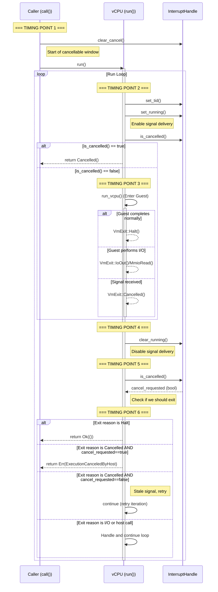
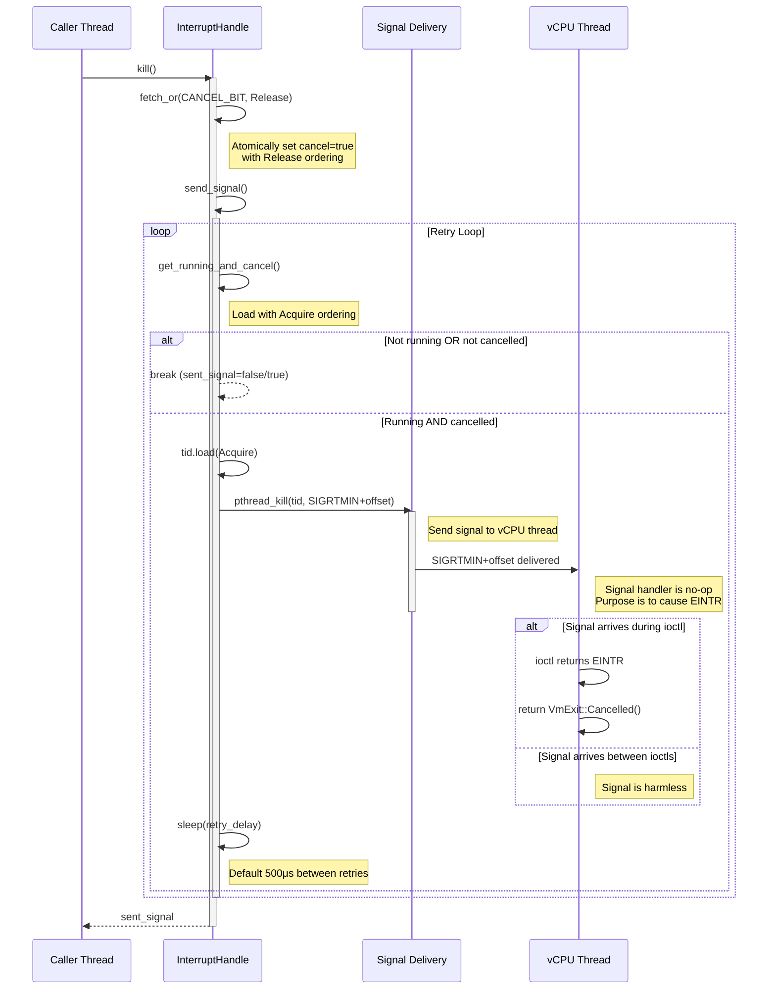
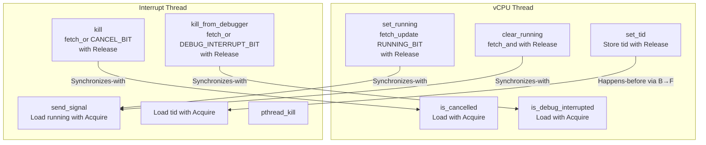

<a id="doc-06572a96a58dc510037d5efa"></a>

# hyperlight-dev/hyperlight / CHANGELOG.md

Upstream: https://github.com/hyperlight-dev/hyperlight/blob/52a265ea5fe54a4a9bd787b4a7b736f7da16eb4c/CHANGELOG.md

Commit: `52a265ea5fe54a4a9bd787b4a7b736f7da16eb4c`

Retrieved: 2026-10-01T15:20:25.150673+00:00

Kind: official-document

Raw SHA256: `f208c37fb5d4a82dfacc410cede56aa7a101377f8cdafdf55d73c4231920cf53`

Source text below is untrusted reference content. Acquisition does not verify technical claims.

License status: UPSTREAM_NOTICES_CAPTURED_PER_FILE_REVIEW_REQUIRED. See this repository's captured license files.

---

# Changelog

The format is based on [Keep a Changelog](https://keepachangelog.com/en/1.1.0/).

## [Prerelease] - Unreleased

### Added
* Namespaced application metadata on immutable snapshots.
* Per-direction virtqueue configuration through `SandboxConfiguration` and
  `SandboxBuilder`, with allocations included in scratch sizing.
* Shared virtqueue framing with a 12-byte `MsgHeader` and external byte values.
* `ExternalValueSource` implementations for `RecvChain` and `Segments`.
* Producer batch completion without notification and segmented payload
  assembly and extraction without flattening.

### Changed
* Support overriding the guest log level when building or restoring initialized
  snapshots.
* `Snapshot::save` now writes the guest memory blob sparsely, skipping all-zero
  blocks instead of writing them. A guest memory image is mostly untouched
  pages, so this cuts the bytes actually written by roughly the proportion of
  the guest's memory it never touched. The saved layout is byte-for-byte
  identical and its digest is unchanged, so this is transparent to readers and
  to previously saved snapshots. Filesystems that do not support sparse files
  store the blob as before.
* Expose C guest `ByteChunks` values as pointer and length arrays.
* Return typed `hl_ReturnValue` objects from C guest functions through
  `hl_result_from_*` constructors.
* Guest tracing skips its per-call and per-callsite work while the guest log
  level is `OFF`. `hyperlight_guest_tracing::is_trace_enabled` reports whether
  the configured level is above `OFF` rather than whether the tracing state was
  allocated.
* **Breaking:** Virtqueue rings and pools occupy host-owned scratch before page
  tables. Snapshots use ABI 5 and config schema v3. Existing snapshots must be
  regenerated.
* Host virtqueue access uses checked copies and atomics across mapped scratch.
  Snapshot admission checks geometry, canonical rings, and distinct, aligned
  H2G pool slots.
  Consumers validate descriptors and payload accesses during use.
* Virtqueue producers use concrete `SlotPool` allocation and `BufferLease`
  ownership. `BufferMap` supplies complete owners exposing initialized bytes.
* `VirtqProducer::reset` and `GuestContext::prepare_snapshot` are unsafe.
  Peers must stay stopped with no live consumer-side chain handles until
  their consumers are reset or replaced.
* `ChainBuilder::build()` allocates readable and writable requests.
  `writable_avail()` reserves available upper-tier slots within the descriptor
  budget. It may add zero slots to a nonempty chain.
* Require guest logs and all host and guest function calls to use virtqueues.
* Keep registered Rust guest return values typed until transport encoding so
  external byte results avoid intermediate FlatBuffer copies.
* Store canonical virtqueue rings in versioned OCI transport layers. Config v3
  rejects snapshots without transport state.
* Running snapshots checkpoint dirty virtqueues before capture. Ordinary calls
  keep their deferred result path.
* Reject snapshot capture while guest-owned transport buffers are retained.
* Use the reclaimed stack pages to raise the default G2H and H2G pools to 12
  and 8 pages.

### Removed
* `RunPool` and the run-specific `AllocError::InvalidAlign` variant.
* Remove legacy stack I/O, its `GuestHandle` methods, and its sandbox
  configuration and builder options.
* Embedded byte payload tables and their value-union variants.

### Fixed
* Linear-time segment consumption for fragmented virtqueue messages.
* Allow reclaimed virtqueue completions to span multiple ring reuse cycles.
* Virtqueue consumers return errors when payload copies or runtime bookkeeping
  cannot be allocated.
* Use a 16 KiB-aligned default scratch size for Apple Silicon compatibility.
* Guest virtqueue copies reject overlapping buffers before accessing memory.
* Keep sandboxes usable after an H2G request exceeds available virtqueue capacity.
* Snapshot checkpoints ignore idle cancellation and clear partial abort state.
* Keep sandboxes usable when G2H calls exhaust reply capacity.
* Reject incompatible transport snapshots before changing sandbox state.
* Allow guest host-return conversions to call or log to the host.

## [v0.17.0] - 2026-08-27

### Added
* macOS/Apple Silicon support using Hypervisor.framework (single-address-space backend) by @syntactically in https://github.com/hyperlight-dev/hyperlight/pull/1674
* `SandboxBuilder`, the entry point for creating a sandbox. It gathers machine configuration, host functions, init data and memory mappings, then builds a `MultiUseSandbox` from a guest binary on disk, a guest binary in memory, or a snapshot by @jprendes in https://github.com/hyperlight-dev/hyperlight/pull/1725
* `MultiUseSandbox::status()`, which returns `SandboxStatus` for inspecting sandbox lifecycle state (poisoned, unrecoverable) by @ludfjig in https://github.com/hyperlight-dev/hyperlight/pull/1727
* Support WIT source inputs directly in `host_bindgen!` / `guest_bindgen!` component bindgen macros by @andreiltd in https://github.com/hyperlight-dev/hyperlight/pull/1589

### Changed
* **Breaking:** Guest MSR state is now saved and restored across snapshots. `SandboxConfiguration::guest_msrs` declares the MSRs a guest depends on: declared MSRs are captured in a snapshot and restored, while every other MSR resets to a clean default. On KVM the guest may only read or write declared MSRs, on MSHV and WHP this is not enforced by @ludfjig in https://github.com/hyperlight-dev/hyperlight/pull/991
* **Breaking:** Filesystem paths are now represented using `PathBuf`. `GuestBinary::FilePath` now stores a `PathBuf` instead of a `String`, and `MultiUseSandbox::generate_crashdump_to_dir` accepts `Into<PathBuf>` instead of `Into<String>`. Callers passing a `String` to `GuestBinary::FilePath` must convert it using `.into()` by @midsterx in https://github.com/hyperlight-dev/hyperlight/pull/1652
* **Breaking:** `GuestBinary::Buffer` owns its bytes as a `Vec<u8>`, so `GuestBinary` no longer borrows and carries no lifetime parameter by @jprendes in https://github.com/hyperlight-dev/hyperlight/pull/1760
* Deprecate `MultiUseSandbox::poisoned` in favor of `MultiUseSandbox::status().is_poisoned()` by @ludfjig in https://github.com/hyperlight-dev/hyperlight/pull/1727
* `MultiUseSandbox::restore` has been made more flexible and now accepts snapshots from any guest binary or memory layout when host functions are compatible by @ludfjig in https://github.com/hyperlight-dev/hyperlight/pull/1728
* Certain fixed guest addresses were changed on AArch64 to more easily accommodate 16k pages without wasting memory. Snapshots taken from sandboxes using the old addresses will not be loadable by new hyperlight versions by @syntactically in https://github.com/hyperlight-dev/hyperlight/pull/1674
* Improvements to component bindgen: expose fallibility of host API calls, properly track positivity/negativity, disambiguate chains of associated types, support reading WAT text components by @syntactically in https://github.com/hyperlight-dev/hyperlight/pull/1724, https://github.com/hyperlight-dev/hyperlight/pull/1723, https://github.com/hyperlight-dev/hyperlight/pull/1721, and https://github.com/hyperlight-dev/hyperlight/pull/1732

### Removed

### Fixed
* Improved snapshot/OCI validation, rejecting malformed metadata and non-regular artifact files during load by @ludfjig in https://github.com/hyperlight-dev/hyperlight/pull/1668
* Fix RSS peak on Windows by replacing scratch zeroing with a fresh allocation on restore by @danbugs in https://github.com/hyperlight-dev/hyperlight/pull/1765
* Mark a sandbox unrecoverable in rare cases when snapshot restore fails while updating its VM mappings by @ludfjig in https://github.com/hyperlight-dev/hyperlight/pull/1727
* Fix symbol resolution in guest core dumps for sandboxes created from snapshots by @ludfjig in https://github.com/hyperlight-dev/hyperlight/pull/1618
* Fix dynamic mapping ownership on unmap failure by @ludfjig in https://github.com/hyperlight-dev/hyperlight/pull/1675
* Reset XCR0 during x86 snapshot restore by @ludfjig in https://github.com/hyperlight-dev/hyperlight/pull/1718
* Reseed guest libc `rand()` and `random()` after restoring a snapshot to avoid multiple sandboxes sharing PRNG state by @ludfjig in https://github.com/hyperlight-dev/hyperlight/pull/1667
* Validate ELF program headers in `ElfInfo::new()` to prevent host process abort from malformed guest binaries. PT_LOAD segments are now bounds-checked, `base_va`/`va_size` are stored as fields, and `load_at()` uses fully checked arithmetic by @danbugs
* `MultiUseSandbox::from_snapshot` now honours the guest log level set via `SandboxConfiguration::set_max_guest_log_level` instead of ignoring it and falling back to `RUST_LOG` by @sethryanrollins in https://github.com/hyperlight-dev/hyperlight/pull/1699

## [v0.16.0] - 2026-06-26

### Added
* Initial aarch64/KVM guest and host support, including memory layout, virtual memory operations, exception handlers, MMIO exits, register handling, and CI workflows by @syntactically in https://github.com/hyperlight-dev/hyperlight/pull/1474
* `Snapshot::save`, `Snapshot::load`, and `Snapshot::checked_load` for persisting and loading sandbox snapshots as OCI Image Layout directories by @ludfjig in https://github.com/hyperlight-dev/hyperlight/pull/1465. Note that Hyperlight is at version 0.x, so a snapshot taken on one version may not load on another version.
* Create sandboxes directly from snapshots by @ludfjig in https://github.com/hyperlight-dev/hyperlight/pull/1459
* Cross-sandbox snapshot restore (snapshots are no longer tied to the sandbox that created them) by @ludfjig in https://github.com/hyperlight-dev/hyperlight/pull/1499
* Support for WHP no-surrogate mode via `HYPERLIGHT_MAX_SURROGATES=0` by @danbugs in https://github.com/hyperlight-dev/hyperlight/pull/1578
* Wasmtime `flags!` macro support for WIT flags types by @jsturtevant in https://github.com/hyperlight-dev/hyperlight/pull/1327

### Changed
* **Breaking:** `MultiUseSandbox::map_file_cow` and `UninitializedSandbox::map_file_cow` no longer take a label argument. The APIs now accept only `(file_path, guest_base)` by @simongdavies in https://github.com/hyperlight-dev/hyperlight/pull/1525.
* Updated Rust toolchain to 1.94 by @simongdavies in https://github.com/hyperlight-dev/hyperlight/pull/1527
* Updated surrogate process to `no_std`, reducing overhead of loading unnecessary libraries by @simongdavies in https://github.com/hyperlight-dev/hyperlight/pull/1533
* Replaced `tracing-log` with native `tracing` macros for guest log forwarding by @cshung in https://github.com/hyperlight-dev/hyperlight/pull/1500
* MSHV: use VP register page for RIP/RAX writes in `run_vcpu` for improved performance by @ludfjig in https://github.com/hyperlight-dev/hyperlight/pull/1366
* MSHV: skip RIP advance on `VmAction::Halt` fast path by @ludfjig in https://github.com/hyperlight-dev/hyperlight/pull/1476
* Faster `memcpy`/`memset` implementations by @ludfjig in https://github.com/hyperlight-dev/hyperlight/pull/1473

### Removed
* Removed the experimental `i686-guest`, `nanvix-unstable`, and `guest-counter` feature flags, along with 32-bit (i686) guest support and its page-table/snapshot code paths. Hyperlight guests are now 64-bit only (x86_64 and aarch64) by @simongdavies in https://github.com/hyperlight-dev/hyperlight/pull/1525.

### Fixed
* Fix colliding WIT import names by @jsturtevant in https://github.com/hyperlight-dev/hyperlight/pull/1562
* Fix empty namespace paths in component codegen by @jsturtevant in https://github.com/hyperlight-dev/hyperlight/pull/1331
* Fix `nomem` constraint on `out32` OUT-trap asm by @ludfjig in https://github.com/hyperlight-dev/hyperlight/pull/1534
* Validate guest address ranges for overlapping regions in `map_region` by @Richard-Durkee in https://github.com/hyperlight-dev/hyperlight/pull/1464

## [v0.15.0] - 2026-05-06

### Added
* `#[main]` and `#[dispatch]` macros for type-safe guest entry points by @jprendes in https://github.com/hyperlight-dev/hyperlight/pull/1384
* Implement `Registerable` for `MultiUseSandbox` by @danbugs in https://github.com/hyperlight-dev/hyperlight/pull/1392
* Guest compilation support for aarch64 by @ludfjig in https://github.com/hyperlight-dev/hyperlight/pull/1297
* i686 page tables, snapshot compaction, and copy-on-write support by @danbugs and @ludfjig in https://github.com/hyperlight-dev/hyperlight/pull/1385

### Changed
* **Breaking:** Replace musl with picolibc as C standard library for guests by @andreiltd in https://github.com/hyperlight-dev/hyperlight/pull/831
* Replace `nanvix-unstable` feature flag with `i686-guest` and `guest-counter` features by @danbugs and @ludfjig in https://github.com/hyperlight-dev/hyperlight/pull/1385

### Fixed
* Fix flaky gdb tests by detaching from inside the breakpoint commands by @ludfjig in https://github.com/hyperlight-dev/hyperlight/pull/1435
* Fix scratch memory overlapping APIC on i686 by @ludfjig in https://github.com/hyperlight-dev/hyperlight/pull/1393
* Several WHP fixes by @danbugs in https://github.com/hyperlight-dev/hyperlight/pull/1388, https://github.com/hyperlight-dev/hyperlight/pull/1387, and https://github.com/hyperlight-dev/hyperlight/pull/1386

## [v0.14.0] - 2026-04-01

### Changed
* Snapshot restore now uses copy-on-write, reducing restore latency by up to 99% (see [paging notes](https://github.com/hyperlight-dev/hyperlight/blob/v0.14.0/docs/paging-development-notes.md)) by @syntactically in https://github.com/hyperlight-dev/hyperlight/pull/1315
* `map_region` on `MultiUseSandbox` now works on Windows by @jsturtevant in https://github.com/hyperlight-dev/hyperlight/pull/1330
* Maximum sandbox memory size increased from ~1 GiB to ~16 GiB by @simongdavies in https://github.com/hyperlight-dev/hyperlight/pull/1340

### Fixed
* Windows surrogate process manager now uses SHA-stamped filenames to avoid conflicts when multiple Hyperlight versions coexist, and surrogate pool size is configurable via `HYPERLIGHT_INITIAL_SURROGATES` and `HYPERLIGHT_MAX_SURROGATES` environment variables by @simongdavies in https://github.com/hyperlight-dev/hyperlight/pull/1339
* Fix a race where guest cancellation could cause a pending TLB flush to be lost by @ludfjig in https://github.com/hyperlight-dev/hyperlight/pull/1333
* Fix spurious `GuestAborted` errors after repeated cancel+restore cycles by @ludfjig in https://github.com/hyperlight-dev/hyperlight/pull/1335

## [v0.13.1] - 2026-03-19

### Fixed
* Explicitly error out on host-guest version mismatch by @ludfjig in https://github.com/hyperlight-dev/hyperlight/pull/1252

### Added
* Hardware interrupt support by @danbugs in https://github.com/hyperlight-dev/hyperlight/pull/1272
* Copy-on-write file mapping support with labels by @simongdavies in https://github.com/hyperlight-dev/hyperlight/pull/1320, https://github.com/hyperlight-dev/hyperlight/pull/1322
* Re-export host functions from the `hyperlight_host` package by @jsturtevant in https://github.com/hyperlight-dev/hyperlight/pull/1314
* Make `map_region` public by @jsturtevant in https://github.com/hyperlight-dev/hyperlight/pull/1293
* Nanvix: `GuestCounter` API and i686 guest layout behind `nanvix-unstable` feature flag by @danbugs in https://github.com/hyperlight-dev/hyperlight/pull/1270, https://github.com/hyperlight-dev/hyperlight/pull/1271

## [v0.13.0] - 2026-03-06

### Fixed
* fix(windows): prevent WHvDeletePartition race by @ludfjig in https://github.com/hyperlight-dev/hyperlight/pull/1101
* Fix guest tracing filter by @dblnz in https://github.com/hyperlight-dev/hyperlight/pull/977
* Add crashdump example and include snapshot/scratch in core dumps by @jsturtevant in https://github.com/hyperlight-dev/hyperlight/pull/1264

### Changed
* Make mem::exe::LoadInfo a struct, instead of an alias by @simongdavies in https://github.com/hyperlight-dev/hyperlight/pull/1099
* Update snapshots by @simongdavies in https://github.com/hyperlight-dev/hyperlight/pull/1098
* **Breaking:** `GuestFunctionDefinition::new` now takes a typed function pointer instead of `usize` by @ludfjig in https://github.com/hyperlight-dev/hyperlight/pull/1241

### Added
* Enable CoW by @syntactically in https://github.com/hyperlight-dev/hyperlight/pull/1229

### Removed
* Remove host function definition regions by @syntactically in https://github.com/hyperlight-dev/hyperlight/pull/1178

## [v0.12.0] - 2025-12-09

### Fixed
* Fix guest tracing deadlock when exception happens during tracing data serialization by @dblnz in https://github.com/hyperlight-dev/hyperlight/pull/1066
* Fix StackOverflow produced by guest logging by @dblnz in https://github.com/hyperlight-dev/hyperlight/pull/1067
* Fix guest call to `halt` not dropping allocated trace data leading to memory leak  by @dblnz in https://github.com/hyperlight-dev/hyperlight/pull/1072
* Update the interrupt handler for 16byte alignment by @jsturtevant in https://github.com/hyperlight-dev/hyperlight/pull/1037

### Added
* Guest function improvements and macros by @jprendes in https://github.com/hyperlight-dev/hyperlight/pull/851
* Add metric for erroneous vCPU kicks from stale cancellations by @Copilot in https://github.com/hyperlight-dev/hyperlight/pull/1034

### Removed
* Remove outdated `is_supported_platform` (use `is_hypervisor_present` instead) and unused `ExtraAllowedSyscall` by @ludfjig in https://github.com/hyperlight-dev/hyperlight/pull/1062

## [v0.11.0] - 2025-11-04

### Fixed
* Fixes a race condition in killing Sandboxes by @simongdavies in https://github.com/hyperlight-dev/hyperlight/pull/959

### Changed
* Unify register representation across hypervisors by @ludfjig in https://github.com/hyperlight-dev/hyperlight/pull/907
* Guest tracing improvements to use `tracing` crate by @dblnz in https://github.com/hyperlight-dev/hyperlight/pull/844
* Serialize guest trace data using flatbuffers by @dblnz in https://github.com/hyperlight-dev/hyperlight/pull/999

### Added
* Add support for mmapped memory in crashdumps and guest debugging by @dblnz in https://github.com/hyperlight-dev/hyperlight/pull/943
* Add poison state to sandbox by @ludfjig in https://github.com/hyperlight-dev/hyperlight/pull/931
* Crashdump on demand by @simongdavies in https://github.com/hyperlight-dev/hyperlight/pull/972

### Removed
* Remove seccomp by @dblnz in https://github.com/hyperlight-dev/hyperlight/pull/971
* Remove mshv2 feature by @dblnz in https://github.com/hyperlight-dev/hyperlight/pull/973


## [v0.10.0] - 2025-10-02

### Fixed

- Fix error code conversion for Exception enum TryFrom implementation by @vshailesh in https://github.com/hyperlight-dev/hyperlight/pull/869
- Remove Allocations from Panic Handler by @adamperlin in https://github.com/hyperlight-dev/hyperlight/pull/818

### Changed

- Update rust to 1.89 by @simongdavies in https://github.com/hyperlight-dev/hyperlight/pull/883
- Update mshv crates for Azure Linux to v0.6.1 (from v0.3.2) by @simongdavies in https://github.com/hyperlight-dev/hyperlight/pull/891
- Only clear io buffer after unsuccessful guest call by @ludfjig in https://github.com/hyperlight-dev/hyperlight/pull/811

## [v0.9.0] - 2025-08-28

### Fixed

- fix release blocker so it only blocks on release branches by @simongdavies in https://github.com/hyperlight-dev/hyperlight/pull/777
- Enforce release builds for benchmarks and simplify command interface by @Copilot in https://github.com/hyperlight-dev/hyperlight/pull/741
- fix(guest-bin): align user memory allocations by @andreiltd in https://github.com/hyperlight-dev/hyperlight/pull/753
- Fix unbounded growth of panic hook after each new sandbox by @ludfjig in https://github.com/hyperlight-dev/hyperlight/pull/827
- Update the like-ci recipe by @simongdavies in https://github.com/hyperlight-dev/hyperlight/pull/837
- Fixes to Host Call Fuzzing by @adamperlin in https://github.com/hyperlight-dev/hyperlight/pull/840

### Changed

- Optimize function call serializing by @ludfjig in https://github.com/hyperlight-dev/hyperlight/pull/778
- Make the component macros support passing host resources to guests by @syntactically in https://github.com/hyperlight-dev/hyperlight/pull/839
- Build c guests as required by benchmarks by @ludfjig in https://github.com/hyperlight-dev/hyperlight/pull/822

### Removed
- Remove DbgMemAccessHandlerCaller trait and DbgMemAccessHandlerWrapper abstractions by @Copilot in https://github.com/hyperlight-dev/hyperlight/pull/824

## [v0.8.0] - 2025-08-08

:warning: `hyperlight_component_macro::host_bindgen` and `hyperlight_component_macro::guest_bindgen` used the `Callable` trait which no longer restores state after each function call and requires an explicit Snapshot Restore using the newly exposed Snapshot API. See https://github.com/hyperlight-dev/hyperlight/pull/697 and https://github.com/hyperlight-dev/hyperlight/pull/761

### Fixed
- gdb: fix issue "Debug not enabled" when `gdb` feature was enabled by @dblnz in https://github.com/hyperlight-dev/hyperlight/pull/678
- Fix Windows build with `--no-default-features` by @danbugs in https://github.com/hyperlight-dev/hyperlight/pull/712
- fix(guest-bin): move logger initialization by @andreiltd in https://github.com/hyperlight-dev/hyperlight/pull/755
- Fix mem mgr not initialized by @dblnz in https://github.com/hyperlight-dev/hyperlight/pull/745

### Changed
- Remove some dev-dependencies and cargo features to speed up compilation by @ludfjig in https://github.com/hyperlight-dev/hyperlight/pull/535
- Introduce a separate KVM error variant of HyperlightError. by @ludfjig in https://github.com/hyperlight-dev/hyperlight/pull/771API. by @jprendes in https://github.com/hyperlight-dev/hyperlight/pull/697
- Evolving and Devolving apis replaced by Snapshot API
  - Remove sandbox evolving and devolving and replace it with snapshotting API. by @jprendes in https://github.com/hyperlight-dev/hyperlight/pull/697
  - Bring back the previous behavior of `call_guest_function_by_name` by @jprendes in https://github.com/hyperlight-dev/hyperlight/pull/761

### Added
- Memory Mapping Support 
  - Support mapping host memory into the guest by @syntactically in https://github.com/hyperlight-dev/hyperlight/pull/696
  - Make MultiUseSandbox::map_file_cow public by @ludfjig in https://github.com/hyperlight-dev/hyperlight/pull/725
  - Add memory mapping support with KVM by @jprendes in https://github.com/hyperlight-dev/hyperlight/pull/709
  - Make sure mmapped memory is not mapped writable into sandbox in kvm by @ludfjig in https://github.com/hyperlight-dev/hyperlight/pull/740
  - Make snapshots region aware by @ludfjig in https://github.com/hyperlight-dev/hyperlight/pull/742
  - Restrict restoring sandboxes to snapshot taken on self by @ludfjig in https://github.com/hyperlight-dev/hyperlight/pull/746
- Enable guest tracing  by @dblnz in https://github.com/hyperlight-dev/hyperlight/pull/695

### Removed
- Removed the OutBHandler and MemAccessHandler abstractions and related implementations. by @simongdavies in https://github.com/hyperlight-dev/hyperlight/pull/732
  
## [v0.7.0] - 2025-06-26

### Fixed
- gdb: fix sandbox function cancellation when gdb enabled by @dblnz in https://github.com/hyperlight-dev/hyperlight/pull/621
- Let windows decide at which address to map shared memory in surrogate process by @ludfjig in https://github.com/hyperlight-dev/hyperlight/pull/637
- Don't log expected error on each guest function call by @ludfjig in https://github.com/hyperlight-dev/hyperlight/pull/662
- Adds a missing clippy allow by @jsturtevant in https://github.com/hyperlight-dev/hyperlight/pull/663

### Changed
- improve the performance of building page tables by @simongdavies in https://github.com/hyperlight-dev/hyperlight/pull/635
- Make interrupt retry delay methods Linux-only by @copilot-swe-agent in https://github.com/hyperlight-dev/hyperlight/pull/647
  
### Added
- Support ELF core dump creation on guest crash by @dblnz in https://github.com/hyperlight-dev/hyperlight/pull/417
- Added capability to load extra blob data in sandbox by @danbugs in https://github.com/hyperlight-dev/hyperlight/pull/605
- Add license scan report and status by @fossabot in https://github.com/hyperlight-dev/hyperlight/pull/598
- Create GOVERNANCE.md by @benazirk in https://github.com/hyperlight-dev/hyperlight/pull/556
- [host] adds init-paging feature by @danbugs in https://github.com/hyperlight-dev/hyperlight/pull/639
- Enable guest debugging for HyperV on windows by @dblnz in https://github.com/hyperlight-dev/hyperlight/pull/478

### Removed  
- Remove support for building PE files from hyperlight-guest-bin build.rs by @simongdavies in https://github.com/hyperlight-dev/hyperlight/pull/572

## [v0.6.1] - 2025-06-12

### Fixed

- Make OS_PAGE_SIZE public again by @jprendes in https://github.com/hyperlight-dev/hyperlight/pull/609
- Bring back HostFunctionDefinitions Region by @danbugs in https://github.com/hyperlight-dev/hyperlight/pull/600
- Allow hyperlight-host to build with x86_64-unknown-linux-musl target by @simongdavies in https://github.com/hyperlight-dev/hyperlight/pull/601

## [v0.6.0] - 2025-06-06

### Fixed
- Prevent openat from trapping on seccomp thread, by making it return EACCES instead by @ludfjig in https://github.com/hyperlight-dev/hyperlight/pull/573

### Changed
- Remove hypervisor_handler thread by @ludfjig in https://github.com/hyperlight-dev/hyperlight/pull/533
- Make GuestBinary::Buffer variant take slice instead of owned vec by @ludfjig in https://github.com/hyperlight-dev/hyperlight/pull/559

### Added
- Add component bindgen macros by @syntactically in https://github.com/hyperlight-dev/hyperlight/pull/376
- Adding ws2025 to the dep_rest matrix by @marosset in https://github.com/hyperlight-dev/hyperlight/pull/551

## [v0.5.1] - 2025-06-02
### Fixed
- Fixed an issue with the `hyperlight_host` not building on v0.5.0

## [v0.5.0] - 2025-05-28

### Changed
- Change base address from 0x200_000 to 0x0 by @danbugs in https://github.com/hyperlight-dev/hyperlight/pull/450
- Unify HostFunctionXX traits into a single HostFunction by @jprendes in https://github.com/hyperlight-dev/hyperlight/pull/
- Improve the ergonomics of registering host functions by @jprendes in https://github.com/hyperlight-dev/hyperlight/pull/468
- Remove generics from SupportedParameterType and SupportedReturnType traits by @jprendes in https://github.com/hyperlight-dev/hyperlight/pull/475
- Improve ergonomics of SupportedParameterType and SupportedReturnType by @jprendes in https://github.com/hyperlight-dev/hyperlight/pull/476

### Fixed
- Add error logging when MapViewOfFileNuma2 fails by @ludfjig in https://github.com/hyperlight-dev/hyperlight/pull/460
- Make common and guest libs portable by @danbugs in https://github.com/hyperlight-dev/hyperlight/pull/524
- Fix breaking changes for hyperlight js by @simongdavies in https://github.com/hyperlight-dev/hyperlight/pull/531

### Added
- Gdb debug improvements by @dblnz in https://github.com/hyperlight-dev/hyperlight/pull/456

### Removed  
- Remove kernel stack and boot stack memory regions by @danbugs in https://github.com/hyperlight-dev/hyperlight/pull/451
- Removing HostFunctionDefinitions region by @danbugs in https://github.com/hyperlight-dev/hyperlight/pull/453
- Removed host error region by @danbugs in https://github.com/hyperlight-dev/hyperlight/pull/457
- Remove dependency on the paste crate by @jprendes in https://github.com/hyperlight-dev/hyperlight/pull/467
- Remove support from hyperlight_host for PE formatted guests by @simongdavies in https://github.com/hyperlight-dev/hyperlight/pull/485
- Remove in process mode from hyperlight-host by @simongdavies in https://github.com/hyperlight-dev/hyperlight/pull/490
- Remove `host_print_writer` from the arguments to `UninitializedSandbox::new` by @jprendes in https://github.com/hyperlight-dev/hyperlight/pull/487


## [v0.4.0] - 2025-04-30

### Changed
- Metrics are now emitted using the [metrics](https://crates.io/crates/metrics) crate by @ludfjig in [#361](https://github.com/hyperlight-dev/hyperlight/pull/361)

### Fixed
- Fixed race condition causing thread to incorrectly believe it finished executing by @ludfjig in [#385](https://github.com/hyperlight-dev/hyperlight/pull/385)
- Fixed incorrect logging levels in guest by @simongdavies in [#410](https://github.com/hyperlight-dev/hyperlight/pull/410)
- Fixed missing compiler flags for building c guests by @prydt in [#421](https://github.com/hyperlight-dev/hyperlight/pull/421) 

## [v0.3.0] - 2025-03-27

### Added
- Gdb support for mshv guests #327 by @dblnz in [#327](https://github.com/hyperlight-dev/hyperlight/pull/327)
- Add fuzzing targets for fuzzing guest and host call parameters and return value by @ludfjig in [#259](https://github.com/hyperlight-dev/hyperlight/pull/259)

### Changed
- Make host-guest result API generic by @ludfjig in [#259](https://github.com/hyperlight-dev/hyperlight/pull/259)

### Removed  
- 

### Fixed  
- Fixed devcontainer permission issues by @myadav in [#326](https://github.com/hyperlight-dev/hyperlight/pull/326)

## [v0.2.0] - 2025-02-25

### Added  
- Adds support for Azure Linux 3 by @simongdavies in [#51](https://github.com/hyperlight-dev/hyperlight/pull/51)  
- Add GDB support by @dblnz in [#111](https://github.com/hyperlight-dev/hyperlight/pull/111)  
- Document DCO by @devigned in [#22](https://github.com/hyperlight-dev/hyperlight/pull/22)  
- Run CI on intel machines by @danbugs in [#32](https://github.com/hyperlight-dev/hyperlight/pull/32)  
- Run spell checks on repo by @andreiltd in [#58](https://github.com/hyperlight-dev/hyperlight/pull/58)  
- Add devcontainer config by @dblnz in [#54](https://github.com/hyperlight-dev/hyperlight/pull/54)  
- Add exception handling to Hyperlight guest by @danbugs in [#250](https://github.com/hyperlight-dev/hyperlight/pull/250)  
- Add community meeting info to our README.md by @marosset in [#231](https://github.com/hyperlight-dev/hyperlight/pull/231)  

### Changed  
- Avoid eagerly doing unnecessary string formatting by @ludfjig in [#73](https://github.com/hyperlight-dev/hyperlight/pull/73)  
- Use `CreateFileMapping\MapViewOfFile` and `UnmapViewOfFile\CloseHandle` instead of `VirtualAllocEx` and `VirtualFreeEx` on Windows by @simongdavies in [#135](https://github.com/hyperlight-dev/hyperlight/pull/135)  
- Avoid requiring specific environment variables during testing by @ludfjig in [#108](https://github.com/hyperlight-dev/hyperlight/pull/108)  

### Removed  
- Remove SingleUseSandbox by @ludfjig in [#125](https://github.com/hyperlight-dev/hyperlight/pull/125)  
- Remove custom alloca by @ludfjig in [#106](https://github.com/hyperlight-dev/hyperlight/pull/106)  

### Fixed  
- Fix issues with using `CreateMapViewOfFile` with `inprocess` feature by @simongdavies in [#2340](https://github.com/hyperlight-dev/hyperlight/pull/2340)  
- Reset guest memory when guest function fails by @ludfjig in [#208](https://github.com/hyperlight-dev/hyperlight/pull/208)  
- Improve error when guest binary not found by @ludfjig in [#55](https://github.com/hyperlight-dev/hyperlight/pull/55)  
- Ensure windows version is supported by @simongdavies in [#110](https://github.com/hyperlight-dev/hyperlight/pull/110)  


## [v0.1.0] - 2024-11-24

The Initial Hyperlight Release 🎉 


[Prerelease]: <https://github.com/hyperlight-dev/hyperlight/compare/v0.17.0...HEAD>
[v0.17.0]: <https://github.com/hyperlight-dev/hyperlight/compare/v0.16.0...v0.17.0>
[v0.16.0]: <https://github.com/hyperlight-dev/hyperlight/compare/v0.15.0...v0.16.0>
[v0.15.0]: <https://github.com/hyperlight-dev/hyperlight/compare/v0.14.0...v0.15.0>
[v0.14.0]: <https://github.com/hyperlight-dev/hyperlight/compare/v0.13.1...v0.14.0>
[v0.13.1]: <https://github.com/hyperlight-dev/hyperlight/compare/v0.13.0...v0.13.1>
[v0.13.0]: <https://github.com/hyperlight-dev/hyperlight/compare/v0.12.0...v0.13.0>
[v0.12.0]: <https://github.com/hyperlight-dev/hyperlight/compare/v0.11.0...v0.12.0>
[v0.11.0]: <https://github.com/hyperlight-dev/hyperlight/compare/v0.10.0...v0.11.0>
[v0.10.0]: <https://github.com/hyperlight-dev/hyperlight/compare/v0.9.0...v0.10.0>
[v0.9.0]: <https://github.com/hyperlight-dev/hyperlight/compare/v0.8.0...v0.9.0>
[v0.8.0]: <https://github.com/hyperlight-dev/hyperlight/compare/v0.7.0...v0.8.0>
[v0.7.0]: <https://github.com/hyperlight-dev/hyperlight/compare/v0.6.1...v0.7.0>
[v0.6.1]: <https://github.com/hyperlight-dev/hyperlight/compare/v0.6.0...v0.6.1>
[v0.6.0]: <https://github.com/hyperlight-dev/hyperlight/compare/v0.5.1...v0.6.0>
[v0.5.1]: <https://github.com/hyperlight-dev/hyperlight/compare/v0.5.0...v0.5.1>
[v0.5.0]: <https://github.com/hyperlight-dev/hyperlight/compare/v0.4.0...v0.5.0>
[v0.4.0]: <https://github.com/hyperlight-dev/hyperlight/compare/v0.3.0...v0.4.0>
[v0.3.0]: <https://github.com/hyperlight-dev/hyperlight/compare/v0.2.0...v0.3.0>
[v0.2.0]: <https://github.com/hyperlight-dev/hyperlight/compare/v0.1.0...v0.2.0>
[v0.1.0]: <https://github.com/hyperlight-dev/hyperlight/releases/tag/v0.1.0>


<a id="doc-ffdbe3a1e7ee93cacfc080b6"></a>

# hyperlight-dev/hyperlight / CODE_OF_CONDUCT.md

Upstream: https://github.com/hyperlight-dev/hyperlight/blob/52a265ea5fe54a4a9bd787b4a7b736f7da16eb4c/CODE_OF_CONDUCT.md

Commit: `52a265ea5fe54a4a9bd787b4a7b736f7da16eb4c`

Retrieved: 2026-10-01T15:20:25.150673+00:00

Kind: official-document

Raw SHA256: `5bbb76128773769551e4ee0a42d2a6b18ef6ce7a63d82926994821cacc7199d4`

Source text below is untrusted reference content. Acquisition does not verify technical claims.

License status: UPSTREAM_NOTICES_CAPTURED_PER_FILE_REVIEW_REQUIRED. See this repository's captured license files.

---

# CNCF Code of Conduct

This project has adopted the [CNCF Code of Conduct](https://github.com/cncf/foundation/blob/main/code-of-conduct.md).


<a id="doc-eca12c0a30e25b4b46522ebf"></a>

# hyperlight-dev/hyperlight / CONTRIBUTING.md

Upstream: https://github.com/hyperlight-dev/hyperlight/blob/52a265ea5fe54a4a9bd787b4a7b736f7da16eb4c/CONTRIBUTING.md

Commit: `52a265ea5fe54a4a9bd787b4a7b736f7da16eb4c`

Retrieved: 2026-10-01T15:20:25.150673+00:00

Kind: official-document

Raw SHA256: `ea28807e39db7f233abd3285f4f833bcc0c012723ee3de42bb0f19f832418e05`

Source text below is untrusted reference content. Acquisition does not verify technical claims.

License status: UPSTREAM_NOTICES_CAPTURED_PER_FILE_REVIEW_REQUIRED. See this repository's captured license files.

---

# Contribution Guidelines

This project welcomes contributions. Most contributions require you to signoff on your commits via
the Developer Certificate of Origin (DCO). When you submit a pull request, a DCO-bot will automatically determine
whether you need to provide signoff for your commit. Please follow the instructions provided by DCO-bot, as pull
requests cannot be merged until the author(s) have provided signoff to fulfill the DCO requirement.
You may find more information on the DCO requirements [below](#developer-certificate-of-origin-and-gpg-signing).

## Issues

This section describes the guidelines for submitting issues

### Issue Types

There are 2 types of issues:

- Bug: You've found a bug with the code, and want to report it, or create an issue to track the bug.
- Proposal: Used for items that propose a new idea or functionality. This allows feedback from others before code is written.

## Contributing to Hyperlight

This section describes the guidelines for contributing code / docs to Hyperlight.

### Pull Requests

All contributions come through pull requests. To submit a proposed change, we recommend following this workflow:

1. Make sure there's an issue (bug or proposal) raised, which sets the expectations for the contribution you are about to make.
2. Fork the relevant repo and create a new branch
3. Create your change
    - Code changes require tests
    - Make sure to run the linters to check and format the code
4. Update relevant documentation for the change
5. Commit with [DCO sign-off](#developer-certificate-of-origin-and-gpg-signing) and open a PR
6. Wait for the CI process to finish and make sure all checks are green
7. A maintainer of the project will be assigned, and you can expect a review within a few days

#### Use work-in-progress PRs for early feedback

A good way to communicate before investing too much time is to create a "Work-in-progress" PR and share it with your reviewers. The standard way of doing this is to add a "[WIP]" prefix in your PR's title and open the pull request as a draft.

### Developer Certificate of Origin and GPG Signing

#### Every commit needs to be signed

This project requires two types of signatures on all commits:

1. **Developer Certificate of Origin (DCO) Sign-off**: A text attestation that you have the right to submit the code
2. **GPG Signature**: A cryptographic signature verifying your identity

**For DCO Sign-offs:**

The Developer Certificate of Origin (DCO) is a lightweight way for contributors to certify that they wrote or otherwise have the right to submit the code they are contributing to the project. Here is the full text of the [DCO](https://developercertificate.org/), reformatted for readability:

```text
By making a contribution to this project, I certify that:

    (a) The contribution was created in whole or in part by me and I have the right to submit it under the open source license indicated in the file; or

    (b) The contribution is based upon previous work that, to the best of my knowledge, is covered under an appropriate open source license and I have the right under that license to submit that work with modifications, whether created in whole or in part by me, under the same open source license (unless I am permitted to submit under a different license), as indicated in the file; or

    (c) The contribution was provided directly to me by some other person who certified (a), (b) or (c) and I have not modified it.

    (d) I understand and agree that this project and the contribution are public and that a record of the contribution (including all personal information I submit with it, including my sign-off) is maintained indefinitely and may be redistributed consistent with this project or the open source license(s) involved.
```

Contributors sign-off that they adhere to these requirements by adding a `Signed-off-by` line to commit messages.

```text
This is my commit message

Signed-off-by: Random J Developer <random@developer.example.org>
```

Git even has a `-s` command line option to append this automatically to your commit message:

```sh
git commit -s -m 'This is my commit message'
```

**For GPG Signatures:**

GPG signatures verify the identity of the committer. For detailed setup instructions, see GitHub's documentation on [signing commits](https://docs.github.com/en/authentication/managing-commit-signature-verification/signing-commits).

Quick setup:

```sh
git config --global user.signingkey YOUR_KEY_ID
git config --global commit.gpgsign true
```

**For both DCO sign-off and GPG signature in one command:**

```sh
git commit -S -s -m 'This is my signed and signed-off commit message'
```

For detailed instructions on setting up GPG signing, see [GitHub's documentation on signing commits](https://docs.github.com/en/authentication/managing-commit-signature-verification/signing-commits).

Each Pull Request is checked to ensure all commits contain valid DCO sign-offs and GPG signatures.

#### I didn't sign my commit, now what?

No worries - You can easily replay your changes, sign them and force push them!

**For adding both DCO sign-off and GPG signature:**

```sh
git checkout <branch-name>
git commit --amend --no-edit -S -s
git push --force-with-lease <remote-name> <branch-name>
```

For more detailed instructions on setting up GPG signing, see [GitHub's documentation on signing commits](https://docs.github.com/en/authentication/managing-commit-signature-verification/signing-commits).

*Credit: This doc was cribbed from Dapr.*

### Rust Analyzer

If you are using the [Rust Analyzer](https://rust-analyzer.github.io/manual.html) then you may need to set the configuration option `rust-analyzer.rustfmt.extraArgs` to `["+nightly"]` to ensure that formatting works correctly as this project has a [`rustfmt.toml`](./rustfmt.toml) file that uses nightly features.


<a id="doc-b60c6a93e9f74ee52e71bf33"></a>

# hyperlight-dev/hyperlight / GOVERNANCE.md

Upstream: https://github.com/hyperlight-dev/hyperlight/blob/52a265ea5fe54a4a9bd787b4a7b736f7da16eb4c/GOVERNANCE.md

Commit: `52a265ea5fe54a4a9bd787b4a7b736f7da16eb4c`

Retrieved: 2026-10-01T15:20:25.150673+00:00

Kind: official-document

Raw SHA256: `e0b8d8747621e6981a7c66f57620b59e642ac08ae36f4f4119096f0694fa355d`

Source text below is untrusted reference content. Acquisition does not verify technical claims.

License status: UPSTREAM_NOTICES_CAPTURED_PER_FILE_REVIEW_REQUIRED. See this repository's captured license files.

---

# Hyperlight Project Governance 

The Hyperlight project is dedicated to enabling safe execution of untrusted code within micro virtual machines with very low latency and minimal overhead. 
 

This governance doc explains how the project is run. 

- [Values](#values)
- [Maintainers](#maintainers)
- [Becoming a Maintainer](#becoming-a-maintainer)
- [Meetings](#meetings)
- [CNCF Resources](#cncf-resources)
- [Code of Conduct Enforcement](#code-of-conduct)
- [Security Response Team](#security-response-team)
- [Voting](#voting)
- [Modifications](#modifying-this-charter)

## Values

The Hyperlight team and its leadership embrace the following values: 

* Openness: Communication and decision-making happen in the open and is discoverable for future reference. As much as possible, all discussions and work take place in public forums and open repositories. 

* Fairness: All stakeholders have the opportunity to provide feedback and submit contributions, which will be considered on their merits. 

* Community over Product or Company: Sustaining and growing our community takes priority over shipping code or sponsors' organizational goals. Each contributor participates in the project as an individual. 

* Inclusivity: We innovate through different perspectives and skill sets, which can only be accomplished in a welcoming and respectful environment. 

* Participation: Responsibilities within the project are earned through participation, and there is a clear path up the contributor ladder into leadership positions. 

## Maintainers 

Hyperlight Maintainers have write access to the [project GitHub repository](https://github.com/hyperlight-dev). They can merge their own patches or patches from others. The current maintainers can be found in [MAINTAINERS.md](https://github.com/hyperlight-dev/hyperlight/blob/main/MAINTAINERS.md). Maintainers collectively manage the project's resources and contributors. 

This privilege is granted with some expectation of responsibility: maintainers are people who care about the Hyperlight project and want to help it grow and improve. A maintainer is not just someone who can make changes, but someone who has demonstrated their ability to collaborate with the team, get the most knowledgeable people to review code and docs, contribute high-quality code, and follow through to fix issues (in code or tests). 

A maintainer is a contributor to the project's success and a citizen helping the project succeed. 

The collective team of all Maintainers is known as the Maintainer Council, which is the governing body for the project. 

### Becoming a Maintainer 

To become a Maintainer you need to demonstrate the following: 

* commitment to the project: 

   * participate in discussions, contributions, code and documentation reviews, 

   * perform reviews for non-trivial pull requests, 

     * contribute non-trivial pull requests and have them merged, 

* ability to write quality code and/or documentation, 

* ability to collaborate with the team, 

* understanding of how the team works (policies, processes for testing and code review, etc), 

* understanding of the project's code base and coding and documentation style. 

A new Maintainer must be proposed by an existing maintainer by sending a message to the [Hyperlight CNCF Slack Channel](https://cloud-native.slack.com/archives/C08GRGTABJT). A simple majority vote of existing Maintainers approves the application. Maintainers nominations will be evaluated without prejudice to employer or demographics. 

Maintainers who are selected will be granted the necessary GitHub rights.

### Removing a Maintainer 

Maintainers may resign at any time if they feel that they will not be able to continue fulfilling their project duties. 

Maintainers may also be removed after being inactive, failure to fulfill their Maintainer responsibilities, violating the Code of Conduct, or other reasons. Inactivity is defined as a period of very low or no activity in the project for a year or more, with no definite schedule to return to full Maintainer activity. 

A Maintainer may be removed at any time by a 2/3 vote of the remaining maintainers. 

Depending on the reason for removal, a Maintainer may be converted to Emeritus status. Emeritus Maintainers will still be consulted on some project matters and can be rapidly returned to Maintainer status if their availability changes. 

## Meetings 

Time zones permitting, Maintainers are expected to participate in [regular community calls](https://github.com/hyperlight-dev/hyperlight/blob/main/README.md#join-our-community-meetings). 

Maintainers will also have closed meetings in order to discuss security reports or Code of Conduct violations. Such meetings should be scheduled by any Maintainer on receipt of a security issue or CoC report. All current Maintainers must be invited to such closed meetings, except for any Maintainer who is accused of a CoC violation. 

## CNCF Resources 

Any Maintainer may suggest a request for CNCF resources during a meeting. A simple majority of Maintainers approves the request. The Maintainers may also choose to delegate working with the CNCF to non-Maintainer community members, who will then be added to the [CNCF's Maintainer List](https://github.com/cncf/foundation/blob/main/project-maintainers.csv) for that purpose. 

## Code of Conduct 

[Code of Conduct](https://github.com/hyperlight-dev/hyperlight/blob/main/CODE_OF_CONDUCT.md) violations by community members will be discussed and resolved on the private Maintainer mailing list. If a Maintainer is directly involved in the report, the Maintainers will instead designate two Maintainers to work with the CNCF Code of Conduct Committee in resolving it. 

## Security Response Team 

The Maintainers will appoint a Security Response Team to handle security reports. This committee may simply consist of the Maintainer Council themselves. If this responsibility is delegated, the Maintainers will appoint a team of at least two contributors to handle it. The Maintainers will review who is assigned to this at least once a year. 

The Security Response Team is responsible for handling all reports of security holes and breaches according to the [security policy](https://github.com/hyperlight-dev/hyperlight/blob/main/SECURITY.md). 

## Voting 

While most business in Hyperlight is conducted by ["lazy consensus"](https://community.apache.org/committers/lazyConsensus.html), periodically the Maintainers may need to vote on specific actions or changes. A vote can be taken on the developer mailing list or the private Maintainer mailing list for security or conduct matters. 
Votes may also be taken at the [bi-weekly community meeting](https://hackmd.io/blCrncfOSEuqSbRVT9KYkg#Agenda). Any Maintainer may demand a vote be taken. 

Most votes require a simple majority of all Maintainers to succeed, except where otherwise noted. Two-thirds majority votes mean at least two-thirds of all existing maintainers. 

## Modifying this Charter 

Changes to this Governance and its supporting documents may be approved by a 2/3 vote of the Maintainers.


<a id="doc-d0ed4cc3fb70489fe51c7e0a"></a>

# hyperlight-dev/hyperlight / LICENSE.txt

Upstream: https://github.com/hyperlight-dev/hyperlight/blob/52a265ea5fe54a4a9bd787b4a7b736f7da16eb4c/LICENSE.txt

Commit: `52a265ea5fe54a4a9bd787b4a7b736f7da16eb4c`

Retrieved: 2026-10-01T15:20:25.150673+00:00

Kind: license

Raw SHA256: `6946e5101cbbe38c785385e71000df1218baf316bc5cb4e315d0e3402010bd29`

Source text below is untrusted reference content. Acquisition does not verify technical claims.

License status: UPSTREAM_NOTICES_CAPTURED_PER_FILE_REVIEW_REQUIRED. See this repository's captured license files.

---

````text
                              Apache License
                        Version 2.0, January 2004
                    http://www.apache.org/licenses/

TERMS AND CONDITIONS FOR USE, REPRODUCTION, AND DISTRIBUTION

1. Definitions.

  "License" shall mean the terms and conditions for use, reproduction,
  and distribution as defined by Sections 1 through 9 of this document.

  "Licensor" shall mean the copyright owner or entity authorized by
  the copyright owner that is granting the License.

  "Legal Entity" shall mean the union of the acting entity and all
  other entities that control, are controlled by, or are under common
  control with that entity. For the purposes of this definition,
  "control" means (i) the power, direct or indirect, to cause the
  direction or management of such entity, whether by contract or
  otherwise, or (ii) ownership of fifty percent (50%) or more of the
  outstanding shares, or (iii) beneficial ownership of such entity.

  "You" (or "Your") shall mean an individual or Legal Entity
  exercising permissions granted by this License.

  "Source" form shall mean the preferred form for making modifications,
  including but not limited to software source code, documentation
  source, and configuration files.

  "Object" form shall mean any form resulting from mechanical
  transformation or translation of a Source form, including but
  not limited to compiled object code, generated documentation,
  and conversions to other media types.

  "Work" shall mean the work of authorship, whether in Source or
  Object form, made available under the License, as indicated by a
  copyright notice that is included in or attached to the work
  (an example is provided in the Appendix below).

  "Derivative Works" shall mean any work, whether in Source or Object
  form, that is based on (or derived from) the Work and for which the
  editorial revisions, annotations, elaborations, or other modifications
  represent, as a whole, an original work of authorship. For the purposes
  of this License, Derivative Works shall not include works that remain
  separable from, or merely link (or bind by name) to the interfaces of,
  the Work and Derivative Works thereof.

  "Contribution" shall mean any work of authorship, including
  the original version of the Work and any modifications or additions
  to that Work or Derivative Works thereof, that is intentionally
  submitted to Licensor for inclusion in the Work by the copyright owner
  or by an individual or Legal Entity authorized to submit on behalf of
  the copyright owner. For the purposes of this definition, "submitted"
  means any form of electronic, verbal, or written communication sent
  to the Licensor or its representatives, including but not limited to
  communication on electronic mailing lists, source code control systems,
  and issue tracking systems that are managed by, or on behalf of, the
  Licensor for the purpose of discussing and improving the Work, but
  excluding communication that is conspicuously marked or otherwise
  designated in writing by the copyright owner as "Not a Contribution."

  "Contributor" shall mean Licensor and any individual or Legal Entity
  on behalf of whom a Contribution has been received by Licensor and
  subsequently incorporated within the Work.

2. Grant of Copyright License. Subject to the terms and conditions of
  this License, each Contributor hereby grants to You a perpetual,
  worldwide, non-exclusive, no-charge, royalty-free, irrevocable
  copyright license to reproduce, prepare Derivative Works of,
  publicly display, publicly perform, sublicense, and distribute the
  Work and such Derivative Works in Source or Object form.

3. Grant of Patent License. Subject to the terms and conditions of
  this License, each Contributor hereby grants to You a perpetual,
  worldwide, non-exclusive, no-charge, royalty-free, irrevocable
  (except as stated in this section) patent license to make, have made,
  use, offer to sell, sell, import, and otherwise transfer the Work,
  where such license applies only to those patent claims licensable
  by such Contributor that are necessarily infringed by their
  Contribution(s) alone or by combination of their Contribution(s)
  with the Work to which such Contribution(s) was submitted. If You
  institute patent litigation against any entity (including a
  cross-claim or counterclaim in a lawsuit) alleging that the Work
  or a Contribution incorporated within the Work constitutes direct
  or contributory patent infringement, then any patent licenses
  granted to You under this License for that Work shall terminate
  as of the date such litigation is filed.

4. Redistribution. You may reproduce and distribute copies of the
  Work or Derivative Works thereof in any medium, with or without
  modifications, and in Source or Object form, provided that You
  meet the following conditions:

  (a) You must give any other recipients of the Work or
      Derivative Works a copy of this License; and

  (b) You must cause any modified files to carry prominent notices
      stating that You changed the files; and

  (c) You must retain, in the Source form of any Derivative Works
      that You distribute, all copyright, patent, trademark, and
      attribution notices from the Source form of the Work,
      excluding those notices that do not pertain to any part of
      the Derivative Works; and

  (d) If the Work includes a "NOTICE" text file as part of its
      distribution, then any Derivative Works that You distribute must
      include a readable copy of the attribution notices contained
      within such NOTICE file, excluding those notices that do not
      pertain to any part of the Derivative Works, in at least one
      of the following places: within a NOTICE text file distributed
      as part of the Derivative Works; within the Source form or
      documentation, if provided along with the Derivative Works; or,
      within a display generated by the Derivative Works, if and
      wherever such third-party notices normally appear. The contents
      of the NOTICE file are for informational purposes only and
      do not modify the License. You may add Your own attribution
      notices within Derivative Works that You distribute, alongside
      or as an addendum to the NOTICE text from the Work, provided
      that such additional attribution notices cannot be construed
      as modifying the License.

  You may add Your own copyright statement to Your modifications and
  may provide additional or different license terms and conditions
  for use, reproduction, or distribution of Your modifications, or
  for any such Derivative Works as a whole, provided Your use,
  reproduction, and distribution of the Work otherwise complies with
  the conditions stated in this License.

5. Submission of Contributions. Unless You explicitly state otherwise,
  any Contribution intentionally submitted for inclusion in the Work
  by You to the Licensor shall be under the terms and conditions of
  this License, without any additional terms or conditions.
  Notwithstanding the above, nothing herein shall supersede or modify
  the terms of any separate license agreement you may have executed
  with Licensor regarding such Contributions.

6. Trademarks. This License does not grant permission to use the trade
  names, trademarks, service marks, or product names of the Licensor,
  except as required for reasonable and customary use in describing the
  origin of the Work and reproducing the content of the NOTICE file.

7. Disclaimer of Warranty. Unless required by applicable law or
  agreed to in writing, Licensor provides the Work (and each
  Contributor provides its Contributions) on an "AS IS" BASIS,
  WITHOUT WARRANTIES OR CONDITIONS OF ANY KIND, either express or
  implied, including, without limitation, any warranties or conditions
  of TITLE, NON-INFRINGEMENT, MERCHANTABILITY, or FITNESS FOR A
  PARTICULAR PURPOSE. You are solely responsible for determining the
  appropriateness of using or redistributing the Work and assume any
  risks associated with Your exercise of permissions under this License.

8. Limitation of Liability. In no event and under no legal theory,
  whether in tort (including negligence), contract, or otherwise,
  unless required by applicable law (such as deliberate and grossly
  negligent acts) or agreed to in writing, shall any Contributor be
  liable to You for damages, including any direct, indirect, special,
  incidental, or consequential damages of any character arising as a
  result of this License or out of the use or inability to use the
  Work (including but not limited to damages for loss of goodwill,
  work stoppage, computer failure or malfunction, or any and all
  other commercial damages or losses), even if such Contributor
  has been advised of the possibility of such damages.

9. Accepting Warranty or Additional Liability. While redistributing
  the Work or Derivative Works thereof, You may choose to offer,
  and charge a fee for, acceptance of support, warranty, indemnity,
  or other liability obligations and/or rights consistent with this
  License. However, in accepting such obligations, You may act only
  on Your own behalf and on Your sole responsibility, not on behalf
  of any other Contributor, and only if You agree to indemnify,
  defend, and hold each Contributor harmless for any liability
  incurred by, or claims asserted against, such Contributor by reason
  of your accepting any such warranty or additional liability.

END OF TERMS AND CONDITIONS

APPENDIX: How to apply the Apache License to your work.

  To apply the Apache License to your work, attach the following
  boilerplate notice, with the fields enclosed by brackets "[]"
  replaced with your own identifying information. (Don't include
  the brackets!)  The text should be enclosed in the appropriate
  comment syntax for the file format. We also recommend that a
  file or class name and description of purpose be included on the
  same "printed page" as the copyright notice for easier
  identification within third-party archives.

Copyright (c) Microsoft Corporation. All Rights Reserved.

Licensed under the Apache License, Version 2.0 (the "License");
you may not use this file except in compliance with the License.
You may obtain a copy of the License at

    http://www.apache.org/licenses/LICENSE-2.0

Unless required by applicable law or agreed to in writing, software
distributed under the License is distributed on an "AS IS" BASIS,
WITHOUT WARRANTIES OR CONDITIONS OF ANY KIND, either express or implied.
See the License for the specific language governing permissions and
limitations under the License.
````


<a id="doc-39da3bd6270d44ea37b6ed50"></a>

# hyperlight-dev/hyperlight / MAINTAINERS.md

Upstream: https://github.com/hyperlight-dev/hyperlight/blob/52a265ea5fe54a4a9bd787b4a7b736f7da16eb4c/MAINTAINERS.md

Commit: `52a265ea5fe54a4a9bd787b4a7b736f7da16eb4c`

Retrieved: 2026-10-01T15:20:25.150673+00:00

Kind: official-document

Raw SHA256: `08cce633fe48c4b89cf5061e043b9e737f95ba8cfff4dd05c7698557d461e8d5`

Source text below is untrusted reference content. Acquisition does not verify technical claims.

License status: UPSTREAM_NOTICES_CAPTURED_PER_FILE_REVIEW_REQUIRED. See this repository's captured license files.

---

# Current Maintainers

| Name               | GitHub ID                                          |
|--------------------|----------------------------------------------------|
| Danilo Chiarlone   | [@danbugs](https://github.com/danbugs)             |
| David Justice      | [@devigned](https://github.com/devigned)           |
| Doru Blânzeanu     | [@dblnz](https://github.com/dblnz)                 |
| James Sturtevant   | [@jsturtevant](https://github.com/jsturtevant)     |
| Jorge Prendes      | [@jprendes](https://github.com/jprendes)           |
| Lucy Menon         | [@syntactically](https://github.com/syntactically) |
| Ludvig Liljenberg  | [@ludfjig](https://github.com/ludfjig)             |
| Ralph Squillace    | [@squillace](https://github.com/squillace)         |
| Simon Davies       | [@simongdavies](https://github.com/simongdavies)   |
| Tomasz Andrzejak   | [@andreiltd](https://github.com/andreiltd)         |

<!-- Note: Please maintain alphabetical order when adding new entries to the table. -->

## Emeritus
| Name               | GitHub ID                                          |
|--------------------|----------------------------------------------------|
| Mark Rosetti       | [@marosset](https://github.com/marosset)           |


<a id="doc-b810ebe4ffda4293c79d2920"></a>

# hyperlight-dev/hyperlight / NOTICE.txt

Upstream: https://github.com/hyperlight-dev/hyperlight/blob/52a265ea5fe54a4a9bd787b4a7b736f7da16eb4c/NOTICE.txt

Commit: `52a265ea5fe54a4a9bd787b4a7b736f7da16eb4c`

Retrieved: 2026-10-01T15:20:25.150673+00:00

Kind: license

Raw SHA256: `c85ad6e050ac18c1a001cddc6e1af77f5fffce70e8ba63aa0dbf8eefc92367e7`

Source text below is untrusted reference content. Acquisition does not verify technical claims.

License status: UPSTREAM_NOTICES_CAPTURED_PER_FILE_REVIEW_REQUIRED. See this repository's captured license files.

---

````text
NOTICES

This repository incorporates material as listed below or described in the code.

Component. picolibc

picolibc is a C library designed for embedded systems, derived from newlib.
https://github.com/picolibc/picolibc

Version: 1.8.11

Open Source License/Copyright Notice.

Copyright © 2019 Keith Packard

picolibc is licensed under the BSD-3-Clause license:

----------------------------------------------------------------------
Redistribution and use in source and binary forms, with or without
modification, are permitted provided that the following conditions
are met:

1. Redistributions of source code must retain the above copyright
notice, this list of conditions and the following disclaimer.

2. Redistributions in binary form must reproduce the above
copyright notice, this list of conditions and the following
disclaimer in the documentation and/or other materials provided
with the distribution.

3. Neither the name of the copyright holder nor the names of its
contributors may be used to endorse or promote products derived
from this software without specific prior written permission.

THIS SOFTWARE IS PROVIDED BY THE COPYRIGHT HOLDERS AND CONTRIBUTORS
"AS IS" AND ANY EXPRESS OR IMPLIED WARRANTIES, INCLUDING, BUT NOT
LIMITED TO, THE IMPLIED WARRANTIES OF MERCHANTABILITY AND FITNESS
FOR A PARTICULAR PURPOSE ARE DISCLAIMED. IN NO EVENT SHALL THE
COPYRIGHT HOLDER OR CONTRIBUTORS BE LIABLE FOR ANY DIRECT,
INDIRECT, INCIDENTAL, SPECIAL, EXEMPLARY, OR CONSEQUENTIAL DAMAGES
(INCLUDING, BUT NOT LIMITED TO, PROCUREMENT OF SUBSTITUTE GOODS OR
SERVICES; LOSS OF USE, DATA, OR PROFITS; OR BUSINESS INTERRUPTION)
HOWEVER CAUSED AND ON ANY THEORY OF LIABILITY, WHETHER IN CONTRACT,
STRICT LIABILITY, OR TORT (INCLUDING NEGLIGENCE OR OTHERWISE)
ARISING IN ANY WAY OUT OF THE USE OF THIS SOFTWARE, EVEN IF ADVISED
OF THE POSSIBILITY OF SUCH DAMAGE.
----------------------------------------------------------------------

Portions of picolibc are derived from newlib, which is:

Copyright © 2020 The Newlib Project

Newlib code is licensed under a collection of BSD-compatible and
permissive licenses. The full license details for all files are
documented in the COPYING.picolibc and COPYING.NEWLIB files in the
picolibc submodule at src/hyperlight_libc/third_party/picolibc/.

Note: The picolibc submodule uses the picolibc-bsd fork
(https://github.com/hyperlight-dev/picolibc-bsd), which is a redistribution
with all copyleft-licensed files removed from the tree and history.
Only BSD/MIT/permissive-licensed source files are present.


````


<a id="doc-b335630551682c19a781afeb"></a>

# hyperlight-dev/hyperlight / README.md

Upstream: https://github.com/hyperlight-dev/hyperlight/blob/52a265ea5fe54a4a9bd787b4a7b736f7da16eb4c/README.md

Commit: `52a265ea5fe54a4a9bd787b4a7b736f7da16eb4c`

Retrieved: 2026-10-01T15:20:25.150673+00:00

Kind: official-document

Raw SHA256: `5b6a474037199204da6f42e96505114a3c7f56b91dacd9e41a567e4d6924c17a`

Source text below is untrusted reference content. Acquisition does not verify technical claims.

License status: UPSTREAM_NOTICES_CAPTURED_PER_FILE_REVIEW_REQUIRED. See this repository's captured license files.

---

<div align="center">
    <h1>Hyperlight</h1>
    
    <p>
        <strong>A lightweight VMM for running untrusted code in micro VMs with minimal overhead.</strong><br>
        A <a href="https://www.cncf.io/projects/hyperlight/">Cloud Native Computing Foundation</a> sandbox project.
    </p>
</div>

> **Status:** Hyperlight is pre-1.0. The API may change between releases, and upgrading will sometimes require code changes.

Hyperlight lets you safely run untrusted code inside hypervisor-isolated micro VMs that spin up in milliseconds, with guest function calls completing in microseconds. You embed it as a library in your Rust application, hand it a guest binary, and call functions across the VM boundary as naturally as calling a local function. To minimize startup time and memory footprint, there's no guest kernel or OS. Guests are purpose-built using the Hyperlight guest library.

- Supports [KVM](https://linux-kvm.org/page/Main_Page), [MSHV](https://github.com/rust-vmm/mshv), and [Windows Hypervisor Platform](https://docs.microsoft.com/en-us/virtualization/api/#windows-hypervisor-platform)
- No kernel or OS in the VM. Guests are regular ELF binaries written in `no_std` Rust or C
- Host and guest communicate through typed function calls
- Guests are sandboxed by default with no access to the host filesystem, network, etc.

## Example

**Host** - create a sandbox, register a host function, and call into the guest:

```rust
// Build a sandbox from a guest binary, registering a host function the guest
// can call. In a real app that function might query a database, read a config,
// or call an external API. By default, guests can only print to the host.
let mut sandbox = SandboxBuilder::from_file(guest_path)
    .host_function("GetWeekday", || Ok("Monday".to_string()))
    .build()?;

// Call a function inside the VM
let greeting: String = sandbox.call("SayHello", "World".to_string())?;
println!("{greeting}"); // "Hello, World! Today is Monday."
```

Guest state persists across calls. Use `snapshot()` and `restore()` to save and reset VM memory. This avoids recreating the VM while ensuring each call starts from a clean state.

**Guest** (Rust) - declare host functions and expose guest functions with simple macros. Guests can also be [written in C](./src/hyperlight_guest_capi).

```rust
#[host_function("GetWeekday")]
fn get_weekday() -> Result<String>;

#[guest_function("SayHello")]
fn say_hello(name: String) -> Result<String> {
    let weekday = get_weekday()?;
    Ok(format!("Hello, {name}! Today is {weekday}."))
}
```

To get started, see the [Getting Started](./docs/getting-started.md) guide. For more details on writing guests, see [How to build a Hyperlight guest binary](./docs/how-to-build-a-hyperlight-guest-binary.md).

## When to use Hyperlight

Hyperlight is a good fit when you need to:

- Run untrusted or third-party code with hypervisor-level isolation
- Create and tear down sandboxes in milliseconds
- Make guest function calls in microseconds
- Embed sandboxed execution directly in your application
- Build functions-as-a-service with hypervisor-level isolation
- Reuse sandboxes efficiently with snapshot and restore

Hyperlight is *not* designed for:

- General-purpose virtualization (use a full VMM instead)
- Running full-blown Linux guest workloads that need syscalls, networking, or filesystem access

## Getting started

See [docs/getting-started.md](./docs/getting-started.md) for detailed prerequisites and platform-specific setup for:
- **Running** Hyperlight
- **Building guests**

Or skip setup entirely with a codespace:

[](https://codespaces.new/hyperlight-dev/hyperlight)

## Repository Structure

| Directory | Description |
|---|---|
| [src/hyperlight_host](./src/hyperlight_host) | Host library - creates and manages micro VMs |
| [src/hyperlight_guest](./src/hyperlight_guest) | Core guest library - minimal building blocks for guest-host interaction |
| [src/hyperlight_guest_bin](./src/hyperlight_guest_bin) | Extended guest library - entry point, panic handler, heap, logging, exceptions |
| [src/hyperlight_guest_capi](./src/hyperlight_guest_capi) | C API wrapper around `hyperlight_guest_bin` for use via FFI |
| [src/hyperlight_libc](./src/hyperlight_libc) | C standard library for guests, built from picolibc |
| [src/hyperlight_guest_macro](./src/hyperlight_guest_macro) | Macros for registering guest and host functions |
| [src/hyperlight_guest_tracing](./src/hyperlight_guest_tracing) | Tracing support for guests |
| [src/hyperlight_common](./src/hyperlight_common) | Shared code used by both host and guest |
| [src/hyperlight_component_macro](./src/hyperlight_component_macro) | Proc macros for WIT-based host/guest bindings |
| [src/hyperlight_component_util](./src/hyperlight_component_util) | Shared implementation for WIT binding generation |
| [src/hyperlight_testing](./src/hyperlight_testing) | Shared test utilities |
| [src/schema](./src/schema) | FlatBuffer schema definitions |
| [src/trace_dump](./src/trace_dump) | Tool for dumping and visualizing trace data |
| [src/tests](./src/tests) | Test guest programs (Rust and C) |

## Related Projects

- [cargo-hyperlight](https://github.com/hyperlight-dev/cargo-hyperlight) - Cargo subcommand for building and scaffolding Hyperlight guests
- [hyperlight-wasm](https://github.com/hyperlight-dev/hyperlight-wasm) - Run WebAssembly modules inside Hyperlight micro VMs
- [hyperlight-js](https://github.com/hyperlight-dev/hyperlight-js) - Run JavaScript inside Hyperlight micro VMs
- [hyperlight-sandbox](https://github.com/hyperlight-dev/hyperlight-sandbox) - Multi-backend sandboxing framework for running untrusted code with controlled host capabilities, with Python, .NET, and Rust SDKs
- [hyperlight-unikraft](https://github.com/hyperlight-dev/hyperlight-unikraft) - Run Linux applications (Python, Node.js, Go, Rust, C/C++) on Hyperlight micro VMs using Unikraft as the guest kernel

## Contributing

See [CONTRIBUTING.md](./CONTRIBUTING.md).

## Community

- **Meetings**: Mondays at 09:00 PST/PDT ([convert to your time](https://dateful.com/convert/pst-pdt-pacific-time?t=09)). Agenda and join info in the [Community Meeting Notes](https://hackmd.io/blCrncfOSEuqSbRVT9KYkg#Agenda). See the calendar at https://zoom-lfx.platform.linuxfoundation.org/meetings/hyperlight?view=month
- **Slack**: [#hyperlight](https://cloud-native.slack.com/archives/hyperlight) on CNCF Slack ([join here](https://www.cncf.io/membership-faq/#how-do-i-join-cncfs-slack)).
- **Docs**: [`docs/` directory](./docs/README.md)
- **Code of Conduct**: [CNCF Code of Conduct](https://github.com/cncf/foundation/blob/main/code-of-conduct.md)

---

[](https://app.fossa.com/projects/git%2Bgithub.com%2Fhyperlight-dev%2Fhyperlight?ref=badge_large)


<a id="doc-f6ed156e4bf5c79168066246"></a>

# hyperlight-dev/hyperlight / SECURITY.md

Upstream: https://github.com/hyperlight-dev/hyperlight/blob/52a265ea5fe54a4a9bd787b4a7b736f7da16eb4c/SECURITY.md

Commit: `52a265ea5fe54a4a9bd787b4a7b736f7da16eb4c`

Retrieved: 2026-10-01T15:20:25.150673+00:00

Kind: official-document

Raw SHA256: `962566fc4d8b3da56ab22106a8e054864414d24d8e5fd0232dce39abf6f5a6c8`

Source text below is untrusted reference content. Acquisition does not verify technical claims.

License status: UPSTREAM_NOTICES_CAPTURED_PER_FILE_REVIEW_REQUIRED. See this repository's captured license files.

---

## Reporting Security Issues

**Please do not report security vulnerabilities through public GitHub issues.**

Instead, please report them via the [GitHub's private security vulnerability reporting mechanism on this repo](https://docs.github.com/en/code-security/security-advisories/guidance-on-reporting-and-writing-information-about-vulnerabilities/privately-reporting-a-security-vulnerability#privately-reporting-a-security-vulnerability).

Please include the requested information listed below (as much as you can provide) to help us better understand the nature and scope of the possible issue:

  * Type of issue (e.g. buffer overflow, SQL injection, cross-site scripting, etc.)
  * Full paths of source file(s) related to the manifestation of the issue
  * The location of the affected source code (tag/branch/commit or direct URL)
  * Any special configuration required to reproduce the issue
  * Step-by-step instructions to reproduce the issue
  * Proof-of-concept or exploit code (if possible)
  * Impact of the issue, including how an attacker might exploit the issue

This information will help us triage your report more quickly.

## Preferred Languages

We prefer all communications to be in English.


<a id="doc-c5fe610b0215b14447410625"></a>

# hyperlight-dev/hyperlight / SUPPORT.md

Upstream: https://github.com/hyperlight-dev/hyperlight/blob/52a265ea5fe54a4a9bd787b4a7b736f7da16eb4c/SUPPORT.md

Commit: `52a265ea5fe54a4a9bd787b4a7b736f7da16eb4c`

Retrieved: 2026-10-01T15:20:25.150673+00:00

Kind: official-document

Raw SHA256: `06df3a599108ba14e7bbb1856e2f9e658d0b143b23fabd5cfa0eb10a87e78b25`

Source text below is untrusted reference content. Acquisition does not verify technical claims.

License status: UPSTREAM_NOTICES_CAPTURED_PER_FILE_REVIEW_REQUIRED. See this repository's captured license files.

---

# Support

## How to file issues and get help

This project uses GitHub Issues to track bugs and feature requests. Please search the existing
issues before filing new issues to avoid duplicates.  For new issues, file your bug or
feature request as a new Issue.

[//]: <> (For help and questions about using this project, please use Slack channel [TODO: add Slack channel])

## Microsoft Support Policy

Support for this **Hyperlight** is limited to the resources listed above.


<a id="doc-0b5ca119d2be595aa307d345"></a>

# hyperlight-dev/hyperlight / docs/README.md

Upstream: https://github.com/hyperlight-dev/hyperlight/blob/52a265ea5fe54a4a9bd787b4a7b736f7da16eb4c/docs/README.md

Commit: `52a265ea5fe54a4a9bd787b4a7b736f7da16eb4c`

Retrieved: 2026-10-01T15:20:25.150673+00:00

Kind: official-document

Raw SHA256: `2c458a03812a89cc5f733d81e2870051268a410d363f6cb901add7f5703794c8`

Source text below is untrusted reference content. Acquisition does not verify technical claims.

License status: UPSTREAM_NOTICES_CAPTURED_PER_FILE_REVIEW_REQUIRED. See this repository's captured license files.

---

# Hyperlight Project Documentation

Hyperlight is a library for running hypervisor-isolated workloads without the overhead of booting a full guest operating system inside the virtual machine.

By eliminating this overhead, Hyperlight can execute arbitrary code more efficiently. It's primarily aimed at supporting functions-as-a-service workloads, where a user's code must be loaded into memory and executed very quickly with high density.

## Basics: Hyperlight internals

Hyperlight achieves these efficiencies by removing all operating system functionality from inside the virtual machine, and instead requiring all guest binaries be run directly on the virtual CPU (vCPU). This key requirement means all Hyperlight guest binaries must not only be compiled to run on the vCPU's architecture, but also must be statically linked to specialized libraries to support their functionality (e.g. there are no syscalls whatsoever available). Roughly similar to Unikernel technologies, we provide a guest library (in Rust, and a C compatible wrapper for it) to which guest binaries can be statically linked.

Given a guest, then, Hyperlight takes some simple steps prior to executing it, including the following:

- Provisioning memory
- Configuring specialized regions of memory
- Provisioning a virtual machine (VM) and CPU with the platform-appropriate hypervisor API, and mapping memory into the VM
- Configuring virtual registers for the vCPU
- Executing the vCPU at a specified instruction pointer

## Basics: Hyperlight architecture

This project is composed internally of several components, depicted in the below diagram:


## Further reading

* [Getting Started](./getting-started.md)
* [Glossary](./glossary.md)
* [How code gets executed in a VM](./hyperlight-execution-details.md)
* [How to build a Hyperlight guest binary](./how-to-build-a-hyperlight-guest-binary.md)
* [Security considerations](./security.md)
* [Technical requirements document](./technical-requirements-document.md)

## For developers

* [Security guidance for developers](./security-guidance-for-developers.md)
* [Paging Development Notes](./paging-development-notes.md)
* [Virtqueue host and guest communication](./virtio-host-guest-communication.md)
* [How to debug a Hyperlight guest](./how-to-debug-a-hyperlight-guest.md)
* [How to use Flatbuffers in Hyperlight](./how-to-use-flatbuffers.md)
* [How to make a Hyperlight release](./how-to-make-releases.md)
* [Getting Hyperlight Metrics, Logs, and Traces](./hyperlight-metrics-logs-and-traces.md)
* [Benchmarking Hyperlight](./benchmarking-hyperlight.md)
* [Hyperlight Surrogate Development Notes](./hyperlight-surrogate-development-notes.md)
* [Debugging Hyperlight](./debugging-hyperlight.md)
* [Signal Handling in Hyperlight](./signal-handlers-development-notes.md)


<a id="doc-012f5d12aee1bd557cab8c2c"></a>

# hyperlight-dev/hyperlight / docs/benchmarking-hyperlight.md

Upstream: https://github.com/hyperlight-dev/hyperlight/blob/52a265ea5fe54a4a9bd787b4a7b736f7da16eb4c/docs/benchmarking-hyperlight.md

Commit: `52a265ea5fe54a4a9bd787b4a7b736f7da16eb4c`

Retrieved: 2026-10-01T15:20:25.150673+00:00

Kind: official-document

Raw SHA256: `a6e4365643c3e032808ffce49b0b5e2120ca982fc5dc6d25a8c182a7a31a77d0`

Source text below is untrusted reference content. Acquisition does not verify technical claims.

License status: UPSTREAM_NOTICES_CAPTURED_PER_FILE_REVIEW_REQUIRED. See this repository's captured license files.

---

# Benchmark Notes

Hyperlight uses the [Criterion](https://bheisler.github.io/criterion.rs/book/index.html) framework to run and analyze benchmarks. A benefit to this framework is that it doesn't require the nightly toolchain.

## When Benchmarks are run

1. Daily (scheduled)
    - Benchmarks run daily via `DailyBenchmarks.yml`. Results are stored as workflow artifacts with 90-day retention, and are what pull requests are compared against.

    ```
    sandboxes/create_sandbox
                        time:   [33.803 ms 34.740 ms 35.763 ms]
                        change: [+0.7173% +3.7017% +7.1346%] (p = 0.03 < 0.05)
                        Change within noise threshold.*
    ```
   
2. For each pull request
    - Benchmarks run on every hypervisor and cpu vendor in `ValidatePullRequest.yml`, which invokes `dep_benchmarks.yml`. The results are reported against the daily benchmarks of the commit the pull request branched from, and posted as a comment.

3. For each release
    - For each release, benchmarks are run as part of the release pipeline in `CreateRelease.yml`, which invokes `dep_benchmarks.yml`. These benchmark results are compared to the previous release, and are uploaded as part of the "Release assets" on the GitHub release page.

Currently, benchmarks are run on windows, linux-kvm (ubuntu), and linux-hyperv (mariner). Only release builds are benchmarked, not debug.

## Criterion artifacts

When running `cargo bench -- --save-baseline my_baseline`, criterion runs all benchmarks defined in `src/hyperlight_host/benches/`, prints the results to the stdout, as well as produces several artifacts. All artifacts can be found in `target/criterion/`. For each benchmarking group, for each benchmark, a subfolder with the name of the benchmark is created. This folder in turn contains folders `my_baseline`, `new`  and `report`. When running `cargo bench`, criterion always creates `new` and `report`, which always contains the most recent benchmark result and html report, but because we provided the `--save-baseline` flag, we also have a `my_baseline` folder, which is an exact copy of `new`. Moreover, if this `my_baseline` folder already existed before we ran `cargo bench -- --save-baseline my_baseline`, criterion would also compare the benchmark results with the old `my_baseline` folder, and then overwrite the folder.

The first time we run `cargo bench -- --save-baseline my_baseline` (starting with a clean project), we get the following structure. 

```
target/criterion/
|-- report
`-- sandboxes
    |-- create_sandbox
    |   |-- my_baseline
    |   |-- new
    |   `-- report
    |-- create_sandbox_and_call_context
    |   |-- my_baseline
    |   |-- new
    |   `-- report
    `-- report
```

If we run the exact same command again, we get 

```
target/criterion/
|-- report
`-- sandboxes
    |-- create_sandbox
    |   |-- change
    |   |-- my_baseline
    |   |-- new
    |   `-- report
    |-- create_sandbox_and_call_context
    |   |-- change
    |   |-- my_baseline
    |   |-- new
    |   `-- report
    `-- report
```

Note that it overwrote the previous `my_baseline` with the new result. But notably, there is a new `change` folder, which contains the benchmarking difference between the two runs. In addition, on stdout you'll also find a comparison to our previous `my_baseline` run.

```
                        time:   [40.434 ms 40.777 ms 41.166 ms]
                        change: [+0.0506% +1.1399% +2.2775%] (p = 0.06 > 0.05)
                        No change in performance detected.
Found 1 outliers among 100 measurements (1.00%)
```

**Note** that Criterion does not differ between release and debug/dev benchmark results, so it's up to the developer to make sure baselines of the same config are compared.

## Running benchmarks locally

Use `just bench` to run benchmarks with release builds (the only supported configuration). Comparing local benchmark results to the ones CI measures doesn't say much, since you'd be using different hardware, but `cargo ci bench-report` fetches them for you.

`cargo ci bench-report` renders the comparison. `--candidate` and `--baseline` say where each side comes from: a criterion directory, `run:<ID>` for a CI run, `pr:<NUMBER>` for the latest run of a pull request, `commit:<SHA>` for the benchmarks of the default branch taken at or before a commit, `base-of:<NUMBER>` for the ones taken where a pull request branched, or `release:<TAG>` for the ones a release carries. Criterion keeps the last run of a directory in `new` and the one before it in `base`, so a directory on its own reports the last run against the previous one.

The default branch is benchmarked daily rather than per commit, so `commit:` and `base-of:` take the closest run that does not carry changes the commit never had. A pull request defaults to the branch point it was built from, since nothing within its own results says what they mean. Workflow artifacts are swept away after 90 days, so reaching further back means the results a release carries. CI results cover every hypervisor and cpu vendor, so results are paired with the ones measured on the same kind of machine. A run records its own operating system, cpu vendor and hypervisor, and CI artifacts are named after the configuration that produced them. Results that fit no counterpart, or several, are reported without a comparison.

```sh
# a pull request against the branch point it was built from
cargo ci bench-report --candidate pr:1529
# this machine against the configuration in CI that matches it
cargo ci bench-report --baseline pr:1529
# this machine against what a release measured
cargo ci bench-report --baseline release:v0.17.0
```

**Important**: The `just bench` command uses release builds by default to ensure meaningful performance measurements. For profiling purposes, you can compile benchmarks with debug symbols by running `cargo bench` directly.


<a id="doc-dc1834dc6ca3037a69bffadb"></a>

# hyperlight-dev/hyperlight / docs/cancellation.md

Upstream: https://github.com/hyperlight-dev/hyperlight/blob/52a265ea5fe54a4a9bd787b4a7b736f7da16eb4c/docs/cancellation.md

Commit: `52a265ea5fe54a4a9bd787b4a7b736f7da16eb4c`

Retrieved: 2026-10-01T15:20:25.150673+00:00

Kind: official-document

Raw SHA256: `2438bb5055c00d2e5e9cf715c181c673d6d6db8a20d178b259dfb195c3d68035`

Source text below is untrusted reference content. Acquisition does not verify technical claims.

License status: UPSTREAM_NOTICES_CAPTURED_PER_FILE_REVIEW_REQUIRED. See this repository's captured license files.

---

# Cancellation in Hyperlight

This document describes the cancellation mechanism and memory ordering guarantees for Hyperlight.

## Overview (Linux)

Hyperlight provides a mechanism to forcefully interrupt guest execution through the `InterruptHandle::kill()` method. This involves coordination between multiple threads using atomic operations and POSIX signals to ensure safe and reliable cancellation.

## Key Components

### LinuxInterruptHandle State

The `LinuxInterruptHandle` uses a packed atomic u8 to track execution state:

- **state (AtomicU8)**: Packs three bits:
  - **Bit 2 (DEBUG_INTERRUPT_BIT)**: Set when debugger interrupt is requested (gdb feature only)
  - **Bit 1 (RUNNING_BIT)**: Set when vCPU is actively running in guest mode
  - **Bit 0 (CANCEL_BIT)**: Set when cancellation has been requested via `kill()`
- **tid (AtomicU64)**: Thread ID where the vCPU is running
- **dropped (AtomicBool)**: Set when the corresponding VM has been dropped

The packed state enables atomic reads of RUNNING_BIT, CANCEL_BIT and DEBUG_INTERRUPT_BIT simultaneously via `get_running_cancel_debug()`. Within a single `VirtualCPU::run()` call, the CANCEL_BIT remains set across vcpu exits and re-entries (such as when calling host functions), ensuring cancellation persists until the guest call completes. However, `clear_cancel()` resets the CANCEL_BIT at the beginning of each new guest function call (specifically in `MultiUseSandbox::call`, before `VirtualCPU::run()` is called), preventing cancellation requests from affecting subsequent guest function calls.

### Signal Mechanism

On Linux, Hyperlight uses `SIGRTMIN + offset` (configurable, default offset is 0) to interrupt the vCPU thread. The signal handler is intentionally a no-op - the signal's only purpose is to cause a VM exit via `EINTR` from the `ioctl` call that runs the vCPU.

## Run Loop Flow

The main execution loop in `VirtualCPU::run()` coordinates vCPU execution with potential interrupts.



### Detailed Run Loop Steps

1. **Timing Point 1** - Start of Guest Call (in `call()`):
   - `clear_cancel()` resets the cancellation state *before* `run()` is called.
   - Any `kill()` completed before this point is ignored.

2. **Timing Point 2** - Start of Loop Iteration:
   - `set_running()` enables signal delivery.
   - Checks `is_cancelled()` immediately to handle pre-run cancellation.

3. **Timing Point 3** - Guest Entry:
   - Enters guest execution.
   - If `kill()` happens now, signals will interrupt the guest.

4. **Timing Point 4** - Guest Exit:
   - `clear_running()` disables signal delivery.
   - Signals sent after this point are ignored.

5. **Timing Point 5** - Capture State:
   - `is_cancelled()` captures the cancellation request state.
   - This determines if a `Cancelled` exit was genuine or stale.

6. **Timing Point 6** - Handle Exit:
   - Processes the exit reason based on the captured `cancel_requested` state.
   - If `Cancelled` but `!cancel_requested`, it's a stale signal -> retry.

## Kill Operation Flow

The `kill()` operation involves setting the CANCEL_BIT and sending signals to interrupt the vCPU:



### Kill Operation Steps

1. **Set Cancel Flag**: Atomically set the CANCEL_BIT using `fetch_or(CANCEL_BIT)` with `Release` ordering
   - Ensures all writes before `kill()` are visible when vCPU thread checks `is_cancelled()` with `Acquire`

2. **Send Signals**: Enter retry loop via `send_signal()`
   - Atomically load running, cancel and debug flags via `get_running_cancel_debug()` with `Acquire` ordering
   - Continue if `running=true AND cancel=true` (or `running=true AND debug=true` with gdb)
   - Exit loop immediately if `running=false OR (cancel=false AND debug=false)`
   
3. **Signal Delivery**: Send `SIGRTMIN+offset` via `pthread_kill`
   - Signal interrupts the `ioctl` that runs the vCPU, causing `EINTR`
   - Signal handler is intentionally a no-op
   - Returns `VmExit::Cancelled()` when `EINTR` is received

4. **Loop Termination**: The signal loop terminates when:
   - vCPU is no longer running (`running=false`), OR
   - Cancellation is no longer requested (`cancel=false`)
   - See the loop termination proof in the source code for rigorous correctness analysis

## Memory Ordering Guarantees

Hyperlight uses Release-Acquire semantics to ensure correctness across threads:



### Ordering Rules

1. **tid Store → running Load**: `set_tid` (Release) synchronizes with `send_signal` (Acquire), ensuring the interrupt thread sees the correct thread ID.
2. **CANCEL_BIT**: `kill` (Release) synchronizes with `is_cancelled` (Acquire), ensuring the vCPU sees the cancellation request.
3. **clear_running**: `clear_running` (Release) synchronizes with `send_signal` (Acquire), ensuring the interrupt thread stops sending signals when the vCPU stops.
4. **clear_cancel**: Uses Release to ensure operations from the previous run are visible to other threads.
5. **dropped flag**: `set_dropped` (Release) synchronizes with `dropped` (Acquire), ensuring cleanup visibility.
6. **debug_interrupt**: `kill_from_debugger` (Release) synchronizes with `is_debug_interrupted` (Acquire), ensuring the vCPU sees the debug interrupt request.

## Interaction with Host Function Calls

When a guest performs a host function call, the vCPU exits and `RUNNING_BIT` is cleared. `CANCEL_BIT` persists, so if `kill()` is called during the host call, cancellation is detected when the guest attempts to resume.

## Signal Behavior Across Loop Iterations

When the run loop iterates (e.g., for host calls):
1. `clear_running()` sets `running=false`, causing any active `send_signal()` loop to exit.
2. `set_running()` sets `running=true` again.
3. `is_cancelled()` detects the persistent `cancel` flag and returns early.

## Race Conditions

1. **kill() between calls**: `clear_cancel()` at Timing Point 1 ensures `kill()` requests from before the current call are ignored.
2. **kill() before run_vcpu()**: Signals interrupt the guest immediately.
3. **Guest completes before signal**: If the guest finishes naturally, the signal is ignored or causes a retry in the next iteration (handled as stale).
4. **Stale signals**: If a signal from a previous call arrives during a new call, `cancel_requested` (checked at Timing Point 5) will be false, causing a retry.
5. **ABA Problem**: Clearing `CANCEL_BIT` at the start of `run()` breaks any ongoing `send_signal()` loops from previous calls.

## Windows Platform Differences

While the core cancellation mechanism follows the same conceptual model on Windows, there are several platform-specific differences in implementation:

### WindowsInterruptHandle Structure

The `WindowsInterruptHandle` uses a simpler structure compared to Linux:

- **state (AtomicU8)**: Packs three bits (RUNNING_BIT, CANCEL_BIT and DEBUG_INTERRUPT_BIT)
- **partition_handle**: Windows Hyper-V partition handle for the VM
- **dropped (AtomicBool)**: Set when the corresponding VM has been dropped

**Key difference**: No `tid` field is needed because Windows doesn't use thread-targeted signals. No `retry_delay` or `sig_rt_min_offset` fields are needed.

### Kill Operation Differences

On Windows, the `kill()` method uses the Windows Hypervisor Platform (WHP) API `WHvCancelRunVirtualProcessor` instead of POSIX signals to interrupt the vCPU:

**Key differences**:
1. **No signal loop**: Windows calls `WHvCancelRunVirtualProcessor()` at most once in `kill()`, without needing retries

### Why Linux Needs a Retry Loop but Windows Doesn't

The fundamental difference between the platforms lies in how cancellation interacts with the hypervisor:

**Linux (KVM/mshv3)**: POSIX signals can only interrupt the vCPU when the thread is executing kernel code (specifically, during the `ioctl` syscall that runs the vCPU). There is a narrow timing window between when the signal is sent and when the vCPU enters guest mode. If a signal arrives before entering guest mode, it will be delivered but won't interrupt the guest execution. This requires repeatedly sending signals with delays until either:
- The vCPU exits (and consequently RUNNING_BIT becomes false), or
- The cancellation is cleared (CANCEL_BIT becomes false)

**Windows (WHP)**: The `WHvCancelRunVirtualProcessor()` API sets an internal `CancelPending` flag in the Windows Hypervisor Platform. This flag is:
- Set immediately by the API call
- Checked at the start of each VM run loop iteration (before entering guest mode)
- Automatically cleared when it causes a `WHvRunVpExitReasonCanceled` exit

This means if `WHvCancelRunVirtualProcessor()` is called:
- **While the vCPU is running**: The API signals the hypervisor to exit with `WHvRunVpExitReasonCanceled`
- **Before VM runs**: The `CancelPending` flag persists and causes an immediate cancellation on the next VM run attempt

Therefore, we only call `WHvCancelRunVirtualProcessor()` after checking that `RUNNING_BIT` is set. This is important because:
1. If called when not running, the API would still succeed and will unconditionally cancel the next run attempt. This is bad since `kill()` should have no effect if the vCPU is not running
2. This makes the InterruptHandle's `CANCEL_BIT` (which is cleared at the start of each guest function call) the source of truth for whether cancellation is intended for the current call


<a id="doc-31bcba2ccafa41d46fbbd6d1"></a>

# hyperlight-dev/hyperlight / docs/getting-started.md

Upstream: https://github.com/hyperlight-dev/hyperlight/blob/52a265ea5fe54a4a9bd787b4a7b736f7da16eb4c/docs/getting-started.md

Commit: `52a265ea5fe54a4a9bd787b4a7b736f7da16eb4c`

Retrieved: 2026-10-01T15:20:25.150673+00:00

Kind: official-document

Raw SHA256: `84fd86d4d6f649100426ce2a0df9c539574dc3dd7837723d0bb071047ce417d7`

Source text below is untrusted reference content. Acquisition does not verify technical claims.

License status: UPSTREAM_NOTICES_CAPTURED_PER_FILE_REVIEW_REQUIRED. See this repository's captured license files.

---

# Getting Started with Hyperlight

This guide covers everything you need to start using Hyperlight in your own project.

## Prerequisites to run Hyperlight

These are the minimum requirements to use Hyperlight as a library in your own project.

- **A supported hypervisor:**
  - Linux: [KVM](https://help.ubuntu.com/community/KVM/Installation) or Microsoft Hypervisor (MSHV)
  - Windows: [Windows Hypervisor Platform](https://docs.microsoft.com/en-us/virtualization/api/#windows-hypervisor-platform) (WHP)
- **[Rust](https://www.rust-lang.org/tools/install)**, installed via `rustup`.
- **Platform build tools** (provides the C linker required by Rust):
  - Ubuntu/Debian: `sudo apt install build-essential`
  - Azure Linux: `sudo dnf install build-essential`
  - Windows: Visual Studio Build Tools with the C++ workload and the Windows SDK. `rustup` prompts you to install them if missing.

### Building guest binaries

If you're writing Hyperlight guest programs (not just using the host library), you'll also need:

- **Clang/LLVM** (see [platform-specific instructions](#platform-specific-setup) below)
- **[cargo-hyperlight](https://github.com/hyperlight-dev/cargo-hyperlight)** - install via `cargo install --locked cargo-hyperlight`

## Platform-specific setup

### Windows

Requires Windows 11 Pro/Enterprise/Education or Windows Server 2025 or later.

1. Enable the Windows Hypervisor Platform (requires a reboot):

    ```powershell
    Enable-WindowsOptionalFeature -Online -FeatureName HypervisorPlatform -NoRestart
    ```

2. If building guest binaries, install Clang/LLVM via the Visual Studio installer (installed by `rustup`):

    ```powershell
    $vsPath = & "C:\Program Files (x86)\Microsoft Visual Studio\Installer\vswhere.exe" -property installationPath
    & "C:\Program Files (x86)\Microsoft Visual Studio\Installer\vs_installer.exe" modify `
        --installPath $vsPath `
        --add Microsoft.VisualStudio.Component.VC.Llvm.Clang `
        --quiet --norestart
    ```

### Ubuntu / Debian

1. Install build tools:

    ```sh
    sudo apt install build-essential
    ```

2. Ensure KVM is available and your user has access:

    ```sh
    ls -l /dev/kvm
    # If needed, add yourself to the kvm group:
    sudo usermod -aG kvm $USER
    ```

    For more details, see the [KVM installation guide](https://help.ubuntu.com/community/KVM/Installation).

3. If building guest binaries, install LLVM/Clang:

    ```sh
    wget https://apt.llvm.org/llvm.sh
    chmod +x llvm.sh
    sudo ./llvm.sh 18
    ```

    The LLVM binaries are installed to `/usr/lib/llvm-18/bin/`. You may want to add this to your PATH:

    ```sh
    echo 'export PATH=/usr/lib/llvm-18/bin:$PATH' >> ~/.bashrc
    source ~/.bashrc
    ```

### Azure Linux

1. Install build tools:

    ```sh
    sudo dnf install build-essential
    ```

2. Ensure mshv is available (`/dev/mshv`).

3. If building guest binaries, install clang:

    ```sh
    sudo dnf install clang
    ```

### WSL2

Follow the Ubuntu/Debian instructions above inside your WSL2 instance. WSL2 uses KVM.
See [install WSL](https://learn.microsoft.com/en-us/windows/wsl/install) for setup instructions.

## Quick start

The easiest way to get started is to use the `cargo hyperlight new` command. This creates a ready-to-build project with both a host application and a guest binary:

```sh
cargo install --locked cargo-hyperlight
cargo hyperlight new my-project
```

Build and run:

```sh
cd my-project/guest && cargo hyperlight build
cd ../host && cargo run
```

You should see:

```text
Hello, World! Today is Monday.
2 + 3 = 5
count = 1
count = 2
count = 3
count after restore = 1
```

> **Note:** If you modify the guest code, remember to rebuild it with `cargo hyperlight build` before running the host again. The host loads the guest binary from disk, so changes won't take effect until the guest is recompiled.

## Troubleshooting

If you get `Error: NoHypervisorFound`, check that your hypervisor device exists and is accessible:

**Linux:**

```sh
ls -l /dev/kvm
ls -l /dev/mshv
```

Verify your user is in the owning group with `groups`. If not, add yourself (e.g., `sudo usermod -aG kvm $USER`) and log out/in.

**Windows** (Admin PowerShell):

```powershell
Get-WindowsOptionalFeature -Online | Where-Object {$_.FeatureName -match 'Hyper-V|HypervisorPlatform|VirtualMachinePlatform'} | Format-Table
```

For additional debugging tips, see [How to build a Hyperlight guest binary](./how-to-build-a-hyperlight-guest-binary.md).

## Or use a codespace

Skip all setup and use a preconfigured environment:

[](https://codespaces.new/hyperlight-dev/hyperlight)


<a id="doc-91085fadf594e11dd278915f"></a>

# hyperlight-dev/hyperlight / docs/github-labels.md

Upstream: https://github.com/hyperlight-dev/hyperlight/blob/52a265ea5fe54a4a9bd787b4a7b736f7da16eb4c/docs/github-labels.md

Commit: `52a265ea5fe54a4a9bd787b4a7b736f7da16eb4c`

Retrieved: 2026-10-01T15:20:25.150673+00:00

Kind: official-document

Raw SHA256: `33b82f35c4ff32991f2d9be940ecb929567fbccf058ca4b45de283ce81cee12c`

Source text below is untrusted reference content. Acquisition does not verify technical claims.

License status: UPSTREAM_NOTICES_CAPTURED_PER_FILE_REVIEW_REQUIRED. See this repository's captured license files.

---

# **Pull Requests (PRs)**

We use GitHub labels to categorize PRs. Before a PR can be merged, it must be assigned one of the following **kind/** labels:

- **kind/bugfix** - For PRs that fix bugs.
- **kind/dependencies** - For PRs that update dependencies or related components.
- **kind/enhancement** - For PRs that introduce new features or improve existing functionality. This label also applies to improvements in documentation, testing, and similar areas. Any changes must be backward-compatible.
- **kind/refactor** - For PRs that restructure or remove code without adding new functionality. This label also applies to changes that affect user-facing APIs.

## Review readiness

We use the **ready-for-review** label to signal that a PR is waiting for a (re-)review:

- **Add** `ready-for-review` when you open a PR that is ready for review, or when a PR is ready for re-review (for example, once you have addressed requested changes and re-requested review).
- The label is **removed automatically** by the ready-for-review label automation (the [`collect`](../.github/workflows/ready-for-review-label.yml) and [`manage`](../.github/workflows/ready-for-review-manage.yml) workflows) once the PR is no longer awaiting that review, specifically when any of the following become true:
  - the PR is closed or merged,
  - the PR is converted to a draft,
  - the PR has two or more approvals, or
  - the PR has two or more change requests.

You only ever need to add the label; removal is fully automated.

---

# **Issues**

Issues are categorized using the following three **GitHub types** (not GitHub labels):

- **bug** - Reports an unexpected problem or incorrect behavior.
- **design** - Relates to design considerations or decisions.
- **enhancement** - Suggests a new feature, improvement, or idea.

To track the lifecycle of issues, we also use GitHub labels:

- **lifecycle/needs-review** - A temporary label indicating that the issue has not yet been reviewed.
- **lifecycle/confirmed** - Confirms the issue’s validity:
  - If the issue type is **bug**, the bug has been verified.
  - If the issue type is **enhancement**, the proposal is considered reasonable but does not guarantee implementation.
  - This label does not indicate when or if the fix or enhancement will be implemented.
- **lifecycle/needs-info** - The issue requires additional information from the original poster (OP).
- **lifecycle/blocked** - The issue is blocked by another issue or external factor.

The following labels should be applied to issues prior to closing, indicating the resolution status of the issue:

- **lifecycle/duplicate** - The issue is a duplicate of another issue.
- **lifecycle/fixed** - The issue has been resolved.
- **lifecycle/not-a-bug** - The issue is not considered a bug, and no further action is needed.
- **lifecycle/wont-fix** - The issue will not be fixed.

In addition to lifecycle labels, we use the following labels to further categorize issues:

- **good-first-issue** - The issue is suitable for new contributors or those looking for a simple task to start with.
- **help-wanted** - The issue is a request for help or assistance.
- **question** - The issue is a question or request for information.
- **release-blocker** - Critical issues that must be resolved before the next release can be made. The presence of this label on any open issue will prevent releases being created by the release workflow

---

# **Issues & PRs**

In addition to **kind/*** labels, we use optional **area/*** labels to specify the focus of a PR or issue. These labels are purely for categorization, and are not mandatory.

- **area/API** - Related to the API or public interface.
- **area/ci-periodics** - Applied to issues that track failures from scheduled (periodic) CI jobs. These issues are opened automatically by the CI failure notifier (`dev/notify-ci-failure.sh`).
- **area/ci-periodics-aarch64** - De-duplication label for failures from the daily aarch64 workflow (`.github/workflows/DailyArm64.yml`). It keeps those failures on their own dedicated, release-blocking issue instead of sharing the general `area/ci-periodics` issue.
- **area/dependencies** - Concerns dependencies or related components. This label is different from **kind/dependencies**, which should only used for PRs.
- **area/documentation** - Related to documentation updates or improvements.
- **area/infrastructure** - Concerns infrastructure rather than core functionality.
- **area/performance** - Addresses performance.
- **area/security** - Involves security-related changes or fixes.
- **area/testing** - Related to tests or testing infrastructure.

## Workflow labels

Some labels change CI behaviour on a PR rather than categorizing it:

- **regen-goldens** - Switches the snapshot golden verify job into regenerate mode. A PR that intentionally changes the snapshot format and bumps `GOLDENS_VERSION` carries this label so the verify job generates the goldens from the branch and runs them back through the branch loader, rather than pulling a published tag set that does not exist yet. See [snapshot-versioning.md](snapshot-versioning.md).


## Notes
This document is a work in progress and may be updated as needed. The labels and categories are subject to change based on the evolving needs of the project and community feedback.


<a id="doc-c42a05dfff7873800ca86ea8"></a>

# hyperlight-dev/hyperlight / docs/glossary.md

Upstream: https://github.com/hyperlight-dev/hyperlight/blob/52a265ea5fe54a4a9bd787b4a7b736f7da16eb4c/docs/glossary.md

Commit: `52a265ea5fe54a4a9bd787b4a7b736f7da16eb4c`

Retrieved: 2026-10-01T15:20:25.150673+00:00

Kind: official-document

Raw SHA256: `ef669e514a19a6583d6b91e1c4badb64be66ebdb744748dbf98d98fc36dae47f`

Source text below is untrusted reference content. Acquisition does not verify technical claims.

License status: UPSTREAM_NOTICES_CAPTURED_PER_FILE_REVIEW_REQUIRED. See this repository's captured license files.

---

# Glossary

* [Hyperlight](#hyperlight)
* [Host Application](#host-application)
* [Host](#host)
* [Hypervisor](#hypervisor)
* [Driver](#driver)
* [Hyper-V](#hyper-v)
* [KVM](#kvm)
* [Guest](#guest)
* [Micro Virtual Machine](#micro-virtual-machine)
* [Workload](#workload)
* [Sandbox](#sandbox)

## Hyperlight

Hyperlight refers to the Hyperlight Project and not a specific component. Hyperlight is intended to be used as a library to embed hypervisor-isolated execution support inside a [host application](#host-application).

## Host Application

This is an application that consumes the Hyperlight library, in order to execute code in an hypervisor-isolated environment.

## Host

Host is the machine on which the [host application](#host-application) is running. A host could be a bare metal or virtual machine, when the host is a virtual machine, the nested virtualization is required to run Hyperlight.

## Hypervisor

Hypervisor is the software responsible for creating isolated [micro virtual machines](#micro-virtual-machine), as well as executing [guests](#guest) inside of those micro virtual machines. Hyperlight has [drivers](#driver) for the following hypervisors: [Hyper-V](#hyper-v) on Windows, [Hyper-V](#hyper-v) on Linux, and [KVM](#kvm).

## Driver

Hyperlight supports executing workloads on particular [hypervisors](#hypervisor) through drivers. Each supported hypervisor has its own driver to manage interacting with that hypervisor.

## Hyper-V

Hyper-V is a [hypervisor](#hypervisor) capable of creating and executing isolated [micro virtual machines](#micro-virtual-machine) on both Windows and Linux. On Linux, Hyper-V is sometimes referred to as MSHV (Microsoft Hypervisor).

## KVM

Kernel-based Virtual Machine (KVM) is a [hypervisor](#hypervisor) capable of creating and executing isolated [micro virtual machines](#micro-virtual-machine) on Linux.

## MSHV

MSHV stands for Microsoft Hypervisor and is the name commonly used for Hyper-V when the hypervisor is running Linux dom0 (as opposed to Windows dom0).

## Guest

A guest is a standalone executable binary that is executed inside a hypervisor [micro virtual machine](#micro-virtual-machine). By having purpose-fit guests binaries, as opposed to running a full operating system, Hyperlight achieves low-latency startup times of workloads, since it doesn't need to first boot an entire operating system before executing the workload.

The interface that a guest must implement is specific to the associated [host](#host) and the type of workloads that it may be specialized for executing, such as WebAssembly Modules (Wasm), or a specific language.

## Micro Virtual Machine

A micro virtual machine is an execution environment managed by a hypervisor that isolates a [guest](#guest) from the [host](#host). A hypervisor prevents the guest from directly accessing the host's resources, such as memory, filesystem, devices, memory or CPU.

We use the term Micro Virtual Machine as the VMs are very lightweight compared to traditional VMs, containing no operating system or other unnecessary components. The goal is to provide a minimal environment for executing workloads with low latency and high density. However the isolation provided by the hypervisor is the same as that of a traditional VM.

## Workload

A workload is the code that the [host application](#host-application) wants to execute in an isolated [micro virtual machine](#micro-virtual-machine).

## Sandbox

A Sandbox is the abstraction used in Hyperlight to represent the isolated environment in which a workload is executed. A sandbox is used to create, configure, execute and destroy a [micro virtual machine](#micro-virtual-machine) that runs a [guest](#guest) workload. Sandboxes are created by the [host application](#host-application) using the Hyperlight host library.


<a id="doc-f945656ffd88e6f18fc616f8"></a>

# hyperlight-dev/hyperlight / docs/how-to-build-a-hyperlight-guest-binary.md

Upstream: https://github.com/hyperlight-dev/hyperlight/blob/52a265ea5fe54a4a9bd787b4a7b736f7da16eb4c/docs/how-to-build-a-hyperlight-guest-binary.md

Commit: `52a265ea5fe54a4a9bd787b4a7b736f7da16eb4c`

Retrieved: 2026-10-01T15:20:25.150673+00:00

Kind: official-document

Raw SHA256: `4f6963e7fcc2ea810b6dd6dd1ad33bd093dc8374acfb6fa3c53da25b4b6510d8`

Source text below is untrusted reference content. Acquisition does not verify technical claims.

License status: UPSTREAM_NOTICES_CAPTURED_PER_FILE_REVIEW_REQUIRED. See this repository's captured license files.

---

# Building a Hyperlight guest binary

This document explains how to build a binary to be used as a Hyperlight guest.

A Hyperlight guest is a regular ELF binary built for a custom target. It runs
without an operating system, exposes functions that the host can call, and may
call functions registered by the host. Builds use `cargo hyperlight build`,
which sets up the target, sysroot, and environment variables.

Install [`cargo-hyperlight`](https://github.com/hyperlight-dev/cargo-hyperlight)
with:

```sh
cargo install --locked cargo-hyperlight
```

To scaffold a working host plus guest project, run:

```sh
cargo hyperlight new my-project
```

Pass `--no-host` to generate only a guest crate, or `--no-guest` to generate
only a host crate.

The rest of this document explains what the generated guest contains and how to
build one by hand.

## Rust guest binary

### Minimal guest

A minimal Rust guest depends only on `hyperlight-guest-bin` and uses its
attribute macros to register guest functions and declare host functions.

`Cargo.toml`:

```toml
[package]
name = "my-guest"
version = "0.1.0"
edition = "2024"

[dependencies]
hyperlight-guest-bin = "*"  # use the latest version from crates.io
```

`src/main.rs`:

```rust
#![no_std]
#![no_main]
extern crate alloc;

use alloc::string::String;

use hyperlight_guest_bin::error::Result;
use hyperlight_guest_bin::{guest_function, host_function};

// Declare a host function the guest can call. The string is the name the
// host registered it under. If omitted, the Rust function name is used.
#[host_function("GetWeekday")]
fn get_weekday() -> Result<String>;

// Register a guest function the host can call.
#[guest_function("SayHello")]
fn say_hello(name: String) -> Result<String> {
    let weekday = get_weekday()?;
    Ok(alloc::format!("Hello, {name}! Today is {weekday}."))
}
```

Build with:

```sh
cargo hyperlight build
```

The resulting binary in `target/x86_64-hyperlight-none/<profile>/my-guest` is
what the host loads with `GuestBinary::FilePath(...)`.

#### What the macros generate

* `#[guest_function]` registers the function with the guest runtime so the host
  can call it by name. Argument and return types must be supported parameter
  and return types, or `Result<T, HyperlightGuestError>` wrapping one.
* `#[host_function]` turns an `extern`-style signature into a stub that
  marshals arguments to the host and returns the host's reply.
* The runtime provides a default `hyperlight_main` entry point and a default
  dispatch function. You do not need to write either one for a typical guest.

#### Required attributes

* `#![no_std]` because there is no operating system in the guest.
* `#![no_main]` because the entry point is `hyperlight_main`, not `main`.
* `extern crate alloc` to use `Vec`, `String`, and other heap types.

### Advanced: manual entry point and dispatch

The macros are optional. A guest can define the underlying symbols directly,
which is useful for advanced setup work or custom dispatch logic (for example
the WIT-based guests in `src/tests/rust_guests/witguest`).

The host expects two guest symbols:

* `pub extern "C" fn hyperlight_main()` runs once at guest startup. Use it to
  register functions or initialize global state.
* `pub extern "Rust" fn guest_dispatch_function(function_call: FunctionCall) -> Result<Vec<u8>, HyperlightGuestError>`
  is invoked when the host calls a function name that is not registered.

`hyperlight-guest-bin` exposes `#[main]` and `#[dispatch]` macros that generate
these symbols from a regular Rust function, so most "advanced" guests still use
the macros rather than writing the raw `extern "C"` items themselves.

If you mix the manual form with `#[guest_function]`, registrations from the
macro still happen automatically. Your `hyperlight_main` only needs to do
whatever extra setup the macros do not cover.

### Troubleshooting

#### "duplicate lang item `panic_impl`" error

This error means the standard library's panic handler is being linked
alongside `hyperlight_guest_bin`'s. To fix:

1. Ensure your crate has `#![no_std]` at the top of `main.rs`.
2. Confirm any transitive dependency on `hyperlight-common` uses
   `default-features = false`.
3. Run `cargo clean` to clear stale artifacts.
4. Build with `cargo hyperlight build`, not `cargo build`.

#### Build errors with dependencies

If you see errors building dependencies (such as `serde`), make sure you are
using `cargo hyperlight build`. It sets up the environment variables and
sysroot needed for the custom Hyperlight target.

## C guest binary

For the binary written in C, the generated C bindings can be downloaded from the
latest release page that contain: the `hyperlight_guest.h` header and the
C API library.
The `hyperlight_guest.h` header contains the corresponding APIs to register
guest functions and call host functions from within the guest.

See [src/tests/c_guests/c_simpleguest/main.c](../src/tests/c_guests/c_simpleguest/main.c)
for a complete example.

## Version compatibility

Guest binaries built with `hyperlight-guest-bin` automatically embed the crate
version in an ELF note section (`.note.hyperlight-version`). When the host
loads a guest binary, it checks this version and rejects the binary if it does
not match the host's version of `hyperlight-host`.

Hyperlight currently provides no backwards compatibility guarantees for guest
binaries — the guest and host crate versions must match exactly. If you see a
`GuestBinVersionMismatch` error, rebuild the guest binary with a matching
version of `hyperlight-guest-bin`.


<a id="doc-e16c18347ca4cfdafc3c22b2"></a>

# hyperlight-dev/hyperlight / docs/how-to-debug-a-hyperlight-guest.md

Upstream: https://github.com/hyperlight-dev/hyperlight/blob/52a265ea5fe54a4a9bd787b4a7b736f7da16eb4c/docs/how-to-debug-a-hyperlight-guest.md

Commit: `52a265ea5fe54a4a9bd787b4a7b736f7da16eb4c`

Retrieved: 2026-10-01T15:20:25.150673+00:00

Kind: official-document

Raw SHA256: `4cdd0980b62afc984ce267bde7ad33e9cb82b9e20fbe8342bfbd98bf3f066f59`

Source text below is untrusted reference content. Acquisition does not verify technical claims.

License status: UPSTREAM_NOTICES_CAPTURED_PER_FILE_REVIEW_REQUIRED. See this repository's captured license files.

---

# How to debug a Hyperlight guest using gdb or lldb

Hyperlight supports gdb debugging of a guest running inside a Hyperlight sandbox on Linux or Windows.
When Hyperlight is compiled with the `gdb` feature enabled, a Hyperlight sandbox can be configured
to start listening for a gdb connection.

## Supported features

The Hyperlight `gdb` feature enables guest debugging to:
   - stop at an entry point breakpoint which is automatically set by Hyperlight
   - add and remove HW breakpoints (maximum 4 set breakpoints at a time)
   - add and remove SW breakpoints
   - read and write registers
   - read and write addresses
   - step/continue
   - get code offset from target
   - stop when a crash occurs and only allow read access to the guest memory and registers

## Expected behavior

Below is a list describing some cases of expected behavior from a gdb debug 
session of a guest binary running inside a Hyperlight sandbox.

- when the `gdb` feature is enabled and the sandbox builder is given a debug
  port, the created sandbox will wait for a gdb client to connect on the
  configured port
- when the gdb client attaches, the guest vCPU is expected to be stopped at the
  entry point
- if a gdb client disconnects unexpectedly, the debug session will be closed and
  the guest will continue executing disregarding any prior breakpoints
- if multiple sandbox instances are created, each instance will have its own
  gdb thread listening on the configured port
- if two sandbox instances are created with the same debug port, the second
  instance logs an error and the gdb thread will not be created, but the sandbox
  will continue to run without gdb debugging
- when a crash happens, the debugger session remains active, and the guest
  vCPU is stopped, allowing the gdb client to inspect the state of the guest.
  The debug target will refuse any resume, step actions and write operations to
  the guest memory and registers until the gdb client disconnects or the sandbox is stopped.

## Example

### Sandbox configuration

The `guest-debugging` example in Hyperlight demonstrates how to configure a Hyperlight
sandbox to listen for a gdb client on a specific port.

### CLI Gdb configuration

One can use a gdb config file to provide the symbols and desired configuration.

The below contents of the `.gdbinit` file can be used to provide a basic configuration
to gdb startup.

```gdb
# Path to symbols
file path/to/symbols.elf
# The port on which Hyperlight listens for a connection
target remote :8080
set disassembly-flavor intel
set disassemble-next-line on
enable pretty-printer
layout src
```
One can find more information about the `.gdbinit` file at [gdbinit(5)](https://www.man7.org/linux/man-pages/man5/gdbinit.5.html).

### End to end example

Using the example mentioned at [Sandbox configuration](#sandbox-configuration) 
one can run the below commands to debug the guest binary:

```bash
# Terminal 1
$ cargo run --example guest-debugging --features gdb
```

```bash
# Terminal 2
$ cat .gdbinit
file src/tests/rust_guests/bin/debug/simpleguest
target remote :8080
set disassembly-flavor intel
set disassemble-next-line on
enable pretty-printer
layout src

$ gdb
```

### Using VSCode to debug a Hyperlight guest

To replicate the above behavior using VSCode follow the below steps:
- To use gdb: 
    1. install the `gdb` package on the host machine
    2. install the [C/C++ Extension Pack](https://marketplace.visualstudio.com/items?itemName=ms-vscode.cpptools-extension-pack) extension in VSCode to add debugging capabilities
- To use lldb:
    1. install `lldb` on the host machine
    2. install the [CodeLLDB](https://marketplace.visualstudio.com/items?itemName=vadimcn.vscode-lldb) extension in VSCode to add debugging capabilities
- create a `.vscode/launch.json` file in the project directory with the below content:
    ```json
    {
        "version": "0.2.0",
        "configurations": [
            {
                "name": "LLDB",
                "type": "lldb",
                "request": "launch",
                "targetCreateCommands": ["target create ${workspaceFolder}/src/tests/rust_guests/bin/debug/simpleguest"],
                "processCreateCommands": ["gdb-remote localhost:8080"]
            },
            {
                "name": "GDB",
                "type": "cppdbg",
                "request": "launch",
                "program": "${workspaceFolder}/src/tests/rust_guests/bin/debug/simpleguest",
                "args": [],
                "stopAtEntry": true,
                "hardwareBreakpoints": {"require": false, "limit": 4},
                "cwd": "${workspaceFolder}",
                "environment": [],
                "externalConsole": false,
                "MIMode": "gdb",
                "miDebuggerPath": "/usr/bin/gdb",
                "miDebuggerServerAddress": "localhost:8080",
                "setupCommands": [
                    {
                        "description": "Enable pretty-printing for gdb",
                        "text": "-enable-pretty-printing",
                        "ignoreFailures": true
                    },
                    {
                        "description": "Set Disassembly Flavor to Intel",
                        "text": "-gdb-set disassembly-flavor intel",
                        "ignoreFailures": true
                    }
                ]
            }
        ]
    }
    ```
- in `Run and Debug` tab, select either `GDB` or `LLDB` configuration and click on the `Run`
  button to start the debugging session.
  The debugger will connect to the Hyperlight sandbox and the guest vCPU will
  stop at the entry point.


## How it works

The gdb feature is designed to work like a Request - Response protocol between
a thread that accepts commands from a gdb client and main thread of the sandbox.

All the functionality is implemented on the hypervisor side so it has access to
the shared memory and the vCPU.

The gdb thread uses the `gdbstub` crate to handle the communication with the gdb client.
When the gdb client requests one of the supported features mentioned above, a request
is sent over the communication channel to the main thread for the sandbox
to resolve.

Below is a sequence diagram that shows the interaction between the entities
involved in the gdb debugging of a Hyperlight guest running inside a **KVM** or **MSHV** sandbox.

```
                               ┌───────────────────────────────────────────────────────────────────────────────────────────────┐
                               │                                       Hyperlight Sandbox                                      │
     USER                      │                                                                                               │
┌────────────┐                 │  ┌──────────────┐                      ┌───────────────────────────┐              ┌────────┐  │
│ gdb client │                 │  │  gdb thread  │                      │  main sandbox thread      │              │  vCPU  │  │
└────────────┘                 │  └──────────────┘                      └───────────────────────────┘              └────────┘  │
      |                        │          |               create_gdb_thread           |                                 |      │
      |                        │          |◄─────────────────────────────────────────┌─┐         vcpu stopped          ┌─┐     │
      |    attach              │         ┌─┐                                         │ │◄──────────────────────────────┴─┘     │
     ┌─┐───────────────────────┼────────►│ │                                         │ │     entrypoint breakpoint      |      │
     │ │   attach response     │         │ │                                         │ │                                |      │
     │ │◄──────────────────────┼─────────│ │                                         │ │                                |      │
     │ │                       │         │ │                                         │ │                                |      │
     │ │  add_breakpoint       │         │ │                                         │ │                                |      │
     │ │───────────────────────┼────────►│ │          add_breakpoint                 │ │                                |      │
     │ │                       │         │ │────────────────────────────────────────►│ │  add_breakpoint                |      │
     │ │                       │         │ │                                         │ │────┐                           |      │
     │ │                       │         │ │                                         │ │    │                           |      │
     │ │                       │         │ │                                         │ │◄───┘                           |      │
     │ │                       │         │ │          add_breakpoint response        │ │                                |      │
     │ │  add_breakpoint response        │ │◄────────────────────────────────────────│ │                                |      │
     │ │◄──────────────────────┬─────────│ │                                         │ │                                |      │
     │ │   continue            │         │ │                                         │ │                                |      │
     │ │───────────────────────┼────────►│ │            continue                     │ │                                |      │
     │ │                       │         │ │────────────────────────────────────────►│ │         resume vcpu            |      │
     │ │                       │         │ │                                         │ │──────────────────────────────►┌─┐     │
     │ │                       │         │ │                                         │ │                               │ │     │
     │ │                       │         │ │                                         │ │                               │ │     │
     │ │                       │         │ │                                         │ │                               │ │     │
     │ │                       │         │ │                                         │ │                               │ │     │
     │ │                       │         │ │                                         │ │         vcpu stopped          │ │     │
     │ │                       │         │ │        notify vcpu stop reason          │ │◄──────────────────────────────┴─┘     │
     │ │   notify vcpu stop reason       │ │◄────────────────────────────────────────│ │                                |      │
     │ │◄──────────────────────┬─────────│ │                                         │ │                                |      │
     │ │    continue until end │         │ │                                         │ │                                |      │
     │ │───────────────────────┼────────►│ │            continue                     │ │         resume vcpu            |      │
     │ │                       │         │ │────────────────────────────────────────►│ │──────────────────────────────►┌─┐     │
     │ │                       │         │ │                                         │ │                               │ │     │
     │ │                       │         │ │        comm channel disconnected        │ │         vcpu halted           │ │     │
     │ │   target finished exec│         │ │◄────────────────────────────────────────┤ │◄──────────────────────────────┴─┘     │
     │ │◄──────────────────────┼─────────┴─┘          target finished exec           └─┘                                |      │
     │ │                       │          |                                           |                                 |      │
     └─┘                       │          |                                           |                                 |      │
      |                        └───────────────────────────────────────────────────────────────────────────────────────────────┘
```

## Dumping the guest state to an ELF core dump 

When a guest crashes because of an unknown VmExit or unhandled exception, the vCPU state can be optionally dumped to an `ELF` core dump file.
This can be used to inspect the state of the guest at the time of the crash.

To make Hyperlight dump the state of the vCPU (general purpose registers, registers) to an `ELF` core dump file, enable the `crashdump` feature and run.
The feature enables the creation of core dump files for both debug and release builds of Hyperlight hosts.
By default, Hyperlight places the core dumps in the temporary directory (platform specific).
To change this, use the `HYPERLIGHT_CORE_DUMP_DIR` environment variable to specify a directory.
The name and location of the dump file will be printed to the console and logged as an error message.

**NOTE**: If the directory provided by `HYPERLIGHT_CORE_DUMP_DIR` does not exist, Hyperlight places the file in the temporary directory.
**NOTE**: By enabling the `crashdump` feature, you instruct Hyperlight to create core dump files for all sandboxes when an unhandled crash occurs.
To selectively disable this feature for a specific sandbox, call `guest_core_dump(false)` on the `SandboxBuilder`.
```rust
    let sandbox = SandboxBuilder::from_file(guest_path)
        .guest_core_dump(false) // Disable core dump for this sandbox
        .build()?;
```

## Creating a dump on demand

You can also create a core dump of the current state of the guest on demand by calling the `generate_crashdump` method on the `InitializedMultiUseSandbox` instance. This can be useful for debugging issues in the guest that do not cause crashes (e.g., a guest function that does not return).

This is only available when the `crashdump` feature is enabled and then only if the sandbox
is also configured to allow core dumps (which is the default behavior).

### Example

Attach to your running process with gdb and call this function:

```shell
sudo gdb -p <pid_of_your_process>
(gdb) info threads
# find the thread that is running the guest function you want to debug
(gdb) thread <thread_number>
# switch to the frame where you have access to your MultiUseSandbox instance
(gdb) backtrace
(gdb) frame <frame_number>
# get the pointer to your MultiUseSandbox instance
# Get the sandbox pointer
(gdb) print sandbox
# Call the crashdump function with the pointer
    # Call the crashdump function 
call sandbox.generate_crashdump()
```
The crashdump should be available `/tmp` or in the crash dump directory (see `HYPERLIGHT_CORE_DUMP_DIR` env var). To make this process easier, you can also create a gdb script that automates these steps. You can find an example script [here](../scripts/dump_all_sandboxes.gdb). This script will try and generate a crashdump for every active thread except thread 1 , it assumes that the variable sandbox exists in frame 15 on every thread. You can edit it to fit your needs. Then use it like this:

```shell
(gdb) source scripts/dump_all_sandboxes.gdb
(gdb) dump_all_sandboxes
```

### Inspecting the core dump

After the core dump has been created, to inspect the state of the guest, load the core dump file using `gdb` or `lldb`.
**NOTE: This feature has been tested with version `15.0` of `gdb` and version `17` of `lldb`, earlier versions may not work, it is recommended to use these versions or later.**

#### Using gdb

Load the core dump alongside the guest binary that was running when the crash occurred:

```bash
gdb <guest-binary> -c <core-dump-file>
```

For example:

```bash
gdb src/tests/rust_guests/bin/debug/simpleguest -c /tmp/hl_dumps/hl_core_20260225_T165358.517.elf
```

Common commands for inspecting the dump:

```gdb
# View all general-purpose registers (rip, rsp, rflags, etc.)
(gdb) info registers

# Disassemble around the crash site
(gdb) x/10i $rip

# View the stack
(gdb) x/16xg $rsp

# Backtrace (requires debug info in guest binary)
(gdb) bt

# List all memory regions in the dump (snapshot, scratch, mapped regions)
(gdb) info files

# Read memory at a specific address
(gdb) x/s <address>        # null-terminated string
(gdb) x/32xb <address>     # 32 bytes in hex
```

See the `crashdump` example (`cargo run --example crashdump --features crashdump`)
for a runnable demonstration of both automatic and on-demand crash dumps.

#### Using VSCode

To do this in vscode, the following configuration can be used to add debug configurations:

```vscode
{
    "version": "0.2.0",
    "inputs": [
        {
            "id": "core_dump",
            "type": "promptString",
            "description": "Path to the core dump file",
        },
        {
            "id": "program",
            "type": "promptString",
            "description": "Path to the program to debug",
        }
    ],
    "configurations": [
        {
            "name": "[GDB] Load core dump file",
            "type": "cppdbg",
            "request": "launch",
            "program": "${input:program}",
            "coreDumpPath": "${input:core_dump}",
            "cwd": "${workspaceFolder}",
            "MIMode": "gdb",
            "externalConsole": false,
            "miDebuggerPath": "/usr/bin/gdb",
            "setupCommands": [
            {
                "description": "Enable pretty-printing for gdb",
                "text": "-enable-pretty-printing",
                "ignoreFailures": true
            },
            {
                "description": "Set Disassembly Flavor to Intel",
                "text": "-gdb-set disassembly-flavor intel",
                "ignoreFailures": true
            }
            ]
        },
        {
        "name": "[LLDB] Load core dump file",
        "type": "lldb",
        "request": "launch",
        "stopOnEntry": true,
        "processCreateCommands": [],
        "targetCreateCommands": [
            "target create -c ${input:core_dump} ${input:program}",
        ],
        },
    ]
}
```
**NOTE: The `CodeLldb` debug session does not stop after launching. To see the code, stack frames and registers you need to
press the `pause` button. This is a known issue with the `CodeLldb` extension [#1245](https://github.com/vadimcn/codelldb/issues/1245).
The `cppdbg` extension works as expected and stops at the entry point of the program.**

## Compiling guests with debug information for release builds

This section explains how to compile a guest with debugging information but still have optimized code, and how to separate the debug information from the binary.

### Creating a release build with debug information

To create a release build with debug information, you can add a custom profile to your `Cargo.toml` file:

```toml
[profile.release-with-debug]
inherits = "release"
debug = true
```

This creates a new profile called `release-with-debug` that inherits all settings from the release profile but adds debug information.

### Splitting debug information from the binary

To reduce the binary size while still having debug information available, you can split the debug information into a separate file.
This is useful for production environments where you want smaller binaries but still want to be able to debug crashes.

Here's a step-by-step guide:

1. Build your guest with the release-with-debug profile:
   ```bash
   cargo build --profile release-with-debug
   ```

2. Locate your binary in the target directory:
   ```bash
   TARGET_DIR="target"
   PROFILE="release-with-debug"
   ARCH="x86_64-unknown-none" # Your target architecture
   BUILD_DIR="${TARGET_DIR}/${ARCH}/${PROFILE}"
   BINARY=$(find "${BUILD_DIR}" -type f -executable -name "guest-binary" | head -1)
   ```

3. Extract debug information into a full debug file:
   ```bash
   DEBUG_FILE_FULL="${BINARY}.debug.full"
   objcopy --only-keep-debug "${BINARY}" "${DEBUG_FILE_FULL}"
   ```

4. Create a symbols-only debug file (smaller, but still useful for stack traces):
   ```bash
   DEBUG_FILE="${BINARY}.debug"
   objcopy --keep-file-symbols "${DEBUG_FILE_FULL}" "${DEBUG_FILE}"
   ```

5. Strip debug information from the original binary but keep function names:
   ```bash
   objcopy --strip-debug "${BINARY}"
   ```

6. Add a debug link to the stripped binary:
   ```bash
   objcopy --add-gnu-debuglink="${DEBUG_FILE}" "${BINARY}"
   ```

After these steps, you'll have:
- An optimized binary with function names for basic stack traces
- A symbols-only debug file for stack traces
- A full debug file for complete source-level debugging

### Analyzing core dumps with the debug files

When you have a core dump from a crashed guest, you can analyze it with different levels of detail using either GDB or LLDB.

#### Using GDB

1. For basic analysis with function names (stack traces):
   ```bash
   gdb ${BINARY} -c /path/to/core.dump
   ```

2. For full source-level debugging:
   ```bash
   gdb -s ${DEBUG_FILE_FULL} ${BINARY} -c /path/to/core.dump
   ```

#### Using LLDB

LLDB provides similar capabilities with slightly different commands:

1. For basic analysis with function names (stack traces):
   ```bash
   lldb ${BINARY} -c /path/to/core.dump
   ```

2. For full source-level debugging:
   ```bash
   lldb -o "target create -c /path/to/core.dump ${BINARY}" -o "add-dsym ${DEBUG_FILE_FULL}"
   ```

3. If your debug symbols are in a separate file:
   ```bash
   lldb ${BINARY} -c /path/to/core.dump
   (lldb) add-dsym ${DEBUG_FILE_FULL}
   ```

### VSCode Debug Configurations

You can configure VSCode (in `.vscode/launch.json`) to use these files by modifying the debug configurations:

#### For GDB

```json
{
    "name": "[GDB] Load core dump with full debug symbols",
    "type": "cppdbg",
    "request": "launch",
    "program": "${input:program}",
    "coreDumpPath": "${input:core_dump}",
    "cwd": "${workspaceFolder}",
    "MIMode": "gdb",
    "externalConsole": false,
    "miDebuggerPath": "/usr/bin/gdb",
    "setupCommands": [
        {
            "description": "Enable pretty-printing for gdb",
            "text": "-enable-pretty-printing",
            "ignoreFailures": true
        }
    ]
}
```

#### For LLDB

```json
{
    "name": "[LLDB] Load core dump with full debug symbols",
    "type": "lldb",
    "request": "launch",
    "program": "${input:program}",
    "cwd": "${workspaceFolder}",
    "processCreateCommands": [],
    "targetCreateCommands": [
        "target create -c ${input:core_dump} ${input:program}"
    ],
    "postRunCommands": [
        // if debug symbols are in a different file
        "add-dsym ${input:debug_file_path}"
    ]
}
```


<a id="doc-4be31e10602280be9246a23c"></a>

# hyperlight-dev/hyperlight / docs/how-to-make-releases.md

Upstream: https://github.com/hyperlight-dev/hyperlight/blob/52a265ea5fe54a4a9bd787b4a7b736f7da16eb4c/docs/how-to-make-releases.md

Commit: `52a265ea5fe54a4a9bd787b4a7b736f7da16eb4c`

Retrieved: 2026-10-01T15:20:25.150673+00:00

Kind: official-document

Raw SHA256: `44f0a98b9258dedb3c49500aa17fce100ded4cfa85fdc1008cd2afcec9691f93`

Source text below is untrusted reference content. Acquisition does not verify technical claims.

License status: UPSTREAM_NOTICES_CAPTURED_PER_FILE_REVIEW_REQUIRED. See this repository's captured license files.

---

# Releasing a new Hyperlight version to Cargo

This document details the process of releasing a new version of Hyperlight to [crates.io](https://crates.io). It's intended to be used as a checklist for the developer doing the release. The checklist is represented in the below sections.

## Resolve any release blockers

Before starting the release process, check for open issues labeled `release-blocker` in the [issue tracker](https://github.com/hyperlight-dev/hyperlight/issues?q=is%3Aissue+is%3Aopen+label%3Arelease-blocker). All such issues must be resolved (closed) before proceeding — the ["Create a Release"](https://github.com/hyperlight-dev/hyperlight/actions/workflows/CreateRelease.yml) workflow runs a [release blocker check](https://github.com/hyperlight-dev/hyperlight/actions/workflows/ReleaseBlockerCheck.yml) as its first step, and all subsequent jobs depend on it, so the publish will fail if any `release-blocker` issues remain open.

## Update Cargo.toml Versions

Currently, we need to manually update the workspace `Cargo.toml` version number to match to whatever release we are making. This will affect the version of all the crates in the workspace.

> Note: we'll use `v0.4.0` as the version for the above and all subsequent instructions. You should replace this with the version you're releasing. Make sure your version follows [SemVer](https://semver.org) conventions as closely as possible, and is prefixed with a `v` character. *In particular do not use a patch version unless you are patching an issue in a release branch, releases from main should always be minor or major versions*.

Create a PR with this change and merge it into the main branch.

## Update `CHANGELOG.md`

The `CHANGELOG.md` file is a critical document used to track changes made to Hyperlight. It serves as the foundation for generating release notes, so it's essential to keep it up to date with each release. While not every change needs to be added to this file (since a complete changelog of all PRs will be automatically generated), it's crucial to include all significant and user-facing updates. The changelog entries must follow [Keep a Changelog](https://keepachangelog.com/en/1.1.0/) format.

### Steps to Update `CHANGELOG.md`:

- **Manually update the `CHANGELOG.md`** with important changes since the latest release. Ideally, contributors should update this file as part of their PR, but this may not always happen.
  
- **Rename the `[Prerelease] - Unreleased` section** to reflect the new version number (if not already done). Ensure that it links to the GitHub comparison between the current and previous versions. For example, `v0.2.0` should link to `https://github.com/hyperlight-dev/hyperlight/compare/v0.1.0...v0.2.0` (see the footer of `CHANGELOG.md`).

- **Add a new `[Prerelease]` section** at the top of the file. This section should initially be empty and will track changes for the next release.

- **Preview the automatically generated release notes** locally using the command:  
  `just create-release-notes v0.4.0 > notes.md`. Review the notes to ensure everything looks accurate.

- **Create a PR** with the updated `CHANGELOG.md` and merge it into the main branch once all changes are confirmed.

## Create a tag

When both above PRs has merged into `main` branch you should create a tag. ***Make sure you have pulled the recently updated `main` branch***, and do the following on the `main` branch:

```bash
git tag -a v0.4.0 -m "A brief description of the release"
git push origin v0.4.0 # if you've named your git remote for the hyperlight-dev/hyperlight repo differently, change 'origin' to your remote name
```

If you are creating a patch release see the instructions [here](#patching-a-release).

## Create a release branch (no manual steps)

After you push your new tag in the previous section, the ["Create a Release Branch"](https://github.com/hyperlight-dev/hyperlight/actions/workflows/CreateReleaseBranch.yml) CI job will automatically run. When this job completes, a new `release/v0.4.0` branch will be automatically created for you.

## Create a new GitHub release

After the previous CI job runs to create the new release branch, go to the ["Create a Release"](https://github.com/hyperlight-dev/hyperlight/actions/workflows/CreateRelease.yml). GitHub actions workflow and do the following:

1. Click the "Run workflow" button near the top right
2. In the Use workflow from dropdown, select the `release/v0.4.0` branch
3. Click the green **Run workflow** button

> Note: In case you see a "Create a Release" job already running before starting this step, that is because the "Create a Release" workflow also automatically runs on push to `main` branch to create a pre-release. You must still do the steps outlined above.

When this job is done, a new [GitHub release](https://github.com/hyperlight-dev/hyperlight/releases) will be created for you. This job also publishes the following rust packages to the crates.io:
- `hyperlight-common`
- `hyperlight-guest`
- `hyperlight-guest-macro`
- `hyperlight-guest-bin`
- `hyperlight-component-util`
- `hyperlight-component-macro`
- `hyperlight-host`
- `hyperlight-guest-tracing`

## Patching a release
> Note: for this example we'll assume `v0.4.0` is already released, and you want to release a `v0.4.1` patch for it.

1. Make sure the patch/patches you want include are already merged to `main` branch.
2. Make sure `CHANGELOG.md` is updated with the changes you want to include in the patch release (see instructions above) and is merged to `main` branch.
3. Make sure the `Cargo.toml` versions are updated to the new patch version (e.g. `v0.4.1`), and is merged to `main` branch.
4. Manually create a new branch **from the `release/v0.4.0` branch** and name it `release/v0.4.1`. Important: do not create the branch from `main` branch.
5. Cherry-pick the commits from `main` that you want to include in the patch (and resolve any conflicts). You must include the commit that updated the `CHANGELOG.md` and the commit that updated the `Cargo.toml` versions.
6. Create a tag for the patch release, e.g. `v0.4.1`, similar to the steps above. Push the tag. A job will start to try to make a new release branch for you, but it will fail because the `release/v0.4.1` branch already exists. This is expected, so don't worry about it.
7. Follow the steps above to create a new GitHub release, but this time select the `release/v0.4.1` branch in the "Use workflow from" dropdown. This will create a new GitHub release for you, and publish the updated packages to crates.io.


<a id="doc-588454b57506c5fe87fcf6a5"></a>

# hyperlight-dev/hyperlight / docs/how-to-run-coverage.md

Upstream: https://github.com/hyperlight-dev/hyperlight/blob/52a265ea5fe54a4a9bd787b4a7b736f7da16eb4c/docs/how-to-run-coverage.md

Commit: `52a265ea5fe54a4a9bd787b4a7b736f7da16eb4c`

Retrieved: 2026-10-01T15:20:25.150673+00:00

Kind: official-document

Raw SHA256: `07e45d93bceb12a5630660258b7d283614a681865ea4ecf49d35a177798a341c`

Source text below is untrusted reference content. Acquisition does not verify technical claims.

License status: UPSTREAM_NOTICES_CAPTURED_PER_FILE_REVIEW_REQUIRED. See this repository's captured license files.

---

# How to Run Coverage

This guide explains how to generate code coverage reports for Hyperlight.

## Prerequisites

- A working Rust toolchain
- Rust nightly toolchain (required for branch coverage; installed automatically by the `just` recipes)
- [cargo-llvm-cov](https://github.com/taiki-e/cargo-llvm-cov) (installed automatically by the `just` recipes)
- Guest binaries must be built first: `just guests`

## Local Usage

Coverage is a two-step process: first **collect** profiling data by running the tests, then **generate** a report in the desired format.

### Step 1: Run tests with coverage instrumentation

Build guest binaries (required before running coverage):

```sh
just guests
```

Run all tests and examples under coverage instrumentation:

```sh
just coverage-run
```

This collects profiling data without generating a report. You only need to run this once — you can then generate multiple report formats from the same data.

### Step 2: Generate a report

#### Text Summary

Print a coverage summary to the terminal:

```sh
just coverage
```

#### HTML Report

Generate a browsable HTML report in `target/coverage/html/`:

```sh
just coverage-html
```

Open `target/coverage/html/index.html` in a browser to explore per-file and per-line coverage.

#### LCOV Output

Generate an LCOV file at `target/coverage/lcov.info` for use with external tools or CI integrations:

```sh
just coverage-lcov
```

## Available Recipes

| Recipe | Output | Description |
|---|---|---|
| `just coverage-run` | profiling data | Runs tests with coverage instrumentation (must be run first) |
| `just coverage` | stdout | Text summary of line coverage |
| `just coverage-html` | `target/coverage/html/` | HTML report for browsing |
| `just coverage-lcov` | `target/coverage/lcov.info` | LCOV format for tooling |
| `just coverage-ci <hypervisor>` | All of the above | CI recipe: runs tests + generates HTML + LCOV + text summary |

> **Note:** `coverage`, `coverage-html`, and `coverage-lcov` require `coverage-run` to have been executed first. Only `coverage-ci` runs tests and generates all reports in a single command.

## CI Integration

Coverage runs automatically on a **weekly schedule** (every Monday at 06:00 UTC) via the `Coverage.yml` workflow. It can also be triggered manually from the Actions tab using `workflow_dispatch`. The workflow runs on a single configuration (kvm/amd) to keep resource usage reasonable. It:

1. Builds guest binaries (`just guests`)
2. Runs `just coverage-ci kvm` — this mirrors `test-like-ci` by running multiple test phases with different feature combinations and merging the results into a single coverage report
3. Displays a coverage summary directly in the **GitHub Actions Job Summary** (visible on the workflow run page)
4. Uploads the full HTML report and LCOV file as downloadable build artifacts

### Viewing Coverage Results

- **Quick view**: Open the workflow run in the Actions tab — the coverage table is displayed in the **Job Summary** section at the bottom of the run page.
- **Detailed view**: Download the `coverage-html-*` artifact from the Artifacts section, extract the ZIP, and open `index.html` in a browser for per-file, per-line drill-down.
- **Tooling integration**: Download the `coverage-lcov-*` artifact for use with IDE plugins, Codecov, Coveralls, or other coverage services.

## Why cargo-llvm-cov

We use [cargo-llvm-cov](https://github.com/taiki-e/cargo-llvm-cov) over alternatives like [tarpaulin](https://github.com/xd009642/tarpaulin) and [grcov](https://github.com/mozilla/grcov) for three reasons:

- **Cross-platform**: Works on Linux, macOS, and Windows. Tarpaulin's default `ptrace` backend is Linux-only (can be configured to use LLVM, but has some limitations), which doesn't fit Hyperlight's multi-OS target. `cargo-llvm-cov` uses LLVM's built-in instrumentation, so coverage works the same way everywhere.
- **Simple setup**: A single `cargo install` plus `rustup component add llvm-tools` — no manual profdata wrangling or multi-step pipelines. `grcov` requires setting environment variables, collecting raw profiles, and running a separate post-processing step.
- **Accurate**: LLVM source-based instrumentation provides precise line, region, and branch coverage with minimal overhead, directly mapped to source code. Tarpaulin's `ptrace` approach can produce inaccuracies on certain language features and is limited to line coverage by default.

## How It Works

`cargo-llvm-cov` instruments Rust code using LLVM's source-based code coverage. It replaces `cargo test` — when you run `cargo llvm-cov`, it compiles the project with coverage instrumentation, runs the test suite, and then merges the raw profiling data into a human-readable report. The nightly toolchain is used to enable **branch coverage** (`--branch`).

The `coverage-run` recipe mirrors the `test-like-ci` + `run-examples-like-ci` workflows by running all test phases and examples with different feature combinations:

1. **Default features** — all drivers enabled (kvm + mshv3 + build-metadata)
2. **Single driver** — only one hypervisor driver + build-metadata
3. **Isolated tests** — tests that require running separately due to global state
4. **Integration tests** — including `executable_heap` feature
5. **Crashdump** — tests + example with the `crashdump` feature enabled
6. **Tracing** — tests with `trace_guest` feature (host-side crates only)
7. **Examples** — metrics, logging, tracing (with and without `function_call_metrics`), guest-debugging (with `gdb` feature)

Each phase uses `--no-report` to accumulate raw profiling data. The report recipes (`coverage`, `coverage-html`, `coverage-lcov`) then generate the desired output format from the collected data. `coverage-ci` combines both steps into a single command.

Coverage is collected for the host-side workspace crates (`hyperlight_common`, `hyperlight_host`, `hyperlight_testing`, `hyperlight_component_util`, `hyperlight_component_macro`). Guest crates (`hyperlight-guest`, `hyperlight-guest-bin`, `hyperlight-guest-capi`, `hyperlight-guest-tracing`) and the `fuzz` crate are excluded because guest crates are `no_std` and cannot be compiled for the host target under coverage instrumentation.


<a id="doc-feb09b1e28919e5013a95109"></a>

# hyperlight-dev/hyperlight / docs/how-to-use-flatbuffers.md

Upstream: https://github.com/hyperlight-dev/hyperlight/blob/52a265ea5fe54a4a9bd787b4a7b736f7da16eb4c/docs/how-to-use-flatbuffers.md

Commit: `52a265ea5fe54a4a9bd787b4a7b736f7da16eb4c`

Retrieved: 2026-10-01T15:20:25.150673+00:00

Kind: official-document

Raw SHA256: `940a5679ed476835c478850d429ce18a9bbbf6e437bacd6a355e9c437a9af913`

Source text below is untrusted reference content. Acquisition does not verify technical claims.

License status: UPSTREAM_NOTICES_CAPTURED_PER_FILE_REVIEW_REQUIRED. See this repository's captured license files.

---

# How to use FlatBuffers

> Note: the last generation of the flatbuffer code was with done with flatc version 25.9.23 (i.e., the last version as of Oct 2nd, 2025).

Flatbuffers is used to serialize and deserialize some data structures.

Schema files are used to define the data structures and are used to generate the code to serialize and deserialize the data structures.

Those files are located in the [`schema`](../src/schema) directory.

Code generated from the schema files is checked in to the repository, therefore you only need to generate the code if you change an existing schema file or add a new one. You can find details on how to update schema files [here](https://google.github.io/flatbuffers/flatbuffers_guide_writing_schema.html).

## Generating code

We use [flatc](https://google.github.io/flatbuffers/flatbuffers_guide_using_schema_compiler.html) to generate rust code.

We recommend building `flatc` from source. To generate rust code, use

```console
just gen-all-fbs-rust-code
```


<a id="doc-e0fa3efc07216f69d43a73f8"></a>

# hyperlight-dev/hyperlight / docs/hyperlight-execution-details.md

Upstream: https://github.com/hyperlight-dev/hyperlight/blob/52a265ea5fe54a4a9bd787b4a7b736f7da16eb4c/docs/hyperlight-execution-details.md

Commit: `52a265ea5fe54a4a9bd787b4a7b736f7da16eb4c`

Retrieved: 2026-10-01T15:20:25.150673+00:00

Kind: official-document

Raw SHA256: `5125314f49f0454a1d1d291bb16fe7942fd196b3c49c05df687c72d18e2da44d`

Source text below is untrusted reference content. Acquisition does not verify technical claims.

License status: UPSTREAM_NOTICES_CAPTURED_PER_FILE_REVIEW_REQUIRED. See this repository's captured license files.

---

# How code is run inside a VM

This document details how VMs are very quickly and efficiently created and configured to run arbitrary code.

## Background

Hyperlight is a library for creating micro virtual machines (VMs) intended for executing small, short-running functions. This use case is different from that of many other VM platforms, which are aimed at longer-running, more complex workloads.

A very rough contrast between Hyperlight's offerings and other platforms is as follows:

| Feature                                                                 | Hyperlight | Other platforms    |
|-------------------------------------------------------------------------|------------|--------------------|
| Hardware isolation (vCPU, virtual memory)                               | Yes        | Yes                |
| Shared memory between host and in-VM process                            | Yes        | Yes <sup>[2]</sup> |
| Lightweight function calls between host and in-VM process (the "guest") | Yes        | No                 |
| Bootloader/OS kernel                                                    | No         | Yes <sup>[1]</sup> |
| Virtual networking                                                      | No         | Yes <sup>[2]</sup> |
| Virtual filesystem                                                      | No         | Yes <sup>[1]</sup> |


As seen in this table, Hyperlight offers little more than a CPU and memory. We've removed every feature we could, while still providing a machine on which arbitrary code can execute, so we can achieve our various use cases and efficiency targets.

## How code runs

With this background in mind, it's well worth focusing on the "lifecycle" of a VM -- how, exactly, a VM is created, modified, loaded, executed, and ultimately destroyed.

At the highest level, Hyperlight takes roughly the following steps to create and run arbitrary code inside a VM:

1. Loads a specially built, statically linked binary (currently, the [PE](https://en.wikipedia.org/wiki/Portable_Executable) and [ELF](https://en.wikipedia.org/wiki/Executable_and_Linkable_Format) executable formats are supported) into memory. This is the code that is executed inside a virtual machine.
2. Allocates additional memory regions, for example stack and heap for the guest, as well as some regions used for communication between the host and the guest.
3. Creates a Virtual Machine and maps shared memory into it
5. Create one virtual CPU (vCPU) within the newly created VM
6. Write appropriate values to the new vCPUs registers.
7. In a loop, tell previously created vCPU to run until we reach a halt message, one of several known error states, or an unsupported message
   1. In the former case, exit successfully
   2. In any of the latter cases, exit with a failure message

---

_<sup>[1]</sup> nearly universal support_

_<sup>[2]</sup> varied support_


<a id="doc-3a2c66e2deb76b4df350d86c"></a>

# hyperlight-dev/hyperlight / docs/hyperlight-metrics-logs-and-traces.md

Upstream: https://github.com/hyperlight-dev/hyperlight/blob/52a265ea5fe54a4a9bd787b4a7b736f7da16eb4c/docs/hyperlight-metrics-logs-and-traces.md

Commit: `52a265ea5fe54a4a9bd787b4a7b736f7da16eb4c`

Retrieved: 2026-10-01T15:20:25.150673+00:00

Kind: official-document

Raw SHA256: `e80fff29788214213107461667b49f4447654add4140c0a56693ef9955d2b449`

Source text below is untrusted reference content. Acquisition does not verify technical claims.

License status: UPSTREAM_NOTICES_CAPTURED_PER_FILE_REVIEW_REQUIRED. See this repository's captured license files.

---

# Observability

Hyperlight provides the following observability features:

* [Metrics](#metrics) are provided using the [metrics](https://docs.rs/metrics/latest/metrics/index.html) crate, which is a lightweight metrics facade.
* [Logs](#logs) are provided using the Rust [tracing crate](https://docs.rs/tracing/latest/tracing/) with the `log` feature enabled, allowing logs to be consumed by any Rust logger implementation compatible with the [log crate](https://docs.rs/log/latest/log/).
* [Tracing](#tracing) is provided using the Rust [tracing crate](https://docs.rs/tracing/0.1.37/tracing/), and can be consumed by any Rust tracing implementation. In addition, the [log feature](https://docs.rs/tracing/latest/tracing/#crate-feature-flags) is enabled which means that should a hyperlight host application not want to consume tracing events, you can still consume them as logs.

## Metrics

Metrics are provided using the [metrics](https://docs.rs/metrics/latest/metrics/index.html) crate, which is a lightweight metrics facade. When an executable installs a [recorder](https://docs.rs/metrics/latest/metrics/trait.Recorder.html), Hyperlight will emit its metrics to that recorder, which allows library authors to seamless emit their own metrics without knowing or caring which exporter implementation is chosen, or even if one is installed. In case where no recorder is installed, the metrics will be emitted to the default recorder, which is a no-op implementation with minimal overhead.

There are many different implementations of recorders. One example is the [prometheus exporter](https://docs.rs/metrics-exporter-prometheus/latest/metrics_exporter_prometheus/) which can be used to export metrics to a Prometheus server. An example of how to use this is provided in the [examples/metrics](../src/hyperlight_host/examples/metrics) directory.

The following metrics are provided and are enabled by default:

* `guest_errors_total` - Counter that tracks the number of guest errors by error code.
* `guest_cancellations_total` - Counter that tracks the number of guest executions that have been cancelled because the execution time exceeded the time allowed.

The following metrics are provided but are disabled by default:

* `guest_call_duration_seconds` - Histogram that tracks the execution time of guest functions in seconds by function name. The histogram also tracks the number of calls to each function.
* `host_call_duration_seconds` - Histogram that tracks the execution time of host functions in seconds by function name. The histogram also tracks the number of calls to each function.

The rationale for disabling the function call metrics by default is that:
* A Hyperlight host may wish to provide its own metrics for function calls.
* Enabling a trace subscriber will cause the function call metrics to be emitted as trace events, which may be sufficient for some use cases.
* These 2 metrics require string clones for the function names, which may be too expensive for some use cases.
We might consider enabling these metrics by default in the future.

## Logs

Hyperlight provides logs using the Rust [tracing crate](https://docs.rs/tracing/latest/tracing/) with the [`log` feature](https://docs.rs/tracing/latest/tracing/#crate-feature-flags) enabled. This means log events can be consumed by any Rust logger implementation compatible with the [log crate](https://docs.rs/log/latest/log/). To consume logs, the host application must provide a logger implementation either by using the `set_logger` function directly or using a logger implementation that is compatible with the log crate.

For an example that uses the `env_logger` crate, see the [examples/logging](../src/hyperlight_host/examples/logging) directory. By default, the `env_logger` crate will only log messages at the `error` level or higher. To see all log messages, set the `RUST_LOG` environment variable to `debug`.

Hyperlight also provides tracing capabilities (see below for more details), if no trace subscriber is registered, trace records will be emitted as log records, using the `log` feature of the [tracing crate](https://docs.rs/tracing/latest/tracing/#crate-feature-flags).

## Tracing

Tracing spans are created for any call to a public API and the parent span will be set to the current span in the host if one exists, the level of the span is set to `info`. The span will be closed when the call returns. Any Result that contains an error variant will be logged as an error event. In addition to the public APIs, all internal functions are instrumented with trace spans at the `trace` level, therefore in order to see full trace information, the trace level should be enabled.

Hyperlight provides tracing using the Rust [tracing crate](https://docs.rs/tracing/0.1.37/tracing/), and can be consumed by any Rust trace subscriber implementation(see[here](https://docs.rs/tracing/latest/tracing/index.html#related-crates) for some examples). When no tracing subscriber is set, trace events are automatically forwarded to the `log` facade via the `log` feature of the `tracing` crate, so consumers using only a `log` logger will still receive these events.

There are two examples that show how to consume both tracing events and log records as tracing events.

### Using tracing_forest

In the [examples/tracing](../src/hyperlight_host/examples/tracing) directory, there is an example that shows how to capture and output trace and log information using the tracing_forest crate. With this example the following commands can be used to set the verbosity of the trace output to `INFO` and run the example:

#### Linux

```bash
RUST_LOG='none,hyperlight_host=info,tracing=info' cargo run --example tracing
```

#### Windows

```powershell
$env:RUST_LOG='none,hyperlight_host=info,tracing=info'; cargo run --example tracing
```

### Using OTLP exporter and Jaeger

In the [examples/tracing-otlp](../src/hyperlight_host/examples/tracing-otlp) directory, there is an example that shows how to capture and send trace and log information to an otlp_collector using the opentelemetry_otlp crate. With this example the following commands can be used to set the verbosity of the trace output to `INFO` and run the example to generate trace data:

#### Linux

```bash
RUST_LOG='none,hyperlight_host=info,tracing=info' cargo run --example tracing-otlp
```

#### Windows

```powershell
$env:RUST_LOG='none,hyperlight_host=info,tracing=info';cargo run --example tracing-otlp
```

The sample will run and generate trace data until any key is pressed.

To view the trace data, leave the example running and use the jaegertracing/all-in-one container image with the following command:

```console
 docker run -p 16686:16686 -p 4317:4317 -p 4318:4318 -e COLLECTOR_OTLP_ENABLED=true jaegertracing/all-in-one:latest
```

NOTE: when running this on windows that this is a linux container, so you will need to ensure that docker is configured to run linux containers using WSL2. Alternatively, you can download the Jaeger binaries from [here](https://www.jaegertracing.io/download/). Extract the archive and run the `jaeger-all-in-one` executable as follows:

```powershell
.\jaeger-all-in-one.exe
```

Once the container or the exe is running, the trace output can be viewed in the jaeger UI at [http://localhost:16686/search](http://localhost:16686/search).

## Guest Tracing, Unwinding, and Memory Profiling

Hyperlight provides advanced observability features for guest code running inside micro virtual machines. You can enable guest-side tracing, stack unwinding, and memory profiling using the `trace_guest` and `mem_profile` features. This section explains how to build, run, and inspect guest traces.

The following features are available for guest tracing:
- `trace_guest`: Enables tracing for guest code, capturing function calls and execution time.
- `mem_profile`: Enables memory profiling for guest code with stack unwinding, capturing memory allocations and usage.

### Building a Guest with Tracing Support

To build a guest with tracing enabled, use the following commands:

```bash
just build-rust-guests debug trace_guest
just move-rust-guests debug
```

This builds the guest binaries with the `trace_guest` feature enabled and move them to the appropriate location for use by the host.

**NOTE**: To enable the tracing in your application you need to use the `trace_guest` feature on the `hyperlight-guest-bin` and `hyperlight-guest` crates.

### Running a Hyperlight Example with Guest Tracing

Once the guest is built, you can run a Hyperlight example with guest tracing enabled. For example:

```bash
RUST_LOG="info,hyperlight_host::sandbox=info,hyperlight_guest=trace,hyperlight_guest_bin=trace" cargo run --example tracing-otlp --features trace_guest
```

This will execute the `tracing-otlp` example, loading the guest with tracing enabled.
During execution, trace data will be collected on the host and exported as `opentelemetry` spans/events.

You can set up a collector to gather all the traces and inspect the traces from both host and guests.

Due to the nature of execution inside a Sandbox, on a call basis, the guest tracing sets up a stack of spans to keep track of the correct parents for the incoming
guest spans.
We start with `call-to-guest` which contains all the spans coming from a guest. Additionally, for each exit into the host, we add another layer marking it with
a `call-to-host` span to follow the execution in the host and correctly set it as a child of the active span in the guest.
This logic simulates the propagation of `Opentelemetry` context that is usually done between two services, but cannot be done here seamlessly because the guest side
runs `no_std` which `opentelemetry` doesn't know.

#### How it works

##### Guest

When the guest starts executing the `entrypoint` function, it receives a `max_log_level` parameter that tells the guest what kind of logging level is expected from it.

The `trace_guest` logic takes advantage of this parameter and when the `max_log_level` is `trace`, it allocates a custom made `GuestSubscriber` that implements the `Subscriber`
trait from `tracing_core` that allows defining a subscriber for the `tracing` crate to handle new spans and events.

This custom subscriber stores the spans and events in a buffer initialized only when tracing is enabled. For each new span and event, a method is called on the custom subscriber which not only stores the data, but also keeps track of the hierarchy and dependencies between the other spans/events.
**NOTE**: The spans/events attributes are truncated to fit in the allocated buffer.

The guest log level can be configured when building a sandbox and overridden
for an initialized sandbox with `MultiUseSandbox::log_level`. The override
applies to later guest calls and is reapplied after snapshot restore.

When the storage space is filled, the guest triggers a VM Exit that sends the guest pointers to the host. The host can access the guest memory, get the data and parse it to create the `spans` and `events` using the `opentelemetry` crate which allows specifying the starting and ending timestamps
which are captured in the guest using the `TSC`.

To improve performance, for each VMExit, the guest adds metadata for the host to be able to report the tracing data and free space.

##### Host

When a guest exits, the host checks for metadata from the guest reporting tracing data.
If tracing data is found, the host starts parsing it and reconstructing a tree which represents the spans hierarchy.

Additionally, the host also adds new children `span`s to the guest's reported active span, emphasizing the spans created on the host as a result of a temporary VM Exit. This helps visualize a call into the guest with context propagated across the VM boundary.

The host creates `opentelemetry` spans and events for each guest span and event reported.

### Inspecting Guest memory Trace Files (for mem_profile)

To inspect the trace file generated by the guest, use the `trace_dump` crate. You will need the path to the guest symbols and the trace file. Run the following command:

```bash
cargo run -p trace_dump <path_to_guest_symbols> <trace_file_path> list_frames
```

Replace `<path_to_guest_symbols>` with the path to the guest binary or symbol file, and `<trace_file_path>` with the path to the trace file in the `trace` directory.

This command will list the stack frames and tracing information captured during guest execution, allowing you to analyze guest behavior, stack traces, and memory usage.

#### Example

```bash
cargo run -p trace_dump ./src/tests/rust_guests/bin/debug/simpleguest ./trace/<UUID>.trace list_frames
```

You can use the `mem_profile` additional feature by enabling them during the build and run steps.

> **Note:** Make sure to follow the build and run steps in order, and ensure that the guest binaries are up to date before running the host example.

## System Prerequisites for `trace_dump`

To build and use the `trace_dump` crate and related guest tracing features, you must have the following system libraries and development tools installed on your system:

- **glib-2.0** development files  
  - Fedora/RHEL/CentOS:  
    ```bash
    sudo dnf install glib2-devel pkgconf-pkg-config
    ```
- **cairo** and **cairo-gobject** development files  
  - Fedora/RHEL/CentOS:  
    ```bash
    sudo dnf install cairo-devel cairo-gobject-devel
    ```
- **pango** development files  
  - Fedora/RHEL/CentOS:  
    ```bash
    sudo dnf install pango-devel
    ```

These libraries are required by Rust crates such as `glib-sys`, `cairo-sys-rs`, and `pango-sys`, which are dependencies of the tracing and visualization tools. If you encounter errors about missing `.pc` files (e.g., `glib-2.0.pc`, `cairo.pc`, `pango.pc`), ensure the corresponding `-devel` packages are installed.


<a id="doc-4963d151f819314ceeb37b17"></a>

# hyperlight-dev/hyperlight / docs/hyperlight-surrogate-development-notes.md

Upstream: https://github.com/hyperlight-dev/hyperlight/blob/52a265ea5fe54a4a9bd787b4a7b736f7da16eb4c/docs/hyperlight-surrogate-development-notes.md

Commit: `52a265ea5fe54a4a9bd787b4a7b736f7da16eb4c`

Retrieved: 2026-10-01T15:20:25.150673+00:00

Kind: official-document

Raw SHA256: `c77082706b7193f3f33f2c51ea6840d51d2783eca1b7633b21c695c295272d96`

Source text below is untrusted reference content. Acquisition does not verify technical claims.

License status: UPSTREAM_NOTICES_CAPTURED_PER_FILE_REVIEW_REQUIRED. See this repository's captured license files.

---

### HyperlightSurrogate

`hyperlight_surrogate.exe` is a tiny Rust application we use to create multiple virtual machine (VM) partitions per process when running on Windows with the Windows Hypervisor Platform (WHP, e-g Hyper-V). This binary has no functionality. Its purpose is to provide a running process into which memory will be mapped via the `WHvMapGpaRange2` Windows API. Hyperlight does this memory mapping to pass parameters into, and fetch return values out of, a given VM partition.

> Note: The use of surrogates is a temporary workaround on Windows until WHP allows us to create more than one partition per running process.

These surrogate processes are managed by the host via the [surrogate_process_manager](./src/hyperlight_host/src/hypervisor/surrogate_process_manager.rs) which pre-creates an initial pool of surrogates at startup (512 by default, configurable via the `HYPERLIGHT_INITIAL_SURROGATES` environment variable). If the pool is exhausted, additional processes are created on demand up to a configurable maximum (`HYPERLIGHT_MAX_SURROGATES`, also defaulting to 512). Once the maximum is reached, callers block until a process is returned to the pool.

> **Note:** `HYPERLIGHT_MAX_SURROGATES` is authoritative — if `HYPERLIGHT_INITIAL_SURROGATES` exceeds it, the initial count is silently clamped down to the maximum. For example, setting only `HYPERLIGHT_MAX_SURROGATES=256` limits both the initial pool and the ceiling to 256.

`hyperlight_surrogate.exe` gets built during `hyperlight-host`'s build script, gets embedded into the `hyperlight-host` Rust library via [rust-embed](https://crates.io/crates/rust-embed), and is extracted at runtime next to the executable when the surrogate process manager is initialized. The extracted filename includes a short BLAKE3 hash of the binary content (e.g., `hyperlight_surrogate_a1b2c3d4.exe`) so that multiple hyperlight versions can coexist without file-deletion races.


<a id="doc-442d196a0df18dd21bc61258"></a>

# hyperlight-dev/hyperlight / docs/msr.md

Upstream: https://github.com/hyperlight-dev/hyperlight/blob/52a265ea5fe54a4a9bd787b4a7b736f7da16eb4c/docs/msr.md

Commit: `52a265ea5fe54a4a9bd787b4a7b736f7da16eb4c`

Retrieved: 2026-10-01T15:20:25.150673+00:00

Kind: official-document

Raw SHA256: `63bb8d8baf73d743a8fdce54abc8028a12fd074c082fe7854e0d4a254566ce15`

Source text below is untrusted reference content. Acquisition does not verify technical claims.

License status: UPSTREAM_NOTICES_CAPTURED_PER_FILE_REVIEW_REQUIRED. See this repository's captured license files.

---

# MSR state across restore

## Requirement

A snapshot represents the state of a VM at a point in time. This includes MSR
state that can affect later execution.

After `MultiUseSandbox::restore`, the destination sandbox's MSR state must match
the supplied snapshot, regardless of prior execution in the sandbox.

## How snapshot and restore work

A snapshot saves the value of two groups of MSRs:

* The MSRs you list with `SandboxBuilder::guest_msrs`. List the ones your
  guest reads or writes.
* A small fixed core the guest can change without a `WRMSR`, so Hyperlight
  always saves it: `KERNEL_GS_BASE` (via `SWAPGS`), `TSC`, and active SSP on
  Hyper-V (via CET instructions).

`restore()` writes those saved values back and resets every other MSR to a
clean default. Nothing the guest did to an MSR after the snapshot carries
across restore.

On KVM, listing an MSR also lets the guest use it. The guest faults if it reads
or writes an MSR that is not listed. MSHV and WHP cannot enforce this, so there
the list only controls what is saved and restored.

## The reset set

Each backend provides the MSR indices it resets. VM creation reads them before
guest execution and stores the values as the destination baseline. Restore
writes the snapshot's value for each index it captured and the baseline for the
rest.

The backend owns discovery because register mappings and capabilities differ.
Sorting, deduplication, baseline capture, snapshot validation, and the fallback
to the destination baseline are shared in `MsrResetState`.

Every reset entry must represent guest-writable retained state the host can read
and write. On the Hyper-V backends the candidate table is derived from the
Hyper-V source and must be audited when that source, register mappings, or
feature exposure changes. VM creation probes each entry with a host read and a
host write. A candidate whose read fails is a feature absent on this host and is
dropped. A candidate that reads but cannot be written fails VM creation.

## Snapshot validation

Snapshot state is untrusted. Every `MsrEntry` in a snapshot must name a
declared guest MSR or a core MSR the destination resets. That set is
backend-independent, so a snapshot a KVM destination rejects is rejected the
same way on MSHV and WHP. A snapshot cannot carry an MSR the destination does
not restore. A read, validation, or write failure aborts restore and poisons
the sandbox.

The snapshot stores captured values only. It does not store the declared MSR
set. Restore applies each captured value and scrubs the rest of the reset set to
the destination baseline, so the destination configuration alone governs guest
MSR access.

`SandboxBuilder::guest_msrs` accepts at most 16 distinct indices. KVM
also supports at most 16 contiguous filter ranges. Each declared index must be
resettable, host-readable, and host-writable. Write-only command MSRs such as
`PRED_CMD` and `FLUSH_CMD` hold no resettable state and cannot be declared.

Some reset MSRs cannot be declared. Active SSP (`0x7A0`) survives restore
on the Hyper-V backends but cannot be declared. It has no architectural
`RDMSR`/`WRMSR` and is reachable only through the VP register API, so no guest
`WRMSR` sets it and no filter range names it.

MSHV and WHP cannot enforce declared MSRs during guest execution. There the
declared set governs only which MSRs survive restore. KVM additionally enforces
it as the guest's access filter.

## State restored elsewhere

Not all architecturally MSR-backed state uses the MSR reset path.

| State | Restore owner |
| --- | --- |
| `EFER`, `APIC_BASE`, `FS_BASE`, `GS_BASE` | Special-register snapshot state. |
| PASID (`0xD93`) on MSHV | XSAVE state. |

Keeping one owner avoids restoring the same state through two backend APIs.

## KVM

KVM installs a default-deny MSR filter. The declared guest MSRs supply the
only permitted filter ranges. VM creation rejects a declared index unless KVM
lists it and the host can read and write it.

The KVM reset set contains:

* Every declared guest MSR.
* `KERNEL_GS_BASE`, because `WRGSBASE` followed by `SWAPGS` can change it
  without `WRMSR`.
* `TSC`, so restore rewinds guest time on every backend.

The default-deny filter also covers KVM's custom MSR namespace
`0x4B56_4D00..=0x4B56_4DFF`.

Some CPU state does not pass through the filter. Hyperlight addresses those
paths separately:

* VMX and SVM are absent from guest CPUID, so the guest cannot enter VMX or
  SVM operation. Nested VMCS and VMCB state, including MSRs the CPU loads or
  stores through dedicated VMCS fields that the filter does not cover, is
  unreachable. Their setup MSRs remain denied.
* CET is absent from guest CPUID, so the guest cannot enable shadow stacks and
  cannot move active SSP. Active SSP has no architectural MSR, so it is absent
  from the KVM reset set and the backend never restores it. The CET MSRs stay
  denied and cannot be declared.
* x2APIC is absent from guest CPUID, so a guest never uses it. `IA32_APIC_BASE`
  (`0x1B`) is not declared, so the default-deny filter denies a `WRMSR` that
  enables x2APIC. Snapshot restore rejects the same value. The x2APIC range
  `0x800..=0x8FF` is exempt from the filter, so KVM permits it. Every access
  raises `#GP` because the guest is never in x2APIC mode. By default there is no
  in-kernel LAPIC to serve those MSRs. With the `hw-interrupts` feature the LAPIC
  stays in xAPIC mode. Either case leaves x2APIC unreachable.
* `FS_BASE` and `GS_BASE` are restored through special-register state.

A denied guest access raises `#GP`. Hyperlight reports `GuestAborted` and
poisons the sandbox.

## Hyper-V backends

MSHV and WHP cannot filter guest MSR access, so restore scrubs a broad set of
retained MSRs to the destination baseline before writing the saved core and
declared-MSR values. The scrub set is built from:

* Retained-state candidates the backend maps and can read, including state
  reachable only through the VP register API such as active SSP.
* MTRRs required by the virtual CPU's `MTRRCAP`.

The candidate table is not an intercept list. Hyper-V also intercepts read-only,
command, and host-derived MSRs that retain no guest-controlled value. An entry
belongs in the table only when guest execution can leave state that affects
later execution.

A future partition-scrub hypercall will reset all MSRs directly and replace the
candidate table. WHP has kernel support. MSHV support is in progress. The saved
set stays the core plus the declared MSRs across that migration, so restore
behavior does not change.

### MSHV

MSHV enables the processor features supported by the host unless a partition
feature mask disables them. Its guest-visible MSR surface therefore varies by
host CPU.

MSHV maps `IA32_XSS` through `MSR_IA32_REGISTER_U_XSS`. It maps `IA32_MPERF`
and `IA32_APERF` through the per-VP `MCount` and `ACount` registers. TSX,
WAITPKG, CET, XFD, MPX, and deadline-timer state enter the reset set when the
host exposes and maps them.

The host's enumerated MSR index list does not identify retained state, so it
does not define the reset set.

On capable Intel hosts MSHV can expose ENQCMD and PASID. PASID is a supervisor
XSAVE component, so XSAVE restore owns it.

### WHP

WHP's default feature banks disable speculation control, experimental
`DEBUGCTL` bits, and performance monitoring. Its supported feature mask omits
ENQCMD and defines no FRED feature, so WHP does not expose PASID or FRED.

WHP maps supported MSRs to `WHV_REGISTER_NAME` values. The same mapping is used
for snapshot reads and restore writes.

### MTRRs

MSHV and WHP read `IA32_MTRRCAP` during VM creation. The reset set includes
`MTRR_DEF_TYPE`, every variable base and mask pair reported by `VCNT`, and all
fixed MTRRs. Hyper-V accepts fixed-MTRR writes even when `MTRRCAP.FIX` is
clear.

VM creation fails if `VCNT` exceeds the supported maximum of 16 or required
MTRRs cannot be read.

### TSC

Hyper-V stores `TSC` and `TSC_ADJUST` independently. While time runs, it
preserves `TSC - TSC_ADJUST`: writing `TSC` also changes `TSC_ADJUST`, while
writing `TSC_ADJUST` changes the internal TSC offset.

Restore writes `TSC` before `TSC_ADJUST`. The two writes remove the guest's
delta without freezing partition time. KVM also restores `TSC` so all backends
use the same guest-time semantics.

## Retained-state inventory

These MSRs are reset when supported by the selected backend and host.

| MSR (index) | Retained state |
| --- | --- |
| SYSENTER CS, ESP, EIP (`0x174`-`0x176`) | System-call entry state. |
| STAR, LSTAR, CSTAR, SFMASK (`0xC000_0081`-`0xC000_0084`) | System-call target state. |
| KERNEL_GS_BASE (`0xC000_0102`) | Kernel GS base, including `SWAPGS` changes. |
| PAT (`0x277`) | Page attribute state. |
| DEBUGCTL (`0x1D9`) | Debug control state. |
| SPEC_CTRL (`0x48`), VIRT_SPEC_CTRL (`0xC001_011F`) | Speculation control state. |
| CET (`0x6A0`, `0x6A2`, `0x6A4`-`0x6A8`) | CET control and shadow-stack state. |
| Active SSP (`0x7A0`) | Shadow-stack pointer. Reset on Hyper-V backends through the VP register API. Cannot be declared: no architectural `RDMSR`/`WRMSR`. |
| XSS (`0xDA0`) | Extended supervisor state mask. |
| TSC, TSC_ADJUST, TSC_AUX (`0x10`, `0x3B`, `0xC000_0103`) | Guest clock state. |
| MTRRs (`0x2FF`, `0x200`-`0x21F`, `0x250`, `0x258`-`0x259`, `0x268`-`0x26F`) | Memory-type state. |
| TSX_CTRL (`0x122`) | TSX control state. |
| XFD, XFD_ERR (`0x1C4`, `0x1C5`) | Extended-feature disable state. |
| UMWAIT_CONTROL (`0xE1`) | WAITPKG control state. |
| TSC_DEADLINE (`0x6E0`) | Deadline-timer state. |
| BNDCFGS (`0xD90`) | MPX bounds configuration. |
| MPERF, APERF (`0xE7`, `0xE8`) | Per-VP performance counters. |

These classes do not need MSR reset entries.

| MSR (index) | Reason |
| --- | --- |
| PRED_CMD (`0x49`) | Write-only command. Issues a prediction barrier. |
| FLUSH_CMD (`0x10B`) | Write-only command. Flushes caches. |
| MISC_ENABLE (`0x1A0`) | Hyper-V discards writes. AMD faults the access. |
| FRED (`0x1CC`-`0x1D4`) | Hyperlight exposes no FRED feature. |
| PMU (`0xC1`, `0x186`, `0x38D`, `0x38F`) | Hyperlight leaves perfmon disabled. |
| LBR (`0x1C8`, `0x1C9`, `0x14CE`, `0x14CF`) | Hyperlight leaves perfmon disabled. |

## Testing

Focused tests cover:

* Guest-written MSR values across snapshot, restore, and clone lifecycles.
* Saving and restoring the core and declared MSRs, and scrubbing of undeclared
  MSRs on the Hyper-V backends.
* Backend reset-set discovery and snapshot index validation.
* `SWAPGS`, TSC, MTRR, and feature-gated Hyper-V state.
* KVM nested-virtualization, x2APIC, and custom-MSR denial.

The ignored full-window audit probes additional Hyper-V MSR ranges on the CI
CPU. It is a regression tool, not a complete inventory of vendor MSRs.

## Future work

* Replace the Hyper-V candidate table with the partition-scrub hypercall as
  MSHV gains kernel support. WHP already has it.
* Exercise MSHV and WHP on more CPU models. Their reachable MSR surfaces depend
  on host features.
* Disable optional stateful features the guest does not need, so the guest
  cannot retain that state. This shrinks the reset set toward the always-present
  core (SYSENTER, syscall targets, KERNEL_GS_BASE, PAT, DEBUGCTL, TSC, MTRRs),
  which every host can read. The reset set then becomes fixed, so the discovery
  probe that drops host-unsupported entries becomes unnecessary, and the audit
  surface shrinks. Do not add a minimum feature set unless the goal is to bar
  some host CPUs from running Hyperlight.
* Extend the inventory when Hyperlight enables new CPU features such as
  perfmon, FRED, or nested virtualization.

<a id="doc-3cd13d1c6f86597ee97f37fe"></a>

# hyperlight-dev/hyperlight / docs/paging-development-notes.md

Upstream: https://github.com/hyperlight-dev/hyperlight/blob/52a265ea5fe54a4a9bd787b4a7b736f7da16eb4c/docs/paging-development-notes.md

Commit: `52a265ea5fe54a4a9bd787b4a7b736f7da16eb4c`

Retrieved: 2026-10-01T15:20:25.150673+00:00

Kind: official-document

Raw SHA256: `f8c963eb99d2b185ab9910679a1ce57737621792eccc3efc0ed0bce95498416b`

Source text below is untrusted reference content. Acquisition does not verify technical claims.

License status: UPSTREAM_NOTICES_CAPTURED_PER_FILE_REVIEW_REQUIRED. See this repository's captured license files.

---

# Guest-aided Copy-on-Write snapshots

When running on a Type 1 hypervisor, servicing a Stage 2 translation
page fault is relatively quite expensive, since it requires quite a
lot of context switches.  To help alleviate this, Hyperlight uses a
design in which the guest is aware of a readonly snapshot from
which it is being run, and manages its own copy-on-write.

Because of this, there are two very fundamental regions of the guest
physical address space, which are always populated: one, at the very
bottom of memory, is a (hypervisor-enforced) readonly mapping of the
base snapshot from which this guest is being evolved. Another, at the top of memory, is simply
a large bag of blank pages: scratch memory into which this VM can
write.

For the detailed layout of each region, including field offsets, see
the diagrams and comments in [`src/hyperlight_host/src/mem/layout.rs`](../src/hyperlight_host/src/mem/layout.rs)
and the constants in [`hyperlight_common::layout`](../src/hyperlight_common/src/layout.rs).

## The scratch map

Whenever the guest needs to write to a page in the snapshot region, it
will need to copy it into a page in the scratch region, and change the
original virtual address to point to the new page.

```
  CoW page fault flow:

  BEFORE (guest writes to CoW page -> fault)

    PTE for VA 0x5000:
    +----------+-----+-----+
    | GPA      | CoW | R/O |    Points to snapshot page
    | 0x5000   |  1  |  1  |
    +----------+-----+-----+
         |
         v
    Snapshot region (readonly)
    +--------------------+
    | original content   |  GPA 0x5000
    +--------------------+

  AFTER (fault handler resolves)

    1. Allocate fresh page from scratch (bump allocator)
    2. Copy snapshot page -> new scratch page
    3. Update PTE to point to scratch page

    PTE for VA 0x5000:
    +----------+-----+-----+
    | GPA      | CoW | R/W |    Points to scratch page
    | 0xf_ff.. |  0  |  1  |
    +----------+-----+-----+
         |
         v
    Scratch region (writable)
    +--------------------+
    | copied content     |  (new GPA in scratch)
    +--------------------+

    Snapshot page at GPA 0x5000 is untouched.
```

The page table entries to do this will likely need to be copied themselves, and so a
ready supply of already-mapped scratch pages to use for replacement
page tables is needed. Currently, the guest accomplishes this by
keeping an identity mapping of the entire scratch memory around.

The host and the guest need to agree on the location of this mapping,
so that (a) the host can create it when first setting up a blank guest
and (b) the host can ignore it when taking a snapshot (see below).

Currently, the host always creates the scratch map at the top of
virtual memory.  In the future, we may add support for a guest to
request that it be moved.

## The snapshot mapping

The snapshot page tables must be mapped at some virtual address so
that the guest can read and copy them during CoW operations. The
preferred approach is to map the snapshot page tables directly from
the snapshot region into the guest's virtual address space.

However, on amd64, this is complicated by architectural constraints.
Currently, the host simply copies the page tables into scratch when
restoring a sandbox, and the guest works on those scratch copies
directly. In the near future, we expect to be able to use the
preferred approach on aarch64, and with some minor hypervisor changes,
on amd64 as well.

## Top-of-scratch metadata layout

The top of the scratch region contains structured metadata at fixed
offsets such as the scratch size, allocator state and where the exceptions starts.
These offsets are defined as `SCRATCH_TOP_*` constants in
[`hyperlight_common::layout`](../src/hyperlight_common/src/layout.rs), which has detailed comments on each
field.

## The physical page allocator

The host needs to be able to reset the state of the physical page
allocator when resuming from a snapshot. Currently, we use a simple
bump allocator as a physical page allocator, with no support for free,
since pages not in use will automatically be omitted from a snapshot.
The allocator state is a single `u64` tracking the address of the
first free page, located below the metadata at the top of scratch.
The guest advances it atomically.

## The guest exception stack

Similarly, the guest needs a stack that is always writable, in order
to be able to take exceptions to it. The exception stack begins below
the metadata at the top of the scratch region and grows downward.

## Taking a snapshot

When the host takes a snapshot of a guest, it will traverse the guest
page tables, collecting every (non-page-table) physical page that is
mapped (outside of the scratch map) in the guest. It will write out a
new compacted snapshot with precisely those pages in order, and a new
set of page tables which produce precisely the same virtual memory
layout, except for the scratch map.

### Pre-sizing the scratch region

When creating a snapshot, the host must provide the size of the
scratch region that will be used when this snapshot is next restored
into a sandbox. This will then be baked into the guest page tables
created in the snapshot.

TODO: add support, if found to be useful operationally, for either
dynamically growing the scratch region, or changing its size between
taking a snapshot and restoring it.

### Call descriptors

Taking a snapshot is presently only supported in between top-level
calls, i.e. there may be no calls in flight at the time of
snapshotting. This is not enforced, but odd things may happen if it is
violated.

Host and guest calls use two virtqueues in a fixed transport arena at
the bottom of scratch. The arena contains both rings and their
fixed-slot buffer pools. Copied page tables follow the arena. Dynamic
scratch allocations begin after the copied page tables.

The minimum scratch size is calculated by `min_scratch_size()` in the
architecture-specific layout modules under `hyperlight_common`; see
that function for the detailed breakdown of required overhead.

## Creating a fresh guest

When a fresh guest is created, the snapshot region will contain the
loadable pages of the input ELF and an initial set of page tables,
which simply map the segments of that ELF to the appropriate places in
virtual memory.  If the ELF has segments whose virtual addresses
overlap with the scratch map, an error will be returned.

In the current startup path, the host enters the guest with
the stack pointer pointing to the exception stack. Early guest init
then allocates the main stack at `MAIN_STACK_TOP_GVA`, switches to
it, and continues generic initialization. Note that exception stack
overflows can be difficult to detect, since there is no guard page
below the exception stack within the scratch region.

# Architecture-specific details of virtual memory setup

## amd64

Hyperlight unconditionally uses 48-bit virtual addresses (4-level
paging) and enables PAE.  The guest is always entered in long mode.

## aarch64

Hyperlight unconditionally uses 48-bit virtual addresses. Hyperlight
presently only uses addresses in the lower (ttbr0) half of the address range.


<a id="doc-a0ea52b3b15eb2189e17d565"></a>

# hyperlight-dev/hyperlight / docs/picolibc.md

Upstream: https://github.com/hyperlight-dev/hyperlight/blob/52a265ea5fe54a4a9bd787b4a7b736f7da16eb4c/docs/picolibc.md

Commit: `52a265ea5fe54a4a9bd787b4a7b736f7da16eb4c`

Retrieved: 2026-10-01T15:20:25.150673+00:00

Kind: official-document

Raw SHA256: `a852f238d996fe3d34605d9b85d5ab8df4c331e7464eca67081cb29d8a310121`

Source text below is untrusted reference content. Acquisition does not verify technical claims.

License status: UPSTREAM_NOTICES_CAPTURED_PER_FILE_REVIEW_REQUIRED. See this repository's captured license files.

---

# Picolibc Integration

Hyperlight uses [picolibc](https://github.com/picolibc/picolibc) as its C standard library for guest
binaries, replacing the previous musl-based approach. Picolibc is a lightweight C library designed
for embedded systems, making it well-suited for Hyperlight's micro-VM environment.

## Overview

The picolibc integration is controlled by the `libc` feature flag on the `hyperlight-guest-bin`
crate (enabled by default). When enabled, the build script compiles picolibc from source using the
vendored submodule at `src/hyperlight_libc/third_party/picolibc`.

The submodule points to [picolibc-bsd](https://github.com/hyperlight-dev/picolibc-bsd), a
redistribution of picolibc with all copyleft-licensed files (GPL/AGPL) removed from the tree and
history. Only BSD/MIT/permissive-licensed source files are present. See `NOTICE.txt` for full
licensing details.

## Host Function Stubs

When the `libc` feature is enabled, the POSIX stubs in `src/hyperlight_guest_bin/src/libc_stubs.rs`
provide C-compatible implementations of `read`, `write`, `clock_gettime`, `gettimeofday`, and other
functions that picolibc calls internally.

### Read (stdin)

The `read()` stub returns **EOF (0)** immediately for stdin (fd 0) without contacting the host.
Other file descriptors return `EBADF`.

### Write (stdout / stderr)

The `write()` stub delegates to the `HostPrint` host function. Only stdout (fd 1) and stderr (fd 2)
are supported; both map to the same `HostPrint` call, which accepts a `String` parameter and returns
an `Int`. Other file descriptors return `EBADF`.

### Time

The `clock_gettime()`, `gettimeofday()`, stubs do **not** call out to the host. Instead they return
a synthetic monotonically-increasing timestamp: the first call returns Unix epoch + 1 s
(`1970-01-01 00:00:01`), the second returns epoch + 2 s, and so on. The nanosecond/microsecond
component is always zero.

## Build Configuration

The build script (`build.rs`) generates a `picolibc.h` configuration header that controls which
picolibc features are enabled. Key features:

- Single-threaded: no locking or TLS support
- Global errno: uses a single global `errno` variable
- Tiny stdio: minimal stdio implementation
- No malloc: memory allocation is handled by the Rust global allocator
- IEEE math: math library without errno side effects

For full details on available picolibc build options, see the
[picolibc build documentation](https://github.com/picolibc/picolibc/blob/main/doc/build.md).

The file list of picolibc sources to compile is maintained in `build_files.rs`.

## Updating Picolibc

To update picolibc to a new version:

1. Import new upstream commits into the
   [picolibc-bsd](https://github.com/hyperlight-dev/picolibc-bsd) fork. See `picolibc-bsd` README.md
   for instructions how to do that.

2. Update the submodule in hyperlight:

    ```bash
    cd src/hyperlight_libc/third_party/picolibc
    git fetch origin
    git checkout <new-fork-tag>
    cd ../../../..
    git add src/hyperlight_libc/third_party/picolibc
    ```

3. Verify licensing: The fork's CI runs scancode-toolkit to ensure no copyleft files are present.
   Review the CI results on the fork.

4. Update `build_files.rs`: Compare the file list against the new version's meson build files. Files
   may have been added, removed, or renamed. The meson build definitions in `libc/meson.build` and
   `libm/meson.build` (and their subdirectory `meson.build` files) are the source of truth for which
   files to compile.

5. Update version strings in `build.rs`: Update the `__PICOLIBC_VERSION__`, `__PICOLIBC__`,
   `__PICOLIBC_MINOR__`, `__PICOLIBC_PATCHLEVEL__`, `_NEWLIB_VERSION`, and related defines in
   `gen_config_file()`.

6. Update `NOTICE.txt`: Bump the version number in the picolibc entry.

7. Build and test:
    ```bash
    just guests
    just test
    ```


<a id="doc-faf1fee36038f0def07dcca4"></a>

# hyperlight-dev/hyperlight / docs/security-guidance-for-developers.md

Upstream: https://github.com/hyperlight-dev/hyperlight/blob/52a265ea5fe54a4a9bd787b4a7b736f7da16eb4c/docs/security-guidance-for-developers.md

Commit: `52a265ea5fe54a4a9bd787b4a7b736f7da16eb4c`

Retrieved: 2026-10-01T15:20:25.150673+00:00

Kind: official-document

Raw SHA256: `aed656d9ed9d7e25599399a7462bdc7139eeb75f208f335fdea15c03926b4eb6`

Source text below is untrusted reference content. Acquisition does not verify technical claims.

License status: UPSTREAM_NOTICES_CAPTURED_PER_FILE_REVIEW_REQUIRED. See this repository's captured license files.

---

# Security Requirements for Hyperlight developers

This document discusses the security requirements and best practices for services building on Hyperlight. These requirements are designed to uphold the security promise around the guest to host boundary:

## Terminology
* _MUST_, _MUST NOT_ -- A security requirement that is mandatory to perform, or not to perform, respectively.
* _SHOULD_, _SHOULD NOT_ -- A security recommendation is encouraged to perform, or not perform, respectively.

## Brief Checklist
* All host functions that receive parameters from a guest, or operate indirectly on guest data _MUST_ be continuously fuzzed
* Host functions _MUST NOT_ call APIs or be used to expose functionality deemed risky in a multi-tenant context
* Guests and host processes _MUST_ use the same version of a FlatBuffer definition

More detailed guidance on the requirements and best practices is detailed below.

## All host functions exposed to the guest _MUST_ be continuously fuzzed
In the case of the host function calling guest functions, there will be the need to mock callees. Thus, be aware it may not be an identical state machine, thus have different bugs.
A host exposed function should be able to execute at least 500 million of fuzz test cases iterations without any crash.

For rust code, Cargo-fuzz is the recommended way to harness and satisfy the fuzzing requirements. An example with a complete example implementation can be found [Fuzzing with cargo-fuzz - Rust Fuzz Book (rust-fuzz.github.io)](https://rust-fuzz.github.io/book/cargo-fuzz.html). 

```rust
#![no_main]
#[macro_use] extern crate libfuzzer_sys;
extern crate url;

fuzz_target!(|data: &[u8]| {
    if let Ok(s) = std::str::from_utf8(data) {
        let _ = url::Url::parse(s);
    }
});
     
```

## Host functions _MUST NOT_ call APIs or expose functionality deemed risky in a multi-tenant context

In a multi-tenant context, the following operations are considered security sensitive:
* File creation and manipulation
* Shared Data store access
* Accessing network resources
* Resource allocation and usage: if not designed properly, one guest may exhaust the resources for other tenants
* Managing encryption keys

If any of these operations is performed in a host process, a security audit _MUST_ occur.

## Flatbuffers - Guests and host processes _MUST_ use compatible versions of a FlatBuffer definitions

The guests and host processes _MUST_ use the exact same versions of a FlatBuffer definition. I.e., the same .fbs file _MUST_ be used for generating the encoders and decoders.

## Flatbuffers - If using the same language for development, the guests and host processes _SHOULD_ use the same version of flatc compilers.

This can be seen in the header files containing FLATBUFFERS_COMMON_READER_H. For instance:  `/* Generated by flatcc 0.6.2 FlatBuffers schema compiler`.
We emit this recommendation because there is a history of compiler bugs, which may affect certain behaviors (encoding, decoding). We emit this recommendation because there is a history of compiler bugs, which may adversely affect certain behaviors (encoding, decoding).

## Flatbuffers – a verifier should always be called before any decoder. In the case of failed verification, the input _MUST NOT_ be processed.

For Rust code, if the return code is InvalidFlatBuffer, the input _MUST_ be rejected.

## Flatbuffers – the host process _MUST NOT_ operate on Flatbuffers from several threads.

Because of the zero-copy approach that FlatBuffers is using, there is a risk of memory safety issues. Flatbuffers are unsafe to be used in a multithreaded environment. This is explicitly indicated in several parts of the Flatbuffer documentation.

Additionally, because Flatbuffers tainted data coming from the guests, this is even more critical in a multi-tenant scenario.

## A rust host process _SHOULD_ handle [panics](https://doc.rust-lang.org/book/ch09-03-to-panic-or-not-to-panic.html) or the service _SHOULD_ restart automatically
 
If the error is recoverable, the service _SHOULD_ process the next input. Otherwise, the service _SHOULD_ gracefully  restart.


<a id="doc-2c506cc756a5333f8fb5acb8"></a>

# hyperlight-dev/hyperlight / docs/security.md

Upstream: https://github.com/hyperlight-dev/hyperlight/blob/52a265ea5fe54a4a9bd787b4a7b736f7da16eb4c/docs/security.md

Commit: `52a265ea5fe54a4a9bd787b4a7b736f7da16eb4c`

Retrieved: 2026-10-01T15:20:25.150673+00:00

Kind: official-document

Raw SHA256: `25dc458083949abc2790b4c94537026ce8cb8dedbff6b7979b65be3e8d2b15ae`

Source text below is untrusted reference content. Acquisition does not verify technical claims.

License status: UPSTREAM_NOTICES_CAPTURED_PER_FILE_REVIEW_REQUIRED. See this repository's captured license files.

---

# Security

A primary goal of Hyperlight is to safely execute untrusted or unsafe code.

## Threat Model

Hyperlight assumes that guest binaries are untrusted, and are running arbitrary, potentially malicious code. Despite this, the host should never be compromised. This document outlines some of the steps Hyperlight takes to uphold this strong security guarantee.

### Hypervisor Isolation

Hyperlight runs all guest code inside a Virtual Machine, Each VM only has access to a very specific, small (by default) pre-allocated memory buffer in the host's process, no dynamic memory allocations are allowed. As a result, any attempt by the guest to read or write to memory anywhere outside of that particular buffer is caught by the hypervisor. Similarly, the guest VM does not have any access to devices since none are provided by the hyperlight host library, therefore there is no file, network, etc. access available to guest code.

### Host-Guest Communication (Serialization and Deserialization)

All communication between the host and the guest is done through a shared memory buffer. Messages are serialized and deserialized using [FlatBuffers](https://flatbuffers.dev/). To minimize attack surface area, we rely on FlatBuffers to formally specify the data structures passed to/from the host and guest, and to generate serialization/deserialization code. Of course, a compromised guest can write arbitrary data to the shared memory buffer, but the host will not accept anything that does not match our strongly typed FlatBuffer [schemas](../src/schema).

### Accessing host functionality from the guest

Hyperlight provides a mechanism for the host to register functions that may be called from the guest. This mechanism is useful to allow developers to provide guests with strictly controlled access to functionality we don't make available by default inside the VM. This mechanism likely represents the largest attack surface area of this project.

To mitigate the risk, only functions that have been explicitly registered with 
the sandbox by the host application (via `sandbox.register()`) are allowed to 
be called from the guest. Any attempt to call a function that has not been 
registered will result in an error.

> **Important:** All functions registered with `sandbox.register()` are callable 
> by **any** guest running in that sandbox, regardless of whether the guest 
> declares them using the `#[host_function]` macro. The `#[host_function]` macro 
> is a compile-time convenience wrapper that generates typed Rust bindings it 
> does not enforce access control at runtime.
>
> Embedders running untrusted guests should ensure that each sandbox only 
> registers the host functions appropriate for the trust level of that guest. 
> For multi-tenant scenarios, use separate sandbox instances with distinct 
> host function sets per trust boundary.

### Guest Binary Resource Consumption

When a guest binary is loaded, its ELF program headers determine how much memory
is allocated for the code region of the sandbox. Hyperlight validates these
headers and rejects binaries whose virtual address span exceeds
`SandboxMemoryLayout::MAX_MEMORY_SIZE` (~16 GiB), but a crafted binary can
still request a legitimately large allocation (e.g. close to that limit) from a
very small file. Since the code region is part of the shared memory buffer
allocated in the host process before any VM is created, this allocation happens
outside of hypervisor isolation.

Embedders that load untrusted guest binaries should be aware of this and apply
their own resource limits (e.g. file-size checks, cgroup memory limits, or
per-sandbox budgets) to prevent a single binary from consuming excessive host
memory.


<a id="doc-7b11d89742a1d41debe16913"></a>

# hyperlight-dev/hyperlight / docs/signal-handlers-development-notes.md

Upstream: https://github.com/hyperlight-dev/hyperlight/blob/52a265ea5fe54a4a9bd787b4a7b736f7da16eb4c/docs/signal-handlers-development-notes.md

Commit: `52a265ea5fe54a4a9bd787b4a7b736f7da16eb4c`

Retrieved: 2026-10-01T15:20:25.150673+00:00

Kind: official-document

Raw SHA256: `8b665efc9e21a120a1db2a78a9d2b87cd67e829befdaf74993c680e67a494e00`

Source text below is untrusted reference content. Acquisition does not verify technical claims.

License status: UPSTREAM_NOTICES_CAPTURED_PER_FILE_REVIEW_REQUIRED. See this repository's captured license files.

---

# Signal Handling in Hyperlight

Hyperlight registers custom signal handlers to intercept and manage specific signals, primarily `SIGRTMIN`. Here's an overview of the registration process:
-  **Custom Handlers**:
  - **`SIGRTMIN` Handler**: Utilized for inter-thread signaling, such as execution cancellation.
- **Killing a sandbox**:
  - To stop a sandboxed process, a `SIGRTMIN` signal must be delivered to the thread running the sandboxed code.
  - The sandbox provides an interface to obtain an interrupt handle, which includes the thread ID and a method to dispatch the signal.
  - Hyperlight uses the `pthread_kill` function to send this signal directly to the targeted thread.


<a id="doc-e8fc067e2a44267319d5f0f2"></a>

# hyperlight-dev/hyperlight / docs/snapshot-oci-format.md

Upstream: https://github.com/hyperlight-dev/hyperlight/blob/52a265ea5fe54a4a9bd787b4a7b736f7da16eb4c/docs/snapshot-oci-format.md

Commit: `52a265ea5fe54a4a9bd787b4a7b736f7da16eb4c`

Retrieved: 2026-10-01T15:20:25.150673+00:00

Kind: official-document

Raw SHA256: `0269c86c0dd64ce3bb362aa1f69a721c892c174a566f2d85d4d28a461600e036`

Source text below is untrusted reference content. Acquisition does not verify technical claims.

License status: UPSTREAM_NOTICES_CAPTURED_PER_FILE_REVIEW_REQUIRED. See this repository's captured license files.

---

# Hyperlight snapshot on-disk format

Hyperlight serialises a `Snapshot` to disk as an [OCI Image Layout]
directory. `Snapshot::save` writes one. `Snapshot::load` and
`Snapshot::checked_load` read one back.

Only a snapshot taken after the guest has run can be persisted. Such a
snapshot carries the captured vCPU registers needed to resume a call.
`Snapshot::save` rejects a pre-init snapshot.

[OCI Image Layout]: https://github.com/opencontainers/image-spec/blob/main/image-layout.md

## Directory layout

```text
path/
  oci-layout                          {"imageLayoutVersion":"1.0.0"}
  index.json                          one manifest descriptor per tag,
                                      tagged via the OCI standard
                                      `org.opencontainers.image.ref.name`
                                      annotation
  blobs/sha256/
    <manifest-digest>                 OCI image manifest JSON
    <config-digest>                   Hyperlight config JSON
    <snapshot-digest>                 raw memory bytes
                                      (`memory_size` bytes)
    <transport-digest>                canonical virtqueue rings
```

Four blob kinds per tag:

* **manifest** (`application/vnd.oci.image.manifest.v1+json`). Tiny JSON
  pointer record selected via `index.json`. References one config and
  two layers by digest.
* **config** (`application/vnd.hyperlight.snapshot.config.v3+json`). The
  snapshot descriptor: arch, hypervisor, CPU vendor, ABI version,
  resume address and captured registers, memory and transport layout,
  registered host functions, snapshot generation counter, and namespaced
  application metadata. Loaded eagerly and fully parsed.
* **layer / memory** (`application/vnd.hyperlight.snapshot.memory.v1`).
  The raw guest memory image, exactly `memory_size` bytes. mmap'd on
  restore.
* **layer / transport**
  (`application/vnd.hyperlight.snapshot.transport.v1`). A bounded
  binary image of the canonical G2H and H2G rings. Loading checks ring
  sizes and canonical state against the config.

The runtime queue protocol and canonical checkpoint are described in
[Virtqueue host and guest communication](./virtio-host-guest-communication.md).

Blob filenames are the sha256 of the blob bytes, so identical blobs
across tags are stored once.

## Application metadata

`Snapshot::with_metadata` creates a snapshot that shares the source snapshot's
sandbox state and stores a serializable value under an application-owned
namespace. `Snapshot::metadata` deserializes the value for that namespace.
The source snapshot remains unchanged.

Metadata is stored in the config blob as a JSON object with namespaces as
keys. Snapshots without metadata omit the field. The loader treats a missing
field as an empty map, so snapshots written before metadata support remain
loadable. Metadata counts toward the config blob size limit.

## Transport framing

The transport layer is at most 2 MiB. Integers are unsigned and little-endian.
Sizes and lengths are in bytes. The fixed header is 40 bytes:

| Offset | Bytes | Field |
|---:|---:|---|
| 0 | 8 | Magic `HLVQSNAP` |
| 8 | 4 | Version, `1` |
| 12 | 4 | Reserved, `0` |
| 16 | 8 | Scratch size |
| 24 | 8 | G2H ring image length |
| 32 | 8 | H2G ring image length |

The G2H image follows the header. The H2G image follows the G2H image.
The blob length must equal the header size plus both image lengths.

The codec validates framing. Snapshot loading validates the ring contents
against the finalized memory layout before admitting the snapshot.

## What is one snapshot

A single saved `Snapshot` consists of exactly:

* one entry in `index.json`, carrying the `tag` as
  `org.opencontainers.image.ref.name`, plus advisory
  `dev.hyperlight.snapshot.arch`,
  `dev.hyperlight.snapshot.hypervisor`, and
  `dev.hyperlight.snapshot.cpu.vendor` annotations that mirror the
  config blob for tooling visibility,
* one **manifest** blob (referenced by that index entry),
* one **config** blob (referenced by the manifest's `config` field),
* one memory **layer** blob,
* one transport **layer** blob.

Saving two snapshots under different tags into the same `path`
produces two index entries and two manifests. Configs and layers are
deduplicated by content, so identical bytes are stored once and
referenced by both manifests.

Saving the same tag a second time replaces that tag's index entry
and writes a fresh manifest. The previous manifest, and any of its
config or layer blobs that no other tag references, become orphans
in `blobs/sha256/`.

## Write semantics

`Snapshot::save(path, tag)` opens or creates the OCI layout at
`path` and writes one snapshot under `tag`, an [`OciTag`] whose
grammar is validated when it is parsed. It returns the manifest
descriptor digest as an [`OciDigest`], a content address that selects
the written manifest on a later load. The parent directory of `path`
must exist. `path` itself is created if absent. An existing
layout at `path` is preserved: other tags are kept, and a tag equal
to `tag` is replaced.

[`OciTag`]: https://docs.rs/hyperlight-host/latest/hyperlight_host/sandbox/snapshot/struct.OciTag.html
[`OciDigest`]: https://docs.rs/hyperlight-host/latest/hyperlight_host/sandbox/snapshot/struct.OciDigest.html

`index.json` is rewritten via a tmp file plus `rename`, the commit
point for the whole operation. Concurrent readers observe either the
prior layout or the new one, never a partial write. Power-loss
durability is the caller's responsibility: add `fsync` on the file
and parent directory if a crash must not lose a committed tag.

Replaced tags leave orphan blobs behind. To compact, remove the
directory and re-save. Concurrent writers to the same `path` are
unsupported.

This mirrors the merge behaviour of `containers/image` (skopeo,
podman), `go-containerregistry` (crane), and `regclient`.

## Read semantics

`Snapshot::load(path, reference)` reads a snapshot. It does not check
the manifest, config, memory, or transport blobs against their sha256 digests.
`reference` is an
[`OciReference`], either a tag that matches the
`org.opencontainers.image.ref.name` annotation or the manifest
digest returned by `save`. `Snapshot::checked_load` adds the digest
check on all four blobs, catching accidental corruption on disk.
Both run every other check (OCI structure, descriptor sizes, schema
versions, arch / hypervisor / CPU vendor / ABI tags, layout bounds,
entrypoint bounds). The caller is responsible for trusting the source.

A reference that matches no manifest, or a tag that matches more than
one manifest in `index.json`, is rejected.

[`OciReference`]: https://docs.rs/hyperlight-host/latest/hyperlight_host/sandbox/snapshot/enum.OciReference.html

## Portability

Snapshot images are bound to a specific CPU architecture, hypervisor,
and CPU vendor. All three are recorded in the config blob and checked
at load time, with mismatches rejected with a clear error. The
hypervisor tag (`kvm`, `mshv`, `whp`) constrains the host OS. The CPU
vendor is the x86_64 CPUID leaf-0 vendor string (e.g. `GenuineIntel`)
or the aarch64 `MIDR_EL1` implementer byte. A load on a different
vendor is rejected because the resumed CPU state can be incompatible.
A future version may relax this binding once a wider compatibility set
is proven safe.


<a id="doc-a550956e2ff2dedebdc6d7c6"></a>

# hyperlight-dev/hyperlight / docs/snapshot-versioning.md

Upstream: https://github.com/hyperlight-dev/hyperlight/blob/52a265ea5fe54a4a9bd787b4a7b736f7da16eb4c/docs/snapshot-versioning.md

Commit: `52a265ea5fe54a4a9bd787b4a7b736f7da16eb4c`

Retrieved: 2026-10-01T15:20:25.150673+00:00

Kind: official-document

Raw SHA256: `e86d4f7ebd203e902727ef05942acd67a6aeda6ea28a839551541d015b3e8b13`

Source text below is untrusted reference content. Acquisition does not verify technical claims.

License status: UPSTREAM_NOTICES_CAPTURED_PER_FILE_REVIEW_REQUIRED. See this repository's captured license files.

---

# Snapshot versioning

Hyperlight snapshots are written to disk as OCI image layouts and may be
loaded by a different build than the one that produced them. This
document describes how to evolve the snapshot format while keeping
existing snapshots loadable, or while rejecting them with a clear error.

## What is versioned

A snapshot carries four independently evolvable version markers:

* **Memory blob ABI**, `SNAPSHOT_ABI_VERSION` (a `u32` inside the
  config blob, defined in
  [src/hyperlight_host/src/sandbox/snapshot/file/media_types.rs](../src/hyperlight_host/src/sandbox/snapshot/file/media_types.rs)).
  This is what the host reads back from a snapshot: the `OutBAction`
  and `VmAction` port numbers, the virtqueue transport layout, the
  offset and size of each memory region (including the `HyperlightPEB`
  size), and the calling convention for guest function entry. A change
  to any of these breaks older snapshots unless the loader adds a
  compat path.
* **Snapshot blob encoding**, `MT_SNAPSHOT_V1`
  (`application/vnd.hyperlight.snapshot.memory.v1`), aliased as
  `MT_SNAPSHOT_CURRENT`. This is the on-wire format of the snapshot
  blob: framing, section ordering, alignment, dirty/zero-page elision,
  anything about how the bytes are packed inside the OCI layer.
* **Transport blob encoding**, `MT_TRANSPORT_V1`
  (`application/vnd.hyperlight.snapshot.transport.v1`), aliased as
  `MT_TRANSPORT_CURRENT`. This is the binary encoding of canonical
  virtqueue state stored outside the memory layer.
* **Config schema**, `MT_CONFIG_V3`
  (`application/vnd.hyperlight.snapshot.config.v3+json`), aliased as
  `MT_CONFIG_CURRENT`. This is the JSON shape of the config blob:
  field names, types, required vs optional, the descriptors the loader
  needs in order to reconstruct the sandbox (memory sizes, buffer
  sizes, `abi_version`, `hyperlight_version`, etc.). Renaming a field,
  changing its type, or adding a required field is a schema change and
  bumps this constant. Version 3 describes the virtqueue-only memory layout
  and requires a transport layer. Config v1 and v2 are incompatible with
  the current ABI.

The `OCI_LAYOUT_VERSION` constant is pinned by the OCI image-layout
spec at `1.0.0`.

Each media-type axis is a `_VN` constant with a `_CURRENT` alias. The
writer emits `_CURRENT`. The loader matches each `_VN` explicitly. To
add a version, declare `MT_FOO_V2`, point `MT_FOO_CURRENT` at it, and
add a loader arm that translates the old version or rejects it.

The config blob also records `hyperlight_version`, the `CARGO_PKG_VERSION`
of the host crate at write time. This is informational only. The loader
records it for diagnostics and does not gate loading on it.

The optional `metadata` field stores application-owned values by namespace.
Writers omit an empty map, and readers treat a missing field as empty.

## Compatibility cleanup

Record compatibility paths here when a future hard snapshot break can remove
them.

## Enforcement

The format is large and easy to change by accident. Two mechanisms
catch a change to it so reviewers do not have to spot every break by
eye, and so a developer who breaks the format unintentionally finds
out at build time rather than in production.

Compile-time tripwires in
[src/hyperlight_host/src/sandbox/snapshot/tripwires.rs](../src/hyperlight_host/src/sandbox/snapshot/tripwires.rs)
hold a copy of every value that defines the format:
`SNAPSHOT_ABI_VERSION`, the snapshot and config media-type strings, the
OCI layout version, the `HyperlightPEB` size, every `OutBAction` and
`VmAction` discriminant, and `BASE_ADDRESS`. If the source value
drifts from the copy in `tripwires.rs`, the crate fails to compile.

The snapshot golden verify test
(`cargo test -p hyperlight-host --test snapshot_goldens`) loads
snapshots from a local directory (populated by `just snapshot-goldens-pull`,
which fetches the tag set for the current `GOLDENS_VERSION` from GHCR)
and runs them through the current loader. If the new loader cannot
decode the old bytes, the test fails.

To run the golden tests locally you need the [`oras`](https://oras.land/docs/installation)
CLI on your `PATH` to pull the published goldens. `just test-like-ci`
does not pull, so fill the local directory first:

```sh
just snapshot-goldens-pull    # fetch this host's goldens from GHCR
just snapshot-goldens-verify  # run them through the current loader
```

Each host verifies only its own `(arch, hypervisor, cpu vendor, profile)`
golden. A missing entry fails the test rather than being skipped.

On a pull request the verify test runs on every supported arch and
hypervisor runner. The default path pulls the published tag set for the
current `GOLDENS_VERSION` and verifies it against the branch's loader. A
pull request that intentionally changes the format takes the labelled
path described in [Breaking the format on a pull request](#breaking-the-format-on-a-pull-request).

## Changing the format

When you change anything on the list above, you have three options.

### Option 1: avoid the break

Restructure the change so the on-disk contract stays put. Prefer this
whenever possible.

### Option 2: backwards-compatible break

You break the ABI for new snapshots, and you teach the loader to
accept the older version as well by translating it into the current
contract on the fly. For example, if you renumber the `OutBAction`
ports, the host's port dispatch keeps a match arm for the old port
number alongside the new one, so a resumed v1 guest that still writes
to the old port is handled correctly.

Steps:

1. Make the source change.
2. Update `Snapshot::to_oci` to write the new format.
3. Bump `SNAPSHOT_ABI_VERSION`. The writer stamps this value into
   every config blob it produces.
4. Update `Snapshot::from_oci` to load both the old and the new
   format, dispatching on `abi_version`.
5. Update the tripwire assertions in `tripwires.rs` and any affected
   tests to match the new values.
6. Bump `GOLDENS_VERSION` to the next major. Apply the `regen-goldens`
   label to the pull request so the verify job regenerates against the
   branch. See
   [Breaking the format on a pull request](#breaking-the-format-on-a-pull-request)
   and [Goldens version numbering](#goldens-version-numbering).
7. Add the outgoing version to `COMPAT_VERSIONS` in
   `tests/snapshot_goldens/goldens_version.rs`, so the verify run pulls
   and checks the old goldens through the compatibility path. See
   [Verifying multiple golden versions](#verifying-multiple-golden-versions).

Old snapshots on disk continue to load. New snapshots use the new
contract. The compatibility path becomes part of the supported surface
and must stay correct until you formally drop the old major.

### Option 3: hard break

You change the contract and the loader rejects old snapshots outright.
Using the same `OutBAction` example, the host's port dispatch only
matches on the new port number, and a resumed v1 guest writing to the
old port has nowhere to land.

Steps:

1. Make the source change.
2. Update `Snapshot::to_oci` to write the new format.
3. Bump `SNAPSHOT_ABI_VERSION`.
4. Update the tripwire assertions in `tripwires.rs` and any affected
   tests to match the new values.
5. Bump `GOLDENS_VERSION` to the next major. Apply the `regen-goldens`
   label to the pull request so the verify job regenerates against the
   branch. See
   [Breaking the format on a pull request](#breaking-the-format-on-a-pull-request)
   and [Goldens version numbering](#goldens-version-numbering).
6. Record the break in `CHANGELOG.md`. Anyone holding old snapshots on
   disk has to regenerate them against the new build.

The loader's single-version check enforces the rejection. An old
snapshot loaded against the new build fails the
`abi_version == SNAPSHOT_ABI_VERSION` test with a clear error.

## Regenerating goldens

The verify test (`cargo test -p hyperlight-host --test snapshot_goldens`)
loads the tag `{GOLDENS_VERSION}-{arch}-{hv}-{cpu}-{profile}` from a
local directory that `just snapshot-goldens-pull` populates from GHCR. A
freshly bumped `GOLDENS_VERSION` has no tags on GHCR until the bump
merges to `main` and the publish workflow runs, so pull requests that
bump the version verify through the `regen-goldens` label instead (see
[Breaking the format on a pull request](#breaking-the-format-on-a-pull-request)).

A snapshot is bound to its CPU vendor. The loader rejects a snapshot
whose `cpu_vendor` differs from the running host, so an Intel golden
loads only on Intel and an AMD golden only on AMD. Each cell publishes
its own per-vendor golden and each host verifies only its own. aarch64
covers Apple under KVM only.

### Iterating locally

`just snapshot-goldens-generate` regenerates the directory for the current
`GOLDENS_VERSION` from the local source, so the verify test runs green
against your in-progress changes on your own platform. Use this loop
for iteration that does not need to cross hypervisor boundaries.
Cross-platform coverage comes from the publish workflow's matrix, which
runs automatically when the bump merges to `main` (see
[Publishing a new version](#publishing-a-new-version)).

### Goldens version numbering

`GOLDENS_VERSION` follows a `vMAJOR.MINOR` scheme. The tag set on GHCR
for a given version is keyed by the full string, so `v1.0`, `v1.1`, and
`v2.0` are independent namespaces that never collide.

* Bump **MAJOR** when the snapshot ABI changes (Option 2 or Option 3
  above). MAJOR tracks `SNAPSHOT_ABI_VERSION`: every format break bumps
  both, so a new MAJOR means the on-disk contract moved and old
  snapshots load through a compatibility path or not at all. The old
  tag set stays on GHCR untouched.
* Bump **MINOR** when the set of golden checks changes but the ABI does
  not (for example, a new check/test is added). The on-disk contract is
  unchanged, so `SNAPSHOT_ABI_VERSION` stays put. The new tag set
  contains every check, including the unchanged ones, regenerated
  against the current source.

`GOLDENS_VERSION` and `SNAPSHOT_ABI_VERSION` are two separate counters
with different purposes. `SNAPSHOT_ABI_VERSION` is the integer stamped into
every snapshot blob, and the loader reads it to decide how to parse the
bytes. `GOLDENS_VERSION` names the published golden tag set on GHCR. A
format break bumps both. A check-set change bumps only
`GOLDENS_VERSION`.

A version is published once, when the bump merges to `main`, and is
frozen from then on. The publish workflow only publishes a version
whose completion marker is absent from GHCR, so a published baseline
cannot be clobbered by a later run. While a developer iterates on a v1
to v2 bump the new version is unpublished, so they verify locally with
`just snapshot-goldens-generate` and the `regen-goldens` label rather
than pushing to GHCR.

The freeze is enforced by the publish workflow's marker check, not by a
registry policy. Each `(hv, cpu, profile)` combination generates its snapshot
and uploads it as a workflow artifact. A single publish job downloads
every artifact, pushes each as its tag, then pushes a
`{version}-complete` marker last. Pushing the whole set from one job
means a partial run leaves no marker, so the next run republishes
rather than freezing an incomplete set. Republishing a complete version
takes a manual dispatch with `force: true`, reserved for recovering a
corrupted push.

### Breaking the format on a pull request

A pull request that bumps `GOLDENS_VERSION` introduces a tag set that
GHCR does not carry yet, so the default pull-and-verify path has nothing
to load. The `regen-goldens` label switches the verify job into
regenerate mode for that pull request.

* **Without the label**, the job pulls the published tag set for the
  current `GOLDENS_VERSION` and verifies it against the branch. Missing
  tags fail the job. This is what turns an accidental format break into
  a red build: the published bytes stop loading, and the author must
  either restructure the change or own the break with the label.
* **With the `regen-goldens` label**, the job generates the current
  golden from the branch source, pulls the `COMPAT_VERSIONS` goldens
  from the registry, and runs both through the branch loader. This
  proves the new format is internally loadable on each runner and that
  every kept old major still loads.

The label is an explicit, reviewable assertion that the format break is
intended. The verify job never regenerates on its own initiative, so a
flaky pull or a mistyped version stays a hard failure rather than
silently degrading into a self-check.

### Publishing a new version

Publishing is automatic. When a bump to `GOLDENS_VERSION` merges to
`main`, the `Regenerate Snapshot Goldens` workflow runs on the push and
publishes the new version's tag set. No manual step is needed, and a
merge that does not change `GOLDENS_VERSION` does not publish (the push
trigger is filtered to the file that holds the version,
`tests/snapshot_goldens/goldens_version.rs`).

The workflow walks every supported `(arch, hypervisor, cpu, profile)`
combination on the self-hosted runner pool, generates the canonical
snapshot with
`cargo test --test snapshot_goldens -- generate <dir>`, and uploads each
OCI layout as a workflow artifact. A single publish job downloads them
all and pushes each with `oras cp` as the tag
`{version}-{arch}-{hv}-{cpu}-{profile}`, then pushes the
`{version}-complete` marker.

A lightweight `check-published` job gates the matrix. It reads `GOLDENS_VERSION`
from source and checks GHCR for the `{version}-complete` marker tag. If
the marker is present the version is fully published and the workflow
stops there, so re-running it, or merging an unrelated change, is a
no-op. The marker is pushed last by the publish job, which runs only
after every matrix job uploaded its snapshot, so a version counts as
published only as a whole set. This makes publishing idempotent, keeps
a complete baseline from being clobbered, and lets a run that follows a
partial push fill in the missing combinations.

The workflow can also be dispatched manually. The `version` input must
equal `GOLDENS_VERSION` in the dispatched ref, which guards against
publishing a tag set the test binary would ignore. A manual dispatch
with `force: true` republishes a version that already exists, reserved
for recovering a corrupted or partial push.

The push-triggered publish closes the window in which a pull request
that bumped the version needs the `regen-goldens` label. Once `main`
carries the bump and the publish lands, new pull requests pass on the
default pull-and-verify path.

### Bootstrapping the first version

The first publish runs through the normal path. The merge that adds
`goldens_version.rs` touches the file the push trigger watches, so the workflow
fires. `check-published` lists GHCR tags for the marker. An empty
registry returns an empty list, so the job publishes. The matrix lands
the first tag set and its marker.

The first `oras` push creates the GHCR package
`ghcr.io/hyperlight-dev/hyperlight-snapshot-goldens` on demand. The
organization must allow the Actions `GITHUB_TOKEN` to create packages.
A cold start that fails here means that setting is off. Turn it on and
re-run.

To seed a version by hand, dispatch the workflow with `force: true` and
a `version` input equal to the `GOLDENS_VERSION` in the dispatched ref.

## Adding a new check under the current ABI

Adding a new entry to `CHECKS` does not change the snapshot ABI. It
does change the set of tags the verify test expects, so it requires a
minor `GOLDENS_VERSION` bump.

Steps:

1. Add the entry to `CHECKS` in
   `src/hyperlight_host/tests/snapshot_goldens/`. Set its
   `since_abi_major`
   to the current `SNAPSHOT_ABI_VERSION`. This records the major the
   check belongs to, so a multi-version run skips it for any golden
   from an earlier major.
2. Bump `GOLDENS_VERSION` minor (e.g. `v1.2` to `v1.3`). The new prefix
   has no published tags, so the default verify path fails until they
   exist.
3. Apply the `regen-goldens` label to the pull request. The verify job
   regenerates the full check set against the branch and runs it back
   through the branch loader. See
   [Breaking the format on a pull request](#breaking-the-format-on-a-pull-request).
4. Once the change lands, the new prefix is published per
   [Publishing a new version](#publishing-a-new-version). The older
   tag set stays on GHCR untouched.

The older minor's tags can be deleted from GHCR once nothing depends
on them.

`since_abi_major` is a major. The verify run loads one golden per major: the
current version and each `COMPAT_VERSIONS` entry. A minor bump
regenerates the current golden, so it holds every check. A compat
golden is a major's final minor, so it holds every check that major
shipped. One golden per major makes major granularity enough.

## Verifying multiple golden versions

The verify test checks every version in its verify set: the current
`GOLDENS_VERSION` plus each entry in `COMPAT_VERSIONS`
(`tests/snapshot_goldens/goldens_version.rs`). `COMPAT_VERSIONS` is
empty under one ABI, so the set is the current version alone. A hard
break (Option 3) leaves it empty, because the new tag set replaces the
old.

A backwards-compatible break (Option 2) keeps an old major loadable, so
you verify it too. Add its version string to `COMPAT_VERSIONS`:

```rust
pub const COMPAT_VERSIONS: &[&str] = &["v1.0"];
```

The verify loop resolves a golden per platform per version, pulls each
through `just snapshot-goldens-pull`, and runs the checks. Each `Check`
records the `SNAPSHOT_ABI_VERSION` it was introduced in through
`since_abi_major`, and the run skips a check whose `since_abi_major` is
newer than the golden's major. A check from a later major stays clear of
an older golden that lacks the state it reads.

Two pieces still need your code when the check set changed since the old
major:

* The loader accepts the old `abi_version` (Option 2 step 4), so the old
  golden loads.
* Register the host functions the old golden's checks call.


<a id="doc-a477fdeed4d810c140f0d9fe"></a>

# hyperlight-dev/hyperlight / docs/technical-requirements-document.md

Upstream: https://github.com/hyperlight-dev/hyperlight/blob/52a265ea5fe54a4a9bd787b4a7b736f7da16eb4c/docs/technical-requirements-document.md

Commit: `52a265ea5fe54a4a9bd787b4a7b736f7da16eb4c`

Retrieved: 2026-10-01T15:20:25.150673+00:00

Kind: official-document

Raw SHA256: `4c3f1c95f7a81b02551376e7475d11abdb4837cce0e8e57dc88dbe63f3a0a809`

Source text below is untrusted reference content. Acquisition does not verify technical claims.

License status: UPSTREAM_NOTICES_CAPTURED_PER_FILE_REVIEW_REQUIRED. See this repository's captured license files.

---

# Hyperlight technical requirements document (TRD) 

In this technical requirements document (TRD), we have the following goals:

- Describe the high-level architecture of Hyperlight
- Provide relevant implementation details
- Provide additional information necessary for assessing the security and threat model of Hyperlight
- Detail the security claims Hyperlight makes

## High-level architecture

At a high level, Hyperlight's architecture is relatively simple. It consists of two primary components:

- Host library: the code that does the following:
  - Creates the Hyperlight VM, called the "sandbox"
  - Configures the VM, vCPU, and virtual registers
  - Configures VM memory
  - Loads the guest binary (see subsequent bullet point) into VM memory
  - Marshals calls to functions (called "guest functions") in the Guest binary inside the VM
  - Dispatches callbacks, called "host functions", from the guest back into the host
- Guest binary: the code that runs inside the Hyperlight sandbox and does the following:
  - Dispatches calls from the host into particular functions inside the guest
  - Marshals calls to host functions

## Relevant implementation details

As indicated in the previous "architecture" section, the two main components, the host and guest, interact in a specific, controlled manner. This section details the guest and host, and focuses on the details the implementation of that interaction.

### Guest binaries

Until this point, we've been using "guest" as an abstract term to indicate some binary to be run inside a Hyperlight sandbox. Because Hyperlight sandboxes only provide a limited set of functionality, guests must be compiled against and linked to all APIs necessary for providing the functionality above. These APIs are provided by our rust or C hyperlight guest libraries.

> While guests may compile against additional libraries (e.g. `libc`), they are not guaranteed to run inside a sandbox, and likely won't.

The Hyperlight sandbox deliberately provides a very limited set of functionality to guest binaries. We expect the most useful guests will execute code inside language interpreters or bytecode-level virtual machines, including Wasm VMs (e.g., [wasmtime](https://github.com/bytecodealliance/wasmtime)). Via this abstraction, we aim to provide functionality the "raw" Hyperlight sandbox does not provide directly. Any further functionality a given guest cannot provide can be provided via host functions.

### Host library

The Hyperlight host library provides a Rust-native API for its users to create and interact with Hyperlight sandboxes. Due to (1) the nature of this project (see the section below on threat modeling for details), and (2) the fact the host library has access to host system resources, we have spent considerable time and energy ensuring the host library has two major features:

- It is memory safe
- It provides a public API that prevents its users from doing unsafe things, using Rust features and other techniques

## Security threat model and guarantees

The set of security guarantees we aim to provide with Hyperlight are as follows:

- All user-level code will, in production builds, be executed within a Hyperlight sandbox backed by a Virtual Machine.
- All Hyperlight sandboxes, in production builds, will be isolated from each other and the host using hypervisor provided Virtual Machines.
- Guest binaries, in production Hyperlight builds, will have no access to the host system beyond VM-mapped memory (e.g., memory the host creates and maps into the system-appropriate VM) and a Hypervisor-provided vCPU. Specifically, a guest cannot request access to additional memory from the host.
- Only host functions that are explicitly made available by the host to a guest are available to the guest, the default state is that the guest has no access to host provided functions.
- If a host provides a guest with such a host function, the guest will never be able to call that host function without explicitly being invoked first. In other words, a guest function must first be called before it can call a host function.
- If a host provides a guest with a host function, the guest will never be able to execute that host function with an argument list of length and types not expected by the host.


<a id="doc-4497e4ce5159cd23243b7b21"></a>

# hyperlight-dev/hyperlight / docs/virtio-host-guest-communication.md

Upstream: https://github.com/hyperlight-dev/hyperlight/blob/52a265ea5fe54a4a9bd787b4a7b736f7da16eb4c/docs/virtio-host-guest-communication.md

Commit: `52a265ea5fe54a4a9bd787b4a7b736f7da16eb4c`

Retrieved: 2026-10-01T15:20:25.150673+00:00

Kind: official-document

Raw SHA256: `fc453243f99d8a521ac043bc0ffbec1ba4cf0dba85a195c48d41b97098df3f46`

Source text below is untrusted reference content. Acquisition does not verify technical claims.

License status: UPSTREAM_NOTICES_CAPTURED_PER_FILE_REVIEW_REQUIRED. See this repository's captured license files.

---

# Virtqueue host and guest communication

Hyperlight transports typed function calls over two shared memory VIRTIO
packed virtqueues. It uses the packed ring layout and ownership rules, but it
is not a discoverable VIRTIO device. Queue configuration, arena placement, and
notification behavior are part of the Hyperlight ABI.

This document describes the fixed-pool runtime, which rejects snapshots with
retained buffers. The [future design](#future-guest-allocated-pools-and-retained-snapshots)
describes planned retained-buffer support.

## Architecture

The guest is the driver (producer) for both queues. The host is the device
(consumer) for both queues.

```text
 Guest                                                    Host

 G2H producer  === G2H packed ring and buffer pool ===>  G2H consumer

 H2G producer  === H2G packed ring and buffer pool ===>  H2G consumer
```

Producer ownership describes who publishes descriptors. It does not always
describe the direction in which payload bytes move.

* **G2H** carries guest requests, guest function results, and logs. Guest
  readable descriptors carry bytes to the host. A guest call to a host
  function also includes writable descriptors in the same chain for the host
  response.
* **H2G** carries host requests to guest functions and internal control
  requests. The guest preposts writable buffers. The host fills and completes
  them before entering the VM.

Two queues keep directional validation and capacity independent. H2G always
contains uniform preposted receive buffers. G2H supports readable messages and
optional writable response capacity.

## Transport arena

Both rings, the checkpoint mailbox, and both pools occupy one fixed prefix of
guest scratch memory.

```text
 scratch base
     |
     v
 +----------+-----+----------+-----+-----+-----+----------+----------+
 | G2H ring | pad | H2G ring | pad | mbx | pad | G2H pool | H2G pool |
 +----------+-----+----------+-----+-----+-----+----------+----------+
```

The host derives this layout from `SandboxConfiguration`. Ring starts follow
packed ring alignment rules. The mailbox is `u64` aligned. Pools are page
aligned.

The default layout is:

| Region | Default size or capacity |
|---|---:|
| G2H ring | 64 descriptors |
| H2G ring | 32 descriptors |
| Mailbox | one `u64` |
| G2H pool | 12 pages |
| H2G pool | 8 pages |
| Arena | 21 pages total |

Offsets after the G2H ring depend on configured queue sizes and pool pages.
`TransportArena` addresses are GPAs. The guest converts them to scratch GVAs
when constructing rings and pools. Descriptor buffer addresses are GVAs.

The configured upper buffer size is 4 KiB by default. The G2H pool uses two
slot tiers:

* The first page contains sixteen 256 byte slots for control messages and
  logs.
* Complete configured size slots occupy the remaining pages.

The lower tier is a memory efficiency optimization. Most control messages,
scalar function arguments, and scalar results fit in a small slot. Giving each
of them a full upper slot would waste most of that slot and reduce the number
of concurrent allocations the pool can hold.

G2H senders allocate the header and control prefix separately when the external
byte stream aligns to the upper slot size. A small prefix uses a lower slot
while the external payload fills complete upper slots. Unaligned streams stay
combined to avoid adding a descriptor.

The H2G pool contains uniform configured size slots. The same tier selection
does not fit its preposted receive model. The guest publishes writable buffers
before it knows the size of the next host written payload. Uniform slots let
the host calculate how many buffers it needs without negotiating a size class
or searching the ring.

Configure queue sizes, buffer sizes, and pool page counts through
`SandboxBuilder` or `SandboxConfiguration`:

```rust
use hyperlight_host::SandboxBuilder;

let sandbox = SandboxBuilder::from_file("guest.bin")
    .scratch_size(512 * 1024)
    .g2h_queue_size(128)
    .h2g_queue_size(16)
    .g2h_buffer_size(8192)
    .h2g_buffer_size(2048)
    .g2h_pool_pages(16)
    .h2g_pool_pages(6)
    .build()?;
```

Both APIs use the same normalization. Larger queues or pools may need more
scratch memory. Snapshot restores use the saved transport layout.

### Initialization

The host writes the normalized queue sizes, pool page counts, buffer sizes,
and arena GPA into fixed metadata at the top of scratch. It creates both
consumers at cursor zero without reading uninitialized ring contents.

On the first VM entry, the guest:

1. Reads the published configuration.
2. Reconstructs `TransportArena`.
3. Converts each transport GPA into its scratch GVA.
4. Creates both packed ring producers and slot pools.
5. Prefills H2G with one writable descriptor per available H2G slot, bounded
   by queue size.
6. Publishes the resulting `GuestContext`.

The host consumers observe the descriptors after guest initialization.

## Wire format

Every logical message has this byte layout:

```text
 +----------------+-----------------------------+---------------------+
 | MsgHeader      | size-prefixed FlatBuffer    | external byte data  |
 | 12 bytes       | control data                | zero or more values |
 +----------------+-----------------------------+---------------------+
```

`MsgHeader` contains:

* `kind: u8`
* three reserved zero bytes
* `cid: u32`
* `payload_len: u32`

`payload_len` covers the control data and all external bytes. RPC correlation
IDs are nonzero. Responses echo the request ID. Logs and snapshot checkpoints
use ID zero.

The active message kinds are:

* `Request`
* `Response`
* `Log`
* `SnapshotCheckpoint`

The FlatBuffer holds the typed function call or result and the lengths of
external byte values. External bytes follow it in the same logical message.
A logical message may span several descriptors or several H2G receive buffers.

The guest reads control data directly when it occupies one segment. It copies
fragmented control data into one contiguous buffer. Host decoding always copies
control data out of guest writable scratch.

### External byte values

`ByteChunks` values stay outside the FlatBuffer. The FlatBuffer contains the
total logical value length and whether the value is chunked. The encoder can
then reference the caller's byte slices directly without first copying them into
one contiguous FlatBuffer.

`ExternalValueSource` is implemented by `RecvChain` for host decoding and by
`Segments` for guest decoding.

On the guest, completed shared memory allocations can become
`Bytes::from_owner` values. `ByteChunks` can therefore map transport storage
directly and keep its pool slots allocated until the final `Bytes` owner
drops. `VecBytes` deliberately copies into one contiguous `Vec<u8>`. The host
also copies every G2H external value before passing it to host code because
guest writable scratch is untrusted. External values remove intermediate
serialization copies. They do not guarantee that every direction is
end-to-end zero copy.

C guest function parameters expose `ByteChunks` as a borrowed
`hl_ByteChunks` array. Each `hl_ByteChunk` contains a pointer and length. The
descriptor array is allocated, but its payload pointers reference the
underlying `Bytes` directly. The view is valid until the guest function
returns. `hl_get_host_return_value_as_ByteChunks` returns an owning view that
must be released with `hl_free_byte_chunks`. Chunk arrays produced by C are
copied by `hl_result_from_ByteChunks`.

The wire format does not preserve the sender's `Vec<Bytes>` boundaries. It
records one total length, not each source chunk length. The receiver sees the
logical byte sequence split where it intersects transport buffers:

```text
 sender chunks:       [------][----------][----]
 logical byte stream: [------------------------]
 transport buffers:   [--][--------][--------][--------]
 receiver chunks:     [--][--------][--------][--------]
```

H2G chunking follows the preposted H2G slot size. G2H responses returned to
the guest follow the G2H writable slot size. The message header and FlatBuffer
can consume part of the first slot. The final slot can also be partial.

## Host calls a guest function

```text
 Host                      H2G                    Guest
  |                         |                       |
  | encode Request(cid)     |                       |
  | fill posted buffers ----+---------------------->|
  | complete buffers        |      poll and decode  |
  |                         |      run guest call   |
  |                         |                       |
  |<----------------------- G2H Response(cid) ------|
  | poll after guest halt                           |
```

The complete flow is:

1. The host encodes a `FunctionCall` and external values.
2. The host polls enough H2G receive buffers for the complete message.
3. The host writes the message and completes each buffer.
4. The host enters the VM.
5. The guest polls completed H2G buffers, reconstructs the message, and
   invokes the registered guest function.
6. The guest submits a G2H `Response` with the same correlation ID.
7. The guest refills H2G and halts without notifying for the deferred response.
8. The host polls G2H, decodes the result, and completes the chain.

An H2G request containing external bytes must leave one posted buffer
available. This reserve allows a later control call to release retained guest
values.

## Guest calls a host function

```text
 Guest                     G2H                     Host
  |                         |                       |
  | Request(cid)            |                       |
  | readable request -------+---------------------->|
  | writable reply buffers  |   copy and decode     |
  | OUT notification        |   run host function   |
  |                         |                       |
  |<---------------- same chain completed ----------|
  | poll and decode Response(cid)                   |
```

The complete flow is:

1. The guest encodes a `FunctionCall`. The G2H producer allocates its readable
   regions and reserves writable response capacity.
2. The guest submits one G2H chain. Its readable region contains the request.
   Its writable region reserves the response.
3. The guest notifies the host through `OutBAction::VirtqNotify`.
4. The host polls G2H and copies all request data out of guest writable scratch.
5. The host invokes the registered host function.
6. The host writes a `Response` into the writable region and completes the
   same chain.
7. The VM resumes. The guest polls the completion and checks its correlation
   ID.

Variable-sized replies reserve one configured-size G2H buffer before taking
the remaining capacity within the descriptor budget. If reply capacity stays
unavailable after the backpressure retry, the call returns a guest error
without publishing the request.

The host never retains references into guest scratch. It verifies framing,
copies control and external data into host owned values, then invokes host
code.

Logs use readable G2H chains without writable response capacity. The host
drains and acknowledges them during the same VM exit.

## Buffer ownership

Guest `SlotPool` instances own all transport buffers. Pool clones share one
allocation bitmap with each producer.

```text
 Free -> allocated -> published -> completed -> owner-backed Bytes -> Free
```

Some stages are skipped by one-way messages. Final ownership matters for
external `ByteChunks`:

* H2G `ByteChunks` can retain host written receive slots after a guest function
  returns.
* G2H host responses can become owner-backed guest `Bytes`.
* `VecBytes` values copy into a contiguous `Vec<u8>`.
* Multiple `Bytes` clones or slices backed by one owner keep one slot live.
* The slot returns to the pool when the final owner drops.

Producer reset releases allocations still owned by queue bookkeeping. After
both producers reset and before H2G prefill, every live pool slot belongs to
guest retained `Bytes`.

Checkpoint preparation requires stopped host consumers with no live chain
handles. The host resets both consumers before processing more queue traffic.

### Trust boundary

The host treats guest rings, descriptors, headers, FlatBuffers, and payload
lengths as untrusted.

* Rings and payloads use checked copies and atomics within mapped scratch.
  Runtime payloads may be outside the pools. Live guest-backed host slices
  are unsupported.
* H2G descriptors must be writable, single buffer chains of the configured
  size before the host writes to them.
* G2H control and external values are copied into host owned storage before
  host code receives them.
* Capture and load require the canonical transport state described below.

## Snapshot checkpoint

The transport arena lives in scratch and is not captured as ordinary guest
memory. Guest producer and pool bookkeeping is normal guest state, while ring
and pool bytes live in scratch. Snapshot capture needs a canonical transport
state.

`MultiUseSandbox` tracks whether queue traffic occurred after the last
canonical boundary. A cached or clean snapshot needs no VM entry. A dirty
snapshot uses this flow:

```text
 Host                                 Guest
  |                                     |
  | mailbox = u64::MAX                  |
  | H2G SnapshotCheckpoint ------------>|
  | enter VM                            |
  |                                     | reclaim completed G2H work
  |                                     | reset G2H producer
  |                                     | reset H2G producer
  |                                     | count live pool slots
  |                                     | publish mailbox count
  |                                     | prefill H2G
  |<------------------------------------| halt
  | reset both consumers                |
  | read mailbox                        |
  | capture memory and rings            |
  | validate ring images                |
```

The canonical state is:

* G2H is empty at cursor zero.
* H2G starts at cursor zero with one writable descriptor per complete free
  slot in the configured pool, bounded by queue size. Each descriptor names a
  distinct, configured-size slot aligned relative to the pool start.
* Guest producer and pool bookkeeping matches the rings.
* Driver and device event suppression is normalized.
* Host consumers start at cursor zero.

The snapshot stores normal guest memory plus the two canonical ring images.
Construction and loading validate the ring images against the finalized
layout. The layout and copied ring images remain immutable.
The OCI representation places ring images in the
[transport layer](./snapshot-oci-format.md). Pool payload bytes, the mailbox,
and host consumer cursors are not stored.

### Restore

Capture and load validate scratch size, ring lengths, and canonical transport
state against the layout. Admitted images and their layout remain immutable.

Transport admission precedes changes to sandbox status, the cached snapshot,
and memory mappings.

Restore writes the arena GPA metadata and both ring images into fresh scratch.
It attaches new host consumers at cursor zero. Normal guest memory restores
the matching producer and pool bookkeeping. Restore does not need a preparatory
VM entry.

## Retention mailbox

The mailbox is one `u64` in the ring to pool alignment gap. It is outside both
rings and pools. Both sides derive its address from trusted arena geometry.
The host accesses it before VM entry and after guest halt.

The mailbox avoids a G2H checkpoint response. G2H can remain empty in the
canonical image even when retained G2H slots reduce available capacity.

Before a dirty checkpoint, the host writes `u64::MAX` as a pending marker.
After producer reset, the guest writes:

```text
g2h_producer.pool().num_live() + h2g_producer.pool().num_live()
```

The host reads the value after a successful guest halt and after resetting
both consumers.

* `u64::MAX` is a fatal incomplete checkpoint.
* Zero permits snapshot capture.
* A nonzero count rejects capture without poisoning the sandbox.

A nonzero rejection leaves the queues usable and keeps transport dirty.
Guest code can release retained values and retry the snapshot.

The count only answers whether retained slots exist. It does not contain pool
identity, addresses, or initialized lengths. Retained pool payloads cannot be
restored because pool bytes are absent from the snapshot.

## Placement and relocation limitations

The fixed-pool runtime places both rings, the mailbox, and both pools in one
host-owned arena at the scratch base. The guest reconstructs that layout from
host metadata. Canonical capture and attachment require the published arena
address to match the configured address.

Descriptors, pool owners, and producer state contain absolute GVAs. Restore
adopts the snapshot's scratch size, queue geometry, and transport addresses,
even when the target sandbox was created with a different layout.

Transport capacity is fixed when the sandbox is created. Runtime queue resize
and VIRTIO feature negotiation are not supported.

## Future guest allocated pools and retained snapshots

The planned design preserves retained `Bytes` and `ByteChunks` across capture,
restore, and cloning. It keeps the existing producer, consumer, and public byte
APIs. Retained-buffer rejection stays until alias mapping, ownership cleanup,
sanitization, and restore bootstrap are all connected.

Only rings and the mailbox occupy the fixed control arena. The guest allocates
whole pool backings with `alloc_phys_pages` after paging is ready. Pool capacity
still contributes to the scratch budget.

### Retained virtual addresses

Each pool generation reserves one page-aligned alias range. A completed buffer
uses `alias_base + pool_offset`. A monotonic cursor in `GuestContext` assigns
reservations. They are never reassigned to another pool in that timeline.

The alias cursor is ordinary snapshotted guest state. Restore replaces the
discarded timeline's mappings and owners together. Physical scratch allocation
uses its separate host-reset cursor.

`Bytes::from_owner` and pointers derived from it use stable alias GVAs.
Restore must preserve those addresses. Fresh scratch pools and physical backing
may have different placement. Separate sandboxes can use the same alias GVAs
with independent writable backing.

### Ownership and sanitization

`GuestMemOps` and `GuestMapping` share one backing record per pool. It holds the
pool extent, alias range, page pins, and active or retired state. `SlotPool`
remains the authority for slot allocation.

Only pages intersecting an owner's initialized prefix are pinned and mapped.
Owners on the same page share its alias mapping. `Bytes` clones and slices
share the existing owner and pins. The owner's full initialized prefix remains
retained even when a slice exposes fewer bytes.

Sanitization follows these rules:

* Zero each whole pool backing at creation, including padding outside slots.
* Clear an allocation's unused tail before exposing its mapping owner.
* At checkpoint, reset transport-owned allocations and clear free slots in
  active pools with retained pages.
* On final owner release, clear its initialized bytes on pages with other pins.
  Unmap pages whose pin count reaches zero. Complete translation invalidation
  before returning the lease to its original pool.

Retired backings accept no new allocations. Release cleanup keeps their shared
pages clean without a retired-pool registry or checkpoint sweep. Retired owners
access payloads only through stable aliases. Their old allocation addresses
remain metadata keys for lease release.

Unmapping removes aliases but does not free physical frames. Snapshot
compaction and physical-allocator reset recover space from omitted mappings.

### Host validation

Ring access stays bounded to fixed control storage. Payload bounds come from
the host's layout-derived guest-allocator scratch range. They exclude rings,
the mailbox, reserved page-table storage, scratch-top metadata, and exception
stacks. The guest-writable allocator cursor does not define these bounds.
Stable aliases are retention addresses, not transport descriptor addresses.

Validate complete payload ranges, direction, flags, chain limits, unique IDs,
configured H2G lengths, and overlap across simultaneously owned buffers.
Dynamic pools have no host-known base for slot-relative alignment checks.

Canonical validation distinguishes these H2G states:

| State | Available descriptors |
|---|---|
| Live checkpoint | Bounded by configured capacity. Retained owners can reduce prefill. |
| Fresh bootstrap | Full configured prefill. |
| Proposed persisted bootstrap image | Zero. |

### Checkpoint

The mailbox reports completion of checkpoint and restore preparation.
`u64::MAX` means pending and zero means ready. Unexpected values or an
incomplete guest exit are errors.

1. The host stops application traffic, writes pending, and publishes the
   header-only `SnapshotCheckpoint`.
2. Guest dispatch drops temporary request views, reclaims completed work,
   resets both producers, and sanitizes active pools.
3. The guest prefills H2G for continued source-sandbox execution, writes ready,
   and halts.
4. The host requires successful completion, resets its consumers, validates
   live canonical transport, and captures memory.

### Restore bootstrap

Initialized restore and snapshot-based construction share this path.
Pre-initialization snapshots use normal guest startup.

1. Preflight format and geometry before unmapping current regions.
2. Restore guest memory, alias mappings, and captured registers. Recreate
   scratch, publish the host snapshot generation, and reset physical allocation.
3. Keep H2G publication disabled, write pending, and enter the dispatch
   entrypoint without a request.
4. Before H2G receive or transport-dependent tracing, the guest checks the
   generation, resets old producers, and retires their backing. Reset may touch
   fixed rings but must not access old pool bytes.
5. Allocate and zero fresh pools, reserve fresh alias ranges, construct both
   producers, and prefill H2G.
6. Record the generation, write ready, and halt without an application call.
7. The host validates fresh rings and payload bounds, attaches or resets its
   consumers, and enables normal traffic.

The sandbox stays poisoned or internally unavailable until bootstrap succeeds.
Cancellation and abort cleanup use the same guest-entry lifecycle as calls and
checkpoints. An H2G checkpoint message requires a usable queue, so it cannot
initiate this bootstrap.

### Persistence

Retained payloads enter the ordinary memory snapshot through alias mappings.
The snapshot walker preserves their GVAs and copies each mapped physical page
once. The transport layer stores control state, not retained payloads.

The preferred representation keeps the existing transport container with
canonical empty bootstrap rings. This representation requires confirmation
before implementation. Captured ring images could also serve as structural
metadata. In either case, normal traffic requires freshly rebuilt queues.

## Source map

* Shared framing: [`src/hyperlight_common/src/transport.rs`](../src/hyperlight_common/src/transport.rs)
* Packed rings and pools: [`src/hyperlight_common/src/virtq`](../src/hyperlight_common/src/virtq)
* Arena layout: [`src/hyperlight_common/src/layout.rs`](../src/hyperlight_common/src/layout.rs)
* Guest transport: [`src/hyperlight_guest/src/transport`](../src/hyperlight_guest/src/transport)
* Guest initialization: [`src/hyperlight_guest_bin/src/transport.rs`](../src/hyperlight_guest_bin/src/transport.rs)
* Host runtime transport: [`src/hyperlight_host/src/mem/mgr.rs`](../src/hyperlight_host/src/mem/mgr.rs)
* Host validation and snapshots: [`src/hyperlight_host/src/mem/virtq`](../src/hyperlight_host/src/mem/virtq)


<a id="doc-ab9358fe238296e3ff3a4ac9"></a>

# hyperlight-dev/hyperlight / fuzz/README.md

Upstream: https://github.com/hyperlight-dev/hyperlight/blob/52a265ea5fe54a4a9bd787b4a7b736f7da16eb4c/fuzz/README.md

Commit: `52a265ea5fe54a4a9bd787b4a7b736f7da16eb4c`

Retrieved: 2026-10-01T15:20:25.150673+00:00

Kind: official-document

Raw SHA256: `a2b588f3ea8cdd96e19854540623ac35fd52220a6e8fb0e5fa5b2e803b1750d5`

Source text below is untrusted reference content. Acquisition does not verify technical claims.

License status: UPSTREAM_NOTICES_CAPTURED_PER_FILE_REVIEW_REQUIRED. See this repository's captured license files.

---

# Fuzzing Hyperlight

This directory contains the fuzzing infrastructure for Hyperlight. We use `cargo-fuzz` to run the fuzzers - i.e., small programs that run specific tests with semi-random inputs to find bugs. Because `cargo-fuzz` is not yet stable, we use the nightly toolchain. Also, because `cargo-fuzz` doesn't support Windows, we have to run this WSL or Linux (Mariner/Ubuntu).

You can run the fuzzers with:
```sh
just fuzz <fuzz_target>
```
which evaluates to the following command `cargo +nightly fuzz run fuzz_host_print --release`. We use the release profile to make sure the release-optimized guest is used. The default fuzz profile which is release+debugsymbols would cause our debug guests to be loaded, since we currently determine which test guest to load based on whether debug symbols are present.

As per Microsoft's Offensive Research & Security Engineering (MORSE) team, all host exposed functions that receive or interact with guest data must be continuously fuzzed for, at least, 500 million fuzz test cases without any crashes. Because `cargo-fuzz` doesn't support setting a maximum number of iterations; instead, we use the `--max_total_time` flag to set a maximum time to run the fuzzer. We have a GitHub action (acting like a CRON job) that runs the fuzzers for 24 hours every week.

Targets cover guest and host calls, printing, tracing, packed-ring parsing,
canonical ring images, malformed consumer I/O, and producer/consumer round trips.

## Malformed virtqueues

`fuzz_virtq_malformed` exercises ring parsing, canonical images, and
`VirtqConsumer` without a producer. Ring metadata and payloads have separate
memory bounds. The consumer attempts at most eight polls per input, with two
read/write rounds of at most 256 bytes per received chain, followed by completion.
Consumer errors are accepted, including failed reads and reply writes.
Panics and sanitizer findings fail the run.

Inputs have a 16-byte header and 12-byte descriptor records. Descriptor addresses
use signed, wrapping offsets from the payload base. Header byte 13 selects the
I/O length minus one. Trailing three-byte records select a little-endian `u16`
offset and a replacement byte. Offsets wrap within the ring followed by the
payload. When available, one mutation runs before each poll, read, reply write,
and completion.
Mutations run on the same thread between calls.

```sh
just fuzz-timed fuzz_virtq_malformed 60
cargo test -p hyperlight-fuzz --bin fuzz_virtq_malformed
```

## Virtqueue round trip

`fuzz_virtq_roundtrip` checks one request/reply round trip without a VM. Inputs
vary the payloads, I/O chunk size, and spare reply capacity. A fixed queue of
16 descriptors and 64-byte pool slots exercises fragmented messages. The target
checks payload bytes, completion types, backpressure, and resource release.

Inputs have a four-byte header and at most 1024 payload bytes. The header selects
the request/reply split, I/O chunk size, and spare reply capacity.
The malformed target shares the memory backend and covers malformed descriptors.

```sh
just fuzz-timed fuzz_virtq_roundtrip 60
```

## On Failure 

If you encounter a failure, you can re-run an entire seed (i.e., group of inputs) with:
```sh
cargo +nightly fuzz run <fuzzer_target> -- -seed=<seed-number>
```

The seed number can be seed in a specific run, like:


Or, if repro-ing a failure from CI, you can download the artifact from the fuzzing run, and run it like:

```sh
cargo +nightly fuzz run -O <fuzzer_target> <fuzzer-input (e.g., fuzz/artifacts/fuzz_target_1/crash-93c522e64ee822034972ccf7026d3a8f20d5267c>
```

<a id="doc-3ce57aa981c74e90f5b59b20"></a>

# hyperlight-dev/hyperlight / proposals/0000-hip-process/README.md

Upstream: https://github.com/hyperlight-dev/hyperlight/blob/52a265ea5fe54a4a9bd787b4a7b736f7da16eb4c/proposals/0000-hip-process/README.md

Commit: `52a265ea5fe54a4a9bd787b4a7b736f7da16eb4c`

Retrieved: 2026-10-01T15:20:25.150673+00:00

Kind: official-document

Raw SHA256: `ccde900eca2340751486f5f40c9a668ec3746756509195454ca00b1f2ba8d059`

Source text below is untrusted reference content. Acquisition does not verify technical claims.

License status: UPSTREAM_NOTICES_CAPTURED_PER_FILE_REVIEW_REQUIRED. See this repository's captured license files.

---

# Hyperlight Improvement Process

<!-- toc -->
- [Summary](#summary)
- [Motivation](#motivation)
    - [Goals](#goals)
    - [Non-Goals](#non-goals)
- [Proposal](#proposal)
<!-- /toc -->

## Summary

Hyperlight Improvement Proposals, otherwise known as HIPs, are largely influenced by the Kubernetes
Enhancement Proposal (KEP) process which provides a standardized development process for Hyperlight
enhancements. You can read more about the
[KEP process in 0000-kep-process here](https://github.com/kubernetes/enhancements/blob/master/keps/sig-architecture/0000-kep-process/README.md).

## Motivation

### Goals

1. Since Hyperlight is a smaller project than Kubernetes and has a smaller community of contributors, the
needs are slightly different from that of the Kubernetes project. HIPs do not strive to meet the rigor
of their inspiration in Kubernetes, but rather, to provide a means for communication of intent and a
historical record for the motivations that drove the improvement.

### Non-goals

1. To have all changes require a HIP. Only significantly impacting work should be stated as a HIP, e.g. 
a large refactoring, significant feature enhancements, breaking APIs, etc.
2. We will omit the use of KEP like metadata that is associated with KEPs.

## Proposal

We propose creating a standardized improvement proposal process for Hyperlight modeled after the Kubernetes
Enhancement Proposal process.


<a id="doc-9cbeeff15b82c3ecac482e60"></a>

# hyperlight-dev/hyperlight / proposals/0001-rng-buf/README.md

Upstream: https://github.com/hyperlight-dev/hyperlight/blob/52a265ea5fe54a4a9bd787b4a7b736f7da16eb4c/proposals/0001-rng-buf/README.md

Commit: `52a265ea5fe54a4a9bd787b4a7b736f7da16eb4c`

Retrieved: 2026-10-01T15:20:25.150673+00:00

Kind: official-document

Raw SHA256: `723f08fba2dc4ea93f0c9ba29196c25ccbd990b468066d9877ad43820a06638d`

Source text below is untrusted reference content. Acquisition does not verify technical claims.

License status: UPSTREAM_NOTICES_CAPTURED_PER_FILE_REVIEW_REQUIRED. See this repository's captured license files.

---

# HIP 0001 - Virtio-Inspired Ring Buffer for Hyperlight I/O

<!-- toc -->

- [Summary](#summary)
- [Motivation](#motivation)
    - [Goals](#goals)
    - [Non-Goals](#non-goals)
- [Proposal](#proposal)
    - [User Stories](#user-stories)
        - [Story 1: Stream-based Communication](#story-1-stream-based-communication)
        - [Story 2: High-throughput RPC](#story-2-high-throughput-rpc)
    - [Risks and Mitigations](#risks-and-mitigations)
- [Design Details](#design-details)
    - [Packed Virtqueue Overview](#packed-virtqueue-overview)
        - [Bidirectional Communication](#bidirectional-communication)
        - [Memory Layout](#memory-layout)
        - [Request-Response Flow](#request-response-flow)
        - [Publishing and Consumption Protocol](#publishing-and-consumption-protocol)
    - [Performance Optimizations](#performance-optimizations)
    - [Dynamic Response Sizing](#dynamic-response-sizing)
    - [Type System Design](#type-system-design)
        - [Low Level API](#low-level-api)
        - [Higher-Level API](#higher-level-api)
    - [Test Plan](#test-plan)
- [Implementation History](#implementation-history)
- [Drawbacks](#drawbacks)
- [Alternatives](#alternatives)
    <!-- /toc -->

## Summary

This HIP proposes implementing a ring buffer mechanism for Hyperlight I/O, loosely based on the
virtio packed virtqueue
[specification](https://docs.oasis-open.org/virtio/virtio/v1.3/csd01/virtio-v1.3-csd01.html#x1-720008).
The ring buffer will serve as the foundation for host-guest communication, supporting use cases such
as streams, RPC, and other I/O patterns in both single-threaded and multi-threaded environments.

The design leverages virtio's well-defined publishing/consumption semantics and memory safety
guarantees while adapting them to Hyperlight's specific needs. Since we control both ends of the
queue, we can deviate from strict virtio compliance where it makes sense (see
[Difference from virtio spec](#difference-from-virtio-spec) section).

## Motivation

Currently, Hyperlight lacks a good I/O story. Each interaction between host and guest relies on
individual VM exits, which, while providing strong shared memory access safety guarantees, also
introduces significant overhead. Supporting streaming communication patterns through this mechanism
is hard as exiting the VM context for each memory chunk transferred in either direction would result
in performance degradation. A ring buffer can mitigate this overhead by:

- **Reducing VM exits**: Batch multiple requests, responses, and function calls, only exiting when
  necessary
- **Foundation for streams**: Enable bidirectional, streaming I/O patterns
- **Foundation for futures**: Support futures as a special case of a stream with a single element
- **Better cache locality**: The packed queue format improves cache characteristics. While this
  claim is speculative, it's worth noting that improving the cache behavior of the split queue,
  which managed state across three separate tables, was a primary motivation for developing the
  packed virtqueue specification.

### Goals

- Implement a low-level ring buffer based on virtio packed virtqueue semantics
- Support both single-threaded (host and guest on the same thread) and multi-threaded scenarios
- Maintains backward compatibility, which means current function call model can be ported to queue
  without changes in public API - as such the ring buffer is an implementation detail
- Provide memory-safe abstractions over shared memory regions
- Enable batching and notification suppression to minimize VM exits
- Establish the foundation for higher-level APIs (streams, async I/O)

### Non-Goals

- 100% virtio specification compliance
- Indirect descriptor table support (deferred to future work if needed)
- Immediate async/await integration (deferred to future work)

## Proposal

We propose implementing a ring buffer mechanism based on the virtio packed virtqueue specification.
The packed format offers superior cache characteristics compared to the split queue format by
keeping descriptors, driver area, and device area in contiguous memory. Both sides of the ring only
need to poll a single memory address to detect the next available or used slot.

### User Stories

#### Story 1: Stream-based Communication

As a Hyperlight user, I want to stream data between host and guest (e.g., file I/O, network sockets)
without incurring a VM exit for each small read/write operation. The ring buffer should allow me to
batch multiple operations and only exit when buffers are full or when I explicitly flush.

#### Story 2: High-throughput RPC

As a Hyperlight developer, I want to make multiple function calls from guest to host with minimal
overhead. The ring buffer should let me queue multiple requests, suppress notifications, and process
responses in batches.

### Risks and Mitigations

**Risk**: Malicious guest corrupting the queue
**Mitigation**: The host must treat all guest-provided data as untrusted:

- **Address validation**: Before accessing any buffer, verify that the GPA falls within the
  permitted guest memory region (scratch/shared memory). Reject descriptors pointing outside
  this region.
- **No racy access**: Even if a guest violates the synchronization protocol and modifies a buffer
  while the host is reading it, the host must not exhibit undefined behavior. Use volatile reads
  for buffer contents after the synchronizing acquire load.
- **Invariant checking**: Assert queue state invariants after each operation. If any invariant is
  violated (e.g., wrap counter inconsistency, invalid descriptor chain), poison the sandbox
  immediately.
- **Bound checking**: Validate `len` fields to prevent out-of-bounds access. A malicious guest
  could set `len` larger than the actual buffer allocation.
- **No double-use**: Track which buffers are currently owned by each side. The host should never
  read from a buffer it hasn't acquired via the proper protocol.


**Risk**: Complexity of implementing a lock-free ring buffer with proper memory ordering
**Mitigation**: Follow established virtio semantics; use atomic operations with appropriate memory
orderings; implement comprehensive testing

**Risk**: Potential deadlocks in backpressure scenarios **Mitigation**: Provide clear documentation
of blocking behavior; consider timeout mechanisms; shuttle testing

**Risk**: Memory safety issues with shared buffer management **Mitigation**: Employ a strong type
system; implement ownership tracking; perform thorough validation and fuzzing

## Design Details

### Packed Virtqueue Overview

Before diving into the specifics, it will be useful to agree on some terminology. We borrow terms
from the virtio spec:

- **Driver**: The side that allocates buffers in shared memory and submits descriptors. In
  Hyperlight, this is always the **guest**, since only the guest can allocate memory accessible to
  both sides. The driver is essentially providing buffers for the device to use.
- **Device**: The side that reads from and writes to driver-provided buffers on request. In
  Hyperlight, this is always the **host**. The host acts as a paravirtualized device, processing
  requests and writing responses into guest-provided buffers.

This mapping is fixed regardless of communication direction. For host-to-guest calls, the guest
pre-populates writable buffers that the host fills with incoming work. For guest-to-host calls,
the guest submits request buffers with attached response buffers.

#### Bidirectional Communication

For full bidirectional communication between host and guest, we need two queues:

1. Host-to-Guest Queue: Host acts as driver (producer), guest acts as device (consumer), e.g. queue
   elements represent host to guest function calls,
2. Guest-to-Host Queue: Guest acts as driver (producer), host acts as device (consumer), e.g. queue
   elements represent guest to host function calls,

Each queue is independent and implements the same packed virtqueue semantics described below.

#### Memory Layout

The queue structure reside in shared memory and are accessible to both host and guest. The layout
for queue that allocates the buffer from buffer pool that resides in shared memory could look like
in the picture below. The `addr` field contains an offset (or physical address, depending on
implementation) pointing to where the actual buffer data lives in the shared memory region. The
descriptor itself only contains metadata about the buffer and is agnostic to where the address
points. The only requirements for the address is that both host and guest can translate it to
referenceable pointer to the buffer memory. The `addr` field does not preserve Rust's notion of
pointer provenance.

Each descriptor is 16 bytes and has the following layout:

```rust
struct Descriptor {
    addr: u64,  // Guest Physical Address where buffer resides
    len: u32,   // Buffer length in bytes
    id: u16,    // Buffer ID for tracking
    flags: u16, // AVAIL, USED, WRITE, NEXT, INDIRECT, etc.
}
```


#### Request-Response Flow

The typical flow for a request-response interaction works as follows:

1. Driver allocate buffers: The driver allocates buffers from the shared memory pool
2. Driver submits descriptors: The driver writes one or more descriptors into the ring:
    - Read descriptors: Point to buffers containing request data (device reads from these)
    - Write descriptors: Point to empty buffers where the device should write responses
3. Device processes request: The device reads data from read-buffers and writes results into
   write-buffers
4. Device marks completion: The device updates the descriptor flags to indicate completion

**Step 1:** Driver submits request with read buffer (request) and write buffer (response)


**Step 2:** Device processes and writes response


Note how the driver pre-allocates the response buffer and provides it to the device via a write
descriptor. The device then writes its response directly into this buffer. The `len` field in the
used descriptor tells the driver how many bytes were actually written (128 in this example, even
though 256 bytes were available). The driver is allowed to use the same descriptor for read and
write in which case the request data could be overwritten.

#### Publishing and Consumption Protocol

The packed virtqueue uses a circular descriptor ring where both driver and device maintain their own
wrap counters. Each descriptor has two key flags:

- `AVAIL`: Indicates availability from the driver's perspective. After setting this flag, descriptor
  ownership is transferred to the device and descriptor cannot be mutated by the driver.
- `USED`: Indicates usage from the device's perspective. Similarly, after setting this flag,
  descriptor ownership is transferred back to the driver and the slot can be reused.

In this scheme, both sides only need to poll a single memory location (the next descriptor in order)
to detect new work or completions.

The driver will publish buffers until there is no space left in the descriptor ring, at which point
it must wait for the device to process some descriptors before it can continue. Both publishing and
processing wrap around when reaching the end of the descriptor table, with the wrap counter flipping
to indicate the beginning of a new round through the ring.

This mechanism ensures that no locks are required for synchronization, only memory barriers combined
with atomic publishing of flags ensure that the other side will never observe a partial update:

- Driver: Write descriptor fields ? memory barrier ? atomic Release-store flags
- Device: Atomic Acquire-load flags ? memory barrier ? read descriptor fields

Because the packed ring reuses the same descriptor slot for both `available` and `used` states and
both sides only poll a single next slot, each side needs to differentiate between "this change
belongs to the current lap in the ring" and "this is an old value from the previous lap." This is
done using "wrap" counters:

- Each side keeps a boolean "wrap" flag that toggles when it passes the last descriptor in the ring,
- When the driver publishes an available descriptor, it sets `AVAIL` to its wrap bit and `USED` to
  the inverse. When the device publishes a used descriptor, it sets both `AVAIL` and `USED` to its
  wrap bit.
- The reader of a descriptor then compares the flags it reads to its own current wrap to decide if
  the descriptor is newly available/used now, or is it lagging behind.

### Comparison with current implementation

Hyperlight uses two separate shared-memory stacks to pass function calls and returns between host
and guest:

- an input stack the guest pops from (host -> guest calls) and
- an output stack the guest pushes to (guest -> host returns).

Each of these memory regions begins with an 8-byte header that stores a relative offset pointing to
the next free byte in the stack.

When pushing, the payload which is flatbuffer-serialized message is written at the current stack
pointer, followed by the 8-byte footer that containing just written payload's starting offset.
Finally, the header is advanced to point past the footer. This makes each item a pair of
`payload + back-pointer`, so the top of the stack can always be found in O(1) without extra
metadata.

Popping from the stack mirrors this process. The guest reads stack pointer from the input stack's
header. It then reads the 8-byte back-pointer located just before stack pointer to get last element
offset in the buffer. It treats the slice starting at that offset as the flatbuffer-serialized
payload. The last step is to deserialize the slice, rewind the stack pointer to just consumed
payload offset.

This model is a natural fit for synchronous, in-order communication, but the LIFO stack semantics
makes asynchronous constructs with out-of-order completion impossible to implement. This proposal
suggests we replace current implementation with ring buffer approach because the virtio-queue can
support both sync and async work completion.


#### Summary

| Aspect                    | Current (Stack-based)                      | Proposed (Ring Buffer)                                  |
|-------------------------- | ------------------------------------------ | ------------------------------------------------------- |
| **Guest→Host call**      | `push()` -> `outb` -> VM Exit -> `pop()`   | `submit()` × N -> `notify()` -> VM Exit -> `poll()` × N |
| **VM exits per N calls**  | N exits                                    | 1 exit (batched)                                        |
| **Completion order**      | LIFO (stack)                               | FIFO or out-of-order                                    |
| **Async support**         | Not possible                               | Supported via descriptor IDs                            |
| **Flow control**          | Implicit (stack size)                      | Explicit (ring capacity + event suppression)            |
| **Memory access pattern** | Two separate regions (input/output stacks) | Single contiguous ring + buffer pool                    |

### Performance Optimizations

The primary performance benefits of the ring buffer come from reducing number of expensive
operations, specifically VM exits, but also improving memory access patterns. This section discusses
the potential performance improvements that stems from using ring buffer.

In the current Hyperlight model, every host-guest interaction triggers a VM exit. While this
provides strong isolation guarantees, it comes at a significant cost. Each VM exit involves:

- Saving the guest CPU state
- Switching to the hypervisor/host context
- Processing the request
- Restoring guest CPU state and resuming execution

For I/O-intensive workloads, this overhead dominates execution time. Consider a scenario where a
host needs to transfer data as stream to the guest and each stream chunk triggers VM exit.

**1. Notification Suppression**

The virtio queue defines event suppression mechanism that allow both sides to control when they want
to be notified about the submissions or completions in the queue. Notification suppression allow for
different batching strategies. For example:

- A driver can queue multiple requests, suppress notifications, and only notify the device once when
  ready
- A device can process descriptors in batches and only notify the driver when a certain threshold is
  reached or when the ring is about to fill up

**2. Event based notifications**

In the single threaded application the notification involve VM exit but in multi-thread environment
where host and guest are running in separate threads we can leverage event-based notifications (for
example `ioeventfd` for kvm). This is especially useful for streaming scenarios where the guest can
continue processing while the host consumes data asynchronously.

**3. Inline Descriptors**

An interesting optimization that is not part of virtio-queue spec but is worth considering is
embedding "tiny" payloads into descriptor. Virtio model, no matter the size of the payload,
requires:

1. Allocating a buffer in shared memory
2. Writing the data to that buffer
3. Pointing a descriptor at the buffer
4. The receiver reading from the buffer

We can eliminate all the steps for small messages by embedding the data directly into the
descriptor:

```rust
const INLINE: u16 = 1 << 8;  // New flag

struct Descriptor {
    addr: u64,
    len: u16,
    data: [u8; 16],  // addr is unused, data is written inline in the descriptor
    id: u16,
    flags: u16,
}
```

or

```rust
struct Descriptor {
    // When INLINE is set, reinterpret addr/len as data:
    data: [u8; 12],  // addr(8) + len(4) repurposed as inline data
    id: u16,
    flags: u16,
}

```

When the `INLINE` flag is set, the `addr` is unused. This optimization, inspired by io_uring,
eliminates memory indirection for common small messages, improving both latency and cache behavior.
The tradeoff is the increased size of descriptor table. Alternatively we could repurpose the `addr`
and `len` as raw bytes providing 12 bytes of inline storage. We should asses if any of flatbuffer
schema serialized data can actually fit into small inline data.

**4. Descriptor Chaining - scatter gather list**

Descriptors can be chained using the `NEXT` flag. This enables zero-copy scatter-gather I/O
patterns. Imagine again the stream running on the host. We want to gather few chunks before sending
it to the guest. For each incoming chunk we can grab the buffer from the buffer pool and write data
to it. After reaching some threshold we want to present all the buffers to guest. scatter-gather
list allow us to represent the chunks as descriptor chain without need to copy it to contiguous
memory.

### Dynamic Response Sizing

A slightly annoying consequence of using virtio model is that we have to account for the fact that
the driver pre-allocates response buffers, but the device may produce variable-length responses.
This means that the pre allocated size might not be enough to write a complete response. The
proposed solution to that is to use truncation protocol. The protocol can be implemented in the
descriptor layer or in the flatbuffer schema:

1. Driver allocates buffer of estimated size
2. Device writes up to buffer length
3. Device sets actual written length in descriptor
4. If `actual_length > buffer_length`, device sets a `TRUNCATED` flag,
5. Driver can re-submit with larger buffer if needed

### Snapshotting

Snapshotting requires that the descriptor table has no in-flight guest-to-host requests and any
attempt to snapshot a sandbox with such pending requests will result in a snapshot failure.

### Difference from virtio spec

- Do not support indirect descriptor table (can be deferred to future work if needed),
- Do not support feature negotiation, set of features is fixed for driver and device,
- Only support packed queue,
- Introduce inline data optimization in descriptor (only if benchmarks support the claim)

### Type System Design

This section provides an overview of the implemented type system. The API is internal to Hyperlight.

#### Memory Access Abstraction

The `MemOps` trait abstracts memory access, allowing the virtqueue to work with different backends
(host vs guest memory). This decouples the ring logic from the underlying memory representation.

```rust
/// Backend-provided memory access for virtqueue.
///
/// Implementations must ensure that:
/// - Pointers passed to methods are valid for the duration of the call
/// - Memory ordering guarantees are upheld as documented
/// - Reads and writes don't cause undefined behavior (alignment, validity)
pub trait MemOps {
    type Error;

    /// Read bytes from physical memory.
    /// Used for reading buffer contents pointed to by descriptors.
    fn read(&self, addr: u64, dst: &mut [u8]) -> Result<usize, Self::Error>;

    /// Write bytes to physical memory.
    fn write(&self, addr: u64, src: &[u8]) -> Result<usize, Self::Error>;

    /// Load a u16 with acquire semantics.
    /// `addr` must translate to a valid, aligned AtomicU16 in shared memory.
    fn load_acquire(&self, addr: u64) -> Result<u16, Self::Error>;

    /// Store a u16 with release semantics.
    /// `addr` must translate to a valid AtomicU16 in shared memory.
    fn store_release(&self, addr: u64, val: u16) -> Result<(), Self::Error>;
}
```

#### Descriptor and Event Suppression

The descriptor format follows the VIRTIO packed virtqueue specification. Each descriptor
represents a memory buffer in a scatter-gather list.

```rust
bitflags! {
    /// Descriptor flags as defined by VIRTIO specification.
    pub struct DescFlags: u16 {
        const NEXT     = 1 << 0;   // Buffer continues via next descriptor
        const WRITE    = 1 << 1;   // Device write-only (otherwise read-only)
        const INDIRECT = 1 << 2;   // Buffer contains list of descriptors
        const AVAIL    = 1 << 7;   // Available flag for wrap counter
        const USED     = 1 << 15;  // Used flag for wrap counter
    }
}

#[repr(C)]
pub struct Descriptor {
    /// Physical address of the buffer
    pub addr: u64,
    /// Length in bytes (for used: bytes written by device)
    pub len: u32,
    /// Buffer ID for correlating completions with submissions
    pub id: u16,
    /// Flags (NEXT, WRITE, INDIRECT, AVAIL, USED)
    pub flags: u16,
}

impl Descriptor {
    /// Read descriptor with acquire semantics for flags.
    /// This is the primary synchronization point for consuming descriptors.
    pub fn read_acquire<M: MemOps>(mem: &M, addr: u64) -> Result<Self, M::Error>;

    /// Write descriptor with release semantics for flags.
    /// This is the primary synchronization point for publishing descriptors.
    pub fn write_release<M: MemOps>(&self, mem: &M, addr: u64) -> Result<(), M::Error>;

    /// Did the driver mark this descriptor available in current round?
    pub fn is_avail(&self, wrap: bool) -> bool;

    /// Did the device mark this descriptor used in current round?
    pub fn is_used(&self, wrap: bool) -> bool;
}

bitflags! {
    pub struct EventFlags: u16 {
        const ENABLE  = 0x0;  // Always notify
        const DISABLE = 0x1;  // Never notify (polling mode)
        const DESC    = 0x2;  // Notify at specific descriptor index
    }
}

/// Event suppression structure for controlling notifications.
/// Both sides can control when they want to be notified.
#[repr(C)]
pub struct EventSuppression {
    /// bits 0-14: descriptor offset, bit 15: wrap counter
    pub off_wrap: u16,
    /// bits 0-1: flags (ENABLE/DISABLE/DESC), bits 2-15: reserved
    pub flags: u16,
}
```

#### Buffer Pool

An allocator for virtio buffer management. This will operate on guest physical
addresses from page allocator.

```rust
/// Trait for buffer providers.
pub trait BufferProvider {
    /// Allocate at least `len` bytes.
    fn alloc(&self, len: usize) -> Result<Allocation, AllocError>;

    /// Free a previously allocated block.
    fn dealloc(&self, alloc: Allocation) -> Result<(), AllocError>;

    /// Resize by trying in-place grow; otherwise reserve new block and free old.
    fn resize(&self, old: Allocation, new_len: usize) -> Result<Allocation, AllocError>;
}

/// Allocation result
pub struct Allocation {
    /// Starting address of the allocation
    pub addr: u64,
    /// Length in bytes rounded up to slab size
    pub len: usize,
}

/// Two-tier buffer pool with small and large slabs.
/// - Lower tier (L=256): for control messages, small descriptors
/// - Upper tier (U=4096): for larger data buffers
/// Small allocations try lower tier first, falling back to upper on OOM.
pub struct BufferPool<const L: usize = 256, const U: usize = 4096>;
```

#### Ring Producer/Consumer

The core ring types implement the packed virtqueue protocol. The producer submits buffer chains
and polls for completions; the consumer polls for available buffers and marks them used.

```rust
/// Producer (driver) side of a packed virtqueue.
/// Submits buffer chains for the device to process and polls for completions.
pub struct RingProducer<M: MemOps> {
    mem: M,
    avail_cursor: RingCursor,      // Next available descriptor position
    used_cursor: RingCursor,       // Next used descriptor position
    num_free: usize,               // Free slots in the ring
    desc_table: DescTable,         // Descriptor table in shared memory
    id_free: SmallVec<[u16; 256]>, // Stack of free IDs (allows out-of-order completion)
    id_num: SmallVec<[u16; 256]>,  // Chain length per ID
    drv_evt_addr: u64,             // Controls when device notifies about used buffers
    dev_evt_addr: u64,             // Reads device event to check notification preference
}

impl<M: MemOps> RingProducer<M> {
    /// Submit a buffer chain to the ring.
    /// Returns the descriptor ID assigned to this chain.
    pub fn submit_available(&mut self, chain: &BufferChain) -> Result<u16, RingError>;

    /// Submit with notification check based on device's event suppression settings.
    pub fn submit_available_with_notify(&mut self, chain: &BufferChain) -> Result<SubmitResult, RingError>;

    /// Poll for a used buffer. Returns WouldBlock if no completions available.
    pub fn poll_used(&mut self) -> Result<UsedBuffer, RingError>;

    /// Enable/disable used-buffer notifications from device.
    pub fn enable_used_notifications(&mut self) -> Result<(), RingError>;
    pub fn disable_used_notifications(&mut self) -> Result<(), RingError>;
}

/// Consumer (device) side of a packed virtqueue.
/// Polls for available buffer chains and marks them as used after processing.
pub struct RingConsumer<M: MemOps> {
    mem: M,
    avail_cursor: RingCursor,
    used_cursor: RingCursor,
    desc_table: DescTable,
    id_num: SmallVec<[u16; 256]>,  // Per-ID chain length learned when polling
    num_inflight: usize,
    drv_evt_addr: u64,
    dev_evt_addr: u64,
}

impl<M: MemOps> RingConsumer<M> {
    /// Poll for an available buffer chain.
    /// Returns the chain ID and BufferChain containing all buffers.
    pub fn poll_available(&mut self) -> Result<(u16, BufferChain), RingError>;

    /// Mark a chain as used. `written_len` is total bytes written to writable buffers.
    pub fn submit_used(&mut self, id: u16, written_len: u32) -> Result<(), RingError>;

    /// Submit used with notification check based on driver's event suppression settings.
    pub fn submit_used_with_notify(&mut self, id: u16, len: u32) -> Result<bool, RingError>;
}

/// Result of submitting a buffer to the ring.
pub struct SubmitResult {
    pub id: u16,      // Descriptor ID assigned
    pub notify: bool, // Whether to notify the other side
}

/// A buffer returned after being used by the device.
pub struct UsedBuffer {
    pub id: u16,   // Descriptor ID
    pub len: u32,  // Bytes written by device
}
```

#### Buffer Chain Builder

Type-state pattern enforces that readable buffers are added before writable buffers, preventing
invalid chain construction at compile time.

```rust
/// Type-state: Can add readable buffers
pub struct Readable;

/// Type-state: Can add writable buffers (no more readables allowed)
pub struct Writable;

/// Builder for buffer chains using type-state to enforce readable/writable order.
/// Invariants enforced by the type system:
/// - At least one buffer must be present in the chain
/// - Readable buffers must be added before writable buffers
pub struct BufferChainBuilder<T> {
    elems: SmallVec<[BufferElement; 16]>,
    split: usize,  // Index separating readables from writables
    marker: PhantomData<T>,
}

impl BufferChainBuilder<Readable> {
    /// Create a new builder in Readable state.
    pub fn new() -> Self;

    /// Add a readable buffer (device reads from this).
    pub fn readable(self, addr: u64, len: u32) -> Self;

    /// Add a writable buffer. Transitions to Writable state,
    /// preventing further readable additions.
    pub fn writable(self, addr: u64, len: u32) -> BufferChainBuilder<Writable>;

    /// Build the chain. Fails if empty.
    pub fn build(self) -> Result<BufferChain, RingError>;
}

impl BufferChainBuilder<Writable> {
    /// Add another writable buffer.
    pub fn writable(self, addr: u64, len: u32) -> Self;

    /// Build the chain.
    pub fn build(self) -> Result<BufferChain, RingError>;
}

/// A chain of buffers ready for submission.
pub struct BufferChain {
    elems: SmallVec<[BufferElement; 16]>,
    split: usize,
}

impl BufferChain {
    pub fn readables(&self) -> &[BufferElement];
    pub fn writables(&self) -> &[BufferElement];
}
```

#### High-Level Virtqueue API

Wraps ring primitives with buffer management and notification handling. This layer abstracts
buffer allocation and provides a request/response model with token-based correlation. For
simplicity this draft omits a batching API.

```rust
/// Trait for notifying about new requests in the virtqueue.
pub trait Notifier {
    fn notify(&self, stats: QueueStats);
}

pub struct QueueStats {
    pub num_free: usize,
    pub num_inflight: usize,
}

/// A token representing a sent request, used for correlating responses.
pub struct Token(pub u16);

/// A request received from the driver side.
pub struct Request {
    pub token: Token,
    pub data: Bytes,
}

/// A response received after the device processes a request.
pub struct Response {
    pub token: Token,
    pub data: Bytes,
    pub written: usize,
}

/// High-level virtqueue producer for sending requests and receiving responses.
/// Manages buffer allocation and tracks in-flight requests.
pub struct VirtqProducer<M: MemOps, N: Notifier, P: BufferProvider> {
    inner: RingProducer<M>,
    notifier: N,
    pool: P,
    inflight: Vec<Option<ProducerInflight>>,
}

impl<M: MemOps, N: Notifier, P: BufferProvider + Clone> VirtqProducer<M, N, P> {
    /// Send a request with pre-allocated response capacity.
    /// Returns a token for correlating with the response.
    pub fn send(&mut self, req: &[u8], resp_cap: usize) -> Result<Token, VirtqError>;

    /// Poll for a single response. Returns None if no completions available.
    pub fn poll_once(&mut self) -> Result<Option<Response>, VirtqError>;

    /// Drain all available responses, calling `f` for each.
    pub fn drain(&mut self, f: impl FnMut(Token, Bytes)) -> Result<(), VirtqError>;
}

/// High-level virtqueue consumer for receiving requests and sending responses.
pub struct VirtqConsumer<M: MemOps, N: Notifier> {
    inner: RingConsumer<M>,
    notifier: N,
    inflight: Vec<Option<ConsumerInflight>>,
}

impl<M: MemOps, N: Notifier> VirtqConsumer<M, N> {
    /// Poll for a single request. Returns None if no requests available.
    pub fn poll_once(&mut self, max_req: usize) -> Result<Option<Request>, VirtqError>;

    /// Complete a request by sending the response.
    pub fn complete(&mut self, token: Token, resp: &[u8]) -> Result<(), VirtqError>;
}
```

### Test Plan

**Unit tests**:

- Descriptor read/write with proper memory ordering
- Wrap counter transitions
- Buffer chain building and validation
- Event suppression logic
- Miri testing

**Integration tests**:

- Single-threaded producer-consumer patterns
- Multi-threaded scenarios with concurrent access
- Shuttle tests (https://github.com/awslabs/shuttle)
- Backpressure behavior (queue full, memory exhausted)
- Truncation protocol for oversized responses
- Notification suppression and batching

**Property-based tests**:

- Invariants hold across all valid sequences of operations
- No lost or duplicated messages
- Wrap counter consistency

**e2e tests**:

- Actual host-guest communication via ring buffer
- Performance benchmarks vs. current VM exit approach
- Stress testing under high load

### Implementation Plan

As proposed, the queue will eventually replace the current stack‑based mechanism for function calls.
The initial implementation will be gated behind a feature flag. The work can be roughly broken down
into:

- Introduce a low‑level queue implementation that operates on shared memory.
- Introduce a serialization trait for data that can be safely sent through the queue.
- Introduce a high‑level API over the queue.
- Integrate the queue infrastructure with the existing memory model and function‑call API.

Future work includes:

- Adding `Future` and `Stream` as function argument and return types.
- Supporting host and guest running on separate threads.
- Providing an asynchronous API for function calls, streams, and related workflows.

## Implementation History

- **2025-11-12**: HIP proposed

## Drawbacks

- **Complexity**: Ring buffer logic with wrap counters and memory ordering is subtle
- **Fixed size**: Queue size must be known upfront; resizing requires reallocation
- **Learning curve**: Developers need to understand packed virtqueue semantics
- **Debugging**: Race conditions and memory ordering issues can be hard to diagnose

## Alternatives

**1. Split Virtqueue**

- A ready to use to crate that would require adopting their memory model (probably an overkill)
- Simpler descriptor management
- Worse cache characteristics due to separated rings
- Still used in production, proven design

**2. Lock-based Queue**

- Simpler implementation
- Much higher overhead due to lock contention
- Doesn't leverage hypervisor-specific optimizations
- no locks other than spin available on guest


<a id="doc-bdef667492d0a431a2be60f3"></a>

# hyperlight-dev/hyperlight / proposals/0002-envelope-external-byte-stream/README.md

Upstream: https://github.com/hyperlight-dev/hyperlight/blob/52a265ea5fe54a4a9bd787b4a7b736f7da16eb4c/proposals/0002-envelope-external-byte-stream/README.md

Commit: `52a265ea5fe54a4a9bd787b4a7b736f7da16eb4c`

Retrieved: 2026-10-01T15:20:25.150673+00:00

Kind: official-document

Raw SHA256: `7f7e1cd53f363abe05f9652c81d236fb72f1e7aec7cb135b30c5db7f27fc1864`

Source text below is untrusted reference content. Acquisition does not verify technical claims.

License status: UPSTREAM_NOTICES_CAPTURED_PER_FILE_REVIEW_REQUIRED. See this repository's captured license files.

---

# HIP 0002 - Serialized envelope + external byte stream for large payloads

## Summary

The FlatBuffer remains the schema defined control plane. Large bytes are carried as an ordered
external payload stream immediately after the envelope.

This preserves the requirement that payload structure is described by FlatBuffers, while avoiding
the expensive host-side path of serializing large bytes into a local FlatBuffer vector before
copying them to shared memory.

FlatBuffers terminology appears here because it is Hyperlight's serialization framework at the time
of writing. The optimization is format independent and applies wherever serialized metadata can
describe bytes carried in a separate payload stream.

## Motivation

Hyperlight requires host/guest data to be described by FlatBuffers, but large `vector<ubyte>`
payloads are expensive on the serialization path:

1. the host serializes bytes into a local FlatBuffer `vector<ubyte>`;
2. the `virtq` layer copies that FlatBuffer into shared memory.

For large byte payloads, this creates an avoidable intermediate copy.

This is especially important for the
[virtq transport described by HIP 0001](https://github.com/hyperlight-dev/hyperlight/pull/1112),
which uses scatter/gather lists. A large payload can span several segments, so embedding it in a
serialization buffer requires flattening those segments into a contiguous owned buffer before
serialization. Keeping the payload external lets virtq preserve its segmented representation and
avoids that copy.

## Proposal

Keep message structure fully described by FlatBuffers, while avoiding embedding large byte payloads
inside FlatBuffer vectors.

Use FlatBuffers as a small verified envelope, and place large byte payloads in an ordered external
byte stream immediately after the envelope.

The external payload is treated as a single logical byte stream, even if virtq stores it across
multiple descriptor segments internally. The transport layer is already responsible for preserving
the order of those bytes and for enforcing segment bounds while reading or writing them.

Because of that, the FlatBuffer envelope does not need to name individual virtq segments or offsets.
It only needs to declare the length of each external byte value. The receiver consumes those lengths
from the external stream in a protocol defined order.

Example schema shape:

```fbs
table ExternalBytes {
    length: ulong;
}

table hlbytesref {
    bytes: ExternalBytes (required);
}
```

This is not a FlatBuffers `vector<ubyte>`. It is a FlatBuffer-verified declaration that a byte value
exists in the external payload stream.

The wire layout is:

```
size-prefixed FlatBuffer envelope
external byte stream
```

For example:

```
virtq segment 0:
  FlatBuffer envelope

virtq segment 1..N:
  large raw payload bytes
```

The external bytes are consumed in protocol defined order. For function call parameters, this can be
parameter order. For return values, there is usually only one value. If a message can contain
multiple external byte values, the receiver walks those values in the agreed order and consumes each
declared `length` from the external byte stream.

### Serialization Optimization

For messages in either direction:

1. The sender builds a small FlatBuffer envelope locally.
2. The envelope contains `ExternalBytes.length` for large byte values.
3. The sender writes the header and envelope into the virtq payload.
4. The sender writes the large byte payload directly after the envelope into shared-memory payload
   segments via the virtq write path.

This avoids constructing a large local FlatBuffer that embeds the byte payload. The shared-memory
ownership and synchronization model remains unchanged; the optimization is limited to the
serialization path, where large byte buffers can be written directly to virtq/shared-memory payload
segments instead of first being copied into an intermediate FlatBuffer byte vector.

### Consumption Semantics

For host-to-guest messages, the guest may borrow trusted host-written external bytes if the borrow
lifetime is tied to the current virtq message.

For guest-to-host messages, the host should validate the envelope and then copy/snapshot external
bytes before processing, because the guest is untrusted and may mutate shared memory after
verification.

| Direction     | Behavior                                                           |
| ------------- | ------------------------------------------------------------------ |
| Host -> Guest | Guest may borrow trusted host-written external bytes               |
| Guest -> Host | Host validates the envelope, then copies external bytes before use |

Further zero-copy optimizations may be possible for guest-to-host payloads, but only under a
stricter lifetime model. A borrowed slice into shared memory must be scoped to an exclusive access
guard and must not outlive the point where the guest can run again. In practice, this means the
borrow would need to compete with guest execution for the same shared-memory access capability:
while the host is holding the borrowed view, the guest must not be executing or able to mutate that
memory.

### Validation Requirements

FlatBuffer verification validates only the envelope. Hyperlight must also validate the external byte
stream semantics:

- every `ExternalBytes.length` must fit in the current message;
- length addition must not overflow;
- the sum of all external byte lengths must match the remaining external payload stream length,
  unless the protocol explicitly permits padding;
- external bytes must be consumed in deterministic protocol order;
- the external stream must belong to the current virtq message, not arbitrary shared memory;
- host-side guest-to-host handling must copy bytes before processing.

Because the virtq layer already owns segment ordering and bounds, the FlatBuffer does not need to
include segment indices or offsets.

## Relationship to Apache Arrow

This is inspired by the Apache Arrow IPC pattern, where FlatBuffers describe large external buffers
instead of embedding all bytes directly inside the FlatBuffer object.

Arrow uses explicit buffer descriptors such as `offset` and `length`:

- https://github.com/apache/arrow/blob/main/format/Schema.fbs
- https://github.com/apache/arrow/blob/main/format/Message.fbs

Hyperlight can use a simpler form because virtq already provides the ordered payload stream. The
FlatBuffer envelope only needs to declare lengths and typed meaning; the virtq layer supplies the
actual byte placement.


<a id="doc-cf16cc2f6f537ccb59261e47"></a>

# hyperlight-dev/hyperlight / proposals/NNNN-hip-template/README.md

Upstream: https://github.com/hyperlight-dev/hyperlight/blob/52a265ea5fe54a4a9bd787b4a7b736f7da16eb4c/proposals/NNNN-hip-template/README.md

Commit: `52a265ea5fe54a4a9bd787b4a7b736f7da16eb4c`

Retrieved: 2026-10-01T15:20:25.150673+00:00

Kind: official-document

Raw SHA256: `78bcaff46345f2d6f0c891a8dc799ebbe4c6b71f0a456ec29077b791376d854c`

Source text below is untrusted reference content. Acquisition does not verify technical claims.

License status: UPSTREAM_NOTICES_CAPTURED_PER_FILE_REVIEW_REQUIRED. See this repository's captured license files.

---

# HIP NNNN - HIP NAME

<!-- toc -->
- [Summary](#summary)
- [Motivation](#motivation)
    - [Goals](#goals)
    - [Non-Goals](#non-goals)
- [Proposal](#proposal)
    - [User Stories (Optional)](#user-stories-optional)
        - [Story 1](#story-1)
        - [Story 2](#story-2)
    - [Notes/Constraints/Caveats (Optional)](#notesconstraintscaveats-optional)
    - [Risks and Mitigations](#risks-and-mitigations)
- [Design Details](#design-details)
    - [Test Plan](#test-plan)
        - [Unit tests](#unit-tests)
        - [Integration tests](#integration-tests)
        - [e2e tests](#e2e-tests)
- [Implementation History](#implementation-history)
- [Drawbacks](#drawbacks)
- [Alternatives](#alternatives)
<!-- /toc -->

## Summary

<!--
This section is incredibly important for producing high-quality, user-focused
documentation such as release notes or a development roadmap. It should be
possible to collect this information before implementation begins, in order to
avoid requiring implementers to split their attention between writing release
notes and implementing the feature itself. HIP editors should help to ensure 
that the tone and content of the `Summary` section is useful for a wide audience.

A good summary is probably at least a paragraph in length.

Both in this section and below, follow the guidelines of the [documentation
style guide]. In particular, wrap lines to a reasonable length, to make it
easier for reviewers to cite specific portions, and to minimize diff churn on
updates.

[documentation style guide]: https://github.com/kubernetes/community/blob/master/contributors/guide/style-guide.md
-->

## Motivation

<!--
This section is for explicitly listing the motivation, goals, and non-goals of
this HIP.  Describe why the change is important and the benefits to users. The
motivation section can optionally provide links to [experience reports] to
demonstrate the interest in a KEP within the wider Kubernetes community.

[experience reports]: https://github.com/golang/go/wiki/ExperienceReports
-->

### Goals

<!--
List the specific goals of the HIP. What is it trying to achieve? How will we
know that this has succeeded?
-->

### Non-Goals

<!--
What is out of scope for this HIP? Listing non-goals helps to focus discussion
and make progress.
-->

## Proposal

<!--
This is where we get down to the specifics of what the proposal actually is.
This should have enough detail that reviewers can understand exactly what
you're proposing, but should not include things like API designs or
implementation. What is the desired outcome and how do we measure success?.
The "Design Details" section below is for the real
nitty-gritty.
-->

### User Stories (Optional)

<!--
Detail the things that people will be able to do if this HIP is implemented.
Include as much detail as possible so that people can understand the "how" of
the system. The goal here is to make this feel real for users without getting
bogged down.
-->

#### Story 1

#### Story 2

### Notes/Constraints/Caveats (Optional)

<!--
What are the caveats to the proposal?
What are some important details that didn't come across above?
Go in to as much detail as necessary here.
This might be a good place to talk about core concepts and how they relate.
-->

### Risks and Mitigations

<!--
What are the risks of this proposal, and how do we mitigate? Think broadly.
For example, consider both security and how this will impact the larger ecosystem.

How will security be reviewed, and by whom?
-->

## Design Details

<!--
This section should contain enough information that the specifics of your
change are understandable. This may include API specs (though not always
required) or even code snippets. If there's any ambiguity about HOW your
proposal will be implemented, this is the place to discuss them.
-->

### Test Plan

<!--
The goal is to ensure that we don't accept enhancements with inadequate testing.

All code is expected to have adequate tests (eventually with coverage
expectations).
-->

##### Unit tests

<!--
In principle every added code should have complete unit test coverage, so providing
the exact set of tests will not bring additional value.
However, if complete unit test coverage is not possible, explain the reason of it
together with explanation why this is acceptable.
-->

##### Integration tests

<!--
Integration tests allow control of the configuration parameters used to start the binaries under test.
This is different from e2e tests which do not allow configuration of parameters.
Doing this allows testing non-default options and multiple different and potentially conflicting command line options.
-->

##### e2e tests

<!--
We expect no non-infra related flakes in the last month as a GA graduation criteria.
-->

## Implementation History

<!--
Major milestones in the lifecycle of a HIP should be tracked in this section.
Major milestones might include:
- the `Summary` and `Motivation` sections being merged, signaling SIG acceptance
- the `Proposal` section being merged, signaling agreement on a proposed design
- the date implementation started
- the first Hyperlight release where an initial version of the HIP was available
- the version of Hyperlight where the HIP graduated to general availability
- when the HIP was retired or superseded
-->

## Drawbacks

<!--
Why should this HIP _not_ be implemented?
-->

## Alternatives

<!--
What other approaches did you consider, and why did you rule them out? These do
not need to be as detailed as the proposal, but should include enough
information to express the idea and why it was not acceptable.
-->


<a id="doc-38d0e78b0aa3c1b0361bb75e"></a>

# hyperlight-dev/hyperlight / proposals/README.md

Upstream: https://github.com/hyperlight-dev/hyperlight/blob/52a265ea5fe54a4a9bd787b4a7b736f7da16eb4c/proposals/README.md

Commit: `52a265ea5fe54a4a9bd787b4a7b736f7da16eb4c`

Retrieved: 2026-10-01T15:20:25.150673+00:00

Kind: official-document

Raw SHA256: `7e81a90656e09bd0e9265425585a309a685240d919e37b6ad72888db928bc253`

Source text below is untrusted reference content. Acquisition does not verify technical claims.

License status: UPSTREAM_NOTICES_CAPTURED_PER_FILE_REVIEW_REQUIRED. See this repository's captured license files.

---

# Hyperlight Improvement Proposals (HIPs)

Hyperlight Improvement Proposals, otherwise known as HIPs, are largely influenced by the Kubernetes
Enhancement Proposal (KEP) process which provides a standardized development process for Hyperlight
enhancements. You can read more about the 
[KEP process in 0000-kep-process here](https://github.com/kubernetes/enhancements/blob/master/keps/sig-architecture/0000-kep-process/README.md).

## Authoring a HIP
When you have a new enhancement that is more than a relatively trivial enhancement or bug fix, the
change should be first socialized as a HIP. To help authors to get started a HIP template is located in
[NNNN-hip-template](./NNNN-hip-template/README.md). 

1. Create a new directory under [the proposals directory](../proposals) in the form of `NNNN-hip-${hip_name}`
  where `NNNN` is the next HIP number available. For example, if HIP 0001 is currently the highest number HIP and
  your enhancement is titled "Make Me a Sandwich", then your HIP would be `0002-hip-make-me-a-sandwich`.
2. Within your `NNNN-hip-${hip_name}` directory create a file named `README.md` containing a copy of the HIP
  template.
3. Author the content of the template. Not all sections are necessary. Please consider filling out the
  summary, motivation, and proposal sections first to gather early feedback on the desirability of the
  enhancement through a draft pull request.
4. After socializing the proposal and integrating early feedback, continue with the rest of the sections.
5. Update the pull request with the rest of the sections and remove the draft status from the pull request.
6. Address any feedback to the proposal and get it merged.
7. Implement the enhancement.


<a id="doc-bde24f195567e8313c9ed788"></a>

# hyperlight-dev/hyperlight / src/hyperlight_guest_capi/README.md

Upstream: https://github.com/hyperlight-dev/hyperlight/blob/52a265ea5fe54a4a9bd787b4a7b736f7da16eb4c/src/hyperlight_guest_capi/README.md

Commit: `52a265ea5fe54a4a9bd787b4a7b736f7da16eb4c`

Retrieved: 2026-10-01T15:20:25.150673+00:00

Kind: official-document

Raw SHA256: `1beb0977ce43fe9ec903673104100cb889551a0326be3c91dc1cc14cac7a23f2`

Source text below is untrusted reference content. Acquisition does not verify technical claims.

License status: UPSTREAM_NOTICES_CAPTURED_PER_FILE_REVIEW_REQUIRED. See this repository's captured license files.

---

This is a c-api wrapper over the hyperlight-guest/hyperlight-guest-bin crate. The purpose of this crate is to allow the creation of guests in the c language. This crate generates a .lib/.a library file depending on the platform, as well necessary header files. 

For examples on how to use it, see the c [simpleguest](../tests/c_guests/c_simpleguest/).

## Byte chunks

`ByteChunks` parameters use an array of borrowed pointer and length spans:

```c
hl_ByteChunks value = call->parameters[0].value.ByteChunks;
for (uintptr_t i = 0; i < value.count; i++) {
  consume(value.chunks[i].data, value.chunks[i].len);
}
```

The parameter view is valid until the guest function returns. A value from
`hl_get_host_return_value_as_ByteChunks` remains valid until
`hl_free_byte_chunks`. `hl_result_from_ByteChunks` copies the supplied spans.

# Important

Guest function wrappers return an `hl_ReturnValue*` created by an
`hl_result_from_*` function.

## NOTE

The `hl_result_from_*` constructors establish matching tags, union payloads,
and ownership.


<a id="doc-5aec935268642f898f26f7a0"></a>

# hyperlight-dev/hyperlight / src/hyperlight_host/examples/ballast/main.rs

Upstream: https://github.com/hyperlight-dev/hyperlight/blob/52a265ea5fe54a4a9bd787b4a7b736f7da16eb4c/src/hyperlight_host/examples/ballast/main.rs

Commit: `52a265ea5fe54a4a9bd787b4a7b736f7da16eb4c`

Retrieved: 2026-10-01T15:20:25.150673+00:00

Kind: upstream-example-code

Raw SHA256: `2c488cabb77ba773ba0ecaab38e654f046c6e251a7a8cfb6ebcc0c387e7bb668`

Source text below is untrusted reference content. Acquisition does not verify technical claims.

License status: UPSTREAM_NOTICES_CAPTURED_PER_FILE_REVIEW_REQUIRED. See this repository's captured license files.

---

````text
// SPDX-License-Identifier: Apache-2.0
// Copyright 2025 The Hyperlight Authors.
//! Holds one sandbox alive and then idles.
//!
//! A vCPU created without an in-kernel LAPIC bumps the kernel's
//! `kvm_has_noapic_vcpu` static key, and teardown drops it again. Each
//! transition through zero patches kernel text, which IPIs every core.
//! Keeping one sandbox resident holds the count above zero, so a benchmark
//! that creates and drops sandboxes never crosses that boundary.
//! Parks after startup, so it consumes no CPU while a benchmark runs.

use std::io::Read;

use hyperlight_host::SandboxBuilder;

fn main() -> hyperlight_host::Result<()> {
    let _sandbox =
        SandboxBuilder::from_file(hyperlight_testing::simple_guest_as_pathbuf()).build()?;

    // Readers wait for this line before starting to measure.
    println!("ballast ready");

    // Stdin reaches EOF when the parent closes it or dies, so the sandbox never
    // outlives the run that asked for it.
    let mut discard = Vec::new();
    let _ = std::io::stdin().read_to_end(&mut discard);

    Ok(())
}

````


<a id="doc-b7e447fd8d49166f606fc61d"></a>

# hyperlight-dev/hyperlight / src/hyperlight_host/examples/crashdump/main.rs

Upstream: https://github.com/hyperlight-dev/hyperlight/blob/52a265ea5fe54a4a9bd787b4a7b736f7da16eb4c/src/hyperlight_host/examples/crashdump/main.rs

Commit: `52a265ea5fe54a4a9bd787b4a7b736f7da16eb4c`

Retrieved: 2026-10-01T15:20:25.150673+00:00

Kind: upstream-example-code

Raw SHA256: `69d0704f22ce429d452903193588f48feba3946496b0bd945175c3bed0457cd9`

Source text below is untrusted reference content. Acquisition does not verify technical claims.

License status: UPSTREAM_NOTICES_CAPTURED_PER_FILE_REVIEW_REQUIRED. See this repository's captured license files.

---

````text
// SPDX-License-Identifier: Apache-2.0
// Copyright 2025 The Hyperlight Authors.

//! # Crash Dump Example
//!
//! This example demonstrates Hyperlight's crash dump feature, which generates
//! ELF core dump files containing vCPU state (general-purpose registers,
//! segment registers, XSAVE state) and guest memory (snapshot, scratch,
//! and any dynamically mapped regions). These can be loaded into `gdb`
//! for post-mortem debugging.
//!
//! The crash dump feature must be enabled via the `crashdump` Cargo feature:
//!
//! ```bash
//! cargo run --example crashdump --features crashdump
//! ```
//!
//! ## What this example shows
//!
//! 1. **Automatic crash dump** — When a guest triggers a VM-level fault
//!    that bypasses the guest's exception handler (e.g., writing to a
//!    region the hypervisor mapped as read-only), Hyperlight automatically
//!    writes an ELF core dump file.
//!
//! 2. **On-demand crash dump** — When the guest's IDT catches the fault
//!    (e.g., undefined instruction) and reports it back as a `GuestAborted`
//!    error, the automatic crash dump is not triggered. You can call
//!    [`MultiUseSandbox::generate_crashdump`] explicitly to capture the
//!    VM state.
//!
//! 3. **Disabling crash dumps per sandbox** — You can opt out of crash dump
//!    generation for individual sandboxes via
//!    [`SandboxBuilder::guest_core_dump`].
//!
//! 4. **On-demand crash dump from a debugger** — The `generate_crashdump()`
//!    method is available for use from gdb while the guest is mid-execution.
//!
//! ## How crashes are reported
//!
//! The Hyperlight guest runtime includes an exception handler that catches most
//! hardware faults (page faults, undefined instructions, etc.) and reports them
//! back to the host as `GuestAborted` errors with diagnostic information.
//!
//! Automatic core dumps are triggered for unhandled VM-level exits that bypass
//! the guest exception handler. For most debugging workflows, the on-demand
//! `generate_crashdump()` method (called from gdb) is the recommended way to
//! capture VM state.
//!
//! ## Controlling the output directory
//!
//! Set the `HYPERLIGHT_CORE_DUMP_DIR` environment variable to specify a custom
//! output directory. If unset, core dump files are written to the system's
//! temporary directory:
//!
//! ```bash
//! HYPERLIGHT_CORE_DUMP_DIR=/tmp/hl_dumps cargo run --example crashdump --features crashdump
//! ```
//!
//! Core dump files are named `hl_core_<timestamp>.elf`.

#[cfg(all(crashdump, target_os = "linux"))]
use std::io::Write;
use std::path::Path;

#[cfg(all(crashdump, target_os = "linux"))]
use hyperlight_host::HyperlightError;
use hyperlight_host::SandboxBuilder;

fn main() -> hyperlight_host::Result<()> {
    // Only enable logging if the user explicitly sets RUST_LOG; keep
    // the example output clean by default.
    if std::env::var_os("RUST_LOG").is_some() {
        env_logger::init();
    }

    let guest_path = hyperlight_testing::simple_guest_as_pathbuf();

    println!("=== Hyperlight Crash Dump Example ===\n");

    // -----------------------------------------------------------------------
    // Part 1: Guest-caused crash dump (VM-level fault bypasses guest handler)
    // -----------------------------------------------------------------------
    println!("--- Part 1: Automatic crash dump (memory access violation) ---\n");

    guest_crash_auto_dump(&guest_path)?;

    // -----------------------------------------------------------------------
    // Part 2: On-demand crash dump (guest-caught exception)
    // -----------------------------------------------------------------------
    println!("\n--- Part 2: On-demand crash dump (guest-caught exception) ---\n");

    guest_crash_with_on_demand_dump(&guest_path)?;

    // -----------------------------------------------------------------------
    // Part 3: Guest crash with crash dump feature disabled per-sandbox
    // -----------------------------------------------------------------------
    println!("\n--- Part 3: Guest crash with crash dump disabled per sandbox ---\n");

    guest_crash_with_dump_disabled(&guest_path)?;

    // -----------------------------------------------------------------------
    // Part 4: On-demand crash dump (from gdb)
    // -----------------------------------------------------------------------
    println!("\n--- Part 4: On-demand crash dump API ---");

    print_on_demand_info();

    println!("\n=== Done ===");
    Ok(())
}

/// Demonstrates an **automatic** crash dump triggered by a VM-level fault
/// that bypasses the guest exception handler entirely.
///
/// The guest has an IDT (Interrupt Descriptor Table) that catches most CPU
/// exceptions (page faults, undefined instructions, etc.) and reports them
/// back to the host as `GuestAborted` errors and doesn't create a crashdump.
///
/// These hypervisor-level exits produce `MemoryAccessViolation` errors,
/// and Hyperlight automatically writes a crash dump for them.
///
/// This function:
/// 1. Maps a file into the guest as read-only (via `map_file_cow`)
/// 2. Calls `WriteMappedBuffer` which tries to write to that region
/// 3. The hypervisor rejects the write → `MemoryAccessViolation`
/// 4. The crash dump is written automatically (no explicit call needed)
#[cfg(all(crashdump, target_os = "linux"))]
fn guest_crash_auto_dump(guest_path: &Path) -> hyperlight_host::Result<()> {
    let mut sandbox = SandboxBuilder::from_file(guest_path).build()?;

    // Map a file as read-only into the guest at a known address.
    let mapping_file = create_mapping_file();
    let guest_base: u64 = 0x200000000;
    let len = sandbox.map_file_cow(mapping_file.as_path(), guest_base)?;
    println!("Mapped {len} bytes at guest address {guest_base:#x} (read-only).");

    // Call WriteMappedBuffer — the guest maps the address in its page tables
    // as writable, but the hypervisor's mapping is read-only.
    // The write triggers an MMIO exit that the guest exception handler
    // never sees.
    println!("Calling guest function 'WriteMappedBuffer' on read-only region...");
    let result = sandbox.call::<bool>("WriteMappedBuffer", (guest_base, len));

    match result {
        Ok(_) => panic!("Unexpected success."),
        Err(HyperlightError::MemoryAccessViolation(addr, ..)) => {
            println!("Guest crashed with a memory access violation at {addr:#x}.");
        }
        Err(e) => panic!("Unexpected error: {e}"),
    }

    Ok(())
}

/// Fallback when crashdump feature or Linux is not available.
#[cfg(not(all(crashdump, target_os = "linux")))]
fn guest_crash_auto_dump(_guest_path: &Path) -> hyperlight_host::Result<()> {
    println!(
        "This part requires the `crashdump` feature and Linux.\n\
         Re-run with: cargo run --example crashdump --features crashdump"
    );
    Ok(())
}

/// Create a temporary file with known content to map into the guest.
///
/// Creates a page-aligned (4 KiB) file containing a marker string.
#[cfg(all(crashdump, target_os = "linux"))]
fn create_mapping_file() -> std::path::PathBuf {
    let path = std::env::temp_dir().join("hyperlight_crashdump_example.bin");
    let mut f = std::fs::File::create(&path).expect("create mapping file");
    let mut content = vec![0u8; 4096];
    let marker = b"HYPERLIGHT_CRASHDUMP_EXAMPLE";
    content[..marker.len()].copy_from_slice(marker);
    f.write_all(&content).expect("write mapping file");
    path
}

/// Demonstrates an **on-demand** crash dump for a guest-caught exception.
///
/// When the guest triggers a CPU exception that its IDT handles (e.g., an
/// undefined instruction via `ud2`), the guest exception handler catches
/// it and sends a `GuestAborted` error back to the host via an I/O port.
///
/// Because the error is reported through the I/O path (not a VM-level
/// fault), the automatic crash dump code in the VM run loop is not reached.
/// To get a crash dump in this case, call `generate_crashdump()` explicitly.
fn guest_crash_with_on_demand_dump(guest_path: &Path) -> hyperlight_host::Result<()> {
    let mut sandbox = SandboxBuilder::from_file(guest_path).build()?;

    // This call triggers a ud2 instruction in the guest. The guest's IDT
    // catches the #UD exception and reports it back to the host as a
    // GuestAborted error via I/O. This does NOT trigger an automatic crash
    // dump — we must call generate_crashdump() explicitly.
    println!("Calling guest function 'TriggerException'...");
    let result = sandbox.call::<()>("TriggerException", ());

    match result {
        Ok(_) => panic!("Unexpected success."),
        Err(_) => {
            println!("Guest crashed (undefined instruction).");

            #[cfg(crashdump)]
            sandbox.generate_crashdump()?;

            #[cfg(not(crashdump))]
            println!("Re-run with: cargo run --example crashdump --features crashdump");
        }
    }

    Ok(())
}

/// Shows how to disable crash dump generation for a specific sandbox.
///
/// This repeats the same memory-access-violation scenario from Part 1,
/// but with crash dumps disabled. The VM-level fault still occurs, but
/// no core dump file is written.
///
/// This is useful when you know certain sandboxes will intentionally crash
/// (e.g., during fuzzing or testing) and you don't want the overhead of
/// writing core dump files.
#[cfg(all(crashdump, target_os = "linux"))]
fn guest_crash_with_dump_disabled(guest_path: &Path) -> hyperlight_host::Result<()> {
    println!("Core dump disabled for this sandbox.");

    let mut sandbox = SandboxBuilder::from_file(guest_path)
        .guest_core_dump(false)
        .build()?;

    let mapping_file = create_mapping_file();
    let guest_base: u64 = 0x200000000;
    let len = sandbox.map_file_cow(mapping_file.as_path(), guest_base)?;

    println!("Calling guest function 'WriteMappedBuffer' on read-only region...");
    let result = sandbox.call::<bool>("WriteMappedBuffer", (guest_base, len));

    match result {
        Ok(_) => panic!("Unexpected success."),
        Err(HyperlightError::MemoryAccessViolation(addr, ..)) => {
            println!(
                "Guest crashed with a memory access violation at {addr:#x}. No core dump generated."
            );
        }
        Err(e) => panic!("Unexpected error: {e}"),
    }

    Ok(())
}

/// Fallback when crashdump feature or Linux is not available.
#[cfg(not(all(crashdump, target_os = "linux")))]
fn guest_crash_with_dump_disabled(_guest_path: &Path) -> hyperlight_host::Result<()> {
    println!(
        "This part requires the `crashdump` feature and Linux.\n\
         Re-run with: cargo run --example crashdump --features crashdump"
    );
    Ok(())
}

/// Prints information about the on-demand crash dump API.
///
/// The [`MultiUseSandbox::generate_crashdump`] method captures the current
/// vCPU state and writes it to an ELF core dump file. This is primarily
/// useful when attached to a running process via gdb — for example, when a
/// guest function hangs or takes too long to complete.
///
/// ## gdb workflow
///
/// ```text
/// # Attach to the running process
/// sudo gdb -p <pid>
///
/// # Find the thread running the guest
/// (gdb) info threads
/// (gdb) thread <thread_number>
///
/// # Navigate to the frame with the sandbox variable
/// (gdb) backtrace
/// (gdb) frame <frame_number>
///
/// # Generate the core dump
/// (gdb) call sandbox.generate_crashdump()
/// ```
///
/// The core dump file will be written to `HYPERLIGHT_CORE_DUMP_DIR` (or the
/// system temp directory) as `hl_core_<timestamp>.elf`.
fn print_on_demand_info() {
    #[cfg(crashdump)]
    println!(
        "\nUse MultiUseSandbox::generate_crashdump() from gdb to capture\n\
         VM state mid-execution. See docs/how-to-debug-a-hyperlight-guest.md."
    );
}

// ---------------------------------------------------------------------------
// GDB-based crash dump validation tests
//
// These tests follow the same pattern used by the `guest-debugging` example:
// generate a core dump, then load it in GDB (batch mode) and verify the
// output contains the expected register values and mapped memory content.
//
// Requires:
//   - The `crashdump` cargo feature
//   - Linux (mmap-based file mapping is used)
//   - `rust-gdb` available on PATH
// ---------------------------------------------------------------------------
#[cfg(crashdump)]
#[cfg(target_os = "linux")]
#[cfg(test)]
mod tests {
    use std::fs;
    use std::io::Write;
    use std::path::{Path, PathBuf};
    use std::process::Command;

    use hyperlight_host::SandboxBuilder;
    use serial_test::serial;

    #[cfg(not(windows))]
    const GDB_COMMAND: &str = "rust-gdb";

    /// Guest base address where we map the test data file.
    /// This address sits outside the normal sandbox memory layout.
    const MAP_GUEST_BASE: u64 = 0x200000000;

    /// Sentinel string written into the mapped region so we can verify
    /// GDB can read it back from the core dump.
    const TEST_SENTINEL: &[u8] = b"HYPERLIGHT_CRASHDUMP_TEST";

    // -- helpers ------------------------------------------------------------

    /// Returns `true` if `rust-gdb` (or `gdb` on Windows) is available.
    fn gdb_is_available() -> bool {
        Command::new(GDB_COMMAND)
            .arg("--version")
            .stdout(std::process::Stdio::null())
            .stderr(std::process::Stdio::null())
            .status()
            .map_or(false, |s| s.success())
    }

    /// Create a page-aligned temp file in `dir` containing [`TEST_SENTINEL`]
    /// padded to one page (4 KiB).
    fn create_test_data_file(dir: &Path) -> PathBuf {
        let path = dir.join("test_mapping.bin");
        let mut f = fs::File::create(&path).expect("create test data file");
        let mut content = vec![0u8; 4096];
        content[..TEST_SENTINEL.len()].copy_from_slice(TEST_SENTINEL);
        f.write_all(&content).expect("write test data");
        path
    }

    /// Build a sandbox, map a file with known content, trigger a crash and
    /// return the path to the generated ELF core dump.
    ///
    /// `dump_dir` controls where the core dump is written.
    fn generate_crashdump_with_content(dump_dir: &Path) -> PathBuf {
        let data_file = create_test_data_file(dump_dir);

        // Create sandbox with default config (crashdump enabled)
        let guest_path = hyperlight_testing::simple_guest_as_pathbuf();
        let mut sbox = SandboxBuilder::from_file(guest_path).build().unwrap();

        // Map an additional test file into the guest at a known address.
        // The core dump already includes snapshot and scratch regions
        // automatically. This mapping lets us verify that GDB can read
        // a specific sentinel string from a known address.
        let len = sbox
            .map_file_cow(&data_file, MAP_GUEST_BASE)
            .expect("map_file_cow");

        // Read the mapped region back through the guest and verify it
        // contains the sentinel we wrote.
        // The also maps the file in so the guest can see it and we will be able to read it as well
        // in the crashdump  since we are only dumping the GVA
        let result: Vec<u8> = sbox
            .call("ReadMappedBuffer", (MAP_GUEST_BASE, len as u64, true))
            .expect("ReadMappedBuffer should succeed");
        let sentinel_str =
            std::str::from_utf8(TEST_SENTINEL).expect("TEST_SENTINEL is valid UTF-8");
        assert!(
            result.starts_with(TEST_SENTINEL),
            "Guest should read back the sentinel string \"{sentinel_str}\" from mapped memory.\n\
             Got: {:?}",
            &result[..TEST_SENTINEL.len().min(result.len())]
        );

        // Trigger a crash — TriggerException causes a GuestAborted error via
        // the guest exception handler's IO-based reporting mechanism.
        let result = sbox.call::<()>("TriggerException", ());
        assert!(result.is_err(), "TriggerException should return an error");

        // Use the on-demand crash dump API to capture the VM state.
        // The automatic crash dump path in the VM run loop is bypassed for
        // IO-based errors (GuestAborted), so we call generate_crashdump()
        // explicitly — this is the recommended workflow for post-mortem
        // debugging anyway.
        sbox.generate_crashdump_to_dir(dump_dir)
            .expect("generate_crashdump should succeed");

        // Find the generated hl_core_*.elf file. The dump dir is a fresh
        // per-test tempdir, so exactly one core must be present.
        let elf_files: Vec<PathBuf> = fs::read_dir(dump_dir)
            .unwrap()
            .filter_map(|e| e.ok())
            .map(|e| e.path())
            .filter(|p| {
                p.file_name()
                    .and_then(|n| n.to_str())
                    .map_or(false, |n| n.starts_with("hl_core_") && n.ends_with(".elf"))
            })
            .collect();

        assert_eq!(
            elf_files.len(),
            1,
            "Expected exactly one core dump file (hl_core_*.elf) in {}, found {}",
            dump_dir.display(),
            elf_files.len()
        );

        elf_files.into_iter().next().unwrap()
    }

    /// Snapshot an initialized sandbox, build a fresh sandbox from that
    /// snapshot, trigger a crash on it, and return the path to the generated
    /// ELF core dump. Used to check that crash dumps from snapshot-created
    /// sandboxes resolve symbols the same way as directly-evolved ones.
    fn generate_crashdump_from_snapshot(dump_dir: &Path) -> PathBuf {
        let guest_path = hyperlight_testing::simple_guest_as_pathbuf();
        let mut sbox = SandboxBuilder::from_file(guest_path)
            .guest_core_dump(true)
            .build()
            .unwrap();

        let snapshot = sbox.snapshot().expect("snapshot");

        let mut sbox2 = SandboxBuilder::from_snapshot(snapshot)
            .guest_core_dump(true)
            .build()
            .unwrap();

        let result = sbox2.call::<()>("TriggerException", ());
        assert!(result.is_err(), "TriggerException should return an error");

        sbox2
            .generate_crashdump_to_dir(dump_dir)
            .expect("generate_crashdump should succeed");

        // The dump dir is a fresh per-test tempdir, so exactly one core
        // must be present.
        let elf_files: Vec<PathBuf> = fs::read_dir(dump_dir)
            .unwrap()
            .filter_map(|e| e.ok())
            .map(|e| e.path())
            .filter(|p| {
                p.file_name()
                    .and_then(|n| n.to_str())
                    .map_or(false, |n| n.starts_with("hl_core_") && n.ends_with(".elf"))
            })
            .collect();

        assert_eq!(
            elf_files.len(),
            1,
            "Expected exactly one core dump file (hl_core_*.elf) in {}, found {}",
            dump_dir.display(),
            elf_files.len()
        );

        elf_files.into_iter().next().unwrap()
    }

    /// Load `core_path` in GDB against the guest binary and assert that
    /// `info symbol $pc` resolves to the guest function that raised the abort.
    /// Resolving to the correct symbol only works when the core's `AT_ENTRY`
    /// conveys the right PIE load bias. A wrong bias still resolves `$pc` to
    /// *some* symbol, just the wrong one, so the expected name is asserted.
    ///
    /// As an independent check on the underlying mechanism, this also reads
    /// the auxiliary vector (`info auxv`) and asserts the `AT_ENTRY` entry is
    /// present and non-zero. GDB derives the PIE load bias from `AT_ENTRY`, so
    /// a zero (or missing) value is the exact defect a broken entry point
    /// produces, independent of GDB's symbol-relocation heuristics.
    fn assert_gdb_resolves_pc_symbol(dump_dir: &Path, core_path: &Path) {
        // The crash path is deterministic: TriggerException raises a CPU
        // exception, and the guest handler reports it to the host via the
        // abort/`outb` path, so `$pc` sits in that path when the dump is
        // taken. Which exact leaf `$pc` lands on depends on inlining
        // (`hyperlight_guest::exit::write_abort` when inlined, the
        // `hyperlight_guest::exit::arch::out32` leaf in a non-inlined debug
        // build), so we assert on the shared `hyperlight_guest::exit::`
        // module prefix rather than one specific function.
        const EXPECTED_SYMBOL: &str = "hyperlight_guest::exit::";

        let guest_path = hyperlight_testing::simple_guest_as_pathbuf();

        let cmd_file = dump_dir.join("gdb_sym_cmds.txt");
        let out_file = dump_dir.join("gdb_sym_output.txt");

        let cmds = format!(
            "\
set pagination off
set logging file {out}
set logging enabled on
file {binary}
core-file {core}
echo === SYMBOL ===\\n
info symbol $pc
echo === AUXV ===\\n
info auxv
echo === DONE ===\\n
set logging enabled off
quit
",
            out = out_file.display(),
            binary = guest_path.display(),
            core = core_path.display(),
        );

        let gdb_output = run_gdb_batch(&cmd_file, &out_file, &cmds);
        println!("GDB symbol output:\n{gdb_output}");

        assert!(
            gdb_output.contains("=== SYMBOL ==="),
            "GDB should have printed the SYMBOL marker.\nOutput:\n{gdb_output}"
        );
        assert!(
            !gdb_output.contains("No symbol matches $pc"),
            "GDB failed to resolve $pc to a symbol — this indicates the core's \
             AT_ENTRY does not convey the correct PIE load bias.\nOutput:\n{gdb_output}"
        );
        assert!(
            gdb_output.contains(EXPECTED_SYMBOL),
            "GDB resolved $pc to the wrong symbol — the core's AT_ENTRY conveys \
             an incorrect PIE load bias. Expected `{EXPECTED_SYMBOL}`.\nOutput:\n{gdb_output}"
        );

        // Independent mechanism check: AT_ENTRY must be present and non-zero.
        // `info auxv` prints one entry per line, e.g.
        //   `9   AT_ENTRY   Entry point of program   0x200000da0`
        // The value is the last whitespace-separated token on the line.
        let at_entry = gdb_output
            .lines()
            .find(|l| l.contains("AT_ENTRY"))
            .unwrap_or_else(|| panic!("info auxv did not report AT_ENTRY.\nOutput:\n{gdb_output}"));
        let value_tok = at_entry
            .split_whitespace()
            .next_back()
            .expect("AT_ENTRY line has a value token");
        let value = value_tok
            .strip_prefix("0x")
            .and_then(|h| u64::from_str_radix(h, 16).ok())
            .unwrap_or_else(|| {
                panic!("could not parse AT_ENTRY value {value_tok:?}.\nOutput:\n{gdb_output}")
            });
        assert!(
            value != 0,
            "AT_ENTRY is zero — the core does not convey the guest's entry \
             point, so GDB cannot compute the PIE load bias.\nOutput:\n{gdb_output}"
        );

        assert!(
            gdb_output.contains("=== DONE ==="),
            "GDB should have completed successfully.\nOutput:\n{gdb_output}"
        );
    }

    /// Write GDB batch commands to `cmd_path`, run GDB, and return the
    /// content of the logging output file.
    fn run_gdb_batch(cmd_path: &Path, out_path: &Path, cmds: &str) -> String {
        fs::write(cmd_path, cmds).expect("write gdb command file");

        let output = Command::new(GDB_COMMAND)
            .arg("-nx") // skip .gdbinit
            .arg("--nw")
            .arg("--batch")
            .arg("-x")
            .arg(cmd_path)
            .output()
            .expect("Failed to spawn rust-gdb — is it installed?");

        let stdout = String::from_utf8_lossy(&output.stdout);
        let stderr = String::from_utf8_lossy(&output.stderr);

        fs::read_to_string(out_path).unwrap_or_else(|_| {
            panic!("GDB did not produce an output file.\nstdout:\n{stdout}\nstderr:\n{stderr}");
        })
    }

    // -- tests --------------------------------------------------------------

    /// Verify that GDB can load the crash dump and display vCPU registers.
    #[test]
    #[serial]
    fn test_crashdump_gdb_registers() {
        if !gdb_is_available() {
            eprintln!("Skipping test: {GDB_COMMAND} not found on PATH");
            return;
        }

        let dump_dir = tempfile::tempdir().expect("create temp dir");
        let core_path = generate_crashdump_with_content(dump_dir.path());
        let guest_path = hyperlight_testing::simple_guest_as_pathbuf();

        let cmd_file = dump_dir.path().join("gdb_reg_cmds.txt");
        let out_file = dump_dir.path().join("gdb_reg_output.txt");

        let cmds = format!(
            "\
set pagination off
set logging file {out}
set logging enabled on
file {binary}
core-file {core}
echo === REGISTERS ===\\n
info registers
echo === DONE ===\\n
set logging enabled off
quit
",
            out = out_file.display(),
            binary = guest_path.display(),
            core = core_path.display(),
        );

        let gdb_output = run_gdb_batch(&cmd_file, &out_file, &cmds);
        println!("GDB register output:\n{gdb_output}");

        assert!(
            gdb_output.contains("=== REGISTERS ==="),
            "GDB should have printed the REGISTERS marker.\nOutput:\n{gdb_output}"
        );
        assert!(
            gdb_output.contains("rip") && gdb_output.contains("rsp"),
            "GDB should show rip and rsp register values.\nOutput:\n{gdb_output}"
        );
        assert!(
            gdb_output.contains("=== DONE ==="),
            "GDB should have completed successfully.\nOutput:\n{gdb_output}"
        );
    }

    /// Verify that GDB can read the mapped memory region from the core dump
    /// and that it contains the sentinel string we wrote before the crash.
    #[test]
    #[serial]
    fn test_crashdump_gdb_memory() {
        let dump_dir = tempfile::tempdir().expect("create temp dir");
        let core_path = generate_crashdump_with_content(dump_dir.path());
        let guest_path = hyperlight_testing::simple_guest_as_pathbuf();

        let cmd_file = dump_dir.path().join("gdb_mem_cmds.txt");
        let out_file = dump_dir.path().join("gdb_mem_output.txt");

        let cmds = format!(
            "\
set pagination off
set logging file {out}
set logging enabled on
file {binary}
core-file {core}
echo === MEMORY ===\\n
x/s {addr:#x}
echo === BACKTRACE ===\\n
bt
echo === DONE ===\\n
set logging enabled off
quit
",
            out = out_file.display(),
            binary = guest_path.display(),
            core = core_path.display(),
            addr = MAP_GUEST_BASE,
        );

        let gdb_output = run_gdb_batch(&cmd_file, &out_file, &cmds);
        println!("GDB memory output:\n{gdb_output}");

        let sentinel_str =
            std::str::from_utf8(TEST_SENTINEL).expect("TEST_SENTINEL is valid UTF-8");

        assert!(
            gdb_output.contains("=== MEMORY ==="),
            "GDB should have printed the MEMORY marker.\nOutput:\n{gdb_output}"
        );
        assert!(
            gdb_output.contains(sentinel_str),
            "GDB should read back the sentinel string \"{sentinel_str}\" from mapped memory.\n\
             Output:\n{gdb_output}"
        );
        assert!(
            gdb_output.contains("=== BACKTRACE ==="),
            "GDB should have printed the BACKTRACE marker.\nOutput:\n{gdb_output}"
        );
        assert!(
            gdb_output.contains("0x0000000000000000 in ?? ()"),
            "GDB backtrace should unwind to the null return address at the \
             bottom of the guest stack.\nOutput:\n{gdb_output}"
        );
        assert!(
            gdb_output.contains("=== DONE ==="),
            "GDB should have completed successfully.\nOutput:\n{gdb_output}"
        );
    }

    /// Verify that GDB can resolve a guest symbol from the crash dump.
    ///
    /// Symbol resolution for the PIE guest binary only works if the core's
    /// `AT_ENTRY` auxv entry conveys the correct load bias: GDB computes the
    /// bias as `AT_ENTRY - e_entry` and applies it to the binary's symbols.
    /// If `AT_ENTRY` is wrong (e.g. zero), GDB cannot match `$pc` to any
    /// symbol, so this test guards that the entry point is reported correctly.
    #[test]
    #[serial]
    fn test_crashdump_gdb_symbols() {
        if !gdb_is_available() {
            eprintln!("Skipping test: {GDB_COMMAND} not found on PATH");
            return;
        }

        let dump_dir = tempfile::tempdir().expect("create temp dir");
        let core_path = generate_crashdump_with_content(dump_dir.path());
        assert_gdb_resolves_pc_symbol(dump_dir.path(), &core_path);
    }

    /// Same symbol-resolution guarantee as [`test_crashdump_gdb_symbols`], but
    /// for a sandbox created from a snapshot. The crash dump must convey the
    /// same `AT_ENTRY` so symbols resolve identically.
    #[test]
    #[serial]
    fn test_crashdump_gdb_symbols_from_snapshot() {
        if !gdb_is_available() {
            eprintln!("Skipping test: {GDB_COMMAND} not found on PATH");
            return;
        }

        let dump_dir = tempfile::tempdir().expect("create temp dir");
        let core_path = generate_crashdump_from_snapshot(dump_dir.path());
        assert_gdb_resolves_pc_symbol(dump_dir.path(), &core_path);
    }
}

````


<a id="doc-ece96af58d9ffc8d55461322"></a>

# hyperlight-dev/hyperlight / src/hyperlight_host/examples/func_ctx/main.rs

Upstream: https://github.com/hyperlight-dev/hyperlight/blob/52a265ea5fe54a4a9bd787b4a7b736f7da16eb4c/src/hyperlight_host/examples/func_ctx/main.rs

Commit: `52a265ea5fe54a4a9bd787b4a7b736f7da16eb4c`

Retrieved: 2026-10-01T15:20:25.150673+00:00

Kind: upstream-example-code

Raw SHA256: `9eae6143cad61338eeb2bf4fa8329d56a922455fca273ae8dd29b2845d7eb2a2`

Source text below is untrusted reference content. Acquisition does not verify technical claims.

License status: UPSTREAM_NOTICES_CAPTURED_PER_FILE_REVIEW_REQUIRED. See this repository's captured license files.

---

````text
// SPDX-License-Identifier: Apache-2.0
// Copyright 2025 The Hyperlight Authors.

use hyperlight_host::SandboxBuilder;
use hyperlight_testing::simple_guest_as_pathbuf;

fn main() {
    // create a new `MultiUseSandbox` configured to run the `simpleguest.exe`
    // test guest binary
    let path = simple_guest_as_pathbuf();
    let mut sbox = SandboxBuilder::from_file(path).build().unwrap();

    // Do several calls against a sandbox running the `simpleguest.exe` binary,
    // and print their results
    let res: String = sbox.call("Echo", "hello".to_string()).unwrap();
    println!("got Echo res: {res}");

    let res: i32 = sbox.call("CallMalloc", 200_i32).unwrap();
    println!("got CallMalloc res: {res}");
}

````


<a id="doc-b1eeec9d6b54ae11b83d5ff8"></a>

# hyperlight-dev/hyperlight / src/hyperlight_host/examples/guest-debugging/main.rs

Upstream: https://github.com/hyperlight-dev/hyperlight/blob/52a265ea5fe54a4a9bd787b4a7b736f7da16eb4c/src/hyperlight_host/examples/guest-debugging/main.rs

Commit: `52a265ea5fe54a4a9bd787b4a7b736f7da16eb4c`

Retrieved: 2026-10-01T15:20:25.150673+00:00

Kind: upstream-example-code

Raw SHA256: `d06e8f32d99f9d52c5bd91242275a1ca21b259f90ad83daf79ee5839146d9b16`

Source text below is untrusted reference content. Acquisition does not verify technical claims.

License status: UPSTREAM_NOTICES_CAPTURED_PER_FILE_REVIEW_REQUIRED. See this repository's captured license files.

---

````text
// SPDX-License-Identifier: Apache-2.0
// Copyright 2025 The Hyperlight Authors.
use std::thread;

use hyperlight_host::SandboxBuilder;
#[cfg(gdb)]
use hyperlight_host::sandbox::config::DebugInfo;

/// Build a sandbox builder that enables GDB debugging when the `gdb` feature is enabled.
fn debuggable_builder() -> SandboxBuilder {
    let builder = SandboxBuilder::from_file(hyperlight_testing::simple_guest_as_pathbuf());

    #[cfg(gdb)]
    let builder = builder.guest_debug_info(DebugInfo { port: 8080 });

    builder
}

fn main() -> hyperlight_host::Result<()> {
    let sleep_5_secs = || {
        thread::sleep(std::time::Duration::from_secs(5));
        Ok(())
    };
    // Note: the host function is unused, it's just here for demonstration purposes

    // Build a sandbox with a guest binary and debug enabled
    let mut multi_use_sandbox_dbg = debuggable_builder()
        .host_function("Sleep5Secs", sleep_5_secs)
        .build()?;

    // Build a sandbox with a guest binary
    let mut multi_use_sandbox =
        SandboxBuilder::from_file(hyperlight_testing::simple_guest_as_pathbuf())
            .host_function("Sleep5Secs", sleep_5_secs)
            .build()?;

    // Call guest function
    multi_use_sandbox_dbg
        .call::<()>("UseSSE2Registers", ())
        .unwrap();

    let message =
        "Hello, World! I am executing inside of a VM with debugger attached :)\n".to_string();
    multi_use_sandbox_dbg
        .call::<i32>(
            "PrintOutput", // function must be defined in the guest binary
            message.clone(),
        )
        .unwrap();

    let message =
        "Hello, World! I am executing inside of a VM without debugger attached :)\n".to_string();
    multi_use_sandbox
        .call::<i32>(
            "PrintOutput", // function must be defined in the guest binary
            message.clone(),
        )
        .unwrap();

    Ok(())
}

#[cfg(gdb)]
#[cfg(test)]
mod tests {
    use std::fs::File;
    use std::io;
    use std::process::{Command, Stdio};
    use std::time::Duration;

    use hyperlight_host::{Result, new_error};
    use io::{BufReader, BufWriter, Read, Write};
    use serial_test::serial;

    use super::*;

    #[cfg(not(windows))]
    const GDB_COMMAND: &str = "rust-gdb";
    #[cfg(windows)]
    const GDB_COMMAND: &str = "gdb";

    /// Construct the (out_file_path, cmd_file_path, manifest_dir)
    /// triple every gdb test needs.
    fn gdb_test_paths(name: &str) -> (String, String, String) {
        let out_dir = std::env::var("OUT_DIR").expect("Failed to get out dir");
        let manifest_dir = std::env::var("CARGO_MANIFEST_DIR")
            .expect("Failed to get manifest dir")
            .replace('\\', "/");
        let out_file_path = format!("{out_dir}/{name}.output");
        let cmd_file_path = format!("{out_dir}/{name}-commands.txt");
        (out_file_path, cmd_file_path, manifest_dir)
    }

    /// Build a gdb script that connects to `port`, sets a single
    /// breakpoint at `breakpoint`, prints `echo_msg` when hit, and
    /// detaches before quitting.
    ///
    /// The breakpoint commands end with `detach` + `quit` instead of
    /// `continue`. The previous "inner continue, outer continue, quit"
    /// shape races with the inferior exit. After the breakpoint hits
    /// and the inner `continue` resumes the guest, the guest may run
    /// to completion and the gdb stub may close the remote before gdb
    /// has dispatched the outer `continue`, producing a non-zero exit
    /// with `Remote connection closed`. Detaching from the breakpoint
    /// commands removes that window. The host process keeps running
    /// the guest call to completion on its own after detach.
    fn single_breakpoint_script(
        manifest_dir: &str,
        port: u16,
        out_file_path: &str,
        breakpoint: &str,
        echo_msg: &str,
    ) -> String {
        let cmd = format!(
            "file {manifest_dir}/../tests/rust_guests/bin/debug/simpleguest
                target remote :{port}

                set pagination off
                set logging file {out_file_path}
                set logging enabled on

                break {breakpoint}
                    commands
                    echo \"{echo_msg}\\n\"
                    backtrace

                    set logging enabled off
                    detach
                    quit
                end

                continue
            "
        );
        #[cfg(windows)]
        let cmd = format!("set osabi none\n{cmd}");
        cmd
    }

    /// Spawn the gdb client to execute the script in `cmd_file_path`.
    fn spawn_gdb_client(cmd_file_path: &str) -> std::process::Child {
        Command::new(GDB_COMMAND)
            .arg("-nx")
            .arg("--nw")
            .arg("--batch")
            .arg("-x")
            .arg(cmd_file_path)
            .spawn()
            .expect("Failed to start gdb")
    }

    fn write_cmds_file(cmd_file_path: &str, cmd: &str) -> io::Result<()> {
        let file = File::create(cmd_file_path)?;
        let mut writer = BufWriter::new(file);

        // write from string to file
        writer.write_all(cmd.as_bytes())?;

        writer.flush()
    }

    fn run_guest_and_gdb(
        cmd_file_path: &str,
        out_file_path: &str,
        cmd: &str,
        checker: fn(String) -> bool,
    ) -> Result<()> {
        // write gdb commands to file

        write_cmds_file(&cmd_file_path, cmd).expect("Failed to write gdb commands to file");

        let features = "gdb";

        // build it before running to avoid a race condition below
        Command::new("cargo")
            .arg("build")
            .arg("--example")
            .arg("guest-debugging")
            .arg("--features")
            .arg(features)
            .stdin(Stdio::piped())
            .stdout(Stdio::piped())
            .status()
            .map_err(|e| new_error!("Failed to build guest process: {}", e))?;

        let mut guest_child = Command::new("cargo")
            .arg("run")
            .arg("--example")
            .arg("guest-debugging")
            .arg("--features")
            .arg(features)
            .stdin(Stdio::piped())
            .stdout(Stdio::piped())
            .spawn()
            .map_err(|e| new_error!("Failed to start guest process: {}", e))?;

        // wait 3 seconds for the gdb to connect
        thread::sleep(Duration::from_secs(3));

        let mut gdb = spawn_gdb_client(cmd_file_path);

        // wait 3 seconds for the gdb to connect
        thread::sleep(Duration::from_secs(10));

        // check if the guest process has finished
        match guest_child.try_wait() {
            Ok(Some(status)) => {
                if !status.success() {
                    Err(new_error!(
                        "Guest process exited with non-zero status: {}",
                        status
                    ))?;
                }
            }
            Ok(None) => {
                guest_child
                    .kill()
                    .map_err(|e| new_error!("Failed to kill child process: {}", e))?;
            }
            Err(e) => {
                Err(new_error!("error attempting to wait guest: {}", e))?;
            }
        }

        // check if the gdb process has finished
        match gdb.try_wait() {
            Ok(Some(status)) => {
                if !status.success() {
                    Err(new_error!(
                        "Gdb process exited with non-zero status: {}",
                        status
                    ))?;
                }
            }
            Ok(None) => {
                gdb.kill()
                    .map_err(|e| new_error!("Failed to kill guest process: {}", e))?;
            }
            Err(e) => {
                Err(new_error!("error attempting to wait gdb: {}", e))?;
            }
        }

        check_output(&out_file_path, checker)
    }

    fn check_output(out_file_path: &str, checker: fn(contents: String) -> bool) -> Result<()> {
        let results = File::open(out_file_path)
            .map_err(|e| new_error!("Failed to open gdb.output file: {}", e))?;
        let mut reader = BufReader::new(results);
        let mut contents = String::new();
        reader.read_to_string(&mut contents).unwrap();

        if checker(contents) {
            Ok(())
        } else {
            Err(new_error!(
                "Failed to find expected output in gdb.output file"
            ))
        }
    }

    fn cleanup(out_file_path: &str, cmd_file_path: &str) {
        // Ignore missing files — they may not exist if the test failed early.
        for path in [out_file_path, cmd_file_path] {
            if let Err(e) = std::fs::remove_file(path) {
                println!("Warning: failed to remove {} during cleanup: {}", path, e);
            }
        }
    }

    #[test]
    #[serial]
    fn test_gdb_end_to_end() {
        let (out_file_path, cmd_file_path, manifest_dir) = gdb_test_paths("gdb");

        let cmd = single_breakpoint_script(
            &manifest_dir,
            8080,
            &out_file_path,
            "hyperlight_main",
            "Stopped at hyperlight_main breakpoint",
        );

        let checker = |contents: String| contents.contains("Stopped at hyperlight_main breakpoint");

        let result = run_guest_and_gdb(&cmd_file_path, &out_file_path, &cmd, checker);

        cleanup(&out_file_path, &cmd_file_path);
        assert!(result.is_ok(), "{}", result.unwrap_err());
    }

    #[test]
    #[serial]
    fn test_gdb_sse_check() {
        let (out_file_path, cmd_file_path, manifest_dir) = gdb_test_paths("gdb-sse");
        println!("manifest dir {manifest_dir}");

        let cmd = format!(
            "file {manifest_dir}/../tests/rust_guests/bin/debug/simpleguest
                target remote :8080

                set pagination off
                set logging file {out_file_path}
                set logging enabled on

                break main.rs:simpleguest::use_sse2_registers
                commands 1
                    print $xmm1.v4_float
                    break +2
                    commands 2
                        print $xmm1.v4_float
                        set logging enabled off
                        detach
                        quit
                    end
                    continue
                end

                continue
            "
        );

        #[cfg(windows)]
        let cmd = format!("set osabi none\n{}", cmd);

        let checker = |contents: String| contents.contains("$2 = [1.20000005, 0, 0, 0]");
        let result = run_guest_and_gdb(&cmd_file_path, &out_file_path, &cmd, checker);

        cleanup(&out_file_path, &cmd_file_path);
        assert!(result.is_ok(), "{}", result.unwrap_err());
    }

    #[test]
    #[serial]
    fn test_gdb_from_snapshot() {
        const PORT: u16 = 8081;

        let (out_file_path, cmd_file_path, manifest_dir) = gdb_test_paths("gdb-from-snapshot");

        // Build a sandbox the normal way and snapshot it in-memory.
        let mut producer = SandboxBuilder::from_file(hyperlight_testing::simple_guest_as_pathbuf())
            .build()
            .unwrap();
        let snap = producer.snapshot().unwrap();

        // Order matters. The gdb stub event loop must enter (i.e.
        // `VcpuStopped` must be sent on the channel) before the gdb
        // client connects, otherwise the wire protocol desyncs. The
        // evolve case gets this for free because `evolve()` runs
        // `vm.initialise()` which trips the entry breakpoint
        // immediately. For a `Call` snapshot `vm.initialise` is a
        // no-op, so we trigger the breakpoint by running `sbox.call`
        // here before the client is launched below.
        let snap_thread = snap.clone();
        let sandbox_thread = thread::spawn(move || -> Result<()> {
            let mut sbox = SandboxBuilder::from_snapshot(snap_thread)
                .guest_debug_info(DebugInfo { port: PORT })
                .build()?;
            sbox.call::<i32>(
                "PrintOutput",
                "Hello from a from_snapshot sandbox\n".to_string(),
            )?;
            Ok(())
        });

        // Wait for the sandbox thread to bind the listener, install
        // the one-shot breakpoint, and trip it.
        thread::sleep(Duration::from_secs(3));

        let cmd = single_breakpoint_script(
            &manifest_dir,
            PORT,
            &out_file_path,
            "main.rs:simpleguest::print_output",
            "Stopped at print_output breakpoint",
        );
        write_cmds_file(&cmd_file_path, &cmd).expect("Failed to write gdb commands");

        let mut gdb = spawn_gdb_client(&cmd_file_path);
        let _ = gdb.wait();
        let sandbox_result = sandbox_thread
            .join()
            .expect("from_snapshot sandbox thread panicked");

        let checker = |contents: String| contents.contains("Stopped at print_output breakpoint");
        let result = check_output(&out_file_path, checker);

        cleanup(&out_file_path, &cmd_file_path);
        sandbox_result.expect("from_snapshot sandbox returned error");
        result.expect("gdb output missing expected breakpoint hit");
    }
}

````


<a id="doc-d30a88faed515fe631670c7e"></a>

# hyperlight-dev/hyperlight / src/hyperlight_host/examples/hello-world/main.rs

Upstream: https://github.com/hyperlight-dev/hyperlight/blob/52a265ea5fe54a4a9bd787b4a7b736f7da16eb4c/src/hyperlight_host/examples/hello-world/main.rs

Commit: `52a265ea5fe54a4a9bd787b4a7b736f7da16eb4c`

Retrieved: 2026-10-01T15:20:25.150673+00:00

Kind: upstream-example-code

Raw SHA256: `92aac2c654528c6457791140ad608bb27465f18777bfc40d5ea6ab985e122d2e`

Source text below is untrusted reference content. Acquisition does not verify technical claims.

License status: UPSTREAM_NOTICES_CAPTURED_PER_FILE_REVIEW_REQUIRED. See this repository's captured license files.

---

````text
// SPDX-License-Identifier: Apache-2.0
// Copyright 2025 The Hyperlight Authors.
use std::thread;

use hyperlight_host::SandboxBuilder;

fn main() -> hyperlight_host::Result<()> {
    // Build a sandbox running a guest binary, with a host function registered.
    // Note: the host function is unused, it's just here for demonstration purposes
    let mut sandbox = SandboxBuilder::from_file(hyperlight_testing::simple_guest_as_pathbuf())
        .host_function("Sleep5Secs", || {
            thread::sleep(std::time::Duration::from_secs(5));
            Ok(())
        })
        .build()?;

    // Call guest function
    let message = "Hello, World! I am executing inside of a VM :)\n".to_string();
    sandbox
        .call::<i32>(
            "PrintOutput", // function must be defined in the guest binary
            message,
        )
        .unwrap();

    Ok(())
}

````


<a id="doc-1f5f82cb842c8478d1e8557d"></a>

# hyperlight-dev/hyperlight / src/hyperlight_host/examples/logging/main.rs

Upstream: https://github.com/hyperlight-dev/hyperlight/blob/52a265ea5fe54a4a9bd787b4a7b736f7da16eb4c/src/hyperlight_host/examples/logging/main.rs

Commit: `52a265ea5fe54a4a9bd787b4a7b736f7da16eb4c`

Retrieved: 2026-10-01T15:20:25.150673+00:00

Kind: upstream-example-code

Raw SHA256: `d7e85e618a9fe1a0dacb663b196dddd0a5c63515b698f94ace40731e4620ca89`

Source text below is untrusted reference content. Acquisition does not verify technical claims.

License status: UPSTREAM_NOTICES_CAPTURED_PER_FILE_REVIEW_REQUIRED. See this repository's captured license files.

---

````text
// SPDX-License-Identifier: Apache-2.0
// Copyright 2025 The Hyperlight Authors.
extern crate hyperlight_host;

use std::sync::{Arc, Barrier};

use hyperlight_host::{Result, SandboxBuilder};
use hyperlight_testing::simple_guest_as_pathbuf;

fn fn_writer(_msg: String) -> Result<i32> {
    Ok(0)
}

// This example demonstrates how to use the env_logger crate to emit log messages from hyperlight. As no tracing subscriber is set up any trace events that are created
// by Hyperlight will also be emitted as log messages.

fn main() -> Result<()> {
    env_logger::builder()
        .parse_filters("none,hyperlight=info")
        .init();
    // Get the path to a simple guest binary.
    let hyperlight_guest_path = simple_guest_as_pathbuf();

    for _ in 0..20 {
        let path = hyperlight_guest_path.clone();
        let res: Result<()> = {
            // Create a new sandbox.
            let mut multiuse_sandbox = SandboxBuilder::from_file(path)
                .host_print(fn_writer)
                .build()?;

            // Call a guest function 5 times to generate some log entries.
            for _ in 0..5 {
                multiuse_sandbox
                    .call::<String>("Echo", "a".to_string())
                    .unwrap();
            }

            // Define a message to send to the guest.

            let msg = "Hello, World!!\n".to_string();

            // Call a guest function that calls the HostPrint host function 5 times to generate some log entries.
            for _ in 0..5 {
                multiuse_sandbox
                    .call::<i32>("PrintOutput", msg.clone())
                    .unwrap();
            }
            Ok(())
        };

        res.unwrap()
    }

    // Create a new sandbox.
    let mut multiuse_sandbox = SandboxBuilder::from_file(hyperlight_guest_path.clone()).build()?;
    let interrupt_handle = multiuse_sandbox.interrupt_handle();
    let barrier = Arc::new(Barrier::new(2));
    let barrier2 = barrier.clone();
    const NUM_CALLS: i32 = 5;
    let thread = std::thread::spawn(move || {
        for _ in 0..NUM_CALLS {
            barrier2.wait();
            // Sleep for a short time to allow the guest function to run.
            std::thread::sleep(std::time::Duration::from_millis(500));
            // Cancel the host function call.
            interrupt_handle.kill();
        }
    });

    // Call a function that gets cancelled by the host function 5 times to generate some log entries.

    for _ in 0..NUM_CALLS {
        barrier.wait();
        multiuse_sandbox.call::<()>("Spin", ()).unwrap_err();
    }
    thread.join().unwrap();

    Ok(())
}

````


<a id="doc-c1c8f7b6ce674105b8f14151"></a>

# hyperlight-dev/hyperlight / src/hyperlight_host/examples/map-file-cow-test/main.rs

Upstream: https://github.com/hyperlight-dev/hyperlight/blob/52a265ea5fe54a4a9bd787b4a7b736f7da16eb4c/src/hyperlight_host/examples/map-file-cow-test/main.rs

Commit: `52a265ea5fe54a4a9bd787b4a7b736f7da16eb4c`

Retrieved: 2026-10-01T15:20:25.150673+00:00

Kind: upstream-example-code

Raw SHA256: `02d04af1688c255e65b429bb4672838b748c55c9edc23db15af39216627f9095`

Source text below is untrusted reference content. Acquisition does not verify technical claims.

License status: UPSTREAM_NOTICES_CAPTURED_PER_FILE_REVIEW_REQUIRED. See this repository's captured license files.

---

````text
// SPDX-License-Identifier: Apache-2.0
// Copyright 2025 The Hyperlight Authors.
// Test that mapping a file copy-on-write works end-to-end: build a sandbox with
// a mapped file, then call a guest function. Exercises the cross-process
// section mapping via MapViewOfFileNuma2 on Windows (the surrogate process
// must be able to map the file-backed section).
//
// Covers both a page-aligned file and an intentionally unaligned file.
// Before fix: the unaligned case fails on Windows with
//   HyperlightVmError(MapRegion(MapMemory(SurrogateProcess(
//     "MapViewOfFileNuma2 failed: ... Access is denied."))))
// because the file-backed section has max_size == file_size (< the
// page-aligned host_size the surrogate requests).
//
// Run:
//   cargo run --release --example map-file-cow-test

use std::path::Path;

use hyperlight_host::SandboxBuilder;

fn run_once(test_file: &Path, label: &str) -> hyperlight_host::Result<()> {
    let mut sandbox = SandboxBuilder::from_file(hyperlight_testing::simple_guest_as_pathbuf())
        .heap_size(4 * 1024 * 1024)
        .scratch_size(64 * 1024 * 1024)
        .mapped_file_cow(test_file, 0xC000_0000)
        .build()?;
    eprintln!(
        "[{label}] sandbox built with a {} byte file mapped",
        std::fs::metadata(test_file)?.len()
    );

    let result: String = sandbox.call("Echo", format!("{label}: mapped_file_cow works!"))?;
    eprintln!("[{label}] guest returned: {result}");
    Ok(())
}

fn main() -> hyperlight_host::Result<()> {
    let aligned = std::env::temp_dir().join("hl_map_file_cow_aligned.bin");
    let unaligned = std::env::temp_dir().join("hl_map_file_cow_unaligned.bin");

    // 2 full pages.
    std::fs::write(&aligned, vec![0xABu8; 8192]).unwrap();
    // Deliberately unaligned: not a multiple of 4 KiB. Must succeed
    // (Windows: requires the surrogate to map "to end of section" rather
    // than the caller's page-aligned host_size).
    std::fs::write(&unaligned, vec![0xCDu8; 8193]).unwrap();

    run_once(&aligned, "aligned")?;
    run_once(&unaligned, "unaligned")?;

    let _ = std::fs::remove_file(&aligned);
    let _ = std::fs::remove_file(&unaligned);
    Ok(())
}

````


<a id="doc-6be5e3a4056ee9eaff893ef5"></a>

# hyperlight-dev/hyperlight / src/hyperlight_host/examples/metrics/main.rs

Upstream: https://github.com/hyperlight-dev/hyperlight/blob/52a265ea5fe54a4a9bd787b4a7b736f7da16eb4c/src/hyperlight_host/examples/metrics/main.rs

Commit: `52a265ea5fe54a4a9bd787b4a7b736f7da16eb4c`

Retrieved: 2026-10-01T15:20:25.150673+00:00

Kind: upstream-example-code

Raw SHA256: `aba6cf478352ac510877f22664c1229864a5487a002ea672217a82c61ea16ea3`

Source text below is untrusted reference content. Acquisition does not verify technical claims.

License status: UPSTREAM_NOTICES_CAPTURED_PER_FILE_REVIEW_REQUIRED. See this repository's captured license files.

---

````text
// SPDX-License-Identifier: Apache-2.0
// Copyright 2025 The Hyperlight Authors.
extern crate hyperlight_host;
use std::sync::{Arc, Barrier};
use std::thread::{JoinHandle, spawn};

use hyperlight_host::{Result, SandboxBuilder};
use hyperlight_testing::simple_guest_as_pathbuf;

// Run this rust example with the flag --features "function_call_metrics" to enable more metrics to be emitted

fn main() {
    // Install prometheus metrics exporter.
    // We only install the metrics recorder here, but you can also use the
    // `metrics_exporter_prometheus::PrometheusBuilder::new().install()` method
    // to install a HTTP listener that serves the metrics.
    let prometheus_handle = metrics_exporter_prometheus::PrometheusBuilder::new()
        .install_recorder()
        .expect("Failed to install Prometheus exporter");

    // Do some hyperlight stuff to generate metrics.
    do_hyperlight_stuff();

    // Get the metrics and print them in prometheus exposition format.
    let payload = prometheus_handle.render();
    println!("Prometheus metrics:\n{}", payload);
}

fn do_hyperlight_stuff() {
    // Get the path to a simple guest binary.
    let hyperlight_guest_path = simple_guest_as_pathbuf();

    let mut join_handles: Vec<JoinHandle<Result<()>>> = vec![];

    for _ in 0..20 {
        let path = hyperlight_guest_path.clone();
        let handle = spawn(move || -> Result<()> {
            // Create a new sandbox.
            let mut multiuse_sandbox = SandboxBuilder::from_file(path)
                .host_print(fn_writer)
                .build()?;

            // Call a guest function 5 times to generate some metrics.
            for _ in 0..5 {
                multiuse_sandbox
                    .call::<String>("Echo", "a".to_string())
                    .unwrap();
            }

            // Define a message to send to the guest.

            let msg = "Hello, World!!\n".to_string();

            // Call a guest function that calls the HostPrint host function 5 times to generate some metrics.
            for _ in 0..5 {
                multiuse_sandbox
                    .call::<i32>("PrintOutput", msg.clone())
                    .unwrap();
            }
            Ok(())
        });

        join_handles.push(handle);
    }

    // Create a new sandbox.
    let mut multiuse_sandbox = SandboxBuilder::from_file(hyperlight_guest_path.clone())
        .build()
        .expect("Failed to build sandbox");
    let interrupt_handle = multiuse_sandbox.interrupt_handle();

    const NUM_CALLS: i32 = 5;
    let barrier = Arc::new(Barrier::new(2));
    let barrier2 = barrier.clone();

    let thread = std::thread::spawn(move || {
        for _ in 0..NUM_CALLS {
            barrier2.wait();
            // Sleep for a short time to allow the guest function to run after the `wait`.
            std::thread::sleep(std::time::Duration::from_millis(500));
            // Cancel the host function call.
            interrupt_handle.kill();
        }
    });

    // Call a function that gets cancelled by the host function 5 times to generate some metrics.

    for _ in 0..NUM_CALLS {
        barrier.wait();
        multiuse_sandbox.call::<()>("Spin", ()).unwrap_err();
    }

    for join_handle in join_handles {
        let result = join_handle.join();
        assert!(result.is_ok());
    }
    thread.join().unwrap();
}

fn fn_writer(_msg: String) -> Result<i32> {
    Ok(0)
}

````


<a id="doc-4fdbacfa47dc45d34d9c5144"></a>

# hyperlight-dev/hyperlight / src/hyperlight_host/examples/tracing-chrome/README.md

Upstream: https://github.com/hyperlight-dev/hyperlight/blob/52a265ea5fe54a4a9bd787b4a7b736f7da16eb4c/src/hyperlight_host/examples/tracing-chrome/README.md

Commit: `52a265ea5fe54a4a9bd787b4a7b736f7da16eb4c`

Retrieved: 2026-10-01T15:20:25.150673+00:00

Kind: official-document

Raw SHA256: `1bcb724253d49f6a23f4f71c84dc159d5a26c02e7a3131da85f2673d823ed06e`

Source text below is untrusted reference content. Acquisition does not verify technical claims.

License status: UPSTREAM_NOTICES_CAPTURED_PER_FILE_REVIEW_REQUIRED. See this repository's captured license files.

---

This is an example of using the tracing-chrome tracing-subscriber. When ran, it will generate a file `trace-*.json` in the root directory. This file can then be visualized by going to `chrome://tracing` or `ui.perfetto.dev`. Both these sites can be navigated using WASD.

<a id="doc-18f97096c183bc518b287665"></a>

# hyperlight-dev/hyperlight / src/hyperlight_host/examples/tracing-chrome/main.rs

Upstream: https://github.com/hyperlight-dev/hyperlight/blob/52a265ea5fe54a4a9bd787b4a7b736f7da16eb4c/src/hyperlight_host/examples/tracing-chrome/main.rs

Commit: `52a265ea5fe54a4a9bd787b4a7b736f7da16eb4c`

Retrieved: 2026-10-01T15:20:25.150673+00:00

Kind: upstream-example-code

Raw SHA256: `1d7162cf560b6475212af4eba96ce1a78b2ced7b42f9419f1e77a3944df30b1f`

Source text below is untrusted reference content. Acquisition does not verify technical claims.

License status: UPSTREAM_NOTICES_CAPTURED_PER_FILE_REVIEW_REQUIRED. See this repository's captured license files.

---

````text
// SPDX-License-Identifier: Apache-2.0
// Copyright 2025 The Hyperlight Authors.
use hyperlight_host::{Result, SandboxBuilder};
use hyperlight_testing::simple_guest_as_pathbuf;
use tracing_chrome::ChromeLayerBuilder;
use tracing_subscriber::prelude::*;

// This example can be run with `cargo run --package hyperlight_host --example tracing-chrome --release`
fn main() -> Result<()> {
    // set up tracer
    let (chrome_layer, _guard) = ChromeLayerBuilder::new().build();
    tracing_subscriber::registry().with(chrome_layer).init();

    let simple_guest_path = simple_guest_as_pathbuf();

    // Create a new sandbox.
    let mut sbox = SandboxBuilder::from_file(simple_guest_path).build()?;

    // do the function call
    let current_time = std::time::Instant::now();
    let res: String = sbox.call("Echo", "Hello, World!".to_string())?;
    let elapsed = current_time.elapsed();
    println!("Function call finished in {:?}.", elapsed);
    assert_eq!(res, "Hello, World!");
    Ok(())
}

````


<a id="doc-ac8acc69cffb04688661509c"></a>

# hyperlight-dev/hyperlight / src/hyperlight_host/examples/tracing-otlp/main.rs

Upstream: https://github.com/hyperlight-dev/hyperlight/blob/52a265ea5fe54a4a9bd787b4a7b736f7da16eb4c/src/hyperlight_host/examples/tracing-otlp/main.rs

Commit: `52a265ea5fe54a4a9bd787b4a7b736f7da16eb4c`

Retrieved: 2026-10-01T15:20:25.150673+00:00

Kind: upstream-example-code

Raw SHA256: `cbc554ff6163e16d15c2f92d654f2d8913d0c77417cf12b635b874428ab04aa3`

Source text below is untrusted reference content. Acquisition does not verify technical claims.

License status: UPSTREAM_NOTICES_CAPTURED_PER_FILE_REVIEW_REQUIRED. See this repository's captured license files.

---

````text
// SPDX-License-Identifier: Apache-2.0
// Copyright 2025 The Hyperlight Authors.
use opentelemetry_sdk::trace::SdkTracerProvider;
use tracing::{Level, span};
use tracing_opentelemetry::OpenTelemetryLayer;
use tracing_subscriber::layer::SubscriberExt;
use tracing_subscriber::util::SubscriberInitExt;
extern crate hyperlight_host;
use std::error::Error;
use std::io::stdin;
use std::sync::{Arc, Barrier, Mutex};
use std::thread::{JoinHandle, spawn};

use hyperlight_host::{Result as HyperlightResult, SandboxBuilder};
use hyperlight_testing::simple_guest_as_pathbuf;
use opentelemetry::trace::TracerProvider;
use opentelemetry::{KeyValue, global};
use opentelemetry_otlp::{Protocol, SpanExporter, WithExportConfig};
//use opentelemetry_sdk::runtime::Tokio;
use opentelemetry_sdk::Resource;
use opentelemetry_semantic_conventions::attribute::SERVICE_VERSION;
use tracing_subscriber::EnvFilter;
use uuid::Uuid;

const ENDPOINT_ADDR: &str = "http://localhost:4318/v1/traces";

fn fn_writer(_msg: String) -> HyperlightResult<i32> {
    Ok(0)
}

// Shows how to send tracing events to an OTLP collector using the opentelemetry crate.

#[tokio::main]
async fn main() -> Result<(), Box<dyn Error + Send + Sync + 'static>> {
    let provider = init_tracing_subscriber(ENDPOINT_ADDR)?;

    run_example(true)?;

    provider.shutdown()?;

    Ok(())
}

fn init_tracing_subscriber(
    addr: &str,
) -> Result<SdkTracerProvider, Box<dyn Error + Send + Sync + 'static>> {
    let exporter = SpanExporter::builder()
        .with_http()
        .with_protocol(Protocol::HttpBinary)
        .with_endpoint(addr)
        .build()?;

    let version = KeyValue::new(SERVICE_VERSION, env!("CARGO_PKG_VERSION"));
    let resource = Resource::builder()
        .with_service_name("hyperlight_otel_example")
        .with_attribute(version)
        .build();

    let provider = opentelemetry_sdk::trace::SdkTracerProvider::builder()
        .with_resource(resource)
        .with_batch_exporter(exporter)
        .build();

    global::set_tracer_provider(provider.clone());
    let tracer = provider.tracer("trace-demo");

    let otel_layer = OpenTelemetryLayer::new(tracer);

    // Try using the environment otherwise set default filters
    let filter = EnvFilter::try_from_default_env().unwrap_or_else(|_| {
        EnvFilter::from_default_env()
            .add_directive("hyperlight_host=info".parse().unwrap())
            .add_directive("tracing=info".parse().unwrap())
    });

    tracing_subscriber::registry()
        .with(filter)
        .with(otel_layer)
        .try_init()?;

    Ok(provider)
}

fn run_example(wait_input: bool) -> HyperlightResult<()> {
    // Get the path to a simple guest binary.
    let hyperlight_guest_path = simple_guest_as_pathbuf();

    let mut join_handles: Vec<JoinHandle<HyperlightResult<()>>> = vec![];

    // Construct a new span named "hyperlight otel tracing example" with INFO  level.
    let span = span!(Level::INFO, "hyperlight otel tracing example");
    let _entered = span.enter();

    let should_exit = Arc::new(Mutex::new(false));

    for i in 0..10 {
        let path = hyperlight_guest_path.clone();
        let exit = Arc::clone(&should_exit);
        let handle = spawn(move || -> HyperlightResult<()> {
            while !*exit.try_lock().unwrap() {
                // Construct a new span named "hyperlight tracing example thread" with INFO  level.
                let id = Uuid::new_v4();
                let span = span!(
                    Level::INFO,
                    "hyperlight tracing example thread",
                    context = format!("Thread number {} GUID {}", i, id),
                    uuid = %id,
                );
                let _entered = span.enter();

                // Create a new sandbox.
                let mut multiuse_sandbox = SandboxBuilder::from_file(path.clone())
                    .host_print(fn_writer)
                    .build()?;

                // Call a guest function 5 times to generate some log entries.
                for _ in 0..5 {
                    multiuse_sandbox
                        .call::<String>("Echo", "a".to_string())
                        .unwrap();
                }

                // Define a message to send to the guest.

                let msg = "Hello, World!!\n".to_string();

                // Call a guest function that calls the HostPrint host function 5 times to generate some log entries.
                for _ in 0..5 {
                    multiuse_sandbox
                        .call::<i32>("PrintOutput", msg.clone())
                        .unwrap();
                }

                // Call a function that gets cancelled by the host function 5 times to generate some log entries.
                const NUM_CALLS: i32 = 5;
                let barrier = Arc::new(Barrier::new(2));
                let barrier2 = barrier.clone();

                let interrupt_handle = multiuse_sandbox.interrupt_handle();

                let thread = std::thread::spawn(move || {
                    for _ in 0..NUM_CALLS {
                        barrier2.wait();
                        // Sleep for a short time to allow the guest function to run.
                        std::thread::sleep(std::time::Duration::from_millis(500));
                        // Cancel the host function call.
                        interrupt_handle.kill();
                    }
                });

                for i in 0..NUM_CALLS {
                    let id = Uuid::new_v4();
                    // Construct a new span named "hyperlight tracing call cancellation example thread" with INFO  level.
                    let span = span!(
                        Level::INFO,
                        "hyperlight tracing call cancellation example thread",
                        context = format!("Thread number {} GUID {}", i, id),
                        uuid = %id,
                    );
                    let _entered = span.enter();
                    barrier.wait();
                    multiuse_sandbox.call::<()>("Spin", ()).unwrap_err();
                }
                thread.join().expect("Thread panicked");
            }
            Ok(())
        });
        join_handles.push(handle);
    }

    if wait_input {
        println!("Press enter to exit...");
        let mut input = String::new();
        stdin().read_line(&mut input)?;
    }

    *should_exit.try_lock().unwrap() = true;
    for join_handle in join_handles {
        let result = join_handle.join();
        assert!(result.is_ok());
    }

    Ok(())
}

#[cfg(test)]
mod test {
    use hyperlight_host::{HyperlightError, Result};
    use tokio::io::AsyncReadExt;
    use tokio::net::{TcpListener, TcpStream};

    use super::*;

    const TESTER_ADDR: &str = "127.0.0.1:4318";

    async fn handle(mut stream: TcpStream) -> Result<()> {
        let mut buf = Vec::with_capacity(128);
        let size = stream.read_buf(&mut buf).await?;

        if size > 0 {
            Ok(())
        } else {
            Err(HyperlightError::Error("Cannot read req body".to_string()))
        }
    }

    async fn check_otl_connection(addr: &str) -> Result<()> {
        let listener = TcpListener::bind(addr).await?;

        let (stream, _) = listener.accept().await?;

        handle(stream).await
    }

    #[tokio::test]
    async fn test_subscriber() {
        // Create task that generates spans
        let task = tokio::spawn(async move {
            let _ = init_tracing_subscriber(ENDPOINT_ADDR);

            // No need to wait for input, just generate some spans and exit
            let _ = run_example(false);
        });

        // Create server that listens and checks to see if traces are received
        let result = check_otl_connection(TESTER_ADDR).await;

        // Abort task in case it doesn't finish
        task.abort();

        assert!(result.is_ok());
    }
}

````


<a id="doc-91af7b2a0ddbc3830590df9a"></a>

# hyperlight-dev/hyperlight / src/hyperlight_host/examples/tracing/main.rs

Upstream: https://github.com/hyperlight-dev/hyperlight/blob/52a265ea5fe54a4a9bd787b4a7b736f7da16eb4c/src/hyperlight_host/examples/tracing/main.rs

Commit: `52a265ea5fe54a4a9bd787b4a7b736f7da16eb4c`

Retrieved: 2026-10-01T15:20:25.150673+00:00

Kind: upstream-example-code

Raw SHA256: `87a4dd28aa92f77bc3b63f4e2623c46d879a8ef00d68443a7756b1a6bbd38c22`

Source text below is untrusted reference content. Acquisition does not verify technical claims.

License status: UPSTREAM_NOTICES_CAPTURED_PER_FILE_REVIEW_REQUIRED. See this repository's captured license files.

---

````text
// SPDX-License-Identifier: Apache-2.0
// Copyright 2025 The Hyperlight Authors.
use tracing::{Level, span};
extern crate hyperlight_host;
use std::sync::{Arc, Barrier};
use std::thread::{JoinHandle, spawn};

use hyperlight_host::{Result, SandboxBuilder};
use hyperlight_testing::simple_guest_as_pathbuf;
use tracing_forest::ForestLayer;
use tracing_subscriber::layer::SubscriberExt;
use tracing_subscriber::util::SubscriberInitExt;
use tracing_subscriber::{EnvFilter, Layer, Registry};
use uuid::Uuid;

fn fn_writer(_msg: String) -> Result<i32> {
    Ok(0)
}

// Shows how to consume trace events from Hyperlight using the tracing-subscriber crate.
// and also how to consume logs as trace events.

fn main() -> Result<()> {
    // Set up the tracing subscriber.
    // tracing_forest uses the tracing subscriber, which, by default, will consume logs as trace events
    // unless the tracing-log feature is disabled.
    let layer = ForestLayer::default()
        .with_filter(EnvFilter::builder().parse("none,hyperlight=info").unwrap());
    Registry::default().with(layer).init();
    run_example()
}
fn run_example() -> Result<()> {
    // Get the path to a simple guest binary.
    let hyperlight_guest_path = simple_guest_as_pathbuf();

    let mut join_handles: Vec<JoinHandle<Result<()>>> = vec![];

    // Construct a new span named "hyperlight tracing example" with INFO  level.
    let span = span!(Level::INFO, "hyperlight tracing example");
    let _entered = span.enter();

    for i in 0..10 {
        let path = hyperlight_guest_path.clone();
        let handle = spawn(move || -> Result<()> {
            // Construct a new span named "hyperlight tracing example thread" with INFO  level.
            let id = Uuid::new_v4();
            let span = span!(
                Level::INFO,
                "hyperlight tracing example thread",
                context = format!("Thread number {}", i),
                uuid = %id,
            );
            let _entered = span.enter();

            // Create a new sandbox.
            let mut multiuse_sandbox = SandboxBuilder::from_file(path)
                .host_print(fn_writer)
                .build()?;

            // Call a guest function 5 times to generate some log entries.
            for _ in 0..5 {
                multiuse_sandbox
                    .call::<String>("Echo", "a".to_string())
                    .unwrap();
            }

            // Define a message to send to the guest.

            let msg = "Hello, World!!\n".to_string();

            // Call a guest function that calls the HostPrint host function 5 times to generate some log entries.
            for _ in 0..5 {
                multiuse_sandbox
                    .call::<i32>("PrintOutput", msg.clone())
                    .unwrap();
            }
            Ok(())
        });
        join_handles.push(handle);
    }

    // Create a new sandbox.
    let mut multiuse_sandbox = SandboxBuilder::from_file(hyperlight_guest_path.clone()).build()?;
    let interrupt_handle = multiuse_sandbox.interrupt_handle();

    // Call a function that gets cancelled by the host function 5 times to generate some log entries.
    const NUM_CALLS: i32 = 5;
    let barrier = Arc::new(Barrier::new(2));
    let barrier2 = barrier.clone();

    let thread = std::thread::spawn(move || {
        for _ in 0..NUM_CALLS {
            barrier2.wait();
            // Sleep for a short time to allow the guest function to run.
            std::thread::sleep(std::time::Duration::from_millis(500));
            // Cancel the host function call.
            interrupt_handle.kill();
        }
    });

    for i in 0..NUM_CALLS {
        let id = Uuid::new_v4();
        // Construct a new span named "hyperlight tracing call cancellation example thread" with INFO  level.
        let span = span!(
            Level::INFO,
            "hyperlight tracing call cancellation example thread",
            context = format!("Thread number {}", i),
            uuid = %id,
        );
        let _entered = span.enter();
        barrier.wait();
        multiuse_sandbox.call::<()>("Spin", ()).unwrap_err();
    }

    for join_handle in join_handles {
        let result = join_handle.join();
        assert!(result.is_ok());
    }
    thread.join().unwrap();

    Ok(())
}

````


<a id="doc-5fcb15841aea63b476870654"></a>

# hyperlight-dev/hyperlight / src/hyperlight_libc/README.md

Upstream: https://github.com/hyperlight-dev/hyperlight/blob/52a265ea5fe54a4a9bd787b4a7b736f7da16eb4c/src/hyperlight_libc/README.md

Commit: `52a265ea5fe54a4a9bd787b4a7b736f7da16eb4c`

Retrieved: 2026-10-01T15:20:25.150673+00:00

Kind: official-document

Raw SHA256: `5e64c9d6efd9d6e185ac19737bc135fe1429d837653754be9d2c2ed688b4cd12`

Source text below is untrusted reference content. Acquisition does not verify technical claims.

License status: UPSTREAM_NOTICES_CAPTURED_PER_FILE_REVIEW_REQUIRED. See this repository's captured license files.

---

# hyperlight-libc

This crate provides a C standard library implementation for Hyperlight guest binaries based on
[picolibc](https://github.com/picolibc/picolibc). It compiles picolibc from source and generates
Rust bindings to the C library types and functions using [bindgen](https://github.com/rust-lang/rust-bindgen).

## Overview

`hyperlight-libc` is designed to be used together with `hyperlight-guest-bin` to build Hyperlight
guest binaries. When the `libc` feature is enabled on `hyperlight-guest-bin` (enabled by default),
this crate is automatically included as a dependency.

The crate:
- Builds picolibc from source during compilation
- Generates Rust bindings to libc types (e.g., `timespec`, `timeval`, `clockid_t`) and constants
  (e.g., `EINVAL`, `EBADF`, `CLOCK_REALTIME`)
- Exports the include directory via cargo metadata for downstream C compilation needs

## Picolibc Configuration

Picolibc is configured for Hyperlight's micro-VM environment with:

- **Single-threaded**: No locking or TLS support
- **Global errno**: Uses a single global `errno` variable
- **Tiny stdio**: Minimal stdio implementation
- **No malloc**: Memory allocation is handled by the Rust global allocator
- **IEEE math**: Math library without errno side effects

The configuration is defined in `include/picolibc.h`.

## Using the Bindings

When using `hyperlight-guest-bin` with the `libc` feature enabled, the bindings are re-exported as
`hyperlight_guest_bin::libc`:

```rust
use hyperlight_guest_bin::libc::{errno, timespec, EINVAL, CLOCK_REALTIME};
```

## POSIX Stub Requirements

Picolibc expects certain POSIX functions to be available at link time. When using this crate,
downstream code must provide implementations for these functions. The `hyperlight-guest-bin` crate
provides these in `src/libc_stubs.rs`, which can serve as a reference.

Required stubs include:

| Function | Purpose |
|----------|---------|
| `read` | Read from file descriptor (e.g., stdin support) |
| `write` | Write to file descriptor (e.g., stdout/stderr for `printf`) |
| `clock_gettime` | Get current time |
| `_exit` | Terminate the program |
| `lseek` | Seek in file (can return `ENOSYS` for basic stdio support) |
| `close` | Close file descriptor |

### Example Stub Implementation

Here's an example of how to implement the `write` stub that delegates to a host function:

```rust
use alloc::string::String;
use core::ffi::{c_int, c_void};
use hyperlight_guest_bin::host_function;
use hyperlight_guest_bin::libc::{errno, EINVAL, EBADF, EIO};

#[host_function("HostPrint")]
fn host_print(message: String) -> i32;

#[unsafe(no_mangle)]
extern "C" fn write(fd: c_int, buf: *const c_void, count: usize) -> isize {
    // Validate input buffer
    if buf.is_null() && count > 0 {
        unsafe { errno = EINVAL as _ };
        return -1;
    }

    // Only support stdout (1) and stderr (2)
    if fd != 1 && fd != 2 {
        unsafe { errno = EBADF as _ };
        return -1;
    }

    // Read the buffer and convert to a String
    let buf = unsafe { core::slice::from_raw_parts(buf as *const u8, count) };
    let text = String::from_utf8_lossy(buf).into_owned();

    // Delegate to the host function
    host_print(text);

    count as isize
}
```

## Picolibc Source

The picolibc source is vendored as a git submodule at `third_party/picolibc`, pointing to
[picolibc-bsd](https://github.com/hyperlight-dev/picolibc-bsd) - a redistribution of picolibc with
all copyleft-licensed files (GPL/AGPL) removed. Only BSD/MIT/permissive-licensed source files are
present.

See `NOTICE.txt` in the `picolibc-bsd` repository root for full licensing details.

## For More Information

For detailed information about the picolibc integration, including how to update picolibc to a new
version, see [docs/picolibc.md](../../docs/picolibc.md).
