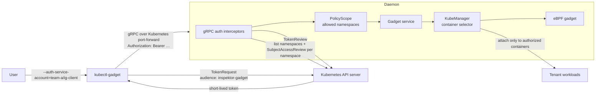
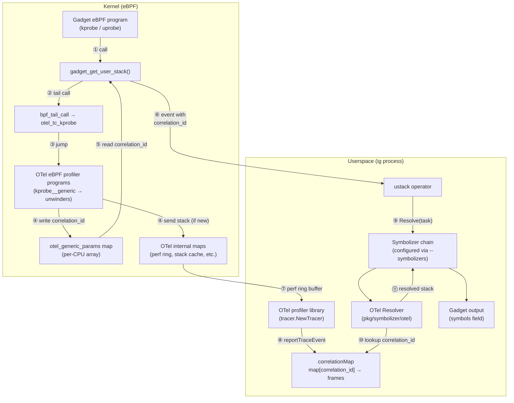
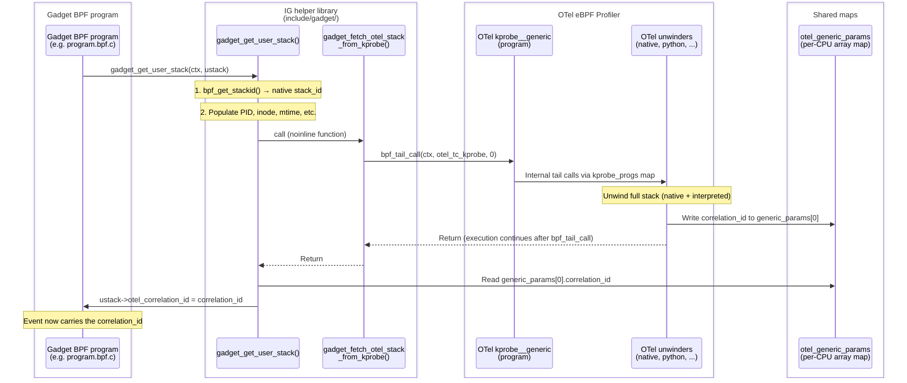
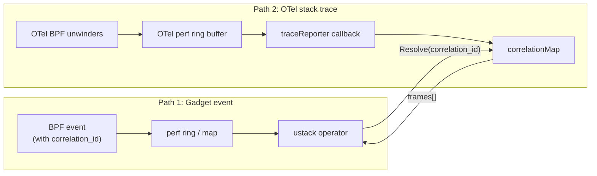
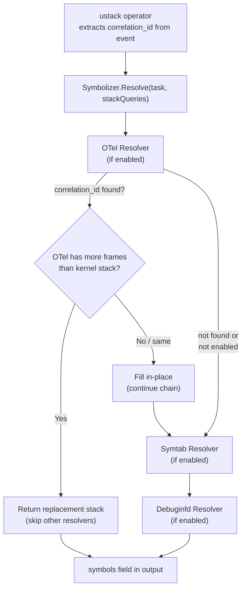
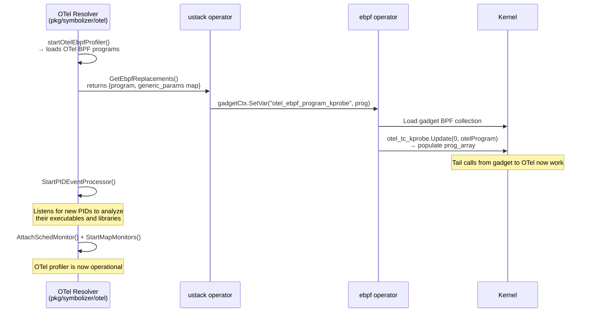
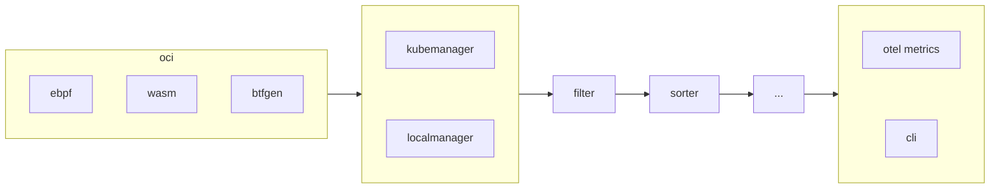
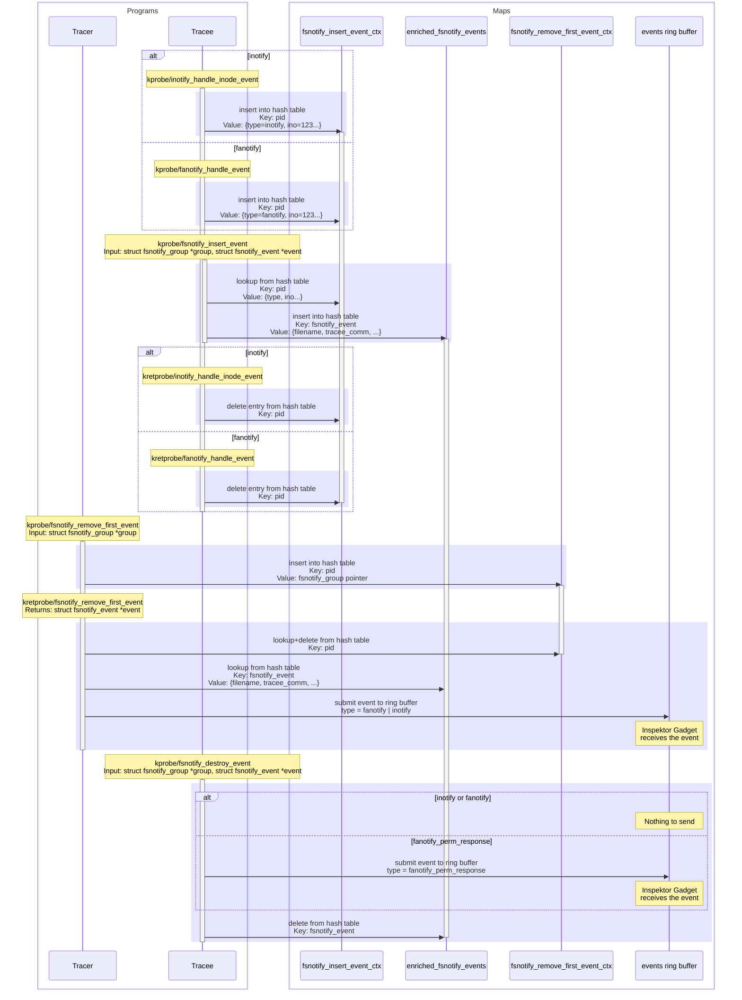
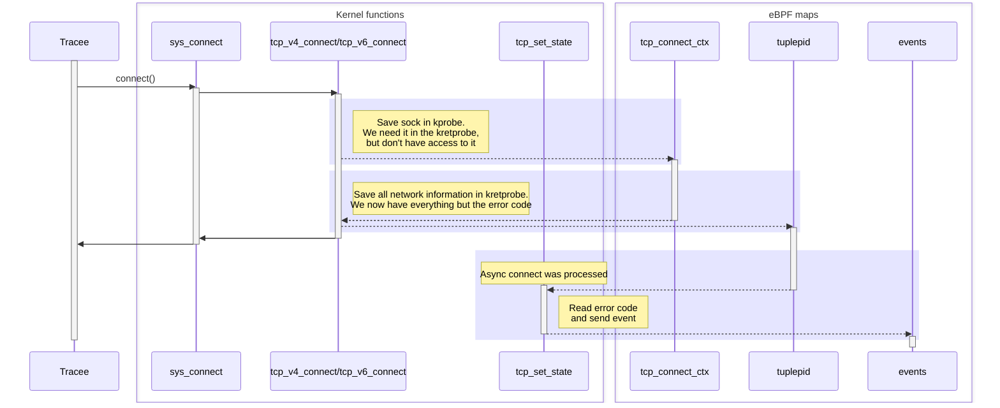
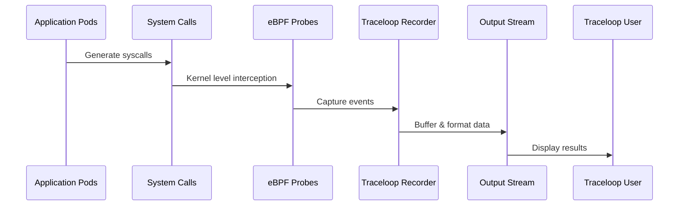

<a id="doc-12e0a48d6c5f2a58f4caa284"></a>

# inspektor-gadget/inspektor-gadget / ADOPTERS.md

Upstream: https://github.com/inspektor-gadget/inspektor-gadget/blob/7e9a89b892b5f60f63c335cd5aaa6c7eab8aa8e1/ADOPTERS.md

Commit: `7e9a89b892b5f60f63c335cd5aaa6c7eab8aa8e1`

Retrieved: 2026-10-01T15:20:38.761409+00:00

Kind: official-document

Raw SHA256: `dc65d2fe4f95dfd9e05482c5ed125c0f6b6e88131c6c1d58c11f88c841238a74`

Source text below is untrusted reference content. Acquisition does not verify technical claims.

License status: UPSTREAM_NOTICES_CAPTURED_PER_FILE_REVIEW_REQUIRED. See this repository's captured license files.

---

# Adopters

This page contains a non-comprehensive list of [Inspektor Gadget](https://inspektor-gadget.io/) users that we know of.

## Adding your org to this list

If you would like your organization or project to be added to this list, please open a PR with your name, link, and a brief description of your use case.

## Inspektor Gadget adopters (in alphabetical order):

| Adopter  | Description |
|----------|-------------|
| [Causely](https://causely.ai/) | Causely is an autonomous service reliability platform. Causely uses causal reasoning to automate root cause analysis, prevent SLO violations and gain 360 degree shared context. Causely uses Inspektor Gadget for its DNS capabilities. |
| [Headlamp](https://headlamp.dev/) | Headlamp is an open-source Kubernetes UI with an [Inspektor Gadget plugin](https://github.com/inspektor-gadget/headlamp-plugin) to [explore and visualize](https://inspektor-gadget.io/blog/2025/03/inspektor-gadget-plugin-for-headlamp) the different gadgets in the Kubernetes environment. |
| [Kubescape](https://kubescape.io/) | Kubescape is an open-source Kubernetes security platform that provides comprehensive security coverage. Kubescape was created by [ARMO](https://www.armosec.io/) and is a [Cloud Native Computing Foundation (CNCF) sandbox project](https://www.cncf.io/sandbox-projects/). Kubescape node agent [uses the Inspektor Gadget library](https://kubescape.io/docs/operator/relevancy/#linux-kernel). |
| [Microsoft Defender for Containers](https://learn.microsoft.com/en-us/azure/defender-for-cloud/defender-for-containers-introduction) | Microsoft Defender for Containers [leverages Inspektor Gadget applications](https://techcommunity.microsoft.com/t5/microsoft-defender-for-cloud/ebpf-powered-threat-protection-using-inspektor-gadget/ba-p/4115873) running in Kubernetes by detecting vulnerabilities at runtime. |
| [Protect AI](https://protectai.com/) | Protect AI [uses Inspektor Gadget and eBPF](https://protectai.com/blog/how-protect-ai-is-shaping-the-future-of-llm-security-with-ebpf) for its capabilities to provide events for container lifecycle insights. |
| [Retina](https://retina.sh/) | Retina is a cloud-agnostic, open-source Kubernetes Network Observability platform. Retina was created by [Microsoft](https://retina.sh/docs/Contributing/development). It uses Inspektor Gadget for its [dns](https://retina.sh/docs/Metrics/plugins/Linux/dns#architecture) and [tcpretrans](https://retina.sh/docs/Metrics/plugins/Linux/tcpretrans) plugins. |
 | [AKS-MCP](https://github.com/Azure/aks-mcp) | AKS-MCP leverages Inspektor Gadget to deliver [real-time observability for Azure Kubernetes Service (AKS) clusters](https://blog.aks.azure.com/2025/08/20/real-time-observability-in-aks-mcp-server). |


<a id="doc-ffdbe3a1e7ee93cacfc080b6"></a>

# inspektor-gadget/inspektor-gadget / CODE_OF_CONDUCT.md

Upstream: https://github.com/inspektor-gadget/inspektor-gadget/blob/7e9a89b892b5f60f63c335cd5aaa6c7eab8aa8e1/CODE_OF_CONDUCT.md

Commit: `7e9a89b892b5f60f63c335cd5aaa6c7eab8aa8e1`

Retrieved: 2026-10-01T15:20:38.761409+00:00

Kind: official-document

Raw SHA256: `a42c95c8d5fa803de4451ede86b772f86c909d4430ac29a2a0ce8630f739469c`

Source text below is untrusted reference content. Acquisition does not verify technical claims.

License status: UPSTREAM_NOTICES_CAPTURED_PER_FILE_REVIEW_REQUIRED. See this repository's captured license files.

---

# Inspektor Gadget Project Code of Conduct

The Inspektor Gadget project follows the [CNCF Code of Conduct](https://github.com/cncf/foundation/blob/main/code-of-conduct.md).


<a id="doc-eca12c0a30e25b4b46522ebf"></a>

# inspektor-gadget/inspektor-gadget / CONTRIBUTING.md

Upstream: https://github.com/inspektor-gadget/inspektor-gadget/blob/7e9a89b892b5f60f63c335cd5aaa6c7eab8aa8e1/CONTRIBUTING.md

Commit: `7e9a89b892b5f60f63c335cd5aaa6c7eab8aa8e1`

Retrieved: 2026-10-01T15:20:38.761409+00:00

Kind: official-document

Raw SHA256: `46787cea43a59a010d34f839caec35564a86b4b7ce76febad464fee5a4e15133`

Source text below is untrusted reference content. Acquisition does not verify technical claims.

License status: UPSTREAM_NOTICES_CAPTURED_PER_FILE_REVIEW_REQUIRED. See this repository's captured license files.

---

# Contributing

Welcome to Inspektor Gadget! We are excited to have you here. To learn more about contributing to the project, check out [Contributor's Guide](https://www.inspektor-gadget.io/docs/latest/devel/contributing/).


<a id="doc-c693279643b8cd5d248172d9"></a>

# inspektor-gadget/inspektor-gadget / LICENSE

Upstream: https://github.com/inspektor-gadget/inspektor-gadget/blob/7e9a89b892b5f60f63c335cd5aaa6c7eab8aa8e1/LICENSE

Commit: `7e9a89b892b5f60f63c335cd5aaa6c7eab8aa8e1`

Retrieved: 2026-10-01T15:20:38.761409+00:00

Kind: license

Raw SHA256: `c71d239df91726fc519c6eb72d318ec65820627232b2f796219e87dcf35d0ab4`

Source text below is untrusted reference content. Acquisition does not verify technical claims.

License status: UPSTREAM_NOTICES_CAPTURED_PER_FILE_REVIEW_REQUIRED. See this repository's captured license files.

---

````text
                                 Apache License
                           Version 2.0, January 2004
                        http://www.apache.org/licenses/

   TERMS AND CONDITIONS FOR USE, REPRODUCTION, AND DISTRIBUTION

   1. Definitions.

      "License" shall mean the terms and conditions for use, reproduction,
      and distribution as defined by Sections 1 through 9 of this document.

      "Licensor" shall mean the copyright owner or entity authorized by
      the copyright owner that is granting the License.

      "Legal Entity" shall mean the union of the acting entity and all
      other entities that control, are controlled by, or are under common
      control with that entity. For the purposes of this definition,
      "control" means (i) the power, direct or indirect, to cause the
      direction or management of such entity, whether by contract or
      otherwise, or (ii) ownership of fifty percent (50%) or more of the
      outstanding shares, or (iii) beneficial ownership of such entity.

      "You" (or "Your") shall mean an individual or Legal Entity
      exercising permissions granted by this License.

      "Source" form shall mean the preferred form for making modifications,
      including but not limited to software source code, documentation
      source, and configuration files.

      "Object" form shall mean any form resulting from mechanical
      transformation or translation of a Source form, including but
      not limited to compiled object code, generated documentation,
      and conversions to other media types.

      "Work" shall mean the work of authorship, whether in Source or
      Object form, made available under the License, as indicated by a
      copyright notice that is included in or attached to the work
      (an example is provided in the Appendix below).

      "Derivative Works" shall mean any work, whether in Source or Object
      form, that is based on (or derived from) the Work and for which the
      editorial revisions, annotations, elaborations, or other modifications
      represent, as a whole, an original work of authorship. For the purposes
      of this License, Derivative Works shall not include works that remain
      separable from, or merely link (or bind by name) to the interfaces of,
      the Work and Derivative Works thereof.

      "Contribution" shall mean any work of authorship, including
      the original version of the Work and any modifications or additions
      to that Work or Derivative Works thereof, that is intentionally
      submitted to Licensor for inclusion in the Work by the copyright owner
      or by an individual or Legal Entity authorized to submit on behalf of
      the copyright owner. For the purposes of this definition, "submitted"
      means any form of electronic, verbal, or written communication sent
      to the Licensor or its representatives, including but not limited to
      communication on electronic mailing lists, source code control systems,
      and issue tracking systems that are managed by, or on behalf of, the
      Licensor for the purpose of discussing and improving the Work, but
      excluding communication that is conspicuously marked or otherwise
      designated in writing by the copyright owner as "Not a Contribution."

      "Contributor" shall mean Licensor and any individual or Legal Entity
      on behalf of whom a Contribution has been received by Licensor and
      subsequently incorporated within the Work.

   2. Grant of Copyright License. Subject to the terms and conditions of
      this License, each Contributor hereby grants to You a perpetual,
      worldwide, non-exclusive, no-charge, royalty-free, irrevocable
      copyright license to reproduce, prepare Derivative Works of,
      publicly display, publicly perform, sublicense, and distribute the
      Work and such Derivative Works in Source or Object form.

   3. Grant of Patent License. Subject to the terms and conditions of
      this License, each Contributor hereby grants to You a perpetual,
      worldwide, non-exclusive, no-charge, royalty-free, irrevocable
      (except as stated in this section) patent license to make, have made,
      use, offer to sell, sell, import, and otherwise transfer the Work,
      where such license applies only to those patent claims licensable
      by such Contributor that are necessarily infringed by their
      Contribution(s) alone or by combination of their Contribution(s)
      with the Work to which such Contribution(s) was submitted. If You
      institute patent litigation against any entity (including a
      cross-claim or counterclaim in a lawsuit) alleging that the Work
      or a Contribution incorporated within the Work constitutes direct
      or contributory patent infringement, then any patent licenses
      granted to You under this License for that Work shall terminate
      as of the date such litigation is filed.

   4. Redistribution. You may reproduce and distribute copies of the
      Work or Derivative Works thereof in any medium, with or without
      modifications, and in Source or Object form, provided that You
      meet the following conditions:

      (a) You must give any other recipients of the Work or
          Derivative Works a copy of this License; and

      (b) You must cause any modified files to carry prominent notices
          stating that You changed the files; and

      (c) You must retain, in the Source form of any Derivative Works
          that You distribute, all copyright, patent, trademark, and
          attribution notices from the Source form of the Work,
          excluding those notices that do not pertain to any part of
          the Derivative Works; and

      (d) If the Work includes a "NOTICE" text file as part of its
          distribution, then any Derivative Works that You distribute must
          include a readable copy of the attribution notices contained
          within such NOTICE file, excluding those notices that do not
          pertain to any part of the Derivative Works, in at least one
          of the following places: within a NOTICE text file distributed
          as part of the Derivative Works; within the Source form or
          documentation, if provided along with the Derivative Works; or,
          within a display generated by the Derivative Works, if and
          wherever such third-party notices normally appear. The contents
          of the NOTICE file are for informational purposes only and
          do not modify the License. You may add Your own attribution
          notices within Derivative Works that You distribute, alongside
          or as an addendum to the NOTICE text from the Work, provided
          that such additional attribution notices cannot be construed
          as modifying the License.

      You may add Your own copyright statement to Your modifications and
      may provide additional or different license terms and conditions
      for use, reproduction, or distribution of Your modifications, or
      for any such Derivative Works as a whole, provided Your use,
      reproduction, and distribution of the Work otherwise complies with
      the conditions stated in this License.

   5. Submission of Contributions. Unless You explicitly state otherwise,
      any Contribution intentionally submitted for inclusion in the Work
      by You to the Licensor shall be under the terms and conditions of
      this License, without any additional terms or conditions.
      Notwithstanding the above, nothing herein shall supersede or modify
      the terms of any separate license agreement you may have executed
      with Licensor regarding such Contributions.

   6. Trademarks. This License does not grant permission to use the trade
      names, trademarks, service marks, or product names of the Licensor,
      except as required for reasonable and customary use in describing the
      origin of the Work and reproducing the content of the NOTICE file.

   7. Disclaimer of Warranty. Unless required by applicable law or
      agreed to in writing, Licensor provides the Work (and each
      Contributor provides its Contributions) on an "AS IS" BASIS,
      WITHOUT WARRANTIES OR CONDITIONS OF ANY KIND, either express or
      implied, including, without limitation, any warranties or conditions
      of TITLE, NON-INFRINGEMENT, MERCHANTABILITY, or FITNESS FOR A
      PARTICULAR PURPOSE. You are solely responsible for determining the
      appropriateness of using or redistributing the Work and assume any
      risks associated with Your exercise of permissions under this License.

   8. Limitation of Liability. In no event and under no legal theory,
      whether in tort (including negligence), contract, or otherwise,
      unless required by applicable law (such as deliberate and grossly
      negligent acts) or agreed to in writing, shall any Contributor be
      liable to You for damages, including any direct, indirect, special,
      incidental, or consequential damages of any character arising as a
      result of this License or out of the use or inability to use the
      Work (including but not limited to damages for loss of goodwill,
      work stoppage, computer failure or malfunction, or any and all
      other commercial damages or losses), even if such Contributor
      has been advised of the possibility of such damages.

   9. Accepting Warranty or Additional Liability. While redistributing
      the Work or Derivative Works thereof, You may choose to offer,
      and charge a fee for, acceptance of support, warranty, indemnity,
      or other liability obligations and/or rights consistent with this
      License. However, in accepting such obligations, You may act only
      on Your own behalf and on Your sole responsibility, not on behalf
      of any other Contributor, and only if You agree to indemnify,
      defend, and hold each Contributor harmless for any liability
      incurred by, or claims asserted against, such Contributor by reason
      of your accepting any such warranty or additional liability.

   END OF TERMS AND CONDITIONS

   APPENDIX: How to apply the Apache License to your work.

      To apply the Apache License to your work, attach the following
      boilerplate notice, with the fields enclosed by brackets "[]"
      replaced with your own identifying information. (Don't include
      the brackets!)  The text should be enclosed in the appropriate
      comment syntax for the file format. We also recommend that a
      file or class name and description of purpose be included on the
      same "printed page" as the copyright notice for easier
      identification within third-party archives.

   Copyright [yyyy] [name of copyright owner]

   Licensed under the Apache License, Version 2.0 (the "License");
   you may not use this file except in compliance with the License.
   You may obtain a copy of the License at

       http://www.apache.org/licenses/LICENSE-2.0

   Unless required by applicable law or agreed to in writing, software
   distributed under the License is distributed on an "AS IS" BASIS,
   WITHOUT WARRANTIES OR CONDITIONS OF ANY KIND, either express or implied.
   See the License for the specific language governing permissions and
   limitations under the License.

````


<a id="doc-ac3a5ff6aac05a91210fb0a4"></a>

# inspektor-gadget/inspektor-gadget / LICENSE-bpf.txt

Upstream: https://github.com/inspektor-gadget/inspektor-gadget/blob/7e9a89b892b5f60f63c335cd5aaa6c7eab8aa8e1/LICENSE-bpf.txt

Commit: `7e9a89b892b5f60f63c335cd5aaa6c7eab8aa8e1`

Retrieved: 2026-10-01T15:20:38.761409+00:00

Kind: license

Raw SHA256: `7a83d7bd42c0c13bb77d9b4e76a08d3aa8b0ca71189573ddc8bb1d06d094abf0`

Source text below is untrusted reference content. Acquisition does not verify technical claims.

License status: UPSTREAM_NOTICES_CAPTURED_PER_FILE_REVIEW_REQUIRED. See this repository's captured license files.

---

````text
The BPF code templates are licensed under the General Public License, Version
2.0, with the Linux-syscall-note. Copies of the Linux-syscall-note and GPL-2.0
license text are included below.

= = = = =

Linux-syscall-note:

   NOTE! This copyright does *not* cover user programs that use kernel
 services by normal system calls - this is merely considered normal use
 of the kernel, and does *not* fall under the heading of "derived work".
 Also note that the GPL below is copyrighted by the Free Software
 Foundation, but the instance of code that it refers to (the Linux
 kernel) is copyrighted by me and others who actually wrote it.

 Also note that the only valid version of the GPL as far as the kernel
 is concerned is _this_ particular version of the license (ie v2, not
 v2.2 or v3.x or whatever), unless explicitly otherwise stated.

Linus Torvalds

= = = = =

GPL-2.0:


		    GNU GENERAL PUBLIC LICENSE
		       Version 2, June 1991

 Copyright (C) 1989, 1991 Free Software Foundation, Inc.
                       51 Franklin St, Fifth Floor, Boston, MA  02110-1301  USA
 Everyone is permitted to copy and distribute verbatim copies
 of this license document, but changing it is not allowed.

			    Preamble

  The licenses for most software are designed to take away your
freedom to share and change it.  By contrast, the GNU General Public
License is intended to guarantee your freedom to share and change free
software--to make sure the software is free for all its users.  This
General Public License applies to most of the Free Software
Foundation's software and to any other program whose authors commit to
using it.  (Some other Free Software Foundation software is covered by
the GNU Library General Public License instead.)  You can apply it to
your programs, too.

  When we speak of free software, we are referring to freedom, not
price.  Our General Public Licenses are designed to make sure that you
have the freedom to distribute copies of free software (and charge for
this service if you wish), that you receive source code or can get it
if you want it, that you can change the software or use pieces of it
in new free programs; and that you know you can do these things.

  To protect your rights, we need to make restrictions that forbid
anyone to deny you these rights or to ask you to surrender the rights.
These restrictions translate to certain responsibilities for you if you
distribute copies of the software, or if you modify it.

  For example, if you distribute copies of such a program, whether
gratis or for a fee, you must give the recipients all the rights that
you have.  You must make sure that they, too, receive or can get the
source code.  And you must show them these terms so they know their
rights.

  We protect your rights with two steps: (1) copyright the software, and
(2) offer you this license which gives you legal permission to copy,
distribute and/or modify the software.

  Also, for each author's protection and ours, we want to make certain
that everyone understands that there is no warranty for this free
software.  If the software is modified by someone else and passed on, we
want its recipients to know that what they have is not the original, so
that any problems introduced by others will not reflect on the original
authors' reputations.

  Finally, any free program is threatened constantly by software
patents.  We wish to avoid the danger that redistributors of a free
program will individually obtain patent licenses, in effect making the
program proprietary.  To prevent this, we have made it clear that any
patent must be licensed for everyone's free use or not licensed at all.

  The precise terms and conditions for copying, distribution and
modification follow.

		    GNU GENERAL PUBLIC LICENSE
   TERMS AND CONDITIONS FOR COPYING, DISTRIBUTION AND MODIFICATION

  0. This License applies to any program or other work which contains
a notice placed by the copyright holder saying it may be distributed
under the terms of this General Public License.  The "Program", below,
refers to any such program or work, and a "work based on the Program"
means either the Program or any derivative work under copyright law:
that is to say, a work containing the Program or a portion of it,
either verbatim or with modifications and/or translated into another
language.  (Hereinafter, translation is included without limitation in
the term "modification".)  Each licensee is addressed as "you".

Activities other than copying, distribution and modification are not
covered by this License; they are outside its scope.  The act of
running the Program is not restricted, and the output from the Program
is covered only if its contents constitute a work based on the
Program (independent of having been made by running the Program).
Whether that is true depends on what the Program does.

  1. You may copy and distribute verbatim copies of the Program's
source code as you receive it, in any medium, provided that you
conspicuously and appropriately publish on each copy an appropriate
copyright notice and disclaimer of warranty; keep intact all the
notices that refer to this License and to the absence of any warranty;
and give any other recipients of the Program a copy of this License
along with the Program.

You may charge a fee for the physical act of transferring a copy, and
you may at your option offer warranty protection in exchange for a fee.

  2. You may modify your copy or copies of the Program or any portion
of it, thus forming a work based on the Program, and copy and
distribute such modifications or work under the terms of Section 1
above, provided that you also meet all of these conditions:

    a) You must cause the modified files to carry prominent notices
    stating that you changed the files and the date of any change.

    b) You must cause any work that you distribute or publish, that in
    whole or in part contains or is derived from the Program or any
    part thereof, to be licensed as a whole at no charge to all third
    parties under the terms of this License.

    c) If the modified program normally reads commands interactively
    when run, you must cause it, when started running for such
    interactive use in the most ordinary way, to print or display an
    announcement including an appropriate copyright notice and a
    notice that there is no warranty (or else, saying that you provide
    a warranty) and that users may redistribute the program under
    these conditions, and telling the user how to view a copy of this
    License.  (Exception: if the Program itself is interactive but
    does not normally print such an announcement, your work based on
    the Program is not required to print an announcement.)

These requirements apply to the modified work as a whole.  If
identifiable sections of that work are not derived from the Program,
and can be reasonably considered independent and separate works in
themselves, then this License, and its terms, do not apply to those
sections when you distribute them as separate works.  But when you
distribute the same sections as part of a whole which is a work based
on the Program, the distribution of the whole must be on the terms of
this License, whose permissions for other licensees extend to the
entire whole, and thus to each and every part regardless of who wrote it.

Thus, it is not the intent of this section to claim rights or contest
your rights to work written entirely by you; rather, the intent is to
exercise the right to control the distribution of derivative or
collective works based on the Program.

In addition, mere aggregation of another work not based on the Program
with the Program (or with a work based on the Program) on a volume of
a storage or distribution medium does not bring the other work under
the scope of this License.

  3. You may copy and distribute the Program (or a work based on it,
under Section 2) in object code or executable form under the terms of
Sections 1 and 2 above provided that you also do one of the following:

    a) Accompany it with the complete corresponding machine-readable
    source code, which must be distributed under the terms of Sections
    1 and 2 above on a medium customarily used for software interchange; or,

    b) Accompany it with a written offer, valid for at least three
    years, to give any third party, for a charge no more than your
    cost of physically performing source distribution, a complete
    machine-readable copy of the corresponding source code, to be
    distributed under the terms of Sections 1 and 2 above on a medium
    customarily used for software interchange; or,

    c) Accompany it with the information you received as to the offer
    to distribute corresponding source code.  (This alternative is
    allowed only for noncommercial distribution and only if you
    received the program in object code or executable form with such
    an offer, in accord with Subsection b above.)

The source code for a work means the preferred form of the work for
making modifications to it.  For an executable work, complete source
code means all the source code for all modules it contains, plus any
associated interface definition files, plus the scripts used to
control compilation and installation of the executable.  However, as a
special exception, the source code distributed need not include
anything that is normally distributed (in either source or binary
form) with the major components (compiler, kernel, and so on) of the
operating system on which the executable runs, unless that component
itself accompanies the executable.

If distribution of executable or object code is made by offering
access to copy from a designated place, then offering equivalent
access to copy the source code from the same place counts as
distribution of the source code, even though third parties are not
compelled to copy the source along with the object code.

  4. You may not copy, modify, sublicense, or distribute the Program
except as expressly provided under this License.  Any attempt
otherwise to copy, modify, sublicense or distribute the Program is
void, and will automatically terminate your rights under this License.
However, parties who have received copies, or rights, from you under
this License will not have their licenses terminated so long as such
parties remain in full compliance.

  5. You are not required to accept this License, since you have not
signed it.  However, nothing else grants you permission to modify or
distribute the Program or its derivative works.  These actions are
prohibited by law if you do not accept this License.  Therefore, by
modifying or distributing the Program (or any work based on the
Program), you indicate your acceptance of this License to do so, and
all its terms and conditions for copying, distributing or modifying
the Program or works based on it.

  6. Each time you redistribute the Program (or any work based on the
Program), the recipient automatically receives a license from the
original licensor to copy, distribute or modify the Program subject to
these terms and conditions.  You may not impose any further
restrictions on the recipients' exercise of the rights granted herein.
You are not responsible for enforcing compliance by third parties to
this License.

  7. If, as a consequence of a court judgment or allegation of patent
infringement or for any other reason (not limited to patent issues),
conditions are imposed on you (whether by court order, agreement or
otherwise) that contradict the conditions of this License, they do not
excuse you from the conditions of this License.  If you cannot
distribute so as to satisfy simultaneously your obligations under this
License and any other pertinent obligations, then as a consequence you
may not distribute the Program at all.  For example, if a patent
license would not permit royalty-free redistribution of the Program by
all those who receive copies directly or indirectly through you, then
the only way you could satisfy both it and this License would be to
refrain entirely from distribution of the Program.

If any portion of this section is held invalid or unenforceable under
any particular circumstance, the balance of the section is intended to
apply and the section as a whole is intended to apply in other
circumstances.

It is not the purpose of this section to induce you to infringe any
patents or other property right claims or to contest validity of any
such claims; this section has the sole purpose of protecting the
integrity of the free software distribution system, which is
implemented by public license practices.  Many people have made
generous contributions to the wide range of software distributed
through that system in reliance on consistent application of that
system; it is up to the author/donor to decide if he or she is willing
to distribute software through any other system and a licensee cannot
impose that choice.

This section is intended to make thoroughly clear what is believed to
be a consequence of the rest of this License.

  8. If the distribution and/or use of the Program is restricted in
certain countries either by patents or by copyrighted interfaces, the
original copyright holder who places the Program under this License
may add an explicit geographical distribution limitation excluding
those countries, so that distribution is permitted only in or among
countries not thus excluded.  In such case, this License incorporates
the limitation as if written in the body of this License.

  9. The Free Software Foundation may publish revised and/or new versions
of the General Public License from time to time.  Such new versions will
be similar in spirit to the present version, but may differ in detail to
address new problems or concerns.

Each version is given a distinguishing version number.  If the Program
specifies a version number of this License which applies to it and "any
later version", you have the option of following the terms and conditions
either of that version or of any later version published by the Free
Software Foundation.  If the Program does not specify a version number of
this License, you may choose any version ever published by the Free Software
Foundation.

  10. If you wish to incorporate parts of the Program into other free
programs whose distribution conditions are different, write to the author
to ask for permission.  For software which is copyrighted by the Free
Software Foundation, write to the Free Software Foundation; we sometimes
make exceptions for this.  Our decision will be guided by the two goals
of preserving the free status of all derivatives of our free software and
of promoting the sharing and reuse of software generally.

			    NO WARRANTY

  11. BECAUSE THE PROGRAM IS LICENSED FREE OF CHARGE, THERE IS NO WARRANTY
FOR THE PROGRAM, TO THE EXTENT PERMITTED BY APPLICABLE LAW.  EXCEPT WHEN
OTHERWISE STATED IN WRITING THE COPYRIGHT HOLDERS AND/OR OTHER PARTIES
PROVIDE THE PROGRAM "AS IS" WITHOUT WARRANTY OF ANY KIND, EITHER EXPRESSED
OR IMPLIED, INCLUDING, BUT NOT LIMITED TO, THE IMPLIED WARRANTIES OF
MERCHANTABILITY AND FITNESS FOR A PARTICULAR PURPOSE.  THE ENTIRE RISK AS
TO THE QUALITY AND PERFORMANCE OF THE PROGRAM IS WITH YOU.  SHOULD THE
PROGRAM PROVE DEFECTIVE, YOU ASSUME THE COST OF ALL NECESSARY SERVICING,
REPAIR OR CORRECTION.

  12. IN NO EVENT UNLESS REQUIRED BY APPLICABLE LAW OR AGREED TO IN WRITING
WILL ANY COPYRIGHT HOLDER, OR ANY OTHER PARTY WHO MAY MODIFY AND/OR
REDISTRIBUTE THE PROGRAM AS PERMITTED ABOVE, BE LIABLE TO YOU FOR DAMAGES,
INCLUDING ANY GENERAL, SPECIAL, INCIDENTAL OR CONSEQUENTIAL DAMAGES ARISING
OUT OF THE USE OR INABILITY TO USE THE PROGRAM (INCLUDING BUT NOT LIMITED
TO LOSS OF DATA OR DATA BEING RENDERED INACCURATE OR LOSSES SUSTAINED BY
YOU OR THIRD PARTIES OR A FAILURE OF THE PROGRAM TO OPERATE WITH ANY OTHER
PROGRAMS), EVEN IF SUCH HOLDER OR OTHER PARTY HAS BEEN ADVISED OF THE
POSSIBILITY OF SUCH DAMAGES.

		     END OF TERMS AND CONDITIONS

	    How to Apply These Terms to Your New Programs

  If you develop a new program, and you want it to be of the greatest
possible use to the public, the best way to achieve this is to make it
free software which everyone can redistribute and change under these terms.

  To do so, attach the following notices to the program.  It is safest
to attach them to the start of each source file to most effectively
convey the exclusion of warranty; and each file should have at least
the "copyright" line and a pointer to where the full notice is found.

    <one line to give the program's name and a brief idea of what it does.>
    Copyright (C) <year>  <name of author>

    This program is free software; you can redistribute it and/or modify
    it under the terms of the GNU General Public License as published by
    the Free Software Foundation; either version 2 of the License, or
    (at your option) any later version.

    This program is distributed in the hope that it will be useful,
    but WITHOUT ANY WARRANTY; without even the implied warranty of
    MERCHANTABILITY or FITNESS FOR A PARTICULAR PURPOSE.  See the
    GNU General Public License for more details.

    You should have received a copy of the GNU General Public License
    along with this program; if not, write to the Free Software
    Foundation, Inc., 51 Franklin St, Fifth Floor, Boston, MA  02110-1301  USA


Also add information on how to contact you by electronic and paper mail.

If the program is interactive, make it output a short notice like this
when it starts in an interactive mode:

    Gnomovision version 69, Copyright (C) year name of author
    Gnomovision comes with ABSOLUTELY NO WARRANTY; for details type `show w'.
    This is free software, and you are welcome to redistribute it
    under certain conditions; type `show c' for details.

The hypothetical commands `show w' and `show c' should show the appropriate
parts of the General Public License.  Of course, the commands you use may
be called something other than `show w' and `show c'; they could even be
mouse-clicks or menu items--whatever suits your program.

You should also get your employer (if you work as a programmer) or your
school, if any, to sign a "copyright disclaimer" for the program, if
necessary.  Here is a sample; alter the names:

  Yoyodyne, Inc., hereby disclaims all copyright interest in the program
  `Gnomovision' (which makes passes at compilers) written by James Hacker.

  <signature of Ty Coon>, 1 April 1989
  Ty Coon, President of Vice

This General Public License does not permit incorporating your program into
proprietary programs.  If your program is a subroutine library, you may
consider it more useful to permit linking proprietary applications with the
library.  If this is what you want to do, use the GNU Library General
Public License instead of this License.

````


<a id="doc-39da3bd6270d44ea37b6ed50"></a>

# inspektor-gadget/inspektor-gadget / MAINTAINERS.md

Upstream: https://github.com/inspektor-gadget/inspektor-gadget/blob/7e9a89b892b5f60f63c335cd5aaa6c7eab8aa8e1/MAINTAINERS.md

Commit: `7e9a89b892b5f60f63c335cd5aaa6c7eab8aa8e1`

Retrieved: 2026-10-01T15:20:38.761409+00:00

Kind: official-document

Raw SHA256: `df31bbb00f5d358f717e2b99a680639e34ea473d18adf5b5db26ea312cc671a5`

Source text below is untrusted reference content. Acquisition does not verify technical claims.

License status: UPSTREAM_NOTICES_CAPTURED_PER_FILE_REVIEW_REQUIRED. See this repository's captured license files.

---

# Maintainers

* [Alban Crequy](https://github.com/alban)
* [Burak Ok](https://github.com/burak-ok)
* [Chris Kühl](https://github.com/blixtra) (project manager)
* [Claudia Marcu](https://github.com/claudiamarcubina)
* [Francis Laniel](https://github.com/eiffel-fl)
* [Jose Blanquicet](https://github.com/blanquicet)
* [Matthias Bertschy](https://github.com/matthyx)
* [Mauricio Vásquez](https://github.com/mauriciovasquezbernal)
* [Maya Singh](https://github.com/mayasingh17) (project manager)
* [Michael Friese](https://github.com/flyth)
* [Qasim Sarfraz](https://github.com/mqasimsarfraz) (project lead)
* [Veaceslav Falico](https://github.com/vfalico)


<a id="doc-b335630551682c19a781afeb"></a>

# inspektor-gadget/inspektor-gadget / README.md

Upstream: https://github.com/inspektor-gadget/inspektor-gadget/blob/7e9a89b892b5f60f63c335cd5aaa6c7eab8aa8e1/README.md

Commit: `7e9a89b892b5f60f63c335cd5aaa6c7eab8aa8e1`

Retrieved: 2026-10-01T15:20:38.761409+00:00

Kind: official-document

Raw SHA256: `bf2904657d77269d77253a0dfdcc197b489b55721ef6fbae81817bd583df6220`

Source text below is untrusted reference content. Acquisition does not verify technical claims.

License status: UPSTREAM_NOTICES_CAPTURED_PER_FILE_REVIEW_REQUIRED. See this repository's captured license files.

---

<h1 align="center">
  <picture>
    <source media="(prefers-color-scheme: light)" srcset="docs/images/logo/ig-logo-horizontal.svg">
    
  </picture>
</h1>

[](https://github.com/inspektor-gadget/inspektor-gadget/actions/workflows/inspektor-gadget.yml)
[](https://pkg.go.dev/github.com/inspektor-gadget/inspektor-gadget)
[](https://www.bestpractices.dev/projects/7962)
[](https://scorecard.dev/viewer/?uri=github.com/inspektor-gadget/inspektor-gadget)
[](https://inspektor-gadget.github.io/ig-test-reports)
[](https://inspektor-gadget.github.io/ig-benchmarks/dev/bench)
[](https://github.com/inspektor-gadget/inspektor-gadget/releases)
[](https://artifacthub.io/packages/search?repo=gadgets)
[](https://artifacthub.io/packages/helm/gadget/gadget)
[](https://kubernetes.slack.com/messages/inspektor-gadget/)
[](https://github.com/inspektor-gadget/inspektor-gadget/blob/main/LICENSE)
[](https://github.com/inspektor-gadget/inspektor-gadget/blob/main/LICENSE-bpf.txt)

Inspektor Gadget is a set of tools and framework for data collection and system inspection on Kubernetes clusters and Linux hosts using [eBPF](https://ebpf.io/). It manages the packaging, deployment and execution of Gadgets (eBPF programs encapsulated in [OCI images](https://opencontainers.org/)) and provides mechanisms to customize and extend Gadget functionality.

**Note**: Major new functionality was released in v0.31.0. Please read the [blog post for a detailed overview](https://inspektor-gadget.io/blog/2024/08/empowering-observability_the_advent_of_image_based_gadgets).

## Features

* Build and package eBPF programs into OCI images called Gadgets
* Targets Kubernetes clusters and Linux hosts
* Collect and export data to observability tools with a simple command and via declarative configuration
* Security mechanisms to restrict and lock-down which Gadgets can be run
* Automatic [enrichment](#what-is-enrichment): map kernel data to high-level resources like Kubernetes and container runtimes
* Supports [WebAssembly](https://webassembly.org/) modules to post-process data and customize IG [operators](#what-is-an-operator); using any WASM-supported language
* Supports many modes of operation; cli, client-server, API, embeddable via Golang library

## Quick start

The following examples use the [trace_open](https://www.inspektor-gadget.io/docs/latest/gadgets/trace_open) Gadget which triggers when a file is open on the system.

### Kubernetes

#### Deployed to the Cluster

[krew](https://sigs.k8s.io/krew) is the recommended way to install
`kubectl gadget`. You can follow the
[krew's quickstart](https://krew.sigs.k8s.io/docs/user-guide/quickstart/)
to install it and then install `kubectl gadget` by executing the following
commands.

```bash
kubectl krew install gadget
kubectl gadget deploy
kubectl gadget run trace_open:latest
```

Check [Installing on Kubernetes](https://www.inspektor-gadget.io/docs/latest/reference/install-kubernetes) to learn more about different options.

`kubectl-gadget` is also packaged for the following distributions:

[](https://repology.org/project/kubectl-gadget/versions)

### Kubectl Node Debug

We can use [kubectl node debug](https://kubernetes.io/docs/tasks/debug/debug-cluster/kubectl-node-debug/) to run `ig` on a Kubernetes node:

```bash
kubectl debug --profile=sysadmin node/minikube-docker -ti --image=ghcr.io/inspektor-gadget/ig:latest -- ig run trace_open:latest
```

For more information on how to use `ig` without installation on Kubernetes, please refer to the [ig documentation](https://www.inspektor-gadget.io/docs/latest/reference/ig#using-ig-with-kubectl-debug-node).

### Linux

#### Install Locally

Install the `ig` binary locally on Linux and run a Gadget:

```bash
IG_ARCH=amd64
IG_VERSION=$(curl -s https://api.github.com/repos/inspektor-gadget/inspektor-gadget/releases/latest | jq -r .tag_name)

curl -sL https://github.com/inspektor-gadget/inspektor-gadget/releases/download/${IG_VERSION}/ig-linux-${IG_ARCH}-${IG_VERSION}.tar.gz | sudo tar -C /usr/local/bin -xzf - ig

sudo ig run trace_open:latest
```

Check [Installing on Linux](https://www.inspektor-gadget.io/docs/latest/reference/install-linux) to learn more.

`ig` is also packaged for the following distributions:

[](https://repology.org/project/inspektor-gadget/versions)

#### Run in a Container

```bash
docker run -ti --rm --privileged -v /:/host --pid=host ghcr.io/inspektor-gadget/ig:latest run trace_open:latest
```

For more information on how to use `ig` without installation on Linux, please check [Using ig in a container](https://www.inspektor-gadget.io/docs/latest/reference/ig#using-ig-in-a-container).

### MacOS or Windows

It's possible to control an `ig` running in Linux from different operating systems by using the `gadgetctl` binary.

Run the following on a Linux machine to make `ig` available to clients.

```bash
sudo ig daemon --tls-insecure --host=tcp://0.0.0.0:1234
```

Download the `gadgetctl` tools for MacOS
([amd64](https://github.com/inspektor-gadget/inspektor-gadget/releases/download/v0.30.0/gadgetctl-darwin-amd64-v0.30.0.tar.gz),
[arm64](https://github.com/inspektor-gadget/inspektor-gadget/releases/download/v0.30.0/gadgetctl-darwin-arm64-v0.30.0.tar.gz)) or [windows](https://github.com/inspektor-gadget/inspektor-gadget/releases/download/v0.30.0/gadgetctl-windows-amd64-v0.30.0.tar.gz) and run the Gadget specifying the IP address of the Linux machine:


```bash
gadgetctl run trace_open:latest --remote-address=tcp://$IP:1234
```

***The above demonstrates the simplest command. To learn how to filter, export, etc. please consult the documentation for the [run](https://www.inspektor-gadget.io/docs/latest/reference/run) command***.

## Core concepts

### What is a Gadget?

Gadgets are the central component in the Inspektor Gadget framework. A Gadget is an [OCI image](https://opencontainers.org/) that includes one or more eBPF programs, metadata YAML file and, optionally, WASM modules for post processing.
As OCI images, they can be stored in a container registry (compliant with the OCI specifications), making them easy to distribute and share.
Gadgets are built using the [`ig image build`](https://www.inspektor-gadget.io/docs/latest/gadget-devel/building) command.

You can find a growing collection of Gadgets on [Artifact HUB](https://artifacthub.io/packages/search?kind=22). This includes both in-tree Gadgets (hosted in this git repository in the [/gadgets](./gadgets/README.md) directory and third-party Gadgets).

See the [Gadget documentation](https://www.inspektor-gadget.io/docs/latest/gadgets/) for more information.

### What is enrichment?

The data that eBPF collects from the kernel includes no knowledge about Kubernetes, container
runtimes or any other high-level user-space concepts. In order to relate this data to these high-level
concepts and make the eBPF data immediately more understandable, Inspektor Gadget automatically
uses kernel primitives such as mount namespaces, pids or similar to infer which high-level
concepts they relate to; Kubernetes pods, container names, DNS names, etc. The process of augmenting
the eBPF data with these high-level concepts is called *enrichment*.

Enrichment flows the other way, too. Inspektor Gadget enables users to do high-performance
in-kernel filtering by only referencing high-level concepts such as Kubernetes pods, container
names, etc.; automatically translating these to the corresponding low-level kernel resources.

### What is an operator?

In Inspektor Gadget, an operator is any part of the framework where an action is taken. Some operators are under-the-hood (i.e. fetching and loading Gadgets) while others are user-exposed (enrichment, filtering, export, etc.) and can be reordered and overridden.

### Further learning

Use the [project documentation](https://www.inspektor-gadget.io/docs/latest/) to learn more about:

* [Reference](https://www.inspektor-gadget.io/docs/latest/reference)
* [Gadgets](https://www.inspektor-gadget.io/docs/latest/gadgets)
* [Contributing](https://www.inspektor-gadget.io/docs/latest/devel/contributing/)

## Kernel requirements

Kernel requirements are largely determined by the specific eBPF functionality a Gadget makes use of.
The eBPF functionality available to Gadgets depend on the version and configuration of the kernel running
in the node/machine where the Gadget is being loaded. Gadgets developed by the Inspektor
Gadget project require at least Linux 5.10 with [BTF](https://www.kernel.org/doc/html/latest/bpf/btf.html) enabled.

Refer to the [documentation for a specific Gadget](https://www.inspektor-gadget.io/docs/latest/gadgets) for any notes regarding requirements.

## Code examples

There are some examples in [this](./examples/) folder showing the usage
of the Golang packages provided by Inspektor Gadget. These examples are
designed for developers that want to use the Golang packages exposed by
Inspektor Gadget directly. End-users do not need this and can use
`kubectl-gadget` or `ig` directly.

## Security features

Inspektor Gadget offers security features which are described in the following document:

* [Verify assets](https://inspektor-gadget.io/docs/latest/reference/verify-assets): Covers everything with regard to signing and verifying of images and release assets. It also showcases the different SBOMs we generate like the [`ig`](https://github.com/inspektor-gadget/inspektor-gadget/releases/download/v0.38.0/ig-linux-amd64-v0.38.0.bom.json) one.
* [Restricting Gadgets](https://inspektor-gadget.io/docs/latest/reference/restricting-gadgets): Details how users can restrict which gadgets can be run based on different filters.

## Contributing

Contributions are welcome, see [CONTRIBUTING](docs/devel/contributing.md).

## Community Meeting

We hold community meetings regularly. Please check our [calendar](https://zoom-lfx.platform.linuxfoundation.org/meetings/inspektorgadget?view=month)
for the full schedule of up-coming meetings and please add any topic you want to discuss to our [meeting
notes](https://docs.google.com/document/d/1cbPYvYTsdRXd41PEDcwC89IZbcA8WneNt34oiu5s9VA/edit)
document.

## Slack

Join the discussions on the [`#inspektor-gadget`](https://kubernetes.slack.com/messages/inspektor-gadget/) channel in the Kubernetes Slack.

## Recent Videos

- Presentation: [From Kernel To Cloud: Building a Complete Open Source Observability Pipeline, OpenSearch Con NA - September 2025](https://opensearchconna2025.sched.com/event/25Gp0/from-kernel-to-cloud-building-a-complete-open-source-observability-pipeline-anirudha-jadhav-shenoy-pratik-gurudatt-amazon-web-services) ([video](https://www.youtube.com/watch?v=oWZnSS7mtK4), [slides](https://static.sched.com/hosted_files/opensearchconna2025/a8/From%20Kernel%20To%20Cloud_%20Building%20a%20Complete%20Open%20Source%20Observability%20Pipeline_final.pdf))
- Talk: [Demystifying DNS: A Guide to Understanding and Debugging Request Flows in Kubernetes Clusters, Container Days Hamburg - September 2024](https://www.youtube.com/watch?v=KQpZg_NqbZw)
- Talk: [eBPF Data Collection for Everyone – empowering the community to obtain Linux insights using Inspektor Gadget](https://www.youtube.com/watch?v=tkKXdaqji9c)
- Talk: [Collecting Low-Level Metrics with eBPF, KubeCon + CloudNativeCon North America 2023](https://kccncna2023.sched.com/event/a70c0a016973beb5705f5f72fa58f622) ([video](https://www.youtube.com/watch?v=_ft3iTw5uv8), [slides](https://static.sched.com/hosted_files/kccncna2023/91/Collecting%20Low-Level%20Metrics%20with%20eBPF.pdf))
- Interview: [Kubernetes Security and Troubleshooting Multitool: Inspektor Gadget](https://www.youtube.com/watch?v=0GDYDYhPPRw)
- Interview: [Enlightning - Go Go Gadget! Inspektor Gadget and Observability](https://www.youtube.com/watch?v=Io6vqHitTzQ)
- Presentation: [Misc - Feat. Kepler, Inspektor Gadget, k8sgpt, Perses, and Pixie (You Choose!, Ch. 04, Ep. 09)](https://youtu.be/OZE1hoT9-gs?t=1267)

## Thanks

* [BPF Compiler Collection (BCC)](https://github.com/iovisor/bcc): some of the gadgets are based on BCC tools.
* [kubectl-trace](https://github.com/iovisor/kubectl-trace): the Inspektor Gadget architecture was inspired from kubectl-trace.
* [cilium/ebpf](https://github.com/cilium/ebpf): the gadget tracer manager and some other gadgets use the cilium/ebpf library.

## License

The Inspektor Gadget user-space components are licensed under the
[Apache License, Version 2.0](LICENSE). The BPF code templates are licensed
under the [General Public License, Version 2.0, with the Linux-syscall-note](LICENSE-bpf.txt).


<a id="doc-eb42cbabebf5c0ff17d5329a"></a>

# inspektor-gadget/inspektor-gadget / charts/README.md

Upstream: https://github.com/inspektor-gadget/inspektor-gadget/blob/7e9a89b892b5f60f63c335cd5aaa6c7eab8aa8e1/charts/README.md

Commit: `7e9a89b892b5f60f63c335cd5aaa6c7eab8aa8e1`

Retrieved: 2026-10-01T15:20:38.761409+00:00

Kind: official-document

Raw SHA256: `6636b161b47fffb818dd7309294ab95532ea84358831e3208742403043daa9d4`

Source text below is untrusted reference content. Acquisition does not verify technical claims.

License status: UPSTREAM_NOTICES_CAPTURED_PER_FILE_REVIEW_REQUIRED. See this repository's captured license files.

---

# Inspektor Gadget Charts

This repository contains Helm charts for [installing Inspektor Gadget on Kubernetes](https://inspektor-gadget.io/docs/latest/reference/install-kubernetes#installation-with-the-helm-chart).


<a id="doc-a77c1c36b4f5f67d7a389365"></a>

# inspektor-gadget/inspektor-gadget / cmd/gpu-ebpf-bridge/README.md

Upstream: https://github.com/inspektor-gadget/inspektor-gadget/blob/7e9a89b892b5f60f63c335cd5aaa6c7eab8aa8e1/cmd/gpu-ebpf-bridge/README.md

Commit: `7e9a89b892b5f60f63c335cd5aaa6c7eab8aa8e1`

Retrieved: 2026-10-01T15:20:38.761409+00:00

Kind: official-document

Raw SHA256: `039f420fa94eb26d8cce2368bdf818342bcdb0cc953f0a2c346b7035aa5f9a12`

Source text below is untrusted reference content. Acquisition does not verify technical claims.

License status: UPSTREAM_NOTICES_CAPTURED_PER_FILE_REVIEW_REQUIRED. See this repository's captured license files.

---

# gpu-ebpf-bridge

`gpu-ebpf-bridge` is a userspace daemon that polls GPU telemetry via
NVML and publishes it through four bpffs-pinned BPF maps that consumer
eBPF gadgets read from.

The documentation lives under `docs/` so it is published on the
website:

- Command-line reference (flags, the four maps, `--dump`, backends):
  [`docs/reference/gpu-ebpf-bridge-cli.md`](../../docs/reference/gpu-ebpf-bridge-cli.md)
- Deployment guide (helm chart, `kubectl debug node`, local `ig`,
  ig-in-container, `ig daemon`):
  [`docs/reference/gpu-ebpf-bridge.md`](../../docs/reference/gpu-ebpf-bridge.md)
- Architecture and design rationale:
  [`docs/design/004-gpu-telemetry-enricher.md`](../../docs/design/004-gpu-telemetry-enricher.md)


<a id="doc-2605206b7e64be69186fabc8"></a>

# inspektor-gadget/inspektor-gadget / docs/SECURITY.md

Upstream: https://github.com/inspektor-gadget/inspektor-gadget/blob/7e9a89b892b5f60f63c335cd5aaa6c7eab8aa8e1/docs/SECURITY.md

Commit: `7e9a89b892b5f60f63c335cd5aaa6c7eab8aa8e1`

Retrieved: 2026-10-01T15:20:38.761409+00:00

Kind: official-document

Raw SHA256: `bdaa0a605ebdb704125ffa8d6d3ff39a972b24ccbbe0ae5ab0b4fa7559f24dfe`

Source text below is untrusted reference content. Acquisition does not verify technical claims.

License status: UPSTREAM_NOTICES_CAPTURED_PER_FILE_REVIEW_REQUIRED. See this repository's captured license files.

---

---
title: Reporting security issues
sidebar_position: 120
description: >
  Instructions to report security issues found in Inspektor Gadget
---

As Inspektor Gadget maintainers, we take security seriously.
If you discover a security issue, please bring it to our attention right away.

## Reporting a Vulnerability

You have two possibilities:
1. Using the GitHub feature "Report a security vulnerability" when opening an issue.
It will then create a non-public issue specific to security.
2. Sending a mail to security@inspektor-gadget.io.
If you do not know which information you need to fill out when using the first option, then the second option is the way to go.

In all cases, we ask that you do not open a public issue.

## Vulnerability Exploitability eXchange (VEX)

VEX (Vulnerability Exploitability eXchange) is a standard for communicating the
exploitability of known vulnerabilities in software projects.

Inspektor Gadget publishes VEX documents to provide a clear, machine-readable
assessment of our software's relationship to known vulnerabilities (CVEs). VEX
helps users and security tools to:
- Suppress false positives for vulnerabilities that do not affect our project.
- Understand why a specific vulnerability is or is not exploitable in our code.

Our VEX documents follow the [OpenVEX specification](https://openvex.dev/).

The VEX statements are not exhaustive due to resource constraints. As of today,
we don't have a commitment to publish VEX statements for all known
vulnerabilities. When we check if a vulnerability applies to Inspektor Gadget,
we use VEX statements as the primary method to record and communicate our
findings. This ensures our results are shared in an open way.

Inspektor Gadget does not provide Long-Term Support (LTS) releases. This means
that only the latest release receives security updates and maintenance, and
older versions may not be updated or supported. When writing VEX statements, we
focus our effort on the latest release. Other previous versions might be
considered based on user demand. For example, v0.41.0 may be considered because
it is the last release with [builtin
gadgets](gadgets/switching_to_image_based_gadgets.mdx), which some users may
still rely on.

The vex document is published in the .vex directory of this repository, at
[https://github.com/inspektor-gadget/inspektor-gadget/tree/main/.vex](https://github.com/inspektor-gadget/inspektor-gadget/tree/main/.vex).
This helps discovery by tools such as [VEX
Hub](https://github.com/aquasecurity/vexhub?tab=readme-ov-file#discovery-of-vex-documents).

### How to Create or Update VEX Documents

To add a new VEX statement use the [vexctl command](https://github.com/openvex/vexctl):

```bash
VER=v0.41.0
vexctl add --in-place .vex/golang.vex.json \
--product "pkg:golang/github.com/inspektor-gadget/inspektor-gadget@$VER" \
--vuln "CVE-2099-12345" \
--status "not_affected" \
--justification "vulnerable_code_not_in_execute_path"
```

The [possible
statuses](https://github.com/openvex/spec/blob/main/OPENVEX-SPEC.md#status-labels)
and [possible
justifications](https://github.com/openvex/spec/blob/main/OPENVEX-SPEC.md#status-justifications)
are listed in the [OpenVEX
Specification](https://github.com/openvex/spec/blob/main/OPENVEX-SPEC.md).


<a id="doc-f2beaff29fcd618e33781913"></a>

# inspektor-gadget/inspektor-gadget / docs/api/golang.mdx

Upstream: https://github.com/inspektor-gadget/inspektor-gadget/blob/7e9a89b892b5f60f63c335cd5aaa6c7eab8aa8e1/docs/api/golang.mdx

Commit: `7e9a89b892b5f60f63c335cd5aaa6c7eab8aa8e1`

Retrieved: 2026-10-01T15:20:38.761409+00:00

Kind: official-document

Raw SHA256: `27ee25d4518041c4b20a2a8a1510375f65cd35fba4d19b359d5f1f98bf862200`

Source text below is untrusted reference content. Acquisition does not verify technical claims.

License status: UPSTREAM_NOTICES_CAPTURED_PER_FILE_REVIEW_REQUIRED. See this repository's captured license files.

---

---
title: 'Go API'
sidebar_position: 20
description: 'How to run Gadgets from a Golang application'
---

import CodeBlock from '@theme/CodeBlock';

This document describes how to use the API provided by Inspektor Gadget to run
Gadgets and consume data produced by them from a Golang application.

## Concepts

Let's describe some concepts before jumping to the code.

### Runtime

A runtime is the component that runs the Gadgets. Inspektor Gadget provides two
runtimes:
- [local](https://pkg.go.dev/github.com/inspektor-gadget/inspektor-gadget@%IG_BRANCH%/pkg/runtime/local):
Used to run a Gadget on the local host. It's only supported on Linux.
- [grpc](https://pkg.go.dev/github.com/inspektor-gadget/inspektor-gadget@%IG_BRANCH%/pkg/runtime/grpc):
Used to run a Gadget on a remote Linux host or Kubernetes cluster. It's supported on Linux, Windows
and Mac.

### Operators

Operators are the cornerstones of the Inspektor Gadget architecture. They are
modular components responsible for specific tasks, such as loading eBPF
programs, enriching events, sorting output, etc. Inspektor Gadget provides
different operators as described in the [operators](../spec/operators/)
documentation. It is also possible to create custom operators as explained
below.

### Data Sources

A [Data
Source](https://pkg.go.dev/github.com/inspektor-gadget/inspektor-gadget@%IG_BRANCH%/pkg/datasource)
is a mechanism used to transport the data generated by the Gadgets (or
operators) across the different components. Operators can generate, consume and
mutate data and the layout of the data source.

### Gadget Context

The [Gadget
Context](https://pkg.go.dev/github.com/inspektor-gadget/inspektor-gadget@%IG_BRANCH%/pkg/gadget-context)
is the component that glues everything together. This carries information
between operators, runtimes, etc.

## Examples

These examples provide minimal working code to use Gadgets in different ways.
Their source code can be found at
https://github.com/inspektor-gadget/inspektor-gadget/tree/%IG_BRANCH%/examples/gadgets

### Running your first Gadget

Let's start with the minimal code required to run a Gadget. This example shows
how to run the [`trace_open`]( ../gadgets/trace_open.mdx) gadget and print the
events it captures to the terminal in json format.

import SimpleTraceOpen from '!!raw-loader!./_golang/trace_open/main.go';

<CodeBlock language="go">{SimpleTraceOpen}</CodeBlock>

Now let's run it. It'll print all the files being opened on the system.

```bash
$ go run -exec sudo .
{
  "error_raw": 0,
  "fd": 7,
  "flags_raw": 524288,
  "fname": "/sys/fs/cgroup/user.slice/user-1000.slice/user@1000.service/memory.pressure",
  "mode_raw": 0,
  "proc": {
    "comm": "systemd-oomd",
    "creds": {
      "gid": 117,
      "uid": 108
    },
    "mntns_id": 4026532600,
    "parent": {
      "comm": "systemd",
      "pid": 1
    },
    "pid": 1081,
    "tid": 1081
  },
  "timestamp_raw": 750512507929
}
{
  "error_raw": 0,
  "fd": 15,
  "flags_raw": 0,
  "fname": "/sys/class/net/lo/statistics/rx_packets",
  "mode_raw": 0,
  "proc": {
    "comm": "gnome-system-mo",
    "creds": {
      "gid": 1000,
      "uid": 1000
    },
    "mntns_id": 4026531841,
    "parent": {
      "comm": "gnome-shell",
      "pid": 2601
    },
    "pid": 16039,
    "tid": 16039
  },
  "timestamp_raw": 750917767023
}
...
```

### Running a Gadget from a file

The example above pulls the `trace_open` image from the internet if it's not
already present on the system. This example shows how to run a Gadget from a
file avoiding pulling the image from the internet.

The `image export` command is used to create a tarball with the `trace_open`
image.

```bash
# pull the image if not already present on the system
$ sudo ig image pull trace_open:main

# export the image to a tarball
$ sudo ig image export trace_open:main trace_open.tar
```

import FromFile from '!!raw-loader!./_golang/from_file/main.go';

<CodeBlock language="go">{FromFile}</CodeBlock>

Running this example produces the same results as the previous example.

### Running a Gadget embedded in your application

The example above required you to ship the tarball file together with your
application binary. But you might want to ship the gadget embedded in your
binary, so let's explore how that can be done by using `//go:embed`.

import FromMemory from '!!raw-loader!./_golang/from_memory/main.go';

<CodeBlock language="go">{FromMemory}</CodeBlock>

Again, running this will produce the same results as the previous examples.

### Using operators from Inspektor Gadget

In this example we use some operators provided by Inspektor Gadget to extend the
functionality of your application:

- [LocalManager](../spec/operators/localmanager.md): Enriches events with
container information. Also provides a mechanism to filter events by
container.
- [Formatters](../spec/operators/formatters.md): Provides a prettier (or
human-readable) representation of some fields like timestamps, etc.

Parameters for each operator are passed as a map of strings using the
fully qualified name of the parameter as the key.

import Operators from '!!raw-loader!./_golang/operators/main.go';

<CodeBlock language="go">{Operators}</CodeBlock>

Before running the example, let's create a couple of containers that will
generate some events:

```bash
$ docker run --name mycontainer --rm -d busybox sh -c "while true; do cat /dev/null; sleep 1; done"
$ docker run --name foocontainer --rm -d busybox sh -c "while true; do cat /dev/null; sleep 1; done"
```

Now, let's run the example.

```bash
$ go run -exec sudo .
{
  "error": "",
  "error_raw": 0,
  "fd": 3,
  "flags_raw": 0,
  "fname": "/dev/null",
  "k8s": {
    "containerName": "",
    "hostnetwork": false,
    "namespace": "",
    "node": "",
    "owner": {
      "kind": "",
      "name": ""
    },
    "podLabels": "",
    "podName": ""
  },
  "mode_raw": 0,
  "proc": {
    "comm": "cat",
    "creds": {
      "gid": 0,
      "uid": 0
    },
    "mntns_id": 4026534339,
    "parent": {
      "comm": "sh",
      "pid": 42678
    },
    "pid": 53660,
    "tid": 53660
  },
  "runtime": {
    "containerId": "1b0ba0f6f7f7251a8dedbee0a836dc3edadeba7444cd56d6afe0989b6007bcd7",
    "containerImageDigest": "sha256:2919d0172f7524b2d8df9e50066a682669e6d170ac0f6a49676d54358fe970b5",
    "containerImageName": "busybox",
    "containerName": "mycontainer",
    "containerPid": 42678,
    "containerStartedAt": 1737743296076978537,
    "runtimeName": "docker"
  },
  "timestamp": "2025-01-24T13:37:35.312976962-05:00",
  "timestamp_raw": 1737743855312976962
}
```

As expected, only events from `mycontainer` are captured and the runtime node
contains all information related to the container creating the events. Also, a
new timestamp field with a human-readable version is present.

Don't forget to remove the containers created above:

```bash
$ docker rm mycontainer foocontainer
```

### Data Source

So far, we've been using the json formatter to convert the events produced by a
Gadget to json. However, if you're only interested in getting specific fields,
it can be more performant to access them directly using a Field Accessor instead
of performing a full json marshaling and unmarshaling.

import Datasource from '!!raw-loader!./_golang/datasource/main.go';

<CodeBlock language="go">{Datasource}</CodeBlock>

Executing this program will output the following:

```bash
$ go run -exec sudo .
command systemd-journal (761) opened /run/log/journal/02962d410aef4be9b1be7d022e8be679/system.journal
command systemd-journal (761) opened /run/log/journal/02962d410aef4be9b1be7d022e8be679/system.journal
command tmux: server (12404) opened /proc/38122/cmdline
command systemd-oomd (1245) opened /proc/meminfo
command systemd-oomd (1245) opened /sys/fs/cgroup/user.slice/user-1001.slice/user@1001.service/memory.pressure
command systemd-oomd (1245) opened /sys/fs/cgroup/user.slice/user-1001.slice/user@1001.service/memory.current
command systemd-oomd (1245) opened /sys/fs/cgroup/user.slice/user-1001.slice/user@1001.service/memory.min
command systemd-oomd (1245) opened /sys/fs/cgroup/user.slice/user-1001.slice/user@1001.service/memory.low
command systemd-oomd (1245) opened /sys/fs/cgroup/user.slice/user-1001.slice/user@1001.service/memory.swap.current
command systemd-oomd (1245) opened /sys/fs/cgroup/user.slice/user-1001.slice/user@1001.service/memory.stat
command systemd-oomd (1245) opened /proc/meminfo
command dbus-daemon (3811) opened /sys/kernel/security/apparmor/.access
command tmux: server (12404) opened /proc/38122/cmdline
command systemd-oomd (1245) opened /proc/meminfo
command systemd-oomd (1245) opened /proc/meminfo
command tmux: server (12404) opened /proc/38122/cmdline
```

### Running Gadgets remotely with the gRPC runtime

All the examples above run the gadgets (and their eBPF parts) locally. The following
examples show how to run gadgets remotely using the gRPC runtime in different
environments (Linux host, Kubernetes cluster, etc.).

#### Linux Host

This example shows how to run a Gadget on a Kubernetes cluster using the gRPC
runtime. In this case, an Inspektor Gadget installation is required on the
Kubernetes cluster. That then also takes care of pulling the Gadget image
from the OCI registry - the client itself does not contact the OCI registry.

import GRPC from '!!raw-loader!./_golang/grpc/main.go';

<CodeBlock language="go">{GRPC}</CodeBlock>

In this case we need to run `ig` in daemon mode:

```bash
$ sudo ig daemon --tls-insecure --host tcp://127.0.0.1:8888
INFO[0000] starting Inspektor Gadget daemon at "tcp://127.0.0.1:8888"
```

Now run the example. Note that in this case running as user "root" is not
needed, because all the privileged operations are happening inside the `ig`
process on the remote side.

```bash
$ go run .
{"comm":"irqbalance","err":0,"fd":6,"flags":0,"fname":"/proc/interrupts","gid":0,"mntns_id":4026533158,"mode":0,"pid":1262,"timestamp":6114008072805,"uid":0}
{"comm":"irqbalance","err":0,"fd":6,"flags":0,"fname":"/proc/stat","gid":0,"mntns_id":4026533158,"mode":0,"pid":1262,"timestamp":6114008961935,"uid":0}
{"comm":"irqbalance","err":0,"fd":6,"flags":0,"fname":"/proc/irq/65/smp_affinity","gid":0,"mntns_id":4026533158,"mode":0,"pid":1262,"timestamp":6114009113261,"uid":0}
{"comm":"irqbalance","err":0,"fd":6,"flags":0,"fname":"/proc/irq/98/smp_affinity","gid":0,"mntns_id":4026533158,"mode":0,"pid":1262,"timestamp":6114009138809,"uid":0}
```

#### Kubernetes Cluster

This example shows how to run a Gadget on a Kubernetes cluster using the gRPC
runtime. In this case, Inspektor Gadget installation is required on the
Kubernetes cluster, and it also takes care of pulling the Gadget image
from the OCI registry so the client doesn't need to contact the OCI registry

import GRPCK8s from '!!raw-loader!./_golang/grpc_kubernetes/main.go';

<CodeBlock language="go">{GRPCK8s}</CodeBlock>

Now let's run the example. See how it has all the Kubernetes metadata
attached to the events:

```bash
$ go run .
{"error":"","fd":14,"fname":"/proc/1/stat","k8s":{"containerName":"coredns","namespace":"kube-system","node":"aks-agentpool-93770793-vmss000000","owner":{},"podName":"coredns-6f776c8fb5-wwtqz"},"mode":"----------","proc":{"comm":"coredns","pid":19588,"tid":20673}}
{"error":"","fd":14,"fname":"/proc/stat","k8s":{"containerName":"coredns","namespace":"kube-system","node":"aks-agentpool-93770793-vmss000000","owner":{},"podName":"coredns-6f776c8fb5-wwtqz"},"mode":"----------","proc":{"comm":"coredns","pid":19588,"tid":20673}}
{"error":"","fd":14,"fname":"/proc/1/fd","k8s":{"containerName":"coredns","namespace":"kube-system","node":"aks-agentpool-93770793-vmss000000","owner":{},"podName":"coredns-6f776c8fb5-wwtqz"},"mode":"----------","proc":{"comm":"coredns","pid":19588,"tid":20673}}
{"error":"","fd":14,"fname":"/proc/1/limits","k8s":{"containerName":"coredns","namespace":"kube-system","node":"aks-agentpool-93770793-vmss000000","owner":{},"podName":"coredns-6f776c8fb5-wwtqz"},"mode":"----------","proc":{"comm":"coredns","pid":19588,"tid":20673}}
```


### Other Examples

There are other examples available in the repo, please check them at
https://github.com/inspektor-gadget/inspektor-gadget/tree/%IG_BRANCH%/examples/gadgets/other


<a id="doc-087f808dc610e6163849c1d6"></a>

# inspektor-gadget/inspektor-gadget / docs/api/grpc.md

Upstream: https://github.com/inspektor-gadget/inspektor-gadget/blob/7e9a89b892b5f60f63c335cd5aaa6c7eab8aa8e1/docs/api/grpc.md

Commit: `7e9a89b892b5f60f63c335cd5aaa6c7eab8aa8e1`

Retrieved: 2026-10-01T15:20:38.761409+00:00

Kind: official-document

Raw SHA256: `4432ce4dfee6542b96989aedefdd4b1ef6155f9fe683b44f69685b878e7f68fd`

Source text below is untrusted reference content. Acquisition does not verify technical claims.

License status: UPSTREAM_NOTICES_CAPTURED_PER_FILE_REVIEW_REQUIRED. See this repository's captured license files.

---

---
title: 'Gadget gRPC API'
sidebar_position: 30
description: 'Reference documentation for the gRPC API'
---

TODO

## api.proto

TODO

[pkg/gadget-service/api/api.proto](https://github.com/inspektor-gadget/inspektor-gadget/blob/%IG_BRANCH%/pkg/gadget-service/api/api.proto)


<a id="doc-0ba7d130997bdd714cfa70fa"></a>

# inspektor-gadget/inspektor-gadget / docs/design/001-prometheus.md

Upstream: https://github.com/inspektor-gadget/inspektor-gadget/blob/7e9a89b892b5f60f63c335cd5aaa6c7eab8aa8e1/docs/design/001-prometheus.md

Commit: `7e9a89b892b5f60f63c335cd5aaa6c7eab8aa8e1`

Retrieved: 2026-10-01T15:20:38.761409+00:00

Kind: official-document

Raw SHA256: `f34849241569d5fb94dfc55744509e2373cb110c212cf67f577e3afcd3742b5b`

Source text below is untrusted reference content. Acquisition does not verify technical claims.

License status: UPSTREAM_NOTICES_CAPTURED_PER_FILE_REVIEW_REQUIRED. See this repository's captured license files.

---

# Prometheus support in Inspektor Gadget

:::warning

This document is outdated. An initial implementation of this proposal was done,
but it was removed later on for an implementation focused on image-based gadgets
and OpenTelemetry. Check the new implementation on pkg/operators/otel-metrics/.

:::

Inspektor Gadget has a lot of tools that hook into the kernel to capture different events like file
opened, process created, DNS requests, etc. Currently it's mostly designed as a troubleshooting
tool: it prints those events as they happen to the terminal. However, it's an easy win to provide
metrics through Prometheus. The whole logic to capture the data is already in place, we only need to
aggregate and expose this in a Prometheus format.

This document contains a design proposal for supporting Prometheus metrics in Inspektor Gadget.
Upstream issue:
[https://github.com/inspektor-gadget/inspektor-gadget/issues/1513](https://github.com/inspektor-gadget/inspektor-gadget/issues/1513)

# Goals

This document is written with the following goals in mind in descending order of priority.

- Bring this support soon to market
- Metrics to expose should be configurable
- The solution should be performant

# Design Decisions

## Metrics to expose

In order to be as flexible as possible, the user should be able to configure the metrics they want to expose
for each gadget. Most gadgets emit events from eBPF including several fields of data and send them to the
userspace part of IG for processing. In a generic solution, most of these fields should be selectable for metric collection, aggregation and filtering. However, due to handling all events in userspace, this could negatively
impact performance. In order to improve that, we also propose a way to handle collection of the most commonly
used metrics directly in eBPF.

## Labels Granularity

High cardinality (a lot of distinct label combinations) can be problematic as it increases the memory
usage of both the collector (IG) and the consumer (Prometheus). As stated above, users should still be able
to configure the granularity they want to have and so should consider the cardinality themselves.

## Filtering

Inspektor Gadget already provides a mechanism to filter out events we're not interested in. This
mechanism should be reused by the Prometheus integration to avoid handling metrics for objects the
user is not interested in.

# User Experience

The metric collection and export to Prometheus should be supported in both cases, a) when running in Kubernetes (ig-k8s), and b) when running on Linux hosts (ig).
This is possible by implementing this using a new Prometheus gadget/operator as it makes the code automatically shareable between ig, ig-k8s and external applications. This gadget/operator provides
start / stop operations to enable / disable collection of metrics.

```bash
$ kubectl gadget prometheus start --config <path>
$ kubectl gadget prometheus stop
```

TODO: need to think about not having a start operation on this one

```bash
$ ig prometheus --config <path>
```

It should also be possible to configure the metrics using a CR - supporting a [static
configuration](https://github.com/inspektor-gadget/inspektor-gadget/issues/1401) could be
implemented in the future as well.

## Configuration File

Given that we want this to be flexible, allowing the user to control which metrics to capture
and how to aggregate them, we will use configuration files to define those aspects. This takes inspiration from
[https://github.com/cloudflare/ebpf_exporter](https://github.com/cloudflare/ebpf_exporter).

### Filtering (aka Selectors)

The user should be able to provide a set of filters indicating the events that should be taken into
consideration when collecting the metrics. The mechanism should provide the following features:

- Equal operator
  - "columnName:value"
- Different operator (!)
  - "columnName:!value"
- Greater than, less than operators (<, >, <=, >=)
  - "columnName:>value"
- Match regex (~)
  - "columnName:~regex"

In the future, we could consider introducing more advanced operators like:

- Set based
  - In
  - NotIn

It's similar to the existing [Labels and
Selectors](https://kubernetes.io/docs/concepts/overview/working-with-objects/labels/) mechanism, but
we still need to understand if we can reuse that or if we need a completely new implementation.

Some examples of possible filters are:

# Only metrics for default namespace

```yaml
# Only metrics for default namespace
selector:
  - k8s.namespace: default

# Count only events with retval != 0
selector:
  - "retval:!0"
```

The configuration file defines the different metrics to collect.

### Counters

This is probably the most intuitive metric: "A _counter_ is a cumulative metric that represents a
single [monotonically increasing counter](https://en.wikipedia.org/wiki/Monotonic_function) whose
value can only increase or be reset to zero on restart. For example, you can use a counter to
represent the number of requests served, tasks completed, or errors." from
[https://prometheus.io/docs/concepts/metric_types/#counter](https://prometheus.io/docs/concepts/metric_types/#counter).

The following are examples of counters we can support with the existing gadgets. The first one
counts the number of executed processes.

```yaml
metrics:
  # executed processes by namespace, pod and container.
  - name: executed_processes
    type: counter
    category: trace
    gadget: exec
    labels:
      - k8s.namespace
      - k8s.podName
      - k8s.containerName
```

The category and gadget fields define which gadget to use. The labels indicate how metrics are
aggregated, i.e., the cardinality of the exposed metric. In this case, we'll have a counter for each
namespace, pod and container combination.

Another example that will report the number of executed processes, aggregated by comm and namespace:

# executed processes by comm and namespace

```yaml
- name: executed_processes_by_comm
  type: counter
  category: trace
  gadget: exec
  labels:
    - k8s.namespace
    - comm
```

It is possible to count events based on matching criteria. For instance, the following counter
will only consider events in the default namespace.

```yaml
# executed processes by pod and container in the default namespace
- name: executed_processes
  type: counter
  category: trace
  gadget: exec
  labels:
    - k8s.podName
    - k8s.containerName
  selector:
    - "k8s.namespace:default"
```

Or only count events for a given command:

```yaml
# cat executions by namespace, pod and container
- name: executed_cats # ohno!
  type: counter
  category: trace
  gadget: exec
  labels:
    - k8s.namespace
    - k8s.podName
    - k8s.containerName
  selector:
    - "comm:cat"
```

And finally, we can provide counters for failed operations:

```yaml
# failed execs by namespace, pod and container
- name: failed_execs
  type: counter
  category: trace
  gadget: exec
  labels:
    - k8s.namespace
    - k8s.podName
    - k8s.containerName
  selector:
    - "retval:!0"
```

Filtering can also be used for gadgets that provide events describing two different situations, for
instance the trace dns gadget emits events for requests and answers. Then, we can expose a counter
only for requests based on the value of the "qr" field.

```yaml
# DNS requests aggregated by namespace and pod
- name: dns_requests
  type: counter
  category: trace
  gadget: dns
  labels:
    - namespace
    - pod
  selector:
    # Only count query events
    - "qr:Q"
```

Another example is:

```yaml
  # bpf seccomp violations
- name: seccomp_violations
  type: counter
  category: audit
  gadget: seccomp
  labels:
    - k8s.namespace
    - k8s.podName
    - k8s.containerName
    - syscall
  selector:
    - "syscall:bpf"
```

By default, a counter is increased by one each time there is an event, however it's possible to
increase a counter using a field on the event:

```yaml
# Read bytes on ext4 filesystem
- name: read_bytes_ext4
  type: counter
  category: trace
  gadget: fsslower
  labels:
    - k8s.namespace
    - k8s.podName
    - k8s.containerName
  field: bytes
  selector:
    - "filesystem:ext4"
    - "op:R"
```

## Gauges

"A _gauge_ is a metric that represents a single numerical value that can arbitrarily go up and down"
from
[https://prometheus.io/docs/concepts/metric_types/#gauge](https://prometheus.io/docs/concepts/metric_types/#gauge).

It seems that the only category of gadgets that can provide data to be interpreted as a gauge is the
snapshotters.

```yaml
# Number of processes by namespace / pod / container
- name: number_of_processes
  type: gauge
  category: snapshot
  gadget: process
  labels:
    - k8s.namespace
    - k8s.podName
    - k8s.containerName

# Number of sockets in CLOSE_WAIT state
- name: number_of_sockets_close_wait
  type: gauge
  category: snapshot
  gadget: socket
  labels:
    - k8s.namespace
    - k8s.podName
    - k8s.containerName
  selector:
    - "status:CLOSE_WAIT"
```

TODO: This is not totally clear how this should work since there gadget doesn't provide a stream of
events. In this case we should execute the gadget each time prometheus scrapes the endpoint.

### Histograms

The histogram definition is a bit more complex than the previous ones, hence please check the Prometheus
documentation:
[https://prometheus.io/docs/concepts/metric_types/#histogram](https://prometheus.io/docs/concepts/metric_types/#histogram)

We'll support the same bucket configuration as described in
[https://github.com/cloudflare/ebpf_exporter#histograms.](https://github.com/cloudflare/ebpf_exporter#histograms.)

```yaml
# DNS replies latency
- name: dns_latency
  type: histogram
  category: trace
  gadget: dns
  field: latency
  bucket:
    min: 0s
    max: 1m
    type: exp2
  labels:
    - k8s.namespace
    - k8s.podName
  selector:
    - "qr:R"
```

# Implementation

## Gadgets supported

We want to make Prometheus supported by as many gadgets as possible, however it's currently not
possible to support all of them. The initial implementation covers these gadgets:

- Tracers: counters and histograms
- Snapshot: gauges

There are some categories that we don't know if they can be supported altogether, so we probably should
also define per gadget support:

- Audit seccomp: counters
- Profile block-io: will be nice but can require some extra work

## Metrics collection

The main implementation detail of this support is where to count the metrics. This proposal includes
two approaches that are independent and that can be implemented in parallel or one after the other:

- Collect metrics in user space: A very flexible and less performant solution
- Collect metrics in eBPF: A more performant solution that should handle most common metrics

### Collection in user space

In this case the counting / aggregation happens on user space. This is the simplest way to collect
metrics, but also the most expensive one. It leverages the whole functionality of our gadgets as it
is right now. Events are still collected in eBPF and sent to user-space as they occur, where they
are evaluated, i.e., aggregated and filtered according to the user's configuration.

This option is defined to be flexible rather than performant. For metrics with high throughput, users should use
the metrics collection backed by eBPF (see below).

The implementation is based on the existing parser that uses reflection underneath. It was
implemented in https://github.com/inspektor-gadget/inspektor-gadget/pull/1620.

### Collection in eBPF

We should extend the gadgets to collect some common metrics in eBPF to make this solution more
performant. This should be the preferred way of collecting metrics, even if it isn't as flexible as
the implementation using the events (and it's harder to implement). In this case, we'll have to define a
list of common metrics that are exposed by each gadget (TODO).

Gadgets' eBPF code would require two new constants:

```c
bool enable_events
bool enable_metrics
```

When metric collection is enabled, it expects maps that it can fill. The gadget/operator will provide such
maps with a layout depending on the users' configuration.

The biggest issue here is that we basically need to have counters for each of the possible tuples of
the requested labels (which are dynamic). This would be solved by a BPF_HASH_MAP (potentially
PER_CPU) with the key looking like this for example:

```c
struct metric_key_t {
__u64 mount_ns_id;
__u32 reason;
}
```

With each added label, the key length increases. Adding for example the SADDR, the key would look
like this:

```c
struct metric_key_t {
__u64 mount_ns_id;
__u8 saddr[16];
__u32 reason;
}
```

The actual value consists of a simpler struct, containing for example just a counter variable,
buckets for histograms, etc. (and maybe a last-access timestamp).

The operator would then periodically iterate over the map and update the exported metrics.

We'd have to think about pruning the maps periodically as well, otherwise the maps would only grow -
the mentioned timestamp could help with that. We also have to notify the user about possible
overflows.

#### Use of Macros

To be able to use maps like described above, the keys of the maps would have to be sized
dynamically. This can be achieved by using macros and consts that switch on/off certain fields on
demand (I've started work on a PoC).

A definition like this

```c
#define METRIC_LIST_KEYS(X) \
 X(MntNS, __u64, 8) \
 X(Reason, __u32, 4)
```

could then create required functions (like offset helpers) and volatile consts that will be set upon
starting the gadget.

# Compatibility with script and BYOB (bring your own bpf) gadgets

These two gadgets allow the user to inject custom eBPF programs. It should be possible to
also support metric collection using this solution. The structure of the eBPF maps that collect the
metrics should be well defined to create a contract between the eBPF programs and the
Operator/Gadget in user space.

## BYOB

We have to document what is the structure of the maps and the user will be responsible for creating
and filling them in their eBPF programs

## Script

This gadget creates the eBPF maps on behalf of users when they specify they want a counter. We will
need to be sure those maps stick to the contract defined above. The syntax to defining counters,
histograms, etc by using the DSL can be very similar to what we already have in bpftrace
[https://github.com/iovisor/bpftrace/blob/master/docs/reference_guide.md#2-count-count](https://github.com/iovisor/bpftrace/blob/master/docs/reference_guide.md#2-count-count),
[https://github.com/iovisor/bpftrace/blob/master/docs/reference_guide.md#8-hist-log2-histogram](https://github.com/iovisor/bpftrace/blob/master/docs/reference_guide.md#8-hist-log2-histogram).

# Out of Scope

- Providing a Golang package for 3rd party applications: This solution will be implemented as a
  Gadget/Operator, hence it'll also be available for 3rd party applications. It's not on our roadmap
  to provide a golang package supporting this, however it should be easy to refactor the code
  and create such a package if needed in the future. At that point we'll need to determine the
  format used by this package to expose the data. One possibility is to expose Otel metrics and the
  user then will convert them to the needed format, Prometheus for instance.


<a id="doc-7d05bb705525cefe414ac1b1"></a>

# inspektor-gadget/inspektor-gadget / docs/design/002-containerized-gadgets.md

Upstream: https://github.com/inspektor-gadget/inspektor-gadget/blob/7e9a89b892b5f60f63c335cd5aaa6c7eab8aa8e1/docs/design/002-containerized-gadgets.md

Commit: `7e9a89b892b5f60f63c335cd5aaa6c7eab8aa8e1`

Retrieved: 2026-10-01T15:20:38.761409+00:00

Kind: official-document

Raw SHA256: `5fe0724c57eeab284cce96f537d619bb84e320d9d6ea314050a079d2457c8c80`

Source text below is untrusted reference content. Acquisition does not verify technical claims.

License status: UPSTREAM_NOTICES_CAPTURED_PER_FILE_REVIEW_REQUIRED. See this repository's captured license files.

---

# Containerized Gadgets Support Inspektor Gadget

The gadgets we provide are heavily coupled to Inspektor Gadget as they are all developed on the same
repository and maintained by our team. Adding new gadgets implies that they have to be reviewed and
approved by us. This approach presents some disadvantages:
- Users need to install new versions of Inspektor Gadget to get new gadgets (or updates to them).
- Too specific gadgets can't be added to our code base.
- Users can't have private gadgets.

The [containerized gadgets idea](https://github.com/inspektor-gadget/inspektor-gadget/issues/1669)
aims to make Inspektor Gadget a framework to run eBPF programs (gadgets), like Docker does for
containers. This approach decouples the gadgets from Inspektor Gadget solving the issues mentioned
above.

Many ideas of this design document are based on [bumblebee](https://github.com/solo-io/bumblebee)
and [ebpf_exporter](https://github.com/cloudflare/ebpf_exporter) projects.

## User Experience

The UX we provide should be very close to the existing container runtimes like Docker. This document
considers the client-server setup for ig described in
https://github.com/inspektor-gadget/inspektor-gadget/issues/1681. It's being implemented at the time
of writing this document.

### `run`

The run command starts a gadget:

```bash
$ gadgetctl run mygadgetimage:latest
# print output to terminal
```

`mygadgetimage:latest` is a gadget OCI image.
This command should provide a flag to run on detached mode:

```bash
$ gadgetctl run mygadgetimage:latest --detach
a3397355fc4b2ba49cdc1ab2d36f728cbda65f0ef979854186f2ea780e8659e1
```

This command automatically pulls the image if it is not available in the local image cache.

### `list`

List print the running gadgets

```bash
$ gadgetctl list
...
```

### `attach`

Attach to a running gadget

```bash
$ gadgetctl attach mygadget
# gets terminal attached to the gadget
```

### `pull`

Pulls a gadget image

```bash
$ gadgetctl pull mygadgetimage:latest
```

### `build`

Builds and packages a gadget as an OCI image

```bash
$ gadgetctl build --prog foo.bpf.c --definition foo.yaml mygadgetimage:latest
```

Details of this command are still to be defined. Like other flags that are supported.

### `tag`

Tag an image

```bash
$ gadgetctl tag mygadgetimage:latest ghcr.io/foo/mygadgetimage:v1
```

### `login`

Login into a container registry

```bash
$ gadgetctl login -u admin -p 1234
```

### `image`

Different commands to handle images

- `image list`
- `image delete`
etc...

TODO: Should commands like `ig pull`, `ig build`, `ig push` be aliases of `ig image ...` ones?

## Gadget Packaging

Gadgets should be packed as [OCI](https://github.com/opencontainers/image-spec) images.
It is expected that the first manifest is an image index `application/vnd.oci.image.index.v1+json`.
All supported architectures has to be listed here
```bash
$ crane manifest ghcr.io/inspektor-gadget/tcp-connect:test | jq .
{
  "schemaVersion": 2,
  "mediaType": "application/vnd.oci.image.index.v1+json",
  "manifests": [
    {
      "mediaType": "application/vnd.oci.image.manifest.v1+json",
      "digest": "sha256:7138dd1d4599d3e2c010a08e2609d53bea0764809563ff4554b9f4c8116fafef",
      "size": 590,
      "platform": {
        "architecture": "amd64",
        "os": "linux"
      }
    },
    {
      "mediaType": "application/vnd.oci.image.manifest.v1+json",
      "digest": "sha256:9ecb3e8284068ce53d6c359b046ff20febf39f2d05ffa219e4665bd29fef1954",
      "size": 590,
      "platform": {
        "architecture": "arm64",
        "os": "linux"
      }
    }
  ]
}
```

The manifest referenced by the digest of a specific architecture has a config and a single layer. The content of the config is [the definition file](#def-file).
The currently single layer contains the compiled eBPF program. It supports configurable annotations for the author and description

Example:
```bash
$ crane manifest ghcr.io/inspektor-gadget/tcp-connect@sha256:9ecb3e8284068ce53d6c359b046ff20febf39f2d05ffa219e4665bd29fef1954 | jq .
{
  "schemaVersion": 2,
  "config": {
    "mediaType": "application/vnd.gadget.config.v1+yaml",
    "digest": "sha256:eb71861c0a5d5ca9a706fffa20fead54f64a1624dfeef5d334a8a3c2462c4c37",
    "size": 628,
    "annotations": {
      "org.opencontainers.image.title": "config.yaml"
    }
  },
  "layers": [
    {
      "mediaType": "application/vnd.gadget.ebpf.program.v1+binary",
      "digest": "sha256:a2e1f232e675b1a8d83f94fc646b40e885564f8346273c3257ac76003545880b",
      "size": 873256,
      "annotations": {
        "org.opencontainers.image.authors": "Burak Ok",
        "org.opencontainers.image.description": "A simple tcpconnect program",
        "org.opencontainers.image.title": "program.o"
      }
    }
  ]
}

```


TODO: How the user could specify these annotations when using the build command?

### Definition File <a name="def-file"></a>

The definition file contains the following information for a gadget:
- `documentation`: Long text describing how to use the gadget. This should describe the different
  parameters supported and can contain some practical examples about how to use it.
- `columns`: Information about the event that the gadget provides. Each element represents a columns
  attribute as defined in pkg/columns/columninfo.go.

This definition file is mandatory in the early implementation stage, but later on it'll be
optional.

## Gadget Implementation

A gadget is composed by eBPF programs and maps that are compiled into an eBPF ELF object. According
to the names of the maps and programs, and the types used, Inspektor Gadget is able to understand
how to parse, enrich and print information from the gadget.
Inspektor Gadget requires the ELF file to have sections named according to the convention defined in
libbpf and cilium/ebpf.

Currently the built-in gadgets have a strong categorization, however in this new containerized
gadgets approach that categorization is softer, each gadget defines how it behaves according to the
maps / types they use and it's possible that the same gadget implements different behaviors, like
tracer and topper, etc.

### Maps

#### `RingBuf` and `PerfEventArray` with `print_` Prefix (a.k.a tracers)

These maps indicate that the gadget produces a stream of events. Inspektor Gadget uses the BTF
information to format and print the events.

```c
// taken from gadgets/trace_open.bpf.c
struct event {
	__u64 timestamp;
	__u32 pid;
	__u32 uid;
	__u32 gid;
	gadget_mntns_id mntns_id;
	int ret;
	int flags;
	__u16 mode;
	__u8 comm[TASK_COMM_LEN];
	__u8 fname[NAME_MAX];
};

struct {
	__uint(type, BPF_MAP_TYPE_PERF_EVENT_ARRAY);
	__uint(key_size, sizeof(u32));
	__type(value, struct event);
} print_events SEC(".maps");
```

NOTE: In libbpf and cilium/ebpf, maps of type RingBuf and PerfEventArray normally have an explicit
definition with:

```c
__uint(value_size, sizeof(u32));
```

Or an implicit one (when value_size is not defined, the bpf loader understands that RingBuf and
PerfEventArray store a file descriptor, i.e. an integer of size 4).

However, for containerized gadgets, Inspektor Gadget changes the semantic of the value field in the
map definition to be able to carry the expected BTF type sent to the ring buffers. This idea
initially comes from Bumblebee.

As a consequence, BPF programs written in this way will not be loadable by generic bpf loaders but
only by Inspektor Gadget.

TODO: Revisit this approach and check if there is a way to remove the limitation of being loaded by
other projects.

#### `HashMap` with `stats_` Prefix (a.k.a toppers)

These maps are used to implement toppers, i.e. gadgets that print a list of elements sorted by
specific parameters, like TCP connections by sent bytes.

Inspektor Gadget automatically reads and sorts those maps according to the configuration provided by the user:
- Interval: How often to print the map contents
- Sort by: Field within the event type to sort by

#### BPF Iterators (a.k.a snapshotters)

Programs of type `iter/` are automatically loaded and attached by Inspektor Gadget, then they are
triggered one time and its output is parsed according to the BTF information provided by it.

In order to have BTF information available, the programs have to define an unused variable with the
type they output in the iterator:

```c
const volatile event_t myiterator_output = {};

const struct myevent *gadget_iter_type __attribute__((unused));

SEC("iter/task_file")
int myiterator(struct bpf_iter__task_file *ctx)
```

According to the type of iterator, it's run in different ways:
- iter/task, iter/task_file: relative to the current pid namespace. Inspektor Gadget switches to the
  host pid namespace as appropriate to get all processes.
- iter/tcp, iter/udp: relative to the current network namespace. Inspektor Gadget iterates over all
  network namespaces of interest and triggers the program in each of them. (containers selected with
  the usual filter flags like --container)
- iter/bpf_map_elem: relative to a map. Unsupported.

#### `HashMap` with `hist_` Prefix (a.k.a profilers)

These maps are used to implement profilers: gadgets that output a histogram. The histogram collection
starts when the gadget is run, and it's printed when the gadgets stops.

TODO1: It's possible to also print the histogram periodically, however it's not explored yet.

TODO2: There is probably some overlap with histogram metrics support for Prometheus. It's very
likely that the same gadget can be used for both purposes.

#### Prometheus

TODO: We can heavily base this on https://github.com/cloudflare/ebpf_exporter.

##### Counters

##### Histograms

##### Gauges


### Inspektor Gadget API for Gadgets Developers

Inspektor Gadget provides some C header defining some types and functions to be used by gadgets.
Those types and functions are used to enable some of the features described below.

Please check the note in [Support Inspektor Gadget API
changes](#support-inspektor-gadget-api-changes) to get further details about handling changes in
this API.

#### Data Types and Helper Headers

Types provided in pkg/gadgets/common/types.h are used to format data in a specific way.

- `endpoint_t`: Represent an L3 or L4 endpoint. Inspektor Gadget automatically enriches it
  with the Kubernetes Pod and/or Service details corresponding to that IP address.
- pkg/gadgets/common/mntns_filter.h: used to filter and enrich data by mount namespace

### Types of eBPF programs

Inspektor Gadget automatically loads and attaches the eBPF programs. The following table describes
the current support and the future plans:

Symbols:
- ✅: implemented
- 👷: work in progress
- 📅: desired feature, we should plan it

| ebpf program type     | Support | Difficulty |
| --------------------- | ------- | ---------- |
| socket_filter         | 👷       |            |
| sk_reuseport/migrate  |         |            |
| sk_reuseport          |         |            |
| kprobe/               | ✅       |            |
| uprobe/               |         |            |
| kretprobe/            | ✅       |            |
| uretprobe/            |         |            |
| tc                    |         |            |
| classifier            |         |            |
| action                |         |            |
| tracepoint/           | ✅       |            |
| tp/                   |         |            |
| raw_tracepoint/       |         |            |
| raw_tp/               |         |            |
| raw_tracepoint.w/     |         |            |
| raw_tp.w/             |         |            |
| tp_btf/               |         |            |
| fentry/               | 📅       |            |
| fmod_ret/             |         |            |
| fexit/                | 📅       |            |
| fentry.s/             |         |            |
| fmod_ret.s/           |         |            |
| fexit.s/              |         |            |
| freplace/             |         |            |
| lsm/                  |         |            |
| lsm.s/                |         |            |
| iter/                 | 📅       |            |
| iter.s/               | 📅       |            |
| syscall               |         |            |
| xdp_devmap/           |         |            |
| xdp_cpumap/           |         |            |
| xdp                   |         |            |
| perf_event            |         |            |
| lwt_in                |         |            |
| lwt_out               |         |            |
| lwt_xmit              |         |            |
| lwt_seg6local         |         |            |
| cgroup_skb/ingress    |         |            |
| cgroup_skb/egress     |         |            |
| cgroup/skb            |         |            |
| cgroup/sock_create    |         |            |
| cgroup/sock_release   |         |            |
| cgroup/sock           |         |            |
| cgroup/post_bind4     |         |            |
| cgroup/post_bind6     |         |            |
| cgroup/dev            |         |            |
| sockops               |         |            |
| sk_skb/stream_parser  |         |            |
| sk_skb/stream_verdict |         |            |
| sk_skb                |         |            |
| sk_msg                |         |            |
| lirc_mode2            |         |            |
| flow_dissector        |         |            |
| cgroup/bind4          |         |            |
| cgroup/bind6          |         |            |
| cgroup/connect4       |         |            |
| cgroup/connect6       |         |            |
| cgroup/sendmsg4       |         |            |
| cgroup/sendmsg6       |         |            |
| cgroup/recvmsg4       |         |            |
| cgroup/recvmsg6       |         |            |
| cgroup/getpeername4   |         |            |
| cgroup/getpeername6   |         |            |
| cgroup/getsockname4   |         |            |
| cgroup/getsockname6   |         |            |
| cgroup/sysctl         |         |            |
| cgroup/getsockopt     |         |            |
| cgroup/setsockopt     |         |            |
| struct_ops+           |         |            |
| sk_lookup/            |         |            |
| seccomp               |         |            |
| kprobe.multi          |         |            |
| kretprobe.multi       |         |            |

List of categories:
* https://github.com/cilium/ebpf/blob/v0.10.0/elf_reader.go#L1073
* https://git.kernel.org/pub/scm/linux/kernel/git/torvalds/linux.git/tree/tools/lib/bpf/libbpf.c

## Gadgets Testing

Each gadget should take care of its own testing. Inspektor Gadget will provide some framework to
help gadget developers with this, like:
- Integration testing:
  https://github.com/inspektor-gadget/inspektor-gadget/blob/main/integration/helpers.go
- Unit tests: https://github.com/inspektor-gadget/inspektor-gadget/tree/main/internal/test

Inspektor Gadget will use some specific design gadgets for testing purposes to test that all the
APIs and functionality it provides to gadgets is working fine.

TODO: We need to double check this. IMO we shouldn't be testing external gadgets in Inspektor
Gadget, but there could be different opinions.

## Gadgets API

There are different ways for external applications to consume data provided by gadgets.

### Use Inspektor Gadget Daemon / Agent

NOTE: This is still under big discussion as the API for builtin gadgets is under development at the
time of writing this document.

In this case, Inspektor Gadget runs as an independent process, as an agent (`ig` case) or as a
DaemonSet (`ig-k8s` case), and the external applications communicates with IG by using its grpc or
other APIs. Those APIs should allow the external application to run a containerized gadget by
passing its image and parameters, and to consume the data the gadget generates.

The data the gadget generates don't have a specific format as it changes from gadget to gadget,
hence we'll need to use JSON or a similar protocol that allows us to encode unstructured data.

### Running Gadgets Directly

There are some cases where external applications want to run gadgets directly in their processes,
i.e. by using gadgets as a library. Currently, the different builtin gadgets provide golang packages
that can be consumed by external applications. Some examples are available in ../../examples. In the
containerized gadgets the same approach can't be used as these gadgets don't provide a golang
package.

In order to support this case with containerized gadgets, Inspektor Gadget should provide a golang
package that provides the primitives for applications to run and consume data generated by gadgets.

The following code snippet shows a raw idea of the API we should provide:

#### Running a Gadget from an OCI Image

```go
package main

import (
	"fmt"

	"ig.io/runner"
)

func main() {
	opts := runner.Opts{
		// Authentication options
		// Gadget parameters
		// etc.
	}
	gadget := runner.RunOCI("ghcr.io/foo/mygadget:v1", opts)
	defer gadget.Close()

	for !gadget.Done() {
		fmt.Print("event received: %+v\n", gadget.Next())
	}
}
```

#### Running a Gadget from is eBPF Object

```go
package main

import (
	"fmt"
	"io"

	"ig.io/runner"
)

func main() {
	myeBPFObject := io.ReadAll()
	// Or from a go:embed variable

	opts := runner.Opts{
		// Authentication options
		// Gadget parameters
		// etc.
	}

	gadget := runner.RunObject(myeBPFObject, opts)
	defer gadget.Close()

	for !gadget.Done() {
		fmt.Print("event received: %+v\n", gadget.Next())
	}
}
```

## Reimplementing existing gadgets as containerized gadgets

A long term vision of this support is to reimplement all gadgets as containerized gadgets, then
deprecated the built-in ones. This section presents the features Inspektor Gadget should support for
it and checks additional challenges by existing gadgets.

### Features

This section describes additional features needed by containerized containers in Inspektor Gadget.
Some of them are already supported and others are planned.

#### Filtering and enrichment by mount namespace id

Inspektor Gadget provides a set of helper functions in pkg/gadgets/common/mntns_filter.h for gadgets
that want to filter and enrich events based on the mount namespace inode id information. Inspektor
Gadget detects the presence of the `gadget_mntns_filter_map` map and populates it with the matching
containers to filter. Enriching is done by looking for the presence of a field with `gadget_mntns_id`
type in the event.

#### Endpoint enrichment

Networking gadgets that want to enrich IP addresses with Pod and Services name can use the `gadget_l3endpoint_t` and `gadget_l4endpoint_t` types provided by Inspektor Gadget.

NOTE: It's under development at the time of writing this document in
https://github.com/inspektor-gadget/inspektor-gadget/pull/1825.

#### `socket_filter` programs

Attach ebpf programs of type `BPF_PROG_TYPE_SOCKET_FILTER`. These programs need to be attached in
each network namespace of interest. Currently it's handled by the
`pkg/networktracer` package. Somehow the same logic needs to be used for
containerized gadgets.

#### Socket enricher

Use the socket enricher from the ebpf code. This can be done in a very similar way to the
`gadget_mntns_filter_map`: Inspektor Gadget automatically keeps the sockets map updated and the
gadget can perform lookups in the map to get additional information about the socket.

Initially, this will be done in a static way, meaning that changing the way Inspektor Gadget does
the enriching would mean recompiling the containerised gadgets. Later we will need to implement
backward compatibility as discussed in [Support Inspektor Gadget API
changes](#support-inspektor-gadget-api-changes).

#### Custom parameters

Some gadgets define parameters in the eBPF code to change its behavior. They are declared with the
`const volatile` keywords. Those constants should be exposed to the user as parameters.

It could be implemented by using the pkg/params package.

#### Enum convert

Convert an enum to a string. Examples: pktTypeNames, qTypeNames, rCodeNames, etc. The BTF
information from the kernel and the eBPF program can be used. When using the one from the kernel, it
needs to be relocated to the current kernel.

#### String edit

string manipulation routines. Example: parseLabelSequence to replace dns strings to dotted names.

#### Bitfield

Convert bitfield from an event to a human readable string. Example: bind's [optionsToString](https://github.com/inspektor-gadget/inspektor-gadget/blob/b57f2bae31a46b40d8e0204b85099ae37f15d21d/pkg/gadgets/trace/bind/tracer/tracer.go#L154).

#### Iface index

Convert network interface index to string. Example: bind's [BoundDevIf](https://github.com/inspektor-gadget/inspektor-gadget/blob/b57f2bae31a46b40d8e0204b85099ae37f15d21d/pkg/gadgets/trace/bind/tracer/tracer.go#L236-L250).

#### Custom user space logic

There are some gadgets that have a lot of logic in user space. To support those gadgets, we'll need
to run custom code they provide. The design of this feature will be done later on once the features
described in this document are completed.

### Gadgets

This is the list of the existing gadgets and the considerations to port them to containerized
gadgets. The purpose of this section is to describe the needed features and not to provide a
solution for them.

#### advise network-policy

This one has a lot of custom logic in user space, it requires [custom user space
logic](#custom-user-space-logic)

#### advise seccomp-profile

TODO

#### audit seccomp

TODO

#### profile block-io

TODO

#### profile cpu

TODO

#### profile tcprtt

TODO

#### snapshot process

It supports a compatibility mode to get processes when iterators are not available ->
https://github.com/inspektor-gadget/inspektor-gadget/blob/e91a93bb2c0a7d05ed6ac2689b89ec7465923dcf/pkg/gadgets/snapshot/process/tracer/tracer.go#L216.
We'll lose that in the containerized version.

#### snapshot socket

Inspektor Gadget should automatically run the iter/ programs on the different network namespaces of
the containers.

#### top block-io

It has some logic to change the kprobe name based on the kernel support https://github.com/inspektor-gadget/inspektor-gadget/blob/9d8f024001c38d5677308b8d67289c5bcaf90d43/pkg/gadgets/top/block-io/tracer/tracer.go#L117-L130

#### top ebpf

- [Custom user space logic](#custom-user-space-logic).

#### top file

Nothing special is needed.

#### top tcp

- [Endpoint enrichment](#endpoint-enrichment)

#### trace bind

- [Enum convert](#enum-convert)
- [Bitfield](#bitfield)
- [Custom Parameters](#custom-parameters)
- [Iface index](#iface-index)

#### trace capabilities

- [Enum convert](#enum-convert)
- int to system call name conversion. Can we implement this as enum_convert given that syscalls are
  different per architecture?

#### trace dns

- [Socket filter](#socket_filter-programs)
- [Socket enricher](#socket-enricher)
- [Enum convert](#enum-convert)
- [Endpoint enrichment](#endpoint-enrichment)

#### trace exec

This gadget puts all arguments in an char array separated by null chars. `arg0\0arg1\0arg2\0...argN\0':
https://github.com/inspektor-gadget/inspektor-gadget/blob/b8cd8a7354952de416657279f3a49a89557bc0b1/pkg/gadgets/trace/exec/tracer/bpf/execsnoop.bpf.c#L90-L105
and then in user space those are divided into an slice of strings:
https://github.com/inspektor-gadget/inspektor-gadget/blob/b8cd8a7354952de416657279f3a49a89557bc0b1/pkg/gadgets/trace/exec/tracer/tracer.go#L158-L167
Perhaps we can generalize this?

#### trace fsslower

- [Enum convert](#enum-convert)
- The point where the probes of this gadget are attached to depends on a `--filesystem` flag. Those
  are defined as `k[ret]probe/dummy_...` and the real attach point is stored [in this
  map](https://github.com/inspektor-gadget/inspektor-gadget/blob/9d8f024001c38d5677308b8d67289c5bcaf90d43/pkg/gadgets/trace/fsslower/tracer/tracer.go#L68).

#### trace mount

- [Enum convert](#enum-convert)
- Similar to `bitfield_column`. It converts an integer to a list of strings in https://github.com/inspektor-gadget/inspektor-gadget/blob/8d034d79f422d5adaf971447860cc4e1299f7865/pkg/gadgets/trace/mount/tracer/utils.go#L52-L63. However this is not exactly the same as the mechanism used in "trace bind", in that case the result is a single string.

#### trace oomkill

Nothing

#### trace open

Already ported in gadgets/trace_open.bpf.c.

#### trace signal

- [Enum convert](#enum-convert)
- Attach programs based on parameters
  https://github.com/inspektor-gadget/inspektor-gadget/blob/efd6f979506ff446674d7b587cca0693bd1dd92c/pkg/gadgets/trace/signal/tracer/tracer.go#L136

#### trace sni

- [Socket filter](#socket_filter-programs)
- [Socket enricher](#socket-enricher)
- [Endpoint enrichment](#endpoint-enrichment)

#### trace tcp

- [Enum convert](#enum-convert)

#### trace tcpconnect

- Attach programs based on parameters. (Latency)

#### trace tcpdrop

- [Socket enricher](#socket-enricher)
- [Enum convert](#enum-convert)
- [Endpoint enrichment](#endpoint-enrichment)
- [Bitfield](#bitfield)

#### trace tcpretrans

- [Socket enricher](#socket-enricher)
- [Enum convert](#enum-convert)
- [Endpoint enrichment](#endpoint-enrichment)
- [Bitfield](#bitfield)


#### traceloop

TODO

## Future Work

This section explicitly describes the things that we don't want to support right now but that we'll
revisit later on:

### Support Inspektor Gadget API changes

Inspektor Gadget exposes a small
[API](#inspektor-gadget-api-for-gadgets-developers) composed by some C headers
to gadget developers. Gadgets have to be compiled against it. In this
iteration, we don't want to introduce additional complexity by supporting
changes to that API, i.e. gadgets need to be recompiled to take changes in that
API.

Later on we will consider solutions like bpf extensions or other forms of dynamic loading to solve
this problem.

### Supporting custom user space logic for gadgets

As exposed in [custom user space logic](#custom-user-space-logic), there are some gadgets that need
this to be implemented. However we consider that this is something very complicated and don't want
to tackle this right now.


<a id="doc-08b00727f8a128ec23f11098"></a>

# inspektor-gadget/inspektor-gadget / docs/design/003-wasm-support.md

Upstream: https://github.com/inspektor-gadget/inspektor-gadget/blob/7e9a89b892b5f60f63c335cd5aaa6c7eab8aa8e1/docs/design/003-wasm-support.md

Commit: `7e9a89b892b5f60f63c335cd5aaa6c7eab8aa8e1`

Retrieved: 2026-10-01T15:20:38.761409+00:00

Kind: official-document

Raw SHA256: `6a97b844aabd2c01d8673bfd567fdea5592897fd0a37c4af36d935b83ff50ed7`

Source text below is untrusted reference content. Acquisition does not verify technical claims.

License status: UPSTREAM_NOTICES_CAPTURED_PER_FILE_REVIEW_REQUIRED. See this repository's captured license files.

---

# Wasm Support in Inspektor Gadget

We want to further extend the flexibility of [image-based
gadgets](./002-containerized-gadgets.md) by allowing users to run custom code in
user space.

## Wasm Capabilities

This section covers the features Wasm should provide to gadget developers.

### Manipulate Data Sources

The Wasm module should be able to manipulate the data coming from other sources,
(eBPF being one of them). It'll allow the Wasm module to change the format of
the fields, for instance, performing string manipulations that are difficult to
implement in eBPF, to enrich events with new information it gathers from other
places, etc. The Wasm program should also be able to create a new data source on
its own to provide new information.

This is the list of operations the Wasm module should be able to do:

- Change the value of fields
  - Implement data manipulations impossible to make in eBPF
- Add fields
  - Create "virtual fields" by combining existing ones. Like the "call" field on the trace mount gadget
  - Create new fields to enrich the event with information the Wasm module has
- Change fields attributes
  - Hide or show the field
  - Change the width used to print it
  - Add and update annotations
  - etc.
- Drop events
  - Implement advanced filtering capabilities
- Create new data sources

### Handle eBPF objects

There are cases when it's useful to allow the Wasm module to directly interact
with eBPF objects.

- Manipulate maps: Get, Delete, Update, etc. (many possible operations allowed on a map)
- Manipulate the eBPF objects before loading
  - Disable or enable programs based on kernel features
  - BPFProgramDisableAutoAttach(progName string)
  - BPFProgramManualAttach(progName string, attachTo string)
- Discover host features
  - KAllSyms (from pkg/kallsyms/kallsyms.go)
    - KAllSymsSymbolExists(name string) bool
    - KAllSymsLookupByInstructionPointer(ip uint64) string
    - KAllSymsSpecUpdateAddresses(funcName string) error
  - btf
    - BTFKernelSpecTypeByName(name string) (btfID u32) (TODO: how to marshall btf.Type?)

### Parameters

- Define new parameters
- Access value of parameters

### Define new output modes

There are gadgets that print their result on a specific format:
- seccomp advisor: provides a yaml file that can be used with the SPO or with Kubernetes
- snapshot process: can print the process using a tree

The Wasm module should be able to define new output modes so we gadget developer
can print the result in any format they want.

### Interact with host system

In order to implement more powerful things, the Wasm module should be able to
have some interaction with the host system. This will allow the gadget to
collect more information.

Note: We need to investigate the security implications of this support.

- Read and write files
  - Collect information from the host like logs
  - Report the output of the gadget in different formats
- Open network connections ??
- Interactions with Kubernetes ??
- Interact with container runtimes ??


<a id="doc-c7b6de361415cab737a71ced"></a>

# inspektor-gadget/inspektor-gadget / docs/design/004-gpu-telemetry-enricher.md

Upstream: https://github.com/inspektor-gadget/inspektor-gadget/blob/7e9a89b892b5f60f63c335cd5aaa6c7eab8aa8e1/docs/design/004-gpu-telemetry-enricher.md

Commit: `7e9a89b892b5f60f63c335cd5aaa6c7eab8aa8e1`

Retrieved: 2026-10-01T15:20:38.761409+00:00

Kind: official-document

Raw SHA256: `b4f168ce497cd1a3c425edd33f259b97e5afad5b4607e6ab81f09351307b3119`

Source text below is untrusted reference content. Acquisition does not verify technical claims.

License status: UPSTREAM_NOTICES_CAPTURED_PER_FILE_REVIEW_REQUIRED. See this repository's captured license files.

---

# GPU Telemetry Support in Inspektor Gadget

## Summary

This document proposes an architecture for exposing per-device and
per-process GPU telemetry to Inspektor Gadget gadgets, so kernel-side
events (kprobes, uprobes, tracepoints) can be enriched with GPU
context in-kernel via a single BPF map lookup at emit time.

Two proof-of-concept gadgets already demonstrate what the design
enables (see [References](#references) for source links):

- **`gpu_top`** — device-level, refreshes once a second like `top`.
  One row per active GPU showing utilization, memory,
  temperature, power, clocks, throttle reasons, PCIe and NVLink
  bandwidth, ECC counters, and more:

  ```
  DEVICE SM_UTIL_PCT MEM_UTIL_PCT     MEM_USED    MEM_TOTAL TEMP_C POWER_MW
       0          71           53        15 GB        80 GB     42   215000
  ```

- **`gpu_top_per_pid`** — per-process, refreshes once a second. One
  row per GPU-active PID, enriched via `gadget_process` so IG's
  standard container / pod / K8s enrichers attach the runtime
  context automatically:

  ```
  RUNTIME.CONTAINERNAME  COMM       PID    SM_UTIL  MEM_UTIL    MEM_USED  DEVICE  N
  training-job-7         python  12345         92        65       14 GB       0  1
  inference-server-2     python  12346         24        18        4 GB       0  1
  ```

Both use only two general-purpose IG-core mechanisms proposed in
[PR #5603][pr-5603] — bpffs-pin-by-name for gadget maps, and
non-destructive iteration of any BPF map via
`SEC("iter/bpf_map_elem")`. Both are consumers of a small, stable
data-plane contract (four bpffs-pinned eBPF maps with a versioned
schema); the remaining architectural question this document poses
is *who populates those maps*, for which three alternatives are
compared below.

## Motivation

There is a class of observability questions that today's tooling
answers poorly:

- When this CUDA kernel launched, was the GPU throttling thermally?
- When my Python training script was on-CPU, was the GPU idle
  (CPU-bound bottleneck)?
- Which pod just OOM-killed — and how much VRAM did it have allocated
  at the moment it died?
- Show me top processes by GPU memory, refreshed every second, with
  container / pod / namespace context.

Existing tools fragment along the wrong axes. `nvidia-smi` / DCGM
report device-level numbers but cannot correlate with per-event
kernel data. Vendor profilers (Nsight, CUPTI) give per-kernel detail
inside dedicated profiling sessions but cannot be joined with
kernel-side eBPF events without expensive out-of-band plumbing.

eBPF excels at the correlation layer: kprobes, uprobes, and
tracepoints run in-kernel and can join data via BPF maps in O(1)
hash lookups. The missing piece is a way to feed *GPU telemetry* into
a BPF map, since NVML has no in-kernel API. This proposal adds that
piece and defines a stable contract that gadgets can consume,
independent of how the data gets populated.

The "in-kernel join" property is the key value proposition. A
kernel-event gadget (e.g. `trace_cuda_launch`, `trace_oom_kill`,
`snapshot_process` extended with a GPU column) reads the current
GPU state from a shared map in one hash lookup and attaches it to
every event at emit time — no timestamp windowing, no post-hoc
correlation.

## Requirements

- **Feed GPU state into eBPF maps** with a stable schema, so gadget
  BPF programs can join by PID (or by device index) at event time.
- **Vendor-neutral naming.** Field names, map names, and struct
  layouts are `gpu_*`, not `nvml_*`, so a future AMD ROCm or Intel
  oneAPI provider publishing the same schema lets existing gadgets
  work unchanged.
- **Work correctly on non-GPU nodes.** IG typically runs as a
  DaemonSet on every node in a cluster. Nodes without GPUs must
  neither fail to start IG nor incur unavoidable GPU-library
  dependencies.
- **Optional at install time.** Users who don't need GPU telemetry
  should not have to think about it. Adding GPU support should be a
  targeted opt-in, not a global requirement.

## Data plane (invariant across all alternatives)

Regardless of which control-plane alternative is selected, the data
plane is the same. It is the contract that gadgets rely on.

Four maps are pinned in bpffs under `/sys/fs/bpf/`:

| Map | Type | Key | Value | Purpose |
|---|---|---|---|---|
| `gpu_meta` | ARRAY[1] | `u32` (0) | `struct gpu_meta` | Schema version, device count, last-update timestamp, helper PID |
| `gpu_device` | ARRAY[16] | `u32` device idx | `struct gpu_device_metrics` | Per-device telemetry: SM%, mem%, VRAM used/total, temp, power, clocks, throttle reasons, PCIe, NVLink, ECC |
| `gpu_per_pid` | LRU_HASH | `u32` host PID | `struct gpu_pid_metrics_aggregated` | Per-PID aggregated across devices: total VRAM, peak SM%, primary device |
| `gpu_per_pid_per_device` | LRU_HASH | `u64 = (pid << 32) \| dev` | `struct gpu_pid_metrics` | Detailed per-(PID, device) telemetry |

Full struct definitions are in the bridge's `include/gpu_types.h`,
which acts as the reference schema. If the bridge is packaged
in-tree (see alternative A below), the header would live at
`include/gadget/gpu_types.h` so consumer gadgets can include it via
the standard gadget include path. A `GPU_SCHEMA_VERSION` field in
`gpu_meta` lets consumers detect incompatible changes; forward-
compatible field additions rely on BPF CO-RE
(`bpf_core_field_exists`).

Consumer gadgets declare the maps they need with:

```c
struct {
    __uint(type, BPF_MAP_TYPE_LRU_HASH);
    __uint(max_entries, 4096);
    __type(key, __u32);
    __type(value, struct gpu_pid_metrics_aggregated);
    __uint(pinning, LIBBPF_PIN_BY_NAME);
} gpu_per_pid SEC(".maps");
```

Two IG-core mechanisms make this work:

1. **`LIBBPF_PIN_BY_NAME` support in gadget maps** — allows a gadget
   to reuse an externally-pinned map by name instead of creating a
   fresh, empty one. Simple three-line change in
   `pkg/operators/ebpf/ebpf.go` (`Maps: ebpf.MapOptions{PinPath: "/sys/fs/bpf"}`).
2. **Non-destructive iteration** via `SEC("iter/bpf_map_elem")` +
   a new `GADGET_ITER_TARGET_MAP(prog, map)` macro that binds an
   iterator program to a specific map. This is required because the
   existing `GADGET_MAPITER` uses `BPF_MAP_LOOKUP_AND_DELETE_BATCH`
   and drains the target map — unacceptable when a separate writer
   is populating it.

Both are proposed in [inspektor-gadget/inspektor-gadget#5603][pr-5603].
They are general-purpose (not GPU-specific) and enable other
cross-process eBPF-map-sharing patterns beyond this proposal —
persistent-state gadgets, cross-gadget shared maps, and inspection
of externally-pinned maps.

[pr-5603]: https://github.com/inspektor-gadget/inspektor-gadget/pull/5603

For **per-event enrichment** (e.g. adding GPU columns to
`snapshot_process` or `top_process`), the gadget's BPF program does
a CO-RE-safe hash lookup at event emit time:

```c
__u32 z = 0;
struct gpu_meta *meta = bpf_map_lookup_elem(&gpu_meta, &z);
__u64 now = bpf_ktime_get_ns();
bool fresh = meta && bpf_core_field_exists(meta->last_update_ns)
                  && (now - meta->last_update_ns) < FRESHNESS_NS;
if (fresh) {
    struct gpu_pid_metrics_aggregated *p =
        bpf_map_lookup_elem(&gpu_per_pid, &pid);
    if (p && bpf_core_field_exists(p->sm_util_pct_max))
        event->gpu_sm = BPF_CORE_READ(p, sm_util_pct_max);
}
```

Cost when no writer is present: two hash lookups returning NULL
(~50-100 ns). Negligible; safe to include in every event-emitting
gadget.

## Control plane: three alternatives for populating the maps

### A. Separate writer process (current prototype)

A userspace daemon ([`gpu-ebpf-bridge`][gpu-ebpf-bridge]) polls NVML
at ~10 Hz on a worker goroutine and writes the four maps. Deployed
as a sidecar container in the same pod as IG (both containers share
`/sys/fs/bpf` via a bind mount).

**Packaging variants.** "Separate process" and "separate repository"
are orthogonal. The bridge could be packaged in three ways, from
least to most integrated with IG:

- **External repo, external image** (current prototype): the bridge
  lives at `github.com/alban/gpu-ebpf-bridge`, ships as its own
  container image, deployed as a sidecar in the IG pod. Maximum
  independence, weakest discoverability.
- **In-tree, separate image** (`cmd/gpu-ebpf-bridge` in the IG
  source tree, built into a distinct container image): the code is
  co-maintained with IG, versioned in lock-step, but the deployment
  is still a separate container in the pod. Better discoverability
  and IG maintainers own the review.
- **In-tree, same image, separate process** (built into the IG
  container image, launched as a sibling process): no extra
  container to deploy, sidecar UX collapses to zero. Retains
  process-level isolation from IG's main event loop. Requires a
  supervisor (tini, s6-overlay, or similar) inside the image.

All three are "alternative A" from an architectural standpoint (a
separate process writes the maps); they differ only in how the
bridge is distributed and deployed. The choice can be made
independently of the alternative-A vs B vs C question.

[gpu-ebpf-bridge]: https://github.com/alban/gpu-ebpf-bridge

**Pros:**

- **IG unchanged.** No new build-time dependencies, no libc/libdl
  linkage introduced, existing static build preserved.
- **Vendor-neutral by construction.** AMD ROCm or Intel oneAPI ships
  its own writer binary; IG remains vendor-agnostic. Multiple
  vendors could coexist on the same node.
- **Isolation.** An NVML segfault or driver quirk cannot take down
  IG or affect non-GPU gadgets. NVML's process-lifetime state and
  signal-handler quirks stay in a separate address space.
- **Independent release cycle.** The writer can iterate on NVML API
  coverage without waiting for IG releases.
- **Zero cost on non-GPU nodes.** The writer is not scheduled there;
  IG carries no GPU-library-related overhead.

**Cons:**

- **Deployment friction.** Users need to deploy a second container
  as part of the IG pod (or as a separate DaemonSet), which their
  organisations must evaluate for security.
- **Discoverability.** New IG users won't know they need to install
  the writer to unlock GPU columns.
- **Two-image distribution.** Vendor variants are separate container
  images rather than composable OCI artifacts.

### B. In-process Go enricher

A Go package inside the `ig` binary owns the same maps and runs the
NVML polling loop from within IG, analogous to how the existing
socket enricher (`pkg/socketenricher/`) maintains the `sockets` map.

**Pros:**

- **Zero deployment overhead.** IG works out of the box; users don't
  need to install anything extra.
- **Matches an established IG pattern** (the socket enricher). No
  new architectural concept to introduce.
- **Discoverability.** GPU columns Just Appear on GPU nodes.

**Cons:**

- **Vendor code enters IG core.** Multi-vendor support means either
  compile-time flags per vendor, or one vendor becoming the "blessed"
  one. Both increase IG's ongoing maintenance burden.
- **Reduced isolation.** An NVML bug can crash the IG process,
  including non-GPU gadgets.
- **Non-GPU nodes pay a small cost.** NVML symbols are resolved at
  IG startup on every node; dlopen failure is fast but non-zero.
- **NVML API-coverage churn is now IG's problem.** Every new NVML
  function or field triggers an IG release cycle.

**Note on map sharing.** With an in-process enricher, bpffs pinning
is no longer needed as the sharing mechanism. IG can pass the
enricher's maps into each gadget's collection at load time via
cilium/ebpf's `CollectionOptions.MapReplacements`, which supersedes
whatever the gadget's spec says about creation or pinning. Gadgets
written for option A (with `LIBBPF_PIN_BY_NAME`) still work in this
world — the replacement wins and the pinning directive becomes a
no-op — so the same gadget binary runs against either control-plane
option unchanged. Gadgets written specifically for a pure-in-process
world can drop the pinning directive for clarity.

**go-nvml vs purego (for this option only)**

Both bindings resolve `libnvidia-ml.so.1` via `dlopen()` at runtime
and do not require the library at build time. However, they differ
in their impact on IG's build:

- `github.com/NVIDIA/go-nvml` — cgo. Forces `CGO_ENABLED=1`, links
  libc dynamically, requires a C toolchain at build. Official
  Nvidia-maintained binding.
- `github.com/ebitengine/purego` — no cgo, but emits
  `//go:cgo_import_dynamic` directives for `dlopen`/`dlsym`, which
  cause the linker to add a `DT_NEEDED` entry for `libdl.so.2`. The
  resulting binary is still dynamically linked (verified: `ldd`
  shows `libdl.so.2`, `libc.so.6`, `libpthread.so.0`,
  `ld-linux-x86-64.so.2` even with
  `CGO_ENABLED=0 -extldflags '-static'`). No C toolchain at build.
  Requires hand-writing NVML bindings (~30 functions).

Full static linking is fundamentally incompatible with loading any
shared library at runtime — NVIDIA does not ship a static
`libnvidia-ml.a`, and reimplementing `ld-linux` inside purego is not
what purego does. This is the single constraint that rules option B
in or out. If the IG maintainers accept dropping the fully-static
build (for any reason — the announced wazero → wasmtime migration is
one such reason, but not the only possible one), option B becomes
viable and the go-nvml-vs-purego choice reduces to a matter of
maintenance preference: a cgo dependency elsewhere in IG (go-nvml)
vs hand-maintained bindings for ~30 NVML functions (purego).

### C. WASM operator packaged in an OCI image

Ship the enricher as a WASM module distributed as a separately-
pulled OCI artifact, loaded by IG's WASM operator subsystem
(`pkg/operators/wasm/`).

**Pros in principle:**

- OCI-distributed lifecycle: enricher updates without recompiling
  IG.
- Per-vendor enrichers ship as separate WASM images, pulled only on
  nodes that need them.
- Sandboxed guest code (memory-safe; guest cannot corrupt IG).

**Why this alternative is not viable as described:**

- **WASI has no `ioctl`.** NVML talks to `/dev/nvidiactl` via a
  large set of NVIDIA-proprietary ioctl codes (undocumented,
  version-specific). WASI (both preview1 and preview2) exposes file
  I/O — `fd_read`, `fd_write`, `path_open` — but nothing that would
  let a WASM guest make an ioctl. There is no path from a WASM
  module to the NVIDIA driver via WASI.
- **`libnvidia-ml.so.1` is a proprietary Linux ELF.** NVIDIA does
  not release its source, so it cannot be recompiled to WASM.
  Reimplementing it from scratch would require reverse-engineering
  the driver ioctl interface (unstable, driver-version-specific,
  undocumented). Impractical.
- **NVML is version-locked to the kernel driver.** `libnvidia-ml.so.1`
  and the loaded NVIDIA kernel module speak a versioned ioctl
  protocol; any mismatch is a hard failure (see "Deployment
  mechanics" below). Even if the two blockers above were resolved,
  bundling the library inside a WASM artifact would tie each artifact
  to a specific driver version and force one artifact per version to
  be distributed and matched at pull time. The pragmatic escape —
  bind-mount the host's `libnvidia-ml.so.1` — contradicts the
  "libraries included in the WASM module" premise.

**Workable variant.** IG could expose narrow custom host functions
(e.g. `ig_gpu_get_device_metrics(idx)`) and the WASM guest orchestrates
polling by calling them. But then `libnvidia-ml.so.1` is loaded by
IG itself, which reduces to option B plus a WASM runtime and a
host-function ABI. The sandbox provides no isolation for the NVML
surface, only for the (small, uninteresting) polling loop.

## Comparison at a glance

| Dimension | A: Bridge process | B: In-process enricher | C: WASM operator |
|---|---|---|---|
| Deployment complexity | Extra container per pod | Zero | Zero (once WASM enricher subsystem exists) |
| Extra container to security-review | Yes | No | No |
| Vendor code in IG core | None | Yes (per-vendor build tag or blessed vendor) | Same as B (WASM guest calls IG host functions that link NVML) |
| Multi-vendor coexistence | Trivial (parallel writer binaries) | Requires per-vendor code in IG | Trivial (parallel WASM artifacts, but IG hosts all vendor libs) |
| IG static build | Preserved | Lost (bridge already ends fully-static with wasmtime move) | Lost (same as B) |
| NVML crash blast radius | Bridge process only | IG process | IG process (WASM sandbox does not isolate host functions) |
| Cost on non-GPU nodes | 0 (not scheduled) | ~small (dlopen probe + failed symbol resolution) | Same as B |
| Match with existing IG pattern | New pattern (sidecar writer) | Yes (socket enricher) | New pattern (WASM as enricher, not gadget) |
| Discoverability | Requires docs / install step | Automatic | Automatic (once subsystem exists) |
| NVML API-coverage cadence | Bridge release | IG release | WASM artifact release (but host-function ABI is IG-release-tied) |
| Engineering cost from here | ~0 (already implemented) | Medium (rewrite poll loop as IG package + refactor for graceful degradation) | Large (add "enricher" as a WASM-operator category + host-function ABI + docs) |

## Deployment mechanics common to all options

Regardless of who loads NVML (bridge, IG, or an IG-hosted WASM
guest), the process holding it needs the same three things:

**1. Library provisioning.**
`libnvidia-ml.so.1` must match the exact version of the loaded
kernel driver — the two speak a versioned ioctl protocol and any
mismatch is a hard failure at `nvmlInit()`. Bundling in the
container image is therefore fragile (one image per driver version)
and universally avoided in practice. The library is bind-mounted
from the host at container start.

**1a. Library version vs NVML API surface.**
Separately from the driver-ioctl matching above, the *set of NVML
functions* that a given `libnvidia-ml.so.1` exposes grows over time
as NVIDIA adds new API in each CUDA release
(`nvmlDeviceGetProcessUtilization` in CUDA 8.0,
`nvmlDeviceGetMemoryInfo_v2` in driver 470, etc.). Consumers of NVML
have three strategies:

- **Versioned symbols (`_v2`, `_v3` suffixes)**: `go-nvml` probes for
  the newer symbol via `dlsym`, upgrades the function pointer if
  present, and falls back to the older signature otherwise. This
  handles the common case gracefully. The bridge relies on this for
  `nvmlInit_v2`, `nvmlDeviceGetPciInfo_v3`, `nvmlDeviceGetMemoryInfo_v2`,
  and similar.
- **Runtime feature probes**: for functions that are entirely absent
  in older libraries, the consumer needs to call `dl.Lookup("<sym>")`
  before invoking them and gate on the result. The bridge does not
  currently do this — direct cgo calls to functions not present in
  the loaded library will trigger `symbol lookup error` at runtime,
  the same failure mode as calling `nvmlShutdown()` after a failed
  init (see graceful-degradation section below).
- **Hardware-not-supported returns**: for cases where the function
  exists in the library but the specific GPU does not support the
  feature (older cards lacking NVLink, non-datacentre cards lacking
  fan control, etc.), the library returns `NVML_ERROR_NOT_SUPPORTED`.
  The bridge wraps every NVML call in a `safe()` helper that treats
  this (and a small set of related soft errors) as "field is zero,
  keep going", so the map field is reported as zero rather than
  causing a bridge error.

In practice, the bridge targets modern NVIDIA drivers. The most
recent NVML function it calls is
`nvmlDeviceGetCurrentClocksEventReasons`, which was added in driver
545 / CUDA 12.3 (October 2023) — so **driver 545 or newer** is the
current minimum. Older drivers can be supported by dropping the
`GetCurrentClocksEventReasons` upgrade and using only its
predecessor `GetCurrentClocksThrottleReasons` (present since driver
340 / 2013), which would lower the minimum to driver 470 / CUDA
11.4 (August 2021) — bounded then by `nvmlDeviceGetMemoryInfo_v2`.
Deploying on hosts with substantially older drivers is unsupported.
This should be documented as a minimum-driver-version requirement
rather than solved with per-function `dlsym` probes, which are
onerous and rarely justified given how recent the required feature
set is. The same policy applies identically to any of the three
alternatives (bridge, in-process enricher, or WASM-hosted): NVML
consumers all face the same compatibility choices.

**2. NVIDIA Container Toolkit — the industry-standard mechanism.**
On GPU-enabled nodes, `nvidia-container-toolkit` is installed on the
host and containerd/CRI-O uses `nvidia` as the default runtime (or a
runtime class). Its `runc` prestart hook automatically bind-mounts
`libnvidia-ml.so.1`, `libcuda.so.1`, etc. from the host into the
container's library search path and grants access to
`/dev/nvidiactl`, `/dev/nvidia0..N`, and `/dev/nvidia-uvm` via
cgroup device rules. Containers opt in via two environment
variables:

```yaml
env:
  - name: NVIDIA_VISIBLE_DEVICES
    value: "all"
  - name: NVIDIA_DRIVER_CAPABILITIES
    value: "utility"   # NVML + nvidia-smi. Does NOT include `compute`,
                       # so no GPU is reserved for scheduling. DCGM
                       # Exporter uses the same setting.
```

For the IG DaemonSet these two env vars are the whole delta.
Notably not needed:

- `resources.limits.nvidia.com/gpu` — this would reserve GPUs away
  from workloads; wrong for a telemetry consumer.
- Additional `SecurityContext` capabilities — IG is already
  privileged.
- RBAC changes — RBAC governs Kubernetes API access, not host device
  access.

**3. Fallback via HostPath mounts** (uncommon on production GPU
clusters, occasionally in dev environments): mount the character
devices under `/dev/nvidia*` and `libnvidia-ml.so.1` from the host's
`/usr/lib/x86_64-linux-gnu` (Debian/Ubuntu) or `/usr/lib64`
(RHEL/Fedora). Fragile because paths differ per distribution.

**4. Graceful degradation on GPU-less nodes.** IG runs on every
node; many will not have GPUs. On such nodes the toolkit hook does
nothing, `/dev/nvidiactl` is absent, and `libnvidia-ml.so.1` is not
in the container's library path. The enricher must detect this at
startup and disable the GPU code path. The natural probe is
`dlopen("libnvidia-ml.so.1")` returning NULL.

Implementations should also **not call any NVML function after a
failed `nvmlInit()`.** go-nvml is built with
`#cgo linux LDFLAGS: -Wl,--unresolved-symbols=ignore-in-object-files`
so the binary links successfully even when `libnvidia-ml.so.1` is
absent, but the direct `C.nvmlShutdown()` reference is still there —
calling it without a successful init triggers
`symbol lookup error: undefined symbol: nvmlShutdown` at runtime.
Purego avoids the problem entirely: it resolves every NVML symbol
via `dlsym` at runtime and never emits direct references, so a
missing library is caught at the `Dlopen()` boundary. Either way,
tracking an `initialized` bool that gates cleanup is the belt-and-
braces pattern the bridge already uses.

## Deployment across IG usage patterns

Where the bridge process runs depends on how the user has deployed
Inspektor Gadget. The four-map contract is deployment-agnostic —
gadgets look for maps at `/sys/fs/bpf/gpu_*` regardless — but the
operational shape of "how the bridge starts" differs across IG's
supported install modes (see
[quick-start](../quick-start.md)). None of the modes has a blocker.

**Kubernetes + helm chart (long-running DaemonSet).** The bridge
runs as an additional container in IG's existing DaemonSet, opt-in
via a helm value:

```yaml
# values.yaml (excerpt)
gpu:
  enabled: true       # add gpu-ebpf-bridge sidecar to the DaemonSet
```

The IG chart already knows how to share `/sys/fs/bpf` across
containers in the pod; adding one more container that mounts the
same path is a small chart change. Non-GPU nodes can be excluded via
a nodeSelector on `nvidia.com/gpu.present` (or similar label added
by the NVIDIA GPU Operator).

**Kubernetes + `kubectl debug node` (one-shot).** The user runs the
bridge with a first `kubectl debug node`, then runs the gadget with
a second:

```bash
# Terminal 1: start the bridge on the target node.
kubectl debug --profile=sysadmin node/mynode -ti \
        --image=ghcr.io/inspektor-gadget/gpu-ebpf-bridge:latest \
        -- gpu-ebpf-bridge --mode=real --keep-pins=true

# Terminal 2: run any GPU-consuming gadget.
kubectl debug --profile=sysadmin node/mynode -ti \
        --image=ghcr.io/inspektor-gadget/ig:%IG_TAG% \
        -- ig run gpu_top:%IG_TAG%
```

Both containers see the same `/sys/fs/bpf` under `--profile=sysadmin`.

**Linux + local `ig` binary.** Run the bridge in the background
before running the gadget:

```bash
sudo gpu-ebpf-bridge --mode=real --keep-pins=true &
sudo ig run gpu_top:%IG_TAG%
```

`--keep-pins=true` leaves the four maps in bpffs after the bridge
exits, so a subsequent gadget invocation still sees the (now stale)
data; drop the flag to have the maps disappear on bridge shutdown.

**Linux + `ig` in a container.** Run the bridge as a separate
container that shares `/sys/fs/bpf` with the `ig` container:

```bash
docker run -d --rm --name gpu-ebpf-bridge --privileged --gpus all \
        -v /sys/fs/bpf:/sys/fs/bpf \
        ghcr.io/inspektor-gadget/gpu-ebpf-bridge:latest

docker run -ti --rm --privileged --pid=host \
        -v /:/host -v /sys/fs/bpf:/sys/fs/bpf \
        ghcr.io/inspektor-gadget/ig:%IG_TAG% run gpu_top:%IG_TAG%
```

`--gpus all` triggers the NVIDIA Container Toolkit hook for the
bridge container only; the `ig` container needs no GPU access.

**`ig daemon` (client-server, MacOS/Windows clients).** Same as the
local-`ig` case: run the bridge on the Linux host alongside
`ig daemon`. No client-side configuration; the gadget runs on the
daemon's host and the bridge is a host-local dependency.

## Non-goals and use cases that don't fit

The bridge model — periodic poll of NVML, publish a snapshot to
bpffs-pinned maps — is a good fit for state-like telemetry that
consumers want to join with kernel events at emit time. Some NVML
capabilities do not fit this model well and are explicitly out of
scope for the four-map contract:

- **Event streams.** NVML's `nvmlEventSet` / `nvmlEventSetWait_v2`
  API emits edge-triggered notifications (XID errors, uncorrectable
  ECC events, single-bit ECC events, critical throttling
  transitions, GPU hot-plug). A snapshot map cannot capture these
  without loss between polls. The natural fit is a separate bridge
  output surface, most likely a userspace IPC channel (Unix socket
  or similar) rather than an extension of the bpffs map contract —
  BPF ring-buffer types have producer/consumer directions that
  don't fit "userspace writes async events, multiple gadgets read".
  Out of scope for v1; worth designing in a follow-up.
- **High-frequency sampled telemetry.** `nvmlDeviceGetSamples`
  returns burst-sampled time-series data at millisecond
  granularity. The bridge's ~100 ms poll interval is the
  ceiling; sub-tick detail is lost. Reducing the poll interval
  further risks unnecessary CPU cost across the fleet. Consumers
  needing this should use DCGM directly (`dcgm-exporter`).
- **Short-lived process detection.** A CUDA process that starts
  and exits between two polls is invisible to the bridge. NVML has
  no push notification for compute-process life-cycle. Catching
  every CUDA context creation requires uprobes on `cuCtxCreate` /
  `cuCtxDestroy` in `libcuda.so`, which is a separate gadget-side
  concern.
- **DCGM Profiling-style hardware performance counters.** Fields
  like `DCGM_FI_PROF_SM_OCCUPANCY`, `DCGM_FI_PROF_PIPE_TENSOR_ACTIVE`,
  `DCGM_FI_PROF_DRAM_ACTIVE` require multiplexing across a finite
  set of hardware counters at specific sampling windows. This is
  what DCGM's `nv-hostengine` is for; the bridge does not attempt
  to replicate it.
- **Non-flat structured data.** NVLink topology (per-device array
  of remote endpoints) and per-location ECC error breakdowns fit
  awkwardly into a flat map schema. The topology is essentially
  static, so a one-shot dump on the bridge's CLI is a better fit
  than a periodically-refreshed map.
- **Non-NVML sources.** CUPTI kernel-launch tracing, NVBit
  PTX-level instrumentation, and NVIDIA driver internal
  tracepoints are entirely outside NVML. Gadgets that need them
  attach directly (uprobes on `libcuda.so`, or dedicated tooling).

These are limitations of the state-snapshot model, not of the eBPF
integration itself. Some of them (notably event streams) are
natural v2 extensions to the bridge; others are outside NVML's
capability set entirely.

## Recommendation

**Ship option A (bridge process) as v1**, specifically the "in-tree,
separate image" packaging variant: the bridge source lives in the
Inspektor Gadget monorepo at `cmd/gpu-ebpf-bridge/`, its shared
header at `include/gadget/gpu_types.h`, and CI publishes it as a
distinct container image (`ghcr.io/inspektor-gadget/gpu-ebpf-bridge`)
alongside the existing `ig` and gadget images. This variant is
recommended because:

- The bridge exists, has been validated end-to-end on real hardware
  (NVIDIA A100 on Linux 6.17), and requires no changes to IG's build
  model.
- It is upstream-friendly: the only IG-core dependencies are the two
  general-purpose mechanisms (`LIBBPF_PIN_BY_NAME` support and
  `GADGET_ITER_TARGET_MAP`) from PR #5603, which are useful well
  beyond GPU telemetry.
- Co-maintenance in the IG tree gives maintainers full review over
  the bridge, keeps the schema header discoverable to gadget authors
  via the standard include path, and lets the bridge's release
  cadence follow IG's.
- A separate container image (rather than baking the NVML-linked
  binary into `ig` itself) keeps IG's own image free of libnvidia-ml
  dependencies and lets non-GPU deployments avoid pulling the bridge
  entirely — the helm chart opts users in via `bridges.gpu.enabled: true`
  (see the Deployment section above).

**Consider option B (in-process enricher) once the maintainers accept
dropping the fully-static build.** Whether that decision arrives on
its own (from the wazero → wasmtime migration, from a different
dependency, or from a deliberate choice) is orthogonal to the GPU
work; what matters is that once the constraint is gone, migrating
the poll loop into IG is a mechanical rewrite. The gadget-side code
essentially does not change: gadgets written for option A (using
`LIBBPF_PIN_BY_NAME`) continue to work under option B because
cilium/ebpf's `MapReplacements` overrides the pinning directive at
load time. A pure-B-world gadget can additionally drop the pinning
directive for clarity. Options A and B can coexist: IG's enricher
could detect a running bridge on startup and defer to it, or vice
versa.

**Do not pursue option C.** The WASM approach as described is
blocked by fundamental WASI / NVML-licensing constraints, and its
workable variant collapses into option B with additional WASM
infrastructure. If IG grows a general third-party-enricher story in
the future (WASM or otherwise), the four-map contract carries over
unchanged and any such enricher can populate it.

## Open questions

1. **Is dropping the fully-static IG binary acceptable?** This is
   the single decision that gates option B. It is a general IG
   question, not a GPU question — the answer applies to any future
   feature that depends on a runtime-loaded library. If the answer
   is yes, option B is on the table; if no, option A is the only
   path.
2. **Deployment friction as a hard constraint.** How strong is the
   "extra container = deal-breaker" signal from IG users? A weak
   signal means option A is acceptable indefinitely; a strong signal
   raises the priority of option B (contingent on question 1) —
   or of the "in-tree, same image, separate process" packaging
   variant of option A.
3. **Helm chart integration.** Regardless of packaging variant,
   the IG helm chart will need first-class support for the bridge
   so users don't have to hand-craft pod spec changes. What is the
   expected UX — a values.yaml toggle (`bridges.gpu.enabled: true`)? An
   auto-detected node selector? This should be scoped alongside the
   packaging decision.
4. **Third-party enrichers.** Is a general subsystem for user-
   contributed enrichers on the IG roadmap? If yes, the GPU work
   should be a first-class citizen of that subsystem rather than
   evolving in isolation.
5. **Vendor coverage priority.** AMD ROCm and Intel oneAPI parity —
   day-one, follow-up, or explicitly out of scope for now?

## References

- Prerequisite IG-core PR (LIBBPF_PIN_BY_NAME + iter/bpf_map_elem):
  [inspektor-gadget/inspektor-gadget#5603](https://github.com/inspektor-gadget/inspektor-gadget/pull/5603)
- Prototype writer: [alban/gpu-ebpf-bridge](https://github.com/alban/gpu-ebpf-bridge)
- POC consumer gadgets (`gpu_top`, `gpu_top_per_pid`) — pinned at
  commit
  [`56aedaa1`](https://github.com/inspektor-gadget/inspektor-gadget/tree/56aedaa19a6c9e5b65e52de2641953e4ed7d137c/gadgets):
  [`gpu_top`](https://github.com/inspektor-gadget/inspektor-gadget/tree/56aedaa19a6c9e5b65e52de2641953e4ed7d137c/gadgets/gpu_top),
  [`gpu_top_per_pid`](https://github.com/inspektor-gadget/inspektor-gadget/tree/56aedaa19a6c9e5b65e52de2641953e4ed7d137c/gadgets/gpu_top_per_pid).
  Both are stacked on top of PR #5603.
- Schema reference:
  [`include/gpu_types.h`](https://github.com/alban/gpu-ebpf-bridge/blob/c0dfda8b8e848d4148321f82c0796e7caad2bf86/include/gpu_types.h)
  in the writer repository.


<a id="doc-34eedc74a87d83858cb538e6"></a>

# inspektor-gadget/inspektor-gadget / docs/devel/ci.md

Upstream: https://github.com/inspektor-gadget/inspektor-gadget/blob/7e9a89b892b5f60f63c335cd5aaa6c7eab8aa8e1/docs/devel/ci.md

Commit: `7e9a89b892b5f60f63c335cd5aaa6c7eab8aa8e1`

Retrieved: 2026-10-01T15:20:38.761409+00:00

Kind: official-document

Raw SHA256: `6e52220f12c25042176ab35be9bf54331094224dec238674424231fe1ef3d818`

Source text below is untrusted reference content. Acquisition does not verify technical claims.

License status: UPSTREAM_NOTICES_CAPTURED_PER_FILE_REVIEW_REQUIRED. See this repository's captured license files.

---

---
title: Continuous Integration
sidebar_position: 210
description: >
  Inspektor Gadget continuous integration workflow
---

This repository uses GitHub Actions to create a custom Continuous Integration
(CI) workflow named `Inspektor Gadget CI`. This workflow compiles and uploads
the Inspektor Gadget CLI (`kubectl-gadget` and `ig`) and gadget container
images and runs their unit and integration tests. In addition, it verifies
that the documentation is up-to-date and runs a static code analysis using
Golang linters.

A fork of this project should enable GitHub Actions in the repo settings page
and add the proper
[secrets](https://help.github.com/en/actions/configuring-and-managing-workflows/creating-and-storing-encrypted-secrets#creating-encrypted-secrets-for-a-repository)
to be able to use this workflow. The following sections describes what
secrets need to be added to enable all the CI tests.

## Container repository

To run the integration tests, it is necessary to have the gadget container image
available so that it can be installed/loaded in the Kubernetes cluster where the
tests will run.

As a default, images are shared via artifacts between workflow jobs
for all CI pipeline. When the target branch correspond to the main or
the push refers to a tag, the images are also pushed to
`ghcr.io/${{ github.repository }}`. This permits a clear separation
between "in development" images and production ones.

Note that, you need to [set repository packages as public](https://docs.github.com/en/packages/learn-github-packages/configuring-a-packages-access-control-and-visibility#configuring-visibility-of-container-images-for-your-personal-account) to allow anonymous pull.

## Run integration tests on ARO

Optionally, we can add the secrets described in this section so that the
integration tests will also run on a pre-created [Azure Red Hat OpenShift
(ARO)](https://docs.microsoft.com/en-us/azure/openshift/intro-openshift)
cluster. Consider that the Inspektor Gadget workflow will still succeed even if
no ARO cluster is provided through these secrets.

### Create a cluster

These are the steps to create an ARO cluster using the [Azure
CLI](https://docs.microsoft.com/en-us/cli/azure/):

```bash
$ export SUBSCRIPTION=<mySubscription>
$ export RESOURCEGROUP=<myResourceName>
$ export LOCATION=<myLocation>
$ export CLUSTER=<myCluster>
$ export VNET=<myVNET>
$ export MASTSUB=<myMASTSUB>
$ export WORKSUB=<myWORKSUB>
$ export SP_NAME=<myServicePrincipalName>

# Set subscription so that we don't need to specify it at every command
$ az account set --subscription $SUBSCRIPTION

# Register resource providers
$ az provider register -n Microsoft.RedHatOpenShift --wait
$ az provider register -n Microsoft.Compute --wait
$ az provider register -n Microsoft.Storage --wait
$ az provider register -n Microsoft.Authorization --wait

# Create resource group
$ az group create --name $RESOURCEGROUP --location $LOCATION --tags DO-NOT-DELETE='Inspektor Gadget CI, contact hello@inspektor-gadget.io'

# Create virtual network and two empty subnets for the master and the worker nodes.
$ az network vnet create --resource-group $RESOURCEGROUP --name $VNET --address-prefixes 10.0.0.0/22
$ az network vnet subnet create --resource-group $RESOURCEGROUP --vnet-name $VNET \
  --name $MASTSUB --address-prefixes 10.0.0.0/23 --service-endpoints Microsoft.ContainerRegistry
$ az network vnet subnet create --resource-group $RESOURCEGROUP --vnet-name $VNET \
  --name $WORKSUB --address-prefixes 10.0.2.0/23 --service-endpoints Microsoft.ContainerRegistry
$ az network vnet subnet update --name $MASTSUB --resource-group $RESOURCEGROUP --vnet-name $VNET \
  --disable-private-link-service-network-policies true

# Create the service principal for the cluster
$ SP_CREDENTIALS=$(az ad sp create-for-rbac -n $SP_NAME --role contributor --scopes "/subscriptions/${SUBSCRIPTION}/resourceGroups/${RESOURCEGROUP}")

$ SP_APPID=$(echo $SP_CREDENTIALS | jq '.appId')
$ SP_PASSWORD=$(echo $SP_CREDENTIALS | jq '.password')

# Create the cluster (Minimum 3 worker nodes must be used)
$ az aro create --resource-group $RESOURCEGROUP --name $CLUSTER --vnet $VNET \
  --master-subnet $MASTSUB --worker-count 3 --worker-subnet $WORKSUB \
  --client-id $SP_APPID --client-secret $SP_PASSWORD
```

Considerations:
- After executing the `az aro create` command, it normally takes about 35
  minutes to create a cluster.
- For the sake of simplicity, we are not providing a [Red Hat pull
  secret](https://docs.microsoft.com/en-us/azure/openshift/tutorial-create-cluster#get-a-red-hat-pull-secret-optional)
  during the cluster creation, so our cluster will not include samples or
  operators from Red Hat or certified partners. However, it is not a requirement
  to run the Inspektor Gadget integration tests on it.
- Creating an ARO cluster requires specific permissions, check [the
  documentation](https://docs.microsoft.com/en-us/azure/openshift/tutorial-create-cluster#verify-your-permissions)
  to be sure you have them.

### Delete a cluster

If we need to delete our cluster, it is enough to execute:
```bash
$ az group delete --name $RESOURCEGROUP
```

Take into account that it will remove the entire resource group and all
resources inside it.

Further details about creating an ARO cluster can be found in the [Azure Red Hat
OpenShift
documentation](https://docs.microsoft.com/en-us/azure/openshift/tutorial-create-cluster).

### Connect to a cluster

First of all, to be able to connect to our cluster, we need the following
information:

```bash
# API Server URL
$ az aro show --subscription $SUBSCRIPTION -g $RESOURCEGROUP -n $CLUSTER --query apiserverProfile.url
https://api.server.example.io:1234

# Credentials
$ az aro list-credentials --subscription $SUBSCRIPTION -g $RESOURCEGROUP -n $CLUSTER
{
  "kubeadminPassword": "myPassword",
  "kubeadminUsername": "myUsername"
}
```

#### From GitHub actions

The `test-integration` job is already configured to authenticate and set the
kubeconfig context to the ARO cluster configured in the GitHub repository. So all
we need to do is to add the following actions secrets:

- `OPENSHIFT_SERVER`: The API server URL: `https://api.server.example.io:1234`.
- `OPENSHIFT_USER`: The `kubeadminUsername` from the JSON output of the
  `list-credentials` command.
- `OPENSHIFT_PASSWORD`: The `kubeadminPassword` from the JSON output of the
  `list-credentials` command.

Further details about connect to an ARO cluster from GitHub actions can be found
in the [Azure Red Hat OpenShift
documentation](https://docs.microsoft.com/en-us/azure/openshift/tutorial-connect-cluster#connect-using-the-openshift-cli)
and the [redhat-actions/oc-login
documentation](https://github.com/redhat-actions/oc-login).

#### From a host

For debugging, it might be necessary to connect to the cluster from a host. We
can do it by using the `oc` tool:

```bash
$ oc login $apiServer -u $kubeadminUsername -p $kubeadminPassword
```

Notice that it configures the kubectl configuration with a new context.

Please take into account that any change done on this cluster could cause issues
with the integration tests running on GitHub actions at that moment.


## Run integration tests on AKS

When secrets described in the below sections are set, the integration tests
will also run on
[AKS clusters](https://docs.microsoft.com/en-us/azure/aks/intro-kubernetes).

### Create the clusters

As Inspektor Gadget support both `amd64` and `arm64`, two clusters will be
created when the CI is triggered.
There are some requirements before creating the needed components in Azure:
1. You should have created an [environment](https://docs.github.com/en/actions/how-tos/deploy/configure-and-manage-deployments/manage-environments) in GitHub for your repository.
2. Your account should have the "[Application Developer](https://learn.microsoft.com/en-us/entra/identity/role-based-access-control/permissions-reference#application-developer)" as Microsoft Entra role, you can check this with the following:

```bash
# First, get your user object ID.
$ your_oid=$(az ad signed-in-user show --query id -o tsv)
# Then, get the "Application Developer" role ID.
$ app_dev_role_id=$(az rest --method GET --url "https://graph.microsoft.com/v1.0/roleManagement/directory/roleDefinitions?\$filter=displayName%20eq%20'Application%20Developer'&\$select=id,displayName" --query 'value[0].id' -o tsv)
# If the response is different than this, you need to contact your administrator
# to ask for this role.
$ az rest --method GET --url "https://graph.microsoft.com/v1.0/roleManagement/directory/roleAssignments?\$filter=principalId%20eq%20'${your_oid}'%20and%20roleDefinitionId%20eq%20'${app_dev_role_id}'&\$select=id,principalId,roleDefinitionId" --query 'value' -o json
[
  {
    "id": "...",
    "principalId": "...", # Should contain $your_oid.
    "roleDefinitionId": "..." # Should contain $app_dev_role_id.
  }
]
```

You can now follow [these instructions](https://learn.microsoft.com/en-us/azure/developer/github/connect-from-azure?tabs=azure-cli%2Clinux) to enable your CI to create these clusters:

```bash
$ subscription_id=<mySubscriptionID>
$ resourcegroup=<myResourceName>
$ location=<myLocation>
$ app_name=<myAppName>
# federated_name should not have spaces!
$ federated_name=<myFederatedCredentialName>
$ organization=<myGitHubOrganization>
$ repository=<myGitHubRepository>
$ environment=<myCIJobEnvironment>
$ service_management_reference=<myServiceManagementReference>

# Set subscription so that we don't need to specify it at every command.
$ az account set --subscription $subscription_id

# Create resource group.
# This is not needed to generate secrets but it is mandatory to creates AKS
# cluster in the CI.
$ az group create --name $resourcegroup --location $location

# Register an application for your CI.
$ az ad app create --display-name $app_name --service-management-reference $service_management_reference
{
# It should reply with a big JSON object.
}

# Let's get the ID of the created application
$ app_id=$(az ad app list --filter "displayName eq '$app_name'" --query '[0].id' -o tsv)

# Let's create a service principal for the corresponding application.
$ az ad sp create --id $app_id
{
# It should reply with a big JSON object.
}

# We now want to get the service principal ID.
$ sp_id=$(az ad sp list --filter "displayName eq '$app_name'" --query '[0].id' -o tsv)

# Let's create a new role for this service principal.
$ az role assignment create --role contributor --assignee-object-id $sp_id --assignee-principal-type ServicePrincipal --scope /subscriptions/$subscription_id/resourceGroups/$resourcegroup
{
# It should reply with a big JSON object.
}

# Let's gather some IDs in order to create the immutable subject:
# https://docs.github.com/en/enterprise-cloud@latest/actions/reference/security/oidc#immutable-subject-claims
$ organization_id=$(curl -s https://api.github.com/users/${organization} | jq .id)
$ repository_id=$(curl -s https://api.github.com/repos/${organization}/${repository} | jq .id)
$ subject="repo:${organization}@${organization_id}/${repository}@${repository_id}:environment:${environment}"
# Create the federated credential to be able to "az login" from the CI.
$ az ad app federated-credential create --id $app_id --parameters <(echo "{
  \"name\": \"${federated_name}\",
  \"issuer\": \"https://token.actions.githubusercontent.com\",
  \"subject\": \"${subject}\",
  \"description\": \"AKS federated credentials for CI\",
  \"audiences\": [
    \"api://AzureADTokenExchange\"
  ]
}")
{
# It replies with a JSON object which has name set to $federated_name.
}
```

After doing this, you will need to create several secrets:

1. `AZURE_AKS_CLIENT_ID`: The application ID as given by `az ad app list --display-name $app_name --query [0].appId`.
1. `AZURE_AKS_TENANT_ID`: The tenant ID as given by `az account show --query tenantId`.
1. `AZURE_AKS_SUBSCRIPTION_ID`: The subscription used to create the federated
credentials as given by `az account show --query id`.
1. `AZURE_AKS_RESOURCE_GROUP`: It stores the name of the resource group where
the clusters will be created.

The workflow will create the `amd64` and `arm64` clusters for you by using the
above information.
By default, each of this cluster features
[3 nodes](https://learn.microsoft.com/en-us/cli/azure/aks?view=azure-cli-latest#az-aks-create).
Once created, the integration tests will be run on these clusters.
Finally, the clusters are deleted, whatsoever is the result of the tests.

## Run integration tests on EKS

We use OpenID Connect to authenticate GitHub Actions against AWS. If you want to run the integration
tests on your fork, follow
[this](https://docs.github.com/en/actions/deployment/security-hardening-your-deployments/configuring-openid-connect-in-amazon-web-services)
to configure your AWS account.

You need to create a role with the [minimum IAM
policies](https://eksctl.io/usage/minimum-iam-policies/) needed by eksctl. Save the name of this
role (including the full `arn:aws..` prefix). in a [repository
variable](https://docs.github.com/en/actions/learn-github-actions/variables#creating-configuration-variables-for-a-repository)
named `AWS_ROLE`.

## Run integration tests on GKE

In order to run the integration tests on GKE on a fork, you need to set the following secrets:

- `GKE_PROJECT`: The GCP project where the GKE cluster is located.
- `GKE_SERVICE_ACCOUNT`: The service account used to authenticate to GCP.
- `GKE_WORKLOAD_IDENTITY_PROVIDER`: The workload identity provider used to authenticate to GCP.

these secrets use OpenID Connect to authenticate GitHub Actions against GCP for more information on how it works
you can check the GitHub documentation [here](https://docs.github.com/en/actions/deployment/security-hardening-your-deployments/configuring-openid-connect-in-google-cloud-platform#adding-a-google-cloud-workload-identity-provider).
The steps to create a service account and a workload identity provider can be found in the [google-github-actions/auth](https://github.com/google-github-actions/auth?tab=readme-ov-file#workload-identity-federation-through-a-service-account) repository till step 6.
In terms of permissions, the service account needs to have the following roles:

- `roles/container.admin`
- `roles/container.clusterAdmin`
- `roles/iam.serviceAccountUser`

You can see the guide [here](https://cloud.google.com/kubernetes-engine/docs/how-to/iam#assigning_roles_to_service_accounts) to see how these roles can be assigned to the service account.

## Benchmarks

Inspektor Gadget has benchmark tests that are automatically executed and
published by
[github-action-benchmark](https://github.com/benchmark-action/github-action-benchmark).
You can see the results on:

https://inspektor-gadget.github.io/ig-benchmarks/dev/bench/index.html

This requires a GitHub API token (secret `BENCHMARKS_TOKEN`) configured with read and write access to two repositories:
- [inspektor-gadget/inspektor-gadget](https://github.com/inspektor-gadget/inspektor-gadget): required to allow the bot to post comments
- [inspektor-gadget/ig-benchmarks](https://github.com/inspektor-gadget/ig-benchmarks/tree/gh-pages), see the `gh-pages` branch.

The GitHub Action is disabled for pushes on forks or PR from forks, so the result page will not be updated by forks.
In this way, forks can still use other parts of the CI without failing, even without the `BENCHMARKS_TOKEN` secret.

## Sign release artifact

We compute hash sum of all our release artifacts and the file containing these checksums is signed using [`cosign`](https://github.com/sigstore/cosign).
To sign this file, you will need to create a private key with an associated password:

```bash
$ cosign generate-key-pair
Enter password for private key:
Enter password for private key again:
Private key written to cosign.key
Public key written to cosign.pub
```

You will then need to store the content of `cosign.key` in the `COSIGN_PRIVATE_KEY` and the password you used to create the key in `COSIGN_PASSWORD`.
Without these secrets, the release job will not be run.


<a id="doc-c845ffb926872f871fb13af7"></a>

# inspektor-gadget/inspektor-gadget / docs/devel/contributing.md

Upstream: https://github.com/inspektor-gadget/inspektor-gadget/blob/7e9a89b892b5f60f63c335cd5aaa6c7eab8aa8e1/docs/devel/contributing.md

Commit: `7e9a89b892b5f60f63c335cd5aaa6c7eab8aa8e1`

Retrieved: 2026-10-01T15:20:38.761409+00:00

Kind: official-document

Raw SHA256: `25a7d223b87791b20e949f5cdb9580fac99edaa35ed41604be9af6fc951ccc8f`

Source text below is untrusted reference content. Acquisition does not verify technical claims.

License status: UPSTREAM_NOTICES_CAPTURED_PER_FILE_REVIEW_REQUIRED. See this repository's captured license files.

---

---
title: Contributing
sidebar_position: 50
description: >
  How to contribute to Inspektor Gadget.
---

Here you can learn how you can contribute to Inspektor Gadget. If you are
looking to develop Gadgets, please check the [Gadget
Development](../gadget-devel) documentation.

## Getting started

To better understand how the pieces fit together, we recommend reading the
[architecture](../reference/architecture.md) documentation before starting to play with
Inspektor Gadget.

### Setup developer environment

- [Fork](https://github.com/inspektor-gadget/inspektor-gadget/fork) and clone this repo:
    - `git clone git@github.com:your_account/inspektor-gadget.git`.
- Install [Docker](https://docs.docker.com/get-docker/), [Docker Buildx](https://docs.docker.com/buildx/working-with-buildx) and [Golang](https://golang.org/doc/install).
- To be able to cross build our different container images, you will also need [`qemu-user-static`](https://github.com/multiarch/qemu-user-static).

## Building the code

Inspektor Gadget is composed of a client executable that runs on the
operator's machine, and a container image that runs in the Kubernetes
cluster. They can be built together or independently.

### Building the client executable

You can compile the client executable for your platform by running `make kubectl-gadget`.

To cross compile for all supported platforms, you can run `make
kubectl-gadget-all` or select a specific one with `make
kubectl-gadget-linux-amd64` or `make kubectl-gadget-darwin-amd64`.

### Building the gadget container image

You can build and push the container gadget image by running the following commands:

```bash
$ make gadget-container
$ make push-gadget-container
```

The eBPF code is built using a Docker container, so you don't have to worry
installing the compilers to build it.

If you push the container images to another registry, you can use the `--image`
argument when deploying to the Kubernetes cluster.

#### Notes

- Using a locally built container image requires pushing it to a container
registry, either local or remote. The default registry can be overridden by
changing the value of the `CONTAINER_REPO` env variable, which defaults to
`ghcr.io/inspektor-gadget/inspektor-gadget` if not defined.
- You can generate the required BTF information for some well known
  kernel versions by setting `ENABLE_BTFGEN=true`


### Building the eBPF object files

If you need to compile the eBPF code of the gadgets, the ebpf-objects target
will help you in this task:

```bash
$ make ebpf-objects
...
go: downloading github.com/giantswarm/crd-docs-generator v0.7.1
...
```

### Building `ig`

Inspektor Gadget also provides the [`ig`](../reference/ig.md) tool to
trace containers without Kubernetes. It can be built independently from the
`kubectl-gadget` and the gadget container image.

```bash
$ make ig
```

## Testing

### Development environment on minikube

For faster iteration, it's possible to make changes to Inspektor Gadget and
test them on minikube locally without pushing container images to any
registry.

* Follow the specific [installation instructions](../reference/install-kubernetes.md#minikube) for minikube or use `make minikube-start` to start it.
* Deploy the locally modified version of Inspektor Gadget to an already
  running minikube cluster with `make minikube-deploy`.

### Unit tests

You can run the different unit tests with:

```bash
$ make test
```

### Regenerating testdata

Some unit tests depend on precompiled files on
[testdata](https://github.com/inspektor-gadget/inspektor-gadget/tree/main/testdata).
These files can be regenerated by running

```bash
$ make testdata
```

### Integration tests

The integration tests use a Kubernetes cluster to deploy and test Inspektor Gadget.
Note that, Inspektor Gadget must be deployed on the Kubernetes cluster before running the tests.
Be sure that you have a valid kubeconfig and run:

```bash
$ export KUBECONFIG=... # not needed if valid config in $HOME/.kube/config
$ make integration-tests
```

### Testing gadgets from a local registry

You can use minikube to test gadgets from a local registry. Once [Inspektor Gadget is deployed](#development-environment-on-minikube) you can run a gadget using:

```bash
# build and run the gadget, in this case trace_dns
GADGETS=trace_dns make -C gadgets minikube-gadget-run
# run the gadget with a timeout of 10 seconds
GADGETS=trace_dns GADGET_PARAMS="--timeout 10" make -C gadgets minikube-gadget-run
```

### Integration tests for `ig`

#### Kubernetes

The integration tests for `ig` uses minikube for testing different container runtimes.
The default minikube driver used for testing is `docker`. Currently supported
container runtimes are `docker`, `containerd` and `cri-o`. You can start minikube using:

```bash
$ make minikube-start-all
# for single container runtime e.g containerd
$ make CONTAINER_RUNTIME=containerd minikube-start
# for minikube driver other than docker e.g kvm2
$ make MINIKUBE_DRIVER=kvm2 minikube-start
```

And run the test using:

```bash
$ make -C integration/k8s test-all
# for single container runtime e.g containerd
$ make -C integration/k8s CONTAINER_RUNTIME=containerd test
```

if no `CONTAINER_RUNTIME` is specified `docker` will be used as a default runtime.

#### Non-Kubernetes

The `ig` integration tests for non-Kubernetes containers directly interact
with container runtime. The tests assume that you already have the desired container
runtime installed. Currently supported runtime is `docker` only, You can run the test using:

```bash
$ make -C integration/ig/non-k8s test-docker
```

### Benchmarks

#### Running the benchmarks

1. Make sure you have the `integration/benchmarks/benchmarks.yaml` file
   configured correctly.
2. Run the benchmarks using the following command:

```bash
$ make benchmarks-test
```

It'll generate a `test_results_<date>.csv` file with the results of the
benchmarks.

#### Analyzing the results

You can analyze the results using the Jupyter notebook
`integration/benchmarks/benchmarks_analysis.ipynb`. You can run it in different
applications supporting Jupyter notebooks, such as VS Code with the Jupyter
extension, JupyterLab, or Jupyter Notebook. Or you can generate an HTML report
from the notebook using the following command:

```bash
# Create a virtual environment
$ python3 -m venv .venv
$ source .venv/bin/activate

# Install the requirements
$ pip install -r requirements.txt

# Generate the HTML report
$ INTPUT_FILE=path_to_csv_file make make gen-html
```

### Continuous Integration

Inspektor Gadget uses GitHub Actions as CI. Please check dedicated [CI
documentation](ci.md) for more details.

Some integration tests (like AKS and ARO) are only run when a commit is pushed to the main branch or
a new tag is pushed. It's also possible to run those by pushing a branch named `citest/...`. Please
notice that the container images will be pushed to
https://github.com/inspektor-gadget/inspektor-gadget/pkgs/container/inspektor-gadget and those
should be manually cleaned up.

## Documentation

We kindly request that any contributions to the project also include updates to the respective portions of the documentation. This ensures that members of the community can easily learn about and utilize newly developed features.

## Getting Help

If you are having any issues with your contribution, or want to discuss anything about it, feel free
to reach out to us on [Slack](https://kubernetes.slack.com/messages/inspektor-gadget/) or on our
[community
meeting](https://docs.google.com/document/d/1cbPYvYTsdRXd41PEDcwC89IZbcA8WneNt34oiu5s9VA/edit)

## Contribution Guidelines

### Code of Conduct

Inspektor Gadget follows the CNCF
[Code of Conduct](https://github.com/cncf/foundation/blob/main/code-of-conduct.md).

### Authoring PRs

For making PRs/commits consistent and easier to review, please check out
Kinvolk's [contribution guidelines on git](https://github.com/kinvolk/contribution/blob/master/topics/git.md).

We require all commits on a PR to be signed off certifying the [Developer Certificate of Origin](https://developercertificate.org/):


```
Developer Certificate of Origin
Version 1.1

Copyright (C) 2004, 2006 The Linux Foundation and its contributors.

Everyone is permitted to copy and distribute verbatim copies of this
license document, but changing it is not allowed.


Developer's Certificate of Origin 1.1

By making a contribution to this project, I certify that:

(a) The contribution was created in whole or in part by me and I
    have the right to submit it under the open source license
    indicated in the file; or

(b) The contribution is based upon previous work that, to the best
    of my knowledge, is covered under an appropriate open source
    license and I have the right under that license to submit that
    work with modifications, whether created in whole or in part
    by me, under the same open source license (unless I am
    permitted to submit under a different license), as indicated
    in the file; or

(c) The contribution was provided directly to me by some other
    person who certified (a), (b) or (c) and I have not modified
    it.

(d) I understand and agree that this project and the contribution
    are public and that a record of the contribution (including all
    personal information I submit with it, including my sign-off) is
    maintained indefinitely and may be redistributed consistent with
    this project or the open source license(s) involved.
```

It can be done by using `git commit -s`, `git commit --sign-off` or by manually adding a line like
to the commit message.

```
Signed-off-by: Joe Smith <joe.smith@email.com>
```

### Breaking Changes

If a PR introduces a breaking change, please label it with the `breaking-change`
label and provide the following information in the PR description:
- What is the breaking change
- Which users are impacted
- How users should adapt to the breaking change

### Commit History Guidelines

When authoring a PR, ensure that the commit history is clean and
well-structured. Each commit should contain the following:

- Title: Describe the change in a concise and clear manner. The title should be
  prefixed with the area that it touches (e.g. gadgets/trace_open,
  operators/ebpf, docs/, etc.). Commit titles should be in the imperative mood,
  e.g. "gadgets: Add gadget to trace open calls", instead of "gadgets: Added
  gadget to trace open calls". Ideally the title should be 72 characters or
  less.
- Description: The commit description is used to explain the purpose and context
  of the changes. It's not mandatory, for instance simple commits fixing typos
  don't need it.
- Use a `Fixes:` tag if the commit fixes a bug. This tag should include the
  first 12 characters of the commit hash introducing the bug. This can be
  generated by including an alias in the .gitconfig file:

  ```
  [alias]
    fixline = log -1 --abbrev=12 --format='Fixes: %h (\"%s\")'
  ```

  Run it like this to obtain the line to add to the commit message:

  ```bash
  $ git fixline b6c9380cde28
  Fixes: b6c9380cde28 ("tcptracer: Add bpf program")
  ```
- Be signed off with the `Signed-off-by:` line.
- Commits handling review comments should be squashed in the original commit.
  Check how to do it in
  <!-- markdown-link-check-disable-next-line -->
  [this StackOverflow answer](https://stackoverflow.com/a/3828861). This helps
  maintainers and contributors understand the purpose of each commit and ensures traceability for bug fixes.

### Good first issues

If you're looking where to start, you can check the issues with the
`good first issue` label on
[Inspektor Gadget](https://github.com/inspektor-gadget/inspektor-gadget/issues?q=is%3Aissue+is%3Aopen+label%3A%22good+first+issue%22).
Don't hesitate to
[talk to us](https://github.com/inspektor-gadget/inspektor-gadget#discussions)
if you need further help.

### Proposing new features

If you want to propose a new feature or do a big change in the architecture
it's highly recommended to open an issue first to discuss it with the team.

### Writing tests

We use `github.com/stretchr/testify` to make tests less verbose.

## Planning

Our planning is published through two different project boards:

 * [Inspektor Gadget Roadmap](https://github.com/orgs/inspektor-gadget/projects/1)
   has the high level view of the big issues that we are planning to tackle
   in the upcoming months.
 * [Inspektor Gadget Sprint Planning](https://github.com/orgs/inspektor-gadget/projects/2)
   has the week-to-week plans of which bugs we are currently working on,
   and the different priorities of the issues involved.

## BCC

### Porting BCC gadgets

This project uses some gadgets based on [BCC](https://github.com/iovisor/bcc/). In the past, we
modified the BCC gadgets and executed them from our process, however it was very inflexible and we
decided to integrate those gadgets directly into our code base by rewriting their control plane in
Golang.

If you want to implement support for a BCC gadget, please read the [Rewriting the Control Plane of
BCC Tools in Golang](https://www.inspektor-gadget.io/blog/2022/09/rewriting-the-control-plane-of-bcc-tools-in-golang/)
blogpost that contains all the details about this process.

## Security

For security, we invite you to take at look at the [dedicated document](../SECURITY.md).


<a id="doc-38e078f297b9bd5cbc920266"></a>

# inspektor-gadget/inspektor-gadget / docs/devel/multitenancy.md

Upstream: https://github.com/inspektor-gadget/inspektor-gadget/blob/7e9a89b892b5f60f63c335cd5aaa6c7eab8aa8e1/docs/devel/multitenancy.md

Commit: `7e9a89b892b5f60f63c335cd5aaa6c7eab8aa8e1`

Retrieved: 2026-10-01T15:20:38.761409+00:00

Kind: official-document

Raw SHA256: `dd04667a5aaff4b2830a275acc36c028aee9c4491190582e1dbf28dd7007673f`

Source text below is untrusted reference content. Acquisition does not verify technical claims.

License status: UPSTREAM_NOTICES_CAPTURED_PER_FILE_REVIEW_REQUIRED. See this repository's captured license files.

---

# Kubernetes multi-tenancy

## Status

Kubernetes multi-tenancy is an experimental, opt-in mode. It authenticates
each `kubectl-gadget` request through Kubernetes and restricts gadgets to the
namespaces authorized for that identity.

The current identity is an audience-scoped ServiceAccount token minted by
`kubectl-gadget`. This avoids forwarding the user's reusable kubeconfig
credential to the privileged gadget pod.

## Security model

Inspektor Gadget has node-wide visibility. Client-side filters are therefore
not a security boundary: a modified client could remove them. Multi-tenancy
enforces these invariants in the gadget service:

- every gRPC request requires a token for the `inspektor-gadget` audience;
- Kubernetes `TokenReview` authenticates the token;
- Kubernetes `SubjectAccessReview` resolves namespace access;
- the KubeManager container selector is narrowed before the gadget starts;
- namespace exclusions and unsupported, host-wide gadgets are rejected;
- detached instances are filtered and authorized on create, inspect, list,
  attach, and delete.

Users with access to the same namespace share its security boundary. This mode
does not provide per-user ownership inside a namespace.

## Architecture



### 1. Token minting

`kubectl-gadget` calls the Kubernetes `TokenRequest` subresource for the
ServiceAccount selected by `--auth-service-account=<namespace>/<name>`. The
requested token:

- has audience `inspektor-gadget`;
- defaults to a one-hour lifetime, configurable with
  `--auth-token-expiration`;
- remains in memory;
- is attached to each gRPC call.

The caller must have `create` access to
`serviceaccounts/token` in that namespace. Kubernetes rejects the command
before it reaches Inspektor Gadget otherwise.

The credential is allowed over the clear-text inner gRPC connection only when
the runtime uses Kubernetes port-forward. That inner connection is carried
inside the authenticated, encrypted Kubernetes API connection. Direct gRPC
connections do not receive this exception.

### 2. Authentication

Unary and stream interceptors extract the bearer token and submit a
`TokenReview` with the expected audience. Missing, invalid, or wrong-audience
tokens fail with `Unauthenticated`.

The audience restriction is important: the token is intended for Inspektor
Gadget and cannot be replayed as a normal Kubernetes API credential.

### 3. Namespace authorization

After authentication, the daemon lists namespaces and submits a
`SubjectAccessReview` for the authenticated ServiceAccount in each namespace.
By default it asks:

```yaml
apiGroup: ""
resource: pods
verb: create
```

The resulting namespace list is stored in the request context. Authentication
or authorization API failures fail the request closed.

The checked resource is configurable because installations may want a
dedicated observability permission instead of granting `create pods`.
The resource need not have a CRD for Kubernetes RBAC to evaluate a
`SubjectAccessReview`.

### 4. Gadget enforcement

KubeManager is the existing server-side boundary that selects containers for
a gadget. Multi-tenancy reuses it instead of adding a second event filter:

| Request | Enforcement |
| --- | --- |
| one namespace | accepted only when authorized |
| comma-separated namespaces | every namespace must be authorized |
| `--all-namespaces` | all namespaces authorized for the current identity, not all cluster namespaces |
| exclusion such as `!team-b` | rejected because it could include unauthorized namespaces |
| no namespace | treated as `default` |
| gadget without KubeManager isolation | rejected |

The constrained values are copied into KubeManager before it creates mount
namespace maps or attaches probes. Unauthorized containers are therefore
excluded before data collection, not merely hidden at output time.

### 5. Detached instances

Creation persists the already-constrained namespace values. Subsequent
operations authorize those values against the caller's current policy scope:

- list hides instances outside the caller's namespaces;
- inspect, attach, and delete reject unauthorized instances;
- permission changes affect the next RPC;
- an established stream keeps the scope resolved when it was opened.

## Deployment

### Helm

```sh
helm upgrade --install gadget ./charts/gadget \
  --namespace gadget --create-namespace \
  --set config.experimental=true \
  --set config.multiTenancy.enabled=true
```

The chart enables the daemon setting and binds its ServiceAccount to the
built-in `system:auth-delegator` ClusterRole, which grants both `TokenReview`
and `SubjectAccessReview`.

To use a dedicated authorization permission:

```sh
helm upgrade --install gadget ./charts/gadget \
  --namespace gadget --create-namespace \
  --set config.experimental=true \
  --set config.multiTenancy.enabled=true \
  --set config.multiTenancy.scope.apiGroup=authorization.inspektor-gadget.io \
  --set config.multiTenancy.scope.resource=gadgets \
  --set config.multiTenancy.scope.verb=use
```

This is a virtual RBAC marker: `SubjectAccessReview` evaluates the configured
attributes without requiring a CRD or registered API.

### `kubectl-gadget deploy`

The embedded default manifest does not grant delegated authentication
permissions while the feature is disabled. When enabling it through daemon
configuration, add the binding explicitly:

```sh
kubectl gadget deploy \
  --experimental \
  --set-daemon-config=multi-tenancy=true

kubectl create clusterrolebinding gadget-auth-delegator \
  --clusterrole=system:auth-delegator \
  --serviceaccount=gadget:gadget
```

## Tenant setup

Create a dedicated identity and grant it the permission used by the configured
scope:

```yaml
apiVersion: v1
kind: ServiceAccount
metadata:
  name: ig-client
  namespace: team-a
---
apiVersion: rbac.authorization.k8s.io/v1
kind: Role
metadata:
  name: ig-tenant
  namespace: team-a
rules:
  - apiGroups: [""]
    resources: ["pods"]
    verbs: ["create"]
---
apiVersion: rbac.authorization.k8s.io/v1
kind: RoleBinding
metadata:
  name: ig-tenant
  namespace: team-a
roleRef:
  apiGroup: rbac.authorization.k8s.io
  kind: Role
  name: ig-tenant
subjects:
  - kind: ServiceAccount
    name: ig-client
    namespace: team-a
```

Separately grant the human or automation running `kubectl-gadget` permission
to create a token for the selected ServiceAccount.

Run a gadget:

`kubectl-gadget` establishes the Kubernetes port-forward automatically; no
manual port-forward is required.

```sh
kubectl gadget \
  --auth-service-account=team-a/ig-client \
  run ghcr.io/inspektor-gadget/gadget/trace_exec:latest \
  --namespace team-a
```

## Known limits

- Each RPC performs one `TokenReview`, one namespace list, and one
  `SubjectAccessReview` per namespace. Add a short-lived cache only when API
  server load is measurable.
- Authorization is resolved when a stream opens; long-running streams are not
  reauthorized until reconnect.
- The default `create pods` policy couples gadget access to workload creation.
  Configure a dedicated resource when that distinction matters.
- Isolation currently requires KubeManager-compatible gadgets. Host-wide or
  non-namespaced data is denied rather than guessed.
- Authenticated callers can request metadata for arbitrary gadget images.
  Image verification and registry policy, not namespace RBAC, define which
  images are trusted.
- Tenants in the same namespace can access the same detached instances.
  Add creator ownership only if namespace-level tenancy is insufficient.


<a id="doc-b48622e712ae62787cdd6b3a"></a>

# inspektor-gadget/inspektor-gadget / docs/devel/operator/UidGidResolver.md

Upstream: https://github.com/inspektor-gadget/inspektor-gadget/blob/7e9a89b892b5f60f63c335cd5aaa6c7eab8aa8e1/docs/devel/operator/UidGidResolver.md

Commit: `7e9a89b892b5f60f63c335cd5aaa6c7eab8aa8e1`

Retrieved: 2026-10-01T15:20:38.761409+00:00

Kind: official-document

Raw SHA256: `c5168e0201bd14e43fd2865e5d1dbb94f76fbdcff6c33482b20f9b789129826f`

Source text below is untrusted reference content. Acquisition does not verify technical claims.

License status: UPSTREAM_NOTICES_CAPTURED_PER_FILE_REVIEW_REQUIRED. See this repository's captured license files.

---

---
title: UidGidResolver
sidebar_position: 100
description: >
  Resolving UID and GID to username and groupname
---

# UidGidResolver

The `UidGidResolver` resolves user ids and group ids to their corresponding names.

This is done by reading `/etc/passwd` and `/etc/group` on the host.
Therefore any `UID` inside a container might not properly match the username inside the container.
Since the path is hardcoded usernames provided through `ldap`, `nss-systemd`, systemd units with `DynamicUser=yes`, ... will not be resolved correctly.

## Usage

### Classic gadgets

1. Implement the UidResolverInterface for the `event struct` to resolve a UID.
   The `UID` which is returned by `GetUid()` will be resolved to the corresponding username and is passed into `SetUserName(...)`
    ```go
    type UidResolverInterface interface {
      GetUid() uint32
      SetUserName(string)
    }
    ```
2. Implement the GidResolverInterface for the `event struct` to a resolve GID.
   The `GID` which is returned by `GetGid()` will be resolved to the corresponding groupname and is passed into `SetGroupName(...)`
    ```go
    type GidResolverInterface interface {
      GetGid() uint32
      SetGroupName(string)
    }
    ```

### Image based gadgets

TODO


<a id="doc-03c33fa75ad564dcce3f5aa9"></a>

# inspektor-gadget/inspektor-gadget / docs/devel/operator/lifecycle.md

Upstream: https://github.com/inspektor-gadget/inspektor-gadget/blob/7e9a89b892b5f60f63c335cd5aaa6c7eab8aa8e1/docs/devel/operator/lifecycle.md

Commit: `7e9a89b892b5f60f63c335cd5aaa6c7eab8aa8e1`

Retrieved: 2026-10-01T15:20:38.761409+00:00

Kind: official-document

Raw SHA256: `f56add0bf97899791697d0f340c504aaae767c740133830cbfbb4d5dac5c2fd2`

Source text below is untrusted reference content. Acquisition does not verify technical claims.

License status: UPSTREAM_NOTICES_CAPTURED_PER_FILE_REVIEW_REQUIRED. See this repository's captured license files.

---

---
title: Lifecycle
sidebar_position: 10
description: >
  Lilfecycle of an operator
---

This section describes the different hooks that can be implemented by an
operator and what their use case is.

## Priority

Operators are initialized (PreStart and Start) according to their priority and
they are closed (Stop, PreStop and Close) in the reverse order.

## Lifecycle

Under the hood, Inspektor Gadget uses two separate functions that control these
lifecycles. One is to get information from a gadget ("GetGadgetInfo"), one is to
actually run a gadget ("RunGadget").

While the latter runs all lifecycle steps in the order documented below, the
former will only call `Instantiate` and `Close`. That means that everything you
do in `Instantiate` should use the least possible resources, but also that
everything a gadget "offers" should be known after that step. That means: all
DataSources should be known and finalized (fields added/modified, annotations
added, etc.) after this step.

Actual work should only be done on the forthcoming hooks (`PreStart`/`Start`).
If the initialization step needs to actually create some kind of state that is
necessary for later steps in the `RunGadget` case, the `Close` hook can be used
to tear everything back down.

### Instantiate

Instances (`DataOperatorInstance` and `ImageOperatorInstance`) are created by
`InstantiateDataOperator()` and `InstantiateImageOperator()` respectively. Those
functions should return a new initalized instance of the operator. They can also
return `nil` if the operator should be skipped. Data sources should be created
in this step.

### PreStart (optional)

The PreStart() method is called before the gadget is started. The operator can
subscribe to existing data sources here.

### Start

This method indicates the operator should start emitting data.

### Stop

The operator shouldn't emit any other data after stop has been called.

### PostStop (optional)

The PostStop() method is used to perform last minute operations after the
operator has been stopped.

### Close

The Close() method is called to shutdown the operator. It must release all
resources and stop all operations started by the methods above.

### ExtraParams (optional)

The ExtraParams() method is used to expose parameters to control the operator.


<a id="doc-53168010bc7f979c3ac05f8c"></a>

# inspektor-gadget/inspektor-gadget / docs/devel/otel-ebpf-profiler-architecture.md

Upstream: https://github.com/inspektor-gadget/inspektor-gadget/blob/7e9a89b892b5f60f63c335cd5aaa6c7eab8aa8e1/docs/devel/otel-ebpf-profiler-architecture.md

Commit: `7e9a89b892b5f60f63c335cd5aaa6c7eab8aa8e1`

Retrieved: 2026-10-01T15:20:38.761409+00:00

Kind: official-document

Raw SHA256: `8d90899aff8f112748297eadea3b7e30fe3a707b6e99514b7b0eb8419863bc67`

Source text below is untrusted reference content. Acquisition does not verify technical claims.

License status: UPSTREAM_NOTICES_CAPTURED_PER_FILE_REVIEW_REQUIRED. See this repository's captured license files.

---

# Architecture: Inspektor Gadget with OTel eBPF Profiler

## Overview

Inspektor Gadget (IG) integrates
[otel-ebpf-profiler](https://github.com/open-telemetry/opentelemetry-ebpf-profiler)
as a library to resolve user-space stacks for interpreted languages (Python,
Ruby, etc.) and runtimes that the kernel's `bpf_get_stackid()` cannot unwind
on its own.

The kernel's native BPF stack unwinder only sees the C-level frames of the
interpreter (e.g. two CPython frames), while otel-ebpf-profiler can
reconstruct the full interpreted stack (e.g. 20 Python frames with function
names, file paths, and line numbers).

## High-Level Architecture



## Event Flow: Step by Step

### 1. BPF Side: From Gadget to OTel and Back

When a gadget's eBPF program fires (kprobe, uprobe), it calls
`gadget_get_user_stack(ctx, ustack)` to capture the user stack. If
`--collect-otel-stack=true`, the following sequence runs:



**Key mechanism**: `gadget_fetch_otel_stack_from_kprobe()` is marked
`__attribute__((noinline))`. When it calls `bpf_tail_call()`, the OTel program
runs and returns. Execution continues after the tail call, where
`gadget_get_user_stack()` reads the `correlation_id` from
`otel_generic_params` (a per-CPU array map shared between the gadget and OTel).

### 2. Two Independent Paths to Userspace

The correlation_id bridges two independent data paths:



**Path 1** (gadget data): The gadget event carries the `correlation_id` and
arrives in the ustack operator for symbolization.

**Path 2** (OTel data): The OTel BPF code checks the
`stack_cache2correlation_id` BPF hash map to see if this stack was already
seen. If the stack is new, it assigns a fresh `correlation_id` (from
`bpf_ktime_get_ns()`), caches it, and sends the full trace to userspace via
the OTel perf ring buffer. If the stack was already seen, it reuses the
existing `correlation_id` without sending anything to userspace.
(See `support/ebpf/interpreter_dispatcher.ebpf.c`, function `unwind_stop`.)

In userspace, the `traceReporter` callback stores the frames in
`correlationMap[id]`.

When the ustack operator calls `Resolve()`, the OTel resolver looks up the
`correlation_id` in the `correlationMap` to retrieve the full stack.

### 3. Userspace: Symbolizer Chain

Which resolvers are active depends on the `--symbolizers` CLI option.
Possible values: `none`, `auto`, or a comma-separated list from: `symtab`,
`debuginfod-cache`, `debuginfod-cache-on-ig-server`, `otel-ebpf-profiler`.

Each resolver is registered with a priority (lower = runs first). When
enabled, resolvers are chained in priority order:

| Resolver | Priority | Enabled by |
|----------|----------|------------|
| OTel eBPF Profiler | 0 | `--symbolizers otel-ebpf-profiler` |
| Symtab | 1000 | `--symbolizers symtab` or `auto` |
| Debuginfod | 5000 | `--symbolizers debuginfod-cache` |



When the OTel resolver has more frames than the kernel stack (e.g. 20 Python
frames vs. 2 CPython C frames from `bpf_get_stackid`), it returns a
**replacement** `[]StackItemResponse` from `Resolve()`
(see `pkg/symbolizer/otel/otel.go`). The symbolizer chain in
`pkg/symbolizer/symbolizer.go` detects the non-nil return and uses it
directly, skipping remaining resolvers (since the kernel-level addresses
don't correspond to interpreted frames).

## Tracer vs. MapIter Gadgets

Both gadget types use the same BPF-side mechanism, but differ in how events
reach userspace:

### Tracer Gadgets

Events are sent immediately via perf ring buffer. Each event carries its own
`correlation_id`.

```c
// In kprobe/uprobe handler:
gadget_get_user_stack(ctx, &event.ustack);
// event.ustack.otel_correlation_id is now set
bpf_perf_event_output(ctx, &events, BPF_F_CURRENT_CPU, &event, sizeof(event));
```

- 1 event = 1 correlation_id = 1 symbol resolution

### MapIter Gadgets

Events are aggregated in a BPF hash map, keyed by `correlation_id`. The map
is read periodically by the iterator.

```c
// In uprobe/uretprobe handler:
gadget_get_user_stack(ctx, ustack_raw);

struct alloc_key key = {
    .stack_id_key = ustack_raw->otel_correlation_id,  // aggregation key
};

struct alloc_val *val = bpf_map_lookup_elem(&allocs, &key);
if (!val) {
    struct alloc_val new_val = { .count = size, .ustack_raw = *ustack_raw };
    bpf_map_update_elem(&allocs, &key, &new_val, BPF_ANY);
} else {
    __sync_fetch_and_add(&val->count, size);
}
```

- Multiple events with the same stack are aggregated (same correlation_id → same key)
- OTel deduplicates: it only sends a trace for a correlation_id once
- The count field sums all events with that stack

## Initialization: Wiring It All Together

At startup, the following sequence connects the gadget and OTel eBPF programs:



### PID Event Processor

When the OTel BPF code encounters a process for the first time, it cannot
unwind its stack because it hasn't analyzed the process's executables and
shared libraries yet. The BPF code sends a PID event to userspace (via the
`pid_events` map), and the PID event processor inspects the process's
`/proc/<pid>/maps` to learn about its memory layout, ELF sections, and
interpreter metadata (e.g. Python version, frame offsets). Once analyzed,
subsequent stack unwinds for that PID will succeed. This is why the first
event for a new process typically gets `correlation_id=0`.

## Scope

The OTel eBPF Profiler symbolizer is considered **experimental** in this
initial merge. The following are known limitations, documented and deferred:

- Tracepoint programs not supported (architectural, requires OTel to add
  `BPF_PROG_TYPE_TRACEPOINT` programs)
- First-event problem for new/short-lived processes
- No map cleanup (BPF map limited to 1024 entries / ~24 MB)
- OTel initialization time (~15 seconds, not yet investigated)
- Source file and line information not surfaced in output fields
- Requires host PID namespace
- Stack data structure mismatch between IG and OTel
- Mixing symbolizers (OTel + symtab/debuginfod) doesn't compose well

## Current Limitations and Concerns

### 1. Tracepoint Programs Not Supported

A BPF program can only tail-call another BPF program if both are of the same
type. The OTel eBPF Profiler only provides programs of type
`BPF_PROG_TYPE_KPROBE` (for kprobes, kretprobes, uprobes, uretprobes) and
`BPF_PROG_TYPE_PERF_EVENT`. This means gadgets using tracepoints
(`BPF_PROG_TYPE_TRACEPOINT`) cannot tail-call into OTel and are not
supported.

### 2. Synchronization Race Condition

The OTel profiler needs time to analyze a process before it can unwind its
stack. Two race conditions exist:

- **First-event problem**: When a process is seen for the first time, OTel
  hasn't analyzed its binaries yet (see PID Event Processor above). The first
  event gets `correlation_id=0` (no stack available). This is particularly
  problematic for **short-lived processes** (e.g. `chroot`, `mount`) that may
  terminate before OTel has finished analyzing them.

- **Timing between paths**: The gadget event may arrive in userspace before
  OTel's stack trace for the same `correlation_id`. This is handled with
  per-correlation-id channel synchronization: `Resolve()` registers a waiter
  channel and blocks until the `traceReporter` callback signals arrival or
  an 800ms timeout expires. The OTel trace event monitor polls its perf ring
  buffer every 250ms; in practice, traces arrive within ~130ms.

  To prevent unbounded lag when OTel fails to unwind certain stacks (e.g.
  unsupported interpreters, corrupt stacks), the timeout is adaptive: a
  `boot_timestamp` field in `struct gadget_user_stack` (from
  `bpf_ktime_get_boot_ns`) records when the BPF event was produced, and
  the remaining wait time is reduced accordingly. Backlogged events whose
  deadline has already passed skip the wait entirely. Older gadgets without
  this field fall back to the fixed 800ms timeout.

  This problem is less severe for mapiter gadgets, where the map is read
  periodically and the OTel trace typically arrives before the next read.

### 3. Mixing Symbolizers with OTel

Stacks from multiple sources (e.g. debuginfod + symtab + OTel) don't compose
well. The OTel resolver returns a replacement stack with a different number of
frames than the kernel stack. The other resolvers work with kernel-level
addresses that don't correspond to the OTel frames. In practice, when OTel is
active and finds a richer stack, the other resolvers are skipped.

### 4. No Map Cleanup

The userspace `correlationMap` (`map[uint64]libpf.Frames`) and the BPF-side
`stack_cache2correlation_id` hash map grow indefinitely. Neither has any
eviction or cleanup logic.

The BPF map uses `TraceCache` as key (pid/tid + 3072 × uint64 frame data =
~24 KB per entry) with `max_entries=1024`, consuming up to **~24 MB** of
kernel memory when full. Once full, new unique stacks can no longer be
tracked and will reuse stale correlation IDs or get `correlation_id=0`.

The userspace `correlationMap` stores `libpf.Frames` (interned `Frame`
structs with function name, source file, line number, etc.) per
correlation ID, growing unboundedly.

**Needed**: A cleanup mechanism (LRU, periodic flush, or TTL-based eviction).

### 5. OTel Initialization Time

The OTel profiler takes ~15 seconds to initialize. The reason has not yet
been investigated. This delays gadget startup.

### 6. Source File and Line Information

OTel provides file paths and line numbers, but these are not yet surfaced in
the gadget output fields. Only function names are currently propagated via the
`symbols` field.

### 7. Requires Host PID Namespace

The OTel profiler needs access to `/proc/<pid>/maps` and process memory
(via `process_vm_readv`) to analyze target processes. In Kubernetes, this
means the IG pod must run with `hostPID: true`. Running with
`hostPID: false` is not supported when the OTel symbolizer is enabled.

### 8. Stack Data Structure Mismatch

The data structures used by IG and OTel for representing stacks are different:

- IG uses separate fields for kernel and user stacks, with comma-separated
  strings for symbols and addresses (e.g. `"[0]func1; [1]func2; "`).
- OTel provides rich per-frame data (address, file name, line number, symbol
  name, frame type).

The IG string-based representation is inconvenient for programmatic use.
Ideally, IG should align with OTel's per-frame structure, while maintaining
backward compatibility with older gadget versions.

## Upstream Considerations

IG uses a fork of otel-ebpf-profiler
([`alban/opentelemetry-ebpf-profiler`](https://github.com/alban/opentelemetry-ebpf-profiler),
branch `alban_ig3`) with the following patches:

1. **Correlation ID and stack caching** (initial patch by Patrick Pichler,
   extended with BPF-side deduplication): Adds a `correlation_id` to the
   unwinder output so that gadget events can be matched to OTel stack traces.
   The correlation_id is generated by the stack caching logic in
   `unwind_stop`: new stacks get a fresh ID (from `bpf_ktime_get_ns()`),
   while known stacks reuse their cached ID and skip sending to userspace.
   These two aspects are intertwined — the caching IS the ID assignment
   mechanism, and without it, mapiter gadgets couldn't aggregate by stack.

   The OTel upstream maintainers have moved away from BPF-side deduplication
   in favor of sending all stacks to userspace (simpler, performant enough
   at 20 Hz sampling). See
   [Slack discussion](https://cloud-native.slack.com/archives/C03J794L0BV/p1769618578609549).
   For mapiter gadgets, BPF-side deduplication remains valuable to avoid
   unnecessary events. Upstreaming this patch will require discussion with
   the OTel maintainers about these tradeoffs.

2. **`syncVariablesToMapSpecs()` fix**: Compatibility fix for cilium/ebpf
   v0.21.0 (cherry-picked from upstream
   [7a5ccb2](https://github.com/open-telemetry/opentelemetry-ebpf-profiler/commit/7a5ccb22052e4b8e90017ddc571229f35ab8b090)).

**Goal**: Minimize fork patches and upstream what makes sense.

## Previous Presentations

- **20 November 2025**: Inspektor Gadget Community Call
  - [Agenda](https://docs.google.com/document/d/1cbPYvYTsdRXd41PEDcwC89IZbcA8WneNt34oiu5s9VA/edit?tab=t.0#heading=h.rsh8c4sbbgdv)
  - [Recording](https://youtu.be/7zy2d85siik)

## File Reference

| File | Role |
|------|------|
| `include/gadget/user_stack_map.h` | BPF library: `gadget_get_user_stack()`, tail call to OTel, `otel_tc_kprobe` map |
| `pkg/symbolizer/otel/otel.go` | Starts OTel profiler, receives traces, implements `Resolve()` |
| `pkg/symbolizer/symbolizer.go` | Orchestrates resolver chain, handles replacement stacks |
| `pkg/symbolizer/interface.go` | `ResolverInstance` interface (returns optional replacement) |
| `pkg/operators/ustack/ustack.go` | Feeds `GetEbpfReplacements()` to ebpf operator, triggers symbolization |
| `pkg/operators/ebpf/ebpf.go` | Populates `otel_tc_kprobe` prog_array at load time |
| `pkg/symbolizer/symtab/symtab.go` | Symbol table resolution (fallback) |
| `pkg/symbolizer/debuginfod/debuginfod.go` | Debuginfo-based resolution (fallback) |


<a id="doc-02183c895e0cc06feb405f0b"></a>

# inspektor-gadget/inspektor-gadget / docs/devel/release-process.md

Upstream: https://github.com/inspektor-gadget/inspektor-gadget/blob/7e9a89b892b5f60f63c335cd5aaa6c7eab8aa8e1/docs/devel/release-process.md

Commit: `7e9a89b892b5f60f63c335cd5aaa6c7eab8aa8e1`

Retrieved: 2026-10-01T15:20:38.761409+00:00

Kind: official-document

Raw SHA256: `230b16ff04b33c7b2420e0bab653f6a16cbacfbafa2d45b37dddd7b480bac4a0`

Source text below is untrusted reference content. Acquisition does not verify technical claims.

License status: UPSTREAM_NOTICES_CAPTURED_PER_FILE_REVIEW_REQUIRED. See this repository's captured license files.

---

---
title: Releasing
sidebar_position: 220
description: >
  How to release Inspektor Gadget
---

The Inspektor Gadget release process is heavily automated, however some manual steps are still
required. This guide describes the process to make a new release of Inspektor Gadget and includes
some information of what to do in case something goes wrong.

Be sure you have a general understanding of the whole release process before starting to follow the
steps described here. It's also important to stay aware as a mistake could cause issues for our
users.

## Making a new release

0. Be sure tests on main branch are passing, please fix them if not.
1. Switch to the main branch and pull latest changes

```bash
$ git checkout main
$ git pull origin
```

Double check that the latest commit is the right one to make the release.

2. Tag the new version.

```bash
$ git tag v0.x.0
```

3. Push tag to remote

```bash
$ git push origin v0.x.0
```

4. Verify that the CI for the tag passed

5. Once the CI is done, go to https://github.com/inspektor-gadget/inspektor-gadget/releases and edit
   the created draft release. Then click `Generate release notes` and update them to match the format used
   for other releases:

```
< Relevant changes >

### Breaking Changes
### General Improvements
### Security Improvements
### Bug Fixes
### Documentation Improvements
### Testing and Continue Integration
```

For the breaking changes section, please copy the information from the PR description.

6. Once satisfied with the release notes, publish the draft release as public release.

7. Verify that the CI created a pull request in
   [krew-index](https://github.com/kubernetes-sigs/krew-index/pulls) and that it was merged
   automatically by the bot

8. Send an announcement on the [#inspektor-gadget](https://kubernetes.slack.com/archives/CSYL75LF6) Slack channel

## Post release tasks

- Create a branch for this release named `release-v0.x`, this will be used as stable branch where fixes would be backported:

```bash
$ git checkout -b release-v0.x
$ git push --set-upstream origin release-v0.x
```

- Check if the [milestone for the release](https://github.com/inspektor-gadget/inspektor-gadget/milestones) still
  contain open issues. If so, move them as appropriate. Close the milestone.

- Check the automatic pull request updating the [Inspektor Gadget website](https://inspektor-gadget.io/) and merge as appropriate ([example for v0.22.0](https://github.com/inspektor-gadget/website/pull/27)).

- Update other projects using Inspektor Gadget:

  - Update the [Azure Kubernetes Service (AKS) Extension for Visual Studio Code](https://github.com/Azure/vscode-aks-tools/pull/191).

## Troubleshooting a failed release

### The CI process for the tag failed

It can happen that the CI fails because of a flaky test, it's fine to rerun the failed jobs to make
them pass.

### The krew-index PR wasn't merged automatically

In some situations the PR is not merged by the bot, in that case it's necessary to ping the
Krew maintainers to manually merge it.


## Release cadence

We try to make a new release the first Monday of each month, however we can delay it a bit if there
are issues that need to be handled before.

If there is a security issue or an important bug fix we make patch releases in between. We don't
have a formal definition of what an "important bug fix" is, it's up the team to discuss and decide
whether to make a new release or not.

## Making a bugfix release

All newly merged patches fixing previous bug have to be backported to the latest release.
When you merge a PR containing a patch fixing a bug, you should test if the buggy commits belongs to the latest release.
Let's take an example with this commit:

```patch
commit 95fe7405738d58476ddad29856ebe30599644666
Author: author <author@mail.com>
Date:   Tue Jan 9 16:42:38 2024 +0100

    check for empty record in capabilities tracer to avoid a panic

    Fixes: 39aefb92dd1df2ff73647b17707984662f8718c0 ("pkg/gadgets: Add capabilities CO-RE tracer.")
    Signed-off-by: author <author@mail.com>
```

To test if the buggy commit belongs to the latest release, you can use the following:

```bash
$ git tag --contains 39aefb92dd1df2ff73647b17707984662f8718c0 --sort=-v:refname
v0.x.y
...
v0.x.1
v0.x.0
v0.24.0
v0.23.1
```

You now need to backport the patch to the latest release branch:

```bash
$ git checkout release-v0.x
$ git pull
$ git checkout -b release-v0.x/fix-something
$ git cherry-pick 95fe7405738d58476ddad29856ebe30599644666
# If the patch does not apply cleanly, you will need to adapt it.
# Once done, push your branch and open a PR against the release branch:
$ git push --set-upstream origin release-v0.x/fix-something
```

Even if the patch applies cleanly, you need to open a PR.
Once your PR is merged, you can now create the bugfix tag:

```bash
$ git checkout release-v0.x
$ git pull
# Where z would be y + 1:
$ git tag v0.x.z
```

Once done, follow the instructions listed [here](#making-a-new-release), to create a new release.


<a id="doc-de5d2f680ac62335b35dfd92"></a>

# inspektor-gadget/inspektor-gadget / docs/gadget-devel/btfgen.md

Upstream: https://github.com/inspektor-gadget/inspektor-gadget/blob/7e9a89b892b5f60f63c335cd5aaa6c7eab8aa8e1/docs/gadget-devel/btfgen.md

Commit: `7e9a89b892b5f60f63c335cd5aaa6c7eab8aa8e1`

Retrieved: 2026-10-01T15:20:38.761409+00:00

Kind: official-document

Raw SHA256: `c38bfe7795b45c656ebb300b7042511b725058b860cf11a43148c02ae88a053a`

Source text below is untrusted reference content. Acquisition does not verify technical claims.

License status: UPSTREAM_NOTICES_CAPTURED_PER_FILE_REVIEW_REQUIRED. See this repository's captured license files.

---

---
title: 'btfgen'
sidebar_position: 800
description: 'Making a gadget more portable'
---

[btfgen][btfgen] enables running gadgets on system that don't provide BTF
information. The `ig image build` command generates a new layer on the gadget
image with the BTF information of the types used by the gadget for the most
common kernels available in [btfhub][btfhub], this information is then used when
running the gadget if the kernel doesn't have BTF enabled.

## Enabling btfgen

Given that generating the BTF information for a gadget takes a while, this
support is disabled by default.

The [btfhub-archive][btfhub-archive] repository needs to be present on the machine:

```bash
$ git clone --depth 1 https://github.com/aquasecurity/btfhub-archive/ $HOME/btfhub-archive/
```

Then, pass the `--btfgen` and the path of the btfhub-archive repository to the
build command:

```bash
$ sudo ig image build . --btfgen --btfhub-archive $HOME/btfhub-archive -t myimage
```

The resulting image will contain the BTF information and can be pushed, run or
tagged as any other gadget image.

[btfgen]: https://www.inspektor-gadget.io/blog/2022/03/btfgen-one-step-closer-to-truly-portable-ebpf-programs
[btfhub]: https://github.com/aquasecurity/btfhub
[btfhub-archive]: https://github.com/aquasecurity/btfhub-archive/


<a id="doc-b7b4e76d745ba1a35185111f"></a>

# inspektor-gadget/inspektor-gadget / docs/gadget-devel/building.md

Upstream: https://github.com/inspektor-gadget/inspektor-gadget/blob/7e9a89b892b5f60f63c335cd5aaa6c7eab8aa8e1/docs/gadget-devel/building.md

Commit: `7e9a89b892b5f60f63c335cd5aaa6c7eab8aa8e1`

Retrieved: 2026-10-01T15:20:38.761409+00:00

Kind: official-document

Raw SHA256: `82250c7a23e6eb7be985542ffc0aa6ade1f9923b9411427c6b47e81e142de602`

Source text below is untrusted reference content. Acquisition does not verify technical claims.

License status: UPSTREAM_NOTICES_CAPTURED_PER_FILE_REVIEW_REQUIRED. See this repository's captured license files.

---

---
title: 'Building a Gadget'
sidebar_position: 700
description: 'image build command documentation'
---

The `ig` binary is used to build gadgets. It provides the `image build` command that compiles and packages a gadget in an OCI image.

```bash
$ sudo ig image build -h
Build a gadget image

Usage:
  ig image build PATH [flags]

Flags:
      --btfgen                  Enable btfgen
      --btfhub-archive string   Path to the location of the btfhub-archive files
      --builder-image string    Builder image to use (default "ghcr.io/inspektor-gadget/gadget-builder:%IG_TAG%")
  -f, --file string             Path to build.yaml (default "build.yaml")
  -h, --help                    help for build
  -l, --local                   Build using local tools
  -o, --output string           Path to a folder to store generated files while building
  -t, --tag string              Name for the built image (format name:tag)
      --update-metadata         Update the metadata according to the eBPF code
      --validate-metadata       Validate the metadata file before building the gadget image (default true)
```

By default, the command looks for a `program.bpf.c` file containing the eBPF source code and for a
`gadget.yaml` with the gadget's metadata in PATH.

```bash
$ ls
gadget.yaml  program.bpf.c

$ sudo ig image build . -t foo:latest
...
Successfully built ghcr.io/inspektor-gadget/gadget/foo:latest@sha256:2e63f54138ff5d6d7ce88b4d7c491402b33fb8e9ad9eb610e3c1e160624c46c7
```

The built image is now present on the system:

```bash
$ sudo ig image list
REPOSITORY                TAG                       DIGEST       CREATED
foo                       latest                    2e63f54138ff about a minute ago
```

## Customizing your build

The building process is controlled by the `build.yaml` file. The following parameters are available:

- `ebpfsource`: eBPF source code file. It defaults to `program.bpf.c`.
- `metadata`: File containing metadata about the gadget. It defaults to `gadget.yaml`.
- `wasm`: Wasm module. It is unset by default. This field supports two kind of files:
    - `*.wasm`: prebuilt Wasm module
    - `*.go`: automatically built
- `cflags`: The C flags used to compile the eBPF program. It is unset by default.

By default, the build command looks for `build.yaml` in PATH. It can be changed with the `--file` flag:

```bash
$ ls
another_name_for_gadget.yaml  another_name_for_program.bpf.c  mybuild.yaml

$ cat mybuild.yaml
ebpfsource: another_name_for_program.bpf.c
metadata: another_name_for_gadget.yaml

$ sudo ig image build . --file mybuild.yaml
Successfully built sha256:2f3ccd6254e232e6476f9f015b15f622c44831986f81a82eec17e9c55d98ccaf
```

## Toolchain location

It is possible to build a gadget using a builder container or by using a local toolchain. By default,
a container image provided by Inspektor Gadget with all the tools (compiler, libraries,
header files) needed to compile your gadgets is used. A different container image can be specified with
`--builder-image`. This option requires docker to be available on the system.

`--local` can be used to use the tools installed on the local machine. In this case, you'll need to
have clang, llvm, the gadget headers (see make install-headers) and the [bpf
headers](https://github.com/libbpf/libbpf/blob/56069cda7897afdd0ae2478825845c7a7308c878/src/Makefile#L160)
installed.

In this case it's possible to control some of the tools used by setting some env variables:

```bash
$ sudo CLANG=clang-15 LLVM_STRIP=llvm-strip-15 ig image build . -f mybuild.yaml --local
```

## Reproducible builds

The `build` command supports the
[`SOURCE_DATE_EPOCH`](https://reproducible-builds.org/docs/source-date-epoch/)
env variable:

```bash
# Set SOURCE_DATE_EPOCH to the last modification of the ebpf program source code.
# It can be set to any epoch you want.
$ export SOURCE_DATE_EPOCH="$(date -r program.bpf.c +%s)"

$ sudo ig image build -t foo:latest .
Successfully built ghcr.io/inspektor-gadget/gadget/foo:latest@sha256:373f077d366ef2703535e8e862b60f8a35cc1a9312e9e203534b8fce554f8749

# Building again produces the exact same digest
$ sudo ig image build -t foo:latest .
Successfully built ghcr.io/inspektor-gadget/gadget/foo:latest@sha256:373f077d366ef2703535e8e862b60f8a35cc1a9312e9e203534b8fce554f8749
```

## In-tree gadgets with Wasm

In order to compile the in-tree gadgets (gadgets shipped in the Inspektor gadget
repository) that use Wasm, it's necessary to define the `IG_SOURCE_PATH` env
variable with the absolute path to the root of the Inspektor Gadget source code.
This is needed to use the latest changes to the Wasm API when building the gadget.
Also, `sudo` needs to be run with `-E` to pass this variable.

```bash
# Path where the inspektor-gadget folder is
$ export IG_SOURCE_PATH=/home/ig/inspektor-gadget

# Build an in-tree gadget that uses Wasm
$ sudo -E ig image build $IG_SOURCE_PATH/gadgets/trace_open -t trace_open
Pulling builder image ghcr.io/inspektor-gadget/gadget-builder:%IG_TAG%
latest: Pulling from inspektor-gadget/gadget-builder
Digest: sha256:5deec444ea81b866f135430f62b2a580374b7bbcfa5961298cb292546395e3b4
Status: Image is up to date for ghcr.io/inspektor-gadget/gadget-builder:%IG_TAG%
Successfully built ghcr.io/inspektor-gadget/gadget/trace_open:latest@sha256:d3c0fa005cfc16ae1f9184919b517aa784730ed5bbfb54edc50a3befacbe3383
```


<a id="doc-7ef4885bd10d40560a580874"></a>

# inspektor-gadget/inspektor-gadget / docs/gadget-devel/gadget-ebpf-api.md

Upstream: https://github.com/inspektor-gadget/inspektor-gadget/blob/7e9a89b892b5f60f63c335cd5aaa6c7eab8aa8e1/docs/gadget-devel/gadget-ebpf-api.md

Commit: `7e9a89b892b5f60f63c335cd5aaa6c7eab8aa8e1`

Retrieved: 2026-10-01T15:20:38.761409+00:00

Kind: official-document

Raw SHA256: `eafa8b480b8567bcf5bf5950ce24a2ffbeedae27fbebd833d98d57169688b366`

Source text below is untrusted reference content. Acquisition does not verify technical claims.

License status: UPSTREAM_NOTICES_CAPTURED_PER_FILE_REVIEW_REQUIRED. See this repository's captured license files.

---

---
title: 'Gadget eBPF API'
sidebar_position: 300
description: 'Gadget eBPF API Documentation'
---

The gadget helper API is a set of features exposed by Inspektor Gadget that is
accessible from eBPF code. These features simplify the creation of new gadgets
by providing convenient functions for common operations, making the developer's
life easier when implementing gadgets.

Gadgets define structures that contain the information provided to the users.
The fields of those structures are exposed in different ways according to the
format chosen by the user (json, columns, etc.). Inspektor Gadget provides some
special types that can be used to provide enrichment and other features as
described below.

## Ignoring fields

Fields starting with `__` are considered private and are ignored by Inspektor
Gadget.

## Container enrichment

To make use of container enrichment, gadgets must include
[gadget/mntns.h](https://github.com/inspektor-gadget/inspektor-gadget/blob/%IG_BRANCH%/include/gadget/mntns.h):

```C
#include <gadget/mntns.h>
```

Inspektor Gadget will automatically enrich events with container information
when the events include the mount namespace inode ID (see
https://man7.org/linux/man-pages/man7/mount_namespaces.7.html) in this way:

:::warning

You can only have one field of this type in a `struct`.

:::

```C
struct event {
	gadget_mntns_id mntns_id;
	/* other fields */
}
```

An eBPF program can look up the mount namespace inode ID with the following:

```C
u64 mntns_id;
mntns_id = gadget_get_current_mntns_id();
```

eBPF programs of type socket filter cannot use `gadget_get_current_mntns_id()`, but instead
use [socket enrichment](#socket-enrichment) to find the mount namespace.

The following fields can be added from the mount or net namespace inode ID. The
exact fields that are added depend on the environment (Kubernetes vs local host)
and the container runtime (docker, cri-o, containerd, etc.).

| Field                        | Description                                      |
|------------------------------|--------------------------------------------------|
| k8s.node                     | Name of the k8s node                             |
| k8s.namespace                | Name of the k8s namespace                        |
| k8s.podName                  | Name of the k8s pod                              |
| k8s.containerName            | Name of the k8s container name                   |
| k8s.hostnetwork              | true, if the container is using the host network |
| runtime.containerName        | Name of the container on the container runtime   |
| runtime.runtimeName          | Name of the used container runtime               |
| runtime.containerId          | ID of the container                              |
| runtime.containerImageName   | Name of the container image, e.g. `nginx:latest` |
| runtime.containerImageDigest | Digest (hash value) of the container image       |

## Event filtering

One of the key functionalities of Inspektor Gadget is to efficiently filter
events in the kernel. Inspektor Gadget provides a set of helpers that should be
used by the Gadget authors. The following helpers (and in general any operation
that discards an event) should be executed as early as possible in the eBPF
program to minimize the performance overhead of processing events that will be
discarded.

The following helpers are available on the
[gadget/filter.h](https://github.com/inspektor-gadget/inspektor-gadget/blob/%IG_BRANCH%/include/gadget/filter.h)
file. Inspektor Gadget automatically exposes the `pid`, `tid`, `comm`, `uid`,
`gid` and container related parameters to the user when this file is included in
a Gadget.

### `gadget_should_discard_data`

```c
bool gadget_should_discard_data(gadget_mntns_id mntns_id, gadget_pid pid, gadget_tid tid,
		      gadget_comm comm[TASK_COMM_LEN], gadget_uid uid, gadget_uid gid)
```

This function receives the common fields of an event and returns `true` if it
should be discarded.

### `gadget_should_discard_data_current`

```c
bool gadget_should_discard_data_current()
```

This function returns `true` if an event should be discarded based on the
current process.

### Container filtering

To make use of container filtering, gadgets must include
[gadget/mntns_filter.h](https://github.com/inspektor-gadget/inspektor-gadget/blob/%IG_BRANCH%/include/gadget/mntns_filter.h):

```C
#include <gadget/mntns_filter.h>
```

eBPF programs should stop processing an event when it does not originate from a
container the user is interested in.

```C
if (gadget_should_discard_mntns_id(mntns_id))
	return 0;
```

## Socket enrichment

To make use of socket enrichment, gadgets must include
[gadget/sockets-map.h](https://github.com/inspektor-gadget/inspektor-gadget/blob/%IG_BRANCH%/include/gadget/sockets-map.h).

For eBPF programs of type socket filter:

```C
#define GADGET_TYPE_NETWORKING
#include <gadget/sockets-map.h>
```

For eBPF programs of other kinds:

```C
#define GADGET_TYPE_TRACING
#include <gadget/sockets-map.h>
```

This will define the following struct:

```C
#define TASK_COMM_LEN 16
struct gadget_socket_value {
	__u64 mntns;
	__u64 pid_tgid;
	__u64 uid_gid;
	char task[TASK_COMM_LEN];
	/* other private fields */
};
```

Then, an eBPF program can find additional details about a socket with
`gadget_socket_lookup()`. There are two different definitions of this function
depending on the eBPF program type. The developer must define either
`GADGET_TYPE_NETWORKING` or `GADGET_TYPE_TRACING` to define the right one. It
can return NULL if the socket is not found.

For eBPF programs of type socket filter:

```C
struct gadget_socket_value *skb_val = gadget_socket_lookup(skb);
if (skb_val != NULL) {
	/* Access skb_val->mntns and other fields */
}
```

For eBPF programs of other kinds:

```C
struct gadget_socket_value *skb_val = gadget_socket_lookup(sk, netns);
if (skb_val != NULL) {
	/* Access skb_val->mntns and other fields */
}
```

### Optional Fields

Some of the fields provided by the socket enricher are optional and their size
is configurable, it means, the administrator configuring IG can disable them or
change their max size to reduce the resource consumption. In order to use these
fields, Gadgets MUST use `bpf_core_field_exists()` to check if a specific field
is enabled and `bpf_core_field_size()` to get their size.

```C
...
bool cwd_exists = bpf_core_field_exists(skb_val->cwd);
int cwd_len = bpf_core_field_size(skb_val->cwd);

if (cwd_exists) {
	bpf_probe_read_kernel_str(&event->cwd, cwd_len, skb_val->cwd);
}
...
```

## Enriched types

When a gadget emits an event with one of the following fields, it will be
automatically enriched, i.e. new field(s) containing more information will be
added to the event.

In some cases, these enrichments can be customized further by applying field
annotations. For further information about field annotations, see the
[metadata](metadata.md#field) documentation.

Some of the enriched fields (or their source fields) are hidden by default when
using the `columns` output mode. You can still access them by using either the
`json` output mode or the `--fields` flag as described in the [Selecting
specific fields](../reference/run.mdx#selecting-specific-fields) documentation.

### `gadget_mntns_id` and `gadget_netns_id`

See [Container enrichment](#container-enrichment)

### `struct gadget_l3endpoint_t`

Represents a layer 3 endpoint (IP address). It's defined as:

```C
struct gadget_l3endpoint_t {
	union gadget_ip_addr_t addr_raw;
	__u8 version; // 4 or 6
};
```

The IP field will be translated to its string representation:

```json
  "src": {
    "addr": "172.17.0.2",
    "version": 4
  },
```

By default this field is shown but you can use `columns.hidden` to the control visibility.

### `struct gadget_l4endpoint_t`

Represents a layer 4 endpoint (IP address + port) for UDP and TCP. It's defined as:

```C
struct gadget_l4endpoint_t {
	union gadget_ip_addr_t addr_raw;
	__u16 port; // L4 port in host byte order
	__u16 proto; // IP protocol number
	__u8 version; // 4 or 6
};
```

It'll produce an output like:

```json
  "src": {
    "addr": "172.17.0.2",
    "port": 46076,
    "proto": 6,
    "version": 4
  },
```

or `172.17.0.2:46076` depending on the output mode used.

By default this field is shown but you can use `columns.hidden` to the control visibility.

### `gadget_timestamp`

Add human-readable timestamp from `bpf_ktime_get_boot_ns()` for a timestamp usually gotten with `bpf_ktime_get_boot_ns()`.

```c
struct event {
	gadget_timestamp timestamp_raw;
};

...
event->timestamp_raw = bpf_ktime_get_boot_ns();
...
```

It will produce the following output when using the `json` output mode:

```json
  "timestamp": "2024-07-25T21:34:07.136974948Z",
  "timestamp_raw": 1721943247136974800,
```

By default this field is hidden, but you can use `columns.hidden` to control visibility.

#### Annotations

- `formatters.timestamp.target`: Name of the new field. If the annotation is not set and the source field name has a `_raw` suffix, the target name will be set to the source name without that suffix.
- `formatters.timestamp.format`: Format used for the timestamp. By default, it uses `2006-01-02T15:04:05.000000000Z07:00`, see https://pkg.go.dev/time#pkg-constants for more information.

### `gadget_signal`

Numeric signal values will be converted to the Unix [signals](https://man7.org/linux/man-pages/man7/signal.7.html).names like `SIGKILL`, `SIGINT`.

```c
struct event {
	gadget_signal sig_raw;
};
```

```json
  "sig": "SIGURG",
  "sig_raw": 23,
```

By default this field is hidden, but you can use `columns.hidden` to control visibility.

#### Annotations

- `formatters.signal.target`: Name of the new field. If the annotation is not set and the source field name has a _raw suffix, the target name will be set to the source name without that suffix.

### `gadget_errno`

Unix [errno](https://man7.org/linux/man-pages/man3/errno.3.html) will be converted to its name.

```c
struct event {
	gadget_errno error_raw;
};
```

```json
  "error": "ENOENT",
  "error_raw": 2,
```

By default this field is hidden, but you can use `columns.hidden` to control visibility.

#### Annotations

- `formatters.errno.target`: Name of the new field. If the annotation is not set and the source field name has a `_raw` suffix, the target name will be set to the source name without that suffix.

### `gadget_syscall`

Unix [syscalls](https://man7.org/linux/man-pages/man2/syscalls.2.html) will be converted to its name:

```c
struct event {
	gadget_syscall syscall_raw;
};
```

```json
  "syscall": "SYS_SOCKET",
  "syscall_raw": 41,
```

By default this field is hidden, but you can use `columns.hidden` to control visibility.

#### Annotations

- `formatters.syscall.target`: Name of the new field. If the annotation is not set and the source field name has a `_raw` suffix, the target name will be set to the source name without that suffix.

### `gadget_file_mode`

File mode values will be converted to their string representation:

```c
struct event {
	gadget_file_mode mode_raw;
};
```

```json
  "mode": "-rw-r--r--",
  "mode_raw": 33188,
```

By default this field is hidden, but you can use `columns.hidden` to control visibility.

#### Annotations

- `formatters.file_mode.target`: Name of the new field. If the annotation is not set and the source field name has a `_raw` suffix, the target name will be set to the source name without that suffix.

### `gadget_file_flags`

File flags values will be converted to their string representation:

```c
struct event {
	gadget_file_flags flags_raw;
};
```

```json
  "flags": "O_RDONLY|O_CREAT|O_TRUNC",
  "flags_raw": 577,
```

By default this field is hidden, but you can use `columns.hidden` to control visibility.

#### Annotations

- `formatters.file_flags.target`: Name of the new field. If the annotation is not set and the source field name has a `_raw` suffix, the target name will be set to the source name without that suffix.

### `gadget_kernel_stack`

Symbolize the kernel stack from `gadget_get_kernel_stack(ctx)` (see [kernel-stack-traces](#kernel-stack-traces)).

#### Annotations

- `ebpf.formatter.kstack`: Name of the new field. If the annotation is not set and the source field name has a `_raw` suffix, the target name will be set to the source name without that suffix.

### `gadget_user_stack`

Symbolize the user stack from `gadget_get_user_stack(ctx, &event->ustack)` (see [user-stack-traces](#user-stack-traces)).

### `gadget_uid` and `gadget_gid`

The `uid` and `gid` saved to these types will be resolved to the corresponding username and groupname on the host system:

```c
struct event {
	gadget_uid user_raw;
};
```

```json
  "user": "root",
  "user_raw": 0,
```

#### Annotations

- `uidgidresolver.target`: Name of the new field. If the annotation is not set and the source field name has a `_raw` suffix, the target name will be set to the source name without that suffix.

### Automatic Annotations

In addition to the enrichment described above, using `gadget_` types will
automatically add annotations to those fields using the templates described in
[metadata](metadata.md#field)

This is also available for the following types:

- `gadget_pid`: Process PID
- `gadget_tid`: Process Thread ID
- `gadget_ppid`: Parent process PID
- `gadget_comm`: Process name
- `gadget_pcomm`: Parent process name

### Enumerations

Inspektor Gadget supports enums already defined on the kernel or enums defined
by the user. The event struct must contain a field with the enumeration.

```c
enum my_enum {
	FOO = 1,
	BAR = 2,
};

struct event {
	...
	enum my_enum myfield_raw;
	...
}

...
	event->myfield_raw = BAR;
...
```

A new field with the name of the enum will be added to the event:

```json
  "myfield": "BAR",
  "myfield_raw": 2,
```

#### Annotations

- `ebpf.formatter.enum`: Name of the new field. If the annotation is not set and the source field name has a `_raw` suffix, the target name will be set to the source name without that suffix.

### Bitfields

The support for bitfields is very similar to the enums. In this case the enum
type needs to have the `_set` suffix:

```c
enum flags_set {
	FOO = 0x01,
	BAR = 0x02,
};

struct event {
	...
	enum flags_set flags_raw;
	...
}

...
	event->flags_raw = FOO | BAR;
...
```

A new field containing the flags set will be added to the event:

```json
  "flags": "FOO|BAR",
  "flags_raw": 3,
```

#### Annotations

- `ebpf.formatter.enum`: Name of the new field. If the annotation is not set and the source field name has a `_raw` suffix, the target name will be set to the source name without that suffix.
- `ebpf.formatter.bitfield.separator`: Separator used. Defaults to `|`.

## Buffer API

There are two kind of eBPF maps used to send events to userspace: (a) perf ring
buffer or (b) eBPF ring buffer. The later is more efficient and flexible,
however it's only available from kernel 5.8. Check [this blog
post](https://nakryiko.com/posts/bpf-ringbuf/) to get more details about the
differences. `<gadget/buffer.h>` provides an abstraction to automatically use
the right buffer according to the kernel features.

First, you need to declare the buffer with the following macro:

```C
GADGET_TRACER_MAP(events, 1024 * 256);
```

Then, you can interact with the buffer using these functions:

1. `void *gadget_reserve_buf(void *map, __u64 size)`: Reserves memory in the corresponding buffer. This is actually a macro and you must call it by taking the address of the map, like `gadget_reserve_buf(&events, 256)`.
1. `long gadget_submit_buf(void *ctx, void *map, void *buf, __u64 size)`: Writes the previously reserved memory in the corresponding buffer.
1. `void gadget_discard_buf(void *buf)`: Discards the previously reserved buffer. This is needed to avoid wasting memory.
1. `long gadget_output_buf(void *ctx, void *map, void *buf, __u64 size)`: Reserves and writes the buffer in the corresponding map. This is equivalent to calling `gadget_reserve_buf()` and `gadget_submit_buf()`. Like `gadget_reserve_buf()`, if the ring buffer is full it increments the per-CPU `<map>_lost_samples` counter declared by `GADGET_TRACER_MAP()`, which is reported to userspace by the eBPF operator.

The following snippet demonstrates how to use the code available in `<gadget/buffer.h>`, it is taken from `trace_open`:

```C
#include <gadget/buffer.h>

/* ... */

GADGET_TRACER_MAP(events, 1024 * 256);

GADGET_TRACER(exit, events, event);

/* ... */

static __always_inline int trace_exit(struct syscall_trace_exit *ctx)
{
	struct event *event;

	/* ... */

	event = gadget_reserve_buf(&events, sizeof(*event));
	if (!event)
		goto cleanup;

	/* fill the event here */

	/* ... */
	gadget_submit_buf(ctx, &events, event, sizeof(*event));

	/* ... */
}
```

If you know you will not make use of `gadget_reserve_buf()/gadget_submit_buf()` and only rely on `gadget_output_buf()`, you can define the `GADGET_NO_BUF_RESERVE` macro before including `<gadget/buffer.h>`.
This will not declare the map associated with `gadget_reserve_buf()` as well as the other functions.
Here is an example, taken from `trace_exec`, of using `gadget_output_buf()`:

```C
#define GADGET_NO_BUF_RESERVE
#include <gadget/buffer.h>

/* ... */

GADGET_TRACER_MAP(events, 1024 * 256);

GADGET_TRACER(exec, events, event);

/* ... */

SEC("tracepoint/syscalls/sys_exit_execve")
int ig_execve_x(struct syscall_trace_exit *ctx)
{
	/* ... */
	struct event *event;

	/* ... */

	event = bpf_map_lookup_elem(&execs, &pid);
	if (!event)
		return 0;

	/* ... */

	if (len <= sizeof(*event))
		gadget_output_buf(ctx, &events, event, len);

	/* ... */
}
```

## Stack maps

### Kernel stack traces

To make use of kernel stack traces, gadgets must include
[gadget/kernel_stack_map.h](https://github.com/inspektor-gadget/inspektor-gadget/blob/%IG_BRANCH%/include/gadget/kernel_stack_map.h).

```C
#include <gadget/kernel_stack_map.h>
```

This will define the following struct:

```C
#define GADGET_KERNEL_MAX_STACK_DEPTH 127
#define GADGET_KERNEL_STACK_MAP_MAX_ENTRIES 10000

struct {
	__uint(type, BPF_MAP_TYPE_STACK_TRACE);
	__uint(key_size, sizeof(u32));
	__uint(value_size, GADGET_KERNEL_MAX_STACK_DEPTH * sizeof(u64));
	__uint(max_entries, GADGET_KERNEL_STACK_MAP_MAX_ENTRIES);
} ig_kstack SEC(".maps");
```

Then, add a field in the event structure with the type of `gadget_kernel_stack`,
designated for storing the stack id. `gadget_get_kernel_stack(ctx)` could be used
to populate this field, this helper function will store the kernel stack into
`ig_kstack` and returns the stack id (positive or null) as the key. It will return
a negative value on failure.

```C
struct event {
	gadget_kernel_stack kstack;
	/* other fields */
};

struct event *event;
long kernel_stack_id;

event = gadget_reserve_buf(&events, sizeof(*event));
kernel_stack_id = gadget_get_kernel_stack(ctx);
if (kernel_stack_id >= 0) {
	event->kstack = kernel_stack_id;
} else {
	// gadget_get_kernel_stack() failed
}
```

### User stack traces

To make use of user stack traces, gadgets must include
[gadget/user_stack_map.h](https://github.com/inspektor-gadget/inspektor-gadget/blob/%IG_BRANCH%/include/gadget/user_stack_map.h).

```C
#include <gadget/user_stack_map.h>
```

This will define the following struct:

```C
#define GADGET_USER_MAX_STACK_DEPTH 127
#define GADGET_USER_STACK_MAP_MAX_ENTRIES 10000

struct {
	__uint(type, BPF_MAP_TYPE_STACK_TRACE);
	__uint(key_size, sizeof(u32));
	__uint(value_size, GADGET_USER_MAX_STACK_DEPTH * sizeof(u64));
	__uint(max_entries, GADGET_USER_STACK_MAP_MAX_ENTRIES);
} ig_ustack SEC(".maps");
```

Then, add a field in the event structure with the type of `gadget_user_stack`,
designated for storing the stack id along with identifiers for the executable
so that the stack can be symbolised in userspace.
`gadget_get_user_stack(ctx, &event->ustack)` could be used
to populate this field, this helper function will store the user stack into
`ig_ustack` and fill the field passed as parameter. When `collect_ustack` is
false, `ustack` is initialized to zero and ig will ignore the stack trace.

`gadget_get_user_stack()` dispatches at compile time on the static type of
`ctx` (using `_Generic`): `struct pt_regs *` selects the
`kprobe`/`kretprobe`/`uprobe`/`uretprobe` variant, and
`struct bpf_perf_event_data *` selects the `perf_event` variant. These are the
program types for which OpenTelemetry eBPF profiler symbolization is available
(see [Limitations specific to the OpenTelemetry eBPF
Profiler](../reference/stack-traces.mdx#limitations-specific-to-the-opentelemetry-ebpf-profiler)).
Passing a `ctx` of any other type is a compile-time error.

For a `tracepoint` gadget, whose program type cannot use OpenTelemetry
symbolization, call `gadget_get_user_stack_from_tracepoint(ctx, &event->ustack)`
instead. It collects the plain user stack (still symbolizable by the symtab and
debuginfod methods); requesting `--collect-otel-stack` with such a gadget makes
the loader reject the program instead of silently returning an empty stack.

```C
struct event {
	struct gadget_user_stack ustack;
	/* other fields */
};

const volatile bool collect_ustack = false;
GADGET_PARAM(collect_ustack);

...
	struct event *event;
	event = gadget_reserve_buf(&events, sizeof(struct event));
	if (!event)
		return 0;

	gadget_get_user_stack(ctx, &event->ustack);
```

## Socket map programs

`sk_skb` and `sk_msg` programs are attached to a sockmap or sockhash. Declare
the target of each program with `GADGET_SK_TARGET_MAP`:

```c
#include <gadget/macros.h>

struct sock_key {
	__u32 src_ip;
	__u32 dst_ip;
	__u32 src_port;
	__u32 dst_port;
};

struct {
	__uint(type, BPF_MAP_TYPE_SOCKHASH);
	__uint(max_entries, 1024);
	__type(key, struct sock_key);
	__type(value, __u32);
} sockets SEC(".maps");

SEC("sk_skb/stream_parser")
int parse(struct __sk_buff *skb)
{
	/* Return the length of the next complete message. */
	return skb->len;
}
GADGET_SK_TARGET_MAP(parse, sockets);

SEC("sk_skb/stream_verdict")
int verdict(struct __sk_buff *skb)
{
	/* Inspect or redirect the message. */
	return SK_PASS;
}
GADGET_SK_TARGET_MAP(verdict, sockets);
```

The target map must be declared in the same eBPF object and have type
`BPF_MAP_TYPE_SOCKMAP` or `BPF_MAP_TYPE_SOCKHASH`. Declare the macro once for
each `sk_skb` or `sk_msg` program. Inspektor Gadget detaches these programs
when the gadget stops.

`sockops` programs need no target declaration. Inspektor Gadget attaches them
once to the host's cgroup-v2 root, so they can populate the same sockmap or
sockhash for sockets from any cgroup.

## Map pinning

Gadget maps can be pinned to bpffs by adding the `pinning` field to the map
declaration:

```c
struct {
	__uint(type, BPF_MAP_TYPE_LRU_HASH);
	__uint(max_entries, 4096);
	__type(key, struct mykey);
	__type(value, struct myval);
	__uint(pinning, LIBBPF_PIN_BY_NAME);
} my_map SEC(".maps");
```

This pins the map at `/sys/fs/bpf/<map_name>`. Behaviour:

- If no map exists at the pin path, libbpf creates the map and pins it.
- If a compatible map already exists (matching type, key/value sizes,
  max_entries, flags), libbpf reuses it instead of creating a new one. This
  is what enables consumer gadgets to read maps written by an external
  producer process (e.g. a userspace daemon polling hardware metrics and
  publishing them through bpffs-pinned maps).
- If an incompatible map exists at the pin path, gadget load fails with a
  clear error.

Pinned maps persist in bpffs across `ig run` invocations. To iterate the
contents of such a map non-destructively, see
[`iter/bpf_map_elem`](program-types.md#iterators) and the
`GADGET_ITER_TARGET_MAP` macro. Inspektor Gadget won't perform any cleanup on
pinned maps when the gadget stops.

## Metrics

Check [metrics](metrics.md#using-well-known-types-in-the-ebpf-code).

## Common information

Most gadgets provide common information like comm, pid, etc. Inspektor Gadget
provides some types and helpers to make it easier for gadgets to collect this
common information.

### Types

- `gadget_creds`: Contains the user id and group id.
- `gadget_parent`: Contains the name, pid and tid of the parent process.
- `gadget_process`: Contains the name, pid, tid, user and parent of the process.

## Helpers

- `void gadget_process_populate(struct gadget_process *p)`: Fill `p` with
  the current process information
- `void gadget_process_populate_from_socket(const struct gadget_socket_value *skb_val, struct gadget_process *p)`:
  Fill `p` with the information on `skb_val` returned by `gadget_socket_lookup()`.

### Trailing Data

Tracers can add trailing data to the events they emit. This is useful for
gadgets that want to append optional data at the end of an event, like a
fragment of a network packet. Inspektor Gadget will create and store this data
on a field according to the `ebpf.rest.name` datasource annotation. The
`ebpf.rest.len` optional datasource annotation is used to set the name of the
field that contains the length of the trailing data. If the gadget doesn't
provide this annotation, the whole remaining data will be used as the trailing
data.


<a id="doc-0ab36a21b90517d83146776f"></a>

# inspektor-gadget/inspektor-gadget / docs/gadget-devel/gadget-intro.md

Upstream: https://github.com/inspektor-gadget/inspektor-gadget/blob/7e9a89b892b5f60f63c335cd5aaa6c7eab8aa8e1/docs/gadget-devel/gadget-intro.md

Commit: `7e9a89b892b5f60f63c335cd5aaa6c7eab8aa8e1`

Retrieved: 2026-10-01T15:20:38.761409+00:00

Kind: official-document

Raw SHA256: `dd6aea738cb52141abaf7bbba5f61f373cf81776af9ed20d29f4266c3d46508f`

Source text below is untrusted reference content. Acquisition does not verify technical claims.

License status: UPSTREAM_NOTICES_CAPTURED_PER_FILE_REVIEW_REQUIRED. See this repository's captured license files.

---

---
title: Gadget Introduction
sidebar_position: 100
description: Introduction to Gadgets
---

Gadgets are the central component in the Inspektor Gadget framework. A Gadget is
an [OCI image](https://opencontainers.org/) that includes one or more eBPF
programs, metadata YAML file and, optionally, WASM modules for post processing,
etc. As OCI images, they use the same tooling as containers and share the same
attributes; shareable, modular, deployable, etc.

## Data Sources

Data sources are the way a Gadget provides information. A single Gadget can
provide multiple data sources.


:::warning

We are still discussing possible naming changes to this.

:::

### Data Sources Types

There are several types of data sources according to the way the information is
collected and presented.

### Tracers

Tracers are data sources that provide a stream of events as they happen on the
system: a file is opened, a DNS request is performed, etc. These data sources use
a [perf ring
buffer](https://docs.kernel.org/next/userspace-api/perf_ring_buffer.html) or
[BPF ring buffer](https://docs.kernel.org/6.6/bpf/ringbuf.html) to transfer the
events from the Gadget to Inspektor Gadget.

Gadgets providing this kind of data source need to define an event `struct` with
the fields they provide:

```c
struct event {
	// all fields here
};
```

Tracers are marked by using the `GADGET_TRACER()` macro. It accepts the following parameters:

```c
GADGET_TRACER(name, mapname, structname);
```

- name: Name of the data source
- mapname: Name of the perf ring buffer of BPF ring buffer used by the program
- structname: Name of the structure defining the gadget's event

Examples of Gadgets that use this kind of data sources are
[trace_open](https://github.com/inspektor-gadget/inspektor-gadget/tree/%IG_BRANCH%/gadgets/trace_open),
[trace_exec](https://github.com/inspektor-gadget/inspektor-gadget/tree/%IG_BRANCH%/gadgets/trace_exec),
etc.

### Map Iterators

Map Iterators are used to report statistics like number of files being opened,
bytes going through a network connection, etc. The information is saved by the
Gadget on hash maps where it's then read by Inspektor Gadget.

Gadgets need to define the fields for the key and value and a hash map used to store the information:

```c
struct key {
	// fields in key
};

struct value {
	// fields in value
};

struct {
	__uint(type, BPF_MAP_TYPE_HASH);
	__uint(max_entries, MAX_ENTRIES);
	__type(key, struct key);
	__type(value, struct value);
} stats SEC(".maps");
```

and then mark the data source with the `GADGET_MAPITER()` macro:

```c
GADGET_MAPITER(name, mapname)
```

- name: Name of the data source
- mapname: Name of the hash map used to store the data

Currently, Map Iterator data sources only support iterating over maps of type
`BPF_MAP_TYPE_HASH` with keys and values of type `struct`.

[top_file](https://github.com/inspektor-gadget/inspektor-gadget/tree/%IG_BRANCH%/gadgets/top_file)
is an example of a gadget using this data source.

### Snapshotters

TODO


<a id="doc-b16c44b7af420fc5e72de928"></a>

# inspektor-gadget/inspektor-gadget / docs/gadget-devel/gadget-wasm-api-go.md

Upstream: https://github.com/inspektor-gadget/inspektor-gadget/blob/7e9a89b892b5f60f63c335cd5aaa6c7eab8aa8e1/docs/gadget-devel/gadget-wasm-api-go.md

Commit: `7e9a89b892b5f60f63c335cd5aaa6c7eab8aa8e1`

Retrieved: 2026-10-01T15:20:38.761409+00:00

Kind: official-document

Raw SHA256: `f5a77d38aef5bedf4c2f9ea457f048d3619eaf85d9c4d5c2d27d0a3e5c3f969b`

Source text below is untrusted reference content. Acquisition does not verify technical claims.

License status: UPSTREAM_NOTICES_CAPTURED_PER_FILE_REVIEW_REQUIRED. See this repository's captured license files.

---

---
title: 'Wasm Golang API'
sidebar_position: 400
description: 'Wasm API for Golang'
---

The online documentation is available at
https://pkg.go.dev/github.com/inspektor-gadget/inspektor-gadget/wasmapi/go. The
[hello-world gadget with wasm](./hello-world-gadget-wasm.md) offers a quick
start to use WASM on your gadget.


<a id="doc-f51cbf8082a6d715544423a5"></a>

# inspektor-gadget/inspektor-gadget / docs/gadget-devel/gadget-wasm-api-raw.md

Upstream: https://github.com/inspektor-gadget/inspektor-gadget/blob/7e9a89b892b5f60f63c335cd5aaa6c7eab8aa8e1/docs/gadget-devel/gadget-wasm-api-raw.md

Commit: `7e9a89b892b5f60f63c335cd5aaa6c7eab8aa8e1`

Retrieved: 2026-10-01T15:20:38.761409+00:00

Kind: official-document

Raw SHA256: `0893903d9c019f57dbe78197690f29f03d64490a69664da5c9b11e190b1b6e40`

Source text below is untrusted reference content. Acquisition does not verify technical claims.

License status: UPSTREAM_NOTICES_CAPTURED_PER_FILE_REVIEW_REQUIRED. See this repository's captured license files.

---

---
title: 'Wasm API'
sidebar_position: 420
description: 'Wasm API for other programming languages'
---

Inspektor Gadget exposes some functions to wasm modules implemented in gadgets.
We provide a [Golang](./gadget-wasm-api-go.md) wrapper for this functionality,
but these functions can be used directly from any programming language that can
be compiled to wasm.

## Data types

Data types passed to the API are encoded using 64 bits. Scalar types like
integers, booleans and floats are casted directly to 64 bit integers and passed
using the stack.

Strings and byte arrays are represented by a 64 bits integer. The higher 32 bits
contains the length and the lower 32 the memory address.

## Wasm Module Exported Functions

The Wasm program implemented by the gadget also needs to export some functions to
be invoked by the host.

### `gadgetAPIVersion`

This function is used by Inspektor Gadget to check that the version of the API
used by the wasm module is compatible. The function doesn't receive any
parameter and must return an 64 bit integer. If the version doesn't match
exactly the one expected by Inspektor Gadget, the initialization of the gadget
fails. Currently only version 1 is supported and used. This function is mandatory.

### `gadgetInit`

This function is called when initializing the gadget. In this phase the gadget
can subscribe to data sources, create new fields, etc. This function is optional.

### `gadgetPreStart`

This function is called before the gadget is started. This function is optional.

### `gadgetStart`

This function is called when the gadget is started. This function is optional.

### `gadgetStop`

This function is called when the gadget is stopped. It's used to clean up
things. This function is optional.

### `gadgetPostStop`

This function is called after the the gadget is stopped. This function is optional.

#### `dataSourceCallback`

See description in dataSourceSubscribe below.

## API

The Wasm API provided to the gadget resides in the `ig` module.

### Log

#### `gadgetLog(u32 level, string msg)`

Print a log message using the gadget's logger instance.

Parameters:

- `level` (u32): Log level:
  - 0: Error
  - 1: Warn
  - 2: Info
  - 3: Debug
  - 4: Trace
- `msg` (string): Message to print

Return value:
- None

### Datasources

#### `newDataSource(string name)`

Creates a new data source.

Parameters:
- `name` (string): Data source name

Return value:
- (u32): Handle to the created data source on success, 0 on error.

#### `getDataSource(string name) u32`

Get a handle to a data source.

Parameters:
- `name` (string): Datasource's name

Return value:
- (u32) Handle to the data source on success, 0 on error.

#### `dataSourceSubscribe(u32 ds, u32 type, u32 prio, u64 cb)`

Subscribe to events emitted by a data source.

This mechanism requires the wasm module to export a `dataSourceCallback` that is called
by the host when an event is emitted:

`dataSourceCallback(u64 cbID, u32 ds, u32 data)`
- `cbID`: Callback ID
- `ds`: Datasource handle
- `data`: Depending on the subscription type, it can be a Data, DataArray or
  Packet handle.

Parameters:
- `ds` (u32): Datasource handle (as returned by `getDataSource` or `newDataSource`)
- `type` (u32): Subscription type: (0: Data, 1: Array, 2: Packet)
- `priority` (u32): Priority of the subscription. The lower the value the higher the priority.
- `cb` (u64): Opaque ID that is passed back to `dataSourceCallback` to identify the subscription.

Return value:
- 0 on success, 1 in case of error.

#### `dataSourceGetField(u32 ds, string name) u32`

Get a field from a datasource

Parameters:
- `ds` (u32): Datasource handle (as returned by `getDataSource` or `newDataSource`)
- `name`(string): Field's name

Return value:
- (u32): Field handle on success, 0 on error.

#### `dataSourceAddField(u32 ds, string name, u32 kind) u32`

Add a field to a data source

Parameters:
- `ds` (u32): Datasource handle (as returned by `getDataSource` or `newDataSource`)
- `name`(string): Field's name
- `kind` (u32): Field's kind. See values in https://pkg.go.dev/github.com/inspektor-gadget/inspektor-gadget@main/pkg/gadget-service/api#Kind.

Return value:
- (u32): Field handle on success, 0 on error.

#### `dataSourceNewPacketSingle(u32 ds) u32`

Allocate a packet instance. The returned packet has to be released with
`dataSourceEmitAndRelease` or `dataSourceRelease`.

Parameters:
- `ds` (u32): Datasource handle (as returned by `getDataSource` or `newDataSource`)

Return value:
- (u32): On error, it returns 0. Otherwise, the returned value can be used as a
  Data or Packet handle.

#### `dataSourceNewPacketArray(u32 ds) u32`

Allocate a packet array instance. The returned packet has to be released with
`dataSourceEmitAndRelease` or `dataSourceRelease`. Depending on the context, get
or allocate elements in the array with `dataArrayGet` or `dataArrayNew` +
`dataArrayAppend`. Then use the returned Data handle to get or set the field
values.

Parameters:
- `ds` (u32): Datasource handle (as returned by `getDataSource` or `newDataSource`)

Return value:
- (u32): On error, it returns 0. Otherwise, the returned value can be used as a
  DataArray or Packet handle.

#### `dataSourceEmitAndRelease(u32 ds, u32 packet) u32`

Emit and release a packet instance.

Parameters:
- `ds` (u32): Datasource handle (as returned by `getDataSource` or `newDataSource`)
- `packet` (u32): Packet handle (as returned by `dataSourceNewPacketSingle` or `dataSourceNewPacketArray`)

Return value:
- 0 in case of success, 1 otherwise.

#### `dataSourceRelease(u32 ds, u32 packet)`

Release a packet instance without sending it.

Parameters:
- `ds` (u32): Datasource handle (as returned by `getDataSource` or `newDataSource`)
- `packet` (u32): Packet handle (as returned by `dataSourceNewPacketSingle` or
  `dataSourceNewPacketArray`)

Return value:
- None

#### `dataSourceUnreference(u32 ds)`

Unreference a data source from further operators.

Parameters:
- `ds` (u32): Datasource handle (as returned by `getDataSource` or `newDataSource`)

Return value:
- None

#### `dataSourceIsReferenced(u32 ds)`

Check if the data source is referenced.

Parameters:
- `ds` (u32): Datasource handle (as returned by `getDataSource` or `newDataSource`)

Return value:
- (u32): Boolean value on success (0 or 1), 2 on error

#### `dataArrayNew(d uint32) uint32`

Allocate and return a new element on the array. If the whole DataArray is not
released with `dataSourceEmitAndRelease` or `dataSourceRelease`, the returned
element has to be released with `dataArrayRelease`.

Parameters:
- `d` (u32): DataArray handle

Return value:
- (u32): Data handle on success, 0 on error

#### `dataArrayAppend(d uint32, data uint32)`

Append data to the array. As a side-effect, the data handle is released and it shouldn't be used after this call.

Parameters:
- `d` (u32): DataArray handle
- `data` (u32): Data handle to append

Return value:
- None

#### `dataArrayRelease(d uint32, data uint32)`

Releases the memory of Data; Data may not be used after calling this.

Parameters:
- `d` (u32): DataArray handle
- `data` (u32): Data handle to release

Return value:
- None

#### `dataArrayLen(d uint32) uint32`

Get the number of elements in the array.

Parameters:
- `d` (u32): DataArray handle
-
Return value:
- (u32): Number of elements in the array

#### `dataArrayGet(d uint32, index uint32) uint32`

Get the element at the given index.

Parameters:
- `d` (u32): DataArray handle
- `index` (u32): Data index. Max index is 32767

Return value:
- (u32): Data handle on success, 0 on error

### Fields

#### `fieldGetScalar(u32 field, u32 data, u32 kind, errPtr uint32) u64`

Get the value of a scalar field.

Parameters:
- `field` (u32): Field handle (as returned by `dataSourceGetField` or `dataSourceAddField`)
- `data` (u32): Data handle
- `kind` (u32): Kind of access: How to read the field.
- `errPtr` (u32): A pointer to an uint32 variable where the error will be
  stored. If it's 0, then the error is not reported.

Return value:
- Value of the field

#### `fieldGetBuffer(u32 field, u32 data, u32 kind, u64 dst) i32`

Get the value of a field of type String or Bytes into an existing buffer.

Parameters:
- `field` (u32): Field handle (as returned by `dataSourceGetField` or `dataSourceAddField`)
- `data` (u32): Data handle
- `kind` (u32): Kind of access: How to read the field.
- `dst` (u64): A pointer to a buffer where the value will be stored.

Return value:
- Value of the field: the number of bytes copied or -1 in case of errors.

#### `fieldSet(u32 field, u32 data, u32 kind, u64 value)`

Set the value of a field.

Parameters:
- `field` (u32): Field handle (as returned by `dataSourceGetField` or `dataSourceAddField`)
- `data` (u32): Data handle
- `kind` (u32): Kind of access: How to write the field
- `value` (u64): Value to store in the field

Return value:
- None

#### `fieldAddTag(u32 field, u64 tag)`

Add a tag to the field.

Parameters:
- `field` (u32): Field handle (as returned by `dataSourceGetField` or `dataSourceAddField`)
- `tag`(string): Tag

Return value:
- None

### Parameters

Parameters passed to the WASM module are defined in the metadata file as this:

```yaml
...
params:
  wasm:
    param-key:
      key: param-key
      description: param-description
      defaultValue: param-default-value
      typeHint: param-type-hint
      title: param-title
      alias: param-alias
      isMandatory: true
    param-key2:
     ...
```

#### `getParamValue(key string, dst uint64) uint32`

Return the value of a parameter.

Parameters:
- `key` (string): Key of the parameter.
- `dst` (u64): A pointer to a buffer where the value will be stored.

Return value:
- 0 in case of success, 1 otherwise.

### Config

#### `setConfig(key string, u64 val, u32 kind) uint32`

Sets the value of key within the gadget's configuration (gadget.yaml).

Parameters:
- `key` (string): Key to set.
- `val` (u64): Value to set.
- `kind` (u32): Kind of `val`.

Return value:
- 0 in case of success, 1 otherwise.

### eBPF Maps

#### `newMap(name string, typ uint32, keySize uint32, valueSize uint32, maxEntries uint32) uint32`

Create a new eBPF map.

Parameters:
- `name` (string): Map's name
- `typ` (u32): Map's type
- `keySize` (u32): Map's keys size
- `valueSize` (u32): Map's values size
- `maxEntries` (u32): Map's max entries

Return value:
- (u32) Handle to map on success, 0 on error.

#### `getMap(name string) uint32`

Get a handle to an existing eBPF map.
It is required to release the handle through `releaseHandle(uint32)`

Parameters:
- `name` (string): Map's name

Return value:
- (u32) Handle to map on success, 0 on error.

#### `mapLookup(m uint32, keyptr uint64, valueptr uint64) uint32`

Lookup the map for a value corresponding to given key.
When looking up a [map of maps](https://docs.kernel.org/bpf/map_of_maps.html),
this function returns a map handle which has to be released.

Parameters:
- `m` (u32): Map handle (as returned by `getMap`)
- `keyptr` (u64): A `bufPtr` to key.
- `valueptr` (u64): A `bufPtr` pointer to store the value of the map.

Return value:
- 0 in case of success, 1 otherwise.

#### `mapUpdate(m uint32, keyptr uint64, valueptr uint64, flags uint64) uint32`

Update the value corresponding to key in the given map.

Parameters:
- `m` (u32): Map handle (as returned by `getMap`)
- `keyptr` (u64): A `bufPtr` to data corresponding to key.
- `valueptr` (u64): A `bufPtr` to data corresponding to value.
- `flags` (u64): A set of flags used to modify the update behavior. Correct values are documented [here](https://github.com/cilium/ebpf/blob/061e86d8f5e9/map.go#L790-L801).

Return value:
- 0 in case of success, 1 otherwise.

#### `mapDelete(m uint32, keyptr uint64) uint32`

Delete the value corresponding to key in the given map.

Parameters:
- `m` (u32): Map handle (as returned by `getMap`)
- `keyptr` (u64): A `bufPtr` to data corresponding to key.

Return value:
- 0 in case of success, 1 otherwise.

#### `mapRelease(m uint32) uint32`

Close the map created by `newMap()`.
The map handle is released and can no longer be used.

Parameters:
- `m` (u32): Map handle (as returned by `newMap()`)

Return value:
- 0 in case of success, 1 otherwise.

### Handles

#### `releaseHandle(h uint32) uint32`

Releases the handle

Parameters:
- `h` (u32): handle

Return value:
- 0 in case of success, 1 otherwise.

### Syscalls

#### `getSyscallName(id uint32, dst uint64) uint32`

Get the syscall name for this syscall ID. In case the syscall is unknown, this
function resolves it as "syscall_ID" with ID displayed as hexadecimal like
strace.

Parameters:
- `id` (u32): Syscall ID
- `dst` (u64): A pointer to a buffer where the name will be stored.

Return value:
- (u32) 0 in case of success, 1 otherwise.

#### `getSyscallID(name uint64) int32`

Get the syscall ID for this sycall name.

Parameters:
- `name` (u64): Syscall name.

Return value:
- (i32) the syscall ID if the name corresponds to a syscall, -1 otherwise.

#### `getSyscallDeclaration(name uint64, pointer uint64) uint32`

Get the syscall declaration for this syscall name.

Parameters:
- `name` (u64): Syscall name.
- `pointer` (u64): A pointer to a ` structure, which definition is shown below. It is used to store the data instead of returning them.

```golang
type syscallDeclaration struct {
	name     [32]byte
	nrParams uint8
	_        [3]byte
	params [6]syscallParam
}
```

Return value:
- (u32) 0 in case of success, 1 otherwise.

### Perf buffer

#### `func newPerfReader(mapHandle uint32, size uint32, isOverwritable uint32) uint32`

Create a new perf buffer.

Parameters:
- `mapHandle` (u32): Map handle to a PerfEventArray map.
- `size` (u32): Perf buffer size.
- `isOverwritable` (u32): Whether the buffer is overwritable or not.

Return value:
- (u32) Handle to a perf buffer on success, 0 on error.

#### `func perfReaderPause(perfMapHandle uint32) uint32`

Pause the perf buffer.

Parameters:
- `perfMapHandle` (u32): Handle to a perf buffer.

Return value:
- (u32) 0 on success, 1 on error.

#### `func perfReaderResume(perfMapHandle uint32) uint32`

Resume the perf buffer.

Parameters:
- `perfMapHandle` (u32): Handle to a perf buffer.

Return value:
- (u32) 0 on success, 1 on error.

#### `func perfReaderRead(perfMapHandle uint32, dst uint64) uint32`

Read the perf buffer.

Parameters:
- `perfMapHandle` (u32): Handle to a perf buffer.
- `dst` (u64): A pointer to a buffer where the data will be stored.

Return value:
- (u32) 0 on success, 1 on error, 2 on deadline exceeded.

#### `func perfReaderClose(perfMapHandle uint32) uint32`

Close the perf buffer.

Parameters:
- `perfMapHandle` (u32): Handle to a perf buffer.

Return value:
- (u32) 0 on success, 1 on error.

### kallsyms

#### `kallsymsSymbolExists(symbol string) uint32`

Check if a symbol exists in kallsyms.

Parameters:
- `symbol` (string): Symbol's name

Return value:
- (u32) 1 if the symbol exists, 0 otherwise.


### Filtering

#### `shouldDiscardMntnsID(mntnsID uint64) uint32`

Check if a mount namespace ID should be discarded. It must only be used in
`gadgetStart` or after.

Parameters:
- `mntnsID` (u64): Mount namespace ID

Return value:
- (u32) 1 if the mount namespace ID should be discarded, 0 otherwise.


<a id="doc-7c5ca02b289fcc3d5ba700b8"></a>

# inspektor-gadget/inspektor-gadget / docs/gadget-devel/hello-world-gadget-wasm.md

Upstream: https://github.com/inspektor-gadget/inspektor-gadget/blob/7e9a89b892b5f60f63c335cd5aaa6c7eab8aa8e1/docs/gadget-devel/hello-world-gadget-wasm.md

Commit: `7e9a89b892b5f60f63c335cd5aaa6c7eab8aa8e1`

Retrieved: 2026-10-01T15:20:38.761409+00:00

Kind: official-document

Raw SHA256: `207f507e49151637ab1c4a2919d44c09aad9c8204e277e8c2f9208273fb9153c`

Source text below is untrusted reference content. Acquisition does not verify technical claims.

License status: UPSTREAM_NOTICES_CAPTURED_PER_FILE_REVIEW_REQUIRED. See this repository's captured license files.

---

---
title: Hello world gadget with Wasm
sidebar_position: 410
description: Hello world gadget with Wasm module
---

This guide explores the wasm support to implement complex logic in our gadget.
This is a continuation of [hello world gadget](./hello-world-gadget.mdx), be sure
you are familiar with that guide before continuing with this.

### Creating our first wasm program

Create a folder named `go` next to the `program.bpf.c` file. In there
we create a new file named `program.go`. As a first step, let's define the
`init`, `start` and `stop` functions and emit some log messages from them:

```go
package main

import (
	api "github.com/inspektor-gadget/inspektor-gadget/wasmapi/go"
)

//go:wasmexport gadgetInit
func gadgetInit() int32 {
	api.Info("init: hello from wasm")
	return 0
}

//go:wasmexport gadgetStart
func gadgetStart() int32 {
	api.Info("start: hello from wasm")
	return 0
}

//go:wasmexport gadgetStop
func gadgetStop() int32 {
	api.Info("stop: hello from wasm")
	return 0
}

// The main function is not used, but it's still required by the compiler
func main() {}
```

Run the following commands in the `go` directory to initialize the Golang module:

```bash
$ cd go
$ go mod init mygadget
go: creating new go.mod: module mygadget
go: to add module requirements and sums:
        go mod tidy
$ go mod tidy
go: finding module for package github.com/inspektor-gadget/inspektor-gadget/wasmapi/go
go: found github.com/inspektor-gadget/inspektor-gadget/wasmapi/go in github.com/inspektor-gadget/inspektor-gadget v0.31.0
```

We also need a `build.yaml` file that indicates the gadget includes a Golang
program that needs to be compiled to a wasm module:

```yaml
wasm: go/program.go
```

Build the gadget

```bash
$ sudo ig image build . -t mygadget:latest
```

and run it:

```bash
$ sudo ig run mygadget:latest --verify-image=false
WARN[0000] image signature verification is disabled due to using corresponding option
INFO[0000] init: hello from wasm
WARN[0000] image signature verification is disabled due to using corresponding option
INFO[0000] init: hello from wasm
RUNTIME.CONTAINERNAME        MNTNS_ID            PID            COMM           FILENAME
INFO[0001] start: hello from wasm
...
^CINFO[0009] stop: hello from wasm
```

You can see how the different messages coming from wasm are printed in the
terminal.

### Manipulating fields

Now let's do something more interesting. Let's suppose we want to redact the
user's name in the path of the file. Manipulating strings in eBPF is usually
complicated, leave aside using regular expressions.

Our goal is to look for strings like `/home/<user-name>/...` and redact (replace
by `***`) the user name part. This can be done by using a regular expression.

Let's add it to the `gadgetInit` function like this:

```go
//go:wasmexport gadgetInit
func gadgetInit() int32 {
	api.Info("init: hello from wasm")

	// Get the "open" datasource (name used in the GADGET_TRACER macro)
	ds, err := api.GetDataSource("open")
	if err != nil {
		api.Warnf("failed to get datasource: %s", err)
		return 1
	}

	// Get the field we're interested in
	filenameF, err := ds.GetField("filename")
	if err != nil {
		api.Warnf("failed to get field: %s", err)
		return 1
	}

	pattern := regexp.MustCompile(`^(/home/)(.*?)/(.*)$`)

	// Subscribe to all events from "open" so we manipulate the data in the callback
	ds.Subscribe(func(source api.DataSource, data api.Data) {
		fileName, err := filenameF.String(data)
		if err != nil {
		    api.Warnf("failed to get field fileName: %s", err)
		    return 1
		}
		replaced := pattern.ReplaceAllString(fileName, "${1}***/${3}")
		filenameF.SetString(data, replaced)
	}, 0)

	return 0
}
```

Build and run the gadget again:

```bash
$ sudo ig image build . -t mygadget:latest
...


$ sudo ig run mygadget:latest --verify-image=false
WARN[0000] image signature verification is disabled due to using corresponding option
INFO[0000] init: hello from wasm
WARN[0000] image signature verification is disabled due to using corresponding option
INFO[0000] init: hello from wasm
RUNTIME.CONTAINERNAME        MNTNS_ID            PID            COMM           FILENAME
INFO[0001] start: hello from wasm
```

Let's generate some events from a container:

```bash
$ docker run --name c3 --rm -it busybox sh

# inside the container:
$ mkdir /home/mvb
$ touch /home/mvb/xxx.txt
$ cat /home/mvb/xxx.txt
```

The gadget redacts the user name as expected:

```bash
RUNTIME.CONTAINERNAME        MNTNS_ID            PID            COMM           FILENAME
c3                           4026534569          226136         cat            /home/***/xxx.txt
```

### Adding new fields

There are cases where we want to add new fields from wasm. For instance, let's
add a field that contains a human readable representation of the event.

The `gadgetInit` functions now looks like:

```go
//go:wasmexport gadgetInit
func gadgetInit() int32 {
	api.Info("init: hello from wasm")

	// Get the "open" datasource (name used in the GADGET_TRACER macro)
	ds, err := api.GetDataSource("open")
	if err != nil {
		api.Warnf("failed to get datasource: %s", err)
		return 1
	}

	// Get the field we're interested in
	filenameF, err := ds.GetField("filename")
	if err != nil {
		api.Warnf("failed to get field: %s", err)
		return 1
	}

	pidF, err := ds.GetField("pid")
	if err != nil {
		api.Warnf("failed to get field: %s", err)
		return 1
	}

	humanF, err := ds.AddField("human", api.Kind_String)
	if err != nil {
		api.Warnf("failed to add field: %s", err)
		return 1
	}

	pattern := regexp.MustCompile(`^(/home/)(.*?)/(.*)$`)

	// Subscribe to all events from "open" so we manipulate the data in the callback
	ds.Subscribe(func(source api.DataSource, data api.Data) {
		fileName, err:= filenameF.String(data)
		if err != nil {
		    api.Warnf("failed to get field fileName: %s", err)
		    return
		}
		replaced := pattern.ReplaceAllString(fileName, "${1}***/${3}")
		filenameF.SetString(data, replaced)

		pid, err:= pidF.Uint32(data)
		if err != nil {
		    api.Warnf("failed to get pid: %s", err)
		    return
		}
		human := fmt.Sprintf("file %q was opened by %d", fileName, pid)
		humanF.SetString(data, human)
	}, 0)

	return 0
}
```

Build and run the gadget again. This time using `-o json` to easily see the
output from it:

```bash
$ sudo ig image build . -t mygadget:latest
...

$ sudo ig run mygadget:latest --verify-image=false -o jsonpretty
{
  "comm": "cat",
  "filename": "/home/***/xxx.txt",
  "human": "file '/home/mvb/xxx.txt' was opened by 121351",
  "k8s": {
    "container": "",
    "hostnetwork": false,
    "namespace": "",
    "node": "",
    "pod": ""
  },
  "mntns_id": 4026534661,
  "pid": 121351,
  "runtime": {
    "containerId": "2de33de4d1c73be918916322bf488a32f8b7a6eea0903422278fa13766e36f8f",
    "containerImageDigest": "",
    "containerImageName": "busybox",
    "containerName": "c3",
    "runtimeName": "docker"
  }
}
```

Notice how the human field is there when `cat /home/mvb/xxx.txt` is executed in
the container.

### Dropping events

TBD!


<a id="doc-28562ff75ddff674bded5e07"></a>

# inspektor-gadget/inspektor-gadget / docs/gadget-devel/hello-world-gadget.mdx

Upstream: https://github.com/inspektor-gadget/inspektor-gadget/blob/7e9a89b892b5f60f63c335cd5aaa6c7eab8aa8e1/docs/gadget-devel/hello-world-gadget.mdx

Commit: `7e9a89b892b5f60f63c335cd5aaa6c7eab8aa8e1`

Retrieved: 2026-10-01T15:20:38.761409+00:00

Kind: official-document

Raw SHA256: `11e8474b68ea40cee2b5dd66b89bc5c0c1ce4443d73e7f19e551fe98559272f0`

Source text below is untrusted reference content. Acquisition does not verify technical claims.

License status: UPSTREAM_NOTICES_CAPTURED_PER_FILE_REVIEW_REQUIRED. See this repository's captured license files.

---

---
title: Hello world gadget
sidebar_position: 200
description: Hello world gadget
---

import CodeBlock from '@theme/CodeBlock';

This is a short getting started guide to write your first gadget. This guide will get you familiar
with the key concepts by implementing a simplified version of the "trace open" (opensnoop) tool.

## Starting from a template

If you want to create a new repository for your gadget, you can use the [gadget-template
repository](https://github.com/inspektor-gadget/gadget-template). This is a
[GitHub template repository](https://docs.github.com/en/repositories/creating-and-managing-repositories/creating-a-repository-from-a-template).

You can also look for examples in gadgets published on Artifact Hub:

[](https://artifacthub.io/packages/search?repo=gadgets)

## Starting from scratch

If you already have a git repository for your project and want to add a gadget
to it, you can start from scratch. The rest of this guide assumes you will
start from scratch.

The first step is to create an empty folder where the source code of the gadget will be stored:

```bash
$ mkdir mygadget
```

## Implementing the eBPF program

The eBPF code contains the source code for the programs that are injected in the kernel to collect
information. Let's create a file called `program.bpf.c` and put the following contents in there.

The first thing we need is to include some header files.

```c
// Kernel types definitions
// Check https://blog.aquasec.com/vmlinux.h-ebpf-programs for more details
#include <vmlinux.h>

// eBPF helpers signatures
// Check https://man7.org/linux/man-pages/man7/bpf-helpers.7.html to learn
// more about different available helpers
#include <bpf/bpf_helpers.h>

// Inspektor Gadget buffer
#include <gadget/buffer.h>

// Inspektor Gadget macros
#include <gadget/macros.h>
```

Then, we have to specify a structure with all the information our gadget will provide. Let's only
put the pid for the time being.

```c
struct event {
	__u32 pid;
};
```

Then, create a buffer eBPF map to send events to user space:

```c
// events is the name of the buffer map and 1024 * 256 is its size.
GADGET_TRACER_MAP(events, 1024 * 256);
```

This macro will automatically create a ring buffer if the kernel supports it.
Otherwise, a perf array will be created.

And define a tracer by using the `GADGET_TRACER` macro with the following
parameters:

- Tracer's Name: `open`
- Buffer Map Name: `events`
- Event Structure Name: `event`

```c
// Define a tracer
GADGET_TRACER(open, events, event);
```

After that, we need to define a program that is attached to a hook that provides the information we
need, in this case we'll attach to a tracepoint that is called each time the openat() syscall
is executed.

This program collects the information to fill the event (only pid for now), and then calls
`gadget_submit_buf()` helper to send the event to user space.

```c
SEC("tracepoint/syscalls/sys_enter_openat")
int enter_openat(struct syscall_trace_enter *ctx)
{
	struct event *event;

	event = gadget_reserve_buf(&events, sizeof(*event));
	if (!event)
		return 0;

	event->pid = bpf_get_current_pid_tgid() >> 32;

	gadget_submit_buf(ctx, &events, event, sizeof(*event));

	return 0;
}
```

Finally, it's needed to define the license of the eBPF code.

```c
char LICENSE[] SEC("license") = "GPL";
```

The full file should look like:

import FirstVersion from '!!raw-loader!./_hello-world-gadget/basic/program.bpf.c';

<CodeBlock language="c">{FirstVersion}</CodeBlock>

Check [Gadget eBPF API](./gadget-ebpf-api.md) to learn all functions, macros and
types that Inspektor Gadget exposes to the eBPF programs.

## Building the gadget for the first time

We can now compile our gadget. You don't need to have any build tools installed on the
machine, the [`image build`](./building.md) by default uses docker to run a
container with all dependencies to compile the code.

```bash
$ cd mygadget
$ sudo ig image build -t mygadget:latest .
Successfully built ghcr.io/inspektor-gadget/gadget/mygadget:latest@sha256:dd3f5c357983bb863ef86942e36f4c851933eec4b32ba65ee375acb1c514f628
```

Take into account that it is possible to customize the build process by defining
a `build.yaml` file. Check the [Building a Gadget](./building.md) section for
more details.

## (Optional) Pushing the gadget image to a container registry

You could push the gadget to a remote container registry. If you're using the same machine for
building and running the gadget, this step can be skipped.

```bash
$ sudo ig image tag mygadget:latest ghcr.io/my-org/mygadget:latest
Successfully tagged with ghcr.io/my-org/mygadget:latest@sha256:dd3f5c357983bb863ef86942e36f4c851933eec4b32ba65ee375acb1c514f628

$ sudo ig image push ghcr.io/my-org/mygadget:latest
Pushing ghcr.io/my-org/mygadget:latest...
Successfully pushed ghcr.io/my-org/mygadget:latest@sha256:dd3f5c357983bb863ef86942e36f4c851933eec4b32ba65ee375acb1c514f628
```

For the sake of simplicity this guide doesn't cover signing the gadget image, however, we
strongly encourage you to sign them. Please check [signing](./signing.md) to get
more details.

## Running the gadget

We're now all set to run our gadget for the first time.

```bash
$ sudo ig run mygadget:latest --verify-image=false
PID
1113
1113
1113
1113
1113
1113
1113
1113
1113
1113
1113
1113
1113
1113
1113
1219
220121
```

Great, our program already shows the PID! Can we improve it further?

## Adding more information to the gadget

Let's add some more information to our event, like command and file name.

Add the fields in the event structure.

```c
#define NAME_MAX 255

struct event {
	__u32 pid;
	char comm[TASK_COMM_LEN];
	char filename[NAME_MAX];
};
```

Now create the logic to fill those fields in the `enter_openat` program. Insert them after you have
reserved space for your event structure and before you submit the buffer.

```c
	bpf_get_current_comm(event->comm, sizeof(event->comm));
	bpf_probe_read_user_str(event->filename, sizeof(event->filename), (const char *)ctx->args[1]);
```

Build and run the gadget again. Now it provides more information.

```bash
$ sudo ig image build -t mygadget:latest .
....
$ sudo ig run mygadget:latest --verify-image=false
PID                      COMM                     FILENAME
11305                    Chrome_ChildIOT          /dev/shm/.org.chromium.…
11305                    ThreadPoolForeg          /home/mvb/.config/Slack…
11305                    Chrome_ChildIOT          /dev/shm/.org.chromium.…
11305                    ThreadPoolForeg          /home/mvb/.config/Slack…
11305                    Chrome_ChildIOT          /dev/shm/.org.chromium.…
1349                     containerd               /var/lib/containerd/io.…
1349                     containerd               /var/lib/containerd/io.…
1349                     containerd               /var/lib/containerd/io.…
```

## Creating a metadata file

The above formatting is not totally great, the pid column is taking a lot of
space while the filename is being trimmed. The [metadata file](./metadata.md)
contains extra information about the gadget, among other things, it can be used
to specify the format to be used.

An initial version of the metadata file can be created by passing `--update-metadata` to the build command:

```bash
$ sudo ig image build . -t mygadget --update-metadata
```

It'll create a `gadget.yaml` file:

```yaml
name: 'TODO: Fill the gadget name'
description: 'TODO: Fill the gadget description'
homepageURL: 'TODO: Fill the gadget homepage URL'
documentationURL: 'TODO: Fill the gadget documentation URL'
sourceURL: 'TODO: Fill the gadget source code URL'
datasources:
  open:
    fields:
      comm:
        annotations:
          description: 'TODO: Fill field description'
      filename:
        annotations:
          description: 'TODO: Fill field description'
      pid:
        annotations:
          description: 'TODO: Fill field description'
```

Let's edit the file to customize the output. We define some templates for well-known fields like
pid, comm, etc.

```yaml
name: mygadget
description: Example gadget
homepageURL: http://mygadget.com
documentationURL: https://mygadget.com/docs
sourceURL: https://github.com/my-org/mygadget/
datasources:
  open:
    fields:
      comm:
        annotations:
          description: Name of the process opening a file
          template: comm
      filename:
        annotations:
           description: Path of the file being opened
           columns.width: 64
      pid:
        annotations:
          description: PID of the process opening a file
          template: pid
```

Now we can build and run the gadget again

```bash
$ sudo ig image build . -t mygadget
...

$ sudo ig run mygadget:latest --verify-image=false
              PID COMM              FILENAME
             1094 systemd-oomd      /sys/fs/cgroup/user.slice/user-1001.slice/user@1001.service/memor…
             1094 systemd-oomd      /sys/fs/cgroup/user.slice/user-1001.slice/user@1001.service/memor…
             1094 systemd-oomd      /sys/fs/cgroup/user.slice/user-1001.slice/user@1001.service/memor…
             1094 systemd-oomd      /sys/fs/cgroup/user.slice/user-1001.slice/user@1001.service/memor…
             1094 systemd-oomd      /sys/fs/cgroup/user.slice/user-1001.slice/user@1001.service/memor…
             1094 systemd-oomd      /sys/fs/cgroup/user.slice/user-1001.slice/user@1001.service/memor…
             1094 systemd-oomd      /proc/meminfo
            20100 tmux: server      /proc/118135/cmdline
             1094 systemd-oomd      /proc/meminfo
             1094 systemd-oomd      /proc/meminfo
             5803 FSBroker114558    /proc/114558/statm
             5803 FSBroker114558    /proc/114558/statm
             5803 FSBroker114558    /proc/114558/smaps
            20100 tmux: server      /proc/118135/cmdline
             1094 systemd-oomd      /proc/meminfo
           118137 ig                /proc
```

Now the output is much better.

## Container Enrichment

Our gadget provides information about the process (pid, process name) performing
the actions, however there is not any information about the container where that
process is running in. In order to provide that information, the gadget needs to
provide the mount namespace inode id of the process, and Inspektor Gadget will
take care of adding the container information to the event.

Include the following header:

```c
#include <gadget/mntns.h>
```

Add the following field to the event structure.

```c
struct event {
	...
	gadget_mntns_id mntns_id;
	...
}
```

and set this field

```c
event->mntns_id = gadget_get_current_mntns_id();
```

After adding the `gadget_mntns_id` field to the event structure, compiling and running again,
Inspektor Gadget will automatically add the container name column to the output.

```bash
$ sudo ig run mygadget:latest --verify-image=false
RUNTIME.CONTAINERNAME MNTNS_ID            PID COMM        FILENAME
...
mycontainer           4026536168       297810 sh          /usr/lib/x86_64-linux-gnu/glibc-hwcaps/x86-…
mycontainer           4026536168       297810 sh          /usr/lib/x86_64-linux-gnu/glibc-hwcaps/x86-
...
```

## Event Filtering

The gadget we created provides information about all events happening on the
host, however it doesn't allow to filter events by a given container, user, etc.
Inspektor Gadget provides a set of helpers files and functions to make this
process easy.

Include the `filter.h` file:

```c
// Inspektor Gadget filtering helpers
#include <gadget/filter.h>
```

The `gadget_should_discard_data_current` function is provided to determine if a given
event should be traced or not. This function should be called as early as
possible in the program to avoid unnecessary work:

```c
...
	if (gadget_should_discard_data_current())
		return 0;

	event = gadget_reserve_buf(&events, sizeof(*event));
	if (!event)
		return 0;
...
```

The gadget now exposes some parameters to filter events:

```bash
$ sudo ig run mygadget:latest --verify-image=false -h
Run a gadget

Usage:
  ig run [flags]

Flags:
...
  -c, --containername string                   Show only data from containers with that name (default "")
...
      --gid uint32                             Show only events generated by processes with this gid (default 4294967295)
...
      --host                                   Show data from both the host and containers
...
      --pid uint32                             Show only events generated by processes with this pid (default 0)
...
      --tid uint32                             Show only events generated by threads with this tid (default 0)
...
      --uid uint32                             Show only events generated by processes with this uid (default 4294967295)
...
```
The following command doesn't show any event as there is no container with the specified name:

```bash
$ sudo ig run mygadget:latest -c non_existing_container --verify-image=false
RUNTIME.CONTAINERNAME MNTNS_ID            PID COMM        FILENAME
```

## Updating the gadget

Some times we have to update our gadgets, like adding more fields to the generated event for instance.
Let's add the following fields to the event struct:

```c
struct event {
	...
	__u32 uid;
	__u32 gid;
	...
}
```

and add the logic in the eBPF program to fill them:

```c
	__u64 uid_gid = bpf_get_current_uid_gid();
	event->uid = (__u32)uid_gid;
	event->gid = (__u32)(uid_gid >> 32);
```

Let's build the gadget with the `--update-metadata` file, so our new fields are automatically added
to the metadata file. Notice the -v option is used to get debugging messages.

```bash
$ sudo ig image build . -t mygadget --update-metadata -v
...
DEBU[0000] Metadata file found, updating it
DEBU[0000] Adding field "mntns_id"
DEBU[0000] Field "pid" already exists, skipping
DEBU[0000] Field "comm" already exists, skipping
DEBU[0000] Field "filename" already exists, skipping
DEBU[0000] Adding field "uid"
DEBU[0000] Adding field "gid"
...
```

The uid, gid and mntns_id (added in a [previous step](#container-enrichment))
fields were added to the metadata file:

```yaml
      gid:
        annotations:
          description: 'TODO: Fill field description'
      mntns_id:
        annotations:
          description: 'TODO: Fill field description'
      pid:
        annotations:
          description: PID of the process opening a file
          template: pid
      uid:
        annotations:
          description: 'TODO: Fill field description'
```

Edit them, build and run the gadget again:

```yaml
      comm:
        annotations:
          description: Name of the process opening a file
          template: comm
      filename:
        annotations:
          description: Path of the file being opened
          columns.width: 64
      gid:
        annotations:
          description: Group ID opening the file
          template: uid
      mntns_id:
        annotations:
          description: Mount namespace inode id
          template: ns
      pid:
        annotations:
          description: PID of the process opening a file
          template: pid
      uid:
        annotations:
          description: User ID opening the file
          template: uid
```

```bash
$ sudo ig image build . -t mygadget --update-metadata -v
...

$ sudo ig run mygadget:latest --verify-image=false
RUNTIME.CONTAINERN…        PID COMM       FILENAME                                       UID       GID
```

Now, the UID and GID columns have the expected format. Notice also that the MNTNS_ID column is
not showed because the template `ns` hides it by default.

### Using helpers to handle common fields

Most of the gadgets have common fields like `pid`, `comm`, `uid`, `gid`, etc.
Inspektor Gadget provides some types and common helpers to handle these fields.
Let's refactor the event structure to use them. This is the new full code of the
gadget:

import FinalVersion from '!!raw-loader!./_hello-world-gadget/final/program.bpf.c';

<CodeBlock language="c">{FinalVersion}</CodeBlock>

And the metadata can be simplified too, as Inspektor Gadget automatically
provides field annotations for well-known types:

```yaml
name: mygadget
description: Example gadget
homepageURL: http://mygadget.com
documentationURL: https://mygadget.com/docs
sourceURL: https://github.com/my-org/mygadget/
datasources:
  open:
    fields:
      filename:
        annotations:
           description: Path of the file being opened
           columns.width: 64
```

When running the gadget, the `comm`, `pid` and `tid` columns are visible by default:

```bash
$ sudo ig run mygadget:latest --verify-image=false
WARN[0001] image signature verification is disabled due to using corresponding option
WARN[0001] image signature verification is disabled due to using corresponding option
RUNTIME.CONTAINERNAME           COMM                    PID        TID FILENAME
...
mycontainer                     cat                   51020      51020 /dev/null
```

And the json output contains all the process information:

```json
{
  "filename": "/dev/null",
  "k8s": {
    "containerName": "",
    "hostnetwork": false,
    "namespace": "",
    "node": "",
    "owner": {
      "kind": "",
      "name": ""
    },
    "podName": ""
  },
  "proc": {
    "comm": "cat",
    "mntns_id": 4026534688,
    "parent": {
      "comm": "sh",
      "pid": 50991
    },
    "pid": 51092,
    "tid": 51092,
    "creds": {
      "gid": 0,
      "group": "root",
      "uid": 0,
      "user": "root"
    }
  },
  "runtime": {
    "containerId": "ff4df9bf30a89c0cc8bd32d1c976875bf5bd8d7c745d09b98358b953ef4d8666",
    "containerImageDigest": "sha256:768e5c6f5cb6db0794eec98dc7a967f40631746c32232b78a3105fb946f3ab83",
    "containerImageName": "docker.io/library/busybox:latest",
    "containerName": "mycontainer",
    "runtimeName": "docker"
  }
}
```

### Closing

Congratulations! You've implemented your first gadget. Check out our [documentation](./index.mdx) to get more
information.


<a id="doc-6ee3fc127f85b3ba844f2ae5"></a>

# inspektor-gadget/inspektor-gadget / docs/gadget-devel/index.mdx

Upstream: https://github.com/inspektor-gadget/inspektor-gadget/blob/7e9a89b892b5f60f63c335cd5aaa6c7eab8aa8e1/docs/gadget-devel/index.mdx

Commit: `7e9a89b892b5f60f63c335cd5aaa6c7eab8aa8e1`

Retrieved: 2026-10-01T15:20:38.761409+00:00

Kind: official-document

Raw SHA256: `a64b00889f43c242e881594d71ecbd71ebea587562ef95c53052dc9c2c704605`

Source text below is untrusted reference content. Acquisition does not verify technical claims.

License status: UPSTREAM_NOTICES_CAPTURED_PER_FILE_REVIEW_REQUIRED. See this repository's captured license files.

---

---
title: 'Gadget Development'
sidebar_position: 100
description: Developing a Gadget
---

import DocCardList from '@theme/DocCardList';

[Gadget introduction](./gadget-intro.md) is a good starting point to learn what
a Gadget is, then the [hello world gadget](./hello-world-gadget.mdx) guide will
get you familiar with the Gadget development process. Once you have completed
it, please check the following resources:

<DocCardList />


<a id="doc-1396283fda834421e6347067"></a>

# inspektor-gadget/inspektor-gadget / docs/gadget-devel/metadata.md

Upstream: https://github.com/inspektor-gadget/inspektor-gadget/blob/7e9a89b892b5f60f63c335cd5aaa6c7eab8aa8e1/docs/gadget-devel/metadata.md

Commit: `7e9a89b892b5f60f63c335cd5aaa6c7eab8aa8e1`

Retrieved: 2026-10-01T15:20:38.761409+00:00

Kind: official-document

Raw SHA256: `19598c5ccb076853d32bb4c70ba86c60dda6925f26241b66d8c10f3350ec589b`

Source text below is untrusted reference content. Acquisition does not verify technical claims.

License status: UPSTREAM_NOTICES_CAPTURED_PER_FILE_REVIEW_REQUIRED. See this repository's captured license files.

---

---
title: 'Metadata file'
sidebar_position: 600
description: 'Introduction to the metadata file'
---

The metadata file includes extra information about the gadget, like the name,
description, etc. This file is optional. The metadata file has to be named
`gadget.yaml` and placed in the root folder of the gadget.

### Basic Contents

The basic contents of the metadatafile are defined in
https://pkg.go.dev/github.com/inspektor-gadget/inspektor-gadget/pkg/metadata/v1#GadgetMetadata.

### Generating a metadata file

It's possible to generate (and update) the metadata file for a gadget by using
the `--update-metadata` flag when building it.

:::warning

We're considering changing how the metadata file is generated, so this support
could be changed soon.

:::

### Datasources

The `datasources` section in the metadata can be used to apply additional
information to those. For example, `annotations` can be applied to each
datasource to control different aspects of the datasource and how it's seen and
used by operators. Additionally, `fields` can also have their own `annotations`,
to control for example the formatting on a per-field level.

For example, the following metadata file defines a `foo` datasource with two
fields, `pid` and `bar`. In this case, both the datasource and the fields have
annotations:

```yaml
datasources:
  foo:
    annotations:
      cli.clear-screen-before: "true"
    fields:
      pid:
        annotations:
          description: Process ID
          template: pid
      bar:
        annotations:
          description: Bar field description
          columns.hidden: true
```

#### Annotations

##### Datasource

The annotations for the datasource depend on its type and the operators it uses.
For more information, refer to the [operator documentation](../spec/operators/).

##### Field

The field annotations can be defined for each field of the datasource. The
following annotations are a non-exhaustive list of the available annotations:

- `description`: Column description
- `value.one-of`: Defines a list of possible values for this field.
- `columns.width`: Width to reserve for this column
- `columns.maxwidth`: Maximum width this column will be scaled to when using auto-scaling
- `columns.minwidth`: MinWidth will be the minimum width this column will be scaled to when using auto-scaling
- `columns.alignment`: Alignment of this column (left or right)
- `columns.ellipsis`: EllipsisType defines how to abbreviate this column if the value needs more space than is available (start, middle, end)
- `columns.hidden`: Hide the field from the columns output mode by default. The user can always show it by using `--fields=bar,foo`.
- `columns.fixed`: Forces the Width even when using Auto-Scaling
- `columns.hex`: Format the field using hexadecimal
- `template`: Use the annotation from some predefined templates. Available templates are:
  - timestamp:
    - `columns.width: 35`, `columns.maxwidth: 35`, `columns.ellipsis: end`
  - node:
    - `columns.width: 30`, `columns.ellipsis: middle`
  - pod:
    - `columns.width: 30`, `columns.ellipsis: middle`
  - container:
    - `columns.width: 30`
  - namespace:
    - `columns.width: 30`
  - containerImageName:
    - `columns.width: 30`
  - containerImageDigest:
    - `columns.width: 30`
  - containerStartedAt:
    - `columns.hidden: true`, `columns.width: 35`
  - comm:
    - `description: Process name`, `columns.maxwidth: 16`
  - pcomm:
    - `description: The process name of the parent process`, `columns.maxwidth: 16`
  - pid:
    - `columns.minwidth: 7`, `columns.alignment: right`
  - uid:
    - `columns.minwidth: 8`, `columns.alignment: right`
  - gid:
    - `columns.minwidth: 8`, `columns.alignment: right`
  - ns:
    - `columns.hidden: true`, `columns.width: 12`, `columns.alignment: right`
  - l4endpoint:
    - `columns.minwidth: 22`, `columns.width: 40`, `columns.maxwidth: 52`
  - syscall:
    - `columns.width: 18`, `columns.maxwidth: 28`
  - errorString:
    - `columns.width: 12`
- `columns.replace`: Indicates this field must be replacing by the one on the annotation when printing it.
- `json.skip`: Skip the field when marshalling to json.


<a id="doc-a36377b8e3152fdcbfc69263"></a>

# inspektor-gadget/inspektor-gadget / docs/gadget-devel/metrics.md

Upstream: https://github.com/inspektor-gadget/inspektor-gadget/blob/7e9a89b892b5f60f63c335cd5aaa6c7eab8aa8e1/docs/gadget-devel/metrics.md

Commit: `7e9a89b892b5f60f63c335cd5aaa6c7eab8aa8e1`

Retrieved: 2026-10-01T15:20:38.761409+00:00

Kind: official-document

Raw SHA256: `5cddb5ea9502a22d6ada5797a8f9a43fcd46808f870cff747b6d464f2960bc7b`

Source text below is untrusted reference content. Acquisition does not verify technical claims.

License status: UPSTREAM_NOTICES_CAPTURED_PER_FILE_REVIEW_REQUIRED. See this repository's captured license files.

---

---
title: 'Adding Metrics to your Gadget'
sidebar_position: 500
---

> These instructions explain how to implement metrics collection if you're developing your own or extending an existing
> gadget. For the user perspective of things (actually exporting the metrics to a third party), please read
> [this](../reference/export-logs.mdx) .

Inspektor Gadget allows you to easily add metrics to your gadgets that then can be exported to OpenTelemetry compatible
software (like Prometheus), the CLI, or other third parties by implementing a dedicated operator for that.

Inspektor Gadget currently supports counters, gauges and histograms - fields must be of any integer or float type. For
histograms, we also support handing over all buckets at once as an array of int32 or int64 and adding their values up.

Metrics can either be collected in user-space or directly inside your eBPF programs using eBPF maps. Which option you
choose depends on how you collect the data and the quantity of it.

If you're sending events to user-space, you can create metrics from those by just adding a couple of annotations to your
`gadget.yaml` file, or by using some well-known types inside your struct definition inside eBPF code.

If you don't want to emit events, because it would just be too much throughput, you can choose to write the metrics into
eBPF maps instead and let IG create a [data source](gadget-intro.md#data-sources) from it. Those can then be
exported to for example Prometheus.

| Source     | Application                                                                             | Performance |
| ---------- | --------------------------------------------------------------------------------------- | ----------- |
| user-space | easy development when using event sources (GADGET_TRACE()); event sources can be reused | slower      |
| eBPF maps  | using dedicated maps for metrics, especially suited for high throughput scenarios       | fast        |

## User-space collection

### Using the metadata file

Without modifying eBPF code, you can modify the `gadget.yaml` to specify how metrics should be collected from existing
data sources. Keep in mind that this requires an event being sent to user-space in order to work - so if you expect
many events, please look into implementing the metrics collection using eBPF maps (see below).

Let's assume you've already got a data source called `events`. That data source has two fields - a string field called
`name` and an int32 field called `count`. The (empty) section of your `gadget.yaml` file for that datasource could look
like this:

```yaml
datasources:
  events:
    fields:
      name:
      count:
```

First, you need to annotate the data source itself with `metrics.collect` set to `true`.

Now, if you want to expose the field `count` as a metric, just annotate the field with `metrics.type` as key and `counter`
as value, like so:

```yaml
datasources:
  events:
    annotations:
      metrics.collect: true
    fields:
      count:
        annotations:
          metrics.type: counter
```

This will increase the counter of that metrics by whatever value the `count` field has. Use `metrics.type: gauge`, if
you always just want to set the metric to the latest value.

If you later on want to differentiate the count by their different `name` contents, you can annotate the `name` field
with key `metrics.type` and value `key`. This creates a key (or label) from that field that is associated with each
metric afterward - e.g.: this lets you later on filter the values of `count` according to the corresponding `name`
values.

> Note: adding multiple metric.key annotations will increase cardinality a lot and take up more space and storage.

#### Adding an implicit counter

If you just want to count the number of events happening for a given set of keys, you can add another annotation to your
datasource that will increase a counter whenever a new event has been emitted.

```yaml
datasources:
  events:
    annotations:
      metrics.implicit-counter.name: eventctr
      metrics.implicit-counter.description: number of events
...
```

This is especially useful if you just want to quickly convert an existing event-based gadget to a metrics collector, as
you can easily set annotations when running a gadget using the `--annotate` flag.

### Using well-known types in the eBPF code

You can also edit your eBPF source code and use well-known types instead of annotating
the individual fields. Inspektor Gadget provides the following types:

- `gadget_counter__u32`: a counter of type `__u32`
- `gadget_counter__u64`: a counter of type `__u64`
- `gadget_gauge__u32`: a gauge of type `__u32`
- `gadget_gauge__u64`: a gauge of type `__u64`
- `gadget_histogram_slot__u32`: a histogram slot of type `__u32`
- `gadget_histogram_slot__u64`: a histogram slot of type `__u64`

An event struct using this could look like:

```c
struct event {
	...
	gadget_counter__u32 name;
	...
}
```

## Collection of metrics from eBPF maps

The following instructions expect you to collect metrics in an eBPF map that is periodically read into Inspektor Gadget.
This is the preferred way to collect metrics in high throughput scenarios - like when registering metrics from network
packets or other kernel hooks in a hot path or without strict filtering.

We use eBPF hash maps like this (this example is following a similar structure as the user-space collection example
above):

```c
...
#include <gadget/macros.h>
...

#define MAX_ENTRIES 10240

struct metrics_key {
	__u32 key;
};

struct metrics_value {
	gadget_counter__u32 counter;
};

struct {
	__uint(type, BPF_MAP_TYPE_HASH);
	__uint(max_entries, MAX_ENTRIES);
	__type(key, struct metrics_key);
	__type(value, struct metrics_value);
} metrics SEC(".maps");

GADGET_MAPITER(mymetrics, metrics);
```

Let's quickly go through what happens here, from bottom to top:

`GADGET_MAPITER(mymetrics, metrics);` registers a map iterator called `mymetrics` (this will be the name of the
data source later on) for the map `metrics` defined above. That map is of type `BPF_MAP_TYPE_HASH` and uses
`struct metrics_key` as its key and `struct metrics_value` as its value types respectively.

If you look at the `struct metrics_value` definition, you see one field of type `gadget_counter__u32`. This will tell
IG that this value is meant to be registered as a `counter` of type `__u32`. The key fields need to be annotated with `metrics.type: key` on the metadata file.

You can fill the map like you usually would (e.g. using `bpf_map_update_elem`, `bpf_map_lookup_elem` and so on), but
you still need to annotate the data source with key `metrics.collect` and value `true` like so:

```yaml
datasources:
  metrics:
    annotations:
      metrics.collect: true
```

> TODO: more details on histograms


<a id="doc-6c6cc5825d695f72cc412370"></a>

# inspektor-gadget/inspektor-gadget / docs/gadget-devel/output.md

Upstream: https://github.com/inspektor-gadget/inspektor-gadget/blob/7e9a89b892b5f60f63c335cd5aaa6c7eab8aa8e1/docs/gadget-devel/output.md

Commit: `7e9a89b892b5f60f63c335cd5aaa6c7eab8aa8e1`

Retrieved: 2026-10-01T15:20:38.761409+00:00

Kind: official-document

Raw SHA256: `97ea67cafad5fa9471618fa8de7a575a8c800abfc2e246e33b85817512d15c74`

Source text below is untrusted reference content. Acquisition does not verify technical claims.

License status: UPSTREAM_NOTICES_CAPTURED_PER_FILE_REVIEW_REQUIRED. See this repository's captured license files.

---

---
title: 'Displaying Output'
sidebar_position: 620
---

By default, Inspektor Gadget allows you to display the output of each data
source in all the output modes supported by the [CLI
operator](../spec/operators/cli.md#output). Unless you have specific
requirements, we recommend using the CLI operator's default configuration.
However, for [Map Iterators](./gadget-intro.md#map-iterators) with a map value
type of `gadget_histogram_slot__u32` or `gadget_histogram_slot__u64` (TODO: Add
links), the output should be displayed as a chart, which the CLI operator
doesn't support. In such cases, you can use the [Otel
Metrics](../spec/operators/otel-metrics.md) operator to render the output as a
histogram by annotating the data source with [metrics.print:
"true"](../spec/operators/otel-metrics.md#metricsprint). The
[profile_blockio](../gadgets/profile_blockio.mdx) gadget is an example of this.

## Fields

The fields to be displayed in the output when using the `columns`, `json`,
`jsonpretty` or `yaml` output modes depend on the data source type:

- Tracers: The fields are all the elements of the event `struct` specified when
  defining the data source.
- Map Iterators: The fields are all the elements of the key and value `struct`s
  used to define the eBPF map to be iterated. As mentioned above, there is a
  special case for the map iterators with a map value type of
  `gadget_histogram_slot__u32` or `gadget_histogram_slot__u64`. In such cases,
  the data source created by the Otel Metrics operator will contain just one
  field called `text` which will carry the rendered histogram as a plain text.
- Snapshotters: The fields are all the elements of the snapshot entry `struct`
  specified when defining the data source.

## Custom Text Output

There are cases when you want to print custom output. This can be implemented by
using a [WASM](./gadget-wasm-api-go.md) module and some annotations on the
[metadata](./metadata.md) file.

First of all, annotate the datasource with the name of the output mode:

```yaml
datasources:
  mydatasource:
    annotations:
      cli.supported-output-modes: myoutputmode,myoutputmode1,myoutputmode2
      cli.default-output-mode: myoutputmode
```

Then, in the WASM module create the data source and a string field called `text`
that will be used to emit the data:

:::warning

The field needs to be called `text` to be recognized by the CLI operator.

:::

```go
var (
	textds    api.DataSource
	textField api.Field
)

//go:wasmexport gadgetInit
func gadgetInit() int32 {
	var err error
	textds, err = api.NewDataSource("mydatasource", api.DataSourceTypeSingle)
	if err != nil {
		api.Errorf("creating datasource: %s", err)
		return 1
	}

	textField, err = textds.AddField("text", api.Kind_String)
	if err != nil {
		api.Errorf("adding field: %s", err)
		return 1
	}

	return 0
}
```

Then, format your output as a string and emit it:

```go
//go:wasmexport gadgetStart
func gadgetStart() int32 {
	nd, err := textds.NewPacketSingle()
	if err != nil {
		api.Errorf("creating packet: %s", err)
		return 1
	}

	if err := textField.SetString(api.Data(nd), "hi there!!"); err != nil {
		api.Errorf("setting field: %s", err)
		return 1
	}

	if err := textds.EmitAndRelease(api.Packet(nd)); err != nil {
		api.Errorf("emitting packet: %s", err)
		return 1
	}

	return 0
}
```

```bash
$ sudo ig image build . -t hello-world
$ sudo ig run hello-world --verify-image=false
hi there!!
```


<a id="doc-7a710a63e273571b783e26d8"></a>

# inspektor-gadget/inspektor-gadget / docs/gadget-devel/parameters.md

Upstream: https://github.com/inspektor-gadget/inspektor-gadget/blob/7e9a89b892b5f60f63c335cd5aaa6c7eab8aa8e1/docs/gadget-devel/parameters.md

Commit: `7e9a89b892b5f60f63c335cd5aaa6c7eab8aa8e1`

Retrieved: 2026-10-01T15:20:38.761409+00:00

Kind: official-document

Raw SHA256: `cf89a1b8ebe560c529ebcadd3808e523defea1e2bcf405b0e64085a79a014b8f`

Source text below is untrusted reference content. Acquisition does not verify technical claims.

License status: UPSTREAM_NOTICES_CAPTURED_PER_FILE_REVIEW_REQUIRED. See this repository's captured license files.

---

---
title: 'Parameters'
sidebar_position: 610
description: 'Gadget Parameters'
---

## Parameters from eBPF programs

A Gadget can expose parameters to the client from the eBPF program. Inspektor
Gadget provides the mechanism to expose the parameters as CLI flags to the user
and allow to set them from the configuration file.

1. Define a constant. It's important to use `const volatile` for the verifier to remove dead code.

```c
const volatile bool myparam = false;
```

2. Mark the constant as a parameter.

```c
GADGET_PARAM(myparam);
```

3. Provide additional information for the param on the metadata file:

```yaml
params:
  ebpf:
    myparam:
      key: my-param
      defaultValue: "false"
      description: Description for the param
```

## Customizable parameters

Much of Inspektor Gadget's functionality is controlled by parameters and
annotations. To give gadget authors more freedom, one can define new parameters
that affect a group of other parameters, datasource and field annotations, operator's
configuration or any other field in the metadata file. This works by patching the
gadget metadata itself, depending on those custom parameters' values.

In the `gadget.yaml`, create a new section called `custom` to `params` like this:

```yaml
params:
  custom:
    myCustomParam:
      description: A parameter that will apply a patch based on one of the possible values.
      defaultValue: "option1"
      values:
        option1:
          patch:
            datasources:
              myDataSource:
                annotations:
                  columns.output: none
    mySecondParam:
      description: Another parameter. This will apply a patch globally, regardless of the actual value.
      defaultValue: "default"
      patch:
        datasources:
          myDataSource:
            annotations:
              my.annotation: >-
                A template driven value, now {{call .getParamValue "custom.mySecondParam"}}.
              my.second.annotation: >-
                We can also access other configuration values, like the gadget name: {{call .getConfig "name"}}
```

All keys below `custom` will become new parameters that can be set by the user
of the gadget. Depending on the parameters' value, a `patch` node will be applied
to the gadget metadata itself. (See `myCustomParam` example above.)

If no specific values are configured, a global `patch` section will be applied. (See
`mySecondParam` example above.)

Strings used can use templates (explained [here](https://pkg.go.dev/text/template)).
Functions available to the templating engine are:

### getParamValue(paramName)

Can be used to get the value of any set parameter; paramName needs to be fully qualified, e.g.
`custom.mySecondParam` or `operator.oci.ebpf.target_family`.

### getConfig(key)

Can be used to get the value of any metadata key like `name`,
`params.custom.myCustomParam.description`, etc.


<a id="doc-dec0b3eafc5e47abeb8bcc1d"></a>

# inspektor-gadget/inspektor-gadget / docs/gadget-devel/program-types.md

Upstream: https://github.com/inspektor-gadget/inspektor-gadget/blob/7e9a89b892b5f60f63c335cd5aaa6c7eab8aa8e1/docs/gadget-devel/program-types.md

Commit: `7e9a89b892b5f60f63c335cd5aaa6c7eab8aa8e1`

Retrieved: 2026-10-01T15:20:38.761409+00:00

Kind: official-document

Raw SHA256: `f9b80b73c9a7d182f10f3fa95d7b7f2f94d9d239c64eb4cd41e54114664e7b28`

Source text below is untrusted reference content. Acquisition does not verify technical claims.

License status: UPSTREAM_NOTICES_CAPTURED_PER_FILE_REVIEW_REQUIRED. See this repository's captured license files.

---

---
title: 'eBPF Program Types'
sidebar_position: 310
description: 'Different eBPF programs supported by Inspektor Gadget'
---

Inspektor Gadget automatically loads and attaches the eBPF programs contained in a gadget. This
document describes the different types that are supported and specific details about them.
The section name specifies the type of the program and the target they should be attached to.

## Program Types

### Kprobes / Kretprobes

The section name must use the `kprobe/<function_name>` or `kretprobe/<function_name>` formats.
`<function_name>` is the kernel function that the kprobe will be attached to.

### Tracepoints

The section name must use the `tracepoint/<tracepoint_name>`. `<tracepoint_name>` is one of the
available tracepoints on `/sys/kernel/debug/tracing/events`.

### Socket Filter

The section name must start with `socket`. Socket programs are attached to all network namespaces
matching the filter configuration when running the gadget.

### SockOps

The section name must be `sockops`. Socket operation programs are attached once
to the host's cgroup-v2 root and therefore apply to all sockets on the host.

### SkSKB / SkMsg

Socket map programs use `sk_skb/stream_parser`, `sk_skb/stream_verdict`, or
`sk_msg` section names. Each program must name the `BPF_MAP_TYPE_SOCKMAP` or
`BPF_MAP_TYPE_SOCKHASH` where it will be attached:

```c
GADGET_SK_TARGET_MAP(parse, sockets);
GADGET_SK_TARGET_MAP(verdict, sockets);

SEC("sk_skb/stream_parser")
int parse(struct __sk_buff *skb) { /* ... */ }

SEC("sk_skb/stream_verdict")
int verdict(struct __sk_buff *skb) { /* ... */ }
```

See [Socket map programs](gadget-ebpf-api.md#socket-map-programs) for the full
map declaration and attachment details.

### Tracing

Currently we support some iterators and fentry/fexit programs.

#### Iterators

The section name must use `iter/<iter_type>`. ig supports the following `<iter_type>`:
- `ksym`
- `task`
- `task_file`
- `tcp`
- `udp`
- `bpf_map_elem`

`tcp` and `udp` iterators are invoked in different network namespaces matching
the filter configuration when running the gadget.

`bpf_map_elem` iterators run over the entries of a BPF map (any map type) and
are non-destructive — entries remain in the map after iteration. Because the
kernel requires the target map's file descriptor at attach time, the iter
program must be associated with its map via the `GADGET_ITER_TARGET_MAP`
macro. This is particularly useful when consuming maps pinned by an external
producer (e.g. a userspace daemon writing to a `LIBBPF_PIN_BY_NAME` map):

```c
struct {
	__uint(type, BPF_MAP_TYPE_LRU_HASH);
	__uint(max_entries, 4096);
	__type(key, struct mykey);
	__type(value, struct myval);
	__uint(pinning, LIBBPF_PIN_BY_NAME);
} my_map SEC(".maps");

struct my_event { /* ... */ };

GADGET_ITER(my_iter, my_event, dump_my_map);
GADGET_ITER_TARGET_MAP(dump_my_map, my_map);

SEC("iter/bpf_map_elem")
int dump_my_map(struct bpf_iter__bpf_map_elem *ctx)
{
	struct mykey *key = ctx->key;
	struct myval *val = ctx->value;
	if (!key || !val)
		return 0;
	/* ... build event ... */
	bpf_seq_write(ctx->meta->seq, &ev, sizeof(ev));
	return 0;
}
```

This is the right primitive for any iter-style topper or snapshot gadget that
needs to read map contents without modifying them. For periodic
*destructive* draining of a `BPF_MAP_TYPE_HASH` (e.g. counters that should
be reset on every fetch), use `GADGET_MAPITER` instead.

You can find the list of iterator types supported by Linux with:
- `git grep -w ^DEFINE_BPF_ITER_FUNC` in the Linux sources (16 types as of Linux 6.9)
- `sudo bpftool btf dump id 1 format c |grep 'struct bpf_iter__'` in the current kernel

#### Fentry / Fexit

The section name must use the `fentry/<function_name>` or `fexit/<function_name>`. As in kprobes,
`<function_name>` is the kernel function that the program will be attached to.

### PerfEvents

The section name must be `perf_event/<name>`, where `<name>` is used to apply parameters to the
program using the `gadget.yaml` file.

Currently, we only support the following settings (`<name>` is `myPerfEvent` in this case):

```yaml
programs:
  myPerfEvent:
    perf:
      type: software
      config: count_sw_cpu_clock
      sampleType: sample_raw
    sampler:
      frequency: 49
```

All parameters are mandatory for now.

### Raw Tracepoints

TODO!

### SchedCLS

The section name must use the `classifier/<ingress|egress>/<program_name>` format. SchedCLS programs
are attached to the peer of the networking interface of the containers on the host according to the
filtering configuration.

Inspektor Gadget supports running multiple gadgets that use SchedCLS programs at the same time.
Programs must return `TC_ACT_UNSPEC` in order to allow the packet to be processed by other gadgets.
The order of execution of the programs is not deterministic, this is something we could visit later
on.

### Uprobes / Uretprobes

The section name must use the `<prog_type>/<file_path>:<symbol>` format.
`<prog_type>` must be either `uprobe` or `uretprobe`.
`<file_path>` is the absolute path of an executable or a library, that the uprobe will be attached to.
For common libraries, `<file_path>` can also be the library's name, such as `libc`.
`<symbol>` is a debugging symbol that can be found in the file mentioned above.

### User-Level Statically Defined Tracing (USDT)

The section name must use the `usdt/<file_path>:<providerName>:<probeName>` format.
`<file_path>` can be either an absolute path or a library name, same as the field in Uprobe.
`<providerName>` and `<probeName>` are two fields that can jointly identify a USDT trace point.

### Tracing with Linux Security Modules (LSM)

The section name must use the `lsm/<hook>` format.
The hook points could be found in [`<include/linux/lsm_hook_defs.h>`](https://github.com/torvalds/linux/blob/master/include/linux/lsm_hook_defs.h).

## Disabling Programs

You can disable a program by using `gadget_program_disabled` as the program
target. For example:

```c
SEC("kprobe/gadget_program_disabled")
int BPF_KPROBE(foo, args...)
{
	return 0;
}
```


<a id="doc-fbec874a9e39f2f475fbb568"></a>

# inspektor-gadget/inspektor-gadget / docs/gadget-devel/publishing.md

Upstream: https://github.com/inspektor-gadget/inspektor-gadget/blob/7e9a89b892b5f60f63c335cd5aaa6c7eab8aa8e1/docs/gadget-devel/publishing.md

Commit: `7e9a89b892b5f60f63c335cd5aaa6c7eab8aa8e1`

Retrieved: 2026-10-01T15:20:38.761409+00:00

Kind: official-document

Raw SHA256: `9c5992ca658d5773ed203019ad89efcf3afb8fefbabc02a0703732d3979a2c78`

Source text below is untrusted reference content. Acquisition does not verify technical claims.

License status: UPSTREAM_NOTICES_CAPTURED_PER_FILE_REVIEW_REQUIRED. See this repository's captured license files.

---

---
title: 'Publishing your gadget'
sidebar_position: 900
description: 'Publishing Inspektor Gadget images to an OCI registry and optionally to Artifact Hub'
---

Inspektor Gadget gadgets are distributed as OCI images. To make a gadget usable,
it must be pushed to an OCI-compatible container registry. Optionally, gadgets
can be indexed in [Artifact Hub][artifacthub] to make them easier to discover and
consume by others.

This document covers:
- Publishing a gadget image to an OCI registry (required)
- Publishing a gadget to Artifact Hub for discoverability (optional)

## Prerequisites

Before publishing a gadget, ensure that:

- The gadget image has been built using `ig image build`
- You have access to an OCI-compatible container registry

Publishing to Artifact Hub additionally requires an Artifact Hub account with
permission to register repositories.

For details on building gadget images, see the
[Building a Gadget documentation][building].

## Publishing a gadget to an OCI registry

Once the gadget image has been built, push it to your container registry using
the `ig image push` command:

```bash
$ sudo ig image push ghcr.io/my-org/gadget/mygadget:v0.1.0
````

After this step, the gadget can be run directly by referencing its fully
qualified image name:

```bash
$ sudo ig run ghcr.io/my-org/gadget/mygadget:v0.1.0
```

An OCI registry is sufficient for distributing and running gadgets. No
additional services are required.

## (Optional) Publishing the gadget on Artifact Hub

Artifact Hub provides a central catalog where users can discover available
gadgets, view metadata, and copy canonical references.

Publishing a gadget to Artifact Hub is optional but recommended if you want to:

* Make the gadget discoverable by a wider audience
* Provide searchable metadata and documentation
* Offer a stable reference for users

To publish a gadget on Artifact Hub:

1. Register your container registry repository in Artifact Hub
2. Ensure the repository is configured to host OCI artifacts
3. Push the gadget image to the registered repository

Artifact Hub indexes gadget images by scanning registered repositories. Metadata
is extracted from the OCI image and repository configuration. Refer to the
Artifact Hub documentation for details on required and optional metadata.

## Verifying publication on Artifact Hub

After publishing to Artifact Hub:

* Confirm that the repository appears in Artifact Hub
* Verify that the gadget image and tags are listed
* Check that the gadget metadata is rendered correctly

If the gadget does not appear, ensure the repository is public (or properly
authenticated) and that the image was pushed successfully.

## Next steps

After publishing a gadget, consider:

* [Signing the gadget image][signing]

[artifacthub]: https://artifacthub.io/
[building]: ./building.md
[signing]: ./signing.md


<a id="doc-cfd31993f5323d4d225fe718"></a>

# inspektor-gadget/inspektor-gadget / docs/gadget-devel/signing.md

Upstream: https://github.com/inspektor-gadget/inspektor-gadget/blob/7e9a89b892b5f60f63c335cd5aaa6c7eab8aa8e1/docs/gadget-devel/signing.md

Commit: `7e9a89b892b5f60f63c335cd5aaa6c7eab8aa8e1`

Retrieved: 2026-10-01T15:20:38.761409+00:00

Kind: official-document

Raw SHA256: `0a5d134ef84d6fda9224df665bcde6cae9bd1a0d3edea26d10cb2c04059841d3`

Source text below is untrusted reference content. Acquisition does not verify technical claims.

License status: UPSTREAM_NOTICES_CAPTURED_PER_FILE_REVIEW_REQUIRED. See this repository's captured license files.

---

---
title: 'Signing a Gadget'
sidebar_position: 720
description: 'Signing a Gadget'
---

It's highly recommended to sign your gadget images for security reasons. Signed
images ensure integrity and authenticity, adding an extra layer of trust. Tools
like [cosign](https://docs.sigstore.dev/cosign/signing/signing_with_containers/)
can be used for this purpose.

If you publish a gadget without signing it, users running it with the default
settings get the following error:

```bash
no signature found for gadget ghcr.io/your-repo/gadget/trace_open:latest
If the gadget is not signed and you are sure you want to skip signature verification, run or deploy Inspektor Gadget with --verify-image=false
```

See [Verifying Gadget Images](../reference/verify-gadgets.mdx) for the ways
users can verify your gadget once it is signed.


<a id="doc-7bdc8fb2e7d5c7455063b303"></a>

# inspektor-gadget/inspektor-gadget / docs/gadget-devel/testing.md

Upstream: https://github.com/inspektor-gadget/inspektor-gadget/blob/7e9a89b892b5f60f63c335cd5aaa6c7eab8aa8e1/docs/gadget-devel/testing.md

Commit: `7e9a89b892b5f60f63c335cd5aaa6c7eab8aa8e1`

Retrieved: 2026-10-01T15:20:38.761409+00:00

Kind: official-document

Raw SHA256: `a4bad25a6ffb5b1537739610626f67cb7df88fdb9b85a0af9acbb79aeb723e2b`

Source text below is untrusted reference content. Acquisition does not verify technical claims.

License status: UPSTREAM_NOTICES_CAPTURED_PER_FILE_REVIEW_REQUIRED. See this repository's captured license files.

---

---
title: 'Testing a Gadget'
sidebar_position: 710
description: 'Testing a Gadget'
---

:::warning

This document is slightly outdated, please check the [existing
gadgets](https://github.com/inspektor-gadget/inspektor-gadget/tree/%IG_BRANCH%/gadgets)
to learn how they implement the tests.

:::

Inspektor Gadget provides a set of helpers to implement tests for your gadget. This document is a small guide showing how to implement tests for the [hello-world gadget](./hello-world-gadget.mdx).

First, create the testing file, `mygadget_test.go` and import some packages, like:

```go
package main

import (
  "testing"

  "github.com/stretchr/testify/require"

  // helper functions for creating and running commands in a container.
  "github.com/inspektor-gadget/inspektor-gadget/pkg/testing/containers"
  igtesting "github.com/inspektor-gadget/inspektor-gadget/pkg/testing"
  // wrapper function for ig binary
  igrunner "github.com/inspektor-gadget/inspektor-gadget/pkg/testing/ig"
  // helper functions for parsing and comparing output.
  "github.com/inspektor-gadget/inspektor-gadget/pkg/testing/match"
  // Event struct for fields enriched by ig.
  eventtypes "github.com/inspektor-gadget/inspektor-gadget/pkg/types"
)
```

Then, we create a structure with all the information the gadget provides.

```go
type mygadgetEvent struct {
  eventtypes.Event

  MntNsID   uint64 `json:"mntns_id"`
  Pid       uint32 `json:"pid"`
  Uid       uint32 `json:"uid"`
  Gid       uint32 `json:"gid"`
  Comm      string `json:"comm"`
  Filename  string `json:"filename"`
}
```

Later we create a test function called `TestMyGadget()`.
In this, we first create a container manager (can be either `docker` or `containerd`). After that, we create a command to run the gadget with various options.
Finally, these commands are used as arguments in `RunTestSteps()`:

:::warning

TODO: Update this document with:
- Use new normalize functions
- Support other container runtimes than docker

:::

```go
func TestMyGadget(t *testing.T) {
  cn := "test-mygadget"

  // returns a container manager which implements an interface with methods for creating new container
  // and running commands within that container.
  containerFactory, err := containers.NewContainerFactory("docker")
  require.NoError(t, err, "new container factory")

  mygadgetCmd := igrunner.New(
    // gadget repository and tag can be added with the following environment variables:
    // - $GADGET_REPOSITORY
    // - $GADGET_TAG
    "mygadget",
    igrunner.WithFlags("--runtimes=docker", "--timeout=5"),
    igrunner.WithValidateOutput(
      func(t *testing.T, output string) {
        expectedEntry := &mygadgetEvent{
          Event: eventtypes.Event{
            CommonData: eventtypes.CommonData{
              Runtime: eventtypes.BasicRuntimeMetadata{
                RuntimeName:   eventtypes.String2RuntimeName("docker"),
                ContainerName: cn,
              },
            },
          },
          Comm:     "cat",
          Filename: "/dev/null",
          Uid:      1000,
          Gid:      1111,
        }

        // used to "normalize" the output, sets random value fields to a default value
        // so that it only includes non-default values for the fields we can verify.
        normalize := func(e *mygadgetEvent) {
          e.MntNsID = 0
          e.Pid = 0

          e.Runtime.ContainerID = ""
          e.Runtime.ContainerImageName = ""
          e.Runtime.ContainerImageDigest = ""
        }

        // parses the output and matches it to expectedEntry.
        match.MatchEntries(t, match.JSONMultiObjectMode, output, normalize, expectedEntry)
      },
    ),
  )

  testSteps := []igtesting.TestStep{
    // WithStartAndStop used to start the container command, then, wait for other commands to run
    // and stop later and verify the output.
    containerFactory.NewContainer(cn, "while true; do setuidgid 1000:1111 cat /dev/null; sleep 0.1; done", containers.WithStartAndStop()),
    mygadgetCmd,
  }

  igtesting.RunTestSteps(testSteps, t)
}
```

(Optional) If running the test for a gadget whose image resides in a remote container registry, you can define environment variables for the gadget repository and tag.

```bash
$ export GADGET_REPOSITORY=ghcr.io/my-org GADGET_TAG=latest
```

We are all set now to run the test.

```bash
$ go test -exec 'sudo -E' -v ./mygadget_test.go
```


<a id="doc-ebb9ebf8e4fc32e26870b5aa"></a>

# inspektor-gadget/inspektor-gadget / docs/gadgets/advise_networkpolicy.mdx

Upstream: https://github.com/inspektor-gadget/inspektor-gadget/blob/7e9a89b892b5f60f63c335cd5aaa6c7eab8aa8e1/docs/gadgets/advise_networkpolicy.mdx

Commit: `7e9a89b892b5f60f63c335cd5aaa6c7eab8aa8e1`

Retrieved: 2026-10-01T15:20:38.761409+00:00

Kind: official-document

Raw SHA256: `d1b69f970fd7cad34001de5eca7526f08435517fe7a4893d848edf5fb8e3e1bd`

Source text below is untrusted reference content. Acquisition does not verify technical claims.

License status: UPSTREAM_NOTICES_CAPTURED_PER_FILE_REVIEW_REQUIRED. See this repository's captured license files.

---

../../gadgets/advise_networkpolicy/README.mdx

<a id="doc-6ebb2453bae5accf32a6f125"></a>

# inspektor-gadget/inspektor-gadget / docs/gadgets/advise_seccomp.mdx

Upstream: https://github.com/inspektor-gadget/inspektor-gadget/blob/7e9a89b892b5f60f63c335cd5aaa6c7eab8aa8e1/docs/gadgets/advise_seccomp.mdx

Commit: `7e9a89b892b5f60f63c335cd5aaa6c7eab8aa8e1`

Retrieved: 2026-10-01T15:20:38.761409+00:00

Kind: official-document

Raw SHA256: `ba7753878aa5a83bca80a794f75d1bb3bdfdbde57af299c59d55c63123962bf7`

Source text below is untrusted reference content. Acquisition does not verify technical claims.

License status: UPSTREAM_NOTICES_CAPTURED_PER_FILE_REVIEW_REQUIRED. See this repository's captured license files.

---

../../gadgets/advise_seccomp/README.mdx

<a id="doc-c1f97930513a561a5d16bd47"></a>

# inspektor-gadget/inspektor-gadget / docs/gadgets/audit_seccomp.mdx

Upstream: https://github.com/inspektor-gadget/inspektor-gadget/blob/7e9a89b892b5f60f63c335cd5aaa6c7eab8aa8e1/docs/gadgets/audit_seccomp.mdx

Commit: `7e9a89b892b5f60f63c335cd5aaa6c7eab8aa8e1`

Retrieved: 2026-10-01T15:20:38.761409+00:00

Kind: official-document

Raw SHA256: `86e5ca0cd2bb33ac139326b95ee899c89bfca1c18ec14bd9495a1ba9a45b6216`

Source text below is untrusted reference content. Acquisition does not verify technical claims.

License status: UPSTREAM_NOTICES_CAPTURED_PER_FILE_REVIEW_REQUIRED. See this repository's captured license files.

---

../../gadgets/audit_seccomp/README.mdx

<a id="doc-47346c2dfd55f4ee6d0a4f13"></a>

# inspektor-gadget/inspektor-gadget / docs/gadgets/bpfstats.mdx

Upstream: https://github.com/inspektor-gadget/inspektor-gadget/blob/7e9a89b892b5f60f63c335cd5aaa6c7eab8aa8e1/docs/gadgets/bpfstats.mdx

Commit: `7e9a89b892b5f60f63c335cd5aaa6c7eab8aa8e1`

Retrieved: 2026-10-01T15:20:38.761409+00:00

Kind: official-document

Raw SHA256: `6d824cd1787bff8c84ea77df22525f585e710bd10c10fd9426ead96ebaca41eb`

Source text below is untrusted reference content. Acquisition does not verify technical claims.

License status: UPSTREAM_NOTICES_CAPTURED_PER_FILE_REVIEW_REQUIRED. See this repository's captured license files.

---

../../gadgets/bpfstats/README.mdx

<a id="doc-877d6b1d88fd5e347825cb83"></a>

# inspektor-gadget/inspektor-gadget / docs/gadgets/deadlock.mdx

Upstream: https://github.com/inspektor-gadget/inspektor-gadget/blob/7e9a89b892b5f60f63c335cd5aaa6c7eab8aa8e1/docs/gadgets/deadlock.mdx

Commit: `7e9a89b892b5f60f63c335cd5aaa6c7eab8aa8e1`

Retrieved: 2026-10-01T15:20:38.761409+00:00

Kind: official-document

Raw SHA256: `1b610c11d87e76fbf93265b91155b105e3472ad974bd51dc5708c3ea54cadf9d`

Source text below is untrusted reference content. Acquisition does not verify technical claims.

License status: UPSTREAM_NOTICES_CAPTURED_PER_FILE_REVIEW_REQUIRED. See this repository's captured license files.

---

../../gadgets/deadlock/README.mdx

<a id="doc-a5162568d53445d4245088d3"></a>

# inspektor-gadget/inspektor-gadget / docs/gadgets/fdpass.mdx

Upstream: https://github.com/inspektor-gadget/inspektor-gadget/blob/7e9a89b892b5f60f63c335cd5aaa6c7eab8aa8e1/docs/gadgets/fdpass.mdx

Commit: `7e9a89b892b5f60f63c335cd5aaa6c7eab8aa8e1`

Retrieved: 2026-10-01T15:20:38.761409+00:00

Kind: official-document

Raw SHA256: `94ea0dcf6992865d3accb48c6833044d320fc5cdbf8edb8c283ec100c36766b0`

Source text below is untrusted reference content. Acquisition does not verify technical claims.

License status: UPSTREAM_NOTICES_CAPTURED_PER_FILE_REVIEW_REQUIRED. See this repository's captured license files.

---

../../gadgets/fdpass/README.mdx

<a id="doc-ffdccf572673fad350218e7f"></a>

# inspektor-gadget/inspektor-gadget / docs/gadgets/fsnotify.mdx

Upstream: https://github.com/inspektor-gadget/inspektor-gadget/blob/7e9a89b892b5f60f63c335cd5aaa6c7eab8aa8e1/docs/gadgets/fsnotify.mdx

Commit: `7e9a89b892b5f60f63c335cd5aaa6c7eab8aa8e1`

Retrieved: 2026-10-01T15:20:38.761409+00:00

Kind: official-document

Raw SHA256: `c9f258af9ca161ee479388e191bcbbf965882828af5b47efb8e211f1f1afb7d8`

Source text below is untrusted reference content. Acquisition does not verify technical claims.

License status: UPSTREAM_NOTICES_CAPTURED_PER_FILE_REVIEW_REQUIRED. See this repository's captured license files.

---

../../gadgets/fsnotify/README.mdx

<a id="doc-e43598c8622f06f848015dce"></a>

# inspektor-gadget/inspektor-gadget / docs/gadgets/gadget_limitations.mdx

Upstream: https://github.com/inspektor-gadget/inspektor-gadget/blob/7e9a89b892b5f60f63c335cd5aaa6c7eab8aa8e1/docs/gadgets/gadget_limitations.mdx

Commit: `7e9a89b892b5f60f63c335cd5aaa6c7eab8aa8e1`

Retrieved: 2026-10-01T15:20:38.761409+00:00

Kind: official-document

Raw SHA256: `8cf60c0f7746bd57440cffa2104263246fa552288aabd9d1cb1d4d27c9020c25`

Source text below is untrusted reference content. Acquisition does not verify technical claims.

License status: UPSTREAM_NOTICES_CAPTURED_PER_FILE_REVIEW_REQUIRED. See this repository's captured license files.

---

---
title: Gadget limitations
sidebar_position: 1
---

This guide covers the known limitations of gadgets.

### Uprobes on statically compiled binaries

Uprobe-based gadgets, such as `trace_malloc`, cannot trace statically compiled
binaries. They also cannot trace binaries that invoke syscalls directly via
`syscall(syscall_id, ...)`, since this bypasses the standard C library wrappers
that uprobes attach to.

### Tracing I/O performed via `io_uring`

Gadgets that trace I/O operations, such as `trace_open`, rely on hooking
individual syscalls (e.g., `open()`). These gadgets cannot observe operations
submitted via `io_uring`, because `io_uring` bypasses the normal syscall entry
path and dispatches requests directly within the kernel.


<a id="doc-c8972225608c998c20816f03"></a>

# inspektor-gadget/inspektor-gadget / docs/gadgets/gpu_top.mdx

Upstream: https://github.com/inspektor-gadget/inspektor-gadget/blob/7e9a89b892b5f60f63c335cd5aaa6c7eab8aa8e1/docs/gadgets/gpu_top.mdx

Commit: `7e9a89b892b5f60f63c335cd5aaa6c7eab8aa8e1`

Retrieved: 2026-10-01T15:20:38.761409+00:00

Kind: official-document

Raw SHA256: `3ae4e25d86ef6202781b03d14717caf6661eb5c3d55a3d82ddc26d3940ce500d`

Source text below is untrusted reference content. Acquisition does not verify technical claims.

License status: UPSTREAM_NOTICES_CAPTURED_PER_FILE_REVIEW_REQUIRED. See this repository's captured license files.

---

../../gadgets/gpu_top/README.mdx

<a id="doc-e31009889643c265888080ed"></a>

# inspektor-gadget/inspektor-gadget / docs/gadgets/gpu_top_per_pid.mdx

Upstream: https://github.com/inspektor-gadget/inspektor-gadget/blob/7e9a89b892b5f60f63c335cd5aaa6c7eab8aa8e1/docs/gadgets/gpu_top_per_pid.mdx

Commit: `7e9a89b892b5f60f63c335cd5aaa6c7eab8aa8e1`

Retrieved: 2026-10-01T15:20:38.761409+00:00

Kind: official-document

Raw SHA256: `deb3e374f3142ff101930e0082d44869e88f9b852105d97fbcff8ebac9f2e18a`

Source text below is untrusted reference content. Acquisition does not verify technical claims.

License status: UPSTREAM_NOTICES_CAPTURED_PER_FILE_REVIEW_REQUIRED. See this repository's captured license files.

---

../../gadgets/gpu_top_per_pid/README.mdx

<a id="doc-0cab5e2483f0b30f8c295aa2"></a>

# inspektor-gadget/inspektor-gadget / docs/gadgets/index.mdx

Upstream: https://github.com/inspektor-gadget/inspektor-gadget/blob/7e9a89b892b5f60f63c335cd5aaa6c7eab8aa8e1/docs/gadgets/index.mdx

Commit: `7e9a89b892b5f60f63c335cd5aaa6c7eab8aa8e1`

Retrieved: 2026-10-01T15:20:38.761409+00:00

Kind: official-document

Raw SHA256: `4d2148ea66ed208dce00ee1bc561abdae63009d88a3fa001cfd90391bb5d7c8f`

Source text below is untrusted reference content. Acquisition does not verify technical claims.

License status: UPSTREAM_NOTICES_CAPTURED_PER_FILE_REVIEW_REQUIRED. See this repository's captured license files.

---

---
title: 'Gadgets'
sidebar_position: 30
description: Documentation about the official Gadgets"
---

import DocCardList from '@theme/DocCardList';

This section provides documentation for the Gadgets hosted in the
[gadgets](https://github.com/inspektor-gadget/inspektor-gadget/tree/%IG_BRANCH%/gadgets)
folder of the Inspektor Gadget source tree. Check [Artifact
HUB](https://artifacthub.io/packages/search?kind=22) to get a more complete list
of Gadgets.

<DocCardList />


<a id="doc-5e45691be222f25ac62702a9"></a>

# inspektor-gadget/inspektor-gadget / docs/gadgets/profile_blockio.mdx

Upstream: https://github.com/inspektor-gadget/inspektor-gadget/blob/7e9a89b892b5f60f63c335cd5aaa6c7eab8aa8e1/docs/gadgets/profile_blockio.mdx

Commit: `7e9a89b892b5f60f63c335cd5aaa6c7eab8aa8e1`

Retrieved: 2026-10-01T15:20:38.761409+00:00

Kind: official-document

Raw SHA256: `bc2b1fbbd479a40421777e875058bba3e7e97631a4decd9ff0f840e390cc0953`

Source text below is untrusted reference content. Acquisition does not verify technical claims.

License status: UPSTREAM_NOTICES_CAPTURED_PER_FILE_REVIEW_REQUIRED. See this repository's captured license files.

---

../../gadgets/profile_blockio/README.mdx

<a id="doc-db1b8188cc34209ffc745e53"></a>

# inspektor-gadget/inspektor-gadget / docs/gadgets/profile_cpu.mdx

Upstream: https://github.com/inspektor-gadget/inspektor-gadget/blob/7e9a89b892b5f60f63c335cd5aaa6c7eab8aa8e1/docs/gadgets/profile_cpu.mdx

Commit: `7e9a89b892b5f60f63c335cd5aaa6c7eab8aa8e1`

Retrieved: 2026-10-01T15:20:38.761409+00:00

Kind: official-document

Raw SHA256: `722eda7dcc22576aabac03201ebfa90c59990e7d58b04ded357c47db31d0c74b`

Source text below is untrusted reference content. Acquisition does not verify technical claims.

License status: UPSTREAM_NOTICES_CAPTURED_PER_FILE_REVIEW_REQUIRED. See this repository's captured license files.

---

../../gadgets/profile_cpu/README.mdx

<a id="doc-8bb4568016f26072f43b164c"></a>

# inspektor-gadget/inspektor-gadget / docs/gadgets/profile_cuda.mdx

Upstream: https://github.com/inspektor-gadget/inspektor-gadget/blob/7e9a89b892b5f60f63c335cd5aaa6c7eab8aa8e1/docs/gadgets/profile_cuda.mdx

Commit: `7e9a89b892b5f60f63c335cd5aaa6c7eab8aa8e1`

Retrieved: 2026-10-01T15:20:38.761409+00:00

Kind: official-document

Raw SHA256: `0b48591fe5417f7249640aeaa0cfd6db5a40633cf98b154562a08bbb22a09539`

Source text below is untrusted reference content. Acquisition does not verify technical claims.

License status: UPSTREAM_NOTICES_CAPTURED_PER_FILE_REVIEW_REQUIRED. See this repository's captured license files.

---

../../gadgets/profile_cuda/README.mdx

<a id="doc-dc71444ba0475c44b36818bf"></a>

# inspektor-gadget/inspektor-gadget / docs/gadgets/profile_qdisc_latency.mdx

Upstream: https://github.com/inspektor-gadget/inspektor-gadget/blob/7e9a89b892b5f60f63c335cd5aaa6c7eab8aa8e1/docs/gadgets/profile_qdisc_latency.mdx

Commit: `7e9a89b892b5f60f63c335cd5aaa6c7eab8aa8e1`

Retrieved: 2026-10-01T15:20:38.761409+00:00

Kind: official-document

Raw SHA256: `0389e5d536627cd1f722421b53e089eab74b47b47e16114c3cdc7e32412a971c`

Source text below is untrusted reference content. Acquisition does not verify technical claims.

License status: UPSTREAM_NOTICES_CAPTURED_PER_FILE_REVIEW_REQUIRED. See this repository's captured license files.

---

../../gadgets/profile_qdisc_latency/README.mdx

<a id="doc-5e702bbcd4e212844dd5c99e"></a>

# inspektor-gadget/inspektor-gadget / docs/gadgets/profile_tcprtt.mdx

Upstream: https://github.com/inspektor-gadget/inspektor-gadget/blob/7e9a89b892b5f60f63c335cd5aaa6c7eab8aa8e1/docs/gadgets/profile_tcprtt.mdx

Commit: `7e9a89b892b5f60f63c335cd5aaa6c7eab8aa8e1`

Retrieved: 2026-10-01T15:20:38.761409+00:00

Kind: official-document

Raw SHA256: `0765c316468d35dc42535743ef10bcc93591dd35a38503eef3406cc9da2b0924`

Source text below is untrusted reference content. Acquisition does not verify technical claims.

License status: UPSTREAM_NOTICES_CAPTURED_PER_FILE_REVIEW_REQUIRED. See this repository's captured license files.

---

../../gadgets/profile_tcprtt/README.mdx

<a id="doc-0eb05070aee62a6b148abf76"></a>

# inspektor-gadget/inspektor-gadget / docs/gadgets/snapshot_file.mdx

Upstream: https://github.com/inspektor-gadget/inspektor-gadget/blob/7e9a89b892b5f60f63c335cd5aaa6c7eab8aa8e1/docs/gadgets/snapshot_file.mdx

Commit: `7e9a89b892b5f60f63c335cd5aaa6c7eab8aa8e1`

Retrieved: 2026-10-01T15:20:38.761409+00:00

Kind: official-document

Raw SHA256: `0abb64d4ae9bbcb10141fde7a9a568afd915f0306a5f0e32581425d2c32e8ab4`

Source text below is untrusted reference content. Acquisition does not verify technical claims.

License status: UPSTREAM_NOTICES_CAPTURED_PER_FILE_REVIEW_REQUIRED. See this repository's captured license files.

---

../../gadgets/snapshot_file/README.mdx

<a id="doc-9a97b2b8fc1e55750432baf8"></a>

# inspektor-gadget/inspektor-gadget / docs/gadgets/snapshot_process.mdx

Upstream: https://github.com/inspektor-gadget/inspektor-gadget/blob/7e9a89b892b5f60f63c335cd5aaa6c7eab8aa8e1/docs/gadgets/snapshot_process.mdx

Commit: `7e9a89b892b5f60f63c335cd5aaa6c7eab8aa8e1`

Retrieved: 2026-10-01T15:20:38.761409+00:00

Kind: official-document

Raw SHA256: `3aba7286e52bcd5cbbe442fae151ae2a5bb608ec7cec06c1b1623d14bf219b41`

Source text below is untrusted reference content. Acquisition does not verify technical claims.

License status: UPSTREAM_NOTICES_CAPTURED_PER_FILE_REVIEW_REQUIRED. See this repository's captured license files.

---

../../gadgets/snapshot_process/README.mdx

<a id="doc-0888c8e6bb27256c3a2851dc"></a>

# inspektor-gadget/inspektor-gadget / docs/gadgets/snapshot_socket.mdx

Upstream: https://github.com/inspektor-gadget/inspektor-gadget/blob/7e9a89b892b5f60f63c335cd5aaa6c7eab8aa8e1/docs/gadgets/snapshot_socket.mdx

Commit: `7e9a89b892b5f60f63c335cd5aaa6c7eab8aa8e1`

Retrieved: 2026-10-01T15:20:38.761409+00:00

Kind: official-document

Raw SHA256: `17512d8c62adb7d628ecd4e55c3cbad42e64b82ea660084dfb82830b05ede5d5`

Source text below is untrusted reference content. Acquisition does not verify technical claims.

License status: UPSTREAM_NOTICES_CAPTURED_PER_FILE_REVIEW_REQUIRED. See this repository's captured license files.

---

../../gadgets/snapshot_socket/README.mdx

<a id="doc-234ace6678f3e66b68ba7f11"></a>

# inspektor-gadget/inspektor-gadget / docs/gadgets/switching_to_image_based_gadgets.mdx

Upstream: https://github.com/inspektor-gadget/inspektor-gadget/blob/7e9a89b892b5f60f63c335cd5aaa6c7eab8aa8e1/docs/gadgets/switching_to_image_based_gadgets.mdx

Commit: `7e9a89b892b5f60f63c335cd5aaa6c7eab8aa8e1`

Retrieved: 2026-10-01T15:20:38.761409+00:00

Kind: official-document

Raw SHA256: `a2f5603c91d1b9b54b7bc075d33e6328b7ca68ed62926d88c7f7e4e069f59d39`

Source text below is untrusted reference content. Acquisition does not verify technical claims.

License status: UPSTREAM_NOTICES_CAPTURED_PER_FILE_REVIEW_REQUIRED. See this repository's captured license files.

---

---
title: Switching to image-based Gadgets
sidebar_position: 1
---

Older versions of Inspektor Gadget included built-in Gadgets. This guide covers how to switch from built-in Gadgets to image-based Gadgets, for users of such older versions. It is not applicable to new users of the latest version, which only supports image-based Gadgets.

### CLI Users

Image-based Gadgets are executed with the [`run`](../reference/run) command:

```bash
$ ig run gadget_name
$ kubectl gadget run gadget_name
```

For each built-in Gadget we have a corresponding image-based Gadget:

```bash
$ ig trace open # built-in
$ ig run trace_open # image-based

$ ig snapshot process # built-in
$ ig run snapshot_process # image-based
```

Usually the name is the concatenation of the gadget category and the gadget
name: `trace exec` corresponds to `trace_exec`, `top file` corresponds to
`top_file` and so on.

This section describes the biggest differences between that kind of gadgets.

#### Columns Output

We tuned the output of different Gadgets to be more user friendly, we changed
the size of some columns and show or hide some of them by default. For instance,
this is the output for the trace open gadget:

Built-in:

```bash
$ sudo ig trace open
RUNTIME.CONTAINERNAME   PID        TID        COMM        FD ERR PATH
determined_kapitsa      42364      42364      cat         0  2   /lib/x86_64/x86_64/libm…
determined_kapitsa      42364      42364      cat         0  2   /lib/x86_64/libm.so.6
determined_kapitsa      42364      42364      cat         0  2   /lib/x86_64/libm.so.6
determined_kapitsa      42364      42364      cat         3  0   /lib/libm.so.6
determined_kapitsa      42364      42364      cat         3  0   /lib/libresolv.so.2
determined_kapitsa      42364      42364      cat         3  0   /lib/libc.so.6
determined_kapitsa      42364      42364      cat         0  2   /tmp/foo
```

Image-based:

```bash
$ sudo ig run trace_open
RUNTIME.CONTAIN… COMM           PID      TID  FD FNAME                    MODE     ERROR
determined_kapit cat          42364    42364   0 /lib/x86_64/x86_64/libm… -------… ENOENT
determined_kapit cat          42364    42364   0 /lib/x86_64/libm.so.6    -------… ENOENT
determined_kapit cat          42364    42364   0 /lib/x86_64/libm.so.6    -------… ENOENT
determined_kapit cat          42364    42364   3 /lib/libm.so.6           -------…
determined_kapit cat          42364    42364   3 /lib/libresolv.so.2      -------…
determined_kapit cat          42364    42364   3 /lib/libc.so.6           -------…
determined_kapit cat          42364    42364   0 /tmp/foo                 -------… ENOENT
```

#### Json (and Yaml) Output

The output for both kind of Gadgets is very similar. Let's analyse the output of
`trace open` to compare the differences:

Built-in:

```bash
$ ig trace open -o jsonpretty
{
  "runtime": {
    "runtimeName": "docker",
    "containerId": "b092854647ae52c4582204be7978052c2bb5ea8bd572e99f630d04b04ed4c9e1",
    "containerName": "determined_kapitsa",
    "containerPid": 37591,
    "containerImageName": "busybox",
    "containerImageDigest": "sha256:2919d0172f7524b2d8df9e50066a682669e6d170ac0f6a49676d54358fe970b5",
    "containerStartedAt": 1737640953449803500
  },
  "k8s": {
    "owner": {}
  },
  "timestamp": 1737641591294238200,
  "type": "normal",
  "mountnsid": 4026534388,
  "pid": 39733,
  "tid": 39733,
  "gid": 0,
  "comm": "cat",
  "err": 2,
  "flags": [
    "O_RDONLY"
  ],
  "mode": "----------",
  "path": "/tmp/foo"
}
```

Image-based:

```bash
$ ig run trace_open -o jsonpretty
{
  "error": "ENOENT",
  "error_raw": 2,
  "fd": 0,
  "flags": "O_RDONLY",
  "flags_raw": 0,
  "fname": "/tmp/foo",
  "k8s": {
    "containerName": "",
    "hostnetwork": false,
    "namespace": "",
    "node": "",
    "owner": {
      "kind": "",
      "name": ""
    },
    "podLabels": "",
    "podName": ""
  },
  "mode": "----------",
  "mode_raw": 0,
  "proc": {
    "comm": "cat",
    "creds": {
      "gid": 0,
      "group": "root",
      "uid": 0,
      "user": "root"
    },
    "mntns_id": 4026534388,
    "parent": {
      "comm": "sh",
      "pid": 37591
    },
    "pid": 39733,
    "tid": 39733
  },
  "runtime": {
    "containerId": "b092854647ae52c4582204be7978052c2bb5ea8bd572e99f630d04b04ed4c9e1",
    "containerImageDigest": "sha256:2919d0172f7524b2d8df9e50066a682669e6d170ac0f6a49676d54358fe970b5",
    "containerImageName": "busybox",
    "containerName": "determined_kapitsa",
    "containerPid": 37591,
    "containerStartedAt": 1737640953449803500,
    "runtimeName": "docker"
  },
  "timestamp": "2025-01-23T09:13:11.294236963-05:00",
  "timestamp_raw": 1737641591294237000
}
```

- **process information**: The image-based one has all the process related
information such as command name (comm), process identifier (pid), thread
identifier (tid), user identifier (uid), group identifier (gid), parent process
(pcomm) and mount namespace inode id (mntns_id) consolidated on the "proc" node.
- **enriched fields**: The image-based gadgets contains both the raw version and
the enriched (human friendly version) of fields like timestamp, mode, flags etc.
- **fields renamed**: The name of some fields were changed, for instance in this
case the path of the file being open is now called fname instead of path.

#### Filtering events in user space with `--filter`

The syntax is a bit different for both cases.

Built-in:

```bash
A filter can match any column using the following syntax
  columnName:value       - matches, if the content of columnName equals exactly value
  columnName:!value      - matches, if the content of columnName does not equal exactly value
  columnName:>=value     - matches, if the content of columnName is greater than or equal to the value
  columnName:>value      - matches, if the content of columnName is greater than the value
  columnName:<=value     - matches, if the content of columnName is less than or equal to the value
  columnName:<value      - matches, if the content of columnName is less than the value
  columnName:~value      - matches, if the content of columnName matches the regular expression 'value'
                            see [https://github.com/google/re2/wiki/Syntax] for more information on the syntax
This flag can be specified multiple times to combine multiple filters e.g. -F column1:value1 -F column2:value2
```

```bash
# built-in
$ sudo ig trace open -F 'path:/tmp/foo'

# image-based
# In this case the field was also renamed
$ sudo ig run trace_open -F 'fname==/tmp/foo'
```

[Image-based](../reference/run.mdx#filtering-in-user-space):

```
A filter can match any field using the following syntax:
  field==value     - matches, if the content of field equals exactly value
  field!=value     - matches, if the content of field does not equal exactly value
  field>=value     - matches, if the content of field is greater than or equal to the value
  field>value      - matches, if the content of field is greater than the value
  field<=value     - matches, if the content of field is less than or equal to the value
  field<value      - matches, if the content of field is less than the value
  field~value      - matches, if the content of field matches the regular expression 'value'
               see [https://github.com/google/re2/wiki/Syntax] for more information on the syntax
Multiple filters can be combined using a comma: field1==value1,field2==value2
```

#### Showing or hiding columns

In the built-in gadgets, the `-o columns=foo,bar` syntax was available for
selecting which columns are shown. In the image-based gadgets this is done with
the [--fields](../reference/run.mdx#selecting-specific-fields) flag:

```bash
# built-in
$ sudo ig trace open -o columns=comm,path
COMM             PATH
...
cat              /lib/libm.so.6
cat              /lib/libresolv.so.2
cat              /lib/libc.so.6
cat              /tmp/foo

# image-based
$ sudo ig run trace_open --fields proc.comm,fname
COMM             FNAME
...
cat              /lib/libm.so.6
cat              /lib/libresolv.so.2
cat              /lib/libc.so.6
cat              /tmp/foo
```

#### Pulling Gadget Images

Image-based Gadgets aren't shipped with the `ig` binary, they are instead stored
as OCI artifacts on OCI registries. It means they need to be pulled from
the internet when running them for the first time. If you're running in an
environment where it's not possible to reach the internet while running the
gadgets, you have the following options:

##### Use your own OCI registry

Mirror the Gadget images to your own OCI registry.

```bash
$ sudo ig image pull trace_open:v0.36.0
$ sudo ig image tag trace_open:v0.36.0 myoci_registry/trace_open:v0.36.0
$ sudo ig image push myoci_registry/trace_open:v0.36.0
```

Then, run the image from a machine with access to your OCI registry

```bash
$ sudo ig run myoci_registry/trace_open:v0.36.0
```

##### Use the image export and import functionality

Download a local copy of the images on a machine with internet access:

```bash
$ sudo ig image pull trace_open:v0.36.0
$ sudo ig image pull trace_exec:v0.36.0
# ...

# export the images to a file
$ sudo ig image export trace_open:v0.36.0 trace_exec:v0.36.0 > myimages.tar
```

Then, transfer `myimages.tar` to the machine where you want to run the Gadgets,
import and run them:

```bash
$ sudo ig image import myimages.tar
$ sudo ig run trace_open:v0.36.0
```

#### New Features

This is a raw list of features that are only available with the image-based
gadgets. Please check the individual documentation for each one of them to get
more information.

- [**Headless mode**](../reference/headless): Run Gadgets on background.
- [**Gadget Instance Manifests**](../reference/manifests): Run a Gadget from a
  file containing its configuration.
- [**Metrics**](../reference/export-metrics): Export metrics to Prometheus and
  OpenTelemetry.
- **Uniform filtering**: Filtering by common fields like command name, pid, tid,
  etc. in the kernel directly.
- [**Creating your own Gadgets**](../gadget-devel/): You can now create your own
  Gadgets without requiring any changes on the project.

### Golang API Users

The main difference for the users of the Golang API is that image-based Gadgets
don't provide a Golang package, instead a generic runner needs to be used to run
them. Check the [Golang API](../api/golang) to learn more about it.


<a id="doc-d6fd795a01a21db824e4b699"></a>

# inspektor-gadget/inspektor-gadget / docs/gadgets/tcpdump.mdx

Upstream: https://github.com/inspektor-gadget/inspektor-gadget/blob/7e9a89b892b5f60f63c335cd5aaa6c7eab8aa8e1/docs/gadgets/tcpdump.mdx

Commit: `7e9a89b892b5f60f63c335cd5aaa6c7eab8aa8e1`

Retrieved: 2026-10-01T15:20:38.761409+00:00

Kind: official-document

Raw SHA256: `d066f5693da56ee7bd935ede2d84940c85f0c1636fdbd88cf49b119d5e64f874`

Source text below is untrusted reference content. Acquisition does not verify technical claims.

License status: UPSTREAM_NOTICES_CAPTURED_PER_FILE_REVIEW_REQUIRED. See this repository's captured license files.

---

../../gadgets/tcpdump/README.mdx

<a id="doc-e61d688d314df8089ba16214"></a>

# inspektor-gadget/inspektor-gadget / docs/gadgets/top_blockio.mdx

Upstream: https://github.com/inspektor-gadget/inspektor-gadget/blob/7e9a89b892b5f60f63c335cd5aaa6c7eab8aa8e1/docs/gadgets/top_blockio.mdx

Commit: `7e9a89b892b5f60f63c335cd5aaa6c7eab8aa8e1`

Retrieved: 2026-10-01T15:20:38.761409+00:00

Kind: official-document

Raw SHA256: `0bbc32646bc175b681cfcbcb9082ee416f377220e89e824ba5252e7099689d07`

Source text below is untrusted reference content. Acquisition does not verify technical claims.

License status: UPSTREAM_NOTICES_CAPTURED_PER_FILE_REVIEW_REQUIRED. See this repository's captured license files.

---

../../gadgets/top_blockio/README.mdx

<a id="doc-14c5c395ad23ca1df9ab6845"></a>

# inspektor-gadget/inspektor-gadget / docs/gadgets/top_cpu_throttle.mdx

Upstream: https://github.com/inspektor-gadget/inspektor-gadget/blob/7e9a89b892b5f60f63c335cd5aaa6c7eab8aa8e1/docs/gadgets/top_cpu_throttle.mdx

Commit: `7e9a89b892b5f60f63c335cd5aaa6c7eab8aa8e1`

Retrieved: 2026-10-01T15:20:38.761409+00:00

Kind: official-document

Raw SHA256: `78a355f0e4b32d098c537c94773513c497b5c8e129b734492900670da3d6cc48`

Source text below is untrusted reference content. Acquisition does not verify technical claims.

License status: UPSTREAM_NOTICES_CAPTURED_PER_FILE_REVIEW_REQUIRED. See this repository's captured license files.

---

../../gadgets/top_cpu_throttle/README.mdx

<a id="doc-c026809429f2061425bff2a4"></a>

# inspektor-gadget/inspektor-gadget / docs/gadgets/top_cuda_memory.mdx

Upstream: https://github.com/inspektor-gadget/inspektor-gadget/blob/7e9a89b892b5f60f63c335cd5aaa6c7eab8aa8e1/docs/gadgets/top_cuda_memory.mdx

Commit: `7e9a89b892b5f60f63c335cd5aaa6c7eab8aa8e1`

Retrieved: 2026-10-01T15:20:38.761409+00:00

Kind: official-document

Raw SHA256: `0e746edbc9fb4e1834d9eca78656f4487605d46f3fd40f5a6bd573374e17f928`

Source text below is untrusted reference content. Acquisition does not verify technical claims.

License status: UPSTREAM_NOTICES_CAPTURED_PER_FILE_REVIEW_REQUIRED. See this repository's captured license files.

---

../../gadgets/top_cuda_memory/README.mdx

<a id="doc-ca2686751692a23681c53f8a"></a>

# inspektor-gadget/inspektor-gadget / docs/gadgets/top_file.mdx

Upstream: https://github.com/inspektor-gadget/inspektor-gadget/blob/7e9a89b892b5f60f63c335cd5aaa6c7eab8aa8e1/docs/gadgets/top_file.mdx

Commit: `7e9a89b892b5f60f63c335cd5aaa6c7eab8aa8e1`

Retrieved: 2026-10-01T15:20:38.761409+00:00

Kind: official-document

Raw SHA256: `467d8fe3d26c91ec5a598b4f4e1927a855b880912efa5aa194be270db646f2ad`

Source text below is untrusted reference content. Acquisition does not verify technical claims.

License status: UPSTREAM_NOTICES_CAPTURED_PER_FILE_REVIEW_REQUIRED. See this repository's captured license files.

---

../../gadgets/top_file/README.mdx

<a id="doc-a1667a16b4fb6ead26a060eb"></a>

# inspektor-gadget/inspektor-gadget / docs/gadgets/top_process.mdx

Upstream: https://github.com/inspektor-gadget/inspektor-gadget/blob/7e9a89b892b5f60f63c335cd5aaa6c7eab8aa8e1/docs/gadgets/top_process.mdx

Commit: `7e9a89b892b5f60f63c335cd5aaa6c7eab8aa8e1`

Retrieved: 2026-10-01T15:20:38.761409+00:00

Kind: official-document

Raw SHA256: `2382def284d2c86b2372b407caee67ee425dfb8d098148bec6e37ee5dc24632a`

Source text below is untrusted reference content. Acquisition does not verify technical claims.

License status: UPSTREAM_NOTICES_CAPTURED_PER_FILE_REVIEW_REQUIRED. See this repository's captured license files.

---

../../gadgets/top_process/README.mdx

<a id="doc-ec6ebfae55a21b2cfb9425e2"></a>

# inspektor-gadget/inspektor-gadget / docs/gadgets/top_tcp.mdx

Upstream: https://github.com/inspektor-gadget/inspektor-gadget/blob/7e9a89b892b5f60f63c335cd5aaa6c7eab8aa8e1/docs/gadgets/top_tcp.mdx

Commit: `7e9a89b892b5f60f63c335cd5aaa6c7eab8aa8e1`

Retrieved: 2026-10-01T15:20:38.761409+00:00

Kind: official-document

Raw SHA256: `a4ca520fc7128238052f760d3fcad4c1fcfb59108e185f0e3592cbef8acd244a`

Source text below is untrusted reference content. Acquisition does not verify technical claims.

License status: UPSTREAM_NOTICES_CAPTURED_PER_FILE_REVIEW_REQUIRED. See this repository's captured license files.

---

../../gadgets/top_tcp/README.mdx

<a id="doc-f8605ed11a9a423adf71be13"></a>

# inspektor-gadget/inspektor-gadget / docs/gadgets/trace_bind.mdx

Upstream: https://github.com/inspektor-gadget/inspektor-gadget/blob/7e9a89b892b5f60f63c335cd5aaa6c7eab8aa8e1/docs/gadgets/trace_bind.mdx

Commit: `7e9a89b892b5f60f63c335cd5aaa6c7eab8aa8e1`

Retrieved: 2026-10-01T15:20:38.761409+00:00

Kind: official-document

Raw SHA256: `e12ff16dc2dd7edb7b7164ff03e3afcbb426a0e8dfe91d606ff72007c8f4074b`

Source text below is untrusted reference content. Acquisition does not verify technical claims.

License status: UPSTREAM_NOTICES_CAPTURED_PER_FILE_REVIEW_REQUIRED. See this repository's captured license files.

---

../../gadgets/trace_bind/README.mdx

<a id="doc-d547cb2b8d1f51e07b6ce752"></a>

# inspektor-gadget/inspektor-gadget / docs/gadgets/trace_capabilities.mdx

Upstream: https://github.com/inspektor-gadget/inspektor-gadget/blob/7e9a89b892b5f60f63c335cd5aaa6c7eab8aa8e1/docs/gadgets/trace_capabilities.mdx

Commit: `7e9a89b892b5f60f63c335cd5aaa6c7eab8aa8e1`

Retrieved: 2026-10-01T15:20:38.761409+00:00

Kind: official-document

Raw SHA256: `f553d253424f64f13bf7c0977b4ac40dff85ba3049f6ba236838782703089db5`

Source text below is untrusted reference content. Acquisition does not verify technical claims.

License status: UPSTREAM_NOTICES_CAPTURED_PER_FILE_REVIEW_REQUIRED. See this repository's captured license files.

---

../../gadgets/trace_capabilities/README.mdx

<a id="doc-cfb894063a2bd8b4041617fb"></a>

# inspektor-gadget/inspektor-gadget / docs/gadgets/trace_dns.mdx

Upstream: https://github.com/inspektor-gadget/inspektor-gadget/blob/7e9a89b892b5f60f63c335cd5aaa6c7eab8aa8e1/docs/gadgets/trace_dns.mdx

Commit: `7e9a89b892b5f60f63c335cd5aaa6c7eab8aa8e1`

Retrieved: 2026-10-01T15:20:38.761409+00:00

Kind: official-document

Raw SHA256: `dc8dc15bceb41903d82e95e168f7123984e013917e2b0f980c1e86289ea66584`

Source text below is untrusted reference content. Acquisition does not verify technical claims.

License status: UPSTREAM_NOTICES_CAPTURED_PER_FILE_REVIEW_REQUIRED. See this repository's captured license files.

---

../../gadgets/trace_dns/README.mdx

<a id="doc-4f7bf609f3b2f210870ba849"></a>

# inspektor-gadget/inspektor-gadget / docs/gadgets/trace_exec.mdx

Upstream: https://github.com/inspektor-gadget/inspektor-gadget/blob/7e9a89b892b5f60f63c335cd5aaa6c7eab8aa8e1/docs/gadgets/trace_exec.mdx

Commit: `7e9a89b892b5f60f63c335cd5aaa6c7eab8aa8e1`

Retrieved: 2026-10-01T15:20:38.761409+00:00

Kind: official-document

Raw SHA256: `b801ce67ed83e612882056ff9a1390b9eab5d527f17d93c3842b4ed1b9cbf1c0`

Source text below is untrusted reference content. Acquisition does not verify technical claims.

License status: UPSTREAM_NOTICES_CAPTURED_PER_FILE_REVIEW_REQUIRED. See this repository's captured license files.

---

../../gadgets/trace_exec/README.mdx

<a id="doc-90ee67ef1de88551fadd7e36"></a>

# inspektor-gadget/inspektor-gadget / docs/gadgets/trace_fsslower.mdx

Upstream: https://github.com/inspektor-gadget/inspektor-gadget/blob/7e9a89b892b5f60f63c335cd5aaa6c7eab8aa8e1/docs/gadgets/trace_fsslower.mdx

Commit: `7e9a89b892b5f60f63c335cd5aaa6c7eab8aa8e1`

Retrieved: 2026-10-01T15:20:38.761409+00:00

Kind: official-document

Raw SHA256: `a69381c94dc58584913a279cffb2f250fac4f421aac3c42b882f9bfe062da064`

Source text below is untrusted reference content. Acquisition does not verify technical claims.

License status: UPSTREAM_NOTICES_CAPTURED_PER_FILE_REVIEW_REQUIRED. See this repository's captured license files.

---

../../gadgets/trace_fsslower/README.mdx

<a id="doc-5bf15efd503639e432194ea9"></a>

# inspektor-gadget/inspektor-gadget / docs/gadgets/trace_gpu_starvation.mdx

Upstream: https://github.com/inspektor-gadget/inspektor-gadget/blob/7e9a89b892b5f60f63c335cd5aaa6c7eab8aa8e1/docs/gadgets/trace_gpu_starvation.mdx

Commit: `7e9a89b892b5f60f63c335cd5aaa6c7eab8aa8e1`

Retrieved: 2026-10-01T15:20:38.761409+00:00

Kind: official-document

Raw SHA256: `97a822b3b2886ba1196be9bc9bdeeb2aea846f6d68f5010dc21a1c033218023c`

Source text below is untrusted reference content. Acquisition does not verify technical claims.

License status: UPSTREAM_NOTICES_CAPTURED_PER_FILE_REVIEW_REQUIRED. See this repository's captured license files.

---

../../gadgets/trace_gpu_starvation/README.mdx

<a id="doc-af4a831ddb846b097e6c8337"></a>

# inspektor-gadget/inspektor-gadget / docs/gadgets/trace_init_module.mdx

Upstream: https://github.com/inspektor-gadget/inspektor-gadget/blob/7e9a89b892b5f60f63c335cd5aaa6c7eab8aa8e1/docs/gadgets/trace_init_module.mdx

Commit: `7e9a89b892b5f60f63c335cd5aaa6c7eab8aa8e1`

Retrieved: 2026-10-01T15:20:38.761409+00:00

Kind: official-document

Raw SHA256: `ce1b27cb2bb87d9cecb84383511f16b662cdca53546c57dd886d868a795c49dc`

Source text below is untrusted reference content. Acquisition does not verify technical claims.

License status: UPSTREAM_NOTICES_CAPTURED_PER_FILE_REVIEW_REQUIRED. See this repository's captured license files.

---

../../gadgets/trace_init_module/README.mdx

<a id="doc-d5d83dbb14773f7dbea31e36"></a>

# inspektor-gadget/inspektor-gadget / docs/gadgets/trace_link.mdx

Upstream: https://github.com/inspektor-gadget/inspektor-gadget/blob/7e9a89b892b5f60f63c335cd5aaa6c7eab8aa8e1/docs/gadgets/trace_link.mdx

Commit: `7e9a89b892b5f60f63c335cd5aaa6c7eab8aa8e1`

Retrieved: 2026-10-01T15:20:38.761409+00:00

Kind: official-document

Raw SHA256: `6b2b3fa497e9790579c52d2a7d23a30a42465d764e471582c345f78744ac597d`

Source text below is untrusted reference content. Acquisition does not verify technical claims.

License status: UPSTREAM_NOTICES_CAPTURED_PER_FILE_REVIEW_REQUIRED. See this repository's captured license files.

---

../../gadgets/trace_link/README.mdx

<a id="doc-19fe5c7c928ce99db1f7c0dc"></a>

# inspektor-gadget/inspektor-gadget / docs/gadgets/trace_lsm.mdx

Upstream: https://github.com/inspektor-gadget/inspektor-gadget/blob/7e9a89b892b5f60f63c335cd5aaa6c7eab8aa8e1/docs/gadgets/trace_lsm.mdx

Commit: `7e9a89b892b5f60f63c335cd5aaa6c7eab8aa8e1`

Retrieved: 2026-10-01T15:20:38.761409+00:00

Kind: official-document

Raw SHA256: `d02da4b27343e133734daeafffcd790d074dd95a50e59a15395164bfd6daed42`

Source text below is untrusted reference content. Acquisition does not verify technical claims.

License status: UPSTREAM_NOTICES_CAPTURED_PER_FILE_REVIEW_REQUIRED. See this repository's captured license files.

---

../../gadgets/trace_lsm/README.mdx

<a id="doc-3090557825724e8335c82c00"></a>

# inspektor-gadget/inspektor-gadget / docs/gadgets/trace_malloc.mdx

Upstream: https://github.com/inspektor-gadget/inspektor-gadget/blob/7e9a89b892b5f60f63c335cd5aaa6c7eab8aa8e1/docs/gadgets/trace_malloc.mdx

Commit: `7e9a89b892b5f60f63c335cd5aaa6c7eab8aa8e1`

Retrieved: 2026-10-01T15:20:38.761409+00:00

Kind: official-document

Raw SHA256: `3cc3b5a65ff12db9ecea2aa63d82875e1fc9c4c58d8456eabc11ab8b7c149275`

Source text below is untrusted reference content. Acquisition does not verify technical claims.

License status: UPSTREAM_NOTICES_CAPTURED_PER_FILE_REVIEW_REQUIRED. See this repository's captured license files.

---

../../gadgets/trace_malloc/README.mdx

<a id="doc-9523f5ff7d452d5d8cc636a7"></a>

# inspektor-gadget/inspektor-gadget / docs/gadgets/trace_mount.mdx

Upstream: https://github.com/inspektor-gadget/inspektor-gadget/blob/7e9a89b892b5f60f63c335cd5aaa6c7eab8aa8e1/docs/gadgets/trace_mount.mdx

Commit: `7e9a89b892b5f60f63c335cd5aaa6c7eab8aa8e1`

Retrieved: 2026-10-01T15:20:38.761409+00:00

Kind: official-document

Raw SHA256: `fbbbb9902b43ab827dca513f074de4bc6dd8ab07e02712abe9e8bda5a6de7397`

Source text below is untrusted reference content. Acquisition does not verify technical claims.

License status: UPSTREAM_NOTICES_CAPTURED_PER_FILE_REVIEW_REQUIRED. See this repository's captured license files.

---

../../gadgets/trace_mount/README.mdx

<a id="doc-a28a34e2f84bec311994c3f2"></a>

# inspektor-gadget/inspektor-gadget / docs/gadgets/trace_oomkill.mdx

Upstream: https://github.com/inspektor-gadget/inspektor-gadget/blob/7e9a89b892b5f60f63c335cd5aaa6c7eab8aa8e1/docs/gadgets/trace_oomkill.mdx

Commit: `7e9a89b892b5f60f63c335cd5aaa6c7eab8aa8e1`

Retrieved: 2026-10-01T15:20:38.761409+00:00

Kind: official-document

Raw SHA256: `0e4bb2a0d67b166cd7f8ed6ffef87b6063dcf88c7360feb025f72fe9a087683c`

Source text below is untrusted reference content. Acquisition does not verify technical claims.

License status: UPSTREAM_NOTICES_CAPTURED_PER_FILE_REVIEW_REQUIRED. See this repository's captured license files.

---

../../gadgets/trace_oomkill/README.mdx

<a id="doc-c76357a47c8dc1d8bd6e4d4f"></a>

# inspektor-gadget/inspektor-gadget / docs/gadgets/trace_open.mdx

Upstream: https://github.com/inspektor-gadget/inspektor-gadget/blob/7e9a89b892b5f60f63c335cd5aaa6c7eab8aa8e1/docs/gadgets/trace_open.mdx

Commit: `7e9a89b892b5f60f63c335cd5aaa6c7eab8aa8e1`

Retrieved: 2026-10-01T15:20:38.761409+00:00

Kind: official-document

Raw SHA256: `2a1d893629d6daba5777dae7d0507c8c9ea646c1c7f14b49f6523fa2b4fda2b8`

Source text below is untrusted reference content. Acquisition does not verify technical claims.

License status: UPSTREAM_NOTICES_CAPTURED_PER_FILE_REVIEW_REQUIRED. See this repository's captured license files.

---

../../gadgets/trace_open/README.mdx

<a id="doc-53ccd79ad8cf97054e6c3e53"></a>

# inspektor-gadget/inspektor-gadget / docs/gadgets/trace_signal.mdx

Upstream: https://github.com/inspektor-gadget/inspektor-gadget/blob/7e9a89b892b5f60f63c335cd5aaa6c7eab8aa8e1/docs/gadgets/trace_signal.mdx

Commit: `7e9a89b892b5f60f63c335cd5aaa6c7eab8aa8e1`

Retrieved: 2026-10-01T15:20:38.761409+00:00

Kind: official-document

Raw SHA256: `5886400f2599ff81c4164cd4e9e8d86dce095ee9f2d459fa272fa808ca659fa4`

Source text below is untrusted reference content. Acquisition does not verify technical claims.

License status: UPSTREAM_NOTICES_CAPTURED_PER_FILE_REVIEW_REQUIRED. See this repository's captured license files.

---

../../gadgets/trace_signal/README.mdx

<a id="doc-f4a3d03bd2f4d363b4bc9edd"></a>

# inspektor-gadget/inspektor-gadget / docs/gadgets/trace_sni.mdx

Upstream: https://github.com/inspektor-gadget/inspektor-gadget/blob/7e9a89b892b5f60f63c335cd5aaa6c7eab8aa8e1/docs/gadgets/trace_sni.mdx

Commit: `7e9a89b892b5f60f63c335cd5aaa6c7eab8aa8e1`

Retrieved: 2026-10-01T15:20:38.761409+00:00

Kind: official-document

Raw SHA256: `a82a46242eb89f25141208bad96b2ce805ca3d248e532c26c75edbc66675b3dc`

Source text below is untrusted reference content. Acquisition does not verify technical claims.

License status: UPSTREAM_NOTICES_CAPTURED_PER_FILE_REVIEW_REQUIRED. See this repository's captured license files.

---

../../gadgets/trace_sni/README.mdx

<a id="doc-666e9d518db87303efceb09d"></a>

# inspektor-gadget/inspektor-gadget / docs/gadgets/trace_ssl.mdx

Upstream: https://github.com/inspektor-gadget/inspektor-gadget/blob/7e9a89b892b5f60f63c335cd5aaa6c7eab8aa8e1/docs/gadgets/trace_ssl.mdx

Commit: `7e9a89b892b5f60f63c335cd5aaa6c7eab8aa8e1`

Retrieved: 2026-10-01T15:20:38.761409+00:00

Kind: official-document

Raw SHA256: `4834dd9f5fc61d616f7d217a0a6ee4f398ec28487ca2706a1cdc55ffa2347851`

Source text below is untrusted reference content. Acquisition does not verify technical claims.

License status: UPSTREAM_NOTICES_CAPTURED_PER_FILE_REVIEW_REQUIRED. See this repository's captured license files.

---

../../gadgets/trace_ssl/README.mdx

<a id="doc-c0041125de2836f29e94b388"></a>

# inspektor-gadget/inspektor-gadget / docs/gadgets/trace_tcp.mdx

Upstream: https://github.com/inspektor-gadget/inspektor-gadget/blob/7e9a89b892b5f60f63c335cd5aaa6c7eab8aa8e1/docs/gadgets/trace_tcp.mdx

Commit: `7e9a89b892b5f60f63c335cd5aaa6c7eab8aa8e1`

Retrieved: 2026-10-01T15:20:38.761409+00:00

Kind: official-document

Raw SHA256: `574730afa9a5c2dbc1fac80dd514ae310319883922a1215c231f3b14e79d69e5`

Source text below is untrusted reference content. Acquisition does not verify technical claims.

License status: UPSTREAM_NOTICES_CAPTURED_PER_FILE_REVIEW_REQUIRED. See this repository's captured license files.

---

../../gadgets/trace_tcp/README.mdx

<a id="doc-d601d14d6082c5fb6b575c40"></a>

# inspektor-gadget/inspektor-gadget / docs/gadgets/trace_tcpdrop.mdx

Upstream: https://github.com/inspektor-gadget/inspektor-gadget/blob/7e9a89b892b5f60f63c335cd5aaa6c7eab8aa8e1/docs/gadgets/trace_tcpdrop.mdx

Commit: `7e9a89b892b5f60f63c335cd5aaa6c7eab8aa8e1`

Retrieved: 2026-10-01T15:20:38.761409+00:00

Kind: official-document

Raw SHA256: `bde3175ab5050ef75f447f5e38db4742bb0ea8e00b85680acca176c80ab28035`

Source text below is untrusted reference content. Acquisition does not verify technical claims.

License status: UPSTREAM_NOTICES_CAPTURED_PER_FILE_REVIEW_REQUIRED. See this repository's captured license files.

---

../../gadgets/trace_tcpdrop/README.mdx

<a id="doc-b347a5e2433990caceb3ff87"></a>

# inspektor-gadget/inspektor-gadget / docs/gadgets/trace_tcpretrans.mdx

Upstream: https://github.com/inspektor-gadget/inspektor-gadget/blob/7e9a89b892b5f60f63c335cd5aaa6c7eab8aa8e1/docs/gadgets/trace_tcpretrans.mdx

Commit: `7e9a89b892b5f60f63c335cd5aaa6c7eab8aa8e1`

Retrieved: 2026-10-01T15:20:38.761409+00:00

Kind: official-document

Raw SHA256: `8506a2d35f7c191b6b0ab55ea5fa4e9d5aca1c830d8e734f27bf464ad3d23637`

Source text below is untrusted reference content. Acquisition does not verify technical claims.

License status: UPSTREAM_NOTICES_CAPTURED_PER_FILE_REVIEW_REQUIRED. See this repository's captured license files.

---

../../gadgets/trace_tcpretrans/README.mdx

<a id="doc-8f8da7bcfeef989acf13d560"></a>

# inspektor-gadget/inspektor-gadget / docs/gadgets/traceloop.mdx

Upstream: https://github.com/inspektor-gadget/inspektor-gadget/blob/7e9a89b892b5f60f63c335cd5aaa6c7eab8aa8e1/docs/gadgets/traceloop.mdx

Commit: `7e9a89b892b5f60f63c335cd5aaa6c7eab8aa8e1`

Retrieved: 2026-10-01T15:20:38.761409+00:00

Kind: official-document

Raw SHA256: `5bc3b06b392db5b42ce6dbb0aebe53c4c5095c4209a0e3291963a5034e56752d`

Source text below is untrusted reference content. Acquisition does not verify technical claims.

License status: UPSTREAM_NOTICES_CAPTURED_PER_FILE_REVIEW_REQUIRED. See this repository's captured license files.

---

../../gadgets/traceloop/README.mdx

<a id="doc-b7b5d5333747292a0e5b505e"></a>

# inspektor-gadget/inspektor-gadget / docs/gadgets/ttysnoop.mdx

Upstream: https://github.com/inspektor-gadget/inspektor-gadget/blob/7e9a89b892b5f60f63c335cd5aaa6c7eab8aa8e1/docs/gadgets/ttysnoop.mdx

Commit: `7e9a89b892b5f60f63c335cd5aaa6c7eab8aa8e1`

Retrieved: 2026-10-01T15:20:38.761409+00:00

Kind: official-document

Raw SHA256: `1699e06227da4d757f60dc46e62082097f09df099987e7fb0174f4aecb5f70f7`

Source text below is untrusted reference content. Acquisition does not verify technical claims.

License status: UPSTREAM_NOTICES_CAPTURED_PER_FILE_REVIEW_REQUIRED. See this repository's captured license files.

---

../../gadgets/ttysnoop/README.mdx

<a id="doc-b4d68dc855d0f9476d3f2ee3"></a>

# inspektor-gadget/inspektor-gadget / docs/index.md

Upstream: https://github.com/inspektor-gadget/inspektor-gadget/blob/7e9a89b892b5f60f63c335cd5aaa6c7eab8aa8e1/docs/index.md

Commit: `7e9a89b892b5f60f63c335cd5aaa6c7eab8aa8e1`

Retrieved: 2026-10-01T15:20:38.761409+00:00

Kind: official-document

Raw SHA256: `66775639712efcb61afb8de060a65a06570525d0056395d2670f3262970aa737`

Source text below is untrusted reference content. Acquisition does not verify technical claims.

License status: UPSTREAM_NOTICES_CAPTURED_PER_FILE_REVIEW_REQUIRED. See this repository's captured license files.

---

---
content_type: inspektor-gadget
title: Inspektor Gadget
linktitle: Inspektor Gadget
main_menu: true
sidebar_position: 1
---

Inspektor Gadget is a set of tools and framework for data collection and system
inspection on Kubernetes clusters and Linux hosts using
[eBPF](https://ebpf.io/). It manages the packaging, deployment and execution of
Gadgets (eBPF programs encapsulated in [OCI
images](https://opencontainers.org/)) and provides mechanisms to customize and
extend Gadget functionality.

## Features

* Build and package eBPF programs into OCI images called Gadgets
* Targets Kubernetes clusters and Linux hosts
* Collect and export data to observability tools with a simple command (and soon via declarative configuration)
* Security mechanisms to restrict and lock-down which Gadgets can be run
* Automatic [enrichment](#what-is-enrichment): map kernel data to high-level resources like Kubernetes and container runtimes
* Supports [WebAssembly](https://webassembly.org/) modules to post-process data and customize IG [operators](#what-is-an-operator); using any WASM-supported language
* Supports many modes of operation; cli, client-server, API, embeddable via Golang library

## Core concepts

### What is a Gadget?

Gadgets are the central component in the Inspektor Gadget framework. A Gadget is
an [OCI image](https://opencontainers.org/) that includes one or more eBPF
programs, metadata YAML file and, optionally, WASM modules for post processing.
As OCI images, they can be stored in a container registry (compliant with the
OCI specifications), making them easy to distribute and share. Gadgets are built
using the [`ig image build`](./gadget-devel/building.md) command.

You can find a growing collection of Gadgets on [Artifact
HUB](https://artifacthub.io/packages/search?kind=22). This includes both in-tree
Gadgets (hosted in this git repository in the
[gadgets](https://github.com/inspektor-gadget/inspektor-gadget/tree/%IG_BRANCH%/gadgets)
directory) and third-party Gadgets.

See the [Gadget documentation](./gadgets/) for more information.

### What is enrichment?

The data that eBPF collects from the kernel includes no knowledge about
Kubernetes, container runtimes or any other high-level user-space concepts. In
order to relate this data to these high-level concepts and make the eBPF data
immediately more understandable, Inspektor Gadget automatically uses kernel
primitives such as mount namespaces, pids or similar to infer which high-level
concepts they relate to; Kubernetes pods, container names, DNS names, etc. The
process of augmenting the eBPF data with these high-level concepts is called
*enrichment*.

Enrichment flows the other way, too. Inspektor Gadget enables users to do
high-performance in-kernel filtering by only referencing high-level concepts
such as Kubernetes pods, container names, etc.; automatically translating these
to the corresponding low-level kernel resources.

### What is an operator?

In Inspektor Gadget, an operator is any part of the framework where an action is
taken. Some operators are under-the-hood (i.e. fetching and loading Gadgets)
while others are user-exposed (enrichment, filtering, export, etc.) and can be
reordered and overridden.

See the [operator documentation](./spec/operators) for more information.

### Further learning

Use the following documents to learn more:

* [Quick Start](./quick-start.md)
* [Gadgets](./gadgets/)
* [Reference](./reference/)
* [Contributing](./devel/contributing.md)


<a id="doc-2159ff2ecf187c0d5f4e9b10"></a>

# inspektor-gadget/inspektor-gadget / docs/quick-start.md

Upstream: https://github.com/inspektor-gadget/inspektor-gadget/blob/7e9a89b892b5f60f63c335cd5aaa6c7eab8aa8e1/docs/quick-start.md

Commit: `7e9a89b892b5f60f63c335cd5aaa6c7eab8aa8e1`

Retrieved: 2026-10-01T15:20:38.761409+00:00

Kind: official-document

Raw SHA256: `01b5282bc700ce50cc9137f8f2386481c065883b4ae84b24019803450d27f573`

Source text below is untrusted reference content. Acquisition does not verify technical claims.

License status: UPSTREAM_NOTICES_CAPTURED_PER_FILE_REVIEW_REQUIRED. See this repository's captured license files.

---

---
title: Quick Start
sidebar_position: 10
description: Quick start for running Inspektor Gadget.
---

Inspektor Gadget can be used either on a Linux machine or on Kubernetes. It
supports both ephemeral commands and permanent installation.

|  | Permanent installation | Ephemeral run |
|---|---|---|
| [On Kubernetes](#kubernetes) | [Long-running deployment on **all** worker nodes](#long-running-deployment-on-all-worker-nodes)<br><pre>$ kubectl gadget deploy ...</pre><br>[Other installation methods](reference/install-kubernetes.md) | [One-shot command on **one** worker node](#one-shot-command-on-one-worker-node)<br><pre>$ kubectl debug node ...</pre><br> |
| [On Linux systems](#linux) | [Download the official ig binary](#download-the-official-ig-binary)<br><pre>$ ig run ...</pre><br>[Other installation methods](reference/install-linux.md) | [Run ig in a container](#run-ig-in-a-container)<br><pre>$ docker run ...</pre><br> |

<!-- markdown-link-check-disable-next-line -->
The following examples use the [trace_open](./gadgets/trace_open) Gadget which shows the files being opened.

### Kubernetes

To use Inspektor Gadget on Kubernetes, choose one of the following methods.

#### Long-running deployment on all worker nodes

[krew](https://sigs.k8s.io/krew) is the recommended way to install
`kubectl gadget`. You can follow the
[krew's quickstart](https://krew.sigs.k8s.io/docs/user-guide/quickstart/)
to install it and then install `kubectl gadget` by executing the following
commands.

```bash
kubectl krew install gadget
kubectl gadget deploy
kubectl gadget run trace_open:%IG_TAG% -n default -c myapp
```

For more details, check [Installing on Kubernetes](./reference/install-kubernetes.md) and the [run](./reference/run.mdx) command for filtering and exporting.

#### One-shot command on one worker node

We can use [kubectl debug node](https://kubernetes.io/docs/tasks/debug/debug-cluster/kubectl-node-debug/) to run `ig` on a Kubernetes node:

```bash
kubectl debug --profile=sysadmin node/minikube-docker -ti \
        --image=ghcr.io/inspektor-gadget/ig:%IG_TAG% -- \
        ig run trace_open:%IG_TAG% \
        --filter k8s.namespace==default,k8s.containerName==myapp
```

For more information on how to use `ig` without installation on Kubernetes, please refer to the [ig documentation](./reference/ig.md#using-ig-with-kubectl-debug-node).

### Linux

To use Inspektor Gadget on a Linux machine, choose one of the following methods.

#### Download the official ig binary

Install the `ig` binary locally on Linux and run a Gadget:

```bash
IG_ARCH=amd64
IG_VERSION=$(curl -s https://api.github.com/repos/inspektor-gadget/inspektor-gadget/releases/latest | jq -r .tag_name)

curl -sL https://github.com/inspektor-gadget/inspektor-gadget/releases/download/${IG_VERSION}/ig-linux-${IG_ARCH}-${IG_VERSION}.tar.gz | sudo tar -C /usr/local/bin -xzf - ig

sudo ig run trace_open:%IG_TAG% -c mycontainer
```

For more details, check [Installing on Linux](./reference/install-linux.md) and the [run](./reference/run.mdx) command for filtering and exporting.

#### Run ig in a container

```bash
docker run -ti --rm --privileged -v /:/host --pid=host ghcr.io/inspektor-gadget/ig:%IG_TAG% run trace_open:%IG_TAG% -c mycontainer
```

For more information on how to use `ig` without installation on Linux, please check [Using ig in a container](./reference/ig.md#using-ig-in-a-container).

### MacOS or Windows

It's possible to control an `ig` running in Linux from different operating systems by using the `gadgetctl` binary.

Run the following on a Linux machine to make `ig` available to clients.

```bash
sudo ig daemon --tls-insecure --host=tcp://0.0.0.0:1234
```

Download the `gadgetctl` tools for MacOS
([amd64](https://github.com/inspektor-gadget/inspektor-gadget/releases/download/v0.30.0/gadgetctl-darwin-amd64-v0.30.0.tar.gz),
[arm64](https://github.com/inspektor-gadget/inspektor-gadget/releases/download/v0.30.0/gadgetctl-darwin-arm64-v0.30.0.tar.gz)) or [windows](https://github.com/inspektor-gadget/inspektor-gadget/releases/download/v0.30.0/gadgetctl-windows-amd64-v0.30.0.tar.gz) and run the Gadget specifying the IP address of the Linux machine:


```bash
gadgetctl run trace_open:%IG_TAG% --remote-address=tcp://$IP:1234 -c mycontainer
```


<a id="doc-c46a10526e5eab5e6c9167b1"></a>

# inspektor-gadget/inspektor-gadget / docs/reference/architecture.md

Upstream: https://github.com/inspektor-gadget/inspektor-gadget/blob/7e9a89b892b5f60f63c335cd5aaa6c7eab8aa8e1/docs/reference/architecture.md

Commit: `7e9a89b892b5f60f63c335cd5aaa6c7eab8aa8e1`

Retrieved: 2026-10-01T15:20:38.761409+00:00

Kind: official-document

Raw SHA256: `61789b57527fb9b44b341a3152722e20418c64d6540af07c00a0a0023af80ec7`

Source text below is untrusted reference content. Acquisition does not verify technical claims.

License status: UPSTREAM_NOTICES_CAPTURED_PER_FILE_REVIEW_REQUIRED. See this repository's captured license files.

---

---
title: Architecture
sidebar_position: 20
description: Inspektor Gadget Architecture
---

:::warning

This document is work in progress

:::

Inspektor Gadget handles the execution of Gadgets, it fetches the Gadget image
from an OCI registry, loads the eBPF programs in the kernel and handles the data
they provide.

## On Kubernetes

Inspektor Gadget is deployed as a DaemonSet in Kubernetes, i.e. there is one
Inspektor Gadget pod per each node in the cluster. This pod is on charge of
loading the eBPF programs in the kernel, fetching the data they produce and
enriching that with information available on the node (like container name, pod
name etc.) and finally sending the data to the client. Clients (like kubectl
gadget) control Inspektor Gadget by using gRPC connection through the kube-api
server.


## On Local Host

The architecture on the local host is very similar to the previous one, the only
difference is that the `ig` binary can provide the information locally or send
it through a gRPC connection when running as a daemon.

### Locally


### `ig` as daemon


<a id="doc-5812cf0d04ccaf9334dcc4dd"></a>

# inspektor-gadget/inspektor-gadget / docs/reference/configuration.md

Upstream: https://github.com/inspektor-gadget/inspektor-gadget/blob/7e9a89b892b5f60f63c335cd5aaa6c7eab8aa8e1/docs/reference/configuration.md

Commit: `7e9a89b892b5f60f63c335cd5aaa6c7eab8aa8e1`

Retrieved: 2026-10-01T15:20:38.761409+00:00

Kind: official-document

Raw SHA256: `576c5f143578e541db002de31e195e5232228bbc734eb2772427ae8e117eeb3e`

Source text below is untrusted reference content. Acquisition does not verify technical claims.

License status: UPSTREAM_NOTICES_CAPTURED_PER_FILE_REVIEW_REQUIRED. See this repository's captured license files.

---

---
title: Configuration
sidebar_position: 400
description: How to configure Inspektor Gadget
---

## Environment Variables

You can use environment variables to configure the behavior of the `run` command. The environment variables use fully qualified names (as in the [configuration file](#configuration-file))
with the prefix `INSPEKTOR_GADGET_`.

```bash
# Enable verbose output
$ export INSPEKTOR_GADGET_VERBOSE=true
$ kubectl gadget run trace_open
DEBU[0000] using target "gadget-b7jrc" ("minikube-docker")
...
# Disable image verification (not recommended)
$ export INSPEKTOR_GADGET_OPERATOR_OCI_VERIFY_IMAGE=false
$ sudo ig run trace_open
WARN[0000] image signature verification is disabled due to using corresponding option
WARN[0000] image signature verification is disabled due to using corresponding option
...
```

## Configuration File

You can use a configuration file to set specific settings that persist across multiple executions. The default location for the configuration file is `~/.ig/config.yaml`.
You can change the location of the configuration file specifying the `--config` flag.

The default configuration file can be generated using the following command:

```bash
# Default configuration file for kubectl gadget
$ kubectl gadget config default
as: ""
as-group: []
as-uid: ""
cache-dir: /home/qasim/.kube/cache
...

# Default configuration file for ig
$ ig config default
auto-mount-filesystems: "false"
auto-wsl-workaround: "false"
operator:
    localmanager:
        containerd-namespace: k8s.io
...

# Default configuration file for gadgetctl
$ gadgetctl config default
operator:
    oci:
        authfile: /var/lib/ig/config.json
...
```

You can use the default configuration as a starting point (e.g. `ig config default > ~/.ig/config.yaml`) and modify it to suit your needs.

The current configuration can be printed using the following command:

```bash
# Print the current configuration for kubectl gadget
$ kubectl gadget config view
as: ""
as-group: []
as-uid: ""
cache-dir: /home/qasim/.kube/cache
...

# Print the current configuration for ig
$ ig config view
operator:
    localmanager:
        containerd-namespace: k8s.io
        runtimes: docker,containerd,cri-o,podman
...
# Print the current configuration for gadgetctl
$ gadgetctl config view
operator:
    oci:
        authfile: /var/lib/ig/config.json
        insecure: "false"
...
```

## Precedence

The precedence order of the configuration settings is as follows:
- Flags passed to the command
- Environment variables
- Configuration file
- Default values

(this is due to Inspektor Gadget using the [viper](https://github.com/spf13/viper?tab=readme-ov-file#why-viper) library)


<a id="doc-dda4d4418e392ca6ceeee2cc"></a>

# inspektor-gadget/inspektor-gadget / docs/reference/disallow-pulling.mdx

Upstream: https://github.com/inspektor-gadget/inspektor-gadget/blob/7e9a89b892b5f60f63c335cd5aaa6c7eab8aa8e1/docs/reference/disallow-pulling.mdx

Commit: `7e9a89b892b5f60f63c335cd5aaa6c7eab8aa8e1`

Retrieved: 2026-10-01T15:20:38.761409+00:00

Kind: official-document

Raw SHA256: `d2f48a0d0d747760b429264c453422ec021ea14f8b84adad3fd90b820f7b665f`

Source text below is untrusted reference content. Acquisition does not verify technical claims.

License status: UPSTREAM_NOTICES_CAPTURED_PER_FILE_REVIEW_REQUIRED. See this repository's captured license files.

---

---
title: 'Disallow pulling Gadgets'
sidebar_position: 600
description: How to disallow pulling gadgets
---

import Tabs from '@theme/Tabs';
import TabItem from '@theme/TabItem';

It is possible to disallow pulling gadgets by using the `--disallow-pulling` flag.
By default, pulling is allowed.

<Tabs groupId="env">
<TabItem value="kubectl-gadget" label="kubectl gadget">
You can specify this option only at deploy time. Start by creating a daemon configuration file, for example `daemon-config.yaml`:

```bash
cat <<EOF > daemon-config.yaml
operator:
  oci:
    disallow-pulling: true
EOF
```

```bash
$ kubectl gadget deploy --daemon-config=daemon-config.yaml
...
Inspektor Gadget successfully deployed
$ kubectl gadget run trace_exec
Error: fetching gadget information: getting gadget info: rpc error: code = Unknown desc = getting gadget info: initializing and preparing operators: instantiating operator "oci": ensuring image: pulling image (if missing) "trace_exec": pulling image "trace_exec": pulling is disabled
```
</TabItem>

<TabItem value="ig" label="ig">
You can use the `--disallow-pulling` flag at run time:

```bash
$ sudo ig image list
REPOSITORY                                TAG                                       DIGEST       CREATED
trace_exec                                latest                                    24c0da566661 15 hours ago
$ sudo ig run --disallow-pulling trace_exec
RUNTIME.CONTAINERNAME    COMM                    PID           TID PCOMM                PPID ARGS         ER… TIMESTAMP
minikube-docker          iptables             137722        137722 kubelet             11713 /usr/sbin/i…     2024-07-25T10:30:21.902064…
minikube-docker          ip6tables            137723        137723 kubelet             11713 /usr/sbin/i…     2024-07-25T10:30:21.904561…
^C
$ sudo ig run --disallow-pulling trace_open
Error: fetching gadget information: initializing and preparing operators: instantiating operator "oci": ensuring image: pulling image (if missing) "trace_open": pulling image "trace_open": pulling is disabled
```
</TabItem>
<TabItem value="ig-daemon" label="ig daemon">
You can specify these options only at start time:

```bash
$ sudo ig image list
REPOSITORY                                TAG                                       DIGEST       CREATED
trace_exec                                latest                                    24c0da566661 15 hours ago
$ sudo ig daemon --tls-insecure --disallow-pulling
...
# Switch to another terminal
$ gadgetctl run trace_exec
RUNTIME.CONTAINERNAME    COMM                    PID           TID PCOMM                PPID ARGS         ER… TIMESTAMP
minikube-docker          iptables             137722        137722 kubelet             11713 /usr/sbin/i…     2024-07-25T10:30:21.902064…
minikube-docker          ip6tables            137723        137723 kubelet             11713 /usr/sbin/i…     2024-07-25T10:30:21.904561…
$ gadgetctl run trace_open
Error: fetching gadget information: getting gadget info: rpc error: code = Unknown desc = getting gadget info: initializing and preparing operators: instantiating operator "oci": ensuring image: pulling image (if missing) "trace_open": pulling image "trace_open": pulling is disabled
```
</TabItem>
</Tabs>


<a id="doc-061208e193b8f0240bada5ca"></a>

# inspektor-gadget/inspektor-gadget / docs/reference/export-logs.mdx

Upstream: https://github.com/inspektor-gadget/inspektor-gadget/blob/7e9a89b892b5f60f63c335cd5aaa6c7eab8aa8e1/docs/reference/export-logs.mdx

Commit: `7e9a89b892b5f60f63c335cd5aaa6c7eab8aa8e1`

Retrieved: 2026-10-01T15:20:38.761409+00:00

Kind: official-document

Raw SHA256: `388906162d6b7ed90862fab25ed0466b9739883df64d1d898d2b7ae1482f3b25`

Source text below is untrusted reference content. Acquisition does not verify technical claims.

License status: UPSTREAM_NOTICES_CAPTURED_PER_FILE_REVIEW_REQUIRED. See this repository's captured license files.

---

---
title: Exporting Logs (OpenTelemetry)
sidebar_position: 1200
description: Using OpenTelemetry to export gadget logs
---

import Tabs from '@theme/Tabs';
import TabItem from '@theme/TabItem';

Inspektor Gadget supports [exporting logs to OpenTelemetry](https://opentelemetry.io/docs/specs/otel/logs/) using the
otlp-grpc exporter. You can log the events of any datasource by configuring exporters in the `operator.otel-logs`
section of the config file like so:

```yaml
operator:
  otel-logs:
    exporters:
      my-log-exporter:
        exporter: otlp-grpc
        compression: gzip
        endpoint: "127.0.0.1:4317"
        insecure: true
```

This will configure an exporter named `my-log-exporter` with the given endpoint, gzip compression enabled and TLS
disabled.

You can then run a gadget and activate the exporter for it by setting the `--otel-logs-exporter=my-log-exporter` flag.

### Exporter settings

#### exporter

Currently we only support `otlp-grpc`.

#### compression

Compression can be set to either "none" (no compression) or "gzip" (gzip compression).

#### endpoint

IP address and port of the gRPC receiver.

#### insecure

If set to true, the gRPC connection will not use TLS encryption. False by default.

## Annotations

Annotations can be used to define how logs should be generated from a datasource. Let's look at an example:

```yaml
datasources:
  open:
    annotations:
      logs.name: my-gadget
      logs.severity: 13 # equals WARN severity and will be set for every event
      logs.body: "file " + fname + " was opened by " + comm + " (PID " + string(pid) + ")"
    fields:
      timestamp:
        logs.name: timestamp # this expects the field to contain the time in unix microseconds
      ## Alternatively, you could set the severity from a field of any int type like so:
      # severity:
      #   logs.name: severity
      ## You can also set any string typed field as body for the log entry
      # comm:
      #   logs.name: body
```

<a id="doc-c195d6406907bd21504c4835"></a>

# inspektor-gadget/inspektor-gadget / docs/reference/export-metrics.mdx

Upstream: https://github.com/inspektor-gadget/inspektor-gadget/blob/7e9a89b892b5f60f63c335cd5aaa6c7eab8aa8e1/docs/reference/export-metrics.mdx

Commit: `7e9a89b892b5f60f63c335cd5aaa6c7eab8aa8e1`

Retrieved: 2026-10-01T15:20:38.761409+00:00

Kind: official-document

Raw SHA256: `caee639e6dca5546d73e0c93a460fc499e27c73f0009b910fab9c376c4b971a6`

Source text below is untrusted reference content. Acquisition does not verify technical claims.

License status: UPSTREAM_NOTICES_CAPTURED_PER_FILE_REVIEW_REQUIRED. See this repository's captured license files.

---

---
title: Exporting Metrics (Prometheus)
sidebar_position: 1200
description: Using OpenTelemetry to export gadget metrics to Prometheus
---

import Tabs from '@theme/Tabs';
import TabItem from '@theme/TabItem';

Inspektor Gadget supports exporting metrics to Prometheus using the [metrics
exporter](https://opentelemetry.io/docs/specs/otel/metrics/sdk_exporters/prometheus/).
In order to do so, you need to [enable the metrics
listener](#enabling-the-metrics-listener) and [configure each gadget to actively
expose its metrics](#enabling-export-for-gadgets).

## Enabling the metrics listener

In order to enable the metrics listener, you need to set the
`otel-metrics-listen` parameter to `true`:

<Tabs groupId="env">
    <TabItem value="kubectl-gadget" label="kubectl gadget">
        ```bash
        kubectl gadget deploy --otel-metrics-listen=true
        ```
    </TabItem>

    <TabItem value="ig" label="ig">
        ```bash
        sudo ig daemon --tls-insecure --otel-metrics-listen=true
        ```
    </TabItem>
</Tabs>

## Enabling export for gadgets

Some gadgets have the ability to export metrics. The *Exporting metrics* section
of the gadget's documentation will tell you whether or not the gadget exports
metrics and, in case, what metrics it exports. The
[profile_blockio](../gadgets/profile_blockio#exporting-metrics) gadget is an
example of a gadget that exports metrics.

:::note

If you're developing your own gadget, you can add metrics to it by following the
instructions in the [Adding Metrics to your Gadget](../gadget-devel/metrics)
guide.

:::

Now, in order to enable the export of metrics for a gadget, you need to do the
following:

- Annotate the data source with `metrics.collect=true`: This tells the gadget to
  collect and export metrics for this data source.
- Specify a unique metrics name for the data source using the
  `--otel-metrics-name datasource:metricsname` flag: This is required even if
  `datasource` and `metricsname` are the same. This makes sure that you don't
  export metrics by accident and thereby skew existing data as the `metricsname`
  will be the used as the
  [otel-scope](https://opentelemetry.io/docs/concepts/instrumentation-scope/).
- [Optional] If you are only interested in exporting metrics and not displaying
  them in the CLI, you can use the `--detach` flag to run the gadget in
  [headless mode](./headless.mdx).

Following is an example of how to enable metrics export for the
`profile_blockio` gadget:

<Tabs groupId="env">
    <TabItem value="kubectl-gadget" label="kubectl gadget">
        ```bash
        kubectl gadget run ghcr.io/inspektor-gadget/gadget/profile_blockio:%IG_TAG% \
                    --name profileblockio \
                    --annotate=blockio:metrics.collect=true \
                    --otel-metrics-name=blockio:blockio-metrics \
                    --detach
        ```
    </TabItem>

    <TabItem value="ig" label="ig">
        ```bash
        gadgetctl run ghcr.io/inspektor-gadget/gadget/profile_blockio:%IG_TAG% \
                    --name profileblockio \
                    --annotate=blockio:metrics.collect=true \
                    --otel-metrics-name=blockio:blockio-metrics \
                    --detach
        ```
    </TabItem>
</Tabs>

## Viewing metrics

Once you have enabled the metrics listener and configured the gadgets to export
metrics, you can query the metrics using Prometheus. By default, the metrics
will be available at `http://0.0.0.0:2224/metrics`. You can change this address
by setting the `otel-metrics-listen-address` parameter.

Metrics will be available under the `metricsname` you specified when enabling
the metrics export for the gadget. For example, under `blockio-metrics` for the
`profile_blockio` gadget we ran above:

<Tabs groupId="env">
    <TabItem value="kubectl-gadget" label="kubectl gadget">
        ```bash
        $ POD_NAME=$(kubectl get pods -n gadget -o jsonpath="{.items[0].metadata.name}")
        $ kubectl -n gadget port-forward $POD_NAME 2224:2224 &
        $ curl http://localhost:2224/metrics -s | grep blockio-metrics
        latency_bucket{otel_scope_name="blockio-metrics",otel_scope_version="",le="1"} 0
        latency_bucket{otel_scope_name="blockio-metrics",otel_scope_version="",le="2"} 0
        latency_bucket{otel_scope_name="blockio-metrics",otel_scope_version="",le="4"} 0
        latency_bucket{otel_scope_name="blockio-metrics",otel_scope_version="",le="8"} 4347
        latency_bucket{otel_scope_name="blockio-metrics",otel_scope_version="",le="16"} 11534
        latency_bucket{otel_scope_name="blockio-metrics",otel_scope_version="",le="32"} 17621
        latency_bucket{otel_scope_name="blockio-metrics",otel_scope_version="",le="64"} 23856
        latency_bucket{otel_scope_name="blockio-metrics",otel_scope_version="",le="128"} 34452
        latency_bucket{otel_scope_name="blockio-metrics",otel_scope_version="",le="256"} 37677
        latency_bucket{otel_scope_name="blockio-metrics",otel_scope_version="",le="512"} 37812
        latency_bucket{otel_scope_name="blockio-metrics",otel_scope_version="",le="1024"} 37876
        latency_bucket{otel_scope_name="blockio-metrics",otel_scope_version="",le="2048"} 37882
        latency_bucket{otel_scope_name="blockio-metrics",otel_scope_version="",le="4096"} 37891
        latency_bucket{otel_scope_name="blockio-metrics",otel_scope_version="",le="8192"} 37891
        latency_bucket{otel_scope_name="blockio-metrics",otel_scope_version="",le="16384"} 37891
        latency_bucket{otel_scope_name="blockio-metrics",otel_scope_version="",le="32768"} 37891
        latency_bucket{otel_scope_name="blockio-metrics",otel_scope_version="",le="65536"} 37891
        latency_bucket{otel_scope_name="blockio-metrics",otel_scope_version="",le="131072"} 37891
        latency_bucket{otel_scope_name="blockio-metrics",otel_scope_version="",le="262144"} 37891
        latency_bucket{otel_scope_name="blockio-metrics",otel_scope_version="",le="524288"} 37891
        latency_bucket{otel_scope_name="blockio-metrics",otel_scope_version="",le="1.048576e+06"} 37891
        latency_bucket{otel_scope_name="blockio-metrics",otel_scope_version="",le="2.097152e+06"} 37891
        latency_bucket{otel_scope_name="blockio-metrics",otel_scope_version="",le="4.194304e+06"} 37891
        latency_bucket{otel_scope_name="blockio-metrics",otel_scope_version="",le="8.388608e+06"} 37891
        latency_bucket{otel_scope_name="blockio-metrics",otel_scope_version="",le="1.6777216e+07"} 37891
        latency_bucket{otel_scope_name="blockio-metrics",otel_scope_version="",le="3.3554432e+07"} 37891
        latency_bucket{otel_scope_name="blockio-metrics",otel_scope_version="",le="6.7108864e+07"} 37891
        latency_bucket{otel_scope_name="blockio-metrics",otel_scope_version="",le="+Inf"} 37891
        latency_sum{otel_scope_name="blockio-metrics",otel_scope_version=""} 3.109288e+06
        latency_count{otel_scope_name="blockio-metrics",otel_scope_version=""} 37891
        otel_scope_info{otel_scope_name="blockio-metrics",otel_scope_version=""} 1
        ```
    </TabItem>

    <TabItem value="ig" label="ig">
        ```bash
        $ curl http://localhost:2224/metrics -s | grep blockio-metrics
        latency_bucket{otel_scope_name="blockio-metrics",otel_scope_version="",le="1"} 0
        latency_bucket{otel_scope_name="blockio-metrics",otel_scope_version="",le="2"} 0
        latency_bucket{otel_scope_name="blockio-metrics",otel_scope_version="",le="4"} 0
        latency_bucket{otel_scope_name="blockio-metrics",otel_scope_version="",le="8"} 10
        latency_bucket{otel_scope_name="blockio-metrics",otel_scope_version="",le="16"} 193
        latency_bucket{otel_scope_name="blockio-metrics",otel_scope_version="",le="32"} 374
        latency_bucket{otel_scope_name="blockio-metrics",otel_scope_version="",le="64"} 943
        latency_bucket{otel_scope_name="blockio-metrics",otel_scope_version="",le="128"} 1825
        latency_bucket{otel_scope_name="blockio-metrics",otel_scope_version="",le="256"} 2829
        latency_bucket{otel_scope_name="blockio-metrics",otel_scope_version="",le="512"} 3905
        latency_bucket{otel_scope_name="blockio-metrics",otel_scope_version="",le="1024"} 4280
        latency_bucket{otel_scope_name="blockio-metrics",otel_scope_version="",le="2048"} 4351
        latency_bucket{otel_scope_name="blockio-metrics",otel_scope_version="",le="4096"} 4351
        latency_bucket{otel_scope_name="blockio-metrics",otel_scope_version="",le="8192"} 4354
        latency_bucket{otel_scope_name="blockio-metrics",otel_scope_version="",le="16384"} 4354
        latency_bucket{otel_scope_name="blockio-metrics",otel_scope_version="",le="32768"} 4354
        latency_bucket{otel_scope_name="blockio-metrics",otel_scope_version="",le="65536"} 4354
        latency_bucket{otel_scope_name="blockio-metrics",otel_scope_version="",le="131072"} 4354
        latency_bucket{otel_scope_name="blockio-metrics",otel_scope_version="",le="262144"} 4354
        latency_bucket{otel_scope_name="blockio-metrics",otel_scope_version="",le="524288"} 4354
        latency_bucket{otel_scope_name="blockio-metrics",otel_scope_version="",le="1.048576e+06"} 4354
        latency_bucket{otel_scope_name="blockio-metrics",otel_scope_version="",le="2.097152e+06"} 4354
        latency_bucket{otel_scope_name="blockio-metrics",otel_scope_version="",le="4.194304e+06"} 4354
        latency_bucket{otel_scope_name="blockio-metrics",otel_scope_version="",le="8.388608e+06"} 4354
        latency_bucket{otel_scope_name="blockio-metrics",otel_scope_version="",le="1.6777216e+07"} 4354
        latency_bucket{otel_scope_name="blockio-metrics",otel_scope_version="",le="3.3554432e+07"} 4354
        latency_bucket{otel_scope_name="blockio-metrics",otel_scope_version="",le="6.7108864e+07"} 4354
        latency_bucket{otel_scope_name="blockio-metrics",otel_scope_version="",le="+Inf"} 4354
        latency_sum{otel_scope_name="blockio-metrics",otel_scope_version=""} 1.520032e+06
        latency_count{otel_scope_name="blockio-metrics",otel_scope_version=""} 4354
        otel_scope_info{otel_scope_name="blockio-metrics",otel_scope_version=""} 1
        ```
    </TabItem>
</Tabs>

## Stopping metrics collection

You can stop the metrics collection at any time by deleting the gadget instance:

<Tabs groupId="env">
    <TabItem value="kubectl-gadget" label="kubectl gadget">
        ```bash
        $ kubectl gadget delete profileblockio
        ```
    </TabItem>

    <TabItem value="ig" label="ig">
        ```bash
        $ gadgetctl delete profileblockio
        ```
    </TabItem>
</Tabs>

## Other Exporters

If you have more complex requirements for metric exporting, you can setup multiple exporters using the
config file. In this section we're exploring other exporters.

### OTLP-gRPC

In order to setup an exporter using [OTLP](https://opentelemetry.io/docs/specs/otel/metrics/sdk_exporters/otlp/) over
gRPC, you can add the following section to your config file:

```yaml
operator:
  otel-metrics:
    exporters:
      myexporter:
        exporter: otlp-grpc
        endpoint: "localhost:4317"
        insecure: true
        temporality: delta
        interval: 30s
        collectGoMetrics: false
        collectIGMetrics: false
```

This will add a new exporter named "myexporter" that can be selected by using the flag
`--otel-metrics-exporter myexporter` when running a gadget. `exporter` needs to be set to `otlp-grpc` and you at least
need to configure an `endpoint`.

#### Insecure

This boolean flag determines whether to use encryption when communicating with the server.

#### Temporality

Can be `cumulative` (default) or `delta`. See the
[official documentation](https://opentelemetry.io/docs/specs/otel/metrics/sdk_exporters/otlp/) for more information.

#### Interval

Interval in which to report metrics to the server.

#### collectGoMetrics

Enable collecting/exporting internal Go metrics. These are exposed by the Go programming language (that IG is written in)
and contain a set of performance and usage metrics.

#### collectIGMetrics

Enable collecting/exporting internal Inspektor Gadget metrics.


<a id="doc-da4d73d71933e6f2ed8ed3d9"></a>

# inspektor-gadget/inspektor-gadget / docs/reference/export-profiles.mdx

Upstream: https://github.com/inspektor-gadget/inspektor-gadget/blob/7e9a89b892b5f60f63c335cd5aaa6c7eab8aa8e1/docs/reference/export-profiles.mdx

Commit: `7e9a89b892b5f60f63c335cd5aaa6c7eab8aa8e1`

Retrieved: 2026-10-01T15:20:38.761409+00:00

Kind: official-document

Raw SHA256: `48d02aadf9498199eabf9832dfeed92ac89b8eafa4381a02e1c704a81f937194`

Source text below is untrusted reference content. Acquisition does not verify technical claims.

License status: UPSTREAM_NOTICES_CAPTURED_PER_FILE_REVIEW_REQUIRED. See this repository's captured license files.

---

---
title: Exporting Profiles (OpenTelemetry)
sidebar_position: 1300
description: Using OpenTelemetry to export profiles
---

import Tabs from '@theme/Tabs';
import TabItem from '@theme/TabItem';

:::warning

The OpenTelemetry profiling signal is experimental and this support could change
without any notice.

:::

Inspektor Gadget supports exporting the [experimental profile
signal](https://opentelemetry.io/blog/2024/profiling/) to OpenTelemetry using
OTLP. Profile exporters are configured on the `otel-profiles` section of the
config file:

```yaml
# ig-config.yaml
operator:
  otel-profiles:
    exporters:
      my-profiles-exporter:
        exporter: otlp-grpc
        compression: gzip
        endpoint: "127.0.0.1:4317"
        insecure: true
```

This will configure an exporter named `my-profiles-exporter` with the given
endpoint, gzip compression enabled and TLS disabled.

You can then run a gadget and activate the exporter for it by setting the
`--otel-profiles-exporter=my-profiles-exporter` flag.

### Exporter settings

#### exporter

Currently we only support `otlp-grpc`.

#### compression

Compression can be set to either "none" (no compression) or "gzip" (gzip
compression).

#### endpoint

IP address and port of the gRPC receiver.

#### insecure

If set to true, the gRPC connection will not use TLS encryption. False by
default.

## Annotations

### Datasource

The exporter looks for some annotations in the datasource to identify which fields to use.

#### `profiles.stack-fields`

Defines which fields contain the stack trace of the sample.

#### `profiles.value-field`

Defines which field contains the value to use for the sample. For instance, it
can be the number of times the stack trace has been found, of the quantity of
memory allocated by a given stack trace.

### Fields

The exporter also uses some annotations on the fields

#### `profiles.sample-attribute`

Marks a field to be used as an attribute of the sample.

Annotations example:

```yaml
datasources:
  samples:
    annotations:
      profiles.stack-fields: kern_stack
      profiles.value-field: samples
    fields:
      runtime.containerName:
        annotations:
          profiles.sample-attribute: "true"
      proc.comm:
        annotations:
          profiles.sample-attribute: "true"
```

This configuration indicates that `kern_stack` field contains the stack trace,
the `samples` field contains the stack trace value and the
`runtime.containerName` and `proc.comm` fields are used as attributes of the
collected samples.

## Guide

This guide provides a working end to end example of this support using the
profile_cpu gadget, [pyroscope](https://github.com/grafana/pyroscope) and Grafana.

Create the following files on your machine:

```yaml
# docker-compose.yaml
services:
  pyroscope:
    # fixed versions for pyroscope, otel-collector, otel-profiler due to protocol changes
    image: grafana/pyroscope:1.15.0
    command: ["-self-profiling.disable-push=true"]
    ports:
      - "4040:4040"
    networks:
      - otel-net

  grafana:
    image: grafana/grafana:latest
    environment:
      - GF_INSTALL_PLUGINS=grafana-pyroscope-app
      - GF_AUTH_ANONYMOUS_ENABLED=true
      - GF_AUTH_ANONYMOUS_ORG_ROLE=Admin
      - GF_AUTH_DISABLE_LOGIN_FORM=true
    volumes:
      - ./grafana-provisioning:/etc/grafana/provisioning
    ports:
      - "3000:3000"
    networks:
      - otel-net

networks:
  otel-net:
    driver: bridge
```

```yaml
# grafana-provisioning/datasources/pyroscope.yml
---
apiVersion: 1
datasources:
  - uid: local-pyroscope
    type: grafana-pyroscope-datasource
    name: Pyroscope
    url: http://pyroscope:4040
    jsonData:
      keepCookies: [pyroscope_git_session]
    # Uncomment these if using with Grafana Cloud
    # basicAuth: true
    # basicAuthUser: '123456'
    # secureJsonData:
      # basicAuthPassword: PASSWORD
```

Start the grafana and pyroscope containers using docker compose:

```bash
$ docker compose up
...
```

The Grafana dashboard should be accessible on `http://localhost:3000`.

Now, configure a profiles exporter pointing to the running pyroscope instance.
(Note: We could also configure an instance of the opentelemetry-collector
between IG and pyroscope, but for simplicity we avoid this.)

```yaml
# ig-config.yaml
operator:
  otel-profiles:
    exporters:
      my-profiles-exporter:
        exporter: otlp-grpc
        compression: gzip
        endpoint: "127.0.0.1:4040"
        insecure: true
```

Then, run the profile_cpu gadget configured to export profiles:

```bash
$ sudo ig run profile_cpu --otel-profiles-exporter=my-profiles-exporter --config=ig-config.yaml
```

Run a container to generate some events:

```bash
$ docker run --rm -it --name mycontainer busybox sh -c "cat /dev/random > /dev/null"
```

The profiles will be available under "Drilldown -> Profiles"

[Profiles on Grafana](../images/profiles-1.png)

It's possible to filter data by `proc_comm` and `runtime_containerName`:

[Profiles filtering](../images/profiles-2.png)


<a id="doc-cadf7957dbeeee96342636d0"></a>

# inspektor-gadget/inspektor-gadget / docs/reference/gpu-ebpf-bridge-cli.md

Upstream: https://github.com/inspektor-gadget/inspektor-gadget/blob/7e9a89b892b5f60f63c335cd5aaa6c7eab8aa8e1/docs/reference/gpu-ebpf-bridge-cli.md

Commit: `7e9a89b892b5f60f63c335cd5aaa6c7eab8aa8e1`

Retrieved: 2026-10-01T15:20:38.761409+00:00

Kind: official-document

Raw SHA256: `2176182f851d5b28443620a4fc953cca0582904deb23121a7d1953a4fdd8beb0`

Source text below is untrusted reference content. Acquisition does not verify technical claims.

License status: UPSTREAM_NOTICES_CAPTURED_PER_FILE_REVIEW_REQUIRED. See this repository's captured license files.

---

---
title: gpu-ebpf-bridge CLI
sidebar_position: 910
description: >
  Command-line reference for the gpu-ebpf-bridge daemon: the four
  bpffs-pinned maps it publishes, its flags, backends, and the
  built-in --dump debugging aid.
---

`gpu-ebpf-bridge` is a userspace daemon that polls GPU telemetry via
[NVML](https://docs.nvidia.com/deploy/nvml-api/) and publishes it
through four bpffs-pinned BPF maps. Consumer eBPF gadgets can then
join by PID or by device index at event emit time, in one hash
lookup, without any inter-process communication with the bridge.

For the full architecture and design rationale, see the design
document [`004-gpu-telemetry-enricher`][design]. For deployment
instructions across all IG installation modes, see the
[gpu-ebpf-bridge deployment guide][deploy].

## Data plane: the four maps

The bridge pins these under `/sys/fs/bpf/` at startup:

| Map                       | Type       | Key                              | Value struct                       |
|---------------------------|------------|----------------------------------|------------------------------------|
| `gpu_meta`                | ARRAY[1]   | `u32` (0)                        | `struct gpu_meta`                  |
| `gpu_device`              | ARRAY[16]  | `u32` device idx                 | `struct gpu_device_metrics`        |
| `gpu_per_pid`             | LRU_HASH   | `u32` host PID                   | `struct gpu_pid_metrics_aggregated`|
| `gpu_per_pid_per_device`  | LRU_HASH   | `u64 = (pid << 32) \| dev_idx`   | `struct gpu_pid_metrics`           |

The schema lives at [`include/gadget/gpu_types.h`][schema] and is
loaded into the kernel's BTF as part of the bridge's BPF object, so
consumer gadgets can `BPF_CORE_READ` fields by name.

### Timestamps & freshness

The bridge mixes two clocks, because eBPF and NVML disagree on which
one they use:

- **eBPF programs** timestamp events with `bpf_ktime_get_boot_ns()` —
  i.e. `CLOCK_BOOTTIME`. This is the clock a consumer gadget has on hand
  when it does its map lookup.
- **NVML** timestamps its samples with `CLOCK_REALTIME` microseconds
  since the Unix epoch (verified empirically on an A100, driver
  580.126.09). The bridge preserves that wall-clock time in the
  per-sample `timestamp_ns` fields (e.g. `gpu_device.timestamp_ns`)
  rather than overwriting it with the poll time, so consumers can measure
  how long a device has been idle.

To bridge the two, `gpu_meta` carries:

- `last_update_boottime_ns` — `CLOCK_BOOTTIME` nanoseconds at the last
  successful poll. Consumers compare this against their own
  `bpf_ktime_get_boot_ns()` to reject stale telemetry.
- `clock_offset_ns` — signed `CLOCK_REALTIME − CLOCK_BOOTTIME` in
  nanoseconds, recomputed every poll (so NTP steps are picked up within
  one interval). Convert an NVML wall-clock field to the consumer's
  boot clock with: `boottime_ns = realtime_ns − clock_offset_ns`.

The bridge writes the per-PID maps first and bumps `gpu_meta` last, so a
consumer that gates on `last_update_boottime_ns` never observes a
half-updated snapshot.

## CLI

```
gpu-ebpf-bridge [flags]

Flags:
  --mode string           Backend selection: auto (default), real, mock.
                          auto tries real and falls back to mock on failure.
  --poll-interval duration
                          Time between NVML polls (default 100ms).
  --pin-dir string        Where to pin the four maps (default /sys/fs/bpf).
  --keep-pins             Leave maps pinned when the process exits (debug).
                          Default false; pins are cleaned up on SIGINT/SIGTERM.
  --log-level string      debug, info, warn, error (default info).
  --dump                  Open the pinned maps read-only, print their
                          contents, and exit. Does not start the poller.
  --host-path string      When set, tells the bridge that the host's
                          filesystem (or a subtree) is bind-mounted at
                          this path. Combine with --symlink-nvidia-devs
                          and/or an LD_LIBRARY_PATH pointing under this
                          path to reach the host's NVIDIA driver from
                          inside a container. Empty by default.
  --symlink-nvidia-devs   On startup, glob ${host-path}/dev/nvidia* and
                          create symlinks in the container's /dev to
                          each entry. No-op on hosts without an NVIDIA
                          driver. Requires --host-path.
  --idle-if-no-gpu        When NVML init fails with ErrNotAvailable,
                          log a warning and block until SIGTERM instead
                          of exiting with an error. Intended for helm-
                          chart deployments on mixed clusters where the
                          same DaemonSet runs on GPU and non-GPU nodes.
  --nvml-library-path string
                          Absolute path to libnvidia-ml.so.1 to dlopen,
                          bypassing the dynamic linker's default search.
                          If empty and --host-path is set, the bridge
                          searches ${host-path}/usr/lib{,64,/x86_64-
                          linux-gnu}/libnvidia-ml.so.1 in order. Avoid
                          LD_LIBRARY_PATH pointing at broad system
                          library dirs, which would drag in the host's
                          libc and trigger a "stack smashing detected"
                          abort on glibc-version mismatch.
  --version               Print version and exit.
```

## Backends

- **real** (`-tags nvml` builds only): polls NVML via
  [`github.com/NVIDIA/go-nvml`][go-nvml]. Requires
  `libnvidia-ml.so.1` at runtime (dlopen'd; the bridge binary itself
  has no link-time reference to it). Minimum NVIDIA driver version
  **545 / CUDA 12.3** (October 2023).
- **mock** (always compiled in): fabricates plausible sinusoidal
  telemetry. Runs anywhere; used for local development, CI, and by
  the bridge's `--mode=auto` fallback on hosts without an NVIDIA
  driver.

## Debugging with `--dump`

For hosts where `bpftool` is not installed (fresh Azure/AWS VMs,
stock IG container image), `--dump` provides a built-in pretty-print
of all four maps:

```sh
sudo gpu-ebpf-bridge --dump
# gpu_meta
#   {SchemaVersion:1 N_devices:1 LastUpdateBoottimeNs:... ClockOffsetNs:... HelperPid:12345 ...}
# gpu_device
#   [device 0] {TimestampNs:... SmUtilPct:71 MemUtilPct:53 ...}
# gpu_per_pid
#   [pid 100000] {... UsedGpuMemoryTotal:268435456 SmUtilPctMax:38 ...}
# gpu_per_pid_per_device
#   [pid 100001 dev 0] {... UsedGpuMemory:402653184 SmUtilPct:49 ...}
```

`--dump` opens each pinned map read-only via bpffs; it is safe to
run alongside a live bridge daemon and does not disturb consumer
gadgets.

## Building

```sh
# Host binary (requires CGO + libnvidia-ml headers on the build host):
make gpu-ebpf-bridge

# Container image (recommended for deployment):
make gpu-ebpf-bridge-container
```

[design]: https://github.com/inspektor-gadget/inspektor-gadget/blob/main/docs/design/004-gpu-telemetry-enricher.md
[schema]: https://github.com/inspektor-gadget/inspektor-gadget/blob/main/include/gadget/gpu_types.h
[deploy]: ./gpu-ebpf-bridge.md
[go-nvml]: https://github.com/NVIDIA/go-nvml


<a id="doc-dcf7f68ff376a11abb295330"></a>

# inspektor-gadget/inspektor-gadget / docs/reference/gpu-ebpf-bridge.md

Upstream: https://github.com/inspektor-gadget/inspektor-gadget/blob/7e9a89b892b5f60f63c335cd5aaa6c7eab8aa8e1/docs/reference/gpu-ebpf-bridge.md

Commit: `7e9a89b892b5f60f63c335cd5aaa6c7eab8aa8e1`

Retrieved: 2026-10-01T15:20:38.761409+00:00

Kind: official-document

Raw SHA256: `36b34ff4affdff885e6a9eecd55ddb12cb86846fbc7633918375cb0ef0f433f2`

Source text below is untrusted reference content. Acquisition does not verify technical claims.

License status: UPSTREAM_NOTICES_CAPTURED_PER_FILE_REVIEW_REQUIRED. See this repository's captured license files.

---

---
title: gpu-ebpf-bridge
sidebar_position: 900
description: >
  Deploy the gpu-ebpf-bridge daemon alongside Inspektor Gadget to
  expose per-device and per-process GPU telemetry to consumer
  gadgets.
---

The `gpu-ebpf-bridge` daemon polls NVIDIA GPU telemetry via NVML and
publishes it through four bpffs-pinned BPF maps that consumer
gadgets read from. Gadgets can then enrich kernel-side events
(kprobes, uprobes, tracepoints) with per-process or per-device GPU
context in one hash lookup at event emit time.

See the design document [`004-gpu-telemetry-enricher`][design] for
the architecture and the [command-line reference][cli] for flags and
internals. This page focuses on deployment.

[design]: https://github.com/inspektor-gadget/inspektor-gadget/blob/main/docs/design/004-gpu-telemetry-enricher.md
[cli]: ./gpu-ebpf-bridge-cli.md

## Requirements

- NVIDIA GPU with driver **>= 545** (CUDA 12.3, October 2023) or newer.
- Kernel **>= 5.8** (for `BPF_MAP_TYPE_LRU_HASH` and
  `bpf_iter/bpf_map_elem`, used by the maps and by consumer gadgets).
- Access to `/sys/fs/bpf` inside the bridge container (bpffs must be
  mounted; the bridge is typically deployed alongside IG, which
  already mounts it).
- `libnvidia-ml.so.1` from the NVIDIA driver, available inside the
  bridge container at runtime. Bind-mounted from the host; the
  container image itself does not ship NVIDIA libraries. See the
  per-mode setup below.

## Kubernetes: helm chart (recommended)

Enable the bridge as a sidecar in the existing IG DaemonSet via a
single helm value:

```yaml
# values.yaml
bridges:
  gpu:
    enabled: true
hostPID: true
```

`hostPID: true` is required alongside `bridges.gpu.enabled: true`: NVML
enumerates GPU-using processes via `/proc` reads and returns host
PIDs from `nvmlDeviceGetComputeRunningProcesses`, so the bridge
sidecar must share the host PID namespace. The chart's template
refuses to render if `bridges.gpu.enabled` is `true` without `hostPID:
true`, so you'll get a clear error at `helm install` time rather
than an empty per-PID map at runtime. Same reason DCGM Exporter
sets `hostPID: true` in its own helm chart.

By default (`accessMode: toolkit-env`) the sidecar sets the two
NVIDIA Container Toolkit environment variables that trigger the
`runc` prestart hook to bind-mount libnvidia-ml.so.1 and grant
`/dev/nvidia*` access, without reserving a GPU for scheduling.

**The IG DaemonSet runs on every Linux node** whether GPUs are
present or not. On non-GPU nodes the bridge's `--idle-if-no-gpu`
flag catches the "NVML unavailable" error, logs a warning, and
sleeps until SIGTERM — the sidecar stays in `Running` state without
crashing or restarting. This preserves fleet-wide IG observability
on mixed clusters. If you'd rather restrict IG (and the bridge) to
GPU nodes only, set `.Values.nodeSelector` yourself; there is no
separate `gpu.nodeSelector`.

Three deployment modes are supported to match your cluster's setup:

### `toolkit-env` (default)

`toolkit-env` works on clusters where the NVIDIA Container Toolkit is
installed and `nvidia-container-runtime` is the default container
runtime:

- Vanilla Kubernetes with the [NVIDIA GPU Operator][gpu-operator]
- Google GKE with [cos_containerd GPU nodes][gke-gpu]
- Red Hat OpenShift with the [NVIDIA GPU Operator][openshift-gpu]
- AKS clusters with the NVIDIA GPU Operator installed on the default
  node pool
- AKS [managed GPU node pools][aks-managed-gpu] (preview; AKS
  auto-installs the NVIDIA driver, device plugin, and DCGM exporter)
  — confirmed working with toolkit-env

`toolkit-env` uses the same access pattern as NVIDIA's [DCGM
Exporter][dcgm]: the `utility` capability grants read-only NVML
telemetry (utilization, memory, per-process usage) but not CUDA
compute, and — unlike `device-plugin` mode — it does not reserve a
GPU, so all GPUs remain available to your workloads.

[dcgm]: https://github.com/NVIDIA/dcgm-exporter
[aks-managed-gpu]: https://learn.microsoft.com/en-us/azure/aks/aks-managed-gpu-nodes#managed-gpu-components
[gpu-operator]: https://docs.nvidia.com/datacenter/cloud-native/gpu-operator/latest/getting-started.html
[gke-gpu]: https://cloud.google.com/kubernetes-engine/docs/how-to/gpus
[openshift-gpu]: https://docs.nvidia.com/datacenter/cloud-native/openshift/latest/index.html

### `hostpath`

`hostpath` is a fallback for clusters where the `toolkit-env`
approach fails — e.g. some AKS GPU node pool configurations whose
nvidia-device-plugin denies `NVIDIA_VISIBLE_DEVICES` from
non-`nvidia.com/gpu`-requesting pods as a security precaution. (Note:
AKS *managed* GPU node pools have been observed to work with
`toolkit-env`; use `hostpath` only if you hit the device-plugin
denial or run a bring-your-own-driver pool.)

`hostpath` bind-mounts the host's `/dev` at `/host/dev` and `/usr` at
`/host/usr` (read-only). Both source paths exist on every Linux
node, so kubelet accepts the pod on non-GPU nodes too. At startup
the bridge globs `/host/dev/nvidia*` and creates symlinks in the
container's `/dev` so NVML and CUDA find the devices at the paths
they expect. The bridge also searches for `libnvidia-ml.so.1` under
`/host/usr/lib{,64,/x86_64-linux-gnu}/` and passes the absolute
path to NVML's dlopen, covering
Debian/Ubuntu/AKS/RHEL/Fedora/CentOS/OpenShift with one config
and without polluting `LD_LIBRARY_PATH` — dragging the host's libc
into the container's dynamic-linker search path would trigger
`*** stack smashing detected ***` on any glibc-version mismatch.

```yaml
bridges:
  gpu:
    enabled: true
    accessMode: hostpath
```

`hostpath` works on any cluster with an NVIDIA driver installed on
the host, regardless of the container runtime configuration or the
host's distro. On non-GPU nodes the bind mounts still succeed (source
paths exist), the symlink step finds no `nvidia*` entries, and
`--idle-if-no-gpu` handles the NVML failure.

### `device-plugin`

`device-plugin` is **not recommended** for fleet-wide telemetry. It
requests `nvidia.com/gpu: 1` in the sidecar's `resources.limits`,
which reserves a full GPU per node for the bridge. Only useful if you
have MIG partitioning with a dedicated telemetry partition:

```yaml
bridges:
  gpu:
    enabled: true
    accessMode: device-plugin
```

### `kubectl gadget deploy`

`kubectl gadget deploy` currently uses a pre-rendered manifest
(`pkg/resources/manifests/deploy.yaml`) generated from this helm
chart with default values (`bridges.gpu.enabled=false`), so it does **not**
deploy the bridge. Use `helm install ... --set bridges.gpu.enabled=true`
above instead.

Once [issue #5592][5592] (migrating `kubectl gadget deploy` to use
the helm chart directly) is resolved, `kubectl gadget deploy` will
support `bridges.gpu.enabled=true` transparently with no additional work.

[5592]: https://github.com/inspektor-gadget/inspektor-gadget/issues/5592

## Kubernetes: `kubectl debug node`

For one-shot ad-hoc use without a cluster-wide install, run the
bridge in one `kubectl debug node` invocation and the gadget in
another:

```bash
# Terminal 1: start the bridge on the target node.
kubectl debug --profile=sysadmin node/mynode -ti \
        --image=ghcr.io/inspektor-gadget/gpu-ebpf-bridge:latest \
        -- gpu-ebpf-bridge --mode=real --keep-pins=true

# Terminal 2: run a GPU-consuming gadget on the same node.
kubectl debug --profile=sysadmin node/mynode -ti \
        --image=ghcr.io/inspektor-gadget/ig:latest \
        -- ig run <gadget-image>
```

Both `kubectl debug node` containers share `/sys/fs/bpf` under
`--profile=sysadmin`, so the maps published by the bridge are
visible to `ig` in the second container.

## Linux (no Kubernetes)

Run the bridge as a background process before starting a gadget:

```bash
sudo gpu-ebpf-bridge --mode=real --keep-pins=true &
sudo ig run <gadget-image>
```

`--keep-pins=true` leaves the four maps in bpffs after the bridge
exits, so a subsequent `ig run` still sees the (now stale) data;
drop the flag to have the maps disappear on bridge shutdown.

## `ig` in a container

Run the bridge and `ig` as sibling containers, both sharing
`/sys/fs/bpf`:

```bash
docker run -d --rm --name gpu-ebpf-bridge --privileged --gpus all \
        -v /sys/fs/bpf:/sys/fs/bpf \
        ghcr.io/inspektor-gadget/gpu-ebpf-bridge:latest

docker run -ti --rm --privileged --pid=host \
        -v /:/host -v /sys/fs/bpf:/sys/fs/bpf \
        ghcr.io/inspektor-gadget/ig:latest run <gadget-image>
```

`--gpus all` triggers the NVIDIA Container Toolkit hook on the
bridge container only; the ig container does not need GPU access.

## Verifying the deployment

Once the bridge is running, check the maps are being populated:

```bash
# Inside a container that shares /sys/fs/bpf with the bridge:
sudo gpu-ebpf-bridge --dump
```

Expect one entry per active GPU under `gpu_device`, and per-PID
entries under `gpu_per_pid` and `gpu_per_pid_per_device` once a
CUDA workload starts.

## Non-GPU nodes

The bridge distinguishes two behaviours when NVML is unavailable
(no `libnvidia-ml.so.1`, no `/dev/nvidia*`, or driver error):

- **Default (standalone, `docker run`, systemd)**: bridge logs the
  error and exits with a non-zero status. This surfaces
  misconfiguration loudly for operators who expect a working GPU.
- **`--idle-if-no-gpu` (helm-chart default)**: bridge logs a warning
  and blocks until SIGTERM. The container stays in `Running` state
  (no `CrashLoopBackOff`), so the IG DaemonSet is unaffected on
  mixed clusters that have both GPU and non-GPU nodes.

The helm chart passes `--idle-if-no-gpu` unconditionally when
`bridges.gpu.enabled=true`, so no user action is needed to get the mixed-
cluster behaviour. If you'd rather restrict IG to GPU nodes only,
set `.Values.nodeSelector` yourself (e.g. `accelerator: nvidia` for
AKS default GPU pools, or `nvidia.com/gpu.present: "true"` when the
NVIDIA GPU Operator is installed).


<a id="doc-e685db3fbee5bdf6f05308f3"></a>

# inspektor-gadget/inspektor-gadget / docs/reference/headless.mdx

Upstream: https://github.com/inspektor-gadget/inspektor-gadget/blob/7e9a89b892b5f60f63c335cd5aaa6c7eab8aa8e1/docs/reference/headless.mdx

Commit: `7e9a89b892b5f60f63c335cd5aaa6c7eab8aa8e1`

Retrieved: 2026-10-01T15:20:38.761409+00:00

Kind: official-document

Raw SHA256: `f1475ee50e03284bb3c0e9dd91168c3dde694eacf7dc4e9ae4844701e08c4517`

Source text below is untrusted reference content. Acquisition does not verify technical claims.

License status: UPSTREAM_NOTICES_CAPTURED_PER_FILE_REVIEW_REQUIRED. See this repository's captured license files.

---

---
title: 'Headless Mode'
sidebar_position: 310
description: How to run Gadgets without a client
---

import Tabs from '@theme/Tabs';
import TabItem from '@theme/TabItem';

Instead of running Gadgets interactively, you can also install Gadget Instances on your server, so they keep running
even if you are no longer connected. This also ensures that Gadgets will be resumed after a node restart or - depending
on the environment - when nodes are added to your cluster.

:::tip
If you are deploying Inspektor Gadget with Helm, you can pre-configure Gadget Instances directly in your
`values.yaml` using the `config.gadgetConfigMaps` option. See [Pre-configuring Gadget Instances](./install-kubernetes.md#pre-configuring-gadget-instances) for details.
:::

## Creating Gadget Instances

To create a new Gadget Instance on your server / cluster, you can use the `run` command with the `--detach` option:

<Tabs groupId="env">
    <TabItem value="gadgetctl" label="gadgetctl">

```bash
$ gadgetctl run trace_exec:latest --detach
INFO[0001] installed on node "local" as "61c8fdd9b75e1aec3c242347f18cf854"
```
    </TabItem>
    <TabItem value="kubectl-gadget" label="kubectl-gadget">

```bash
$ kubectl gadget run trace_exec:latest --detach
INFO[0001] installed as "f0ff5614be1a0da655ea308e13ce6605"
ID           NAME                     TAGS                     GADGET
4f5ae12c54bd serene_tu                                         trace_open:latest
f0ff5614be1a brave_bartik                                      trace_exec:latest
```
    </TabItem>
</Tabs>

The command returns the ID of the newly installed Gadget Instance.

:::warning
When upgrading server versions, please make sure to also upgrade all existing Gadget Instances to avoid compatibility issues. For example in Kubernetes you should see following warning in the server logs:
```
$ kubectl logs -n gadget -l k8s-app=gadget
...
time="2025-09-26T07:50:38Z" level=warning msg="This gadget was built with ig v0.42.0 and it's being run with v0.44.1. Gadget could be incompatible"
time="2025-09-26T07:50:40Z" level=error msg="running gadget: starting operators: starting operator \"oci\": starting operator \"ebpf\": creating eBPF collection: program ig_trace_dns: load program: bad CO-RE relocation: invalid func unknown#195896080 (303 line(s) omitted)"
...
```
Please [delete](#deleting-a-gadget-instance) and re-create the Gadget Instance to resolve this.
:::

## Listing Gadget Instances

To list all existing Gadget Instances on the server, you can run:

<Tabs groupId="env">
    <TabItem value="gadgetctl" label="gadgetctl">

```bash
$ gadgetctl list
ID           NAME                     TAGS                     GADGET
4f5ae12c54bd serene_tu                                         trace_open:latest
61c8fdd9b75e brave_bartik                                      trace_exec:latest
```
    </TabItem>
    <TabItem value="kubectl-gadget" label="kubectl-gadget">

```bash
$ kubectl gadget list
ID           NAME                     TAGS                     GADGET
4f5ae12c54bd serene_tu                                         trace_open:latest
61c8fdd9b75e brave_bartik                                      trace_exec:latest
```
    </TabItem>
</Tabs>

## Attaching to a Gadget Instance

If you want to see the output of the Gadget Instance, you can attach to it using the (partial) ID or name:

<Tabs groupId="env">
    <TabItem value="gadgetctl" label="gadgetctl">

```bash
$ gadgetctl attach 61c8fdd9b75e
RUNTIME.CONTAINERNAME    COMM                 PID        TID PCOMM               PPID ARGS          ERR… USER          LOGINUSER    GROUP
magical_pike             bash              282432     282432 containerd-s…     282410 /bin/bash          root          uid:4294967… root
magical_pike             groups            282454     282454 bash              282453 /usr/bin/gro…      root          uid:4294967… root
magical_pike             dircolors         282456     282456 bash              282455 /usr/bin/dir…      root          uid:4294967… root

$ gadgetctl attach brave_bartik
RUNTIME.CONTAINERNAME    COMM                 PID        TID PCOMM               PPID ARGS          ERR… USER          LOGINUSER    GROUP
magical_pike             bash              282432     282432 containerd-s…     282410 /bin/bash          root          uid:4294967… root
magical_pike             groups            282454     282454 bash              282453 /usr/bin/gro…      root          uid:4294967… root
magical_pike             dircolors         282456     282456 bash              282455 /usr/bin/dir…      root          uid:4294967… root
```
    </TabItem>
    <TabItem value="kubectl-gadget" label="kubectl-gadget">

```bash
$ kubectl gadget attach 61c8fdd9b75e
K8S.NODE                           K8S.NAMESPACE                      K8S.PODNAME                       K8S.CONTAINERNAME                 COMM                    PID        TID        UID        GID  FD FNAME                               MODE              ERROR
minikube-docker                    kube-system                        kube-proxy-hr474                  kube-proxy                        kube-proxy             4653       4692          0          0  10 /dev/null                           ----------
minikube-docker                    kube-system                        kube-proxy-hr474                  kube-proxy                        kube-proxy             4653       4824          0          0   9 /dev/null                           ----------
minikube-docker                    kube-system                        kube-proxy-hr474                  kube-proxy                        iptables             102586     102586          0          0   0 /etc/ld.so.cache                    ----------        ENOENT
minikube-docker                    kube-system                        kube-proxy-hr474                  kube-proxy                        ip6tables            102587     102587          0          0   0 /etc/ld.so.cache                    ----------        ENOENT
minikube-docker                    kube-system                        kube-proxy-hr474                  kube-proxy                        iptables             102586     102586          0          0   0 /lib/aarch64-linux-gnu/tls/aarch64… ----------        ENOENT
minikube-docker                    kube-system                        kube-proxy-hr474                  kube-proxy                        ip6tables            102587     102587          0          0   0 /lib/aarch64-linux-gnu/tls/aarch64… ----------        ENOENT

$ kubectl gadget attach brave_bartik
K8S.NODE                           K8S.NAMESPACE                      K8S.PODNAME                       K8S.CONTAINERNAME                 COMM                    PID        TID        UID        GID  FD FNAME                               MODE              ERROR
minikube-docker                    kube-system                        kube-proxy-hr474                  kube-proxy                        kube-proxy             4653       4692          0          0  10 /dev/null                           ----------
minikube-docker                    kube-system                        kube-proxy-hr474                  kube-proxy                        kube-proxy             4653       4824          0          0   9 /dev/null                           ----------
minikube-docker                    kube-system                        kube-proxy-hr474                  kube-proxy                        iptables             102586     102586          0          0   0 /etc/ld.so.cache                    ----------        ENOENT
minikube-docker                    kube-system                        kube-proxy-hr474                  kube-proxy                        ip6tables            102587     102587          0          0   0 /etc/ld.so.cache                    ----------        ENOENT
minikube-docker                    kube-system                        kube-proxy-hr474                  kube-proxy                        iptables             102586     102586          0          0   0 /lib/aarch64-linux-gnu/tls/aarch64… ----------        ENOENT
minikube-docker                    kube-system                        kube-proxy-hr474                  kube-proxy                        ip6tables            102587     102587          0          0   0 /lib/aarch64-linux-gnu/tls/aarch64… ----------        ENOENT
```
    </TabItem>
</Tabs>

## Deleting a Gadget Instance

To delete one or more Gadget Instances, just provide the names or (partial) IDs to the `delete` command, like so:

<Tabs groupId="env">
    <TabItem value="gadgetctl" label="gadgetctl">

```bash
$ gadgetctl delete 4f 61
4f5ae12c54bd7c2058c0484ebd13dbc2
61c8fdd9b75e1aec3c242347f18cf854
```
    </TabItem>
    <TabItem value="kubectl-gadget" label="kubectl-gadget">

```bash
$ kubectl gadget delete 4f 61
4f5ae12c54bd7c2058c0484ebd13dbc2
61c8fdd9b75e1aec3c242347f18cf854
```
    </TabItem>
</Tabs>


<a id="doc-467c6bb4488bbdcf21908b85"></a>

# inspektor-gadget/inspektor-gadget / docs/reference/ig.md

Upstream: https://github.com/inspektor-gadget/inspektor-gadget/blob/7e9a89b892b5f60f63c335cd5aaa6c7eab8aa8e1/docs/reference/ig.md

Commit: `7e9a89b892b5f60f63c335cd5aaa6c7eab8aa8e1`

Retrieved: 2026-10-01T15:20:38.761409+00:00

Kind: official-document

Raw SHA256: `54055c31f4944a8cdcae046c8e91a4bbd39eef7f6b36bd0d79874158ee738f07`

Source text below is untrusted reference content. Acquisition does not verify technical claims.

License status: UPSTREAM_NOTICES_CAPTURED_PER_FILE_REVIEW_REQUIRED. See this repository's captured license files.

---

---
title: ig
sidebar_position: 2000
description: >
  Description of the ig tool.
---

:::warning

This document is outdated

:::

Inspektor Gadget relies on the Kubernetes API server to work. However, there are
[some cases](#use-cases) where it is necessary, or preferred, to trace
containers without passing through Kubernetes. In such scenarios, you can use
the `ig` tool, as it allows you to collect insights from the nodes to
debug your Kubernetes containers without relying on Kubernetes itself, but on
the container runtimes. It is important to remark that `ig` can also
be used to trace containers that were not created via Kubernetes.

Some characteristics of `ig`:

- It uses eBPF as its underlying core technology.
- Enriches the collected data with the Kubernetes metadata.
- Easy to install as it is a single binary (statically linked).

## Use cases

- In a Kubernetes environment, when the Kubernetes API server is not working
  properly, we cannot deploy Inspektor Gadget. Therefore, we still need a way to
  debug the containers of the cluster.
- In some cases, you might have root SSH access to the Kubernetes nodes of a
  cluster, but not to the `kubeconfig`.
- If you don't want to install `kubectl-gadget` on your machine, you can run
  `ig` in a Kubernetes pod and read the output directly.
- If you are implementing an application that needs to get insights from the
  Kubernetes node, you could include the `ig` binary in your container
  image, and your app simply execs it. In such a case, it is suggested to use
  the JSON output format to ease the parsing.
- Outside a Kubernetes environment, for observing and debugging standalone
  containers.

## Installation

The instruction to install `ig` are available in the main
[installation](../reference/install-linux.md) guide.

## Usage

Currently, `ig` can trace containers managed by Docker regardless
of whether they were created via Kubernetes or not. In case of containerd,
we are using containerd API directly and containerd namespace (default `k8s.io`)
can be configured using `--containerd-namespace` flag. It uses the CRI to trace
containers managed by CRI-O. Similarly, it uses the [podman API](https://docs.podman.io/en/latest/markdown/podman-system-service.1.html) to trace podman containers.

By default, `ig` will try to communicate with all the supported container runtimes (docker, containerd, CRI-O, podman):

```bash
$ docker run -d --name myContainer nginx:1.21
95b814bb82b9e30dd935b03d04a7b00b6978ce018a6f55d6a9c7a824b31ec6b5

$ sudo ig list-containers
RUNTIME.RUNTIMENAME RUNTIME.CONTAINERID                                              RUNTIME.CONTAINERNAME
containerd          c7dfa4c92fec235626157417bf45745969006bd3bfd2607e87fdd0a176547603 konnectivity-agent
containerd          cd8ce885c115adbc87da5243630b90935e5bf1c2af96b00154ec475fd9b393b0 nsenter
containerd          b436a9886ee6e59ac7d38d1b76f8a306e2efeb3f1b6679ea1a58028edb198db3 azure-ip-masq-agent
containerd          642fc58b15fbaf578340f4bd656b427db51be63a94a7b6eb663388486e73d855 azuredisk
containerd          466a9d7e7b2087966621eacd792cc492f48f08f741f9dc82d88ef62a9d7d3e0f liveness-probe
containerd          f79db0f2ea6518869c89e1d0a0892221047b23e04e4dab59dc7e42d6808e2530 azurefile
containerd          85d74aeb6d29aaa38b282f3e51202bb648f7ba16a681d0d39dda684e724bb8a3 node-driver-registrar
containerd          a126df15fba5713f57f1abad9c484cb75569e9f48f1169bd9710f63bb8af0e46 kube-proxy
containerd          428c933882f1e4459c397da20bd89bbe7df7d437880a254472879d33b125b4da node-driver-registrar
containerd          cd75a08ea2e69756cd7b1de5935c49f5ba08ba7495b0589567dcd9493193d712 cloud-node-manager
containerd          d4bdf83ba71c7b22ee339ae5bb6fa7359f8a6bc7cd2f35ccd5681c728869cd39 liveness-probe
docker              b72558e589cb95e835c4840de19f0306d4081091c34045246d62b6efed3549f4 myContainer
```

To check which paths `ig` is using, you can use the `--help` flag:

```bash
$ sudo ig list-containers --help
List all containers

Usage:
  ig list-containers [flags]

Flags:
  ...
      --containerd-namespace string    Namespace used by containerd (default "k8s.io")
      --containerd-socketpath string   containerd CRI Unix socket path (default "/run/containerd/containerd.sock")
      --crio-socketpath string         CRI-O CRI Unix socket path (default "/run/crio/crio.sock")
      --docker-socketpath string       Docker Engine API Unix socket path (default "/run/docker.sock")
      --podman-socketpath string       Podman Unix socket path (default "/run/podman/podman.sock")
  ...
  -r, --runtimes string                Comma-separated list of container runtimes. Supported values are: docker, containerd, cri-o, podman (default "docker,containerd,cri-o,podman")
  -w, --watch                          After listing the containers, watch for new containers
  ...
```

If needed, we can also specify the runtimes to be used and their UNIX socket
path:

```bash
$ sudo ig list-containers --runtimes docker --docker-socketpath /some/path/docker.sock
RUNTIME.RUNTIMENAME RUNTIME.CONTAINERID                                              RUNTIME.CONTAINERNAME
docker              b72558e589cb95e835c4840de19f0306d4081091c34045246d62b6efed3549f4 myContainer
```

### Common features

Notice that most of the commands support the following features even if, for
simplicity, they are not demonstrated in each command guide:

- JSON format and `columns` output mode are supported through the
  `--output` flag.
- It is possible to filter events by container name using the `--containername`
  flag.
- It is possible to trace events from all the running processes, even though
  they were not generated from containers, using the `--host` flag.

For instance, for the `list-containers` command:

```bash
$ sudo ig list-containers -o json --containername kube-proxy
[
  {
    "runtime": {
      "runtimeName": "containerd",
      "containerId": "a126df15fba5713f57f1abad9c484cb75569e9f48f1169bd9710f63bb8af0e46",
      "containerName": "kube-proxy"
    },
    "k8s": {
      "namespace": "kube-system",
      "podName": "kube-proxy-tcbn4",
      "containerName": "kube-proxy",
      "podUID": "87c52d60-fefd-45a9-a420-895256fc03b5"
    },
    "pid": 454674,
    "mntns": 4026532232,
    "netns": 4026531840,
    "hostNetwork": true,
    "cgroupPath": "/sys/fs/cgroup/kubepods.slice/kubepods-burstable.slice/kubepods-burstable-pod87c52d60_fefd_45a9_a420_895256fc03b5.slice/cri-containerd-a126df15fba5713f57f1abad9c484cb75569e9f48f1169bd9710f63bb8af0e46.scope",
    "cgroupID": 41286,
    "cgroupV2": "/kubepods.slice/kubepods-burstable.slice/kubepods-burstable-pod87c52d60_fefd_45a9_a420_895256fc03b5.slice/cri-containerd-a126df15fba5713f57f1abad9c484cb75569e9f48f1169bd9710f63bb8af0e46.scope"
  }
]
```

For example, with `--host`, you can get the following output:

```bash
$ sudo ig run trace_exec:latest --host
RUNTIME.CONTAINERNAME    PID        PPID       COMM             RET ARGS

# Open another terminal.
$ cat /dev/null
$ docker run --name test-host --rm -t debian sh -c 'ls > /dev/null'
# Go back to first terminal.
RUNTIME.CONTAINERNAME    PID        PPID       COMM             RET ARGS
                         3326022    308789     cat              0   /usr/bin/cat /dev/null
test-host                3326093    3326070    sh               0   /usr/bin/sh -c ls > /dev/null
test-host                3326123    3326093    ls               0   /usr/bin/ls
```

Events generated from containers have their container field set, while events which are generated from the host do not.

### Using ig with "kubectl debug node"

The "kubectl debug node" command is documented in
[Debugging Kubernetes Nodes With Kubectl](https://kubernetes.io/docs/tasks/debug/debug-cluster/kubectl-node-debug/).

Examples of commands:

```bash
$ kubectl debug --profile=sysadmin node/minikube-docker -ti --image=ghcr.io/inspektor-gadget/ig -- ig run trace_exec:latest
Creating debugging pod node-debugger-minikube-docker-c2wfw with container debugger on node minikube-docker.
If you don't see a command prompt, try pressing enter.
RUNTIME.CONTAINERNAME          PID              PPID             COMM             RET ARGS
k8s_shell_shell_default_b4ebb… 3186934          3186270          cat              0   /bin/cat file
```

```bash
$ kubectl debug --profile=sysadmin node/minikube-docker -ti --image=ghcr.io/inspektor-gadget/ig -- ig list-containers -o json
```

This requires Kubernetes v1.30.0.
It is also working on older versions as long as kubectl (client) is v1.30.0 or greater.

#### Usage with flag `--enrich-with-k8s-apiserver`

In order to use `--enrich-with-k8s-apiserver`, the spawned debug pod has to have permissions to list all Pods, Services, DaemonSets and more.
This can be done with giving it the `cluster-admin` role:

```bash
$ kubectl create namespace ig

$ kubectl create clusterrolebinding ig \
  --clusterrole=cluster-admin \
  --serviceaccount=ig:default

$ NODE_NAME=minikube-docker
$ kubectl debug -n ig --profile=sysadmin node/$NODE_NAME --env NODE_NAME=$NODE_NAME  -ti --image=ghcr.io/inspektor-gadget/ig -- ig run trace_exec --enrich-with-k8s-apiserver --fields k8s.owner.kind,k8s.owner.name,pid,comm,args
```

### Using ig as a daemon

`ig` can also be run as a daemon. You can then use `gadgetctl` to connect to it as an unprivileged user.
We will be using a new group called `ig` to allow controlling `ig` in this example.

#### Create new group "ig" and add yourself to it

```bash
$ sudo addgroup ig
$ sudo adduser $USER ig
```

Logout and login to make sure the new group membership is applied to your session.

#### Create systemd service

This assumes you installed `ig` in `/usr/local/bin` and are using systemd.
Create a new service file at `/etc/systemd/system/ig.service` with the following content:

```ini
[Unit]
Description=Inspektor Gadget

[Service]
User=root
Restart=on-failure
RestartSec=30
WorkingDirectory=/usr/local/bin
ExecStart=/usr/local/bin/ig daemon --tls-insecure --group ig

[Install]
WantedBy=multi-user.target
```

> If you want to use another group than `ig`, make sure to adjust the `--group` parameter on the "ExecStart" line.

Enable and start the new service:

```bash
$ sudo systemctl enable ig.service
$ sudo systemctl start ig.service
```

#### Run gadgetctl

If all went well, you can now run `gadgetctl` with your favorite gadgets!

```bash
$ gadgetctl trace open
RUNTIME.CONTAINERNAME                                          PID        COMM             FD     ERR PATH
minikube-docker                                                3293       cri-dockerd      11     0   /etc/cni/net.d
minikube-docker                                                3293       cri-dockerd      11     0   /etc/cni/net.d/1-k8s.conflist
minikube-docker                                                2180730    bridge           3      0   /etc/ld.so.cache
...
```

#### Using over the network

> This is not yet a recommended way of working with ig, as the connection is __not secure__. Please only use it on otherwise
> secured and/or trusted networks. We will be adding secure connections later on.

Modify the `ig.service` file to something like this:

```
...
ExecStart=/usr/local/bin/ig daemon --tls-insecure -H tcp://127.0.0.1:9999
...
```

Restart the service:

```bash
$ sudo systemctl restart ig.service
```

Use `gadgetctl` like this:

```bash
$ gadgetctl trace open --remote-address tcp://127.0.0.1:9999
```

#### Debugging

In case anything is not working, you can look at the logs:

```bash
$ journalctl -u ig.service
```

To increase the verbosity of `ig`, you can edit the service file and add
the verbose flag (-v) like so:

```ini
...
ExecStart=/usr/local/bin/ig daemon --tls-insecure -v --group ig
...
```

The flag can also be used with `gadgetctl` like so:

```bash
$ gadgetctl trace open -v
```

### Using ig in a container

Example of command:

```bash
$ docker run -ti --rm \
    --privileged \
    -v /:/host \
    --pid=host \
    ghcr.io/inspektor-gadget/ig \
    trace exec
RUNTIME.CONTAINERNAME    PID        PPID       COMM             RET ARGS
heuristic_yonath         3329233    3329211    ls               0   /bin/ls
```

List of flags:
- `--privileged` gives all capabilities such as `CAP_SYS_ADMIN`. It is required to run eBPF programs.
- `-v /:/host` gives access to the host filesystem. This is used to access the host processes via /host/proc, and access
  container runtime hooks (rootfs and config.json).
- `--pid=host` runs in the host PID namespace. Optional on Linux. This is necessary on Docker Desktop on Windows because
  /host/proc does not give access to the host processes.

### Using ig in a Kubernetes pod

In order to run `ig` in a Kubernetes pod use [pod-ig.yaml](https://github.com/inspektor-gadget/inspektor-gadget/blob/%IG_BRANCH%/docs/examples/pod-ig.yaml).

```bash
$ kubectl apply -f https://raw.githubusercontent.com/inspektor-gadget/inspektor-gadget/%IG_BRANCH%/docs/examples/pod-ig.yaml
$ kubectl logs ig
RUNTIME.CONTAINERNAME          RUNTIME.CONTAIN… PID              PPID             COMM             RET ARGS
kube-proxy                     k8s.gcr.io/kube… 3985376          3024961          ip6tables        0   /usr/sbin/ip6tables -w 5 -W 100000 -S K…
```

### Adding ig in your own container image

In order to add `ig` in your own container image, you can take example on the following Dockerfile:

```Dockerfile
# In production, you should use a specific version of ig instead of latest:
# --build-arg BASE_IMAGE=ghcr.io/inspektor-gadget/ig:v0.18.1
ARG BASE_IMAGE=ghcr.io/inspektor-gadget/ig:latest
FROM ${BASE_IMAGE} AS ig

# Your own image
FROM alpine:3.17
COPY --from=ig /usr/bin/ig /usr/bin/ig
ENV HOST_ROOT=/host
# The rest of your Dockerfile
```

The `ghcr.io/inspektor-gadget/ig` image supports amd64 and arm64. Your own image can also support both architectures if
you use the appropriate `--platforms` flag of `docker buildx build` (see
[Docker documentation about multi-platform images](https://docs.docker.com/build/building/multi-platform/#example)).

You can then run your image locally or in a Kubernetes pod.
Here is an example using a Kubernetes DaemonSet: [ds-ig.yaml](https://github.com/inspektor-gadget/inspektor-gadget/blob/%IG_BRANCH%/docs/examples/ds-ig.yaml):

```bash
$ kubectl apply -f https://raw.githubusercontent.com/inspektor-gadget/inspektor-gadget/%IG_BRANCH%/docs/examples/ds-ig.yaml
$ kubectl exec -ti $(kubectl get pod -o name -l name=example-ig | head -1) -- sh
/ # ig run trace_exec:latest
```


<a id="doc-2988203d10e52b5313d72b2c"></a>

# inspektor-gadget/inspektor-gadget / docs/reference/images.md

Upstream: https://github.com/inspektor-gadget/inspektor-gadget/blob/7e9a89b892b5f60f63c335cd5aaa6c7eab8aa8e1/docs/reference/images.md

Commit: `7e9a89b892b5f60f63c335cd5aaa6c7eab8aa8e1`

Retrieved: 2026-10-01T15:20:38.761409+00:00

Kind: official-document

Raw SHA256: `83a572609d0992d3272374e2560a5788629fd4453c2cdfd1053fa6fd0876ce4c`

Source text below is untrusted reference content. Acquisition does not verify technical claims.

License status: UPSTREAM_NOTICES_CAPTURED_PER_FILE_REVIEW_REQUIRED. See this repository's captured license files.

---

---
title: Handling Gadgets
sidebar_position: 500
description: Handling Gadget Images
---

Gadgets in Inspektor Gadget are packaged as OCI artifacts. This document
describes the different commands available to interact with those artifacts and
with OCI registries. If you're looking to run a gadget, check the [run](run.mdx)
command.

## Authentication

The authentication file holds the credentials necessary for communicating with the registry. By
default it is stored at `/var/lib/ig/config.json`. If the default authentication file does not exist
and you haven't specified one using either the `--authfile PATH` parameter for every involved ig
command or the environment variable `REGISTRY_AUTH_FILE`, your docker credentials
(`~/.docker/config.json`) will be used as fallback.

## Commands

### `login`

Login to a container registry.

```bash
$ sudo ig login -h
Login to a container registry on a specified server.

Usage:
  ig login [command options] REGISTRY [flags]

Flags:
      --authfile string   path of the authentication file. Use REGISTRY_AUTH_FILE environment variable to override
      --cert-dir string   use certificates at the specified path to access the registry
      --get-login         Return the current login user for the registry
  -h, --help              help for login
  -p, --password string   Password for registry
      --password-stdin    Take the password from stdin
  -u, --username string   Username for registry
  -v, --verbose           Write more detailed information to stdout

```

```bash
$ sudo ig login ghcr.io -u mauriciovasquezbernal
Password:
Login Succeeded!

$ sudo ig login ghcr.io --get-login
mauriciovasquezbernal
```

### `logout`

Logout of a container registry.

```bash
$ sudo ig logout -h
Logout of a container registry on a specified server.

Usage:
  ig logout [command options] REGISTRY [flags]

Flags:
  -a, --all               Remove the cached credentials for all registries in the auth file
      --authfile string   path of the authentication file. Use REGISTRY_AUTH_FILE environment variable to override
  -h, --help              help for logout

```

```bash
$ sudo ig logout ghcr.io
Removed login credentials for ghcr.io

$ sudo ig login ghcr.io --get-login
Error: not logged into ghcr.io
```

### `image`

```bash
$ sudo ig image -h
Manage gadget images

Usage:
  ig image [command]

Available Commands:
  build       Build a gadget image
  export      Export the SRC_IMAGE images to DST_FILE
  import      Import images from SRC_FILE
  inspect     Inspect a gadget image
  list        List gadget images on the host
  prune       Remove unused gadget images from the local store
  pull        Pull the specified image from a remote registry
  push        Push the specified image to a remote registry
  remove      Remove local gadget image
  tag         Tag the local SRC_IMAGE image with the DST_IMAGE
```

The following subcommands are available:

#### `build`

See [building](../gadget-devel/building.md) for more information.

#### `list`

List gadget images on the host.

```bash
$ sudo ig image list -h
List gadget images on the host

Usage:
  ig image list [flags]

Flags:
  -h, --help       help for list
      --no-trunc   Don't truncate output
```

```bash
$ sudo ig image list
REPOSITORY                                            TAG                                                   DIGEST
docker.io/library/mygadget                            latest                                                adf9a4c63642
ghcr.io/inspektor-gadget/trace_dns                    latest                                                95f570bdf511
ghcr.io/inspektor-gadget/trace_exec                   latest                                                328dd7a244b8
ghcr.io/inspektor-gadget/trace_open                   latest                                                3a23c1f08a8b
```

#### `remove`

Remove the given gadget image from the host.

```bash
$ sudo ig image remove -h
Remove local gadget image

Usage:
  ig image remove IMAGE [flags]

Flags:
  -h, --help   help for remove

```

```bash
$ sudo ig image remove gadget
Successfully removed gadget
```

#### `prune`

Remove the manifests no gadget image refers to any more, and the blobs they
were the last users of.

Pulling or building a gadget supersedes the previous version of it, and that
version stays in the local store, so a store used over a long time accumulates
content nothing can reach. `ig` prunes the store index after every pull and
build, so it does not grow without bound; this command additionally reclaims
the disk space the unreachable blobs use.

Tagged images are never removed, nor are the signatures referring to them: use
[`remove`](#remove) to delete an image.

Run it while no other `ig` process is using the store. The blobs of a gadget
another process is pulling right now may not be reachable from the store index
yet, and pruning would delete them.

```bash
$ sudo ig image prune -h
Remove unused gadget images from the local store

Usage:
  ig image prune [flags]

Flags:
  -h, --help   help for prune
```

```bash
$ sudo ig image prune
Removed 2646 unreferenced manifests and 5096 blobs
Total reclaimed space: 341 MB
```

#### `pull`

Pull the specified image from a remote registry.

```bash
$ sudo ig image pull -h
Pull the specified image from a remote registry

Usage:
  ig image pull IMAGE [flags]

Flags:
      --authfile string               Path of the authentication file. This overrides the REGISTRY_AUTH_FILE environment variable (default "/var/lib/ig/config.json")
  -h, --help                          help for pull
      --insecure-registries strings   List of registries to access over plain HTTP
```

```bash
$ sudo ig image pull ghcr.io/mauriciovasquezbernal/trace_open
Pulling ghcr.io/mauriciovasquezbernal/trace_open:latest...
Successfully pulled ghcr.io/mauriciovasquezbernal/trace_open:latest@sha256:842e69c79177908b6998737b86fc691e8fc0b3e45e2030cafcb362cbfcb1c039
```

#### `push`

Push the specified image to a remote registry.

```bash
$ sudo ig image push -h
Push the specified image to a remote registry

Usage:
  ig image push IMAGE [flags]

Flags:
      --authfile string               Path of the authentication file. This overrides the REGISTRY_AUTH_FILE environment variable (default "/var/lib/ig/config.json")
  -h, --help                          help for push
      --insecure-registries strings   List of registries to access over plain HTTP
```

```bash
$ sudo ig image push ghcr.io/mauriciovasquezbernal/trace_open
Pushing ghcr.io/mauriciovasquezbernal/trace_open:latest...
Successfully pushed ghcr.io/mauriciovasquezbernal/trace_open:latest@sha256:842e69c79177908b6998737b86fc691e8fc0b3e45e2030cafcb362cbfcb1c039
```

#### `tag`

Tag the local SRC_IMAGE image with the DST_IMAGE.

```bash
$ sudo ig image tag -h
Tag the local SRC_IMAGE image with the DST_IMAGE

Usage:
  ig image tag SRC_IMAGE DST_IMAGE [flags]

Flags:
  -h, --help   help for tag
```

```bash
$ sudo ig image tag mygadget:latest ghcr.io/mauriciovasquezbernal/mygadget:latest
Successfully tagged with ghcr.io/mauriciovasquezbernal/mygadget:latest@sha256:adf9a4c636421d09e038eefa15623176195b0de482b25972e09b8bb3390bd3e9
```

#### `export`

Export the SRC_IMAGE images to DST_FILE.

```bash
$ sudo ig image export -h
Export the SRC_IMAGE images to DST_FILE

Usage:
  ig image export SRC_IMAGE [SRC_IMAGE n] DST_FILE [flags]

Flags:
  -h, --help   help for export
```

```bash
# Pull an image
$ sudo ig image pull ghcr.io/inspektor-gadget/gadget/trace_open
Successfully pulled ghcr.io/inspektor-gadget/gadget/trace_open:latest@sha256:19ea8377298f...

# Export it to a file
$ sudo ig image export ghcr.io/inspektor-gadget/gadget/trace_open trace_open.tar
Successfully exported images to trace_open.tar

$ ls -lnh trace_open.tar
-rw-r--r-- 1 0 0 181K abr 24 17:35 trace_open.tar
```

#### `import`

```bash
$ sudo ig image import -h
Import images from SRC_FILE

Usage:
  ig image import SRC_FILE [flags]

Flags:
  -h, --help   help for import
```

```bash
# Remove image if existing
$ sudo ig image remove trace_open
Successfully removed trace_open

$ sudo ig image list
REPOSITORY                     TAG                           DIGEST       CREATED

# Import image exported above
$ sudo ig image import trace_open.tar
Successfully imported images:
  ghcr.io/inspektor-gadget/gadget/trace_open:latest

$ sudo ig image list
REPOSITORY                     TAG                           DIGEST       CREATED
trace_open                     latest                        19ea8377298f 30 minutes ago
```

#### `inspect`

Inspect the given gadget image.

```bash
$ sudo ig image inspect -h
Inspect a gadget image

Usage:
  ig image inspect IMAGE [flags]

Flags:
  -h, --help                  help for inspect
  -o, --output       string   Output mode: json, jsonpretty, yaml (default "jsonpretty")
  --extra-info       string   specify particular info required
  --jsonpath         string   JSONPath to extract from the extra info
  --show-datasources bool     show datasources along with their fields
  ```

```bash
# Pull an image to inspect
$ sudo ig image pull ghcr.io/inspektor-gadget/gadget/trace_tcp
Successfully pulled ghcr.io/inspektor-gadget/gadget/trace_tcp:latest@sha256:a9e26ab904c32b47aec2588cabe11a1839332ee53faef861eac3c5323412395d

# Inspect the image with default output (jsonpretty)
$ sudo ig image inspect ghcr.io/inspektor-gadget/gadget/trace_tcp
{
  "ebpf.maps": {
    "content": "[{\"Name\":\"gadget_heap\",\"Type\":\"PerCPUArray\"},{\"Name\":\"gadget_mntns_filter_map\",\"Type\":\"Hash\"},{\"Name\":\"tuplepid\",\"Type\":\"Hash\"},{\"Name\":\"sockets\",\"Type\":\"Hash\"},{\"Name\":\"events\",\"Type\":\"RingBuf\"}]",
    "contentType": "application/json"
  },
  "ebpf.sections": {
    "content": "[\"\",\".strtab\",\".text\",\"kprobe/tcp_v4_connect\",\".relkprobe/tcp_v4_connect\",\"kretprobe/tcp_v4_connect\",\".relkretprobe/tcp_v4_connect\",\"kprobe/tcp_v6_connect\",\".relkprobe/tcp_v6_connect\",\"kretprobe/tcp_v6_connect\",\".relkretprobe/tcp_v6_connect\",\"kprobe/tcp_close\",\".relkprobe/tcp_close\",\"kprobe/tcp_set_state\",\".relkprobe/tcp_set_state\",\"kretprobe/inet_csk_accept\",\".relkretprobe/inet_csk_accept\",\".rodata\",\".bss\",\"license\",\".maps\",\".BTF\",\".rel.BTF\",\".BTF.ext\",\".rel.BTF.ext\",\".llvm_addrsig\",\".symtab\"]",
    "contentType": "application/json"
  },
  ...
}

# List possible extra-info
$ sudo ig image inspect fsnotify:main |jq keys
[
  "ebpf.flowchart",
  "ebpf.maps",
  "ebpf.programs",
  "ebpf.sections",
  "ebpf.sequence",
  "ebpf.variables",
  "oci.created",
  "oci.digest",
  "oci.manifest",
  "oci.metadata",
  "oci.repository",
  "oci.tag",
  "wasm.gadgetAPIVersion",
  "wasm.upcalls"
]

# Retrieve specific info using --extra-info
$ sudo ig image inspect --extra-info=ebpf.sections ghcr.io/inspektor-gadget/gadget/trace_tcp -o json
["",".strtab",".text","kprobe/tcp_v4_connect",".relkprobe/tcp_v4_connect","kretprobe/tcp_v4_connect",".relkretprobe/tcp_v4_connect","kprobe/tcp_v6_connect",".relkprobe/tcp_v6_connect","kretprobe/tcp_v6_connect",".relkretprobe/tcp_v6_connect","kprobe/tcp_close",".relkprobe/tcp_close","kprobe/tcp_set_state",".relkprobe/tcp_set_state","kretprobe/inet_csk_accept",".relkretprobe/inet_csk_accept",".rodata",".bss","license",".maps",".BTF",".rel.BTF",".BTF.ext",".rel.BTF.ext",".llvm_addrsig",".symtab"]

# Listing programs
$ sudo ig image inspect fsnotify --extra-info ebpf.programs --jsonpath='[*].Section'
[
  "kprobe/fsnotify_insert_event",
  "kretprobe/inotify_handle_inode_event",
  "kretprobe/fanotify_handle_event",
  "kretprobe/fsnotify_remove_first_event",
  "kretprobe/inotify_handle_event",
  "kprobe/fanotify_handle_event",
  "kprobe/fsnotify_destroy_event",
  "kprobe/fsnotify_remove_first_event",
  "kprobe/inotify_handle_inode_event",
  "kprobe/inotify_handle_event"
]

# Printing the source of a program
$ sudo ig image inspect fsnotify:latest --extra-info ebpf.programs|jq -r '.[] | select(.Section=="kprobe/fsnotify_remove_first_event") | .Source'
ig_fa_pick_e:
	  ; int BPF_KPROBE(ig_fa_pick_e, struct fsnotify_group *group)
	 0: LdXMemDW dst: r6 src: r1 off: 112 imm: 0
	 1: StXMemDW dst: rfp src: r6 off: -8 imm: 0
	  ; pid_tgid = bpf_get_current_pid_tgid();
	 2: Call FnGetCurrentPidTgid
...
	25: MovImm dst: r0 imm: 0
	26: Exit

# Printing the gadget annotations
$ sudo ig image inspect audit_seccomp:main --extra-info=oci.manifest --jsonpath='.annotations'
{
  "io.inspektor-gadget.builder.version": "fb7bfcd",
  "org.opencontainers.image.created": "2025-04-10T08:49:17Z",
  "org.opencontainers.image.description": "Audit syscalls according to the seccomp profile",
  "org.opencontainers.image.documentation": "https://www.inspektor-gadget.io/docs/latest/gadgets/audit_seccomp",
  "org.opencontainers.image.source": "https://github.com/inspektor-gadget/inspektor-gadget/tree/main/gadgets/audit_seccomp",
  "org.opencontainers.image.title": "audit seccomp",
  "org.opencontainers.image.url": "https://inspektor-gadget.io/"
}

# Indexing ebpf programs using the jsonpath flag
$ sudo ig image inspect advise_seccomp:latest --extra-info=ebpf.programs --jsonpath="[0].Section"
"raw_tracepoint/sys_enter"

# Indexing oci manifest fields using jsonpath flag
$ sudo ig image inspect advise_seccomp:latest --extra-info=oci.manifest --jsonpath=".layers[0].digest"
"sha256:36f802754b93c6592a9d44e6a6b5ee4910773750966f230f3f10324065017639"

# Printing the gadget metadata
$ sudo ig image inspect audit_seccomp:main --extra-info=oci.metadata
name: audit seccomp
description: Audit syscalls according to the seccomp profile
homepageURL: https://inspektor-gadget.io/
documentationURL: https://www.inspektor-gadget.io/docs/latest/gadgets/audit_seccomp
sourceURL: https://github.com/inspektor-gadget/inspektor-gadget/tree/main/gadgets/audit_seccomp
datasources:
  seccomp:
    fields:
      syscall_raw:
        annotations:
          columns.hidden: true
      syscall:
        annotations:
          columns.width: 20
      code:
        annotations:
          description: Seccomp return code
          columns.width: 20
          columns.ellipsis: start
      ustack:
        annotations:
          columns.hidden: true
      ustack.addresses:
        annotations:
          description: User stack's addresses
          columns.hidden: true
          columns.width: 20
      ustack.symbols:
        annotations:
          description: User stack's symbols
          columns.hidden: true
          columns.width: 20
params:
  ebpf:
    collect_ustack:
      key: collect-ustack
      defaultValue: "false"
      description: Collect user stack traces

# Listing the layers from the oci manifest
$ sudo ig image inspect advise_seccomp:latest --extra-info=oci.manifest --jsonpath=".layers[*].mediaType" -o yaml
- application/vnd.gadget.ebpf.program.v1+binary
- application/vnd.gadget.wasm.program.v1+binary

# List the fields of a datasource
$ sudo ig image inspect advise_seccomp:latest --show-datasources --jsonpath='[0].fields[*].fullName'
[
  "mntns_id_raw",
  "syscalls",
  "k8s",
  "k8s.node",
  "k8s.namespace",
  "k8s.podName",
  "k8s.containerName",
  "k8s.hostnetwork",
  "k8s.podLabels",
  "k8s.owner",
  "k8s.owner.kind",
  "k8s.owner.name",
  "runtime",
  "runtime.containerName",
  "runtime.runtimeName",
  "runtime.containerId",
  "runtime.containerPid",
  "runtime.containerImageName",
  "runtime.containerImageDigest",
  "runtime.containerStartedAt"
]
```

#### `verify`

Verify the given gadget image signature, for more details see [the documentation related to verifying](verify-gadgets.mdx).
Before verifying an image, make sure it is already present in the local store. If not, pull it first:

```bash
$ sudo ig image pull IMAGE_NAME
```

```bash
$ sudo ig image verify -h

Verify gadget signature using local store

Usage:
  ig image verify [gadget] [flags]
Flags:
      --authfile string                   Path of the authentication file. This overrides the REGISTRY_AUTH_FILE environment variable (default "/var/lib/ig/config.json")
  -h, --help                              help for verify
      --insecure-registries strings       List of registries to access over plain HTTP
      --notation-certificates string      Certificates used to verify the gadgets with notation
      --notation-policy-document string   Policy Document used to verify the gadgets with notation
      --public-keys string                Public keys used to verify the gadgets with cosign (default "-----BEGIN PUBLIC KEY-----\nMFkwEwYHKoZIzj0CAQYIKoZIzj0DAQcDQgAEoDOC0gYSxZTopenGmX3ZFvQ1DSfh\nIr4EKRt5jC+mXaJ7c7J+oREskYMn/SfZdRHNSOjLTZUMDm60zpXGhkFecg==\n-----END PUBLIC KEY-----\n")
Global Flags:
      --auto-mount-filesystems   Automatically mount bpffs, debugfs and tracefs if they are not already mounted
      --auto-wsl-workaround      Automatically find the host procfs when running in WSL2
      --config string            config file to use
      --pprof-addr string        Starts a pprof server for profiling at the given address (e.g., 'localhost:6060'), leave empty to disable (default).
  -v, --verbose                  Print debug information
```

```bash
$ sudo ig image verify ghcr.io/inspektor-gadget/gadget/trace_exec:v0.45.0
Verifying image: trace_exec:v0.45.0
Image verified successfully!
```

#### Image store location

Gadget images are stored in an OCI store whose location depends on the user:
`/var/lib/ig/oci-store` for `root`, `~/.ig/oci-store` otherwise. A gadget built
as your user is therefore not visible to `sudo ig image list`.

All `ig image` subcommands can be run without `root`. Only `ig run` needs it, to
load eBPF programs. Use `--oci-store-user` to run a gadget from your user store:

```bash
$ ig image build -t mygadget .
$ sudo ig run --oci-store-user mygadget
```

This flag requires `sudo` (the store is located using `SUDO_USER`) and an
existing user store. The store is opened read-only to avoid creating `root`
owned files in your home directory: `--pull` is forced to `never` and signatures
cannot be downloaded, so pull the gadget as your user first.


<a id="doc-91556932fd2e328ac928f275"></a>

# inspektor-gadget/inspektor-gadget / docs/reference/insecure-registries.mdx

Upstream: https://github.com/inspektor-gadget/inspektor-gadget/blob/7e9a89b892b5f60f63c335cd5aaa6c7eab8aa8e1/docs/reference/insecure-registries.mdx

Commit: `7e9a89b892b5f60f63c335cd5aaa6c7eab8aa8e1`

Retrieved: 2026-10-01T15:20:38.761409+00:00

Kind: official-document

Raw SHA256: `0ff6a1445c652dbcc3f7849c3626fcf4457803c847e60d5ac86bdefc80c024d3`

Source text below is untrusted reference content. Acquisition does not verify technical claims.

License status: UPSTREAM_NOTICES_CAPTURED_PER_FILE_REVIEW_REQUIRED. See this repository's captured license files.

---

---
title: 'Insecure Registries'
sidebar_position: 600
description: Using Insecure Registries
---

import Tabs from '@theme/Tabs';
import TabItem from '@theme/TabItem';

Inspektor Gadget allows pulling, pushing and running Gadget images from insecure
(plain-HTTP) only registries. This is controlled with the
`--insecure-registries` flag:

<Tabs groupId="env">
<TabItem value="kubectl-gadget" label="kubectl gadget">

For `kubectl gadget`, it can only be configured at deploy time. Start by creating a daemon config file:

```bash
cat <<EOF > daemon-config.yaml
operator:
  oci:
    insecure-registries:
    - 192.168.1.16:5000
    - localhost:5000
EOF
```

```bash
$ kubectl gadget deploy --daemon-config=daemon-config.yaml
...

$ kubectl gadget run 192.168.1.16:5000/trace_exec:latest
...
```

</TabItem>

<TabItem value="ig" label="ig">

```bash
$ sudo ig image pull 192.168.1.16:5000/trace_exec:latest --insecure-registries="192.168.1.16:5000"
...

$ sudo ig run 192.168.1.16:5000/trace_exec:latest --insecure-registries="192.168.1.16:5000"
```

</TabItem>
</Tabs>


<a id="doc-936f94eb15bbaab3d534e51d"></a>

# inspektor-gadget/inspektor-gadget / docs/reference/install-kubernetes.md

Upstream: https://github.com/inspektor-gadget/inspektor-gadget/blob/7e9a89b892b5f60f63c335cd5aaa6c7eab8aa8e1/docs/reference/install-kubernetes.md

Commit: `7e9a89b892b5f60f63c335cd5aaa6c7eab8aa8e1`

Retrieved: 2026-10-01T15:20:38.761409+00:00

Kind: official-document

Raw SHA256: `35342742e59ec7a1ba9dca7965dd5d2ff1317f63efb25d6062202eb44052c709`

Source text below is untrusted reference content. Acquisition does not verify technical claims.

License status: UPSTREAM_NOTICES_CAPTURED_PER_FILE_REVIEW_REQUIRED. See this repository's captured license files.

---

---
title: Installing on Kubernetes
sidebar_position: 100
description: Getting Started on Kubernetes
---

Inspektor Gadget is composed of a `kubectl` plugin executed in the user's
system and a DaemonSet deployed in the cluster.

## Installing the `kubectl gadget` client

Choose one way to install the Inspektor Gadget `kubectl` plugin:
* [Using krew](#using-krew)
* [Install a specific release](#install-a-specific-release)
* [Install from distribution package](#install-from-distribution-package)
* [Compilation from source](#compilation-from-source)

### Using krew

[krew](https://sigs.k8s.io/krew) is the recommended way to install
`kubectl gadget`. You can follow the
[krew's quickstart](https://krew.sigs.k8s.io/docs/user-guide/quickstart/)
to install it and then install `kubectl gadget` by executing the following
commands.

```bash
$ kubectl krew install gadget
$ kubectl gadget --help
```

### Install a specific release

Download the asset for a given release and platform from the
[releases page](https://github.com/inspektor-gadget/inspektor-gadget/releases/),
uncompress and move the `kubectl-gadget` executable to your `PATH`.

```bash
$ IG_VERSION=$(curl -s https://api.github.com/repos/inspektor-gadget/inspektor-gadget/releases/latest | jq -r .tag_name)
$ IG_ARCH=amd64
$ curl -sL https://github.com/inspektor-gadget/inspektor-gadget/releases/download/${IG_VERSION}/kubectl-gadget-linux-${IG_ARCH}-${IG_VERSION}.tar.gz  | sudo tar -C /usr/local/bin -xzf - kubectl-gadget
$ kubectl gadget version
```

### Install from distribution package

`kubectl-gadget` is packaged for the following distributions:

[](https://repology.org/project/kubectl-gadget/versions)

### Compilation from source

To build Inspektor Gadget from source, you'll need to have a Golang version
1.25 or higher installed

```bash
$ git clone https://github.com/inspektor-gadget/inspektor-gadget.git
$ cd inspektor-gadget
$ make kubectl-gadget-linux-amd64
$ sudo cp kubectl-gadget-linux-amd64 /usr/local/bin/kubectl-gadget
$ kubectl gadget version
```

## Installing the DaemonSet in the cluster

Before you begin, ensure that your Kubernetes cluster is up and running and that you can access it with `kubectl`.

To install Inspektor Gadget on Kubernetes, choose one of the following methods:
* [Quick installation with the deploy command](#quick-installation-with-the-deploy-command)
* [Installation with the Helm chart](#installation-with-the-helm-chart)
* [Installation on Minikube with the Inspektor Gadget Addon](#installation-on-minikube-with-the-inspektor-gadget-addon)

### Quick installation with the deploy command

```bash
$ kubectl gadget deploy
```

This will deploy the gadget DaemonSet along with its RBAC rules.

#### Customizing the deployment

The customization is divided into **two** main sections: one for configuring **Kubernetes resources** and another for **configuring Inspektor Gadget** itself.

Kubernetes resources are configured using flags e.g `--image`, `--node-selector`, etc. and Inspektor Gadget configuration is done by passing the path of YAML file using the `--daemon-config` flag.

#### Customizing Kubernetes Resources

##### Choosing the gadget image

If you wish to install an alternative gadget image, you could use the following commands:

```bash
$ kubectl gadget deploy --image=ghcr.io/myfork/inspektor-gadget:tag
```

##### Deploy to specific nodes

The `--node-selector` flag accepts a [label
selector](https://kubernetes.io/docs/concepts/overview/working-with-objects/labels/#label-selectors)
that defines the nodes where Inspektor Gadget will be deloyed to:

```bash
# Deploy only to the minikube-m02 node
$ kubectl gadget deploy --node-selector kubernetes.io/hostname=minikube-m02

# Deploy to all nodes but minikube
$ kubectl gadget deploy --node-selector kubernetes.io/hostname!=minikube

# Deploy to minikube and minikube-m03 nodes only
$ kubectl gadget deploy --node-selector 'kubernetes.io/hostname in (minikube, minikube-m03)'
```

##### Deploying into a custom namespace

By default Inspektor Gadget is deployed to the namespace `gadget`.
This can be changed with the `--gadget-namespace` flag.
When using gadgets (e.g. `kubectl gadget run trace_exec`) the deployed namespace is discovered automatically and no additional flags are needed during the usage.
For `undeploy` the `--gadget-namespace` flag is mandatory.

##### Deploying with an AppArmor profile

By default, Inspektor Gadget runs as unconfined because it needs to write to different files under `/sys`.
It is nonetheless possible to deploy Inspektor Gadget using a custom AppArmor profile with the `--apparmor-profile` flag:

```bash
$ kubectl gadget deploy --apparmor-profile 'localhost/inspektor-gadget-profile'
```

Note that, the AppArmor profile should already exists in the cluster to be used.

##### Deploying with a seccomp profile

By default, Inspektor Gadget syscalls are not restricted.
If the seccomp profile operator is [installed](https://github.com/kubernetes-sigs/security-profiles-operator/blob/main/installation-usage.md#install-operator), you can use the `--seccomp-profile` flag to deploy Inspektor Gadget with a custom seccomp profile.
Note that, the profile should follow the [`SeccompProfile` format](https://github.com/kubernetes-sigs/security-profiles-operator/blob/main/installation-usage.md#create-a-seccomp-profile):

```bash
$ cat 'gadget-profile.yaml'
apiVersion: security-profiles-operator.x-k8s.io/v1beta1
kind: SeccompProfile
metadata:
  namespace: gadget
  name: profile
spec:
  defaultAction: SCMP_ACT_ERRNO
  syscalls:
    - action: SCMP_ACT_ALLOW
      names:
        - accept4
        - access
        - arch_prctl
        - bind
...
$ kubectl gadget deploy --seccomp-profile 'gadget-profile.yaml'
```

##### Verifying the Inspektor Gadget Image

When deploying Inspektor Gadget using `kubectl gadget deploy`, the image will be automatically verified if the `policy-controller` is deployed on your Kubernetes cluster.
To do so, you first need to [install](https://docs.sigstore.dev/policy-controller/installation/) this component.
Now, let's deploy Inspektor Gadget in a cluster where the `policy-controller` is present:

```bash
$ kubectl get pod -n cosign-system
NAME                                         READY   STATUS    RESTARTS   AGE
policy-controller-webhook-7c7f55dfcf-qkpw4   1/1     Running   0          10s
$ kubectl gadget deploy
...
1/1 gadget pod(s) ready
...
Inspektor Gadget successfully deployed
```

As you can see, everything was successfully deployed.
Now, let's undeploy Inspektor Gadget and try to deploy an old release which was not signed:

```bash
$ kubectl gadget undeploy
...
Inspektor Gadget successfully removed
$ kubectl gadget deploy --image 'ghcr.io/inspektor-gadget/inspektor-gadget:v0.22.0'
...
Creating DaemonSet/gadget...
Error: problem while creating resource: creating "DaemonSet": admission webhook "policy.sigstore.dev" denied the request: validation failed: failed policy: gadget-image-policy: spec.template.spec.containers[0].image
ghcr.io/inspektor-gadget/inspektor-gadget@sha256:9272c2be979a9857971fc8b6f7226e609cadec8352f97e9769081930121ef27f signature key validation failed for authority authority-0 for ghcr.io/inspektor-gadget/inspektor-gadget@sha256:9272c2be979a9857971fc8b6f7226e609cadec8352f97e9769081930121ef27f: no matching signatures
```

As this image is not signed, the verification failed and the container was not deployed to the cluster.

In case the `policy-controller` is not present, a warning message will be printed to inform you the verification will not take place:

```bash
$ kubectl get pod -n cosign-system
No resources found in cosign-system namespace.
$ kubectl gadget deploy
WARN[0000] No policy controller found, the container image will not be verified
...
Inspektor Gadget successfully deployed
```

##### Skipping verification

You can also decide to not verify the image, using `--verify-image=false`.
However, we definitely recommend enabling this security feature.

```bash
$ kubectl gadget deploy --verify-image=false
WARN[0000] You used --verify-image=false, the container image will not be verified
...
Inspektor Gadget successfully deployed
```

##### Using custom public key for verification

To verify the image with a specific key, you can use the `--public-key` flag:

```bash
$ kubectl gadget deploy --public-key="$(cat pkg/resources/inspektor-gadget.pub)"
```

##### Experimental features

Inspektor Gadget has some experimental features disabled by default. Users can enable those
features, however they don't provide any stability and could be removed at any time.

`kubectl gadget deploy` provides an `--experimental` flag to enabled them.

```bash
$ kubectl gadget deploy --experimental
$ kubectl logs -n gadget $PODNAME -f | grep -i experimental
...
time="2023-06-15T15:20:03Z" level=info msg="Experimental features enabled"
...

$ kubectl gadget run trace_exec
INFO[0000] Experimental features enabled
...
```

#### Customizing Inspektor Gadget

##### Hook Mode

Inspektor Gadget needs to detect when containers are started and stopped. The
different supported modes can be set by using the
`operator.kubemanager.hook-mode` parameter:

- `auto`(default): Inspektor Gadget will try to find the best option based on
  the system it is running on.
- `crio`: Use the [CRIO
  hooks](https://github.com/containers/podman/blob/v3.4.4/pkg/hooks/docs/oci-hooks.5.md)
  support. Inspektor Gadget installs the required hooks in
  `/etc/containers/oci/hooks.d`, be sure that path is part of the `hooks_dir`
  option on
  [crio.conf](https://github.com/cri-o/cri-o/blob/v1.20.0/docs/crio.conf.5.md#crioruntime-table).
  If `hooks_dir` is not declared at all, that path is considered by default.
- `podinformer`: Use a Kubernetes controller to get information about new pods.
  This option is racy and the first events produced by a container could be
  lost. This mode is selected when `auto` is used and the above modes are not
  available.
- `nri`: Use the [Node Resource Interface](https://github.com/containerd/nri).
  It requires containerd v1.5 and it's not considered when `auto` is used.
- `fanotify+ebpf`:  Uses the Linux
  [fanotify](https://man7.org/linux/man-pages/man7/fanotify.7.html) API and an
  eBPF module. It works with both runc and crun. It works regardless of the
  pid namespace configuration.

In order to set the hook mode start by creating daemon configuration file, for example `daemon-config.yaml`:

```bash
cat <<EOF > daemon-config.yaml
operator:
  kubemanager:
    hook-mode: fanotify+ebpf
EOF
```

Then, deploy Inspektor Gadget with the following command:

```bash
$ kubectl gadget deploy --daemon-config=daemon-config.yaml
```

Following is a sample `daemon-config.yaml` file to showcase the different options:

```yaml
containerd-socketpath: /run/containerd/containerd.sock
crio-socketpath: /run/crio/crio.sock
daemon-log-level: info
docker-socketpath: /run/docker.sock
events-buffer-length: 16384
gadget-namespace: gadget
operator:
  kubemanager:
    fallback-podinformer: true
    hook-mode: auto
  oci:
    allowed-gadgets: []
    disallow-pulling: false
    insecure-registries: []
    public-keys:
      - |
        -----BEGIN PUBLIC KEY-----
        MFkwEwYHKoZIzj0CAQYIKoZIzj0DAQcDQgAEoDOC0gYSxZTopenGmX3ZFvQ1DSfh
        Ir4EKRt5jC+mXaJ7c7J+oREskYMn/SfZdRHNSOjLTZUMDm60zpXGhkFecg==
        -----END PUBLIC KEY-----
    verify-image: true
  otel-metrics:
    otel-metrics-listen: false
    otel-metrics-listen-address: 0.0.0.0:2224
podman-socketpath: /run/podman/podman.sock
```

##### Container Runtime Socket Path Detection

Inspektor Gadget automatically detects the container runtime socket path by
querying the kubelet's `/configz` endpoint on each node. This requires the
`nodes/configz` RBAC permission, which is granted automatically on clusters
running Kubernetes v1.33 or later (where fine-grained kubelet API authorization
is enabled by default, see
[KEP-2862](https://github.com/kubernetes/enhancements/issues/2862)).

On older clusters (before v1.33), or on distributions where the kubelet API
authorization feature gate has been explicitly disabled, socket path
auto-detection is not available. Inspektor Gadget will log a warning and fall
back to the configured socket path:

```
time="2026-08-10T14:36:21Z" level=warning msg="Failed to retrieve socket path for runtime client from kubelet: getting /configz: fetching /configz from \"minikube-docker\": kubelet /configz status is 403, expected: 200. Falling back to default container runtime"
time="2026-08-10T14:36:21Z" level=warning msg="Failed to retrieve socket path for runtime client from kubelet: getting /configz: fetching /configz from \"minikube-docker\": kubelet /configz status is 403, expected: 200. Falling back to default container runtime"
```

If the default path does not match your setup, you can set it explicitly in a
daemon configuration file:

```yaml
# daemon-config.yaml
containerd-socketpath: /run/containerd/containerd.sock
crio-socketpath:       /run/crio/crio.sock
docker-socketpath:     /run/docker.sock
podman-socketpath:     /run/podman/podman.sock
```

Then deploy with:

```bash
$ kubectl gadget deploy --daemon-config=daemon-config.yaml
```

##### Other Deploy Options

Please check the following documents to learn more about different options:
- [Restricting the Gadgets that can be run](./restricting-gadgets.mdx)
- [Using Insecure Registries](./insecure-registries.mdx)
- [Verifying Gadget Images](./verify-gadgets.mdx)

### Installation with the Helm chart

Inspektor Gadget can also be installed using our [official Helm chart](https://github.com/inspektor-gadget/inspektor-gadget/tree/main/charts). To install using Helm, you can use the following approaches:

#### From OCI registry

```bash
helm install gadget --namespace=gadget --create-namespace oci://ghcr.io/inspektor-gadget/inspektor-gadget/charts/gadget --version=%IG_CHART%
```

#### From HTTP(s) repository

```bash
helm repo add gadget https://inspektor-gadget.github.io/charts
helm install gadget gadget/gadget --namespace=gadget --create-namespace
```

For more information on the Helm chart, please refer to the [Helm Chart documentation](https://artifacthub.io/packages/helm/gadget/gadget).

#### Configuration options

Inspektor Gadget Helm chart provides a set of configuration options that can be used to customize the installation. You can pass these options using the `--set` flag or by creating a `values.yaml` file.
These options are divided into a couple of sections:

- Kubernetes Resources (`values`): The root section contains the configuration options for the Kubernetes resources, such as `image`, `nodeSelector`, `tolerations`, `mountPullSecret`, etc.
- Inspektor Gadget Configuration (`values.config`): This section contains the configuration options for the Inspektor Gadget, such as `hookMode`, `containerdSocketPath`, `operator`, etc.

Let's go through an example of how to configure the Helm chart using a `values.yaml` file. Suppose we want to configure the following options:

- Change the `eventsBufferLength` to `32768`.
- Change the `operator.otel-metrics.otel-metrics-listen` to `true`.
- Include `otel-logs` exporter in `operator` configuration.
- Using a custom  `image.tag` for the Inspektor Gadget DaemonSet.

You can create a `values.yaml` file with the following content:

```yaml
config:
  eventsBufferLength: 32768
  operator:
    otel-logs:
      exporters:
        my-log-exporter:
          exporter: otlp-grpc
          compression: gzip
          endpoint: '127.0.0.1:4317'
          insecure: true
    otel-metrics:
      otel-metrics-listen: true
image:
  tag: my-custom-tag
```

Then, you can install the Helm chart using the following command:

```bash
helm install gadget --namespace=gadget --create-namespace oci://ghcr.io/inspektor-gadget/inspektor-gadget/charts/gadget --version=%IG_CHART% -f values.yaml
```

For more information you can check the [values.yaml](https://github.com/inspektor-gadget/inspektor-gadget/blob/%IG_BRANCH%/charts/gadget/values.yaml) file for full list of options available in the Helm chart.

#### Pre-configuring Gadget Instances

You can pre-configure [Gadget Instances](./headless.mdx) that will be created as ConfigMaps and automatically
started by the gadget daemon. This is useful for deploying a standard set of gadgets as part of your cluster setup.

Add entries to the `config.gadgetConfigMaps` list in your `values.yaml`:

```yaml
config:
  gadgetConfigMaps:
    - name: my-trace-open
      imageName: ghcr.io/inspektor-gadget/gadget/trace_open:latest

    - name: my-trace-exec
      imageName: ghcr.io/inspektor-gadget/gadget/trace_exec:latest
      tags:
        - security
        - audit
      timeout: 300
      logLevel: 2
      paramValues:
        operator.filter.filter: "fname~/proc.*"
```

Each entry supports the following fields:

| Field | Required | Description |
|---|---|---|
| `name` | Yes | Human-readable name for the gadget instance |
| `imageName` | Yes | OCI image reference for the gadget |
| `tags` | No | List of tags for the gadget instance |
| `timeout` | No | Timeout in nanoseconds (0 means no timeout, e.g. 300000000000 for 5 minutes) |
| `logLevel` | No | Log level (0 = default) |
| `nodes` | No | Restrict the gadget to specific nodes |
| `paramValues` | No | Key-value pairs for gadget parameters |

After deploying, you can verify the instances with:

```bash
$ kubectl gadget list
```

### Installation on Minikube with the Inspektor Gadget Addon

In addition to the deploy command and the Helm chart, Inspektor Gadget offers another alternative to install on Minikube using the [Inspektor Gadget Addon](https://minikube.sigs.k8s.io/docs/handbook/addons/inspektor-gadget/) available
  since [minikube v1.31.0](https://github.com/kubernetes/minikube/releases).

We recommend to use the `docker` driver:

```bash
$ minikube start --driver=docker
$ minikube addons enable inspektor-gadget
```

But can also use the `kvm2` one:

```bash
$ minikube start --driver=kvm2
$ minikube addons enable inspektor-gadget
```

### Private registries

In order to use private registries, you will need a [Kubernetes secret](https://kubernetes.io/docs/tasks/configure-pod-container/pull-image-private-registry/) having credentials to access the registry.

There are two different ways to use this support:

#### Defining a default secret when deploying Inspektor Gadget

This approach creates a secret that will be used by default when pulling the gadget images. It requires to have a `docker-registry` secret named `gadget-pull-secret` in the `gadget` namespace:

Let's create the `gadget` namespace if it doesn't exist:

```bash
$ kubectl create namespace gadget
```

then create the secret:

```bash
$ kubectl create secret docker-registry gadget-pull-secret -n gadget --docker-server=MYSERVER --docker-username=MYUSERNAME --docker-password=MYPASSWORD
```

or you can create the secret from a file:

```bash
$ kubectl create secret docker-registry gadget-pull-secret -n gadget --from-file=.dockerconfigjson=$HOME/.docker/config.json
```

then, deploy Inspektor Gadget:

```bash
$ kubectl gadget deploy ...
```

this secret will be used by default when running a gadget:


```bash
$ kubectl gadget run myprivateregistry.io/trace_tcpconnect:latest
```

#### Specifying the secret when running a gadget

It's possible to pass a secret each time a gadget is run, you'd need to follow a similar approach as above to create the secret:

```bash
# from credentials
$ kubectl create secret docker-registry my-pull-secret -n gadget --docker-server=MYSERVER --docker-username=MYUSERNAME --docker-password=MYPASSWORD

# from a file
$ kubectl create secret docker-registry my-pull-secret -n gadget --from-file=.dockerconfigjson=$HOME/.docker/config.json
```

Then, it can be used each time a gadget is run:

```bash
$ kubectl gadget run myprivateregistry.io/trace_tcpconnect:latest --pull-secret my-pull-secret
```

You can specify the pull secret as part of configuration file to avoid specifying it each time you run a gadget:

```yaml
# ~/.ig/config.yaml
operator:
  oci:
    pull-secret: "my-pull-secret"
```

For more information about the configuration file, check the [configuration guide](./configuration.md).

### Permissions required to deploy

Deploying Inspektor Gadget creates cluster-scoped RBAC objects (a [ClusterRole](https://github.com/inspektor-gadget/inspektor-gadget/blob/main/charts/gadget/templates/clusterrole.yaml) and a ['ClusterRoleBinding'](https://github.com/inspektor-gadget/inspektor-gadget/blob/main/charts/gadget/templates/clusterrolebinding.yaml)) as well as a namespaced [Role](https://github.com/inspektor-gadget/inspektor-gadget/blob/main/charts/gadget/templates/role.yaml) and [RoleBinding](https://github.com/inspektor-gadget/inspektor-gadget/blob/main/charts/gadget/templates/rolebinding.yaml).
Kubernetes [privilege escalation prevention](https://kubernetes.io/docs/reference/access-authn-authz/rbac/#privilege-escalation-prevention) requires that whoever creates these objects already holds every permission being granted, or holds the `escalate`/`bind` verbs on them.
In practice, this usually means deploying as `cluster-admin`.

It is possible to deploy with a narrower, explicitly enumerated set of permissions instead.
Such a role must hold the union of everything granted by Inspektor Gadget's own ClusterRole and Role, plus create/delete rights on the objects the deployment creates.
Note that this is not meaningfully less privileged than `cluster-admin` but it merely makes the permission set auditable.

## Uninstalling from the cluster

Depending on your installation method, use one of the following command to
remove all the resources created by Inspektor Gadget on the cluster:

### Using kubectl gadget undeploy

```bash
$ kubectl gadget undeploy
```

This command removes all Inspektor Gadget resources while preserving the namespace and any user-deployed resources within it. The following resources are removed:

- DaemonSet (gadget)
- ServiceAccount (gadget)
- ConfigMap (gadget)
- Role (gadget-role)
- RoleBinding (gadget-role-binding)
- ClusterRole (gadget-cluster-role)
- ClusterRoleBinding (gadget-cluster-role-binding)
- ClusterImagePolicy (if image verification was enabled)
- CRD (for backward compatibility with older versions)

**Note**: SeccompProfile resources are not automatically removed as they are user-provided content. If you deployed Inspektor Gadget with a custom seccomp profile using the `--seccomp-profile` flag, you will need to manually remove the SeccompProfile resource after undeploying.

To also remove the namespace and all resources within it, use:

```bash
$ kubectl gadget undeploy --delete-namespace
```

**Warning**: The `--delete-namespace` flag will remove ALL resources in the namespace, not just those created by Inspektor Gadget.

### Using Helm

```bash
$ helm uninstall -n gadget gadget
```

### Using Minikube addon

```bash
$ minikube addons disable inspektor-gadget
```

## Version skew policy

Inspektor Gadget requires the kubectl-gadget plugin and the DaemonSet
deployed on the cluster to be the exact same version. Even if this is
possible that different versions work well together, we don't provide
any guarantee in those cases. We'll visit this policy again once we
approach to the v1.0 release.


<a id="doc-9bfcf592301b1a13b33cdb42"></a>

# inspektor-gadget/inspektor-gadget / docs/reference/install-linux.md

Upstream: https://github.com/inspektor-gadget/inspektor-gadget/blob/7e9a89b892b5f60f63c335cd5aaa6c7eab8aa8e1/docs/reference/install-linux.md

Commit: `7e9a89b892b5f60f63c335cd5aaa6c7eab8aa8e1`

Retrieved: 2026-10-01T15:20:38.761409+00:00

Kind: official-document

Raw SHA256: `094d0adc8fee00c93679778bbf9f87f447e2b37b94af69d9d89631954c5ab54a`

Source text below is untrusted reference content. Acquisition does not verify technical claims.

License status: UPSTREAM_NOTICES_CAPTURED_PER_FILE_REVIEW_REQUIRED. See this repository's captured license files.

---

---
title: Installing on Linux
sidebar_position: 200
description: How to install Inspektor Gadget on Linux
---

To use Inspektor Gadget on a Linux machine, choose one of the following methods:
* [Install a specific release](#install-a-specific-release)
* [Install from distribution package](#install-from-distribution-package)
* [Compilation from source](#compilation-from-source)

### Install a specific release

It is possible to download the asset for a given release and platform from the
[releases page](https://github.com/inspektor-gadget/inspektor-gadget/releases/).

For instance, to download the latest release for linux-amd64:

```bash
$ IG_VERSION=$(curl -s https://api.github.com/repos/inspektor-gadget/inspektor-gadget/releases/latest | jq -r .tag_name)
$ IG_ARCH=amd64
$ curl -sL https://github.com/inspektor-gadget/inspektor-gadget/releases/download/${IG_VERSION}/ig-linux-${IG_ARCH}-${IG_VERSION}.tar.gz | sudo tar -C /usr/local/bin -xzf - ig
$ ig version
```

We strongly advise you to verify `ig` by following our [detailed instructions](./verify-assets.mdx#verify-an-asset).

### Install from distribution package

`ig` is packaged for the following distributions:

[](https://repology.org/project/inspektor-gadget/versions)

### Compilation from source

`ig` is built using a Docker container relying on [Docker Buildx](https://docs.docker.com/buildx/working-with-buildx), so you don't have to worry
about installing dependencies:

```bash
$ make ig
$ sudo cp ig /usr/local/bin/
```

## Experimental features

Inspektor Gadget has some experimental features disabled by default. Users can enable those
features, however they don't provide any stability and could be removed at any time.

Experimental features can be enabled in `ig` by using the `IG_EXPERIMENTAL` env variable.

```bash
$ sudo IG_EXPERIMENTAL=true ig run trace_exec
INFO[0000] Experimental features enabled
...

# pass -E if using export and sudo
$ export IG_EXPERIMENTAL=true
$ sudo -E ig run trace_exec
INFO[0000] Experimental features enabled
...
```


<a id="doc-4c9231cf6ad55d2e9d588fbf"></a>

# inspektor-gadget/inspektor-gadget / docs/reference/kubernetes-flags.md

Upstream: https://github.com/inspektor-gadget/inspektor-gadget/blob/7e9a89b892b5f60f63c335cd5aaa6c7eab8aa8e1/docs/reference/kubernetes-flags.md

Commit: `7e9a89b892b5f60f63c335cd5aaa6c7eab8aa8e1`

Retrieved: 2026-10-01T15:20:38.761409+00:00

Kind: official-document

Raw SHA256: `67d3a876bee7d071e2c6fff2976f580c103614f3611a9184c0c567d77ebb726e`

Source text below is untrusted reference content. Acquisition does not verify technical claims.

License status: UPSTREAM_NOTICES_CAPTURED_PER_FILE_REVIEW_REQUIRED. See this repository's captured license files.

---

---
title: 'Kubernetes CLI Options'
sidebar_position: 700
description: Advanced CLI options for kubectl gadget
---

## Kubernetes CLI Runtime options

The Inspektor Gadget `kubectl` plugin uses the [kubernetes
cli-runtime](https://github.com/kubernetes/cli-runtime) helpers. This adds
support for many CLI options that are common to many Kubernetes tools,
which let us specify how to connect to the cluster, which kubeconfig to
use, and so on.

```bash
  --as string                      Username to impersonate for the operation
  --as-group stringArray           Group to impersonate for the operation, this flag can be repeated to specify multiple groups.
  --cache-dir string               Default cache directory (default "/home/marga/.kube/cache")
  --certificate-authority string   Path to a cert file for the certificate authority
  --client-certificate string      Path to a client certificate file for TLS
  --client-key string              Path to a client key file for TLS
  --cluster string                 The name of the kubeconfig cluster to use
  --context string                 The name of the kubeconfig context to use
  --insecure-skip-tls-verify       If true, the server's certificate will not be checked for validity. This will make your HTTPS connections insecure
  --kubeconfig string              Path to the kubeconfig file to use for CLI requests.
  --request-timeout string         The length of time to wait before giving up on a single server request. Non-zero values should contain a corresponding time unit (e.g. 1s, 2m, 3h). A value of zero means don't timeout requests. (default "0")
, --server string                  The address and port of the Kubernetes API server
  --tls-server-name string         Server name to use for server certificate validation. If it is not provided, the hostname used to contact the server is used
  --token string                   Bearer token for authentication to the API server
  --user string                    The name of the kubeconfig user to use
```

If none of these options are specified, Inspektor Gadget will connect to the
cluster configured in the default kubeconfig location, with the default
connection options.


<a id="doc-f1fd46f7f7d2ebc4a8b7b440"></a>

# inspektor-gadget/inspektor-gadget / docs/reference/manifests.mdx

Upstream: https://github.com/inspektor-gadget/inspektor-gadget/blob/7e9a89b892b5f60f63c335cd5aaa6c7eab8aa8e1/docs/reference/manifests.mdx

Commit: `7e9a89b892b5f60f63c335cd5aaa6c7eab8aa8e1`

Retrieved: 2026-10-01T15:20:38.761409+00:00

Kind: official-document

Raw SHA256: `c0269ec018fc56a6d55689294d5ba66e26bb9adb58473c7cd71482e2e6d6af09`

Source text below is untrusted reference content. Acquisition does not verify technical claims.

License status: UPSTREAM_NOTICES_CAPTURED_PER_FILE_REVIEW_REQUIRED. See this repository's captured license files.

---

---
title: 'Gadget Instance Manifests'
sidebar_position: 305
description: Running gadgets in a predefined way using manifests
---

import Tabs from '@theme/Tabs';
import TabItem from '@theme/TabItem';

Instead of providing all the parameters from command line, you can also use the `-f` flag in combination with the `run`
command to specify a manifest file to run gadgets from. A manifest file is a file in
[YAML format](https://en.wikipedia.org/wiki/YAML), that can hold information about one or more gadget instances. Such a
file could look like this:

```yaml
apiVersion: 1
kind: instance-spec
image: trace_exec
name: my-gadget-1
paramValues:
  operator.LocalManager.host: true
tags:
  - mytag1
  - mytag2
---
apiVersion: 1
kind: instance-spec
image: trace_open
name: my-gadget-2
```

This example contains two gadget instance specifications that are divided by three dashes (`---`).

The `apiVersion` and `kind` fields define the specification used. They are mandatory and currently we only support
this version and kind as part of the manifest.

Specifying an `image` is also mandatory, while the rest of the fields are optional.

When specifying `paramValues`, please use the fully qualified parameter names provided with their respective
documentations in the [operators section](../spec/operators) ([example](../spec/operators/filter#filter)).

:::warning

If a manifest contains multiple instance specs, it can only be run by additionally using `--detach`. This is however
only available when using `gadgetctl`. The run command will then try to create instances for all given specs and return
their IDs.

:::

## Remote Manifests

You can also use a remote manifest file by providing a URL instead of a local file path. The URL must be prefixed with `http://` or `https://`.

```bash
kubectl gadget run -f https://raw.githubusercontent.com/inspektor-gadget/inspektor-gadget/%IG_BRANCH%/examples/instance-manifests/dns/failed-dns-requests-all.yaml
```

Feel free to check out the [example manifests](https://github.com/inspektor-gadget/inspektor-gadget/tree/%IG_BRANCH%/examples/instance-manifests) in the repository for more examples.

## Running a single gadget interactively

When running interactively, you are limited to one gadget instance spec per manifest. This applies to `ig` as well as
`gadgetctl` without the `--detach` flag.

<Tabs groupId="env">
    <TabItem value="single" label="Running a single gadget">

```bash
$ sudo ig run -f gadget.yaml
WARN[0000] Ignoring runtime "cri-o" with non-existent socketPath "/run/crio/crio.sock"
WARN[0000] Ignoring runtime "podman" with non-existent socketPath "/run/podman/podman.sock"
RUNTIME.CONTAINERNAME                       COMM                    PID        TID PCOMM                  PPID ARGS                       ERROR USER                   LOGINUSER              GROUP
                                            cat                   22630      22630 bash                  16905                                  username               username               username
^C
```
    </TabItem>
    <TabItem value="gadget-yaml" label="gadget.yaml">

```yaml
apiVersion: 1
kind: instance-spec
image: trace_exec
name: my-gadget-1
paramValues:
  operator.LocalManager.host: true
  operator.filter.filter: 'proc.comm~^ba.*$'
tags:
  - mytag1
  - mytag2
```
    </TabItem>
</Tabs>

## Running multiple gadgets in Headless Mode

When running in Headless Mode (with the `--detach` flag), you can specify several gadget instance specs. This only
applies to `gadgetctl`.

More information about the Headless Mode is available [here](headless.mdx).

<Tabs groupId="env">
    <TabItem value="multi" label="Running multiple gadgets">

```bash
$ gadgetctl run -f gadgets.yaml --detach
INFO[0000] installed on node "local" as "1bfb2963fef8b6d046357c9c4081d62a"
INFO[0000] installed on node "local" as "d32d70d4baca063e3a183f40ecdf2d0a"

$ gadgetctl list
ID           NAME                          TAGS                          GADGET
1bfb2963fef8 my-gadget-1                   mytag1,mytag2                 trace_exec
d32d70d4baca my-gadget-2                                                 trace_open
```
    </TabItem>
    <TabItem value="gadgets-yaml" label="gadgets.yaml">

```yaml
apiVersion: 1
kind: instance-spec
image: trace_exec
name: my-gadget-1
paramValues:
  operator.LocalManager.host: true
tags:
  - mytag1
  - mytag2
---
apiVersion: 1
kind: instance-spec
image: trace_open
name: my-gadget-2
```
    </TabItem>
</Tabs>


<a id="doc-21392c9286c3059ef01fb16d"></a>

# inspektor-gadget/inspektor-gadget / docs/reference/requirements.md

Upstream: https://github.com/inspektor-gadget/inspektor-gadget/blob/7e9a89b892b5f60f63c335cd5aaa6c7eab8aa8e1/docs/reference/requirements.md

Commit: `7e9a89b892b5f60f63c335cd5aaa6c7eab8aa8e1`

Retrieved: 2026-10-01T15:20:38.761409+00:00

Kind: official-document

Raw SHA256: `e6c4d79bd1070c5ce98eed377ac2e8e194e798c15a7d288179373d70f876b4d2`

Source text below is untrusted reference content. Acquisition does not verify technical claims.

License status: UPSTREAM_NOTICES_CAPTURED_PER_FILE_REVIEW_REQUIRED. See this repository's captured license files.

---

---
title: Requirements
sidebar_position: 210
description: >
  Requirements for running Inspektor Gadget.
---

## Kernel

Kernel requirements are largely determined by the specific eBPF functionality a
Gadget makes use of. The eBPF functionality available to Gadgets depend on the
version and configuration of the kernel running running in the node/machine
where the Gadget is being loaded. Gadgets developed by the Inspektor Gadget
project require at least Linux 5.10 with
[BTF](https://www.kernel.org/doc/html/latest/bpf/btf.html) enabled.

## Kubernetes Platform

| Kubernetes platforms                                   | Support                                                                           |
|--------------------------------------------------------|-----------------------------------------------------------------------------------|
| Minikube                                               | ✔️                                                                                |
| AKS, EKS, GKS                                          | ✔️                                                                                |
| AWS Fargate, Azure Containers instances, GKE Autopilot | ❌ (see [#1320](https://github.com/inspektor-gadget/inspektor-gadget/issues/1320)) |
| OpenShift                                              | ✔️                                                                                |
| Talos                                                  | ✔️                                                                                |

## Container Runtime

| Orchestrator      | Container manager | Container runtime | Support                                                                           |
|-------------------|-------------------|-------------------|-----------------------------------------------------------------------------------|
| docker            | containerd        | runc              | ✔️                                                                                |
| nerdctl           | containerd        | runc              | ✔️                                                                                |
| Kubernetes        | containerd        | runc              | ✔️                                                                                |
| Kubernetes        | containerd        | wasm              | ❌ (see [#1899](https://github.com/inspektor-gadget/inspektor-gadget/issues/1899)) |
| Kubernetes        | containerd        | katacontainers    | ❌                                                                                 |
| Kubernetes        | CRI-O             | runc / crun       | Kubernetes v1.20+ (see [below](#cri-o))                                           |
| Podman (root)     | podman            | runc / crun       | ✔️                                                                                |
| Podman (rootless) | podman            | runc / crun       | Only with Podman API enabled (see [below](#podman-rootless))                      |

### CRI-O

We only support [CRI v1](https://github.com/kubernetes/cri-api/tree/master/pkg/apis/runtime/v1) meaning that
only [CRI-O](https://github.com/cri-o/cri-o) v1.20+ (compatible with Kubernetes v1.20+) is supported.

### Podman (rootless)

We use [Podman API](https://docs.podman.io/en/latest/markdown/podman-system-service.1.html) to trace containers. In case
we want trace rootless containers, we need to ensure that the Podman API is available via socket as:

```bash
$ systemctl start --user podman.socket
# use rootless Podman API socket i.e /run/user/USERID#/podman/podman.sock
$ sudo ig -r podman --podman-socketpath /run/user/$UID/podman/podman.sock list-containers
$ sudo ig -r podman --podman-socketpath /run/user/$UID/podman/podman.sock snapshot process
```

The Podman API can find existing containers but does not notify us when new
containers are created. Inspektor Gadget uses the [`fanotify+ebpf` container
hook](../spec/operators/kubemanager.md) to detect new containers, but this hook
does not support rootless containers.


<a id="doc-e1a00129a1b857474a3001f2"></a>

# inspektor-gadget/inspektor-gadget / docs/reference/restricting-gadgets.mdx

Upstream: https://github.com/inspektor-gadget/inspektor-gadget/blob/7e9a89b892b5f60f63c335cd5aaa6c7eab8aa8e1/docs/reference/restricting-gadgets.mdx

Commit: `7e9a89b892b5f60f63c335cd5aaa6c7eab8aa8e1`

Retrieved: 2026-10-01T15:20:38.761409+00:00

Kind: official-document

Raw SHA256: `9cce1f893d59e0440abd9974ab1d8bd679a705f4572a7e8dd1be7371e42097f4`

Source text below is untrusted reference content. Acquisition does not verify technical claims.

License status: UPSTREAM_NOTICES_CAPTURED_PER_FILE_REVIEW_REQUIRED. See this repository's captured license files.

---

---
title: 'Restricting Gadgets'
sidebar_position: 600
description: How to restrict the gadgets that can be run
---

import Tabs from '@theme/Tabs';
import TabItem from '@theme/TabItem';

It is possible to limit the gadgets that can be run by using the `--allowed-gadgets` flag.
With this flag, you can restrict running the gadgets using the following:
1. [By digest](#by-digest),
2. [By tag](#by-tag)
3. Or [by using a prefix](#by-prefix), with a wildcard at the end, like `ghcr.io/inspektor-gadget/gadget/*`.

By default, all gadgets are allowed, although other restrictions (like a signature check) could still keep them from running.

### By digest

You can restrict running gadgets by specifying the digest of the ones you want to run:

<Tabs groupId="env">
<TabItem value="kubectl-gadget" label="kubectl gadget">
You can specify this option only at deploy time:

```bash
$ kubectl gadget deploy --allowed-gadgets='ghcr.io/inspektor-gadget/gadget/trace_exec@sha256:e13e3859be5ed8cef676a720274480d2748f66fd98cf8d963af6c4c05121526f,ghcr.io/your-repo/gadget/your_gadget@sha256:digest_of_your_gadget'
...
Inspektor Gadget successfully deployed

$ kubectl gadget run trace_exec
K8S.NAMESPACE    K8S.PODNAME      K8S.CONTAINERNA… COMM            PID      TID PCOMM        PPID ARGS     K8S.NODE E… TIMESTAMP
gadget           gadget-fdpxp     gadget           gadgettr…    131299   131299 runc       131281 /bin/ga… minikub…    2024-07-25T08:22:…
gadget           gadget-fdpxp     gadget           gadgettr…    131298   131298 runc       131280 /bin/ga… minikub…    2024-07-25T08:22:…
^C

$ kubectl gadget run trace_open
Error: fetching gadget information: getting gadget info: rpc error: code = Unknown desc = getting gadget info: initializing and preparing operators: instantiating operator "oci": ensuring image: trace_open is not part of allowed gadgets: ghcr.io/inspektor-gadget/gadget/trace_exec@sha256:e13e3859be5ed8cef676a720274480d2748f66fd98cf8d963af6c4c05121526f, ghcr.io/your-repo/gadget/your_gadget@sha256:digest_of_your_gadget

$ kubectl gadget run ghcr./io/your-repo/gadget/your_gadget
K8S.NAMESPACE  K8S.PODNAME    K8S.CONTAINER… TIMEST… PID     UID     GID     MNTNS_… ERR     FD      FLAGS   MODE    COMM   FNAME  K8S.N…
gadget         gadget-8rcdz   gadget         500159… 134426  0       0       402653… 0       5       0       0       runc:… /sys/… minik…
gadget         gadget-8rcdz   gadget         500159… 134427  0       0       402653… 0       5       0       0       runc:… /sys/… minik…
^C
```
</TabItem>

<TabItem value="ig" label="ig">
You can use the `--allowed-gadgets` flag at run time:

```bash
$ sudo ig run --allowed-gadgets='ghcr.io/inspektor-gadget/gadget/trace_exec@sha256:e13e3859be5ed8cef676a720274480d2748f66fd98cf8d963af6c4c05121526f,ghcr.io/inspektor-gadget/gadget/trace_open@sha256:be8dd66efc69a14f2812b7d5472b378b095a2002ef89fa7aa1e33b7133da762d' trace_exec
RUNTIME.CONTAINERNAME    COMM                    PID           TID PCOMM                PPID ARGS         ER… TIMESTAMP
minikube-docker          iptables             137722        137722 kubelet             11713 /usr/sbin/i…     2024-07-25T10:30:21.902064…
minikube-docker          ip6tables            137723        137723 kubelet             11713 /usr/sbin/i…     2024-07-25T10:30:21.904561…
^C

$ sudo ig run ---allowed-gadgets='ghcr.io/inspektor-gadget/gadget/trace_exec@sha256:e13e3859be5ed8cef676a720274480d2748f66fd98cf8d963af6c4c05121526f,ghcr.io/inspektor-gadget/gadget/trace_open@sha256:be8dd66efc69a14f2812b7d5472b378b095a2002ef89fa7aa1e33b7133da762d' trace_open
RUNTIME.CONTAINER… COMM              PID       TID       UID       GID  FD FNAME                    MODE      ERROR  TIMESTAMP
minikube-docker    kubelet         11713     11715         0         0  20 /sys/fs/cgroup/kubepods… --------…        2024-07-25T10:30:44…
minikube-docker    kubelet         11713     11715         0         0  20 /proc/2136/fd            --------…        2024-07-25T10:30:44…
^C

$ sudo ig run --allowed-gadgetss='ghcr.io/inspektor-gadget/gadget/trace_exec@sha256:e13e3859be5ed8cef676a720274480d2748f66fd98cf8d963af6c4c05121526f,ghcr.io/inspektor-gadget/gadget/trace_open@sha256:be8dd66efc69a14f2812b7d5472b378b095a2002ef89fa7aa1e33b7133da762d' trace_signal
Error: fetching gadget information: initializing and preparing operators: instantiating operator "oci": ensuring image: trace_signal is not part of allowed gadgets: ghcr.io/inspektor-gadget/gadget/trace_exec@sha256:e13e3859be5ed8cef676a720274480d2748f66fd98cf8d963af6c4c05121526f, ghcr.io/inspektor-gadget/gadget/trace_open@sha256:be8dd66efc69a14f2812b7d5472b378b095a2002ef89fa7aa1e33b7133da762d

$ sudo ig run --allowed-gadgetss='ghcr.io/inspektor-gadget/gadget/trace_exec@sha256:e13e3859be5ed8cef676a720274480d2748f66fd98cf8d963af6c4c05121526f,ghcr.io/inspektor-gadget/gadget/trace_open@sha256:be8dd66efc69a14f2812b7d5472b378b095a2002ef89fa7aa1e33b7133da762d' ghcr.io/your-repo/gadget/your-gadget
Error: fetching gadget information: initializing and preparing operators: instantiating operator "oci": ensuring image: ghcr.io/your-repo/gadget/your-gadget is not part of allowed gadgets: ghcr.io/inspektor-gadget/gadget/trace_exec@sha256:e13e3859be5ed8cef676a720274480d2748f66fd98cf8d963af6c4c05121526f, ghcr.io/inspektor-gadget/gadget/trace_open@sha256:be8dd66efc69a14f2812b7d5472b378b095a2002ef89fa7aa1e33b7133da762d
```
</TabItem>
<TabItem value="ig-daemon" label="ig daemon">
You can specify these options only at start time:

```bash
$ sudo ig daemon --tls-insecure --allowed-gadgets='ghcr.io/inspektor-gadget/gadget/trace_exec@sha256:e13e3859be5ed8cef676a720274480d2748f66fd98cf8d963af6c4c05121526f,ghcr.io/your-repo/gadget/your_gadget@sha256:digest_of_your_gadget'
...
# Switch to another terminal
$ gadgetctl run trace_exec
RUNTIME.CONTAINERNAME    COMM                    PID           TID PCOMM                PPID ARGS         ER… TIMESTAMP
$ gadgetctl run trace_open
Error: fetching gadget information: getting gadget info: rpc error: code = Unknown desc = getting gadget info: initializing and preparing operators: instantiating operator "oci": ensuring image: trace_open is not part of allowed gadgets: ghcr.io/inspektor-gadget/gadget/trace_exec@sha256:e13e3859be5ed8cef676a720274480d2748f66fd98cf8d963af6c4c05121526f, ghcr.io/your_repo/gadget/your_gadget@sha256:digest_of_your_gadget
$ gadgetctl run ghcr./io/your-repo/gadget/your_gadget
RUNTIME.CONTAINERN… TIMESTAMP  PID        UID        GID        MNTNS_ID   ERR        FD         FLAGS      MODE      COMM      FNAME
```
</TabItem>
</Tabs>

### By tag

We also offer the possibility to restrict running by gadget tags:

<Tabs groupId="env">
<TabItem value="kubectl-gadget" label="kubectl gadget">
You can specify this option only at deploy time:

```bash
$ kubectl gadget deploy --allowed-gadgets='ghcr.io/inspektor-gadget/gadget/trace_exec:latest,ghcr.io/your-repo/gadget/your_gadget:latest'
...
Inspektor Gadget successfully deployed

$ kubectl gadget run ghcr.io/inspektor-gadget/gadget/trace_exec:latest
K8S.NAMESPACE    K8S.PODNAME      K8S.CONTAINERNA… COMM            PID      TID PCOMM        PPID ARGS     K8S.NODE E… TIMESTAMP
gadget           gadget-fdpxp     gadget           gadgettr…    131299   131299 runc       131281 /bin/ga… minikub…    2024-07-25T08:22:…
gadget           gadget-fdpxp     gadget           gadgettr…    131298   131298 runc       131280 /bin/ga… minikub…    2024-07-25T08:22:…
^C

# As the name matches, the execution is allowed.
$ kubectl gadget run ghcr.io/inspektor-gadget/gadget/trace_exec:v0.32.0
Error: fetching gadget information: getting gadget info: rpc error: code = Unknown desc = getting gadget info: initializing and preparing operators: instantiating operator "oci": ensuring image: ghcr.io/inspektor-gadget/gadget/trace_exec:v0.32.0 is not part of allowed gadgets: ghcr.io/inspektor-gadget/gadget/trace_exec:latest, ghcr.io/your-repo/gadget/your_gadget:latest

$ kubectl gadget run trace_open
Error: fetching gadget information: getting gadget info: rpc error: code = Unknown desc = getting gadget info: initializing and preparing operators: instantiating operator "oci": ensuring image: trace_open is not part of allowed gadgets: ghcr.io/inspektor-gadget/gadget/trace_exec:latest, ghcr.io/your-repo/gadget/your_gadget:latest

$ kubectl gadget run ghcr./io/your-repo/gadget/your_gadget:latest
K8S.NAMESPACE  K8S.PODNAME    K8S.CONTAINER… TIMEST… PID     UID     GID     MNTNS_… ERR     FD      FLAGS   MODE    COMM   FNAME  K8S.N…
gadget         gadget-8rcdz   gadget         500159… 134426  0       0       402653… 0       5       0       0       runc:… /sys/… minik…
gadget         gadget-8rcdz   gadget         500159… 134427  0       0       402653… 0       5       0       0       runc:… /sys/… minik…
^C
```
</TabItem>

<TabItem value="ig" label="ig">
You can use the `--allowed-gadgets` flag at run time:

```bash
$ sudo ig run --allowed-gadgets='ghcr.io/inspektor-gadget/gadget/trace_exec:latest,ghcr.io/inspektor-gadget/gadget/trace_open:latest' ghcr.io/inspektor-gadget/gadget/trace_exec:latest
RUNTIME.CONTAINERNAME    COMM                    PID           TID PCOMM                PPID ARGS         ER… TIMESTAMP
minikube-docker          iptables             137722        137722 kubelet             11713 /usr/sbin/i…     2024-07-25T10:30:21.902064…
minikube-docker          ip6tables            137723        137723 kubelet             11713 /usr/sbin/i…     2024-07-25T10:30:21.904561…
^C

$ sudo ig run --allowed-gadgets='ghcr.io/inspektor-gadget/gadget/trace_exec:latest,ghcr.io/inspektor-gadget/gadget/trace_open:latest' ghcr.io/inspektor-gadget/gadget/trace_open:latest
RUNTIME.CONTAINER… COMM              PID       TID       UID       GID  FD FNAME                    MODE      ERROR  TIMESTAMP
minikube-docker    kubelet         11713     11715         0         0  20 /sys/fs/cgroup/kubepods… --------…        2024-07-25T10:30:44…
minikube-docker    kubelet         11713     11715         0         0  20 /proc/2136/fd            --------…        2024-07-25T10:30:44…
^C

$ sudo ig run --allowed-gadgets='ghcr.io/inspektor-gadget/gadget/trace_exec:latest,ghcr.io/inspektor-gadget/gadget/trace_open:latest' ghcr.io/inspektor-gadget/gadget/trace_exec:v0.32.0
Error: fetching gadget information: initializing and preparing operators: instantiating operator "oci": ensuring image: ghcr.io/inspektor-gadget/gadget/trace_exec:v0.32.0 is not part of allowed gadgets: ghcr.io/inspektor-gadget/gadget/trace_exec:latest, ghcr.io/inspektor-gadget/gadget/trace_open:latest

$ sudo ig run --allowed-gadgets='ghcr.io/inspektor-gadget/gadget/trace_exec:latest,ghcr.io/inspektor-gadget/gadget/trace_open:latest' trace_signal
Error: fetching gadget information: initializing and preparing operators: instantiating operator "oci": ensuring image: trace_signal is not part of allowed gadgets: ghcr.io/inspektor-gadget/gadget/trace_exec:latest, ghcr.io/inspektor-gadget/gadget/trace_open:latest

$ sudo ig run --allowed-gadgetss='ghcr.io/inspektor-gadget/gadget/trace_exec,ghcr.io/inspektor-gadget/gadget/trace_open' ghcr.io/your-repo/gadget/your-gadget
Error: fetching gadget information: initializing and preparing operators: instantiating operator "oci": ensuring image: ghcr.io/your-repo/gadget/your-gadget is not part of allowed gadgets: ghcr.io/inspektor-gadget/gadget/trace_exec:latest, ghcr.io/inspektor-gadget/gadget/trace_open:latest
```
</TabItem>
<TabItem value="ig-daemon" label="ig daemon">
You can specify these options only at start time:

```bash
$ sudo ig daemon --tls-insecure --allowed-gadgets='ghcr.io/inspektor-gadget/gadget/trace_exec:latest,ghcr.io/your-repo/gadget/your_gadget:latest'
...
# Switch to another terminal
$ gadgetctl run trace_exec:latest
RUNTIME.CONTAINERNAME    COMM                    PID           TID PCOMM                PPID ARGS         ER… TIMESTAMP
$ gadgetctl run trace_open
Error: fetching gadget information: getting gadget info: rpc error: code = Unknown desc = getting gadget info: initializing and preparing operators: instantiating operator "oci": ensuring image: trace_open is not part of allowed gadgets: ghcr.io/inspektor-gadget/gadget/trace_exec:latest, ghcr.io/your-repo/gadget/your_gadget:latest
$ gadgetctl run ghcr./io/your-repo/gadget/your_gadget:latest
RUNTIME.CONTAINERN… TIMESTAMP  PID        UID        GID        MNTNS_ID   ERR        FD         FLAGS      MODE      COMM      FNAME
```
</TabItem>
</Tabs>

### By prefix

This can be used to allow all the gadgets from a specific repository.
Let's see how you can use it:

<Tabs groupId="env">
<TabItem value="kubectl-gadget" label="kubectl gadget">
You can specify this option only at deploy time:

```bash
# Let's allow all the tracers from Inspektor Gadget repository and all the gadgets from your repository.
$ kubectl gadget deploy --allowed-gadgets='ghcr.io/inspektor-gadget/gadget/trace_*,ghcr.io/your-repo/gadget/*'
...
Inspektor Gadget successfully deployed

$ kubectl gadget run trace_exec
K8S.NAMESPACE    K8S.PODNAME      K8S.CONTAINERNA… COMM            PID      TID PCOMM        PPID ARGS     K8S.NODE E… TIMESTAMP
gadget           gadget-fdpxp     gadget           gadgettr…    131299   131299 runc       131281 /bin/ga… minikub…    2024-07-25T08:22:…
gadget           gadget-fdpxp     gadget           gadgettr…    131298   131298 runc       131280 /bin/ga… minikub…    2024-07-25T08:22:…
^C

$ kubectl gadget run top_file
Error: fetching gadget information: getting gadget info: rpc error: code = Unknown desc = getting gadget info: initializing and preparing operators: instantiating operator "oci": ensuring image: top_file is not part of allowed gadgets: ghcr.io/inspektor-gadget/gadget/trace_*, ghcr.io/your-repo/gadget/*

$ kubectl gadget run ghcr./io/your-repo/gadget/your_gadget
K8S.NAMESPACE  K8S.PODNAME    K8S.CONTAINER… TIMEST… PID     UID     GID     MNTNS_… ERR     FD      FLAGS   MODE    COMM   FNAME  K8S.N…
gadget         gadget-8rcdz   gadget         500159… 134426  0       0       402653… 0       5       0       0       runc:… /sys/… minik…
gadget         gadget-8rcdz   gadget         500159… 134427  0       0       402653… 0       5       0       0       runc:… /sys/… minik…
^C
```
</TabItem>

<TabItem value="ig" label="ig">
You can use the `--allowed-gadgets` flag at run time:

```bash
# Let's allow all the tracers and toppers from Inspektor Gadget repository.
$ sudo ig run --allowed-gadgets='ghcr.io/inspektor-gadget/gadget/trace_*,ghcr.io/inspektor-gadget/gadget/top_*' trace_exec
RUNTIME.CONTAINERNAME    COMM                    PID           TID PCOMM                PPID ARGS         ER… TIMESTAMP
minikube-docker          iptables             137722        137722 kubelet             11713 /usr/sbin/i…     2024-07-25T10:30:21.902064…
minikube-docker          ip6tables            137723        137723 kubelet             11713 /usr/sbin/i…     2024-07-25T10:30:21.904561…
^C

$ sudo ig run ---allowed-gadgets='ghcr.io/inspektor-gadget/gadget/trace_exec,ghcr.io/inspektor-gadget/gadget/trace_open' trace_open
RUNTIME.CONTAINER… COMM              PID       TID       UID       GID  FD FNAME                    MODE      ERROR  TIMESTAMP
minikube-docker    kubelet         11713     11715         0         0  20 /sys/fs/cgroup/kubepods… --------…        2024-07-25T10:30:44…
minikube-docker    kubelet         11713     11715         0         0  20 /proc/2136/fd            --------…        2024-07-25T10:30:44…
^C

$ sudo ig run --allowed-gadgets='ghcr.io/inspektor-gadget/gadget/trace_exec,ghcr.io/inspektor-gadget/gadget/trace_open' profile_blockio
Error: fetching gadget information: initializing and preparing operators: instantiating operator "oci": ensuring image: profile_blockio is not part of allowed gadgets: ghcr.io/inspektor-gadget/gadget/trace_*, ghcr.io/inspektor-gadget/gadget/top_*

$ sudo ig run --allowed-gadgetss='ghcr.io/inspektor-gadget/gadget/trace_exec,ghcr.io/inspektor-gadget/gadget/trace_open' ghcr.io/your-repo/gadget/your-gadget
Error: fetching gadget information: initializing and preparing operators: instantiating operator "oci": ensuring image: ghcr.io/your-repo/gadget/your-gadget is not part of allowed gadgets: ghcr.io/inspektor-gadget/gadget/trace_*, ghcr.io/inspektor-gadget/gadget/top_*
```
</TabItem>
<TabItem value="ig-daemon" label="ig daemon">
You can specify these options only at start time:

```bash
# Let's allow all the tracers from Inspektor Gadget repository and all the gadgets from your repository.
$ sudo ig daemon --tls-insecure --allowed-gadgets='ghcr.io/inspektor-gadget/gadget/trace_*,ghcr.io/your-repo/gadget/*'
...
# Switch to another terminal
$ gadgetctl run trace_exec
RUNTIME.CONTAINERNAME    COMM                    PID           TID PCOMM                PPID ARGS         ER… TIMESTAMP
$ gadgetctl run top_file
Error: fetching gadget information: getting gadget info: rpc error: code = Unknown desc = getting gadget info: initializing and preparing operators: instantiating operator "oci": ensuring image: top_file is not part of allowed gadgets: ghcr.io/inspektor-gadget/gadget/trace_*, ghcr.io/your_repo/gadget/*
$ gadgetctl run ghcr./io/your-repo/gadget/your_gadget
RUNTIME.CONTAINERN… TIMESTAMP  PID        UID        GID        MNTNS_ID   ERR        FD         FLAGS      MODE      COMM      FNAME
```
</TabItem>
</Tabs>

<a id="doc-33d962375d61d198b9219f86"></a>

# inspektor-gadget/inspektor-gadget / docs/reference/run.mdx

Upstream: https://github.com/inspektor-gadget/inspektor-gadget/blob/7e9a89b892b5f60f63c335cd5aaa6c7eab8aa8e1/docs/reference/run.mdx

Commit: `7e9a89b892b5f60f63c335cd5aaa6c7eab8aa8e1`

Retrieved: 2026-10-01T15:20:38.761409+00:00

Kind: official-document

Raw SHA256: `2b469bf1d23d0111b08ab588575877fc6f66adebfb833e7894c8df1477f122fe`

Source text below is untrusted reference content. Acquisition does not verify technical claims.

License status: UPSTREAM_NOTICES_CAPTURED_PER_FILE_REVIEW_REQUIRED. See this repository's captured license files.

---

---
title: Running Gadgets
sidebar_position: 300
description: The run command allows to run a gadget.
---

import Tabs from '@theme/Tabs';
import TabItem from '@theme/TabItem';

Once you have installed Inspektor Gadget either on
[Kubernetes](./install-kubernetes.md) or on the [local
host](./install-linux.md),  you can run Gadgets with the `run` command:

<Tabs groupId="env">
    <TabItem value="kubectl-gadget" label="kubectl gadget">

```bash
$ kubectl gadget run trace_exec:latest
K8S.NAMESPACE    K8S.PODNAME      K8S.CONTAINERNA… COMM           PID      TID PCOMM        PPID ARGS     K8S.NODE E… TIMESTAMP         USER     LOGINUS… GROUP
default          mypod2           mypod2           ping        425494   425494 sh         343042 /bin/pi… minikube    2024-07-31T18:08… root     uid:429… root
default          mypod2           mypod2           wget        425719   425719 sh         343042 /bin/wg… minikube    2024-07-31T18:09… root     uid:429… root
^C

$ kubectl gadget run snapshot_process:latest -A
K8S.NAMESPACE            K8S.PODNAME              K8S.CONTAINERNAME        COMM                    PID           TID           UID           GID         PPID K8S.NODE
kube-system              kube-control…er-minikube kube-controller-manager  kube-control…        336554        336554             0             0       336505 minikube
kube-system              kube-apiserver-minikube  kube-apiserver           kube-apiserv…        336561        336561             0             0       336532 minikube
kube-system              etcd-minikube            etcd                     etcd                 336644        336644             0             0       336577 minikube
kube-system              kube-scheduler-minikube  kube-scheduler           kube-schedul…        336737        336737             0             0       336713 minikube
kube-system              kube-proxy-vgp6m         kube-proxy               kube-proxy           337401        337401             0             0       337339 minikube
kube-system              coredns-7db6d8ff4d-xskcm coredns                  coredns              337598        337598         65532         65532       337566 minikube
kube-system              storage-provisioner      storage-provisioner      storage-prov…        338431        338431             0             0       338410 minikube
gadget                   gadget-ptnct             gadget                   gadgettracer…        341345        341345             0             0       341324 minikube
default                  mypod2                   mypod2                   sh                   343042        343042             0             0       343021 minikube
^C
```
    </TabItem>

    <TabItem value="ig" label="ig">

```bash
$ sudo ig run trace_exec:latest
RUNTIME.CONTAINERNA… COMM                PID         TID PCOMM            PPID ARGS       ER… TIMESTAMP              USER       LOGINUSER  GROUP
mycontainer          sh               439180      439180 container…     439157 /bin/sh        2024-07-31T13:20:49.9… root       uid:42949… root
mycontainer          ping             439211      439211 sh             439180 /bin/ping…     2024-07-31T13:20:53.7… root       uid:42949… root
mycontainer          wget             439219      439219 sh             439180 /bin/wget…     2024-07-31T13:20:56.3… root       uid:42949… root
^C

$ sudo ig run snapshot_process:latest
RUNTIME.CONTAINERNAME               COMM                             PID                 TID                UID                GID               PPID
registry                            registry                        3320                3320                  0                  0               3301
mycontainer                         sh                            439180              439180                  0                  0             439157
^C
```
    </TabItem>
</Tabs>

The `run` command runs a gadget from an OCI image. The `run` command will use
the following defaults to refer an OCI image:
- `ghcr.io` as the registry
- `inspektor-gadget/gadget` as the repository prefix
- `latest` as the tag

You can find a growing collection of Gadgets on [Artifact
HUB](https://artifacthub.io/packages/search?kind=22). This includes both in-tree
Gadgets (hosted in this git repository in the
[/gadgets](https://github.com/inspektor-gadget/inspektor-gadget/tree/main/gadgets)
directory and third-party Gadgets).

## Event Filtering

Inspektor Gadget supports filtering the events that are gathered by a Gadget.
It's useful to (1) reduce the performance overhead of the tracing and (2) remove
the noise to focus on relevant information.

The filtering is supported in two different ways:

### In Kernel Filtering

<Tabs groupId="env">
    <TabItem value="kubectl-gadget" label="kubectl gadget">

Inspektor Gadget supports to efficiently filter events directly on eBPF for some
common fields:

 * `--node string`, show only data from pods running in that node
 * `-n string`, `--namespace string`, Kubernetes namespaces to filter on. Supports comma-separated list and exclusion using `!`.
 * `-A`, `--all-namespaces`, show data from pods in all namespaces
 * `-p string`, `--podname string`, `--k8s-podname` Kubernetes pods to filter on. Supports comma-separated list and exclusion using `!`.
 * `-c string`, `--containername string`, `--k8s-containername`, Kubernetes container names to filter on. Supports comma-separated list and exclusion using `!`.
 * `--runtime-containername string`, runtime-assigned name container names to filter on (not the name defined in the pod spec). Supports comma-separated list and exclusion using `!`.
 * `-l string`, `--selector string`, `--k8s-selector`, Kubernetes Labels selector to filter on.  Supports comma-separated list and exclusion using '!' (e.g. `!key=value` or `key=!value`).

We can use one or more of these parameters to choose which pods or
containers will be inspected by our gadgets. For example:

```bash
$ kubectl gadget run trace_exec:latest -n demo -l app=myapp
```

Runs the `trace_exec` gadget filtering events generated by for all pods in the
`demo` namespace that have the `app=myapp` label.
    </TabItem>

    <TabItem value="ig" label="ig">

Inspektor Gadget supports to efficiently filter events directly on eBPF.
However, `ig` doesn't support yet filtering by Kubernetes fields like
`namespace`, `podname`, `containername` and `selector` using this mechanism.
You can still use the `--filter` or `--filter-expr` flag to filter by those
fields in [user space](#filtering-in-user-space).

The current supported fields to filter in kernel are:

 * `-c string`, `--containername string`, `--runtime-containername`, show only data from containers with
   that name. Notice that this container name is the one set by the runtime, and
   it may be different from the one set by Kubernetes (defined in the pod spec) depending on the runtime. Supports comma-separated list and exclusion using `!`.
* `--k8s-containername string`, show only data from containers with the name
   defined in the pod spec. Supports comma-separated list and exclusion using `!`.
* `--k8s-namespace string`, show data from pods in that Kubernetes namespace. Supports comma-separated list and exclusion using `!`.
* `--k8s-podname`, show only data from containers with the name defined in the pod spec. Supports comma-separated list and exclusion using `!`.
* `--k8s-selector string`, show only data that matches the given
Kubernetes label or selector. Only `=` is currently supported (e.g. `key1=value1,key2=value2`). Supports exclusion using `!` (e.g. `!key=value` or `key=!value`).

For example, the following command will show only data from the container named
`mycontainer`:

```bash
$ sudo ig run trace_exec:latest -c mycontainer
```

    </TabItem>
</Tabs>

### Filtering in User Space

The `--filter` flag allows you to filter events based on specific field values provided by the gadget. This is particularly useful for narrowing down the output to entries that meet certain criteria.

The filter syntax supports the following operations:

```bash
- `field==value`: Matches if the content of `field` equals exactly `value`.
- `field!=value`: Matches if the content of `field` does not equal exactly `value`.
- `field>=value`: Matches if the content of `field` is greater than or equal to `value`.
- `field>value`: Matches if the content of `field` is greater than `value`.
- `field<=value`: Matches if the content of `field` is less than or equal to `value`.
- `field<value`: Matches if the content of `field` is less than `value`.
- `field~value`: Matches if the content of `field` matches the regular expression `value`. See [RE2 Syntax](https://github.com/google/re2/wiki/Syntax) for more details.
```

:::info

It's recommended to wrap the **entire** filter expression with single quotes when using filters containing special characters to avoid unexpected behavior:

```bash
--filter 'proc.comm~^ba.*$'
```

:::

For advanced filtering, you can use the `--filter-expr` flag, which allows you
to use complex expressions based on the [Expr language](https://expr-lang.org/).
You can combine multiple filters using logical operators like `&&`, `||`, and
`!`.

#### Examples with --filter

**Equal filter**: To filter events where the `comm` field equals `cat`, use:

```bash
--filter 'proc.comm==cat'
```

This filters for events related to the `cat` command.

**Not equal filter**: To filter out events where the `uid` is not 0 (root user), use:

```bash
--filter 'proc.creds.uid!=0'
```

**Regular expression filter**: To match a regular expression in a specific column, use:

```bash
--filter 'proc.comm~^c.*'
```

This filters for commands starting with the letter "c".

**Multiple filters**: You can combine multiple filters to narrow down results further. For example, to find processes executed by the root user (`uid==0`) where the command is `cat`, use:

```bash
--filter 'proc.comm==cat,proc.creds.uid==0'
```

Also, you can use backslash (`\`) to escape comma in the filter values.

#### Examples with --filter-expr

**Filter by multiple conditions**: To filter events by the command name, ip address and container image, use:

```bash
--filter-expr 'proc.comm in ["wget", "curl"] and dst.addr in cidr("1.0.0.0/8", "8.8.8.8/32") and runtime.containerImageName matches "bu.*box$"'
```

The command has to be either wget or curl. The source address has to be in the specified CIDR ranges. And the container image name has to match the regular expression `bu.*box$`.

It is also possible to use variables in the expression. For example, the previous expression can be rewritten as:

```bash
--filter-expr 'let allowed_comm = ["wget", "curl"] ; let mycidr = cidr("1.0.0.0/8", "8.8.8.8/32") ; let myregex = "bu.*box$" ; proc.comm in allowed_comm and dst.addr in mycidr and runtime.containerImageName matches myregex'
````

## Output Format

The `-o` or `--output` flag lets us decide the output format. The default
`columns` output shows some of the information gathered, arranged in text
columns on the console.

This can be overridden with:
- `json`
- `jsonpretty`
- `yaml`
- `columns`

### JSON Output

Passing `-o json` will print all the information gathered in JSON format.
Each entry is printed on a single line, so the output can be easily parsed line by line.

<Tabs groupId="env">
    <TabItem value="kubectl-gadget" label="kubectl gadget">

```bash
$ kubectl gadget run trace_tcp:latest -A -o json
{"comm":"wget","dst":{"addr":"1.1.1.1","port":80,"proto":6,"version":4},"gid":0,"k8s":{"containerName":"mypod2","hostnetwork":false,"namespace":"default","node":"minikube","podName":"mypod2"},"mntns_id":4026536533,"netns_id":4026535383,"pid":446916,"runtime":{"containerId":"53225e24386f30ac68a58cd57c1689590875e4904f9449d0c19835f68da0c0b6","containerImageDigest":"","containerImageName":"","containerName":"","runtimeName":""},"src":{"addr":"10.244.0.8","port":41464,"proto":6,"version":4},"tid":446916,"timestamp":"2024-07-31T18:38:31.977700392Z","timestamp_raw":1722451111977700392,"type":"connect","type_raw":0,"uid":0}
```

    </TabItem>

    <TabItem value="ig" label="ig">
```bash
$ sudo ig run trace_tcp:latest -o json
{"comm":"wget","dst":{"addr":"1.1.1.1","port":80,"proto":6,"version":4},"gid":0,"k8s":{"containerName":"","hostnetwork":false,"namespace":"","node":"","podName":""},"mntns_id":4026535102,"netns_id":4026535106,"pid":447673,"runtime":{"containerId":"88df7f962685e0452e130937696a0686a3fb21466dbd4ba7b5e46574876756f6","containerImageDigest":"sha256:5eef5ed34e1e1ff0a4ae850395cbf665c4de6b4b83a32a0bc7bcb998e24e7bbb","containerImageName":"docker.io/library/busybox:latest","containerName":"mycontainer","runtimeName":"docker"},"src":{"addr":"172.17.0.3","port":45942,"proto":6,"version":4},"tid":447673,"timestamp":"2024-07-31T13:39:16.455283441-05:00","timestamp_raw":1722451156455283441,"type":"connect","type_raw":0,"uid":0}
```
    </TabItem>
</Tabs>

### JSON Pretty Output

Passing `-o jsonpretty` will print all the information gathered in JSON format but with indentation making it easier to read.

<Tabs groupId="env">
<TabItem value="kubectl-gadget" label="kubectl gadget">

```bash
$ kubectl gadget run trace_tcp:latest -o jsonpretty
{
  "comm": "wget",
  "dst": {
    "addr": "1.1.1.1",
    "port": 80,
    "proto": 6,
    "version": 4
  },
  "gid": 0,
  "k8s": {
    "containerName": "mypod2",
    "hostnetwork": false,
    "namespace": "default",
    "node": "minikube",
    "podName": "mypod2"
  },
  "mntns_id": 4026536533,
  "netns_id": 4026535383,
  "pid": 450698,
  "runtime": {
    "containerId": "53225e24386f30ac68a58cd57c1689590875e4904f9449d0c19835f68da0c0b6",
    "containerImageDigest": "",
    "containerImageName": "",
    "containerName": "",
    "runtimeName": ""
  },
  "src": {
    "addr": "10.244.0.8",
    "port": 51080,
    "proto": 6,
    "version": 4
  },
  "tid": 450698,
  "timestamp": "2024-07-31T18:42:09.094958020Z",
  "timestamp_raw": 1722451329094958020,
  "type": "connect",
  "type_raw": 0,
  "uid": 0
}
```

</TabItem>

<TabItem value="ig" label="ig">

```bash
$ sudo ig run trace_tcp:latest -o jsonpretty
{
  "comm": "wget",
  "dst": {
    "addr": "1.1.1.1",
    "port": 80,
    "proto": 6,
    "version": 4
  },
  "gid": 0,
  "k8s": {
    "containerName": "",
    "hostnetwork": false,
    "namespace": "",
    "node": "",
    "podName": ""
  },
  "mntns_id": 4026535102,
  "netns_id": 4026535106,
  "pid": 449647,
  "runtime": {
    "containerId": "88df7f962685e0452e130937696a0686a3fb21466dbd4ba7b5e46574876756f6",
    "containerImageDigest": "sha256:5eef5ed34e1e1ff0a4ae850395cbf665c4de6b4b83a32a0bc7bcb998e24e7bbb",
    "containerImageName": "docker.io/library/busybox:latest",
    "containerName": "mycontainer",
    "runtimeName": "docker"
  },
  "src": {
    "addr": "172.17.0.3",
    "port": 57210,
    "proto": 6,
    "version": 4
  },
  "tid": 449647,
  "timestamp": "2024-07-31T13:41:09.379465891-05:00",
  "timestamp_raw": 1722451269379465891,
  "type": "connect",
  "type_raw": 0,
  "uid": 0
}
```

</TabItem>
</Tabs>

### YAML Output

Passing `-o yaml` will print all the information gathered in YAML format.
Each entry is preceded by the end of directives markers (`---`).

<Tabs groupId="env">
<TabItem value="kubectl-gadget" label="kubectl gadget">

```bash
$ kubectl gadget run trace_tcp:latest -o yaml
---
comm: wget
dst:
  addr: 1.1.1.1
  port: 80
  proto: 6
  version: 4
gid: 0
k8s:
  containerName: mypod2
  hostnetwork: false
  namespace: default
  node: minikube
  podName: mypod2
mntns_id: 4026536533
netns_id: 4026535383
pid: 452381
runtime:
  containerId: 53225e24386f30ac68a58cd57c1689590875e4904f9449d0c19835f68da0c0b6
  containerImageDigest: ""
  containerImageName: ""
  containerName: ""
  runtimeName: ""
src:
  addr: 10.244.0.8
  port: 55282
  proto: 6
  version: 4
tid: 452381
timestamp: "2024-07-31T18:43:51.457963290Z"
timestamp_raw: 1722451431457963290
type: connect
type_raw: 0
uid: 0
---
```
    </TabItem>

    <TabItem value="ig" label="ig">

```bash
$ sudo ig run trace_tcp:latest -o yaml
---
comm: wget
dst:
  addr: 1.1.1.1
  port: 80
  proto: 6
  version: 4
gid: 0
k8s:
  containerName: ""
  hostnetwork: false
  namespace: ""
  node: ""
  podName: ""
mntns_id: 4026535102
netns_id: 4026535106
pid: 455094
runtime:
  containerId: 88df7f962685e0452e130937696a0686a3fb21466dbd4ba7b5e46574876756f6
  containerImageDigest: sha256:5eef5ed34e1e1ff0a4ae850395cbf665c4de6b4b83a32a0bc7bcb998e24e7bbb
  containerImageName: docker.io/library/busybox:latest
  containerName: mycontainer
  runtimeName: docker
src:
  addr: 172.17.0.3
  port: 37088
  proto: 6
  version: 4
tid: 455094
timestamp: "2024-07-31T13:46:27.686093841-05:00"
timestamp_raw: 1722451587686093841
type: connect
type_raw: 0
uid: 0
---
```

    </TabItem>
</Tabs>

## Selecting Specific Fields

The `--fields` flag allows to choose which columns to
print. You can use `run [gadget] -h` to see which columns are available:

<Tabs groupId="env">
<TabItem value="kubectl-gadget" label="kubectl gadget">

```bash
$ kubectl gadget run trace_exec:latest -h
...
  --fields string               Available data sources / fields
                                  "exec" (data source):
                                    args
                                    args_count
                                    args_size
                                    comm
                                      Process name
                                    cwd
                                      The current working directory of the process (require --paths flag)
                                    error
                                    error_raw
                                    gid
                                      Group ID
                                    group
                                    k8s.containerName
                                    k8s.hostnetwork
                                    k8s.namespace
                                    k8s.node
                                    k8s.podName
                                    loginuid
                                    loginuser
                                    mntns_id
                                      Mount namespace inode id
                                    pcomm
                                      The process name of the parent process
                                    pid
                                      Process ID
                                    ppid
                                    pupper_layer
                                      Whether the executable's parent in the process hierarchy is in the upper layer of the overlay filesystem. Only initialized when the execution succeeded.
                                    runtime.containerId
                                    runtime.containerImageDigest
                                    runtime.containerImageName
                                    runtime.containerName
                                    runtime.runtimeName
                                    sessionid
                                    tid
                                      Thread ID
                                    timestamp
                                    timestamp_raw
                                    uid
                                      User ID
                                    upper_layer
                                      Whether the executable is in the upper layer of the overlay filesystem
                                    user
```

</TabItem>

<TabItem value="ig" label="ig">

```bash
$ sudo ig run trace_exec:latest -h
...
  --fields string                  Available data sources / fields
                                         "exec" (data source):
                                           args
                                           args_count
                                           args_size
                                           comm
                                             Process name
                                           cwd
                                             The current working directory of the process (require --paths flag)
                                           error
                                           error_raw
                                           gid
                                             Group ID
                                           group
                                           k8s.containerName
                                           k8s.hostnetwork
                                           k8s.namespace
                                           k8s.node
                                           k8s.podName
                                           loginuid
                                           loginuser
                                           mntns_id
                                             Mount namespace inode id
                                           pcomm
                                             The process name of the parent process
                                           pid
                                             Process ID
                                           ppid
...
```

</TabItem>
</Tabs>

For example, we can only show the containername, comm, pid and ppid of new
executed processes:

<Tabs groupId="env">
<TabItem value="kubectl-gadget" label="kubectl gadget">

```bash
$ kubectl gadget run trace_exec:latest --fields=k8s.containername,comm,pid,ppid
K8S.CONTAINERNAME                COMM              PID              PPID
mypod2                           wget           478644            44638
```

</TabItem>

<TabItem value="ig" label="ig">

```bash
$ sudo ig run trace_exec:latest --fields=runtime.containername,comm,pid,ppid
RUNTIME.CONTAINERNAME            COMM              PID              PPID
mycontainer                      wget           477678            44591
```

</TabItem>
</Tabs>

It's possible to hide and show some fields by prefixing them with +/-, for instance

<Tabs groupId="env">
<TabItem value="kubectl-gadget" label="kubectl gadget">

```bash
$ kubectl gadget run trace_exec:latest --fields=-error,-timestamp
COMM  PID  TID  PCOMM  PPID  ARGS  K8S.NODE  K8S.NAMESPACE  K8S.PODNAME  K8S.CONTAINERNAME  USER  LOGINUSER  GROUP

$ kubectl gadget run trace_exec:latest --fields=+uid,+pid
COMM  PID  TID  PCOMM  PPID  ARGS  K8S.NODE  K8S.NAMESPACE  K8S.PODNAME  K8S.CONTAINERNAME  ERROR  USER  LOGINUSER  GROUP  UID
```

</TabItem>

<TabItem value="ig" label="ig">

```bash
$ sudo ig run trace_exec:latest --fields=-error,-timestamp
RUNTIME.CONTAINERNAME  COMM  PID  TID  PCOMM  PPID  ARGS  USER  LOGINUSER  GROUP

$ sudo ig run trace_exec:latest --fields=+uid,+pid
RUNTIME.CONTAINERNAME  COMM  TID  PCOMM  PPID  ARGS  TIMESTAMP  USER  LOGINUSER  GROUP  UID  PID
```

</TabItem>
</Tabs>

## Run for a specific amount of time

Many gadgets will run forever, printing the gathered output until we press
Ctrl-C to stop them. If we want to run a gadget only for a window of time,
we can use the `--timeout int` flag, passing the number of seconds during which
we want to run the gadget.

<Tabs groupId="env">
<TabItem value="kubectl-gadget" label="kubectl gadget">

```bash
$ kubectl gadget run trace_exec:latest --timeout 5
K8S.NAMESPACE  K8S.PODNAME    K8S.CONTAINER… COMM        PID     TID PCOMM      PPID ARGS    K8S.NO… E… TIMESTAMP       USER   LOGIN… GROUP
default        mypod2         mypod2         wget     509661  509661 sh       446383 /bin/w… miniku…    2024-07-31T19:… root   uid:4… root
default        mypod2         mypod2         wget     509732  509732 sh       446383 /bin/w… miniku…    2024-07-31T19:… root   uid:4… root
```

</TabItem>

<TabItem value="ig" label="ig">

```bash
$ sudo ig run trace_exec:latest --timeout 5
RUNTIME.CONTAINERN… COMM              PID        TID PCOMM            PPID ARGS      ER… TIMESTAMP             USER      LOGINUSER GROUP
mycontainer         wget           510384     510384 sh             445912 /bin/wge…     2024-07-31T14:33:43.… root      uid:4294… root
```

</TabItem>
</Tabs>


<a id="doc-b77101cf2e2bdf35a33dbafe"></a>

# inspektor-gadget/inspektor-gadget / docs/reference/stack-traces.mdx

Upstream: https://github.com/inspektor-gadget/inspektor-gadget/blob/7e9a89b892b5f60f63c335cd5aaa6c7eab8aa8e1/docs/reference/stack-traces.mdx

Commit: `7e9a89b892b5f60f63c335cd5aaa6c7eab8aa8e1`

Retrieved: 2026-10-01T15:20:38.761409+00:00

Kind: official-document

Raw SHA256: `fda97d261f9b5ce72166b10eb2ba0e5e44ccab0883c625b127446424bfa4ad12`

Source text below is untrusted reference content. Acquisition does not verify technical claims.

License status: UPSTREAM_NOTICES_CAPTURED_PER_FILE_REVIEW_REQUIRED. See this repository's captured license files.

---

---
title: Stack traces
sidebar_position: 1300
description: Kernel and user stack traces
---

Inspektor Gadget supports collecting kernel and user space stack traces through
eBPF. Stack traces provide valuable context about what code paths led to an
event, helping with debugging, performance analysis (including generating
flamegraphs), and security investigations.

## Usage

Gadgets making use of stack trace functionality typically disable it by default
due to the additional overhead. When enabled, stack traces can be collected
from:

- **Kernel space**: Shows the kernel call stack when an event occurred. Enabled
  with `--collect-kstack`.
- **User space**: Shows the application call stack when an event occurred.
  Enabled with `--collect-ustack`.

The stack traces contain the addresses of the functions in the call stack. To
convert these addresses into human-readable function names, symbolization is
performed. Inspektor Gadget supports different symbolization methods, including
client-side and server-side symbolization.

- **Kallsyms**: Uses the kernel's kallsyms mechanism to resolve kernel addresses
  (server-side only). This is always enabled for kernel stack traces.
- **Symtab**: Uses the user space application's symbol table to resolve user
  addresses (server-side only). This is enabled by default. You can use
  `--symbolizers=symtab` to be explicit.
- **Debuginfod cache**: Uses the debuginfod cache to resolve user addresses
  (server-side or client-side) from build ids and offsets. This requires
  `--collect-build-id`. This is disabled by default for performance reasons. Use
  `--symbolizers=debuginfod-cache` to enable it on the client or on the
  standalone ig. Use `--symbolizers=debuginfod-cache-on-ig-server` to enable it
  on the server only.
- **OpenTelemetry**: Uses OpenTelemetry eBPF profiler to resolve user addresses
  (server-side only). This requires `--collect-otel-stack`. This is disabled by
  default for performance reasons. Use `--symbolizers=otel-ebpf-profiler` to enable it.

### Examples

```bash
kubectl gadget run trace_capabilities:%IG_TAG% \
    --collect-kstack \
    --collect-ustack \
    --collect-build-id \
    --symbolizers symtab,debuginfod-cache \
    -o yaml
```

### Output Format

When stack traces are enabled, the output includes additional columns or fields showing the stack traces. For example:

```
ustack:
  addresses: '[0]0x00007ff9dd7734fb; [1]0x00007ff9dd6763b8; [2]0x00007ff9dd67647b;
    [3]0x00005617712fa2d5; '
  buildid: '[0]91f01b4ad171c80b6303d08d1f08cba8b990413d +1274fb; [1]91f01b4ad171c80b6303d08d1f08cba8b990413d
    +2a3b8; [2]91f01b4ad171c80b6303d08d1f08cba8b990413d +2a47b; [3]ae03c7096b4806aa173c0fd1861b019daf6a057a
    +32d5; '
  symbols: '[0]chroot; [1]__libc_start_call_main; [2]__libc_start_main_alias_1; [3]_start; '
```

The raw stack trace output consists of memory addresses. Symbolization converts
these addresses into human-readable function names.

## Architecture

Stack trace collection in Inspektor Gadget works as follows:

1. **Collection**: The eBPF program uses BPF helpers like `bpf_get_stack()` to
   collect stack traces at specific trace points. Inspektor Gadget provides a
   helper API at `gadget/kernel_stack_map.h` and `gadget/user_stack_map.h` to
   help gadget authors. See [Stack maps in Gadget eBPF
   API](../gadget-devel/gadget-ebpf-api.md#Stack-maps) for more information.
2. **Transfer**: Stack traces are sent to userspace as part of the event data.
3. **Processing**: The ebpf operator and the ustack operator process and
   optionally symbolize the stack traces.


## Performance Considerations

Enabling stack traces increases overhead in several ways:

- Additional CPU cycles for the eBPF program to collect the stack trace
- Increased memory usage for storing stack frames
- Greater data transfer between kernel and user space
- CPU usage for symbolization

The most impactful is the symbolization because it needs to parse the ELF file
and load the symbol table.

## Limitations

### Stack depth

Inspektor Gadget collects up to 127 frames for kernel stack traces and 127
frames for user stack traces.

It can be a problem with Java because Java applications often have deep call
stacks, and hitting the frame limit may result in incomplete stack traces that
miss important context.

### Missing symbols

- The symtab symbolization method only works if the executable has debug symbols
  available.
- The debuginfod symbolization method does not download the debuginfo packages
  itself but leaves it to the user.
- The debuginfod symbolization method relies on the build id being available in
  an ELF note such as `.note.gnu.build-id` or `.note.go.buildid`. When building
  with gcc, this can be added with `-Wl,--build-id`.
  ```bash
  $ readelf -n /bin/cat|grep 'Build ID:'
    Build ID: 54d277fac459da46ee1a054d1ef6a5d02a3d9346
  ```

### Limitations specific to the OpenTelemetry eBPF Profiler

The OpenTelemetry symbolization method requires hostPid=true due to limitations in
the OpenTelemetry eBPF profiler library.

It cannot resolve symbols when it does not know about the process in advance.
Once the process is noticed, it can resolve the symbols correctly.

The OpenTelemetry eBPF profiler resolves user addresses through a correlation id
that is computed by an OpenTelemetry entry program reached with a BPF tail call.
Since a tail call requires the caller and the callee to share the same eBPF
program type, this symbolization is only available for gadget programs whose type
has a matching OpenTelemetry entry program:

- `kprobe`, `kretprobe`, `uprobe` and `uretprobe` programs (all
  `BPF_PROG_TYPE_KPROBE`), for example `trace_capabilities`, `trace_malloc` or
  `profile_cuda`.
- `perf_event` programs (`BPF_PROG_TYPE_PERF_EVENT`), for example `profile_cpu`.

Other program types, such as `tracepoint` gadgets (e.g. `trace_open`), cannot use
the OpenTelemetry symbolization method. Their user stacks are still collected and
can be symbolized by the other methods (symtab, debuginfod). Requesting
`--collect-otel-stack` from such a gadget causes the eBPF program to be rejected
at load time rather than silently returning empty OpenTelemetry stacks.

The OpenTelemetry eBPF profiler requires a minimum Linux kernel version of 5.4.
See the [upstream documentation](https://github.com/open-telemetry/opentelemetry-ebpf-profiler#supported-linux-kernel-version)
for details on kernel version requirements.

## Guide

### C Programs

Prepare a simple program:
```c
#include <stdio.h>
#include <unistd.h>
#include <stdlib.h>

__attribute__((noinline)) void level3() {
    chroot("/");
}
__attribute__((noinline)) void level2() {
    level3();
}
__attribute__((noinline)) void level1() {
    level2();
}

int main() {
    level1();
    sleep(1);
    return 0;
}
```

Create a container for compiling and running the example application:

```bash
$ docker run -ti --rm --name test ghcr.io/inspektor-gadget/ci/gcc:latest
cat > chroot.c
: copy/paste the program, then ctrl-d
gcc -Wall -o basic chroot.c
gcc -Wall -static -o static chroot.c
cp basic stripped ; strip stripped
cp static static-stripped ; strip static-stripped
gcc -Wall -Wl,--build-id -o stripped-buildid chroot.c ; strip stripped-buildid
gcc -Wall -fPIE -pie -o pie chroot.c
```

Use the trace_capabilities gadget to collect the stack traces:

```bash
sudo ig run \
    ghcr.io/inspektor-gadget/gadget/trace_capabilities:%IG_TAG% \
    --collect-ustack \
    --collect-build-id \
    --symbolizers symtab,debuginfod-cache \
    -c test --fields proc.comm,ustack.symbols
```

We can now run the various versions of the program. Observe the output:
```
COMM             USTACK.SYMBOLS
static           [0]chroot; [1]level2; [2]level1; [3]main; [4]__libc_start_call_main;
static-stripped  [0][unknown]; [1][unknown]; [2][unknown]; [3][unknown]; [4][unknown];
```

When the binary is not stripped of symbol table, the symbtab symbolizer works
correctly. The stripped binary does not have symbols, so the symtab symbolizer
cannot resolve the addresses.

Some Linux distributions strip the binaries by default, but provide ways to
retrieve the symbols, either with debuginfo packages or by using [public
debuginfod database](https://sourceware.org/elfutils/Debuginfod.html). The
debuginfod database is indexed by build id, which is a unique identifier for the
binary generated at compile time with `gcc -Wl,--build-id`. This is what is
suggested by the warnings:

```
WARN[0084] Debuginfo def5460e3cee00bfee25b429c97bcc4853e5b3a8 for test/stripped-buildi not found in /root/.cache/debuginfod_client/def5460e3cee00bfee25b429c97bcc4853e5b3a8/debuginfo. Suggested remedial: "DEBUGINFOD_CACHE_PATH=/root/.cache/debuginfod_client DEBUGINFOD_URLS=https://debuginfod.elfutils.org debuginfod-find debuginfo def5460e3cee00bfee25b429c97bcc4853e5b3a8"
WARN[0084] Debuginfo 448b87dfff9599434fba6b1086ee18447460151f for test/stripped-buildi not found in /root/.cache/debuginfod_client/448b87dfff9599434fba6b1086ee18447460151f/debuginfo. Suggested remedial: "DEBUGINFOD_CACHE_PATH=/root/.cache/debuginfod_client DEBUGINFOD_URLS=https://debuginfod.elfutils.org debuginfod-find debuginfo 448b87dfff9599434fba6b1086ee18447460151f"
stripped-buildi  [0][unknown]; [1][unknown]; [2][unknown]; [3][unknown]; [4][unknown];
```

Let's use another container to demonstrate this:
```bash
$ docker run -ti --rm --name test ubuntu:24.10
# chroot / chroot / id
```

At first, Inspektor Gadget will not be able to resolve the symbols:
```
WARN[0282] Debuginfo 91f01b4ad171c80b6303d08d1f08cba8b990413d for test/chroot not found in /root/.cache/debuginfod_client/91f01b4ad171c80b6303d08d1f08cba8b990413d/debuginfo. Suggested remedial: "DEBUGINFOD_CACHE_PATH=/root/.cache/debuginfod_client DEBUGINFOD_URLS=https://debuginfod.elfutils.org debuginfod-find debuginfo 91f01b4ad171c80b6303d08d1f08cba8b990413d"
WARN[0282] Debuginfo ae03c7096b4806aa173c0fd1861b019daf6a057a for test/chroot not found in /root/.cache/debuginfod_client/ae03c7096b4806aa173c0fd1861b019daf6a057a/debuginfo. Suggested remedial: "DEBUGINFOD_CACHE_PATH=/root/.cache/debuginfod_client DEBUGINFOD_URLS=https://debuginfod.elfutils.org debuginfod-find debuginfo ae03c7096b4806aa173c0fd1861b019daf6a057a"
chroot           [0][unknown]; [1][unknown]; [2][unknown]; [3][unknown];
chroot           [0][unknown]; [1][unknown]; [2][unknown]; [3][unknown];
```

Ubuntu 24.10 provides debuginfod packages on the federated server
https://debuginfod.elfutils.org, so we can run the suggested commands as root:
```bash
sudo DEBUGINFOD_CACHE_PATH=/root/.cache/debuginfod_client DEBUGINFOD_URLS=https://debuginfod.elfutils.org debuginfod-find debuginfo 91f01b4ad171c80b6303d08d1f08cba8b990413d
sudo DEBUGINFOD_CACHE_PATH=/root/.cache/debuginfod_client DEBUGINFOD_URLS=https://debuginfod.elfutils.org debuginfod-find debuginfo ae03c7096b4806aa173c0fd1861b019daf6a057a
```

Now, Inspektor Gadget can resolve the symbols even though the running executable is stripped:
```
COMM             USTACK.SYMBOLS
chroot           [0]chroot; [1]__libc_start_call_main; [2]__libc_start_main_alias_1; [3]_start;
chroot           [0]chroot; [1]__libc_start_call_main; [2]__libc_start_main_alias_1; [3]_start;
```

The same can apply for dynamic libraries. Even though `basic` was built without
build id, it uses libc which was built with build id. So after using the
debuginfod-find command to retrieve the missing debuginfo files, we can see the
libc symbols for `basic`:

```
COMM             USTACK.SYMBOLS
basic            [0]__GI_chroot; [1]level2; [2]level1; [3]main; [4]__libc_start_call_main;
```

Inspektor Gadget also supports Position-Independent Executables (PIE), so you
can also see symbols for `pie`:

```
COMM             USTACK.SYMBOLS
pie              [0]__GI_chroot; [1]level2; [2]level1; [3]main; [4]__libc_start_call_main;
```

We can also collect the kernel stack with `--collect-kstack`:
```bash
sudo ig run \
    ghcr.io/inspektor-gadget/gadget/trace_capabilities:%IG_TAG% \
    --collect-kstack \
    -c test --fields proc.comm,kstack
```
Here is the output:
```
COMM             KSTACK
chroot           [0]security_capable; [1]ns_capable; [2]__x64_sys_chroot; [3]do_syscall_64; [4]entry_SYSCALL_64_after_hwframe;
```

### Using OpenTelemetry eBPF Profiler

For interpreted languages like Python, Ruby, or Java, we need the OpenTelemetry
symbolizer. It uses the OpenTelemetry eBPF profiler to collect and symbolize
the user stack traces. It requires `--collect-otel-stack` and `--symbolizers
=otel-ebpf-profiler`. Note that it needs hostPid=true due to limitations in the OpenTelemetry
eBPF profiler.

Prepare a simple program:
```python
#!/usr/bin/python3

import os
import time
import sys

def level3():
    for _ in range(2):
        try:
            # attempt to chroot to "/", report success or failure
            os.chroot("/")
            print("chroot succeeded")
        except Exception as e:
            print("chroot failed:", e)
        time.sleep(2)
    sys.exit(0)


def level2():
    level3()
    level3()


def level1():
    level2()
    level2()


def main():
    level1()
    time.sleep(1)
    level1()


if __name__ == "__main__":
    main()
```

```bash
sudo ig run \
    ghcr.io/inspektor-gadget/gadget/trace_capabilities:%IG_TAG% \
    --collect-ustack --collect-otel-stack \
    --symbolizers otel-ebpf-profiler \
    --host --comm=pychroot.py -v
```

```
DEBU[0069] Received OpenTelemetry trace (correlation ID 1650940607864638, pid 3716492, tid 3716492):
  #0: security_capable +0x6e94c0
  #1: ns_capable +0x11eeea
  #2: __x64_sys_chroot +0x457bdf
  #3: do_syscall_64 +0xfbe46c
  #4: entry_SYSCALL_64_after_hwframe +0x10000e9
  #5:  +0x107d8a
  #6:  +0x189e87
  #7:  +0x1c8349
  #8:  +0x1c82b6
  #9: level3 +0x0
    /home/alban/test/mychroot/python/pychroot.py:11
  #10: level2 +0x0
    /home/alban/test/mychroot/python/pychroot.py:20
  #11: level1 +0x0
    /home/alban/test/mychroot/python/pychroot.py:25
  #12: main +0x0
    /home/alban/test/mychroot/python/pychroot.py:30
  #13: <module> +0x0
    /home/alban/test/mychroot/python/pychroot.py:36
  #14:  +0x1bae8c
  #15:  +0x1b7159
  #16:  +0x23d27b
  #17:  +0x25a722
  #18:  +0x256c89
  #19:  +0x26bfc1
  #20:  +0x26b7a7
  #21:  +0x26b467
  #22:  +0x265d77
  #23:  +0x22d43a
  #24:  +0x27b89
  #25:  +0x27c4a
  #26:  +0x1094
```

Note that the stack has more entries compared to the findings from
bpf_get_stack(). This is because:
- It gets the kernel frames and the user frames together
- It is able to get the frames from the Python interpreter

OpenTelemetry is also able to collect stack traces from stripped GO binaries

```go
package main

import (
	"fmt"
	"os"
	"syscall"
	"time"
)

func level3() {
	for range 2 {
		err := syscall.Chroot("/")
		fmt.Printf("chroot: %v\n", err)
		time.Sleep(2 * time.Second)
	}
	os.Exit(0)
}

func level2() {
	level3()
	level3()
}
func level1() {
	level2()
	level2()
}

func main() {
	level1()
	time.Sleep(time.Second)
	level1()
}
```
Compile it:
```bash
go build -o gochroot gochroot.go
strip gochroot
```

```bash
sudo ig run \
    ghcr.io/inspektor-gadget/gadget/trace_capabilities:%IG_TAG% \
    --collect-ustack --collect-otel-stack \
    --symbolizers otel-ebpf-profiler \
    --host --comm=gochroot3 \
    --fields proc.comm,ustack.symbols
```

```
COMM             USTACK.SYMBOLS
gochroot         [0]; [1]; [2]; [3]; [4]; [5]; [6]; [7]; [8];
gochroot         [0]internal/runtime/syscall.Syscall6; [1]syscall.RawSyscall6; [2]syscall.Syscall; [3]syscall.Chroot; [4]main.level3; [5]main.level2; [6]main.level1; [7]main.main; [8]runtime.main;
```

The first line shows a limitation of OpenTelemetry eBPF profiler: it cannot
resolve symbols when it does not know about the process in advance. Once the
process is noticed, it can resolve the symbols correctly.


<a id="doc-47bbe5b8947254ab1432ea52"></a>

# inspektor-gadget/inspektor-gadget / docs/reference/verify-assets.mdx

Upstream: https://github.com/inspektor-gadget/inspektor-gadget/blob/7e9a89b892b5f60f63c335cd5aaa6c7eab8aa8e1/docs/reference/verify-assets.mdx

Commit: `7e9a89b892b5f60f63c335cd5aaa6c7eab8aa8e1`

Retrieved: 2026-10-01T15:20:38.761409+00:00

Kind: official-document

Raw SHA256: `c5bc198a6932bdf62e29e04101aabd0b86f245a32f5013068694efdbb7f88f78`

Source text below is untrusted reference content. Acquisition does not verify technical claims.

License status: UPSTREAM_NOTICES_CAPTURED_PER_FILE_REVIEW_REQUIRED. See this repository's captured license files.

---

---
title: Verifying Assets
sidebar_position: 1000
description: Verify assets provided by Inspektor Gadget
---

import Tabs from '@theme/Tabs';
import TabItem from '@theme/TabItem';

Inspektor Gadget container image and release assets are signed using
[`cosign`](https://github.com/sigstore/cosign).
In this guide, we will see how you can verify them with this tool.
Note that, You would need to have `cosign` [v2.0](https://github.com/sigstore/cosign/blob/main/README.md#developer-installation) installed.

## Verify the container image manually

Verifying the container image is pretty straightforward:

```bash
$ RELEASE='v0.27.0'
$ cosign verify --key https://raw.githubusercontent.com/inspektor-gadget/inspektor-gadget/${RELEASE}/inspektor-gadget.pub ghcr.io/inspektor-gadget/inspektor-gadget:${RELEASE}
The following checks were performed on each of these signatures:
  - The cosign claims were validated
  - Existence of the claims in the transparency log was verified offline
  - The signatures were verified against the specified public key

[{"critical":{"identity":{"docker-reference":"ghcr.io/inspektor-gadget/inspektor-gadget"}, ...
]
```

Getting the above output followed by a JSON array of payloads, ensures you the
container image was signed using our private key.

## Verify the container Source Code Bill Of Materials (SBOMs)

A Software Bill of Materials (SBOM) is a detailed list of all the components of a software.
It facilitates security and license compliance assessments.
The Inspektor Gadget project publishes SBOMs in the [CycloneDX format](https://cyclonedx.org/specification/overview/) for all our container images and CLI tools:
* SBOMs for container images are attached to the corresponding image and can be found in our [registry](https://github.com/orgs/inspektor-gadget/packages).
* SBOMs for CLI tools are available as [release](https://github.com/inspektor-gadget/inspektor-gadget/releases) assets.

In this section, we will see how you can verify and inspect the SBOMs attached to our container images.
To do so, you will need `cosign`, [`oras`](https://oras.land/docs/installation) and Inspektor Gadget public key.

```bash
# We will demo this for amd64, but it works the same for arm64.
$ arch=amd64
$ oras discover --platform linux/${arch} --artifact-type example/sbom ghcr.io/inspektor-gadget/inspektor-gadget:latest
Discovered 1 artifact referencing latest
Digest: sha256:...

Artifact Type   Digest
example/sbom    sha256:hash_of_sbom_manifest
# SBOMs are signed individually per platform.
# Let's check the SBOM is signed with our private key:
$ cosign verify --key inspektor-gadget.pub ghcr.io/inspektor-gadget/inspektor-gadget@sha256:hash_of_sbom_manifest

Verification for ghcr.io/inspektor-gadget/inspektor-gadget@sha256:hash_of_sbom_manifest
The following checks were performed on each of these signatures:
  - The cosign claims were validated
  - Existence of the claims in the transparency log was verified offline
  - The signatures were verified against the specified public key

[{"critical":{"identity":{"docker-reference":"ghcr.io/inspektor-gadget/inspektor-gadget"}, ...
]
# Let's download the SBOM and look at it:
$ oras pull --allow-path-traversal ghcr.io/inspektor-gadget/inspektor-gadget@sha256:hash_of_sbom_manifest
Downloading 1d479bb51392 /tmp/gadget-container-image-linux-amd64/sbom_cyclonedx.json
Downloaded  1d479bb51392 /tmp/gadget-container-image-linux-amd64/sbom_cyclonedx.json
Pulled [registry] ghcr.io/eiffel-fl/inspektor-gadget@sha256:hash_of_sbom_manifest
Digest: sha256:hash_of_sbom_manifest
$ jq '' /tmp/gadget-container-image-linux-amd64/sbom_cyclonedx.json
{
  "$schema": "http://cyclonedx.org/schema/bom-1.5.schema.json",
  "bomFormat": "CycloneDX",
  "specVersion": "1.5",
  "serialNumber": "urn:uuid:cf132c3d-5960-4536-9c03-9724babd76e9",
  "version": 1,
  "metadata": {
    "timestamp": "2024-03-21T17:22:38Z",
    "tools": {
      "components": [
        {
          "type": "application",
          "author": "anchore",
          "name": "syft",
          "version": "1.0.1"
        }
      ]
    },
    "component": {
      "bom-ref": "af63bd4c8601b7f1",
      "type": "file",
      "name": "."
    }
  },
  "components": [
    {
      "bom-ref": "pkg:deb/debian/base-files@12.4+deb12u5?arch=amd64&distro=debian-12&package-id=854ccee33785ad46",
      "type": "library",
      "publisher": "Santiago Vila <sanvila@debian.org>",
      "name": "base-files",
...
}
```

As the SBOM was signed with our private key, you can now inspect it to track down every dependencies we use to build our container image.

## Verify the gadget-builder image

We also sign the `gadget-builder` image which is used to build gadgets.
You can verify it using the following command:

```bash
$ cosign verify --key inspektor-gadget.pub ghcr.io/inspektor-gadget/gadget-builder:%IG_TAG%
```

We highly recommend you to verify by digest and specify the digest when building.
This helps to protect against [TOCTOU](https://en.wikipedia.org/wiki/Time-of-check_to_time-of-use) issue, as the image tag that got verified could have been manipulated to point to another malicious image after the check.

```bash
$ DIGEST='sha256:4967ad1a11a9ed32867dc0d63e137dc2196c560db4b3644c7c0c97fccea7c522'
$ cosign verify --key inspektor-gadget.pub ghcr.io/inspektor-gadget/gadget-builder@$DIGEST

Verification for ghcr.io/inspektor-gadget/gadget-builder@sha256:4967ad1a11a9ed32867dc0d63e137dc2196c560db4b3644c7c0c97fccea7c522 --
The following checks were performed on each of these signatures:
  - The cosign claims were validated
  - Existence of the claims in the transparency log was verified offline
  - The signatures were verified against the specified public key

[{"critical":{"identity":{"docker-reference":"ghcr.io/inspektor-gadget/gadget-builder"}, ...
]
$ sudo ig image build -t trace_exec:build-verified -f gadgets/trace_exec/gadget.yaml --builder-image ghcr.io/inspektor-gadget/gadget-builder@$DIGEST gadgets/trace_exec
Pulling builder image ghcr.io/inspektor-gadget/gadget-builder@sha256:4967ad1a11a9ed32867dc0d63e137dc2196c560db4b3644c7c0c97fccea7c522
ghcr.io/inspektor-gadget/gadget-builder@sha256:4967ad1a11a9ed32867dc0d63e137dc2196c560db4b3644c7c0c97fccea7c522: Pulling from inspektor-gadget/gadget-builder
...
Digest: sha256:4967ad1a11a9ed32867dc0d63e137dc2196c560db4b3644c7c0c97fccea7c522
Status: Downloaded newer image for ghcr.io/inspektor-gadget/gadget-builder@sha256:4967ad1a11a9ed32867dc0d63e137dc2196c560db4b3644c7c0c97fccea7c522
Successfully built ghcr.io/inspektor-gadget/gadget/trace_exec:build-verified@sha256:c85eac1e4615a08c74883402f73c5f8667b64597bd51f9e46275dfdbb0a04703
```

## Verify an asset

Rather than signing all the assets, we only sign the checksums file.
So, by verifying this file, you can then verify the assets themselves by
checking their checksums.

### Verifying the checksums file

The following snippet show you how to verify the checksums file:

```bash
$ RELEASE='v0.19.0'
$ ASSET="SHA256SUMS"
$ URL="https://github.com/inspektor-gadget/inspektor-gadget/releases/download/${RELEASE}"
# We need to get the asset itself, its signature file and the corresponding bundle:
$ for i in $URL/$ASSET $URL/$ASSET.sig $URL/$ASSET.bundle; do
	wget $i
done
...
# We need to get the public key too.
$ wget $URL/inspektor-gadget.pub
...
$ cosign verify-blob $ASSET --bundle ${ASSET}.bundle --signature ${ASSET}.sig --key inspektor-gadget.pub --offline
Verified OK
```

As you can see, the checksum file was correctly verified which means this file was indeed signed by us.
So, you can use this file to verify other release assets.

### Verify an asset

Once you verified the checksums file, you can now verify the integrity of an asset using such checksums file:

```bash
$ RELEASE='v0.19.0'
$ ASSET="inspektor-gadget-${RELEASE}.yaml"
$ URL="https://github.com/inspektor-gadget/inspektor-gadget/releases/download/${RELEASE}"
$ wget $URL/$ASSET
$ grep $ASSET SHA256SUMS | shasum -a 256 -c -s || echo "Error: ${ASSET} didn't pass the checksum verification. You must not use it!"
```


<a id="doc-51d74748331db96876f1bb17"></a>

# inspektor-gadget/inspektor-gadget / docs/reference/verify-gadgets.mdx

Upstream: https://github.com/inspektor-gadget/inspektor-gadget/blob/7e9a89b892b5f60f63c335cd5aaa6c7eab8aa8e1/docs/reference/verify-gadgets.mdx

Commit: `7e9a89b892b5f60f63c335cd5aaa6c7eab8aa8e1`

Retrieved: 2026-10-01T15:20:38.761409+00:00

Kind: official-document

Raw SHA256: `5dc74217e977e4c8b14dd9d40f908a389c5e04bc4c2fd04f018d6c7cd72771f2`

Source text below is untrusted reference content. Acquisition does not verify technical claims.

License status: UPSTREAM_NOTICES_CAPTURED_PER_FILE_REVIEW_REQUIRED. See this repository's captured license files.

---

---
title: Verifying Gadgets
sidebar_position: 1005
description: Verify Gadgets
---

import Tabs from '@theme/Tabs';
import TabItem from '@theme/TabItem';

Inspektor Gadget official gadgets are signed using
[`cosign`](https://github.com/sigstore/cosign).
In this guide, we will see how you can verify them with this tool as well as
verifying your own gadgets using one of the supported methods, i.e. cosign and
notation.

## Verify with cosign

Like our container image, we sign all our image-based gadgets.
The signatures are by default verified against the official Inspektor Gadget public key.

As of now, we support the following cosign format:
* legacy [.sig](https://github.com/sigstore/cosign/blob/main/specs/SIGNATURE_SPEC.md#tag-based-discovery) format,
* [OCI 1.1](https://www.chainguard.dev/unchained/building-towards-oci-v1-1-support-in-cosign)
* and [bundle](https://docs.sigstore.dev/about/bundle/)

<Tabs groupId="env">
<TabItem value="kubectl-gadget" label="kubectl gadget">
When using Inspektor Gadget on Kubernetes, you have to configure these features at deploy time.
This enforces the policies so that users cannot override them.
By default all image-based gadgets are verified using Inspektor Gadget public key:

```bash
$ kubectl gadget deploy
...
Inspektor Gadget successfully deployed
$ kubectl gadget run ghcr.io/your_repo/trace_exec -A
Error: fetching gadget information: getting gadget info: rpc error: code = Unknown desc = getting gadget info: initializing and preparing operators: instantiating operator "oci": ensuring image: verifying image "ghcr.io/your_repo/trace_exec": verifying signature: invalid signature when validating ASN.1 encoded signature
$ kubectl gadget run trace_exec -A
K8S.NAMESP… K8S.PODNAME K8S.CONTAI… MNTNS… TIMES… PID    PPID   UID    GID    LOGIN… SESSI… RETVAL ARGS_… UPPER… ARGS_… COMM  ARGS  K8S.…
gadget      gadge…hbh8n gadget      40265… 22867… 53386  53368  0      0      42949… 42949… 0      2      false  35     gadg… /bin… mini…
gadget      gadge…hbh8n gadget      40265… 22867… 53387  53369  0      0      42949… 42949… 0      2      false  35     gadg… /bin… mini…
...
```

You can specify a custom public key at deployment time using `--daemon-config`. Start by creating daemon config file:

```bash
cat <<EOF > daemon-config.yaml
operator:
    oci:
        public-keys:
        - |
            -----BEGIN PUBLIC KEY-----
            MIIBIjANBgkqhkiG9w0BAQEFAAOCAQ8AMIIBCgKCAQEAp3pbyFZOnEz4ZtkXY0Zm
            Q78zbdZ9Pyhgje+oD1T49r7HYeUdf2vKyc1ObcCwT3EZyzv48IC6cBcdNu4RjbS8
            snpzFVK5P9szolYJfuMJyLkMTGOAc6AjA0YY8b3wJtV8F3N3IjzA0HtJ3vIqDxIb
            e8rm52uh4RV7SooxMyh5SAdPi06/kAV2ZClQK1z5Vob9zM2U8w2M8Ib4h/cHBY4e
            7W9IuQZTvwlAEyEZng7GUPf/dke69/9I3/N9UoKXIJ8cHg0pxtWKPmCGoFqFT9qR
            ehd9nJdWmLfFT7y1KmfkxknC0TAl3lA4ArZqYYzRmX8cUFz2mGNzNnWgkxN7qVMS
            LQIDAQAB
            -----END PUBLIC KEY-----
EOF
```

Then, you can deploy Inspektor Gadget with this configuration:

```bash

$ kubectl gadget deploy --daemon-config=daemon-config.yaml
...
Inspektor Gadget successfully deployed
# Without the official public key, official gadgets will be rejected.
$ kubectl gadget run trace_exec -A
Error: fetching gadget information: getting gadget info: rpc error: code = Unknown desc = getting gadget info: initializing and preparing operators: instantiating operator "oci": ensuring image: verifying image "trace_exec": the image was not signed by the provided keys: crypto/rsa: verification error
$ kubectl-gadget run ghcr.io/your_repo/trace_exec -A
K8S.NAMESP… K8S.PODNAME K8S.CONTAI… MNTNS… TIMES… PID    PPID   UID    GID    LOGIN… SESSI… RETVAL ARGS_… UPPER… ARGS_… COMM  ARGS  K8S.…
gadget      gadge…hbh8n gadget      40265… 22867… 53386  53368  0      0      42949… 42949… 0      2      false  35     gadg… /bin… mini…
gadget      gadge…hbh8n gadget      40265… 22867… 53387  53369  0      0      42949… 42949… 0      2      false  35     gadg… /bin… mini…
...
```
</TabItem>

<TabItem value="ig" label="ig">
Let's try to run an image-based gadget which was not signed:

```bash
$ sudo ig run ghcr.io/inspektor-gadget/gadget/trace_open:v0.27.0
WARN[0000] no signature found for gadget ghcr.io/inspektor-gadget/gadget/trace_open:v0.27.0
Error: fetching gadget information: initializing and preparing operators: instantiating operator "oci": verifying image: no signature found for gadget ghcr.io/inspektor-gadget/gadget/trace_open:v0.27.0
If the gadget is not signed and you are sure you want to skip signature verification, run or deploy Inspektor Gadget with --verify-image=false
```

As the image was not signed, no signature was found in the repository, so the execution is denied.
Run with `-v` to see which signature formats were tried and why each one failed.

You can set your own public keys with `--public-keys`:

```bash
$ sudo ig run --public-keys="$(cat your-key.pub)" ghcr.io/your-repo/gadget/trace_open
RUNTIME.CONTAINERNAME  PID          UID          GID          MNTNS_ID RET FL… MODE        COMM        FNAME                  TIMESTAMP
```

If you forget to set your public key, the image-based gadget will be verified using Inspektor Gadget public key and you will get the following error:

```bash
$ sudo ig run ghcr.io/your-repo/gadget/trace_open
Error: fetching gadget information: initializing and preparing operators: instantiating operator "oci": ensuring image: verifying image "ghcr.io/your-repo/gadget/trace_open": verifying signature: invalid signature when validating ASN.1 encoded signature
```

You can specify several public keys:

```bash
$ sudo ig run --public-keys="$(cat your-key.pub),$(cat inspektor-gadget.pub)" ghcr.io/your-repo/gadget/trace_open
RUNTIME.CONTAINERNAME  PID          UID          GID          MNTNS_ID RET FL… MODE        COMM        FNAME                  TIMESTAMP
...
$ sudo ig run --public-keys="$(cat your-key.pub),$(cat inspektor-gadget.pub)" ghcr.io/inspektor-gadget/gadget/trace_open
RUNTIME.CONTAINERNAME  PID          UID          GID          MNTNS_ID RET FL… MODE        COMM        FNAME                  TIMESTAMP
...
```
</TabItem>

<TabItem value="ig-daemon" label="ig daemon">
The signing information are set once when starting `ig` as a daemon.
This avoids them being tampered by any users.
By default all image-based gadgets are verified using Inspektor Gadget public key:

```bash
$ sudo ig daemon --tls-insecure --public-keys="$(cat your-key.pub)"
...
# Switch to another terminal
$ gadgetctl run ghcr.io/your_repo/trace_exec
Error: fetching gadget information: getting gadget info: rpc error: code = Unknown desc = getting gadget info: initializing and preparing operators: instantiating operator "oci": ensuring image: verifying image "ghcr.io/your_repo/trace_exec:latest": the image was not signed by the provided keys: invalid signature when validating ASN.1 encoded signature
$ gadgetctl run trace_exec
RUNTIME.CONTAINERNAME    COMM                    PID           TID PCOMM                PPID ARGS         ER… TIMESTAMP
```

You can specify several public keys, by using a comma to separate them:

```bash
$ IP='your_ip'
$ PORT='your_port'
$ ADDR=tcp://$IP:$PORT
$ sudo ig daemon --tls-insecure --public-keys="$(cat your-key.pub),$(cat inspektor-gadget.pub)" --host=$ADDR
...
# Switch to another terminal
$ gadgetctl run trace_open:latest
RUNTIME.CONTAINER… COMM              PID       TID       UID       GID  FD FNAME                    MODE      ERROR  TIMESTAMP
...
^C
$ gadgetctl run ghcr.io/your-repo/gadget/trace_open:latest
RUNTIME.CONTAINERN… TIMESTAMP  PID        UID        GID        MNTNS_ID   ERR        FD         FLAGS      MODE      COMM      FNAME
```
</TabItem>
</Tabs>

## Verify with notation

Along with cosign, Inspektor Gadget supports running gadgets signed with notation.
The main difference consists in using certificates and a [policy document](https://github.com/notaryproject/specifications/blob/main/specs/trust-store-trust-policy.md#trust-policy).
Note that, notation and cosign verification are complementary and it is possible to run gadgets signed with both methods.

<Tabs groupId="env">
<TabItem value="kubectl-gadget" label="kubectl gadget">
When using Inspektor Gadget on Kubernetes, you have to configure these features at deploy time.
This enforces the policies so that users cannot override them.

You can specify a certificate at deployment time using `--daemon-config`. Start by creating daemon config file:

```bash
cat <<EOF > daemon-config.yaml
operator:
    oci:
        notation-certificates:
        - |
            -----BEGIN CERTIFICATE-----
            MIIDRTCCAi2gAwIBAgICAIEwDQYJKoZIhvcNAQELBQAwUTELMAkGA1UEBhMCVVMx
            CzAJBgNVBAgTAldBMRAwDgYDVQQHEwdTZWF0dGxlMQ8wDQYDVQQKEwZOb3Rhcnkx
            EjAQBgNVBAMTCWJhcmZvby5pbzAeFw0yNTEwMDExNTQ2MzVaFw0yNTEwMDIxNTQ2
            MzVaMFExCzAJBgNVBAYTAlVTMQswCQYDVQQIEwJXQTEQMA4GA1UEBxMHU2VhdHRs
            ZTEPMA0GA1UEChMGTm90YXJ5MRIwEAYDVQQDEwliYXJmb28uaW8wggEiMA0GCSqG
            SIb3DQEBAQUAA4IBDwAwggEKAoIBAQDirG5+wdavupHd+K3M4hvPAzQu1NE6Edur
            VsptZTBXnZNCT3/rVlzIF6uoExUe9k8xdBV86aVlI1KUKXb3jWtq4u+9ACcmZ3nO
            +JzhkOZEGN7XTf7axDWIZWv5mye655shIwtLrrguNBs+0lXqO+x5uImqdGtjgH5S
            RrDpHzSNiRziyqym1fCgJI3lwO/sWIZK+2oJLPvCYzS4k0sNo50wB6JI+Eu/qtBK
            c0OCXLhKr0ml9bRpDaoMyIhQrD0+k5JWSDPlNCwIEYueJpf3Ua38YuuM3pPEj8MA
            /hzEyrFpqeJV2Nn5JHRjAecSZbFRHyRtzETn9NKaz00EnoE3/O3nAgMBAAGjJzAl
            MA4GA1UdDwEB/wQEAwIHgDATBgNVHSUEDDAKBggrBgEFBQcDAzANBgkqhkiG9w0B
            AQsFAAOCAQEANjfgsg6Zxc/g+8T3ZLNMj0myd8yciiL16iS4+LQKViRGNmAjRbic
            eslrAFXSiZHI/RIJxKnQBxtDiXs8UlknV2mLnxZP+S2vk3kW/z0w6gRPRC8t3w3K
            BcsDhE//PzLmnXdEYSZQvgXfdv2JujEb1euspyTjRL1vBlxdPh5eeevZsysHrt6q
            c2bFCX/8nicguibCC4ybKQazsbQK07tIPDwlbu0+sCk6ojmhdMZeOaXVcUoaisgq
            dKl8IemhdshLNii2f05fLb1ftcMaG0XIT7i86txiDbiBs+srcjW4bqfhSc201jHu
            /ftuKYyrrWBgnWZ6gmzqC5SR4pBdZVAp3w==
            -----END CERTIFICATE-----
        notation-policy-document: |
          {
              "version": "1.0",
              "trustPolicies": [
                  {
                      "name": "inspektor-gadget-policy",
                      "registryScopes": [ "*" ],
                      "signatureVerification": {
                        "level" : "strict"
                      },
                      "trustStores": ["ca:foobar.io"],
                      "trustedIdentities": [
                        "x509.subject: CN=foobar.io, O=Notary, L=Seattle, ST=WA, C=US"
                      ]
                  }
              ]
          }
EOF
```

Then, you can deploy Inspektor Gadget with this configuration:

```bash

$ kubectl gadget deploy --daemon-config=daemon-config.yaml
...
Inspektor Gadget successfully deployed
$ kubectl-gadget run ghcr.io/your_repo/trace_exec -A
K8S.NAMESP… K8S.PODNAME K8S.CONTAI… MNTNS… TIMES… PID    PPID   UID    GID    LOGIN… SESSI… RETVAL ARGS_… UPPER… ARGS_… COMM  ARGS  K8S.…
gadget      gadge…hbh8n gadget      40265… 22867… 53386  53368  0      0      42949… 42949… 0      2      false  35     gadg… /bin… mini…
gadget      gadge…hbh8n gadget      40265… 22867… 53387  53369  0      0      42949… 42949… 0      2      false  35     gadg… /bin… mini…
...
```
</TabItem>

<TabItem value="ig" label="ig">
You can set your own certificates and policy document with `--notation-certificates` and `notation-policy-document`:

```bash
$ sudo ig run --notation-certificates="$(cat your-certificate.crt),$(cat your-2nd-certificate.crt)" --notation-policy-document=$(cat your-policy-document.json) ghcr.io/your-repo/gadget/trace_open:your_tag
RUNTIME.CONTAINERNAME  PID          UID          GID          MNTNS_ID RET FL… MODE        COMM        FNAME                  TIMESTAMP
```

You can specify several certificates:

```bash
$ sudo ig run --notation-certificates="$(cat your-1st-certificate.crt),$(cat your-2nd-certificate.crt)" --notation-policy-document=$(cat your-policy-document.json) ghcr.io/your-repo/gadget/trace_open:your_1st_tag
RUNTIME.CONTAINERNAME  PID          UID          GID          MNTNS_ID RET FL… MODE        COMM        FNAME                  TIMESTAMP
...
$ sudo ig run --notation-certificates="$(cat your-1st-certificate.crt),$(cat your-2nd-certificate.crt)" --notation-policy-document=$(cat your-policy-document.json) ghcr.io/your-repo/gadget/trace_open:your_2nd_tag
RUNTIME.CONTAINERNAME  PID          UID          GID          MNTNS_ID RET FL… MODE        COMM        FNAME                  TIMESTAMP
...
```
</TabItem>

<TabItem value="ig-daemon" label="ig daemon">
The signing information are set once when starting `ig` as a daemon.
This avoids them being tampered by any users.

```bash
$ sudo ig daemon --tls-insecure --notation-certificates="$(cat your-certificate.crt)" --notation-policy-document="$(cat your-policy-document.json)"
...
# Switch to another terminal
$ gadgetctl run ghcr.io/your_repo/trace_exec
RUNTIME.CONTAINERNAME    COMM                    PID           TID PCOMM                PPID ARGS         ER… TIMESTAMP
```

You can specify several certificates, by using a comma to separate them:

```bash
$ IP='your_ip'
$ PORT='your_port'
$ ADDR=tcp://$IP:$PORT
$ sudo ig daemon --tls-insecure --notation-certificates="$(cat your-1st-certificate.crt),$(cat your-2nd-certificate.crt)" --notation-policy-document=$(cat your-policy-document.json) --host=$ADDR
...
# Switch to another terminal
$ gadgetctl run ghcr.io/your-repo/gadget/trace_open:your_1st_tag
RUNTIME.CONTAINER… COMM              PID       TID       UID       GID  FD FNAME                    MODE      ERROR  TIMESTAMP
...
^C
$ gadgetctl run ghcr.io/your-repo/gadget/trace_open:your_2nd_tag
RUNTIME.CONTAINERN… TIMESTAMP  PID        UID        GID        MNTNS_ID   ERR        FD         FLAGS      MODE      COMM      FNAME
```

</TabItem>
</Tabs>

## Disabling the verification

You can skip verifying image-based gadget signature.
Note that we do not recommend using this and this should be used for development purpose only:

<Tabs groupId="env">
<TabItem value="kubectl-gadget" label="kubectl gadget">
Start by creating a daemon config file:

```bash
cat <<EOF > daemon-config.yaml
operator:
    oci:
        verify-image: false
EOF
```

Then, you can deploy Inspektor Gadget with this configuration:

```bash
$ kubectl gadget deploy --daemon-config=daemon-config.yaml
...
Inspektor Gadget successfully deployed
$ kubectl gadget run trace_exec -A
WARN[0001] minikube-docker      | gadget signature verification is disabled due to using corresponding option
K8S.NAMESPACE       K8S.PODNAME         K8S.CONTAINERNAME          PID       PPID RE… COMM      ARGS      K8S.NODE  TIMESTAMP
gadget              gadget-z55jq        gadget                   55376      55357   0 gadgettr… /bin/gad… minikube… 2024-07-17T07:39:07.…
gadget              gadget-z55jq        gadget                   55375      55358   0 gadgettr… /bin/gad… minikube… 2024-07-17T07:39:07.…
...
```
</TabItem>

<TabItem value="ig" label="ig">
```bash
$ sudo ig run --verify-image=false ghcr.io/your-repo/gadget/trace_open
WARN[0000] gadget signature verification is disabled due to using corresponding option
WARN[0000] gadget signature verification is disabled due to using corresponding option
RUNTIME.CONTAINERNAME  PID          UID          GID          MNTNS_ID RET FL… MODE        COMM        FNAME                  TIMESTAMP
```
</TabItem>

<TabItem value="ig-daemon" label="ig daemon">
```bash
$ sudo ig daemon --tls-insecure --verify-image=false
...
# Switch to another terminal
$ gadgetctl run ghcr.io/your-repo/gadget/trace_open:latest
WARN[0000] your_ip              | gadget signature verification is disabled due to using corresponding option
RUNTIME.CONTAINERN… TIMESTAMP  PID        UID        GID        MNTNS_ID   ERR        FD         FLAGS      MODE      COMM      FNAME
```
</TabItem>
</Tabs>


<a id="doc-0a815c5a88e3542d710971d9"></a>

# inspektor-gadget/inspektor-gadget / docs/spec/oci.md

Upstream: https://github.com/inspektor-gadget/inspektor-gadget/blob/7e9a89b892b5f60f63c335cd5aaa6c7eab8aa8e1/docs/spec/oci.md

Commit: `7e9a89b892b5f60f63c335cd5aaa6c7eab8aa8e1`

Retrieved: 2026-10-01T15:20:38.761409+00:00

Kind: official-document

Raw SHA256: `f49bb996949cc19c4a69832f8f784bbb7a44ce7d26181e3e09dbfc18d7a83aea`

Source text below is untrusted reference content. Acquisition does not verify technical claims.

License status: UPSTREAM_NOTICES_CAPTURED_PER_FILE_REVIEW_REQUIRED. See this repository's captured license files.

---

---
title: 'Gadgets as OCI artifacts'
sidebar_position: 20
description: 'Reference documentation for the format of a gadget OCI artifact'
---

Intro TODO

## Specifications

The [Open Container Initiative](https://opencontainers.org/) defines the [Image
Format
Specification](https://github.com/opencontainers/image-spec/blob/main/spec.md).
This specification was initially defined for container images but it is
extended to store other artifacts, see [Guidance for Artifacts
Authors](https://github.com/opencontainers/image-spec/blob/main/artifacts-guidance.md).

## Architectures

Inspektor Gadget supports multi architecture artifacts. The following
architectures are supported:

- amd64
- arm64

## ArtifactType

Media type: `application/vnd.gadget.v1+binary`

This indicates the manifest is a Gadget. It follows the guidelines in:
https://github.com/opencontainers/image-spec/blob/main/manifest.md#guidelines-for-artifact-usage.

## Gadget metadata

Media type: `application/vnd.gadget.config.v1+yaml`

This contains the [gadget metadata](../gadget-devel/metadata.md).

## Image layers and media types

Each architecture can contain several layers, but each layer must have a
different media type among the following:

- `application/vnd.gadget.ebpf.program.v1+binary`
- `application/vnd.gadget.wasm.program.v1+binary`
- `application/vnd.gadget.btfgen.v1+binary`

### The ebpf layer

There must be exactly one layer with the ebpf media type. It must not be empty.
Its content must be a valid ELF file. See [gadget eBPF
API](../gadget-devel/gadget-ebpf-api.md).

### The wasm layer

There must be at most one layer with the wasm media type. If present, it must
not be empty and it must be a valid wasm file. See [WASM
API](../gadget-devel/gadget-wasm-api-raw.md).

### The btfgen layer

[btfgen](https://www.inspektor-gadget.io/blog/2022/03/btfgen-one-step-closer-to-truly-portable-ebpf-programs/)
is used to enable running eBPF programs on kernels that don't provide BTF information. A gadget
image can contain at most one btfgen layer. This layer must contain the generated BTF files in a
tarball following the same folder structure of
[btfhub-archive](https://github.com/aquasecurity/btfhub-archive/).

## Image annotations

OCI images can have annotations at different levels:
- index
- manifest
- config
- layer

Inspektor Gadget automatically adds the following annotations at the manifest and config levels:
- `org.opencontainers.image.*`: defined by [OCI Image Format](https://github.com/opencontainers/image-spec/blob/main/annotations.md#pre-defined-annotation-keys)
  - title
  - description
  - url
  - documentation
  - source
  - created


<a id="doc-6fe613130a4356a2a2824636"></a>

# inspektor-gadget/inspektor-gadget / docs/spec/operators/btfgen.md

Upstream: https://github.com/inspektor-gadget/inspektor-gadget/blob/7e9a89b892b5f60f63c335cd5aaa6c7eab8aa8e1/docs/spec/operators/btfgen.md

Commit: `7e9a89b892b5f60f63c335cd5aaa6c7eab8aa8e1`

Retrieved: 2026-10-01T15:20:38.761409+00:00

Kind: official-document

Raw SHA256: `51ef0449147f59869d281c19ad802bc5bf0807e4cc95372d1d8062af835fc7be`

Source text below is untrusted reference content. Acquisition does not verify technical claims.

License status: UPSTREAM_NOTICES_CAPTURED_PER_FILE_REVIEW_REQUIRED. See this repository's captured license files.

---

---
title: btfgen
sidebar_position: 30
---

The btfgen operator loads the BTF files present on the [btfgen
layer](../oci.md#the-btfgen-layer) according to the kernel version of
the host machine to be sure gadgets work even on machines without BTF
information. Check our [BTFGen: One Step Closer to Truly Portable eBPF
Programs](https://www.inspektor-gadget.io/blog/2022/03/btfgen-one-step-closer-to-truly-portable-ebpf-programs/)
to know more details about it.

## Parameters

None


<a id="doc-aaf5f530f71043df934d2c7d"></a>

# inspektor-gadget/inspektor-gadget / docs/spec/operators/cli.md

Upstream: https://github.com/inspektor-gadget/inspektor-gadget/blob/7e9a89b892b5f60f63c335cd5aaa6c7eab8aa8e1/docs/spec/operators/cli.md

Commit: `7e9a89b892b5f60f63c335cd5aaa6c7eab8aa8e1`

Retrieved: 2026-10-01T15:20:38.761409+00:00

Kind: official-document

Raw SHA256: `d35c05d8e164f2ec50ca4112763289ac9b9e250547bb638975ce4107efa2ae12`

Source text below is untrusted reference content. Acquisition does not verify technical claims.

License status: UPSTREAM_NOTICES_CAPTURED_PER_FILE_REVIEW_REQUIRED. See this repository's captured license files.

---

---
title: CLI
---

The CLI operator is the default output operator - it prints all information and
data from a gadget to the standard output (usually your terminal). It supports
different output formats, depending on the gadget and the use case.

## Priority

10000

## Parameters

### Instance Parameters

#### `fields`

Set the fields to be printed. Multiple data sources and fields can be specified
using the format
`datasource:comma,separated,fields;datasource2:comma,separated,fields`.

Fully qualified name: `operator.cli.fields`

#### `output`

Determines the output format of the data source. It can be either a single output
mode for all data sources or an output mode for each data source individually in
the format `datasource:mode,datasource2:mode`.

The following modes are supported:

- `columns`: This is the default output mode. It displays the output in a
  tabular format with a column for each field in the data source, unless the
  field is annotated with `columns.hidden: true`. In addition to hiding columns,
  you can also customize the columns format by using several annotations like
  `columns.width`, `columns.alignment`, etc., as explained in TODO.
- `json`: This mode displays the output in JSON format. Note that the output
  contains all the fields of the data source, even if they annotated with
  `columns.hidden: true` as this annotation applies only to the `columns` mode.
  Depending on the data source type, it may be an array of objects or multiple
  objects separated by newlines.
- `jsonpretty`: As the `json` mode, but the output is formatted in a more
  human-readable way.
- `yaml`: This mode displays the output in YAML format. Like the `json` mode, it
  contains all the fields of the data source. YAML entries will be separated by
  `---` to make it easier to read.

By default, the CLI operator allows setting the output of each data source in
all the supported modes. However, this can be customized by annotating the data
source with the [supported-output-modes](#clisupported-output-modes) annotation.

Also, you can change the default output mode for each data source by setting the
[default-output-mode](#clidefault-output-mode) annotation.

Fully qualified name: `operator.cli.output`

Default: `columns`

## Annotations

### Data Source Annotations

#### `cli.supported-output-modes`

Comma-separated list of output modes supported for the data source. This is
useful when you want to customize the output modes supported by the data source.

Note that if you include any output mode different from the ones supported by
the CLI operator, it will treat as a custom output mode and will be printed as a
string.

#### `cli.default-output-mode`

Set the default output mode for the data source. This is useful when you want to
set a different default output mode for a data source.

#### `cli.clear-screen-before`

Clear the screen before printing the output of the data source. This is useful
for data sources that emit periodically the batch of data and you want to clear
the screen before printing the new data.

This annotation is only applicable to the `columns` and custom output modes
added by annotating the data source with `cli.supported-output-modes`.


<a id="doc-4cfa29add347e53debee143d"></a>

# inspektor-gadget/inspektor-gadget / docs/spec/operators/combiner.md

Upstream: https://github.com/inspektor-gadget/inspektor-gadget/blob/7e9a89b892b5f60f63c335cd5aaa6c7eab8aa8e1/docs/spec/operators/combiner.md

Commit: `7e9a89b892b5f60f63c335cd5aaa6c7eab8aa8e1`

Retrieved: 2026-10-01T15:20:38.761409+00:00

Kind: official-document

Raw SHA256: `a967a24124ba96289fc410e350a1eada7603d781947efffad92a00b6ce7c6636`

Source text below is untrusted reference content. Acquisition does not verify technical claims.

License status: UPSTREAM_NOTICES_CAPTURED_PER_FILE_REVIEW_REQUIRED. See this repository's captured license files.

---

---
title: Combiner
---

The Combiner operator combines the data coming from different servers when using
kubectl-gadget or gadgetctl with multiple targets. This operator is only enabled
for data sources of type array.

## Priority

-500

## Parameters

None


<a id="doc-e06d0b1ada06aacdb19aef1c"></a>

# inspektor-gadget/inspektor-gadget / docs/spec/operators/ebpf.md

Upstream: https://github.com/inspektor-gadget/inspektor-gadget/blob/7e9a89b892b5f60f63c335cd5aaa6c7eab8aa8e1/docs/spec/operators/ebpf.md

Commit: `7e9a89b892b5f60f63c335cd5aaa6c7eab8aa8e1`

Retrieved: 2026-10-01T15:20:38.761409+00:00

Kind: official-document

Raw SHA256: `739935a5ab1fe612444ea326d1e10f4840e870025b98e2d0b8f7831bf600cd2c`

Source text below is untrusted reference content. Acquisition does not verify technical claims.

License status: UPSTREAM_NOTICES_CAPTURED_PER_FILE_REVIEW_REQUIRED. See this repository's captured license files.

---

---
title: ebpf
sidebar_position: 10
---

The eBPF operator handles the [ebpf layer](../oci.md#the-ebpf-layer)
that contains an ELF file with the eBPF programs. This operator loads the
programs into the kernel and attaches them to the different hooks as specified
by the gadget developer.

## Instance Parameters

### `iface`

Network interface to attach networking programs to. Only available if the gadget
uses networking programs.

Fully qualified name: `operator.oci.ebpf.iface`

### `trace-pipe`

Print debug information generated by eBPF with `bpf_printk()` to the terminal.

Fully qualified name: `operator.oci.ebpf.trace-pipe`

### `map-fetch-interval`

Interval in which to iterate over eBPF maps that have been marked with
`GADGET_MAPITER()`.

Fully qualified name: `operator.oci.ebpf.map-fetch-interval`

Default: `1000ms`

### `map-fetch-count`

Number of fetch cycles (use 0 for unlimited) for eBPF maps that have been marked
with `GADGET_MAPITER()`.

Fully qualified name: `operator.oci.ebpf.map-fetch-count`

Default: `0`


<a id="doc-565b11eecd2d66a0442d0f9a"></a>

# inspektor-gadget/inspektor-gadget / docs/spec/operators/env.md

Upstream: https://github.com/inspektor-gadget/inspektor-gadget/blob/7e9a89b892b5f60f63c335cd5aaa6c7eab8aa8e1/docs/spec/operators/env.md

Commit: `7e9a89b892b5f60f63c335cd5aaa6c7eab8aa8e1`

Retrieved: 2026-10-01T15:20:38.761409+00:00

Kind: official-document

Raw SHA256: `c43c853692ee7789565137b3e0e9a01ad58f94e79e18d5a0b6cb3a69ddd1b459`

Source text below is untrusted reference content. Acquisition does not verify technical claims.

License status: UPSTREAM_NOTICES_CAPTURED_PER_FILE_REVIEW_REQUIRED. See this repository's captured license files.

---

---
title: Environment Variables
---

The Environment Variable operator lets you add fields containing environment variables to datasources. This helps with
adding host related information to events.

In order to do so, you first need to add the names of allowed environment variables to the `--env-vars` parameter and
then add an annotation to the datasource you want to contain the new field like so:

```yaml
datasources:
  mydatasource:
    annotations:
      env.fields.myfieldname: MYENVVAR
```

This example will add a field named `myfieldname` to the datasource `mydatasource` with the static value of the
environment variable called `MYENVVAR`.

It is important to note that environment variables will always be read from the host that runs the gadget and _not_
on the client side.

## Priority

1

## Parameters

### Global Parameters

#### `env-vars`

Comma-separated list of environment variables that are allowed to be included in datasources.

Default: empty

## Annotations

### Data Source Annotations

#### `env.fields.FIELDNAME`

You can use multiple annotations like this (having distinctive `FIELDNAME` values) to add new fields to a
datasource. The value of the annotation should be the name of the environment variable that you want the field to
contain.


<a id="doc-25308a6a852e411735953815"></a>

# inspektor-gadget/inspektor-gadget / docs/spec/operators/filter.md

Upstream: https://github.com/inspektor-gadget/inspektor-gadget/blob/7e9a89b892b5f60f63c335cd5aaa6c7eab8aa8e1/docs/spec/operators/filter.md

Commit: `7e9a89b892b5f60f63c335cd5aaa6c7eab8aa8e1`

Retrieved: 2026-10-01T15:20:38.761409+00:00

Kind: official-document

Raw SHA256: `381e9ad56e016caacf8c61cce3a7ba604907432d62af43bd36b43dae1b9a7ac0`

Source text below is untrusted reference content. Acquisition does not verify technical claims.

License status: UPSTREAM_NOTICES_CAPTURED_PER_FILE_REVIEW_REQUIRED. See this repository's captured license files.

---

---
title: Filter
---

The Filter operator filters events in user space. Since the filtering in user
space is slower, it's preferred to use in-ebpf filtering options when possible,
as provided by other operators like [LocalManager](./localmanager.md) and
[KubeManager](./kubemanager.md) or specific
[parameters](../../gadget-devel/parameters.md) provided by each gadget.

## Priority

9000

## Instance Parameters

### filter

This parameter allows you to filter events based on specific field values
provided by the gadget. This is particularly useful for narrowing down the
output to entries that meet certain criteria.

The filter syntax supports the following operations:

- `field==value`: Matches if the content of `field` equals exactly `value`.
- `field!=value`: Matches if the content of `field` does not equal exactly `value`.
- `field>=value`: Matches if the content of `field` is greater than or equal to `value`.
- `field>value`: Matches if the content of `field` is greater than `value`.
- `field<=value`: Matches if the content of `field` is less than or equal to `value`.
- `field<value`: Matches if the content of `field` is less than `value`.
- `field~value`: Matches if the content of `field` matches the regular expression `value`. See [RE2 Syntax](https://github.com/google/re2/wiki/Syntax) for more details.

:::info

It's recommended to wrap the **entire** filter expression with single quotes when using filters containing special characters to avoid unexpected behavior.

[CLI](../../reference/run.mdx) example:

```bash
--filter 'proc.comm~^ba.*$'
```

[Gadget instance manifest](../../reference/manifests.mdx) example:

```yaml
operator.filter.filter: 'proc.comm~^ba.*$'
```

:::

Fully qualified name: `operator.filter.filter`

### multiple filters

You can specify multiple filters by separating them with a comma. The filter `field1==value1,field2==value2` will match only events where `field1` equals `value1` and `field2` equals `value2`.
Also, you can use backslash (`\`) to escape comma in the value.


<a id="doc-b917ccb7f3319ea3e1664cea"></a>

# inspektor-gadget/inspektor-gadget / docs/spec/operators/formatters.md

Upstream: https://github.com/inspektor-gadget/inspektor-gadget/blob/7e9a89b892b5f60f63c335cd5aaa6c7eab8aa8e1/docs/spec/operators/formatters.md

Commit: `7e9a89b892b5f60f63c335cd5aaa6c7eab8aa8e1`

Retrieved: 2026-10-01T15:20:38.761409+00:00

Kind: official-document

Raw SHA256: `a3f2a23a6e0f88b38275c71192e9cf19755a196ada646915020123a5f0837b18`

Source text below is untrusted reference content. Acquisition does not verify technical claims.

License status: UPSTREAM_NOTICES_CAPTURED_PER_FILE_REVIEW_REQUIRED. See this repository's captured license files.

---

---
title: Formatters
---

The Formatters operator provides a human readable representation of things like
IP addresses, signal names, error names, etc. Gadgets provide a "machine
readable" version and then the operator adds the human readable counterpart:

## Timestamp

```json
  "timestamp": "2024-08-27T11:29:02.846074392-05:00",
  "timestamp_raw": 1724776142846074400,
```

## Error

```json
  "error": "ENOENT",
  "error_raw": 2,
```

## Signal

```json
  "sig": "SIGURG",
  "sig_raw": 23,
```

## Syscalls

```json
  "syscall": "SYS_SOCKET",
  "syscall_raw": 41,
```

## IP Addresses

```json
  "src": {
    "addr": "172.17.0.2",
    "version": 4
  },
```

## TCP and UDP endpoints

```json
  "src": {
    "addr": "172.17.0.2",
    "port": 46076,
    "proto": 6,
    "version": 4
  },
```

## File Mode

```json
  "mode": "-rw-r--r--",
  "mode_raw": 33188,
```

## File Flags

```json
  "flags": "O_RDONLY|O_CREAT|O_TRUNC",
  "flags_raw": 577,
```

Please check the [gadget developer
documentation](../../gadget-devel/gadget-ebpf-api.md#enriched-types) to learn
how to use this operator in your gadget.

## Priority

0

## Parameters

None


<a id="doc-d8daf178232cb43fddd2650d"></a>

# inspektor-gadget/inspektor-gadget / docs/spec/operators/index.mdx

Upstream: https://github.com/inspektor-gadget/inspektor-gadget/blob/7e9a89b892b5f60f63c335cd5aaa6c7eab8aa8e1/docs/spec/operators/index.mdx

Commit: `7e9a89b892b5f60f63c335cd5aaa6c7eab8aa8e1`

Retrieved: 2026-10-01T15:20:38.761409+00:00

Kind: official-document

Raw SHA256: `b78542227707acf7546a5515da55eef163874de2a0d36ca719b065226b80b9d7`

Source text below is untrusted reference content. Acquisition does not verify technical claims.

License status: UPSTREAM_NOTICES_CAPTURED_PER_FILE_REVIEW_REQUIRED. See this repository's captured license files.

---

---
title: 'Operators'
sidebar_position: 0
description: Documentation for Operators
---

import DocCardList from '@theme/DocCardList';

Operators are the cornerstones of the Inspektor Gadget architecture. They are
modular components implementing the same interfaces:
[DataOperator](https://pkg.go.dev/github.com/inspektor-gadget/inspektor-gadget/pkg/operators#DataOperator) and
[ImageOperator](https://pkg.go.dev/github.com/inspektor-gadget/inspektor-gadget/pkg/operators#ImageOperator).
They are responsible for specific tasks, such as loading eBPF programs,
enriching events, sorting output, etc. All operators can generate, drop or
manipulate data and few of them handle the
[layers](../../spec/oci.md#image-layers-and-media-types) of gadget OCI image.

Operators are arranged in a pipeline according to their priority:



Operators are enabled automatically based on the gadget that's being run,
according to the layers present on the OCI image, the types used by the eBPF
programs, etc. It's currently [not
possible](https://github.com/inspektor-gadget/inspektor-gadget/issues/1992) to
explicitly disable an operator. Also, all operators are currently built-in, [we
however plan](https://github.com/inspektor-gadget/inspektor-gadget/issues/2497)
to support third-party operators in the future.

## Parameters

Operators expose parameters to control them. There are two kinds of parameters:

### Global

These parameters have a global scope and can only be set on the server part when
[deploying](../../reference/architecture.md#on-kubernetes) Inspektor Gadget in Kubernetes,
running it as a [daemon](../../reference/architecture.md#ig-as-daemon) or running it
[locally](../../reference/architecture.md#locally). It means, these parameters aren't
available to users running gadgetctl or kubectl-gadget. They are intended to
control sensitive things like security configuration that can only be set by the
system administrator.

### Instance

These parameters can be set each time a gadget is run and only have impact on
the gadget being run.

Parameters are passed as flags when [running](../../reference/run.mdx) a gadget
using the CLI tools (kubectl-gadget / gadgetctl / ig). When using the
[APIs](../../apis), it's required to use the full qualified name.

## Available Operators

<DocCardList />


<a id="doc-1476f8993924cf91a78067b4"></a>

# inspektor-gadget/inspektor-gadget / docs/spec/operators/kubeipresolver.md

Upstream: https://github.com/inspektor-gadget/inspektor-gadget/blob/7e9a89b892b5f60f63c335cd5aaa6c7eab8aa8e1/docs/spec/operators/kubeipresolver.md

Commit: `7e9a89b892b5f60f63c335cd5aaa6c7eab8aa8e1`

Retrieved: 2026-10-01T15:20:38.761409+00:00

Kind: official-document

Raw SHA256: `cfc05d0708a1643ec785f5c77ebc78be27558ae6ce00ae947ccc4a3c39d31638`

Source text below is untrusted reference content. Acquisition does not verify technical claims.

License status: UPSTREAM_NOTICES_CAPTURED_PER_FILE_REVIEW_REQUIRED. See this repository's captured license files.

---

---
title: KubeIPResolver
---

The KubeIPResolver operator enriches layer 4 endpoints ([gadget_l4endpoint_t](../../gadget-devel/gadget-ebpf-api.md#struct-gadget_l4endpoint_t))
with pod and service information by adding following fields to the events:

- `k8s`:
  - `kind`: The Kubernetes object kind, which can be either `pod` or `svc`.
  - `labels`: The labels of the Kubernetes object.
  - `name`: The name of the Kubernetes object.
  - `namespace`: The namespace of the Kubernetes object.

Also, endpoints are formatted to use the Kubernetes metadata when available with `<kind>/<namespace>/<name>:<port>`
format e.g `p/default/nginx:80` or `s/default/nginx:80` where `p` stands for pod and `s` stands for service.

The example below shows a request from `mypod` pod to `kube-dns` service in json format:

```json
{
  ...
  "dst": {
    "addr": "10.96.0.10",
    "k8s": {
      "kind": "svc",
      "labels": "k8s-app=kube-dns,kubernetes.io/cluster-service=true,kubernetes.io/name=CoreDNS",
      "name": "kube-dns",
      "namespace": "kube-system"
    },
    "port": 53,
    "proto": "UDP",
    "proto_raw": 17,
    "version": 4
  },
  ...
  "src": {
    "addr": "10.244.0.12",
    "k8s": {
      "kind": "pod",
      "labels": "run=mypod",
      "name": "mypod",
      "namespace": "demo"
    },
    "port": 57066,
    "proto": "UDP",
    "proto_raw": 17,
    "version": 4
  },
  ...
}
```


## Priority

10

## Parameters

None


<a id="doc-e1d0b719ba63a8a7b59f8a7c"></a>

# inspektor-gadget/inspektor-gadget / docs/spec/operators/kubemanager.md

Upstream: https://github.com/inspektor-gadget/inspektor-gadget/blob/7e9a89b892b5f60f63c335cd5aaa6c7eab8aa8e1/docs/spec/operators/kubemanager.md

Commit: `7e9a89b892b5f60f63c335cd5aaa6c7eab8aa8e1`

Retrieved: 2026-10-01T15:20:38.761409+00:00

Kind: official-document

Raw SHA256: `376055906455b916af6200066aff5ba2030799f13b4367836d77f93efe74e857`

Source text below is untrusted reference content. Acquisition does not verify technical claims.

License status: UPSTREAM_NOTICES_CAPTURED_PER_FILE_REVIEW_REQUIRED. See this repository's captured license files.

---

---
title: KubeManager
---

The KubeManager operator is used when Inspektor Gadget is deployed to Kubernetes
as a DaemonSet. This operator keeps track of the pods running on the node by
talking to the kube-apiserver and to the different container runtimes. This
operator uses the pod informer and/or fanotify mechanisms to detect when
containers are created. This information is used to:

- Update the eBPF maps used to filter events in eBPF by Kubernetes concepts like
  pod and container names, namespace, labels, etc.
- Enrich events with container information (see below).
- Attach networking programs to specific containers according to the filtering
  options passed by the user.

This operator uses the mount or network namespace inode IDs to enrich events
with the following fields:

- k8s
    - node name
    - container name
    - pod name
    - namespace
    - pod labels
    - owner
- runtime
    - runtime name
    - container name
    - container ID
    - container image name
    - container image digest
    - container started time

## Priority

-1

## Instance Parameters

### `containername` / `k8s-containername`

Show only data from containers with that name

Fully qualified name: `operator.KubeManager.containername` or `operator.KubeManager.k8s-containername`

### `podname` / `k8s-podname`

Show only data from pods with that name

Fully qualified name: `operator.KubeManager.podname` or `operator.KubeManager.k8s-podname`

### `selector` / `k8s-selector`

Kubernetes Labels selector to filter on. Only '=' is supported (e.g. key1=value1,key2=value2)

Fully qualified name: `operator.KubeManager.selector` / `operator.KubeManager.k8s-selector`

### `namespace` / `k8s-namespace`

Show only data from pods in a given namespace

Fully qualified name: `operator.KubeManager.namespace` / `operator.KubeManager.k8s-namespace`

### `all-namespaces`

Show data from pods in all namespaces

Fully qualified name: `operator.KubeManager.all-namespaces`

### `runtime-containername`

Show data only from containers with the runtime-assigned name (not the name defined in the pod spec)

Fully qualified name: `operator.KubeManager.runtime-containername`

<a id="doc-f9f8d49ff6f986fd2a14270b"></a>

# inspektor-gadget/inspektor-gadget / docs/spec/operators/kubenameresolver.md

Upstream: https://github.com/inspektor-gadget/inspektor-gadget/blob/7e9a89b892b5f60f63c335cd5aaa6c7eab8aa8e1/docs/spec/operators/kubenameresolver.md

Commit: `7e9a89b892b5f60f63c335cd5aaa6c7eab8aa8e1`

Retrieved: 2026-10-01T15:20:38.761409+00:00

Kind: official-document

Raw SHA256: `bf61d073255e4dff1e30e5e8b83002e1ed458df4da916541c6bb5aad0abd8155`

Source text below is untrusted reference content. Acquisition does not verify technical claims.

License status: UPSTREAM_NOTICES_CAPTURED_PER_FILE_REVIEW_REQUIRED. See this repository's captured license files.

---

---
title: KubeNameResolver
---

The KubeNameResolver operator uses the `K8s.PodName` and `K8s.Namespace` fields to enrich the event with `K8s.PodIp` and `K8s.HostIp` fields. 
This operator is disabled by default (See [annotation](#annotation) for how to enable it).

The example below shows a request from `test-pod` pod in json format:

Without `KubeNameResolver`:
```json
{
  ...
  "k8s": {
    "containerName": "test-pod",
    "hostnetwork": false,
    "namespace": "default",
    "node": "minikube-docker",
    "owner": {
      "kind": "",
      "name": ""
    },
    "podLabels": "run=test-pod",
    "podName": "test-pod"
  },
  "proc": {
    "comm": "wget",
    ...
  },
  ...
}
```

With `KubeNameResolver`:
```json
{
  ...
  "k8s": {
    "containerName": "test-pod",
    "hostIP": "192.168.58.2",
    "hostnetwork": false,
    "namespace": "default",
    "node": "minikube-docker",
    "owner": {
      "kind": "",
      "name": ""
    },
    "podIP": "10.244.0.29",
    "podLabels": "run=test-pod",
    "podName": "test-pod"
  },
  "proc": {
    "comm": "wget",
    ...
  },
  ...
}
```

## Priority

11

## Parameters

None

## Annotation

This operator is disabled by default and is only activated for a datasource if it has the following annotations:
datasource_name:
  annotations:
    kubenameresolver.enable: true    
```


<a id="doc-7f455d49da2bad36af25caf8"></a>

# inspektor-gadget/inspektor-gadget / docs/spec/operators/limiter.md

Upstream: https://github.com/inspektor-gadget/inspektor-gadget/blob/7e9a89b892b5f60f63c335cd5aaa6c7eab8aa8e1/docs/spec/operators/limiter.md

Commit: `7e9a89b892b5f60f63c335cd5aaa6c7eab8aa8e1`

Retrieved: 2026-10-01T15:20:38.761409+00:00

Kind: official-document

Raw SHA256: `1025a41a15043a96a260ff97d2b6804ffb40e0c08409fad69848e751dc4290d3`

Source text below is untrusted reference content. Acquisition does not verify technical claims.

License status: UPSTREAM_NOTICES_CAPTURED_PER_FILE_REVIEW_REQUIRED. See this repository's captured license files.

---

---
title: Limiter
---

The Limiter operator limits the number of entries in each batch of data. This
operator is only enabled for data sources of type array. A great scenario for
this operator is when you are already sorting data within an array of data and
you want to filter out the top `max-entries` entries.

## Priority

9600

## Instance Parameters

### `--max-entries`

The maximum number of entries for each batch of data. If using multiple array
data sources, prefix the value with 'datasourcename:' and separate with ','. If
no array data source is specified, the value will be applied to all array data
sources. Use -1 to disable the limiter.

Fully qualified name: `operator.limiter.max-entries`

Default value: `-1`


<a id="doc-5c2d217baa48872b734b43eb"></a>

# inspektor-gadget/inspektor-gadget / docs/spec/operators/localmanager.md

Upstream: https://github.com/inspektor-gadget/inspektor-gadget/blob/7e9a89b892b5f60f63c335cd5aaa6c7eab8aa8e1/docs/spec/operators/localmanager.md

Commit: `7e9a89b892b5f60f63c335cd5aaa6c7eab8aa8e1`

Retrieved: 2026-10-01T15:20:38.761409+00:00

Kind: official-document

Raw SHA256: `7150d309a186150ec05afa30f9b3f3e2c01f34a9ba042906c34bb5e2b9bb4adc`

Source text below is untrusted reference content. Acquisition does not verify technical claims.

License status: UPSTREAM_NOTICES_CAPTURED_PER_FILE_REVIEW_REQUIRED. See this repository's captured license files.

---

---
title: LocalManager
---

The LocalManager operator is used by the `ig` binary. This operator keeps track
of the containers on the system talking to the different container runtimes and
using the fanotify mechanism to detect when containers are created. This
information is used to:
- Update the eBPF maps used to filter events in eBPF by container name.
- Enrich events with container information (see below).
- Attach networking programs to specific containers according to the filtering
  options passed by the user.

This operator uses the mount or network namespace inode IDs to enrich events
with the following fields:

- runtime
  - runtime name
  - container name
  - container ID
  - container image name
  - container image digest
  - container started time

It also adds some Kubernetes information gathered from the container runtimes,
but it doesn't talk to the kube-apiserver unless the
[`enrich-with-k8s-apiserver`](#enrich-with-k8s-apiserver) parameter is set.
- k8s
  - container name
  - pod name
  - namespace
  - pod labels
  - owner (only when using `enrich-with-k8s-apiserver`)

## Priority

-1

## Global Parameters

### `runtimes`

Comma-separated list of container runtimes. Supported values are: docker,
containerd, cri-o, podman.

Default: `docker,containerd,cri-o,podman`

### `docker-socketpath`

Docker Engine API Unix socket path

Default: `/run/docker.sock`

### `crio-socketpath`

CRI-O CRI Unix socket path

Default: `/run/crio/crio.sock`

### `podman-socketpath`

Podman Unix socket path

Default: `/run/podman/podman.sock`

### `containerd-socketpath`

Containerd CRI Unix socket path

Default: `/run/containerd/containerd.sock`

### `containerd-namespace`

Containerd namespace to use

Default: `k8s.io`

### `runtime-protocol`

Container runtime protocol. Supported values are: internal, cri

Using cri will enrich events with the labels of the Kubernetes pod.

Default: `internal`

### `enrich-with-k8s-apiserver`

Connect to the K8s API server to get further K8s enrichment, like the [owner
reference](https://kubernetes.io/docs/concepts/overview/working-with-objects/owners-dependents/).

Default: `false`

## Instance Parameters

### `containername` / `runtime-containername`

Show data only from containers with the runtime-assigned name (not the name defined in the pod spec)

Fully qualified name: `operator.LocalManager.containername` / `operator.LocalManager.runtime-containername`

### `k8s-containername`

Show data only from containers with the name defined in the pod spec

Fully qualified name: `operator.LocalManager.k8s-containername`

### `k8s-namespace`

Show only data from containers in that Kubernetes namespace

Fully qualified name: `operator.LocalManager.k8s-namespace`

### `k8s-podname`

Show only data from containers in that Kubernetes pod

Fully qualified name: `operator.LocalManager.k8s-podname`

### `k8s-selector`

Kubernetes Labels selector to filter on. Only '=' is supported (e.g. key1=value1,key2=value2).

Fully qualified name: `operator.LocalManager.k8s-selector`

### `host`

Show data from both the host and containers

Fully qualified name: `operator.LocalManager.host`

Default: `false`

## Containers datasource

This operator creates the `containers` datasource which publishes events about containers being created or deleted.
It is only activated if the gadget has the following annotations:

```yaml
annotations:
  enable-containers-datasource: true
```

So far, the event published contains the following fields:
- `event_type`: Either "CREATED" or "DELETED".
- `name`: The container name.
- `mntns_id`: The container mount namespace ID.
- `cgroup_id`: The container cgroup ID.


<a id="doc-73c56fb10c9e1346719ba70f"></a>

# inspektor-gadget/inspektor-gadget / docs/spec/operators/logs.md

Upstream: https://github.com/inspektor-gadget/inspektor-gadget/blob/7e9a89b892b5f60f63c335cd5aaa6c7eab8aa8e1/docs/spec/operators/logs.md

Commit: `7e9a89b892b5f60f63c335cd5aaa6c7eab8aa8e1`

Retrieved: 2026-10-01T15:20:38.761409+00:00

Kind: official-document

Raw SHA256: `f902cb5da12e2f933e60d388f4908d5fa091c0d501bc69c61c8de2c9cba2ced4`

Source text below is untrusted reference content. Acquisition does not verify technical claims.

License status: UPSTREAM_NOTICES_CAPTURED_PER_FILE_REVIEW_REQUIRED. See this repository's captured license files.

---

---
title: logs
---

The logs operator writes gadget data events to a persistent log stream (stderr, stdout, or a file). Each event is
wrapped in an envelope containing metadata (gadget name, datasource, timestamp, sequence number). It supports JSON and
logfmt output formats, file rotation via [lumberjack](https://pkg.go.dev/gopkg.in/natefinch/lumberjack.v2), and
SIGHUP-triggered
rotation.

This operator is only active on the server side (remote/daemon runs). For local CLI runs, the
[CLI operator](cli.md) handles output instead.

## Priority

9998

## Configuration

The logs operator is configured through the Inspektor Gadget configuration file:

```yaml
operator:
  logs:
    enabled: true
    channel: file
    filename: /var/log/ig/gadget.log
    format: json
    mode: all
    max-size-mb: 100
    max-age-days: 7
    max-backups: 3
    compress: true
```

### Configuration Parameters

#### `operator.logs.enabled`

Enables or disables the logs operator.

Default: `false`

#### `operator.logs.channel`

The output channel for log events.

- `stderr`: Write to standard error (default)
- `stdout`: Write to standard output
- `file`: Write to a file specified by `operator.logs.filename`

Default: `stderr`

#### `operator.logs.format`

The output format for log events.

- `json`: NDJSON format with a structured envelope (default)
- `logfmt`: Key-value pairs in logfmt format

Default: `json`

#### `operator.logs.mode`

Controls which gadget instances are logged.

- `all`: Log events from all gadget instances (default)
- `detached`: Only log events from detached (background) gadget instances

Default: `all`

#### `operator.logs.filename`

The path to the log file. Required when `channel` is `file`.

#### `operator.logs.max-size-mb`

Maximum size in megabytes of a log file before rotation. Rotating by size cannot be disabled.

Default: `100`

#### `operator.logs.max-backups`

Number of rotated log files to keep. `0` means keep all rotated files.

Default: `3`

#### `operator.logs.max-age-days`

Maximum age in days of rotated log files before deletion. `0` means never delete based on age.

Default: `0`

#### `operator.logs.compress`

Whether to compress rotated log files using gzip.

Default: `false`

## Annotations

### Data Source Annotations

#### `logs.array-handling`

Controls how `TypeArray` datasources are emitted in JSON format. This annotation
is set by gadget authors on a datasource.

- `array`: Emit a single log line with `"data"` as a JSON array (default)
- `elements`: Fan out into individual log lines per array element, all sharing
  the same `seq` number

This annotation has no effect on `logfmt` format, which always fans out array
elements into individual lines.

## Output Format

### JSON

Each event is emitted as a single NDJSON line with the following envelope:

```json
{
  "type": "gadget-data",
  "seq": 0,
  "gadget": "trace_open",
  "datasource": "events",
  "instanceID": "abc123",
  "timestamp": "2026-04-01T12:00:00.000Z",
  "data": {
    ...
  }
}
```

#### Envelope Fields

| Field        | Type            | Description                                                                                                                                                            |
|--------------|-----------------|------------------------------------------------------------------------------------------------------------------------------------------------------------------------|
| `type`       | string          | `gadget-data` for events with data, `gadget-data-empty` for empty array emissions. Distinguishes from log messages (`gadget-log`).                                     |
| `seq`        | number          | Per-datasource sequence number, starting at 0. Increments for each emission. Can be used to detect gaps.                                                               |
| `gadget`     | string          | The gadget name.                                                                                                                                                       |
| `datasource` | string          | The datasource name.                                                                                                                                                   |
| `instanceID` | string          | The gadget instance ID. Omitted when empty.                                                                                                                            |
| `timestamp`  | string          | RFC3339Nano UTC timestamp of when the event was logged.                                                                                                                |
| `data`       | object or array | The gadget data. An object for single events, an array for `TypeArray` datasources (unless `logs.array-handling=elements`). Absent when `type` is `gadget-data-empty`. |

#### Empty array emissions

When a `TypeArray` datasource emits an empty array, a single line is emitted with `"type":"gadget-data-empty"` and
no `"data"` field. The `seq` counter is still incremented so consumers can detect the emission.

```jsonnd
{"type":"gadget-data-empty","seq":2,"gadget":"snapshot_process","datasource":"procs","timestamp":"..."}
```

#### TypeArray with default handling (`array`)

A single line with `"data"` as an array:

```jsonnd
{"type":"gadget-data","seq":0,"gadget":"snapshot_process","datasource":"procs","timestamp":"...","data":[{"name":"nginx","pid":100},{"name":"bash","pid":200}]}
```

#### TypeArray with `logs.array-handling=elements`

Multiple lines with the same `seq`, each with `"data"` as an object:

```jsonnd
{"type":"gadget-data","seq":0,"gadget":"snapshot_process","datasource":"procs","timestamp":"...","data":{"name":"nginx","pid":100}}
{"type":"gadget-data","seq":0,"gadget":"snapshot_process","datasource":"procs","timestamp":"...","data":{"name":"bash","pid":200}}
```

### Logfmt

Each event is emitted as a single logfmt line:

```
type=gadget-data seq=0 gadget=trace_open datasource=events instanceID=abc123 timestamp=2026-04-01T12:00:00.000Z pid=1234 comm=nginx
```

For `TypeArray` datasources, each element is emitted as a separate line sharing the same `seq`:

```
type=gadget-data seq=0 gadget=snapshot_process datasource=procs timestamp=... name=nginx pid=100
type=gadget-data seq=0 gadget=snapshot_process datasource=procs timestamp=... name=bash pid=200
```

Empty array emissions use `type=gadget-data-empty` with no data fields:

```
type=gadget-data-empty seq=2 gadget=snapshot_process datasource=procs timestamp=...
```

Values containing spaces, double quotes, or `=` are quoted. Control characters are escaped.

## Log Rotation

When `channel` is `file`, the operator uses lumberjack for size-based rotation.
Sending `SIGHUP` to the process triggers an immediate rotation, following the
convention used by nginx and syslog-ng.

## Example Usage

### Log all gadget data to stderr in JSON format

```yaml
operator:
  logs:
    enabled: true
```

### Log detached gadgets to a rotated file

```yaml
operator:
  logs:
    enabled: true
    channel: file
    filename: /var/log/ig/gadget.log
    mode: detached
    max-size-mb: 50
    max-backups: 5
    max-age-days: 30
    compress: true
```

### Log in logfmt format to stdout

```yaml
operator:
  logs:
    enabled: true
    channel: stdout
    format: logfmt
```


<a id="doc-fb09578d0ef740c150280ab4"></a>

# inspektor-gadget/inspektor-gadget / docs/spec/operators/oci.md

Upstream: https://github.com/inspektor-gadget/inspektor-gadget/blob/7e9a89b892b5f60f63c335cd5aaa6c7eab8aa8e1/docs/spec/operators/oci.md

Commit: `7e9a89b892b5f60f63c335cd5aaa6c7eab8aa8e1`

Retrieved: 2026-10-01T15:20:38.761409+00:00

Kind: official-document

Raw SHA256: `37cfd17d7bbb6fa91c13aa9a0318701f1cdc96b846b63557e85400ae8bbc50e8`

Source text below is untrusted reference content. Acquisition does not verify technical claims.

License status: UPSTREAM_NOTICES_CAPTURED_PER_FILE_REVIEW_REQUIRED. See this repository's captured license files.

---

---
title: oci
sidebar_position: 0
---

The OCI operator handles Gadgets images. It pulls images from the OCI registries
and invokes the different layer operators according to the
[layers](../oci.md#image-layers-and-media-types) present on the image.

## Priority

-1000

## Global Parameters

### `authfile`

Path of the authentication file. This overrides the `REGISTRY_AUTH_FILE`
environment variable. If the default file doesn't exist,
`$HOME/.docker/config.json` is used as a fallback.

Default: `/var/lib/ig/config.json`

### `pull-secret`

[Kubernetes Secret](https://kubernetes.io/docs/concepts/configuration/secret/)
to use when pulling the gadget image. The Kubernetes namespace for the Secret
is not configurable and is hardcoded to "gadget".

Fully qualified name: `operator.oci.pull-secret`

### `verify-image`

Verify image using the provided public key. Check [Verify image-based
gadgets](../../reference/verify-gadgets.mdx) to learn more.

Default: `true`

### `public-keys`

Public keys used to verify the gadgets. Check [Verify image-based
gadgets](../../reference/verify-gadgets.mdx) to learn more.

Default: [Inspektor Gadget public
key](https://github.com/inspektor-gadget/inspektor-gadget/blob/%IG_BRANCH%/pkg/resources/inspektor-gadget.pub).

### `allowed-gadgets`

List of allowed gadgets. If a gadget is not part of it, execution will be
denied. By default, all digests are allowed. Check [Restricting
Gadgets](../../reference/restricting-gadgets.mdx) to get more details.

### `insecure-registries`

List of registries to access over plain HTTP. Check [Insecure
Registries](../../reference/insecure-registries.mdx) to learn more.

### `disallow-pulling`

Disallow pulling gadgets from registries. Check [Disallow pulling
Gadgets](../../reference/disallow-pulling.mdx) to learn more.

Default: `false`

## Instance Parameters

### `validate-metadata`

Validate the gadget metadata before running the gadget

Fully qualified name: `operator.oci.validate-metadata`

Default: `true`

### `pull`

Specify when the gadget image should be pulled
Possible Values:

- `always`: Always pull the gadget image.
- `missing`: Pull the gadget image only if missing.
- `never`: Never pull the gadget image.

Fully qualified name: `operator.oci.pull`

Default: `missing`

### `annotate`

Add annotations to datasources or fields. Use a comma-separated list in the formats:

- `datasource:annotation=value` to add an annotation to a datasource
- `datasource.field:annotation=value` to add an annotation to the field of a datasource

Fully qualified name: `operator.oci.annotate`


<a id="doc-a28a07d62de2962737c42b2b"></a>

# inspektor-gadget/inspektor-gadget / docs/spec/operators/otel-metrics.md

Upstream: https://github.com/inspektor-gadget/inspektor-gadget/blob/7e9a89b892b5f60f63c335cd5aaa6c7eab8aa8e1/docs/spec/operators/otel-metrics.md

Commit: `7e9a89b892b5f60f63c335cd5aaa6c7eab8aa8e1`

Retrieved: 2026-10-01T15:20:38.761409+00:00

Kind: official-document

Raw SHA256: `a5bb2ebf8407a1845ca3aba7ad58cd675e09fa21f0c3b1d8e80fa44771b894db`

Source text below is untrusted reference content. Acquisition does not verify technical claims.

License status: UPSTREAM_NOTICES_CAPTURED_PER_FILE_REVIEW_REQUIRED. See this repository's captured license files.

---

---
title: otel-metrics
---

The otel-metrics operator handles collecting and exporting metrics using the
[Prometheus exporter](https://opentelemetry.io/docs/specs/otel/metrics/sdk_exporters/prometheus/). When setting
`otel-metrics-listen=true`, it will serve http requests on "0.0.0.0:2224" (configurable using
`otel-metrics-listen-address`) with the metrics available at "/metrics".

## Priority

9995

## Parameters

### Global Parameters

> Most of these settings only apply to a locally created metric endpoint (Prometheus compatible). If
> you want to export metrics using other protocols, please check the documentation about
> [Other Exporters](../../reference/export-metrics.mdx#other-exporters).

#### `otel-metrics-listen`

Enables the Prometheus exporter on the address given by `otel-metrics-listen-address` if set to `true`.

Default: `false`

#### `otel-metrics-listen-address`

The listen address that should be serving Prometheus requests.

Default: `0.0.0.0:2224`

#### `otel-metrics-export-internals`

Enables exporting internal Inspektor Gadget metrics to the global exporter that is
configured using `otel-metrics-listen`.

Default: `false`

### Instance Parameters

#### `otel-metrics-name`

Overrides the name of a datasource and explicitly sets it as name for the export. This is mandatory if you
want to export the metrics. Use a name that is unique to the gadget+params combination to avoid collision of metrics.

Fully qualified name: `operator.otel-metrics.otel-metrics-name`

#### `otel-metrics-print-interval`

Interval in which metrics should be emitted as human-readable text. This only has effect for data sources that are
annotated using `metrics.print=true`. This is also limited to print histograms for now. This functionality might be
removed in the future.
The minimum interval is 25ms.

Fully qualified name: `operator.otel-metrics.otel-metrics-print-interval`

Default: `1000ms`

## Annotations

### Data Source Annotations

#### `metrics.collect`

Together with the `otel-metrics-listen=true` and `otel-metrics-name=<name>`
flags, this annotation is used to enable the Otel Metrics operator to export the
data source's output as Prometheus metrics.

#### `metrics.print`

If set to `"true"`, the Otel Metrics operator will render the data source's
output in more human-friendly formats.

Currently, this feature only supports rendering as histograms the output of [Map
Iterators](../../gadget-devel/gadget-intro.md#map-iterators) with the map’s
value type of `gadget_histogram_slot__u32` or `gadget_histogram_slot__u64`
(TODO: Add link). To achieve this, the Otel Metrics operator disables the
original data source and creates a new one, suffixed with `-rendered`, which
will emit the original data source's output as a rendered histogram.
Additionally, the Otel Metrics operator will configure the CLI operator for this
new data source as follows:

- Set both the [cli.supported-output-modes](./cli.md#clisupported-output-modes)
  and [cli.default-output-mode](./cli.md#clidefault-output-mode) annotations to
  `histogram`. This will create a custom output mode that will make the CLI
  operator print the output as it is received (i.e., a rendered histogram), and
  use this mode as the default.
- Set the [cli.clear-screen-before](./cli.md#cliclear-screen-before) annotation
  to `true` to make the CLI operator clear the screen before printing each
  histogram.

### Field Annotations

#### `metrics.type`

Defines the type of the field. If not set, the operator will try to infer it
from the field type.

Possible values: `counter`, `gauge`, `histogram`, `key`.

#### `metrics.unit`

This annotation is used to set the [OpenTelemetry instrument
unit](https://pkg.go.dev/go.opentelemetry.io/otel/metric@v1.30.0#WithUnit). It
should be defined using the appropriate [UCUM](https://ucum.org) case-sensitive
code.

#### `metrics.description`

This annotation is used to set the [OpenTelemetry instrument
description](https://pkg.go.dev/go.opentelemetry.io/otel/metric@v1.30.0#WithDescription).

#### `metrics.boundaries`

For fields of type `histogram`, this annotation allows to specify the
[OpenTelemetry instrument explicit bucket
boundaries](https://pkg.go.dev/go.opentelemetry.io/otel/metric@v1.30.0#WithExplicitBucketBoundaries).
It should be a comma-separated list of numbers.


<a id="doc-cd210d987432e16c798a5312"></a>

# inspektor-gadget/inspektor-gadget / docs/spec/operators/process.md

Upstream: https://github.com/inspektor-gadget/inspektor-gadget/blob/7e9a89b892b5f60f63c335cd5aaa6c7eab8aa8e1/docs/spec/operators/process.md

Commit: `7e9a89b892b5f60f63c335cd5aaa6c7eab8aa8e1`

Retrieved: 2026-10-01T15:20:38.761409+00:00

Kind: official-document

Raw SHA256: `8f5e543c34cbe7e0e3a6ac8964e10f4f9ef898dd3b9b4a5fc44049278cd576c3`

Source text below is untrusted reference content. Acquisition does not verify technical claims.

License status: UPSTREAM_NOTICES_CAPTURED_PER_FILE_REVIEW_REQUIRED. See this repository's captured license files.

---

---
title: process
---

The process operator emits events about running processes with CPU and RAM usage information. It periodically collects information about running processes and emits them as events through a data source.

## Priority

-1000

## Configuration

The process operator is configured through the gadget.yaml file using the following configuration:

```yaml
operator:
  process:
    emitstats: true
    interval: 60s
    fields:
    - comm
    - pid
    - ppid
    - cpu
    - cpuRelative
    - memRSS
    - memVirtual
    - memRelative
    - threadCount
    - state
    - uid
    - startTime
```

### Configuration Parameters

#### `operator.process.emitstats`

Enables or disables the process monitoring. When set to `true`, the operator will start collecting and emitting process information.

Default: `false`

#### `operator.process.interval`

The interval at which process information is collected and emitted. This should be a valid duration string (e.g., "60s", "1m", "5m").

Default: `60s`

#### `operator.process.fields`

A list of fields to include in the process information. If not specified, all fields will be included. The PID field is always included regardless of this setting.

Available fields:
- `pid` - Process ID (always included)
- `ppid` - Parent Process ID
- `comm` - Command name
- `cpu` - CPU usage percentage
- `cpuRelative` - CPU usage percentage relative to number of CPUs available
- `memRSS` - Resident Set Size
- `memVirtual` - Virtual memory size
- `memRelative` - Total memory used relative to available memory
- `threadCount` - Number of threads
- `state` - Process state (for possible values see below)
- `uid` - Process owner UID
- `startTime` - Process start time (clock ticks since system boot)
- `startTimeStr` - Process start time as a formatted date-time string (automatically included when startTime is enabled)
- `mountnsid` - Mount namespace ID (always included)

Default: All fields are included

## Data Source

The process operator creates a data source named `processes` that emits events with the following fields:

### Fields

#### `pid`

The process ID. This field is always included.

Type: `int32`

#### `ppid`

The parent process ID.

Type: `int32`

#### `comm`

The command name of the process.

Type: `string`

#### `cpu`

The CPU usage of the process as a percentage.

Type: `float64`

#### `cpuRelative`

The CPU usage percentage relative to the number of CPUs available.

Type: `float64`

#### `memRSS`

The Resident Set Size (RSS) of the process as a formatted string.

Type: `string`

#### `memRSS_raw`

The Resident Set Size (RSS) of the process in bytes.

Type: `uint64`

#### `memVirtual`

The Virtual Memory Size of the process as a formatted string.

Type: `string`

#### `memVirtual_raw`

The Virtual Memory Size of the process in bytes.

Type: `uint64`

#### `memShared`

The Shared Memory Size of the process as a formatted string.

Type: `string`

#### `memShared_raw`

The Shared Memory Size of the process in bytes.

Type: `uint64`

#### `memRelative`

Percentage of RSS memory used relative to available memory.

Type: `float64`

#### `threadCount`

The number of threads in the process.

Type: `int32`

#### `state`

The state of the process

|-------|------------------------------------------|
| Value | Description                              |
|-------|------------------------------------------|
| R     | Running                                  |
| S     | Sleeping in an interruptible wait        |
| D     | Waiting in uninterruptible disk sleep    |
| Z     | Zombie                                   |
| T     | Stopped (on a signal) or (before Linux   |
|       | 2.6.33) trace stopped                    |
| t     | Tracing stop (Linux 2.6.33 onward)       |
| W     | Paging (only before Linux 2.6.0)         |
| X     | Dead (from Linux 2.6.0 onward)           |
| x     | Dead (Linux 2.6.33 to 3.13 only)         |
| K     | Wakekill (Linux 2.6.33 to 3.13 only)     |
| W     | Waking (Linux 2.6.33 to 3.13 only)       |
| P     | Parked (Linux 3.9 to 3.13 only)          |
| I     | Idle (Linux 4.14 onward)                 |
|-------|------------------------------------------|

Type: `string`

#### `uid`

The UID of the process owner.

Type: `uint32`

#### `startTime`

The time when the process started, represented as clock ticks since system boot.

Type: `uint64`

#### `startTimeStr`

The time when the process started, represented as a formatted date-time string in RFC3339 format (e.g., "2023-06-15T14:30:45Z").
This field is automatically included when the `startTime` field is enabled.

Type: `string`

#### `mountnsid`

The mount namespace ID of the process. This can be used to identify which container a process belongs to.
This field is always included.

Type: `uint64`

## Example Usage

To enable process monitoring, add the following to your gadget.yaml configuration:

```yaml
operator:
  process:
    emitstats: true
    interval: 30s  # Collect process information every 30 seconds
```

Note that the `mountnsid` and `pid` fields are always included, regardless of the fields configuration.

This will enable the process operator, which will emit process events every 30 seconds with all available fields.

### Example with Selected Fields

To enable process monitoring with only specific fields, add the following to your gadget.yaml configuration:

```yaml
operator:
  process:
    emitstats: true
    interval: 30s
    fields:
    - comm
    - ppid
    - cpu
    - memRSS
```

This will enable the process operator, which will emit process events every 30 seconds with only the specified fields.
This can be useful to reduce resource usage and network traffic when you only need specific information.


<a id="doc-6971da9c8d198ab8fd4d7f1e"></a>

# inspektor-gadget/inspektor-gadget / docs/spec/operators/socketenricher.md

Upstream: https://github.com/inspektor-gadget/inspektor-gadget/blob/7e9a89b892b5f60f63c335cd5aaa6c7eab8aa8e1/docs/spec/operators/socketenricher.md

Commit: `7e9a89b892b5f60f63c335cd5aaa6c7eab8aa8e1`

Retrieved: 2026-10-01T15:20:38.761409+00:00

Kind: official-document

Raw SHA256: `78e594ad2a006a10b1f00e2e34b30b02dc0d75839ea06d362602443b585feacc`

Source text below is untrusted reference content. Acquisition does not verify technical claims.

License status: UPSTREAM_NOTICES_CAPTURED_PER_FILE_REVIEW_REQUIRED. See this repository's captured license files.

---

---
title: SocketEnricher
---

The Socket enricher operator provides information about the socket owner, i.e.
the process that created the socket. This is used to correlate sockets and
process information in gadgets that only have information about the socket, like
networking ones. The following information can be gotten from a socket object:

- Mount namespace inode ID
- Process name
- Process and Thread IDs
- User and Group IDs

## Priority

10

## Parameters

### `socket-enricher-fields`

List of optional fields and their sizes to be enabled on the socket enricher
using the field0=size,field1=size,... format. Disabling or reducing the size of
the optional fields can reduce the memory and CPU usage of Inspektor Gadget.
Passing 0 as the size will use the default size of 512 bytes. If a field is not
present on the list, then it's disabled. The max size of a field is 4096 and the
size must be a power of two.

Fully qualified name: `operator.SocketEnricher.socket-enricher-fields`

Default: `cwd=512,exepath=512`


<a id="doc-14d74031d2e53aa6c6c66f9f"></a>

# inspektor-gadget/inspektor-gadget / docs/spec/operators/sort.md

Upstream: https://github.com/inspektor-gadget/inspektor-gadget/blob/7e9a89b892b5f60f63c335cd5aaa6c7eab8aa8e1/docs/spec/operators/sort.md

Commit: `7e9a89b892b5f60f63c335cd5aaa6c7eab8aa8e1`

Retrieved: 2026-10-01T15:20:38.761409+00:00

Kind: official-document

Raw SHA256: `2ff1fd53bee0922cb43e920ef097ee235c3ef63ad68fc9ca617419016b9028af`

Source text below is untrusted reference content. Acquisition does not verify technical claims.

License status: UPSTREAM_NOTICES_CAPTURED_PER_FILE_REVIEW_REQUIRED. See this repository's captured license files.

---

---
title: Sort
---

The Sort operator sorts the output. This operator is only enabled for data
sources of type array. This operation is performed on the server side.

## Priority

9500

## Instance Parameters

### `sort`

Sort by fields. Join multiple fields with ','. Prefix a field with '-' to sort
in descending order. If using multiple data sources, prefix fields with
'datasourcename:' and separate with ';'

Fully qualified name: `operator.sort.sort`


<a id="doc-97bb588ecffd33d82c3f2633"></a>

# inspektor-gadget/inspektor-gadget / docs/spec/operators/uidgidresolver.md

Upstream: https://github.com/inspektor-gadget/inspektor-gadget/blob/7e9a89b892b5f60f63c335cd5aaa6c7eab8aa8e1/docs/spec/operators/uidgidresolver.md

Commit: `7e9a89b892b5f60f63c335cd5aaa6c7eab8aa8e1`

Retrieved: 2026-10-01T15:20:38.761409+00:00

Kind: official-document

Raw SHA256: `a664fcda2cebd30ccd627d85211bc006f4197b1ee6f6fc43d38eda12ec86005b`

Source text below is untrusted reference content. Acquisition does not verify technical claims.

License status: UPSTREAM_NOTICES_CAPTURED_PER_FILE_REVIEW_REQUIRED. See this repository's captured license files.

---

---
title: UidGidResolver
---

The `UidGidResolver` data operator resolves `uid` and `gid` (user and group identifiers) values to the corresponding user and group names.
It does this by monitoring the `/etc/passwd` and `/etc/group` files on the host.
This leads to the restrictions that user and groupnames inside the guest might not be correctly resolved.
It means the events are enriched with the user and group names from the host, so the ones for the container are ignored.

## Priority

5

## Parameters

None


<a id="doc-d24a0b70f4e9c2a4e373e7f6"></a>

# inspektor-gadget/inspektor-gadget / docs/spec/operators/wasm.md

Upstream: https://github.com/inspektor-gadget/inspektor-gadget/blob/7e9a89b892b5f60f63c335cd5aaa6c7eab8aa8e1/docs/spec/operators/wasm.md

Commit: `7e9a89b892b5f60f63c335cd5aaa6c7eab8aa8e1`

Retrieved: 2026-10-01T15:20:38.761409+00:00

Kind: official-document

Raw SHA256: `af524b386d762d341dbcc8993d81ccef8e3fc0e3eae59561c0d5a9a06e9e8fd2`

Source text below is untrusted reference content. Acquisition does not verify technical claims.

License status: UPSTREAM_NOTICES_CAPTURED_PER_FILE_REVIEW_REQUIRED. See this repository's captured license files.

---

---
title: WASM
sidebar_position: 20
---

The WASM operator runs the WASM module present on the [wasm
layer](../oci.md#the-wasm-layer). Please check the [WASM
API](../../gadget-devel/gadget-wasm-api-raw.md) to get details of the API
exposed to those programs.

## Parameters

None


<a id="doc-49aaa2819e35a856818ecec8"></a>

# inspektor-gadget/inspektor-gadget / examples/README.md

Upstream: https://github.com/inspektor-gadget/inspektor-gadget/blob/7e9a89b892b5f60f63c335cd5aaa6c7eab8aa8e1/examples/README.md

Commit: `7e9a89b892b5f60f63c335cd5aaa6c7eab8aa8e1`

Retrieved: 2026-10-01T15:20:38.761409+00:00

Kind: official-document

Raw SHA256: `7c29d1f465936759c4b78c77cfb778113739adf7efb2f5a5fad0465b6115a58a`

Source text below is untrusted reference content. Acquisition does not verify technical claims.

License status: UPSTREAM_NOTICES_CAPTURED_PER_FILE_REVIEW_REQUIRED. See this repository's captured license files.

---

# examples

This folder contains some examples showing the usage of the Golang
packages provided by Inspektor Gadget. These examples are designed for
developers that want to use the Golang packages exposed by Inspektor
Gadget directly. End-users do not need this and can use `kubectl-gadget`
or `ig` directly.

- [container-hook](container-hook/): Use of the container-hook package to
  - receive notifications when a container starts or terminates
  - execute PreStart and PostStop hooks
- [container-collection](container-collection/): Use the
  container-collection package
  ("github.com/inspektor-gadget/inspektor-gadget/pkg/container-collection") to
  print a message when a container is created or removed.
- [kube-container-collection](kube-container-collection/): Use the
  container-collection package
  ("github.com/inspektor-gadget/inspektor-gadget/pkg/container-collection") in
  order to be notified when a new container is started and to attach the
  OCI config.json as a Kubernetes event.
- (image-based) gadgets:
  - Check list of examples in [gadgets](gadgets)


<a id="doc-2ed8c9783a5e5eda9f9b0d86"></a>

# inspektor-gadget/inspektor-gadget / examples/container-collection/README.md

Upstream: https://github.com/inspektor-gadget/inspektor-gadget/blob/7e9a89b892b5f60f63c335cd5aaa6c7eab8aa8e1/examples/container-collection/README.md

Commit: `7e9a89b892b5f60f63c335cd5aaa6c7eab8aa8e1`

Retrieved: 2026-10-01T15:20:38.761409+00:00

Kind: official-document

Raw SHA256: `3367202df4efa3c2e2c275b6ce12a2d2e0fc8dbf157a46dbdf07ad4111690232`

Source text below is untrusted reference content. Acquisition does not verify technical claims.

License status: UPSTREAM_NOTICES_CAPTURED_PER_FILE_REVIEW_REQUIRED. See this repository's captured license files.

---

# Container Collection Example

This is a basic example that uses the container-collection package
("github.com/inspektor-gadget/inspektor-gadget/pkg/container-collection") to
print a message when a container is created or removed.

## How to build

```bash
$ go build .
```

## How to run

Start the example in one terminal. It'll print the already existing containers:

```bash
$ sudo ./container-collection
Container added: "local-registry" pid 6135
```

In another terminal, run a container:

```
$ docker run --name hi -rm ubuntu /bin/bash -c "echo hi && sleep 2"
hi
```

The previous terminal will contain messages indicating the creation and
removal of this container:

```bash
$ sudo ./container-collection
Container added: "local-registry" pid 6135
Container added: "hi" pid 130258
Container removed: "hi" pid 130258
```

## More information

The [`kube-container-collection`](../kube-container-collection) example
contains a more complex setup using this package.


<a id="doc-d983e7efea9db97985966229"></a>

# inspektor-gadget/inspektor-gadget / examples/container-collection/container-collection.go

Upstream: https://github.com/inspektor-gadget/inspektor-gadget/blob/7e9a89b892b5f60f63c335cd5aaa6c7eab8aa8e1/examples/container-collection/container-collection.go

Commit: `7e9a89b892b5f60f63c335cd5aaa6c7eab8aa8e1`

Retrieved: 2026-10-01T15:20:38.761409+00:00

Kind: upstream-example-code

Raw SHA256: `1fe2e8c185d4464a844fd7bb130dbcc9db286b067357bf81f341d7b9917d6dfd`

Source text below is untrusted reference content. Acquisition does not verify technical claims.

License status: UPSTREAM_NOTICES_CAPTURED_PER_FILE_REVIEW_REQUIRED. See this repository's captured license files.

---

````text
// Copyright 2022 The Inspektor Gadget authors
//
// Licensed under the Apache License, Version 2.0 (the "License");
// you may not use this file except in compliance with the License.
// You may obtain a copy of the License at
//
//     http://www.apache.org/licenses/LICENSE-2.0
//
// Unless required by applicable law or agreed to in writing, software
// distributed under the License is distributed on an "AS IS" BASIS,
// WITHOUT WARRANTIES OR CONDITIONS OF ANY KIND, either express or implied.
// See the License for the specific language governing permissions and
// limitations under the License.

package main

import (
	"fmt"
	"os"
	"os/signal"
	"syscall"

	containercollection "github.com/inspektor-gadget/inspektor-gadget/pkg/container-collection"
	containerutilsTypes "github.com/inspektor-gadget/inspektor-gadget/pkg/container-utils/types"
	"github.com/inspektor-gadget/inspektor-gadget/pkg/types"
)

func main() {
	// Function that will be called for events. event contains
	// information about the kind of event (added, removed) and an
	// instance of the container.
	callback := func(event containercollection.PubSubEvent) {
		switch event.Type {
		case containercollection.EventTypeAddContainer:
			fmt.Printf("Container added: %q pid %d\n",
				event.Container.Runtime.ContainerName, event.Container.ContainerPid())
		case containercollection.EventTypeRemoveContainer:
			fmt.Printf("Container removed: %q pid %d\n",
				event.Container.Runtime.ContainerName, event.Container.ContainerPid())
		}
	}

	// Define the different options for the container collection instance
	opts := []containercollection.ContainerCollectionOption{
		// Indicate the callback that will be invoked each time
		// there is an event
		containercollection.WithPubSub(callback),

		// Get containers created with runc
		containercollection.WithContainerFanotifyEbpf(),

		// Enrich those containers with data from the container
		// runtime. docker and containerd in this case.
		// (It's needed to have the name of the container in this example).
		containercollection.WithMultipleContainerRuntimesEnrichment(
			[]*containerutilsTypes.RuntimeConfig{
				{Name: types.RuntimeNameDocker},
				{Name: types.RuntimeNameContainerd},
			}),
	}

	// Create and initialize the container collection
	containerCollection := &containercollection.ContainerCollection{}
	err := containerCollection.Initialize(opts...)
	if err != nil {
		fmt.Printf("failed to initialize container collection: %s\n", err)
		return
	}
	defer containerCollection.Close()

	// Graceful shutdown
	exit := make(chan os.Signal, 1)
	signal.Notify(exit, syscall.SIGINT, syscall.SIGTERM)
	<-exit
}

````


<a id="doc-44bcd523e47f5f16c53c5771"></a>

# inspektor-gadget/inspektor-gadget / examples/container-hook/README.md

Upstream: https://github.com/inspektor-gadget/inspektor-gadget/blob/7e9a89b892b5f60f63c335cd5aaa6c7eab8aa8e1/examples/container-hook/README.md

Commit: `7e9a89b892b5f60f63c335cd5aaa6c7eab8aa8e1`

Retrieved: 2026-10-01T15:20:38.761409+00:00

Kind: official-document

Raw SHA256: `07d2b4eb613ccc50f4715fad65744369d35ed903d2bb1a0b41a308b33bdf96b3`

Source text below is untrusted reference content. Acquisition does not verify technical claims.

License status: UPSTREAM_NOTICES_CAPTURED_PER_FILE_REVIEW_REQUIRED. See this repository's captured license files.

---

# Example with the container-hook package

This example uses the container-hook package
("github.com/inspektor-gadget/inspektor-gadget/pkg/container-hook") in order to:

1. receive notifications when a container starts (including its
   [configuration](https://github.com/opencontainers/runtime-spec/blob/main/config.md))
   or terminates
2. execute PreStart and PostStop hooks.

This is not adding the hooks in the container
[configuration](https://github.com/opencontainers/runtime-spec/blob/main/config.md)
but the API works in similar way, so programs designed to be [PreStart or
PostStop OCI
hooks](https://github.com/opencontainers/runtime-spec/blob/main/config.md#posix-platform-hooks)
can simply be reused here without changes. For instance:

* the commands are executed in the host namespaces
* the commands receive a synthesised [OCI
  State](https://github.com/opencontainers/runtime-spec/blob/main/runtime.md#state)
over stdin.

This uses a DaemonSet: each pod will only monitor containers locally and there
is no network communication.

To deploy the DaemonSet:
```
$ make install
```

Start a new pod:
```
$ kubectl run -ti --rm --image busybox shell1 -- sh
```

Notice the logs:
```
$ kubectl logs -n container-hook container-hook-c9nsf
Container added: 27e08a048becd153a3a73447dfb9dd241079a9f5d24fb2eab768289e06ee73ff pid 417824
{"ociVersion":"1.0.2-dev",...}
OCI State in prestart hook:
{"ociVersion":"1.0.2-dev","id":"27e08a048becd153a3a73447dfb9dd241079a9f5d24fb2eab768289e06ee73ff","status":"created","pid":417824,"bundle":"/run/containerd/io.containerd.runtime.v2.task/moby/27e08a048becd153a3a73447dfb9dd241079a9f5d24fb2eab768289e06ee73ff"}
Container added: 5a3ee42edcb5825ebf6d88b7cedfac5cffb89ccce99e528ce6dbd92a159518ef pid 417888
{"ociVersion":"1.0.2-dev",...}
OCI State in prestart hook:
{"ociVersion":"1.0.2-dev","id":"5a3ee42edcb5825ebf6d88b7cedfac5cffb89ccce99e528ce6dbd92a159518ef","status":"created","pid":417888,"bundle":"/run/containerd/io.containerd.runtime.v2.task/moby/5a3ee42edcb5825ebf6d88b7cedfac5cffb89ccce99e528ce6dbd92a159518ef"}
```

There are two containers because Kubernetes starts a "pause" container along with the requested container.

Notice the Kubernetes events:
```
$ kubectl get events
88s         Normal   NewContainerConfig   node         {"ociVersion":"1.0.2-dev",...}
86s         Normal   NewContainerConfig   node         {"ociVersion":"1.0.2-dev",...}
```


<a id="doc-1b140151f7b5b358144c4648"></a>

# inspektor-gadget/inspektor-gadget / examples/container-hook/main.go

Upstream: https://github.com/inspektor-gadget/inspektor-gadget/blob/7e9a89b892b5f60f63c335cd5aaa6c7eab8aa8e1/examples/container-hook/main.go

Commit: `7e9a89b892b5f60f63c335cd5aaa6c7eab8aa8e1`

Retrieved: 2026-10-01T15:20:38.761409+00:00

Kind: upstream-example-code

Raw SHA256: `a94f8bf86b4295031d3da16c2f3c6e5d88cafb152660fe10a25c8ae8961ee4a0`

Source text below is untrusted reference content. Acquisition does not verify technical claims.

License status: UPSTREAM_NOTICES_CAPTURED_PER_FILE_REVIEW_REQUIRED. See this repository's captured license files.

---

````text
// Copyright 2019-2021 The Inspektor Gadget authors
//
// Licensed under the Apache License, Version 2.0 (the "License");
// you may not use this file except in compliance with the License.
// You may obtain a copy of the License at
//
//     http://www.apache.org/licenses/LICENSE-2.0
//
// Unless required by applicable law or agreed to in writing, software
// distributed under the License is distributed on an "AS IS" BASIS,
// WITHOUT WARRANTIES OR CONDITIONS OF ANY KIND, either express or implied.
// See the License for the specific language governing permissions and
// limitations under the License.

package main

import (
	"bytes"
	"context"
	"encoding/json"
	"flag"
	"fmt"
	"os"
	"os/exec"
	"os/signal"
	"strings"
	"syscall"
	"time"

	ocispec "github.com/opencontainers/runtime-spec/specs-go"
	api "k8s.io/api/core/v1"
	metav1 "k8s.io/apimachinery/pkg/apis/meta/v1"
	"k8s.io/client-go/kubernetes"

	containerhook "github.com/inspektor-gadget/inspektor-gadget/pkg/container-hook"
	"github.com/inspektor-gadget/inspektor-gadget/pkg/k8sutil"
	"github.com/inspektor-gadget/inspektor-gadget/pkg/utils/host"
)

var (
	outputList = flag.String("output", "add,remove", "comma-separated list of events to print [add,remove,config]")

	outputAdd    bool
	outputRemove bool
	outputConfig bool

	hookPreStart = flag.String("prestart", "", "command to run in the PreStart hook")
	hookPostStop = flag.String("poststop", "", "command to run in the PostStop hook")
	env          = flag.String("env", "", "the environ")
	dir          = flag.String("dir", "", "dir")
	timeout      = flag.String("timeout", "10s", "timeout")

	timeoutDuration time.Duration

	publishKubernetesEvent = flag.Bool("publish-kubernetes-event", false, "Publish an event using the Kubernetes Event API")
	kubeconfig             = flag.String("kubeconfig", "", "kubeconfig")
	node                   = flag.String("node", "", "Node name")

	client *kubernetes.Clientset
)

func publishEvent(reason, message string) {
	eventTime := metav1.NewTime(time.Now())
	event := &api.Event{
		ObjectMeta: metav1.ObjectMeta{
			Name:      fmt.Sprintf("%v.%x", *node, time.Now().UnixNano()),
			Namespace: "default",
		},
		Source: api.EventSource{
			Component: "RuncHook",
			Host:      *node,
		},
		Count:               1,
		ReportingController: "github.com/inspektor-gadget/inspektor-gadget",
		ReportingInstance:   os.Getenv("POD_NAME"), // pod name
		FirstTimestamp:      eventTime,
		LastTimestamp:       eventTime,
		InvolvedObject: api.ObjectReference{
			Kind: "Node",
			Name: *node,
			// Uncomment to make it visible in 'kubectl describe node'
			//UID: types.UID(*node),
		},
		Type:    api.EventTypeNormal,
		Reason:  reason,
		Message: message,
	}

	ctx, cancel := context.WithTimeout(context.Background(), 5*time.Second)
	defer cancel()

	if _, err := client.CoreV1().Events("default").Create(ctx, event, metav1.CreateOptions{}); err != nil {
		fmt.Fprintf(os.Stderr, "Failed to create event: %s\n", err)
	}
}

func runCommand(command, dir string, env []string, timeout time.Duration, ociState *ocispec.State) error {
	b, err := json.Marshal(ociState)
	if err != nil {
		return err
	}

	ctx, cancel := context.WithTimeout(context.Background(), timeout)
	defer cancel()

	cmd := exec.CommandContext(ctx, "/bin/sh", "-c", command)
	cmd.Dir = dir
	cmd.Env = env
	cmd.Stdin = bytes.NewReader(b)
	cmd.Stdout = os.Stdout
	cmd.Stderr = os.Stderr
	return cmd.Run()
}

func callback(notif containerhook.ContainerEvent) {
	// The OCI State is defined at:
	//     https://github.com/opencontainers/runtime-spec/blob/main/runtime.md#state
	// and is passed to OCI hooks over stdin, see:
	//     https://github.com/opencontainers/runtime-spec/blob/main/config.md#posix-platform-hooks
	// ociState will be given as stdin to the command.
	//
	// This code does not add any hooks in the config but executes the
	// command in the same way that OCI hooks would do. For this we need to
	// synthesise the OCI State.
	ociState := &ocispec.State{
		Version:     ocispec.Version,
		ID:          notif.ContainerID,
		Pid:         int(notif.ContainerPID),
		Bundle:      notif.Bundle,
		Annotations: make(map[string]string),
	}
	if notif.ContainerConfig != "" {
		ociSpec := &ocispec.Spec{}
		_ = json.Unmarshal([]byte(notif.ContainerConfig), ociSpec)
		if ociSpec.Annotations != nil {
			ociState.Annotations = ociSpec.Annotations
		}
	}

	var cmd string
	switch notif.Type {
	case containerhook.EventTypeAddContainer:
		ociState.Status = ocispec.StateCreated
		if outputAdd {
			fmt.Printf("Container added: %v pid %d\n", notif.ContainerID, notif.ContainerPID)
		}
		if outputConfig {
			if notif.ContainerConfig != "" {
				fmt.Printf("%s\n", notif.ContainerConfig)
			} else {
				fmt.Fprintf(os.Stderr, "Error: container config not found for container %s\n", notif.ContainerID)
			}
		}
		if *publishKubernetesEvent {
			if notif.ContainerConfig != "" {
				publishEvent("NewContainerConfig", notif.ContainerConfig)
			} else {
				publishEvent("ContainerConfigNotFound", "")
			}
		}

		if *hookPreStart != "" {
			cmd = *hookPreStart
		}
	case containerhook.EventTypeRemoveContainer:
		ociState.Status = ocispec.StateStopped
		if outputRemove {
			fmt.Printf("Container removed: %v pid %d\n", notif.ContainerID, notif.ContainerPID)
		}
		if *hookPostStop != "" {
			cmd = *hookPostStop
		}
	default:
		return
	}

	if cmd != "" {
		err := runCommand(cmd, *dir, strings.Split(*env, " "), timeoutDuration, ociState)
		if err != nil {
			fmt.Fprintf(os.Stderr, "Failed to execute command: %s\n", err)
		}
	}
}

func main() {
	host.Init(host.Config{})

	flag.Parse()
	var err error
	timeoutDuration, err = time.ParseDuration(*timeout)
	if err != nil {
		fmt.Fprintf(os.Stderr, "Invalid timeout %q: %s\n", *timeout, err)
		os.Exit(1)
	}
	if *node == "" && os.Getenv("NODE_NAME") != "" {
		*node = os.Getenv("NODE_NAME")
	}

	for _, o := range strings.Split(*outputList, ",") {
		switch o {
		case "add":
			outputAdd = true
		case "remove":
			outputRemove = true
		case "config":
			outputConfig = true
		case "":
			// strings.Split() can generate empty strings
		default:
			fmt.Fprintf(os.Stderr, "invalid option: %q\n", o)
			os.Exit(1)
		}
	}

	if *publishKubernetesEvent {
		if *kubeconfig == "" && os.Getenv("KUBECONFIG") != "" {
			*kubeconfig = os.Getenv("KUBECONFIG")
		}
		client, err = k8sutil.NewClientset(*kubeconfig, "container-hook-publish-event")
		if err != nil {
			fmt.Fprintf(os.Stderr, "Failed to get Kubernetes client set: %s\n", err)
			os.Exit(1)
		}
	}

	if !containerhook.Supported() {
		fmt.Printf("containerhook not supported\n")
		os.Exit(1)
	}

	notifier, err := containerhook.NewContainerNotifier(callback)
	if err != nil {
		fmt.Printf("containerhook failed: %v\n", err)
		os.Exit(1)
	}
	defer notifier.Close()

	// Graceful shutdown
	exit := make(chan os.Signal, 1)
	signal.Notify(exit, syscall.SIGINT, syscall.SIGTERM)
	<-exit
}

````


<a id="doc-109fdf56f9db8f6b9805d886"></a>

# inspektor-gadget/inspektor-gadget / examples/gadgets/README.md

Upstream: https://github.com/inspektor-gadget/inspektor-gadget/blob/7e9a89b892b5f60f63c335cd5aaa6c7eab8aa8e1/examples/gadgets/README.md

Commit: `7e9a89b892b5f60f63c335cd5aaa6c7eab8aa8e1`

Retrieved: 2026-10-01T15:20:38.761409+00:00

Kind: official-document

Raw SHA256: `16b485a2d8cf9dd28915b50e4f54c2ddbd30671748ea47fceca1e12f43708cba`

Source text below is untrusted reference content. Acquisition does not verify technical claims.

License status: UPSTREAM_NOTICES_CAPTURED_PER_FILE_REVIEW_REQUIRED. See this repository's captured license files.

---

### Gadgets Examples

This folder contains different examples of how gadgets can be run from a Golang
application. Check their documentation on
https://www.inspektor-gadget.io/docs/latest/api/golang.


<a id="doc-b925c6b6ba63c010a46e3427"></a>

# inspektor-gadget/inspektor-gadget / examples/gadgets/other/mutate/README.md

Upstream: https://github.com/inspektor-gadget/inspektor-gadget/blob/7e9a89b892b5f60f63c335cd5aaa6c7eab8aa8e1/examples/gadgets/other/mutate/README.md

Commit: `7e9a89b892b5f60f63c335cd5aaa6c7eab8aa8e1`

Retrieved: 2026-10-01T15:20:38.761409+00:00

Kind: official-document

Raw SHA256: `9ebdb9ca3932188e7591099415af44248f8c2c3b57adf63453a36e4a1060a78a`

Source text below is untrusted reference content. Acquisition does not verify technical claims.

License status: UPSTREAM_NOTICES_CAPTURED_PER_FILE_REVIEW_REQUIRED. See this repository's captured license files.

---

# Mutating fields from a `datasource`

This example shows how an operator can add and mutate fields from a datasource.

### How to compile

```bash
$ go build .
```

### How to run

```bash
$ go run -exec sudo .
```

In another terminal, open some files

```bash
$ cat /dev/null
```

Those will be printed in the gadget's terminal:

```bash
$ go run -exec sudo .
PID      UID      GID      MNTNS… E… FD      F… MODE    COMM    FNAME          IS_ROOT
...
128675   1001     1001     402653  0 3       52 0       cat     /etc/ld.so.cac false
128675   1001     1001     402653  0 3       52 0       cat     /lib/x86_64-li false
128675   1001     1001     402653  0 3       52 0       cat     /usr/lib/local false
128675   1001     1001     402653  0 3       0  0       cat     /dev/null      false
18740    1001     1001     402653  0 12      0  0       tmux: s /proc/124706/c false
7402     1001     1001     402653  0 47      19 384     Chrome_ /dev/shm/.com. false
1101     108      117      402653  0 7       52 0       systemd /proc/meminfo  false
1296     0        998      402653  0 21      0  0       wdavdae /proc/128676/s true
1296     0        998      402653  0 21      0  0       wdavdae /proc/128676/c true
1296     0        998      402653  0 21      0  0       wdavdae /proc/128676/s true
1296     0        998      402653  0 21      0  0       wdavdae /proc/128676/s true
1296     0        998      402653  0 21      0  0       wdavdae /proc/128676/c true
...
```


<a id="doc-a0a08e6f2a2f18d257da933f"></a>

# inspektor-gadget/inspektor-gadget / examples/gadgets/other/mutate/main.go

Upstream: https://github.com/inspektor-gadget/inspektor-gadget/blob/7e9a89b892b5f60f63c335cd5aaa6c7eab8aa8e1/examples/gadgets/other/mutate/main.go

Commit: `7e9a89b892b5f60f63c335cd5aaa6c7eab8aa8e1`

Retrieved: 2026-10-01T15:20:38.761409+00:00

Kind: upstream-example-code

Raw SHA256: `8a06efb47ae1fc50641d6853db001d4caa1522f9a664d0a61bbb0bcc1c1ae400`

Source text below is untrusted reference content. Acquisition does not verify technical claims.

License status: UPSTREAM_NOTICES_CAPTURED_PER_FILE_REVIEW_REQUIRED. See this repository's captured license files.

---

````text
// Copyright 2024 The Inspektor Gadget authors
//
// Licensed under the Apache License, Version 2.0 (the "License");
// you may not use this file except in compliance with the License.
// You may obtain a copy of the License at
//
//     http://www.apache.org/licenses/LICENSE-2.0
//
// Unless required by applicable law or agreed to in writing, software
// distributed under the License is distributed on an "AS IS" BASIS,
// WITHOUT WARRANTIES OR CONDITIONS OF ANY KIND, either express or implied.
// See the License for the specific language governing permissions and
// limitations under the License.

package main

import (
	"context"
	"fmt"
	"os"

	"github.com/inspektor-gadget/inspektor-gadget/pkg/datasource"
	gadgetcontext "github.com/inspektor-gadget/inspektor-gadget/pkg/gadget-context"
	"github.com/inspektor-gadget/inspektor-gadget/pkg/gadget-service/api"
	"github.com/inspektor-gadget/inspektor-gadget/pkg/operators"
	clioperator "github.com/inspektor-gadget/inspektor-gadget/pkg/operators/cli"
	_ "github.com/inspektor-gadget/inspektor-gadget/pkg/operators/ebpf"
	ocihandler "github.com/inspektor-gadget/inspektor-gadget/pkg/operators/oci-handler"
	"github.com/inspektor-gadget/inspektor-gadget/pkg/operators/simple"
	"github.com/inspektor-gadget/inspektor-gadget/pkg/runtime/local"
)

func do() error {
	// In this case, we need to set priority to a low value to be sure it's
	// executed before the cli operator (which prints the output)
	const opPriority = 100
	myOperator := simple.New("myHandler", simple.OnInit(func(gadgetCtx operators.GadgetContext) error {
		for _, d := range gadgetCtx.GetDataSources() {
			// It's possible to add new fields to the datasource
			isRootF, err := d.AddField("is_root", api.Kind_Bool)
			if err != nil {
				return fmt.Errorf("adding field: %w", err)
			}

			// It's also possible to change visibility, and other attributes of fields
			timeStampF := d.GetField("timestamp")
			timeStampF.SetHidden(true, false)

			// Get accessors to some specific fields
			uidF := d.GetField("uid")

			d.Subscribe(func(source datasource.DataSource, data datasource.Data) error {
				// Error handling is omitted for brevity
				uid, _ := uidF.Uint32(data)
				// if uid is zero, set is_root to true
				if uid == 0 {
					isRootF.PutBool(data, true)

				}
				return nil
			}, opPriority)
		}
		return nil
	}))

	gadgetCtx := gadgetcontext.New(
		context.Background(),
		"ghcr.io/inspektor-gadget/gadget/trace_open:main",
		gadgetcontext.WithDataOperators(ocihandler.OciHandler, myOperator, clioperator.CLIOperator),
	)

	runtime := local.New()
	if err := runtime.Init(nil); err != nil {
		return fmt.Errorf("runtime init: %w", err)
	}
	defer runtime.Close()

	if err := runtime.RunGadget(gadgetCtx, nil, nil); err != nil {
		return fmt.Errorf("running gadget: %w", err)
	}

	return nil
}

func main() {
	if err := do(); err != nil {
		fmt.Printf("Error running application: %s\n", err)
		os.Exit(1)
	}
}

````


<a id="doc-5d4ed02fadf0befd34a9cb51"></a>

# inspektor-gadget/inspektor-gadget / examples/gadgets/other/otel_metrics/README.md

Upstream: https://github.com/inspektor-gadget/inspektor-gadget/blob/7e9a89b892b5f60f63c335cd5aaa6c7eab8aa8e1/examples/gadgets/other/otel_metrics/README.md

Commit: `7e9a89b892b5f60f63c335cd5aaa6c7eab8aa8e1`

Retrieved: 2026-10-01T15:20:38.761409+00:00

Kind: official-document

Raw SHA256: `ecd7b17ffee9f69406da4a3f9e0e3f580550b7188b5bb46840ed375c2e347f78`

Source text below is untrusted reference content. Acquisition does not verify technical claims.

License status: UPSTREAM_NOTICES_CAPTURED_PER_FILE_REVIEW_REQUIRED. See this repository's captured license files.

---

# Open Telemetry Metrics Exporter Operator

This example shows how to export metrics using OpenTelemetry / Prometheus.

### How to run

```bash
$ go run -exec sudo .
```

### What it does

<!-- markdown-link-check-disable-next-line -->
By default, the operator exposes the metrics at http://IP-ADDRESS:2224/metrics (change IP-ADDRESS to your actual IP
address). This demo  uses a counter, gauge and a histogram that emits new values every second. With the provided
annotations, the operator will set those fields up properly and export them.

Note that in this demo no actual gadget is run (thus the image parameter is unused) - instead,
we use a simple operator to emit the metrics.

<a id="doc-c32f5811113f71f4bfa519f4"></a>

# inspektor-gadget/inspektor-gadget / examples/gadgets/other/otel_metrics/main.go

Upstream: https://github.com/inspektor-gadget/inspektor-gadget/blob/7e9a89b892b5f60f63c335cd5aaa6c7eab8aa8e1/examples/gadgets/other/otel_metrics/main.go

Commit: `7e9a89b892b5f60f63c335cd5aaa6c7eab8aa8e1`

Retrieved: 2026-10-01T15:20:38.761409+00:00

Kind: upstream-example-code

Raw SHA256: `4c5b609deae139a53a2017f9be2b3caaae904dc7994f909a6714d309fd67e3db`

Source text below is untrusted reference content. Acquisition does not verify technical claims.

License status: UPSTREAM_NOTICES_CAPTURED_PER_FILE_REVIEW_REQUIRED. See this repository's captured license files.

---

````text
// Copyright 2024 The Inspektor Gadget authors
//
// Licensed under the Apache License, Version 2.0 (the "License");
// you may not use this file except in compliance with the License.
// You may obtain a copy of the License at
//
//     http://www.apache.org/licenses/LICENSE-2.0
//
// Unless required by applicable law or agreed to in writing, software
// distributed under the License is distributed on an "AS IS" BASIS,
// WITHOUT WARRANTIES OR CONDITIONS OF ANY KIND, either express or implied.
// See the License for the specific language governing permissions and
// limitations under the License.

package main

import (
	"context"
	"fmt"
	"math/rand"
	"os"
	"runtime"
	"sync"
	"time"

	"github.com/inspektor-gadget/inspektor-gadget/pkg/datasource"
	gadgetcontext "github.com/inspektor-gadget/inspektor-gadget/pkg/gadget-context"
	"github.com/inspektor-gadget/inspektor-gadget/pkg/gadget-service/api"
	apihelpers "github.com/inspektor-gadget/inspektor-gadget/pkg/gadget-service/api-helpers"
	"github.com/inspektor-gadget/inspektor-gadget/pkg/logger"
	"github.com/inspektor-gadget/inspektor-gadget/pkg/operators"
	otelmetrics "github.com/inspektor-gadget/inspektor-gadget/pkg/operators/otel-metrics"
	"github.com/inspektor-gadget/inspektor-gadget/pkg/operators/simple"
	"github.com/inspektor-gadget/inspektor-gadget/pkg/runtime/local"
)

func do() error {
	var producer func()

	// We will simulate generating metrics for three nodes; these strings will serve as the only key for the metrics
	nodes := []string{"node1", "node2", "node3"}

	// used to stop the producer
	done := make(chan struct{})
	// used to wait for the producer to finish
	wg := &sync.WaitGroup{}

	metricsGenerator := simple.New("myHandler",
		simple.OnInit(func(gadgetCtx operators.GadgetContext) error {
			ds, err := gadgetCtx.RegisterDataSource(datasource.TypeSingle, "metrics")
			if err != nil {
				return err
			}
			ds.AddAnnotation(otelmetrics.AnnotationMetricsCollect, "true")

			// The node name will be used as key
			node, err := ds.AddField(
				"node",
				api.Kind_String,
				datasource.WithAnnotations(map[string]string{
					otelmetrics.AnnotationMetricsType:        otelmetrics.MetricTypeKey,
					otelmetrics.AnnotationMetricsDescription: "Node name",
				}),
			)
			if err != nil {
				return err
			}

			// Latency will be recorded as histogram
			latency, err := ds.AddField(
				"latency",
				api.Kind_Uint64,
				datasource.WithAnnotations(map[string]string{
					otelmetrics.AnnotationMetricsType:        otelmetrics.MetricTypeHistogram,
					otelmetrics.AnnotationMetricsDescription: "Latency",
				}),
			)
			if err != nil {
				return err
			}

			// Memory will be recorded as gauge
			mem, err := ds.AddField(
				"memory",
				api.Kind_Uint64,
				datasource.WithAnnotations(map[string]string{
					otelmetrics.AnnotationMetricsType:        otelmetrics.MetricTypeGauge,
					otelmetrics.AnnotationMetricsDescription: "Memory usage",
				}),
			)
			if err != nil {
				return err
			}

			// Every second the counter gets increased by 1
			ctr, err := ds.AddField(
				"ctr",
				api.Kind_Uint64,
				datasource.WithAnnotations(map[string]string{
					otelmetrics.AnnotationMetricsType:        otelmetrics.MetricTypeCounter,
					otelmetrics.AnnotationMetricsDescription: "Number of metric events",
				}),
			)
			if err != nil {
				return err
			}

			producer = func() {
				defer wg.Done()
				ticker := time.NewTicker(time.Second)
				for {
					select {
					case <-ticker.C:
						for _, n := range nodes {
							// emit new metrics
							metrics, err := ds.NewPacketSingle()
							if err != nil {
								gadgetCtx.Logger().Warnf("failed to create packet: %v", err)
								continue
							}

							node.PutString(metrics, n)

							latency.PutUint64(metrics, uint64(rand.Intn(2000)))

							var m runtime.MemStats
							runtime.ReadMemStats(&m)
							mem.PutUint64(metrics, m.TotalAlloc)

							ctr.PutUint64(metrics, 1)

							ds.EmitAndRelease(metrics)
						}
					case <-done:
						return
					}
				}
			}

			return nil
		}),
		simple.OnStart(func(gadgetCtx operators.GadgetContext) error {
			wg.Add(1)
			go producer()
			return nil
		}),
		simple.OnStop(func(gadgetCtx operators.GadgetContext) error {
			close(done)
			return nil
		}),
	)

	// Initialize operator with default settings
	globalParams := apihelpers.ToParamDescs(otelmetrics.Operator.GlobalParams()).ToParams()
	globalParams.Set(otelmetrics.ParamOtelMetricsListen, "true")
	otelmetrics.Operator.Init(globalParams)

	l := logger.DefaultLogger()
	l.SetLevel(logger.DebugLevel)

	gadgetCtx := gadgetcontext.New(
		context.Background(),
		"none",
		gadgetcontext.WithDataOperators(metricsGenerator, otelmetrics.Operator),
		gadgetcontext.WithLogger(l),
	)

	// Create the runtime
	runtime := local.New()
	if err := runtime.Init(nil); err != nil {
		return fmt.Errorf("runtime init: %w", err)
	}
	defer runtime.Close()

	params := map[string]string{
		"operator.otel-metrics.otel-metrics-name": "metrics",
	}

	// Run the gadget
	if err := runtime.RunGadget(gadgetCtx, nil, params); err != nil {
		return fmt.Errorf("running gadget: %w", err)
	}

	// Wait for the producer to finish
	wg.Wait()

	return nil
}

func main() {
	if err := do(); err != nil {
		fmt.Printf("Error running application: %s\n", err)
		os.Exit(1)
	}
}

````


<a id="doc-4802b9c548953dde9bd7c930"></a>

# inspektor-gadget/inspektor-gadget / examples/gadgets/trace_dns/README.md

Upstream: https://github.com/inspektor-gadget/inspektor-gadget/blob/7e9a89b892b5f60f63c335cd5aaa6c7eab8aa8e1/examples/gadgets/trace_dns/README.md

Commit: `7e9a89b892b5f60f63c335cd5aaa6c7eab8aa8e1`

Retrieved: 2026-10-01T15:20:38.761409+00:00

Kind: official-document

Raw SHA256: `1038ea3d0f7932cebe0156a1f22229544f5451cf2e39ff8ede6daeea6291a6e8`

Source text below is untrusted reference content. Acquisition does not verify technical claims.

License status: UPSTREAM_NOTICES_CAPTURED_PER_FILE_REVIEW_REQUIRED. See this repository's captured license files.

---

# `trace_dns`

This example shows how to run the `trace_dns` gadget and print the events it
captures to the terminal in json format.

### How to run

```bash
$ go run -exec sudo .
```

In another terminal, perform some DNS queries within a container. Queries on the
host aren't traced by the example.

```bash
$ docker run --name c3 --rm -it busybox sh -c "nslookup inspektor-gadget.io"
Server:         190.248.0.7
Address:        190.248.0.7:53

Non-authoritative answer:
Name:   inspektor-gadget.io
Address: 172.67.166.105
Name:   inspektor-gadget.io
Address: 104.21.11.160

Non-authoritative answer:
Name:   inspektor-gadget.io
Address: 2606:4700:3030::6815:ba0
Name:   inspektor-gadget.io
Address: 2606:4700:3037::ac43:a669
```

Those will be printed in the gadget's terminal:

```bash
$ go run -exec sudo .
{
  "anaddr": "00000000000000000000000000000000",
  "anaddrcount": 0,
  "ancount": 0,
  "gid": 0,
  "id": 64864,
  "k8s": {
    "container": "",
    "hostnetwork": false,
    "namespace": "",
    "node": "",
    "pod": ""
  },
  "latency_ns": 0,
  "mntns_id": 4026535114,
  "name": "inspektor-gadget.io",
  "netns": 4026535118,
  "pid": 125928,
  "pkt_type": 4,
  "qr": 0,
  "qtype": 1,
  "rcode": 0,
  "runtime": {
    "containerId": "1ccee3e25641f6825fe269628b2fb15de8e9e11b8dc8d5b01b6373839a140c62",
    "containerImageDigest": "",
    "containerImageName": "busybox",
    "containerName": "c3",
    "runtimeName": "docker"
  },
  "task": "nslookup",
  "tid": 125928,
  "timestamp": 8772942863578,
  "uid": 0
}
{
  "anaddr": "00000000000000000000000000000000",
  "anaddrcount": 0,
  "ancount": 0,
  "gid": 0,
  "id": 25747,
  "k8s": {
    "container": "",
    "hostnetwork": false,
    "namespace": "",
    "node": "",
    "pod": ""
  },
  "latency_ns": 0,
  "mntns_id": 4026535114,
  "name": "inspektor-gadget.io",
  "netns": 4026535118,
  "pid": 125928,
  "pkt_type": 4,
  "qr": 0,
  "qtype": 28,
  "rcode": 0,
  "runtime": {
    "containerId": "1ccee3e25641f6825fe269628b2fb15de8e9e11b8dc8d5b01b6373839a140c62",
    "containerImageDigest": "",
    "containerImageName": "busybox",
    "containerName": "c3",
    "runtimeName": "docker"
  },
  "task": "nslookup",
  "tid": 125928,
  "timestamp": 8772942906128,
  "uid": 0
}
{
  "anaddr": "00000000000000000000ffff68150ba0",
  "anaddrcount": 1,
  "ancount": 2,
  "gid": 0,
  "id": 64864,
  "k8s": {
    "container": "",
    "hostnetwork": false,
    "namespace": "",
    "node": "",
    "pod": ""
  },
  "latency_ns": 60238431,
  "mntns_id": 4026535114,
  "name": "inspektor-gadget.io",
  "netns": 4026535118,
  "pid": 125928,
  "pkt_type": 0,
  "qr": 1,
  "qtype": 1,
  "rcode": 0,
  "runtime": {
    "containerId": "1ccee3e25641f6825fe269628b2fb15de8e9e11b8dc8d5b01b6373839a140c62",
    "containerImageDigest": "",
    "containerImageName": "busybox",
    "containerName": "c3",
    "runtimeName": "docker"
  },
  "task": "nslookup",
  "tid": 125928,
  "timestamp": 8773003102009,
  "uid": 0
}
```

> [!WARNING]
> The DNS name isn't shown in the right format. See
> https://github.com/inspektor-gadget/inspektor-gadget/issues/2316.


<a id="doc-76ad2c26b4a8b9ac876b41f9"></a>

# inspektor-gadget/inspektor-gadget / examples/gadgets/trace_dns/main.go

Upstream: https://github.com/inspektor-gadget/inspektor-gadget/blob/7e9a89b892b5f60f63c335cd5aaa6c7eab8aa8e1/examples/gadgets/trace_dns/main.go

Commit: `7e9a89b892b5f60f63c335cd5aaa6c7eab8aa8e1`

Retrieved: 2026-10-01T15:20:38.761409+00:00

Kind: upstream-example-code

Raw SHA256: `1a9c3c995b0f7873f73974117b8f006dcc5ae9176ebc86b36e65e1c42e6ae68c`

Source text below is untrusted reference content. Acquisition does not verify technical claims.

License status: UPSTREAM_NOTICES_CAPTURED_PER_FILE_REVIEW_REQUIRED. See this repository's captured license files.

---

````text
// Copyright 2024 The Inspektor Gadget authors
//
// Licensed under the Apache License, Version 2.0 (the "License");
// you may not use this file except in compliance with the License.
// You may obtain a copy of the License at
//
//     http://www.apache.org/licenses/LICENSE-2.0
//
// Unless required by applicable law or agreed to in writing, software
// distributed under the License is distributed on an "AS IS" BASIS,
// WITHOUT WARRANTIES OR CONDITIONS OF ANY KIND, either express or implied.
// See the License for the specific language governing permissions and
// limitations under the License.

package main

import (
	"context"
	"fmt"
	"os"

	"github.com/inspektor-gadget/inspektor-gadget/pkg/datasource"
	igjson "github.com/inspektor-gadget/inspektor-gadget/pkg/datasource/formatters/json"
	gadgetcontext "github.com/inspektor-gadget/inspektor-gadget/pkg/gadget-context"
	"github.com/inspektor-gadget/inspektor-gadget/pkg/operators"
	_ "github.com/inspektor-gadget/inspektor-gadget/pkg/operators/ebpf"
	"github.com/inspektor-gadget/inspektor-gadget/pkg/operators/localmanager"
	ocihandler "github.com/inspektor-gadget/inspektor-gadget/pkg/operators/oci-handler"
	"github.com/inspektor-gadget/inspektor-gadget/pkg/operators/simple"
	"github.com/inspektor-gadget/inspektor-gadget/pkg/operators/socketenricher"
	"github.com/inspektor-gadget/inspektor-gadget/pkg/runtime/local"
)

func do() error {
	const opPriority = 50000
	myOperator := simple.New("myHandler", simple.OnInit(func(gadgetCtx operators.GadgetContext) error {
		for _, d := range gadgetCtx.GetDataSources() {
			jsonFormatter, _ := igjson.New(d,
				// Show all fields
				igjson.WithShowAll(true),

				// Print json in a pretty format
				igjson.WithPretty(true, "  "),
			)

			d.Subscribe(func(source datasource.DataSource, data datasource.Data) error {
				jsonOutput := jsonFormatter.Marshal(data)
				fmt.Printf("%s\n", jsonOutput)
				return nil
			}, opPriority)
		}
		return nil
	}))

	// There are some gadgets, like trace_dns, trace_sni, trace_network that
	// require the local manager (or kube manager) operators to work.
	// TODO: How to mark them and why is it a hard requirement?

	// Create the local manager operator
	localManagerOp := localmanager.LocalManagerOperator
	localManagerParams := localManagerOp.GlobalParamDescs().ToParams()
	localManagerParams.Get(localmanager.Runtimes).Set("docker")
	if err := localManagerOp.Init(localManagerParams); err != nil {
		return fmt.Errorf("init local manager: %w", err)
	}
	defer localManagerOp.Close()

	// The socker enricher operator is used to provide information about the
	// process performing the DNS query.
	socketEnricherOp := &socketenricher.SocketEnricher{}
	socketEnricherParams := socketEnricherOp.GlobalParamDescs().ToParams()
	if err := socketEnricherOp.Init(socketEnricherParams); err != nil {
		return fmt.Errorf("init socket enricher: %w", err)
	}
	defer socketEnricherOp.Close()

	gadgetCtx := gadgetcontext.New(
		context.Background(),
		"ghcr.io/inspektor-gadget/gadget/trace_dns:main",
		gadgetcontext.WithDataOperators(
			ocihandler.OciHandler,
			localManagerOp,
			socketEnricherOp,
			myOperator,
		),
	)

	runtime := local.New()
	if err := runtime.Init(nil); err != nil {
		return fmt.Errorf("runtime init: %w", err)
	}
	defer runtime.Close()

	if err := runtime.RunGadget(gadgetCtx, nil, nil); err != nil {
		return fmt.Errorf("running gadget: %w", err)
	}

	return nil
}

func main() {
	if err := do(); err != nil {
		fmt.Printf("Error running application: %s\n", err)
		os.Exit(1)
	}
}

````


<a id="doc-93e897bd81d02ff06ad652de"></a>

# inspektor-gadget/inspektor-gadget / examples/instance-manifests/README.md

Upstream: https://github.com/inspektor-gadget/inspektor-gadget/blob/7e9a89b892b5f60f63c335cd5aaa6c7eab8aa8e1/examples/instance-manifests/README.md

Commit: `7e9a89b892b5f60f63c335cd5aaa6c7eab8aa8e1`

Retrieved: 2026-10-01T15:20:38.761409+00:00

Kind: official-document

Raw SHA256: `3cb2659c4fd4153bcc2bfccf467f387c378fd762eee9950405fb8565031f368f`

Source text below is untrusted reference content. Acquisition does not verify technical claims.

License status: UPSTREAM_NOTICES_CAPTURED_PER_FILE_REVIEW_REQUIRED. See this repository's captured license files.

---

# instance-manifests

This directory contains examples of [instance manifests](https://www.inspektor-gadget.io/docs/latest/reference/manifests) to run a gadget or a set of gadgets for a specific use case.


<a id="doc-2277ac40181f531b797ace40"></a>

# inspektor-gadget/inspektor-gadget / examples/kube-container-collection/README.md

Upstream: https://github.com/inspektor-gadget/inspektor-gadget/blob/7e9a89b892b5f60f63c335cd5aaa6c7eab8aa8e1/examples/kube-container-collection/README.md

Commit: `7e9a89b892b5f60f63c335cd5aaa6c7eab8aa8e1`

Retrieved: 2026-10-01T15:20:38.761409+00:00

Kind: official-document

Raw SHA256: `ad68898f3a233fbfb642cb215a350e1eb6f6a816c9b4eb7702176f96357a272d`

Source text below is untrusted reference content. Acquisition does not verify technical claims.

License status: UPSTREAM_NOTICES_CAPTURED_PER_FILE_REVIEW_REQUIRED. See this repository's captured license files.

---

# Example with the container-collection package

This example uses the container-collection package
("github.com/inspektor-gadget/inspektor-gadget/pkg/container-collection") in order to be
notified when a new container is started and to attach the OCI config.json as a
Kubernetes event.

This uses a DaemonSet: each pod will only monitor containers locally.

To deploy the DaemonSet:
```
$ make install
```

Start a new pod:
```
$ kubectl run -ti --rm --image busybox shell1 -- sh
```

Notice the new event:
```
$ kubectl get events
LAST SEEN   TYPE     REASON               OBJECT       MESSAGE
7s          Normal   Scheduled            pod/shell1   Successfully assigned default/shell1 to minikube
6s          Normal   Pulling              pod/shell1   Pulling image "busybox"
5s          Normal   Pulled               pod/shell1   Successfully pulled image "busybox" in 1.675873757s
5s          Normal   Created              pod/shell1   Created container shell1
4s          Normal   NewContainerConfig   pod/shell1   {"ociVersion":"1.0.2-dev",...}
4s          Normal   Started              pod/shell1   Started container shell1

```

This can also be seen with the following command:
```
$ kubectl describe pod shell1
Name:         shell1
Namespace:    default
...
Events:
  Type    Reason              Age   From                     Message
  ----    ------              ----  ----                     -------
  Normal  Scheduled           60s   default-scheduler        Successfully assigned default/shell1 to minikube
  Normal  Pulling             59s   kubelet                  Pulling image "busybox"
  Normal  Pulled              58s   kubelet                  Successfully pulled image "busybox" in 1.675873757s
  Normal  Created             58s   kubelet                  Created container shell1
  Normal  NewContainerConfig  57s   KubeContainerCollection  {"ociVersion":"1.0.2-dev",...}
  Normal  Started             57s   kubelet                  Started container shell1

```


<a id="doc-eaea668b01ba8d1c015ff4af"></a>

# inspektor-gadget/inspektor-gadget / examples/kube-container-collection/main.go

Upstream: https://github.com/inspektor-gadget/inspektor-gadget/blob/7e9a89b892b5f60f63c335cd5aaa6c7eab8aa8e1/examples/kube-container-collection/main.go

Commit: `7e9a89b892b5f60f63c335cd5aaa6c7eab8aa8e1`

Retrieved: 2026-10-01T15:20:38.761409+00:00

Kind: upstream-example-code

Raw SHA256: `40d5acf0406b24a36601c3f990a5c7bba9738c7506c5b591828f11e4565da7ca`

Source text below is untrusted reference content. Acquisition does not verify technical claims.

License status: UPSTREAM_NOTICES_CAPTURED_PER_FILE_REVIEW_REQUIRED. See this repository's captured license files.

---

````text
// Copyright 2019-2021 The Inspektor Gadget authors
//
// Licensed under the Apache License, Version 2.0 (the "License");
// you may not use this file except in compliance with the License.
// You may obtain a copy of the License at
//
//     http://www.apache.org/licenses/LICENSE-2.0
//
// Unless required by applicable law or agreed to in writing, software
// distributed under the License is distributed on an "AS IS" BASIS,
// WITHOUT WARRANTIES OR CONDITIONS OF ANY KIND, either express or implied.
// See the License for the specific language governing permissions and
// limitations under the License.

package main

import (
	"context"
	"flag"
	"fmt"
	"os"
	"os/signal"
	"syscall"
	"time"

	api "k8s.io/api/core/v1"
	metav1 "k8s.io/apimachinery/pkg/apis/meta/v1"
	"k8s.io/client-go/kubernetes"

	"k8s.io/apimachinery/pkg/types"

	containercollection "github.com/inspektor-gadget/inspektor-gadget/pkg/container-collection"
	"github.com/inspektor-gadget/inspektor-gadget/pkg/k8sutil"
)

var (
	kubeconfig = flag.String("kubeconfig", "", "kubeconfig")
	node       = flag.String("node", "", "Node name")

	client *kubernetes.Clientset
	cc     *containercollection.ContainerCollection
)

func publishEvent(c *containercollection.Container, reason, message string) {
	eventTime := metav1.NewTime(time.Now())
	event := &api.Event{
		ObjectMeta: metav1.ObjectMeta{
			Name:      fmt.Sprintf("%v.%x", c.K8s.PodName, time.Now().UnixNano()),
			Namespace: c.K8s.Namespace,
		},
		Source: api.EventSource{
			Component: "KubeContainerCollection",
			Host:      *node,
		},
		Count:               1,
		ReportingController: "github.com/inspektor-gadget/inspektor-gadget",
		ReportingInstance:   os.Getenv("POD_NAME"), // pod name
		FirstTimestamp:      eventTime,
		LastTimestamp:       eventTime,
		InvolvedObject: api.ObjectReference{
			Kind:      "Pod",
			Namespace: c.K8s.Namespace,
			Name:      c.K8s.PodName,
			UID:       types.UID(c.K8s.PodUID),
		},
		Type:    api.EventTypeNormal,
		Reason:  reason,
		Message: message,
	}

	ctx, cancel := context.WithTimeout(context.Background(), 5*time.Second)
	defer cancel()

	if _, err := client.CoreV1().Events(c.K8s.Namespace).Create(ctx, event, metav1.CreateOptions{}); err != nil {
		fmt.Fprintf(os.Stderr, "Failed to create event: %s\n", err)
	}
}

func callback(notif containercollection.PubSubEvent) {
	switch notif.Type {
	case containercollection.EventTypeAddContainer:
		fmt.Printf("Container added: %v pid %d\n", notif.Container.Runtime.ContainerID, notif.Container.ContainerPid())
		if notif.Container.OciConfig != "" {
			publishEvent(notif.Container, "NewContainerConfig", notif.Container.OciConfig)
		} else {
			publishEvent(notif.Container, "ContainerConfigNotFound", "")
		}
	case containercollection.EventTypeRemoveContainer:
		fmt.Printf("Container removed: %v pid %d\n", notif.Container.Runtime.ContainerID, notif.Container.ContainerPid())
	default:
		return
	}
}

func main() {
	flag.Parse()

	if *kubeconfig == "" && os.Getenv("KUBECONFIG") != "" {
		*kubeconfig = os.Getenv("KUBECONFIG")
	}

	if *node == "" && os.Getenv("NODE_NAME") != "" {
		*node = os.Getenv("NODE_NAME")
	}

	var err error
	client, err = k8sutil.NewClientset(*kubeconfig, "publish-event")
	if err != nil {
		fmt.Fprintf(os.Stderr, "Failed to get Kubernetes client set: %s\n", err)
		os.Exit(1)
	}

	containerEventFuncs := []containercollection.FuncNotify{callback}
	opts := []containercollection.ContainerCollectionOption{
		containercollection.WithPubSub(containerEventFuncs...),
		containercollection.WithCgroupEnrichment(),
		containercollection.WithKubeconfigPath(*kubeconfig),
		containercollection.WithNodeName(*node),
		containercollection.WithKubernetesEnrichment(*node),
		containercollection.WithContainerFanotifyEbpf(),
	}

	cc = &containercollection.ContainerCollection{}
	err = cc.Initialize(opts...)
	if err != nil {
		fmt.Fprintf(os.Stderr, "Failed to initialize container collection: %s\n", err)
		os.Exit(1)
	}

	fmt.Printf("Ready\n")

	cc.ContainerRange(func(c *containercollection.Container) {
		fmt.Printf("%+v\n", c)
	})

	// Graceful shutdown
	exit := make(chan os.Signal, 1)
	signal.Notify(exit, syscall.SIGINT, syscall.SIGTERM)
	<-exit
}

````


<a id="doc-50974bf9db580c9670fb2981"></a>

# inspektor-gadget/inspektor-gadget / gadgets/README.md

Upstream: https://github.com/inspektor-gadget/inspektor-gadget/blob/7e9a89b892b5f60f63c335cd5aaa6c7eab8aa8e1/gadgets/README.md

Commit: `7e9a89b892b5f60f63c335cd5aaa6c7eab8aa8e1`

Retrieved: 2026-10-01T15:20:38.761409+00:00

Kind: official-document

Raw SHA256: `190bb4bd4c83f937711eda9c30d61f0d6d45c2ff264db5a3ba7e6879d9dc0b9a`

Source text below is untrusted reference content. Acquisition does not verify technical claims.

License status: UPSTREAM_NOTICES_CAPTURED_PER_FILE_REVIEW_REQUIRED. See this repository's captured license files.

---

# Gadgets

This folder contains the gadgets provided by Inspektor Gadget. Check our online
documentation to get more details:

- [Running Gadgets](https://www.inspektor-gadget.io/docs/latest/reference/run)
- [Gadgets Documentation](https://www.inspektor-gadget.io/docs/latest/gadgets/)
- [Gadget Development](https://www.inspektor-gadget.io/docs/latest/gadget-devel/)


<a id="doc-4edea101d30392ec9eafb1b3"></a>

# inspektor-gadget/inspektor-gadget / gadgets/advise_networkpolicy/README.md

Upstream: https://github.com/inspektor-gadget/inspektor-gadget/blob/7e9a89b892b5f60f63c335cd5aaa6c7eab8aa8e1/gadgets/advise_networkpolicy/README.md

Commit: `7e9a89b892b5f60f63c335cd5aaa6c7eab8aa8e1`

Retrieved: 2026-10-01T15:20:38.761409+00:00

Kind: official-document

Raw SHA256: `c5b59305181751b76a2302360e8a887f02b3c749bfff8ff3cdbeca96b42b5999`

Source text below is untrusted reference content. Acquisition does not verify technical claims.

License status: UPSTREAM_NOTICES_CAPTURED_PER_FILE_REVIEW_REQUIRED. See this repository's captured license files.

---

# advise networkpolicy

The advise networkpolicy gadget monitors the network activity in the specified namespaces and records a summary of TCP and UDP traffic. This is then used to generate Kubernetes network policies.

Check the full documentation on https://inspektor-gadget.io/docs/latest/gadgets/advise_networkpolicy


<a id="doc-8751f22e06ad2f42b8901c6e"></a>

# inspektor-gadget/inspektor-gadget / gadgets/advise_networkpolicy/README.mdx

Upstream: https://github.com/inspektor-gadget/inspektor-gadget/blob/7e9a89b892b5f60f63c335cd5aaa6c7eab8aa8e1/gadgets/advise_networkpolicy/README.mdx

Commit: `7e9a89b892b5f60f63c335cd5aaa6c7eab8aa8e1`

Retrieved: 2026-10-01T15:20:38.761409+00:00

Kind: official-document

Raw SHA256: `867925ffcdd1811fd4b08d4e236fd91f502938930953390477d089d404d9f368`

Source text below is untrusted reference content. Acquisition does not verify technical claims.

License status: UPSTREAM_NOTICES_CAPTURED_PER_FILE_REVIEW_REQUIRED. See this repository's captured license files.

---

---
title: advise networkpolicy
sidebar_position: 0
---

import Tabs from '@theme/Tabs';
import TabItem from '@theme/TabItem';

The advise networkpolicy gadget monitors the network activity in the specified namespaces
and records a summary of TCP and UDP traffic. This is then used to generate Kubernetes
network policies.

## Requirements

- Minimum Kernel Version : *5.4

*This is the minimal kernel version we have tried for this Gadget, however it's possible that it works with earlier versions.

## Getting started


```bash
$ kubectl gadget run ghcr.io/inspektor-gadget/gadget/advise_networkpolicy:%IG_TAG%
```

## Flags

- `--policy-format`: Output format for generated policies.
  - `k8s` (default): `networking.k8s.io/v1` `NetworkPolicy`
  - `cilium`: `cilium.io/v2` `CiliumNetworkPolicy`

## Guide

First, we need to create an nginx deployment which can respond to our test requests.

```bash
$ kubectl create service nodeport nginx --tcp=80:80
service/nginx created
$ kubectl create deployment nginx --image=nginx
deployment.apps/nginx created
```

Then, start the advise_networkpolicy gadget in another terminal.

```bash
$ kubectl gadget run advise_networkpolicy:%IG_TAG%
```

Now we can deploy our client pod, send a request to our nginx deployment and `1.1.1.1` and then quit.

```bash
$ kubectl run --rm -ti --image busybox test-pod
If you don't see a command prompt, try pressing enter.
/ # wget nginx
Connecting to nginx (10.105.129.249:80)
saving to 'index.html'
index.html           100% |********************************|   615  0:00:00 ETA
'index.html' saved
/ # wget 1.1.1.1
Connecting to 1.1.1.1 (1.1.1.1:80)
Connecting to 1.1.1.1 (1.1.1.1:443)
wget: note: TLS certificate validation not implemented
Connecting to one.one.one.one (1.1.1.1:443)
wget: can't open 'index.html': File exists
/ # exit
Session ended, resume using 'kubectl attach test-pod -c test-pod -i -t' command when the pod is running
pod "test-pod" deleted
```

Let's switch back to the gadget terminal, stop our gadget. The policy will then be printed:

```bash
$ kubectl gadget run advise_networkpolicy:%IG_TAG%
...
^C
apiVersion: networking.k8s.io/v1
kind: NetworkPolicy
metadata:
  creationTimestamp: null
  name: nginx-network
  namespace: default
spec:
  ingress:
  - from:
    - podSelector:
        matchLabels:
          run: test-pod
    ports:
    - port: 80
      protocol: TCP
  podSelector:
    matchLabels:
      app: nginx
  policyTypes:
  - Ingress
  - Egress
---
apiVersion: networking.k8s.io/v1
kind: NetworkPolicy
metadata:
  creationTimestamp: null
  name: test-pod-network
  namespace: default
spec:
  egress:
  - ports:
    - port: 80
      protocol: TCP
    to:
    - ipBlock:
        cidr: 1.1.1.1/32
  - ports:
    - port: 80
      protocol: TCP
    to:
    - podSelector:
        matchLabels:
          app: nginx
  - ports:
    - port: 443
      protocol: TCP
    to:
    - ipBlock:
        cidr: 1.1.1.1/32
  - ports:
    - port: 53
      protocol: UDP
    to:
    - namespaceSelector:
        matchLabels:
          kubernetes.io/metadata.name: kube-system
      podSelector:
        matchLabels:
          k8s-app: kube-dns
          kubernetes.io/cluster-service: "true"
          kubernetes.io/name: CoreDNS
  podSelector:
    matchLabels:
      run: test-pod
  policyTypes:
  - Ingress
  - Egress
```

To generate Cilium policies instead, run the gadget with
`--policy-format cilium`:

```bash
$ kubectl gadget run advise_networkpolicy:%IG_TAG% --policy-format cilium
```

Finally, clean the system:

```bash
$ kubectl delete deployment nginx
deployment.apps "nginx" deleted
$ kubectl delete service nginx
service "nginx" deleted
```

## Limitations

The gadget ignores the following non-identity pod labels when generating policy
selectors:

- `controller-revision-hash`
- `pod-template-generation`
- `pod-template-hash`
- `topology.kubernetes.io/region`
- `topology.kubernetes.io/zone`
- `failure-domain.beta.kubernetes.io/region`
- `failure-domain.beta.kubernetes.io/zone`


<a id="doc-0974f8bd306f63d80e755744"></a>

# inspektor-gadget/inspektor-gadget / gadgets/advise_seccomp/README.md

Upstream: https://github.com/inspektor-gadget/inspektor-gadget/blob/7e9a89b892b5f60f63c335cd5aaa6c7eab8aa8e1/gadgets/advise_seccomp/README.md

Commit: `7e9a89b892b5f60f63c335cd5aaa6c7eab8aa8e1`

Retrieved: 2026-10-01T15:20:38.761409+00:00

Kind: official-document

Raw SHA256: `fcd75a91a832f50bc0aee12e7f4fb756ac1d60b5d26eaa4f846b05f6c698aafa`

Source text below is untrusted reference content. Acquisition does not verify technical claims.

License status: UPSTREAM_NOTICES_CAPTURED_PER_FILE_REVIEW_REQUIRED. See this repository's captured license files.

---

# advise_seccomp

The seccomp profile advisor gadget records syscalls that are issued in a
specified container, and then uses this information to generate the
corresponding seccomp profile.

Check the full documentation on
https://inspektor-gadget.io/docs/latest/gadgets/advise_seccomp


<a id="doc-b3716cf20292e2c8e7452107"></a>

# inspektor-gadget/inspektor-gadget / gadgets/advise_seccomp/README.mdx

Upstream: https://github.com/inspektor-gadget/inspektor-gadget/blob/7e9a89b892b5f60f63c335cd5aaa6c7eab8aa8e1/gadgets/advise_seccomp/README.mdx

Commit: `7e9a89b892b5f60f63c335cd5aaa6c7eab8aa8e1`

Retrieved: 2026-10-01T15:20:38.761409+00:00

Kind: official-document

Raw SHA256: `451ca5c870062bf2e5c853d6fdf868afb425260afbb2c13c18c64745b7a822cf`

Source text below is untrusted reference content. Acquisition does not verify technical claims.

License status: UPSTREAM_NOTICES_CAPTURED_PER_FILE_REVIEW_REQUIRED. See this repository's captured license files.

---

---
title: advise_seccomp
sidebar_position: 0
---

import CodeBlock from '@theme/CodeBlock';
import Tabs from '@theme/Tabs';
import TabItem from '@theme/TabItem';

The seccomp profile advisor gadget records syscalls that are issued in a
specified container, and then uses this information to generate the corresponding
seccomp profile.

## Requirements

- Minimum Kernel Version : 5.6

## Getting started

<Tabs groupId="env">
    <TabItem value="kubectl-gadget" label="kubectl gadget">
        ```bash
        $ kubectl gadget run ghcr.io/inspektor-gadget/gadget/advise_seccomp:%IG_TAG% [flags]
        ```
    </TabItem>

    <TabItem value="ig" label="ig">
        ```bash
        $ sudo ig run ghcr.io/inspektor-gadget/gadget/advise_seccomp:%IG_TAG% [flags]
        ```
    </TabItem>
</Tabs>

## Flags

No Flags.

## Guide

We need to start the advise_seccomp gadget before running our workload, so it's
able to capture all the syscalls the container uses.

<Tabs groupId="env">
<TabItem value="kubectl-gadget" label="kubectl gadget">

```bash
$ kubectl gadget run advise_seccomp:%IG_TAG% --podname default-pod
```

</TabItem>

<TabItem value="ig" label="ig">

```bash
$ sudo ig run advise_seccomp:%IG_TAG% --containername mycontainer
```

</TabItem>
</Tabs>

Then, start our application and interact with it to be sure it generates all the
syscalls it needs to work.

<Tabs groupId="env">
<TabItem value="kubectl-gadget" label="kubectl gadget">

import unconfined from '!!raw-loader!./files/seccomp-unconfined.yaml';

<CodeBlock language="yaml">{unconfined}</CodeBlock>

```bash
$ kubectl apply -f https://raw.githubusercontent.com/inspektor-gadget/inspektor-gadget/refs/heads/%IG_BRANCH%/docs/gadgets/files/seccomp-unconfined.yaml
```

Use port-forward to access the server from the client machine

```bash
$ kubectl -n default port-forward default-pod 3000:80 &

$ curl localhost:3000
<!DOCTYPE html>
<html>
<head>
<title>Welcome to nginx!</title>
<style>
html { color-scheme: light dark; }
body { width: 35em; margin: 0 auto;
font-family: Tahoma, Verdana, Arial, sans-serif; }
</style>
</head>
<body>
<h1>Welcome to nginx!</h1>
<p>If you see this page, the nginx web server is successfully installed and
working. Further configuration is required.</p>

<p>For online documentation and support please refer to
<a href="http://nginx.org/">nginx.org</a>.<br/>
Commercial support is available at
<a href="http://nginx.com/">nginx.com</a>.</p>

<p><em>Thank you for using nginx.</em></p>
</body>
</html>
```

</TabItem>

<TabItem value="ig" label="ig">

```bash
$ docker run --name mycontainer --rm -d docker.io/library/nginx
e6bc6e02989054f4984c04b7213d304767faffa295b277e8f36a5b2422409e18

$ curl $(docker inspect -f '{{range.NetworkSettings.Networks}}{{.IPAddress}}{{end}}' mycontainer)
<!DOCTYPE html>
<html>
<head>
<title>Welcome to nginx!</title>
<style>
html { color-scheme: light dark; }
body { width: 35em; margin: 0 auto;
font-family: Tahoma, Verdana, Arial, sans-serif; }
</style>
</head>
<body>
<h1>Welcome to nginx!</h1>
<p>If you see this page, the nginx web server is successfully installed and
working. Further configuration is required.</p>

<p>For online documentation and support please refer to
<a href="http://nginx.org/">nginx.org</a>.<br/>
Commercial support is available at
<a href="http://nginx.com/">nginx.com</a>.</p>

<p><em>Thank you for using nginx.</em></p>
</body>
</html>
```

</TabItem>
</Tabs>

Now, go back and stop the gadget. It'll print to the terminal the seccomp policy
for all container running on the system:

<Tabs groupId="env">
<TabItem value="kubectl-gadget" label="kubectl gadget">

```bash
$ kubectl gadget run advise_seccomp:%IG_TAG% --podname default-pod
^C
// test-container
{
  "defaultAction": "SCMP_ACT_ERRNO",
  "architectures": [
    "SCMP_ARCH_X86_64",
    "SCMP_ARCH_X86",
    "SCMP_ARCH_X32"
  ],
  "syscalls": [
    {
      "names": [
        "accept4",
        "access",
        "arch_prctl",
        "bind",
        "brk",
        "capget",
        "capset",
        "chdir",
        "chown",
        "clone",
        "close",
        "connect",
        "dup2",
        "epoll_create",
        "epoll_ctl",
        "epoll_pwait",
        "epoll_wait",
        "eventfd2",
        "execve",
        "exit_group",
        "faccessat2",
        "fadvise64",
        "fchdir",
        "fchown",
        "fcntl",
        "fgetxattr",
        "fsetxattr",
        "fstat",
        "fstatfs",
        "futex",
        "getcwd",
        "getdents64",
        "getegid",
        "geteuid",
        "getgid",
        "getpid",
        "getppid",
        "getrandom",
        "gettid",
        "getuid",
        "io_setup",
        "ioctl",
        "listen",
        "lseek",
        "mkdir",
        "mmap",
        "mprotect",
        "munmap",
        "nanosleep",
        "newfstatat",
        "openat",
        "pipe2",
        "prctl",
        "pread64",
        "prlimit64",
        "pwrite64",
        "read",
        "recvfrom",
        "recvmsg",
        "rename",
        "rseq",
        "rt_sigaction",
        "rt_sigprocmask",
        "rt_sigreturn",
        "rt_sigsuspend",
        "sched_getaffinity",
        "sendfile",
        "sendmsg",
        "set_robust_list",
        "set_tid_address",
        "setgid",
        "setgroups",
        "setsockopt",
        "setuid",
        "sigaltstack",
        "socket",
        "socketpair",
        "statfs",
        "syscall_1f4",
        "sysinfo",
        "tgkill",
        "umask",
        "uname",
        "utimensat",
        "vfork",
        "wait4",
        "write",
        "writev"
      ],
      "action": "SCMP_ACT_ALLOW"
    }
  ]
}
```

</TabItem>

<TabItem value="ig" label="ig">

```bash
$ sudo ig run advise_seccomp:%IG_TAG% --containername mycontainer
// mycontainer
{
  "defaultAction": "SCMP_ACT_ERRNO",
  "architectures": [
    "SCMP_ARCH_X86_64",
    "SCMP_ARCH_X86",
    "SCMP_ARCH_X32"
  ],
  "syscalls": [
    {
      "names": [
        "accept4",
        "access",
        "arch_prctl",
        "bind",
        "brk",
        "capget",
        "capset",
        "chdir",
        "chown",
        "clone",
        "close",
        "connect",
        "dup2",
        "epoll_create",
        "epoll_ctl",
        "epoll_pwait",
        "epoll_wait",
        "eventfd2",
        "execve",
        "exit_group",
        "faccessat2",
        "fadvise64",
        "fchdir",
        "fchown",
        "fcntl",
        "fgetxattr",
        "fsetxattr",
        "fstat",
        "fstatfs",
        "futex",
        "getcwd",
        "getdents64",
        "getegid",
        "geteuid",
        "getgid",
        "getpid",
        "getppid",
        "getrandom",
        "gettid",
        "getuid",
        "io_setup",
        "ioctl",
        "listen",
        "lseek",
        "mkdir",
        "mmap",
        "mprotect",
        "munmap",
        "nanosleep",
        "newfstatat",
        "openat",
        "pipe2",
        "prctl",
        "pread64",
        "prlimit64",
        "pwrite64",
        "read",
        "recvfrom",
        "recvmsg",
        "rename",
        "rseq",
        "rt_sigaction",
        "rt_sigprocmask",
        "rt_sigreturn",
        "rt_sigsuspend",
        "sched_getaffinity",
        "sendfile",
        "sendmsg",
        "set_robust_list",
        "set_tid_address",
        "setgid",
        "setgroups",
        "setsockopt",
        "setuid",
        "sigaltstack",
        "socket",
        "socketpair",
        "statfs",
        "syscall_1f4",
        "sysinfo",
        "umask",
        "uname",
        "utimensat",
        "vfork",
        "wait4",
        "write",
        "writev"
      ],
      "action": "SCMP_ACT_ALLOW"
    }
  ]
}
```

</TabItem>
</Tabs>

Now, let's configure our container to use that policy.

<Tabs groupId="env">
<TabItem value="kubectl-gadget" label="kubectl gadget">

For Kubernetes, we can follow [Restrict a Container's Syscalls with
seccomp](https://kubernetes.io/docs/tutorials/security/seccomp/).

Copy the profile to the node:

```bash
$ minikube cp profile.json /var/lib/kubelet/seccomp/profile.json
```

And then deploy a pod using that profile:

import confined from '!!raw-loader!./files/seccomp-confined.yaml';

<CodeBlock language="yaml">{confined}</CodeBlock>

```bash
$ kubectl delete -f https://raw.githubusercontent.com/inspektor-gadget/inspektor-gadget/refs/heads/%IG_BRANCH%/docs/gadgets/files/seccomp-unconfined.yaml
$ kubectl apply -f https://raw.githubusercontent.com/inspektor-gadget/inspektor-gadget/refs/heads/%IG_BRANCH%/docs/gadgets/files/seccomp-confined.yaml

$ kubectl -n default port-forward default-pod 3000:80 &

$ curl localhost:3000
<!DOCTYPE html>
<html>
....
```

</TabItem>

<TabItem value="ig" label="ig">

For Docker, we can follow this intructions in [Seccomp security profiles for
Docker](https://docs.docker.com/engine/security/seccomp/).

Save the profile in a file (removing the first line with the container name), and run the container as:

```bash
$ docker stop mycontainer
mycontainer
$ docker run --name mycontainer --rm -d --security-opt seccomp=<PATH-TO-profile.json> docker.io/library/nginx
921e6b33c6660c27d2fc2ca27ef817a66b893c345226d517bad2ebeb90083a07
$ curl $(docker inspect -f '{{range.NetworkSettings.Networks}}{{.IPAddress}}{{end}}' mycontainer)
<!DOCTYPE html>
<html>
<head>
<title>Welcome to nginx!</title>
<style>
html { color-scheme: light dark; }
body { width: 35em; margin: 0 auto;
font-family: Tahoma, Verdana, Arial, sans-serif; }
</style>
</head>
<body>
<h1>Welcome to nginx!</h1>
<p>If you see this page, the nginx web server is successfully installed and
working. Further configuration is required.</p>

<p>For online documentation and support please refer to
<a href="http://nginx.org/">nginx.org</a>.<br/>
Commercial support is available at
<a href="http://nginx.com/">nginx.com</a>.</p>

<p><em>Thank you for using nginx.</em></p>
</body>
</html>
```

</TabItem>
</Tabs>

If you try to open a bash to the pod, you'll get an error as it tries to execute
syscall not allowed by the profile.

<Tabs groupId="env">
<TabItem value="kubectl-gadget" label="kubectl gadget">

```bash
$ kubectl exec -it default-pod -- bash
bash: initialize_job_control: getpgrp failed: No such file or directory
command terminated with exit code 1
```

</TabItem>

<TabItem value="ig" label="ig">

```bash
$ docker exec -it mycontainer bash
bash: initialize_job_control: getpgrp failed: No such file or directory
```

</TabItem>
</Tabs>


To finish, let's clean up the environment:

<Tabs groupId="env">
<TabItem value="kubectl-gadget" label="kubectl gadget">

```bash
$ kubectl delete -f confined.yaml
```

</TabItem>

<TabItem value="ig" label="ig">

```bash
$ docker stop mycontainer
```

</TabItem>
</Tabs>

## Limitations:

- The gadget generates a profile for each container, if you're running multiple
instances of a container (by using a ReplicaSet or DaemonSet), you'll need to
combine the profiles manually.
- The current implementation relies on the implementation of `runc` to detect
when to start recording syscalls, hence it might not work well with other
container runtimes like `crun`.
- This approach requires the workload to execute all the syscalls it might use
when running the gadget. Please be sure you run the application long enough so
all possible code paths needed to work are captured.

## Related project:

- SPO's Profile Recording:
https://github.com/kubernetes-sigs/security-profiles-operator/blob/main/installation-usage.md#record-seccomp-profile
- https://github.com/containers/oci-seccomp-bpf-hook (podman only)


<a id="doc-e383d266d899b69ba664097a"></a>

# inspektor-gadget/inspektor-gadget / gadgets/audit_seccomp/README.md

Upstream: https://github.com/inspektor-gadget/inspektor-gadget/blob/7e9a89b892b5f60f63c335cd5aaa6c7eab8aa8e1/gadgets/audit_seccomp/README.md

Commit: `7e9a89b892b5f60f63c335cd5aaa6c7eab8aa8e1`

Retrieved: 2026-10-01T15:20:38.761409+00:00

Kind: official-document

Raw SHA256: `c34388338d387bc66f294bb598b8743edc4eed756fa0acec347a1fcaeb85f508`

Source text below is untrusted reference content. Acquisition does not verify technical claims.

License status: UPSTREAM_NOTICES_CAPTURED_PER_FILE_REVIEW_REQUIRED. See this repository's captured license files.

---

# audit_seccomp

The audit seccomp gadget provides a stream of events with syscalls that had
their seccomp filters generating an audit log. An audit log can be generated in
one of these two conditions:

* The Seccomp profile has the flag `SECCOMP_FILTER_FLAG_LOG` (supported from
  [runc v1.2.0](https://github.com/opencontainers/runc/releases/tag/v1.2.0),
  see [runc#3390](https://github.com/opencontainers/runc/pull/3390)) and returns
  any action other than `SECCOMP_RET_ALLOW`.
* The Seccomp profile does not have the flag `SECCOMP_FILTER_FLAG_LOG` but
  returns `SCMP_ACT_LOG` or `SCMP_ACT_KILL*`.

Check the full documentation on https://inspektor-gadget.io/docs/latest/gadgets/audit_seccomp


<a id="doc-58093103aff0e5c68d5cf186"></a>

# inspektor-gadget/inspektor-gadget / gadgets/audit_seccomp/README.mdx

Upstream: https://github.com/inspektor-gadget/inspektor-gadget/blob/7e9a89b892b5f60f63c335cd5aaa6c7eab8aa8e1/gadgets/audit_seccomp/README.mdx

Commit: `7e9a89b892b5f60f63c335cd5aaa6c7eab8aa8e1`

Retrieved: 2026-10-01T15:20:38.761409+00:00

Kind: official-document

Raw SHA256: `c82333154cb86f20f31b67cadb2871b754c42f135b7f2b857c36522890d777c1`

Source text below is untrusted reference content. Acquisition does not verify technical claims.

License status: UPSTREAM_NOTICES_CAPTURED_PER_FILE_REVIEW_REQUIRED. See this repository's captured license files.

---

---
title: audit_seccomp
sidebar_position: 0
---

import Tabs from '@theme/Tabs';
import TabItem from '@theme/TabItem';

The audit seccomp gadget provides a stream of events with syscalls that had
their seccomp filters generating an audit log. An audit log can be generated in
one of these two conditions:

* The Seccomp profile has the flag `SECCOMP_FILTER_FLAG_LOG` (supported from
  [runc v1.2.0](https://github.com/opencontainers/runc/releases/tag/v1.2.0),
  see [runc#3390](https://github.com/opencontainers/runc/pull/3390)) and returns
  any action other than `SECCOMP_RET_ALLOW`.
* The Seccomp profile does not have the flag `SECCOMP_FILTER_FLAG_LOG` but
  returns `SCMP_ACT_LOG` or `SCMP_ACT_KILL*`.

## Getting started

<Tabs groupId="env">
    <TabItem value="kubectl-gadget" label="kubectl gadget">
        ```bash
        $ kubectl gadget run ghcr.io/inspektor-gadget/gadget/audit_seccomp:%IG_TAG% [flags]
        ```
    </TabItem>

    <TabItem value="ig" label="ig">
        ```bash
        $ sudo ig run ghcr.io/inspektor-gadget/gadget/audit_seccomp:%IG_TAG% [flags]
        ```
    </TabItem>
</Tabs>

## Flags

No flags.

## Guide

First, we need to create a pod / container with a seccomp profile that executes
some fordibben syscalls.

<Tabs groupId="env">
<TabItem value="kubectl-gadget" label="kubectl gadget">

We'll use the [Security Profiles
Operator](https://github.com/kubernetes-sigs/security-profiles-operator) to
handle seccomp profiles, however them can be handled manually as explained in
[Restrict a Container's Syscalls with
seccomp](https://kubernetes.io/docs/tutorials/security/seccomp/)

1. [Install](https://github.com/kubernetes-sigs/security-profiles-operator/blob/main/installation-usage.md#install-operator) the Security Profiles Operator
2. Install a SeccompProfile that logs the `mkdir` and blocks the `unshare` syscalls.

```yaml
# seccompprofile.yaml
apiVersion: security-profiles-operator.x-k8s.io/v1beta1
kind: SeccompProfile
metadata:
  name: log
  annotations:
    description: "Log some syscalls"
spec:
  defaultAction: SCMP_ACT_ALLOW
  syscalls:
  - action: SCMP_ACT_KILL
    names:
    - unshare
  - action: SCMP_ACT_LOG
    names:
    - mkdir
```

```bash
$ kubectl apply -f seccompprofile.yaml
```

3. Start a pod with that SeccompProfile.

```yaml
# mypod.yaml
apiVersion: v1
kind: Pod
metadata:
  name: mypod
spec:
  securityContext:
    seccompProfile:
      type: Localhost
      localhostProfile: operator/default/log.json
  restartPolicy: Never
  containers:
  - name: container1
    image: busybox
    command: ["sh"]
    args: ["-c", "while true ; do mkdir /tmp/dir42 ; unshare -i; sleep 1; done"]
```

```yaml
$ kubectl apply -f mypod.yaml
```

</TabItem>

<TabItem value="ig" label="ig">

* Prepare a Seccomp Profile.

```json
{
  "defaultAction": "SCMP_ACT_ALLOW",
  "syscalls": [
    {
      "action": "SCMP_ACT_KILL",
      "names": [
        "unshare"
      ]
    }
  ]
}
```

Create a container using that profile:

```bash
$ docker run --name test-audit-seccomp -d --security-opt seccomp=profile.json \
  busybox /bin/sh -c 'while true ; do unshare -i; sleep 1 ; done'
```

</TabItem>
</Tabs>

Then, start the audit_seccomp gadget and observe how it logs the `unshare` syscall being denied.

<Tabs groupId="env">
<TabItem value="kubectl-gadget" label="kubectl gadget">

```bash
$ kubectl gadget run audit_seccomp:%IG_TAG%
K8S.NODE          K8S.NAMESPACE   K8S.PODNAME     K8S.CONTAINERN… COMM          PID     TID      CODE      SYSCALL
minikube-docker   default         mypod           container1      mkdir       60482   60482      …_RET_LOG SYS_MKDIR
minikube-docker   default         mypod           container1      unshare     60483   60483      …L_THREAD SYS_UNSH…
minikube-docker   default         mypod           container1      mkdir       60553   60553      …_RET_LOG SYS_MKDIR
minikube-docker   default         mypod           container1      unshare     60554   60554      …L_THREAD SYS_UNSH…
^C
```

</TabItem>

<TabItem value="ig" label="ig">

```bash
$ sudo -E ig run audit_seccomp:%IG_TAG%
RUNTIME.CONTAINERNAME COMM                  PID         TID         CODE          SYSCALL
test-audit-seccomp    unshare            485855      485855         …_KILL_THREAD SYS_UNSHARE
test-audit-seccomp    unshare            485865      485865         …_KILL_THREAD SYS_UNSHARE
test-audit-seccomp    unshare            485868      485868         …_KILL_THREAD SYS_UNSHARE
test-audit-seccomp    unshare            485888      485888         …_KILL_THREAD SYS_UNSHARE
^C
```

</TabItem>
</Tabs>

In the previous examples, it is straightforward why the application is
performing the syscall. The unshare program executes the unshare syscall and
the mkdir program executes the mkdir syscall. For bigger applications, it can
be useful to show the user stack trace.

<Tabs groupId="env">
<TabItem value="kubectl-gadget" label="kubectl gadget">

```bash
$ kubectl gadget run audit_seccomp:%IG_TAG% --collect-ustack -o jsonpretty
...
  "ustack": {
    "addresses": "[0]0x000000000040332e; [1]0x00000000004771e6; [2]0x000000000047752e; [3]0x000000000048250b; [4]0x00000000004829ae; [5]0x0000000000482a7e; [6]0x0000000000482afe; [7]0x0000000000482b7e; [8]0x0000000000435a9d; [9]0x00000000004625a1; ",
    ...
    "symbols": "[0]runtime/internal/syscall.Syscall6; [1]syscall.Syscall; [2]syscall.Syscall.abi0; [3]golang.org/x/sys/unix.Chroot; [4]main.level3; [5]main.level2; [6]main.level1; [7]main.main; [8]runtime.main; [9]runtime.goexit.abi0; "
  }
^C
```

</TabItem>

<TabItem value="ig" label="ig">

```bash
$ sudo -E ig run audit_seccomp:%IG_TAG% --collect-ustack -o jsonpretty
...
  "ustack": {
    "addresses": "[0]0x000000000040332e; [1]0x00000000004771e6; [2]0x000000000047752e; [3]0x000000000048250b; [4]0x00000000004829ae; [5]0x0000000000482a7e; [6]0x0000000000482afe; [7]0x0000000000482b7e; [8]0x0000000000435a9d; [9]0x00000000004625a1; ",
    ...
    "symbols": "[0]runtime/internal/syscall.Syscall6; [1]syscall.Syscall; [2]syscall.Syscall.abi0; [3]golang.org/x/sys/unix.Chroot; [4]main.level3; [5]main.level2; [6]main.level1; [7]main.main; [8]runtime.main; [9]runtime.goexit.abi0; "
  }
^C
```

</TabItem>
</Tabs>

Finally, clean the system:

<Tabs groupId="env">
<TabItem value="kubectl-gadget" label="kubectl gadget">
```bash
$ kubectl delete -f mypod.yaml
$ kubectl delete -f seccompprofile.yaml
```
</TabItem>

<TabItem value="ig" label="ig">
```bash
$ docker rm -f test-trace-bind
```
</TabItem>
</Tabs>


<a id="doc-c9900825d506e6e81d0fc7a2"></a>

# inspektor-gadget/inspektor-gadget / gadgets/bpfstats/README.md

Upstream: https://github.com/inspektor-gadget/inspektor-gadget/blob/7e9a89b892b5f60f63c335cd5aaa6c7eab8aa8e1/gadgets/bpfstats/README.md

Commit: `7e9a89b892b5f60f63c335cd5aaa6c7eab8aa8e1`

Retrieved: 2026-10-01T15:20:38.761409+00:00

Kind: official-document

Raw SHA256: `cb957fc932284d48b37aeb2726023dbe2ca6854dfe1f5b309be20c305caf49f8`

Source text below is untrusted reference content. Acquisition does not verify technical claims.

License status: UPSTREAM_NOTICES_CAPTURED_PER_FILE_REVIEW_REQUIRED. See this repository's captured license files.

---

# bpfstats

The bpfstats gadget provides statistics about memory and CPU usage for bpf
programd and gadgets running on the system.

Check the full documentation on https://inspektor-gadget.io/docs/latest/gadgets/bpfstats


<a id="doc-ca72ee9bbe1803958bf8a03b"></a>

# inspektor-gadget/inspektor-gadget / gadgets/bpfstats/README.mdx

Upstream: https://github.com/inspektor-gadget/inspektor-gadget/blob/7e9a89b892b5f60f63c335cd5aaa6c7eab8aa8e1/gadgets/bpfstats/README.mdx

Commit: `7e9a89b892b5f60f63c335cd5aaa6c7eab8aa8e1`

Retrieved: 2026-10-01T15:20:38.761409+00:00

Kind: official-document

Raw SHA256: `a45b3a7a26736406ff16b71dc8ee8f39993f596d37f9b14f2eaf00edb5129ffd`

Source text below is untrusted reference content. Acquisition does not verify technical claims.

License status: UPSTREAM_NOTICES_CAPTURED_PER_FILE_REVIEW_REQUIRED. See this repository's captured license files.

---

---
title: bpfstats
sidebar_position: 0
---

import Tabs from '@theme/Tabs';
import TabItem from '@theme/TabItem';

# bpfstats

The bpfstats Gadget provides CPU and memory usage for Gadgets and eBPF programs.

## Getting started

Running the gadget:

<Tabs groupId="env">
  <TabItem value="kubectl-gadget" label="kubectl gadget">
```bash
$ kubectl gadget run ghcr.io/inspektor-gadget/gadget/bpfstats:%IG_TAG% [flags]
```
  </TabItem>

  <TabItem value="ig-daemon" label="ig-daemon">
```bash
$ sudo gadgetctl run ghcr.io/inspektor-gadget/gadget/bpfstats:%IG_TAG% [flags]
```
  </TabItem>
</Tabs>

## Flags

### `--gadgets-only`

Show statistics for only gadget-related eBPF programs

Default value: "false"

## Guide

Start the server part of IG:

<Tabs groupId="env">
  <TabItem value="kubectl-gadget" label="kubectl gadget">
```bash
$ kubectl gadget deploy
```
  </TabItem>

  <TabItem value="ig-daemon" label="ig-daemon">
```bash
$ sudo ig daemon --tls-insecure
```
  </TabItem>
</Tabs>

Then, let's run the gadget:

<Tabs groupId="env">
  <TabItem value="kubectl-gadget" label="kubectl gadget">

```bash
$ kubectl gadget run bpfstats:%IG_TAG%
NODENAME           GADGETID  GADGETNAME         GADGETIMAGE        PROGID PROGNAME               RUNTIME     RUNCOUNT  %CPU   %RELCPU   TIME+        MAPMEMORY MAPC…
minikube                                                                2 hid_tail_call                0            0  0.00   0.00      0:00.000         8512     1
minikube                                                               38 sched_process_e       89770034        15277  0.05   0.01      0:00.089      4391808     4
minikube                                                               39 task_newtask         172413186        91790  0.10   0.02      0:00.172      4391808     4
minikube                                                               40 sched_process_e      144593647        91635  0.08   0.02      0:00.144      4391808     4
minikube                                                               41 __x64_sys_renam        7185786         2173  0.01   0.00      0:00.007      1083840     4
```
  </TabItem>

  <TabItem value="ig-daemon" label="ig-daemon">
```bash
$ sudo gadgetctl run bpfstats:%IG_TAG%
GADGETID    GADGETNAME           GADGETIMAGE          PROGID PROGNAME                     RUNTIME        RUNCOUNT  %CPU   %RELCPU   TIME+        MAPMEMORY MAPCO…
                                                           2 hid_tail_call                      0               0  0.00   0.00      0:00.000         8512      1
                                                          38 sched_process_e              1212539             180  0.00   0.00      0:00.001      4391808      4
                                                         198                                    0               0  0.00   0.00      0:00.000        48672      1
                                                         736 ig_execve_e                  1103998             317  0.00   0.00      0:00.001       849792      2
                                                         737 ig_execve_x                   160239             317  0.00   0.00      0:00.000       837504      1
```
  </TabItem>
</Tabs>

You can run the gadget with `--help` to get the meaning of the different
columns:

- comms
  List of processes using the eBPF program
- gadgetID
  Unique ID assigned to each Gadget instance
- gadgetImage
  Name of the Gadget image (like trace_open, trace_exec, etc.)
- gadgetName
  Name of the Gadget instance
- mapCount
  Number of maps used by the eBPF program or Gadget
- mapMemory
  Memory used by maps in bytes
- pids
  List of PIDs using the eBPF program
- progID
  eBPF program ID assigned by the Linux kernel
- progName
  Name of the eBPF program
- progType
  Type of the eBPF program
- cpuTimeStr
  Total CPU time formatted as duration
- cpuUsage
  CPU usage percentage of the eBPF program
- cpuUsageRelative
  CPU usage relative to the number of available CPUs
- runcount
  Number of times the eBPF program or Gadget has run
- runtime
  Time that the eBPF program or Gadget has run in nanoseconds

By default, it will print statistics for all eBPF programs running on the system.
You can restrict the view to only Inspektor Gadget programs by using the
`--gadgets-only` flag. Let's create a couple of gadgets:

<Tabs groupId="env">
  <TabItem value="kubectl-gadget" label="kubectl gadget">
```bash
$ kubectl gadget run --name mytraceopen trace_open:%IG_TAG% --detach
$ kubectl gadget run --name mytraceexec trace_exec:%IG_TAG% --detach
```
  </TabItem>

  <TabItem value="ig-daemon" label="ig-daemon">
```bash
$ sudo gadgetctl run --name mytraceopen trace_open:%IG_TAG% --detach
$ sudo gadgetctl run --name mytraceexec trace_exec:%IG_TAG% --detach
```
  </TabItem>
</Tabs>

The bpfstats will print the statistics for these two gadgets:

<Tabs groupId="env">
  <TabItem value="kubectl-gadget" label="kubectl gadget">
```bash
$ kubectl gadget run bpfstats:%IG_TAG% --gadgets-only
NODENAME           GADGETID  GADGETNAME         GADGETIMAGE        PROGID PROGNAME               RUNTIME     RUNCOUNT  %CPU   %RELCPU   TIME+        MAPMEMORY MAPC…
minikube           6bcfcca7a mytraceopen        trace_open:%IG_TAG%     0                        2537846        10798  0.12   0.03      0:02.537     1710240   6
minikube           040e3fc1d mytraceexec        trace_exec:%IG_TAG%     0                           8265           12  0.00   0.00      0:00.008     8742176   7
```
  </TabItem>

  <TabItem value="ig-daemon" label="ig-daemon">
```bash
$ sudo gadgetctl run bpfstats:%IG_TAG% --gadgets-only
GADGETID    GADGETNAME           GADGETIMAGE          PROGID PROGNAME                     RUNTIME        RUNCOUNT      %CPU  %RELCPU   TIME+       MAPMEMORY MAPCO…
a624bdbf27f mytraceexec          trace_exec:%IG_TAG%       0                                    0               0      0.00   0.00     0:00.000    8742176      7
bb95fa2c8ab mytraceopen          trace_open:%IG_TAG%       0                                95233             242      0.12   0.03     0:02.537    1710240      6
```
  </TabItem>
</Tabs>

In this mode, the gadget shows consolidated information for the running Gadgets.
Here, PROGID is 0 and PROGNAME is empty, as a Gadget can have multiple programs.
Let's view the per-program statistics by removing the `--gadgets-only` flag.

<Tabs groupId="env">
  <TabItem value="kubectl-gadget" label="kubectl gadget">
```bash
$ kubectl gadget run bpfstats:%IG_TAG%
NODENAME           GADGETID  GADGETNAME         GADGETIMAGE        PROGID PROGNAME               RUNTIME     RUNCOUNT  %CPU   %RELCPU   TIME+        MAPMEMORY MAPC…
minikube                                                                2 hid_tail_call                0            0  0.00   0.00      0:00.000         8512     1
minikube                                                               38 sched_process_e       89770034        15277  0.05   0.01      0:00.089      4391808     4
minikube                                                               39 task_newtask         172413186        91790  0.10   0.02      0:00.172      4391808     4
minikube                                                               40 sched_process_e      144593647        91635  0.08   0.02      0:00.144      4391808     4
minikube                                                               41 __x64_sys_renam        7185786         2173  0.01   0.00      0:00.007      1083840     4
minikube                                                               42 __x64_sys_renam       23368056         2184  0.02   0.00      0:00.023      6467272     7
minikube                                                               43 __x64_sys_renam        4649957         2069  0.01   0.00      0:00.004      1083840     4
minikube                                                               44 __x64_sys_renam       18957942         2072  0.02   0.00      0:00.018      6467272     7
minikube                                                               45 __x64_sys_renam              0            0  0.00   0.00      0:00.000      1083840     4
minikube                                                               46 __x64_sys_renam              0            0  0.00   0.00      0:00.000      6467272     7
minikube                                                               47 __x64_sys_unlin       37799602        14147  0.03   0.01      0:00.037      1083840     4
minikube                                                               48 __x64_sys_unlin      120719371        14370  0.07   0.02      0:00.120      6467272     7
minikube                                                               49 __x64_sys_unlin       17037065         9561  0.02   0.00      0:00.017      1083840     4
minikube                                                               50 __x64_sys_unlin       56861068         9561  0.04   0.01      0:00.056      6467272     7
minikube                                                             1244 ig_execve_e           15430709         3239  0.02   0.00      0:00.015       849792     2
minikube                                                             1245 ig_execve_x            1792662         3655  0.01   0.00      0:00.001       837504     1
minikube                                                             1246 ig_fa_pick_e           2899018         4581  0.01   0.00      0:00.002        21632     2
minikube                                                             1247 ig_fa_pick_x           4478788         4581  0.01   0.00      0:00.004      1194336     4
minikube                                                             1248 ig_sched_exec          2759885         2728  0.01   0.00      0:00.002       837504     1
minikube           6bcfcca7a mytraceopen        trace_open:%IG_TAG%  1259 ig_open_x                    0            0  0.00   0.00      0:00.000      1615904     4
minikube           6bcfcca7a mytraceopen        trace_open:%IG_TAG%  1260 ig_openat_x           14944051        83160  0.02   0.00      0:00.014      1615904     4
minikube           6bcfcca7a mytraceopen        trace_open:%IG_TAG%  1261 ig_open_e                    0            0  0.00   0.00      0:00.000      1098240     3
minikube           6bcfcca7a mytraceopen        trace_open:%IG_TAG%  1262 ig_openat_e           33097520        83005  0.03   0.01      0:00.033      1098240     3
minikube           040e3fc1d mytraceexec        trace_exec:%IG_TAG%  1263 ig_execve_x             200186          570  0.00   0.00      0:00.000      8647840     5
minikube           040e3fc1d mytraceexec        trace_exec:%IG_TAG%  1264 ig_execveat_x                0            0  0.00   0.00      0:00.000      8647840     5
minikube           040e3fc1d mytraceexec        trace_exec:%IG_TAG%  1265 security_bprm_c         225868          362  0.00   0.00      0:00.000      8372040     4
minikube           040e3fc1d mytraceexec        trace_exec:%IG_TAG%  1266 ig_execve_e             340822          518  0.00   0.00      0:00.000      8372040     4
minikube           040e3fc1d mytraceexec        trace_exec:%IG_TAG%  1267 ig_execveat_e            37108           52  0.00   0.00      0:00.000      8372040     4
minikube           040e3fc1d mytraceexec        trace_exec:%IG_TAG%  1268 ig_sched_exec           226692          362  0.00   0.00      0:00.000      8647840     1
```
  </TabItem>

  <TabItem value="ig-daemon" label="ig-daemon">
```bash
$ sudo gadgetctl run bpfstats
GADGETID    GADGETNAME           GADGETIMAGE          PROGID PROGNAME                     RUNTIME        RUNCOUNT  %CPU   %RELCPU   TIME+        MAPMEMORY MAPCO…
                                                           2 hid_tail_call                      0               0  0.00   0.00      0:00.000         8512      1
                                                          38 sched_process_e              1212539             180  0.00   0.00      0:00.001      4391808      4
                                                         198                                    0               0  0.00   0.00      0:00.000        48672      1
                                                         736 ig_execve_e                  1103998             317  0.00   0.00      0:00.001       849792      2
                                                         737 ig_execve_x                   160239             317  0.00   0.00      0:00.000       837504      1
                                                         738 ig_fa_pick_e                  373093             509  0.00   0.00      0:00.000        21632      2
                                                         739 ig_fa_pick_x                  378858             509  0.00   0.00      0:00.000      1194336      4
                                                         740 ig_sched_exec                 112317              67  0.00   0.00      0:00.000       837504      1
a624bdbf27f mytraceexec          trace_exec:%IG_TAG%     743 security_bprm_c                49435              67  0.00   0.00      0:00.000      8372040      4
a624bdbf27f mytraceexec          trace_exec:%IG_TAG%     744 ig_execve_e                   140296             317  0.00   0.00      0:00.000      8372040      4
a624bdbf27f mytraceexec          trace_exec:%IG_TAG%     745 ig_execveat_e                      0               0  0.00   0.00      0:00.000      8372040      4
a624bdbf27f mytraceexec          trace_exec:%IG_TAG%     746 ig_execve_x                    89667             317  0.00   0.00      0:00.000      8647840      5
a624bdbf27f mytraceexec          trace_exec:%IG_TAG%     747 ig_sched_exec                  76171              67  0.00   0.00      0:00.000      8647840      5
a624bdbf27f mytraceexec          trace_exec:%IG_TAG%     748 ig_execveat_x                      0               0  0.00   0.00      0:00.000      8647840      5
bb95fa2c8ab mytraceopen          trace_open:%IG_TAG%     749 ig_open_e                          0               0  0.00   0.00      0:00.000      1098240      3
bb95fa2c8ab mytraceopen          trace_open:%IG_TAG%     750 ig_openat_e                 21538317           48300  0.02   0.00      0:00.021      1098240      3
bb95fa2c8ab mytraceopen          trace_open:%IG_TAG%     751 ig_open_x                          0               0  0.00   0.00      0:00.000      1615904      4
bb95fa2c8ab mytraceopen          trace_open:%IG_TAG%     752 ig_openat_x                  9076187           48503  0.01   0.00      0:00.009      1615904      4
```
  </TabItem>
</Tabs>

Finally, clean the system:

<Tabs groupId="env">
  <TabItem value="kubectl-gadget" label="kubectl gadget">
```bash
$ kubectl gadget remove mytraceexec mytraceopen
```
  </TabItem>

  <TabItem value="ig-daemon" label="ig-daemon">
```bash
$ sudo gadgetctl remove mytraceexec mytraceopen
```
  </TabItem>
</Tabs>

### Exporting metrics

The `bpfstats` Gadget provides the following metrics for `mapCount`,
`mapMemory`, `runcount` and `runtime`. To enable the metrics listener, check the
[Exporting Metrics](../reference/export-metrics.mdx) documentation. To enable
the collector for this gadget, run the following command:

<Tabs groupId="env">
    <TabItem value="kubectl-gadget" label="kubectl gadget">
        ```bash
        WIP: Headless mode for kubectl gadget is under development
        ```
    </TabItem>

    <TabItem value="ig" label="ig">
        ```bash
        $ sudo gadgetctl run bpfstats --name mystats --otel-metrics-name=bpfstats:bpfstats --annotate=bpfstats:metrics.collect=true --detach
        INFO[0000] installed as "8423cd8e53339c8d4501ec7cdff436bc"
        ```
    </TabItem>
</Tabs>

<Tabs groupId="env">
    <TabItem value="kubectl-gadget" label="kubectl gadget">
        ```bash
        WIP: Headless mode for kubectl gadget is under development
        ```
    </TabItem>

    <TabItem value="ig" label="ig">
        Unless you configured the metrics listener to do differently, the
        metrics will be available at `http://localhost:2224/metrics` on the
        server side. For the `bpfstats` gadget we ran above, you
        can find the metrics under the `bpfstats` scope:

        ```bash
        $ curl http://localhost:2224/metrics -s  | grep bpfstats
        mapCount{gadgetImage="trace_exec:latest",gadgetName="mytraceexec",otel_scope_name="bpfstats",otel_scope_version="",progName=""} 7
        mapCount{gadgetImage="trace_open:latest",gadgetName="mytraceopen",otel_scope_name="bpfstats",otel_scope_version="",progName=""} 6
        mapMemory{gadgetImage="trace_exec:latest",gadgetName="mytraceexec",otel_scope_name="bpfstats",otel_scope_version="",progName=""} 1.83170336e+08
        mapMemory{gadgetImage="trace_open:latest",gadgetName="mytraceopen",otel_scope_name="bpfstats",otel_scope_version="",progName=""} 1.71024e+06
        otel_scope_info{otel_scope_name="bpfstats",otel_scope_version=""} 1
        runcount_total{gadgetImage="trace_exec:latest",gadgetName="mytraceexec",otel_scope_name="bpfstats",otel_scope_version="",progName=""} 636
        runcount_total{gadgetImage="trace_open:latest",gadgetName="mytraceopen",otel_scope_name="bpfstats",otel_scope_version="",progName=""} 219513
        runtime_total{gadgetImage="trace_exec:latest",gadgetName="mytraceexec",otel_scope_name="bpfstats",otel_scope_version="",progName=""} 445114
        runtime_total{gadgetImage="trace_open:latest",gadgetName="mytraceopen",otel_scope_name="bpfstats",otel_scope_version="",progName=""} 7.3383934e+07
        ```
    </TabItem>
</Tabs>

Finally, stop metrics collection:

<Tabs groupId="env">
    <TabItem value="kubectl-gadget" label="kubectl gadget">
        ```bash
        WIP: Headless mode for kubectl gadget is under development
        ```
    </TabItem>

    <TabItem value="ig" label="ig">
        ```bash
        $ sudo gadgetctl delete mystats
        8423cd8e53339c8d4501ec7cdff436bc
        ```
    </TabItem>
</Tabs>

### Limitations

#### Memory usage of maps

The shown value for MapMemory is read from `/proc/<pid>/fdinfo/<map_id>`. This
is the maximum size the map can have, but it doesn't necessarily reflect its
current memory allocation. Additionally, maps can be used by more than one
program and would account towards the MapMemory of all those programs.

Also note:
* `BPF_MAP_TYPE_PERF_EVENT_ARRAY`: value_size is not counting the ring buffers,
  but only their file descriptors (i.e. sizeof(int) = 4 bytes)
* `BPF_MAP_TYPE_{HASH,ARRAY}_OF_MAPS`: value_size is not counting the inner maps,
  but only their file descriptors (i.e. sizeof(int) = 4 bytes)


<a id="doc-1f02a4b7fad842148d8a8161"></a>

# inspektor-gadget/inspektor-gadget / gadgets/deadlock/README.md

Upstream: https://github.com/inspektor-gadget/inspektor-gadget/blob/7e9a89b892b5f60f63c335cd5aaa6c7eab8aa8e1/gadgets/deadlock/README.md

Commit: `7e9a89b892b5f60f63c335cd5aaa6c7eab8aa8e1`

Retrieved: 2026-10-01T15:20:38.761409+00:00

Kind: official-document

Raw SHA256: `88e555310ab1a8fa7e80f2a4d75bebea56534a312b853f31b16ea8a2196f2da9`

Source text below is untrusted reference content. Acquisition does not verify technical claims.

License status: UPSTREAM_NOTICES_CAPTURED_PER_FILE_REVIEW_REQUIRED. See this repository's captured license files.

---

# deadlock

Use uprobe to trace pthread_mutex_lock and pthread_mutex_unlock in libc.so and detect potential deadlocks.

Check the full documentation on https://inspektor-gadget.io/docs/latest/gadgets/deadlock


<a id="doc-446a048eb26d96b97df80d05"></a>

# inspektor-gadget/inspektor-gadget / gadgets/deadlock/README.mdx

Upstream: https://github.com/inspektor-gadget/inspektor-gadget/blob/7e9a89b892b5f60f63c335cd5aaa6c7eab8aa8e1/gadgets/deadlock/README.mdx

Commit: `7e9a89b892b5f60f63c335cd5aaa6c7eab8aa8e1`

Retrieved: 2026-10-01T15:20:38.761409+00:00

Kind: official-document

Raw SHA256: `5745ba845caa5d6e2a5fe78d7ec51d673920d79c222ed05f0a4584cf004a11c6`

Source text below is untrusted reference content. Acquisition does not verify technical claims.

License status: UPSTREAM_NOTICES_CAPTURED_PER_FILE_REVIEW_REQUIRED. See this repository's captured license files.

---

---
title: deadlock
sidebar_position: 0
---

import Tabs from '@theme/Tabs';
import TabItem from '@theme/TabItem';

# deadlock

Use uprobe to trace pthread_mutex_lock and pthread_mutex_unlock in libc.so and detect potential deadlocks.

## Getting started

Running the gadget:

<Tabs groupId="env">
    <TabItem value="kubectl-gadget" label="kubectl gadget">
        ```bash
        $ kubectl gadget run ghcr.io/inspektor-gadget/gadget/deadlock:%IG_TAG% [flags]
        ```
    </TabItem>

    <TabItem value="ig" label="ig">
        ```bash
        $ sudo ig run ghcr.io/inspektor-gadget/gadget/deadlock:%IG_TAG% [flags]
        ```
    </TabItem>
</Tabs>

## Flags

### `--pid`

Show only events generated by processes with this pid

Default value: ""

## Guide

To generate mutex lock/unlock events, you can run a `test` program in another container.

For this example, we use a [test C++ program](https://github.com/iovisor/bcc/blob/master/tools/deadlock_example.txt#L187) (from BCC) with lock inversions that can cause a potential deadlock.

The deadlock gadget traces all potential deadlocks:
```bash
$ sudo ig run ghcr.io/inspektor-gadget/gadget/deadlock:%IG_TAG%
RUNTIME.CONTAINERNAME                                  PID NODES   STACK_IDS                                           COMM
hungry_montalcini                                    39046 3       [77, 13], [149, 42], [11, 109]                      test
hungry_montalcini                                    39046 4       [51, 208], [87, 52], [239, 71], [175, 35]           test
```

### Notes

- This gadget detects "potential" deadlocks and not just actual deadlocks as a deadlock that didn't happen during the trace could happen in the future.
A deadlock occurring depends on various factors such as thread scheduling and order of mutex acquisitions/releases, and hence it makes sense to report mutex lock order inversions as potentially unsafe resource management.
- Tracing with `--host` will slow down the gadget due to too many events.

<a id="doc-0d62eff5a10efbdb97dd7134"></a>

# inspektor-gadget/inspektor-gadget / gadgets/fdpass/README.md

Upstream: https://github.com/inspektor-gadget/inspektor-gadget/blob/7e9a89b892b5f60f63c335cd5aaa6c7eab8aa8e1/gadgets/fdpass/README.md

Commit: `7e9a89b892b5f60f63c335cd5aaa6c7eab8aa8e1`

Retrieved: 2026-10-01T15:20:38.761409+00:00

Kind: official-document

Raw SHA256: `1f6874d41d4b615102a45af033be87af3895776f565785da8520205368f3f063`

Source text below is untrusted reference content. Acquisition does not verify technical claims.

License status: UPSTREAM_NOTICES_CAPTURED_PER_FILE_REVIEW_REQUIRED. See this repository's captured license files.

---

# fdpass

The fdpass gadget traces file descriptor passing via a unix socket (`SCM_RIGHTS`).

Check the full documentation on https://inspektor-gadget.io/docs/latest/gadgets/fdpass


<a id="doc-1dc01b2c6dee9d175d9b5207"></a>

# inspektor-gadget/inspektor-gadget / gadgets/fdpass/README.mdx

Upstream: https://github.com/inspektor-gadget/inspektor-gadget/blob/7e9a89b892b5f60f63c335cd5aaa6c7eab8aa8e1/gadgets/fdpass/README.mdx

Commit: `7e9a89b892b5f60f63c335cd5aaa6c7eab8aa8e1`

Retrieved: 2026-10-01T15:20:38.761409+00:00

Kind: official-document

Raw SHA256: `a10130fe0fc84b246496c5a501b77bd5f0687ee1ce4123f3764411773f2fbed7`

Source text below is untrusted reference content. Acquisition does not verify technical claims.

License status: UPSTREAM_NOTICES_CAPTURED_PER_FILE_REVIEW_REQUIRED. See this repository's captured license files.

---

---
title: fdpass
sidebar_position: 0
---

import Tabs from '@theme/Tabs';
import TabItem from '@theme/TabItem';

# fdpass

The fdpass gadget traces file descriptor passing via a unix socket (`SCM_RIGHTS`). Currently it only shows the sender side.

Unix sockets have the ability to send a file descriptor from one process to another using a mechanism called "fd passing" or SCM_RIGHTS. This is explained in the [Linux manual page unix(7)](https://man7.org/linux/man-pages/man7/unix.7.html).

Various applications use this mechanism for inter-process communication. In the guide below, we will see two applications using fd passing: D-Bus and runc.

## Getting started

Running the gadget:

<Tabs groupId="env">
    <TabItem value="kubectl-gadget" label="kubectl gadget">
        ```bash
        $ kubectl gadget run ghcr.io/inspektor-gadget/gadget/fdpass:%IG_TAG% [flags]
        ```
    </TabItem>

    <TabItem value="ig" label="ig">
        ```bash
        $ sudo ig run ghcr.io/inspektor-gadget/gadget/fdpass:%IG_TAG% [flags]
        ```
    </TabItem>
</Tabs>

## Flags

### `--target_pid`

Show only events generated by process with this PID

Default value: ""

## Guide

### Example with D-Bus

First, we need to run an application that generates some events. We will use an example application that sends a file descriptor over D-Bus.

```bash
$ git clone https://github.com/alban/godbus.git
$ cd godbus
$ git switch alban_passfd
```

Run the server:
```bash
$ go run _examples/server.go
```

In another terminal, run the client:
```bash
$ go run _examples/client.go
```

Observe the events:
```
$ sudo ig run ghcr.io/inspektor-gadget/gadget/fdpass:%IG_TAG% --host --fields proc.comm,proc.pid,socket_ino,sockfd,fd,file
COMM                    PID           SOCKET_INO     SOCKFD         FD FILE
client              1296790              8683452          7          3 /dev/null
dbus-broker            5128              8629627        107        112 /dev/null
```

The client sends the file descriptor for `/dev/null` to the server via dbus-broker.

### Example with Docker

Docker uses fd passing to [initialize new pseudo-terminal](https://github.com/opencontainers/runc/blob/main/docs/terminals.md#detached-new-terminal). Let's start a docker container and observe the how runc initialize the container:

```bash
docker run -ti --rm busybox
```

```bash
$ sudo ig run ghcr.io/inspektor-gadget/gadget/fdpass:%IG_TAG% --host --fields proc.comm,proc.pid,socket_ino,sockfd,fd,file
COMM                    PID           SOCKET_INO     SOCKFD         FD FILE
runc:[2:INIT]       1311501              8744858          3          7 /dev/pts/ptmx
```

### Example with the Linux Bluetooth stack

The Bluetooth stack on Linux uses fd passing to pass a `AF_BLUETOOTH` socket to
other processes.

Connect a Bluetooth headset while running the fdpass gadget:
```
$ sudo ig run ghcr.io/inspektor-gadget/gadget/fdpass:%IG_TAG% --host --fields proc.comm,proc.pid,socket_ino,sockfd,fd,file
COMM                    PID           SOCKET_INO     SOCKFD         FD FILE
bluetoothd             1231                28962          7         30 RFCOMM
dbus-broker            1227                40373         82         55 RFCOMM
pipewire               5353                43027         35         58 memfd:pipewire-memfd:flags=0x0000000f,type=2,size=2312
pipewire               5353                43027         35         59 [eventfd]
pipewire               5353                43027         35         60 [eventfd]
pipewire               5353                43027         35         61 [eventfd]
pipewire               5353                43027         35         63 [eventfd]
systemd-logind         1257              8826380         45         44 /dev/input/event21
systemd-logind         1257                29754         13         45 /dev/input/event21
dbus-broker            1227                37765         46         55 /dev/input/event21
```


<a id="doc-9457589905927f3bb4731a10"></a>

# inspektor-gadget/inspektor-gadget / gadgets/fsnotify/README.md

Upstream: https://github.com/inspektor-gadget/inspektor-gadget/blob/7e9a89b892b5f60f63c335cd5aaa6c7eab8aa8e1/gadgets/fsnotify/README.md

Commit: `7e9a89b892b5f60f63c335cd5aaa6c7eab8aa8e1`

Retrieved: 2026-10-01T15:20:38.761409+00:00

Kind: official-document

Raw SHA256: `c0d0ef4f31708f46f75ea70e74da7754a27637eb9f3ce84812e56189600652d6`

Source text below is untrusted reference content. Acquisition does not verify technical claims.

License status: UPSTREAM_NOTICES_CAPTURED_PER_FILE_REVIEW_REQUIRED. See this repository's captured license files.

---

# fsnotify

The `fsnotify` gadget detects applications using inotify or fanotify.

Check the full documentation on https://inspektor-gadget.io/docs/latest/gadgets/fsnotify


<a id="doc-7f518dee9b9c2f2fee97c7cb"></a>

# inspektor-gadget/inspektor-gadget / gadgets/fsnotify/README.mdx

Upstream: https://github.com/inspektor-gadget/inspektor-gadget/blob/7e9a89b892b5f60f63c335cd5aaa6c7eab8aa8e1/gadgets/fsnotify/README.mdx

Commit: `7e9a89b892b5f60f63c335cd5aaa6c7eab8aa8e1`

Retrieved: 2026-10-01T15:20:38.761409+00:00

Kind: official-document

Raw SHA256: `63447cbf961ef04dcbbf7d7f4c329c4e118550c778ea86ec3b283653459a7951`

Source text below is untrusted reference content. Acquisition does not verify technical claims.

License status: UPSTREAM_NOTICES_CAPTURED_PER_FILE_REVIEW_REQUIRED. See this repository's captured license files.

---

---
title: fsnotify
sidebar_position: 0
---

import Tabs from '@theme/Tabs';
import TabItem from '@theme/TabItem';

# fsnotify

The fsnotify gadget detects applications using inotify or fanotify and enriches the events with the process-related metadata.

This gadget requires Linux >= 5.4. Additionally, the field `i_ino` is only available in Linux >= 5.11.

## Requirements

- Minimum Kernel Version : 5.4

## Getting started

Running the gadget:

<Tabs groupId="env">
    <TabItem value="kubectl-gadget" label="kubectl gadget">
        ```bash
        $ kubectl gadget run ghcr.io/inspektor-gadget/gadget/fsnotify:%IG_TAG% [flags]
        ```
    </TabItem>

    <TabItem value="ig" label="ig">
        ```bash
        $ sudo ig run ghcr.io/inspektor-gadget/gadget/fsnotify:%IG_TAG% [flags]
        ```
    </TabItem>
</Tabs>
## Flags

### `--fanotify-only`

Show only fanotify events

Default value: ""

### `--inotify-only`

Show only inotify events

Default value: ""

### `--tracee-pid`

Show only fsnotify events generated by processes with this pid

Default value: ""

### `--tracer-group`

Show only fsnotify events generated by a struct fsnotify_group with this address. You can find this address in Golang with kfilefields.ReadPrivateDataFromFd(). See https://pkg.go.dev/github.com/inspektor-gadget/inspektor-gadget/pkg/kfilefields#ReadPrivateDataFromFd

Default value: ""

### `--tracer-pid`

Show only fsnotify events generated for processes with this pid

Default value: ""

## Guide

### Example with inotify

Start an application using inotify:
```bash
inotifywatch /tmp/
```

You can generate events in another terminal with:
```bash
touch /tmp/ABCDE
```

The fsnotify gadget can observe and enrich the inotify events in the following way:
```bash
$ sudo ig run ghcr.io/inspektor-gadget/gadget/fsnotify:%IG_TAG% --inotify-only --fields=tracer_comm,tracee_comm,i_mask,name
TRACER_COMM    TRACEE_COMM   I_MASK      NAME
inotifywatch   touch         0x8000020   ABCDE
inotifywatch   touch         0x8000004   ABCDE
inotifywatch   touch         0x8000008   ABCDE
```

The mask uses the same flags as inotify (`IN_ACCESS`, etc.) + some internal ones:
```bash
134217760 = 0x08000020 = FS_OPEN | FS_EVENT_ON_CHILD
134217732 = 0x08000004 = FS_ATTRIB | FS_EVENT_ON_CHILD
134217736 = 0x08000008 = FS_CLOSE_WRITE | FS_EVENT_ON_CHILD
```

### Example with fanotify

ig itself uses fanotify to watch containers. You can generate events in another terminal with:
```bash
docker run -ti --rm busybox date
```

The fsnotify gadget can observe and enrich the fanotify events in the following way:
```bash
$ sudo ig run ghcr.io/inspektor-gadget/gadget/fsnotify:%IG_TAG% --fanotify-only --fields=tracer_comm,tracee_comm,type,fa_type,fa_response,name
TRACER_COMM  TRACEE_COMM      TYPE       FA_TYPE                         FA_RESPONSE   NAME
ig           containerd-shim  fanotify   FANOTIFY_EVENT_TYPE_PATH_PERM   na            /usr/bin/runc
ig           containerd-shim  fa_resp    FANOTIFY_EVENT_TYPE_PATH_PERM   allow         /usr/bin/runc
ig           containerd-shim  fanotify   FANOTIFY_EVENT_TYPE_PATH_PERM   na            /run/containerd/io.containerd.runtime.v2.task/mob…
ig           containerd-shim  fa_resp    FANOTIFY_EVENT_TYPE_PATH_PERM   allow         /run/containerd/io.containerd.runtime.v2.task/mob…
ig           containerd-shim  fanotify   FANOTIFY_EVENT_TYPE_PATH_PERM   na            /usr/bin/runc
ig           containerd-shim  fa_resp    FANOTIFY_EVENT_TYPE_PATH_PERM   allow         /usr/bin/runc
ig           containerd-shim  fanotify   FANOTIFY_EVENT_TYPE_PATH_PERM   na            /usr/bin/runc
ig           containerd-shim  fa_resp    FANOTIFY_EVENT_TYPE_PATH_PERM   allow         /usr/bin/runc
ig           containerd-shim  fanotify   FANOTIFY_EVENT_TYPE_PATH_PERM   na            /usr/bin/runc
ig           containerd-shim  fa_resp    FANOTIFY_EVENT_TYPE_PATH_PERM   allow         /usr/bin/runc
```

## Architecture




<a id="doc-e9bc44d39b5576f406532235"></a>

# inspektor-gadget/inspektor-gadget / gadgets/gpu_top/README.md

Upstream: https://github.com/inspektor-gadget/inspektor-gadget/blob/7e9a89b892b5f60f63c335cd5aaa6c7eab8aa8e1/gadgets/gpu_top/README.md

Commit: `7e9a89b892b5f60f63c335cd5aaa6c7eab8aa8e1`

Retrieved: 2026-10-01T15:20:38.761409+00:00

Kind: official-document

Raw SHA256: `008361ccd4f34886382c4fc36e149d101f8800efa9715b5d6dbc4ee5d866d811`

Source text below is untrusted reference content. Acquisition does not verify technical claims.

License status: UPSTREAM_NOTICES_CAPTURED_PER_FILE_REVIEW_REQUIRED. See this repository's captured license files.

---

# gpu_top

The `gpu_top` gadget shows real-time GPU device telemetry (utilization,
memory, temperature, power) published by the
[gpu-ebpf-bridge](https://inspektor-gadget.io/docs/latest/reference/gpu-ebpf-bridge) daemon.

Check the full documentation on https://inspektor-gadget.io/docs/latest/gadgets/gpu_top.


<a id="doc-e08c2373215073baf786a04d"></a>

# inspektor-gadget/inspektor-gadget / gadgets/gpu_top/README.mdx

Upstream: https://github.com/inspektor-gadget/inspektor-gadget/blob/7e9a89b892b5f60f63c335cd5aaa6c7eab8aa8e1/gadgets/gpu_top/README.mdx

Commit: `7e9a89b892b5f60f63c335cd5aaa6c7eab8aa8e1`

Retrieved: 2026-10-01T15:20:38.761409+00:00

Kind: official-document

Raw SHA256: `da2d5a01c4ced94f3835bf167166f033fbae3ddb43529321126687102434de83`

Source text below is untrusted reference content. Acquisition does not verify technical claims.

License status: UPSTREAM_NOTICES_CAPTURED_PER_FILE_REVIEW_REQUIRED. See this repository's captured license files.

---

---
title: gpu_top
sidebar_position: 0
---

import Tabs from '@theme/Tabs';
import TabItem from '@theme/TabItem';

The `gpu_top` gadget reports real-time per-device GPU telemetry
(utilization, memory, temperature, power) published in eBPF maps by
the [gpu-ebpf-bridge](https://inspektor-gadget.io/docs/latest/reference/gpu-ebpf-bridge) daemon.

Each `ig run` iterates the bridge's pinned `gpu_device` map and emits
one event per active device. Iteration is non-destructive, so the
gadget can be re-run (or run with a fetch interval) to refresh the
view.

## Requirements

- Minimum Kernel Version : 5.8 (for `iter/bpf_map_elem`)
- The
  [gpu-ebpf-bridge](https://inspektor-gadget.io/docs/latest/reference/gpu-ebpf-bridge) daemon
  must be running on the host. It publishes the bpffs-pinned maps that
  this gadget reads.

## Getting started

The bridge must be running before the gadget can read its maps. How you
start it differs between environments:

<Tabs groupId="env">
    <TabItem value="kubectl-gadget" label="kubectl gadget">
        The bridge runs as a sidecar in the Inspektor Gadget DaemonSet.
        Enable it when installing the helm chart:

        ```bash
        $ helm install gadget --namespace=gadget --create-namespace \
            oci://ghcr.io/inspektor-gadget/inspektor-gadget/charts/gadget --version=%IG_CHART% \
            --set bridges.gpu.enabled=true --set hostPID=true
        ```

        See the [gpu-ebpf-bridge deployment guide](https://inspektor-gadget.io/docs/latest/reference/gpu-ebpf-bridge)
        for the available access modes and requirements. Then run the
        gadget:

        ```bash
        $ kubectl gadget run ghcr.io/inspektor-gadget/gadget/gpu_top:%IG_TAG% [flags]
        ```
    </TabItem>

    <TabItem value="ig" label="ig">
        Start the bridge daemon on the host (one-time setup, requires
        NVIDIA drivers + libnvidia-ml.so.1):

        ```bash
        $ sudo gpu-ebpf-bridge --mode=real --poll-interval=500ms &
        ```

        Then run the gadget:

        ```bash
        $ sudo ig run ghcr.io/inspektor-gadget/gadget/gpu_top:%IG_TAG% [flags]
        ```
    </TabItem>
</Tabs>

## Guide

With the bridge running and at least one GPU in the system, `gpu_top`
refreshes the device view once a second (like the classic `top`
command) until you stop it with Ctrl-C:

<Tabs groupId="env">
<TabItem value="ig" label="ig">
```bash
$ sudo ig run gpu_top:%IG_TAG%
DEVICE SM_UTIL_PCT MEM_UTIL_PCT     MEM_USED    MEM_TOTAL TEMP_C POWER_MW
     0          71           53        15 GB        80 GB     42   215000
     0          82           58        15 GB        80 GB     43   228000
     0          71           53        15 GB        80 GB     43   220000
^C
```
</TabItem>
</Tabs>

Memory values are rendered as human-friendly strings ("15 GB",
"512 MB") in column/text output via the bytes formatter. The
underlying numeric values are still available as `mem_used_raw`,
`mem_total_raw`, `mem_reserved_raw` for `-o json` consumers and tools
that need to do arithmetic.

Many fields (clocks, throttle reasons, PCIe/NVLink bandwidth, ECC,
fan, compute mode) are hidden by default but can be enabled with the
standard ig column flags (e.g. `--fields device,sm_clock_mhz,mem_clock_mhz`).

If the bridge daemon is not running, the gadget fails to start with
`could not get info by name "gpu_device"` (the pinned map does not
exist). Start the bridge and try again.


<a id="doc-65f53dd55ccc55103d4cd6a9"></a>

# inspektor-gadget/inspektor-gadget / gadgets/gpu_top_per_pid/README.md

Upstream: https://github.com/inspektor-gadget/inspektor-gadget/blob/7e9a89b892b5f60f63c335cd5aaa6c7eab8aa8e1/gadgets/gpu_top_per_pid/README.md

Commit: `7e9a89b892b5f60f63c335cd5aaa6c7eab8aa8e1`

Retrieved: 2026-10-01T15:20:38.761409+00:00

Kind: official-document

Raw SHA256: `70431ed8a0cd50e6da735a9e835002ea06aca6ae686db9b94ad7a174edd88dd0`

Source text below is untrusted reference content. Acquisition does not verify technical claims.

License status: UPSTREAM_NOTICES_CAPTURED_PER_FILE_REVIEW_REQUIRED. See this repository's captured license files.

---

# gpu_top_per_pid

`gpu_top_per_pid` shows per-process GPU usage (VRAM, peak SM and memory
utilization, device count) published by the
[gpu-ebpf-bridge](https://inspektor-gadget.io/docs/latest/reference/gpu-ebpf-bridge) daemon.
Events are automatically enriched with comm, container, pod, and K8s
context via Inspektor Gadget's standard enrichers.

Check the full documentation on https://inspektor-gadget.io/docs/latest/gadgets/gpu_top_per_pid.


<a id="doc-f3de7432b16be0504dfc5c18"></a>

# inspektor-gadget/inspektor-gadget / gadgets/gpu_top_per_pid/README.mdx

Upstream: https://github.com/inspektor-gadget/inspektor-gadget/blob/7e9a89b892b5f60f63c335cd5aaa6c7eab8aa8e1/gadgets/gpu_top_per_pid/README.mdx

Commit: `7e9a89b892b5f60f63c335cd5aaa6c7eab8aa8e1`

Retrieved: 2026-10-01T15:20:38.761409+00:00

Kind: official-document

Raw SHA256: `f871537e22975ba21ed947dd97ca4ddd15272a9df8fb8080ea533a9896e71407`

Source text below is untrusted reference content. Acquisition does not verify technical claims.

License status: UPSTREAM_NOTICES_CAPTURED_PER_FILE_REVIEW_REQUIRED. See this repository's captured license files.

---

---
title: gpu_top_per_pid
sidebar_position: 0
---

import Tabs from '@theme/Tabs';
import TabItem from '@theme/TabItem';

The `gpu_top_per_pid` gadget reports per-process GPU usage from the
[gpu-ebpf-bridge](https://inspektor-gadget.io/docs/latest/reference/gpu-ebpf-bridge) daemon and
enriches each row with the standard Inspektor Gadget process,
container, and Kubernetes context — so you can answer "which pod is
holding GPU memory right now?" in one line.

Each `ig run` iterates the bridge's pinned `gpu_per_pid` map (one
entry per PID, aggregated across devices), refreshes every second
(like `top`), and emits one event per active PID.

## Requirements

- Minimum Kernel Version: 6.0 (for the `bpf_task_from_pid` kfunc used
  to look up the process from the PID stored in the bridge's map)
- The [gpu-ebpf-bridge](https://inspektor-gadget.io/docs/latest/reference/gpu-ebpf-bridge)
  daemon must be running on the host. It publishes the bpffs-pinned
  maps that this gadget reads.

## Getting started

<Tabs groupId="env">
    <TabItem value="kubectl-gadget" label="kubectl gadget">
        ```bash
        $ kubectl gadget run ghcr.io/inspektor-gadget/gadget/gpu_top_per_pid:%IG_TAG% [flags]
        ```
    </TabItem>

    <TabItem value="ig" label="ig">
        ```bash
        $ sudo ig run ghcr.io/inspektor-gadget/gadget/gpu_top_per_pid:%IG_TAG% [flags]
        ```
    </TabItem>
</Tabs>

## Guide

With the bridge running and a CUDA workload active:

<Tabs groupId="env">
<TabItem value="ig" label="ig">
```bash
$ sudo ig run gpu_top_per_pid:%IG_TAG%
RUNTIME.CONTAINERNAME  COMM       PID    SM_UTIL  MEM_UTIL    MEM_USED  DEVICE  N
training-job-7         python    12345        92        65       14 GB       0  1
inference-server-2     python    12346        24        18        4 GB       0  1
^C
```
</TabItem>
</Tabs>

Memory values are rendered as human-friendly strings ("14 GB", "512
MB") in column output. The numeric byte counts are also available as
`mem_used_raw` for `-o json` consumers.

If the bridge daemon is not running, the gadget fails to start with
`could not get info by name "gpu_per_pid"`.


<a id="doc-40123ca6f92dca8d76d0686e"></a>

# inspektor-gadget/inspektor-gadget / gadgets/profile_blockio/README.md

Upstream: https://github.com/inspektor-gadget/inspektor-gadget/blob/7e9a89b892b5f60f63c335cd5aaa6c7eab8aa8e1/gadgets/profile_blockio/README.md

Commit: `7e9a89b892b5f60f63c335cd5aaa6c7eab8aa8e1`

Retrieved: 2026-10-01T15:20:38.761409+00:00

Kind: official-document

Raw SHA256: `ed154d794193f15d66211f27995eecd1f538c84699088280f8cad8b9995354db`

Source text below is untrusted reference content. Acquisition does not verify technical claims.

License status: UPSTREAM_NOTICES_CAPTURED_PER_FILE_REVIEW_REQUIRED. See this repository's captured license files.

---

# profile_blockio

The `profile_blockio` gadget that profiles the block I/O of a node.

Check the full documentation on https://inspektor-gadget.io/docs/latest/gadgets/profile_blockio


<a id="doc-583c95113b21328d3d5c2372"></a>

# inspektor-gadget/inspektor-gadget / gadgets/profile_blockio/README.mdx

Upstream: https://github.com/inspektor-gadget/inspektor-gadget/blob/7e9a89b892b5f60f63c335cd5aaa6c7eab8aa8e1/gadgets/profile_blockio/README.mdx

Commit: `7e9a89b892b5f60f63c335cd5aaa6c7eab8aa8e1`

Retrieved: 2026-10-01T15:20:38.761409+00:00

Kind: official-document

Raw SHA256: `6451707f0c484e69956b53c9768d83b3deb1039791cb42d6593925426a204d19`

Source text below is untrusted reference content. Acquisition does not verify technical claims.

License status: UPSTREAM_NOTICES_CAPTURED_PER_FILE_REVIEW_REQUIRED. See this repository's captured license files.

---

---
title: profile_blockio
sidebar_position: 0
---

import Tabs from '@theme/Tabs';
import TabItem from '@theme/TabItem';

# profile_blockio

The `profile_blockio` gadget gathers information about the usage of the
block device I/O (disk I/O), generating a histogram distribution of I/O
latency (time), when the gadget is stopped.

Notice that the latency of the disk I/O is measured from when the call is
issued to the device until its completion, it does not include time spent
in the kernel queue. This means that the histogram reflects only the
performance of the device and not the effective latency suffered by the
applications.

The histogram shows the number of I/O operations (`count` column) that lie in
the latency range `interval-start` -> `interval-end` (`µs` column), which,
as the columns name indicates, is given in microseconds.

For this guide, we will use [the `stress` tool](https://man.archlinux.org/man/stress.1) that allows
us to load and stress the system in many different ways. In particular, we will use the `--io` flag
that will generate a given number of workers to spin on the [sync()
syscall](https://man7.org/linux/man-pages/man2/sync.2.html). In this way, we will generate disk I/O
that we will analyse using the `profile_blockio` gadget.

## Requirements

- Minimum Kernel Version : 5.10

## Getting started

Running the gadget:

<Tabs groupId="env">
    <TabItem value="kubectl-gadget" label="kubectl gadget">
        ```bash
        $ kubectl gadget run ghcr.io/inspektor-gadget/gadget/profile_blockio:%IG_TAG% [flags]
        ```
    </TabItem>

    <TabItem value="ig" label="ig">
        ```bash
        $ sudo ig run ghcr.io/inspektor-gadget/gadget/profile_blockio:%IG_TAG% [flags]
        ```
    </TabItem>
</Tabs>

## Guide

Run the gadget in a terminal:

<Tabs groupId="env">
    <TabItem value="kubectl-gadget" label="kubectl gadget">
        ```bash
        $ kubectl gadget run profile_blockio:%IG_TAG% --node minikube-docker
        ```

        It will start to display the I/O latency distribution as follows:

        ```bash
        latency
              µs               : count    distribution
               0 -> 1          : 0        |                                        |
               1 -> 2          : 0        |                                        |
               2 -> 4          : 0        |                                        |
               4 -> 8          : 1        |*                                       |
               8 -> 16         : 21       |***************************             |
              16 -> 32         : 17       |*********************                   |
              32 -> 64         : 12       |***************                         |
              64 -> 128        : 0        |                                        |
             128 -> 256        : 0        |                                        |
             256 -> 512        : 0        |                                        |
             512 -> 1024       : 21       |***************************             |
            1024 -> 2048       : 3        |***                                     |
            2048 -> 4096       : 31       |****************************************|
            4096 -> 8192       : 0        |                                        |
            8192 -> 16384      : 0        |                                        |
           16384 -> 32768      : 0        |                                        |
           32768 -> 65536      : 0        |                                        |
           65536 -> 131072     : 0        |                                        |
          131072 -> 262144     : 0        |                                        |
          262144 -> 524288     : 0        |                                        |
          524288 -> 1048576    : 0        |                                        |
         1048576 -> 2097152    : 0        |                                        |
         2097152 -> 4194304    : 0        |                                        |
         4194304 -> 8388608    : 0        |                                        |
         8388608 -> 16777216   : 0        |                                        |
        16777216 -> 33554432   : 0        |                                        |
        33554432 -> 67108864   : 0        |                                        |
        ```

        Now, let's increase the I/O operations using the stress tool:

        ```bash
        # Start by creating our testing namespace
        $ kubectl create ns test-biolatency

        # Run stress with 1 worker that will generate I/O operations
        $ kubectl run --restart=Never --image=polinux/stress stress-io -n test-biolatency -- stress --io 1
        $ kubectl wait --timeout=-1s -n test-biolatency --for=condition=ready pod/stress-io
        pod/stress-io condition met
        $ kubectl get pod -n test-biolatency -o wide
        NAME        READY   STATUS    RESTARTS   AGE   IP           NODE          NOMINATED NODE   READINESS GATES
        stress-io   1/1     Running   0          2s    10.244.1.7   worker-node   <none>           <none>
        ```

        Using the profile block-io gadget, we can generate another histogram to analyse the
        disk I/O with this load:

        ```bash
        # Run the gadget again
        $ kubectl gadget run profile_blockio:%IG_TAG% --node minikube-docker
        latency
              µs               : count    distribution
               0 -> 1          : 0        |                                        |
               1 -> 2          : 0        |                                        |
               2 -> 4          : 0        |                                        |
               4 -> 8          : 786      |                                        |
               8 -> 16         : 57788    |****************************************|
              16 -> 32         : 39060    |***************************             |
              32 -> 64         : 1513     |*                                       |
              64 -> 128        : 36       |                                        |
             128 -> 256        : 16       |                                        |
             256 -> 512        : 260      |                                        |
             512 -> 1024       : 2045     |*                                       |
            1024 -> 2048       : 986      |                                        |
            2048 -> 4096       : 57       |                                        |
            4096 -> 8192       : 1        |                                        |
            8192 -> 16384      : 0        |                                        |
           16384 -> 32768      : 0        |                                        |
           32768 -> 65536      : 0        |                                        |
           65536 -> 131072     : 0        |                                        |
          131072 -> 262144     : 0        |                                        |
          262144 -> 524288     : 0        |                                        |
          524288 -> 1048576    : 0        |                                        |
         1048576 -> 2097152    : 0        |                                        |
         2097152 -> 4194304    : 0        |                                        |
         4194304 -> 8388608    : 0        |                                        |
         8388608 -> 16777216   : 0        |                                        |
        16777216 -> 33554432   : 0        |                                        |
        33554432 -> 67108864   : 0        |                                        |

        ```

        The new histogram shows how the number of I/O operations increased significantly.
    </TabItem>

    <TabItem value="ig" label="ig">
        ```bash
        $ sudo ig run profile_blockio:%IG_TAG%
        ```

        It will start to display the I/O latency distribution as follows:

        ```bash
        latency
              µs               : count    distribution
               0 -> 1          : 0        |                                        |
               1 -> 2          : 0        |                                        |
               2 -> 4          : 0        |                                        |
               4 -> 8          : 4        |                                        |
               8 -> 16         : 11       |**                                      |
              16 -> 32         : 1        |                                        |
              32 -> 64         : 10       |*                                       |
              64 -> 128        : 0        |                                        |
             128 -> 256        : 0        |                                        |
             256 -> 512        : 2        |                                        |
             512 -> 1024       : 11       |**                                      |
            1024 -> 2048       : 1        |                                        |
            2048 -> 4096       : 213      |****************************************|
            4096 -> 8192       : 0        |                                        |
            8192 -> 16384      : 0        |                                        |
           16384 -> 32768      : 0        |                                        |
           32768 -> 65536      : 0        |                                        |
           65536 -> 131072     : 0        |                                        |
          131072 -> 262144     : 0        |                                        |
          262144 -> 524288     : 0        |                                        |
          524288 -> 1048576    : 0        |                                        |
         1048576 -> 2097152    : 0        |                                        |
         2097152 -> 4194304    : 0        |                                        |
         4194304 -> 8388608    : 0        |                                        |
         8388608 -> 16777216   : 0        |                                        |
        16777216 -> 33554432   : 0        |                                        |
        33554432 -> 67108864   : 0        |                                        |
        ```

        Now, let's increase the I/O operations using the stress tool:

        ```bash
        $ docker run -d --rm --name stresstest polinux/stress stress --io 10
        ```

        Run the gadget to observe the I/O latency distribution:

        ```bash
        $ sudo ig run profile_blockio:%IG_TAG%
        latency
              µs               : count    distribution
               0 -> 1          : 0        |                                        |
               1 -> 2          : 0        |                                        |
               2 -> 4          : 0        |                                        |
               4 -> 8          : 202      |                                        |
               8 -> 16         : 13027    |*************************************   |
              16 -> 32         : 13833    |****************************************|
              32 -> 64         : 4272     |************                            |
              64 -> 128        : 876      |**                                      |
             128 -> 256        : 13       |                                        |
             256 -> 512        : 529      |*                                       |
             512 -> 1024       : 2913     |********                                |
            1024 -> 2048       : 720      |**                                      |
            2048 -> 4096       : 86       |                                        |
            4096 -> 8192       : 5        |                                        |
            8192 -> 16384      : 0        |                                        |
           16384 -> 32768      : 0        |                                        |
           32768 -> 65536      : 0        |                                        |
           65536 -> 131072     : 0        |                                        |
          131072 -> 262144     : 0        |                                        |
          262144 -> 524288     : 0        |                                        |
          524288 -> 1048576    : 0        |                                        |
         1048576 -> 2097152    : 0        |                                        |
         2097152 -> 4194304    : 0        |                                        |
         4194304 -> 8388608    : 0        |                                        |
         8388608 -> 16777216   : 0        |                                        |
        16777216 -> 33554432   : 0        |                                        |
        33554432 -> 67108864   : 0        |                                        |
        ```
    </TabItem>
</Tabs>

You can clean up the resources created during this guide by running the following commands:

<Tabs groupId="env">
    <TabItem value="kubectl-gadget" label="kubectl gadget">
        ```bash
        $ kubectl delete ns test-biolatency
        ```
    </TabItem>

    <TabItem value="ig" label="ig">
        ```bash
        $ docker rm -f stresstest
        ```
    </TabItem>
</Tabs>

## Exporting metrics

The `profile_blockio` gadget can expose the histograms it generates to a
Prometheus endpoint. To do so, you need to activate both the metrics listener as
well as the gadget collector. To enable the metrics listener, check the
[Exporting Metrics](../reference/export-metrics.mdx) documentation. To enable
the collector for the `profile_blockio` gadget with the metrics name
`blockio-metrics`, run the following command:

<Tabs groupId="env">
    <TabItem value="kubectl-gadget" label="kubectl gadget">
        ```bash
        WIP: Headless mode for kubectl gadget is under development
        ```
    </TabItem>

    <TabItem value="ig" label="ig">
        ```bash
        gadgetctl run ghcr.io/inspektor-gadget/gadget/profile_blockio:%IG_TAG% \
                    --annotate=blockio:metrics.collect=true \
                    --otel-metrics-name=blockio:blockio-metrics \
                    --detach
        ```
    </TabItem>
</Tabs>

<Tabs groupId="env">
    <TabItem value="kubectl-gadget" label="kubectl gadget">
        ```bash
        WIP: Headless mode for kubectl gadget is under development
        ```
    </TabItem>

    <TabItem value="ig" label="ig">
        Unless you configured the metrics listener to do differently, the
        metrics will be available at `http://localhost:2224/metrics` on the
        server side. And for the `profile_blockio` gadget we ran above, the
        metrics will be available under the `blockio-metrics` scope:

        ```bash
        $ curl http://localhost:2224/metrics -s | grep blockio-metrics
        latency_bucket{otel_scope_name="blockio-metrics",otel_scope_version="",le="1"} 0
        latency_bucket{otel_scope_name="blockio-metrics",otel_scope_version="",le="2"} 0
        latency_bucket{otel_scope_name="blockio-metrics",otel_scope_version="",le="4"} 0
        latency_bucket{otel_scope_name="blockio-metrics",otel_scope_version="",le="8"} 10
        latency_bucket{otel_scope_name="blockio-metrics",otel_scope_version="",le="16"} 193
        latency_bucket{otel_scope_name="blockio-metrics",otel_scope_version="",le="32"} 374
        latency_bucket{otel_scope_name="blockio-metrics",otel_scope_version="",le="64"} 943
        latency_bucket{otel_scope_name="blockio-metrics",otel_scope_version="",le="128"} 1825
        latency_bucket{otel_scope_name="blockio-metrics",otel_scope_version="",le="256"} 2829
        latency_bucket{otel_scope_name="blockio-metrics",otel_scope_version="",le="512"} 3905
        latency_bucket{otel_scope_name="blockio-metrics",otel_scope_version="",le="1024"} 4280
        latency_bucket{otel_scope_name="blockio-metrics",otel_scope_version="",le="2048"} 4351
        latency_bucket{otel_scope_name="blockio-metrics",otel_scope_version="",le="4096"} 4351
        latency_bucket{otel_scope_name="blockio-metrics",otel_scope_version="",le="8192"} 4354
        latency_bucket{otel_scope_name="blockio-metrics",otel_scope_version="",le="16384"} 4354
        latency_bucket{otel_scope_name="blockio-metrics",otel_scope_version="",le="32768"} 4354
        latency_bucket{otel_scope_name="blockio-metrics",otel_scope_version="",le="65536"} 4354
        latency_bucket{otel_scope_name="blockio-metrics",otel_scope_version="",le="131072"} 4354
        latency_bucket{otel_scope_name="blockio-metrics",otel_scope_version="",le="262144"} 4354
        latency_bucket{otel_scope_name="blockio-metrics",otel_scope_version="",le="524288"} 4354
        latency_bucket{otel_scope_name="blockio-metrics",otel_scope_version="",le="1.048576e+06"} 4354
        latency_bucket{otel_scope_name="blockio-metrics",otel_scope_version="",le="2.097152e+06"} 4354
        latency_bucket{otel_scope_name="blockio-metrics",otel_scope_version="",le="4.194304e+06"} 4354
        latency_bucket{otel_scope_name="blockio-metrics",otel_scope_version="",le="8.388608e+06"} 4354
        latency_bucket{otel_scope_name="blockio-metrics",otel_scope_version="",le="1.6777216e+07"} 4354
        latency_bucket{otel_scope_name="blockio-metrics",otel_scope_version="",le="3.3554432e+07"} 4354
        latency_bucket{otel_scope_name="blockio-metrics",otel_scope_version="",le="6.7108864e+07"} 4354
        latency_bucket{otel_scope_name="blockio-metrics",otel_scope_version="",le="+Inf"} 4354
        latency_sum{otel_scope_name="blockio-metrics",otel_scope_version=""} 1.520032e+06
        latency_count{otel_scope_name="blockio-metrics",otel_scope_version=""} 4354
        otel_scope_info{otel_scope_name="blockio-metrics",otel_scope_version=""} 1
        ```
    </TabItem>
</Tabs>

Finally, stop metrics collection:

<Tabs groupId="env">
    <TabItem value="kubectl-gadget" label="kubectl gadget">
        ```bash
        WIP: Headless mode for kubectl gadget is under development
        ```
    </TabItem>

    <TabItem value="ig" label="ig">
        ```bash
        $ gadgetctl list
        ID           NAME                                                      TAGS                                                      GADGET
        3e68634c4c28 amazing_payne                                                                                                       ghcr.io/inspektor-gadget/gadget/profile_blockio:latest
        ```

        ```bash
        $ gadgetctl/... delete 3e68634c4c28
        3e68634c4c28a981a60fe96a29d24a99
        ```
    </TabItem>
</Tabs>


<a id="doc-6acef85cc358948fc3e97afd"></a>

# inspektor-gadget/inspektor-gadget / gadgets/profile_cpu/README.md

Upstream: https://github.com/inspektor-gadget/inspektor-gadget/blob/7e9a89b892b5f60f63c335cd5aaa6c7eab8aa8e1/gadgets/profile_cpu/README.md

Commit: `7e9a89b892b5f60f63c335cd5aaa6c7eab8aa8e1`

Retrieved: 2026-10-01T15:20:38.761409+00:00

Kind: official-document

Raw SHA256: `aea4627f36e3a7f10d6ba8a54f4c88e54bbd193058e33cc3fc3f943e61b27bc8`

Source text below is untrusted reference content. Acquisition does not verify technical claims.

License status: UPSTREAM_NOTICES_CAPTURED_PER_FILE_REVIEW_REQUIRED. See this repository's captured license files.

---

# profile_cpu

The `profile_cpu` gadget profiles the CPU.

Check the full documentation on https://inspektor-gadget.io/docs/latest/gadgets/profile_cpu


<a id="doc-3928f1903d50a43df96aae74"></a>

# inspektor-gadget/inspektor-gadget / gadgets/profile_cpu/README.mdx

Upstream: https://github.com/inspektor-gadget/inspektor-gadget/blob/7e9a89b892b5f60f63c335cd5aaa6c7eab8aa8e1/gadgets/profile_cpu/README.mdx

Commit: `7e9a89b892b5f60f63c335cd5aaa6c7eab8aa8e1`

Retrieved: 2026-10-01T15:20:38.761409+00:00

Kind: official-document

Raw SHA256: `728482e7d4581c34d36fb99e947dc0b5ac0588c4a4f7e595f1afbdff2d55d496`

Source text below is untrusted reference content. Acquisition does not verify technical claims.

License status: UPSTREAM_NOTICES_CAPTURED_PER_FILE_REVIEW_REQUIRED. See this repository's captured license files.

---

---
title: profile_cpu
sidebar_position: 0
---

import Tabs from '@theme/Tabs';
import TabItem from '@theme/TabItem';

# profile_cpu

The profile cpu gadget takes samples of stack traces.

## Requirements

- Minimum Kernel Version : *5.4

*This is the minimal kernel version we have tried for this Gadget, however it's possible that it works with earlier versions.

## Getting started

Running the gadget:

<Tabs groupId="env">
    <TabItem value="kubectl-gadget" label="kubectl gadget">
        ```bash
        $ kubectl gadget run ghcr.io/inspektor-gadget/gadget/profile_cpu:%IG_TAG% --map-fetch-interval 0 [flags]
        ```
    </TabItem>

    <TabItem value="ig" label="ig">
        ```bash
        $ sudo ig run ghcr.io/inspektor-gadget/gadget/profile_cpu:%IG_TAG% --map-fetch-interval 0 [flags]
        ```
    </TabItem>
</Tabs>

## Guide

<Tabs groupId="env">
    <TabItem value="kubectl-gadget" label="kubectl gadget">
        Here we deploy a small demo pod "random":

        ```bash
        $ kubectl run --restart=Never --image=busybox random -- sh -c 'cat /dev/urandom > /dev/null'
        pod/random created
        ```

        Using the profile cpu gadget, we can see the list of stack traces.
        The following command filters only for pods named "random", execute the command
        and interrupt it after ~30 seconds. The `--kernel-stacks-only` option is passed to show only the
        kernel stack traces.

        ```bash
        $ kubectl gadget run ghcr.io/inspektor-gadget/gadget/profile_cpu:%IG_TAG% --podname random --kernel-stacks-only --map-fetch-interval 0
        ```

        After a while press with Ctrl-C to stop trace collection

        ```
        $ kubectl gadget run ghcr.io/inspektor-gadget/gadget/profile_cpu:%IG_TAG% --timeout 5 --podname random --kernel-stacks-only
        K8S.NODE                 K8S.NAMESPACE            K8S.PODNAME             K8S.CONTAINERNAME              PID COMM             SAMPLES              KERN_STACK
        minikube-docker          default                  random                  random                       38130 containerd-shim  5                    [0]chacha_permute; [1]ge…
        minikube-docker          default                  random                  random                       38130 containerd-shim  1                    [0]chacha_permute; [1]ge…
        minikube-docker          default                  random                  random                       38130 containerd-shim  2                    [0]chacha_block_generic;…
        minikube-docker          default                  random                  random                       38130 containerd-shim  2                    [0]chacha_permute; [1]ge…
        minikube-docker          default                  random                  random                       38130 containerd-shim  2                    [0]chacha_permute; [1]ge…
        ```

        From the traces above, you can see that the pod is spending CPU time in the
        Linux function `urandom_read`.

        Instead of waiting, you can use the `--timeout` argument:

        ```bash
        $ kubectl gadget run ghcr.io/inspektor-gadget/gadget/profile_cpu:%IG_TAG% --timeout 5 --podname random --kernel-stacks-only --map-fetch-interval 0
        K8S.NODE                 K8S.NAMESPACE            K8S.PODNAME             K8S.CONTAINERNAME              PID COMM             SAMPLES              KERN_STACK
        minikube-docker          default                  random                  random                       38130 containerd-shim  1                    [0]chacha_permute; [1]ge…
        minikube-docker          default                  random                  random                       38130 containerd-shim  1                    [0]_copy_to_iter; [1]get…
        minikube-docker          default                  random                  random                       38130 containerd-shim  2                    [0]chacha_permute; [1]ge…
        minikube-docker          default                  random                  random                       38130 containerd-shim  5                    [0]chacha_permute; [1]ge…
        minikube-docker          default                  random                  random                       38130 containerd-shim  1                    [0]chacha_permute; [1]ge…
        minikube-docker          default                  random                  random                       38130 containerd-shim  1                    [0]chacha_permute; [1]ge…
        minikube-docker          default                  random                  random                       38130 containerd-shim  1                    [0]chacha_permute; [1]ge…
        minikube-docker          default                  random                  random                       38130 containerd-shim  1                    [0]get_random_bytes_user…
        ```

        Finally, we need to clean up our pod:

        ```bash
        $ kubectl delete pod random
        ```
    </TabItem>
    <TabItem value="ig" label="ig">
        * Generate some kernel load:

        ```bash
        $ docker run -d --rm --name random busybox cat /dev/urandom > /dev/null
        ```

        * Start `ig`:

        ```bash
        $ sudo ig run ghcr.io/inspektor-gadget/gadget/profile_cpu:%IG_TAG%  --kernel-stacks-only --containername random --runtimes docker --map-fetch-interval 0
        ```

        * Observe the results:

        ```bash
        RUNTIME.CONTAINERNAME     KERNEL_IP            COMM                    PID        TID SAMPLES              KERN_STACK
        random                    18446603336363922440 cat                   83451      83451 2                    [0]chacha_permute; [1]get_random_bytes_user; [2]urandom_read_iter;…
        random                    18446603336357767960 cat                   83451      83451 1                    [0]rcu_all_qs; [1]__cond_resched; [2]get_random_bytes_user; [3]ura…
        random                    18446603336363922292 cat                   83451      83451 2                    [0]chacha_permute; [1]get_random_bytes_user; [2]urandom_read_iter;…
        random                    18446603336363922360 cat                   83451      83451 1                    [0]chacha_permute; [1]get_random_bytes_user; [2]urandom_read_iter;…
        random                    18446603336363922208 cat                   83451      83451 1                    [0]chacha_permute; [1]get_random_bytes_user; [2]urandom_read_iter;…
        random                    18446603336363922380 cat                   83451      83451 1                    [0]chacha_permute; [1]get_random_bytes_user; [2]urandom_read_iter;…
        random                    18446603336363862956 cat                   83451      83451 1                    [0]push_pipe; [1]_copy_to_iter; [2]get_random_bytes_user; [3]urand…
        random                    18446603336363922252 cat                   83451      83451 1                    [0]chacha_permute; [1]get_random_bytes_user; [2]urandom_read_iter;…
        random                    18446603336363922260 cat                   83451      83451 1                    [0]chacha_permute; [1]get_random_bytes_user; [2]urandom_read_iter;…
        random                    18446603336357585584 cat                   83451      83451 1                    [0]mutex_spin_on_owner; [1]__mutex_lock.constprop.0; [2]__mutex_lo…
        random                    18446603336363922196 cat                   83451      83451 1                    [0]chacha_permute; [1]get_random_bytes_user; [2]urandom_read_iter;…
        random                    18446603336363922444 cat                   83451      83451 1                    [0]chacha_permute; [1]get_random_bytes_user; [2]urandom_read_iter;…
        ```

        * Remove the docker container:

        ```bash
        $ docker stop random
        ```

    </TabItem>
</Tabs>

## GPU-idle attribution (`--gpu-idle-only`)

On a machine running the [gpu-ebpf-bridge](../../pkg/gpu-ebpf-bridge), the
`--gpu-idle-only` flag turns `profile_cpu` into a GPU-starvation profiler: it
only records a stack sample when the sampled process **owns GPU memory** and
its **GPU is underutilized** at that instant. The resulting flamegraph shows
exactly the CPU code that runs while the GPU the process paid for sits idle —
the on-CPU work sitting between successive GPU kernels.

Because it is sampling-based, it has no dependence on the bridge poll interval
and therefore also catches "many small gaps" starvation (for example a
per-frame CPU preprocessing step that keeps an inference GPU at only ~50% duty
cycle), which the recency-based [trace_gpu_starvation](../trace_gpu_starvation)
gadget cannot see.

```bash
$ sudo ig run ghcr.io/inspektor-gadget/gadget/profile_cpu:%IG_TAG% \
    --gpu-idle-only
```

Relevant flags:

- `--gpu-idle-only`: enable the filter (default `false`).
- `--gpu-util-max-pct`: only record a sample when the primary GPU's SM
  utilization is below this percentage (default `70`).
- `--min-gpu-mem-bytes`: minimum resident GPU memory for a process to count as
  a GPU holder (default `1`, i.e. any allocation).
- `--stale-threshold-ms`: discard samples when the bridge data is older than
  this (default `300`). If the bridge is not running the maps are empty and
  every sample is discarded, yielding an empty profile rather than
  mis-attributed stacks.

> **Note on symbolization:** by default `--gpu-idle-only` symbolizes stacks
> from native symbol tables only (the `user_stack_raw.symbols` field), so C/C++
> and other compiled frames (for example `cv::resize` / numpy) resolve. To also
> get interpreted-language frames — most importantly Python — add
> `--collect-otel-stack --symbolizers otel-ebpf-profiler`, which unwinds the
> interpreter stack via the OTel eBPF profiler (supported for `profile_cpu`'s
> `perf_event` program type).


<a id="doc-d09ed1ca7a76f437bbb5ff38"></a>

# inspektor-gadget/inspektor-gadget / gadgets/profile_cuda/README.md

Upstream: https://github.com/inspektor-gadget/inspektor-gadget/blob/7e9a89b892b5f60f63c335cd5aaa6c7eab8aa8e1/gadgets/profile_cuda/README.md

Commit: `7e9a89b892b5f60f63c335cd5aaa6c7eab8aa8e1`

Retrieved: 2026-10-01T15:20:38.761409+00:00

Kind: official-document

Raw SHA256: `f4e588d2f80414b56425e324b186058de75f7a7ca012863312b47425d50519e4`

Source text below is untrusted reference content. Acquisition does not verify technical claims.

License status: UPSTREAM_NOTICES_CAPTURED_PER_FILE_REVIEW_REQUIRED. See this repository's captured license files.

---

# profile_cuda

The `profile_cuda` gadget profiles CUDA memory allocations.

Check the full documentation on https://inspektor-gadget.io/docs/latest/gadgets/profile_cuda


<a id="doc-775bc2fa841a60e76d449b3e"></a>

# inspektor-gadget/inspektor-gadget / gadgets/profile_cuda/README.mdx

Upstream: https://github.com/inspektor-gadget/inspektor-gadget/blob/7e9a89b892b5f60f63c335cd5aaa6c7eab8aa8e1/gadgets/profile_cuda/README.mdx

Commit: `7e9a89b892b5f60f63c335cd5aaa6c7eab8aa8e1`

Retrieved: 2026-10-01T15:20:38.761409+00:00

Kind: official-document

Raw SHA256: `bda16281badbb4e563a1ba62c3a5881a86f180c23aa300fb099f7a9265f6e6d5`

Source text below is untrusted reference content. Acquisition does not verify technical claims.

License status: UPSTREAM_NOTICES_CAPTURED_PER_FILE_REVIEW_REQUIRED. See this repository's captured license files.

---

---
title: profile_cuda
sidebar_position: 0
---

import Tabs from '@theme/Tabs';
import TabItem from '@theme/TabItem';

# profile_cuda

The `profile_cuda` gadget profiles CUDA memory allocations in `libcuda.so` (Driver API).
It traces the following CUDA Driver API functions:

- `cuMemAlloc_v2` - Allocate device memory
- `cuMemAllocHost_v2` - Allocate page-locked host memory
- `cuMemAllocManaged` - Allocate managed memory
- `cuMemAllocPitch_v2` - Allocate pitched device memory

The gadget aggregates memory allocations by user stack trace, allowing you to identify
which code paths are responsible for CUDA memory usage.

## Getting started

Running the gadget:

<Tabs groupId="env">
    <TabItem value="kubectl-gadget" label="kubectl gadget">
        ```bash
        $ kubectl gadget run ghcr.io/inspektor-gadget/gadget/profile_cuda:%IG_TAG% [flags]
        ```
    </TabItem>

    <TabItem value="ig" label="ig">
        ```bash
        $ sudo ig run ghcr.io/inspektor-gadget/gadget/profile_cuda:%IG_TAG% [flags]
        ```
    </TabItem>
</Tabs>

## Guide

TODO


<a id="doc-79dc35222f9e9231f0d4acc9"></a>

# inspektor-gadget/inspektor-gadget / gadgets/profile_qdisc_latency/README.md

Upstream: https://github.com/inspektor-gadget/inspektor-gadget/blob/7e9a89b892b5f60f63c335cd5aaa6c7eab8aa8e1/gadgets/profile_qdisc_latency/README.md

Commit: `7e9a89b892b5f60f63c335cd5aaa6c7eab8aa8e1`

Retrieved: 2026-10-01T15:20:38.761409+00:00

Kind: official-document

Raw SHA256: `c5567dffafdd7117434cd0ec142e2de99152250a29404f246af44885e7bea7d5`

Source text below is untrusted reference content. Acquisition does not verify technical claims.

License status: UPSTREAM_NOTICES_CAPTURED_PER_FILE_REVIEW_REQUIRED. See this repository's captured license files.

---

# profile_qdisc_latency

The `profile_qdisc_latency` gadget that profiles the latency of the network scheduler on a node.

Check the full documentation on https://inspektor-gadget.io/docs/latest/gadgets/profile_qdisc_latency


<a id="doc-851dd44e70f783aa4b98d7f2"></a>

# inspektor-gadget/inspektor-gadget / gadgets/profile_qdisc_latency/README.mdx

Upstream: https://github.com/inspektor-gadget/inspektor-gadget/blob/7e9a89b892b5f60f63c335cd5aaa6c7eab8aa8e1/gadgets/profile_qdisc_latency/README.mdx

Commit: `7e9a89b892b5f60f63c335cd5aaa6c7eab8aa8e1`

Retrieved: 2026-10-01T15:20:38.761409+00:00

Kind: official-document

Raw SHA256: `60448c8751b34f7db7ddce6e2ee88038b8e720d9a54c1838ad50c6f2d2e41950`

Source text below is untrusted reference content. Acquisition does not verify technical claims.

License status: UPSTREAM_NOTICES_CAPTURED_PER_FILE_REVIEW_REQUIRED. See this repository's captured license files.

---

---
title: profile_qdisc_latency
sidebar_position: 0
---

import Tabs from '@theme/Tabs';
import TabItem from '@theme/TabItem';

# profile_qdisc_latency

The `profile_qdisc_latency` gadget gathers information about the usage of the
network interfaces, generating a histogram distribution of latency caused by
the network scheduler when consuming packets off qdiscs, when the gadget is stopped.

The histogram shows the number of packets enqueued to qdiscs (`count` column) that lie in the
latency range `interval-start` -> `interval-end` (`µs` column). By default the latency is
measured in microseconds. If the `--ms` flag is passed, it will be shown in milliseconds.

This guide will use the [netem qdisc](https://man7.org/linux/man-pages/man8/tc-netem.8.html) to
emulate delay in sending packets. To configure it, the [tc](https://man7.org/linux/man-pages/man8/tc.8.html)
program of the `iproute2` is used.

## Requirements

- Minimum Kernel Version : 5.15

## Getting started

Running the gadget:

<Tabs groupId="env">
    <TabItem value="kubectl-gadget" label="kubectl gadget">
        ```bash
        $ kubectl gadget run ghcr.io/inspektor-gadget/gadget/profile_qdisc_latency:%IG_TAG% [flags]
        ```
    </TabItem>

    <TabItem value="ig" label="ig">
        ```bash
        $ sudo ig run ghcr.io/inspektor-gadget/gadget/profile_qdisc_latency:%IG_TAG% [flags]
        ```
    </TabItem>
</Tabs>

## Guide

Run the gadget in a terminal:

<Tabs groupId="env">
    <TabItem value="kubectl-gadget" label="kubectl gadget">
        ```bash
        $ kubectl gadget run profile_qdisc_latency:%IG_TAG% --node minikube-docker
        ```

        It will start to display the qdisc latency distribution as follows:
        ```bash
        latency
        µs               : count    distribution
               0 -> 1          : 2        |****************************************|
               1 -> 2          : 0        |                                        |
               2 -> 4          : 0        |                                        |
               4 -> 8          : 0        |                                        |
               8 -> 16         : 0        |                                        |
              16 -> 32         : 0        |                                        |
              32 -> 64         : 0        |                                        |
              64 -> 128        : 0        |                                        |
             128 -> 256        : 0        |                                        |
             256 -> 512        : 0        |                                        |
             512 -> 1024       : 0        |                                        |
            1024 -> 2048       : 0        |                                        |
            2048 -> 4096       : 0        |                                        |
            4096 -> 8192       : 0        |                                        |
            8192 -> 16384      : 0        |                                        |
           16384 -> 32768      : 0        |                                        |
           32768 -> 65536      : 0        |                                        |
           65536 -> 131072     : 0        |                                        |
          131072 -> 262144     : 0        |                                        |
          262144 -> 524288     : 0        |                                        |
          524288 -> 1048576    : 0        |                                        |
         1048576 -> 2097152    : 0        |                                        |
         2097152 -> 4194304    : 0        |                                        |
         4194304 -> 8388608    : 0        |                                        |
         8388608 -> 16777216   : 0        |                                        |
        16777216 -> 33554432   : 0        |                                        |
        33554432 -> 67108864   : 0        |                                        |
        ```

        Now to introduce some more latency, let's add a `netem` qdisc with some latency and jitter.

        ```bash
        # Start by creating our testing namespace
        $ kubectl create ns qdisc-latency-test

        # Run a pod that we will emulate network latency in
        $ kubectl run -n qdisc-latency-test --rm -it netem-test \
            --image=alpine --restart=Never \
            --privileged

        # Inside the container run the following commands
        $ apk update
        $ apk add iproute2
        # This will introduce a latency of 100ms with 100ms jitter
        $ tc qdisc add dev eth0 root netem delay 100ms 100ms

        # Now let's ping some remote host
        $ ping google.com
        ```

        Using the profile qdisc-latency gadget, we can generate another histogram to analyse the
        latency of scheduled network packets:

        ```bash
        # Run the gadget again
        $ kubectl gadget run profile_qdisc_latency:%IG_TAG% --node minikube-docker
        latency
              µs               : count    distribution
               0 -> 1          : 2        |****                                    |
               1 -> 2          : 0        |                                        |
               2 -> 4          : 0        |                                        |
               4 -> 8          : 1        |**                                      |
               8 -> 16         : 0        |                                        |
              16 -> 32         : 5        |***********                             |
              32 -> 64         : 14       |********************************        |
              64 -> 128        : 17       |****************************************|
             128 -> 256        : 0        |                                        |
             256 -> 512        : 0        |                                        |
             512 -> 1024       : 0        |                                        |
            1024 -> 2048       : 0        |                                        |
            2048 -> 4096       : 0        |                                        |
            4096 -> 8192       : 0        |                                        |
            8192 -> 16384      : 0        |                                        |
           16384 -> 32768      : 0        |                                        |
           32768 -> 65536      : 0        |                                        |
           65536 -> 131072     : 0        |                                        |
          131072 -> 262144     : 0        |                                        |
          262144 -> 524288     : 0        |                                        |
          524288 -> 1048576    : 0        |                                        |
         1048576 -> 2097152    : 0        |                                        |
         2097152 -> 4194304    : 0        |                                        |
         4194304 -> 8388608    : 0        |                                        |
         8388608 -> 16777216   : 0        |                                        |
        16777216 -> 33554432   : 0        |                                        |
        33554432 -> 67108864   : 0        |                                        |
        ```

        The new histogram shows how the latency numbers increased.
    </TabItem>

    <TabItem value="ig" label="ig">
        ```bash
        $ sudo ig run profile_qdisc_latency:%IG_TAG%
        ```

        It will start to display the qdisc latency distribution as follows:

        ```bash
        latency
        µs               : count    distribution
               0 -> 1          : 2        |****************************************|
               1 -> 2          : 0        |                                        |
               2 -> 4          : 0        |                                        |
               4 -> 8          : 0        |                                        |
               8 -> 16         : 0        |                                        |
              16 -> 32         : 0        |                                        |
              32 -> 64         : 0        |                                        |
              64 -> 128        : 0        |                                        |
             128 -> 256        : 0        |                                        |
             256 -> 512        : 0        |                                        |
             512 -> 1024       : 0        |                                        |
            1024 -> 2048       : 0        |                                        |
            2048 -> 4096       : 0        |                                        |
            4096 -> 8192       : 0        |                                        |
            8192 -> 16384      : 0        |                                        |
           16384 -> 32768      : 0        |                                        |
           32768 -> 65536      : 0        |                                        |
           65536 -> 131072     : 0        |                                        |
          131072 -> 262144     : 0        |                                        |
          262144 -> 524288     : 0        |                                        |
          524288 -> 1048576    : 0        |                                        |
         1048576 -> 2097152    : 0        |                                        |
         2097152 -> 4194304    : 0        |                                        |
         4194304 -> 8388608    : 0        |                                        |
         8388608 -> 16777216   : 0        |                                        |
        16777216 -> 33554432   : 0        |                                        |
        33554432 -> 67108864   : 0        |                                        |
        ```

        Now to introduce some more latency, let's add a `netem` qdisc with some latency and jitter.

        ```bash
        # We spawn a container where we will add network latency to
        $ docker run --rm --privileged --name qdisc-latency-test -it alpine

        # Inside the container run the following commands
        apk update
        apk add iproute2
        # This will introduce a latency of 100ms with 100ms jitter
        tc qdisc add dev eth0 root netem delay 100ms 100ms

        # Now let's ping some remote host
        ping google.com
        ```

        Using the profile qdisc-latency gadget, we can generate another histogram to analyse the
        latency of scheduled network packets:

        ```bash
        $ sudo ig run profile_qdisc_latency:%IG_TAG%
        latency
              µs               : count    distribution
               0 -> 1          : 2        |****                                    |
               1 -> 2          : 0        |                                        |
               2 -> 4          : 0        |                                        |
               4 -> 8          : 1        |**                                      |
               8 -> 16         : 0        |                                        |
              16 -> 32         : 5        |***********                             |
              32 -> 64         : 14       |********************************        |
              64 -> 128        : 17       |****************************************|
             128 -> 256        : 0        |                                        |
             256 -> 512        : 0        |                                        |
             512 -> 1024       : 0        |                                        |
            1024 -> 2048       : 0        |                                        |
            2048 -> 4096       : 0        |                                        |
            4096 -> 8192       : 0        |                                        |
            8192 -> 16384      : 0        |                                        |
           16384 -> 32768      : 0        |                                        |
           32768 -> 65536      : 0        |                                        |
           65536 -> 131072     : 0        |                                        |
          131072 -> 262144     : 0        |                                        |
          262144 -> 524288     : 0        |                                        |
          524288 -> 1048576    : 0        |                                        |
         1048576 -> 2097152    : 0        |                                        |
         2097152 -> 4194304    : 0        |                                        |
         4194304 -> 8388608    : 0        |                                        |
         8388608 -> 16777216   : 0        |                                        |
        16777216 -> 33554432   : 0        |                                        |
        33554432 -> 67108864   : 0        |                                        |
        ```
    </TabItem>
</Tabs>

You can clean up the resources created during this guide by running the following commands:

<Tabs groupId="env">
    <TabItem value="kubectl-gadget" label="kubectl gadget">
        ```bash
        $ kubectl delete ns qdisc-latency-test
        ```
    </TabItem>

    <TabItem value="ig" label="ig">
        ```bash
        $ docker rm -f qdisc-latency-test
        ```
    </TabItem>
</Tabs>

## Exporting metrics

The `profile_qdisc_latency` gadget can expose the histograms it generates to a
Prometheus endpoint. To do so, you need to activate both the metrics listener as
well as the gadget collector. To enable the metrics listener, check the
[Exporting Metrics](../reference/export-metrics.mdx) documentation. To enable
the collector for the `profile_qdisc_latency` gadget with the metrics name
`qdisc-latency-metrics`, run the following command:

<Tabs groupId="env">
    <TabItem value="kubectl-gadget" label="kubectl gadget">
        ```bash
        WIP: Headless mode for kubectl gadget is under development
        ```
    </TabItem>

    <TabItem value="ig" label="ig">
        ```bash
        gadgetctl run ghcr.io/inspektor-gadget/gadget/profile_qdisc_latency:%IG_TAG% \
                    --annotate=qdisc_latency:metrics.collect=true \
                    --otel-metrics-name=qdisc:qdisc-latency-metrics \
                    --detach
        ```
    </TabItem>
</Tabs>

<Tabs groupId="env">
    <TabItem value="kubectl-gadget" label="kubectl gadget">
        ```bash
        WIP: Headless mode for kubectl gadget is under development
        ```
    </TabItem>

    <TabItem value="ig" label="ig">
        Unless you configured the metrics listener to do differently, the
        metrics will be available at `http://localhost:2224/metrics` on the
        server side. For the `profile_qdisc_latency` gadget we ran above, you
        can find the metrics under the `qdisc-latency-metrics` scope:

        ```bash
        $ curl http://localhost:2224/metrics -s | grep qdisc-latency
        latency_bucket{otel_scope_name="qdisc-latency-metrics",otel_scope_version="",le="1"} 0
        latency_bucket{otel_scope_name="qdisc-latency-metrics",otel_scope_version="",le="2"} 0
        latency_bucket{otel_scope_name="qdisc-latency-metrics",otel_scope_version="",le="4"} 0
        latency_bucket{otel_scope_name="qdisc-latency-metrics",otel_scope_version="",le="8"} 0
        latency_bucket{otel_scope_name="qdisc-latency-metrics",otel_scope_version="",le="16"} 0
        latency_bucket{otel_scope_name="qdisc-latency-metrics",otel_scope_version="",le="32"} 0
        latency_bucket{otel_scope_name="qdisc-latency-metrics",otel_scope_version="",le="64"} 3
        latency_bucket{otel_scope_name="qdisc-latency-metrics",otel_scope_version="",le="128"} 3
        latency_bucket{otel_scope_name="qdisc-latency-metrics",otel_scope_version="",le="256"} 3
        latency_bucket{otel_scope_name="qdisc-latency-metrics",otel_scope_version="",le="512"} 3
        latency_bucket{otel_scope_name="qdisc-latency-metrics",otel_scope_version="",le="1024"} 3
        latency_bucket{otel_scope_name="qdisc-latency-metrics",otel_scope_version="",le="2048"} 3
        latency_bucket{otel_scope_name="qdisc-latency-metrics",otel_scope_version="",le="4096"} 3
        latency_bucket{otel_scope_name="qdisc-latency-metrics",otel_scope_version="",le="8192"} 3
        latency_bucket{otel_scope_name="qdisc-latency-metrics",otel_scope_version="",le="16384"} 3
        latency_bucket{otel_scope_name="qdisc-latency-metrics",otel_scope_version="",le="32768"} 3
        latency_bucket{otel_scope_name="qdisc-latency-metrics",otel_scope_version="",le="65536"} 3
        latency_bucket{otel_scope_name="qdisc-latency-metrics",otel_scope_version="",le="131072"} 3
        latency_bucket{otel_scope_name="qdisc-latency-metrics",otel_scope_version="",le="262144"} 3
        latency_bucket{otel_scope_name="qdisc-latency-metrics",otel_scope_version="",le="524288"} 3
        latency_bucket{otel_scope_name="qdisc-latency-metrics",otel_scope_version="",le="1.048576e+06"} 3
        latency_bucket{otel_scope_name="qdisc-latency-metrics",otel_scope_version="",le="2.097152e+06"} 3
        latency_bucket{otel_scope_name="qdisc-latency-metrics",otel_scope_version="",le="4.194304e+06"} 3
        latency_bucket{otel_scope_name="qdisc-latency-metrics",otel_scope_version="",le="8.388608e+06"} 3
        latency_bucket{otel_scope_name="qdisc-latency-metrics",otel_scope_version="",le="1.6777216e+07"} 3
        latency_bucket{otel_scope_name="qdisc-latency-metrics",otel_scope_version="",le="3.3554432e+07"} 3
        latency_bucket{otel_scope_name="qdisc-latency-metrics",otel_scope_version="",le="6.7108864e+07"} 3
        latency_bucket{otel_scope_name="qdisc-latency-metrics",otel_scope_version="",le="+Inf"} 3
        latency_sum{otel_scope_name="qdisc-latency-metrics",otel_scope_version=""} 192
        latency_count{otel_scope_name="qdisc-latency-metrics",otel_scope_version=""} 3
        otel_scope_info{otel_scope_name="qdisc-latency-metrics",otel_scope_version=""} 1
        ```
    </TabItem>
</Tabs>

Finally, stop metrics collection:

<Tabs groupId="env">
    <TabItem value="kubectl-gadget" label="kubectl gadget">
        ```bash
        WIP: Headless mode for kubectl gadget is under development
        ```
    </TabItem>

    <TabItem value="ig" label="ig">
        ```bash
        $ gadgetctl list
        ID           NAME                                                      TAGS                                                      GADGET
        3e68634c4c28 amazing_payne                                                                                                       ghcr.io/inspektor-gadget/gadget/profile_qdisc_latency:latest
        ```

        ```bash
        $ gadgetctl delete 3e68634c4c28
        3e68634c4c28a981a60fe96a29d24a99
        ```
    </TabItem>
</Tabs>


<a id="doc-366e9595063faa3fbacf97a6"></a>

# inspektor-gadget/inspektor-gadget / gadgets/profile_tcprtt/README.md

Upstream: https://github.com/inspektor-gadget/inspektor-gadget/blob/7e9a89b892b5f60f63c335cd5aaa6c7eab8aa8e1/gadgets/profile_tcprtt/README.md

Commit: `7e9a89b892b5f60f63c335cd5aaa6c7eab8aa8e1`

Retrieved: 2026-10-01T15:20:38.761409+00:00

Kind: official-document

Raw SHA256: `e2074ec7600b3c4147f397ba9496db9f91244f60d903c3b1ff3aaa9af9281da2`

Source text below is untrusted reference content. Acquisition does not verify technical claims.

License status: UPSTREAM_NOTICES_CAPTURED_PER_FILE_REVIEW_REQUIRED. See this repository's captured license files.

---

# profile_tcprtt

The `profile_tcprtt` gadget profiles the TCP connections' Round-Trip Time (RTT).

Check the full documentation on https://inspektor-gadget.io/docs/latest/gadgets/profile_tcprtt


<a id="doc-b912a1f41235c246a93d924e"></a>

# inspektor-gadget/inspektor-gadget / gadgets/profile_tcprtt/README.mdx

Upstream: https://github.com/inspektor-gadget/inspektor-gadget/blob/7e9a89b892b5f60f63c335cd5aaa6c7eab8aa8e1/gadgets/profile_tcprtt/README.mdx

Commit: `7e9a89b892b5f60f63c335cd5aaa6c7eab8aa8e1`

Retrieved: 2026-10-01T15:20:38.761409+00:00

Kind: official-document

Raw SHA256: `15051be7c30f308a59eeaa11bda018ed7c9c63b1832a39a4d4a866e0445930a1`

Source text below is untrusted reference content. Acquisition does not verify technical claims.

License status: UPSTREAM_NOTICES_CAPTURED_PER_FILE_REVIEW_REQUIRED. See this repository's captured license files.

---

---
title: profile_tcprtt
sidebar_position: 0
---

import Tabs from '@theme/Tabs';
import TabItem from '@theme/TabItem';

# profile_tcprtt

The `profile_tcprtt` gadget generates a histogram distribution of the TCP
connections' Round-Trip Time (RTT). The RTT values used to create the histogram
are collected from [the smoothed
RTT](https://github.com/torvalds/linux/blob/v5.11/include/linux/tcp.h#L258)
information already provided by the Linux kernel for the TCP sockets.

The histogram considers only the TCP connections that have been already
established, so it does not take into account the connection phase (3-way TCP
Handshake). If it is what you are looking for, please check the latency
information the `trace_tcpconnect` gadget provides. See further information
in the [trace_tcpconnect documentation](trace_tcpconnect.mdx).

The histogram shows the number of TCP RTT operations (`count` column) that lie in
the latency range `interval-start` -> `interval-end` (`µs` column), which,
as the columns name indicates, is given in microseconds.

## Requirements

- Minimum Kernel Version : *5.4

*This is the minimal kernel version we have tried for this Gadget, however it's possible that it works with earlier versions.

## Getting started

Running the gadget:

<Tabs groupId="env">
    <TabItem value="kubectl-gadget" label="kubectl gadget">
        ```bash
        $ kubectl gadget run ghcr.io/inspektor-gadget/gadget/profile_tcprtt:%IG_TAG% [flags]
        ```
    </TabItem>

    <TabItem value="ig" label="ig">
        ```bash
        $ sudo ig run ghcr.io/inspektor-gadget/gadget/profile_tcprtt:%IG_TAG% [flags]
        ```
    </TabItem>
</Tabs>

## Guide

<Tabs groupId="env">
    <TabItem value="kubectl-gadget" label="kubectl gadget">
        Run the gadget in a terminal:

        ```bash
        $ kubectl gadget run profile_tcprtt:%IG_TAG% --node minikube-docker
        ```

        It will start to display the TCP RTT latency distribution as follows:

        ```bash
        latency
                µs               : count    distribution
                 0 -> 1          : 0        |                                        |
                 1 -> 2          : 0        |                                        |
                 2 -> 4          : 0        |                                        |
                 4 -> 8          : 17       |******************************          |
                 8 -> 16         : 22       |****************************************|
                16 -> 32         : 18       |********************************        |
                32 -> 64         : 17       |******************************          |
                64 -> 128        : 4        |*******                                 |
               128 -> 256        : 0        |                                        |
               256 -> 512        : 0        |                                        |
               512 -> 1024       : 2        |***                                     |
              1024 -> 2048       : 0        |                                        |
              2048 -> 4096       : 1        |*                                       |
              4096 -> 8192       : 5        |*********                               |
              8192 -> 16384      : 16       |*****************************           |
             16384 -> 32768      : 0        |                                        |
             32768 -> 65536      : 0        |                                        |
             65536 -> 131072     : 0        |                                        |
            131072 -> 262144     : 0        |                                        |
            262144 -> 524288     : 0        |                                        |
            524288 -> 1048576    : 0        |                                        |
           1048576 -> 2097152    : 0        |                                        |
           2097152 -> 4194304    : 0        |                                        |
           4194304 -> 8388608    : 0        |                                        |
           8388608 -> 16777216   : 0        |                                        |
          16777216 -> 33554432   : 0        |                                        |
          33554432 -> 67108864   : 0        |                                        |
        ```

        Now, let's create an nginx server we can query:

        ```bash
        # Start by creating and nginx server
        $ kubectl create service nodeport nginx --tcp=80:80
        $ kubectl create deployment nginx --image=nginx

        # And then, create a pod to generate some traffic with the server:
        $ kubectl run -ti --privileged --image wbitt/network-multitool myclientpod -- bash
        # curl nginx
        # curl nginx
        ```

        Using the profile_tcprtt` gadget, we can generate another histogram to analyse the TCP RTT with this load:

        ```bash
        # Run the gadget again
        $ kubectl gadget run profile_tcprtt:latest --node minikube-docker
        latency
                µs               : count    distribution
                 0 -> 1          : 0        |                                        |
                 1 -> 2          : 0        |                                        |
                 2 -> 4          : 0        |                                        |
                 4 -> 8          : 6        |********                                |
                 8 -> 16         : 5        |******                                  |
                16 -> 32         : 15       |********************                    |
                32 -> 64         : 9        |************                            |
                64 -> 128        : 15       |********************                    |
               128 -> 256        : 0        |                                        |
               256 -> 512        : 0        |                                        |
               512 -> 1024       : 0        |                                        |
              1024 -> 2048       : 0        |                                        |
              2048 -> 4096       : 4        |*****                                   |
              4096 -> 8192       : 30       |****************************************|
              8192 -> 16384      : 19       |*************************               |
             16384 -> 32768      : 0        |                                        |
             32768 -> 65536      : 0        |                                        |
             65536 -> 131072     : 0        |                                        |
            131072 -> 262144     : 0        |                                        |
            262144 -> 524288     : 0        |                                        |
            524288 -> 1048576    : 0        |                                        |
           1048576 -> 2097152    : 0        |                                        |
           2097152 -> 4194304    : 0        |                                        |
           4194304 -> 8388608    : 0        |                                        |
           8388608 -> 16777216   : 0        |                                        |
          16777216 -> 33554432   : 0        |                                        |
          33554432 -> 67108864   : 0        |                                        |
        ```

        Now, let's use the [network emulator](https://wiki.linuxfoundation.org/networking/netem) to introduce some random delay to the packets and increase indirectly the RTT:

        ```bash
        # tc qdisc add dev eth0 root netem delay 50ms 50ms 25%
        # curl nginx
        # curl nginx
        ```

        Now the average RTT value of the new histogram increased:

        ```bash
        $ kubectl gadget run profile_tcprtt:latest --node minikube-docker
        latency
                µs               : count    distribution
                 0 -> 1          : 0        |                                        |
                 1 -> 2          : 0        |                                        |
                 2 -> 4          : 0        |                                        |
                 4 -> 8          : 23       |********************                    |
                 8 -> 16         : 40       |***********************************     |
                16 -> 32         : 18       |****************                        |
                32 -> 64         : 40       |***********************************     |
                64 -> 128        : 34       |******************************          |
               128 -> 256        : 10       |********                                |
               256 -> 512        : 10       |********                                |
               512 -> 1024       : 3        |**                                      |
              1024 -> 2048       : 33       |*****************************           |
              2048 -> 4096       : 27       |************************                |
              4096 -> 8192       : 29       |*************************               |
              8192 -> 16384      : 45       |****************************************|
             16384 -> 32768      : 0        |                                        |
             32768 -> 65536      : 0        |                                        |
             65536 -> 131072     : 0        |                                        |
            131072 -> 262144     : 0        |                                        |
            262144 -> 524288     : 0        |                                        |
            524288 -> 1048576    : 0        |                                        |
           1048576 -> 2097152    : 0        |                                        |
           2097152 -> 4194304    : 0        |                                        |
           4194304 -> 8388608    : 0        |                                        |
           8388608 -> 16777216   : 0        |                                        |
          16777216 -> 33554432   : 0        |                                        |
          33554432 -> 67108864   : 0        |                                        |
        ```
    </TabItem>

    <TabItem value="ig" label="ig">
        Run the gadget in a terminal:

        ```bash
        $ sudo ig run profile_tcprtt:latest
        ```

        Then, start a container and download a web page:

        ```bash
        $ docker run -ti --rm --cap-add NET_ADMIN --name=netem wbitt/network-multitool -- /bin/bash
        # wget 1.1.1.1
        ```

        We can see we have some latency now:

        ```bash
        latency
                µs               : count    distribution
                 0 -> 1          : 0        |                                        |
                 1 -> 2          : 0        |                                        |
                 2 -> 4          : 0        |                                        |
                 4 -> 8          : 39       |***                                     |
                 8 -> 16         : 121      |**********                              |
                16 -> 32         : 127      |***********                             |
                32 -> 64         : 136      |************                            |
                64 -> 128        : 243      |*********************                   |
               128 -> 256        : 142      |************                            |
               256 -> 512        : 64       |*****                                   |
               512 -> 1024       : 81       |*******                                 |
              1024 -> 2048       : 104      |*********                               |
              2048 -> 4096       : 207      |******************                      |
              4096 -> 8192       : 237      |*********************                   |
              8192 -> 16384      : 447      |****************************************|
             16384 -> 32768      : 7        |                                        |
             32768 -> 65536      : 0        |                                        |
             65536 -> 131072     : 0        |                                        |
            131072 -> 262144     : 0        |                                        |
            262144 -> 524288     : 0        |                                        |
            524288 -> 1048576    : 0        |                                        |
           1048576 -> 2097152    : 0        |                                        |
           2097152 -> 4194304    : 0        |                                        |
           4194304 -> 8388608    : 0        |                                        |
           8388608 -> 16777216   : 0        |                                        |
          16777216 -> 33554432   : 0        |                                        |
          33554432 -> 67108864   : 0        |                                        |
        ```

        Now, let's introduce some random delay to the packets to increase indirectly the RTT using the [network emulator](https://wiki.linuxfoundation.org/networking/netem):

        ```bash
        # tc qdisc add dev eth0 root netem delay 50ms 50ms 25%
        # wget 1.1.1.1
        ```

        We can see the latency increased:

        ```bash
        latency
                µs               : count    distribution
                 0 -> 1          : 0        |                                        |
                 1 -> 2          : 0        |                                        |
                 2 -> 4          : 0        |                                        |
                 4 -> 8          : 6        |*                                       |
                 8 -> 16         : 36       |*******                                 |
                16 -> 32         : 65       |*************                           |
                32 -> 64         : 75       |***************                         |
                64 -> 128        : 162      |********************************        |
               128 -> 256        : 72       |**************                          |
               256 -> 512        : 44       |********                                |
               512 -> 1024       : 47       |*********                               |
              1024 -> 2048       : 97       |*******************                     |
              2048 -> 4096       : 143      |****************************            |
              4096 -> 8192       : 153      |******************************          |
              8192 -> 16384      : 199      |****************************************|
             16384 -> 32768      : 9        |*                                       |
             32768 -> 65536      : 116      |***********************                 |
             65536 -> 131072     : 0        |                                        |
            131072 -> 262144     : 0        |                                        |
            262144 -> 524288     : 0        |                                        |
            524288 -> 1048576    : 0        |                                        |
           1048576 -> 2097152    : 0        |                                        |
           2097152 -> 4194304    : 0        |                                        |
           4194304 -> 8388608    : 0        |                                        |
           8388608 -> 16777216   : 0        |                                        |
          16777216 -> 33554432   : 0        |                                        |
          33554432 -> 67108864   : 0        |                                        |
        ```
    </TabItem>
</Tabs>

Congratulations! You reached the end of this guide!
You can clean up the resources created during this guide by running the following commands:

<Tabs groupId="env">
    <TabItem value="kubectl-gadget" label="kubectl gadget">
        ```bash
        $ kubectl delete service nginx
        $ kubectl delete deployment nginx
        $ kubectl delete pod myclientpod
        ```
    </TabItem>

    <TabItem value="ig" label="ig">
        ```bash
        $ docker rm -f netem
        ```
    </TabItem>
</Tabs>


<a id="doc-2d6505d152573efc4c7b2948"></a>

# inspektor-gadget/inspektor-gadget / gadgets/snapshot_file/README.md

Upstream: https://github.com/inspektor-gadget/inspektor-gadget/blob/7e9a89b892b5f60f63c335cd5aaa6c7eab8aa8e1/gadgets/snapshot_file/README.md

Commit: `7e9a89b892b5f60f63c335cd5aaa6c7eab8aa8e1`

Retrieved: 2026-10-01T15:20:38.761409+00:00

Kind: official-document

Raw SHA256: `d81f8ccb569f7107c7ea0e1cafb26dda5618e57dd9e8d80783bfe2aa336866f2`

Source text below is untrusted reference content. Acquisition does not verify technical claims.

License status: UPSTREAM_NOTICES_CAPTURED_PER_FILE_REVIEW_REQUIRED. See this repository's captured license files.

---

# snapshot_file

The snapshot file gadget gathers information about all the open files (regular and directories by default).

Check the full documentation on https://inspektor-gadget.io/docs/latest/gadgets/snapshot_file.


<a id="doc-209cfb6f55c68ca41a374f8d"></a>

# inspektor-gadget/inspektor-gadget / gadgets/snapshot_file/README.mdx

Upstream: https://github.com/inspektor-gadget/inspektor-gadget/blob/7e9a89b892b5f60f63c335cd5aaa6c7eab8aa8e1/gadgets/snapshot_file/README.mdx

Commit: `7e9a89b892b5f60f63c335cd5aaa6c7eab8aa8e1`

Retrieved: 2026-10-01T15:20:38.761409+00:00

Kind: official-document

Raw SHA256: `a100a7ad3fe381b66a96d7cad7ae4e1bbb29f1cbd2b7d6ef68b93a7b66d12daa`

Source text below is untrusted reference content. Acquisition does not verify technical claims.

License status: UPSTREAM_NOTICES_CAPTURED_PER_FILE_REVIEW_REQUIRED. See this repository's captured license files.

---

---
title: snapshot_file
sidebar_position: 0
---

import Tabs from '@theme/Tabs';
import TabItem from '@theme/TabItem';

The `snapshot_file` gadget shows open files for running processes.

## Getting started

Running the gadget:

<Tabs groupId="env">
    <TabItem value="kubectl-gadget" label="kubectl gadget">
        ```bash
        $ kubectl gadget run ghcr.io/inspektor-gadget/gadget/snapshot_file:%IG_TAG% [flags]
        ```
    </TabItem>

    <TabItem value="ig" label="ig">
        ```bash
        $ sudo ig run ghcr.io/inspektor-gadget/gadget/snapshot_file:%IG_TAG% [flags]
        ```
    </TabItem>
</Tabs>

## Flags

### `--paths`

Show full file paths (by default, only dentry names are shown).

Default value: `"false"`

### `--file-type-mask`

Filter which file types to display using a bitmask.
By default, only **regular files** and **directories** are shown (bitmask value 17).

Supported file types:

- REGULAR
- SOCKET
- PIPE
- BPF_MAP
- DIRECTORY
- CHAR_DEV
- BLOCK_DEV
- SYMLINK
- OTHER

The bitmask order, from left to right, corresponds to the file types listed above.

## Guide

Run a pod / container:

<Tabs groupId="env">
<TabItem value="kubectl-gadget" label="kubectl gadget">
```bash
$ kubectl run --restart=Never --image=busybox test-snapshot-file -- sh -c 'echo hello > /tmp/demo.txt && tail -f /tmp/demo.txt'
pod/test-snapshot-file created
```

</TabItem>

<TabItem value="ig" label="ig">
```bash
$ docker run --name test-snapshot-file -d busybox /bin/sh -c 'echo hello > /tmp/demo.txt && tail -f /tmp/demo.txt'
...
```
</TabItem>
</Tabs>

Now, run the gadget and see how it shows the open file:

<Tabs groupId="env">
<TabItem value="kubectl-gadget" label="kubectl gadget">
```bash
$ kubectl gadget run snapshot_file:%IG_TAG%
K8S.NODE         K8S.NAMESPACE   K8S.PODNAME         K8S.CONTAINERNAME   COMM   PID   TID   FD   PATH      TYPE       FLAGS    
minikube-docker  default         test-snapshot-file  test-snapshot-file  tail   5432  5432  3    demo.txt  REGULAR    O_RDONLY  
^C
```
</TabItem>

<TabItem value="ig" label="ig">
```bash
$ sudo ig run snapshot_file:%IG_TAG% -c test-snapshot-file
RUNTIME.CONTAINERNAME             COMM               PID        TID   FD         PATH            TYPE            FLAGS              
test-snapshot-file                tail               5321       5321  3          demo.txt        REGULAR         O_RDONLY
^C
```
</TabItem>
</Tabs>

Finally, clean the system:

<Tabs groupId="env">
<TabItem value="kubectl-gadget" label="kubectl gadget">
```bash
$ kubectl delete pod test-snapshot-file
```
</TabItem>

<TabItem value="ig" label="ig">
```bash
$ docker rm -f test-snapshot-file
```
</TabItem>
</Tabs>


<a id="doc-c4dcf3f849b5bb7a8670982a"></a>

# inspektor-gadget/inspektor-gadget / gadgets/snapshot_process/README.md

Upstream: https://github.com/inspektor-gadget/inspektor-gadget/blob/7e9a89b892b5f60f63c335cd5aaa6c7eab8aa8e1/gadgets/snapshot_process/README.md

Commit: `7e9a89b892b5f60f63c335cd5aaa6c7eab8aa8e1`

Retrieved: 2026-10-01T15:20:38.761409+00:00

Kind: official-document

Raw SHA256: `ff4ee588ea9430aa1eae905ec491e230d5ed27eb4c7fbe22e832eda8c7cd7b1f`

Source text below is untrusted reference content. Acquisition does not verify technical claims.

License status: UPSTREAM_NOTICES_CAPTURED_PER_FILE_REVIEW_REQUIRED. See this repository's captured license files.

---

# snapshot_process

The `snapshot_process` shows running processes.

Check the full documentation on https://inspektor-gadget.io/docs/latest/gadgets/snapshot_process.


<a id="doc-7ef5437bd86c2480efc09aa7"></a>

# inspektor-gadget/inspektor-gadget / gadgets/snapshot_process/README.mdx

Upstream: https://github.com/inspektor-gadget/inspektor-gadget/blob/7e9a89b892b5f60f63c335cd5aaa6c7eab8aa8e1/gadgets/snapshot_process/README.mdx

Commit: `7e9a89b892b5f60f63c335cd5aaa6c7eab8aa8e1`

Retrieved: 2026-10-01T15:20:38.761409+00:00

Kind: official-document

Raw SHA256: `6dab848a9e6542ecc96e6ca619df09c2c3727b832242b05ec149b03ef1b60a0e`

Source text below is untrusted reference content. Acquisition does not verify technical claims.

License status: UPSTREAM_NOTICES_CAPTURED_PER_FILE_REVIEW_REQUIRED. See this repository's captured license files.

---

---
title: snapshot_process
sidebar_position: 0
---

import Tabs from '@theme/Tabs';
import TabItem from '@theme/TabItem';

The `snapshot_process` shows running processes.

## Requirements

- Minimum Kernel Version : 5.8

## Getting started

Running the gadget:

<Tabs groupId="env">
    <TabItem value="kubectl-gadget" label="kubectl gadget">
        ```bash
        $ kubectl gadget run ghcr.io/inspektor-gadget/gadget/snapshot_process:%IG_TAG% [flags]
        ```
    </TabItem>

    <TabItem value="ig" label="ig">
        ```bash
        $ sudo ig run ghcr.io/inspektor-gadget/gadget/snapshot_process:%IG_TAG% [flags]
        ```
    </TabItem>
</Tabs>

## Flags

### `--threads`

Show all threads (by default, only processes are shown)

Default value: "false"

## Guide

Run a pod / container:

<Tabs groupId="env">
<TabItem value="kubectl-gadget" label="kubectl gadget">
```bash
$ kubectl run --restart=Never --image=busybox test-snapshot-process -- sh -c 'sleep inf'
pod/test-snapshot-process created
```
</TabItem>

<TabItem value="ig" label="ig">
```bash
$ docker run --name test-snapshot-process -d busybox /bin/sh -c 'sleep inf'
...
```
</TabItem>
</Tabs>

Then, run the gadget and see how it shows the sleep process:

<Tabs groupId="env">
<TabItem value="kubectl-gadget" label="kubectl gadget">
```bash
$ kubectl gadget run snapshot_process:%IG_TAG%
K8S.NODE            K8S.NAMESPACE       K8S.PODNAME         K8S.CONTAINERNAME   COMM              PID        TID          PPID
minikube-docker     default             test-snap…t-process test-snapshot-proce sh             530932     530932        530911
^C
```

</TabItem>

<TabItem value="ig" label="ig">
```bash
$ sudo ig run snapshot_process:%IG_TAG% -c test-snapshot-process
RUNTIME.CONTAINERNAME           COMM                            PID               TID             PPID
test-snapshot-process           sh                           524665            524665           524645
^C
```
</TabItem>
</Tabs>

Finally, clean the system:

<Tabs groupId="env">
<TabItem value="kubectl-gadget" label="kubectl gadget">
```bash
$ kubectl delete pod test-snapshot-process
```
</TabItem>

<TabItem value="ig" label="ig">
```bash
$ docker rm -f test-snapshot-process
```
</TabItem>
</Tabs>


<a id="doc-81982286597266680999bb05"></a>

# inspektor-gadget/inspektor-gadget / gadgets/snapshot_socket/README.md

Upstream: https://github.com/inspektor-gadget/inspektor-gadget/blob/7e9a89b892b5f60f63c335cd5aaa6c7eab8aa8e1/gadgets/snapshot_socket/README.md

Commit: `7e9a89b892b5f60f63c335cd5aaa6c7eab8aa8e1`

Retrieved: 2026-10-01T15:20:38.761409+00:00

Kind: official-document

Raw SHA256: `ee01587409737a98f27cdddb00ce09a1147f0d52e922c6cf5e37b57caa9207e5`

Source text below is untrusted reference content. Acquisition does not verify technical claims.

License status: UPSTREAM_NOTICES_CAPTURED_PER_FILE_REVIEW_REQUIRED. See this repository's captured license files.

---

# snapshot_socket

The snapshot socket gadget gathers information about TCP and UDP sockets.

Check the full documentation on https://inspektor-gadget.io/docs/latest/gadgets/snapshot_socket.


<a id="doc-9d9e68ab4d681c46340c8d6c"></a>

# inspektor-gadget/inspektor-gadget / gadgets/snapshot_socket/README.mdx

Upstream: https://github.com/inspektor-gadget/inspektor-gadget/blob/7e9a89b892b5f60f63c335cd5aaa6c7eab8aa8e1/gadgets/snapshot_socket/README.mdx

Commit: `7e9a89b892b5f60f63c335cd5aaa6c7eab8aa8e1`

Retrieved: 2026-10-01T15:20:38.761409+00:00

Kind: official-document

Raw SHA256: `ac356a77da58ac68bc18450a022cc92dd9090d8458748523a4a1de8e2eecded8`

Source text below is untrusted reference content. Acquisition does not verify technical claims.

License status: UPSTREAM_NOTICES_CAPTURED_PER_FILE_REVIEW_REQUIRED. See this repository's captured license files.

---

---
title: snapshot_socket
sidebar_position: 0
---

import Tabs from '@theme/Tabs';
import TabItem from '@theme/TabItem';

The `snapshot_socket` shows existing sockets.

## Requirements

- Minimum Kernel Version : 5.8

## Getting started

Running the gadget:

<Tabs groupId="env">
    <TabItem value="kubectl-gadget" label="kubectl gadget">
        ```bash
        $ kubectl gadget run ghcr.io/inspektor-gadget/gadget/snapshot_socket:%IG_TAG% [flags]
        ```
    </TabItem>

    <TabItem value="ig" label="ig">
        ```bash
        $ sudo ig run ghcr.io/inspektor-gadget/gadget/snapshot_socket:%IG_TAG% [flags]
        ```
    </TabItem>
</Tabs>

## Guide

Run a pod / container:

<Tabs groupId="env">
<TabItem value="kubectl-gadget" label="kubectl gadget">
```bash
$ kubectl run --restart=Never --image=nginx test-snapshot-socket
pod/test-snapshot-socket created
```
</TabItem>

<TabItem value="ig" label="ig">
```bash
$ docker run --name test-snapshot-socket -d nginx
...
```
</TabItem>
</Tabs>

Then, run the gadget and see how it shows the sockets used by nginx:

<Tabs groupId="env">
<TabItem value="kubectl-gadget" label="kubectl gadget">
```bash
$ kubectl gadget run snapshot_socket:%IG_TAG%
K8S.NODE            K8S.NAMESPACE         K8S.PODNAME           K8S.CONTAINERNAME     SRC                        DST                        STATE
minikube-docker     default               test-snapshot-socket  test-snapshot-socket  :::80                      :::0                       10
minikube-docker     default               test-snapshot-socket  test-snapshot-socket  0.0.0.0:80                 0.0.0.0:0                  10
^C
```

</TabItem>

<TabItem value="ig" label="ig">
```bash
$ sudo ig run snapshot_socket:%IG_TAG% -c test-snapshot-socket
RUNTIME.CONTAINERNAME              SRC                                           DST                                          STATE
test-snapshot-socket               :::80                                         :::0                                         10
test-snapshot-socket               0.0.0.0:80                                    0.0.0.0:0                                    10
^C
```
</TabItem>
</Tabs>

Finally, clean the system:

<Tabs groupId="env">
<TabItem value="kubectl-gadget" label="kubectl gadget">
```bash
$ kubectl delete pod test-snapshot-socket
```
</TabItem>

<TabItem value="ig" label="ig">
```bash
$ docker rm -f test-snapshot-socket
```
</TabItem>
</Tabs>


<a id="doc-cbfa6ee3c5b2cc003e898b95"></a>

# inspektor-gadget/inspektor-gadget / gadgets/tcpdump/README.md

Upstream: https://github.com/inspektor-gadget/inspektor-gadget/blob/7e9a89b892b5f60f63c335cd5aaa6c7eab8aa8e1/gadgets/tcpdump/README.md

Commit: `7e9a89b892b5f60f63c335cd5aaa6c7eab8aa8e1`

Retrieved: 2026-10-01T15:20:38.761409+00:00

Kind: official-document

Raw SHA256: `02e31cbd54bb69734a32a6669c070e0baaac155acef51b600f0b08812d0264e3`

Source text below is untrusted reference content. Acquisition does not verify technical claims.

License status: UPSTREAM_NOTICES_CAPTURED_PER_FILE_REVIEW_REQUIRED. See this repository's captured license files.

---

# tcpdump

The tcpdump gadget captures packets in container contexts and allows applying pcap-compatible filters. This is usually
combined with the `pcap-ng` output mode and piped to the `tcpdump` command or to a file - see the guide below.

Check the full documentation on https://inspektor-gadget.io/docs/latest/gadgets/tcpdump


<a id="doc-5e766b235eb4e60b440d9bd7"></a>

# inspektor-gadget/inspektor-gadget / gadgets/tcpdump/README.mdx

Upstream: https://github.com/inspektor-gadget/inspektor-gadget/blob/7e9a89b892b5f60f63c335cd5aaa6c7eab8aa8e1/gadgets/tcpdump/README.mdx

Commit: `7e9a89b892b5f60f63c335cd5aaa6c7eab8aa8e1`

Retrieved: 2026-10-01T15:20:38.761409+00:00

Kind: official-document

Raw SHA256: `d0a3c754e43fb82e7a19c3dec107980d551b19df764ea00a9a194b2263d2f7e7`

Source text below is untrusted reference content. Acquisition does not verify technical claims.

License status: UPSTREAM_NOTICES_CAPTURED_PER_FILE_REVIEW_REQUIRED. See this repository's captured license files.

---

---
title: tcpdump
sidebar_position: 0
---

import Tabs from '@theme/Tabs';
import TabItem from '@theme/TabItem';

# tcpdump

The tcpdump gadget captures packets in container contexts and allows applying pcap-compatible filters. This is usually
combined with the `pcap-ng` output mode and piped to the `tcpdump` command or to a file - see the guide below.

## Getting started

Running the gadget:

<Tabs groupId="env">
    <TabItem value="kubectl-gadget" label="kubectl gadget">
        ```bash
        $ kubectl gadget run ghcr.io/inspektor-gadget/gadget/tcpdump:%IG_TAG% [flags]
        ```
    </TabItem>

    <TabItem value="ig" label="ig">
        ```bash
        $ sudo ig run ghcr.io/inspektor-gadget/gadget/tcpdump:%IG_TAG% [flags]
        ```
    </TabItem>
</Tabs>

## Flags

### `--snaplen`

Sets the maximum number of bytes to capture from a packet.

Default value: 0

## Guide

### Piping to tcpdump

If you want to let tcpdump analyze the captured traffic directly, you can use the `pcap-ng` output mode and pipe the
output to the `tcpdump` command. Start the gadget using:

<Tabs groupId="env">
    <TabItem value="kubectl-gadget" label="kubectl gadget">
        ```bash
        kubectl gadget run tcpdump:%IG_TAG% --pf "port 80" -o pcap-ng | tcpdump -nvr -
        ```
    </TabItem>

    <TabItem value="ig" label="ig">
        ```bash
        sudo ig run tcpdump:%IG_TAG% --host --pf "port 80" -o pcap-ng | tcpdump -nvr -
        ```
    </TabItem>
</Tabs>

Launch a container that would send traffic to port 80:

<Tabs groupId="env">
    <TabItem value="kubectl-gadget" label="kubectl gadget">
        ```bash
        kubectl run -it --rm --restart=Never --image=busybox http-client -- wget -qO- http://example.com
        ```
    </TabItem>

    <TabItem value="ig" label="ig">
        ```bash
        docker run -it --rm busybox wget -qO- http://example.com
        ```
    </TabItem>
</Tabs>

Now if you go back to the terminal where you ran the gadget, you should see the captured traffic:

<Tabs groupId="env">
    <TabItem value="kubectl-gadget" label="kubectl gadget">
        ```bash
        $ kubectl gadget run tcpdump:%IG_TAG% --pf "port 80" -o pcap-ng | tcpdump -nvr -
        reading from file -, link-type EN10MB (Ethernet), snapshot length 262144
        01:00:00.000000 IP (tos 0x0, ttl 64, id 3739, offset 0, flags [DF], proto TCP (6), length 60)
        10.244.0.8.48980 > 23.192.228.84.80: Flags [S], cksum 0x073f (incorrect -> 0x2324), seq 4288214674, win 64240, options [mss 1460,sackOK,TS val 1325407754 ecr 0,nop,wscale 7], length 0
        01:00:00.000000 IP (tos 0x0, ttl 46, id 0, offset 0, flags [DF], proto TCP (6), length 60)
        23.192.228.84.80 > 10.244.0.8.48980: Flags [S.], cksum 0x9567 (correct), seq 4003919749, ack 4288214675, win 65160, options [mss 1460,sackOK,TS val 3968644953 ecr 1325407754,nop,wscale 7], length 0
        01:00:00.000000 IP (tos 0x0, ttl 64, id 3740, offset 0, flags [DF], proto TCP (6), length 52)
        10.244.0.8.48980 > 23.192.228.84.80: Flags [.], cksum 0x0737 (incorrect -> 0xbff6), ack 1, win 502, options [nop,nop,TS val 1325407962 ecr 3968644953], length 0
        01:00:00.000000 IP (tos 0x0, ttl 64, id 3741, offset 0, flags [DF], proto TCP (6), length 126)
        10.244.0.8.48980 > 23.192.228.84.80: Flags [P.], cksum 0x0781 (incorrect -> 0x46c9), seq 1:75, ack 1, win 502, options [nop,nop,TS val 1325407962 ecr 3968644953], length 74: HTTP, length: 74
        GET / HTTP/1.1
        Host: example.com
        User-Agent: Wget
        Connection: close

        01:00:00.000000 IP (tos 0x0, ttl 46, id 48347, offset 0, flags [DF], proto TCP (6), length 52)
        23.192.228.84.80 > 10.244.0.8.48980: Flags [.], cksum 0xbecd (correct), ack 75, win 509, options [nop,nop,TS val 3968645169 ecr 1325407962], length 0
        01:00:00.000000 IP (tos 0x0, ttl 46, id 48348, offset 0, flags [DF], proto TCP (6), length 830)
        23.192.228.84.80 > 10.244.0.8.48980: Flags [P.], cksum 0x661a (correct), seq 1:779, ack 75, win 509, options [nop,nop,TS val 3968645175 ecr 1325407962], length 778: HTTP, length: 778
        HTTP/1.1 200 OK
        Content-Type: text/html
        ETag: "bc2473a18e003bdb249eba5ce893033f:1760028122.592274"
        Last-Modified: Thu, 09 Oct 2025 16:42:02 GMT
        Cache-Control: max-age=86000
        Date: Mon, 03 Nov 2025 16:35:05 GMT
        Content-Length: 513
        Connection: close
        X-N: S

        <!doctype html><html lang="en"><head><title>Example Domain</title><meta name="viewport" content="width=device-width, initial-scale=1"><style>body{background:#eee;width:60vw;margin:15vh auto;font-family:system-ui,sans-serif}h1{font-size:1.5em}div{opacity:0.8}a:link,a:visited{color:#348}</style><body><div><h1>Example Domain</h1><p>This domain is for use in documentation examples without needing permission. Avoid use in operations.<p><a href="https://iana.org/domains/example">Learn more</a></div></body></html>
        01:00:00.000000 IP (tos 0x0, ttl 46, id 48349, offset 0, flags [DF], proto TCP (6), length 52)
        23.192.228.84.80 > 10.244.0.8.48980: Flags [F.], cksum 0xbbba (correct), seq 779, ack 75, win 509, options [nop,nop,TS val 3968645177 ecr 1325407962], length 0
        01:00:00.000000 IP (tos 0x0, ttl 64, id 3742, offset 0, flags [DF], proto TCP (6), length 52)
        10.244.0.8.48980 > 23.192.228.84.80: Flags [.], cksum 0x0737 (incorrect -> 0xbafe), ack 779, win 496, options [nop,nop,TS val 1325408166 ecr 3968645175], length 0
        01:00:00.000000 IP (tos 0x0, ttl 64, id 3743, offset 0, flags [DF], proto TCP (6), length 52)
        10.244.0.8.48980 > 23.192.228.84.80: Flags [F.], cksum 0x0737 (incorrect -> 0xbafa), seq 75, ack 780, win 496, options [nop,nop,TS val 1325408166 ecr 3968645177], length 0
        01:00:00.000000 IP (tos 0x0, ttl 46, id 48350, offset 0, flags [DF], proto TCP (6), length 52)
        23.192.228.84.80 > 10.244.0.8.48980: Flags [.], cksum 0xba2d (correct), ack 76, win 509, options [nop,nop,TS val 3968645369 ecr 1325408166], length 0
        ```
    </TabItem>

    <TabItem value="ig" label="ig">
        ```bash
        $ ig run tcpdump:%IG_TAG% --host --pf "port 80" -o pcap-ng | tcpdump -nvr -
        reading from file -, link-type EN10MB (Ethernet), snapshot length 262144
        01:00:00.000000 IP (tos 0x0, ttl 63, id 15760, offset 0, flags [DF], proto TCP (6), length 60)
        192.168.0.194.38004 > 23.220.75.232.80: Flags [S], cksum 0x255d (incorrect -> 0x2fac), seq 3933863054, win 64240, options [mss 1460,sackOK,TS val 1577197157 ecr 0,nop,wscale 7], length 0
        01:00:00.000000 IP (tos 0x0, ttl 46, id 0, offset 0, flags [DF], proto TCP (6), length 60)
        23.220.75.232.80 > 192.168.0.194.38004: Flags [S.], cksum 0x2ccc (correct), seq 4222487833, ack 3933863055, win 65160, options [mss 1460,sackOK,TS val 4086039266 ecr 1577197157,nop,wscale 7], length 0
        01:00:00.000000 IP (tos 0x0, ttl 63, id 15761, offset 0, flags [DF], proto TCP (6), length 52)
        192.168.0.194.38004 > 23.220.75.232.80: Flags [.], cksum 0x2555 (incorrect -> 0x56fc), ack 1, win 502, options [nop,nop,TS val 1577197460 ecr 4086039266], length 0
        01:00:00.000000 IP (tos 0x0, ttl 63, id 15762, offset 0, flags [DF], proto TCP (6), length 126)
        192.168.0.194.38004 > 23.220.75.232.80: Flags [P.], cksum 0x259f (incorrect -> 0xddce), seq 1:75, ack 1, win 502, options [nop,nop,TS val 1577197460 ecr 4086039266], length 74: HTTP, length: 74
        GET / HTTP/1.1
        Host: example.com
        User-Agent: Wget
        Connection: close

        01:00:00.000000 IP (tos 0x0, ttl 46, id 0, offset 0, flags [DF], proto TCP (6), length 60)
        23.220.75.232.80 > 192.168.0.194.38004: Flags [S.], cksum 0x2bf9 (correct), seq 4222487833, ack 3933863055, win 65160, options [mss 1460,sackOK,TS val 4086039477 ecr 1577197157,nop,wscale 7], length 0
        01:00:00.000000 IP (tos 0x0, ttl 63, id 15763, offset 0, flags [DF], proto TCP (6), length 52)
        192.168.0.194.38004 > 23.220.75.232.80: Flags [.], cksum 0x2555 (incorrect -> 0x55e6), ack 1, win 502, options [nop,nop,TS val 1577197664 ecr 4086039266], length 0
        01:00:00.000000 IP (tos 0x0, ttl 46, id 51857, offset 0, flags [DF], proto TCP (6), length 52)
        23.220.75.232.80 > 192.168.0.194.38004: Flags [.], cksum 0x5576 (correct), ack 75, win 509, options [nop,nop,TS val 4086039575 ecr 1577197460], length 0
        01:00:00.000000 IP (tos 0x0, ttl 46, id 51858, offset 0, flags [DF], proto TCP (6), length 830)
        23.220.75.232.80 > 192.168.0.194.38004: Flags [P.], cksum 0xffbe (correct), seq 1:779, ack 75, win 509, options [nop,nop,TS val 4086039581 ecr 1577197460], length 778: HTTP, length: 778
        HTTP/1.1 200 OK
        Content-Type: text/html
        ETag: "bc2473a18e003bdb249eba5ce893033f:1760028122.592274"
        Last-Modified: Thu, 09 Oct 2025 16:42:02 GMT
        Cache-Control: max-age=86000
        Date: Mon, 03 Nov 2025 16:37:22 GMT
        Content-Length: 513
        Connection: close
        X-N: S

        <!doctype html><html lang="en"><head><title>Example Domain</title><meta name="viewport" content="width=device-width, initial-scale=1"><style>body{background:#eee;width:60vw;margin:15vh auto;font-family:system-ui,sans-serif}h1{font-size:1.5em}div{opacity:0.8}a:link,a:visited{color:#348}</style><body><div><h1>Example Domain</h1><p>This domain is for use in documentation examples without needing permission. Avoid use in operations.<p><a href="https://iana.org/domains/example">Learn more</a></div></body></html>
        01:00:00.000000 IP (tos 0x0, ttl 63, id 15764, offset 0, flags [DF], proto TCP (6), length 52)
        192.168.0.194.38004 > 23.220.75.232.80: Flags [.], cksum 0x2555 (incorrect -> 0x5195), ack 779, win 496, options [nop,nop,TS val 1577197682 ecr 4086039581], length 0
        01:00:00.000000 IP (tos 0x0, ttl 63, id 15765, offset 0, flags [DF], proto TCP (6), length 52)
        192.168.0.194.38004 > 23.220.75.232.80: Flags [F.], cksum 0x2555 (incorrect -> 0x5193), seq 75, ack 779, win 496, options [nop,nop,TS val 1577197683 ecr 4086039581], length 0
        01:00:00.000000 IP (tos 0x0, ttl 46, id 51859, offset 0, flags [DF], proto TCP (6), length 52)
        23.220.75.232.80 > 192.168.0.194.38004: Flags [F.], cksum 0x5264 (correct), seq 779, ack 75, win 509, options [nop,nop,TS val 4086039582 ecr 1577197460], length 0
        01:00:00.000000 IP (tos 0x0, ttl 63, id 15766, offset 0, flags [DF], proto TCP (6), length 52)
        192.168.0.194.38004 > 23.220.75.232.80: Flags [.], cksum 0x2555 (incorrect -> 0x5191), ack 780, win 496, options [nop,nop,TS val 1577197683 ecr 4086039582], length 0
        01:00:00.000000 IP (tos 0x0, ttl 46, id 51860, offset 0, flags [DF], proto TCP (6), length 52)
        23.220.75.232.80 > 192.168.0.194.38004: Flags [.], cksum 0x50a4 (correct), ack 76, win 509, options [nop,nop,TS val 4086039806 ecr 1577197683], length 0
        01:00:00.000000 IP (tos 0x0, ttl 45, id 51860, offset 0, flags [DF], proto TCP (6), length 52)
        23.220.75.232.80 > 172.17.0.4.38004: Flags [.], cksum 0x65f9 (correct), ack 3933863130, win 509, options [nop,nop,TS val 4086039806 ecr 1577197683], length 0
        01:00:00.000000 IP (tos 0x0, ttl 45, id 51860, offset 0, flags [DF], proto TCP (6), length 52)
        23.220.75.232.80 > 172.17.0.4.38004: Flags [.], cksum 0x65f9 (correct), ack 1, win 509, options [nop,nop,TS val 4086039806 ecr 1577197683], length 0
        ```
    </TabItem>
</Tabs>


<a id="doc-70ff0581fd4370b31f34c484"></a>

# inspektor-gadget/inspektor-gadget / gadgets/top_blockio/README.md

Upstream: https://github.com/inspektor-gadget/inspektor-gadget/blob/7e9a89b892b5f60f63c335cd5aaa6c7eab8aa8e1/gadgets/top_blockio/README.md

Commit: `7e9a89b892b5f60f63c335cd5aaa6c7eab8aa8e1`

Retrieved: 2026-10-01T15:20:38.761409+00:00

Kind: official-document

Raw SHA256: `194a4c5b14933040cb13ca9e44b138f5836813a776f7b8b68b39d2a7564ead5a`

Source text below is untrusted reference content. Acquisition does not verify technical claims.

License status: UPSTREAM_NOTICES_CAPTURED_PER_FILE_REVIEW_REQUIRED. See this repository's captured license files.

---

# top_blockio

The top blockio gadget provides a periodic list of input/output block device activity. This gadget requires Linux Kernel Version 6.5+.

Check the full documentation on https://inspektor-gadget.io/docs/latest/gadgets/top_blockio


<a id="doc-e2a8212abaea99e553319009"></a>

# inspektor-gadget/inspektor-gadget / gadgets/top_blockio/README.mdx

Upstream: https://github.com/inspektor-gadget/inspektor-gadget/blob/7e9a89b892b5f60f63c335cd5aaa6c7eab8aa8e1/gadgets/top_blockio/README.mdx

Commit: `7e9a89b892b5f60f63c335cd5aaa6c7eab8aa8e1`

Retrieved: 2026-10-01T15:20:38.761409+00:00

Kind: official-document

Raw SHA256: `81b5105ca2b1b7e2bc6e5c884f67fadc8f08ffd973206f66a22386052645a6ef`

Source text below is untrusted reference content. Acquisition does not verify technical claims.

License status: UPSTREAM_NOTICES_CAPTURED_PER_FILE_REVIEW_REQUIRED. See this repository's captured license files.

---

---
title: top_blockio
sidebar_position: 0
---

import Tabs from '@theme/Tabs';
import TabItem from '@theme/TabItem';

# top_blockio

The top_blockio gadget provides a periodic list of input/output block device activity.
This gadget requires Linux Kernel Version 6.5+.

Note: If you have an encrypted disk some block IO operations will not be shown, since device mappers are in between these operations to operate transparently. See https://docs.kernel.org/admin-guide/device-mapper/dm-crypt.html

## Requirements

- Minimum Kernel Version : 6.6

## Getting started

Running the gadget:

<Tabs groupId="env">
    <TabItem value="kubectl-gadget" label="kubectl gadget">
        ```bash
        $ kubectl gadget run ghcr.io/inspektor-gadget/gadget/top_blockio:%IG_TAG%
        ```
    </TabItem>

    <TabItem value="ig" label="ig">
        ```bash
        $ sudo ig run ghcr.io/inspektor-gadget/gadget/top_blockio:%IG_TAG%
        ```
    </TabItem>
</Tabs>

## Guide

Run a pod / container:

<Tabs groupId="env">
    <TabItem value="kubectl-gadget" label="kubectl gadget">
        ```bash
        $ kubectl run --restart=Never --image=busybox test-top-blockio -- sh -c 'while true; do dd if=/dev/zero of=/tmp/test count=4096; sync; sleep 0.2; done'
        pod/test-top-blockio created
        ```
    </TabItem>

    <TabItem value="ig" label="ig">
        ```bash
        $ docker run --name test-top-blockio -d busybox /bin/sh -c 'while true; do dd if=/dev/zero of=/tmp/test count=4096; sync; sleep 0.2; done'
        ...
        ```
    </TabItem>
</Tabs>

Then, run the gadget and see how it shows the sync process:

<Tabs groupId="env">
    <TabItem value="kubectl-gadget" label="kubectl gadget">
        ```bash
        $ kubectl gadget run top_blockio:%IG_TAG%
        K8S.NODE            K8S.NAMESPACE       K8S.PODNAME         K8S.CONTAINERNAME          PID MAJOR      MINOR      COMM       BYTES      US        IO        RW 
        minikube            default             test-top-blockio    test-top-blockio          8086 8          0          sync       81920      45        1         wr…
        minikube            default             test-top-blockio    test-top-blockio          8055 8          0          sync       606208     547       3         wr…
        minikube            default             test-top-blockio    test-top-blockio          8082 8          0          sync       65536      95        2         wr…
        minikube            default             test-top-blockio    test-top-blockio          8084 8          0          sync       147456     95        2         wr…
        ...
        ```
    </TabItem>

    <TabItem value="ig" label="ig">
        ```bash
        $ sudo ig run top_blockio:%IG_TAG% -c test-top-blockio
        RUNTIME.CONTAINERNAME                                PID MAJOR       MINOR       COMM             BYTES                US                   IO         RW     
        test-top-blockio                                   11723 8           0           sync             212992               747                  3          write  
        test-top-blockio                                   11727 8           0           sync             65536                75                   1          write  
        ...
        ```
    </TabItem>
</Tabs>

Finally, clean the system:

<Tabs groupId="env">
<TabItem value="kubectl-gadget" label="kubectl gadget">
```bash
$ kubectl delete pod test-top-blockio
```
</TabItem>

<TabItem value="ig" label="ig">
```bash
$ docker rm -f test-top-blockio
```
</TabItem>
</Tabs>

<a id="doc-8db8dfbc30d05ed721a2f0c7"></a>

# inspektor-gadget/inspektor-gadget / gadgets/top_cpu_throttle/README.md

Upstream: https://github.com/inspektor-gadget/inspektor-gadget/blob/7e9a89b892b5f60f63c335cd5aaa6c7eab8aa8e1/gadgets/top_cpu_throttle/README.md

Commit: `7e9a89b892b5f60f63c335cd5aaa6c7eab8aa8e1`

Retrieved: 2026-10-01T15:20:38.761409+00:00

Kind: official-document

Raw SHA256: `15d6b9b46c83224eb9f2d6a96c6a8c05852a0c7565ae731d8d3999c9e243f6c7`

Source text below is untrusted reference content. Acquisition does not verify technical claims.

License status: UPSTREAM_NOTICES_CAPTURED_PER_FILE_REVIEW_REQUIRED. See this repository's captured license files.

---

# top_cpu_throttle

The `top_cpu_throttle` gadget periodically reports CFS CPU bandwidth throttling statistics per cgroup, helping identify containers suffering from tight CPU limits rather than actual CPU overutilization.

Check the full documentation on https://inspektor-gadget.io/docs/latest/gadgets/top_cpu_throttle


<a id="doc-8e438e9c9d87868d15800ae0"></a>

# inspektor-gadget/inspektor-gadget / gadgets/top_cpu_throttle/README.mdx

Upstream: https://github.com/inspektor-gadget/inspektor-gadget/blob/7e9a89b892b5f60f63c335cd5aaa6c7eab8aa8e1/gadgets/top_cpu_throttle/README.mdx

Commit: `7e9a89b892b5f60f63c335cd5aaa6c7eab8aa8e1`

Retrieved: 2026-10-01T15:20:38.761409+00:00

Kind: official-document

Raw SHA256: `09010c9c3ca5a438dfc14bcf1a72618f186a02314d3af1b1378b748bd389cda2`

Source text below is untrusted reference content. Acquisition does not verify technical claims.

License status: UPSTREAM_NOTICES_CAPTURED_PER_FILE_REVIEW_REQUIRED. See this repository's captured license files.

---

---
title: top_cpu_throttle
sidebar_position: 0
---

import Tabs from '@theme/Tabs';
import TabItem from '@theme/TabItem';

# top_cpu_throttle

The top_cpu_throttle gadget periodically reports cgroup v2 CPU throttling
statistics, making it easy to identify which containers, pods, or namespaces
are the worst CFS (Completely Fair Scheduler) throttle offenders.

This is particularly useful when PSI (Pressure Stall Information) shows high
CPU pressure on a node but `top`/`htop` shows available CPU time — the
pressure is likely caused by too-tight cgroup CPU limits rather than genuine
CPU overutilization.

## Getting started

Running the gadget:

<Tabs groupId="env">
    <TabItem value="kubectl-gadget" label="kubectl gadget">
        ```bash
        $ kubectl gadget run ghcr.io/inspektor-gadget/gadget/top_cpu_throttle:%IG_TAG%
        ```
    </TabItem>

    <TabItem value="ig" label="ig">
        ```bash
        $ sudo ig run ghcr.io/inspektor-gadget/gadget/top_cpu_throttle:%IG_TAG%
        ```
    </TabItem>
</Tabs>

## Guide

The gadget reads the following cgroup v2 files for every cgroup that has a
CPU bandwidth limit:

| File | Data |
|---|---|
| `cpu.max` | Quota and period (the CPU limit) |
| `cpu.stat` | `nr_periods`, `nr_throttled`, `throttled_usec` (cumulative throttle counters) |
| `cpu.pressure` | PSI averages (optional — gracefully skipped if unavailable) |

### Reported fields

| Column | Description |
|---|---|
| `CGROUP` | Cgroup v2 path (hidden by default) |
| `PERIODS` | Number of CFS enforcement intervals elapsed in the reporting period |
| `THROTTLED` | Number of times the cgroup was throttled |
| `THROTTLED_TIME` | Total time spent throttled (human-readable duration) |
| `%THROT` | Throttle percentage (`THROTTLED / PERIODS × 100`, 0–100) |
| `QUOTA` | CPU quota per CFS period (human-readable duration) |
| `LIMIT` | Effective CPU core limit (`quota / period`) |
| `%PSI10` | CPU pressure % over 10 s (PSI "some" avg) |
| `%PSI60` | CPU pressure % over 60 s (PSI "some" avg) |

Only cgroups with an explicit CPU bandwidth limit are shown — cgroups
without a `cpu.max` quota (i.e., unlimited) are filtered out.

PSI "full" is omitted because CFS throttling is all-or-nothing at the cgroup
level — "full" is always identical to "some" for CPU pressure.

All throttle counters are **per-interval deltas**, not cumulative totals —
they reflect what happened since the last report.

### Sorting by worst offenders

<Tabs groupId="env">
    <TabItem value="kubectl-gadget" label="kubectl gadget">
        ```bash
        $ kubectl gadget run ghcr.io/inspektor-gadget/gadget/top_cpu_throttle:%IG_TAG% --sort -throttleRatio
        K8S.NODE     K8S.NAMESPACE K8S.PODNAME     K8S.CONTAINER  PERIODS THROTTLED THROTTLED_TIME %THROT   QUOTA  LIMIT %PSI10 %PSI60
        minikube     default       heavy-web       heavy-web           50        50       7.24511s 100.00  5.00ms   0.05  79.43  29.55
        minikube     default       api-server      api-server          50        50       2.87386s 100.00 20.00ms   0.20  60.54  24.27
        minikube     default       light-load      light-load          50         8       62.72ms   16.00 10.00ms   0.10   0.27   0.08
        minikube     default       batch-job       batch-job           50         0           0ns    0.00 100.00m   1.00   0.00   0.00
        ```
    </TabItem>

    <TabItem value="ig" label="ig">
        ```bash
        $ sudo ig run top_cpu_throttle --sort -throttleRatio
        RUNTIME.CONTAINERNAME  PERIODS THROTTLED THROTTLED_TIME %THROT   QUOTA  LIMIT %PSI10 %PSI60
        heavy-web                   50        50       7.24511s 100.00  5.00ms   0.05  79.43  29.55
        api-server                  50        50       2.87386s 100.00 20.00ms   0.20  60.54  24.27
        light-load                  50         8       62.72ms   16.00 10.00ms   0.10   0.27   0.08
        batch-job                   50         0           0ns    0.00 100.00m   1.00   0.00   0.00
        ```
    </TabItem>
</Tabs>

### Adjusting the interval

```bash
$ sudo ig run top_cpu_throttle --interval 3s
```

## Requirements

* **cgroup v2** — the host must use cgroup v2 (unified hierarchy). Cgroup v1
  is not supported.
* **PSI** — PSI metrics require `CONFIG_PSI=y` in the kernel (Linux 4.20+).
  If PSI is not available, the PSI columns will report 0 and the gadget will
  continue to work normally.


<a id="doc-2d664bc495821e39ceda1acb"></a>

# inspektor-gadget/inspektor-gadget / gadgets/top_cuda_memory/README.md

Upstream: https://github.com/inspektor-gadget/inspektor-gadget/blob/7e9a89b892b5f60f63c335cd5aaa6c7eab8aa8e1/gadgets/top_cuda_memory/README.md

Commit: `7e9a89b892b5f60f63c335cd5aaa6c7eab8aa8e1`

Retrieved: 2026-10-01T15:20:38.761409+00:00

Kind: official-document

Raw SHA256: `dc692618c8aa8e9994d5b7e109ca1f5c264c6bc405d263cbca77a0072c29b01b`

Source text below is untrusted reference content. Acquisition does not verify technical claims.

License status: UPSTREAM_NOTICES_CAPTURED_PER_FILE_REVIEW_REQUIRED. See this repository's captured license files.

---

# top_cuda_memory

The `top_cuda_memory` gadget periodically reports CUDA memory allocation and free activity per process.

Check the full documentation on https://inspektor-gadget.io/docs/latest/gadgets/top_cuda_memory


<a id="doc-263a0edcadc789ec6da519e3"></a>

# inspektor-gadget/inspektor-gadget / gadgets/top_cuda_memory/README.mdx

Upstream: https://github.com/inspektor-gadget/inspektor-gadget/blob/7e9a89b892b5f60f63c335cd5aaa6c7eab8aa8e1/gadgets/top_cuda_memory/README.mdx

Commit: `7e9a89b892b5f60f63c335cd5aaa6c7eab8aa8e1`

Retrieved: 2026-10-01T15:20:38.761409+00:00

Kind: official-document

Raw SHA256: `f167d649f8be4ccda56d7c2386bcbb76d685b6eb181e15898b6dd8e72ff873c9`

Source text below is untrusted reference content. Acquisition does not verify technical claims.

License status: UPSTREAM_NOTICES_CAPTURED_PER_FILE_REVIEW_REQUIRED. See this repository's captured license files.

---

---
title: top_cuda_memory
sidebar_position: 0
---

import Tabs from '@theme/Tabs';
import TabItem from '@theme/TabItem';

# top_cuda_memory

The `top_cuda_memory` gadget periodically reports CUDA memory allocation and free activity per
process, split by library (libcuda Driver API vs libcudart Runtime API) and by memory type (GPU
device memory vs host pinned memory).

It traces alloc/free calls in both libraries independently because the CUDA Runtime (`libcudart`)
internally calls the Driver API (`libcuda`), and the runtime may cache memory rather than forwarding
every free to the driver. Tracking both libraries gives an accurate picture of memory usage from
each perspective.

## Requirements

- Minimum Kernel Version: 5.12 (requires BPF CMPXCHG atomics)
- CUDA workload using `libcuda.so` (Driver API) and/or `libcudart.so` (Runtime API)

## Getting started

Running the gadget:

<Tabs groupId="env">
    <TabItem value="kubectl-gadget" label="kubectl gadget">
        ```bash
        $ kubectl gadget run ghcr.io/inspektor-gadget/gadget/top_cuda_memory:%IG_TAG% [flags]
        ```
    </TabItem>

    <TabItem value="ig" label="ig">
        ```bash
        $ sudo ig run ghcr.io/inspektor-gadget/gadget/top_cuda_memory:%IG_TAG% [flags]
        ```
    </TabItem>
</Tabs>

## Guide

This example shows the gadget running alongside an application that allocates GPU and host-pinned
memory using the CUDA Driver and Runtime APIs.

Start the gadget:

<Tabs groupId="env">
    <TabItem value="kubectl-gadget" label="kubectl gadget">
        ```bash
        $ kubectl gadget run top_cuda_memory:%IG_TAG% --pod mypod
        K8S.NODE         K8S.NAMESPACE   K8S.PODNAME   K8S.CONTAINERNAME        PID COMM              MEM_ALLOC_BYTES   MEM_FREE_BYTES  MEM_ALLOC_CALLS   MEM_FREE_CALLS  MEM_IMPLICIT_FREE_BYTES  MEM_IMPLICIT_FREE_CALLS HOST
        ```
    </TabItem>

    <TabItem value="ig" label="ig">
        ```bash
        $ sudo ig run top_cuda_memory:%IG_TAG%
        RUNTIME.CONTAINERNAME               PID COMM              MEM_ALLOC_BYTES   MEM_FREE_BYTES  MEM_ALLOC_CALLS   MEM_FREE_CALLS  MEM_IMPLICIT_FREE_BYTES  MEM_IMPLICIT_FREE_CALLS HOST
        ```
    </TabItem>
</Tabs>

Once a CUDA process starts allocating memory, the gadget will show output like:

<Tabs groupId="env">
    <TabItem value="kubectl-gadget" label="kubectl gadget">
        ```bash
        K8S.NODE         K8S.NAMESPACE   K8S.PODNAME   K8S.CONTAINERNAME        PID COMM              MEM_ALLOC_BYTES   MEM_FREE_BYTES  MEM_ALLOC_CALLS   MEM_FREE_CALLS  MEM_IMPLICIT_FREE_BYTES  MEM_IMPLICIT_FREE_CALLS HOST
        minikube         default         mypod         mypod                1234567 cuda_app               2147483648       1073741824              128               64                        0                        0 DEVICE
        minikube         default         mypod         mypod                1234567 cuda_app                134217728        134217728               16               16                        0                        0 HOST
        ```
    </TabItem>

    <TabItem value="ig" label="ig">
        ```bash
        RUNTIME.CONTAINERNAME               PID COMM              MEM_ALLOC_BYTES   MEM_FREE_BYTES  MEM_ALLOC_CALLS   MEM_FREE_CALLS  MEM_IMPLICIT_FREE_BYTES  MEM_IMPLICIT_FREE_CALLS HOST
        my-cuda-container               1234567 cuda_app                2147483648       1073741824             128               64                        0                        0 DEVICE
        my-cuda-container               1234567 cuda_app                 134217728        134217728              16               16                        0                        0 HOST
        ```
    </TabItem>
</Tabs>

The `HOST` column distinguishes memory type:
- `DEVICE` — GPU device memory (allocated with `cuMemAlloc`, `cudaMalloc`, etc.)
- `HOST` — Page-locked host memory (allocated with `cuMemAllocHost`, `cudaMallocHost`, `cudaHostAlloc`, etc.)

The gadget reports two separate datasources:
- `libcuda_mem_stats` — Driver API (`libcuda.so`) view
- `libcudart_mem_stats` — Runtime API (`libcudart.so`) view

For applications like `ollama` that never call `cuMemFree` explicitly, memory is bulk-freed when
the CUDA context is destroyed. In that case `MEM_IMPLICIT_FREE_BYTES` and `MEM_IMPLICIT_FREE_CALLS`
will reflect the released memory:

<Tabs groupId="env">
    <TabItem value="kubectl-gadget" label="kubectl gadget">
        ```bash
        K8S.NODE         K8S.NAMESPACE   K8S.PODNAME   K8S.CONTAINERNAME        PID COMM              MEM_ALLOC_BYTES   MEM_FREE_BYTES  MEM_ALLOC_CALLS   MEM_FREE_CALLS  MEM_IMPLICIT_FREE_BYTES  MEM_IMPLICIT_FREE_CALLS HOST
        minikube         default         mypod         mypod                9876543 ollama                17179869184                0             1024                0              17179869184                        1 DEVICE
        ```
    </TabItem>

    <TabItem value="ig" label="ig">
        ```bash
        RUNTIME.CONTAINERNAME               PID COMM              MEM_ALLOC_BYTES   MEM_FREE_BYTES  MEM_ALLOC_CALLS   MEM_FREE_CALLS  MEM_IMPLICIT_FREE_BYTES  MEM_IMPLICIT_FREE_CALLS HOST
        ollama-container                9876543 ollama               17179869184                 0             1024                0              17179869184                        1 DEVICE
        ```
    </TabItem>
</Tabs>

By default the gadget prints a summary each second. Both the number of summaries and the interval
can be customized with `--map-fetch-count` and `--map-fetch-interval`:

<Tabs groupId="env">
    <TabItem value="kubectl-gadget" label="kubectl gadget">
        ```bash
        kubectl gadget run top_cuda_memory:%IG_TAG% --map-fetch-count 5 --map-fetch-interval 2s
        ```
    </TabItem>

    <TabItem value="ig" label="ig">
        ```bash
        sudo ig run top_cuda_memory:%IG_TAG% --map-fetch-count 5 --map-fetch-interval 2s
        ```
    </TabItem>
</Tabs>


<a id="doc-82f49558b125a71f1cf7ff98"></a>

# inspektor-gadget/inspektor-gadget / gadgets/top_file/README.md

Upstream: https://github.com/inspektor-gadget/inspektor-gadget/blob/7e9a89b892b5f60f63c335cd5aaa6c7eab8aa8e1/gadgets/top_file/README.md

Commit: `7e9a89b892b5f60f63c335cd5aaa6c7eab8aa8e1`

Retrieved: 2026-10-01T15:20:38.761409+00:00

Kind: official-document

Raw SHA256: `8ea84be8aa4864f3f17bd4f85e4ff8aecb4594a514222258c79dd4d0b31010d3`

Source text below is untrusted reference content. Acquisition does not verify technical claims.

License status: UPSTREAM_NOTICES_CAPTURED_PER_FILE_REVIEW_REQUIRED. See this repository's captured license files.

---

# top_file

The `top_file` reports periodically the read/write activity by file.

Check the full documentation on https://inspektor-gadget.io/docs/latest/gadgets/top_file


<a id="doc-933def0f5801a221d67803dd"></a>

# inspektor-gadget/inspektor-gadget / gadgets/top_file/README.mdx

Upstream: https://github.com/inspektor-gadget/inspektor-gadget/blob/7e9a89b892b5f60f63c335cd5aaa6c7eab8aa8e1/gadgets/top_file/README.mdx

Commit: `7e9a89b892b5f60f63c335cd5aaa6c7eab8aa8e1`

Retrieved: 2026-10-01T15:20:38.761409+00:00

Kind: official-document

Raw SHA256: `7bb4badd2f163109c9b797be72ff531381c562e394c48826826ba63a60181dcc`

Source text below is untrusted reference content. Acquisition does not verify technical claims.

License status: UPSTREAM_NOTICES_CAPTURED_PER_FILE_REVIEW_REQUIRED. See this repository's captured license files.

---

---
title: top_file
sidebar_position: 0
---

import Tabs from '@theme/Tabs';
import TabItem from '@theme/TabItem';

# top_file

The top_file gadget reports periodically the read/write activity by file.

## Requirements

- Minimum Kernel Version : 5.6

## Getting started

Running the gadget:

<Tabs groupId="env">
    <TabItem value="kubectl-gadget" label="kubectl gadget">
        ```bash
        $ kubectl gadget run ghcr.io/inspektor-gadget/gadget/top_file:%IG_TAG% [flags]
        ```
    </TabItem>

    <TabItem value="ig" label="ig">
        ```bash
        $ sudo ig run ghcr.io/inspektor-gadget/gadget/top_file:%IG_TAG% [flags]
        ```
    </TabItem>
</Tabs>

## Flags

### `--all-files`

Trace all files types. By default, only regular files are traced

Default value: "false"

### `--pid`

Show only events generated by process with this PID

Default value: "0"

## Guide

This example shows how to use this gadget. To do so, we will run an application
that performs some disk I/O activity.

Before starting our application, let's start our `top_file` gadget to be sure it
captures all the events from the beginning:

<Tabs groupId="env">
    <TabItem value="kubectl-gadget" label="kubectl gadget">
        ```bash
        $ kubectl gadget run top_file:%IG_TAG% --pod mypod
        K8S.NODE     K8S.NAMESPACE          K8S.PODNAME            K8S.CONTAINERNAME               PID  READS RBYT… WRIT… WBYT… FILE                  COMM             T
        ```
    </TabItem>

    <TabItem value="ig" label="ig">
        ```bash
        $ sudo ig run top_file:%IG_TAG% --containername test-top-file
        RUNTIME.CONTAINERNAME                                 PID      READS     RBYTES    WRITES    WBYTES FILE                                COMM             T
        ```
    </TabItem>
</Tabs>

The `T` column indicates the type of the file: `R` for regular files, `S` for
sockets, and `O` for other (including pipes). By default only regular files are
shown; use the `--all-files` option to show all file types.

In another terminal, let's create our application. It'll install `git` and then
clone the linux source code:

<Tabs groupId="env">
    <TabItem value="kubectl-gadget" label="kubectl gadget">
        ```bash
        kubectl run -it mypod --rm --image ubuntu -- /bin/sh -c "apt-get update && apt-get install -y git && git clone https://github.com/torvalds/linux"
        ```
    </TabItem>

    <TabItem value="ig" label="ig">
        ```bash
        docker run --rm --name test-top-file ubuntu /bin/sh -c "apt-get update && apt-get install -y git && git clone https://github.com/torvalds/linux"
        ```
    </TabItem>
</Tabs>

We can see how the `top_file` terminal shows the files that are read and written
by the application. The `File` field shows the absolute path of the file being
accessed. For instance, `http`, `apt-get` and `apt-config` are reading a lot
of files when updating the packages list and installing packages:

<Tabs groupId="env">
    <TabItem value="kubectl-gadget" label="kubectl gadget">
        ```bash
		K8S.NAMESPACE               K8S.PODNAME                 K8S.CONTAINERNAME                       PID    READS  RBYTES  WRITES  WBYTES FILE                       COMM            K8S.NODE
        default                     mypod                       mypod                               1786428       64  262144       0       0 /var/lib/apt/lists/archiv… apt-get         minikube
        default                     mypod                       mypod                               1786428       10  589883       0       0 /var/lib/apt/lists/securi… apt-get         minikube
        default                     mypod                       mypod                               1786428        2  110977       0       0 /var/lib/apt/lists/securi… apt-get         minikube
        default                     mypod                       mypod                               1786428        6   24576       0       0 /etc/group                 apt-get         minikube
        default                     mypod                       mypod                               1786730        3    2400       0       0 /usr/lib/x86_64-linux-gnu… dpkg            minikube
        default                     mypod                       mypod                               1786428     1494 977912…       0       0 /var/lib/apt/lists/archiv… apt-get         minikube
        default                     mypod                       mypod                               1786608        3   21287       0       0 /var/lib/apt/lists/partia… store           minikube
        default                     mypod                       mypod                               1786730        1     832       0       0 /usr/lib/x86_64-linux-gnu… dpkg            minikube
        default                     mypod                       mypod                               1786730        2    8192       0       0 /etc/dpkg/dpkg.cfg         dpkg            minikube
        default                     mypod                       mypod                               1786608        0       0      28  722475 /var/lib/apt/lists/partia… store           minikube
        default                     mypod                       mypod                               1786608        0       0      28  589765 /var/lib/apt/lists/partia… store           minikube
        default                     mypod                       mypod                               1786608       74  602300       0       0 /var/lib/apt/lists/partia… store           minikube
        default                     mypod                       mypod                               1786608     2049 167783…       0       0 /var/lib/apt/lists/partia… store           minikube
        default                     mypod                       mypod                               1786608        0       0       2   17989 /var/lib/apt/lists/partia… store           minikube
        default                     mypod                       mypod                               1786608        0       0      40  973998 /var/lib/apt/lists/partia… store           minikube
        default                     mypod                       mypod                               1786608        4   32284       0       0 /var/lib/apt/lists/partia… store           minikube
        default                     mypod                       mypod                               1786729        3    2400       0       0 /usr/lib/x86_64-linux-gnu… rm              minikube
        default                     mypod                       mypod                               1786428       10  649015       0       0 /var/lib/apt/lists/archiv… apt-get         minikube
        default                     mypod                       mypod                               1786428        4  197340       0       0 /var/lib/apt/lists/archiv… apt-get         minikube
        default                     mypod                       mypod                               1786428      188 123166…       0       0 /var/lib/apt/lists/archiv… apt-get         minikube
        ...
        ```
    </TabItem>

    <TabItem value="ig" label="ig">
        ```bash
		RUNTIME.CONTAINERNAME                                                PID         READS       RBYTES       WRITES       WBYTES FILE                                          COMM             T
        test-top-file                                                      23607             1          832            0            0 /usr/lib/x86_64-linux-gnu/libxxhash.so.0.8.2  http             R
        test-top-file                                                      23609             1          832            0            0 /usr/lib/x86_64-linux-gnu/libbz2.so.1.0.4     http             R
        test-top-file                                                      23609             1          832            0            0 /usr/lib/x86_64-linux-gnu/libzstd.so.1.5.5    http             R
        test-top-file                                                      23608             1          832            0            0 /usr/lib/x86_64-linux-gnu/libffi.so.8.1.4     http             R
        test-top-file                                                      23605             3        11889            0            0 /etc/apt/apt.conf.d/01autoremove              apt-get          R
        test-top-file                                                      23605             3        12288            0            0 /etc/passwd                                   apt-get          R
        test-top-file                                                      23607             3         2400            0            0 /usr/lib/x86_64-linux-gnu/libc.so.6           http             R
        test-top-file                                                      23609             1          832            0            0 /usr/lib/x86_64-linux-gnu/libgnutls.so.30.37… http             R
        test-top-file                                                      23608             1          832            0            0 /usr/lib/x86_64-linux-gnu/libcap.so.2.66      http             R
        test-top-file                                                      23605             1          832            0            0 /usr/lib/x86_64-linux-gnu/libcap.so.2.66      apt-get          R
        test-top-file                                                      23607             1          832            0            0 /usr/lib/x86_64-linux-gnu/libzstd.so.1.5.5    http             R
        test-top-file                                                      23608             1         4096            0            0 /etc/passwd                                   http             R
        test-top-file                                                      23606             2         2048            0            0 /proc/filesystems                             dpkg             R
        ...
        test-top-file                                                      23680             3        12261            0            0 /etc/apt/apt.conf.d/docker-disable-periodic-… apt-config       R
        test-top-file                                                      23656             2        16382            0            0 /usr/share/dpkg/tupletable                    apt-config       R
        test-top-file                                                      23689             1          832            0            0 /usr/lib/x86_64-linux-gnu/libz.so.1.3         apt-config       R
        test-top-file                                                      23655             2         2048            0            0 /proc/filesystems                             dpkg             R
        test-top-file                                                      23609             1        65536           14        19964 /var/lib/apt/lists/partial/archive.ubuntu.co… http             R
        test-top-file                                                      23647             1          832            0            0 /usr/lib/x86_64-linux-gnu/libgcc_s.so.1       gpgv             R
        test-top-file                                                      23653             1          832            0            0 /usr/lib/x86_64-linux-gnu/libmd.so.0.1.0      dpkg             R
        test-top-file                                                      23685             1          832            0            0 /usr/lib/x86_64-linux-gnu/libpcre2-8.so.0.11… dpkg             R
        test-top-file                                                      23684             3        12106            0            0 /etc/apt/apt.conf.d/70debconf                 apt-config       R
        ...
        ```
    </TabItem>
</Tabs>

After the initial installation is done, we can see how git uses a temporary file
to store the repository being cloned.

<Tabs groupId="env">
    <TabItem value="kubectl-gadget" label="kubectl gadget">
        ```bash
        K8S.NAMESPACE               K8S.PODNAME                 K8S.CONTAINERNAME                       PID    READS  RBYTES  WRITES  WBYTES FILE                                      COMM            K8S.NODE
        default                     mypod                       mypod                               1799742      266   81944       0       0 /linux/.git/objects/pack/tmp_pack_dzzrva  git             minikube
	    ```
    </TabItem>

    <TabItem value="ig" label="ig">
        ```bash
        RUNTIME.CONTAINERNAME                                                PID         READS       RBYTES       WRITES       WBYTES FILE                                          COMM             T
        test-top-file                                                      27959             0            0          804      3293184 /linux/.git/objects/pack/tmp_pack_UPu2eM      git              R
         ```
    </TabItem>
</Tabs>

By default the `top_file` gadget prints a summary each second until users press
Ctrl + C. Both the number of summaries and the interval can be customized using
`--map-fetch-count` and `--map-fetch-interval` flags, respectively. For example,
with the following values, the gadget will run for 10 seconds in total, printing
5 summaries every 2 seconds:

<Tabs groupId="env">
    <TabItem value="kubectl-gadget" label="kubectl gadget">
        ```bash
        kubectl gadget run top_file:%IG_TAG% --map-fetch-count 5 --map-fetch-interval 2s
        ```
    </TabItem>

    <TabItem value="ig" label="ig">
        ```bash
        sudo ig run top_file:%IG_TAG% --map-fetch-count 5 --map-fetch-interval 2s
        ```
    </TabItem>
</Tabs>


<a id="doc-793f3d3938eda8b4786aacc6"></a>

# inspektor-gadget/inspektor-gadget / gadgets/top_process/README.md

Upstream: https://github.com/inspektor-gadget/inspektor-gadget/blob/7e9a89b892b5f60f63c335cd5aaa6c7eab8aa8e1/gadgets/top_process/README.md

Commit: `7e9a89b892b5f60f63c335cd5aaa6c7eab8aa8e1`

Retrieved: 2026-10-01T15:20:38.761409+00:00

Kind: official-document

Raw SHA256: `ca7e473663eba689662b8ce9314ec15edbc7a4718608b699174a41d33fe6612a`

Source text below is untrusted reference content. Acquisition does not verify technical claims.

License status: UPSTREAM_NOTICES_CAPTURED_PER_FILE_REVIEW_REQUIRED. See this repository's captured license files.

---

# top_process

The `top_process` gadget periodically reports process statistics, including CPU usage, memory usage, and other process information.

Check the full documentation on https://inspektor-gadget.io/docs/latest/gadgets/top_process

<a id="doc-a76975524e201eeb132d3a50"></a>

# inspektor-gadget/inspektor-gadget / gadgets/top_process/README.mdx

Upstream: https://github.com/inspektor-gadget/inspektor-gadget/blob/7e9a89b892b5f60f63c335cd5aaa6c7eab8aa8e1/gadgets/top_process/README.mdx

Commit: `7e9a89b892b5f60f63c335cd5aaa6c7eab8aa8e1`

Retrieved: 2026-10-01T15:20:38.761409+00:00

Kind: official-document

Raw SHA256: `58bce41e671df7a008d0f1f0b2acc329324f2d659b98f2c2ca2317816c7e0363`

Source text below is untrusted reference content. Acquisition does not verify technical claims.

License status: UPSTREAM_NOTICES_CAPTURED_PER_FILE_REVIEW_REQUIRED. See this repository's captured license files.

---

---
title: top_process
sidebar_position: 0
---

import Tabs from "@theme/Tabs";
import TabItem from "@theme/TabItem";

# top_process

The top_process gadget periodically reports process statistics, including CPU usage, memory usage, and other process information.

## Getting started

Running the gadget:

<Tabs groupId="env">
    <TabItem value="kubectl-gadget" label="kubectl gadget">
        ```bash
        $ kubectl gadget run ghcr.io/inspektor-gadget/gadget/top_process:%IG_TAG%
        ```
    </TabItem>

    <TabItem value="ig" label="ig">
        ```bash
        $ sudo ig run ghcr.io/inspektor-gadget/gadget/top_process:%IG_TAG%
        ```
    </TabItem>

</Tabs>

## Guide

The top_process gadget provides detailed information about running processes, including:

- Process ID (PID)
- Parent Process ID (PPID)
- Command name
- CPU usage percentage
- Memory usage (RSS and virtual)
- Thread count
- Process state
- User ID
- Process start time
- Mount namespace ID

It also adds environment enrichments (container/k8s information), if possible.

You can sort the output by any field, for example by CPU usage:

<Tabs groupId="env">
    <TabItem value="kubectl-gadget" label="kubectl gadget">
        ```bash
        $ kubectl gadget run ghcr.io/inspektor-gadget/gadget/top_process:%IG_TAG% --sort -cpu --max-entries 12
        K8S.NODE            K8S.NAMESPACE       K8S.PODNAME         K8S.CONTAINERNAME         PID COMM                    CPU   CPURELATIVE        MEMRSS    MEMVIRTUAL   MEMRELATIVE THREADCOUNT STATE               UID STARTTIMESTR
        minikube            test-namespace      test-pod            test-container            747 ig                      0.3           0.1      94101504    1979633664           2.3           8 S                     0 2025-05-20T2
        minikube            test-namespace      test-pod            test-container          40192 ig                      0.3           0.1     134131712    2056871936           3.3           9 S                     0 2025-05-27T1
        minikube            test-namespace      test-pod            test-container          32493 ig                      0.3           0.1     161894400    2061258752           3.9           8 S                     0 2025-05-24T1
                                                                                               98 ata_sff                 0.0           0.0             0             0           0.0           1 I                     0 2025-05-20T2
                                                                                               99 md                      0.0           0.0             0             0           0.0           1 I                     0 2025-05-20T2
                                                                                              817 sshd                    0.0           0.0       6160384      15507456           0.2           1 S                     0 2025-05-20T2
        ```
    </TabItem>

    <TabItem value="ig" label="ig">
        ```bash
        $ sudo ig run top_process --sort -cpu --max-entries 12
        RUNTIME.CONTAINERNAME            PID COMM                    CPU   CPURELATIVE        MEMRSS    MEMVIRTUAL   MEMRELATIVE THREADCOUNT STATE               UID STARTTIMESTR
        test-container                   747 ig                      0.3           0.1      94101504    1979633664           2.3           8 S                     0 2025-05-20T2
        test-container                 40192 ig                      0.3           0.1     134131712    2056871936           3.3           9 S                     0 2025-05-27T1
        test-container                 32493 ig                      0.3           0.1     161894400    2061258752           3.9           8 S                     0 2025-05-24T1
                                          98 ata_sff                 0.0           0.0             0             0           0.0           1 I                     0 2025-05-20T2
                                          99 md                      0.0           0.0             0             0           0.0           1 I                     0 2025-05-20T2
                                         817 sshd                    0.0           0.0       6160384      15507456           0.2           1 S                     0 2025-05-20T2
        ...
        ```
    </TabItem>

</Tabs>


<a id="doc-c355472a8cda817927cfa5f1"></a>

# inspektor-gadget/inspektor-gadget / gadgets/top_tcp/README.md

Upstream: https://github.com/inspektor-gadget/inspektor-gadget/blob/7e9a89b892b5f60f63c335cd5aaa6c7eab8aa8e1/gadgets/top_tcp/README.md

Commit: `7e9a89b892b5f60f63c335cd5aaa6c7eab8aa8e1`

Retrieved: 2026-10-01T15:20:38.761409+00:00

Kind: official-document

Raw SHA256: `c8b4fc763e4f6b453e995f06aa0bd02dd66f0aa4379683d397e3d36db1fcab3d`

Source text below is untrusted reference content. Acquisition does not verify technical claims.

License status: UPSTREAM_NOTICES_CAPTURED_PER_FILE_REVIEW_REQUIRED. See this repository's captured license files.

---

# top tcp

The `top_tcp` reports periodically tcp send receive activity by connection

Check the full documentation on https://inspektor-gadget.io/docs/latest/gadgets/top_tcp.

<a id="doc-fb311da6c0783e6a01b83a88"></a>

# inspektor-gadget/inspektor-gadget / gadgets/top_tcp/README.mdx

Upstream: https://github.com/inspektor-gadget/inspektor-gadget/blob/7e9a89b892b5f60f63c335cd5aaa6c7eab8aa8e1/gadgets/top_tcp/README.mdx

Commit: `7e9a89b892b5f60f63c335cd5aaa6c7eab8aa8e1`

Retrieved: 2026-10-01T15:20:38.761409+00:00

Kind: official-document

Raw SHA256: `a0843d8d431818176e43b76e4e3f5b0e91519e3ae7dbc6d5a57ed68b56c55b9e`

Source text below is untrusted reference content. Acquisition does not verify technical claims.

License status: UPSTREAM_NOTICES_CAPTURED_PER_FILE_REVIEW_REQUIRED. See this repository's captured license files.

---

---
title: top_tcp
sidebar_position: 0
---

import Tabs from '@theme/Tabs';
import TabItem from '@theme/TabItem';

# top_tcp

The top_tcp gadget reports tcp send receive activity by connection.

## Requirements

- Minimum Kernel Version : *5.4

*This is the minimal kernel version we have tried for this Gadget, however it's possible that it works with earlier versions.

## Getting started

Running the gadget:

<Tabs groupId="env">
    <TabItem value="kubectl-gadget" label="kubectl gadget">
        ```bash
        $ kubectl gadget run ghcr.io/inspektor-gadget/gadget/top_tcp:%IG_TAG% [flags]
        ```
    </TabItem>

    <TabItem value="ig" label="ig">
        ```bash
        $ sudo ig run ghcr.io/inspektor-gadget/gadget/top_tcp:%IG_TAG% [flags]
        ```
    </TabItem>
</Tabs>

## Flags

### `--family`

Trace traffic from the specified IPv family. Can be either 4 or 6. Specifying -1 equals to no filtering

Default value: "-1"

### `--pid`

Show only events generated by process with this PID

Default value: "0"

## Guide

<Tabs groupId="env">
    <TabItem value="kubectl-gadget" label="kubectl gadget">
        First, we need to create one pod for us to play with:

        ```bash
        kubectl run mypod --image busybox:%IG_TAG% sleep inf
        ```
    </TabItem>

    <TabItem value="ig" label="ig">
        First, we need to create a container for us to play with:

        ```bash
        docker run -d --name mycontainer busybox:%IG_TAG% sleep inf
        ```
    </TabItem>
</Tabs>

You can now use the gadget, but output will be empty:

<Tabs groupId="env">
    <TabItem value="kubectl-gadget" label="kubectl gadget">
        ```bash
        $ kubectl gadget run top_tcp:%IG_TAG% --podname mypod
        K8S.NODE     K8S.NAMESPACE          K8S.PODNAME            K8S.CONTAINERNAME               PID SRC                                 DST                                COMM          SENT          RECEIVED
        ```
    </TabItem>

    <TabItem value="ig" label="ig">
        ```bash
        $ sudo ig run top_tcp:%IG_TAG% --containername mycontainer
        RUNTIME.CONTAINERNAME                 PID SRC                                 DST                                COMM          SENT          RECEIVED
        ```
    </TabItem>
</Tabs>

Indeed, it is waiting for TCP connection to occur.
So, open *another terminal* and keep and eye on the first one, `exec` the container and use `wget`:

<Tabs groupId="env">
    <TabItem value="kubectl-gadget" label="kubectl gadget">
        ```bash
        $ kubectl exec -ti mypod -- wget inspektor-gadget.io
        Connecting to inspektor-gadget.io (188.114.96.0:80)
        Connecting to inspektor-gadget.io (188.114.96.0:443)
        wget: note: TLS certificate validation not implemented
        saving to 'index.html'
        index.html           100% |**********************************************************************************************************| 37851  0:00:00 ETA
        'index.html' saved
        ```
    </TabItem>

    <TabItem value="ig" label="ig">
        ```bash
        $ docker exec mycontainer wget inspektor-gadget.io
        Connecting to inspektor-gadget.io (188.114.97.7:80)
        Connecting to inspektor-gadget.io (188.114.96.7:443)
        wget: note: TLS certificate validation not implemented
        saving to 'index.html'
        index.html           100% |********************************| 37851  0:00:00 ETA
        'index.html' saved
        ```
    </TabItem>
</Tabs>

On *the first terminal*, you should see:

<Tabs groupId="env">
    <TabItem value="kubectl-gadget" label="kubectl gadget">
        ```bash
        K8S.NODE     K8S.NAMESPACE          K8S.PODNAME            K8S.CONTAINERNAME               PID SRC                                 DST                                COMM          SENT          RECEIVED
        aks-agentpo… default                mypod                  mypod                       3602459 p/default/mypod:57076               188.114.97.7:443                   wget           320             42652
        aks-agentpo… default                mypod                  mypod                       3602452 p/default/mypod:49538               188.114.96.7:80                    wget             0               582
        ```
    </TabItem>

    <TabItem value="ig" label="ig">
        ```bash
        RUNTIME.CONTAINERNAME                 PID SRC                                 DST                                COMM          SENT          RECEIVED
        mycontainer                         79480 172.17.0.4:42522                    188.114.97.7:80                    wget          82            588
        mycontainer                         79499 172.17.0.4:54254                    188.114.96.7:443                   wget          320           42655
        ```
    </TabItem>
</Tabs>

These lines correspond to the TCP connection initiated by `wget`.

Finally, clean the system:

<Tabs groupId="env">
    <TabItem value="kubectl-gadget" label="kubectl gadget">
        ```bash
        kubectl delete pod mypod
        ```
    </TabItem>

    <TabItem value="ig" label="ig">
        ```bash
        docker rm -f mycontainer
        ```
    </TabItem>
</Tabs>


<a id="doc-cb3cf49fd14503d2a7d61969"></a>

# inspektor-gadget/inspektor-gadget / gadgets/trace_bind/README.md

Upstream: https://github.com/inspektor-gadget/inspektor-gadget/blob/7e9a89b892b5f60f63c335cd5aaa6c7eab8aa8e1/gadgets/trace_bind/README.md

Commit: `7e9a89b892b5f60f63c335cd5aaa6c7eab8aa8e1`

Retrieved: 2026-10-01T15:20:38.761409+00:00

Kind: official-document

Raw SHA256: `5a09c2e707caef19792970d16dd1358893af7213efa4c93809371c006b26dec9`

Source text below is untrusted reference content. Acquisition does not verify technical claims.

License status: UPSTREAM_NOTICES_CAPTURED_PER_FILE_REVIEW_REQUIRED. See this repository's captured license files.

---

# trace_bind

The `trace_bind` gadget is used to stream socket binding syscalls.

Check the full documentation on https://inspektor-gadget.io/docs/latest/gadgets/trace_bind


<a id="doc-596772d3940b1351aa95e35a"></a>

# inspektor-gadget/inspektor-gadget / gadgets/trace_bind/README.mdx

Upstream: https://github.com/inspektor-gadget/inspektor-gadget/blob/7e9a89b892b5f60f63c335cd5aaa6c7eab8aa8e1/gadgets/trace_bind/README.mdx

Commit: `7e9a89b892b5f60f63c335cd5aaa6c7eab8aa8e1`

Retrieved: 2026-10-01T15:20:38.761409+00:00

Kind: official-document

Raw SHA256: `9c39e208ddd2cbbe044d9175b0ce3835598875efb403871d88ee6765d7ef7ee7`

Source text below is untrusted reference content. Acquisition does not verify technical claims.

License status: UPSTREAM_NOTICES_CAPTURED_PER_FILE_REVIEW_REQUIRED. See this repository's captured license files.

---

---
title: trace_bind
sidebar_position: 0
---

import Tabs from '@theme/Tabs';
import TabItem from '@theme/TabItem';

# trace_bind

The trace_bind gadget is used to stream socket binding syscalls.

## Requirements

- Minimum Kernel Version : 5.4

## Getting started

Running the gadget:

<Tabs groupId="env">
    <TabItem value="kubectl-gadget" label="kubectl gadget">
        ```bash
        $ kubectl gadget run ghcr.io/inspektor-gadget/gadget/trace_bind:%IG_TAG% [flags]
        ```
    </TabItem>

    <TabItem value="ig" label="ig">
        ```bash
        $ sudo ig run ghcr.io/inspektor-gadget/gadget/trace_bind:%IG_TAG% [flags]
        ```
    </TabItem>
</Tabs>
## Flags

### `--ignore-errors`

Show only events where the bind succeeded

Default value: "true"

### `--pid`

Show only bind events generated by this particular PID

Default value: ""

## Guide

First, we need to run an application that generates some events.

<Tabs groupId="env">
    <TabItem value="kubectl-gadget" label="kubectl gadget">
        ```bash
        $ kubectl run --restart=Never --image=busybox mypod -- sh -c 'while /bin/true ; do nc -l -p 4242 -w 1 ; sleep 3 ; done'
        pod/mypod created
        ```
    </TabItem>

    <TabItem value="ig" label="ig">
        ```bash
        $ docker run --name test-trace-bind -d busybox /bin/sh -c 'while /bin/true ; do nc -l -p 4242 -w 1 ; sleep 3 ; done'
        ```
    </TabItem>
</Tabs>

Then, let's run the gadget:

<Tabs groupId="env">
    <TabItem value="kubectl-gadget" label="kubectl gadget">
        ```bash
        $ kubectl gadget run trace_bind:%IG_TAG% --podname mypod
        K8S.NODE            K8S.NAMESPACE            K8S.PODNAME              K8S.CONTAINERNAME        ADDR                       COMM                    PID           TID          BOUND_… ERROR
        minikube-docker     default                  mypod                    mypod                    :::4242                    nc                   635160        635160          0
        minikube-docker     default                  mypod                    mypod                    :::4242                    nc                   635213        635213          0
        minikube-docker     default                  mypod                    mypod                    :::4242                    nc                   635233        635233          0
        minikube-docker     default                  mypod                    mypod                    :::4242                    nc                   635301        635301          0
        ```

    </TabItem>

    <TabItem value="ig" label="ig">
        ```bash
        $ sudo ig run trace_bind:%IG_TAG% --containername test-trace-bind
        RUNTIME.CONTAINERNAME               ADDR                                  COMM                            PID                TID                BOUND_DEV_… ERROR
        test-trace-bind                     :::4242                               nc                           647422             647422                0
        test-trace-bind                     :::4242                               nc                           647472             647472                0
        ^C
        ```
    </TabItem>
</Tabs>

These lines correspond to the socket binding operation initiated by `nc`.
We can stop the gadget by hitting Ctrl-C.

Finally, clean the system:

<Tabs groupId="env">
    <TabItem value="kubectl-gadget" label="kubectl gadget">
        ```bash
        $ kubectl delete pod mypod
        ```
    </TabItem>

    <TabItem value="ig" label="ig">
        ```bash
        $ docker rm -f test-trace-bind
        ```
    </TabItem>
</Tabs>


<a id="doc-4b8bf5ca8151fac1e58bf5bb"></a>

# inspektor-gadget/inspektor-gadget / gadgets/trace_capabilities/README.md

Upstream: https://github.com/inspektor-gadget/inspektor-gadget/blob/7e9a89b892b5f60f63c335cd5aaa6c7eab8aa8e1/gadgets/trace_capabilities/README.md

Commit: `7e9a89b892b5f60f63c335cd5aaa6c7eab8aa8e1`

Retrieved: 2026-10-01T15:20:38.761409+00:00

Kind: official-document

Raw SHA256: `3b27273d7c0e5bc490a494d61294648b5a92cd1a3692d83552a0de9cdcae96e6`

Source text below is untrusted reference content. Acquisition does not verify technical claims.

License status: UPSTREAM_NOTICES_CAPTURED_PER_FILE_REVIEW_REQUIRED. See this repository's captured license files.

---

# trace_capabilities

The `trace_capabilities` gadget allows us to see what capability security checks are triggered by applications.

Check the full documentation on https://inspektor-gadget.io/docs/latest/gadgets/trace_capabilities


<a id="doc-0641ba6f53d840afb10cb7a5"></a>

# inspektor-gadget/inspektor-gadget / gadgets/trace_capabilities/README.mdx

Upstream: https://github.com/inspektor-gadget/inspektor-gadget/blob/7e9a89b892b5f60f63c335cd5aaa6c7eab8aa8e1/gadgets/trace_capabilities/README.mdx

Commit: `7e9a89b892b5f60f63c335cd5aaa6c7eab8aa8e1`

Retrieved: 2026-10-01T15:20:38.761409+00:00

Kind: official-document

Raw SHA256: `170c635b2ad51f1c88638337d2f453e1b9ff76588bceced4c4abf6994b70ec6b`

Source text below is untrusted reference content. Acquisition does not verify technical claims.

License status: UPSTREAM_NOTICES_CAPTURED_PER_FILE_REVIEW_REQUIRED. See this repository's captured license files.

---

---
title: trace_capabilities
sidebar_position: 0
---

import Tabs from '@theme/Tabs';
import TabItem from '@theme/TabItem';

# trace_capabilities

The trace_capabilities gadget allows us to see what capability security checks are triggered by applications
running in a container.

Linux [capabilities](https://man7.org/linux/man-pages/man7/capabilities.7.html) allow for a finer
privilege control because they can give root-like capabilities to processes without giving them full
root access. They can also be taken away from root processes. If a pod is directly executing
programs as root, we can further lock it down by taking capabilities away. Sometimes we need to add
capabilities which are not there by default. You can see the list of default and available
capabilities [in
Docker](https://docs.docker.com/engine/reference/run/#runtime-privilege-and-linux-capabilities).
Specially if our pod is directly run as user instead of root (runAsUser: ID), we can give some more
capabilities (think as partly root) and still take all unused capabilities to really lock it down.

## Requirements

- Minimum Kernel Version : *5.4

*This is the minimal kernel version we have tried for this Gadget, however it's possible that it works with earlier versions.

## Getting started

Running the gadget:

<Tabs groupId="env">
    <TabItem value="kubectl-gadget" label="kubectl gadget">
        ```bash
        $ kubectl gadget run ghcr.io/inspektor-gadget/gadget/trace_capabilities:%IG_TAG% [flags]
        ```
    </TabItem>

    <TabItem value="ig" label="ig">
        ```bash
        $ sudo ig run ghcr.io/inspektor-gadget/gadget/trace_capabilities:%IG_TAG% [flags]
        ```
    </TabItem>
</Tabs>
## Flags

### `--audit-only`

Only show audit checks

Default value: "false"

### `--collect-kstack`

Collect kernel stack traces

Default value: "true"

### `--collect-ustack`

Collect user stack traces

Default value: "false"

### `--unique`

Only show a capability once on the same container

Default value: "false"

## Guide

<Tabs groupId="env">
    <TabItem value="kubectl-gadget" label="kubectl gadget">
        Here we have a small demo app which logs failures due to lacking capabilities.
        Since none of the default capabilities is dropped, we have to find
        out what non-default capability we have to add.

        ```bash
        $ kubectl run set-priority-0 --image=busybox --labels=name=set-priority-0 --restart=Never -- /bin/sh -c "while /bin/true ; do nice -n -20 echo ; sleep 5; done"
        pod/set-priority created
        $ kubectl logs -lname=set-priority
        nice: setpriority(-20): Permission denied
        nice: setpriority(-20): Permission denied
        ```

        We could see the error messages in the pod's log.
        Let's use Inspektor Gadget to watch the capability checks:

        ```bash
        $ kubectl gadget run trace_capabilities --selector name=set-priority-0
        K8S.NODE                 K8S.NAMESPACE            K8S.PODNAME              K8S.CONTAINERNAME        COMM                    PID          TID          CAPABLE AUDIT    CAP          SYSCALL
        minikube-docker          default                  set-priority             set-priority             nice                 169528       169528          false   1        CAP_SYS_NICE SYS_SETPRIORITY
        minikube-docker          default                  set-priority             set-priority             nice                 169594       169594          false   1        CAP_SYS_NICE SYS_SETPRIORITY
        minikube-docker          default                  set-priority             set-priority             nice                 169661       169661          false   1        CAP_SYS_NICE SYS_SETPRIORITY
        minikube-docker          default                  set-priority             set-priority             nice                 169736       169736          false   1        CAP_SYS_NICE SYS_SETPRIORITY
        ^C
        ```

        We can stop the gadget with Ctrl-C.
        In the output we see that the `CAP_SYS_NICE` capability got checked when `nice` was run.
        We should probably add it to our pod template for `nice` to work. We can also drop
        all other capabilities from the default list (see link above) since `nice`
        did not use them:

        The meaning of the columns is:

        * `SYSCALL`: the system call that caused the capability to be exercised
        * `CAP`: capability name in a human friendly format
        * `AUDIT`: whether the kernel should audit the security request or not
        * `CAPABLE`: whether the process has the capability or not

        Let's create a new pod with the missing capability:

        ```bash
        $ kubectl run set-priority-1 --image=busybox --labels=name=set-priority-1 --restart=Always --overrides='{"spec":{"containers":[{"name":"set-priority-1","command":["sh", "-c", "while /bin/true ; do nice -n -20 echo ; sleep 5; done"],"image":"busybox","securityContext":{"capabilities":{"add":["SYS_NICE"],"drop":["ALL"]}}}]}}'
        pod/set-priority-1 created
        $ kubectl logs -lname=set-priority-1
        ```

        The logs are clean, so everything works!

        We can see the same checks but this time with the `CAPABLE` column set to `true`:

        ```bash
        $ kubectl gadget run trace_capabilities:%IG_TAG% --selector name=set-priority-1
        K8S.NODE                 K8S.NAMESPACE            K8S.PODNAME              K8S.CONTAINERNAME        COMM                    PID          TID          CAPABLE AUDIT    CAP          SYSCALL
        minikube-docker          default                  set-priority-1           set-priority-1           nice                 225549       225549          true    1        CAP_SYS_NICE SYS_SETPRIORITY
        minikube-docker          default                  set-priority-1           set-priority-1           nice                 225615       225615          true    1        CAP_SYS_NICE SYS_SETPRIORITY
        minikube-docker          default                  set-priority-1           set-priority-1           nice                 225688       225688          true    1        CAP_SYS_NICE SYS_SETPRIORITY
        ^C
        ```

    </TabItem>

    <TabItem value="ig" label="ig">
        ```bash
        $ sudo ig run trace_capabilities:%IG_TAG% --containername test-trace-capabilities
        ...
        ```

        Start the test container (in another terminal) exercising the capabilities:

        ```bash
        $ docker run -ti --rm --name=test-trace-capabilities --privileged busybox
        / # touch /aaa ; chown 1:1 /aaa ; chmod 400 /aaa
        / # chroot /
        / # mkdir /mnt ; mount -t tmpfs tmpfs /mnt
        / # export PPID=$$;/bin/unshare -i sh -c "/bin/nsenter -i -t $PPID echo OK"
        OK
        ```

        Observe the resulting trace:

        ```bash
        RUNTIME.CONTAINERNAME              COMM                            PID                TID                CAPABLE     AUDIT        CAP               SYSCALL
        test-trace-capabilities            chown                        253194             253194                true        1            CAP_CHOWN         SYS_CHOWN
        test-trace-capabilities            chown                        253194             253194                true        1            CAP_CHOWN         SYS_CHOWN
        test-trace-capabilities            chmod                        253195             253195                true        1            CAP_FOWNER        SYS_CHMOD
        test-trace-capabilities            chmod                        253195             253195                true        1            CAP_FSETID        SYS_CHMOD
        test-trace-capabilities            chroot                       253214             253214                true        1            CAP_SYS_CHROOT    SYS_CHROOT
        test-trace-capabilities            mount                        253284             253284                true        1            CAP_SYS_ADMIN     SYS_MOUNT
        test-trace-capabilities            mount                        253284             253284                true        1            CAP_SYS_ADMIN     SYS_MOUNT
        test-trace-capabilities            unshare                      253358             253358                true        1            CAP_SYS_ADMIN     SYS_UNSHARE
        test-trace-capabilities            nsenter                      253358             253358                true        1            CAP_SYS_ADMIN     SYS_SETNS
        test-trace-capabilities            nsenter                      253358             253358                true        1            CAP_SYS_ADMIN     SYS_SETNS
        ```

    </TabItem>
</Tabs>

Finally, clean the system:

<Tabs groupId="env">
    <TabItem value="kubectl-gadget" label="kubectl gadget">
        ```bash
        $ kubectl delete pod set-priority-0 set-priority-1
        ```
    </TabItem>

    <TabItem value="ig" label="ig">
        ```bash
        $ docker rm -f test-trace-capabilities
        ```
    </TabItem>
</Tabs>


<a id="doc-44f43d0dce294113b85a60d8"></a>

# inspektor-gadget/inspektor-gadget / gadgets/trace_dns/README.md

Upstream: https://github.com/inspektor-gadget/inspektor-gadget/blob/7e9a89b892b5f60f63c335cd5aaa6c7eab8aa8e1/gadgets/trace_dns/README.md

Commit: `7e9a89b892b5f60f63c335cd5aaa6c7eab8aa8e1`

Retrieved: 2026-10-01T15:20:38.761409+00:00

Kind: official-document

Raw SHA256: `9ad2d806c7916361e1cf38915d1f4cab456ef1697fd998b292c53cb99fc78c5a`

Source text below is untrusted reference content. Acquisition does not verify technical claims.

License status: UPSTREAM_NOTICES_CAPTURED_PER_FILE_REVIEW_REQUIRED. See this repository's captured license files.

---

# trace_dns

The `trace_dns` gadget is used to trace DNS queries and responses.

Check the full documentation on https://inspektor-gadget.io/docs/latest/gadgets/trace_dns


<a id="doc-f8366449340a71532670a71b"></a>

# inspektor-gadget/inspektor-gadget / gadgets/trace_dns/README.mdx

Upstream: https://github.com/inspektor-gadget/inspektor-gadget/blob/7e9a89b892b5f60f63c335cd5aaa6c7eab8aa8e1/gadgets/trace_dns/README.mdx

Commit: `7e9a89b892b5f60f63c335cd5aaa6c7eab8aa8e1`

Retrieved: 2026-10-01T15:20:38.761409+00:00

Kind: official-document

Raw SHA256: `c1c0628f49ad3699239b810c1a1971a5973b551b23fb9763899de9370b984e00`

Source text below is untrusted reference content. Acquisition does not verify technical claims.

License status: UPSTREAM_NOTICES_CAPTURED_PER_FILE_REVIEW_REQUIRED. See this repository's captured license files.

---

---
title: trace_dns
sidebar_position: 0
---

import Tabs from '@theme/Tabs';
import TabItem from '@theme/TabItem';

# trace_dns

The trace_dns gadget is used to trace DNS queries and responses.

## Requirements

- Minimum Kernel Version : 5.4

## Getting started

Running the gadget:

<Tabs groupId="env">
    <TabItem value="kubectl-gadget" label="kubectl gadget">
        ```bash
        $ kubectl gadget run ghcr.io/inspektor-gadget/gadget/trace_dns:%IG_TAG% [flags]
        ```
    </TabItem>

    <TabItem value="ig" label="ig">
        ```bash
        $ sudo ig run ghcr.io/inspektor-gadget/gadget/trace_dns:%IG_TAG% [flags]
        ```
    </TabItem>

</Tabs>

## Guide

<Tabs groupId="env">
    <TabItem value="kubectl-gadget" label="kubectl gadget">
        DNS is a centerpiece of communication in Kubernetes, it allows pods to [discover other applications](https://kubernetes.io/docs/concepts/services-networking/dns-pod-service/) and communicate with the outside world. So, it is important to be able monitor DNS requests and responses to debug DNS issues.
        In this guide, we will use the `trace_dns` gadget to trace DNS requests and responses in Kubernetes (single node minikube cluster). The gadget can be used to trace DNS requests at different stages e.g. from application pods to `kube-dns` service, from `kube-dns` service to CoreDNS pod, from CoreDNS pod to upstream DNS server, etc.
        The gadget can also be used to trace DNS requests based on different filters e.g. namespace, pod name, container name, domain name, etc.

        :::info
        Check out video, [Demystifying DNS: A Guide to Understanding and Debugging Request Flows in Kubernetes Clusters](https://www.youtube.com/watch?v=KQpZg_NqbZw&t=523s) to learn troubleshooting DNS issues with Inspektor Gadgets.
        :::

        ### Flow of DNS request in Kubernetes:

        Before we jump to scenarios, it is important to understand DNS in Kubernetes is based on multiple components:

        - Application Pods: These are the pods that make DNS requests.
        - `kube-dns` Service: The Kubernetes service to which application pods send requests ([`dnsPolicy=ClusterFirst`](https://kubernetes.io/docs/tasks/administer-cluster/nodelocaldns/https://kubernetes.io/docs/concepts/services-networking/dns-pod-service/#pod-s-dns-policy)).
        - CoreDNS: The DNS server that resolves DNS requests in Kubernetes.
        - Upstream DNS: The DNS server that CoreDNS forwards DNS requests to.

        :::note
        You might have other components in your DNS setup e.g. [`nodelocaldns`](https://kubernetes.io/docs/tasks/administer-cluster/nodelocaldns/), etc. but for the purpose of this guide, we will focus on the above components.
        :::

        The overall flow of DNS request is as follows:

        ```mermaid
        sequenceDiagram
        participant A as Application Pods
        participant B as kube-dns Service
        participant C as CoreDNS Pod
        participant D as Upstream DNS

        A->>B: DNS Request<br/> e.g Kubernertes Service / External name
        B->>C: Forward Request<br/> e.g forwarding by host iptables
        C->>D: Resolve or Forward Request<br/> e.g forwarding if external name
        D-->>C: Response
        C-->>B: Response
        B-->>A: Response
        ```

        ### Tracing an Application Pod:

        Let's try to understand the flow at different stages. We will start by tracing DNS requests for specific pod. First, create a namespace:

        ```bash
        kubectl create namespace demo
        ```

        with expected output:

        ```
        namespace/demo created
        ```

        Run the gadget in a terminal, in this case we are only focused on DNS requests/response in `demo` namespace for pod `mypod`:

        ```bash
        kubectl gadget run trace_dns:%IG_TAG% -n demo -p mypod
        ```

        Run a pod in a different terminal:

        ```bash
        kubectl -n demo run mypod -it --image=wbitt/network-multitool -- /bin/sh
        ```
        Inside the pod, perform a DNS request:

        ```sh
        nslookup -query=a inspektor-gadget.io.
        ```

        The request/response will be logged by the DNS gadget:

        ```
        K8S.NODE             K8S.NAMESPACE        K8S.PODNAME          K8S.CONTAINERNAME    SRC                         DST                           COMM              PID QR QTYPE      NAME                  RCODE    ADDRESSES
        minikube-docker      demo                 mypod                mypod                p/demo/mypod:56093          s/kube-system/kube-dns:53     isc-net-0…     422204 Q  A          inspektor-gadget.io.
        minikube-docker      demo                 mypod                mypod                s/kube-system/kube-dns:53   p/demo/mypod:56093            isc-net-0…     422204 R  A          inspektor-gadget.io.  Success  172.67.16…
        ```

        The first line shows the DNS request from the `mypod` pod to `kube-dns` service and the second line shows the response from `kube-dns` service back to the `mypod` pod as confirmed by `SRC` and `DST` fields.

        ### Tracing Application Pod and CoreDNS Pod:

        Let's try to expand the scope and see what happens to the DNS request at CoreDNS pod. Restart the gadget as:

        ```bash
        kubectl gadget run trace_dns:%IG_TAG% -n demo,kube-system -F "k8s.podName~mypod|coredns-.*" -F "name==inspektor-gadget.io." --fields=k8s.node,k8s.namespace,k8s.podname,id,src,dst,qr,name,rcode,timestamp
        ```

        This will filter the DNS request/response for pods `mypod` and  CoreDNS pods. See how are able to choose different fields via `--fields`.

        On performing the DNS request again, you will see the following output from the gadget:

        ```
        K8S.NODE                K8S.NAMESPACE           K8S.PODNAME             ID            SRC                                        DST                                      QR NAME                   RCODE    TIMESTAMP
        minikube-docker         demo                    mypod                   c3b5          p/demo/mypod:50037                         s/kube-system/kube-dns:53                Q  inspektor-gadget.io.            2024-08-30T15:15:21.13712…
        minikube-docker         kube-system             coredns-7db…8ff4d-r7hwl c3b5          p/demo/mypod:50037                         p/kube-system/coredns-7db6d8ff4d-r7hwl:… Q  inspektor-gadget.io.            2024-08-30T15:15:21.13720…
        minikube-docker         kube-system             coredns-7db…8ff4d-r7hwl 0e01          p/kube-system/coredns-7db6d8ff4d-r7hwl:…   192.168.49.1:53                          Q  inspektor-gadget.io.            2024-08-30T15:15:21.13748…
        minikube-docker         kube-system             coredns-7db…8ff4d-r7hwl 0e01          192.168.49.1:53                            p/kube-system/coredns-7db6d8ff4d-r7hwl:… R  inspektor-gadget.io.   Success  2024-08-30T15:15:21.16513…
        minikube-docker         kube-system             coredns-7db…8ff4d-r7hwl c3b5          p/kube-system/coredns-7db6d8ff4d-r7hwl:…   p/demo/mypod:50037                       R  inspektor-gadget.io.   Success  2024-08-30T15:15:21.16524…
        minikube-docker         demo                    mypod                   c3b5          s/kube-system/kube-dns:53                  p/demo/mypod:50037                       R  inspektor-gadget.io.   Success  2024-08-30T15:15:21.16526…
        ```

        In this trace, we can see the request/response involving both the CoreDNS pod and `mypod`. The first two lines show the request reaching CoreDNS pod. Since we are trying to resolve an external domain name `inspektor-gadget.io.`, CoreDNS forwards the request to the upstream DNS server (confirmed by new `ID=0e01`) in our case the upstream server is `192.168.49.1:53`. The remaining lines show the response (`ID=0e01`) of the upstream DNS server to CoreDNS pod and the response (`ID=c3b5`) of CoreDNS pod to the pod.

        :::note
        You might not see the upstream DNS request / response if you are using [CoreDNS cache plugin](https://coredns.io/plugins/cache/) since CoreDNS will cache the upstream response. Also, the output isn't sorted based on `timestamp` but you can use it to understand the sequence of events.
        :::

        This showcases how `trace_dns` gadget can be used to trace DNS request at different stages. This is helpful to understand if a request/response is being dropped/altered at a specific stage. Again the output can vary based on the DNS/CNI setup in your cluster but the idea here is to provide a starting point to debug DNS issues.
    </TabItem>

    <TabItem value="ig" label="ig">
        Start the gadget in a terminal:

        ```bash
        $ sudo ig run trace_dns:%IG_TAG% --containername test-trace-dns
        RUNTIME.CONTAINERNAME       SRC                                 DST                                 COMM                      PID QR QTYPE          NAME                       RCODE    ADDRESSES
        ```

        Launch a container that makes DNS requests:

        ```bash
        $ docker run --name test-trace-dns -it --rm wbitt/network-multitool /bin/sh
        / # nslookup -querytype=a inspektor-gadget.io.
        ```

        The requests will be logged by the DNS gadget:
        ```bash
        RUNTIME.CONTAINERNAME       SRC                                 DST                                 COMM                      PID QR QTYPE          NAME                       RCODE    ADDRESSES
        test-trace-dns              172.17.0.2:36282                    192.168.0.1:53                      isc-net-0000           675195 Q  A              inspektor-gadget.io.
        test-trace-dns              192.168.0.1:53                      172.17.0.2:36282                    isc-net-0000           675195 R  A              inspektor-gadget.io.       Success  104.21.11.16…
        ```
    </TabItem>
</Tabs>

Finally, clean the system:

<Tabs groupId="env">
    <TabItem value="kubectl-gadget" label="kubectl gadget">
        ```bash
        $ kubectl delete namespace demo
        ```
    </TabItem>

    <TabItem value="ig" label="ig">
        ```bash
        $ docker rm -f test-trace-dns
        ```
    </TabItem>
</Tabs>


## Limitations

DNS over TCP support is limited since it doesn't support TCP stream reassembly. This means that the gadget will not be able to trace DNS requests that are sent over multiple TCP packets.


<a id="doc-554de6a380d201576f7e3e9a"></a>

# inspektor-gadget/inspektor-gadget / gadgets/trace_exec/README.md

Upstream: https://github.com/inspektor-gadget/inspektor-gadget/blob/7e9a89b892b5f60f63c335cd5aaa6c7eab8aa8e1/gadgets/trace_exec/README.md

Commit: `7e9a89b892b5f60f63c335cd5aaa6c7eab8aa8e1`

Retrieved: 2026-10-01T15:20:38.761409+00:00

Kind: official-document

Raw SHA256: `3ebca29a79281c6800d4070632f6ff8c44bf48a30e68fc3ece0bdb102920123a`

Source text below is untrusted reference content. Acquisition does not verify technical claims.

License status: UPSTREAM_NOTICES_CAPTURED_PER_FILE_REVIEW_REQUIRED. See this repository's captured license files.

---

# trace_exec

The `trace_exec` gadget notifies when new processes are executed.

Check the full documentation on https://inspektor-gadget.io/docs/latest/gadgets/trace_exec


<a id="doc-76752672a5e70bb1c1c9ce97"></a>

# inspektor-gadget/inspektor-gadget / gadgets/trace_exec/README.mdx

Upstream: https://github.com/inspektor-gadget/inspektor-gadget/blob/7e9a89b892b5f60f63c335cd5aaa6c7eab8aa8e1/gadgets/trace_exec/README.mdx

Commit: `7e9a89b892b5f60f63c335cd5aaa6c7eab8aa8e1`

Retrieved: 2026-10-01T15:20:38.761409+00:00

Kind: official-document

Raw SHA256: `979d12e81dd05ddc53b41a7ed53d759fd274af5e484e53eb218a7fc6f2d76e95`

Source text below is untrusted reference content. Acquisition does not verify technical claims.

License status: UPSTREAM_NOTICES_CAPTURED_PER_FILE_REVIEW_REQUIRED. See this repository's captured license files.

---

---
title: trace_exec
sidebar_position: 0
---

import Tabs from '@theme/Tabs';
import TabItem from '@theme/TabItem';

# trace_exec

The trace_exec gadget notifies when new processes are executed.

## Requirements

- Minimum Kernel Version : 5.4

## Getting started

Running the gadget:

<Tabs groupId="env">
    <TabItem value="kubectl-gadget" label="kubectl gadget">
        ```bash
        $ kubectl gadget run ghcr.io/inspektor-gadget/gadget/trace_exec:%IG_TAG% [flags]
        ```
    </TabItem>

    <TabItem value="ig" label="ig">
        ```bash
        $ sudo ig run ghcr.io/inspektor-gadget/gadget/trace_exec:%IG_TAG% [flags]
        ```
    </TabItem>
</Tabs>
## Flags

### `--ignore-failed`

Ignore failed events

Default value: "true"

### `--paths`

Show current working directory, file path and executable path. The file path and executable path might be different in case of a script.

Default value: "false"

### `--uid`

Show only events generated by processes with this uid

Default value: ""

## Guide

First, we need to run an application that generates some events.

<Tabs groupId="env">
    <TabItem value="kubectl-gadget" label="kubectl gadget">
        ```bash
        $ kubectl run --restart=Never --image=busybox myapp1-pod --labels="name=myapp1-pod,myapp=app-one,role=demo" -- sh -c 'while /bin/true ; do date ; cat /proc/version ; /bin/sleep 1 ; done'
        pod/myapp1-pod created
        $ kubectl run --restart=Never --image=busybox myapp2-pod --labels="name=myapp2-pod,myapp=app-two,role=demo" -- sh -c 'while /bin/true ; do date ; /bin/echo sleep-10 ; /bin/sleep 10 ; done'
        pod/myapp2-pod created

        $ kubectl get pod --show-labels -o wide
        NAME         READY   STATUS    RESTARTS   AGE   IP            NODE              NOMINATED NODE   READINESS GATES   LABELS
        myapp1-pod   1/1     Running   0          83s   10.244.0.26   minikube-docker   <none>           <none>            myapp=app-one,name=myapp1-pod,role=demo
        myapp2-pod   1/1     Running   0          68s   10.244.0.27   minikube-docker   <none>           <none>            myapp=app-two,name=myapp2-pod,role=demo
            ```
    </TabItem>

    <TabItem value="ig" label="ig">
        ```bash
        $ docker run --name test-trace-exec -d --rm busybox /bin/sh -c 'while /bin/true ; do whoami ; /bin/sleep 3 ; done'
        ```
    </TabItem>
</Tabs>

Then, let's run the gadget:

<Tabs groupId="env">
    <TabItem value="kubectl-gadget" label="kubectl gadget">
        Using the trace_exec gadget, we can see which new processes are spawned on node
        `minikube-docker` where `myapp1-pod` and `myapp2-pod` are running:

        ```bash
        $ kubectl gadget run trace_exec:%IG_TAG% --selector role=demo --node minikube-docker
        K8S.NODE            K8S.NAMESPACE               K8S.PODNAME                 K8S.CONTAINERNAME           COMM                        PID            TID PCOMM                    PPID ARGS           ERR… USER           LOGINUSER      GROUP
        minikube-docker     default                     myapp1-pod                  myapp1-pod                  true                    2957112        2957112 sh                    2589510 /bin/true           root           uid:4294967295 root
        minikube-docker     default                     myapp1-pod                  myapp1-pod                  date                    2957113        2957113 sh                    2589510 /bin/date           root           uid:4294967295 root
        minikube-docker     default                     myapp1-pod                  myapp1-pod                  cat                     2957114        2957114 sh                    2589510 /bin/cat /pro…      root           uid:4294967295 root
        minikube-docker     default                     myapp1-pod                  myapp1-pod                  sleep                   2957115        2957115 sh                    2589510 /bin/sleep 1        root           uid:4294967295 root
        minikube-docker     default                     myapp1-pod                  myapp1-pod                  true                    2957116        2957116 sh                    2589510 /bin/true           root           uid:4294967295 root
        minikube-docker     default                     myapp1-pod                  myapp1-pod                  date                    2957117        2957117 sh                    2589510 /bin/date           root           uid:4294967295 root
        minikube-docker     default                     myapp1-pod                  myapp1-pod                  cat                     2957118        2957118 sh                    2589510 /bin/cat /pro…      root           uid:4294967295 root
        minikube-docker     default                     myapp1-pod                  myapp1-pod                  sleep                   2957119        2957119 sh                    2589510 /bin/sleep 1        root           uid:4294967295 root
        minikube-docker     default                     myapp2-pod                  myapp2-pod                  true                    2957120        2957120 sh                    2589903 /bin/true           root           uid:4294967295 root
        minikube-docker     default                     myapp2-pod                  myapp2-pod                  date                    2957121        2957121 sh                    2589903 /bin/date           root           uid:4294967295 root
        minikube-docker     default                     myapp2-pod                  myapp2-pod                  echo                    2957122        2957122 sh                    2589903 /bin/echo sle…      root           uid:4294967295 root
        minikube-docker     default                     myapp2-pod                  myapp2-pod                  sleep                   2957123        2957123 sh                    2589903 /bin/sleep 10       root           uid:4294967295 root
        minikube-docker     default                     myapp1-pod                  myapp1-pod                  true                    2957124        2957124 sh                    2589510 /bin/true           root           uid:4294967295 root
        minikube-docker     default                     myapp1-pod                  myapp1-pod                  date                    2957125        2957125 sh                    2589510 /bin/date           root           uid:4294967295 root
        minikube-docker     default                     myapp1-pod                  myapp1-pod                  cat                     2957126        2957126 sh                    2589510 /bin/cat /pro…      root           uid:4294967295 root
        minikube-docker     default                     myapp1-pod                  myapp1-pod                  sleep                   2957127        2957127 sh                    2589510 /bin/sleep 1        root           uid:4294967295 root
        minikube-docker     default                     myapp1-pod                  myapp1-pod                  true                    2957147        2957147 sh                    2589510 /bin/true           root           uid:4294967295 root
        minikube-docker     default                     myapp1-pod                  myapp1-pod                  date                    2957148        2957148 sh                    2589510 /bin/date           root           uid:4294967295 root
        minikube-docker     default                     myapp1-pod                  myapp1-pod                  cat                     2957149        2957149 sh                    2589510 /bin/cat /pro…      root           uid:4294967295 root
        minikube-docker     default                     myapp1-pod                  myapp1-pod                  sleep                   2957150        2957150 sh                    2589510 /bin/sleep 1        root           uid:4294967295 root
        ^C
        ```

        Processes of both pods are spawned: `myapp1-pod` spawns `cat /proc/version` and `/bin/sleep 1`,
        `myapp2-pod` spawns `/bin/echo sleep-10` and `/bin/sleep 10`, both spawn `true` and `date`.
        We can stop to trace again by hitting Ctrl-C.

    </TabItem>

    <TabItem value="ig" label="ig">
        ```bash
        $ sudo ig run trace_exec:%IG_TAG% --containername test-trace-exec
        RUNTIME.CONTAINERNAME           COMM                            PID              TID PCOMM                        PPID ARGS             ERROR USER             LOGINUSER        GROUP
        test-trace-exec                 true                        2920998          2920998 sh                        2920573 /bin/true              root             uid:4294967295   root
        test-trace-exec                 whoami                      2920999          2920999 sh                        2920573 /bin/whoami            root             uid:4294967295   root
        test-trace-exec                 sleep                       2921000          2921000 sh                        2920573 /bin/sleep 3           root             uid:4294967295   root
        ^C
        ```
    </TabItem>
</Tabs>

Finally, clean the system:

<Tabs groupId="env">
    <TabItem value="kubectl-gadget" label="kubectl gadget">
        ```bash
        $ kubectl delete pod myapp1-pod myapp2-pod
        ```
    </TabItem>

    <TabItem value="ig" label="ig">
        ```bash
        $ docker rm -f test-trace-exec
        ```
    </TabItem>
</Tabs>

## Limitations

- The upper layer field is only available when the executable is executed
 correctly (ret=0). For example, if the executable does not have the "execute"
 permission, the execution will fail and the upper layer field will not be
 defined.
- The file path might not be set when the execution fails (ret!=0), depending
 on the error.
- The exepath is set to the current process and not the new process when the
 execution fails (ret!=0).


<a id="doc-88bc494301e091e4a65a68b0"></a>

# inspektor-gadget/inspektor-gadget / gadgets/trace_fsslower/README.md

Upstream: https://github.com/inspektor-gadget/inspektor-gadget/blob/7e9a89b892b5f60f63c335cd5aaa6c7eab8aa8e1/gadgets/trace_fsslower/README.md

Commit: `7e9a89b892b5f60f63c335cd5aaa6c7eab8aa8e1`

Retrieved: 2026-10-01T15:20:38.761409+00:00

Kind: official-document

Raw SHA256: `ce8ded25c20be656f08c522b381f0957316c14869904124527b43be0b8da1351`

Source text below is untrusted reference content. Acquisition does not verify technical claims.

License status: UPSTREAM_NOTICES_CAPTURED_PER_FILE_REVIEW_REQUIRED. See this repository's captured license files.

---

# trace_fsslower

The trace_fsslower gadget streams file operations (open, read, write and fsync)
that are slower than a threshold.

Check the full documentation on https://inspektor-gadget.io/docs/latest/gadgets/trace_fsslower


<a id="doc-efc4457c9a10becf7d9b5ad7"></a>

# inspektor-gadget/inspektor-gadget / gadgets/trace_fsslower/README.mdx

Upstream: https://github.com/inspektor-gadget/inspektor-gadget/blob/7e9a89b892b5f60f63c335cd5aaa6c7eab8aa8e1/gadgets/trace_fsslower/README.mdx

Commit: `7e9a89b892b5f60f63c335cd5aaa6c7eab8aa8e1`

Retrieved: 2026-10-01T15:20:38.761409+00:00

Kind: official-document

Raw SHA256: `829c2a5b8329cd3a8585a5f6fc8c2a5ef87093de70840af90e52536a7a742d1d`

Source text below is untrusted reference content. Acquisition does not verify technical claims.

License status: UPSTREAM_NOTICES_CAPTURED_PER_FILE_REVIEW_REQUIRED. See this repository's captured license files.

---

---
title: trace_fsslower
sidebar_position: 0
---

import Tabs from '@theme/Tabs';
import TabItem from '@theme/TabItem';

# trace_fsslower

The trace fsslower gadget streams file operations (open, read, write and fsync)
that are slower than a threshold.

## Requirements

- Minimum Kernel Version : 5.4

## Getting started

Running the gadget:

<Tabs groupId="env">
  <TabItem value="kubectl-gadget" label="kubectl gadget">
```bash
$ kubectl gadget run ghcr.io/inspektor-gadget/gadget/trace_fsslower:%IG_TAG% [flags]
```
  </TabItem>

  <TabItem value="ig" label="ig">
```bash
$ sudo ig run ghcr.io/inspektor-gadget/gadget/trace_fsslower:%IG_TAG% [flags]
```
  </TabItem>
</Tabs>

## Flags

### `--min`

Minimum latency in µs to trace

Default value: "10000"

### `--pid`

Show only bind events generated by this particular PID

Default value: ""

### `--filesystem`

Filesystem to trace. Possible values are: btrfs, ext4, fuse, nfs, nfts3 or xfs.

Default value: "ext4"

## Guide

In this guide you'll deploy an example workload that performs some open(),
read() write() and sync() calls and will trace which ones are slower than 1 ms.

Let's start the gadget before running our workload:

<Tabs groupId="env">
  <TabItem value="kubectl-gadget" label="kubectl gadget">
```bash
$ kubectl gadget run trace_fsslower:%IG_TAG% --podname test-trace-fsslower --filesystem ext4 --min 1000
K8S.NODE                       K8S.NAMESPACE                  K8S.PODNAME                    K8S.CONTAINERNAME              COMM                          PID              TID TID              DELTA_US   OFFSET     SIZE FILE             OP
```
  </TabItem>

  <TabItem value="ig" label="ig">
```bash
$ sudo ig run trace_fsslower:%IG_TAG%  --verify-image=false --filesystem ext4 --min 1000 -c test-trace-fsslower
RUNTIME.CONTAINERNAME     COMM                 PID        TID DELTA_… OFFSET   SIZE FILE         OP
```
  </TabItem>
</Tabs>


Launch a container that will perform input/output operations:

<Tabs groupId="env">
  <TabItem value="kubectl-gadget" label="kubectl gadget">
```bash
$ kubectl run test-trace-fsslower --restart=Never --image=debian -- /bin/sh -c "apt-get update && apt-get install -y git"
pod/test-trace-fsslower created
```
  </TabItem>

  <TabItem value="ig" label="ig">
```bash
$ docker run --name test-trace-fsslower -it --rm debian /bin/sh -c "apt-get update && apt-get install -y git"
Get:1 http://deb.debian.org/debian bullseye InRelease [116 kB]
Get:2 http://deb.debian.org/debian-security bullseye-security InRelease [48.4 kB]
...
0 added, 0 removed; done.
Running hooks in /etc/ca-certificates/update.d...
done.
```
  </TabItem>
</Tabs>

The tool will list the I/O operations that were slower than 1ms:

<Tabs groupId="env">
  <TabItem value="kubectl-gadget" label="kubectl gadget">
```bash
$ kubectl gadget run trace_fsslower:%IG_TAG% --podname test-trace-fsslower --filesystem ext4 --min 1000
K8S.NODE                       K8S.NAMESPACE                  K8S.PODNAME                    K8S.CONTAINERNAME              COMM                          PID              TID TID              DELTA_US   OFFSET     SIZE FILE             OP
minikube                       default                        test-trace-fsslower            test-trace-fsslower            http                        60778            60778 60775                5832  3857488     8520 deb.debian.org_… F_WRITE
minikube                       default                        test-trace-fsslower            test-trace-fsslower            http                        60778            60778 60775                1387  6647227     1688 deb.debian.org_… F_WRITE
minikube                       default                        test-trace-fsslower            test-trace-fsslower            store                       60786            60786 60775                2085 14163567    25817 deb.debian.org_… F_WRITE
minikube                       default                        test-trace-fsslower            test-trace-fsslower            dpkg-preconfigu             60898            60898 60897                3077        0 9223372… #56749           F_FSYNC
minikube                       default                        test-trace-fsslower            test-trace-fsslower            dpkg-preconfigu             60898            60898 60897                2464        0 9223372… #56751           F_FSYNC
minikube                       default                        test-trace-fsslower            test-trace-fsslower            dpkg-preconfigu             60898            60898 60897                3393        0 9223372… config.dat-new   F_FSYNC
minikube                       default                        test-trace-fsslower            test-trace-fsslower            dpkg-preconfigu             60898            60898 60897                2077        0 9223372… templates.dat-n… F_FSYNC
minikube                       default                        test-trace-fsslower            test-trace-fsslower            dpkg                        60985            60985 60849                3669        0 9223372… triggers         F_FSYNC
minikube                       default                        test-trace-fsslower            test-trace-fsslower            dpkg                        60985            60985 60849                3031        0 9223372… shlibs           F_FSYNC
minikube                       default                        test-trace-fsslower            test-trace-fsslower            dpkg                        60985            60985 60849                3348        0 9223372… symbols          F_FSYNC
minikube                       default                        test-trace-fsslower            test-trace-fsslower            dpkg                        60985            60985 60849                3064        0 9223372… md5sums          F_FSYNC
minikube                       default                        test-trace-fsslower            test-trace-fsslower            dpkg                        60985            60985 60849                3108        0 9223372… control          F_FSYNC
minikube                       default                        test-trace-fsslower            test-trace-fsslower            dpkg                        60985            60985 60849                2271        0 9223372… tmp.ci           F_FSYNC
minikube                       default                        test-trace-fsslower            test-trace-fsslower            dpkg                        60985            60985 60849                1837        0 9223372… tmp.i            F_FSYNC
minikube                       default                        test-trace-fsslower            test-trace-fsslower            dpkg                        60985            60985 60849                1570        0 9223372… updates          F_FSYNC
```
  </TabItem>
  <TabItem value="ig" label="ig">
```bash
$ sudo ig run trace_fsslower:%IG_TAG% --verify-image=false --filesystem ext4 --min 1000 -c test-trace-fsslower
RUNTIME.CONTAINERNAME     COMM                 PID        TID DELTA_… OFFSET   SIZE FILE         OP
test-trace-fsslower       dpkg-preconf…     204239     204239    1008      0 92233… #38586681    F_FSYNC
test-trace-fsslower       dpkg-preconf…     204239     204239    1878      0 92233… #38586683    F_FSYNC
test-trace-fsslower       dpkg              204242     204242    3245      0 92233… perl-module… F_FSYNC
test-trace-fsslower       dpkg              204242     204242    1517      0 92233… libperl5.36… F_FSYNC
test-trace-fsslower       dpkg              204242     204242    1273      0 92233… symbols      F_FSYNC
test-trace-fsslower       dpkg              204242     204242    1285      0 92233… openssl.lis… F_FSYNC
test-trace-fsslower       dpkg              204242     204242    1110      0 92233… ca-certific… F_FSYNC
test-trace-fsslower       dpkg              204242     204242    1310      0 92233… tmp.i        F_FSYNC
test-trace-fsslower       dpkg              204242     204242    6302      0 92233… triggers     F_FSYNC
test-trace-fsslower       dpkg              204242     204242    1435      0 92233… tmp.i        F_FSYNC
test-trace-fsslower       dpkg              204242     204242    1042      0 92233… libkrb5supp… F_FSYNC
test-trace-fsslower       dpkg              204242     204242    1318      0 92233… md5sums      F_FSYNC
test-trace-fsslower       dpkg              204242     204242    1032      0 92233… openssh-cli… F_FSYNC
test-trace-fsslower       dpkg              204242     204242    1063      0 92233… symbols      F_FSYNC
test-trace-fsslower       dpkg              204242     204242    2532      0 92233… git.list-new F_FSYNC
```
  </TabItem>
</Tabs>


<a id="doc-517cd6328cef9011aacdcc49"></a>

# inspektor-gadget/inspektor-gadget / gadgets/trace_gpu_starvation/README.md

Upstream: https://github.com/inspektor-gadget/inspektor-gadget/blob/7e9a89b892b5f60f63c335cd5aaa6c7eab8aa8e1/gadgets/trace_gpu_starvation/README.md

Commit: `7e9a89b892b5f60f63c335cd5aaa6c7eab8aa8e1`

Retrieved: 2026-10-01T15:20:38.761409+00:00

Kind: official-document

Raw SHA256: `59e64dc5110203be3c9b93aea83a7a0c036f521b0104d471304c8646c05c439f`

Source text below is untrusted reference content. Acquisition does not verify technical claims.

License status: UPSTREAM_NOTICES_CAPTURED_PER_FILE_REVIEW_REQUIRED. See this repository's captured license files.

---

# trace_gpu_starvation

`trace_gpu_starvation` detects threads that burn CPU while the GPU their
process owns sits idle, and captures the responsible call stack. It
combines the per-process GPU metrics published by the
[gpu-ebpf-bridge](https://inspektor-gadget.io/docs/latest/reference/gpu-ebpf-bridge) daemon with a
`finish_task_switch` scheduler kprobe, so it attributes the wasted CPU to
the exact thread and stack keeping the GPU starved.

Because GPU idleness comes from NVML hardware SM counters (not CPU-side
inference), the gadget is not fooled by asynchronous CUDA launches.

Check the full documentation on https://inspektor-gadget.io/docs/latest/gadgets/trace_gpu_starvation.


<a id="doc-83bb11f51b6150a3aeb05206"></a>

# inspektor-gadget/inspektor-gadget / gadgets/trace_gpu_starvation/README.mdx

Upstream: https://github.com/inspektor-gadget/inspektor-gadget/blob/7e9a89b892b5f60f63c335cd5aaa6c7eab8aa8e1/gadgets/trace_gpu_starvation/README.mdx

Commit: `7e9a89b892b5f60f63c335cd5aaa6c7eab8aa8e1`

Retrieved: 2026-10-01T15:20:38.761409+00:00

Kind: official-document

Raw SHA256: `b0a758cbdc7d8c0557a14033dd923e7a379d6027df7f5873a06f7873ead95718`

Source text below is untrusted reference content. Acquisition does not verify technical claims.

License status: UPSTREAM_NOTICES_CAPTURED_PER_FILE_REVIEW_REQUIRED. See this repository's captured license files.

---

---
title: trace_gpu_starvation
sidebar_position: 0
---

import Tabs from '@theme/Tabs';
import TabItem from '@theme/TabItem';

The `trace_gpu_starvation` gadget detects **GPU starvation**: a process
holds GPU memory, but its GPU sits idle while one of its threads keeps
burning CPU. This is the signature of a pipeline that is CPU-bound in
the code path that is *supposed* to be feeding the GPU (slow
preprocessing, a Python `for` loop between kernel launches, a blocking
dependency between threads, …). The gadget attributes the wasted CPU to
the exact thread and call stack keeping the GPU starved.

It joins two signals:

- the GPU metrics published by the
  [gpu-ebpf-bridge](https://inspektor-gadget.io/docs/latest/reference/gpu-ebpf-bridge) daemon
  — per device, whether the GPU is currently busy (SM utilization from
  NVML hardware counters); and per process, the VRAM it holds and which
  device that memory lives on — and
- a `finish_task_switch` scheduler kprobe that measures each thread's
  on-CPU time and captures its user stack.

Because GPU idleness is read from NVML hardware counters rather than
inferred from CPU behaviour, the gadget is **not fooled by asynchronous
CUDA**: a thread that launches a kernel and immediately returns to CPU
work is only flagged if the GPU is genuinely idle.

## Requirements

- Minimum Kernel Version: 6.2 (for `bpf_ktime_get_boot_ns` in tracing
  programs and the user-stack map helpers).
- The [gpu-ebpf-bridge](https://inspektor-gadget.io/docs/latest/reference/gpu-ebpf-bridge)
  daemon must be running on the host. It publishes the bpffs-pinned
  `gpu_per_pid` and `gpu_meta` maps that this gadget reads. Without it,
  the gadget starts but never emits events.
- `finish_task_switch` must be attachable as a kprobe. On most kernels
  the symbol is emitted with a compiler suffix (e.g.
  `finish_task_switch.isra.0`); the gadget's WASM module resolves the
  right name at startup via `/proc/kallsyms`.

## Getting started

<Tabs groupId="env">
    <TabItem value="kubectl-gadget" label="kubectl gadget">
        ```bash
        $ kubectl gadget run ghcr.io/inspektor-gadget/gadget/trace_gpu_starvation:%IG_TAG% [flags]
        ```
    </TabItem>

    <TabItem value="ig" label="ig">
        ```bash
        $ sudo ig run ghcr.io/inspektor-gadget/gadget/trace_gpu_starvation:%IG_TAG% [flags]
        ```
    </TabItem>
</Tabs>

## Guide

With the bridge running and a GPU workload that stalls its GPU between
frames:

<Tabs groupId="env">
<TabItem value="ig" label="ig">
```bash
$ sudo ig run trace_gpu_starvation:%IG_TAG% --collect-ustack
RUNTIME.CONTAINERNAME  COMM     PID      TID      CPU_TIME_NS       IDLE_NS  HIT_COUNT
inference-server-2     python  12346    12360      412583910     317884012        188
inference-server-2     python  12346    12360      398117204     684551221        174
^C
```
</TabItem>
</Tabs>

Each row means: thread `12360` of process `12346` spent `CPU_TIME_NS`
on-CPU during the last one-second window while the process's GPU had
been idle for `IDLE_NS`. `HIT_COUNT` is the number of context-switch
samples that contributed to the window.

Pass `--collect-ustack` to capture the user stack of the starving
thread, and add `--collect-otel-stack --symbolizers=otel-ebpf-profiler`
(with `hostPid=true`) to resolve Python source lines. The raw kernel
stack is available with `--collect-kstack` but is rarely useful (it is
mostly scheduler frames).

## Parameters

### `--min-idle-ms`

Minimum GPU idle duration (ms) before a thread's CPU time counts as
starvation. Must be **at least 2× the bridge poll interval** (see
Limitations).

Default value: "1000"

### `--min-gpu-mem-bytes`

Only consider processes holding at least this many bytes of GPU memory.
Filters out processes with trivial or leftover allocations.

Default value: "1"

### `--stale-threshold-ms`

Ignore bridge data older than this (ms), so a crashed or paused bridge
does not produce stale verdicts. Should be about 3× the bridge poll
interval.

Default value: "300"

### `--collect-kstack`

Collect kernel stack traces. Mostly scheduler frames; the user stack is
the useful one.

Default value: "false"

### `--collect-ustack`

Collect the user stack of the starving thread.

Default value: "false"

## Architecture

The `gpu-ebpf-bridge` daemon polls NVML and publishes two things the
gadget joins:

- **per device** (`gpu_device` map): the current SM utilization and the
  wall-clock timestamp of that sample, and
- **per process** (`gpu_per_pid` map): the GPU memory held and which
  device that memory primarily lives on (`gpu_device_primary`).

Device-level SM utilization is used deliberately in place of per-process
utilization. NVML's per-process activity API only samples at ~1 s and
intermittently drops a busy process entirely, so it cannot resolve
sub-second GPU-idle stalls. "Is the GPU idle" is really a device
property; the gadget attributes it to a process via the device that
process's GPU memory lives on.

To keep the "GPU is active" signal fresh, the gadget maintains a
**device-activity latch** in a separate `sched_switch` tracepoint
program: for each device it records the most recent time the device was
seen busy (SM utilization > 0). Running on every context switch
system-wide, the latch stays current even while a GPU-holding thread
runs a long CPU slice without ever being scheduled out. The GPU-idle
duration for a device is then simply `now - last_active[device]`. (The
latch is a separate program from the `finish_task_switch` kprobe below so
that its per-device loop gets its own verifier instruction budget.)

The gadget hooks `finish_task_switch`, which runs just after a context
switch in the context of the incoming task and receives the outgoing
task as its argument:

- **schedule-in**: for a thread whose process holds GPU memory (with
  fresh bridge data) the gadget records the start time and captures the
  user stack. It captures at schedule-in because Inspektor Gadget's OTel
  eBPF-profiler symbolizes the *current* task, which at
  `finish_task_switch` is the incoming thread — so the unwind is valid.
- **schedule-out**: when that same thread is switched off the CPU, the
  gadget computes the on-CPU slice and, if its device has been idle for
  at least `--min-idle-ms`, accumulates the slice into a per-thread
  window and emits at most one event per second per thread.

The device sample timestamp is NVML's `CLOCK_REALTIME` value; it is
converted to the kernel's `CLOCK_BOOTTIME` using `clock_offset_ns`
(published by the bridge and recalibrated every poll tick), so it can be
compared against `bpf_ktime_get_boot_ns()` inside eBPF.

### Why a kprobe (not the `sched_switch` tracepoint)

OTel-based user-stack symbolization is reached through a `bpf_tail_call`
into a `BPF_PROG_TYPE_KPROBE` program, and `bpf_tail_call` requires the
caller and callee to share the same program type. Only kprobe-family
programs can therefore obtain OTel stacks; `tracepoint`/`tp_btf`
programs cannot. `finish_task_switch` is a plain (non-`NOKPROBE`) kernel
function, so a kprobe on it gives both scheduler visibility and
OTel-capable stacks. (The device-activity latch does *not* need stacks,
so it uses a lightweight `sched_switch` tracepoint instead.)

## Limitations

1. **Minimum detectable stall is bounded by the device SM sampling
   resolution (~167 ms) and the bridge poll interval.** Fine-grained
   pipelines (e.g. 10 ms CPU + 10 ms GPU per frame) are **not
   detectable** — the GPU never stays idle long enough for the NVML
   device SM counters to register a zero, regardless of `--min-idle-ms`.
   This is a fundamental NVML hardware limit.

2. **`--min-idle-ms` must be ≥ 2× the bridge poll interval, and large
   enough to clear the device SM sampling granularity.** With the
   default 100 ms bridge poll the hard lower bound is 200 ms. The
   default is **1000 ms**, high enough to suppress sampling noise while
   still catching real multi-hundred-millisecond stalls. Lower it
   (e.g. `--min-idle-ms 200`) only if the bridge polls fast and you accept
   the extra false positives.

3. **Python stacks require `--collect-ustack --collect-otel-stack
   --symbolizers=otel-ebpf-profiler` and `hostPid=true`.** The OTel eBPF
   profiler resolves Python source lines using DWARF and interpreter
   introspection (no frame pointers required). Without these flags,
   stacks show CPython C internals. C extensions (numpy, torch) are
   still recognisable without OTel.

4. **Blocking-dependency scenarios produce two stacks.** When Thread A
   holds the GPU but waits on Thread B to prepare data, both threads
   generate events: Thread A shows the blocking call (`futex`,
   `queue.get`), Thread B shows the actual CPU work. Together they tell
   the complete story; in a flamegraph Thread B dominates (more
   `cpu_time_ns` weight), correctly identifying the bottleneck.

5. **Bridge required.** The gadget emits nothing without the
   `gpu-ebpf-bridge` daemon running and its maps pinned under
   `/sys/fs/bpf/`.

6. **Host processes need `--host`.** As with other Inspektor Gadget
   gadgets, non-containerized (host) processes are only traced when
   `--host` is passed.


<a id="doc-bd55e028048d981a1f219890"></a>

# inspektor-gadget/inspektor-gadget / gadgets/trace_gpu_starvation/demo/README.md

Upstream: https://github.com/inspektor-gadget/inspektor-gadget/blob/7e9a89b892b5f60f63c335cd5aaa6c7eab8aa8e1/gadgets/trace_gpu_starvation/demo/README.md

Commit: `7e9a89b892b5f60f63c335cd5aaa6c7eab8aa8e1`

Retrieved: 2026-10-01T15:20:38.761409+00:00

Kind: official-document

Raw SHA256: `2441ec70082d5465723e1121668850201ad783fabdecaffdb7429fdc0bf50664`

Source text below is untrusted reference content. Acquisition does not verify technical claims.

License status: UPSTREAM_NOTICES_CAPTURED_PER_FILE_REVIEW_REQUIRED. See this repository's captured license files.

---

# GPU-starvation demo workload

A frame-by-frame video-inference workload that reproduces **GPU
starvation** — a process holds GPU memory while the GPU sits idle because
a CPU thread is stuck doing preprocessing. It exercises both
[`trace_gpu_starvation`](../README.md) and
[`profile_cpu --gpu-idle-only`](../../profile_cpu/README.md).

`video_frame_inference.py` has three modes:

| Mode | Behaviour | What the gadget shows |
|---|---|---|
| `bad` | Sequential: CPU preprocess → GPU infer, one frame at a time. GPU idle ~`PREPROCESS_MS` (default 1500 ms)/frame. | Fires; stack points at `cv2.resize` / numpy. |
| `good` | Pipelined with a CUDA stream: CPU preps frame N+1 while GPU runs frame N. GPU is kept busy ~`INFER_MS`/frame. | Stays quiet (control case). |
| `threaded` | A prep thread feeds an inference thread via a queue. | Two stacks: the blocking `queue.get` (inference thread) and `cv2.resize` (prep thread, the real bottleneck). |

`N_FRAMES` (env var) sets how many frames to process; `0` loops forever so
the gadget has time to observe the workload. `PREPROCESS_MS` and `INFER_MS`
(default 1500 ms each) fix the per-frame CPU-preprocess and GPU-inference
time regardless of node speed: the real work is repeated until the budget is
spent, so the GPU-idle stall is deterministic. Keeping `INFER_MS >=
PREPROCESS_MS` is what lets `good` overlap and hide the CPU work — with a
trivial (few-ms) GPU load the GPU would drain in `good` too and both modes
would look starved. `BATCH` (default 64) sizes each inference: it must be
large enough that the GPU kernels are long and high-occupancy, because the
gadget relies on **NVML per-process utilization sampling**, which does not
register short `BATCH=1` kernels — with a tiny batch even a genuinely
GPU-busy `good` run is invisible to NVML and looks starved to the gadget.
The pod manifests default all four.

## Build and push the image

The workload needs a GPU-enabled node, so it is packaged as a container
image and run on the cluster. Set `CONTAINER_REPO` to your registry, then
build and push:

```bash
export CONTAINER_REPO=your-registry.example.com   # e.g. an ACR or ghcr namespace
docker build -t $CONTAINER_REPO/workload/gpu-starvation-demo:latest \
    gadgets/trace_gpu_starvation/demo
docker push $CONTAINER_REPO/workload/gpu-starvation-demo:latest
```

## Run on the cluster

The pod manifest references the image as
`$CONTAINER_REPO/workload/gpu-starvation-demo:latest`. Substitute your
registry (Kubernetes does not expand environment variables in manifests)
and apply:

```bash
envsubst < gadgets/trace_gpu_starvation/demo/video-frame-inference.yaml | kubectl apply -f -
```

This starts three pods (`gpu-starvation-bad`, `gpu-starvation-good`,
`gpu-starvation-threaded`), each requesting one GPU and looping forever.
Run only the one you need by editing the manifest, or apply all three and
compare. Follow a pod's per-frame timing with:

```bash
kubectl logs -f gpu-starvation-bad
```

Clean up when finished:

```bash
kubectl delete -f gadgets/trace_gpu_starvation/demo/video-frame-inference.yaml
```

## Observe with the gadgets

With Inspektor Gadget deployed on the cluster (see
[ig-gpu-instructions](https://github.com/inspektor-gadget/ig-gpu-instructions)),
watch the starving thread and its stack:

```bash
# Tracer: one event per stall window
kubectl gadget run trace_gpu_starvation:latest \
    --collect-ustack --collect-otel-stack --symbolizers otel-ebpf-profiler

# Profiler: duration-weighted flamegraph to Pyroscope/Grafana
kubectl gadget run profile_cpu:latest --gpu-idle-only \
    --collect-ustack --collect-otel-stack --symbolizers otel-ebpf-profiler
```

Against `gpu-starvation-bad` the gadgets attribute the wasted CPU to the
`cv2.resize` / numpy preprocessing path; against `gpu-starvation-good`
they stay quiet because the GPU is kept busy. Python source lines from both
`trace_gpu_starvation` and `profile_cpu --gpu-idle-only` require
`--collect-otel-stack --symbolizers otel-ebpf-profiler` and the IG DaemonSet
running with `hostPID=true`; without those flags they still resolve native
(C/C++, numpy) frames from symbol tables.


<a id="doc-e4350f3d69795c0f2272bb90"></a>

# inspektor-gadget/inspektor-gadget / gadgets/trace_init_module/README.md

Upstream: https://github.com/inspektor-gadget/inspektor-gadget/blob/7e9a89b892b5f60f63c335cd5aaa6c7eab8aa8e1/gadgets/trace_init_module/README.md

Commit: `7e9a89b892b5f60f63c335cd5aaa6c7eab8aa8e1`

Retrieved: 2026-10-01T15:20:38.761409+00:00

Kind: official-document

Raw SHA256: `bce24089af52677db16c23124c5bce97cbdda45ad48fb2a9f3a0f423201a40e0`

Source text below is untrusted reference content. Acquisition does not verify technical claims.

License status: UPSTREAM_NOTICES_CAPTURED_PER_FILE_REVIEW_REQUIRED. See this repository's captured license files.

---

# trace_init_module

The trace_init_module gadget emits events when processes invoke the `init_module()` or `finit_module()` syscalls to load kernel modules.

**Syscalls traced:**
- `init_module(module_image, len, param_values)` - loads a module from a memory buffer
- `finit_module(fd, param_values, flags)` - loads a module from a file descriptor

It captures:

For `init_module`:
- `len` (module image length in bytes)
- `param_values` (module parameters)

For `finit_module`:
- `fd` (file descriptor)
- `filepath` (resolved from fd when possible. Empty when fd pointing to memory.)
- `flags` (finit_module flags)
- `param_values` (module parameters)

**Common fields:**
- Process context (comm/pid/tid, uid/gid, etc.)
- `syscall` field to distinguish between init_module and finit_module

**Note:** The `module_image` buffer from `init_module` is not captured. Parameter strings are truncated to 256 bytes.

Check the full documentation on https://inspektor-gadget.io/docs/latest/gadgets/trace_init_module


<a id="doc-181dfd3e6bc0c761accd7181"></a>

# inspektor-gadget/inspektor-gadget / gadgets/trace_init_module/README.mdx

Upstream: https://github.com/inspektor-gadget/inspektor-gadget/blob/7e9a89b892b5f60f63c335cd5aaa6c7eab8aa8e1/gadgets/trace_init_module/README.mdx

Commit: `7e9a89b892b5f60f63c335cd5aaa6c7eab8aa8e1`

Retrieved: 2026-10-01T15:20:38.761409+00:00

Kind: official-document

Raw SHA256: `b6fbe1477e893315ee16032f1eeafd0b94af2fb8b696fc9c85fcb364bf66f37c`

Source text below is untrusted reference content. Acquisition does not verify technical claims.

License status: UPSTREAM_NOTICES_CAPTURED_PER_FILE_REVIEW_REQUIRED. See this repository's captured license files.

---

---
title: trace_init_module
sidebar_position: 0
---

import Tabs from '@theme/Tabs';
import TabItem from '@theme/TabItem';

# trace_init_module

The trace_init_module gadget emits events when processes invoke the `init_module()` or `finit_module()` syscalls to load kernel modules.

**Syscalls traced:**
- `init_module(module_image, len, param_values)` - loads a module from a memory buffer
- `finit_module(fd, param_values, flags)` - loads a module from a file descriptor

This gadget captures:
- For `init_module`: module size (`len`) and parameters (`param_values`)
- For `finit_module`: file descriptor (`fd`), resolved filepath, flags, and parameters (`param_values`)

**Note:** The `module_image` parameter from `init_module` is intentionally not captured.

## Requirements

- Minimum Kernel Version : 5.4

## Getting started

Running the gadget:

<Tabs groupId="env">
  <TabItem value="kubectl-gadget" label="kubectl gadget">
```bash
$ kubectl gadget run ghcr.io/inspektor-gadget/gadget/trace_init_module:%IG_TAG% [flags]
```
  </TabItem>

  <TabItem value="ig" label="ig">
```bash
$ sudo ig run ghcr.io/inspektor-gadget/gadget/trace_init_module:%IG_TAG% [flags]
```
  </TabItem>
</Tabs>

## Flags

### `--pid`

Show only events generated by processes with this pid

Default value: ""

### `--uid`

Show only events generated by processes with this uid

Default value: ""

## Example output

```bash
$ sudo ig run trace_init_module:%IG_TAG%
RUNTIME.CONTAINERNAME COMM  PID   TID   LEN  PARAM_VALUES
...                  insmod 1234  1234  4096 foo=bar
```


<a id="doc-e43c3e7db9758b3effbc2d97"></a>

# inspektor-gadget/inspektor-gadget / gadgets/trace_link/README.md

Upstream: https://github.com/inspektor-gadget/inspektor-gadget/blob/7e9a89b892b5f60f63c335cd5aaa6c7eab8aa8e1/gadgets/trace_link/README.md

Commit: `7e9a89b892b5f60f63c335cd5aaa6c7eab8aa8e1`

Retrieved: 2026-10-01T15:20:38.761409+00:00

Kind: official-document

Raw SHA256: `c48d63b5589f85d8f676c9bd4af9283a6d16496613f3494119786db416701bde`

Source text below is untrusted reference content. Acquisition does not verify technical claims.

License status: UPSTREAM_NOTICES_CAPTURED_PER_FILE_REVIEW_REQUIRED. See this repository's captured license files.

---

# trace_link

The `trace_link` gadget emits events when hard links and symlinks are created.

Check the full documentation on https://inspektor-gadget.io/docs/latest/gadgets/trace_link


<a id="doc-a37eba290dc528b2dbe2e091"></a>

# inspektor-gadget/inspektor-gadget / gadgets/trace_link/README.mdx

Upstream: https://github.com/inspektor-gadget/inspektor-gadget/blob/7e9a89b892b5f60f63c335cd5aaa6c7eab8aa8e1/gadgets/trace_link/README.mdx

Commit: `7e9a89b892b5f60f63c335cd5aaa6c7eab8aa8e1`

Retrieved: 2026-10-01T15:20:38.761409+00:00

Kind: official-document

Raw SHA256: `166868ccff4cc202934167736b729646bf808858759a194690de333a4406d1e8`

Source text below is untrusted reference content. Acquisition does not verify technical claims.

License status: UPSTREAM_NOTICES_CAPTURED_PER_FILE_REVIEW_REQUIRED. See this repository's captured license files.

---

---
title: trace_link
sidebar_position: 0
---

import Tabs from '@theme/Tabs';
import TabItem from '@theme/TabItem';

# trace_link

The trace_link gadget emits events when a process creates:

- hard links (`link` / `linkat` paths via `security_path_link`)
- symlinks (`symlink` / `symlinkat` paths via `security_path_symlink`)

## Requirements

- Minimum Kernel Version: 5.4
- This gadget relies on the `security_path_link` and `security_path_symlink` LSM hooks, so the kernel must be built with `CONFIG_SECURITY_PATH=y`.

## Getting started

Running the gadget:

<Tabs groupId="env">
  <TabItem value="kubectl-gadget" label="kubectl gadget">
```bash
$ kubectl gadget run ghcr.io/inspektor-gadget/gadget/trace_link:%IG_TAG% [flags]
```
  </TabItem>

  <TabItem value="ig" label="ig">
```bash
$ sudo ig run ghcr.io/inspektor-gadget/gadget/trace_link:%IG_TAG% [flags]
```
  </TabItem>
</Tabs>

## Guide

This gadget emits one event per link creation attempt and includes:

- `type`: `HARDLINK` for hard links, `SYMLINK` for symlinks
- `target`:
  - hard link: source file path
  - symlink: raw symlink target string
- `linkpath`: path of the link being created

First, we need to run an application that generates some events.

<Tabs groupId="env">
  <TabItem value="kubectl-gadget" label="kubectl gadget">
```bash
$ kubectl run --restart=Never --image=busybox link-demo -- \
  sh -c 'while true; do touch /tmp/src; ln -f /tmp/src /tmp/hard; ln -sfn ../tmp/src /tmp/sym; sleep 2; done'
pod/link-demo created
```
  </TabItem>

  <TabItem value="ig" label="ig">
```bash
$ docker run --name test-trace-link -d --rm busybox /bin/sh -c 'while true; do touch /tmp/src; ln -f /tmp/src /tmp/hard; ln -sfn ../tmp/src /tmp/sym; sleep 2; done'
```
  </TabItem>
</Tabs>

Then, let's run the gadget:

<Tabs groupId="env">
  <TabItem value="kubectl-gadget" label="kubectl gadget">
```bash
$ kubectl gadget run trace_link:%IG_TAG% --podname link-demo
```

Example output:

```text
K8S.NODE        K8S.NAMESPACE   K8S.PODNAME    K8S.CONTAINER… COMM        PID     TID TYPE     TARGET                   LINKPATH
minikube-docker default         link-demo      link-demo      ln        79967   79967 HARDLINK /tmp/src                 /tmp/hard
minikube-docker default         link-demo      link-demo      ln        79968   79968 SYMLINK  ../tmp/src               /tmp/sym
minikube-docker default         link-demo      link-demo      ln        79986   79986 HARDLINK /tmp/src                 /tmp/hard
minikube-docker default         link-demo      link-demo      ln        79987   79987 SYMLINK  ../tmp/src               /tmp/sym
```

You should see `TYPE=HARDLINK` events for hard links and `TYPE=SYMLINK` events for symlinks.
  </TabItem>

  <TabItem value="ig" label="ig">
```bash
$ sudo ig run trace_link:%IG_TAG% --containername test-trace-link
```

Example output:

```text
RUNTIME.CONTAINERNAME  COMM  PID    TID    TYPE      TARGET       LINKPATH
test-trace-link        ln    57521  57521  HARDLINK  /tmp/src     /tmp/hard
test-trace-link        ln    57522  57522  SYMLINK   ../tmp/src   /tmp/sym
test-trace-link        ln    57536  57536  HARDLINK  /tmp/src     /tmp/hard
test-trace-link        ln    57537  57537  SYMLINK   ../tmp/src   /tmp/sym
```

Notes:

For symlinks, `target` is the raw target string (exactly as passed to `symlink(2)`).

If needed, join it with the parent directory of `linkpath` in userspace.
  </TabItem>
</Tabs>

Finally, clean the system:

<Tabs groupId="env">
  <TabItem value="kubectl-gadget" label="kubectl gadget">
```bash
$ kubectl delete pod link-demo
```
  </TabItem>

  <TabItem value="ig" label="ig">
```bash
$ docker rm -f test-trace-link
```
  </TabItem>
</Tabs>


<a id="doc-9505038d57ff4d6e15d969ea"></a>

# inspektor-gadget/inspektor-gadget / gadgets/trace_lsm/README.md

Upstream: https://github.com/inspektor-gadget/inspektor-gadget/blob/7e9a89b892b5f60f63c335cd5aaa6c7eab8aa8e1/gadgets/trace_lsm/README.md

Commit: `7e9a89b892b5f60f63c335cd5aaa6c7eab8aa8e1`

Retrieved: 2026-10-01T15:20:38.761409+00:00

Kind: official-document

Raw SHA256: `1de38a94ee10d61703877857f73bc4aa05b20a212b9bb58a507c370a84a51bf1`

Source text below is untrusted reference content. Acquisition does not verify technical claims.

License status: UPSTREAM_NOTICES_CAPTURED_PER_FILE_REVIEW_REQUIRED. See this repository's captured license files.

---

# trace_lsm

The `trace_lsm` gadget notifies for LSM tracepoints.

Check the full documentation on https://inspektor-gadget.io/docs/latest/gadgets/trace_lsm


<a id="doc-f50a21438e86d5331de48f28"></a>

# inspektor-gadget/inspektor-gadget / gadgets/trace_lsm/README.mdx

Upstream: https://github.com/inspektor-gadget/inspektor-gadget/blob/7e9a89b892b5f60f63c335cd5aaa6c7eab8aa8e1/gadgets/trace_lsm/README.mdx

Commit: `7e9a89b892b5f60f63c335cd5aaa6c7eab8aa8e1`

Retrieved: 2026-10-01T15:20:38.761409+00:00

Kind: official-document

Raw SHA256: `02249769aef3d5bba46e4094a7cd23efd002c2891b2bbe053e617f37efceffae`

Source text below is untrusted reference content. Acquisition does not verify technical claims.

License status: UPSTREAM_NOTICES_CAPTURED_PER_FILE_REVIEW_REQUIRED. See this repository's captured license files.

---

---
title: trace_lsm
sidebar_position: 0
---

import Tabs from '@theme/Tabs';
import TabItem from '@theme/TabItem';

# trace lsm

a strace for LSM tracepoints

## Getting started

Running the gadget:

<Tabs groupId="env">
    <TabItem value="kubectl-gadget" label="kubectl gadget">
        ```bash
        $ kubectl gadget run ghcr.io/inspektor-gadget/gadget/trace_lsm:%IG_TAG% [flags]
        ```
    </TabItem>

    <TabItem value="ig" label="ig">
        ```bash
        $ sudo ig run ghcr.io/inspektor-gadget/gadget/trace_lsm:%IG_TAG% [flags]
        ```
    </TabItem>
</Tabs>

## Flags

### `--trace-all`

trace all LSM tracepoints

Default value: "false"

### `--trace-binder_set_context_mgr`

Trace the binder_set_context_mgr LSM hook

Default value: "false"

### `--trace-binder_transaction`

Trace the binder_transaction LSM hook

Default value: "false"

### `--trace-binder_transfer_binder`

Trace the binder_transfer_binder LSM hook

Default value: "false"

### `--trace-binder_transfer_file`

Trace the binder_transfer_file LSM hook

Default value: "false"

### `--trace-bprm_check_security`

Trace the bprm_check_security LSM hook

Default value: "false"

### `--trace-bprm_committed_creds`

Trace the bprm_committed_creds LSM hook

Default value: "false"

### `--trace-bprm_committing_creds`

Trace the bprm_committing_creds LSM hook

Default value: "false"

### `--trace-bprm_creds_for_exec`

Trace the bprm_creds_for_exec LSM hook

Default value: "false"

### `--trace-bprm_creds_from_file`

Trace the bprm_creds_from_file LSM hook

Default value: "false"

### `--trace-capable`

Trace the capable LSM hook

Default value: "false"

### `--trace-capget`

Trace the capget LSM hook

Default value: "false"

### `--trace-capset`

Trace the capset LSM hook

Default value: "false"

### `--trace-cred_alloc_blank`

Trace the cred_alloc_blank LSM hook

Default value: "false"

### `--trace-cred_free`

Trace the cred_free LSM hook

Default value: "false"

### `--trace-cred_getsecid`

Trace the cred_getsecid LSM hook

Default value: "false"

### `--trace-cred_prepare`

Trace the cred_prepare LSM hook

Default value: "false"

### `--trace-cred_transfer`

Trace the cred_transfer LSM hook

Default value: "false"

### `--trace-d_instantiate`

Trace the d_instantiate LSM hook

Default value: "false"

### `--trace-dentry_create_files_as`

Trace the dentry_create_files_as LSM hook

Default value: "false"

### `--trace-dentry_init_security`

Trace the dentry_init_security LSM hook

Default value: "false"

### `--trace-file_alloc_security`

Trace the file_alloc_security LSM hook

Default value: "false"

### `--trace-file_fcntl`

Trace the file_fcntl LSM hook

Default value: "false"

### `--trace-file_free_security`

Trace the file_free_security LSM hook

Default value: "false"

### `--trace-file_ioctl`

Trace the file_ioctl LSM hook

Default value: "false"

### `--trace-file_lock`

Trace the file_lock LSM hook

Default value: "false"

### `--trace-file_mprotect`

Trace the file_mprotect LSM hook

Default value: "false"

### `--trace-file_open`

Trace the file_open LSM hook

Default value: "false"

### `--trace-file_permission`

Trace the file_permission LSM hook

Default value: "false"

### `--trace-file_receive`

Trace the file_receive LSM hook

Default value: "false"

### `--trace-file_send_sigiotask`

Trace the file_send_sigiotask LSM hook

Default value: "false"

### `--trace-file_set_fowner`

Trace the file_set_fowner LSM hook

Default value: "false"

### `--trace-fs_context_dup`

Trace the fs_context_dup LSM hook

Default value: "false"

### `--trace-fs_context_parse_param`

Trace the fs_context_parse_param LSM hook

Default value: "false"

### `--trace-getprocattr`

Trace the getprocattr LSM hook

Default value: "false"

### `--trace-inode_alloc_security`

Trace the inode_alloc_security LSM hook

Default value: "false"

### `--trace-inode_copy_up`

Trace the inode_copy_up LSM hook

Default value: "false"

### `--trace-inode_copy_up_xattr`

Trace the inode_copy_up_xattr LSM hook

Default value: "false"

### `--trace-inode_create`

Trace the inode_create LSM hook

Default value: "false"

### `--trace-inode_follow_link`

Trace the inode_follow_link LSM hook

Default value: "false"

### `--trace-inode_free_security`

Trace the inode_free_security LSM hook

Default value: "false"

### `--trace-inode_getattr`

Trace the inode_getattr LSM hook

Default value: "false"

### `--trace-inode_getsecctx`

Trace the inode_getsecctx LSM hook

Default value: "false"

### `--trace-inode_getsecid`

Trace the inode_getsecid LSM hook

Default value: "false"

### `--trace-inode_getsecurity`

Trace the inode_getsecurity LSM hook

Default value: "false"

### `--trace-inode_getxattr`

Trace the inode_getxattr LSM hook

Default value: "false"

### `--trace-inode_init_security`

Trace the inode_init_security LSM hook

Default value: "false"

### `--trace-inode_init_security_anon`

Trace the inode_init_security_anon LSM hook

Default value: "false"

### `--trace-inode_invalidate_secctx`

Trace the inode_invalidate_secctx LSM hook

Default value: "false"

### `--trace-inode_killpriv`

Trace the inode_killpriv LSM hook

Default value: "false"

### `--trace-inode_link`

Trace the inode_link LSM hook

Default value: "false"

### `--trace-inode_listsecurity`

Trace the inode_listsecurity LSM hook

Default value: "false"

### `--trace-inode_listxattr`

Trace the inode_listxattr LSM hook

Default value: "false"

### `--trace-inode_mkdir`

Trace the inode_mkdir LSM hook

Default value: "false"

### `--trace-inode_mknod`

Trace the inode_mknod LSM hook

Default value: "false"

### `--trace-inode_need_killpriv`

Trace the inode_need_killpriv LSM hook

Default value: "false"

### `--trace-inode_notifysecctx`

Trace the inode_notifysecctx LSM hook

Default value: "false"

### `--trace-inode_permission`

Trace the inode_permission LSM hook

Default value: "false"

### `--trace-inode_post_setxattr`

Trace the inode_post_setxattr LSM hook

Default value: "false"

### `--trace-inode_readlink`

Trace the inode_readlink LSM hook

Default value: "false"

### `--trace-inode_removexattr`

Trace the inode_removexattr LSM hook

Default value: "false"

### `--trace-inode_rename`

Trace the inode_rename LSM hook

Default value: "false"

### `--trace-inode_rmdir`

Trace the inode_rmdir LSM hook

Default value: "false"

### `--trace-inode_setattr`

Trace the inode_setattr LSM hook

Default value: "false"

### `--trace-inode_setsecctx`

Trace the inode_setsecctx LSM hook

Default value: "false"

### `--trace-inode_setsecurity`

Trace the inode_setsecurity LSM hook

Default value: "false"

### `--trace-inode_setxattr`

Trace the inode_setxattr LSM hook

Default value: "false"

### `--trace-inode_symlink`

Trace the inode_symlink LSM hook

Default value: "false"

### `--trace-inode_unlink`

Trace the inode_unlink LSM hook

Default value: "false"

### `--trace-ipc_getsecid`

Trace the ipc_getsecid LSM hook

Default value: "false"

### `--trace-ipc_permission`

Trace the ipc_permission LSM hook

Default value: "false"

### `--trace-ismaclabel`

Trace the ismaclabel LSM hook

Default value: "false"

### `--trace-kernel_act_as`

Trace the kernel_act_as LSM hook

Default value: "false"

### `--trace-kernel_create_files_as`

Trace the kernel_create_files_as LSM hook

Default value: "false"

### `--trace-kernel_load_data`

Trace the kernel_load_data LSM hook

Default value: "false"

### `--trace-kernel_module_request`

Trace the kernel_module_request LSM hook

Default value: "false"

### `--trace-kernel_post_load_data`

Trace the kernel_post_load_data LSM hook

Default value: "false"

### `--trace-kernel_post_read_file`

Trace the kernel_post_read_file LSM hook

Default value: "false"

### `--trace-kernel_read_file`

Trace the kernel_read_file LSM hook

Default value: "false"

### `--trace-kernfs_init_security`

Trace the kernfs_init_security LSM hook

Default value: "false"

### `--trace-mmap_addr`

Trace the mmap_addr LSM hook

Default value: "false"

### `--trace-mmap_file`

Trace the mmap_file LSM hook

Default value: "false"

### `--trace-move_mount`

Trace the move_mount LSM hook

Default value: "false"

### `--trace-msg_msg_alloc_security`

Trace the msg_msg_alloc_security LSM hook

Default value: "false"

### `--trace-msg_msg_free_security`

Trace the msg_msg_free_security LSM hook

Default value: "false"

### `--trace-msg_queue_alloc_security`

Trace the msg_queue_alloc_security LSM hook

Default value: "false"

### `--trace-msg_queue_associate`

Trace the msg_queue_associate LSM hook

Default value: "false"

### `--trace-msg_queue_free_security`

Trace the msg_queue_free_security LSM hook

Default value: "false"

### `--trace-msg_queue_msgctl`

Trace the msg_queue_msgctl LSM hook

Default value: "false"

### `--trace-msg_queue_msgrcv`

Trace the msg_queue_msgrcv LSM hook

Default value: "false"

### `--trace-msg_queue_msgsnd`

Trace the msg_queue_msgsnd LSM hook

Default value: "false"

### `--trace-netlink_send`

Trace the netlink_send LSM hook

Default value: "false"

### `--trace-path_notify`

Trace the path_notify LSM hook

Default value: "false"

### `--trace-ptrace_access_check`

Trace the ptrace_access_check LSM hook

Default value: "false"

### `--trace-ptrace_traceme`

Trace the ptrace_traceme LSM hook

Default value: "false"

### `--trace-quota_on`

Trace the quota_on LSM hook

Default value: "false"

### `--trace-quotactl`

Trace the quotactl LSM hook

Default value: "false"

### `--trace-release_secctx`

Trace the release_secctx LSM hook

Default value: "false"

### `--trace-sb_alloc_security`

Trace the sb_alloc_security LSM hook

Default value: "false"

### `--trace-sb_clone_mnt_opts`

Trace the sb_clone_mnt_opts LSM hook

Default value: "false"

### `--trace-sb_delete`

Trace the sb_delete LSM hook

Default value: "false"

### `--trace-sb_eat_lsm_opts`

Trace the sb_eat_lsm_opts LSM hook

Default value: "false"

### `--trace-sb_free_mnt_opts`

Trace the sb_free_mnt_opts LSM hook

Default value: "false"

### `--trace-sb_free_security`

Trace the sb_free_security LSM hook

Default value: "false"

### `--trace-sb_kern_mount`

Trace the sb_kern_mount LSM hook

Default value: "false"

### `--trace-sb_mnt_opts_compat`

Trace the sb_mnt_opts_compat LSM hook

Default value: "false"

### `--trace-sb_mount`

Trace the sb_mount LSM hook

Default value: "false"

### `--trace-sb_pivotroot`

Trace the sb_pivotroot LSM hook

Default value: "false"

### `--trace-sb_remount`

Trace the sb_remount LSM hook

Default value: "false"

### `--trace-sb_set_mnt_opts`

Trace the sb_set_mnt_opts LSM hook

Default value: "false"

### `--trace-sb_show_options`

Trace the sb_show_options LSM hook

Default value: "false"

### `--trace-sb_statfs`

Trace the sb_statfs LSM hook

Default value: "false"

### `--trace-sb_umount`

Trace the sb_umount LSM hook

Default value: "false"

### `--trace-secctx_to_secid`

Trace the secctx_to_secid LSM hook

Default value: "false"

### `--trace-secid_to_secctx`

Trace the secid_to_secctx LSM hook

Default value: "false"

### `--trace-sem_alloc_security`

Trace the sem_alloc_security LSM hook

Default value: "false"

### `--trace-sem_associate`

Trace the sem_associate LSM hook

Default value: "false"

### `--trace-sem_free_security`

Trace the sem_free_security LSM hook

Default value: "false"

### `--trace-sem_semctl`

Trace the sem_semctl LSM hook

Default value: "false"

### `--trace-sem_semop`

Trace the sem_semop LSM hook

Default value: "false"

### `--trace-setprocattr`

Trace the setprocattr LSM hook

Default value: "false"

### `--trace-settime`

Trace the settime LSM hook

Default value: "false"

### `--trace-shm_alloc_security`

Trace the shm_alloc_security LSM hook

Default value: "false"

### `--trace-shm_associate`

Trace the shm_associate LSM hook

Default value: "false"

### `--trace-shm_free_security`

Trace the shm_free_security LSM hook

Default value: "false"

### `--trace-shm_shmat`

Trace the shm_shmat LSM hook

Default value: "false"

### `--trace-shm_shmctl`

Trace the shm_shmctl LSM hook

Default value: "false"

### `--trace-syslog`

Trace the syslog LSM hook

Default value: "false"

### `--trace-task_alloc`

Trace the task_alloc LSM hook

Default value: "false"

### `--trace-task_fix_setgid`

Trace the task_fix_setgid LSM hook

Default value: "false"

### `--trace-task_fix_setuid`

Trace the task_fix_setuid LSM hook

Default value: "false"

### `--trace-task_free`

Trace the task_free LSM hook

Default value: "false"

### `--trace-task_getioprio`

Trace the task_getioprio LSM hook

Default value: "false"

### `--trace-task_getpgid`

Trace the task_getpgid LSM hook

Default value: "false"

### `--trace-task_getscheduler`

Trace the task_getscheduler LSM hook

Default value: "false"

### `--trace-task_getsecid_obj`

Trace the task_getsecid_obj LSM hook

Default value: "false"

### `--trace-task_getsid`

Trace the task_getsid LSM hook

Default value: "false"

### `--trace-task_kill`

Trace the task_kill LSM hook

Default value: "false"

### `--trace-task_movememory`

Trace the task_movememory LSM hook

Default value: "false"

### `--trace-task_prctl`

Trace the task_prctl LSM hook

Default value: "false"

### `--trace-task_prlimit`

Trace the task_prlimit LSM hook

Default value: "false"

### `--trace-task_setioprio`

Trace the task_setioprio LSM hook

Default value: "false"

### `--trace-task_setnice`

Trace the task_setnice LSM hook

Default value: "false"

### `--trace-task_setpgid`

Trace the task_setpgid LSM hook

Default value: "false"

### `--trace-task_setrlimit`

Trace the task_setrlimit LSM hook

Default value: "false"

### `--trace-task_setscheduler`

Trace the task_setscheduler LSM hook

Default value: "false"

### `--trace-task_to_inode`

Trace the task_to_inode LSM hook

Default value: "false"

### `--trace-vm_enough_memory`

Trace the vm_enough_memory LSM hook

Default value: "false"

## Guide

TODO


<a id="doc-45e5f5d2d7b31f4aa659bb68"></a>

# inspektor-gadget/inspektor-gadget / gadgets/trace_malloc/README.md

Upstream: https://github.com/inspektor-gadget/inspektor-gadget/blob/7e9a89b892b5f60f63c335cd5aaa6c7eab8aa8e1/gadgets/trace_malloc/README.md

Commit: `7e9a89b892b5f60f63c335cd5aaa6c7eab8aa8e1`

Retrieved: 2026-10-01T15:20:38.761409+00:00

Kind: official-document

Raw SHA256: `878068a4bbd88cefc3115a707b667d41e826dfedfe59e039942388597df7be97`

Source text below is untrusted reference content. Acquisition does not verify technical claims.

License status: UPSTREAM_NOTICES_CAPTURED_PER_FILE_REVIEW_REQUIRED. See this repository's captured license files.

---

# trace malloc

use uprobe to trace malloc and free in libc.so

Check the full documentation on https://inspektor-gadget.io/docs/latest/gadgets/trace_malloc


<a id="doc-8042e075d1d7b991daddd0ec"></a>

# inspektor-gadget/inspektor-gadget / gadgets/trace_malloc/README.mdx

Upstream: https://github.com/inspektor-gadget/inspektor-gadget/blob/7e9a89b892b5f60f63c335cd5aaa6c7eab8aa8e1/gadgets/trace_malloc/README.mdx

Commit: `7e9a89b892b5f60f63c335cd5aaa6c7eab8aa8e1`

Retrieved: 2026-10-01T15:20:38.761409+00:00

Kind: official-document

Raw SHA256: `56ad4a8cee8bd17d4d3d78ef6a60dc8d4d5a8ab36762f3c4e77fc5db822f8bdf`

Source text below is untrusted reference content. Acquisition does not verify technical claims.

License status: UPSTREAM_NOTICES_CAPTURED_PER_FILE_REVIEW_REQUIRED. See this repository's captured license files.

---

---
title: trace_malloc
sidebar_position: 0
---

import Tabs from '@theme/Tabs';
import TabItem from '@theme/TabItem';

# trace malloc

use uprobe to trace malloc and free in libc.so

## Getting started

Running the gadget:

<Tabs groupId="env">
    <TabItem value="kubectl-gadget" label="kubectl gadget">
        ```bash
        $ kubectl gadget run ghcr.io/inspektor-gadget/gadget/trace_malloc:%IG_TAG% [flags]
        ```
    </TabItem>

    <TabItem value="ig" label="ig">
        ```bash
        $ sudo ig run ghcr.io/inspektor-gadget/gadget/trace_malloc:%IG_TAG% [flags]
        ```
    </TabItem>
</Tabs>

## Flags

### `--collect-ustack`

Show user stack traces

Default value: "false"

## Guide

TODO


<a id="doc-8719fb9e44f01c23e4c93967"></a>

# inspektor-gadget/inspektor-gadget / gadgets/trace_mount/README.md

Upstream: https://github.com/inspektor-gadget/inspektor-gadget/blob/7e9a89b892b5f60f63c335cd5aaa6c7eab8aa8e1/gadgets/trace_mount/README.md

Commit: `7e9a89b892b5f60f63c335cd5aaa6c7eab8aa8e1`

Retrieved: 2026-10-01T15:20:38.761409+00:00

Kind: official-document

Raw SHA256: `d14825f233aeecef044cd25ca4c0b51624e33d1cc6233f1ed24cdb7b16ee2521`

Source text below is untrusted reference content. Acquisition does not verify technical claims.

License status: UPSTREAM_NOTICES_CAPTURED_PER_FILE_REVIEW_REQUIRED. See this repository's captured license files.

---

# trace_mount

The `trace_mount` gadget traces mount and unmount events.

Check the full documentation on https://inspektor-gadget.io/docs/latest/gadgets/trace_mount


<a id="doc-57b78911b599e7cf7803470d"></a>

# inspektor-gadget/inspektor-gadget / gadgets/trace_mount/README.mdx

Upstream: https://github.com/inspektor-gadget/inspektor-gadget/blob/7e9a89b892b5f60f63c335cd5aaa6c7eab8aa8e1/gadgets/trace_mount/README.mdx

Commit: `7e9a89b892b5f60f63c335cd5aaa6c7eab8aa8e1`

Retrieved: 2026-10-01T15:20:38.761409+00:00

Kind: official-document

Raw SHA256: `fe8d97480738de6b558b715ced7b956556c6016ed5740d3698be90d3041d624b`

Source text below is untrusted reference content. Acquisition does not verify technical claims.

License status: UPSTREAM_NOTICES_CAPTURED_PER_FILE_REVIEW_REQUIRED. See this repository's captured license files.

---

---
title: trace_mount
sidebar_position: 0
---

import Tabs from '@theme/Tabs';
import TabItem from '@theme/TabItem';

# trace_mount

The trace_mount gadget emits events when mount and unmount system calls are made.

## Requirements

- Minimum Kernel Version : *5.4

*This is the minimal kernel version we have tried for this Gadget, however it's possible that it works with earlier versions.

## Getting started

Running the gadget:

<Tabs groupId="env">
    <TabItem value="kubectl-gadget" label="kubectl gadget">
        ```bash
        $ kubectl gadget run ghcr.io/inspektor-gadget/gadget/trace_mount:%IG_TAG% [flags]
        ```
    </TabItem>

    <TabItem value="ig" label="ig">
        ```bash
        $ sudo ig run ghcr.io/inspektor-gadget/gadget/trace_mount:%IG_TAG% [flags]
        ```
    </TabItem>
</Tabs>
## Flags

### `--pid`

Show only events generated by process with this PID

Default value: ""

## Guide

First, we need to run an application that generates some events.

<Tabs groupId="env">
    <TabItem value="kubectl-gadget" label="kubectl gadget">
        ```bash
        $ kubectl run mypod --restart=Never --image=busybox -- sh -c 'while /bin/true ; do mount /mnt /mnt ; sleep 3 ; done'
        pod/mypod created
        ```
    </TabItem>

    <TabItem value="ig" label="ig">
        ```bash
        $ docker run --privileged --name test-trace-mount -d busybox /bin/sh -c 'while /bin/true ; do mount /bar /foo ; sleep 3 ; done'
        ```
    </TabItem>
</Tabs>

Then, let's run the gadget:

<Tabs groupId="env">
    <TabItem value="kubectl-gadget" label="kubectl gadget">
        Using the trace_mount gadget, we can see which processes mount and unmount filesystems.
        We can simply filter for the pod `mypod` and omit specifying the node,
        thus tracing on all nodes for a pod called `mypod`:

        ```bash
        $ kubectl gadget run trace_mount:%IG_TAG% --podname mypod
        K8S.NODE          K8S.NAMESPACE              K8S.PODNAME                K8S.CONTAINERNAME          COMM                      PID           TID  DELTA FLAGS         CALL                        ERROR
        minikube-docker   default                    mypod                      mypod                      mount                   36469         36469   3318 MS_SILENT     mount("/mnt", "/mnt", "ext… ENOENT
        minikube-docker   default                    mypod                      mypod                      mount                   36469         36469   1321 MS_SILENT     mount("/mnt", "/mnt", "ext… ENOENT
        minikube-docker   default                    mypod                      mypod                      mount                   36469         36469   1187 MS_SILENT     mount("/mnt", "/mnt", "ext… ENOENT
        minikube-docker   default                    mypod                      mypod                      mount                   36469         36469   1655 MS_SILENT     mount("/mnt", "/mnt", "squ… ENOENT
        minikube-docker   default                    mypod                      mypod                      mount                   36469         36469   1257 MS_SILENT     mount("/mnt", "/mnt", "vfa… ENOENT
        minikube-docker   default                    mypod                      mypod                      mount                   36469         36469   1211 MS_SILENT     mount("/mnt", "/mnt", "fus… ENOENT
        minikube-docker   default                    mypod                      mypod                      mount                   36474         36474   3496 MS_SILENT     mount("/mnt", "/mnt", "ext… ENOENT
        minikube-docker   default                    mypod                      mypod                      mount                   36474         36474   1638 MS_SILENT     mount("/mnt", "/mnt", "ext… ENOENT
        ^C
        ```

        We can stop the gadget by hitting Ctrl-C.

    </TabItem>

    <TabItem value="ig" label="ig">
        ```bash
        $ sudo ig run trace_mount:%IG_TAG% --containername test-trace-mount
        RUNTIME.CONTAINERNAME                    COMM                               PID                   TID       DELTA FLAGS                CALL                                      ERROR
        test-trace-mount                         mount                            51158                 51158        3460 MS_SILENT            mount("/bar", "/foo", "ext3", MS_SILENT,… ENOENT
        test-trace-mount                         mount                            51158                 51158        1250 MS_SILENT            mount("/bar", "/foo", "ext2", MS_SILENT,… ENOENT
        test-trace-mount                         mount                            51158                 51158      130208 MS_SILENT            mount("/bar", "/foo", "ext4", MS_SILENT,… ENOENT
        test-trace-mount                         mount                            51158                 51158        1762 MS_SILENT            mount("/bar", "/foo", "squashf", MS_SILE… ENOENT
        test-trace-mount                         mount                            51158                 51158        1200 MS_SILENT            mount("/bar", "/foo", "vfat", MS_SILENT,… ENOENT
        test-trace-mount                         mount                            51158                 51158        1199 MS_SILENT            mount("/bar", "/foo", "fuseblk", MS_SILE… ENOENT
        ^C
        ```
    </TabItem>
</Tabs>

Finally, clean the system:

<Tabs groupId="env">
    <TabItem value="kubectl-gadget" label="kubectl gadget">
        ```bash
        $ kubectl delete pod mypod
        ```
    </TabItem>

    <TabItem value="ig" label="ig">
        ```bash
        $ docker rm -f test-trace-mount
        ```
    </TabItem>
</Tabs>


<a id="doc-b31300ca9b730c564c7c7c27"></a>

# inspektor-gadget/inspektor-gadget / gadgets/trace_oomkill/README.md

Upstream: https://github.com/inspektor-gadget/inspektor-gadget/blob/7e9a89b892b5f60f63c335cd5aaa6c7eab8aa8e1/gadgets/trace_oomkill/README.md

Commit: `7e9a89b892b5f60f63c335cd5aaa6c7eab8aa8e1`

Retrieved: 2026-10-01T15:20:38.761409+00:00

Kind: official-document

Raw SHA256: `27efef7ee1adc94f51aa67cfb33e5a635e46ed90966a87120da5e89f5479414e`

Source text below is untrusted reference content. Acquisition does not verify technical claims.

License status: UPSTREAM_NOTICES_CAPTURED_PER_FILE_REVIEW_REQUIRED. See this repository's captured license files.

---

# trace_oomkill

The `trace_oomkill` gadget traces OOM kill events.

Check the full documentation on https://inspektor-gadget.io/docs/latest/gadgets/trace_oomkill


<a id="doc-3ea6c1dc49e01506416ad3ba"></a>

# inspektor-gadget/inspektor-gadget / gadgets/trace_oomkill/README.mdx

Upstream: https://github.com/inspektor-gadget/inspektor-gadget/blob/7e9a89b892b5f60f63c335cd5aaa6c7eab8aa8e1/gadgets/trace_oomkill/README.mdx

Commit: `7e9a89b892b5f60f63c335cd5aaa6c7eab8aa8e1`

Retrieved: 2026-10-01T15:20:38.761409+00:00

Kind: official-document

Raw SHA256: `5ee19f5e0e4888003c9e773b3458db4f78604d0b46bbc712fe279898d4752d3e`

Source text below is untrusted reference content. Acquisition does not verify technical claims.

License status: UPSTREAM_NOTICES_CAPTURED_PER_FILE_REVIEW_REQUIRED. See this repository's captured license files.

---

---
title: trace_oomkill
sidebar_position: 0
---

import Tabs from '@theme/Tabs';
import TabItem from '@theme/TabItem';

# trace_oomkill

The trace_oomkill gadget is used to trace OOM kill events.

## Requirements

- Minimum Kernel Version : 5.4

## Getting started

Running the gadget:

<Tabs groupId="env">
    <TabItem value="kubectl-gadget" label="kubectl gadget">
        ```bash
        $ kubectl gadget run ghcr.io/inspektor-gadget/gadget/trace_oomkill:%IG_TAG% [flags]
        ```
    </TabItem>

    <TabItem value="ig" label="ig">
        ```bash
        $ sudo ig run ghcr.io/inspektor-gadget/gadget/trace_oomkill:%IG_TAG% [flags]
        ```
    </TabItem>
</Tabs>

## Guide

<Tabs groupId="env">
    <TabItem value="kubectl-gadget" label="kubectl gadget">
        Kubernetes allows you to set memory limits on containers. When a container exceeds its memory limit, the kernel's out-of-memory (OOM) killer is invoked, which kills the process requesting more memory than allowed in such a container.
        Before Kubernetes version `1.28.0`, the OOM kill events were only generated if the main container process (PID 1) was OOM killed. If any other process in the container was OOM killed, it would remain "invisible" to Kubernetes, meaning users wouldn't be notified.
        Even after version `1.28.0`, OOM kill events will not be generated if [cgroup v2 isn't enabled](https://kubernetes.io/docs/concepts/architecture/cgroups/#using-cgroupv2) or if [singleProcessOOMKill](https://github.com/kubernetes/kubernetes/pull/126096) is being used.

        To ensure you are notified whenever any process within a container is OOM killed, regardless of whether it is PID 1 or not, you can use the `trace_oomkill` gadget.
        To demonstrate it, let's start by creating a deployment in a namespace:

        :::note
        This guide uses Kubernetes version `1.27.0` to ensure that OOM kill events (other than main process) are not reported by Kubernetes.
        :::

        ```bash
        $ kubectl create namespace oomkill-demo
        namespace/oomkill-demo created
        $ kubectl create deployment oomkill-demo --image=busybox --namespace oomkill-demo -- sleep inf
        deployment.apps/oomkill-demo created
        ```

        Set the memory limit of the pod to a low value:

        ```bash
        $ kubectl set resources deployment oomkill-demo --namespace oomkill-demo --limits=memory=128Mi
        deployment.apps/oomkill-demo resource requirements updated
        $ kubectl wait --for=condition=Ready pod -l app=oomkill-demo --namespace oomkill-demo
        pod/oomkill-demo-<...> condition met
        ```

        Run the gadget in a terminal:

        ```bash
        $ kubectl gadget run trace_oomkill:%IG_TAG% --namespace oomkill-demo
        K8S.NODE           K8S.NAMESPACE             K8S.PODNAME               K8S.CONTAINERNAME         MNTNS_ID      FPID          FUID          FGID          TPID          PAGES        FCOMM        TCOMM
        ```

        The gadget is waiting for the OOM killer to get triggered and kill a process in `oomkill-demo` namespace (alternatively, we could use `-A` and get out-of-memory killer events in all namespaces).
        To trigger the OOM killer, in *another terminal*, `exec` a container and run this command to exhaust the memory:

        ```bash
        $ kubectl exec -n oomkill-demo -ti deployments/oomkill-demo -- tail /dev/zero
        command terminated with exit code 137
        ```

        First check if pod was restarted:

        ```bash
        $ kubectl get pod -l app=oomkill-demo -n oomkill-demo
        NAME                           READY   STATUS    RESTARTS   AGE
        oomkill-demo-f5976f447-pr486   1/1     Running   0          70s

        Now, check if the OOM kill event was reported by Kubernetes:

        ```bash
        $ kubectl get events --field-selector=reason=OOMKilled -n oomkill-demo
        No resources found in oomkill-demo namespace.
        ```

        or check the `lastState` of the pod:

        ```bash
        $ kubectl get pod -l app=oomkill-demo -n oomkill-demo -o jsonpath="{.items[*].status.containerStatuses[*].lastState}"
        {}
        ```

        Even if the OOM kill event is not reported by Kubernetes, the `trace_oomkill` gadget will capture it.  So, go back to *the first terminal* and see:

        ```bash
        K8S.NODE           K8S.NAMESPACE             K8S.PODNAME               K8S.CONTAINERNAME         MNTNS_ID      FPID          FUID          FGID          TPID          PAGES        FCOMM        TCOMM
        minikube-docker    oomkill-demo              oomkill-demo…dbf85d-r9tls busybox                   4026533320    728870        0             0             728870        4227071      tail         tail
        ```
    </TabItem>

    <TabItem value="ig" label="ig">
        Start the gadget in a terminal:

        ```bash
        $ sudo ig run trace_oomkill:%IG_TAG% --containername test-trace-oomkill
        RUNTIME.CONTAINERNAME               MNTNS_ID            FPID                FUID                FGID                TPID                PAGES              FCOMM              TCOMM
        ```

        Run a container that will be killed by the OOM killer:

        ```bash
        $ docker run --name test-trace-oomkill -m 512M -it busybox tail /dev/zero
        ```

        ```bash
        RUNTIME.CONTAINERNAME               MNTNS_ID            FPID                FUID                FGID                TPID                PAGES              FCOMM              TCOMM
        test-trace-oomkill                  4026532205          733494              0                   0                   733494              262144             tail               tail
        ```
    </TabItem>
</Tabs>

The printed lined corresponds to the killing of the `tail` process by the OOM killer.
Note that, in this case, the command which was killed by the OOM killer is the same which triggered it, **this is not always the case**.

Congratulations! You reached the end of this guide!
You can now delete the resource we created:

<Tabs groupId="env">
    <TabItem value="kubectl-gadget" label="kubectl gadget">
        ```bash
        $ kubectl delete namespace oomkill-demo
        ```
    </TabItem>

    <TabItem value="ig" label="ig">
        ```bash
        $ docker rm -f test-trace-oomkill
        ```
    </TabItem>
</Tabs>


<a id="doc-fc83e68aa2403748f677b745"></a>

# inspektor-gadget/inspektor-gadget / gadgets/trace_open/README.md

Upstream: https://github.com/inspektor-gadget/inspektor-gadget/blob/7e9a89b892b5f60f63c335cd5aaa6c7eab8aa8e1/gadgets/trace_open/README.md

Commit: `7e9a89b892b5f60f63c335cd5aaa6c7eab8aa8e1`

Retrieved: 2026-10-01T15:20:38.761409+00:00

Kind: official-document

Raw SHA256: `d6d0f789c445745e25ea2084c9853872f1ab19bf54f1001092b7274401b70996`

Source text below is untrusted reference content. Acquisition does not verify technical claims.

License status: UPSTREAM_NOTICES_CAPTURED_PER_FILE_REVIEW_REQUIRED. See this repository's captured license files.

---

# trace_open

The trace_open gadget emits events when files are opened.

Check the full documentation on https://inspektor-gadget.io/docs/latest/gadgets/trace_open


<a id="doc-defad3b6108af46af2e82b9f"></a>

# inspektor-gadget/inspektor-gadget / gadgets/trace_open/README.mdx

Upstream: https://github.com/inspektor-gadget/inspektor-gadget/blob/7e9a89b892b5f60f63c335cd5aaa6c7eab8aa8e1/gadgets/trace_open/README.mdx

Commit: `7e9a89b892b5f60f63c335cd5aaa6c7eab8aa8e1`

Retrieved: 2026-10-01T15:20:38.761409+00:00

Kind: official-document

Raw SHA256: `afa2c31ec812aa599e6ff393494fb94a8b7a25a66c40f7ced55e785bbc066dee`

Source text below is untrusted reference content. Acquisition does not verify technical claims.

License status: UPSTREAM_NOTICES_CAPTURED_PER_FILE_REVIEW_REQUIRED. See this repository's captured license files.

---

---
title: trace_open
sidebar_position: 0
---

import Tabs from '@theme/Tabs';
import TabItem from '@theme/TabItem';

# trace_open

The trace_open gadget emits events when files are opened.

## Requirements

- Minimum Kernel Version : 5.4

## Getting started

Running the gadget:

<Tabs groupId="env">
  <TabItem value="kubectl-gadget" label="kubectl gadget">
```bash
$ kubectl gadget run ghcr.io/inspektor-gadget/gadget/trace_open:%IG_TAG% [flags]
```
  </TabItem>

  <TabItem value="ig" label="ig">
```bash
$ sudo ig run ghcr.io/inspektor-gadget/gadget/trace_open:%IG_TAG% [flags]
```
  </TabItem>
</Tabs>
## Flags

### `--collect-ustack`

Collect user stack traces

Default value: "false"

### `--failed`

Show only failed events

Default value: "false"

### `--pid`

Show only events generated by processes with this pid

Default value: ""

### `--uid`

Show only events generated by processes with this uid

Default value: ""

## Guide

This example shows how to use this gadget.

First, we need to run an application that generates some events.

<Tabs groupId="env">
  <TabItem value="kubectl-gadget" label="kubectl gadget">
```bash
$ kubectl run --restart=Never --image=busybox mypod -- sh -c 'while /bin/true ; do whoami ; sleep 3 ; done'
pod/mypod created
```
  </TabItem>

  <TabItem value="ig" label="ig">
```bash
$ docker run --name test-trace-open -d busybox /bin/sh -c 'while /bin/true ; do whoami ; sleep 3 ; done'
```
  </TabItem>
</Tabs>

Then, let's run the gadget:

<Tabs groupId="env">
  <TabItem value="kubectl-gadget" label="kubectl gadget">
Using the trace_open gadget, we can see which processes open what files.
We can simply filter for the pod "mypod" and omit specifying the node,
thus tracing on all nodes for a pod called "mypod":

```bash
$ kubectl gadget run trace_open:%IG_TAG% --podname mypod
K8S.NODE           K8S.NAMESPACE K8S.PODNAME   K8S.CONTAINE… COMM        PID     TID      FD FNAME                    MODE    ERROR
minikube-docker    default       mypod         mypod         true     511559  511559       0 /etc/ld.so.cache         ------… ENOEN
minikube-docker    default       mypod         mypod         true     511559  511559       0 /lib/x86_64-linux-gnu/g… ------… ENOEN
minikube-docker    default       mypod         mypod         true     511559  511559       0 /lib/x86_64-linux-gnu/g… ------… ENOEN
minikube-docker    default       mypod         mypod         true     511559  511559       0 /lib/x86_64-linux-gnu/t… ------… ENOEN
minikube-docker    default       mypod         mypod         true     511559  511559       0 /lib/x86_64-linux-gnu/t… ------… ENOEN
minikube-docker    default       mypod         mypod         true     511559  511559       0 /lib/x86_64-linux-gnu/t… ------… ENOEN
minikube-docker    default       mypod         mypod         true     511559  511559       0 /lib/x86_64-linux-gnu/t… ------… ENOEN
minikube-docker    default       mypod         mypod         true     511559  511559       0 /lib/x86_64-linux-gnu/x… ------… ENOEN
minikube-docker    default       mypod         mypod         true     511559  511559       0 /lib/x86_64-linux-gnu/x… ------… ENOEN
minikube-docker    default       mypod         mypod         true     511559  511559       0 /lib/x86_64-linux-gnu/x… ------… ENOEN
minikube-docker    default       mypod         mypod         true     511559  511559       0 /lib/x86_64-linux-gnu/l… ------… ENOEN
...
minikube-docker    default       mypod         mypod         whoami   511560  511560       0 /lib/x86_64/libm.so.6    ------… ENOEN
minikube-docker    default       mypod         mypod         whoami   511560  511560       3 /lib/libm.so.6           ------…
minikube-docker    default       mypod         mypod         whoami   511560  511560       3 /lib/libresolv.so.2      ------…
minikube-docker    default       mypod         mypod         whoami   511560  511560       3 /lib/libc.so.6           ------…
minikube-docker    default       mypod         mypod         whoami   511560  511560       3 /etc/passwd              ------…
^C
```

Seems the whoami command opens "/etc/passwd" to map the user ID to a user name.
We can stop the gadget by hitting Ctrl-C.

  </TabItem>

  <TabItem value="ig" label="ig">
```bash
$ sudo ig run trace_open:%IG_TAG% --containername test-trace-open
RUNTIME.CONTAINERNA… COMM                PID         TID         FD FNAME                    MODE       ERROR
test-trace-open      true             515458      515458          0 /etc/ld.so.cache         ---------- ENOENT
test-trace-open      true             515458      515458          0 /lib/x86_64-linux-gnu/g… ---------- ENOENT
test-trace-open      true             515458      515458          0 /lib/x86_64-linux-gnu/g… ---------- ENOENT
test-trace-open      true             515458      515458          0 /lib/x86_64-linux-gnu/t… ---------- ENOENT
test-trace-open      true             515458      515458          0 /lib/x86_64-linux-gnu/t… ---------- ENOENT
test-trace-open      true             515458      515458          0 /lib/x86_64-linux-gnu/t… ---------- ENOENT
test-trace-open      true             515458      515458          0 /lib/x86_64-linux-gnu/t… ---------- ENOENT
test-trace-open      true             515458      515458          0 /lib/x86_64-linux-gnu/x… ---------- ENOENT
test-trace-open      true             515458      515458          0 /lib/x86_64-linux-gnu/x… ---------- ENOENT
test-trace-open      true             515458      515458          0 /lib/x86_64-linux-gnu/x… ---------- ENOENT
...
test-trace-open      whoami           515459      515459          0 /lib/tls/x86_64/libm.so… ---------- ENOENT
test-trace-open      whoami           515459      515459          0 /lib/tls/libm.so.6       ---------- ENOENT
test-trace-open      whoami           515459      515459          0 /lib/x86_64/x86_64/libm… ---------- ENOENT
test-trace-open      whoami           515459      515459          0 /lib/x86_64/libm.so.6    ---------- ENOENT
test-trace-open      whoami           515459      515459          0 /lib/x86_64/libm.so.6    ---------- ENOENT
test-trace-open      whoami           515459      515459          3 /lib/libm.so.6           ----------
test-trace-open      whoami           515459      515459          3 /lib/libresolv.so.2      ----------
test-trace-open      whoami           515459      515459          3 /lib/libc.so.6           ----------
test-trace-open      whoami           515459      515459          3 /etc/passwd              ----------
^C
```
  </TabItem>
</Tabs>

Finally, clean the system:

<Tabs groupId="env">
  <TabItem value="kubectl-gadget" label="kubectl gadget">
```bash
$ kubectl delete pod mypod
```
  </TabItem>

  <TabItem value="ig" label="ig">
```bash
$ docker rm -f test-trace-open
```
  </TabItem>
</Tabs>


<a id="doc-7d2fb3809764a2f196a2d61e"></a>

# inspektor-gadget/inspektor-gadget / gadgets/trace_signal/README.md

Upstream: https://github.com/inspektor-gadget/inspektor-gadget/blob/7e9a89b892b5f60f63c335cd5aaa6c7eab8aa8e1/gadgets/trace_signal/README.md

Commit: `7e9a89b892b5f60f63c335cd5aaa6c7eab8aa8e1`

Retrieved: 2026-10-01T15:20:38.761409+00:00

Kind: official-document

Raw SHA256: `e0942f86e4b8b34f460a35eb157be1c35e4d1b4fa0d72b2960a899194ddd2e5a`

Source text below is untrusted reference content. Acquisition does not verify technical claims.

License status: UPSTREAM_NOTICES_CAPTURED_PER_FILE_REVIEW_REQUIRED. See this repository's captured license files.

---

# trace signal

trace signal

Check the full documentation on https://inspektor-gadget.io/docs/latest/gadgets/trace_signal


<a id="doc-18ab3d3576a155ebc77a667c"></a>

# inspektor-gadget/inspektor-gadget / gadgets/trace_signal/README.mdx

Upstream: https://github.com/inspektor-gadget/inspektor-gadget/blob/7e9a89b892b5f60f63c335cd5aaa6c7eab8aa8e1/gadgets/trace_signal/README.mdx

Commit: `7e9a89b892b5f60f63c335cd5aaa6c7eab8aa8e1`

Retrieved: 2026-10-01T15:20:38.761409+00:00

Kind: official-document

Raw SHA256: `7062009c49df335c191a24bbc18a64d3a58d876b29d6411c1c21ed260bc808bc`

Source text below is untrusted reference content. Acquisition does not verify technical claims.

License status: UPSTREAM_NOTICES_CAPTURED_PER_FILE_REVIEW_REQUIRED. See this repository's captured license files.

---

---
title: trace_signal
sidebar_position: 0
---

import Tabs from '@theme/Tabs';
import TabItem from '@theme/TabItem';

# trace signal

trace signal

## Requirements

- Minimum Kernel Version : 5.4

## Getting started

Running the gadget:

<Tabs groupId="env">
    <TabItem value="kubectl-gadget" label="kubectl gadget">
        ```bash
        $ kubectl gadget run ghcr.io/inspektor-gadget/gadget/trace_signal:%IG_TAG% [flags]
        ```
    </TabItem>

    <TabItem value="ig" label="ig">
        ```bash
        $ sudo ig run ghcr.io/inspektor-gadget/gadget/trace_signal:%IG_TAG% [flags]
        ```
    </TabItem>
</Tabs>

## Flags

### `--failed`

Show only failed events

Default value: "false"

### `--pid`

Show only events generated by processes with this pid

Default value: ""

### `--kill-only`

Show only events generated by kill family syscalls

Default value: "false"

### `--signal`

Show only events generated by this signal

Default value: ""

## Guide

In this example, we will use the trace_signal gadget to observe signals sent between processes inside a container.

First, we need to run an application.

<Tabs groupId="env">
  <TabItem value="kubectl-gadget" label="kubectl gadget">
```bash
$ kubectl run --restart=Never --image=busybox mypod -- sh -c 'while true; do sleep 60 & wait $!; done'
pod/mypod created
```
  </TabItem>

  <TabItem value="ig" label="ig">
```bash
$ docker run --name test-signal -d busybox sh -c 'while true; do sleep 60 & wait $!; done'
```
  </TabItem>
</Tabs>

Then, let's run the gadget:

<Tabs groupId="env">
  <TabItem value="kubectl-gadget" label="kubectl gadget">

```bash
$ kubectl gadget run trace_signal:%IG_TAG% --podname mypod
K8S.NODE           K8S.NAMESPACE K8S.PODNAME K8S.CONTAINE… COMM  PID     TID TCOMM              TPID SIG     ERROR
```

In another terminal, send a signal to the sleeping process:

```bash
$ kubectl exec mypod -- sh -c 'kill -SIGTERM $(pgrep sleep)'
```

Back in the gadget terminal, we can observe the signal being sent:

```
minikube-docker    default       mypod       mypod         sh  522100  522100 sleep            522105 SIGTERM
^C
```

The `COMM` and `PID` columns show the process that sent the signal, while `TCOMM` and `TPID` show the target process.
We can stop the gadget by hitting Ctrl-C.

  </TabItem>

  <TabItem value="ig" label="ig">

```bash
$ sudo ig run trace_signal:%IG_TAG% --containername test-signal
RUNTIME.CONTAINERNA… COMM                PID         TID         TCOMM               TPID SIG     ERROR
```

In another terminal, send a signal to the sleeping process:

```bash
$ docker exec test-signal sh -c 'kill -SIGTERM $(pgrep sleep)'
```

Back in the gadget terminal, we can observe the signal:

```
test-signal          sh               522100      522100      sleep              522105 SIGTERM
^C
```
  </TabItem>
</Tabs>

Finally, clean the system:

<Tabs groupId="env">
  <TabItem value="kubectl-gadget" label="kubectl gadget">
```bash
$ kubectl delete pod mypod
```
  </TabItem>

  <TabItem value="ig" label="ig">
```bash
$ docker rm -f test-signal
```
  </TabItem>
</Tabs>


<a id="doc-cbd18086e2e0fb7bccfae1af"></a>

# inspektor-gadget/inspektor-gadget / gadgets/trace_sni/README.md

Upstream: https://github.com/inspektor-gadget/inspektor-gadget/blob/7e9a89b892b5f60f63c335cd5aaa6c7eab8aa8e1/gadgets/trace_sni/README.md

Commit: `7e9a89b892b5f60f63c335cd5aaa6c7eab8aa8e1`

Retrieved: 2026-10-01T15:20:38.761409+00:00

Kind: official-document

Raw SHA256: `6f81f43969ce8595b42e167b0c7d0d7b3e25357f3c484c989b7605da3a8f708b`

Source text below is untrusted reference content. Acquisition does not verify technical claims.

License status: UPSTREAM_NOTICES_CAPTURED_PER_FILE_REVIEW_REQUIRED. See this repository's captured license files.

---

# trace_sni

The trace_sni gadget traces Server Name Indication (SNI) from TLS requests.

Check the full documentation on https://inspektor-gadget.io/docs/latest/gadgets/trace_sni


<a id="doc-e8d608ee23477a0b1efb88b1"></a>

# inspektor-gadget/inspektor-gadget / gadgets/trace_sni/README.mdx

Upstream: https://github.com/inspektor-gadget/inspektor-gadget/blob/7e9a89b892b5f60f63c335cd5aaa6c7eab8aa8e1/gadgets/trace_sni/README.mdx

Commit: `7e9a89b892b5f60f63c335cd5aaa6c7eab8aa8e1`

Retrieved: 2026-10-01T15:20:38.761409+00:00

Kind: official-document

Raw SHA256: `c988f233df744385031537222b980d6daad516e17bb9660040d21d8677fbfbc9`

Source text below is untrusted reference content. Acquisition does not verify technical claims.

License status: UPSTREAM_NOTICES_CAPTURED_PER_FILE_REVIEW_REQUIRED. See this repository's captured license files.

---

---
title: trace_sni
sidebar_position: 0
---

import Tabs from '@theme/Tabs';
import TabItem from '@theme/TabItem';

# trace_sni

The trace_sni gadget tracks Server Name Indication (SNI) from TLS requests.

## Requirements

- Minimum Kernel Version : *5.4

*This is the minimal kernel version we have tried for this Gadget, however it's possible that it works with earlier versions.

## Getting started

Running the gadget:

<Tabs groupId="env">
    <TabItem value="kubectl-gadget" label="kubectl gadget">
        ```bash
        $ kubectl gadget run ghcr.io/inspektor-gadget/gadget/trace_sni:%IG_TAG% [flags]
        ```
    </TabItem>

    <TabItem value="ig" label="ig">
        ```bash
        $ sudo ig run ghcr.io/inspektor-gadget/gadget/trace_sni:%IG_TAG% [flags]
        ```
    </TabItem>
</Tabs>

## Guide

<Tabs groupId="env">
    <TabItem value="kubectl-gadget" label="kubectl gadget">
        Run the gadget in a terminal:

        ```bash
        $ kubectl gadget run trace_sni:%IG_TAG%
        K8S.NODE          K8S.NAMESPACE               K8S.PODNAME                 K8S.CONTAINERNAME           COMM                      PID            TID           NAME
        ```

        Run a pod on a different terminal and perform some requests:

        ```bash
        $ kubectl run -it ubuntu --image ubuntu:latest -- /bin/bash
        root@ubuntu:/# apt update && apt install -y wget && wget wikimedia.org
        (...)
        HTTP request sent, awaiting response... 301 Moved Permanently
        Location: https://www.wikimedia.org/ [following]
        (...)
        root@ubuntu:/# wget www.github.com
        (...)
        HTTP request sent, awaiting response... 301 Moved Permanently
        Location: https://github.com/ [following]
        (...)
        ```

        Go back to the terminal where the gadget is running. The requests will be logged by the gadget:

        ```bash
        K8S.NODE          K8S.NAMESPACE               K8S.PODNAME                 K8S.CONTAINERNAME           COMM                      PID            TID           NAME
        minikube-docker   default                     ubuntu                      ubuntu                      wget                   693742         693742           wikimedia.org
        minikube-docker   default                     ubuntu                      ubuntu                      wget                   693742         693742           www.wikimedia.org
        ```
    </TabItem>

    <TabItem value="ig" label="ig">
        Start the gadget in a terminal:

        ```bash
        $ sudo ig run trace_sni:%IG_TAG% --containername test-trace-sni
        RUNTIME.CONTAINERNAME                      COMM                                PID                    TID                    NAME
        ```

        Launch a container (in another terminal) that makes requests:

        ```bash
        $ docker run -it --name test-trace-sni busybox /bin/sh -c "wget https://example.com"
        ```

        Go back to the terminal where the gadget is running. The requests will be logged by the gadget:
        ```bash
        RUNTIME.CONTAINERNAME                      COMM                                PID                    TID                    NAME
        test-trace-sni                             wget                             697854                 697854                    example.com
        ```
    </TabItem>
</Tabs>

We can see that each time our `wget` client connected to a different
server, our tracer caught the Server Name Indication requested.

Congratulations! You reached the end of this guide!
You can now delete the pod you created:

<Tabs groupId="env">
    <TabItem value="kubectl-gadget" label="kubectl gadget">
        ```bash
        $ kubectl delete pod ubuntu
        ```
    </TabItem>

    <TabItem value="ig" label="ig">
        ```bash
        $ docker rm -f test-trace-sni
        ```
    </TabItem>
</Tabs>


<a id="doc-8c425ffe4a3735e5af2de1d2"></a>

# inspektor-gadget/inspektor-gadget / gadgets/trace_ssl/README.md

Upstream: https://github.com/inspektor-gadget/inspektor-gadget/blob/7e9a89b892b5f60f63c335cd5aaa6c7eab8aa8e1/gadgets/trace_ssl/README.md

Commit: `7e9a89b892b5f60f63c335cd5aaa6c7eab8aa8e1`

Retrieved: 2026-10-01T15:20:38.761409+00:00

Kind: official-document

Raw SHA256: `adb03ca5e50da5b67e8e69b331afb5258695aeffba4902b60b6244c55e2efcff`

Source text below is untrusted reference content. Acquisition does not verify technical claims.

License status: UPSTREAM_NOTICES_CAPTURED_PER_FILE_REVIEW_REQUIRED. See this repository's captured license files.

---

# trace ssl

Captures data on read/recv or write/send functions of OpenSSL, GnuTLS, NSS and Libcrypto

Check the full documentation on https://inspektor-gadget.io/docs/latest/gadgets/trace_ssl


<a id="doc-93facea479eda39bc72d3ce5"></a>

# inspektor-gadget/inspektor-gadget / gadgets/trace_ssl/README.mdx

Upstream: https://github.com/inspektor-gadget/inspektor-gadget/blob/7e9a89b892b5f60f63c335cd5aaa6c7eab8aa8e1/gadgets/trace_ssl/README.mdx

Commit: `7e9a89b892b5f60f63c335cd5aaa6c7eab8aa8e1`

Retrieved: 2026-10-01T15:20:38.761409+00:00

Kind: official-document

Raw SHA256: `64b53440dea5ddc5616f109089a504db9bddba6d15595a6661bf35c9f9c23921`

Source text below is untrusted reference content. Acquisition does not verify technical claims.

License status: UPSTREAM_NOTICES_CAPTURED_PER_FILE_REVIEW_REQUIRED. See this repository's captured license files.

---

---
title: trace_ssl
sidebar_position: 0
---

import Tabs from '@theme/Tabs';
import TabItem from '@theme/TabItem';

# trace ssl

Captures data on read/recv or write/send functions of OpenSSL, GnuTLS, NSS and Libcrypto

## Getting started

Running the gadget:

<Tabs groupId="env">
    <TabItem value="kubectl-gadget" label="kubectl gadget">
        ```bash
        $ kubectl gadget run ghcr.io/inspektor-gadget/gadget/trace_ssl:%IG_TAG% [flags]
        ```
    </TabItem>

    <TabItem value="ig" label="ig">
        ```bash
        $ sudo ig run ghcr.io/inspektor-gadget/gadget/trace_ssl:%IG_TAG% [flags]
        ```
    </TabItem>
</Tabs>

## Flags

### `--record-data`

controls whether the gadget will send data to userspace

Default value: "true"

## Guide

TODO


<a id="doc-adb19e7ac5bb0c5ad2f36914"></a>

# inspektor-gadget/inspektor-gadget / gadgets/trace_tcp/README.md

Upstream: https://github.com/inspektor-gadget/inspektor-gadget/blob/7e9a89b892b5f60f63c335cd5aaa6c7eab8aa8e1/gadgets/trace_tcp/README.md

Commit: `7e9a89b892b5f60f63c335cd5aaa6c7eab8aa8e1`

Retrieved: 2026-10-01T15:20:38.761409+00:00

Kind: official-document

Raw SHA256: `501af4b14debc6697f5c205097564590610c515c9545ed2d363b5b14af590fa9`

Source text below is untrusted reference content. Acquisition does not verify technical claims.

License status: UPSTREAM_NOTICES_CAPTURED_PER_FILE_REVIEW_REQUIRED. See this repository's captured license files.

---

# trace_tcp

The trace_tcp gadget tracks tcp connect, accept and close.

Check the full documentation on https://inspektor-gadget.io/docs/latest/gadgets/trace_tcp


<a id="doc-b4bcd67de4853581d3e8c8dc"></a>

# inspektor-gadget/inspektor-gadget / gadgets/trace_tcp/README.mdx

Upstream: https://github.com/inspektor-gadget/inspektor-gadget/blob/7e9a89b892b5f60f63c335cd5aaa6c7eab8aa8e1/gadgets/trace_tcp/README.mdx

Commit: `7e9a89b892b5f60f63c335cd5aaa6c7eab8aa8e1`

Retrieved: 2026-10-01T15:20:38.761409+00:00

Kind: official-document

Raw SHA256: `3e93043fc51eb19f6d933f77f09226d868cfb50b0ec69ab7d99396a8a9c65fe8`

Source text below is untrusted reference content. Acquisition does not verify technical claims.

License status: UPSTREAM_NOTICES_CAPTURED_PER_FILE_REVIEW_REQUIRED. See this repository's captured license files.

---

---
title: trace_tcp
sidebar_position: 0
---

import Tabs from '@theme/Tabs';
import TabItem from '@theme/TabItem';

# trace_tcp

The trace_tcp gadget tracks tcp connect, accept and close.

## Requirements

- Minimum Kernel Version : *5.4

*This is the minimal kernel version we have tried for this Gadget, however it's possible that it works with earlier versions.

## Getting started

Running the gadget:

<Tabs groupId="env">
    <TabItem value="kubectl-gadget" label="kubectl gadget">
        ```bash
        $ kubectl gadget run ghcr.io/inspektor-gadget/gadget/trace_tcp:%IG_TAG% [flags]
        ```
    </TabItem>

    <TabItem value="ig" label="ig">
        ```bash
        $ sudo ig run ghcr.io/inspektor-gadget/gadget/trace_tcp:%IG_TAG% [flags]
        ```
    </TabItem>
</Tabs>
## Flags

### `--accept-only`

Show only accept events

Default value: "false"

### `--connect-only`

Show only connect events

Default value: "false"

### `--failure-only`

Don't show successful events

Default value: "false"

## Guide

<Tabs groupId="env">
    <TabItem value="kubectl-gadget" label="kubectl gadget">
        First, we need to create one pod:

        ```bash
        $ kubectl run bb --image busybox:latest sleep inf
        pod/bb created
        ```

        You can now use the gadget, but output will be empty:

        ```bash
        $ kubectl gadget run trace_tcp:%IG_TAG%
        K8S.NODE          K8S.NAMESPACE         K8S.PODNAME           K8S.CONTAINERNAME     SRC                          DST                          COMM                PID         TID         UID        GID TYPE
        ```

        Indeed, it is waiting for TCP connection to be established in the `default` namespace (you can use `-A` to monitor all namespaces and then be sure to not miss any event).
        So, in *another terminal*, `exec` a container and run this `wget`:

        ```bash
        $ kubectl exec -ti bb -- wget https://www.kinvolk.io
        Connecting to www.kinvolk.io (188.114.96.3:443)
        wget: note: TLS certificate validation not implemented
        saving to 'index.html'
        index.html           100% |************************************************************************************************| 47748  0:00:00 ETA
        'index.html' saved
        ```

        Go back to the terminal where the gadget is running. The requests will be logged by the gadget:

        ```bash
        K8S.NODE          K8S.NAMESPACE         K8S.PODNAME           K8S.CONTAINERNAME     SRC                          DST                          COMM                PID         TID         UID        GID TYPE
        minikube-docker   default               bb                    bb                    p/default/bb:60552           172.67.196.142:443           wget             750625      750625           0          0 connect
        ```
    </TabItem>

    <TabItem value="ig" label="ig">
        Start the gadget in a terminal:

        ```bash
        $ sudo ig run trace_tcp:%IG_TAG% --containername test-trae-tcp
        RUNTIME.CONTAINERNAME        SRC                                   DST                                   COMM                        PID            TID            UID            GID TYPE
        ```

        Then, run a container that creates a TCP connection.

        ```bash
        $ docker run -it --name test-trace-tcp busybox /bin/sh -c "wget https://www.example.com"
        Connecting to www.example.com (93.184.216.34:443)
        wget: note: TLS certificate validation not implemented
        saving to 'index.html'
        index.html           100% |********************************|  1256  0:00:00 ETA
        'index.html' saved
        ```

        The gadget will print that connection on the first terminal

        ```bash
        $ sudo ig run trace_tcp:%IG_TAG% --containername test-trace-tcp
        RUNTIME.CONTAINERNAME        SRC                                   DST                                   COMM                        PID            TID            UID            GID TYPE
        test-trace-tcp               172.17.0.2:39664                      93.184.215.14:443                     wget                     757178         757178              0              0 connect
        ```
    </TabItem>
</Tabs>

The printed lines correspond to TCP connection established with the socket.

Congratulations! You reached the end of this guide!
You can now delete the pod you created:

<Tabs groupId="env">
    <TabItem value="kubectl-gadget" label="kubectl gadget">
        ```bash
        $ kubectl delete pod bb
        ```
    </TabItem>

    <TabItem value="ig" label="ig">
        ```bash
        $ docker rm -f test-trace-tcp
        ```
    </TabItem>
</Tabs>

## Architecture

### `connect`

This diagram shows the path for asynchronous tcp connect calls. For synchronous one the `tcp_set_state` path is done before `sys_connect` returns back to the `Tracee`




<a id="doc-8041fcea10c73128ae2af8de"></a>

# inspektor-gadget/inspektor-gadget / gadgets/trace_tcpdrop/README.md

Upstream: https://github.com/inspektor-gadget/inspektor-gadget/blob/7e9a89b892b5f60f63c335cd5aaa6c7eab8aa8e1/gadgets/trace_tcpdrop/README.md

Commit: `7e9a89b892b5f60f63c335cd5aaa6c7eab8aa8e1`

Retrieved: 2026-10-01T15:20:38.761409+00:00

Kind: official-document

Raw SHA256: `6132be9561b1ed1e3226d6da555b3e027d131d16df07969d1bb18140197d32e4`

Source text below is untrusted reference content. Acquisition does not verify technical claims.

License status: UPSTREAM_NOTICES_CAPTURED_PER_FILE_REVIEW_REQUIRED. See this repository's captured license files.

---

# trace_tcpdrop

The trace_tcpdrop gadget tracks tcp drop events.

Check the full documentation on https://inspektor-gadget.io/docs/latest/gadgets/trace_tcpdrop


<a id="doc-92b026d11180e9e93626081e"></a>

# inspektor-gadget/inspektor-gadget / gadgets/trace_tcpdrop/README.mdx

Upstream: https://github.com/inspektor-gadget/inspektor-gadget/blob/7e9a89b892b5f60f63c335cd5aaa6c7eab8aa8e1/gadgets/trace_tcpdrop/README.mdx

Commit: `7e9a89b892b5f60f63c335cd5aaa6c7eab8aa8e1`

Retrieved: 2026-10-01T15:20:38.761409+00:00

Kind: official-document

Raw SHA256: `b7d1595097e34fb642d86ee5bdc86ce1f59e54ffaf15f8d0e2e0ba135fd28435`

Source text below is untrusted reference content. Acquisition does not verify technical claims.

License status: UPSTREAM_NOTICES_CAPTURED_PER_FILE_REVIEW_REQUIRED. See this repository's captured license files.

---

---
title: trace_tcpdrop
sidebar_position: 0
---

import Tabs from '@theme/Tabs';
import TabItem from '@theme/TabItem';

# trace_tcpdrop

The trace_tcpdrop gadget tracks TCP kernel-dropped packets/segments.

## Requirements

- Minimum Kernel Version : 6.1

## Getting started

Running the gadget:

<Tabs groupId="env">
    <TabItem value="kubectl-gadget" label="kubectl gadget">
        ```bash
        $ kubectl gadget run ghcr.io/inspektor-gadget/gadget/trace_tcpdrop:%IG_TAG% [flags]
        ```
    </TabItem>

    <TabItem value="ig" label="ig">
        ```bash
        $ sudo ig run ghcr.io/inspektor-gadget/gadget/trace_tcpdrop:%IG_TAG% [flags]
        ```
    </TabItem>
</Tabs>

## Guide

<Tabs groupId="env">
    <TabItem value="kubectl-gadget" label="kubectl gadget">
        In terminal 1, start the trace tcpdrop gadget:

        ```bash
        $ kubectl gadget run trace_tcpdrop:%IG_TAG%
        K8S.NODE                 K8S.NAMESPACE                                  K8S.PODNAME                                    K8S.CONTAINERNAME                              SRC                                                  DST                                                  MOUNT_NS_ID               COMM                                   PID                      TID STATE                    TCPFLAGS                 REASON
        ```

        In terminal 2, start a pod and configure the network emulator to drop 25% of the packets:

        ```bash
        $ kubectl create service nodeport nginx --tcp=80:80
        $ kubectl create deployment nginx --image=nginx
        $ kubectl run --rm -ti --privileged --image ubuntu shell -- bash
        root@shell:/# apt-get update
        root@shell:/# apt install -y iproute2 curl
        root@shell:/# tc qdisc add dev eth0 root netem drop 25%
        root@shell:/# curl nginx
        ```

        The results in terminal 1 will show that some packets are dropped by the network emulator qdisc:

        ```
        K8S.NODE                 K8S.NAMESPACE                                  K8S.PODNAME                                    K8S.CONTAINERNAME                              SRC                                                  DST                                                  MOUNT_NS_ID               COMM                                   PID                      TID STATE                    TCPFLAGS                 REASON
        minikube-docker          default                                        shell                                          shell                                          p/default/shell:55632                                s/default/nginx:80                                   4026533295                curl                                833154                   833154 tcp_established          PSH|ACK                  …_DROP_REASON_QDISC_DROP
        minikube-docker          default                                        shell                                          shell                                          p/default/shell:55632                                s/default/nginx:80                                   4026533295                curl                                833154                   833154 tcp_established          PSH|ACK                  …_DROP_REASON_QDISC_DROP
        minikube-docker          default                                        shell                                          shell                                          p/default/shell:55632                                s/default/nginx:80                                   4026533295                curl                                833154                   833154 tcp_established          PSH|ACK                  …_DROP_REASON_QDISC_DROP
        ```

        The network emulator uses a random generator to drop 25% of the packets.
        The results may vary.

        The gadget tries its best to link the dropped packets to the process which generated it.
        In some cases, this information might be missing.

        The source and destination addresses are written in condensed form.
        It is possible to see more detailed information by reading specific fields or using the json output.
    </TabItem>

    <TabItem value="ig" label="ig">
        In terminal 1, start the trace tcpdrop gadget:

        ```bash
        $ sudo ig run trace_tcpdrop:%IG_TAG% --containername test-trace-tcpdrop
        RUNTIME.CONTAINERNAME      SRC                                DST                                MOUNT_NS_ID    COMM                      PID            TID STATE         TCPFLAGS      REASON
        ```

        In terminal 2, start a container, configure the network emulator to drop 25% of the packets, and download a web page:

        ```bash
        $ docker run -ti --cap-add NET_ADMIN --name=test-trace-tcpdrop wbitt/network-multitool -- /bin/bash
        # tc qdisc add dev eth0 root netem drop 25%
        # wget 1.1.1.1
        ```

        The container needs NET_ADMIN capability to manage network interfaces

        The results in terminal 1 will show that some packets are dropped by the network emulator qdisc:
        ```
        RUNTIME.CONTAINERNAME                                                       SRC                                                  DST                                                  MOUNT_NS_ID                              COMM                                                  PID                                     TID STATE                                   TCPFLAGS                                REASON
        test-trace-tcpdrop                                                          172.17.0.2:52508                                     1.1.1.1:80                                           4026533225                               wget                                               854278                                  854278 tcp_established                         ACK                                     SKB_DROP_REASON_QDISC_DROP
        test-trace-tcpdrop                                                          172.17.0.2:37838                                     1.1.1.1:443                                          4026533225                               wget                                               854278                                  854278 tcp_established                         ACK                                     SKB_DROP_REASON_QDISC_DROP
        test-trace-tcpdrop                                                          172.17.0.2:37838                                     1.1.1.1:443                                          4026533225                               wget                                               854278                                  854278 tcp_fin_wait1                           FIN|ACK                                 SKB_DROP_REASON_QDISC_DROP
        ```
    </TabItem>
</Tabs>

Congratulations! You reached the end of this guide!
You can now delete the pod you created:

<Tabs groupId="env">
    <TabItem value="kubectl-gadget" label="kubectl gadget">
        ```bash
        $ kubectl delete service nginx
        $ kubectl delete deployment nginx
        $ kubectl delete pod shell
        ```
    </TabItem>

    <TabItem value="ig" label="ig">
        ```bash
        $ docker rm -f test-trace-tcpdrop
        ```
    </TabItem>
</Tabs>

## List of drop reasons

The drop reason enum is not stable and may change between kernel versions.
The tcpdrop gadget needs BTF information to decode the drop reason.
The following table shows the list of drop reasons for Linux 6.2.

<!-- markdown-link-check-disable -->

| Name    | Documentation |
|---------|---------------|
| [SKB_NOT_DROPPED_YET](https://github.com/search?q=repo%3Atorvalds%2Flinux%20SKB_NOT_DROPPED_YET&type=code) | skb is not dropped yet (used for no-drop case) |
| [SKB_CONSUMED](https://github.com/search?q=repo%3Atorvalds%2Flinux%20SKB_CONSUMED&type=code) | packet has been consumed |
| [SKB_DROP_REASON_NOT_SPECIFIED](https://github.com/search?q=repo%3Atorvalds%2Flinux%20SKB_DROP_REASON_NOT_SPECIFIED&type=code) | drop reason is not specified |
| [SKB_DROP_REASON_NO_SOCKET](https://github.com/search?q=repo%3Atorvalds%2Flinux%20SKB_DROP_REASON_NO_SOCKET&type=code) | socket not found |
| [SKB_DROP_REASON_PKT_TOO_SMALL](https://github.com/search?q=repo%3Atorvalds%2Flinux%20SKB_DROP_REASON_PKT_TOO_SMALL&type=code) | packet size is too small |
| [SKB_DROP_REASON_TCP_CSUM](https://github.com/search?q=repo%3Atorvalds%2Flinux%20SKB_DROP_REASON_TCP_CSUM&type=code) | TCP checksum error |
| [SKB_DROP_REASON_SOCKET_FILTER](https://github.com/search?q=repo%3Atorvalds%2Flinux%20SKB_DROP_REASON_SOCKET_FILTER&type=code) | dropped by socket filter |
| [SKB_DROP_REASON_UDP_CSUM](https://github.com/search?q=repo%3Atorvalds%2Flinux%20SKB_DROP_REASON_UDP_CSUM&type=code) | UDP checksum error |
| [SKB_DROP_REASON_NETFILTER_DROP](https://github.com/search?q=repo%3Atorvalds%2Flinux%20SKB_DROP_REASON_NETFILTER_DROP&type=code) | dropped by netfilter |
| [SKB_DROP_REASON_OTHERHOST](https://github.com/search?q=repo%3Atorvalds%2Flinux%20SKB_DROP_REASON_OTHERHOST&type=code) | packet don't belong to current host (interface is in promisc mode) |
| [SKB_DROP_REASON_IP_CSUM](https://github.com/search?q=repo%3Atorvalds%2Flinux%20SKB_DROP_REASON_IP_CSUM&type=code) | IP checksum error |
| [SKB_DROP_REASON_IP_INHDR](https://github.com/search?q=repo%3Atorvalds%2Flinux%20SKB_DROP_REASON_IP_INHDR&type=code) | there is something wrong with IP header (see IPSTATS_MIB_INHDRERRORS) |
| [SKB_DROP_REASON_IP_RPFILTER](https://github.com/search?q=repo%3Atorvalds%2Flinux%20SKB_DROP_REASON_IP_RPFILTER&type=code) | IP rpfilter validate failed. see the document for rp_filter in ip-sysctl.rst for more information |
| [SKB_DROP_REASON_UNICAST_IN_L2_MULTICAST](https://github.com/search?q=repo%3Atorvalds%2Flinux%20SKB_DROP_REASON_UNICAST_IN_L2_MULTICAST&type=code) | destination address of L2 is multicast, but L3 is unicast. |
| [SKB_DROP_REASON_XFRM_POLICY](https://github.com/search?q=repo%3Atorvalds%2Flinux%20SKB_DROP_REASON_XFRM_POLICY&type=code) | xfrm policy check failed |
| [SKB_DROP_REASON_IP_NOPROTO](https://github.com/search?q=repo%3Atorvalds%2Flinux%20SKB_DROP_REASON_IP_NOPROTO&type=code) | no support for IP protocol |
| [SKB_DROP_REASON_SOCKET_RCVBUFF](https://github.com/search?q=repo%3Atorvalds%2Flinux%20SKB_DROP_REASON_SOCKET_RCVBUFF&type=code) | socket receive buff is full |
| [SKB_DROP_REASON_PROTO_MEM](https://github.com/search?q=repo%3Atorvalds%2Flinux%20SKB_DROP_REASON_PROTO_MEM&type=code) | proto memory limitation, such as udp packet drop out of udp_memory_allocated. |
| [SKB_DROP_REASON_TCP_MD5NOTFOUND](https://github.com/search?q=repo%3Atorvalds%2Flinux%20SKB_DROP_REASON_TCP_MD5NOTFOUND&type=code) | no MD5 hash and one expected, corresponding to LINUX_MIB_TCPMD5NOTFOUND |
| [SKB_DROP_REASON_TCP_MD5UNEXPECTED](https://github.com/search?q=repo%3Atorvalds%2Flinux%20SKB_DROP_REASON_TCP_MD5UNEXPECTED&type=code) | MD5 hash and we're not expecting one, corresponding to LINUX_MIB_TCPMD5UNEXPECTED |
| [SKB_DROP_REASON_TCP_MD5FAILURE](https://github.com/search?q=repo%3Atorvalds%2Flinux%20SKB_DROP_REASON_TCP_MD5FAILURE&type=code) | MD5 hash and its wrong, corresponding to LINUX_MIB_TCPMD5FAILURE |
| [SKB_DROP_REASON_SOCKET_BACKLOG](https://github.com/search?q=repo%3Atorvalds%2Flinux%20SKB_DROP_REASON_SOCKET_BACKLOG&type=code) | failed to add skb to socket backlog ( see LINUX_MIB_TCPBACKLOGDROP) |
| [SKB_DROP_REASON_TCP_FLAGS](https://github.com/search?q=repo%3Atorvalds%2Flinux%20SKB_DROP_REASON_TCP_FLAGS&type=code) | TCP flags invalid |
| [SKB_DROP_REASON_TCP_ZEROWINDOW](https://github.com/search?q=repo%3Atorvalds%2Flinux%20SKB_DROP_REASON_TCP_ZEROWINDOW&type=code) | TCP receive window size is zero, see LINUX_MIB_TCPZEROWINDOWDROP |
| [SKB_DROP_REASON_TCP_OLD_DATA](https://github.com/search?q=repo%3Atorvalds%2Flinux%20SKB_DROP_REASON_TCP_OLD_DATA&type=code) | the TCP data received is already received before (spurious retrans may happened), see LINUX_MIB_DELAYEDACKLOST |
| [SKB_DROP_REASON_TCP_OVERWINDOW](https://github.com/search?q=repo%3Atorvalds%2Flinux%20SKB_DROP_REASON_TCP_OVERWINDOW&type=code) | the TCP data is out of window, the seq of the first byte exceed the right edges of receive window |
| [SKB_DROP_REASON_TCP_OFOMERGE](https://github.com/search?q=repo%3Atorvalds%2Flinux%20SKB_DROP_REASON_TCP_OFOMERGE&type=code) | the data of skb is already in the ofo queue, corresponding to LINUX_MIB_TCPOFOMERGE |
| [SKB_DROP_REASON_TCP_RFC7323_PAWS](https://github.com/search?q=repo%3Atorvalds%2Flinux%20SKB_DROP_REASON_TCP_RFC7323_PAWS&type=code) | PAWS check, corresponding to LINUX_MIB_PAWSESTABREJECTED |
| [SKB_DROP_REASON_TCP_INVALID_SEQUENCE](https://github.com/search?q=repo%3Atorvalds%2Flinux%20SKB_DROP_REASON_TCP_INVALID_SEQUENCE&type=code) | Not acceptable SEQ field |
| [SKB_DROP_REASON_TCP_RESET](https://github.com/search?q=repo%3Atorvalds%2Flinux%20SKB_DROP_REASON_TCP_RESET&type=code) | Invalid RST packet |
| [SKB_DROP_REASON_TCP_INVALID_SYN](https://github.com/search?q=repo%3Atorvalds%2Flinux%20SKB_DROP_REASON_TCP_INVALID_SYN&type=code) | Incoming packet has unexpected SYN flag |
| [SKB_DROP_REASON_TCP_CLOSE](https://github.com/search?q=repo%3Atorvalds%2Flinux%20SKB_DROP_REASON_TCP_CLOSE&type=code) | TCP socket in CLOSE state |
| [SKB_DROP_REASON_TCP_FASTOPEN](https://github.com/search?q=repo%3Atorvalds%2Flinux%20SKB_DROP_REASON_TCP_FASTOPEN&type=code) | dropped by FASTOPEN request socket |
| [SKB_DROP_REASON_TCP_OLD_ACK](https://github.com/search?q=repo%3Atorvalds%2Flinux%20SKB_DROP_REASON_TCP_OLD_ACK&type=code) | TCP ACK is old, but in window |
| [SKB_DROP_REASON_TCP_TOO_OLD_ACK](https://github.com/search?q=repo%3Atorvalds%2Flinux%20SKB_DROP_REASON_TCP_TOO_OLD_ACK&type=code) | TCP ACK is too old |
| [SKB_DROP_REASON_TCP_ACK_UNSENT_DATA](https://github.com/search?q=repo%3Atorvalds%2Flinux%20SKB_DROP_REASON_TCP_ACK_UNSENT_DATA&type=code) | TCP ACK for data we haven't sent yet |
| [SKB_DROP_REASON_TCP_OFO_QUEUE_PRUNE](https://github.com/search?q=repo%3Atorvalds%2Flinux%20SKB_DROP_REASON_TCP_OFO_QUEUE_PRUNE&type=code) | pruned from TCP OFO queue |
| [SKB_DROP_REASON_TCP_OFO_DROP](https://github.com/search?q=repo%3Atorvalds%2Flinux%20SKB_DROP_REASON_TCP_OFO_DROP&type=code) | data already in receive queue |
| [SKB_DROP_REASON_IP_OUTNOROUTES](https://github.com/search?q=repo%3Atorvalds%2Flinux%20SKB_DROP_REASON_IP_OUTNOROUTES&type=code) | route lookup failed |
| [SKB_DROP_REASON_BPF_CGROUP_EGRESS](https://github.com/search?q=repo%3Atorvalds%2Flinux%20SKB_DROP_REASON_BPF_CGROUP_EGRESS&type=code) | dropped by BPF_PROG_TYPE_CGROUP_SKB eBPF program |
| [SKB_DROP_REASON_IPV6DISABLED](https://github.com/search?q=repo%3Atorvalds%2Flinux%20SKB_DROP_REASON_IPV6DISABLED&type=code) | IPv6 is disabled on the device |
| [SKB_DROP_REASON_NEIGH_CREATEFAIL](https://github.com/search?q=repo%3Atorvalds%2Flinux%20SKB_DROP_REASON_NEIGH_CREATEFAIL&type=code) | failed to create neigh entry |
| [SKB_DROP_REASON_NEIGH_FAILED](https://github.com/search?q=repo%3Atorvalds%2Flinux%20SKB_DROP_REASON_NEIGH_FAILED&type=code) | neigh entry in failed state |
| [SKB_DROP_REASON_NEIGH_QUEUEFULL](https://github.com/search?q=repo%3Atorvalds%2Flinux%20SKB_DROP_REASON_NEIGH_QUEUEFULL&type=code) | arp_queue for neigh entry is full |
| [SKB_DROP_REASON_NEIGH_DEAD](https://github.com/search?q=repo%3Atorvalds%2Flinux%20SKB_DROP_REASON_NEIGH_DEAD&type=code) | neigh entry is dead |
| [SKB_DROP_REASON_TC_EGRESS](https://github.com/search?q=repo%3Atorvalds%2Flinux%20SKB_DROP_REASON_TC_EGRESS&type=code) | dropped in TC egress HOOK |
| [SKB_DROP_REASON_QDISC_DROP](https://github.com/search?q=repo%3Atorvalds%2Flinux%20SKB_DROP_REASON_QDISC_DROP&type=code) | dropped by qdisc when packet outputting ( failed to enqueue to current qdisc) |
| [SKB_DROP_REASON_CPU_BACKLOG](https://github.com/search?q=repo%3Atorvalds%2Flinux%20SKB_DROP_REASON_CPU_BACKLOG&type=code) | failed to enqueue the skb to the per CPU backlog queue. This can be caused by backlog queue full (see netdev_max_backlog in net.rst) or RPS flow limit |
| [SKB_DROP_REASON_XDP](https://github.com/search?q=repo%3Atorvalds%2Flinux%20SKB_DROP_REASON_XDP&type=code) | dropped by XDP in input path |
| [SKB_DROP_REASON_TC_INGRESS](https://github.com/search?q=repo%3Atorvalds%2Flinux%20SKB_DROP_REASON_TC_INGRESS&type=code) | dropped in TC ingress HOOK |
| [SKB_DROP_REASON_UNHANDLED_PROTO](https://github.com/search?q=repo%3Atorvalds%2Flinux%20SKB_DROP_REASON_UNHANDLED_PROTO&type=code) | protocol not implemented or not supported |
| [SKB_DROP_REASON_SKB_CSUM](https://github.com/search?q=repo%3Atorvalds%2Flinux%20SKB_DROP_REASON_SKB_CSUM&type=code) | sk_buff checksum computation error |
| [SKB_DROP_REASON_SKB_GSO_SEG](https://github.com/search?q=repo%3Atorvalds%2Flinux%20SKB_DROP_REASON_SKB_GSO_SEG&type=code) | gso segmentation error |
| [SKB_DROP_REASON_SKB_UCOPY_FAULT](https://github.com/search?q=repo%3Atorvalds%2Flinux%20SKB_DROP_REASON_SKB_UCOPY_FAULT&type=code) | failed to copy data from user space, e.g., via zerocopy_sg_from_iter() or skb_orphan_frags_rx() |
| [SKB_DROP_REASON_DEV_HDR](https://github.com/search?q=repo%3Atorvalds%2Flinux%20SKB_DROP_REASON_DEV_HDR&type=code) | device driver specific header/metadata is invalid |
| [SKB_DROP_REASON_DEV_READY](https://github.com/search?q=repo%3Atorvalds%2Flinux%20SKB_DROP_REASON_DEV_READY&type=code) | the device is not ready to xmit/recv due to any of its data structure that is not up/ready/initialized, e.g., the IFF_UP is not set, or driver specific tun->tfiles[txq] is not initialized |
| [SKB_DROP_REASON_FULL_RING](https://github.com/search?q=repo%3Atorvalds%2Flinux%20SKB_DROP_REASON_FULL_RING&type=code) | ring buffer is full |
| [SKB_DROP_REASON_NOMEM](https://github.com/search?q=repo%3Atorvalds%2Flinux%20SKB_DROP_REASON_NOMEM&type=code) | error due to OOM |
| [SKB_DROP_REASON_HDR_TRUNC](https://github.com/search?q=repo%3Atorvalds%2Flinux%20SKB_DROP_REASON_HDR_TRUNC&type=code) | failed to trunc/extract the header from networking data, e.g., failed to pull the protocol header from frags via pskb_may_pull() |
| [SKB_DROP_REASON_TAP_FILTER](https://github.com/search?q=repo%3Atorvalds%2Flinux%20SKB_DROP_REASON_TAP_FILTER&type=code) | dropped by (ebpf) filter directly attached to tun/tap, e.g., via TUNSETFILTEREBPF |
| [SKB_DROP_REASON_TAP_TXFILTER](https://github.com/search?q=repo%3Atorvalds%2Flinux%20SKB_DROP_REASON_TAP_TXFILTER&type=code) | dropped by tx filter implemented at tun/tap, e.g., check_filter() |
| [SKB_DROP_REASON_ICMP_CSUM](https://github.com/search?q=repo%3Atorvalds%2Flinux%20SKB_DROP_REASON_ICMP_CSUM&type=code) | ICMP checksum error |
| [SKB_DROP_REASON_INVALID_PROTO](https://github.com/search?q=repo%3Atorvalds%2Flinux%20SKB_DROP_REASON_INVALID_PROTO&type=code) | the packet doesn't follow RFC 2211, such as a broadcasts ICMP_TIMESTAMP |
| [SKB_DROP_REASON_IP_INADDRERRORS](https://github.com/search?q=repo%3Atorvalds%2Flinux%20SKB_DROP_REASON_IP_INADDRERRORS&type=code) | host unreachable, corresponding to IPSTATS_MIB_INADDRERRORS |
| [SKB_DROP_REASON_IP_INNOROUTES](https://github.com/search?q=repo%3Atorvalds%2Flinux%20SKB_DROP_REASON_IP_INNOROUTES&type=code) | network unreachable, corresponding to IPSTATS_MIB_INADDRERRORS |
| [SKB_DROP_REASON_PKT_TOO_BIG](https://github.com/search?q=repo%3Atorvalds%2Flinux%20SKB_DROP_REASON_PKT_TOO_BIG&type=code) | packet size is too big (maybe exceed the MTU) |
| [SKB_DROP_REASON_DUP_FRAG](https://github.com/search?q=repo%3Atorvalds%2Flinux%20SKB_DROP_REASON_DUP_FRAG&type=code) | duplicate fragment |
| [SKB_DROP_REASON_FRAG_REASM_TIMEOUT](https://github.com/search?q=repo%3Atorvalds%2Flinux%20SKB_DROP_REASON_FRAG_REASM_TIMEOUT&type=code) | fragment reassembly timeout |
| [SKB_DROP_REASON_FRAG_TOO_FAR](https://github.com/search?q=repo%3Atorvalds%2Flinux%20SKB_DROP_REASON_FRAG_TOO_FAR&type=code) | ipv4 fragment too far. (/proc/sys/net/ipv4/ipfrag_max_dist) |
| [SKB_DROP_REASON_MAX](https://github.com/search?q=repo%3Atorvalds%2Flinux%20SKB_DROP_REASON_MAX&type=code) | the maximum of drop reason, which shouldn't be used as a real 'reason' |

<!-- markdown-link-check-enable -->


## Other tools showing dropped packets

The following tools can be used to show dropped packets but they are not focused on containers or Kubernetes:

* [dropwatch](https://github.com/nhorman/dropwatch): interactive tool using [Netlink Devlink Trap](https://www.kernel.org/doc/html/latest/networking/devlink/devlink-trap.html) to see drops packets by the NIC.
* [BCC's tcpdrop](https://github.com/iovisor/bcc/blob/master/tools/tcpdrop_example.txt): tool using eBPF and kprobes/tracepoints to show when a socket buffer is released by the kernel.
* [Retis' skb-drop collector](https://github.com/retis-org/retis): tool using various collectors (skb-drop, nftables, ovs) to show the flow of packets in the kernel.


<a id="doc-bc8db270eb084a70b55d0a52"></a>

# inspektor-gadget/inspektor-gadget / gadgets/trace_tcpretrans/README.md

Upstream: https://github.com/inspektor-gadget/inspektor-gadget/blob/7e9a89b892b5f60f63c335cd5aaa6c7eab8aa8e1/gadgets/trace_tcpretrans/README.md

Commit: `7e9a89b892b5f60f63c335cd5aaa6c7eab8aa8e1`

Retrieved: 2026-10-01T15:20:38.761409+00:00

Kind: official-document

Raw SHA256: `e1f0182280ee28fd1e86624856b8cf6ffe36355b9e27c54cb6bd4c3f7ec4dd2f`

Source text below is untrusted reference content. Acquisition does not verify technical claims.

License status: UPSTREAM_NOTICES_CAPTURED_PER_FILE_REVIEW_REQUIRED. See this repository's captured license files.

---

# trace_tcpretrans

The trace_tcpretrans gadget tracks TCP retransmissions.

Check the full documentation on https://inspektor-gadget.io/docs/latest/gadgets/trace_tcpretrans


<a id="doc-bf181546c48e5704e797a0d4"></a>

# inspektor-gadget/inspektor-gadget / gadgets/trace_tcpretrans/README.mdx

Upstream: https://github.com/inspektor-gadget/inspektor-gadget/blob/7e9a89b892b5f60f63c335cd5aaa6c7eab8aa8e1/gadgets/trace_tcpretrans/README.mdx

Commit: `7e9a89b892b5f60f63c335cd5aaa6c7eab8aa8e1`

Retrieved: 2026-10-01T15:20:38.761409+00:00

Kind: official-document

Raw SHA256: `14359bb06bb4d5bcee591125828375661504593f7fa3b4dd9719169b7caf7215`

Source text below is untrusted reference content. Acquisition does not verify technical claims.

License status: UPSTREAM_NOTICES_CAPTURED_PER_FILE_REVIEW_REQUIRED. See this repository's captured license files.

---

---
title: trace_tcpretrans
sidebar_position: 0
---

import Tabs from '@theme/Tabs';
import TabItem from '@theme/TabItem';

# trace_tcpretrans

The trace_tcpretrans gadget tracks TCP retransmissions.

## Requirements

- Minimum Kernel Version : *5.4

*This is the minimal kernel version we have tried for this Gadget, however it's possible that it works with earlier versions.

## Getting started

Running the gadget:

<Tabs groupId="env">
    <TabItem value="kubectl-gadget" label="kubectl gadget">
        ```bash
        $ kubectl gadget run ghcr.io/inspektor-gadget/gadget/trace_tcpretrans:%IG_TAG% [flags]
        ```
    </TabItem>

    <TabItem value="ig" label="ig">
        ```bash
        $ sudo ig run ghcr.io/inspektor-gadget/gadget/trace_tcpretrans:%IG_TAG% [flags]
        ```
    </TabItem>
</Tabs>

## Guide

<Tabs groupId="env">
    <TabItem value="kubectl-gadget" label="kubectl gadget">
        In terminal 1, start the trace_tcpretrans gadget:

        ```bash
        $ kubectl gadget run trace_tcpretrans:%IG_TAG%
        K8S.NODE          K8S.NAMESPACE            K8S.PODNAME              K8S.CONTAINERNAME        SRC                              DST                              COMM                    PID           TID STATE         REASON        TCPFLAGS     TYPE
        ```

        In terminal 2, start a pod and configure the network emulator to drop 25% of the packets. This will cause TCP retransmissions:

        ```bash
        $ kubectl create service nodeport nginx --tcp=80:80
        $ kubectl create deployment nginx --image=nginx
        $ kubectl run --rm -ti --privileged --image ubuntu shell -- bash
        root@shell:/# apt-get update
        root@shell:/# apt install -y iproute2 curl
        root@shell:/# tc qdisc add dev eth0 root netem drop 25%
        root@shell:/# curl nginx
        ```

        The results in terminal 1 will show that some TCP transmissions cause by the dropped packets:

        ```
        K8S.NODE          K8S.NAMESPACE            K8S.PODNAME              K8S.CONTAINERNAME        SRC                              DST                              COMM                    PID           TID STATE         REASON        TCPFLAGS     TYPE
        minikube-docker   default                  shell                    shell                    p/default/shell:45638            s/default/nginx:80               curl                 874866        874866 2             0             SYN          RETRANS
        ```

        The network emulator uses a random generator to drop 25% of the packets.
        The results may vary.
    </TabItem>

    <TabItem value="ig" label="ig">
        In terminal 1, start the trace_tcpretrans gadget:

        ```bash
        $ sudo ig run trace_tcpretrans:%IG_TAG% --containername test-trace-tcpretrans
        RUNTIME.CONTAINERNAME            SRC                                         DST                                         COMM                            PID               TID STATE            REASON           TCPFLAGS         TYPE
        ```

        In terminal 2, start a container, configure the network emulator to drop 25% of the packets, and download a web page:

        ```bash
        $ docker run -ti --cap-add NET_ADMIN --name=test-trace-tcpretrans wbitt/network-multitool -- /bin/bash
        # tc qdisc add dev eth0 root netem drop 25%
        # wget 1.1.1.1
        ```

        The container needs NET_ADMIN capability to manage network interfaces

        The results in terminal 1 will show that some packets are dropped by the network emulator qdisc:
        ```
        RUNTIME.CONTAINERNAME            SRC                                         DST                                         COMM                            PID               TID STATE            REASON           TCPFLAGS         TYPE
        test-trace-tcpretrans            172.17.0.3:44962                            1.1.1.1:443                                 wget                         879368            879368 1                0                                 LOSS
        test-trace-tcpretrans            172.17.0.3:44962                            1.1.1.1:443                                 wget                         879368            879368 1                0                PSH|ACK          RETRANS
        test-trace-tcpretrans            172.17.0.3:46944                            1.0.0.1:443                                 wget                         879368            879368 1                0                                 LOSS
        test-trace-tcpretrans            172.17.0.3:46944                            1.0.0.1:443                                 wget                         879368            879368 1                0                PSH|ACK          RETRANS
        ```
    </TabItem>
</Tabs>

Congratulations! You reached the end of this guide!
You can now delete the pod you created:

<Tabs groupId="env">
    <TabItem value="kubectl-gadget" label="kubectl gadget">
        ```bash
        $ kubectl delete service nginx
        $ kubectl delete deployment nginx
        $ kubectl delete pod shell
        ```
    </TabItem>

    <TabItem value="ig" label="ig">
        ```bash
        $ docker rm -f test-trace-tcpretrans
        ```
    </TabItem>
</Tabs>


<a id="doc-64c175088fbbb6cc4655476b"></a>

# inspektor-gadget/inspektor-gadget / gadgets/traceloop/README.md

Upstream: https://github.com/inspektor-gadget/inspektor-gadget/blob/7e9a89b892b5f60f63c335cd5aaa6c7eab8aa8e1/gadgets/traceloop/README.md

Commit: `7e9a89b892b5f60f63c335cd5aaa6c7eab8aa8e1`

Retrieved: 2026-10-01T15:20:38.761409+00:00

Kind: official-document

Raw SHA256: `1d852a4a6f4bb44b5779d15731e735e3b1ff5bd5d2ea7877f0caa012bc441b52`

Source text below is untrusted reference content. Acquisition does not verify technical claims.

License status: UPSTREAM_NOTICES_CAPTURED_PER_FILE_REVIEW_REQUIRED. See this repository's captured license files.

---

# traceloop

The `traceloop` gadget is used as a syscalls flight recorder.

Check the full documentation on https://inspektor-gadget.io/docs/latest/gadgets/traceloop


<a id="doc-3bd4b76c4e596428dc0c4d33"></a>

# inspektor-gadget/inspektor-gadget / gadgets/traceloop/README.mdx

Upstream: https://github.com/inspektor-gadget/inspektor-gadget/blob/7e9a89b892b5f60f63c335cd5aaa6c7eab8aa8e1/gadgets/traceloop/README.mdx

Commit: `7e9a89b892b5f60f63c335cd5aaa6c7eab8aa8e1`

Retrieved: 2026-10-01T15:20:38.761409+00:00

Kind: official-document

Raw SHA256: `8e2501e6c88de854b64b044de4da52ad059d2eab95286712d965051ff152799f`

Source text below is untrusted reference content. Acquisition does not verify technical claims.

License status: UPSTREAM_NOTICES_CAPTURED_PER_FILE_REVIEW_REQUIRED. See this repository's captured license files.

---

---
title: traceloop
sidebar_position: 0
---

import Tabs from '@theme/Tabs';
import TabItem from '@theme/TabItem';

# traceloop

The traceloop gadget is used to capture system calls in real-time, acting as a flight recorder for your applications.

## Requirements

- Minimum Kernel Version: 5.10+
- Dependencies: [Inspektor Gadget installed] (https://inspektor-gadget.io/docs/latest/quick-start)
- Access: kubectl access to your cluster (for Kubernetes) or container runtime access (for standalone containers)

## Getting started

Running the gadget:

<Tabs groupId="env">
    <TabItem value="kubectl-gadget" label="kubectl gadget">
        $ kubectl gadget run ghcr.io/inspektor-gadget/gadget/traceloop:%IG_TAG% [flags]
    </TabItem>

    <TabItem value="ig" label="ig">
        ```bash
        $ sudo ig run ghcr.io/inspektor-gadget/gadget/traceloop:%IG_TAG% [flags]
        ```
    </TabItem>
</Tabs>

## Guide

System calls are the foundation of how applications interact with the operating system. When debugging production issues, understanding the exact sequence of system calls before a crash or failure can be invaluable. The traceloop gadget continuously captures these system calls, allowing you to "rewind" and see exactly what your application was doing when something went wrong.

:::info
Think of traceloop as a flight recorder for your applications - it's always recording, and when something goes wrong, you can review the exact sequence of events that led to the issue.
:::

### Flow of System Call Recording in Kubernetes

Before diving into scenarios, it's important to understand how traceloop captures system calls across different components:

**Application Pods**: The primary targets that generate system calls through normal operation.

**eBPF Probes**: Kernel-level probes that capture system calls in real-time.

**Traceloop Recorder**: The component that buffers and formats system call data.

**Output Stream**: Real-time display of captured system calls with context.

The overall flow of system call capture is as follows:



### Tracing a Specific Application Pod

Let's walk through capturing system calls for a specific pod.

First, create a namespace for testing:

<Tabs groupId="env">
    <TabItem value="kubectl-gadget" label="kubectl gadget">
        ```bash
        $ kubectl create ns test-traceloop-ns
        ```
        **Expected output:**
        ```
        namespace/test-traceloop-ns created
        ```
        
        Create a pod that runs the sleep inf command, which makes the container sleep indefinitely (infinite sleep):
        ```bash
        $ kubectl run -n test-traceloop-ns --image busybox test-traceloop-pod --command -- sleep inf
        ```
        **Expected output:**
        ```
        pod/test-traceloop-pod created
        ```
    </TabItem>

    <TabItem value="ig" label="ig">
        ```bash
        $ docker run -it --rm --name test-traceloop busybox /bin/sh
        ```
    </TabItem>
</Tabs>

Then, let's run the gadget:

<Tabs groupId="env">
    <TabItem value="kubectl-gadget" label="kubectl gadget">
        ```bash
        $ kubectl gadget run traceloop:%IG_TAG% --namespace test-traceloop-ns
        K8S.NODE            K8S.NAMESPACE       K8S.PODNAME         K8S.CONTAINERNAME   CPU         PID COMM      SYSCALL     PARAMETERS      RET
        ```
    </TabItem>

    <TabItem value="ig" label="ig">
        ```bash
        $ sudo ig run traceloop:%IG_TAG% --containername test-traceloop
        RUNTIME.CONTAINERNAME                        CPU         PID COMM             SYSCALL                     PARAMETERS                  RET
        ```
    </TabItem>
</Tabs>

Now, let's generate some events: **Simulating and Capturing Issues**

Inside the pod, perform some operations that will generate interesting system calls:

<Tabs groupId="env">
    <TabItem value="kubectl-gadget" label="kubectl gadget">
        ```bash
        $ kubectl exec -ti -n test-traceloop-ns test-traceloop-pod -- /bin/hush
        / # ls
        ```
    </TabItem>

    <TabItem value="ig" label="ig">
        ```bash
        / # ls
        ```
    </TabItem>
</Tabs>

Let's collect the syscalls. Press Ctrl+C to collect the syscalls:

The system calls captured by the traceloop gadget are like the below:

<Tabs groupId="env">
    <TabItem value="kubectl-gadget" label="kubectl gadget">
        ```bash
        $ kubectl gadget run traceloop:%IG_TAG% --namespace test-traceloop-ns
        K8S.NODE            K8S.NAMESPACE       K8S.PODNAME         K8S.CONTAINERNAME   CPU         PID COMM      SYSCALL     PARAMETERS      RET
        ^C
        ...
        minikube-docker     test-traceloop-ns   test-traceloop-pod  test-traceloop-pod  2         95419 ls        brk         brk=0        94032…
        minikube-docker     test-traceloop-ns   test-traceloop-pod  test-traceloop-pod  2         95419 ls        mmap        addr=0, len… 14008…
        minikube-docker     test-traceloop-ns   test-traceloop-pod  test-traceloop-pod  2         95419 ls        access      filename="/… -1 (P…
        ...
        minikube-docker     test-traceloop-ns   test-traceloop-pod  test-traceloop-pod  2         95419 ls        write       fd=1, buf="…    201
        minikube-docker     test-traceloop-ns   test-traceloop-pod  test-traceloop-pod  2         95419 ls        exit_group  error_code=0      X
        ```
    </TabItem>

    <TabItem value="ig" label="ig">
        ```bash
        $ sudo ig run traceloop:%IG_TAG% --containername test-traceloop
        RUNTIME.CONTAINERNAME                        CPU         PID COMM             SYSCALL                     PARAMETERS                  RET
        ^C
        ...
        test-traceloop                            5         58054 sh               execve                    filename="/bin/ls", a…             0
        test-traceloop                            5         58054 ls               brk                       brk=0                  102559763509…
        test-traceloop                            5         58054 ls               mmap                      addr=0, len=8192, pro… 123786398932…
        test-traceloop                            5         58054 ls               access                    filename="/etc/ld.so.… -1 (Permissi…
        ...
        test-traceloop                            5         58054 ls               write                     fd=1, buf="\x1b[1;34m…           201
        test-traceloop                            5         58054 ls               exit_group                error_code=0                       X
        ...
        ```
    </TabItem>
</Tabs>

The trace shows an ls command that allocated memory, encountered a permission error while trying to access a file or directory, successfully wrote its output to the terminal, and exited cleanly.

Finally, clean the system:

<Tabs groupId="env">
    <TabItem value="kubectl-gadget" label="kubectl gadget">
        ```bash
        $ kubectl delete ns test-traceloop-ns
        namespace "test-traceloop-ns" deleted
        ```
    </TabItem>

    <TabItem value="ig" label="ig">
        ```bash
        $ docker rm -f test-traceloop
        ```
    </TabItem>
</Tabs>

## Advanced Tracing Scenarios

### Built-in System Call Filtering

For more efficient filtering, traceloop supports built-in syscall filtering at the eBPF level using `--syscall-filters`. This reduces overhead compared to userspace filtering `--filter` or `--filter-expr` because the filtering happens directly in the kernel before data reaches userspace.

<Tabs groupId="env">
    <TabItem value="kubectl-gadget" label="kubectl gadget">
        ```bash
        # Filter for specific syscalls
        $ kubectl gadget run traceloop:%IG_TAG% -n test-ns --podname my-pod --syscall-filters openat,write,read
        # Focus on file operations only
        $ kubectl gadget run traceloop:%IG_TAG% -n test-ns --syscall-filters openat,close,read,write,unlink
        ```
    </TabItem>

    <TabItem value="ig" label="ig">
        ```bash
        # Filter for specific syscalls (using -c shorthand)
        $ sudo ig run traceloop:%IG_TAG% -c test-container --syscall-filters openat,write
        # Focus on file operations only
        $ sudo ig run traceloop:%IG_TAG% -c test-container --syscall-filters openat,close,read,write,unlink
        ```
    </TabItem>
</Tabs>

**Benefits of built-in filtering:**
- **Reduced overhead**: Filtering happens at the kernel level, not in userspace
- **Cleaner output**: Only relevant syscalls are captured and displayed
- **Better performance**: Less CPU and memory usage compared to grep filtering
- **Focused debugging**: Easier to spot patterns in specific syscall categories
- **Improved ring buffer efficiency**: Filtering occurs before events are added to the ring buffer, preserving space for relevant syscalls and extending historical visibility

:::info
💡 **Pro tip**: Did you know you can filter specific syscalls with `sudo ig run traceloop -c [container] --syscall-filters openat,write`? This helps reduce noise, and shows only failed system calls, helping you quickly identify issues when debugging file I/O issues.
:::

**Common filtering patterns:**
```bash
# Comprehensive file I/O testing
--syscall-filters open,openat,close,read,write

# Memory operations
--syscall-filters mmap,munmap,brk,mprotect

# Process management
--syscall-filters fork,execve,exit,exit_group,wait4

# Network debugging
--syscall-filters socket,bind,listen,accept,connect,sendto,recvfrom
```

## Real-World Scenarios

### Scenario 1: Application System Call Monitoring

When monitoring application activity, traceloop shows:
- **System call sequence** - The chronological order of system calls (brk, mmap, access, write, exit_group)
- **Process details** - Process ID, command name, and CPU core information
- **Return values** - Success codes and failure codes with error types (like permission errors)
- **File operations** - File access attempts with specific file descriptors and buffer information
- **Kubernetes context** - Node, namespace, pod, and container identification
- **Process termination** - Exit codes showing how processes end (error_code=0 for clean exit)

The trace captures basic application behavior, showing what system calls an application makes during normal operation, whether those calls succeed or fail, and how processes terminate.

### Scenario 2: Configuration Issues

When troubleshooting application problems, traceloop shows:
- **Permission issues with specific resources** - Failed file or directory access attempts with permission errors like `access filename="/..." -1 (P...)`

The trace captures when applications encounter permission-related failures while trying to access files, directories, or other system resources, helping identify access control problems.

## Integration with kubectl Workflows

Traceloop integrates seamlessly with standard Kubernetes debugging:

```bash
# Standard kubectl debugging
kubectl get pods -n myapp
kubectl describe pod problematic-pod -n myapp
kubectl logs problematic-pod -n myapp

# Enhanced with traceloop for system-level insight
kubectl gadget run traceloop:%IG_TAG% --namespace myapp --podname problematic-pod
# ... reproduce the issue ...
# ^C to capture the complete system call timeline
```

## Best Practices

### Development Environment
- Use traceloop during local testing with Docker containers to monitor basic application behavior
- Capture system call sequences to understand normal application operation patterns
- Use built-in syscall filtering `--syscall-filters` to focus on specific operation types during testing

### Staging Environment
- Test syscall filtering patterns before production use
- Validate that traceloop can capture the specific system calls your application makes
- Practice using targeted filtering to reduce overhead

### Production Environment
- Use targeted tracing with specific namespace/pod filters `--namespace`, `--podname`
- Apply syscall filtering to reduce overhead and focus on relevant system calls `--syscall-filters open,openat,close,read,write`
- Keep traces focused by filtering for specific containers or pods to minimize performance impact
- Integrate with standard kubectl workflows - use alongside `kubectl get pods`, `kubectl describe`, and `kubectl logs` for comprehensive debugging

### General Usage
- Use the built-in filtering capabilities rather than post-processing with grep for better performance
- Apply common filtering patterns based on your debugging needs (file I/O, memory operations, process management, or network debugging)
- Clean up test environments after tracing sessions

## Common Troubleshooting

### No Events Captured
- **Check kernel version**: `uname -r` (must be 5.10+)
- **Verify target is running**: Ensure the pod/container is active and executing commands

### Excessive Output
- **Use namespace filtering**: `--namespace specific-namespace`
- **Filter by pod**: `--podname specific-pod`
- **Use built-in syscall filtering**: `--syscall-filters open,openat,close,read,write`
- **Apply specific filtering patterns**: Use targeted filters like `--syscall-filters mmap,munmap,brk,mprotect` for memory operations

### Integration Issues
- **Use proper targeting**: Combine traceloop with standard kubectl commands `kubectl get pods`, `kubectl describe`, `kubectl logs`
- **Clean up resources**: Remember to delete test namespaces and containers after tracing sessions

## Limitations

Timestamps are not filled on kernel older than 5.7.


<a id="doc-6c7e4904df65294f59d7e2ae"></a>

# inspektor-gadget/inspektor-gadget / gadgets/ttysnoop/README.md

Upstream: https://github.com/inspektor-gadget/inspektor-gadget/blob/7e9a89b892b5f60f63c335cd5aaa6c7eab8aa8e1/gadgets/ttysnoop/README.md

Commit: `7e9a89b892b5f60f63c335cd5aaa6c7eab8aa8e1`

Retrieved: 2026-10-01T15:20:38.761409+00:00

Kind: official-document

Raw SHA256: `e7963c7d0fffdaba25ecb1daeecfb44ba45dc7884ed0787a478bda8277c90127`

Source text below is untrusted reference content. Acquisition does not verify technical claims.

License status: UPSTREAM_NOTICES_CAPTURED_PER_FILE_REVIEW_REQUIRED. See this repository's captured license files.

---

# ttysnoop

The `ttysnoop` gadget watches the output from a tty or pts device

Check the full documentation on https://inspektor-gadget.io/docs/latest/gadgets/ttysnoop


<a id="doc-10e1ae27e54365a46619291f"></a>

# inspektor-gadget/inspektor-gadget / gadgets/ttysnoop/README.mdx

Upstream: https://github.com/inspektor-gadget/inspektor-gadget/blob/7e9a89b892b5f60f63c335cd5aaa6c7eab8aa8e1/gadgets/ttysnoop/README.mdx

Commit: `7e9a89b892b5f60f63c335cd5aaa6c7eab8aa8e1`

Retrieved: 2026-10-01T15:20:38.761409+00:00

Kind: official-document

Raw SHA256: `bb65a8835d81204924e9f88a6d1dd06de395042dfea5771106140fbc7c3ed391`

Source text below is untrusted reference content. Acquisition does not verify technical claims.

License status: UPSTREAM_NOTICES_CAPTURED_PER_FILE_REVIEW_REQUIRED. See this repository's captured license files.

---

---
title: ttysnoop
sidebar_position: 0
---

import Tabs from '@theme/Tabs';
import TabItem from '@theme/TabItem';

# ttysnoop

The ttysnoop gadget watches the output from a tty or pts device.

## Use Cases

This gadget captures the interactive shell activity within your Kubernetes
pods, in containers and on the host.

### Audit trail

This gadget helps you keep an audit trail of actions performed by
administrators in interactive shells on your Kubernetes clusters. This covers
commands executed using `kubectl exec -ti` or `kubectl run -ti`, which allow
direct interaction with pods. Implementing such an audit trail can be
particularly useful for clusters that should otherwise not be tampered with,
or where stricter control over administrator actions is desired.

For more use cases and how this tool can be applied, you can refer to
[Scribery](https://scribery.github.io/).

### Foundation for Intrusion Detection Systems

While it doesn't directly trigger alerts or manage keyword lists, the
collected data can serve as a foundation for building your own intrusion
detection systems. You can then integrate this data with other security tools
to analyze what's typed or displayed in the pod, enabling you to detect
potential intrusions based on your own defined keywords or regular expressions.

### Recording and Replaying Terminal Sessions

While the gadget itself doesn't offer a replay feature, the recorded data
provides all the necessary information for you to build your own solution for
replaying these sessions. This capability is especially useful for
demonstrations, analysis, or creating reproducible scenarios.

For a well-known example of how recorded terminal data can be used for
replaying, you can refer to [Asciinema](https://asciinema.org/).

### Training and Certification

The gadget's ability to record interactive terminal sessions can be beneficial
in educational and certification contexts. For instance, these recordings can
be used to document practical exercises, track progress during training, or
review performance in hands-on certification exams. This can be useful for
assessments like the [Certified Kubernetes Administrator (CKA)
exam](https://training.linuxfoundation.org/certification/certified-kubernetes-administrator-cka/),
where candidates perform tasks in a live environment.

## Requirements

- Minimum Kernel Version : 6.1

## Getting started

Running the gadget:

<Tabs groupId="env">
    <TabItem value="kubectl-gadget" label="kubectl gadget">
        ```bash
        $ kubectl gadget run ghcr.io/inspektor-gadget/gadget/ttysnoop:%IG_TAG% [flags]
        ```
    </TabItem>

    <TabItem value="ig" label="ig">
        ```bash
        $ sudo ig run ghcr.io/inspektor-gadget/gadget/ttysnoop:%IG_TAG% [flags]
        ```
    </TabItem>
</Tabs>

## Flags

No flags.

## Guide

First, we need to run an application that generates some events.

<Tabs groupId="env">
    <TabItem value="kubectl-gadget" label="kubectl gadget">
        ```bash
        $ kubectl run -ti mypod --restart=Never --image=busybox -- sh -c 'while /bin/true ; do echo foo ; sleep 3 ; done'
        pod/mypod created
        ```
    </TabItem>

    <TabItem value="ig" label="ig">
        ```bash
        $ docker run --name test-ttysnoop -ti busybox /bin/sh -c 'while /bin/true ; do echo foo ; sleep 3 ; done'
        ```
    </TabItem>
</Tabs>

Then, let's run the gadget:

<Tabs groupId="env">
    <TabItem value="kubectl-gadget" label="kubectl gadget">
        ```bash
        $ kubectl gadget run ttysnoop:%IG_TAG% --podname mypod
        K8S.NODE          K8S.NAMESPACE  K8S.PODNAME  K8S.CONTAINERNAME  COMM     PID     TID LEN  BUF
        minikube-docker   default        mypod        mypod              sh    542352  542352 4    foo
        minikube-docker   default        mypod        mypod              sh    542352  542352 4    foo
        ^C
        ```

        We can stop the gadget by hitting Ctrl-C.

    </TabItem>

    <TabItem value="ig" label="ig">
        ```bash
        $ sudo ig run ttysnoop:%IG_TAG% --containername test-ttysnoop
        RUNTIME.CONTAINERNAME  COMM     PID     TID LEN  BUF
        test-ttysnoop          sh    542352  542352 4    foo
        test-ttysnoop          sh    542352  542352 4    foo
        ^C
        ```
    </TabItem>
</Tabs>

Finally, clean the system:

<Tabs groupId="env">
    <TabItem value="kubectl-gadget" label="kubectl gadget">
        ```bash
        $ kubectl delete pod mypod
        ```
    </TabItem>

    <TabItem value="ig" label="ig">
        ```bash
        $ docker rm -f test-ttysnoop
        ```
    </TabItem>
</Tabs>


<a id="doc-34deb2578dcbd6fc6a27348c"></a>

# inspektor-gadget/inspektor-gadget / pkg/btfgen/btfs/arm64/README.md

Upstream: https://github.com/inspektor-gadget/inspektor-gadget/blob/7e9a89b892b5f60f63c335cd5aaa6c7eab8aa8e1/pkg/btfgen/btfs/arm64/README.md

Commit: `7e9a89b892b5f60f63c335cd5aaa6c7eab8aa8e1`

Retrieved: 2026-10-01T15:20:38.761409+00:00

Kind: official-document

Raw SHA256: `50ccea2ba8dcf29e513cb78cd487dd47cb0262c2fdcf3265e3928df93b36df6f`

Source text below is untrusted reference content. Acquisition does not verify technical claims.

License status: UPSTREAM_NOTICES_CAPTURED_PER_FILE_REVIEW_REQUIRED. See this repository's captured license files.

---

NOTE: This empty folder is required to build the gadget container. Don't remove it.


<a id="doc-454f9099611fb1cbcbd7aeed"></a>

# inspektor-gadget/inspektor-gadget / pkg/btfgen/btfs/x86/README.md

Upstream: https://github.com/inspektor-gadget/inspektor-gadget/blob/7e9a89b892b5f60f63c335cd5aaa6c7eab8aa8e1/pkg/btfgen/btfs/x86/README.md

Commit: `7e9a89b892b5f60f63c335cd5aaa6c7eab8aa8e1`

Retrieved: 2026-10-01T15:20:38.761409+00:00

Kind: official-document

Raw SHA256: `50ccea2ba8dcf29e513cb78cd487dd47cb0262c2fdcf3265e3928df93b36df6f`

Source text below is untrusted reference content. Acquisition does not verify technical claims.

License status: UPSTREAM_NOTICES_CAPTURED_PER_FILE_REVIEW_REQUIRED. See this repository's captured license files.

---

NOTE: This empty folder is required to build the gadget container. Don't remove it.


<a id="doc-53d87eaa5bfddabccebeaa30"></a>

# inspektor-gadget/inspektor-gadget / pkg/columns/examples/gadget/gadget.go

Upstream: https://github.com/inspektor-gadget/inspektor-gadget/blob/7e9a89b892b5f60f63c335cd5aaa6c7eab8aa8e1/pkg/columns/examples/gadget/gadget.go

Commit: `7e9a89b892b5f60f63c335cd5aaa6c7eab8aa8e1`

Retrieved: 2026-10-01T15:20:38.761409+00:00

Kind: upstream-example-code

Raw SHA256: `2d4133da0f5133abf8d493df492635e6f33dd974ca3c216706d6127fb137a687`

Source text below is untrusted reference content. Acquisition does not verify technical claims.

License status: UPSTREAM_NOTICES_CAPTURED_PER_FILE_REVIEW_REQUIRED. See this repository's captured license files.

---

````text
// Copyright 2022 The Inspektor Gadget authors
//
// Licensed under the Apache License, Version 2.0 (the "License");
// you may not use this file except in compliance with the License.
// You may obtain a copy of the License at
//
//     http://www.apache.org/licenses/LICENSE-2.0
//
// Unless required by applicable law or agreed to in writing, software
// distributed under the License is distributed on an "AS IS" BASIS,
// WITHOUT WARRANTIES OR CONDITIONS OF ANY KIND, either express or implied.
// See the License for the specific language governing permissions and
// limitations under the License.

package main

import (
	"fmt"
	"os"

	"github.com/inspektor-gadget/inspektor-gadget/pkg/columns"
	"github.com/inspektor-gadget/inspektor-gadget/pkg/columns/formatter/textcolumns"
)

type Kubernetes struct {
	Node      string `column:"node" columnTags:"kubernetes"`
	Container string `column:"container" columnTags:"kubernetes"`
	Pod       string `column:"pod" columnTags:"kubernetes"`
}

type Runtime struct {
	Runtime string `column:"runtime" columnTags:"runtime"`
}

type GadgetData struct {
	Kubernetes
	Runtime
	GadgetData string `column:"gadgetData"`
}

var GadgetOutput = []*GadgetData{
	{
		Kubernetes: Kubernetes{
			Node:      "Node 1",
			Container: "Container 1",
			Pod:       "Pod 1",
		},
		Runtime:    Runtime{Runtime: "Runtime 1"},
		GadgetData: "Data 1",
	},
	{
		Kubernetes: Kubernetes{
			Node:      "Node 2",
			Container: "Container 2",
			Pod:       "Pod 2",
		},
		Runtime:    Runtime{Runtime: "Runtime 2"},
		GadgetData: "Data 2",
	},
	{
		Kubernetes: Kubernetes{
			Node:      "Node 3",
			Container: "Container 3",
			Pod:       "Pod 3",
		},
		Runtime:    Runtime{Runtime: "Runtime 3"},
		GadgetData: "Data 3",
	},
}

// Defining the column helper here lets the program crash on start if there are
// errors in the syntax
var gadgetColumns = columns.MustCreateColumns[GadgetData]()

func main() {
	// Get columnMap
	cmap := gadgetColumns.GetColumnMap()

	// Get a new formatter and output all data
	formatter := textcolumns.NewFormatter(cmap, textcolumns.WithAutoScale(false))
	formatter.WriteTable(os.Stdout, GadgetOutput)

	/*
		NODE             CONTAINER        POD              RUNTIME          GADGETDATA
		————————————————————————————————————————————————————————————————————————————————————
		Node 1           Container 1      Pod 1            Runtime 1        Data 1
		Node 2           Container 2      Pod 2            Runtime 2        Data 2
		Node 3           Container 3      Pod 3            Runtime 3        Data 3
	*/

	fmt.Println()

	// Leave out kubernetes info for this one, but include gadget data (not-embedded struct) and runtime information
	formatter = textcolumns.NewFormatter(
		gadgetColumns.GetColumnMap(columns.Or(columns.WithEmbedded(false), columns.WithTag("runtime"))),
		textcolumns.WithAutoScale(false),
	)
	formatter.WriteTable(os.Stdout, GadgetOutput)

	/*
		RUNTIME          GADGETDATA
		—————————————————————————————————
		Runtime 1        Data 1
		Runtime 2        Data 2
		Runtime 3        Data 3
	*/
}

````


<a id="doc-4d647326e823e7202ff18d96"></a>

# inspektor-gadget/inspektor-gadget / skills/README.md

Upstream: https://github.com/inspektor-gadget/inspektor-gadget/blob/7e9a89b892b5f60f63c335cd5aaa6c7eab8aa8e1/skills/README.md

Commit: `7e9a89b892b5f60f63c335cd5aaa6c7eab8aa8e1`

Retrieved: 2026-10-01T15:20:38.761409+00:00

Kind: official-document

Raw SHA256: `1b35f83aae1f7a7c34ad8dc875a236964dc42f736c05c0e4fd1da30861d93f91`

Source text below is untrusted reference content. Acquisition does not verify technical claims.

License status: UPSTREAM_NOTICES_CAPTURED_PER_FILE_REVIEW_REQUIRED. See this repository's captured license files.

---

# Inspektor Gadget agent skills

Two **progressive-disclosure agent skills** that teach an AI assistant to
troubleshoot systems at the kernel level with [Inspektor
Gadget](https://inspektor-gadget.io) (IG). IG runs eBPF programs to trace live
kernel events — syscalls, network packets, DNS, capability checks, OOM kills —
and enriches each event with the workload identity (Kubernetes
namespace/pod/container/node, or container runtime name) that produced it.

## Contents

```
skills/
├── AGENTS.md                       # router: which skill, the shared mental model
├── README.md                       # this file
├── kubernetes-troubleshooting/     # cluster debugging via `kubectl gadget run`
│   ├── SKILL.md                    # thin entry point (router + 4-step loop + shortlist)
│   └── references/                 # loaded on demand
│       ├── gadget-catalog.md       # all upstream gadgets grouped by domain
│       ├── discovering-params-and-fields.md   # the golden discover-don't-guess rule
│       ├── common-flags.md         # scope / output / timeout flags + gotchas
│       ├── domain-networking.md    # DNS / TCP / drops / retransmits / TLS-SNI / policy
│       ├── domain-security.md      # capabilities / LSM / seccomp / module loading
│       ├── domain-process-lifecycle.md   # exec / signals / OOM / snapshots / traceloop
│       ├── domain-storage-fs.md    # open / slow FS / block I/O / mounts / fd / notify
│       ├── domain-performance.md   # CPU / throttle / RTT / deadlock / malloc / GPU
│       ├── install.md              # detect IG, then install plugin / deploy DaemonSet
│       └── linux-companion.md      # when to switch to standalone `ig`
└── linux-troubleshooting/          # single-host debugging via `sudo ig run`
    ├── SKILL.md
    └── references/
        ├── gadget-catalog.md
        ├── discovering-params-and-fields.md
        ├── common-flags.md
        ├── install.md
        └── kubernetes-companion.md
```

## Design principles

- **Progressive disclosure.** A thin, always-loaded `SKILL.md` routes; deep
  material lives in `references/` and is opened only when a task needs it. This
  keeps the working context small and on-topic.
- **Action-oriented routing descriptions.** Each skill's frontmatter
  `description` is written around the *symptoms a user reports* ("DNS failing",
  "CrashLoopBackOff", "permission denied") so the agent selects the right skill
  from the trigger, and states what it is **not** for (logs, dashboards, cluster
  edits) to prevent mis-fire.
- **Discover, don't guess.** The skills teach the agent to enumerate a gadget's
  real flags and fields at run time (`<gadget>:latest --help`, then inspect a
  shape-aware JSON sample) rather than hardcoding them. This limits drift as
  gadget interfaces evolve; the routing catalog still needs periodic updates.
- **Bounded runs.** Every streaming example is scoped and time-boxed
  (`--timeout`, `--max-entries`) to avoid flooding the agent's context or the
  API server.
- **Two skills, one model.** The k8s and host skills share gadgets/flags/fields
  and cross-link via companion references, so the agent can route between
  cluster and single-host targets without relearning.

## Installing

These are plain Markdown skills — no build step, no runtime dependencies. Drop
the `skills/` tree wherever your agent framework loads skills from:

| Framework | Location |
|---|---|
| Skill-aware AI coding assistants | your project or user skills directory (each skill = a folder with `SKILL.md`) |
| GitHub Copilot | your repo's agent-skills location per the Copilot skills convention |
| Generic / MCP-based agents | point the agent's skill loader at this `skills/` directory |

The agent reads `AGENTS.md` (or a skill's `SKILL.md`) to route, then pulls a
`references/*.md` on demand. No secrets, no network calls, no scripts — the
skills only instruct the agent to run standard upstream `kubectl gadget` / `ig`
commands directly.

## Requirements (at run time, on the target)

- **Kubernetes skill:** the `kubectl gadget` plugin locally + the IG DaemonSet
  deployed (`kubectl gadget deploy`). See
  `kubernetes-troubleshooting/references/install.md`.
- **Linux skill:** the `ig` binary + root (CAP_BPF/CAP_SYS_ADMIN) + a kernel with
  BTF (`/sys/kernel/btf/vmlinux`). See `linux-troubleshooting/references/install.md`.

## Scope & safety

All gadgets referenced are **read-only** observers — they trace, they never
modify a workload or host. The skills are **upstream-generic**: they name only
gadgets from the public Inspektor Gadget catalog and teach a discovery-first
method that adapts to new gadgets automatically.

## License

Apache-2.0, matching the Inspektor Gadget project.


<a id="doc-2e7c69731876cff68b33fe6d"></a>

# inspektor-gadget/inspektor-gadget / tools/monitoring/README.md

Upstream: https://github.com/inspektor-gadget/inspektor-gadget/blob/7e9a89b892b5f60f63c335cd5aaa6c7eab8aa8e1/tools/monitoring/README.md

Commit: `7e9a89b892b5f60f63c335cd5aaa6c7eab8aa8e1`

Retrieved: 2026-10-01T15:20:38.761409+00:00

Kind: official-document

Raw SHA256: `af7c08f43f5d8d06624e6a9fd4a2c618c71fb392543081f4d0d9c486f03ef60e`

Source text below is untrusted reference content. Acquisition does not verify technical claims.

License status: UPSTREAM_NOTICES_CAPTURED_PER_FILE_REVIEW_REQUIRED. See this repository's captured license files.

---

# monitoring

This directory contains docker compose files for spinning up grafana and prometheus for local testing.
Prometheus is configured to scrape metrics from the `ig` daemon running on the host machine as:

```bash
go run -exec sudo ../../cmd/ig daemon --tls-insecure --otel-metrics-listen=true
```

then start the gadget with

```bash
go run -exec 'sudo -E' ../../cmd/gadgetctl run ghcr.io/inspektor-gadget/gadget/profile_blockio:latest \
        --annotate=blockio:metrics.collect=true \
        --otel-metrics-name=blockio:blockio-metrics \
        --detach
```

feel free to have a look at [export-metrics](https://www.inspektor-gadget.io/docs/latest/reference/export-metrics) guide for more information.

Once the gadget is running, you can start the monitoring stack with:

```bash
docker compose up -d
```

<!-- markdown-link-check-disable -->
Grafana will be available at http://localhost:3000 and prometheus at http://localhost:9090.
Also, head to [Profile Block I/O dashboard](http://localhost:3000/d/e1981f70-308c-4784-b986-9b5f1a895444/inspektor-gadget) to see the metrics.
<!-- markdown-link-check-enable -->

### Cleanup

```bash
docker compose down
```

